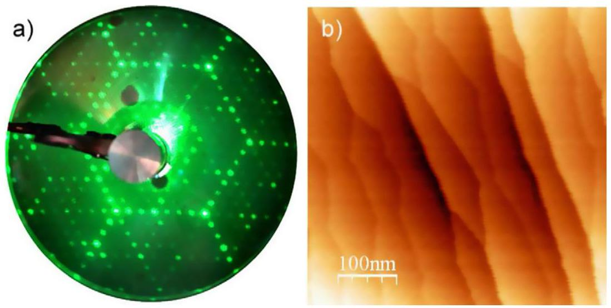
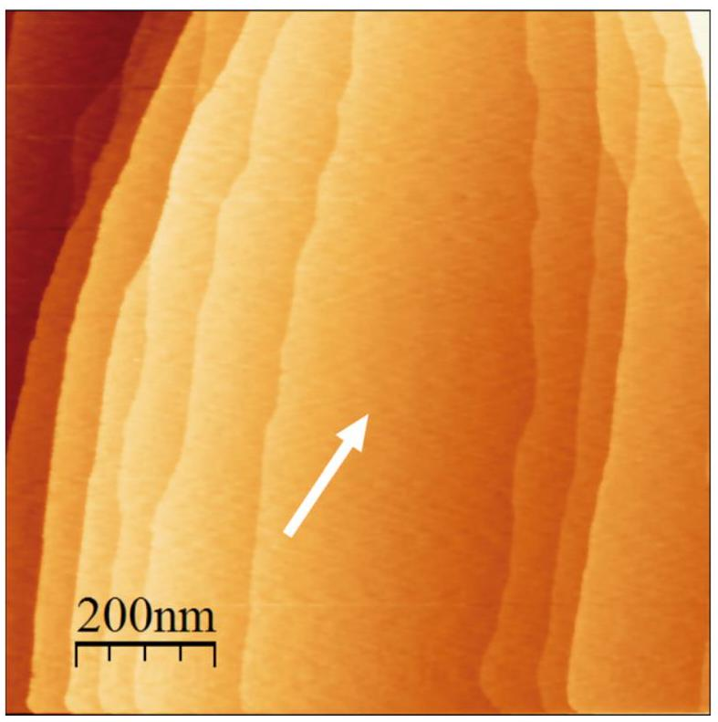
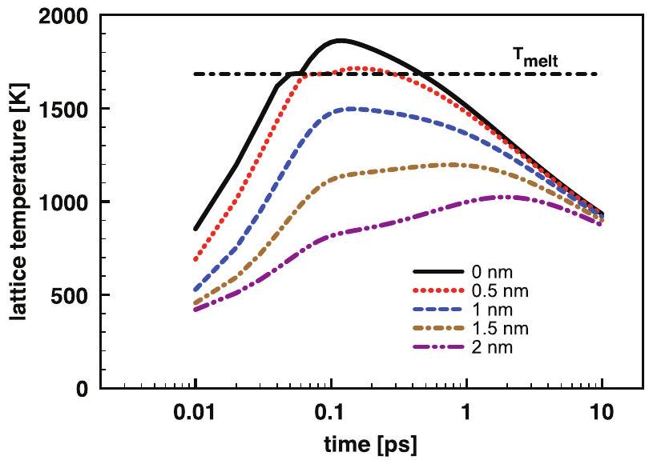
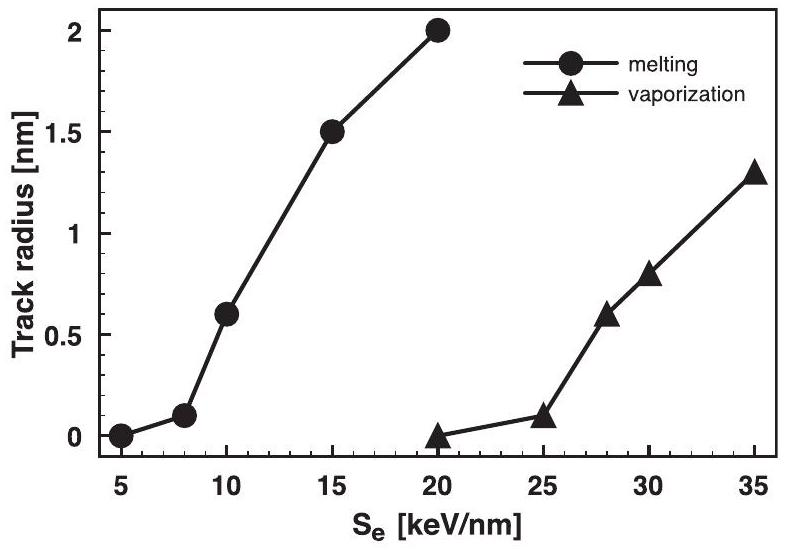
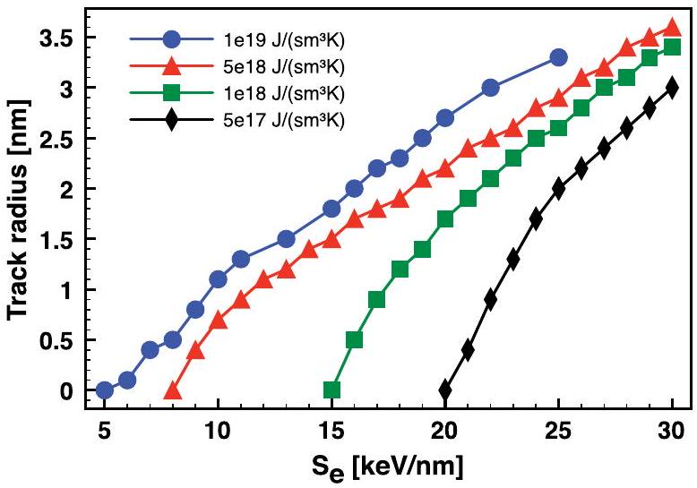
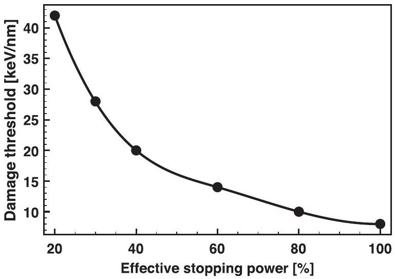

# Damage in crystalline silicon by swift heavy ion irradiation 

O. Osmani ${ }^{\text {a,b }}$, I. Alzaher ${ }^{\text {c }}$, T. Peters ${ }^{\text {a }}$, B. Ban d'Etat ${ }^{\text {c }}$, A. Cassimi ${ }^{\text {c }}$, H. Lebius ${ }^{\text {c }}$, I. Monnet ${ }^{\text {c }}$, N. Medvedev ${ }^{\text {d,b }}$, B. Rethfeld ${ }^{\mathrm{b}}$, M. Schleberger ${ }^{\mathrm{a}, *}$ ${ }^{\mathrm{a}}$ Fakultät für Physik and CeNIDE, Universität Duisburg-Essen, 47048 Duisburg, Germany ${ }^{\mathrm{b}}$ Department of Physics and OPTIMAS Research Center, Technical University of Kaiserslautern, 67653 Kaiserslautern, Germany ${ }^{\mathrm{c}}$ CIMAP (CEA-CNRS-ENSICAEN-UCBN), 14070 Caen Cedex 5, France ${ }^{\mathrm{d}}$ Center for Free-Electron Laser Science, DESY, 22607 Hamburg, Germany

## ARTICLE INFO

## Article history:

Received 25 July 2011
Available online 19 September 2011

## Keywords:

Swift heavy ions
Silicon
Thermal spike
Two-temperature model

#### Abstract

We have studied damage of crystalline Si surfaces induced by electronic energy loss of swift heavy ions with an electronic stopping power of up to $S_{e}=12 \mathrm{keV} / \mathrm{nm}$. Scanning tunneling microscope images of the surface after irradiation under perpendicular as well as glancing angles of incidence showed no surface damage. We have performed theoretical calculations for the damage threshold within the two temperature model, resulting in $S_{e}^{\text {th }}=8 \mathrm{keV} / \mathrm{nm}$ as the minimum stopping power to create a molten zone. We investigate the respective influence of the electron-phonon coupling, of the criterion at which the damage occurs and a possible effect of ballistic electrons. We show that the latter has the strongest effect on the calculated damage threshold.

© 2011 Elsevier B.V. All rights reserved.

## 1. Introduction

Many materials show permanent changes after dense electronic excitation. This can either be due to ultra-fast melting processes caused by the abrupt change in the atomic potential or to effective electron-phonon coupling. While the former process occurs on fs-timescales and the latter at much later times, both can give rise to permanent material modifications if the lattice does not return to its original state. The necessary primary excitation can be achieved by ultra-short laser pulses or by swift heavy ions (SHI). The resulting electronic distributions in space, time and energy for both excitations are quite different, but the number of excited charge carriers as well as the deposited energy are quite similar. It is therefore very surprising that in the case of silicon a laser shot can melt [1] and ablate the material, but for monoatomic swift heavy ions this has never been observed (see Ref. [2] and references therein). Only in the case of cluster ions permanent damage, so-called tracks, could be detected. The reason why crystalline silicon (c-Si) is so insensitive to SHI irradiation is still unknown. In this paper we present experimental data on SHI irradiation of c-Si surfaces and subsequent measurements performed under ultra high vacuum conditions as well as theoretical calculations based on the two-temperature model to evaluate the threshold necessary for melting and/or evaporation to occur at the surface of a Si crystal.

[^0]
## 2. Experimental results

It is known from the literature that energy deposition required for damaging amorphous silicon (a-Si) is below $S_{e}^{\text {th }}=17 \mathrm{keV} / \mathrm{nm}$ [3] while the threshold for $\mathrm{c}-\mathrm{Si}$ is above $S_{e}^{t h}=30 \mathrm{keV} / \mathrm{nm}$ [4-6]. The latter can only be achieved using cluster projectiles, $C_{60}$ for instance. The different thresholds may be due to the lower band gap in $\mathrm{c}-\mathrm{Si}$ ( 1.12 eV ) compared to a- $\mathrm{Si}(1.5 \mathrm{eV})$ [7] or to the larger mean free path of electrons in the crystalline material, which may act as a localization mechanism for the excitation energy [8]. In addition, it was suggested, that the melting temperature of a-Si maybe around 200 K lower than for c-Si [9].

So far all experiments have studied track formation in the volume and due to unavoidable contaminations were not sensitive to possible surface modifications. In our approach we study for the first time the irradiation effects on a well defined and atomically clean surface of $\mathrm{c}-\mathrm{Si}$. This gives the advantage of an increased sensitivity with respect to defect detection. In addition, most materials are much more sensitive to surface track than to bulk track creation [10,11].

Si (111) single crystals were annealed for 24 h at $650^{\circ} \mathrm{C}$ and then flash annealed to $1250^{\circ} \mathrm{C}$ by direct current heating in an ultra high vacuum (UHV) chamber with a base pressure of $p_{\text {base }} \leqslant 1 \times 10^{-10}$ mbar. This yielded a well ordered $7 \times 7$ reconstruction as confirmed by low energy electron diffraction (LEED), see Fig. 1(a). The samples where then transferred in situ into the scanning tunneling microscope (STM). Due to vibrations from the beamline, atomic resolution could not be achieved but flat terraces separated by steps could be clearly resolved, see Fig. 1(b).

Fig. 1. (a) LEED image of $\mathrm{Si}(111)$ surface after standard preparation procedure. The diffraction spots mirror the $7 \times 7$-reconstruction characteristic for the clean and relaxed Si (111) surface. (b) UHV-STM image of the Si(111)7 $\times 7$ after standard preparation procedure. The flat terraces are separated by atomic steps. No signs of contaminations are detected. The $7 \times 7$-reconstruction could not be resolved due to electronic and mechanical noise present at the beamline.

In the next step the samples were introduced under UHV conditions into the irradiation chamber, where the samples were exposed to a Xe ion beam with two kinetic energies, $0.625 \mathrm{MeV} / \mathrm{u}$ and $0.916 \mathrm{MeV} / \mathrm{u}$. This corresponds to a maximum stopping power of $S_{e}=12.1 \mathrm{keV} / \mathrm{nm}$ [12]. Irradiations under $\Theta=90^{\circ}$ as well as under glancing incidence angles of $\Theta=1.5-2^{\circ}$ with respect to the surface were performed. Fluences were varied between $2 \times 10^{9}$ ions/ $\mathrm{cm}^{2}$ and $2 \times 10^{10}$ ions $/ \mathrm{cm}^{2}$. Irradiation times were kept below 10 s as the pressure in the differentially pumped irradiation chamber was $p_{\text {base }} \approx 10^{-8} \mathrm{mbar}$.

After irradiation we checked all samples by STM, staying under UHV conditions, to see if irradiation damage was present. We found no signs of surface tracks or hillocks; a typical STM image after irradiation is shown in Fig. 2. As monoatomic steps with a height of $\simeq 3.1$ Å could be resolved with our setup, the typical damage due to grazing incidence irradiation consisting of surface tracks with nanometer-sized hillocks [ 13,14 ] should have been detectable. From this we conclude that up to stopping powers of

Fig. 2. UHV-STM image of $\mathrm{Si}(111) 7 \times 7$ after irradiation with $2 \times 10^{10} \mathrm{Xe}^{30+}$ ions $/ \mathrm{cm}^{2}$ under a glancing angle of incidence of $\Theta=1.5^{\circ}$. The arrow indicates the direction of the incoming beam. No signs of irradiation induced damage are detected.

$S_{e} \simeq 12 \mathrm{keV} / \mathrm{nm}$ it is not possible to create surface tracks on crystalline Si.

## 3. Theory

A theoretical approach that is commonly used to describe swift heavy ion interactions with matter is the so-called inelastic thermal spike model (I-TS) [15-19,8]. Within this framework the ion irradiation is treated in a three-step model. In the first step the electronic stopping power $S_{e}$ of the ion is used to excite the target electron system. Then, the excited electrons propagate diffusively through the target. The energy stored in the electronic system is then transferred to the phonon system via electron-phonon coupling and may finally lead to a local melting. The mathematical description is therefore based on a set of two coupled heat diffusion equations, one for the electron system and one for the phonon system. In one dimension it reads:

$$
\begin{aligned}
C_{e}\left(T_{e}\right) \frac{\partial T_{e}}{\partial t}(r, t)= & \nabla \cdot\left(\kappa_{e}\left(T_{e}\right) \nabla T_{e}(r, t)\right)-g \cdot\left(T_{e}(r, t)-T_{p}(\vec{r}, t)\right) \\
& +S(r, t)
\end{aligned}
$$

$$
C_{p}\left(T_{p}\right) \frac{\partial T_{p}}{\partial t}(r, t)=\nabla \cdot\left(\kappa_{p}\left(T_{p}\right) \nabla T_{p}(r, t)\right)+g \cdot\left(T_{e}(r, t)-T_{p}(r, t)\right) .
$$

Here, $\kappa_{e}\left(T_{e}\right)$ and $\kappa_{p}\left(T_{p}\right)$ denote the heat conductivity and $C_{e}\left(T_{e}\right)$ and $C_{p}\left(T_{p}\right)$ denote the specific heat capacity of the electrons and the lattice, respectively.

The source term $S(r, t)$, determines the energy density per unit time which is transferred to the electronic system by the penetrating ion. According to Ref. [20] (and references therein) $S(r, t)$ can be separated into spatial and time-dependent functions:

$$
S(r, t)=b S_{e} F(r) \cdot A(t),
$$

with $S_{e}$ the electronic stopping power. The temporal energy distribution of the electrons $A(t)$ is assumed to be of gaussian shape

$$
A(t)=\exp \left(-\frac{\left(t-t_{0}\right)^{2}}{2 \sigma^{2}}\right),
$$

where $t_{0}$ is the mean flight time of the initially excited electrons, the so-called $\delta$-electrons. Both $t_{0}$ and the half width of the gaussian $\sigma$ are assumed to be 1 fs [20]. The formulation of the spatial energy distribution of the electrons $F(r)$ is given by Waligorski et al. [21]. For the irradiation scenarios studied here most of the energy is
deposited within a few tens of nanometers from the ion impact point. $b$ is a normalization constant, so that the following relation is fulfilled:

$$
\int_{0}^{\infty} \int_{0}^{r_{m}} 2 \pi r b S_{e} A(t) F(r) \mathrm{d} r \mathrm{~d} t=S_{e} .
$$

Here $r_{m}$ is the maximum range of the $\delta$-electrons perpendicular to the ion's trajectory. Finally, $g$ is the coupling parameter between both subsystems. As was pointed out in e.g. [22] this is a very crucial parameter in the calculations and often unknown. Here, we initially set this parameter to a value of $g=5 \times 10^{18} \mathrm{~J} \mathrm{~s}^{-1} \mathrm{~m}^{-3} \mathrm{~K}^{-1}$ similar to [22,23].

Corresponding to the experiment the target is chosen to be crystalline silicon. The lattice specific heat capacity as well as the heat conductivity have been measured from 0 K up to $T_{\text {melt }}=1683 \mathrm{~K}$, the melting temperature of $\mathrm{c}-\mathrm{Si}$ [24]. Values for the liquid phase as well as the heat of fusion are taken from [17].

For the electron heat conductivity, a parametric function is given in [18]. However, no data on the electron specific heat capacity is available. From the free electron gas theory it is known that $C_{e}\left(T_{e}\right)$ for not too high temperatures is a linear function of the electron temperature, so that

$$
C_{e}\left(T_{e}\right)=\frac{\pi^{2} k_{B} n_{e}}{2} \frac{k_{B} T_{e}}{E_{F}},
$$

where $k_{B}$ is the Boltzmann constant, $n_{e}$ is the electron density and $E_{F}$ is the Fermi energy. For larger electron temperatures $C_{e}$ becomes constant: $C_{e}=\frac{3}{2} n_{e} k_{B}$. However, the electron density $n_{e}$ entering Eq. (6) is not known and will strongly depend on the transient electron dynamics during and after the irradiation [25]. For all calculations presented here, the electron density is estimated from the Fermi distribution of a thermally excited semiconductor to be $n_{e}=1 \times 10^{19} \mathrm{~cm}^{-3}$.

The solution of the I-TS according to Eqs. (1) and (2) yields spatially resolved electron and lattice temperature evolutions. In Fig. 3 the lattice temperature is shown for the irradiation scenario Uranium ions in c-Si with $S_{e}=10 \mathrm{keV} / \mathrm{nm}$. The lattice temperature exceeds the melting temperature within a radius of 0.6 nm from the point of the ion impact corresponding to a material modification within the same radius.

To identify the damage threshold, i.e. the minimum energy loss of the projectile required to measurably modify the target, various calculations with a varying stopping power are performed. The results of these calculations are shown in Fig. 4, where the radius

Fig. 3. Lattice temperature evolution for different radii from the ion impact point calculated for the irradiation scenario $U$ in c-Si with $S_{e}=10 \mathrm{keV} / \mathrm{nm}$. The lattice temperature exceeds the melting temperature $T_{\text {melt }}$ within a radius of 0.6 nm from the ion impact.

Fig. 4. Radius of the modified area vs. the ion stopping power. Electron-phonon coupling $g=5 \times 10^{18} \mathrm{~J} \mathrm{~s}^{-1} \mathrm{~m}^{-3} \mathrm{~K}^{-1}$. Circles: modification due to melting of the target. Triangles: modification due to vaporization. Lines to guide the eye.

of the modified area is shown versus the corresponding stopping power. The circles denote the radius of the damaged area under the assumption that the material has to be in a molten state. From this, the damage threshold is found to be around $S_{e}^{\text {th }}=8 \mathrm{keV} / \mathrm{nm}$, yielding a modification within a radius of 0.1 nm . Our experiment was performed with a stopping power of $12 \mathrm{keV} / \mathrm{nm}$, which should lead to a modification with a radius of around 1 nm . However, no modifications were observed, see Fig. 2. Thus it is evident, that the damage threshold of $S_{e}^{\text {th }}=8 \mathrm{keV} / \mathrm{nm}$ found within the I-TS is much too low.

An experimental observation requires that the material modification leading to the damage is permanent, or exists at least on a time scale of minutes to hours. Therefore, the discrepancy between the experimental and theoretical findings might be explained in such a way, that the modification induced by the melting of the target anneals during the cooling down of the lattice. This recrystallisation process would not be possible if the material is actually vaporized. Therefore, the same calculation as before is repeated, but instead of assuming that the melting of the target is sufficient to induce an observable modification, it is assumed that the lattice has to reach the vaporization temperature $T_{\text {vap }}=3107 \mathrm{~K}$ [17]. This is shown by the triangles in Fig. 4. Using the criterion of vaporization the damage threshold in c-Si is found to be $S_{e}^{t h}=25 \mathrm{keV} / \mathrm{nm}$, thus increasing the threshold by a factor of 3 , as compared to the melting criterion. This threshold is still significantly smaller than the experimental determined values for bulk c-Si but well above the value used in our experiment.

As was mentioned in the beginning of this section, the electronphonon coupling $g$ is a crucial parameter, however, it is unknown for $\mathrm{c}-\mathrm{Si}$. Changing the value of $g$ will affect the calculated damage threshold. To account for the unknown electron-phonon coupling, a series of calculations are performed, in which the coupling constant is varied in a physically reasonable range from $5 \times 10^{17}$ to $1 \times 10^{19} \mathrm{~J} \mathrm{~s}^{-1} \mathrm{~m}^{-3} \mathrm{~K}^{-1}$. It should be noted here, that only the melting criterion was applied. The result is shown in Fig. 5.

Apparently, the decrease of the electron-phonon coupling leads to an increase of the damage threshold. The decrease of $g$ within one order of magnitude, from $5 \times 10^{18}$ to $5 \times 10^{17} \mathrm{~J} \mathrm{~s}^{-1} \mathrm{~m}^{-3} \mathrm{~K}^{-1}$, leads to an increase of the damage threshold from 8 to $21 \mathrm{keV} /$ nm , respectively. A change of the electron-phonon coupling of one order of magnitude leads to roughly the same change of the calculated damage threshold, that was observed when changing the criterion required for the modification. Thus, the electron-phonon coupling as well as the choice of the criterion are of equal importance when calculating the damage threshold.

Fig. 5. Radius of the modified area vs. the ion stopping power for different electron-phonon coupling constants. Melting of the target was assumed as the criterion for damage. Lines to guide the eye.

One of the main drawbacks of the I-TS (in addition to the unknown parameters) is the fact that it makes use of thermodynamical equations to describe a non-equilibrium situation. Especially, the electron temperature is ill-defined at times shorter than some 100 fs . An approach, that deals with non-equilibrium electrons, has been described in [26,27]. Within this approach, the electron dynamics after the ion impact is studied in detail using the Monte Carlo method. It was observed that holes, created by the ionization of target atoms, accumulate around $80 \%$ of the energy loss experienced by the incoming ion [28]. Energy stored in holes is released due to Auger decays on a longer timescale, than the timescale of the interaction between the incoming ion and the target electrons. Furthermore, it was found that highly energetic electrons, the $\delta$-electrons, transport their energy away from the ion impact point, rather than confining the energy locally as was assumed in [8]. Additionally, it was suggested, that the electron energy deposition profile $S(r, t)$ cannot simply be assumed to be a product of a spatial and temporal function [29,30], as is done in Eq. (3).

However, a detailed study as performed for a different system in [30] is time consuming, and will be discussed in a forthcoming paper. Here, we estimate the effects of these non-thermal, ballistical electrons on the source term $S(r, t)$ in a simpler way, by introducing an effective stopping power. By introducing an effective stopping power, we account for the different loss channels, like described above. A series of calculations have been performed in which it is assumed, that only a certain percentage of the stopping power is transferred into thermal electrons. Thus, an effective stopping power of $100 \%$, means that the total electronic stopping power $S_{e}$ is used in Eq. (3), thus reproducing the results shown in Fig. 4, while $20 \%$, means that only $20 \%$ of the stopping power is used in Eq. (3), i.e. $80 \%$ of the stopping power is carried away far from the trajectory by $\delta$-electrons. The calculations are performed using an electron-phonon coupling $g=5 \times 10^{18} \mathrm{~J} \mathrm{~s}^{-1} \mathrm{~m}^{-3} \mathrm{~K}^{-1}$ and the melting criterion. For each effective stopping power the corresponding damage threshold is computed and shown in Fig. 6.

Reducing the effective stopping power increases the damage threshold, however, this effect is nonlinear. This non-linearity originates from the interplay between transport of the electrons' and phonons' energy and the electron-phonon coupling itself, which is also observed in Figs. 4 and 5. Reducing the effective energy loss from $100 \%$ down to $20 \%$ increases the damage threshold from $8 \mathrm{keV} / \mathrm{nm}$ up to $42 \mathrm{keV} / \mathrm{nm}$, making this the most effective contribution studied in this work, compared to the change of the elec-tron-phonon coupling $g$ and the damage criterion. With respect to our experiment, the effective stopping power would have to

Fig. 6. Damage threshold vs. effective stopping power. Electron-phonon coupling $g=5 \times 10^{18} \mathrm{~J} \mathrm{~s}^{-1} \mathrm{~m}^{-3} \mathrm{~K}^{-1}$. Melting of the target was assumed as the criterion for damage. Line to guide the eye.

be less than $\simeq 70 \%$ of the total stopping power to be in agreement with our observation, that up to $S_{e}=12 \mathrm{keV} / \mathrm{nm}$ no modifications are created. However, as we have shown before, the threshold depends on the other parameters as well and without further detailed studies it is impossible to calculate the correct value.

## 4. Conclusion

In spite of the fact that an accurate calculation will require a good knowledge of the electron-phonon coupling, our results suggest that the electronic properties of the target material play a dominant role. That is, it is important to have a detailed model of the electronic excitation process during and after the irradiation with a swift heavy ion and thus a more realistic estimate of the resulting electron energy distribution. Such kind of information cannot be obtained by using the simple expression given by Eq. (3). Detailed studies of the electron excitation processes in nonmetallic systems applying a Monte Carlo technique for swift heavy ion irradiation [26,27] and proton irradiation [29] have already been reported. In addition, a hybrid approach has successfully been applied for the case of $\mathrm{SiO}_{2}[23,30]$. In the case of $\mathrm{c}-\mathrm{Si}$ a complete picture in agreement with experimental observations will emerge only after combining different methods as Monte Carlo, I-TS as well as molecular dynamics.

## Acknowledgements

We thank the SFB 616: Energy dissipation at surfaces and the research Center OPTIMAS for financial support. This work has been supported by the European Community as an Integrating Activity Support of Public and Industrial Research Using Ion Beam Technology (SPIRIT) under EC Contract No. 227012. The experiments were performed at the IRRSUD beamline of the GANIL facility in Caen, France.

## References

[1] C.V. Shank, R. Yen, C. Hirlimann, Phys. Rev. Lett. 51 (1983) 900.
[2] N. Itoh, D.M. Duffy, S. Khakshouri, A.M. Stoneham, J. Phys. Condens. Matter 21 (2009) 474205.
[3] S. Furuno, H. Otsu, K. Hojou, K. Izui, Nucl. Instr. Meth. B 107 (1-4) (1996) 223226.
[4] B. Canut, N. Bonardi, S.M.M. Ramos, S. Della-Negra, Nucl. Instr. Meth. B 146 (1998) 296.
[5] A. Dunlop, G. Jaskierowicz, S. Della-Negra, Nucl. Instr. Meth. B 146 (1998) 302.
[6] A. Kamarou, W. Wesch, E. Wendler, A. Undisz, M. Rettenmayr, Phys. Rev. B 78 (2008) 054111.
[7] A.V. Shah, J. Meier, E. Vallat-Sauvain, N. Wyrsch, U. Kroll, C. Droz, U. Graf, Sol. Energ. Mater. Sol. Cells 78 (1-4) (2003) 469-491.
[8] E. Akcöltekin, S. Akcöltekin, O. Osmani, A. Duvenbeck, H. Lebius, M. Schleberger, New J. Phys. 10 (2008) 053007.
[9] Michael O. Thompson, G.J. Galvin, J.W. Mayer, P.S. Peercy, J.M. Poate, D.C. Jacobson, A.G. Cullis, N.G. Chew, Phys. Rev. Lett. 52 (1984) 2360-2363.
[10] C. Ronchi, J. Appl. Phys. 44 (1973) 3575.
[11] M. Karlusic, S. Akcöltekin, O. Osmani, I. Monnet, H. Lebius, M. Jaksic, M. Schleberger, New J. Phys. 12 (2010) 43009.
[12] J.F. Ziegler, J.P. Biersack. The Stopping and Range of Ions in Matter (SRIM). Available from: [http://www.srim.org/](http://www.srim.org/), 2008.
[13] E. Akcöltekin, Th. Peters, R. Meyer, A. Duvenbeck, M. Klusmann, I. Monnet, H. Lebius, M. Schleberger, Nat. Nanotechnol. 2 (5) (May 2007) 290-294.
[14] S. Akcöltekin, E. Akcöltekin, T. Roll, H. Lebius, M. Schleberger, Nucl. Instr. Meth. B 267 (2009) 1386.
[15] M. Kaganov, I. Lifshitz, L. Tanatarov, Zh. Eksp. Teor. Fiz. 31 (1956) 232.
[16] S.I. Anisimov, B.L. Kapeliovich, T.L. Perel'man, Sov. Physi. JETP 39 (1974) 375.
[17] M. Toulemonde, C. Dufour, E. Paumier, Phys. Rev. B 46 (1992) 14362-14369.
[18] J.K. Chen, D.Y. Tzou, J.E. Beraun, Int. J. Heat Mass Transfer 48 (3-4) (2005) 501509.
[19] M. Caron, H. Rothard, M. Toulemonde, B. Gervais, M. Beuve, Nucl. Instr. Meth. B 245 (2006) 36-40.
[20] Z.G. Wang, Ch. Dufour, E. Paumier, M. Toulemonde, J. Phys. Condens. Matter 6 (1994) 6733.
[21] M.P.R. Waligorski, R.N. Hamm, R. Katz, Nucl. Tracks Radiat. Meas. 11 (1986) 309.
[22] O. Osmani, H. Lebius, B. Rethfeld, M. Schleberger, Laser Part. Beams 28 (2010) 229.
[23] O. Osmani, N. Medvedev, M. Schleberger, B. Rethfeld, e-J. Surf. Sci. Nanotech. 8 (2010) 278.
[24] R.F. Wood, G.E. Giles, Phys. Rev. B 23 (6) (Mar 1981) 2923-2942.
[25] O. Osmani, N. Medvedev, M. Schleberger, B. Rethfeld, Phys. Rev. B, submitted for publication.
[26] N.A. Medvedev, A.E. Volkov, N.S. Shcheblanov, B. Rethfeld, Phys. Rev. B 82 (2010) 125425.
[27] N.A. Medvedev, A.E. Volkov, B. Rethfeld, N.S. Shcheblanov, Nucl. Instr. Meth. B 268 (2010) 2870-2873.
[28] N.A. Medvedev, A.E. Volkov, AIP Conf. Proc. 999 (2008) 238-244.
[29] A. Akkerman, M. Murat, J. Barak. Nucl. Instr. Meth. B 269 (2011) 16301633.
[30] N. Medvedev, O. Osmani, B. Rethfeld, M. Schleberger, Nucl. Instr. Meth. B 268 (2010) 3160.

[^0]:    * Corresponding author.

    E-mail address: marika.schleberger@uni-due.de (M. Schleberger).

