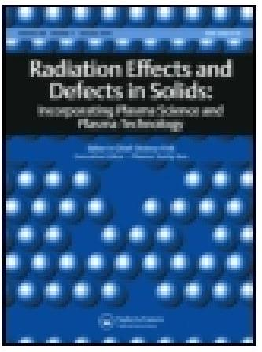
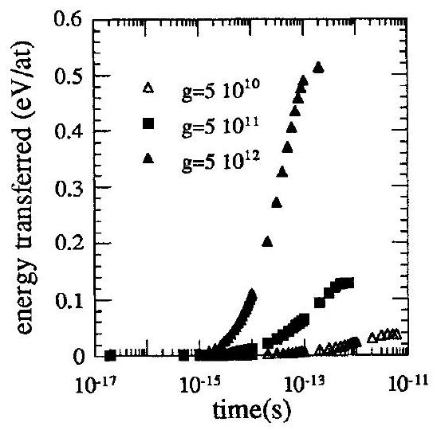
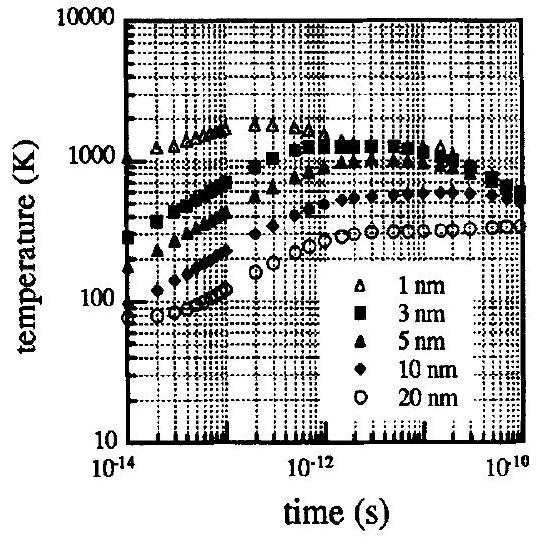
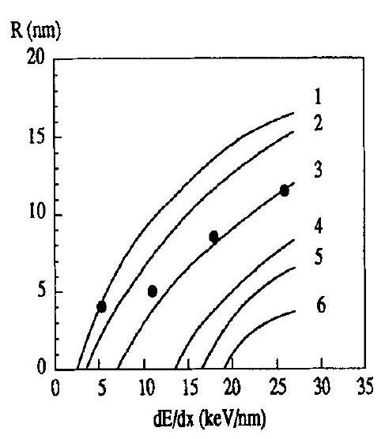
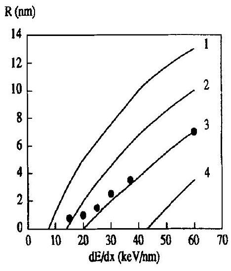

# Thermal spike model in the electronic stopping power regime 

M. Toulemonde, E. Paumier \& C. Dufour

To cite this article: M. Toulemonde, E. Paumier \& C. Dufour (1993) Thermal spike model in the electronic stopping power regime, Radiation Effects and Defects in Solids, 126:1-4, 201-206, DOI: 10.1080/10420159308219709

To link to this article: https://doi.org/10.1080/10420159308219709

Published online: 19 Aug 2006.

Submit your article to this journal

Article views: 462

View related articles

Citing articles: 12 View citing articles

# THERMAL SPIKE MODEL IN THE ELECTRONIC STOPPING POWER REGIME 

M, TOULEMONDE*, E. PAUMIER ${ }^{+*}$ and C. DUFOUR ${ }^{+}$ + CIRIL, BP 5133, F-14040 Caen Cedex, France * LERMAT, ISMRa, Boulevard Maréchal Juin, F-14050 Caen Cedex, France

#### Abstract

Two models have been proposed in order to explain the appearance of latent tracks induced in matter by the slowing down process of ions in the electronic stopping power regime. The first one was the thermal spike proposed by Desauer and reconsidered for metals by Seitz and Koehler. The second one was the ionic spike proposed by Fleischer et al in order to explain that metals are insensitive to the electronic excitation produced by fission fragment irradiations. In both models the key is the high mobility of the electrons in metals. The ionic spike model was considered as ineffective because of the too quick screening by the return electrons which inhibits a Coulomb impulse. In the thermal spike model the electronic energy was considered as spread out in a too large volume to induce a significant increase of the lattice temperature. Since that time a systematic use of heavy ion accelerators has enlarged the number of materials (metals, semiconductors and insulators) which present a defect creation induced by heavy ions in electronic stopping power ( $\mathrm{dE} / \mathrm{dx}$ ) regime. Especially amorphous materials where the electron mobility is greatly reduced, are more sensitive than the same materials in their crystalline phase. Hence both models must be considered. D. Lesueur has reconsidered the ionic spike model while in this paper the thermal spike model will be revisited, enlightened by all the recent experiments using fs laser irradiations.

## 1-Introduction

It is difficult to know which mechanism is involved in the defect creation resulting from the high electronic excitation and ionization induced by the slowing down ( $\mathrm{dE} / \mathrm{dx}$ ) of a heavy ion in the matter. Indeed, in the course of time, if there is atomic motion induced in a very short time ( $<10^{-13} \mathrm{~s}$.) by a mechanism described by Fleisher et al [1] in insulators and adapted to metallic materials by Klaumunzer et al [2] and D. Lesueur [3], the question is to know whether the defects observed at rest results from the initial atomic motion and/or are a consequence of a huge local important increase of the lattice temperature which could erase the previous atomic motion. This increase of temperature will come from an energy transfer from the electrons to the lattice atoms through the electron electron and electron lattice interactions. This description is known as the thermal spike model [4-9]. The main problem is to know in which volume the electron energy will be spread in the lattice before it is shared with the atoms. This will be the object of the present paper. In a first part, the basic equations of the thermal spike model will be given and the previous lattice temperature estimates will be discussed, enlightened by recent measurements of the electron diffusivity De and electron lattice interaction time $\tau$ using high power $10^{-15} \mathrm{~s}$ (fs) laser pulses [10-18]. In a second part, a first calculation will be performed in order to determine the deposited energy on the lattice atoms versus the electronic stopping for different mean values of De and $\tau$. In a third part supposing that melting occurs, we shall calculate the radii of the latent tracks as observed in a-Ge and a-Si by Izui and Furuno [19] assuming that the latent tracks correspond to a rapid quench of the liquid phase. A discussion of the parameters ( $\mathrm{D}_{\mathrm{e}}$ and $\tau$ ) will be done. The calculation will also be applied to the a- $\mathrm{Fe}_{85} \mathrm{~B}_{15}$ for which the measured cross section Sd will be related to the radius of the latent track [20]. The calculations were performed especially for amorphous materials for which it is known that the electron lattice interaction is higher than in to the same materials in their crystalline phase.

## 2-The thermal spike

In the framework of this model it is supposed that the slowing down of a heavy ion in a solid leads to a rapid heating of the electron subsystem to temperature $\mathrm{T}_{\mathrm{e}}$ comparable to the Fermi energy $\mathrm{E}_{\mathrm{F}}$. A highly non equilibrium region then arises in the solid with hot electrons and a cold lattice. Cooling of the electron subsystem occurs as a result of energy transport by electronic heat conduction to a larger volume and also as a result of electron lattice interactions leading to heating of the crystal atoms. As usual [21] the energy balance equations has the following form in cylindrical geometry:

$$
\begin{aligned}
& \rho \mathrm{Ce}(\mathrm{Te}) \frac{\delta \mathrm{Te}}{\delta \mathrm{t}}=\frac{\delta}{\delta \mathrm{r}}\left(\mathrm{Ke}(\mathrm{Te}) \frac{\delta \mathrm{Te}}{\delta \mathrm{r}}\right)+\frac{\mathrm{Ke}(\mathrm{Te})}{\mathrm{r}} \frac{\delta \mathrm{Te}}{\delta \mathrm{r}}-\mathrm{g}(\mathrm{Te}-\mathrm{T})+\mathrm{A}(\mathrm{r}, \mathrm{t}) \\
& \rho \mathrm{C}(\mathrm{~T}) \frac{\delta \mathrm{T}}{\delta \mathrm{t}}=\frac{\delta}{\delta \mathrm{r}}\left(\mathrm{~K}(\mathrm{~T}) \frac{\delta \mathrm{T}}{\delta \mathrm{r}}\right)+\frac{\mathrm{K}(\mathrm{~T})}{\mathrm{r}} \frac{\delta \mathrm{~T}}{\delta \mathrm{r}}+\mathrm{g}(\mathrm{Te}-\mathrm{T})
\end{aligned}
$$

where $\mathrm{Ce}, \mathrm{C}$ and $\mathrm{Ke}, \mathrm{K}$ are the specific heat and the thermal conductivity for the electronic system and lattice respectively, $\rho$ is the material density, $g$ is the electron-atom coupling and A ( $\mathrm{r}, \mathrm{t}$ ) is the energy [22-23] brought on the electronic system in a time of the order or less than the electronic thermalization one and $\mathbf{r}$ the radius in a cylindrical geometry with the heavy ion path as the axis. These equations are non-linear since all the parameters are temperature dependant. Till now nobody has solved such a system of equations in their general forms and only various limiting cases were considered [4-6].

Lattice temperature was estimated for noble metals [Cu, Ag and Au] by Seitz and Koehler [4], Lifshitz et al [5] and more recently by Martynenko and Yavlinskii [6]. In the case of an irradiation by fission fragments the calculated temperature increase ( $\Delta \mathrm{T}$ ) varies between 50 to 500 K using $\mathrm{g}=10^{10} \mathrm{Jcm}^{-3} \mathrm{~K}^{-1} \mathrm{~s}^{-1}$. As temperature increase is proportionnal to $\mathrm{dE} / \mathrm{dx}[5], \Delta \mathrm{T}$ could reach 150 K to 1500 K for a uranium irradiation. This $\Delta \mathrm{T}$ range is very wide and has to be refined since in some metals like Hg and Ga the fusion point could be reached. Using the formalism of Lifshitz et al [5] $\Delta \mathrm{T}$ is proportionnal to g . In recent determinations using fs laser irradiation [10], g is found between $310^{10} \mathrm{~J} \mathrm{~K}^{-1} \mathrm{~cm}^{-3} \mathrm{~s}^{-1}$ for copper and $510^{12} \mathrm{~J} \mathrm{~K}^{-1} \mathrm{~cm}^{-3} \mathrm{~s}^{-1}$ for vanadium. Such a large increase of $g$ was predicted by Seitz and Koehler for transition metals. This leads to a $\Delta \mathrm{T}$ increase of the order of 50000 K as it was expected [4]. Such temperature value would have important effects on atomic motion. Once more the $\Delta \mathrm{T}$ determination has to be refined.

In this model, the main parameter is the electron mean free path, $\lambda=\sqrt{\mathrm{De}} \tau$. The precise determination of these parameters ( $\mathrm{De}, \tau$ ) is not easy since the electron and lattice systems are not in equilibrium. However, from the recent experiments of fs laser irradiation, range of these parameters can be given. The parameter $\tau$ is linked to $\mathrm{g}[5,10]$. Using the quoted fs laser irradiation [10] $\tau$ varies between $10^{-13}$ for transition metals to $210^{-12} \mathrm{~s}$ for noble metals.In the framework of the free electron gas model $[24-25] \mathrm{De}=\mathrm{Ke} / \mathrm{Ce}$ which is proportional to the electron electron time interaction τe [24]. A mean value of τe between 4 and $810^{-16} \mathrm{~s}$ was experimentally determined in a-Si [13]. Then a mean value of De [24] can be deduced: $\mathrm{De}=3$ $20 \mathrm{~cm}^{2} / \mathrm{s}$ in agreement with the expectation of Seitz and Koehler [4]. Using these estimates of De and $\tau$, mean $\lambda$ values will be found approximately between 5 to 70 nm which define the radius of the cylinder in which the energy deposited on the electron is given to the lattice atoms.

fig 1: $\mathrm{E}=\int \mathrm{g}\left(\mathrm{T}_{\mathrm{e}}-\mathrm{T}\right) \mathrm{dt}$ for $\mathrm{T}_{\mathrm{e}}>\mathrm{T}$ versus the time for different values of the electron lattice strength g ( in $\mathrm{W} \mathrm{cm}^{-3} \mathrm{~K}^{-1}$ ), for $\mathrm{dE} / \mathrm{dx}=20 \mathrm{keV} \mathrm{nm}^{-1}$ at $\mathrm{r}=5 \mathrm{~nm}$.

fig 2 : Temperature versus time for a- $\mathrm{Fe}_{85} \mathrm{~B}_{15}$ at different values of $r$ (see insert) for $\lambda=19 \mathrm{~nm}$ and $\mathrm{dE} / \mathrm{dx}=30 \mathrm{keV} \mathrm{nm}^{-1}$.

fig 3 : radius of the cylinder of liquid matter versus $\mathrm{dE} / \mathrm{dx}$ in a- Ge for different values of $\lambda$ : $7,9,14,19,21,25 \mathrm{~nm}$ for the curves labelled 1 to 6 respectively. The squares are the experimental points obtained by Izui and Furuno[19].

fig 4 : same as fig 3 for a- $\mathrm{Fe}_{85} \mathrm{~B}_{15}$
$\lambda: 7,14,19,25 \mathrm{~nm}$ for the curves labelled 1 to 4 respectively. The squares are deduced from A.Audouard et al [20].

## 3-Determination of the energy transferred to the lattice atoms

Using the calculation performed by C . Dufour et al [this conference], $\int \mathrm{g}(\mathrm{Te}-\mathrm{T}) \mathrm{dt}=\mathrm{E}$ was computed by solving the two coupled equations and by stopping the calculation when $\mathrm{T}_{\mathrm{e}}<\mathrm{T}$. In the free electron gas model, $\mathrm{Ce}=\gamma \mathrm{Te}$ and $\mathrm{Ke}=\alpha \tau \mathrm{eTe}$ where $\alpha$ and $\gamma$ are constant. Applying the calculation for the amorphous germanium [24] the electron diffusivity is equal to $13 \mathrm{~cm}^{2} / \mathrm{s}$ if we take a mean value of $\tau e=10^{-15} \mathrm{~s}$ [13]. The E variation versus time is reported in figure 1 for different values of g . In this calculation E is less sensitive on the lattice parameter while it is on the coupling constant. Then E can be of the same range as the energy necessary to melt a material ( $\sim 0.1 \mathrm{eV} /$ at to $1.3 \mathrm{eV} /$ at ) and each material has to be studied specifically. However it can be seen that for d-shell metals for which high g-values have been measured [10] we get the higher value of E as expected by Seitz and Koehler. In conclusion the occurence of melting would result from a favorable combination of the g value and of the energy necessary to melt for a specific material. Moreover this energy deposited in a time longer than $10^{-13}-10^{-12} \mathrm{~s}$ could induce rearrangement of previous atomic displacement made by a mechanism which could exist at shorter time.

## 4-Track radius in amorphous materials

As in part three it has been seen that the energy deposited could be higher that the energy necessary to melt, the second equation corresponding to the lattice temperature will be numerically solved by assuming an analytical solution of the first equation [5,27]. This approximation is valid because the electron electron interaction time is at least one order of magnitude less than the electron lattice interaction time. Consequently the solution of the first equation can be supposed in a steady state as compared to the solution of the second equation. It is also assumed that melting can occur in a time of $10^{-13} \mathrm{~s}$. This supposition is supported by molecular dynamics calculations of energetic displacement cascades [26] and observed by time resolved Raman spectroscopy performed in AsGa using fs laser pulses [27]. The E calculation shows that the maximum of the deposited energy occurs also in $10^{-13} \mathrm{~s}$ for $\mathrm{g}=510^{12} \mathrm{J} \mathrm{K}^{-1} \mathrm{~cm}^{-3} \mathrm{~s}^{-1}$. The first evolution of the lattice temperature calculation versus time was, to our knowledge, performed by Izui [9] in order to explain the latent track observations made in nano-crystalline Ge and MgO : the smaller the grain size the higher the lattice temperature. But he did not show any direct correlation between the radius of the latent track and a melting phase. Szenes [28] has used the thermal spike model in order to explain the giant dimensional change (GDC) observed in PdSi [29]. The basic idea of the model is that if $\mathrm{dE} / \mathrm{dx}$ is high enough amorphous materials can melt along the trajectory of a high-energy ion and cool down within $10^{-11} \mathrm{~s}$ leading to a cooling rate of the order of $10^{14} \mathrm{~K} / \mathrm{s}$. When producing amorphous foil this rate is usually less than $10^{6} \mathrm{~K} / \mathrm{s}$. It is reasonable to suppose that in an amorphous metallic alloys material the concentration of structural defects is a monotonous function of the cooling rate. So in a certain volume along the trajectory the concentration of structural defects is believed larger along the high-energy ion path than it was initially. This is the mechanism by which structural defects can be created in amorphous materials in excess to those arising from elastic nuclear collisions. Their number is much larger than the value calculated from displacement cross-section as it is shown by Audouard et al [20]. Using this model Szenes was able to explain the GDC feature and to determine the value of the radius of the melted zone and its mean temperature.

A complete calculation of the lattice temperature evolution [29] was performed for a- $\mathrm{Ge}, \mathrm{a}-\mathrm{Si}$ [19] and a-Fe85B15 [20]. Using realistic value of $\lambda$, the objective of this calculation was to know wether it is possible to reproduce the latent track radii observed in a-Ge and a-Si by electron microscopy or deduced from a phenomenological analysis of the initial resistivity increase [20] in a-Fe85B ${ }_{15}$. A numerical solution of the second equation was developed to take into account the temperature variation of all the thermodynamical parameters of the lattice including phase change (solid -> liquid). The amorphous semi-conductors were chosen because
the temperature evolution of all the lattice parameters, melting temperature and latent heat of fusion, are known. Estimates of these parameters were deduced for the a-Fe85B15 from comparison to other amorphous materials. The net result of the calculation is given in figure 2 which shows the temperature evolution versus time for different values of r in a-Fe85B15 [30]. Then the radius of the latent track, assumed to correspond to a rapid quench of the liquid phase, is reported versus $\mathrm{dE} / \mathrm{dx}$ in fig. 3 and 4 for different values of $\lambda$. The best $\lambda$ values were 14 nm and 19 nm for semi-conductors (a-Ge, a-Si) and for the metallic alloy (a-Fe85B15) respectively. The difference can be interpreted as follows : as the both subsystem (hot free electrons and cold atoms) are not in equilibrium the electron thermal diffusivity will follow the free electron gas model whatever the material (semi-conductor or metallic). Hence the larger value of $\lambda$ for a-Fe85B 15 metal leads to a larger value of $\tau$ as it expected for a metallic material as compared to a semi-conductor.

## 5-Conclusion

The thermal spike model was developed with several approximations on the electron energy diffusivity. In this frame it was calculated that the energy which is deposited on the atoms by the electron lattice interaction could be of the same order or bigger than the energy necessary to melt. Moreover, assuming that melting could occur in volume for amorphous materials, it was possible to reproduce the experimentally deduced radii of latent tracks in several amorphous materials (semi-conductors and metallic materials). As till now only one equation has been really solved here, we must now go further in order to ensure this first results : both equations must be solved numerically. This objective has just been performed for amorphous materials [C. Dufour et al, this conference]. Next this calculation must be extended to crystalline materials for which new interesting results have been obtained like Ni [31], Ge [32], Fe , Ti [33], Bi [34]. For these specific materials if it will be easy to calculate what will be the energy deposited on the atoms by the electron lattice interaction using only the first equation, it will be more difficult to know how this energy will relax in the matrix. For material for which the solid density is higher than the liquid density like $\mathrm{Ni}, \mathrm{Fe}, \mathrm{Ti}$, superheating could occur due to a pressure increase induced by the temperature increase. However in the $\mathrm{Ni}, \mathrm{Ge}$ and Fe case a significative decrease of nuclear defect creation [4,5] is explained by a higher electron lattice interaction than in noble metal like Cu [31] and it should be noted that a large g value has been measured for Ti [10]. Bi is a specific case since the solid density is less than the liquid density. A local increase of the pressure will decrease the melting temperature. This could explain the big effect observed in this material after a uranium irradiation. This last question is now for insulator materials. We think that calculations have to be performed since Sigrist and Balzer [35] have shown that the chemical etching threshold evolution for different insulators cannot be scaled by the physical parameters which describe the Coulomb explosion model [1] while it follows the thermodynamic parameter of the lattice. So thermal spike model has to be deepened in order to know if significative discrepancies could appear.

## References

1] R.L. Fleisher, P.B. Price and R.M. Walker Nuclear Tracks in Solids, University of California Press (1975).
[2] S. Klaumunzer, Ming-Dong Hou and G. Schumacher, Phys. Rev. Lett. 57 (1986) 850
[3] D. Lesueur, this conference
[4] F. Seitz and J.S. Kochler, Sol. St. Phys. 2 (1956) 305
[5] I.M. Lifshitz, M.I. Kaganov and L.V. Tanatarov, J. Nucl. Energ. A12 (1960) 69
[6] Yu V. Martynenko and Yu N. Yavlinskii, Atom. Ener. 62 ( 1987) 80
[7] L.T. Chadderton and I. Mac Torrens , "Fission damage in crystals" Metheun, London (1969)
[8] K.L. Merkle, Phys. Rev. Lett. 9 (1962) 150
[9] K. Izui, J. Phys. Soc. Jpn 20 (1965) 915
[10] S.D. Brorson, A. Kazeroonian, J.S. Moodera, D.W. Face, T.K. Cheng, E.P. Ippen, M.S. Dresselhaus and G. Dresselhaus, Phys. Rev. Lett. 64 (1990) 2172
[11] S.D. Brorson, J.G. Fujimoto and E.P. Ippen, Phys. Rev. Lett. 59 (1987) 1962
[12] P.B. Allen, Phys. Rev. Lett. 59(1987) 1460
[13] A. Mourchid, D. Hulin, R. Vanderhagen, W.L. Nigan Jr, K. Gzara and P.M. Fauchet, Sol. St. Com. 74 ( 1990) 1197
[14] P.B. Corkum, F. Brunel, N.K. Sherman and T. Srinivasan-Rao, Phys. Rev. Lett. 61 (1988) 2886
[15] P. Saeta, J.K. Wang, Y. Siegal, M. Bloembergen and E. Mazur, Phys. Rev. Lett. 67 (1991) 1023
[16] H.W.K. Tom, G.D. Aumiller and C.H. Brito-Cruz, Phys. Rev. Lett. 60 (1988) 1438
[17] Yu V. Martynenko and Yu N. Yavlinskii - Sov. Phys. Dokl. 28 (1983) 391
[18] D. Hulin, A. Antonetti, A. Migus and C. Tanguy, Energy Beam - Solid Interactions and Transient Processing ed. by V.T. Nguyen and A.G. Cullis (les éditions de Physique) 71
[19] K. Izui and S. Furuno - Proc. XI ${ }^{\text {th }}$ Int. Cong. on Elec. Micr. (Kyoto 1986) 1299
[20] A. Audouard, E. Balanzat, G. Fuchs, J.C. Jousset, D. Lesueur and L. Thome, Europhys. Lett. 3 (1987) 327 and private communication
[21] M.I. Kaganov, I.M. Lifshits and L.V. Tanatanov, Sov. Phys. JETP4 (1957) 173
[22] R. Katz and E.J. Kobetich, Phys. Rev. 186 (1969) 344
[23] M.P.R. Waligorski, R.N. Hamm and R. Katz, Nucl. Tracks Radiat. Meas. 11 (1986) 309
[24] C. Dufour, B. Lesellier de Chezelles, V. Delignon, M. Toulemonde and E.Paumier, EMRS meeting (Strasbourg 1991) to be published
[25] A. Abrikosov, Fundamentals of the theory of metals (North Holland 1988)
[26] T. Diaz de la Rubia, R.S. Averback, R. Benedek and W.E. King, Phys. Rev. Lett. 59 (1987) 1930
[27] Dai -sik Kim and Peter Y. Yu, Phys. Rev. Lett. 64 (1990) 946
[28] G. Szenes, Materials Science Forum 97-99 (1992) 647
[29] S. Klaumunzer and G. Schumacher,Phys. Rev. Lett. 51 (1987) 1983
[30] M. Toulemonde and E. Paumier, Phys.Rev.B to be published.
[31] A. Iwase, S. Sasaki, T. Iwata, T. Nihira, Phys. Rev. Lett. 58 (1987) 2450
[32] M. Levalois, P. Bodgdanski, and M. Toulemonde, Nucl. Instr. Meth. Res. B63 (1992) 14
[33] A. Dunlop, P. Legrand, D. Lesueur, N. Lorenzelli, J. Morillo, A. Barbu and S. Bouffard, Europhys. Lett. 15 (1191) 765
A. Dunlop, D. Lesueur, J. Morillo, J. Dural, R. Spohr and J. Vetter, C.R.A.S. 309 (1989) 1277
[34] E. Paumier, M. Toulemonde, J. Dural,, F. Rullier-Albenque, J.P. Girard and P. Bodgdanski, Europhysics Lett. 10 (1989) 555 and this conference.
[35] A. Sigrist and R. Balzer, Helv. Phys. Acta 50 (1977) 49

