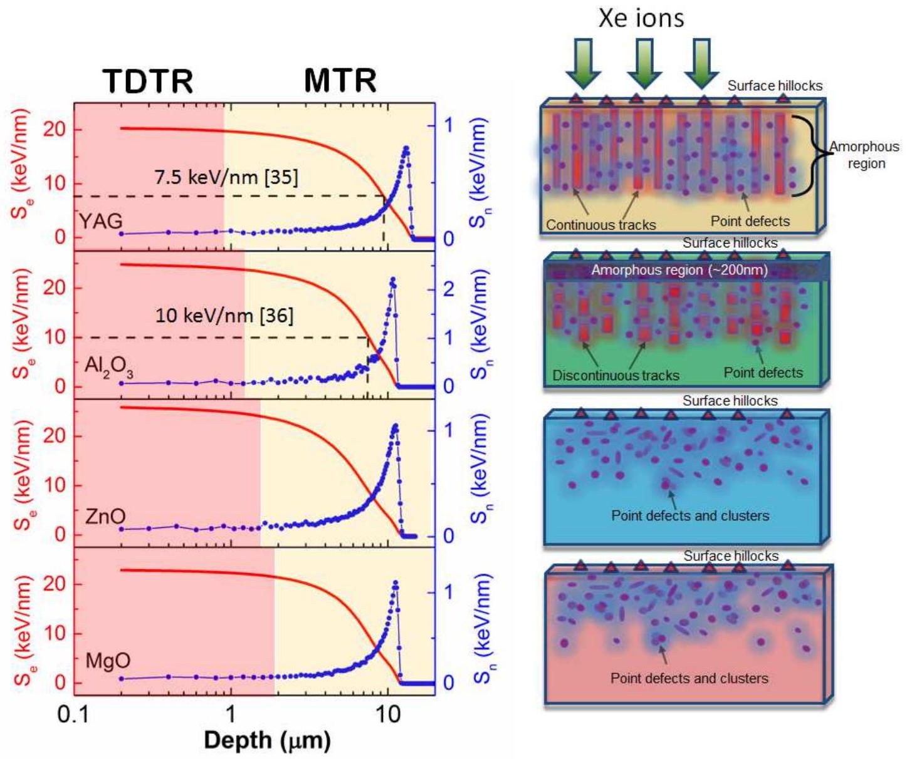
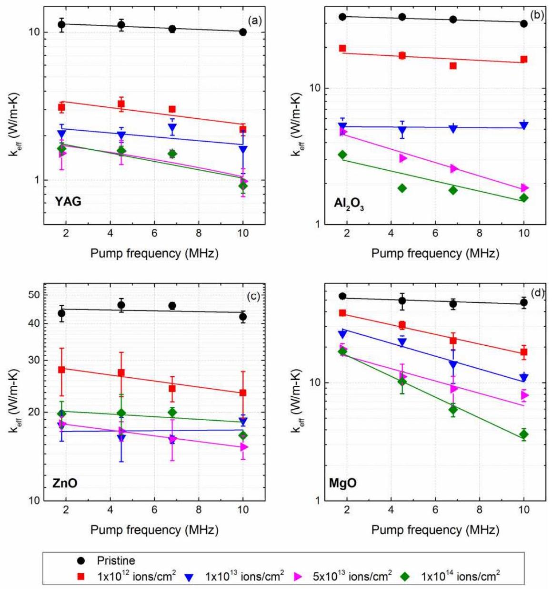
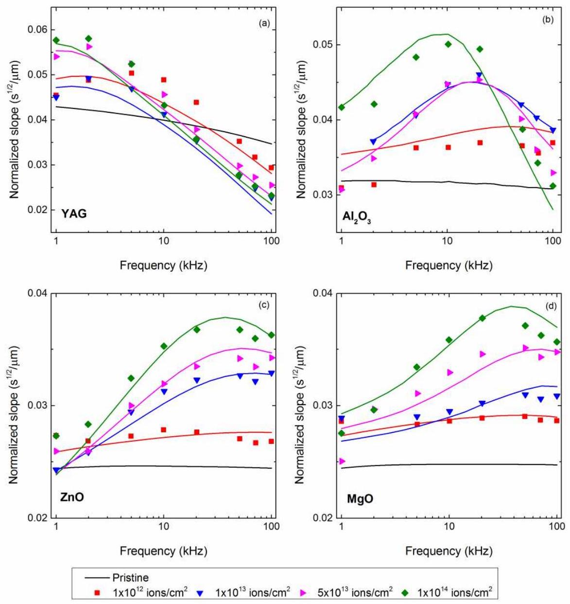
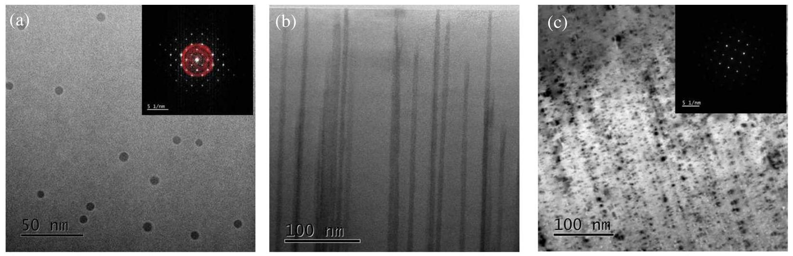
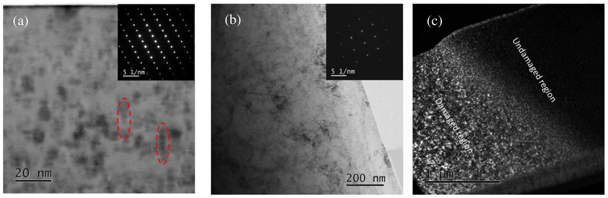
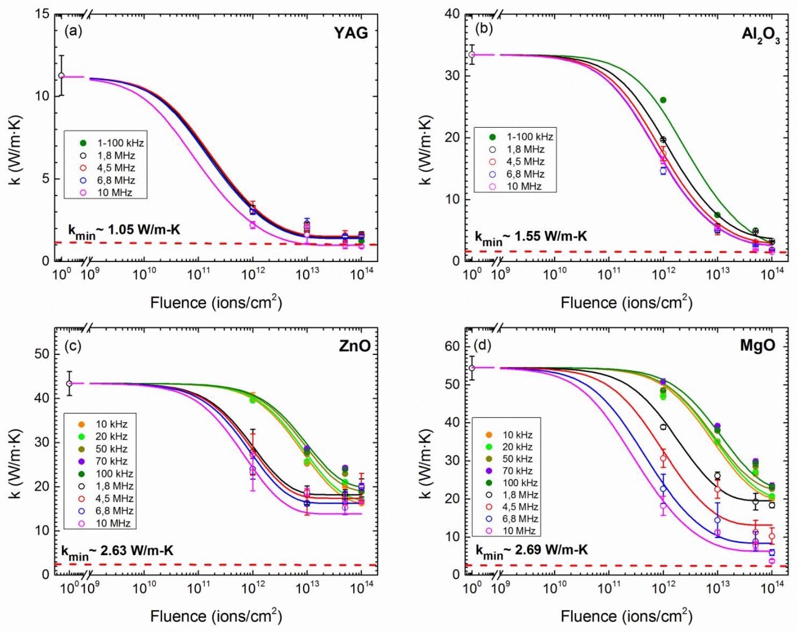
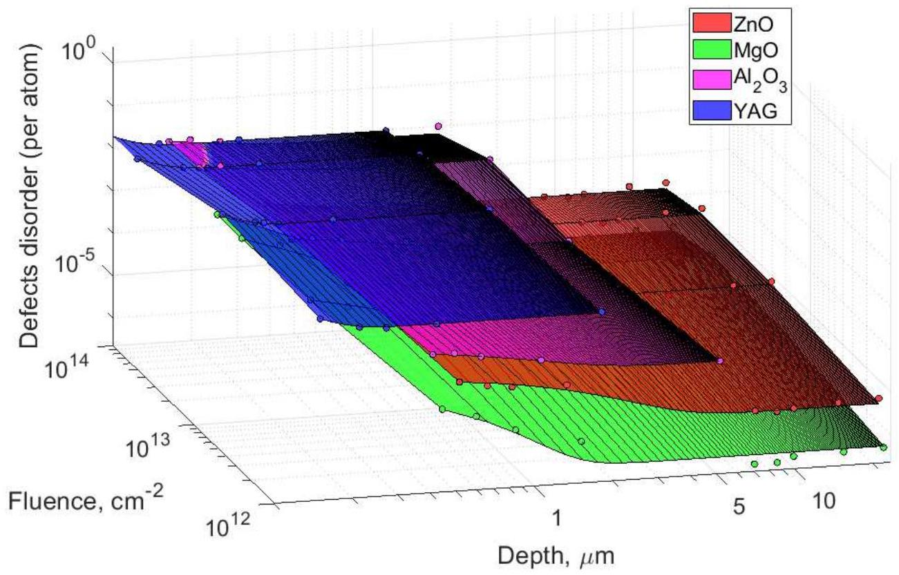

# Depth-resolved thermal conductivity and damage in swift heavy ion irradiated metal oxides 

Azat Abdullaev ${ }^{1}$, Ainur Koshkinbayeva ${ }^{1}$, Vinay Chauhan ${ }^{2}$, Zhangatay Nurekeyev ${ }^{1}$, Jacques O'Connell ${ }^{3}$, Arno Janse van Vuuren ${ }^{3}$, Vladimir Skuratov ${ }^{4,5,6}$, Marat Khafizov ${ }^{2}$ and Zhandos N. Utegulov ${ }^{1}$ ¹Department of Physics, School of Sciences and Humanities, Nazarbayev University, Nur-Sultan, 010000, Kazakhstan ${ }^{2}$ Department of Mechanical and Aerospace Engineering, Ohio State University, Columbus, OH, 43210, USA ${ }^{3}$ Centre for HRTEM, Nelson Mandela University, Port Elizabeth, 6001, South Africa ${ }^{4}$ Flerov Laboratory of Nuclear Reactions, Joint Institute for Nuclear Research, Dubna, Moscow Region, 141980, Russia ${ }^{5}$ National Research Nuclear University MEPhI, Moscow, 115409, Russia ${ }^{6}$ Dubna State University, Dubna, Moscow Region, 141980, Russia E-mail: azat.abdullaev @ nu.edu.kz, zhutegulov@nu.edu.kz

#### Abstract

We investigated thermal transport in swift heavy ion (SHI) irradiated insulating single crystalline oxide materials: yttrium aluminum garnet- $\mathrm{Y}_{3} \mathrm{Al}_{5} \mathrm{O}_{12}$ (YAG), sapphire $\left(\mathrm{Al}_{2} \mathrm{O}_{3}\right)$, zinc oxide $(\mathrm{ZnO})$ and magnesium oxide ( MgO ) irradiated by 167 MeV Xe ions at $10^{12}-10^{14}$ ions $/ \mathrm{cm}^{2}$ fluences. Depth profiling of the thermal transport on nano- and micro- meter scales was assessed by time-domain thermoreflectance (TDTR) and modulated thermoreflectance (MTR) methods, respectively. This combination allowed us to isolate the conductivities of different sub-surface damage-regions characterized by their distinct microstructure evolution regimes. Thermal conductivity degradation in SHI irradiated YAG and $\mathrm{Al}_{2} \mathrm{O}_{3}$ is attributed to formation of ion tracks and subsequent amorphization, while in ZnO and MgO it is mostly due to point defects. Additionally, notably lower conductivity when probed by very low penetrating waves is consistent with surface hillock formation. An analytical model based on Klemens-Callaway method for thermal conductivity coupled with a simplified microstructure evolution capturing saturation in defect concentration was used to obtain depth dependent damage across the ion impacted region. This study demonstrated that YAG (MgO) has the highest (lowest) damage profile resulting in weak (strong) dependence of thermal conductivity with the depth. The presented work sheds new light on how SHI induced defects affect thermal transport degradation and recovery of oxide ceramics as promising candidates for next generation nuclear reactor applications.

Key words: Thermal transport, swift heavy ions, amorphization, ion tracks, phonon scattering, metal oxides

## 1. Introduction

Controlling heat transport in nuclear fuel is of paramount importance since it directly affects not only the energy conversion efficiency, but also the safety of the entire nuclear reactor containing the fuel $[1,2]$. One promising design concept for next-generation nuclear fuel capable of reaching very high burnup ( $>100 \mathrm{MWd} / \mathrm{kg}$ ) is based on the idea of inert matrix fuel (IMF) containing a low activation matrix (i.e. transparent to neutrons) as carrier for the fissile material [3-6]. Metal oxides are promising candidates for such an inert matrix, particularly $\mathrm{Al}_{2} \mathrm{O}_{3}$ and MgO due to their physicochemical properties, thermal stability and high radiation resistance. Their inert matrix phase, in addition to reducing the ecological impact of minor actinides constituting the majority of the radioactive spent nuclear fuel, also should possess high heat conductive properties in the presence of harsh radiation environment mostly by fission
products. To emulate the irradiation damage to inert ceramic matrices by fission products, swift heavy ions (SHIs), derived from high energy ion accelerators, are used to bombard the target matrix materials [7-9].

As known, during SHI bombardment of solid matter, ions are slowed down by elastic (nuclear) and inelastic (electronic) stopping. The energetic ions with kinetic energies $>1 \mathrm{MeV} / \mathrm{u}$ initially lose most of their energy through ionization of atoms as they penetrate the target material across nanometer scale and first few microns [10,11]. At greater microscale depths, as their energies decrease further, they start to dissipate their energy to the atomic lattice through nuclear stopping. Above a certain ionization density threshold, the formation of highly oriented latent tracks takes place extending at least a few microns in depth along the ion trajectory, and a few nanometer in diameter.

Exhaustive research has been performed to analyze in detail the structural defects in insulators imposed by SHI irradiation [12-15]. However, to what extent these SHI radiation-induced defects affect the thermal transport properties of inert matrix materials remains elusive and is the subject of our study. Heat transport due to this sub-surface radiation damage is impossible to assess by traditional laser flash or thermocouple-based techniques which are only sensitive to thermal transport in the bulk of the material across thick radiation damage regions spanning from hundreds of microns to few millimeters [16]. More sophisticated heat conductivity measuring techniques with spatial probing capability down to nano- and micro- meter sub-surface length scales are required for proper thermal characterization and analysis of SHI-irradiated solids. A number of thermophysical techniques have been employed to characterize the effects of ion irradiation on thermal transport with a focus on defects resulting from displacement damage caused by lower energy and light ions [17-23]. Recently, we have demonstrated depth resolved thermal transport in SHI irradiated single crystalline sapphire [24,25] and LiF [26]. These studies revealed two distinct regions of thermal conductivity reduction in sapphire using picosecond time-domain thermoreflectance (TDTR) [24]. Additionally, through simultaneous measurement of cross- and in- plane thermal conductivities, it was shown that ion tracks can enhance the anisotropic behavior of thermal transport in single crystal sapphire [25].

A range of near surface microstructure transformations take place in amorphizable and nonamorphizable oxide insulators irradiated by SHIs [27]. There is a strong fundamental interest in understanding the ion track formation mechanism in these materials. In amorphizable materials $\left(\mathrm{Y}_{3} \mathrm{Fe}_{5} \mathrm{O}_{12}\right.$ [28], quartz [29]) amorphous tracks are observed after SHI irradiation, while non-amorphizable insulators [30] do not exhibit such tracks but instead possess point defects or color centers. In order to study how near-surface thermal transport is affected by SHIs, we chose four oxides with different crystalline structures: yttrium alumina garnet $\left(\mathrm{Y}_{3} \mathrm{Al}_{2} \mathrm{O}_{5}\right.$ or YAG$)$, sapphire $\left(\mathrm{Al}_{2} \mathrm{O}_{3}\right)$, zinc oxide $(\mathrm{ZnO})$, and magnesium oxide $(\mathrm{MgO})$. YAG is known as an amorphizable insulator while ZnO and MgO are radiation resistant, non-amorphizable dielectrics. $\mathrm{Al}_{2} \mathrm{O}_{3}$ is also a non-amorphizable material, however at high fluence, damage accumulation from overlapping tracks consisting of aligned defect clusters results in an amorphous layer [24].

We recognize that in practical applications these IMF candidate materials would be in polycrystalline form inside which fissile (and/or fertile) constituents will be dispersed and propagation direction of fission products will be randomized unlike unidirectional exposure under ion beam irradiation [31,32]. However, in the present work we explore the fundamental aspects of the controlled impact of high energy accelerator-driven SHI irradiation on the ion penetration depth- and fluence- dependent thermal transport properties of model IMF materials, such as various single crystalline metal oxide insulators. The effect of grain boundaries (pertinent to polycrystals) on phonon scattering is inherently suppressed in single crystals to simplify thermal transport analysis. Additionally, thermal profiling in presented model IMF oxide crystals is accomplished with a high spatial resolution at nano- to micro-meter spatial scale.

Employing SHIs as fission product emulators for irradiating insulators enables us to study the effect of different radiation damage regimes related to electronic and nuclear losses [33] across nano- to -microscale spatial scales along the SHI penetration path in metal oxides. Specific defects and corresponding structural changes due to this irradiation on the cross-plane thermal transport of the oxide crystals is
explored. We perform frequency modulated time-domain thermoreflectance (TDTR) and continuous wave-based modulated thermoreflectance (MTR) techniques to shed new light on subsurface heat conduction on nano- and micro-meter sub-surface ion penetration depth scales, respectively. The depth profiling relies on a principle that modulation frequency of the pump beam dictates length of the thermal wave and the probing depths of our depths resolved measurements are based on an analytical lattice phonon-mediated model for thermal conductivity and direct impact model for defects evolution.

## 2. Materials and methods

### 2.1. Sample irradiation and structure characterization

High purity single crystalline YAG, $\mathrm{Al}_{2} \mathrm{O}_{3}, \mathrm{ZnO}$ and MgO cut into $5 \times 5 \times 0.5 \mathrm{~mm}^{3}$ plates, and polished on one side were purchased from CRYSTAL GmbH and were used as received. Crystal purity of all samples were $>99,99 \%$ except MgO which was $>99,95 \%$ as reported by the vendor. No treatment was undertaken before the irradiation. All samples were irradiated at $60^{\circ} \mathrm{C}$ with 167 MeV Xe ions with fluences in the range of $10^{10}-10^{15}$ ions $/ \mathrm{cm}^{2}$ using the IC-100 FLNR JINR cyclotron facility in Dubna, Russia. Ion beam homogeneity better than 5\% on irradiating specimen surface has been reached using beam scanning in horizontal and vertical directions.

Transmission electron microscopy (TEM) imaging was performed at the Centre for HRTEM in Nelson Mandela University (South Africa). The samples were analyzed in both TEM and STEM modes and complimented with diffraction analysis using a JEOL ARM-200F TEM operating at 200 kV . All TEM specimens were prepared by FIB using an FEI Helios NanoLab 650. Cross-sectional lamellae were extracted from the bulk irradiated material using standard FIB lift-out technique. Plan-view lamellae were prepared in a similar way by extracting the lamellae from the edge of a fractured irradiated specimen in such a way that the lamella plane was parallel to the irradiated surface and within $1 \mu \mathrm{~m}$ from the surface.

Nuclear and electronic energy loss profiles versus the ion projection range were simulated using SRIM 2013 code in a full cascade mode [34], as shown in Fig. 1. As displayed in the graph, electronic stopping dominates over the first few microns of SHI penetration and vanishes at depth $\sim 10 \mu \mathrm{~m}$, where the nuclear stopping starts to prevail in all irradiated oxides.

Fig. 1. Left hand side image shows TRIM calculation of 167 MeV Xe irradiated oxides. $\mathrm{S}_{\mathrm{e}}$ and $\mathrm{S}_{\mathrm{n}}$ indicate electronic and nuclear energy loss, respectively. The graph also shows that TDTR heat penetration is sensitive only up to $\sim 2 \mu \mathrm{m}$ depth, while MTR covers up to $20 \mu \mathrm{~m}$. Dashed lines correspond to maximum depth where ion tracks are visible in SHI irradiated YAG [35] and $\mathrm{Al}_{2} \mathrm{O}_{3}$ [36]. The right hand side shows irradiation direction and schematic diagrams of the respective irradiated oxides indicating different types of defects induced by SHIs.

### 2.2. Thermal transport measurements

Two different approaches were used to study depth-dependent thermal transport in irradiated metal oxides. Nanoscale depth thermal characterization was achieved by well-established frequency modulated TDTR [37,38], where we used a Ti:sapphire mode-locked femtosecond laser at a central wavelength of 782 nm with a repetition rate of 80 MHz . The details of the setup are given in our previous works [24,26]. The initial laser beam is divided into pump and probe beams. The pump beam is modulated over 1-10 MHz rate by an electro-optic modulator to thermally excite the samples while the probe beam is optically scan-delayed by a motorized delay stage. Both beams are focused on the sample surface down to $1 / \mathrm{e}^{2}$ diameter $\sim 12.4 \mu \mathrm{~m}$. The heat penetration depth is given by $D_{t h}=\sqrt{k / \pi C f}$, where $k$ is thermal conductivity, $C$ is volumetric specific heat and $f$ is pump beam modulation frequency and it varies for each oxide material. For all our samples $D_{\text {th }} \leq 2 \mu \mathrm{~m}$ as it is depicted in Fig. 1 over modulation frequency range of $1.8-10 \mathrm{MHz}$. Qualitatively irradiated samples have lower thermal conductivity than pristine ones, thus $D_{\text {th }}$ is typically lower for irradiated samples. Because cross-plane heat penetration is much smaller than the focused heating pump laser beam size in the TDTR setup, the measurements there are sensitive only to cross-plane conductivity.

Pristine and irradiated samples were coated by $\sim 100 \mathrm{~nm} \mathrm{Al}$ films using radio frequency (RF) magnetron sputtering which acted as metal thermal transducers in thermal transport measurements. The thickness of the Al overcoat was measured using picosecond acoustics. A model based on heat diffusion
across a double ( $\mathrm{Al} /$ metal oxide) layer was used to extract the thermal conductivity of the studied samples by fitting time-delayed signal of the ratio of in-phase to out-of-phase voltage ( $-\mathrm{V}_{\text {in }} / \mathrm{V}_{\text {out }}$ ) [39]. The material properties such as density and specific heat were taken from the literature while thermal conductivity of Al was measured using a reference sample. Two unknown parameters were simultaneously fitted, namely the effective thermal conductivity of the subsurface damaged region affected by electronic stopping as shown in Fig. 1, and the interface thermal resistance between the Al layer and the damaged region. The measurements errors and uncertainties related to the transducer film thickness have been taken into account and the details are explained elsewhere [24].

To spatially resolve microscale damaged regions, we used the MTR method with much lower modulation frequency ( $1-100 \mathrm{kHz}$ ) in comparison with $1-10 \mathrm{MHz}$ modulation rates employed in TDTR. The details of the experimental setup and related data analysis are given in previous works [40,41]. In the data analysis, the sample geometry was divided into 3 spatial domains: damaged (plateau region), peak damaged and undamaged region according to TRIM calculations shown in Fig. 1. The thermal properties of individual layers were assumed to be uniform in order to simplify thermal analysis.

## 3. Results

### 3.1. Modulation frequency dependent measurements

The damage produced by SHI irradiation changes spatially with depth. Variable frequency measurements allow probing damage across different depths [24,41]. Therefore, the pump beam in the TDTR experiment was modulated over $1-10 \mathrm{MHz}$ frequency range to tune the heat penetration depth from tens of nanometers to few micrometers. Assuming that the ion damaged layer has uniform effective thermal conductivity $k_{\text {eff }}$, we demonstrate in Figure 2 its values as a function of pump modulation frequency for all oxides irradiated at various fluences. Measured conductivities of the pristine samples are close to previously published values [42-44] and they were found to be independent of modulation frequency due to the structural uniformity across crystal depths.

Figure 3 shows a fluence-dependent normalized slope as a function of pump modulation frequency in the kHz regime of MTR experiments for various oxides. The details of fitting are given elsewhere [41]. Table 1 shows the extracted thermal conductivity of the damaged layer (plateau region) for all samples across $1-100 \mathrm{kHz}$ modulation frequency. As in TDTR measurements, we observe a similar trend in thermal conductivity degradation as a function of ion fluence.

We see a gradual reduction of $k_{e f f}$ with ion fluence in all four samples, we also observe different frequency responses. As shown, the left hand side figures are examples of uniform conductivity across the depth, whereas the figures on the right demonstrate depth dependence which is attributed to different depth dependent microstructural changes due to SHI irradiation and will be separately discussed in detail for each sample.

Fig. 2. Effective thermal conductivity $k_{\text {eff }}$ vs pump modulation frequency for pristine and irradiated oxides in TDTR experiment. The error bars represent the reproducibility of the TDTR measured heat conductivity values and the uncertainties related to transducer thickness. The solid lines serve as a guide to the eye to show the pump frequency dependence.

Unlike in TDTR, isolating the impact of the metal transducer in MTR is not trivial and therefore frequency dependent results shown in Fig. 3 capture the effect of the transducer layer. The frequency dependent trend observed for YAG is characteristic of a low conductivity substrate. The response of $\mathrm{Al}_{2} \mathrm{O}_{3}, \mathrm{ZnO}$, and MgO is characteristic of a low conductivity layer on top of an intermediate conductivity infinite layer [41]. In particular, the low frequency slope of the high dose irradiated MgO and ZnO samples are comparable to the value of the pristine samples, which is a direct indication that the deeper portion of the irradiated samples did not undergo significant reduction in thermal conductivity. This is attributed to fact that the electronic stopping is much weaker and the nuclear stopping is too weak to cause significant displacement damage in that region.

Fig. 3. Normalized slope as a function of pump frequency for irradiated oxide samples in the MTR measurements. Scattered symbols represent experimental data of the damaged layer and solid lines represent the corresponding thermal model for fitting.

Table 1. Effective thermal conductivity of damaged layers in all SHI irradiated samples extracted from the MTR measurements.
| Ion fluence (ions/ $\mathrm{cm}^{2}$ ) | $k_{\text {eff }}$ of damaged layer ( $\mathrm{W} / \mathrm{m} \cdot \mathrm{K}$ ) |  |  |  |
| :--- | :--- | :--- | :--- | :--- |
|  | YAG | $\mathrm{Al}_{2} \mathrm{O}_{3}$ | ZnO | MgO |
| $1 \times 10^{12}$ | 3.22 | 22.60 | 44.10 | 47.90 |
| $1 \times 10^{13}$ | 1.84 | 9.80 | 27.00 | 36.60 |
| $5 \times 10^{13}$ | 1.45 | 6.25 | 22.50 | 27.20 |
| $1 \times 10^{14}$ | 1.23 | 3.95 | 17.50 | 19.80 |

### 3.2. YAG and $\mathrm{Al}_{2} \mathrm{O}_{3}$

To put the above results in perspective, it is important to recognize the unique aspects of SHI and electron ionization effects on the microstructure of these metal oxides. First, we consider oxides that are known to exhibit ion tracks and undergo amorphization. The pristine YAG has measured $k_{\text {eff }} \sim 10 \mathrm{W} / \mathrm{m} \cdot \mathrm{K}$ which corresponds to the literature value of around $11 \mathrm{~W} / \mathrm{m} \cdot \mathrm{K}$ [43]. As the ion fluence increases to $1 \times 10^{12}$ ions $/ \mathrm{cm}^{2}, k_{\text {eff }}$ drops by $\sim 3$ times compared to the pristine sample and remains around 3 $\mathrm{W} / \mathrm{m} \cdot \mathrm{K}$. For the highest doses, thermal conductivity reaches its minimum at almost $1 \mathrm{~W} / \mathrm{m} \cdot \mathrm{K}$ for all frequencies and remains constant across the range. The reason for such a drastic reduction is due to the
creation of amorphous tracks as shown by the high angle annular dark field (HAADF) in-plane images in Fig. 4 (a). The image is of a low fluence ( $5 \times 10^{10} \mathrm{~cm}^{-2}$ ) sample with continuous tracks along the ion trajectory as shown in the bright field (BF) cross-plane image in Fig. 4 (b). The tracks are fully amorphous, cylindrical and have an average radius $r \sim 3.2 \mathrm{~nm}$ [35]. As the ion fluence increases, it is expected that tracks eventually start to overlap. This can be expressed by the saturation condition $\Phi \times \pi r^{2}=1$ [35], where $\Phi$ is the ion fluence. Considering the above-mentioned track radius, overlapping of amorphous tracks in YAG should begin at a fluence of $3.2 \times 10^{12}$ ions $/ \mathrm{cm}^{-2}$. Further increase in ion fluence results in the total amorphization of the subsurface damaged layer starting from the surface and extending deep into the sample for several microns.

We calculated the minimum thermal conductivity of SHI irradiated YAG based on the expression proposed by Cahill and Pohl [45] and previously applied to the amorphous layer of SHI irradiated $\mathrm{Al}_{2} \mathrm{O}_{3}$ [24]:

$$
k_{\min }=\left(\frac{\pi}{6}\right)^{\frac{1}{3}} k_{B} \Omega_{o}^{\frac{2}{3}} \sum_{i} v_{i}\left(\frac{T}{\Theta_{D}}\right) \int_{0}^{\frac{T}{\Theta_{D}}} \frac{x^{3} e^{x}}{\left(e^{x}-1\right)^{2}} d x
$$

where $\Omega_{o}$ - is the atomic density, $k_{B}$ is Boltzmann's constant, T is the temperature, $\theta_{D}$ is the Debye temperature, $x=\frac{\hbar \omega}{k_{B} T}$ is a dimensionless parameter, $\hbar$ is the reduced Planck's constant and $v$ is the group velocity of heat carriers. The estimated minimal thermal conductivity for SHI irradiated YAG $k_{\text {min }}=1.05 \mathrm{W} / \mathrm{m} \cdot \mathrm{K}$ which is close to both our TDTR and MTR measurements for high fluence samples indicating that the damage in those specimens is uniform across nano- and micro-scale sub-surface depths. The unusual drop at 10 MHz , where the heat penetration depth is around 190 nm is probably related to a region of lower density, which results from material expulsion into surface hillocks. Several works have previously reported on this damaged region with lower density in other materials [46,47].The thickness of this region is material dependent but typically below 100 nm . Since YAG is also susceptible to hillock formation under SHI irradiation [48], a layer of reduced density at the surface should be present in this material as well.

SHI irradiated $\mathrm{Al}_{2} \mathrm{O}_{3}$ exhibits behavior similar to YAG as shown in Fig. 2 (b), however, tracks in sapphire are crystalline and discontinuous at these fluences as shown by the cross-plane BF TEM image in Fig. 4 (c). At high fluences ( $5 \times 10^{13}$ and $1 \times 10^{14} \mathrm{ions} / \mathrm{cm}^{2}$ ), in analogy to YAG, an amorphous surface layer is observed in sapphire extending down to $\sim 200 \mathrm{~nm}$ for a fluence of $1 \times 10^{14}$ ions $/ \mathrm{cm}^{2}$ [24]. In this sample, we observed frequency dependent thermal transport where with an increase of heat penetration depth, the gradual recovery of thermal conductivity is observed. While at lower fluences there is no amorphous layer, therefore $k_{\text {eff }}$ is independent of frequency and the cross-plane conductivity is reduced due to ion tracks.

By comparing these two materials, the mechanism of amorphization in the case of YAG is different from the case of $\mathrm{Al}_{2} \mathrm{O}_{3}$. In YAG, each ion produces a cylindrical amorphous track which is continuous starting from the surface down to a depth at which the electronic stopping power drops below the continuous track threshold which for YAG is around $7.5 \mathrm{keV} / \mathrm{nm}$ [35], while for $\mathrm{Al}_{2} \mathrm{O}_{3}$ it is around 10 $\mathrm{keV} / \mathrm{nm}$ [36]. The diameter of the tracks tends to vary along the length due to reducing ion energy as well as some stochastic increases in energy deposition related to nuclear stopping. These amorphous tracks are stable in comparison with crystalline tracks in $\mathrm{Al}_{2} \mathrm{O}_{3}$ and when other ions pass nearby or even through them, the individual tracks contribute additively, thereofore amorphization occurs almost uniformly throughout the irradiated volume. Eventually the amorphous layer proliferates with thickness reaching the length of the ion tracks, which would roughly be equal to the depth at which the electronic stopping power falls below threshold. For YAG it is around $9 \mu \mathrm{~m}$ according to TRIM calculations shown in Fig. 1. Therefore we can conclude that the ion induced damage is more severe in YAG than in $\mathrm{Al}_{2} \mathrm{O}_{3}$ resulting in lower dependence of thermal conductivity on frequency across the MHz and kHz modulation frequency ranges.

Fig. 4. (a) ADF and (b) BF image of YAG irradiated with 167 MeV Xe ions with ion fluence of $5 \times 10^{10} \mathrm{~cm}^{-2}$. (c) Bright field TEM image $\mathrm{Al}_{2} \mathrm{O}_{3}$ irradiated by 167 MeV Xe ions with ion fluence of $2 \times 10^{12} \mathrm{~cm}^{-2}$ in cross section reproduced from [25]. The inset in (a) is an FFT showing a faint amorphous halo around the central diffraction spot due to the ion tracks, the SAED inset in (c) shows no discernible amorphization.

### 3.3. ZnO and MgO

Both ZnO and MgO are highly resistant materials to SHI irradiation [27]. The TEM images in Fig. 5 and corresponding selected area electron diffraction (SAED) patterns show that both materials remain crystalline even at the highest SHI fluences of $1.05 \times 10^{15} \mathrm{~cm}^{-2}$ and $1 \times 10^{14} \mathrm{~cm}^{-2}$, respectively. No distinct tracks could be observed, but significant strain contrast in BF micrographs suggests that a reasonable concentration of small unresolvable defects were produced during irradiation. BF image of irradiated ZnO in Fig. 5 (a) clearly demonstrates the diffraction contrast in small regions of local strain that group together in rows which aligns with the irradiation direction. Although these type of defects cannot directly be seen in TEM, previous studies of Raman and photoluminescence spectra have revealed the formation of point defects associated with oxygen vacancies and interstitial zinc in SHI irradiated bulk and thin film ZnO [49-51]. Considering the previous reports on ZnO irradiated under similar conditions revealing presence of point defects using above-mentioned methods, our samples likely have similar defects. Our frequency dependent thermal conductivity measurement in ZnO tends to be similar to YAG. Both exhibit weak frequency dependence of the thermal conductivity at given fluences indicating uniform thermal conductivity across the damage layer. Nevertheless, the microstructures of the irradiated regions are very different. Unlike YAG, ZnO does not exhibit the formation of ion tracks but instead contains point defects, which tend to form small voids or void clusters with the increase of ion fluence.

Fig. 5. (a) BF STEM image of ZnO at $1.05 \times 10^{15} \mathrm{~cm}^{-2}$ and inset is corresponding SAED pattern. The red dashed lines represent small regions of local strain. (b) BF TEM cross-sectional image of MgO at $1 \times 10^{14} \mathrm{~cm}^{-2}$ with corresponding SAED pattern. Both images show no evidence of ion track formation. Inset SAED patterns also indicate preserved crystallinity for both oxide structures. (c) DF image of MgO lamella at $1 \times 10^{14} \mathrm{~cm}^{-2}$.

A TEM micrograph of irradiated MgO with corresponding SAD pattern is shown in Fig. 5 (b). Magnesia crystals, similar to ZnO , preserve crystalline structure at high ion fluence. It is also known to be
highly resistive to electronic excitations produced by SHI and exhibits a high energy threshold for ion track formation [27,52,53]. The contrast observed in Fig. 5 (b) again suggests the presence of unresolvable defects within the material which is in agreement with previous works [27,53]. The DF image of the same specimen of MgO shows a clear interface between the damaged and undamaged zones as shown in Fig. 5 (c). There is a clear difference in the diffraction contrast in the radiation-damaged region (dense spotted pattern) and the unaffected region (mostly flat contrast). Since there is very abrupt change in defect density, the SHI irradiation induced defect concentration is significantly higher than that caused by FIB sample preparation. However, unlike ZnO , our TDTR measurements in MgO exhibit unusual frequency dependence as displayed in Fig. 2. We see a gradual increase in thermal conductivity as heat penetration depth increases, suggesting a lower thermal conductivity near the surface. This could be due to a combination of several factors. First is due to a density reduction near the surface caused by the formation of hillocks, which also alter the local stress field. This damage zone is confined to no more than 100 nm in depth. Since no irradiation aligned defects/strain fields are visible, it suggests that defects in these materials do not strongly align along ion trajectories and the migration of defects can be significant. Similar behavior of depth dependent damage was also observed in the recent work [54] in single crystalline MgO irradiated by medium energy Au ions by RBS-C measurements. Second is the development of a poorly understood surface formation such as a thin film was observed after irradiation, which can also be a reason for the low conductivity in the near-surface region. A similar formation of a thin, glossy and silver-grey colored film was previously observed in 85 MeV iodine (I) irradiated polycrystalline MgO at $2.8 \times 10^{14} \mathrm{~cm}^{-2}$ and $1.2 \times 10^{15} \mathrm{~cm}^{-2}$ fluences [53]. The thickness of that layer was observed to be less than 100 nm .

By comparing these oxides, we can assume that the distribution of defects around ion tracks in YAG and $\mathrm{Al}_{2} \mathrm{O}_{3}$ is homogeneous and it is especially valid for YAG. As the tracks in YAG are continuous and stable, they extend up to $9 \mu \mathrm{~m}$ in depth and so the concentration of defects. Hence, the thermal conductivity across this region remains uniform. A similar effect is observed in $\mathrm{Al}_{2} \mathrm{O}_{3}$, but since its tracks are discontinuous this assumption is only be valid to a first approximation. At certain fluences above which the tracks start to overlap, which corresponds to $1 \times 10^{13}$ ions $/ \mathrm{cm}^{2}$ in the case of $\mathrm{Al}_{2} \mathrm{O}_{3}$, the concentration of defects levels out and the conductivity remains low across the damaged region. However, for a low fluence such as $1 \times 10^{12}$ ions $/ \mathrm{cm}^{2}$, where the tracks are isolated, the effective diameters of these tracks decrease with depth (due to reduced ion energy) resulting in recovery of the conductivity close to its pristine value. In ZnO and MgO , the situation is totally different as no tracks are present. However, different types of defects such as point defects, void clusters and hillocks are accumulated in the near surface region. This region has low thermal conductivity, therefore and as heat penetration extends deeper into the material, the thermal conductivity starts to recover indicating that the concentration of defects decrease with depth.

## 4. Discussion

### 4.1. Estimation of defects concentration

The behavior of the samples considered in this work differs in response to SHI irradiation. As we observed from TEM analysis, some samples (YAG, $\mathrm{Al}_{2} \mathrm{O}_{3}$ ) tend to amorphize, while others ( $\mathrm{ZnO}, \mathrm{MgO}$ ) remain crystalline. Such differences have been attributed to structural complexity [27] or merely attributed to the ability of the materials to dissipate heat away from the SHI trajectory. In order to simplify the depth profiling analysis we implemented a simple model, based solely on point defects, which was used for all materials under investigation. This point defect approximation effectively captures a broad range of defects present across multiple samples under investigation and allows us to quantify damage as a function of depth. The thermal conductivity model has been presented in previous reports and reproduced in the appendix [55,56]. In this model thermal conductivity degradation due to radiation damage is captured by a scattering cross section $\Gamma_{\mathrm{irr}}=c_{\mathrm{irr}} S^{2}$, where $c_{\mathrm{irr}}$ is the average defect density
across the probing depth and $S^{2}$ - is a phonon point defect scattering cross-section. A direct impact model was employed to determine the defect concentration $c_{\mathrm{irr}}=c_{\mathrm{sat}}[1-\exp (-\sigma \Phi)][26,57,58]$, where $c_{\mathrm{sat}}$ and $\sigma$ are used as fitting parameters and represent maximum defect concentration and damage crosssection, respectively. $S^{2}$ is a phonon scattering cross-section with point defects. In previous reports $S^{2}$ was determined using $S^{2}=(\Delta M / M)^{2}$, assuming only anion vacancies are present as these were the only observable defect type using optical spectroscopy. While recent reports suggest that in light ion irradiated metal oxides cation sub lattice defects have the largest contribution to thermal conductivity degradation [21,55,56], in current analysis effective defect is represented by oxygen vacancy. In the subsequent discussion the magnitude of $c_{\text {irr }}$ should be interpreted as a measure of disorder, rather than simply point defect concentration implied by the thermal model.

The intrinsic parameters of each material needed to determine the conductivity of the pristine materials are listed in Table A. We fit our experimental $k_{\text {eff }}$ values for each modulation frequency across all irradiation doses using the direct impact model expression to obtain the level of irradiation damage. The results of the fitting are shown in Fig. 6 and fitted parameters ( $c_{\text {sat }}$ and $\sigma$, ) are reported in Table 2. It is worth to note that $c_{\text {sat }}$ is frequency dependent and the values in the table correspond to 10 MHz modulation frequency at which the defect concentration is maximum. The degradation of thermal conductivity due to irradiation damage is clear in Fig. 6 for all oxides. Exponentially saturating decay of conductivity with an increase of ion fluence is observed by heat conductivity saturation at high fluences. YAG undergoes a severe drop, as compared with the other oxides, and has the highest defects concentration ( $c_{i r r}$ ) as shown in Table 2. If we compare $c_{i r r}$ for all oxides we see that the defects concentration level is in the following order YAG $>\mathrm{Al}_{2} \mathrm{O}_{3}>\mathrm{ZnO}>\mathrm{MgO}$. This is consistent with degree of amorphization as suggested by TEM characterization and previous results. It is also seen by the relative drop of conductivity to the minimum conductivity estimated by eq (1) showing the highest drop in YAG in comparison with other oxides and it is in line with the SHI-induced damage behavior in these materials. This behavior can be attributed to crystal structure and strength of ionic bonding in these materials. It is suggested that materials with larger degree of ionicity are more resistant to the track formation and retain their crystalline structure [59]. MgO and ZnO have stronger ionic bonding than sapphire and YAG. Therefore, they are more resistant to the track formation and damage which is in agreement with results of our thermal conductivity measurements. Another criterion that affects track formation is the complexity of a crystal structure. Recent works [27,48] have demonstrated that simpler structures such as MgO and $\mathrm{CaF}_{2}$ are more resistant to track formation and may recrystallize more efficiently compared to complex structures such as YAG and sapphire, which is also consistent with our measurements.

Table 2. Model parameter for depth resolved defect concentration.
| Parameters | YAG | $\mathbf{A l}_{\mathbf{2}} \mathbf{O}_{\mathbf{3}}$ | ZnO | MgO |
| :--- | :--- | :--- | :--- | :--- |
| $S^{2}$ | $7.26 \times 10^{-4}$ | 0.0246 | 0.0386 | 0.1576 |
| $c_{\text {sat }}$, per atom | 0.0099 | 0.0068 | $1.630 \times 10^{-04}$ | $1.957 \times 10^{-05}$ |
| $\sigma, \mathrm{cm}^{2}$ | $2.597 \times 10^{-13}$ | $1.206 \times 10^{-13}$ | $3.411 \times 10^{-13}$ | $1.14 \times 10^{-13}$ |

Fig. 6. Experimental data and model from eq (2) for SHI irradiated oxides. Open circles correspond to different frequency modulated TDTR measurements, solid circes correspond to experimental MTR results and solid lines correspond to theoretical model based on Klemens model and fitting parameters $c_{\text {sat }}$ and $\sigma$. Red dashed line corresponds to the minimum thermal conductivities determined using eq (1).

### 4.2. Depth dependent disorder

After determining average defect concentration across the probe depth at each frequency, in Fig. 7 we show the 3D plots of defects disorder as a function of SHI irradiation fluence and irradiation penetration depth in the current samples. The depth as a function of modulation frequency is determined using expression: $D_{\text {th }}=\sqrt{\frac{k_{\text {eff }}}{\pi C_{\mathrm{V}}}}$, where $k_{\text {eff }}$ is the effective thermal conductivity at pump modulation frequency $f$ and $C_{\mathrm{V}}$ is the volumetric specific heat [60]. The range of heat penetration depths corresponding to minimum and maximum modulation frequencies is calculated. By referring to the experimental data at various modulation frequencies, defects concentration ( $c_{\mathrm{irr}}$ ) described in previous section 4.1 is then fitted as a function of depth for each ion fluence and expressed in the following form:

$$
c_{\mathrm{irr}}=C_{1} \times \exp \left(-\beta \cdot D_{\mathrm{th}}\right)+C_{0},
$$

where $C_{1}, \beta$ and $C_{0}$ are the fitting parameters and $D_{\text {th }}$ is the heat penetration depth.
This figure shows that defect concentration decreases with a drop in electronic stopping power ( $\mathrm{S}_{\mathrm{e}}$ ) as shown from TRIM calculations in Fig. 1. The noticeable drop in defect concentration as a function of depth for YAG and particularly at low fluence is intriguing. One would expect the simple point defect model to fall apart in the extreme case of amorphous cylinders, but the plot seems to capture at least qualitatively the reduction in track diameter with depth due to decreasing $\mathrm{S}_{\mathrm{e}}$. Qualitatively speaking, at
higher fluences, the overlap proportion increases and the reduction in individual track diameters with depth should become less apparent, this is also reproduced by the model. For the other materials, the "effective track" diameter is much smaller and should show a less dramatic reduction with depth due to efficient recrystallization of the melt leading to a lower dependence on the cross-sectional area of the initial melt. The number of quenched defects will vary less along the depth of the projectile path and will accumulate more slowly with fluence due to possible annealing effects which are not present in YAG. The model seems to reproduce this effect as well.

Fig. 7. 3D graph of relative defect disorder (per host atom) for all four oxides as a function of fluence and defects penetration depth based on eq (2): points represent experimental data and plane surfaces - modeling.

## 5. Conclusions

Four single crystal metal oxides were irradiated by 167 MeV Xe swift heavy ions. The SHI irradiation causes a non-uniform damage profile due to electronic and nuclear stopping power regimes that also lead to different depth profiling of thermal conductivity. Different types of ion tracks are observed in YAG and $\mathrm{Al}_{2} \mathrm{O}_{3}$ while no visible tracks are present in MgO and ZnO . Depth dependent thermal conductivity is less pronounced in YAG both at nano- and micro-scale depths due to high level of damage induced by SHIs. The concentration of point defects is distributed uniformly along the ion trajectory. As the ion tracks in YAG are amorphous and continuous, they tend to overlap above the fluence of $3.2 \times 10^{12}$ ions $/ \mathrm{cm}^{-2}$ resulting in the minimum thermal conductivity across the entire damaged region. In $\mathrm{Al}_{2} \mathrm{O}_{3}$ SHI induced ion tracks are crystalline and discontinous, therefore depth dependent thermal conductivity is more pronounced than in YAG. The diameter of these tracks decrease with depth and corresponding concentration of point defects reduces as well and at low fluence the thermal conductivity recovers close to its undamaged value. However at high fluences similarly to YAG, these tracks start to overlap leading to amophization of the near surface layer and attaining minimal thermal conductivity. In ZnO and MgO the distribution of point defects are not aligned along the ion trajectory which might be attributed to the migration of defects. In this case the point defects accumulate strongly in the near surface region where the thermal conductivity reaches its minimum. As the depth increases, the defect concentration becomes lower in both materials and the thermal conductivity recover to their pristine values.

TDTR and MTR techniques can be employed for multiscale heat propagation asssessment to characterize nano- and micro-structural changes in ion induced materials. Moreover, understanding on how radiation-driven thermal transport in these metal oxides can be utilized to design novel highly conductive and radiation tolerant IMF oxide ceramic structures for next generation nuclear reactor applications.

## Appendix

To model thermal conductivity we used an analytical model based on Debye approximation [61]:

$$
k=\frac{1}{3} \int_{0}^{\frac{\theta_{D}}{T}} \tau(x) v^{2} C(x) d x
$$

where $C(x)$ is the frequency dependent specific heat capacity, $\tau(x)$ is the total phonon relaxation time, T is the temperature, $\theta_{D}$ is the Debye temperature, $x=\frac{\hbar \omega}{k_{B} T}$ is a dimensionless parameter, $\hbar$ is the reduced Planck's constant, $k_{B}$ is the Boltzmann's constant and $v$ is the group velocity of heat carriers. The details of this model can be found in our previous work [26]. The total phonon relaxation time $\tau$ is represented by Mathieson's rule:

$$
\tau^{-1}(x)=\tau_{3 p h}^{-1}+\tau_{P D}^{-1}+\tau_{B}^{-1}+\tau_{N}^{-1}
$$

where the corresponding phonon scattering rates are given by $\tau_{3 p h}^{-1}=B_{i} \omega^{2} \operatorname{Texp}\left(-\frac{\theta_{D}}{3 T}\right)$ for Umklapp phonon-phonon scattering, $\tau_{P D}^{-1}=A \omega^{4}$ for the phonon scattering from point defects with $A=\frac{4 \pi a^{3}}{v^{3}} \Gamma$. The phonon scattering parameter has contribution from impurities and irradiation induced defects $\Gamma=\Gamma_{\text {imp }}+ \Gamma_{\mathrm{irr}}$. Irradiation induced $\Gamma_{\mathrm{irr}}$ is defined as $\Gamma_{\mathrm{irr}}=c S^{2}$, where $c-$ is defect concentration, $S^{2}$ - is the phonon point defect scattering cross-section, $\tau_{B}^{-1}=v / d$ for the scattering from the sample boundaries, where $d$ - sample size and $\tau_{N}^{-1}=B_{N} \omega T^{3}$ for phonon-phonon normal scattering. First, the temperature dependent thermal conductivity was obtained for each un-irradiated oxide based on published data and was used to determine intrinsic parameters ( $B_{i}, \Gamma_{\mathrm{imp}}$ and $B_{N}$ ) [42-44]. This allowed us to define parameters of Umklapp and Normal processes, $B_{i}$ and $B_{N}$, respectively and $\Gamma$ point defects present in unirradiated crystals due to intrinsic vacancies or impurities. Then, the thermal conductivity was fitted as a function of irradiation fluence by fitting experimentally measured data with a single variable parameter $\Gamma_{i r r}$, attributed to point defects caused by SHI irradiation. This procedure was performed by fixing the $T=$ 293 K and introducing additional term $\tau_{\text {PDirr }}^{-1}=A_{\text {irr }} \omega^{4}$ to the equation (1). The structural ( $\mathrm{a}, \mathrm{N}, \mathrm{V}_{\mathrm{c}}$ ), fitting ( $B_{i,} A_{\mathrm{imp}}, B_{N}$ ) are given in Table A .

Table A. Parameters used in thermal conductivity model described by eq (1): CS - crystal structure, a - lattice parameter, N - number of atoms per unit cell, $\mathrm{V}_{\mathrm{c}}$ - unit cell volume, $c_{\text {sat }}$ - saturation concentration of point defects for $1 \times 10^{14}$ ions $/ \mathrm{cm}^{2}$ fluence,
| Parameters | YAG | $\mathbf{A l}_{\mathbf{2}} \mathbf{O}_{\mathbf{3}}$ | ZnO | MgO |
| :--- | :--- | :--- | :--- | :--- |
| CS | FCC | Hexagonal | Hexagonal | FCC |
| a, Å | $\mathrm{a}=12.01$ | $\mathrm{a}=4.785$ | $\mathrm{a}=3.25$ | $\mathrm{a}=4.21$ |
|  |  | $\mathrm{c}=12.99$ | $\mathrm{c}=5.21$ |  |
| N | 160 | 10 | 4 | 4 |

| $\mathrm{V}_{\mathrm{c}}, \AA^{3}$ | 866.16 | 257.59 | 11.914 | 18.681 |
| :--- | :--- | :--- | :--- | :--- |
| $\theta_{D}, \mathrm{~K}$ | 890 | 756 | 736 | 639 |
| $v, \mathrm{~m} / \mathrm{s}$ | 5250 | 7501 | 3555 | 3585 |
| $d, \mathrm{~cm}$ | 1 | 0.5 | 1 | 1 |
| $B_{i}, s / K$ [42-44] | $1.212 \times 10^{-17}$ | $1.289 \times 10^{-18}$ | $2.346 \times 10^{-18}$ | $6.887 \times 10^{-17}$ |
| $A_{\text {imp }}, s^{3}$ | $3.2356 \times 10^{-44}$ | $1.7041 \times 10^{-46}$ | $4.1204 \times 10^{-44}$ | $1.537 \times 10^{-44}$ |
| $B_{N}, K^{-3}$ | $5.5 \times 10^{-11}$ | $7.228 \times 10^{-12}$ | $6.347 \times 10^{-11}$ | $4.842 \times 10^{-12}$ |

## Acknowledgement

This work was supported by Nazarbayev University FDCR grant 110119FD4501, Kazakhstan Ministry of Education \& Science grant AP05130446, state-targeted program BR05236454 and by the Center for Thermal Energy Transport under Irradiation (TETI), an Energy Frontier Research Center funded by the U.S. Department of Energy, Office of Science, and Office of Basic Energy Sciences.

## References

[1] C. Ronchi, M. Sheindlin, D. Staicu, M. Kinoshita, Effect of burn-up on the thermal conductivity of uranium dioxide up to 100.000 MWdt-1, J. Nucl. Mater. 327 (2004).
https://doi.org/10.1016/j.jnucmat.2004.01.018.
[2] P.G. Lucuta, H. Matzke, I.J. Hastings, A pragmatic approach to modelling thermal conductivity of irradiated UO2 fuel: Review and recommendations, J. Nucl. Mater. 232 (1996). https://doi.org/10.1016/S0022-3115(96)00404-7.
[3] C. Degueldre, J. Bertsch, G. Kuri, M. Martin, Nuclear fuel in generation II and III reactors: Research issues related to high burn-up, Energy Environ. Sci. 4 (2011) 1651-1661. https://doi.org/10.1039/c0ee00476f.
[4] Y.W. Lee, C.Y. Joung, S.H. Kim, S.C. Lee, Inert matrix fuel - A new challenge for material technology in the nuclear fuel cycle, Met. Mater. Int. 7 (2001). https://doi.org/10.1007/bf03026954.
[5] H. Kleykamp, Selection of materials as diluents for burning of plutonium fuels in nuclear reactors, J. Nucl. Mater. 275 (1999). https://doi.org/10.1016/S0022-3115(99)00144-0.
[6] W.J. Carmack, M. Todosow, M.K. Meyer, K.O. Pasamehmetoglu, Inert matrix fuel neutronic, thermal-hydraulic, and transient behavior in a light water reactor, J. Nucl. Mater. 352 (2006). https://doi.org/10.1016/j.jnucmat.2006.02.098.
[7] T. Wiss, H. Matzke, Heavy ion induced damage in MgAl 2 O 4 , an inert matrix candidate for the transmutation of minor actinides, Radiat. Meas. 31 (1999). https://doi.org/10.1016/S1350-4487(99)00113-4.
[8] H. Matzke, P.G. Lucuta, T. Wiss, Swift heavy ion and fission damage effects in UO2, Nucl. Instruments Methods Phys. Res. Sect. B Beam Interact. with Mater. Atoms. 166 (2000). https://doi.org/10.1016/S0168-583X(99)00801-0.
[9] H. Ohno, A. Iwase, D. Matsumura, Y. Nishihata, J. Mizuki, N. Ishikawa, Y. Baba, N. Hirao, T. Sonoda, M. Kinoshita, Study on effects of swift heavy ion irradiation in cerium dioxide using
synchrotron radiation X-ray absorption spectroscopy, Nucl. Instruments Methods Phys. Res. Sect. B Beam Interact. with Mater. Atoms. 266 (2008). https://doi.org/10.1016/j.nimb.2008.03.155.
[10] R. Neumann, Science and technology on the nanoscale with swift heavy ions in matter, Nucl. Instruments Methods Phys. Res. Sect. B Beam Interact. with Mater. Atoms. 314 (2013) 4-10. https://doi.org/10.1016/j.nimb.2013.04.035.
[11] M. Toulemonde, W. Assmann, C. Dufour, A. Meftah, C. Trautmann, Nanometric transformation of the matter by short and intense electronic excitation: Experimental data versus inelastic thermal spike model, Nucl. Instruments Methods Phys. Res. Sect. B Beam Interact. with Mater. Atoms. 277 (2012) 28-39. https://doi.org/10.1016/j.nimb.2011.12.045.
[12] F. Aumayr, S. Facsko, A.S. El-Said, C. Trautmann, M. Schleberger, Single ion induced surface nanostructures: A comparison between slow highly charged and swift heavy ions, J. Phys. Condens. Matter. (2011). https://doi.org/10.1088/0953-8984/23/39/393001.
[13] M. Toulemonde, C. Trautmann, E. Balanzat, K. Hjort, A. Weidinger, Track formation and fabrication of nanostructures with MeV-ion beams, in: Nucl. Instruments Methods Phys. Res. Sect. B Beam Interact. with Mater. Atoms, 2004: pp. 1-8. https://doi.org/10.1016/j.nimb.2003.11.013.
[14] V.N. Popok, Energetic cluster ion beams: Modification of surfaces and shallow layers, Mater. Sci. Eng. R Reports. 72 (2011) 137-157. https://doi.org/10.1016/j.mser.2011.03.001.
[15] W. Li, X. Zhan, X. Song, S. Si, R. Chen, J. Liu, Z. Wang, J. He, X. Xiao, A Review of Recent Applications of Ion Beam Techniques on Nanomaterial Surface Modification: Design of Nanostructures and Energy Harvesting, Small. 15 (2019). https://doi.org/10.1002/smll.201901820.
[16] L.L. Snead, S.J. Zinkle, D.P. White, Thermal conductivity degradation of ceramic materials due to low temperature, low dose neutron irradiation, J. Nucl. Mater. 340 (2005). https://doi.org/10.1016/j.jnucmat.2004.11.009.
[17] J. Cabrero, F. Audubert, R. Pailler, A. Kusiak, J.L. Battaglia, P. Weisbecker, Thermal conductivity of SiC after heavy ions irradiation, J. Nucl. Mater. 396 (2010) 202-207.
https://doi.org/10.1016/j.jnucmat.2009.11.006.
[18] C.A. Dennett, Z. Hua, A. Khanolkar, T. Yao, P.K. Morgan, T.A. Prusnick, N. Poudel, A. French, K. Gofryk, L. He, L. Shao, M. Khafizov, D.B. Turner, J.M. Mann, D.H. Hurley, The influence of lattice defects, recombination, and clustering on thermal transport in single crystal thorium dioxide, APL Mater. 8 (2020). https://doi.org/10.1063/5.0025384.
[19] A. Prosvetov, G. Hamaoui, N. Horny, M. Chirtoc, F. Yang, C. Trautmann, M. Tomut, Degradation of thermal transport properties in fine-grained isotropic graphite exposed to swift heavy ion beams, Acta Mater. 184 (2020). https://doi.org/10.1016/j.actamat.2019.11.037.
[20] J. Pakarinen, M. Khafizov, L. He, C. Wetteland, J. Gan, A.T. Nelson, D.H. Hurley, A. El-Azab, T.R. Allen, Microstructure changes and thermal conductivity reduction in UO2 following 3.9 MeV He2+ ion irradiation, J. Nucl. Mater. 454 (2014). https://doi.org/10.1016/j.jnucmat.2014.07.053.
[21] C.A. Dennett, W.R. Deskins, M. Khafizov, Z. Hua, A. Khanolkar, K. Bawane, L. Fu, J.M. Mann, C.A. Marianetti, L. He, D.H. Hurley, A. El-Azab, An integrated experimental and computational investigation of defect and microstructural effects on thermal transport in thorium dioxide, Acta Mater. 213 (2021). https://doi.org/10.1016/j.actamat.2021.116934.
[22] E.A. Scott, K. Hattar, C.M. Rost, J.T. Gaskins, M. Fazli, C. Ganski, C. Li, T. Bai, Y. Wang, K. Esfarjani, M. Goorsky, P.E. Hopkins, Phonon scattering effects from point and extended defects on thermal conductivity studied via ion irradiation of crystals with self-impurities, Phys. Rev. Mater. 2 (2018). https://doi.org/10.1103/PhysRevMaterials.2.095001.
[23] A. Reza, H. Yu, K. Mizohata, F. Hofmann, Thermal diffusivity degradation and point defect density in self-ion implanted tungsten, Acta Mater. 193 (2020).
https://doi.org/10.1016/j.actamat.2020.03.034.
[24] A. Abdullaev, V.S. Chauhan, B. Muminov, J. O'Connell, V.A. Skuratov, M. Khafizov, Z.N. Utegulov, Thermal transport across nanoscale damage profile in sapphire irradiated by swift heavy ions, J. Appl. Phys. 127 (2020). https://doi.org/10.1063/1.5126413.
[25] V.S. Chauhan, A. Abdullaev, Z. Utegulov, J. O'Connell, V. Skuratov, M. Khafizov, Simultaneous characterization of cross- And in-plane thermal transport in insulator patterned by directionally aligned nano-channels, AIP Adv. 10 (2020). https://doi.org/10.1063/1.5125415.
[26] A. Koshkinbayeva, A. Abdullaev, Z. Nurekeyev, V.A. Skuratov, Y. Wang, M. Khafizov, Z. Utegulov, Thermal transport and optical spectroscopy in $710-\mathrm{MeV}$ Bi ion irradiated LiF crystals, Nucl. Instruments Methods Phys. Res. Sect. B Beam Interact. with Mater. Atoms. 475 (2020) 1419. https://doi.org/10.1016/j.nimb.2020.04.006.
[27] R.A. Rymzhanov, N. Medvedev, J.H. O'Connell, A. Janse van Vuuren, V.A. Skuratov, A.E. Volkov, Recrystallization as the governing mechanism of ion track formation, Sci. Rep. 9 (2019) 1-10. https://doi.org/10.1038/s41598-019-40239-9.
[28] M.M. Saifulin, J.H. O'Connell, A. Janse van Vuuren, V.A. Skuratov, N.S. Kirilkin, M. V. Zdorovets, Latent tracks in bulk yttrium-iron garnet crystals irradiated with low and high velocity krypton and xenon ions, Nucl. Instruments Methods Phys. Res. Sect. B Beam Interact. with Mater. Atoms. 460 (2019) 98-103. https://doi.org/10.1016/j.nimb.2018.11.023.
[29] A. Meftah, F. Brisard, J.M. Costantini, E. Dooryhee, M. Hage-Ali, M. Hervieu, J.P. Stoquert, F. Studer, M. Toulemonde, Track formation in SiO 2 quartz and the thermal-spike mechanism, Phys. Rev. B. 49 (1994) 12457-12463. https://doi.org/10.1103/PhysRevB.49.12457.
[30] S.A. Gorbunov, P.N. Terekhin, N.A. Medvedev, A.E. Volkov, Combined model of the material excitation and relaxation in swift heavy ion tracks, Nucl. Instruments Methods Phys. Res. Sect. B Beam Interact. with Mater. Atoms. 315 (2013) 173-178. https://doi.org/10.1016/j.nimb.2013.04.082.
[31] C. Ronchi, J.P. Ottaviani, C. Degueldre, R. Calabrese, Thermophysical properties of inert matrix fuels for actinide transmutation, in: J. Nucl. Mater., 2003. https://doi.org/10.1016/S0022-3115(03)00171-5.
[32] J.P. Angle, A.T. Nelson, D. Men, M.L. Mecartney, Thermal measurements and computational simulations of three-phase ( $\mathrm{CeO} 2-\mathrm{MgAl} 2 \mathrm{O} 4-\mathrm{CeMgAl} 11 \mathrm{O} 19$ ) and four-phase ( $3 \mathrm{Y}-\mathrm{TZP}-\mathrm{Al} 2 \mathrm{O} 3- \mathrm{MgAl2O}$ 4-LaPO4) composites as surrogate inert matrix nuclear fuel, J. Nucl. Mater. 454 (2014). https://doi.org/10.1016/j.jnucmat.2014.07.039.
[33] H. Matzke, V. V. Rondinella, T. Wiss, Materials research on inert matrices: A screening study, J. Nucl. Mater. 274 (1999). https://doi.org/10.1016/S0022-3115(99)00062-8.
[34] J.F. Ziegler, M.D. Ziegler, J.P. Biersack, SRIM - The stopping and range of ions in matter (2010), Nucl. Instruments Methods Phys. Res. Sect. B Beam Interact. with Mater. Atoms. 268 (2010) 1818-1823. https://doi.org/10.1016/j.nimb.2010.02.091.
[35] A. Janse van Vuuren, M.M. Saifulin, V.A. Skuratov, J.H. O'Connell, G. Aralbayeva, A. Dauletbekova, M. Zdorovets, The influence of stopping power and temperature on latent track formation in YAP and YAG, Nucl. Instruments Methods Phys. Res. Sect. B Beam Interact. with Mater. Atoms. 460 (2019) 67-73. https://doi.org/10.1016/j.nimb.2018.11.032.
[36] V.A. Skuratov, J. O'Connell, N.S. Kirilkin, J. Neethling, On the threshold of damage formation in aluminum oxide via electronic excitations, Nucl. Instruments Methods Phys. Res. Sect. B Beam Interact. with Mater. Atoms. 326 (2014). https://doi.org/10.1016/j.nimb.2013.10.037.
[37] R. Cheaito, C.S. Gorham, A. Misra, K. Hattar, P.E. Hopkins, Thermal conductivity measurements via time-domain thermoreflectance for the characterization of radiation induced damage, J. Mater. Res. 30 (2015) 1403-1412. https://doi.org/10.1557/jmr.2015.11.
[38] J. Zhu, D. Tang, W. Wang, J. Liu, K.W. Holub, R. Yang, Ultrafast thermoreflectance techniques for measuring thermal conductivity and interface thermal conductance of thin films, J. Appl. Phys.

108 (2010). https://doi.org/10.1063/1.3504213.
[39] D.G. Cahill, Analysis of heat flow in layered structures for time-domain thermoreflectance, Rev. Sci. Instrum. (2004). https://doi.org/10.1063/1.1819431.
[40] D.H. Hurley, R.S. Schley, M. Khafizov, B.L. Wendt, Local measurement of thermal conductivity and diffusivity, Rev. Sci. Instrum. 86 (2015). https://doi.org/10.1063/1.4936213.
[41] M.F. Riyad, V. Chauhan, M. Khafizov, Implementation of a multilayer model for measurement of thermal conductivity in ion beam irradiated samples using a modulated thermoreflectance approach, J. Nucl. Mater. 509 (2018) 134-144. https://doi.org/10.1016/j.jnucmat.2018.06.013.
[42] G.A. Slack, Thermal conductivity of $\mathrm{MgO}, \mathrm{Al} 2 \mathrm{O} 3, \mathrm{MgAl} 2 \mathrm{O} 4$, and Fe 3 O 4 crystals from $3^{\circ}$ to $300^{\circ}$ K, Phys. Rev. 126 (1962) 427-441. https://doi.org/10.1103/PhysRev.126.427.
[43] G.A. Slack, D.W. Oliver, Thermal conductivity of garnets and phonon scattering by rare-earth ions, Phys. Rev. B. 4 (1971) 592-609. https://doi.org/10.1103/PhysRevB.4.592.
[44] G.A. Slack, Thermal conductivity of II-VI compounds and phonon scattering by $\mathrm{Fe} 2+$ impurities, Phys. Rev. B. 6 (1972) 3791-3800. https://doi.org/10.1103/PhysRevB.6.3791.
[45] D.G. Cahill, S.K. Watson, R.O. Pohl, Lower limit to the thermal conductivity of disordered crystals, Phys. Rev. B. 46 (1992). https://doi.org/10.1103/PhysRevB.46.6131.
[46] J.H. O'Connell, V.A. Skuratov, A. Akilbekov, A. Zhumazhanova, A. Janse Van Vuuren, EM study of latent track morphology in TiO2 single crystals, Nucl. Instruments Methods Phys. Res. Sect. B Beam Interact. with Mater. Atoms. 379 (2016). https://doi.org/10.1016/j.nimb.2016.01.033.
[47] J.H. O'Connell, G. Aralbayeva, V.A. Skuratov, M. Saifulin, A. Janse Van Vuuren, A. Akilbekov, M. Zdorovets, Temperature dependence of swift heavy ion irradiation induced hillocks in TiO2, Mater. Res. Express. 5 (2018). https://doi.org/10.1088/2053-1591/aac0ce.
[48] R.A. Rymzhanov, J.H. O'Connell, A. Janse Van Vuuren, V.A. Skuratov, N. Medvedev, A.E. Volkov, Insight into picosecond kinetics of insulator surface under ionizing radiation, J. Appl. Phys. 127 (2020) 1-8. https://doi.org/10.1063/1.5109811.
[49] Y. Song, S. Zhang, C. Zhang, Y. Yang, K. Lv, Raman spectra and microstructure of zinc oxide irradiated with swift heavy ion, Crystals. 9 (2019). https://doi.org/10.3390/cryst9080395.
[50] S. Mal, S. Nori, J. Narayan, J.T. Prater, D.K. Avasthi, Ion-irradiation-induced ferromagnetism in undoped ZnO thin films, Acta Mater. 61 (2013). https://doi.org/10.1016/j.actamat.2012.09.071.
[51] A. Burlacu, V. V. Ursaki, V.A. Skuratov, D. Lincot, T. Pauporte, H. Elbelghiti, E. V. Rusu, I.M. Tiginyanu, The impact of morphology upon the radiation hardness of ZnO layers, Nanotechnology. 19 (2008). https://doi.org/10.1088/0957-4484/19/21/215714.
[52] C.W. Lee, A. Schleife, Hot-Electron-Mediated Ion Diffusion in Semiconductors for Ion-Beam Nanostructuring, Nano Lett. 19 (2019) 3939-3947. https://doi.org/10.1021/acs.nanolett.9b01214.
[53] T. Aruga, Y. Katano, T. Ohmichi, S. Okayasu, Y. Kazumata, S. Jitsukawa, Depth-dependent and surface damages in MgAl 2 O 4 and MgO irradiated with energetic iodine ions, Nucl. Instruments Methods Phys. Res. Sect. B Beam Interact. with Mater. Atoms. 197 (2002) 94-100. https://doi.org/10.1016/S0168-583X(02)01359-9.
[54] S. Moll, Y. Zhang, A. Debelle, L. Thomé, J.P. Crocombette, Z. Zihua, J. Jagielski, W.J. Weber, Damage processes in MgO irradiated with medium-energy heavy ions, Acta Mater. 88 (2015) 314-322. https://doi.org/10.1016/j.actamat.2015.01.011.
[55] M. Khafizov, M.F. Riyad, Y. Wang, J. Pakarinen, L. He, T. Yao, A. El-Azab, D. Hurley, Combining mesoscale thermal transport and x-ray diffraction measurements to characterize earlystage evolution of irradiation-induced defects in ceramics, Acta Mater. 193 (2020). https://doi.org/10.1016/j.actamat.2020.04.018.
[56] V.S. Chauhan, J. Pakarinen, T. Yao, L. He, D.H. Hurley, M. Khafizov, Indirect characterization of point defects in proton irradiated ceria, Materialia. 15 (2021).
https://doi.org/10.1016/j.mtla.2021.101019.
[57] B. Canut, A. Benyagoub, G. Marest, A. Meftah, N. Moncoffre, S.M.M. Ramos, F. Studer, P. Thevenard, M. Toulemonde, Swift-uranium-ion-induced damage in sapphire, Phys. Rev. B. 51 (1995). https://doi.org/10.1103/PhysRevB.51.12194.
[58] W.J. Weber, Models and mechanisms of irradiation-induced amorphization in ceramics, Nucl. Instruments Methods Phys. Res. Sect. B Beam Interact. with Mater. Atoms. 166 (2000). https://doi.org/10.1016/S0168-583X(99)00643-6.
[59] H.M. Naguib, R. Kelly, Criteria for bombardment induced structural changes in non metallic solids, Radiat. Eff. 25 (1975). https://doi.org/10.1080/00337577508242047.
[60] Y.K. Koh, D.G. Cahill, Frequency dependence of the thermal conductivity of semiconductor alloys, Phys. Rev. B - Condens. Matter Mater. Phys. 76 (2007). https://doi.org/10.1103/PhysRevB.76.075207.
[61] P.G. Klemens, Theory of thermal conduction in dielectric solids: Effects of radiation damage, Nucl. Inst. Methods Phys. Res. B. 1 (1984) 204-208. https://doi.org/10.1016/0168-583X(84)90070-3.

