# Swift Heavy Ion-Induced Reactivity and Surface Modifications in Indium Thin Films 

Zara Aftab, Indra Sulania, Asokan Kandasami, and Lekha Nair*

Cite This: ACS Omega 2022, 7, 31869-31876
Read Online

#### Abstract

As an energetic ion traverses a target material, it loses its energy through the processes of electronic energy loss ( $S_{\mathrm{e}}$ ) and nuclear energy loss $\left(S_{\mathrm{n}}\right)$. Controlled swift heavy ion (SHI) irradiation on solid targets produces its effects through both of these mechanisms, as a consequence of which modifications occur in the structure, surface morphology, and magnetic and optical properties, apart from ion implantation and ion-induced reactivity. A systematic investigation of these effects can be useful in developing standard protocols for creating desired effects in materials using specific ion beams. In this study, indium films of thickness 25 nm were deposited on silicon substrates and were 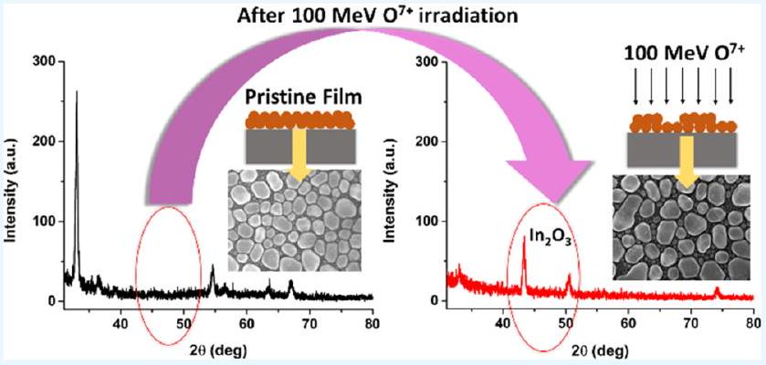 subjected to $100 \mathrm{MeV} \mathrm{O}^{7+}$ and $100 \mathrm{MeV} \mathrm{Si}{ }^{7+}$ ion irradiation, with the fluences varying from $1 \times 10^{11}$ to $1 \times 10^{13}$ ions $/ \mathrm{cm}^{2}$. The pristine and SHI-irradiated films were then characterized using glancing incidence X-ray diffraction (GIXRD), Rutherford backscattering spectrometry (RBS), scanning electron microscopy (SEM), and atomic force microscopy (AFM). The motive was to identify the effects of irradiation with different ion species having large variations in electronic and nuclear energy losses. While the RBS results suggest that sputtering is extremely low and that there are no major changes in the film composition due to ion beaminduced mixing, the GIXRD analysis indicates that increasing the ion fluence reduces the crystallinity of the film for both the ions. Ion beam irradiation with $\mathrm{O}^{7+}$ ions, however, results in beam-induced reactivity, as the GIXRD scan shows characteristic peaks from indium oxide ( $\mathrm{In}_{2} \mathrm{O}_{3}$ ), which become the predominant peaks at the highest fluence used here. $\mathrm{Si}^{7+}$ ion irradiation results in a narrowing of the particle size distribution on the surface, with no evidence of reactivity. SEM results indicate fusion and fragmentation of grains with the increase in the ion fluences, and AFM images reveal an increase in the surface roughness of a few percent when irradiated with both $100 \mathrm{MeV} \mathrm{O}^{7+}$ and $100 \mathrm{MeV} \mathrm{Si}{ }^{7+}$ ions.

## - INTRODUCTION

Swift heavy ion (SHI) beam irradiation has been developed as a versatile method to modify, characterize, and even synthesize desired materials in a controlled manner. ${ }^{1}$ As the ions traverse through solids, they deposit a large amount of energy due to both elastic collisions (referred to as nuclear energy loss, $S_{n}$ ) and inelastic collisions (referred to as electronic energy loss, $S_{\mathrm{e}}$ ) with the target atoms. These modify the physical properties of materials depending upon the ion energy, mass, and other related parameters. Depending on the ion species and other beam parameters, ion beam-induced mixing and reactivity can also occur. ${ }^{2-4}$ Fabrication of nanodevices requires the presence of nanostructures in selected areas. The SHI irradiation technique can be practically used for this in two ways: one can either deposit the film on selected areas and irradiate the whole surface or raster the ion beam with precise control over selected areas, thus leading to the formation of nanoparticles in the desired regions. ${ }^{5}$ The formation of embedded nanoparticles in a host matrix or via surface modifications can be achieved using ion beam energies varying from a few tens of keV to a few MeV and also by varying the initial film thickness
and the incident ion fluences. ${ }^{6,7}$ This has motivated our experiments to establish protocols for the development of desired types of metal nanostructures on substrates. ${ }^{8-10}$

In this work, we have studied the SHI-induced modification in In thin films, where $S_{\mathrm{e}}$ dominates, such that the $S_{\mathrm{e}} / S_{\mathrm{n}}$ ratio should be near $10^{3}$. Both the O and Si ions with the energy of 100 MeV meet this condition. Table 1 shows the ion beam parameters of Si and O ions studied in this work. The values of 100 keV ions (not used in the experiments reported here) are given for comparison. $S_{\mathrm{e}}$ and $S_{\mathrm{n}}$ vs depth values were obtained by simulation using the stopping and range of ions in mattertransport of ions in matter (SRIM-TRIM) (2013) code of Biersack et al. ${ }^{11} S_{\mathrm{e}}$ for both $100 \mathrm{MeV} \mathrm{O}{ }^{7+}$ and $\mathrm{Si}^{7+}$ ions is

[^0]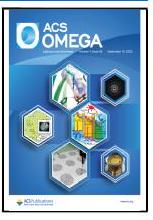

Table 1. Various Ion Beam Parameters Calculated Using SRIM/TRIM
| incident ion | energy loss value for indium |  | energy loss value for silicon |  | range |
| :--- | :--- | :--- | :--- | :--- | :--- |
|  | electronic energy loss ( $\mathrm{eV} / \AA$ ) | nuclear energy loss (eV/Å) | electronic energy loss ( $\mathrm{eV} / \AA$ ) | nuclear energy loss (eV/Å) |  |
| $100 \mathrm{keV} \mathrm{O}{ }^{7+}$ | $2.545 \times 10^{1}$ | $1.029 \times 10^{1}$ | $3.012 \times 10^{1}$ | 8.352 | 223.5 nm |
| $100 \mathrm{MeV} \mathrm{O}^{7+}$ | $1.348 \times 10^{2}$ | $8.102 \times 10^{-2}$ | $7.212 \times 10^{1}$ | $4.028 \times 10^{-2}$ | $95.2 \mu \mathrm{~m}$ |
| $100 \mathrm{keV} \mathrm{Si}^{7+}$ | $2.901 \times 10^{1}$ | $3.276 \times 10^{1}$ | $3.562 \times 10^{1}$ | $2.783 \times 10^{1}$ | 130.1 nm |
| $100 \mathrm{MeV} \mathrm{Si}^{7+}$ | $4.508 \times 10^{2}$ | $3.934 \times 10^{-1}$ | $2.471 \times 10^{2}$ | $1.941 \times 10^{-1}$ | $35.4 \mu \mathrm{~m}$ |

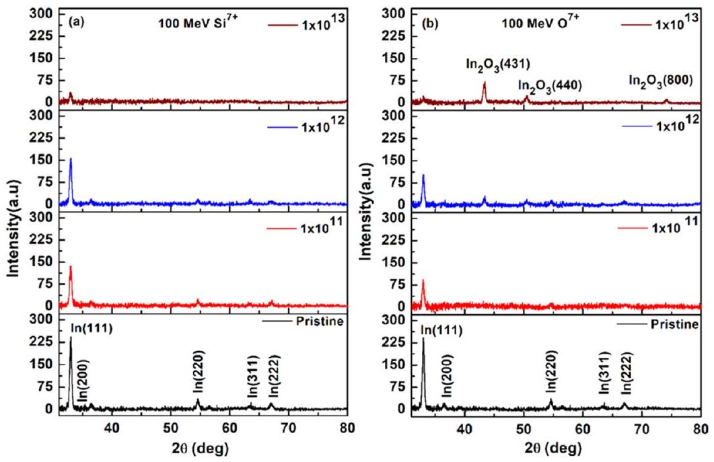
Figure 1. X-ray diffraction spectra of 25 nm (a) pristine and $100 \mathrm{MeV} \mathrm{Si}^{7+}$ ion-irradiated In films and (b) pristine and $100 \mathrm{MeV} \mathrm{O}^{7+}$ ion-irradiated In films.

distributed uniformly in the entire thin film. These ions traverse the film and are finally implanted inside the substrates.

In this high-incident energy regime, the energy loss mechanism is understood as a two-step process, where the atoms of the target material are ionized, and the energy of the electrons released is immediately transferred to the lattice, resulting in material modification, ion track formation, ion beam annealing, etc., within transient time scales of $\sim 10^{-14}- 10^{-17} \mathrm{~s} .^{4,12}$ This so-called 'inelastic thermal spike model ${ }^{13-15}$ recognizes that the electrons generated via ionization of target atoms along the track of ions have extremely high energy and may be considered to be a fluid, which is localized like a delta function in time and space along the track, forming the "electron thermal spike." This "fluid" in turn transfers its energy to the lattice via an electron-phonon coupling mechanism and results in a localized increase in the kinetic energy of the target atoms (lattice thermal spike), which eventually dissipates by kinetic transfer radially from the region around the track outward to the surrounding solid.

In the literature, a wide range of modifications that take place inside the materials have been reported. ${ }^{6,7,12}$ The effect of this energy transfer on insulators, for example, is that the ionized atoms along the track (since they stay ionized long enough without a delocalized electron distribution) get repelled away from each other (this is called Coulomb explosion), ${ }^{16}$ creating a cylindrical vacant region along the track. ${ }^{17}$ Material modification has been successfully modeled in the case of metals and semiconductors. ${ }^{18-20}$ Nordlund et al. performed molecular dynamics calculations for $\mathrm{GaN}^{21}$ and determined the positions of target atoms along the track after irradiation, which compared well with some experimental parameters. The methods of modeling the ion beam-induced effects vary across time and length scales following irradiation,
as has been summarized in a recent review from them. ${ }^{22}$ The predictions from these models need to be validated by experimental data, as the determination of the effects for specific materials continues to be necessary, and that has also motivated our experiments.

For heterogeneous samples like metallic films on dissimilar substrates (semiconductors or insulators), the irradiation effects depend on a variety of factors. Apart from the kinematic parameters such as the relative mass ratio of the projectile and target, and the energies of the incident ions, the energy loss to the film depends on physical properties such as the melting point and thermal conductivity of the irradiated metal film, the surface energy of the respective metal film (target) versus that of the substrate, as well as the details of the electronic structure of the target atoms, ${ }^{23}$ such as the Bohr velocity of the electrons in the atoms of the target film. ${ }^{2}$

As part of a systematic investigation of the consequences of ion beam irradiation of metal films on a silicon substrate, the present experiments explore the effects of $100 \mathrm{MeV} \mathrm{Si}^{7+}$ and $100 \mathrm{MeV} \mathrm{O}^{7+}$ ion irradiation on In films deposited on the $\mathrm{Si}(100)$ substrates. Several previous reports indicated that metal films were transformed upon ion irradiation into a highdensity array of nanostructures; for instance, the irradiation of Co films by $30 \mathrm{keV} \mathrm{Ga}{ }^{+}$ions results in randomly distributed nanoparticles by dewetting. ${ }^{5}$ The same ion beam was used to form nanochains of Co and concentric nanorings by irradiating narrow circles and lines made from Co films using FIB etching in a predefined template. Previous studies by Asha et al. on irradiation of Co films with $100 \mathrm{keV} \mathrm{Ar}{ }^{+}$ions have found that uniform nanostructures of average lateral size $\sim 35 \mathrm{~nm}$ are formed. ${ }^{9}$ Irradiation with a $100 \mathrm{MeV} \mathrm{O}^{7+}$ ion on the same Co films results in uniform globular nanostructures of similar sizes, but this occurs at much lower fluence values than that for the

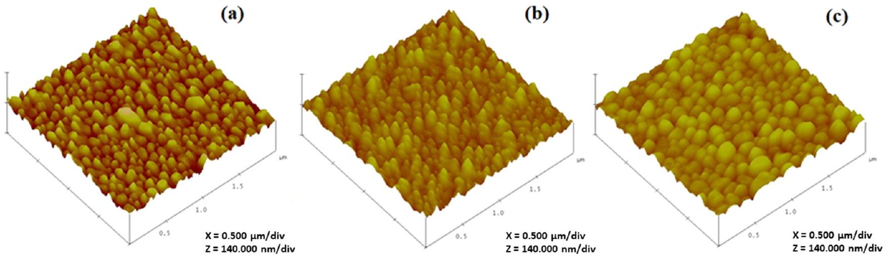
Figure 2. Three-dimensional view of the AFM images of 25 nm thin In films: (a) pristine and $100 \mathrm{MeV} \mathrm{O}^{7+}$ ion-irradiated films with fluence values of (b) $1 \times 10^{11}$ and (c) $1 \times 10^{13}$ ions $/ \mathrm{cm}^{2}$.

$100 \mathrm{keV} \mathrm{Ar}{ }^{+}$irradiation. ${ }^{8}$ Similar behavior was also reported for Sn and Ni films on silicon substrates. ${ }^{10}$

While starting from the same set of pristine films of a given thickness ( 25 nm ), the sizes and size distributions of the nanostructures formed for each set of films of a given thickness are quite similar, for such widely differing ion energies. There is, however, a strong dependence on the ion fluence-typically, the keV ions require fluence values to be $10^{3}-10^{4}$ times higher than the MeV ions, for the same density of nanostructures to be formed. These results on the restructuring of the metal films into nanoparticles over such a wide range of fluence values for differing ion energy scales need to be investigated for a larger set of elemental films along with theoretical calculations that simulate the processes that may result in such a rearrangement. The fluence values used in the 100 MeV SHI irradiation experiments were low enough to preclude the possibility of multiple ion impacts at identical locations in the film.

In the present work, we have selected indium as a low melting point material, to study the modifications of the In films upon irradiation with two different sets of SHIs, having different masses and a large difference in their $S_{\mathrm{e}}$ values. In addition, the two sets of ions differ in their potential reactivity with the In film, which allows us to distinguish the kinematic effects of ion irradiation from their chemical effects, for ions of the same incident energy. Our results indicate that the chemical reactivity of the ion-target pair can be a significant factor in the material modification which follows SHI irradiation.

## - RESULTS AND DISCUSSION

Glancing Incidence X-ray Diffraction. To study the effect of $100 \mathrm{MeV} \mathrm{O} \mathrm{O}^{7+}$ and $\mathrm{Si}^{7+}$ ion irradiation on the crystallinity of the In film, GIXRD is performed using a $\mathrm{Cu} \mathrm{K} \alpha$ source, which gives $\lambda=1.5406 \AA$. The XRD spectra of the pristine and irradiated films are shown in Figure 1. The pristine film is polycrystalline, and diffraction peaks are obtained at $2 \Theta$ values $33.0,36.5,54.8,64.0$, and $67.0^{\circ}$, which correspond to the (111), (200), (220), (311), and (222) planes of indium, respectively. Irradiation effects were investigated using SHIs with two different sets of incident species and at increasing ion fluences. Upon irradiation with the $\mathrm{Si}^{7+}$ ion beam, the crystallinity of the film is observed to decrease steadily with increasing fluence. At the highest fluence used ( $1 \times 10^{13}$ ions/ $\mathrm{cm}^{2}$ ), with the $100 \mathrm{MeV} \mathrm{Si}^{7+}$ ion beam, the crystallinity of the film is almost destroyed, with even the highest (111) peak intensity being reduced to about twice the background level.

Upon irradiation with the $100 \mathrm{MeV} \mathrm{O}^{7+}$ beam, however, the XRD plot indicates that, while irradiation reduces the degree of crystallinity of the In film, there are additional peaks that emerge with increasing fluence. At a fluence of $1 \times 10^{12}$ ions/ $\mathrm{cm}^{2}$, along with the reduced In peaks, there is evidence of beam-induced oxidation, as three new diffraction peaks are observed at $43.4,50.6$, and $74.8^{\circ}$, which have been identified as peaks of $\mathrm{In}_{2} \mathrm{O}_{3}$ (JCPDS-file no. 65-3170). At the highest fluence, the only peaks that remain are those due to $\mathrm{In}_{2} \mathrm{O}_{3}$, with just a trace of the original $\operatorname{In}(111)$ peak remaining above the background level.

Theoretical models such as the inelastic thermal spike model (iTSM) ${ }^{13-15}$ suggest that, as the SHI enters into the target material, it loses its energy either by energy transfer to the electrons of the target, ionizing the atoms of the target material and creating an ionized cylindrical region of radius a few nanometers along the path of the ion. In a metal, the valence electrons of the target are delocalized throughout the material, but the high-energy electrons generated along the ion track (electronic thermal spike) transfer their energy to the lattice via an electron-phonon coupling process. This produces a molten region in a localized high-temperature zone (of thousands of Kelvin on the picosecond time scale) of a few nanometers around the ion path (lattice thermal spike), which is rapidly quenched on a time scale of $10^{15} \mathrm{~K} / \mathrm{s}$, as reported by Mookerjee et al. ${ }^{24}$ Due to the aftereffects of the thermal spike, the material can become amorphized along the track or may have greatly reduced crystallinity, with large numbers of defects in the target material. ${ }^{25,26}$ Given the low melting temperature of In, ion beam-induced amorphization is extremely likely within the thermal spike model. ${ }^{13}$

Beam-induced reactivity with the $\mathrm{O}^{7+}$ ions is also highly probable, given that the incident ion energy of 100 MeV is well beyond the threshold for reactivity for In. As estimated by the method outlined by Funsten et al., the threshold energy for electron-hole pair production ${ }^{2}$ (which could induce reactivity) for $\mathrm{Si}^{7+}$ ions is $26.76 \mathrm{keV} / \mathrm{nm}$, and for $\mathrm{O}^{7+}$, it is 15.2 $\mathrm{keV} / \mathrm{nm}$. However, reactivity with $\mathrm{Si}^{7+}$ ions does not occur due to chemical considerations, as both In and Si have similar electronegativity values. By taking the atomic radius of an In atom to be $2.2 \AA$, the number of atoms $/ \mathrm{cm}^{2}$ is estimated as $5.15 \times 10^{14}$ atoms $/ \mathrm{cm}^{2}$, while the highest fluence used in our experiment is $1 \times 10^{13}$ ions $/ \mathrm{cm}^{2}$. This indicates that the effects we are seeing are single-particle effects even at the highest fluence values. However, the influence of the molten zone around the location of each ion track results in rapid melting

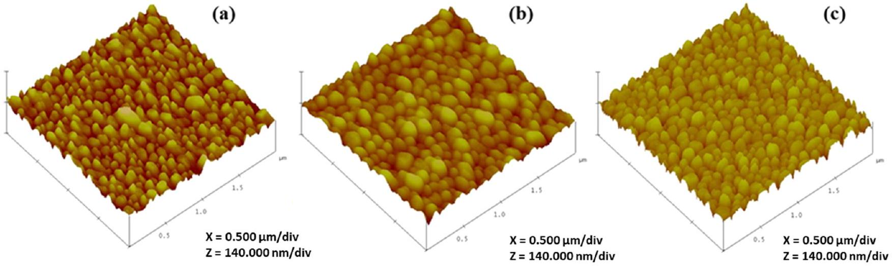
Figure 3. Three-dimensional view of the AFM images of 25 nm thin In films: (a) pristine and $100 \mathrm{MeV} \mathrm{Si}^{7+}$ ion-irradiated films with fluence values of (b) $1 \times 10^{11}$ and (c) $1 \times 10^{13}$ ions $/ \mathrm{cm}^{2}$.

Table 2. Particle Sizes and Roughness Values of Pristine and Irradiated In Films
| Fluence (ions/ $\mathrm{cm}^{2}$ ) | Average particle size (nm) |  | RMS roughness (nm) |  |
| :--- | :--- | :--- | :--- | :--- |
|  | $\mathrm{O}^{7+}$ | $\mathrm{Si}^{7+}$ | $\mathrm{O}^{7+}$ | $\mathrm{Si}^{7+}$ |
| pristine | $134.54 \pm 3.2$ | $134.54 \pm 3.2$ | $9.44 \pm 0.1$ | $9.44 \pm 0.1$ |
| $1 \times 10^{11}$ | $135.98 \pm 5.2$ | $145.81 \pm 3.6$ | $7.57 \pm 0.0$ | $9.46 \pm 0.1$ |
| $1 \times 10^{13}$ | $187.28 \pm 4.5$ | $133.09 \pm 3.1$ | $9.45 \pm 0.1$ | $12.34 \pm 0.6$ |

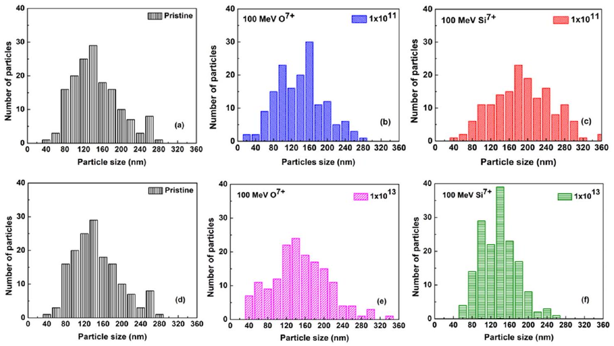
Figure 4. Particle size distribution of 25 nm In films: pristine and $\mathrm{O}^{7+}$ and $\mathrm{Si}^{7+}$ ions irradiated with fluence values of $1 \times 10^{11}$ ions $/ \mathrm{cm}^{2}(\mathrm{a}-\mathrm{c})$ and 1 $\times 10^{13}$ ions $/ \mathrm{cm}^{2}$ (d-f).

and quenching within the film due to the high transient local temperature. This is the reason for the reduction in its crystallinity until it is almost completely lost at the highest fluence we used.

Atomic Force Microscopy. The surface topography of the 25 nm thin In films before and after irradiation with 100 MeV $\mathrm{O}^{7+}$ and $\mathrm{Si}^{7+}$ ion beams is shown in AFM images in Figures 2 and 3 . It is observed that the pristine film is granular in nature with an average grain size of $\sim 135 \mathrm{~nm}$. As the films were bombarded with high-energy $\mathrm{Si}^{7+}$ and $\mathrm{O}^{7+}$ ion beams, the surface morphology of the In film changes and the average size of the particles increases.

The values of the particle size and surface roughness for In films irradiated with $\mathrm{O}^{7+}$ and $\mathrm{Si}^{7+}$ ions are listed in Table 2. The variations in the particle size of the In films before and after irradiation with $\mathrm{O}^{7+}$ and $\mathrm{Si}^{7+}$ ions may be seen from the histograms in Figure 4 for fluence values of $1 \times 10^{11}(\mathrm{a}-\mathrm{c})$ and $1 \times 10^{13}(\mathrm{~d}-\mathrm{f})$ ions $/ \mathrm{cm}^{2}$. The average particle size of the In films increases with ion irradiation for $\mathrm{O}^{7+}$ ions and decreases for $\mathrm{Si}^{7+}$ ions for the maximum fluence values used.

The size distribution of the grains for $\mathrm{Si}^{7+}$ ion-irradiated films is wider for the pristine film, but narrows down for the highest fluence of $1 \times 10^{13}$ ions $/ \mathrm{cm}^{2}$. For the $100 \mathrm{MeV} \mathrm{O}^{7+}$ ion-irradiated films, however, the average particle size of

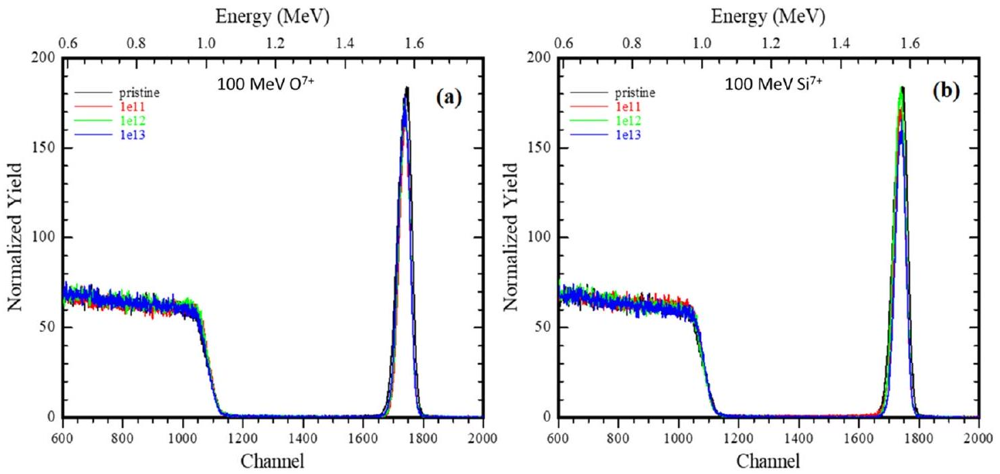
Figure 5. RBS spectra of 25 nm (a) pristine and $100 \mathrm{MeV} \mathrm{O}^{7+}$ ion-irradiated films and (b) pristine and $100 \mathrm{MeV} \mathrm{Si}^{7+}$ ion-irradiated In films, with increasing ion fluence.

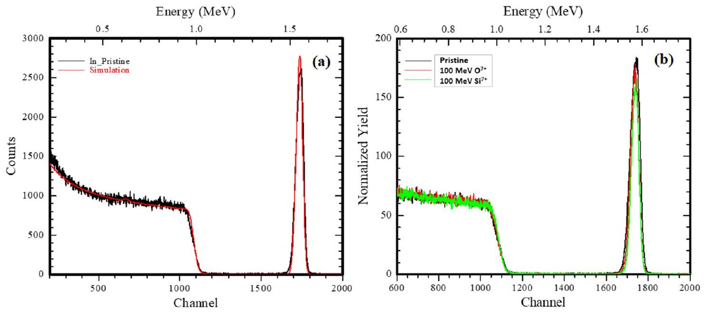
Figure 6. (a) RUMP simulation plot of a 25 nm pristine film and (b) RBS spectra of $100 \mathrm{MeV} \mathrm{O}^{7+}$ and Si ${ }^{7+}$ SHI-irradiated In films at a fluence of 1 $\times 10^{13} \mathrm{ion} / \mathrm{cm}^{2}$.

nanoclusters after irradiation with a fluence of $1 \times 10^{11}$ ions/ $\mathrm{cm}^{2}$ is slightly increased (see Table 2), and the size distribution also widens slightly. At the highest fluence of $1 \times 10^{13}$ ions/ $\mathrm{cm}^{2}$, the average size gets increased to $\sim 187 \mathrm{~nm}$ along with further broadening in the size distribution.

The pristine film has a surface roughness of $\sim 9.4 \mathrm{~nm}$. The surface roughness variations with ion fluences for $\mathrm{O}^{7+}$ and $\mathrm{Si}^{7+}$ ion beams are also mentioned in Table 2. For $\mathrm{O}^{7+}$ ionirradiated samples, the surface roughness value decreases to 7.5 nm for an initial fluence and then increases to 9.5 nm at the highest fluence, where the $\mathrm{In}_{2} \mathrm{O}_{3}$ peaks are observed in XRD.

In the case of $100 \mathrm{MeV} \mathrm{Si}^{7+}$, ion irradiation leads to an increase in the average particle size to $\sim 145 \mathrm{~nm}$, and the size distribution gets widened, with the increase in the number of smaller particles as well as larger particles at the low fluence. At the highest fluence values, the average surface particle size is decreased to $\sim 133 \mathrm{~nm}$ with the distribution getting narrower and roughness values increasing to $\sim 12.34 \mathrm{~nm}$.

There is a large variation of electronic energy loss of the $\mathrm{Si}^{7+}$ ions in In, being more than three times that of $\mathrm{O}^{7+}$ ions (given in Table 1). This high $S_{\mathrm{e}}$ value for In could result in the
nanostructuring of the In films, as is observed in the SHI irradiation of $\mathrm{Sn}, \mathrm{Co}$, and Ni films, driven by energy minimization. ${ }^{8,10}$ In the case of $\mathrm{O}^{7+}$ ion irradiation of the In films, reactivity is the dominant process and narrowing of size distributions on the surface is not warranted.

Upon energetic ion beam bombardment, typically two competing processes, sputtering and surface diffusion, control the development of nanostructures on the surface. Experimental studies show that sputtering prevails in the low-energy regime, while surface diffusion prevails in the high-energy regime. ${ }^{27}$ On irradiation, the morphology of the surface changes, and in the case of the $\mathrm{Si}^{7+}$ ions, melting and fusion occur, along with smoothening of the mesoscopic hill-like structures of the film. This ironically results in increased RMS roughness of the surface, as the nature of the distribution has changed to form some larger and some extremely small grains.

In the case of $\mathrm{O}^{7+}$ ion irradiation, initially, the roughness decreases slightly and is then restored to the level of the pristine films, at the highest fluence of $1 \times 10^{13} \mathrm{ions} / \mathrm{cm}^{2}$, perhaps because of the formation of an oxide due to ion beam reactivity.

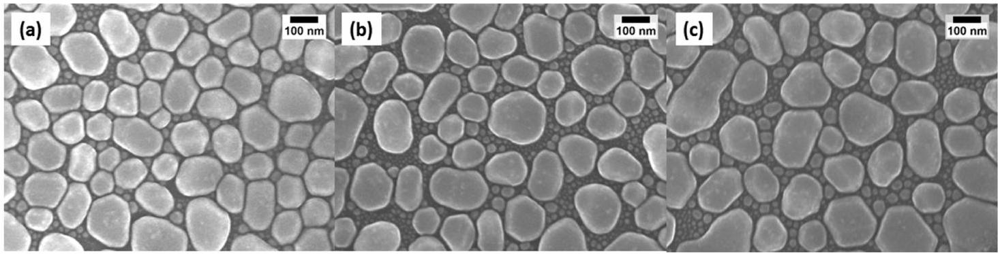
Figure 7. SEM micrographs (100k times magnified) of the In films: (a) pristine and $\mathrm{O}^{7+}$ ions irradiated by fluence values of (b) $1 \times 10^{11}$ ions/ $\mathrm{cm}^{2}$ and (c) $1 \times 10^{13}$ ions $/ \mathrm{cm}^{2}$.

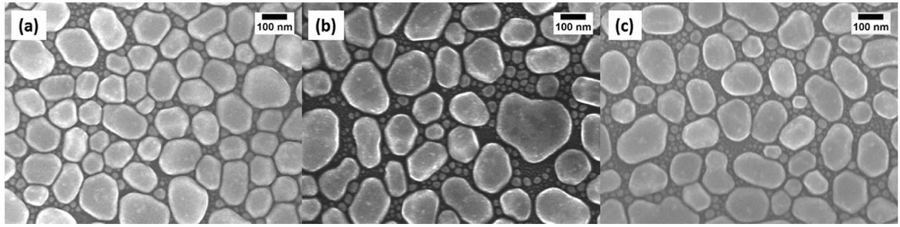
Figure 8. SEM micrographs (100k times magnified) of the In films: (a) pristine and $\mathrm{Si}^{7+}$ ions irradiated by fluence values of $(b) 1 \times 10^{11}$ ions $/ \mathrm{cm}^{2}$ and (c) $1 \times 10^{13}$ ions $/ \mathrm{cm}^{2}$.

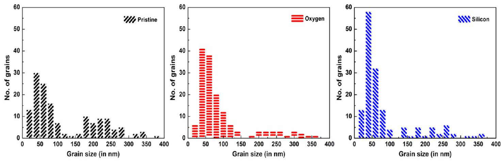
Figure 9. Grain size distribution from SEM of 25 nm In films: pristine, $\mathrm{O}^{7+}$, and $\mathrm{Si}^{7+}$ ion-irradiated films with the fluence of $1 \times 10^{13}$ ions $/ \mathrm{cm}^{2}$.

Rutherford Backscattering Spectrometry. RBS was performed for elemental analysis and depth profiling of the pristine film and $100 \mathrm{MeV} \mathrm{O}^{7+}$ and $\mathrm{Si}^{7+}$ ion-irradiated In films, using $1.8 \mathrm{MeV} \mathrm{He}^{+}$ion beams. For each measurement, the cumulative value of the charge flux of $\mathrm{He}^{+}$was fixed at $12 \mu \mathrm{C}$. Figure 5 displays the obtained RBS spectra for both ion species. These spectra show the distinct peaks of In and Si for the pristine and irradiated films. The In peak is positioned at 1.56 MeV , with the shoulder corresponding to the Si substrate near 1 MeV . The ions backscattered from In atoms have higher energy than the ions backscattered from Si due to kinematic reasons, as the atomic mass of the target atoms from which the ion is backscattered determines the backscattered energy of the incident ion. ${ }^{28}$

Figure 6a shows the simulated and experimental data of the pristine film. Simulation using RUMP (Rutherford Universal Manipulation Program) software confirms the thickness of the In film as $\sim 25 \mathrm{~nm}$. Figure 6b shows the RBS spectra of the pristine In film and $\mathrm{O}^{7+}$ and $\mathrm{Si}^{7+}$ ion-irradiated films for a fluence of $1 \times 10^{13}$ ions $/ \mathrm{cm}^{2}$. The spectra suggest no change in elemental composition in the $\mathrm{O}^{7+}$ ion-irradiated film, while a slight change of less than $1 \%$ in the indium peak area is seen in
the case of $\mathrm{Si}^{7+}$ irradiated films, with the peak intensity being very slightly reduced from the pristine level. This may be due to the sputtering of the In film upon irradiation with $\mathrm{Si}^{7+}$ ions, as the latter are substantially heavier than $\mathrm{O}^{7+}$ ions, with the nuclear energy loss value for $100 \mathrm{MeV} \mathrm{Si}^{7+}$ ions being nearly five times the value for $\mathrm{O}^{7+}$ ions. Even in the case of the $\mathrm{O}^{7+}$ ion-irradiated samples, the peak narrows slightly. These effects could also be a manifestation of the changes in the surface morphology and the grain size as evident in the microscopy data from both AFM and SEM. There is no detectable trace of oxygen at lower energy channels (which appears at around channel number 650, corresponding to 0.7 MeV as indicated in the upper X-scale) as the amount of oxygen in the In film is below detection limits of RBS.

Scanning Electron Microscopy. The surface morphology of the film is studied using field emission scanning electron microscopy (FESEM) measurements. Figures 7 and 8 show the FESEM images of $100 \mathrm{MeV} \mathrm{O}{ }^{7+}$ and $100 \mathrm{MeV} \mathrm{Si}^{7+}$ ionirradiated films, respectively, along with the pristine film. The surface image of the pristine film shows closely packed grains with a bimodal size distribution, with sizes varying from 20 to 200 nm .

After irradiation with different ion fluences of $\mathrm{O}^{7+}$ and $\mathrm{Si}^{7+}$ ion beams, there are subtle changes in the roughness and surface morphology of the film, as shown in Figures 7 and 8. The SEM images of the irradiated samples show variations in the grain size with an increase in the ion fluence, and the bimodal distribution pattern of the grain size obtained from these SEM images indicates the maxima around 40 and 220 nm of the size distribution (Figure 9). Although the distribution of grains is still bimodal, as plotted in Figure 9, the number of smaller grains (size $0-140 \mathrm{~nm}$ ) increases to $134 \%$ of the grains originally present in the pristine film, for the $\mathrm{O}^{7+}$ ion-irradiated films. It increases to about $132 \%$ for the $\mathrm{Si}^{7+}$ ion-irradiated films. At the same time, the number of larger grains (of size $160-400 \mathrm{~nm}$ ) reduces to $40 \%$ and to about $46 \%$ of the number of grains present in the pristine film for $\mathrm{O}^{7+}$ and $\mathrm{Si}^{7+}$ ions, respectively. Some grains of extremely large sizes (around 400 nm ) seem to be the result of fusion of smaller grains, but these were the exception.

As can be seen from the micrographs in Figures 7 and 8, upon irradiation, the grains become less dense, with voids between them. The size distribution changes as bigger size grains get fragmented into smaller grains for both the ion species, as observed in the size distribution plot in Figure 9.

Various models have been proposed to understand the modification induced by SHI irradiation in the materials. The prominent ones are the thermal spike model ${ }^{14}$ and the Coulomb explosion model, ${ }^{16}$ both of which result in effects which destabilize the lattice of the target. The observed fragmentation and fusion of grains are explained based on the Coulomb explosion and inelastic thermal spike models. ${ }^{14}$ These models are used to understand the SHI-induced effects on materials. According to the Coulomb model, the projectile ions create an ion core, which is positive along the ion path and results in the generation of a shock wave. This induces a strain in the materials. These strained materials fragment, with the large grains breaking up into smaller ones. Similar fragments are also expected from the thermal spike model. When the grain sizes are smaller, ion beam-induced grain growth is observed. A detailed discussion on these aspects is available elsewhere in the literature. ${ }^{29}$ Thus, the electronic energy loss of the SHI beam plays a significant role in the fusion and disintegration of grains, and changes the morphology of the film.

## - CONCLUSIONS

Indium films of about 25 nm thickness were deposited using the electron beam evaporation method. The impact of the electronic energy loss on the compositional and morphological evolution of In films irradiated with $100 \mathrm{MeV} \mathrm{O} \mathrm{O}^{7+}$ and 100 $\mathrm{MeV} \mathrm{Si}^{7+}$ ions has been examined. It has been observed that irradiation leads to amorphization, caused due to extreme local heating induced by the ion beams. In spite of having a nearly equal $S_{\mathrm{e}} / S_{\mathrm{n}}$ ratio for both the ion species and $\left(S_{\mathrm{e}}\right)_{\text {silicon }} \approx 3\left(S_{\mathrm{e}}\right)_{\text {oxygen }}$, ion beam reactivity is observed only in the 100 $\mathrm{MeV} \mathrm{O}^{7+}$ beam-irradiated samples, as the $\mathrm{O}^{7+}$ ions react with the target film and form indium oxide. Narrowing of the size distribution of nanostructures upon silicon ion irradiation is evident from AFM, but in the SEM images, we get a bimodal distribution of the particle size, since depth perception in these images enables imaging of the smaller grains as well. Morphological changes in the In film include a decrease in roughness, fragmentation of bigger-sized grains, and increased spacing between them due to beam-induced melting and
fusion, with the spaces being filled with smaller grains. The RBS spectra of pristine and irradiated films for both $\mathrm{O}^{7+}$ and $\mathrm{Si}^{7+}$ ions are almost identical, except for minute changes in the peak intensity, with traces of narrowing in the $\mathrm{O}^{7+}$ irradiated films and a slight indication of sputtering in the case of the $\mathrm{Si}^{7+}$ ion-irradiated sample at the highest fluences, which reflect the transformation of the surface morphology of the films.

## - EXPERIMENTAL DETAILS

Indium films with 25 nm thickness were deposited on the $1 \times 1 \mathrm{~cm}^{2} \mathrm{Si}(100)$ substrate by electron beam evaporation at room temperature, in the Target Lab at IUAC, Delhi. The substrate ( $1 \times 1 \mathrm{~cm}^{2}$ ) was cut from commercial $\mathrm{Si}(100)$ wafers and cleaned by sonication, successively in warm trichloroethylene, ethanol, and acetone, and finally in distilled water. The base pressure was maintained at $2 \times 10^{-5}$ mbar during deposition, and the film thickness was continuously monitored with a quartz crystal monitor. The as-deposited films were transferred to a desiccator to the ion beam chamber and then irradiated with $100 \mathrm{MeV} \mathrm{O}^{7+}$ and $100 \mathrm{MeV} \mathrm{Si}^{7+}$ ions at fluences ranging from $1 \times 10^{11}$ to $1 \times 10^{13}$ ions $/ \mathrm{cm}^{2}$, generated in the 15 UD Pelletron tandem accelerator at IUAC. To ensure the homogeneous irradiation of the film, an ion beam of spot size $\sim 2 \mathrm{~mm}$ in diameter was rastered over the sample area of 1 $\times 1 \mathrm{~cm}^{2}$. The changes in surface morphology were analyzed using an FESEM (7610F-FESEM, JEOL) at the Material Science Group, IUAC. RBS was performed to study the compositional change, using a $\mathrm{He}^{+}$ion beam of energy 1.8 MeV at the PARAS facility, IUAC. The surface roughness of the In films before and after irradiation was analyzed using a Nanoscope IIIa atomic force microscope, in the tapping mode, at the AFM facility of the Material Science Group at IUAC. To observe the changes in the crystalline structure, GIXRD was carried out at the Nanoscale Research Facility, IIT Delhi using a RIGAKU Ultima IV with $\mathrm{Cu} \mathrm{K} \alpha$ radiations as a source ( $\lambda= 1.5406 \AA$ ) at the incident angle of $1^{\circ}$ and scan rate of $3^{\circ} / \mathrm{min}$ within the $2 \theta$ range of $30-80^{\circ}$.

In our work, we have used $100 \mathrm{MeV} \mathrm{O}^{7+}$ and $100 \mathrm{MeV} \mathrm{Si}^{7+}$ ions. Irradiation parameters obtained by the SRIM code ${ }^{11}$ are presented in Table 1, for the In target. Since at this ion-energy range $S_{\mathrm{e}}$ is more than 1000 times larger than the $S_{\mathrm{n}}$, the incident ions transfer their energy to the target material largely via $S_{\mathrm{e}}$. The value of $S_{\mathrm{e}}$ for $\mathrm{Si}^{7+}$ ions is about three times the $S_{\mathrm{e}}$ for $\mathrm{O}^{7+}$ ions, and $S_{\mathrm{n}}$ of $100 \mathrm{MeV} \mathrm{Si}^{7+}$ is about five times larger than that of the $S_{n}$ value of $\mathrm{O}^{7+}$ ions. Given this choice of ion parameters, the changes in surface morphology, structure, composition, and electronic properties are mainly expected to be due to the electronic excitation along the ion path.

## - AUTHOR INFORMATION

## Corresponding Author

Lekha Nair - Department of Physics, Jamia Millia Islamia, New Delhi 110025, India; © orcid.org/0000-0003-42669143; Email: lnair@jmi.ac.in

## Authors

Zara Aftab - Department of Physics, Jamia Millia Islamia, New Delhi 110025, India
Indra Sulania - Inter University Accelerator Centre, New Delhi 110067, India; © orcid.org/0000-0002-4833-1656
Asokan Kandasami - Department of Physics \& Centre for Interdisciplinary Research, University of Petroleum and Energy Studies (UPES), Dehradun, Uttarakhand 248007,

## India; Inter University Accelerator Centre, New Delhi 110067, India

Complete contact information is available at:
https://pubs.acs.org/10.1021/acsomega.2c02653

## Funding

The first author (Z.A.) is thankful to the Council for Scientific and Industrial Research (CSIR) for providing the CSIR-JRF Fellowship for carrying out the research work.

## Notes

The authors declare no competing financial interest.

## ACKNOWLEDGMENTS

All authors are grateful to Dr. Kabiraj and Abhilash of Target Lab, IUAC for their help in sample preparation; Pelletron Accelerator group, IUAC for their help during the ion beam irradiation experiment; and G.R. Umapathy and Sunil Ojha at IUAC, Delhi, for their support and valuable suggestions during SEM and RBS experiments and analyses.

## REFERENCES

(1) Zarkadoula, E.; Toulemonde, M.; Weber, W. J. Additive Effects of Electronic and Nuclear Energy Losses in Irradiation-Induced Amorphization of Zircon. Appl. Phys. Lett. 2015, 107, No. 261902.
(2) Funsten, H. O.; Ritzau, S. M.; Harper, R. W.; Borovsky, J. E.; Johnson, R. E. Energy Loss by KeV Ions in Silicon. Phys. Rev. Lett. 2004, 92, No. 213201.
(3) Kumar, P.; Nair, L.; Bera, S.; Mehta, B. R.; Shivaprasad, S. M. Epitaxial SiC Formation Induced by Medium Energy Ions on $\mathrm{Si}(11$ 1) at Room Temperature. Appl. Surf. Sci. 2009, 255, 6802-6805.
(4) Virdi, G. S.; Pathak, B. C.; Avasthi, D. K.; Kanjilal, D. Swift Heavy Ion-Induced Recrysallization of Silicon-on-Insulator (SOI) Structures. Nucl. Instrum. Methods Phys. Res., Sect. B 2002, 187, 189200.
(5) Lian, J.; Wang, L.; Sun, X.; Yu, Q.; Ewing, R. C. Patterning Metallic Nanostructures by Ion-Beam-Induced Dewetting and Rayleigh Instability. Nano Lett. 2006, 6, 1047-1052.
(6) Ridgway, M. C.; Giulian, R.; Sprouster, D. J.; Kluth, P.; Araujo, L. L.; Llewellyn, D. J.; Byrne, A. P.; Kremer, F.; Fichtner, P. F. P.; Rizza, G.; Amekura, H.; Toulemonde, M. Role of Thermodynamics in the Shape Transformation of Embedded Metal Nanoparticles Induced by Swift Heavy-Ion Irradiation. Phys. Rev. Lett. 2011, 106, No. 095505.
(7) Pivin, J. C.; Roger, G.; Garcia, M. A.; Singh, F.; Avasthi, D. K. Nucleation and Growth of Ag Clusters in Silicate Glasses under Ion Irradiation. Nucl. Instrum. Methods Phys. Res., Sect. B 2004, 215, 373384.
(8) Attri, A.; Kumar, A.; Verma, S.; Ojha, S.; Asokan, K.; Nair, L. Synthesis of Cobalt Nanoparticles on Si (100) by Swift Heavy Ion Irradiation. Nanoscale Res. Lett. 2013, 8, No. 433.
(9) Attri, A.; Nair, L. High Density Cobalt Nanostructures by Ion Beam Induced Dewetting. e-J. Surf. Sci. Nanotechnol. 2013, 11, 99104.
(10) Attri, A.; Asokan, K.; Nair, L. Synthesis of Tin Nanoparticles by Swift Heavy Ion Irradiation of Films on Quartz Substrates. Adv. Sci. Lett. 2014, 20, 1446-1449.
(11) Ziegler, J. F.; Ziegler, M. D.; Biersack, J. P. SRIM - The Stopping and Range of Ions in Matter (2010). Nucl. Instrum. Methods Phys. Res., Sect. B 2010, 268, 1818-1823.
(12) Szenes, G. General Features of Latent Track Formation in Magnetic Insulators Irradiated with Swift Heavy Ions. Phys. Rev. B 1995, 51, 8026-8029.
(13) Stodel, C.; Toulemonde, M.; Fransen, C.; Jacquot, B.; Clément, E.; Frémont, G.; Michel, M.; Dufour, C. "Thermal Spike" Model Applied to Thin Targets Irradiated with Swift Heavy Ion Beams at Few MeV/U. EPJ Web Conf. 2020, 229, No. 05001.
(14) Toulemonde, M.; Paumier, E.; Dufour, C. Thermal Spike Model in the Electronic Stopping Power Regime. Radiat. Eff. Defects Solids 1993, 126, 201-206.
(15) Toulemonde, M.; Dufour, C.; Paumier, E. Transient Thermal Process after a High-Energy Heavy-Ion Irradiation of Amorphous Metals and Semiconductors. Phys. Rev. B 1992, 46, 14362-14369.
(16) Fleischer, R. L.; Price, P. B.; Walker, R. M. Ion Explosion Spike Mechanism for Formation of Charged-Particle Tracks in Solids. J. Appl. Phys. 1965, 36, 3645-3652.
(17) Itoh, N.; Duffy, D. M.; Khakshouri, S.; Stoneham, A. M. Making Tracks: Electronic Excitation Roles in Forming Swift Heavy Ion Tracks. J. Phys.: Condens. Matter 2009, 21, No. 474205.
(18) Nordlund, K.; Ghaly, M.; Averback, R. S. Mechanisms of Ion Beam Mixing in Metals and Semiconductors. J. Appl. Phys. 1998, 83, 1238-1246.
(19) Nordlund, K.; Averback, R. S. Collision Cascades in Metals and Semiconductors: Defect Creation and Interface Behavior. J. Nucl. Mater. 2000, 276, 194-201.
(20) Nordlund, K.; Keinonen, J.; Ghaly, M.; Averback, R. S. Recoils, Flows and Explosions: Surface Damage Mechanisms in Metals and Semiconductors during $50 \mathrm{EV}-50 \mathrm{KeV}$ Ion Bombardment. Nucl. Instrum. Methods Phys. Res., Sect. B 1999, 148, 74-82.
(21) Sequeira, M. C.; Mattei, J. G.; Vazquez, H.; Djurabekova, F.; Nordlund, K.; Monnet, I.; Mota-Santiago, P.; Kluth, P.; Grygiel, C.; Zhang, S.; Alves, E.; Lorenz, K. Unravelling the Secrets of the Resistance of GaN to Strongly Ionising Radiation. Commun. Phys. 2021, 4, No. 51.
(22) Nordlund, K.; Short, M. P. Modeling of Radiation Damage in Materials: Best Practices and Future Directions. In Handbook of Materials Modeling; Springer, 2019; pp 1-13.
(23) Lin, Z.; Zhigilei, L. V.; Celli, V. Electron-Phonon Coupling and Electron Heat Capacity of Metals under Conditions of Strong Electron-Phonon Nonequilibrium. Phys. Rev. B 2008, 77, No. 075133.
(24) Mookerjee, S.; Beuve, M.; Khan, S. A.; Toulemonde, M.; Roy, A. Sensitivity of Ion-Induced Sputtering to the Radial Distribution of Energy Transfers: A Molecular Dynamics Study. Phys. Rev. B 2008, 78, No. 045435.
(25) Nordlund, K.; Wallenius, J.; Malerba, L. Molecular Dynamics Simulations of Threshold Displacement Energies in Fe. Nucl. Instrum. Methods Phys. Res., Sect. B 2006, 246, 322-332.
(26) Nordlund, K.; Zinkle, S. J.; Sand, A. E.; Granberg, F.; Averback, R. S.; Stoller, R.; Suzudo, T.; Malerba, L.; Banhart, F.; Weber, W. J.; Willaime, F.; Dudarev, S. L.; Simeone, D. Improving Atomic Displacement and Replacement Calculations with Physically Realistic Damage Models. Nat. Commun. 2018, 9, No. 1084.
(27) Avasthi, D. K.; Pivin, J. C. Ion Beam for Synthesis and Modification of Nanostructures. Curr. Sci. 2010, 98, 780-792.
(28) Hojabri, A. Structural and Optical Characterization of ZrO2 Thin Films Grown on Silicon and Quartz Substrates. J. Theor. Appl. Phys. 2016, 10, 219-224.
(29) Kumar, M.; Singh, F.; Khan, S. A.; Baranwal, V.; Kumar, S.; Agarwal, D. C.; Siddiqui, A. M.; Tripathi, A.; Gupta, A.; Avasthi, D. K.; Pandey, A. C. Swift Heavy Ion Induced Structural and Optical Modifications in LiF Thin Film. J. Phys. D: Appl. Phys. 2005, 38, 637641.

[^0]:    Received: April 28, 2022
    Accepted: August 16, 2022
    Published: September 6, 2022

