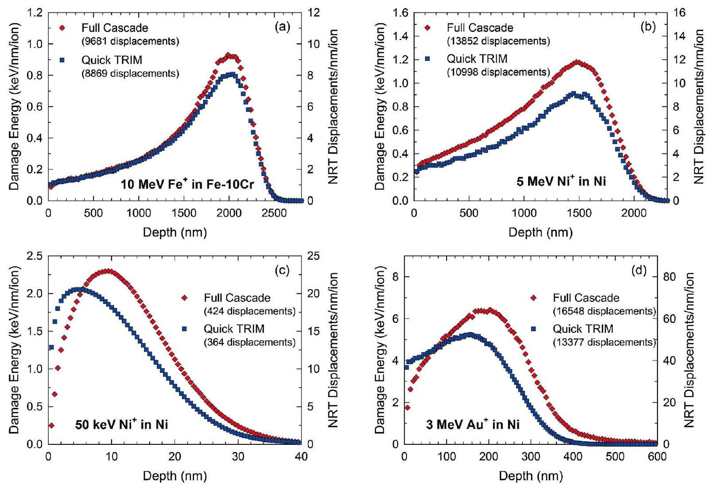
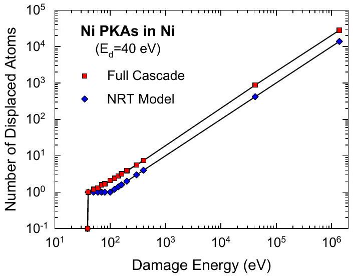
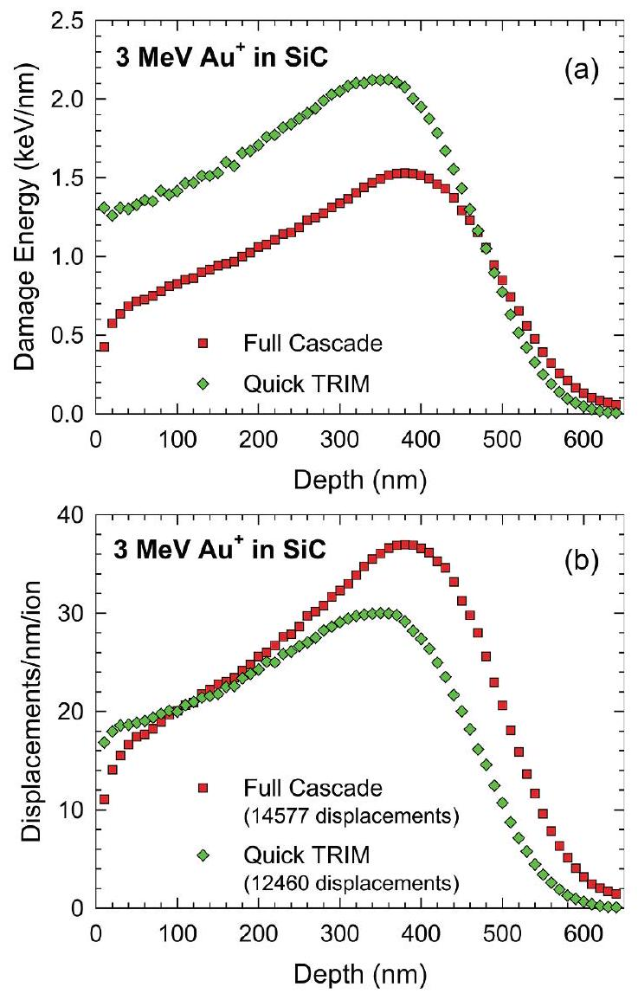
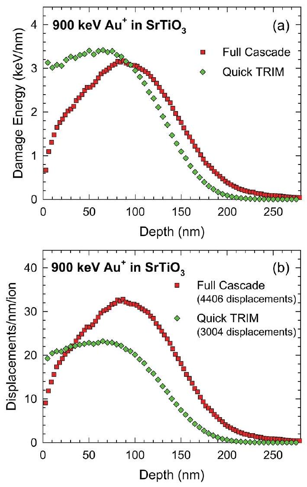
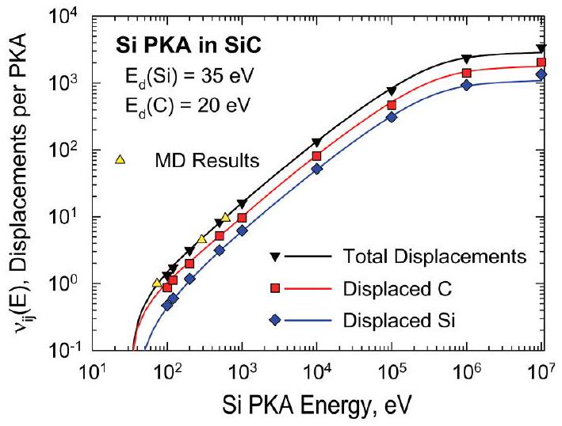
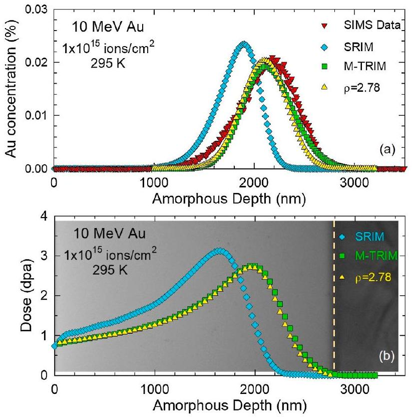
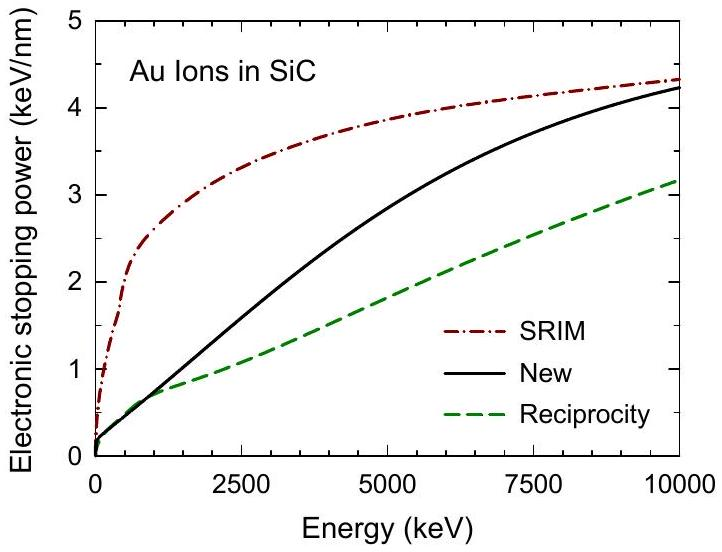

# Predicting damage production in monoatomic and multi-elemental targets using stopping and range of ions in matter code: Challenges and recommendations ${ }^{\text {H }}$ 

William J. Weber*, Yanwen Zhang* Department of Materials Science and Engineering, The University of Tennessee, Knoxville, TN 37996, USA Materials Science and Technology Division, Oak Ridge National Laboratory, Oak Ridge, TN 37831, USA

## ARTICLE INFO

## Keywords:

Ion-solid interaction
Stopping power
Damage profile
Displacements
Full-cascade simulations

#### Abstract

The computer code, Stopping and Range of Ions in Matter (SRIM), is widely used to describe energetic processes of ion-solid interactions; its predictive power relies on the accuracy of energy loss/transfer and collision processes being considered. While the SRIM code is commonly applied in radiation effects research to predict damage production and in the semiconductor industry to estimate ion range and dopant concentration profiles, two challenges exist that affect its use: (1) inconsistency in estimations of atomic displacements between fullcascade and quick (modified Kinchin-Pease) options and (2) overestimation of electronic stopping power for slow heavy ions in light targets (e.g., Be and Si ) or in compound targets containing light elements (e.g., $\mathrm{C}, \mathrm{N}$ and O in carbides, nitrides and oxides). Based on a literature review and our experimental investigations, we discuss the underlying reasons for the discrepancies, clarify the physical limitations of the SRIM predictions, and, more importantly, provide recommendations to address the two challenges.

## 1. Introduction

Knowledge of ion-solid interaction is of fundamental and practical importance for applications in ion beam analysis (IBA) [1-3], ion beam materials modification (IBMM) [4,5], ion implantation doping and device fabrication [6], radiation effects in materials and devices under extreme radiation conditions [7], high-energy and nuclear physics [8,9], and radiation therapy [10]. An energetic ion loses energy through inelastic energy transfer to electrons (excitation and ionization of target atoms and the ion itself), elastic energy transfer to atomic nuclei (recoils), as well as high-energy effects (e.g., nuclear reactions and bremsstrahlung) [11]. The rate of energy loss per unit path length $(\mathrm{dE} / \mathrm{dx})$ is referred to as stopping power, also known as stopping force [12]. Simply described, ion energy loss is separated into (1) energy transfer to target electrons (electronic stopping power, $\mathrm{dE} / \mathrm{dx}_{\mathrm{e}}$ ) that leads to ionization, and (2) energy transfer to target nuclei (nuclear stopping power, $\mathrm{dE} / \mathrm{dx}_{\mathrm{n}}$ ) that results in either atomic displacements or
phonon energy dissipation for energy transfer above or below the threshold displacement energy ( $\mathrm{E}_{\mathrm{d}}$ ), respectively.

One of the earliest theories for $\mathrm{dE} / \mathrm{dx}_{\mathrm{e}}$ at low energies, known as the LSS theory, was developed by Lindhard, Scharff and Schiøtt [13] and is still widely used. Nonetheless, accurate determination of $\mathrm{dE} / \mathrm{dx}_{\mathrm{e}}$ continues to be a subject of great experimental [14-19] and theoretical [11,12,20-26] interest. Lindhard et al. [27] proposed a universal scattering formula for screened Coulomb potentials based on a simple scaling function that was used to calculate $\mathrm{dE} / \mathrm{dx}_{\mathrm{n}}$ for the ThomasFermi potential. Winterbon et al. [28] developed an analytical formulism for this scaling function, which can describe other screened Coulomb potentials [29,30]. Using interatomic potentials calculated from first principles for 14 different diatomic interactions, Wilson et al. [31] showed that a Moliere-like potential more accurately describes $\mathrm{dE} / \mathrm{dx}_{\mathrm{n}}$ at low energies, and this potential was adopted in the first version of the TRansport of Ions in Matter (TRIM) code [32]. Ziegler, Biersack and Littmark [33] extended the work of Wilson et al. [31] to

[^0]$10^{4}$ interatomic interactions and developed a universal scattering potential (i.e., the ZBL potential) that is employed in the Stopping and Range of Ions in Matter (SRIM) code [33-35], which includes TRIM as a subroutine, to describe nuclear scattering and determine $\mathrm{dE} / \mathrm{dx}_{\mathrm{n}}$ over a wide energy range.

While SRIM uses modern theoretical models and experimental databases [36,37], the $\mathrm{dE} / \mathrm{dx}_{\mathrm{e}}$ values it predicts show varing degrees of agreement with measured stopping data, and significant deviations in SRIM predictions of $\mathrm{dE} / \mathrm{dx}_{\mathrm{e}}$ for heavy ions are reported [17,38-41]. Accurate values of stopping powers are essential for reliable calculations of energy deposition, displaced atom and implanted ion profiles, as well as providing standard radiation damage doses resulting from different ions or different radiation environments. Since ion beam irradiations are often used to emulate displacement damage doses (quantified as displacements per atom or dpa) from fast neutrons, fission fragments and radioactive decay products [42], reliable calculations of damage dose are critical for evaluating the performance of materials and devices in high-radiation environments. There are continuing efforts to improve the prediction of stopping powers over a wide range of energies and materials [22-26,41,43], which should lead to more reliable damage calculations.

To quantitatively compare atomic displacement damage resulting from different ion-target combinations, the SRIM code is frequently used to calculate electronic and nuclear stopping powers and simulate the inelastic and elastic energy transfers from an energetic incident ion to target atoms as it transverses the sample until it comes to rest. The resulting vacancy or displacement production profile is used to estimate the local damage dose in dpa, and to evaluate irradiation effects from energetic charged particles in terms of modification of the target composition, structure, functionality, and surface topography [4,44-46]. While ion irradiation serves as an essential surrogate tool for high-dose ( $>10 \mathrm{dpa}$ ) neutron irradiation [42], there has been increasing concern and discussion regarding apparent discrepancies [47] in the average damage energy per ion (i.e., energy dissipated by a single ion in producing only atomic displacements) and the number of atomic displacements per ion predicted by full-cascade TRIM versus quick TRIM (i.e., modified Kinchin-Pease model [48,49]) calculation options available in SRIM. In addition, the uncertainty or large errors in the electronic stopping power, $\mathrm{dE} / \mathrm{dx}_{\mathrm{e}}$, calculated by SRIM and used in TRIM calculations, such as the overestimation for slow heavy ions in light targets [38-40], makes determination of damage and implanted ion profiles even more challenging.

In this work, we highlight and discuss two challenges associated with using SRIM: (1) the discrepancy between full-cascade and quick (modified Kinchin-Pease) TRIM simulations; and (2) overestimation of $\mathrm{dE} / \mathrm{dx}_{\mathrm{e}}$ for heavy ions in targets containing light elements. While recent efforts within the nuclear radiation damage community have focused on determining a radiation damage equivalence between ion and neutron irradiation in Fe-based structural alloys [47] or physically realistic standards for radiation damage quantification [50,51], this work aims to include the broader ion beam community that conducts research on ion-solid interactions over a wide range of ions, from H to Pb , and target materials, such as carbides, nitrides, oxides, semiconductors and metal alloys. Using information obtained from a review of the appropriate literature and comparisons of full-cascade and quick TRIM simulations, we discuss the differences between full-cascade and quick TRIM options in damage energy and atomic displacement calculations. Furthermore, the significant impact resulting from the overestimation of $\mathrm{dE} / \mathrm{dx}_{\mathrm{e}}$ for slow heavy ions in light targets is evaluated based on our own experimental studies, and significant errors in the calculated damage dose (dpa) and implanted ions profiles are demonstrated. We identify the underlying reasons for these discrepancies, clarify the physical limitations of the TRIM predictions, and suggest a practical path forward.

## 2. Full-cascade vs quick TRIM simulations

In the SRIM code [33-35], ion-induced damage profiles can be determined using two different approaches provided by available TRIM options: (1) a quick TRIM calculation (Ion Distribution and Quick Calculation of Damage), or (2) full-cascade TRIM calculation (Detailed Calculation with Full Damage Cascades). For a given incident ion and target, both quick and full-cascade TRIM calculations use the same SRIM predicted electronic stopping power and the ZBL universal scattering potential [33,34], which determines the scattering angle and elastic energy transfer associated with each binary collision. Furthermore, both quick and full-cascade TRIM use a Monte Carlo approach, based on a binary collision approximation [32-35], that provides a rigorous treatment of the ZBL elastic scattering, to determine the energy loss of the incident ion to target electrons and target PKAs along the ion path. The electronic stopping powers predicted by SRIM are based on the fitting and extrapolation of experimental data. While in both cases, many ions need to be simulated to get good statistics, the implantation or range profiles for incident ions will be statistically identical for quick and full-cascade calculations. Likewise, the PKA energy spectra resulting from incident ions in a target will be statistically identical for quick and full-cascade simulations. The major difference between the two modes is how the energy dissipation by the PKAs along the incident ion trajectory is determined.

In the quick TRIM (modified Kinchin-Pease) option, the partitioning of the PKA energy loss to electrons and into atomic motion (i.e., damage energy) is calculated at the depth of PKA creation using the energypartition model of Lindhard et al. [52] and the numerical approximation of Robinson [53]. This energy partition model is based on LSS theory [13] for electronic stopping and the Thomas-Fermi potential for atomic scattering. While currently widely used, this model was derived for the case of monoatomic targets and was not intended for use with multi-elemental targets [52,53], a fact that now seems to have been forgotten. Lindhard et al. [52] actually described an approach for addressing different ion-target mass ratios, and asymptotic solutions for nonstoichiometric effects of recoil density in multi-elemental targets were derived by Andersen and Sigmund [54].

The energy partition model in quick TRIM calculates the damage energy, $\mathrm{T}_{\text {dam }}(\mathrm{E})$, for a PKA of energy E (for simplicity, we will just use the term $\mathrm{T}_{\text {dam }}$ ). In the original Kinchin-Pease model [48], the number of displaced atoms, $\nu\left(\mathrm{T}_{\mathrm{dam}}\right)$, is given by $\mathrm{T}_{\mathrm{dam}} / 2 \mathrm{E}_{\mathrm{d}}$, subject to the boundary condition that $\nu\left(\mathrm{T}_{\text {dam }}\right)$ is equal 1 for $\mathrm{E}_{\mathrm{d}}<\mathrm{T}_{\text {dam }}<2 \mathrm{E}_{\mathrm{d}}$, where $\mathrm{E}_{\mathrm{d}}$ is the threshold displacement energy. In quick TRIM, the modified KinchinPease model is used to calculate the corresponding number of atomic displacements based on the formalism proposed by Norgett, Robinson, and Torrens [49,55], which is often referred to as the NRT model, where the total number of displacements predicted by this model, $\nu_{\mathrm{NRT}}\left(\mathrm{T}_{\mathrm{dam}}\right)$, is given by $0.8 \times \mathrm{T}_{\mathrm{dam}} / 2 \mathrm{E}_{\mathrm{d}}$. The NRT model provides a method for converting a known value of $\mathrm{T}_{\text {dam }}$ into a corresponding number of atomic displacements and is accepted in the nuclear community as an internationally-recognized standard [47]. For the remainder of this paper, we will use the term NRT model when referring to the modified Kinchin-Pease model utilized in the quick TRIM calculations.

In contrast, the full-cascade TRIM option uses SRIM-predicted electronic stopping powers, ZBL scattering cross sections and a Monte Carlo approach to follow each PKA created by an incident ion, along with all the secondary recoiling atoms, until their energy becomes too low to initiate any displacement events (i.e., $\mathrm{E}_{\text {recoil }}$ is below the threshold displacement energy, $\mathrm{E}_{\mathrm{d}}$, of all target elements). In other words, the full-cascade simulation follows and tabulates all the energy transfer events, as well as the number of displaced atoms and their locations, including replacement events. The total number of displaced atoms is determined by considering all the vacancies and replacements
produced by an incident ion and the PKA cascades produced along the incident ion's trajectory. The average number of displaced atoms (noted in TRIM as vacancies plus replacement atoms) produced totally, and in each increment of depth, is determined from a statistical analysis of a large number of incident ions.

When comparing ion and neutron irradiation data, it has been recommended that the quick TRIM option in SRIM be used for estimating damage production [47]. These authors noted that the vacancy production prediction based on the full-cascade option is about a factor of two higher than that predicted by the quick TRIM option for protons and Fe ions in Fe and for He ions in Ni [47]. This recommendation was targeted primarily to the nuclear community, where TRIM calculations are employed for limited ion-target combinations (e.g., Fe ions in Febased alloys or Ni ions in Ni -based alloys), with a clear goal to use ion beams as a surrogate irradiation tool to emulate neutron irradiation effects in structural alloys or compare directly to results of neutron irradiation. A primary reason for this recommendation is that the Lindhard energy partition model and the NRT model, which are used in quick TRIM, are generally utilized in the neutronic codes that predict damage production rates for different neutron spectra. However, due to limited applicability of the Lindhard energy partition model and narrow focus of neutron irradiation studies, this recommendation [47] is clearly not appropriate for determining the radiation damage dose in multi-elemental targets nor is it suitable for determining damage dose due to energetic fission products, alpha decay or cosmic/solar radiation. Furthermore, such a recommendation should not be adopted by the broader ion beam community that investigates a wide range of fundamental to applied research topics related to ion-solid interactions. The main reasons why the quick TRIM approach has narrow applicability are: (1) the assumption that all displacement events from a PKA occur at the position of PKA creation, which ignores the forward scattering of PKAs and secondary recoils under many ion-target combinations; and (2) as noted above, this option is not valid for multi-elemental targets. In the case of incident ions on multi-elemental targets, such as a simply binary compound AB , quick TRIM calculates $\mathrm{T}_{\text {dam }}$ and $\nu_{\text {NRT }}$ based only on the nature of the PKA created by the incident ion in each collision. Thus, for A atom PKAs, $\mathrm{T}_{\text {dam }}$ and $\nu_{\mathrm{NRT}}$ are calculated based only on energy partitioning in a monoatomic A atom target and the displacement energy for A atoms; no interactions between A atoms and B atoms are included. Likewise, for B atom PKAs, only energy partitioning with B atoms and the displacement energy of B atoms are involved. In contrast, full-cascade TRIM follows energy transfers between A and B atoms, uses the electronic energy loss of A and B ions in the AB target, and allows A and B to displaced only if their kinetic energy exceeds their displacement energy. To demonstrate the limitations of the quick TRIM option and validity of the full-cascade TRIM option, several case studies are presented, based on using quick and full-cascade TRIM simulations within the SRIM code [33,34], for Fe$10 \% \mathrm{Cr}$ and pure Ni metal (Fig. 1) and for multi-elemental SiC and $\mathrm{SrTiO}_{3}$ (Figs. 3 and 4, respectively).

### 2.1. Simulations in $\mathrm{Fe}-10 \% \mathrm{Cr}$ and Ni

Full-cascade and quick (NRT) TRIM simulations have been performed for 10 MeV Fe self-ions in Fe-10\%Cr, 5 MeV Ni and 50 keV Ni self-ions in pure Ni and heavy 3 MeV Au ions in Ni , and the corresponding total number of displaced atoms, $\nu_{\mathrm{FC}}$ and $\nu_{\mathrm{NRT}}$, have been determined, respectively. The alloy $\mathrm{Fe}-10 \% \mathrm{Cr}$ and pure Ni are used to represent the most dominate Fe-based or Ni-based structural alloys (e.g., ferritic/martensitic steels). In these calculations, sample densities of 7.799 and $8.912 \mathrm{~g} / \mathrm{cm}^{3}$ are used for $\mathrm{Fe}-10 \% \mathrm{Cr}$ and Ni , respectively, and an $\mathrm{E}_{\mathrm{d}}$ of 40 eV [56] is used for $\mathrm{Cr}, \mathrm{Fe}$ and Ni. As suggested by Stoller et al. [47], the lattice binding energy is set to zero for the simulations. While the choice of 10 MeV Fe is based on the suggestion [7] that ion energies of 10 to 50 MeV may offer a good compromise for minimizing near-surface, implanted ion, and swift heavy ion effects; 5 MeV Ni ions
are chosen to show self-ion irradiation effects, similar to the well-studied case of 5 MeV Fe ion irradiated $\mathrm{Fe}-10 \% \mathrm{Cr}$ [7]. In addition, lowenergy Ni ions and energetic heavy Au ions are also chosen to show the difference in damage profiles between the quick and full-cascade TRIM predictions. The values of $\nu_{\mathrm{FC}}$ and $\nu_{\mathrm{NRT}}$ calculated by the respective TRIM option are summarized in Table 1. Since there is a general consensus that the damage energies are correctly calculated by both approaches, we have also determined the damage energy deposition profiles predicted by full-cascade and quick TRIM modes for $\mathrm{Fe}-10 \% \mathrm{Cr}$ and Ni , which are shown in Fig. 1. Following the suggestion of Stoller et al. [47], the damage energy profiles were determined from the PHONON.TXT files for both full-cascade and quick TRIM simulations as the sum of the energy lost to phonons by the incident ion and by the target recoils at each incremental depth. For quick TRIM, the damage energy profile can also be calculated from the E2RECOIL.TXT and IONIZ.TXT files as the difference between energy transferred to recoils and the energy lost by recoils to ionization at each incremental depth. For full-cascade TRIM, the damage energy profile can also be estimated from the displacement profile, normally obtained from the sum of the VACANCY.TXT and NOVAC.TXT files. This displacement profile is then converted to the damage energy profile using the ratio $\mathrm{T}_{\mathrm{dam}} / \nu_{\mathrm{FC}}$ as the conversion factor, where $\mathrm{T}_{\text {dam }}$ is determined as the incident ion energy minus the total energy lost to ionization by the incident ion and the recoils. All these methods yield statistically similar profiles, with the differences attributed to the binning of energies in the output tables.

For the case of higher-energy ions in Fig. 1(a) and (b), there is a slight difference in the damage profiles due to the higher damage energy production for the full-cascade simulations; however, there is not much shift in the depth dependence of the full-cascade damage profiles relative to the quick TRIM profiles. In the case of the 50 keV Ni ions and 3 MeV Au ions in Ni, as shown in Fig. 1(c) and (d), the full-cascade damage energy profiles are shifted to greater depths. For the 50 keV Ni ions (a typical energy used in molecular dynamics (MD) cascade simulations [47]), the full-cascade damage energy profile has a peak at 10.5 nm , while the quick TRIM profile is shallower, with a peak at 4.8 nm . A similar deeper damage profile for 3 MeV Au ions is predicted for full-cascade TRIM simulations with the damage peak at 200 nm . This is about 45 nm deeper than the damage peak ( 155 nm ) predicted by quick TRIM.

We have also applied the NRT model (i.e., $0.8 \times \mathrm{T}_{\text {dam }} / 2 \mathrm{E}_{\mathrm{d}}$ ) to both the quick and full-cascade damage energy profiles to compare the corresponding displacement profiles, as indicated by the right axes. In all cases, the full-cascade damage energy and full-cascade NRT number of displacements ( $\nu_{\mathrm{FC}-\mathrm{NRT}}$ ) are slightly higher than corresponding damage energy and number of displacements ( $\nu_{\text {NRT }}$ ) for quick TRIM. This is not surprising because the Lindhard energy partition model used in the quick TRIM simulations predicts more energy loss to electrons by PKA cascades, by nearly a factor of two, compared to full-cascade simulations. This is a direct result of the higher electronic stopping power predicted by LSS theory as compared to the SRIM predicted electronic stopping power for these monoatomic targets. The total number of displacements predicted using the NRT model and the full-cascade damage energy are included in Table 1 for each ion-target combination. While the full-cascade NRT displacement values are larger than the quick TRIM values, they are still substantially less than the number of displacements directly predicted by the full-cascade TRIM simulations $\left(\nu_{\mathrm{FC}}\right)$. Assuming for the moment that the NRT model may not accurately reflect the relationship between damage energy and total number of displacements, analysis of the full-cascade TRIM results for damage energy and total number of displacements suggests that the total number of displacements, $\nu_{\mathrm{FC}}$, is given by $\nu_{\mathrm{FC}}=1.6 \mathrm{~T}_{\mathrm{dam}} / 2 \mathrm{E}_{\mathrm{d}}$.

From the results in Table 1, the predicted ratio of $\nu_{\mathrm{FC}} / \nu_{\mathrm{NRT}}$ is 2.16 for $\mathrm{Fe}-10 \% \mathrm{Cr}$, which is consistent with previous conclusions [47]. For the elemental Ni target, $\nu_{\mathrm{FC}} / \nu_{\mathrm{NRT}}$ ranges from 2.41 to 2.56. However, the ratio, $\nu_{\mathrm{FC}} / \nu_{\mathrm{FC} \text {-NRT }}$, for full-cascade displacements to that calculated by applying the NRT model to the full-cascade damage energy seems to

Fig. 1. TRIM-predicted damage energy profiles (left axis) from both the full-cascade and quick modes, along with corresponding predicted displacement profiles based on the NRT model: (a) 10 MeV Fe in $\mathrm{Fe}-10 \% \mathrm{Cr}$, (b) 5 MeV Ni in Ni, (c) 50 keV Ni ions in Ni, and (d) 3 MeV Au ions in Ni. The integrated number of total NRT displacements for each ion-target combination for full-cascade and quick TRIM simulations are included in the legend.

Fig. 2. Number of displaced atoms as a function of damage energy for Ni PKAs in Ni based on full-cascade TRIM simulations and the NRT model.

be a constant of about 2.0 , which is consistent with $\nu_{\mathrm{FC}}=1.6 \mathrm{~T}_{\text {dam }} / 2 \mathrm{E}_{\mathrm{d}}$. While the difference in damage energy between full-cascade and quick TRIM can be attributed to differences in the energy partitioning and stopping powers employed, this factor of two difference in total number of displacements within the full-cascade mode is an important and fundamental discrepancy. Since this full-cascade discrepancy appears to be independent of energy, we suspected it may be due to limitations of the NRT model at energies near the threshold displacement energy. To explore this further and avoid near-surface effects at very low energies, we performed full-cascade simulations of Ni PKAs in Ni over the energy range from 39 eV to 400 eV . These simulations were carried out using the full-cascade mode within SRIM for neutron-induced PKAs (i.e.,

Recoil cascades from neutrons, etc. (full cascade) using TRIM.DAT), with the PKAs initiated at a depth of 10 nm from the surface along a trajectory normal to the surface and into the target. The total number of displaced atoms as a function of full-cascade damage energy for these low-energy Ni PKAs is shown in Fig. 2, along with the full-cascade values for 50 keV and 5 MeV Ni ions in Ni from Table 1. Included in Fig. 2 are the values predicted by the NRT model. The discrepancy between full-cascade TRIM simulations and the NRT model is clearly related to the difference in boundary conditions at low damage energies near the displacement threshold, which has an integrated effect over the collision cascades at higher damage energies. Displacement production stops for recoils with energies between $E_{d}$ and $2.5 E_{d}$ in the NRT model (i.e., the recoil is displaced but cannot produce additional displaced atoms), while full-cascade TRIM simulations continue to follow the collision processes below $2.5 \mathrm{E}_{\mathrm{d}}$ until the energy of all recoils falls below $\mathrm{E}_{\mathrm{d}}$. Thus, for full-cascade TRIM simulations, a PKA or recoil with energy between $E_{d}$ and $2.5 E_{d}$ is not only displaced, but also has a high probability (based on the ZBL scattering cross section) to transfer enough kinetic energy to displace another atom. Clearly, the NRT boundary conditions, which restrict $\nu\left(\mathrm{T}_{\text {dam }}\right)$ to an integer value of 1 for $\mathrm{T}_{\text {dam }}$ between $\mathrm{E}_{\mathrm{d}}$ and $2.5 \mathrm{E}_{\mathrm{d}}$, is not consistent with the results of the full-cascade TRIM Monte Carlo approach. In contrast to the NRT model, which assumes no further displacement production below $2.5 \mathrm{E}_{\mathrm{d}}$, full-cascade simulations continue to follow the atomic scattering interactions of recoils with energies between $\mathrm{E}_{\mathrm{d}}$ and $2.5 \mathrm{E}_{\mathrm{d}}$, thereby allowing further scattering and displacement processes to occur and be account for. This highlights the underlying fundamental difference between the number of displaced atoms ( $\nu_{\mathrm{FC}}$ ) predicted by full-cascade TRIM and the NRT values derived from either full-cascade ( $\nu_{\text {FC-NRT }}$ ) or quick TRIM ( $\nu_{\text {NRT }}$ ) predicted damage energies. At higher PKA energies, many secondary recoils having energies below $2.5 \mathrm{E}_{\mathrm{d}}$ will produce additional displacements, while the

Fig. 3. TRIM-predicted (a) damage energy profiles and (b) displacement profiles for 3 MeV Au ions in SiC from both full-cascade and quick modes. The integrated number of total displacements for full-cascade and quick TRIM simulations are included in the legend.

NRT model assumes no further displacements by recoils with energies less than $2.5 \mathrm{E}_{\mathrm{d}}$.

The question to be considered now is: Are the original and modified (NRT) Kinchin-Pease models (particularly the boundary conditions) sufficiently accurate, or is there something fundamentally wrong with the full-cascade methodology? Both the Monte Carlo methodology and the ZBL scattering cross section [33] employed in TRIM are well-established and widely-used [57-61]. In their original work, Kinchin and Pease [48] assumed a hard-sphere approximation for collisions in their derivation, which results in half the energy of a moving atom being transferred, on average, to a stationary atom in each collision. Furthermore, they assumed boundary conditions that: (1) a PKA with damage energy between $\mathrm{E}_{\mathrm{d}}$ and $2 \mathrm{E}_{\mathrm{d}}$ would be displaced, but could not produce any additional displaced atoms; and (2) a PKA with damage energy less than $E_{d}$ would not be displaced. The first boundary condition assumes that half the PKA energy is transferred in every hardsphere collision with an atom, which prevents additional displacements for PKAs with energy below $2 \mathrm{E}_{\mathrm{d}}$. This same boundary condition ignores replacement collisions and assumes a replacement is not a displacement. Other researchers improved upon the hard-sphere approximation by assuming more realistic scattering potentials for screened Coulomb interactions and solving integral equations governing displacement of atoms in random cascades [62,63]; however, they often assumed the same Kinchin-Pease boundary conditions. Their work resulted in the determination of the displacement efficiency factor of 0.8 that is used in the modified Kinchin-Pease or NRT model [49] and leads to the modified boundary condition that only one displacement can be produced by a PKA with energy between $\mathrm{E}_{\mathrm{d}}$ and $2.5 \mathrm{E}_{\mathrm{d}}$.

As noted by Sigmund [64], the validity of the original Kinchin-Pease

Fig. 4. TRIM-predicted (a) damage energy profiles and (b) displacement profiles for 900 keV Au ions in $\mathrm{SrTiO}_{3}$ from both full-cascade and quick modes. The integrated number of total displacements for full-cascade and quick TRIM simulations are included in the legend.

Table 1
Ion-target combination, ion energy ( MeV ), and the average number of displacements per ion, $\nu_{\mathrm{FC}}, \nu_{\mathrm{NRT}}$ and $\nu_{\mathrm{FC}-\mathrm{NRT}}$, respectively, predicted by full-cascade TRIM, quick TRIM and application of the NRT model to the full-cascade damage energy. Also included are the ratios $\nu_{\mathrm{FC}} / \nu_{\mathrm{NRT}}$ and $\nu_{\mathrm{FC}} / \nu_{\mathrm{FC}-\mathrm{NRT}}$, as well as values based on full-cascade TRIM simulations that included a binding energy, $\mathrm{E}_{\mathrm{b}}$, of 40 eV .
| Ion - Target | Ion Energy (MeV) | FullCascade ( $\nu_{\mathrm{FC}}$ ) | FullCascade NRT ( $\nu_{\mathrm{FC}}$ nrt) | Quick TRIM ( $\nu_{\text {NRT }}$ ) | $\nu_{\mathrm{FC}} / \nu_{\mathrm{NRT}}$ | $\nu_{\mathrm{FC}} / \nu_{\mathrm{FC}-}$ NRT |
| :--- | :--- | :--- | :--- | :--- | :--- | :--- |
| $\mathrm{Fe}-\mathrm{Fe}-10 \% \mathrm{Cr}$ | 10 | 19,197 | 9681 | 8869 | 2.16 | 1.98 |
| Ni-Ni | 0.05 | 877 | 424 | 364 | 2.41 | 2.07 |
| Ni-Ni ( $\mathrm{E}_{\mathrm{b}}$ ) | 0.05 | 553 | 432 | - | - | 1.28 |
| $\mathrm{Ni}-\mathrm{Ni}$ | 5 | 28,148 | 13,852 | 10,998 | 2.56 | 2.03 |
| Ni-Ni ( $\mathrm{E}_{\mathrm{b}}$ ) | 5 | 18,307 | 14,370 | - | - | 1.27 |
| $\mathrm{Au}-\mathrm{Ni}$ | 3 | 33,214 | 16,548 | 13,377 | 2.48 | 2.01 |
| Au-SiC | 3 | 14,577 | - | 12,461 | 1.17 | - |
| $\mathrm{Au}-\mathrm{SrTiO}_{3}$ | 0.9 | 4339 | - | 3004 | 1.44 | - |

model, and by default the NRT model, has never been experimentally confirmed. Rather than just assuming the average number of displacement produced by a recoil atom and the limits imposed by the KinchinPease boundary conditions, Sigmund took a different approach by considering the recoil density as the average number of atoms recoiling within a specific energy range as a result of a PKA with energy $\mathrm{E}_{\text {PKA }}$ slowing down to zero energy [64]. Since he assumed only elastic energy loss processes (i.e., no electronic energy loss), then $\mathrm{T}_{\text {dam }}=\mathrm{E}_{\text {PKA }}$ for the PKA. Using an approximation to the Thomas-Fermi scattering cross section and assuming that a binding energy equal to $\mathrm{E}_{\mathrm{d}}$ is lost by a recoil
atom knocked from its lattice site, Sigmund [64] showed that $\nu \left(\mathrm{T}_{\text {dam }}\right)=0.84 \mathrm{~T}_{\text {dam }} / 2 \mathrm{E}_{\mathrm{d}}$, which is a realistic and rigorous determination that is nearly identical to the NRT model. As discussed by Robinson [65], others have also derived the original Kinchin-Pease and NRT models using similar assumptions about the loss of a binding energy, equal to $\mathrm{E}_{\mathrm{d}}$, when an atom is displaced. In the limit where the binding energy becomes negligible, such as in metals, Sigmund further showed that $\nu\left(\mathrm{T}_{\text {dam }}\right)=1.22 \mathrm{~T}_{\text {dam }} / 2 \mathrm{E}_{\mathrm{d}}$ [64]. This expression is $50 \%$ higher than the NRT model and within $25 \%$ of that determined above, $\nu_{\mathrm{FC}}=1.6 \mathrm{~T}_{\text {dam }} / 2 \mathrm{E}_{\mathrm{d}}$, based on full-cascade TRIM calculations with the ZBL scattering cross sections and zero binding energy. One could conceivably also correct the NRT model for the binding energy loss per displacement, i.e., $\nu_{\mathrm{NRT}} \mathrm{E}_{\mathrm{d}}$, which would lead to $\nu\left(\mathrm{T}_{\text {dam }}\right)=1.4 \mathrm{~T}_{\text {dam }} / 2 \mathrm{E}_{\mathrm{d}}$, which is $15 \%$ larger than Sigmund's result and $13 \%$ lower than the fullcascade TRIM results. The $25 \%$ difference between Sigmund's result and full-cascade TRIM may be due partly to differences in the scattering cross sections employed in the two approaches, as well as to the continuous electronic energy loss employed in the full-cascade simulations that effectively increases the energy range of the scattering cross sections for the same values of $\mathrm{T}_{\text {dam }}$. Based on this comparison, the use of different scattering cross sections leads to differences of about $25 \%$ in total number of displacements, while the use of the ZBL scattering cross sections and SRIM electronic stopping values in more recent full-cascade Monte Carlo codes yields vacancy production profiles in Si and Ni that are in good agreement with TRIM predictions [58,59].

It should be noted that full-cascade TRIM assumes a default binding energy that is much less than $\mathrm{E}_{\mathrm{d}}$, but can be set to any value. Whereas for quick TRIM, the binding energy does not play a significant role, since it is not included in the derivation of the Lindhard energy partition model, and it only affects initial PKA energies. If one follows the suggestion of Stoller et al. [47], as we have above, and sets the binding energy to zero in full-cascade TRIM, the simulations are not consistent with the assumptions in the various derivations of the NRT model. On-the-other-hand, if one assumes a binding energy equal to $\mathrm{E}_{\mathrm{d}}$ in fullcascade TRIM simulations, the predicted numbers of displacements are more consistent with applying the NRT model to the full-cascade predicted damage energies. This assumption also leads to greatly reduced energy loss to ionization and phonons. In the case of 50 keV and 5 MeV Ni ions in Ni, full-cascade TRIM simulations, with a binding energy of 40 eV , lead to values of $\nu_{\mathrm{FC}}$ that are only about $28 \%$ higher than the values of $\nu_{\mathrm{FC}-\mathrm{NRT}}$ determined by applying the NRT model to full-cascade damage energies, as summarized in Table 1. These differences are consistent with those noted above between Sigmund's results [64] and the full-cascade results for zero binding energies. In both cases, these disparities are attributed in part to the differences in the scattering cross sections, particularly at low energies [33,35], utilized in full-cascade TRIM simulations (ZBL) and in Sigmund's derivation of the NRT model (Thomas-Fermi), and to the increase in energy range of scattering due to including electronic energy loss in TRIM.

Although we are not aware of similar integral calculations based on the ZBL scattering cross section for metals, total displacement functions for SiC have been previously determined by solving coupled integrodifferential equations using the ZBL cross sections and SRIM-predicted electronic stopping powers [66], as discussed further below. The results were shown to be in very good agreement with full-cascade TRIM simulations, which suggests that the full-cascade Monte Carlo simulations are accurate for the scattering cross sections and electronic stopping powers employed in TRIM. Furthermore, for the ZBL scattering potential, the average energy transfer for a PKA with an energy between $\mathrm{E}_{\mathrm{d}}$ and $2.5 \mathrm{E}_{\mathrm{d}}$ (i.e., at low energies) is clearly larger than $\mathrm{E}_{\mathrm{d}}$. In fact, for the inverse square potential, it has been shown [67,68] that for very low energy transfers in a monoatomic system, the average energy transferred to an atom by a PKA with energy $\mathrm{E}^{\prime}$ is given by $\left(\mathrm{E}^{\prime} \mathrm{E}_{\mathrm{d}}\right)^{1 / 2}$, which for $\mathrm{E}^{\prime}=2 \mathrm{E}_{\mathrm{d}}$ suggests that the average energy transfer is $1.4 \mathrm{E}_{\mathrm{d}}$ and not $\mathrm{E}_{\mathrm{d}}$, as suggested by the hard-sphere approximation. Likewise, if $\mathrm{E}^{\prime}=2.5 \mathrm{E}_{\mathrm{d}}$ (NRT model), the average energy transfer is $1.6 \mathrm{E}_{\mathrm{d}}$. Clearly,
recoils with energy below $2.5 \mathrm{E}_{\mathrm{d}}$ can transfer sufficient energy on average to create additional displacements. Similar behavior is expected for the ZBL potential, as demonstrated by the results shown in Fig. 2.

While we do not suggest completely abandoning the NRT model, it is an outdated and limited approximation that warrants re-evaluation as a standard, and the role of binding energy in its derivation needs to be considered when comparing to full-cascade TRIM or other simulation codes [57-61]. Clearly, there is a need for more theoretical and modeling work to be performed on nuclear scattering processes based on the ZBL and other potentials. This would include full integral calculations of the displacement functions in pure metals using the ZBL scattering cross sections and SRIM predicted electronic stopping powers, perhaps with and without a binding energy. Full integral calculations would allow re-examination of the boundary conditions for damage energies between $\mathrm{E}_{\mathrm{d}}$ and $2.5 \mathrm{E}_{\mathrm{d}}$. It is clear that full-cascade TRIM simulations may provide a more accurate determination of damage energy deposition profiles compared to quick TRIM primarily due to differences in energy loss to electrons by recoils. Further, the number of displacements determined by full-cascade simulation are consistent with the use of the ZBL potential, SRIM $\mathrm{dE} / \mathrm{dx}_{\mathrm{e}}$ values and the input values used for displacement energy and binding energy. Consequently, we recommend running full-cascade TRIM simulations to determine the total number of displacements and the depth profile of displaced atoms using the predicted number of vacancies and replacements. We do not recommend including a binding energy equal to the displacement energy. As an alternative, one could use full-cascade TRIM, with or without a binding energy, and then apply the NRT model to the more accurately calculated full-cascade damage energy in order to be somewhat consistent with the predictions of neutronics codes on damage production. However, in the long run, it might be preferable for the neutronics codes to be updated with accurate displacement functions calculated by full integro-differential equations or simply calculated by full-cascade TRIM simulations, as has been demonstrated for SiC [69,70]. Moreover, based on results below for multi-elemental targets, we highly recommend fullcascade TRIM simulations be used for consistency across all material types, particularly within the ion-beam community.

### 2.2. Simulations in SiC and $\mathrm{SrTiO}_{3}$

Full-cascade and quick TRIM simulations have been performed for 3 MeV Au ions in SiC (density of $3.21 \mathrm{~g} / \mathrm{cm}^{3}$ ) and 900 keV Au ions in $\mathrm{SrTiO}_{3}$ (density of $5.12 \mathrm{~g} / \mathrm{cm}^{3}$ ). These two cases are chosen to represent slow heavy ions in carbides and oxides or any targets containing light elements (e.g., Be, C, Si, GaN). Threshold displacement energies of 35 and 20 eV are used for Si and C [71], and 45, 70, and 80 eV are used for O , Ti and Sr [72], respectively. The SRIM predicted damage energy deposition and displacement production profiles are shown in Fig. 3 for 3 MeV Au in SiC. In marked contrast to the behavior shown in Fig. 1 for $\mathrm{Fe}-10 \% \mathrm{Cr}$ and Ni , the damage energy predicted by full-cascade TRIM is about $25 \%$ less than that predicted by quick TRIM, as shown in Fig. 3(a) and is directly attributed to the error in applying the Lindhard energy partition model to a non-monoatomic material. Since the Lindhard energy partition model was derived only for use with a monoatomic target, the energy partitioning for a Si PKA created by an incident ion in SiC is based only on interactions with Si atoms, with LSS and ThomasFermi stopping powers for Si in Si , not Si in SiC . Likewise, the energy partitioning for C PKAs is determined only by interactions in a C matrix. While the quick TRIM simulations are not valid in these compounds, the results are included to demonstrate the issue.

Although the total damage energy profiles can be determined from the profiles of energy lost to phonons, as shown in Fig. 3(a), there is no accepted way to apply the NRT model to multi-elemental materials, particularly with multiple threshold displacement energies. Consequently, we provide the predicted displacement profiles in Fig. 3(b) for 3 MeV Au ions in SiC, and the average total number of displacements,
$\nu_{\mathrm{FC}}$, is included in Table 1, along with the ratio $\nu_{\mathrm{FC}} / \nu_{\mathrm{NRT}}$. It is clear that the difference of a factor of two or so in displacement damage between quick and full-cascade TRIM simulations for monoatomic systems is not the case for compounds. This is due to the large error introduced by applying the Lindhard energy partition function to multi-elemental targets, particularly with significant differences in atomic numbers, mass and threshold displacement energies, as originally noted by Lindhard et al. [52] and Andersen and Sigmund [54]. For 3 MeV Au ions in SiC, the ratio $\nu_{\mathrm{FC}} / \nu_{\mathrm{NRT}}$ is 1.17 , much lower than a factor of two.

The SRIM predicted damage energy deposition and displacement production profiles are shown in Fig. 4 for 900 keV Au ions in $\mathrm{SrTiO}_{3}$. While there is a significant difference in the shape of the damage energy profiles, as shown in Fig. 4(a), due to the forward scattering and shift of the profile to greater depths in the case of the full-cascade simulations, the total damage energy predicted by full-cascade TRIM is less than $1 \%$ lower than that predicted by quick TRIM. This highlights the large uncertainty and variability that arises when applying the Lindhard energy partition function to multi-elemental targets. The predicted displacement profiles for 900 keV Au ions in $\mathrm{SrTiO}_{3}$ are shown in Fig. 4(b), and the average total number of displacements, $\nu_{\mathrm{FC}}$ and $\nu_{\mathrm{NRT}}$, are included in Table 1, along with the ratio $\nu_{\mathrm{FC}} / \nu_{\mathrm{NRT}}$. The ratio $\nu_{\mathrm{FC}} / \nu_{\text {NRT }}$ is about 1.44 , again much less than a factor of two. As in the case for SiC, the large discrepancy between full-cascade and quick TRIM simulations found for monoatomic systems is not observed in $\mathrm{SrTiO}_{3}$ because the Lindhard energy partition function used in quick TRIM is not valid for multi-elemental targets.

Similar to the behavior shown in Fig. 1(c) and (d), deeper damage profiles are clearly evident for the full-cascade TRIM simulations compared to the quick TRIM simulations, as shown in Figs. 3 and 4. Full-cascade TRIM simulations predict peaks in damage production at 384 nm and 87 nm for SiC and $\mathrm{SrTiO}_{3}$, respectively, as compared with the quick TRIM predictions of damage production peaks at 346 nm and 64 nm ( $11 \%$ and $36 \%$ shallower), respectively.

It should be obvious that the use of quick TRIM for multi-elemental targets, such as SiC and $\mathrm{SrTiO}_{3}$, is not valid, as also recently noted by Crocombette and Van Wambeke [61], and there is no justification for using it. As discussed above, full-cascade TRIM simulations are more physically-based and provide valid predictions of damage energy, total displacements and damage profiles for the scattering cross sections and electronic stopping powers employed in TRIM. As is clear in Figs. 1, 3, and 4, the damage profiles predicted by full-cascade simulations correctly account for the forward scattering that shifts the damage profiles to greater depths and affects the shape of the damage profiles. Furthermore, full-cascade simulations provide the damage production rate for different atomic species in multi-elemental targets (see Fig. 5) that is

Fig. 5. Displacement functions for Si PKAs in SiC. Solid lines are derived from numerical solution of integro-differential equations based on ZBL potential and SRIM predicted electronic stopping powers [69,70]. Data points are values predicted by full-cascade TRIM simulations. Also included for comparison are the results from MD simulations of Si PKAs in SiC [71].

not possible with quick TRIM. This can be very important for understanding and modeling radiation damage, since relative damage rates for different atomic species (or sublattices) can be measured, as has been done for SiC [73], $\mathrm{SrTiO}_{3}$ [72], $\mathrm{Sm}_{2} \mathrm{Ti}_{2} \mathrm{O}_{7}$ [74], GaN [75] and many other functional compounds, which can also provide a check on relative values of $E_{d}$ for different elements.

As noted above, displacement functions for SiC have been previously determined, assuming no binding energies, from coupled in-tegro-differential equations based on both Thomas-Fermi and ZBL scattering cross sections, with stopping powers derived from either LSS and Bethe-Bloch theories or from the SRIM-96 electronic stopping power data base [66]. For the same electronic stopping powers, the displacement functions for Si PKAs using the Thomas-Fermi and ZBL scattering cross sections are within $12 \%$ of each other below 100 keV , demonstrating a small difference for two realistic scattering cross sections. While threshold displacement energies of 92.6 and 16.3 eV were originally assumed for Si and C , respectively, the total displacement function based on the ZBL potential and SRIM-96 electronic stopping powers was shown to be in very good agreement with full-cascade TRIM predictions using the same threshold displacement energies and electronic stopping powers. The displacement functions for SiC have been subsequently recalculated using the currently accepted threshold displacement energies of 35 and 20 eV for Si and C [71], respectively, to develop spectrally-averaged displacement cross sections for SiC under neutron irradiation [69,70]. The displacement functions for SiC determined from the coupled integro-differential equations described previously [66] are compared with full-cascade TRIM calculations as a function of Si PKA energy in Fig. 5. Both calculations assume threshold displacement energies of 35 and 20 eV for Si and C, respectively, and no binding energy. At energies up to 10 keV , the TRIM calculations are performed using the full-cascade mode for neutron-induced PKAs to avoid surface artefacts. At higher energies, the surface effects are negligible, and larger numbers of ions than possible with the neutron mode are required to obtain good statistics. The results in Fig. 5 show excellent agreement between the integro-differential calculations and fullcascade TRIM calculations for $\mathrm{Si}, \mathrm{C}$ and total displacements. This outcome clearly reveals that the full-cascade TRIM simulations are completely consistent with numerical integration of all the energy transfer processes, and there is no systematic error in the full-cascade simulations for SiC. Furthermore, the results in Fig. 5 demonstrate the advantage of full-cascade TRIM simulations in determining damage associated with separate atomic species in a multi-elemental target. Also included in Fig. 5, are the results for total displacements from MD simulations for Si PKAs in SiC [71,76] using the same potentials as employed for determining the threshold displacement energies [71]. These low-energy MD results are consistent with numerical integrations and full-cascade TRIM results, which provides some additional validation on the importance of cascade dynamics at near-threshold energies. Based on the above evaluation and discussions, the validity of fullcascade TRIM simulations is confirmed for multi-elemental targets, and we recommend that only full-cascade TRIM simulations be used for multi-elemental targets. Furthermore, there is no justification for ever using quick TRIM for compound semiconductors and ceramics.

## 3. Damage and implantation ranges: SRIM vs measured

While full-cascade versus quick TRIM calculations show some discrepancies in damage profiles with depth, there can be large discrepancies associated with the electronic stopping powers predicted by SRIM for heavy ions in TRIM calculations of damage profiles and ion ranges [41]. Over the past 20 years, researchers worldwide (e.g., Brazil [38,77,78], Sweden [39], South Africa [79], and USA [40,80,81]) have focused their research on electronic stopping power and ion range measurements. This body of work [38-40,80,82,83] has shown experimentally that ion ranges for MeV heavy ions in light targets can exceed the TRIM predicted values by a significant 20 to $50 \%$. A review

Fig. 6. SRIM predictions and experimental SIMS results for irradiation of SiC with 10 MeV Au ions at 295 K to a fluence of $1 \times 10^{15}$ ions $/ \mathrm{cm}^{2}$ : (a) experimental SIMS data and implanted Au profiles predicted by SRIM, M-TRIM and reduced density SRIM; and (b) predicted displacement profiles overlaid on TEM image, where the irradiation-induced fully amorphous layer is observed from the surface up to the dashed line.

of pertinent literature shows that the experimental results can be grouped by ion mass or by target type. For medium-mass ions with energies at $\sim 100 \mathrm{keV} /$ nucleon in $\mathrm{Al}_{2} \mathrm{O}_{3}, \mathrm{MgO}, \mathrm{Si}_{3} \mathrm{~N}_{4}$ and $\mathrm{MgAl}_{2} \mathrm{O}_{4}$, the measured ion range profiles are up to $15 \%$ deeper than the range profiles predicted by TRIM [81]. For heavy ions (e.g., Pt, Au and Bi), the discrepancy becomes even more significant. For example, the measured ion range profiles in SiC implanted with $20-250 \mathrm{keV} \mathrm{Pb}$ and Au ions are $\sim 20 \%$ deeper than the TRIM predicted range profiles [84], and in the case of Be , the measured ion ranges are $\sim 25 \%$ deeper for $\mathrm{Bi}, \mathrm{Pb}$ and Cu ions than TRIM predictions [85]. For $15-200 \mathrm{keV} \mathrm{Au}$ and Bi ions in $\mathrm{C}_{3} \mathrm{~N}_{4}$ films, the measured ion ranges are $\sim 30 \%$ deeper for Bi ions and $25 \%$ deeper for Au ions compared to TRIM predictions. When considering targets, systematic range studies performed in several light targets (i.e., C, B, Be, SiC and polymer films) have shown that the experimental ranges are underestimated by as much as $40 \%$ whenever medium-to-heavy ions, in the energy range of 10 keV to 7.5 MeV , are implanted [38], and a discrepancy of about $50 \%$ is found for Au implanted into amorphous Si at 15 keV [38].

Full-cascade TRIM predictions of implanted ion distributions and damage dose profiles are shown in Fig. 6 for SiC irradiated with 10 MeV Au ions at 295 K to a fluence of $1 \times 10^{15}$ ions $/ \mathrm{cm}^{2}$, along with complementary secondary ion mass spectrometry (SIMS) and transmission electron microscopy (TEM) results. Because of the comparison to experimental results for a fully amorphous layer, an equivalent amorphous depth scale is used that assumes $16 \%$ swelling normal to the surface based on previous measurements of volume expansion in SiC using the red shift of the plasmon-loss energy [86]. The critical dose for amorphization is about 0.25 dpa at 295 K under these irradiation conditions [87]. As shown in Fig. 6(a), there is a significant difference in the implanted Au profiles predicted by full-cascade TRIM and the actual profile measured by SIMS. A narrower and shallower Au profile is predicted by TRIM, with the peak at 1897 nm , as compared with the SIMS measurements with a peak at about 2200 nm . The TEM image in Fig. 6(b) shows the completely amorphous structure (lack of any contrast) at depths up to 2800 nm , which is indicated by the vertical dashed line. Similar to the Au concentration profile, the maximum depth

Fig. 7. A comparison of electron stopping powers, $\mathrm{dE} / \mathrm{dx}_{\mathrm{e}}$ for Au ions in SiC from SRIM (used in full-cascade TRIM simulations), values predicted from reciprocity theory and new values derived from reciprocity and experimental results [40].

of the TRIM predicted damage profile ( $\sim 2200 \mathrm{~nm}$ ) is considerably shallower than the actual amorphous thickness. These differences between SRIM predicted profiles and experimental observations are due to a well-known overestimation of the electronic energy loss, $\mathrm{dE} / \mathrm{dx}_{\mathrm{e}}$, predicted by SRIM for Au ions in SiC [40]. Similar shallow profiles for Au implanted ions have been reported for $\mathrm{ZrO}_{2}$ [82] Si [38,82], AlN [88], GaN [83], $\mathrm{SiO}_{2}$ [40] and $\mathrm{SrTiO}_{3}$ [72].

Overestimation of slow heavy ions in light targets was revealed and discussed by Sigmund through the principle of reciprocity [21]. It was found that the SRIM-predicted electronic stopping cross section, dE/ $\mathrm{dx}_{\mathrm{e}}$, for very heavy ions is far too high. Sigmund argued [21] that, in the low-velocity regime ( $\leq 25 \mathrm{keV} /$ nucleon ) where the projectiles are neutral with low probability of losing electrons, $\mathrm{dE} / \mathrm{dx}_{\mathrm{e}}$ should be invariant against the interchange of a target atom and ion, and could be determined from the inverted ion-target system by applying the concept of reciprocity (i.e., the invariance of the inelastic excitation in ion-atom collisions against the interchange of ion and target atom). Using the reciprocity principle and experimental measurements of electronic stopping power for Au ions in SiC, more accurate electronic stopping powers for Au in SiC have been derived for energies up to 15 MeV [40]. These derived electronic stopping powers are shown in Fig. 7 and compared to both the SRIM and reciprocity predicted values. Significant deviations from the SRIM predicted values are observed, particularly at lower energies.

A modified version of the TRIM-85 code, called M-TRIM, was developed to allow direct input of non-SRIM electronic stopping powers for calculations of range profiles [40]. Using M-TRIM and the new electronic stopping powers shown in Fig. 7 for Au ions in SiC, the implantation profiles for 1,7 and 12 MeV Au ions in SiC were predicted and directly compared to Au concentration profiles experimentally measured by SIMS and RBS [40]. The predicted results were in excellent agreement with the experimental profiles. Using M-TRIM, we have calculated the damage and implanted Au profiles for 10 MeV Au in SiC, and these results are included in Fig. 6 and exhibit good agreement with the SIMS profile and TEM observation. Despite the potential for improved predictability of damage and implant profiles based on new theories and measured electronic stopping powers, direct input of alternative electronic stopping powers in TRIM calculations is not currently possible, and other approaches to compensate for the overestimation of $\mathrm{dE} / \mathrm{dx}_{\mathrm{e}}$ for slow heavy ions in light targets are needed.

One practical approach is to assume a lower target density, so the overall electron density is reduced artificially. This allows the incident ions to lose less energy to target electrons per unit path length. As illustrated in Fig. 6, full-cascade TRIM simulations, based on an assumed density of $2.78 \mathrm{~g} / \mathrm{cm}^{3}$, predict damage and implanted Au profiles that
are in reasonable agreement with the M-TRIM predictions and the experimental SIMS and TEM results. The consistency of the reduceddensity TRIM results with the SIMS and TEM results indicates that using a lower target density within TRIM may be a simple but effective way to compensate for the overestimation of $\mathrm{dE} / \mathrm{dx}_{\mathrm{e}}$ in order to improve damage and ion range predictions. This method of using artificially reduced target density to compensate for overestimated electronic stopping powers has been applied to other materials, such as in $\mathrm{ZrO}_{2}$ [82], to get better ion range predictions. However, if published data on measured range profiles are not available, it will be necessary to measure implanted ion range profiles to determine whether there are significant discrepancies between predicted and measured range profiles. While this compensation method has no physical basis, it can provide better agreement with experimental results, as demonstrated here, in cases where the electronic stopping powers are significantly overestimated by SRIM. A better and more useful option, as originally suggested by Wittmack [41], would be to revise the TRIM code so users could run simulations with stopping powers of their choice.

## 4. Conclusions

Ion irradiation and implantation have broad applications that demand accurate determination of damage production and implanted ion range profiles. Irradiation damage accumulation as a function of local dose and the comparison of irradiation behavior in various materials from different ions demands a common standard for converting ion exposure to a calculable damage parameter. Based on our literature review and experimental investigations, full-cascade TRIM simulations provide a more accurate determination of damage energy, number of displacements and damage depth profiles than quick TRIM, and we recommend the use of full-cascade TRIM simulations within the ionbeam community, as well as for consideration by the nuclear radiation effects community. While ongoing efforts to establish physically realistic standards for radiation damage quantification will require longterm development, there is no justification for using quick TRIM to predict ion irradiation responses in multi-elemental targets, such as compound semiconductors and ceramics.

In certain cases, one may prefer the quick TRIM option over the recommended full-cascade calculation (e.g., in monoatomic or approximately monoatomic targets), particularly in comparisons with existing neutron irradiation results, some of which are based on the same models as quick TRIM. However, the lack of modern ion-solid interaction physics in the NRT model should be a concern, and it must be noted that the calculated damage energies and damage profiles are not as accurate as full-cascade TRIM. Updating of neutronics codes with accurate displacement functions for materials of interest, based either on numerical integration of all energy transfer processes or full-cascade simulations using TRIM or similar codes, should be considered. Moreover, with modern computers, computation time is not as limiting an issue as it was previously. To avoid misleading comparisons of data from different experimental conditions (e.g., ion masses and energies), it is critical to provide details of the TRIM calculations by clearly stating whether quick or full-cascade TRIM were used and by reporting the target density, the threshold displacement energies and the binding energies of all target atoms.

The impact of the overestimation of $\mathrm{dE} / \mathrm{dx}_{\mathrm{e}}$ for heavy ions should also be considered. Since realistic electronic stopping powers cannot currently be imported into standard codes, like TRIM, reducing the target density may be one option to compensate for the significant overestimation of electronic stopping powers by SRIM, and therefore obtain more realistic damage and ion range profiles. While there is no physical basis for the use of reduced density in TRIM simulations, it can provide a reasonable approximation to compensate for the potential large errors due to overestimated electronic stopping powers. A more useful approach would be updating of TRIM and other codes to allow users to run simulations with their own choice of stopping powers.

## Acknowledgements

The work on metal alloys was supported as part of Energy Dissipation to Defect Evolution (EDDE), an Energy Frontier Research Center funded by the U.S. Department of Energy, Office of Science under contract number DE-AC05-00OR22725. The work on ceramics was supported by the U.S. Department of Energy, Office of Science, Basic Energy Sciences, Materials Sciences and Engineering Division under contract number DE-AC05-00OR22725. The authors thank Dr. Ke Jin (ORNL) for the M-TRIM simulations.

## References

[1] W. Maenhaut, Applications of ion beam analysis in biology and medicine, a review, Nucl. Instrum. Methods Phys. Res. B 35 (1988) 388-403, https://doi.org/10.1016/ 0168-583X(88)90300-X.
[2] K.G. Malmqvist, Ion beam analysis for the environment, Nucl. Instrum. Methods Phys. Res. B 85 (1994) 84-94, https://doi.org/10.1016/0168-583X(94)95791-6.
[3] W. Assmann, H. Huber, Ch. Steinhausen, M. Dobler, H. Gliickler, A. Weidinger, Elastic recoil detection analysis with heavy ions, Nucl. Instrum. Methods Phys. Res. B 89 (1994) 131-139, https://doi.org/10.1016/0168-583X(94)95159-4.
[4] J.S. Williams, Materials modification with ion beams, Rep. Prog. Phys. 49 (1986) 491-587, https://doi.org/10.1088/0034-4885/49/5/001.
[5] Y. Zhang, A. Debelle, A. Boulle, P. Kluth, F. Tuomisto, Advanced techniques for characterization of ion beam modified materials, Curr. Opin. Solid State Mater. Sci. 19 (2015) 19-28, https://doi.org/10.1016/j.cossms.2014.09.007.
[6] A. Hallén, M.S. Janson, A.Yu. Kuznetsov, D. Åberg, M.K. Linnarsson, B.G. Svensson, P.O. Persson, F.H.C. Carlsson, L. Storasta, J.P. Bergman, S.G. Sridhara, Y. Zhang, Ion implantation of silicon carbide, Nucl. Instrum. Methods Phys. Res. B 186 (2002) 186-194, https://doi.org/10.1016/S0168-583X(01)00880-1.
[7] S.J. Zinkle, L.L. Snead, Opportunities and limitations for ion beams in radiation effects studies: bridging critical gaps between charged particle and neutron irradiations, Scripta Mater. 143 (2018) 154-160, https://doi.org/10.1016/j. scriptamat.2017.06.041.
[8] J. Äystö, A. JokinenThe EXOTRAPS Collaboration, Ion beam coolers in nuclear physics, J. Phys. B: At. Mol. Opt. Phys. 36 (2003) 573-584, https://doi.org/10. 1088/0953-4075/36/3/315.
[9] A. Akturk, J.M. McGarrity, R. Wilkins, A. Markowski, B. Cusack, Space and terrestrial radiation response of silicon carbide power MOSFETs, in: IEEE Radiation Effects Data Workshop (REDW), Electronic ISSN: 2154-0535, (2017) 17392837. https://ieeexplore.ieee.org/document/8115467/.
[10] H. Sui, T. DeLaney, S. Goldberg, H. Paganetti, B. Clasie, L. Gerweck, A. Niemierko, E. Hall, J. Flanz, J. Hallman, A. Trofimov, Proton vs carbon ion beams in the definitive radiation treatment of cancer patients, Radiother. Oncol. 95 (2010) 3-22, https://doi.org/10.1016/j.radonc.2010.01.015.
[11] P. Sigmund, A. Schinner, Note on measuring electronic stopping of slow ions, Nucl. Instrum. Methods B 410 (2017) 78-88, https://doi.org/10.1016/j.nimb.2017.08. 011.
[12] H.H. Andersen, P. Sigmund, Stopping of heavy ions: a topical issue, Nucl. Instrum. Methods Phys. Res. B 195 (2002) 1-2, https://doi.org/10.1016/S0168-583X(02) 01303-4.
[13] J. Lindhard, M. Scharff, H.E. Schiøtt, Range concepts and heavy ion ranges (notes on atomic collisions, II), Mat. Fys. Medd. Dan. Vid. Selsk. 33 (14) (1963), http:// gymarkiv.sdu.dk/MFM/kdvs/mfm\ 30-39/mfm-33-14.pdf.
[14] M.J. Berger, J.S. Coursey, M.A. Zucker, J. Chang, Stopping-power \& range tables for electrons (ESTAR), protons (PSTAR), and helium ions (ASTAR), (2017) NISTIR 4999. https://dx.doi.org/10.18434/T4NC7P.
[15] M.J. Berger, M. Inokuti, H.H. Anderson, H. Bichsel, J.A. Dennis, D. Powers, S.M. Seltzer, J.E. Turner, Stopping powers for electrons and positrons (Report 37), J. Int. Comm. Radiat. Units Measur. os19 (2) (1984), https://doi.org/10.1093/ jicru/os19.2.Report37.
[16] M.J. Berger, M. Inokuti, H.H. Andersen, H. Bichsel, D. Powers, S.M. Seltzer, D. Thwaites, D.E. Watt, Stopping power and ranges for protons and alpha particles (Report 49), J. Int. Comm. Radiat. Units Measur. os25 (2) (1993), https://doi.org/ 10.1093/jicru/os25.2.Report49.
[17] Stopping of ions heavier than helium, J. Int. Comm. Radiat. Units Measur., 5 (1) (2005) https://doi.org/10.1093/jicru/ndi001.
[18] Key data for ionizing-radiation dosimetry: measurement standards and applications (Report 90), J. Int. Comm. Radiat. Units Measur., 14 (1) (2014) https://doi.org/10. 1093/jicru/ndw043.
[19] H. Paul, Nuclear stopping power and its impact on the determination of electronic stopping power, application of accelerators in research and industry, AIP Conf. Proc. 1525 (2013) 309-313, https://doi.org/10.1063/1.4802339.
[20] R.J. Mathar, M. Posselt, Effective-charge theory for the electronic stopping of heavy ions in solids: stripping criteria and target-electron models, Phys. Rev. B 51 (1995) 107-116, https://doi.org/10.1103/PhysRevB.51.107.
[21] P. Sigmund, Reciprocity in the electronic stopping of slow ions in matter, Eur. Phys. J. D 47 (2008) 45, https://doi.org/10.1140/epjd/e2008-00011-9.
[22] A. Tamm, M. Caro, A. Caro, G. Samolyuk, M. Klintenberg, A. Correa, Langevin dynamics with spatial correlations as a model for electron-phonon coupling, Phys. Rev. Lett. 120 (2018) 185501, , https://doi.org/10.1103/PhysRevLett. 120. 185501.
[23] R. Ullah, E. Artacho, A.A. Correa, Core electrons in the electronic stopping of heavy ions, Phys. Rev. Lett. 121 (2018) 116401, , https://doi.org/10.1103/PhysRevLett. 121.116401.
[24] P. Sigmund, A. Schinner, Electronic stopping in oxides beyond Bragg additivity, Nucl. Instrum. Methods Phys. Res. B 415 (2018) 110-116, https://doi.org/10. 1016/j.nimb.2017.11.023.
[25] A. Schinner, P. Sigmund, Expanded PASS stopping code, Nucl. Instrum. Methods Phys. Res. B (2019), https://doi.org/10.1016/j.nimb.2018.10.047 in press.
[26] P. Sigmund, A. Schinner, Is electronic stopping of ions velocity-proportional in the velocity proportional regime, Nucl. Instrum. Methods Phys. Res. B 440 (2019) 41-47, https://doi.org/10.1016/j.nimb.2018.10.031.
[27] J. Lindhard, V. Nielsen, M. Scharff, Approximation method in classical scattering by screened Coulomb fields, Mat. Fys. Medd. Dan. Vid. Selsk. 36 (10) (1968).
[28] K.B. Winterbon, P. Sigmund, J.B. Sanders, Spatial distribution of energy deposited by atomic particles in elastic collision, Mat. Fys. Medd. Dan. Vid. Selsk. 37 (14) (1970).
[29] K.B. Winterbon, Heavy-ion range profiles and associated damage distributions, Radiat. Effects 13 (1972) 215-226, https://doi.org/10.1080/00337577208231183.
[30] M. Nastasi, J.W. Mayer, J.K. Hirvonen, Ion-Solid Interactions: Fundamentals and Applications, Cambridge University Press, Cambridge, 1996, p. 83 ISBN: 052137376X.
[31] W.D. Wilson, L.G. Haggmark, J.P. Biersack, Calculations of nuclear stopping, ranges, and straggling in the low-energy regime, Phys. Rev. B 15 (1977) 2458-2468, https://doi.org/10.1103/PhysRevB.15.2458.
[32] J.P. Biersack, L.G. Haggmark, A Monte Carlo computer program for the transport of energetic ions in amorphous targets, Nucl. Instrum. Methods 174 (1980) 257-269, https://doi.org/10.1016/0029-554X(80)90440-1.
[33] J.F. Ziegler, J.P. Biersack, U. Littmark, The Stopping and Range of Ions in Matter, Pergamon, New York, 1985.
[34] J.F. Ziegler, M.D. Ziegler, J.P. Biersack, SRIM - The stopping and range of ions in matter, Nucl. Instrum. Methods Phys. Res. B 268 (2010) (2010) 1818-1823, https://doi.org/10.1016/j.nimb.2010.02.091.
[35] J.F. Ziegler, M.D. Ziegler, J.P. Biersack, SRIM - The Stopping and Range of Ions in Matter, SRIM Co., Chester, MD, 2008.
[36] J.F. Ziegler, The stopping of energetic ions in solids, Nucl. Instrum. Methods Phys. Res. 168 (1980) 17-24, https://doi.org/10.1016/0029-554X(80)91225-2.
[37] J.F. Ziegler, J.M. Manoyan, The stopping of ions in compounds, Nucl. Instrum. Methods Phys. Res. B 35 (1988) 215-228, https://doi.org/10.1016/0168-583X(88) 90273-X.
[38] M. Behar, P.F.P. Fichtner, P.L. Grande, F.C. Zawislak, Ranges in Si and lighter mono and multi-element targets, Mat. Sci. Eng. R 15 (1995) 1-83, https://doi.org/10. 1016/0927-796X(94)00176-6.
[39] Y. Zhang, High-precision measurement of electronic stopping powers for heavy ions using high-resolution time-of-flight spectrometry, Nucl. Instrum. Methods Phys. Res. B 196 (2002) 1-15, https://doi.org/10.1016/S0168-583X(02)01246-6.
[40] K. Jin, Y. Zhang, Z. Zhu, D.A. Grove, H. Xue, J. Xue, W.J. Weber, Electronic stopping powers for heavy ions in SiC and $\mathrm{SiO}_{2}$, J. Appl. Phys. 115 (2014) 044903, , https://doi.org/10.1063/1.4861642.
[41] K. Wittmaack, Misconceptions impairing the validity of the stopping power tables in the SRIM library and suggestions for doing better in the future, Nucl. Instrum. Methods Phys. Res. B 380 (2016) 57-70, https://doi.org/10.1016/j.nimb.2016.04. 057.
[42] G.S. Was, R.S. Averback, Radiation damage using ion beams, in: R.J.M. Konings, T.R. Allen, R.E. Stoller, S. Yamanaka (Eds.), Comprehensive Nuclear Materials, Elsevier Ltd., Amsterdam, 2012, pp. 195-221, , https://doi.org/10.1016/B978-0-08-056033-5.00007-0 Chapter 1.07.
[43] K. Wittmaack, On the origin of apparent $\mathrm{Z}_{1}$-oscillations in low-energy heavy-ion ranges, Nucl. Instrum. Methods Phys. Res. B 388 (2016) 15-22, https://doi.org/10. 1016/j.nimb.2016.10.014.
[44] C. Claeys, E. Simoen, Radiation Effects in Advanced Semiconductor Materials and Devices, Springer Series in Materials Science 57 Springer-Verlag, Berlin Heidelberg, 2002.
[45] J.O. Stiegler, L.K. Mansur, Radiation effects in structural materials, Ann. Rev. Mater. Sci. 9 (1979) 405-454, https://doi.org/10.1146/annurev.ms.09.080179. 002201.
[46] J. Koutský, J. Kocík, Radiation damage of structural materials, Volume 79 Elsevier Science, 9th March (1994). eBook ISBN: 9781483291628.
[47] R.E. Stoller, M.B. Toloczko, G.S. Was, A.G. Certain, S. Dwaraknath, F.A. Garner, On the use of SRIM for computing radiation damage exposure, Nucl. Instrum. Methods Phys. Res. B 310 (2013) 75-80, https://doi.org/10.1016/j.nimb.2013.05.008.
[48] G.H. Kinchin, R.S. Pease, The displacement of atoms in solids by radiation, Rep. Prog. Phys. 18 (1955) 1-51, https://doi.org/10.1088/0034-4885/18/1/301.
[49] M.J. Norgett, M.T. Robinson, I.M. Torrens, A proposed method of calculating displacement dose rates, Nucl. Eng. Des. 33 (1975) 50-54, https://doi.org/10.1016/ 0029-5493(75)90035-7.
[50] K. Nordlund, S.J. Zinkle, A.E. Sand, F. Granberg, R.S. Averback, R. Stoller, T. Suzudo, L. Malerba, F. Banhart, W.J. Weber, F. Willaime, S.L. Dudarev, D. Simeone, Primary radiation damage: a review of current understanding and models, J. Nucl. Mater. 512 (2018) 450-479, https://doi.org/10.1016/j.jnucmat. 2018.10.027.
[51] K. Nordlund, S.J. Zinkle, A.E. Sand, F. Granberg, R.S. Averback, R. Stoller, T. Suzudo, L. Malerba, F. Banhart, W.J. Weber, F. Willaime, S.L. Dudarev, D. Simeone, Improving atomic displacement and replacement calculations with physically realistic damage models, Nat. Commun. 9 (2018) 1084, https://doi.org/ 10.1038/s41467-018-03415-5.
[52] J. Lindhard, V. Nielsen, M. Scharff, P.V. Thomsen, Integral equations governing
radiation effects (Notes on atomic collisions, III), Mat. Fys. Medd. Dan. Vid. Selsk. 33 (1963) [10].
[53] M.T. Robinson, Energy dependence of neutron radiation damage in solids, Nuclear Fusion Reactors, British Nuclear Society, London, 1970, p. 364.
[54] N. Andersen, P. Sigmund, Energy dissipation by heavy ions in compound targets, Mat. Fys. Medd. Dan. Vid. Selsk. 39 (1974) [3].
[55] M.T. Robinson, I.M. Torrens, Computer simulation of atomic-displacement cascades in solids in the binary-collision approximation, Phys. Rev. B 9 (1974) 5008, https:// doi.org/10.1103/PhysRevB.9.5008.
[56] ASTM E521, Standard Practice for Neutron Radiation Damage Simulation by Charged-Particle Irradiation, Annual Book of ASTM Standards, Vol. 12.02, ASTM International, West Conshohocken, PA, 2009.
[57] W. Möller, W. Eckstein, TRIDYN - a TRIM simulation code including dynamic composition changes, Nucl. Instrum. Methods Phys. Res. B 2 (1984) 814-818, https://doi.org/10.1016/0168-583X(84)90321-5.
[58] C. Borschel, C. Ronning, Ion beam irradiation of nanostructures - A 3D Monte Carlo simulation code, Nucl. Instrum. Methods Phys. Res. B 269 (2011) 2133-2138, https://doi.org/10.1016/j.nimb.2011.07.004.
[59] Y.G. Li, Y. Yang, M.P. Short, Z.J. Ding, Z. Zheng, J. Li, IM3D: A parallel Monte Carlo code for efficient simulations of primary radiation damage displacements and damage in 3D geometry, Sci. Rep. 5 (2015) 18130, https://doi.org/10.1038/ srep18130.
[60] K. Nordlund, Historical review of computer simulation of radiation effects in materials, J. Nucl. Mater. (2019) 273-295, https://doi.org/10.1016/j.jnucmat.2019. 04.028.
[61] J.-P. Crocombette, C. Van Wambeke, Quick calculation of damage for ion irradiation, implementation in Iradina and comparisons to SRIM, EPJ Nucl. Sci. Technol. 5 (2019) 7, https://doi.org/10.1051/epjn/2019003.
[62] M.T. Robinson, The influence of the scattering law on the radiation damage displacement cascade, Phil. Mag. 12 (1965) 741-765, https://doi.org/10.1080/ 14786436508218914.
[63] P. Sigmund, A note on integral equations of the Kinchin-Pease type, Radiat. Effects 1 (1969) 15-18, https://doi.org/10.1080/00337576908234453.
[64] P. Sigmund, On the number of atoms displaced by implanted ions or energetic recoil atoms, Appl. Phys. Lett. 14 (1969) 114-117, https://doi.org/10.1063/1.1652730.
[65] M.T. Robinson, Basic physics of radiation damage production, J. Nucl. Mater. 216 (1994) 1-28, https://doi.org/10.1016/0022-3115(94)90003-5.
[66] W.J. Weber, R.E. Williford, K.E. Sickafus, Total displacement functions for SiC, J. Nucl. Mater. 244 (1997) 205-211, https://doi.org/10.1016/S0022-3115(96) 00738-6.
[67] M.W. Thompson, Defects and Radiation Damage in Metals, Cambridge University Press, Cambridge, 1969.
[68] G.S. Was, Fundamentals of Radiation Materials Science, second ed., SpringerVerlag, Berlin Heidelberg, 2017.
[69] H.L. Heinisch, L.R. Greenwood, W.J. Weber, R.E. Williford, Displacement damage cross sections for neutron-irradiated silicon carbide, J. Nucl. Mater. (2002) 895-899, https://doi.org/10.1016/S0022-3115(02)00962-5.
[70] H.L. Heinisch, L.R. Greenwood, W.J. Weber, R.E. Williford, Displacement damage in silicon carbide irradiated in fission reactors, J. Nucl. Mater. (2004) 175-181, https://doi.org/10.1016/j.jnucmat.2004.02.012.
[71] R. Devanathan, W.J. Weber, F. Gao, Atomic scale simulation of defect production in irradiated 3C-SiC, J. Appl. Phys. 90 (2001) 2303-2309, https://doi.org/10.1063/1. 1389523.
[72] Y. Zhang, J. Lian, Z. Zhu, W.D. Bennett, L.V. Saraf, J.L. Rausch, C.A. Hendricks, R.C. Ewing, W.J. Weber, Response of strontium titanate to ion and electron irradiation, J. Nucl. Mater. 389 (2009) 303-310, https://doi.org/10.1016/j.jnucmat. 2009.02.014.
[73] Y. Zhang, W.J. Weber, W. Jiang, A. Hallén, G. Possnert, Damage evolution and recovery on both Si and C sublattices in Al-implanted $4 \mathrm{H}-\mathrm{SiC}$ studied by Rutherford backscattering spectroscopy and nuclear reaction analysis, J. Appl. Phys. 91 (2002) 6388-6395, https://doi.org/10.1063/1.1469204.
[74] Y. Zhang, W.J. Weber, V. Shutthanandan, R. Devanathan, S. Thevuthasan, G. Balakrishnan, D.M. Paul, Damage evolution on Sm and O sublattices in Au-implanted samarium titanate pyrochlore, J. Appl. Phys. 95 (2004) 2866-2872, https://doi.org/10.1063/1.1644891.
[75] W. Jiang, W.J. Weber, S. Thevuthasan, V. Shutthanandan, Channeling study of lattice disorder and gold implants in gallium nitride, Nucl. Instrum. Methods Phys. Res. B 191 (2002) 509-513, https://doi.org/10.1016/S0168-583X(02)00601-8.
[76] R. Devanathan, W.J. Weber, Displacement energy surface in 3C and 6H SiC, J. Nucl. Mater. 278 (2000) 258-265, https://doi.org/10.1016/S0022-3115(99)00266-4.
[77] G. Azevedo, M. Behar, J. Dias, P. Grande, D. da Silva, G. Schiwietz, Random and channeling stopping powers of He and Li ions in Si, Phys. Rev. B 65 (2002) 075203, , https://doi.org/10.1103/PhysRevB.65.075203.
[78] R. Linares, R.V. Ribas, J.R.B. Oliveira, N.H. Medina, H.C. Santos, C.C. Seabra, L. Sigaud, E.W. Cybulska, W.A. Seale, P.R.P. Allegro, D.L. Touffen, M.A.G. Silveira, Electronic stopping power of Ti , V and Cr ions in Ge and Au at $150-500 \mathrm{keV} / \mathrm{u}$ energies, Nucl. Instrum. Methods Phys. Res. B 413 (2017) 1-5, https://doi.org/10. 1016/j.nimb.2017.09.030.
[79] M. Msimanga, C.M. Comrie, C.A. Pineda-Vargas, S. Murray, Experimental stopping powers of $\mathrm{Al}, \mathrm{Mg}, \mathrm{F}$ and O ions in $\mathrm{ZrO}_{2}$ in the $0.1-0.6 \mathrm{MeV} / \mathrm{u}$ energy range, Nucl. Instrum. Methods Phys. Res. B 268 (11-12) (2010) 1772-1775, https://doi.org/10. 1016/j.nimb.2010.02.071.
[80] Y. Zhang, I.-T. Bae, K. Sun, C. Wang, M. Ishimaru, Z. Zhu, W. Jiang, W.J. Weber, Damage profile and ion distribution of slow heavy ions in compounds, J. Appl. Phys. 105 (2009) 104901, , https://doi.org/10.1063/1.3118582.
[81] S.J. Zinkle, Microstructure of ion irradiated ceramic insulators, Nucl. Instrum.

Methods Phys. Res. B 91 (1994) 234-246, https://doi.org/10.1016/0168-583X(94) 96224-3.
[82] Y. Chang, Y. Zhang, Z. Zhu, P.D. Edmondson, W.J. Weber, MeV Au ion irradiation in silicon and nanocrystalline zirconia film deposited on silicon substrate, Nucl. Instrum. Methods Phys. Res. B 286 (2012) 173-179, https://doi.org/10.1016/j. nimb.2012.01.017.
[83] Y. Zhang, M. Ishimaru, J. Jagielski, W. Zhang, Z. Zhu, L.V. Saraf, W. Jiang, L. Thome, W.J. Weber, Damage and microstructure evolution in GaN under Au ion irradiation, J. Phys. D: Appl. Phys. 43 (2010) 085303, , https://doi.org/10.1088/ 0022-3727/43/8/085303.
[84] P.F.P. Fichtner, M. Behar, D. Fink, P. Goppelt, P.L. Grande, Range parameters study of Pb and Au implanted into SiC films, Nucl. Instrum. Methods Phys. Res. B 64 (1992) 668-671, https://doi.org/10.1016/0168-583X(92)95555-6.
[85] P.L. Grande, M. Behar, J.P. Biersack, F.C. Zawislak, Range parameters of heavy ions implanted into Be films, Nucl. Instrum. Methods Phys. Res. B 45 (1990) 689-692, https://doi.org/10.1016/0168-583X(90)90925-K.
[86] C.M. Wang, Y. Zhang, W.J. Weber, W. Jiang, L.E. Thomas, Microstructural features of Al-implanted 4H-SiC, J. Mater. Res. 18 (2003) 772-779, https://doi.org/10. 1557/JMR.2003.0107.
[87] Y. Zhang, W.J. Weber, W. Jiang, C.M. Wang, V. Shutthanandan, A. Hallén, Effects of implantation temperature on damage accumulation in Al-implanted $4 \mathrm{H}-\mathrm{SiC}, \mathrm{J}$. Appl. Phys. 95 (2004) 4012, https://doi.org/10.1063/1.1666974.
[88] W. Jiang, I.-T. Bae, W.J. Weber, Disordering and dopant behavior in $\mathrm{Au}^{+}$-ion-irradiated AlN, J. Phys.: Condens. Matter 19 (2007) 356207, https://doi.org/10. 1088/0953-8984/19/35/356207.

[^0]:    ${ }^{\text {* }}$ This manuscript has been authored by UT-Battelle, LLC under Contract No. DE-AC05-00OR22725 with the U.S. Department of Energy. The United States Government retains and the publisher, by accepting the article for publication, acknowledges that the United States Government retains a non-exclusive, paid-up, irrevocable, world-wide license to publish or reproduce the published form of this manuscript, or allow others to do so, for United States Government purposes. The Department of Energy will provide public access to these results of federally sponsored research in accordance with the DOE Public Access Plan.
    *Corresponding authors at: Department of Materials Science and Engineering, The University of Tennessee, Knoxville, TN 37996, USA (W.J. Weber). Materials Science and Technology Division, Oak Ridge National Laboratory, Oak Ridge, TN 37831, USA (Y. Zhang).

    E-mail addresses: wjweber@utk.edu (W.J. Weber), zhangy1@ornl.gov (Y. Zhang).

