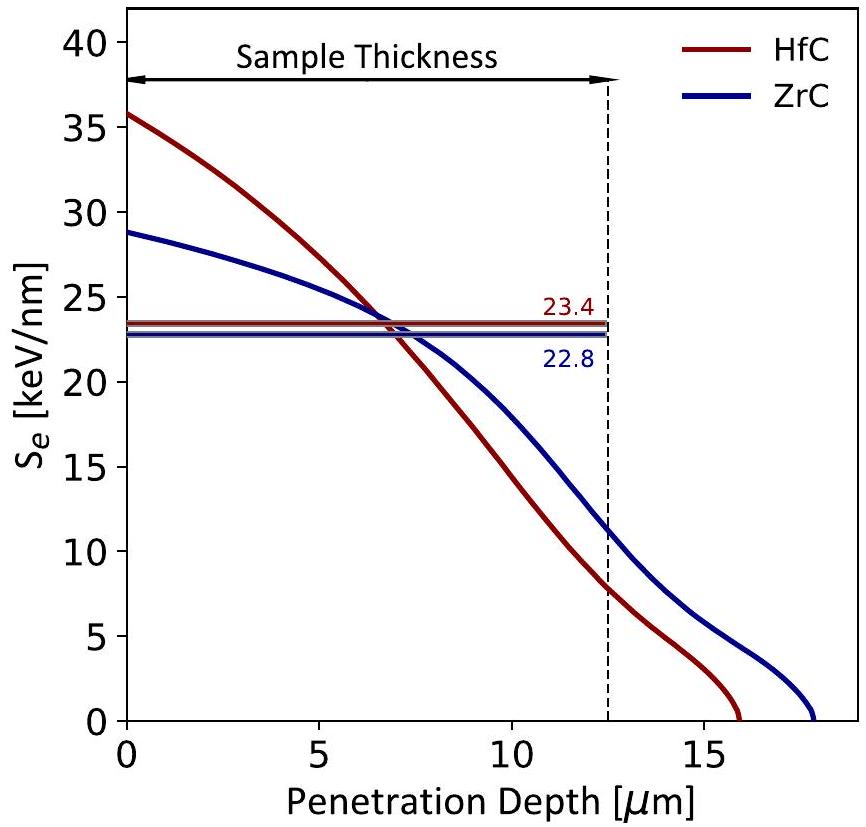
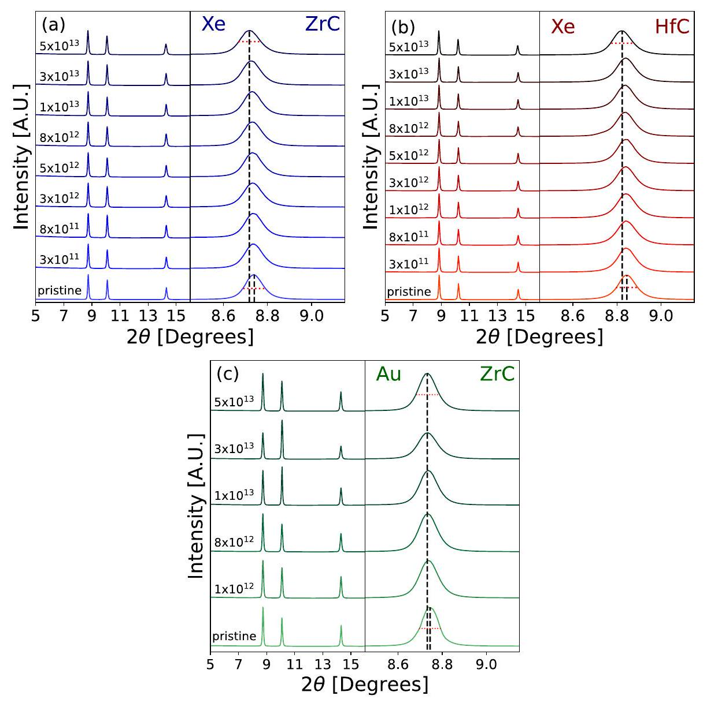
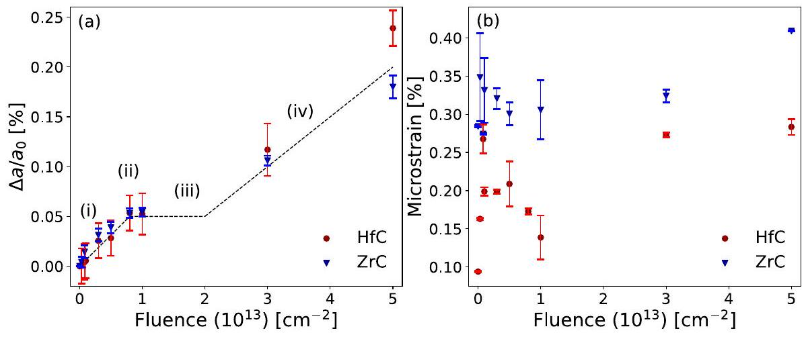
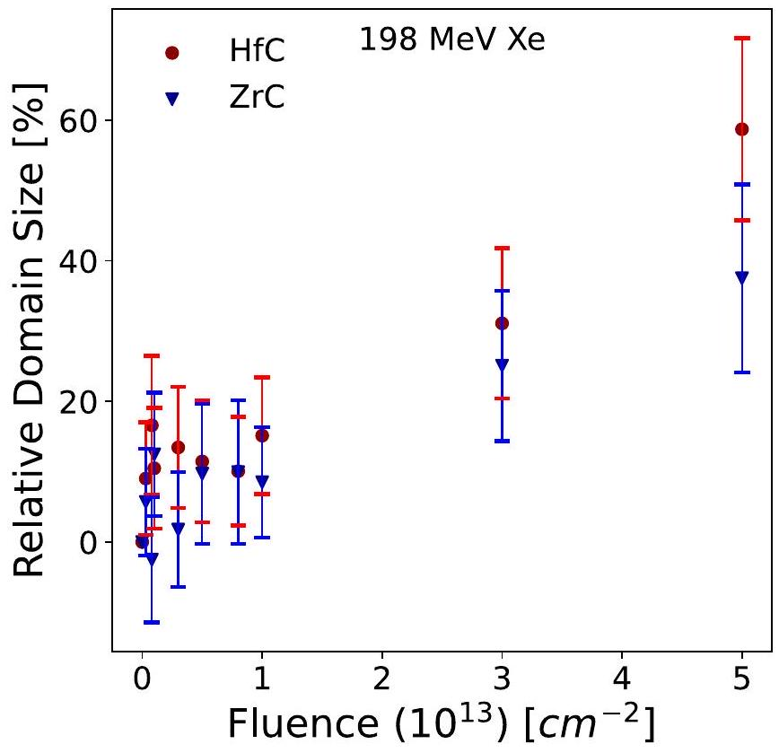
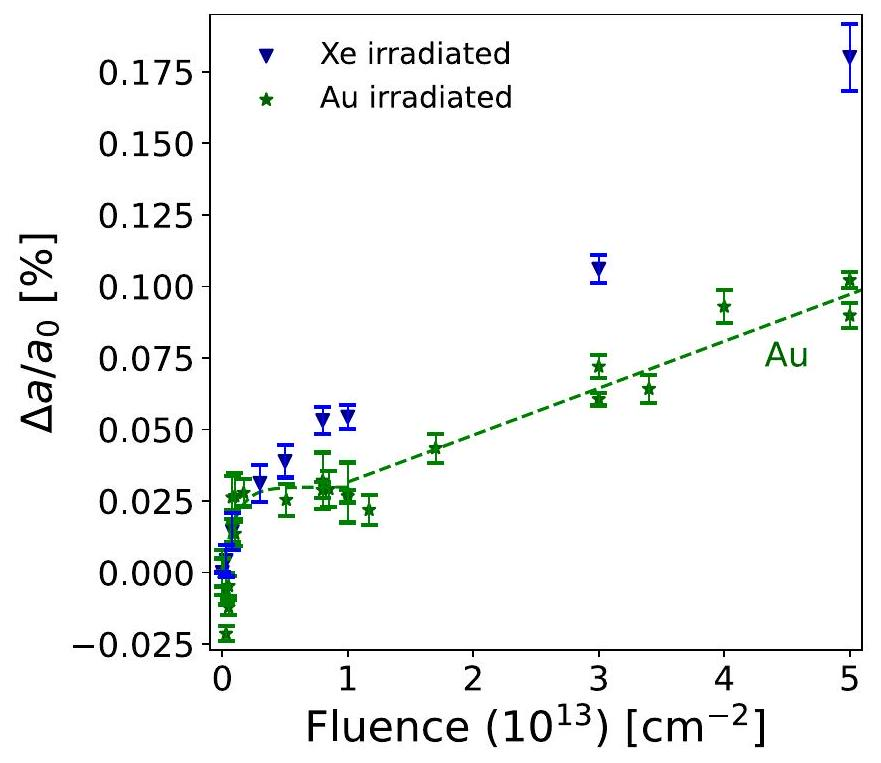
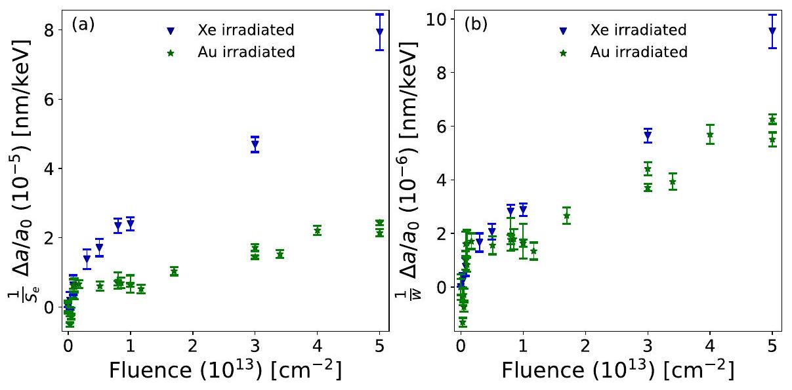

# Swift heavy ion irradiation effects in zirconium and hafnium carbides 

Evan Williams ${ }^{\mathrm{a}}$, Jacob Minnette ${ }^{\mathrm{a}}$, Eric O'Quinn ${ }^{\mathrm{a}}$, Alexandre Solomon ${ }^{\mathrm{a}}$, Cale Overstreet ${ }^{\mathrm{a}}$, William F. Cureton ${ }^{\mathrm{b}}$, Ina Schubert ${ }^{\mathrm{c}}$, Christina Trautman ${ }^{\mathrm{c}, \mathrm{d}}$, Changyong Park ${ }^{\mathrm{e}}$, Maxim Zdorovets ${ }^{\mathrm{f}, \mathrm{g}}$, Maik Lang ${ }^{\mathrm{a}, \text { * }}$ ${ }^{\mathrm{a}}$ Department of Nuclear Engineering, University of Tennessee, Knoxville, TN 37996, USA ${ }^{\mathrm{b}}$ Oak Ridge National Laboratory, Oak Ridge, TN 37830, USA ${ }^{\mathrm{c}}$ GSI Helmholtzzentrum für Schwerionenforschung, 64291 Darmstadt, Germany ${ }^{\mathrm{d}}$ Technische Universität Darmstadt, 64287 Darmstadt, Germany ${ }^{\mathrm{e}}$ Argonne National Laboratory, Argonne, IL, USA ${ }^{\mathrm{f}}$ Institute of Nuclear Physics, Almaty 050032, Kazakhstan ${ }^{\mathrm{g}}$ L. N. Gumilyov Eurasian National University, Astana 010008, Kazakhstan

## ARTICLE INFO

## Keywords:

Swift heavy ions
Carbides
HfC
ZrC
Synchrotron X-rays
XRD
Swelling
Velocity effect
Energy density

#### Abstract

The behavior of microcrystalline zirconium carbide ( ZrC ) and hafnium carbide ( HfC ) was studied under highly ionizing irradiation conditions at room temperature. The induced structural modifications were characterized via synchrotron-based X-ray diffraction experiments. Unit-cell expansion and buildup of microstrain were determined across a wide fluence range and linked to chemical compositions of the target material. The observed swelling resulting from irradiation with 198 MeV Xe ions in both carbide materials is characterized by two distinct mechanisms that operate within different fluence regimes. Unit-cell expansion initially proceeds by a direct-impact behavior that reaches saturation, followed at higher fluences by a second, linear swelling regime. The overall behavior, particularly the direct-impact regime, is similar for ZrC and HfC , with a more pronounced second defect accumulation process in HfC. Swelling in ZrC shows the same two distinct mechanisms upon irradiation with 198 MeV Xe ions and 946 MeV Au ions, but swelling induced by the lower-energy ions is greater across the entire fluence series. Accounting for the difference in energy deposition density between the two irradiation conditions reveals that the first swelling mechanism (direct-impact behavior) is likely related to the formation of more simple defects. In contrast, the second damaging mechanism at higher fluences (linear increase) cannot be fully explained by the induced energy density, and swelling remains somewhat higher for the low-velocity Xe irradiation. This may suggest that more complex defects and defect clusters are responsible for this swelling regime, with either their size and/or morphology modified at different energy densities.

## 1. Introduction

With the development of generation IV high-temperature reactors and nuclear-powered space propulsion systems, the demand for nuclear materials that withstand extreme irradiation environments is constantly increasing. Zirconium carbide (ZrC) and hafnium carbide (HfC) are functional materials proposed for various nuclear-related applications due to their superior thermal properties compared to other refractory ceramics, such as zirconium and hafnium mononitride ( ZrN and HfN ) and diboride $\left(\mathrm{ZrB}_{2}\right.$ and $\left.\mathrm{HfB}_{2}\right)[1,2]$. While ZrC and HfC have high thermal conductivities that are comparable to their mononitride and diboride counterparts, their melting temperatures are hundreds of
degrees higher (e.g., $\sim 3420^{\circ} \mathrm{C}$ for ZrC versus $2980^{\circ} \mathrm{C}$ for ZrN and $3040^{\circ} \mathrm{C}$ for $\mathrm{ZrB}_{2}$ ) [3,4]). Both ZrC and HfC have also been used as surrogates for actinide carbide materials, specifically uranium carbide, a next-generation nuclear fuel material [1,5]. Exceptional thermal properties are critically important in applications of coated particle fuel forms. These particles must efficiently transfer heat from the inner fuel kernel to the outer coolant while withstanding extreme temperatures and thermal gradients under standard and abnormal operating conditions. Whether used as a functional material in space applications or as a surrogate for actinide carbides, the performance of ZrC and HfC within a high-radiation environment is of critical concern and must be understood.

[^0]Both carbides possess the rock-salt structure (isostructural with $\mathrm{NaCl}, F m-3 m)$ with the cations and anions forming interpenetrating facecentered cubic sublattices [3,5]. Similarly, both carbides have bonds between the transition metal and carbon that are highly covalent in character; hafnium and zirconium, both group-four elements, have similar values of electronegativity and covalent radii: 1.75 (7) Å (Hf) and $1.75(10) \AA(\mathrm{Zr})$ (Table 1), resulting in comparable unit-cell parameters of 4.69106(4) and 4.63078(4) $\AA$ for ZrC and HfC, respectively [6,7]. Hafnium and zirconium, however, have different electron configurations; Hf contains a full $4 f$-electron shell, whereas Zr has no $f$-electrons. Additionally, hafnium has almost twice the mass of zirconium. This yields a much higher mass density of HfC relative to $\mathrm{ZrC}\left(12.2 \mathrm{~g} / \mathrm{cm}^{3}\right.$ for HfC versus $6.7 \mathrm{~g} / \mathrm{cm}^{3}$ for ZrC ) as well as electron density ( $\sim 3.0 \mathrm{e}^{-} / \AA^{3}$ for HfC versus $\sim 1.8 \mathrm{e}^{-} / \AA^{3}$ for ZrC ). These similarities in structure and differences in electronic configuration make these materials interesting targets for studies using highly ionizing swift heavy ion (SHI) radiation.

Swift heavy ions are defined as ions with energies above $\sim 1 \mathrm{MeV}$ per nucleon and masses of carbon or larger. They are available at large accelerator facilities, encountered in space as cosmic rays, or produced within a nuclear reactor as fission fragments [8]. When ions of such high energies pass through a material, they exchange energy with atomic electrons via Coulombic interactions, causing intense excitation and ionization. "Delta" electrons released in the initial ionization process further liberate other electrons, causing an electron cascade and radial energy dissipation around the ion trajectory. The range of the delta electrons increases with the kinetic energy of the projectile ion, resulting in larger ion tracks in the material. The energy deposited in the electronic subsystem is transferred through electron-phonon coupling to the atomic subsystem, whereupon a thermal spike and rapid quenching lead to a highly defective structure along the ion path (so-called "ion track") in many dielectrics [8,9]. The energy loss of a SHI along its trajectory depends on the charge state and kinetic energy of the projectile, as well as on the chemical composition of the target material. For example, Hf has more electrons than $\operatorname{Gr}(Z=72$ and $Z=40$, respectively), resulting in a higher electron density and a higher electronic energy loss for the same ion beam in HfC than in ZrC.

The response of ZrC under swift heavy ion irradiation has recently been studied for the first time [10]. For low-energy ions, a direct-impact behavior best describes the unit-cell expansion at fluences up to $\sim 1 \times 10^{13}$ ions $/ \mathrm{cm}^{2}$ with saturation at higher fluences when tracks overlap. This fluence-dependent swelling behavior is consistent with a directimpact model [11] based on Poisson statistics [12], which is often used to describe the damage evolution of irradiated materials with increasing fluence [13]. In this model, each ion impinging on a pristine sample area modifies the structure by forming defects and changing the unit-cell parameter ( $\mathrm{a}_{0}$ ). The initial linear trend of unit-cell expansion becomes sublinear at higher fluences as tracks overlap, eventually leading to saturation of the unit-cell parameter ( $a_{s a t}$ ) as described by:

Table 1
Key irradiation parameters for HfC and ZrC using 198 MeV Xe and 946 MeV Au ions. The electronic energy loss, $\mathrm{S}_{\mathrm{e}}$, is the mean value between the energy loss at the entrance and exit side of the sample (values are given in brackets). Energy density values are normalized to the energy density of Au ions in ZrC . The values in parentheses represent the associated error.
| Cation | v/c [\%] | Material Density [g/ $\mathrm{cm}^{3}$ ] | Average electronic energy loss: $\mathrm{S}_{\mathrm{e}}[\mathrm{keV} / \mathrm{nm}]$ [21] |  | Deposited energy density: $w[\mathrm{keV} / \mathrm{nm}]$ |  |
| :--- | :--- | :--- | :--- | :--- | :--- | :--- |
|  |  | (Zr;Hf)C | ${ }^{197} \mathrm{Au}$ | ${ }^{132} \mathrm{Xe}$ | ${ }^{197} \mathrm{Au}$ | ${ }^{132} \mathrm{Xe}$ |
| Zr | 10.1 | 6.73 | 42.7 [44.1, 39.1] | 22.8 [28.8, 11.5] | 163 (24) | 188 (28) |
| Hf | 5.7 | 12.2 |  | 23.4 [35.8, 7.9] |  | 202 (30) |

$$
\frac{a(\phi)-a_{0}}{a_{0}}=\frac{a_{s a t}-a_{0}}{a_{0}}(1-\exp (-\sigma \phi)),
$$

with ion fluence $\phi$ and damage cross section $\sigma$. Surprisingly, at higher fluences beyond the saturation limit, a second swelling mechanism was apparent in ZrC [10] that is not typically observed in swift heavy ion irradiation experiments. This second swelling mechanism has a linear dependence on fluence, with no apparent saturation up to the maximum fluence tested ( $5 \times 10^{13}$ ions $/ \mathrm{cm}^{2}$ ).

The damage produced in materials strongly depends on the ion energy loss. For each material, there exists a specific energy loss threshold below which ion tracks do not form [14,15]. Energy loss as well as energy deposited per volume (energy density) are crucial in understanding track formation in materials. For low-velocity ions, the range of delta electrons is limited, and thus the deposited energy is more confined around the ion path compared to high-velocity ions [8]. This ion velocity effect has been studied before in many materials [16-18] and explains why the severity of structural modifications can vary greatly for ions of identical energy loss ( $\mathrm{d} E / \mathrm{d} x$ ) but different velocities (energies). To test the effect of energy density in simple carbide compounds and to compare with the work performed by Minnette et al. [10], we exposed both ZrC and HfC to 198 MeV Xe ions, and ZrC alone to 946 Au ions, and studied the induced unit-cell expansion and microstrain by means of synchrotron-based X-ray diffraction experiments.

## 2. Experimental

### 2.1. Irradiation

Powder samples of ZrC and HfC were purchased from U.S. Research Nanomaterials at $99.9 \%$ cation purity and grain size of $400-1200 \mathrm{~nm}$. These samples were synthesized using the physical vapor deposition (PVD) technique. Following a previously developed irradiation and characterization procedure [19], the samples were pressed into sets of $100 \mu \mathrm{~m}$ diameter cylindrical chambers in $12.5 \mu \mathrm{~m}$ and $25 \mu \mathrm{~m}$ thick molybdenum foils. Each set of chambers corresponded to a sample composition and irradiation condition. To account for potential losses during irradiation and shipment, each set contained 9 chambers. Subsequent uniaxial pressing with a mechanical press (Carver Inc.) yielded a packing fraction of $\sim 60 \%$ theoretical density [19]. The $12.5 \mu \mathrm{~m}$ thick sample platelets were irradiated with $198 \mathrm{MeV}{ }^{132} \mathrm{Xe}$ ions at the DC-60 cyclotron of the Institute of Nuclear Physics in Astana (Republic of Kazakhstan) [20]. In addition, the $25 \mu \mathrm{~m}$ thick ZrC platelets were irradiated with $946 \mathrm{MeV}{ }^{197} \mathrm{Au}$ ions at the UNILAC accelerator of the GSI Helmholtzzentrum für Schwerionenforschung in Darmstadt, Germany [16]. At both facilities, the irradiations were performed at room temperature and under vacuum conditions. The samples were exposed to ion fluences ranging from $1 \times 10^{11}$ to $5 \times 10^{13}$ ions $/ \mathrm{cm}^{2}$, with one set of unirradiated (pristine) samples that served as a reference.

The values of electronic energy loss within the materials were calculated using SRIM-2010 (Fig. 1) [21]. A density of $60 \%$ of the theoretical density was used to adjust the ion penetration depth to accommodate the packing fraction of the powder sample in the molybdenum strips [19]. Due to the reduced density, ions penetrate a thicker sample than calculated. To correct for this, the energy loss was plotted versus the effective penetration depth (penetration depth determined by SRIM multiplied with a factor of 1.6 as outlined in detail in [19]). The average electronic stopping power values are reported in Table 1 with the maximum and minimum values listed in the brackets. All platelets were thin enough to allow the ions to fully penetrate and exit the sample with more than half of their initial energy. The energy deposition for both ion energies is dominated by electronic interaction with negligible contributions from the nuclear energy loss (average $\mathrm{S}_{\mathrm{e}}$ : $\mathrm{S}_{\mathrm{n}}$ ratio of $\sim 80$ for 198 MeV Xe ions and $\sim 400$ for 946 MeV Au ions).

Fig. 1. Electronic energy loss, $\mathrm{S}_{\mathrm{e}}$, versus penetration depth in HfC and ZrC irradiated with 198 MeV Xe ions. The thickness of the $12.5 \mu \mathrm{~m}$ sample is indicated by the dashed vertical line. Horizontal colored lines represent the average electronic energy loss (in $\mathrm{keV} / \mathrm{nm}$ ) within each material.

### 2.2. Characterization

Irradiated samples and corresponding pristine reference materials were analyzed for structural modifications using beamline 16-BM-D of the Advanced Photon Source (APS) at Argonne National Laboratory. A monochromator was used to adjust the X-ray beam energy to 30 keV with diffraction measurements performed in a forward Debye-Scherrer geometry. More technical information about X-ray characterization of swift heavy ion-irradiated samples pressed into thin metal strips can be found elsewhere [19]. The sample-detector distance was 319 mm and a MARr345 image plate was used to produce the two-dimensional DebyeScherrer rings. Data was collected for 300 s , and an initial quality check of the pattern was performed by integrating the Debye rings with Dioptas software into one-dimensional X-ray diffractograms (XRD patterns) [22]. The two-dimensional diffraction rings were later imported into the GSAS-II software and integrated to produce one-dimensional XRD patterns [23]. Rietveld refinement [24] was used to determine the unit-cell parameters as a function of increasing ion fluence. Complementary peak fitting for Williamson-Hall analysis [25] was performed with the Fityk software [26], using pseudo-Voigt peak functions, to determine peak positions and corresponding full-width half maxima (FWHM). Microstrain ( $\varepsilon$ ) was extracted from this analysis by plotting $\beta \cos \theta$ vs. $\sin \theta$, with $\varepsilon$ determined as the linear slope in accordance with:

$$
\beta \cos \theta=4 \varepsilon \sin \theta+K \lambda / D
$$

$$
\beta=\sqrt{\beta_{\text {measured }}^{2}-\beta_{\text {instrument }}^{2}}
$$

where $\beta$ is the peak width (FWHM), $\theta$ is the scattering angle, $\lambda=0.4133 \AA$ is the X-ray wavelength and $K$ is the shape factor (set to 0.9 ). $D$ is the domain size (or mean crystallite size), which is determined from the yintercept [27]. The value of $\beta$ is obtained by removing the instrumental broadening from the measured broadening.

### 2.3. Uncertainty determination

Uncertainties for unit-cell parameters were propagated utilizing a
simplified approach of the error propagation differential equation. Two of the nine sample platelets were measured for each irradiation condition, and the mean unit-cell parameter was determined by averaging the value from Rietveld refinements of both data points for a given ion fluence. The difference from the mean was geometrically averaged with the unit-cell parameter uncertainty provided by the GSAS-II software. Thus, the uncertainty $E_{a}$ of the unit-cell parameter for each fluence step was deduced as follows:

$$
E_{a}=\sqrt{\sum\left(a_{i}-a_{a v g}\right)^{2}+E_{u c p}^{2}}
$$

where $\mathrm{a}_{\mathrm{i}}$ is the unit-cell parameter for an individual measurement at a given fluence point, $\mathrm{a}_{\text {avg }}$ is the average unit-cell parameter for both measurements at the same fluence point, $E_{u c p}$ is the uncertainty for the unit-cell parameter from GSAS-II. The resulting uncertainty of the normalized unit-cell parameter is therefore:

$$
E_{\Delta a / a_{0}}=\frac{a_{a v g}-a_{0}}{a_{0}} \sqrt{\left(\frac{\sqrt{E_{a_{a v g}}^{2}+E_{a_{0}}^{2}}}{a_{a v g}-a_{0}}\right)^{2}+\left(E_{a_{0}} / a_{0}\right)^{2}}
$$

where $a_{0}$ is the unit-cell parameter for the pristine sample, and $E_{a_{0}}$ is its respective unit-cell parameter uncertainty from Eq. (4).

## 3. Results and discussion

X-ray diffraction patterns collected from both unirradiated reference samples confirm that HfC and ZrC are comprised entirely of a singlephase rock-salt structure (Fm-3m) with no discernible impurities (bottom patterns in Fig. 2). The unit-cell parameters of the starting materials were $4.69106(4) \AA$ and $4.63078(4) \AA$ for ZrC and HfC respectively, in agreement with values reported in previous literature [7,28,29], and indicative of some degree of hypostoichiometry. Based on refinement of relative peak intensities, the carbon-to-zirconium and carbon-tohafnium ratios were determined to be $0.96(1)$ and $0.96(2)$ for ZrC and HfC, respectively [30]. The vacant carbon sites in these materials are postulated to be filled with gaseous molecules, predominately oxygen [31,32]; however, this could not be confirmed in this study from XRD analysis alone. The diffraction maxima shift to lower two theta values after irradiation with 198 MeV Xe and 946 MeV Au ions (Fig. 2), which is consistent with unit-cell expansion. As evidenced by the shifts of the most intense diffraction peak at $\sim 8.8$ degrees, the two carbides show a similar behavior for the irradiation with 198 MeV Xe ions (Fig. 2a,b). This peak also shifts for ZrC irradiated with Au ions, though the effect is less pronounced compared with the Xe irradiation (Fig. 2c). All diffraction peaks broaden after irradiation, again in a similar manner for both carbides and less pronounced for the Au irradiation. This increase in peak width can be caused by an accumulation of heterogeneous microstrain or a decrease in crystallite size [13]. Neither amorphization nor oxidation is observed after irradiation up to the maximum fluence in either carbide under each ion-beam condition, demonstrating that the structure of these materials is highly resistant against swift heavy ion irradiation.

The unit-cell parameter values have been normalized to the reference unit-cell parameter of the pristine material, and their respective evolutions with increasing fluence are compared (Fig. 3a). The following trend is consistently observed for both carbide materials after irradiation with 198 MeV Xe ions: (i) an initial linear unit-cell swelling at lower ion fluences followed by (ii) a sublinear regime and (iii) a trend towards saturation at around $1 \times 10^{13}$ ions $/ \mathrm{cm}^{2}$. At even higher fluences ( $i v$ ), the unit-cell parameters further increase linearly without indication of saturation, up to the highest fluence evaluated in this study. The initial behavior (i) - (iii) is in good agreement with a direct-impact model (Eq. (1)) commonly observed in many swift heavy ion-irradiated materials ( $e$. g., $\left.\mathrm{CeO}_{2}[13,33,34]\right)$. The additional mechanism (iv) is somewhat atypical and is reported in greater detail for ZrC irradiated with 946 MeV

Fig. 2. Stacked XRD patterns of (a) ZrC and (b) HfC irradiated with 198 MeV Xe ions and (c) ZrC irradiated with 946 Au ions; indexed fluence values are given in ions $/ \mathrm{cm}^{2}$. The vertical solid lines separate two scattering regions with the right showing an enlarged two theta range around the most intense diffraction maximum. The dashed vertical lines indicate the position of the respective peak maximum of the pristine and high-fluence samples to better visualize peak shifts; horizontal dotted lines indicate FWHM.

Fig. 3. (a) Relative change in unit-cell parameter of ZrC (blue triangles) and HfC (red dots) irradiated with 198 MeV Xe ions as a function of fluence. (b) Heterogeneous microstrain deduced from Williamson-Hall analysis of X-ray diffraction patterns of the same irradiated HfC and ZrC series as in (a). Dashed line is to guide eyes through swelling steps (i)-(iv).

Au ions by Minnette et al. [10].
The origin of this complex radiation response remains unclear. Other amorphization-resistant target materials, such as $\mathrm{CeO}_{2}$ [13], show only direct-impact behavior under similar radiation conditions. Once tracks begin to overlap, defect production and annihilation in these materials likely reach equilibrium under further irradiation, keeping the unit-cell swelling constant. This initial behavior seems valid for both carbides, yet more extensive track overlap results in a second swelling mechanism
that has no apparent saturation at higher fluences. Minnette et al. [10] suggested that the second, linear mechanism is likely related to the formation of more complex defect clusters driven by vacant carbon lattice sites, both from synthesis and irradiation. These vacant sites may be filled with residual oxygen as observed in prior literature [32]. It has been shown before for lower ion energies and electron irradiation that pre-existing oxygen and additional oxygen intake can result in the precipitation of an oxide phase [35]. In this study, no $\mathrm{ZrO}_{2}$ or $\mathrm{HfO}_{2}$ was
detectable up to the highest fluence in both carbides based on synchrotron X-ray characterization (Fig. 2); however, oxidation at the atomistic scale and redistribution of oxygen within vacancies cannot be ruled out, particularly at higher fluences and track overlap. A complex interplay of vacancy formation from irradiation and oxygen migration under highly ionizing ion beams may play a role in the second swelling regime at higher fluences.

The fact that HfC shows slightly more pronounced swelling in the second damaging mechanism (Fig. 3a) may originate from a difference in the electronic configuration of the cation. While Zr has only $d$-orbital electrons, Hf has $d$-orbital and $f$-orbital electrons. In the present data, the deviation between ZrC and HfC in swelling becomes most apparent after irradiation to the highest fluence of $5 \times 10^{13}$ ions $/ \mathrm{cm}^{2}$. This may have important implications for fission-fragment damage in actinide carbides, such as UC. Uranium has a covalent radius of $1.96 \AA$, which is larger than that of Zr and Hf (both $1.75 \AA$ ) [36]. Additionally, both Hf and U have $d$ orbital and $f$-orbital electrons, but the covalent bond is in UC largely dependent on the $5 f$ orbital, while the HfC bond is more dependent on the $5 d$ orbital [37,38]. Therefore, if $f$-orbital electrons play a role in the radiation resistance, enhanced effects can be expected for uranium carbide compounds.

The XRD peak broadening was analyzed by the Williamson-Hall method (Eq. (2)) [25], which reveals that peak broadening after 198 MeV Xe ion irradiation originates from the accumulation of heterogeneous microstrain for the most part. With increasing ion fluence, microstrain increases with a relatively complex evolution (Fig. 3b) as compared with the unit-cell parameter (Fig. 3a); however, similar to swelling, two distinct mechanisms are also indicated by the microstrain behavior. The only difference is in the intermediate fluence regime, during which the unit-cell expansion starts to saturate, while microstrain decreases between a fluence of $\sim 6 \times 10^{12}$ and $\sim 1 \times 10^{13}$ ions/ $\mathrm{cm}^{2}$. At higher fluences, the microstrain increases further, similar to the evolution of the unit-cell parameter. The fluence-dependent evolution is similar for both carbides, but the overall level of microstrain is distinctly higher in ZrC across the entire fluence series.

The coherent domain size, or crystallite size, of the material was also determined from Williamson-Hall analysis (Fig. 4). The coherently

Fig. 4. Relative coherent domain size as a function of fluence for HfC and ZrC irradiated with 198 MeV Xe ions. The domain size was extracted from Williamson-Hall analysis and values are normalized with those of the pristine samples.

scattering single-crystal domains are typically smaller than grain and particle sizes in polycrystalline inorganic materials [39]. Irradiation with 198 MeV Xe ions leads to a relative change in coherent domain size for both carbide materials. First, the coherent domain size remains relatively constant (i.e., within the uncertainties) up to $1 \times 10^{13}$ ions/ $\mathrm{cm}^{2}$. At higher fluences, corresponding to the second damage mechanism, the coherent domain size increases by more than $50 \%$ (both materials are similar, given the uncertainties). Previous irradiation studies under comparable conditions with nanocrystalline materials showed a $\sim 100 \%$ increase (or coarsening) of coherent domain size in thoria and urania with increasing ion fluence [13]. Such coarsening has been observed in a range of materials such as oxides [40], metals [41,42], and high entropy alloys [43]. A previous study with 3 MeV Au ions suggested that coherent domain growth is the result of grain consumption by neighboring grains [44]. When ion tracks stayed within a grain, no change in grain size was observed; when tracks overlapped with grain boundaries, grain growth occurred via consumption of the neighboring grains [42]. This trend aligns with the two distinct damaging mechanisms seen in the present data. As track overlap increases at higher fluences, the ion track volume is more likely to overlap with grain boundaries, and domains are more likely to be consumed by neighboring grains during the thermal spike and quenching phase. No saturation of this phenomenon is observed for both carbides (Fig. 4), similar to the behavior of the unit-cell parameter (Fig. 3a).

To gain further insight into the behavior of ZrC under swift heavy ion irradiation, the unit-cell expansion induced under different ion energy conditions was compared. Gosset et al. studied the response of ZrC under irradiation with 4 MeV Au ions [45], which induce damage cascades in the material through knock-on atomic collisions. The XRD study showed peak broadening and an increasing unit-cell parameter (swelling) with accumulation of ion fluence. The unit-cell parameter increased gradually until $\sim 1 \times 10^{14}$ ions $/ \mathrm{cm}^{2}$ above which saturation occurred at $\sim 0.2 \%$ relative expansion. No second damaging mechanism with a linear swelling regime was evident under these low-energy ion irradiations up to a fluence of $10^{16}$ ions $/ \mathrm{cm}^{2}$. In the present study, experiments were performed with 198 MeV Xe ions and compared with ZrC data from 946 MeV Au ions reported by Minnette et al. [10]. Both ion-beam conditions, which deposit energy through ionizations and excitations, result in a similar swelling trend across the entire fluence range studied (Fig. 5).

Fig. 5. Relative unit-cell parameter changes in ZrC as a function of fluence of 198 MeV Xe ions (blue triangles) and 946 MeV Au ions (green stars). The dashed line for the Au irradiation is to guide the eye and display the two distinct swelling mechanisms.

There are many more data points for the 946 Au ion irradiation, and the two-step mechanism in unit-cell expansion is much better expressed in this series; however, the comparison clearly shows that swelling induced by the 198 MeV Xe ion irradiation follows a similar trend, but the unitcell expansion is systematically higher compared to the irradiation with Au ions for both damaging mechanisms (direct-impact and subsequent linear increase). The track diameters deduced for the first damaging mechanism (direct-impact mechanism), based on Eq. (1) are 5.8(6) nm for ZrC irradiated with 198 MeV Xe ions and 11(1) nm for ZrC irradiated with 946 MeV Au ions. This difference in track size can be explained by the velocity effect and the more confined delta electron range for lower ion velocities [13,46]. However, the material modification within a track and the magnitude of the induced swelling also depend on the deposited energy density, which must be taken into account.

To understand the discrepancy in swelling observed in ZrC irradiated with 198 MeV Xe ions and 946 MeV Au ions (Fig. 5), the difference in electronic energy loss deposited by the ions per path length was considered first. The magnitude of swelling in ZrC irradiated with 198 MeV Xe ions is higher than that irradiated with the 946 MeV Au ions, although the mean energy loss throughout the sample is lower $\left(\mathrm{S}_{\mathrm{e}}(\mathrm{Xe})=22.8\right. \mathrm{keV} / \mathrm{nm} ; \mathrm{S}_{\mathrm{e}}(\mathrm{Au})=42.7 \mathrm{keV} / \mathrm{nm}$ ) (Fig. 1). Normalization of the unit-cell expansion by the mean energy loss enhances this discrepancy even further (Fig. 6a). While the normalization by $\mathrm{S}_{\mathrm{e}}$ accounts for the rather different energy losses of the Xe and Au ions used, it only considers the linear energy deposition along the length of an ion track. The ion velocity also has a direct influence on the radial energy distribution normal to the ion trajectory and consequently on the deposited volumetric energy density [18,19,46]. With increasing velocity (i.e., kinetic energy) of the ions, the maximum energy given to the delta electrons is greater, and therefore the initial electron cascade spreads into a larger volume. For ions with comparable energy loss, projectiles of higher velocity induce a lower energy density around their trajectories [46]. This lower energy density results in fewer defects and, thus, in reduced unit-cell expansion. For the present data, this means despite the fact that the Xe ions have a lesser energy loss throughout the sample than the Au ions, the reduced energy ( 198 MeV versus 946 MeV ) and slower velocity result in an overall higher energy density. For the ion-beam conditions utilized in this study, the delta electron range for 946 MeV Au ions is $\sim 6.6$ times larger than for 198 MeV Xe ions.

To confirm whether this energy density effect can account for the larger swelling induced by the Xe ions, we considered the normalization procedure introduced by Wesch et al. [46]. This approach estimates the energy density as $d E / d V=d E /\left(d x^{*} \pi \alpha^{2}\right)$, where $\alpha$ represents the absorption radius. A relation of absorption radius to ion velocity is made with $\alpha \beta^{2 k}$. Thus, the energy density ( $w$ ) can be estimated as:

$$
w=S_{e}^{*} 1 / \pi \beta^{4 k}
$$

where $S_{e}$ is the electronic energy loss, $\beta$ is the ion velocity normalized to the speed of light, and $k$ is a material-specific correction factor. Wesch et al. utilized a $k$ value of 0.25 for $\mathrm{LiNbO}_{3}$ based on ion velocity and absorption radius [46]. For the present study, we assumed the same $k=$ 0.25 as an approximation (i.e., $W \sim S_{e} / \beta$ ), although additional experiments should be conducted to obtain a more appropriate $k$ value for ZrC.

The corresponding energy densities, $w$, determined for the 946 MeV Au ions and 198 MeV Xe ions following Eq. (6) are summarized in Table 1 and were used to normalize the unit-cell data. Normalization with $w$, which accounts simultaneously for the differences in energy loss and ion velocity, leads to a convergence of the swelling data for both irradiation conditions (Fig. 6b) and explains why the swelling is more pronounced for Xe ions with lower $\mathrm{S}_{\mathrm{e}}$ than for Au ions with higher $\mathrm{S}_{\mathrm{e}}$. Particularly, the first damaging mechanism, characterized by a directimpact behavior, is nearly identical in both carbides when considering the energy density correction. This supports our hypothesis that the first mechanism is related to simple, vacancy and interstitial type defects, and their number scales proportionally with energy density [10]. The second swelling mechanism at higher fluences is systematically higher for the Xe ions, despite the energy density normalization. Indeed, this points toward different types of defects that are responsible for this swelling regime, possibly more complex defect clusters that form at higher energy densities [10]. However, this consideration remains speculative as the energy density correction only captures the radial magnitude of effects existing within individual ion tracks and is likely not fully applicable in the regime of heavily overlapping tracks. A direct comparison of both irradiation conditions is also complicated by the difference in sample thickness ( $25 \mu \mathrm{~m}$ for Au ions versus $12.5 \mu \mathrm{~m}$ for Xe ions) that was adjusted to the different ion ranges. This leads to a complex energy loss evolution of both ion beams (Fig. 1), and the relative difference depends not only on the ion energy but also on the thickness of the sample. Sample thickness is important to consider because the electronic energy loss is almost constant for most of the Au ion path and shows much more pronounced deviations for the Xe ions (Fig. 1) [10]. Furthermore, nuclear energy loss contributions become non-negligible compared to electronic energy loss at end-of-flight ion energies, which would probably enhance swelling in the thinner, Xeirradiated ZrC sample. Further research is needed to fully clarify the origin of the second swelling regime.

## 4. Conclusion

ZrC and HfC were irradiated with 198 MeV Xe ions over a broad

Fig. 6. Relative unit-cell parameter changes of ZrC as a function of fluence for irradiations with 198 MeV Xe ions (blue triangles) and 946 MeV Au ions (green stars). All data are normalized by (a) electronic energy loss $\mathrm{S}_{\mathrm{e}}$, and (b) energy density, $w$, with values provided in Table 1.

range of fluences, and the induced structural changes were compared to ZrC irradiated with 946 MeV Au ions over a similar fluence range. Both carbides are characterized by high resistance to swift heavy ion irradiation, with unit-cell expansion and microstrain buildup being the only observed structural modifications. Neither oxidation nor amorphization was observed up to the maximum fluence of $5 \times 10^{13}$ ions $/ \mathrm{cm}^{2}$. Across the tested fluence range, defect accumulation proceeds by two distinct mechanisms, which were observed for HfC and ZrC as well as 198 MeV Xe ion and 946 Au ion-beam exposures. The first mechanism agrees well with a direct-impact behavior, characterized by a gradual increase in swelling until saturation is reached. The average track diameter deduced from the direct-impact regime for both materials and irradiation conditions is $5-11 \mathrm{~nm}$, typical for ceramics irradiated under similar conditions. The second mechanism, starting at much higher fluences, is characterized by linear unit-cell growth with no apparent saturation. Normalization with the respective energy density (convoluted with energy loss and ion velocity) yields a nearly identical unit-cell swelling in the direct-impact regime for both Xe and Au ion irradiations. This highlights the significance of considering not only energy loss but also ion velocity as an important parameter that should not be neglected. Despite the lower electronic energy loss of the fission fragment-type Xe irradiation, the swelling effects are more pronounced than for Au ions, due to the lower Xe velocity and associated higher energy density. The same normalization with energy density, however, does not fully account for the difference in swelling in the second damaging regime at higher fluences when comparing both irradiation experiments; the linear increase is more pronounced for the Xe irradiation. This behavior suggests that the formation of simple defects may be responsible for the first (direct-impact) damaging mechanism that reaches saturation in swelling, while more complex defect clusters could be the source of the second damaging mechanism that is produced at higher fluences without saturation.

## Credit authorship contribution statement

Evan Williams: Conceptualization, Data curation, Formal analysis, Investigation, Writing - original draft. Jacob Minnette: Data curation, Formal analysis, Investigation, Methodology, Writing - original draft. Eric O'Quinn: Conceptualization, Data curation, Investigation, Methodology, Supervision, Writing - review \& editing. Alexandre Solomon: Data curation, Writing - review \& editing. Cale Overstreet: Investigation, Methodology, Writing - review \& editing. William F. Cureton: Conceptualization, Investigation, Methodology, Writing - review \& editing. Ina Schubert: Investigation, Methodology. Christina Trautman: Formal analysis, Methodology, Writing - review \& editing. Changyong Park: Data curation, Methodology. Maxim Zdorovets: Investigation, Methodology. Maik Lang: Conceptualization, Funding acquisition, Methodology, Resources, Supervision, Writing - review \& editing.

## Declaration of competing interest

The authors declare that they have no known competing financial interests or personal relationships that could have appeared to influence the work reported in this paper.

## Data availability

Data will be made available on request.

## Acknowledgment

This work was funded by the Department of Energy (DOE) Office of Nuclear Energy's Nuclear Energy University Program under US-DOE, contract DE-NE0008895. J. Minnette acknowledges the support of the DOE/NNSA and the Chicago/DOE Alliance Center (CDAC) through
cooperative agreement DE-NA0003975. This material is also based upon work supported under a Department of Energy, Office of Nuclear Energy University Nuclear Leadership Program Graduate Fellowship (A. Solomon). Synchrotron XRD measurements were performed at HPCAT (Sector 16), Advanced Photon Source, Argonne National Laboratory. HPCAT operations are supported by DOE NNSA's Office of Experimental Sciences. HPCAT operations are supported by DOE NNSA's Office of Experimental Sciences. The Advanced Photon Source is a U.S. Department of Energy (DOE) Office of Science User Facility operated for the DOE Office of Science by Argonne National Laboratory under Contract No. DE-AC02-06CH11357. The results presented here are based on UMAT experiments, which were performed at the M-branch of the UNILAC at the GSI Helmholtzzentrum für Schwerionenforschung, Darmstadt (Germany) in the frame of FAIR Phase-0.

## References

[1] Y. Katoh, G. Vasudevamurthy, T. Nozawa, L.L. Snead, Properties of zirconium carbide for nuclear fuel applications, J. Nucl. Mater. 441 (1-3) (2013) 718-742, https://doi.org/10.1016/j.jnucmat.2013.05.037.
[2] C. Zhang, A. Gupta, S. Seal, B. Boesl, A. Agarwal, Solid solution synthesis of tantalum carbide-hafnium carbide by spark plasma sintering, J. Am. Ceram. Soc. 100 (5) (2017) 1853-1862, https://doi.org/10.1111/jace.14778.
[3] H.F. Jackson, W.E. Lee, "Properties and Characteristics of ZrC ," in Comprehensive Nuclear Materials, Elsevier, 2012, pp. 339-372. doi: 10.1016/B978-0-08-056033-5.00023-9.
[4] Hugh O. Pierson, Handbook of refactory carbides and nitrides: properties, characteristics, processing and applications. William Andrew, 1996.
[5] S.V. Ushakov, A. Navrotsky, Q.-J. Hong, A. Van De Walle, Carbides and nitrides of zirconium and hafnium, Materials 12 (17) (2019) 2728, https://doi.org/10.3390/ ma12172728.
[6] K. Nakamura, M. Yashima, Crystal structure of NaCl-type transition metal monocarbides MC ( $\mathrm{M}=\mathrm{V}, \mathrm{Ti}, \mathrm{Nb}, \mathrm{Ta}, \mathrm{Hf}, \mathrm{Zr}$ ), a neutron powder diffraction study, Mater. Sci. Eng. B 148 (1-3) (2008) 69-72, https://doi.org/10.1016/j. mseb.2007.09.040.
[7] U. Benedict, K. Richter, C.T. Walker, Solubility study in the systems PuC ZrC and PuC TaC, J. Common Met. 60 (1) (1978) 123-133, https://doi.org/10.1016/0022-5088(78)90097-8.
[8] M. Lang, F. Djurabekova, N. Medvedev, M. Toulemonde, C. Trautmann, Fundamental Phenomena and applications of swift heavy ion irradiations, Compreh. Nucl. Mater. Elsevier (2020) 485-516, https://doi.org/10.1016/B978-0-12-803581-8.11644-3.
[9] Z.G. Wang, C. Dufour, E. Paumier, M. Toulemonde, The $\mathrm{S}_{\mathrm{e}}$ sensitivity of metals under swift-heavy-ion irradiation: a transient thermal process, J. Phys. Condens. Matter 6 (34) (1994) 6733-6750, https://doi.org/10.1088/0953-8984/6/34/006.
[10] J. Minnette, et al., Response of ZrC to swift heavy ion irradiation, J. Appl. Phys. 134 (18) (2023) 185901, https://doi.org/10.1063/5.0165821.
[11] J.F. Gibbons, Ion implantation in semiconductors-Part II: Damage production and annealing, Proc. IEEE 60 (9) (1972) 1062-1096, https://doi.org/10.1109/ PROC.1972.8854.
[12] W.J. Weber, Models and mechanisms of irradiation-induced amorphization in ceramics, Nucl. Instrum. Methods Phys. Res. Sect. B Beam Interact. Mater. At. 166-167 (2000) 98-106, https://doi.org/10.1016/S0168-583X(99)00643-6.
[13] W.F. Cureton, et al., Grain size effects on irradiated $\mathrm{CeO}_{2}, \mathrm{ThO}_{2}$, and $\mathrm{UO}_{2}$, Acta Mater. 160 (2018) 47-56, https://doi.org/10.1016/j.actamat.2018.08.040.
[14] N. Itoh, D.M. Duffy, S. Khakshouri, A.M. Stoneham, Making tracks: electronic excitation roles in forming swift heavy ion tracks, J. Phys. Condens. Matter 21 (47) (2009) 474205, https://doi.org/10.1088/0953-8984/21/47/474205.
[15] N. Medvedev, et al., Frontiers, challenges, and solutions in modeling of swift heavy ion effects in materials, J. Appl. Phys. 133 (10) (2023) 100701, https://doi.org/ 10.1063/5.0128774.
[16] M. Lang, R. Devanathan, M. Toulemonde, C. Trautmann, Advances in understanding of swift heavy-ion tracks in complex ceramics, Curr. Opin. Solid State Mater. Sci. 19 (1) (2015) 39-48, https://doi.org/10.1016/j. cossms.2014.10.002.
[17] P. Toulemonde, D. Machon, A. San Miguel, M. Amboage, High pressure x-ray diffraction study of the volume collapse in Ba 24 Si 100 clathrate, Phys. Rev. B83 13 (2011) 134110, https://doi.org/10.1103/PhysRevB.83.134110.
[18] A. Meftah, et al., Swift heavy ions in magnetic insulators: A damage-cross-section velocity effect, Phys. Rev. B 48 (2) (1993) 920-925, https://doi.org/10.1103/ PhysRevB.48.920.
[19] M. Lang, et al., Characterization of ion-induced radiation effects in nuclear materials using synchrotron x-ray techniques, J. Mater. Res. 30 (9) (2015) 1366-1379, https://doi.org/10.1557/jmr.2015.6.
[20] B. Gikal, et al., DC-60 heavy ion cyclotron complex: The first beams and project parameters, Phys. Part. Nucl. Lett. 5 (7) (2008) 642-644, https://doi.org/10.1134/ S1547477108070248.
[21] J.F. Ziegler, M.D. Ziegler, J.P. Biersack, SRIM - The stopping and range of ions in matter (2010), Nucl. Instrum. Methods Phys. Res. Sect. B Beam Interact. Mater. At. 268 (11-12) (2010) 1818-1823, https://doi.org/10.1016/j.nimb.2010.02.091.
[22] C. Prescher, V.B. Prakapenka, DIOPTAS: A program for reduction of twodimensional X-ray diffraction data and data exploration, High Press. Res. 35 (3) (2015) 223-230, https://doi.org/10.1080/08957959.2015.1059835.
[23] B.H. Toby, R.B. Von Dreele, GSAS-II: The genesis of a modern open-source all purpose crystallography software package, J. Appl. Crystallogr. 46 (2) (2013) 544-549, https://doi.org/10.1107/S0021889813003531.
[24] H.M. Rietveld, The Rietveld method, Phys. Scr. 89 (9) (2014) 098002, https://doi. org/10.1088/0031-8949/89/9/098002.
[25] G.K. Williamson, W.H. Hall, X-ray line broadening from filed aluminium and wolfram, Acta Metall. 1 (1) (1953) 22-31, https://doi.org/10.1016/0001-6160 (53)90006-6.
[26] M. Wojdyr, Fityk: A general-purpose peak fitting program, J. Appl. Crystallogr. 43 (5) (2010) 1126-1128, https://doi.org/10.1107/S0021889810030499.
[27] U. Holzwarth, N. Gibson, The Scherrer equation versus the 'Debye-Scherrer equation', Nat. Nanotechnol. 6 (9) (2011) 534, https://doi.org/10.1038/ nnano.2011.145.
[28] K. Aigner, W. Lengauer, D. Rafaja, P. Ettmayer, Lattice parameters and thermal expansion of $\mathrm{Ti}\left(\mathrm{CxN}_{1-\mathrm{x}}\right), \mathrm{Zr}\left(\mathrm{CxN}_{1-\mathrm{x}}\right), \mathrm{Hf}\left(\mathrm{CxN}_{1-\mathrm{x}}\right)$ and $\mathrm{TiN}_{1-\mathrm{x}}$ from 298 to 1473 K as investigated by high-temperature X-ray diffraction, J. Alloys Compd. 215 (1-2) (1994) 121-126, https://doi.org/10.1016/0925-8388(94)90828-1.
[29] D.K. Smith, C.F. Cline, An X-Ray Investigation of Polymorphism in ZrC, J. Am. Ceram. Soc. 46 (11) (1963) 566, https://doi.org/10.1111/j.1151-2916.1963. tb14616.x.
[30] P.C. Huston, D.L. Drey, W.F. Cureton, J.M. Kurley, J.W. McMurray, S.M. Everett, C. Park, M. Lang, Characterization of zirconium carbide microspheres synthesized via internal gelation, J. Nucl. Mater. 557 (2021) 153218, https://doi.org/10.1016/ j.jnucmat.2021.153218.
[31] S.K. Sarkar, A.D. Miller, J.I. Mueller, Solubility of oxygen in ZrC, J. Am. Ceram. Soc. 55 (12) (1972) 628-630, https://doi.org/10.1111/j.1151-2916.1972. tb13457.x.
[32] C. Gasparrini, R.J. Chater, D. Horlait, L. Vandeperre, W.E. Lee, Zirconium carbide oxidation: Kinetics and oxygen diffusion through the intermediate layer, J. Am. Ceram. Soc. 101 (6) (2018) 2638-2652, https://doi.org/10.1111/jace.15479.
[33] C.L. Tracy, et al., Redox response of actinide materials to highly ionizing radiation, Nat. Commun. 6 (1) (2015) 6133, https://doi.org/10.1038/ncomms7133.
[34] W.F. Cureton, et al., Effects of irradiation temperature on the response of $\mathrm{CeO}_{2}$, $\mathrm{ThO}_{2}$, and $\mathrm{UO}_{2}$ to highly ionizing radiation, J. Nucl. Mater. 525 (2019) 83-91, https://doi.org/10.1016/j.jnucmat.2019.07.029.
[35] R. Florez, et al., The irradiation response of ZrC ceramics under $10 \mathrm{MeV} \mathrm{Au}^{3+}$ ion irradiation at $800^{\circ} \mathrm{C}$, J. Eur. Ceram. Soc. 40 (5) (2020) 1791-1800, https://doi. org/10.1016/j.jeurceramsoc.2020.01.025.
[36] B. Cordero, et al., Covalent radii revisited, Dalton Trans. 21 (2008) 2832, https:// doi.org/10.1039/b801115j.
[37] S.T. Revankar, Ed., Advances in Nuclear Fuel. InTech, 2012. doi: 10.5772/1917.
[38] Q.-J. Hong, A. Van De Walle, Prediction of the material with highest known melting point from $a b$ initio molecular dynamics calculations, Phys. Rev. B 92 (2) (2015) 020104, https://doi.org/10.1103/PhysRevB.92.020104.
[39] Y. Kim, et al., Correlation between grain size and domain size distributions in ferroelectric media for probe storage applications, Appl. Phys. Lett. 89 (16) (2006) 162907, https://doi.org/10.1063/1.2363942.
[40] J. Lian, et al., Ion beam-induced amorphous-to-tetragonal phase transformation and grain growth of nanocrystalline zirconia, Nanotechnology 20 (24) (2009) 245303, https://doi.org/10.1088/0957-4484/20/24/245303.
[41] D. Kaoumi, A.T. Motta, R.C. Birtcher, R. Lott, S.W. Dean, Grain growth in nanocrystalline metal thin films under in situ ion-beam irradiation, J. ASTM Int. 4 (8) (2007) 100743, https://doi.org/10.1520/JAI100743.
[42] W. Voegeli, K. Albe, H. Hahn, Simulation of grain growth in nanocrystalline nickel induced by ion irradiation, Nucl. Instrum. Methods Phys. Res. Sect. B Beam Interact. Mater. At. 202 (2003) 230-235, https://doi.org/10.1016/S0168-583X (02)01862-1.
[43] J. Zhou, M.I. Islam, S. Guo, Y. Zhang, F. Lu, Radiation-induced grain growth of nanocrystalline $\mathrm{Al}_{x} \mathrm{CoCrFeNi}$ high-entropy alloys, J. Phys. Chem. C 125 (6) (2021) 3509-3516, https://doi.org/10.1021/acs.jpcc.0c09061.
[44] D.S. Aidhy, Y. Zhang, W.J. Weber, A fast grain-growth mechanism revealed in nanocrystalline ceramic oxides, Scr. Mater. 83 (2014) 9-12, https://doi.org/ 10.1016/j.scriptamat.2014.03.020.
[45] D. Gosset, M. Dollé, D. Simeone, G. Baldinozzi, L. Thomé, Structural evolution of zirconium carbide under ion irradiation, J. Nucl. Mater. 373 (1-3) (2008) 123-129, https://doi.org/10.1016/j.jnucmat.2007.05.034.
[46] W. Wesch, J. Rensberg, T. Bierschenk, B. Afra, P. Kluth, E. Wendler, Determination of track radii and relation to the electronic energy density deposited in swift heavy ion irradiated $\mathrm{LiNbO}_{3}$, Nucl. Instrum. Methods Phys. Res. Sect. B Beam Interact. Mater. At. 485 (2020) 50-56, https://doi.org/10.1016/j.nimb.2020.10.015.

[^0]:    * Corresponding author.

    E-mail address: mlang2@utk.edu (M. Lang).

