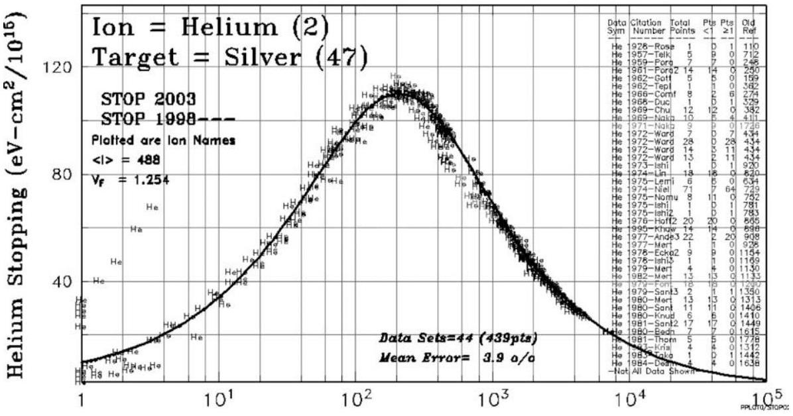
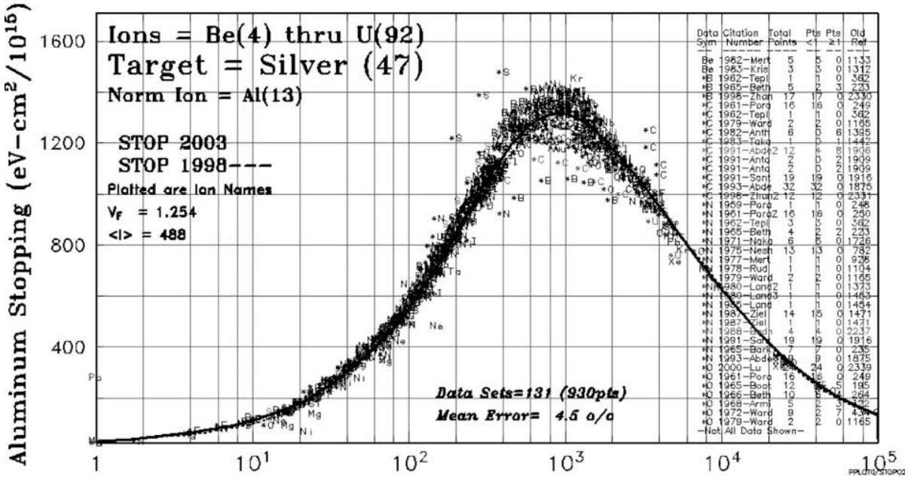
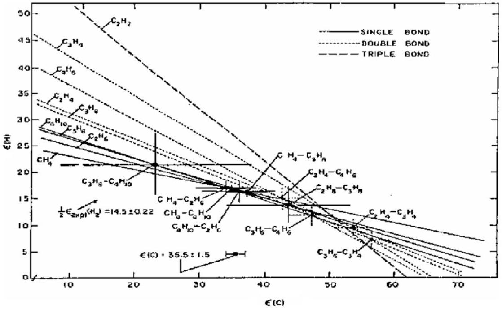
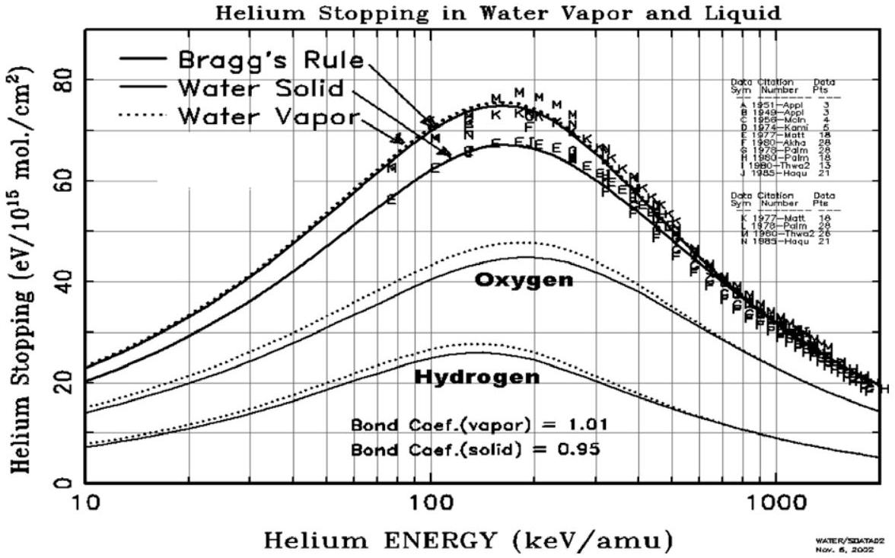
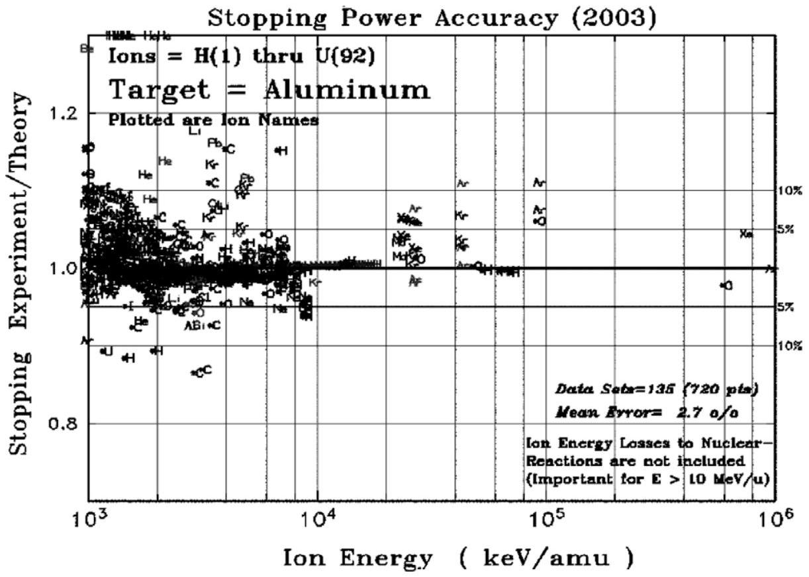
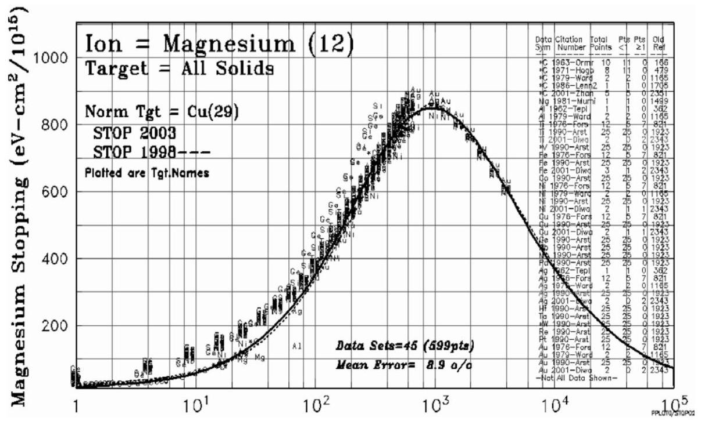

# SRIM - The stopping and range of ions in matter (2010) 

James F. Ziegler ${ }^{\mathrm{a}, *}$, M.D. Ziegler ${ }^{\mathrm{b}}$, J.P. Biersack ${ }^{\mathrm{c}}$ ${ }^{\mathrm{a}}$ United States Naval Academy, Physics Dept., Annapolis, MD 21402, USA ${ }^{\mathrm{b}}$ University of California at Los Angeles, Los Angeles, CA 90066, USA ${ }^{\mathrm{c}}$ Berlin, Germany

## ARTICLE INFO

## Article history:

Available online 26 February 2010

## Keywords:

SRIM
Ion stopping
Stopping power
Stopping force
Ion range

#### Abstract

SRIM is a software package concerning the Stopping and Range of Ions in Matter. Since its introduction in 1985, major upgrades are made about every six years. Currently, more than 700 scientific citations are made to SRIM every year. For SRIM-2010, the following major improvements have been made: (1) About 2800 new experimental stopping powers were added to the database, increasing it to over 28,000 stopping values. (2) Improved corrections were made for the stopping of ions in compounds. (3) New heavy ion stopping calculations have led to significant improvements on SRIM stopping accuracy. (4) A self-contained SRIM module has been included to allow SRIM stopping and range values to be controlled and read by other software applications. (5) Individual interatomic potentials have been included for all ion/atom collisions, and these potentials are now included in the SRIM package. A full catalog of stopping power plots can be downloaded at www.SRIM.org. Over 500 plots show the accuracy of the stopping and ranges produced by SRIM along with 27,000 experimental data points. References to the citations which reported the experimental data are included.

Published by Elsevier B.V.

## 1. Introduction

SRIM is a software package concerning the Stopping and Range of Ions in Matter. It has been continuously upgraded since its introduction in 1985 [1]. A recent textbook "SRIM - The Stopping and Range of Ions in Matter" describes in detail the fundamental physics of the software [2]. Since this time, corrections have been made based on new experimental data [3]. Major changes occur in SRIM about every six years. The last major changes were in 1995 and 1998 and 2003. In 1995 a complete overhaul was made of the stopping of relativistic light ions with energies above $1 \mathrm{MeV} / \mathrm{u}$. In 1998, special attention was made to the Barkas Effect and the theoretical stopping of Li ions. In 2010, significant changes were made to correct the stopping of ions in compounds. All the figures in this paper are also available on the SRIM website, in considerably more detail.

## 2. SRIM-2010 stopping accuracy

Shown in Table 1 are the statistical improvements in SRIM's stopping power accuracy when compared to experimental data and also compared to SRIM-1998. The right two columns show the percentage of data points within $5 \%$ and within $10 \%$ of the SRIM calculation. The experimental stopping powers for heavy ions contain far more scatter than for light ions, hence there are larger errors for heavy ions, Be-U.

[^0]The accuracy of SRIM-2010 for individual ions or targets can be reviewed by viewing plots which compare experimental values and the equivalent SRIM calculations. Fig. 1 shows a typical comparison for a light ion, He, in Ag. Fig. 2 shows a similar plot for all heavy ions, $\operatorname{Be}(4)-\mathrm{U}(92)$ in Ag. Here, the various ion stopping powers have been normalized to the stopping of Al ions in Al , (normalization means that for any ion, the relative error of its experimental value to that calculated by SRIM is plotted with a similar displacement from the stopping of Al ions in Ag ). Note that the scatter of data points is much higher than for the case of He ions in Ag, which increases the perceived error of SRIM. Higher resolution figures for each heavy ion and all elemental targets are available at www.SRIM.org.

## 3. Stopping of ions in compounds

Bragg and Kleeman, in 1903, conducted stopping experiments with a radium source in organic gases such as methyl bromide and methyl iodide to find how alpha stopping depended on the atomic weight of the target. They also calculated the stopping contribution of hydrogen and carbon atoms in hydrocarbon target gases by assuming a linear addition based on the chemical composition of H and C atoms in the targets. The concept that the stopping power of a compound may be estimated by the linear combination of the stopping powers of its individual elements has come to be known as Bragg's Rule [4].

This rule is reasonably accurate, and the measured stopping of ions in compounds usually deviates less than $20 \%$ from that

Table 1
Accuracy of SRIM stopping calculations.
|  | Approx. data pts. | SRIM-1998 (\%) | SRIM-2010 (\%) | SRIM-2010 (within 5\%) | SRIM-2010 (within 10\%) |
| :--- | :--- | :--- | :--- | :--- | :--- |
| H ions | 9000 | 4.5 | 3.9 | 68\% | 85\% |
| He ions | 6800 | 4.6 | 3.5 | 70\% | 87\% |
| Li ions | 1700 | 6.4 | 4.6 | 68\% | 81\% |
| Be-U Ions | 10,600 | 8.1 | 5.6 | 55\% | 78\% |
| Overall accuracy | 28,100 | 6.1 | 4.3 | 64\% | 85\% |

Notes to Table 1: The above table compares all 28,000 data points to SRIM calculations. If wacko points are omitted (those differing from SRIM by more than $25 \%$ ) then most of the above heavy ion accuracy numbers would be reduced by about $25 \%$. The overall accuracy of SRIM-2010 then reduces to $3.9 \%$ instead of $4.3 \%$.
Approx. data points: Current total data points used in SRIM plots.
SRIM-1998: Comparison of SRIM-1998 stopping to experimental data. SRIM-1998 was the last major change in SRIM stopping powers.
SRIM-2010: Current stopping power calculation.
SRIM-2010 (within $5 \%$ ): Percentage of experimental data within $5 \%$ of the SRIM values.
SRIM-2010 (within 10\%): Percentage of experimental data within 10\% of the SRIM values.

Fig. 1. The stopping of He ions in Ag targets. The plot shows experimental values of He ion stopping in Ag targets. It shows the actual stopping, in units of $\mathrm{eV} /\left(10^{15}\right.$ atoms $/ \mathrm{cm}^{2}$ ). At the right is a listing of the original data citations. As noted, there is a total of 439 data points taken from 44 papers, and they vary from SRIM calculations by an average of $3.9 \%$. Also noted is the mean ionization potential used for $\mathrm{Al}(<I>=488 \mathrm{eV})$ and the Fermi velocity ratio for $\mathrm{Ag}, V / V_{\mathrm{F}}=1.254$. The $<I>$ value is only used for high energy stopping ( $>1 \mathrm{MeV} / \mathrm{u}$ ), while the Fermi velocity is important for lower velocities. A higher resolution plot is available at www.SRIM.org.

Fig. 2. The stopping of heavy ions in Ag targets. The plot shows experimental stopping values of heavy ions (atomic numbers 4-92) in Ag targets. The plot is organized similar to that of Fig. 1. There are 930 experimental data points taken from 131 citations, and the mean error of SRIM is $4.5 \%$. Ag targets are easy to make and these targets tend to have small grains without texture and contain few contaminants. So the accuracy of SRIM is better than normal when compared to experimental heavy ion data due to the consistency of the targets. A higher resolution plot is available at www.SRIM.org.

predicted by Bragg's rule. The accuracy of Bragg's rule is limited because the energy loss to the electrons in any material depends on the detailed orbital and excitation structure of the matter, and
any differences between bonding in elemental materials and in compounds will cause Bragg's rule to become inaccurate. Further, bonding changes may also alter the charge state of the transition
ion, thus changing the strength of its interaction with the target medium.

Detailed experimental studies of Bragg's rule started in the 1960's, and wide discrepancies were found from simple additivity of stopping powers. A classic example is shown in Fig. 3 for targets containing H and C atoms, which show non-additivity of stopping in simple hydrocarbons [5]. In this figure, the stopping of He ions in various hydrocarbons was measured for pairs of compounds, and the relative contribution of H and C was extracted for each pair (solving two equations with two unknowns). It was found that the relative stopping contributions of H and C differ by almost $2 \times$ over the range of compounds. Similar work studied more complex hydrocarbons but instead of adding H and C bonds, they added extra hydrocarbon molecules. In this study, it was found that by adding identical molecules to hydrocarbon strings, stopping linearity returned [6]. Adding new molecules to a target just scaled the stopping by the extra number of atoms. These results showed that atomic bonding had large effects on stopping powers in simple molecular targets, while extra agglomeration of molecules to the target compounds had a small stopping effect.

Since these early experiments, theorists have shown that extensive calculations can predict the stopping of light ions (usually protons) in hydrocarbon compounds. Much of this work has been based on a seminal paper by Peter Sigmund that developed methods to account for detailed internal motion within a medium [7]. This theory allows for arbitrary electronic configurations in the target. Sabin and collaborators used this approach to calculate stopping powers for protons in hydrocarbons with good success [8]. Sabin's calculation follows what is sometimes called the "Köln Core and Bond" ( $\boldsymbol{C A B}$ ) approach which is discussed in detail below.

The Core and Bond ( $\boldsymbol{C} \boldsymbol{A} \boldsymbol{B}$ ) approach suggested that stopping powers in compounds can be predicted using the superposition of stopping by atomic "cores" and then adding the stopping corresponding to the bonding electrons [9]. The core stopping would simply follow Bragg's rule for the atoms of the compound, where we linearly add the stopping from each of the atoms in the compounds. The chemical bonds of the compound would then contain the necessary stopping correction. They would be evaluated depending on the simple chemical nature of the compound. For example, for hydrocarbons, carbon in $\mathrm{C}-\mathrm{C}, \mathrm{C}=\mathrm{C}$ and $\mathrm{C} \equiv \mathrm{C}$ struc-
tures would have different bonding contributions ( $\mathrm{C}=\mathrm{C}$ indicates a double-bond structure and $\mathrm{C} \equiv \mathrm{C}$ is a triple bond).

SRIM uses this CAB approach to generate corrections between Bragg's rule and compounds containing the common elements in compounds: $\mathrm{H}, \mathrm{C}, \mathrm{N}, \mathrm{O}, \mathrm{F}, \mathrm{S}$ and Cl . These light atoms have the largest bonding effect on stopping powers. Heavier atoms are assumed not to contribute anomalously to stopping because of their bonds (discussed later in Stopping of High Energy Heavy Ions). When you use SRIM, you have the option to use the Compound Dictionary which contains the chemical bonding information for about 150 common compounds. The compounds with available corrections are shown with a Star symbol, next to the name. When these compounds are selected, SRIM shows the chemical bonding diagram and calculates the best stopping correction. The correction is a variation from unity ( $1.0=$ no correction). Some corrections are quite big: carbon atoms have almost a $4 \times$ change in stopping power from single bonds to triple bonds. This large change indicates the importance of making some sort of correction for the stopping of ions in compounds.

The CAB corrections that SRIM uses have been extracted from the stopping of $\mathrm{H}, \mathrm{He}$ and Li ions in more than 100 compounds, from 162 experiments. The details of applying this correction are described in Ref. [10]. SRIM correctly predicts the stopping of H and He ions in compounds with an accuracy of better than $2 \%$ at the peak of their stopping power curve, $\sim 125 \mathrm{keV} / \mathrm{u}$.

An example of a large correction for compound targets is the $9 \%$ correction necessary for a target of water, $\mathrm{H}_{2} \mathrm{O}$, see Fig. 4. The stopping of He ions in gaseous $\mathrm{H}_{2}$ and $\mathrm{O}_{2}$ is shown with the lower two dotted lines. The stopping in gaseous water vapor is essentially the Bragg's Rule sum since its bonding correction is only $1 \%$, see the upper dotted line. However, for solid water (ice), the sum of stopping in $\mathrm{H}_{2} \mathrm{O}$ is shown as the upper solid line. With the $\mathrm{H}_{2} \mathrm{O}$ phase correction, which reduces the stopping by $9 \%$ at the peak, SRIM shows good agreement between predicted stopping and the data from the ten experimental reports [11].

The limitations of the CAB approach should be mentioned.
A. The most important limitation might be that of the target band-gap. Experiments on insulating targets dominate the experimental results that we use. For compounds which are conducting, there might be an error with the calculated

Fig. 3. Accuracy of Bragg's Rule in hydrocarbon compounds. In this figure, the stopping of He ions (at 500 keV ) in various hydrocarbons is shown for pairs of compounds, with the relative contributions of stopping in H and C extracted assuming Bragg's Rule and solving using two unknowns [5]. This classic paper shows with clarity the errors associated with Bragg's Rule. The units of the ordinate and abscissa are reduced stopping units, $\varepsilon$ [18]. It is found that the various determinations of stopping by H and C atoms differ by almost $2 \times$ over the range of compounds. The result is a clear indication of the importance of including bonding corrections in stopping powers. (Figure from Ref. [5]).

Fig. 4. Corrections for stopping in compounds: He ions in water. The effects on stopping of target phase are illustrated in the figure for the stopping of He ions in water (solid and gaseous). Data from 14 citations are shown. The special bonding of $\mathrm{H}-\mathrm{O}$ in water is approximately the same for $\mathrm{H}-\mathrm{H}$ and $\mathrm{O}-\mathrm{O}$ bonds, so the stopping in the gaseous $\mathrm{H}_{2} \mathrm{O}$ is almost the same as found using Bragg's Rule. However, a large $9 \%$ phase correction must be applied to calculate the stopping of $\mathrm{H}_{2} \mathrm{O}$ in solid forms, ice and water (see text). A higher resolution plot is available at www.SRIM.org.

stopping correction being too small. Theoretically, band-gap materials are expected to have lower stopping powers than equivalent conductors because the small energy transfers to target electrons are not available in insulators. It is not clear what the magnitude of this effect is, but about 50 papers have discussed the stopping of ions in metals and their oxides, e.g. targets of $\mathrm{Fe}, \mathrm{Fe}_{2} \mathrm{O}_{3}$ and $\mathrm{Fe}_{3} \mathrm{O}_{4}$. These experiments evaluated similar materials with and without bandgaps. No significant differences were found that could be attributed to the band-gap. Measurements have also been made of the stopping of H and He ions into ice (solid water) with various dopings of salt $(\mathrm{NaCl})$. No change of energy loss was observed for up to 6 orders of magnitude change in resistivity of the ice [11].
B. The scaling of ion stopping from H to He to Li ions is assumed to be independent of target material. This assumption has been evaluated with 27 targets which have been measured for two of the three ions (at the same ion velocity) and 6 of these targets have been measured for all three ions (see listings in Ref. [11]). In all cases, the stopping scaled identically within $4 \%$. That is, for $\mathrm{H}(125 \mathrm{keV})$ and He $(500 \mathrm{keV})$ and $\mathrm{Li}(875 \mathrm{keV})$ the scaling of stopping powers was $1: 2.7: 4.7$ for the 27 targets (average error was $<4 \%$ ). (For those unfamiliar with stopping theory, the primary parameter for the scaling of stopping powers is the ion velocity, which reduces to scaling in units of $\mathrm{keV} / \mathrm{a}$.).
C. The light elements of He and Ne are missing from the above list of target bonding atoms. No comparative experiments have been done on the stopping into elemental He in solid/gas phases. However studies of stopping into targets of Ne and Ar have been conducted in both gas and solid form. These papers show no significant difference between the stopping in gas and solid phases. It appears that the Van der Waals forces, which hold noble gases together in frozen form, are too weak to effect the energy loss of ions. Of particular note is the extensive work done in a PhD paper by Besenbacher. [12].
D. The light target atoms of $\mathrm{Li}, \mathrm{Be}$ and B are missing from the list of bonding atoms with corrections. This is a serious defect. The number of papers that have looked at com-
pounds which contain significant amounts of these three elements is too limited to allow their evaluation. Target atoms of these three elements are considered by SRIM to have no bonding correction, which is clearly not true. But without experimental data, there is no reliable way to evaluate the contribution of their bonds in compounds.
E. Bragg's Rule and Heavy Target Elements. We have concentrated on the analysis of the stopping of ions in compounds made up of light elements. For compounds with heavier atoms, many experiments have shown that deviations from Bragg's rule disappear. In Table 2 are shown representative examples of ion stopping in various compounds containing heavy elements. None show measurable deviations from Bragg's rule. These and other similar results were reviewed in the 1980s [13,14].

## 4. Stopping of high energy heavy ions

The stopping powers of high energy ( $E>1 \mathrm{MeV} / \mathrm{u}$ ) heavy ions $(Z>3)$ have two separate components. First is the charge state of these ions, which is traditionally addressed by using the BrandtKitagawa approximation, and then the many high velocity effects are combined into modern Bethe-Bloch theory.

The Brandt-Kitagawa (BK) theory [15] is easiest to understand relative to the Bohr theory of the average charge state of heavy ions [16]. Bohr suggested the simple picture that the energetic heavy ion would lose any of its electrons whose classical velocity was slower than the ion's velocity. This concept lasted for more than 30 years, with remarkable success. The concept was then improved by the suggestion of BK that one should consider instead the loss of any electrons whose velocity was slower than the relative velocity of the ion to the target medium. This lowered the charge state of heavy ions since the relative velocity of the ion was always lower than its absolute velocity. BK then presented a simple method of calculating this relative velocity based on considering the target to be a perfect Fermi conductor. This significantly improved the calculation of stopping powers [1].

Modern approaches to Bethe-Bloch stopping equation have been reviewed in detail in Ref. [17]. In Bethe-Bloch, two large

Table 2
Bragg's rule accuracy in heavy compounds.
| Compound | Deviation from Bragg's rule (\%) | Compound | Deviation from Bragg's rule (\%) | Compound | Deviation from Bragg's rule (\%) |
| :--- | :--- | :--- | :--- | :--- | :--- |
| $\mathrm{Al}_{2} \mathrm{O}_{3}$ | <1 | $\mathrm{HfSi}_{2}$ | <2 | $\mathrm{Si}_{3} \mathrm{~N}_{4}$ | <2 |
| $\mathrm{Au}-\mathrm{Ag}$ alloys | <1 | NbC | <2 | $\mathrm{Ta}_{2} \mathrm{O}_{5}$ | <1 |
| $\mathrm{Au}-\mathrm{Cu}$ alloys | <2 | NbN | <2 | $\mathrm{TiO}_{2}$ | <1 |
| $\mathrm{BaCl}_{2}$ | <2 | $\mathrm{Nb}_{2} \mathrm{O}_{5}$ | <1 | $\mathrm{W}_{2} \mathrm{~N}_{3}$ | <2 |
| $\mathrm{BaF}_{2}$ | <2 | RhSi | <2 | $\mathrm{WO}_{3}$ | <2 |
| $\mathrm{Fe}_{2} \mathrm{O}_{3}$ | <1 | SiC | <2 | ZnO | <1 |
| $\mathrm{Fe}_{3} \mathrm{O}_{4}$ | <1 |  |  |  |  |

Note: For compounds which contain elements with atomic numbers greater than 12, it is possible to combine the CAB approach with Bragg's rule. The CAB approach can be used for the small atomic number cores and bonds, and these can be combined with the normal stopping contribution of the other components of the compound.

Fig. 5. Stopping of high energy heavy ions in aluminum. The figure shows the ratio of experimental stopping to SRIM calculation for high energy ( $>1 \mathrm{MeV} / \mathrm{u}$ ) ions in aluminum. The data shown is from 135 papers, and represents 720 data points over $1 \mathrm{MeV} / \mathrm{u}$. The mean error is $2.7 \%$. There are several heavy ion data points at about $100 \mathrm{MeV} / \mathrm{u}$ which show about $5 \%$ higher experimental values than SRIM values. This is of the order of estimated nuclear reaction losses, and is always a problem with very high energy ions ( $>10 \mathrm{MeV} / \mathrm{u}$ ). A higher resolution plot is available at www.SRIM.org.

components are not well described by pure theoretical considerations: (1) the mean ionization energy of the target, commonly symbolized using <I>, and (2) the shell corrections for the target, called $C / Z_{2}$. The <I> value for a target corrects for the quantized energy levels of the target electrons and also any band-gap and target phase correction. The $C / Z_{2}$ term corrects for the Bethe-Bloch assumption that the ion velocity is much larger than the target electron velocities. This term is usually calculated by detailed accounting of the particle's interaction with each electronic orbit in various elements. Since both of these terms are only dependent on the target, they are assumed to be the same for heavy ions and lighter ions.

An example of SRIM's stopping accuracy for heavy ions is shown in Fig. 5. It shows the ratio of experimental stopping values to SRIM calculation for heavy ions in Al targets. (Al targets seem to be the most reliable target to make, since the data scatter about an average value is the least of that for any solid). The data shown are from 135 papers, and represents 720 data points for ion energies over $1 \mathrm{MeV} / \mathrm{u}$. There are several heavy ion data points at about $100 \mathrm{MeV} / \mathrm{u}$ which show about $5 \%$ higher experimental values than SRIM values. This is of the order of the estimated nuclear reaction
losses, and is always a problem with very high energy ions $(>10 \mathrm{MeV} / \mathrm{u})$.

## 5. Anomalous heavy Ion stopping values

SRIM uses several different stopping theories to evaluate the accuracy of experimental stopping powers. Specifically, calculations are made for all ions in individual targets (which eliminates common difficulties with target dependent quantities such as shell corrections and mean ionization potentials, discussed above). Calculations are also made of one heavy ion in all solids, which eliminates some of the difficulties with ion dependent quantities such as the degree of ion stripping. Also, calculations are made from fundamental theories like the Brandt-Kitagawa theory and LSS theory [18]. If the experimental values are within reasonable agreement with this set of theoretical calculations, then the experimental values are weighted with the theoretical values to obtain final values. However, at times, significant errors occur in experimental stopping values and they deviate so far from theoretical values that they are totally ignored.

Fig. 6. The stopping of Mg ions in all solids. The plot shows experimental stopping values for Mg ions in all solids. This plot shows a considerable number of data points which differ from SRIM calculations, especially for low energy ions ( $<100 \mathrm{keV} / \mathrm{u}$ ). The variation arises from the use of "Inverted Doppler Shift Attenuation", IDSA, as a method to measure stopping powers. This technique is quite complex and relies on the knowledge of the life-time of an excited nuclear state (see text) and is fraught with potential errors. As shown, SRIM calculations are in serious disagreement with the lower energy Mg values of which were determined by IDSA, however it agrees with 7 papers which measured stopping at the same energies, using other methods. A higher resolution plot is available at www.SRIM.org.

Shown in Fig. 6 is the stopping of Mg ions in all solids. Note the large number of experimental data points below $100 \mathrm{keV} / \mathrm{u}$, which diverge from the SRIM stopping by up to $200 \%$. For Mg ions, SRIM has an average accuracy of about $9 \%$, the worst for any ion. Almost lost by the large number of data points which disagree with SRIM are those from seven citations which showed values almost identical to SRIM.

All of the deviant experimental stopping values were determined by a technique called "Inverted Doppler Shift Attenuation", IDSA [19]. This technique relies on the knowledge of the life-time of an excited nuclear state and is fraught with potential errors. The technique requires a nuclear reaction to occur in the target, resulting in an emitted gamma ray. The gamma ray energy may be shifted due to motion of the recoiling particle. A particular source of error occurs if the differential of the particle energy loss with ion velocity changes much while the particle is slowing down. Note that in the energy range of $10-100 \mathrm{keV} / \mathrm{u}$, the energy loss is changing rapidly with ion velocity, and this is where the maximum deviation occurs between IDSA stopping values and SRIM. As also shown, SRIM agrees well with 7 papers which measured stopping using other methods.

The advantage of the IDSA technique is that it can be used to determine stopping in difficult targets such as liquids and also to evaluate bonding effects in compounds. However, it is often used without full consideration of its sensitivity to non-linear effects.

## 6. SRIM sub-routine module

A "module" has been made so that the stopping and ranges of SRIM may be run as a batch sub-program for other applications [20]. This allows the user to use SRIM as a sub-routine of another application that needs stopping powers and ranges. The user creates a control file and executes the file "SRModule.exe" which will generate an output table similar to those normally made by SRIM. The user can generate the standard file (with stopping and ranges) or can generate a file which contains stopping powers for a specific list of energies.

## Acknowledgements

The author is particularly indebted to the many users of SRIM who helped debug the first twenty five years of SRIM, leading to SRIM-2010. Without your significant help and enthusiasm, SRIM would not be the robust and versatile program that it is.

## References

[1] J.F. Ziegler, J. Biersack, U. Littmark, "The Stopping and Range of Ions in Matter", Pergamon Press, 1985.
[2] J.F. Ziegler, J.P. Biersack, M.D. Ziegler, SRIM - The Stopping and Range of Ions in Matter", Ion Implantation Press, 2008. http://www.lulu.com/content/1524197.
[3] See www.SRIM.org. More than 500 plots are included showing more than 28,000 experimental data points as compared to SRIM calculations.
[4] W.H. Bragg, R. Kleeman, Phil. Mag. 10 (1905) 318.
[5] A.S. Lodhi, D. Powers, Phys. Rev. A10 (1974) 2131.
[6] D. Powers, Acc. Chem. Res. 13 (1980) 433.
[7] P. Sigmund, Phys. Rev. A26 (1982) 2497.
[8] J.R. Sabin, J. Oddershede, Nucl. Instrum. Methods B27 (1987) 280.
[9] G. Both, R. Krotz, K. Lohman, W. Neuwirth, Phys. Rev. A28 (1983) 3212.
[10] The most recent core and bond values used in SRIM are shown at: www.Srim.org \SRIM\CompoundsCABTheory.htm. The modeling technique used to extract these values was originally described in: J.F. Ziegler, J.M. Manoyan, Nucl. Instrum. Methods, B35 (1988) 215.
[11] The data plotted in Fig. 4 are from papers listed at: www.Srim.org \SRIM\Compounds.htm. This website also describes in detail how corrections are made for target phase changes (solid or gas phases) and for target compound binding. Also, citations are listed for compounds containing heavy atoms, and also the effects of variations of the target bandgap on stopping powers.
[12] F. Besenbacher, J. Bottiger, O. Graversen, J. Hanse, H. Sorensen, Nucl. Instrum. Methods 188 (1981) 657-667.
[13] D.I. Thwaites, Nucl. Instrum. Methods B12 (1985) 84.
[14] D.I. Thwaites, Nucl. Instrum. Methods B27 (1987) 293.
[15] W. Brandt, M. Kitagawa, Phys. Rev. 25B (1982) 5631.
[16] N. Bohr, Mat. -Fys. Medd. K. Dan. Selse 18 (1948) 1.
[17] J.F. Ziegler, Applied physics reviews, J. Appl. Phys. 85 (1999) 1249-1272.
[18] J. Lindhard, M. Scharff, H.E. Schiott, Kgl. Danske Vid. Sels. Mat.-Fys. Medd. 33 (1963) 1.
[19] P. Petkova, A. Dewaldb, P. von Brentano, "A new procedure for lifetime determination using the Doppler-shift attenuation method", Nucl. Instrum. Methods A-560 (2006) 564-570.
[20] Details of using the Stopping and Range module are included in the SRIM-2010 package. See the SRIM directory, .../SR Module/HELP SR Module.rtf.

[^0]:    * Corresponding author.

    E-mail address: Ziegler@SRIM.org (J.F. Ziegler).

