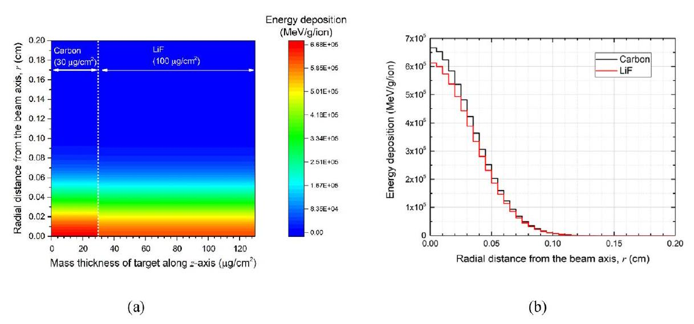
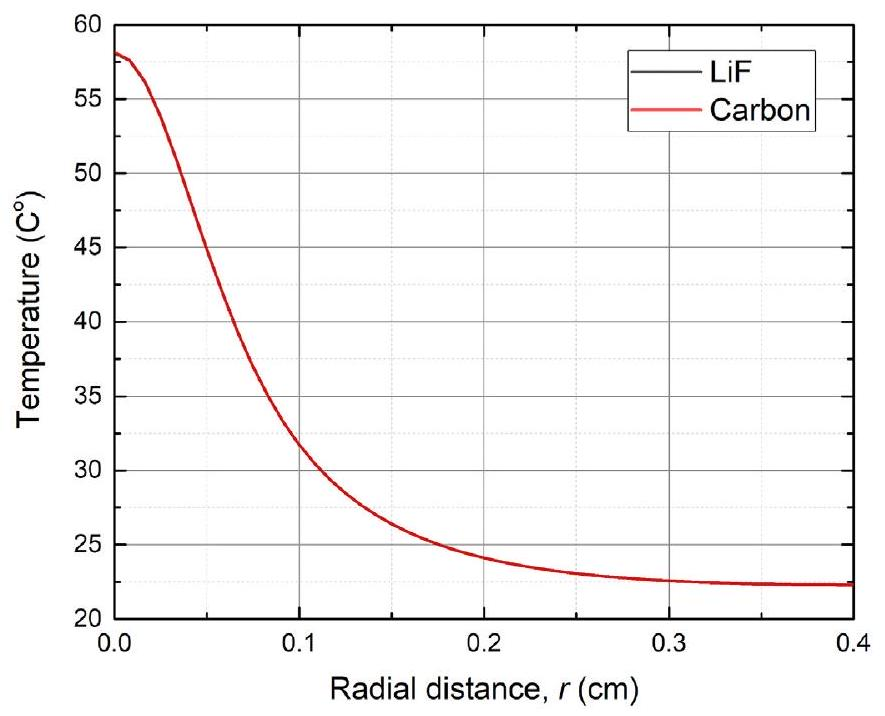
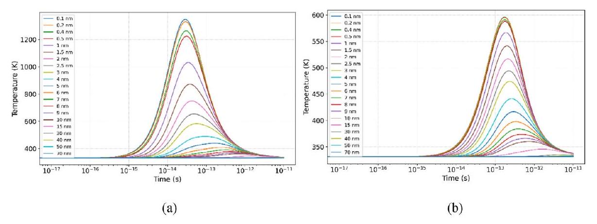
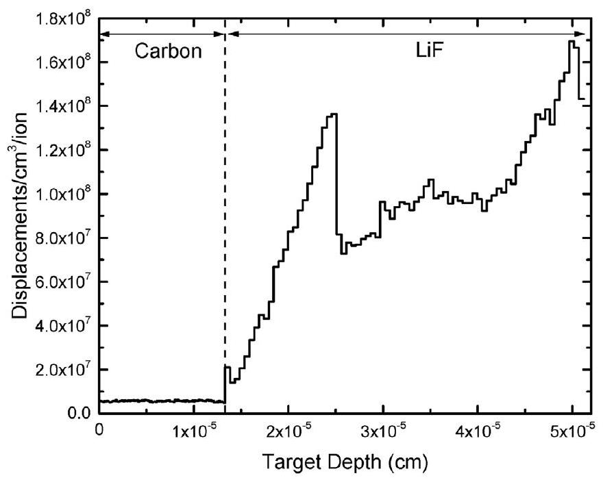
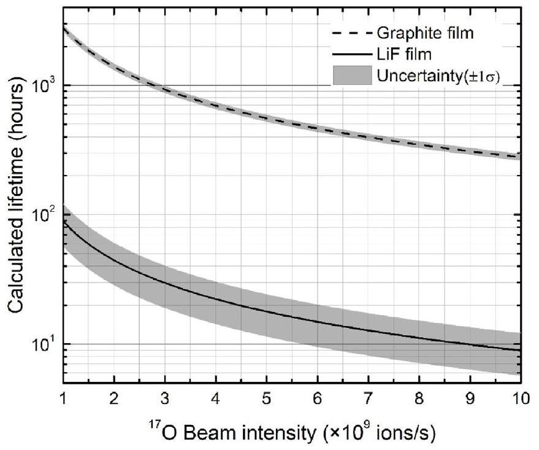
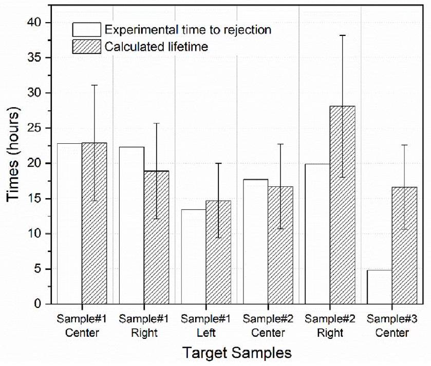
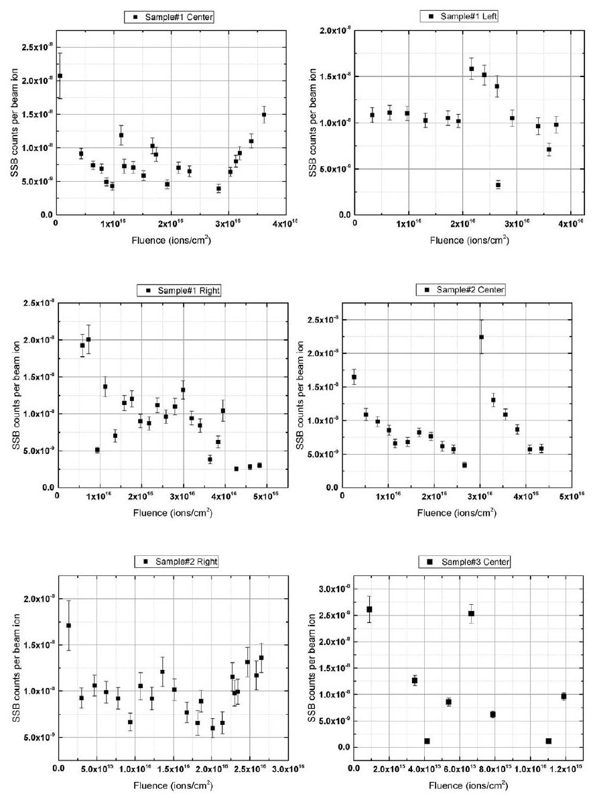

# Degradation of thin carbon-backed lithium fluoride targets bombarded by $68 \mathrm{MeV}{ }^{17} \mathrm{O}$ beams 

Y.H. Kim ${ }^{\mathrm{a}}$, B. Davids ${ }^{\mathrm{b}, \mathrm{c}}$, M. Williams ${ }^{\mathrm{b}, \mathrm{d}}$, K.H. Hudson ${ }^{\mathrm{b}, \mathrm{c}}$, S. Upadhyayula ${ }^{\mathrm{b}}$, M. Alcorta ${ }^{\mathrm{b}}$, P. Machule ${ }^{\text {b }}$, N.E. Esker ${ }^{\text {b }}$, C.J. Griffin ${ }^{\text {b }}$, J. Williams ${ }^{\text {b }}$, D. Yates ${ }^{\text {b, }}$, A. Lennarz ${ }^{\text {b }}$, C. Angus ${ }^{\text {d }}$, G. Hackman ${ }^{\text {b }}$, D.G. Kim ${ }^{\text {a }}$, J. Son ${ }^{\text {a, }}$, J. Park ${ }^{\text {g }}$, K. Pak ${ }^{\text {a }}$, Y.K. Kim ${ }^{\text {a, }}$ * ${ }^{\mathrm{a}}$ Department of Nuclear Engineering, Hanyang University, Seoul, 04763, Republic of Korea ${ }^{\mathrm{b}}$ TRIUMF, 4004 Wesbrook Mall, Vancouver, British Columbia, V6T 2A3, Canada ${ }^{\mathrm{c}}$ Department of Physics, Simon Fraser University, Burnaby, British Columbia, V5A 1S6, Canada ${ }^{\mathrm{d}}$ Department of Physics, University of York, Heslington, York, YO10 5DD, United Kingdom ${ }^{\mathrm{e}}$ Department of Physics and Astronomy, University of British Columbia, Vancouver, BC V6T 1Z4, Canada ${ }^{\mathrm{f}}$ Korean Association for Radiation Application, Seoul, 04790, Republic of Korea ${ }^{\mathrm{g}}$ Korea Atomic Energy Research Institute, Daejeon, 34057, 111, Republic of Korea

## ARTICLE INFO

## Article history:

Received 24 August 2022
Received in revised form
13 October 2022
Accepted 28 October 2022
Available online 1 November 2022

## Keywords:

Degradation
Lattice damage
Sputtering
Thermal evaporation
Target lifetime
LiF target
Heavy ion
Radiation damage

#### Abstract

To analyze the cause of the destruction of thin, carbon-backed lithium fluoride targets during a measurement of the fusion of ${ }^{7} \mathrm{Li}$ and ${ }^{17} \mathrm{O}$, we estimate theoretically the lifetimes of carbon and LiF films due to sputtering, thermal evaporation, and lattice damage and compare them with the lifetime observed in the experiment. Sputtering yields and thermal evaporation rates in carbon and LiF films are too low to play significant roles in the destruction of the targets. We estimate the lifetime of the target due to lattice damage of the carbon backing and the LiF film using a previously reported model. In the experiment, elastically scattered target and beam ions were detected by surface silicon barrier (SSB) detectors so that the product of the beam flux and the target density could be monitored during the experiment. The areas of the targets exposed to different beam intensities and fluences were degraded and then perforated, forming holes with a diameter around the beam spot size. Overall, the target thickness tends to decrease linearly as a function of the beam fluence. However, the thickness also exhibits an increasing interval after SSB counts per beam ion decreases linearly, extending the target lifetime. The lifetime of thin LiF film as determined by lattice damage is calculated for the first time using a lattice damage model, and the calculated lifetime agrees well with the observed target lifetime during the experiment. In experiments using a thin LiF target to induce nuclear reactions, this study suggests methods to predict the lifetime of the LiF film and arrange the experimental plan for maximum efficiency.

© 2022 Korean Nuclear Society, Published by Elsevier Korea LLC. This is an open access article under the CC BY-NC-ND license (http://creativecommons.org/licenses/by-nc-nd/4.0/).

## 1. Introduction

Thin solid-state targets are used worldwide to strip ions or induce nuclear reactions in experiments with accelerated ion beams. However, they have a limited lifetime due to degradation, thereby decreasing the overall performance of experiments. Yntema and Nickel contributed significantly by devising a model for the destruction of thin targets under heavy ion beam bombardment [1]. Lebedev developed Yntema and Nickel's model

[^0]and predicted fairly accurately lifetimes for thin carbon targets according to their properties [2]. Currently, this model is widely used at accelerator facilities to predict the lifetimes of thin carbon targets, thereby maximizing experimental performance. However, although studies on the failure of carbon have been intensively conducted, studies on the failure of other target materials are insufficient. Recently, cases of failures of various materials such as beryllium, aluminum, titanium irradiated with high intensity and energy have been reported at FermiLab and the Spallation Neutron Source (SNS) in the USA and Japan Proton Accelerator Research Complex (J-PARC) in Japan [3,4]. With the development of particle accelerators, further studies on the degradation processes of various materials are required to improve the performance and
reduce the cost of experiments. An experiment was conducted at the EMMA facility of TRIUMF [5] to investigate the possible influence of a reaction on the astrophysical s-process. To indirectly study the states populated in the ${ }^{17} \mathrm{O}(\alpha, \gamma){ }^{21} \mathrm{Ne}$ reaction at astrophysical energies, a thin solid-state lithium fluoride (LiF) target on a carbon backing was used to populate states in ${ }^{21} \mathrm{Ne}$ through the ${ }^{7} \mathrm{Li}\left({ }^{17} \mathrm{O}, \mathrm{t}\right){ }^{21} \mathrm{Ne}$ reaction with ${ }^{17} \mathrm{O}$ beams accelerated to 68 MeV at ISAC-II [6]. During the experiment, all the targets exhibited degradation and perforations. Consequently, we were unable to fully optimize the execution of the experiment within the scheduled time. Here, we investigate the cause of the destruction of the carbon backing foils and thin LiF films to predict the lifetimes of such targets in subsequent similar experiment. LiF targets are often used to study nuclear reactions and populate excited states of radioactive nuclei in nuclear physics experiments. However, there are no studies on the degradation and lifetimes of thin LiF films irradiated by heavy ion beams. The lifetime of thin LiF films is estimated theoretically by calculating sputtering, thermal evaporation and lattice damage following the method described by Nickel [1]. In the experiment, the degradation and the change of target thickness were monitored by a silicon surface barrier (SSB) detector installed at $20^{\circ}$ with respect to the beam axis to detect scattered beam and target ions. The calculated lifetime of the target is compared with the lifetime obtained from the experiment. Despite the long lifetime of the carbon backing, perforations occurred in all the targets after a relatively short time interval that agrees well with the calculated lifetime of LiF film due to lattice damage.

## 2. Experimental settings

A $68 \mathrm{MeV}{ }^{17} \mathrm{O}^{4+}$ beam with a 1 mm beam spot was impinged perpendicularly on a thin LiF target with a carbon backing. Enriched ${ }^{7} \mathrm{Li}{ }^{19} \mathrm{~F}$ films are deposited on amorphous carbon backing films. Carbon backing and LiF film are positioned upstream and downstream, respectively. The areal density (mass thickness) of the LiF and carbon backing films are $100 \mu \mathrm{~g} / \mathrm{cm}^{2}$ and $30 \mu \mathrm{~g} / \mathrm{cm}^{2}$, respectively. Three identical target samples (\#1, \#2 and \#3) were used in the experiment. The area of each target onto which the beam was directed is divided into three separate spots: left, center, and right. The targets are mounted on stainless steel target frames, which are attached to a rotatable target wheel in a target chamber under $10^{-6}$ Torr vacuum. A SSB detector with a round collimator of 3 mm diameter is mounted $20^{\circ}$ from the beam direction 54 mm from the center of the target to monitor elastically scattered beam and target ions so as to monitor the beam flux and target content degradation for the duration of the experiment. Here, the time rate of SSB counts $R$, defined as the number of scattered beam ion or target nuclei per unit time detected by the SSB detector, depends linearly on the product of beam intensity and target thickness, as expressed in Equation (1):
$R=I\left(\frac{d \sigma}{d \Omega}\right)_{\text {lab }} \Delta \Omega \rho \Delta x$,
where $I,\left(\frac{d \sigma}{d \Omega}\right)_{\text {lab }}, \Delta \Omega, \rho$, and $\Delta x$ represent the beam intensity, differential elastic scattering cross section, solid angle subtended by the SSB detector, target mass density, and target thickness, respectively. As the differential elastic scattering cross section and solid angle do not vary with time, the SSB counts per incident beam ion, defined as $R / I$, is proportional to the areal mass density of the target $\rho \Delta x$. Therefore, we can determine how much the density or thickness has been reduced by degradation in the irradiated area. A Faraday cup inside the target chamber was periodically maneuvered into the beam path to measure the beam current. During the
experiment, the measured currents ranged from approximately 1.0 to 6.6 nA corresponding to $1.6 \times 10^{9}$ to $1.0 \times 10^{10}$ ions $/ \mathrm{s}$.

## 3. Target lifetime investigation

The lifetime of a solid target bombarded with heavy ions can be determined through sputtering, thermal evaporation and lattice damage caused by radiation [1]. Simple theoretical explanations and calculation results for sputtering, thermal evaporation, and lattice damage are provided below.

### 3.1. Thermal evaporation

The target temperature must be first determined to obtain the target lifetime. This is because, the target temperature affects not only the lifetime with respect to evaporation but also the lifetime with respect to lattice radiation damage. Heating of the target foil by a heavy ion beam limits the lifetime owing to the evaporation of target atoms in the vacuum even at the target temperature below the melting point. The lifetime $t_{E}$ of the thin targets with respect to Ref. [1] evaporation can be expressed as:
$t_{E} \approx \frac{N_{0} d}{3 \bullet 2 V(T)}$.

Here $N_{0}$ and $d$ are the atomic number density and target thickness, respectively. $V(T)$ is the evaporation rate of target atoms (or molecules) per unit area as a function of the target temperature $T$ [7]. Based on the experimental conditions shown in Fig. 1(a), which shows constant energy deposition along the beam direction (the zaxis) in each material, the temperature is determined by calculating the energy deposition per unit mass per incident ion in the carbon and LiF films as a function of target depth ( $z$ ) and radial distance from the beam axis ( $r$ ), using the Monte Carlo code FLUKA [8]. Within each material, the energy deposition as a function of radial distance is essentially identical for any position on the $z$-axis, and is shown in Fig. 1(b).

Using the data from the energy deposition as a function of the radial distance from the beam axis, the temperature of the carbon and LiF films is expressed as a function of radial distance through steady-state thermal analysis using ANSYS (Ansys® Academic Research Mechanical, Release 20.1), as shown in Fig. 2. The beam intensity is assumed to be $1.0 \times 10^{10}$ ions $/ \mathrm{s}$, which is the largest value used in the experiment. As the target is under high vacuum, we assume that heat is transferred through thermal conduction and radiation only, excluding convection. The thermal conductivity and specific heat used in the calculation are $13.39 \mathrm{~W} / \mathrm{mK}$ and $1.5 \mathrm{~J} /$ gK, respectively, for LiF [9-11] and $1.16 \mathrm{~W} / \mathrm{mK}$ and $2 \mathrm{~J} / \mathrm{gK}$, respectively, for carbon [12,13]. The emissivities of LiF and carbon are 0.5 and 0.8 , respectively $[14,15]$. Fig. 2 shows that the temperature as a function of the radial distance from the beam axis of the carbon and LiF films are almost identical to each other, and the functions are independent of $z$ (depth) because of thermal conduction. The maximum internal temperatures at the center of the beam spot ( $r=0$ ) of carbon and LiF are 58.16 and $58.10^{\circ} \mathrm{C}$, respectively.

The maximum thermal sublimation (evaporation) flux $V(T)$ at the surface of the LiF and carbon films are calculated under the experimental conditions using the following Hertz-Knudsen equation [16]:
$V(T)=\frac{N_{A} P_{v}(T)}{(2 \pi M R T)^{1 / 2}}$.

Here $N_{A}, P_{v}, M$ and $R$ are the Avogadro number, the vapor pressure, the molecular mass and the gas constant, respectively.

Fig. 1. (a) 2D map of the deposited energy per unit mass per $68 \mathrm{MeV}{ }^{17} \mathrm{O}$ ion. In the $z$ direction, carbon and LiF are in the 0-30 and 30-130 $\mu \mathrm{g} / \mathrm{cm}^{2}$ areal density (mass thickness) range, respectively. (b) Energy deposition on the carbon and LiF film planes normal to the beam as a function of the radial distance.

Fig. 2. Temperature of carbon and LiF films as a function of radial distance. The background temperature is $22^{\circ} \mathrm{C}$ and the mass densities of LiF and Carbon are $2.635 \mathrm{~g} / \mathrm{cm}^{3}$ and $2.2 \mathrm{~g} / \mathrm{cm}^{3}$, respectively.

The vapor pressure $P_{v}$ for the solid forms of carbon and LiF as a function of temperature can be calculated with the aid of the following empirical equation [17]:

$$
\log P_{v}(T)=A-\frac{B}{T} .
$$

Here $A$ and $B$ are the substance-specific coefficients. These coefficients for carbon are obtained by fitting the values from the CRC Handbook of Chemistry and Physics [18] and the coefficients for LiF obtained from Ref. [19] are listed in Table 1. $P_{v}$ at the maximum

Table 1
Coefficients and vapor pressure of the empirical equation.
|  | Carbon | LiF |
| :--- | :--- | :--- |
| A | $13.51 \pm 0.01^{\mathrm{a}}$ | $8.89 \pm 0.140^{\mathrm{a}}$ |
| B | $41548.71 \pm 34.65^{\mathrm{a}}$ | $14865 \pm 149^{\mathrm{a}}$ |
| $P_{v}(T)[$ Torr $]$ | $(1.26 \pm 0.37) \times 10^{-112}$, | $(1.04 \pm 1.12) \times 10^{-36}$, |
|  | When $T$ is $58.16^{\circ} \mathrm{C}(331.32 \mathrm{~K})$ | When $T$ is $58.10^{\circ} \mathrm{C}(331.26 \mathrm{~K})$ |

[^1]temperatures for carbon and LiF are calculated and listed in Table 1, as well.

At the given temperature, the maximum thermal sublimation fluxes $V$ at the center ( $r=0$ ) of each surface (one side for carbon, the other surface for LiF) are calculated as $(5.28 \pm 1.53) \times 10^{-95}$ for carbon and $(2.94 \pm 3.19) \times 10^{-9} / \mathrm{s} \bullet \mathrm{cm}^{2}$ for LiF. Both $V$ are extremely low values in which the total number of sublimated atoms (or molecules) per second at both surfaces within the beam size ( $r=0.05 \mathrm{~cm}$ ) are much less than $1 \mathrm{~s}^{-1}$. The lifetimes of carbon and LiF with respect to thermal evaporation are calculated using equation (2). $N_{0} d$ is considerably larger than $V(T)$, so the lifetimes of both are too long to consider thermal evaporation significant. Therefore, thermal evaporation does not affect the target lifetime under the experimental conditions.

### 3.2. Sputtering and target lifetime

Sputtering is the erosion of solid and liquid surfaces under energetic particle bombardment. Erosion rates are characterized primarily by the sputtering yield $(Y)$, which is defined as the mean number of emitted atoms per incident particle. A target atom is sputtered when the kinetic energy associated with its motion normal to the surface is larger than the surface binding energy. The lifetime $t_{S}$ of a thin target as determined by sputtering yield $Y$, can be approximated as follows [1]:

$$
t_{S} \approx \frac{N_{0} d}{3 \bullet Y \bar{\varphi}}
$$

where $\bar{\varphi}$ represents flux density of the bombarding particles averaged over time. The target thickness $d$ is assumed to be sufficiently thin enough to make multiple scattering insignificant. To calculate the sputtering yield, nuclear, electronic, and chemical sputtering are considered. For the energies of incident ions in the 100 eV to the keV range, sputtering is mainly caused by atomic collision cascades (nuclear sputtering, $S_{n}$ ) between the incoming particles and the atoms in the surface layers of a solid. This sputtering from the collisions is generally different from the evaporation in thermal equilibrium. Nuclear sputtering has been studied and well described by Sigmund's theory [20]. Monte Carlo codes such as TRIM [21], MARLOWE [22], TRIM.SP [23], TRIM-CASCADE [24], TRIDYN [25], and ACAT [26] have provided a quantitative understanding of sputtering caused by collisional cascades in the nuclear stopping regime. For perpendicular incidence of heavy ions in the MeV energy region, the transmission sputtering (and back
sputtering) yield $Y_{n}$ from a target can be written,
$Y_{\mathrm{n}}=\Lambda F_{\mathrm{D}}(x, \mathrm{E}), \Lambda=0.042 /\left(N U \AA^{2}\right)$

Here, $x$ is the target depth, and $E$ is the energy of the incident ion, and $\Lambda$ is a material factor that contains the property of the target material and state of the surface. $N$ is the atomic density of the target (in atoms/ $\AA^{3}$ ), and $U$ is the surface binding energy. $F_{D}(x, E)$ is the nuclear energy deposited per unit length depending on the type, energy and direction of the incident ion (z-axis direction), as well as the atomic number, mass and density of the target.
$F_{\mathrm{D}}(x, E)=\alpha N S_{\mathrm{n}}(x, E)$,
where $\alpha$ is a correction factor, which is a function of the mass ratio between the projectile and target atoms, and $S_{n}(x, E)$ is the nuclear stopping cross-section at energy $E$. Under the experimental conditions employed in this study, nuclear stopping powers in carbon film and LiF film are $6.23 \times 10^{-1}$ and $6.21 \times 10^{-1} \mathrm{eV} / \mathrm{nm}$ which are obtained from SRIM [27], respectively. The nuclear sputtering yields (sum of back and transmission sputtering) in both carbon and LiF films, which are calculated using TRIM, were found to be negligible. For higher energies ( $>1 \mathrm{~A} \mathrm{MeV}$ ), the energy deposited through ionization and electronic excitation in electrons plays a major role in surface erosion, which is referred to as electronic sputtering, $S_{e}$ [28]. In the electronic loss regime, where the slowing down of ions is governed by electronic stopping rather than nuclear stopping, Sigmund's theory fails to explain the large increase in sputtering yield. Although there are several mechanisms for explaining electronic sputtering such as a Coulomb explosion [29], thermal spike [30], shock wave [31], a combination of Coulomb explosion and thermal spike [32] and inelastic thermal spike (i-TS) models [30,33-35], the electronic sputtering process is still under study. In particular, the i-TS model best explains observed electronic sputtering yields quantitatively [36]. According to the i-TS model, the incident ion energy is first deposited along the ion path in the electron subsystem of the target and shared with electrons within $10^{-15} \mathrm{~s}$. Then, the energy is rapidly transferred to the atomic (or lattice) subsystem via electron-phonon coupling, inducing a transient increase of the lattice temperature around the ion trajectory. Thermal equilibrium in the lattice is reached after about $10^{-12}-10^{-10} \mathrm{~s}$. The heat diffusion in the electron and lattice subsystems is described by two coupled differential equations in a cylindrical geometry [37]:
$C_{\mathrm{e}}\left(T_{\mathrm{e}}\right) \frac{\partial T_{\mathrm{e}}}{\partial t}=\frac{1}{r} \frac{\partial}{\partial r}\left[r K_{\mathrm{e}}\left(T_{\mathrm{e}}\right) \frac{\partial T_{\mathrm{e}}}{\partial r}\right]-\mathrm{g}\left(T_{\mathrm{e}}-T_{\mathrm{a}}\right)+A(r, t)$,
$\rho C_{\mathrm{a}}\left(T_{a}\right) \frac{\partial T_{\mathrm{a}}}{\partial t}=\frac{1}{r} \frac{\partial}{\partial r}\left[r K_{\mathrm{a}}\left(T_{\mathrm{a}}\right) \frac{\partial T_{\mathrm{a}}}{\partial r}\right]+\mathrm{g}\left(T_{\mathrm{e}}-T_{\mathrm{a}}\right)$,
where $r$ and $t$ are the radial distance from the ion trajectory and time, respectively. $T_{e, a}, C_{e, a}$ and $K_{e, a}$ denote temperature, specific heat, and thermal conductivity of the electronic and lattice subsystems, respectively. $A(r, t)$ is the initial energy distribution on the electrons, which is dependent on the incident ion velocity [38]. g is the electron-phonon coupling for the femtosecond-scale deposition of energy from the electronic system to the lattice system. The two coupled equation (8) are numerically solved as a function of radial distance and time using an explicit method. Several parameters necessary for the calculation (Table 2) are obtained from Refs. [9-12,39]. For both carbon and LiF, the speed of the incident ${ }^{17} \mathrm{O}$ ion is constant along this path (the $z$-axis) perpendicular to
each material plane because each film is thin enough for the incident ion to have a constant kinetic energy in the material. Therefore, each heat source $A(r, t)$ is a z-independent function. Electronic and lattice temperatures calculated in a plane perpendicular to the incident ${ }^{17} \mathrm{O}$ ion are constant along the ion path assuming the energy is not exchanged between two films. The temperature of the lattice subsystem, $T_{a}(r, t)$, of carbon and LiF as a function of radial distance and time are depicted in Fig. 3. For the boundary condition, the initial irradiation temperature is taken to be 331 K , obtained from the steady-state thermal analysis done above.

Then, electronic sputtering is caused by evaporation from the target surface atoms or clusters due to transient overheating of the lattice in the region of the incident ion passage. This sputtering increases significantly if the temperature in the surface is higher than the melting or evaporation temperature. When numerical estimation of $T_{a}(r, t)$ is performed, the total electronic sputtering yield $Y_{e}$ from the target surface can be determined by integrating the local evaporation rate $\Phi$ as a function of $T_{a}$ [40-42]:
$Y_{\mathrm{e}}=\int_{0}^{\infty} d t \int_{0}^{\infty} \Phi\left(T_{\mathrm{a}}(r, t)\right) 2 \pi r d r$
with
$\Phi\left(T_{\mathrm{a}}(r, t)\right)=N_{0} \sqrt{\frac{k T_{\mathrm{a}}(r, t)}{2 \pi M}} \exp \left(\frac{-U}{k T_{\mathrm{a}}(r, t)}\right)$.

Here $k$ is Boltzmann constant and $U$ is the surface binding energy, which is assumed to be the sublimation energy per evaporated molecule or atom. The values of the sublimation energy for carbon and LiF (Table 2) are obtained from Refs. [12,39], where the sublimation energies are deduced through fitting the i-TS model to experimental data. The calculated total electronic sputtering yields from the surfaces of carbon and LiF film except for the interface between two films where sputtering cannot occur are $9.74 \times 10^{-4}$ and $4.87 \times 10^{-7} / \mathrm{s}$, respectively. And both are vanishingly small, indicating that electronic sputtering cannot influence the lifetime. Sputtering can be increased or reduced when the incident ions chemically bond with the atoms of the target material; this type of sputtering is called chemical sputtering [43]. Under the experimental conditions, the bombardment of carbon with energetic oxygen ions results in a chemical erosion in the form of volatile CO and $\mathrm{CO}_{2}$. The erosion yield of carbon during oxygen ion impingement on carbon is approximately 1 , irrespective of temperature and incident ion energy [44]. Nuclear, electronic, and chemical sputtering yields are relatively small; hence, the lifetime $t_{S}$ of a target with respect to sputtering need not be considered.

### 3.3. Radiation damage and target lifetime

The energy loss of energetic heavy ions caused by elastic atomic collisions with target atoms, which is called nuclear stopping power $(d E / d x)_{n}$, can lead to atom displacements in solid-state targets. The displacements per atom (DPA) unit is commonly used to measure the amount of radiation damage. Radiation damage can change the mechanical properties of the irradiated material and limit the lifetime of targets. Nickel et al. (1969) suggested the lifetime $t_{D}$ of thin targets with respect to lattice damage and stress [1] could be estimated via:
$t_{D} \approx \frac{N_{0}}{2 \dot{N}_{D}}$.

Here $\dot{N}_{D}$ is the rate of atomic displacements per unit volume

Table 2
Main parameters for the calculation using i-TS model.
| Parameters | Carbon [12] | LiF [39] |
| :--- | :--- | :--- |
| Electron-phonon coupling ( $\mathrm{W} / \mathrm{cm}^{3} / \mathrm{K}$ ) | $1.0 \times 10^{14}$ | $1.4 \times 10^{13}$ |
| Electronic specific heat ( $\mathrm{J} / \mathrm{cm}^{3} / \mathrm{K}$ ) | 1 | 1 |
| Electronic thermal conductivity ( $\mathrm{W} / \mathrm{cm} / \mathrm{K}$ ) | 2 | 2 |
| Lattice specific heat (J/g/K) | 2 | $1.52+0.18\left[\left(\left(\mathrm{~T}_{\mathrm{a}} / 300\right)^{2.785}-1\right) /\left(\left(\mathrm{T}_{\mathrm{a}} / 300\right)^{2.785}+0.18 / 1.52\right)\right]^{\mathrm{a}}$ |
| Lattice thermal conductivity ( $\mathrm{W} / \mathrm{cm} / \mathrm{K}$ ) | 0.02 | $39.52 / \mathrm{T}_{\mathrm{a}}{ }^{\mathrm{b}}$ |
| Sublimation energy (eV) | 2 | 1.3 |

${ }^{\mathrm{a}}$ Lattice specific heat is a function of temperature $\mathrm{T}_{\mathrm{a}}$ in the solid state ( $\mathrm{T}<1120 \mathrm{~K}$ ) [10,11].
${ }^{\mathrm{b}}$ Lattice thermal conductivity is a function of temperature $\mathrm{T}_{\mathrm{a}}$ in the solid state [9].

Fig. 3. Temperature of the lattice subsystem $T_{a}(r, t)$ of (a) carbon and (b) LiF as a function of time at different radial distances in nm. The initial temperature is 331 K , the beam energy 68 MeV , and the electronic stopping powers in carbon and LiF films obtained from SRIM [27] are 1.10 and $1.14 \mathrm{keV} / \mathrm{nm}$, respectively. The temperatures of carbon and LiF substantially differ due to differences in electron-phonon coupling.

caused by heavy ions. The lifetime calculated using Equation (11) was in agreement with the measured values within an order of magnitude at a low target temperature. With respect to carbon, if more material properties of the target, such as ultimate strength, elastic modulus, oscillation frequency of atoms, the conditions of fastening, and temperature, are determined, the lifetime can be more accurately predicted [45]. If the beam density is sufficiently high to create a target temperature near the melting temperature, $t_{S}$ and $t_{E}$ can be shorter than the lifetime $t_{D}$ for a thin target [1]. For the estimation of the target's lifetime with respect to lattice damage using equation (11), the displacement of atoms is calculated using a TRIM Monte Carlo Calculation and $\dot{N}_{D}$ (displacements $/ \mathrm{cm}^{3} / \mathrm{s}$ ) for each material can be derived. In the displacement calculation of TRIM, the full damage cascade is used for the LiF film, whereas the monolayer collision step is used for the carbon film. As the carbon film is not sufficiently thick for the full damage cascade calculation, the monolayer collision step is used. Displacement energies for LiF and carbon are required to calculate the displacement using the Monte Carlo simulation. Displacement energies of 1.40 eV for LiF [46] and 21 eV for carbon [47] are used. Fig. 4 depicts the displacements per unit volume per beam ion, $n_{D}$, within the beam spot size (diameter $=1 \mathrm{~mm}$ ) as a function of target depth.

The average displacements per volume per ion $n_{D}$ over the total depth for the carbon and LiF films and the standard deviation of their means are $(5.63 \pm 0.341) \times 10^{6}$ and $(9.48 \pm 3.41) \times 10^{7}$ displacements $/ \mathrm{cm}^{3} /$ ion, respectively. The difference in the displacement energy induces a large difference in the average $n_{D}$ between carbon and LiF. $\dot{N}_{D}$ can be obtained by multiplying $n_{D}$ by the beam intensity. Finally, the lifetime determined with respect to lattice damage using equation (11) can be expressed as a function of the beam intensity as shown in Fig. 5.

## 4. Results and discussion

In the experiment, areas in the targets exposed to the different

Fig. 4. Displacements per unit volume per incident ion $\mathrm{n}_{\mathrm{D}}$ as a function of target depth for carbon and LiF calculated using TRIM.

intensities and fluences are degraded and perforated with holes of approximately the beam spot size, which limits the measurement of the ${ }^{7} \mathrm{Li}\left({ }^{17} \mathrm{O}, \mathrm{t}\right)^{21} \mathrm{Ne}$ reaction. The theoretically calculated lifetime of the target is compared to the experimental lifetime which is the period of use before disposal is shown in Table 3. In the theoretical calculation of the target lifetime, the sputtering yields and thermal evaporation rates in the LiF and carbon films are too low to be considered. The calculated lifetime of the targets is determined by only the lattice damage in the LiF film, not the carbon film because of its long lifetime, as shown in Fig. 5. The LiF film seems to be degraded due to lattice damage, and the moment the LiF film is perforated or torn, the carbon film which was intact may also be

Fig. 5. Calculated lifetimes of carbon and LiF as a function of ${ }^{17} \mathrm{O}$ beam intensity in the beam spot (lines with uncertainties are shown by the gray bands). The lifetime of the target is inversely proportional to beam intensity, and the lifetime of carbon film at a time scale of hours is approximately 30 times longer than that of LiF film.

torn. Fig. 6 shows the calculated lifetime of each area is in good agreement with the experimental time to rejection of the targets, except for the case of sample\#3 center. Because there is no clear definition as to when the target must be discarded, in addition to the error induced by Equation (11), some difference between calculated and experimental lifetimes is expected.

Fig. 7 depicts plots for SSB counts per ${ }^{17} \mathrm{O}$ beam ion versus beam fluence for each area of the target samples. In the plots for samples\#1 left and \#2 center, the SSB counts per beam ion increase suddenly when the fluences are approximately 2 and $3 \times 10^{16}$ ions/ $\mathrm{cm}^{2}$, respectively. These are the times the target wheel and target frame are rotated to irradiate another target and then come back to the original position to resume beam irradiation. However, the target cannot return to the exact same original position where the thickness decreases to some extent, which makes the thickness of the target in the irradiated area thicker. Overall, the target thickness tends to decrease linearly with the beam fluence. Normally, there is no thickening caused by degradation of carbon at the beginning of beam irradiation [48]. However, after the beams start to be injected and the SSB counts per beam ion decreases linearly, it can be seen that SSB counts per beam ion suddenly increases, that is, the thickness and the lifetime of the target increase, as shown all the plots in Fig. 7. This phenomenon can be explained by the following. The thickness of the LiF film decreases linearly with the fluence due to lattice damage. Once the LiF film is perforated or torn, the intact carbon film is perforated as well. Then, the target loses tension, and

Fig. 6. Experimental time to rejection and calculated lifetime for thin LiF targets on carbon backings.

the materials in the non-irradiated zone easily roll in or move into the irradiated zone due to shrinkage, which is caused by the stress brought by the lattice damage. For sample\#1 (left), the SSB counts per beam ion do not change as the fluence increases to $2 \times 10^{16}$ ions $/ \mathrm{cm}^{2}$. This is because the high intensity ( $7.8 \times 10^{9}$ ions $/ \mathrm{s}$ ) of the heavy ion beam at the beginning caused initial deformation and a crack in the material as a consequence of the electrostatic attraction [1] between the carbon film and the insulating LiF film. Thus, the materials in the non-irradiated zone easily move into the irradiated zone due to shrinkage.

## 5. Conclusions

LiF targets on carbon backings were bombarded with ${ }^{17} \mathrm{O}$ accelerated to 68 MeV for the measurement of the ${ }^{7} \mathrm{Li}\left({ }^{17} \mathrm{O}, \mathrm{t}\right)^{21} \mathrm{Ne}$ reaction. All the targets were destroyed. Which limited the acquisition of data during the experiment. We attempt to calculate the lifetimes of thin LiF and carbon films determined through sputtering, thermal evaporation and lattice damage, and compare them with the lifetimes obtained from the experiment. Although the calculated lifetime of the carbon film is long enough not to be replaced during the experiment, perforations occur in all the targets in the short time that agrees well with the theoretically calculated lifetime of LiF film. Here, the lifetime of the target is determined by lattice damage in LiF film. The lifetime of LiF film determined by lattice damage is calculated for the first time using the lattice damage model suggested by Nickel et al. (1969) [1]. The result agrees well with the experimental value. This study

Table 3
Comparison between the calculated lifetime at the beam spot and the experimental time to rejection of the targets.
|  | Sample\#1 center | Sample\#1 right | Sample\#1 left | Sample\#2 center | Sample\#2 right | Sample\#3 center |
| :--- | :--- | :--- | :--- | :--- | :--- | :--- |
| Average intensity [ions/s] | $3.90 \mathrm{E}+09$ | $4.72 \mathrm{E}+09$ | $6.07 \mathrm{E}+09$ | $5.35 \mathrm{E}+09$ | $3.18 \mathrm{E}+09$ | $5.39 \mathrm{E}+09$ |
| Fluence [ions $/ \mathrm{cm}^{2}$ ] | $4.09 \mathrm{E}+16$ | $4.82 \mathrm{E}+16$ | $3.73 \mathrm{E}+16$ | $4.34 \mathrm{E}+16$ | $2.90 \mathrm{E}+16$ | $1.19 \mathrm{E}+16$ |
| DPA [Displacements/atom] | $5.55 \mathrm{E}-01$ | $6.54 \mathrm{E}-01$ | 5.06 E -01 | $5.89 \mathrm{E}-01$ | $3.93 \mathrm{E}-01$ | $1.61 \mathrm{E}-01$ |
|  | $\pm 2.04 \mathrm{E}$-01 | $\pm 2.23 \mathrm{E}-01$ | $\pm 1.82 \mathrm{E}$-01 | $\pm 2.12 \mathrm{E}-01$ | $\pm 1.41 \mathrm{E}-01$ | $\pm 5.80 \mathrm{E}-02$ |
| Experimental time to rejection [hours] ${ }^{\text {c }}$ | 22.8 | 22.3 | 13.4 | 17.7 | 19.9 | 4.8 |
| Calculated lifetime [hours] | $22.9 \pm 8.2$ | $18.9 \pm 6.8$ | $14.7 \pm 5.3$ | $16.7 \pm 6.0$ | $28.1 \pm 10.1$ | $16.6 \pm 6.0$ |

[^2]
Fig. 7. SSB counts per ${ }^{17} \mathrm{O}$ beam ion as a function of fluence for each irradiated area of the target samples.

suggested methods for predicting the lifetimes of thin LiF films, which are used to induce nuclear reactions, allowing for increased experimental efficiency.

## Declaration of competing interest

The authors declare that they have no known competing financial interests or personal relationships that could have appeared to influence the work reported in this paper.

## Acknowledgments

This work was supported by the Rare Isotope Science Project of the Institute for Basic Science funded by the Ministry of Science and ICT and the NRF of Korea (2013M7A1A1075764). The authors acknowledge the support and assistance provided by the faculty of the Department of Nuclear Engineering, School of Engineering, Hanyang University. The authors acknowledge the generous support of the Natural Sciences and Engineering Research Council of Canada. TRIUMF receives federal funding via a contribution agreement through the National Research Council of Canada.

## References

[1] J. Yntema, F. Nickel, Lecture Notes in Physics, Experimental Methods in Heavy Ion Physics, 83, Springer, Berlin, Heidelberg, New York, 1978, https://doi.org/ 10.1007/3-540-08931-4_19.
[2] S.G. Lebedev, Stripper target lifetime estimations, Nucl. Instrum. Methods Phys. Res. Sect. A Accel. Spectrom. Detect. Assoc. Equip. 613 (2010) 442-447,
https://doi.org/10.1016/j.nima.2009.09.097.
[3] K. Ammigan, et al., The RaDIATE High-Energy Proton Materials Irradiation Experiment at the Brookhaven Linac Isotope Producer Facility, Proc. IPAC2017, Copenhagen, Denmark, 2017, pp. 3593-3596.
[4] T. Ishida, et al., Radiation Damage Studies on Titanium Alloys as High Intensity Proton Accelerator Beam Window Materials, Proceedings of the 14th International Workshop on Spallation Materials Technology, 2020, https://doi.org/ 10.7566/JPSCP.28.041001.
[5] B. Davids, et al., Initial operation of the recoil mass spectrometer EMMA at the ISAC-II facility of TRIUMF, Nucl. Instrum. Methods Phys. Res. Sect. A Accel. Spectrom. Detect. Assoc. Equip. 930 (2019) 191-195, https://doi.org/10.1016/ j.nima.2019.03.070.
[6] R.E. Laxdal, M. Marchetto, The ISAC post-accelerator, Hyperfine Interact. 225 (1) (2014) 79-97, https://doi.org/10.1007/s10751-013-0884-8.
[7] B.N. Gikal, G.G. Gul'bekyan, V.I. Kazacha, D.V. Kamanin, Calculation of Lifetime of Charge-Exchanging Carbon Targets in Intense Heavy Ion Beams, Flerov Laboratory of Nuclear Reactions Technical Report, 2005. JINR-R-9-2005-110.
[8] G. Battistoni, F. Cerutti, A. Fassò, A. Ferrari, S. Muraro, J. Ranft, S. Roesler, P.R. Sala, The FLUKA code: description and benchmarking, in: Proc. AIP Conference 896, American Institute of Physics, 2007, https://doi.org/10.1063/ 1.2720455, 1.
[9] S. Elhadj, M.J. Matthews, S.T. Yang, D.J. Cooke, J.S. Stolken, R.M. Vignes, V.G. Draggoo, S.E. Bisson, Determination of the intrinsic temperature dependent thermal conductivity from analysis of surface temperature of laser irradiated materials, Appl. Phys. Lett. 96 (2010) 1-4, https://doi.org/10.1063/ 1.3291665.
[10] B. Dayal, Lattice spectrum, specific heat, and thermal expansion of lithium and sodium fluorides, Proc. Indian Acad. Sci. Sect. A 20 (1944) 138-144, https:// doi.org/10.1007/BF03046862.
[11] V. Palankovski, Q. Rüdiger, Analysis and Simulation of Heterostructure Devices, Springer Science \& Business Media, 2004, https://doi.org/10.1007/978-3-7091-0560-3.
[12] S.A. Khan, A. Tripathi, M. Toulemonde, C. Trautmann, W. Assmann, Sputtering yield of amorphous 13C thin films under swift heavy-ion irradiation, Nucl. Instrum. Methods Phys. Res. Sect. B Beam Interact. Mater. Atoms 314 (2013) 34-38, https://doi.org/10.1016/j.nimb.2013.05.044.
[13] M. Shamsa, W.L. Liu, A.A. Balandin, C. Casiraghi, W.I. Milne, A.C. Ferrari, Thermal conductivity of diamond-like carbon films, Appl. Phys. Lett. 89 (16) (2006), 161921, https://doi.org/10.1063/1.2362601.
[14] R.K. Burns, Preliminary Thermal Performance Analysis of the Solar Brayton Heat Receiver, National Aeronautics and Space Administration, 1971.
[15] D. Marx, F. Nickel, W. Thalheimer, Rotating sandwich targets of isotopically enriched lead for high intensity heavy ion beams, Nucl. Instrum. Methods 167 (1) (1979) 151-152, https://doi.org/10.1016/0029-554X(79)90496-8.
[16] M. Ohring, Materials Science of Thin Films: Depositon \& Structure, Elsevier, 2001, https://doi.org/10.1016/B978-012524975-1/50012-4.
[17] G.W. Thomson, The Antoine equation for vapor-pressure data, Chem. Rev. 38 (1) (1946) 1-39, https://doi.org/10.1021/cr60119a001.
[18] A. Miller, CRC handbook of chemistry and physics, 1997-1998, Radiat. Phys. Chem. 53 (5) (1998), https://doi.org/10.1016/s0969-806x(97)84047-9, 584584.
[19] D.L. Hildenbrand, W.F. Hall, F. Ju, N.D. Potter, Vapor pressures and vapor thermodynamic properties of some lithium and magnesium halides, J. Chem. Phys. 40 (10) (1964) 2882-2890, https://doi.org/10.1063/1.1724921.
[20] P. Sigmund, Theory of sputtering. I. Sputtering yield of amorphous and polycrystalline targets, Phys. Rev. 184 (2) (1969) 383-416, https://doi.org/ 10.1103/PhysRev.184.383.
[21] J.P. Biersack, L.G. Haggmark, A Monte Carlo computer program for the transport of energetic ions in amorphous targets, Nucl. Instrum. Methods 174 (1980) 257-269, https://doi.org/10.1016/0029-554x(80)90440-1.
[22] M.T. Robinson, I.M. Torrens, Computer simulation of atomic-displacement cascades in solids in the binary-collision approximation, Phys. Rev. 912 (1974) 5008-5024, https://doi.org/10.1103/PhysRevB.9.5008.
[23] J.P. Biersack, W. Eckstein, Sputtering studies with the Monte Carlo program TRIM.SP, Appl. Phys. Solid. Surface. 34 (1984) 73-94, https://doi.org/10.1007/ BF00614759.
[24] J.P. Biersack, Computer simulations of sputtering, Nucl. Instrum. Methods Phys. Res. B. 27 (1987) 21-36, https://doi.org/10.1016/0168-583X(87)90005X.
[25] W. Möller, W. Eckstein, Tridyn - a TRIM simulation code including dynamic composition changes, Nucl. Instrum. Methods Phys. Res. B. 2 (1984) 814-818, https://doi.org/10.1016/0168-583X(84)90321-5.
[26] W. Takeuchi, Y. Yamamura, Computer studies of the energy spectra and reflection coefficients of light ions, Radiat. Eff. 71 (1983) 53-64, https:// doi.org/10.1080/00337578308218603.
[27] J.F. Ziegler, J.P. Biersack, M.D. Ziegler, The Stopping and Range of Ions in Solids, SRIM Co, 2008, https://doi.org/10.1007/978-3-642-68779-2_5.
[28] R.E. Johnson, R. B.U, Electronic sputtering: from atomic physics to continuum mechanics, Phys. Today 45 (3) (1992) 28, https://doi.org/10.1063/7.881332.
[29] R.L. Fleicher, P.B. Price, R.M. Walker, Nuclear Tracks in Solids: Principles and Applications, Univ of California Press, 1975, https://doi.org/10.1525/ 9780520320239.
[30] Z.G. Wang, C. Dufour, E. Paumier, M. Toulemonde, The Se sensitivity of metals under swift-heavy-ion irradiation: a transient thermal process, J. Phys. Condens. Matter 6 (1994) 6733-6750, https://doi.org/10.1088/0953-8984/6/34/
006.
[31] E.M. Bringa, R.E. Johnson, Coulomb explosion and thermal spikes, Phys. Rev. Lett. 88 (2002) 4, https://doi.org/10.1103/PhysRevLett.88.165501.
[32] R. Behrisch, V.M. Prozesky, H. Huber, W. Assmann, Hydrogen desorption induced by heavy-ions during surface layer analysis with ERDA, Nucl. Instrum. Methods Phys. Res. Sect. B Beam Interact. Mater. Atoms 118 (1996) 262-267, https://doi.org/10.1016/0168-583X(95)01094-7.
[33] C. Dufour, A. Audouard, F. Beuneu, J. Dural, J.P. Girard, A. Hairie, M. Levalois, E. Paumier, M. Toulemonde, A high-resistivity phase induced by swift heavyion irradiation of Bi : a probe for thermal spike damage? J. Phys. Condens. Matter 5 (1993) 4573-4584, https://doi.org/10.1088/0953-8984/5/26/027.
[34] M. Toulemonde, C. Dufour, A. Meftah, E. Paumier, Transient thermal processes in heavy ion irradiation of crystalline inorganic insulators, Nucl. Instrum. Methods Phys. Res. Sect. B Beam Interact. Mater. Atoms 166 (2000) 903-912, https://doi.org/10.1016/S0168-583X(99)00799-5.
[35] C. Dufour, Z.G. Wang, E. Paumier, M. Toulemonde, Transient thermal process induced by swift heavy ions: defect annealing and defect creation in Fe and Ni , Bull. Mater. Sci. 22 (1999) 671-677, https://doi.org/10.1007/BF02749984.
[36] M. Kumar, S.A. Khan, P. Rajput, F. Singh, A. Tripathi, D.K. Avasthi, A.C. Pandey, Size effect on electronic sputtering of LiF thin films, J. Appl. Phys. 102 (2007), https://doi.org/10.1063/1.2794694.
[37] M. Toulemonde, W. Assmann, C. Dufour, A. Meftah, C. Trautmann, Nanometric transformation of the matter by short and intense electronic excitation: experimental data versus inelastic thermal spike model, Nucl. Instrum. Methods Phys. Res. Sect. B Beam Interact. Mater. Atoms 277 (2012) 28-39, https://doi.org/10.1016/j.nimb.2011.12.045.
[38] M.P.R. Waligorski, R.N. Hamm, R. Katz, The radial distribution of dose around the path of a heavy ion in liquid water, Int. J. Radiat. Appl. Instrum. Nucl. Tracks Radiat. Meas. 11 (6) (1986) 309-319, https://doi.org/10.1016/1359-0189(86)90057-9.
[39] M. Toulemonde, W. Assmann, C. Trautmann, F. Grüner, Jetlike component in
sputtering of LiF induced by swift heavy ions, Phys. Rev. Lett. 88 (2002) 576021-576024, https://doi.org/10.1103/PhysRevLett.88.057602.
[40] P. Sigmund, C. Claussen, Sputtering from elastic-collision spikes in heavy-ionbombarded metals, J. Appl. Phys. 52 (1981) 990-993, https://doi.org/10.1063/ 1.328790.
[41] J. Bohdansky, Universal relation for the sputtering yield of monatomic solids at normal ion incidence, Nucl. Instrum. Methods Phys. Res. Sect. B Beam Interact. Mater. Atoms 230 (B2) (1983) 587-591, https://doi.org/10.1016/ 0168-583X(84)90271-4.
[42] L.E. Seiberling, J.E. Griffith, T.A. Tombrello, Thermalized ion explosion model for high energy sputtering and track registration, Radiat. Eff. 52 (1980) 201-209, https://doi.org/10.1080/00337578008210033.
[43] A. Guentherschulze, Cathodic sputtering an analysis of the physical processes, Vacuum 3 (1953) 360-374, https://doi.org/10.1016/0042-207X(53)90410-2.
[44] A. Refke, V. Philipps, E. Vietzke, Chemical erosion behavior of graphite due to energetic oxygen impact, J. Nucl. Mater. 250 (1997) 13-22, https://doi.org/ 10.1016/S0022-3115(97)00239-0.
[45] S.G. Lebedev, Stripper target lifetime estimations, Nucl. Instrum. Methods Phys. Res. Sect. A Accel. Spectrom. Detect. Assoc. Equip. 613 (2010) 442-447, https://doi.org/10.1016/j.nima.2009.09.097.
[46] F. Herrmann, P. Pinard, Y. Farge, About the displacement of the lithium ion in lithium fluoride by accelerated electrons, J. Phys. C Solid State Phys. 7 (1974), https://doi.org/10.1088/0022-3719/7/11/001.
[47] F. Vuković, J.M. Leyssale, P. Aurel, N.A. Marks, Evolution of threshold displacement energy in irradiated graphite, Phys. Rev. Appl. 10 (2018) 1-12, https://doi.org/10.1103/PhysRevApplied.10.064040.
[48] B.H. Armitage, J.D.H. Hughes, D.S. Whitmell, N.R.S. Tait, D.W.L. Tolfree, The enhancement of the lifetime of carbon stripper foils by a slackening technique, Nucl. Instrum. Methods 167 (1979) 25-27, https://doi.org/10.1016/ 0029-554X(79)90470-1.

[^0]:    * Corresponding author.

    E-mail address: ykkim4@hanyang.ac.kr (Y.K. Kim).

[^1]:    ${ }^{\text {a }}$ Standard error of estimate.

[^2]:    ${ }^{\mathrm{c}}$ Experimental time to rejection is the time it takes for the SSB count to reach 0 , after which the target is replaced.

