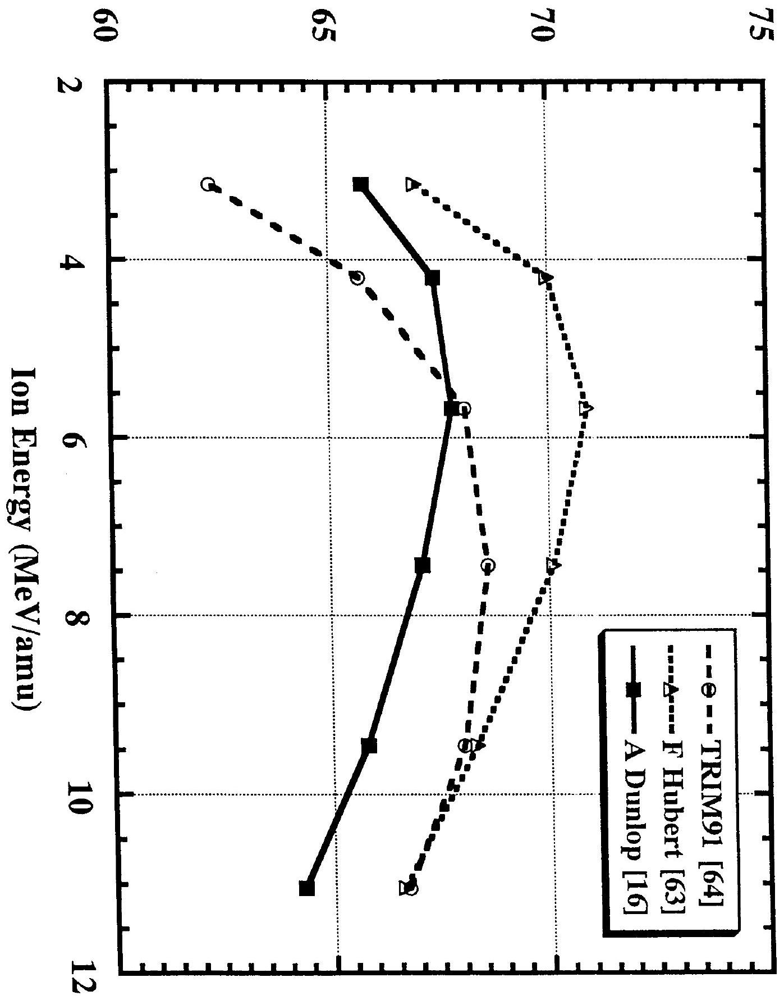
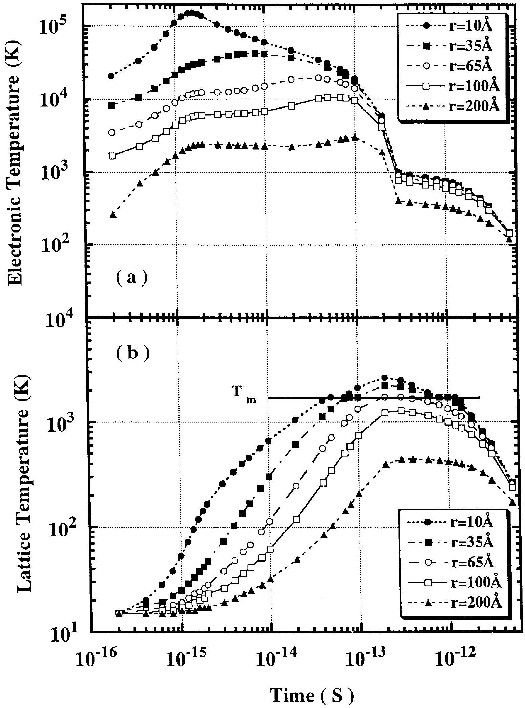
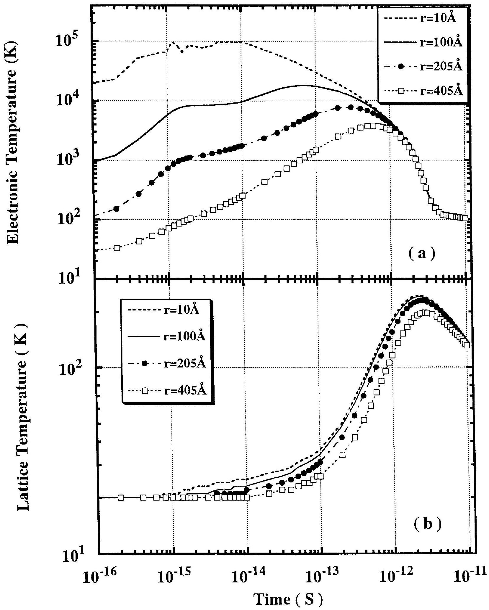
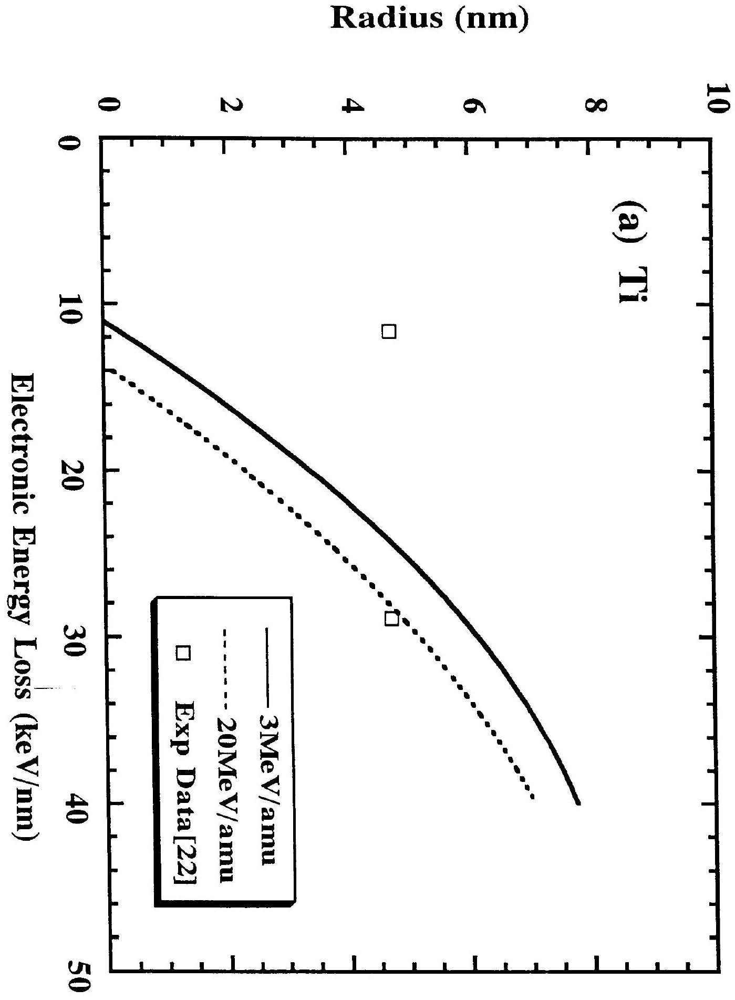
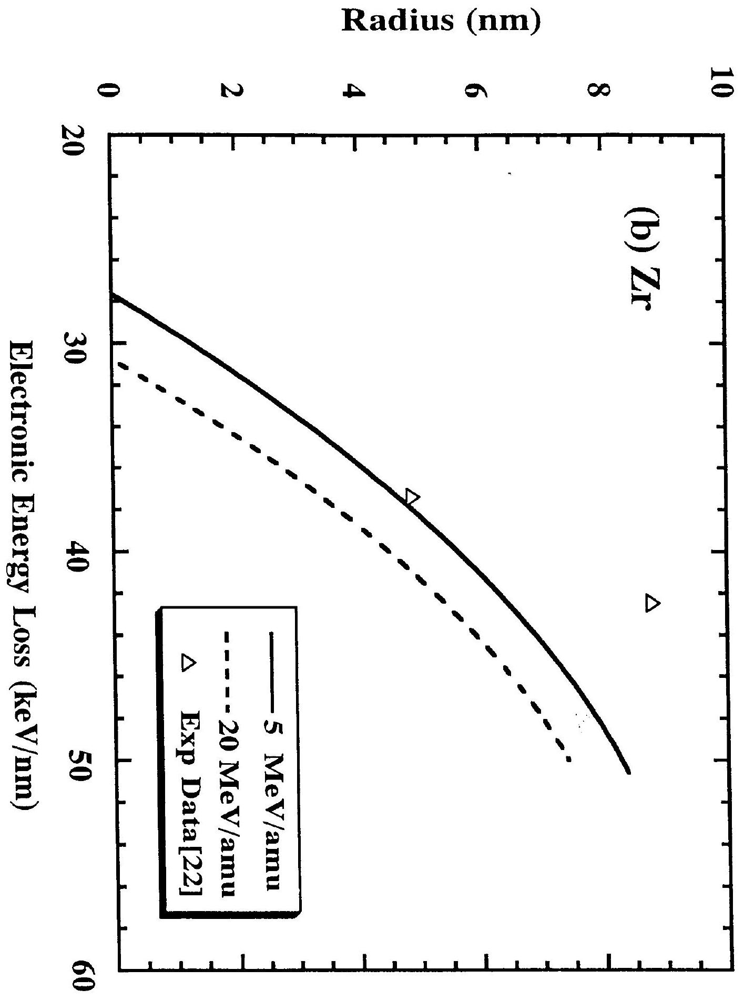
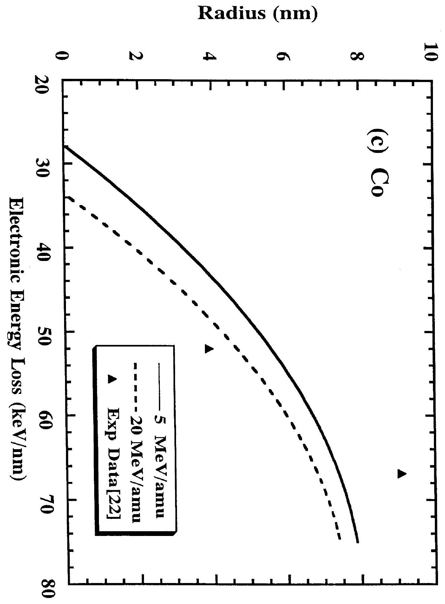
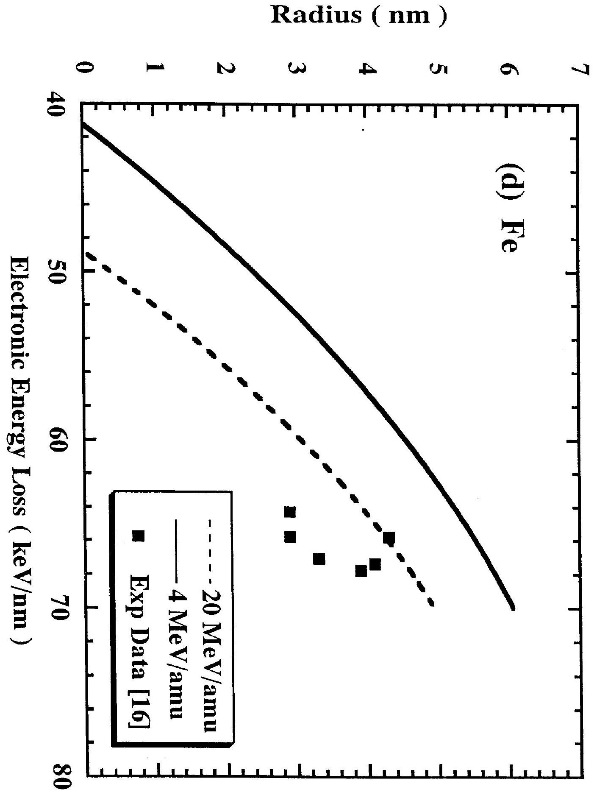
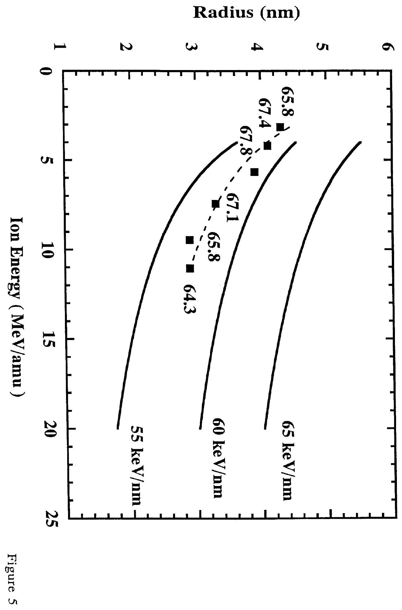
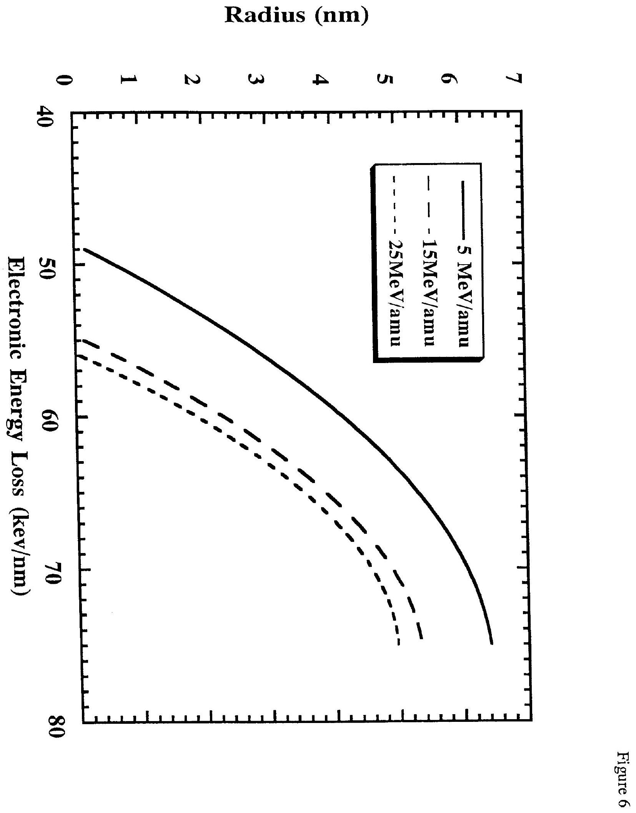

Z.G. Wang(a) ${ }^{1}$, Ch. Dufour ${ }^{1,2}$, E. Paumier ${ }^{1,2}$ and M. Toulemonde ${ }^{1}$ 1.Centre Interdisciplinaire de Recherches avec les Ions Lourds, Laboratoire mixte CEA-CNRS, rue Claude Bloch, Boîte Postale 5133, 14040 Caen CEDEX, France 2.Laboratoire d'Etude et de Recherche sur les Matériaux, associé au CNRS (URA 1317) ISMRa, Université de Caen, 14050 Caen Cedex, France

CERN LIBRARIES, GENEVA
P00023891

#### Abstract

In the framework of the thermal spike model the present paper deals with the effect of the electronic stopping power ( Se ) in metals irradiated by swift heavy ions. Using the strength of the electron-phonon coupling $g(z)$ with the number of valence electrons $z$ as the unique free parameter, the increment of lattice temperature induced by swift heavy ion irradiations is calculated. Choosing $\mathrm{z}=2$, the calculated threshold of defect creation by Se for $\mathrm{Ti}, \mathrm{Zr}, \mathrm{Co}$ and Fe is about $11,27.5,28$ and $41 \mathrm{keV} / \mathrm{nm}$ in good agreement with experiment. Taking the same $z$ value, the calculation shows that $\mathrm{Al}, \mathrm{Cu}, \mathrm{Nb}$ and Ag are $\mathrm{S}_{\mathrm{e}}$-insensitive. Moreover, in iron, the differences in the damage created by uranium ions of different energies but exhibiting the same value of $\mathrm{S}_{\mathrm{e}}$ may be interpreted by a velocity effect. Using $\mathrm{z}=2$, other calculations suggest that $\mathrm{Be}\left(\mathrm{S}_{\mathrm{e}} \geq 11 \mathrm{keV} / \mathrm{nm}\right), \mathrm{Ga}\left(\mathrm{S}_{\mathrm{e}} \geq 5 \mathrm{keV} / \mathrm{nm}\right)$ and $\mathrm{Ni}\left(\mathrm{S}_{\mathrm{e}} \geq 49 \mathrm{keV} / \mathrm{nm}\right)$ should be sensitive to $\mathrm{S}_{\mathrm{e}}$ but Mg should not. These examples put the stress on the effect of the physical parameters governing the electron-phonon coupling constant apart from $z$ determination: the sound velocity linked to the Debye temperature and the lattice thermal conductivity. Furthermore, a simple criterion is proposed in order to predict the $\mathrm{S}_{\mathrm{e}}$-sensitivity of metals.

(a) On leave from Institute of Modern Physics, Academia Sinica, 253 Nanchang Road, 730000 Lanzhou, P.R. China.

## 1. Introduction

It is well established that an energetic ion passing through a solid looses its energy via two nearly independent processes: (i) electronic excitation and ionization (i.e. electronic slowing down $\mathrm{S}_{\mathrm{e}}$, or electronic energy loss $-\left(\frac{\mathrm{dE}}{\mathrm{dx}}\right)_{\mathrm{e}}=\mathrm{S}_{\mathrm{e}}$ ); and (ii) elastic collisions with the nuclei of the target atoms (i.e. nuclear slowing down $\mathrm{S}_{\mathrm{n}}$, or nuclear energy loss $-\left(\frac{\mathrm{dE}}{\mathrm{dx}}\right)_{\mathrm{n}}=\mathrm{S}_{\mathrm{n}}$ ). In the high energy ion-solid interactions, the nuclear energy loss is neglected as compared to the electronic energy loss. So the present paper will deal with the effect induced in pure metals by the electronic slowing down of swift heavy ions. In fact, the amorphization of $\mathrm{Pd}_{80} \mathrm{Si}_{20}$ induced by ${ }^{235} \mathrm{U}$ fission fragments observed by Lesueur[1] showed that a high electronic excitation was playing an important role in the volume of a metallic compound. Since that first experiment, a series of other irradiations have been performed in electronic slowing down regime on the following metallic materials:
(i). For amorphous (a-) materials, an ion-beam-induced huge plastic deformation has been discovered in a- $\mathrm{Pd}_{80} \mathrm{Si}_{20}$, a- $\mathrm{Cu}_{50} \mathrm{Zr}_{50}$, and some other metallic glasses [2-6]: here the incident ion-beam acts as a hammer on the samples and this results in a growth perpendicular to the beam direction. It is suggested that the electronic energy loss $\mathrm{S}_{\mathrm{e}}$ could provoke substantial atomic displacements and thus could predominantly drive the plastic deformation [4,5]. The experiments on a- $\mathrm{Fe}_{85} \mathrm{~B}_{15}$ ribbons irradiated with high-energy heavy-ions [5,6] show that, above a $\mathrm{S}_{\mathrm{e}}$ threshold value, the electronic energy loss plays a crucial role in radiation-induced damage. Moreover, the whole radiation-induced phenomenon (incubation and growth) is due to the electronic energy loss effects and the incubation process is connected to the creation of defects.
(ii). For crystalline (c-) materials, swift-heavy-ion-induced amorphization and latent track creation have been observed in $\mathrm{c}-\mathrm{Ni}_{3} \mathrm{~B}[7]$ and $\mathrm{c}-\mathrm{Ni}-\mathrm{Zr}[8,9]$ alloys: above a $\mathrm{S}_{\mathrm{e}}$ threshold, the tracks consist of droplets which are transformed into continuous cylinders when the level of electronic excitation increases.
(iii). For pure crystalline metals, $\mathrm{S}_{\mathrm{e}}$ induces a decrease of defect production efficiency in Ni and in $\mathrm{Fe}\left(\mathrm{S}_{\mathrm{e}}<50 \mathrm{keV} / \mathrm{nm}\right)$ [10-17] as well as in f.c.c. FeCrNi alloys [18]. A $\mathrm{S}_{\mathrm{e}}$-induced increase of defect production efficiency in $\mathrm{Bi}, \mathrm{Ti}, \mathrm{Zr}, \mathrm{Co}$ and in Fe
$\left(\mathrm{S}_{\mathrm{e}}>50 \mathrm{keV} / \mathrm{nm}\right)[13,14,17,19-22]$ is evidenced. Furthermore, it is also shown that $\mathrm{S}_{\mathrm{e}}$-induced phase transition and latent track creation occur in pure titanium [20,21]. Defect production in Ga was suggested [23] but not clearly confirmed at higher values of $\mathrm{S}_{\mathrm{e}}$ [24]. This is probably due to the fact that specific physical properties of different crystallographic phases in gallium [25] could hide the $\mathrm{S}_{\mathrm{e}}$ effect.

All these experimental results show that the high electronic excitations can also induce structural modifications in metallic systems similar to those in nonmetallic materials [26-28]. It means that all the $\mathrm{S}_{\mathrm{e}}$-dependent effects induced in different materials are probably related to the same basic energy transfer process between the incident ions and the target atoms. Two models of microscopic energy transfer mechanism, the thermal spike [29-33] and the ionic spike [14-17,34-36] have been used to try to know which are the relevant parameters governing the basic energy transfer process. In the electronic slowing down regime ( $\mathrm{S}_{\mathrm{e} \gg \mathrm{S}_{\mathrm{n}}}$ ), the most part of energy of incident ions is transferred to the host electrons resulting in a high electronic ionization (ionic spike) and/or a high temperature increase of the electronic subsystem (thermal spike). In the course of time, the ionic spike $\left(\sim 10^{-14} \mathrm{~s}\right)$ could be covered by the thermal spike $\left(\sim 10^{-12} \mathrm{~s}\right)$. So the question to be answered is whether the defects observed at last result from the initial atomic motions induced by ionic spikes or are a consequence of a huge local increase of the lattice temperature by the thermal spikes which could erase the previous atomic motions. In fact, several experiments $[13,14,17,20-22]$ show that the materials with strong electronphonon (E-P) coupling are sensitive to the electronic energy loss suggesting that thermal spike is an ingredient in the damage process. For instance, the crystalline noble metals such as Ag and $\mathrm{Cu}[17,37]$ with a weak $\mathrm{E}-\mathrm{P}$ coupling are insensitive to $\mathrm{S}_{\mathrm{e}}$. On the contrary, the $\mathrm{S}_{\mathrm{e}}-$ induced annealing of elastically created point defects in Ni and in Fe [10-17] and the $\mathrm{S}_{\mathrm{e}}$-induced defect creation in $\mathrm{Ti}, \mathrm{Co}, \mathrm{Zr}$, and in Fe [13,20-22] occur in metals exhibiting stronger $\mathrm{E}-\mathrm{P}$ coupling than that of noble metals. Crystalline Al and W which have relatively weak E-P coupling are insensitive to $\mathrm{S}_{\mathrm{e}}[13,17,38]$. In the same way, the fact that a- $\mathrm{Ni}_{3} \mathrm{~B}$ is more sensitive to $\mathrm{S}_{\mathrm{e}}$ than $\mathrm{c}-\mathrm{Ni}_{3} \mathrm{~B}[39,40]$ could be related to the stronger $\mathrm{E}-\mathrm{P}$ coupling in amorphous states than in crystalline ones. Moreover, metal like Bi with low melting point is sensitive to $\mathrm{S}_{\mathrm{e}}$ though the electron-phonon coupling is relatively low [19]. As compared to W, the Bi sensitivity shows that the amount of energy necessary to melt is also a relevant parameter. From all the
experimental phenomena quoted above, one can see that the questions are what is the relationship between the $\mathrm{S}_{\mathrm{e}}$-induced effects and the E-P coupling and how to define whether a given material is $\mathrm{S}_{\mathrm{e}}$-sensitive or not. Therefore, it is necessary to do a more detailed comparison between theoretical and experimental results in the framework of the thermal spike model in a series of pure crystalline metals.

According to the thermal spike model and taking into account the E-P coupling, the energy locally deposited by electronic energy loss in matter is quickly shared among the electron gas by electron-electron interactions and then transferred to the neighbouring atoms by electronphonon and phonon-phonon interactions. Some considerations on the E-P coupling strength [41-42] and electronic diffusivity [43] have made it possible to theoretically evaluate the lattice temperature increment in thermal spikes. On the basis of the observations of latent tracks in matter [8,9,21], it is assumed in the present paper that a latent track results from rapid quenching of a cylinder of molten matter. The thermal spike model will be used to calculate the latent track radii as performed previously with success in $\mathrm{a}-\mathrm{Si}$, a- Ge and $\mathrm{a}-\mathrm{Fe}_{85} \mathrm{~B}_{15}[29,44,45]$.

In the first part, we develop physical considerations leading to the mathematical descriptions of the thermal spike. Input parameters governing the energy diffusion on the electron subsystem and the energy transfer to the lattice $[12,41,42,46-48]$ will be presented. In the second part, the results of the calculation performed for several metals $(\mathrm{Ti}, \mathrm{Zr}, \mathrm{Co}, \mathrm{Fe}, \mathrm{Al}$, $\mathrm{Cu}, \mathrm{Nb}, \mathrm{Ag}, \mathrm{Pt}, \mathrm{Pd}, \mathrm{Ni}, \mathrm{Bi}$ ) are compared to the $\mathrm{S}_{\mathrm{e}}$ thresholds of defect creation. The comparison is extended to latent track radii deduced from analysis [22] of experimental data of defect creation. Ion velocity effect is proposed to explain the results obtained in iron [16]. According to these comparisons, we predict in the third part the behaviour of other metals (Be, Mg, V, Cr, Mn, Ga, Sn, W, Au, Pb, U).

## 2. Numerical calculations

## 2-1. Physical considerations

According to the energetic ion-solid interactions, high energy heavy ion irradiations are able to induce high density of electronic excitations in solids along the ion path. Then the problem is to quantify the effects of the electronic energy relaxation which results from the electronelectron and electron-atom interactions. Following the previous descriptions [31,32], we admit that this process is described mathematically by two coupled differential equations governing
the energy diffusion in the two subsystems ( electron and lattice) and their coupling. Several experiments on metals irradiated by fs laser pulses [46,47,49-52] support such a description since there is a good correlation between the theory and experiments [46]. As radiation defects created in materials by high energetic ions are cylindrical [8,9], a time dependent thermal transient process is expressed in cylindrical geometry [32]:

$$
\begin{aligned}
& \mathrm{C}_{\mathrm{e}}\left(\mathrm{~T}_{\mathrm{e}}\right) \frac{\partial \mathrm{T}_{\mathrm{e}}}{\partial \mathrm{t}}=\frac{\partial}{\partial \mathrm{r}}\left(\mathrm{~K}_{\mathrm{e}}\left(\mathrm{~T}_{\mathrm{e}}\right) \frac{\partial \mathrm{T}_{\mathrm{e}}}{\partial \mathrm{r}}\right)-\mathrm{g}\left(\mathrm{~T}_{\mathrm{e}}-\mathrm{T}\right)+\mathrm{A}(\mathrm{r}, \mathrm{t}) \\
& \mathrm{C}(\mathrm{~T}) \frac{\partial \mathrm{T}}{\partial \mathrm{t}}=\frac{\partial}{\partial \mathrm{r}}\left(\mathrm{~K}(\mathrm{~T}) \frac{\partial \mathrm{T}}{\partial \mathrm{r}}\right)+\mathrm{g}\left(\mathrm{~T}_{\mathrm{e}}-\mathrm{T}\right)
\end{aligned}
$$

where $\mathrm{T}_{\mathrm{e}}, \mathrm{T}, \mathrm{C}_{\mathrm{e}}, \mathrm{C}$ and $\mathrm{K}_{\mathrm{e}}, \mathrm{K}$ are the temperature, the specific heat and the thermal conductivity for the electronic and atomic systems respectively, $\mathrm{A}(\mathrm{r}, \mathrm{t})$ is the energy density per unit time supplied by the incident ions to the electronic system at radius $r$ and time $t$ such that $\iint 2 \pi r A(r, t) \mathrm{drdt}=\mathrm{S}_{\mathrm{e}}, \mathrm{g}$ is the electron-phonon coupling factor. As these parameters are temperature dependent, the coupled differential equations are non-linear and can be only numerically solved. Using the numerical analysis proposed in ref [45], the lattice temperature $T(r, t)$ at each time $t$ and radius $r$ is calculated. Taking into account the latent heat of fusion when the lattice temperature reaches the melting point, the radii of molten cylinders induced by energetic ions can be deduced.

In such a description, several questions arise: Can we define the temperature in such a short time? Can we ignore the pressure dependence of the different physical parameters of the lattice? The purpose of the present paper is not to discuss these two points in detail but to give some supports to the use of the equilibrium thermodynamic parameters. Indeed, the thermalization of the highly energetic electrons at the Fermi level occurs in a very short time [53] (of the order of $10^{-15} \mathrm{~s}$ ) as shown by high power fs laser experiments [54]. The thermalization of lattice occurs only in a time of $10^{-13} \mathrm{~s}$ which is larger than the inverse of the usual Debye frequency [48]. Consequently we shall assume that for time below $10^{-13} \mathrm{~s}$ the calculated lattice temperature represents only the energy deposited on the atoms. The effect of pressure dependence of melting point was previously discussed [19,29]. As no trends due to this effect were observed within the experimental errors [26] and within the uncertainties of the input parameters in the calculation [29], we shall neglect it in the present calculations.

## 2-2. Main physical quantities

For pure metals, lattice thermal conductivity $K(T)$, specific heat $C(T)$, latent heats of fusion and vaporization are well known from practical measurements [55-58] (see Appendix I, Table A1 and A2). The parameters entering the equations governing the energy diffusion on the electron subsystem are described by supposing the electrons behave like quasifree electrons in noble metal while the electron-phonon coupling is described by taking into account the physical properties of the irradiated material.
a). The energy density per unit time $A(r, t)$

According to the delta-rays theory in energetic ion irradiations [59], the radial energy deposition may be described as

$$
A(r, t)=b S_{e} \exp \left(-\frac{\left(t-t_{0}\right)^{2}}{2 \sigma_{t}^{2}}\right) F(r)
$$

$t_{0}$ is the mean flight time of the delta-rays electrons [60] and is of the order of $10^{-15} \mathrm{~s} . \mathrm{t}_{0}$ can be choosen in the range of $110^{-15} \mathrm{~s}-510^{-15} \mathrm{~s}$ without any influence on the radius of the molten zone [45]. The half-width of the Gaussian distribution $\sigma_{t}$ is assumed to be equal to $t_{0} . F(r)$ is a spatial distribution function of delta-electron energy deposition in matter which has been given by Waligorski et al.[61] and b is a normalization constant

$$
\int_{t=0}^{\infty} \int_{r=0}^{r_{m}} b S_{e} \exp \left(-\frac{\left(t-t_{0}\right)^{2}}{2 \sigma_{t}^{2}}\right) F(r) 2 \pi r d r d t=S_{e}
$$

$r_{m}$ is the maximum projected range of electrons perpendicularly to the ion path.
b). The electronic specific heat $\mathrm{C}_{\mathrm{e}}\left(\mathrm{T}_{\mathrm{e}}\right)$

In the free electron gas theory [48], the electronic specific heat $\mathrm{C}_{\mathrm{e}}$ of a metal is given as a linear function of $\mathrm{T}_{\mathrm{e}}: \mathbf{C}_{\mathbf{e}}=\gamma \mathbf{T}_{\mathbf{e}}=\left(\frac{\pi^{2} \mathbf{k B}^{2} \mathbf{n}_{\mathbf{e}}}{2 \mathbf{E}_{\mathbf{F}}}\right) \mathbf{T}_{\mathbf{e}}$ for low values of $\mathrm{T}_{\mathrm{e}}$. The Fermi energy is given by: $E_{F}=\left(\frac{h^{2}}{2 m_{e}}\right)\left(3 \pi^{2} n_{e}\right)^{2 / 3}$ where $m_{e}$ is the electron mass, $n_{e}$ is the electron number density, $k_{B}$ and $h$ are Boltzmann and Planck constants respectively. The specific heat will follow this linear law up to the Fermi temperature $\mathrm{T}_{\mathrm{F}}=\frac{\mathrm{E}_{\mathrm{F}}}{\mathrm{K}_{\mathrm{B}}}$ above which $\mathrm{C}_{\mathrm{e}}$ becomes a constant $\left(\mathrm{C}_{\mathrm{e}}=\frac{3}{2} \mathrm{k}^{\mathrm{n}} \mathrm{e}\right)$ [48].

## c). The electronic thermal conductivity $\mathrm{K}_{\mathrm{e}}\left(\mathrm{T}_{\mathrm{e}}\right)$

The $\mathrm{K}_{\mathrm{e}}\left(\mathrm{T}_{\mathrm{e}}\right)$ evolution was discussed previously [19] and determined from an experimental scaling of the thermal diffusivity $\mathrm{D}_{\mathrm{e}}\left(\mathrm{T}_{\mathrm{e}}\right)$ with respect to gold, a noble metal in which the electrons behave like a quasifree electron gas. $\left(\mathrm{K}_{\mathrm{e}}\left(\mathrm{T}_{\mathrm{e}}\right)=\mathrm{C}_{\mathrm{e}}\left(\mathrm{T}_{\mathrm{e}}\right) \mathrm{D}_{\mathrm{e}}\left(\mathrm{T}_{\mathrm{e}}\right)\right)$. In the present case, the scaling values were $\mathrm{D}_{\mathrm{e}}(300 \mathrm{~K})=150 \mathrm{~cm}^{2} / \mathrm{s}$ and $\mathrm{D}_{\mathrm{min}}=4 \mathrm{~cm}^{2} / \mathrm{s}$ [43] for all the selected metals.

## d). The electron-phonon coupling $g$

If the lattice temperature is not much smaller than the Debye temperature $\mathrm{T}_{\mathrm{D}}[41,42]$, the g factor may be approximately expressed as

$$
g=\frac{\pi^{2} m_{e} n_{e} v^{2}}{6 \tau_{e}\left(T_{e}\right) T_{e}}
$$

where $\tau_{e}\left(\mathrm{~T}_{e}\right)$ is the electron mean free time between two collisions at temperature $\mathrm{T}_{\mathrm{e}}, \mathrm{v}$ is the sound speed in the metal linked to Debye temperature $\mathrm{T}_{\mathrm{D}}$ and the atomic number density $\mathrm{n}_{\mathrm{a}}$ by $v=\frac{k_{B} T_{D}}{h\left(6 \pi^{2} n_{a}\right)^{1 / 3}}$. The determination of $\tau_{e}(T e)$ is indeed very difficult. To bypass this difficulty, we have related $\tau_{e}\left(\mathrm{~T}_{e}\right)$ to the electrical conductivity $\sigma_{e}\left(\mathrm{~T}_{e}\right)$ [48] of the metal under study [56] and then

$$
g=\frac{\pi^{4}\left(k_{B} n_{e} v\right)^{2}}{18 L \sigma_{e}\left(T_{e}\right) T_{e}}
$$

L is the Lorentz number. Using the Wiedemann-Franz's law $\mathrm{K}_{e}\left(\mathrm{~T}_{\mathrm{e}}\right)=\mathrm{L} \sigma_{\mathrm{e}}\left(\mathrm{T}_{\mathrm{e}}\right) \mathrm{T}_{\mathrm{e}}, \mathrm{g}$ can be related also to the thermal conductivity

$$
g=\frac{\pi^{4}\left(k_{B} n_{e} v\right)^{2}}{18 K_{e}\left(T_{e}\right)}
$$

As previously [19], g factor will be evaluated versus the temperature using the measured values of the thermal conductivity of the metal under study. It means that we assume that $\mathrm{K}_{\mathrm{e}}\left(\mathrm{T}_{\mathrm{e}}\right)=\mathrm{K}(\mathrm{T})$ in order to take into account the specific properties of the irradiated metal under consideration.(Appendix I, Table A2).

## 2-3. Calculations

According to the basic considerations shown above, the temperature responses of electronic and atomic systems to various $\mathrm{S}_{\mathrm{e}}$ and different ion energies have been calculated taking into account the temperature dependence of the lattice parameters (Appendix I). In these simulations,
the unique free parameter for the selected pure metals is the valence electron number $z$ (the electronic density is $n_{e}=z n_{a}, n_{a}$ being the atomic density). The uncertainty of the calculation results is linked to the uncertainty of the input parameters.

Using the equations (3') and (3") either with the experimental electrical resistivity $\rho_{\mu}\left(=\sigma_{\mathrm{e}}{ }^{-1}\right)$ or thermal conductivity at room temperature (table 1 ), one can estimate in a first approximation that the $g(z)$ factor for $z=1(=2)$ is known within $15 \%(30 \%)$. The results of the calculation are directly linked to the $\mathrm{S}_{\mathrm{e}}$ input. Figure 1 shows the $\mathrm{S}_{\mathrm{e}}$ determinations from different calculations using different approximations $[16,63,64]$. The error in $\mathrm{S}_{\mathrm{e}}$ value is around $10 \%$. But for light targets, it may be as high as $50 \%$ (e.g. Be) at the Bragg peak [63,65]. However, we shall admit that $\mathrm{S}_{\mathrm{e}}$ is known within $10 \%$. Taking into account all these uncertainties, $30 \%$ discrepancies between the calculated and the experimental results will be considered as acceptable.

From the temperature increments of electronic and atomic systems, we obtain the relationship between the input electronic stopping power $\mathrm{S}_{\mathrm{e}}$ and the maximum temperature $\mathrm{T}_{\mathrm{am}}(\mathrm{r})$ reached by the lattice at a distance r from the cylinder axis. For all the calculations, the initial temperature of the sample was 10 K except when specific temperature is quoted. Figure 2 shows a primary result of the calculation in nickel with the parameters $\mathrm{g}(\mathrm{z}=2), \mathrm{S}_{\mathrm{e}}=73 \mathrm{keV} / \mathrm{nm}$ and incident energy $\mathrm{E}_{\text {in }}=5 \mathrm{MeV} /$ amu: the temperature of the electronic system increases during a time equivalent to the deposition time $\left(\sim 10^{-15} \mathrm{~s}\right)$. Then the lattice temperature increases mainly because of the electron-phonon interaction. The maximum lattice temperature is reached when both systems are in equilibrium at a mean time equal to $\mathrm{C}_{\mathrm{e}}\left(\mathrm{T}_{\mathrm{e}}\right) / \mathrm{g}\left(\mathrm{T}_{\mathrm{e}}\right)$. After that time, both temperatures decrease and are governed by the thermal conductivity. The molten phase is quenched with a rate of the order of $10^{15} \mathrm{~K} / \mathrm{s}$. Same feature appears when the calculation is performed on other metals. As an example the primary result is given for copper (Figure 3) which is known to be insensitive to $\mathrm{S}_{\mathrm{e}}$. The maximum temperature for copper is in agreement with previous determinations [31,32]. In such a model a sensitive material will be defined as a material in which the molten phase appears above a threshold value $\mathrm{Se}_{\mathrm{cr}}$ lower than the maximum value of $\mathrm{S}_{\mathrm{e}}$ reached in the case of uranium beam We define the calculated track radius $\mathrm{R}_{\mathrm{m}}$ as the maximum cylinder radius in which the molten phase is created.

## 3. Comparison with experiments

In this part, we will perform calculations on $\mathrm{S}_{\mathrm{e}}$ sensitive metals such as $\mathrm{Ti}, \mathrm{Zr}, \mathrm{Co}$, Fe [13-17,20-22]. The bismuth case was previously treated [19]. Three different points of view will be considered: i) the threshold $\mathrm{Se}_{\mathrm{cr}}$ of $\mathrm{S}_{\mathrm{e}}$-induced defect creation in metals, ii) the track radii and iii) the ion velocity effect. At the end, using the results obtained on the sensitive metals, the calculation will be extended to insensitive materials.

## 3.1). Threshold of defect creation in metals

For each metal $\mathrm{Ti}, \mathrm{Zr}, \mathrm{Co}, \mathrm{Fe}$ and Bi , table 2 shows the electron-phonon coupling constant $g$ at 300 K for $\mathrm{z}=2$. Within $30 \%$ uncertainties of input parameters (as discussed in section 2-3), the calculated thresholds $\mathrm{Se}_{\mathrm{cr}}$ are in very good agreement with the experimental ones. For all these metals, the $\mathrm{g}(\mathrm{z}=2)$ value has been used. It is worth noting that $\mathrm{z}=2$ corresponds to the electronic density of the considered transition metals [48]. However, this number of excited electrons per atom is still a question since a lower value of $z$ has to be used in bismuth [19]. In the following, we assume that $\mathrm{z}=2$.

## 3-2). Track radii

Before comparing experimental and calculated track radii ( $\mathrm{R}_{\text {exp }}, \mathrm{R}_{\text {cal respectively }}$ ), we must point out that the deduction of experimental radii is strongly dependent on the analysis. $\mathrm{R}_{\exp }$ is determined from the in situ resistivity measurements using a phenomenological model. Keeping in mind this main assumption, we can look at the results in $\mathrm{Ti}, \mathrm{Zr}, \mathrm{Co}$ and Fe (Figure $4-a, b, c, d$ ). Considering the uncertainties of input parameters ( $30 \%$ ), we find a quite good agreement between the theoretical radii and the experimental radii deduced from the experimental annealing cross section [16,22] except for one point in titanium. The evolution of $\mathrm{R}_{\mathrm{cal}}$ versus $\mathrm{S}_{\mathrm{e}}$ is shown for several incident ion energies in the range of 3 MeV /amu to 20 $\mathrm{MeV} / \mathrm{amu}$. It is important to remark that with only one free parameter (the valence electron number $z$ taken equal to 2 for the considered metals), we can find the good order of magnitude of the track radii by taking into account the experimental thermal charateristics of each metal.

## 3-3). Ion velocity effects

In Figure 4-d we observe that for a given $\mathrm{S}_{\mathrm{e}}$, several experimental track radii are shown. This is due to the fact that the same $\mathrm{S}_{\mathrm{e}}$ value can be reached in two cases: i ) for a given ion at
different velocities in MeV /amu as we can see in figure 1, ii) for different ions at different ∵ ocities (see Ziegler [65]). This velocity effect has been clearly shown in insulators such as $\mathrm{Y}_{3} \mathrm{Fe}_{5} \mathrm{O}_{12}$ [27]. We find the theoretical explanation in the works of Waligorski et al.[61] and more recently of B. Gervais [60]: the higher the ion velocity, the larger the maximum range ( $r_{m}$ ) of delta electrons and consequently the lower the deposited energy density. Experimentally for Fe (figure 4-d), the largest track radii correspond to the lowest values of ion velocity (i.e. the highest deposited energy density). In our calculations, this effect is taken into account in the expression of $A(r, t)$ (see section 2-2) in which $F(r)$ is the intial spatial energy distribution depending on $\mathrm{E}_{\text {in }} . \mathrm{Se}_{\mathrm{cr}}$ is sensitive to the input beam energies (Figure 4). For iron, the curves (Figure 5) show the velocity effect in agreement with the experiment, i.e., the radii corresponding to the same $\mathrm{S}_{\mathrm{e}}$ value decrease when ion energy increases. The case of Ni must be mentioned here. It has been irradiated with about $1 \mathrm{MeV} /$ amu ${ }^{127}$ I ions [10] and 10 $\mathrm{Mev} / \mathrm{amu} \mathrm{Pb}$ ions [17]. It is shown that a defect annealing appears at a lower $\mathrm{S}_{\mathrm{e}}$ value for the irradiations performed by Iwase et al [10-12] as compared to the ones performed by Dunlop et al [13,17]. This suggests that a strong ion velocity effect exists in Ni .

## 3-4). Experimentally $\mathrm{S}_{\mathrm{e}}$-insensitive metals

The study of sensitive metals allowed us to clarify the definition and the influence of all the parameters. In this section we extend our calculations to metals known as insensitive or nearly insensitive to the electronic slowing down like $\mathrm{Al}, \mathrm{Cu}, \mathrm{Nb}, \mathrm{Ag}, \mathrm{Pt}$ and $\mathrm{Pd}[13,17]$. In table 3, we report for each of those metals, the calculated value of $g$ at 300 K with $z=2$, the maximum value of the electronic stopping power $\mathrm{S}_{\mathrm{e}}$, the maximum temperature $\mathrm{T}_{\text {am }}$ reached along the ion path and the ratio $\mathrm{T}_{a m} / \mathrm{T}_{\mathrm{m}}$ where $\mathrm{T}_{\mathrm{m}}$ is the melting temperature. Except for Pt and Pd , we clearly see that these metals are $\mathrm{S}_{\mathrm{e}}$ insensitive ( $\mathrm{T}_{\mathrm{am}} / \mathrm{T}_{\mathrm{m}} \leq 1$ ) and their $\mathrm{Se}_{\mathrm{cr}}$ values are higher than that could be reached in high energy uranium ion irradiations. For Pd , within the uncertainties of input parameters, we may not conclude whether this metal is $\mathrm{S}_{\mathrm{e}}$-sensitive or not.

## 4. Discussion about the E-P coupling: g

Apart from the number $\mathrm{n}_{\mathrm{e}}=\mathrm{z} \mathrm{n}_{\mathrm{a}}$ of valence electrons which is taken $\mathrm{z}=2, \mathrm{~g}$ depends on two main physical parameters according to the formula developed in section 2-2,d): the Debye temperature linked to the sound velocity $v$ and the thermal conductivity are very important. In
order to investigate the influence of these two physical parameters, we have studied three specific cases as compared to Cu which is $\mathrm{S}_{\mathrm{e}}$-insensitive.

## 4-1). Beryllium

The thermal spike should not be efficient in Be because of its high melting point ( 1560 K ) and high thermal conductivity. But this metal shows a high Debye temperature which is four times the one of copper and hence a high E-P coupling. It is then worth seeing if Be should be sensitive or not to $\mathrm{S}_{\mathrm{e}}$ : The calculation shows that Be should be $\mathrm{S}_{\mathrm{e}}$-sensitive $\left(\mathrm{Se}_{\mathrm{cr}} \sim 11 \mathrm{keV} / \mathrm{nm}\right.$ for $z=2$ ).

## 4-2). Gallium

Although the Debye temperature is nearly the same of Cu one, this metal has all the characteristics of a very sensitive material because of its very low melting point ( 303 K ), its low thermal conductivity (Table 1) and its specific volume larger in the liquid phase than in the solid state. Its E-P coupling is four times larger than that of Cu. Experimental irradiations have been performed [23-25]. The authors have pointed out that the interpretation of results was difficult. The calculation shows that Ga is very sensitive to $\mathrm{S}_{\mathrm{e}}\left(\mathrm{Se}_{\mathrm{cr}} \sim 5 \mathrm{keV} / \mathrm{nm}\right.$ for $\left.\mathrm{z}=2\right)$.

## 4-3. Nickel

Its physical characteristics are very close to those of copper. The main differences between Ni and Cu concern their thermal conductivity $\mathrm{K}(\mathrm{Ni})<\mathrm{K}(\mathrm{Cu})$ and their Debye temperatures $\mathrm{T}_{\mathrm{D}}(\mathrm{Ni}) >\mathrm{T}_{\mathrm{D}}(\mathrm{Cu})$. Therefore the electron-phonon coupling (deduced from eq.3", $\mathrm{z}=2$ ) of Ni is much higher than that of $\mathrm{Cu}: \mathrm{g}_{\mathrm{Ni}}(300 \mathrm{~K})=4.310^{12} \mathrm{Wcm}^{-3} \mathrm{~K}^{-1}$ whereas $\mathrm{g}_{\mathrm{Cu}}(300 \mathrm{~K})=5.110^{11} \mathrm{Wcm}^{-3} \mathrm{~K}^{-1}$. We already showed that materials are all the more $\mathrm{S}_{\mathrm{e}}$-sensitive as their $\mathrm{E}-\mathrm{P}$ coupling is high. The behaviour of Ni confirms this fact: it has been found sensitive from a point of view of defect annealing contrarily to Cu which is insensitive to $\mathrm{S}_{\mathrm{e}}$ [10-12]. In the present model, defect creation in nickel should appear for $\mathrm{S}_{\mathrm{e}}>49 \mathrm{keV} / \mathrm{nm}$ for the lowest incident ion energy ( figure 6 ). As compared to experiments [17], such a result needs a discussion. With lead ion at $20 \mathrm{MeV} / \mathrm{amu}\left(\mathrm{S}_{\mathrm{e}}=56 \mathrm{keV} / \mathrm{nm}\right)$ there is no effect in agreement with the calculation, but at $10 \mathrm{MeV} / \mathrm{amu}\left(\mathrm{S}_{\mathrm{e}}=67 \mathrm{keV} / \mathrm{nm}\right)$ the calculation implies a defect creation while in the experiment there is only defect annealing [17]. Taking into account the lack of precision of the input parameters in the model, this contradiction is not astonishing. However,
the calculation suggests that Ni could be sensitive to $\mathrm{S}_{\mathrm{e}}$ in an extreme case: uranium beam at 5 MeV /amu.

## 5. Conclusion

The aim of this paper was to show that the behaviour of metals under irradiations by swift heavy ions is well correlated to the thermal spike predictions. We conclude that the $\mathrm{S}_{\mathrm{e}}$ sensitivity of a metal is closely linked to the main following properties:
i). The melting point $\mathrm{T}_{\mathrm{m}}$ : the lower the $\mathrm{T}_{\mathrm{m}}$, the lower the energy required to melt the material and hence the higher the sensitivity to $\mathrm{S}_{\mathrm{e}}$.
ii). The electron-phonon coupling g , proportional to $\mathrm{TD}^{2}, \mathrm{z}^{2}$ and $1 / \mathrm{K}_{\mathrm{e}}$ where $\mathrm{T}_{\mathrm{D}}, \mathrm{z}$ and $\mathrm{K}_{\mathrm{e}}$ are respectively the Debye temperature, the number of valence electrons and the thermal conductivity. The larger the E-P coupling g , the higher the sensitivity to $\mathrm{S}_{\mathrm{e}}$. Using $\mathrm{z}=2$, we have been able to predict the sensitivity of metals to the electronic slowing down $\mathrm{S}_{\mathrm{e}}$. Our theoretical classification in $\mathrm{S}_{\mathrm{e}}$-sensitive and insensitive metals corresponds to the experimental data.

In order to predict the $\mathrm{S}_{\mathrm{e}}$ sensitivity of a metal, it is clear that a lot of physical parameters must be collected at first and then a rather long calculation must be performed. So we find out one characteristic that could quickly show the sensitivity of a metal to the electronic slowing down. This characteristic could be the mean energy density $Q$ deposited in the lattice in a cylinder of radius $\lambda$ in which $63 \%$ of the input energy is given:

$$
Q=\frac{0.63 S_{e}}{\pi \lambda^{2}}
$$

$\lambda$ is taken from ref [29] and is the electron mean free path linked to the thermal electronic diffusivity $\mathrm{D}_{\mathrm{e}}\left(\mathrm{T}_{\mathrm{e}}\right)$ and to the electron-phonon interaction time $\tau_{\mathrm{a}}$ by $\lambda^{2}=\mathrm{D}_{\mathrm{e}} \tau_{\mathrm{a}}$. In the present formalism, $\tau_{\mathrm{a}}=\mathrm{C}_{\mathrm{e}}\left(\mathrm{T}_{\mathrm{e}}\right) / \mathrm{g}$. Hence $\lambda^{2}=\mathrm{K}(\mathrm{T}) / \mathrm{g}$ and is calculated at $\mathrm{T}_{\mathrm{e}}=\mathrm{T}_{\mathrm{a}}=300 \mathrm{~K}$. In table 4, we compare for several metals this energy density Q to the energy $\Delta \mathrm{H}_{\mathrm{f}}$ required to melt the corresponding metal. We analyze the ratio $\eta=Q / \Delta H_{f}$ as follows:

If $\eta>1.3$, the material must be $\mathrm{S}_{\mathrm{e}}$ sensitive; if $\eta<0.7$, the material must be $\mathrm{S}_{\mathrm{e}}$-insensitive. In the intermediate range $0.7 \leq \eta \leq 1.3$, the lack of precision of the nput parameters does not allow any definitive conclusion. Table 4 also confirms the fact that thermodynamic point of view gives a satisfactory explanation of the behaviour of metals under irradiations. Such a
phenomenological approach can be used whatever the metal provided that the Debye temperature and the thermal conductivity are known. he remaining uncertainties come from the number of valence electrons participating to the hot electronic conduction: the value of $z=2$ deduced for transition metals has to be checked in other irradiated metals.

## References:

1. D. Lesueur, Radiat. Eff., 24 (1975) 101.
2. S. Klaumunzer and G. Schumacher, Phys. Rev. Lett. 51 (1983) 1987.
3. S. Klaumunzer, Hou Ming-dong and G. Schumacher, hys. Rev. Lett., 57 (1986) 850
4. Ming-dong Hou, S. Klaumunzer and G. Schumacher, Phys. Rev., B41 (1990) 1144.
5. A. Audouard, E. Balanzat, G. Fuchs,J.C. Jousset, D. Lesueur and L. Thomé, Europhys. Lett., 3 (1987) 327.
6. A. Audouard, E. Balanzat, G. Fuchs,J.C. Jousset, D. Lesueur and L. Thomé, Europhys. Lett., 5 (1988) 241.
7. A.Audouard, E. Balanzat, S. Bouffard,J.C. Jousset, A. Chamberod, A. Dunlop, D. Lesueur, G. Fuchs, R. Spohr, J. Vetter and L. Thomé, Phys. Rev. Lett., 65 (1990) 875.
8. A. Barbu, A. Dunlop, J. Henry, D. Lesueur and N. Lorenzelli, Mater. Sci. Forum, 97-99 (1992) 577.
9. A. Barbu, A. Dunlop, D. Lesueur and R.S. Averback, Europhys. Lett. 15 (1991) 37.13.
10. A. Iwase, S. Sasaki, T. Iwata and T. Nihira, J.Nucl.Mater., 155-157 (1988) 1188.
11. A. Iwase, T. Iwata,S. Sasaki and T. Nihira, J. Phys. Soc. of Japan, 59 (1990) 1451.
12. A. Iwase, S. Sasaki, T. Iwata and T. Nihira, Phys. Rev. Lett. 58 (1987) 2450.
13. A. Dunlop and D. Lesueur, Radiat. Eff. Defects Solids, 126 (1993) 123.
14. A. Dunlop, D. Lesueur, J. Morillo, J. Dural, R. Spohr and J Vetter, C. R. Acad. Sci. Paris, t.309, Série II (1989) 1277.
15. A. Dunlop, D. Lesueur and J. Dural, Nucl. Instr. Meth. Res.B42 (1989) 182.
16. A. Dunlop, D. Lesueur, J. Morillo, J. Dural, R. Spohr and J Vetter, Nucl. Instr. Meth. Res. B48 (1990) 419.
17. A.Dunlop, P. Legrand, D. Lesueur, N. Lorenzelli, J. Morillo, A. Barbu and S. Bouffard, Europhys. Lett. 15 (1991) 765.
18. C.Dimitrov, P.Legrand, A.Dunlop and D. Lesueur, Mater. Sci. Forum, 97-99 (1992) 593.
19. C. Dufour, A. Audouard, F.Beuneu, J.Dural, J.P.Girard, A.Hairie, M Levalois, E. Paumier and M. Toulemonde, J. Phys.: Condens. Matter, 5 (1993) 4573.
20. H. Dammak, A. Barbu, A. Dunlop, D. Lesueur and N. Lorenzelli, Phil. Mag. Lett., 67 (1993) 253
21. J. Henry, A. Barbu, B. Leridon, D. Lesueur and A. Dunlop, Nucl. Instr. Meth. Res.B67 (1992) 390.
22. H. Dammak, D. Lesueur, A. Dunlop, P. Legrand and J. Morillo, Radiat. Eff. Defects Solids, 126 (1993) 111.
23. E. Paumier, M. Toulemonde, J. Dural, F. Rullier-Albenque, J.P.Girard and P.Bogdanski, Europhys. Lett. 10 (1989) 555.
24. E. Paumier, M. Toulemonde, J. Dural, J.P.Girard, P.Bogdanski, C. Dufour, R, Carin, A. Hairie, D. Julienne, M. Levalois, R. Madelon and M.N. Metzner, Mater. Sci. Forum, $97-$ 99 (1992) 599.
25. W. Buckel and R. Hilsch, Z. Phys., 138 (1954) 109.
26. K. Izui and S. Furuno, in proceedings of the XI international Congress on Electron Microscopy, Kyoto, 1986, edited by T. Imura, S. Maruse and T. Suzuki. ( The Japanese Society of Electron Microscopy, Tokyo, 1986). P1299.
27. A. Meftah, F. Brisard, J.M. Costantini, M. Hag--Ali, J.P. Stoquert, F.Studer, and M. Toulemonde, Phys. Rev. B48 (1993) 920.
28. F. Thibaudau, J. Cousty, E. Balanzat and S. Bouffard, Phys. Rev. Lett., 67 (1991) 1582.
29. M. Toulemonde, C. Dufour and E. Paumier, Phys. Rev. B46 (1992) 14362.
30. F. Desauer, Z. Phys. 12 (1923) 38.
31. F. Seitz and J.S. Koehler, Solid State Phys. 2 (1956) 305.
32. I.M. Lifshitz, M.I. Kaganov and L.V. Tanatarov, J. Nucl. Energ. A12 (1960) 69.
33. L.T. Chadderton and H. Montagu-Pollock, Proc. Roy. Soc. A274 (1969) 239.
34. R.L. Fleisher, P.B. Price and R.M. Walker, J. Appl. Phys. 36 (1965) 3645.
35. D. Lesueur and A. Dunlop, Radiat. Eff. Defects solids, 126 (1993) 163.
36. P. Legrand, J. Morillo and V.Pontikis,Radiat. Eff. Defects Solids, 126 (1993) 151
37. A. Iwase, T. Iwata and T. Nihira, J. Phys. Soc. of Japan 61 (1992) 3878.
38. A. Iwase, S. Sasaki, T. Iwata and T. Nihira, J. Nucl. Mater, 133/134 (1985) 365.
39. A. Audouard, E. Balanzat, J.C. Jousset, A. Chamberod, G. Fuchs, D. Lesueur and L. Thomé, Phil. Mag. B63 (1991) 727.
40. L. Thomé, F. Garrido, J.C. Dran, A. Benyagoub, S. Klaumunzer and A. Dunlop, Phys. Rev. Lett., 68 (1992) 808.
41. P.B. Allen, Phys. Rev. Lett., 59 (1987) 1460.
42. M. I. Kaganov, I. M. Lifshitz and L. V. Tanatarov, Sov. Phys. JETP 4 (1957) 173.
43. Yu.V. Martynenko and Yu. N. Yavlinskii, Sov. Phys. Dokl. 28 (1983) 391.
44. M. Toulemonde, E. Paumier and C. Dufour, Radiat. Eff. Defects Solids, 126 (1993) 201.
45. C. Dufour, E. Paumier and M. Toulemonde, Radiat. Eff. Defects Solids, 126 (1993) 119.
46. S.D. Borson. A. Kazeroonian, J.S. Moodera, D.W. Face, T.K. Cheng, E.P. Ippen, M.S. Dresselhaus and G. Dresselhaus, Phys. Rev. Lett., 64 (1990) 2172.
47. S.D. Brorson, J.G. Fujimoto and E.P. Ippen, Phys. Rev. Lett. 59 (1987) 1962.
48. N.W. Ashcroft and N.D. Mermin, Solid State Physics, 1976 (New York: Holt, Reinhart and Wiston).
49. W.Z. Lin, J.G. Fujimoto, E.P. Ippen and R.A. Logan, Appl. Phys. Lett., 50 (1987) 124.
50. J.G.Fujimoto, J.M.Liu, E.P.Ippen and N.Bloembergen, Phys.Rev.Lett., 53(1984)1837.
51. H.W.K. Tom, G.D. Aumiller and C.H. Brito-Cruz, Phys. Rev. Lett. 60 (1988) 1438.
52. T.Q. Qiu and C.L. Tien, Int. J. Heat Mass Transfer, 35 (1992) 719.
53. K. Izui, J. Phys. Soc. of Japan., 20 (1965) 915.
54. H.M. Milchberg, R.R. Freeman and S.C. Davey, Phys. Rev. Lett. 61 (1988) 2364.
55. Charles Kittel, Physique de l'Etat Solide, $5{ }^{\mathrm{e}}$ edition, ©BORDAS, Paris, 1983.
56. Properties of Materials at Low Temperature (Phast I), A Compendium, Pergamon Press (1961).
57. E. A. Brandes, Metals, $6^{\text {th }}$ edition, Butterworths \& Co Lth, (1983).
58. Handbook of Chemistry and Physics: $57{ }^{\text {th }}$ Edition, Editor: R.C. Weast, (1976-1977) CRC Press; $73{ }^{\text {th }}$ Edition, Editor-in-chief: D.R. Lide, (1992-1993), CRC Press.
59. R. Katz and E.J. Kobetich, Phys. Rev. 170 (1968) 397 and Phys. Rev. 186 (1969) 344.
60. B. Gervais, Thèse, (Université de Caen, 1993 ).
61. M.P.R. Waligorski, R.N. Hamm and R. Katz, Nucl. Tracks Radiat. Meas., 11(1986)309.
62. C. Dufour, Thèse, 1993, Rapport CEA-R-5638.
63. F.Hubert, R.Bimbot and H.Gauvin, Atomic Data and Nuclear Data Tables, 46(1990).
64. J.P. Biersack and L.G. Haggmark, Nucl. Instr. Meth. Res. 174 (1980) 257.
65. J. F. Ziegler, Handbook of "Stopping Cross-Sections for Energetic Ions in all Elements", Vol. 5 of 'The Stopping and Ranges of Ions in Matter'. Pergamon Press, 1980.

## Table Captions

Table 1. Some constants of selected metals at room temperature. $\mathrm{TD}, \mathrm{n}_{\mathrm{e}}, \mathrm{K}$ and $\rho_{\mu}$ are Debye temperature, electronic density, thermal conductivity and resistivity respectively. The $\mathrm{E}-\mathrm{P}$ coupling $\mathrm{g}_{\rho \mu}$ and $\mathrm{g}_{\mathrm{K}}$ values are deduced from equations ( $3^{\prime}$ ) and ( $3^{\prime \prime}$ ) with $\mathrm{z}=1$.
*. if $z$ is not equal to 1 , then $n_{e}(z)=z n_{a}$ and $g(z)=z^{2} g(z=1)$.

Table 2. Comparison of theoretical and experimental defect creation thresholds $\mathrm{Se}_{\mathrm{cr}}$ values of some $\mathrm{S}_{\mathrm{e}}$-sensitive metals. The calculated $\mathrm{Se}_{\mathrm{cr}}$ values are from $\mathrm{g}(\mathrm{z})=\mathrm{g}(\mathrm{z}=2)$ for the corresponding range of incident ion energies $\mathrm{E}_{\mathrm{in}} . \mathrm{S}_{\mathrm{e}}$ gives the maximum value which can be reached in the irradiations.

Table 3. Theoretical evolutions for some selected metals. Using $g(z)=g(z=2)$ and the $\mathrm{S}_{\mathrm{e}}$ value at 5 MeV /amu U-ions irradiations. $\mathrm{T}_{\mathrm{m}}$ is the melting temperature, $\mathrm{T}_{\mathrm{am}}$ is the maximum values of lattice temperature, $\mathrm{Se}_{\mathrm{cr}}$ is a hypothetical threshold value of defect creation.

Table 4. Prediction of $\mathrm{S}_{\mathrm{e}}$-sensitivities for some selected metais. $\Delta \mathrm{H}_{\mathrm{f}}$ is the energy required to melt a metal, $\mathrm{S}_{\mathrm{e}}$ is the maximum value that can be reached in irradiations, E-P coupling factor is a mean value and $\lambda$ is the electron mean free path. The $\mathrm{S}_{\mathrm{e}}$ * values are the maximum $\mathrm{S}_{\mathrm{e}}$ values have been used in experiments.

Table 1
| Metal | $\mathbf{T}_{\mathbf{D}}$ ( K ) | $\mathrm{n}_{\mathrm{e}(\mathrm{z}=1)} \boldsymbol{(} \mathbf{1 0}^{\mathbf{2 2} \mathbf{c m}^{-\mathbf{3}} \boldsymbol{)}}$ | K $(300 \mathrm{~K}) \boldsymbol{(} \mathbf{W c m}^{\mathbf{- 1}} \mathbf{K}^{\mathbf{- 1}} \boldsymbol{)}$ | $\rho_{\mu}(\mathbf{3 0 0 K})$ ( $\mu \Omega \mathrm{cm}$ ) | $\mathrm{g}_{\mathrm{K}}^{*}\left(10^{10}\right) \boldsymbol{(} \mathbf{W c m}^{\mathbf{- 3}} \mathbf{K}^{\mathbf{- 1}} \boldsymbol{)}$ | $\mathrm{g}_{\rho_{\mu}}{ }^{*}\left(10^{10}\right) \boldsymbol{(} \mathbf{W c m}^{\mathbf{- 3}} \mathbf{K}^{\mathbf{- 1}} \boldsymbol{)}$ |
| :--- | :--- | :--- | :--- | :--- | :--- | :--- |
| Be | 1440 | 12.1 | 2.00 | 3.76 | 722 | 741 |
| Mg | 400 | 4.30 | 1.67 | 4.51 | 16.8 | 17.3 |
| AI | 428 | 6.02 | 2.30 | 2.733 | 21.9 | 18.8 |
| Ti | 420 | 5.66 | 0.22 | 42.7 | 203 | 260 |
| v | 380 | 7.22 | 0.28 | 20.2 | 183 | 139 |
| Cr | 630 | 8.33 | 0.94 | 12.7 | 179 | 291 |
| Mn | 410 | 8.15 | 0.08 | 144 | 864 | 1358 |
| Fe | 470 | 8.47 | 0.803 | 9.98 | 119 | 130 |
| Co | 445 | 8.97 | 1.00 | 6.34 | 92.6 | 80.0 |
| Ni | 450 | 9.14 | 0.91 | 7.20 | 107 | 95.4 |
| Cu | 343 | 8.45 | 4.01 | 1.725 | 12.7 | 12.0 |
| Ga | 320 | 5.10 | 0.41 | 13.65 | 55.0 | 42.8 |
| Zr | 291 | 4.29 | 0.169 | 43.3 | 87.6 | 87.5 |
| Nb | 275 | 5.56 | 0.54 | 16.0 | 34.6 | 40.8 |
| Pd | 274 | 6.80 | 0.72 | 10.80 | 33.7 | 35.7 |
| Ag | 225 | 5.85 | 4.00 | 1.629 | 3.34 | 2.97 |
| Sn | 200 | 3.70 | 0.67 | 12.6 | 8.57 | 9.87 |
| W | 400 | 6.30 | 1.69 | 5.44 | 27.6 | 34.6 |
| Pt | 240 | 6.62 | 0.72 | 10.8 | 24.9 | 26.5 |
| Au | 165 | 5.90 | 3.17 | 2.271 | 2.30 | 2.26 |
| Pb | 105 | 3.30 | 0.353 | 21.3 | 3.85 | 3.95 |
| Bi | 119 | 2.84 | 0.08 | 117 | 17.8 | 23.2 |
| U | 207 | 4.80 | 0.275 | 25.7 | 31.6 | 30.5 |

Table 2
| Metal | g (10¹1) $\left(\mathrm{Wcm}^{-\mathbf{3}} \mathrm{K}^{-\mathbf{1}}\right)$ | Ein ( MeV/amu ) | Seer calculated ( $\mathrm{keV} / \mathrm{nm}$ ) | $\mathrm{Se}_{\mathrm{cr}}$ measured ( $\mathrm{keV} / \mathrm{nm}$ ) | Se (TRIM91) ( $\mathrm{keV} / \mathrm{nm}$ ) |
| :--- | :--- | :--- | :--- | :--- | :--- |
| Ti | 92.8 | 3-20 | 11-14 | < 15 [13] | 42 |
| Fe | 49.8 | 4-20 | 41-49 | ~40[13] | 70 |
| Co | 34.5 | 5-20 | 28-34 | 30-40 [13] | 75 |
| Zr | 35.0 | 5-20 | 27.5-31 | 25-35 [13] | 48 |
| Bi | 8.20 | 7-30 | 11-13 | 17-24 [19] | 50 |

Table 3
| Metal | g $\left(10{ }^{11}\right) \left(\mathrm{W} \mathrm{cm}^{-3} \mathrm{~K}^{-1}\right)$ | $\mathrm{S}_{\mathrm{e}}$ (TRIM91) (keV/nm) | $\mathrm{T}_{\mathrm{am}}$ (K) | $\mathbf{T}_{\mathbf{a m}} \boldsymbol{/} \mathbf{T}_{\mathbf{m}}$ |
| :--- | :--- | :--- | :--- | :--- |
| Al | 8.1 | 28 | 763 | 0.82 |
| Cu | 5.0 | 70 | 713 | 0.53 |
| Nb | 15 | 63 | 2571 | 0.94 |
| Ag | 1.3 | 67 | 394 | 0.32 |
| Pt | 10 | 108 | 2045 | 1.00 |
| Pd | 14 | 80 | 1862 | 1.02 |

Table 4
| Metal | $\boldsymbol{\Delta} \mathbf{H}_{\mathbf{f}}$ ( $\mathbf{J ~ c m}^{\mathbf{- 3}}$ ) | $\mathrm{S}_{\mathrm{e}}$ ( TRIM91 ) ( $\mathrm{keV} \mathrm{nm}^{-1}$ ) | $\mathrm{g}\left(10^{11}\right)$ ( $\mathrm{W} \mathrm{cm}^{-3} \mathrm{~K}^{-1}$ ) | $\lambda$ ( $\mathbf{1 0}^{\boldsymbol{-} \mathbf{7}} \mathbf{~ c m}$ ) | $\eta$ | SeEffect | Measured Se-Effect |
| :--- | :--- | :--- | :--- | :--- | :--- | :--- | :--- |
| Be | 9368 | 23 | 293 | 3.92 | 5.2 | Yes |  |
| Mg | 2270 | 20 | 6.82 | 21.6 | 0.61 | No |  |
| Al | 3275 | 28 | 8.14 | 20.9 | 0.63 | No | No[38] $\mathrm{S}_{\mathrm{e}}{ }^{*} \leq 15 \mathrm{keV} / \mathrm{nm}$ |
| Ti | 6701 | 42 | 92.8 | 6.14 | 5.4 | Yes | Yes [22] |
| V | 8907 | 52 | 66.4 | 7.56 | 3.3 | Yes |  |
| Cr | 9075 | 63 | 94.0 | 6.51 | 5.3 | Yes |  |
| Mn | 7042 | 63 | 444 | 2.98 | 32 | Yes |  |
| Fe | 10977 | 70 | 49.8 | 8.97 | 2.6 | Yes | Yes [13] |
| Co | 12199 | 75 | 34.5 | 10.9 | 1.7 | Yes | Yes [22] |
| Ni | 10529 | 77 | 40.5 | 10.1 | 2.2 | Yes | No[13,17] $\mathrm{S}_{\mathrm{e}}{ }^{*} \leq 67 \mathrm{keV} / \mathrm{nm}$ |
| Cu | 6895 | 73 | 4.94 | 28.5 | 0.42 | No | No[13] $\mathrm{S}_{\mathrm{e}}{ }^{*} \leq 65 \mathrm{keV} / \mathrm{nm}$ |
| Ga | 1061 | 46 | 19.6 | 13.1 | 8.1 | Yes | Yes [23] |
| Zr | 4873 | 48 | 35.0 | 9.55 | 3.5 | Yes | Yes [22] |
| Nb | 9074 | 63 | 15.0 | 15.2 | 0.97 | No | No[13] $\mathrm{Se}^{*} \leq 62 \mathrm{keV} / \mathrm{nm}$ |
| Pd | 7616 | 81 | 13.9 | 16.4 | 1.3 | Yes ? | No[17] $\mathrm{S}_{\mathrm{e}}{ }^{*}<75 \mathrm{keV} / \mathrm{nm}$ |
| Ag | 4118 | 70 | 1.26 | 53.1 | 0.19 | No | No[13,17] $\mathrm{S}_{\mathrm{e}}{ }^{*} \leq 68 \mathrm{keV} / \mathrm{nm}$ |
| Sn | 1184 | 45 | 3.69 | 28.7 | 1.5 | Yes |  |
| W | 14011 | 93 | 12.4 | 17.0 | 0.74 | No | No[17] $\mathrm{S}_{\mathrm{e}}{ }^{*} \leq 80 \mathrm{keV} / \mathrm{nm}$ |
| Pt | 9003 | 109 | 10.3 | 18.9 | 1.1 | No | No[13] $\mathrm{S}_{\mathrm{e}}{ }^{*} \leq 90 \mathrm{keV} / \mathrm{nm}$ |
| Au | 4443 | 99 | 0.91 | 62.5 | 0.18 | No |  |
| Pb | 1109 | 55 | 1.56 | 43.3 | 0.85 | No |  |
| Bi | 1136 | 50 | 8.20 | 18.4 | 4.2 | Yes | Yes [19] |
| U | 3149 | 95 | 12.4 | 16.3 | 3.7 | Yes |  |

## Figure Captions

Figure 1. Evolution of the electronic stopping power of an iron target as a function of the energy of an incident uranium ion. Comparison between three calculations $[16,63,64]$.

Figure 2. Evolutions of the electronic and the lattice temperatures of nickel as a function of time at several radii from the ion path. Here, the initial target temperature is $\mathrm{T}_{0}=15 \mathrm{~K}$ and the electron-phonon coupling factor of nickel is $\mathrm{g}=\mathrm{g}(\mathrm{z}=2)=4.0510^{12} \mathrm{Wcm}^{-3} \mathrm{~K}^{-1}$ at 300 K . The incident energy is $\mathrm{E}_{\text {in }}=5 \mathrm{MeV} / \mathrm{amu}$ and the electronic energy loss is $\mathrm{S}_{\mathrm{e}}=73 \mathrm{keV} / \mathrm{nm}$. The symboles characterize at which diameter of the axis the temperature is calculated.

Figure 3. Evolutions of the electronic and the lattice temperatures of copper as a function of time at several radii from the ion path. Here, the initial target temperature is $\mathrm{T}_{0}=20 \mathrm{~K}$ and the electron-phonon coupling factor of copper is $\mathrm{g}=\mathrm{g}(\mathrm{z}=2)=10^{11} \mathrm{Wcm}^{-3} \mathrm{~K}^{-1}$ at 300 K . The incident energy is $\mathrm{E}_{\text {in }}=5 \mathrm{MeV}$ /amu and the electronic energy loss is $\mathrm{S}_{\mathrm{e}}=70 \mathrm{keV} / \mathrm{nm}$. For the symbols see caption of Figure 2.

Figure 4. Radius of the molten phase versus $\mathrm{S}_{\mathrm{e}}$ for different values of incident energy: Comparisons between experimental track radii [16,22] and calculated ones. In the calculations, taking into account the same valence number $\mathrm{z}=2(\mathrm{~g}(\mathrm{z})=\mathrm{g}(\mathrm{z}=2))$. (a) $\mathrm{Ti}, \mathrm{g}=9.2810^{12} \mathrm{Wcm}^{-} { }^{3} \mathrm{~K}^{-1}$; (b) $\mathrm{Zr}, \mathrm{g}=3.5010^{12} \mathrm{Wcm}^{-3} \mathrm{~K}^{-1}$; (c) $\mathrm{Co}, \mathrm{g}=3.4510^{12} \mathrm{Wcm}^{-3} \mathrm{~K}^{-1}$ and (d) $\mathrm{Fe}, \mathrm{g}=4.98 10^{12} \mathrm{Wcm}^{-3} \mathrm{~K}^{-1}$.

Figure 5. Ion-velocity effect in iron. Each line corresponds to the radius evolution versus ion energy for the quoted value of $\mathrm{S}_{\mathrm{e}}$. The experimental radii data are from ref.[16]. The theoretical curves are from the calculations with $\mathrm{g}=\mathrm{g}(\mathrm{z}=2)=4.9810^{12} \mathrm{Wcm}^{-3} \mathrm{~K}^{-1}$.

Figure 6. Variation of track radii in nickel with the incident ion energy. The E-P coupling factor $\mathrm{g}(\mathrm{z})=\mathrm{g}(\mathrm{z}=2)=4.0510^{12} \mathrm{Wcm}^{-3} \mathrm{~K}^{-1}$, the initial target temperature $\mathrm{T}_{0}=10 \mathrm{~K}$.

Electronic Energy Loss of ${ }^{238} \mathrm{U}$ in Fe (keV/nm)

Figure 2

Figure 3

## Appendix I

From ref.[55-58], we show some physical parameters $c$ the selected metals in Table A1 and Table A2 as follows :

Table A1. Physical data of the metals used in theoretical calculations. $\mathrm{T}_{\mathrm{m}}, \mathrm{T}_{\mathrm{v}}, \rho_{\mathrm{s}}, \rho_{\mathrm{l}}$, $\mathrm{n}_{\mathrm{a}}, \mathrm{H}_{\mathrm{f}}$ and $\mathrm{H}_{\mathrm{v}}$ are respectively the melting temperature, vaporation temperature, solid density, liquid density, atomic density at room temperature, latent heats of melting and vaporation.

Table A2. Lattice specific heat C and thermal conductivity K of selected metals used in theoretical calculations. The formulas describing the temperature dependence of C and K are deduced from the measured data.

Table A1
| Metal | $\mathbf{T}_{\mathbf{m}}$ ( K ) | $\mathrm{T}_{\mathrm{v}}$ ( K ) | $\rho_{s}$ ( $\mathrm{g} \mathrm{cm}^{-3}$ ) | $\rho_{\mathbf{v}}$ ( $\mathrm{g} \mathrm{cm}^{-3}$ ) | $\mathrm{n}_{\mathrm{a}} \boldsymbol{(} \mathbf{1 0}^{\mathbf{2 2}} \mathbf{c m}^{-\mathbf{3}} \boldsymbol{)}$ | $\mathbf{H}_{\mathbf{f}} \boldsymbol{(} \mathbf{J ~ c m}^{\mathbf{- 3}} \boldsymbol{)}$ | $\mathbf{H}_{\mathbf{v}}$ ( $\mathrm{J} \mathrm{cm}^{-3}$ ) |
| :--- | :--- | :--- | :--- | :--- | :--- | :--- | :--- |
| Be | 1560 | 2745 | 1.85 | 1.690 | 12.1 | 2504 | 60023 |
| Mg | 923 | 1363 | 1.74 | 1.585 | 4.30 | 658 | 9426 |
| Al | 933 | 2740 | 2.70 | 2.368 | 6.02 | 1075 | 28403 |
| Ti | 1933 | 3560 | 4.51 | 4.11 | 5.66 | 1810 | 36225 |
| Fe | 1809 | 3135 | 7.86 | 7.015 | 8.48 | 1942 | 49203 |
| Co | 1768 | 3143 | 8.9 | 7.67 | 8.97 | 2336 | 58707 |
| Ni | 1726 | 3005 | 8.91 | 7.905 | 9.14 | 2671 | 57398 |
| Cu | 1356 | 2840 | 8.93 | 7.940 | 8.45 | 1827 | 38022 |
| Ga | 303 | 2676 | 5.904 | 6.095 | 5.10 | 474 | 22383 |
| Zr | 2125 | 4650 | 6.51 | 5.80 | 4.29 | 1074 | 26578 |
| Nb | 2741 | 5015 | 8.58 | 7.83 | 5.56 | 2239 | 57478 |
| Pd | 1825 | 3413 | 12.0 | 10.70 | 6.80 | 1942 | 37412 |
| Ag | 1234 | 2485 | 10.5 | 9.33 | 5.85 | 1162 | 21953 |
| Pt | 2045 | 4100 | 21.47 | 18.91 | 6.62 | 2392 | 49430 |
| Bi | 544 | 1837 | 9.81 | 10.02 | 2.84 | 530 | 4913 |

Table A2
| Metal | Temperature Range | Lattice Specific Heat $\mathrm{C}\left(\mathrm{J} \mathrm{g}^{-1} \mathrm{~K}^{-1}\right)$ and Thermal Conductivity $\mathrm{K}\left(\mathrm{W} \mathrm{cm}^{-1} \mathrm{~K}^{-1}\right)$ |
| :--- | :--- | :--- |
| Beryllium | $10-293 \mathrm{~K} 293-1560 \mathrm{~K} \mathrm{T}>1560 \mathrm{~K}$ | $\mathrm{C}=0.0055-0.00090 \mathrm{~T}+2.610^{-5} \mathrm{~T}^{2}$ |
|  | $\mathrm{T}<20 \mathrm{~K} 20-293 \mathrm{~K}$ 293-1560K T > 1560K | $\mathrm{K}=30$ $\mathrm{K}=35.3-0.30 \mathrm{~T}+0.00094 \mathrm{~T}^{2}-1.010^{-6} \mathrm{~T}^{3}$   $\mathrm{K}=0.56+1.210^{3} \mathrm{~T}-1.19$   $\mathrm{K}=0.74$ |
| Magnesium | $10-100 \mathrm{~K} 100-300 \mathrm{~K} 300 \mathrm{~K}-\mathrm{T}_{\mathrm{m}} \mathrm{T}>\mathrm{T}_{\mathrm{m}}$ | $\mathrm{C}=0.062-0.0094 \mathrm{~T}+0.00041 \mathrm{~T}^{2}-3.610^{-6} \mathrm{~T}^{3}+9.810^{-9} \mathrm{~T}^{4}$ $\mathrm{C}=0.72+0.0015 \mathrm{~T}-2.010^{-6} \mathrm{~T}^{2}+1.210^{-9} \mathrm{~T}^{3}$ $C=1.36$ |
|  | 10-30K 30-300K $300 \mathrm{~K}-\mathrm{T}_{\mathrm{m}} \mathrm{T}_{\mathrm{m}}-\mathrm{T}_{\mathrm{v}} \mathrm{T}>\mathrm{T}_{\mathrm{v}}$ | $\mathrm{K}=-3.94+2.6 \mathrm{~T}-0.11 \mathrm{~T}^{2}+0.0013 \mathrm{~T}^{3}$ $\mathrm{K}=1.52+1.3610^{4} /(\mathrm{T}+11)^{2}$ $\mathrm{K}=0.90+0.0049 \mathrm{~T}-9.010^{-6} \mathrm{~T}^{2}+3.810^{-9} \mathrm{~T}^{3}$ $\mathrm{K}=0.20+6.310^{-4} \mathrm{~T}$ $K=1.06$ |
| Aluminium | $10-100 \mathrm{~K} 100-300 \mathrm{~K} 300-700 \mathrm{~K} \mathrm{T}>700 \mathrm{~K}$ | $\mathrm{C}=0.032-0.0045 \mathrm{~T}+0.00018 \mathrm{~T}^{2}-8.710^{-7} \mathrm{~T}^{3}$ |
|  | $6-15 \mathrm{~K} 15-100 \mathrm{~K} 100-300 \mathrm{~K} 300-\mathrm{Tm} \mathrm{T}_{\mathrm{m}}-\mathrm{T}_{\mathrm{v}} \mathrm{T}>\mathrm{T}_{\mathrm{V}}$ | $\mathrm{K}=-4.04+9.67 \mathrm{~T}-0.32 \mathrm{~T}^{2} \mathrm{K}=146.5-6.8 \mathrm{~T}+0.12 \mathrm{~T}^{2}-0.0010 \mathrm{~T}^{3}+3.810^{-6} \mathrm{~T}^{4} \mathrm{K}=8.84-0.11 \mathrm{~T}+7.510^{-4} \mathrm{~T}^{2}-2.210^{-6} \mathrm{~T}^{3}+2.410^{-9} \mathrm{~T}^{4} \mathrm{K}=2.4 \mathrm{K}=0.63+3.310^{-4} \mathrm{~T} \mathrm{K}=1.5$ |

| Titanium | $10-100 \mathrm{~K}$ | $\mathrm{C}=0.015-0.0024 \mathrm{~T}+0.00011 \mathrm{~T}^{2}-5.810^{-7} \mathrm{~T}^{3}$ |
| :--- | :--- | :--- |
|  | $100-300 \mathrm{~K} 300 \mathrm{~K}-\mathrm{T}_{\mathrm{m}} \mathrm{T}>\mathrm{T}_{\mathrm{m}}$ | $\mathrm{C}=-0.088+0.0056 \mathrm{~T}-1.810^{-5} \mathrm{~T}^{2}+2.210^{-8} \mathrm{~T}^{3} \mathrm{C}=0.41+0.00040 \mathrm{~T}-1.510^{-7} \mathrm{~T}^{2}+9.510^{-12} \mathrm{~T}^{3} \mathrm{C}=0.70$ |
|  | $4-30 \mathrm{~K}$ 30-100K $100-300 \mathrm{~K} 300-\mathrm{T}_{\mathrm{m}} \mathrm{T}>\mathrm{T}_{\mathrm{m}}$ | $\mathrm{K}=-0.0075+0.014 \mathrm{~T}-1.510^{-4} \mathrm{~T}^{2}+2.010^{-6} \mathrm{~T}^{3} \mathrm{K}=0.13+0.10 \mathrm{~T}-0.00014 \mathrm{~T}^{2}+5.010^{-7} \mathrm{~T}^{3}-1.310^{-9} \mathrm{~T}^{4} \mathrm{K}=0.53-0.0025 \mathrm{~T}+5.310^{-6} \mathrm{~T}^{2}-3.710^{-9} \mathrm{~T}^{3} \mathrm{K}=0.13+5.310^{-5} \mathrm{~T}-1.410^{-7} \mathrm{~T}^{2}+1.610^{-10} \mathrm{~T}^{3}-4.010^{-14} \mathrm{~T}^{4} \mathrm{K}=0.28$ |
| Iron | $10-100 \mathrm{~K} 100-300 \mathrm{~K} 300-1073 \mathrm{~K} 1073 \mathrm{~K}-\mathrm{T}_{\mathrm{m}} \mathrm{T}>\mathrm{Tm}$ | $\mathrm{C}=0.17-0.0020 \mathrm{~T}+7.310^{-5} \mathrm{~T}^{2}-3.310^{-7} \mathrm{~T}^{3} \mathrm{C}=-0.20+0.0060 \mathrm{~T}-2.010^{-5} \mathrm{~T}^{2}+2.510^{-8} \mathrm{~T}^{3} \mathrm{C}=0.32+4.310^{-4} \mathrm{~T}+1.410^{-8} \mathrm{~T}^{2} \mathrm{C}=0.79+5.410^{-6} \mathrm{~T} \mathrm{C}=0.80$ |
|  | $1-20 \mathrm{~K} 20-100 \mathrm{~K} 100-\mathrm{T}_{\mathrm{m}} \mathrm{T}>\mathrm{T}_{\mathrm{m}}$ | $\mathrm{K}=-0.45+0.97 \mathrm{~T}-0.022 \mathrm{~T}^{2} \mathrm{K}=16.5-0.35 \mathrm{~T}+0.0020 \mathrm{~T}^{2} \mathrm{K}=1.24-0.0017 \mathrm{~T}+8.810^{-7} \mathrm{~T}^{2}-1.310^{-10} \mathrm{~T}^{3} \mathrm{K}=0.33$ |
| Cobalt | $10-293 \mathrm{~K}$ 293-1500K $\mathrm{T}>1500 \mathrm{~K}$ | $\mathrm{C}=0.36+2.410^{-4} \mathrm{~T} \mathrm{C}=0.22+0.0013 \mathrm{~T}-2.610^{-6} \mathrm{~T}^{2}+2.510^{-9} \mathrm{~T}^{3}-7.610^{-13} \mathrm{~T}^{4} \mathrm{C}=0.88$ |
|  | 10-20K $20-273 \mathrm{~K} 273-\mathrm{T}_{\mathrm{m}} \mathrm{T}>\mathrm{T}_{\mathrm{m}}$ | $\mathrm{K}=-0.73+0.48 \mathrm{~T}-0.016 \mathrm{~T}^{2} \mathrm{K}=7.7-0.14 \mathrm{~T}+0.0012 \mathrm{~T}^{2}-4.510^{-6} \mathrm{~T}^{3}+6.010^{-9} \mathrm{~T}^{4} \mathrm{K}=2.3-0.0055 \mathrm{~T}+6.510^{-6} \mathrm{~T}^{2}-3.610^{-9} \mathrm{~T}^{3}+7.510^{-13} \mathrm{~T}^{4} \mathrm{K}=0.42$ |
| Nickel | $10-100 \mathrm{~K} 100-300 \mathrm{~K} 300 \mathrm{~K}-\mathrm{Tm} \mathrm{T}>\mathrm{Tm}$ | $\mathrm{C}=0.016-0.0021 \mathrm{~T}+8.310^{-5} \mathrm{~T}^{2}-4.110^{-7} \mathrm{~T}^{3} \mathrm{C}=-0.16+0.0056 \mathrm{~T}-1.910^{-5} \mathrm{~T}^{2}+2.510^{-8} \mathrm{~T}^{3} \mathrm{C}=0.39+0.00019 \mathrm{~T}-3.310^{-8} \mathrm{~T}^{2}+3.810^{-11} \mathrm{~T}^{3} \mathrm{C}=0.62$ |
|  | $10-100 \mathrm{~K} 100-\mathrm{Tm} \mathrm{T}>\mathrm{Tm}$ | $\mathrm{K}=58.2-1.5 \mathrm{~T}+0.013 \mathrm{~T}^{2}-3.510^{-5} \mathrm{~T}^{3} \mathrm{K}=3.4-0.013 \mathrm{~T}+2.210^{-5} \mathrm{~T}^{2}-1.510^{-8} \mathrm{~T}^{3}+3.610^{-12} \mathrm{~T}^{4} \mathrm{K}=0.50$ |

| Copper | $10-100 \mathrm{~K}$ | $\mathrm{C}=0.0058-0.0015 \mathrm{~T}+9.310^{-5} \mathrm{~T}^{2}-5.310^{-7} \mathrm{~T}^{3}$ |
| :--- | :--- | :--- |
|  | $100-300 \mathrm{~K}$ | $\mathrm{C}=-0.053+0.0046 \mathrm{~T}-1.710^{-5} \mathrm{~T}^{2}+2.210^{-8} \mathrm{~T}^{3}$ |
|  | $4-15 \mathrm{~K}$ | $\mathrm{K}=22.6+9.2 \mathrm{~T}+1.0 \mathrm{~T}^{2}-0.079 \mathrm{~T}^{3}$ |
|  | $15-100 \mathrm{~K}$ | $\mathrm{K}=287-15 \mathrm{~T}+0.31 \mathrm{~T}^{2}-0.0029 \mathrm{~T}^{3}+9.710^{-6} \mathrm{~T}^{4}$ |
|  | $100-300 \mathrm{~K}$ | $\mathrm{K}=6.7-0.035 \mathrm{~T}+1.510^{-4} \mathrm{~T}^{2}-2.010^{-7} \mathrm{~T}^{3}$ |
|  | $300 \mathrm{~K}-\mathrm{T}_{\mathrm{m}}$ | $\mathrm{K}=3.9+0.0013 \mathrm{~T}-3.010^{-6} \mathrm{~T}^{2}+9.210^{-10} \mathrm{~T}^{3}$ |
|  | $\mathrm{T}_{\mathrm{m}}-2000 \mathrm{~K}$ | $\mathrm{K}=0.60+0.0011 \mathrm{~T}-2.610^{-7} \mathrm{~T}^{2}$ |
|  | $\mathrm{T}>2000 \mathrm{~K}$ | $\mathrm{K}=2.1$ |
| Gallium | $\mathrm{T}<50 \mathrm{~K}$ | $\mathrm{C}=1.2410^{-6} \mathrm{~T}^{3}$ |
|  | $\mathrm{T}>50 \mathrm{~K}$ | $\mathrm{C}=-0.18+0.52[1-\exp (-0.0195 \mathrm{~T})]$ |
|  | $\mathrm{T}>\mathrm{T}_{\mathrm{m}}$ | $\mathrm{C}=0.40$ |
|  | $\mathrm{T}<30 \mathrm{~K}$ | $\mathrm{K}=1989 \mathrm{~T}-1.9$ |
|  | $\mathrm{T}>30 \mathrm{~K}$ | $\mathrm{K}=64 \mathrm{~T}-0.885$ |
|  | $\mathrm{T}>\mathrm{T}$ | $\mathrm{K}=0.00043 \mathrm{~T}+0.13$ |
|  | $\mathrm{T}>\mathrm{T}_{\mathrm{V}}$ | $\mathrm{K}=0.80$ |
| Zirconium | $10-273 \mathrm{~K}$ | $\mathrm{C}=0.23$ |
|  | $273 \mathrm{~K}-\mathrm{T}_{\mathrm{m}}$ | $\mathrm{C}=0.28-0.00022 \mathrm{~T}+1.210^{-7} \mathrm{~T}^{2}$ |
|  | $10-100 \mathrm{~K} 100 \mathrm{~K}-\mathrm{T}_{\mathrm{m}} \mathrm{T}>\mathrm{T}_{\mathrm{m}}$ | $\mathrm{K}=-0.078+0.16 \mathrm{~T}-0.0061 \mathrm{~T}^{2}+7.810^{-5} \mathrm{~T}^{3}-3.310^{-7} \mathrm{~T}^{4} \mathrm{K}=0.28-0.00051 \mathrm{~T}+6.010^{-7} \mathrm{~T}^{2}-1.710^{-10} \mathrm{~T}^{3} \mathrm{K}=0.34$ |
| Niobium | $10-100 \mathrm{~K}$ | $\mathrm{C}=0.016-0.0029 \mathrm{~T}+1.710^{-4} \mathrm{~T}^{2}-1.910^{-6} \mathrm{~T}^{3}+7.010^{-9} \mathrm{~T}^{4}$ |
|  | $100-300 \mathrm{~K}$ | $\mathrm{C}=0.038+0.0025 \mathrm{~T}-9.410^{-6} \mathrm{~T}^{2}+1.210^{-8} \mathrm{~T}^{3}$ |
|  | 4-25K | $\mathrm{K}=0.019+0.065 \mathrm{~T}-0.0012 \mathrm{~T}^{2}$ |
|  | 25-100K | $\mathrm{K}=1.12-0.0020 \mathrm{~T}-3.810^{-4} \mathrm{~T}^{2}+6.010^{-6} \mathrm{~T}^{3}-2.510^{-8} \mathrm{~T}^{4}$ |
|  | $100-273 \mathrm{~K}$ | $\mathrm{K}=0.51$ |
|  | $273 \mathrm{~K}-\mathrm{T}_{\mathrm{m}}$ | $\mathrm{K}=0.58-0.00047 \mathrm{~T}+5.810^{-7} \mathrm{~T}^{2}-3.210^{-10} \mathrm{~T}^{3}+6.310^{-14} \mathrm{~T}^{4}$ |
|  | $\mathrm{T}>\mathrm{T}_{\mathrm{m}}$ | $\mathrm{K}=0.64$ |

| Palladium | $10-100 \mathrm{~K}$ | $\mathrm{C}=0.016-0.0026 \mathrm{~T}+0.00014 \mathrm{~T}^{2}-1.610^{-6} \mathrm{~T}^{3}+5.710^{-9} \mathrm{~T}^{4}$ |
| :--- | :--- | :--- |
|  | $300-1300 \mathrm{~K}$ | $\mathrm{C}=0.014+0.0013 \mathrm{~T}-4.810^{-6} \mathrm{~T}^{2}+6.310^{-9} \mathrm{~T}^{3}$ |
|  | 10-100K | $\mathrm{K}=14.2-0.40 \mathrm{~T}+0.0038 \mathrm{~T}^{2}-1.110^{-5} \mathrm{~T}^{3}$ |
|  | $100-300 \mathrm{~K}$ | $\mathrm{K}=1.8-0.013 \mathrm{~T}+5.010^{-5} \mathrm{~T}^{2}-6.610^{-8} \mathrm{~T}^{3}$ |
|  | $300-1300 \mathrm{~K}$ | $\mathrm{K}=0.77-0.00053 \mathrm{~T}+8.910^{-7} \mathrm{~T}^{2}-3.710^{-10} \mathrm{~T}^{3}$ |
|  | T > 1300 K | $\mathrm{K}=0.78$ |
| Silver | $10-100 \mathrm{~K}$ | $\mathrm{C}=0.0090-0.0023 \mathrm{~T}+1.810^{-4} \mathrm{~T}^{2}-2.310^{-6} \mathrm{~T}^{3}+9.210^{-9} \mathrm{~T}^{4}$ |
|  | $100-300 \mathrm{~K}$ | $\mathrm{C}=0.25-6.810^{-5} \mathrm{~T}+5.210^{-8} \mathrm{~T}^{2}$ |
|  | 10-50 K | $\mathrm{K}=330-23 \mathrm{~T}+0.57 \mathrm{~T}^{2}-0.046 \mathrm{~T}^{3}$ |
|  | $50-100 \mathrm{~K}$ | $\mathrm{K}=29.3-0.85 \mathrm{~T}+0.0095 \mathrm{~T}^{2}-3.610^{-5} \mathrm{~T}^{3}$ |
|  | $100-300 \mathrm{~K}$ | $\mathrm{K}=4.0$ |
|  | $300 \mathrm{~K}-\mathrm{T}_{\mathrm{m}}$ | $\mathrm{K}=3.5+0.0034 \mathrm{~T}-3.910^{-6} \mathrm{~T}^{2}$ |
|  | $\mathrm{T}_{\mathrm{m}}-\mathrm{T}_{\mathrm{v}}$ | $\mathrm{K}=1.2+0.00043 \mathrm{~T}$ |
|  | $\mathrm{T}>\mathrm{T}_{\mathrm{V}}$ | $\mathrm{K}=2.3$ |
| Platinum | $10-100 \mathrm{~K}$ | $\mathrm{C}=-0.012+0.0021 \mathrm{~T}^{0.863}$ |
|  | $100-300 \mathrm{~K}$ | $\mathrm{C}=0.014+0.0013 \mathrm{~T}-4.810^{-6} \mathrm{~T}^{2}+6.310^{-9} \mathrm{~T}^{3}$ |
|  | $300 \mathrm{~K}-\mathrm{T}_{\mathrm{m}}$ | $\mathrm{C}=0.13+1.010^{-5} \mathrm{~T}+2.710^{-8} \mathrm{~T}^{2}-9.610^{-12} \mathrm{~T}^{3}$ |
|  | $\mathrm{T}>\mathrm{T}_{\mathrm{m}}$ | $\mathrm{C}=0.18$ |
|  | $10-100 \mathrm{~K}$ | $\mathrm{K}=24.6-0.98 \mathrm{~T}+0.14 \mathrm{~T}^{2}-5.910^{-5} \mathrm{~T}^{3}$ |
|  | $100-300 \mathrm{~K}$ | $\mathrm{K}=1.5-0.0089 \mathrm{~T}+3.610^{-5} \mathrm{~T}^{2}-5.010^{-8} \mathrm{~T}^{3}$ |
|  | $300 \mathrm{~K}-\mathrm{T}_{\mathrm{m}}$ | $\mathrm{K}=0.74-3.810^{-4} \mathrm{~T}+4.310^{-7} \mathrm{~T}^{2}-1.710^{-10} \mathrm{~T}^{3}+1.210^{-14} \mathrm{~T}^{4}$ |
|  | $\mathrm{T}>\mathrm{T}_{\mathrm{m}}$ | $\mathrm{K}=0.68$ |
| Bismuth | See ref. [19] |  |

