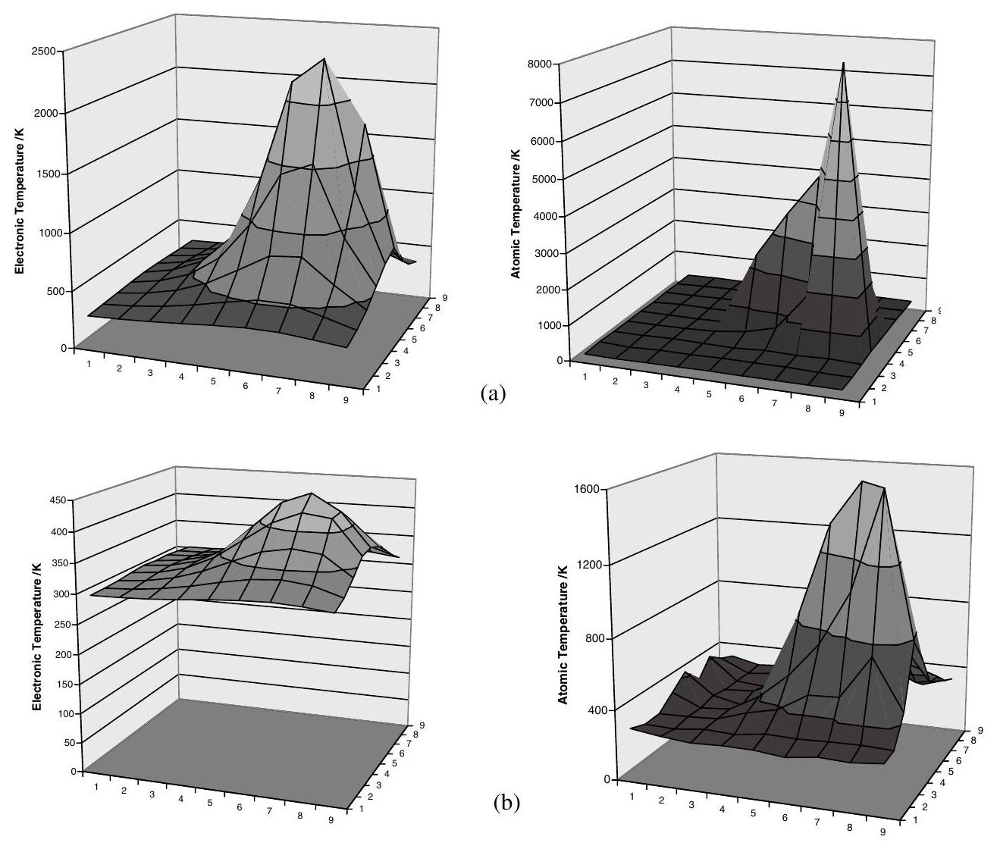
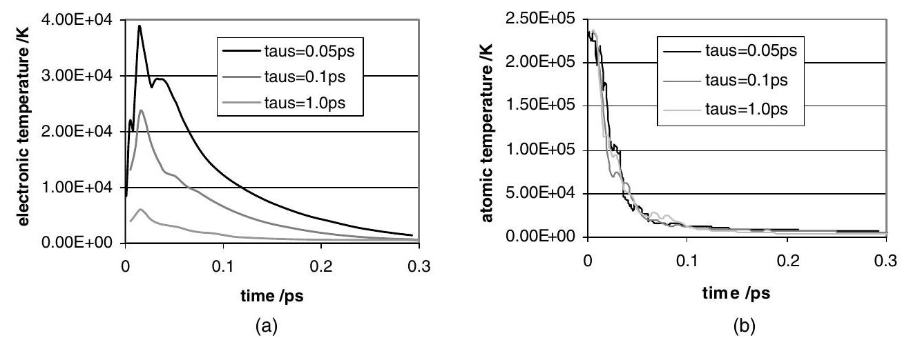
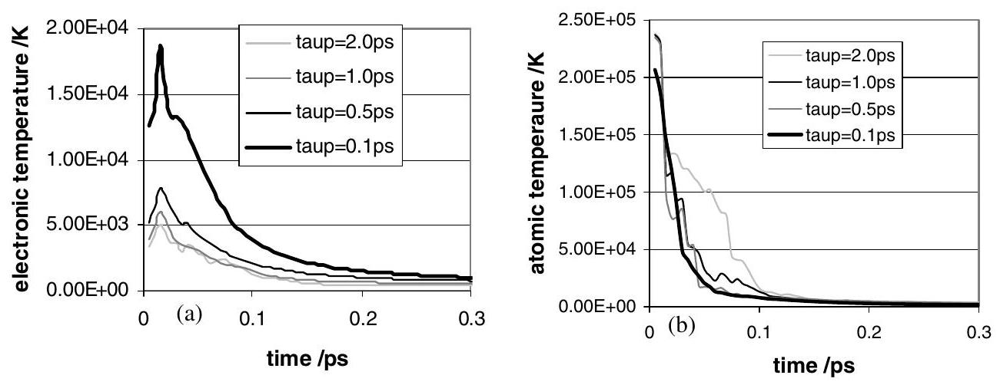
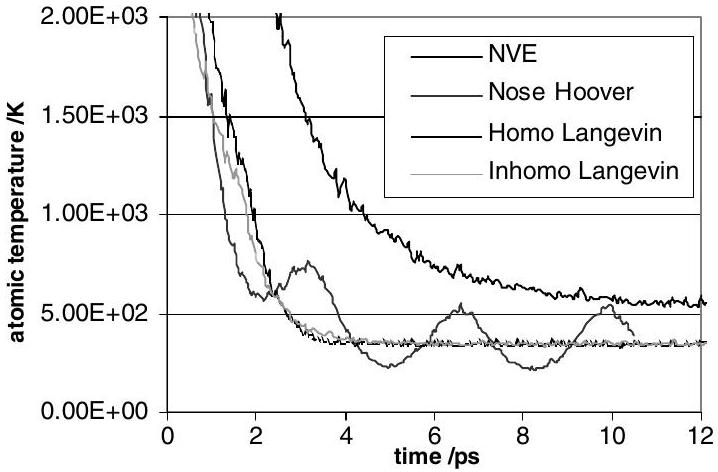

## Including the effects of electronic stopping and electron-ion interactions in radiation damage simulations

To cite this article: D M Duffy and A M Rutherford 2007 J. Phys.: Condens. Matter 19016207

View the article online for updates and enhancements.

You may also like

- Preface
- A Novel Approach to Improve Heat Dissipation of AIGaN/GaN High Electron Mobility Transistors with a Backside Cu Via
Ya-Hsi Hwang, Tsung-Sheng Kang, Fan Ren et al.
- Addressing the Voltage and Energy Fading of AI-Air Batteries to Enable Seasonal/Annual Energy Storage Cheng Xu, Xu Liu and Stefano Passerini

# Including the effects of electronic stopping and electron-ion interactions in radiation damage simulations 

D M Duffy ${ }^{1,2}$ and A M Rutherford ${ }^{1}$ ${ }^{1}$ Department of Physics and Astronomy, Gower Street, London WC1E 2BT, UK ${ }^{2}$ EURATOM/UKAEA Fusion Association, Culham Science Centre, Oxfordshire OX14 3DB, UK E-mail: d.duffy@ucl.ac.uk

Received 22 August 2006, in final form 12 October 2006
Published 7 December 2006
Online at stacks.iop.org/JPhysCM/19/016207

#### Abstract

Radiation damage is traditionally modelled using cascade simulations, and the effect of inelastic scattering by electrons, if included, is introduced via a friction term in the equation of motion. We have developed a model in which the molecular dynamics simulation is coupled to a model for the electronic energy, which evolves via the heat diffusion equation. Energy lost by the atoms, due electronic stopping or electron-ion interactions, is input to the electronic system via a source term in the diffusion equation. Energy is fed back to the atomic system from the hot electrons by means of a Langevin thermostat, which depends on the local electronic temperature. Results of the model are presented for 10 keV cascades in Fe.

## 1. Introduction

Radiation damage has traditionally been studied using cascade simulations, where the radiation event is modelled in a molecular dynamics (MD) simulation by giving one atom a high velocity at the start of the simulation. Such simulations have made significant contributions to the understanding of damage evolution and residual damage following irradiation. The technological significance of bcc Fe has led to a large number of cascade simulations on this material using a range of interatomic potentials. The results of these have recently been summarized by Malerba [1] along with a discussion on the sensitivity of defect clustering to the interatomic potential. One known limitation of cascade simulations is that the effect of the electrons is generally neglected. This is a reasonable approximation for low primary knock-on atom (PKA) energies, but for high PKA energies a significant proportion of the energy is lost to inelastic scattering by electrons. Including this loss is essential for accurate high-energy simulations. For example, the SRIM2003 [2, 3] code demonstrates that a 10 keV Fe atom moving in Fe will lose $7 \%$ of its energy to electronic scattering whereas the equivalent losses
are $17 \%$ and $69 \%$ for 100 and 500 keV Fe atoms respectively. Thus it is apparent that, with the high PKA energies possible on modern computational facilities, it is no longer reasonable to neglect the effect of electronic stopping.

The effect of electron-ion interactions on MD simulations was first pointed out by Flynn and Averback [4]. They noted that cold electrons moving through the hot thermal spike region might, in materials with strong electron-phonon interactions, remove energy from the spike and result in increased cooling. Finnis et al [5] included this effect in MD simulations by means of an additional friction term and demonstrated that the strong electron-phonon coupling constant of Ni resulted in increased residual defect concentration with respect to Cu. Caro and Victoria [6] noted that both electronic stopping and electron-phonon coupling could be included in MD simulations by introducing a friction term. A stochastic force was included to represent the energy fed into the atomic system by the electrons. Stoneham [7] noted that electrons could act as a heat sink, removing energy from the atoms, or a heat bath, returning energy to the atoms, depending on the various timescales of the system.

To date only a limited number of simulations have included electronic effects. Zhong et al [8] include electronic stopping by including a friction term for atoms with kinetic energies greater than 10 eV . Bacon et al [9] investigated the effect of electron-phonon coupling on vacancy clustering. Gao et al [10] adopted the Finnis procedure and found that increasing electron-phonon coupling strength increased the number of stable defects. The significance of electronic excitations has been recognized in the field of sputtering simulations where Duvenbeck et al [11] have monitored the electronic temperature at the surface for sputtering of Ag.

In this paper we describe a method based on the Caro and Victoria model. Electronic stopping and electron-ion interactions are included in the MD simulations by means of a friction term, with electronic stopping only applied at high velocities. A stochastic force term is introduced to represent the energy fed back into the atomic system from the excited electrons. The energy of the electronic system is described by a heat diffusion equation. At each MD timestep, energy is exchanged with the atomic system. The net change in energy by the atomic system is added as a source term in the heat diffusion equation and the spatial and temporal evolution of the electronic energy is determined by numerically integrating the thermal diffusion equation. The electronic energy is fed back into the atomic simulation via a Langevin thermostat, where the thermostat temperature is the local electronic temperature. The Langevin thermostat is, therefore, inhomogeneous. Under certain conditions it may be possible for the electronic system to act as a heat bath, resulting in defect annealing.

This model has been implemented by modifying the DL_POLY [12] code to couple the MD simulations with the thermal diffusion equation. The model has been tested for 10 keV cascades in Fe for a range of electron-phonon coupling strengths. The results of the simulations are reported in section 5 of this paper.

## 2. The model

An energetic atom moving in a metal will lose a proportion of its energy to the electronic subsystem. This energy will be transported in the material and, depending on the material parameters, it may be fed back in to the atomic system. The aim of the current model is to include the energy loss, the electronic energy transport and the energy feedback in MD simulations. The energy loss is implemented, following Caro and Victoria, by including a friction term in the equation of motion. Energy is returned to the atomic system by the electrons via a stochastic force term. Thus the material is modelled as a system of heavy atoms exchanging energy with a sea of light electrons, and the MD equation of motion has the
form of a Langevin equation:

$$
m \frac{\partial \mathbf{v}_{i}}{\partial t}=\mathbf{F}_{i}(t)-\gamma_{i} \mathbf{v}_{i}+\tilde{\mathbf{F}}(t)
$$

Here $\mathbf{v}_{i}$ and $m$ are the velocity and mass of atom $i$ and $\mathbf{F}_{i}(t)$ is the force acting on atom $i$ due to the interaction with the surrounding atoms at time $t$. The energy loss is included via a friction term with coefficient $\gamma_{i}$ and the energy gain from bombardment with electrons is included by means of a stochastic force term $\tilde{\mathbf{F}}(t)$ with random magnitude and orientation.

It has been noted [6, 13] that the energy loss occurs via two distinct mechanisms, depending on the velocity of the moving atom. At high velocities the gas of valence electrons slows the atom by the mechanisms described by the stopping theory of ions in solids. In this regime, as a result of the absence of correlations between the moving atom and the surrounding atoms, the energy loss per unit time $(\mathrm{d} E / \mathrm{d} t)$ is proportional to the kinetic energy of the moving atom [13]. This is equivalent to the Lindhard model of electronic stopping in the low-energy limit [14] in which the energy loss per unit distance ( $\mathrm{d} E / \mathrm{d} x$ ) is proportional to the square root of the kinetic energy. The energies of all current cascade simulations fall well within this low-energy regime. At lower velocities the atomic motion is correlated and the rate of energy loss is proportional to the difference between the atomic and the electronic temperature. Thus we consider two contributions to the friction coefficient: $\gamma_{\mathrm{s}}$ is the friction coefficient due to electronic stopping and $\gamma_{\mathrm{p}}$ is the friction coefficient due to electron-ion interactions. Above some cutoff velocity $v_{0}$ both electronic stopping and electron-ion interactions are included and below this cutoff only the electron-ion interaction term is included. The magnitude of $v_{0}$ is discussed in the next section.

$$
\begin{array}{lr}
\gamma_{i}=\gamma_{\mathrm{p}}+\gamma_{\mathrm{s}} & \text { for } v_{i}>v_{0} \\
\gamma_{i}=\gamma_{\mathrm{p}} & \text { for } v_{i} \leqslant v_{0}
\end{array}
$$

At low atomic temperatures, when the crystal has solidified to an ordered crystal and phonons are well defined, the electron-ion interaction is equivalent to the electron-phonon interaction.

For equilibrium systems the magnitude of the stochastic force is related to the friction coefficient $(\gamma)$ by the fluctuation-dissipation theorem and the energy exchange drives the atomic system to the temperature of the electronic subsystem ( $T_{\mathrm{e}}$ ).

$$
\begin{aligned}
& \langle\tilde{\mathbf{F}}(t)\rangle=0 \\
& \left\langle\tilde{\mathbf{F}}\left(t^{\prime}\right) \cdot \tilde{\mathbf{F}}(t)\right\rangle=2 k_{\mathrm{B}} T_{\mathrm{e}} \gamma_{\mathrm{p}} \delta\left(t^{\prime}-t\right)
\end{aligned}
$$

Here we assume that atoms gain energy only from the electron-ion interactions and not from electronic stopping. Thus the stochastic force is proportional only to the electron-ion interaction friction coefficient ( $\gamma_{\mathrm{p}}$ ).

In order to include energy transport by the electronic subsystem in the model we describe the electronic temperature ( $T_{\mathrm{e}}$ ) evolution by the heat diffusion equation, with an electronic specific heat $C_{\mathrm{e}}$ and thermal conductivity $\kappa_{\mathrm{e}}$.

$$
C_{\mathrm{e}} \frac{\partial T_{\mathrm{e}}}{\partial t}=\nabla\left(\kappa_{\mathrm{e}} \nabla T_{\mathrm{e}}\right)-g_{\mathrm{p}}\left(T_{\mathrm{e}}-T_{\mathrm{a}}\right)+g_{\mathrm{s}} T_{\mathrm{a}}^{\prime}
$$

The second term on the right-hand side of (6) is the standard source term from the twotemperature model [15]. It represents energy exchange with the atomic system energy due to the temperature difference between the atomic system ( $T_{\mathrm{a}}$ ) and the electronic system ( $T_{\mathrm{e}}$ ). $g_{\mathrm{p}}$ is the coupling constant for the electron-ion interaction. The third term in (6) is a source term included to balance the energy lost by the atomic system due to electronic stopping. The parameter $T_{\mathrm{a}}^{\prime}$ has units of temperature, and its magnitude is determined by energy balance considerations below. The coupling parameter $g_{\mathrm{s}}$ is determined by the rate of energy loss due
to electronic stopping. All parameters ( $g_{\mathrm{p}}, g_{\mathrm{s}}, T_{\mathrm{a}}$ and $T_{\mathrm{a}}^{\prime}$ ) are related to the parameters of the MD simulation ( $m, v_{i}$ and $\gamma_{i}$ ) using energy balance equations below.

In order to couple the MD simulations with the electronic energy, described by (6), the simulation cell of atomic system is subdivided into a number of cubic cells, each containing a few hundred atoms, and the electronic temperature is assumed to be constant within each cell. These cells represent the grid for the integration of the heat diffusion equation and, apart from small errors introduced by the numerical integration, the cell size is not expected to affect the results of the simulation. At each MD timestep the total energy lost by the atoms in each constant electronic temperature cell is added as a source term to the corresponding cell of the heat diffusion equation. Equation (6) is subsequently iterated using standard numerical techniques.

At each MD timestep, with timestep $\Delta t$, the energy loss $\Delta U_{i}$ of an atom $i$ moving with a velocity $v_{i}$, due to a friction force $F_{i}$, is given by

$$
\Delta U_{i}=\mathbf{F}_{i} \cdot \mathbf{v}_{i} \Delta t=\gamma_{i} v_{i}^{2} \Delta t
$$

Therefore the total frictional energy loss ( $\Delta U_{l}$ ) in the (constant-temperature) cell $J$ during the timestep $\Delta t$ is given by

$$
\Delta U_{l}=\Delta t \sum_{i \in J} \gamma_{i} v_{i}^{2}=\Delta t \sum_{i \in J} \gamma_{\mathrm{p}} v_{i}^{2}+\Delta t \sum_{i^{\prime} \in J} \gamma_{\mathrm{s}} v_{i}^{\prime 2}
$$

Here the restricted sum ( $i^{\prime}$ ) in the second term of the right-hand side is the sum over all atoms with velocities higher than the cutoff for electronic stopping $\left(v_{0}\right)$. From the source terms in (6) we find that the electronic energy gain ( $\Delta U_{\text {eg }}$ ) at each MD timestep is

$$
\Delta U_{\mathrm{eg}}=g_{\mathrm{p}} T_{\mathrm{a}} \Delta V \Delta t+g_{\mathrm{s}} T_{\mathrm{a}}^{\prime} \Delta V \Delta t
$$

By equating the energy gain of the electronic system ( $\Delta U_{\text {eg }}$ of (9)) with the energy loss of the atomic system ( $\Delta U_{l}$ of (8)), we find

$$
\begin{aligned}
& \sum_{i \in J} \gamma_{\mathrm{p}} v_{i}^{2}=g_{\mathrm{p}} T_{\mathrm{a}} \Delta V \\
& \sum_{i^{\prime} \in J} \gamma_{\mathrm{s}} v_{i}^{\prime 2}=g_{\mathrm{s}} T_{\mathrm{a}}^{\prime} \Delta V .
\end{aligned}
$$

Thus energy balance is obtained if we define the two atomic temperatures ( $T_{\mathrm{a}}$ and $T_{\mathrm{a}}^{\prime}$ ) as

$$
\begin{aligned}
& \frac{3}{2} k_{\mathrm{B}} T_{\mathrm{a}}=1 / N \sum_{i \in J} \frac{1}{2} m v_{i}^{2} \\
& \frac{3}{2} k_{\mathrm{B}} T_{\mathrm{a}}^{\prime}=1 / N^{\prime} \sum_{i^{\prime} \in J} \frac{1}{2} m v_{i}^{\prime 2}
\end{aligned}
$$

and the coupling constants ( $g_{\mathrm{p}}$ and $g_{\mathrm{s}}$ ) as

$$
\begin{aligned}
& g_{\mathrm{p}}=\frac{3 N k_{\mathrm{B}} \gamma_{\mathrm{p}}}{\Delta V m} \\
& g_{\mathrm{s}}=\frac{3 N^{\prime} k_{\mathrm{B}} \gamma_{\mathrm{s}}}{\Delta V m}
\end{aligned}
$$

In (12)-(15), $N$ is the total number of atoms in the constant electronic temperature cell $J, N^{\prime}$ is the number of atoms with $v>v_{0}$ in cell $J$ and $\Delta V$ is the cell volume. As before, the restricted sum ( $i^{\prime}$ ) is the sum over all atoms in cell $J$ with velocities higher than $v_{0}$.

At each timestep the atomic system gains energy $\Delta U_{\mathrm{g}}$ due to the stochastic force, and the magnitude of this energy, determined by stochastic calculus, is

$$
\Delta U_{g}=\Delta t \sum_{i \in J} \gamma_{\mathrm{p}} 3 k_{\mathrm{B}} T_{\mathrm{e}} / m=\Delta t N 3 k_{\mathrm{B}} T_{\mathrm{e}} \gamma_{\mathrm{p}} / m
$$

Equating this with the energy loss by the electronic system at each timestep (the negative term in the right-hand side of (6) ( $\Delta t \Delta V g_{\mathrm{p}} T_{\mathrm{e}}$ )) we again find that $g_{\mathrm{p}}$ is related to $\gamma_{\mathrm{p}}$ by (14). Thus we have a model in which energy is lost by the atomic system (and gained by the electronic subsystem) via both electron-ion interactions and electronic stopping. However, energy is transferred back to the atomic system from the electronic subsystem only by electron-ion interactions.

## 3. Parameters

The model contains a number of parameters that are related to the material properties ( $C_{\mathrm{e}}, \kappa_{\mathrm{e}}$, $\gamma_{\mathrm{s}}$ and $\gamma_{\mathrm{p}}$ ). Each of these parameters may depend on the local electronic temperature and the local atomic temperature; however, with the exception of the specific heat, we consider them to be constant in this version of the program. Further development is planned in which more realistic temperature-dependent parameters will be included.

### 3.1. Electronic specific heat

The electronic specific heat is an important parameter in the model as it determines the temperature rise for a given energy gain. It also influences the diffusion rate as the electronic diffusion timescale is given by the ratio of the specific heat to the thermal conductivity. The lowtemperature specific heat is known to follow the standard Sommerfield expansion and the linear term has been obtained accurately by both experiment and theory. At increased temperatures, however, higher-order derivatives of the density of states become significant and the specific heat deviates from the linear relationship. At very high temperatures the influence of the band structure decreases and statistical models of the charge distribution are reasonably accurate. In between these two limits the behaviour is complex and depends on the details of the density of states. Stixrude et al [16] have calculated the electronic specific heat for close-packed Fe for temperatures up to 8000 K using a high-temperature LAPW method, and Alfe et al [17] have obtained similar results using DFT. Stixrude et al found that the specific heat tends to saturate at $3 k_{\mathrm{B}}$ per atom at around 8000 K and they have derived a polynomial fitting function to describe the specific heat up to this temperature. In this work we use a function of the form

$$
C_{\mathrm{e}}=3 \tanh \left(2.0 \times 10^{-4} T_{\mathrm{e}}\right) \quad k_{\mathrm{B}} / \text { atom } .
$$

This gives the experimental specific heat at low temperature [18] and saturates at $3 k_{\mathrm{B}}$ per atom at high temperatures. It gives reasonable agreement with the Stixrude fit but it remains constant at high temperatures, whereas the Stixrude fit decreases and eventually becomes negative. At very high electronic temperatures we expect the electronic specific heat to increase further as the core electrons are excited. The calculations of Levi et al [19] can be used to estimate a value of $7 k_{\mathrm{B}}$ per atom at 80000 K . However, these are in excess of the values attained in these simulations.

### 3.2. Thermal conductivity

The thermal conductivity depends on the electron mean free path and as such it will depend on both the electronic temperature and the atomic temperature. The have been a number of methods used in the literature to describe this temperature dependence, but in this publication we use a constant value for this parameter, corresponding to the room-temperature value.

### 3.3. Electronic stopping parameter

In the low-velocity regime the electronic stopping power is proportional to the ion velocity, and the constant of proportionality ( $\lambda$ ) is determined from either the Firsov [20] model or the

Lindhard and Scharff [14] model.

$$
\begin{aligned}
& \mathrm{d} E / \mathrm{d} x=\lambda E^{1 / 2} \\
& m \mathrm{~d} v / \mathrm{d} t=\lambda(m / 2)^{1 / 2} v
\end{aligned}
$$

which, on comparison with (1), gives

$$
\gamma_{\mathrm{s}}=\lambda(m / 2)^{1 / 2}
$$

and the corresponding relaxation time for electronic stopping

$$
\tau_{\mathrm{s}}=m / \gamma_{\mathrm{s}}=(2 m)^{1 / 2} / \lambda
$$

From the stopping range tables in SRIM 2003 [3] we find a value for $\lambda$ of $0.1093 \mathrm{eV}^{1 / 2} \AA^{-1}$, giving a value for $\tau_{\mathrm{s}}$ of 984 fs .

### 3.4. Electron-ion interaction parameter

The timescale for energy loss due to electron-ion interactions is related to the friction coefficient by

$$
\tau_{\mathrm{p}}=m / \gamma_{\mathrm{p}}
$$

or, from (14)

$$
\tau_{\mathrm{p}}=3 n k_{\mathrm{B}} / g_{\mathrm{p}}
$$

Here $n$ is defined as the number of atoms per unit volume.
In the low-temperature, ordered configuration the electron-ion coupling parameter $\left(g_{\mathrm{p}}\right)$ is the electron-phonon coupling parameter, which can be estimated from basic theoretical models. There are, however, significant variations between the estimated parameters. Wang et al [21] obtained a value of $144 \times 10^{16} \mathrm{~W} \mathrm{~m}^{-3} \mathrm{~K}^{-1}$ for Fe based on the Allen [22] model, whereas Gao et al [10] used the formula derived by Finnis et al [5] to find a value of $5438 \times 10^{16} \mathrm{~W} \mathrm{~m}^{-3} \mathrm{~K}^{-1}$, more than an order of magnitude higher. These are equivalent to relaxation timescales of 2.32 and 0.06 ps respectively. Electron-phonon coupling parameters have been estimated from femtosecond laser experiments for noble metals and found to be of the order of 2$10 \times 10^{16} \mathrm{~W} \mathrm{~m}^{-3} \mathrm{~K}^{-1}$. Similar experiments on Ni and Cr give values of $44 \times 10^{16} \mathrm{~W} \mathrm{~m}^{-3} \mathrm{~K}^{-1}$ and $42 \times 10^{16} \mathrm{~W} \mathrm{~m}^{-3} \mathrm{~K}^{-1}$ respectively [23]. The electron-phonon coupling parameter for Fe has not been measured but we expect the value to be similar to Cr and Ni . In the thermal spike regime the atoms move at random and the structure is locally liquid-like; therefore, the structure cannot support phonons. In this regime we expect the strength of the electron-ion interactions to be different. Indeed Koponen [13] has estimated the interaction parameter to be several orders of magnitude lower in this regime. Because of the uncertainty of this parameter we carry out simulations for a range of electron-ion relaxation times.

### 3.5. Electronic stopping cutoff energy

The electronic stopping is included for atoms moving above a critical velocity as the motion of slow atoms are strongly correlated and the atom cannot then be considered to move independently through an electron gas. The linear relationship between stopping power and ion velocity has been confirmed experimentally for energies down to a few tens of eVs, but the theory has not been tested at lower energies. Zhong et al [8] have used a cutoff of 10 eV for electronic stopping, and Zhurkin et al [24] have used a value of twice the cohesive energy. We have chosen the latter value ( 8.6 eV for $\mathrm{Fe} ; v_{0}=54.4 \AA \mathrm{ps}^{-1}$ ) for the cutoff in these simulations. At this velocity the atom will travel a distance equivalent to the range of the interatomic potential in the time taken for the neighbouring atoms to respond to the impulse of the moving atom ( $\sim 0.1 \mathrm{ps}$ ). The same value for the cutoff is used for all of our simulations.

## 4. Simulation details

The DL_POLY code [12] has been linked to a model for the electronic energy, the evolution of which is described by the thermal diffusion equation. Energy is exchanged between the MD atomistic simulation and the electronic energy after each MD timestep. A simulation cell with $50 \times 50 \times 50$ bcc unit cells of Fe ( 250000 atoms) is used for the model and this is subdivided into $9 \times 9 \times 9$ constant temperature cells, each containing around 340 atoms. The recent 'magnetic' interatomic potentials, developed by Dudarev and Derlet [25], are used to describe the interactions between the Fe atoms. The 10 keV cascade was initiated in the centre of the simulation cell and an initial 0.5 ps simulation was performed with a timestep of 0.05 fs . The timestep was then increased to 0.5 fs and the simulation extended for a further 15 ps . The heat diffusion (4) is iterated after each MD timestep and the updated electronic temperature distribution is used for the Langevin thermostat of the MD simulation. The electronic temperature at the boundary of the simulation cell is fixed at 300 K to represent the electrons in the 'rest of the system'. Thus energy is removed from the system via electronic diffusion and the strength of the electron-phonon coupling determines the rate at which energy is removed from the atomic system. Simulations were performed for electronphonon relaxation timescales ( $\tau_{\mathrm{p}}$ ) ranging from 0.1 to 2.0 ps and stopping relaxation timescales $\left(\tau_{\mathrm{s}}\right)$ of $0.05,0.1$ and 1 ps . The electronic temperature and the atomic temperature (defined by (10)) in each reduced cell were monitored at periodic intervals throughout the simulation. The defect configurations were also monitored.

## 5. Results and discussion

The aim of these simulations was to determine the temperature evolution for the electronic and atomic systems for a range of relaxation timescales. Snapshots of the electronic and atomic temperatures in the central slab of the simulation cell at 0.1 and 0.5 ps are shown in figure 1. The atomic temperatures are defined as in (10) and they are not time averaged. The rapid decay of the electronic temperature is evident from the plots. The maximum electronic and atomic temperatures were recorded at 100 timestep intervals and these are shown for the first 0.3 ps of the simulation for $\tau_{\mathrm{p}}$ equal to 1.0 ps and $\tau_{\mathrm{s}}$ of $0.05,0.1$ and 1.0 ps in figure 2 . Note that decreasing $\tau_{\mathrm{p}}$ corresponds to increasing the strength of the electron-ion interactions and decreasing $\tau_{\mathrm{s}}$ corresponds to higher electronic stopping losses. It is clear that, whilst the electronic temperature is sensitive to $\tau_{\mathrm{s}}$, the atomic temperature is quite insensitive to this parameter. Figure 3 shows the equivalent plot for $\tau_{\mathrm{s}}$ equal to 1.0 ps and $\tau_{\mathrm{p}}$ ranging from 0.1 to 2.0 ps . The different cooling rates for the atomic temperatures are apparent in this plot. In all simulations the atomic temperature is higher than the electronic temperature; therefore, electron-phonon coupling removes energy from the atomic system and the electrons act as a heat sink. This may not, however, be the case for higher cascade energies.

A comparison was made between the cooling rates resulting from different thermostats. Three thermostats are considered, the Nosé Hoover and the Langevin thermostats, with a thermostat temperature of 300 K and a relaxation timescale of 1.0 ps , and the inhomogeneous Langevin thermostat developed in this work. A constant energy (NVE) simulation was included for comparison. The evolution of the maximum atomic temperature for each methodology is presented in figure 4. The maximum atomic temperature saturates at around 530 K for the NVE simulation whereas the equivalent value for both the Langevin thermostats is 340 K . Note that the maximum temperature is the highest temperature of the reduced cells ( $T_{\mathrm{a}}$ in (10)), and not the average temperature of the whole simulation cell. The latter value fluctuates around 300 K for the thermostatted simulations. The maximum temperature for the Nosé Hoover thermostat shows oscillations characteristic of this type of thermostat.

Figure 1. The electronic and atomic temperatures for the central slab of the simulation cell ( $\tau_{\mathrm{p}}=1 \mathrm{ps} ; \tau_{\mathrm{s}}=1 \mathrm{ps}$ ) after a simulation time of (a) 0.1 ps and (b) 0.5 ps . The $x$ any $y$ coordinates of this plot label the constant temperature subcells.

Figure 2. The maximum electronic temperature (a) and the maximum atomic temperature (b) for $t_{\mathrm{p}}=1 \mathrm{ps}$ and $\tau_{\mathrm{s}}=0.05 \mathrm{ps}$ (black), $\tau_{\mathrm{s}}=0.1 \mathrm{ps}$ (dark grey) and $\tau_{\mathrm{s}}=1 \mathrm{ps}$ (light grey).

It has been argued that, because of the non-equilibrium nature of cascade simulations, only NVE or pseudo-NVE ensembles should be employed, as thermostats consider average

Figure 3. The maximum electronic temperature (a) and the maximum atomic temperature (b) for $\tau_{\mathrm{s}}=1 \mathrm{ps}$ and $\tau_{\mathrm{p}}=0.1 \mathrm{ps}$ (thick black), $\tau_{\mathrm{p}}=0.5 \mathrm{ps}$ (black), $\tau_{\mathrm{p}}=1.0 \mathrm{ps}$ (dark grey) and $\tau_{\mathrm{p}}=2.0 \mathrm{ps}$ (light grey).

Figure 4. The maximum atomic temperature plotted against simulation time for an NVE simulation (black line), the Nosé Hoover thermostat (dark grey), the Langevin thermostat (dotted grey) and the inhomogeneous Langevin thermostat (light grey).

temperatures and therefore remove excessive energy from the hot thermal spike region of the simulation [26,27]. However, MD simulations give a poor description of the thermal conductivity of metals, and heat transport from the cascade region by the electrons is neglected. In materials with strong electron-phonon coupling the NVE ensemble may seriously underestimate the cooling rate of the cascade. We argue that the Langevin thermostat provides a mechanism for energy transfer to the electronic system, and the inhomogeneous Langevin thermostat, introduced in this paper, ensures that the energy exchange depends on the local electronic temperature.

The numbers of stable Frenkel defects present at the end of the simulations are summarized in table 1. It would appear that the number of defects decreases with decreasing relaxation time. This is unexpected, as rapid quenching (short relaxation time) is generally associated with a higher residual defect density, and it appears to contradict earlier simulations [10] which found that the number of residual defects increased with the strength of the electron-phonon coupling. However, the residual defect numbers are subject to strong statistical variations and, in order to obtain a reliable average, a number of simulations would be required for each relaxation time. As we have carried out only one simulation for each combination of relaxation times, the

Table 1. The number of residual Frenkel pairs at the end of the simulations for a range of relaxation times.
|  | $\tau_{\mathrm{p}}=1.0 \mathrm{ps}$ | $\tau_{\mathrm{p}}=0.5 \mathrm{ps}$ | $\tau_{\mathrm{p}}=0.2 \mathrm{ps}$ | $\tau_{\mathrm{p}}=0.1 \mathrm{ps}$ |
| :--- | :--- | :--- | :--- | :--- |
| $\tau_{\mathrm{s}}=1.0 \mathrm{ps}$ | 30 | 23 | 24 | 10 |
| $\tau_{\mathrm{s}}=0.1 \mathrm{ps}$ | 30 | 22 | 18 | 13 |

numbers quoted do not necessarily give a good indication of the relationship between the defect densities and relaxation times. The focus of this publication is on the temperature evolution, and further work will be carried out with larger simulation cells and higher PKA energies to establish the effect on defect statistics.

## 6. Summary and conclusions

We have developed a methodology for including the effect of electronic stopping and electronion interactions in cascade simulations of radiation damage. Energy is exchanged with the electronic system at each MD timestep and the electronic energy evolves via the heat diffusion equation. The electronic system returns energy to the atomic system via a Langevin thermostat in which the temperature is the local electronic temperature. We refer to this as an inhomogeneous Langevin thermostat.

We have implemented the methodology in the DL_POLY MD code and run test simulations for 10 keV cascades in a 250000 atom Fe cell. We found the maximum electronic temperature to be sensitive to the electronic stopping power, reaching a maximum of 40000 K in one simulation. The atomic temperature did not, however, display much sensitivity to this parameter but, as we might expect, it does depend on the electron-phonon coupling parameter. We have insufficient data to determine whether including electronic effects influences the residual defect concentration; however, at these relatively low cascade energies we would not expect much effect.

In summary, we have established that, even for relatively low cascade energies, we can expect high electronic temperatures for the first 300 fs of the simulation. The temperature and timescales will increase as higher cascade energies are studied. High electronic temperatures will affect the material parameters, such as the thermal conductivity and electronion interaction parameter. The variation of these parameters with electronic temperature is currently being investigated, and this will be introduced into the next version of the program. High electronic temperatures will also affect interatomic interactions, which would also be expected to have a significant effect on the cascade evolution. Classical MD simulations give a poor representation of thermal conductivity in metals and, in materials with strong electronion interactions, it is necessary to include the cooling effect of the electrons. The procedure outlined in this paper provides a method for including electronic effects into classical cascade simulations.

## Acknowledgments

This work was supported by the United Kingdom Engineering and Sciences Research Council and the European Communities under the contract of Association between EURATOM and UKAEA. The views and opinions expressed herein do not necessarily reflect those of the European Commission. Computer resources on HPC $x$ were provided via our membership of the UK's HPC Materials Chemistry Consortium and funded by EPSRC (portfolio grant EP/D504872). The authors are grateful to Ian Ford and Sergei Dudarev for helpful discussions.

## References

[1] Malerba L 2006 J. Nucl. Mater. 35128
[2] Ziegler Z F, Biersack J P and Littmark U 1985 The Stopping Range of Ions in Solids (New York: Pergamon)
[3] Ziegler J F The stopping and range of ions in matter http://www.SRIM.org
[4] Flynn C P and Averback R S 1988 Phys. Rev. B 387118
[5] Finnis M W, Agnew P and Foreman A J E 1991 Phys. Rev. B 44567
[6] Caro A and Victoria M 1989 Phys. Rev. A 402287
[7] Stoneham A M 1989 Nucl. Instrum. Methods B 48389
[8] Zhong Y, Nordlund K, Ghaly M and Averback R S 1998 Phys. Rev. B 582361
[9] Kapinos V G and Bacon D J 1994 Phys. Rev. B 5013194 Kapinos V G and Bacon D J 1996 Phys. Rev. B 538287
[10] Gao F, Bacon D J, Flewitt P E J and Lewis T A 1998 Modell. Simul. Mater. Sci. Eng. 6543
[11] Duvenbeck A, Sroubek F, Sroubek Z and Wucher A 2004 Nucl. Instrum. Methods B 225464 Duvenbeck A, Sroubek F, Sroubek Z and Wucher A 2005 Nucl. Instrum. Methods B 228325
[12] Smith W and Forester T 1996 J. Mol. Graph. 14135
[13] Koponen I 1993 Phys. Rev. B 4714011
[14] Lindhard J and Scharff M 1953 Mat.-Fys. Medd. K. Dan. Vidensk. Selsk. 2715
[15] Kaganov M I, Lifshitz I M and Tanatarov L V 1957 Sov. Phys.-JETP 4173
[16] Stixrude L, Wasserman E and Cohen R E 1997 J. Geophys. Res. [Space Phys.] 10224719
[17] Alfe D, Price G D and Gillan M J 2001 Phys. Rev. B 64045123
[18] Kittel C 1995 Introduction to Solid State Physics 7th edn (New York: Wiley)
[19] Levi A, Barak G and Ashkenazi J 1987 Phys. Rev. B 359474
[20] Firsov O B 1958 JETP 6534
[21] Wang Z G, Dufour C, Paumier E and Toulemonde M 1994 J. Phys.: Condens. Matter 66733
[22] Allen P B 1987 Phys. Rev. Lett. 591460
[23] Qiu T Q and Tien T L 1992 Int. J. Heat Mass Transf. 35719
[24] Zhurkin E E and Kolesnikov A S 2003 Nucl. Instrum. Methods B 202269
[25] Dudarev S L and Derlet P M 2005 J. Phys.: Condens. Matter 177097
[26] Nordlund K 2004 Nucl. Instrum. Methods B 2189
[27] Corrales L R 2004 Nucl. Instrum. Methods B 21895

