# Electronic heat transport versus atomic heating in irradiated short metallic nanowires 

J. Grossi® ${ }^{*}$ CONICET \& FCEN, Universidad Nacional de Cuyo, Mendoza 5500, Argentina J. Kohanoff and T. N. Todorov ASC, School of Mathematics and Physics, Queen's University Belfast, Belfast BT7 1NN, Northern Ireland, United Kingdom Emilio Artacho TCM, Cavendish Laboratory, University of Cambridge, J. J. Thomson Avenue, Cambridge CB3 0HE, United Kingdom; Donostia International Physics Center, Paseo Manuel de Lardizabal 4, 20018 San Sebastián, Spain; CIC Nanogune, Tolosa Hiribidea 76, 20018 San Sebastián, Spain; and Basque Foundation for Science Ikerbasque, 48013 Bilbao, Spain E. M. Bringa CONICET \& Facultad de Ingeniería, Universidad de Mendoza, Mendoza 5500, Argentina

(Received 7 March 2019; revised manuscript received 15 August 2019; published 30 October 2019)

#### Abstract

The two-temperature model (TTM) is commonly used to represent the energy exchange between atoms and electrons in materials under irradiation. In this work we use the TTM coupled to molecular dynamics (TTM-MD) to study swift heavy ion irradiation of Au and W finite nanowires. While no permanent structural modifications are observed in bulk, nanowires behave in a different way depending on thermal conductivity and the electronphonon coupling parameter. Au is a good heat conductor and it does not transfer energy from electrons to phonons too efficiently. Therefore, energy is quickly carried away from the track so that both electronic and lattice temperatures remain quite uniform across the sample at all times. W has a lower thermal conductivity and a larger electron-phonon coupling, thus supporting an inhomogeneous lattice temperature profile with temperatures well above melting lasting several picoseconds in the irradiated region. Both W and Au nanowires display radiation-induced surface roughening. However, in the case of W there is also sputtering and the formation of a hole in the central part of the wire, purely due to the energy transferred to the atoms by the electrons. The physical mechanisms underlying these findings are rationalized in terms of a combination of sputtering, vacancy formation, and melt flow phenomena. The role of the electron-phonon coupling parameter $g$ is analyzed.

DOI: 10.1103/PhysRevB.100.155434

## I. INTRODUCTION

Radiation damage appears in scenarios from industrial to space applications. It has been studied for decades in bulk using atomistic simulations, mostly in the regime of elastic nuclear collisions, resulting in collision cascades and radiationinduced defects [1]. Electronic energy loss in this regime has been considered using electronic friction [2,3] or more complex schemes including explicit electrons at the tight-binding level [4]. However, the regime in which the incoming radiation deposits most of the energy into the electron subsystem of the target has been studied less, partly due to the difficulties which appear with the presence of electronic excitations. The two-temperature model (TTM) [5,6] is commonly used for nonequilibrium states between electrons and atomic cores. The electron subsystem is modeled as a radiation-excited fluid characterized by a spatially varying electronic temperature, $T_{e}$, which obeys a diffusion equation. Electrons exchange energy with the nuclei via electron-phonon interactions modeled as

[^0]a term proportional to the temperature difference between $T_{e}$ and $T_{l}$, with $T_{l}$ the lattice temperature. This relatively simple model is sufficient to explain experiments on irradiation of bulk samples, especially when atoms are described explicitly and their motion propagated via molecular dynamics (MD) simulations [7]. Different theoretical approaches to the TTM-MD model [8-18] have been developed, with great improvements in the definition of the parameters in the model such as electron-phonon (e-ph) coupling, electron thermal conductivity, and electron specific heat thanks to the simultaneous advances in experimental techniques and computational capabilities for $a b$ initio calculations [19-25].

Although radiation damage has been studied extensively in bulk, much remains to be understood in nanostructured materials [26-29]. Theoretical and applied interests in nanomaterials are growing due to the extraordinary properties arising at the nanoscale. For instance, irradiation of nanostructures has been shown to affect mechanical properties [30-32]. Among nanostructured materials, nanoporous foams display radiation-resistance properties due to their large surface-tovolume ratio which leads to surface defect sinks [29,33]. Noble-metal nanofoams, mostly Au and Ag, have been
extensively studied [29,33], but nanofoams with bodycentered cubic (bcc) structure remain mostly unexplored. W fuzz generated in fusion reactors is expected to take heat loads that would crack bulk tungsten [34,35], and its radiation damage must be studied [36]. However, most studies concentrate on damage due to elastic collision effects [1], with few experiments [37] and simulations [38] in the regime where electronic stopping is larger. There are no ions with significant electronic stopping in current designs for fusion reactors, but they have been proposed to mimic neutron irradiation [39].

To understand the behavior of nanofoams, they have been considered as collections of connected nanowires (NWs), and the behavior of individual irradiated NWs has been studied to infer the behavior of the whole nanostructure [33,40-43]. An aspect ratio between length and diameter in the range $1-3$ is typically used [33,41,44]. However, experiments on individual nanowires typically deal with much larger aspect ratios. NWs are interesting per se, because they exhibit an important dependence of properties such as plasticity [45] or irradiationinduced defects [29,46] on size. For example, the in situ ion irradiation study by Sun et al. [47] revealed nearly defect-free ZnO NWs for diameters of 30 nm or less. Currently, there are methods able to build metallic NWs as thin as 5 nm [48].

We focus on gold and tungsten nanowires because they are involved in industrial applications such as sensors, cancer cell imaging [49,50], and fuzz surfaces [51] arising in fusion reactors. As for nanofoams, most experiments and MD simulations [41,42,52,53] of NW irradiation deal with the nuclear stopping regime, without energy dissipation to electrons. Defects and surface modification have been observed for MeV irradiation of Ag NWs [54,55], Au NWs [56], Cu NWs [57], and Ni and Co NWs [58].

When electronic stopping is large, electronic excitations in NWs under irradiation present challenges that have not been fully addressed yet. For example, since electrons are confined to the nanostructure, an increase in surface scattering is expected; thus e-ph coupling should change but it is not clear how much or how compared to bulk. Recent experiments show an increase in e-ph coupling in metallic nanofoams [59] and thin films [60]. In addition, studies [61,62] show that the electron thermal conductivity depends on NW diameter due to the geometrically restricted electron motion.

The TTM-MD model for swift heavy ion (SHI) irradiation aims to describe the radiation regime in which the energy loss is mainly deposited in the electronic system (high stopping power regime). When a SHI traverses a material it leaves highly excited electrons in its wake. It is assumed that the energy lost by the ion per unit distance (the electronic stopping power) is gained by the electrons in a local region defined as the ion track. Thus the initial condition for a simulation is a track with an elevated electronic temperature ( $T_{e}$ ) estimated from the electronic stopping power ( $S_{e}$ ) of the ion, the crosssection area of the track, and the electron heat capacity ( $C_{e}$ ). Therefore the projectile is not part of the simulation, but the effect of it through $S_{e}$ in the initial condition for the local $T_{e}$ is. Finally, this electronic energy diffuses and couples to the atomic motion, resulting in atomic heating and defect formation.

Here we extend the TTM-MD model to consider damage in finite nanowires irradiated by swift heavy ions. Section II
explains the methodology. Section III presents results on irradiation of both W and Au NWs and discusses structural modifications observed. Finally, Sec. IV summarizes the results and draws conclusions.

## II. METHOD

We implement the TTM-MD approach to describe irradiation of finite nanowires as schematically shown in Fig. 1. The axis of the NW is in the $z$ direction while irradiation is taken perpendicular to it, so that the irradiation-induced ion track is located at the center of the NW along the $x$ axis. The track is modeled by the number of electronic subcells $N_{\text {subcells(track) }}$ which are approximately within a cylinder of 2.5 nm in diameter. This is an intermediate value for the diameter according to a range of values between $2-3 \mathrm{~nm}$ [63,64]. This cylindrical initial profile has been replaced by Gaussian or other similar profiles in related works [65,66]. Since the irradiation is perpendicular to the wire, the length of the track $L_{\text {track }}$ corresponds to the diameter of the NW. The elevated electronic temperature $T_{e}$ in the track at the beginning of the simulations is calculated using the formula

$$
\frac{S_{e} L_{\text {track }}}{V_{\text {subcell }} N_{\text {subcells(track) }}}=\int_{0}^{T_{e}} C_{e}(T) d T
$$

where $V_{\text {subcell }}$ is the volume of each subcell of the electron grid and $C_{e}(T)$ the electron heat capacity as in Ref. [21].

We consider two scenarios: a 30 MeV Au projectile in a W NW and the same Au projectile with the same energy in a Au NW. This projectile has a similar electronic stopping power of $\sim 10.8 \mathrm{keV} / \mathrm{nm}$ when passing through Au and W as identified by a black circle in Fig. 2, where the corresponding electronic stopping curves are shown according to SRIM [67]. Then, we are able to focus exclusively on the properties of the target by considering the same gold projectile for both wires. Initial electronic temperatures of 80000 K and 64000 K were calculated using (1) for W and Au nanowires, respectively, considering the ion track of 2.5 nm in diameter and $S_{e} \sim 10.8 \mathrm{keV} / \mathrm{nm}$.

To give a realistic description of the electronic thermal transport away from the ion track, the electronic cell has been extended beyond the MD cell to enable the transport of the electronic energy away from the simulation cell (MD cell) [65,66] (this is also considered for cascade simulations [10,12]). The energy diffusion out of the nanowire would depend on the environment where it is being studied. Appendix A shows different alternatives for the energy to diffuse in different scenarios. In this work, the energy diffuses according to the geometry shown in Fig. 1, with a square prism geometry inside and outside the MD cell. Two extensions for the electronic grid have been considered (comments in Appendix B). Vacuum cells do not contain any material (cores or electrons); hence there is no heat transfer to/from these cells. $T_{e}$ is set to zero for these cells as seen in Fig. 1. This is similar to a zero heat flux boundary condition for those cells, and this simplification of the problem allows for fast calculation of finite systems. There are other schemes to deal with boundary conditions involving heat flux, including those sometimes used in laser ablation TTM-MD simulations [14,15,18]. For

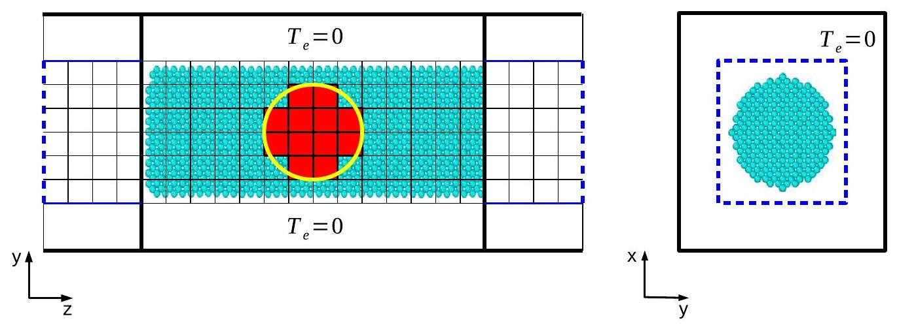
FIG. 1. Schematic of the simulation geometry. The atomistic NW is inside the rectangle of thick black lines (MD cell) and the overlying grid represents the cells of the electronic domain for the finite-difference solution of $T_{e}$. In addition, the blank spaces represent the subcells for which $T_{e}=0$ (there is no energy transfer with them). The irradiation-induced ion track is modeled by the number of electronic subcells (shown in red to account for an elevated $T_{e}$ ) which are approximately within a cylinder of 2.5 nm in diameter (yellow circumference). The track is located at the center of the NW, assuming normal incidence. The axis of the NW is $z$, and the track sits along the $x$ axis. Thick black lines represent periodic boundary conditions for both MD and electronic cells. The energy transport by electronic heat conduction is restricted to a square prism geometry as denoted by the solid blue lines. This shape is identified within the cross section of the electronic cell on the right. Dashed blue lines at the extremes of the electronic cell are boundary conditions with constant $T_{e}=300 \mathrm{~K}$ in this work.

the rest of the cells in our system, $T_{e}$ varies according to the heat diffusion equation, using a finite-difference (FD) scheme.

Finite-temperature electronic subcells contain the nanowire during the whole irradiation process, with the exception of relatively small amounts of sputtered material. Atoms entering the vacuum cells around the region of interest lose energy and get frozen because the local Langevin thermostat [13,15] has $T_{e}=0$ there. This is acceptable for our studies of ion irradiation, where sputtering is relatively small and there is no molten material moving into these vacuum cells, but it might not be adequate for laser ablation studies, where a significant fraction of the sample would move far away from the original surface [15]. If there is interest in the outgoing material, our method could be adapted to follow it. It would present its own challenges (as denoted in previous works [15,16,23]), which are beyond the scope of this work.

Dirichlet [10,12,65] and Robin [66] boundary conditions have been applied at the extremes of the electronic cell allowing heat absorption. Here we assume that at the end of

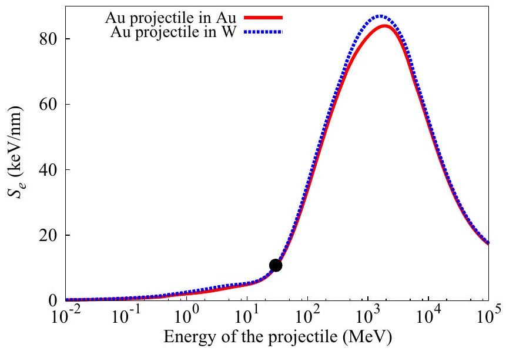
FIG. 2. Electronic stopping curves in Au and W for a gold projectile according to SRIM [67]. Black circle: $S_{e} \sim 10.8 \mathrm{keV} / \mathrm{nm}$ corresponding to a 30 MeV Au projectile.

the grid a bath keeps the electronic temperature fixed. The model was implemented as a modification of the TTM-MD model in LAMMPS [68].

Here we choose an aspect ratio $\sim 3$ between length and diameter, with both tungsten and gold NWs of 3.9 nm diameter and 11.2 nm length, corresponding to $\sim 9000$ atoms. Nowadays, it is possible to achieve experimentally this size [45,69]. The embedded-atom-method (EAM) [70,71] potentials w_eam4.fs [72] and Au_Colla.eam.alloy [73] were used to describe the interaction among tungsten and gold atoms, respectively. Initially, the wires were energetically minimized and thermalized to 300 K .

The electron thermal conductivity is calculated as $K_{e}=\frac{1}{3} v_{f}{ }^{2} C_{e} \tau_{e}$, where $v_{f}$ is the Fermi velocity, $C_{e}$ is the electron heat capacity, and $\tau_{e}$ is the electron relaxation time. From Matthiessen's rule, $\tau_{e}$ can be expressed as the sum of both electron-phonon and electron-electron scatterings. Expressions for $\tau_{e}$ fitted to experiments are given for W and $\mathrm{Au}[74,75]$ as well as values for $v_{f} . C_{e}$ for Au and W was computed as a function of the electronic temperature [20,21] using first-principles density functional theory. The dependence of $C_{e}$ on the electronic temperature was fitted to an analytical form for the sake of speeding up simulations. The expressions are the following:

$$
\begin{aligned}
& C_{e}(T)=\left(32.63-\frac{35.5}{1+e^{\frac{(T / 10000)-0.5899406}{0.24273}}}\right) \times 10^{5} \mathrm{~J} \mathrm{~m}^{-3} \mathrm{~K}^{-1}, \\
& C_{e}(T)=\left(50.939-\frac{65.4}{1+e^{\frac{(T / 10000)-1.180514}{0.937546}}}\right) \times 10^{5} \mathrm{~J} \mathrm{~m}^{-3} \mathrm{~K}^{-1},
\end{aligned}
$$

where (2) is for W and (3) is for Au. Data and fitted curves are shown in Fig. 3.

Using the Boltzmann transport formalism and assuming that electrons were the only carriers of heat, Stewart et al. [61] found that in situations where the diameter of the wire was 10 times the electron mean-free path or less, the electron thermal

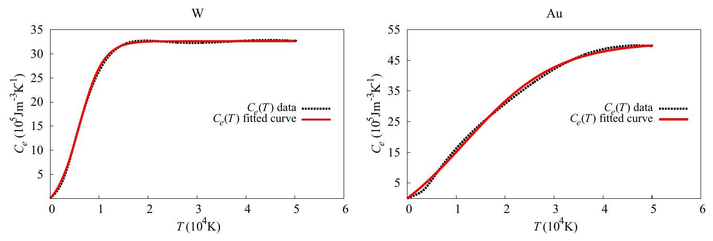
FIG. 3. Electron heat capacity $C_{e}$ as a function of electronic temperature for W (left) and Au (right). Black dashed lines: Tabulated data [20,21]; red solid lines: fitted curves for W and Au corresponding to Eqs. (2) and (3), respectively.

conductivity of the wire was shown to be appreciably different from bulk values. In this work, the electron mean-free paths are on the order of 25 nm [76,77], much larger than the dimensions of the NW (in particular, much larger than the diameter of the wires). Then, following Stewart et al. [61], it can be seen, from the electron thermal conductivity versus diameter, that in our case the thermal conductivity can drop by one order of magnitude compared to bulk. Therefore, for NWs, the electron thermal conductivity was taken as $0.1 K_{e}$, with $K_{e}$ the bulk value. Nevertheless, calculations have been done for NWs using $K_{e}$ in Appendix B. The e-ph coupling is also given for Au and W in Ref. [21], being $2.61 \times 10^{16} \mathrm{~W} / \mathrm{m}^{3} \mathrm{~K}$ and $1.65 \times 10^{17} \mathrm{~W} / \mathrm{m}^{3} \mathrm{~K}$ for bulk, respectively. Although these values are relatively well known, those for nanostructures could be very different. Values up to $20 g$, with $g$ the bulk value for the e-ph coupling, have been used to explain experiments in Au thin films [60]. Laser irradiation of metallic foams is still poorly understood, since the behavior of the electronic system after irradiation may deviate from that of a bulk metal. In view of the uncertainties of the parameters describing the electron system and its coupling to the atoms, different scaling factors were used for the electron thermal conductivity and for e-ph coupling in a previous study [78] to study laser ablation in a Au nanofoam. The electron thermal conductivity was assumed to be smaller than in the bulk, due to restrictions of electronic motion in the ligaments; however, it was not clear whether the e-ph coupling was enhanced or decreased with respect to bulk values. For nanowires, an increase of scattering is supposed to take place at the surface of them; hence a larger e-ph coupling could be expected [28]. Due to the lack of experiments in the regime dominated by electronic stopping needed to generate the conditions explored in this work and the uncertainties in the e-ph coupling parameter, here, we consider values of $g, 3 g, 6 g$, and $10 g$ for Au and W NWs, taking $6 g$ as reference in the text. As the results are mentioned, connections are established with the other values.

Each electronic grid cell had a volume of $1.95 \times 1.95 \times 0.8 \mathrm{~nm}^{3}$ for Au , and $1.9 \times 1.9 \times 0.9 \mathrm{~nm}^{3}$ for W, with $5 \times 5 \times$ 29 cells for Au and $5 \times 5 \times 25$ for W . A MD time step of 0.01 fs has been used for all simulations. The time step associated with the spatial discretization of the electronic domain for the FD solution of $T_{e}$ is calculated internally in LAMMPS [68] in order to satisfy the von Neumann stability criterion. Simulations were conducted until the atomic temperature was
well below the bulk melting temperature. On the possibility of pressure waves reflected at the boundaries (Fig. 1) having an effect on the damage, we show in Appendix C that there is a short transient pressure pulse. The bounce of this relatively weakened pulse does not contribute to the damage already done. Defect analysis and visualization were performed using the graphical package OVITO [79]. A version of the modified TTM-MD fix is available for download "as is" [95].

## III. RESULTS AND DISCUSSION

Figure 4 shows the average atomic and electronic temperature profiles along the $z$ axis for W and Au NWs for the parameters $0.1 K_{e}, 6 g$. We show them at 2,10 , and 20 ps . At 2 ps the curve of maximum temperature for the atomic cores is observed and, since melting takes place until $\approx 14 \mathrm{ps}$ and then recrystallization begins, the profiles are displayed at a previous time and at a later time. These characteristic times change when we vary the parameters of the model as denoted in Appendix B. Melting points for Au and W are $\sim 1350 \mathrm{~K}$ and $\sim 3600 \mathrm{~K}$, respectively. To know whether the systems are molten or crystalline, the radial pair distribution function $g(r)$ implemented in OVITO [79] is considered, as exemplified for the W NW in Appendix D.

The atomic temperature for each subcell of the grid is defined by the average kinetic energy of the atoms within the cell [ 10,12 ]. Corrections due to removal of center-of-mass motion are small in our simulations, on the order of $1 \%- 2 \%$ from selected simulations, and were not included in the calculation of temperature profiles.

Localized heating from electrons to atoms occurs in the W NW, while it is not observed in the Au NW, as shown in Fig. 4. The decay in time of the electronic temperature in the Au NW is abrupt compared to that in the W NW. This leads to a nearly uniform electronic temperature along the Au NW at $2 \mathrm{ps}(\sim 2500 \mathrm{~K}$ from -5.6 nm to 5.6 nm$)$, and to a more uniform temperature below 1000 K at 20 ps . During the early stages following irradiation some atoms have enough energy to move between subcells, resulting in fluctuations observed in the atomic temperature spatial profiles (Fig. 4), since atoms leaving/entering a cell carry a kinetic energy different from the average in the cell at a given time. These fluctuations would disappear with short time averaging of the temperature profiles and are more evident in Au , due to its relatively flat

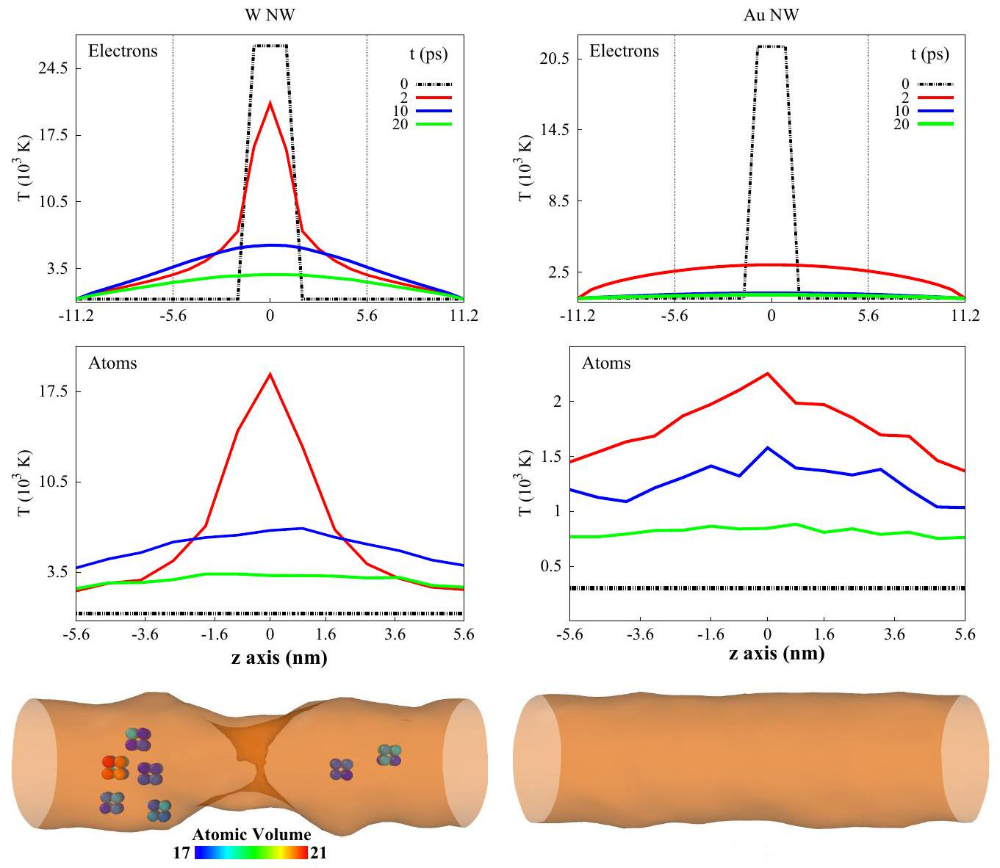
FIG. 4. Average atomic and electronic temperature profiles along the NW axis ( $z$ axis) for different times, for W (left) and Au (right) NWs. The profiles correspond to the parameters $0.1 K_{e}, 6 g$. The outer surfaces of the NWs, constructed by the algorithm "Construct Surface Mesh" [86] implemented in OVITO [79], are shown below the curves (the NWs have already returned to temperatures close to 300 K ). There are single vacancies in the W NW along with a hole in the center. Each vacancy is represented by a cube of 8 atoms: tungsten atoms, which have a body-centered cubic crystal structure, have an atomic volume of $15.6 \AA^{3}$ by doing the Voronoi tessellation implemented in OVITO [79]. Therefore, if the atom of the center is missing (vacancy) then the 8 surrounding atoms have larger Voronoi volumes, as identified in the corresponding legend.

temperature profile. Below 1000 K , when atoms generally do not have sufficient energy to move between subcells, the fluctuations in the curves start to disappear as seen for the curve at 20 ps . By contrast, there is still a temperature spike at 2 ps for the W NW. This spike disappears at 5 ps , although the electronic temperatures are not yet uniform even at 20 ps . They become uniform, with values below 500 K after 80 ps . It is remarkable that no matter which set of parameters is chosen, within reasonable bounds, there is localized heating from electrons to atoms in the W NW as identified in Appendix B. This does not happen in the Au NW. In Fig. 10, we show the atomic profiles of maximum temperature for both NWs for bulk parameters. This local heating process that takes place in the W NW is of considerable relevance in terms of physics because it is commonly assumed that first thermal equilibrium of the electrons is reached and then energy is transferred to the atoms.

An interesting point arises regarding the heating of the atoms. Figure 5 shows that the temperature increased sharply as expected in the center of each NW but the heating continues

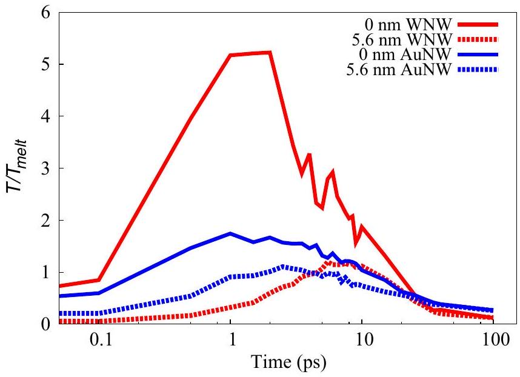
FIG. 5. Temporal evolution of the ratio $T / T_{\text {melt }}$, where $T_{\text {melt }}$ is the corresponding melting temperature for Au and W , and $T$ is the average atomic temperature (with respect to the $z$ axis) for the center $(0 \mathrm{~nm})$ and one end $(5.6 \mathrm{~nm})$ of each NW.

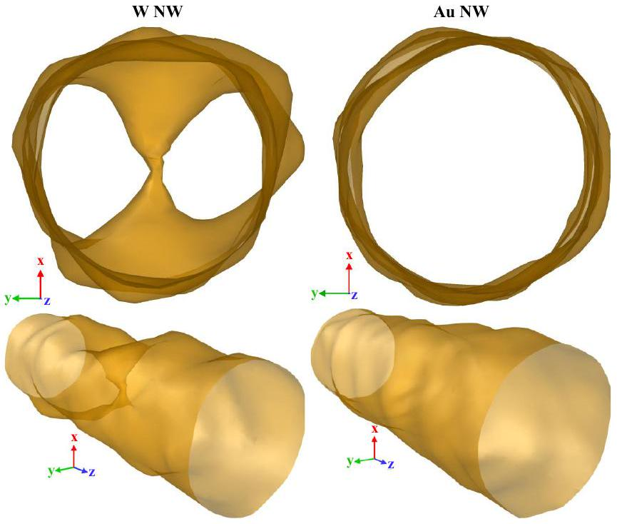
FIG. 6. Cross section and rotated view of the outer surfaces of the W (left) and Au (right) NWs. The surfaces have been constructed at the end of the simulations when the NWs have already returned to room temperature.

for a few picoseconds, unlike many thermal spike simulations which considered nearly instantaneous heating. In addition, the local character of the heating in the W NW is reflected in the corresponding curves due to the huge temperature increase in the center compared to the extremes. The noise associated with the 0 nm curve is due to sputtering and the formation of the hole in this region. The simulation showed a sputtering yield of 227 atoms for the W NW. In Au, the fast homogenization of the atomic temperature explains the fact that the difference between both curves is small. No sputtering was observed for the Au NW. We note that the sputtered atoms in W are mostly grouped in small clusters, as has been reported from thermal spikes in metals using EAM potentials [80].

For both NWs, the curve of maximum temperature for the atomic cores is observed at roughly 2 ps , but only between -2.8 nm and 2.8 nm is the profile over the melting point for the W NW, compared to the Au NW, for which the atomic temperature is entirely above the melting point along the wire as seen in Fig. 4. Melting starts at the track, and the temperature profiles become increasingly uniform as seen at 10 ps . The profiles are below the melting temperature at 20 ps during recrystallization, which continues until both return close to room temperature. Melting could lead to welding of NWs using an ion beam as the localized heating source, as reported for proton irradiation of Ag NWs [55].

To visualize the final NW shape, their outer surface is defined by a meshing algorithm using the OVITO software [79]. In Fig. 6, we observe a modest and uniform change in roughness for the Au NW, while for the W NW, there is a drastic and localized change in roughness, reflected in the formation of the hole and craters in the center, better appreciated from a rotated view of the outer surface.

Recently, Wang et al. [37] observed a large roughness increase in nanoporous Cu samples, attributing this increase to sputtering. Shang et al. [54] proposed that roughening of Ag NWs under irradiation is due to the diffusion of defect clusters

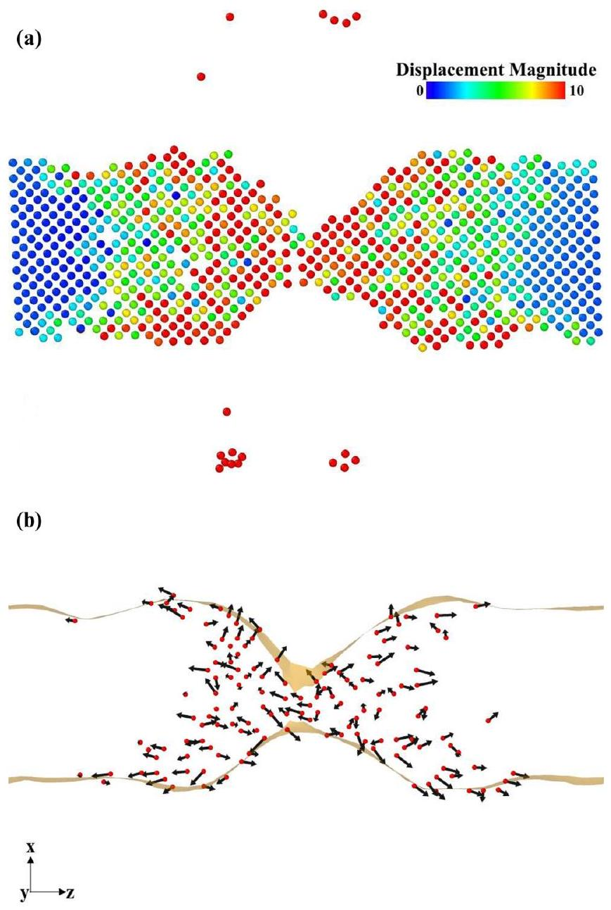
FIG. 7. (a) Slice of $3.16 \AA$ width of the W NW along the $z$ axis close to the center. The cut is taken at the end of the simulation. The algorithm "Displacement Vectors" implemented in OVITO [79] was used to determine how much the atoms moved with respect to their initial positions at the beginning of the simulation. Atoms that have displaced $10 \AA(1 \mathrm{~nm})$ or more are shown in red. Among them are those being part of the sputtering yield and those that have moved from the ion track region to the surface. The corresponding displacement vectors for the latter are displayed in (b) with the same red color but with reduced size so that the arrows stand out. To better appreciate the melt flow process, the arrows are scaled by a factor of 0.24 and the outer surface (orange) for the slice is displayed.

to the surface, the radiation dose being very high at 1 dpa (displacement per atom) [1] in their experiment. Moreover, Cheng et al. [56] proposed that the surface features they observe in Au NWs, including craters, are due to plastic flow or to microexplosions. In our simulations, roughening occurs due to sputtering and melt flow, making it different from these previous studies. Thus, it is not only due to sputtering, but a combination of sputtering and melt flow, as shown in Fig. 7(a). Also, we are simulating the passage of only one projectile through the wire; therefore, the radiation dose is not significant. Finally, microexplosions and dislocationdriven plastic flow are not seen in the simulations. We note that homogeneous dislocation nucleation in bulk W requires shock pressures over 100 GPa [81]. For W nanowires, the
elastic limit is 25.4 GPa , for a square cross section of 2.5 nm side [82]. From Fig. 13, the maximum compressive pressure in our simulations is less than 15 GPa at the track border, becoming tensile after 1 ps . Nearly 5 nm away from the center of the track, the pressure only reaches values slightly above 5 GPa during about 1 ps . Those stress values applied to such small regions during very short times are not enough to drive heterogeneous dislocation nor twin nucleation from the surface of the NW, nor from the solid-melt front. The energy transfer from electrons to atoms in the W NW with its local character leads to a process with enough energy to eject atoms out of the wire (sputtering yield) and to displace others from the track zone toward the surface (melt flow). In fact, this gives rise to crater formation and the development of a hole in the center of the wire. As a result, there are local changes in roughness. To better appreciate the melt flow, displacement vectors (arrows) for the atoms that have moved 1 nm or more from their initial positions are shown in Fig. 7(b).

For the electronic regime, Khara et al. [66] simulated tracks in bulk W using the TTM-MD approach and found no defects at the end of simulations for $S_{e}<40 \mathrm{keV} / \mathrm{nm}$, while in our simulations, a few single vacancies are left inside the W NW for $S_{e} \sim 10.8 \mathrm{keV} / \mathrm{nm}$. This difference on defect formation between a bulk system and a finite nanostructure has also been observed for an alternative approach such as the primary knock-on atom (PKA) for MD simulations of Au NWs [43]. These showed defect production dependent on the PKA distance from the surface of the wires, while for Au bulk, defect production is position-independent of the PKA. In particular, vacancy production is affected while for interstitials there is no significant change.

All simulations for the W NW for $g, 3 g, 6 g$, and $10 g$ show sputtering, surface cratering, and point defect formation (even if the electronic cell extension is doubled). Due to the small NW diameter, the vacancies are expected to disappear due to high enough diffusivities $[83,84]\left(10^{-3}\right.$ to $\left.10^{-6} \mathrm{~nm}^{2} / \mathrm{ps}\right)$ in less than $1 \mu \mathrm{~s}$. The development of the hole in the central zone takes place from $3 g$ onward.

For the Au NW, only uniform changes in roughness are observed in all cases. This is consistent with the recent results by Briot et al. [85] for in situ TEM of MeV irradiation of nanoporous gold. They find no defect accumulation in filaments as small as 3 nm , for 10 MeV self-irradiation.

## IV. SUMMARY AND FUTURE OUTLOOK

TTM-MD, based on an inhomogeneous Langevin thermostat [13] to account for the heat transfer between the electronic and atomic subsystems, has been used for irradiation by SHI in bulk [87]. Inclusion of vacuum cells is possible [15], and the TTM grid can be extended to better account for electronic heat conduction $[10,12,65,66]$. These two modifications are used jointly here, and offered as a freeware modification to the LAMMPS software package [68]. Although here we focus on finite nanowires, this extended implementation makes it possible to treat irradiation of other finite systems such as clusters and nanorods.

NWs with 3.9 nm diameter and 11.2 nm length are studied here. Nanosize effects tend to increase e-ph coupling and decrease electron conductivity. The present simulations take
both into account. Irradiation was modeled as a 2.5 nm diameter cylindrical track perpendicular to the axis of the wire, with electronic temperatures corresponding to $S_{e}$ below $20 \mathrm{keV} / \mathrm{nm}$. After the track appears, atomic temperature increases sharply in the NW center, as expected. Heating continues during a few picoseconds, unlike some thermal spike simulations which consider nearly instantaneous heating. The large conductivity of Au leads to fast spread of atomic heating, with the whole NW displaying a relatively uniform temperature. This is not the case for W, where there is localized heating at the track, with large temperature gradients.

The hot track leaves behind only a few point defects for the stopping power range studied here. Considering typical point defect diffusivities [83,84], the latter are expected to migrate to the surface and disappear, leaving behind a defect-free nanowire interior. This would mean that nanowires are in fact "radiation resistant," in the same spirit of the radiation resistance of nanofoams under keV irradiation [28]. However, the topology of the wire is not left intact for large $S_{e}$. The large temperature gradients lead to fast ejection of atoms from the track, in turn leading to a crater with a rim that partially heals as the wire cools down. This produces significant roughening, in addition to roughening produced by melt flow. For larger nanowires, extended defects crossing the wire, like stacking faults, might be possible.

For the Au NW, there is no defect formation but only uniform changes in roughness. This is consistent with recent results by Briot et al. [85] where they found no defect accumulation in filaments as small as 3 nm , for 10 MeV self-irradiation in nanoporous gold.

In this work we focus on NW irradiation, but we can anticipate what would be expected regarding mechanical properties after irradiation. For "low" $S_{e}$, track heating would lead to surface smoothing which could in turn diminish the number of dislocation nucleation sites, increasing the elastic limit of the NW [88]. However, large $S_{e}$ leads to increasing NW roughening which could modify the elastic limit and yield strength. Larger NWs would accumulate defects and behave differently: for $\approx 200 \mathrm{~nm}$ diameter Cu nanowires, strength was increased by irradiation [57].

The electronic grid was extended well beyond the atomistic cell with a square prism shape keeping the electronic temperature fixed at the extremes. This shape might be more complex for a NW in a nanofoam or in contact with substrates. Moreover, the energy dissipation may have to enter differently from fixed temperature at the extremes. Future work will focus on the structural changes of irradiated W NWs, with these being taken as building units of W nanofoams.

This TTM-MD model includes more flexibility to treat nanoscale systems but there are still several issues to consider, as discussed in what follows. Nuclear stopping effects are neglected, but could play a role in defect generation [87]. Application to insulator and semiconductor nanostructures is possible, although semiconductor systems would require inclusion of the band gap [89]. Also, there is agreement about the need for corrections when the characteristic length of the nanostructure is less than the electron mean-free path [61,62]. In addition, there is no indication of how much the e-ph coupling would change for finite systems, with some experiments indicating an increase [59,60], while others indicate

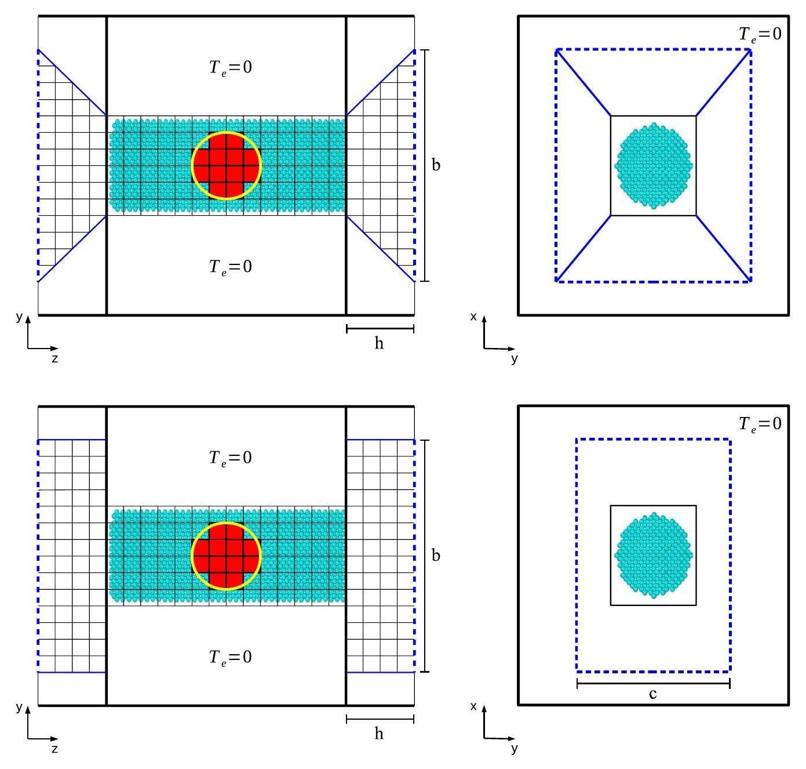
FIG. 8. Alternative schematics. Top: The energy transport by electronic heat conduction is restricted to a square prism geometry surrounding the NW inside the MD cell while it follows a square pyramid geometry outside the MD cell as denoted by the solid blue lines. This combined geometry is identified within the cross section of the electronic cell on the right. $h$ is the extension of the pyramid shape outside the MD cell and $b$ is the length of each side of the blue square. Bottom: The energy transport outside the MD cell follows a rectangular prism as denoted by the solid blue lines. $h$ is the extension of the prism outside the MD cell while $b$ and $c$ are the lengths of the rectangular shape. In both cases, dashed blue lines at the extremes of the electronic cell could be fixed boundary conditions or any other possibility that can be implemented in the code.

a decrease [90]. For nonhomogeneous systems, like a matrix with nanoparticles [91], these values could change dramatically from one material to another. Finally, e-ph coupling could be applied to phonon branches, and this would change temperature evolution in the sample [92].

New experiments in the regime dominated by electronic stopping are needed to generate the conditions explored in these simulations, in the case of W modifying NW roughness but at the same time smoothing small surface features due to intense localized spike heating.

## ACKNOWLEDGMENTS

J.G., E.M.B., and J.K. acknowledge EC-H2020-MSC-RISE-2014, Project No. 643998 ENACT. J.G. and E.A. acknowledge EC-FP7-PEOPLE-CIG-2012 Marie Curie, Project No. 333813 ElectronStopping of the European Union. E.M.B. acknowledges PICT2014-0696 from ANCyTP. This work
used the Toko Cluster from FCEN-UNCuyo, which is part of the SNCAD-MinCyT, Argentina.

## APPENDIX: A

Figure 8 shows two alternatives for the energy transport outside the MD cell. For nanofoams, taken as collections of connected nanowires, one could consider that each NW is actually connected to some wider junction of atoms. A pyramidal shape could be used to account for this wider junction. Moreover, energy dissipated through finite-support substrates could be modeled using a rectangular prism shape. Fixed boundary conditions at the extremes of the electronic cell were used in this work but other options could be implemented.

## APPENDIX: B

Characteristic times associated with atomic dynamics, such as melting and recrystallization, change when we vary the

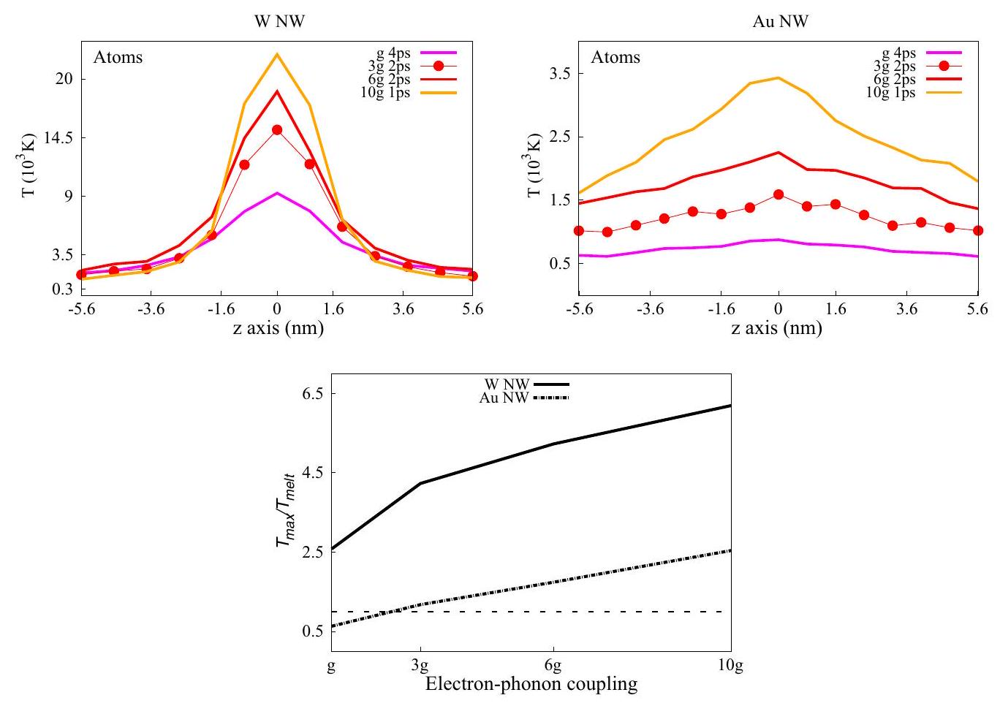
FIG. 9. Left and right: Curves of maximum temperature for the atomic cores along the $z$ axis for W and Au NWs for different electronphonon coupling parameters, with $g$ the bulk value. As the coupling increases enough, the maximum is greater and is reached in less time. Thus, at 1 ps (orange) the maximum is reached for $10 g$, at 2 ps (red) the maximum is reached for $3 g$ and $6 g$ (solid lines with and without circles, respectively), and at 4 ps (magenta) the maximum is reached for $g$. We have $0.1 K_{e}$ in all cases. Bottom: Values of the ratio $T_{\text {max }} / T_{\text {melt }}$ for different values of the electron-phonon coupling for W and Au NWs. $T_{\text {max }}$ corresponds to the highest temperature value of each curve of maximum temperature and $T_{\text {melt }}$ is the corresponding melting temperature for Au and W . When the coupling is increased by one order of magnitude from $g$ to $10 g, T_{\text {max }}$ increases by a factor of 2.3 for W NW and 3.9 for Au NW. Dashed line for $T_{\text {max }} / T_{\text {melt }}=1$ is shown.

parameters of the model. First, we address the results associated with changes in e-ph coupling and electron thermal conductivity and, finally, those due to changes in the electron grid extension.

## 1. Influence of electron thermal conductivity and electron-phonon coupling

Figures 9, 10, and 11 show atomic profiles of maximum temperature for W and Au NWs for different combinations of e-ph coupling and thermal conductivity. In Fig. 9, we change the coupling parameter without varying the electron thermal conductivity $\left(0.1 K_{e}\right)$. The same is done in Fig. 10
but now for $K_{e}$. Finally, the coupling is kept constant and the electron thermal conductivity is changed in Fig. 11. One important thing to take into account is that there is a localized heating from electrons to atoms in the W NW, even when the parameters are changed, whereas this does not happen for the Au NW in any case.

The time associated with the curve of maximum temperature of the atomic cores is altered when the e-ph coupling parameter is changed as shown in Fig. 9. As the coupling increases enough, the maximum is greater and is reached in less time. In addition, when the coupling is increased by one order of magnitude from $g$ to $10 g$, the highest temperature value increases by a factor of $\sim 2$ and $\sim 4$ for W and Au

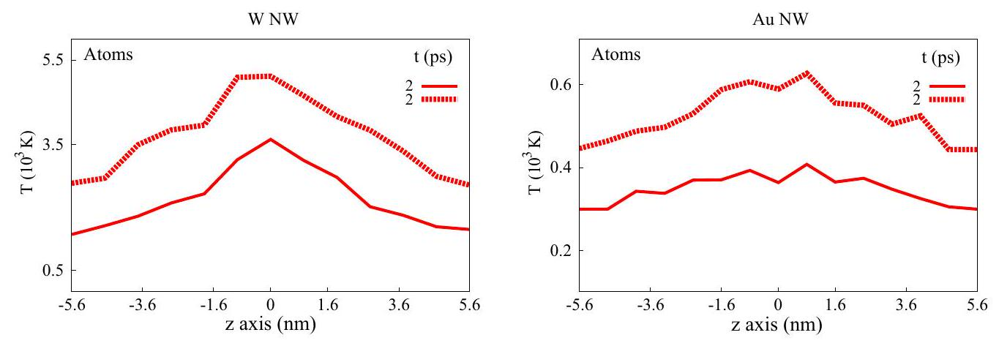
FIG. 10. Average atomic temperature profiles along the z axis at 2 ps for W and Au NWs. Solid lines: $K_{e}$ and $g$; dashed lines: $K_{e}$ and $6 g$.

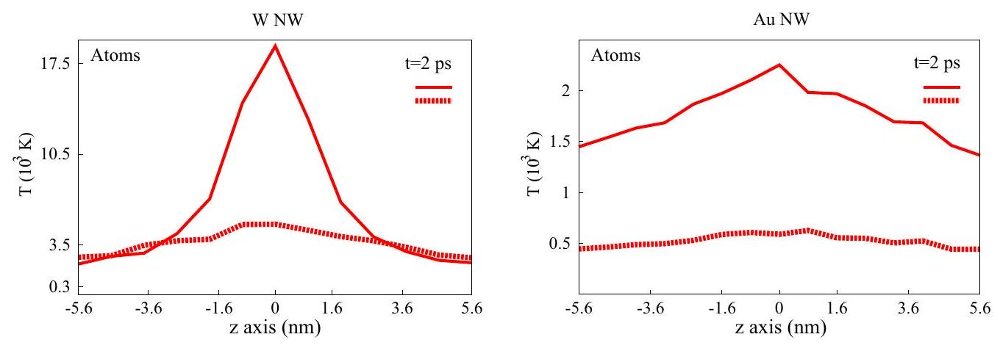
FIG. 11. Average atomic temperature profiles along the $z$ axis at 2 ps for W and Au NWs. Solid lines: $0.1 K_{e}$ and $6 g$; dashed lines: $K_{e}$ and 6g. The same color coding is used as in Fig. 4.

NWs, respectively. On the other hand, there is neither melting nor recrystallization in the Au NW when considering bulk electron thermal conductivity even if a larger e-ph coupling is used as shown in Fig. 10. For the W NW the situation is different for larger couplings, where for $6 g$ melting takes place until $\approx 3 \mathrm{ps}$. Figure 11 shows that the atomic temperature profiles drop abruptly when using bulk thermal conductivity.

## 2. Influence of electron grid

Atomic and electronic temperature profiles at 10 and 20 ps from Fig. 4 for both NWs are used to perform the analysis. Electronic grids taken as $\mathrm{Au}(5 \times 5 \times 29)$, $\mathrm{W}(5 \times 5 \times 25)$ were used for the calculations. We call this set of grids the SEG (small electronic grid) and consider now an-
other set, the BEG (big electronic grid), as $\mathrm{Au}(5 \times 5 \times 43)$, $\mathrm{W}(5 \times 5 \times 37)$. Figure 12 shows that the decay of the electronic temperature profiles for the BEG is slower than for the SEG. This is because the electrons (energy) have more space to diffuse in the case of the largest cell before they reach the sinks, which are fixed temperature boundary conditions; hence there is more energy in the electronic subsystem compared to the small cell, at the same time making the profiles higher. This slow decay is also reflected in the atomic subsystem where the temperature curves are over the melting point even at 20 ps in contrast to the SEG case. In fact, this suggests that the annihilation of defects (when these are formed) could be affected by the fixed boundary conditions and the electronic cell extension according to this geometry, which indicates that if the melting continues for longer, more defects

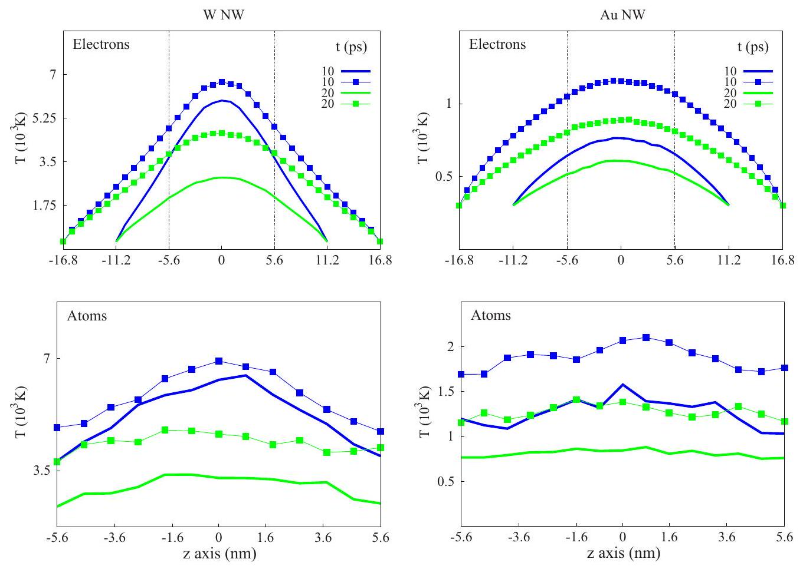
FIG. 12. Average atomic and electronic temperature profiles along the $z$ axis at 10 and 20 ps for W and Au NWs. Solid lines without symbols: $0.1 K_{e}, 6 g$, and small electronic grid (SEG); solid lines with squares: $0.1 K_{e}, 6 g$, and big electronic grid (BEG). The same color coding is used as in Fig. 4.

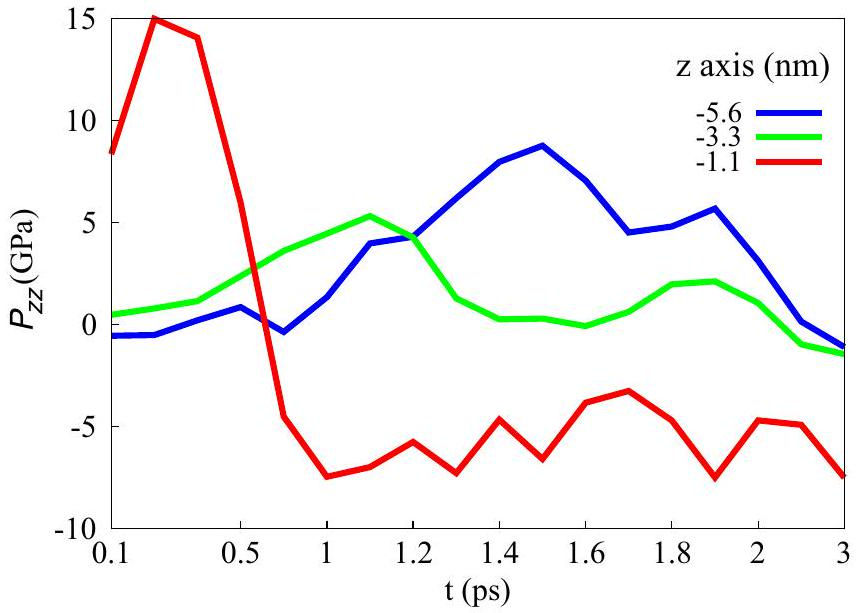
FIG. 13. $P_{z z}$ for the W NW at different times, at $-1.1,-3.3$, and -5.6 nm according to the $z$ axis. Curves were obtained by using the algorithm "Bin and Reduce" implemented in OVITO [79]. Bins are defined by cutting the MD simulation box in a certain direction. In our case, we cut in the $z$ direction considering 11 bins of $9.4 \mathrm{~nm} \times 9.4 \mathrm{~nm} \times 1.1 \mathrm{~nm}$ each. We sum the output of the atomic stress $P_{z z, i}$ from MD, which includes the atomic volume $V_{i}$, $V_{i} P_{z z, i}$, for all the atoms inside a bin and divide this value by the bin volume by using the command "sum divided by bin volume," which is part of the algorithm. In addition, we divide the latter by the solid volume fraction (given by the algorithm "Construct Surface Mesh" [86]), which represents the solid volume of the wire with respect to the total volume of the bin across the simulation box. The solid volume fraction changes $\approx 8 \%$ during the simulation time due to the expansion of the material.

could be annihilated allowing the structure to recover quickly. Future work will focus on irradiated W NW in nanofoam, for which the first schematic of Fig. 8 will be considered, where the energy transport follows a pyramidal shape outside the MD cell. In addition, fixed boundary conditions will be used to see whether they have any impact on the results.

For the Au NW, the maximum electronic temperature can be lower than the maximum atomic temperature as seen in Fig. 12. This can be explained considering two factors: the electron thermal conductivity and the fixed temperature condition for the sinks at the extremes of the electronic cell. The electron thermal conductivity of Au, much higher than the atomic thermal conductivity, leads to a huge amount of energy lost at the sinks due to the simple condition of fixed temperature. A more realistic boundary condition would reduce the large fluctuations in the energy flow between the electronic and atomic subsystems, and decrease the temperature difference between them.

## APPENDIX: C

$P_{z z}$ profiles are shown for the W NW in Fig. 13, at early times and along the wire axis: close to the ion track, in the middle between the track and the end of the NW, and at the end of the wire. As mentioned in the Results and Discussion section, the pressure values observed in Fig. 13 are insufficient to generate defects such as dislocations.

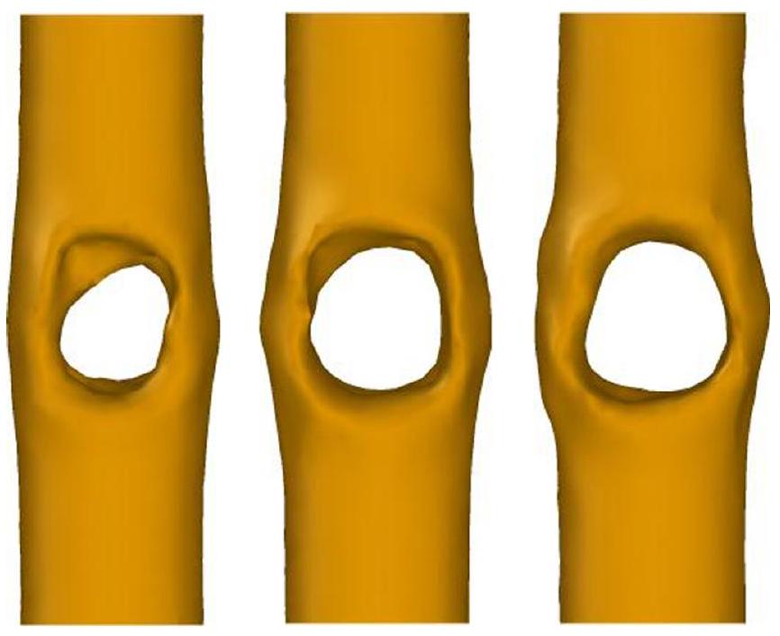
FIG. 14. Outer surfaces of the W NW at $1,1.5$, and 2 ps (from left to right), only considering atoms with potential energy smaller than -6 eV and coordination larger than 5 , which removes sputtered atoms. The surfaces were constructed using the algorithm "Construct Surface Mesh" [86] implemented in OVITO [79], using a probe sphere of 0.37 nm .

Near the track, at -1.1 nm , there is a fast decay of the profile until 1 ps because the hole opens in the middle of the wire as seen in Fig. 14. Stress stays negative during several ps due to the opening of the crater, but after 100 ps is -2 GPa , which is a typical value for a surface in a nanostructure, for instance in a metallic foam [93]. At -3.3 nm , the traveling pulse reaches a maximum of 5 GPa at 1.1 ps . Then, after the pulse has passed and the pressure has returned close to 0 GPa , the maximum $P_{z z} \sim 8.7 \mathrm{GPa}$ is reached at the end ( -5.6 nm ) of the wire at 1.5 ps . It is difficult to avoid reflection of the pressure wave at the NW boundaries. In this case, the wave is a short nonsteady pulse, and the pressure magnitude and timescales are too short to impact the NW microstructure. For instance, there is a bump in the pressure at -3.3 nm and 1.9 ps , which is likely due to such reflection, but the maximum $P_{z z}$ at that point is $\sim 2 \mathrm{GPa}$, decaying to 1 GPa at 2 ps .

In summary, the hole starts opening at 0.7 ps , and at 1 ps is already large, as seen in Fig. 14, while the peak of the pressure pulse reaches the end of the wire at 1.5 ps , when the hole has already opened considerably. When the pulse returns near the center of the track, the maximum pressure of 2 GPa lasts only for 0.1 ps and decays to 1 GPa at 2 ps . Therefore, the pulse is not responsible for the formation of the hole. In addition, when the pulse returns, there is no significant contribution to the development of the hole, first, because the hole has already formed at 2 ps , as shown in Fig. 14, and second, because pressure decays very fast.

## APPENDIX: D

The usefulness of the radial pair distribution function $g(r)$ implemented in OVITO [79] to help determine whether the system is molten or crystalline is exemplified for the W NW in Fig. 15. We also follow the slope of the average mean-squared displacement over all atoms of the wire between -2 and 2

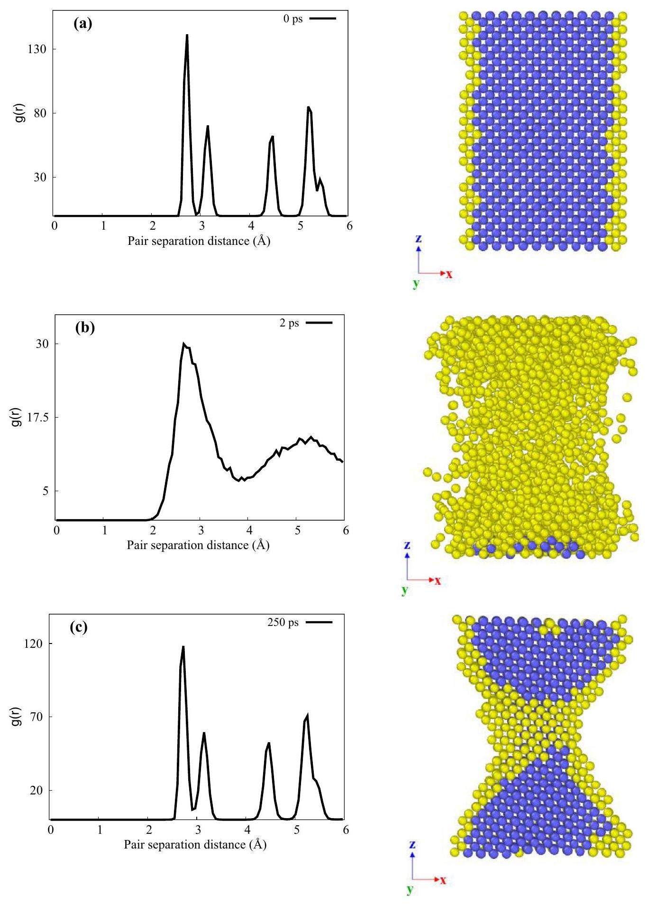
FIG. 15. Radial pair distribution function $g(r)$ at 0,2 , and 250 ps of the W NW along the $z$ axis between -2.8 and 2.8 nm . This function is a measure of the probability of finding a particle at a distance $r$ given that there is a particle at position 0 . It basically accounts for the interparticle distances and is normalized by the density of particles (total number of particles divided by the MD simulation box volume). $g(r)$ is computed by the algorithm "Coordination Analysis" implemented in OVITO [79]. $g(r)$ is useful to determine whether a system is crystalline or molten, the former by looking at the ordered arrangement of atoms through the peaks at specific distances as seen in (a) and (c), and the latter where there is a considerable lack of order in the pattern as in (b). Therefore, the region of the W NW between -2.8 and 2.8 nm is molten at 2 ps and has already recrystallized at 250 ps . To visualize these stages, a center slice of this region along the $z$ axis is shown at the corresponding times. Within the "Dislocation Analysis" module implemented in OVITO [79], a structure identification is perform: the analysis consists of looking at the local environment of each atom in order to identify those forming a perfect crystal lattice. Atoms in blue are identified as bcc atoms while those in yellow are atoms with an unidentified structure. Surface atoms and atoms during melting are colored in yellow.

nm along the $z$ axis (containing the track region). The slope is $\approx 10^{-7} \mathrm{~m}^{2} / \mathrm{s}$, between 1 and 8 ps after bombardment. This value is consistent with liquid metals at similar temperatures [94], as expected from a track which reaches $3-5 T_{\text {melt }}$, and consistent with the structure in Fig. 15(b). At times after 20
ps, the slope decreases to zero within our simulated times, indicating re-solidification. Figure 15(c) accounts for this, showing the structure at the end of the simulation. Future studies might follow the detailed evolution of the re-solidification process, which is beyond the scope of this paper.
[1] K. Nordlund, S. J. Zinkle, A. E. Sand, F. Granberg, R. S. Averback, R. E. Stoller, T. Suzudo, L. Malerba, F. Banhart, W. J. Weber et al., Primary radiation damage: A review of current understanding and models, J. Nucl. Mater. 512, 450 (2018).
[2] C. Björkas and K. Nordlund, Assessment of the relation between ion beam mixing, electron-phonon coupling and damage production in Fe, Nucl. Instrum. Methods Phys. Res., Sect. B 267, 1830 (2009).
[3] E. Zarkadoula, S. L. Daraszewicz, D. M. Duffy, M. A. Seaton, I. T. Todorov, K. Nordlund, M. T. Dove, and K. Trachenko, Electronic effects in high-energy radiation damage in iron, J. Phys.: Condens. Matter 26, 085401 (2014).
[4] C. P. Race, D. R. Mason, M. W. Finnis, W. M. C. Foulkes, A. P. Horsfield, and A. P. Sutton, The treatment of electronic excitations in atomistic models of radiation damage in metals, Rep. Prog. Phys. 73, 116501 (2010).
[5] M. I. Kaganov, E. M. Lifshitz, and L. V. Tanatarov, Relaxation between electrons and the crystalline lattice, Sov. Phys. JETP 4, 173 (1957).
[6] S. I. Anisimov, B. L. Kapeliovich, and T. L. Perelman, Electron emission from metal surfaces exposed to ultrashort laser pulses, Sov. Phys. JETP 39, 375 (1974).
[7] M. P. Allen and D. J. Tildesley, Computer Simulation of Liquids (Oxford University Press, New York, 1987).
[8] C. Schäfer, H. M. Urbassek, and L. V. Zhigilei, Metal ablation by picosecond laser pulses: A hybrid simulation, Phys. Rev. B 66, 115404 (2002).
[9] D. S. Ivanov and L. V. Zhigilei, Combined atomistic-continuum modeling of short-pulse laser melting and disintegration of metal films, Phys. Rev. B 68, 064114 (2003).
[10] D. M. Duffy and A. M. Rutherford, Including the effects of electronic stopping and electron-ion interactions in radiation damage simulations, J. Phys.: Condens. Matter 19, 016207 (2006).
[11] J. K. Chen, D. Y. Tzou, and J. E. Beraun, A semiclassical twotemperature model for ultrafast laser heating, Int. J. Heat Mass Transfer 49, 307 (2006).
[12] A. M. Rutherford and D. M. Duffy, The effect of electronion interactions on radiation damage simulations, J. Phys.: Condens. Matter 19, 496201 (2007).
[13] C. L. Phillips and P. S. Crozier, An energy-conserving twotemperature model of radiation damage in single-component and binary Lennard-Jones crystals, J. Chem. Phys. 131, 074701 (2009).
[14] D. S. Ivanov, Z. Lin, B. Rethfeld, G. M. O'Connor, T. J. Glynn, and L. V. Zhigilei, Nanocrystalline structure of nanobump generated by localized photoexcitation of metal film, J. Appl. Phys. 107, 013519 (2010).
[15] G. E. Norman, S. V. Starikov, V. V. Stegailov, I. M. Saitov, and P. A. Zhilyaev, Atomistic modeling of warm dense matter in the two-temperature state, Contrib. Plasma Phys. 53, 129 (2013).
[16] V. V. Pisarev and S. V. Starikov, Atomistic simulation of ion track formation in $\mathrm{UO}_{2}$, J. Phys.: Condens. Matter 26, 475401 (2014).
[17] D. Mason, Incorporating non-adiabatic effects in embedded atom potentials for radiation damage cascade simulations, J. Phys.: Condens. Matter 27, 145401 (2015).
[18] C.-Y. Shih, M. V. Shugaev, C. Wu, and L. V. Zhigilei, Generation of subsurface voids, incubation effect, and formation of nanoparticles in short pulse laser interactions with bulk metal targets in liquid: Molecular dynamics study, J. Phys. Chem. C 121, 16549 (2017).
[19] J. L. Hostetler, A. N. Smith, D. M. Czajkowsky, and P. M. Norris, Measurement of the electron-phonon coupling factor dependence on film thickness and grain size in $\mathrm{Au}, \mathrm{Cr}$, and Al , Appl. Opt. 38, 3614 (1999).
[20] Z. Lin and L. V. Zhigilei, Thermal excitation of $d$-band electrons in Au: Implications for laser-induced phase transformations, Proc. SPIE 6261, 62610U (1999).
[21] Z. Lin, L. V. Zhigilei, and V. Celli, Electron-phonon coupling and electron heat capacity of metals under conditions of strong electron-phonon nonequilibrium, Phys. Rev. B 77, 075133 (2008).
[22] P. E. Hopkins, J. R. Serrano, L. M. Phinney, H. Li, and A. Misra, Boundary scattering effects during electron thermalization in nanoporous gold, J. Appl. Phys. 109, 013524 (2011).
[23] S. V. Starikov, A. Y. Faenov, T. A. Pikuz, I. Y. Skobelev, V. E. Fortov, S. Tamotsu, M. Ishino, M. Tanaka, N. Hasegawa, M. Nishikino et al., Soft picosecond x-ray laser nanomodification of gold and aluminum surfaces, Appl. Phys. B 116, 1005 (2014).
[24] M. Z. Mo, Z. Chen, R. K. Li, M. Dunning, B. B. L. Witte, J. K. Baldwin, L. B. Fletcher, J. B. Kim, A. Ng, R. Redmer et al., Heterogeneous to homogeneous melting transition visualized with ultrafast electron diffraction, Science 360, 1451 (2018).
[25] A. Tamm, M. Caro, A. Caro, G. Samolyuk, M. Klintenberg, and A. A. Correa, Langevin Dynamics with Spatial Correlations as a Model for Electron-Phonon Coupling, Phys. Rev. Lett. 120, 185501 (2018).
[26] A. V. Krasheninnikov and K. Nordlund, Ion and electron irradiation-induced effects in nanostructured materials, J. Appl. Phys. 107, 071301 (2010).
[27] I. J. Beyerlein, A. Caro, M. J. Demkowicz, N. A. Mara, A. Misra, and B. P. Uberuaga, Radiation damage tolerant nanomaterials, Mater. Today 16, 443 (2013).
[28] X. Zhang, K. Hattar, Y. Chen, L. Shao, J. Li, C. Sun, K. Yu, N. Li, M. L. Taheri, H. Wang et al., Radiation damage in nanostructured materials, Prog. Mater. Sci. 96, 217 (2018).
[29] J. Li, H. Wang, and X. Zhang, A review on the radiation response of nanoporous metallic materials, JOM 70, 2753 (2018).
[30] D. Jang, X. Li, H. Gao, and J. R. Greer, Deformation mechanisms in nanotwinned metal nanopillars, Nat. Nanotechnol. 7, 594 (2012).
[31] Y. Kulkarni and R. J. Asaro, Are some nanotwinned fcc metals optimal for strength, ductility and grain stability?Acta Mater. 57, 4835 (2009).
[32] Z. X. Wu, Y. W. Zhang, and D. J. Srolovitz, Dislocation-twin interaction mechanisms for ultrahigh strength and ductility in nanotwinned metals, Acta Mater. 57, 4508 (2009).
[33] E. M. Bringa, J. D. Monk, A. Caro, A. Misra, L. Zepeda-Ruiz, M. Duchaineau, F. Abraham, M. Nastasi, S. T. Picraux, Y. Q. Wang et al., Are nanoporous materials radiation resistant?Nano Lett. 12, 3351 (2011).
[34] G. M. Wright, D. Brunner, M. J. Baldwin, R. P. Doerner, B. Labombard, B. Lipschultz, J. L. Terry, and D. G. Whyte, Tungsten nano-tendril growth in the Alcator C-Mod divertor, Nucl. Fusion 52, 042003 (2012).
[35] A. Huber, A. Arakcheev, G. Sergienko, I. Steudel, M. Wirtz, A. V. Burdakov, J. W. Coenen, A. Kreter, J. Linke, P.h. Mertens et al., Investigation of the impact of transient heat loads applied by laser irradiation on ITER-grade tungsten, Phys. Scr. 2014, 014005 (2014).
[36] S. J. Zinkle and G. S. Was, Materials challenges in nuclear energy, Acta Mater. 61, 735 (2013).
[37] J. Wang, Z. Hu, R. Li, X. Liu, C. Xu, H. Wang, Y. Wu, E. Fu, and Z . Lu , Influences of Au ion radiation on microstructure and surface-enhanced Raman scattering of nanoporous copper, Nanotechnology 29, 184001 (2018).
[38] J. F. Rodriguez-Nieva, E. M. Bringa, T. A. Cassidy, R. E. Johnson, A. Caro, M. Fama, M. J. Loeffler, R. A. Baragiola, and D. Farkas, Sputtering from a porous material by penetrating ions, Astrophys. J. Lett. 743, L5 (2011).
[39] A. V. Spitsyn, N. P. Bobyr, T. V. Kulevoy, P. A. Fedin, A. I. Semennikov, and V. S. Stolbunov, Use of MeV energy ion accelerators to simulate the neutron damage in fusion reactor materials, Fusion Eng. Des. 146, 1313 (2019).
[40] E. G. Fu, M. Caro, L. A. Zepeda-Ruiz, Y. Q. Wang, K. Baldwin, E. Bringa, M. Nastasi, and A. Caro, Surface effects on the radiation response of nanoporous Au foams, Appl. Phys. Lett. 101, 191607 (2012).
[41] E. Figueroa, D. Tramontina, G. Gutiérrez, and E. Bringa, Mechanical properties of irradiated nanowires: A molecular dynamics study, J. Nucl. Mater. 467, 677 (2015).
[42] W. Liu, P. Chen, R. Qiu, M. Khan, J. Liu, M. Hou, and J. Duan, A molecular dynamics simulation study of irradiation induced defects in gold nanowire, Nucl. Instrum. Methods Phys. Res., Sect. B 405, 22 (2017).
[43] C. G. Zhang, Y. G. Li, W. H. Zhou, L. Hu, and Z. Zeng, Antiradiation mechanisms in nanoporous gold studied via molecular dynamics simulations, J. Nucl. Mater. 466, 328 (2015).
[44] M. Caro, W. M. Mook, E. G. Fu, Y. Q. Wang, C. Sheehan, E. Martinez, J. K. Baldwin, and A. Caro, Radiation induced effects on mechanical properties of nanoporous gold foams, Appl. Phys. Lett. 104, 233109 (2014).
[45] S. Wang, Z. Shan, and H. Huang, The mechanical properties of nanowires, Adv. Sci. 4, 1600332 (2017).
[46] D. Kiener, P. Hosemann, S. A. Maloy, and A. M. Minor, In situ nanocompression testing of irradiated copper, Nat. Mater. 10, 608 (2011).
[47] C. Sun, B. P. Uberuaga, L. Yin, J. Li, Y. Chen, M. A. Kirk, M. Li, S. A. Maloy, H. Wang, C. Yu et al., Resilient ZnO nanowires in an irradiation environment: An in situ study, Acta Mater. 95, 156 (2015).
[48] Z. Liu, G. Han, S. Sohn, N. Liu, and J. Schroers, Nanomolding of Crystalline Metals: The Smaller the Easier, Phys. Rev. Lett. 122, 036101 (2019).
[49] S. Gong, W. Schwalb, Y. Wang, Y. Chen, Y. Tang, J. Si, B. Shirinzadeh, and W. Cheng, A wearable and highly sensitive pressure sensor with ultrathin gold nanowires, Nat. Commun. 5, 3132 (2014).
[50] X. Huang, I. H. El-Sayed, W. Qian, and M. A. El-Sayed, Cancer cell imaging and photothermal therapy in the near-infrared region by using gold nanorods, J. Am. Chem. Soc. 128, 2115 (2006).
[51] Y. Ueda, J. W. Coenen, G. De Temmerman, R. P. Doerner, J. Linke, V. Philipps, and E. Tsitrone, Research status and issues of tungsten plasma facing materials for ITER and beyond, Fusion Eng. Des. 89, 901 (2014).
[52] S. A. Bedin, F. F. Makhin'ko, V. V. Ovchinnikov, N. N. Gerasimenko, and D. L. Zagorskiy, Radiation stability of metal nanowires, IOP Conf. Ser.: Mater. Sci. Eng. 168, 012096 (2017).
[53] A. G. N. Sofiah, M. Samykano, K. Kadirgama, R. V. Mohan, and N. A. C. Lah, Metallic nanowires: Mechanical propertiestheory and experiment, Appl. Mater. Today 11, 320 (2018).
[54] Z. Shang, J. Li, C. Fan, Y. Chen, Q. Li, H. Wang, T. D. Shen, and X . Zhang, In situ study on surface roughening in radiationresistant Ag nanowires, Nanotechnology 29, 215708 (2018).
[55] H. Shehla, A. Ishaq, Y. Khan, I. Javed, R. Saira, N. Shahzad, and M. Maaza, Ion beam irradiation-induced nano-welding of Ag nanowires, Micro Nano Lett. 11, 34 (2016).
[56] Y. Cheng, H. Yao, J. Duan, L. Xu, P. Zhai, S. Lyu, Y. Chen, K. Maaz, D. Mo, Y. Sun et al., Surface modification and damage of MeV-energy heavy ion irradiation on gold nanowires, Nanomaterials 7, 108 (2017).
[57] R. Gupta, R. P. Chauhan, S. K. Chakarvarti, and R. Kumar, Effect of SHI on properties of template synthesized Cu nanowires, Ionics 25, 341 (2019).
[58] S. K. Park, Y. K. Hong, Y. B. Lee, S. W. Bae, and J. Joo, Surface modification of Ni and Co metal nanowires through MeV high energy ion irradiation, Current Appl. Phys. 9, 847 (2009).
[59] Q. Zheng, X. Shen, K. Sokolowski-Tinten, R. K. Li, Z. Chen, M. Z. Mo, Z. L. Wang, S. P. Weathersby, J. Yang, M. W. Chen et al., Dynamics of electron-phonon coupling in bicontinuous nanoporous gold, J. Phys. Chem. C 122, 16368 (2018).
[60] U. B. Singh, C. Pannu, D. C. Agarwal, S. Ojha, S. A. Khan, S. Ghosh, and D. K. Avasthi, Large electronic sputtering yield of nanodimensional Au thin films: Dominant role of thermal conductivity and electron phonon coupling factor, J. Appl. Phys. 121, 095308 (2017).
[61] D. Stewart and P. M. Norris, Size effects on the thermal conductivity of thin metallic wires: Microscale implications, Microscale Thermophys. Eng. 4, 89 (2000).
[62] P. E. Hopkins, P. M. Norris, L. M. Phinney, S. A. Policastro, and R. G. Kelly, Thermal conductivity in nanoporous gold films during electron-phonon nonequilibrium, J. Nanomater. 2008, 418050 (2008).
[63] R. E. Johnson and J. Schou, Sputtering of inorganic insulators, K. Dan. Vidensk. Selsk., Mat. Fys. Medd. 43, 403 (1993).
[64] E. M. Bringa, R. E. Johnson, and M. Jakas, Molecular-dynamics simulations of electronic sputtering, Phys. Rev. B 60, 15107 (1999).
[65] D. M. Duffy, N. Itoh, A. M. Rutherford, and A. M. Stoneham, Making tracks in metals, J. Phys.: Condens. Matter 20, 082201 (2008).
[66] G. S. Khara, S. T. Murphy, and D. M. Duffy, Dislocation loop formation by swift heavy ion irradiation of metals, J. Phys.: Condens. Matter 29, 285303 (2017).
[67] J. F. Ziegler, M. D. Ziegler, and J. P. Biersack, SRIM-the stopping and range of ions in matter (2010), Nucl. Instrum. Methods Phys. Res., Sect. B 268, 1818 (2010).
[68] S. Plimpton, P. Crozier, and A. Thompson, LAMMPS-largescale atomic/molecular massively parallel simulator, Sandia National Laboratories 18, 43 (2007).
[69] M. García, P. Batalla, and A. Escarpa, Metallic and polymeric nanowires for electrochemical sensing and biosensing, TrAC Trends Anal. Chem. 57, 6 (2014).
[70] M. S. Daw and M. I. Baskes, Embedded-atom method: Derivation and application to impurities, surfaces, and other defects in metals, Phys. Rev. B 29, 6443 (1984).
[71] M. W. Finnis and J. E. Sinclair, A simple empirical N-body potential for transition metals, Philos. Mag. A 50, 45 (1984).
[72] M. C. Marinica, L. Ventelon, M. R. Gilbert, L. Proville, S. L. Dudarev, J. Marian, G. Bencteux, and F. Willaime, Interatomic potentials for modeling radiation defects and dislocations in tungsten, J. Phys.: Condens. Matter 25, 395502 (2013).
[73] S. Zimmermann, Ph.D. thesis, subsection 4.1.2; Au EAM potential implemented by Thomas J. Colla, used by S. Zimmermann; LAMMPS adaption by G. Ziegenhain and C. Anders.
[74] X. Y. Wang, D. M. Riffe, Y. S. Lee, and M. C. Downer, Timeresolved electron-temperature measurement in a highly excited gold target using femtosecond thermionic emission, Phys. Rev. B 50, 8016 (1994).
[75] F. Hofmann, D. R. Mason, J. K. Eliason, A. A. Maznev, K. A. Nelson, and S. L. Dudarev, Non-contact measurement of thermal diffusivity in ion-implanted nuclear materials, Sci. Rep. 5, 16042 (2015).
[76] D. Gall, Electron mean free path in elemental metals, J. Appl. Phys. 119, 085101 (2016).
[77] H. Lüth, Surfaces and Interfaces of Solid Materials (Springer Science \& Business Media, Berlin, 1995).
[78] Y. Rosandi, J. Grossi, E. M. Bringa, and H. M. Urbassek, The laser ablation of a metal foam: The role of electron-phonon coupling and electronic heat diffusivity, J. Appl. Phys. 123, 034305 (2018).
[79] A. Stukowski, Visualization and analysis of atomistic simulation data with OVITO-the open visualization tool, Modell. Simul. Mater. Sci. Eng. 18, 015012 (2009).
[80] O. J. Tucker, D. S. Ivanov, L. V. Zhigilei, R. E. Johnson, and E. M. Bringa, Molecular dynamics simulation of sputtering from a cylindrical track: EAM versus pair potentials, Nucl. Instrum. Methods Phys. Res., Sect. B 228, 163 (2005).
[81] C. M. Liu, C. Xu, Y. Cheng, X. R. Chen, and L. C. Cai, Orientation-dependent responses of tungsten single crystal under shock compression via molecular dynamics simulations, Comput. Mater. Sci. 110, 359 (2015).
[82] M. A. Bin, Qiu-hua Rao, and Yue-hui He, Effect of crystal orientation on tensile mechanical properties of single-crystal tungsten nanowire, Trans. Nonferrous Met. Soc. China 24, 2904 (2014).
[83] Q. Xu, T. Yoshiie, and H. C. Huang, Molecular dynamics simulation of vacancy diffusion in tungsten induced by irradiation, Nucl. Instrum. Methods Phys. Res., Sect. B 206, 123 (2003).
[84] L. Bukonte, T. Ahlgren, and K. Heinola, Modelling of monovacancy diffusion in W over wide temperature range, J. Appl. Phys. 115, 123504 (2014).
[85] N. J. Briot, M. Kosmidou, R. Dingreville, K. Hattar, and T. J. Balk, In situ TEM investigation of self-ion irradiation of nanoporous gold, J. Mater. Sci. 54, 7271 (2019).
[86] A. Stukowski, Computational analysis methods in atomistic modeling of crystals, JOM 66, 399 (2014).
[87] W. J. Weber, D. M. Duffy, L. Thomé, and Y. Zhang, The role of electronic energy loss in ion beam modification of materials, Curr. Opin. Solid State Mater. Sci. 19, 1 (2015).
[88] E. Rabkin and D. J. Srolovitz, Onset of plasticity in gold nanopillar compression, Nano Lett. 7, 101 (2007).
[89] S. L. Daraszewicz and D. M. Duffy, Extending the inelastic thermal spike model for semiconductors and insulators, Nucl. Instrum. Methods Phys. Res., Sect. B 269, 1646 (2011).
[90] J. H. Hodak, A. Henglein, and G. V. Hartland, Electron-phonon coupling dynamics in very small (between 2 and 8 nm diameter) Au nanoparticles, J. Chem. Phys. 112, 5942 (2000).
[91] O. Peña-Rodríguez, A. Prada, J. Olivares, A. Oliver, L. Rodríguez-Fernández, H. G. Silva-Pereyra, E. Bringa, J. M. Perlado, and A. Rivera, Understanding the ion-induced elongation of silver nanoparticles embedded in silica, Sci. Rep. 7, 922 (2017).
[92] L. Waldecker, R. Bertoni, R. Ernstorfer, and J. Vorberger, Electron-Phonon Coupling and Energy Flow in a Simple Metal beyond the Two-Temperature Approximation, Phys. Rev. X 6, 021003 (2016).
[93] D. Farkas, A. Caro, E. Bringa, and D. Crowson, Mechanical response of nanoporous gold, Acta Mater. 61, 3249 (2013).
[94] C. Qi-Long, H. Duo-Hui, Y. Jun-Sheng, W. Ming-Jie, and W. Fan-Hou, Transport properties and the entropy-scaling law for liquid tantalum and molybdenum under high pressure, Chin. Phys. Lett. 31, 066202 (2014).
[95] Available at https://sites.google.com/site/simafweb/software/ fix_ttm.tar.gz.

[^0]:    *Corresponding author: joas.grossi@gmail.com

