## The Journal of Chemical Physics

## RESEARCH ARTICLE | AUGUST 172009

## An energy-conserving two-temperature model of radiation damage in single-component and binary Lennard-Jones crystals

## Carolyn L. Phillips; Paul S. Crozier

J. Chem. Phys. 131, 074701 (2009)
https://doi.org/10.1063/1.3204030

View Online

## Articles You May Be Interested In

A two-temperature model of radiation damage in $\alpha$-quartz
J. Chem. Phys. (October 2010)

An enhanced version of the heat exchange algorithm with excellent energy conservation properties
J. Chem. Phys. (September 2015)

New Lennard-Jones metastable phase
J. Chem. Phys. (July 2008)

# An energy-conserving two-temperature model of radiation damage in single-component and binary Lennard-Jones crystals 

Carolyn L. Phillips ${ }^{1, a)}$ and Paul S. Crozier ${ }^{2}$ ${ }^{1}$ Applied Physics, University of Michigan, Ann Arbor, Michigan 48109, USA ${ }^{2}$ Department of Multiscale Dynamic Materials Modeling, Sandia National Laboratories, P.O. Box 5800, MS 1322, Albuquerque, New Mexico 87185-1322, USA

(Received 26 May 2009; accepted 21 July 2009; published online 17 August 2009)

#### Abstract

Two-temperature models are used to represent the interaction between atoms and free electrons during thermal transients such as radiation damage, laser heating, and cascade simulations. In this paper, we introduce an energy-conserving version of an inhomogeneous finite reservoir two-temperature model using a Langevin thermostat to communicate energy between the electronic and atomic subsystems. This energy-conserving modification allows the inhomogeneous two-temperature model to be used for longer and larger simulations and simulations of small energy phenomena, without introducing nonphysical energy fluctuations that may affect simulation results. We test this model on the annealing of Frenkel defects. We find that Frenkel defect annealing is largely indifferent to the electronic subsystem, unless the electronic subsystem is very tightly coupled to the atomic subsystem. We also consider radiation damage due to local deposition of heat in two idealized systems. We first consider radiation damage in a large face-centered-cubic Lennard-Jones (LJ) single-component crystal that readily recrystallizes. Second, we consider radiation damage in a large binary glass-forming LJ crystal that retains permanent damage. We find that the electronic subsystem parameters can influence the way heat is transported through the system and have a significant impact on the number of defects after the heat deposition event. We also find that the two idealized systems have different responses to the electronic subsystem. The single-component LJ system anneals most rapidly with an intermediate electron-ion coupling and a high electronic thermal conductivity. If sufficiently damaged, the binary glass-forming LJ system retains the least permanent damage with both a high electron-ion coupling and a high electronic thermal conductivity. In general, we find that the presence of an electronic gas can affect short and long term material annealing. © 2009 American Institute of Physics. [DOI: 10.1063/1.3204030]

## I. INTRODUCTION

Two-temperature models (TTMs) attempt to capture the interplay between electrons and ions in a material by modeling the electrons and the ions as two separate systems, with two separate temperatures that are able to exchange energy through frictional forces applied to the ions. ${ }^{1,2}$ These models are used to capture high-energy events such as laser heating, ${ }^{3-8}$ sputtering, ${ }^{9}$ shock-induced melting, ${ }^{10}$ heterogeneous melting, ${ }^{11}$ and cascade simulations. ${ }^{12-14}$ Electron interaction with fast moving ions, electron-phonon coupling, and heat transfer through the electronic subsystem provide additional heat transport mechanisms to the system.

Several models have been proposed to capture the energy exchange between the electronic and atomic subsystems. In 1989, Caro and Victoria ${ }^{15}$ proposed that the inelastic scattering between electrons and high velocity ions could be modeled as a drag force, while electron-phonon interactions could be modeled as a Langevin thermostat connecting the atomic subsystem to the electronic subsystem. In 1991, Finnis et al. ${ }^{13}$ suggested an alternative model where the electronic subsystem interacts with the atomic subsystem by only a drag force and where the drag coefficient scales as

[^0]a function of the velocity of the atom. When applied to molecular dynamics (MD) systems, these models did not account for any change in energy in the electronic subsystem, effectively treating it as an infinite heat reservoir, usually set to an ambient temperature. In 2003, Ivanov and Zhigilei ${ }^{8}$ proposed a model that permits the energy of the electronic subsystem to evolve spatially and temporally by solving a heat diffusion equation for the electronic subsystem, which is coupled to the atomic subsystem by a "drag" coefficient term capable of adding or extracting energy. In 2007, Duffy and Rutherford ${ }^{16}$ proposed a similar model for the spatial and temporal evolution of an electronic subsystem based on the Langevin thermostat interaction model proposed by Caro and Victoria. This model separates energy exchange due to electronic stopping, which occurs at high ionic velocity, from energy exchange due to electron-phonon coupling. In this paper we introduce a modification to the Duffy and Rutherford model to make the TTM-MD model energy conserving.

Using this model, we consider the implications of a TTM for two idealized systems of Lennard-Jones (LJ) atoms. The first system consists of a face-centered-cubic (fcc) LJ crystal which readily anneals. The second idealized system we consider is a binary glass-forming LJ crystal. Damaged sufficiently, this simple system does not completely anneal
and will retain permanent damage to its crystalline structure. For both systems, we consider how different ranges of electronic subsystem parameters affect the annealing of damage.

Although we shall refer to the continuum system as representing electrons, this study has implications for any two finite systems, modeled using molecular dynamics and a continuum, stochastically coupled together. For example, TTMs also potentially have relevance to models of colloidal systems using implicit solvent models as a refinement to treating the solvent as an infinite thermal reservoir, as is typically done in Brownian dynamics simulations.

In Sec. II, we introduce an energy-conserving inhomogeneous and finite Langevin thermostat TTM, which is a modification of the model introduced by Duffy and Rutherford. ${ }^{16,17}$ In Sec. III, we consider the impact of coupling this TTM to a simple model of the annealing of a Frenkel defect in a fcc LJ crystal. In Sec. IV, we consider the impact of this TTM on radiation damage in a LJ crystal. In Sec. V, we consider the impact of the TTM on radiation damage in a binary glass-forming LJ crystal. In Sec. VI, we discuss our results. In Sec. VII, we draw conclusions with respect to use of this model in these two idealized systems.

## II. TWO-TEMPERATURE MODELS

In 2007, Duffy and Rutherford ${ }^{16}$ and Rutherford and Duffy ${ }^{17}$ introduced a TTM based on the work of Caro and Victoria. ${ }^{15}$ Their version of TTM can account for the electronic stopping, electron-phonon coupling, and spatial and temporal evolutions of the electronic subsystem. The material is modeled as heavy atoms, evolving under MD equations of motion, coupled to a continuum finite heat reservoir, which represents the electrons. Electronic stopping is modeled as a drag force that is only applied to atoms whose velocity exceeds a threshold velocity. A stochastic force term and a second drag force term on each atom, that is, a Langevin thermostat, is introduced to represent the energy interchange between the atomic subsystem and the excited electrons. The electronic subsystem is modeled as a continuum with energy evolved by numerical integration of the heat diffusion equation. This model permits the energy stored in the electronic subsystem to vary both spatially and temporally.

Algorithmically, at each MD time step, energy is exchanged between the atomic subsystem and electronic subsystem. The interaction with the atomic subsystem is a source term in the electronic subsystem heat diffusion equation, while the Langevin thermostat temperature is the local electronic temperature.

The force, due to the electronic subsystem, applied to each atom takes the form

$$
F_{\text {Langevin }}=-\gamma_{i} \mathbf{v}_{i}+\widetilde{F}(t),
$$

where

$$
\gamma_{i}=\gamma_{p}+\gamma_{s} \text { for } v_{i}>v_{0},
$$

$$
\gamma_{i}=\gamma_{p} \quad \text { for } \quad v_{i} \leq v_{0},
$$

where $\gamma_{p}$ and $\gamma_{s}$ represent the friction coefficients due to electron-ion interaction and electron stopping, respectively and $v_{0}$ is the threshold velocity for the electron-stopping interaction. In regimes where electronic stopping does not apply, this force satisfies the fluctuation-dissipation theorem,

$$
\begin{aligned}
& \langle\widetilde{F}(t)\rangle=0 \\
& \left\langle\widetilde{F}\left(t^{\prime}\right) \cdot \widetilde{F}(t)\right\rangle=2 k_{b} T_{e} \gamma_{p} \delta\left(t^{\prime}-t\right)
\end{aligned}
$$

and the atomic and electronic system will equilibrate to a shared temperature.

The electronic temperature, $T_{e}$, is calculated by solving the equation for heat diffusion,

$$
C_{e} \frac{\partial T_{e}}{\partial t}=\nabla\left(\kappa_{e} \nabla T_{e}\right)-g_{p}\left(T_{e}-T_{a}\right)+g_{s} T_{a}^{\prime},
$$

across grid cells laid over the MD system, where $C_{e}$ is the volumetric specific heat capacity and $\kappa_{e}$ is the thermal conductivity of the electrons. The temperature variables $T_{a}$ and $T_{a}^{\prime}$ are obtained from the kinetic energy of the particles in a grid cell and the kinetic energy of the particles in a grid cell with velocity greater than $v_{0}$, respectively. In the Duffy and Rutherford model, ${ }^{16,17}$ the coupling parameter $g_{p}$ is chosen to balance the energy transfer due to the drag force and stochastic force representing electron-phonon interaction. The coupling parameter $g_{s}$ is chosen to balance the energy transfer due to the drag force representing electronic stopping.

## A. An energy conserving modification

## 1. Energy drift

In practice, a Langevin thermostat is applied to an MD system by adding to each particle at each time step a force

$$
F_{\text {Langevin }}=-\gamma_{i} \mathbf{v}_{i}+\sqrt{\frac{6 k_{b} T_{e} \gamma_{p}}{\Delta t}} \widetilde{R},
$$

where $\widetilde{R}$ is a vector generated from three random numbers uniformly distributed between $[-1,1]$ (note that 6 is the correct numerical coefficient for a three-dimensional system vice 2 for one-dimensional systems). In the denominator, $\Delta t$ is the size of the time step being used. For a fixed temperature (infinite thermal capacity) system, stochastic calculus shows that the average energy transferred to the system by the second term is $\Delta E_{g}=3 N \Delta t k_{b} T_{e} \gamma_{p} / m$, where $m$ is the mass of an atom. The energy transferred by the first term is $\Delta E_{a}=\left(-3 k_{b} \Delta t / m\right)\left(N T_{a} \gamma_{p}+N^{\prime} T_{a}^{\prime} \gamma_{s}\right)$, where $N^{\prime}$ is the number of particles with velocity greater than the threshold velocity. Duffy and Rutherford picked the coupling parameter $g_{p} =3 N k_{b} \gamma_{p} / \Delta V m$ used in the heat diffusion equation to balance the heat gained in the atomic subsystem and the heat lost in the electronic system due to electron-phonon coupling, where $\Delta V$ is the volume of the grid cell. The coupling parameter, $g_{s}=3 N^{\prime} k_{b} \gamma_{s} / \Delta V m$ is similarly defined to balance the energy transfer due to the electron stopping term.

For an infinite thermal reservoir Langevin thermostat, the average energy transfer per particle predicted by stochastic calculus $\Delta E_{g}$ holds true over long time periods. At equi-
librium, the temperature of the particles thus fluctuates around the temperature of the infinite reservoir and the total energy of the system is similarly constrained to fluctuate around a fixed value.

However, for a finite system of particles connected to a finite heat reservoir by a Langevin thermostat, balance between the two systems is not maintained by assuming at each time step precisely $\Delta E_{g}=3 N \Delta t k_{b} T_{e} \gamma_{p} / m$ has been transferred stochastically from the electronic system to the atomic subsystem. In practice, the actual energy transferred can be higher or lower in each time step. Since the electronic temperature is then calculated assuming the average energy transfer has occurred, energy is added or removed from the system at each step. This excess energy is equal to the difference between the actual energy transfer and the average energy transfer. Consequently, the total system energy is free to randomly walk away from the initial value. The size of this energy difference is proportional to $T_{e}$ and the standard deviation of this energy difference is inversely proportional to the square root of $N$, therefore this effect is exacerbated by grid cells that contain a small number of atoms or a higher temperature. This energy drift may not have been observed previously because Duffy and Rutherford ${ }^{16}$ and Rutherford and Duffy ${ }^{17}$ thermally pinned their electronic subsystem at the boundaries of their problem, effectively constraining the drift to a local fluctuation, which has a magnitude in proportion to the distance from the pinned cells. Also, as this effect is proportional to $\gamma_{p}$, systems with small values of $\gamma_{p}$ will tend to obscure this effect in low-temperature and short time scale simulations.

## 2. Correcting the energy drift

The energy drift can be corrected by calculating the new $T_{e}$ in the heat diffusion equation using the precise amount of energy transferred over the previous time step instead of the fixed-temperature average. This means that at each time step one should compute the exact amount of energy transferred to each particle, sum this value over all particles in the grid cell, and substitute this amount (divided by the volume of the grid cell) for the coupling terms of the heat diffusion equation. We will show how this is calculated in the context of a velocity Verlet scheme with an order of operations such as that used in the lammps code. ${ }^{18}$

The velocity Verlet integration is as follows:
(1) Initial integration.

$$
\begin{aligned}
& v_{i}\left(t+\frac{\Delta t}{2}\right)=v_{i}(t)+f_{i}(t) \frac{\Delta t}{2 m} \\
& x_{i}(t+\Delta t)=x_{i}(t)+v_{i}\left(t+\frac{\Delta t}{2}\right) \Delta t
\end{aligned}
$$

(2) Force calculation. $f_{i}(t+\Delta t, x(t+\Delta t))$.
$(3)$ Final integration.

$$
v_{i}(t+\Delta t)=v_{i}\left(t+\frac{\Delta t}{2}\right)+f_{i}(t+\Delta t) \frac{\Delta t}{2 m}
$$

Imagine that we have a particle subjected to a general conservative force $f(t)$ and we are going to subject this particle to an extra nonconservative force $\widetilde{f}(t)$, such that

$$
\begin{aligned}
& \widetilde{f}(t)=F_{0} \quad \text { for } \quad t \in\left[t_{0}+\Delta t, t_{0}+2 \Delta t\right) \\
& \widetilde{f}(t)=0 \quad \text { for } \quad t \in\left(-\infty, t_{0}+\Delta t\right) \cup\left[t_{0}+2 \Delta t, \infty\right)
\end{aligned}
$$

We are interested in determining the energy imparted to the particle by this impulse. For simplicity we will restrict ourselves to calculating the energy imparted in one dimension. Let $v\left(t_{0}+(\Delta t / 2)\right)=v_{0}$ and $x\left(t_{0}\right)=x_{0}$. Then, substituting Eq. (4) in the velocity Verlet Eqs. (1)-(3) iterated one time step, we get the useful identities

$$
\begin{aligned}
& v\left(t_{0}+\Delta t\right)=v_{0}+\left(F_{0}+f(t+\Delta t)\right) \frac{\Delta t}{2 m} \\
& v\left(t_{0}+\frac{3 \Delta t}{2}\right)=v_{0}+\left(F_{0}+f(t+\Delta t)\right) \frac{\Delta t}{m} \\
& x\left(t_{0}+2 \Delta t\right)=x_{0}+v_{0} \Delta t+\left(F_{0}+f(t+\Delta t)\right) \frac{\Delta t^{2}}{m} .
\end{aligned}
$$

The change in energy of the particle due to the additional nonconservative force is equal to the change in kinetic energy and potential energy. This single-time-step force changes the kinetic energy from $t_{0}+(\Delta t / 2)$ to $t_{0}+(3 \Delta t / 2)$ and the potential energy from $t_{0}+\Delta t$ to $t_{0}+2 \Delta t$. We expand expressions for the total change in kinetic energy and potential energy over a single time step and get

$$
\Delta E=\Delta \mathrm{KE}+\Delta \mathrm{PE}
$$

$$
=\frac{1}{2} m\left(v\left(t_{0}+\frac{3 \Delta t}{2}\right)^{2}-v_{0}^{2}\right)-f_{\mathrm{cons}}\left(t_{0}+\Delta t\right) \Delta x,
$$

where $f_{\text {cons }}$ is only that portion of the total force applied to the particle that is conservative, or only $f\left(t_{0}+\Delta t\right)$. Substituting the expression from Eqs. (6) and (7) above and expanding the terms,

$$
\begin{aligned}
\Delta E= & \frac{1}{2} m\left(\left(F_{0}+f\left(t_{0}+\Delta t\right)\right)^{2}\left(\frac{\Delta t}{m}\right)^{2}\right. \\
& \left.+2 v_{0}\left(F_{0}+f\left(t_{0}+\Delta t\right)\right) \frac{\Delta t}{m}\right) \\
& -f\left(t_{0}+\Delta t\right)\left(v_{0} \Delta t+\left(F_{0}+f\left(t_{0}+\Delta t\right)\right) \frac{\Delta t^{2}}{m}\right) .
\end{aligned}
$$

The change in the energy of the particle $\Delta E$ can be split into two parts, $\Delta E_{0}$ and $\Delta E_{\tilde{f}}$, where the latter term is the portion of the change in energy that we attribute to the additional nonconservative force, which would become zero if $F_{0}$ became zero. Thus $\Delta E_{\tilde{f}}$ contains only those terms involving $F_{0}$,

$$
\begin{aligned}
\Delta E_{\tilde{f}}^{\tau}= & \frac{1}{2}\left(F_{0}^{2}+2 F_{0} f\left(t_{0}+\Delta t\right)\right) \frac{\Delta t^{2}}{m} \\
& +v_{0} F_{0} \Delta t-f\left(t_{0}+\Delta t\right) F_{0} \frac{\Delta t^{2}}{m}
\end{aligned}
$$

$$
=F_{0}\left(\left(F_{0}+f\left(t_{0}+\Delta t\right)\right) \frac{\Delta t}{2 m}+v_{0}\right) \Delta t
$$

Substituting Eq. (5) from above,

$$
\Delta E_{\tilde{f}}=F_{0} v\left(t_{0}+\Delta t\right) \Delta t
$$

or the energy imparted by the nonconservative force applied over a single time step on a single particle can be calculated as the nonconservative force times the displacement, where the displacement is calculated as the velocity at the end of the time step times the time step.

## 3. Modified algorithm

The following algorithm (in the context of velocity Verlet integration) can now be used to implement an energy conserving version of the TTM. The velocity Verlet integration with energy-conserving TTM is as follows:
(1) Initial integration.

$$
\begin{aligned}
& v_{i}\left(t+\frac{\Delta t}{2}\right)=v_{i}(t)+f_{i}(t) \frac{\Delta t}{2 m} \\
& x_{i}(t+\Delta t)=x_{i}(t)+v_{i}\left(t+\frac{\Delta t}{2}\right) \Delta t
\end{aligned}
$$

(2) Force calculation.

$$
\begin{aligned}
F_{i}= & f_{i}(t+\Delta t)+\tilde{f}_{i}, \quad \text { where } \quad \tilde{f}_{i}=-\gamma_{i} \mathbf{v}_{i}\left(t+\frac{\Delta t}{2}\right) \\
& +\sqrt{\frac{6 k_{b} T_{e} \gamma_{p}}{\Delta t}} \widetilde{R}_{i}
\end{aligned}
$$

(3) Final integration.

$$
v_{i}(t+\Delta t)=v_{i}\left(t+\frac{\Delta t}{2}\right)+F_{i}(t+\Delta t) \frac{\Delta t}{2 m}
$$

All particles $i$ in a grid cell $j$ generate the sum

$$
\Delta E_{\tilde{f}, j}=\sum_{i} \tilde{f}_{i} \cdot v_{i}(t+\Delta t) \Delta t
$$

Solve

$$
C_{e} \frac{\partial T_{e}}{\partial t}=\nabla\left(\kappa_{e} \nabla T_{e}\right)-\Delta E_{\tilde{f}} / \Delta V
$$

for $T_{e, j}$ using the appropriate $\Delta E_{\tilde{f}, j}$ in each grid cell.
This correction to the algorithm conserves the sum of the energy stored in the electronic subsystem and the atomic subsystem to the precision of the NVE integrator. This correction is clearly generalizable to any model connecting a finite thermal reservoir to an MD model via a Langevin thermostat. However, different equation-of-motion integration schemes may require slightly different implementations of Eq. (13) above.

## III. ANNEALING OF A FRENKEL DEFECT IN A LENNARD-JONES FCC CRYSTAL

Using the energy-conserving inhomogeneous TTM model, we consider whether the presence of an electronic subsystem can affect the annealing of a Frenkel defect in an LJ fcc crystal.

## A. Model

Using the LAMMPS code, ${ }^{19}$ a simulation cell containing $5 \times 5 \times 5$ unit cells of a LJ fcc crystal ( 500 atoms) was initialized at a number density $\rho^{*}=(N / V) \sigma^{3}=1.0107$. The LJ atoms were of mass $=1.0$ and were assigned interaction parameters $\epsilon=1.0$ and $\sigma=1.0$. This number density was selected so that the LJ atoms would be solid up to a temperature of $T^{*}=k_{B} T / \epsilon=1.0$ per the LJ fcc phase diagram of van der Hoef. ${ }^{20}$ The electronic subsystem was coupled to the atomic subsystem from initialization. The system was equilibrated to $T^{*}=0.1$ as an NVT canonical ensemble, using a time step of $0.003 \tau$, where $\tau$ is the LJ reduced time $\left(m \sigma^{2} / \epsilon\right)^{0.5}$. A Langevin thermostat was used with a coupling parameter $\gamma=m / D$, where $D$ is a damping parameter set to $0.1 \tau$. An octahedral type interstitial atom was inserted at a distance $4.79 \sigma$ from a removed atom. The system was further equilibrated as a canonical ensemble at $T^{*}=0.1$ for 1000 more time steps to dampen the shock of the insertion. The system was then permitted to evolve as an NVE microcanonical ensemble. The defect was considered to have annealed when the peak per-atom pressure, units $\left(\epsilon / \sigma^{3}\right)$, dropped below 5, an event checked at 100 time step increments. Separate trajectories were created by using different random number seeds during equilibration and for the attached electronic subsystem. The electronic subsystem consisted of a $2 \times 2 \times 2$ cell system, where each cell had an average of 62.5 atoms contained in it.

## B. Results

In Fig. 1, the probabilistic time to anneal the Frenkel defect is compared between different electronic subsystems to a system with no electronic subsystem. The histograms shown are based on approximately 350 simulations per system type. In Fig. 1, we see that a system with $\kappa_{e}, \gamma_{p}$, and $C_{e}$ all set to 1.0 (but $\gamma_{s}=0.0$ ) has similar annealing times to a system with no electrons, or systems where $\kappa_{e}$ or $C_{e}$ have been increased to 10.0 . Increasing $\kappa_{e}$ or $C_{e}$ by an order of magnitude has a small to negligible effect on defect annealing. However as the electron-ion coupling parameter, $\gamma_{p}$, is increased to 5.0 and 10.0, the time required to anneal the defect is increased and, for $\gamma_{p}=10.0$, half of the Frenkel defects did not anneal in the time of the simulation.

We explain these results by considering that, while an interstitial atom represents a local deviation in the potential energy and stresses the lattice, it has no distinguishable kinetic energy deviation. The distribution of velocities of an interstitial atom is indistinguishable from any other atom in the lattice. The atoms surrounding a vacancy have a slight potential energy deviation from atoms with perfect fcc coordination shells, but one that is within the range of other atoms in the system. The atoms surrounding a vacancy also

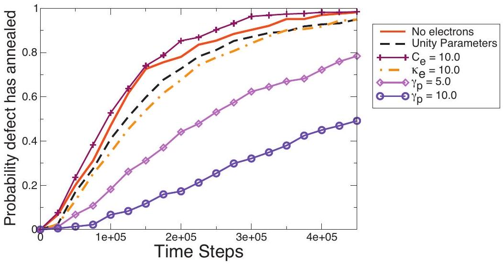
FIG. 1. The cumulative probability of the annealing of a Frenkel defect for a system with no electron gas, a system where $\gamma_{p}, C_{e}$ and $\kappa_{e}$ are 1.0 and systems where $C_{e}$ and $\kappa_{e}$, respectively, have been increased by a factor of 10.0, and systems where $\gamma_{p}$ has been increased by a factor of 5.0 and 10.0.

have a velocity distribution indistinguishable from any other atom in the system. As the electronic subsystem can only communicate thermal energy, the electronic subsystem does not interact directly with the Frenkel defect.

However, for large values of the $\gamma_{p}$ coupling parameter, the electronic subsystem affects the ability of the interstitial to diffuse. In a cold lattice, the interstitial cannot diffuse to another site until the lattice locally experiences an energy fluctuation. ${ }^{21}$ If $\gamma_{p}$ is high (e.g., 10.0) the electronic subsystem is so tightly coupled to the atoms that it dampens the local energy fluctuations in the lattice necessary for the interstitial to jump between interstitial sites. This phenomenon can also be observed using an infinite reservoir Langevin thermostat. If the damping parameter is set to $0.01 \tau$, the motion of the interstitial atom is effectively arrested.

We conclude that the annealing of a Frenkel defect is generally indifferent to the electronic subsystem, but, at least for a sufficiently cold lattice, can be retarded by a tightly coupled electronic subsystem that dampens local energy fluctuations.

## 1. Necessity of energy conserving model

The annealing of a Frenkel defect in a LJ fcc crystal is an example of a system that cannot be studied without using the energy-conserving inhomogeneous finite heat-reservoir TTM-MD model. The diffusion of an interstitial through the crystalline lattice is very sensitive to the temperature of the system, so even small fluctuations in the temperature of the system can affect the results. For a 500 atom system, without thermal pinning, temperature fluctuations can become quite large. Also, in a cold system, an interstitial and vacancy separated by more than a unit cell require significant time to anneal. For this system size (as long as $\gamma_{p}$ is small) Frenkel defects usually anneal within half a million time steps. Without the energy-conservation correction, we observed that the temperature of the system could rise as high as $T^{*}=3.5$, melting the lattice.

## IV. RADIATION DAMAGE IN A LENNARD-JONES FCC CRYSTALLINE MATERIAL

## A. Model

Using the LAMMPS code, ${ }^{19}$ a simulation cell containing $17 \times 17 \times 17$ unit cells of a LJ fcc crystal ( 19562 atoms) was
initialized at a number density $\rho^{*}=(N / V) \sigma^{3}=1.0107$. The LJ atoms were of mass $=1.0$ and have interaction parameters $\epsilon =1.0$ and $\sigma=1.0$. At this number density, the LJ atoms are solid up to a temperature of $T^{*}=1.0$ and fully liquid at $T^{*} =1.531$ per the LJ fcc phase diagram of van der Hoef. ${ }^{20}$ The system was equilibrated to $T^{*}=k_{B} T / \epsilon=0.1$ as a canonical ensemble, using a time step of $0.003 \tau$, where $\tau$ is the LJ reduced time $\left(m \sigma^{2} / \epsilon\right)^{0.5}$. A Langevin thermostat was used with a coupling parameter $\gamma=m / D$, where $D$ is a damping parameter set to $0.1 \tau$. Next, for 1000 time steps, heat was pumped into a spherical region encompassing 466 atoms at a rate of $3375 \epsilon / \tau$ in LJ units. At the same time, at a distance of $23.3 \sigma$, or 14.7 unit cell lengths, 442 atoms were thermally coupled to an infinite heat reservoir at $T^{*}=0.1$ by a Langevin thermostat with the damping parameter set to $0.1 \tau$. These atoms effectively become a heat sink. After 1000 time steps, the system was still $94 \%$ crystalline (per the definition provided in Sec. IV B), but with a liquid spot at the center of the simulation box at a peak temperature of approximately $T^{*} =3.3$ and a descending thermal gradient to the heat sink at a temperature of approximately $T^{*}=0.2$. This system is depicted in Fig. 2. The heat source was then turned off. An electronic subsystem was then coupled to the system. A coarse grid of $6 \times 6 \times 6$ electronic cells was used, with approximately 90.6 atoms per cell. The electronic temperature of each cell was initialized to the temperature of the atoms in the cell. Over the course of the simulation, the residual heat from the liquid spot flowed to the heat sink until, after a long time, the system has uniformly cooled to $T^{*}=0.1$ and was in a uniform crystalline state.

This system models a local deposition of heat into a crystal due to a radiation damage event and the dissipation of the heat into the infinite volume of the material. The electronic subsystem may very well affect the details of the initial liquid spot and thermal distribution; however, we are primarily interested in how the electronic subsystem impacts the healing of the liquid region, so all of the test simulations were initialized identically.

The test systems considered were as follows. The electron-ion coupling parameter, $\gamma_{p}$, was considered in a range from 0.1 to 10.0. The thermal conductivity of the electronic subsystem, $\kappa_{e}$, was considered in a range from 0.1 to 100.0. The thermal heat capacity, $C_{e}$, of the electronic subsystem was fixed at 1.0 . Although the lammps code includes

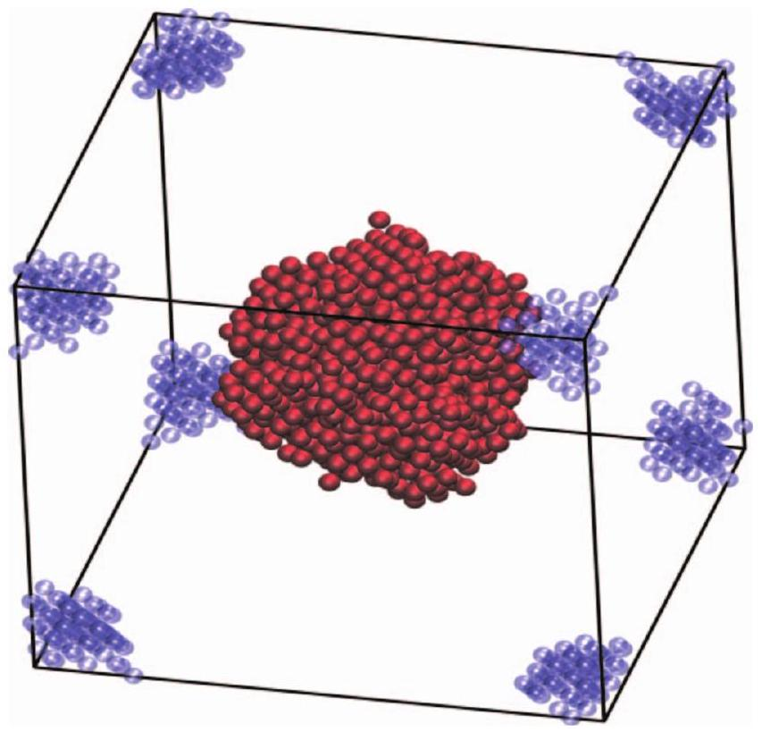
FIG. 2. The initial state of the radiation damage system at $t=0$. The simulation box is the size of a $17 \times 17 \times 17 \mathrm{fcc}$ unit cell system. The liquid spot at the center is initially 1174 atoms large. The 458 atoms that are tightly coupled to an infinite heat reservoir at $T^{*}=0.1$ are shown at the corners of the simulation cell (they form a sphere in periodic space). The 17930 atoms that are neither defect atoms nor heat sink atoms are not shown.

the capability to model the electron stopping effect via a coupling parameter $\gamma_{s}$, this parameter was set to zero for this simulation as the ion velocities involved are low, even in the liquid region. Two bounding cases were considered. In the first no electronic subsystem was coupled to the atomic subsystem, or equivalent to $\gamma_{p}=0$. This case represents the slowest rate at which heat can be transported from this system. In the second bounding case, an infinite thermal reservoir at $T^{*}=0.1$ was coupled to the entire system via a Langevin thermostat with a damping parameter of $0.1 \tau$ in lieu of a regional heat sink. This models a perfect thermal connection to the heat sink and represents the fastest rate at which heat could be transported from the system and is henceforth referred to as the "quench" case. For each case, 20 trajectories were generated by varying the random numbers used to initialize the heat sink and the electronic subsystem. Both of these bounding cases neglect the small amount of energy stored in the initialized electronic subsystem.

## B. Methods

To characterize the effect of the different electronic subsystems coupled to the atomic subsystem, we needed to distinguish between regions of the material that are damaged and regions that are crystalline. We used a local bond order analysis method. ${ }^{22,23}$ This method computes the correlation function of the normalized local bond order parameter $q_{6}$ vectors, or $\alpha_{j}=q_{6}(i) \cdot q_{6}(j)$, for each atom $j$ in the coordination shell of an atom $i$. If more than a fraction $f$ of the atoms in the coordination shell of an atom $i$ are such that $\alpha_{j}$ exceeds a threshold value $\alpha_{\text {thresh }}$, then that atom is designated a crystalline atom. Otherwise the atom may be in a liquid region or may be an interstitial defect, but is generically des-

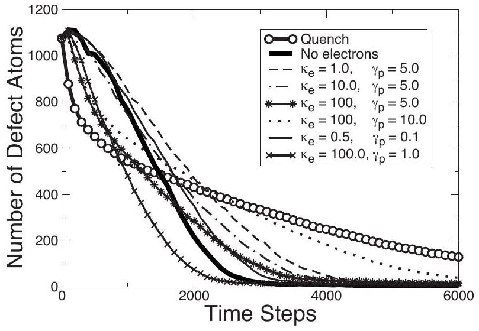
FIG. 3. The annealing of the liquid spot in a LJ fcc crystal is demonstrated for different types of electronic subsystems. High values of thermal conductivity and electron-ion coupling can approach quenching. High values of thermal conductivity and low electron-ion coupling can anneal the system more effectively than no electronic subsystem at all.

ignated a "defect" atom. We define the coordination shell to be all atoms within $1.25 \sigma$ of each atom and use $\alpha_{\text {thresh }}=0.7$ and $f=0.8$. In practice, we found that, in all but the fastest annealing case, the defect atoms remained clustered at the center of the simulation cell in a localized liquid region.

## C. Results

At the conditions tested, a supercooled LJ liquid will readily crystallize and will not retain a long-term amorphous state, especially when in contact with the solid LJ phase. However, how heat is transported from the amorphous region affects the short term and long term persistence of the defects. For example, in our comparison cases, quench and "no electronic subsystem," as seen in Fig. 3, quenching the liquid spot reduces the number of defect atoms in the system rapidly initially, but then causes a long defect persistence. In contrast, without the electronic subsystem and with only the distant heat sink, the system anneals more slowly initially, but, once the system is locally cool enough to crystallize, slower cooling leaves residual energy to aid the annealing process. As can be seen in Fig. 3, the test run with no electronic subsystem is almost completely recrystallized after 3000 time steps.

In Fig. 3, we observed that the thermal conductivity, $\kappa_{e}$, of the electronic subsystem and electron-ion coupling, $\gamma_{p}$, can have a complicated interaction in determining the persistence of the liquid spot. As expected, when $\kappa_{e}$ and $\gamma_{p}$ are both large ( $\kappa_{e}=100.0, \gamma_{p}=10.0$ ), the annealing curve approaches that of the quenched system. Naturally, when $\kappa_{e}$ and $\gamma_{p}$ are small, the annealing curve approaches that of the no-electronic subsystem. There is a broad range of interim curves for different parameter combinations, including curves not bound by either the quenched or no-electronic subsystem case.

In Figs. 4 and 5, we consider the influence of thermal conductivity for a fixed electron-ion coupling and the influence of the electron-ion coupling for a fixed thermal conductivity, respectively, on the size of the liquid spot at $t=2500$ time steps. In each figure, the range of defects found in

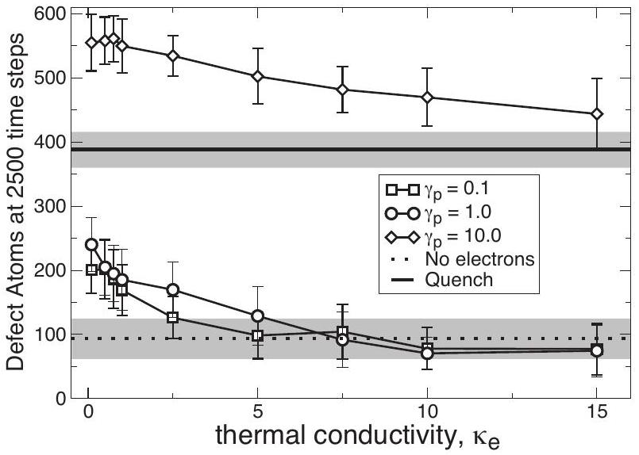
FIG. 4. The influence of increasing the thermal conductivity on the number of defect atoms at $t=2500$ time steps is shown for different values of the electron-ion coupling parameter. For comparison, the ranges of defects (shaded) found for quenching the system or no-electronic subsystem are shown. For low values of $\kappa_{e}$, the system drains heat less effectively so the damaged region is hotter, which moderately increases the number of defects.

quenched and no-electronic subsystem test cases is indicated by a thick band with a solid or dotted line at its center, respectively. In Fig. 5, we observe that increasing $\kappa_{e}$ decreases the liquid spot size. The number of defects can even (in the case of $\left.\gamma_{p}=10.0\right)$ exceed that of the quenched system. The electronic subsystem is initialized at the same temperature as the local atoms. For systems with a low $\kappa_{e}$, the heat of the electronic subsystem must dissipate by flowing first into the atomic subsystem and then diffuse spatially through the lattice. Thus, systems with a low $\kappa_{e}$ are hotter at $t=2500$ time steps and have a larger liquid spot. For a large electron-ion coupling, as $\kappa_{e}$ becomes large, the local temperature of the system and the number of defects present at $t=2500$ time steps approaches the quenched system case.

In Fig. 5, we observe that, for $\gamma_{p}>1$, the size of the liquid spot increases at $t=2500$ time steps as $\gamma_{p}$ increases. For systems where $\gamma_{p}$ is approximately 5 or greater, the temperature of the electronic subsystem stays tightly coupled to

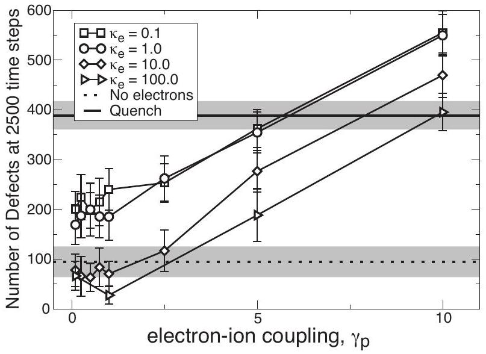
FIG. 5. The influence of increasing the electron-ion coupling parameter on the number of defect atoms at $t=2500$ time steps is shown for different values of the thermal conductivity. For comparison the ranges of defects (shaded) found for quenching the system or no-electronic subsystem are shown.

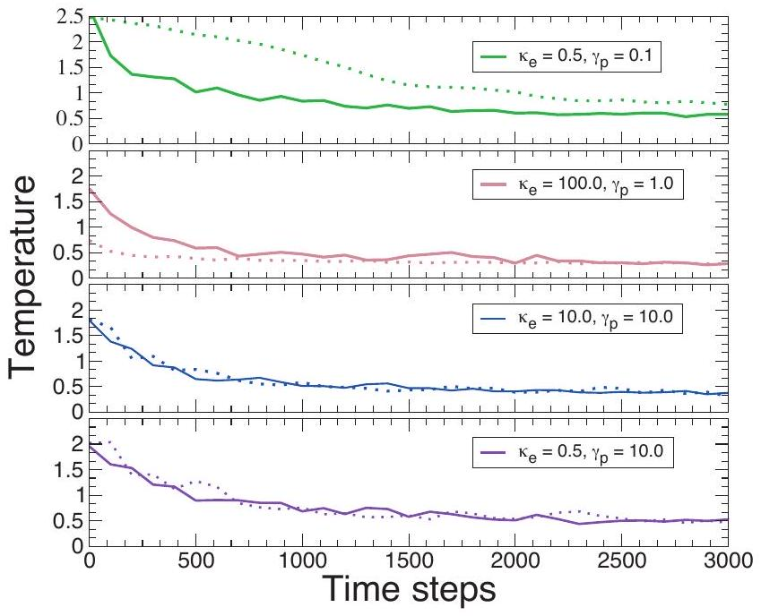
FIG. 6. The temperature of the atomic (solid line) and electronic system (dotted line) of a grid cell in the center of the liquid spot is shown over the time. The electronic temperature was initialized to the atomic temperature at $t=0$. When $\gamma_{p}$ is 10.0 , it can be seen that the temperatures of the two systems stay closely coupled together. When $\gamma_{p}$ is low, there is a thermal offset between the two systems and the thermal conductivity of the electronic subsystem, $\kappa_{e}$, determines whether the electronic subsystem is higher or lower than the atomic subsystem temperature until local equilibration.

that of the local atoms. Heat can flow between the subsystems at a rate similar to heat flowing through the lattice, providing many paths for heat to flow from the liquid spot. The phenomena mentioned in Sec. III B, whereby a high $\gamma_{p}$ retards annealing of defects, was found to be an insignificant effect. The local temperature ( $0.35-0.6$ ) was sufficiently high that defect diffusion was not dependent on rare energy fluctuations. At $t=10000$ time steps, when all the systems have approximately the same temperature profile, the correlation coefficient between number of residual defects and $\gamma_{p}$ is only 0.42.

At $\gamma_{p}=1.0$ and for a large $\kappa_{e}$, the system can have fewer defects than the no-electronic subsystem test case. This corresponds to the dotted curve depicted in Fig. 3. In effect, heat is being drained out of the center of the liquid spot and cooling is no longer limited by the transport of heat through surface area of the liquid spot. The intermediate value of $\gamma_{p}=1.0$ provides enough resistance to heat transfer so that defect structures are not quenched into place. This is the only case examined where the liquid region was found to break into a few different subregions when cooling.

In general, if $\gamma_{p}$ is low, then the electronic subsystem has a significant temperature difference from the atomic subsystem during the temperature transient. If $\kappa_{e}$ is high, then the electronic subsystem temperature is colder than the local atoms at the liquid spot and the electronic subsystem acts as a slow local heat drain. If $\kappa_{e}$ is low, then the electronic subsystem is hotter than the local atoms at the liquid spot and provides a slow source of heat, keeping the liquid spot hotter longer. If $\gamma_{p}$ is high, the two systems stay closely coupled in temperature and a high or low value of $\kappa_{e}$ determines whether there is two or only one radial path for the heat to diffuse from the liquid spot. These relationships can be seen in Fig. 6, which shows how the atomic and electronic tem-
peratures in a center cell of the simulation box evolve with time for different electronic subsystem test cases.

## V. RADIATION DAMAGE IN A BINARY GLASSFORMING LENNARD-JONES CRYSTALLINE MATERIAL

The binary LJ mixture is a well-known, well-studied, glass forming simple system ${ }^{24-26}$ used as a comparison model for binary metallic melts such as $\mathrm{Ni}-\mathrm{P},{ }^{25} \mathrm{Al}-\mathrm{Ni},{ }^{27}$ and $\mathrm{Cu}-\mathrm{Zr}$ mixtures. ${ }^{28}$ The binary LJ mixture is composed of $80 \%$ atom $A$ and $20 \%$ atom $B$. Particles interact via a twoatom LJ potential $V_{\alpha \beta}=4 \epsilon_{\alpha \beta}\left[\left(\sigma_{\alpha \beta} / r\right)^{12}-\left(\sigma_{\alpha \beta} / r\right)^{6}\right]$, where $\alpha, \beta \in\{A, B\}$, where $\sigma_{A A}=1.0, \sigma_{A B}=0.8, \sigma_{B B}=0.88, \epsilon_{A A} =1.0, \epsilon_{A B}=1.5$, and $\epsilon_{B B}=0.5$. Initialized from a random disordered configuration, this mixture has never been observed to crystallize within simulation time and is used as a model of a generic glass-forming system. However, studies of the zero temperature binary LJ system ${ }^{24,26}$ determined that there exist crystal forms that are lower in energy than the amorphous form. We propose a binary LJ crystal as a simple model for a material that will amorphize when exposed to radiation damage.

The crystal form of this binary LJ system generally consists of layers of atom $A$ in a fcc crystal phase and layers of atoms $A$ and $B$ in a CsCl crystal phase, where the two phases join at their mutual (001) planes. The (100) planes of the CsCl crystal, normal to the interfacial (001) plane, are rotated with respect to the fcc lattice so that they lie parallel to the (110) planes of the fcc crystal phase. ${ }^{24,26}$ Fernández and Harrowell ${ }^{24}$ identified a low-energy $L[1,1.5]$ structure for a 320 atom supercell, where a unit cell is composed of 1 CsCl unit cell and 1.5 fcc unit cells in a stack. Fernández and Harrowell determined that $L[10,15]$ has a slightly lower energy. Both of these crystal states, at zero temperature, are lower in energy than the amorphous state $(-8.12,-8.20$, and $-7.72 E / N$ for $L[1,1.5], L[10,15]$, and the amorphous state, respectively ${ }^{24,26}$ ). For our model of a material that will amorphize, we chose the $L[1,1.5]$ crystal form. The unit cell of this crystal consists of only ten atoms, shown in Fig. 7(a). Using this crystal form, the initial damage region can be two orders of magnitude larger than the unit cell in a modestly sized simulation. In comparison, the $L[10,15]$ binary LJ crystal form, whose unit cell consists of 100 atoms and has one dimension an order of magnitude longer than the other two, would require a considerably larger initial damage region to ignore the details of the unit cell.

## A. Model

The crystal structure for a binary LJ crystal at $\rho^{*}=1.2$ was obtained from the Cambridge cluster database ${ }^{29}$ using the 320 atom supercell. The units of this system are identical to the standard LJ system, except that dimensions of length are scaled relative to $\sigma_{A}$ rather than $\sigma$.

As we know of no published phase diagram indicating at what temperature the binary LJ crystal melts for different number densities, a constant volume system of 1280 atoms at $\rho^{*}=1.2$ was slowly heated from $T^{*}=0.5$ to 1.5 using a Langevin thermostat (damping parameter $=1.0 \tau$ ) over $10^{7}$ time

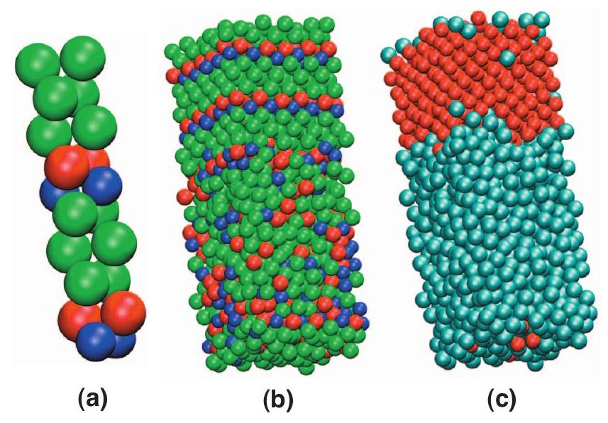
FIG. 7. (a) Two unit cells of the $L[1,1.5]$ system are shown. Species $A$ is colored red in the $A B \mathrm{CsCl}$ phase and green in the $A$ (fcc) phase. Species $B$ is colored blue. One unit cell is rotated $90^{\circ}$ with respect to the other. These two unit cells together represent the smallest translatable unit for this crystal. (b) A two-thirds melted $5 \times 5 \times 6$ crystal of $L[1,1.5]$ binary LJ. (c) Using the method described in Sec. V B, the atoms of (b) have been labeled crystalline (red) or defect (blue).

steps and then cooled again at the same rate. The total energy-per-atom (using a cutoff radius of $r_{c}=2.5 \sigma_{A}$ and a potential shifted to zero at the cutoff) as a function of temperature is shown in Fig. 8. We observe that the crystal-toliquid phase transition for this system occurs at $T^{*} =1.105 \pm 0.005$, a temperature that is within the two-phase region of our model fcc LJ crystal system. The glass-forming binary LJ system did not recrystallize upon cooling.

Given the comparable melting temperatures between the binary LJ crystal and the fcc LJ crystal, the radiation damage simulation was set up using nearly identical parameters. Using the LAMMPS code, ${ }^{19}$ a simulation cell containing $8 \times 16 \times 16$ unit cells of a binary LJ $L[1,1.5]$ system ( 20480 atoms) was initialized at a number density $\rho^{*}=(N / V) \sigma_{A}^{3}=1.2$. The system was equilibrated to $T^{*}=k_{B} T / \epsilon=0.1$ as a canonical ensemble, using a time step of $0.003 \tau$, where $\tau$ is the LJ reduced time $\left(m \sigma_{A}^{2} / \epsilon\right)^{0.5}$. A Langevin thermostat was used

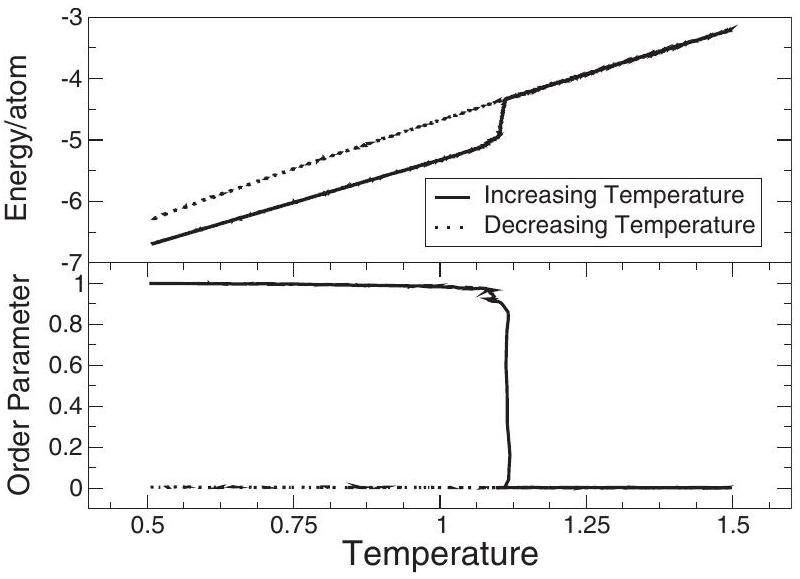
FIG. 8. A system of 1280 binary LJ atoms in an NVT simulation was heated from $T^{*}=0.5$ to 1.5 over $10^{7}$ time steps and then cooled at the same rate. On heating, the system phase transitions at $T^{*}=1.105 \pm 0.005$. On cooling, the system never recrystallizes, but forms a stable glass. The order parameter (number of crystalline atoms/total atoms), which measures the fraction of the system that is ordered, shows this transition as well.

with a damping parameter $=0.1 \tau$. Next, for 1000 time steps, heat was pumped into a spherical region encompassing 446 atoms at a rate of $3375 \epsilon / \tau$ in LJ units. At the same time, at a distance of $22.4 \sigma_{A}, 481$ atoms were thermally coupled to an infinite heat reservoir at $T^{*}=0.1$ by a Langevin thermostat with a damping parameter set to $0.1 \tau$. These atoms effectively become a heat sink. After 1000 time steps, the system was still $94 \%$ crystalline (per the definition provided in Sec. VB ), but with a liquid spot at the center of the simulation box at a peak temperature of approximately $T^{*}=3.5$ and a descending thermal gradient to the heat sink at a temperature of approximately $T^{*}=0.2$. This system is nearly identical in appearance to that shown in Fig. 2. The heat source was then turned off. An electronic subsystem was then coupled to the atomic subsystem. A coarse grid of $6 \times 6 \times 6$ electronic cells was used for approximately 94.8 atoms per cell. The electronic temperature of each cell was initialized to the temperature of the atoms in the cell. Over the course of the simulation, the residual heat from the liquid spot flowed to the heat sink until the system was uniformly cooled to $T^{*}=0.1$. In practice, simulations were terminated at 35000 time steps, before the system was uniformly at $T^{*}=0.1$, as longer runs showed little to no change in the number of defects after this time. For each case, 20 trajectories were generated by varying the random numbers used to initialize the heat sink and the electronic subsystem.

To study the ability of a damaged binary LJ crystal to heal, we also scaled the radius of the heated spherical region by $1 / s$ and the total amount of heat pumped into the region by $1 / s^{3}$, for $s$ in a range from 1.0 to 1.8 . A single test case of $s=0.5$ was also considered. This system was still coupled to a heat sink, but no electronic subsystem was attached. For each case, 20 trajectories were generated by varying the random numbers used to initialize the heat sink.

## B. Methods

In section 4.2, we used a local bond order analysis method ${ }^{22,23}$ to distinguish regions of the LJ fcc material that are damaged from regions that are crystalline. Defect versus crystalline atoms are determined by considering the fraction of local bonds that have correlated normalized local bond order parameter $q_{6}$ vectors. Although our system now contains a few different types of local crystal bonds and two different sized atoms, we found that the parameter set used for the fcc LJ crystal worked just as well for the binary LJ system in distinguishing between crystal and defect/liquid atoms. So we define the coordination shell to be all atoms within $1.25 \sigma$ of each atom and use $\alpha_{\text {thresh }}=0.7$ and $f=0.8$. A crystal/defect atom assessment of a melting binary LJ crystal is shown in Figs. 7(b) and 7(c). In the bottom panel of Fig. 8, we use this analysis to define an order parameter, the fraction of the system composed of crystal atoms, and monitor this parameter while heating the 1280 atoms. As expected, this order parameter and the total-energy-per-atom parameter show a sharp transition at the same temperature and this order parameter never drops below 1.0 upon cooling.

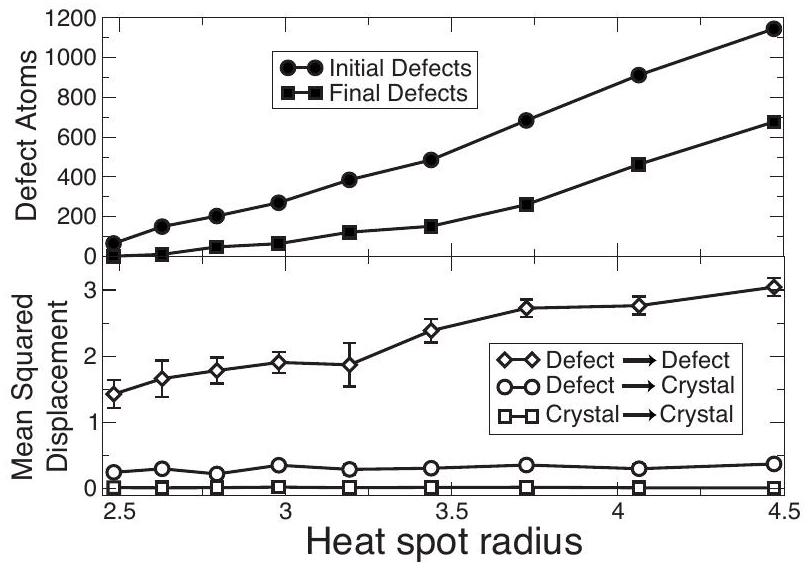
FIG. 9. The amount of initial damage in the binary glass-forming LJ system was increased by increasing the size of the heat spot from $2.48 \sigma_{A}$ to $4.47 \sigma_{A}$ in radii while keeping heat/volume constant. The system was then permitted to equilibrate with no electronic subsystem attached. The top panel shows the initial (at the moment the heat source was turned off) and final (after $10^{5}$ time steps) number of defects in the system. The bottom panel shows the mean squared displacement (from when the heat spot was turned on to 35000 time steps after it was turned off) of three categories of atoms: defect atoms that did not anneal, defect atoms that did anneal, and atoms that were crystalline at both the initial and final time.

## C. Results

Figure 9 shows how increasing the size of the heated spot (while heat/volume is kept constant) increases the size of the damaged region at $t=0$ (heat source turned off). Figure 9 also shows the amount of damage in the binary LJ crystal after 100000 time steps. By 100000 time steps, the damage in the system, as measured by the number of defect atoms, is observed to be steady (e.g., fluctuating by no more than $2.5 \%$ for the case of 676 final defect atoms) and no further annealing occurs. We observed that the binary glass-forming LJ system can sustain permanent damage in response to local heat deposition. We also observed that some healing of the lattice is possible. For example, if less than 150 atoms are initially defect atoms, more than $94 \%$ of the defect atoms anneal. Peak damage does not occur at $t=0$, but shortly thereafter. For a sufficiently large heat deposition, the amount of final damage in the system will even exceed the initial damage in the system. For example, if the radius of the heated spot is doubled, so that there is initially 8431 defect atoms, the final number of defect atoms is $14433 \pm 206$. However, relative to the peak damage (in this case, 14897 defects at $t=11600$ ) some healing still occurs.

In Figs. 10 and 11, the influence of varying the electronion coupling $\gamma_{p}$ and the thermal conductivity $\kappa_{e}$ on the healing of the defect region of the binary LJ crystal is shown. Like the monatomic fcc LJ crystal system, the magnitude of the electron-ion coupling has the most impact on the number of residual defects. In the monatomic fcc LJ crystal, the quench case temporarily arrested defect structures and retained a higher number of residual defects for the latter half of the annealing process. In contrast, in the binary LJ crystal, the quench case retained fewer defects during the entire annealing process. For the binary glass-forming LJ crystal, it is apparent that the faster heat is transported away from the liquid spot, either by increasing $\gamma_{p}$ or $\kappa_{e}$, the smaller the number of permanent defects.

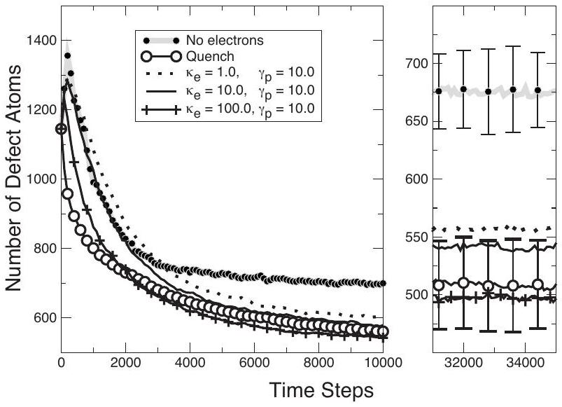
FIG. 10. The left panel shows the influence of increasing the thermal conductivity on the annealing of binary LJ defect atoms, compared to the defects found for quenching the system or no-electronic subsystem for $t$ less than 10000 time steps. The right panel shows the number of defects for $t$ greater than 30000 time steps, when a steady-state of defects was observed. Error bars are included for the no-electronic subsystem and quench cases. Note the change in scale of the $y$-axis.

Atoms in the binary LJ crystal appear to go through a reversible interim state while melting. In this reversible state, the atom has a defect/liquid order parameter, but can still revert to the crystal state. In the top panel of Fig. 9, for example, some fraction of the original damaged material does anneal back to the crystalline state. We consider that the transition from a reversible defect state to an irreversible defect state is directly related to whether the atom has displaced significantly from its original lattice position. In the bottom panel of Fig. 9, we show the mean squared displacements of defect atoms that did not heal, defect atoms that healed, and atoms that started and ended crystalline. On average, defect atoms that heal displace roughly $(1 / 2) \sigma_{A}$, while atoms that do not heal displace at least a lattice position. The average displacement of the defect atoms that heal is invariant to spot size, while the displacement of the defect atoms

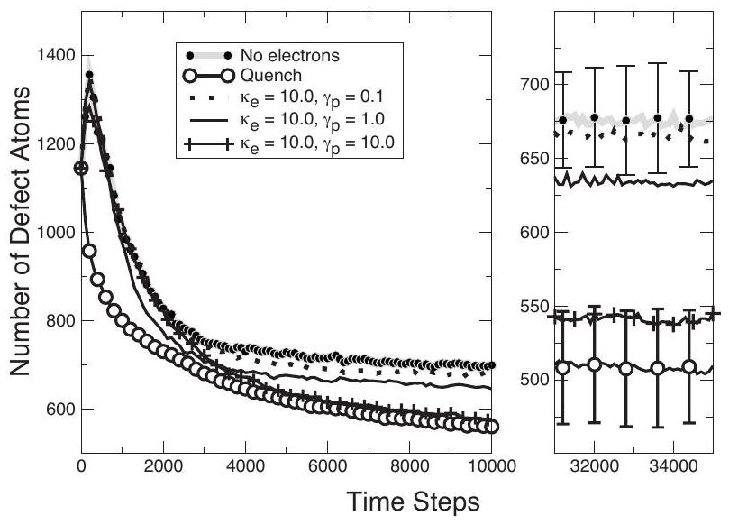
FIG. 11. The left panel shows the influence of increasing the electron-ion coupling $\gamma_{p}$ on the annealing of binary LJ defect atoms, compared to the defects found for quenching the system or no-electronic subsystem for $t$ less than 10000 time steps. The right panel shows the number of defects for $t$ greater than 30000 time steps when a steady-state of defects was observed. Error bars are included for the no-electronic subsystem and quench cases. Note the change in scale of the $y$-axis.

that do not heal increases, as a larger liquid area with a higher peak temperature permits farther diffusions. We conclude that the reversible defect state is associated with breaking the local crystalline ordering and that the irreversible state occurs when the atoms diffuse sufficiently that the original crystalline ordering becomes kinetically inaccessible. Material that has transitioned to the irreversible defect state can no longer recrystallize and forms a local glassy region when cooled. We observe that in a fcc LJ crystal, there is no connection between the amount of local diffusion and the material's ability to anneal. In a fcc LJ crystal, defect atoms that crystallize have a mean squared displacement that linearly increases from $0.2 \sigma^{2}$ to $1.7 \sigma^{2}$ as the heat spot increases from $2.6 \sigma$ to $4.7 \sigma$ in radius. In the binary glassforming LJ system, we hypothesize that the reversible state is not an equilibrium state. If the system permits any diffusion at all, the system becomes irreversibly damaged. However, in a nonequilibrium event such as a local and timelimited heat deposition, the faster heat is removed locally, the smaller the volume of the material that becomes irreversibly damaged. Rapidly removing heat from the material while in the reversible defect state may temporarily arrest defect structures, but this effect is overwhelmed by reducing the net diffusion of the atoms.

## VI. DISCUSSION

Prior TTMs ${ }^{12-14}$ generally assumed an ambienttemperature homogenous and therefore infinite reservoir, electronic bath. As these models were used in studying metals such as $\mathrm{Ni}, \mathrm{Cu}$, and $\alpha-\mathrm{Fe}$, they assumed that electronic thermal conductivity would be sufficiently high that no electronic gradient would be sustained. However, in other types of materials and in different types of energy deposition, this may not be the case. We shall consider what we learned by studying two idealized materials with an inhomogeneous finite TTM.

Using the TTM defined in Sec. II, we studied the influence of an electronic subsystem on the annealing of a Frenkel defect in a cold fcc crystal, a small energy phenomena observed over a half million time steps. We found that the electronic subsystem does not directly interact with the interstitial atom or the vacancy. However, if the electronic subsystem is coupled tightly to the atomic subsystem ( $\gamma_{p} >1.0$ ), then the electronic system can dampen energy fluctuations in the lattice and retard the annealing of the Frenkel defect. This effect, however, is limited to systems that are cold enough that defect diffusion is dependent upon a local energy fluctuation.

We then used this model to study the annealing of radiation damage in a LJ fcc crystal that heals completely when damaged. The primary function of the electronic subsystem is to provide a second path for the heat at the damaged site to diffuse to the heat sink. The electronic subsystem also adds a small reservoir of additional energy to the damaged system. The thermal conductivity and electron-ion coupling were explored over a range of three and two orders of magnitude, respectively. The interaction of the two parameters had a significant impact on the presence of residual defects up to

6000 time steps after the heat source was removed. A high thermal conductivity matched with a high electron-ion coupling can effectively quench the system, raising the level of persistent defects. Matched with a moderate electron-ion coupling, a high thermal conductivity provides the most efficient annealing of the damaged material.

We then investigated radiation damage in a binary glassforming LJ crystal that transitions to an amorphous state when damaged. We found that for nonequilibrium events, there is a surprising amount of healing in the material in response to a damage event, but that for sufficient damage, regions of the material become permanently damaged. We have shown that for this material, the addition of an electronic subsystem can affect the amount of permanent damage by about $30 \%$ for strongly coupled, high thermal conductivity electronic subsystems. For this type of damage, we find that increasing the rate of heat removal directly decreases the amount of permanent damage by decreasing the amount of material that transitions from crystal to an irreversibly damaged state.

We have shown that for two idealized materials the addition of an electronic subsystem can affect how damaged material heals by influencing the transport of thermal energy within the system. Prior work has shown that strong coupling between the electronic subsystem and the atomic subsystem can both decrease ${ }^{12,13,16}$ and increase ${ }^{14}$ the residual defects in the system in a cascade simulation in different metals and as a function of the initial energy deposit. For the simple model of a material that heals completely, we can show both increasing and decreasing of residual defects in the short term, depending on the parametrization of the electronic subsystem. For our simple model of a material that sustains permanent defects, we observed a simpler response. A higher heat transfer rate always decreases the quantity of permanent residual defects. In this material, atoms displaced too far become permanent defects. Atoms displaced short distances can heal. We did not, however, study in detail a system where the gross fraction of the initial defects is still in the reversibly damaged state at the end of the radiation event. We hypothesize that, in this case, the heat transfer rate can have a more complicated interaction in determining the permanent residual defects.

## VII. CONCLUSIONS

In this paper we developed an energy-conserving form of the Duffy and Rutherford TTM. This model enables longer simulations or studying small energy phenomena, without introducing nonconserving energy fluctuations and a drift in the total system energy. This model also makes large simulations with thermally pinned boundaries more accurate, by removing the local nonphysical energy fluctuations far from the thermal pinning points that could influence the final results.

In this paper, we studied two idealized materials, a single component LJ crystal that heals and a binary glass-forming LJ crystal that retains permanent damage in response to a
heat deposition event. We considered a broad range of electronic subsystems, varying both electronic thermal conductivity and electron-ion coupling, for each material. We found that the parametrization of the electronic subsystem had a significant impact on the rate of healing and amount of permanent damage. We therefore consider that the electronic subsystem will also influence defect annealing in more complicated metallic and nonmetallic materials that may amorphize locally due to radiation-induced heat deposition. We expect that real materials will qualitatively behave as a mix of the two idealized materials.

## ACKNOWLEDGMENTS

We would like to thank Aaron S. Keys who provided the code for performing the local bond angle analysis. C.L.P. would also like to acknowledge her DOE CSGF funding under DOE Grant No. DE-FG02-97ER25308 and the support of Sandia National Laboratories. Sandia is a multiprogram laboratory operated by Sandia Corporation, a Lockheed Martin Co., for the United States Department of Energy National Nuclear Security Administration under Contract No. DE-AC04-94AL8500.
${ }^{1}$ M. Head-Gordon and J. C. Tully, J. Chem. Phys. 103, 10137 (1995).
${ }^{2}$ Y. Wang and L. Kantorovich, Phys. Rev. B 76, 144304 (2007).
${ }^{3}$ J. K. Chen, D. Y. Tzou, and J. E. Beraun, Int. J. Heat Mass Transfer 49, 307 (2006).
${ }^{4}$ J. K. Chen, J. E. Beraun, L. E. Grimes, and D. Y. Tzou, Int. J. Solids Struct. 39, 3199 (2002).
${ }^{5}$ H. Hakkinen and U. Landman, Phys. Rev. Lett. 71, 1023 (1993).
${ }^{6}$ Z. Lin, L. V. Zhigilei, and V. Celli, Phys. Rev. B 77, 075133 (2008).
${ }^{7}$ L. V. Zhigilei and D. S. Ivanov, Appl. Surf. Sci. 248, 433 (2005).
${ }^{8}$ D. S. Ivanov and L. V. Zhigilei, Phys. Rev. B 68, 064114 (2003).
${ }^{9}$ L. Sandoval and H. M. Urbassek, Phys. Rev. B 79, 144115 (2009).
${ }^{10}$ L. Koči, E. M. Bringa, D. S. Ivanov, J. Hawreliak, J. McNaney, A. Higginbotham, L. V. Zhigilei, A. B. Belonoshko, B. A. Remington, and R. Ahuja, Phys. Rev. B 74, 012101 (2006).
${ }^{11}$ D. S. Ivanov and L. V. Zhigilei, Phys. Rev. Lett. 98, 195701 (2007).
${ }^{12}$ S. Prönnecke, A. Caro, M. Victoria, T. Diaz de la Rubia, and M. W. Guinan, J. Mater. Res. 6, 483 (1991).
${ }^{13}$ M. W. Finnis, P. P. Agnew, and A. J. E. Foreman, Phys. Rev. B 44, 567 (1991).
${ }^{14}$ F. Gao, D. J. Bacon, P. E. J. Flewitt, and T. A. Lewis, Modell. Simul. Mater. Sci. Eng. 6, 543 (1998).
${ }^{15}$ A. Caro and M. Victoria, Phys. Rev. A 40, 2287 (1989).
${ }^{16}$ D. M. Duffy and A. M. Rutherford, J. Phys.: Condens. Matter 19, 016207 (2007).
${ }^{17}$ A. M. Rutherford and D. M. Duffy, J. Phys.: Condens. Matter 19, 496201 (2007).
${ }^{18}$ http://lammps.sandia.gov.
${ }^{19}$ S. Plimpton, J. Comput. Phys. 117, 1 (1995).
${ }^{20}$ M. A. van der Hoef, J. Chem. Phys. 113, 8142 (2000).
${ }^{21}$ L. B. Pedersen, J. W. Martin, and R. M. J. Cotterill, J. Phys. C 5, 3296 (1972).
${ }^{22}$ S. Auer and D. Frenkel, J. Chem. Phys. 120, 3015 (2004).
${ }^{23}$ P. Rein ten Wolde, M. J. Ruiz-Montero, and D. Frenkel, J. Chem. Phys. 104, 9932 (1996).
${ }^{24}$ J. R. Fernández and P. Harrowell, Phys. Rev. E 67, 011403 (2003).
${ }^{25}$ W. Kob and H. C. Andersen, Phys. Rev. E 51, 4626 (1995).
${ }^{26}$ T. F. Middleton, J. Hernández-Rojas, P. N. Mortenson, and D. J. Wales, Phys. Rev. B 64, 184201 (2001).
${ }^{27}$ S. K. Das, J. Horbach, and T. Voigtmann, Phys. Rev. B 78, 064208 (2008).
${ }^{28}$ Y. Q. Cheng, H. W. Sheng, and E. Ma, Phys. Rev. B 78, 014207 (2008).
${ }^{29}$ http://www-wales.ch.cam.ac.uk/CCD.html.

[^0]:    ${ }^{\text {a) }}$ Electronic mail: phillicl@umich.edu.

