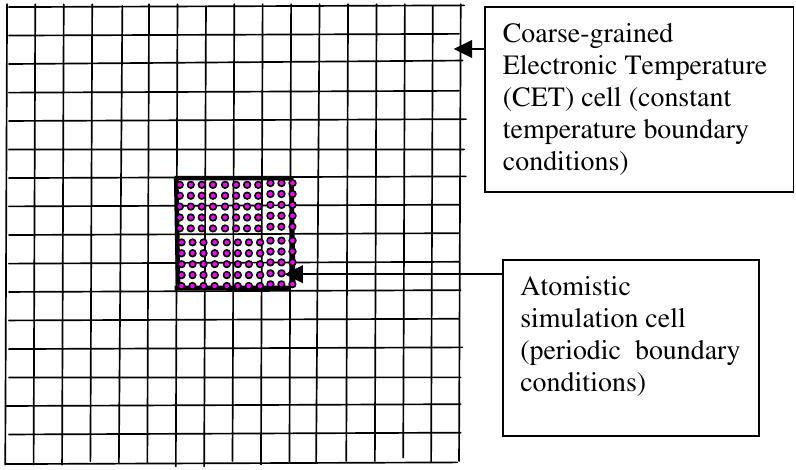
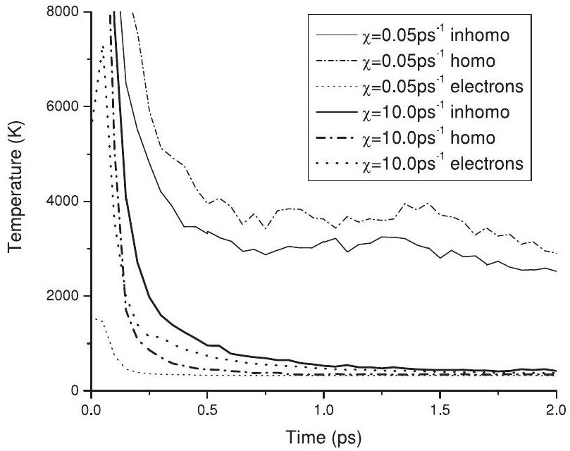
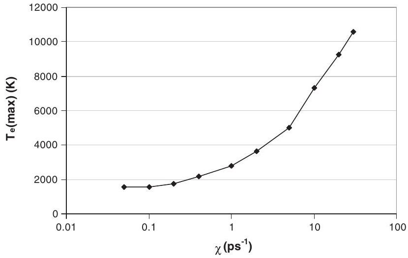
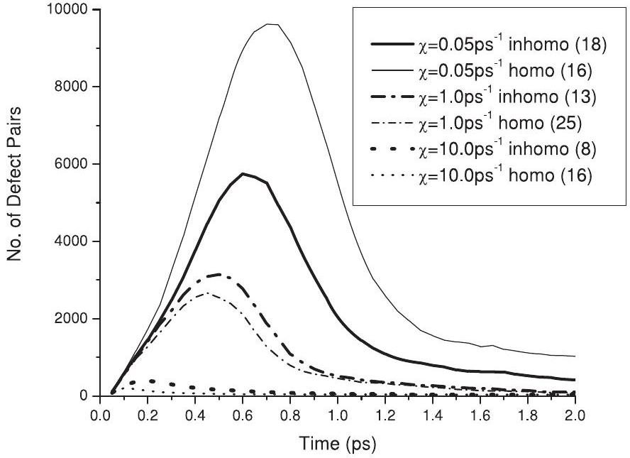
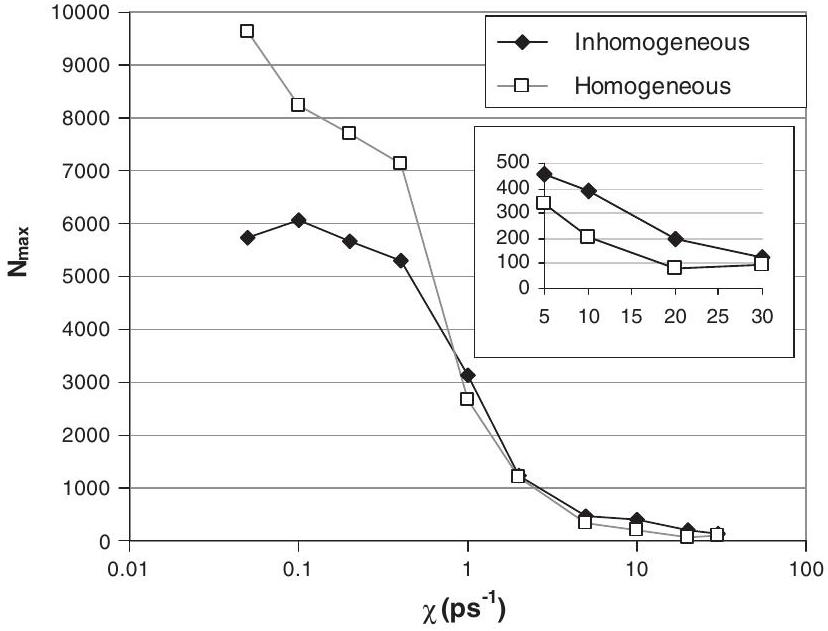
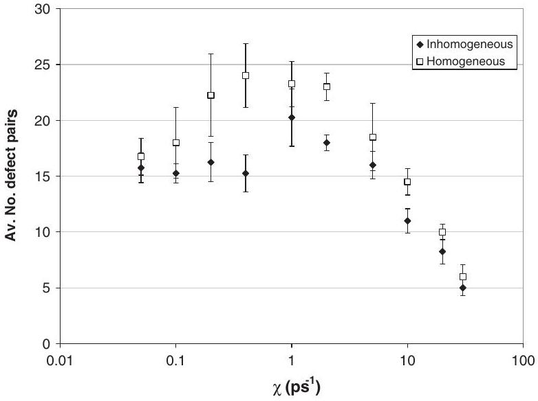

## You may also like

- Studies of the spin diffusion coefficient and the spin stiffness constant for the $t-J$ model on low-dimensional lattices and possible application to doped antiferromagnets
Ranjan Chaudhury
- Strain-mediated ion-ion interaction in rare-earth-doped solids A Louchet-Chauvet and T Chanelière
- In-beam PET monitoring of proton therapy: a method for filtering prompt radiation events
Qiuhui Ma, Zhiyong Yang, Dengyun Mu et al.

# The effect of electron-ion interactions on radiation damage simulations 

A M Rutherford ${ }^{1}$ and D M Duffy ${ }^{1,2}$ ${ }^{1}$ London Centre for Nanotechnology and Department of Physics and Astronomy, University College London, Gower Street, London WC1E 6BT, UK ${ }^{2}$ EURATOM/UKAEA Fusion Association, Culham Science Centre, Oxfordshire OX14 3DB, UK

Received 10 September 2007, in final form 22 October 2007
Published 12 November 2007
Online at stacks.iop.org/JPhysCM/19/496201

#### Abstract

Classical cascade simulations of radiation damage generally neglect the effect of energy exchange between the lattice and the electrons; however electronic effects increase with increasing radiation energy. Indeed, even for low energy radiation events the electrons contribute to heat transport and increase the cooling rate, particularly in materials with strong electron-ion interactions. We use a method described in an earlier publication to include these effects in a series of 10 keV cascades in Fe , for a range of electron-ion interaction strengths. We find a non-monotonic relationship between the number of residual defects and the strength of the electron-ion interactions and we discuss the mechanisms involved.

## 1. Introduction

Cascade simulations have proved very successful in the study of radiation damage; however the approximations involved in describing electronic effects only by empirical interaction potentials become more severe as the radiation energy increases. Fast moving ions lose a significant proportion of their energy to inelastic collisions with electrons and such electronic stopping has been extensively discussed over the last four decades since the pioneering work by Lindhard and Scharff [1]. The excited electrons may act as a heat bath and transport energy to other parts of the lattice [2]. Cold electrons may transport heat away from a hot cascade in materials with strong electron-ion interactions [3]. Jakas and Harrison [4] demonstrated that neglecting inelastic electronic losses significantly overestimates the sputtering yield.

The effects of energy loss due to electronic stopping can be included in molecular dynamics (MD) cascade simulations by introducing a friction term in the equations of motion. Caro and Victoria [5] suggested using a Langevin equation to model the effects of electronion interactions. Preliminary calculations on Cu [6] demonstrated that strong coupling to the lattice decreased the residual damage. Later work by Gao et al [7], based on the methodology developed by Finnis et al [8], found that strong coupling enhanced the number of residual
defects, due to rapid quenching of the disordered configuration. We have recently developed a methodology, based on the Caro and Victoria model, which includes the redistribution of the energy deposited in the electronic system [9]. The MD simulations are coupled to a coarsegrained grid on which the electronic temperature is defined. Energy lost or gained by the lattice is gained or lost by the electronic system and the electronic energy is transported via heat diffusion, modelled by a finite difference solution of the heat diffusion equation on the grid. Thus, energy loss by electronic heat transport is included in the model, at least to the extent that the electron-ion coupling strength is known. The method has parallels with those used to model sputtering [10-12] and ultrafast melting [13].

The methodology is described in detail in our earlier publication [9] where we reported the results of some test simulations. The number of residual defects appeared to decrease with the strength of the electron-ion coupling but the number of simulations was insufficient to draw concrete conclusions. In this paper we report the results of a comprehensive series of 10 keV cascades in Fe, covering a broad range of coupling strengths. The aims are twofold. Firstly we would like to establish if it is necessary to include the effect of energy transport and redistribution to the lattice in the simulations. Previous simulations have assumed that energy lost to the electronic system is rapidly transported from the cascade region and it has, therefore, no effect on the defect evolution. Secondly, we examine the effect of the strength of the electron-ion interactions on the number of residual defects.

## 2. Methodology

Radiation damage is generally modelled using cascade simulations, where one atom, the primary knock-on atom (PKA) is imparted with a high velocity to simulate a radiation event. The excess energy is either trapped within the periodic cell, resulting in a small rise in temperature, or it is removed by a thermostat at the cell boundaries. However, fast moving atoms in solids are known to lose a significant proportion of their energy to inelastic collisions with electrons, resulting in an excited electronic distribution. In addition, cold electrons moving through a hot cascade may absorb energy by electron-ion interactions and contribute to cooling of the cascade. Both these effects can be introduced to MD simulations via a Langevin thermostat, but this does not permit the electrons to feed energy back into the lattice. In our methodology we couple the MD simulation cell to a coarse-grained grid representing the electronic system. Energy lost by the atoms in any cell is gained by the electrons in the corresponding cell, resulting in an increase in the local electronic temperature. Evolution of the electronic temperature is calculated by a finite difference solution of the heat diffusion equation on the grid at each MD step. The cubic electronic temperature simulation cell is extended beyond the atomistic simulation cell, with 100 coarse-grained cells along the cube edge. The electronic temperature is fixed at 300 K at the boundary of this extended cell, which represents the 'rest of the system' and ensures that the electronic energy is transported away from the atomistic simulation cell. The atomistic MD cell is effectively embedded in a bath of electrons. We refer to the subcells of the electronic temperature cell as coarse-grained electronic temperature (CET) cells to distinguish them from the MD simulation cell. A diagrammatic representation of the simulation cells is presented in figure 1. Energy is returned to the lattice from the electronic system via a Langevin thermostat, with the local electronic temperature as the thermostatting temperature.

The time evolution of the lattice is described by standard MD equations with a Langevin thermostat. The velocity ( $\mathbf{v}_{i}$ ) of atom $i$ (mass $m$ ), subjected to a force $\mathbf{F} i$ due to interactions with surrounding atoms, evolves according to a Langevin equation, which is solved numerically

Figure 1. Schematic representation of the simulation cell. The atomistic simulation cell is subdivided into a number of CET cells each of which contains around 320 atoms. The total electronic simulation cell has $10{ }^{6}$ CET cells. A reduced number of cells is shown in the diagram for clarity.

using standard MD techniques.

$$
m \frac{\partial \mathbf{v}_{i}}{\partial t}=\mathbf{F}_{i}(t)-\gamma_{i} \mathbf{v}_{i}+\tilde{\mathbf{F}}(t) .
$$

Here the friction term $\gamma_{i}$ represents energy loss by both electron-ion interactions $\left(\gamma_{\mathrm{p}}\right)$ and electronic stopping $\left(\gamma_{\mathrm{s}}\right)$. Electronic stopping is implemented for atoms with kinetic energy greater than a cut-off $E_{\text {cut }}$, taken to be twice the cohesive energy ( 8.63 eV for Fe) giving a cut-off velocity $v_{0}$ of $54.4 \AA \mathrm{ps}^{-1}$. Thus

$$
\begin{aligned}
& \gamma_{\iota}=\gamma_{\mathrm{p}}+\gamma_{\mathrm{s}} \quad \text { for } v_{i}>v_{0} \\
& \gamma_{\iota}=\gamma_{\mathrm{p}} \quad \text { for } v_{i} \leqslant v_{0} .
\end{aligned}
$$

The magnitude of the random force $\tilde{\mathbf{F}}(t)$ is determined by the local electronic temperature, that is the electronic temperature of the CET cell that atom belongs to. We refer to this as the inhomogeneous Langevin thermostat because the thermostatting temperature has spacial and temporal variation. The evolution of the electronic temperature is described by the heat diffusion equation:

$$
C_{\mathrm{e}} \frac{\partial T_{\mathrm{e}}}{\partial t}=\nabla\left(\kappa_{\mathrm{e}} \nabla T_{\mathrm{e}}\right)-g_{p}\left(T_{\mathrm{e}}-T_{\mathrm{a}}\right)+g_{\mathrm{s}} T_{\mathrm{a}}^{\prime} .
$$

Here $C_{\mathrm{e}}$ and $\kappa_{\mathrm{e}}$ are the electronic specific heat and the electronic thermal conductivity, respectively. $T_{\mathrm{e}}$ is the local electronic temperature, calculated from the energy loss from electronic stopping and electron-ion interactions, and $T_{\mathrm{a}}$ is the effective local atomic temperature, calculated from the average kinetic energy of the atoms belonging to a CET cell. $T_{\mathrm{a}}^{\prime}$ also has dimensions of temperature, but it is related to the kinetic energies of atoms with energies greater than the electronic stopping threshold. The second and third terms on the righthand side of (4) represent energy exchange with the lattice via electron-ion interactions and electronic stopping, respectively. After each MD time step the energy added to, or removed from, each CET cell is determined by these two terms. In [9] we demonstrate that energy loss/gain balance is ensured if

$$
\begin{aligned}
& g_{p}=\frac{3 N k_{\mathrm{B}} \gamma_{p}}{\Delta V m} \\
& g_{\mathrm{s}}=\frac{3 N^{\prime} k_{\mathrm{B}} \gamma_{\mathrm{s}}}{\Delta V m} .
\end{aligned}
$$

Here $\Delta V$ is the volume of the CET cell, $N$ is the number of atoms in the CET cell, $N^{\prime}$ the number of atoms with velocities higher than $E_{\text {cut }}$ and $k_{\mathrm{B}}$ is Boltzmann's constant. The electronic stopping coefficient $\gamma_{\mathrm{s}} / m$ may be obtained directly from the electronic stopping curves of TRIM [14, 15]. The value for Fe is of the order of $1 \mathrm{ps}^{-1}$, therefore we use this value for the current simulations. There is considerable uncertainty in the value of $\gamma_{\mathrm{p}}$. Estimates from the model discussed in [16] give $\chi\left(\chi=\gamma_{\mathrm{p}} / m\right)$ for $\mathrm{Ag}, \mathrm{Cu}, \mathrm{Ni}$ and Fe as $0.05 \mathrm{ps}^{-1}$, $0.03 \mathrm{ps}^{-1}, 1.0 \mathrm{ps}^{-1}$ and $1.5 \mathrm{ps}^{-1}$, respectively. We note that $\chi$ is equivalent to $\tau_{\mathrm{p}}^{-1}$ in [9] and it is directly proportional to the electron-phonon coupling constant. A value of $1.5 \mathrm{ps}^{-1}$ for Fe is equivalent to an electron-phonon coupling strength of $528 \times 10^{16} \mathrm{~W} \mathrm{~m}^{-3} \mathrm{~K}^{-1}$. There have been measurements of the electron-phonon coupling constant for some metals, particularly noble metals, from femtosecond laser experiments and these give respectable agreement with the simple models. Different energy exchange mechanisms may be relevant in the highly disordered core of a cascade and an accurate value for the coupling constant in this regime is not available, therefore we have elected to carry out simulations for a range of coupling strengths from 0.05 to $30 \mathrm{ps}^{-1}$. The upper limit is likely to be well above the physical value but it is included here in order to examine the general trend.

The model has been implemented in the MD code DL_POLY3 [17]. A leapfrog Verlet algorithm, with a variable time step (maximum displacement of $0.027 \AA$ ), was employed. Interstitials, defined as atoms more than $1 \AA$ from a lattice site, and vacancies, defined as lattice sites without atoms within a radius of $1 \AA$, were monitored throughout the simulation. Simulations with PKA energies of 10 keV were performed on a cubic 14 nm cell of Fe (235298 atoms) interacting via the Dudarev-Derlet [18] magnetic potentials. There were 9 CET cells (length 1.56 nm ) along the cube edge of the atomistic simulation cell.

Two sets of simulations, for a range of coupling constants, were performed. One set used the Langevin thermostat and corresponded closely to those carried out in [6]. We refer to this as the homogeneous thermostat, as the thermostatting temperature is set to 300 K everywhere in the simulation cell. These simulations represent rapid electronic energy transport away from the cascade region and they are included to give a comparison with simulations where electronic energy transport and redistribution is explicitly included. The second set included energy transport and redistribution by the electronic system by using the inhomogeneous thermostat developed in [9]. In the inhomogeneous simulations we include an additional friction term for atoms with energies higher than 8.63 eV , to represent electronic stopping. Each simulation was carried out for four distinct PKA directions in order to gather reasonable statistics for the defect numbers. Constant energy ( $N V E$ ) simulations were carried out for comparison.

## 3. Results and discussion

The atomic and electronic temperatures of the CET cells were monitored during the simulations and the time evolution of the maximum values are plotted for strong ( $10 \mathrm{ps}^{-1}$ ) and weak ( $0.05 \mathrm{ps}^{-1}$ ) coupling strengths in figure 2. There is a strong dependence of the cooling rate on the coupling strength, with energy being rapidly removed from the cascade in the strong coupling case. The electronic temperature evolution has three phases, a heating phase lasting a few tens of femtoseconds, a rapid decay dominated by electronic diffusion (a few hundred femtoseconds) and a slow decay in which there is significant energy exchange between the lattice and the electrons. Similar behaviour was noted for ion track simulations, in which the energy was initially deposited in the electronic system [19]. The relative atomic temperatures resulting from the inhomogeneous and homogeneous thermostats are different for strong and weak coupling. For weak coupling the atomic temperature is lower for the inhomogeneous

Figure 2. Time evolution of the maximum atomic temperature (solid lines for inhomogeneous thermostat, broken lines for homogeneous thermostat) and electronic temperature (dotted lines) for ((11 0) PKA direction) simulations with 2 coupling strengths. Thin lines represent results for weak coupling ( $\chi=0.05 \mathrm{ps}^{-1}$ ) and thick lines represent strong coupling ( $\chi=10 \mathrm{ps}^{-1}$ ).

Figure 3. The maximum electronic temperature ( $T_{\mathrm{e}}(\max )$ ) for the ( 110 ) PKA cascades for a range of coupling strengths.

thermostat, due to the extra electronic damping included for atoms moving faster than the electronic stopping cut-off. The trend is reversed, however, for strong coupling, with the inhomogeneous simulation having a higher temperature than the homogeneous simulation. This implies that thermostatting with the high electronic temperatures more than compensates for the electron stopping damping and results in slower cooling of the lattice. There is a large difference between the electronic and the atomic temperatures in the weak coupling case, as energy transfer is slow, but in the strong coupling case the electronic and atomic temperatures correlate closely.

The maximum electronic temperature reached for the inhomogeneous thermostat (( 110 l 1 ) PKA direction) simulations is plotted against coupling strength in figure 3. High electronic temperatures are found for high coupling strengths, so even these low energy cascades would

Figure 4. Time evolution of the number of defects (thick lines, inhomogeneous thermostat; thin lines homogeneous thermostat) for the first 2 ps of (( 110 ) PKA direction) simulations with 3 coupling strengths. Solid lines represent results for weak coupling $\left(\chi=0.05 \mathrm{ps}^{-1}\right)$ broken lines, intermediate coupling $\left(\chi=1.0 \mathrm{ps}^{-1}\right)$ and dotted lines, strong coupling $\chi=10 \mathrm{ps}^{-1}$ ). The numbers in brackets in the legend signify the number of stable defects at the end of the simulation.

result in highly excited electronic distributions. High electronic temperatures would also be expected from high PKA energies with lower coupling strengths.

The evolution of the number of defect pairs with simulation time is plotted for three coupling strengths in figure 4. The quenching of the thermal spike for high coupling constants, due to the rapid removal of energy from the cascade, is apparent. The relative numbers for the inhomogeneous and homogeneous thermostats depend on coupling strength. For weak coupling the inhomogeneous thermostat gives a lower number of peak defects (a larger thermal spike) due to the additional damping term for electronic stopping. For weak and intermediate coupling the trend is reversed, with the inhomogeneous thermostat creating a higher number of defects. There is additional damping for these simulations also, but in this case the thermostatting temperature is significantly higher than in the homogeneous case, due to the high electronic temperature, and this makes an additional contribution to the disorder. The number of stable defects at the end of the simulation (when the lattice temperature has reached 300 K ) is included in the legend in figure 4. We note that, for the strong and intermediate coupling cases the peak number of defects is higher for the inhomogeneous thermostat but the final defect number is lower. This effect is due to the slower cooling caused by the high electronic temperature, which enhances defect annealing.

The variation in the effective size of the thermal spike with coupling strength is demonstrated by the plot of the maximum number of defect pairs created in each (110) PKA simulation in figure 5. The number decreases as the coupling strength increases, as energy is rapidly removed from the cascade before the full thermal spike is formed. The number of defects for the inhomogeneous thermostat is smaller than the number for the homogeneous thermostat for low coupling; the additional electronic stopping friction included for the inhomogeneous case reduces the thermal spike. The situation is reversed, however, for strong coupling, as in this case the inhomogeneous simulations have more defects (larger thermal spikes). Thus, in spite of the additional damping term, the higher electronic temperature used to thermostat the lattice results in a larger molten zone.

Figure 5. Maximum number of defect pairs formed by inhomogeneous (diamonds) and homogeneous (open squares) thermostats, for a range of coupling strengths. The inset shows the values for the highest coupling strengths on an expanded scale.

Figure 6. Average number of stable defect pairs formed by inhomogeneous (diamonds) and homogeneous (open squares) thermostats, for a range of coupling strengths. The error bars represent the standard errors.

Cascade simulations are used to evaluate the number of stable defect pairs ( $N_{\text {def }}$ ) created by a radiation event, therefore the effect of including the electron-ion interactions on this parameter has particular significance. The average number of stable defect pairs created in the simulations with four distinct PKA directions was determined and compared with NVE simulations, which neglect electron-ion interaction. Stable defects are defined as vacancies/interstitials that are separated by more than half a lattice spacing from the nearest interstitial/vacancy, therefore a dumb-bell interstitial is counted as one interstitial. The mean values of $N_{\text {def }}$ for both the homogeneous and the inhomogeneous Langevin thermostat simulations are plotted against the coupling strength in figure 6. The error bars represent the standard errors of the results for the four independent simulations.

We note that both sets of simulations display a similar non-monotonic trend. Consider first the homogeneous thermostat. We find that high coupling strength results in low numbers of residual defects, caused by energy being rapidly removed from the atoms, by coupling to the cold electrons, in the early stage of the cascade. Thus, the formation of the full thermal spike is quenched. For intermediate coupling strength the number of defects is more than the number expected from NVE simulations. In this case a full thermal spike forms, but the coupling to the lattice increases the cooling rate and quenches in a higher number of defects. A similar enhancement of residual defects was observed in [7]. The mean number of defects tends towards the value for the $N V E$ simulations $(15.5 \pm 1.5)$ for very low coupling strengths. The inhomogeneous Langevin thermostat simulations show a similar trend to the homogeneous simulations but they have lower numbers of residual defects for all coupling strengths. The lower defect numbers are caused by a combination of the additional electronic stopping term, which reduces the thermal spike, and the high thermostatting temperature, which results in enhanced defect annealing.

## 4. Conclusions

We have carried out a comprehensive series of 10 keV cascade simulations in Fe , with the aim of investigating both the effect of the strength of the electron-ion interactions and the effect of energy feedback from the electronic system to the lattice. We find a non-monotonic trend in the relationship between the coupling strength and the residual numbers. For high coupling strengths the number of defects is lower than in the corresponding NVE simulations because the high energy loss to the electrons damps the cascade and reduces the size of the thermal spike (molten region). Consequently the number of residual defects is reduced. For intermediate coupling strengths the number of defects is increased by rapid quenching of the thermal spike. Energy transfer from the lattice to the electrons increases the cooling rate and more defects are quenched in. For low coupling strengths the defect numbers tend towards the value for constant energy simulations. Including electronic stopping reduces the residual defect numbers by introducing an additional damping term.

The inhomogeneous thermostat includes the effect of electronic energy transport and redistribution to the lattice, which is generally ignored in cascade simulations. We find that energy losses due to electronic stopping and electron-ion interactions result in a significant rise in electronic temperature, which decreases to a few hundred kelvins within a picosecond. Thermostatting the cascade with the elevated electronic temperature, rather than a constant temperature ( 300 K ) as in the homogeneous Langevin thermostat, has two effects. It increases the extent of the thermal spike, as shown by the increase in the maximum number of defects, and it decreases the cooling rate of the spike, which results in enhanced defect annealing. These effects will be even more significant for high energy cascades, where high electronic temperatures are expected.

Thus we conclude that the main effect of including electronic energy transport and redistribution in cascade simulations is reduced defect numbers due to enhanced annealing. In addition we demonstrate that materials with strong electron-ion interactions should display enhanced radiation resistance.

## Acknowledgments

This work was supported by the United Kingdom Engineering and Sciences Research Council and the European Communities under the contract of Association between EURATOM and

UKAEA. Computer resources on HPC $x$ were provided via our membership of the UK's HPC Materials Chemistry Consortium and funded by EPSRC (portfolio grant EP/D504872). We would like to thank Professor Marshall Stoneham and Sascha Khakshouri for helpful discussions.

## References

[1] Lindhard J and Scharff M 1953 Mat. Fys. Medd. Kgl. Dan. Vidensk. Selsk. 2715
[2] Stoneham A M 1990 Nucl. Instrum. Methods B 48389
[3] Flynn C P and Averback R S 1988 Phys. Rev. B 387118
[4] Jakas M M and Harrison D E 1985 Phys. Rev. B 322752
[5] Caro A and Victoria M 1989 Phys. Rev. A 402287
[6] Pronnecke S, Caro A, Victoria M, de la Rubia T D and Guinan M W 1991 J. Mater. Res. 6483
[7] Gao F, Bacon D J, Flewitt P E J and Lewis T A 1998 Modelling Simul. Mater. Sci. Eng. 6543
[8] Finnis M W, Agnew P and Foreman A J E 1991 Phys. Rev. B 44567
[9] Duffy D M and Rutherford A M 2007 J. Phys.: Condens. Matter 19016207
[10] Duvenbeck A, Sroubek F, Sroubek Z and Wucher A 2004 Nucl. Instrum. Methods B 225464
[11] Duvenbeck A, Sroubek Z and Wucher A 2005 Nucl. Instrum. Methods B 228325
[12] Duvenbeck A and Wucher A 2005 Phys. Rev. B 72165408
[13] Ivanov D S and Zhigilei L V 2007 Phys. Rev. Lett. 98195701
[14] Ziegler Z F, Biersack J P and Littmark U 1985 The Stopping Range of Ions in Solids (New York: Pergamon)
[15] Ziegler J F The Stopping of Ions in Solids http://www.SRIM.org
[16] Wang Z G, Dufour C, Paumier E and Toulemonde M 1994 J. Phys.: Condens. Matter 66733
[17] Smith W and Forester T 1996 J. Mol. Graph. 14135
[18] Dudarev S L and Derlet P M 2005 J. Phys.: Condens. Matter 177097
[19] Duffy D M, Itoh N, Rutherford A M and Stoneham A M 2007 Phys. Rev. Lett. submitted

