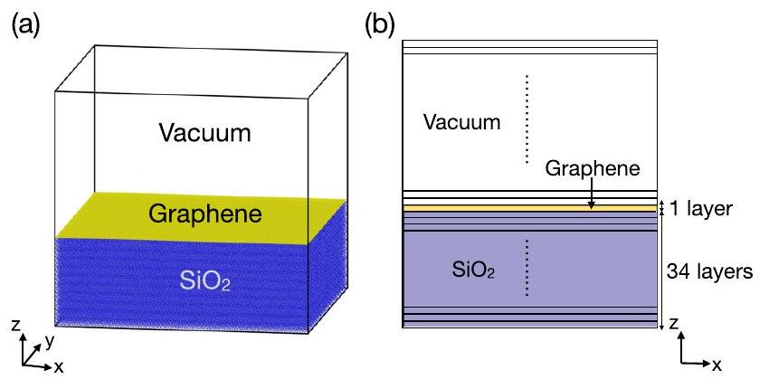
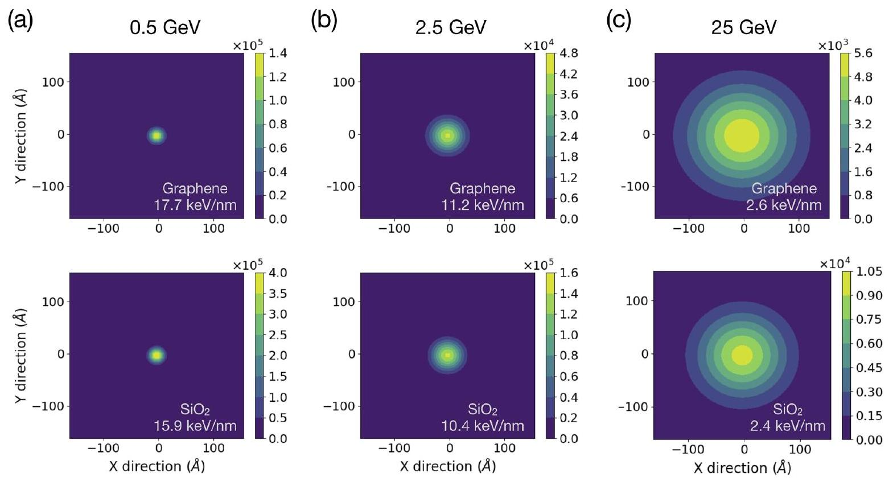
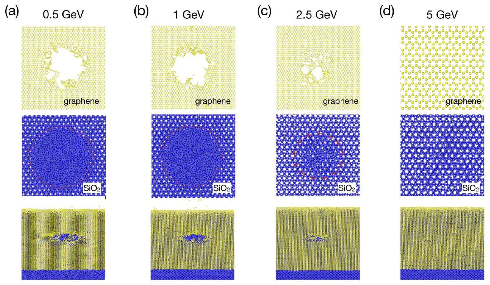
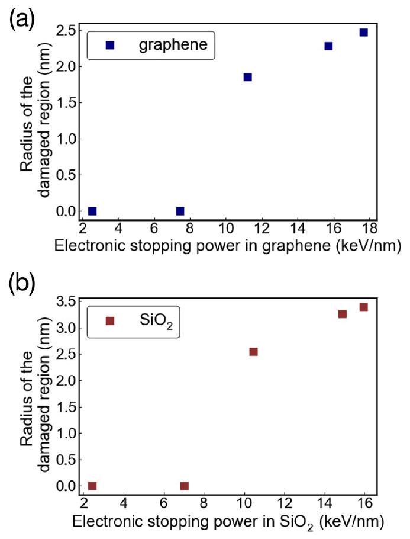
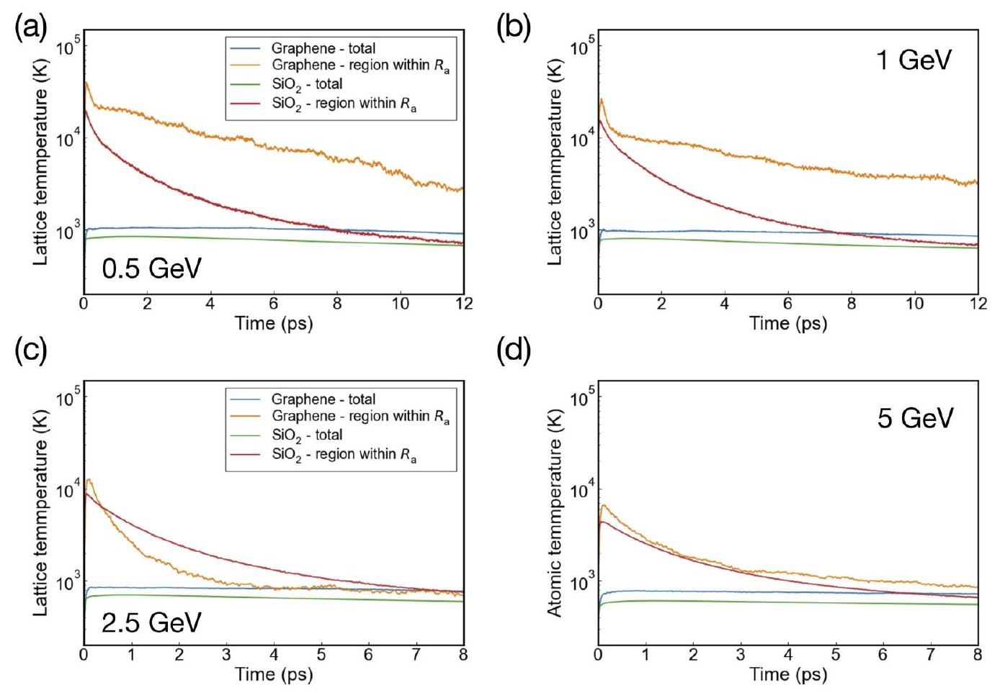

# Modeling swift heavy ion irradiation of substrate-supported two-dimensional material via two-temperature molecular dynamics simulations 

Tan Shi (D); Xiqiang Xu (D); Hao Wan (D); Pei Jia (D); Ping Zhang (D); Huan He (D); Rui Gao; Chenyang Lu ( )

AIP Advances 14, 085322 (2024)
https://doi.org/10.1063/5.0227721

View Online

## Articles You May Be Interested In

Pore formation in $\mathrm{MoS}_{2}$ monolayer under irradiation by swift heavy ions: A molecular dynamics study
J. Appl. Phys. (September 2022)

Response of ZrC to swift heavy ion irradiation
J. Appl. Phys. (November 2023)

Fermi level shifting of tungsten disulfide $\left(\mathrm{WS}_{2}\right)$ nanosheets by swift heavy ion irradiation
AIP Conf. Proc. (November 2020)

## Special Topics Open for Submissions

# Modeling swift heavy ion irradiation of substrate-supported two-dimensional material via two-temperature molecular dynamics simulations 

Published Online: 20 August 2024

Tan Shi, ${ }^{1}$ (D) Xiqiang Xu, ${ }^{1}$ (D) Hao Wan, ${ }^{2}$ (D) Pei Jia, ${ }^{3}$ (D) Ping Zhang, ${ }^{1}$ (D) Huan He, ${ }^{1}$ (D) Rui Gao, ${ }^{1}$ and Chenyang $\mathbf{L u}^{1,4, \text { a) (D) }}$ AFFILIATIONS ${ }^{1}$ School of Nuclear Science and Technology, Xi'an Jiaotong University, Xi'an 710049, China ${ }^{2}$ School of Mechanical and Electrical Engineering, Taizhou University, Taizhou 225300, China ${ }^{3}$ Testing Center Division, the 58th Research Institute of China Electronics Technology Group Corporation, Wuxi 210000, China ${ }^{4}$ State Key Laboratory of Multiphase Flow in Power Engineering, Xi'an Jiaotong University, Xi'an 710049, China ${ }^{\text {a) }}$ Author to whom correspondence should be addressed: chenylu@xjtu.edu.cn

#### Abstract

This study employs two-temperature molecular dynamics simulations to investigate swift heavy ion irradiation of $\mathrm{SiO}_{2}$ substrate-supported two-dimensional material graphene. Material-dependent electronic and thermal properties are integrated into each region to model the energy transfer between the electronic and atomic subsystems of the studied materials. Simulations of interactions with Xe heavy ions are performed with ion kinetic energies ranging from 0.5 to 25 GeV with electronic stopping powers from $\sim 2.6$ to $17.7 \mathrm{keV} / \mathrm{nm}$. With the studied ion energy range, nanopores with a diameter of up to 5 nm can be formed in graphene due to the thermally driven sputtering effect, while amorphization occurs along the ion track in the $\mathrm{SiO}_{2}$ substrate. The coupling between the substrate and two-dimensional material significantly impacts the structural change due to heat transfer and atomic interactions among different layers of materials. The method applied in this work provides a valuable tool for modeling and understanding the structural modifications induced by ion irradiation in layered structures.

© 2024 Author(s). All article content, except where otherwise noted, is licensed under a Creative Commons Attribution (CC BY) license (https://creativecommons.org/licenses/by/4.0/). https://doi.org/10.1063/5.0227721

## I. INTRODUCTION

Material interactions with swift heavy ions (SHI) have been extensively studied, driven by applications in ion modification techniques ${ }^{1-3}$ and irradiation damage assessments. ${ }^{4-6}$ To investigate these processes, two-temperature molecular dynamics (2T-MD) simulations offer an effective method for studying structural changes at the atomic scale. ${ }^{7-9}$ In interactions involving heavy ions with high kinetic energies, energy is primarily deposited into the system through electron scattering. This energy deposition results in electron thermalization, yielding an initial electronic temperature ( $T_{e}$ ) that is not in equilibrium with the lattice temperature ( $T_{1}$ ). The subsequent material structural evolution depends heavily on the heat diffusion within the electronic and atomic subsystems, as well as the heat transfer between these subsystems. The two-temperature model
can be described by the following coupled thermal diffusion equations between the electronic subsystem (denoted with subscript $e$ ) and lattice subsystem (denoted with subscript $l$ ): ${ }^{7}$

$$
\begin{gathered}
C_{\mathrm{e}} \frac{\partial T_{\mathrm{e}}}{\partial t}=\nabla \kappa_{\mathrm{e}} \nabla T_{\mathrm{e}}-g_{\mathrm{p}}\left(T_{\mathrm{e}}-T_{1}\right)+A \\
C_{\mathrm{l}} \frac{\partial T_{\mathrm{l}}}{\partial t}=\nabla \kappa_{\mathrm{a}} \nabla T_{1}+g_{\mathrm{p}}\left(T_{\mathrm{e}}-T_{1}\right)
\end{gathered}
$$

where $C$ is the heat capacity, $\kappa$ is the thermal conductivity, $g_{\mathrm{p}}$ is the electron-phonon coupling constant, and $A$ is the source term originating from the SHI energy deposition. Here, $T_{\mathrm{e}}, T_{\mathrm{l}}$, and $A$ are space and time-dependent, and the thermal properties are also a function of temperature.

The 2T-MD simulations have been widely used to study the ion interaction mechanisms with various materials, including $\mathrm{SiO}_{2}$, ${ }^{10,11} \mathrm{SiC},{ }^{6,12} \mathrm{Si},{ }^{13} \mathrm{U}-\mathrm{Mo}$ alloy, ${ }^{14}$ etc. In the study of amorphous and $\alpha$-quartz $\mathrm{SiO}_{2}$, results from 2T-MD simulations have shown consistent ion track radii with experimental results from small-angle x-ray scattering (SAXS). ${ }^{10,11}$ For electronic stopping powers from 7.2 to 18 $\mathrm{keV} / \mathrm{nm}$, the simulated total track radii in amorphous $\mathrm{SiO}_{2}$, based on the inelastic thermal spike model, showed quantitative agreement with the radial density variations in the SAXS measurement for Au and Xe ion irradiation over an energy range from 27 MeV to $1.43 \mathrm{GeV} .{ }^{10}$ In addition, temperature-dependent thermal properties were used to model the SHI-induced damage in $\alpha$-quartz, aiding in explaining the differences in the damage volume probed by SAXS and Rutherford backscattering experiments. ${ }^{11}$ In the studies of SiC, 2T-MD simulations have been employed to elucidate SHI-induced defect generation and annealing. ${ }^{6,15}$ Significant recovery of point defects and disordered structures could be achieved by SHI irradiation in SiC. ${ }^{15}$ In addition, the evolution of the lattice temperature has been shown to depend heavily on the employed thermal properties. ${ }^{6}$ In the study of SHI interactions with Si, it has been shown that employing a temperature-dependent specific heat model yields a smaller ion track radius compared to results from the free electron gas model, leading to better agreement with experimental observations. ${ }^{13}$ Compared to conventional MD simulations, the inclusion of electronic energy diffusion and transfer in the 2T-MD model provides a more accurate description of the atomic temperature evolution and damage structure formation.

Two-dimensional (2D) materials have received significant attention due to their outstanding physical and electronic properties. ${ }^{16,17}$ Extensive studies have been conducted on ion interactions with two-dimensional materials for defect engineering and applications in space environments. ${ }^{18-24}$ However, the damage mechanisms of 2D materials when exposed to SHI irradiation remain to be elucidated. ${ }^{25}$ 2T-MD simulations have been employed to study the nanopore formation in suspended graphene. ${ }^{26}$ However, in actual irradiation scenarios, 2D materials are typically supported by substrates, which can lead to significant differences in energy dissipation and atomic interactions. Modeling of substratesupported graphene has been performed by Zhao and Xue. ${ }^{27}$ In this study, the two-temperature model is applied independently of the MD simulations, which investigate the process after atoms gain energy from the electronic subsystem.

In order to understand the SHI interactions with 2D materials, 2T-MD simulations are performed in this work for a layered structure consisting of $\mathrm{SiO}_{2}$-supported graphene. The 2T-MD module implemented in the LAMMPS code is utilized and modified to model this layered structure. ${ }^{28,29}$ Material-dependent electronic and thermal properties are employed to study energy transfer between the substrate and the graphene layer. The nanopore formation in graphene and amorphization in $\mathrm{SiO}_{2}$ are studied for Xe ion energies ranging from 0.5 to 25 GeV .

## II. METHOD

The 2T-MD simulations are performed with the MD code LAMMPS. ${ }^{30}$ The simulated structure is presented in Fig. 1(a). The dimensions of the simulation box are $32.46 \times 32.28 \times 30.19 \mathrm{~nm}^{3}$. The substrate consists of 11.24 nm -thick $\alpha$-quartz, on top of which

FIG. 1. (a) Simulation setup of monolayer graphene on the $\mathrm{SiO}_{2}$ substrate. (b) Schematic representation of the grid partition in the $z$-direction in the electronic subsystem (not to scale).

a monolayer of graphene is placed. Above the graphene layer, an 18.61 nm -thick vacuum region is defined. Periodic boundary conditions are imposed on all three dimensions, as imposed by the 2T-MD module in LAMMPS. ${ }^{28,29}$ However, the graphene layer remains isolated at the edges of the simulation box to prevent initial strain. The thickness of the vacuum region is sufficient to minimize the interactions between sputtered atoms and the bottom of the substrate.

The interactions between Si and O are described by the Tersoff potential. ${ }^{31}$ This potential has been used previously to perform two-temperature modeling of $\mathrm{SiO}_{2}$ and yielded consistent results with experimental observations on ion track radii. ${ }^{11}$ In this work, in order to accurately describe the short-range interactions among Si and O atoms, this potential is smoothly connected with the Ziegler-Biersack-Littmark (ZBL) potential ${ }^{32}$ at a transition distance of $0.95 \AA$. The interactions among C atoms in graphene are described by the Tersoff/ZBL potential, ${ }^{33}$ which was developed to perform radiation damage studies and has been employed to study ion interactions with graphene. ${ }^{21}$ The interactions between the substrate and graphene are described by the Lennard-Jones (LJ) potential with parameters from Ref. 34, which has previously been employed by Zhao and Xue to describe the van der Waals forces between graphene and $\mathrm{SiO}_{2}$ substrate in heavy ion simulations. ${ }^{27}$ The LJ potential is also smoothly connected with the ZBL potential to better describe the short-range interactions. We note that due to the extremely strong repulsive force from the LJ potential, the connection with the ZBL potential can only tend to attenuate the original repulsive force. Given the atomic distances observed in this study, the atoms do not possess sufficient kinetic energy to penetrate the extremely short-distance region.

The 2T-MD module implemented in LAMMPS is used to model the heat transfer between electronic and atomic subsystems. The size of the electronic subsystem is assumed to be identical to the size of the simulation box in LAMMPS. The simulation box size employed in this work is sufficient to ensure effective heat dissipation through the electronic subsystem. The heat transfer within the electronic subsystem is carried out through a finite volume method by solving the heat transport equation. The heat transfer between the electronic and atomic subsystems is achieved through an inhomogeneous Langevin thermostat, where the local Langevin thermostat is assigned to atoms within each finite volume, each having its own

TABLE I. Properties of Xe heavy ions used in the 2T-MD simulations, including electronic stopping powers ( $S_{\mathrm{e}}$ ) and absorption radius ( $R_{\mathrm{a}}$ ).
| Kinetic energy (GeV) | $S_{e, \text { graphene }}$ (keV/nm) | $S_{\mathrm{e}, \mathrm{SiO}_{2}}$ (keV/nm) | $R_{\mathrm{a}}$ (nm) |
| :--- | :--- | :--- | :--- |
| 0.5 | 17.7 | 15.9 | 0.93 |
| 1 | 15.7 | 14.9 | 1.31 |
| 2.5 | 11.2 | 10.4 | 2.08 |
| 5 | 7.4 | 7.0 | 2.95 |
| 25 | 2.6 | 2.4 | 6.86 |

local temperature. In this work, the numbers of thermal grids in the $x, y$, and $z$ directions are 50,50 , and 90 , respectively. In the $z$ direction, the graphene layer consists of a single grid, with its thickness corresponding to the inter-layer thickness of graphite [see Fig. 1(b)]. This ensures that the energy deposition from the heavy ion can be easily defined in graphene based on SRIM calculations of the stopping power. ${ }^{35}$

In the modeling of SHI irradiation, it is assumed that the energy is instantaneously deposited into the electronic subsystem. Subsequently, the electronic energy is dissipated outward from the ion track region and also transferred to the atomic subsystem through electron-phonon coupling. Xenon heavy ions with kinetic energies ranging from 500 MeV to 25 GeV are simulated in this study, as detailed in Table I. The electronic stopping powers ( $S_{\mathrm{e}}$ ) are calculated by the SRIM code ${ }^{35}$ and are scaled to take into account the actual atomic density in the MD simulations. In the studied energy range, the nuclear-stopping power is negligible compared to the electronic stopping power. The absorption radius is estimated based on the ion properties in $\mathrm{SiO}_{2}$ according to Bohr's principle of adiabatic invariance for relativistic ions, ${ }^{36,37}$

$$
R_{\mathrm{a}}=\left(\frac{\hbar \nu}{2 \varepsilon^{\prime}}\right)\left(1-\beta^{2}\right)^{-1 / 2},
$$

where $\varepsilon^{\prime}$ is the electronic excitation energy, $\beta=v / c, v$ is the ion velocity, $c$ is the speed of light, and $\hbar$ is the reduced Planck's constant. Here, the bandgap energy of $\alpha$-quartz $(9.65 \mathrm{eV})^{38,39}$ is used to approximate the $\varepsilon^{\prime}$. The relativistic effect starts to become pronounced at an ion energy of 5 GeV . The initial energy deposition density $A_{0}(r)$ is defined by the following relationship using cylindrical coordinates centered at the ion impact position:

$$
\begin{aligned}
& S_{\mathrm{e}}=\int_{r=0}^{r_{\max }} A_{0}(r) 2 \pi r d r \\
& A_{0}(r)=\frac{S_{\mathrm{e}}}{\pi R_{\mathrm{a}}^{2}} \exp \left(-\frac{r^{2}}{R_{\mathrm{a}}^{2}}\right)
\end{aligned}
$$

The corresponding electronic stopping powers for the $\mathrm{SiO}_{2}$ and graphene, as specified in Table I, are used, respectively. The total deposited energy over the entire volume is confirmed to be consistent with the energy loss from the SRIM calculations. The electronic temperature at each grid point is then determined based on $A_{0}(r)$ and specific electronic heat capacity ( $c_{\mathrm{e}}$ ).

In the current implementation of the 2T-MD modeling, electronic and thermal properties are material-dependent. Specifically,
$\mathrm{SiO}_{2}$, graphene, and vacuum regions have their own specific electronic heat capacity and electronic thermal conductivity ( $\kappa_{e}$ ), with each material type also having its own electron-phonon coupling constant. The dependence of specific electronic heat capacity on electronic temperature is described by the following expression, which is originally implemented in the 2T-MD module:

$$
c_{\mathrm{e}}=c_{0}+\left(a_{0}+a_{1} T_{\mathrm{e}}+a_{2} T_{\mathrm{e}}^{2}\right) \exp \left(-\left(b T_{\mathrm{e}}\right)^{2}\right),
$$

where $c_{0}, a_{0}, a_{1}, a_{2}$, and $b$ are fitting parameters. For $\mathrm{SiO}_{2}$, the fitting of $c_{\mathrm{e}}\left(T_{\mathrm{e}}\right)$ is based on first-principles data from Ref. 11. For graphene, the specific electronic heat capacity is determined using $c_{\mathrm{e}}\left(T_{\mathrm{e}}\right)$ data from A-A stacked graphite. ${ }^{26}$ For electronic temperature higher than the maximum temperature reported in Ref. 26 $\left(>6 \times 10^{4} \mathrm{~K}\right)$, a linear extrapolation with $T$ is used. We note that in LAMMPS, the specific electronic heat capacity is normalized by each electron and defined in units of energy per electron per temperature; therefore, it needs to be scaled by the electronic density to enable comparison with the literature. The electronic thermal conductivity of $\mathrm{SiO}_{2}$ is determined by $\kappa_{\mathrm{e}}(T)=D_{\mathrm{e}} c_{\mathrm{e}}(T)$, with a constant electronic thermal diffusivity $D_{\mathrm{e}}$ of $0.6 \mathrm{~cm}^{2} / \mathrm{s}$ based on experimental results of fused quartz. ${ }^{11,40}$ The electronic thermal conductivity of graphene is assumed to be a constant value of $1 \mathrm{Wm}^{-1} \mathrm{~K}^{-1} .^{26}$ This approximation in 2T-MD has been shown to yield consistent results for SHI-induced nanopores and is also within the range of reported values. ${ }^{26}$ The electron-phonon coupling constants for $\mathrm{SiO}_{2}$ and graphene are taken as $1.25 \times 10^{13}$ and $3.0 \times 10^{13} \mathrm{~W} \mathrm{~cm}^{-3} \mathrm{K}^{-1}$, respectively. ${ }^{27,41,42}$ To convert to the friction coefficient of electron-ion interactions ( $\gamma_{\mathrm{p}}$ ) used in LAMMPS expressed in units of mass/time, the following conversion is applied: ${ }^{28}$

$$
g_{\mathrm{p}}=\frac{3 N k_{\mathrm{B}} \gamma_{\mathrm{p}}}{\Delta V m},
$$

where $N$ is the number of atoms in the finite cell volume $\Delta \mathrm{V}, m$ is the atomic mass, and $k_{\mathrm{B}}$ is the Boltzmann constant. For $\mathrm{SiO}_{2}$, the geometric mean of the atomic masses is used based on the total energy balance. In the vacuum region, an extremely large specific electronic heat capacity and a small electronic thermal conductivity are used to minimize the heat transfer and temperature variation. The electron-phonon coupling in the vacuum region is also switched off. In the studied problem of SHI irradiation, after the initial energy transfer, the atoms are not expected to possess sufficient energy to induce a significant electronic stopping effect. Therefore, the friction coefficient due to electronic stopping is ignored.

The heat transport in the electronic subsystem takes into account the local electronic temperature at each grid and the corresponding temperature-dependent thermal properties. For heat transport in the $x$ and $y$ directions, the original implementation is used: $\kappa_{\mathrm{e}}$ at the interface between grid $i$ and its neighbor grid $i+1$ is taken as $\kappa_{\mathrm{e}}\left(\left(T_{i}+T_{i+1}\right) / 2\right)$. For the heat transport in the $z$ direction, $\kappa_{\mathrm{e}}$ at the interface is now taken as $\left(\kappa_{\mathrm{e}, i}\left(T_{i}\right)+\kappa_{\mathrm{e}, i+1}\left(T_{i+1}\right)\right) / 2$. We assume that there is no additional thermal resistance across different materials. However, this can be added if such property is known. Between each atomic step, multiple timesteps are needed to compute the heat transfer. For regions with low $c_{\mathrm{e}}$ and large $\kappa_{\mathrm{e}}$, a smaller timestep for heat transfer calculations is needed to ensure convergence accuracy. Thus, in addition to an adaptive atomic timestep, an adaptive timestep for heat transfer among different grids is also used
in the electronic subsystem based on the temperature-dependent thermal properties.

For the actual 2T-MD simulations, after the initial structure is relaxed under NVT ensemble for 20 ps at 300 K , the 2T-MD simulations are performed along with the NVE ensemble. The initial space-dependent electronic temperature is needed as input and is calculated based on the ion properties given in Table I. A variable atomic timestep is used with a minimum timestep of 0.01 fs and a maximum timestep of 1 fs . The maximum allowable atomic displacement per timestep is set to $0.05 \AA$. The lattice temperatures of various regions, including the central cylindrical region with a radius of $R_{\mathrm{a}}$, are monitored. The 2T-MD simulations are terminated when the atomic and electronic temperatures mostly converge, and both are significantly lower than the melting temperature. The temperature differences between the electronic temperature and atomic temperature are ensured to be less than 10 K by the end of the 2T-MD simulations. The total simulation time ranges from 8 to 20 ps , depending on the initial kinetic energy of the Xe ion. After the 2T-MD process, a final structural relaxation is performed using the NVT ensemble for at least 10 ps .

## III. RESULTS

For the studied range of Xe ion energy between 0.5 and 25 GeV , the stopping power decreases with increasing ion energy. The total energy deposition is the largest at an ion energy of 0.5 GeV . The spatial distributions of the initial electronic temperature in graphene and $\mathrm{SiO}_{2}$ are presented in Fig. 2 for three representative ion energies. The highest electronic temperature is observed at 0.5 GeV . The peak temperatures at the center region in graphene and $\mathrm{SiO}_{2}$ are $1.25 \times 10^{5}$ and $3.97 \times 10^{5} \mathrm{~K}$, respectively. Graphene exhibits a lower
electronic temperature than $\mathrm{SiO}_{2}$, indicating that electronic energy is dissipated from $\mathrm{SiO}_{2}$ to graphene at their interface. According to Eq. (3), the absorption radius $R_{\mathrm{a}}$ increases with increasing ion energy. This relationship can be better seen in the non-relativistic form of $R_{\mathrm{a}}: R_{\mathrm{a}}=\hbar \nu / 2 \varepsilon^{\prime}$, where $R_{\mathrm{a}}$ is proportional to the ion velocity $v$. Therefore, both the electronic stopping power and absorption radius contribute to the higher energy density at 0.5 GeV . At an ion energy of 2.5 GeV , the peak temperatures in graphene and $\mathrm{SiO}_{2}$ decrease to $4.19 \times 10^{4}$ and $1.4 \times 10^{5} \mathrm{~K}$, respectively, which are approximately three times lower than those at 0.5 GeV . At 25 GeV , the electronic temperature is further reduced. In addition, $R_{\mathrm{a}}$ is estimated to be 6.86 nm (see Table I), which is $\sim 7.4$ times larger than that at 0.5 GeV . While the peak temperature is lower at 25 GeV , higher ion energy leads to a wider distribution of the electronic temperature.

The damage structures after 2T-MD simulation and final constant-temperature relaxation are shown in Fig. 3 for ion energies ranging from 0.5 to 5 GeV . The structure at 25 GeV is not shown because no defect production is observed. We defined the damaged region as areas where the crystalline structure is no longer maintained. The damaged region is approximated by a cylindrical shape, and its radius is determined by averaging measurements across different directions. With an ion energy of 0.5 GeV , as shown in Fig. 3(a), carbon atoms are ejected from the surface, and a nanopore with a radius of $\sim 2.5 \mathrm{~nm}$ is formed. The damage to graphene occurs mostly within the first $2-3 \mathrm{ps}$. Si and O atoms are also ejected from the surface, contributing to the sputtering of graphene. The damaged region of $\mathrm{SiO}_{2}$ has a radius of $\sim 3.4 \mathrm{~nm}$, which is larger than that of graphene. After the initial amorphization of $\mathrm{SiO}_{2}$, only the periphery of the damaged region recovers, and most of the amorphized area remains damaged. Compared to an ion energy of

FIG. 2. Initial electronic temperature distribution in $\mathrm{SiO}_{2}$ and graphene with Xe kinetic energies of: (a) 0.5 GeV , (b) 2.5 GeV , and (c) 25 GeV .

FIG. 3. Defect structures in the graphene layer and $\mathrm{SiO}_{2}$ substrate with Xe ion energies of: (a) 0.5 GeV , (b) 1 GeV , (c) 2.5 GeV , and (d) 5 GeV .

0.5 GeV , both the size of the nanopore and the size of the amorphized $\mathrm{SiO}_{2}$ are slightly reduced at 1 GeV . Fewer substrate atoms are sputtered from the surface. At an ion energy of 2.5 GeV , the radius of the graphene nanopore significantly decreases to 1.8 nm . Only about ten carbon atoms are ejected from the surface with no sputtering from the substrate. The damaged region in the substrate is also reduced to a radius of 2.5 nm . When the Xe ion energy is 5 GeV [see Fig. 3(d)], no defect is produced in graphene, and amorphization is not observed in the substrate. Several point defects are seen in $\mathrm{SiO}_{2}$, but the crystalline structure is maintained. Increasing the energy further to 25 GeV , the graphene remains intact, and no obvious defects are observed in the substrate.

The radii of the damaged region in the two materials as a function of the electronic stopping powers are summarized in Fig. 4. Significant damage to both materials starts to be observed at an electronic stopping power of $10-11 \mathrm{keV} / \mathrm{nm}$. The volume of the damaged region increases steadily with the further increase in electronic stopping power. We note that the absorption radius has a significant impact on energy deposition and dissipation. According to the model of Bohr's principle of adiabatic invariance, the absorption radius also depends on the ion energy, as illustrated in Eq. (3). Therefore, the damage behavior depends not only on the stopping power but also on the corresponding ion energy or ion species. An accurate description of the initial energy partition is important for modeling the SHI impact.

The lattice temperatures within each material and within the cylindrical volume defined by the absorption radius are presented

FIG. 4. Radius of the damaged region as a function of the electronic stopping power in (a) graphene and (b) $\mathrm{SiO}_{2}$.

FIG. 5. Evolution of the lattice temperature for different Xe ion energies: (a) 0.5 GeV , (b) 1 GeV , (c) 2.5 GeV , and (d) 5 GeV . The lattice temperature within the absorption radius defined in Table I is also shown.

in Fig. 5. At 0.5 GeV , the core temperatures within $R_{\mathrm{a}}=0.93 \mathrm{~nm}$ reach $4.1 \times 10^{4}$ and $1.9 \times 10^{4} \mathrm{~K}$ in graphene and $\mathrm{SiO}_{2}$, respectively, both significantly exceeding their melting temperatures. This peak temperature is attained within 0.1 ps following the initial energy deposition into the electronic system. Subsequently, the core temperatures gradually decrease and converge toward the average temperature of the material, driven by the reduced heat input from the electronic system and continuous heat dissipation in the atomic system. The slow decrease in core temperature in graphene at 0.5 GeV is attributed to the fact that most carbon atoms in this region are sputtered into the vacuum, possessing substantial kinetic energies. We also observed that the temperature evolution in graphene tends to be nosier. In addition to the effect of sputtering, it is also partially induced by the inhomogeneous Langevin thermostat applied to the system. As each finite grid contains a limited number of atoms and only one layer of carbon atoms is monitored in the studied region, the stochastic nature of the local Langevin thermostat in the process of electron-phonon coupling leads to the larger extent of temperature fluctuation.

With the increase in ion energy, which correlates with lower energy deposition and larger absorption radius, the peak temperatures in both graphene and $\mathrm{SiO}_{2}$ decrease (see Fig. 5). The melting temperature of $\mathrm{SiO}_{2}$ with the current interatomic potential is found to be 2450 K , ${ }^{11}$ which is significantly lower than the core temperatures at 1 and 2.5 GeV . At 5 GeV , the peak temperature in $\mathrm{SiO}_{2}$ reaches 4600 K , which is $\sim 1.9$ times higher than the melting temperature. Initially, severe atomic vibrations occur, but the disordered
structure largely reverts to a crystalline state within 3 ps . The core temperature in graphene peaks at 6600 K at 5 GeV ; however, no structural disorder or sputtering is observed throughout the simulation. Only point defect-like structural change is initially seen, but these atoms quickly revert to their original lattice sites. At 25 GeV , the absorption radius expands significantly, and the core region's temperature drops below 900 K , resulting in no defect production at this energy level.

## IV. DISCUSSION

The implementation of 2T-MD for layered structures is demonstrated in this work. Temperature-dependentspecific electronic heat capacity and electronic thermal conductivity are assigned to each layered region, and the electron-phonon coupling parameter is assigned to each material type. Consequently, the electronic heat conduction and electron-phonon coupling can be achieved based on these space-dependent and material-dependent thermal properties. This approach is not only limited to 2D materials but also relevant for evaluating irradiation effects of other layered semiconducting materials. ${ }^{43}$ We note that several approximations are made in this work. First, as implemented in the original 2T-MD module in LAMMPS, the SHI energy deposition into the electronic subsystem is assumed to be instantaneous, without considering the exponential decay time of the source term. ${ }^{7}$ Second, the electron-phonon coupling is achieved through a local Langevin thermostat, where a friction term is added to the force acting on each atom. Currently,
the electron-phonon coupling parameter is treated as a constant. To enable temperature dependency, it would be necessary to determine the temperature of atoms in each region and correlate it with the electron-phonon coupling parameter. Third, as $c_{\mathrm{e}}$ and $\kappa_{\mathrm{e}}$ are spacedependent, when atomic mixing occurs at the interface region or atomic density varies within a specific finite volume, the originally defined thermal properties remain unmodified. However, in order to overcome this problem, atomic density and atomic type in each grid need to be continuously monitored. We also emphasize that selecting a small timestep for heat transfer calculations is crucial for accurate numerical convergence, particularly for materials with high $\kappa_{\mathrm{e}}$ and low $c_{\mathrm{e}}$, corresponding to fast heat conduction and quick temperature variation.

Compared with the study of Leino et al. on SHI irradiation of $\alpha$-quartz, ${ }^{11}$ good consistency is achieved for track radius in the range of $10-18 \mathrm{keV} / \mathrm{nm}$, with radius values both in the range of $2.5-3.5 \mathrm{~nm}$. However, they observed the onset of an ion track at $\sim 2 \mathrm{keV} / \mathrm{nm}$, which is lower than our observed threshold. The initial distribution of energy deposition and differing descriptions of thermal properties may account for variations in damage production. In addition, the thermal coupling and interactions between the $\mathrm{SiO}_{2}$ substrate and graphene could also lead to differences compared to pure $\mathrm{SiO}_{2}$. In the study of 2T-MD simulations of suspended graphene irradiated by heavy ions with energies less than 100 MeV , it is reported that the threshold for defect production in graphene is $\sim 4 \mathrm{keV} / \mathrm{nm} .^{26}$ For ions with much lower energies compared to this work, the absorption radius is expected to be smaller, resulting in a more concentrated energy deposition at the same level of stopping power. In our study, the substrate is expected to also influence the defect production in graphene. First, energy is transferred between the two materials to influence the temperature evolution. Next, sputtering of the underlying Si or O atoms can assist in the defect production in the graphene layer, as evidenced by our 2T-MD simulations. Third, chemical interactions between C and $\mathrm{SiO}_{2}$ atoms, along with the supporting nature of the substrate, can prevent the escape of C atoms from one side of the interface. Considering all these factors, it would be insightful as future work to compare the effects of the substrate within the 2T-MD framework and to validate the simulation results with SHI experiments.

## V. CONCLUSION

The modeling of swift heavy ion irradiation using twotemperature molecular dynamics simulations is demonstrated in a layered structure composed of $\mathrm{SiO}_{2}$ substrate, monolayer graphene, and vacuum. Material-dependent thermal and electronic properties are incorporated into the respective regions to model the energy transfer between the electronic and atomic subsystems. Xe heavy ions with kinetic energies ranging from 0.5 to 25 GeV are simulated, corresponding to electronic stopping power in graphene from $\sim 2.6-17.7 \mathrm{keV} / \mathrm{nm}$. The evolution of nanopore generation in graphene and ion track production in $\mathrm{SiO}_{2}$ are studied. It is shown that with the increase in energy deposition, graphene nanopores of increasing diameters can be produced, reaching up to $\sim 5 \mathrm{~nm}$ in diameter at an ion energy of 0.5 GeV . In this process, heat transfer and atomic interactions with the substrate play an important role in the structural changes of graphene. The methodology employed in
this study is applicable to other layered or two-dimensional materials for investigating the effects of heavy ion irradiation on structural modifications.

## ACKNOWLEDGMENTS

The authors acknowledged support from the National Natural Science Foundation of China (Grant No. 12105219), the Wuxi Key Laboratory of Integrated Circuit Testing and Reliability, and the Computing Center in Xi'an for their support and resources.

## AUTHOR DECLARATIONS

## Conflict of Interest

The authors have no conflicts to disclose.

## Author Contributions

Tan Shi: Conceptualization (equal); Data curation (equal); Formal analysis (equal); Funding acquisition (equal); Methodology (equal); Writing - original draft (equal). Xiqiang Xu: Data curation (equal); Formal analysis (equal). Hao Wan: Formal analysis (equal); Funding acquisition (equal); Resources (equal). Pei Jia: Investigation (equal); Methodology (equal). Ping Zhang: Data curation (equal); Investigation (equal). Huan He: Methodology (equal); Writing - review \& editing (equal). Rui Gao: Project administration (equal); Supervision (equal); Writing - review \& editing (equal). Chenyang Lu: Conceptualization (equal); Project administration (equal); Supervision (equal); Writing - review \& editing (equal).

## DATA AVAILABILITY

The data that support the findings of this study are available from the corresponding author upon reasonable request.

## REFERENCES

${ }^{1}$ D. Avasthi, Def. Sci. J. 59, 401 (2009).
${ }^{2}$ S. Korkos, V. Jantunen, K. Arstila, T. Sajavaara, A. Leino, K. Nordlund, and F. Djurabekova, Appl. Phys. Lett. 120, 171602 (2022).
${ }^{3}$ W. Wesch and E. Wendler, Springer Ser. Surf. Sci. 61, 137 (2016).
${ }^{\mathbf{4}}$ M. Levalois and P. Marie, Nucl. Instrum. Methods Phys. Res., Sect. B 156, 64 (1999).
${ }^{5}$ Y. Yang, Y. Tang, F. Liu, L. Wang, F. Zhang, T. Wang, L. Shu, Z. Wu, H. Zhu, B. Li, and D. Li, Appl. Surf. Sci. 642, 158583 (2024).
${ }^{6}$ W. Liao, C. He, H. He, S. Tian, and Y. Bai, Mol. Simul. 48, 322 (2022).
${ }^{7}$ R. Darkins and D. M. Duffy, Comput. Mater. Sci. 147, 145 (2018).
${ }^{8}$ R. Darkins, P.-W. Ma, S. T. Murphy, and D. M. Duffy, Phys. Rev. B 98, 024304 (2018).
${ }^{9}$ F. Djurabekova and K. Nordlund, in Handbook of Materials Modeling: Applications: Current and Emerging Materials (Springer, 2020), pp. 2161-2192.
${ }^{10}$ P. Kluth, C. Schnohr, O. H. Pakarinen, F. Djurabekova, D. Sprouster, R. Giulian, M. C. Ridgway, A. Byrne, C. Trautmann, D. Cookson et al., Phys. Rev. Lett. 101, 175503 (2008).
${ }^{11}$ A. Leino, S. Daraszewicz, O. H. Pakarinen, K. Nordlund, and F. Djurabekova, Europhys. Lett. 110, 16004 (2015).
${ }^{12}$ J. Wu, Z. Xu, J. Zhao, M. Rommel, K. Nordlund, F. Ren, and F. Fang, J. Nucl. Mater. 557, 153313 (2021).
${ }^{13}$ G. S. Khara, S. T. Murphy, S. L. Daraszewicz, and D. M. Duffy, J. Phys.: Condens. Matter 28, 395201 (2016).
${ }^{14}$ L. Kolotova and S. Starikov, J. Nucl. Mater. 495, 111 (2017).
${ }^{15}$ M. Backman, M. Toulemonde, O. H. Pakarinen, N. Juslin, F. Djurabekova, K. Nordlund, A. Debelle, and W. J. Weber, Comput. Mater. Sci. 67, 261 (2013).
${ }^{16}$ S. Z. Butler, S. M. Hollen, L. Cao, Y. Cui, J. A. Gupta, H. R. Gutiérrez, T. F. Heinz, S. S. Hong, J. Huang, A. F. Ismach et al., ACS Nano 7, 2898 (2013).
${ }^{17}$ G. Fiori, F. Bonaccorso, G. Iannaccone, T. Palacios, D. Neumaier, A. Seabaugh, S. K. Banerjee, and L. Colombo, Nat. Nanotechnol. 9, 768 (2014).
${ }^{18}$ O. Lehtinen, J. Kotakoski, A. Krasheninnikov, A. Tolvanen, K. Nordlund, and J. Keinonen, Phys. Rev. B 81, 153401 (2010).
${ }^{19}$ T. Shi, R. C. Walker, I. Jovanovic, and J. A. Robinson, Sci. Rep. 7, 4151 (2017).
${ }^{20}$ R. C. Walker, T. Shi, B. Jariwala, I. Jovanovic, and J. A. Robinson, Appl. Phys. Lett. 111, 143104 (2017).
${ }^{21}$ T. Shi, Q. Peng, Z. Bai, F. Gao, and I. Jovanovic, Nanoscale 11, 20754 (2019).
${ }^{22}$ A. J. Arnold, T. Shi, I. Jovanovic, and S. Das, ACS Appl. Mater. Interfaces 11, 8391 (2019).
${ }^{23}$ M. Ghorbani-Asl, S. Kretschmer, D. E. Spearot, and A. V. Krasheninnikov, 2D Mater. 4, 025078 (2017).
${ }^{24}$ R. Walker, T. Shi, E. Silva, I. Jovanovic, and J. Robinson, Phys. Status Solidi A 213, 3065 (2016).
${ }^{25}$ S. Akcöltekin, H. Bukowska, T. Peters, O. Osmani, I. Monnet, I. Alzaher, B. B. d'Etat, H. Lebius, and M. Schleberger, Appl. Phys. Lett. 98, 103103 (2011).
${ }^{26}$ H. Vázquez, E. H. Åhlgren, O. Ochedowski, A. Leino, R. Mirzayev, R. Kozubek, H. Lebius, M. Karlušic, M. Jakšic, A. Krasheninnikov et al., Carbon 114, 511 (2017).
${ }^{\mathbf{2 7}}$ S. Zhao and J. Xue, Carbon 93, 169 (2015).
${ }^{28}$ D. Duffy and A. Rutherford, J. Phys.: Condens. Matter 19, 016207 (2006).
${ }^{29}$ A. Rutherford and D. Duffy, J. Phys.: Condens. Matter 19, 496201 (2007).
${ }^{30}$ S. Plimpton, J. Comput. Phys. 117, 1 (1995).
${ }^{31}$ S. Munetoh, T. Motooka, K. Moriguchi, and A. Shintani, Comput. Mater. Sci. 39, 334 (2007).
${ }^{32}$ J. F. Ziegler and J. P. Biersack, in Treatise on Heavy-Ion Science: Volume 6: Astrophysics, Chemistry, and Condensed Matter (Springer, 1985), pp. 93-129.
${ }^{33}$ R. Devanathan, T. Diaz de la Rubia, and W. J. Weber, J. Nucl. Mater. 253, 47 (1998).
${ }^{34}$ Z.-Y. Ong and E. Pop, Phys. Rev. B 81, 155408 (2010).
${ }^{35}$ J. F. Ziegler, M. D. Ziegler, and J. P. Biersack, Nucl. Instrum. Methods Phys. Res., Sect. B 268, 1818 (2010).
${ }^{36}$ A. Mozumder, J. Chem. Phys. 60, 1145 (1974).
${ }^{37}$ S. Daraszewicz and D. Duffy, Nucl. Instrum. Methods Phys. Res., Sect. B 303, 112 (2013).
${ }^{38}$ L. Garvie, P. Rez, J. Alvarez, and P. Buseck, Solid State Commun. 106, 303 (1998).
${ }^{39}$ L. A. Garvie, P. Rez, J. R. Alvarez, P. R. Buseck, A. J. Craven, and R. Brydson, Am. Mineral. 85, 732 (2000).
${ }^{40}$ R. Hughes, Phys. Rev. Lett. 30, 1333 (1973).
${ }^{41}$ M. Toulemonde, J. Costantini, C. Dufour, A. Meftah, E. Paumier, and F. Studer, Nucl. Instrum. Methods Phys. Res., Sect. B 116, 37 (1996).
${ }^{42}$ M. Toulemonde, W. Assmann, C. Dufour, A. Meftah, and C. Trautmann, Nucl. Instrum. Methods Phys. Res., Sect. B 277, 28 (2012).
${ }^{43}$ B. Chatterjee, D. Shoemaker, Y. Song, T. Shi, H.-L. Huang, D. Keum, A. Krishnan, B. M. Foley, I. Jovanovic, J. Hwang et al., ACS Appl. Electron. Mater. 2, 980 (2020).

