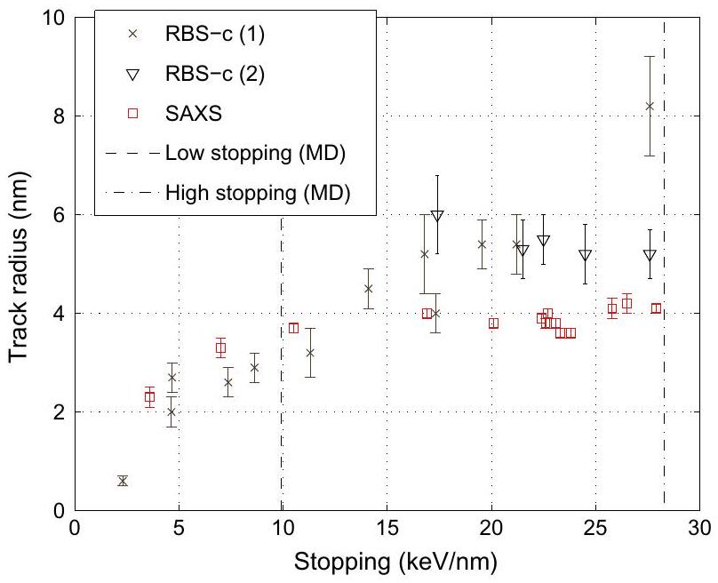
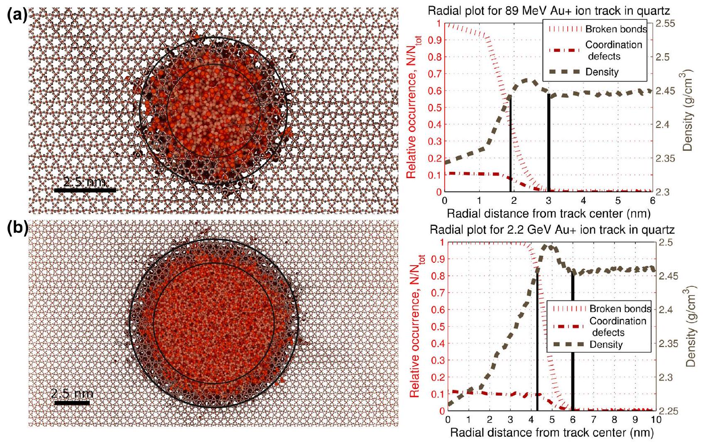
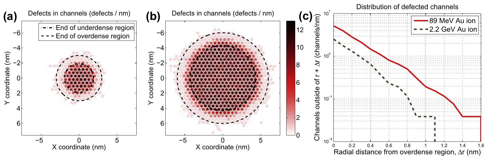

# Structural analysis of simulated swift heavy ion tracks in quartz 

Aleksi A. Leino ${ }^{\mathrm{a}, *}$, Szymon L. Daraszewicz ${ }^{\mathrm{b}}$, Olli H. Pakarinen ${ }^{\mathrm{c}}$, Flyura Djurabekova ${ }^{\mathrm{a}}$, Kai Nordlund ${ }^{\mathrm{a}}$, Boshra Afra ${ }^{\mathrm{d}}$, Patrick Kluth ${ }^{\mathrm{d}}$ ${ }^{\mathrm{a}}$ Helsinki Institute of Physics and Department of Physics, P.O. Box 43, FI-00014 University of Helsinki, Finland ${ }^{\mathrm{b}}$ Department of Physics and Astronomy and London Centre for Nanotechnology, University College London, Gower Street, London WC1E 6BT, United Kingdom ${ }^{\mathrm{c}}$ Materials Science and Technology Division, Oak Ridge National Laboratory, Oak Ridge, TN 37831, USA ${ }^{\mathrm{d}}$ Research School of Physics and Engineering, Australian National University, Australian Capital Territory 0200, Australia

## ARTICLE INFO

## Article history:

Received 17 July 2013
Received in revised form 29 October 2013
Accepted 29 October 2013
Available online 7 February 2014

## Keywords:

Molecular dynamics
Ion irradiation
Ion tracks
Swift heavy ions
Quartz

#### Abstract

Swift heavy ions (SHI), of specific kinetic energies in the excess of $1 \mathrm{MeV} / \mathrm{u}$, can create cylindrical regions of structural transformation in $\mathrm{SiO}_{2}$ targets, also known as SHI tracks. Recent measurements of the track cross-sections in $\alpha$-quartz show significant and consistent discrepancies across different experimental techniques used. In particular, the track radii obtained from channelling experiments based on the Rutherford Backscattering Spectrometry (RBS-c) method increase monotonically with the electronic stopping power, whereas the track radii obtained from the Small Angle X-ray scattering (SAXS) saturate past a certain stopping power threshold. We perform a systematic study of the structure of the $\alpha$-quartz tracks obtained from the molecular dynamics (MD) simulations incorporating a time-dependent energy deposition based on the inelastic thermal spike model, which allows us to discuss the possible origins of these experimental discrepancies.

© 2014 Elsevier B.V. All rights reserved.

## 1. Introduction

Swift heavy ion (SHI) projectiles can produce cylindrical regions of structural modification in an irradiated target, also known as ion tracks. These features were first observed in nuclear fission reactors [1] and since then they have been widely studied due to their growing list of technological applications. In particular, predicting the exact structural changes in quartz under SHI irradiation, would find immediate applications in nano-fabrication of optical devices [2], as quartz's refractive index changes in response to irradiation.

Ion tracks can pose a challenging modelling problem as they originate from a transient, highly non-equilibrium state. Due to the high specific kinetic energies of SHIs ( $\gtrsim 1 \mathrm{MeV} / \mathrm{u}$ ) they mainly interact inelastically with electrons of a target material, producing a trail of electronic excitations, whilst the probability of a direct projectile-target atomistic collision is very small and often neglected. The two types of interaction can be quantified by the respective energy losses of the projectile per unit distance. These so-called electronic and nuclear stopping powers, $S_{\mathrm{e}, \mathrm{n}}=\frac{\partial E_{\mathrm{e}, \mathrm{n}}}{\partial x}$, are customarily estimated from SRIM computer code [3]. Since $S_{\mathrm{e}} \gg S_{\mathrm{n}}$ for SHIs, only the electronic component is typically considered and hereafter referred to as the stopping power.

[^0]The electronic excitation energy is initially highly localised around the projectile path and later transferred to the atom lattice. The subsequent thermal relaxation leaves the structural changes effectively quenched in, producing an ion track. Nonetheless, the exact energy transfer mechanisms involved are debated and presumably vary with the class of the target material. Track formation models range from Coulomb explosion [4], variations of the inelastic thermal spike (i-TS) [5] to structural relaxation methods [6].

The i-TS model, a variant of which we adapt here, is based on the two-temperature approach [7], where distinct electronic ( $T_{\mathrm{e}}$ ) and ionic temperatures ( $T_{\mathrm{i}}$ ) are assumed. The spatio-temporal evolution of these is governed by a set of two separate heat diffusion equations, linked by the energy exchange term proportional to the electron-phonon ( $\mathrm{e}-\mathrm{p}$ ) coupling [8]. Thus far, the model was used to model SHI interaction with metals [9], alloys [10], semiconductors [11] and insulators [12]. While its application to band-gap materials remains controversial [13], especially in the light of more sophisticated methods being developed for semiconductors [14], it remains widely used. This is due to its relative simplicity and thus a relatively small set of parameters required to be fitted, its success history of reproducing the experimental latent track radii variation with the stopping power, and accounting for the velocity effect [15]. While we acknowledge the limitations of the i-TS model, we use it as an exemplar technique to primarily focus on the structural analysis of the simulated SHI tracks in $\alpha$-quartz.

From an experimental point of view, the track properties measured from RBS-c and SAXS (and referred to as radius) are not the same. RBS-c measures the fraction of the damaged material (the atoms outside their crystalline structure) [16] compared to the pristine matrix while SAXS is sensitive to the electron density fluctuations regardless of any change in the crystallinity.

A comparison of the recent experimental data [17] (see also Fig. 1) shows that the latent track radii in quartz vary significantly above the stopping power of about $17 \mathrm{keV} / \mathrm{nm}$. We aim to relate the experimental discrepancies to the structural analysis of the simulated ion tracks in $\mathrm{SiO}_{2}$ and provide a set of methods that can be used to determine the simulated ion track radii.

## 2. Method

The simulations were performed with the classical MD code parcas [18]. We included the effect of the i-TS model through a time-dependent deposition of kinetic energy in random directions for all the atoms in the simulation cell, using radially symmetric energy deposition profiles. The profiles were based on the i-TS calculations with the model parametrisation detailed in [16]. The simulation cell consists of a 23 nm wide cube of initially relaxed and perfectly crystalline $\alpha$-quartz configuration with periodic boundary conditions imposed and edges of the cell cooled with a Berendsen thermostat at 300 K [19]. A computation time of 100 ps with an adaptive timestep (typically about 0.4 fs ) was used. The interatomic interactions were calculated with the Watanabe-Samela Si-O mixed system many-body potential [20,21].

To study the structure of the simulated latent tracks, we used the coordination defect number, radial density, and broken bonds criteria. While the coordination defects (i.e. atoms with wrong coordination number) can be identified using the pair correlation function within a cutoff distance [22], the other two quantities are less commonly used and hence described below.

To calculate the radial densities, we used the Voro++ [23] library to first calculate the atomic volumes of each atom. We then used hollow cylinders centered at the ion track and of equal volumes to calculate the average volume for each atom type, i.e. $\left\langle V_{\mathrm{O}}\right\rangle$ and $\left\langle V_{\mathrm{Si}}\right\rangle$. The final density was obtained from $\rho_{\mathrm{SiO}_{2}}=\left(m_{\mathrm{Si}}+2 m_{\mathrm{O}}\right) /\left(\left\langle V_{\mathrm{Si}}\right\rangle+2\left\langle V_{\mathrm{O}}\right\rangle\right)$. This procedure cancels out the numerical noise considerably when compared to the method

Fig. 1. Experimentally measured latent track radii as a function of stopping power. Dataset (1) is reproduced from [16,27], (2) from [28] and (3) from [17]. The stopping powers on the sample surface for the data from Refs. [16,28,27] have been recalculated using a more recent version of SRIM (2008) for consistency. The vertical lines indicate the stopping powers used in the current MD simulations.

of simply dividing the mass within each cylinder by its volume. The procedure is especially useful in crystalline samples, since the cylinder will intersect the unit cells at the borders only partially, leaving an excess of silicon or oxygen in. The Voronoi method ensures that the atoms near the borders are given the correct weight, enabling the fine structure in the density profile to be seen without using an averaging stencil.

We have also identified broken bonds within the track. The criterion for a broken bond was taken as an increase of the separation of a two initially bonded atoms to more than the second nearest neighbour distance ( $\sim 0.3 \mathrm{~nm}$ ). We emphasise here that the broken bonds are not dangling bonds, i.e. an atom can have the correct coordination number although several of its original bonds are broken.

## 3. Results and discussion

The behaviour of the experimental RBS-c and SAXS data can be seen in Fig. 1. The track radii from SAXS measurements saturate beyond the stopping power of around $10 \mathrm{keV} / \mathrm{nm}$, whereas the first RBS-c radii (dataset (1) in Fig. 1) increase monotonically. A clear distinction between the SAXS and RBS-c data can only be seen after about $17 \mathrm{keV} / \mathrm{nm}$. The second RBS-c data also shows saturation, however, in both cases the track radii are systematically larger than the ones measured with SAXS.

To investigate the qualitative differences in the tracks structure in both low and high stopping power regimes, we consider two limiting cases, i.e a low energy impact ( 89 MeV Au ion), and a high energy impact ( 2.2 GeV Au ). These projectile energies translate to the peak stopping powers of $9.9 \mathrm{keV} / \mathrm{nm}$, and $28.3 \mathrm{keV} / \mathrm{nm}$ in $\boldsymbol{\alpha}$-quartz, respectively [3], and are shown as the vertical lines in Fig. 1.

For a comparison with the SAXS track radii, radial density distributions of the tracks from the MD simulations must be examined, which are shown in the right panel of Fig. 2. Both cases show an underdense core and an overdense shell structure (a "corona") in the density profile, similar to that seen in amorphous silica [24]. However, the relative changes in the densities are much smaller in quartz. For instance, the overdense shell consists of only $0.5 \% (89 \mathrm{MeV})$ and $0.7 \%(2.2 \mathrm{GeV})$ relative change in the density. This region is not directly observed in the SAXS measurements [17]. Therefore, the question of how the track radii should be compared remains open. The radii extracted from the underdense area are $(1.9 \pm 0.1) \mathrm{nm}$ and $(4.3 \pm 0.1) \mathrm{nm}$ for the 89 MeV and 2.2 GeV ions, respectively. The corresponding radii from the end of the overdense region are ( $3.0 \pm 0.1) \mathrm{nm}$ and $(6.0 \pm 0.1) \mathrm{nm}$. Both ways to determine the track radius from the densities, however, show a significant increase of the track radius with the stopping power. This is in contrast to the SAXS experiments, which indicate "a saturation" with only minor differences in the track radii.

To compare the simulation results with the RBS-c track radii, defect distributions must be considered. We first attempted to detect the defects by observing the occupation number of Voronoi cells as calculated from the initial MD configuration [25]. However, a small radial strain was observed which shifted the Voronoi cells, which, in turn, led to artifacts in the defect distribution. This strain is due to the ion hammering effect [26], but it does not affect the detection of coordination defects whose distributions are plotted in Fig. 2. We observe in both cases that $10 \%$ of the atoms in the amorphous and underdense track core do not have the coordination of quartz and that the concentration of defective material drops down close to zero at the overdense shell. The furthest individual coordination defects are produced relatively far away from the region of density fluctuations (at a distance of $1-2 \mathrm{~nm}$ ).

However, the group of atoms with coordination defects does not include all atoms that are displaced to the channels, i.e. the

Fig. 2. Snapshot of a SHI track for (a) 89 MeV Au ion ( $9.9 \mathrm{keV} / \mathrm{nm}$ ) and (b) 2.2 GeV Au ion ( $28.3 \mathrm{keV} / \mathrm{nm}$ ) from the MD simulation (left) and a plot of the final density, broken bond and defect distribution (right). In the left panel, inner and outer circles indicate the start and end of the overdense shell, respectively, and are shown as the solid lines in the right panel. Atoms with broken bonds are drawn as large spheres. Red and brown atoms indicate silicon and oxygen, respectively. Unbroken bonds are displayed as white cylinders. (For interpretation of reference to color in this figure legend, the reader is referred to the web version of this article.)

atoms to which the RBS-c measurement is sensitive to. We found that this group can be detected by searching for the atoms with broken bonds, as described in the method section.

Atoms identified as defects using the broken bond criterion are shown in Fig. 2(left) as large spheres. It is observed that in both cases the overdense area consists of partly pristine and partly amorphised material. The width of the partially molten and overdense corona around the fully amorphous track core is slightly larger ( $\sim 0.7 \mathrm{~nm}$ ) in the case of 2.2 GeV Au ion.

The RBS-c measurements can be used to extract the ratio of the defect-rich channels to the pristine ones [16]. This ratio, together
with the SHI irradiation fluence, can be used to calculate the cross-sectional area of individual tracks. The existence of channels with defects outside of the region of strong density contrast could lead to a difference in the experimental results between RBS-c and SAXS. To study if such a scenario is plausible based on the MD results, we mapped the atoms labelled as defects to the channels of the initial MD configuration. The defect distributions for both ions (in defects per channel/simulation cell length) are given in Fig. 3(a) and (b). The plots show that the channels with defects exist even outside of the region of density contrasts. In Fig. 3(c), we have plotted the number of channels left outside of radius

Fig. 3. Defect distribution in the channels for (a) 89 MeV Au and (b) 2.2 GeV Au SHI simulation. The panel (c) shows the distribution of channels with defects outside of the region of density fluctuations in both cases.

$r+\Delta R$, where $r$ is the radius of the track as determined from density fluctuations, and $\Delta r$ is the distance from the region of density fluctuations. The plot shows that in the case of the high stopping power ion ( 2.2 GeV ), more defective channels are present outside the area of density fluctuations than in the low energy one ( 89 MeV ). This, at least qualitatively, can lead to a larger discrepancy between SAXS and RBS-c results (as seen in Fig. 1) as the stopping power grows. A rigorous quantitative estimation requires consideration of the precise experimental setup, e.g. track lengths, irradiation fluence and the sensitivity of the detectors.

Detailed structural analysis of the simulated ion tracks presented here hints at the origin of the experimental track radii discrepancies reported with the SAXS and RBS-c techniques. However, it fails to capture the saturation of the radii measured by SAXS. We speculate, that with additional refinements in the simulation method the discrepancy between the density fluctuations (SAXS) and the defect-rich material (RBS-c) could be reproduced more faithfully.

## 4. Conclusions

We present structural analysis of simulated SHI tracks in $\boldsymbol{\alpha}$-quartz produced by time-dependent i-TS energy deposition in MD, by looking at three different criteria used to measure their radii. The results indicate that the SHI -induced defects can be produced far away from the amorphised region, although their concentration is small. We show that the width of the partially molten track corona outside of the fully amorphous track core grows as the stopping power increases. We also see a similar effect on the concentration of the defected channels outside of the region of density fluctuations, which grows larger as the stopping power increases.

These effects could lead to the appreciable differences between the track radii determined from SAXS (sensitive to density fluctuations) and channelling experiments (measuring defects), particularly at high stopping powers. However, this study was unable to explain the saturation of the track radii as a function of stopping power seen with SAXS measurements [17]. We recognise that the current simulations suffer from some limitations, most of which will need be addressed for a quantitative comparison, but these constraints do not impact the qualitative conclusions drawn here.

We emphasise that for a thorough comparison between experiment and theory, care must be taken to measure the simulated track radii by a method which is in line with the reported experimental technique. Failure to do so may lead to appreciable errors, particularly in the high stopping power regime - a fact which is often omitted in the literature on ion tracks.

## Acknowledgements

The authors thank CSC IT Center for Science Ltd. (Finland) for generous grants of computation time. AL is funded by the Academy of Finland and National Doctoral Programme in Nanoscience (NGS). SD is funded by EPSRC under the M3S IDTC and CCFE. OHP is supported by the U.S. Department of Energy, Basic Energy Sciences, Materials Science and Engineering Division.

## References

[1] D.A. Young, Nature 182 (1958) 375-377.
[2] K. Hjort, G. Thornell, J.-A. Schweitz, R. Spohr, Appl. Phys. Lett. 69 (1996) 34353436.
[3] J. Ziegler, J. Biersack, M. Ziegler, SRIM-2008.04 software package, available online at http://www.srim.org, 2008.
[4] R.L. Fleischer, P.B. Price, R.M. Walker, J. Appl. Phys. 36 (1965) 3645-3652.
[5] G. Szenes, Nucl. Instr. Meth. Phys. Res. B 269 (2011) 174-179.
[6] K.H. Bennemann, J. Phys.: Condens. Matter 16 (2004) R995.
[7] M.I. Kaganov, I.M. Lifshitz, L.V. Tanatarov, Sov. Phys. JETP 4 (1957) 173.
[8] F. Seitz, J. Köhler, Sol. St. Phys. 2 (1956) 305.
[9] A. Dunlop, D. Lesueur, P. Legrand, H. Dammak, J. Dural, Nucl. Instr. Meth. Phys. Res. B 90 (1994) 330-338.
[10] C. Trautmann, S. Andler, W. Brüchle, R. Spohr, M. Toulemonde, Radiat. Effects Defects in Solids 126 (1993) 207-210.
[11] F. Komarov, P. Gaiduk, L. Vlasukova, A. Didyk, V. Yuvchenko, Vacuum 70 (2003) 75-79.
[12] A. Meftah, J. Costantini, N. Khalfaoui, S. Boudjadar, J. Stoquert, F. Studer, M. Toulemonde, Nucl. Instr. Meth. Phys. Res. B 237 (2005) 563-574.
[13] D. Duffy, S. Daraszewicz, J. Mulroue, Nucl. Instr. Meth. Phys. Res. B 277 (2012) 21-27.
[14] S. Daraszewicz, D. Duffy, Nucl. Instr. Meth. Phys. Res. B 303 (2012) 112-115.
[15] A. Meftah, F. Brisard, J. Costantini, M. Hage-Ali, J. Stoquert, F. Studer, M. Toulemonde, Phys. Rev. B. 48 (1993) 920-925.
[16] A. Meftah, F. Brisard, J.M. Costantini, E. Dooryhee, M. Hage-Ali, M. Hervieu, J.P. Stoquert, F. Studer, M. Toulemonde, Phys. Rev. B 49 (1994) 12457-12463.
[17] B. Afra, M.D. Rodriguez, C. Trautmann, O.H. Pakarinen, F. Djurabekova, K. Nordlund, T. Bierschenk, R. Giulian, M.C. Ridgway, G. Rizza, N. Kirby, M. Toulemonde, P. Kluth, J. Phys.: Condens. Matter 25 (2013) 045006.
[18] K. Nordlund, 2010. parcas computer code. The main principles of the molecular dynamics algorithms are presented in [27,28]. The adaptive time step is the same as in [29].
[19] H.J.C. Berendsen, J.P.M. Postma, W.F. van Gunsteren, A. DiNola, J.R. Haak, J. Chem. Phys. 81 (1984) 3684.
[20] T. Watanabe, D. Yamasaki, K. Tatsumura, I. Ohdomari, Appl. Surf. Sci. 234 (2004) 207.
[21] J. Samela, K. Nordlund, V.N. Popok, E.E.B. Campbell, Phys. Rev. B 77 (2008) 075309.
[22] M. Backman, F. Djurabekova, O.H. Pakarinen, K. Nordlund, Y. Zhang, M. Toulemonde, W.J. Weber, J. Phys. D: Appl. Phys. 45 (2012) 505305.
[23] C.H. Rycroft, G.S. Grest, J.W. Landry, M.Z. Bazant, Phys. Rev. E 74 (2006) 021306.
[24] P. Kluth, C.S. Schnohr, O.H. Pakarinen, F. Djurabekova, D.J. Sprouster, R. Giulian, M.C. Ridgway, A.P. Byrne, C. Trautmann, D.J. Cookson, K. Nordlund, M. Toulemonde, Phys. Rev. Lett. 101 (2008) 175503.
[25] M.W. Ullah, A. Kuronen, K. Nordlund, F. Djurabekova, P.A. Karaseov, A.I. Titov, J. Appl. Phys. 112 (2012) 043517.
[26] S. Klaumunzer, Nucl. Instr. Meth. Phys. Res. B 225 (2004) 136-153.
[27] T. Tombrello, Nucl. Instr. Meth. Phys. Res. B 2 (1984) 555-563.
[28] C. Trautmann, J.M. Constantini, A. Meftah, K. Schwartz, J.P. Stoquert, T.M., 504, Warrendale: Materials Research Society, 1999, p. 123.
[29] K. Nordlund, Comput. Mater. Sci. 3 (1995) 448.

[^0]:    * Corresponding author.

    E-mail address: aleksi.leino@helsinki.fi (A.A. Leino).

