## 

# Frontiers, challenges, and solutions in modeling of swift heavy ion effects in materials 

Cite as: J. Appl. Phys. 133, 100701 (2023); https://doi.org/10.1063/5.0128774
Submitted: 12 October 2022 • Accepted: 22 February 2023•Published Online: 13 March 2023
(D) N. Medvedev, (D) A. E. Volkov, (D) R. Rymzhanov, et al.

## ARTICLES YOU MAY BE INTERESTED IN

Nonthermal acceleration of atoms as a mechanism of fast lattice heating in ion tracks Journal of Applied Physics 131, 225903 (2022); https://doi.org/10.1063/5.0095724

Microscopic structure and migration of $90^{\circ}$ ferroelectric domain wall in $\mathrm{BaTiO}_{3}$ determined via molecular dynamics simulations
Journal of Applied Physics 133, 104101 (2023); https://doi.org/10.1063/5.0138489
Rosalind Franklin's X-ray photo of DNA as an undergraduate optical diffraction experiment American Journal of Physics 86, 95 (2018); https://doi.org/10.1119/1.5020051

# Frontiers, challenges, and solutions in modeling of swift heavy ion effects in materials 

Cite as: J. Appl. Phys. 133, 100701 (2023); doi: 10.1063/5.0128774 Submitted: 12 October 2022 • Accepted: 22 February 2023 • Published Online: 13 March 2023

N. Medvedev, ${ }^{1,2, a)}$ (15) A. E. Volkov, ${ }^{3,4, a)}$ (1) R. Rymzhanov, ${ }^{5,6}$ (1) F. Akhmetov, ${ }^{7}$ (1) S. Gorbunov, ${ }^{3}$ (1) R. Voronkov, ${ }^{3}$ (15) and P. Babaev ${ }^{3}$ (D)

## AFFILIATIONS

${ }^{1}$ Institute of Physics, Czech Academy of Sciences, Na Slovance 1999/2, 18221 Prague 8, Czech Republic
${ }^{2}$ Institute of Plasma Physics, Czech Academy of Sciences, Za Slovankou 3, 18200 Prague 8, Czech Republic
${ }^{3}$ P. N. Lebedev Physical Institute of the Russian Academy of Sciences, Leninskij pr., 53, 119991 Moscow, Russia
${ }^{4}$ National Research Centre 'Kurchatov Institute', Kurchatov Sq. 1, 123182 Moscow, Russia
${ }^{5}$ Joint Institute for Nuclear Research, Joliot-Curie 6, 141980, Dubna, Moscow Region, Russia
${ }^{6}$ The Institute of Nuclear Physics, Ibragimov St. 1, 050032 Almaty, Kazakhstan
${ }^{7}$ Industrial Focus Group XUV Optics, MESA+Institute for Nanotechnology, University of Twente, Drienerlolaan 5, 7522 NB Enschede, The Netherlands
${ }^{\text {a) }}$ Authors to whom correspondence should be addressed: nikita.medvedev@fzu.cz and a.e.volkov@list.ru

#### Abstract

Since a few breakthroughs in the fundamental understanding of the effects of swift heavy ions (SHIs) decelerating in the electronic stopping regime in the matter have been achieved in the last decade, it motivated us to review the state-of-the-art approaches in the modeling of SHI effects. The SHI track kinetics occurs via several well-separated stages and spans many orders of magnitude in time: from attoseconds in ionimpact ionization depositing an extreme amount of energy in a target to femtoseconds of electron transport and hole cascades, to picoseconds of lattice excitation and response, to nanoseconds of atomic relaxation, and even longer times of the final macroscopic reaction. Each stage requires its own approaches for quantitative description. We discuss that understanding the links between the stages makes it possible to describe the entire track kinetics within a hybrid multiscale model without fitting procedures. The review focuses on the underlying physical mechanisms of each process, the dominant effects they produce, and the limitations of the existing approaches, as well as various numerical techniques implementing these models. It provides an overview of the $a b$ initio-based modeling of the evolution of the electronic properties, Monte Carlo simulations of nonequilibrium electronic transport, molecular dynamics modeling of atomic reaction including phase transformations and damage on the surface and in the bulk, kinetic Mote Carlo of atomic defect kinetics, and finite-difference methods of track interaction with chemical solvents describing etching kinetics. We outline the modern methods that couple these approaches into multiscale and combined multidisciplinary models and point to their bottlenecks, strengths, and weaknesses. The analysis is accompanied by examples of important results, improving the understanding of track formation in various materials. Summarizing the most recent advances in the field of the track formation process, the review delivers a comprehensive picture and detailed understanding of the phenomenon. Important future directions of research and model development are also outlined.

Published under an exclusive license by AIP Publishing. https://doi.org/10.1063/5.0128774

## I. INTRODUCTION

Since the discovery of radioactivity, it has been known that fission products modify the properties of exposed materials in a radical way. ${ }^{1}$ At typical initial energies of fission fragments ( $0.5-1 \mathrm{MeV}$ /nucleon), the electronic stopping mode is dominant: the ion deposits energy into the electronic system of a target.

This energy loss channel is called inelastic energy loss. ${ }^{2}$ It dominates at heavy ion energies above some MeV energy, also typical for cosmic rays (see Fig. 1).

At the end of the stopping range of a fission fragment or a cosmic-ray ion, the nuclear stopping mode dominates in damage formation. ${ }^{2}$ In this case, a projectile knocks a target atom out of its

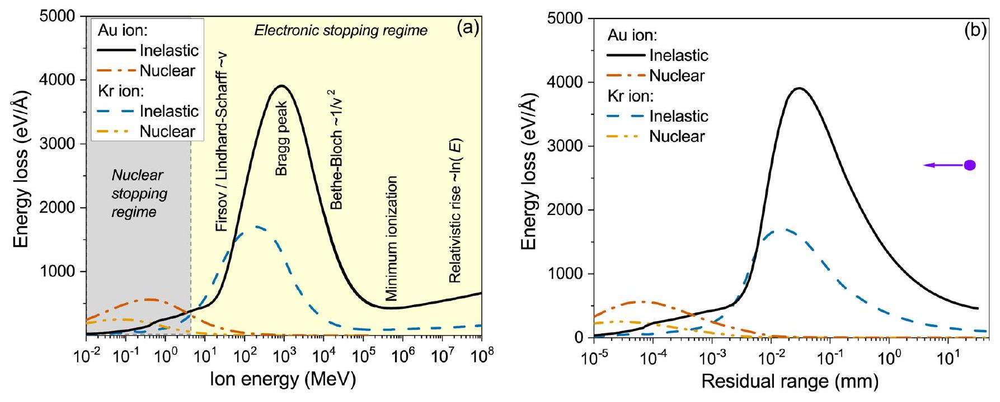
FIG. 1. Nuclear and inelastic energy losses of Au and Kr ions in $\mathrm{Al}_{2} \mathrm{O}_{3}$, extracted from $\mathrm{SRIM}^{4}$ for nonrelativistic energies and from $\mathrm{TREKIS}{ }^{5,6}$ for relativistic ones (a) as a function of incoming ion energy or (b) residual range along the ion trajectory (direction of ion penetration is schematically shown with an arrow).

equilibrium lattice position, providing the atom with a sufficiently large kinetic energy during head-on collision. ${ }^{1,3}$ These accelerated ions, in turn, may knock out secondary ions and so on, forming collision cascades.

When a high-energy ion (say, 10 GeV gold ions) enters a target, it starts losing its energy primarily due to the excitation of the electronic system. Below the minimum ionization dip, a decrease in the energy leads to a faster increase in the electronic energy loss (also called linear energy transfer, LET) until its Bragg peak is reached. The ion velocity at the Bragg peak is roughly equal to that of atomic electrons in the target. The electronic energy losses of the heaviest ions (e.g., $\mathrm{Au}, \mathrm{Bi}$, and U ) achieve values of $40-50 \mathrm{keV}$ per nanometer $(4000-5000 \mathrm{eV} / \AA)$ of their trajectory at the Bragg peak.

At even lower energies, deeper along the path (see Fig. 1), inelastic energy loss decreases and becomes subdominant with respect to the nuclear energy loss at the ion energies below $\sim 1 \mathrm{keV} /$ nucleon . At the very end of the ion track, a nuclear cascade takes place and the ion comes to rest.

The practical importance of the ion radiation effects is twofold. On the one hand, there are many dangers associated with exposure to fast ions. Cosmic rays pose danger to space missions. ${ }^{7,8}$ Energetic ions directly break DNA bonds ${ }^{9}$ and produce reactive species and free radicals that interact with a genetic material indirectly. ${ }^{10}$ Ion irradiation also leads to soft errors and single event upsets in the computer equipment. ${ }^{11}$ Prolonged exposure of matter may create macroscopic damage in materials, which is crucial to take care of in nuclear material applications and nuclear fuel during operation. ${ }^{12}$ Radiation safety is, thus, one of the major concerns in any operation with heavy ions.

On the other hand, the usage of swift heavy ion (SHI) irradiation in a controlled way opened up the possibilities of materials'
modification with unprecedented precision, allowing for nanometric design and producing huge benefits to technology and medicine. Since ion impacts create nanometric-diameter etchable tracks, it enables the creation of nano-pores and nano-membranes. ${ }^{13,14}$ Chemical etching of SHI tracks in polymers allows to controllably open and radially enlarge nano-pores, which enables the applications of polymers in particle detectors and filtration membranes. ${ }^{15,16}$ Nanoscale modifications of matter create regions with altered electronic properties, which is a way of creating quantum dots ${ }^{17,18}$ or nano-electronics. ${ }^{19}$ Medical applications include proton and ion therapy for cancer treatment. ${ }^{20,21}$ Swift ions deposit, the main part of their energy, in a localized region, at the Bragg peak, as shown in Fig. 1, which is located deep inside the target. This allows to damage inoperable tumors, e.g., inside a patient's brain.

Despite the long history of SHI irradiation research, there is still a lack of a detailed understanding of the fundamental phenomenon governing track formation. ${ }^{2}$ That fact precludes the control of the material response and tailoring of the ion parameters to practical needs.

In a laboratory, ion accelerators are used to create charged ions with controlled high kinetic energies, e.g., at GSI (Darmstadt), JINR (Dubna), IMP (Lanzhou), GANIL (Caen), LHC at CERN (Switzerland), and RIKEN (Japan). Precisely knowing the ion charge and energy allows us to characterize damage caused by ions and to systematically study the effects of SHI irradiation in various matters. ${ }^{22}$

Semi-empirical rules in choosing appropriate ion parameters for particular goals resulted in great progress in terms of practical applications of SHI irradiation. The semi-empirical models developed since the 1990s allowed us to estimate track diameters in various materials under various ion irradiations with satisfactory precision. ${ }^{23,24}$ Nowadays, inelastic thermal spike (i-TS), ${ }^{23,24}$ which
is a version of the two-temperature model (TTM), ${ }^{25,26}$ is most commonly used. It assumes that the electrons and the atoms may be described as two coupled systems with different temperatures within a solid around the ion trajectory. For each of them, an equation of heat diffusion is used with an empirically fitted electronion coupling parameter describing energy transfer from excited electrons to atoms in a track. Having the electron-phonon coupling strength as a free parameter, the model can reproduce experimentally measured track radius in various materials. ${ }^{2}$ This simple estimate helps to design experiments and applications.

However, the major problems in the description of SHI tracks are the extreme levels of excitation and ultra-short temporal and spatial scales. Under such conditions, the macroscopic approaches are beyond their limits of applicability (which may result in the need to use fitting parameters). For example, the thermo-diffusion model used in i-TS cannot describe the nonequilibrium fraction of electrons and ballistic propagation of the excitation front at the early stage of SHI track formation. ${ }^{27,28}$ Despite this, the semiempirical models of track formation acquired widespread use due to their simplicity, whereas more advanced models avoiding fitting procedures were developing much slower.

The problem of the SHI track can be solved by taking into account the multiscale origin of the track kinetics. An SHI impact induces a sequence of processes starting from the energy deposition into the electronic system to the final formation of the observable material modifications. A typical timescale of material response to an ion impact spans over ten orders of magnitude (see illustration in Fig. 2). An SHI passes an interatomic distance of a target within attosecond timescales ( $\sim 10^{-18} \mathrm{~s}$ ), exciting a number of electrons around its trajectory. During such times, the atoms and electrons of the target are essentially immobile and fixed in space. Electrons in the target excited by an SHI, called delta-electrons, fly outward from the SHI trajectory, creating the secondary cascades of ionizations and transferring energy to the atomic lattice. Excited electronic states
in the conduction and valence bands typically occur and decay via a number of channels at the femto- to pico-second timescales, $10^{-15}$ to $10^{-12} \mathrm{~s} .^{5}$ Deep shell holes, created by an SHI impact, decay via Auger or radiative mechanisms also during femtoseconds. ${ }^{29}$ Atoms react to the transferred energy from the excited electrons and valence holes during $10^{-13}$ to $10^{-12} \mathrm{~s},{ }^{28}$ which may result in phase transitions and damage formation. ${ }^{30}$ Partial or full recovery of the transiently disordered area around an SHI trajectory typically takes $\sim 100 \mathrm{ps} \left(10^{-10} \mathrm{~s}\right)$. ${ }^{30}$ At nanoseconds $\left(10^{-9} \mathrm{~s}\right)$, macroscopic relaxation occurs with the onset of the kinetics of defects and deformation, which typically may relax by the time of microseconds ( $10^{-6} \mathrm{~s}$ ) or even longer, macroscopic times. ${ }^{31}$ In biological samples, the processes triggered by irradiation may persist for days or even years (e.g., cell death or mutations). ${ }^{32}$

Each stage forms initial conditions for the subsequent one and, thus, requires a precise description and fine understanding of the involved processes and their cross-influence when building a model describing the effects of SHIs in the matter.

There are methods for treating each of the above-mentioned stages individually. ${ }^{33}$ For example, $a b$ initio methods are applicable to SHI-created conditions, such as time-dependent density functional theory (TD-DFT) ${ }^{34,35}$. They allow treating ion penetration and the formation of the primary excited electrons but are limited to systems of a few tens of atoms with modern-day computer capabilities.

Femtosecond electron kinetics may be traced with $a b$ initio techniques such as nonequilibrium Green functions ${ }^{36,37}$ or simplified approaches such as Boltzmann's kinetic equation, ${ }^{38}$ the Fokker-Planck equation, ${ }^{39}$ or a Monte Carlo method. ${ }^{40,41}$ Energy exchange between the electronic and the atomic system may be modeled with such methods as the "surface hopping" method ${ }^{42,43}$ and related approaches combined with Boltzmann collision integrals ${ }^{44}$ or coupled electron-ion dynamics (CEID). ${ }^{45}$ Simplified thermodynamic-based methods are often used to describe this exchange, such as the above-mentioned TTM.

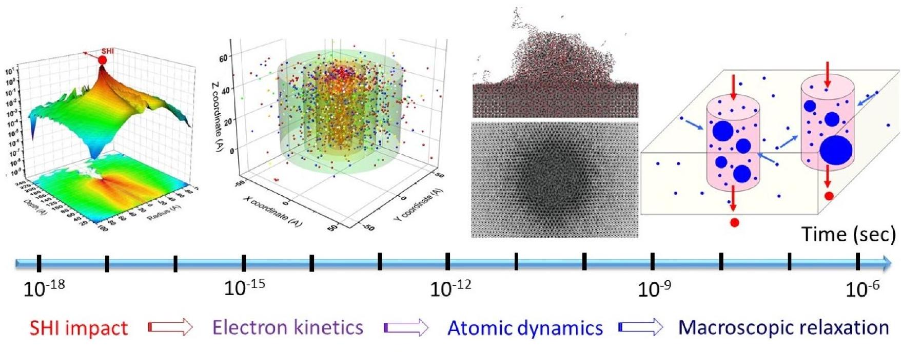
FIG. 2. Schematic illustration of characteristic timescales of an SHI track creation problem.

Atomic dynamics is usually modeled with the help of the classical molecular dynamics (MD) simulations ${ }^{46}$ or their combination with the TTM. ${ }^{47}$ To trace defect kinetics, approximated methods are employed, such as the kinetic Monte Carlo (KMC) methods. ${ }^{31,48}$ At high fluences and energy depositions, resulting in macroscopic damage such as material ablation and plasma formation, hydrodynamic approaches and similar tools are used, e.g., Particle in Cell (PIC) codes. ${ }^{49}$

Although these methods may be appropriate to treat each stage of track formation and material response to irradiation separately, no rigorous model exists to date that is capable of treating the entire timespan of the problem with good precision. New approaches are required to describe the problem. One of the most practical, easy-to-implement, and sufficiently precise methods is the so-called multi-scale models, which acquire more and more popularity in the last decade. ${ }^{10,50,51}$ A multi-scale or a hybrid model combines a few different approaches, each of them applicable at its own spatial/temporal scale, with a proper overlap and exchange of information between them. ${ }^{33}$ This allows covering many orders of magnitude in space and/or time, preserving a required level of precision throughout the simulation.

There have been a number of reviews of SHI effects in the matter in the past. Many of them focused on experimental developments. ${ }^{2,15,52-55}$ Others described specific models and theoretical methods focused on particular effects and stages of track formation. ${ }^{2,34,48,56-58}$ In the paper, we review the relevant processes taking place in the ion track formation phenomenon across multiple timescales. Since track formation may be divided into a sequence of steps, each of them will require its own approach. We describe each stage in the context of the appropriate models, discussing their respective advantages and shortcomings. After describing each of them, we will consider the current state of the art in modeling, namely, combined and multiscale models. ${ }^{33}$ We will pay particular attention to the interconnection of the models applied at different stages of the track evolution, physical justifications, and limitations. Limits of validity and shortcomings of the existing methods will be discussed, outlining future directions of research. We will point out the strengths and weaknesses in the current understanding of the track formation processes and emphasize the points where new theory and model development are required, and which experimental data are missing.

This review is structured as follows. We start with a description of a single ion impact process taking place at subfemtosecond timescales, such as ion charge equilibration and excitation of target electrons in Sec. II. Section III reviews the processes of the nonequilibrium electron kinetics. Section IV focuses on the various channels of energy transfer to the atomic system. The response of the atomic system is reviewed in Sec. V. Relaxation of the atomic system with the formation of the observable tracks and related effects are described in Sec. VI. Section VII briefly describes residual macroscopic effects in the surrounding track such as defect kinetics in the track halo. We unify all the stages of track formation in the central chapter of this review (Sec. VIII), describing multiscale models with an accent on the interconnection between different models. We then proceed to the description of the effects of high ion fluence, resulting in track overlap in Sec. IX. Section X focuses on the surface effects and differences they introduce in
comparison with processes taking place in bulk. Section XI illustrates the post-mortem analysis of tracks, namely, a model of wet chemical etching. The concluding summary and outlook are then presented in Sec. XII.

## II. SUBFEMTOSECOND TIMESCALES: ION IMPACT

An SHI experiences various interaction channels in a solid: electronic or inelastic scattering, which excites the electrons of the target, nuclear or elastic scattering transferring kinetic energy to target atoms, and radiative energy losses via emitting photons (Bremsstrahlung and Cherenkov radiations). Depending on the ion energy, different channels dominate at different parts of the SHI trajectory.

Investigating the interaction of ions with matter in the electronic stopping regime, accelerators deliver ions with energies up to some GeV , and initial charge states up to a nearly fully stripped ion. For example, for a gold ion (Fig. 1), the energy of 100 GeV corresponds to the ion velocity of $\sim 2.3 \times 10^{8} \mathrm{~m} / \mathrm{s}$ or $76 \%$ of the speed of light in a vacuum. It results in the SHI passing a typical interatomic distance in a target within the time of $\sim 1$ as, ${ }^{59}$ when even the electrons of the target, except perhaps for deep-shell electrons of heavy elements, have no time to move. The scattering of an SHI with target electrons may then be described as pairwise interaction between individual particles. This is known as the Bethe-Bloch regime of ion stopping, ${ }^{60}$ which forms the right shoulder of the Bragg curve in Fig. 1: in the case of gold ion, $1-100 \mathrm{GeV}$. The energy loss in this regime is approximately proportional to $1 / v^{2}$, with $v$ being the ion velocity. ${ }^{60}$ At energies about $0.5-1 \mathrm{TeV} \left(10^{6} \mathrm{MeV}\right)$, minimum ionization occurs, after which the relativistic rise of energy loss takes place, which scales as $\sim \ln (E)$, where $E$ is the ion kinetic energy. This happens due to the increased polarization of the substance around the ion trajectory, caused by the relativistic stretching of the interaction region perpendicular to the ion trajectory. ${ }^{61}$ This effect saturates reaching an energy loss plateau (known as the "Fermi plateau", not shown) originated from the effect of the finite size of the projectile nucleus, ${ }^{62}$ eliminating a divergence tendency of the energy loss with the increase in the particle velocity. This holds up until the ultra-relativistic effects kick in at energies significantly higher than those shown in Fig. 1. There, another energy loss channel becomes dominant: Bremsstrahlung photon emission and radiative energy loss of the ion-this effect for heavy ions will only take place at energies above those available at modern accelerators. Thus, ultra-relativistic effects are not considered in detail in this review.

With a decrease in the SHI velocity along its trajectory, the effects of motion and mutual interactions of target electrons change the nature of the SHI-electrons interaction: from pairwise scattering on immobile electrons, it turns into the passing of the ion through an electronic liquid. This manifests itself as friction and forms the left shoulder of the Bragg curve of energy loss in Fig. 1, $\sim 5-1000 \mathrm{MeV}$ for Au ion. This is known as the Firsov/LindhardScharff regime of ion stopping, within which the energy loss of an ion is linearly proportional to its velocity $v$. ${ }^{63,64}$

At even lower energies (below $\sim 5 \mathrm{MeV}$ for a gold ion, Fig. 1), nuclear stopping becomes dominant, meaning the energy transfer to the nuclei of the target atoms instead of electrons takes place. It
results in knocking of target atoms out from their equilibrium positions, creating atomic cascades, and leaving atomic defects in the target. ${ }^{3,65,66}$

During the entire trajectory of a swift heavy ion in a target, it may also capture or lose electrons, changing its own charge state. ${ }^{67}$ That is important because the cross section of scattering and the energy loss of an ion are proportional to the square of its charge. We will consider all of these effects below in more detail.

## A. Ion charge state

Losing and capturing electrons leads to charge exchange between a heavy projectile and a media. A simple consideration helps to understand the meaning of this process: an electron of the swift heavy ion, whose orbital velocity is slower than the velocity of the ion, cannot keep up with it and will be lost in the media. In turn, electrons of the media are attracted to the penetrating ion and may attach to it.

The charge state equilibration of swift ions along their path and the associated charge oscillations can be simulated, for example, using the Monte Carlo method or by solving rate equations for electron populations of the SHI energy levels such as

$$
\frac{d F_{Z}(x)}{d x}=\sum_{k \neq Z} F_{k}(x) \sigma_{k, Z}-F_{Z}(x) \sum_{k \neq Z} \sigma_{Z, k}, \quad \sum_{k} F_{k}(x)=1,
$$

where $F_{Z}$ is a fraction of ions with charge state $Z$ to be found at the depth $x$ (which is defined in the units of surface density $x=n_{\mathrm{at}} L$ with $n_{\mathrm{at}}$ being the target atomic density and $L$ being the SHI penetration depth); $\sigma_{k, Z}$ are the cross section of the charge state change from $k$ to $Z$, which corresponds to the electron loss for $Z>k$, or electron capture for $Z<k$. ${ }^{58}$ The fractions are assumed to be normalized to unity, so they can be interpreted as distributions or probabilities to find an ion in a charge state $Z$.

Both methods, Monte Carlo and rate equations, can be found in the literature. A Monte Carlo simulation sampling process of electron loss and capture was implemented in such codes as ETACHA ${ }^{67}$ and its recent extension to heavier elements. ${ }^{68}$ The rate equation solutions are used in codes GLOBAL, ${ }^{69}$ CHARGE, ${ }^{69}$ and BREIT ${ }^{70}$ and were also written in terms of a matrix formalism in Ref. 71. A detailed review of the experiments and theoretical and numerical methods of the calculation of an SHI charge evolution has recently been published in Ref. 58.

Such methods work well at high ion energies, at the right shoulder of the Bragg curve. At even higher ultra-relativistic energies, ions are fully stripped. However, at lower energies, at the left shoulder of the Bragg curve, they may not work so well due to the solid-state effects of a target. Further corrections need to be introduced to account for them, such as target-density effect and shell corrections. ${ }^{58}$

After some traveled distance, the processes of electron capture and loss eventually even out, reaching a steady state-an
equilibrium charge with some fluctuations around it, ${ }^{58}$

$$
\bar{Z}=\sum_{k} k F_{k}(x \rightarrow \infty) .
$$

This definition assumes that the SHI does not lose its energy along its path. In reality, the equilibrium charge will evolve along the trajectory due to the deceleration of the ion.

If an SHI enters a material with a charge higher than the equilibrium charge state, the equilibration occurs when an SHI captures enough electrons in its deep shells so that an additional electron will be captured only to higher-lying states, whose orbital velocity is smaller than the speed of the SHI. This means that such an additional electron will be lost very fast. If an SHI enters the target with a charge below the equilibrium charge, it will lose extra electrons to reach equilibrium. An electron loss is typically a much faster process than capture, and the equilibration depth of ions is, correspondingly, shorter.

A typical example of charge state equilibration of sulfur ion in carbon foil is shown in Fig. 3. ${ }^{72}$ An ion of sulfur with the starting energy of 2 MeV /nucleon and various initial charge states entering a carbon foil quickly loses its electrons (increases its charge) if starting with a charge below the equilibrium one ( $\bar{Z}=12.68$ ), but it takes longer (a larger depth) to capture electrons and equilibrate if starting with a charge above the equilibrium one.

The charge equilibration depth of an ion starting with a below-equilibrium charge state in a solid does not typically exceed a few hundred nm , 67,73 which is much shorter than the total ion penetration depth ( $\sim 10-100 \mu \mathrm{~m}$ ). That means, an ion has an equilibrium charge on the major part of the trajectory within the bulk. In experiments, deceleration foils are often used to control the SHI

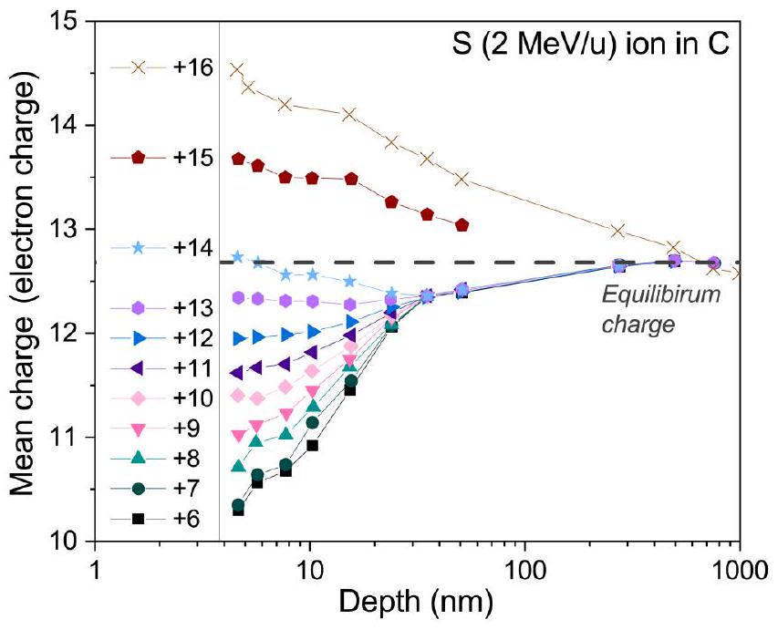
FIG. 3. Mean charge of S ion with starting energy of 2 MeV /nucleon and different incoming charge states from +6 to +16 in a carbon foil target. Note the log scale of the depth. Data taken from Ref. 72.

energy, which simultaneously will equilibrate the ion charge before its arrival at the surface of the target.

The values of the reached equilibrium charge depend mainly on the ion velocity or energy, whereas dependence on the parameters of the target is rather weak. There have been proposed a number of different methods to evaluate the equilibrium charge of an ion in a media. ${ }^{74}$ Perhaps, the most accurate empirical estimate was proposed in Ref. 75, which was implemented in the CasP code, ${ }^{76}$ to reproduce the equilibrium charge state in agreement with the experimental values over a wide range of targets and SHI velocities,

$$
\begin{gathered}
\bar{Z}=\frac{Z_{i o n}\left(8.29 x+x^{4}\right)}{0.06 x^{-1}+4+7.4 x+x^{4}}, \quad x=c_{1}\left(\frac{\tilde{v}}{1.54 c_{2}}\right)^{1+1.83 / Z_{i o n}}, \\
c_{1}=1-0.26 \exp \left(-\frac{Z_{t}}{11}-\frac{\left(Z_{i o n}-Z_{t}\right)^{2}}{9}\right), \\
c_{2}=1+0.03 \tilde{v} \ln \left(Z_{t}\right), \quad \tilde{v}=Z_{i o n}^{-0.543} \frac{v_{i o n}}{v_{B}},
\end{gathered}
$$

where $Z_{i o n}$ is the atomic number of the SHI, $Z_{t}$ is the atomic number of the target element, $v_{i o n}$ is the ion velocity, and $v_{B}$ is the Bohr velocity. This expression allows for the evaluation of the mean equilibrium charge of an ion in an arbitrary target, without solving the system of Eqs. (1) and (2). Similar models were proposed, e.g., in Refs. 77 and 78.

It is important to keep in mind the distinction between the equilibrium charge and an effective charge of an ion often mentioned in the literature. ${ }^{58}$ Whereas the former is a real average ion charge that may be measured in experiments, the latter is a fictitious charge that does not correspond to the real one but serves other purposes. Namely, the effective charge is empirically adjusted to reproduce correct ion energy losses within a chosen model-the linear response theory (first-order Born approximation). In practice, effective charge allows an easy rescaling of the energy loss calculations between different elements. Reliably calculated energy loss for one ion with a charge $Z_{1}$ (e.g., protons) enables estimating the stopping of another ion with a charge $Z_{2}$ at equal velocity $v$ as

$$
S_{e}\left(Z_{2}, v\right)=S_{e}\left(Z_{1}, v\right)\left(Z_{2} / Z_{1}\right)^{2}
$$

The scaling rule follows from the dependence of the energy loss on the ion charge, as will be seen in Sec. II C.

One of the most common effective charge models was developed by Bohr ${ }^{1}$ and later adjusted by Barkas, ${ }^{79}$

$$
Z_{e f f}(v)=Z_{i o n}\left[1-\exp \left(-\frac{v_{i o n}}{v_{0}} Z_{i o n}^{-\frac{2}{3}}\right)\right],
$$

where $v_{0}=A c$, with $c$ being the speed of light in a vacuum. In Bohr's original model, $A=\alpha=1 / 137$, whereas the Barkas model assumes $A=1 / 125$, significantly improving the agreement of the energy loss calculated within the linear response theory with experiments. This model is very convenient due to its simplicity since it depends only on the ion atomic number and velocity. More complex expressions for the effective charge, such as the

Brandt-Kitagawa model depending on the properties of the target, ${ }^{80}$ are also used in the standard codes simulating ion ranges in solids, such as SRIM, ${ }^{4}$ GEANT4, ${ }^{81}$ and FLUKA. ${ }^{82}$

So, we can conclude that the practical recommendation is for the evaluation of a realistic ion charge after passing a certain thickness of matter, the average charge should be used. For the calculations of the inelastic energy loss of an ion within the linear response (first-order perturbation theory), the effective charge can be used, as will be discussed in Sec. II C.

## B. Nuclear energy loss

Energy transfer to target atoms/ions without the excitation of electrons forms the nuclear energy loss channel of an ion (nuclear stopping), which is significant for ion energies below $\sim 0.1 \mathrm{MeV} /$ nucleon. In such a scattering event, the total kinetic energy of the system is conserved, and it only redistributes between the projectile and the atoms of a target.

Being a subject of radiation physics, the regime of nuclear stopping is well studied. ${ }^{65}$ At low energies corresponding to the left shoulder of the Bragg curve, the processes of ion penetration through a solid may be modeled with high precision using $a b$ initio techniques, such as time-dependent density functional theory (TD-DFT ${ }^{34,35}$ ), density-functional-theory molecular dynamics (DFT-MD ${ }^{83}$ ), or its simplified version such as tight-binding molecular dynamics (TBMD ${ }^{84}$ ). Other approximate methods to model SHI nuclear stopping and material response to it include classical molecular dynamics (MD) simulation, Monte Carlo (MC) method with binary collision approximation (BCA), and kinetic MC (KMC) for modeling target atomic cascades. ${ }^{48}$

The nuclear energy losses are small for swift heavy ions decelerating in the electronic stopping regime (see Fig. 1). Nonetheless, for some applications, it may be important for at least three reasons: at the end of a trajectory of an SHI, the nuclear stopping always dominates (see Fig. 4), as long as the ion is inside of the material; at the surface, nuclear scattering induces experimentally observable sputtering effect (a part of it, at least ${ }^{85}$ ); nuclear scattering may drastically alter the SHI trajectory in close collisions, which deflect the ion momentum considerably, however rare such an event might be.

Atomic motion and interaction between an ion and a target atom can be very well approximated by classical mechanics, assuming the Newtonian equations of motion with an appropriate interaction potential, ${ }^{86}$

$$
M_{i} \frac{d^{2} \boldsymbol{R}_{i}}{d t^{2}}=-\frac{\partial V\left(\left\{R_{i j}\right\}\right)}{\partial \boldsymbol{R}_{i}},
$$

where $M_{i}$ is the mass of a simulated particle (an ion or a target atom), $\boldsymbol{R}_{i}$ is its coordinate vector and $R_{i j}$ is the distance between a pair of atoms $i$ and $j$, and $V\left(\left\{R_{i j}\right\}\right)$ is interaction potential (collective potential energy surface or a pairwise potential, depending on all atoms $j$ involved). Equations of motion (6) for the ion-matter scattering may be solved using molecular dynamics (MD) simulations. ${ }^{86}$ The set of Eq. (6) is solved for all the atoms in the simulation box by the numerical discretization of time into time steps and propagating coordinates of all atoms

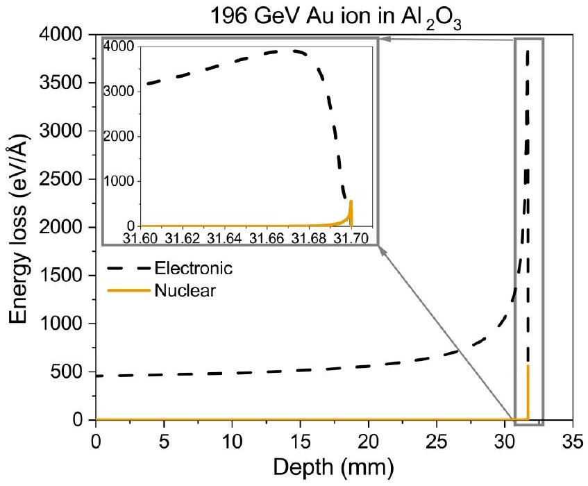
FIG. 4. Inelastic and nuclear energy loss along the trajectory of 196 GeV gold ion in $\mathrm{Al}_{2} \mathrm{O}_{3}$ according to SRIM. ${ }^{4}$.

accounting for the dynamical change of the potential of interaction among them.

In the case of $a b$ initio MD simulations, the potential is calculated from the first principles using, for example, DFT or TB Hamiltonian (more on this point will be discussed in Secs. III and IV). However, the problem may be simplified, considering that significant energy exchange between a fast projectile and ions of the target will only take place at very short distances (close collisions). Thus, it is often sufficient to account only for ion-ion repulsion, and the potential of interaction may be considered independent of the electronic states of the involved ions. That means, an empirical potential may be set as a fitted function to reproduce the exact interaction potential in the electronic ground state. A screened Coulomb potential is often used for modeling ion-ion scattering. The most common expression for screening is the universal Ziegler-BiersackLittmark (ZBL) potential, ${ }^{4}$

$$
\begin{gathered}
V(r)=\frac{Z_{i o n} Z_{t} e^{2}}{r} \Phi\left(\frac{r}{a}\right), \\
a=\frac{0.8854 a_{0}}{Z_{i o n}^{0.23}+Z_{t}^{0.23}}, \\
\Phi\left(\frac{r}{a}\right)=0.1818 \exp \left(-3.2 \frac{r}{a}\right)+0.5099 \exp \left(-0.9423 \frac{r}{a}\right) \\
+0.2802 \exp \left(-0.4028 \frac{r}{a}\right)+0.02817 \exp \left(-0.2016 \frac{r}{a}\right),
\end{gathered}
$$

where $Z_{\text {ion }}$ is again the atomic number of an impinging ion, $Z_{t}$ is the atomic number of a target ion, $r$ is the interaction distance, $a_{0}$ is the Bohr radius, and $e$ is the electron charge. The ZBL
potential was constructed by fitting the screening function parameters $\Phi(\mathrm{r} / \mathrm{a})$ to theoretically obtained potentials for a large variety of pairs of different elements and, thus, is indeed quite universal. ${ }^{4}$ There are, however, a lot of other potentials also applied to simulate ion-ion scattering in different materials (see, e.g., Ref. 65). Since only the repulsive part of the potential is included, ZBL potential cannot describe the material properties but only ion-ion scattering.

In practical implementations of ion-ion scattering, one must take special care of the fact of a very fast SHI in a steep potential: the time-step of the MD simulation needs to be chosen sufficiently small not to lead to numerical instabilities. A practical solution may be a usage of an adaptive time step, e.g., $\Delta t_{\text {new }}=\min \left(k_{t} / v ; E_{t} /(F v) ; 1.1 \Delta t_{\text {old }}\right)$, where $v$ is the recoil velocity with a chosen proportionality constant $k_{t}, F$ is the total force the recoil atom experiences, and $E_{t}$ is another proportionality constant. ${ }^{87}$

Another important aspect is that to model an entire SHI trajectory in a material, it is not possible to treat the millimeter-size target with MD with present-day computers. Instead, one may employ a dynamical simulation box, following the ion trajectory with the target atoms entering and leaving the box as needed. ${ }^{88}$ It allows tracing the entire SHI trajectory, however, not the detailed response of the target.

A further simplification often used for the scattering of an SHI with energy above $\sim 1 \mathrm{MeV} /$ nucleon is an assumption of a target to be a uniform homogeneous arrangement of atoms. Under this approximation, it is unnecessary to trace the motion of all target atoms; instead, it suffices to sample randomly interaction points of an SHI. Between the scattering events (points of interaction), an SHI travels along a straight line, changing its direction of motion only at a scattering event. At these points of interaction, a change in the SHI momentum is sampled probabilistically, according to its scattering cross section. This method is known as the binary collision approximation (BCA), ${ }^{48,65}$ and it belongs to the Monte Carlo (MC) methods. ${ }^{89-91}$ The cross section of scattering may be obtained in the classical limit by integration of the potential [e.g., Eq. (7)] over the impact parameter (all possible distances between an SHI and a target atom).

Within the MC method, the cross section of scattering, $\sigma$, fully defines the scattering process. ${ }^{40,41,91}$ The mean free path-the distance a particle travels between successive collisions, $\lambda$,-is defined as follows:

$$
\lambda^{-1}=\sigma n_{a t}=n_{a t} \int_{\mathrm{W}_{-} \mathrm{Q}_{-}}^{\mathrm{W}_{+}} \int^{\mathrm{Q}_{+}} \frac{d^{2} \sigma}{d W d Q} d W d Q
$$

where $n_{a t}$ is the density of target atoms, $W_{ \pm}$are the minimal and maximal transferred energy ( $W=\hbar \omega$ ), and the recoil energy $Q$ is defined by the transferred momentum in a collision as $Q\left(1+Q / 2 m_{t} c^{2}\right)=\hbar^{2} q^{2} /\left(2 m_{t}\right) \quad[$ in the nonrelativistic limit $Q=\hbar^{2} q^{2} /\left(2 m_{t}\right)$, with $\hbar q$ being the transferred momentum and $m_{t}$ is the scattering center (atom) mass] [see Eq. (15)].

In the nonrelativistic limit, the differential scattering cross section becomes ${ }^{92}$

$$
\begin{aligned}
& \frac{d \sigma}{d t}=\frac{-\pi a^{2}}{2} \frac{f(\sqrt{t})}{t^{3 / 2}}, \quad t=\epsilon \frac{E_{i o n}}{E_{\max }} \\
& f(x)=\frac{d}{d x}\left(x S_{n}(x)\right) \\
& \epsilon=\frac{32.53 m_{t} Z_{i o n}}{Z_{i o n} Z_{t}\left(M_{i o n}+m_{t}\right)\left(Z_{i o n}^{0.23}+Z_{t}^{0.23}\right)}
\end{aligned}
$$

where the screening coefficient $a$ is defined by Eq. (7); $\boldsymbol{\epsilon}$ is the reduced energy variable; $M_{\text {ion }}$ is the SHI mass; $m_{t}$ is the scattering center (atom) mass; and the maximal transferred energy, $W_{+}$, in the non-relativistic limit is

$$
W_{+}=E_{\max }=\frac{4 M_{i o n} m_{t} E_{i o n}}{\left(M_{i o n}+m_{t}\right)^{2}}
$$

The function $S_{n}(x)$ is the nuclear energy loss function of an SHI (nuclear stopping power), ${ }^{65}$

$$
\begin{aligned}
& S_{n}\left(E_{\text {ion }}\right)=\frac{8.462 \times 10^{-15} Z_{\text {ion }} Z_{t} M_{\text {ion }}}{\left(M_{\text {ion }}+m_{t}\right)\left(Z_{\text {ion }}^{0.23}+Z_{t}^{0.23}\right)} S_{n}(\epsilon) \\
& S_{n}(\epsilon)=\frac{0.5 \ln (1+1.1383 \epsilon)}{\left(\epsilon+0.01321 \epsilon^{0.21226}+0.19593 \epsilon^{0.5}\right)}
\end{aligned}
$$

At the relativistic energies, the cross section of elastic (nuclear) scattering, and the corresponding energy loss, can be obtained, e.g., from the Mott or Wentzel-Moliere screened scattering cross sections ${ }^{93,94}$ (renormalized by the ion charges ${ }^{95}$ ),

$$
\frac{\mathrm{d} \sigma}{d \Omega}=\left(\frac{Z_{i o n} Z_{t} e^{2}}{p_{i o n} v_{i o n}}\right)^{2} \frac{1}{(2 \eta+1-\cos (\theta))^{2}}
$$

where $\Omega$ is the solid angle, $p_{\text {ion }}$ is the incident ion momentum, $\theta$ is the scattering angle, and $\eta$ is a screening parameter. ${ }^{40}$

Concluding this section, within the electronic stopping regime of an SHI, nuclear stopping is usually negligible and may be ignored in reliable models. In cases when it is important, such as at the left shoulder of the Bragg curve where the nuclear stopping may be comparable with the electronic one, or modeling an entire SHI trajectory where the very end of it is dominated by the nuclear cascades, or to take into account rare elastic scattering events in the electronic stopping regime, Monte Carlo methods within the binary collision approximation may be used. For an even more detailed analysis, molecular dynamics simulations may be employed with ZBL ion-ion interaction potential.

Furthermore, we will be focusing mainly on the electronic stopping regime; as for the nuclear stopping regime and induced effects, the reader may find detailed information, e.g., in Ref. 65.

## C. Electronic energy loss

Electronic energy loss (or electronic stopping) of an ion refers to inelastic energy transfer to media, exciting electrons of the
target. In metals, an arbitrary amount of energy may be transferred to an electron, as there are electronic energy levels just above the Fermi level. In bandgap materials (semiconductors and insulators), only energy larger than the bandgap of the material may be transferred to an electron, exciting it from the valence band or deep atomic shells to the conduction band. This process is usually referred to as electron ionization (impact ionization). ${ }^{96}$ In such an inelastic scattering event, the kinetic energy is not conserved in the system-a part of this energy is lost to overcome the ionization potential (in the case of ionization of an electron from a deep atomic shell) or the bandgap (in a case of valence electron ionization). Such an event also leaves an electronic hole in the shell an electron is emitted from. Interaction and energy transfer may also take place simultaneously for many electrons of a dense media forming collective excitations, plasmons.

An ion penetration through a solid may be modeled with time-dependent $a b$ initio methods (such as TD-DFT) very precisely. ${ }^{97-100}$ TD-DFT methods are tracing the movement of the classical ion and all the target atoms in a simulation box in the evolving potential set by the quantum electrons. ${ }^{33}$ DFT methods are based on the substitution of electrons by non-interacting quasiparticles evolving in an effective potential including exchangecorrelation functional, which is unknown and requires an approximation. Even the simplest exchange-correlation functionals deliver good quantitative results, however, at a high computational cost. ${ }^{101}$

For example, ion-irradiation-induced direct damage of dry DNA duplex by energetic protons and $\alpha$-particles was presented in Ref. 102. Based on the TD-DFT approach, the formation of holes after irradiation was observed in a large-scale DNA model system. The modeling demonstrated that the maximal number of holes generated at ion energies was below the Bragg peak, whereas the experiment showed the maximal damage above it. This discrepancy amplifies the importance to trace all the stages of damage formation, from an SHI impact to the final material response at longer timescales.

One of the key parameters describing an ion penetration in a media is its electronic energy loss, $S_{e}$, or the stopping power, which is accessible in the experiments. It can be extracted from TD-DFT calculations directly as the average of a retarding force acting on the moving SHI, $\vec{F}_{\text {ion }}$, or as its average energy loss, ${ }^{100}$

$$
S_{e}\left(E_{i o n}\right)=-\left\langle\vec{F}_{i o n} \vec{v}_{i o n}\right\rangle \frac{1}{v_{i o n}}=-\left\langle\frac{d E_{i o n}(t)}{d t}\right\rangle \frac{1}{v_{i o n}},
$$

where the force can be obtained as the Ehrenfest force formed by all the contributing particles. ${ }^{100}$ Electronic energy loss calculated in Ref. 99 with this method revealed interesting insights into the initial excitation kinetics, e.g., a passing ion drags target electrons behind it creating a comet-like tail. The standard TD-DFT method with the Ehrenfest approximation describes the left shoulder of the Bragg curve at low ion energies; however, the right shoulder can only be described if non-adiabatic effects are included, e.g., by means of the correlated electron-ion dynamics (CEID) method. ${ }^{103}$ Non-adiabatic effects mean that energy transfer between electrons and ions occurs due to electron transitions between energy levels accompanied by momentum transfer into the atomic system of a target (e.g., elastic electron scattering on atoms or electron-phonon coupling).

To the best of our knowledge, no $a b$ initio method has yet been applied to the relativistic regime of an SHI.

An additional difficulty with a practical application is that DFT-based simulations often use pseudopotentials for core electrons (i.e., they replace deep shell electrons and nucleus with an effective potential ${ }^{104}$ ) to reduce the number of electrons in the simulations and to be able to include a sufficient amount of atoms in the simulation box. As a consequence, a constrain on the impact parameter appears-it should be chosen so that the ion trajectory does not pass close to atomic nuclei, thus neglecting a contribution to the energy loss from core shells, which may be significant (as will be discussed below, see Fig. 6).

Since the dynamics of all the electrons of the projectile and all the target atoms is traced, it makes the $a b$ initio computations very time-consuming. In practice, it is limited to the modeling of a few tens of atoms up to the times of a few femtoseconds with modernday computers. Due to high demands on computational resources and, in some cases, model limitations, ab initio methods are usually employed as supportive tools for better understanding of a particular physical process or to provide a parametrization for less computationally demanding approaches. Delivered from TD-DFT, the most accurate information on the ion penetration effects allows to validate other models and identify their limitations. ${ }^{100}$ To extend DFT-based methods to larger systems, further simplifications are used, such as the linear-scaling density functional theory (LSDFT). It employs a simplified algorithm of DFT Hamiltonian diagonalization via splitting the large simulation box into overlapping smaller ones. ${ }^{105}$ Within this approach, at the cost of a moderate accuracy loss, one can simulate some thousands of atoms. Such methods are yet to be applied to the irradiation problem.

The Monte Carlo method ${ }^{81,82}$ is the most commonly used simplified approach for SHI penetration. The same equation (8) can be used with the cross section of the inelastic scattering replacing the nuclear scattering one. The electronic stopping power of a projectile with energy $E$ can also be calculated (analogously to the nuclear stopping power) via the differential cross section of scattering as follows: ${ }^{6}$

$$
S_{e}(E)=n_{a t} \int_{\mathrm{W}_{-}}^{\mathrm{W}_{+}} \int_{\mathrm{Q}_{-}}^{\mathrm{Q}_{+}} W \frac{d^{2} \sigma}{d W d Q} d W d Q
$$

The integration limits defining the maximal and minimal allowed momentum transfer in the relativistic case are defined as follows, assuming scattering on a free particle: ${ }^{41}$
$\left.Q_{ \pm}=\sqrt{\left(\sqrt{E\left(E+2 M c^{2}\right)}\right.} \pm \sqrt{(E-W)\left(E-W+2 M c^{2}\right)}\right)^{2}+\left(m_{t} c^{2}\right)^{2}$
$-m_{t} c^{2}$,
where $M$ denotes the mass of the incident particle (here equals the SHI mass, but the same can be applied to other particles, e.g., electrons). In the non-relativistic case $\left(E \ll \min \left(M, m_{t}\right) c^{2}\right)$, the limits of the transferred momentum, Eq. (15), simplify to the following form: ${ }^{106}$

$$
Q_{ \pm}=\frac{M}{m_{t}}(\sqrt{E} \pm \sqrt{E-W})^{2}
$$

The lower limit of the transferred energy ( $W_{-}$) and the upper limit ( $W_{+}$) for scattering on a target particle (an electron, in this case) are defined by the following formulas:

$$
\left\{\begin{array}{l}
W_{-}=I_{p} \\
W_{+}=\frac{2 m_{t} c^{2} E\left(E+2 M c^{2}\right)}{2 m_{t} c^{2} E+\left(M c^{2}+m_{t} c^{2}\right)^{2}}
\end{array}\right.
$$

where $I_{p}$ is the ionization potential of the atomic shell an electron is being ionized from. The upper limit is written here for a free particle. For scattering on a bound particle with a given ionization potential, the expressions are more complicated (see Ref. 6), but the free-particle approximation works very well for $W_{+} \gg I_{p}$. In the case of ionization from the valence band, $I_{p}=E_{\text {gap }}$. Here, $E_{\text {gap }}$ is the material bandgap, which is equal to zero in the case of metals. In the non-relativistic limit, the upper limit simplifies to $W_{+}=E_{\text {max }}$ from Eq. (10).

The cross section of scattering of a projectile on a complex correlated system (a solid) is difficult to calculate. The question of a nonperturbative closed solution or at least a simple and efficient model of an SHI scattering in solids without empirical adjustable parameters is still open.

Most often, the perturbation theory is used to evaluate the inelastic scattering cross section, with only the leading term included-the first-order Born approximation. It further assumes the plane waves of the incident particle. ${ }^{107}$ It is also known as the linear response theory due to its connection to the complex dielectric function (CDF) of the material, which will be revealed below.

In a general relativistic case, a double-differential cross section is expressed in terms of a longitudinal and a transverse contribution, ${ }^{61}$

$$
\frac{d^{2} \sigma}{d W d Q}=\left(\frac{d^{2} \sigma}{d W d Q}\right)_{l}+\left(\frac{d^{2} \sigma}{d W d Q}\right)_{t r}
$$

The longitudinal term is responsible for the Coulomb scattering, whereas the transverse one is a result of virtual photons exchange. ${ }^{41,61}$ Equation (18) can be expressed in the following terms: ${ }^{61}$

$$
\frac{d^{2} \sigma}{d W d Q}=\frac{2 \pi Z_{e f f}^{2}(E) e^{4}}{m_{t} c^{2} \beta^{2}}\left[\frac{\left|F_{n}(q)\right|^{2}}{Q^{2}\left(1+Q /\left(2 m_{t} c^{2}\right)\right)^{2}}+\frac{\left|\beta_{\perp} G_{n}(q)\right|^{2}}{\left(Q\left(1+Q /\left(2 m_{t} c^{2}\right)\right)-W^{2} /\left(2 m_{t} c^{2}\right)\right)^{2}}\right]\left(1+\frac{Q}{m_{t} c^{2}}\right),
$$

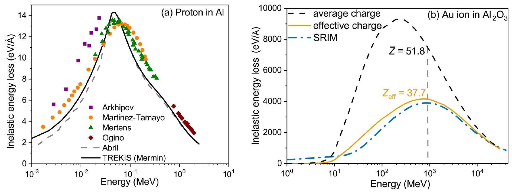
FIG. 5. (a) Proton energy losses in aluminum, calculated with TREKIS using Mermin-like CDF, ${ }^{5}$ the same calculations by Abril et al., ${ }^{114}$ experimental data of AI from Refs. 118-121. (b) Inelastic energy loss of Au ion in $\mathrm{Al}_{2} \mathrm{O}_{3}$ calculated with equilibrium average charge [Eq. (3)] vs effective charge [Eq. (5)], calculated with TREKIS, ${ }^{5}$ compared with the reference data from SRIM. Charges are marked at a selected energy of 900 MeV (Bragg's peak) shown with the vertical line.

where $\beta=v / c=\sqrt{1-\left(1+E / M c^{2}\right)^{-2}}$ is the incident particle velocity normalized to the speed of light in vacuum $c$, $\vec{\beta}_{\perp}=\vec{\beta}-(\vec{\beta} \cdot \vec{q}) \vec{q} / q^{2}$ is the component of $\vec{\beta}$ perpendicular to the transferred momentum $\vec{q}, Z_{\text {eff }}(E)$ is the effective charge of the incident particle (as discussed above in Sec. II A), and $a_{0}$ is the Bohr radius.

The longitudinal contribution contains $F_{n}(q)$, which is the inelastic form factor ${ }^{61}$ (index $n$ denotes the energy state corresponding to the transferred energy $\mathrm{W}=\hbar \omega$ ), the squared modulus of which is proportional to the dynamic structure factor (DSF) usually denoted as $S(\omega, q) .^{107}$ With some approximations, the transverse contribution $G_{n}(q)$ can also be expressed in terms of $F_{n}(q) ;^{41}$ this term vanishes in the nonrelativistic limit, and the longitudinal term defines the interaction.

The DSF can be recast in terms of the so-called generalized oscillator strengths ${ }^{41}$ and is connected to the complex dielectric function of the solid $(\varepsilon(\omega, q))$ via the fluctuation-dissipation theorem ${ }^{108}$

$$
\begin{aligned}
\left|F_{n}(q)\right|^{2} & \equiv \frac{S(\omega, q)}{\hbar} \\
& =\frac{q^{2}}{n_{a t} 4 \pi^{2} e^{2}} \frac{1}{1-\exp \left(-\hbar \omega /\left(k_{B} T\right)\right)} \operatorname{Im}\left(\frac{-1}{\varepsilon(\omega, q)}\right),
\end{aligned}
$$

which is valid under the assumption of local thermal equilibrium of the homogeneous target; $T$ is the temperature of the solid and $k_{\mathrm{B}}$ is the Boltzmann constant. Note that the CDF also implicitly depends on the target temperature.

Thus, within the linear response theory, the problem reduces to defining an appropriate CDF or the loss function $\operatorname{Im}\left(\frac{-1}{\varepsilon(\omega, q)}\right)$.

Even though it may be calculated with $a b$ initio methods such as DFT, it is in practice still rather time-consuming to do it sufficiently precise. ${ }^{109}$ There are a few models proposed for the CDF evaluation from the experimental (or $a b$ initio calculated) optical coefficients (refraction and transmission coefficients ${ }^{110,111}$ ), allowing to reconstruct $\operatorname{Im}\left(\frac{-1}{\varepsilon(\omega, q=0)}\right) \cdot{ }^{112-115}$ Having the optical coefficients, the CDF can then be analytically continued to the entire plane of $q>0$, via a few different methods. ${ }^{112-115}$

Approximating the loss function in Eq. (20) with the Dirac delta-function centered around a mean ionization potential of a target, $\left\langle I_{p}\right\rangle$, and integrating Eqs. (14) and (19) produces the wellknown Bethe-Bloch formula ${ }^{116,117}$ for inelastic ion energy losses of an SHI at the right shoulder of the Bragg peak ${ }^{61}$

$$
S_{e}(E)=\frac{4 \pi Z_{e f f}^{2} Z_{t} n_{a t} e^{4}}{m_{e} c^{2} \beta^{2}}\left[\ln \left(\frac{2 m_{e} c^{2} \beta^{2}}{\left\langle I_{p}\right\rangle\left(1-\beta^{2}\right)}\right)-\beta^{2}\right] .
$$

Note that Eqs. (14) and (19) allow for the evaluation of the stopping power without an assumption of a mean ionization potential, using precise CDF peaks instead. ${ }^{6}$

A very convenient way to reconstruct the loss function from the optical coefficients and extend it to the non-zero $q$ region was proposed by Ritchie and Howie. ${ }^{112}$ It approximates the optical coefficients with Drude-Lorentz (DL) oscillators. The method was later extended by replacing the Drude oscillators with Mermin-like dielectric function, ${ }^{114}$ providing a better agreement of the resulting mean free paths and stopping powers with experimental data. Further improvements of the approach include Coulomb-field corrections to the first Born approximation-potential energy gained by the incident electron in the field of an atom (or a molecule) can be accounted for. ${ }^{122,123}$ A detailed description of various models of

CDF can be found in the review. ${ }^{32}$ More details and examples on reconstructing CDF from optical coefficients will be discussed in Sec. VIII.

Properly selected CDF (with coefficients from Ref. 114) with the most advanced model currently available-the Mermin model-reproduces energy losses of protons (see, for example, Fig. 5). For heavy ions, it is not the case, and the effective charge, discussed in Sec. II A, must be used to obtain a reasonable ion energy loss [see Fig. 5(b)]. An actual average charge [Eq. (3)], within the linear response theory, produces the stopping power drastically overestimating the reference one. It is, thus, clear that the effective charge [Eq. (5)] is used as an ad hoc parameter. The underlying physical reason for this will become clearer from the following considerations.

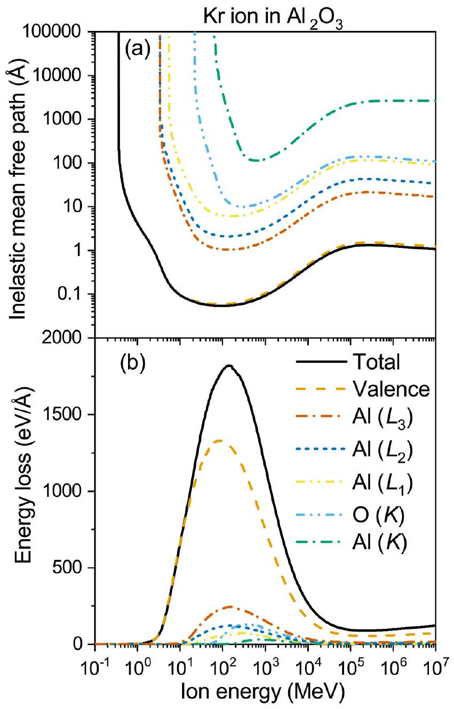
FIG. 6. Total and partial inelastic (a) mean free path and (b) energy loss of Kr ion in $\mathrm{Al}_{2} \mathrm{O}_{3}$ of scattering on various shells and valence band of the material, calculated with TREKIS. ${ }^{5,6}$

The total mean free path of an ion is dominated by the scattering on the valence band of the material, whereas scattering on the deeper atomic shells is much rarer forming much larger mean free paths (Fig. 6). However, scattering on deeper shells contributes noticeably to the stopping power, e.g., nearly $30 \%$ of the energy loss of Kr ion in $\mathrm{Al}_{2} \mathrm{O}_{3}$ [see Fig. 6(b)]. This is because, in an event of scattering on deeper shell electrons, an ion loses at least the energy equal to the ionization potential of the shell. Thus, although scattering events on deep shell electrons are rarer than interaction with the valence band, a lot more energy is transferred in each of them, resulting in a comparable energy loss.

A projectile may interact with many particles at once, and its reach of the potential (impact parameter) extends beyond the nearest neighbor distance. It becomes obvious if we look at the mean free path of heavy ions (Fig. 6). An SHI interacts with many electrons of the same atom, and its potential created by a high charge reaches a few-neighbor distance around its trajectory. This makes the mean free path much shorter than the mean interatomic distance in $\mathrm{Al}_{2} \mathrm{O}_{3}(\sim 2 \AA)$ and even shorter than the average interelectronic distance ( $\sim 0.2 \AA$ ), clearly indicating ion interaction with more than the nearest electron at once.

It leaves multiple-ionized target atoms after an SHI passage. Figure 7 shows the experimental spectra of photons emitted from target ions with different numbers of holes left in Si atoms in fused $\mathrm{SiO}_{2}$ after a swift Ca ion impact. They are measured via the spectroscopy of the photon emission due to radiative decays in such atoms (more details on the processes of hole decays will be discussed in Sec. III B). They provide information about the distribution of charges of target atoms in a track core-the region excited by an SHI directly-thereby allowing to test models of ion interaction with a solid target. ${ }^{59}$ The multiple ionized states are created by an SHI, but not by the further kinetics of electrons, and, thus, can clearly be distinguished.

The ionization potential of an ion is larger than that of a neutral atom. ${ }^{124}$ It depends on the particular configuration of electron populations on all the shells of an ion, but the general tendency is that the ionization potential increases with the increasing charge (ionization degree) of an ion. ${ }^{125}$ That means, in a multiple-ionized ion of a target, ionization potentials increase, making it more difficult to ionize each successive electron. ${ }^{125}$

Due to this difference, using atomic ionization potentials, thus, produces more ionizations (and higher energy losses) than it would if the ionization potential changes were accounted for. This kind of non-linear response of the target seems to be a reason for the need to adjust the energy losses within the linear response theory-which is done via using an effective charge.

In MC simulations, often the method of condensed history (or condensed collisions) simulations is used. ${ }^{81,82}$ In this approach, only the close collisions (with the energy transfer above a certain threshold) are modeled in detail, whereas distant collisions (with a small energy transfer) are averaged along the SHI trajectory and treated as a deceleration with the stopping power $S_{e}(E)$ calculated with Eq. (14). Such a calculation method significantly speeds up a computation, enabling very efficient modeling of an SHI transport, but a loss of information on the created electrons does not allow for the modeling of the target response.

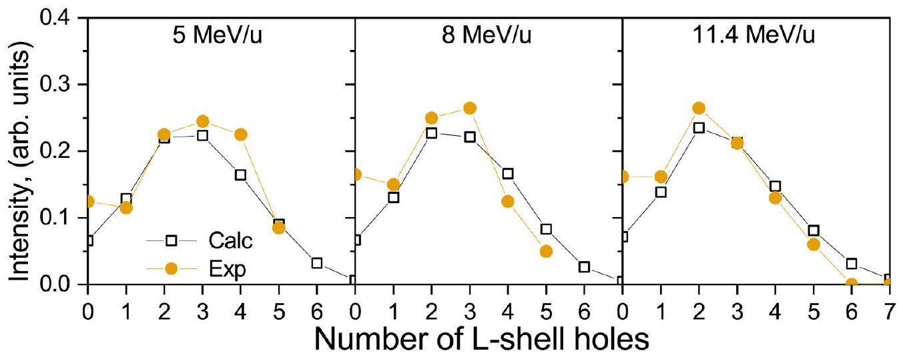
FIG. 7. Experimental and calculated spectra of radiative decays of holes in the K-shell of Si atoms with a given number of holes in the L-shell in silica irradiated with Ca ions with different energies (5,8, and $11.4 \mathrm{MeV} /$ nucleon $)$. Adapted from Ref. 59.

In contrast, an event-by-event (or analog) MC simulation traces each scattering event in detail, which is sufficient for tracing material response. ${ }^{126}$ Transferred energy in a scattering act is sampled according to the following expression:

$$
\gamma \sigma=\int_{\mathrm{W}_{-} \mathrm{Q}_{-}}^{\mathrm{W}} \int^{\mathrm{Q}_{+}} \frac{d^{2} \sigma}{d W d Q} d W d Q
$$

where $\gamma \in[0,1)$ is a random number; Eq. (21) must be solved for the transferred energy $W$. In some cases, the differential equation allows for analytical integration and a closed solution for $W$. ${ }^{6,41}$ In

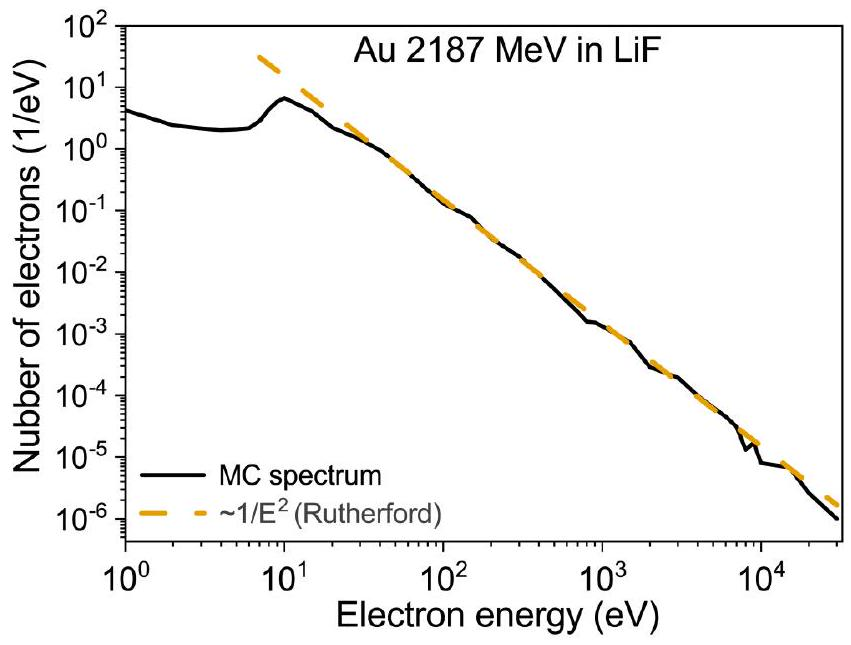
FIG. 8. The spectrum of electrons generated by Au 2187 MeV ion in LiF, calculated with the Monte Carlo code TREKIS. A characteristic shape of a Rutherford scattering ( $\sim 1 / E_{e}^{2}$ ) is shown for comparison.

general, a numerical solution is required, ${ }^{5}$ or further approximations to the electron spectrum should be employed. ${ }^{41}$ An electron is emitted with the kinetic energy $E_{e}=W-I_{p}$.

An example of a spectrum of electrons created by an impact of Au ion with the energy 2187 MeV in LiF (before electron cascades start) is shown in Fig. 8. This typical spectrum follows the Rutherford law at large energies (significantly above the plasmon peak energy $\hbar \omega_{p}$ ), scaling as $\sim 1 / E_{e}^{2}$. At lower energies, a noticeable deviation from this law takes place. It follows from the fact that at low energies, collective electron effects (screening and plasmon formation) define the scattering event, whereas at transferred energies $W \gg \hbar \omega_{p}$, the complex dielectric function tends to unity, producing unscreened potential. ${ }^{127}$ Scattering on an unscreened Coulomb potential, thus, follows the well-known Rutherford shape.

The recoil angle of a target particle with the mass $m_{t}$ (an electron, $m_{t}=m_{e}$, or an atom) after receiving energy $W$ from an incident particle with the kinetic energy $E$ and mass $M$ is

$$
\cos \left(\theta_{r}\right)=\frac{\sqrt{W}\left(E+m_{t} c^{2}+M c^{2}\right)}{\sqrt{E} \sqrt{E+2 M c^{2}} \sqrt{W+2 m_{t} c^{2}}}
$$

or in the nonrelativistic case,

$$
\cos \left(\theta_{r}\right)=\sqrt{W} \frac{\left(M+m_{t}\right)}{\sqrt{4 M m_{t} E}}
$$

Thus, the angular dependence of the electron spectrum is $\sim 1 / \cos ^{4}(\theta)$, which has a maximum at the perpendicular direction with respect to the SHI trajectory. This means, the majority of electrons have low energies (large impact parameters) and are emitted perpendicularly to the SHI velocity, whereas a small minority of electrons with high energies (from head-on collisions) are emitted along the SHI trajectory.

It is important to keep in mind that transport Monte Carlo simulations rely on Markovian approximation. ${ }^{33}$ Each scattering
event is assumed to be instantaneous and independent of other scattering events. This is valid in a case when the duration of an individual event is much shorter than the free flight time, which is satisfied for close collisions of electrons with energies above some $\sim 50 \mathrm{eV}$. Distant collisions, especially of slow electrons, transfer a small amount of energy, which, according to the quantum speed limit theorem, requires sufficiently long times. ${ }^{128}$ For example, a phonon emission requires a time proportional to the inverse phonon frequency. It is still an open question if and how the finite duration of scattering and energy exchange may be incorporated into MC and other Markovian methods (a possible solution for the case of Boltzmann scattering integrals was proposed in Ref. 129).

Summarizing, low-energy ion transport can be precisely described with $a b$ initio methods such as TD-DFT but at a high computational cost. Fast calculations based, e.g., on the Monte Carlo method, require reliable cross sections. An absolute majority of available cross sections rely on the first-order Born approximation (linear response theory) and, thus, use semi-empirical adjustments at low ion energies, such as an effective charge of an SHI. At high energies, linear response theory based on the longitudinal complex dielectric function works very well and can provide reliable results for SHI energy loss and spectra of excited electrons. At relativistic energies, the effects of the transverse dielectric function contribution should be taken into account, and the finite size of the SHI nucleus plays a very important role for ultra-relativistic projectiles. Created spectra of SHI-excited electrons have a characteristic shape of $\sim 1 / E_{e}^{2}$, except for the low energies where collective (plasmon) effects dominate and make the spectra deviate from this dependence. A majority of electrons with relatively low energies, traveling perpendicular to the SHI trajectory, are created, with a few but highly energetic delta-electrons, initially directed along the SHI trajectory. Simultaneously, valence- and core-shell holes with multiple-charged ions are left in the target. This sets the initial conditions for further electron and hole kinetics.

## D. Other processes

Apart from phenomena originating from the nuclear and electronic energy loss of an SHI, other effects manifest themselves under certain conditions.

The effect of ion channeling can occur when the incident direction of an ion beam is aligned with a particular axis of a crystal. ${ }^{130}$ In this case, an ion travels in-between the atomic planes without meeting a significant electron density. It reduces the SHI energy losses and allows traveling within this "channel" much larger distances than its typical range. This geometric effect is found in various experimental applications and may be important to study for practical purposes. ${ }^{88,131}$

Materials with noticeable anisotropy will also manifest geometrical effects in particle transport. A particle propagation along different axes will be different, which requires tracing cross sections dependent on the crystallographic orientation. ${ }^{132,133}$

In non-ideal materials with impurities, direct electron excitation into impurity levels may occur. This channel of excitation is usually of minor importance since it is rare and accounts for very little energy loss of a projectile. Analogously, the formation of
excitons (bound electron-hole states within the bandgap of material) by a direct impact is usually negligible. ${ }^{134}$

An SHI is often treated as a point-like charge traveling through a solid. Accounting for the finite size of the ion (a nucleus with electrons around) usually leads to only minor modifications of its interaction with target atoms, most pronounced around the Bragg peak. ${ }^{135}$

The nuclear fragmentation of an SHI may take place during its travel in a solid. Such an effect is extremely rare but alters all further kinetics drastically, instantaneously changing the mass, charge, and direction of motion of the projectile. ${ }^{136,137}$ It may be important to take this effect into account if modeling entire trajectories of multiple ions, which makes such an effect statistically noticeable, depending on the nucleus of the SHI and target atoms. ${ }^{138}$

During an SHI scattering, complex processes may take place, such as the creation of the so-called convoy electrons. These electrons are not fully captured by the SHI but follow it along, carrying some energy out of the target. ${ }^{139}$ They are essentially analogous to electrons in the Rydberg states of an ion. ${ }^{140}$ Attracted electrons may also re-scatter off the ion and be re-emitted with different velocities. This process is known as the "Fermi shuttle." ${ }^{141}$ These effects can often be neglected as they have only a little impact on the SHI penetration and target response. However, they may create additional features in the spectra of emitted electrons and, thus, may be observable in dedicated experiments. ${ }^{141}$

Bremsstrahlung photon emission is an additional channel of energy loss of a particle, becoming noticeable at ultra-relativistic energies. ${ }^{142,143}$ As will be discussed below, for electrons, the Bremsstrahlung effect becomes dominant at energies of some GeVs . As the intensity of this radiative energy loss scales inversely proportional to the projectile mass, even for protons, it is negligible up to the energies of some TeVs. At lower energies, Bremsstrahlung plays a minor role and usually can be neglected, unless it is of particular experimental interest. ${ }^{144}$

To conclude, there is a multitude of immediate effects induced by an SHI impinging on solid targets. Most of those discussed in this subsection may often be neglected. It is, nonetheless, important to keep them in mind, since they may manifest under certain conditions.

## III. FEMTOSECOND TIMESCALES: ELECTRONIC SYSTEM

Electronic kinetics starts in the wake of an SHI immediately after its passage. It tends to equilibrate the excited electronic system and consists of a collection of complex and intertwined processes, taking place typically at a femtosecond timescale ( $\sim 1-10 \mathrm{fs}$ ). This scale is much shorter than that of atomic dynamics. Although experiencing new forces caused by the excited electrons, the atomic ensemble remains essentially frozen during this stage of the electronic kinetics.

This "age of electrons" involves kinetics of fast primary $\delta$-electrons, electronic cascades, ensembles of generated secondary electrons, deep shell holes, valence holes, and photons, ${ }^{28}$ as well as initial changes in the interatomic potential. ${ }^{145}$ Their kinetics governs the spatial spreading of the excitation from the ion trajectory and prepares the parameters of the electronic system providing energy transfer into the atomic system at longer times.

High-energy-electron transport excites secondary electrons, holes, and photons, and transfers kinetic energy to atoms. Created photons, although typically having only a small amount of the deposited energy, bring it far outward from a track core. Deep-shell holes decay via the Auger-channel, producing secondary electrons, or radiative channel, producing secondary photons. Transport of the valence holes is similar to electron transport: it involves energy transfer to atoms (will be discussed in Sec. IV) and may also excite secondary electrons in narrow-band materials. ${ }^{146,147}$

All of these processes transiently change the electronic distribution function toward the so-called "bump-on-hot-tail" distribution within femtoseconds after the ion passage. ${ }^{148}$ It consists of a majority of slow electrons with nearly thermalized energy distribution, whereas a minority of high-energy electrons forms a long tail that is far from equilibrium.

As electrons form the attractive part of the interatomic potential, which keeps atoms of a solid together under normal conditions, heating low-energy electrons to high electronic temperatures changes the potential, triggering an atomic response to it: acceleration of atoms and structure instability (nonthermal effects). ${ }^{145}$ The changes in the electron distribution function and atomic positions strongly affect the electronic structure (band structure) of a material. ${ }^{149,150}$ As slow electrons are mainly concentrated within short distances from an SHI trajectory, these effects may be important in the track core.

We will discuss all of these effects below in detail to see how they eventually affect the kinetics of the electron ensemble and atomic dynamics, leading to observable material modifications.

## A. Transport of excited electrons (up to $\mathbf{1 0 ~ f s}$ )

Ab initio techniques such as TD-DFT or nonequilibrium Green function (NEGF ${ }^{151,152}$ ) formalism allow tracing transport of electrons as quantum-mechanical objects with high precision. However, they are only used these days for a description of SHI impact on very thin films (graphene ${ }^{139}$ ). They are, again, limited in time to only a few femtoseconds with present-day computational power.

Computationally efficient approximations and alternative approaches are being actively developed. One of such methods is the orbital-free density functional theory (OFDFT). ${ }^{153}$ It implements the original idea of the DFT that the total energy of the electronic system is a functional of a single variable: the electron density. ${ }^{154}$ Since the exact expression of this functional is unknown, a number of approximations have been proposed. ${ }^{155}$ Depending on an approximation, OFDFT allows simulating systems with a number of atoms ranging from $10^{4}$ to $10^{6} .^{156}$ Such an advance, however, resulted in a significant loss of accuracy, and currently, OFDFT produces reasonable results only for metals. ${ }^{153}$

The most successful in terms of application to an SHI track simulation is the electron force field method (eFF). ${ }^{157}$ It uses classical molecular dynamics to simulate electrons smeared in space (as floating Gaussians) and atoms. For the description of electron-electron and electron-nuclei interaction, phenomenological potentials parametrized via DFT are used. Within the eFF approach, one can simulate many thousands of atoms and electrons. This method works well only for light atoms up to carbon. For heavier atoms, it
requires some model improvements and a usage of pseudopotentials for core electrons, which limits the description of the early stage electron kinetics in the SHI track. The heaviest element simulated by now was silicon: a crack creation in bulk silicon, ${ }^{158}$ and SHI track formation in bulk and a slab of Si were studied. ${ }^{159}$ However, the capability to reproduce experimental results with this method is yet unclear.

Another promising $a b$ initio method is based on Bohmian mechanics, which is significantly faster than DFT-MD and similar approaches, with some approximations for the interaction potential. ${ }^{160}$ This method has not yet been applied to the SHI problem but will probably find a wide range of applications in the future.

Apart from the high computational cost, DFT and DFT-based approaches (except for the TD-DFT and NEGF) have another crucial disadvantage when applied to the electronic transport in SHI tracks: they are limited to systems in thermodynamic equilibrium, ${ }^{35}$ which is not the case at the femtosecond scale of the process. In order to solve the problem of electron transport from the SHI trajectory, one has to apply the kinetic equation-based numerical approaches.

After an SHI impact, as discussed in Sec. II C, electrons with the spectrum $\sim 1 / E^{2}$ are created. The majority of these electrons are "slow." They do not fly far away from the SHI trajectory, concentrating around it at distances shorter than 10 nm at sub- 10 fs timescales and contributing to the formation of the interatomic potential there. Thus, we do not discuss their effect on energy spreading in this section (see Sec. IV). In contrast, the electrons at the long high-energy tail of the distribution ( $\delta$-electrons) will transport energy away from the track core, performing secondary scattering. In dielectrics and semiconductors, the scattering of these electrons mainly occurs via two channels-elastic one on target atoms and inelastic scattering redistributing this energy via electronic cascades exciting secondary electrons and creating deep-shell and valence holes-in full analogy to the SHI scattering from Sec. II. The "elastic" channel, which is also often called "quasi-elastic," ${ }^{161}$ conserves the total kinetic energy in its exchange between the scattering particles (an incident electron and an atom/phonon).

The spreading and scattering of $\delta$-electrons can be described well in the framework of the one-particle approximation and the linear response theory [Eqs. (12) and (14)-(20)]. Since it is based on the first-order Born approximation, it is limited to electron energies above some tens of eV . However, in practice, even lower energies may be described satisfactorily, if interpreted carefully, keeping in mind that the quantum nature of electrons as wavepackets instead of classical point-like particles becomes important. ${ }^{32}$

The transport MC method is not well-suited to describe lowenergy strongly interacting particles (although it is possible in principle, it becomes very inefficient ${ }^{162}$ ). Ensemble simulations are a better way to study such systems. In a semi-classical limit, electronic behavior may be traced with the Liouville equation, ${ }^{163,164}$ which, in the case of a single-particle distribution, simplifies to the Fokker-Planck ${ }^{39,165}$ or Boltzmann ${ }^{166,167}$ equations. These methods allow tracing the evolution of the electronic ensembles and their energy exchange with atoms. Unfortunately, they are also computationally time-consuming and have been rarely applied in the SHI community. ${ }^{168}$

Figures 9-11 present the mean free paths (MFPs) for elastic and inelastic scatterings of electrons in alumina, calculated with the CDF-based cross sections in MC code TREKIS-4. ${ }^{169}$ At low energies, when the electron scatters on phonons or plasmons (collective modes of the target), the scattering probability increases approximately linearly with the electron velocity. As the velocity approaches the characteristic velocity of the scattering centers ( $\sim$ tens of eV for scattering on electrons), the incident electron is seeing the target as an ensemble of individual scattering centers. The cross section of scattering on an individual atom/electron decreases with an increase in the electron velocity, due to the shortening of the effective interaction time (faster particle passes quickly the interaction region and is less affected by it). Thus, the mean free path increases, until the relativistic effects start to play a role. At relativistic energies ( $\sim \mathrm{MeV}$ ), the effective interaction region increases again due to field stretching effect. This leads to an increase in the cross section and corresponding shortening of the mean free path.

Figure 9 illustrates that the energy is mainly transported out from the track core by electrons with energies larger than $50-$ 100 eV -they have the MFP increasingly larger than $\sim 1 \mathrm{~nm}$.

These electrons are also the most effective in producing new generations of electrons, valence, and core holes due to impact ionizations, as seen in Fig. 10. The secondary electrons and holes start their own transport and scattering, producing more electrons via impact ionizations. This process is known as electron cascade, which changes the state of the electronic ensemble and opens new channels of its relaxation kinetics. Electron inelastic scattering is dominated by the scattering on the atomic shells with the lowest ionization potential smaller than the electron energy (Fig. 10). The probability of the scattering on each atomic shell/band is proportional to its relative cross section of scattering (or inversely

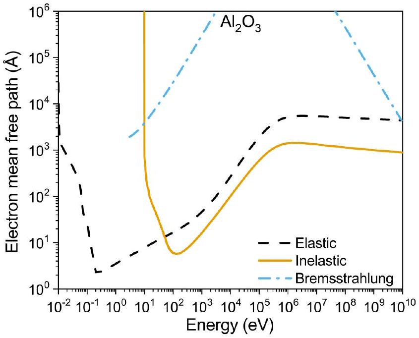
FIG. 9. Electron mean free paths of different processes in $\mathrm{Al}_{2} \mathrm{O}_{3}$, calculated with TREKIS. ${ }^{5,6,169}$ Bremsstrahlung cross section is calculated according to Ref. 41.

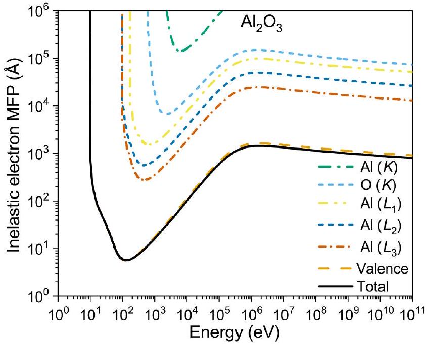
FIG. 10. Inelastic electron mean free path in $\mathrm{Al}_{2} \mathrm{O}_{3}$, calculated with TREKIS. ${ }^{5,6,169}$ Total MFP, scattering on the valence band electrons, and on all deep shells are shown.

proportional to its MFP). Thus, most of the excitations of secondary electrons in the cascade will be from the valence band of alumina, some excitation of L -shells of Al atoms will be present, and on rare occasions, electrons will excite K -shells of $\mathrm{Al}_{2} \mathrm{O}_{3}$ in SHI tracks.

Figure 11 illustrates that the scattering of the fast electrons ( $E_{e}>100 \mathrm{eV}$ ) can be well described by Mott's scattering cross

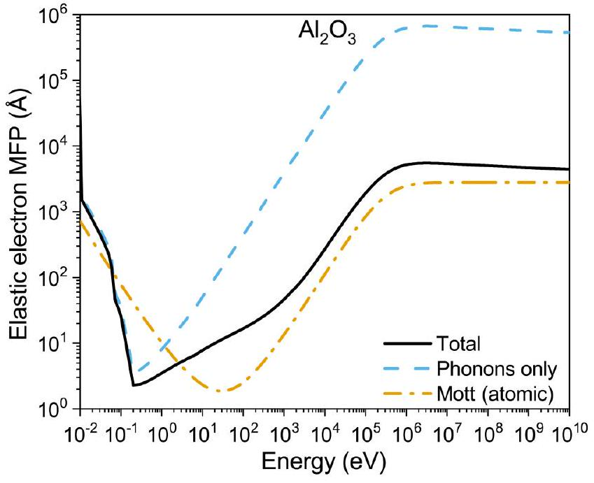
FIG. 11. Elastic electron mean free path in $\mathrm{Al}_{2} \mathrm{O}_{3}$, total and estimated scattering on phonons, compared with atomic Mott's scattering cross section (combined for the compound using the Bragg additivity rule ${ }^{41}$ ), calculated with TREKIS. ${ }^{5,6,169 .}$

section with the modified Molier screening parameter [Eq. (11)]. ${ }^{40}$ Underestimation of Mott's atomic scattering in Fig. 11 seems to stem from the Bragg additivity rule ${ }^{41}$ used to construct the total elastic scattering with the atomic cross section for the binary compound (alumina), which may produce results deviating from the exact solution. ${ }^{170}$ The instantaneous regime of scattering on individual lattice atoms frozen in their current positions is a good approximation for these short-wavelength electrons, whose Compton wavelength is smaller than the interatomic distance. ${ }^{107,171,172}$

Similar to SHIs, elastic scattering on atoms is dominant at low electron energies (below $\sim 50 \mathrm{eV}$ )-correspondingly rescaled by the mass ratio of an electron and an SHI. Scattering on phonons describes the coupling of slower electrons ( $E_{e}<10 \mathrm{eV}$ ) with lattice atoms. ${ }^{173}$ However, the shorter-than-10-fs timescale of this stage of electronic kinetics does not allow the formation of even the highest frequency optical phonons. At such short times, this scattering channel of slow (but hot!) electrons is only starting to form, since the scattering act is not an instantaneous event but its duration is defined by the quantum speed limit theorem (as discussed in Sec. II C). We return in detail to the problem of different modes of elastic electronic scattering in Sec. IV.

Photon emission due to the Bremsstrahlung process plays a significant role only at relativistic energies (above some $\sim \mathrm{MeV}$ for an electron). Its cross section starts to grow (MFP decreases) and becomes dominant at energies above some GeVs . At nonrelativistic energies, Bremsstrahlung emission is associated with low-intensity low-frequency photons and does not contribute significantly to electron energy loss, although the spectra of Bremsstrahlung photons may be experimentally observable. ${ }^{144}$

In each scattering event, an electron will deflect from its previous trajectory by an angle defined by the transferred energy [sampled according to Eq. (21)]. ${ }^{41}$ In a nonrelativistic case, it is $\cos (\theta) \sim 1-W / E$, which is almost isotropic for slow particles, and has a strong preferential direction forward for fast incident particles. Thus, fast delta-electrons first scatter with minor deflections from their initial direction (ballistic transport, with traveled distance proportional to time, $d \sim t$ ), but their behavior becomes more diffusive (random change of the direction in each scattering event resulting in Brownian motion with $d \sim \sqrt{t}$ ) as they lose their energy. ${ }^{174,175}$

In a solid, an electron having its initial momentum defined by the recoil angle Eq. (22) will not necessarily be emitted with the same angle. On its way out, it will interact with the media, which may alter its direction of motion. An emitted electron acquires an angular distribution, which is defined by the complex dielectric function and the double-differential scattering cross section associated with it. ${ }^{173}$ On average, the momentum of an emitted electron is still approximately proportional to the square root of energy but with a broadened distribution. This dependence of the allowed transferred energies and momenta (or recoil energies $\mathrm{Q}, \mathrm{W}$ ) is known as the Bethe surface and $W=Q$ is called the Bethe ridge. ${ }^{41,61}$

It is important to point out that in standard MC simulations, often energy cutoffs are used to stop the tracing of electron transport. That means, an electron is artificially stopped once its energy drops below a predefined value, usually chosen as $10 \mathrm{eV} .^{176}$ This method of simulation allows to estimate the radial dependence of
the deposited dose around the SHI trajectory, redistributed due to electron transport. ${ }^{177,178}$ Even though it is a standard practice to use energy cutoffs, thusly calculated cumulative doses do not resemble energy density distribution at any time instant after SHI energy deposition. ${ }^{11}$ For the quantitative modeling of SHI track creation, it is important to trace the realistic evolution of the spatiotemporal energy density distribution around an SHI trajectory, as will be discussed in detail in Sec. VIII.

A typical example of the evolution of the density and energy density of excited electrons after an impact of Xe ion with 167 MeV energy in $\mathrm{Al}_{2} \mathrm{O}_{3}$ is shown in Fig. 12. ${ }^{5}$ Immediately after an SHI impact, all created electrons are located within its impact parameter, a few angstroms around the ion trajectory. The electron transport starts with the ballistic regime. The delta-electrons, produced by an SHI, fly away fast, forming a front of electron density and energy density propagation. This finite speed of propagation of excitation cannot be described with the diffusion equation. ${ }^{179}$

Behind it, the second front of propagation appears, which is related to the plasmon peak. Many electrons with nearly the same energy are created due to the plasmon resonance excitation, ${ }^{175}$ which start to travel outward from the SHI trajectory. Their transport shows dissipative-wave-like behavior. ${ }^{5,175}$ In its wake, they leave slow electrons, whose diffusive behavior forms a plateau-like distribution, as expected from diffusive transport in the cylindrical geometry. ${ }^{180}$ A bimodal distribution in the electronic ensemble forms before 10 fs after the ion impact. It consists of (a) fast electrons forming the ballistic front of the spreading excitation and (b) a large number of "slow" electrons spreading diffusively in the proximity of ion trajectory.

Energy transport exhibits the same features even more pronouncedly, Fig. 12(b). By the time of $\sim 10 \mathrm{fs}$, the kinetic energies of most of the electrons are insufficient to perform secondary ionizations ( $E_{\text {kin }}<E_{\text {gap }}$, counted from the bottom of the conduction band). The electron cascades after $\sim 10 \mathrm{fs}$ can still occur only far from the ion trajectory (they are nearly over by the time of $\sim 100 \mathrm{fs}$ ). The electron transport does not stop after 10 fs but continues mainly as a slow diffusion process.

Inelastic scattering of electrons creates secondary generations of electrons, leaving holes in the valence band and deep atomic shells. Figure 13 presents a cumulative radial distribution of holes in LiF after Pb ion ( 2300 MeV ) impact. In this plot, all created holes are shown, without accounting for their decays. Valence holes in this plot are considered fixed in space for illustration; in reality, they are mobile and will transport energy in space too. This sets the stage for the deep and valence holes kinetics, which will be discussed in Sec. III B.

Note that in all the considerations in this section, we did not account for the interaction of the excited electrons among themselves or with the created holes. Excited electrons and holes would interact via two different modes: long-range Coulomb attraction/ repulsion and close-range scattering.

The first one, an effect of the fields created by excited electrons and holes, may lead to a slowing of the electron transport outward of the track core (and corresponding speeding up of valence holes transport). It is currently unclear how important this effect would be; however, the following considerations suggest that it is not of major importance. The fastest electrons are practically

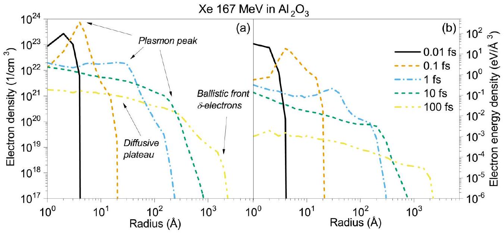
FIG. 12. Radial distributions of the density of excited electrons (a) and their energy density (b) around the trajectory of $\mathrm{Xe}(167 \mathrm{MeV})$ in $\mathrm{Al}_{2} \mathrm{O}_{3}$ ion at different times after the impact, calculated with TREKIS. ${ }^{5}$.

unaffected by those small fields and will quickly escape from the effective interaction region. The slowest electrons, which are affected, may exhibit ambipolar diffusion with the valence holes ${ }^{181,182}$-considering that they are already in a diffusive mode of transport, it may not alter their behavior significantly. Thus, it is expected that the effects of created fields should not have a major impact on the initial kinetics of electrons. The exception is finite-size samples, such as thin films, where the emission of electrons may strongly be affected by the induced fields and attraction to holes (since holes cannot be emitted out of the material to follow them). ${ }^{139}$

The second effect, the scattering among the excited electrons and with created holes, seems to be also of minor importance since

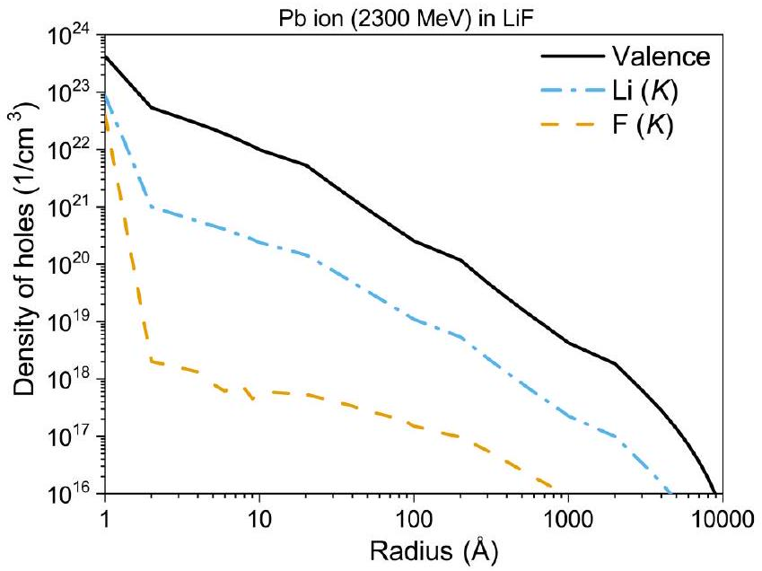
FIG. 13. Cumulative radial distribution of holes in various shells in LiF after Pb-ion impact $(E=2300 \mathrm{MeV})$, calculated with TREKIS. ${ }^{180 .}$

the density of the excited particles is much lower than the density of scattering centers (atoms and electrons) present in a solid target. Thus, both of the effects are typically neglected in simulations of SHI track creation. Nevertheless, these effects of interactions of excited electrons among themselves and with created holes need to be studied in the future to validate these considerations.

In addition, there are other material-specific channels of electrons interaction. For example, in organic and biological materials, it is important to account for molecular excitations and dissociative electron attachment. ${ }^{183}$ Those channels, absent in inorganic solids, play an important role in organic matter. They may lead to molecular breaks and observable damage. ${ }^{184}$ For practical purposes, it may also be important to consider electrons scattering on existing defects, such as grain boundaries in polycrystalline materials or dopants in semiconductors. ${ }^{89}$

In conclusion, the dominant channels of scattering for excited electrons are elastic and inelastic scattering on target atoms/ electrons. Scattering turns the transport of primary and secondary electrons from ballistic to diffusive. It typically progresses within a few tens of femtoseconds, and elastic scattering plays the most important role in randomizing the angular velocity distribution. ${ }^{175}$ Elastic scattering of electrons also exchanges kinetic energy with atoms, heating the atomic system. Inelastic scattering of electrons creates secondary electrons, forming electron cascades. It is the major channel of energy redistribution among electrons. The secondary electrons vastly outnumber the primary delta-electrons produced directly by an SHI, thereby defining the cascade size and shape, and evolution of the electron density. Electron cascades typically last for some $\sim 100 \mathrm{fs}$ (for those induced by SHIs with energies around the Bragg peak), but in the track core, they are typically nearly over within $\sim 10 \mathrm{fs}$. The deep-shell and valence holes are also created in such cascades, initiating complex hole kinetics. Bremsstrahlung emission of photons by electrons only plays a noticeable role at relativistic energies, whereas at lower energies, this channel of energy loss may be neglected.

## B. Kinetics of electron holes

In an impact ionization, a secondary excited electron is emitted with a kinetic energy $E_{k i n, 2}=W-I_{p}$, where $I_{p}$ is the ionization potential of the shell it is being emitted from. Ionization potentials for various shells in elements across the periodic table are shown in Fig. 14. Note that the ionization potentials of atoms in a chemical environment (a solid) are shifted with respect to the atomic ones, due to the change in the valence shells into a valence band, which affects the screening of core electrons. Calculations of electronic energy levels for solids are possible with all-electrons DFT or Hartree-Fock methods, ${ }^{185-187}$ but they are timeconsuming. In practice, almost all MC simulations use atomic ionization potentials to approximate those in solids.

All deep-shell holes created by an SHI or electron impact in atoms quickly decay, typically at femtosecond timescales (see Fig. 15). For all shells of all elements, except for the K-shell, Auger or Coster-Kronig (which is an intra-shell Auger decay where an electron participating in the process comes from a subshell of the same shell that the decaying hole resides in Ref. 189), decays are much more probable than radiative decay. For K-shell holes, light elements are more probable to decay via the Auger channel, whereas for elements above $\mathrm{Z} \sim 30$, radiative decay overtakes.

In an Auger (and Coster-Kronig) decay, a new electron is emitted, and two new holes are left in the upper shells of the atom. The kinetic energy of an Auger electron is defined by the energy differences of the electronic energy levels, participating in the decay: $E_{\text {kin }, A}=I_{p, h}-I_{p, 1}-I_{p, 2}$, where $I_{p, h}$ is the ionization potential of the decaying hole and $I_{p, 1 / 2}$ are those of the participating shells.

Similarly, radiative decay (or fluorescence) emits a photon with energy: $\hbar \omega=I_{p, h}-I_{p, 1}$, and only one new hole is created, whereas an old hole is filled-essentially, it means a hole jumps into an upper shell. All new holes will also undergo their own

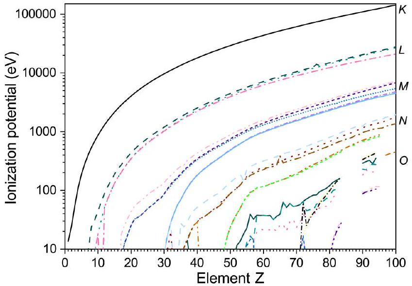
FIG. 14. Ionization potentials of different shells and subshells (marked on the right) of isolated neutral atoms in the ground states across the periodic table, extracted from Ref. 188.

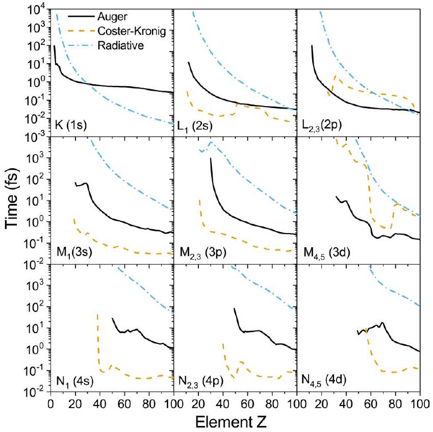
FIG. 15. Auger, Coster-Kronig, and radiative characteristic decay times in various shells of elements across the periodic table, extracted from Ref. 29.

decays until they float into the valence (or the conduction) band of the material.

In solids, also inter-atomic Auger decays are possible. ${ }^{190}$ In such a process, one or both electrons participating in an Auger decay may come from neighboring atoms, instead of the atom containing the decaying hole (sometimes called the Knotek-Feibelman process). ${ }^{191}$ In such a case, energetically forbidden transition in an isolated atom may become allowed in molecular/solid environ-ment-the processes known as interatomic coulombic decay (ICD ${ }^{192}$ ), excitation-transfer-ionization (ETI ${ }^{193}$ ), and related processes. Accounting for these kinds of processes is necessary, since target atoms in proximity to the SHI trajectory may be stripped, as discussed above in Sec. II C. ${ }^{194}$ Unfortunately, there are almost no data available on the characteristic decay times in solids, so in practice, all decays in MC models are characterized by the atomic Auger (or Koster-Kronig) times. ${ }^{41,81,82,195,196}$ In the MC simulation, the decay time is sampled with the exponential distribution: $t=-t_{0} \ln \left(\xi_{h}\right)$, where $\xi_{h} \in[0,1)$ is a random number and $t_{0}$ is the characteristic decay time. ${ }^{169}$

All deep-shell holes eventually end up in the valence/conduction band, typically within a few femtoseconds (except for very light elements, in which the decays may take a few tens of fs). In contrast to deep-shell holes, valence holes in solids are mobile. They behave as positive charges with an effective mass defined by the band structure of the material. ${ }^{89}$

If the width of the valence band is larger than the bandgap of the material (see an example in Fig. 16), valence holes can scatter inelastically. This process sometimes is also called "Auger decay of
valence holes," since it resembles the actual Auger decay in the sense that the valence hole jumps up into a higher-lying state of the valence band, and an electron is promoted into the conduction band. Holes will perform such impact ionizations as long as their kinetic energy (counted down from the top of the valence band) is larger than the HOMO-LUMO (the highest occupied molecular orbital-lowest unoccupied molecular orbital) bandgap of the material. Strictly speaking, the limit is somewhat larger than the bandgap and typically lies within the interval between $E_{\text {gap }}$ and $3 / 2 E_{\text {gap }}$, depending on the incident particle energy ${ }^{6}$ and particular dispersion law in the material band structure. ${ }^{197}$

The MC simulation of holes transport requires taking into account the effective mass of holes, $m_{h, \text { eff }}$, which correspondingly rescales the scattering cross sections. ${ }^{175}$ Within an "effective one-band" approximation proposed in Ref. 198, the effective mass of a valence-band hole or a conduction-band electron can be worked back from the density of states of the material, $D(E)$,

$$
E_{h}=\frac{\hbar^{2} q_{h}^{2}}{2 m_{h, e f f}}, \quad q_{h}\left(E_{h}\right)=\sqrt[3]{\frac{6 \pi^{2}}{s} \int_{0}^{E_{h}} D(\epsilon) d \epsilon}
$$

where the hole's momentum $q_{h}$ is defined within an effective single band depending on the energy in the valence band $E_{h}$ and $s=2$ is the spin degeneracy. This approximation assumes a uniform and homogeneous material, which is consistent with the assumptions used in the MC method.

An example of the effective mass of the holes in $\mathrm{Al}_{2} \mathrm{O}_{3}$ is shown in Fig. 16. Since the effective mass within the effective one-band approximation depends on the energy, the mass conservation does not hold in a scattering event. This should not confuse

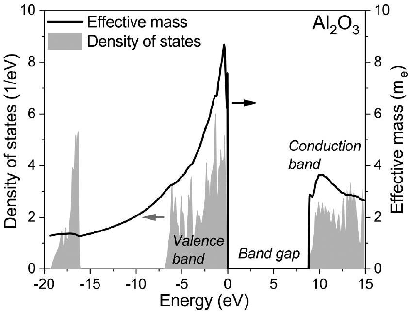
FIG. 16. The density of states in $\mathrm{Al}_{2} \mathrm{O}_{3}$ calculated with tight-binding code XTANT ${ }^{199}$ and an effective mass of valence holes or conduction electrons calculated within the effective one-band approximation [Eq. (23)] in units of the freeelectron mass.

the reader since the energy (and momentum, if required ${ }^{197}$ ) is still conserved.

The cross sections of scattering of a valence hole are the same as for electrons, rescaled by the mass ratio (also in corresponding momentum integration limits). Since valence holes are typically heavier than free electrons, elastic scattering delivers more energy to atoms than electrons of the same energy. Thus, valence band kinetics is a very important channel in energy redistribution, which must be taken into account in SHI track simulations. ${ }^{146,147}$ This energy is distributed mainly around the SHI trajectory, forming a larger energy density than that produced by electrons alone (see Fig. 17).

A pair of carriers, a valence hole and a conduction-band electron, have the potential to recombine and release the energy, equal to the bandgap (potential energy of such a pair of carriers) plus their kinetic energies. A large amount of energy, deposited by an SHI, is transiently stored as the potential energy of produced elec-tron-hole pairs. ${ }^{146,147}$ For convenience, the potential energy may be attributed to valence holes.

Figure 18 illustrates the temporal evolution of the energy fractions in different subsystems of $\mathrm{Al}_{2} \mathrm{O}_{3}$ after $\mathrm{Xe}(167 \mathrm{MeV})$ ion impact. ${ }^{146}$ The figure demonstrates well-separated stages of the track kinetics: (a) the electronic kinetics dominates by 10 fs after the ion impact (age of electrons), and (b) the electron-hole ensemble accumulates a large amount of the deposited energy by the time of 10 fs . Nearly $60 \%$ of all the energy deposited by the SHI is accumulated as the potential energy of holes (the "age of holes"). This energy can transfer into the atomic system via channels different from that of electron-atom or hole-atom scattering. We will return to this point later in a discussion of atomic heating in Sec. IV C. (c) Energy transfer to lattice atoms via electrons and holes scattering takes place after 10 fs -this stage will be discussed in Sec. IV. The difference between the total atomic heating and heating solely

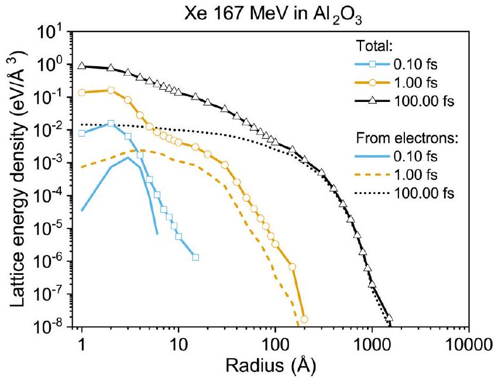
FIG. 17. The radial density of the lattice energy in a track of Xe 167 MeV ion in $\mathrm{Al}_{2} \mathrm{O}_{3}$, transferred from electrons only, and total transferred due to elastic scattering of electrons and valence holes. ${ }^{175}$.

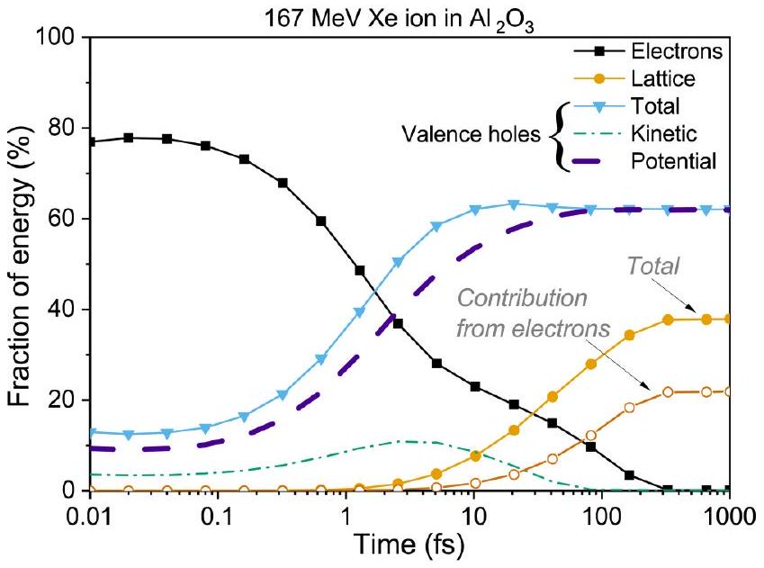
FIG. 18. Fractions of energy accumulated in each subsystem of $\mathrm{Al}_{2} \mathrm{O}_{3}$ after the impact of Xe 167 MeV ion, calculated with TREKIS. ${ }^{146}$ Energy transferred to lattice atoms from electrons (hollow circles) and the total one (from electrons and valence holes; full circles) are shown for comparison.

by electrons demonstrates the importance of the valence holes' elastic scattering. By the time of $\sim 100-200 \mathrm{fs}$, neither electrons nor holes have significant kinetic energy left.

Mobility of valence holes has another important consequence. If holes are not bound to their parent ions, in contrast to plasma, the Coulomb repulsion in solids will repeal the holes instead of lattice ions. As soon as holes pop up into the valence band, they become the subject of Coulomb interaction, without dragging ions behind. This is another argument in support of the negligibility of the Coulomb explosion effects in solids. Only the deep-shell holes are bound to their parent ions; thus, the lifetime of Coulomb explosion is limited by the lifetime of those holes (and plasmon frequency screening the charges). As discussed above, they decay within a few femtoseconds or even faster.

In all the considerations, we neglected the effects of long-range fields acting between the holes or between holes and excited electrons. It was done on the same grounds as for the electrons, discussed in Sec. III A.

The valence holes may recombine with electrons via various channels. They may emit photons, excite another electron (threebody recombination process), transfer energy to an atom of a target, or in a small-bandgap material to collective modes, phonons. In some materials, far from the track core, valence holes and electrons may form a quasi-stable couple, an exciton. An exciton may then also exhibit complex kinetics, which includes its transport, self-trapping, and recombination. ${ }^{134,200}$ All these effects may be important for the formation of point defects in the track halo, which will be discussed in Sec. VI B.

To summarize, deep-shell holes created by an SHI or electrons impact ionization quickly decay-predominantly via Auger-decay channel emitting an electron. With a lower probability, they may decay radiatively, emitting a photon. In each decay, a hole jumps
into a higher energy level, eventually ending up in the valence band of the material. Valence holes are mobile, and they behave similarly to excited electrons but with their own effective mass, which may be effectively constructed from the DOS of the material. Inelastic scattering of valence holes is possible in materials, in which the valence band is wider than the bandgap, thereby exciting secondary electrons. Elastic scattering transfers a significant amount of energy to atoms, most notably in the nearest proximity of an SHI trajectory. A part of the energy is transiently stored as the potential energy of electron-hole pairs, which may be released at longer times via various recombination channels (including bandgap collapse, see Sec. IV C).

## C. Photon transport

Photons, created either via Bremsstrahlung emission by electrons or via radiative decay of deep-shell holes, then propagate in the target until escaping from its surface or being absorbed by electrons in the material. A photon may experience a few different types of interaction. Long wavelength (low-energy) photons mostly scatter off the lattice atoms via Rayleigh scattering (elastic scattering channel, which does not change photon energy, only its direction of motion). ${ }^{41}$ For photon energies above the bandgap of the material, photoabsorption by the valence electrons will take place. In a photoabsorption event, a photon disappears and an electron is emitted with its energy equal to the difference between the photon energy and the ionization potential of the electron level an electron is emitted from: $E_{k i n}=\hbar \omega-I_{p}$. With an increase in the photon energy, deep-shell atomic electrons start to absorb photons, if the photon energy overcomes an ionization potential of this shell. At energies above some $\sim 10 \mathrm{keV}$, photons start to scatter on atoms via inelastic Compton scattering channel: ${ }^{41}$ a photon loses a part of its energy and continues propagation with a longer wavelength, while an electron is emitted.

At relativistic energies above $\hbar \omega=2 m_{e} c^{2}$, the creation of elec-tron-positron pairs becomes possible. ${ }^{41}$

Mean free paths of these processes in $\mathrm{Al}_{2} \mathrm{O}_{3}$ are shown in Fig. 19, giving an estimate of their relative probabilities. From this figure, we can see that for typical energies of photons produced in a track of an SHI around the Bragg peak, the photon absorption is dominant by many orders of magnitude. It is a typical situation for all materials. In contrast to the inelastic scattering of electrons (cf. Figure 10), photons are preferentially absorbed by the deepest shell possible, whose ionization potential is below the photon energy. ${ }^{41}$ This creates the characteristic peaks in the total photoabsorption cross section and mean free path.

Since the electron Bremsstrahlung and radiative decay of deep shell holes are both rather improbable at considered energies, photon transport plays only a minor role in the track creation problem. Photons carry out a small portion of energy far from an SHI trajectory (see Fig. 20). ${ }^{175}$ Photons travel much faster and farther away from the track center than electrons, creating an additional excitation front. Their absorption creates a long radial tail of secondary electrons, but their density and energy density in this tail are orders of magnitude lower than those produced by $\delta$-electrons.

In conclusion, in an SHI problem, photon transport usually plays a minor role, bringing an insignificant fraction of energy far

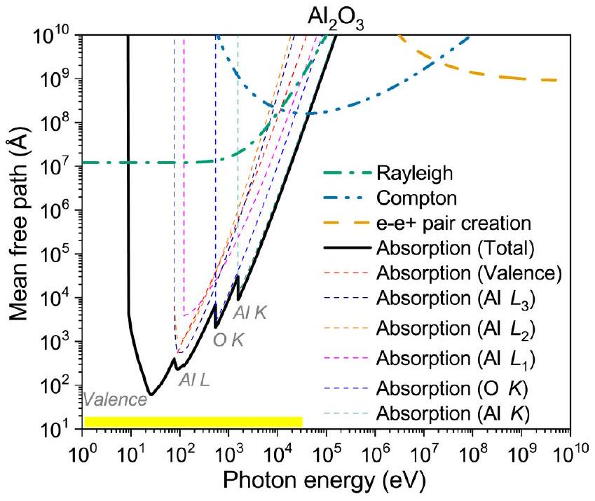
FIG. 19. Photon mean free paths of various processes in $\mathrm{Al}_{2} \mathrm{O}_{3}$. Rayleigh, Compton, and electron-positron pair production cross sections are calculated, according to Ref. 41. Photoabsorption cross sections by different atomic shells are taken from the EPICS database. ${ }^{196}$ Valence band photoabsorption cross section is reconstructed from the optical coefficients from Ref. 110. The yellow bar schematically shows the region of energies typical for those of the SHI problem.

away from the track core. Photoabsorption is the dominant channel of photon interaction with the media in the relevant energy range. However, as it may create some defects in the structure at large distances, photon-related effects may be important for experiments or applications dealing with such defects.

## IV. SUBPICOSECOND TIMESCALES: ELECTRONLATTICE ENERGY TRANSFER

After about 10 fs of an ion passage, the bimodal "bump-on-hot-tail" energy distribution of electrons arises around the ion trajectory ${ }^{148}$ (also, see Fig. 20). It consists of slow electrons in the track core ( $\sim 10 \mathrm{~nm}$ ) with a nearly thermalized energy distribution, whereas a minority of high-energy electrons forms a long tail that is far from equilibrium. The ensemble of fast electrons locates far from the SHI trajectory and has low particle and energy densities. Its contribution to an increase in the energy of lattice atoms is negligible after these times. On a $10-\mathrm{fs}$ timescale, "slow" electrons with energies of $\sim 10 \mathrm{eV}$ accumulate most of the energy transferred by the ion to the target and provide energy transfer to atoms (see Fig. 18).

The extreme initial localization of the ensemble of slow electrons ( $\sim 10 \mathrm{~nm}$ ) results in high gradients of its energy density leading to a fast drain of the electronic energy from the ion trajectory. This energy flow cools down the electronic system in the ion track within a hundred-femtosecond timescale. Significant heating of materials in SHI impacts required to form observable tracks suggests extremely fast energy transfer from the electrons to target atoms within this ultrashort cooling time of the electronic system.

Thus, a reliable model of an SHI track formation must selfconsistently describe the two most important effects and their interplay: energy transport (in the electron, hole, and atom systems) and energy transfer to the atoms. It is particularly important to identify the mechanism responsible for the extremely fast heating of atoms.

In this section, we review existing models of track heating and discuss their advantages and disadvantages. Special attention is paid to the "nonthermal" mechanism of the energy transfer to the atomic system, which realizes at extreme excitations of the electronic system.

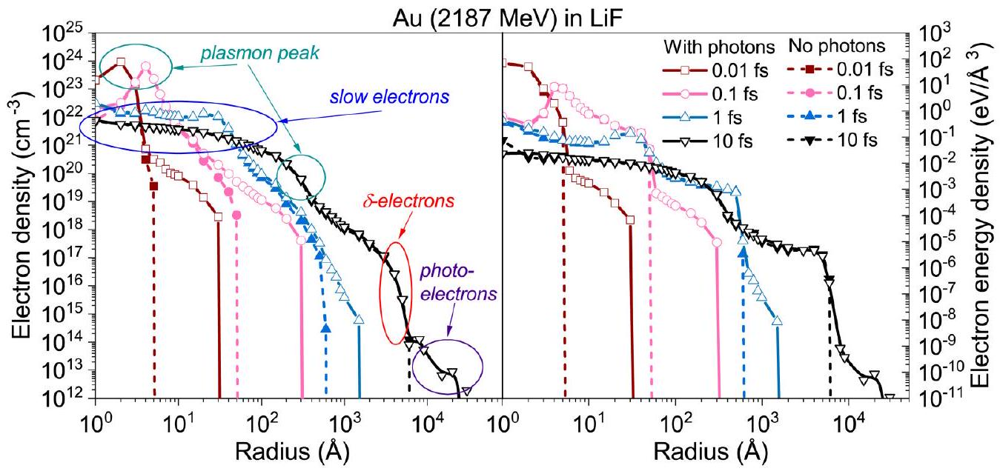
FIG. 20. The radial distributions of electrons calculated without radiative decays of deep holes vs those with these decays and induced photon transport at different times after passage of Au 2187 MeV ion in LiF. ${ }^{175 .}$

## A. Two temperature (thermal spike) model

The two-temperature model (TTM, ${ }^{201}$ also called the inelastic thermal spike, i-TS), or its extended versions, is the most often-used model describing the transport of the excitation and energy transfer to the atomic system in an SHI track. It is based on two macroscopic coupled parabolic equations of heat diffusion in the electronic and atomic ensembles, which have the simplest form in metals, ${ }^{25,26,33}$

$$
\begin{gathered}
c_{e}\left(T_{e}\right) \frac{d T_{e}}{d t}=\nabla\left(\kappa_{e}\left(T_{e}, T_{a}\right) \nabla T_{e}\right)-G\left(T_{e}, T_{a}\right)\left(T_{e}-T_{a}\right)+Q_{s} \\
c_{a}\left(T_{a}\right) \frac{d T_{a}}{d t}=\nabla\left(\kappa_{a}\left(T_{e}, T_{a}\right) \nabla T_{a}\right)+G\left(T_{e}, T_{a}\right)\left(T_{e}-T_{a}\right)
\end{gathered}
$$

Here, $T_{e, a}$ are the electronic and atomic temperatures, $c_{e, a}\left(T_{e, a}\right)$ are the temperature-dependent electronic and atomic heat capacities, $\kappa_{e, a}\left(T_{e}, T_{a}\right)$ are the electronic and atomic thermal conductivities, and $Q_{s}$ is a source term of energy delivery into the electronic system. The electron-ion coupling parameter, $G$, is the key one guiding the energy flow between electrons and atoms (per volume $V_{0}$ ),

$$
G\left(T_{e}, T_{a}\right)=\frac{1}{V_{0}\left(T_{e}-T_{a}\right)} \frac{d E}{d t}
$$

Microscopically, the model assumes that the scattering of electrons defines electronic energy transport and its transfer to the atoms.

Unfortunately, this, formally self-consistent and simple, classical TTM has flaws, making its application to ultrafast SHI tracks questionable.

First, in an appropriate application of a TTM-based model, the electronic system must be divided into high-energy electrons, which will form a source term $Q_{s}$ for energy deposited into lowenergy electrons. ${ }^{174,202}$ The fast electrons cannot be described with the thermo-diffusion equation, as discussed in Sec. III A. The impossibility of the TTM to define $Q_{s}$ forces one to use an ad hoc function of a "deposited dose" as an external parameter of the model. A realistic source term $Q_{s}$ can be defined, e.g., by a separate MC simulation tracing the fast electrons and their coupling with the slow electrons. ${ }^{47,174}$ In practice, it is often taken from the semiempirical Katz-Waligorski relation. ${ }^{203,204}$

Another issue is that at the initial stage of their spreading, slow electrons form a front moving with a finite speed. The movement of an excitation front should also be taken into account when describing heat spreading through the atomic system at a picosecond timescale. This is not accounted for in Eq. (24), which uses the Fourier law for the heat flux that assumes its infinite propagation velocity. To circumvent the problem, the parabolic heat diffusion equation (24) should be replaced with the hyperbolic dissipative wave equations (the Catteneo equation ${ }^{179}$ ), providing finite velocities of heat transport at femtosecond timescales for the electronic system and picoseconds for the atomic system.

In bandgap materials (semiconductors and insulators), a simple equation (24) cannot describe the electronic system, since the electron density in the conduction band is highly inhomogeneous and is defined by the excitation level. In SHI tracks, valence
holes accumulate at least half of the deposited energy of the electronic ensemble by 10 fs after the ion impact. In such a case, Eq. (24) needs to be supplemented with additional equations tracing the evolution of the electron-hole density, sometimes called the nTTM. ${ }^{181,205}$

Application of macroscopic coefficients of the heat capacities, thermal conductivities, and the threshold parameters of phase transitions, e.g., the melting temperature, to highly excited material states at the nanometric spatial and picosecond temporal scales is dubious. In the i-TS applied to SHI tracks, it is often assumed that the detected regions of the damaged structure coincide with those where these thresholds were achieved. No relaxation of the damaged structure is assumed during the track cooling.

Thermalization of the atomic ensemble at times as short as 100 fs, as assumed in Eq. (24), is also questionable. To avoid this problem and to trace phase transitions and track formation, the atomic heat diffusion equation can be replaced with MD [solving Eq. (6)], simulating the atomic system in sufficient detail. ${ }^{206,207}$ Such models are known as coupled TTM-MD, which are nowadays a standard simulation tool for modeling ultrafast energy deposition (either by femtosecond lasers or by swift ions). ${ }^{26,208}$ In this approach, the energy exchange from electrons must be delivered to individual atoms in some way.

The simplest way to do that is velocity scaling, in which at each time step of MD simulation, the energy provided from electrons is distributed to atoms via rescaling their velocities by a proportionality factor $\xi$. It essentially assumes that the electrons form a friction force that may accelerate or decelerate atoms depending on a difference between the electronic and ionic temperatures, ${ }^{207}$

$$
\begin{gathered}
M_{i} \frac{d^{2} \boldsymbol{R}_{i}}{d t^{2}}=-\frac{\partial V\left(\left\{R_{i j}\right\}\right)}{\partial \boldsymbol{R}_{i}}+\xi M_{i} \boldsymbol{v}_{i} \\
\xi=\frac{G}{N_{a t}} \frac{\left(T_{e}-T_{a}\right) V_{0}}{\sum_{j} M_{j} v_{j}^{2}}
\end{gathered}
$$

where $\boldsymbol{v}_{i}$ is the velocity of the $i$ th atom with mass $M_{i}, V$ is the volume of the MD simulation box, and $N_{a t}$ is the number of atoms in the simulation box [note the additional term cf. Equation (6)]. Equation (26) replaces the second equation (24) describing the atomic system. ${ }^{26,207}$ More advanced approaches instead of simple velocity scaling are also used, e.g., based on the inhomogeneous Langevin thermostat. ${ }^{205}$

TTM-MD models resolve the problem of ionic temperature and can describe the relaxation of a damaged structure during track cooling. However, they have no method of calculating a realistic initial spatial profile of the electronic temperature $Q_{s}$ and adjust the electron-phonon coupling parameter $G$ to provide necessarily fast atomic heating in SHI tracks fitted to reproduce the damaged area size detected in the experiments. ${ }^{57}$

Due to the application of the fitting parameters, the twotemperature thermal spike model has limited predictive power. This problem demonstrates that it is not possible to build a selfconsistent model describing track formation without a microscopic quantitative knowledge of the mechanisms governing its kinetics.

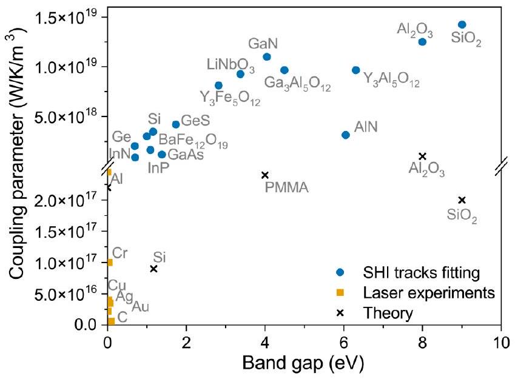
FIG. 21. Fitted electron-ion coupling parameter in various materials. Those extracted from the SHI irradiations data from Ref. 57 are shown with circles. Squares are the parameters measured in laser experiments (taken from Ref. 44 and references therein). Crosses are calculated coupling parameters at the laser damage threshold doses. ${ }^{44,209}$.

On the other hand, the TTM helps point out the fundamental effects of electron-atom energy exchange in SHI tracks. Coupling parameters extracted from the TTM by fitting the calculated SHI track sizes to experimental data are orders of magnitude larger than those measured in the laser-irradiation experiments and consistently calculated with various models (see Fig. 21).

## B. Scattering of electrons on atoms: Non-adiabatic energy exchange

Most of the modern microscopic models of SHI track excitation use algorithms explicitly or implicitly assuming the scattering of electrons and holes on the atomic and electronic ensembles. Electron scattering provides energy and momentum transfer to the atoms causing finally equilibration between the electronic and ionic systems. ${ }^{26}$ Also, the scattering-based models can self-consistently describe spatial spreading of the excitation from the ion trajectory.

The scattering-based momentum/kinetic energy exchange is referred to as the electron-ion coupling or the "electron-phonon coupling," although in general, any atomic displacement caused by electronic scattering (not only phononic modes) triggers electron transitions and momentum and kinetic energy exchange between the two systems.

In the one-particle approximation, the electron-ion coupling parameter $G$ is defined via ${ }^{166}$

$$
G\left(T_{e}, T_{a}\right)=\frac{1}{V_{0}\left(T_{e}-T_{a}\right)} \sum_{i, j} \varepsilon_{j} I_{e-a}^{i j},
$$

where summation runs over all electronic states $i$ and $j$ and the scattering integral $I_{e-a}^{i j}$ is the time derivative of the electron
distribution function

$$
\frac{d f\left(\varepsilon_{i}, t\right)}{d t}=\sum_{j} I_{e-a}^{i j} .
$$

The quantum mechanical methods such as TD-DFT ${ }^{35}$ or CEID ${ }^{45,210}$ allow evaluating this nonadiabatic electron-ion coupling, exchanging energy between electrons and atoms. For example, the CEID method traces the evolution of the electron density matrix, including the electron transitions (off-diagonal elements of the density matrix) induced by the changes in atomic positions, modeled with MD simulations. ${ }^{211}$

A simple approach to calculating electronic transition probability was proposed in $a b$ initio femtochemistry by Tully, known as the "surface hopping." ${ }^{42,43}$ The method allows evaluating the probabilities of electron transitions between the adiabatic energy surfaces of a molecule via the overlap of their wave functions of states $i$ and $j,\left|\psi_{i}\left(t_{0}\right)\right\rangle$ and $\left|\psi_{j}(t)\right\rangle$ at different timesteps of a BornOppenheimer (BO, adiabatic) MD simulation. ${ }^{42,43}$ Changes in the electronic wave functions induced by atomic displacements allow to obtain the so-called coupling vector: $\vec{d}=\langle i| \nabla|j\rangle$. For solids, the method can be modified for efficient treatment of a large number of electrons in the modeled ensemble: it can be used to obtain matrix elements (or probabilities $W_{i j}=\left|\left\langle\psi_{j}(t) \mid \psi_{i}\left(t_{0}\right)\right\rangle\right|^{2}$ ) entering the scattering integral $I_{e-a}^{i j},{ }^{44}$

$$
\begin{gathered}
I_{e-a}^{i j}=w_{i j}\left\{\begin{array}{c}
f\left(\varepsilon_{j}\right)\left[2-f\left(\varepsilon_{i}\right)\right]-f\left(\varepsilon_{i}\right)\left[2-f\left(\varepsilon_{j}\right)\right] e^{-\varepsilon_{i j} / T_{a}}, \quad \text { for } i>j \\
f\left(\varepsilon_{j}\right)\left[2-f\left(\varepsilon_{i}\right)\right] e^{-\varepsilon_{i j} / T_{a}}-f\left(\varepsilon_{i}\right)\left[2-f\left(\varepsilon_{j}\right)\right], \quad \text { otherwise }
\end{array}\right. \\
w_{i j}=\frac{d W_{i j}}{d t} \approx 2 \frac{\left.\left|\psi_{j}(t)\right| \psi_{i}\left(t_{0}\right)\right|^{2}}{\delta t} .
\end{gathered}
$$

Here, again $f\left(\varepsilon_{i}\right)$ is the electron distribution function, normalized to 2 due to spin degeneracy; $\varepsilon_{i j}=\varepsilon_{i}-\varepsilon_{j}$; the time derivative is approximated with the finite-difference method for the molecular dynamics time step $\delta t$, and the wave functions are calculated correspondingly on two consecutive steps: $t_{0}$ and $t=t_{0}+\delta t$. The exponential terms result from the Maxwellian distribution of the atomic ensemble and, in general, may be replaced with an integral of the transient nonequilibrium atomic distribution. Such a method of combining surface hopping with the Boltzmann collision integral (instead of random sampling of electronic hops) enables direct calculation of energy flows between the quantum mechanical electrons and classical atoms in the simulation and, by extension, the coupling parameter.

This method allowed to calculate the electron-ion coupling parameters in multiple materials, ${ }^{44}$ but it requires tracing the state of the electronic structure alongside MD simulation with such methods as DFT or TB. Unfortunately, the peculiarities of the track kinetics pose problems with the practical realizations of this possibility, requiring too large simulation box sizes to address with $a b$ initio techniques.

When the atomic system may be approximated as a perfect periodic crystal with harmonic interatomic potential (small atomic oscillations), and at timescales longer than the characteristic period of atomic oscillations (inverse phonon frequency), the electron-atom
coupling reduces to the electron-phonon one. ${ }^{107,212}$ It is often then computed within the Eliashberg formalism, which uses the phonon spectral function to evaluate electron-phonon coupling matrix elements. ${ }^{213-215}$ However, it has recently been noticed that this formalism, originally developed for superconductors, may produce overestimated results at high electronic temperatures. ${ }^{44,216,217}$ Let us also note that none of the underlying assumptions of the phonon approximation is satisfied in an SHI track: ${ }^{28,172,218}$ the processes taking place are much faster than the characteristic phonon time (thus, the energy transfer to individual atoms instead of coherent collective modes takes place ${ }^{107}$ ), the atomic structure is changing fast from the perfect crystal, and the atomic motion is not harmonic, so the phononic approximation does not hold.

More advanced approaches, beyond the Eliashberg formalism, have also been developed, such as the coupled-modes approach (treating coupling between collective modes of electrons and ions: plasmons and phonons) or models that include self-consistently the quantum mechanical and statistical nature of the electronic ensemble. ${ }^{219-221}$ In particular, models accounting for nonequilibrium effects warrant a special note. Nonequilibrium phononic distributions were accounted for in Ref. 217, which improved agreement with the experimentally measured electron-ion energy exchange rate. Nonequilibrium electronic distribution is predicted to have a significant effect on the coupling rate. ${ }^{166,198}$

If exact electronic wave functions are unavailable, further approximations can be made; e.g., the wave functions of fast electrons can be well approximated as plane waves. ${ }^{107,171,172}$ Also, the first-order Born approximation is valid for a scattering of such electrons with energies larger than $\sim 10-100 \mathrm{eV}$ on target atoms. It allows describing the electron-ion scattering within the dynamical structure factor (DSF) formalism discussed in Secs. II C and III A.

Being the Fourier transform of the spatio-temporal atomic pair correlation function, the DSF contains information about the dynamical modes of the atomic ensemble, e.g., about the phonon spectrum, ${ }^{171}$

$$
\begin{aligned}
S(\mathbf{q}, \omega) & =\frac{1}{2 \pi N} \int \exp (i \mathbf{q} \mathbf{r}-i \omega t) G(\mathbf{r}, t) d \mathbf{r} d t \\
G(\mathbf{r}, t) & =\sum_{i}^{N} \sum_{j}^{N}\left\langle\delta\left[\mathbf{r}+\mathbf{R}_{i}(t)-\mathbf{R}_{j}(0)\right]\right\rangle
\end{aligned}
$$

Here, $G(\mathbf{r}, t)$ is the atomic pair correlation function, the brackets sign $\langle\cdots\rangle$ denotes averaging over the atomic ensemble, $N$ is the number of atoms in the simulation box, and $\mathbf{R}_{i}(t)$ is the coordinate of the $i$ th atom at time $t$. If there is more than one kind of atoms in the system, in Eq. (30), the DSF must take into account partial atomic correlation functions. ${ }^{51}$

The DSF determines cross sections, which take into account the collective response of the atomic ensemble to excitations induced by a scattered particle ${ }^{107}$

$$
\frac{\partial^{2} \sigma}{\partial \Omega \partial(\hbar \omega)}=|V(\mathbf{q})|^{2} \frac{k_{f} M^{2}}{4 \pi^{2} k_{i} \hbar^{5}} S(\mathbf{q}, \omega),
$$

where $\overrightarrow{\boldsymbol{q}}=\overrightarrow{\boldsymbol{k}}_{j}-\overrightarrow{\boldsymbol{k}}_{i}, \boldsymbol{k}_{i}$, and $\boldsymbol{k}_{f}$ are the initial and final wave vectors of the incident particle (before and after a scattering act), $M$ is this
particle mass, and $V(\mathbf{q})$ is the Fourier transform of interaction potential between the particle and a single atom in a target.

The application of the DSF formalism to elastic scattering of electrons on atoms allows to distinguish between scattering modes (recall Fig. 11). The scattering of the fast electrons (short wavelengths) does not depend on the atomic structure and collective dynamics-it reduces to the Mott's cross section of scattering on an individual atom. Electrons with wavelengths comparable with the interatomic distance scatter on individual atoms frozen in their structure. ${ }^{107,171,172}$ At low energies (the electron wavelengths much larger than the interatomic distance), the involved atoms are interacting among themselves and may redistribute energy during the scattering act, ${ }^{107}$ which alters the way and the amount of energy that the atomic ensemble receives from an incident electron. It then reduces to the scattering on collective atomic dynamical modes (phonons), which may depend on the crystallographic anisotropy. ${ }^{133}$

The DSF allows for a straightforward evaluation with the help of classical molecular dynamics simulations. ${ }^{222,223}$ Within the formalism, full atomic dynamics may be accounted for via MD simulations, thereby allowing to calculate electron-ion coupling in an arbitrary system, including amorphous or melted states. Note that the classical MD evaluation of the DSF requires a quantum correction introducing the necessary asymmetry. ${ }^{51,224}$

Averaging the energy exchange calculated with the DSF-based cross sections [Eqs. (30) and (31)] over an ensemble of quantum electrons provides the scattering integral ${ }^{218,222}$

$$
\begin{aligned}
I_{e-a}^{D S F}= & -\frac{4}{(2 \pi)^{5} \hbar^{2}} \int d \overrightarrow{\boldsymbol{k}}_{i} d \overrightarrow{\boldsymbol{k}}_{j}|V(\overrightarrow{\boldsymbol{q}})|^{2} \\
& \times\left[f\left(\overrightarrow{\boldsymbol{k}}_{j}\right)\left(1-f\left(\overrightarrow{\boldsymbol{k}}_{i}\right)\right) S(-\overrightarrow{\boldsymbol{q}},-\omega)-f\left(\overrightarrow{\boldsymbol{k}}_{i}\right)\left(1-f\left(\overrightarrow{\boldsymbol{k}}_{j}\right)\right) S(\overrightarrow{\boldsymbol{q}}, \omega)\right]
\end{aligned}
$$

where the electron distribution function $f\left(\overrightarrow{\boldsymbol{k}}_{i}\right)$ is now written in the momentum space of a free electron $\overrightarrow{\boldsymbol{k}}_{i}$.

An example of an electron-ion coupling parameter in aluminum calculated with the above-mentioned models is shown in Fig. 22. They produce close results at low electronic temperatures, but the rise of the DSF-based coupling parameter at electronic temperatures above $\sim 10000 \mathrm{~K}$ is overestimated. The agreement with the data from laser experiments is also reasonable, considering a wide discrepancy among different experiments. More discussion on this point can be found in Ref. 44, together with coupling parameters for many metals across the periodic table.

With a typical coupling parameter (example in Fig. 22), the heating of the atomic system by electrons takes a few picoseconds. ${ }^{44}$ The coupling parameter has a general tendency to decrease with an increase in the atomic mass, ${ }^{44}$ and materials made of heavy elements exhibit even slower coupling that may take tens of picoseconds. ${ }^{225}$ There are experimental indications that electron-ion coupling may be even slower than the most advanced theories predict. ${ }^{225-227}$ Such timescales are too long in comparison with the cooling time of electrons in the vicinity of the SHI trajectory (see Fig. 21) since, as discussed in Sec. III A, the transport of electrons outward from the track center decreases their energy within $\sim 100 \mathrm{fs}$.

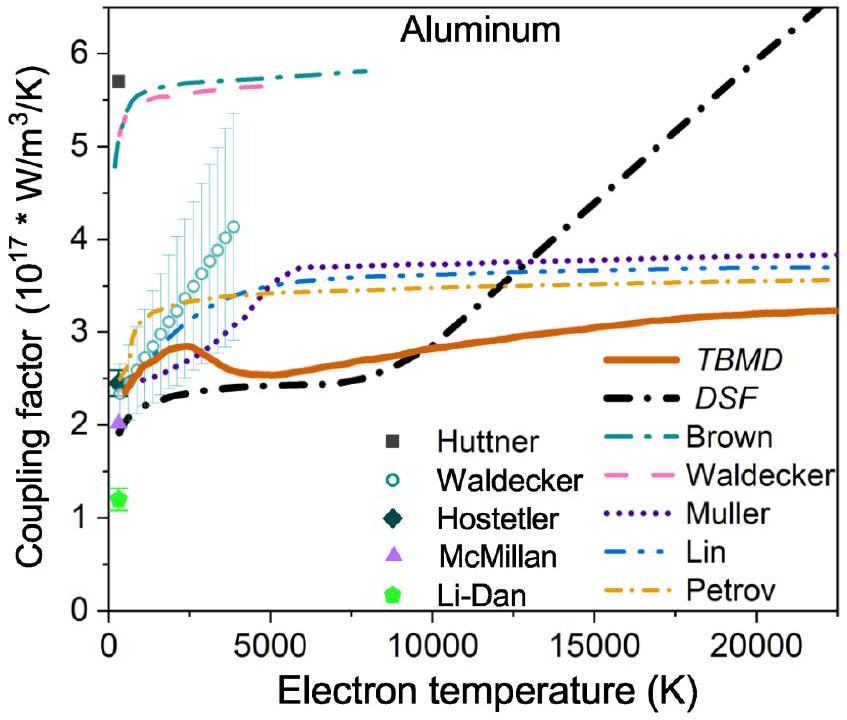
FIG. 22. Electron-ion coupling parameter as a function of electron temperature in aluminum calculated within the XTANT-3 TBMD approach [Eq. (29)] ${ }^{44}$ DSF-based approach by Gorbunov et al. [Equation (32)] ${ }^{222}$ compared with other estimates by Lin et al., ${ }^{215}$ McMillan, ${ }^{228}$ Allen et al., ${ }^{229}$ Brown et al., ${ }^{216}$ Petrov et al., ${ }^{230}$ Muller et al., ${ }^{198}$ and Waldecker et al. ${ }^{217}$ Experimental data for comparison are from Huttner et al., ${ }^{231}$ Waldecker et al., ${ }^{217}$ Hostetler et al., ${ }^{232}$ and Li-Dan et al. ${ }^{233}$.

Summarizing, the methods of calculation of the electronphonon coupling parameter predict electron-phonon temperature equilibration times significantly longer than the time of electronic cooling in an SHI track. Thus, the models that use this parameter need ad hoc adjustments, fitting its value to reproduce track radii detected in the experiments. ${ }^{23,234,235}$ The fitted values exceed by more than an order of magnitude those calculated by various methods and measured in the laser experiments (see Fig. 21 and Ref. 145). The problem can be resolved by taking into account that electron-phonon coupling is not the sole channel of energy exchange between excited electrons and atoms in a solid, which will be discussed in Sec. IV C. ${ }^{145}$

## C. Adiabatic energy exchange between electrons and ions

Unlike the ballistic electrons, the low-energy electrons are involved in the formation of the interatomic potential in a solid. They form the attractive part of the potential, which keeps atoms of a solid together under normal conditions. ${ }^{236}$ A change in the electronic system state due to strong excitation forms a new spatial distribution of the electron density altering interaction of neighboring atoms. The atomic ensemble then experiences different forces than those in the equilibrium state. That results in the acceleration of atoms, attempting to find their new equilibrium positions. ${ }^{145}$

It is known from laser experiments that in some materials, electronic excitation may lead to ultrafast atomic lattice destabilization even at room atomic temperature-"nonthermal melting." It
occurs via the breaking of interatomic bonds induced by the electronic excitation instead of the increase in the atomic temperature. It takes place in covalently bonded semiconductors, ${ }^{237-239}$ ionic crystals, ${ }^{240,241}$ oxides, ${ }^{209,242}$ and polymers. ${ }^{243,244}$ Nonthermal phase transitions may be regarded as a universal effect taking place in non-metallic crystalline targets upon energy deposition faster than the electron-phonon coupling. More complex nonthermal effects may occur in metals. ${ }^{245,246}$ Whether nonthermal effects play a role in amorphous materials is still an open question-it has only been shown that amorphous carbon does not seem to have any significant contribution from nonthermal effects near the damage threshold, and the damage is formed thermally at picosecond timescales. ${ }^{247}$

In contrast to the kinetic energy (momentum) exchange between the electronic and atomic system described in Sec. IV B, the nonthermal process manifests a conversion of the potential energy of the excited material into the kinetic energy of the atomic system (nonthermal heating ${ }^{145}$ ). It forms a distinct channel of the transfer of the energy deposited to electrons by a passing ion into the atomic system of a target.

A possibility of atomic heating via mechanisms other than electron-phonon coupling was also discussed in the literature in terms of the Coulomb explosion, ${ }^{248}$ assuming transient charge separation in the SHI track. As discussed in Sec. III B, unlike in gases/ plasma, the positive charge in solids is not bound to parent ions. The uncompensated charge in an SHI wake is neutralized within a few femtoseconds, as measured experimentally. ${ }^{73,249}$ In contrast, "nonthermal effects" are a more general case of electronic influence on the interatomic potential, which does not require an unbalanced charge.

Nonthermal effects may be well described with $a b$ initio methods such as DFT-MD or TBMD within BO adiabatic approximation. It assumes that electrons are much lighter and, thus, faster than ions, so they instantly adjust to (a) any atomic displacement following their guiding dynamics ${ }^{250}$ and (b) the changes in the band energy levels induced by the atomic motion. ${ }^{202,251}$ The latter means that no electron transitions between these levels take place.

Within BO, there is no coupling (scattering) of electrons to the atomic motion, including atomic vibrations (electron-phonon coupling); thus, this approximation cannot capture thermal effects. ${ }^{42,252}$ As a result, the electronic and atomic temperatures cannot equilibrate within the BO approximation. ${ }^{252}$ The methods of calculation of the non-adiabatic (non-BO) coupling were discussed in Sec. IV B.

Figure 23 demonstrates the temporal evolution of the kinetic atomic temperature (i.e., the equivalent temperature defined by the kinetic energy content, see more on this point in Sec. V A) in $\mathrm{SiO}_{2}$ and $\mathrm{Al}_{2} \mathrm{O}_{3}$, modeled with the tight-binding molecular dynamics code XTANT-3. ${ }^{145}$ The figure shows that after the deposition of the dose of 5 eV /atom into the electronic system, the kinetic atomic temperature starts to increase (the same effect in other materials was shown in Ref. 145). The rate of its increase rises with the increase in the dose (energy density; the two terms are used interchangeably throughout the review). At doses close to or above the nonthermal damage threshold dose (reported, e.g., in Ref. 209), the atomic temperature increases within $\sim 100 \mathrm{fs}$. This increase in the kinetic energy of atoms does not occur due to electron-ion

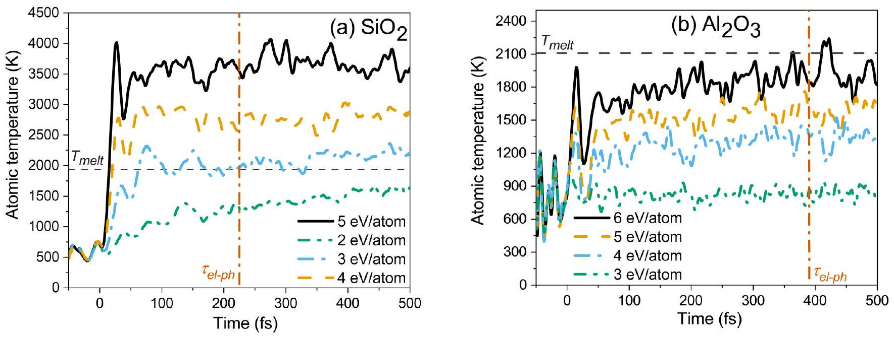
FIG. 23. Atomic kinetic temperature increase after ultrafast energy deposition into the electron system in $\mathrm{SiO}_{2}$ (a) and $\mathrm{Al}_{2} \mathrm{O}_{3}$ (b). Thermodynamic melting temperatures are shown as gray dashed lines for comparison. The characteristic times of the electron-phonon coupling extracted from SHI track data with the help of i-TS (from Fig. 21) are shown with orange dashed-dotted vertical lines.

(electron-phonon) coupling, as this channel of energy exchange is absent within the BO simulations. Atoms are heated purely due to nonthermal effects-the acceleration caused by changes in the atomic potential energy surface due to the electronic excitation. ${ }^{145,253}$

Section III A showed that electrons cool down and travel outward from the track core within $\sim 100 \mathrm{fs}$ at the doses above a few eV per atom, but the valence holes, which are typically heavier than conduction band electrons, last longer in the track core. ${ }^{146}$ These times are sufficient if not for the completion of a nonthermal phase transition, at least for significant nonthermal energy transfer from the electronic to the atomic system.

The dependence of the electron-phonon coupling parameter on the atomic temperature is nearly linear. ${ }^{44}$ A strong kick to atoms due to nonthermal heating increases their kinetic energy, thus additionally increasing the electron-ion coupling. In turn, this enhanced coupling increases the acceleration of atoms. A faster rate of atomic displacements results in faster changes of the electronion Hamiltonian, leading to a self-amplifying process. As seen in Fig. 23, this effect is especially significant at high deposited doses. ${ }^{145}$

Understanding the governing mechanisms of the atomic heating in SHI tracks, it can be concluded that the early estimates of the "electron-phonon coupling" extracted from the fast ion track parameters, such as in Refs. 23 and 57 (Fig. 21), must be interpreted as reflecting the rate of nonthermal increase in the atomic kinetic energy, with a contribution of elastic scattering, and not as a real electron-phonon coupling parameter (Fig. 22). ${ }^{145}$

The results of the laser-irradiation experiments confirm the mechanism of an extremely fast conversion of the potential energy into the kinetic energy of atoms with possible disordering on the timescales relevant to the SHI track problem. ${ }^{254-256}$

An increase in the electronic temperature may lead to large changes in the band structure of a material. ${ }^{257,258}$ In Ref. 257, it was demonstrated via the Keldysh diagram technique ${ }^{37}$ that at electronic temperatures of a few eV , the bandgap of insulators may decrease by several eV . It must also be noted that DFT calculations with local density approximation (LDA) predict an erroneous bandgap increase with the electronic temperature. ${ }^{257}$ At ambient conditions, LDA functional significantly underestimates the bandgaps of insulators and semiconductors; however, with the increase in the electronic temperature, the electron gas becomes more uniform and the LDA functional predictions become more accurate. The bandgap shrinkage, or, more general, modifications of the band structure, is even more sensitive to atomic motion.

The potential energy of an atom in the second quantization tight-binding formalism can be approximated as a contribution of the ionic repulsion and attraction to electrons, ${ }^{259,260}$

$$
V\left(\left\{R_{i j}(t)\right\}, t\right)=E_{\text {rep }}\left(\left\{R_{i j}(t)\right\}\right)+\sum_{i} f\left(\varepsilon_{i}\left(\left\{R_{i j}(t)\right\}, t\right)\right) \varepsilon_{i},
$$

where the potential $V$ depends on distances between all the atoms in the simulation box $\left\{R_{i j}(t)\right\}, E_{\text {rep }}$ is the effective ion-ion repulsion term (containing all contributions apart from the electronic band energies), and $f_{i}$ is the fractional electron occupation numbers (distribution function) on the transient molecular orbitals $\varepsilon_{i}=\langle i| \hat{H}\left(\left\{R_{i j}(t)\right\}\right)|i\rangle$ (or electronic band structure, the eigenstates of the electronic Hamiltonian $\hat{H}$ that depends on all atomic positions in the simulation box, and $|i\rangle$ is an eigenvector of this Hamiltonian). ${ }^{236}$

From Eq. (33), it can readily be seen that the state of the electronic system directly affects the interatomic potential. Excitation of
electrons changes the distribution function $f$ due to an increase in the electronic temperature. In turn, that changes the interaction among atoms, which may destabilize the atomic structure. ${ }^{237,261}$ This is the cause of the atomic acceleration shown in Fig. 23 in response to the electronic excitation.

Any atomic motion alters the Hamiltonian that depends on all the atomic positions (as well as electronic populations ${ }^{262}$ ). The eigenstates of the Hamiltonian-the material band structure-thus, also evolve in time, during the material response to the deposited energy. For example, Fig. 24 demonstrates the temporal behavior of the electronic energy levels in $\mathrm{Al}_{2} \mathrm{O}_{3}$ after the deposition of the dose of 5 eV /atom (the energy was deposited during 10 fs at the time of 0 fs via increase in the electronic temperature). ${ }^{243}$ This figure shows that the material quickly turns from insulating into a metallic one via the collapse of the bandgap. The same effect takes place in other covalently bonded materials.

A deposited dose in the nearest proximity of an SHI trajectory may reach even higher values. ${ }^{264}$ One, thus, may expect similar or even stronger transient changes in the band structure in SHI tracks.

Changes in the band structure will induce changes in other electronic properties such as electron transport coefficients and cross sections of scattering. However, as the band structure change is predicated on the electronic temperature or, more generally, the excited electron distribution function, it is progressing as the electron cascades are progressing. ${ }^{199}$ The changes in the band structure become more important as the electron cascades finish. ${ }^{265}$ Thus, the majority of a cascade is completed before significant changes in the electronic band structure take place.

When the bandgap collapses, the conservation of the total energy demands that the changes of the potential energy between the initial (before the bandgap collapse) and final (after the collapse) states must ultimately correspond to the changes in the kinetic energy of atoms (Fig. 23). Thus, Eq. (33) and the energy

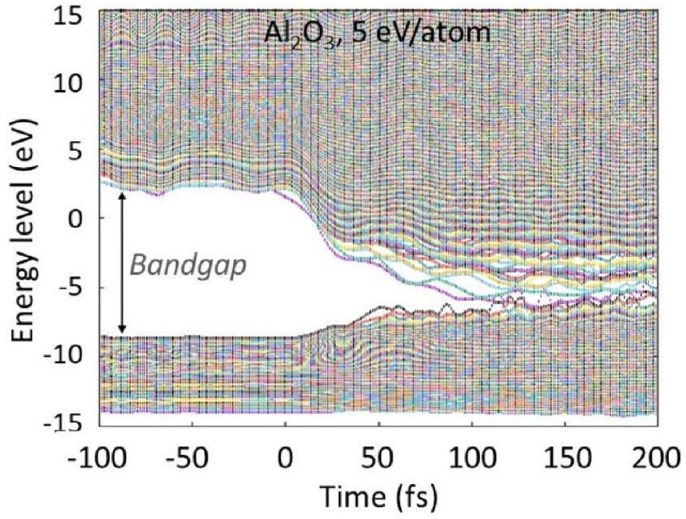
FIG. 24. Evolution of electron energy levels (molecular orbitals) in $\mathrm{Al}_{2} \mathrm{O}_{3}$ after the ultrafast deposition of $5 \mathrm{eV} /$ atom dose. ${ }^{253 .}$

conservation point that the increase in the kinetic energy of atoms in such a process can be estimated as follows:

$$
\Delta E_{k i n}=\Delta V\left(\left\{R_{i j}(t)\right\}, t\right) \approx \sum_{i} f^{i n}\left(\varepsilon_{i}^{i n}-\varepsilon_{i}^{f i n}\right),
$$

where the $\varepsilon_{i}^{i n}$ and $\varepsilon_{i}^{\text {fin }}$ are the initial and final (after the atomic motion and accompanying bandgap collapse) energy levels (cf. Figure 24), respectively. In this process, there is no contribution of electron hopping between the levels. This is purely the BO effect because the electron distribution function $f^{i n}$ does not change. ${ }^{250}$ It clearly distinguishes this nonthermal atomic heating from the elec-tron-phonon (non-BO) effect.

Equation (34) suggests that the transfer of the excess energy of electron-hole pairs to the atomic kinetic energy at times about 100 fs after the ion passage can model the nonthermal atomic heating by tracing the spatial distribution of the formed electronhole pairs. This will be discussed in detail in Sec. VIII A.

In summary, for an SHI track creation problem, the majority of energy is delivered from excited electrons to atoms of the material via three distinct channels: (a) scattering of ballistic electrons/holes, ${ }^{5}$ (b) coupling between excited low-energy electrons/holes with atoms (electron-phonon coupling), and (c) nonthermal forces induced by modified interatomic potential accelerating atoms. They all are completed within some $\sim 100 \mathrm{fs}$. The ballistic scattering channel "(a)" provides an insufficient amount of energy to atoms. ${ }^{126}$ The electron-ion coupling parameter "(b)" may be reliably calculated with various methods, such as nonadiabatic $a b$ initio MD, or DSF formalism based on classical MD, requiring no fitting parameters. However, the electron-phonon coupling channel is too slow to provide necessary energy transfer in SHI tracks (in contrast to longer-lived laser spots). The nonthermal atomic acceleration "(c)" provides necessary additional energy transfer at such a short timescale, forming a crucial mechanism of atomic heating in swift heavy ion tracks.

## V. PICOSECOND TIMESCALES: ATOMIC KINETICS FROM $\sim 100 \mathrm{fs}$ TO 1-10 ps

The nonequilibrium electron kinetics at femtosecond timescales forms the initial conditions for further atomic dynamics of a target. The energy delivered to atoms in (quasi-) elastic scattering by fast electrons and valence holes, together with the nonthermal forces induced by electronic excitation, will trigger an atomic response. An example of the energy transfer to the lattice via these channels in $\mathrm{Al}_{2} \mathrm{O}_{3}$ and Bi 700 MeV or Xe 167 MeV ions impact is shown in Fig. 25. The contributions of the electrons and holes scattering are most pronounced in the track center, whereas the contribution of the potential energy (associated with the nonthermal acceleration of atoms via bandgap collapse, see Sec. IV C) is more spread radially.

Atoms, provided with kinetic and increased potential energy, may transiently form a damaged region within a few-nanometer radius around an SHI trajectory over the picosecond timescale. A fast increase in the atomic kinetic energy in a localized region around an SHI trajectory also increases pressure, emitting shock

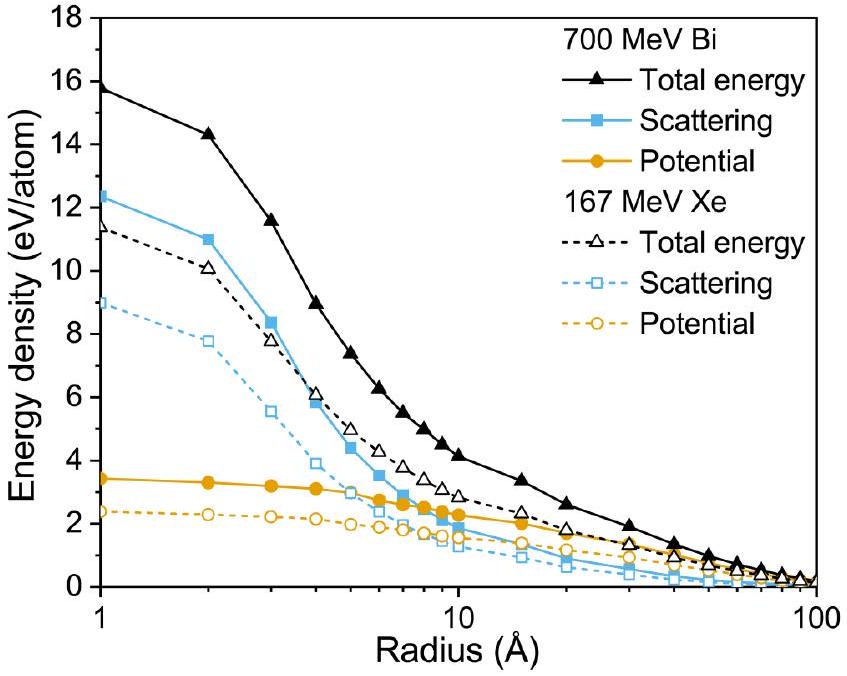
FIG. 25. Radial density of the lattice energy in the tracks of Bi 700 MeV and Xe 167 MeV ions in $\mathrm{Al}_{2} \mathrm{O}_{3}$ at 100 fs including potential energies of valence holes.

waves out of the track core. ${ }^{266,267}$ It may transiently lower the density of the material in a track region and even create voids, which later may recover or stay permanently. ${ }^{47}$ In near-surface regions, it results in a flow of atoms, which may be emitted or attracted back to the surface and form observable surface defects (hillocks or craters, will be discussed separately in Sec. X).

Relaxation of the energy transferred from electrons/holes to atoms can be modeled with the classical molecular dynamics (MD) method. Since by the time of $\sim 100 \mathrm{fs}$, electronic excitation in an SHI track already dissipates outward from the track core, the interatomic potential returns to its unexcited form, ${ }^{169}$ which can be used in the standard MD simulation scheme.

As demonstrated in Ref. 169, to reproduce the final material modification in a track, this initial stage of $\sim 100$ fs when electronic kinetics develops in parallel with the atomic one does not require a simultaneous tracing of both systems: the atomic dynamics may be started to be simulated with MD after the 100 fs , using the energy transferred from electrons as initial conditions. This significantly simplifies the modeling, since Monte Carlo simulations of the electronic processes may then be decoupled from the MD simulation of the atomic response.

In this section, we will describe in more detail these processes lasting from $\sim 100$ fs up to $1-10 \mathrm{ps}$.

## A. Atomic response to heating/excitation (up to $\mathbf{1 ~ p s}$ )

Atomic heating (the kinetic energy) profile created within $\sim 100 \mathrm{fs}$ by the scattering of electrons and holes and nonthermal interaction between the electronic and atomic ensembles in the nearest proximity of the SHI trajectory (cf. Figure 25) start to disorder the atomic structure at the timescales of a hundred fs. An example is shown in Fig. 26.

The transiently disordered region is a few nm in radius, having a cylindrical symmetry in the bulk. It has a completely disordered low-density central region, which increases in diameter from about 3 to 5 nm surrounded by a severely damaged cylindrical layer of about 15 nm in diameter within the shown 1 ps . The main features of this damage are already seen in the snapshots within 100 fs and change only slightly during the 1 ps timescales.

The increase in the kinetic energy of the atomic system, propagating from the track center outward, may lead to local nonequilibrium within the atomic ensemble. ${ }^{268}$ Receiving an ultrafast strong kick, an atomic distribution function may transiently depart from the equilibrium Maxwellian one describing the atomic system with temperature. Within the MD simulations, it is possible to identify equilibrium conditions by a comparison between the kinetic ( $T_{\text {kin }}$ ) and configurational ( $T_{\text {conf }}$ ) temperatures. ${ }^{269}$ The kinetic temperature represents the average kinetic energy in the system, whereas the configurational temperature is connected with the average potential energy,

$$
T_{k i n}=\frac{1}{k_{B} N_{a t}} \sum_{i=1}^{N_{a t}} \frac{M_{i} v_{i}^{2}}{2}, \quad T_{c o n f}=\frac{1}{k_{B} N_{a t}} \sum_{i=1}^{N_{a t}} \frac{\left|\nabla_{i} V\right|^{2}}{\nabla_{i}^{2} V},
$$

where $V$ is an atomic potential, the gradient of which with respect to the coordinates of $i$ th atom returns the force acting on that atom. In the case of equilibrium, according to the virial theorem, the time averages of $T_{\text {kin }}$ and $T_{\text {conf }}$ coincide and are equal to the thermodynamic temperature. ${ }^{270}$ Out of equilibrium, they differ and, thus, may serve as a criterion for identifying the equilibration in atomistic simulations. ${ }^{271,272}$ In SHI tracks, the propagation of temperature and pressure leads to transient nonequilibrium in the atomic system; however, it does not seem to be a strong effect. ${ }^{268}$ In Fig. 26 and further, we show the kinetic temperature of atoms, as can be straightforwardly obtained in MD simulations. Note that it can transiently reach very high values on the order of few tens of thousands of Kelvins, but quickly reduces due to heat transport outward from the track.

Atomic response to a nearly instantaneous ( $\sim 100 \mathrm{fs}$ ) heating, compared to the times of the final track formation, also results in the creation of pressure waves, emitted radially outward from the track core (see Fig. 26). ${ }^{126,273}$ The pressure in the track center may instantaneously reach as high values as few tens of GPa. Such a high pressure leads to transient reduction in the material density in the track center, from where the material is expanding to the periphery. The pressure waves also reflect in some deviation of the temperature profiles from a smooth monotonous decreasing function. The waves help to dissipate the initial excitation, thereby reducing the atomic temperature. ${ }^{126}$ This relaxation is accompanied by a decrease in the atomic density in the center of the track within a few nm radius already before 1 ps and a slight increase around it in the track periphery region. ${ }^{234,264}$ In some materials, it may even lead to the creation of voids-transiently or permanently. ${ }^{47,267}$ This density profile may be detectable in an experiment if solidifies in this state. ${ }^{234}$ The cooling and resolidification processes will be discussed in Sec. VI A.

The effects of pressure are especially important for biological matter since even impacts in surrounding water can create such strong pressure waves that damage the nearby strands of DNA. ${ }^{273}$

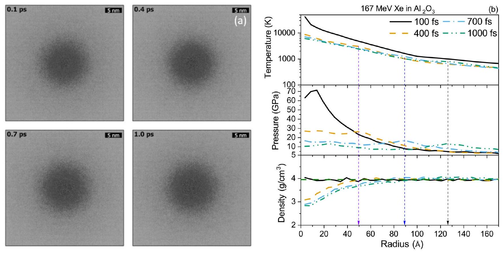
FIG. 26. (Left panel) Atomic snapshots of disordering $\mathrm{Al}_{2} \mathrm{O}_{3}$ within the first 1 ps after 167 MeV Xe ion passage, calculated with the help of classical molecular dynamics. ${ }^{264}$ (Right panel) Corresponding atomic temperature (top), pressure (middle), and density (bottom) radial profiles at various time instants. Vertical arrows point at the position of the pressure wave peak at the corresponding times. A green horizontal dashed line indicates the ambient density.

The pressure also may transport damage fragments such as free radicals away from the track center farther and faster. ${ }^{266}$

Simulations of temperature and pressure wave propagation require large simulation boxes, which are currently impossible to model with $a b$ initio MD. On the other hand, simpler models such as thermodynamic equations (TTM or i-TS) do not account for the finite speed of signal and changes in the equation of state of a material at high pressures and evolving densities. ${ }^{27}$ In contrast, such effects are perfectly well captured by classical MD simulation tools, if the used potentials are applicable under such conditions (high temperatures and pressures). For modeling extreme conditions and ultrafast phase and structure transformations, it is important to ensure that the interatomic potential reproduces correctly the response of a material to compression and stretching in a wide range of strains. ${ }^{274}$ For polymers and biological materials, it is important to ensure that the force fields used allow for a proper description of chemical reactions-the so-called reactive potentials; e.g., ReaxFF and REBO/AIREBO-based force fields are commonly utilized for the reactive description of organic materials. ${ }^{275}$

Nowadays, most of the empirical potentials are fitted to data obtained with DFT by methods such as the force-matching method ${ }^{276}$ or the stress-matching method. ${ }^{277}$ More recently, selflearning and machine-learning methods have been gaining momentum as the most accurate methods of development of MD potentials in physics ${ }^{278-281}$ and chemistry. ${ }^{282,283}$ A review of various MD potentials appropriate for modeling SHI-irradiation effects can be found, e.g., in the book. ${ }^{33}$

Semi-empirical MD potentials are usually fitted to ground-state $a b$ initio simulations (unexcited materials at zero electronic temperatures). It is very difficult to develop a classical MD potential dependent on the electronic temperature [to be used within the TTM-MD model described above, see Eqs. (24)-(26)], and so far, it has been accomplished only for silicon ${ }^{278,284}$ and some metals. ${ }^{285,286}$ However, for the SHI track formation problem, electron-temperature-dependent potentials may not be necessary. As we have seen above (cf. Figure 18), the initially strongly excited electronic system cools down after some 100 fs , and ground state potentials become applicable to describe the atomic response to this ultrafast energy transfer.

To conclude, in SHI tracks, a response to an increase in the atomic potential energy converts into kinetic energy, which may trigger atomic disorder at extremely short timescales-by the time of a few hundred femtoseconds. It is accompanied by the emission of shock waves radially outward from the track core and a transient reduction in material density. These effects are well described with classical molecular dynamics simulations using semi-empirical potentials. Such potentials are usually fitted to the ground-state properties of materials, which is sufficient for the SHI track creation problem, as long as the potential reproduces the properties of atomically hot matter at high pressures.

## B. Different zones of tracks

Section V A demonstrated that above a certain threshold in the stopping power of an SHI, a considerable disorder can transiently
occur within a few-nanometer radius around the SHI trajectory. Later, after atomic cooling and relaxation, this region may form permanent damage called a track core. It may have a transitional region from the damaged track core to an undamaged material with its own distinct structure and density sometimes called a track periphery. ${ }^{234,287}$ This complex structure of a track was first discovered in $\mathrm{SiO}_{2}{ }^{234}$ and later shown to be present in other materials. However, whether the transient damage will recover or remain depends on atomic relaxation at longer timescales, which will be discussed in Sec. VI.

Not all materials form a track core with an atomic disorder or severe damage. ${ }^{2}$ Some materials do not form post-mortem observable tracks upon SHI irradiation-typical examples include metals, some crystalline narrow bandgap semiconductors (e.g., silicon) and nonamorphizable insulators (e.g., diamond, LiF). There may be various reasons for materials not to form a track core: (a) due to the small elastic scattering rate of fast electrons and valence holes, it may not deliver sufficient energy to the atomic system around an SHI trajectory to disorder it (this seems to be the case, e.g., in silicon ${ }^{288}$ ); (b) nonthermal forces may be absent or not lead to atomic heating (which is a typical case for metals ${ }^{289}$ ); and (c) transient disorder may occur, but further atomic relaxation recovers the damage at longer timescales (which is the case for simple insulators ${ }^{30}$ ).

Apart from atomic disorder, there are different channels of possible damage. Even in materials that form a track core, thermal (and nonthermal) heating in the vicinity of a projectile trajectory is insufficient to cause damage at large radii, but pressure waves may create strains and defects. It may also affect preexisting defect ensembles in the target. ${ }^{66,235,290}$ At relativistic ion energies, excited delta-electrons may possess sufficient energy to knock out a target atom from its equilibrium position by a direct impact (elastic scattering). Atoms may also be knocked out by the SHI via nuclear stopping scattering, creating atomic cascades.

In wide-bandgap materials under an SHI irradiation, a prominent channel of point defects formation occurs via the recombination of electrons and holes, directly or via the excitonic mechanism. ${ }^{134,291}$ An exciton is a bound state of a conduction band electron and a valence band hole mutually attracted by the Coulomb field and behaving in a correlated manner. An exciton energy level lies inside the bandgap of the material. ${ }^{134}$ Such quasiparticles may be moving freely (mobile excitons) or be spatially localized (self-trapped excitons). ${ }^{292,293}$

Excitons may decay via various channels, such as photon emission, emission of phonons, or creation of point defects. The latter mechanism is only possible in wide-bandgap materials, where exciton energy is larger than the cohesive energy of atoms. In such a case, the energy released by an exciton decay is sufficient to knock an atom out of its equilibrium position and, hence, create a Frenkel pair of point defects: a lattice vacancy and an interstitial defect. ${ }^{134,200}$ Electron energy levels of these defects and their complexes can absorb visible light; hence, they are called "color centers." This makes a normally transparent material acquire a color. ${ }^{134}$

These defects are typically localized within a radius of a few tens of nm around an SHI trajectory, forming the so-called track halo. ${ }^{294,295}$ The initial conditions for the formation of a radial profile of the track halo containing color centers are defined by the profile of formed excitons, which, in turn, depends on the valence holes and conduction electrons transport. ${ }^{296}$ The typical time before self-
trapping of excitons is from a few hundreds of fs (e.g., in $\mathrm{SiO}_{2}{ }^{297}$ ) to about a picosecond (e.g., in LiF ), to $50-100 \mathrm{ps}\left(\mathrm{MgO}\right.$ and $\mathrm{Al}_{2} \mathrm{O}_{3}$, respectively ${ }^{297}$ ) and is strongly dependent on the material and radiation properties. In particular, the higher the excitation density, the faster the trapping process, so in some materials (e.g., NaCl ), selftrapping characteristic time cannot even be defined meaningfully. ${ }^{297}$

Various point defect types (interstitials and vacancies, charged and neutral, mobile and immobile, single-atom and aggregated) exhibit complex kinetics and interactions. Neutral defects that are immobile may trap a charge (an electron or a hole) and become charged and mobile. ${ }^{298}$ Defects may recombine back into a pristine material or form agglomerates. Mobility and stability of various defects are also sensitive to the temperature of the material. ${ }^{296,299}$

The kinetics of excitons and various point defects may be described with chemical balance equations, accounting for spatial diffusion and reactions for each type of defect and active chemical species, including electrons, valence holes, and excitons. These equations may be solved numerically ${ }^{298}$ or sampled with help of the kinetic Monte Carlo method. ${ }^{300}$ We will come back to this point in Sec. VI since the typical characteristic timescales of such kinetics are from some 10 ps to nanoseconds or longer. ${ }^{300}$

The creation of local defects and related effects play an especially important role in biological matter, since it may lead to the formation of damage in an extended halo around an SHI trajectory. ${ }^{301}$ Since a biological sample may be damaged by water radiolysis, the extended region of defects in the surrounding matter may significantly enhance the damage. ${ }^{302}$

Apart from a point defect, collective localized defects may also form dislocation loops, such as prismatic or screw dislocations. A dislocation loop is a missing or an extra layer of atoms between the regular atomic planes of the material. It can form when interstitial atoms or vacancies cluster together ${ }^{303}$ or during the recrystallization of transiently disordered track core. ${ }^{48,264,304}$ Dislocation loop creation can modify atomic properties even in materials usually considered radiation resistant, without creating distinct track cores such as in metals. ${ }^{305}$

In conclusion, the surrounding region of an energetic ion trajectory consists of various types of damages. In the immediate proximity of a few nanometers, a complete atomic disorder takes place above a certain threshold of the energy deposition, forming the track core. At larger distances, a defected structure of the material is formed or modified, known as the track halo. The halo, depending on the particular material, may contain point defects such as color-centers, dislocations, accumulated stresses, and various radicals and molecular fragments in biological targets and polymers. Transient kinetics of the track core can be well modeled with classical MD. The track halo may be modeled with such methods as kinetic Monte Carlo or chemical balance equations. Both cases, modeling a track core or a halo, require detailed information on the electronic kinetics to set reliable initial conditions.

## VI. SUBNANOSECOND TIMESCALES: ATOMIC RELAXATION

## A. Atomic cooling and recovery

After the initial increase in the atomic temperature and pressure and the formation of the temperature and pressure waves, a
slower cooling of the atomic system takes place via diffusive energy transport outward from the track. ${ }^{126}$ An example of this cooling in $\mathrm{Al}_{2} \mathrm{O}_{3}$ after 167 MeV Xe ion impact is shown in Fig. 27 (see Fig. 26 for the zoom onto the first picosecond). It was calculated with the classical MD, which is capable of modeling the dynamics of millions of atoms spanning up to nanosecond timescales with modern supercomputers.

Figure 27 demonstrates that the atomic temperature in $\mathrm{Al}_{2} \mathrm{O}_{3}$ relaxes within some hundred picoseconds to values close to the room temperature at a track periphery. At the same time, pressure/ stress relaxes too, leaving only small residual stress in the system, most pronounced in the very track core. In the case of $\mathrm{Al}_{2} \mathrm{O}_{3}$, the density nearly recovered its original value at this time (cf. Figure 26). This is not always the case, and in some materials, a low-density track core may be observed, with an overdense periphery. ${ }^{234,306}$ In extreme cases such as in amorphous germanium, even voids can be formed in the track core after an SHI impact. ${ }^{47}$

During this relaxation, $\mathrm{Al}_{2} \mathrm{O}_{3}$ undergoes the partial recrystallization of the disordered region: the initial disorder shrinks over the time of $\sim 50 \mathrm{ps}$, leaving a smaller stable track afterward (see Fig. 28). ${ }^{30,264}$ The experimental TEM image demonstrates a small disordered track, comparable to the simulated one. This recrystallization behavior strongly depends on the particular material; e.g., MgO, also shown in Fig. 28, exhibits no final track despite having nearly the same transient disorder after an ion impact. In contrast, yttrium aluminum garnet (YAG) shows the final track of nearly the same radius as the transiently disordered region, with almost no

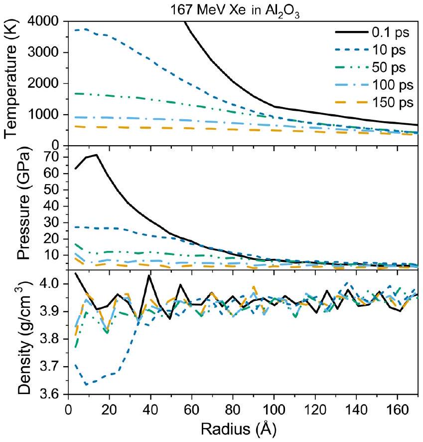
FIG. 27. Relaxation of the atomic temperature (top), pressure (middle), and density (bottom) radial profiles in $\mathrm{Al}_{2} \mathrm{O}_{3}$ after 167 MeV Xe ion impact.

recrystallization (Fig. 28). Experimental TEM track is slightly larger than the simulated one but qualitatively the same.

This illustrates the importance of recrystallization for the formation of observable tracks: depending on the material properties, it may drastically change the observable track diameter with respect to the transiently achieved disorder/melting. ${ }^{30}$ The ability of a material to recrystallize in an SHI track depends on its complexity: simpler structures are easier to recover within the short time of track cooling than more complex ones. ${ }^{30}$

The relaxation kinetics is more complicated in polymers. Long linear chain crystalline polymers react differently to the deposited dose, e.g., forming elliptical and wedge-shaped tracks, while tracks in amorphous polymers look like circular dots. ${ }^{307}$ A typical polymer heat conductivity is much lower than that of inorganic dielectrics (compare $137 \mathrm{~W} \mathrm{~m}^{-1} \mathrm{~K}^{-1}$ for silicon or $550 \mathrm{~W} \mathrm{~m}^{-1} \mathrm{~K}^{-1}$ for diamond vs $0.03-0.8 \mathrm{~W} \mathrm{~m}^{-1} \mathrm{~K}^{-1}$ for typical polymers), so a heated region of a track with the radius of $4-5 \mathrm{~nm}$ exists longer than $100 \mathrm{ps} .^{15}$ Threshold temperatures of damage formation in polymers are lower than those in inorganic crystalline materials. ${ }^{308}$ Lightweight hydrogens are likely to detach from their parental atoms breaking and changing chemical bonds under high irradiation doses. ${ }^{243,244,309,310}$ Specific processes, such as cross-linking, different kinds of polymerization, diverse monomeric composition, various degrees of crystallinity, and so on, provide a wide variety of polymeric species with different properties. These features impose limitations on their atomic dynamics simulation, as will be discussed more in Sec. VII.

Having identified all the stages of the track formation, we see the final product of an ion impact: an experimentally observable nanometric track. The size of the track may be different for the same ion parameters in different materials; Alternatively, changing ion parameters affects the track size in the same material. For each material, we can identify a certain threshold in ion electronic stopping power, at which the radius of a created track in the bulk tends to zero, $S_{e}^{\text {th }}$.

It is believed that the threshold stopping power is a universal criterion used to evaluate material sensitivity or resistivity to ion irradiation, and it does not depend on a particular ion: various SHIs seem to have the same threshold stopping power. However, the stopping power is not the sole quantity that defines the threshold of track formation. It is clearly illustrated by the fact that track creation thresholds are different on the left vs the right shoulder of the Bragg curve.

This manifests the velocity effect: ions with the same stopping power but different velocities do not produce identical tracks. ${ }^{311}$ The threshold stopping value depends on the ion velocity, $S_{e}^{\text {th }}\left(v_{\text {ion }}\right)$ [see an example of the stopping power of $\mathrm{Xe}, \mathrm{U}$, and Ubn (element 120) ions in forsterite in Fig. 29]. The threshold values are taken from Ref. 287.

A difference in the spectra of electrons excited by an SHI is the reason for the velocity effect: the maximum energy an electron can receive from an ion [see Eq. (17)] is higher for higher incident ion energies (the right shoulder of the Bragg curve vs the left one). Electrons then travel faster outward from the track core, bringing more energy farther away. It decreases the energy density in the track core, which reduces energy transferred to the target atoms. Thus, to achieve the same threshold deposited dose, the stopping

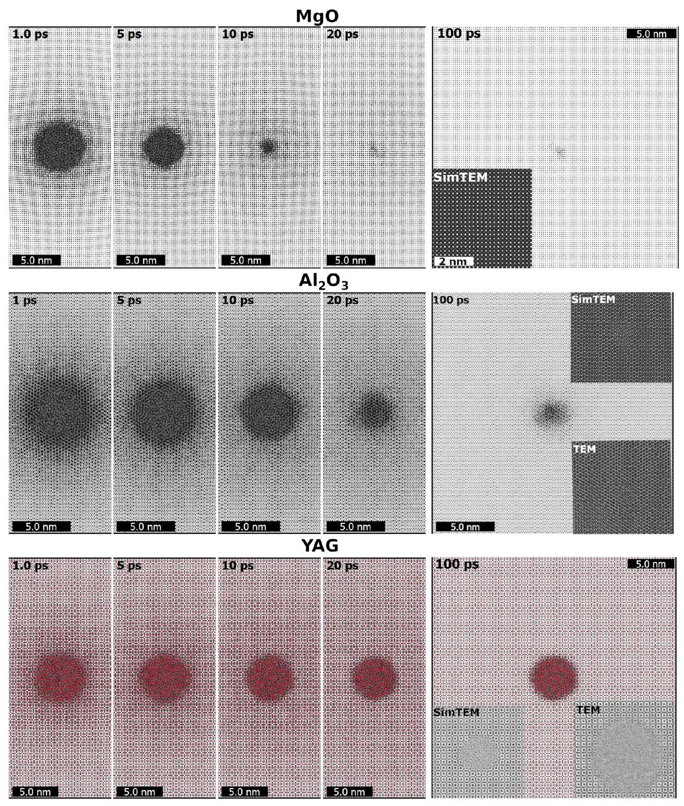
FIG. 28. Snapshots of MD supercell of MgO, $\mathrm{Al}_{2} \mathrm{O}_{3}$, and YAG at different times after the passage of 167 MeV Xe ion (left panels). Comparison of the final produced tracks with those measured in the experiments with TEM. ${ }^{264}$ Reproduced with permission from Rymzhanov et al., Nucl. Instrum. Methods Phys. Res., Sect. B 473, 27 (2020). Copyright 2020 Elsevier.

power of the ion must be higher at the right shoulder of the Bragg curve. ${ }^{287}$

The functional dependence of the threshold stopping power on ion velocity $S_{e}^{\text {th }}\left(v_{\text {ion }}\right)$ or energy $S_{e}^{\text {th }}\left(E_{\text {ion }}\right)$ has not yet been studied: the transition between seemingly constant values at the left and the right shoulders of the Bragg curve is still unknown. For example, it is unclear how the thresholds behave for an ion, whose Bragg peak lies above the left threshold but below the right
threshold. One may use a set of ions with different atomic numbers or nonequilibrium SHI charges, which would allow to probe the entire plane $S_{\mathrm{e}}\left(E_{\text {ion }}\right)$.

Such a definition of the track formation threshold, $S_{e}^{t h}=\lim _{R \rightarrow 0}\left(S_{e}(R)\right)$, with $R$ being the radius of a track observed in an experiment, reflects only the track core with a structure clearly distinguishable from the surrounding material. It is not always

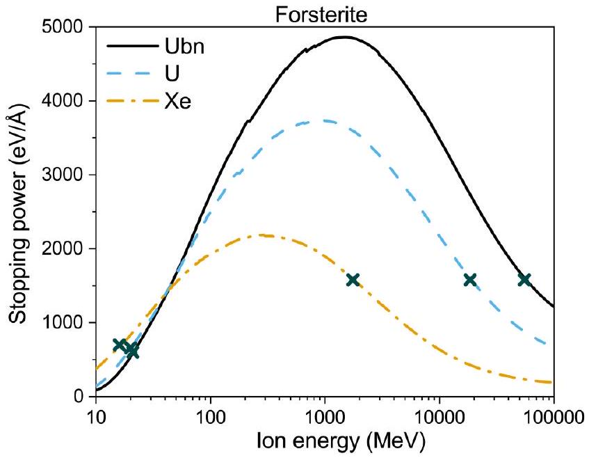
FIG. 29. Energy loss of $\mathrm{Xe}, \mathrm{U}$, and $\mathrm{Ubn}\left(\mathrm{Z}_{\text {ion }}=120\right)$ ions in forsterite. The crosses mark thresholds of track formation at the left and right shoulders of the Bragg curve.

possible to discern a track core in the experiments. In some materials, no track core is formed after an SHI irradiation up to the stopping powers of the heaviest elements used in experiments (U ions). ${ }^{2}$ It includes, for example, LiF , crystalline Si , most metals, and other materials, which are commonly referred to as nonamorphizable materials. ${ }^{57,312}$

In conclusion, the relaxation of the atomic structure after an SHI impact may be well modeled with the classical MD method applied to small parts of an ion trajectory. Rapid track cooling within sub-nanosecond timescales allows using atomistic simulations with modern-day computers. The insights obtained with such simulations allow one to identify the track creation threshold, which is strongly affected by a material capability to recrystallize after a transient disorder. This relaxation stage, thus, defines the final crystalline or amorphous structure of the formed track, if any. The velocity effect-different thresholds of track formation for ions with the same energy losses but different velocities (the left vs the right shoulders of the Bragg curve)-may be well reproduced by a simulation that accounts for all stages of track formation, as it is defined by the electron transport and a resulting profile of initial energy deposition into the atomic system.

## B. Defects kinetics

As discussed in Sec. V B, apart from the severe damage in the track core, a halo containing point defects is also produced by an SHI impact. Point defects are created via atomic cascades due to nuclear stopping, electron-hole recombination, exciton creation and decay, or shock waves.

In the context of point defects, a common and the simplest quantitative measure of damage created in materials is the number of Frenkel pairs formed for given energy transferred to the primary knock-on atom called "displacements per atom" (dpa). ${ }^{313,314}$ This
measure allows quantifying the damage produced in terms of the number of point defects, allowing to compare in the "first-order approximation" radiation effects from various kinds of incoming particles (ions, electrons, and neutrons). ${ }^{315}$

In the nuclear stopping regime, for a simple evaluation of the dpa produced by an ion, the Norgett-Robinson-Torrens (NRT-dpa) model can be used ${ }^{314}$ (which is an improved KinchinPease model ${ }^{313}$ ). In the NRT-dpa model, the number of atomic displacements ( $N_{d}$ ) can be found as follows:

$$
N_{d}=\left\{\begin{array}{l}
0, \quad T_{d}<E_{d} \\
1, \quad E_{d}<T_{d}<\frac{2 E_{d}}{0.8} \\
\frac{0.8 T_{d}}{2 E_{d}}, \quad \frac{2 E_{d}}{0.8}<T_{d}
\end{array}\right.
$$

where $T_{d}$ is the kinetic energy available for creating atomic displacements, also called the damage energy, which, for a single ion, is defined as the total ion energy minus the energy lost to electronic ionization. The displacement energy $E_{d}$ is typically in the range from 20 to 100 eV depending on the material. ${ }^{315}$ It is a crude but efficient model widely used in radiation physics. More detailed information on the point defects creation in nuclear stopping may be obtained via molecular dynamics simulations, as already discussed in Sec. II B, or via Monte Carlo simulations of atomic cascades. ${ }^{315}$

Classical MD simulations do not account for electronic stopping and ensuing atomic heating by excited electrons. So, these effects must be incorporated additionally by means of other methods, such as MC simulations, or at least in the framework of the TTM-MD. ${ }^{290,316}$ Such methods, although capable of precise description of the stages of the creation of point defects, are currently too computationally demanding to trace the evolution of the defect ensembles at long timescales (nanoseconds or longer). So far, they found only limited use, although undoubtedly their usage will increase in the future.

Up to now, to trace processes taking place in the defect ensemble, other more efficient methods are used, such as the kinetic Monte Carlo (KMC) simulations, ${ }^{48,65}$ or rate equations accounting for defect transport. ${ }^{65,298}$ The kinetic MC method traces the probabilities of an object (defect such as a vacancy or an interstitial, a dislocation, an impurity, etc.) to transition from one state to another. The states may be different states of a defect (for example, a charged or a neutral defect, a single defect or agglomerate, etc.) or a different position in a lattice (allowing for defect migration). Each transition requires the knowledge of the corresponding probabilities or transition rates. ${ }^{317,318}$ Then, each possible transition can be sampled with the help of random number generation, similarly to the transport MC methods discussed in Sec. II C.

Rate equations, or chemical balance equations, are typically written as a set of equations for each type of defect, accounting for their possible conversion into each other, and diffusive transport. ${ }^{65,298}$ They require the knowledge of rates (probabilities per time) of the corresponding processes, which define how fast the defect conversions and diffusion take place.

In either of the methods, one of the key parameters is the activation energy of a defect (an energy barrier for defect migration) in a given material. It defines the probability of a defect to move from its potential well to a neighboring site, and correspondingly its transition rate or diffusion coefficient. Reliable activation energies can be obtained by means of $a b$ initio simulations such as DFT via evaluating potential energy surfaces of the defects. ${ }^{319}$

Activation energies and migration barriers are defined by the collective atomic potential energy surface and are sensitive to the temperature of the material. ${ }^{320}$ The probability of a defect migration follows the Arrhenius law $w \sim \exp \left(-E_{a} /\left(k_{B} T\right)\right)$, with $E_{a}$ being the activation energy, and, thus, changes drastically with heating or cooling of the material.

Ab initio methods can be used to calculate defect formation energies (and correlate them with the projectile energy loss). ${ }^{321-323}$ Atomic heating induced by the energy transfer from excited electrons as well as generated shock waves transiently affects the kinetics of defects (preexisting in the target or produced by the SHI impact), creating synergy between the nuclear and electronic stopping effects. ${ }^{66,290,324}$ Of particular practical interest is the effect of annealing: heating produced by an SHI impact may be sufficient to trigger significant recombination of preexisting defects, recovering and improving material properties. ${ }^{66}$

In conclusion, an SHI impact creates stable point defects with ensuing complex kinetics. The point defects may recombine or aggregate and accumulate, thus changing the properties of the material. The kinetics of defects may be traced by means of kinetic Monte Carlo simulations, or transport rate equations, accounting for possibilities of various defect formation, annihilation, and conversion between different types. It means that the kinetics of SHI-produced point defects can be treated with standard radiation physics models and radiation material science, thereby connecting it to the well-developed field. ${ }^{65}$

## VII. LONG TIMESCALES: MACROSCOPIC RELAXATION

After the SHI track cools down, its core stays stable. The created halo, however, may continue to be kinetically active and evolve at micro- to macro-scoping timescales. This activity originates from nonequilibrium and spatially inhomogeneous fields of different defects (possibly, chemically active), variations in the material density, and induced stresses left by the track formation process. Each of these residual kinetics may be addressed with its own appropriate methods.

In irradiated inorganic solids, a relaxation of macroscopic stresses and inhomogeneous densities may result in the viscous flow of the material. At its characteristic timescales of nanoseconds and longer, this flow can be modeled with hydrodynamic models, based on the Navier-Stokes equations, ${ }^{325}$ or a combination of the continuity equations and those for stresses in the material. ${ }^{326}$ Heat transfer, fluid flow, mass transport equations, etc. can be efficiently solved numerically by means of finite element methods (FEMs), describing the material response to irradiation at macroscopic scales. ${ }^{33,327,328}$ The initial conditions for such modeling may be taken from the MD simulations, which describe the subnanosecond timescales very well, as discussed in Sec. VI.

Depending on the material properties, namely, its viscosity and heat conduction, an amorphous material may freeze in a state with density oscillations or relax to a nearly unirradiated state (and everything in-between). ${ }^{326}$ Depending on the sensitivity of material properties to temperature, the active stage of density evolution may last only during the cooling time ( $\sim 100 \mathrm{ps}$, see Sec. VI A) or continue afterward if viscosity at room temperature allows for it. Thus, this process is material specific and requires dedicated modeling for each particular irradiation and target conditions.

The effects of irradiation resulting in macroscopic strains, stresses, and swelling are especially important for nuclear power plant components. Modeling of such effects can also be made with multiscale models, exploiting the fact that elasticity equations have no characteristic spatial scale. This fact enables a mathematical treatment based on elastic fields of defects on the nanoscale, readily extending the results to the macro-scale. ${ }^{329}$ Such models without characteristic spatial or temporal scales offer a promising perspective for future research.

The track halo is especially important for polymers and biological matter where localized and chemically active defects have drastic effects on material properties: localized bond breaking creates damage fragments, radicals, and chemically active species. ${ }^{178,301}$ For the biological targets, three general mechanisms of DNA lesions are suggested: interaction with free radicals and fast hot electrons, dissociative attachment of low-energy electrons to bases, and local atomic heating mechanisms. Realizations of damage channels depend on the parameters of a projectile. For example, in the case of an energetic carbon ion, numerical estimates showed that single strand breaks (SSBs) and double-strand breaks (DSBs) cannot be neglected. ${ }^{184}$

A multiscale simulation tool, MBN Explorer code can be mentioned as an example of a very effective tool for the MD simulation of DNA damage. ${ }^{330}$ The software is also able to simulate combined systems (e.g., DNA and nanoparticles) and contains a large variety of different-type potentials that makes it a versatile tool. Implemented reactive rCHARMM force field was tested on the DNA and fullerenes. ${ }^{331}$ It also supports the creation of simple water radicals and their ability to break bonds.

For water, a medium surrounding and interacting with biological materials, it is important to trace radiolytic species (such as free electrons, H and OH radicals, and $\mathrm{H}_{2}$ ) over the time of microseconds to establish the final damage profile after an SHI impact. ${ }^{301}$ The kinetics of dissociated molecules leads to complex radiation chemical damage, in which the created free radicals play a crucial role. An additional complication to it is that such effects as transient heating and pressure waves may severely alter the distribution and kinetics of radicals. ${ }^{273}$ The indirect damage due to secondary kinetics may be responsible for up to $90 \%$ of injuries of cells. ${ }^{332}$ Since indirect effects are so damaging, mechanisms of radical creation, distribution, and bond rupture must be considered in adequate models.

This complex problem may be addressed by combined and multiscale approaches, in which various sub-problems are described with their own methods. For example, an SHI and electron kinetics is usually traced with the MC method, which then may be coupled to the chemical dynamics simulated with chemical balance equations. ${ }^{301}$ Alternatively, the MD simulations of initial
stages can be combined with KMC methods for long-timescale dynamics of radicals. ${ }^{273}$ A more detailed description of the principles of multiscale methods will be discussed in Sec. VIII.

Reference 301 presented the modeling of generation and propagation of radicals. The Monte Carlo code TRAX was modified to describe the production, diffusion, and reactions of radicals with one another and the surrounding medium (TRAX-CHEM). The authors achieved a reasonable agreement of the calculated spatiotemporal radical distributions with available experimental data, albeit experimental data are scarce. This multiscale approach was applied to unveil the role of oxygen in the so-called FLASH effect when normal tissue toxicity is significantly reduced under irradiation with ultra-high dose rates (ion fluxes). ${ }^{333}$ The extension of the TRAX-CHEM code to different rates of oxygenation in a cell made it possible to estimate oxygen contribution and to test the hypothesis of the crucial oxygen role. ${ }^{334}$

Direct interaction of reactive species with a genetic material was shown, e.g., in Ref. 335. This theoretical study was based on a consistent application of the three tools: (a) GEANT4-DNA Monte Carlo code was applied for initial physical interactions like ionizations and electronic excitations; ${ }^{336}$ (b) ab initio Car-Parrinello molecular dynamics was used to figure out which $\mathrm{H}_{2} \mathrm{O}$ and $\mathrm{O}_{2}$ molecules were converted into reactive oxygen species (ROS); and (c) an MD simulation with reactive ReaxFF potential was utilized up to nanosecond timescales to study reactive species merging into new non-reactive clusters. ROS were shown to form spaghetti-like structures with stranded chains. The harmless complexes are more often formed in healthy cells, while active radicals damage tumor cells stronger. ${ }^{335}$ A number of fundamental questions remain open, such as the significance of the damage to cellular components compared to DNA double-strand breaks or the main molecular mechanism of DSB. ${ }^{10}$

In conclusion, macroscopic effects at macroscopic times may be modeled with finite element methods or continuum approaches, such as hydrodynamic equations that may be solved numerically. Initial conditions for them require reliable simulation of all preceding stages, starting from a swift ion passage, followed by electronic kinetics, transfer of energy to atoms, atomic response, and cooling. Once they are available, further simulations can be coarse-grained. Applications of well-developed models (viscous flow, diffusion, defect ensemble evolutions) deliver sufficiently precise results. At the same time, the kinetics of point defects may be traced with chemical balance and diffusion equations. The kinetics for chemically active environments, such as biological samples, where the creation of radicals and damage fragments may have dramatic effects, can be followed efficiently by means of chemical balance equations and rate equations tracing the evolution of each kind of species; however, they often require input from $a b$ initio calculations.

## VIII. MULTISCALE MODEL: COVERING THE ENTIRE TRACK FORMATION

As we have seen throughout Secs. II-VII, the SHI track formation problem is well separable in time. Moreover, at each timescale of various processes involved in track creation, multiple methods are available to model involved processes with the required
precision, which gives a researcher freedom in constructing a hybrid multiscale model.

A hybrid model relies on the well-known theoretical methodology of identifying parameters, with respect to which approximations can be made. This forms the basic idea of creating a hybrid model: finding a parameter allowing for a division of the entire system into subsystems that can be described efficiently with their own models. This reduces the problem to defining proper interconnections between the employed models. ${ }^{33}$

Time is one of the most convenient parameters, along which the simulation may be divided. If the processes involved in the problem at hand have different characteristic timescales, each of them may be adequately described with its own method. Models that are divided in time or space are commonly called multiscale models. It is a subclass of hybrid approaches, which, in general, can use other parameters to divide the problem into easily manageable parts (e.g., energy or momentum, particle mass, degeneracy, and the strength of coupling; see, e.g., Chap. 15 in Ref. 33).

Having a description of all relevant effects taking place at different timescales during and after an ion impact, we can combine them to provide insights into the entire process of creation of an SHI track. It will be made in the framework of a multiscale model covering many relevant stages of SHI track formation.

To date, multiple variations of combinations have been tried for a description of a track creation in solids, such as MC with MD or TTM-MD in early works ${ }^{47,51}$ and in TREKIS + MD model, ${ }^{126}$ MC with PIC simulations, ${ }^{139}$ and for damage in biological matter, such as MC and rate equations in TRAX-CHEM code, ${ }^{301}$ or MD and MC/KMC in MBN Explorer. ${ }^{88}$

Below, we will consider in detail a hands-on illustrative example of TREKIS + MD simulations, which uses the Monte Carlo model for the description of the SHI penetration, induced electron kinetics, and energy transfer to the atomic system (up to timescales of $\sim 100 \mathrm{fs}$ ), followed by molecular dynamics simulations of atomic response, relaxation, and formation of the observable tracks (up to timescales of $\sim 100 \mathrm{ps}$ ). Setting up a reliable MC model will be discussed, with an emphasis on the simple yet efficient connection to the MD simulation. It will be shown that the multiscale model can predict track parameters without adjustable parameters, which is the current state of the art in the SHI track creation problem. A few examples of significant results will be discussed, which could not have been achieved without the application of a multiscale approach.

## A. Comprehensive modeling

Here, we provide an example of a model based on the combination of MC code TREKIS (Available at https://github.com/ N-Medvedev/TREKIS-3) ${ }^{5,175}$ and MD code LAMMPS. ${ }^{337}$ During the stage of energy exchange between excited electrons and atoms, the latter can be considered frozen during the simulation of electron kinetics. Thus separated in time, the processes may be treated sequentially, because the short overlapping stage of the relaxing electronic system and starting-to-move exited atoms does not influence the final track parameters. ${ }^{169}$

Excitation and evolution of the electronic system by an SHI until timescales $\sim 100 \mathrm{fs}$ after an impact can be efficiently traced
with a Monte Carlo code. ${ }^{5,175}$ It includes SHI passage triggering ionization of target atoms, transport of primary excited high-energy electrons, generation and transport of secondary electrons, valence band and inner shell holes, photons, and energy transfer to atomic subsystem via direct (scattering) channel, utilizing the methodology described throughout Secs. II and III; the model for approximating nonthermal contribution (from Sec. IV C) will be discussed below.

An SHI is considered to decelerate in the electronic stopping regime, so nuclear losses of the SHI are neglected in the model. In every scattering act, an ion transfers energy to excited electrons according to Eq. (21). A scattering cross section of ions is calculated within the linear response theory through the loss function of a target [see Eqs. (19) and (20)]. For practical applications, we need to specify the model parameters, which will be done below.

TREKIS models the processes induced by high-energy electrons propagating through a solid outward from the SHI trajectory. Electrons scatter via two dominant channels-elastic and inelastic, whereas Bremsstrahlung photon emission is neglected in this model (considering only nonrelativistic energies).

Inelastic scattering events cause the ionization of secondary electrons, which are calculated in the same manner as for the SHI. Elastic scattering corresponds to a kinetic energy transfer from electrons to atoms, and it dominates for low-energy electrons, calculated either using Mott cross sections [Eq. (11)] or via the phonon part of the loss function [Eq. (20)] as described in Sec. III B.

The probability of a deep-shell hole to decay via Auger/radiative mechanism is chosen according to Poisson distribution depending on their characteristic times (from EPICS2017 database ${ }^{196}$ ) for an ionized shell. Valence holes produced in direct ionization and/or in Auger decays involving valence band electrons are considered to be mobile. Their transport is simulated similarly to low-energy electrons accounting for the hole effective masses and dispersion relation [Eq. (25)] [see Sec. III C].

Produced in radiative decays of core holes, photons propagate through a target and interact with surrounding atoms. The dominant process in photon transport is photoabsorption (see Sec. III C); thus, others (Rayleigh and Compton scattering, electron-positron pair production) are neglected in TREKIS. Probabilities of photoabsorption are taken from the EPICS2017 database. ${ }^{196}$

If the simulated target is a semi-infinite layer or a thin film, the TREKIS model also accounts for the possible emission of electrons and photons from the target surface (will be discussed in dedicated Sec. X A). The probability of emission is defined via transmission coefficients. In the case of electrons, the transmission coefficient is the solution of the 1D Schrödinger equation for the model surface potential, and in the case of photons, it is derived from Fresnel equations. ${ }^{338}$

The key parameter of MC simulations is scattering cross sections [see Eqs. (19) and (20)]. For practical applications, it requires the inverse complex dielectric function [the energy loss function, ELF, $\left.\operatorname{Im}\left(\frac{-1}{\varepsilon(\omega, q)}\right)\right]$ of the material for arbitrary values of transferred energy $W=\hbar \omega$ and momentum $\hbar q$. The standard methods to obtain the ELF are based on the reconstruction of the optical limit, $\operatorname{Im}\left(\frac{-1}{\varepsilon(\omega, q=0)}\right)$, and then extending it to $\hbar q>0$.

The optical limit of ELF can be obtained from $a b$ initio calculations or from the complex refractive index of a material
$n(\omega)+i k(\omega)$ known from experimental data, e.g., ${ }^{110,111}$ as follows: ${ }^{106}$

$$
\operatorname{Im}\left(\frac{-1}{\varepsilon(\omega, 0)}\right)=\frac{2 n(\omega) k(\omega)}{\left[n(\omega)^{2}-k(\omega)^{2}\right]^{2}+[2 n(\omega) k(\omega)]^{2}}
$$

For high photon energy involving deep-shell electron excitations, optical data are often presented in terms of x-ray photon attenuation lengths $\lambda_{i}(\omega)$ for $i$ th inner shell. ${ }^{196,339}$ A high-energy part of the ELF can be calculated via the following Fano expression: ${ }^{61,106}$

$$
\operatorname{Im}\left(\frac{-1}{\varepsilon(\omega, 0)}\right)=\sum_{i} \frac{c}{\omega \lambda_{i}} .
$$

An example of thusly restored ELF for $\mathrm{Al}_{2} \mathrm{O}_{3}$ is shown in Fig. 30.

Once optical ELF is reconstructed, it needs to be extended to arbitrary values of transferred momentum $\hbar q>0$. There are a few standard methods to do so. Penn proposed an algorithm of analytical continuation of optical ELF based on convolution with momentumdependent weights taken in the form of Lindhard loss functions. ${ }^{113}$ Although such a continuation provides an automatic extension to the $\hbar q>0$ plane, it does not include the finite time of electron excitations and is computationally demanding, which limits its application in MC models. A similar method was developed by Ashley, where a single-pole approximation of Penn's algorithm is used. ${ }^{115}$ In this simplified version, the Lindhard loss function is replaced with a delta function with the plasmon dispersion relation for transferred energy. Ashley's model is computationally more efficient but significantly overestimates the ionization threshold for deep-shell excitations and still does not include finite damping of ELF. Recently, an extension

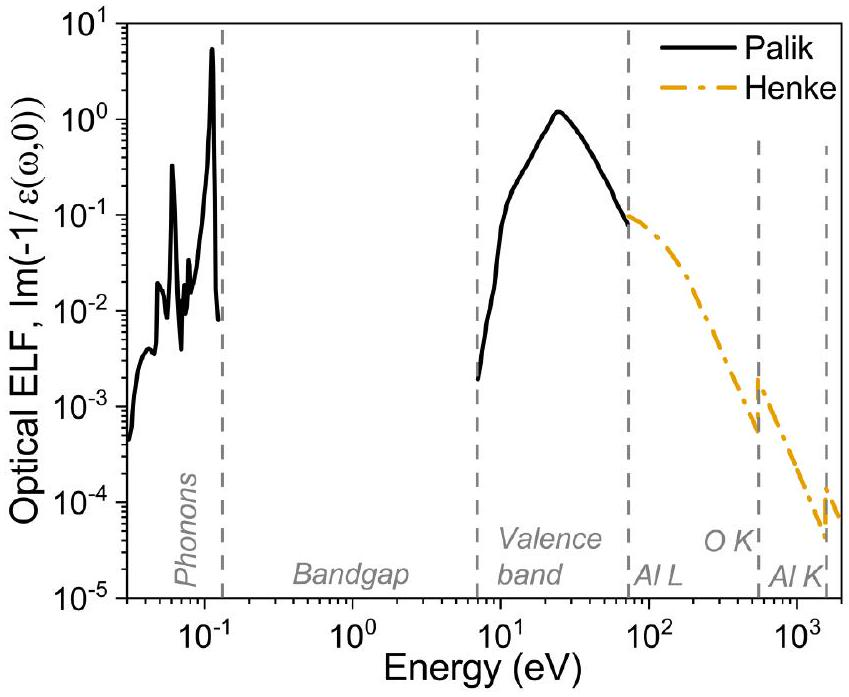
FIG. 30. Optical energy loss function (ELF) of $\mathrm{Al}_{2} \mathrm{O}_{3}$. Data for phonon and valence band parts are taken from Ref. 110 and deep shells from Ref. 339:

to Penn's algorithm has been proposed replacing the Lindhard function with the Mermin model. ${ }^{340-342}$ This approach takes into account nonzero damping but additionally increases computational costs, prohibitively so for MC applications.

An alternative to Penn's algorithm and its derivatives, more suitable for MC modeling, is the Ritchie and Howie method. ${ }^{112}$ This method is widely used in MC simulations due to its relative simplicity. In this method, the optical ELF is approximated with a finite sum of Drude-Lorentz (DL) oscillator functions,

$$
\operatorname{Im}\left(\frac{-1}{\varepsilon(\omega, 0)}\right) \approx \sum_{i} \frac{A_{i} \gamma_{i} \hbar \omega_{i}}{\left(\left(\hbar \omega_{i}\right)^{2}-E_{i}^{2}\right)^{2}+\left(\gamma_{i} \hbar \omega_{i}\right)^{2}} .
$$

This simple analytical representation depends on a set of parameters ( $A_{i}, E_{i}, \gamma_{i}$ ) determined from the fitting procedure of the optical data [Eqs. (37) and (38)]. The parameters represent the amplitude $A_{i}$, the position $E_{i}$, and the width $\gamma_{i}$ of the $i$ th oscillator and may be interpreted as intensity, energy, and an inverse lifetime of collective excitation (plasmon or phonon) associated with peaks in the optical ELF.

The fitting parameters are additionally constrained by the sum rules for ELF. The $f$-sum rule states that the value $Z_{\text {eff }}$ must be equal to the number of electrons on a shell with ionization potential $I_{p}$ (or in the valence/conduction band), ${ }^{106}$

$$
Z_{\text {eff }}=\frac{2}{\pi \Omega_{P}^{2}} \int_{I_{p}}^{\infty} \operatorname{Im}\left(\frac{-1}{\varepsilon(\omega, 0)}\right)_{\text {shell }} \omega d \omega=N_{e, \text { shell }}
$$

Here, $\operatorname{Im}\left(\frac{-1}{\varepsilon(\omega, 0)}\right)_{\text {shell }}$ is a partial ELF for the considered shell, and $\Omega_{P}^{2}=4 \pi e^{2} n_{a t} / m_{e}$ is the corresponding plasma frequency.

The KK-sum rule (the limit of Kramers-Kronig dispersion relations) is ${ }^{343}$

$$
\frac{2}{\pi} \int_{0}^{\infty} \operatorname{Im}\left(\frac{-1}{\varepsilon(\omega, 0)}\right) \frac{d \omega}{\omega}=1
$$

An example of Drude-Lorentz fitting for the valence band of $\mathrm{Al}_{2} \mathrm{O}_{3}$ is shown in Fig. 31. The corresponding values of the parameters and sum rules are shown in Table I.

The analytical expression for ELF in Eq. (39) does not include an inherent extension to the $q>0$ plane. Instead, various dispersion relations for the position of the oscillator $E_{i}$ and its width $\gamma_{i}$ have been proposed, ${ }^{112}$
(1) The simplest and the most common dispersion relation is a free-electron approximation,

$$
E_{i}(q)=E_{i}(0)+\frac{\hbar^{2} q^{2}}{2 m_{e}}
$$

(2) Plasmon-pole approximation (where $v_{F}$ is the Fermi velocity of electrons in a target),

$$
E_{i}^{2}(q)=E_{i}^{2}(0)+\frac{1}{3} v_{F}^{2}(\hbar q)^{2}+\left(\frac{\hbar^{2} q^{2}}{2 m_{e}}\right)^{2} .
$$

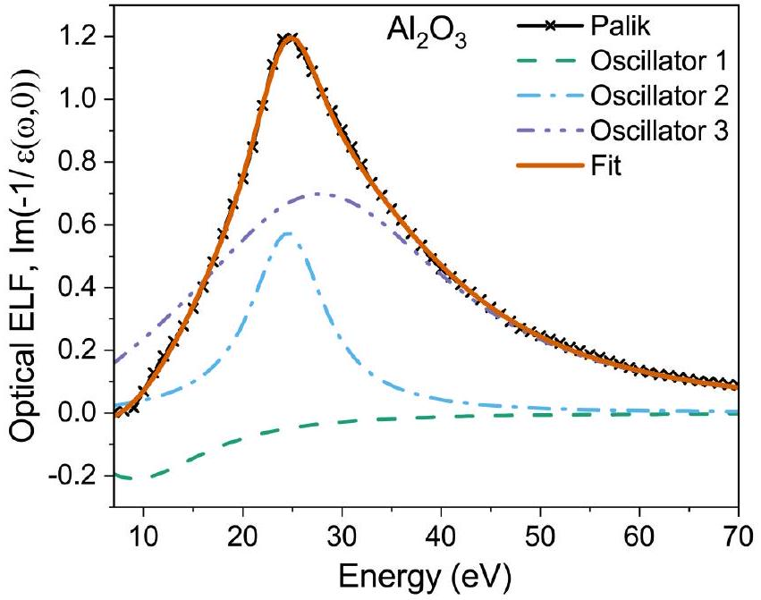
FIG. 31. Drude-Lorentz fitting of valence band part of optical ELF in $\mathrm{Al}_{2} \mathrm{O}_{3}$ compared with the data from Palik. ${ }^{110 .}$

(3) Extended Ritchie model,

$$
\begin{gathered}
E_{i}(q)=\left[\left(E_{i}(0)\right)^{p}+\left(\frac{\hbar^{2} q^{2}}{2 m_{e}}\right)^{p}\right]^{1 / p}, \quad p=\frac{2}{3} \\
\gamma_{i}(q)=\left[\left(\gamma_{i}(0)\right)^{2}+\left(\frac{\hbar^{2} q^{2}}{2 m_{e}}\right)^{2}\right]^{1 / 2}
\end{gathered}
$$

All of these dispersion relations satisfy the two limits: (1) $q \rightarrow 0$, where $E_{i}(q)=E_{i}(0)$ recovers the optical limit and
(2) $q \rightarrow \infty$, where $E_{i}(q)=\frac{\hbar^{2} q^{2}}{2 m_{e}}$ corresponds to free electrons,

TABLE I. Fitted coefficients of the loss function in $\mathrm{Al}_{2} \mathrm{O}_{3}$ according to Eq. (39). The f-sum rule [Eq. (40)] is listed in comparison with the number of electrons $\mathrm{N}_{\mathrm{e}}$ in the corresponding shells (or the number of atoms $\mathrm{N}_{\mathrm{a}}$ in the unit cell, for phonons). Corresponding kk-sum rule [Eq. (41)] is 0.934.
| Shell | A | E | Г | f-sum rule ( $\mathrm{N}_{\mathrm{e}, \mathrm{a}}$ ) |
| :--- | :--- | :--- | :--- | :--- |
| Valence band | -42.659 | 12.613 | 19.246 | 23.998 (24.000) |
|  | 128.226 | 24.925 | 9.043 |  |
|  | 694.967 | 32.087 | 33.244 |  |
| $\mathrm{L}_{3}$-shell of Al | 282.8 | 109.9 | 104.0 | 3.961 (4.000) |
| $\mathrm{L}_{2}$-shell of Al | 141.4 | 111.1 | 103.3 | 1.989 (2.000) |
| $\mathrm{L}_{1}$-shell of Al | 94.27 | 150.69 | 212.8 | 1.365 (2.000) |
| K -shell of O | 282.8 | 540 | 350 | 2.028 (2.000) |
| K-shell of Al | 117.83 | 1519.3 | 969.77 | 1.790 (2.000) |
| Phonons | 0.003 | 0.1125 | 0.005 | 3.483 (5.000) |
|  | 0.000045 | 0.061 | 0.002 |  |

restoring the Bethe ridge. ${ }^{112}$ The choice of the particular dispersion relation is rather arbitrary, conditioned only on the agreement of calculated electronic properties-namely, the mean free path and the stopping power-with experimental ones.

Another approach to the extension of optical oscillators to the $(\omega, q>0)$ plane was proposed in the works of Abril et al. ${ }^{114}$ Instead of the dispersion relations within the oscillators, it uses the Mermin dielectric function. Considering oscillators in Eq. (33) as a $q=0$ limit of the Mermin ELF, the extension to the $q>0$ is then done via the analytical continuation of the Mermin function. As it was pointed out in Sec. II C, the Mermin-based ELF function seems to provide a better agreement of mean free paths (see, e.g., Fig. 32 for $\mathrm{Al}_{2} \mathrm{O}_{3}$ ) and stopping powers with experimental data in the case of protons and electrons. However, it is computationally more demanding than the Richie-Howie approach and, thus, found only limited use in practical applications in MC models so far.

To avoid the numerical integration of cross sections, required within Ritchie-Howie or Mermin models, further approximations can be made. Noticing that at high particle energies, the ELF peak width is negligibly small, it can be approximated with a deltafunction, as proposed already by Fano ${ }^{61}$ and realized by Liljequist, ${ }^{41,345}$ and more recently in a rigorous derivation in Refs. 6 and 346. At high values of transferred energy and momentum $\{W, Q\} \gg \gamma_{i}$, the Drude-Lorentz oscillators reduce to deltafunctions, ${ }^{6}$

$$
\operatorname{Im}\left(\frac{-1}{\varepsilon(\omega, q)}\right) \approx \sum_{i} \frac{\pi A_{i}}{2 W} \delta\left(W-\left(E_{i}+Q\right)\right) .
$$

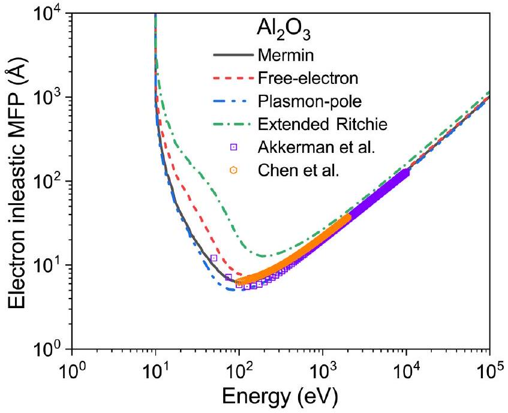
FIG. 32. Total electron inelastic mean free paths in $\mathrm{Al}_{2} \mathrm{O}_{3}$ calculated with TREKIS using Mermin-type ELF as well as dispersion relations (42)-(44). Data of Akkerman et al. and Chen et al. are taken from the NIST database for comparison. ${ }^{344}$

In that case, the cross sections (19) and stopping powers (14), as well as transferred energies in scattering events (21), can be evaluated analytically, which significantly reduces the computational demands of MC simulations. ${ }^{6,346}$

Once the energy- and momentum-dependent energy loss function $\operatorname{Im}\left(\frac{-1}{\varepsilon(\omega, q)}\right)$ is reconstructed, e.g., via the Ritchie-Howie fitting algorithm, one may perform the Monte Carlo simulation of an SHI impact, ensuing the kinetics of the electronic system. The electronic kinetics is traced in TREKIS until the chosen time of $\sim 100 \mathrm{fs}$, after which the density of excited electrons in the track center drops to negligibly small values. The majority of energy by this time is already redistributed to valence holes, to atoms, or carried far away by the delta-electrons. ${ }^{126}$

The MC-calculated energy distributions then serve as the initial conditions for molecular dynamics simulations of the triggered atomic kinetics in an SHI track. The energy transfer to the atomic system at such short timescales is provided via three channels: (i) energy transfer in (quasi)-elastic scattering of electrons with target atoms; (ii) scattering of valence holes with atoms (both of these channels are discussed in Secs. III A and III B); and (iii) the ultrafast nonthermal heating of atoms due to modification of the interatomic potential (discussed in Sec. IV C or Ref. 145).

The spatial distributions of the energy transferred to atoms via the first two channels are readily available in the MC method. The last one is not accounted for in MC simulations, and neither can it be easily included in MD calculations. In covalent crystalline materials, the modification of the potential energy surface resulting from the electronic excitation is accompanied by an ultrafast bandgap collapse (see Sec. IV C), which releases this energy into the kinetic energy of atoms on the characteristic timescale of $\sim 100 \mathrm{fs}$. The energy release converted into an increase in the kinetic energy of atoms in such a process is defined by Eq. (34).

As seen in the example in Fig. 24 (Sec. IV C), during the nonthermal rearrangement of the band structure, the valence band levels spread somewhat symmetrically from their original values, whereas the conduction band levels lower toward the top of the valence band. Thus, the energy change in this process may be approximated as a release of the energy equal to the bandgap for each excited electron/valence hole pair, at the time of electron/hole stopping resolved in space, ${ }^{169}$

$$
\Delta E_{k i n}(r)=N_{h}(r) E_{g a p} .
$$

That means, in covalent materials, it is possible to account for this effect very efficiently in a combined MC-MD model: ${ }^{169}$ the potential energy stored in electron-hole pairs at the end of MC simulations at $\sim 100 \mathrm{fs}$ can be simply fed to atoms as additional kinetic energy. ${ }^{126}$ Such a simple but efficient way of energy transfer between MC and MD models, accounting for the nonthermal heating of atoms in an SHI track, proved sufficiently precise to provide a good agreement with experiments. ${ }^{264}$

These three energy distributions (provided by the elastic scattering of electrons and of valence holes, and potential energy of electron-hole pairs representing nonthermal contribution) obtained from MC calculations with TREKIS code are then serving as the initial velocity distribution of atoms in the MD
part. With the appropriate choice of the interatomic potential or a force field for a system (as discussed in Secs. V and VI), MD describes the response of the atomic system to this instantaneous energy increase.

In practice, it is done in the following way: energy density profile is provided to the beforehand equilibrated supercell, introducing normally distributed kinetic energies and uniformly distributed momenta to atoms in cylindrical layers around an SHI trajectory. Then, the LAMMPS MD package is used to simulate the atomic dynamics within up to times of $\sim 100 \mathrm{ps}$, when the average temperature of the track region is dropping down to $300-400 \mathrm{~K}$ so no further structural changes are expected after that in the track core. The choice of the interatomic potential for the initial supercell equilibration and subsequent atomic relaxation depends on the particular target material; the chosen potential has to be tested in extreme conditions similar to those achieved in an SHI track core (see Sec. V A). The X- and Y-borders of the supercell (in the plane perpendicular to the ion impact) are kept at 300 K temperature with the Berendsen thermostat ${ }^{347}$ with a characteristic time of 0.1 ps , representing heat exchange with the surrounding unirradiated material. In the case of bulk modeling, ${ }^{126}$ periodic boundary conditions in all directions are applied, while for thin films and surfaces, ${ }^{267,348}$ periodicity is turned on only in X- and Y-directions.

We emphasize that this hybrid model does not require any a posteriori fitting to the track data to work. Once the cross sections of the processes for the MC model are known, and an interatomic
potential for the MD model is provided, the combined model is capable of delivering information on the track formation for an arbitrary combination of an SHI and a target. Below we will consider a few examples of the results obtained with this model, which were not possible to achieve without a hybrid approach tracing all stages of SHI-induced electronic and atomic kinetics.

## B. Examples of results

The hybrid approach allows, e.g., to describe structural changes for different ion species and energies, or at different points along the ion trajectory covering almost the entire ion path. In the recent works, ${ }^{264,287}$ the model described above in Sec. VIII A was used to study an interplay of the ion energy loss and velocity during the formation of a damaged region around the trajectories of Xe $(30-1650 \mathrm{MeV})$, U $(45-15000 \mathrm{MeV})$, and hypothetical ${ }_{120}^{304} \mathrm{Ubn}(50-25000 \mathrm{MeV})$ ions in olivine $\left(\mathrm{Mg}_{2} \mathrm{SiO}_{4}\right.$, forsterite allotrope).

Figure 33 shows the MD snapshots of amorphous tracks for different U ion energies in olivine (or, equivalently, at different depths along the ion trajectory). Qualitatively similar lengthwise shapes of the tracks in different materials were observed experimentally. ${ }^{349,350}$ Figure 33(b) also demonstrates the corresponding dependence of the track radius on the electronic energy loss of Xe , U , and Ubn ions in $\mathrm{Mg}_{2} \mathrm{SiO}_{4}$. It has a loop-like form with two distinct thresholds of track formation-for slow and fast ions.

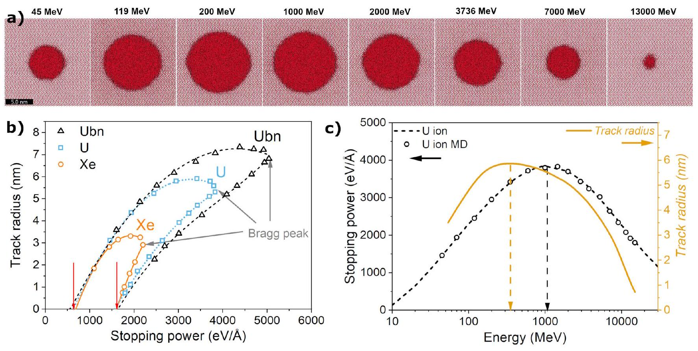
FIG. 33. (a) Results of MD simulations of $U$ impacts in olivine with different energies. (b) Dependence of the track radius on the energy loss of $X e, U$ ions, and hypothetical Ubn ion in forsterite. Lines represent the polynomial fits of the data points for slow and fast ions. Blue arrows mark the calculated track formation thresholds. Grey arrows point at the Bragg peaks, the maximal energy loss (note their mismatch with the maximal track radii). (c) Track sizes and stopping power of U ion vs SHI kinetic energy. Dashed arrows indicate the positions of maxima of the curves.

Extrapolation of MD data points with polynomial functions gives the threshold value of $d E / d x_{\text {th }} \sim 6.3 \mathrm{keV} / \mathrm{nm}$ for slow ions and $\sim 15.8 \mathrm{keV} / \mathrm{nm}$ for fast ions. Reference 351 reported the experimental lower limit for the track formation threshold in $\mathrm{Mg}_{2} \mathrm{SiO}_{4}$ around $6.67 \mathrm{keV} / \mathrm{nm}$ and the estimated value of $\sim 7.5 \mathrm{keV} / \mathrm{nm}$, which is in reasonable agreement with the calculated one.

A similar loop-like dependence of the track radius on electronic energy loss was observed experimentally in $\mathrm{Y}_{3} \mathrm{Fe}_{5} \mathrm{O}_{12}$ in Refs. 352 and 353, suggesting that it is a universal effect.

Figure 33(b) also shows the energy loss corresponding to the Bragg peak (pointed out with grey arrows). The peak energy loss
value does not produce a damaged region with the maximal size. This effect is elucidated in Fig. 33(c) where the maximal damage produced by U ions lies at much lower energies ( $\sim 350 \mathrm{MeV}$ ) than the Bragg peak position ( $\sim 1000 \mathrm{MeV}$ ). This effect also manifests in terms of ion projected ranges: the maximal damage production along the ion trajectory appears deeper than the Bragg peak position (see Ref. 287 for details).

Figure 34 shows that the origin of the velocity effect lies in a difference of $\delta$-electrons spectra created in $\mathrm{Mg}_{2} \mathrm{SiO}_{4}$ by fast ( $200 \mathrm{MeV}, 0.84 \mathrm{MeV}$ /nucleon) vs slow [ $5200 \mathrm{MeV},(21.8 \mathrm{MeV} /$ nucleon)] uranium ions with the close values of stopping power of

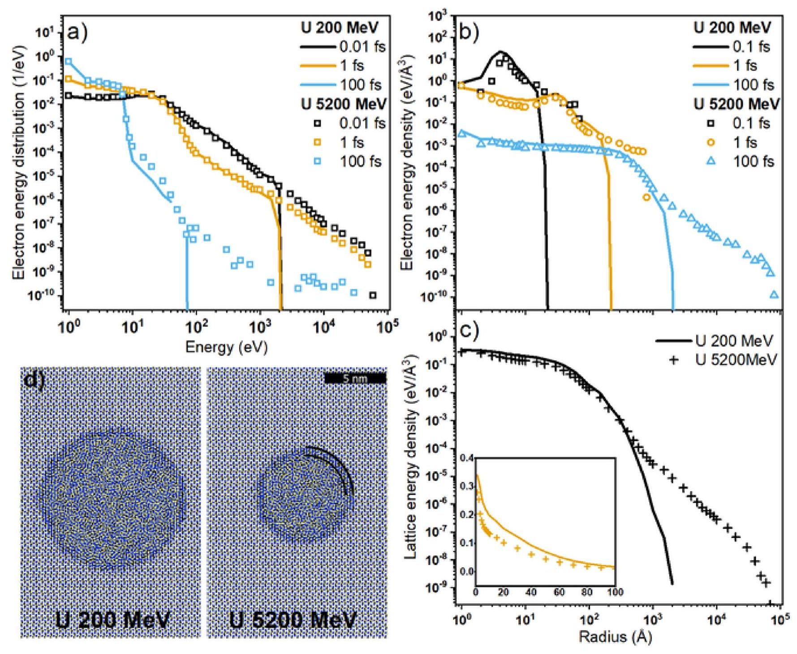
FIG. 34. The velocity effect in tracks of 200 and 5200 MeV U ions in $\mathrm{Mg}_{2} \mathrm{SiO}_{4}$ : (a) spectra of generated electrons and (b) radial electron energy density at different times after the ion impact; (c) calculated lattice energy at 100 fs with the inset zooming at the region of radii <100 Å; (d) MD snapshots of U ion tracks. Black arcs show the coreshell structure of the track.

$\sim 30 \mathrm{keV} / \mathrm{nm}$. The faster ion (Fig. 34(a)] produces a much larger yield of high-energy electrons bringing a part of deposited energy out of the track core, which significantly influences further electronic cascading [Fig. 34(b)] and, finally, resulting in lower heating of a central region of a track [Fig. 34(c) and inset]. This, in turn, produces a smaller observable track despite the same SHI stopping power [Fig. 34(d)]. This figure also demonstrates that a track in olivine has a structure typical for amorphizable solids: an amorphous core surrounded by a narrow shell of an intermediate structure. In the case of $\mathrm{Mg}_{2} \mathrm{SiO}_{4}$, the width of the shell is almost the same for all ion species $(\sim 0.5 \mathrm{~nm}) .^{287}$ The same effect was found experimentally in $\mathrm{SiO}_{2}$. ${ }^{234}$

To conclude, a hybrid or multiscale model allows for tracing nonequilibrium kinetics of electrons and holes with the transport Monte Carlo approach and the response of target atoms to various channels of energy deposition with molecular dynamics. It predicts the fundamental effects of the SHI irradiation: a mismatch between the Bragg peak and the maximal track radius, and provides a quantitative explanation of the velocity effect. Both of the phenomena result from the difference in the electronic transport triggered by the impact of ions with energies at the left vs the right shoulders of the Bragg curve. The model does not employ a posteriori fitting parameters, thereby showing that predictive models of SHI track creation are possible to build with the current state-of-the-art knowledge in the field.

## IX. HIGH FLUENCES: TRACK OVERLAP

A large number of ions in an accelerated bunch may lead to track overlap. Its possibility is characterized by the ion fluence-the number of impinging ions per unit area: $\Phi=N_{\text {ion }} / A$. Depending on the fluence, even multiple track overlap may occur.

With a gradually increasing fluence, a larger and larger area of a sample will be covered with tracks, so eventually, track halos will start to overlap. At higher fluences, track cores will start to overlap with a region of transient disorder, which may be larger than the final size of the track as discussed in Sec. VI A. At even higher fluences, the overlapping of track cores may lead to macroscopically observable changes in material properties. ${ }^{2,354}$ Each of the overlapping regimes will produce its own kind of synergy and induce phenomena not observable in an individual track.

Apart from the fluence, another important factor is the ion flux: a fluence per unit of time, $\varphi=d \Phi / d t$. The flux is closely related to the dose rate: a dose deposited per unit of time, a concept widely used in radiation chemistry and biology. ${ }^{8,355}$ At a low ion flux, a successive ion impacts an already formed and cold track created by a prior ion. At a high flux of ions, an ion may hit a still hot and forming track, whose properties are different from that of a cold matter. The accumulation of the deposited dose at hot stages during high-flux irradiation may lead to extreme heating of an entire area of interaction in the sample to a temperature sufficient to form a plasma within the ion bunch duration. ${ }^{356}$ Below, we will consider the effects of track overlap in both regimes.

## A. Low flux: Successive overlap

Low flux irradiation of matter realizes the regime at which SHIs arrive at the target after significantly long-time intervals as to
meet already relaxed and cold fully formed tracks created by prior ions. Various effects take place in this scenario with increasing fluence.

At a low fluence regime, individual isolated tracks occur in a target. Each track can be considered independent and, thus, the effect of damage accumulation is linear: each SHI in the bunch adds an identical damaged region to the target.

With the increase in the fluence, track halos start to overlap. This effect can be most clearly demonstrated in materials, which do not form a track core, for example, alkali halide crystals. Measuring the number of point defects allows tracing damage accumulation vs fluence. An example of LiF irradiation with Pb ions $(1600 \mathrm{MeV}$ energy) is shown in Fig. 35. ${ }^{357}$ At fluences below $\sim 10^{10}$ ions $/ \mathrm{cm}^{2}$, the area density of created $F$-centers is indeed linear. With an increase in ion fluence, deviation from the linear behavior is seen at fluences approaching $10^{11}$ ions $/ \mathrm{cm}^{2}$. A saturation of the defects concentration occurs at ion fluences $\sim 10^{11}-10^{12}$ ions $/ \mathrm{cm}^{2} .^{180,299}$ It allows estimating the halo radius, which gives the values of $\sim 5-50 \mathrm{~nm}$.

When the track halos start to overlap, complex defects kinetics start to play a role. Electronic excitation, local heating, and formation of new defects in the regions where a defect halo was already formed lead to such competing effects as defect aggregation and annealing. ${ }^{200,290,358}$ As discussed in Sec. VI B, changes in the target temperature, as well as the addition of newly formed defects, significantly affect preexisting defect ensembles.

At sufficiently high fluences, each successive ion arrives in an already damaged region. Transient heating at the impact leads to annealing of prior defects and the formation of agglomerates ( $F_{n}$ centers, etc.), which results in the saturation behavior of

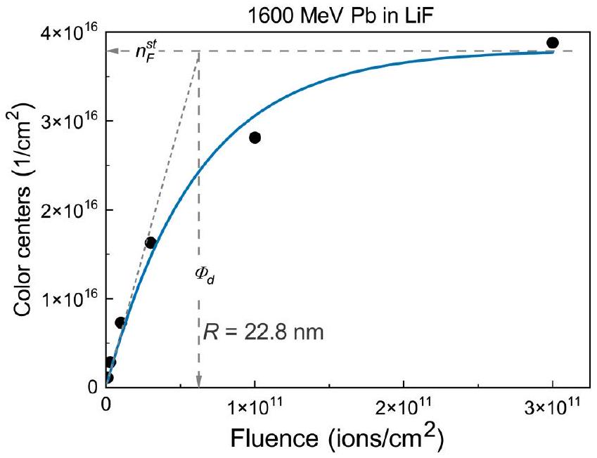
FIG. 35. The fluence dependence of the number of F-centers per surface area detected in LiF crystals (circles) irradiated at room temperature with 1600 MeV Pb ions and its interpolation (red line). Data taken from Ref. 357. Saturation level $n_{F}^{s t}$, corresponding linear saturation fluence $\Phi_{\mathrm{d}}$, and the halo radius are shown with gray arrows.

F-center concentration seen in Fig. 35, ${ }^{298,359}$

$$
n_{F}=\mathrm{n}_{F}^{\mathrm{st}}\left(1-\exp \left(-\Phi / \Phi_{d}\right)\right),
$$

where $n_{F}$ is the area density of $F$-centers, $\Phi$ is the SHI fluence, and the saturation level $n_{F}^{s t}$ and corresponding linear saturation fluence $\Phi_{d}$ are empirical parameters defined from the experiments. This saturation law is typical for point defect accumulation not limited to $F$-centers in alkali halides. ${ }^{360}$

At even higher fluences, track cores start to overlap (in materials that form track cores). This leads to the accumulation of damaged regions, which may be amorphous or disordered, as discussed in Sec. VI A. The initial linear accumulation of individual independent tracks starts to deviate from the linear behavior, similarly to deviations in the number of defects in the halo but at higher fluences. These effects may be modeled straightforwardly with an MD simulation, in which the second ion may be sent into the simulation box after it cooled after the first ion impact.

As we have seen above in Secs. V A and VI A, transiently disordered areas around an SHI trajectory may be larger than the final track radius in materials with efficient recrystallization. The overlap of tracks starts with an overlap of the transiently hot disordered area with the formed prior track. For example, $\mathrm{Al}_{2} \mathrm{O}_{3}$ under successive irradiation with two Bi ions ( 700 MeV energy each) at different distances, calculated with a multiscale MC-MD model (see Sec. VIII), is shown in Fig. 36. ${ }^{264}$ At the distance of 8 nm , where the two tracks
do not overlap, the recrystallization of the second track is almost not affected by the presence of lattice damage induced by the first ion. This results in the formation of two isolated tracks. In contrast, in the case of 6.5 nm distance, the transient hot disordered track overlaps with the pre-existing damaged track from the previous ion. Recrystallization of the track starts from the periphery of this highly excited disordered region. The existence of the pre-damaged first ion track precludes the periphery of the second track from perfect recrystallization. Instead, a new damaged region in-between the two ion trajectories forms during solidification. In this case, the damage in the $\mathrm{Al}_{2} \mathrm{O}_{3}$ crystal irradiated with 700 MeV Bi ions increases nonlinearly with increase in the fluence.

At higher fluences, corresponding to an even shorter distance between the impact points of two ions, the transiently disordered region created by the second ion covers completely the first preexisting track (see a comparison in Fig. 37). In this case, it anneals the pre-existing track, and only the second track is observed [see Fig. 37(f) and experimental confirmation in Fig. 37(b)]. ${ }^{264}$

In materials, where recrystallization does not shrink transient disorder and the final track has the same radius, the annealing does not take place. ${ }^{264}$ There, track overlap has a minor effect, and linear accumulation of defects proceeds up until the fluence where track cores start to overlap and saturate.

Saturation of damage typically takes place at ion fluences $\sim 10^{12}-10^{13} \mathrm{ions} / \mathrm{cm}^{2}$, which corresponds to the average radius of the damaged regions of $\sim 0.5-5 \mathrm{~nm}^{2}$. These values, indeed, correspond to the sizes of track cores (see Sec. VI A).

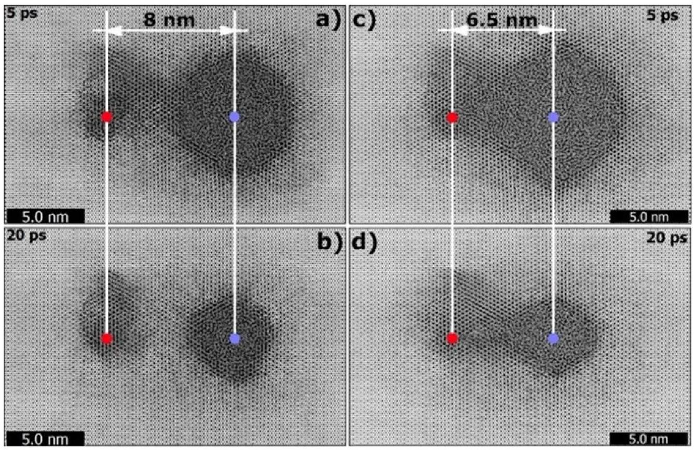
FIG. 36. Snapshots of an $\mathrm{Al}_{2} \mathrm{O}_{3}$ supercell at (a) 5 and (b) 20 ps after the passage of a 700 MeV Bi ion in the crystal at 8 nm from a pre-existing 700 MeV Bi track; at (c) 5 and (d) 20 ps after passage of a Bi ion at 6.5 nm from a pre-existing track. Red and blue dots indicate the trajectories of first and second ions correspondingly. Reproduced with permission from Rymzhanov et al., Nucl. Instrum. Methods Phys. Res., Sect. B 435, 121 (2018). Copyright 2018 Elsevier.

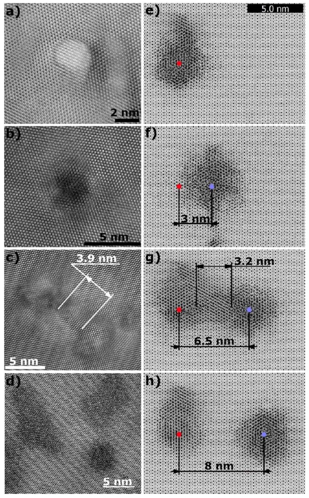
FIG. 37. Bi 700 MeV ion tracks in $\mathrm{Al}_{2} \mathrm{O}_{3}$. (a) and (b) HRTEM images of single ion track; HRTEM images of tracks in samples irradiated to the fluence of (c) $5 \times 10^{11}$ and (d) $6.5 \times 10^{12} \mathrm{~cm}^{-2}$. The image plane is perpendicular to the ion trajectories in all cases. (e)-(h) Results of a MD simulation of two subsequent impacts of Bi ions: (e) single track; the second ion at (f) $\sim 3$, (g) $\sim 6.5$, and (h) $\sim 8 \mathrm{~nm}$ from the first track. Red dot in (e)-(h) images indicates trajectory of first ion, while the blue dot shows path of the second projectile. ${ }^{264}$ Reproduced with permission from Rymzhanov et al., Nucl. Instrum. Methods Phys. Res., Sect. B 473, 27 (2020). Copyright 2020 Elsevier.

Amorphous materials under high-fluence ion irradiation exhibit plastic flow, leading to them changing their shape macroscopically. This effect is known as "ion hammering," as amorphous layers under irradiation typically exhibit anisotropic growth getting thinner and wider, similar to an effect of a hammer blow. ${ }^{362}$ The ion hammering effect is used in practice for material shaping with carefully controlled ion beams. ${ }^{363}$ It can be modeled with the twotemperature plastic flow of a material, accounting for the evolution
of viscosity and stresses in the target. ${ }^{364,365}$ Ion-induced anisotropic growth of amorphous targets is a result of a viscosity reduction instigated by the accumulation of atomic displacements, simultaneous with local material heating in an ion track. ${ }^{365}$

To summarize, at low fluxes, ion tracks start to overlap their defects halos at fluences $\sim 10^{11}$ ions $/ \mathrm{cm}^{2}$. Accumulation of defects starts to deviate from the linear behavior due to complex defect kinetics, such as annealing of preexisting defects via heating by the successive ions, and aggregation of defects into defect clusters. These effects may be traced with defect kinetics methods (chemical balance rate equations), and for the estimation of saturation levels, empirical relations exist. At higher fluences at $\sim 10^{12}$ ions $/ \mathrm{cm}^{2}$, a transient disorder in hot tracks may create defected regions between two track cores, thereby synergistically enhancing material damage. At even higher fluences, track cores start to overlap, with possible annealing of preexisting tracks, in materials with efficient recrystallization. Damage saturates at high fluences when the entire material is covered with tracks ( $\Phi \sim 10^{13}$ ions $/ \mathrm{cm}^{2}$ ). Those effects may be modeled with the same kind of molecular dynamics-based multiscale models (including electronic kinetics), as used for modeling individual tracks.

## B. High flux: Overlap of hot tracks

At high fluxes, when a few ions hit the same place nearly simultaneously, it leads to the accumulation of the deposited energy. The irradiation spot in the matter does not have sufficient time to relax before a successive ion arrives. Properties of matter at such conditions are different from the cold matter state, altering all the stages of SHI interaction, electron kinetics, and atomic response. This regime of track overlap is much less studied than the low flux regime.

The electronic stopping of an SHI depends on the properties of the target, including the target temperature. ${ }^{356}$ It especially clearly manifests at high temperatures, corresponding to plasma formation, which may be achieved at ultrahigh fluxes. The nuclear stopping of ions is also affected by the target temperature at extremely high levels of excitation, in the state of warm and hot dense matter. The nuclear stopping may be significantly higher than its cold-target values in such a case; this effect becomes pronounced at plasma temperatures on the order of above some $100 \mathrm{eV} .^{366}$ Such temperatures may only be achieved in extremely high fluxes of ions due to multiple tracks overlapping.

At modern accelerators, a typical ion bunch duration is on the order of hundreds of picoseconds to tens of nanoseconds. ${ }^{367,368}$ These timescales match characteristic timescales of hydrodynamical behavior of plasma formation and relaxation. At such long timescales, the problem connects to the theory of plasma physics, which may be described with standard tools such as plasma hydrodynamics. ${ }^{369,370}$ They become applicable after the created plasma has had sufficient time to expand and relax.

Interaction of swift heavy ions with rare plasma can be modeled with the linear response theory (see Sec. II C) if the plasma state parameters (temperature, ionization, density) are accounted for in the complex dielectric function. ${ }^{356,371-373}$ Evolution of the plasma state needs to be included in such simulations, e.g., by means of hydrodynamic simulations, ${ }^{374,375}$ PIC
simulations, ${ }^{49,376}$ or, for non-equilibrium states, rate equations using such codes as FLYCHK. ${ }^{377}$

Thus, we have a situation in which the early stages can well be modeled with standard solid-state technics, late stages of the behavior of formed plasma may be treated with plasma-physics approaches, but the intermediate states lie in-between the solid and plasma. The transitional region between a cold solid and a hot plasma is called a warm dense matter (WDM) state.

The WDM state is neither a solid, where the average potential energy of atoms $U$ is larger than their average kinetic energy $K (U \gg K)$, nor a plasma, where $U \ll K$. In the WDM, the kinetic energy of particles is comparable to their potential energy ( $U \sim K$ ), rendering standard technics based on perturbation theory inapplicable. ${ }^{157,258}$ Nonperturbative approaches are required to describe WDM. This is still a poorly understood state of matter, although it is abundant in the Universe; e.g., it is present in cores of giant gas planets. ${ }^{226,258,378}$

WDM properties may be studied with precise $a b$ initio methods like path integral Monte Carlo (PIMC), which follows the evolution of quantum electronic ensembles over thermodynamic states. ${ }^{378-380}$ PIMC is currently limited to thermodynamic equilibrium and cannot describe out-of-equilibrium states relevant to SHI irradiation scenarios. Simplified $a b$ initio approaches are also used with such methods as orbital-free DFT mentioned in Sec. III A. ${ }^{381-383}$ Standard simulation technics like finitetemperature DFT may be applied to the low-energy border of WDM (temperatures of a few eV ), at which sufficiently large basis sets can capture the essential effects. ${ }^{378,384}$ However, it is important to keep in mind that most of the exchange-correlation functionals used in DFT calculations are constructed for ground states (low temperature) of matter, and their extensions are required to reliably treat WDM states, e.g., with the help of Green's function formalism. ${ }^{257}$ Methods based on the Hartree-Fock theory are also recently finding their applications in WDM physics, including twotemperature states (nonequilibrium between the electronic and the atomic systems). ${ }^{385}$ It is still a formidable task for future research to develop a precise and efficient methodology to treat SHI irradiation in a rapidly evolving non-equilibrium WDM state.

It is especially challenging to treat the WDM in far-from-equilibrium conditions, as produced in ultrafast irradiation scenarios. ${ }^{386-388}$ The kinetics of WDM formation may be very intricate, due to a complex interplay of electronic nonequilibrium effects, ultrafast nonthermal phase transitions and associated changes in the electronic structure, and enhanced nonadiabatic coupling in the rapidly evolving interatomic potential. ${ }^{389}$

To conclude, a high flux of swift heavy ions leads to multiple SHI impacts overlap. In an SHI bunch so intensive that ions impact on a still hot track, it leads to an accumulation of excited electrons and heat in the target. It eventually leads to the creation of hot plasma, which may be described with such methods as plasma hydrodynamics, or kinetic equations for non-equilibrium effects. The transition from a cold solid to a hot plasma goes through the states of warm and hot dense matter (highly degenerate plasma). Theory of these states of matter is an actively developing field of research in both directions: fundamental theory and numerical methods. Appropriate methods, when developed, may be added into a framework of a multiscale approach, tracing the
evolution of the target under multiple ions impacts, and modifying the material parameters on-the-fly.

## X. SURFACE EFFECTS

A presence of a free surface influences the dynamical response of the irradiated material. Several important effects are not present in the bulk: emission of particles from the surface, changes in the geometry of the problem (surface breaks the symmetry), and modification of the interatomic potential near the surface. They all contribute to the final SHI track formation, as will be discussed below.

## A. Electron emission

Photons and electrons may cross a boundary between two media or get reflected, whereas valence holes being quasiparticles cannot leave the material into a vacuum. For photons, reflection coefficients can be obtained from the scattering angle and refractive indices of the corresponding media. ${ }^{390}$ For electrons, there are a number of models for a transmission coefficient evaluation, ${ }^{338,391}$ based on an empirically defined barrier width and the work function of the material.

The emission of particles enables the experimental measurements of various material properties and, hence, serves as the validation of models. The spectra of emitted electrons are one of the standard quantities used to cross-check simulations of electron kinetics. An example of a transmission coefficient through a surface of germanium is shown in Fig. 38(a). In a typical case, electrons with energies below the work function of the material cannot be emitted, then the probability of emission increases for a few eV of energy, after which the probability is nearly unity and faster electrons may cross the boundary almost without noticing it, except for the cases when crossing into a material with a higher density, which may induce a sudden Bremsstrahlung-type emission due to instantaneous slowing down known as transition radiation. ${ }^{392}$ The spectra of electrons emitted from germanium after irradiation are shown in Fig. 38(b).

It is important to keep in mind that the presence of a surface itself affects the spectra of emitted particles. Thus, surface effects need to be taken into account in modeling. Not only the fact that a fraction of electrons with low energies will not be transmitted, but additionally, the surface properties are different from the bulk, which affects the kinetics of such electrons in a near-surface layer. Under intense irradiation, if many electrons are emitted, a positive charge accumulates near the surface. ${ }^{395}$ It may slow down and attract back slow emitted electrons, especially in finite-size samples (such as ultrathin layers or nanoclusters). ${ }^{139}$

An analysis of photon emission (photon spectroscopy) allows finding ionization potentials of an ion, whose deep-shell holes emit photons via radiative decay. ${ }^{396}$ Ionization potentials, or more generally energy level structure, allow to unambiguously define the ion state. ${ }^{397,398}$ At the same time, each ion configuration has its own characteristic Auger- and radiative decay times, different from neutral atoms. ${ }^{125,399}$ This effect potentially enables to reconstruct the time-resolved kinetics in SHI tracks by time-sorting of the photon or Auger spectra emitted from a target. ${ }^{73,125}$ Measured spectra of photons or Auger electrons allow connecting the energy position of each peak with its own characteristic decay time.

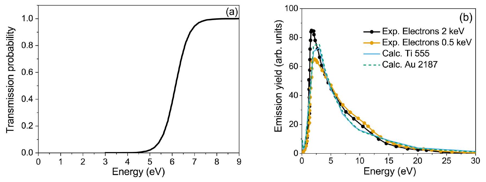
FIG. 38. (a) Transmission coefficient through the surface of germanium. ${ }^{393}$ (b) Spectra of emitted electrons from germanium after irradiation with Ti ( 555 MeV ) or Au $(2187 \mathrm{MeV})$ ions calculated ${ }^{393}$ compared with those after irradiation with 0.5 or 2 keV electrons in the experiments. ${ }^{394}$

Thus, in measured spectra, time-resolved information of the irradiated system is encoded. Auger-decay spectra enabled to extract information on the times of charge neutralization in the track core, discussed in Sec. III A. ${ }^{73}$ The same scheme for constructing a femto-clock on the basis of photon spectra was proposed theoretically but has not yet been implemented experimentally. ${ }^{125}$

The emission of particles from the surface carries out some fraction of energy, thereby reducing the dose deposited by an SHI. It is especially noticeable in the first few nanometers of the material (see an example of 200 MeV Au ion irradiation of a layer of $\mathrm{CaF}_{2}$ in Fig. 39). ${ }^{267}$ After the depth of a few nm , the distribution of the energy deposited to the target atoms turns cylindrical. For a

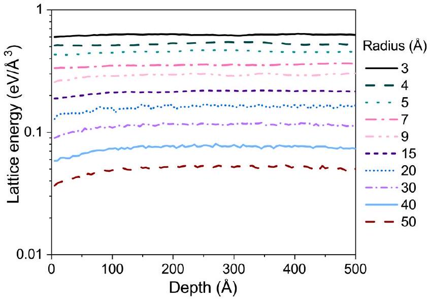
FIG. 39. Dependence of excess lattice energy deposited by an ion on the layer thickness, considered for different radii. The layer thickness is $500 \AA$.

normal incidence SHI, only a few electrons are emitted from the surface, whereas the majority of them remain inside because backscattering electrons are rare.

Under a grazing incidence, however, many electrons, traveling perpendicular to the SHI trajectory, reach the surface and are then emitted. In this case, the emission of electrons and a corresponding energy sink are very important to account for, as they may bring out up to half of the deposited energy. ${ }^{348}$

To conclude, the presence of a surface induces multiple effects in electron kinetics, the most important of which are the emission of particles bringing a part of the deposited energy out of the target. This can be modeled within the MC method, accounting for a surface transmission probability. It leads to reduced energy deposition to the atomic system, which then will affect the observable track formation. It is especially important for grazing incidence ions.

## B. Atomic response: Sputtering and nanohillocks

In this section, we consider specifics of the atomic response to SHI irradiation at material surfaces and in thin layers. A presence of a free surface breaks the symmetry of the material and correspondingly the local cylindrical symmetry of a forming track.

The effect of emission of electrons reducing the deposited energy is, in a sense, compensated by a softer atomic potential in a near-surface region. ${ }^{400}$ A disordered track region near the surface is then larger than in the bulk. ${ }^{401}$ This specific under-surface damage region is usually about a few to few tens nanometers deep. ${ }^{401}$ It forms a cone-like track from the surface towards a cylinder-like bulk shape of a track [see an example of yttrium aluminum garnet $\left(\mathrm{Y}_{3} \mathrm{Al}_{5} \mathrm{O}_{12}\right.$, YAG) irradiated with 700 MeV Bi ion in Fig. 40]. ${ }^{401,402}$ This cone-like connection between the surface damage and the bulk track was also observed experimentally. ${ }^{402,403}$ Note that in some materials, the formed hillock may be crystalline, as demonstrated by both modeling and experiments. ${ }^{267,404}$

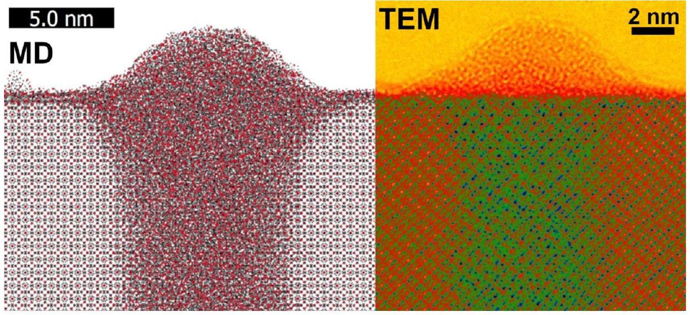
FIG. 40. The surface of YAG irradiated with a 700 MeV Bi ion, simulated with MD (left) and experimentally measured with TEM (right). ${ }^{401}$ Reproduced with the permission from Rymzhanov et al., J. Appl. Phys. 127, 015901 (2020). Copyright 2020 AIP Publishing LLC.

The behavior of atoms at this stage can be described well with classical molecular dynamics simulations. ${ }^{405}$ As discussed above, such simulations need to ensure a capability to reproduce the surface properties of materials at extreme conditions (high temperatures and pressures).

The formation of a subsurface region is accompanied by the emission of atoms and fragments from the surface of the mate-rial-the effect known as inelastic sputtering or sputtering in the electronic stopping regime. ${ }^{85,405,406}$ It is in contrast to elastic or nuclear sputtering, which is a result of ion-ion collisions, knocking atoms out of the surface. Inelastic sputtering is a result of atomic heating due to relaxation of excited electrons. It is a two-step process, consisting of the direct atomic emission with high kinetic energies and a later hydrodynamic emission of atomic ensembles (nanoparticles or nanoclusters).

Increased atomic kinetic energy overcomes the cohesive energy of atoms, allowing them to escape from the surface during

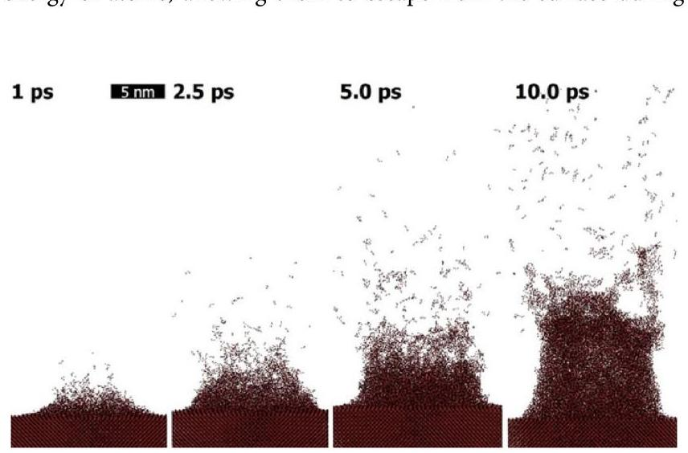
FIG. 41. Snapshots of emission of atoms and nanoclusters from $\mathrm{CaF}_{2}$ after the impact of 200 MeV gold ion.

the first ten picoseconds after an ion impact. An example of it is seen in Fig. 41, which shows $\mathrm{CaF}_{2}$ irradiated with 200 MeV Au ion. ${ }^{267}$ Atoms and small fragments from the center of a track with the highest kinetic energy are emitted.

Melted material protruding from the surface due to increased pressure may result in the emission of nano-droplets (see the example of $\mathrm{CaF}_{2}$ irradiated with 200 MeV gold ion in Fig. 42). The melt hydrodynamically protrudes from the surface at the timescales of tens of picoseconds and may break apart if its velocity is sufficiently high. ${ }^{267}$ Otherwise, it is attracted back by the surface tension of the melted material. The part that is attracted back then cools down at the characteristic time of about $100-200 \mathrm{ps}$, forming a hillock.

Thus, there are three different mechanisms of sputtering at play after an SHI impact at a surface of a solid. (i) Elastic sputtering

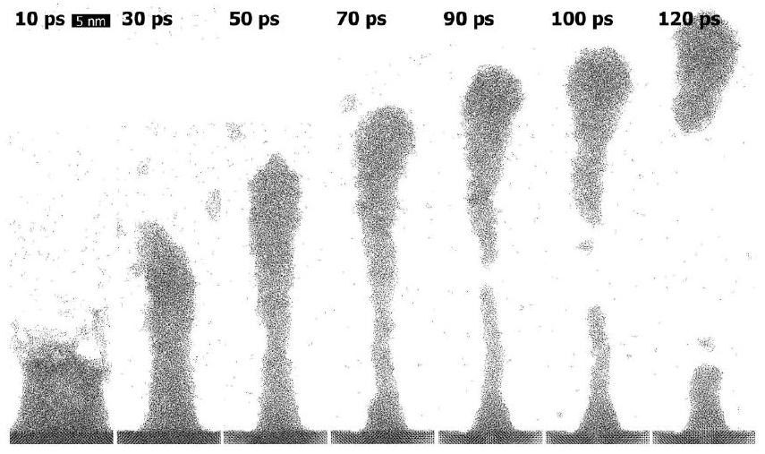
FIG. 42. Snapshots of emission of atoms and nanoclusters from $\mathrm{CaF}_{2}$ after the impact of 200 MeV gold ion ${ }^{267}$ (extended timescales cf. Fig. 41). Reproduced with permission from Rymzhanov et al., Appl. Surf. Sci. 566, 150640 (2021). Copyright 2021 Elsevier.

due to atomic cascades near the surface, (ii) inelastic sputtering due to ultrafast heating of atoms by electrons, and (iii) hydrodynamic expansion due to increased pressure leading to ablation-like emission of nanodroplets. It seems that the presence of the different mechanisms of sputtering is reflected in the angular distribution of emitted fragments in experiments, forming a central jet on top of a wider distribution. ${ }^{85,407}$

In ultrathin layers of material under SHI irradiation, the high pressure due to heating leads to the formation of a through-hole (see the example in Fig. 43 for 5 and 15 nm films of $\mathrm{CaF}_{2}$ irradiated with 200 MeV Au ions). ${ }^{267}$ In this figure, the 5 nm layer material emits all the atoms from the track core already within about $\sim 2 \mathrm{ps}$. In contrast, increasing the layer thickness to even 15 nm does not allow the emission of all atoms from the track core, forming only an undersurface void instead of a through-hole. ${ }^{267}$ The process of void formation takes longer, as the closing of the top (and bottom) parts of the track is a hydrodynamic process. The liquid melt needs to be attracted back to the surface due to surface tension and recrystallize afterward. Thicker layers than a few tens of nm behave very similar to bulk under SHI irradiation, discussed in Sec. VI A.

In the case of an ion impact under a grazing incidence, the picture looks different. Interestingly, in some materials, the tracks observed at the surface consist of a series of separated nanosized bumps, ${ }^{408}$ while in others, an SHI creates a groove. ${ }^{409,410}$ The particular form of created surface defects also depends on SHI energy loss and velocity. The dependence of the formed tracks on the material properties still requires dedicated studies to be performed, both experimental and theoretical.

The formation of a series of nanohillocks at a surface of a material under grazing incidence of SHI was observed experimentally. ${ }^{411}$ A series of nanobumps or hillocks created by an SHI grazing impact were first hypothesized to reflect an ion crossing the
interplanar distance between atomic layers. ${ }^{408}$ It was assumed that due to inhomogeneous electronic density in the target, SHI energy loss is also inhomogeneous along the path, which leads to discontinuous surface damage after the energy relaxation. ${ }^{412}$ This suggestion was based on the TTM modeling with the initial excitation profile taken from the profile of the local electron density around atoms of materials calculated with DFT. Further research has shown that such effects of variation in the electron density in the material when an SHI crosses planar distance quickly smear out due to electron transport and result in a more or less uniform atomic heating. The series of hillocks form at a later stage as a result of hydrodynamic instabilities in the melt protruding from the surface of material along the SHI trajectory. ${ }^{348}$ This insight was achieved with a detailed simulation combining MC modeling of electron transport with the MD modeling of atomic dynamics.

At a grazing incidence, an ion excites material locally nearly parallel to the surface, thereby creating a track partly reaching an open surface. ${ }^{348}$ In such a case, the melted material may protrude forming a "wall," which then experiences an interplay of the hydrodynamic expansion and surface tension attracting it back. For some materials and ions, such as 23 MeV iodine in MgO shown in Fig. 44, it leads to the emission of nanoclusters, accompanied by the formation of nanohillocks along a groove following the SHI trajectory. In others, such as in $\mathrm{Al}_{2} \mathrm{O}_{3}$, it forms an amorphous bump with a height of $\sim 1.5 \mathrm{~nm} .^{348}$

A systematic study of the material and ion parameters to identify the conditions defining the formation of various surface damages is yet to be performed. As of now, it is only clear that material properties such as surface tension and its ability to recrystallize are important factors in defining surface nano-feature formation after an SHI impact. ${ }^{348}$ Recrystallization also affects the formation of surface defects, defining the size and structure of

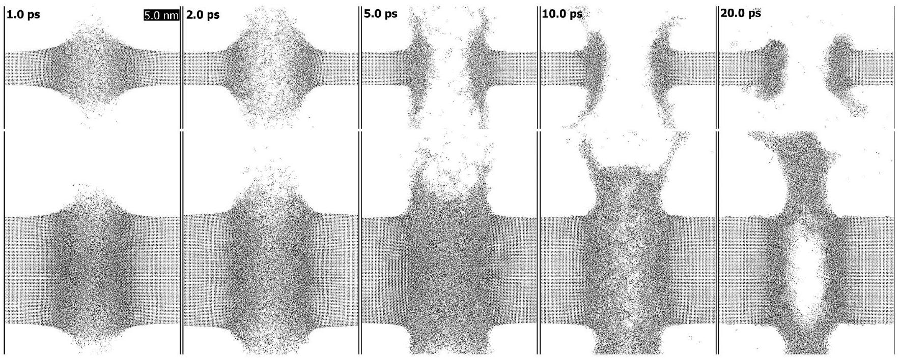
FIG. 43. Initial kinetics of damage formation in 5 nm (top panel) and 15 nm (bottom panel) films of $\mathrm{CaF}_{2}$ irradiated with 200 MeV Au ions. 5 nm slice of the central part of the box is shown. ${ }^{267}$ Reproduced with permission from Rymzhanov et al., Appl. Surf. Sci. 566, 150640 (2021). Copyright 2021 Elsevier.

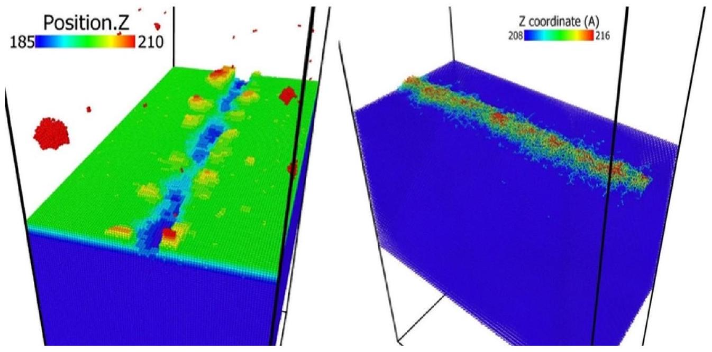
FIG. 44. Snapshots of MD simulation boxes at 100 ps after 23 MeV iodine ion passage at a depth of 1 nm parallel to the surface in MgO (left panel) and $\mathrm{Al}_{2} \mathrm{O}_{3}$ (right panel). ${ }^{348}$

formed hillocks, which creates a variety of different structures as dome-shaped, semi-spherical, or spherical nano-features, with amorphous or crystalline atomic structures. ${ }^{267,401}$

To summarize, surface modifications in SHI irradiation may be noticeably different from the tracks in the bulk due to the emission of electrons, atoms, and fragments, and a difference in material properties at the surface vs the bulk. Provided that electron kinetics is faithfully traced with such methods as Monte Carlo simulations, the response of the atomic system can then be modeled with classical molecular dynamics simulations, the same as bulk simulations. This kind of simulation should ensure that surface properties such as surface tension and properties of melted material are reproduced well with the employed interatomic potential. It allows then to study the formation of conical undersurface damage in the transition region between the surface and the bulk; the formation of surface defects such as hillocks or craters; sputtering effects due to emission of atoms and nanoparticles from the surface; and the formation of long grooves or series of nanobumps at the surface under grazing ion incidence.

## XI. DISCUSSION: FUTURE RESEARCH DIRECTIONS

Below, we briefly discuss the directions of possible future developments of the modeling and its experimental validation.

## A. Extensions of the multiscale approach

The above-described methodology of multiscale and hybrid models allows for straightforward improvements and advances. Each module may be improved or replaced entirely in the future when required. The naturally modular structure of a multiscale approach enables relatively easy modifications and development. As discussed in the corresponding sections above, the currently employed semi-empirical or classical models may eventually be
replaced with advanced quantum mechanical and $a b$ initio methods, should computational resources allow for it.

It is also possible to extend the existing models to larger scales, accessing processes relevant to the description of required effects. For instance, the post-mortem analysis of irradiated samples can be added, such as the chemical etching of latent tracks, caused by chemically active reactants. It results in the formation of pores with diameters ranging from several nanometers to micrometers and lengths up to hundreds of microns. ${ }^{2,413}$ SHI track etching has a long history and a wide area of applications. It is used for the production of microdiaphragms, polymer filters, nanowires and nanotubes, nano- and microstructured films, and promising microelectronic devices. ${ }^{15}$ Specific applications of nanopores include biological analysis such as DNA/RNA sequencing and protein profiling, polymer and chemical molecule analysis, gas separation, water desalination, ion selective filtering, power generation, and ion and nanoparticle detection (see Ref. 414 for details).

Due to its practical importance, understanding and theoretical description of SHI track etching are of interest. It is a challenging task, since not only all initial stages of track formation, discussed throughout Secs. II-VIII, should be described correctly, but also chemical and physical processes driving the interaction of a damaged target with an etchant should be modeled in sufficient detail.

For that, at least the following problems should be solved: (1) development of a model describing changes in chemical structure and chemical reactivity of a material in the vicinity of trajectories of various ions; (2) description of chemical interaction of a damaged target with an etchant, which may include a wide number of channels, especially in the case of polymers; (3) a model of diffusion of etchant molecules and reaction products to and from the etching front; and (4) description of mechanisms, governing the etching of spatially anisotropic systems (e.g., crystals), which may result in different shapes of polygonal sections of etched pores. ${ }^{415}$

A multiscale approach described in Sec. VIII can be used to provide initial conditions for a further model of wet chemical etching, which was developed in Refs. 416-418. It used transition state theory to determine the change in the track etching rate with respect to the bulk one in olivine, ${ }^{416}$

$$
\frac{K_{\text {Track }}(r, L)}{K_{\text {Bulk }}}=\exp \left(-\frac{\Delta G_{\text {Bulk }}^{++}-\Delta G_{\text {Track }}^{++}(r, L)}{k_{B} T}\right),
$$

where $K_{\text {Track }}(r, L)$ is the reaction rate inside the track, which depends on $r$, the distance from the ion trajectory to the current point, and $L$, the residual range of an ion; $K_{\text {Bulk }}$ is the reaction rate in the unirradiated material; and $\Delta G_{\text {Bulk }}^{+++}$and $\Delta G_{\text {Track }}^{++}(r, L)$ are the Gibbs activation barriers for chemical reactions of the etchant with the undamaged material and with the material in the track-both can be calculated with $a b$ initio methods such as DFT, while the difference $\Delta G_{\text {Bulk }}^{++}-\Delta G_{\text {Track }}^{++}(r, L)$ can be obtained even with classical MD potentials.

The chemical reaction rate of the track core with a given etchant (WN-solution) in olivine is several orders of magnitude higher than that for an undamaged crystal. ${ }^{416}$ In this case, the velocity of the etching front in a track core is limited not by the

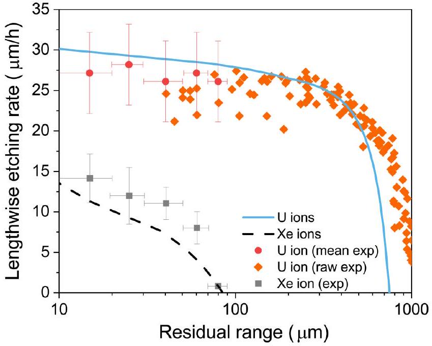
FIG. 46. Calculated lengthwise etching rates as functions of the residual ranges of 16 GeV U (blue solid line) and 1.7 GeV Xe (dashed black line) ions in olivine calculated with a multiscale model and Eq. (48). ${ }^{418}$ Experimental values for corresponding ions are shown with symbols, taken from Ref. 22.

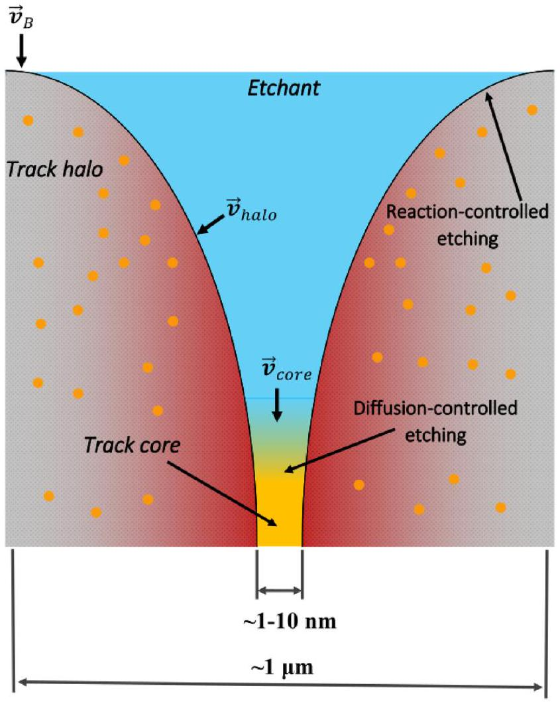
FIG. 45. Scheme of the reaction-diffusion SHI track etching.

reaction rate but by the rate of diffusion of etchant molecules to this front (see Fig. 45). This effect was simulated using a set of reaction-diffusion equations for the transfer of etchant molecules and reaction products along an appearing track pore, which were solved numerically (see Ref. 417 for details). A variation in generated damage along the ion trajectory was also taken into account. ${ }^{418}$ The model demonstrated a good agreement with the experimental data within error bars (see Fig. 46), where the lengthwise etching rates as functions of the residual ranges of 16 GeV U and 1.7 GeV Xe ions in olivine are shown.

A significant advantage of this approach is an absence of fitting parameters (such as the track radius or the lengthwise etching rate, often used in the literature ${ }^{419,420}$ ). It decomposes the lengthwise track etching rate $v_{T}$ to the lengthwise track-core etching velocity $v_{\text {core }}$ and the radial and lengthwise track-halo etching $v_{\text {halo }}$ and describes automatically a transition between these areas. However, it still requires the target bulk etching rate as an input parameter, which may be obtained from $a b$ initio simulations. In the presented form, the model was not applied yet to anisotropic crystals, annealing, or surfactant effects. So far, a complicated numerical technique using a multiscale numerical approach was only used for chemically simple material (olivine in Refs. 416-418) but it demonstrated the inspiring capabilities of such a methodology.

## B. Potential experiments

For further development of models, including multiscale and hybrid approaches, it is crucial to validate them experimentally. For each of the characteristic stages, discussed throughout this review, new experimental data would be invaluable.

Starting from the SHI itself, it is still an open question what exactly happens at the Bragg peak. As shown in Fig. 29, the velocity effect states that the threshold of the track formation for ions with low energies (left shoulder of the Bragg curve) seems to be a constant, while at the right shoulder of the energy loss curve, this constant is different. It is yet unclear what takes place around the Bragg peak and how these "constants" meet.

Another regime that is not well studied yet is the intermediate energies, where nuclear and electronic stoppings of an SHI are comparable and take place simultaneously. At such energies, a synergy between the two channels is expected to take place. ${ }^{290,421}$

The electron kinetics stage lacks validation with a necessary time resolution-at the femtosecond timescale. Without it, all the models are validated only indirectly, e.g., via spectra of emitted electrons. ${ }^{422}$ Nonequilibrium electronic ensemble and electron transport should be monitored at their natural timescales. Femtosecond resolution has been achieved in x-ray laser irradiation with the pump-probe technique (see, e.g., Refs. 423-425) but not in SHI research. ${ }^{426}$ Alternatively, time-sorting of energy spectra of emitted Auger-electrons ${ }^{73}$ or photons may be used to reconstruct the evolution of the electronic system. ${ }^{125}$

The electron-ion coupling and energy exchange are still discussed questions. The electron-phonon coupling factor at elevated electronic temperatures has only been measured (in laser-based experiments) in a limited number of metals (see discussion in Ref. 44 and references therein). It is unknown in the majority of materials, especially insulators, and at conditions achieved in SHI tracks. Recalling Fig. 21, the coupling parameters fitted in SHI tracks are orders of magnitude higher than those measured in laser experiment and $a b$ initio calculations. The study of this discrepancy and the explanation suggested would be very important: the interplay of electron-ion coupling with the nonthermal effects, predicted theoretically (see Sec. IV C), needs to be validated experimentally.

Nonthermal effects after ultrafast high-energy-density deposition into the electronic system are still poorly studied. It is yet unclear how various classes of matter react to electronic excitation. The bandgap stability in ionic crystals, predicted by theory, ${ }^{240}$ should be validated in experiments. Whether and how nonthermal effects manifest in amorphous materials is yet unknown. The structure and properties of amorphous materials, and their response to irradiation, are now being studied with swift heavy ions. ${ }^{427}$ Moreover, nonthermal effects themselves, such as the collapse of the bandgap and the resulting acceleration of atoms, have only been observed in laser-based experiments, ${ }^{256,424}$ but not in SHI tracks. A demonstration of the nonthermal modification of the interatomic potential could be monitored with ultrafast x-ray or electron diffraction techniques, ${ }^{256,428}$ although a sufficient synchronization of an SHI impact with an x-ray (or electron) probe has not yet been achieved.

Another problem is related to the prediction that excited electrons may couple differently to various atomic subsystems (different elements of a multicomponent target) or various phonon modes, resulting in a transient nonequilibrium stage in the atomic system. ${ }^{217}$ Such effects may also be present in SHI tracks and could be studied, e.g., with ultrafast diffraction methods, when developed for ion beam research.

Transient atomic kinetics of the formation of SHI track via disordering and recrystallization also should be experimentally checked. Nonamorphizable materials, in which no post-mortem tracks are observed, may have transient damage that nearly fully recovers (which seems to be the case in $\mathrm{LiF}^{51}$ ) or, alternatively, even transiently, they may remain stable (which seems to be the case for silicon ${ }^{288}$ ).

Effects in materials at conditions different from ambient form a perspective direction of future research. Response of preheated materials, targets at high pressures, ${ }^{429,430}$ and materials in created transient states (such as nonequilibrium warm dense matter) is an actively developing field. Modeling of high-temperature or highpressure phases of the material requires parameters applicable to such conditions. For example, molecular dynamic potentials should be capable of reproducing the interaction of atoms at high pressures and in melted phases of the material at high temperatures. The formation of various transient states is expected to be achieved at such facilities as FAIR, where high fluxes of swift heavy ions may lead overlap of excited tracks when each successive ion will meet essentially a different state of matter, covering the WDM region, from solid to plasma.

At such facilities, relativistic ions are used and, thus, relativistic models should be employed. Many MC simulations already include relativistic effects, but they need to be combined with further models (such as MD). For that, essential effects, discussed throughout this review (valence holes kinetics, nonthermal atomic heating), should be included. Moreover, at high ion fluxes when the target properties evolve, all the parameters of the simulation should be modified on-the-fly, e.g., CDF and cross sections of scattering, material structure, and electronic properties. ${ }^{199}$

## XII. SUMMARY AND OUTLOOK

The swift heavy ion impacts on matter trigger a variety of processes across multiple timescales. A traversing ion excites in a target an ultrashort-lived nonequilibrium plasma column embedded in cold dense matter. Intertwined effects from solid-state physics, plasma physics, nano-science, nonequilibrium kinetics, atomic and molecular physics, and femtochemistry, naturally combine those various fields into a unified research topic in the SHI track creation problem. This review is by no means exhaustive but aims to provide the reader with a solid background on the current understanding of the SHI track formation science and to direct them to appropriate references forming an up-to-date starting point for further studies.

In this review, we gave a glimpse of the multitude of processes instigated by an ion impact spanning over ten orders of magnitude in time. Each characteristic timescale requires its own theoretical and computational technics giving a chance to build up hybrid multiscale models, which combine a few models within a unified approach describing various relevant aspects of track creation.

The insights obtained with multiscale simulation tools within the past decade brought major advances in the broad field of SHI research. It allowed identifying the most important effects in a track formation. After over half a century, finally, swift heavy ion track formation can now be described from start to end without adjustable parameters, in good agreement with experiments.

The following effects are now understood to play the major role in an SHI track formation: nonequilibrium electron transport at femtosecond timescales; scattering of valence holes on target atoms and phonons providing them with additional kinetic energy; nonthermal modification of the interatomic potential, which converts the potential energy of atoms into the kinetic one within $\sim 100 \mathrm{fs}$; atomic relaxation, cooling, and recrystallization of a transiently disordered region around an SHI trajectory. These effects ultimately define the observable track formation in the matter. We described appropriate simulation tools that capture all these stages of a track formation, which the reader may implement and apply.

Multiscale modeling, we believe, will make the new gold standard in the field. Multiscale and hybrid codes naturally have a modular structure, which makes them easy to develop. An advantage of hybrid models is that each module may later be replaced with a more precise approach if required. It paves the way for a systematic improvement of the model of the SHI track formation. The limitations and approximations used in the current multiscale models, which we discussed throughout this review, may gradually be improved in future research without an overhaul of the entire simulation framework.

## ACKNOWLEDGMENTS

We are indebted to many colleagues for their helpful discussions throughout the years of collaboration on various aspects of science relevant to swift heavy ion irradiation. N.M. gratefully acknowledges the financial support from the Czech Ministry of Education, Youth and Sports (Grant Nos. LTT17015 and EF16_013/0001552). This work benefited from networking activities carried out within the EU-funded COST Action CA17126 (TUMIEE) and represents a contribution to it. A.E.V., S.G., R.V., and P.B. acknowledge the support from the Russian Science Foundation (Grant No. 22-22-00676, https://rscf.ru/en/project/ 22-22-00676/).

## AUTHOR DECLARATIONS

## Conflict of Interest

The authors have no conflicts to disclose.

## Author Contributions

N. Medvedev: Conceptualization (equal); Data curation (equal); Formal analysis (equal); Investigation (equal); Methodology (equal); Software (equal); Supervision (equal); Visualization (equal); Writing - original draft (equal); Writing - review \& editing (equal). A. E. Volkov: Conceptualization (equal); Methodology (equal); Supervision (equal); Writing - original draft (equal); Writing - review \& editing (equal). R. Rymzhanov: Data curation (supporting); Formal analysis (supporting); Investigation (supporting); Software (supporting); Validation (equal); Visualization (supporting); Writing - original draft (supporting); Writing - review \& editing (supporting). F. Akhmetov: Investigation (supporting); Software (supporting); Validation (supporting); Writing - original draft (supporting); Writing - review \& editing (supporting). S. Gorbunov: Investigation (supporting); Methodology (supporting); Software (supporting); Writing -
original draft (supporting); Writing - review \& editing (supporting). R. Voronkov: Formal analysis (supporting); Investigation (supporting); Writing - original draft (supporting); Writing review \& editing (supporting). P. Babaev: Investigation (supporting); Writing - original draft (supporting); Writing - review \& editing (supporting).

## DATA AVAILABILITY

The data that support the findings of this study are available from the corresponding author upon reasonable request.

## REFERENCES

[^0]${ }^{27}$ S. Klaumünzer, Mat. Meddelelser 52, 293 (2006). http://publ.royalacademy.dk/ books/163/1017
${ }^{\mathbf{2 8}}$ N. Medvedev, A. E. Volkov, and B. Ziaja, Nucl. Instrum. Methods Phys. Res., Sect. B 365, 437 (2015).
${ }^{\mathbf{2 9}}$ O. Keski-Rahkonen and M. O. Krause, At. Data Nucl. Data Tables 14, 139 (1974).
${ }^{\mathbf{3 0}}$ R. A. Rymzhanov, N. Medvedev, J. H. O'Connell, A. Janse van Vuuren, V. A. Skuratov, and A. E. Volkov, Sci. Rep. 9, 3837 (2019).
${ }^{31}$ K. E. Sickafus, E. A. Kotomin, and B. P. Uberuaga, Radiation Effects in Solids (Springer Netherlands, Dordrecht, 2007).
${ }^{32}$ H. Nikjoo, D. Emfietzoglou, T. Liamsuwan, R. Taleei, D. Liljequist, and S. Uehara, Rep. Prog. Phys. 79, 116601 (2016).
${ }^{33}$ T. Apostolova, E. Artacho, F. Cleri, M. Cotelo, M. L. Crespillo, F. Da Pieve, V. Dimitriou, F. Djurabekova, D. M. Duffy, G. García, M. García-Lechuga,
B. Gu, T. Jarrin, E. Kaselouris, J. Kohanoff, G. Koundourakis, N. Koval, V. Lipp, L. Martin-Samos, N. Medvedev, A. Molina-Sánchez, D. Muñoz-Santiburcio,
S. T. Murphy, K. Nordlund, E. Oliva, J. Olivares, N. A. Papadogiannis,
A. Redondo-Cubero, A. Rivera de Mena, A. E. Sand, D. Sangalli, J. Siegel,
A. V. Solov'yov, I. A. Solov'yov, J. Teunissen, E. Vázquez, A. V. Verkhovtsev,
S. Viñals, and M. D. Ynsa, Tools for Investigating Electronic Excitation: Experiment and Multi-Scale Modelling (Instituto de Fusión Nuclear Guillermo Velarde, Universidad Politécnica de Madrid, Madrid, 2021).
${ }^{34}$ A. V. Krasheninnikov and K. Nordlund, J. Appl. Phys. 107, 071301 (2010).
${ }^{35}$ M. A. L. Marques, N. T. Maitra, F. M. S. Nogueira, E. K. U. Gross, and A. Rubio, in Fundamentals of Time-Dependent Density Functional Theory (Springer, Berlin, 2012).
${ }^{\mathbf{3 6}}$ L. P. Kadanoff and G. Baym, Quantum Statistical Mechanics: Green's Function Methods in Equilibrium and Nonequilibrium Problems (CRC Press, Boca Raton, FL, 1962).
${ }^{\mathbf{3 7}}$ L. V. Keldysh, J. Exp. Theor. Phys. 20, 1018 (1965). http://www.jetp.ras.ru/cgibin/e/index/e/20/4/p1018?a=list
${ }^{38}$ L. Boltzmann, Lectures on Gas Theory (University of California Press, Berkeley, CA, 1964).
${ }^{39}$ H. Risken, The Fokker-Planck Equation: Methods of Solution and Applications, Springer Series in Synergetics (Springer, Berlin, 1996), pp. 63-95.
${ }^{40}$ T. M. Jenkins, W. R. Nelson, and A. Rindi, Monte Carlo Transport of Electrons and Photons (Springer U.S., Boston, MA, 1988).
${ }^{41}$ F. Salvat and M. Fern, PENELOPE-2014-A Code System for Monte Carlo Simulation of Electron and Photon Transport, 2015th ed. (Nuclear Energy Agency, Organisation for Economic Co-operation and Development, Barcelona, 2015).
${ }^{42}$ J. C. Tully, J. Chem. Phys. 93, 1061 (1990).
${ }^{43}$ S. Hammes-Schiffer and J. C. Tully, J. Chem. Phys. 101, 4657 (1994).
${ }^{44}$ N. Medvedev and I. Milov, Phys. Rev. B 102, 064302 (2020).
${ }^{45}$ A. P. Horsfield, D. R. Bowler, A. J. Fisher, T. N. Todorov, and C. G. Sánchez, J. Phys.: Condens. Matter 17, 4793 (2005).
${ }^{46}$ E. M. Bringa, R. E. Johnson, and R. M. Papaléo, Phys. Rev. B 65, 94113 (2002).
${ }^{47}$ M. C. Ridgway, T. Bierschenk, R. Giulian, B. Afra, M. D. Rodriguez, L. L. Araujo, A. P. Byrne, N. Kirby, O. H. Pakarinen, F. Djurabekova, K. Nordlund, M. Schleberger, O. Osmani, N. Medvedev, B. Rethfeld, and P. Kluth, Phys. Rev. Lett. 110, 245502 (2013).
${ }^{48}$ K. Nordlund, J. Nucl. Mater. 520, 273 (2019).
${ }^{49}$ A. Kirschner, D. Tskhakaya, S. Brezinsek, D. Borodin, J. Romazanov, R. Ding, A. Eksaeva, and C. Linsmeier, Plasma Phys. Controlled Fusion 60, 014041 (2018).
${ }^{\mathbf{5 0}}$ K. Nordlund, C. Björkas, T. Ahlgren, A. Lasa, and A. E. Sand, J. Phys. D: Appl. Phys. 47, 224018 (2014).
${ }^{51}$ S. A. Gorbunov, P. N. Terekhin, N. A. Medvedev, and A. E. Volkov, Nucl. Instrum. Methods Phys. Res., Sect. B 315, 173 (2013).
${ }^{\mathbf{5 2}}$ F. F. Komarov, Phys. Usp. 46, 1253 (2003).
${ }^{\mathbf{5 3}}$ L. T. Chadderton, Radiat. Meas. 36, 13 (2003).
${ }^{54}$ M. Lang, R. Devanathan, M. Toulemonde, and C. Trautmann, Curr. Opin. Solid State Mater. Sci. 19, 39 (2015).
${ }^{\mathbf{5 5}}$ D. K. Avasthi and G. K. Mehta, Swift Heavy Ions for Materials Engineering and Nanostructuring (Springer, 2011).
${ }^{\mathbf{5 6}}$ A. M. Miterev, Phys. Usp. 45, 1019 (2002).
${ }^{57}$ M. Toulemonde, C. Dufour, A. Meftah, and E. Paumier, Nucl. Instrum. Methods Phys. Res., Sect. B 166-167, 903 (2000).
${ }^{58}$ I. Y. Tolstikhina and V. P. Shevelko, Phys. Usp. 61, 247 (2018).
${ }^{\mathbf{5 9}}$ N. A. Medvedev, A. E. Volkov, N. S. Shcheblanov, and B. Rethfeld, Phys. Rev. B 82, 125425 (2010).
${ }^{60}$ P. Sigmund, Particle Penetration and Radiation Effects (Springer, Berlin, 2006).
${ }^{61}$ U. Fano, Annu. Rev. Nucl. Sci. 13, 1 (1963).
${ }^{62}$ J. Lindhard and A. H. Sorensen, Phys. Rev. A 53, 2443 (1996).
${ }^{63}$ B. Firsov, J. Exptl. Theor. Phys. 36, 1517 (1959).
${ }^{64}$ J. Lindhard and M. Scharff, Phys. Rev. 124, 128 (1961).
${ }^{65}$ G. S. Was, Fundamentals of Radiation Materials Science: Metals and Alloys, 2nd ed. (Springer, New York, 2016).
${ }^{66}$ L. Thomé, A. Debelle, F. Garrido, S. Mylonas, B. Décamps, C. Bachelet, G. Sattonnay, S. Moll, S. Pellegrino, S. Miro, P. Trocellier, Y. Serruys, G. Velisa, C. Grygiel, I. Monnet, M. Toulemonde, P. Simon, J. Jagielski, I. Jozwik-Biala, L. Nowicki, M. Behar, W. J. Weber, Y. Zhang, M. Backman, K. Nordlund, and F. Djurabekova, Nucl. Instrum. Methods Phys. Res., Sect. B 307, 43 (2013).
${ }^{67}$ J. P. Rozet, C. Stéphan, and D. Vernhet, Nucl. Instrum. Methods Phys. Res., Sect. B 107, 67 (1996).
${ }^{68}$ E. Lamour, P. D. Fainstein, M. Galassi, C. Prigent, C. A. Ramirez, R. D. Rivarola, J.-P. Rozet, M. Trassinelli, and D. Vernhet, Phys. Rev. A 92, 42703 (2015).
${ }^{69}$ C. Scheidenberger, T. Stöhlker, W. E. Meyerhof, H. Geissel, P. H. Mokler, and B. Blank, Nucl. Instrum. Methods Phys. Res., Sect. B 142, 441 (1998).
${ }^{\mathbf{7 0}^{\circ}}$ N. Winckler, A. Rybalchenko, V. P. Shevelko, M. Al-Turany, T. Kollegger, and T. Stöhlker, Nucl. Instrum. Methods Phys. Res., Sect. B 392, 67 (2017).
${ }^{71}$ O. Osmani and P. Sigmund, Nucl. Instrum. Methods Phys. Res., Sect. B 269, 813 (2011).
${ }^{72}$ M. Imai, M. Sataka, K. Kawatsura, K. Takahiro, K. Komaki, H. Shibata, H. Sugai, and K. Nishio, Nucl. Instrum. Methods Phys. Res., Sect. B 267, 2675 (2009).
${ }^{73}$ G. Schiwietz, K. Czerski, M. Roth, F. Staufenbiel, and P. L. Grande, Nucl. Instrum. Methods Phys. Res., Sect. B 226, 683 (2004).
${ }^{74}$ H.-D. Betz, Rev. Mod. Phys. 44, 465 (1972).
${ }^{75}$ G. Schiwietz and P. L. Grande, Nucl. Instrum. Methods Phys. Res., Sect. B 90, 10 (1994).
${ }^{76}$ P. L. Grande and G. Schiwietz, Nucl. Instrum. Methods Phys. Res., Sect. B 267, 859 (2009).
${ }^{77}$ V. S. Nikolaev and I. S. Dmitriev, Phys. Lett. A 28, 277 (1968).
${ }^{78}$ K. Shima, T. Ishihara, T. Miyoshi, and T. Mikumo, Phys. Rev. A 28, 2162 (1983).
${ }^{79}$ W. H. Barkas, Nuclear Research Emulsions (Academic Press, New York, 1963). ${ }^{\mathbf{8 0}}$ W. Brandt and M. Kitagawa, Phys. Rev. B 25, 5631 (1982).
${ }^{81}$ S. Agostinelli, J. Allison, K. Amako, J. Apostolakis, H. Araujo, P. Arce, M. Asai, D. Axen, S. Banerjee, G. Barrand, F. Behner, L. Bellagamba, J. Boudreau, L. Broglia, A. Brunengo, H. Burkhardt, S. Chauvie, J. Chuma, R. Chytracek, G. Cooperman, G. Cosmo, P. Degtyarenko, A. Dell'Acqua, G. Depaola, D. Dietrich, R. Enami, A. Feliciello, C. Ferguson, H. Fesefeldt, G. Folger, F. Foppiano, A. Forti, S. Garelli, S. Giani, R. Giannitrapani, D. Gibin, J. J. Gómez Cadenas, I. González, G. Gracia Abril, G. Greeniaus, W. Greiner, V. Grichine, A. Grossheim, S. Guatelli, P. Gumplinger, R. Hamatsu, K. Hashimoto, H. Hasui, A. Heikkinen, A. Howard, V. Ivanchenko, A. Johnson, F. W. Jones, J. Kallenbach, N. Kanaya, M. Kawabata, Y. Kawabata, M. Kawaguti, S. Kelner, P. Kent, A. Kimura, T. Kodama, R. Kokoulin, M. Kossov, H. Kurashige, E. Lamanna, T. Lampén, V. Lara, V. Lefebure, F. Lei, M. Liendl, W. Lockman, F. Longo, S. Magni, M. Maire, E. Medernach, K. Minamimoto, P. Mora de Freitas, Y. Morita, K. Murakami, M. Nagamatu, R. Nartallo, P. Nieminen, T. Nishimura, K. Ohtsubo, M. Okamura, S. O'Neale, Y. Oohata, K. Paech, J. Perl, A. Pfeiffer, M. G. Pia, F. Ranjard, A. Rybin, S. Sadilov, E. Di Salvo, G. Santin, T. Sasaki, N. Savvas, Y. Sawada, S. Scherer, S. Sei, V. Sirotenko,
D. Smith, N. Starkov, H. Stoecker, J. Sulkimo, M. Takahata, S. Tanaka, E. Tcherniaev, E. Safai Tehrani, M. Tropeano, P. Truscott, H. Uno, L. Urban, P. Urban, M. Verderi, A. Walkden, W. Wander, H. Weber, J. P. Wellisch, T. Wenaus, D. C. Williams, D. Wright, T. Yamada, H. Yoshida, and D. Zschiesche, Nucl. Instrum. Methods Phys. Res., Sect. A 506, 250 (2003).
${ }^{\mathbf{8 2}}$ A. Ferrari, P. R. Sala, A. Fassò, and J. Ranft, see http://www.fluka.org/content/ manuals/fm.pdf for "Fluka: A Multi-Particle Transport Code" (2005).
${ }^{\mathbf{8 3}}$ A. Alavi, J. Kohanoff, M. Parrinello, and D. Frenkel, Phys. Rev. Lett. 73, 2599 (1994).
${ }^{84}$ Y. Cui and L. Liu, Phys. Rev. B 56, 3624 (1997).
${ }^{\mathbf{8 5}}$ M. Toulemonde, W. Assmann, C. Trautmann, F. Grüner, H. D. Mieskes, H. Kucal, and Z. G. Wang, Nucl. Instrum. Methods Phys. Res., Sect. B 212, 346 (2003).
${ }^{86}$ D. C. Rapaport, The Art of Molecular Dynamics Simulation (Cambridge University Press, 2004).
${ }^{\mathbf{8 7}}$ K. Nordlund, Comput. Mater. Sci. 3, 448 (1995).
${ }^{\mathbf{8 8}}$ A. V. Verkhovtsev, I. A. Solov'yov, and A. V. Solov'yov, Eur. Phys. J. D 75, 207 (2021).
${ }^{89}$ C. Jacoboni and L. Reggiani, Rev. Mod. Phys. 55, 645 (1983).
${ }^{\mathbf{9 0}}$ D. P. Kroese, T. Taimre, and Z. I. Botev, Handbook of Monte Carlo Methods (Wiley, 2011).
${ }^{\mathbf{9 1}}$ M. Dapor, Springer Tracts Mod. Phys. 271, 1 (2020).
${ }^{92}$ J. F. Ziegler and J. P. Biersack, "Treatise heavy-ion science," in Astrophysics, Chemistry, and Condensed Matter, edited by D. A. Bromley (Springer U.S., Boston, MA, 1985), Vol. 6, pp. 93-129.
${ }^{\mathbf{9 3}}$ M. J. Boschini, C. Consolandi, M. Gervasi, S. Giani, D. Grandi, V. Ivanchenko, P. Nieminem, S. Pensotti, P. G. Rancoita, and M. Tacconi, Radiat. Phys. Chem. 90, 39 (2013).
${ }^{94}$ F. Salvat, A. Jablonski, and C. J. Powell, Comput. Phys. Commun. 165, 157 (2005).
${ }^{\mathbf{9 5}}$ M. J. Boschini, C. Consolandi, M. Gervasi, S. Giani, D. Grandi, V. Ivanchenko, S. Pensotti, P. G. Rancoita, and M. Tacconi, in Cosm. Rays Part. Astropart. Phys. - Proc. 12th ICATPP Conf (2011), p. 9.
${ }^{\mathbf{9 6}}$ B. Ziaja, R. A. London, and J. Hajdu, J. Appl. Phys. 99, 033514 (2006).
${ }^{\mathbf{9 7}}$ H.-C. Weissker, J. Serrano, S. Huotari, E. Luppi, M. Cazzaniga, F. Bruneval, F. Sottile, G. Monaco, V. Olevano, and L. Reining, Phys. Rev. B 81, 85104 (2010).
${ }^{98}$ V. U. Nazarov, J. M. Pitarke, C. S. Kim, and Y. Takada, Phys. Rev. B 71, 121106 (2005).
${ }^{99}$ M. Caro, A. A. Correa, E. Artacho, and A. Caro, Sci. Rep. 7, 2618 (2017).
${ }^{\mathbf{1 0 0}}$ A. A. Correa, Comput. Mater. Sci. 150, 291 (2018).
${ }^{101}$ J. P. Perdew, K. Burke, and M. Ernzerhof, Phys. Rev. Lett. 77, 3865 (1996).
${ }^{102}$ D. C. Yost and Y. Kanai, J. Am. Chem. Soc. 141, 5241 (2019).
${ }^{\mathbf{1 0 3}}$ A. A. Correa, J. Kohanoff, E. Artacho, D. Sánchez-Portal, and A. Caro, Phys. Rev. Lett. 108, 213201 (2012).
${ }^{104}$ P. Schwerdtfeger, ChemPhysChem 12, 3143 (2011).
${ }^{105}$ J. C. A. Prentice, J. Aarons, J. C. Womack, A. E. A. Allen, L. Andrinopoulos, L. Anton, R. A. Bell, A. Bhandari, G. A. Bramley, R. J. Charlton, R. J. Clements, D. J. Cole, G. Constantinescu, F. Corsetti, S. M.-M. Dubois, K. K. B. Duff, J. M. Escartín, A. Greco, Q. Hill, L. P. Lee, E. Linscott, D. D. O'Regan, M. J. S. Phipps, L. E. Ratcliff, Á. R. Serrano, E. W. Tait, G. Teobaldi, V. Vitale, N. Yeung, T. J. Zuehlsdorff, J. Dziedzic, P. D. Haynes, N. D. M. Hine, A. A. Mostofi, M. C. Payne, and C.-K. Skylaris, J. Chem. Phys. 152, 174111 (2020).
${ }^{\mathbf{1 0 6}}$ A. Akkerman, T. Boutboul, A. Breskin, R. Chechik, A. Gibrekhterman, and Y. Lifshitz, Phys. Status Solidi B 198, 769 (1996).
${ }^{107}$ L. Van Hove, Phys. Rev. 95, 249 (1954).
${ }^{108}$ D. Pines and P. Nozières, The Theory of Quantum Liquids Normal Fermi Liquids (CRC Press, Boca Raton, FL, 1966).
${ }^{109}$ C. Ambrosch-Draxl and J. O. Sofo, Comput. Phys. Commun. 175, 1 (2006).
${ }^{110}$ E. D. Palik, Handbook of Optical Constants of Solids (Academic Press, San Diego, CA, 1998).
${ }^{111}$ S. Adachi, The Handbook on Optical Constants of Semiconductors: In Tables and Figures (World Scientific Publishing Company, Singapore, 2012).
${ }^{112}$ R. H. Ritchie and A. Howie, Philos. Mag. 36, 463 (1977).
${ }^{113}$ D. R. Penn, Phys. Rev. B 35, 482 (1987).
${ }^{114}$ I. Abril, R. Garcia-Molina, C. D. Denton, F. J. Pérez-Pérez, and N. R. Arista, Phys. Rev. A 58, 357 (1998).
${ }^{115}$ J. C. Ashley, J. Electron Spectrosc. Relat. Phenom. 46, 199 (1988).
${ }^{116}$ H. Bethe, Ann. Phys. 397, 325 (1930).
${ }^{117}$ F. Bloch, Ann. Phys. 408, 285 (1933).
${ }^{118}$ G. Martínez-Tamayo, J. C. Eckardt, G. H. Lantschner, and N. R. Arista, Phys. Rev. A 54, 3131 (1996).
${ }^{119}$ K. Ogino, T. Kiyosawa, and T. Kiuchi, Nucl. Instrum. Methods Phys. Res., Sect. B 33, 155 (1988).
${ }^{120}$ E. P. Arkhipov and Y. V. Gott, Sov. Phys. JETP 29, 615 (1969). http://jetp.ras. ru/cgi-bin/dn/e_029_04_0615.pdf
${ }^{121}$ P. Mertens, P. Bauer, and D. Semrad, Nucl. Instrum. Methods Phys. Res., Sect. B 15, 91 (1986).
${ }^{122}$ P. de Vera, I. Abril, and R. Garcia-Molina, Phys. Chem. Chem. Phys. 23, 5079 (2021).
${ }^{\mathbf{1 2 3}}$ D. Emfietzoglou and H. Nikjoo, Radiat. Res. 163, 98 (2005).
${ }^{124}$ S.-K. Son, L. Young, and R. Santra, Phys. Rev. A 83, 33402 (2011).
${ }^{\mathbf{1 2 5}}$ N. Medvedev and A. E. Volkov, J. Phys. D: Appl. Phys. 50, 445302 (2017).
${ }^{126}$ R. Rymzhanov, N. A. Medvedev, and A. E. Volkov, J. Phys. D: Appl. Phys. 50, 475301 (2017).
${ }^{127}$ L. D. Landau and L. M. Lifshitz, Statistical Physics. Part 1, 3 edition (Butterworth-Heinemann, Institute of Physical Problems, USSR Academy of Sciences, Moscow, 1980).
${ }^{128}$ S. Deffner and S. Campbell, J. Phys. A: Math. Theor. 50, 453001 (2017).
${ }^{\mathbf{1 2 9}}$ N. Medvedev, Z. Li, V. Tkachenko, and B. Ziaja, Phys. Rev. B 95, 014309 (2017).
${ }^{130}$ D. Schmaus, S. Andriamonje, M. Chevallier, C. Cohen, N. Cue, D. Dauvergne, R. Dural, R. Genre, Y. Girard, K. O. Groeneveld, J. Kemmler, R. Kirsch, A. L'hoir, J. Moulin, J. C. Poizat, Y. Quere, J. Remillieux, and M. Toulemonde, Radiat. Eff. Defects Solids 126, 313 (1993).
${ }^{131}$ A. V. Korol, A. V. Solov'yov, and W. Greiner, Channeling and Radiation in Periodically Bent Crystals, 2nd ed. (Springer, Berlin, 2014).
${ }^{\mathbf{1 3 2}}$ M. Azzolini, T. Morresi, K. Abrams, R. Masters, N. Stehling, C. Rodenburg, N. M. Pugno, S. Taioli, and M. Dapor, J. Phys. Chem. C 122, 10159 (2018).
${ }^{133}$ S. A. Gorbunov, S. V. Ivliev, and A. E. Volkov, Nucl. Instrum. Methods Phys. Res., Sect. B 474, 41 (2020).
${ }^{134}$ A. Lushchik, C. Lushchik, E. Vasil'chenko, and A. I. Popov, Low Temp. Phys. 44, 269 (2018).
${ }^{\mathbf{1 3 5}}$ N. A. Medvedev, R. A. Rymzhanov, and A. E. Volkov, Nucl. Instrum. Methods Phys. Res., Sect. B 315, 85 (2013).
${ }^{136}$ C. Zeitlin and C. La Tessa, Front. Oncol. 6, 65 (2016).
${ }^{\mathbf{1 3 7}}$ M. De Jong, K. H. Schmidt, B. Blank, C. Böckstiegel, T. Brohm, H. G. Clerc, S. Czajkowski, M. Dornik, H. Geissel, A. Grewe, E. Hanelt, A. Heinz, H. Irnich,
A. R. Junghans, A. Magel, G. Münzenberg, F. Nickel, M. Pfützner, A. Piechaczek,
C. Scheidenberger, W. Schwab, S. Steinhäuser, K. Sümmerer, W. Trinder, B. Voss, and C. Ziegler, Nucl. Phys. A 628, 479 (1998).
${ }^{138}$ F. Luoni, F. Horst, C. A. Reidel, A. Quarz, L. Bagnale, L. Sihver, U. Weber, R. B. Norman, W. De Wet, M. Giraudo, G. Santin, J. W. Norbury, and M. Durante, New J. Phys. 23, 101201 (2021).
${ }^{139}$ H. Vázquez, A. Kononov, A. Kyritsakis, N. Medvedev, A. Schleife, and F. Djurabekova, Phys. Rev. B 103, 224306 (2021).
${ }^{140}$ L. Sarkadi, G. Lanzanò, E. De Filippo, H. Rothard, C. Volant, A. Anzalone, N. Arena, M. Geraci, F. Giustolisi, and A. Pagano, Nucl. Instrum. Methods Phys. Res., Sect. B 233, vii (2005).
${ }^{141}$ M. Canepa, G. Lulli, L. Mattera, F. Priolo, H. Rothard, G. Lanzanò, E. De Filippo, and C. Volant, Nucl. Instrum. Methods Phys. Res., Sect. B 230, 419 (2005).
${ }^{142}$ E. Acosta, X. Llovet, and F. Salvat, Appl. Phys. Lett. 80, 3228 (2002).
${ }^{143}$ H. W. Koch and J. W. Motz, Rev. Mod. Phys. 31, 920 (1959).
${ }^{144}$ U. Zastrau, C. Fortmann, R. R. Fäustlin, L. F. Cao, T. Döppner, S. Düsterer, S. H. Glenzer, G. Gregori, T. Laarmann, H. J. Lee, A. Przystawik, P. Radcliffe, H. Reinholz, G. Röpke, R. Thiele, J. Tiggesbäumker, N. X. Truong, S. Toleikis, I. Uschmann, A. Wierling, T. Tschentscher, E. Förster, and R. Redmer, Phys. Rev. E 78, 066406 (2008).
${ }^{145}$ N. Medvedev and A. E. Volkov, J. Appl. Phys. 131, 225903 (2022).
${ }^{146}$ R. A. Rymzhanov, N. A. Medvedev, and A. E. Volkov, Nucl. Instrum. Methods Phys. Res., Sect. B 365, 462 (2015).
${ }^{147}$ P. N. Terekhin, R. A. Rymzhanov, S. A. Gorbunov, N. A. Medvedev, and A. E. Volkov, Nucl. Instrum. Methods Phys. Res., Sect. B 354, 200 (2015).
${ }^{148}$ D. A. Chapman and D. O. Gericke, Phys. Rev. Lett. 107, 165004 (2011).
${ }^{149}$ C. W. Siders, A. Cavalleri, K. Sokolowski-Tinten, C. Tóth, T. Guo, M. Kammler, M. H. von Hoegen, K. R. Wilson, D. von der Linde, and C. P. J. Barty, Science 286, 1340 (1999).
${ }^{\mathbf{1 5 0}}$ A. Rousse, C. Rischel, S. Fourmaux, I. Uschmann, S. Sebban, G. Grillon, P. Balcou, E. Förster, J. P. Geindre, P. Audebert, J. C. Gauthier, and D. Hulin, Nature 410, 65 (2001).
${ }^{151}$ F. Ladstädter, U. Hohenester, P. Puschnig, and C. Ambrosch-Draxl, Phys. Rev. B 70, 235125 (2004).
${ }^{\mathbf{1 5 2}}$ M. Esposito, M. A. Ochoa, and M. Galperin, Phys. Rev. Lett. 114, 80602 (2015).
${ }^{\mathbf{1 5 3}}$ W. C. Witt, B. G. del Rio, J. M. Dieterich, and E. A. Carter, J. Mater. Res. 33, 777 (2018).
${ }^{154}$ P. Hohenberg and W. Kohn, Phys. Rev. 136, B864 (1964).
${ }^{155}$ V. L. Lignères and E. A. Carter, in Handbook of Materials Modeling: Methods, edited by S. Yip (Springer, Dordrecht, 2005), pp. 137-148.
${ }^{156}$ J. Fattebert, D. Osei-Kuffuor, E. W. Draeger, T. Ogitsu, and W. D. Krauss, in International Conference for High Performance Computing, Networking, Storage and Analysis (IEEE Press, 2016), pp. 12-22.
${ }^{157}$ J. T. Su and W. A. Goddard, Phys. Rev. Lett. 99, 185003 (2007).
${ }^{158}$ P. L. Theofanis, A. Jaramillo-Botero, W. A. Goddard, and H. Xiao, Phys. Rev. Lett. 108, 45501 (2012).
${ }^{\mathbf{1 5 9}}$ N. D. Orekhov and V. V. Stegailov, J. Phys. Conf. Ser. 946, 012026 (2018).
${ }^{160}$ B. Larder, D. O. Gericke, S. Richardson, P. Mabey, T. G. White, and G. Gregori, Sci. Adv. 5, eaaw1634 (2019).
${ }^{161}$ T. Fauster, M. Weinelt, and U. Höfer, Prog. Surf. Sci. 82, 224 (2007).
${ }^{\mathbf{1 6 2}}$ N. Medvedev, U. Zastrau, E. Förster, D. O. Gericke, and B. Rethfeld, Phys. Rev. Lett. 107, 165003 (2011).
${ }^{163}$ R. Zwanzig, Nonequilibrium Statistical Mechanics (Oxford University Press, 2001).
${ }^{164}$ C. W. Gardiner and W. Crispin, Stochastic Methods : A Handbook for the Natural and Social Sciences, 4th ed. (Springer-Verlag, Berlin, 2009).
${ }^{\mathbf{1 6 5}}$ A. G. Peeters and D. Strintzi, Ann. Phys. 520, 142 (2008).
${ }^{166}$ B. Rethfeld, A. Kaiser, M. Vicanek, and G. Simon, Phys. Rev. B 65, 214303 (2002).
${ }^{167}$ L. D. Pietanza, G. Colonna, S. Longo, and M. Capitelli, Eur. Phys. J. D 45, 369 (2007).
${ }^{168}$ S. Hanke, C. Heuser, B. Weidtmann, and A. Wucher, Nucl. Instrum. Methods Phys. Res., Sect. B 415, 127 (2018).
${ }^{169}$ N. Medvedev, F. Akhmetov, R. A. Rymzhanov, R. Voronkov, and A. E. Volkov, Adv. Theory Simul. 5, 2200091 (2022).
${ }^{\mathbf{1 7 0}}$ P. Sigmund and A. Schinner, Nucl. Instrum. Methods Phys. Res., Sect. B 415, 110 (2018).
${ }^{171}$ K. Sturm, Z. Naturforsch. A 48, 233 (1993).
${ }^{172}$ A. E. Volkov and V. A. Borodin, Nucl. Instrum. Methods Phys. Res., Sect. B 107, 172 (1996).
${ }^{173}$ J.-C. Kuhr and H.-J. Fitting, J. Electron Spectrosc. Relat. Phenom. 105, 257 (1999).
${ }^{174}$ O. Osmani, N. Medvedev, M. Schleberger, and B. Rethfeld, Phys. Rev. B 84, 214105 (2011).
${ }^{175}$ R. A. Rymzhanov, N. A. Medvedev, and A. E. Volkov, Nucl. Instrum. Methods Phys. Res., Sect. B 388, 41 (2016).
${ }^{176}$ A. Thompson, D. Vaughan, J. Kirz, D. Attwood, E. Gullikson, M. Howells, K.-J. Kim, J. Kortright, I. Lindau, P. Pianetta, A. Robinson, J. Underwood, G. Williams, and H. Winick, X-Ray Data Booklet (Center for X-ray Optics and Advanced Light Source, Lawrence Berkeley National Laboratory, Berkeley, CA, 2009).
${ }^{\mathbf{1 7 7}}$ B. Gervais and S. Bouffard, Nucl. Instrum. Methods Phys. Res., Sect. B 88, 355 (1994).
${ }^{178}$ B. Gervais, M. Beuve, G. H. Olivera, and M. E. Galassi, Radiat. Phys. Chem.
75, 493 (2006).
${ }^{179}$ C. Cattaneo, C. R. Phys. 247, 431 (1958).
${ }^{\mathbf{1 8 0}}$ N. A. Medvedev, A. E. Volkov, K. Schwartz, and C. Trautmann, Phys. Rev. B 87, 104103 (2013).
${ }^{181}$ H. M. van Driel, Phys. Rev. B 35, 8166 (1987).
${ }^{182}$ A. Rämer, O. Osmani, and B. Rethfeld, J. Appl. Phys. 116, 053508 (2014).
${ }^{183}$ I. Plante and F. A. Cucinotta, New J. Phys. 11, 063047 (2009).
${ }^{184}$ E. Surdutovich, O. I. Obolensky, I. Pshenichnov, I. Mishustin, A. V. Solov'yov, and W. Greiner, in Latest Advances in Atomic Cluster Collisions, edited by J.-P. Connerade, and A. Solov'yov (Imperial College Press, 2008), pp. 411-425.
${ }^{\mathbf{1 8 5}}$ B. Kanungo and V. Gavini, Phys. Rev. B 95, 035112 (2017).
${ }^{186}$ T. D. Kühne, M. Iannuzzi, M. Del Ben, V. V. Rybkin, P. Seewald, F. Stein, T. Laino, R. Z. Khaliullin, O. Schütt, F. Schiffmann, D. Golze, J. Wilhelm, S. Chulkov, M. H. Bani-Hashemian, V. Weber, U. Borštnik, M. Taillefumier, A. S. Jakobovits, A. Lazzaro, H. Pabst, T. Müller, R. Schade, M. Guidon, S. Andermatt, N. Holmberg, G. K. Schenter, A. Hehn, A. Bussy, F. Belleflamme, G. Tabacchi, A. Glöß, M. Lass, I. Bethune, C. J. Mundy, C. Plessl, M. Watkins, J. VandeVondele, M. Krack, and J. Hutter, J. Chem. Phys. 152, 194103 (2020).
${ }^{187}$ L. Lehtovaara, V. Havu, and M. Puska, J. Chem. Phys. 131, 054103 (2009).
${ }^{188}$ J. A. Bearden and A. F. Burr, Rev. Mod. Phys. 39, 125 (1967).
${ }^{189}$ D. Coster and R. D. L. Kronig, Physica 2, 13 (1935).
${ }^{190}$ J. A. D. Matthew and Y. Komninos, Surf. Sci. 53, 716 (1975).
${ }^{191}$ M. L. Knotek and P. J. Feibelman, Surf. Sci. 90, 78 (1979).
${ }^{192}$ L. S. Cederbaum, J. Zobeley, and F. Tarantelli, Phys. Rev. Lett. 79, 4778 (1997).
${ }^{193}$ K. Gokhberg, A. B. Trofimov, T. Sommerfeld, and L. S. Cederbaum, Europhys. Lett. 72, 228 (2005).
${ }^{194}$ N. A. Medvedev, A. E. Volkov, B. Rethfeld, and N. S. Shcheblanov, Nucl. Instrum. Methods Phys. Res., Sect. B 268, 2870 (2010).
${ }^{195}$ X-5 Monte Carlo Team, MCNP-A General Monte Carlo N-Particle Transport Code, Version 5 Volume I: Overview and Theory, Report LA-UR-03-1987 (Los Alamos National Laboratory, University of California, 2003).
${ }^{196}$ D. E. Cullen, see https://www-nds.iaea.org/epics/ for "EPICS2017: Electron Photon Interaction Cross Sections" (2018).
${ }^{197}$ N. Medvedev and B. Rethfeld, New J. Phys. 12, 073037 (2010).
${ }^{198}$ B. Y. Mueller and B. Rethfeld, Phys. Rev. B 87, 35139 (2013).
${ }^{199}$ N. Medvedev, V. Tkachenko, V. Lipp, Z. Li, and B. Ziaja, 4open 1, 3 (2018).
${ }^{\mathbf{2 0 0}}$ K. Schwartz, M. Lang, R. Neumann, M. V. Sorokin, C. Trautmann, A. E. Volkov, and K.-O. Voss, Phys. Status Solidi C 4, 1105 (2007).
${ }^{\mathbf{2 0 1}}$ M. I. Kaganov, I. M. Lifshitz, and L. V. Tanatarov, Sov. Phys. JETP 4, 173 (1957).
${ }^{\mathbf{2 0 2}}$ N. Medvedev, H. O. Jeschke, and B. Ziaja, New J. Phys. 15, 015016 (2013).
${ }^{\mathbf{2 0 3}}$ E. J. Kobetich and R. Katz, Phys. Rev. 170, 391 (1968).
${ }^{204}$ M. P. R. Waligórski, R. N. Hamm, and R. Katz, Int. J. Rad. Appl. Instrum. Part D 11, 309 (1986).
${ }^{\mathbf{2 0 5}}$ S. L. Daraszewicz and D. M. Duffy, Nucl. Instrum. Methods Phys. Res., Sect. B 303, 112 (2013).
${ }^{206}$ A. Caro and M. Victoria, Phys. Rev. A 40, 2287 (1989).
${ }^{\mathbf{2 0 7}}$ D. S. Ivanov and L. V. Zhigilei, Phys. Rev. B 68, 064114 (2003).
${ }^{\mathbf{2 0 8}}$ R. Darkins and D. M. Duffy, Comput. Mater. Sci. 147, 145 (2018).
${ }^{\mathbf{2 0 9}}$ N. Medvedev, J. Phys.: Condens. Matter 32, 435401 (2020).
${ }^{210}$ E. J. McEniry, Y. Wang, D. Dundas, T. N. Todorov, L. Stella, R. P. Miranda, A. J. Fisher, A. P. Horsfield, C. P. Race, D. R. Mason, W. M. C. Foulkes, and A. P. Sutton, Eur. Phys. J. B 77, 305 (2010).
${ }^{211}$ A. P. Horsfield, D. R. Bowler, A. J. Fisher, T. N. Todorov, and C. G. Sánchez, J. Phys.: Condens. Matter 16, 8251 (2004).
${ }^{\mathbf{2 1 2}}$ N. H. March and M. P. Tosi, Atomic Dynamics in Liquids (Courier Corporation, Chelmsford, 1991).
${ }^{213}$ G. M. Eliashberg, Sov. Phys. JETP 11, 3 (1960).
${ }^{\mathbf{2 1 4}}$ X. Y. Wang, D. M. Riffe, Y.-S. Lee, and M. C. Downer, Phys. Rev. B 50, 8016 (1994).
${ }^{215}$ Z. Lin, L. Zhigilei, and V. Celli, Phys. Rev. B 77, 075133 (2008).
${ }^{216}$ A. M. Brown, R. Sundararaman, P. Narang, W. A. Goddard, and H. A. Atwater, Phys. Rev. B 94, 075120 (2016).
${ }^{\mathbf{2 1 7}}$ L. Waldecker, R. Bertoni, R. Ernstorfer, and J. Vorberger, Phys. Rev. X 6, 021003 (2016).
${ }^{218}$ A. E. Volkov and V. A. Borodin, Nucl. Instrum. Methods Phys. Res., Sect. B 146, 137 (1998).
${ }^{219}$ J. Daligault and J. Simoni, Phys. Rev. E 100, 43201 (2019).
${ }^{\mathbf{2 2 0}}$ M. W. C. Dharma-wardana and F. Perrot, Phys. Rev. E 58, 3705 (1998).
${ }^{221}$ J. Vorberger, D. O. Gericke, T. Bornath, and M. Schlanges, Phys. Rev. E 81, 046404 (2010).
${ }^{222}$ S. A. Gorbunov, N. A. Medvedev, P. N. Terekhin, and A. E. Volkov, Nucl. Instrum. Methods Phys. Res., Sect. B 354, 220 (2015).
${ }^{223}$ S. A. Gorbunov, N. Medvedev, R. A. Rymzhanov, and A. E. Volkov, Nucl. Instrum. Methods Phys. Res., Sect. B 435, 83 (2018).
${ }^{\mathbf{2 2 4}}$ S. A. Egorov, K. F. Everitt, and J. L. Skinner, J. Phys. Chem. A 103, 9494 (1999).
${ }^{\mathbf{2 2 5}}$ M. Z. Mo, Z. Chen, R. K. Li, M. Dunning, B. B. L. Witte, J. K. Baldwin, L. B. Fletcher, J. B. Kim, A. Ng, R. Redmer, A. H. Reid, P. Shekhar, X. Z. Shen, M. Shen, K. Sokolowski-Tinten, Y. Y. Tsui, Y. Q. Wang, Q. Zheng, X. J. Wang, and S. H. Glenzer, Science 360, 1451 (2018).
${ }^{226}$ A. Ng, Int. J. Quantum Chem. 112, 150 (2012).
${ }^{227}$ P. Celliers, A. Ng, G. Xu, and A. Forsman, Phys. Rev. Lett. 68, 2305 (1992).
${ }^{228}$ W. L. McMillan, Phys. Rev. 167, 331 (1968).
${ }^{229}$ P. B. Allen and M. L. Cohen, Phys. Rev. 187, 525 (1969).
${ }^{\mathbf{2 3 0}}$ Y. V. Petrov, N. A. Inogamov, and K. P. Migdal, JETP Lett. 97, 20 (2013).
${ }^{231}$ B. Hüttner and G. Rohr, Appl. Surf. Sci. 103, 269 (1996).
${ }^{232}$ J. L. Hostetler, A. N. Smith, D. M. Czajkowsky, and P. M. Norris, Appl. Opt. 38, 3614 (1999).
${ }^{\mathbf{2 3 3}}$ Z. Li-Dan, S. Fang-Yuan, Z. Jie, and T. Da-Wei, Acta Phys. Sin 61, 134402 (2012).
${ }^{234}$ P. Kluth, C. S. Schnohr, O. H. Pakarinen, F. Djurabekova, D. J. Sprouster, R. Giulian, M. C. Ridgway, A. P. Byrne, C. Trautmann, D. J. Cookson, K. Nordlund, and M. Toulemonde, Phys. Rev. Lett. 101, 175503 (2008).
${ }^{\mathbf{2 3 5}}$ M. Backman, M. Toulemonde, O. H. Pakarinen, N. Juslin, F. Djurabekova, K. Nordlund, A. Debelle, and W. J. Weber, Comput. Mater. Sci. 67, 261 (2013).
${ }^{\mathbf{2 3 6}}$ P. Koskinen and V. Mäkinen, Comput. Mater. Sci. 47, 237 (2009).
${ }^{\mathbf{2 3 7}}$ P. Stampfli and K. H. Bennemann, Phys. Rev. B 46, 10686 (1992).
${ }^{238}$ P. Silvestrelli, A. Alavi, M. Parrinello, and D. Frenkel, Phys. Rev. Lett. 77, 3149 (1996).
${ }^{\mathbf{2 3 9}}$ K. Sokolowski-Tinten, J. Bialkowski, and D. von der Linde, Phys. Rev. B 51, 14186 (1995).
${ }^{\mathbf{2 4 0}}$ R. A. Voronkov, N. Medvedev, and A. E. Volkov, Sci. Rep. 10, 13070 (2020).
${ }^{241}$ V. V. Stegailov, Contrib. Plasma Phys. 50, 31 (2010).
${ }^{\mathbf{2 4 2}}$ L. Museur, A. Manousaki, D. Anglos, and A. V. Kanaev, J. Appl. Phys. 110, 124310 (2011).
${ }^{243}$ N. Medvedev, P. Babaev, J. Chalupský, L. Juha, and A. E. Volkov, Phys. Chem. Chem. Phys. 23, 16193 (2021).
${ }^{244}$ N. Medvedev, J. Chalupský, and L. Juha, Molecules 26, 6701 (2021).
${ }^{\mathbf{2 4 5}}$ N. Medvedev and I. Milov, Sci. Rep. 10, 12775 (2020).
${ }^{\mathbf{2 4 6}}$ N. S. Grigoryan, E. S. Zijlstra, and M. E. Garcia, New J. Phys. 16, 013002 (2014).
${ }^{\mathbf{2 4 7}}$ M. Toufarová, V. Hájková, J. Chalupský, T. Burian, J. Vacík, V. Vorlíček, L. Vyšín, J. Gaudin, N. Medvedev, B. Ziaja, M. Nagasono, M. Yabashi, R. Sobierajski, J. Krzywinski, H. Sinn, M. Störmer, K. Koláček, K. Tiedtke, S. Toleikis, and L. Juha, Phys. Rev. B 96, 214101 (2017).
${ }^{248}$ E. M. Bringa and R. E. Johnson, Phys. Rev. Lett. 88, 165501 (2002).
${ }^{249}$ G. Schiwietz, G. Xiao, E. Luderer, and P. L. Grande, Nucl. Instrum. Methods Phys. Res., Sect. B 164-165, 353 (2000).
${ }^{\mathbf{2 5 0}}$ J. C. Tully, J. Chem. Phys. 137, 22A301 (2012).
${ }^{\mathbf{2 5 1}}$ E. Zijlstra, A. Kalitsov, T. Zier, and M. Garcia, Phys. Rev. X 3, 011005 (2013).
${ }^{\mathbf{2 5 2}}$ N. Medvedev, Z. Li, and B. Ziaja, Phys. Rev. B 91, 54113 (2015).
${ }^{\mathbf{2 5 3}}$ N. Medvedev, R. Voronkov, and A. E. Volkov, 10.48550/arXiv.2207.05711 (2022).
${ }^{\mathbf{2 5 4}}$ I. Inoue, Y. Deguchi, B. Ziaja, T. Osaka, M. M. Abdullah, Z. Jurek, N. Medvedev, V. Tkachenko, Y. Inubushi, H. Kasai, K. Tamasaku, T. Hara, E. Nishibori, and M. Yabashi, Phys. Rev. Lett. 126, 117403 (2021).
${ }^{\mathbf{2 5 5}}$ I. Inoue, Y. Inubushi, T. Sato, K. Tono, T. Katayama, T. Kameshima, K. Ogawa, T. Togashi, S. Owada, Y. Amemiya, T. Tanaka, T. Hara, and M. Yabashi, Proc. Natl. Acad. Sci. U.S.A. 113, 1492 (2016).
${ }^{\mathbf{2 5 6}}$ G. Sciaini, M. Harb, S. G. Kruglik, T. Payer, C. T. Hebeisen, F.-J. M. zu Heringdorf, M. Yamaguchi, M. H. Hoegen, R. Ernstorfer, and R. J. D. Miller, Nature 458, 56 (2009).
${ }^{\mathbf{2 5 7}}$ S. V. Faleev, M. van Schilfgaarde, T. Kotani, F. Léonard, and M. P. Desjarlais, Phys. Rev. B 74, 33101 (2006).
${ }^{\mathbf{2 5 8}}$ F. Graziani, M. P. Desjarlais, R. Redmer, and S. B. Trickey, Frontiers and Challenges in Warm Dense Matter (Springer-Verlag, New York, 2014).
${ }^{\mathbf{2 5 9}}$ C. H. Xu, C. Z. Wang, C. T. Chan, and K. M. Ho, J. Phys.: Condens. Matter 4, 6047 (1992).
${ }^{\mathbf{2 6 0}}$ H. O. Jeschke, M. E. Garcia, and K. H. Bennemann, Phys. Rev. B 60, R3701 (1999).
${ }^{261}$ P. Stampfli and K. Bennemann, Phys. Rev. B 42, 7163 (1990).
${ }^{\mathbf{2 6 2}}$ R. A. Voronkov, N. Medvedev, R. A. Rymzhanov, and A. E. Volkov, Nucl. Instrum. Methods Phys. Res., Sect. B 435, 87 (2018).
${ }^{\mathbf{2 6 3}}$ N. Medvedev, Z. Fang, C. Xia, and Z. Li, Phys. Rev. B 99, 144101 (2019).
${ }^{264}$ R. A. Rymzhanov, N. Medvedev, J. H. O'Connell, V. A. Skuratov, A. Janse van Vuuren, S. A. Gorbunov, and A. E. Volkov, Nucl. Instrum. Methods Phys. Res., Sect. B 473, 27 (2020).
${ }^{\mathbf{2 6 5}}$ N. Medvedev, V. Tkachenko, and B. Ziaja, Contrib. Plasma Phys. 55, 12 (2015).
${ }^{\mathbf{2 6 6}}$ P. De Vera, E. Surdutovich, N. J. Mason, F. J. Currell, and A. V. Solov'yov, Eur. Phys. J. D 72, 147 (2018).
${ }^{\mathbf{2 6 7}}$ R. A. Rymzhanov, N. Medvedev, and A. E. Volkov, Appl. Surf. Sci. 566, 150640 (2021).
${ }^{\mathbf{2 6 8}}$ V. P. Lipp, A. E. Volkov, M. V. Sorokin, and B. Rethfeld, Nucl. Instrum. Methods Phys. Res., Sect. B 269, 865 (2011).
${ }^{\mathbf{2 6 9}}$ B. D. Butler, G. Ayton, O. G. Jepps, and D. J. Evans, J. Chem. Phys. 109, 6519 (1998).
${ }^{270}$ J. G. Powles, G. Rickayzen, and D. M. Heyes, Mol. Phys. 103, 1361 (2005).
${ }^{\mathbf{2 7 1}}$ K. P. Travis and C. Braga, Mol. Phys. 104, 3735 (2006).
${ }^{\mathbf{2 7 2}}$ H. H. Rugh, Phys. Rev. Lett. 78, 772 (1997).
${ }^{\mathbf{2 7 3}}$ P. de Vera, N. J. Mason, F. J. Currell, and A. V. Solov'yov, Eur. Phys. J. D 70, 183 (2016).
${ }^{274}$ I. Milov, V. Zhakhovsky, D. Ilnitsky, K. Migdal, V. Khokhlov, Y. Petrov, N. Inogamov, V. Lipp, N. Medvedev, B. Ziaja, V. Medvedev, I. A. Makhotkin, E. Louis, and F. Bijkerk, Appl. Surf. Sci. 528, 146952 (2020).
${ }^{\mathbf{2 7 5}}$ M. Kanski, B. J. Garrison, and Z. Postawa, J. Phys. Chem. Lett. 7, 1559 (2016).
${ }^{\mathbf{2 7 6}}$ F. Ercolessi and J. B. Adams, Europhys. Lett. 26, 583 (1994).
${ }^{\mathbf{2 7 7}}$ V. V. Zhakhovskii, N. A. Inogamov, Y. V. Petrov, S. I. Ashitkov, and K. Nishihara, Appl. Surf. Sci. 255, 9592 (2009).
${ }^{278}$ B. Bauerhenne, V. P. Lipp, T. Zier, E. S. Zijlstra, and M. E. Garcia, Phys. Rev. Lett. 124, 85501 (2020).
${ }^{\mathbf{2 7 9}}$ H. Chan, B. Narayanan, M. J. Cherukara, F. G. Sen, K. Sasikumar, S. K. Gray, M. K. Y. Chan, and S. K. R. S. Sankaranarayanan, J. Phys. Chem. C 123, 6941 (2019).
${ }^{\mathbf{2 8 0}}$ A. Hamedani, J. Byggmästar, F. Djurabekova, G. Alahyarizadeh, R. Ghaderi, A. Minuchehr, and K. Nordlund, Mater. Res. Lett. 8, 364 (2020).
${ }^{281}$ J. Byggmästar, A. Hamedani, K. Nordlund, and F. Djurabekova, Phys. Rev. B 100, 144105 (2019).
${ }^{282}$ J. P. Janet and H. J. Kulik, Machine Learning in Chemistry (American Chemical Society, Washington, 2020).
${ }^{283}$ O. T. Unke, S. Chmiela, H. E. Sauceda, M. Gastegger, I. Poltavsky, K. T. Schütt, A. Tkatchenko, and K. R. Müller, Chem. Rev. 121, 10142 (2021).
${ }^{\mathbf{2 8 4}}$ O. Hellman and I. A. Abrikosov, Phys. Rev. B 88, 144301 (2013).
${ }^{\mathbf{2 8 5}}$ G. J. Ackland, J. Phys.: Conf. Ser. 402, 012001 (2012).
${ }^{286}$ S. Khakshouri, D. Alfè, and D. M. Duffy, Phys. Rev. B 78, 224304 (2008).
${ }^{287}$ R. A. Rymzhanov, S. A. Gorbunov, N. Medvedev, and A. E. Volkov, Nucl. Instrum. Methods Phys. Res., Sect. B 440, 25 (2019).
${ }^{288}$ C. Länger, P. Ernst, M. Bender, D. Severin, C. Trautmann, M. Schleberger, and M. Dürr, New J. Phys. 23, 093037 (2021).
${ }^{\mathbf{2 8 9}}$ V. Recoules, J. Clérouin, G. Zérah, P. M. Anglade, and S. Mazevet, Phys. Rev. Lett. 96, 55503 (2006).
${ }^{\mathbf{2 9 0}}$ W. J. Weber, E. Zarkadoula, O. H. Pakarinen, R. Sachan, M. F. Chisholm, P. Liu, H. Xue, K. Jin, and Y. Zhang, Sci. Rep. 5, 7726 (2015).
${ }^{291}$ M. Ueta, H. Kanzaki, K. Kobayashi, Y. Toyozawa, and E. Hanamura, Excitonic Processes in Solids (Springer, Berlin, 1986).
${ }^{\mathbf{2 9 2}}$ Y. N. Yavlinskii, Nucl. Instrum. Methods Phys. Res., Sect. B 166-167, 35 (2000).
${ }^{\mathbf{2 9 3}}$ N. Itoh, D. M. Duffy, S. Khakshouri, and A. M. Stoneham, J. Phys.: Condens. Matter 21, 474205 (2009).
${ }^{294}$ P. Y. Apel, I. V. Blonskaya, V. R. Oganessian, O. L. Orelovitch, and C. Trautmann, Nucl. Instrum. Methods Phys. Res., Sect. B 185, 216 (2001).
${ }^{295}$ C. Trautmann, M. Toulemonde, K. Schwartz, J. M. Costantini, and A. Müller, Nucl. Instrum. Methods Phys. Res., Sect. B 164-165, 365 (2000).
${ }^{\mathbf{2 9 6}}$ K. Schwartz, J. Maniks, and I. Manika, Phys. Scr. 90, 094011 (2015).
${ }^{297}$ P. Martin, S. Guizard, P. Daguzan, G. Petite, P. D'Oliveira, P. Meynadier, and M. Perdrix, Phys. Rev. B 55, 5799 (1997).
${ }^{298}$ M. V. Sorokin, K. Schwartz, V. I. Dubinko, A. N. Khodan, A. K. Dauletbekova, and M. V. Zdorovets, Nucl. Instrum. Methods Phys. Res., Sect. B 466, 17 (2020).
${ }^{299}$ K. Schwartz, A. E. Volkov, M. Sorokin, C. Trautmann, K.-O. Voss, R. Neumann, and M. Lang, Phys. Rev. B 78, 024120 (2008).
${ }^{\mathbf{3 0 0}}$ E. A. Kotomin, V. Kashcheyevs, V. N. Kuzovkov, K. Schwartz, and C. Trautmann, Phys. Rev. B 64, 144108 (2001).
${ }^{301}$ D. Boscolo, M. Krämer, M. Durante, M. C. Fuss, and E. Scifoni, Chem. Phys. Lett. 698, 11 (2018).
${ }^{\mathbf{3 0 2}}$ J. F. Ward, J. Chem. Educ. 58, 135 (1981).
${ }^{\mathbf{3 0 3}}$ M. A. Kirk, I. M. Robertson, M. L. Jenkins, C. A. English, T. J. Black, and J. S. Vetrano, J. Nucl. Mater. 149, 21 (1987).
${ }^{\mathbf{3 0 4}}$ G. S. Khara, S. T. Murphy, and D. M. Duffy, J. Phys.: Condens. Matter 29, 285303 (2017).
${ }^{\mathbf{3 0 5}}$ M. Sall, F. Moisy, J. G. Mattei, C. Grygiel, E. Balanzat, and I. Monnet, Nucl. Instrum. Methods Phys. Res., Sect. B 435, 116 (2018).
${ }^{\mathbf{3 0 6}}$ J. Wang, M. Lang, R. C. Ewing, and U. Becker, J. Phys.: Condens. Matter 25, 135001 (2013).
${ }^{\mathbf{3 0 7}}$ J. Vetter, G. H. Michler, and I. Naumann, Radiat. Eff. Defects Solids 143, 273 (1998).
${ }^{\mathbf{3 0 8}}$ C. W. Bunn, J. Polym. Sci., Part B: Polym. Phys. 34, 799 (1996).
${ }^{\mathbf{3 0 9}}$ Q. Bao, Z. Yang, and Z. Lu, Polymer 186, 121968 (2020).
${ }^{310}$ J. M. D. Lane and N. W. Moore, J. Phys. Chem. A 122, 3962 (2018).
${ }^{311}$ Z. G. Wang, C. Dufour, E. Paumier, and M. Toulemonde, J. Phys.: Condens. Matter 6, 6733-6750 (1994).
${ }^{\mathbf{3 1 2}}$ N. Ishikawa, T. Taguchi, and N. Okubo, Nanotechnology 28, 445708 (2017).
${ }^{\mathbf{3 1 3}}$ G. H. Kinchin and R. S. Pease, Rep. Prog. Phys. 18, 1 (1955).
${ }^{314}$ M. J. Norgett, M. T. Robinson, and I. M. Torrens, Nucl. Eng. Des. 33, 50 (1975).
${ }^{315}$ K. Nordlund, S. J. Zinkle, A. E. Sand, F. Granberg, R. S. Averback, R. E. Stoller, T. Suzudo, L. Malerba, F. Banhart, W. J. Weber, F. Willaime, S. L. Dudarev, and D. Simeone, J. Nucl. Mater. 512, 450 (2018).
${ }^{316}$ D. M. Duffy, S. L. Daraszewicz, and J. Mulroue, Nucl. Instrum. Methods Phys. Res., Sect. B 277, 21 (2012).
${ }^{\mathbf{3 1 7}}$ W. M. Young and E. W. Elcock, Proc. Phys. Soc. 89, 735 (1966).
${ }^{318}$ A. F. Voter, Radiation Effects in Solids (Springer Netherlands, Dordrecht, 2007), pp. 1-23.
${ }^{319}$ L. Hu and H. Chen, J. Chem. Theory Comput. 11, 4601 (2015).
${ }^{\mathbf{3 2 0}}$ F. Welle, Polymers 13, 1317 (2021).
${ }^{321}$ E. Holmström, A. Kuronen, and K. Nordlund, Phys. Rev. B 78, 45202 (2008).
${ }^{322}$ S. Mohan, G. Kaur, C. David, B. K. Panigrahi, and G. Amarendra, J. Appl. Phys. 127, 235901 (2020).
${ }^{\mathbf{3 2 3}}$ O. V. Yazyev, I. Tavernelli, U. Rothlisberger, and L. Helm, Phys. Rev. B 75, 115418 (2007).
${ }^{324}$ M. Toulemonde, W. J. Weber, G. Li, V. Shutthanandan, P. Kluth, T. Yang, Y. Wang, and Y. Zhang, Phys. Rev. B 83, 54106 (2011).
${ }^{\mathbf{3 2 5}}$ L. D. Landau and E. M. Lifshitz, Fluid Mechanics Course of Theoretical Physics, 2nd ed. (Pergamon Press, Oxford, 1987).
${ }^{\mathbf{3 2 6}}$ V. A. Borodin, A. E. Volkov, and D. N. Korolev, Nucl. Instrum. Methods Phys. Res., Sect. B 209, 122 (2003).
${ }^{\mathbf{3 2 7}}$ D. L. Logan, A First Course in the Finite Element Method, 6th ed. (Cengage Learning, 2016).
${ }^{328}$ J. Whiteley, Finite Element Methods: A Practical Guide (Springer, Cham, 2017).
${ }^{329}$ S. L. Dudarev, D. R. Mason, E. Tarleton, P.-W. Ma, and A. E. Sand, Nucl. Fusion 58, 126002 (2018).
${ }^{330}$ I. A. Solov'yov, A. V. Yakubovich, P. V. Nikolaev, I. Volkovets, and A. V. Solov'Yov, J. Comput. Chem. 33, 2412 (2012).
${ }^{331}$ A. V. Verkhovtsev, I. A. Solov'yov, and A. V. Solov'yov, Eur. Phys. J 75, 213 (2021).
${ }^{332}$ Y. N. Korystov, Radiat. Res. 129, 228 (1992).
${ }^{333}$ D. Boscolo, E. Scifoni, M. Durante, M. Krämer, and M. C. Fuss, Radiother. Oncol. 162, 68 (2021).
${ }^{334}$ D. Boscolo, M. Krämer, M. C. Fuss, M. Durante, and E. Scifoni, Int. J. Mol. Sci. 21, 424 (2020).
${ }^{335}$ R. Abolfath, D. Grosshans, and R. Mohan, Med. Phys. 47, 6551 (2020).
${ }^{336}$ A. D. Domínguez-Muñoz, M. I. Gallardo, M. C. Bordage, Z. Francis, S. Incerti, and M. A. Cortés-Giraldo, Radiat. Phys. Chem. 199, 110363 (2022).
${ }^{337}$ A. P. Thompson, H. M. Aktulga, R. Berger, D. S. Bolintineanu, W. M. Brown, P. S. Crozier, P. J. in 't Veld, A. Kohlmeyer, S. G. Moore, T. D. Nguyen, R. Shan, M. J. Stevens, J. Tranchida, C. Trott, and S. J. Plimpton, Comput. Phys. Commun. 271, 108171 (2022).
${ }^{338}$ M. Azzolini, M. Angelucci, R. Cimino, R. Larciprete, N. M. Pugno, S. Taioli, and M. Dapor, J. Phys.: Condens. Matter 31, 055901 (2019).
${ }^{339}$ B. L. Henke, E. M. Gullikson, and J. C. Davis, At. Data Nucl. Data Tables 54, 181 (1993).
${ }^{\mathbf{3 4 0}}$ H. T. Nguyen-Truong, J. Phys. Chem. C 119, 7883 (2015).
${ }^{341}$ N. D. Mermin, Phys. Rev. B 1, 2362 (1970).
${ }^{\mathbf{3 4 2}}$ M. Vos and P. L. Grande, Nucl. Instrum. Methods Phys. Res., Sect. B 407, 97 (2017).
${ }^{\mathbf{3 4 3}}$ H. Nikjoo, S. Uehara, and D. Emfietzoglou, Interaction of Radiation with Matter (CRC Press, Boca Raton, FL, 2016).
${ }^{344}$ C. J. Powell and A. Jablonsky, see http://www.nist.gov/srd/nist71.cfm for NIST Electron Inelastic-Mean-Free-Path Database (2014).
${ }^{345}$ J. M. Fernández-Varea, F. Salvat, M. Dingfelder, and D. Liljequist, Nucl. Instrum. Methods Phys. Res., Sect. B 229, 187 (2005).
${ }^{346}$ N. Medvedev and A. E. Volkov, J. Phys. D: Appl. Phys. 55, 019501 (2022).
${ }^{347}$ H. J. C. Berendsen, J. P. M. Postma, W. F. van Gunsteren, A. DiNola, and J. R. Haak, J. Chem. Phys. 81, 3684 (1984).
${ }^{348}$ M. Karlusic, R. A. Rymzhanov, J. H. O'Connell, L. Brockers, K. T. Luketic, Z. Siketic, S. Fazinic, P. Dubcek, M. Jaksic, G. Provatas, N. Medvedev, A. E. Volkov, and M. Schleberger, Surf. Interfaces 27, 101508 (2021).
${ }^{349}$ W. Li, M. Lang, A. J. W. Gleadow, M. V. Zdorovets, and R. C. Ewing, Earth Planet. Sci. Lett. 321-322, 121 (2012).
${ }^{\mathbf{3 5 0}}$ D. Schauries, B. Afra, T. Bierschenk, M. Lang, M. D. Rodriguez, C. Trautmann, W. Li, R. C. Ewing, and P. Kluth, Nucl. Instrum. Methods Phys. Res., Sect. B 326, 117 (2014).
${ }^{\mathbf{3 5 1}}$ G. Szenes, V. K. Kovács, B. Pécz, and V. Skuratov, Astrophys. J. 708, 288 (2010).
${ }^{352}$ J. Jensen, A. Dunlop, S. Della-Negra, and M. Toulemonde, Nucl. Instrum. Methods Phys. Res., Sect. B 146, 412 (1998).
${ }^{353}$ A. Meftah, F. Brisard, J. M. Costantini, M. Hage-Ali, J. P. Stoquert, F. Studer, and M. Toulemonde, Phys. Rev. B 48, 920 (1993).
${ }^{354}$ C. Müller, M. Cranney, A. El-Said, N. Ishikawa, A. Iwase, M. Lang, and R. Neumann, Nucl. Instrum. Methods Phys. Res., Sect. B 191, 246 (2002).
${ }^{355}$ R. T. Hoppe, T. L. Phillips, M. Roach, S. Nag, G. R. Scruggs, A. Abitbol, J. Pouliot, and C. G. Orton, Leibel and Phillips Textbook of Radiation Oncology (W.B. Saunders, 2010), pp. 245-278.
${ }^{356}$ C. Deutsch and G. Maynard, Matter Radiat. Extremes 1, 277 (2016).
${ }^{\mathbf{3 5 7}}$ N. A. Medvedev, K. Schwartz, C. Trautmann, and A. E. Volkov, Phys. Status Solidi B 250, 850 (2013).
${ }^{358}$ K. Schwartz, A. E. Volkov, K.-O. Voss, M. V. Sorokin, C. Trautmann, and R. Neumann, Nucl. Instrum. Methods Phys. Res., Sect. B 245, 204 (2006).
${ }^{359}$ M. V. Sorokin, K. Schwartz, S. O. Aisida, I. Ahmad, A. M. Sorokin, and M. Izerrouken, Nucl. Instrum. Methods Phys. Res., Sect. B 485, 32 (2020).
${ }^{\mathbf{3 6 0}}$ C. L. Tracy, J. McLain Pray, M. Lang, D. Popov, C. Park, C. Trautmann, and R. C. Ewing, Nucl. Instrum. Methods Phys. Res., Sect. B 326, 169 (2014).
${ }^{361}$ R. A. Rymzhanov, N. Medvedev, A. E. Volkov, J. H. O'Connell, and V. A. Skuratov, Nucl. Instrum. Methods Phys. Res., Sect. B 435, 121 (2018).
${ }^{\mathbf{3 6 2}}$ W. Wesch and E. Wendler, Ion Beam Modification of Solids, Ion-Solid Interaction and Radiation Damage (Springer, Cham, 2016).
${ }^{\mathbf{3 6 3}}$ G. Rizza, J. Phys.: Conf. Ser. 629, 012005 (2015).
${ }^{364}$ A. I. Ryazanov, A. E. Volkov, and S. Klaumünzer, Phys. Rev. B 51, 12107 (1995).
${ }^{\mathbf{3 6 5}}$ C. Trautmann, S. Klaumünzer, and H. Trinkaus, Phys. Rev. Lett. 85, 3648 (2000).
${ }^{\mathbf{3 6 6}}$ G. Faussurier, C. Blancard, and M. Gauthier, Phys. Plasmas 20, 012705 (2013).
${ }^{\mathbf{3 6 7}}$ W. Barth, K. Aulenbacher, M. Basten, M. Busch, F. Dziuba, V. Gettmann, M. Heilmann, T. Kürzeder, M. Miski-Oglu, H. Podlech, A. Rubin, A. Schnase, M. Schwarz, and S. Yaramyshev, Phys. Rev. Accel. Beams 21, 020102 (2018).
${ }^{368}$ D. H. H. Hoffmann, V. E. Fortov, I. V. Lomonosov, V. Mintsev, N. A. Tahir, D. Varentsov, and J. Wieser, Phys. Plasmas 9, 3651 (2002).
${ }^{369}$ C. Deutsch, G. Maynard, M. Chabot, D. Gardes, S. Della-Negra, R. Bimbot, M. F. Rivet, C. Fleurier, C. Couillaud, D. H. H. Hoffmann, H. Wahl, K. Weyrich, O. N. Rosmej, N. A. Tahir, J. Jacoby, M. Ogawa, Y. Oguri, J. Hasegawa, B. Sharkov, A. Golubev, A. Fertman, V. E. Fortov, and V. Mintsev, Open Plasma Phys. J. 3, 88 (2010).
${ }^{\mathbf{3 7 0}}$ N. A. Tahir, D. H. Hoffmann, J. A. Maruhn, P. Spiller, and R. Bock, Phys. Rev. E, Stat. Phys., Plasmas, Fluids, Relat. Interdiscip. Top. 60, 4715 (1999).
${ }^{\mathbf{3 7 1}}$ M. D. Barriga-Carrasco and D. Casas, Laser Part. Beams 31, 105 (2013).
${ }^{\mathbf{3 7 2}}$ M. D. Barriga-Carrasco, Laser Part. Beams 26, 389 (2008).
${ }^{373}$ Y. V. Arkhipov, A. B. Ashikbayeva, A. Askaruly, A. E. Davletov, and I. M. Tkachenko, Phys. Rev. E 90, 53102 (2014).
${ }^{374}$ M. Moisan, J. Pelletier, and G. Lister, Physics of Collisional Plasmas: Introduction to High-Frequency Discharges (Springer Netherlands, Dordrecht, 2012).
${ }^{\mathbf{3 7 5}}$ M. Bonitz, Z. A. Moldabekov, and T. S. Ramazanov, Phys. Plasmas 26, 090601 (2019).
${ }^{\mathbf{3 7 6}}$ A. Sharma and C. Kamperidis, Sci. Rep. 9, 13840 (2019).
${ }^{\mathbf{3 7 7}}$ H. K. Chung, M. H. Chen, W. L. Morgan, Y. Ralchenko, and R. W. Lee, High Energy Density Phys. 1, 3 (2005).
${ }^{\mathbf{3 7 8}}$ M. Dharma-wardana, Computation 4, 16 (2016).
${ }^{379}$ T. Dornheim, S. Groth, and M. Bonitz, Phys. Rep. 744, 1 (2018).
${ }^{\mathbf{3 8 0}}$ M. Ceriotti, M. Parrinello, T. E. Markland, and D. E. Manolopoulos, J. Chem. Phys. 133, 124104 (2010).
${ }^{381}$ D. J. González, L. E. González, J. M. López, and M. J. Stott, J. Chem. Phys. 115, 2373-2376 (2001).
${ }^{382}$ T. G. White, S. Richardson, B. J. B. Crowley, L. K. Pattison, J. W. O. Harris, and G. Gregori, Phys. Rev. Lett. 111, 175002 (2013).
${ }^{\mathbf{3 8 3}}$ T. Sjostrom and J. Daligault, Phys. Rev. Lett. 113, 155006 (2014).
${ }^{384}$ D. M. C. Nicholson, G. M. Stocks, Y. Wang, W. A. Shelton, Z. Szotek, and W. M. Temmerman, Phys. Rev. B 50, 14686 (1994).
${ }^{\mathbf{3 8 5}}$ J. J. Bekx, S.-K. Son, B. Ziaja, and R. Santra, Phys. Rev. Res. 2, 33061 (2020).
${ }^{386}$ A. Ng, in 9th International Symposium on Ultrafast Phenomena and Terahertz Waves (Optical Society of America, 2018).
${ }^{387}$ R. Ernstorfer, M. Harb, C. T. Hebeisen, G. Sciaini, T. Dartigalongue, and R. J. D. Miller, Science 323, 1033 (2009).
${ }^{388}$ T. Ogitsu, A. Fernandez-Pañella, S. Hamel, A. A. Correa, D. Prendergast, C. D. Pemmaraju, and Y. Ping, Phys. Rev. B 97, 214203 (2018).
${ }^{389}$ N. Medvedev and B. Ziaja, Sci. Rep. 8, 5284 (2018).
${ }^{390}$ P. Yeh, Optical Waves in Layered Media (Wiley, the University of California, Santa Barbara, CA, 2005), Vol. 61.
${ }^{391}$ C. Bouchard and J. D. Carette, Surf. Sci. 100, 251 (1980).
${ }^{\mathbf{3 9 2}}$ F. W. Inman and J. J. Muray, Phys. Rev. 142, 272 (1966).
${ }^{\mathbf{3 9 3}}$ R. A. Rymzhanov, N. A. Medvedev, and A. E. Volkov, Phys. Status Solidi B 252, 159 (2015).
${ }^{394}$ P. W. Palmberg, J. Appl. Phys. 38, 2137 (1967).
${ }^{\mathbf{3 9 5}}$ M. R. Islam, U. Saalmann, and J. M. Rost, Phys. Rev. A 73, 041201 (2006).
${ }^{\mathbf{3 9 6}}$ O. Renner, P. Sauvan, E. Dalimier, C. Riconda, F. B. Rosmej, S. Weber, P. Nicolai, O. Peyrusse, I. Uschmann, S. Höfer, T. Kämpfer, R. Lötzsch, U. Zastrau, E. Förster, E. Oks, M. A. Gigosos, and M. A. González, AIP Conf. Proc. 1058, 341 (2008).
${ }^{397}$ J. Rzadkiewicz, O. Rosmej, A. Blazevic, V. P. Efremov, A. Gójska, D. H. H. Hoffmann, S. Korostiy, M. Polasik, K. Słabkowska, and A. E. Volkov, High Energy Density Phys. 3, 233 (2007).
${ }^{398}$ J. Rzadkiewicz, A. Gojska, O. Rosmej, M. Polasik, and K. Słabkowska, Phys. Rev. A 82, 12703 (2010).
${ }^{\mathbf{3 9 9}}$ Z. Jurek, S.-K. Son, B. Ziaja, and R. Santra, J. Appl. Crystallogr. 49, 1048-1056 (2016).
${ }^{\mathbf{4 0 0}}$ H. Y. Liang, G. R. Liu, and X. Han, Comput. Methods 1, 1667 (2006).
${ }^{401}$ R. A. Rymzhanov, J. H. O'Connell, A. Janse Van Vuuren, V. A. Skuratov, N. Medvedev, and A. E. Volkov, J. Appl. Phys. 127, 015901 (2020).
${ }^{402}$ J. O'Connell, V. Skuratov, A. Janse van Vuuren, M. Saifulin, and A. Akilbekov, Phys. Status Solidi B 253, 2144-2149 (2016).
${ }^{\mathbf{4 0 3}}$ P. Zhai, S. Nan, L. Xu, W. Li, Z. Li, P. Hu, J. Zeng, S. Zhang, Y. Sun, and J. Liu, Nucl. Instrum. Methods Phys. Res., Sect. B 457, 72 (2019).
${ }^{404}$ J. Zhang, M. Lang, J. Lian, J. Liu, C. Trautmann, S. Della-Negra, M. Toulemonde, and R. C. Ewing, J. Appl. Phys. 105, 113510 (2009).
${ }^{405}$ L. I. Gutierres, N. W. Lima, R. S. Thomaz, R. M. Papaléo, and E. M. Bringa, Comput. Mater. Sci. 129, 98 (2017).
${ }^{406}$ I. Alencar, M. Hatori, G. G. Marmitt, H. Trombini, P. L. Grande, J. F. Dias, R. M. Papaléo, A. Mücklich, W. Assmann, M. Toulemonde, and C. Trautmann, Appl. Surf. Sci. 537, 147821 (2021).
${ }^{407}$ W. Assmann, M. Toulemonde, and C. Trautmann, Sputtering by Particle Bombardment, Experiments and Computer Calculations from Threshold to MeV Energies (Springer, Berlin, 2007), pp. 401-450.
${ }^{408}$ E. Akcöltekin, S. Akcöltekin, O. Osmani, A. Duvenbeck, H. Lebius, and M. Schleberger, New J. Phys. 10, 053007 (2008).
${ }^{\mathbf{4 0 9}}$ O. Ochedowski, O. Osmani, M. Schade, B. K. Bussmann, B. Ban-d'Etat, H. Lebius, and M. Schleberger, Nat. Commun. 5, 3913 (2014).
${ }^{410}$ E. Gruber, P. Salou, L. Bergen, M. El Kharrazi, E. Lattouf, C. Grygiel, Y. Wang, A. Benyagoub, D. Levavasseur, J. Rangama, H. Lebius, B. Ban-d'Etat, M. Schleberger, and F. Aumayr, J. Phys.: Condens. Matter 28, 405001 (2016).
${ }^{411}$ E. Akcöltekin, T. Peters, R. Meyer, A. Duvenbeck, M. Klusmann, I. Monnet, H. Lebius, and M. Schleberger, Nat. Nanotechnol. 2, 290 (2007).
${ }^{412}$ O. Osmani, A. Duvenbeck, E. Akcöltekin, R. Meyer, H. Lebius, and M. Schleberger, J. Phys.: Condens. Matter 20, 315001 (2008).
${ }^{413}$ P. Y. Apel, Radiat. Phys. Chem. 159, 25 (2019).
${ }^{414}$ C. Wen and S.-L. Zhang, J. Phys. D: Appl. Phys. 54, 023001 (2021).
${ }^{415}$ M. Lang, K. Voss, R. Neumann, and E. Al, GSI Sci. Rep. 3, 343 (2006).
${ }^{416}$ S. A. Gorbunov, R. A. Rymzhanov, N. I. Starkov, A. E. Volkov, and A. I. Malakhov, Nucl. Instrum. Methods Phys. Res., Sect. B 365, 656 (2015).
${ }^{417}$ S. A. Gorbunov, A. I. Malakhov, R. A. Rymzhanov, and A. E. Volkov, J. Phys. D: Appl. Phys. 50, 395306 (2017).
${ }^{418}$ S. A. Gorbunov, R. A. Rymzhanov, and A. E. Volkov, Sci. Rep. 9, 15325 (2019).
${ }^{419}$ P. B. Price and R. L. Fleischer, Annu. Rev. Nucl. Sci. 21, 295 (1971).
${ }^{\mathbf{4 2 0}}$ B. Dörschel, D. Hermsdorf, U. Reichelt, and S. Starke, Radiat. Meas. 37, 573 (2003).
${ }^{421}$ Y. Zhang, T. Varga, M. Ishimaru, P. D. Edmondson, H. Xue, P. Liu, S. Moll, F. Namavar, C. Hardiman, S. Shannon, and W. J. Weber, Nucl. Instrum. Methods Phys. Res., Sect. B 327, 33 (2014).
${ }^{\mathbf{4 2 2}}$ G. Schiwietz, M. Beye, K. Czerski, A. Föhlisch, R. Könnecke, M. Roth, J. Schlappa, F. Staufenbiel, E. Suljoti, I. Kuusik, and P. L. Grande, Nucl. Instrum. Methods Phys. Res., Sect. B 317, 48 (2013).
${ }^{\mathbf{4 2 3}}$ M. Harmand, R. Coffee, M. R. Bionta, M. Chollet, D. French, D. M. Zhu, D. T. Fritz, H. T. Lemke, N. Medvedev, B. Ziaja, S. Toleikis, and M. Cammarata, Nat. Photonics 7, 215 (2013).
${ }^{\mathbf{4 2 4}}$ M. Beye, F. Sorgenfrei, W. F. Schlotter, W. Wurth, and A. Föhlisch, Proc. Natl. Acad. Sci. U.S.A. 107, 16772 (2010).
${ }^{\mathbf{4 2 5}}$ K. Mecseki, H. Höppner, M. Büscher, V. Tkachenko, N. Medvedev, J. J. Bekx, V. Lipp, P. Piekarz, M. Windeler, J. W. G. Tisch, D. J. Walke, M. Nakatsutsumi, M. J. Prandolini, J. M. Glownia, T. Sato, M. Sikorski, M. Chollet, U. Teubner, J. Robinson, S. Toleikis, B. Ziaja, and F. Tavella, Appl. Phys. Lett. 113, 114102 (2018).
${ }^{\mathbf{4 2 6}}$ B. Dromey, M. Coughlan, L. Senje, M. Taylor, S. Kuschel, B. Villagomez-Bernabe, R. Stefanuik, G. Nersisyan, L. Stella, J. Kohanoff, M. Borghesi, F. Currell, D. Riley, D. Jung, C.-G. Wahlström, C. L. S. Lewis, and M. Zepf, Nat. Commun. 7, 10642 (2016).
${ }^{\mathbf{4 2 7}}$ E. C. O'Quinn, C. L. Tracy, W. F. Cureton, R. Sachan, J. C. Neuefeind, C. Trautmann, and M. K. Lang, J. Mater. Chem. A 9, 16982 (2021).
${ }^{\mathbf{4 2 8}}$ N. Medvedev, M. Kopecky, J. Chalupsky, and L. Juha, Phys. Rev. B 99, 100303(R) (2019).
${ }^{\mathbf{4 2 9}}$ M. Lang, F. Zhang, J. Zhang, J. Wang, B. Schuster, C. Trautmann, R. Neumann, U. Becker, and R. C. Ewing, Nat. Mater. 8, 793 (2009).
${ }^{430}$ J. Shamblin, C. L. Tracy, R. I. Palomares, E. C. O'Quinn, R. C. Ewing, J. Neuefeind, M. Feygenson, J. Behrens, C. Trautmann, and M. Lang, Acta Mater. 144, 60 (2018).

[^0]:    ${ }^{1}$ J. Thorsen, XXII. The Penetration of Atomic Particles Through Matter (Elsevier, 1987).
    ${ }^{\mathbf{2}}$ M. Lang, F. Djurabekova, N. Medvedev, M. Toulemonde, and C. Trautmann, Comprehensive Nuclear Materials (Elsevier, 2020), pp. 485-516.
    ${ }^{3}$ W. Eckstein, Computer Simulation of Ion-Solid Interactions (Springer, Berlin, 1991).
    ${ }^{4}$ J. F. Littmark, J. P. Ziegler, and U. Biersack, The Stopping and Range of Ions in Solids (Pergamon Press, New York, 1985).
    ${ }^{\mathbf{5}}$ N. A. Medvedev, R. A. Rymzhanov, and A. E. Volkov, J. Phys. D: Appl. Phys. 48, 355303 (2015).
    ${ }^{6}$ N. Medvedev and A. E. Volkov, J. Phys. D: Appl. Phys. 53, 235302 (2020).
    ${ }^{7}$ F. A. Cucinotta and M. Durante, Lancet Oncol. 7, 431 (2006).
    ${ }^{8}$ F. A. Cucinotta, K. To, and E. Cacao, Life Sci. Space Res. 13, 1 (2017).
    ${ }^{9}$ T. Douki, J. L. Ravanat, J. P. Pouget, I. Testard, and J. Cadet, Int. J. Radiat. Biol. 82, 119 (2006).
    ${ }^{10}$ A. V. Solov'yov, Nanoscale Insights into Ion-Beam Cancer Therapy, 1st ed (Springer International Publishing, Cham, 2017).
    ${ }^{11}$ M. Murat, A. Akkerman, and J. Barak, IEEE Trans. Nucl. Sci. 55, 3046 (2008).
    ${ }^{12}$ C. L. Tracy, M. Lang, J. M. Pray, F. X. Zhang, D. Popov, C. Y. Park, C. Trautmann, M. Bender, D. Severin, V. A. Skuratov, and R. C. Ewing, Nat. Commun. 6, 9 (2015).
    ${ }^{13}$ M. Yemini, B. Hadad, Y. Liebes, A. Goldner, and N. Ashkenasy, Nanotechnology 20, 245302 (2009).
    ${ }^{14}$ C. Notthoff, S. Jordan, A. Hadley, P. Mota-Santiago, R. G. Elliman, W. Lei, N. Kirby, and P. Kluth, Phys. Rev. Materials 4, 046001 (2020).
    ${ }^{\mathbf{1 5}}$ F. F. Komarov, Phys. Usp. 60, 435 (2017).
    ${ }^{16}$ P. Apel, Nucl. Instrum. Methods Phys. Res., Sect. B 208, 11 (2003).
    ${ }^{\mathbf{1 7}}$ N. Choudhury, F. Singh, and B. K. Sarma, Radiat. Eff. Defects Solids 168, 498 (2013).
    ${ }^{18}$ A. Gismatulin, V. Skuratov, V. Volodin, G. Kamaev, and S. Cherkova, in International Conference on Micro- and Nano-Electronics 2018, edited by V. F. Lukichev, and K. V. Rudenko (SPIE, 2019), p. 71.
    ${ }^{19}$ D. Schwen, E. Bringa, J. Krauser, A. Weidinger, C. Trautmann, and H. Hofsäss, Appl. Phys. Lett. 101, 113115 (2012).
    ${ }^{\mathbf{2 0}}$ L. L. Gunderson, J. E. Tepper, and J. A. Bogart, Clinical Radiation Oncology (Saunders, 2012).
    ${ }^{\mathbf{2 1}}$ A. Pompos, M. Durante, and H. Choy, JAMA Oncol. 2, 1539 (2016).
    ${ }^{22}$ A. V. Bagulya, L. L. Kashkarov, N. S. Konovalova, N. M. Okat'eva, N. G. Polukhina, and N. I. Starkov, JETP Lett. 97, 708 (2013).
    ${ }^{23}$ M. Toulemonde, C. Dufour, and E. Paumier, Phys. Rev. B 46, 14362 (1992).
    ${ }^{24}$ C. Dufour and M. Toulemonde, in Ion Beam Modification of Solids: Ion-Solid Interaction and Radiation Damage, Springer Series in Surface Sciences, edited by W. Wesch and E. Wendler (Springer International Publishing, Cham, 2016), pp. 63-104.
    ${ }^{\mathbf{2 5}}$ I. M. Lifshits, M. I. Kaganov, and L. V. Tanatarov, J. Nucl. Energy, Part A 12, 69 (1960).
    ${ }^{\mathbf{2 6}}$ B. Rethfeld, D. S. Ivanov, M. E. Garcia, and S. I. Anisimov, J. Phys. D: Appl. Phys. 50, 193001 (2017).

