# Periodic boundary conditions effects on atomic dynamics analysis 

S.A. Gorbunov*, A.E. Volkov, R.A. Voronkov P.N. Lebedev Physical Institute of the Russian Academy of Sciences, Leninskij pr. 53, 119991 Moscow, Russia

## ARTICLE INFO

## Article history:

Received 19 July 2021
Received in revised form 14 May 2022
Accepted 17 June 2022
Available online 21 June 2022

## Keywords:

Dynamical structure factor
Periodic boundary conditions
Molecular dynamics
Scattering cross-section
Vibrational analysis
Convergence

#### Abstract

When analyzing the collective behavior of an atomic system modeled using molecular dynamics, the fact that the atomic trajectories under study were calculated under periodic boundary conditions (PBC) is often ignored. This results to artificial effects on the analysis results. We propose a method for determining the minimum size of a simulated cell with a negligible fraction of such artifacts. The method employs an extraction of a subcell with no artificial correlations between the atoms it contains. The technique is illustrated by calculations of the dynamic structure factor (DSF) of an atomic ensemble. Simulations were made for a metal (aluminum), semiconductor (silicon), and insulator (lithium fluoride). We demonstrate that the DSFs of these materials and DSF-based scattering cross-sections are almost not affected by artificial correlations starting from the threshold of $\sim 15000$ atoms in the simulation cell. We also reveal a problem with the vibrational analysis based on ab-initio molecular dynamics.

© 2022 Elsevier B.V. All rights reserved.

## 1. Introduction

In 1912 M. Born and T. von Kármán proposed periodic boundary conditions (PBC) allowing applications of small finite cells for simulations of properties of macroscopic systems [1]. Molecular dynamics (MD) [2] based approaches usually assume that PBC ensembles consisting of a small number of atoms available for numerical simulations should have the same behavior as a macroscopic volume. The use of PBC in MD allows to avoid problems with interatomic potential changes at the cell boundaries.

Topologically, an application of PBC is equivalent to compactification of a real simulation cell into a four-dimensional torus, since the cell is closed on itself through its boundaries ("the right side of a simulated cell becomes this cell's left border"). No space curvature of the modeled volume is caused by this procedure. This procedure excludes its application to long-range parts of Coulomb forces [3] in classical and ab-initio molecular dynamics where the Ewald summation is applied [4].

This compactification is commonly realized numerically via the minimum image convention (MIC) algorithm providing unambiguous determination of the distance between two atoms on the torus. It means that the distance/force determination between atoms A and B needs checking whether it satisfies the condition $\left|X_{A}-X_{B}\right|>L_{X} / 2$, where $L_{X}$ is the cell size along the corresponding axis. If so, this difference is replaced by $X_{A}-X_{B}+L_{X}$ or $X_{A}-X_{B}-L_{X}$ to make $\left|X_{A}-X_{B}\right|<L_{X} / 2$ (see Fig. 1).

[^0]Application of PBC causes a number of artifacts, which may be divided in two classes. The first one is related to MD-modeling of the energy, momentum and charge of the simulated cell as well as forces acting on it. A number of approaches was developed to reduce these artifacts. In Ref. [5] the special energy functional using a continuous charge distribution, providing cell neutrality, was proposed for the convergence of the electrostatic energy in $a b$ initio MD systems using the PBC. Ref. [6] introduced an alternative reciprocal space-based method for PBC calculations of long-range forces in clusters. It is based on a convergent relationship between expressions for long-range forces in an infinitely replicated periodic system and those in a finite system (no replication). Ref. [7] presents three different approaches for overcoming the PBC effects within the density functional theory: truncation of the Coulomb interaction combined with padding of the simulation cell, an approach based on the minimum image convention, and that uses of open boundary conditions (OBC). Ref. [8] illustrates the realspace method for a correction of periodic-image errors as well as a short review of proposed schemes aimed to reduce PBC artifacts in systems with Coulomb interactions. Basing on an embedding of a simulated cell into a continuum mechanics domain Ref. [9] proposes a scheme allowing to avoid periodic artifacts. Ref. [10] presents a switching algorithm from an explicit electrostatics evaluation to a continuum description that avoids using of a periodic electrostatic potential and provides a consistence with the minimum image convention procedure.

Another class of the artifacts is related to an analysis/treatment of the PBC atomic trajectories database with algorithms, which do not take into account the MIC-PBC calculation history of these trajectories. Such transfer from the MIC-PBC torus into the real space

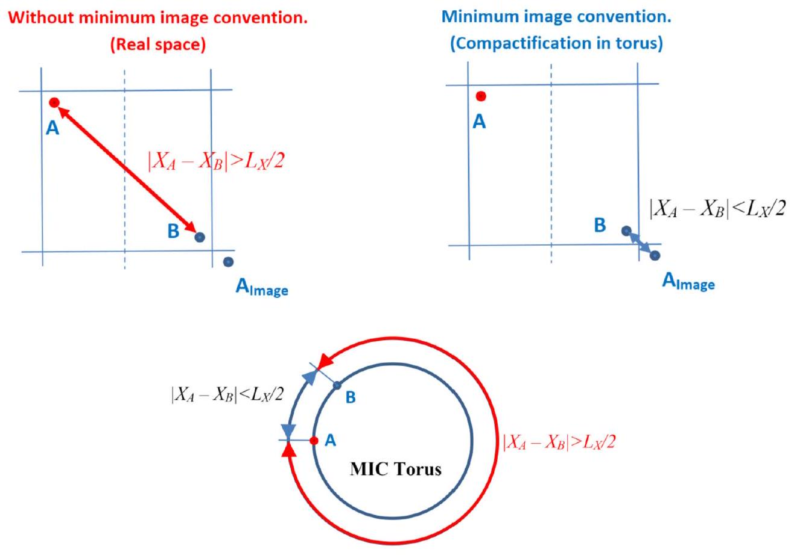
Fig. 1. Scheme of the minimum image convention technique in the simulation cell and on the torus.

of the simulation cell causes artificial correlations in movements of atoms at layers at the opposite borders of the cell, i.e. between atoms which do not interact in the real space. These artificial correlations may badly affect the analysis of the atomic trajectories database of the cell.

This paper deals with the second class of artifacts. As an example, we analyze simulations of collective coupled dynamics of the atomic ensemble in a simulation cell. The dynamical structure factor (DSF) is the key value describing the dynamics. It has the following form in the classical approximation [11], [12]:

$$
\begin{aligned}
S(\mathbf{k}, \omega) & =\frac{1}{2 \pi N} \int \exp (i \mathbf{k r}-i \omega t) G(\mathbf{r}, t) d \mathbf{r} d t \\
& =\frac{1}{2 \pi N} \int F(\mathbf{k}, t) \exp (-i \omega t) d t \\
G(\mathbf{r}, t) & =\left\langle\sum_{i=1}^{N} \sum_{j=1}^{N} \delta\left(\mathbf{r}+\mathbf{R}_{i}(t)-\mathbf{R}_{j}(0)\right)\right\rangle \\
F(\mathbf{k}, t) & =\left\langle\sum_{i=1}^{N} \sum_{j=1}^{N} \exp \left(-i \mathbf{k}\left(\mathbf{R}_{i}(t)-\mathbf{R}_{j}(0)\right)\right)\right\rangle,
\end{aligned}
$$

where $G(\mathbf{r}, t)$ is the atomic pair correlation function, $\langle\ldots\rangle$ means averaging over the atomic ensemble, $N$ is the number of atoms, $\mathbf{R}_{i}(t)$ is the coordinate of the $i$-th atom at time $t$ (i.e. this atom trajectory), $F(\mathbf{k}, t)$ is the intermediate scattering function.

Being the Fourier transform of the spatial-temporal pair atomic correlation function, the DSF accumulates information about dynamical modes of an atomic ensemble, the simplest of which are the phonon spectra. Cross-sections describing a collective response of an atomic ensemble to excitations induced by scattered particles also depend on the DSF [11]. As a result, the DSF is applied to determine scattering cross-sections of slow neutrons [13-17], X-rays [18,19], and electrons [20,21] on a dynamically coupled system of atoms as well as for calculations of the phonon spectra [22] and verification of MD schemes [23].

Classical [16,17,24,25], as well as various ab-initio MDs [26-30], are used for calculations of DSF. Various authors used different
numbers of atoms (from 64 to $10^{6}$ atoms) in MD simulations to calculate DSF [15,17,35,22,28-34] by classical or ab-initio approaches. The convergence of the position of the main peak of DSF, corresponding to the main phonon frequency, with increase of a number of atoms at already $\sim 64-512$ atoms was mentioned in Refs. [23,29,35,36]. On the other hand, recent simulations have shown that due to the finite sample size differences in the calculated phonon frequencies exist between aluminum samples which sizes range from $4 \times 4 \times 4$ ( 256 atoms) up to even $12 \times 12 \times 12$ ( 6912 atoms) cells [34]. To the best of our knowledge, there are no papers analyzing effects of similar artificial correlations on calculated DSF.

Artificial correlations, mentioned below, could be avoided staying within MIC-torus geometry during DSF calculations. However, this approach runs into problems. The first one is that there is no confidence in the fundamental accuracy of the MIC-calculated DSF because it is related to the MIC-torus geometry which does not coincide with that of the real space.

The second problem is a technical one. For large cells and longtime intervals calculation of $N^{2}$ exponents in Eq. (1) accompanied by the ensemble averaging needs too expensive computational efforts. That is why, it is reasonable to split the double summation over all possible atomic pairs in Eq. (1) into two separate sums [15,17,29,31,32,34-36]:

$$
\begin{aligned}
F(\mathbf{k}, t) & =\left\langle\sum_{i=1}^{N} \sum_{j=1}^{N} \exp \left(-i \mathbf{k}\left(\mathbf{R}_{i}(t)-\mathbf{R}_{j}(0)\right)\right)\right\rangle \\
& =\left\langle\sum_{i=1}^{N} \exp \left(-i \mathbf{k} \mathbf{R}_{i}(t)\right) \cdot \sum_{j=1}^{N} \exp \left(-i \mathbf{k} \mathbf{R}_{j}(0)\right)\right\rangle .
\end{aligned}
$$

Calculations of $2 N$ exponents in Eq. (2) instead of $N^{2}$ exponents in Eq. (1) decreases the calculation expenses by several orders of magnitude. However, within this approach the opportunity of using the minimum image convention for calculation of distances between atoms is lost, since the right side of Eq. (2) contains no
subtractions of coordinates of different atoms. Therefore, such reduction of calculation time is not possible when MIC applied.

The most common approach for any type of PBC artifacts reduction is an increase of the cell size. Unfortunately, this simplest method has several disadvantages when dealing with atomic dynamics analysis. Dynamically dependent parameters, e.g., longwave acoustic modes, change with the increase of the cell size. New long-wave modes continuously appear with an increase of the number of atoms. Acoustic parameters change significantly at least up to $10^{5}$ atoms in the simulation box [35]. That is why it is hard to select in advance the cell size providing just negligible artificial correlations effects on the DSF. An excessive increase in the volume of the simulation cell is highly undesirable for a description of the dynamic response of a material to intense rapidly changing impacts requiring fast recalculations of the DSF (e.g., swift heavy ion tracks and fs-laser spots).

The last point motivates us to develop a method allowing to determine the minimum simulation cell size providing negligible artificial correlations effect on simulations of dynamical parameters of a material. The method is based on a selection of a subcell from the MIC-simulated cell (see Fig. 2). The distance from the cell borders is chosen in such a way as to ensure no artificial correlations in movement of subcell atoms. The method can be applied when atomic displacements are negligible compared to the cell size scale during the simulation time (i.e. mostly for solids and amorphous materials). After the subcell selection we can determine the minimum size of the simulation cell required to match the cell DSF, calculated from MIC-obtained atomic trajectories, with the DSF of the extracted subcell. This minimal cell size can be then used in further DSF calculations without the extraction of a subcell. Substantiation and illustration of this algorithm form the main goal of our paper.

Also, we demonstrate a very negative effect of the MIC PBC induced artificial correlations in calculations on DSF-based scattering cross sections, leading to values which can differ by more than 100 times.

We illustrate the proposed method by calculations of parameters linked with DSF for a typical metal (Al), semiconductor (Si), and insulator (LiF). These materials choice was motivated by considerable differences in their interatomic potentials: a pair interatomic potential obtained by embedded atom method (EAM) with $\sim 7$ Å cutoff radius [37] for Al; a many-body environmentdependent potential with a cutoff about 8 Å for Si [38]; Tosi-Fumi potential with Ewald summation for long-range Coulomb interactions for LiF [27,39].

The necessity of taking into account PBC effects in ab-initio MD calculations of dynamical correlations due to a small number of atoms is also demonstrated. A difference in threshold cell sizes for the isotropic and anisotropic approximations of DSF is shown as well.

## 2. Method

Aluminum was chosen for illustration since its interatomic potential has short cut-off radius. This metal has a face-centered cubic lattice, and the dispersion law of electrons of aluminum almost coincides with that for an ideal gas [40].

From the simulation cell, we extract a subcell, which opposite faces, edges and corners do not interact during MIC-based calculations of the atomic trajectories (see Fig. 2). We chose the averaged normalized scalar product of atomic displacements for a demonstration of artificial dynamical correlations:
$f(r)=\frac{\langle\mathbf{u}(\mathbf{R}, t) \mathbf{u}(\mathbf{R}-\mathbf{r}, t)\rangle_{\mathbf{R}, t, \Omega_{\mathbf{r}}}}{\left\langle\mathbf{u}^{2}(\mathbf{R}, t)\right\rangle_{\mathbf{R}, t}}$,
where $\mathbf{u}(\mathbf{R}, t)$ is the displacement of an atom, which equilibrium position is $\mathbf{R}$ at time $t$, and $\mathbf{u}(\mathbf{R}-\mathbf{r}, t)$ the displacement of another atom, which equilibrium position is $\mathbf{R}-\mathbf{r}$ at time $t$. Brackets $\langle\ldots\rangle_{\mathbf{R}, t, \Omega_{\mathbf{r}}}$ denote an averaging of this function over the directions $\Omega_{\mathbf{r}}$ of the vector $\mathbf{r}$ and over all atomic positions $\mathbf{R}$ and times $t . f(r)$ can be calculated numerically on a discrete grid $\left\{r_{k}\right\}$ as:

$$
\begin{aligned}
f\left(r_{k}\right) & =f\left(\left|\mathbf{r}_{k}\right|\right) \\
& =\frac{\sum_{m=1}^{n_{m}} \frac{1}{N_{i j}\left(r_{k}, r_{k+1}\right)} \sum_{i=1}^{N} \sum_{j=1}^{N_{k}} \mathbf{u}_{i}\left(t_{m},\left\langle\mathbf{R}_{i}\right\rangle\right) \mathbf{u}_{j}\left(t_{m},\left\langle\mathbf{R}_{j}\right\rangle\right)}{\sum_{m=1}^{n_{m}} \frac{1}{N} \sum_{i=1}^{N} \mathbf{u}_{i}^{2}\left(t_{m},\left\langle\mathbf{R}_{i}\right\rangle\right)},
\end{aligned}
$$

where $N$ is the number of atoms, $N_{i j}\left(r_{k}, r_{k+1}\right)$ is the number of all pairs of atoms corresponding the interatomic distance interval $\left(r_{k}, r_{k+1}\right)$, and $j$-th sum is calculated over all $N_{k}$ atoms in a spherical layer, corresponding interatomic distance interval ( $r_{k}, r_{k+1}$ ) around $i$-th atom. The value $\left\langle\mathbf{R}_{i}\right\rangle=\frac{1}{n_{m}} \sum_{m=1}^{n_{m}} \mathbf{R}_{i}\left(t_{m}\right)$ defines the position of $i$-th atom averaged over the simulation time, $n_{m}$ is the number of applied MD steps. The displacement vector of $i$-th atom at time instant $t_{m}$ is given by
$\mathbf{u}_{i}\left(t_{m},\left\langle\mathbf{R}_{i}\right\rangle\right)=\mathbf{R}_{i}\left(t_{m}\right)-\left\langle\mathbf{R}_{i}\right\rangle$.

When atoms move/oscillate synchronously in a solid, their displacements are co-ordered, and the average scalar product of their displacements has a non-zero value.

Points where $f(r)=0$ appear, when a too dense spatial grid is applied. This occurs when no atoms localize in a spherical layer between two grid surfaces surrounding a given atom. Therefore, an application of spatial grid steps larger (or comparable) than the characteristic interatomic distance in a solid is necessary. The averaging time, i.e. number of time steps, should be large enough to cover the most part of possible atomic positions. Taking into account that the characteristic period of atomic oscillations in solids is $\sim 50-100 \mathrm{fs}, 2 \mathrm{ps}$ time interval can be applied for the time averaging.

The cutoff radius of the potential used for Al is $\sim 7 \AA$ [37]. To avoid interactions of the subcell boundaries, the distance between the subcell and the simulation cell boundaries was taken as the size of two orthogonal cubic Al cells of $4.035 \AA$, which is about 8 Å (Fig. 2). Thus, the distance between subcell boundaries in the torus geometry was about 16 Å.

We calculated $f(r)$ (Eq. (4)) for $16 \times 16 \times 16$ orthogonal aluminum cells ( 16384 atoms in total), using two schemes presented in Fig. 2: (1) when this cell was used for the both, for MIC PBC simulations of the atomic trajectories as well as for a subsequent calculation of $f(r)$ ("standard scheme"), and (2) MIC PBC modeling of $20 \times 20 \times 20$ cells ( 32000 atoms) with a subsequent analysis of atomic trajectories only in the central subcell, consisting of $16 \times 16 \times 16$ orthogonal cells. Each simulation runs over $n_{m}=2000$ MD steps of 1 fs .

Fig. 3 demonstrates the calculated $f(r)$ for the both cases.
The peaks in Fig. 3 are originated from the artificial correlations caused by the application of the MIC PBC conditions. Space partitioning into spherical layers surrounding a selected atom was applied when $f(r)$-function was constructed (Fig. 3). Due to the application of the MIC, a motion of atoms in the cell corner correlates with that in the opposite corner located in the farthest spherical layer (the upper cube in Fig. 3). This results in a large peak of $f(r)$ at distances $\sim 10.5 \mathrm{~nm}$ on a dashed curve in Fig. 3. For atoms at the edges of a cubic cell, the spherical layer contains atoms located (a) at the opposite edge and (b) in the bulk material. This means that the layer contains both populations of atoms: those which strongly correlate with the selected atom and atoms which do not correlate. Averaging over the whole spherical layer

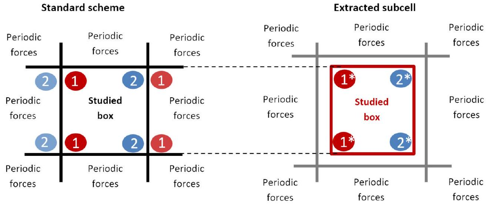
Fig. 2. The standard scheme when the same cell is used for MIC PBC MD simulations of the atomic trajectories as well as for their analysis (left); the scheme where the extracted cell is used for the analysis of atomic trajectories (right). Motions of atoms indicated by " 1 " and " 2 " correlate in the left picture, and do not correlate in the right one.

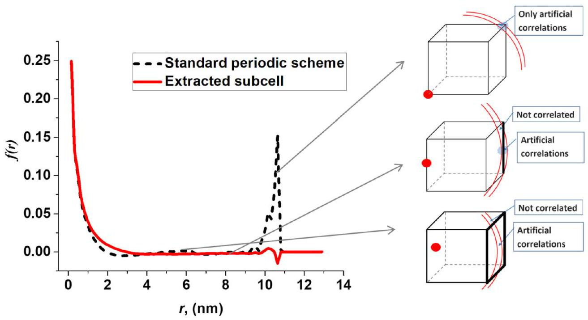
Fig. 3. Displacement correlation function of $\mathrm{Al}(f(r)$ in (Eq. (4))) calculated within the standard scheme (the same cell for MIC PBC modeling of atomic trajectories and for their analysis, dashed black curve), and for the extracted subcell with reduced dynamical correlations (red solid curve). Spatial grid step $\sim 3 \AA$, which is larger, than the characteristic interatomic distance in aluminum, was applied. (For interpretation of the colors in the figure(s), the reader is referred to the web version of this article.)

results in a peak of $f(r)$-function at $\sim 8 \mathrm{~nm}$ (the middle cube in Fig. 3) which magnitude is less than that of the peak at 10.5 nm . For atoms at the opposite faces, the corresponding spherical layer also contains a large number of atoms that do not correlate with the selected one resulting in a peak of $f(r)$ at $\sim 6 \mathrm{~nm}$ (the bottom cube in Fig. 3) which magnitude, again, is less than that of the peak at 10.5 nm .

The red solid curve in Fig. 3 demonstrates no correlations between atoms of the opposite sides for the extracted subcell. Small peaks at $\sim 10.5 \mathrm{~nm}$, corresponding to the opposite corners, arise due to a small number of atoms in spherical layers, and they are negligible compared to those obtained in the standard scheme. Thus, $8 \AA$ from the edges of the PBC aluminum cell seems like a reasonable distance to get the subcell with no artificial correlations.

To be sure that the described above correlations are indeed a consequence of the PBC and are not artifacts of the chosen classical MD approach we calculated the same displacement correlation function $f(r)$ by ab-initio MD, which is often used in DSF and phonon spectra [26-30] calculations. Quantum Espresso (QE) package [41] was applied to simulate the dynamics of 108 aluminum atoms supercell within 2 ps with 1 fs time step. Norm-conserving pseudopotentials from QE library were used. The energy cutoff pa-
rameter was set to 816 eV ( 60 Ry ). Calculations were performed at the gamma point which should be sufficient for our estimation purposes considering the system size.

The displacements correlation functions $f(r)$ (Eq. (4)) calculated with atomic trajectories database formed by the classical MD (108 atoms also) and $a b$-initio MD simulations are compared in Fig. 4.

Fig. 4 illustrates that dynamical correlations of oppositely located atoms in the simulation cell appear both in the results of classical MD and ab-initio MD modeling, meaning that these correlations are not an artifact of caused by an applied MD simulation method or chosen parameters, but are originated from the application of the MIC PBC.

## 3. Effects of PBC initiated artificial correlations on the dynamic structure factor

### 3.1. Isotropic approximation of the dynamic structure factor

The isotropic approximation of DSF-based cross sections is often used in Monte-Carlo models describing multiple scattering (e.g. anisotropic crystals) [42]. In this case $G(r, t)$ (see. Eq. (1)) has the following form [20,21]:

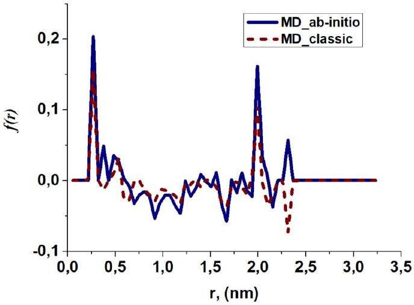
Fig. 4. Displacement correlation function $f(r)$ for 108 aluminum atoms calculated from atomic trajectories simulated with the classical (dashed red curve) and $a b$ initio MD (blue solid curve) techniques at temperature of 300 K . Spatial grid step of $1 \AA$ was applied, which is smaller, than the characteristic interatomic distance in aluminum ( $f(r)=0$ in a few points).

$$
G(r, t)=\frac{1}{N \eta_{\chi}} \sum_{\chi=1}^{\eta_{\chi}} \sum_{i, j=1}^{N} \delta\left[r+R_{i}\left(t_{\chi}\right)-R_{j}\left(t_{\chi}+t\right)\right],
$$

where $\eta_{\chi}$ is the number of MD runs ( $\eta_{\chi} \approx 10^{3}$ ). Since $G(r, t)$ is a function of time, we perform the ensemble averaging of (Eq. (6)) inside the MD runs by countdown from different time positions. During the simulations we varied time $t$ in the range from -10 ps to 10 ps (i.e. $n_{m}=2000 \mathrm{MD}$ steps for each run) in Eq. (6).

We used the standard scheme and the extracted subcell method for calculations of $G(r, t)$ and DSF at temperature 293 K and zero pressure using atomic trajectories got from the PBC MD simulations. We modeled a metal (aluminum), a semiconductor (silicon), and an insulator (lithium fluoride).

We choose only one value of the wave vector $\pi / a$ for an illustration of the frequency dependence of the calculated DSF because (a) it corresponds to the wavelength larger than that of one periodic cell, and (b) any simulated cell is a multiple of this characteristic size, i.e. modes with this wavelength are presented in all considered systems.

Fig. 5 demonstrates that the increase of the number of atoms results in DSF changes in the both cases. But starting from 6912 atoms for Al and from 13824 atoms for Si and LiF, the DSFs calculated within these schemes do not differ significantly. This convergence of the methods indicates the threshold of a significant artificial correlations effect on the dynamics of the systems.

### 3.2. Temperature dependence of PBC effects

In a solid free from external forces, vibrational modes result from thermal fluctuations in the atomic ensemble. Therefore, in order to study the convergence, mentioned above, we performed modeling and DSF calculations for Al atoms at different temperatures (Fig. 6).

Fig. 6 demonstrates that the DSFs calculated within the both methods almost converges for 2048 atoms of aluminum at $T=800$ K . But in the case of $T=100 \mathrm{~K}$ this convergence is even worse than at $T=293 \mathrm{~K}$ (see Fig. 5). This effect indicates that changes in thermal conditions may both reduce or increase the artificial dynamical correlations effects as well as affect the threshold cell size necessary for a convergence of the standard scheme and extracted subcell method.

### 3.3. Effect of fraction of "surface" atoms

Fig. 5 demonstrates the convergence of the DSFs calculated within the standard scheme and extracted cell method at $\sim 15000$
atoms. In the presented cases, two unit crystal cells were taken away from the cell border to extract the subcell (see Fig. 2). This means that the ratio between the number of near-surface atoms, i.e. atoms, left aside, and the number of extracted atoms decreases with an increase of the size of the original cell. For example, for aluminum, $4 \times 4 \times 4$ subcell ( 256 atoms) extracted from the cell $8 \times 8 \times 8$ (2048 atoms), the ratio between the number of near-surface atoms and that of extracted ones is $1792 / 256=7$. But $12 \times 12 \times 12$ subcell (6912 atoms) extracted from the system $16 \times 16 \times 16$ (16384 atoms), results in the ratio $9472 / 6912 \approx 1.37$.

In order to figure out, whether the convergence presented in Fig. 5 is a result of the cell size growth or is it originated from a decrease of the fraction of near-surface atoms, we considered aluminum $4 \times 4 \times 4$ subcell ( 256 atoms) extracted from $6 \times 6 \times 6$ cell ( 864 atoms) and that of $12 \times 12 \times 12$ (6912 atoms) extracted from $18 \times 18 \times 18$ cell ( 23328 atoms). The near-surface atom fractions for these systems are the same. However, DSF calculations demonstrated a noticeable difference between the standard scheme and the extracted subcell method for the small cell, and a negligible difference for the larger one (Fig. 7).

Fig. 7 shows that convergence, i.e. a decrease of the artificial correlations effect in the calculated DSFs, appears due to system enlarging but not due to the decrease of the fraction of extracted atoms.

### 3.4. Effect of NPBC subcell location in a PBC-cell

The subcell extraction scheme presented in Fig. 2 is not the only possible one. Any subcell of the same size can be used if it does not contain pairs of atoms artificially correlated due to application of the PBC conditions during MD simulations of the atomic trajectories. It is reasonable to suggest that a correct way to obtain the most reasoned DSF value is an averaging over the DSFs calculated for all possible extracted such subcells. Below we demonstrate that all such subcells, however, provide the same DSFs and the assumed averaging is not necessary.

As an example, we compare DSFs of subcells, extracted from the side of the original aluminum cell (scheme of Fig. 8a) and from the corner (scheme of Fig. 9a) of the same cell.

Figs. 5, 8a-8b and 9a-9b demonstrate no DSF convergence dependence on a location of the extracted subcell in the original cell.

### 3.5. Anisotropic DSF

Anisotropic DSFs are used to determine scattering cross-sections depending on a specific wave vector direction [17,43] or phonon spectra [22]. To demonstrate an effect of the anisotropy on the DSFs calculated within the standard scheme and the extracted subcell method, we calculate $F(\mathbf{k}, t)$ function in (Eq. (2)) as:

$$
F(\mathbf{k}, t)=\sum_{\chi=1}^{\eta_{\chi}} \sum_{i=1}^{N} \exp \left(-\mathbf{k R}_{i}\left(t_{\chi}\right)\right) \sum_{j=1}^{N} \exp \left(\mathbf{k R}_{j}\left(t_{\chi}+t\right)\right)
$$

applying $\eta_{\chi}=2000$ of MD runs and time $t$ ranging from -10 ps to 10 ps .2000 MD steps were analyzed for each run when calculating Eq. (7).

Fig. 10 presents calculated DSF of Al, Si, and LiF cells for $\mathbf{k}= \{0 ; 0 ; \pi / a\}$ at $T=293 \mathrm{~K}$.

Fig. 10 demonstrates much slower convergence of the DSF frequency dependence in the anisotropic case vs. the isotropic one. This effect may originate from the averaging over all directions in the isotropic case. The position of the main peak, which corresponds to the main phonon frequency [22], and the ratios between the main peak and secondary peaks indicate that the convergence between the DSFs calculated within the standard scheme and the

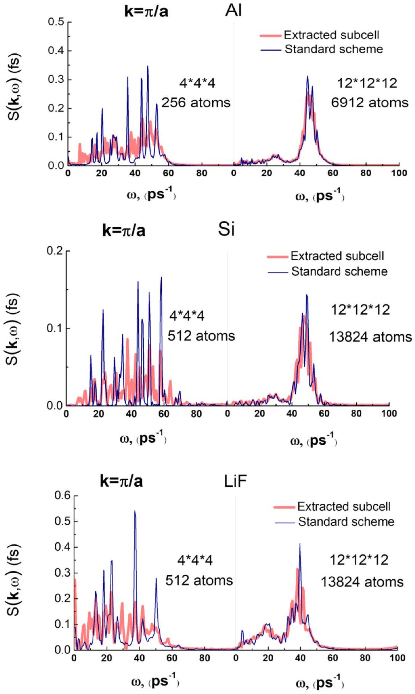
Fig. 5. DSF of 256 and 6912 aluminum atoms, 512 and 13824 silicon atoms and 512 and 13824 lithium fluoride atoms in the isotropic approximation at $T=293$ K. Thin blue curves correspond to the calculations made within the standard scheme, and thick red curves correspond to the extracted subcell method.

extracted subcell method almost occurs starting from $12 \times 12 \times 12$ cells ( 13864 atoms) in LiF and Si and from $16 \times 16 \times 16$ cells (16384 atoms) in Al.

## 4. Effects of PBC induced artificial correlations on scattering parameters

### 4.1. DSF based cross sections in the isotropic approximation

In the first Born approximation DSF determines the differential cross-section of a projectile scattered on a dynamically coupled atomic system [11]:

$$
\frac{\partial^{2} \sigma}{\partial \Omega \partial E_{f}}=|V(\mathbf{k})|^{2} \frac{m^{2}}{4 \pi^{2} \hbar^{5}} \frac{k_{f}}{k_{i}} S(\mathbf{k}, \omega)
$$

Here, $\sigma$ is the scattering cross section of a particle, $E_{f}$ is the particle energy after scattering, $\Omega$ is the solid angle of particle scattering, $\mathbf{k}_{i}$ and $\mathbf{k}_{f}$ are the initial and the final wave vectors of the scattered particle, $\hbar \omega=\frac{\hbar^{2} \mathbf{k}_{i}^{2}}{2 m}-\frac{\hbar^{2} \mathbf{k}_{f}^{2}}{2 m}$ is the change of the projectile energy in the free-particle approximation, $m$ is the particle mass, $V(\mathbf{k})$ is the spatial Fourier transform of the interaction potential between the projectile and a single atom of a target.

To illustrate a difference which occur in scattering parameters due to a difference between the DSF calculated within the standard

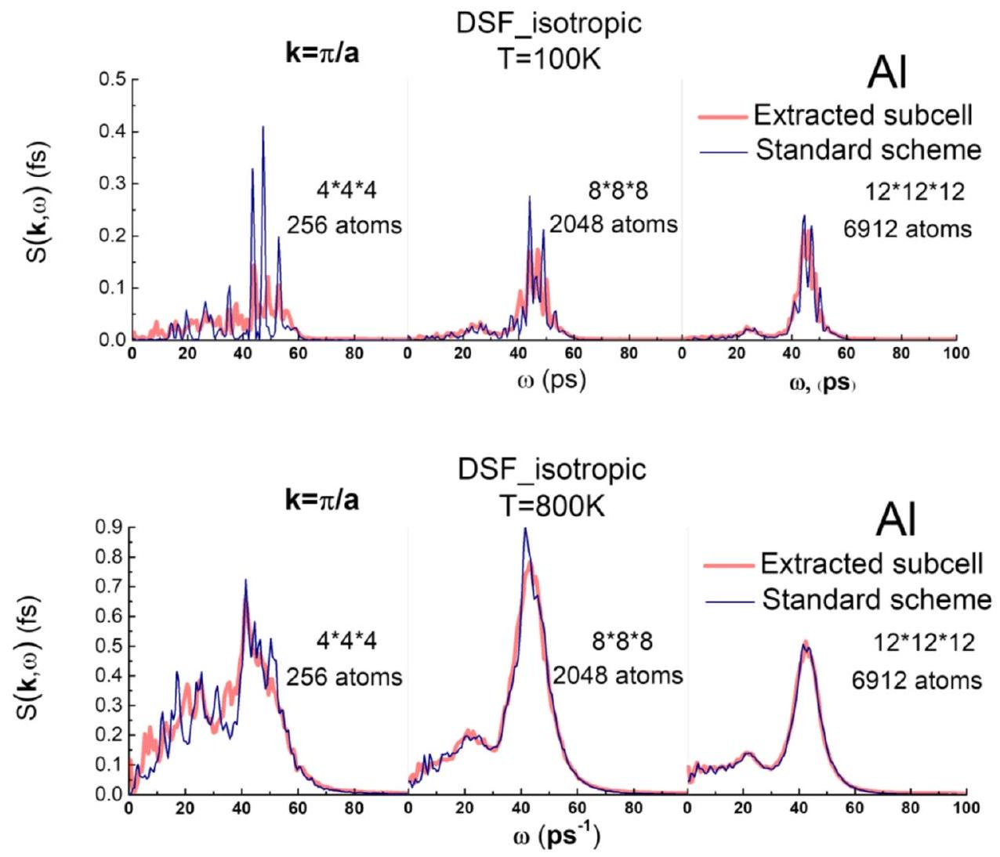
Fig. 6. DSF of 256,2048 and 6912 aluminum atoms in the isotropic approximation at $T=100 \mathrm{~K}$ and $T=800 \mathrm{~K}$. Thin blue curves correspond to the DSF calculated within the standard scheme, and thick red curves correspond to the extracted subcell method.

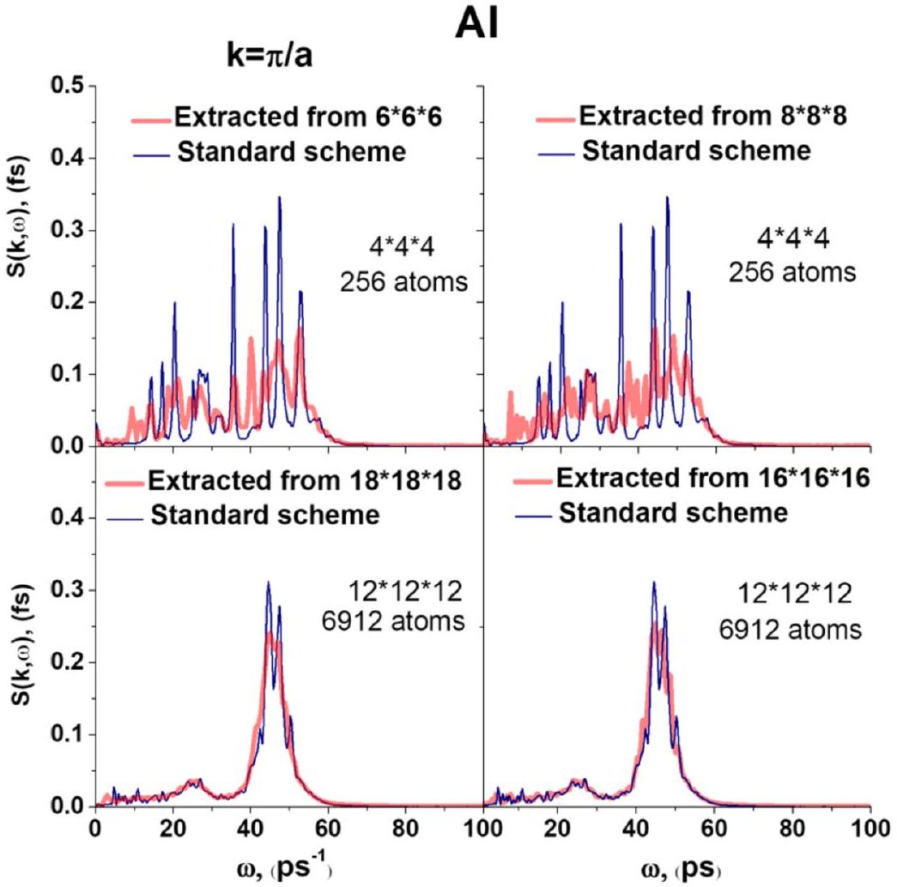
Fig. 7. DSFs calculated within the extracted subcell method (thick red curve) for 256 aluminum atoms extracted from $6 \times 6 \times 6$ and $8 \times 8 \times 8$ cells as well as 6912 aluminum atoms extracted from $16 \times 16 \times 16$ and $18 \times 18 \times 18$ cells. DSFs calculated within the standard scheme for the original cells in the isotropic approximation at $T=293 \mathrm{~K}$ are presented by thin blue curves.

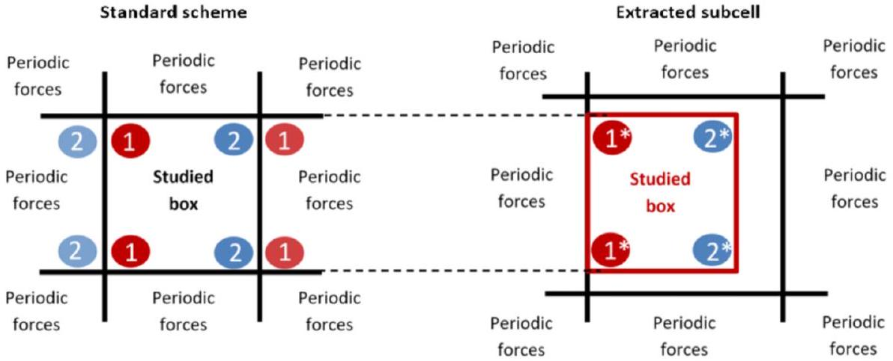
Fig. 8a. Scheme of extraction of a subcell from the left side of the PBC-simulated box.

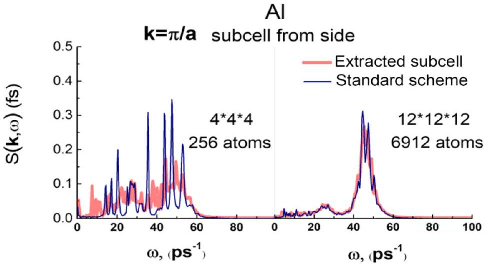
Fig. 8b. DSFs of 256 and 6912 aluminum atoms in the isotropic approximation at $T=293$ K. Thin blue curves correspond to DSFs calculated within the standard scheme, and thick red curves correspond to the subcell, extracted from the left side of the original cell (see Fig. 1.a).

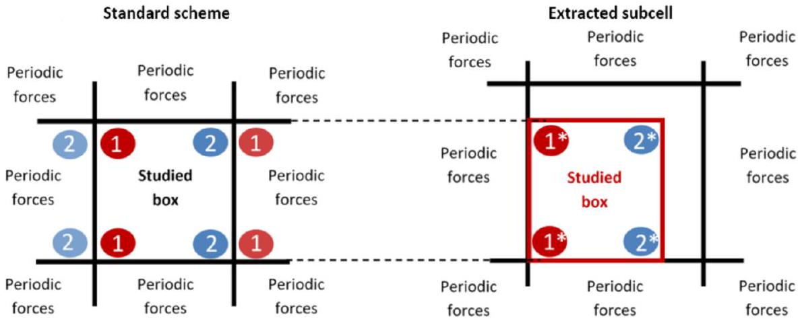
Fig. 9a. Scheme of extraction of a subcell from the corner of the PBC-simulated box.

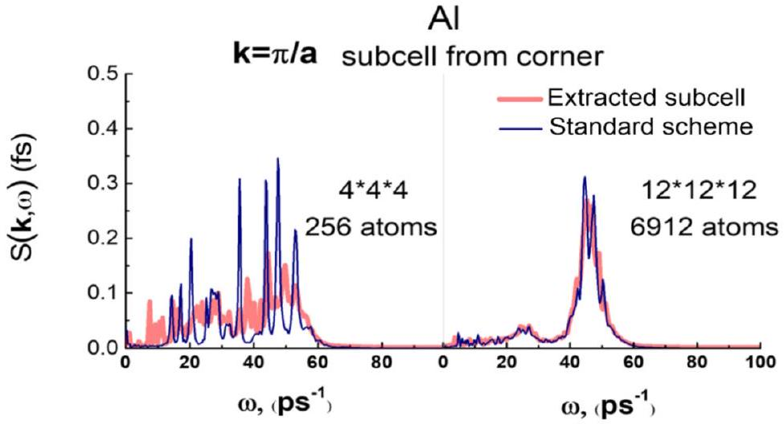
Fig. 9b. DSFs of 256 and 6912 aluminum atoms in the isotropic approximation at $T=293$ K. Thin blue curves correspond to DSFs calculated within the standard scheme, and thick red curves correspond to DSF for the subcell, extracted from the corner of the original cell (see Fig. 2.a).

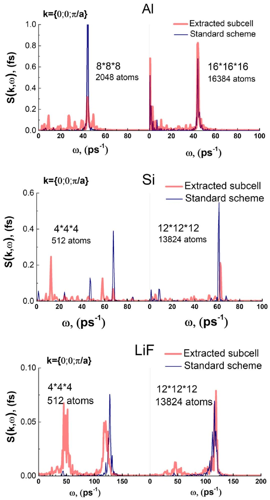
Fig. 10. DSFs calculated within the standard scheme (thin blue curves) and the extracted subcell method (thick red curves) consisting of 2048 and 16384 atoms in aluminum, 512 and 13824 atoms in silicon, and 512 and 13824 atoms in lithium fluoride, at $T=300 \mathrm{~K}$ in the anisotropic approximation.

scheme vs the extracted subcell method we chose the mean free path (MFP) of electrons in a target:

$$
\lambda\left(\mathbf{k}_{i}\right)=\frac{1}{n_{a} \sigma\left(\mathbf{k}_{i}\right)},
$$

where $n_{a}$ - is the density of target atoms, and $\sigma_{e}\left(\mathrm{k}_{\mathrm{i}}\right)$ is the total scattering cross section of an electron [11]:

$$
\begin{aligned}
\sigma_{e}\left(\mathbf{k}_{i}\right)= & \int d \Omega d E_{f}\left|V\left(\mathbf{k}_{i}-\mathbf{k}_{f}\right)\right|^{2} \frac{m_{e}^{2}}{4 \pi^{2} \hbar^{5}} \frac{k_{f}}{k_{i}} S \\
& \times\left(\mathbf{k}_{i}-\mathbf{k}_{f}, \omega=\frac{\hbar \mathbf{k}_{i}^{2}}{2 m_{e}}-\frac{\hbar \mathbf{k}_{f}^{2}}{2 m_{e}}\right)
\end{aligned}
$$

When calculating the cross-section (Eq. (10)), we used the screened electron-atom potential with the screening length of 1 nm . This

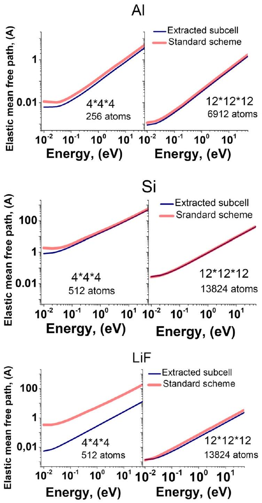
Fig.11. Electron mean free paths (Eqs. (8)-(10)) in the isotropic approximation in (a) aluminum for cells containing 256 and 6912 atoms, (b) silicon for cells of 512 and 13824 atoms, (c) lithium fluoride for cells of 512 and 13824 atoms at $T=293 \mathrm{~K}$. Thick red curves correspond to the calculations made within the standard scheme, and thin blue curves correspond to the extracted subcell method.

choice allows to avoid a divergence of the Coulomb scattering cross-section. The charges were chosen as $3 e^{+}$for aluminum atoms, $e^{+}$and $e^{-}$for Li and F , and $e^{+}$for Si atoms.

Fig. 11 shows that the mean free paths calculated with Eqs. ((9)-(10)) within the standard scheme and the extracted subcell method in the isotropic approximation almost coincide starting from $12 \times 12 \times 12$ crystal cells.

Fig. 11 also shows that the largest differences (more than an order of magnitude for LiF) between the applied methods occur for the incident electron energies up to 1 eV where electron interactions with collective lattice modes are pronounced. However, it should be noted, that the first Born approximation and DSF-based cross sections (Eq. (8)) can hardly be applied for scattering of such electrons on atoms.

Figs. 5 and 11 demonstrate that in the isotropic approximation applied PBC do not noticeably affect the collective response of the atomic dynamics on excitations by a projectile starting from 6912 atoms for Al and starting from 13824 atoms for Si and LiF .

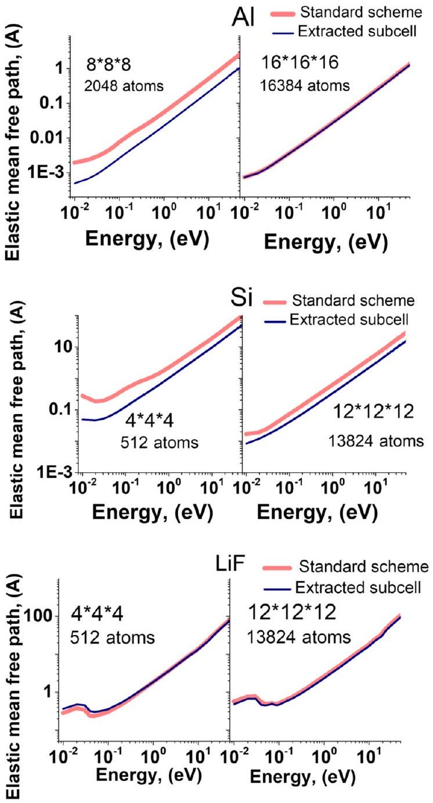
Fig. 12. Electron mean free paths in the anisotropic approximation for (left) aluminum cells consisting of 2048, and 16384 atoms, (center) silicon cells of 512 and 13824 atoms, and (right) lithium fluoride cells of 512 and 13824 atoms, calculated with applying the standard scheme (thick red curves) vs the extracted subcell approximation (thin blue curves) at $T=293 \mathrm{~K}$.

A significant difference between the DSF-based cross sections for standard scheme and extracted subcell ( $\sim 100$ times) should also be noted for the small cells.

### 4.2. Scattering cross sections in the anisotropic case

To calculate the MFP (Eqs. (8)-(10)) of electrons in the anisotropic approximation (see also Eq. (1), (2), (7)) we used 226981 $k$-points distributed in the uniform grid in the inverse $\mathbf{k}$-space with the step length of $2 \pi / 80 \AA$ along each $k_{m}$-axis ( $m=x, y, z$ ). To describe the DSF frequency dependence, 500 values of $\omega$ were taken for each $k$-point of this grid in the interval ranging from $-1.26 \cdot 10^{15} \mathrm{~s}^{-1}$ to $1.26 \cdot 10^{15} \mathrm{~s}^{-1}$ (the negative frequencies correspond to energies transferred from a lattice to an electron).

Fig. 12 shows a convergence of the calculations within the standard scheme (thick red curves) vs the extracted subcell method close to $\sim 15000$ atoms.

Fig. 11 and 12 present the total cross section (Eq. (10)) and parameters resulted from integration of the DSFs over all k -area and $\omega$-area. Figs. 5 and 10 illustrate differences between the DSFs only for one specific wave vector $\pi / a$.

## 5. Conclusions

The paper studies an effect of artificial dynamical correlations of atoms, caused by application of the periodic boundary conditions, on simulations of dynamical parameters (the dynamical structure factor) of solids. We employed an original method for selection a minimal size of a simulation cell avoiding artificial dynamics by extraction of a subcell with reduced artificial correlation effects.

For $\mathrm{Al}, \mathrm{Si}$ and LiF we obtained convergence, i.e. negligible role of artificial correlations on the DSF and DSF-based cross sections at $\sim 15000$ atoms. This means that this threshold depends weakly on the interatomic potential or specific crystalline structure of a system.

The temperature dependence of these thresholds demonstrated faster convergence at higher temperatures of the system.

We also demonstrated that these artificial effects are stronger for a small number of atoms ( $\sim 1000$ ), which are available for ab-initio simulations. Applying nowadays computers, one cannot neglect the effects of PBC in the ab-initio DFT-MD modeling of dynamical characteristics of materials, e.g., when studying effects of a rapid change in the interatomic potential under extreme electronic excitation.

We have shown that the threshold size of the system depends on whether isotropic or anisotropic approximation is used, which is important for the scattering problem. In particular, we demonstrate a very negative effect of the artifact correlations on calculations of DSF-based scattering cross sections, leading to the difference in calculated values, e.g. the projectile mean free paths, by more than 100 times.

## CRediT author statement

S.A. Gorbunov: Conceptualization, Methodology, Writing - Original Draft, Software. A.E. Volkov: Conceptualization, Writing - Review \& Editing, Funding acquisition. R.A. Voronkov: Resources, Software, Writing - Review \& Editing.

## Declaration of competing interest

The authors declare that they have no known competing financial interests or personal relationships that could have appeared to influence the work reported in this paper.

## Acknowledgements

This work has been carried out using computing resources of the federal collective usage center Complex for Simulation and Data Processing for Mega-science Facilities at NRC "Kurchatov Institute", http://ckp.nrcki.ru/.

The study was funded by a grant Russian Science Foundation No. 22-22-00676.

## References

[1] J. Sólyom, Fundamentals of the Physics of Solids, Springer-Verlag, Berlin, Heidelberg, 2007.
[2] D.C. Rapaport, The Art of Molecular Dynamics Simulation, Cambridge University Press, 2004.
[3] P. Kordt, Charge Dynamics in Organic Semiconductors: From Chemical Structures to Devices, De Gruyter, 2016.
[4] G. Mathias, B. Egwolf, M. Nonella, P. Tavan, J. Chem. Phys. 118 (2003) 10847.
[5] G. Makov, M.C. Payne, Phys. Rev. B 51 (1995) 4014-4022.
[6] G.J. Martyna, M.E. Tuckerman, J. Chem. Phys. 110 (1999) 2810-2821.
[7] N.D.M. Hine, J. Dziedzic, P.D. Haynes, C.K. Skylaris, J. Chem. Phys. 135 (2011) 204103.
[8] I. Dabo, B. Kozinsky, N.E. Singh-Miller, N. Marzari, Phys. Rev. B, Condens. Matter Mater. Phys. 77 (2008) 115139.
[9] M. Rahimi, H.A. Karimi-Varzaneh, M.C. Böhm, F. Müller-Plathe, S. Pfaller, G. Possart, P. Steinmann, J. Chem. Phys. 134 (2011) 154108.
[10] Z.C. Holden, B. Rana, J.M. Herbert, J. Chem. Phys. 150 (2019) 144115.
[11] L. Van Hove, Phys. Rev. 95 (1954) 249-262.
[12] R. Aamodt, K.M. Case, Phys. Rev. 126 (1962) 1165.
[13] F. Alvarez, J. Colmenero, R. Zorn, L. Willner, D. Richter, Macromolecules 36 (2003) 238.
[14] K. Hinsen, E. Pellegrini, S. Stachura, G.R. Kneller, J. Comput. Chem. 33 (2012) 2043-2048.
[15] E.G. Brandt, O. Edholm, Biophys. J. 96 (2009) 1828-1838.
[16] N.E. Moe, M.D. Ediger, Phys. Rev. E, Stat. Phys. Plasmas Fluids Relat. Interdiscip. Topics 59 (1999) 623-630.
[17] G.R. Kneller, A. Geiger, Mol. Phys. 70 (1990) 465-483.
[18] R.M. Khusnutdinoff, A.V. Mokshin, I.I. Khadeev, J. Phys. Conf. Ser. 394 (2012) 12012.
[19] J.S. Hub, T. Salditt, M.C. Rheinstä, B.L. De Groot, Biophys. J. 93 (2007) 3156.
[20] S.A. Gorbunov, N. Medvedev, R.A. Rymzhanov, A.E. Volkov, Nucl. Instrum. Methods Phys. Res., Sect. B, Beam Interact. Mater. Atoms 435 (2018) 83-86.
[21] S.A. Gorbunov, N.A. Medvedev, P.N. Terekhin, A.E. Volkov, Nucl. Instrum. Methods Phys. Res., Sect. B, Beam Interact. Mater. Atoms 354 (2015) 220-225.
[22] S.V. Lepeshkin, M.V. Magnitskaya, N.L. Matsko, E.G. Maksimov, J. Exp. Theor. Phys. 115 (2012) 105-111.
[23] B. Larder, D.O. Gericke, S. Richardson, P. Mabey, T.G. White, G. Gregori, Sci. Adv. 5 (2019) eaaw1634.
[24] W.J.L. Buyers, G. Dalling, G. Jacucci, M.L. Klein, H.R. Glyde, Anharmonic Phonon Response in Aluminum: A Neutron-Scattering Test of Computer-Simulation Calculations, 1979.
[25] S. Mantha, A. Yethiraj, J. Chem. Phys. 144 (2016) 84504.
[26] D.J. González, L.E. González, J.M. López, M.J. Stott, J. Chem. Phys. 115 (2001) 2373-2376.
[27] D.J. González, L.E. González, J.M. López, M.J. Stott, Europhys. Lett. 62 (2003) 42-48.
[28] K.-U. Plagemann, P. Sperling, R. Thiele, M.P. Desjarlais, C. Fortmann, T. Döppner, H.J. Lee, S.H. Glenzer, R. Redmer, New J. Phys. 14 (2012) 55020.
[29] L. Harbour, G.D. Förster, M.W.C. Dharma-wardana, L.J. Lewis, Phys. Rev. E 97 (2018) 43210.
[30] H.-C. Weissker, J. Serrano, S. Huotari, E. Luppi, M. Cazzaniga, F. Bruneval, F. Sottile, G. Monaco, V. Olevano, L. Reining, Phys. Rev. B 81 (2010) 85104.
[31] J.-D. Chai, D. Stroud, J. Hafner, G. Kresse, Phys. Rev. B 67 (2003) 104205.
[32] S. Jahn, P.A. Madden, Condens. Matter Phys. 11 (2008) 169-178.
[33] B.B.L. Witte, M. Shihab, S.H. Glenzer, R. Redmer, Phys. Rev. B 95 (2017) 144105.
[34] E. Fransson, M. Slabanja, P. Erhart, G. Wahnström, Adv. Theory Simulations 4 (2021) 2000240.
[35] A. Vallés, P. Derlet, D. Crespo, E. Pineda, J. Alloys Compd. 586 (2014).
[36] B.B.L.L. Witte, M. Shihab, S.H. Glenzer, R. Redmer, Phys. Rev. B 95 (2017) 144105.
[37] X.-Y. Liu, F. Ercolessi, J.B. Adams, Model. Simul. Mater. Sci. Eng. 12 (2004) 665-670.
[38] J.F. Justo, M.Z. Bazant, E. Kaxiras, V.V. Bulatov, S. Yip, Phys. Rev. B 58 (1998).
[39] A.B. Belonoshko, R. Ahuja, B. Johansson, Phys. Rev. B 61 (2000) 11928-11935.
[40] Z. Lin, L. Zhigilei, V. Celli, Phys. Rev. B 77 (2008) 075133.
[41] P. Giannozzi, S. Baroni, N. Bonini, M. Calandra, R. Car, C. Cavazzoni, J. Phys. Condens. Matter 21 (2009) 395502.
[42] N.A. Medvedev, R.A. Rymzhanov, A.E. Volkov, J. Phys. D, Appl. Phys. 48 (2015) 355303.
[43] S.A. Gorbunov, S.V. Ivliev, A.E. Volkov, Nucl. Instrum. Methods Phys. Res., Sect. B, Beam Interact. Mater. Atoms 474 (2020) 41-48.

[^0]:    * The review of this paper was arranged by Prof. Weigel Martin.
    * Corresponding author.

    E-mail address: s.a.gorbunov@mail.ru (S.A. Gorbunov).

