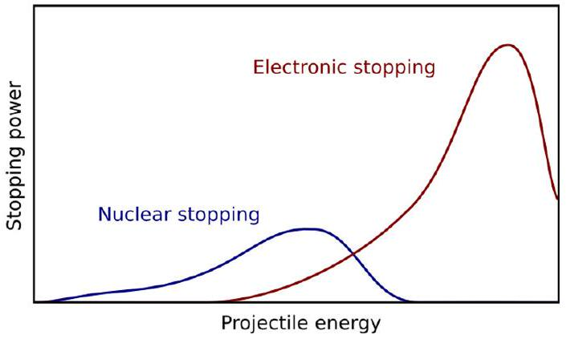
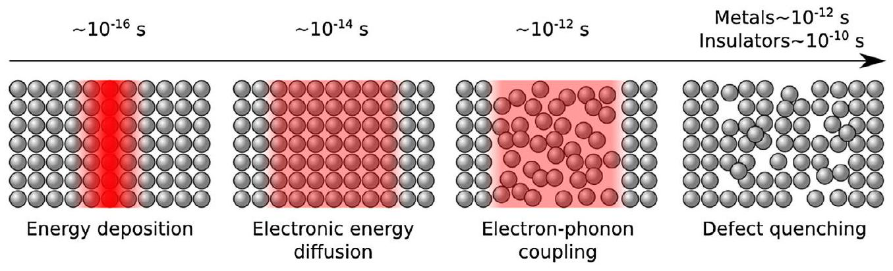
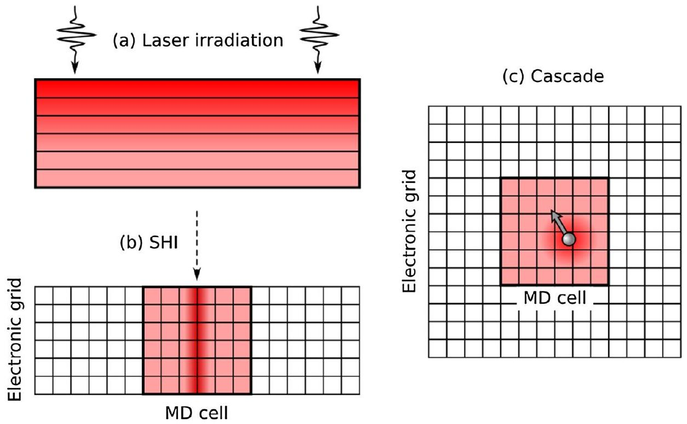
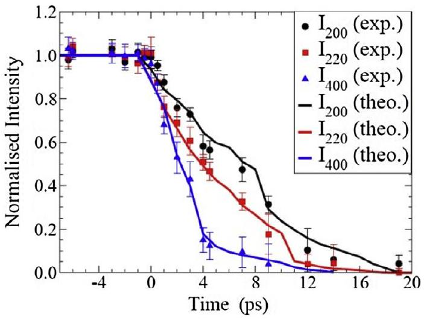
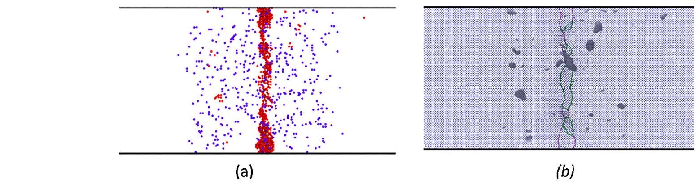

# Modelling radiation effects in solids with two-temperature molecular dynamics ${ }^{\text {同 }}$ 

Robert Darkins, Dorothy M. Duffy* Department of Physics and Astronomy and London Centre for Nanotechnology, University College London, Gower Street, London WC1E 6BT, UK

## ARTICLE INFO

## Article history:

Received 31 October 2017
Received in revised form 30 January 2018
Accepted 3 February 2018
Available online 10 February 2018

## Keywords:

Radiation damage
Two temperature model
Molecular dynamics
Electronic effects
Laser irradiation
Swift heavy ions

#### Abstract

The ability to predict the structural modifications of materials resulting from a broad range of irradiation scenarios would have a positive impact on many fields of science and technology. Established techniques for modelling large atomic systems, such as classical molecular dynamics, are limited by the neglect of the electronic degrees of freedom which restricts their application to irradiation events that primarily interact with atomic nuclei. Ab initio methods, on the other hand, include electronic degrees of freedom, but the requisite computational costs restrict their application to relatively small systems. Recent methodological developments aimed at overcoming some of these limitations are based on methods that couple atomistic models to a continuum model for the electronic energy, where energy is exchanged between the nuclei and electrons via electronic stopping and electron-phonon coupling mechanisms. Such two-temperature molecular dynamics models, as they are known, make it practicable to simulate the effects of electronic excitations on systems with millions, or even hundreds of millions, of atoms. They have been used to study laser irradiation of metallic films, swift heavy ion irradiation of metals and semiconductors, and moderately high ion irradiation of metals.

In this review we describe the two-temperature molecular dynamics methodology and the various practical considerations required for its implementation. We provide example applications of the model to multiple irradiation scenarios that accommodate electronic excitations. We also describe the challenges of including the effects of the modification of the interatomic interactions, due to the excitation of electrons, in the simulations and how these challenges can be overcome.

© 2018 Elsevier B.V. All rights reserved.

## 1. Introduction

The effects of radiation on materials impacts many scientific and technological fields, ranging from nanotechnology and microelectronics to the nuclear industry and space technology. Radiation has many forms, but in terms of its effects on materials it can be broadly classified into three types: radiation that primarily excites electrons, radiation that primarily excites the nuclei, and radiation that deposits proportionately to both the electrons and the nuclei. Photons and very high energy ions belong to the first class, neutrons and low energy ions belong to the second class, and moderate to high energy ions belong to the third.

Predicting the effect of radiation on materials requires knowledge that spans an enormous range of length and time scales. Defect configurations created on the nanoscale and in the first few picoseconds following an irradiation event continue to evolve over many years, resulting in potentially catastrophic degradation

[^0]of the material properties. It is, therefore, important to understand and characterise defect creation and evolution at all stages of the ageing process, to assess whether a material is fit for purpose in a radiation environment.

Classical molecular dynamics (MD) is a powerful method for modelling radiation effects in the early stages following a radiation event, as it can simulate appropriate length (nm) and time (ns) scales. It has enabled many notable advances in the understanding of radiation damage over the past three decades. There are, however, well-known limitations to the method and these are briefly discussed in Section 2 of this review. The limitation that is most relevant to the current review is the inability of the conventional MD method to incorporate the effects of electronic excitations, which restricts the class of radiation that can be studied by this method to that which interacts primarily with the nuclei in a material, such as low energy ions. Indeed, some types of radiation only excite electrons, in which case the standard MD method is entirely inappropriate. An example of radiation that interacts solely with electrons is laser irradiation, whereby the photons are absorbed by the material via the excitation of electrons to higher energy levels. Very energetic ions, generally referred to as swift heavy ions
(SHI), also interact strongly with the electrons in a material. When an ion moves through a material it gradually loses energy and the energy loss per unit distance is known as the stopping power. There are two main mechanisms for this energy loss. One is the elastic collisions of the moving ion with the nuclei of the material, referred to as nuclear stopping power, and the second is energy loss due to the inelastic scattering of electrons, known as electronic stopping power. The relative amounts of energy loss via the two mechanisms is strongly dependent on the energy of the moving ion, with the typical relationship illustrated in Fig. 1. For very energetic projectiles, it can be seen that the energy loss is primarily due to electronic stopping power and the cross section for nuclear collisions is extremely low. It follows that conventional MD simulations are not appropriate for modelling the effects of swift heavy ions, which are very high energy projectiles.

To address this limitation, augmented MD methods have been developed that couple classical MD to a model for the transfer and diffusion of electronic energy. These efforts were initially developed to simulate laser irradiation of metal films [1-3] and electron ejection from metal surfaces [4-6]. A later development extended the model for cascade simulations that enabled the effect of electronic energy loss and electron-phonon coupling to be included in simulations of irradiation with moderate to high energy ions [7].

In this paper we describe an augmented MD methodology, known as two-temperature molecular dynamics (2T-MD). We give examples of how the method has been used successfully to model laser irradiation, swift heavy ion irradiation and moderate energy ion irradiation. We also show evidence that, for very highly excited electrons, coupling the lattice and the electrons via electronphonon coupling is not sufficient to capture the full effects of the electronic excitations on the dynamics of the system. Rather, intense excitations affect the interactions between the atoms themselves, in which case it is necessary to employ dynamical interatomic potentials that are parametrized by the electronic temperature. We discuss how such interatomic potentials can be developed by fitting to finite temperature density function theory (DFT) calculations and how they can be employed in classical MD simulations. We conclude with a summary of progress in this research area to date and future challenges.

## 2. Simulating radiation effects

### 2.1. Molecular dynamics

The most widely used methodology for simulating radiation effects in materials is molecular dynamics in the form of cascade

Fig. 1. A schematic representation of the nuclear (blue) and electronic (red) stopping power as a function of the ion projectile energy. For low energy ions most energy is lost to the nuclei in the material whereas for high energy ions the inelastic electronic interactions dominate the energy loss. At intermediate energies both mechanisms are important. (For interpretation of the references to colour in this figure legend, the reader is referred to the web version of this article.)

simulations. Cascade simulations model the effects of a particle interaction with the atoms in a solid by imparting a high velocity to one atom in a simulation cell. This atom, known as the primary knock-on atom or PKA, moves through the crystal and collides with other atoms, also setting them in motion. The resulting collision cascade, as it is known, continues creating an increasing number of mobile atoms until the energies of all atoms have fallen below the threshold required to knock an atom from its lattice site. At this stage the energy of the mobile atoms is shared thermally amongst their neighbours, resulting in a localised region of liquid-like material with a high energy density encapsulated within a cooler crystal structure. As time passes, the energy diffuses through the crystal and the molten region cools, fully or partially recrystallising. Partial recrystallisation leaves behind an amorphous volume embedded in the crystal, but even full recrystallisation generally concludes with many defects that may take the form of isolated vacancies and interstitials, small clusters, or dislocation loops. Cascade simulations, as reviewed in [8], have made an enormous contribution to the understanding of the fundamental mechanisms involved in radiation damage.

The success of cascade simulations has, of course, been tempered by the usual limitations of MD methods. One limitation is that the size of the simulation cell required to contain the cascade effects increases with increasing PKA energy, with approximately 100 million atoms required to simulate a PKA energy of 500 keV . Another limitation is the use of interatomic potentials that have been fitted to equilibrium conditions, which deviates strongly from the far-from-equilibrium conditions experienced in high energy collisions. This is overcome to some extent by the employment of a universal potential which takes the form of a Coulomb potential times a screening function, such as the Ziegler-Biersack Littmark (ZBL) potential [9]. The ZBL potential is utilised at very close interatomic separations, being merged with the interatomic potential of the material at intermediate separations, and deactivated at larger separations, leaving only the unmodified interatomic potential. It has, however, been noted that the residual defect numbers and defect configurations are quite sensitive to the details of the joining procedure, and so the procedure must be performed with care [10].

The third limitation, and the one most relevant to the current review, is that classical cascade simulations are restricted to modelling radiation events that transfer energy solely to the nuclei since they neglect the effects of excited electrons. As an ion moves through a solid, the proportion of its energy lost to inelastic electronic scattering increases as the cross-section for nuclear collisions decreases (Fig. 1). These effects attracted significant interest in the late 1980s and early 1990s when a few seminal papers [11-13] were published. Thereafter, it became standard practice to include the effects of electronic stopping by introducing a friction term to the MD equations of motion. In these classical simulations there is no facility for describing the electronic energy therefore the energy dissipated by electronic stopping is lost by the system. Consequently, such methods neglect the transport and redistribution of the electronic energy, which is one of the issues that the 2T-MD model aims to resolve.

### 2.2. The continuum two-temperature model

High energy radiation events generally drive the electrons in a solid far from equilibrium. Shortly after the radiation event, usually within the femtosecond time-scale, the electrons thermalise and adopt a well-defined temperature. However, the thermalized electronic temperature will initially differ from that of the nuclei. This state of quasi-equilibrium will evolve, usually on a picosecond time-scale, to a state of equilibrium whereby the electrons and nuclei converge to the same temperature. The initial heating of
the electrons and the subsequent evolution of the two temperatures can be calculated using the two-temperature model (2TM) [14] which describes the temporal and spatial evolution of the electronic ( $T_{e}$ ) and lattice ( $T_{l}$ ) temperatures via a pair of coupled thermal diffusion equations

$$
C_{e} \frac{\partial T_{e}}{\partial t}=\nabla \kappa_{e} \nabla T_{e}-G\left(T_{e}-T_{l}\right)+A
$$

$$
C_{l} \frac{\partial T_{l}}{\partial t}=\nabla \kappa_{e} \nabla T_{l}+G\left(T_{e}-T_{l}\right)
$$

Here $A$ is a source term representing energy deposition to the electrons as a function of space and time. Energy exchange between the lattice and electrons occurs via electron-phonon coupling which is quantified by the electron-phonon coupling constant $G$. $C_{e}$ and $C_{l}$ are the electronic and lattice heat capacities, respectively. $\kappa_{e}$ and $\kappa_{l}$ are the electronic and lattice thermal conductivities. Each of these parameters may vary as a function of the respective temperatures.

The model was first applied to laser irradiation by Anisimov [15] who used it to calculate the emission current from a metal surface irradiated by a picosecond laser. It is now widely used for the analysis of ultrafast laser irradiation experiments [16-18]. The measured time evolution of the optical reflectivity may be fit to the 2TM to evaluate $T_{e}$ and $T_{l}$ and, hence, to establish the electron-phonon coupling constant. This method was used to measure the electron-phonon coupling constant of W for comparison with the value calculated using density functional theory [19]. The excellent agreement between the calculated $\left(1.65 \times 10^{17} \mathrm{~W}\right. \mathrm{m}^{-3} \mathrm{~K}^{-1}$ ) and measured ( $1.43 \times 10^{17} \mathrm{~W} \mathrm{~m}^{-3} \mathrm{~K}^{-1}$ ) values is a strong validation of the both the 2TM and the method for calculating the electron-phonon constant using DFT.

The 2TM has also been used extensively to model SHI irradiation, where it is generally referred to as the inelastic thermal spike model. SHI irradiation refers to the very high energy regime in which the elastic cross-section, and hence the nuclear stopping power, is extremely low (see Fig. 1), and so electronic stopping dominates, which results in the energy being deposited via electronic excitations. Fig. 2 shows a schematic of the time evolution of energy deposition and dissipation for a typical swift heavy ion event, along with the relevant timescales.

The inelastic thermal spike model uses numerical methods to solve the coupled Eqs. (2.1), (2.2) with cylindrical symmetry [20,21]. The effect of the SHI passing through the material is represented by the source term $A(r, t)$ which can be described by a number of models with varying sophistication. The Waligorski model [22], extrapolated from Monte Carlo calculations of energy deposition of energetic protons in water, provides a reasonably accurate model for energy deposition in metals. In a simpler approach, energy deposition can be approximated with a Gaussian spatial variation and an exponentially decaying temporal variation. These models are, however, approximations to the complex processes
that occur in femtosecond timescales, as has been demonstrated by detailed Monte Carlo models [23,24]. The inelastic thermal spike model has a long and successful history in contributing to the understanding of the effects of SHI irradiation on materials, particularly in the interpretation of experimental measurements [25,26]. Nevertheless, its limitations are well documented [27]. One of the most significant limitation is the assumption that all volumes of the crystal that exceed the melting point (or in some cases the boiling point) at any point in the simulation will form a highly defective region, or ion track. This assumption neglects both superheating and recrystallization and, consequently, overestimates the diameter of the damaged region or track. An improved approach involves using the inelastic thermal spike model to calculate the lattice temperature at an early stage of the simulation and initiating an MD simulation with this temperature profile [28,29]. This goes some way towards addressing the issues, but a more comprehensive approach involves dynamic coupling between the electronic system and the lattice, such as that implemented in the 2T-MD methodologies.

### 2.3. Two-temperature molecular dynamics

Two-temperature molecular dynamics aims to address some of the limitations of the two-temperature model and MD by combining the advantages of the two methods. The justification for the model is that the MD equation of motion is substituted for the lattice thermal diffusion Eq. (2.2) in the 2TM. The precise mechanism by which the electrons and lattice exchange energy differs with implementation [1,2,4,5] but, in each case, the energy lost/gained by the electrons via electron-phonon coupling (the second term of the left-hand side of 2.1) is gained/lost by the lattice via a thermostat that depends on the local electronic temperature. The methodology of [7,30] takes inspiration from the Caro and Victoria approach [11] and employs a Langevin thermostat for energy exchange. The MD equation of motion for a particle with mass $m$ and velocity $\mathbf{v}$ is

$$
m \frac{\partial \boldsymbol{v}}{\partial t}=\boldsymbol{F}-\gamma \boldsymbol{v}+\tilde{\boldsymbol{F}}
$$

Here the friction term $-\gamma \boldsymbol{v}$ is introduced to represent energy loss by electronic stopping and the stochastic force $\tilde{\boldsymbol{F}}$ serves to deposit energy to the lattice from the electrons via electron-phonon coupling. The temperature for the Langevin thermostat in Eq. (2.3) is the local electronic temperature which evolves according to the electronic thermal diffusion Eq. (2.1).

In 2T-MD, the thermal diffusion Eq. (2.1) that describes the electronic subsystem is numerically integrated concurrently with the MD equations, with energy being exchanged between the two subsystems at each MD time step. A finite difference scheme, such as the forward in time, centred in space, Euler method of explicit time-stepping, is employed for the numerical solution of

Fig. 2. A schematic representation of the energy deposition and dissipation for a SHI irradiation event.

the electronic thermal diffusion equation. Note that the finite difference time step is generally several orders of magnitude smaller than the MD time step. Such a small integration time step is required for the electronic subsystem due to the rapidity with which the electronic energy diffuses spatially. Much larger time steps could be used, greatly accelerating these calculations, if the integration were carried out by a (semi)implicit integrator. However, we are unaware of any implementations of 2T-MD that currently employ a (semi)implicit integrator in three dimensions, although the semi-implicit Crank-Nicolson method has been applied in one dimension [31].

Different radiation scenarios can be modelled using different initial and boundary conditions, with some examples represented schematically in Fig. 3. For laser irradiation, the area of the laser spot is usually much larger than the area examined by the detector, in which case lateral diffusion may be neglected and so the laser irradiation of films can be modelled by employing twodimensional periodicity in the MD simulation cell and modelling the electronic subsystem with a one-dimensional grid (Fig. 3a). The laser pulse is assumed to be homogeneous in the lateral direction with an exponentially decaying spatial variation in the perpendicular (z) direction, with a decay length equal to the optical penetration depth $l_{p}$. The pulse is assumed to be Gaussian in time with a pulse width determined by the full width half maximum (FWHM) $t_{p}$. Thus, the source term has the following functional form:
$A(z, t)=\left(\frac{F}{t_{p}} \sqrt{\frac{4 \ln 2}{\pi}}\right) \exp \left[-(4 \ln 2) \frac{\left(t-t_{0}\right)^{2}}{t_{p}^{2}}\right] \exp \left(\frac{-z}{l_{p}}\right)$

Here $F$ is the absorbed fluence and $t_{0}$ is the time corresponding to the maximum of the laser pulse. If the film is sufficiently thin then the depth-dependence may be averaged over, and the entire electronic subsystem modelled homogeneously, i.e. without explicit spatial diffusion. On the other hand, thick films may be modelled with the use of non-reflecting, heat conducting boundary conditions [32] to account for heat transport and pressure transmission into the bulk region of the film [2], where the continuum 2TM is extended beyond the atomistic region.

By contrast, the source term for SHI irradiation (Fig. 2b) is often assumed to have a two-dimensional Gaussian spatial variation
(width $\sigma$ ) and an exponentially decaying time variation (decay time $\tau)$ and has the following functional form, $A(r, t)=a D(r) \tau^{-1} e^{-t / \tau}$ where $D(r)=\frac{S_{e}}{\sqrt{2 \pi \sigma^{2}}} \exp \left(-\frac{r^{2}}{\sigma^{2}}\right)$ and the normalisation constant $a$ is chosen such that $S_{e}=\int d r d t 2 \pi r A(r, t)$. Here $r$ is the perpendicular distance from the ion path and $S_{e}$ is the electronic stopping power. Generally, one is interested in simulating bulk behaviour and so it is necessary to impose threedimensional periodicity on the MD simulation cell. Ideally, the simulation cell would be large enough that the energy in the two subsystems, including the pressure waves generated in the lattice by the irradiation event, would dissipate before reaching the boundaries of the cell. However, this would usually require cells far too large for practical simulation. Instead, it is common to extend the electronic grid far beyond the MD cell in the perpendicular ( $x$ and $y$ ) directions. This extended electron grid enables the electronic energy to be transported far from the volume of the initial deposition, thus simulating electronic heat transport into the bulk material. Robin's (variable flux) boundary conditions are then imposed on the electronic grid in the x and y directions to simulate Newton's law of cooling at these boundaries, while either closed (von Neumann) or periodic boundary conditions are imposed in the z direction. In addition to this measure, a stochastic thermostat may be applied to the atoms at the confines of the simulation cell to attenuate pressure waves.

Both laser irradiation and SHI irradiation are associated with energy deposition directly into the electronic system. Low to moderate ion irradiation (Fig. 2c), on the other hand, initially deposits energy to the atoms of a material. In these cases, the initial conditions involve assigning a high velocity to one atom in the simulation cell, as in a cascade simulation. Three-dimensional periodic boundary conditions are used for the atomistic MD cell and the electronic cell extends well beyond the atomistic cell in all three dimensions. Robin's variable flux boundary conditions may be applied to all boundaries of the electronic cell to simulate heat conduction beyond the cell boundary or, alternatively, a Green's function method can be employed, as in [4]. In cascade simulations, the energy, at least initially, is transferred from the lattice to the electrons as $T_{l}$ is higher than $T_{e}$. It should be noted, however, that defining the lattice temperature is challenging in the early stages of a cascade simulation because the atomic velocity distribution

Fig. 3. Schematic representation of 2T-MD simulations for (a) laser irradiation (b) SHI irradiation and (c) cascade simulations. The shaded blocks represent the MD simulation cells while the superimposed grid represents the electronic subsystem.

is far from equilibrium, as a small number of atoms have velocities well in excess of the mean. Indeed, the concept of electron-phonon coupling is poorly defined in this far from equilibrium regime. Electronic stopping is, however, very significant in this early regime, therefore a logical strategy is to employ frictional losses only in the early simulation to represent electronic stopping. After thermalisation of the atomic velocities, which can be signalled by an equalization of the potential and kinetic energies of the atoms, the stochastic force is switched on. Thus, the exchange mechanism switches from electronic stopping in the high velocity, far-fromequilibrium regime to electron-phonon coupling in the close-toequilibrium regime. Note that equilibrium here really refers to thermal quasiequilibrium since the nuclei may still be out of equilibrium with the electrons, meaning that they have different temperatures.

In the radiation scenarios discussed above, not only are the material parameters ( $C_{e}, G, \kappa_{e}$ ) required for the model, but also the electronic temperature dependence of these parameters. The $T_{e}$ dependencies of $C_{e}$ and $G$ are sensitive to the shape of the density of states close to the Fermi level. Good approximations to the electronic temperature dependence of $C_{e}$ and $G$ can be obtained from the finite temperature generalization of density functional theory [33]. The electronic heat capacity is calculated from $C_{e}\left(T_{e}\right)=\frac{\partial E}{\partial T_{e}}$, where E is the internal energy. The $T_{e}$ dependence of the electron phonon coupling is given by:
$G\left(T_{e}\right)=\frac{G_{0}}{g^{2}\left(\epsilon_{f}\right)} \int g^{2} \frac{\partial f}{\partial \epsilon} d \epsilon$

Here $G_{0}$ is the ground state electron phonon coupling parameter, $g$ is the density of states, $g\left(\epsilon_{f}\right)$ is the density of states at the fermi level and $f$ is the Fermi Dirac distribution. It should be noted that these calculations generally use the ground state approximation for the exchange correlation free energy, however, this has been shown to be a good approximation for most relevant scenarios [34]. Lin et al. [35] have calculated the temperature dependence of the electronic heat capacity and the electron phonon coupling for a wide range of fcc and bcc metals. The results are presented in tabulated form on their web page [36] therefore obtaining the $T_{e}$ dependent parameters for these metals is straight forward. The $T_{e}$ dependent parameters for other metals, or alloys, would need to be calculated using DFT with the equations presented above.

The same method can be used to calculate the $T_{e}$ dependent electronic heat capacity of insulators and semiconductors for application in 2T-MD. In these materials $C_{e}$ is zero at low $T_{e}$ because there is insufficient thermal energy to excite electrons across the gap. As $C_{e}$ is very sensitive to the size of the bandgap, it is necessary to employ a DFT functional that correctly reproduces this feature, as it has been demonstrated that different functionals produce very different degrees of damage in SHI simulations of silicon [37]. Calculating the $T_{e}$ dependence of $G$ for band gap materials is more challenging as $g\left(\epsilon_{f}\right)$ is zero in these materials so Eq. (3.1) diverges. The electron phonon coupling is generally considered to be constant in bandgap materials and the value is obtained by fitting to pump probe reflectivity experiments [38].

The dependence of the thermal conductivity, $\kappa$ on the electronic and lattice temperatures is complex and depends on the level of excitation. The expression $\kappa\left(T_{e}, T_{l}\right)=\frac{1}{3} v_{f}^{2} \frac{C_{e}\left(T_{e}\right)}{A T_{e}^{2}+B T_{l}}$, where $v_{f}$ is the fermi velocity and $A$ and $B$ are material dependent parameters, is appropriate for most temperature ranges that are relevant to 2TMD simulations. Rethfeld et al. [39] survey several alternative approximations that are valid for low ( $T_{e}, T_{l} \ll 1 \mathrm{eV} / k_{B}$ ) and high ( $T_{e}>\epsilon_{f}$ ) temperatures and the reader is referred to this review for a more comprehensive survey.

Some studies [40] of band gap materials have implemented the equations of van Driel [41] which include, in addition to the two
temperatures, the density of conduction electrons, n, as a parameter. This parameter evolves according to an extra differential equation that captures the diffusion, generation, and recombination processes of the carriers. Such an approach has the advantage that the heat capacity can be written straightforwardly as a function of the new parameter, $C_{e}=3 k_{B} n$. However, the addition of the electron density into the model is, at best, superfluous. This is because the two-temperature model necessarily assumes the electrons to always be in a state of (quasi)equilibrium in order to have a well-defined temperature. But in (quasi)equilibrium, the electronic temperature and carrier density are related in a well-defined way. Any function of the carrier density may therefore be written as a function of the electronic temperature. On the other hand, including the carrier density as an independent parameter leads to errors since, in practice, the carrier density and electronic temperature do not evolve in perfect tandem.

### 2.4. Electronic temperature dependent potentials

The effects of electronic stopping and electron-phonon coupling can be captured by the 2T-MD model in situations where the material parameters, and their temperature dependences, are known. However, high electronic excitations also affect the interactions between atoms in a material. In band gap materials, the bonds between the atoms are weakened due to excitation of electrons from bonding to antibonding orbitals, whereas in metals, the changed interactions are a result of the redistribution of the electronic density. Sudden changes in interatomic interactions induce a sudden change in the potential energy surface and, consequently, large forces on the atoms, and these can induce rapid phase transformations or melting. Such effects are often referred to as non-thermal or photo-induced phase transformations and lattice distortions [42-48].

To accurately simulate the dynamics of materials in response to electronic excitations it is necessary to capture the effects of the modified interatomic interactions. This can, in principle, be achieved by employing a set of interatomic potentials that depend explicitly on the local electronic temperature. As the spatial and temporal dependence of $T_{e}$ is monitored during 2T-MD simulations, it is possible to locally modify the interatomic interactions dynamically during the simulation, and this possibility has initiated the development of such $T_{e}$ dependent potentials for Au [49], Si [50,51] and W [52]. A strategy has been developed that enabled rapid fitting of potentials to finite-temperature DFT calculations of the free energy as a function of lattice parameter for a wide range of $T_{e}$ [53]. The W potentials calculated using the method captured the essential effects of increased lattice parameters and decreased melting temperatures as $T_{e}$ increases and reproduced the solid-solid phase transformation that were observed in ab initio MD simulations. We note, however, that the W potentials were fitted to the DFT free energies, whereas they should have been fitted to the energy. The argument for fitting to the free energy was that, in DFT calculations, forces are evaluated by differentiating the free energy, and so it is respect to the free energy that the structures are minimised. However, for implementation reasons, these forces are evaluated in the adiabatic limit whereby differentiating the free energy is equivalent to differentiating the energy in the isothermal limit [54]. Since the potentials are parameterized by a temperature, it follows that the potentials should be fitted to the energy.

Modifying the potential energy surface dynamically during a simulation that employs electronic temperature dependent potentials will generally violate energy conservation. This can be corrected for, however, by dynamically varying the electronic heat capacity in a way that compensates for the energy gain or loss. A
rigorous Hamiltonian-based formulation for this energy conserving correction has recently been derived and will be presented in a forthcoming publication.

## 3. Modelling radiation effects with 2T-MD

In this section we discuss examples of the application of 2T-MD modelling to a range of radiation scenarios, including laser irradiation, swift heavy ion irradiation and moderate energy ion irradiation. We also discuss the development and implementation of electronic temperature dependent potentials that aim to capture the effects of electronic excitation on atomic interactions. The 2T-MD model has been implemented in the commonly used MD code, LAMMPS [55], and it will also be implemented in the next release version of DL_POLY (DL_POLY_v4.09) [56]. Typically, the model adds a negligible cost to the overall simulation performance since the forcefield evaluations still dominate the run-time. However, in calculations that have a highly non-uniform distribution of thermal energy, such as the early stages of a SHI simulation, the electronic integration can become a bottleneck as very small time-steps are needed to maintain stability. The Au nanofilms, the SHI simulations and cascade simulations discussed in this section were performed using the 2T-MD version of DL_POLY.

### 3.1. Laser irradiation

Modelling of ultrafast laser ablation has recently been reviewed by Rethfeld et al. [39] who provide a comprehensive set of exam-

Fig. 4. Comparison between the time evolution of the 2T-MD calculated (solid lines) and UED measured (symbols) of the (200), (220) and (400) Bragg peak intensities following laser irradiation of a 10 nm single crystal gold film [59]. (Figure reproduced with permission from AIP publishing).

Fig. 5. The residual defects created by a $50 \mathrm{keV} / \mathrm{nm} \mathrm{SHI}$ irradiation event in Fe. (a) Wigner Seitz defects: Blue dots represent vacancies and red dots represent interstitials. The interstitials are clustered close to the ion path, and (b) the interstitial clusters form $1 / 2\langle 111\rangle$ (green line) and $\langle 100\rangle$ (purple line) edge dislocation loops. The Wigner-Seitz defects were calculated using Voronoi cell analysis [62] in OVITO [63,50]. The dislocations were also detected using OVITO [64]. (For interpretation of the references to colour in this figure legend, the reader is referred to the web version of this article.)
ples. The 2T-MD modelling of laser irradiation has been pioneered by Zhiglei et al., who have modelled the kinetics of laser induced melting [1], the time evolution of the diffraction peak intensities [3], the generation of defects [57], and the generation of surface nanostructures [58]. The accuracy of these simulations was enhanced by the calculation of $T_{e}$ dependent parameters ( $C_{e}$ and $G$ ) obtained from DFT-derived densities of states [35].

A recent combined experimental/2T-MD study on Au nanofilms produced remarkable agreement between the calculated and measured time evolution of the diffraction peak intensities [59]. The pump-probe experiments irradiated thin ( 10 nm and 35 nm ) single crystal Au films with a 95 fs laser pulse and a range of fluences, and measured the time evolution of the diffraction peaks using ultrafast electron diffraction with relativistic 3 MeV electrons. The 2TMD simulation modelled films with the same thicknesses and on the same time-scale, giving a rare opportunity to calculate and measure the same quantity over the same length and timescales. The excellent agreement for a range of fluences (see, for example, Fig. 4) served to validate both the model and the $T_{e}$ dependent thermal parameters. It provided a detailed atomistic level description of both the transient atomic structure and the dynamics of laser induced melting.

### 3.2. SHI irradiation

Irradiating materials with very energetic ions shares some features with laser irradiation, in that the radiation energy is initially deposited in the electrons before being transferred to atoms via electron-phonon coupling. The geometry of the energy deposition is different, however. In laser irradiation there is a twodimensional slab on the surface of the material that is excited whereas during SHI irradiation a cylindrical volume along the ion path is excited. The first 2T-MD simulations of SHI used a simple deposition model and investigated the effect of varying the heat capacity and thermal conductivity on the number of residual defects, in order to investigate conditions under which electrons were acting as storage or dissipation mechanisms [60]. More recent simulations on bcc and fcc metals found that Fe was more susceptible to SHI damage than W [61] due to both the lower melting temperature and higher electron-phonon coupling of Fe. An interesting feature of the damage created in both metals was the creation of interstitial type dislocation loops close to, and oriented along, the ion path. Isolated vacancies formed a halo around the dislocation loops (Fig. 5). These defect configurations contrast strongly with those created by cascade simulations, where the interstitials are generally located near the edges of the damaged region. In the SHI simulations, the formation of vacancies during the crystallization of the cylindrical melt region leads to an excess of atoms at the center of the track. These excess atoms form

interstitial clusters which subsequently collapse to form dislocation loops. Note that, whereas the electronic energy deposition is homogeneous along the path, the final defect structure is inhomogeneous. Both fcc metals ( Cu and Ni ) were found to be resistant to damage. Ni was a particularly interesting case because it was the decrease in the electron-phonon coupling at high $T_{e}$, due to the low density of states above the Fermi level, that was found to be responsible for the resistance to damage, because the electronic energy diffused away from the ion path before it transferred to the atoms by electron-phonon coupling.

Recent 2T-MD simulations on U-Mo alloys [65] demonstrated that point defects could be created in these alloys below the melt threshold. This effect was attributed to a solid-solid structural phase transformation induced by the irradiation and also the small formation energy of Frenkel pairs in these alloys. Such alloys with complex phase structures may be expected to display a rich variety of track structures in response to SHI irradiation.

A limited number of 2T-MD SHI simulations have been carried out on semiconducting and insulating materials. The presence of a band gap in such materials introduces additional challenges as electrons must be excited to the conduction band before they can transport energy and transfer energy to the nuclei. An extended version of the 2TM, previously discussed, which includes an additional conservation equation for the electron density, has been used extensively to model laser irradiation in Si [41] and a similar method was used for SHI irradiation of Si [66]. The model was coupled to MD to give an extended version of 2T-MD and used to model SHI irradiation in Ge [67]. As argued above, however, the use of the electron density as an additional parameter is unnecessary, and other studies of SHI irradiation in Si [37], $\mathrm{UO}_{2}$ [68] and $\mathrm{SiO}_{2}$ [69] have omitted it.

### 3.3. Cascade simulations

The first 2T-MD simulations of low energy cascades were performed for the calculation of the electronic temperature rise due to 5 keV Ag atom bombardments of impacts of (111) Ag surfaces [4,5]. The 2T-MD model has recently been used to simulate high PKA energy ( 300 keV and 500 keV ) in W [70] and Fe [71]. The advantage of using the 2T-MD model to simulate cascades in metals is that the model captures the effects of electronic thermal conductivity, which are absent in classical MD simulations. Daraszewicz [72] performed a comprehensive investigation of the sensitivity of residual defects to a range of parameters in 50 keV cascades in Fe . One such parameter is the lower cut-off for implementation of the electronic stopping (friction) term in the MD equations of motion. It is necessary to include such a cut-off as, in the absence of electron-phonon coupling to return energy to the atoms, the friction will eventually freeze out all atomic motion, but the values chosen in previous studies have been somewhat arbitrary. A value of twice the cohesive energy is often used but le Page et al. have proposed a value of 0.6 eV [73]. The number of residual defects was found to decrease linearly with increasing stopping power cut-off, as increasing the cut-off increased the average kinetic energy of the atoms in the cascade. The impact of including electron-phonon coupling was also investigated. electron-phonon coupling can have two competing effects, depending on the balance between heat diffusion and electronphonon coupling; reduced defect numbers due to quenching of the cascade before maximum defect formation or increased defect numbers due to reduced defect recombination if the cascade is quenched after the maximum in defect formation. For the set of simulations presented in [72,74], implementing electron-phonon coupling, in addition to electronic stopping, resulted in an increase in the number of residual defects. The results were also found to be sensitive to the simulation time at which the electron-phonon cou-
pling was switched on. The general conclusions from the current studies of cascades using 2T-MD are that much care is required when choosing parameters for the model, as results are quite sensitive to these parameters.

### 3.4. Electronic temperature dependent potentials

The simulations discussed above were all performed with interatomic potentials that were developed for near equilibrium conditions, thus they do not account for any changes in interatomic interactions that may be induced by electronic excitations. It is, however, generally accepted that exciting the electrons in a solid will modify the interactions between the constituent atoms, and these effects should be accounted for in atomistic simulations of highly excited solids. The effects of excited electrons on structural dynamics of graphite and silicon have been successfully modelled using ab initio MD based on tight-binding [75,76] and DFT [77-79]. In all cases, excitation of electrons from the valence band to the conduction band resulted in bond weakening and, above a critical density of excited electrons, rapid melting. The calculation of phonon dispersion for high electronic temperatures in metals reveals bond softening or hardening and even lattice instabilities. In the case of W, it was noted that an unstable phonon mode appeared at an electronic temperature of $15,000 \mathrm{~K}$ and further investigation revealed that this mode signalled an instability in the bcc crystal structure [80]. In fact, it was demonstrated that both the fcc and hcp crystal structures were stable above an electronic temperature of $15,000 \mathrm{~K}$ and the barrier for the transformation from bcc to fcc disappears at $20,000 \mathrm{~K}$. This effect was investigated further using ab initio MD at high electronic temperature and it was found that the bcc crystal transformed to fcc in a time frame of 1 ps at 20,000 K [53].

Such ab initio simulations have made enormous contributions to the understanding of the effects of high electronic excitations on structural dynamics, although such simulations are necessarily limited to a few thousand atoms. To extend simulations to the millions of atoms required to gain full structural information about the effect of high energy radiation it is necessary to include the effect of the modified interactions in classical simulations. One recent strategy is to derive a set of interatomic potentials that depend on the electronic temperature, using data from finitetemperature DFT for fitting, as described in Section 2. An electronic temperature dependent potential was used successfully to reproduce the bcc to fcc transition at a high electronic temperature [53], in spite of the fact that the fcc data set was not used in the fitting procedure.

The number of simulations that have utilised $T_{e}$ dependent potentials is very limited, probably due to the lack of implementation of the method in common large-scale MD codes. Simulations of Daraszewicz et al. employed a modified version of the Au potential [49] in the laser irradiation models. They found that the low fluence simulations gave excellent agreement with the ultrafast electron diffraction measurements of the diffraction peak intensity following femtosecond laser irradiation [59]. At high fluence, however, the simulations employing the ground state potentials gave poor agreement as they showed slower melting of the crystal than experimental measurements. Employing a modified version of [49], which captured the bond softening associated with the excited electrons, enabled the simulations to again give excellent agreement with experiment [81]. This is a concrete example of modified interactions at high electronic excitation. Electronic temperature dependent potentials have been found to reduce the melting temperature of electronically excited W and increase the velocity of the melt front in simulations of laser induced melting of W films [82].

One important issue that has been entirely neglected in previous 2T-MD simulations that employ $T_{e}$ dependent potentials is energy conservation. As described in Section 2.4, varying the interatomic potentials will necessarily change the energy of the system, which must be compensated for. A method for conserving energy has recently been derived and should form the basis for future studies that employ $T_{e}$ dependent potentials.

## 4. Summary and outlook

There has been a rapidly growing interest in materials modification by radiation in recent years due to the potential of such processing methods to create nanostructure and induce rapid phase changes. The interest from a technological perspective has been accompanied by a corresponding increase in method development. In this review we have focussed on augmented classical models, 2T-MD in particular, but ab initio methods such as correlated electron ion dynamics (CEID) [83-85] have provided deep insights into the fundamental processes that are involved when an energetic ion moves through a solid. In addition, time-dependent density functional theory [86,87] has been used to model the electronic energy loss mechanisms directly. In the future it is hoped that ab initio methods will not only offer fundamental insight, but they will be used to calculate the parameters, such as thermal conductivity and electronic stopping, required for large scale simulations. The development of ultrafast characterisation tools and ever more powerful high-performance computers is bringing experiment and modelling ever closer together in time and length scales, which will ultimately enable the modelling tools to predict the structural evolution at an atomic resolution for real experimental systems.

## Acknowledgements

The authors acknowledge funding from the Leverhulme Trust (grant number RPG-2013-331). Via our membership of the UK's HPC Materials Chemistry Consortium, which is funded by EPSRC (EP/L000202), this work made use of the facilities of ARCHER, the UK's national high-performance computing service, which is funded by the Office of Science and Technology through EPSRC's High End Computing Programme. The authors would like to thank Dr P.W. Ma and Dr S.T. Murphy for enlightening discussions.

## References

[1] D.S. Ivanov, L.V. Zhigilei, Phys. Rev. B 68 (2003) 22.
[2] C. Schafer, H.M. Urbassek, L.V. Zhigilei, Phys. Rev. B 66 (2002) 8.
[3] Z.B. Lin, L.V. Zhigilei, Phys. Rev. B 73 (2006) 19.
[4] A. Duvenbeck, F. Sroubek, Z. Sroubek, A. Wucher, Nucl. Instrum. Methods Phys. Res. Sect. B-Beam Interact. Mater. Atoms 225 (2004) 464-477.
[5] A. Duvenbeck, Z. Sroubek, A. Wucher, Nucl. Instrum. Methods Phys. Res. Sect. B-Beam Interact. Mater. Atoms 228 (2005) 325-329.
[6] A. Duvenbeck, A. Wucher, Phys. Rev. B 72 (2005) 9.
[7] D.M. Duffy, A.M. Rutherford, J. Phys.-Condes. Matter 19 (2007) 11.
[8] R. Stoller, 1.11 Primary Radiation Damage Formation, in: Comprehensive nuclear materials, Elsevier Oxford, 2012, pp. 293-332.
[9] J. Ziegler, The stopping and range of ions in solids, 1 (1985).
[10] L. Malerba, J. Nucl. Mater. 351 (2006) 28-38.
[11] A. Caro, M. Victoria, Phys. Rev. A 40 (1989) 2287-2291.
[12] M.W. Finnis, P. Agnew, A.J.E. Foreman, Phys. Rev. B 44 (1991) 567-574.
[13] C.P. Flynn, R.S. Averback, Phys. Rev. B 38 (1988) 7118-7120.
[14] M. Kaganov, Sov. Phys. JETP 4 (1957) 173-178.
[15] S.I. Anisimov, B.L. Kapeliovich, T.L. Perelman, Zhurnal Eksperimentalnoi Teor. Fiz. 66 (1974) 776-781.
[16] J.G. Fujimoto, J.M. Liu, E.P. Ippen, N. Bloembergen, Phys. Rev. Lett. 53 (1984) 1837-1840.
[17] J. Hohlfeld, S.S. Wellershoff, J. Gudde, U. Conrad, V. Jahnke, E. Matthias, Chem. Phys. 251 (2000) 237-258.
[18] S.D. Brorson, A. Kazeroonian, J.S. Moodera, D.W. Face, T.K. Cheng, E.P. Ippen, M. S. Dresselhaus, G. Dresselhaus, Phys. Rev. Lett. 64 (1990) 2172-2175.
[19] S.L. Daraszewicz, Y. Giret, H. Tanimura, D.M. Duffy, A.L. Shluger, K. Tanimura, Appl. Phys. Lett. 105 (2014) 4.
[20] Z.G. Wang, C. Dufour, E. Paumier, M. Toulemonde, J. Phys.-Condes. Matter 6 (1994) 6733-6750.
[21] M. Toulemonde, W. Assmann, C. Dufour, A. Meftah, F. Studer, C. Trautmann, Experimental phenomena and thermal spike model description of ion tracks in amorphisable inorganic insulators, in: P. Sigmund (Ed.), Ion Beam Science: Solved and Unsolved Problems, Pts 1 and 2, Royal Danish Academy Sciences \& Letters, Copenhagen V, 2006, pp. 263-292.
[22] M.P.R. Waligorski, R.N. Hamm, R. Katz, Nuclear Tracks and Radiation Measurements, 11 (1986) 309-319.
[23] N.A. Medvedev, A.E. Volkov, N.S. Shcheblanov, B. Rethfeld, Phys. Rev. B 82 (2010) 11.
[24] R.A. Rymzhanov, N.A. Medvedev, A.E. Volkov, Nucl. Instrum. Methods Phys. Res. Sect. B-Beam Interact. Mater. Atoms 388 (2016) 41-52.
[25] M. Toulemonde, W. Assmann, C. Dufour, A. Meftah, C. Trautmann, Nucl. Instrum. Methods Phys. Res. Sect. B-Beam Interact. Mater. Atoms 277 (2012) 28-39.
[26] W.J. Weber, D.M. Duffy, L. Thome, Y.W. Zhang, Curr. Opin. Solid State Mat. Sci. 19 (2015) 1-11.
[27] S. Klaumunzer, Thermal-spike models for ion track physics: A critical examination, in: P. Sigmund (Ed.), Ion Beam Science: Solved and Unsolved Problems, Pts 1 and 2, Royal Danish Academy Sciences \& Letters, Copenhagen V, 2006, pp. 293-328.
[28] P. Moreira, R. Devanathan, W.J. Weber, J. Phys.-Condes. Matter 22 (2010) 9.
[29] P. Kluth, C.S. Schnohr, O.H. Pakarinen, F. Djurabekova, D.J. Sprouster, R. Giulian, M.C. Ridgway, A.P. Byrne, C. Trautmann, D.J. Cookson, K. Nordlund, M. Toulemonde, Phys. Rev. Lett. 101 (2008) 4.
[30] A.M. Rutherford, D.M. Duffy, Nucl. Instrum. Methods Phys. Res. Sect. B-Beam Interact. Mater. Atoms 267 (2009) 53-57.
[31] V.P.R. Lipp, B. Rethfeld, M.E. Garcia, D.S. Ivanov, eprint arXiv:1511.08389, (2015).
[32] C. Schafer, H.M. Urbassek, L.V. Zhigilei, B.J. Garrison, Comput. Mater. Sci. 24 (2002) 421-429.
[33] N.D. Mermin, Phys. Rev. 137 (1965) 1441.
[34] K. Burke, J.C. Smith, P.E. Grabowski, A. Pribram-Jones, Phys. Rev. B 93 (2016) 5.
[35] Z. Lin, L.V. Zhigilei, V. Celli, Phys. Rev. B 77 (2008) 17.
[36] http://www.faculty.virginia.edu/CompMat/electron-phonon-coupling/
[37] G.S. Khara, S.T. Murphy, S.L. Daraszewicz, D.M. Duffy, J. Phys. Condes. Matter 28 (2016) 7.
[38] A.J. Sabbah, D.M. Riffe, Phys. Rev. B 66 (2002) 11.
[39] B. Rethfeld, D.S. Ivanov, M.E. Garcia, S.I. Anisimov, J. Phys. D-Appl. Phys. 50 (2017) 39.
[40] V.P. Lipp, B. Rethfeld, M.E. Garcia, D.S. Ivanov, Phys. Rev. B 90 (2014) 245306.
[41] H.M. van Driel, Phys. Rev. B 35 (1987) 8166-8176.
[42] P. Stampfli, K.H. Bennemann, Phys. Rev. B 49 (1994) 7299-7305.
[43] C.W. Siders, A. Cavalleri, K. Sokolowski-Tinten, C. Toth, T. Guo, M. Kammler, M. H. von Hoegen, K.R. Wilson, D. von der Linde, C.P.J. Barty, Science 286 (1999) 1340-1342.
[44] V. Recoules, J. Clerouin, G. Zerah, P.M. Anglade, S. Mazevet, Phys. Rev. Lett. 96 (2006) 4.
[45] G. Lantz, B. Mansart, D. Grieger, D. Boschetto, N. Nilforoushan, E. Papalazarou, N. Moisan, L. Perfetti, V.L.R. Jacques, D. Le Bolloc'h, C. Laulhe, S. Ravy, J.P. Rueff, T.E. Glover, M.P. Hertlein, Z. Hussain, S. Song, M. Chollet, M. Fabrizio, M. Marsi, Nat. Commun. 8 (2017) 7.
[46] K. Sokolowski-Tinten, J. Bialkowski, M. Boing, A. Cavalleri, D. von der Linde, Phys. Rev. B 58 (1998) (1808) 11805-11808.
[47] A. Rousse, C. Rischel, S. Fourmaux, I. Uschmann, S. Sebban, G. Grillon, P. Balcou, E. Forster, J.P. Geindre, P. Audebert, J.C. Gauthier, D. Hulin, Nature 410 (2001) 65-68.
[48] A. Cavalleri, C. Toth, C.W. Siders, J.A. Squier, F. Raksi, P. Forget, J.C. Kieffer, Phys. Rev. Lett. 87 (2001) 4.
[49] G.E. Norman, S.V. Starikov, V.V. Stegailov, J. Exp. Theor. Phys. 114 (2012) 792800.
[50] L. Shokeen, P.K. Schelling, Appl. Phys. Lett. 97 (2010) 3.
[51] L. Shokeen, P.K. Schelling, J. Appl. Phys. 109 (2011) 7.
[52] S. Khakshouri, D. Alfe, D.M. Duffy, Phys. Rev. B 78 (2008) 11.
[53] S.T. Murphy, S.L. Daraszewicz, Y. Giret, M. Watkins, A.L. Shluger, K. Tanimura, D.M. Duffy, Phys. Rev. B 92 (2015) 9.
[54] M. Weinwort, J.W. Davenport, Phys. Rev. B 45 (1992) 13709.
[55] S. Plimpton, J. Comput. Phys. 117 (1995) 1-19.
[56] I.T. Todorov, W. Smith, K. Trachenko, M.T. Dove, J. Mater. Chem. 16 (2006) 1911-1918.
[57] Z.B. Lin, R.A. Johnson, L.V. Zhigilei, Phys. Rev. B 77 (2008) 15.
[58] X. Sedao, M.V. Shugaev, C.P. Wu, T. Douillard, C. Esnouf, C. Maurice, S. Reynaud, F. Pigeon, F. Garrelie, L.V. Zhigilei, J.P. Colombier, ACS Nano 10 (2016) 69957007.
[59] Y. Giret, N. Naruse, S.L. Daraszewicz, Y. Murooka, J.F. Yang, D.M. Duffy, A.L. Shluger, K. Tanimura, Appl. Phys. Lett. 103 (2013) 5.
[60] D.M. Duffy, N. Itoh, A.M. Rutherford, A.M. Stoneham, J. Phys.-Condes. Matter 20 (2008) 5.
[61] G.S. Khara, S.T. Murphy, D.M. Duffy, J. Phys.-Condes. Matter 29 (2017) 9.
[62] C.H. Rycroft, G.S. Grest, J.W. Landry, M.Z. Bazant, Phys. Rev. E 74 (2006) 021306.
[63] S. Alexander, Modell. Simulat. Mater. Sci. Eng. 18 (2010) 015012.
[64] S. Alexander, V.B. Vasily, A. Athanasios, Modell. Simulat. Mater. Sci. Eng. 20 (2012) 085007.
[65] L.N. Kolotova, S.V. Starikov, J. Nucl. Mater. 495 (2017) 111-117.
[66] S.L. Daraszewicz, D.M. Duffy, Nucl. Instrum. Methods Phys. Res. Sect. B-Beam Interact. Mater. Atoms 269 (2011) 1646-1649.
[67] S.L. Daraszewicz, D.M. Duffy, Nucl. Instrum. Methods Phys. Res. Sect. B-Beam Interact. Mater. Atoms 303 (2013) 112-115.
[68] V.V. Pisarev, S.V. Starikov, J. Phys.-Condes. Matter 26 (2014) 6.
[69] A.A. Leino, S.L. Daraszewicz, O.H. Pakarinen, K. Nordlund, F. Djurabekova, Epl 110 (2015) 5.
[70] E. Zarkadoula, D.M. Duffy, K. Nordlund, M.A. Seaton, I.T. Todorov, W.J. Weber, K. Trachenko, J. Phys.-Condes. Matter 27 (2015) 7.
[71] E. Zarkadoula, S.L. Daraszewicz, D.M. Duffy, M.A. Seaton, I.T. Todorov, K. Nordlund, M.T. Dove, K. Trachenko, J. Phys.-Condes. Matter 26 (2014) 8.
[72] S.L. Daraszewicz, in: Physics and Astronomy, University College London, London, 2014.
[73] J. le Page, D.R. Mason, C.P. Race, W.M.C. Foulkes, New J. Phys. 11 (2009) 15.
[74] E. Zarkadoula, G. Samolyuk, W.J. Weber, J. Nucl. Mater. 490 (2017) 317-322.
[75] H.O. Jeschke, M.E. Garcia, K.H. Bennemann, Phys. Rev. Lett. 87 (2001) 4.
[76] N. Medvedev, Z. Li, B. Ziaja, Phys. Rev. B 91 (2015) 10.
[77] P.L. Silvestrelli, A. Alavi, M. Parrinello, D. Frenkel, Phys. Rev. Lett. 77 (1996) 3149-3152.
[78] P.L. Silvestrelli, A. Alavi, M. Parrinello, D. Frenkel, Phys. Rev. B 56 (1997) 38063812.
[79] P.L. Silvestrelli, M. Parrinello, J. Appl. Phys. 83 (1998) 2478-2483.
[80] Y. Giret, S.L. Daraszewicz, D.M. Duffy, A.L. Shluger, K. Tanimura, Phys. Rev. B 90 (2014) 7.
[81] S.L. Daraszewicz, Y. Giret, N. Naruse, Y. Murooka, J.F. Yang, D.M. Duffy, A.L. Shluger, K. Tanimura, Phys. Rev. B 88 (2013) 12.
[82] S.T. Murphy, Y. Giret, S.L. Daraszewicz, A.C. Lim, A.L. Shluger, K. Tanimura, D.M. Duffy, Phys. Rev. B 93 (2016) 10.
[83] D.R. Mason, J. le Page, C.P. Race, W.M.C. Foulkes, M.W. Finnis, A.P. Sutton, J. Phys.-Condes. Matter 19 (2007) 13.
[84] C.P. Race, D.R. Mason, M.W. Finnis, W.M.C. Foulkes, A.P. Horsfield, A.P. Sutton, Rep. Prog. Phys. 73 (2010) 40.
[85] D.R. Mason, C.P. Race, W.M.C. Foulkes, M.W. Finnis, A.P. Horsfield, A.P. Sutton, Nucl. Instrum. Methods Phys. Res. Sect. B-Beam Interact. Mater. Atoms 269 (2011) 1640-1645.
[86] A. Schleife, Y. Kanai, A.A. Correa, Phys. Rev. B 91 (2015) 9.
[87] M. Caro, A.A. Correa, E. Artacho, A. Caro, Sci. Rep. 7 (2017) 10.

[^0]:    \# This article belongs to the special issue: Radiation Effects

    * Corresponding author.

    E-mail address: d.duffy@ucl.ac.uk (D.M. Duffy).

