PAPER

## Ab initio computer simulations of non-equilibrium radiation-induced cascades in amorphous $\mathrm{Ge}_{2} \mathrm{Sb}_{2} \mathrm{Te}_{5}$

To cite this article: K Konstantinou et al 2018 J. Phys.: Condens. Matter 30455401

View the article online for updates and enhancements.

## You may also like

- Design and Development of Guide Vane Cascade Test Riq
Rohit Sahu, Sandeep Kumar and Bhupendra K Gandhi
- Evaluation of Enzyme Cascade Electrode Reactions at Nanoscale Area
Kotoko Ariga, Seiya Tsujimura and Tsutomu Mikawa
- Pair Production Multiplicities in Rotationpowered Pulsars
Johann A. Hibschman and Jonathan Arons

# Ab initio computer simulations of non-equilibrium radiation-induced cascades in amorphous $\mathrm{Ge}_{2} \mathrm{Sb}_{2} \mathrm{Te}_{5}$ 

K Konstantinou, F C Mocanu, T H Lee and S R Elliott Department of Chemistry, University of Cambridge, CB2 1EW Cambridge, United Kingdom E-mail: kk614@cam.ac.uk

Received 24 June 2018, revised 13 September 2018
Accepted for publication 21 September 2018
Published 17 October 2018

#### Abstract

Ion irradiation corresponds to a process that involves the production of non-equilibrium cascades in the host material, and the atomistic modelling of such events in glasses is challenging. Here, non-equilibrium cascades in amorphous $\mathrm{Ge}_{2} \mathrm{Sb}_{2} \mathrm{Te}_{5}$ phase-change memory material have been investigated by means of first-principles molecular-dynamics simulations. A stochastic boundary-conditions approach is employed to treat the thermal nature of the cascades and drive the modelled system back to equilibrium in a natural way, while four different initial thermal-spike energies are considered. A comprehensive analysis of the cascade evolution is presented with respect to the kinetic profile and the dynamics of the cascade inside the glass structure. The modelling results show that the instantaneous maximum kinetic energy decays rapidly with time, and that the time-scale of the ballistic phase of the cascade inside the glass model is very short. The quality of the implemented approach is validated through a comparison of the calculated structure factor for the modelled glasses with experimental data from the literature. Analysis of the bonding for all the species in the glass structure highlights particular structural modifications in the connectivity of the amorphous network due to the simulated cascade.

Keywords: ion irradiation, radiation damage, non-equilibrium cascades, molecular-dynamics simulations, stochastic boundary conditions, amorphous materials
(Some figures may appear in colour only in the online journal)

## 1. Introduction

Knowledge of the radiation-induced damage resulting from a broad range of irradiation scenarios would have a positive impact on many fields of science and technology, since it is crucial to develop materials able to withstand radiation in specific environments [1]. Therefore, an investigation of the effects of radiation on the properties of the materials can provide useful insight into the radiation tolerance and the structural modifications of the amorphous network [2-4]. The radiation environments can be local, as for instance sea-level cosmic rays, or extra-terrestrial, corresponding to satellites and space missions and, finally, artificial-radiation environments, like those
found in x-ray inspections, radiation therapy and diagnostic facilities, nuclear power plants, industrial accelerators and high-energy physics experiments, to name a few.

Ion irradiation of amorphous phase-change materials with self-atomic species has been observed to affect the crystallisation temperature of the alloys [5, 6]. In particular, an enhancement in the crystallisation kinetics has been reported for as-deposited irradiated amorphous $\mathrm{Ge}_{2} \mathrm{Sb}_{2} \mathrm{Te}_{5}$ [5, 7] and GeTe [6, 8], which has been ascribed to the non-equilibrium defects generated by the bombarding ions. In our recent work [9], we demonstrated the radiation tolerance of amorphous $\mathrm{Ge}_{2} \mathrm{Sb}_{2} \mathrm{Te}_{5}$ with ab initio molecular-dynamics simulations. The glass shows a recovery from the damage imposed
during the ion-irradiation cascade, as a remarkable healing and reversibility of the amorphous network and the electronic structure of the simulated model were observed, highlighting its potential applications in space and other radiation-present environments.

The final stage of the ion-irradiation process almost always involves many-body collisions between atoms within the glass network. Molecular dynamics (MD) is a computational method that is naturally suited for simulating many-body collisions [10-15]. It is noted that classical MD simulations in amorphous $\mathrm{Ge}_{2} \mathrm{Sb}_{2} \mathrm{Te}_{5}$ have been hampered by the lack of a force field able to describe the complex bonding interactions present in this type of material. An alternative atomistic modelling approach is the $a b$ initio molecular-dynamics techique (AIMD), a parameter-free apprroach, where the forces are computed from a quantum-mechanical representation of the electronic structure. Despite being computationally demanding, as compared to classical MD simulations, this approach enables accurate modelling of many-body systems, and it can account for switching chemical bonds and electron polarisation [16].

Conventional MD techinques, accompanied by the typical constant-volume, constant-temperature (NVT) thermostats, are normally used to study successfully a huge range of physical problems [17-25]. However, this approach is applicable only in thermodynamic equilibrium and cannot be applied if the energy release within the simulated volume is large as compared with the average energy of the volume itself [26]. Such a type of problem needs to be solved when trying to simulate ion-irradiation events, in which high-energy particles are introduced in the material, creating a 'hot spot', which causes considerable local heating of the impact zone with subsequent energy transfer to the bulk of the material. Therefore, an alternative MD methodology is required in order to simulate a system which is initially out of equilibrium and needs to be driven back to an equilibrium state [27]. The stochastic boundary-conditions approach, which derives directly from a general description of the generalised Langevin equation of motion and can perform as a correct NVT thermostat, is the method of choice if one wants to perform non-equilibrium MD simulations correctly [28].

Among the chalcogenide glasses, $\mathrm{Ge}_{2} \mathrm{Sb}_{2} \mathrm{Te}_{5}$ (225GST) has been the most popular composition of phase-change materials due to its excellent performance with respect to several features [29-31]. It should be noted that 225GST is a material which exhibits a rapid amorphous-to-crystalline phase transition, an appreciable electrical-resistivity contrast between amorphous and crystalline phases, a relatively stable amorphous phase and good data-storage lifetime characteristics [32]. It was initially developed for optical-storage media, while, more recently, it has been used in non-volatile phasechange random-access electronic memory [33], which corresponds to a possible candidate of digital-storage technology to replace Si -based flash memory in the near future [34].

Our previous work on ion irradiation in amorphous 225GST [9] is extended here to provide additional insight into the evolution of the radiation-damage cascade inside the glass structure. In this study, by benefiting from the $a b$ initio
molecular-dynamics trajectories generated in [9], we focus on a detailed analysis of the kinetic profile of the non-equilibrium radiation cascade in order to provide a comprehensive description for the time evolution of the dynamics of the cascade within the glass network. Moreover, the structural analysis is also extended here by including information related to the time evolution of the bonding for every combination between atomic species in the amorphous structure. The geometry of the glass models before and after irradiation was further relaxed for the purpose of the current study in order to calculate the distribution of the Bader charges on the constituent atoms and link the observed structural modifications to the electronic density. In addition, the inverse participation ratio spectrum was calculated to investigate any differences in the localized states in the electronic structure of the glass due to the impact of the radiation-damage cascade. We also provide here more information related to the evolution of the electronic structure of the irradiated glass in the time domain between 5 ps to 10 ps . Finally, we performed a Monte Carlo simulation with the binary-collision approximation in order to estimate the projected range of the Te primary knock-on atom in the target glass model and to compare it with the atomic displacement calculated from our ab initio moleculardynamics simulations.

## 2. Computational methods

Kantorovich and Rompotis showed in [35] that the generalised Langevin equation can be rigorously treated and reformulated into an expression, in which the system under study is split into two regions of interest: (a) the impact region; and (b) a boundary region. The impact region should include all atoms relevant to the non-equilibrium process, and the microcanonical thermodynamic ensemble (NVE) is the correct approach to treat the collisional phase inside this region. The role of the atoms in the temperature-scaled Langevin boundary region is to dissipate the excess of energy (i.e. heat) without the necessity of actively scaling the velocities of any atoms directly involved with the cascade interactions [10].

Figure 1 shows the amorphous 225GST model (left panel) and the implementation of the stochastic boundary-conditions approach in this glass structure (right panel), which was utilised to simulate non-equilibrium cascades in our previous study [9]. The cubic simulation box, which has a cell size of $21.65 \AA$, was divided into two thermal regions. The boundary atoms, highlighted in orange in figure 1(b), are those which lie inside a layer of $1 \AA$ thickness on the faces of the simulated supercell and they undergo Langevin MD. Hence, for this selection of atoms, the velocities are stochastically rescaled and kept at an energy corresponding to 300 K during the nonequilibrium cascade at every MD step. The rest of the atoms, outside the 1 Å layer, correspond to the atoms which belong to the impact region of the cascade. These atoms are the Newtonian atoms, and thus undergo NVE Born-Oppenheimer MD and they are highlighted in grey in figure 1(b). A Te atom was chosen among the Newtonian atoms to play the role of the thermal-spike atom and to initiate the non-equilibrium cascade

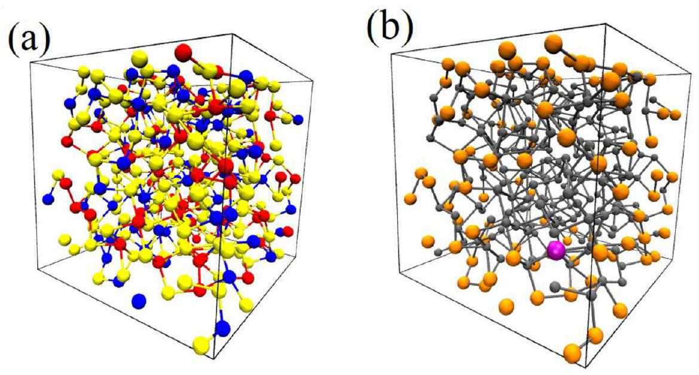
Figure 1. (a) Perspective views of the amorphous 225 GST system of 315 atoms used to simulate the non-equilibrium cascades. The individual number of atoms are $\mathrm{Ge}=70, \mathrm{Sb}=70$ and $\mathrm{Te}=175$, highlighted as blue, red and yellow spheres, respectively. The cubic simulation box has a cell size of $21.65 \AA$. (b) The stochastic boundary-conditions approach, as implemented in the modelled system. The boundary atoms, highlighted in orange, undergo Langevin (NVT) dynamics, while the rest of the atoms, highlighted in grey, undergo NVE Born-Oppenheimer MD. The Te thermal-spike atom, inside the impact region, is highlighted in magenta and it was fired along the body diagonal of the simulation cell. It is noted that orange and grey spheres can correspond to any of the atomic species of the glass structure, i.e. they can be either Ge or Sb or Te atoms.

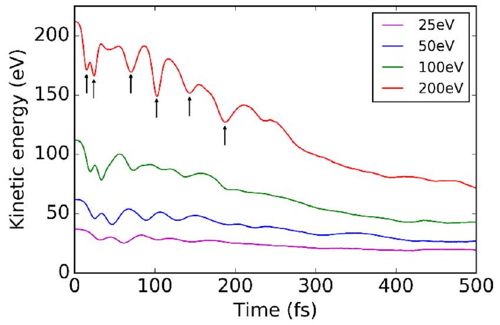
Figure 2. Kinetic energy of the modelled system as a function of time, for the four different thermal-spike energies simulated in this work, during the first 0.5 ps of each molecular-dynamics simulation. In the 200 eV cascade, the vertical arrows indicate collisions that transfer large amounts of kinetic energy to another atom (or atoms) and effectively spread the cascade into separate trajectories very quickly after the firing of the primary knock-on atom inside the glass structure.

inside the glass structure. This atom, which is highlighted in magenta in figure 1(b), was given an initial velocity consistent with kinetic energies of $25 \mathrm{eV}, 50 \mathrm{eV}, 100 \mathrm{eV}$, or 200 eV and it was fired along the body diagonal of the simulation cell to maximise the likely range of travel within the amorphous network. The system was then allowed to evolve with the specific Te atom representing the primary knock-on atom (PKA).

The CP2K code was used for implementation of the stochastic boundary-conditions approach and to perform $a b$ initio molecular-dynamics simulations [36]. A full description related to the MD simulations of the radiation-damage cascades and the electronic stucture calculations is provided in [9]. It is worth mentioning here that the simulation time

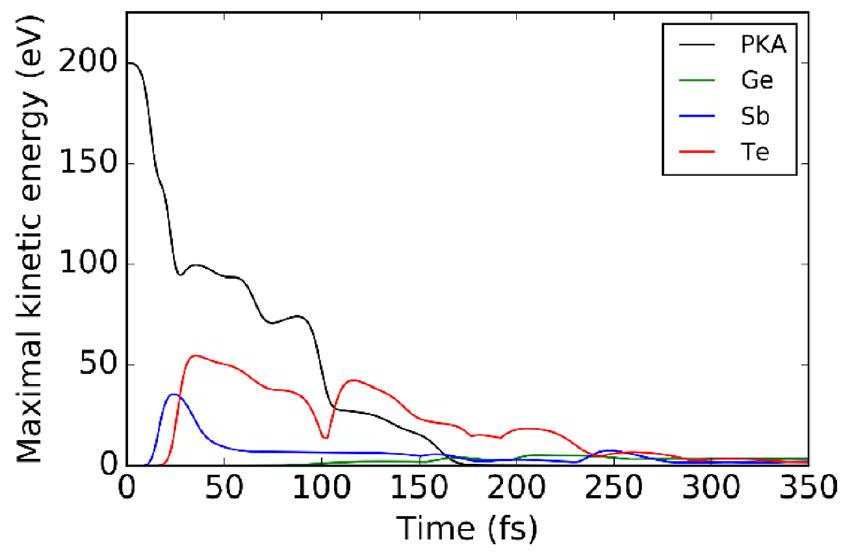
Figure 3. Time dependence of the kinetic energy of the Te primary knock-on atom and the maximum kinetic energy of $\mathrm{Ge}, \mathrm{Sb}$ and Te recoils within the glass network for the 200 eV non-equilibrium cascade. It can be seen that, during the first 0.25 ps of the simulation, the PKA lost all of its initial kinetic energy.

was sufficient for each cascade to equilibrate at 300 K (taking $11 \mathrm{ps}, 12 \mathrm{ps}, 15 \mathrm{ps}$ and 16 ps for the $25 \mathrm{eV}, 50 \mathrm{eV}, 100 \mathrm{eV}$ and 200 eV PKA energies, respectively), while a combination of different timesteps was used for the integration of the equations of motion during the casade events to treat smoothly the main collisional phase of the cascades.

## 3. Results and discussion

The primary knock-on atom, after its launch, travels through the glass network transferring large amounts of momentum to the atoms along its path within the amorphous structure and this corresponds to the principal component of the non-equilibrium cascade. Subsequently, the atoms which are recipients of momentum get knocked from their positions and, in the case that they have acquired enough kinetic energy, they are

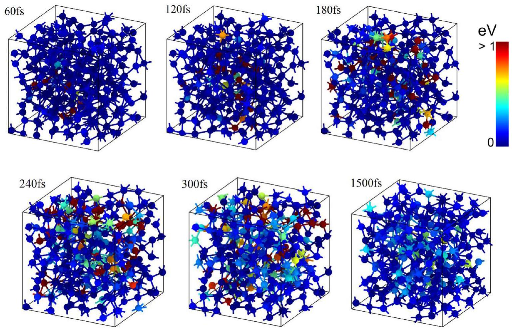
Figure 4. Kinetic energy of all the atoms for six configurations of the modelled system, at different times, during the 200 eV nonequilibrium cascade. The time evolution of the kinetic energy highlights the time evolution of the cascade event. The collisions due to the primary and secondary knock-on atoms lead to an increase of the kinetic energy for several atoms inside the glass structure. At 1.5 ps after the beginning of the molecular-dynamics simulation, the atoms in the box have a negligible amount of kinetic energy, indicating not only the end of the non-equilibrium cascade but also the rapid dissipation of heat due to the stochastic boundary-conditions approach. Furthermore, the highlighted snapshots provide an insight on the spatial evolution of the cascade witihin the amorphous network.

able to generate more collisions, separately from the PKA, and hence contribute to the spatial expansion of the whole event throughout the glass structure.

The average kinetic energy of the modelled system as a function of the simulation time is shown in figure 2 for the four different initial thermal-spike energies during the first 0.5 ps of each simulation event. The arrows (for the 200 eV PKA energy curve) highlight the moments of close approach in which the PKA, or another energetic atom, interacts strongly with another atom within the glass, corresponding to a sudden transfer of kinetic energy from one atom to another atom or group of atoms that happen to suffer a collision [3, 13]. A comparison between the different energies shows the dissimilar ability of the PKA to cause more collisions within the glass network. In addition, the fast decrease of the average kinetic energy of the system highlights, from one side, the short lifetime of the cascade inside the host glass and, from the other side, the dissipation of heat from the NVT-like thermostat layer on the faces of the simulation box.

For the 200 eV thermal-spike simulation, the Te PKA experienced its first collision with an Sb atom after only 0.02 ps from the beginning of the simulation, while almost instantaneously afterwards (at 0.026 ps ), it suffered a second collision with a Te atom. These two knock-on atoms gained enough energy from the impact with the PKA in order to initiate more collisions towards different directions within the glass structure. The PKA travels for about 0.08 ps without any further
major collisions, indicating that it was deflected into a cavity within the glass network, before undergoing another collision with a Te atom at 0.11 ps . The two final collisions of the PKA in the simulation occured at 0.15 ps and 0.18 ps with Sb and Te atom, respectively.

The time dependence of the kinetic energy of the Te PKA and the maximum kinetic energy of $\mathrm{Ge}, \mathrm{Sb}$ and the rest of the Te atoms among all the atoms contained in the simulation box, shown in figure 3 for the 200 eV thermal-spike simulation, provides further details for the short-lived nonequilibrium cascade and it can be used in order to convey a sense of the strength, timing and duration of the interactions involved in the simulated cascade [12]. The PKA lost $90 \%$ of its initial energy within the first 0.14 ps of the simulation, while the maximum kinetic energy for all atomic species in the modelled system is negligible after 0.35 ps and, in practice, the radiation-damage cascade event is complete. It can also be noted that the maximum kinetic energy of Te atoms is higher than that of Sb atoms, which in turn is higher than that of Ge atoms. The lower concentration of Ge and Sb atoms in 225GST may account for the lower energy transfer, while another possible explanation could be due to the difference of the masses of the atomic species, viz. $\mathrm{Te}>\mathrm{Sb}>\mathrm{Ge}$, which probably results in Ge atoms being able to get away from the PKA faster before collision.

Six snapshots along the molecular-dynamics trajectory for the 200 eV thermal-spike initial energy were selected

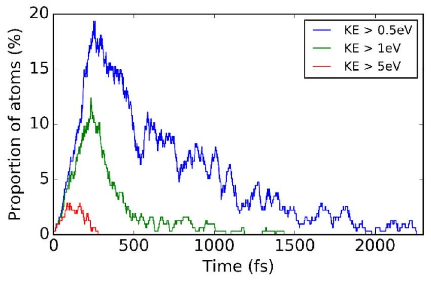
Figure 5. Percentage of atoms with kinetic energy (KE) greater than $0.5 \mathrm{eV}, 1.0 \mathrm{eV}$, or 5.0 eV as a function of time for the 200 eV thermal-spike simulation. The short life-time of the fast atoms is indicative of the rapid thermal quench for the non-equilibrium cascade inside the glass structure.

(at $60,120,180,240,300$ and 1500 fs ) in order to highlight the evolution of the kinetic energy inside the simulation box and these are shown in figure 4. Atoms with kinetic energies larger than 1 eV are highlighted in red, while a colour palette between blue and red indicates the rest of the various energetic atoms in the glass structure during the non-equilibrium cascade simulation. The launch of the thermal spike causes collisions inside the glass structure, which leads to several atoms gaining considerable amounts of kinetic energy and hence contributing to the evolution of the cascade within the amorphous network. The higher kinetic energies of the atoms in the whole system are most evident during the first 240-300 fs of the simulated cascade, while the corresponding snapshots provide also a view of the spatial range of the cascade event inside the glass. Figure 3 indicates that the maximum kinetic energy for all atomic species in the modelled system is insignificant after 350 fs from the beginning of the simulation, while from figure 5 it can be seen that the number of atoms with kinetic energies larger than 1 eV gradually drops to zero at around 1.5 ps . The final MD snapshot from figure 4 (at 1500 fs ) verifies this behaviour and it is indicative of the fast thermal quench of the non-equilibrium cascade.

The rapid time evolution of the non-equilibrium cascade indicates a quite short time period when atoms have considerable kinetic energy [13]. The number of atoms exceeding predefined kinetic-energy threshold values of $0.5 \mathrm{eV}, 1.0 \mathrm{eV}$ and 5.0 eV were counted in order to quantify this behaviour, and these are shown in figure 5 for the 200 eV thermal-spike simulation. The highest threshold corresponds to a measurement of atoms which are moving fast within the glass structure, whereas the lowest threshold can be associated with atoms which are responsible for the heat dissipation of the cascade [14]. The maximum number of the fast atoms, corresponding to approximately $3 \%$ of the total number of atoms, was achieved at 0.1 ps and decays to zero after 0.28 ps . In contrast, the calculated percentage for the atoms with a 0.5 eV energy threshold is relatively large, reaching a value of almost $20 \%$ at 0.25 ps , before it gradually drops to zero at around 2 ps . Consequently, thermal diffusion is the dominant

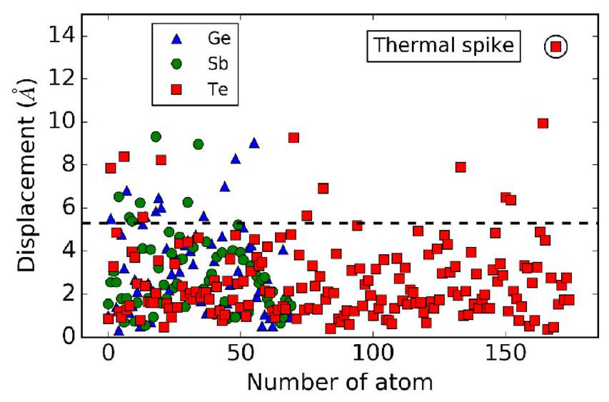
Figure 6. Atomic displacements of $\mathrm{Ge}, \mathrm{Sb}$ and Te atoms between the geometry of the final equilibrated glass structure, after the 200 eV thermal-spike simulation, and the geometry of the glass model before the non-equilibrium cascade. The displacement of the primary knock-on Te atom is circled, which had the largest movement inside the glass stucture during the simulation. The atoms above the dotted horizontal line are those mainly involved in the collisions with the PKA and the secondary cascades within the glass network.

process during the rest of the molecular-dynamics simulation, in which the kinetic energy is conducted away into the Langevin-thermostat coupled region. The short duration of the fast atoms is also in agreement with the rapid loss of the PKA kinetic energy seen in figure 3.

In this work, a Monte Carlo simulation with the binarycollision approximation, as implemented in the Transport of Ions in Matter (TRIM) code [37], was performed in order to estimate the projected range of a Te ion in the target 225GST glass model. For an initial thermal-spike energy of 200 eV , the Monte Carlo simulation predicted that the penetration depth of the Te atom in the glass structure should be $13 \AA$. The displacement of the Te PKA from the molecular-dynamics trajectory for the 200 eV radiation-damage cascade simulation was also computed in order to compare it with the predicted value from the TRIM simulation. By considering that the end of the cascade event occurs when the PKA has lost $75 \%-90 \%$ of its initial thermal-spike energy, the displacement of the Te PKA was calculated for selected snapshots in the time range of 100-140 fs, which corresponds to the respective energyrange loss. In this time domain, the 'end of the cascade' inside the glass structure would be very well representative, and the calculated displacement for the Te PKA ranges between $12.2 \AA$ and $14.2 \AA$. Hence, the displacement of the thermal spike from the molecular-dynamics trajectory for the 200 eV radiation-damage cascade is in very good agreement with the predicted projected range from the Monte Carlo TRIM simulation for the same initial energy, highlighting not only the quality of the $a b$ initio molecular-dynamics simulations, but also the realistic representation of the radiation-damage events modelled in this study for the amorphous material.

To investigate the atomic diffusivity inside the glass structure, the atomic displacements for the three atomic species ( $\mathrm{Ge}, \mathrm{Sb}$ and Te ) between the initial geometry of the glass sample, before the firing of the cascade, and the final
equilibrated structure at 300 K , were calculated for the 200 eV thermal-spike simulation. The displacements of all 315 atoms are presented in figure 6 and they provide a sense of the spatial range of motion for the atoms within the glass network due to the generated collisions from the non-equilibrium cascade. One can see that the primary knock-on Te atom exhibits the largest displacement during the simulated event, which reflects the large configurational space that the PKA explored during the cascade. The atoms above the dotted horizontal line correspond to those which experienced the majority of the collisions during the simulation and they have moved by distances beyond the second coordination shell of each atomic species.

For the 200 eV ion-irradiation simulation, the time evolution of the centre of mass of the computational cell was followed in order to investigate the impact of the cascade in the whole system. The position of the centre of mass in the initial glass model, before the irradiation event, was calculated, in $\AA$, to be $(10.83,10.83,10.83)$. During the radiation-damage simulation, and more specifically at the time range which corresponds to the end of the cascade event (as estimated above), the average position of the centre of mass was calculated to be (10.87, 10.87, 10.87), while at the end of the simulation, the position of the centre of mass for the final equilibrated glass structure was computed to be (11.26,11.25,11.25). Hence, a difference of $\sim 0.4 \AA$ was quantified for the position of the centre of mass of the computational cell before and after irradiation. We believe that such a difference is not crucial, and therefore we can assume that the propagation of linear momentum inside the glass model due to the impact of the radiation-damage cascade event was insignificant.

In our recent work [9], the local structural environment of the glass samples, before and after the thermal-spike cascades, was analysed through the total radial distribution functions and the average coordination numbers around $\mathrm{Ge}, \mathrm{Sb}$ and Te atoms. The results demonstrated that the short-range order of the amorphous 225 GST exhibits a good overall structural recovery after exposure to radiation-damage cascade events with initial thermal-spike energies up to 200 eV . However, the radial distribution functions cannot be measured directly experimentally; therefore the values obtained from the molec-ular-dynamics simulations cannot be compared directly to experimental data. Nevertheless, it is feasible to compare the simulated results to neutron and x-ray scattering experiments by calculating the static structure factor.

Therefore, in order to further assess the quality of the glass models, after equilibration of the cascades inside the glass structure, the x-ray diffraction patterns were evaluated and compared with previously reported experimental data [38]. The total x-ray scattering function, $S(q)$, was computed for the amorphous structure for each thermal-spike energy from the partial structure factors, weighted by the q -dependent x-ray atomic form factors, while the partial structure factors were obtained, in turn, from the fast Fourier transform of the pair distribution functions calculated from the glass models at 300 K . The calculated $S(q)$ of the final equilibrated structure for the $50 \mathrm{eV}, 100 \mathrm{eV}$ and 200 eV initial thermal-spike energies are shown in figure 7 and comparison with the x-ray

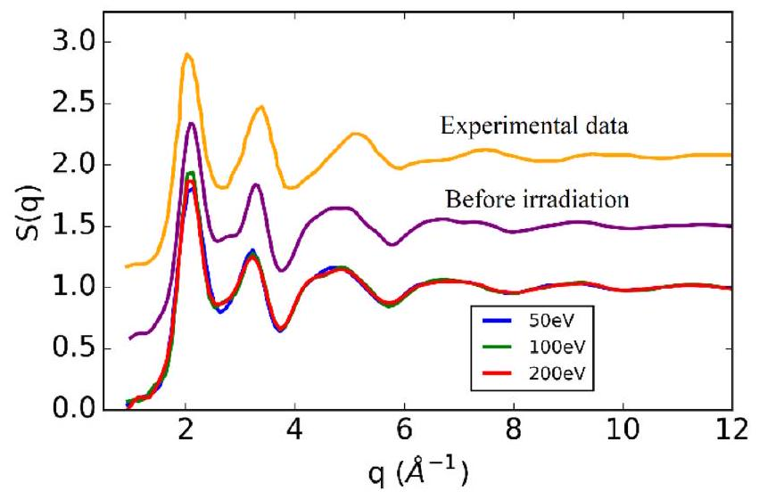
Figure 7. Calculated total x-ray structure factors of the final equilibrated amorphous 225 GST models at 300 K for three different thermal-spike energies. Comparison is made with an experimental $S(q)$ from x-ray diffraction pattern data, taken from [38], and with the total $S(q)$ of the 225 GST glass model before irradiation. Simulated and experimental results are in very good agreement and this comparison serves as a validity check of the approach followed in this work to simulate non-equilibrium cascades. Furthermore, no significant differences can be observed in the $S(q)$ before and after irradiation, which highlights the structural recovery of the glass structure after exposure to the thermal-spike events. It is noted that the experimental structure factor and the one calculated for the glass before the ion-irradiation simulations have been shifted vertically by 1.0 and 0.5 units, respectively, for clarity.

diffraction data from [38], as well as with the calculated $S(q)$ for the glass before the irradiation events, reveals excellent agreement, which is indicative of the structural recovery of the amorphous 225 GST network after equilibration of the cascades. In addition, the good agreement of the simulated results with the experimental study highlights the validity of the glass models and the efficiency of the stochastic boundary-conditions approach implemented in the current work to model non-equilibrium cascades inside the glass structure.

De Bastiani et al [7] studied experimentally the structural evolution of irradiated amorphous as-deposited 225 GST by using Raman spectroscopy. The amorphous films were irradiated at room temperature by 120 keV ions and their results suggested that considerable structural modifications occur in the amorphous phase after the irradiation events, while the observed Raman spectra can be assigned to several contributions. An increase in homopolar bonds with an atomic configuration involving edge-sharing $\mathrm{GeTe}_{4}$ tetrahedra was presumed to give the most dominant effect [7]. However, it is highly unlikely that amorphous 225 GST is composed only of such structural units; therefore, the authors in [7] surmised that the observed higher energy Raman peak could also be due to $\mathrm{Te}-\mathrm{Te}$ interactions [39] and/or the stretching modes of a $\mathrm{Sb}_{2} \mathrm{Te}_{3}$ component [40]. It can be noted that the different local order of the amorphous structures is quite difficult to identify experimentally in ternary alloys because of the variety of parameters that can play a role in the analysis. On the contrary, atomistic modelling can shed light on the particular type of bonding and the relevant transformations occurring during the radiationinduced cascade simulations.

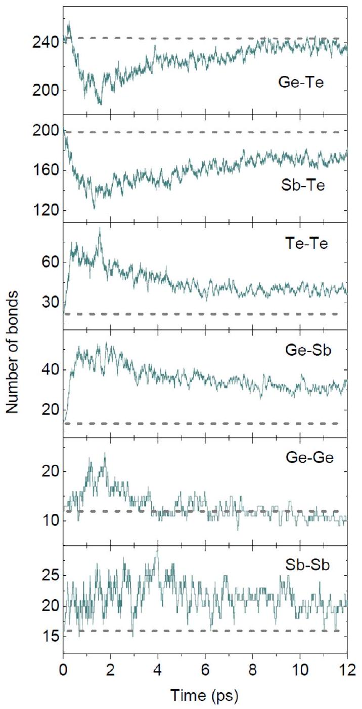
Figure 8. Time evolution for every type of atomic bond within the glass network of the amorphous 225 GST model for the 200 eV thermal-spike simulation. The proportion of homopolar bonds ( $\mathrm{Te}-\mathrm{Te}, \mathrm{Ge}-\mathrm{Sb}$ and $\mathrm{Sb}-\mathrm{Sb}$ ) increases, whereas the population of the heteropolar bonds ( $\mathrm{Ge}-\mathrm{Te}$ and $\mathrm{Sb}-\mathrm{Te}$ ) decreases during the nonequilibrium cascade. These modifications in the atomic bonding highlight the nature of the local structural changes that occurred within the glass structure due to the impact of the cascade event. It is noted that the dashed lines show the number of the particular bonds in the 225 GST model before the simulated cascade. Bond formation in the simulated structure was specified by using a radial cut-off distance of $3.2 \AA$.

In [9], it was shown that the total number of bonds in the final equilibrated structures at 300 K remained at a similar value to that before the cascade events for every thermal-spike energy studied. In contrast, the time evolution of the proportion of homopolar bonds in the simulated glasses revealed an increase of such bonds within the amorphous network, while also a systematic reduction in the proportion of cornersharing $\mathrm{GeTe}_{4}$ tetrahedra, correlated with the increase of the homopolar bonds, was identified with increasing thermalspike energy in the glass models.

In this work, a more detailed analysis related to all the possible bond combinations of the three atomic species in

225 GST was performed and is presented in figure 8 for the 200 eV thermal-spike simulation. The temporal evolution of the atomic bonding reveals the manifestation of structural changes in the glass network during the simulated cascade event. The proportion of $\mathrm{Te}-\mathrm{Te}, \mathrm{Ge}-\mathrm{Sb}$ and $\mathrm{Sb}-\mathrm{Sb}$ homopolar bonds increases in the glass model during exposure to the nonequilibrium cascade, whereas the proportions of $\mathrm{Ge}-\mathrm{Te}$ and $\mathrm{Sb}-\mathrm{Te}$ heteropolar bonds decrease. This destruction and formation of bonds inside the glass model during the fast thermal quench of the cascade highlights the specific structural rearrangements that occurred within the glass network due to the impact of the non-equilibrium cascade. It is noted that, throughout the simulation of the cascade event, bond formation between two nearby atoms was considered to take place as long as the interatomic distance between these two atoms is shorter than or equal to a cut-off distance of $3.2 \AA$.

For the purpose of the current study, the atomic geometries of the initial 225 GST model and the final equilibrated structure at 300 K after the 200 eV ion-irradiation simulation were optimized with density-functional theory (DFT) [41], using the generalised-gradient approximation (GGA) with the Perdew-Burke-Ernzerhof (PBE) exchange-correlation functionals [42]. The Broyden-Fletcher-Goldfarb-Shanno (BFGS) algorithm was applied in the geometry optimizations, and the forces on atoms were minimized to within 0.023 eV $\AA^{-1}$. Subsequently, the Bader ionic charges were computed from the total electronic charge density by using the scheme described in [43].

The average Bader charges (in atomic units) for $\mathrm{Ge}, \mathrm{Sb}$ and Te atoms were $0.34,0.41$ and -0.30 , respectively, for the initial glass model, while average Bader charges of $0.32,0.36$ and -0.27 were calculated for $\mathrm{Ge}, \mathrm{Sb}$ and Te atoms, respectively, for the glass after the 200 eV radiation-damage simulation. It can be observed that the average Bader charges of Ge and Sb atoms are slightly smaller after irradiation, whereas the average Bader charge of Te atoms has been increased slightly. The distributions of the calculated Bader ionic charges of the glass model before and after irradiation are compared in figure 9. It can be seen that, in the 225GST glass after the 200 eV radiation-damage cascade event, the distribution of ionic charges tails more significantly towards zero, which is indicative of the increase of the amount of homopolar bonds within the amorphous network after irradiation. This observation agrees very well with the increase of specific homopolar bonds quantified from the analysis presented in figure 8 for the 200 eV ion-irradiation simulated event.

In our previous work [9], we calculated the electronic structure of the amorphous 225 GST model, before and after irradiation, by performing hybrid-functional DFT calculations. We demonstrated that the absolute value of the Kohn-Sham band gap was not significantly affected by the radiation-damage cascade events, highlighting the ability of the material to be radiation-tolerant. However, visualization of the bottom of the conduction band of the simulated glass structures revealed some differences in the structural character of the electron localisation within the amorphous network during propagation of the cascade [9].

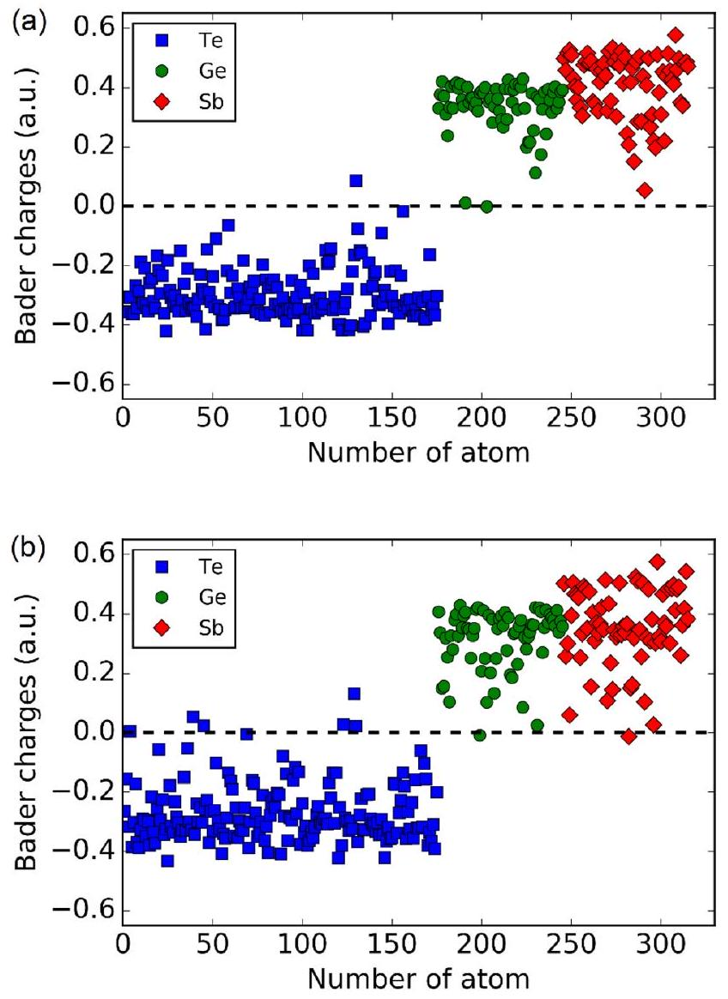
Figure 9. Bader ionic-charge distribution of $\mathrm{Ge}, \mathrm{Sb}$ and Te atoms in: (a) the glass model before the non-equilibrium cascade; and (b) the final equilibrated glass structure, after the 200 eV thermal-spike simulation. The distribution of the Bader ionic charges tails towards to zero appreciably more in the glass after the radiation-damage cascade event, which highlights the increase of the population of homopolar bonds within the amorphous network after irradiation. It is noted that each point corresponds to an individual atom in the 315-atoms 225GST glass model.

In this work, the degree of localisation of each singleparticle Kohn-Sham state in the electronic structure of the amorphous model, before and after the 200 eV radiationdamage cascade event, was characterised more quantitatively, by calculating the inverse participation ratio (IPR) spectrum. The IPR can be calculated for each Kohn-Sham state in the valence and conduction band, and it ranges between 0 and 1 . A small value corresponds to a delocalised Kohn-Sham orbital, whereas a large value indicates localisation of the Kohn-Sham orbital around specific covalent bond(s). It can be noted that this method has been previously used to characterize the localisation of vibrational and electronic states in amorphous materials [44-47].

The IPR spectrum for the total electronic density of states of the amorphous 225 GST model is shown in figure 10, for the glass structure before the non-equilibrium cascades and for the final equilibrated structure after the 200 eV ionirradiation simulation. The results emphasize the different localised nature of the Kohn-Sham states in a region deep in the valence band of the electronic structure. In particular, the Kohn-Sham states are considerably more localized in

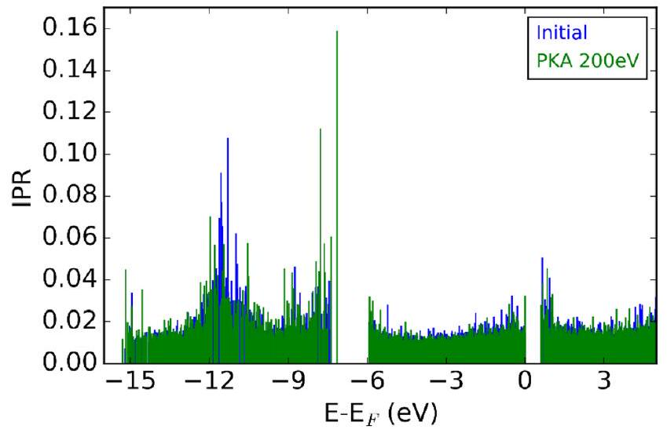
Figure 10. Inverse participation ratio (IPR) spectrum for the electronic density of states of the amorphous 225GST model before irradiation (blue) and after the 200 eV thermal-spike simulation (green). Large IPR values indicate localized states and small IPR values correspond to delocalized states. Different degrees of localization can be observed at the band edges (close to the band gap), as well as at certain bands deeper in the valence band.

the band around -8 eV after the radiation-damage cascade event, while, in contrast, they are less localized in the band around -12 eV . It can also be observed that the tail states around the valence-band maximum and the conduction-band minimum edges of the electronic structure have different degrees of localisation.

In this work, we also performed extra electronic-structure calculations along the molecular-dynamics trajectory for the 200 eV radiation-damage cascade simulation, in the time domain between 5 ps and 10 ps . The electronic structures of five configurations at 5.5, 6, 7, 8 and 9 ps were calculated by performing geometry optimization, for each of them, with the hybrid functional PBE0 [48]. Any defect gap states and the bottom of the conduction band were analyzed in order to get an insight into the evolution of the electronic structure for the irradiated glass model during the intermediate dynamics of the MD simulation. The lowest unoccupied molecular orbital (LUMO) of the irradiated glass structure is shown in figure 11 for three of the above calculated snapshots of the MD trajectory, and it is compared with the defect state that appeared in the electronic structure of the amorphous model at 5 ps after the beginning of the simulation [9].

The defect state identified in the electronic structure of the glass during the ion-irradiation simulation (at 5 ps ) is strongly localized on Sb and Te atoms, which are members of two connected 4 -fold rings. In a snapshot shortly after this, at 5.5 ps , there is no defect in the band gap of the amorphous model, while the LUMO state is rather delocalized within the amorphous network. The LUMO state, after 7 ps from the beginning of the simulation, appears to be localized in isolated parts of the computational cell and it seems not to be clearly related to any particular structural units. Finally, at 9 ps , the bottom of the conduction band is localized in a structural pattern which corresponds to a chain of Sb and Te atoms. Overall, by following the evolution of the electronic structure of the amorphous model during the ion-irradiation simulation, we can observe that the structural character of the bottom of the

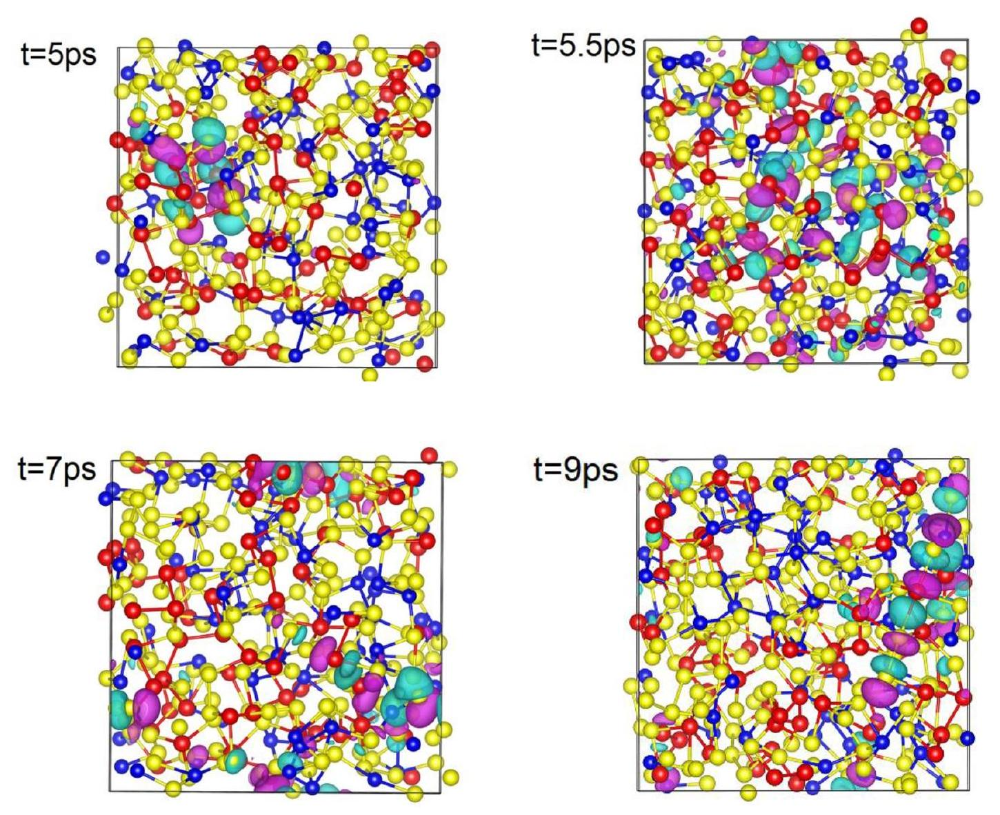
Figure 11. The defect state in the electronic structure of the amorphous 225 GST model at 5 ps of the molecular-dynamics trajectory during the 200 eV thermal-spike simulation is localized on two connected 4-fold rings consisting of Sb and Te atoms, while the lowest unoccupied electronic state (LUMO) at 9 ps is localized on a chain consisted of Sb and Te atoms. At 5.5 ps , the LUMO state is delocalized within the amorphous network, while at 7 ps , it is localized on no particular structural units. Ge atoms are blue, Sb are red, and Te are yellow. The light green and purple isosurfaces, in every configuration, are plotted with an isovalue of +0.015 and -0.015 , respectively.

conduction band, as well as its degree of localization, vary along the molecular-dynamics trajectory. These observations can be associated with the evolution of the chemical order of the amorphous network and the relevant rearrangements that have been observed above.

## 4. Summary

Non-equilibrium radiation cascades in amorphous 225 GST were modelled by performing thermal-spike simulations. A stochastic boundary-conditions approach has been successfully implemented to perform correctly ab initio nonequilibrium molecular-dynamics simulations. The impact region of the displacement cascade is heated by the passage of the projectile atom, and then is rapidly quenched, leading to a process that mimics a fast local thermal quenching. The heat-dissipation region contains the boundary atoms inside a layer of $1 \AA$ thickness at the faces of the cubic simulation box and it serves to dampen thermal motion as heat reaches the edges, and hence to avoid the diverging cascade of damage from atoms bouncing back from the boundary. The system follows a Newtonian cooling process and hence the non-equilibrium cascade effectively behaves as a fast thermal quench.

The ion-irradiation process almost always involves manybody collisions between atoms within the glass network. Based on the simulated results, the primary knock-on atom lost the majority of its initial kinetic energy during the first 250 fs of the simulation and when the cascade was close to its maximum extent. During the rest of the MD simulation, the high-energy ions and recoil atoms slow down and eventually reach kinetic energies less than 1 eV in the glass model. The observed behaviour, from the analysis of the kinetic profile of the cascade, reflects the stochastic nature of the collisional phase with respect also to the directional complexity of the amorphous network and the presence of flexible atomic bonds.

Even though the short- and medium-range order of amorphous 225GST shows remarkable healing and reversibility after the radiation-damage cascade events [9], structural modifications of the chemical order occurred within the glass structure and are quantified in this work. The population of specific homopolar bonds increases in the glass during the non-equilibrium cascade, whereas the proportion of heteropolar bonds decreases. The distribution of the Bader charges for the atomic species in the glass models before and after irradiation verifies the increase of the homopolar bonds from an electronic-structure point of view, while the differences in
the IPR spectrum highlight how the structural modifications affect the localized states in the electronic density of states of the material.

The output from a Monte Carlo binary-collision approximation simulation for a Te primary knock-on atom with 200 eV initial energy in the target glass gave a projected range which is in accordance with the calculated atomic displacement at the end of the cascade event from the $a b$ initio molec-ular-dynamics simulation. This excellent agreement further highlights the quality of the MD simulations which can be used as an accurate mimic for the evolution of ion-irradiation events inside the glass.

It should be noted that, usually in the literature, radiationdamage cascade events in crystalline structures, simulated with classical MD, are repeated multiple times, in the same direction for a given PKA energy or to a few hundred random directions, in order to accumulate statistics and achieve a stabilization of the standard deviation. In our work of modelling ion irradiation in amorphous 225 GST with ab initio MD, repeating the simulations for every energy of the PKA is computationally prohibitively expensive. The more localized bonding in the amorphous network results in bonds breaking and reforming locally within the glass structure; thus, the effects of the ion irradiation on the local structure are more easily identified and characterized. Therefore, we believe that the isotropic nature of the glass makes it less sensitive to the firing direction of the PKA, compared to a crystalline structure, and hence to the initiation of the radiation-damage cascade inside the model.

We also note that, even though the thermal-spike energies modelled in our work are much lower than the experimental values, we treat the molecular-dynamics trajectories generated during our ion-irradiation simulations and the respective radia-tion-induced damage inside our glass models as representative of the effect that the tail-end of the ion trajectory would have within the amorphous network in the bulk structure. Overall, we believe that our modelling results, albeit lacking some statistical accuracy and the modelled energies cannot be compared quantitatively with the experimental values, they can be considered as fully adequate to be able to characterize qualitatively the types of local structures before, during and after ion irradiation and to demonstrate the nature of radiation-damage cascades in amorphous 225 GST . Furthermore, the results of the calculations are in good agreement with experimental data for ion irradiation in 225 GST , as well as with our Monte Carlo simulations, which gives us confidence about the accuracy of our molecular-dynamics simulations and the realistic modelling of the radiation-damage cascade in the amorphous material under study.

In a nutshell, the results presented in this work demonstrate that first-prinicples computer simulations can be used in order to model non-equilibrium radiation-induced cascades in amorphous materials with initial thermal-spike energies up to 200 eV . Atomistic simulations of such events are able to deepen the interpretation of ion irradiation in glasses and provide useful insight into the dynamical picture of the damage cascade in the host structure.

## Acknowledgments

This work was supported by the UK Engineering and Physical Sciences Research Council (EPSRC) grant EP/N022009 ('Development and Application of Non-Equilibrium Doping in Amorphous Chalcogenides').

FCM would like to acknowledge the EPSRC Centre for Doctoral Training in Computational Methods for Materials Science for funding under grant number EP/L015552/1.

Via our membership of the UK's HEC Materials Chemistry Consortium, which is funded by EPSRC (EP/L000202), this work used the ARCHER UK National Supercomputing Service (www.archer.ac.uk).

KK acknowledges the use of the UCL Grace High Performance Computing Facility (Grace@UCL), and associated suppport services, in the completion of this work.

## ORCID iDs

K Konstantinou © https://orcid.org/0000-0003-1291-817X

## References

[1] Darkins R and Duffy D M 2018 Comput. Mater. Sci. 147145
[2] Delaye J M, Peuget S, Bureau G and Calas G 2011 J. NonCryst. Solids 3572763
[3] Prasai K and Drabold D A 2014 Nanoscale Res. Lett. 9594
[4] Jolley K and Smith R 2016 J. Nucl. Mater. 479347
[5] De Bastiani R, Piro A M, Crupi I, Grimaldi M G and Rimini E 2008 Nucl. Instrum. Methods Phys. Res. B 2662511
[6] De Bastiani R, Carria E, Gibilisco S, Grimaldi M G, Pennisi A R, Gotti A, Pirovano A, Bez R and Rimini E 2009 Phys. Rev. B 80245205
[7] De Bastiani R, Piro A M, Grimaldi M G, Rimini E, Baratta G A and Strazzulla G 2008 Appl. Phys. Lett. 92241925
[8] Carria E, Mio A M, Miritello M, Gibilisco S, De Bastiani R, Pennisi A R, Bongiorno C, Grimaldi M G and Rimini E 2010 Electrochem. Solid-State Lett. 13 H317
[9] Konstantinou K, Lee T H, Mocanu F C and Elliott S R 2018 Proc. Natl Acad. Sci. 1155353
[10] Dunn A R and Duffy D M 2011 J. Appl. Phys. 110104307
[11] Åhlgren E H, Kotakoski J, Lehtinen O and Krasheninnikov A V 2012 Appl. Phys. Lett. 100233108
[12] Chen P H, Avchachov K, Nordlund K and Pussi K 2013 J. Chem. Phys. 138234505
[13] Christie H J, Robinson M, Roach D L, Ross D K, SuarezMartinez I and Marks N A 2015 Carbon 81105
[14] Buchan J T, Robinson M, Christie H J, Roach D L, Ross D K and Marks N A 2015 J. Appl. Phys. 117245901
[15] Kilymis D A, Delaye J M and Ispas S 2016 J. Chem. Phys. 145044505
[16] Konstantinou K, Sushko P V and Duffy D M 2016 Phys. Chem. Chem. Phys. 1826125
[17] Andersen H C 1980 J. Chem. Phys. 722384
[18] Nose S 1984 Mol. Phys. 52255
[19] Nose S 1984 J. Chem. Phys. 81511
[20] Berendsen H, Postma J, Vangunsteren W, Dinola A and Haak J 1984 J. Chem. Phys. 813684
[21] Hoover W G 1985 Phys. Rev. A 311695
[22] Holian B L and Ravelo R 1995 Phys. Rev. B 5111275
[23] Hernandez E 2001 J. Chem. Phys. 11510282
[24] Hu Y and Sinnott S 2004 J. Comput. Phys. 200251
[25] West D and Estreicher S K 2006 Phys. Rev. Lett. 96115504
[26] Allen M P and Tildesley D J 1991 Computer Simulation of Liquids (New York: Oxford University Press)
[27] Adelman S and Doll J 1976 J. Chem. Phys. 642375
[28] Toton D, Lorenz C D, Rompotis N, Martsinovich N and Kantorovich L 2010 J. Phys.: Condens. Matter 22074205
[29] Seddon A B 1995 J. Non-Cryst. Solids 18444
[30] Wuttig M and Yamada N 2007 Nat. Mater. 6824
[31] Lacaita A L and Wouters D J 2008 Phys. Status Solidi a 2052281
[32] Raoux S, Welnic W and Ielmini D 2010 Chem. Rev. 110240
[33] Bez R and Pirovano A 2004 Mater. Sci. Semicond. Process. 7349
[34] Burr G W, Kurdi B N, Scott J C, Lam C H, Gopalakrishnan K and Shenoy R S 2008 IBM J. Res. Dev. 52449
[35] Kantorovich L and Rompotis N 2008 Phys. Rev. B 78094305
[36] VandeVondele J, Krack M, Mohamed F, Parrinello M, Chassaing T and Hutter J 2005 Comput. Phys. Commun. 167103
[37] Ziegler J F, Biersack J P and Littmark U 1995 The Stopping and Range of Ions in Solids (New York: Pergamon)
[38] Kohara S et al 2006 Appl. Phys. Lett. 89201910
[39] Tominaga J and Atoda N 1999 Japan. J. Appl. Phys. 38 L322
[40] Andrikopoulos K S, Yannopoulos S N, Kolobov A V, Fons P and Tominaga J 2007 J. Phys. Chem. Solids 681074
[41] Kohn W and Sham L J 1965 Phys. Rev. Lett. 140 A1133
[42] Perdew J P, Burke K and Ernzerhof M 1996 Phys. Rev. Lett. 773865
[43] Henkelman G, Arnaldsson A and Jonsson H 2006 Comput. Mater. Sci. 36354
[44] Dong J and Drabold D 1996 Phys. Rev. B 5410284
[45] Caravati S, Bernasconi M, Kühne T D, Krack M and Parrinello M 2009 J. Phys.: Condens. Matter 21255501
[46] Kalikka J, Akola J, Jones R O, Kohara S and Usuki T 2012 J. Phys.: Condens. Matter 24015802
[47] Strand J, Kaviani M, Gao D, El-Sayed A-M, Afanas'ev V V and Shluger A L 2018 J. Phys.: Condens. Matter 30233001
[48] Guidon M, Hutter J and VandeVondele J 2009 J. Chem. Theory Comput. 53010

