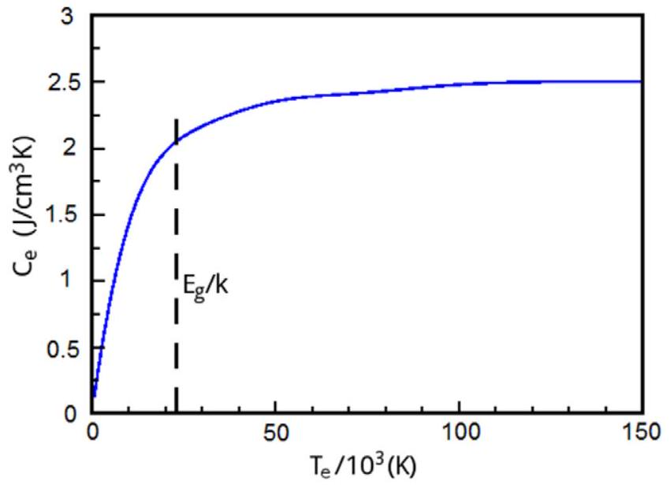
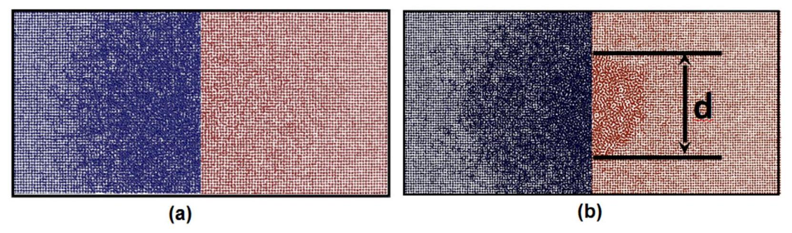
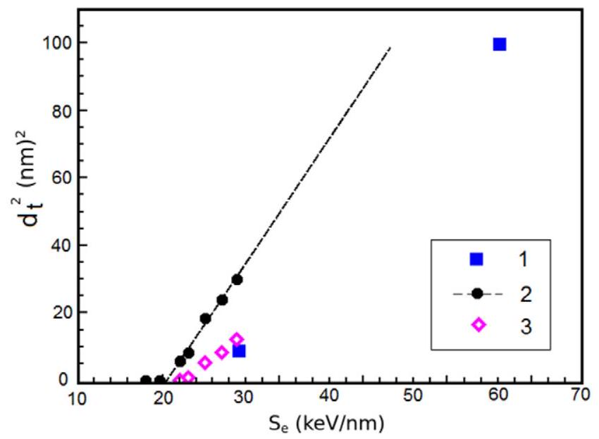
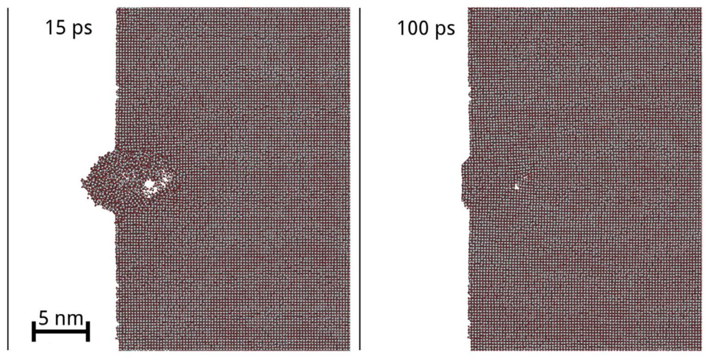
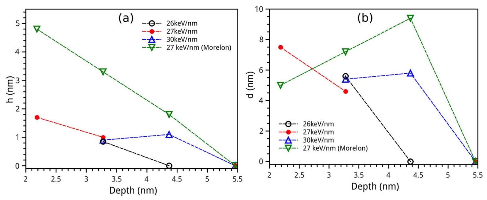

PAPER

## Atomistic simulation of ion track formation in $\mathrm{UO}_{2}$

To cite this article: V V Pisarev and S V Starikov 2014 J. Phys.: Condens. Matter 26475401

View the article online for updates and enhancements.

## You may also like

- An attempt to apply the inelastic thermal spike model to surface modifications of $\mathrm{CaF}_{2}$ induced by highly charged ions: comparison to swift heavy ions effects and extension to some others material
C Dufour, V Khomrenkov, Y Y Wang et al.
- Nano- and microstructuring of solids by swift heavy ions
F F Komarov
- Swift heavy ion track formation in $\mathrm{SrTiO}_{3}$ and $\mathrm{TiO}_{2}$ under random, channeling and near-chânneling conditions
M Karluši, M Jakši, H Lebius et al.

# Atomistic simulation of ion track formation in $\mathrm{UO}_{2}$ 

$\mathbf{V}$ V Pisarev ${ }^{1,2}$ and S V Starikov ${ }^{1,2}$ ${ }^{1}$ Joint Institute for High Temperatures, Russian Academy of Sciences, Izhorskaya st. 13 Bd.2, Moscow 125412, Russia ${ }^{2}$ Moscow Institute of Physics and Technology, Institutskiy pereulok, 9, Dolgoprudnyy, Moskovskaya oblast, Dolgoprudny 141700, Russia E-mail: pisarevvv@gmail.com and starikov@ihed.ras.ru

Received 6 July 2014, revised 7 September 2014
Accepted for publication 22 September 2014
Published 23 October 2014

#### Abstract

The atomistic simulation of track formation due to the moving of swift heavy ion is performed for uranium dioxide. The two-temperature atomistic model with an explicit account of electron pressure and electron thermal conductivity is used. This two-temperature model describes a ionic subsystem by means of molecular dynamics while the electron subsystem is considered in the continuum approach. The various mechanisms of track formation are examined. It is shown that the mechanism of surface track formation differs from the mechanism of track formation in the bulk. The threshold values of the stopping power for track formation are estimated.

Keywords: uranium dioxide, two-temperature relaxation, radiation track, thermal spike, molecular dynamics
(Some figures may appear in colour only in the online journal)

## 1. Introduction

Radiation track formation takes place at the movement of fast particles such as swift heavy ions (SHIs) through material. The mechanism of the formation and structure of ion track has been a subject of a discussion since the late 50s of the last century $[1,2]$. This phenomenon has great significance in radiation material science and nuclear engineering because a typical example of an SHI is a fission fragment in a nuclear fuel (the initial energy of such an ion is about 100 MeV ). In addition, the great interest in track formation is caused by the importance of fundamental problems in this field which need to be resolved.

The energy loss of an SHI is usually described in terms of so-called stopping power $S=\mathrm{d} E / \mathrm{d} x$, which defines the rate of loss of the kinetic energy of an ion per unit length along its path. $S$ may be divided into two parts: The nuclear stopping power $S_{n}$ due to elastic collisions with the nuclei of matter, and the electron stopping power $S_{e}$ due to the inelastic interaction with the electron subsystem (ES). The nuclear stopping power is usually negligible compared to the electron stopping power at the energies at which ion track formation occurs. The energy
of the SHI transfers in this case primarily into the energy of the ES. For a short time this produces a two-temperature (2T) state of matter, where the electron temperature ( $T_{e}$ ) may be several orders higher than the ion temperature ( $T_{i}$ ). In this case the use of a two-temperature model is necessary. One way to model this process is continuum approximation with a twotemperature equation of state [3]. However, this methodology does not take into account the phenomena at the atomic level (metastable phase decay, nucleation etc) that are essential for the description of radiation track formation. The atomistic 2T-simulation is more correct for this task [4-6]. This 2Tmodel treats an ionic subsystem in the framework of molecular dynamics, while the electron subsystem is considered in the continuum approach.

Various models are used to describe track formation in different materials. Ion tracks in pure metals are usually associated with defect formation and agglomeration of the defect clusters [4,5]. The question about the structure of a track in an insulator is more complex. Insulators may be divided into two groups: Amorphizable and nonamorphizable materials [7]. For instance, a track in an amorphizable germanium is the region with an amorphous
structure [6]. However, for several materials the strong ionic binding structure prevents amorphization. For these materials the structure of the track is still a subject of discussion. In the experimental work [8] the ion tracks in $\mathrm{ThO}_{2}$ were observed as agglomerations of defects. However, in several models for such materials the ion track is associated with the region where boiling (i.e. vaporization) takes place [3,9]. This criterion weakly conforms with the defect formation in $\mathrm{ThO}_{2}$. In [10] it has been shown that the radius of the molten region along the SHI trajectory in $\mathrm{SiO}_{2}$ may be used as a criterion for an etched track radius. Thus, the criteria for track formation in non-amorphizable materials are quite contradictory. For nonamorphizable $\mathrm{UO}_{2}$ the explicit data about the structure of an ion track are not presented [11, 12].

There is great interest in separating the surface and bulk effects in track formation. The mechanism of the creation of a surface track is studied less than for bulk tracks (see review [13]). In several works about tracks in $\mathrm{UO}_{2}$ [11, 12], the damaged area was larger on the surface than in the bulk, and the threshold energy for the surface track formation was lower. To the present time a quantitative model capable of describing both phenomena (the surface and bulk ion track) has not been proposed. It was noted that the mechanism of surface track formation may be similar to that of laser ablation [5, 13].

In the present work the atomistic simulation of track formation due to an SHI moving is performed for uranium dioxide. The formation of surface and bulk tracks is described within the unified atomistic 2T-framework. The mechanism of the surface track formation is very different from the mechanism of the formation of the track in bulk. The large importance of taking into account the electron pressure in the simulation is noted in this work. A comparison with the available experimental data is made.

## 2. Simulation details

### 2.1. Interatomic potentials and simulation system

In the model used in the present work the ion subsystem (IS) was described by the molecular dynamics (MD) approach. The MOX-07 interatomic potential [14] was used for the simulations of the IS. It is shown that this potential gives a good description of the bulk and surface properties of $\mathrm{UO}_{2}$ [15]. At small distances the potential was joined with the ZBL potential [16] by a polynomial function to produce smooth first and second derivatives. It should be noted that the separation of the system into two subsystems (ES and IS) in the simulation took place only during the 2T-stage, which lasts about one picosecond. After this stage the ES was not simulated explicitly, and only classical molecular dynamics were used.

The simulations were conducted for two cell geometries: (a) A thin slab of size $L \times L \times h(h \ll L)$ with the periodic boundary conditions in all directions, and (b) a thin slab of size $L \times L \times h(h \ll L)$ with the periodic boundary conditions in the 'short' direction, one in the 'long' direction, and a free boundary condition in the third dimension. The geometry (a)
was used for bulk tracks simulations, the (b)-for the nearsurface tracks. About two million atoms (i.e. ions) were used in the simulation.

The model was implemented as a modification of the 2Tmodel in the LAMMPS MD package [17]. A similar model was used previously for the atomistic simulation of the laser ablation [5, 18, 19].

### 2.2. Two-temperature model

The heating and relaxation of the ES at the track formation was simulated with a use of the 2T-formalism. The evolution of the ES was treated in the continuum model coupled with the atomistic model for the IS (see e.g. [20,21]). The ES was characterized by the temperature distribution $T_{e}(x, y, z)$, the temperature-dependent specific heat $C_{e}\left(T_{e}\right)$, and the heat conductivity $\kappa_{e}\left(T_{e}\right)$.

The basic equation for the electron energy relaxation in this model is the thermal conductivity equation:

$$
C_{e}\left(T_{e}\right) \frac{\partial T_{e}}{\partial t}=\nabla\left(\kappa_{e} \nabla T_{e}\right)-\xi\left(T_{e}, T_{i}\right)
$$

where the source term $\xi\left(T_{e}, T_{i}\right)$ corresponds to the energy transfer between the electronic and ionic subsystems [20,21]. The equations for the motion of the ions are modified to account for the electron-ion energy exchange:

$$
m_{j} \frac{\mathrm{~d} v_{j}}{\mathrm{~d} t}=-\nabla_{j} U\left(r_{1}, \ldots r_{n}\right)+\boldsymbol{F}_{j}^{\text {lang }}\left(T_{e}-T_{i}\right)-\frac{\nabla P_{e}}{n_{i}}
$$

where $m_{j}$ and $\boldsymbol{v}_{j}$ are the mass and velocity of the $j$-th atom, $U\left(r_{j}\right)$ is the potential energy of the system which is described by the potential, $\nabla_{j}$ denotes the differentiation with respect to the coordinates of the $j$-th atom, and $\boldsymbol{F}^{\text {lang }}$ is the random force (Langevin thermostat) due to the electron-phonon coupling. The last term is the electron blast force [5,19,22] of the electron pressure $P_{e}$ and $n_{i}$ is the ion density.

The damping time parameter of the Langevin thermostat depends on the local ionic and electronic temperatures. It was set to provide the total energy transfer per unit volume per one MD timestep equal to $g\left(T_{e}-T_{i}\right) \mathrm{d} t$ on average, with $g \approx 10^{18} \mathrm{~W} \mathrm{~m}^{-3} \mathrm{~K}^{-1}$ in the current work. The term $\xi$ in (1) includes the energy balance from both the Langevin force and electron blast force.

To solve the coupled equations (1) and (2), the scheme proposed by Duffy and Rutherford [20,21] was used. The simulation volume was divided into smaller cells by a grid. Equation (1) is solved numerically on this grid. The velocities of the atoms in a cell are used to calculate the 'local' ionic temperature and the energy exchange term $\xi$. At the end of each ionic time step, the values of $T_{i}$ and $\xi$ are calculated at all grid points, and equation (1) is then integrated numerically up to the same moment in time , and the new electron temperature profile is calculated.

It should be noted that the heat flow term in equation (1) is calculated numerically via the heat flux difference between the neighboring cells:

$$
\frac{\partial}{\partial x}\left(\kappa_{e} \nabla T_{e}\right) \approx \frac{\boldsymbol{q}_{x-\Delta x}-\boldsymbol{q}_{x+\Delta x}}{\Delta x}
$$

Figure 1. The dependence of electronic specific heat on the temperature used in the present paper. The width of the band gap of $\mathrm{UO}_{2}$ is shown for comparison.

where $\boldsymbol{q}=-\kappa_{e} \nabla T_{e}$ is the heat flux density, and $d x$ is the grid space in the $x$ direction (normal to the possible surface). Such a form is convenient for simulations with a free surface. The boundary condition was set so that the heat fluxes from and to the vacuum were zeroed, and the form (3) allowed us to treat grid points near the surface in the same way as the grid points in the bulk.

The electronic specific heat is taken in the form:

$$
\begin{aligned}
C_{e}= & C_{0}+\left(C_{1} T_{e}+C_{2} T_{e}^{2}+C_{3} T_{e}^{3}+C_{4} T_{e}^{4}-C_{0}\right) \\
& \cdot \exp \left(-\left(T_{e} / T_{0}\right)^{2}\right)
\end{aligned}
$$

This form takes into account the increase in the electronic specific heat at low temperatures as well as levelling the specific heat at high temperatures due to the excitation of the whole highest occupied zone. The real low-temperature electronic specific heat behavior in the insulators should be $C_{e} \propto \frac{\mathrm{~d}}{\mathrm{~d} T_{e}} \exp \left(-E_{g} / 2 k T_{e}\right)$, but this leads to very low $C_{e}$ values at low temperatures and causes complications in the numerical simulations. This is because the ES in a low-temperature region ( $<1000 \mathrm{~K}$ ) holds very little energy in a typical track simulation. The dependence $C_{e}\left(T_{e}\right)$ used in the present work is shown in figure 1. It is important to note that the constant $C_{e}$ is unacceptable because the specific heat of the ES must be much lower than the specific heat of the IS at the end of the 2T-stage (only in this case the accumulated energy of the ES almost completely transfers into the IS). The electronic heat conductivity is taken in the form $\kappa_{e}=D_{e} C_{e}$, where $D_{e}$ is the thermal diffusion coefficient and is independent of the temperature.

The electron pressure is taken in the form $P_{e}\left(T_{e}\right)= C_{e} \cdot T_{e}$. To avoid large electron pressure gradients at the surface in numerical simulations, the electron pressure profile was smoothed near the surface (the surface is assumed flat and normal to the $X$ axis):

$$
\nabla_{x} P_{e}=\left[\frac{C_{e} T_{e}(x) \lambda}{(x+\lambda)^{2}}+\frac{x}{x+\lambda} \frac{\left(C_{e} T_{e}\right)_{x+\Delta x}-\left(C_{e} T_{e}\right)_{x}}{\Delta x}\right],
$$

where $x$ is the coordinate measured from the instantaneous surface position, and $\lambda$ is the effective electron mean free
path [5,19]. This expression reduces to the correct expression $\nabla P_{e}=\nabla\left(C_{e} T_{e}\right)$ in the bulk $(x \gg \lambda)$.

### 2.3. Thermal spike model

The energy input from an SHI was modeled by setting the initial electron temperature profile. The profile was calculated using the Waligorski et al model [23]. For the bulk tracks simulations, the electron temperature profile was set in the $X Y$ plane in the center of the simulation cell. For the surface tracks simulations, the initial temperature profile was centered at some distance from the surface, and the electron temperature was only set in the space filled with the material. The SHI trajectories in all the simulations were taken along the $Z$ axis ('short' dimension).

The simulations comprised a short two-temperature stage (approx. one picosecond), during which most of the energy from the ES was transferred into the IS and a long relaxation stage during which the structural changes in the IS were observed. In the next sections this is described in more detail.

## 3. Bulk tracks

The bulk track simulations are carried out with the SHI velocity directed along the [ 100 ] direction of the $\mathrm{UO}_{2}$ crystalline lattice with the values of the electron stopping power ranging from $15 \mathrm{keV} \mathrm{nm}{ }^{-1}$ to $30 \mathrm{keV} \mathrm{nm}^{-1}$.

One of the tasks for the simulation of track formation was to estimate of the thermal diffusion coefficient $D_{e}$ for the twotemperature model. It was obtained from the track formation threshold known from experiments [12,24]. It is known that tracks are absent in the bulk of the samples irradiated in the reactors where the fission fragments have stopping powers $S_{e}$ lower than $22 \mathrm{keV} \mathrm{nm}^{-1}$. The tracks are visible in the samples irradiated in the accelerators with the ions having stopping powers equal to $29 \mathrm{keV} \mathrm{nm}^{-1}$ and more.

In some works [3,9] the criterion for the track formation is reaching the vaporization temperature of the IS. We think, however, that such a criterion may be misleading since the vaporization temperature at the pressures reached in the center of a track is much higher than the 'normal' vaporisation temperature used in this criterion. Therefore, in this work we assume that tracks are formed due to the local melting of the crystal lattice and recrystallization with defect formation, which is a common assumption [25-27]. In the MD simulations the first 2T stage leads to the local heating of the crystal lattice, which may lead to its melting. The temperature rise is hindered by the electronic thermal conductivit,y which widens the spike and distributes the energy transferred from the electrons to the ions over a wider area. One more common assumption is that the values of the electronic specific heat and thermal diffusivity in $\mathrm{UO}_{2}$ are the same as in metals at high temperatures [28]. At a value of $D_{e} \sim 2 \mathrm{~cm}^{2} \mathrm{~s}^{-1}$ typical for metals and stopping power $S_{e} \approx 25 \mathrm{keV} \mathrm{nm}^{-1}$, the thermal spike spreads over a large area quicker than enough energy being transferred to the ion subsystem to cause local melting. In this case the melting only starts at $S_{e} \approx 75 \mathrm{keV} \mathrm{nm}^{-1}$. The melting threshold $\approx 20 \mathrm{keV} \mathrm{nm}^{-1}$ corresponds to a much lower

Figure 2. The determination of track diameter from the MD simulations. The figures show separately the oxygen sublattice on the left-hand side and the uranium sublattice on the right-hand side. (a) Superionic transition, observed at $S_{e}=19 \mathrm{keV} \mathrm{nm}^{-1}$. (b) Full melting, observed at $S_{e}>22 \mathrm{keV} \mathrm{nm}^{-1}$.

Figure 3. The dependence of estimated track diameter on SHI electron stopping power: 1-experimental data [12]; 2-diameter of meting area from this work; 3-track diameter from this work $d_{\text {track }}=d_{\text {melt }}-2 \mathrm{~nm}$.

value of thermal diffusivity $D_{e} \sim 10^{-2} \mathrm{~cm}^{2} \mathrm{~s}^{-1}$. Therefore, the value $10^{-2} \mathrm{~cm}^{2} \mathrm{~s}^{-1}$ is used in the present work.

It is significant to note that at the energies below the melting threshold, the superionic transition can be observed, when the oxygen sublattice melts and the uranium sublattice remains crystalline (figure 2). This phenomenon was described in detail in [29,30]. Some researchers discuss the possibility of this transition being common to all materials with a fluorite structure [30,31]. After cooling the system due to heat conduction, a large number of defects are produced in the oxygen sublattice. The duration of this process is about 50 picoseconds. The oxygen sublattice defects are more mobile than the uranium sublattice defects [ $30,32,33$ ], thus the oxygen defects quickly adjust to the uranium sublattice, and this modification seemingly must vanish (however this 'quick' relaxation is too slow to be simulated directly by the MD method). The threshold value of $S_{e}$ for the superionic transition equals $18 \mathrm{keV} \mathrm{nm}^{-1}$.

At $S_{e}=21 \mathrm{keV} \mathrm{nm}^{-1}$ the melting of both the oxygen and uranium sublattices takes place. The track diameter can be estimated as the diameter $d$ of the melting region after the twotemperature stage and 5 ps of relaxation (figure 2). However,
the area of defect formation after cooling is smaller than the melt area. The simulation results show that the track diameter $d_{t}$ must be estimated as $d_{t}=d-2 \mathrm{~nm}$. The dependence of the track diameter on the ion stopping power is shown in figure 3. The dependence of the track cross-section area on the SHI stopping power is linear, which is in agreement with the experiments with another actinide oxide ceramic, $\mathrm{CeO}_{2}$ [34]. Such a dependence allows the estimation of the track formation threshold, which in our model is $\approx 23 \mathrm{keV} \mathrm{nm}^{-1}$, in reasonable agreement with experiment [12]. The idea that the radiation track in $\mathrm{UO}_{2}$ is a large accumulation of defects agrees with recent experiments for $\mathrm{ThO}_{2}$, which has the same fluorite structure [8]. In the simulation the maximum of the linear density of defects (per unit of SHI path length) for the uranium sublattice equals 4 Frenkel pairs per nanometer at $S_{e}=30 \mathrm{keV} \mathrm{nm}^{-1}$. It is planned that the detailed structure of the track will be investigated in following works.

## 4. Surface tracks

To simulate the SHI going near the material surface we used a free boundary condition in one dimension (normal to the surface), and the initial electron temperature distribution was centered a few nanometers from the surface. In this simlation we used MOX-07 and Morelon [35] potentials to estimate the effect of the interatomic interaction model on the track formation mechanism.

In this case, the mechanism of the track formation was different from tracks in bulk. This change is due to the presence of the free surface, which allows the expansion of the material. Large electron temperature gradients at the two-temperature stage produced large values of electron blast force acting on the ions radially outwards from the track center. The ability of the ions to move freely only in one direction allowed the splashing of the molten material at the relaxation stage (figure 4). After cooling and recrystallization, this forms features on the surface. The mechanism of the surface track formation is therefore close to the mechanism of laser ablation [5, 18, 19].

It should also be stated that the melting process alone does not produce the surface track. Taking into account the influence of electron pressure is necessary for the simulation of such a surface modification. The electron pressure may

Figure 4. The mechanism of surface track formation. Left: splashing of the molten material at the initial stage. Right: crystallized surface structure.

Figure 5. The dependence of surface track height $h(a)$ and width $d(b)$ on SHI stopping power and depth of the SHI trajectory obtained with the MOX-07 potential. The results obtained with the Morelon potential are shown for comparison.

reach 100 GPa at the initial moment. Thus, the significance of the last term in (2) becomes obvious at the simulation of the surface track formation. If this term is removed from the equation (2), the surface modification is not simulated for any reasonable value of $S_{e}$.

The heights $h$ and widths $d$ of the surface features in dependence on the SHI stopping power and the depth of the track center are shown in figure 5. The results obtained with the Morelon potential [35] are shown for comparison. Both potentials produce surface features on the nanometer scale with their heights diminishing with an increase in the trajectory depth and vanishing at a depth of about $4-5 \mathrm{~nm}$. The shape of the surface tracks is different for the MOX-07 and Morelon potentials. The Morelon potential gives more elongated structures, with a higher $h / d$ ratio, especially when the SHI trajectory is close to the surface. Such a difference in the surface track shapes may indicate lower values of surface
tension for the Morelon potential, although this needs further examination. The threshold value of $S_{e}$ may be estimated as $22-24 \mathrm{keV} \mathrm{nm}^{-1}$ for the MOX-07 potential. Some difference from the experimental data (where threshold $S_{e}$ was lower than $22 \mathrm{keV} \mathrm{nm}^{-1}$ ) may be explained by the inaccuracy of the used interatomic potentials and the SHI interaction model we used for the description of the surface properties.

## 5. Conclusions

The two-temperature atomistic model for track formation in uranium dioxide is developed. It is used to simulate the formation of SHI tracks in bulk material and near the surface. It is shown that the main mechanism for track formation in the bulk material is melting and recrystallization, which leads to a localized area of high defect concentration. This is in agreement with the track formation process in metals [4,5,13].

Near the surface, the track formation mechanism is close to laser ablation. The molten material splashes out due to the electron blast force and produces features on the surface. The developed model demonstrates that the surface track is a stronger modification of matter than the bulk track. The threshold values of the stopping power for both types of modification are close, but the modification size is larger for the surface tracks.

## Acknowledgments

The calculations were carried out on the computer clusters MVS-100K of the Joint Supercomputer Center of RAS, K-100 of the Keldysh Institute of Applied Mathematics of RAS and 'Lomonosov' at Moscow State University. The work was supported by the Programs for Basic Research of the Presidium of the RAS No. 2, the RFBR Grant 13-01-12070-ofi-m, the RFBR Grant 14-08-31587-mol-a and the President RF scholarship SP-7488.2013.2.

## References

[1] Young D A 1958 Nature 182 375-7
[2] Silk E C H and Barnes R S 1959 Phil. Mag. 4 970-2
[3] Toulemonde M, Assmann W, Dufour C, Meftah A and Trautmann C 2012 Nucl. Instrum. Methods Phys. Res. B 277 28-39
[4] Itoh N, Duffy D M, Khakshouri S and Stoneham A M 2009 J. Phys.: Condens. Matter 21474205
[5] Norman G E, Starikov S V, Stegailov V V, Saitov I M and Zhilyaev P A 2013 Contrib. Plasma Phys. 53 129-39
[6] Daraszewicz S and Duffy D 2013 Nucl. Instrum. Methods Phys. Res. B 303 112-5
[7] Naguib H M and Kelly R 1975 Radiat. Eff. 25 1-12
[8] Tracy C L, McLain Pray J, Lang M, Popov D, Park C, Trautmann C and Ewing R C 2014 Nucl. Instrum. Methods Phys. Res. B 326 169-73
[9] Karlušić M and Jakšić M 2012 Nucl. Instrum. Methods Phys. Res. B 280 103-10
[10] Vlasukova L A, Komarov F F, Yuvchenko V N, Wesch W, Wendler E, Didyk A Yu, Skuratov V A, Kislitsin S B 2014 Vacuum 105 107-10
[11] Matzke H 1992 Solid State Phenom. 30-31 355-66
[12] Matzke H, Lucuta P G and Wiss T 2000 Nucl. Instrum. Methods Phys. Res. B 167 920-6
[13] Aumayr F, Facsko S, El-Said A S, Trautmann C and Schleberger M 2011 J. Phys.: Condens. Matter 23393001
[14] Potashnikov S, Boyarchenkov A, Nekrasov K and Kupryazhkin A 2012 J. Nucl. Mater. 4191
[15] Boyarchenkov A, Potashnikov S, Nekrasov K and Kupryazhkin A 2012 J. Nucl. Mater. 421 1-8
[16] Ziegler J F, Biersack J P and Littmark U 1985 The Stopping and Range of Ions in Matter (Oxford: Pergamon)
[17] Plimpton S J 1995 J. Comput. Phys. 117 1-19
[18] Norman G et al 2012 J. Appl. Phys. 112013104
[19] Starikov S V et al 2014 Appl. Phys. B 116 1005-16
[20] Duffy D M and Rutherford A M 2007 J. Phys.: Condens. Matter 19016207
[21] Rutherford A M and Duffy D M 2007 J. Phys.: Condens. Matter 19496201
[22] Gan Y and Chen J K 2009 Appl. Phys. Lett. 94201116
[23] Waligorski M and Hamm R 1986 Nucl. Tracks Radiat. Meas. 11 309-19
[24] Matzke H 1982 Radiat. Eff. 64 3-33
[25] Wang Z, Dufour C, Paumier E and Toulemonde M 1994 J. Phys.: Condens. Matter 66733
[26] Toulemonde M, Costantini J, Dufour C, Meftah A, Paumier E and Studer F 1996 Nucl. Instrum. Methods Phys. Res. B 116 37-42
[27] Toulemonde M, Dufour C, Meftah A and Paumier E 2000 Nucl. Instrum. Methods Phys. Res. B 166-7 903-12
[28] Huang M, Schwen D and Averback R 2010 J. Nucl. Mater. 399 175-80
[29] Matweev L and Veshchunov M 1999 J. Nucl. Mater. 265 285-94
[30] Yakub E, Ronchi C and Staicu D 2007 J. Chem. Phys. 127094508
[31] Huang X Y, Cheng X L, Fan C L, Chen Q and Yuan X L 2009 Chin. J. Chem. Phys. 22 310-4
[32] Pakhomov E P 2011 High Temp. 49 390-7
[33] Kuksin A Y and Smirnova D E 2014 Phys. Solid State 56 1214-23
[34] Sonoda T, Kinoshita M, Chimi Y, Ishikawa N, Sataka M and Iwase A 2006 Nucl. Instrum. Methods Phys. Res. B 250 254-258
[35] Morelon N-D, Ghaleb D, Delhaye J-M and Van Brutzel L 2003 Phil. Mag. 831533

