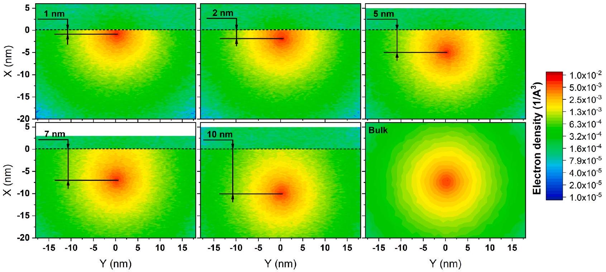
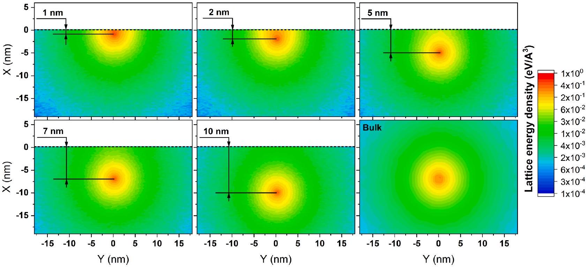
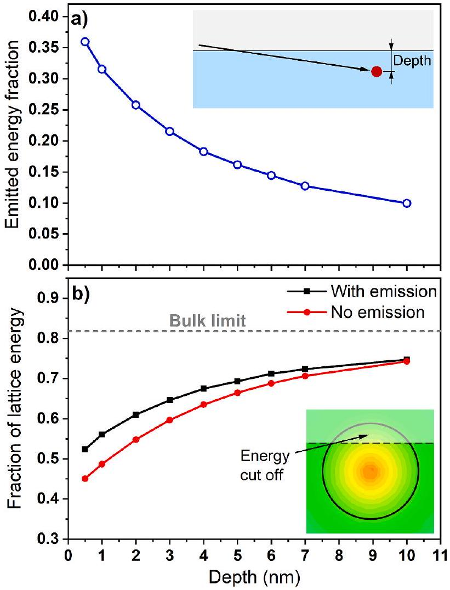
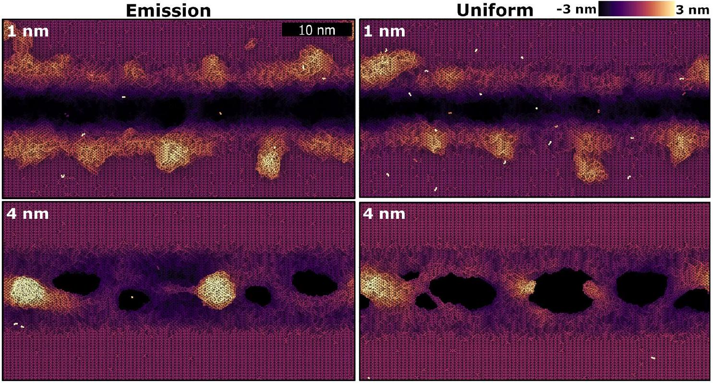
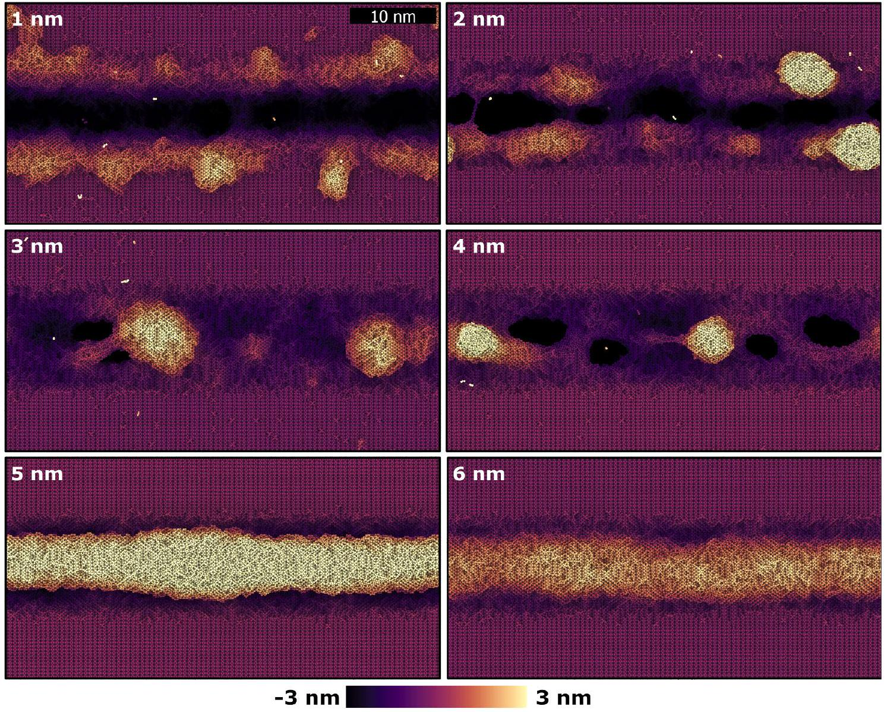
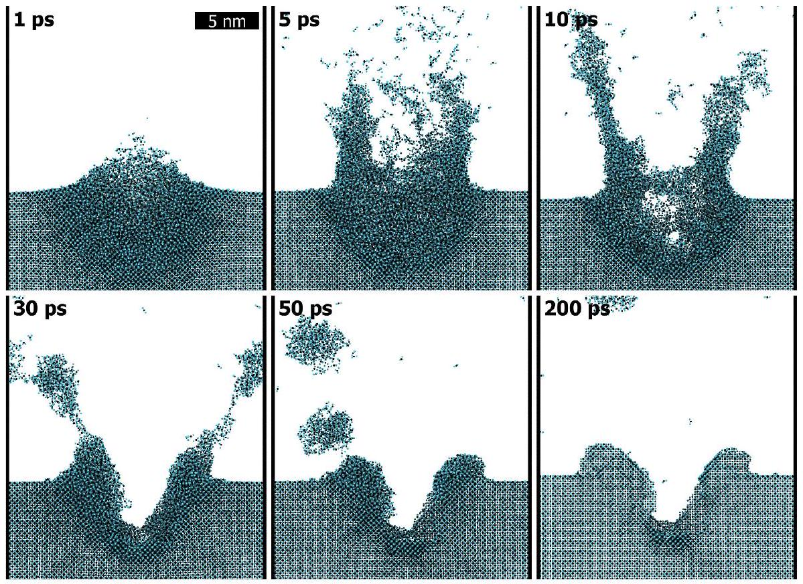
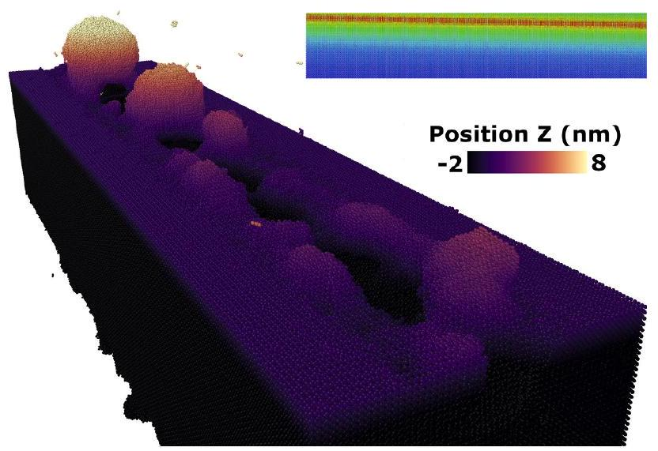
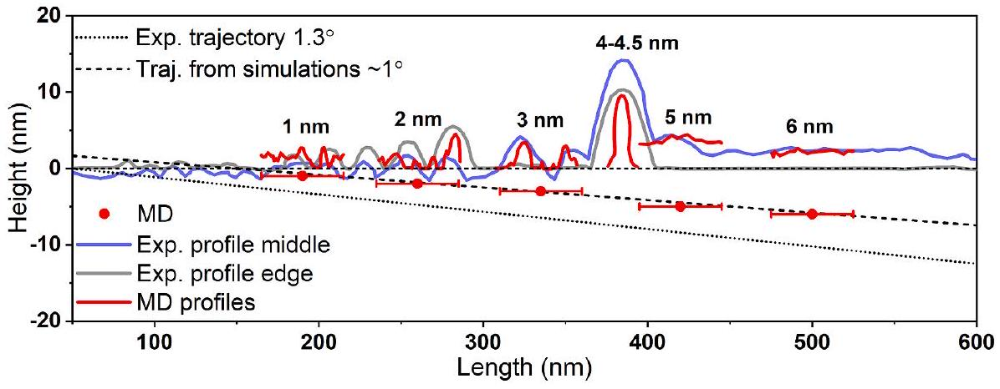
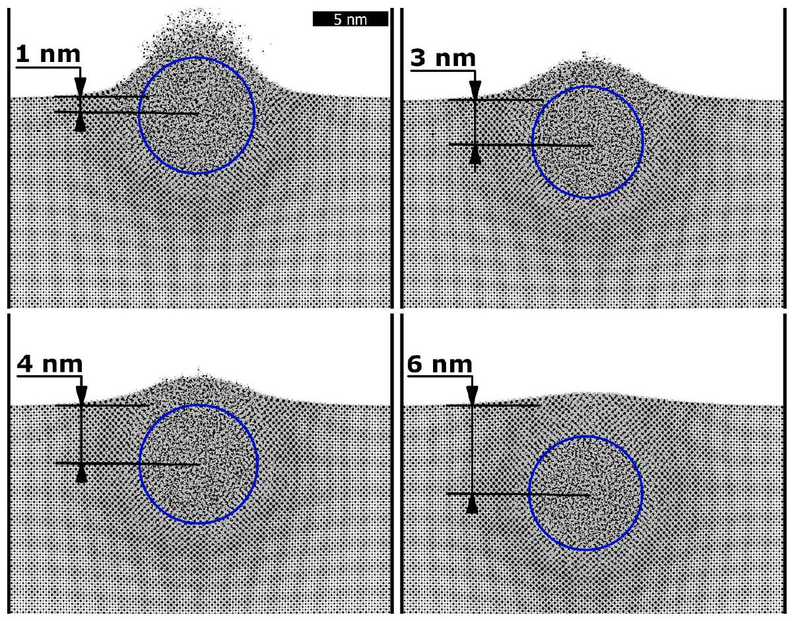
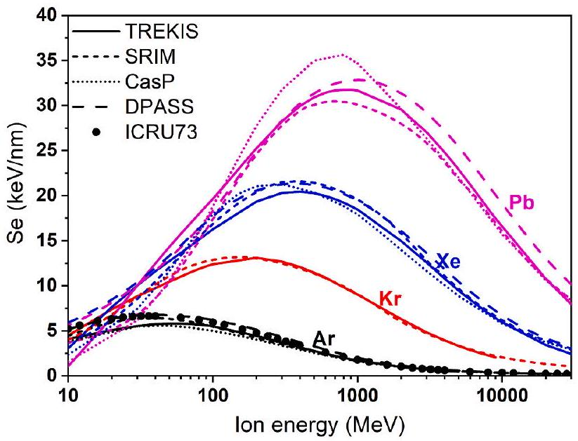

# From groove to hillocks - Atomic-scale simulations of swift heavy ion grazing impacts on $\mathrm{CaF}_{2}$ 

R.A. Rymzhanov ${ }^{\mathrm{a}, \mathrm{b},{ }^{*}}$, M. Ćosić ${ }^{\mathrm{c}}$, N. Medvedev ${ }^{\mathrm{d}, \mathrm{e}}$, A.E. Volkov ${ }^{\mathrm{f}}$ ${ }^{\mathrm{a}}$ Joint Institute for Nuclear Research, Joliot-Curie 6, 141980 Dubna, Moscow Region, Russia ${ }^{\mathrm{b}}$ The Institute of Nuclear Physics, Ibragimov St. 1, 050032 Almaty, Kazakhstan ${ }^{\mathrm{c}}$ Vinča Institute of Nuclear Sciences, University of Belgrade, P. O. Box 522, 11001 Belgrade, Serbia ${ }^{\mathrm{d}}$ Institute of Physics, Czech Academy of Sciences, Na Slovance 1999/2, 18221 Prague 8, Czech Republic ${ }^{\mathrm{e}}$ Institute of Plasma Physics, Czech Academy of Sciences, Za Slovankou 3, 18200 Prague 8, Czech Republic ${ }^{\mathrm{f}}$ P.N. Lebedev Physical Institute of the Russian Academy of Sciences, Leninskij pr., 53, 119991 Moscow, Russia

## A R T I C L E I N F O

## Keywords:

Electronic excitation
Swift heavy ion
Grazing irradiation
Surface damage
Nanostructuring

#### Abstract

Surface nanopatterning of $\mathrm{CaF}_{2}$ by swift heavy ions irradiation under oblique angles is studied with a combination of the event-by-event Monte Carlo particle transport model and molecular dynamics simulations. The model describes the electronic system excitation and energy transfer to the lattice followed by the atomic response. The approach allowed us to simulate the kinetics of the electronic ensemble excited by a grazing ion demonstrating that the presence of the surface does not reduce the energy of the lattice as expected. On the contrary, the track core temperature near the surface is slightly higher than in the bulk, because electrons reflected from the surface bring a part of the energy back to the core.

The formation kinetics of entire grazing ion tracks is studied revealing the mechanisms of various surface nanostructures formation. Depending on the penetration depth, the ion produces a groove bordered by hillocks, a single chain of nanohillocks, a huge hillock at the end of the rift, and a single continuous structure afterward. The critical depth of the material expulsion from the surface equals approximately to the transient molten zone radius $(\sim 4-4.5 \mathrm{~nm})$. The simulated structures are in reasonable agreement with the available experimental data.

## 1. Introduction

The irradiation of dielectrics with swift heavy ions (SHI) of $>1 \mathrm{MeV} /$ nucleon energy leads to an extremely high excitation of a target. In the bulk, it may form extended structurally modified regions (tracks) a few nanometers in diameter manifesting as an agglomeration of defects or complete amorphization [1-4]. Exploiting these features, ion track technologies are now widely applied for nanostructuring of solids [5-8] including the manufacturing of nanowires [9-12], track membranes [13-15], quantum devices [16,17], as well as for ion therapy of oncological diseases [18], etc.

Under normal beam irradiation, the presence of a surface strongly affects the ion track formation, allowing the exchange of particles and energy with the environment, thus creating conically shaped defective regions and single hillocks of various structures [19-24]. Irradiations under oblique incidence $\left(\sim 1^{\circ}\right)$ can generate grooves (e.g. in MgO [25], $\mathrm{CaF}_{2}$ [26]) or chains of hillocks (e.g. in $\mathrm{SrTiO}_{3}$ [27,28], $\mathrm{TiO}_{2}$ [29], $\mathrm{Al}_{2} \mathrm{O}_{3}$
[25,29], $\mathrm{SiO}_{2}$ [30,31], etc.) on the surface.
Several studies demonstrated that multiple periodically spaced nanohillocks are created on the surface of $\mathrm{SrTiO}_{3}$ by a single SHI impact at a grazing angle [27,28,32]. The hillocks are separated by a $30-40 \mathrm{~nm}$ and this distance is weakly dependent on the incident angle. It was proposed that the equidistant hillock formation could be the result of peaked energy deposition by an ion due to its interactions with electron clouds surrounding oxygen atoms [29].

Ref. [26] reported the formation of a complex form of SHI tracks in $\mathrm{CaF}_{2}$. The surface nanostructure consists of a long groove $\sim 300 \mathrm{~nm}$ long, bordered by chains of nanohillocks. The size of the surrounding hillocks increases with the ion penetration depth. The groove is followed by a single huge hillock or a series of hillocks. A single continuous protruded structure extending at the last several hundreds of nanometers, whose height changes slightly with the distance from a SHI trajectory, was also observed. The formation mechanisms of such different structures in a single ion track still remain unexplained. Molecular

[^0]
Fig. 1. Density of excited electrons at 10 fs after 100 MeV Pb ion passage in $\mathrm{CaF}_{2}$ at different depths parallel to the surface. Surface levels (dashed lines) in all images except the bulk case are set to $\mathrm{X}=0$.

dynamics (MD) modeling of the formation of grooves in MgO and chains of hillocks in $\mathrm{Al}_{2} \mathrm{O}_{3}$ was reported in [25]. The work was mainly aimed at demonstrating the difference in surface track formation between these specific solids and considered the ion trajectory only at the single depth of 1 nm corresponding to the beginning of the track.

In the present work, we study the formation kinetics of grazing swift heavy ion tracks on the surface of $\mathrm{CaF}_{2}$ crystals by means of numerical simulations [21,33-35]. We extend the approach used in [25] not only to the atomic dynamics of the entire grazing ion track but also to simulate the kinetics of the electron system in the presence of a surface. Our multiscale model combines the Monte Carlo (MC) TREKIS code simulating [35] the electronic system excitation and the transfer of a part of its energy to the target lattice and the MD simulation of further relaxation of the atomic system [24,36,37].

## 2. Model

The TREKIS-3 [38] Monte-Carlo code [35,39] assumes event-byevent scatterings of charged particles based on the asymptotic trajectory algorithm [40-42]. It describes the impact of a swift heavy projectile initiating subsequent processes of electron ensemble excitation. This includes the ionization of a target, which results in the formation of primary electrons (known as $\delta$-electrons) and holes, as well as the transport of $\delta$-electrons and all secondary electrons and valence holes, accompanied by their scattering on the lattice atoms and target electrons. The code covers both the Auger decays of core holes in the ion track that produce secondary electrons and the radiative decays of deep shell holes, which involve photon generation inducing secondary photoabsorption that creates new electron-hole pairs. In addition, the motion of valence holes and their interaction with target atoms are included [35,39].

The scattering cross-sections used in the model account for a collective response of the electronic and the atomic systems of a target in the framework of the dynamic structure factor formalism [43] and complex dielectric function (linear response theory) [43,44], describing the inelastic (ionization) and elastic (phononic) interaction of charged particles. The cross sections, calculated on the basis of the energy loss function restored from experimental optical data, contain complete information about all possible excitation states in a considered solid (elastic and inelastic). A thorough description of the model can be found in Refs. [35,39,45]. The loss function and scattering cross-sections for
$\mathrm{CaF}_{2}$ were reported in Ref. [24].
For evaluation of the swift heavy ion scattering cross section and its stopping power, we apply the Barkas formula for the ion effective charge [35,39,45]. The validity of the model for calculation of ion electronic energy loss is demonstrated in the Appendix A by comparison with widely used stopping power codes SRIM [46], CasP 6.0[47] and DPASS [48,49]. It confirms that our method enables us calculating the electronic stopping power in a reasonable agreement with these codes in the considered energy range.

Ion trajectories were considered parallel to the surface at various depths to simulate efficiently different parts of individual grazing SHI tracks. The presence of a surface and electron emission processes are simulated by the introduction of a solid-vacuum interface. Eckart-type potential barrier [50] and electrons escape were accounted for as reported in Ref. [21,51]. This method, incorporated into the Monte Carlo code, allows us to calculate the dependence of an electron transmission coefficient on the electron energy that takes into consideration tunneling and reflection at the surface barriers [51].

Following the procedure outlined in Refs. [35,39], we found that the reliable statistics in the MC simulation was achieved by executing 1000 iterations of the code. The simulation provides with 3D distributions of the energies and densities of electrons, holes in the valence band, and various atomic shells, as well as with the energy transferred into the atomic system of a target [36]. Three channels of energy transfer to the lattice are modeled: (i) elastic scattering of electrons, (ii) that of valenceband holes, and (iii) the nonthermal acceleration of atoms due to interatomic potential changes initiated by the high electronic excitation, approximated with the transfer of the potential energy of electron-hole pairs to the kinetic energy of the lattice [36,45]. Our previous works, e. g. [34], demonstrated that the lattice receives $\sim 20 \%$ of energy from the elastic interactions of electrons, $\sim 20 \%$ from the elastic scattering of valence holes, and $\sim 60 \%$ of energy is transferred from the conversion of the potential energy of electron-hole pairs.

Velocities acquired by atoms were determined in finite 3D spatial meshes, whereas SHI trajectories were parallel to the surface at different depths, simulating different segments of SHI grazing trajectory. A Gaussian-like dispersion of the atom's kinetic energy and the uniform distribution of their momenta within each segment is assumed [36]. These distributions of the velocities are then used as initial conditions in the simulations of lattice response with the molecular dynamics code LAMMPS [52]. Interatomic forces in $\mathrm{CaF}_{2}$ are modeled with

Fig. 2. Density of excess lattice energy at 100 fs after 100 MeV Pb ion passage in $\mathrm{CaF}_{2}$ at different depths parallel to the surface. Surface levels (dashed lines) in all images except for the bulk case are set to $\mathrm{X}=0$.

Buckingham-type potential [53] within the rigid ion approach (i.e. assuming the formal charges of atoms). The results of simulations are visualized with OVITO software [54].

In MD simulations of an SHI impact at a grazing angle beyond the approximation of the ion trajectory by straight segments parallel to the surface at different depths, we also considered a portion of an actual SHI path at a grazing angle ( $1.3^{\circ}$ ) to the surface.

The supercells used in the MD simulations were $50.1 \times 25.4 \times 20 \mathrm{nm}^{3}$ (1894464 atoms) for the simulation of segments of track parallel to the surface, and a larger simulation box of $99.7 \times 22.3 \times 20 \mathrm{~nm}^{3}$ ( 3184 200 atoms) was used for the simulation of an extended part of SHI trajectory under an angle. The periodic boundary conditions along the X and Y axes were applied, while open surfaces were created in the Z direction by extension of the box boundary by 20 nm , forming XY surface ((110) plane of $\mathrm{CaF}_{2}$ structure). The supercell borders ( 0.5 nm in thickness) in the $X$ direction and surface opposite to the irradiated one were cooled by the Berendsen thermostat to 300 K with the characteristic time of 0.1 ps [55]. Track evolution was traced until 200 ps when the temperature dropped below 400 K , so no structural changes were expected afterward. Verlet time integrator was used in the MD simulation with the time step of 1 fs .

## 3. Results and discussion

### 3.1. Electron kinetics

The penetration of 100 MeV Pb ion ( $19.4 \mathrm{keV} / \mathrm{nm}$ ) was modeled similarly to the experiment reported in Ref. [26]. First, we pay attention to the kinetics of excited electrons in the vicinity of the SHI trajectory. Fig. 1 illustrates the 2D map of electron densities at 10 fs after an ion impact at various depths from the surface. The distributions were averaged over the Z coordinate (along the ion trajectory). The number of electrons does not differ significantly from the bulk density except for the region very close to the surface ( $\sim 2-3 \mathrm{~nm}$ ). The animation of the evolution of electron density in the track of Pb ion at 5 nm depth can be found in Supplementary materials (Video S1).

The corresponding lattice energy distributions at 100 fs after the ion impact are shown in Fig. 2. These energies account for the three channels of energy transfer from the electronic system to the atoms, as described above: the elastic scattering of electrons and valence holes on the lattice, as well as the conversion of the potential energy of electron-

Fig. 3. (a) The energy emitted by hot electrons generated by SHI with trajectories at different depths parallel to the surface. (b) the fraction of the energy deposited into the lattice (elastic scatterings and potential energy of VB holes) after passage of an SHI with trajectories at different depths parallel to the surface. "No emission" data shows the cylindrical energy deposition calculated for the bulk accounting for the reduction of energy due to the presence of a surface as shown in the inset. All curves are normalized by the total energy deposition. The bulk limit shows the energy fraction calculated for a sample without a surface (infinite depth).

Fig. 4. Results of MD simulation of 100 MeV Pb ion impacts parallel to the surface at 1 and 4 nm depth. Atoms are colored according to their Z coordinates (counted from the surface) to reflect the height of the nanostructures.

hole pairs into the kinetic energy of atoms. The figure demonstrates that the energy transferred to the lattice is higher when an ion trajectory is closer to the surface.

The presence of the surface results in the emission of a significant part of the energy by electron escape (Fig. 3a). The fraction of the total emitted energy is the highest when the ion trajectory is close to the

Fig. 5. Results of MD simulation of 100 MeV Pb ion impacts parallel to the surface at $1-6 \mathrm{~nm}$ depth. Atoms are colored according to their Z coordinates (counted from the surface) to reflect the height of the nanostructures.

Fig. 6. Kinetics of surface track formation in $\mathrm{CaF}_{2}$ after 100 MeV Pb ion passage at 1 nm depth parallel to the surface. The projection of a 5 nm slice along the ion trajectory is shown.

surface and decreases with the depth. As mentioned above, the valence holes and the electrons with energies below the surface barrier ( $\sim 6 \mathrm{eV}$ ) are mostly reflected from the surface. On the one hand, these particles mainly interact with the lattice, heating it. On the other hand, their elastic mean free paths are about $3-5 \mathrm{~nm}$, which limits the influence region to the depth of several nanometers (depth $<5-6 \mathrm{~nm}$ ). That means the reflected electrons and valence holes deposit additional energy to the atomic system, in contrast to the spreading of electrons and holes in the bulk (Fig. 3b).

To demonstrate that the higher atomic temperature near the surface is an effect of the electrons and valence holes' reflection, we compared two modeling schemes: (1) one with explicit modeling of the electron emission/reflection, vs. (2) the simulation in which the electron and hole radial distributions calculated for the bulk are simply cut off along the surface plane, thereby effectively removing a part of the energy distribution that extends above the surface level (see the schematic illustration in the inset in Fig. 3). Fig. 3b compares the fraction of SHIdeposited energy transferred to the lattice in these two cases. The higher fraction of energy transferred to the lattice in the first case, confirms the importance of the reflection of electrons and valence holes from the surface, bringing a part of the excess energy back to the track core.

### 3.2. Lattice kinetics

First, we inspect the effect of the electron emission on the atomic dynamics. The comparison of two MD simulations of ion passage at 1 and 4 nm depths are shown in Fig. 4: uniform energy distribution vs. that accounting for emission. The latter case demonstrates a slightly wider groove and taller hillocks, which is expected, because of higher energy deposition shown in Fig. 2 and Fig. 3. Comparing these structures, the case of simulation with emission coincides better with the experimental AFM images from [26], thus in all further simulations we use this approach.

The SHI-produced surface defects under grazing incidence are several hundreds of nanometers in length, which makes it almost impossible to model within a single atomistic simulation. To simplify the task, we have performed calculations of Pb 100 MeV ion impacts at different depths from the surface. Ion trajectory was parallel to the
crystal-vacuum interface. Fig. 5 illustrates the results of these simulations.

An ion impact at a depth of $1-2 \mathrm{~nm}$ from the surface (Fig. 5) leads to the strong expulsion of a material from the surface producing a groove surrounded by a chain of hillocks. The hillocks sometimes appear equidistant; however, the statistics is insufficient to judge whether the spacing is uniform.

The formation kinetics of the groove with hillocks on the edges shown in Fig. 6 is similar to the previously reported for MgO in [25]. A complete animation can be found in Supplementary materials (Video S2). In the first 5-10 ps, an expanding molten material is ejected from the surface and forms a wide jet which transiently splits into two bursts spreading in opposite directions. The process is accompanied by a significant emission of atoms and clusters from the track region. A part of the material is deposited on both sides of the rift and then recrystallizes together with the near-surface region.

At a larger depth ( 2 nm ), the initially protruded jet is narrower than that for the 1 nm simulation. The extruded material portion decays into two parts also forming a narrower rift, while the hillocks bordering the groove become larger (see 1 nm vs. 2 nm depth cases in Fig. 5).

The passage of an ion at $3-4 \mathrm{~nm}$ depths (Fig. 5) results in a further decrease of the jet width of disordered material protruding from the surface. The jet does not split anymore, forming a strong but single protrusion, which then decays along the ion trajectory into the separated bursts due to Rayleigh instability. Most of the ejected material flies away finally forming chains of nanohillocks on the surface. The kinetics of this process is shown in Supplementary materials as Video S3.

Further increase of the depth of ion passage to $5-6 \mathrm{~nm}$ (Fig. 5) results in the appearance of a single protrusion, which is more or less uniform in length and has a height of $\sim 2-3 \mathrm{~nm}$. Such a structure is formed because of little extrusion of a material at the surface and further cooling of the nanosized surface track (see Video S4 in Supplementary materials for an animation).

The used simplification of the ion trajectory parallel to the surface is valid for uniform structures and describes their formation properly as shown above. However, transition regions between different structures may not be described very accurately - e.g., the formation of a huge hillock at the end of the groove, whose kinetics may be strongly affected

Fig. 7. Perspective view of MD cell of $100 \times 20 \times 20 \mathrm{~nm}^{3}$ in size after impact of 100 MeV Pb ion under $1.3^{\circ}$. The inset shows the ion trajectory by atoms colored according to their velocities.

by the surrounding material.
To study an ion impact in the transition regions, the track formation in the cell of 100 nm in length was modeled (Fig. 7). The modeled trajectory starts at 1.5 nm depth and has an angle of 1.3 degrees, resulting in $\sim 4 \mathrm{~nm}$ depth at the end of the simulation box. At the beginning of an ion trajectory, a strong protrusion of a material results in the emission of a part of the material producing a groove-like structure as described above. As the ion goes deeper, the expelling melt cannot fly away anymore and may be attracted back forming chains of hillocks. The maximal height of such a hillock is $\sim 10 \mathrm{~nm}$, which is only slightly lower than the experimental value of $\sim 14 \mathrm{~nm}$ [26]. The animation of the hillock formation is illustrated in Supplementary materials as Video S5.

The calculated images are compared with the corresponding parts of the experimental AFM surface track from [26]. The $1-2 \mathrm{~nm}$ depth impact is found to be similar to the groove in the first part of the SHI trajectory observed experimentally. The ion passage at 3 nm forms a chain of hillocks. A single exceptionally large spherically shaped hillock of $\sim 10 \mathrm{~nm}$ in height is observed when an ion penetration depth reaches $\sim 4-4.5 \mathrm{~nm}$. At larger depths ( $5-6 \mathrm{~nm}$ ), only a single and almost uniform protrusion of material occurs, similar to the experiment.

The profiles of calculated surface structures were matched with the track profiles measured with AFM from [26]. This allowed us to reconstruct the trajectory line from simulated data points as shown in Fig. 8. The trajectory calculated from the MD data (black dashed line) lies closer to the surface at the angle of $\sim 1^{\circ}$, which is not far from the experimental value of $1.3^{\circ}$ used in [26]. The heights of calculated surface structures coincide well with the experimental image, whereas the
widths of simulated nanohillocks are somewhat smaller. The difference in the widths can arise from the finite size of the AFM tip which lowers the resolution compared to the atomic-scale determination of dimensions of the nanostructures from the MD images.

Considering the position of the initially disordered region (at 1 ps ) respectively to the sample surface (Fig. 9), we can see at depths of 1-4 nm , the transiently molten region reaches the surface, which leads to the very strong protrusion of material forming grooves and large hillocks. Deeper ion impact ( $\sim 6 \mathrm{~nm}$ ) leads to the formation of the melt below the surface, which prevents rapid extrusion of the material, thereby producing a continuous nanostructure. Thus, we conclude that the groove formation can be observed when the transiently molten region extends to the surface.

## 4. Conclusions

We applied the state-of-the-art combined numerical approach to study the kinetics of formation of a grazing-ion track on the surface of $\mathrm{CaF}_{2}$. The method combining the Monte-Carlo code TREKIS and molecular dynamics simulations enabled us to study the surface effects in swift-heavy ion (SHI) track formation without adjustable parameters.

It is revealed that the emission of electrons from the surface does not reduce the energy of the lattice in the track core region, but leads to the opposite effect: the temperature of the central part of the ion track near the surface is slightly higher than it is in the bulk for identical parameters. This effect is attributed to the reflection of slow electrons and valence holes from the surface, bringing part of the excess energy back to the ion track.

Atomic response to the energy transfer from the excited electrons forms various structures depending on the depth of the SHI trajectory. The simulation predicts that a groove surrounded by a chain of hillocks is formed in $\mathrm{CaF}_{2}$ at the depths of $\sim 1 \mathrm{~nm}$; a chain of nanohillocks is created at SHI depths of $\sim 3 \mathrm{~nm}$; a single large hillock forms at the end of a rift (SHI depth of $\sim 4 \mathrm{~nm}$ ), followed with a continuous structure (SHI depths $>4-5 \mathrm{~nm}$ ). The critical depth of the strong material expulsion formation approximately coincides with the radius of the transiently molten zone ( $\sim 4-4.5 \mathrm{~nm}$ ). The simulated structures are in reasonable agreement with the AFM measurements, validating the results.

## CRediT authorship contribution statement

R.A. Rymzhanov: Conceptualization, Formal analysis, Investigation, Methodology, Software, Visualization, Writing - original draft, Writing - review \& editing. M. Ćosić: . N. Medvedev: . A.E. Volkov: Conceptualization, Methodology, Writing - review \& editing.

Fig. 8. Comparison of the grazing surface track profile measured by AFM from the middle (blue line) and the edge (gray line) of surface track [26] with the profile calculated with MD (red line). Red dots show approximately the correspondence of the calculated surface structures at different depths to the experimental AFM image. Error bars here show the width of the simulation box. The black dotted line is an ideal ion trajectory at $1.3^{\circ}$ as was used in [26]. The Black dashed line is a reconstructed trajectory from MD points.

Fig. 9. The snapshots of the projection of the MD simulation box along 100 MeV Pb ion trajectory at different depths. The time instance is 1 ps . Blue circles indicate the region initially disordered by an ion impact.

Fig. A1. Calculated electronic energy loss of various ions in $\mathrm{CaF}_{2}$. The results are compared with SRIM [46], CasP 6.0 [47] and DPASS [48,49] codes, and the data for Ar ion from ICRU73 report [56].

## Declaration of Competing Interest

The authors declare that they have no known competing financial interests or personal relationships that could have appeared to influence the work reported in this paper.

## Data availability

Data will be made available on request.

## Acknowledgments

The work of R.A. Rymzhanov was funded by the Russian Science Foundation, The Russian Federation (grant No. 23-72-01017, https://
rscf.ru/project/23-72-01017/). NM gratefully acknowledges financial support from the Czech Ministry of Education, Youth, and Sports (grants No. LTT17015, LM2023068, and No. EF16_013/0001552). AEV acknowledges support from the Russian Science Foundation (grant No. 22-22-00676).

This work has been carried out using computing resources of the Federal collective usage center Complex for Simulation and Data Processing for Mega-science Facilities at NRC "Kurchatov Institute", http:// ckp.nrcki.ru//.

## Appendix A

In order to validate the stopping power calculated with TREKIS-3 code, we compare our results with the standard and widely used codes SRIM [46], CasP 6.0[47] and DPASS [48,49] (Fig. A1). Since DPASS contains data only for elemental solids, stopping power in the compound is constructed with help of the Bragg additivity rule. The only datapoints for Ar in $\mathrm{CaF}_{2}$ as compound were found in ICRU73 report [56]. All the results are reasonably close to each other validating our calculations.

## Appendix B. Supplementary data

Supplementary data to this article can be found online at https://doi. org/10.1016/j.apsusc.2024.159310.

## References

[1] M. Lang, J. Lian, J. Zhang, F. Zhang, W. Weber, C. Trautmann, R. Ewing, Phys. Rev. B 79 (2009) 224105.
[2] J.M. Costantini, F. Brisard, J.L. Flament, A. Meftah, M. Toulemonde, M. Hage-Ali, Nucl. Instruments Methods Phys Res. Sect. B Beam Interact. with Mater. Atoms 65 (1992) 568-575.
[3] B. Ziaja, J.J. Bekx, M. Masek, N. Medvedev, V. Lipp, V. Saxena, M. Stransky, Philos. Trans. R. Soc. A 381 (2023) 20220216.
[4] M. Sall, I. Monnet, F. Moisy, C. Grygiel, S. Jublot-Leclerc, S. Della-Negra, M. Toulemonde, E. Balanzat, J. Mater. Sci. 50 (2015) 5214-5227.
[5] W. Wesch, E. Wendler, Ion beam modification of solids, Ion-Solid Interaction and Radiation Damage, Springer, Cham, Berlin, 2016.
[6] F.F. Komarov, Phys. Usp. 60 (2017) 435-471.
[7] F. Aumayr, S. Facsko, A.S. El-Said, C. Trautmann, M. Schleberger, J. Physics. Condens. Matter 23 (2011) 393001.
[8] K.K. Jana, B. Ray, D.K. Avasthi, P. Maiti, J. Mater. Chem. 22 (2012) 3955.
[9] Y. Xia, P. Yang, Y. Sun, Y. Wu, B. Mayers, B. Gates, Y. Yin, F. Kim, H. Yan, Adv. Mater. 15 (2003) 353-389.
[10] T.J. Tanaka, G.A. Rochau, R.R. Peterson, C.L. Olson, J. Nucl. Mater. 347 (2005) 244-254.
[11] M. Rauber, I. Alber, S. Muöller, R. Neumann, O. Picht, C. Roth, A. Schoökel, M. E. Toimil-Molares, W. Ensinger, Nano Lett. 11 (2011) 2304-2310.
[12] E. Kozhina, D. Panov, N. Kovalets, P. Apel, S. Bedin, Nanotechnology 35 (2023) 035601.
[13] P. Apel, Nucl. Instruments Methods Phys Res. Sect. B Beam Interact. with Mater. Atoms 208 (2003) 11-20.
[14] P. Lap Jacob Lee, V. Thangavel, C. Guery, C. Trautmann, M. Eugenia ToimilMolares, M. Morcrette, Nanotechnology 32 (2021) 365401.
[15] P.Y. Apel, Radiat. Phys. Chem. 159 (2019) 25-34.
[16] N. Choudhury, F. Singh, B.K. Sarma, Radiat. Eff. Defects Solids 168 (2013) 498-503.
[17] G. Devaraju, N. Sathish, A.P. Pathak, A. Turos, M. Bazzan, E. Trave, P. Mazzoldi, B. M. Arora, Nucl. Instruments Methods Phys. Res. Sect. B Beam Interact. with Mater. Atoms 268 (2010) 3001-3004.
[18] J.R. Castro, W.M. Saunders, C.A. Tobias, G.T. Chen, S. Curtis, J.T. Lyman, J. M. Collier, S. Pitluck, K.A. Woodruff, E.A. Blakely, T. Tenforde, D. Char, T. L. Phillips, E.L. Alpen, Int. J. Radiat. Oncol. Biol. Phys. 8 (1982) 2191-2198.
[19] J. O'Connell, V. Skuratov, A. Janse van Vuuren, M. Saifulin, A. Akilbekov, Phys. Status Solidi 253 (2016) 2144-2149.
[20] V.A. Skuratov, S.J. Zinkle, A.E. Efimov, K. Havancsak, Nucl. Instruments Methods Phys. Res. Sect. B Beam Interact. with Mater. Atoms 203 (2003) 136-140.
[21] R.A. Rymzhanov, N. Medvedev, A.E. Volkov, Appl. Surf. Sci. 566 (2021) 150640.
[22] N. Ishikawa, T. Taguchi, N. Okubo, Nanotechnology 28 (2017) 445708.
[23] N. Ishikawa, N. Okubo, T. Taguchi, Nanotechnology 26 (2015) 355701.
[24] R.A. Rymzhanov, J.H. O'Connell, A. Janse Van Vuuren, V.A. Skuratov, N. Medvedev, A.E. Volkov, J. Appl. Phys. 127 (2020) 015901.
[25] M. Karlusic, R.A. Rymzhanov, J.H. O'Connell, L. Brockers, K.T. Luketic, Z. Siketic, S. Fazinic, P. Dubcek, M. Jaksic, G. Provatas, N. Medvedev, A.E. Volkov, M. Schleberger, Surf. Interfaces 27 (2021) 101508.
[26] E. Gruber, P. Salou, L. Bergen, M. El Kharrazi, E. Lattouf, C. Grygiel, Y. Wang, A. Benyagoub, D. Levavasseur, J. Rangama, H. Lebius, B. Ban-d'Etat, M. Schleberger, F. Aumayr, J. Phys. Condens. Matter 28 (2016) 405001.
[27] E. Akcöltekin, S. Akcöltekin, O. Osmani, A. Duvenbeck, H. Lebius, M. Schleberger, New J. Phys. 10 (2008) 53007.
[28] N. Ishikawa, Y. Fujimura, K. Kondo, G.L. Szabo, R.A. Wilhelm, H. Ogawa, T. Taguchi, Nanotechnology 33 (2022) 235303.
[29] S. Akcöltekin, E. Akcöltekin, T. Roll, H. Lebius, M. Schleberger, Nucl. Instruments Methods Phys Res. Sect. B Beam Interact. with Mater. Atoms 267 (2009) 1386-1389.
[30] A.M.J.F. Carvalho, A.D. Touboul, M. Marinoni, M. Ramonda, C. Guasch, F. Saigne, J. Bonnet, J. Gasiot, J. Appl. Phys. 102 (2007) 124306.
[31] A.M.J.F. Carvalho, M. Marinoni, A.D. Touboul, C. Guasch, H. Lebius, M. Ramonda, J. Bonnet, F. Saigne, Appl. Phys. Lett. 90 (2007) 073116.
[32] M. Karlušić, M. Mičetić, M. Kresić, M. Jakšić, B. Šantić, I. Bogdanović-Radović, S. Bernstorff, H. Lebius, B. Ban-d'Etat, K. Žužek Rožman, J.H. O'Connell, U. Hagemann, M. Schleberger, Appl. Surf. Sci. 541 (2021) 148467.
[33] P.N. Terekhin, R.A. Rymzhanov, S.A. Gorbunov, N.A. Medvedev, A.E. Volkov, Nucl. Instruments Methods Phys Res. Sect. B Beam Interact. with Mater. Atoms 354 (2015) 200-204.
[34] R.A. Rymzhanov, N.A. Medvedev, A.E. Volkov, Nucl. Instruments Methods Phys. Res. B 365 (2015) 462-467.
[35] N.A. Medvedev, R.A. Rymzhanov, A.E. Volkov, J. Phys. D. Appl. Phys. 48 (2015) 355303.
[36] R. Rymzhanov, N.A. Medvedev, A.E. Volkov, J. Phys. D. Appl. Phys. 50 (2017) 475301.
[37] R.A. Rymzhanov, N. Medvedev, A.E. Volkov, J.H. O'Connell, V.A. Skuratov, Nucl. Instruments Methods Phys Res. Sect. B Beam Interact. with Mater. Atoms 435 (2018) 121-125.
[38] N. Medvedev R. Rymzhanov A. Volkov TREKIS-3, https://github.com/N-Medvedev/TREKIS-3, (accessed 30 September 2023).
[39] R.A. Rymzhanov, N.A. Medvedev, A.E. Volkov, Nucl. Instruments Methods Phys Res. Sect. B Beam Interact. with Mater. Atoms 388 (2016) 41-52.
[40] W. Eckstein, Computer Simulation of Ion-Solid Interactions, vol. 22, Springer, Berlin Heidelberg, Berlin, Heidelberg, 1991.
[41] C. Jacoboni, L. Reggiani, Rev. Mod. Phys. 55 (1983) 645-705.
[42] B. Gervais, S. Bouffard, Nucl. Instruments Methods Phys. Res. Sect. B Beam Interact. with Mater. Atoms 88 (1994) 355-364.
[43] L. Van Hove, Physica 24 (1958) 404-408.
[44] R.H. Ritchie, A. Howie, Philos. Mag. 36 (1977) 463-481.
[45] N. Medvedev, A.E. Volkov, R. Rymzhanov, F. Akhmetov, S. Gorbunov, R. Voronkov, P. Babaev, J. Appl. Phys. 133 (2023) 100701.
[46] J.F. Littmark, J.P. Ziegler, U. Biersack, The stopping and range of ions in solids, Pergamon Press, New York, 1985.
[47] P.L. Grande, G. Schiwietz, Nucl. Instruments Methods Phys Res. Sect. B Beam Interact. with Mater. Atoms 267 (2009) 859-863.
[48] P. Sigmund, A. Schinner, Nucl. Instruments Methods Phys Res. Sect. B Beam Interact. with Mater. Atoms 415 (2018) 110-116.
[49] A. Schinner, P. Sigmund, Nucl. Instruments Methods Phys. Res. Sect. B Beam Interact. with Mater. Atoms 460 (2019) 19-26.
[50] C. Bouchard, J.D. Carette, Surf. Sci. 100 (1980) 251-268.
[51] R.A. Rymzhanov, N.A. Medvedev, A.E. Volkov, Phys. Status Solidi B 252 (2015) 159-164.
[52] S. Plimpton, J. Comput. Phys. 117 (1995) 1-19.
[53] Z.-Y. Zeng, X.-R. Chen, J. Zhu, C.-E. Hu, Chinese Phys. Lett. 25 (2008) 230-233.
[54] A. Stukowski, Model. Simul. Mater. Sci. Eng. 18 (2010) 15012.
[55] H.J.C. Berendsen, J.P.M. Postma, W.F. van Gunsteren, A. DiNola, J.R. Haak, J. Chem. Phys. 81 (1984) 3684-3690.
[56] ICRU. Stopping of ions heavier than helium, vol. 73 of ICRU Report, Oxford University Press, Oxford, 2005.

[^0]:    * Corresponding author.

    E-mail address: rymzhanov@jinr.ru (R.A. Rymzhanov).

