# Nanopore Formation in $\mathrm{CeO}_{2}$ Single Crystal by Ion Irradiation: A Molecular Dynamics Study 

Yasushi Sasajima ${ }^{1, *(D)}$, Ryuichi Kaminaga ${ }^{1}$, Norito Ishikawa ${ }^{2(D)}$ and Akihiro Iwase ${ }^{3}$ (D) 1 Department of Materials Science and Engineering, Graduate School of Science and Engineering, Ibaraki University, 4-12-1 Nakanarusawa, Hitachi 316-8511, Japan; kaminaga@advancesoft.jp 2 Japan Atomic Energy Agency (JAEA), 2-4 Shirakata Shirane, Tokai 319-1195, Japan; ishikawa.norito@jaea.go.jp 3 The Wakasa Wan Energy Research Center, 64-52-1 Nagatani, Tsuruga 914-0192, Japan; aiwase@werc.or.jp * Correspondence: yasushi.sasajima.mat@vc.ibaraki.ac.jp

Citation: Sasajima, Y.; Kaminaga, R.; Ishikawa, N.; Iwase, A. Nanopore Formation in $\mathrm{CeO}_{2}$ Single Crystal by Ion Irradiation: A Molecular Dynamics Study. Quantum Beam Sci. 2021, 5, 32. https://doi.org/10.3390/ qubs5040032

Academic Editor: Lorenzo Giuffrida

Received: 15 October 2021
Accepted: 9 November 2021
Published: 18 November 2021

Publisher's Note: MDPI stays neutral with regard to jurisdictional claims in published maps and institutional affiliations.

Copyright: © 2021 by the authors. Licensee MDPI, Basel, Switzerland. This article is an open access article distributed under the terms and conditions of the Creative Commons Attribution (CC BY) license (https:// creativecommons.org/licenses/by/ 4.0/).

#### Abstract

The nanopore formation process that occurs by supplying a thermal spike to single crystal $\mathrm{CeO}_{2}$ has been simulated using a molecular dynamics method. As the initial condition, high thermal energy was supplied to the atoms in a nano-cylinder placed at the center of a fluorite structure. A nanopore was generated abruptly at around 0.3 ps after the irradiation, grew to its maximum size at 0.5 ps , shrank during the time to 1.0 ps , and finally equilibrated. The nanopore size increased with increasing effective stopping power $g S e$ (i.e., the thermal energy deposited per unit length in the specimen), but it became saturated when $g S e$ was $0.8 \mathrm{keV} / \mathrm{nm}$ or more. This finding will provide useful information for precise control of the size of nanopores. Our simulation confirmed nanopore formation found in the actual experiment, irradiation of $\mathrm{CeO}_{2}$ with swift heavy ions, but could not reproduce crystalline hillock formation just above the nanopores.

Keywords: nanopore structure; ceria; irradiation; molecular dynamics; simulation; structural analysis; defects

## 1. Introduction

When oxide metals are irradiated by high-energy heavy ions, nano-sized protrusions and pores are produced on the surface and inside the specimen, respectively. For example, in an irradiated NiO specimen, nano-sized protrusions and cylindrically shaped nanopores were generated simultaneously [1]. Using transmission electron microscopy (TEM), Jensen et al. [2] observed hillocks at both ends of tracks in Yttrium Iron Garnet (YIG) induced by high-energy - $\mathrm{C}_{60}$ ions. They believed that the matter was emitted from the ion track, leaving the spherical hillocks on the sample surface at the entrance and exit. Recently, Ishikawa et al. [3] found that hemispherical protrusions and nanopores were also generated in $\mathrm{CeO}_{2}$ by high-energy ion beam irradiation. Subsequently Ishikawa et al. [4] observed ion tracks and hillocks produced by swift heavy ions of different velocities in $\mathrm{Y}_{3} \mathrm{Fe}_{5} \mathrm{O}_{12}$ by TEM. They found the dimensions of the hillocks increase as a function of stopping power, $S e$. The data can be interpreted by the lifetime of the melt region produced by irradiation. Ion-irradiated $\mathrm{CeO}_{2}$ was studied extensively regarding its optical reflectivity [5] and spectroscopic characteristics [6], defects [7-10], grain size effects [11], X-ray Photoelectron Spectroscopy (XPS) [12], and effects of irradiation temperature on final structure [13].

Nanopore formation is an interesting phenomenon from the viewpoint of nano-order fabrication of materials and can lead to the realization of highly functional materials such as catalysts [14]. Therefore, it is crucial to clarify the formation mechanism of nano-sized protrusions and cylindrically shaped nanopores. Since high-energy beam irradiation is a non-equilibrium process and its relaxation time is very short, it is difficult to clarify such a mechanism only by an actual experiment. Molecular dynamics (MD) simulation provides
a useful tool for the analysis of such a process because it can calculate the trajectories of individual atoms during a short time period.

In our previous papers, using computer-aided simulations, we studied the effects of high-energy, heavy-ion irradiation [15-19] as a theme in the development of a new generation of nuclear fuels with a high burn-up ratio. Employing MD simulations, we evaluated the disorder of a single crystal structure of specimens irradiated by fast particles. Our MD simulations elaborated the structural change followed by the high-energy dissipation of a nano-scale region in a single crystal of $\mathrm{CeO}_{2}$ after irradiation [18,19]. Yablinsky et al. [20] analyzed the structure of ion tracks and investigated thermal spikes in $\mathrm{CeO}_{2}$ with energy depositions using MD simulation. Medvedev et al. [21] developed the Monte-Carlo code TREKIS (Time-Resolved Electron Kinetics in swift heavy-ion Irradiated Solid) which models how a penetrating swift heavy ion (SHI) excites the electron subsystems of various solids, and the generated fast electrons spread spatially. Subsequently, the same group proposed a hybrid approach that consisted of the Monte-Carlo code TREKIS and the classical molecular dynamics code LAMMPS (Large-scale Atomic/Molecular Massively Parallel Simulator) for lattice atoms to simulate the formation process of a cylindrical track of about 2 nm diameter in $\mathrm{Al}_{2} \mathrm{O}_{3}$ irradiated by Xe 167 MeV ions [22]. Then, Rymzhanov et al. [23] simulated a structure in overlapping swift heavy-ion track regions in $\mathrm{Al}_{2} \mathrm{O}_{3}$ and found good coincidence with observation results of irradiated $\mathrm{Al}_{2} \mathrm{O}_{3}$ by high resolution TEM. Another paper by Rymzhanov et al. [24] examined swift heavy-ion irradiation of forsterite $\left(\mathrm{Mg}_{2} \mathrm{SiO}_{4}\right)$ and the effects of the ion energy and its energy losses on the track radius were explained, and the track formation thresholds was determined [24]. Rymzhanov et al. [25] also clarified that different ion tracks were produced in $\mathrm{MgO}, \mathrm{Al}_{2} \mathrm{O}_{3}$, and $\mathrm{Y}_{3} \mathrm{Al}_{5} \mathrm{O}_{12}$ (YAG) by irradiation with $\mathrm{Xe}(176 \mathrm{MeV})$ ions, whereas no ion tracks in MgO , discontinuous distorted crystalline tracks in $\mathrm{Al}_{2} \mathrm{O}_{3}$ and continuous amorphous tracks in YAG were detected. Recently, Rymzhanov et al. [26] studied the irradiation process of $\mathrm{MgO}, \mathrm{CaF}_{2}$, and $\mathrm{Y}_{3} \mathrm{Al}_{5} \mathrm{O}_{12}$ (YAG) with fast ions. They found MgO and $\mathrm{CaF}_{2}$ showed recovery of transient damage in the surface region, forming a spherically shaped nano-hillock, whereas YAG showed almost no recovery of the transient disorder, forming an amorphous hillock. The movie they attached as supplemental material demonstrates nano-hillock formation of $\mathrm{CaF}_{2}$ irradiated by 200 MeV Au. Some of the above same researchers teamed with Karlušić et al. [27] to research $\mathrm{Al}_{2} \mathrm{O}_{3}$ and MgO irradiated under grazing incidence with an I beam of 23 MeV . In this study, they found grooves surrounded with nano-hillocks on MgO surfaces and smoother, roll-like discontinuous structures on the surfaces of $\mathrm{Al}_{2} \mathrm{O}_{3}$.

In the present study, we used an MD method to simulate the nanopore structure formation process in a single crystal $\mathrm{CeO}_{2}$ with two free surfaces by supplying a thermal spike. Structural analysis was done for the obtained specimens. We evaluated the number of Frenkel pairs as a function of the thermal energy deposited per unit length in the specimen, $g S e$, which represents the beam strength. We classified various types of oxygen Frenkel pairs by the distance between the vacancy and the corresponding oxygen atom.

## 2. Simulation Method

### 2.1. Molecular Dynamics

Concerning the MD simulation method, we adopted the same method as our previous work [19], except that the specimens have a free surface. Therefore, the calculation method is only outlined as follows. The Ce and O atoms were laid out to form the fluorite structure unit cell. Then, the unit cell was cloned 6 times each in <010> and <100> directions and 4 times in the <001> direction. The dimensions of the $\mathrm{CeO}_{2}$ crystal were $3.25 \mathrm{~nm} \times 3.25 \mathrm{~nm} \times 2.33 \mathrm{~nm}$, whereas those of the calculation region were $3.25 \mathrm{~nm} \times 3.25 \mathrm{~nm} \times 3.25 \mathrm{~nm}$. There was a free space on the upper and lower sides of the $\mathrm{CeO}_{2}$ crystal along the <001> direction to mimic the free surface. Figure 1a shows the unit structure of the $\mathrm{CeO}_{2}$ fluorite structure and Figure 1b shows the whole system for calculation.

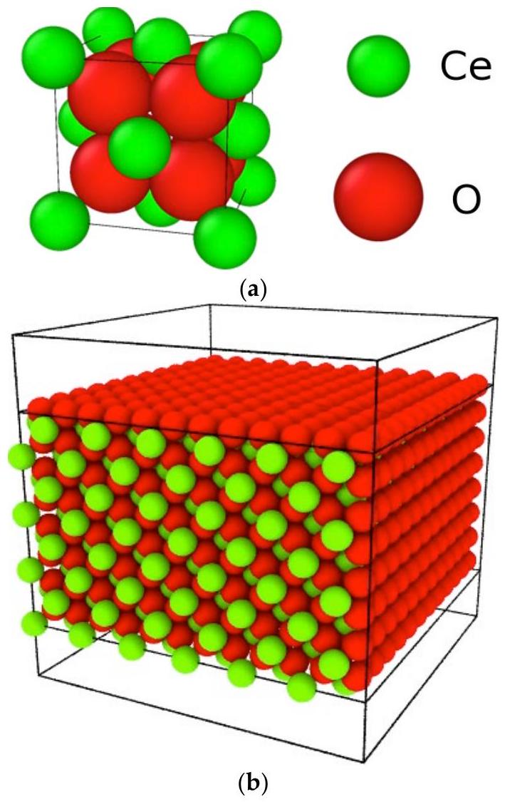
Figure 1. (a) The unit structure of $\mathrm{CeO}_{2}$ fluorite. (b) The whole system for calculation.

In order to calculate the interaction between the atoms, we used the potential type proposed by Inaba et al. [28]. This is the Born-Mayer-Huggins potential type, which has a function form as

$$
\phi_{i}\left(r_{i j}\right)=\frac{z_{i} z_{j} e^{2}}{r_{i j}}+f_{0}\left(b_{i}+b_{j}\right) \exp \left(\frac{a_{i}+a_{j}-r_{i j}}{b_{i}+b_{j}}\right)-\frac{c_{i} c_{j}}{r_{i j}{ }^{6}}
$$

where $r_{i j}$ is the distance between ions $i$ and $j, z_{i}$ is the effective valence of an ion $i, e$ is the electron charge, $f_{0}$ is a constant to adjust the unit, $c_{i}$ and $c_{j}$ are the parameters of the molecular interaction term, and $a_{i}$ and $b_{i}$ are the parameters of the repulsion term. For the electrostatic interactions, the Ewald method was applied. The potential cut-off was 1.37 nm for short range interaction and for the real part of the Ewald summation. The potential parameters were determined to reproduce the lattice parameters at various temperatures and the bulk modulus of $\mathrm{CeO}_{2}$. The fitted parameters for $\mathrm{CeO}_{2}$ are presented in Table 1.

Table 1. Potential parameters for $\mathrm{CeO}_{2}$ [28].
| Parameters | $\boldsymbol{C} \boldsymbol{e}^{\mathbf{4 +}}$ | $O^{2-}$ |
| :--- | :--- | :--- |
| $z$ | 2.700 | -1.350 |
| $a(\mathrm{~nm})$ | 0.1330 | 0.1847 |
| $b(\mathrm{~nm})$ | 0.00454 | 0.0166 |
| $c\left(J^{0.5}(\mathrm{~nm})^{3} \mathrm{~mol}^{-0.5}\right)$ | 0.00 | 1.294 |
| $f_{0}$ | 4.07196 | 4.07196 |

A cylindrical region with a diameter of 1.0 nm located at the center of the calculation region in the <001> direction was considered as the irradiation beam trajectory. Using a MD method, we initially relaxed the structure at the temperature of 298 K before a high thermal
energy was applied to the cylindrical region. This temperature was set as typical ambient temperature, or room temperature. Thermal energy is a part of the energy deposited by the heavy-ion irradiation. The present study names this thermal energy as an effective stopping power, and it is described as $g S e$. The parameter $g$ in $g S e$ signifies the ratio of thermal energy transferred from stopping power to the lattice as the vibration energy. In the MD simulation, the high thermal energy was applied to the cylindrical region by setting the velocity of the atoms in the region to values ranging from $g S e=0.0$ to $1.6 \mathrm{keV} / \mathrm{nm}$ with $0.1 \mathrm{keV} / \mathrm{nm}$ energy bins according to the Maxwell distribution. According to the experiment by Ishikawa et al. [3], $\mathrm{Se}=32.0 \mathrm{keV} / \mathrm{nm}$ for 200 MeV Au ion. The maximum value of $g S e$ for our simulation is $g S e=1.6 \mathrm{keV} / \mathrm{nm}$, thus the energy transfer ratio $g=0.05$. According to TREKIS, a 167 MeV Xe ion gives $\mathrm{Se}=21,24.9$ and $25 \mathrm{keV} / \mathrm{nm}$ for MgO , $\mathrm{Al}_{2} \mathrm{O}_{3}$ and YAG, respectively, and it gives a radial distribution of the excess lattice energy density around the trajectory of the irradiated ion (see Figure 2 in reference [25]). A rough estimation of $g S e$ can be made from the excess lattice energy of MgO and $\mathrm{Al}_{2} \mathrm{O}_{3}$ as $g S e=2 \mathrm{keV} / \mathrm{nm}$ and the value of g is the same order as ours. The temperature of the region outside the cylindrical region with a diameter of 2.0 nm was kept at 298 K by the velocity scaling method [29]. In <010>, <001> and <100> directions, the periodic boundary condition was considered. The simulation duration was 10,000 molecular dynamic intervals, each taking 0.3 fs , summing up to 3 ps .

### 2.2. Structure Analysis

A vacancy is defined as the vacant site in the $\mathrm{CeO}_{2}$ fluorite structure, such that the distance between the vacant site and the nearest atom from the site is larger than the atomic radius of O or Ce originally set at the vacant site, 0.097 nm (for O ) and 0.138 nm (for Ce ). This is what we call the "Lindemann criterion", and it may overestimate the number of vacancies. An oxygen Frenkel pair is defined as the pair of a vacant site and the oxygen atom which escaped from the site. Oxygen Frenkel pairs can be classified according to the distance between the vacant site and the oxygen atom that was originally located at the site, such as 1NN (1st nearest neighbor) Frenkel pair, 2NN Frenkel pair, and so on [30]. Figure 2 shows an example of a 1NN Frenkel pair, and Table 2 lists the distance between the vacant site and the oxygen atom for $i$ NN Frenkel pairs $(i=1,2, \ldots, 7)$. We evaluated the number of vacancies and Frenkel pairs in the irradiated specimen as a function of time and as a function of $g S e$.

## 1NN FP

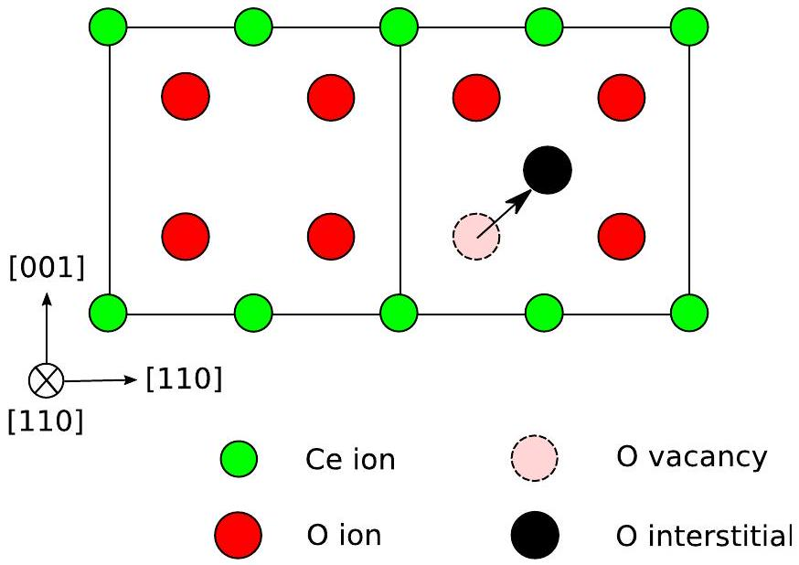
Figure 2. An example 1NN Frenkel pair.

Table 2. Distance between the vacant site and oxygen atom for $i$ NN Frenkel pairs ( $i=1,2, \ldots, 7$ ).
| Type (NN: Nearest Neighbor) | Distance (nm) |
| :--- | :--- |
| 1NN | 0.234 |
| 2NN | 0.449 |
| 3NN | 0.590 |
| 4NN | 0.703 |
| 5NN | 0.800 |
| 6NN | 0.887 |
| 7NN | 0.966 |

## 3. Results and Discussion

Structural changes of the $\mathrm{CeO}_{2}$ systems after the irradiation, as viewed from <001> and $<100>$ directions, are shown in Figures 3 and 4 for the values of $g S e=0.0$ and $0.8 \mathrm{keV} / \mathrm{nm}$, respectively. The number of ejected atoms increased with increasing $g S e$ value.

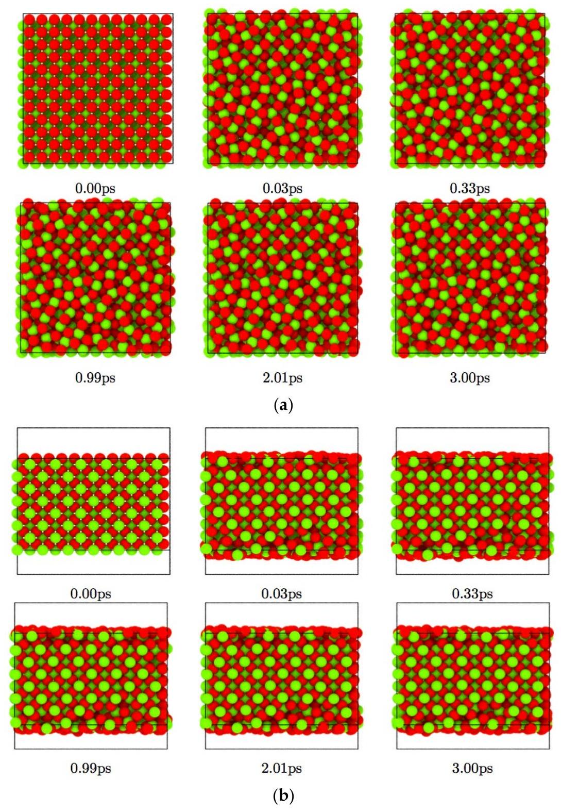
Figure 3. Structural change of the $\mathrm{CeO}_{2}$ systems viewed from (a) <001> and (b) <100> directions after the irradiation and for $g S e=0.0 \mathrm{keV} / \mathrm{nm}$.

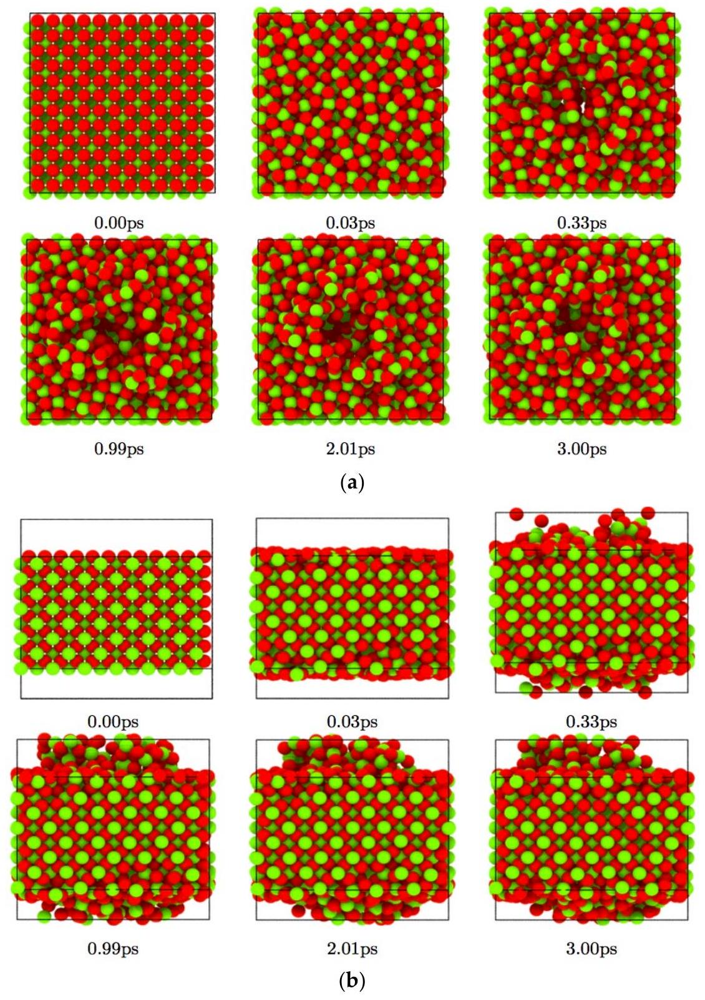
Figure 4. Structural change of the $\mathrm{CeO}_{2}$ systems viewed from (a)<001> and (b)<100> directions after the irradiation and for $g S e=0.8 \mathrm{keV} / \mathrm{nm}$.

Figure 3 indicates that the surface of the specimen showed disorder even when $g S e=0.0 \mathrm{keV} / \mathrm{nm}$. This means that the disorder on the surface is not generated by irradiation. Therefore, we neglect the surface atoms for the structural analysis in order to clarify the formation process of the nanopore. In this case, no defects were found in the interior of the specimen; however, there is the possibility that defects are created at $g S e=0.0 \mathrm{keV} / \mathrm{nm}$. The thermal energy provides the system necessary for the creation of defects. However, the ambient temperature is room temperature that is around $1 / 40 \mathrm{eV}$, which is low compared with the defect formation energy. Therefore, the defect creation event is rare, and no defects were found in the calculated system. We see the creation of defects among many specimens prepared, but this is out of our scope in the present study. As can be seen from Figure 4, a nanopore was formed in the specimen by ejection of the atoms located in the central region. In the case of $g S e=0.4 \mathrm{keV} / \mathrm{nm}$, a nanopore was also produced but its diameter was smaller than that of $g S e=0.8 \mathrm{keV} / \mathrm{nm}$.

It is interesting to compare this figure with our previous result for computer simulation of irradiation of $\mathrm{CeO}_{2}$ single crystals with no free surface. The Ce sublattice was stable up
to $g S e=1.5 \mathrm{keV} / \mathrm{nm}$, and even at $g S e=2.0 \mathrm{keV} / \mathrm{nm}$ only several interstitial atoms were found as defects (see Figure 4 in reference [19]). It can be considered that the Ce sublattice damage is confined near the surface of the irradiated region compared with the O sublattice damage. To elaborate the nanopore formation process, the time change of the total number of vacancies for the various values of $g S e$ was calculated.

Figure 5a,b show the results for $g S e=0.1-0.8$ and $0.8-1.6 \mathrm{keV} / \mathrm{nm}$, respectively. (No defect was found in the interior of the specimen at $g S e=0.0 \mathrm{keV} / \mathrm{nm}$ because of the low temperature 298 K .) For all these $g S e$ cases, the number of vacancies increased abruptly up to 0.2 ps after the irradiation. It increased further and reached the maximum, then gradually decreased until 1.5 ps and equilibrated to a constant value after that. The equilibrated number of vacancies increased as $g S e$ increased for the low values of $g S e$ less than $0.8 \mathrm{keV} / \mathrm{nm}$ and converged to a constant value around 200 when $g S e$ was larger than $0.8 \mathrm{keV} / \mathrm{nm}$. It is noteworthy that the number of atoms in the region where vacancies were counted is 1296 . In the range of $g S e=0.1-0.8 \mathrm{keV} / \mathrm{nm}$, the more thermal energy given, the more disordered the structure. However, in the range of $0.8-1.6 \mathrm{keV} / \mathrm{nm}$, the additional thermal energy cannot change the structure drastically because the structure is already disordered. If the same amount of energy is given to an ordered and a disordered structure, the increment of entropy of the ordered structure is much larger than that of the disordered structure.

The distributions of vacancies in the $\mathrm{CeO}_{2}$ systems viewed from <001> and <100> directions are shown in Figures 6 and 7 for the values of $g S e=0.2$ and $0.8 \mathrm{keV} / \mathrm{nm}$, respectively. The nanopore was formed abruptly at around 0.3 ps after the irradiation and grew to its maximum size at 0.5 ps , then it shrank during the time to 1.0 ps and finally became equilibrated. The size of the nanopore increased as $g S e$ increased, but it saturated when $g S e$ was $0.8 \mathrm{keV} / \mathrm{nm}$ or more. This finding will provide useful information for precise control of the size of the nanopore.

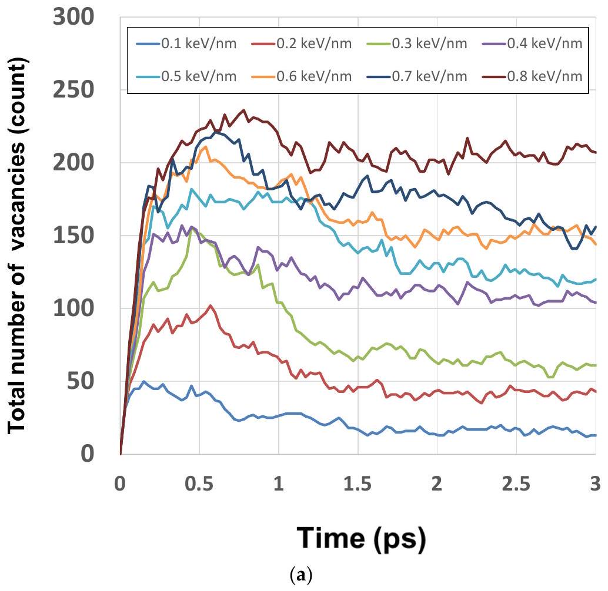
Figure 5. Cont.

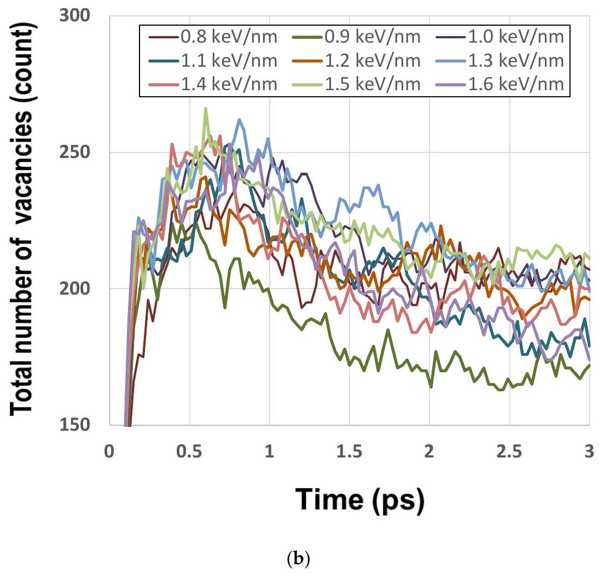
Figure 5. Time change of the total number of vacancies for the values of (a) $g S e=0.1-0.8 \mathrm{keV} / \mathrm{nm}$ and (b) $g S e=0.8-1.6 \mathrm{keV} / \mathrm{nm}$.

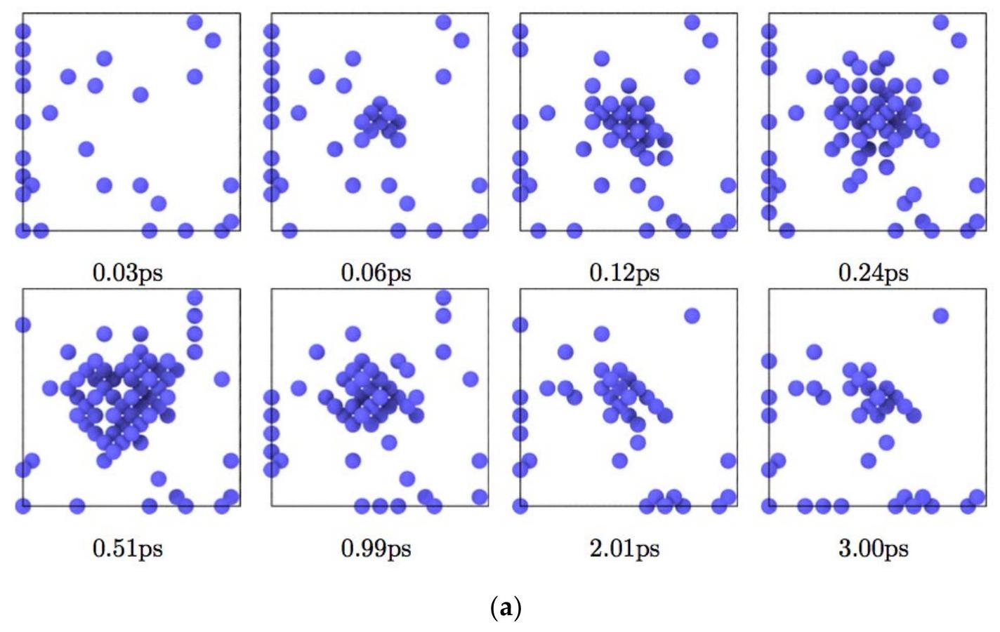
Figure 6. Cont.

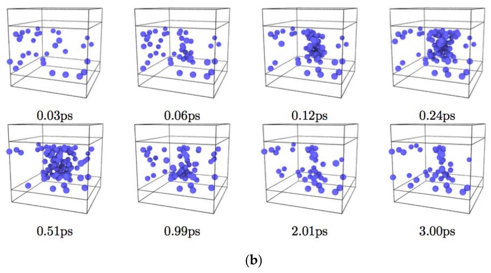
Figure 6. Distributions of vacancies in the $\mathrm{CeO}_{2}$ systems viewed from (a) <001> and (b) <100> directions for the values of $g S e=0.2 \mathrm{keV} / \mathrm{nm}$.

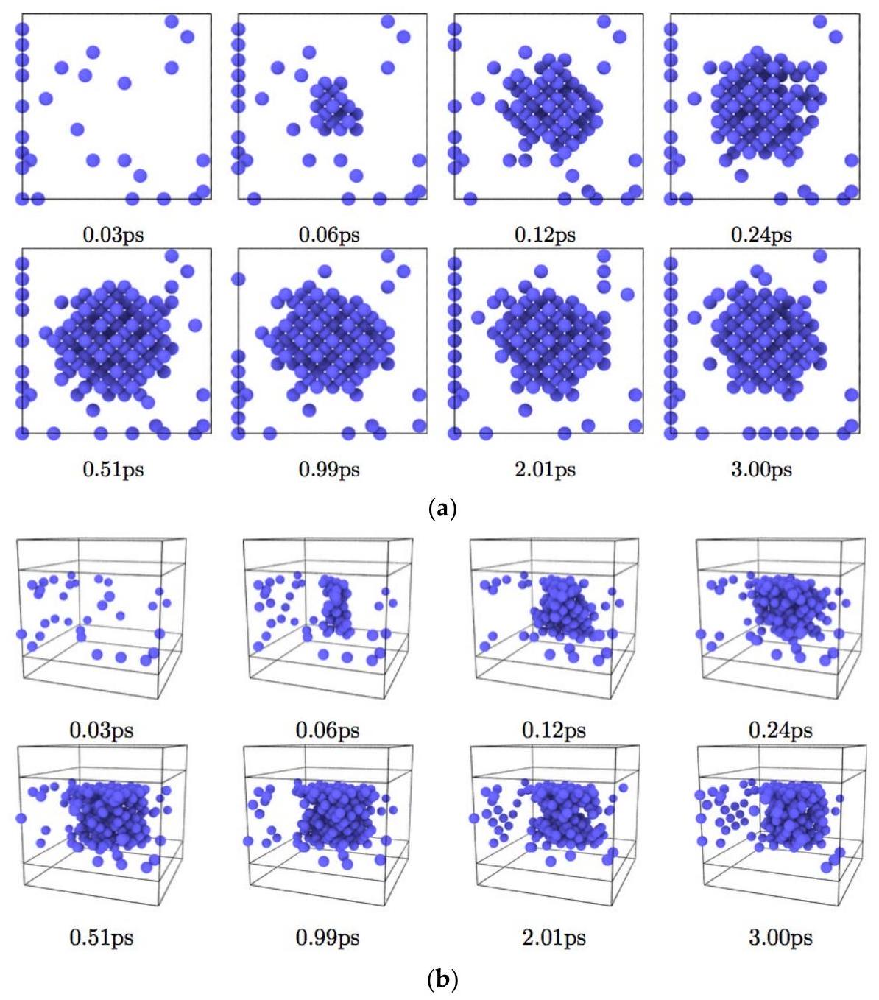
Figure 7. Distributions of vacancies in the $\mathrm{CeO}_{2}$ systems viewed from (a)<001> and (b)<100> directions for the values of $g S e=0.8 \mathrm{keV} / \mathrm{nm}$.

Figure 8 shows the time change of oxygen Frenkel pairs for $g S e=0.4,0.8,1.2$, and $1.6 \mathrm{keV} / \mathrm{nm}$. The number of oxygen Frenkel pairs could be separated into two categories, higher $g S e(0.8,1.2$ and $1.6 \mathrm{keV} / \mathrm{nm})$ and lower $g S e(0.4 \mathrm{keV} / \mathrm{nm})$. The number of oxygen Frenkel pairs in the higher $g S e$ category was larger than that of the lower $g S e$ category; however, there was no clear correlation between the Frenkel pairs and $g S e$ in the higher category. This behavior was similar to that for the number of vacancies and the radius of the nanopore. It should be noted that the number of oxygen Frenkel pairs is one order of magnitude lower than the total number of vacancies shown in Figure 5. This difference comes from the difference of definition of vacancy and Frenkel pairs. As shown in Table 2, the distance between the vacant site and the escaped oxygen atom should be larger than 0.234 nm . In contrast, the corresponding distances defined for the vacancy are much smaller than that for oxygen Frenkel pairs, 0.097 nm (for O ) and 0.138 nm (for Ce ). The time averaged distribution of the $i$ NN oxygen Frenkel pairs, where $i=1,2, \ldots, 7$, is shown for the values of $g S e=0.4,0.8,1.2$, and $1.6 \mathrm{keV} / \mathrm{nm}$ in Figure $9 \mathrm{a}-\mathrm{d}$, respectively. As seen from these figures, the short-distance Frenkel pairs, 1 NN to 4 NN , were in the majority for lower $g \mathrm{Se}(0.4 \mathrm{keV} / \mathrm{nm})$, whereas the long-distance Frenkel pairs were found for the higher values of $g S e(0.8,1.2$ and $1.6 \mathrm{keV} / \mathrm{nm})$.

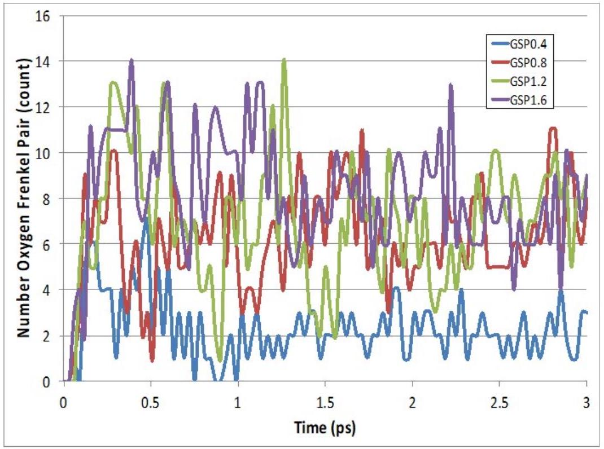
Figure 8. Time change of oxygen Frenkel pairs for $g S e=0.4,0.8,1.2$, and $1.6 \mathrm{keV} / \mathrm{nm}$.

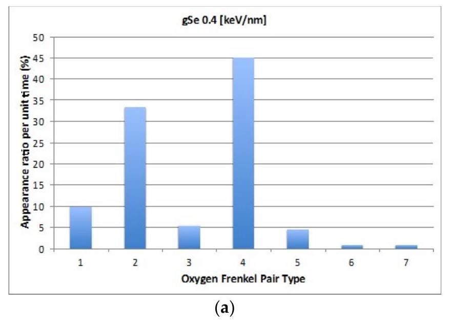
Figure 9. Cont.

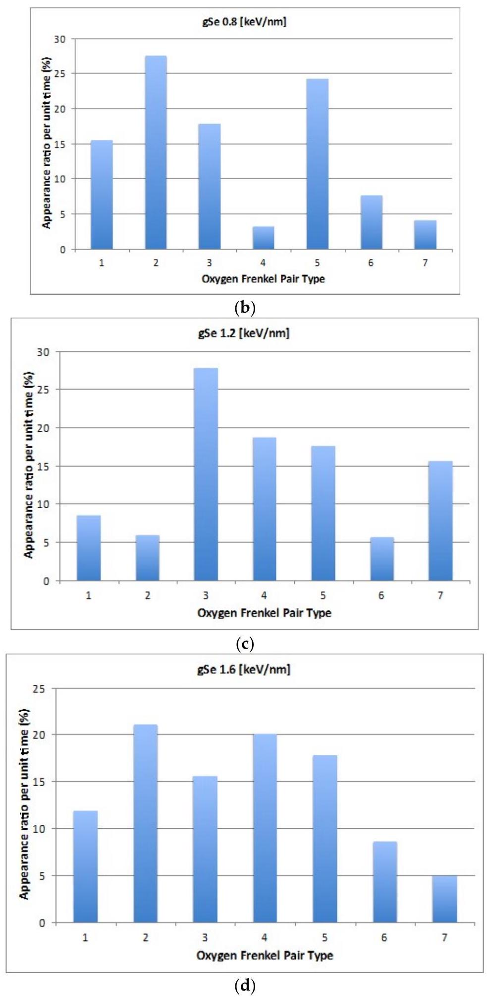
Figure 9. The time averaged distribution of $i \mathrm{NN}$ oxygen Frenkel pair, where $i=1,2, \ldots, 7$, is shown for the values of $g S e=0.4,0.8,1.2$, and $1.6 \mathrm{keV} / \mathrm{nm}$ in ( $\mathbf{a}-\mathbf{d}$ ), respectively.

In the case of $\mathrm{CeO}_{2}$, the displacement threshold energy for O is $20-30 \mathrm{eV}$, much smaller than that for $\mathrm{Ce} 50-60 \mathrm{eV}$ [30]. Therefore, oxygen-induced defects are a sensitive indicator for the ion irradiation process. Oxygen Frenkel pairs are important because the aggregation of multiple oxygen Frenkel pairs acts as a source of dislocation loops [31]. The dislocation
loops create a high-strain energy region, which becomes an initial point of crack formation and propagation in the irradiated specimen.

As can be seen from Figure 4, no hemispherical protrusion was observed on the surfaces; only disordered atoms were seen. In our simulation, the outside of the $\mathrm{CeO}_{2}$ is a free space, thus cooling by adiabatic extension could not occur. As Schattat et al. [1] pointed out, cooling by adiabatic extension is critical to obtain the hemispherical protrusion, especially for crystallizing as in the $\mathrm{CeO}_{2}$ case. We considered that the protrusion was in a vapor-like state initially and then was cooled significantly by adiabatic expansion into a hemispherical-shaped crystal (see Figures 2 and 5 in reference [3]). This process is significant and resembles the cluster formation process in the cluster-beam deposition method; the cylindrical region (the nanopore) acts similar to a nozzle in the cluster-beam deposition apparatus [32,33].

The animation of the formation process of the nano-hillock of $\mathrm{CaF}_{2}$ presented by Rymzhanov et al. [26] suggests that a strong Coulomb interaction plays an important role in forming the nano-hillock structure with single crystalline form. Karlušić et al. [27] simulated the formation process of the nano-hillock of MgO and $\mathrm{Al}_{2} \mathrm{O}_{3}$ with two different charge states, equilibrium charge state $Z_{\text {eff }}=+8.47$ and fixed charge state $Z_{\text {eff }}=+6$. They showed that the nano-hillock was formed for the equilibrium charge state, whereas a very small nano-hillock $\left(\mathrm{Al}_{2} \mathrm{O}_{3}\right)$ or no nano-hillock $(\mathrm{MgO})$ was formed for the fixed charge state. This finding also supports the importance of the strong Coulomb interaction. For the present case of $\mathrm{CeO}_{2}$, the equilibrium charge state of Ce is $\mathrm{Z}_{\text {eff }}=+2.7$ and the fixed charge state is $Z_{\text {eff }}=+4$, indicating a weak Coulomb interaction. In addition, it should be noted that hillock formation experiment/simulation for the system with a free surface was done with 23 MeV I ion giving $S e=8.53 \mathrm{keV} / \mathrm{nm}(\mathrm{MgO})$ and $9.1 \mathrm{keV} / \mathrm{nm}\left(\mathrm{Al}_{2} \mathrm{O}_{3}\right)$, estimated by the SRIM code [27], whereas the irradiation experiment/simulation for the bulk system was done with 167 MeV Xe ion giving $S e=21 \mathrm{keV} / \mathrm{nm}(\mathrm{MgO}), 24.9 \mathrm{keV} / \mathrm{nm}\left(\mathrm{Al}_{2} \mathrm{O}_{3}\right)$ [25]. This leads to another possible mechanism for nano-hillock formation: moderately strong beam irradiation to a strong Coulomb interaction system with a free surface.

## 4. Conclusions

Using the MD method, we simulated the nanopore formation process by applying a thermal spike to single crystal $\mathrm{CeO}_{2}$. The nanopore was formed abruptly at around 0.3 ps after the irradiation and grew to its maximum size at 0.5 ps . Then, it shrank in the time to 1.0 ps and was finally equilibrated. The nanopore size increased with increasing effective stopping power $g S e$ (i.e., the thermal energy deposited per unit length in the specimen), but it saturated when $g S e$ was $0.8 \mathrm{keV} / \mathrm{nm}$ or more. This finding will provide useful information for precise control of the size of the nanopores. We classified oxygen Frenkel pairs into seven types using the distance between the vacant site and the corresponding oxygen atom. Irrespective of the value of $g S e$, the number of interstitial ions became the maximum immediately after irradiation. Subsequently, interstitial ions occupied the vacancies to lower the system energy. When $g S e$ was low, the vast majority of Frenkel pairs were the short-distance type and when $g S e$ was high, both short-distance and long-distance types of Frenkel pairs were produced.

The present study has clarified the essence feature of the nanopore formation process by irradiation; however, there are several issues that should be addressed in further investigations: (i) the MD simulation box is small compared with the radius of cylindrical hole. (ii) The length to width ratio of the track deviates from that of actual experiment. (iii) Several MD simulations per Se are required to confirm quantitative information.

Author Contributions: Conceptualization, Y.S. and A.I.; methodology, Y.S.; software, Y.S.; validation, Y.S. and R.K.; investigation, R.K.; data curation, R.K.; writing-original draft preparation, Y.S.; writing-review and editing, N.I. and A.I.; visualization, R.K.; supervision, A.I.; project administration, Y.S.; funding acquisition, N.I. All authors have read and agreed to the published version of the manuscript.

Funding: This research was funded by JSPS KAKENHI Grant Numbers 16K06963 and 20K05389.
Institutional Review Board Statement: Not applicable.
Informed Consent Statement: Not applicable.
Acknowledgments: Tomoaki Akabane (a former graduate student at Ibaraki University, currently with Fuji Film Medical IT Solutions, Inc. (Tokyo, Japan)) is acknowledged for the development of the program for molecular dynamics simulation.

Conflicts of Interest: The authors declare no conflict of interest. The funders had no role in the design of the study; in the collection, analyses, or interpretation of data; in the writing of the manuscript, or in the decision to publish the results.

## References

1. Schattat, B.; Bolse, W.; Klaumuenzer, S.; Zizak, I.; Scholz, R. Cylindrical nanopores in NiO induced by swift heavy ions. Appl. Phys. Lett. 2005, 87, 173110. [CrossRef]
2. Jensen, J.; Dunlop, A.; Della-Negra, S.; Pascard, H. Tracks in YIG induced by MeV C 60 ions. Nucl. Instrum. Methods B 1998, 135, 295-301. [CrossRef]
3. Ishikawa, N.; Okubo, N.; Taguchi, T. Experimental evidence of crystalline hillocks created by irradiation of $\mathrm{CeO}_{2}$ with swift heavy ions: TEM study. Nanotechnology 2015, 26, 355701. [CrossRef] [PubMed]
4. Ishikawa, N.; Taguchi, T.; Kitamura, A.; Szenes, G.; Toimil-Molares, M.E.; Trautmann, C. TEM analysis of ion tracks and hillocks produced by swift heavy ions of different velocities in $\mathrm{Y}_{3} \mathrm{Fe}_{5} \mathrm{O}_{12}$. J. Appl. Phys. 2020, 127, 055902. [CrossRef]
5. Costantini, J.-M.; Lelong, G.; Guillaumet, M.; Gourier, D.; Takaki, S.; Ishikawa, N.; Watanabe, H.; Yasuda, K. Optical reflectivity of ion-irradiated cerium dioxide sinters. J. Appl. Phys. 2019, 126, 175902. [CrossRef]
6. Costantini, J.-M.; Gutierrez, G.; Watanabe, H.; Yasuda, K.; Takaki, S.; Lelong, G.; Guillaumet, M.; Weber, W.J. Optical spectroscopy study of modifications induced in cerium dioxide by electron and ion irradiations. Philos. Mag. 2019, 99, 1695-1714. [CrossRef]
7. Palomares, R.I.; Shamblin, J.; Tracy, C.L.; Neuefeind, J.; Ewing, R.C.; Trautmann, C.; Lang, M. Defect accumulation in swift heavy ion-irradiated $\mathrm{CeO}_{2}$ and $\mathrm{ThO}_{2}$. J. Mater. Chem. A 2017, 5, 12193. [CrossRef]
8. Graham, J.T.; Zhang, Y.; Weber, W.J. Irradiation-induced defect formation and damage accumulation in single crystal CeO2. J. Nucl. Mater. 2018, 498, 400-408. [CrossRef]
9. Shelyug, A.; Palomares, R.I.; Lang, M.; Navrotsky, A. Energetics of defect production in fluorite-structured $\mathrm{CeO}_{2}$ induced by highly ionizing radiation. Phys. Rev. Mater. 2018, 2, 093607. [CrossRef]
10. Costantini, J.-M.; Miro, S.; Touati, N.; Binet, L.; Wallez, G.; Lelong, G.; Guillaumet, M.; Weber, W.J. Defects induced in cerium dioxide single crystals by electron irradiation. J. Appl. Phys. 2018, 123, 025901. [CrossRef]
11. Cureton, W.F.; Palomares, R.I.; Walters, J.; Tracy, C.L.; Chen, C.-H.; Ewing, R.C.; Baldinozzi, G.; Lian, J.; Trautmann, C.; Lang, M. Grain size effects on irradiated $\mathrm{CeO}_{2}, \mathrm{ThO}_{2}$, and $\mathrm{UO}_{2}$. Acta Mater. 2018, 160, 47-56. [CrossRef]
12. Maslakov, K.I.; Teterin, Y.A.; Popel, A.J.; Teterin, A.Y.; Ivanov, K.E.; Kalmykov, S.N.; Petrov, V.G.; Petrov, P.K.; Farnan, I. XPS study of ion irradiated and unirradiated $\mathrm{CeO}_{2}$ bulk and thin film samples. Appl. Surf. Sci. 2018, 448, 154-162. [CrossRef]
13. Cureton, W.F.; Palomares, R.I.; Tracy, C.L.; O'Quinn, E.C.; Walters, J.; Zdorovets, M.; Ewing, R.C.; Toulemonde, M.; Lang, M. Effects of irradiation temperature on the response of $\mathrm{CeO}_{2}, \mathrm{ThO}_{2}$, and $\mathrm{UO}_{2}$ to highly ionizing radiation. J. Nucl. Mater. 2019, 525, 83-91. [CrossRef]
14. Abanades, S.; Flamant, G. Thermochemical hydrogen production from a two-step solar driven water-splitting cycle based on cerium oxides. Sol. Energy 2006, 80, 1611-1623. [CrossRef]
15. Sasajima, Y.; Onuki, H.; Ishikawa, N.; Iwase, A. Computer simulation of high-energy-ion irradiation of SiO2. Trans. MRS-J. 2013, 38, 497-502.
16. Sasajima, Y.; Ajima, N.; Osada, T.; Ishikawa, N.; Iwase, A. Molecular dynamics simulation of fast particle irradiation to the $\mathrm{Gd}_{2} \mathrm{O}_{3}$-doped $\mathrm{CeO}_{2}$. Nucl. Instrum. Methods B 2013, 316, 176-182. [CrossRef]
17. Sasajima, Y.; Osada, T.; Ishikawa, N.; Iwase, A. Computer simulation of high-energy-ion irradiation of uranium dioxide. Nucl. Instrum. Methods B 2013, 314, 195-201. [CrossRef]
18. Sasajima, Y.; Ajima, N.; Osada, T.; Ishikawa, N.; Iwase, A. Molecular dynamics simulation of fast particle irradiation to the single crystal $\mathrm{CeO}_{2}$. Nucl. Instrum. Methods B 2013, 314, 202-207. [CrossRef]
19. Sasajima, Y.; Ajima, N.; Kaminaga, R.; Ishikawa, N.; Iwase, A. Structure analysis of the defects generated by a thermal spike in single crystal $\mathrm{CeO}_{2}$ : A molecular dynamics study. Nucl. Instrum. Methods B 2019, 440, 118-125. [CrossRef]
20. Yablinsky, C.A.; Devanathan, R.; Pakarinen, J.; Gan, J.; Severin, D.; Trautmann, C.; Allen, T. Characterization of swift heavy ion irradiation damage in ceria. J. Mater. Res. 2015, 30, 1473-1484. [CrossRef]
21. Medvedev, N.A.; Rymzhanov, R.A.; Volkov, A.E. Time-resolved electron kinetics in swift heavy ion irradiated solids. J. Phys. D 2015, 48, 355303. [CrossRef]
22. Rymzhanov, R.A.; Medvedev, N.; Volkov, A.E. Damage threshold and structure of swift heavy ion tracks in $\mathrm{Al}_{2} \mathrm{O}_{3}$. J. Phys. D Appl. Phys. 2017, 50, 475301. [CrossRef]
23. Rymzhanova, R.A.; Medvedev, N.; Volkova, A.E.; O'Connell, J.H.; Skuratova, V.A. Overlap of swift heavy ion tracks in $\mathrm{Al}_{2} \mathrm{O}_{3}$. Nucl. Instrum. Methods B 2018, 435, 121-125. [CrossRef]
24. Rymzhanova, R.A.; Gorbunovd, S.A.; Medvedeve, N.; Volkova, A.E. Damage along swift heavy ion trajectory. Nucl. Instrum. Methods B 2019, 440, 25-35. [CrossRef]
25. Rymzhanov, R.A.; Medvedev, N.; OㅓConnell, J.H.; Janse van Vuuren, A.; Skuratov, V.A.; Volkov, A.E. Recrystallization as the governing mechanism of ion track formation. Sci. Rep. 2019, 9, 3837. [CrossRef] [PubMed]
26. Rymzhanov, R.A.; ÓConnell, J.H.; Janse van Vuuren, A.; Skuatov, V.A.; Medvedev, N.; Volkov, A.E. Insight into picosecond kinetics of insulator surface under ionizing radiation. J. Appl. Phys. 2020, 127, 015901. [CrossRef]
27. Karlušić, M.; Rymzhanov, R.A.; ÓConnell, J.H.; Bröckers, L.; Tomić, L.K.; Siketić, Z.; Fazinić, S.; Dubček, P.; Jakšić, M.; Provatas, G.; et al. Mechanisms of surface nanostructuring of $\mathrm{Al}_{2} \mathrm{O}_{3}$ and MgO by grazing incidence irradiation with swift heavy ions. Surf. Interfaces 2021, 27, 101508. [CrossRef]
28. Inaba, H.; Sagawa, R.; Hayashi, H.; Kawamura, K. Molecular dynamics simulation of gadolinia-doped ceria. Solid State Ion. 1999, 122, 95-103. [CrossRef]
29. Sadus, R.J. Molecular Simulation of Fuids-Theory, Algorithms and Object-Orientation; Elsevier: Amsterdam, The Netherlands, 2002; p. 305.
30. Shiiyama, K.; Yamamoto, T.; Takahashi, T.; Guglielmetti, A.; Chartier, A.; Yasuda, K.; Matsumura, S.; Yasunaga, K.; Meis, C. Molecular dynamics simulations of oxygen Frenkel pairs in cerium dioxide. Nucl. Instrum. Methods B 2010, 268, 2980-2983. [CrossRef]
31. Yasunaga, K.; Yasuda, K.; Matsumura, S.; Sonoda, T. Electron energy-dependent formation of dislocation loops in $\mathrm{CeO}_{2}$. Nucl. Instrum. Methods B 2008, 266, 2877-2881. [CrossRef]
32. Takaoka, H. Ionized Cluster Beam Technique for Deposition and Epitaxy. Ph.D. Thesis, Kyoto University, Kyoto, Japan, 23 July 1981; pp. 45-50. [CrossRef]
33. Yamada, I.; Takaoka, H. Ionized Cluster Beams: Physics and Technology. Jpn. J. Appl. Phys. 1993, 32, 2121. [CrossRef]
