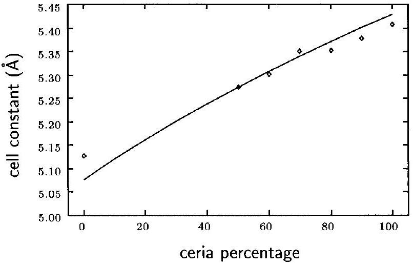
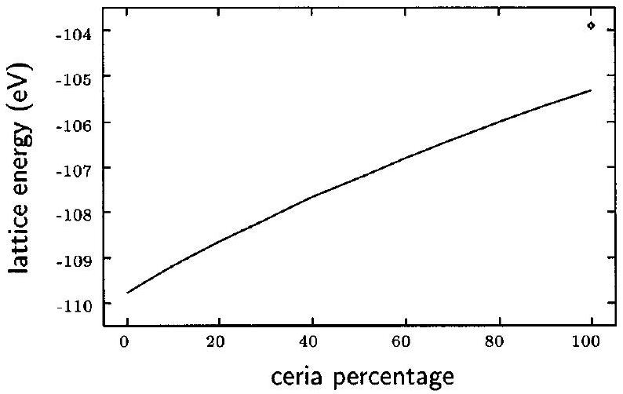
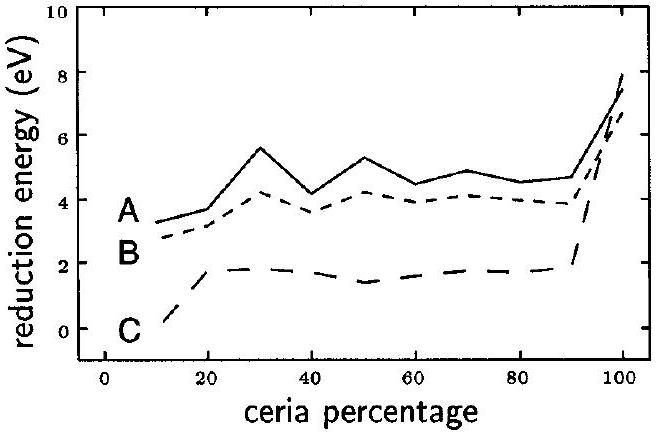
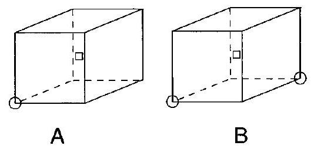
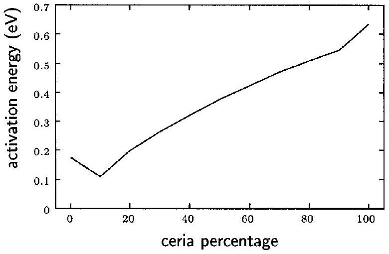

# Computer Simulation Studies of Bulk Reduction and Oxygen Migration in $\mathbf{C e O}_{\mathbf{2}}-\mathbf{Z r O}_{\mathbf{2}}$ Solid Solutions 

Gabriele Balducci,* Jan Kašpar, Paolo Fornasiero, and Mauro Graziani Dipartimento di Scienze Chimiche, via L. Giorgieri, 1, 34127 Trieste, Italy

M. Saiful Islam Department of Chemistry, University of Surrey, Guildford, Surrey GU2 5XH, U.K. Julian D. Gale Department of Chemistry, Imperial College of Science and Technology, South Kensington, London SW7 2AY, U.K.

Received: August 16, 1996; In Final Form: November 7, $1996^{\otimes}$
Downloaded via UNIV ILLINOIS URBANA-CHAMPAIGN on December 5, 2025 at 09:37:44 (UTC). See https://pubs.acs.org/sharingguidelines for options on how to legitimately share published articles.

#### Abstract

Computer simulation techniques have been used to model cubic $\mathrm{CeO}_{2}-\mathrm{ZrO}_{2}$ solid solutions in the whole composition range. Aspects related with the oxygen storage capacity of these materials are emphasized. The energetics of the $\mathrm{Ce}^{4+} / \mathrm{Ce}^{3+}$ bulk reduction reaction as well as the activation energy for oxygen migration in the lattice are investigated and compared with the corresponding quantities in pure $\mathrm{CeO}_{2}$. It is found that even small additions of $\mathrm{ZrO}_{2}$ decrease the bulk reduction energy of $\mathrm{Ce}^{4+}$ to values comparable to those reported for surface reduction in pure $\mathrm{CeO}_{2}$. Activation energy calculations indicate an almost monotonic increase of oxygen mobility with increasing zirconia content.

## Introduction

Ceria ( $\mathrm{CeO}_{2}$ ) is currently receiving great interest in the context of the "three-way catalyst" technology for the treatment of automobile exhausts. ${ }^{1}$ Since its introduction as an additive to the alumina catalyst support, several important features of this material have been recognized, such as: the oxygen storage capacity, due to a facile $\mathrm{Ce}^{4+} / \mathrm{Ce}^{3+}$ redox reaction, ${ }^{2}$ the ability to improve the dispersion of the noble metal, ${ }^{3}$ the thermal stabilization of the alumina support, ${ }^{4}$ the promotion of the water gas shift reaction, ${ }^{3}$ and the direct interaction with the noble metal, which leads to an improved CO and hydrocarbon oxidation. ${ }^{5}$ Moreover, it has been recently found that surface $\mathrm{Ce}^{3+}$ sites could be active centers for the decomposition of $\mathrm{NO}_{x}$ molecules at low temperatures even in the absence of the noble metal: ${ }^{6-8}$ this is regarded as very promising from the viewpoint of decreasing or even eliminating the noble metal from the threeway catalyst formulation.

Among the above-mentioned features, the oxygen storage capacity is particularly relevant. In fact, three-way catalysts usually achieve acceptable simulataneous conversions for the three main pollutants contained in automobile exhausts (namely, $\mathrm{CO}, \mathrm{NO}_{x}$ and hydrocarbons) only in a rather narrow range of the air-to-fuel ratio centered at its stoichiometric value ( $\approx 14.6$ ). ${ }^{1}$ On the other hand, even in the presence of electronic control (the so-called "lambda probe" technology), the air-to-fuel ratio can widely oscillate around the above optimal value under real car operation. Thus, one of the main goals in the postcombustion treatment of the automobile pollutants is that of enlarging as much as possible this so-called "operational window". In this context, the redox reaction:

$$
2 \mathrm{CeO}_{2} \rightleftharpoons \mathrm{Ce}_{2} \mathrm{O}_{3}+\frac{1}{2} \mathrm{O}_{2}
$$

can act as a chemical air-to-fuel ratio regulator, consuming

[^0]excess oxygen under "lean" mixture and releasing it under "rich" mixture conditions. ${ }^{1}$

It has been recently reported that the reducibility of ceria is greatly enhanced when it is mixed with zirconia to form a solid solution, $\mathrm{CeO}_{2}-\mathrm{ZrO}_{2}$. ${ }^{9,10}$ Reduction temperatures as low as 700 K have been found for the $\mathrm{Ce}_{0.5} \mathrm{Zr}_{0.5} \mathrm{O}_{2}$ system during repeated reduction/oxidation cycles under temperature-programmed operation. ${ }^{10,11}$ Moreover, it has been found that reduction at this low temperature involves not only surface ceria but also a large fraction of the bulk material. Recent work on the above system includes experimental investigations on structural phase transitions, ${ }^{12-15} \mathrm{X}$-ray powder diffraction analysis, ${ }^{16}$ electrical conductivity measurements, ${ }^{17}$ and X-ray absorption studies. ${ }^{18}$

It is clear, however, that the redox behavior with the associated formation of oxygen vacancies and the energetics of oxygen mobility of the ceria-zirconia mixed oxides are not yet fully established. The present paper is a contribution to the understanding of such increased redox capabilities. $\mathrm{CeO}_{2}- \mathrm{ZrO}_{2}$ solid solutions have been studied in the whole range of compositions using atomistic simulation techniques which have already been successfully applied to other metal oxide catalysts. ${ }^{19,20}$ Perfect lattice as well as defect simulations have been performed, with particular regard to those aspects related to the $\mathrm{Ce}^{4+} / \mathrm{Ce}^{3+}$ redox behavior.

Our investigation complements recent studies on pure $\mathrm{CeO}_{2}{ }^{21}$ which have focused mainly on surface energies and defects as related to the catalytic behavior in the carbon monoxide oxidation reaction. Earlier simulation work on $\mathrm{CeO}_{2}$ addressed the problem of the effect of aliovalent dopants on electrical conductivity. ${ }^{22}$ A detailed theoretical investigation on the defect structure of calcia-stabilized zirconia has also appeared. ${ }^{23}$ To our knowledge, this is the first computer simulation study covering the whole composition range of $\mathrm{CeO}_{2}-\mathrm{ZrO}_{2}$ solid solutions.

## Computational Methods

The computational methodologies used in this work are well established. ${ }^{24}$ Basically, the materials to be considered are

TABLE 1: Potential Parameters Employed in the Present Work
| Short Range Potential Parameters: $V(r)=A \exp (-r / \rho)-C / r^{6}$ |  |  |  |
| :--- | :--- | :--- | :--- |
|  | $A(\mathrm{eV})$ | $\rho(\AA)$ | $C\left(\mathrm{eV} \AA^{6}\right)$ |
| $\mathrm{O}^{2-}-\mathrm{O}^{2-}$ | 22764.3 | 0.149 | 27.89 |
| $\mathrm{Zr}^{4+}-\mathrm{O}^{2-}$ | 985.869 | 0.376 | 0.0 |
| $\mathrm{Ce}^{4+}-\mathrm{O}^{2-}$ | 1986.83 | 0.35107 | 20.4 |
| $\mathrm{Ce}^{3+}-\mathrm{O}^{2-}$ | 1731.61808 | 0.36372 | 14.43256 |
| Shell Model Parameters: $V(r)=k_{2} r^{2}$ |  |  |  |
|  | shell charge (e) |  | $k_{2}\left(\mathrm{eV} \mathrm{A}^{-2}\right)$ |
| $\mathrm{O}^{2-}$ | -2.077 |  | 27.29 |
| $\mathrm{Zr}^{4+}$ | 1.35 |  | 169.617 |
| $\mathrm{Ce}^{4+}$ | 7.7 |  | 291.75 |
| $\mathrm{Ce}^{3+}$ | 7.7 |  | 291.75 |

treated as fully ionic, with the electrostatic interactions between the formally charged species being summed using the Ewald technique. ${ }^{25}$ In addition, the short range interactions are modeled by use of Buckingham potentials which are composed of an exponential repulsion term and an attractive dispersion term:

$$
E_{i j}=A \exp \left(-\frac{r_{i j}}{\rho}\right)-\frac{C}{r_{i j}^{6}}
$$

Ionic polarizability is accounted for by the use of the shell model first introduced by Dick and Overhauser. ${ }^{25}$ Each ion is simulated as a massless charged shell interacting with an inner core through a harmonic potential given by:

$$
E_{\text {core-shell }}=\frac{1}{2} k_{2} d^{2}
$$

where $k_{2}$ is the spring constant and $d$ is the relative displacement of the core and shell. Coupling between short range forces and ionic polarizability is achieved by allowing the short range potentials to interact between shell species only.

Defect calculations are based on a two-region approach. ${ }^{27,28}$ Basically, the crystal surrounding the defect is divided into two concentric regions: an inner region I, in which each ion is explicity relaxed under the perturbation generated by the defect, and an outer region II, in which ionic relaxation can be conveniently treated by a continuum approximation due to the greater distance from the source of the perturbation. Moreover, an interfacial region must be introduced in order to allow a smooth transition between the two regions.

The above procedures are efficiently coded in the GULP program, ${ }^{29}$ which was used throughout the work presented here. It is worth noting that in order to simulate all the compositions of interest we adopted a mean field strategy, which consists of scaling interaction energies by the product of site occupancies. ${ }^{30}$ This allows the simulation of a genuine randomly distributed solid solution, and was preferred to the usual methodology of setting up large supercells, which unavoidably build up an ordered system. In order to get an indication of how the mean field approach compares with the more common supercell method, the formation energy for an oxygen vacancy was evaluated by the two methods for a $\mathrm{Ce}_{0.5} \mathrm{Zr}_{0.5} \mathrm{O}_{2}$ system. The results show that the mean field value is about 2 eV higher than the supercell one and can be rationalized with the observation that the ordered structure becomes tetragonal upon bulk optimization. Indeed, any well-ordered configuration is very likely to have a lower defect energy formation than a randomized one.

Figure 1. Calculated and observed (points) cell constants for $\mathrm{CeO}_{2}- \mathrm{ZrO}_{2}$ solid solutions.

Figure 2. Calculated lattice energies for $\mathrm{CeO}_{2}-\mathrm{ZrO}_{2}$ solid solutions at different compositions (the single point is the experimental lattice energy for pure ceria ${ }^{35}$ ).

The use of the mean field approach involved an additional step in evaluating the $\mathrm{Ce}^{4+} / \mathrm{Ce}^{3+}$ reduction energy, which seems to be worthy of a brief comment. If we indicate with M the "mixed" $\mathrm{Zr}^{4+} / \mathrm{Ce}^{4+}$ cation present at each cationic site of the solid solution, then the substitution of a $\mathrm{Ce}^{4+}$ ion in the lattice with a $\mathrm{Ce}^{3+}$ must be preceded by the substitution of a "mixed" cation with a $\mathrm{Ce}^{4+}$, according to: $M_{\mathrm{M}}^{\mathrm{x}} \rightarrow \mathrm{Ce}_{\mathrm{M}}^{\mathrm{x}} \rightarrow \mathrm{Ce}_{\mathrm{M}}^{\prime}$. Thus, the energy involved in the first step must be subtracted from the energy involved in the second one to obtain the desired value.

The potential parameters for the $\mathrm{Zr}^{4+}$ and $\mathrm{O}^{2-}$ ions were taken from the paper on CaO -doped zirconia by Dwivedi and Cormack; ${ }^{23} \mathrm{Ce}^{4+}$ and $\mathrm{Ce}^{3+}$ potentials were those employed by Sayle et al. for modeling bulk and surface defects in pure ceria. ${ }^{21}$ The potential parameters are listed in Table 1 for clarity.

A cubic fluorite structure was assumed for the solid solutions at all compositions, since the most interesting experimental results were obtained with materials having this structure. ${ }^{10}$ However, we are aware that metastable tetragonal phases have been experimentally found for ceria contents less than about $50 \% .{ }^{16}$ Nevertheless, we have carried out preliminary calculations assuming a tetragonal structure which yield a cubic structure following energy minimization. This will be a topic for future work.

## Results and Discussion

The validity of the model was first assessed by performing a number of preliminary perfect lattice calculations. Calculated and observed ${ }^{31}$ cell constants are plotted as a function of composition in Figure 1; the variation of the lattice energy with composition is shown in Figure 2. Other crystal properties, such as dielectric and elastic constants, are compared with available

Figure 3. $\mathrm{Ce}^{4+} / \mathrm{Ce}^{3+}$ reduction energy in $\mathrm{CeO}_{2}-\mathrm{ZrO}_{2}$ solid solutions at different compositions: (A) isolated $\mathrm{Ce}_{\mathrm{Ce}}^{\prime}$ and $\mathrm{V}_{\mathrm{O}}^{\bullet \bullet}$ defects, (B) correction for $1: 1\left[\mathrm{Ce}_{\mathrm{Ce}}^{\prime}-\mathrm{V}_{\mathrm{O}}^{* *}\right]^{\bullet}$ clusters, and (C) correction for $2: 1 \left[\mathrm{Ce}_{\mathrm{Ce}}^{\prime}-\mathrm{V}_{\mathrm{O}}^{* *}-\mathrm{Ce}_{\mathrm{Ce}}^{\prime}\right]^{\mathrm{x}}$ clusters.

TABLE 2: Calculated vs Observed Properties of Pure Ceria and Pure Zirconia
| compound | property | obsd | calcd |
| :--- | :--- | :--- | :--- |
| ceria | static dielectric constant ${ }^{36}$ | 18.6-20.0 | 9.81 |
| cubic zirconia | high-freq dielectric constant ${ }^{36}$ elastic constants $\left(10^{10} \mathrm{~N} / \mathrm{m}^{2}\right):^{37}$ | 4.0 | 3.6 |
|  | $C_{11}$ | 40.09 | 61.63 |
|  | $C_{12}$ | 16.3 | 12.0 |
|  | $C_{44}$ | 5.5 | 10.1 |
|  | static dielectric constant ${ }^{23}$ | 29.3 | 26.9 |

experimental data for the pure components of the solid solutions in Table 2. The simulated cell constants accord well with the available structural data across a wide composition range. In general, an overall satisfactory agreement between observed and calculated properties was obtained.

The energetics of the redox behavior of cerium in the $\mathrm{CeO}_{2}- \mathrm{ZrO}_{2}$ solid solutions can be analyzed on the basis of two related processes: the $\mathrm{Ce}^{4+} / \mathrm{Ce}^{3+}$ reduction in the lattice according to the following overall reaction:

$$
\mathrm{O}_{\mathrm{O}}^{\mathrm{x}}+2 \mathrm{Ce}_{\mathrm{Ce}}^{\mathrm{x}} \rightarrow \frac{1}{2} \mathrm{O}_{2(g)}+\mathrm{V}_{\mathrm{O}}^{\bullet \bullet}+2 \mathrm{Ce}_{\mathrm{Ce}}^{\prime}
$$

and the activation energy for the migration of oxygen ions. Note that Kröger-Vink notation is used in this equation in which $\mathrm{V}_{\mathrm{O}}^{* *}$ and $\mathrm{Ce}_{\mathrm{Ce}}^{\prime}$ represent an oxygen vacancy and a $\mathrm{Ce}^{3+}$ state, respectively.

The reduction energy of $\mathrm{Ce}^{4+}$ ions in the solid solutions was evaluated using defect and intra-atomic terms according to the procedure outlined by Sayle et al.; ${ }^{21}$ the results are plotted versus composition in Figure 3 for isolated (A) and associated (B,C) defects.

It is apparent that the $\mathrm{Ce}^{4+} / \mathrm{Ce}^{3+}$ reduction energy is substantially lowered by the introduction of $10 \%$ of zirconia, remaining approximately constant for higher zirconia contents. As noted before, this process allows the reversible addition and removal of oxygen, thus enabling the mixed oxide to act as an oxygen buffer in catalytic reactions. Although there are no quantitative data for direct comparison, our reduction energies are consistent with the observation that the catalytic activity is greatly enhanced by the introduction of Zr into $\mathrm{CeO}_{2}$ which is associated with increased reducibility of the bulk oxide. ${ }^{9,10,32}$

The effect of the binding between $\mathrm{Ce}^{3+}$ ions and oxygen vacancies on the overall $\mathrm{Ce}^{4+} / \mathrm{Ce}^{3+}$ reduction is also shown in Figure 3 for the $\left[\mathrm{Ce}_{\mathrm{Ce}}^{\prime}-\mathrm{V}_{\mathrm{O}}^{\bullet \bullet}\right]^{\bullet}$ pair and the $\left[\mathrm{Ce}_{\mathrm{Ce}}^{\prime}-\mathrm{V}_{\mathrm{O}}^{\bullet \bullet}-\mathrm{Ce}_{\mathrm{Ce}}^{\prime}\right]^{\mathrm{x}}$ trimer clusters shown in Figure 4. It appears that the formation of $\mathrm{Ce}^{3+}$ ions in the lattice is greatly favored by the interaction with positively charged oxygen vacancies in nearest neighbor positions. Indeed, clustering effects are known to be important

Figure 4. Two defect clusters considered (the circle represents a $\mathrm{Ce}_{\mathrm{Ce}}^{\prime}$, the square represents a $\mathrm{V}_{\mathrm{O}}^{* *}$ ): (A) $\left[\mathrm{Ce}_{\mathrm{Ce}}^{\prime}-\mathrm{V}_{\mathrm{O}}^{* *}\right]^{\bullet}$ pair and (B) $\left[\mathrm{Ce}_{\mathrm{Ce}}^{\prime}-\right. \left.\mathrm{V}_{\mathrm{O}}^{* *}-\mathrm{Ce}_{\mathrm{Ce}}^{\prime}\right]^{\mathrm{x}}$ trimer.

Figure 5. Activation energy for oxygen migration as a function of the composition.

for ionic conductivity in solid electrolytes based on fluorite oxides. ${ }^{22,23}$ The extra stabilization of the defect clusters even at low zirconia contents could be related to the smaller size of the $\mathrm{Zr}^{4+}$ cations, which take part in removing the strain due to the increase of the ionic size on passing from $\mathrm{Ce}^{4+}$ to $\mathrm{Ce}^{3+}$. The bulk reduction energy corrected for the trimer binding term yields values which have been reported for pure ceria surfaces: ${ }^{21}$ interestingly, it is found from temperature-programmed reduction experiments that the $\mathrm{Ce}_{0.5} \mathrm{Zr}_{0.5} \mathrm{O}_{2}$ solid solution gives extended bulk reduction at temperatures at which only surface reduction is observed for pure ceria. ${ }^{10}$

It is well known that facile diffusion in the solid state is important to the mode of operation of certain catalysts. We have therefore examined the energetics of oxygen ion transport in the $\mathrm{CeO}_{2}-\mathrm{ZrO}_{2}$ solid solution. The activation energy for oxygen vacancy migration to a nearest neighbor site was evaluated as the difference between the energy of a migrating anion at the saddle point position ( $1 / 2,1 / 4,1 / 4$ ) and that of an oxygen vacancy in the cubic fluorite structure. The transition state was located by use of rational function optimization leading to a stationary point with a single imaginary mode in the Hessian matrix. The resulting activation energy is plotted against composition in Figure 5.

The low activation energies clearly indicate rapid oxygen mobility through the bulk for all $\mathrm{CeO}_{2}-\mathrm{ZrO}_{2}$ compositions. This is consistent with recent EXAFS experimental observations which suggest that the structural modifications brought about by the introduction of $\mathrm{ZrO}_{2}$ into the structure of $\mathrm{CeO}_{2}$ promote the formation of mobile oxygen ions. ${ }^{32}$ While no direct comparison can be made for the whole solid solution, the calculated values are consistent with measured migration energies of 0.49 and 0.67 eV for $\mathrm{CeO}_{2}{ }^{33}$ and Y -doped $\mathrm{CeO}_{2}{ }^{, 34}$ respectively. This high mobility of oxygen vacancies through the bulk and to the surface will assist the $\mathrm{Ce}^{4+} / \mathrm{Ce}^{3+}$ redox cycle.

The almost monotonic decrease of the activation energy with the zirconia content may point to enhanced $\mathrm{Ce}^{4+}$ reducibility for a $\mathrm{Ce}_{0.1} \mathrm{Zr}_{0.9} \mathrm{O}_{2}$ system. However, it must be remembered that a substantial amount of cerium is required for an efficient oxygen storage capability, so that an optimum balance has to
be found between an increased $\mathrm{Ce}^{4+}$ reducibility and the concentration of ceria in the solid solution.

## Conclusions

We have illustrated that, by employing computer simulation techniques, the defect properties of the $\mathrm{CeO}_{2}-\mathrm{ZrO}_{2}$ solid solution can be investigated across the whole composition range and provide information that is relevant to catalytic behavior. Some conclusions can be drawn from the present study: (1) calculated cell constants for intermediate compositions accord well with structural data; (2) it is found that the $\mathrm{Ce}^{4+} / \mathrm{Ce}^{3+}$ reduction energy is significantly reduced even by small amounts of zirconia; this effect is magnified when the association between $\mathrm{Ce}^{3+}$ ions and oxygen vacancies is taken into account, resulting in the bulk reduction energies becoming comparable with values calculated for pure ceria surfaces; (3) the activation energy for oxygen migration in the bulk is found to be low and decreases almost monotonically with the zirconia content; this indicates facile oxygen diffusion through the bulk catalyst.

Acknowledgment. Ministero dell’Universitá e della Ricerca Scientifica (MURST, 40\% and 60\%), Universitá di TriesteRelazioni Internazionali, University of Surrey, and CNR, Rome, are acknowledged for financial support.

## References and Notes

(1) Taylor, K. C. Automobile catalytic converters. In Catalysis Science and technology; Anderson, J. R., Boudart, M., Eds., SpringerVerlag: Berlin, 1984; Vol. 5.
(2) Yao, H. C.; Yu Yao, Y. F. J. Catal. 1984, 86, 254.
(3) Diwell, A. F.; Rajaram, R. R.; Shaw, H. A.; Truex, T. J. The role of ceria in three-way catalysts. In Catalysis and automotive pollution control II; Crucq, A., Ed.; Elsevier: Amsterdam, 1991; Vol. 71.
(4) Harrison, B.; Diwell, A. F.; Hallet, C. Platinum Met. Rev. 1988, 32, 73.
(5) Oh, S. H. J. Catal. 1990, 124, 477.
(6) Ranga Rao, G.; Kašpar, J.; Di Monte, R.; Meriani, S.; Graziani, M. Catal. Lett. 1994, 24, 107.
(7) Ranga Rao, G.; Fornasiero, P.; Kaśpar, J.; Meriani, S.; Di Monte, R.; Graziani, M. Stud. Surf. Sci. Catal. 1995, 96, 631.
(8) Ranga Rao, G.; Fornasiero, P.; Di Monte, R.; Kašpar, J.; Vlaic, G.; Balducci, G.; Meriani, S.; Gubitosa, G.; Cremona, A.; Graziani, M. J. Catal. 1996, 162, 1.
(9) Zamar, F.; Trovarelli, A.; de Leitenburg, C.; Dolcetti, G. J. Chem. Soc., Chem. Commun. 1995, 965.
(10) Balducci, G.; Fornasiero, P.; Di Monte, R.; Kašpar, J.; Meriani, S.; Graziani, M. Catal. Lett. 1995, 33, 193.
(11) Fornasiero, P.; Balducci, G.; Di Monte, R.; Kašpar, J.; Sergo, V.; Gubitosa, G.; Ferrero, A.; Graziani, M. J. Catal. 1996, 164, 173.
(12) Yashima, M.; Mitsuhashi, T.; Takashina, H.; Kakihana, M.; Ikegami, T.; Yoshimura, M. J. Am. Ceram. Soc. 1995, 7, 2225.
(13) Yashima, M.; Harashi, H.; Kakihana, M.; Yoshimura, M. J. Am. Ceram. Soc. 1994, 77, 1067.
(14) Yashima, M.; Morimoto, K.; Ishizawa, N.; Yoshimura, M. J. Am. Ceram. Soc. 1993, 76, 2865.
(15) Tani, E.; Yoshimura, M.; Somiya, S. J. Am. Ceram. Soc. 1983, 66, 506.
(16) Meriani, S.; Spinolo, G. Powder Diffraction 1987, 2, 255.
(17) Reidy, R. F.; Simkovich, G. Solid State Ionics 1993, 62, 85.
(18) Li, P.; Chen, I.-W.; Penner-Hahn, J. E. J. Am. Ceram. Soc. 1994, 77, 1281.
(19) Catlow, C. R. A.; Jackson, R. A.; Thomas, J. M. J. Phys. Chem. 1990, 94, 7889.
(20) Islam, M. S.; Ilett, D. J.; Parker, S. C. J. Phys. Chem. 1994, 98, 9637.
(21) Sayle, T. X. T.; Parker, S. C.; Catlow, C. R. A. Surf. Sci. 1994, 316, 329.
(22) Butler, V.; Catlow, C. R. A.; Fender, B. E. F.; Harding, J. H. Solid State Ionics 1983, 8, 109.
(23) Dwivedi, A.; Cormack, A. N. Phil. Mag. A 1990, 61, 1.
(24) Catlow, C. R. A., Mackrodt, W. C., Eds. Computer simulation of solids; Springer: Berlin, 1982.
(25) Ewald, P. P. Ann. Phys. 1921, 64, 253.
(26) Dick, B. G.; Overhauser, A. W. Phys. Rev. 1958, 112, 90.
(27) Mott, N. F.; Littleton, M. J. Trans. Faraday Soc. 1938, 34, 485.
(28) Lidiard, A. B. J. Chem. Soc., Faraday Trans. 1989, 85, 341.
(29) Gale, J. D. GULP: General Utility Lattice Program; Royal Institution/Imperial College, 1992-1994.
(30) Morris, B. C.; Flavell, W. R.; Mackrodt, W. C.; Morris, M. A. J. Mater. Chem. 1993, 3, 1007.
(31) Di Monte, R. Reactivity and structure of $\mathrm{Zr}_{\mathrm{x}} \mathrm{Ce}_{1-\mathrm{x}} \mathrm{O}_{2}$ and $\mathrm{Rh}(\mathrm{Pt}) / \mathrm{Zr}_{\mathrm{x}} \mathrm{Ce}_{1-\mathrm{x}} \mathrm{O}_{2}(0 \leq x \leq 0.9)$ systems. Ph.D. Thesis, University of Trieste, Italy, 1994.
(32) Vlaic, G.; Fornasiero, P.; Geremia, S.; Kašpar, J.; Graziani, M. J. Catal., in press.
(33) Adler, S. B.; Smith, J. W. J. Chem. Soc., Faraday Trans. 1993, 89, 3123.
(34) Tuller, H. L. J. Chem. Phys. Solids 1994, 55, 1393.
(35) Lewis, G. V.; Catlow, C. R. A. J. Phys. C: Solid State Phys. 1985, 18, 1149.
(36) Sayle, T. Computer simulation studies of metal-oxide support in automobile exhaust catalysis. Ph.D. Thesis, University of Bath, U.K., 1993.
(37) Mackrodt, W. C.; Woodrow, P. M. J. Am. Ceram. Soc. 1986, 69, 277.

[^0]:    * Corresponding author, e-mail: balducci@univ.trieste.it.
    ${ }^{\otimes}$ Abstract published in Advance ACS Abstracts, January 1, 1997.

