# ReaxFF Force-Field for Ceria Bulk, Surfaces, and Nanoparticles 

Peter Broqvist, ${ }^{\dagger}$ Jolla Kullgren, ${ }^{\dagger}$ Matthew J. Wolf, ${ }^{\dagger}$ Adri C. T. van Duin, ${ }^{\ddagger}$ and Kersti Hermansson*, ${ }^{\dagger}$ ${ }^{\dagger}$ Department of Chemistry-Ångström, Uppsala University, Box 538, S-751 21, Uppsala, Sweden ${ }^{\ddagger}$ Department of Mechanical and Nuclear Engineering, The Pennsylvania State University, University Park, Pennsylvania 16802, United States

Downloaded via UNIV ILLINOIS URBANA-CHAMPAIGN on March 19, 2026 at 07:10:42 (UTC). See https://pubs.acs.org/sharingguidelines for options on how to legitimately share published articles.

#### Abstract

We have developed a reactive force-field of the ReaxFF type for stoichiometric ceria ( $\mathrm{CeO}_{2}$ ) and partially reduced ceria ( $\mathrm{CeO}_{2-x}$ ). We describe the parametrization procedure and provide results validating the parameters in terms of their ability to accurately describe the oxygen chemistry of the bulk, extended surfaces, surface steps, and nanoparticles of the material. By comparison with our reference electronic structure method $(\mathrm{PBE}+\mathrm{U})$, we find that the stoichiometric bulk and surface systems are well reproduced in terms of bulk modulus, lattice parameters, and surface energies. For the surfaces, step energies on the (111) surface are also well described. Upon reduction, the force-field is able to capture the bulk and 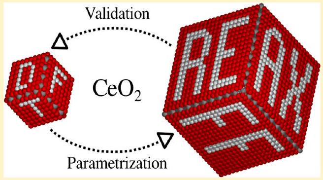 surface vacancy formation energies ( $E_{\mathrm{vac}}$ ), and in particular, it reproduces the $E_{\mathrm{vac}}$ variation with depth from the (110) and (111) surfaces. The force-field is also able to capture the energy hierarchy of differently shaped stoichiometric nanoparticles (tetrahedra, octahedra, and cubes), and of partially reduced octahedra. For these reasons, we believe that this force-field provides a significant addition to the method repertoire available for simulating redox properties at ceria surfaces.

## 1. INTRODUCTION

Ceria ( $\mathrm{CeO}_{2}$ ) is a metal oxide with remarkable reductionoxidation properties. This is reflected in the many technological applications of ceria related to catalysis, where sustainable energy production and pollution control are two key areas. Recent progress in the synthesis of small nanoparticles has made it possible to tailor metastable structures, such as ceria nanocubes, and has revealed that ceria nanoparticles exhibit shape-dependent low-temperature reactivity toward oxygen ${ }^{1}$ and CO oxidation. ${ }^{2}$ This development opens up a multitude of new applications where the special properties of nanoceria could be exploited.

The phenomena underlying many applications of ceria involve the strongly correlated Ce 4f electrons, formed through the creation of oxygen vacancies in the material, and leading to a (dynamical) variation of the oxidation states of the Ce ions. In the quest to understand the complex interplay between Ce 4f electrons and the associated oxygen vacancies, theoretical calculations have a central role to play by providing detailed information about molecular-level structures, energetics, and mechanisms for well defined systems and conditions. However, the modest number of atoms feasible to include in quantummechanical (QM) calculations often constitutes a serious limitation when realistic processes are the target of the modeling, and, consequently, the use of ab initio molecular dynamics simulations for very large-scale problems in time and space will continue to be unfeasible for a long time to come. Here, access to parametrized force-fields (FFs) of good quality becomes crucial, and this is especially true for ceria with its many applications and its complexity.

Ever since the beginning of the 1980s a number of forcefields of the rigid-ion and shell-model types have been presented for ceria in the literature. ${ }^{3-5}$ Shell-model potentials are polarizable force-fields, where each polarizable atom is modeled as a massive charged core, linked to a massless (or lightweight) charged shell by a harmonic spring, and the Coulombic interactions are combined with short-ranged pair interactions, typically of the Lennard-Jones or Buckingham types. Using shell-model force-fields, many properties of stoichiometric and partially reduced (in the following denoted $\mathrm{CeO}_{2-x}$ ) or doped ceria systems have been reported over the last three decades, not least for ceria surfaces, which are the main target of the present paper. Thus, surface energies and geometric structures for low- and high-index ceria surfaces, ${ }^{6-8}$ surface defect formation energies, ${ }^{7}$ surface dynamics and diffusion, ${ }^{9-11}$ and structure and energetics of large ceria nanoparticles ${ }^{12}$ have been explored using shell-model potentials, and shell-model potentials are still actively used today.
A built-in limitation of the shell models is that the ions do not change their chemical character when the local environment changes. Reactive force-fields, on the other hand, have the advantage that bonds can be broken or formed and the nature and stability of the atoms adapt to the coordination at hand. Reactive many-body models thus hold the promise to enable large-scale simulations of materials and nanosystems while incorporating some features and flexibility akin to that of quantum mechanical methods. Some of the available reactive

[^0]force-fields are themselves constructed and trained from quantum mechanical data. This is the case for the ReaxFF family of force-fields.

The ReaxFF force-field model ${ }^{13-15}$ is an advanced bondorder dependent interaction model. It is bond-order consistent for the two-, three-, and four-body short-range interaction terms. The model also includes Coulombic terms, where the charges are calculated based on the connectivity and geometry by way of the Electronegativity Equalization Method (EEM), ${ }^{16}$ which allow for a redistribution of charges. These features of the ReaxFF approach allows for the simultaneous description of metallic, covalent, and ionic bonds, as well as dynamic simulations involving chemical reactions, i.e., the breaking and forming of bonds.

All in all, it is a formidable task to try to mimic interactions, structure and energetics simultaneously for a compound like ceria without having access to explicit electrons. In this work, based on density functional theory (DFT) calculations for a large number of ceria systems in various forms and configurations, we have constructed a reactive interaction model with the aim to handle stoichiometric and partially reduced ceria bulk, surfaces, and nanoparticles. While we cannot hope to handle all possible situations perfectly with this first (as far as we are aware) reactive force-field for ceria in the literature, we will show that our model performs well for both stoichiometric and nonstoichiometric systems. After a number of validation tests we will show that nanosized steps and large nanoparticles can be investigated using this force-field and we explore the shape-dependent stability of nanosized ceria particles and how quickly (or rather how slowly) their relative stabilities vary with cluster size.

## 2. METHODS

### 2.1. Parameterization of the Reactive Force-Field.

2.1.1. Overall Procedure. We have used the total interaction energy expression of the ReaxFF, which is partitioned into several energy terms according to

$$
\begin{aligned}
& E_{\text {system }}=E_{\text {bond }}+E_{\mathrm{lp}}+E_{\mathrm{under}}+E_{\mathrm{over}}+E_{\mathrm{val}}+E_{\mathrm{pen}} \\
& \quad+E_{\mathrm{tors}}+E_{\mathrm{conj}}+E_{\mathrm{vdWaals}}+E_{\text {Coulomb }}
\end{aligned}
$$

The individual energy contributions correspond to the bond energies ( $E_{\text {bond }}$ ), under-coordination penalty energies ( $E_{\text {under }}$ ), lone-pair energies ( $E_{\mathrm{lp}}$ ), over-coordination penalty energies ( $E_{\text {over }}$ ), valence angle energies ( $E_{\text {val }}$ ), energy penalty for handling atoms with two double bonds ( $E_{\text {pen }}$ ), torsion angle energies ( $E_{\text {tors }}$ ), conjugated bond energies ( $E_{\text {conj }}$ ), and terms to handle non-bonded interactions, e.g., van der Waals interactions ( $E_{\mathrm{vd} \text { Wals }}$ ), and Coulomb interactions ( $E_{\text {Coulomb }}$ ).

For consistency we have, as much as possible, based the generation of the training set on one type of electronic structure method only, namely, the density functional theory with the "PBE $+U$ " density functional (see details in section 2.2), which is the most frequently used density functional for studies of the ceria surface chemistry in the literature. However, in special cases we found it wise to depart from this strategy. One such case is the $\mathrm{O}-\mathrm{O}$ interactions. The O atomic parameters and the $\mathrm{O}-\mathrm{O}$ interaction parameters were kept the same as in earlier ReaxFF studies and used what is currently the standard $\mathrm{O}-\mathrm{O}$ force-field within the "water branch" of ReaxFF. Thus, these parameters were taken from the work of ref 17 and they were used in previous studies of the ZnO bulk and surface
systems in ref 18. These were parametrized using the B3LYP hybrid density functional (for references see section 2.2) and give an optimized $\mathrm{O}-\mathrm{O}$ bond distance ( $r_{\mathrm{e}}$ ) of $1.225 \AA$ and a dissociation energy ( $D_{\mathrm{e}}$ ) of 5.45 eV for the isolated $\mathrm{O}_{2}$ molecule, values that are in fair agreement with the experimental values of $1.208 \AA$ and $5.213(2) \mathrm{eV}^{19}$ and much better than those obtained with PBE. A second case concerns the Ce metal, which is not very well described within our DFT method. In this case, we instead use experimental data for the lattice constant and the bulk modulus in the fitting procedure. A third case when we departed from the "PBE $+U$ strategy" concerns the calculation of the charge parameters for our forcefield. Here, the charges (or rather the EEM charge parameters) have been fitted to atomic Mulliken charges from B3LYPcalculations (see section 2.2), in order to comply with those for oxygen. We thus calculated atomic Mulliken charges for small stoichiometric and reduced ceria clusters using the B3LYP method.

The force-field parametrization was performed with the ReaxFF software using a successive one-parameter parabolic search method, as was done in most previous ReaxFF parametrizations; ${ }^{13}$ for a full description of this method and the software, see ref 20 . The initial parametrization was carried out in stages. First, the $\mathrm{Ce}-\mathrm{Ce}$ parameters were optimized against the experimental cohesive energy and volume of the $\alpha$ cerium metal phase. Subsequently, initial ceria charge parameters were derived by training against Mulliken charges derived from separate B3LYP calculations, as mentioned above. Thereafter, the various cerium oxide $\mathrm{PBE}+U$ data were added to the training set. Initially the $\mathrm{Ce}-\mathrm{Ce}$ parameters were kept fixed until a reasonable fit to the cerium oxide results was obtained, and subsequently all parameters ( $\mathrm{Ce}-\mathrm{Ce}$, charges, and $\mathrm{Ce}-\mathrm{O}$ bonds/angles) were allowed to enter the optimization. To capture the strong correlation between the ReaxFF parameters, multiple optimization cycles were employed, eventually resulting in the parameters available from us and used for all the ReaxFF results presented in this paper. The list of the structures that were given the highest weight in our training set is as follows: volume scans and angular scans for bulk ceria in the fluorite structure and for a $N_{\mathrm{Ce}}=2$ stoichiometric cluster; volume scans for $N_{\mathrm{Ce}}=4,6$, and 10 stoichiometric clusters; the global minimum of an $N_{\mathrm{Ce}}=40$ ceria nanoparticle; surface energies for the stoichiometric lowindex surfaces, namely, (111), (110), and the reconstructed (100); oxygen vacancy formation energies in the bulk and at various positions in the (111) and (110) surface regions; oxygen molecular and atomic adsorption on the stoichiometric and partially reduced (111) and (110) surfaces (surfaces with one oxygen vacancy).
2.1.2. Choice of an In-Cell Approach. Although the electrostatic interactions in ReaxFF taper off beyond $10 \AA$, there is no such restriction on the charge redistribution within the EEM scheme which involves all atoms in the computational cell no matter their interatomic distances. This inconsistency can lead to problems in the calculation of the energy for a reaction. Thus, the usual approach to calculating reaction energies is to calculate the total energy of each reactant and product in separate calculations, i.e., a separate-cell approach. Here, instead, during the parametrization and in the applications, any reaction is modeled within one and the same supercell, i.e, an in-cell approach. In the in-cell approach the supercell always preserves the stoichiometry. Thus, for example, during oxygen vacancy formation, the released oxygen
atom is placed in the vacuum region of the supercell far from the surface, thereby keeping the stoichiometry of the cell. We believe that this approach is sensible since the in-cell energies are those relevant for molecular dynamics simulations, which in fact is often one of the main reasons for developing a ReaxFF force-field.

To illustrate the magnitude of the error caused by inconsistent use of the in-cell and separate-cell approaches, we have calculated the vacancy formation energy in bulk $\mathrm{CeO}_{2}$ using the separate-cell approach with a large supercell ( $4 \times 4 \times$ 4 crystallographic unit cells with in total 768 atoms) and a smaller one ( $2 \times 2 \times 2$ crystallographic unit cells with 96 atoms). The vacancy formation energies with respect to $\mathrm{O}_{2}(g)$ formation became 3.42 and 3.45 eV , respectively. These values are about 0.5 eV larger than the value from the in-cell method presented in section 3.1.3.

In summary, as we want to be able to use the force-field to study dynamical processes using molecular dynamics, we have consistently used in-cell structural models in our ReaxFF calculations, both in the fitting procedure and in the applications. This implies that all ReaxFF systems considered are in total stoichiometric; i.e., partially reduced models are always compensated by adding O atoms or $\mathrm{O}_{2}$ molecules in the unit cell, except when we calculated the formation energy of bulk $\mathrm{Ce}_{2} \mathrm{O}_{3}$ from bulk $\mathrm{CeO}_{2}$, which will be discussed in section 3.1.2.
2.2. Electronic Structure Methods. The electronic structure calculations for the generation of the training set and the validations were performed using the density functional theory (DFT) in an implementation with plane waves and pseudopotentials (PPs) of the projected augmented wave type (PAW) ${ }^{21}$ for the core-valence electron interactions. We used the Perdew, Burke, and Ernzerhof (PBE) ${ }^{22}$ exchangecorrelation functional in conjunction with a Hubbard $U$ correction $(\mathrm{DFT}+U)^{23}$ to treat the strongly correlated felectron in cerium. Guided by ref 24, we have used a $U$ value of 5 eV , which gives a good description of both structure and electronic properties of stoichiometric and reduced ceria. In the calculations, 12 valence electrons were described explicitly for Ce and 6 for O .
A kinetic energy cutoff of 30 Ry was used for the expansion of the electron wave functions. Clusters and molecules were calculated by sampling only the $\Gamma$-point while energy calculations for bulk and surface structures made use of Monkhorst-Pack k-point sampling schemes adapted to the unit cell sizes of the different systems such that the total energy was always converged to within 0.02 eV . All structures were optimized until the maximum force on each atom was less than $0.02 \mathrm{eV} / \AA$. All calculations were performed using the Vienna ab initio simulation package (VASP). ${ }^{25,26}$

As discussed above, the Mulliken charges needed for the generation of the EEM parameters were calculated using the B3LYP ${ }^{27-29}$ density functional for small stoichiometric and partially reduced ceria clusters. These calculations were performed with a local basis set using the Gaussian09 program. ${ }^{30}$ The Ce basis set used was one from the Stuttgart/Dresden group, namely, Ce (RSC97) with a 28 Elecron ECP ( 30 electrons in valence). ${ }^{31}$ For oxygen, we used the O aug-cc-pVTZ basis set. ${ }^{32}$
2.3. Force-Field Calculations. All ReaxFF calculations presented in this paper were performed with our new forcefield, using the LAMMPS software ${ }^{33}$ with the ReaxFF implementation described in ref 34 . Geometry optimizations
were performed using the Polak-Ribière version of the conjugate gradient algorithm and the structures were considered converged when the changes in energy and forces from one step to another were less than $10^{-10} \mathrm{kcal} / \mathrm{mol}$ and $10^{-12} \mathrm{kcal} / \mathrm{mol} \cdot \AA$, respectively. Periodic boundary conditions in three dimensions were used throughout. The vacuum gaps separating the ceria slabs or nanoparticles were chosen large enough to ensure noninteracting systems. Within the ReaxFF description, this means that the vacuum widths are chosen to be larger than $10 \AA$ (or $20 \AA$ when molecules are present), as beyond $10 \AA$, electrostatic interactions are zero through the use of a tapering function.

## 3. RESULTS

Here, we demonstrate the performance of our developed forcefield for ceria and apply it to surfaces and nanoparticles. The outline is as follows: Section 3.1 discusses the performance of bulk $\mathrm{CeO}_{2}$ and bulk $\mathrm{Ce}_{2} \mathrm{O}_{3}$; section 3.2 deals with the lowindex surfaces of ceria; section 3.3 shows calculations for steps at the $\mathrm{CeO}_{2}(111)$ surface; and section 3.4 discusses the performance of ceria nanoparticles and presents new results for very large nanoparticles not accessible with quantum-chemistry methods.
3.1. Bulk Properties. We start by presenting results for the stoichiometric $\mathrm{CeO}_{2}$ and $\mathrm{Ce}_{2} \mathrm{O}_{3}$ and for oxygen vacancies in bulk $\mathrm{CeO}_{2}$.
3.1.1. Stoichiometric Bulk $\mathrm{CeO}_{2}$. We have performed energy-volume scans for two polymorphs of bulk ceria and calculated the bulk moduli and optimal lattice constants. The two polymorphs are ceria crystallized in the fluorite and rutile structures as illustrated in Figure 1a and b, respectively. The fluorite structure (space group $F m 3 m$ ) is the crystal phase that is observed experimentally under ambient conditions. Each $\mathrm{Ce}^{4+}$ cation is surrounded by eight equivalent $\mathrm{O}^{2-}$ ions at the corners of a cube, and each $\mathrm{O}^{2-}$ ion is coordinated by four $\mathrm{Ce}^{4+}$

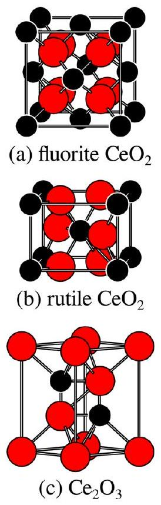
Figure 1. Bulk crystal structures of (a) fluorite $\mathrm{CeO}_{2}$, (b) rutile $\mathrm{CeO}_{2}$, and (c) $\mathrm{Ce}_{2} \mathrm{O}_{3}$. Small black balls are cerium and large red balls are oxygen.

ions. The experimental lattice parameter for the ceria fluorite structure was estimated to be $5.39 \AA$ at 0 K in ref 24 , based on experimental diffraction studies including the temperaturedependent measurements of Rossignol et al. ${ }^{35}$ Table 1 lists our calculated lattice parameters and bulk moduli for the two polymorphs, together with experimental values from the literature for the fluorite structure.

Table 1. Optimized and Experimental Lattice Parameters and Bulk Moduli for Ceria Crystallized in the Fluorite and Rutile Crystal Phases
| method | $a_{0}(\AA)$ | $c_{0}(\AA)$ | $B_{0}$ (GPa) | reference |
| :--- | :--- | :--- | :--- | :--- |
| Fluorite |  |  |  |  |
| ReaxFF | 5.49 | - | 192 | this work |
| $\mathrm{PBE}+U(U=5 \mathrm{eV})$ | 5.49 | - | 179 | this work |
| Expt. | $5.39{ }^{a}$ | - | - | 35 |
| Expt. | $5.406(10)^{b}$ | - | 230(10) | 36 |
| Expt. | $5.411(3)^{b}$ | - | 236(4) | 37 |
| Expt. | - | - | 204 | 38 |
| Expt. | $5.411(1)^{b}$ | - | 220(9) | 39 |
| Rutile |  |  |  |  |
| ReaxFF | 5.078 | 3.567 | 142 | this work |
| $\mathrm{PBE}+U(U=5 \mathrm{eV})$ | 5.193 | 3.632 | 148 | this work |

${ }^{a}$ Value referring to 0 K , as extrapolated ${ }^{24}$ from e.g., ref $35 .{ }^{b}$ Room temperature measurement.

Bulk rutile, on the other hand, has never been observed in experiments but here serves as a second reference in the validation of the force-field parameters. Thus, only the fluorite structure was included in the training set and the rutile structure was used for validation. For both polymorphs, the energy-volume scans were obtained through an isotropic change in the lattice parameters with fixed fractional coordinates, thereby keeping the symmetry of the original crystal phase.

The results from the energy-volume scans are given in Figure 2 a and b for fluorite and rutile, and the optimized lattice

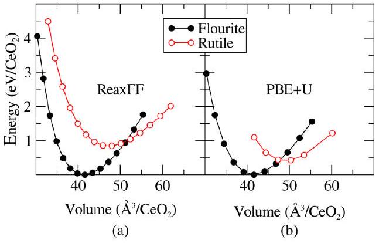
Figure 2. Energy-volume scans for $\mathrm{CeO}_{2}$ in the fluorite (black solid) and rutile (red open) crystal phases calculated using (a) ReaxFF and (b) $\mathrm{PBE}+U(U=5 \mathrm{eV})$. The energy scale (in eV per $\mathrm{CeO}_{2}$ formula unit) is shifted so that the minimum energy for fluorite is at $0 \mathrm{eV} / \mathrm{CeO}_{2}$ in each case.

constants and bulk moduli are reported in Table 1. For the fluorite structure, which is part of the training set, ReaxFF performs very well and reproduces the DFT data perfectly, regarding both the lattice parameter and the bulk modulus. For the rutile structure, the ReaxFF accurately predicts a lower stability. The destabilization is, however, larger than that predicted by the electronic structure method, namely, 0.41 eV
per formula unit for $\mathrm{PBE}+U$ vs 0.85 eV for ReaxFF. This discrepancy may appear large, but as the intention with the generated force-field is that it be very accurate for the fluorite structure, we do not want to sacrifice the good description of this phase to gain a better description of the rutile polymorph. However, the results do ensure that the rutile phase will not erroneously form spontaneously during simulations; and this is important.
3.1.2. Bulk $\mathrm{Ce}_{2} \mathrm{O}_{3}$. The fully reduced form of cerium oxide is cerium sesquioxide, $\mathrm{Ce}_{2} \mathrm{O}_{3}$, shown in Figure 1c. In this structure, no $\mathrm{Ce}^{4+}$-ions exist and all cerium ions have 1 electron in their Ce f-orbital. $\mathrm{Ce}_{2} \mathrm{O}_{3}$ was not part of our training set, as we are mainly interested in partially reduced ceria where the host structure corresponds to bulk $\mathrm{CeO}_{2}$. However, as this structure could form during the reduction of ceria, it is important to make sure that the relative stabilities of $\mathrm{CeO}_{2}$ and $\mathrm{Ce}_{2} \mathrm{O}_{3}$ appear in the right order so that the latter does not erroneously form during simulations of ceria under reducing conditions. We have calculated the reduction energy, $E_{\mathrm{CeO}_{2} \rightarrow \mathrm{Ce}_{2} \mathrm{O}_{3}}$, according to the reaction:

$$
2 \mathrm{CeO}_{2} \rightarrow \mathrm{Ce}_{2} \mathrm{O}_{3}+\frac{1}{2} \mathrm{O}_{2}
$$

giving

$$
E_{\mathrm{CeO}_{2} \rightarrow \mathrm{Ce}_{2} \mathrm{O}_{3}}=E\left(\mathrm{Ce}_{2} \mathrm{O}_{3}\right)+\frac{1}{2} E\left(\mathrm{O}_{2}\right)-2 E\left(\mathrm{CeO}_{2}\right)
$$

where $E\left(\mathrm{Ce}_{2} \mathrm{O}_{3}\right), E\left(\mathrm{CeO}_{2}\right)$, and $E\left(\mathrm{O}_{2}\right)$ are the total energies per formula unit, with $\mathrm{CeO}_{2}$ being in the fluorite structure.

For bulk structures, we are forced to use a separate-cell approach, which will lead to an overestimation of the ReaxFFcalculated reduction energy compared to what the in-cell approach would have given had it been possible to use it (see discussion in section 2.1.2). In the electronic structure reference calculations, the $\mathrm{Ce}_{2} \mathrm{O}_{3}$ was calculated for both the antiferromagnetic (AFM) and ferromagnetic (FM) states, with the AFM-state being slightly more stable. As we are merely interested in a qualitative picture of the relative stability of $\mathrm{Ce}_{2} \mathrm{O}_{3}$ with respect to $\mathrm{CeO}_{2}$, we did not scan all possible $a / c$ ratios in the energy-volume scan used to derive the bulk modulus. Instead, the scan was initiated from the minimum obtained within the $\mathrm{PBE}+U$ level of theory followed by an isotropic change in volume with an optimization of ionic positions performed at each volume. The results are given in Table 2. As shown in the table, the structure is in very good

Table 2. Calculated ReaxFF and PBE+ $U$ Bulk Data for $\mathrm{Ce}_{2} \mathrm{O}_{3}$ Compared to Experiment
| method | $a(\AA)$ | $c(\AA)$ | $B_{0}(\mathrm{GPa})$ | reference |
| :--- | :--- | :--- | :---: | :--- |
| ReaxFF | 3.889 | 6.182 | 151 | this work |
| PBE $+U(U=5 \mathrm{eV})$ | 3.919 | 6.183 | 129 | this work |
| Expt. | $3.891(1)$ | $6.059(1)$ | - | 40 |

agreement with the DFT data, but the bulk modulus is overestimated. $E_{\mathrm{CeO}_{2} \rightarrow \mathrm{Ce}_{2} \mathrm{O}_{3}}$ becomes $2.5 \mathrm{eV} / \mathrm{Ce}_{2} \mathrm{O}_{3}$ using PBE $+U$ and $5.3 \mathrm{eV} / \mathrm{Ce}_{2} \mathrm{O}_{3}$ using ReaxFF. Thus, although the PBE $+U$ structure is well described, the ReaxFF reduction energy is too large, which was expected as the separate-cell approach had to be used, while the force-field was trained on in-cell cases.

It is interesting to note that the experimental value for reaction 2 is about 4 eV , namely, 3.96 eV as given by the data of Morss ${ }^{41}$ and quoted by Trovarelli, ${ }^{42}$ or 4.03 eV from the data
reported by Zinkievich, ${ }^{43}$ or 3.95 eV from the data in the CRC Handbook of Physics and Chemistry. ${ }^{44}$ In conclusion, we note that the current force-field is not very well suited to study the detailed energetics of the full reduction from $\mathrm{CeO}_{2}$ to $\mathrm{Ce}_{2} \mathrm{O}_{3}$ and $\mathrm{O}_{2}$, as it deviates much from the $\mathrm{PBE}+U$ reference framework. Compared to the experimentally measured full reduction energy, neither the PBE $+U$ method nor ReaxFF perform very well (cf. also the comparison of functionals with respect to this reaction in ref 45 ).
3.1.3. Partially Reduced Bulk $\mathrm{CeO}_{2}$ : the Oxygen Vacancy. Partially reduced bulk ceria, $\mathrm{CeO}_{2-x}$, was created by introducing an oxygen vacancy in the fluorite $\mathrm{CeO}_{2}$ bulk structure in different ways. In the electronic structure calculations, we used a $2 \times 2 \times 2$ supercell consisting of 96 atoms to model bulk $\mathrm{CeO}_{2}$. In the ReaxFF calculations, the vacancy formation energy, $E_{\text {vac }}$ for bulk ceria was calculated by introducing an O vacancy in a $\mathrm{CeO}_{2}(111)$ slab, $7 \mathrm{O}-\mathrm{Ce}-\mathrm{O}$ triple atomic layers thick along the " $z$-direction", and with a $4 \times 4$ surface cell in the $x y$ plane, altogether containing 336 atoms. The O vacancy was placed in the middle layer of the slab and an O atom was placed in the gas phase "above" the slab, at the center of the vacuum region, approximately $40 \AA$ away from the surface. The vacancy formation energy, expressed with respect to the creation of half an $\mathrm{O}_{2}$ molecule, is calculated as

$$
E_{\mathrm{vac}}=E\left[\mathrm{CeO}_{2-x} \text { slab }+\mathrm{O}\right]-E\left[\mathrm{CeO}_{2} \text { slab }\right]-\frac{1}{2} D_{\mathrm{e}}\left(\mathrm{O}_{2}\right)
$$

where $E\left[\mathrm{CeO}_{2-x}\right.$ slab +O$]$ is the total energy of the supercell containing a ceria slab with one vacancy inside it and one gasphase O atom far above it, and $E\left[\mathrm{CeO}_{2}\right.$ slab $]$ is the total energy for the corresponding stoichiometric slab supercell. $D_{e}\left(\mathrm{O}_{2}\right)$ is the dissociation energy of the $\mathrm{O}_{2}$ molecule ( 5.70 eV with PBE $+U$ and 5.45 eV with ReaxFF). Inclusion of only the first two terms gives $E_{\mathrm{vac}}$ with respect to the creation of an O atom.

The calculated ReaxFF and $\mathrm{PBE}+U \quad E_{\text {vac }}$-energies are compared in Table 3. Using the in-cell approach, we obtain an $E_{\mathrm{vac}}$ value of 2.95 eV in satisfactory agreement with the PBE $+U$ value of 3.30 eV .

Table 3. Calculated Vacancy Formation Energy $\boldsymbol{E}_{\text {vac }}$ for Bulk Ceria Based on eq 4 in the Text ${ }^{\text {a }}$
| method | $E_{\text {vac }}(\mathrm{eV})$ |
| :---: | :---: |
| ReaxFF (in-cell, slab host) | 2.95 |
| PBE $+U(U=5 \mathrm{eV})$ | 3.30 |
| ${ }^{a}$ ReaxFF and PBE $+U$ values. |  |

Analysis of the structural relaxation around the oxygen vacancy (cf. Figure 3) in bulk $\mathrm{CeO}_{2}$ reveals good qualitative agreement between the force-field description and the electronic structure method, cf. Table 4. Both methods demonstrate a substantial outward relaxation of the nearest neighbor Ce-ions upon introduction of the vacancy. The relaxation is underestimated by the ReaxFF model but the expansion effect is clearly evident: the $\mathrm{Ce}-\mathrm{Ce}$ distance of 3.87 Å for stoichiometric ceria (with both methods) increases by $0.13 \AA$ around the O vacancy with ReaxFF and by $0.26 \AA$ with $\mathrm{PBE}+U$. The $\mathrm{PBE}+U$ result displays some minor asymmetry of $\pm 0.02 \AA$ which is not captured by the ReaxFF model. This discrepancy originates from the fact that it is difficult for the ReaxFF force-field to mimic the $\mathrm{PBE}+U$ solution where the charge is located on only two $\mathrm{Ce}^{3+}$ ions, since the EEM

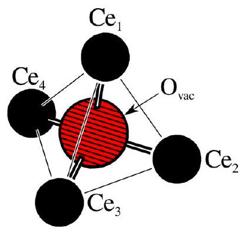
Figure 3. Schematic picture of the structure around the oxygen vacancy in bulk $\mathrm{CeO}_{2}$, including the four neighboring Ce -ions. Distances are given in Table 4.

Table 4. Structural Deformation around an Oxygen Vacancy in Fluorite Bulk $\mathrm{CeO}_{2}{ }^{a}$
|  | ReaxFF | PBE $+U$ |
| :---: | :---: | :---: |
| $r_{\mathrm{Ce}_{1}-\mathrm{Ce}_{3}}$ | $4.00(3.87)$ | $4.13(3.87)$ |
| $r_{\mathrm{Ce}_{2}-\mathrm{Ce}_{4}}$ | $4.00(3.87)$ | $4.15(3.87)$ |
| $r_{\mathrm{Ce}_{1}-\mathrm{Ce}_{2}}$ | $4.00(3.87)$ | $4.13(3.87)$ |
| $r_{\mathrm{Ce}_{2}-\mathrm{Ce}_{3}}$ | $4.00(3.87)$ | $4.15(3.87)$ |
| $r_{\mathrm{Ce}_{3}-\mathrm{Ce}_{4}}$ | $4.00(3.87)$ | $4.11(3.87)$ |

${ }^{a}$ The values in parentheses correspond to distances in the stoichiometric crystal. Distances are in Å. The atomic labels are decoded in Figure 3.
description, used by ReaxFF, rather tends to distribute the extra charge over the whole cell. The resulting ReaxFF structure can be seen as an average structure of the many local minima possible within the $\mathrm{PBE}+U$ description; in the latter, the small details of the resulting structure crucially depends on the localization and location of the extra charges.
3.2. Low-Index Surfaces. In this section, we present results for the stoichiometric low-index (111), (110), and (100) surfaces and for oxygen vacancies on these surfaces.
3.2.1. Stoichiometric Surfaces. The surfaces we have considered, the (111), (110), and a reconstructed (100) surface, are illustrated in Figure 4. The figure shows the actual slabs that were used in the calculations of the surface relaxation and surface energies, namely, a $4 \times 4$ unit cell with $14 \mathrm{CeO}_{2}$ layers for the (111) surface, a $4 \times 4$ unit cell with $20 \mathrm{CeO}_{2}$ layers for the (110) surface, and a $4 \times 4$ unit cell with $8 \mathrm{CeO}_{2}$ layers for the reconstructed (100) surface (labeled $(100) r$ here). The reconstructed $\mathrm{CeO}_{2}(100)$ surface was generated by moving every second O-ion row to the opposite face to make the surface nonpolar. The surface energy $E_{\text {surf }}$ was calculated in the usual way, namely, as

$$
E_{\text {surf }}=\frac{E_{\text {slab }}-N \cdot E_{\text {bulk }}}{2 A}
$$

where $E_{\text {slab }}$ is the energy per slab supercell and $E_{\text {bulk }}$ the energy per formula unit for the bulk, $N$ is the number of formula units in the slab supercell, $A$ is the surface area, and the factor 2 reflects the presence of two surfaces per supercell. The surface energies are reported in Table 5 and the agreement between the ReaxFF and PBE $+U$ results is seen to be excellent for all the considered surfaces. The table also lists half the cleavage energy for the optimized but unreconstructed (100)-surface. This surface is polar, and its surface energy (eq 5 ) will therefore not converge with respect to an increase of the slab thickness; it is therefore not reported. Within our force-field approach, the

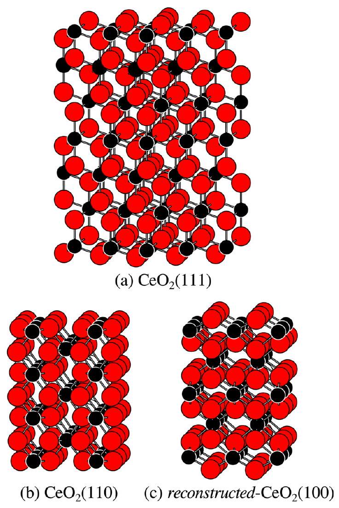
Figure 4. Stoichiometric slab systems used in the calculations to model the low-index surfaces of $\mathrm{CeO}_{2}$ : (a) (111) surface, (b) (110) surface, and (c) a reconstructed (100) surface where every second O-ion row has been transferred to the opposite side to make the surface nonpolar. Note that the pictures show the structures cleaved from the bulk structure before relaxation.

Table 5. Calculated Surface Energies ( $\mathrm{J} / \mathrm{m}^{2}$ ), Surface Relaxation $\rho$, and Surface Rumpling $\epsilon$ (See Text for Details) Using ReaxFF and PBE $+U^{\boldsymbol{a}}$
|  | ReaxFF | $\mathrm{PBE}+U(U=5 \mathrm{eV})$ |
| :--- | :--- | :--- |
| $\mathrm{CeO}_{2}(111)$ |  |  |
| $E_{\text {surf }}$ | 0.84 | 0.71 |
| $\rho$ | -0.3\% | -0.9\% |
| $\epsilon$ | +0.3\% | -0.9\% |
| $\mathrm{CeO}_{2}(110)$ |  |  |
| $E_{\text {surf }}$ | 1.08 | 1.09 |
| $\rho$ | -7\% | -7\% |
| $\epsilon$ | -11\% | -13\% |
| reconstructed- $\mathrm{CeO}_{2}(100)$ |  |  |
| $E_{\text {surf }}$ | 1.63 | 1.54 |
| $\rho$ | -5\% | -5\% |
| $\epsilon$ | -12\% | -14\% |
| $\mathrm{CeO}_{2}(100)$ |  |  |
| $E_{\text {surf }}$ | $2.50{ }^{b}$ | 一 |

${ }^{a}$ The (111), (110), and (110) $r$ surfaces are schematically illustrated in Figure 4. ${ }^{b}$ For the (100) surface, this is not a true surface energy owing to the different terminations present on each side of the slab. Instead, the value listed is half the cleavage energy.
cleavage energy of the polar surface will converge because of the tapering function used, which removes electrostatic interactions beyond $10 \AA$. Half the cleavage energy is listed in Table 5 to allow a comparison with the stabilities of the other
two surface terminations for slabs of similar thicknesses. Clearly, the unreconstructed, polar (100) surface is not competitive and is highly unstable with respect to the reconstructed surface for both methods.

The surfaces of oxide compounds are often also characterized by their structural relaxation $\rho$ and rumpling $\epsilon$. These are commonly defined by

$$
\begin{aligned}
& \rho=\frac{1}{2} \frac{d_{\mathrm{anion}}+d_{\mathrm{cation}}-2 d_{\mathrm{bulk}}}{d_{\mathrm{bulk}}} \\
& \epsilon=\frac{d_{\mathrm{anion}}-d_{\mathrm{cation}}}{d_{\mathrm{bulk}}}
\end{aligned}
$$

Here, for the (111)-surface, $d_{\text {anion }}$ is the distance between the O ions in the first atomic triple-layer and the corresponding ones in the second triple-layer (cf. Figure 4), i.e., the difference in the $z$-coordinates for the O ions in atomic layers 1 and 4 . Correspondingly, $d_{\text {cation }}$ is the difference in the $z$-coordinates for the Ce ions in atomic layers 2 and 5 . The quantity $d_{\text {bulk }}$ is the geometry-optimized bulk $\mathrm{Ce}-\mathrm{O}$ interlayer distance in the [111] direction. In this formulation, the relaxation refers to the change in spacing between the outermost triple layer and the next while the rumpling refers to displacement of the cation relative to the anion normal to the surface. Table 5 compares our ReaxFF and PBE+ $U$ results. The agreement between the two methods is again very good for all surfaces. We note that the surface relaxations cover a large span, where the (111) surface display very small numbers while the (110) and (100) $r$ surfaces give large values.

For the (111) and the (110) faces, we have analyzed how far into the slab the relaxations occur by calculating the changes in interplanar spacings compared to the bulk spacings, as we go through the slab, from one surface to the other, e.g., for (111) we will go through the $21 \mathrm{O}-\mathrm{Ce}-\mathrm{O}-\mathrm{O}-\mathrm{Ce}-\mathrm{O}-\ldots-\mathrm{O}-\mathrm{Ce}- \mathrm{O}-\mathrm{O}-\mathrm{Ce}-\mathrm{O}$ layers. We will record the results sparately for successive $\mathrm{Ce}-\mathrm{O}, \mathrm{Ce}-\mathrm{Ce}$, and $\mathrm{O}-\mathrm{O}$ distances, and use the formula

$$
\Delta d_{\text {interlayer }}=\left(d_{i, i+1}\right)_{\text {slab }}-d_{\text {bulk }}
$$

where $\left(d_{\mathrm{i}, i+1}\right)_{\text {slab }}$ and $d_{\text {bulk }}$ are the spacings between two ions in two consecutive layers, $i$ and $i+1$, in the relaxed slab system. The results for the two surfaces are given in Figure 5. The quantity $d_{\text {bulk }}$ is the perpendicular distance between adjacent $\mathrm{Ce}-\mathrm{O}, \mathrm{Ce}-\mathrm{Ce}$, or $\mathrm{O}-\mathrm{O}$ layers (as appropiate) in the relaxed bulk system.

Both qualitatively and quantitatively, the ReaxFF results are in very good agreement with the DFT results that can be found in the literature. ${ }^{46}$ (Note that the $\mathrm{Ce}-\mathrm{O}$ curve for (111) in Figure 3a in ref 46 by mistake also contained the $\mathrm{O}-\mathrm{O}$ distances between the triple-layers; thus every third point in that graph should be removed, which has been done in Figure 5 , and the agreement with our ReaxFF results is seen to be very good.) The graphs in our Figure 5 show that, as expected, the relaxation effects are larger on the (110) surface compared to the (111) surface. Interestingly, while for the (111) surface, the $\mathrm{Ce}-\mathrm{O}$, $\mathrm{Ce}-\mathrm{Ce}$, and $\mathrm{O}-\mathrm{O}$ relaxations are of the same magnitude, the $\mathrm{Ce}-\mathrm{Ce}$ relaxation in the first layers at the (110) surface is an order of magnitude larger than the $\mathrm{O}-\mathrm{O}$ relaxations. However, in all cases, and also for the Ce ions at the (110) surface, the relaxation appears to be confined to, say, the outermost $5 \AA$. We further note that ReaxFF produces a monotonic change in the $\mathrm{O}-\mathrm{O}$ relaxation of the three

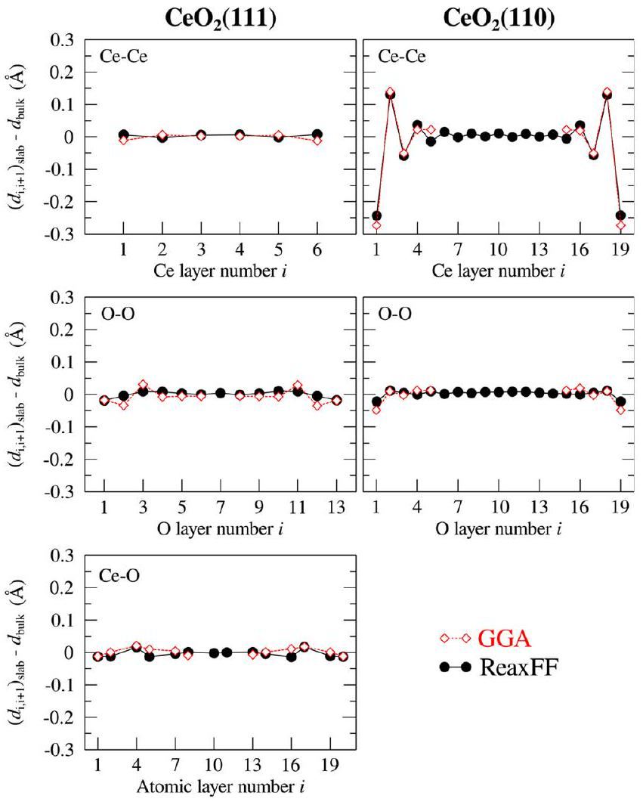
Figure 5. Changes in interplanar spacings for the optimized ceria (111) slab (left-hand panels) and ceria (110) (right-hand panels) calculated as $\left(d_{\mathrm{i}, i+1}\right)_{\text {slab }}-d_{\text {bulk }}$, where $\left(d_{\mathrm{i}, i+1}\right)_{\text {slab }}$ is the perpendicular atom-atom distances between layers $i$ and $i+1$. (Top panels) The values refer to the $\mathrm{Ce}-\mathrm{Ce}$ interplanar spacings between two consecutive Ce-layers. (Middle panels) The values refer to the $\mathrm{O}-\mathrm{O}$ spacings between two consecutive O-layers. (Bottom panel) The values refer to the $\mathrm{Ce}-\mathrm{O}$ distances between layers. GGA data from ref 46 are included and indicated with red diamonds. Ref 46 used thinner slabs; therefore, there are fewer points for these.

outermost O layers, while the GGA data oscillates. However, in both cases the magnitude of the relaxation is still small.
3.2.2. Partially Reduced Surfaces: Oxygen Vacancy formation. One of the major goals of our endeavor is to be able to describe oxygen vacancy formation at the low-index surfaces. Here, we present the results for oxygen vacancies at the (111) and (110) surfaces. As mentioned, the surface vacancies were modeled using the in-cell approach with an O atom in the gas phase $40 \AA$ away from the slab surface.

The relaxed structures around an O vacancy on the (111) surface is illustrated in Figure 6a together with selected atomic labels and the numbering scheme of the O atoms forming the nearest-neighbor O hexagon around the vacancy. The $\mathrm{O}-\mathrm{O}$ distances of the hexagon are listed in Table 6. While the

Table 6. Structural Deformation around an Oxygen Vacancy Placed in the Top Atomic Layer of the $\mathrm{CeO}_{2}(111)$ and $\mathrm{CeO}_{2}$ (110) Surfaces Displayed by Comparison of the Nearest-Neighbor Distances around the Vacancy before and after Relaxation ${ }^{\text {a }}$
|  | ReaxFF | PBE+U |
| :--- | :--- | :--- |
|  | $\mathrm{CeO}_{2}(111)$ |  |
| $r_{\mathrm{O}_{1}-\mathrm{O}_{2}}$ | 4.03 (3.87) | 4.25 (3.87) |
| $r_{\mathrm{O}_{2}-\mathrm{O}_{3}}$ | 3.35 (3.87) | 3.61 (3.87) |
| $r_{\mathrm{O}_{3}-\mathrm{O}_{4}}$ | 4.04 (3.87) | 4.25 (3.87) |
| $r_{\mathrm{O}_{4}-\mathrm{O}_{5}}$ | 3.35 (3.87) | 3.67 (3.87) |
| $r_{\mathrm{O}_{5}-\mathrm{O}_{6}}$ | 4.04 (3.87) | 4.01 (3.87) |
| $r_{\mathrm{O}_{6}-\mathrm{O}_{1}}$ | 3.57 (3.87) | 3.67 (3.87) |
| $\mathrm{CeO}_{2}(110)$ |  |  |
| $r_{\mathrm{O}_{\mathrm{br}}-\mathrm{Ce}}$ | 2.26 (2.33) | 2.09, 2.36 (2.34) |
| $\angle \mathrm{Ce}_{1}-\mathrm{O}_{\mathrm{bri}}-\mathrm{Ce}_{2}$ | 146 (112) | 141 (112) |

${ }^{a}$ The two values listed for each entry refer to the optimized surface structures with (without) the vacancy. Distances are in Å and angles in degrees. The labeling of the atoms is given in Figure 6 a and b , respectively. Both ReaxFF and PBE+U calculations are shown.
absolute numbers differ, the force-field is seen to reproduce the pairwise alternating pattern of short and long bond distances

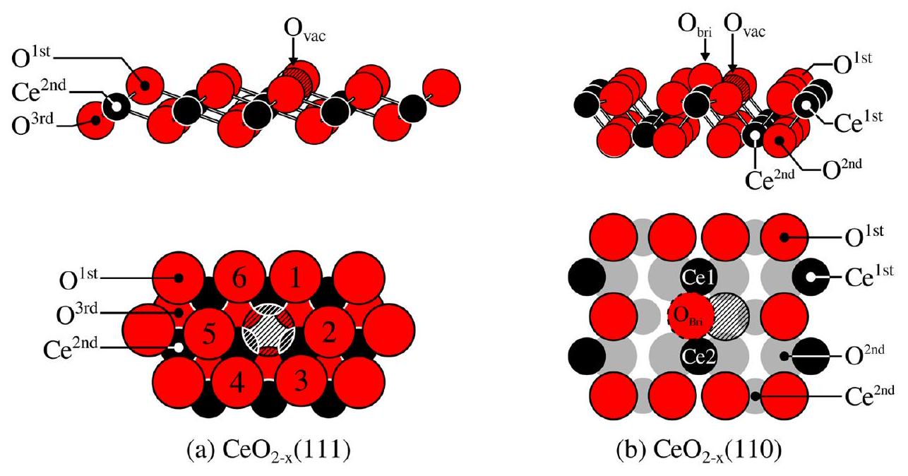
Figure 6. Schematic pictures of the oxygen vacancy structures on the low-index surfaces of fluorite $\mathrm{CeO}_{2}$ : (a) (111) and (b) (110). The size and color scheme for the various atomic layers are explained by the atoms labeled $1^{\text {st }}, 2^{\text {nd }}$, and $3^{\text {rd }}$.

from the relaxation as found using the $\mathrm{PBE}+U$ density functional.

The relaxed structures around an O vacancy on the (110) surface are displayed in Figure 6b. Here, both the $\mathrm{PBE}+U$ and ReaxFF calculations lead to a minimum-energy structure that involves a substantial displacement of the closest O-ion from one of the two (equivalent) O rows on either side of the vacancy-containing row. With both methods, this O-ion swings up to a bridging position between two Ce ions (" $\mathrm{O}_{\text {bri }}$ " in Figure 6b). In the $\mathrm{PBE}+U$ results, this minimum-energy bridge configuration is asymmetric with $\mathrm{Ce}-\mathrm{O}$ distances of 2.09 and $2.36 \AA$, while in the ReaxFF calculations the bridge is symmetric with two $\mathrm{Ce}-\mathrm{O}$ distances of $2.26 \AA$; the $\mathrm{Ce}-\mathrm{O}-\mathrm{Ce}$ angle spanned by the bridge is also very similar for the two methods (cf. Table 6). However, a symmetric bridge structure can be found with the $\mathrm{PBE}+U$ method as well and it lies merely 0.05 eV above the asymmetric case, and the two $\mathrm{Ce}-\mathrm{O}$ distances are $2.22 \AA$. In fact, in a recent PBE+U study, three different stable geometrical structures close in energy were found for the Ovacancy on the (110) surface: the "symmetric bridge", the "asymmetric bridge", and the "symmetrical in-plane" structures. ${ }^{47}$ One should note here that the structures obtained at the $\mathrm{PBE}+U$ level of theory are closely coupled to where the $\mathrm{Ce}^{3+}$-ions are located in the structure and these different localization patterns represent several competing local minima, quite close in energy. As mentioned above, this information is smeared out in the EEM description, which makes it very difficult, or even impossible, to achieve a perfect description of the vacancy structures within the ReaxFF framework.

From density functional calculations, it is known that the stability of the oxygen vacancy depends on where in the surface it is located, for example, at the very surface or in a subsurface layer. Here we have calculated the surface vacancy formation energies as a function of depth, i.e. the $z$-direction in our slabs. The vacancy formation energy was defined in eq 4.

The results for the (111) surface are given in Figure 7a. The ReaxFF results are seen to closely reproduce the $\mathrm{PBE}+U$ results: the stability of the oxygen vacancy is larger at a

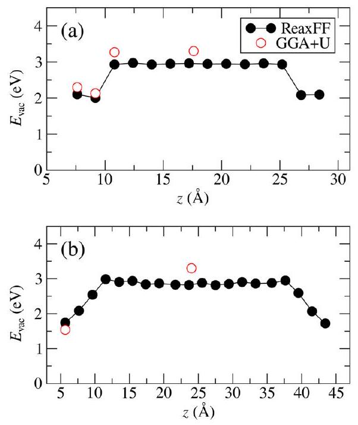
Figure 7. Oxygen vacancy formation energy $E_{\text {vac }}$ as a function of depth (position along $z$ ) in a $4 \times 4$ (a) $\mathrm{CeO}_{2}$ (111) and (b) $\mathrm{CeO}_{2}$ (110) slab. The $E_{\mathrm{vac}}$ values were calculated using the in-cell approach and given with respect to $\mathrm{O}_{2}$ formation.

subsurface position compared to at the very surface and already one layer further down it becomes bulk-like, with both methods. After three atomic layers (i.e., after the $\mathrm{O}-\mathrm{Ce}-\mathrm{O}$ triple layer), the bulk value of $E_{\text {vac }}$ is obtained.

The results for the (110) surface are given in Figure 7b. Again the agreement between the $\mathrm{PBE}+U$ and ReaxFF methods is very good. In accordance with the PBE+ $U$ results, ReaxFF gives a lower $E_{\text {vac }}$ value for the less stable (110) surface. Interestingly, although not unexpectedly, the fast ReaxFF calculations tell us that for the more structurally open nature of this surface, it takes longer (we have to go deeper into the slab) before the bulk $E_{\mathrm{vac}}$ value is recovered. For the (110) surface, this happens at the fourth atomic layer, or approximately $7 \AA$ into the slab, while for (111) this happens at the fourth atomic layer, which here lies about $3.5 \AA$ into the slab. In conclusion, the vacancy formation energies are very well modeled by our ReaxFF force field.
3.3. Surface Steps. In this section, we apply the ReaxFF parameters to the calculation of the formation energy and relaxation of a monolayer step on the (111) surface, in order to test their ability to describe the energetics and structure of extended defects. The specific step on $\mathrm{CeO}_{2}(111)$ considered here is the one which was determined to be the most stable (of those considered) in ref 48 and which was designated in that paper as being of "Type I". Our unrelaxed structure is shown in Figure 8a, along with a schematic diagram showing the key

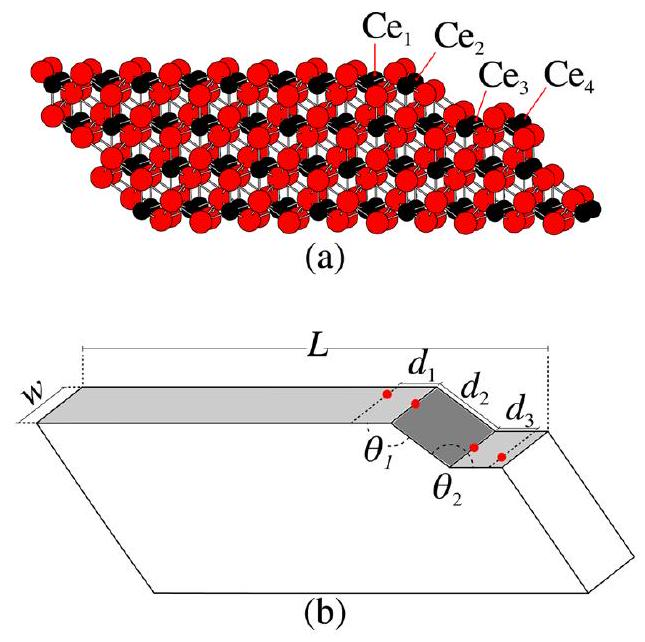
Figure 8. (a) Unrelaxed atomic structure of a type I step on the ceria(111) surface. The Ce ions whose positions quantify the relaxation in Table 7 are labeled. $\mathrm{Ce}_{1}$ is located on the upper (111) terrace, $\mathrm{Ce}_{2}$ on the slanted (110) region, and $\mathrm{Ce}_{3}$ and $\mathrm{Ce}_{4}$ on the lower (111) terrace. (b) Schematic picture of the slab with the geometric parameters used in the calculation of the step energy ( $w$ and $L)$ and in the quantification of the relaxation $\left(d_{1}, d_{2}, d_{3}, \theta_{1}\right.$, and $\left.\theta_{2}\right)$ indicated. The red dots mark the position of the ions labeled in (a).

geometrical quantities used in the calculation of the step formation energy and step relaxation. To calculate the step formation energy ( $E_{\text {step }}$; see later), we use the same strategy as that presented in ref 48, in which the step energy is obtained by fitting an energy expression to a set of calculated total energies for stepped slabs with different thicknesses and terrace lengths (different step-step separations). $E_{\text {step }}$ is the energy penalty to create the step. The following expression for the total energy of a stepped slab, $E_{\text {stepped_slab, }}$ was used:

$$
E_{\text {stepped-slab }}=N \cdot E_{\text {bulk }}+2 w L \cdot E_{\text {surf }}+2 w \cdot E_{\text {step }}
$$

where $N$ is the number of formula units in the slab per supercell, $E_{\text {bulk }}$ is the energy of a bulk formula unit, $L$ is the length of the slab perpendicular to the step, $E_{\text {surf }}$ is the surface energy, $E_{\text {step }}$ is the step formation energy per unit length of the step, and $w$ is the width of the slab along the step. Thus, by using slabs containing one surface step on each side, but with different thicknesses and terrace lengths, we obtain $E_{\text {step }}$ by a least-squares fit of eq 9 to the calculated (DFT or ReaxFF) total energies. We used slabs of 3,4 , and 5 triple-layer thicknesses, and terrace lengths of $23.3,31.0$, and $38.8 \AA$. The fitting procedure using eq 9 yields $E_{\text {bulk }}$ and $E_{\text {surf }}$ values in full agreement with those calculated explicitly. The fitted value for the final variable, $E_{\text {step }}$, which is the formation energy of a Type I step on $\mathrm{CeO}_{2}$ (111), becomes $1.25 \mathrm{eV} / \mathrm{nm}$ using the $\mathrm{PBE}+U$ data. Incidentally, we are able to reproduce the value of 1.50 $\mathrm{eV} / \mathrm{nm}$ reported in ref 48 (where a GGA+U method was also used, but with a different functional, PW91, and a different $U$ value, 4.0 eV ) only if we fix the lattice parameter at the experimental value of $5.40 \AA$, as was done in that work. With our new ReaxFF force-field, we obtain a formation energy for a type I step of $0.95 \mathrm{eV} / \mathrm{nm}$, in reasonable agreement with the DFT value.

We have also quantified the relaxation around the step edges by measuring the bond-lengths in the geometry-optimized stepped surface, in particular, those between the cerium ions below, above, and at the step edge; see Figure 8 and Table 7. We find that the correspondence between the relaxed structures predicted by $\mathrm{PBE}+U$ and ReaxFF is excellent, with the relevant geometric parameters differing by less than $1 \%$.

Table 7. Structural Deformation around the $\mathrm{CeO}_{2}(111)$ Surface Step Shown in Figure $8^{\boldsymbol{a}}$
|  | ReaxFF | PBE $+U$ |
| :--- | :---: | :---: |
| $d_{1}\left(\mathrm{Ce}_{1}-\mathrm{Ce}_{2}\right)$ | $3.25(3.36)$ | $3.24(3.36)$ |
| $d_{2}\left(\mathrm{Ce}_{2}-\mathrm{Ce}_{3}\right)$ | $5.72(5.49)$ | $5.73(5.49)$ |
| $d_{3}\left(\mathrm{Ce}_{3}-\mathrm{Ce}_{4}\right)$ | $3.31(3.36)$ | $3.31(3.36)$ |
| $\theta_{1}$ | $147.4(144.7)$ | $148.3(144.7)$ |
| $\theta_{2}$ | $147.8(144.7)$ | $147.7(144.7)$ |

${ }^{a}$ Values outside/inside parentheses correspond to structures after/ before relaxation. The angles and the projected distances as defined in Figure 8, are given in Å and degrees.
3.4. Ceria Nanoparticles. The shapes of small ceria nanoparticles have been studied extensively in the literature and are a topic of considerable current interest. Experiments, quantum-chemical calculations, and force-field methods have been used; see ref 49 for an example of the latter. $\mathrm{CeO}_{2}$ nanoparticles are known to crystallize in the fluorite structure already for very small sizes. The dominance of one crystal structure leads to rather few possible particle shapes, which tend to follow the hierarchal order obtained using the Wulff construction scheme based on surface energies. In this section, we use our new force-field to study the shapes of both stoichiometric and partially reduced ceria nanoparticles and we calculate the formation energies with respect to $\mathrm{CeO}_{2}$ in the optimized fluorite bulk phase.
3.4.1. Small Stoichiometric and Nonstoichiometric Ceria Nanoparticles. Stoichiometric ceria nanoparticles in the shape of cubes, truncated tetrahedra, and truncated octahedra have been considered in the following. They are shown in that order in Figure 9a-c. All these shapes, except the tetrahedra, have
been synthesized and discussed in experimental studies (see, for example, refs 1 and 2 ).

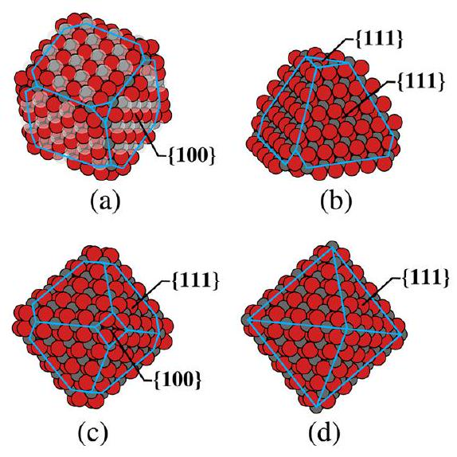
Figure 9. Ceria nanoparticles in the (a) cubic, (b) truncated tetrahedral, (c) truncated octahedral, and (d) perfect octahedral shapes. Large red, small gray, and large transparent spheres are oxygen, cerium, and oxygen vacancies, respectively. The particles in (a)-(c) are stoichiomentric, the particle in (d) is not.

Nanocubes (see the example in Figure 9a) consist of (100) surfaces connected by (110) ridges. A stoichiometric cube without reconstructed (100) facets would be polar with a large dipole across the particle. However, similar to the extended (100) surface discussed above (cf. Figure 4), we performed a relocation of half the surface oxygen ions from each oxygenterminated surface to its opposite face; this effectively quenches the polarity. The so-created oxygen vacancies form an ordered pattern on the particle, as illustrated in Figure 9a. A truncated tetrahedron and a truncated octahedron both mainly display the stable (111) facets with connecting (110) ridges, but the main difference between these shapes is that the latter also displays unstable (100) truncations.

Here, we first present the nanoparticle formation energy with respect to the bulk fluorite phase as a function of size for stoichiometric nanoparticles of different shapes using both the ReaxFF force-field and the PBE $+U$ methods; see Figure 10. We find that the truncated octahedra and tetrahedra display similar stabilities and that they are significantly more stable than the

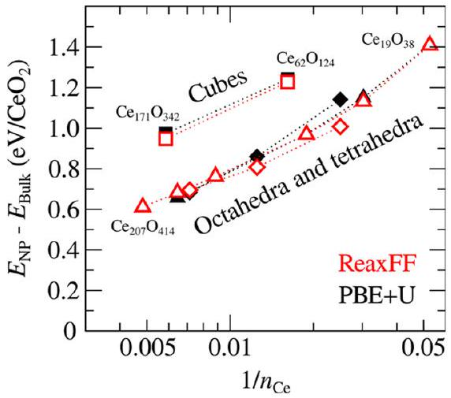
Figure 10. Nanoparticle formation energies with respect to bulk $\mathrm{CeO}_{2}$ for stoichiometric $\mathrm{CeO}_{2}$ clusters and nanoparticles of different shapes: truncated tetrahedra (triangles), truncated octahedra (diamonds), and cubes (squares). $n_{\mathrm{Ce}}$ is the total number of Ce ions in the particle. Both $\mathrm{PBE}+U$ (black solid) and ReaxFF (red open) results are shown.

cubes. This is as expected based on the surface energies given in Table 5. The ReaxFF and the PBE+U results are in very good agreement, especially for the larger particles. For the small particles, the ReaxFF model performs a bit worse (using "perfect agreement with $\mathrm{PBE}+U$ " as the yardstick) for the truncated octahedra, still however with errors smaller than 0.1 eV per $\mathrm{CeO}_{2}$ formula unit, whereas the agreement for cubes and truncated tetrahedra is excellent. The reason for the slightly worse agreement for the optimized perfect octahedra is probably that they contain small faces of the unreconstructed polar (100) truncations at the apices and these are not so well described within the ReaxFF approach. The $\mathrm{PBE}+U$ calculations predict the truncated tetrahedral shape to be energetically preferred over the truncated octahedron for small sizes but they are very similar. For the small particles this leads to the wrong predictions of stability order using ReaxFF. For larger sizes, the error becomes smaller and the ReaxFF model performs better.

Partially reduced particles were also modeled, namely, perfect octahedra, which have previously been reported to be stable under both reducing and oxidizing conditions. ${ }^{50}$ These particles are partially reduced in the sense that they are understoichiometric with respect to oxygen, i.e., they have a surplus of Ce without having any explicit "oxygen vacancies". The perfect octahedral shape is illustrated in Figure 9d. These particles were built from the truncated octahedra by adding cerium ions to the (100) truncations. In the specific particle given in Figure 9d, namely, $\mathrm{Ce}_{146} \mathrm{O}_{280}$, six cerium ions have been added to the corner truncations of the particle in Figure 9c, leading to the formation of $24 \mathrm{Ce}^{3+}$ ions in the PBE$+U$ calculations. The formation energy (here calculated with respect to stoichiometric bulk ceria and gas-phase $\mathrm{O}_{2}$ molecules) as a function of size is given in Figure 11. The

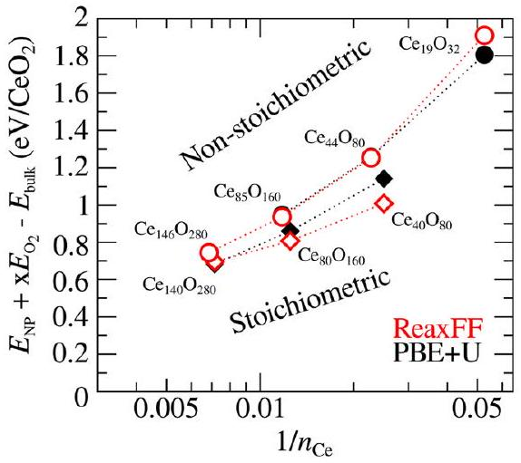
Figure 11. Nanoparticle formation energies with respect to bulk $\mathrm{CeO}_{2}$ and gas phase $\mathrm{O}_{2}$ for nonstoichiometric (partially reduced) $\mathrm{Ce}_{n+x} \mathrm{O}_{2 n}$ particles of perfect octahedral shape (rings). The formation energies of stoichiometric truncated octahedral ceria nanoparticles are given as a reference (diamonds). Both PBE $+U$ (black solid) and ReaxFF (red open) results are shown.

agreement between the ReaxFF and the $\mathrm{PBE}+U$ stabilities is very good and even better than what was obtained for the truncated octahedron. This supports the conclusion that the origin of the computational problem for the ReaxFF model encountered with the small truncated octahedra is related to the polar (100) truncations, as discussed above.
3.4.2. Trends for Larger Particles. We have so far demonstrated the capability of the force-field developed here
in treating ceria bulk, surfaces, and nanoparticles by comparison with results obtained at the density functional level of theory. Now we will use the developed force-field to make predictions for larger stoichiometric nanoparticles of cubic and octahedral shapes where a traditional quantum-mechanical treatment is definitely unfeasible. Thus, truncated octahedral particles with up to 2228 Ce ions and cubic particles with up to 4631 Ce ions, respectively, are considered. The cubes were constructed with ordered oxygen vacancies, as in the previous section, and they were geometry-relaxed as in all other cases in this paper. The largest nanoparticles are $\sim 7-8 \mathrm{~nm}$ in diameter and the resulting graphs for the formation energy per formula unit vs particle size are given in Figure 12. As expected, the formation

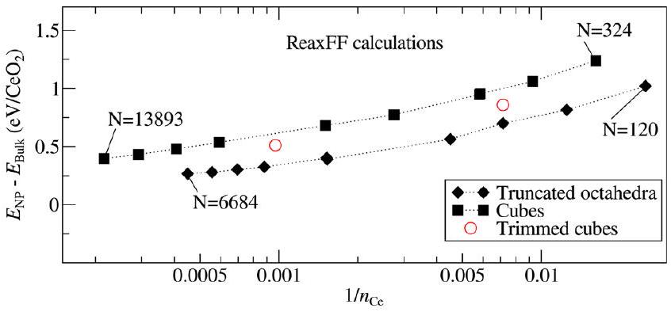
Figure 12. Nanoparticle formation energy with respect to bulk $\mathrm{CeO}_{2}$ for large stoichiometric ceria nanoparticles of truncated octahedral and cubic shapes. $N$ is the total number of ions in the particle, calculated using the ReaxFF interaction potentials.

energy per formula unit decreases with size, and we find that the cubes are always less stable than the corresponding truncated octahedra. Interestingly, the slope in formation energy per formula unit vs $1 / n_{\mathrm{Ce}}$ is larger for the nanocubes than for the truncated octahedra. Their stabilities should clearly become more competitive for larger sizes, but how quickly does this occur? To illustrate this, we have used the four left-most data points in Figure 12 (i.e., the largest clusters) and fitted their formation energies vs $1 / a$ with $a$ being the side-length in a perfect cube or a perfect octahedra. The resulting fitted curves are given in Figure 13 and show our prediction of how the formation energy will decrease for particles with side lengths up to 100000 nm . We note that the cubes of course become increasingly competitive as the particles become larger but the convergence toward the bulk value is fairly "slow".
Furthermore, in an attempt to stabilize the cubic nanoparticles further without changing their overall shapes, we also

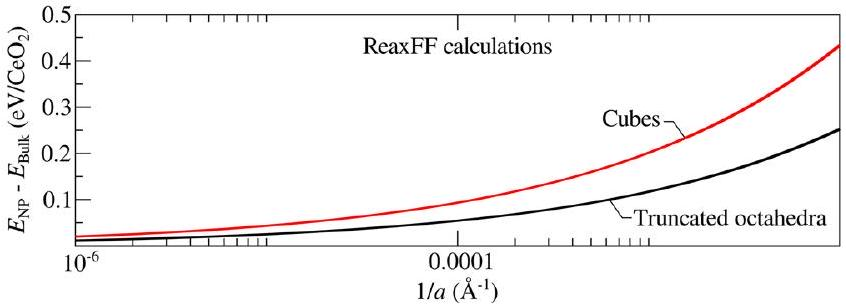
Figure 13. Estimated ReaxFF-calculated formation energies for ceria nanocubes and ceria nanooctahedra obtained from a nonlinear curve fit to the four leftmost data points in Figure 12 for the respective shape. a corresponds to the side length of a perfect cube and perfect octahedra, respectively. For the cubes, the equation of the fitted curve is $E_{\mathrm{f}}=6.477 \cdot 1 / a$, and for the octahedra, $E_{\mathrm{f}}=3.424 \cdot 1 / a$, where $E$ is expressed in eV and $a$ in Å.

considered cubes with trimmed corners and edges, i.e., with increased (111) and (110)-surface exposure (cf. Figure 14).

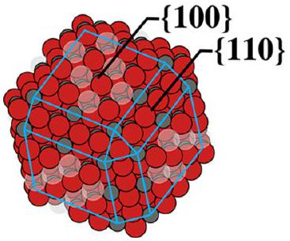
Figure 14. Cubic ceria nanoparticles with trimmed corners and edges.

The formation energies for these particles are indicated by red dots in Figure 12. As seen in the figure, the calculations predict that such a small change in particle shape leads to a significant stabilization compared to the perfect cube shape. These results may explain why larger ceria nanocubes can indeed be synthesized experimentally to be used for example in studies of oxygen storage ${ }^{1}$ and for oxidation catalysis. ${ }^{2}$

## 4. CONCLUSIONS

We have developed a reactive ReaxFF force-field for stoichiometric ceria ( $\mathrm{CeO}_{2}$ ) and partially reduced ceria ( $\mathrm{CeO}_{2-x}$ ) and validated its performance by comparing to the results of our reference electronic structure method (PBE+U). We find that the stoichiometric bulk and surface systems are well reproduced in terms of bulk modulus, lattice parameters, and surface energies, respectively. We have also studied a structurally rather complex system, a step on the (111) surface, and it turns out that also here our ReaxFF-calculated stability is in good agreement with the $\mathrm{PBE}+U$ results.

We also tackled ceria reduction of different types, namely, either explicit O vacancies or nanoparticles without vacancies but whose shapes make them understoichiometric with respect to their O content. Concerning the O vacancies, we find that the force-field is able to capture the bulk and surface vacancy formation energies ( $E_{\mathrm{vac}}$ ), and in particular, it reproduces the variation with depth from the (110) and (111) surfaces. As for the understoichiometric (with respect to O ) nanoparticles, the force-field is able to capture the energy hierarchy of both the differently shaped stoichiometric nanoparticles (tetrahedra, octahedra, and cubes) and the partially reduced perfectly shaped octahedra.

In the end we used the developed force-field to study very large ceria nanoparticles of cubic and octahedral shapes and found that the variation of the nanoparticle formation energy (with respect to bulk ceria) vs particle size is larger for the less stable ceria nanocubes than for the truncated octahedra, but the formation energy for the ceria nanocubes can be lowered significantly by trimming the edges of the nanoparticle. These results suggest that the nanocubes can become competitive at larger nanoparticle sizes, but will most likely not be perfect cubes, but rather cubes with rounded corners and edges.

Those interested in using the parameters presented in the current publication should contact the corresponding author.

## - AUTHOR INFORMATION

## Corresponding Author

*E-mail: kersti@kemi.uu.se. Phone: +46(0)18 4713767.

## Notes

The authors declare no competing financial interest.

## ACKNOWLEDGMENTS

This work was supported by the Swedish Research Council (VR), the Ångpanneföreningens forskningsstiftelse (Åforsk), and STINT (The Swedish Foundation for International Cooperation in Research and Higher Education). Funding from the National Strategic e-Science program eSSENCE and the Göran Gustafsson Foundation is greatly acknowledged. This work is also supported by the European COST Action CM1104 "Reducible oxide chemistry, structure and functions". A.C.T.v.D. acknowledges funding from the US National Science Foundation through grant no. CBET-1033000. The simulations were performed on resources provided by the Swedish National Infrastructure for Computing (SNIC) at UPPMAX and NSC.

## REFERENCES

(1) Wu, Z.; Li, M.; Howe, J.; Meyer, H. M., III; Overbury, S.-H. Probing Defect Sites in $\mathrm{CeO}_{2}$ Nanocrystals with Well-Defined Surface Planes by Raman Spectroscopy and $\mathrm{O}_{2}$ Adsorption. Langmuir 2010, 26, 16595-16606.
(2) Wu, Z.; Li, M.; Overbury, S.-H. On the Structure Dependence of CO Oxidation over $\mathrm{CeO}_{2}$ Nanocrystals with Well-Defined Surface Planes. J. Catal. 2012, 285, 61-73.
(3) Dick, B. G.; Overhauser, A. W. Theory of the Dielectric Constants of Alkali Halide Crystals. Phys. Rev. 1958, 112, 90-103.
(4) Tasker, P. W. The Structure and Properties of Fluorite Crystal Surfaces. J. Phys. Colloques 1980, 41, C6-488-C6-491.
(5) Butler, V. W.; Catlow, C. R. A.; Fender, B. E. F.; Harding, J. H. Dopant Ion Radius and Ionic Conductivity in Cerium Dioxide. Solid State Ionics 1983, 8, 109-113.
(6) Sayle, T. X. T.; Parker, S. C.; Catlow, C. R. A. The Role of Oxygen Vacancies on Ceria Surfaces in the Oxidation of Carbon Monoxide. Surf. Sci. 1994, 316, 329-336.
(7) Conesa, J. Computer Modeling of Surfaces and Defects on Cerium Dioxide. Surf. Sci. 1995, 339, 337-352.
(8) Vyas, S.; Grimes, R. W.; Gay, D. H.; Rohl, A. L. Structure, Stability and Morphology of Stoichiometric Ceria Crystallites. J. Chem. Soc., Faraday Trans. 1998, 94, 427-434.
(9) Baudin, M.; Wojcik, M.; Hermansson, K. Dynamics, Structure and Energetics of the (111), (011) and (001) Surfaces of Ceria. Surf. Sci. 2000, 468, 51-61.
(10) Baudin, M.; Wojcik, M.; Hermansson, K.; Palmqvist, A. E. C.; Muhammed, M. MD Simulations of a Doped Ceria Surface - Very Large Surface Ion Motion. Chem. Phys. Lett. 2001, 335, 517-523.
(11) Gotte, A.; Spångberg, D.; Hermansson, K.; Baudin, M. Molecular Dynamics Study of Oxygen Self-diffusion in Reduced $\mathrm{CeO}_{2}$. Solid State Ionics 2007, 178, 1421-1427.
(12) Sayle, T. X. T.; Parker, S. C.; Sayle, D. C. Oxidizing CO to $\mathrm{CO}_{2}$ using Ceria Nanoparticles. Phys. Chem. Chem. Phys. 2005, 7, 29362941.
(13) van Duin, A. C. T.; Dasgupta, S.; Lorant, F.; Goddard, W. A., III ReaxFF: a Reactive Force Field for Hydrocarbons. J. Chem. Phys. A 2001, 105, 9396-9409.
(14) van Duin, A. C. T.; Strachan, A.; Stewman, S.; Zhang, Q.; Xu, X.; Goddard, W. A., III ReaxFF ${ }_{\text {SiO }}$ Reactive Force Field for Silicon and Silicon Oxide Systems. J. Chem. Phys. A 2003, 107, 3803-3811.
(15) Zhang, Q.; Çaǧın, T.; van Duin, A. C. T.; Goddard, W. A., III; Qi, Y.; Hector, L. G., Jr. Adhesion and Nonwetting-wetting Transition in the $\mathrm{Al} / \alpha$ - $\mathrm{Al}_{2} \mathrm{O}_{3}$ interface. Phys. Rev. B 2004, 69, 045423-1-045423-11.
(16) Janssens, G. O. A.; Baekelandt, B. G.; Toufar, H.; Mortier, W. J.; Shoonheydt, R. A. Comparison of Cluster and Infinite Crystal Calculations on Zeolites with the Electronegativity Equalisation Method (EEM). J. Chem. Phys. B 1995, 99, 3251-3258.
(17) van Duin, A. C. T.; Bryantsev, V. S.; Diallo, M. S.; Goddard, W. A., III; Rahaman, O.; Doren, D. J.; Raymand, D.; Hermansson, K. Development and Validation of a ReaxFF Reactive Force Field for Cu

Cation/Water Interactions and Copper Metal/Metal Oxide/Metal Hydroxide Condensed Phases. J. Phys. Chem. A 2010, 114, 95079514.
(18) Raymand, D.; van Duin, A. C. T.; Spångberg, D.; Goddard, W. A., III; Hermansson, K. Water Adsorption on Stepped ZnO Surfaces from MD Simulations. Surf. Sci. 2010, 604, 741-752.
(19) Brix, P.; Herzberg, G. Fine Structure of the Schumann-Runge Bands Near the Convergence Limit and the Dissociation Energy of the Oxygen Molecule. Can. J. Phys. 1954, 32, 110-135.
(20) van Duin, A. C. T.; Baas, J. M. A.; van de Graaf, B. Delft molecular mechanics: A new approach to hydrocarbon force-fields. Inclusion of a Geometry-dependent Charge Calculation. J. Chem. Soc., Faraday Trans. 1994, 90, 2881-2895.
(21) Blöchl, P. E. Projector Augmented-Wave Method. Phys. Rev. B 1994, 50, 17953-17979.
(22) Perdew, J. P.; Burke, K.; Ernzerhof, M. Generalized Gradient Approximation Made Simple. Phys. Rev. Lett. 1996, 77, 3865-3868.
(23) Dudarev, S. L.; Button, G. A.; Savrasov, S. Y.; Humphreys, C. J.; Sutton, A. P. Electron-Energy-Loss Spectra and the Structural Stability of Nickel Oxide: An LSDA+U Study. Phys. Rev. B 1998, 57, 15051509.
(24) Castleton, C. W. M.; Kullgren, J.; Hermansson, K. Tuning LDA +U for Electron Localization and Structure at Oxygen Vacancies in Ceria. J. Chem. Phys. 2007, 127, 244704-1-244704-11.
(25) Kresse, G.; Hafner, J. Ab Initio Molecular-Dynamics Simulation of the Liquid-Metal-Amorphous-Semiconductor Transition in Germanium. Phys. Rev. B 1994, 49, 14251-14268.
(26) Kresse, G.; Furthmüller, J. Efficiency of Ab-Initio Total Energy Calculations for Metals and Semiconductors Using a Plane-Wave Basis Set. Comput. Mater. Sci. 1996, 6, 15-50.
(27) Becke, A. Density-Functional Thermochemistry.III. The Role of Exact Exchange. J. Chem. Phys. 1993, 98, 5648-5652.
(28) Lee, C.; Yang, W.; Parr, R. G. Development of the Colle-Salvetti Correlation-Energy Formula into a Functional of the Electron Density. Phys. Rev. B 1988, 37, 785-789.
(29) Vosko, S. H.; Wilk, L.; Nusair, M. Accurate Spin-Dependent Electron Liquid Correlation Energies for Local Spin Density Calculations: a Critical Analysis. Can. J. Phys. 1980, 58, 1200-1211.
(30) Frisch, M. J., Trucks, G. W., Schlegel, H. B., Scuseria, G. E., Robb, M. A., Cheeseman, J. R., Scalmani, G., Barone, V., Mennucci, B., Petersson, G. A. et al. Gaussian 09, revision A.1; Gaussian, Inc.: Wallingford, CT, 2009.
(31) Dolg, M.; Stoll, H.; Preuss, H. Energy-Adjusted Ab Initio Pseudopotentials for the Rare Earth Elements. J. Chem. Phys. 1989, 90, 1730-1734.
(32) Dunning, J. T. H. Gaussian Basis Sets for use in Correlated Molecular Calculations. I. The Atoms Boron through Neon and Hydrogen. J. Chem. Phys. 1989, 90, 1007-1023.
(33) Plimpton, S. Fast Parallel Algorithms for Short-Range Molecular Dynamics. J. Comp. Phys. 1995, 117, 1-19.
(34) Chenoweth, K.; van Duin, A. C. T.; Goddard, W. A., III ReaxFF Reactive Force Field for Molecular Dynamics Simulations of Hydrocarbon Oxidation. J. Phys. Chem. A 2008, 112, 1040-1053.
(35) Rossignol, S.; Gérard, F.; Mesnard, D.; Kappenstein, C.; Duprez, D. Structural Changes of Ce-Pr-O Oxides in Hydrogen: a Study by In Situ X-ray Diffraction and Raman Spectroscopy. J. Mater. Chem. 2003, 13, 3017-3020.
(36) Duclos, S. J.; Vohra, Y. K.; Ruoff, A. L.; Jayaraman, A.; Espinosa, G. P. High-pressure X-ray Diffraction Study of $\mathrm{CeO}_{2}$ to 70 GPa and Pressure-Induced Phase Transformation from the Fluorite Structure. Phys. Rev. B 1988, 38, 7755-7758.
(37) Gerward, L.; Olsen, J. S. Powder Diffraction Analysis of Cerium Dioxide at High Pressure. Powder Diffraction 1993, 8, 127-129.
(38) Nakajima, A.; Yoshihara, A.; Ishigame, M. Defect-Induced Raman Spectra in Doped $\mathrm{CeO}_{2}$. Phys. Rev. B 1994, 50, 13297-13307.
(39) Gerward, L.; Olsen, J. S.; Petit, L.; Vaitheeswaran, G.; Kanchana, V.; Svane, A. Bulk Modulus of $\mathrm{CeO}_{2}$ and $\mathrm{PrO}_{2}$ - an Experimental and Theoretical Study. J. Alloys Compd. 2005, 400, 56-61.
(40) Bärnighousen, H.; Schiller, G. The crystal structure of A- $\mathrm{Ce}_{2} \mathrm{O}_{3}$. J. Less-Common Met. 1985, 110, 385-390.
(41) Morss, L. R. Comparative thermodynamical and oxidationreduction properties of lanthanides and actinides. In Lanthanides/ Actinides: Chemistry (Handbook on the Physics and Chemistry of Rare Earths); Choppin, G. R., Lander, G. H., Eyring, L., Gschneidner, K. A., Eds.; Elsevier Science, 1994; Vol. 18, Chapter 122.
(42) Trovarelli, A. Catalysis by Ceria and Related Materials; Imperial College Press: London, 2002.
(43) Zinkevich, M.; Djurovic, D.; Aldinger, F. Thermodynamic Modelling of the Cerium-Oxygen System. Solid State Ionics 2006, 177, 989-1001.
(44) CRC Handbook of Chemistry and Physics, 95th ed.; Haynes, W. M., Ed.; CRC Press: Boca Raton, 2014.
(45) Graciani, J.; Márquez, A. M.; Plata, J. J.; Ortega, Y.; Hernández, N. C.; Meyer, A.; Zicovich-Wilson, C. M.; Sanz, J. F. Comparative Study on the Performance of Hybrid DFT Functionals in Highly Correlated Oxides: The Case of $\mathrm{CeO}_{2}$ and $\mathrm{Ce}_{2} \mathrm{O}_{3}$. J. Chem. Theory Comput. 2011, 7, 56-65.
(46) Skorodumova, N. V.; Baudin, M.; Hermansson, K. Surface Properties of $\mathrm{CeO}_{2}$ from First Principles. Phys. Rev. B 2004, 69, 075401-1-075401-8.
(47) Kullgren, J.; Hermansson, K.; Castleton, C. Many Competing Ceria(110) Oxygen Vacancy Structures: From Small to Large Supercells. J. Chem. Phys. 2012, 137, 044705-1-044705-9.
(48) Kozlov, S. M.; Viñes, F.; Nilius, N.; Shaikhutdinov, S.; Neyman, K. M. Absolute Surface Step Energies: Accurate Theoretical Methods Applied to Ceria Nanoislands. J. Phys. Chem. Lett. 2012, 3, 1956-1961.
(49) Bhatta, U. M.; Ross, I. M.; Sayle, T. X. T.; Sayle, D. C.; Parker, S. C.; Reid, D.; Seal, S.; Kumar, A.; Möbus, G. Cationic Surface Reconstructions on Cerium Oxide Nanocrystals: an AbberationCorrected HRTEM Study. ACS Nano 2012, 6, 421-430.
(50) Kullgren, J.; Hermansson, K.; Broqvist, P. Supercharged LowTemperature Oxygen Storage Capacity of Ceria at the Nanoscale. J. Chem. Phys. Lett. 2013, 4, 604-608.

[^0]:    Received: February 16, 2015
    Revised: March 21, 2015
    Published: March 29, 2015

