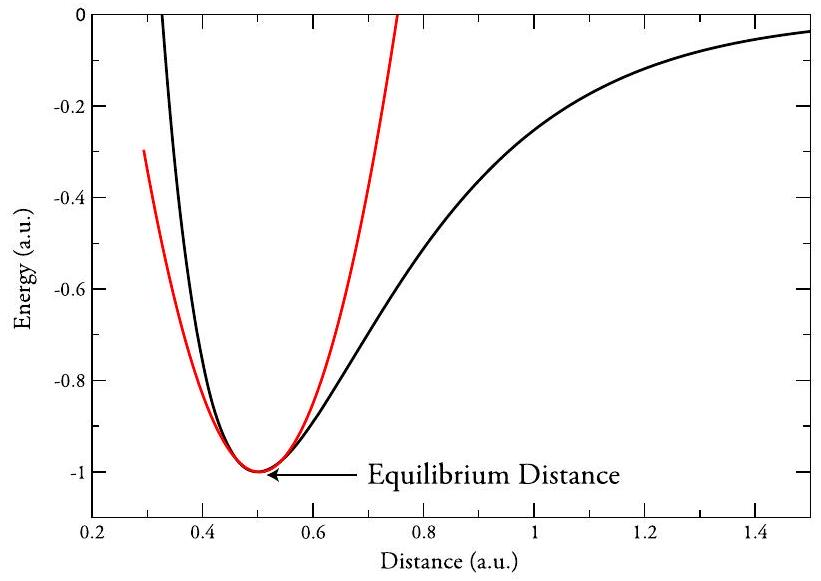
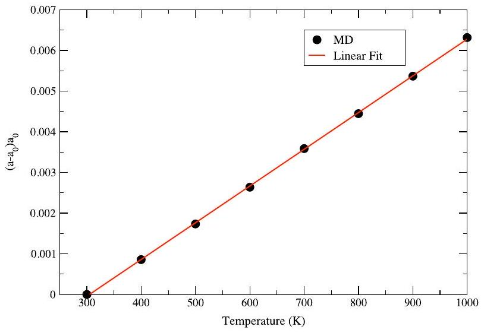
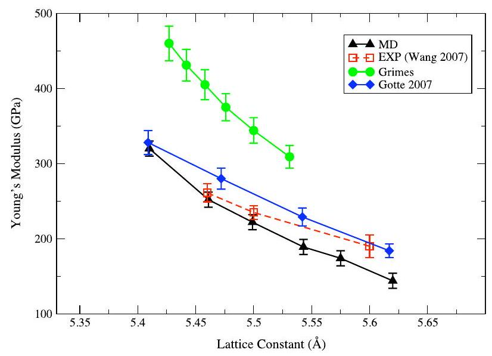
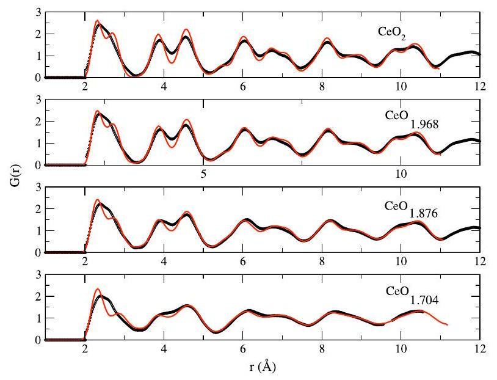
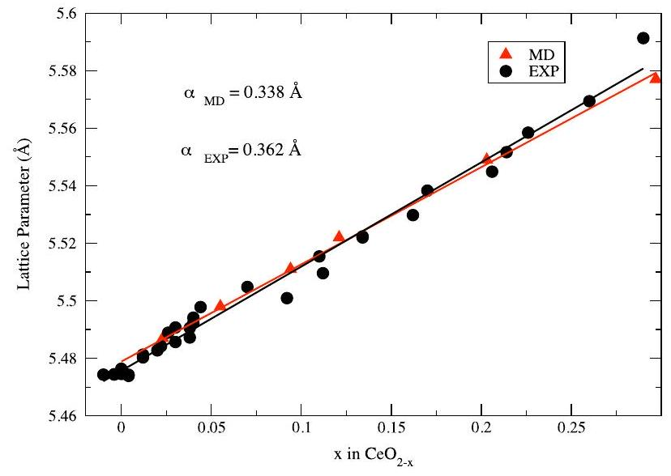
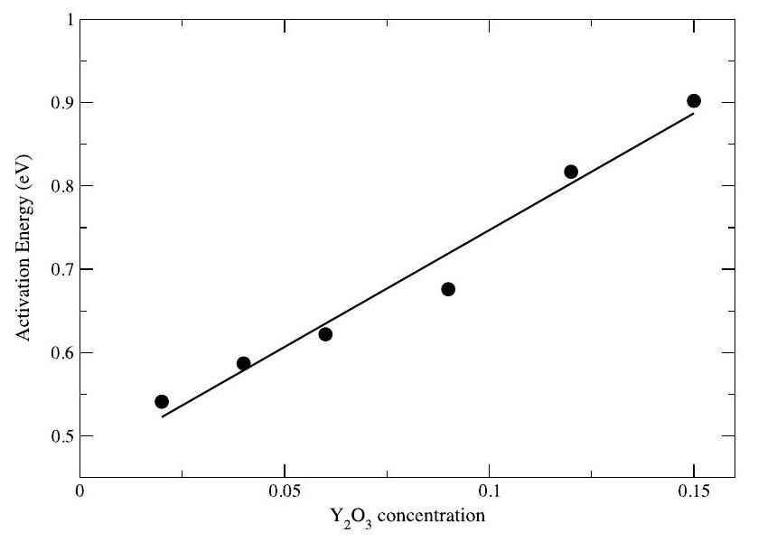

## You may also like

# A dipole polarizable potential for reduced and doped $\mathrm{CeO}_{2}$ obtained from first principles 

To cite this article: Mario Burbano et al 2011 J. Phys.: Condens. Matter 23255402

View the article online for updates and enhancements.

- Corners in M-theory

Hisham Sati

- Maqneto-elastic properties of a spin crossover membrane deposited on a deformable substrate
K Affes, A Slimani, Y Singh et al.
- Direct and indirect methods based on effective Hamilton for electrocaloric effect of $\mathrm{BaTiO}_{3}$ nanoparticle
Jingtong Zhang, Xu Hou and Jie Wang

# A dipole polarizable potential for reduced and doped $\mathrm{CeO}_{2}$ obtained from first principles 

Mario Burbano ${ }^{1}$, Dario Marrocchelli ${ }^{2,7}$, Bilge Yildiz ${ }^{2}$, Harry L Tuller ${ }^{3}$, Stefan T Norberg ${ }^{4}$, Stephen Hull ${ }^{5}$, Paul A Madden ${ }^{6}$ and Graeme W Watson ${ }^{1,7}$ ${ }^{1}$ School of Chemistry and CRANN, Trinity College Dublin, Dublin 2, Ireland ${ }^{2}$ Department of Nuclear Science and Engineering, Massachusetts Institute of Technology, USA ${ }^{3}$ Department of Materials Science and Engineering, Massachusetts Institute of Technology, USA ${ }^{4}$ Department of Chemical and Biological Engineering, Chalmers University of Technology, Sweden ${ }^{5}$ The ISIS Facility, Rutherford Appleton Laboratory, UK ${ }^{6}$ Department of Materials, University of Oxford, Parks Road, Oxford OX1 3PH, UK E-mail: dmarrocc@mit.edu and watsong @ tcd.ie

Received 9 March 2011, in final form 19 April 2011
Published 8 June 2011
Online at stacks.iop.org/JPhysCM/23/255402

#### Abstract

In this paper we present the parameterization of a new interionic potential for stoichiometric, reduced and doped $\mathrm{CeO}_{2}$. We use a dipole polarizable potential (DIPPIM: the dipole polarizable ion model) and optimize its parameters by fitting them to a series of density functional theory calculations. The resulting potential was tested by calculating a series of fundamental properties for $\mathrm{CeO}_{2}$ and by comparing them against experimental values. The values for all the calculated properties (thermal and chemical expansion coefficients, lattice parameters, oxygen migration energies, local crystalline structure and elastic constants) are within $10-15 \%$ of the experimental ones, an accuracy comparable to that of $a b$ initio calculations. This result suggests the use of this new potential for reliably predicting atomic scale properties of $\mathrm{CeO}_{2}$ in problems where $a b$ initio calculations are not feasible due to their size limitations.

(Some figures in this article are in colour only in the electronic version)

## 1. Introduction

Cerium dioxide, $\mathrm{CeO}_{2}$ or ceria, is an important material which has found applications in several technologically relevant areas such as catalysis [1] and solid oxide fuel cells (SOFCs) [2,3]. In catalysis, it plays an important role thanks to its oxygen storage capability, due to the ready oxidation state change from $\mathrm{Ce}^{4+}$ to $\mathrm{Ce}^{3+}$ upon reduction and the reverse upon oxidation [1]. These properties are made use of in three-way catalysts (TWC), where the stored oxygen aids in the oxidation of CO to $\mathrm{CO}_{2}$ under reducing conditions while, under fuellean conditions, the reduction of NO to $\mathrm{N}_{2}$ is assisted by
${ }^{7}$ Authors to whom any correspondence should be addressed.
the uptake of oxygen by ceria. Doping ceria with aliovalent cations, such as Gd, Y or La, leads to high ionic conductivity in the intermediate temperature range ( $500-800^{\circ} \mathrm{C}$ ), thus raising the prospects of ceria-based electrolytes for application in SOFCs [4, 5].

Over the past five years, significant progress has been made in the description of this material by means of $a b$ initio computer simulations [6-12], using density functional theory (DFT). In particular, the use of the $\mathrm{DFT}+U$ approach, where the $U$ parameter provides an improved description of the strongly correlated cerium $4 f$ states in partially reduced ceria, has led to a much improved understanding of the electronic and structural properties of this material. Unfortunately, DFT
calculations are still severely limited by system size and the timescales that can be studied; this high computational cost usually limits this approach to static calculations only. For this reason, reliable interatomic potentials which allow the study of thousands of atoms on the nanosecond scale are desirable. This is particularly true for the study of the ionic conductivity of ceria. Indeed, the role of grain boundaries in the formation of space charge regions, or the vacancy and/or cation ordering tendencies, which are responsible for the drop in conductivity after a critical vacancy concentration (around $3-4 \%$ ), are longrange in nature and necessitate large simulation boxes.

In a recent paper, Xu et al [13] compared six different interatomic potentials for ceria available in the literature [14-19] and tested their accuracy by reproducing a series of experimental data (lattice constants, thermal expansion, chemical expansion, dielectric properties, oxygen migration energy and mechanical properties). Two main limitations were found. The first was that none of the reviewed potentials could reproduce all the fundamental properties under study, although some displayed higher accuracy than others. While all the potentials could reproduce the static properties, such as lattice parameters and elastic constants, they all failed at reproducing the thermal expansion coefficient, and, to a lesser degree, the oxygen migration energy, for pure $\mathrm{CeO}_{2}$. Indeed, some potentials gave thermal expansion coefficients which were one order of magnitude smaller than the experimental one and also severely underestimated the oxygen migration energy. Thermal and chemical expansion properties of ceria are particularly important in the context of SOFCs given that differential expansion of the components has a detrimental effect on the long term durability of the fuel cells [20,21]. A second problem evinced from the study by Xu et al was that not all the interatomic potentials have a complete set of parameters available for the study of both doped and reduced $\mathrm{CeO}_{2}$. The potential by Inaba et al [16], for instance, properly reproduces the thermal expansion coefficient and the elastic properties, but cannot be tested for chemical expansion because it does not have parameters for $\mathrm{Ce}^{3+}$.

The first limitation can be easily understood by looking at figure 1, where we show the shape of a typical interatomic potential. Such a potential is harmonic in the vicinity of the equilibrium position (red curve is a parabola fitted to the potential) but at distances away from the equilibrium position, it deviates from that shape and becomes anharmonic. It is this anharmonicity which is responsible for the thermal expansion observed in solid materials. A potential's failure to reproduce the experimental thermal expansion means that it is not properly parametrized and/or the potential's shape is not correct at distances greater than the equilibrium position. In particular the strong underestimation of the thermal expansion coefficient, as observed by Xu et al, indicates that the potential maintains a harmonic description of the system in regions where this approximation is not valid. The potential also deviates from the harmonic behavior at distances shorter than the equilibrium one, with the interatomic potential being more repulsive than its harmonic approximation. This feature plays an important role in the calculation of the oxygen migration barrier. When an oxygen ion hops from one site to another, it

Figure 1. The shape of a typical interatomic potential (black line) and of its harmonic approximation (red line).

has to squeeze between neighboring cations, so that the average interatomic distance between the oxygen and these cations is much smaller than at equilibrium. If a potential's description of this interaction is predominantly harmonic, then the repulsion between these ions will be underestimated and, consequently, the migration energy barrier too will be underestimated, as observed by Xu et al [13].

It would seem from the above analysis that the limitations of the existing potentials are due to the fact that they are too harmonic. This might be due to the way they are parametrized, given that they are optimized by fitting their parameters to a small data set of experimental properties, usually elastic constants and lattice parameters. These are equilibrium or near-to-equilibrium properties, which allow the sampling of only a small region of the potential energy surface (PES) of the system, around the equilibrium distance. Little or no information is provided about the long- or shortdistance behavior where the potential becomes anharmonic. In this paper we use a different methodology, which was used successfully for similar oxide systems [22-32], to parametrize interatomic potentials for stoichiometric, reduced and doped $\mathrm{CeO}_{2}$. The key idea of this methodology is that the potential's parameters are fitted to a series of DFT calculations on high temperature, distorted $\mathrm{CeO}_{2}$ configurations. This allows the sampling of wider regions of the PES than those accessed by macroscopic equilibrium observables. We obtain parameters for stoichiometric, reduced and doped ( $\mathrm{La}, \mathrm{Gd}$ and Y$) \mathrm{CeO}_{2}$ and test them against the experimental data. The agreement is quite good for all the studied properties, including thermal expansion and oxygen migration energy barriers. This methodology can be easily extended to other dopant cations in ceria or similar materials.

## 2. Potential development

The interaction model used in this work is the same as that used in previous work on similar systems, such as $\mathrm{GeO}_{2}$ [26,30], doped $\mathrm{ZrO}_{2}$ [27,29,31,32], and $\mathrm{Li}_{2} \mathrm{O}$ [23]. The
model ${ }^{8}$, known as the dipole polarizable ion model (DIPPIM), includes a pair potential (a Buckingham term plus Coulombic interactions), together with an account of the polarization effects that result from the induction of dipoles on the ions. This model is conceptually similar to the shell model used by many authors [14-19]. Here we use formal ionic charges ( $\mathrm{O}^{2-}, \mathrm{Ce}^{4+}, \mathrm{Ce}^{3+}, \mathrm{La}^{3+}, \mathrm{Gd}^{3+}$ ) which should ensure better transferability. A description of this model and the notation used for its parameters is reported in the appendix. The parameters for these potentials were obtained by matching the forces/dipoles obtained from DIPPIM to first-principles reference data [33]. Such an approach has been applied successfully in the case of other oxide materials [22-32]. In the following we give a brief description of the first-principlesbased reference calculations and the force/dipole-matching procedure.

First, a potential was parametrized for Y -doped $\mathrm{CeO}_{2}$, since this system will be the object of a detailed experimental and computational study by authors of this paper [34]. This was done by performing DFT calculations, in the local density approximation (LDA), using the CPMD code [35, 36]. For this system, the simple DFT approach is known to give the correct valence states ( $\mathrm{Ce}^{4+}$ and $\mathrm{Y}^{3+}$ ), so that a DFT $+U$ functional was not needed. Twelve $2 \times 2 \times 2$ supercells with $\mathrm{Ce}_{0.5} \mathrm{Y}_{0.5} \mathrm{O}_{1.75}$ compositions and a total of 88 atoms were constructed. Each model supercell was obtained from high temperature ( 2500 K ) MD simulations that were run for 50 ps in order to reach structural equilibrium. The forces on each species were determined directly from each DFT calculation, and the dipoles were obtained from a Wannier analysis of the Kohn-Sham (KS) wavefunctions [37]. Once the information about both forces and dipoles was gathered from the $a b$ initio calculations, the parameters in the interatomic potential were fitted to them. One problem with DFT calculations is the uncontrolled representation of the dispersion interaction. Although dispersion energies constitute only a small fraction of the total energy, they have a considerable influence on transition pressures and, in particular, on the material density and stress tensor. For this reason, the dispersion parameters were not included in the fits but were added afterward, as discussed by Madden et al [33]. The parameters from [25, 29] were used. The resulting parameters for the potential are reported in table 1. The short range parameters for the $\mathrm{O}-$ Y interaction are in line with those obtained in a previous study [29] and the value for the $\mathrm{O}^{2-}$ polarizability is close to that obtained from independent $a b$ initio calculations [38].

A potential was parametrized for reduced $\mathrm{CeO}_{2}$ as well. Similarly as above, first a short $a b$ initio MD simulation was performed on a $2 \times 2 \times 2$ supercell with $\mathrm{CeO}_{1.875}$ composition at high temperature. This configuration was used to calculate the forces acting on the ions and these, in turn, were used for the fitting procedure. These calculations were performed with the Vienna ab initio simulation package (VASP) [39-41] within the $\mathrm{DFT}+U$ framework. A value of $U=7 \mathrm{eV}$ was chosen to ensure correct localization of the $f$ electrons. Although this is slightly higher than is generally used [7,8], it was found
${ }^{8}$ This model is implemented in an in-house molecular dynamics code called PIMAIM.

Table 1. Parameters of the DIPPIM potential. All values are in atomic units. A description of the parameters is reported in the appendix. For the polarizability part of the potential we report only those parameters with $b$ not equal to zero.
|  | O-O | Y-O | $\mathrm{Ce}^{4+}-\mathrm{O}$ | $\mathrm{Ce}^{3+}-\mathrm{O}$ | Gd-O | La-O |
| :--- | :--- | :--- | :--- | :--- | :--- | :--- |
| $A^{i j}$ | 55.3 | 111.1 | 105.9 | 218.7 | 236.9 | 98.6 |
| $a^{i j}$ | 6.78 | 1.377 | 1.269 | 1.473 | 1.566 | 1.257 |
| $B^{i j}$ | 50000 | 50000 | 50000 | 50000 | 50000 | 50000 |
| $b^{i j}$ | 0.85 | 1.35 | 1.4 | 1.35 | 1.35 | 1.35 |
| $C_{6}^{i j}$ | 53 | 12 | 12 | 12 | 12 | 12 |
| $C_{8}^{i j}$ | 1023 | 240 | 240 | 240 | 240 | 240 |
| $b_{\text {disp }}^{i J}$ | 1.0 | 1.5 | 1.5 | 1.5 | 1.5 | 1.4 |
| $\alpha_{\mathrm{O}^{2-}}$ | 14.9 |  |  |  |  |  |
| $\alpha_{\mathrm{Y}^{3+}}$ | 2.60 |  |  |  |  |  |
| $\alpha_{\mathrm{Ce}}{ }^{4+}$ | 5.0 |  |  |  |  |  |
| $\alpha_{\mathrm{Ce}^{3+}}$ | 11.2 |  |  |  |  |  |
| $\alpha_{\mathrm{Gd}^{3+}}$ | 6.8 |  |  |  |  |  |
| $\alpha_{\mathrm{La}^{3+}}$ | 10.8 |  |  |  |  |  |
| $b_{D}^{\mathrm{O}-\mathrm{O}}$ | 1.73 | $b_{D}^{\mathrm{O}-\mathrm{Ce}^{4+}}$ | 1.76 | $b_{D}^{\mathrm{Ce}^{4+}-\mathrm{O}}$ | 1.76 |  |
| $c_{D}^{\mathrm{O}-\mathrm{O}}$ | 0.45 | $b_{D}^{\mathrm{O}-\mathrm{Ce}^{4+}}$ | 1.93 | $b_{D}^{\mathrm{Ce}^{4+}-\mathrm{O}}$ | -0.47 |  |
| $b_{D}^{\mathrm{O}-\mathrm{Ce}^{3+}}$ | 1.82 | $b_{D}^{\mathrm{Ce}^{3+}-\mathrm{O}}$ | 1.82 | $b_{D}^{\mathrm{O}-\mathrm{Y}^{3+}}$ | 1.67 |  |
| $c_{D}^{\mathrm{O}-\mathrm{Ce}^{3+}}$ | 2.92 | $b_{D}^{\mathrm{Ce}^{3+}-\mathrm{O}}$ | -2.50 | $b_{D}^{\mathrm{O}-\mathrm{Y}^{3+}}$ | 1.62 |  |
| $b_{D}^{\mathrm{Y}^{3+}-\mathrm{Y}^{3+}}$ | 1.67 | $b_{D}^{\mathrm{Y}^{3+}-\mathrm{O}}$ | 0.59 | $b_{D}^{\mathrm{Y}^{3+}}-\mathrm{Ce}^{4+}$ | 0.75 |  |
| $c_{D}^{\mathrm{Y}^{3+}-\mathrm{Y}^{3+}}$ | 0.90 | $b_{D}^{\mathrm{Y}^{3+}-\mathrm{O}}$ | -0.33 | $b_{D}^{\mathrm{Y}^{3+}}-\mathrm{Ce}^{4+}$ | -0.45 |  |
| $b_{D}^{\mathrm{O}-\mathrm{Y}^{3+}}$ | 1.93 | $b_{D}^{\mathrm{Gd}^{3+}-\mathrm{O}}$ | 1.94 | $b_{D}^{\mathrm{O}-\mathrm{La}^{3+}}$ | 1.69 |  |
| $c_{D}^{\mathrm{O}-\mathrm{Y}^{3+}}$ | 2.81 | $b_{D}^{\mathrm{Gd}^{3+}-\mathrm{O}}$ | -0.44 | $b_{D}^{\mathrm{O}-\mathrm{La}^{3+}}$ | 2.02 |  |
| $b_{D}^{\mathrm{La}^{3+}-\mathrm{O}}$ | 1.69 |  |  |  |  |  |
| $c_{D}^{\mathrm{La}^{3+}}-\mathrm{O}$ | -1.21 |  |  |  |  |  |

to be necessary to ensure localization in the non-equilibrium structures used in the potential fitting. We used the generalized gradient approximation (GGA) with the Perdew-Wang 91 (PW91) exchange-correlation functional and an energy cutoff of 400 eV . The $\mathrm{Ce}^{3+}$ cations were identified as those with spin 1, while the $\mathrm{Ce}^{4+}$ ones have no spin. The $\mathrm{Ce}^{3+}$ and $\mathrm{Ce}^{4+}$ cations are then treated as two different cationic species in the potential parameterization and separate terms are obtained to describe the interactions between, for instance, $\mathrm{Ce}^{4+}-\mathrm{O}^{2-}$ and $\mathrm{Ce}^{3+}-\mathrm{O}^{2-}$. The parameters for the $\mathrm{Ce}^{4+}-\mathrm{O}^{2-}$ and $\mathrm{O}^{2-}-\mathrm{O}^{2-}$ were then fixed to the values obtained before for the Y doped $\mathrm{CeO}_{2}$ system, so that these parameters are consistent and can be used all together. This procedure is equivalent to treating the $\mathrm{Ce}^{3+}$ cations as a dopant species, in the same way as was done for Y . While an ionic model for reduced $\mathrm{CeO}_{2}$ might not be justified a priori, the picture arising from DFT $+U$ calculations and experiments seems to confirm this model. The $f$ electrons are, indeed, found to be strongly localized on the $\mathrm{Ce}^{3+}$ cations in agreement with an ionic picture. Also, a recent study on $\mathrm{Ce}^{3+} / \mathrm{Ce}^{4+}$ ordering in ceria nanoparticles [42] showed that strikingly similar relative energy ordering of the isomers and atomic scale structural trends (e.g., cation-cation distances) are obtained in both the DFT and interionic-potential calculations, which, again, proves the validity of this approach. The resulting parameters for the $\mathrm{Ce}^{3+}$ cations are reported in table 1. The potential parameterization was performed using two DFT codes because the CPMD package does not have an implementation of the $\mathrm{DFT}+U$ framework needed to describe

Figure 2. Simulated lattice expansion (points) versus temperature for stoichiometric $\mathrm{CeO}_{2}$. The red line represents a linear fit of the MD data. The thermal expansion, $\alpha$, extrapolated from the fit is $9.0 \times 10^{-6} \mathrm{~K}^{-1}$.

reduced $\mathrm{CeO}_{2}$, while the functionality required for the Wannier analysis was not available in VASP at the time.

Finally, the same procedure can be repeated to include other cations. In this case we obtained parameters for $\mathrm{La}^{3+}$ and $\mathrm{Gd}^{3+}$. This was again done by performing a short MD simulation on Gd and La doped $\mathrm{CeO}_{2}$ at high temperature and using the final configuration to calculate forces to which the potential parameters can be fitted. Once again, we fixed the parameters for the $\mathrm{Ce}^{4+}-\mathrm{O}^{2-}$ and $\mathrm{O}^{2-}-\mathrm{O}^{2-}$ to the values obtained before for the Y doped $\mathrm{CeO}_{2}$ system. This ensures that these parameters are all consistent and allows the study of mixed systems-such as, for instance, partially reduced, and Y and La doped $\mathrm{CeO}_{2}$. The resulting parameters for the dopant cations are reported in table 1. This procedure can be repeated for as many dopant cations as desired.

## 3. Results

The quality of the potentials can be assessed by comparing model predictions to experimental data, since no experimental data was used in the optimization of the model parameters. In this section we present our predictions, using the herein developed interatomic potentials, on lattice parameters, local crystalline structure, thermal and chemical expansion, oxygen migration energies and elastic constants, and their comparison with the experimental values. The way these quantities are calculated is described in each section.

### 3.1. Thermal expansion

Xu et al [13] find thermal expansion to be one of the most difficult properties to model in pure ceria. Figure 2 shows the calculated expansion of the lattice parameter, in the 3001000 K temperature range. This is defined as $\left(a-a_{0}\right) / a_{0}$, where $a$ is the lattice parameter for a certain temperature and $a_{0}$ is the lattice parameter at 300 K . This was obtained by performing molecular dynamics simulations with $4 \times 4 \times 4$ supercells in an NPT ensemble, at the required temperatures. We used barostats and thermostats as described by Martyna

Table 2. Comparison between the experimental and simulated thermal expansion coefficients.
| Thermal expansion coefficient $\left(10^{-6} \mathrm{~K}^{-1}\right)$ | Reference |
| :---: | :--- |
| 9.0 | This work |
| 10.7 | $[45]$ |
| 11.1 | $[46]$ |
| 11.6 | $[47]$ |

Table 3. Experimental and simulated elastic constants and bulk modulus for stoichiometric $\mathrm{CeO}_{2}$.
| Property (GPa) | MD | Experimental [48, 49] |
| :--- | ---: | :---: |
| $C_{11}$ | 552 | $386-450$ |
| $C_{12}$ | 137 | $105-124$ |
| $C_{44}$ | 66 | $60-73$ |
| $B$ | 275 | $204-236$ |

et al [43,44] and we set the external pressure to zero. The lattice parameters were averaged over a 0.1 ns long simulation and used to calculate the percentage expansion. The corresponding thermal expansion coefficient is extracted by fitting a straight line to our data (see figure 2). The obtained value is $\alpha=9.0 \times 10^{-6} \mathrm{~K}^{-1}$ which is within $20 \%$ of the experimental values (see table 2). This is a substantial improvement compared to the Grimes [14], Gotte 2004 [17] and Gotte 2007 [18] potentials which gave a thermal expansion coefficient of $1.27 \times 10^{-6}, 6.65 \times 10^{-6}, 7.31 \times 10^{-6} \mathrm{~K}^{-1}$, respectively. We remind the reader that no empirical data were used in the parameterization of this potential, so that this potential was not manually optimized in order to reproduce the thermal expansion coefficient.

### 3.2. Elastic properties

Elastic constants and the bulk modulus were calculated and compared to experimental values. The three independent elastic constants were obtained by straining an optimized simulation cell in different directions by a small amount (typically a fraction of a per cent) and the resulting stress tensor is recorded after relaxation of the atomic positions. After repeating this procedure for several magnitudes of positive or negative strain, the linear relationship between strain and stress is used to obtain the elastic constants at 0 K . The bulk modulus was extracted from a volume versus pressure curve.

Table 3 reports the three elastic constants and the bulk modulus. These are within $15 \%$ the reported experimental values, with the exception of $C_{11}$, whose value is overestimated by $32 \%$. We believe this agreement to be quite good, especially considering that the experimental data for these properties are quite scattered.

One of the main motivations of the work of Xu et al [13] was to find a reliable potential to describeand perhaps explain-the observed elastic softening of ceria with decreasing oxygen partial pressure ( $P_{\mathrm{O}_{2}}$ ). We therefore calculated the Young's modulus by using the following formula [50],

$$
E=\frac{9 B G}{3 B+G},
$$

Figure 3. Young's modulus versus the lattice parameter in $\mathrm{CeO}_{2-x}$. Red symbols are the experimental data from Wang et al [51], green and blue symbols are the simulated data obtained with the Grimes [14] and Gotte 2007 [18] potentials, while the black ones are from our own potential.

where $B$ is the bulk modulus and $G$ the shear modulus, which can be obtained from the elastic constants [50]. Figure 3 reports the Young's modulus for reduced ceria as a function of the lattice constant, together with the experimental data from the work of Wang et al [51,13] and the ones obtained with the Grimes and Gotte 2007 potentials, as reported by Xu et al [13]. The scale of the plot is the same as in figure 3 in [13] to facilitate a comparison. Our interatomic potential shows the expected elastic softening as a function of the lattice constant (or analogously, as a function of nonstoichiometry). When compared to the experimental data, it seems that our potential slightly overestimates this softening, although most of the values obtained with our simulations are within experimental error. The level of accuracy is indeed better than the Grimes potential and comparable with the Gotte 2007 potential. Finally, preliminary calculations on $\mathrm{Ce}_{1-x} M_{x} \mathrm{O}_{2-x / 2}$, with $\mathrm{M}=\mathrm{Y}^{3+}, \mathrm{Gd}^{3+}$ and $\mathrm{La}^{3+}$, indicate that this system shows a similar softening as a function of the dopant concentration, $x$.

### 3.3. Structural properties of reduced $\mathrm{CeO}_{2}$

The local crystal structure of reduced ceria has been recently studied by neutron diffraction [52]. From that set of data, total radial distribution functions were extracted for different values of $x$ in $\mathrm{CeO}_{2-x}$. Total radial distribution functions can be expressed in terms of the individual partial radial distribution functions, $g_{i j}(r)$, weighted by the concentrations of the two species, $c_{i}$ and $c_{j}$, and their coherent bound neutron scattering lengths, $b_{i}$ and $b_{j}$, so that

$$
G(r)=\sum_{i, j=1}^{n} c_{i} c_{j} b_{i} b_{j} g_{i j}(r) / \sum_{i=1}^{n}\left(b_{i} c_{i}\right)^{2},
$$

where $n$ is the number of ionic species. The partial radial distribution functions $g_{i j}(r)$ are given by

$$
g_{i j}=\frac{1}{4 \pi r^{2} \Delta r} \frac{n_{i j}(r)}{\rho_{j}},
$$

Figure 4. Radial distribution functions, $G(r)$, for different values of $x$ in $\mathrm{CeO}_{2-x}$, at 1273 K . Red lines and black empty dots correspond to the MD and experimental [52] $G(r)$, respectively.

with $n_{i j}(r)$ equal to the number of atoms of type $j$ located at a distance between $r$ and $r+\Delta r$ from an atom of type $i$ and $\rho_{j}$ is the number density of atoms of type $j$, given by $\rho_{j}=c_{j} \rho_{0}$. These partial radial distribution functions can be easily calculated from the simulation output.

In figure 4, we report the calculated total radial distribution functions, $G(r)$, for different non-stoichiometries and we compare them with those extracted from the neutron diffraction data. The agreement is good for all the studied compositions. A visual analysis of the oxygen-oxygen radial distribution functions (not shown) shows an increased broadening as a function of $x$, which is indicative of an increased disorder within the anion sublattice, in agreement with experiments [52].

### 3.4. Chemical expansion

The conditions found at the anode side of SOFCs lead to the reduction of $\mathrm{Ce}^{4+}$ to $\mathrm{Ce}^{3+}$ with a subsequent change in the lattice parameter. This chemical expansion affects the performance of the electrolyte as it creates a strain in the cell and can eventually cause fracture. For this reason, in this section, we test the ability of our potential to describe this behavior accurately. In figure 5 we report the calculated lattice parameter as a function of the oxygen non-stoichiometry in $\mathrm{CeO}_{2}$ at 1273 K and compare this with the neutron data from Hull et al [52] at the same temperature. The agreement is excellent and the simulated chemical expansion coefficient, $0.338 \AA$, is within $7 \%$ of the experimentally determined chemical expansion coefficient, $0.362 \AA$. Such a good agreement is encouraging and also indirectly confirms that our 'ionic' approach, in which we see $\mathrm{Ce}^{3+}$ as a different cation species, carries the correct physics.

In table 4 we report the calculated lattice parameters for $\mathrm{Ce}_{0.8} M_{0.2} \mathrm{O}_{1.9}$ at room temperature, where $\mathrm{M}=\mathrm{Gd}^{3+}$, $\mathrm{La}^{3+}$ and compare them with the experimental values. The agreement is within $1 \%$ and the trend of increasing lattice parameter with increasing cation radius is properly reproduced.

Figure 5. MD lattice parameter (red triangles) as a function of the non-stoichiometry, $x$, in $\mathrm{CeO}_{2-x}$, with the corresponding linear fit (red line). The simulations were performed at 1273 K , the same temperature as the reported experimental data [52] (black circles). The black line is a linear fit to the experimental data.

Table 4. Comparison between experimental [53] and simulated lattice parameters for $\mathrm{Ce}_{0.8} M_{0.2} \mathrm{O}_{1.9}$ at room temperature $\left(M=\mathrm{Gd}^{3+}, \mathrm{La}^{3+}\right)$.
| Lattice parameter | MD $(\AA)$ | Experimental $(\AA)[53]$ |
| :--- | :--- | :--- |
| $\mathrm{Gd}^{3+}$ | 5.426 | 5.423 |
| $\mathrm{La}^{3+}$ | 5.494 | 5.476 |

### 3.5. Oxygen migration energies

In pure ceria, the activation energy ( $E_{\mathrm{a}}$ ) which determines the ionic conductivity at a given temperature is composed of the vacancy formation energy ( $E_{\mathrm{f}}$ ) and the oxygen migration energy ( $E_{\mathrm{m}}$ ). In this case, the low concentration of oxygen vacancies results in a low ionic conductivity. Aliovalent doping generates vacancies through charge compensation so that the activation energy then becomes the sum of the migration energy plus the association (binding) energy ( $E_{\mathrm{b}}$ ) between the dopant cations and the vacancies [54-57]. MD simulations on the $\mathrm{Ce}_{1-x} \mathrm{Y}_{x} \mathrm{O}_{2-x / 2}$ system were performed for different values of $x$ in order to evaluate the diffusion coefficient and the relative oxygen migration energies. These simulations were performed on $4 \times 4 \times 4$ supercells at various $\mathrm{Y}_{2} \mathrm{O}_{3}$ concentrations. Each concentration was initially equilibrated at a temperature of 2073 K for 120 ps , using a timestep of 1 fs . The diffusion coefficients were then extracted from the oxide ion mean squared displacement for temperatures of 1073 K and above, as explained by Norberg et al [29]. The diffusion coefficients were then plotted as a function of the temperature and the oxygen migration activation energy was extracted. In principle, this activation energy contains both the migration energy and the association energy between the vacancy and the dopant cation. However, in doped-ceria conductors at high temperatures, which is the situation of interest here, isolated vacancies migrate freely so that the activation energy is equal to the migration energy only [54-56]. Figure 6 therefore shows the predicted activation energy (oxygen migration energy) as a function of the Y concentration, $x$. The observed behavior of

Figure 6. Activation energy (black points) in $\mathrm{Ce}_{1-x} \mathrm{Y}_{x} \mathrm{O}_{2-x / 2}$ versus Y concentration, $x$, with linear fit (black line). These energies were extracted from an Arrhenius plot of the MD diffusion coefficients at high temperatures.

Table 5. Comparison between experimental and simulated oxygen migration energies for $\mathrm{CeO}_{2-x}$, for $x \rightarrow 0$.
| Oxygen migration energy (eV) | Reference |
| :--- | :--- |
| 0.47 | This work |
| 0.52 | $[59]$ |
| 0.40 | $[60]$ |
| 0.47 | $[61]$ |

an increasing migration energy as a function of Y concentration is in excellent agreement with the experimental findings of Tian et al [58].

If the migration energy in figure 6 is extrapolated to $x=0$, a value of approximately 0.47 eV is obtained. This value corresponds to the oxygen migration energy at infinite dilution, i.e. when the oxygen migration energy is unaffected by the dopant cations, and compares well with the experimental results and with previous DFT calculations, as shown in table 5. In conclusion, this potential can successfully reproduce the ionic conduction properties of this material. A more detailed analysis of the ionic conduction mechanisms in doped $\mathrm{CeO}_{2}$ and the factors that affect it will be the subject of a subsequent paper [34].

## 4. Conclusions

Driven by the recent work of Xu et al, which showed that none of the potentials for $\mathrm{CeO}_{2}$ reported in the literature could reproduce all the fundamental properties of this system, in this paper we have presented the parameterization and the accuracy of a new interionic potential for stoichiometric, reduced and doped $\mathrm{CeO}_{2}$. We used a dipole polarizable (DIPPIM) potential and optimized its parameters by fitting them to a series of DFT calculations. The resulting potential was tested by calculating a series of fundamental properties for $\mathrm{CeO}_{2}$ and by comparing them to experimental values. The agreement for all these properties (thermal and chemical expansion coefficients, lattice parameters, oxygen migration energies,
local crystalline structure and elastic constants) is very good, with the calculated values being generally within $10-15 \%$ of the experimental ones. We note that such accuracy is comparable to that of DFT calculations, but the computational cost is reduced significantly.

These potentials can be used to predict and elucidate the atomic scale properties of $\mathrm{CeO}_{2}$ in situations where DFT calculations are not practical due to their size limitations. With such potentials, nanosecond long simulations on thousands of atoms can be performed and these can be used to understand the structural, chemical, mechanical and conducting properties of this material, as previously done for similar systems [22-32].

## Acknowledgments

DM would like to thank Sean Bishop and Yener Kuru (MIT) for useful discussions and pointing out the limitations of the existing interionic potentials and Sandro Jahn (GFZ German Research Centre for Geosciences) for help in calculating the elastic constants. BY acknowledges SchlumbergerDoll Research Centre for her support on ceria in reducing environments. DM and BY acknowledge the National Science Foundation for computational support through the TeraGrid Advanced Support Programme, with a Startup allocation (TG-DMR100098) and a Research allocation (TG-DMR110004). STN wishes to thank Vetenskapsrådet (Swedish Research Council) for financial support. HLT acknowledges Basic Energy Science, Department of Energy (DESC0002633), for his support on chemo-mechanics of ceria. GWW acknowledges the Science Foundation Ireland research frontiers programme (grant numbers 08/RFP/MTR1044 and 09/RFP/MTR2274) and Trinity Centre for High-Performance Computing (TCHPC).

## Appendix. The DIPPIM model

In this section we report a brief description of the potential model employed in this work. The reader is referred to [29, 33, 62] and references therein for further reading. The interatomic potential is constructed from four components: charge-charge, dispersion, overlap repulsion and polarization. The first three components are purely pairwise additive:

$$
V^{\mathrm{qq}}=\sum_{i \leqslant j} \frac{q_{i} q_{j}}{r_{i j}}
$$

where $q_{i}$ is the formal charge on ion $i$. The dispersion interactions include dipole-dipole and dipole-quadrupole terms

$$
V^{\mathrm{disp}}=-\sum_{i \leqslant j}\left[\frac{f_{6}^{i j}\left(r^{i j}\right) C_{6}^{i j}}{r_{i j}^{6}}+\frac{f_{8}^{i j}\left(r^{i j}\right) C_{8}^{i j}}{r_{i j}^{8}}\right] .
$$

Here $C_{6}^{i j}$ and $C_{8}^{i j}$ are the dipole-dipole and dipole-quadrupole dispersion coefficients, respectively, and the $f_{n}^{i j}$ are the TangToennies dispersion damping function, which describe short range corrections to the asymptotic dispersion term. The short
range repulsive terms are approximately exponential in the region of physical interionic separations. The full expression used here for the short range repulsion is

$$
V^{\mathrm{rep}}=\sum_{i \leqslant j} \frac{A^{i j} \mathrm{e}^{-a^{i j} r_{i j}}}{r_{i j}}+\sum_{i \leqslant j} B^{i j} \mathrm{e}^{-b^{i j} r_{i j}^{2}},
$$

where the second term is a Gaussian which acts as a steep repulsive wall and accounts for the anion hard core; these extra terms are used in cases where the ions are strongly polarized to avoid instability problems at very small anioncation separations [62]. The polarization part of the potential incorporates dipolar effects only. This reads

$$
\begin{aligned}
V^{\mathrm{pol}} & =\sum_{i, j}-\left(q_{i} \mu_{j, \alpha} f_{4}^{i j}\left(r_{i j}\right)-q_{j} \mu_{i, \alpha} f_{4}^{j i}\left(r_{i j}\right)\right) T_{\alpha}^{(1)}\left(\mathbf{r}_{i j}\right) \\
& -\sum_{i, j} \mu_{i, \alpha} \mu_{j, \beta} T_{\alpha \beta}^{(2)}\left(\mathbf{r}_{i j}\right)+\sum_{i} \frac{1}{2 \alpha_{i}}\left|\boldsymbol{\mu}_{i}\right|^{2}
\end{aligned}
$$

Here $\alpha_{i}$ is the polarizability of ion $i, \boldsymbol{\mu}_{i}$ are the dipoles and $\mathbf{T}^{(1)}, \mathbf{T}^{(2)}$ are the charge-dipole and dipole-dipole interaction tensors:

$$
T_{\alpha}^{(1)}(\mathbf{r})=-r_{\alpha} / r^{3} \quad T_{\alpha \beta}^{(2)}(\mathbf{r})=\left(3 r_{\alpha} r_{\beta}-r^{2} \delta_{\alpha \beta}\right) / r^{5}
$$

The instantaneous values of these moments are obtained by minimization of this expression with respect to the dipoles of all ions at each MD timestep. This ensures that we regain the condition that the dipole induced by an electrical field $\mathbf{E}$ is $\alpha \mathbf{E}$ and that the dipole values are mutually consistent. The short range induction effects on the dipoles are taken into account by the Tang-Toennies damping functions:

$$
f_{n}^{i j}\left(r_{i j}\right)=1-c^{i j} \mathrm{e}^{-b^{i j} r_{i j}} \sum_{k=0}^{n} \frac{\left(b^{i j} r_{i j}\right)^{k}}{k!} .
$$

The parameters $b^{i j}$ determine the range at which the overlap of the charge densities affects the induced dipoles, the parameters $c^{i j}$ determine the strength of the ion response to this effect.

## References

[1] Trovarelli A 2002 Catalysis by Ceria and Related Materials (London: Imperial College Press)
[2] Steele B C H and Heinzel A 2001 Materials for fuel-cell technologies Nature 414 345-52
[3] Jacobson A J 2010 Materials for solid oxide fuel cells Chem. Mater. 22 660-74
[4] Etsell T H and Flengas S N 1970 Electrical properties of solid oxide electrolytes Chem. Rev. 70339
[5] Mogensen M, Sammes N M and Tompsett G A 2000 Physical, chemical and electrochemical properties of pure and doped ceria Solid State Ion. 129 63-94
[6] Fabris S, Vicario G, Balducci G, de Gironcoli S and Baroni S 2005 Electronic and atomistic structures of clean and reduced ceria surfaces J. Phys. Chem. B 109 22860-7
[7] Nolan M, Grigoleit S, Sayle D C, Parker S C and Watson G W 2005 Density functional theory studies of the structure and electronic structure of pure and defective low index surfaces of ceria Surf. Sci. 576 217-29
[8] Nolan M, Parker S C and Watson G W 2005 The electronic structure of oxygen vacancy defects at the low index surfaces of ceria Surf. Sci. 595 223-32
[9] Nolan M, Parker S C and Watson G W $2006 \mathrm{CeO}_{2}$ catalysed conversion of $\mathrm{CO}, \mathrm{NO}_{2}$ and NO from first principles energetics Phys. Chem. Chem. Phys. 8 216-8
[10] Chen H-T, Choi Y, Liu M and Lin M C 2007 A first-principles analysis for sulfur tolerance of $\mathrm{CeO}_{2}$ in solid oxide fuel cells J. Phys. Chem. C 111 11117-22
[11] Fronzi M, Piccinin S, Delley B, Traversa E and Stampfl C 2009 Water adsorption on the stoichiometric and reduced $\mathrm{CeO}_{2}(111)$ surface: a first-principles investigation Phys. Chem. Chem. Phys. 11 9188-99
[12] Veronica Ganduglia-Pirovano M, Da Silva J L F and Sauer J 2009 Density-functional calculations of the structure of near-surface oxygen vacancies and electron localization on $\mathrm{CeO}_{2}$ (111) Phys. Rev. Lett. 102026101
[13] Xu H, Behera R K, Wang Y, Ebrahimi F, Sinnott S B, Wachsman E D and Phillpot S R 2010 A critical assessment of interatomic potentials for ceria with application to its elastic properties Solid State Ion. 181 551-6
[14] Grimes R W, Busker G, McCoy M A, Chroneos A, Kilner J A and Chen S P 1997 The effect of ion size on solution mechanism and defect cluster geometry Discussion Mtg on Solute Point Defect Interactions in Crystals (Lower Saxony, April 1997); Berichte der Bunsen-Gesellschaft-Phys. Chem. Chem. Phys. 101 1204-10
[15] Vyas S, Grimes R W, Gay D H and Rohl A L 1998 Structure, stability and morphology of stoichiometric ceria crystallites J. Chem. Soc. Faraday Trans. 94 427-34
[16] Inaba H, Sagawa R, Hayashi H and Kawamura K 1999 Molecular dynamics simulation of gadolinia-doped ceria Solid State Ion. 122 95-103
[17] Gotte A, Hermansson K and Baudin M 2004 Molecular dynamics simulations of reduced $\mathrm{CeO}_{2}$ : bulk and surfaces Surf. Sci. 552 273-80
[18] Gotte A, Spangberg D, Hermansson K and Baudin M 2007 Molecular dynamics study of oxygen self-diffusion in reduced $\mathrm{CeO}_{2}$ Solid State Ion. 178 1421-7
[19] Butler V, Catlow C R A, Fender B E F and Harding J H 1983 Dopant ion radius and ionic-conductivity in cerium dioxide Solid State Ion. 8 109-13
[20] Kossoy A, Feldman Y, Korobko R, Wachtel E, Lubomirsky I and Maier J 2009 Influence of point-defect reaction kinetics on the lattice parameter of $\mathrm{Ce}_{0.8} \mathrm{Gd}_{0.2} \mathrm{O}_{1.9}$ Adv. Funct. Mater. 19 634-41
[21] Kossoy A, Frenkel A I, Wang Q, Wachtel E and Lubomirsky I 2010 Local structure and strain-induced distortion in $\mathrm{Ce}_{0.8} \mathrm{Gd}_{0.2} \mathrm{O}_{1.9}$ Adv. Mater. 221659
[22] Wilson M, Schonberger U and Finnis M W 1996 Transferable atomistic model to describe the energetics of zirconia Phys. Rev. B 54 9147-61
[23] Wilson M, Jahn S and Madden P A 2004 The construction and application of a fully flexible computer simulation model for lithium oxide J. Phys.: Condens. Matter 16 S2795-810
[24] Jahn S and Madden P A 2007 Structure and dynamics in liquid alumina: simulations with an $a b$ initio interaction potential J. Non-Cryst. Solids 353 3500-4
[25] Jahn S and Madden P A 2007 Modeling Earth materials from crustal to lower mantle conditions: a transferable set of interaction potentials for the CMAS system Phys. Earth Planet. Inter. 162 129-39
[26] Marrocchelli D, Salanne M, Madden P A, Simon C and Turq P 2009 The construction of a reliable potential for $\mathrm{GeO}_{2}$ from first principles Mol. Phys. 107 443-52
[27] Marrocchelli D, Madden P A, Norberg S T and Hull S 2009 Cation composition effects on oxide conductivity in the $\mathrm{Zr}_{2} \mathrm{Y}_{2} \mathrm{O}_{7}-\mathrm{Y}_{3} \mathrm{NbO}_{7}$ system J. Phys.: Condens. Matter 21405403
[28] Marrocchelli D, Madden P A, Norberg S T and Hull S 2009 Conduction and disorder in $\mathrm{Y}_{3} \mathrm{NbO}_{7}-\mathrm{Zr}_{2} \mathrm{Y}_{2} \mathrm{O}_{7}$ Solid-State Ionics-2008: Symp. on Solid-State Ionics Held at the 2008 MRS Fall Mtg (Boston, MA, Dec. 2008) ed E Traversa, T R Armstrong, K Eguchi, M R Palacin; Mater. Res. Soc. Symp. Proc. 1126 71-8
[29] Norberg S T, Ahmed I, Hull S, Marrocchelli D and Madden P A 2009 Local structure and ionic conductivity in the $\mathrm{Zr}_{2} \mathrm{Y}_{2} \mathrm{O}_{7}-\mathrm{Y}_{3} \mathrm{NbO}_{7}$ system J. Phys.: Condens. Matter 21215401
[30] Marrocchelli D, Salanne M and Madden P A 2010 High-pressure behaviour of $\mathrm{GeO}_{2}$ : a simulation study J. Phys.: Condens. Matter 22152102
[31] Norberg S T, Hull S, Ahmed I, Eriksson S G, Marrocchelli D, Madden P A, Li P and Irvine J T S 2011 Structural disorder in doped zirconias, part I : the $\mathrm{Zr}_{0.8} \mathrm{Sc}_{0.2-x} \mathrm{Y}_{x} \mathrm{O}_{1.9}$ ( $0.0<x<0.2$ ) system Chem. Mater. 23 1356-64
[32] Marrocchelli D, Madden P A, Norberg S T and Hull S 2011 Structural disorder in doped zirconias, part II: vacancy ordering effects and the conductivity maximum Chem. Mater. 23 1365-73
[33] Madden P A, Heaton R, Aguado A and Jahn S 2006 From first-principles to material properties J. Mol. Struct.: Theochem 771 9-18
[34] Burbano M, Hull S, Eriksson S G, Norberg S T, Watson G W, Marrocchelli D and Madden P A 2011 Structural disorder and the conduction mechanism in yttria-doped ceria, in preparation
[35] Curioni A 2011 CPMD Version 3.x http://www.cpmd.org MPI Für Festkörperforschung and the IBM Zurich Research Laboratory
[36] Andreoni W and Curioni A 2000 New advances in chemistry and materials science with CPMD and parallel computing Parallel Comput. 26 819-42
[37] Marzari N and Vanderbilt D 1997 Maximally localized generalized Wannier functions for composite energy bands Phys. Rev. B 56 12847-65
[38] Heaton R J, Madden P A, Clark S J and Jahn S 2006 Condensed phase ionic polarizabilities from plane wave density functional theory calculations J. Chem. Phys. 125144104
[39] Kresse G and Hafner J 1994 Ab initio molecular-dynamics simulation of the liquid-metal amorphous-semiconductor transition in germanium Phys. Rev. B 49 14251-69
[40] Kresse G and Furthmüller J 1996 Efficient iterative schemes for $a b$ initio total-energy calculations using a plane-wave basis set Phys. Rev. B 54 11169-86
[41] Kresse G and Joubert D 1999 From ultrasoft pseudopotentials to the projector augmented-wave method Phys. Rev. B 59 1758-75
[42] Migani A, Neyman K M, Illas F and Bromley S T 2009 Exploring $\mathrm{Ce}^{3+} / \mathrm{Ce}^{4+}$ cation ordering in reduced ceria nanoparticles using interionic-potential and density-functional calculations J. Chem. Phys. 131064701
[43] Martyna G J, Klein M L and Tuckerman M 1992 Nosé-Hoover chains: the canonical ensemble via continuous dynamics J. Chem. Phys. 97 2635-43
[44] Martyna G J, Tobias D and Klein M L 1994 Constant pressure molecular dynamics algorithms J. Chem. Phys. 101 4177-89
[45] Hisashige T, Yamamura Y and Tsuji T 2006 Thermal expansion and Debye temperature of rare earth-doped ceria J. Alloys Compounds 408-412 1153-6
[46] Sameshima S, Kawaminami M and Hirata Y 2002 Thermal expansion of rare-earth-doped ceria ceramics J. Ceram. Soc. Japan 110 597-600
[47] Sims J R and Blumenthal R N 1976 Defect structure investigation of nonstoichiometric cerium dioxide.1. High-temperature x-ray lattice-parameter measurements High Temp. Sci. 8 99-110
[48] Nakajima A, Yoshihara A and Ishigame M 1994 Defect-induced Raman-spectra in doped $\mathrm{CeO}_{2}$ Phys. Rev. B 50 13297-307
[49] Clausen K, Hayes W, Macdonald J E, Osborn R, Schnabel P G, Hutchings M T and Magerl A 1987 Inelastic neutron-scattering investigation of the lattice-dynamics of $\mathrm{ThO}_{2}$ and $\mathrm{CeO}_{2}$ J. Chem. Soc. Faraday Trans. II 83 1109-12
[50] Kanchana V, Vaitheeswaran G, Svane A and Delin A 2006 First-principles study of elastic properties of $\mathrm{CeO}_{2}, \mathrm{ThO}_{2}$ and $\mathrm{PoO}_{2}$ J. Phys.: Condens. Matter 18 9615-24
[51] Wang Y, Duncan K, Wachsman E D and Ebrahimi F 2007 The effect of oxygen vacancy concentration on the elastic modulus of fluorite-structured oxides Solid State Ion. 178 53-8
[52] Hull S, Norberg S T, Ahmed I, Eriksson S G, Marrocchelli D and Madden P A 2009 Oxygen vacancy ordering within anion-deficient ceria J. Solid State Chem. 182 2815-21
[53] Sameshima S, Ono H, Higashi K, Sonoda K, Hirata Y and Ikuma Y 2000 Electrical conductivity and diffusion of oxygen ions in rare-earth-doped ceria J. Ceram. Soc. Japan 108 1060-6
[54] Arachi Y, Sakai H, Yamamoto O, Takeda Y and Imanishai N 1999 Electrical conductivity of the $\mathrm{ZrO}_{2}-\mathrm{Ln}_{2} \mathrm{O}_{3}$ ( $\mathrm{Ln}=$ lanthanides) system Solid State Ion. 121 133-9
[55] Politova T I and Irvine J T S 2004 Investigation of scandia-yttria-zirconia system as an electrolyte material for intermediate temperature fuel cells-influence of yttria content in system $\left(\mathrm{Y}_{2} \mathrm{O}_{3}\right)_{x}\left(\mathrm{Sc}_{2} \mathrm{O}_{3}\right)_{(11-x)}\left(\mathrm{ZrO}_{2}\right)_{89}$ Solid State Ion. 168 153-65
[56] Ruehrup V and Wiemhoefer H-D 2006 Ionic conductivity of Gd- and Y-doped ceria-zirconia solid solutions Z. Naturf. b 61 916-22
[57] Andersson D A, Simak S I, Skorodumova N V, Abrikosov I A and Johansson B 2006 Optimization of ionic conductivity in doped ceria Proc. Natl Acad. Sci. USA 103 3518-21
[58] Tian C Y and Chan S W 2000 Ionic conductivities, sintering temperatures and microstructures of bulk ceramic $\mathrm{CeO}_{2}$ doped with $\mathrm{Y}_{2} \mathrm{O}_{3}$ Solid State Ion. 134 89-102
[59] Steele B C H and Floyd J M 1971 Proc. Br. Ceram. Soc. 1955
[60] Tuller H L and Nowick A S 1977 Small polaron electron-transport in reduced $\mathrm{CeO}_{2}$ single-crystals J. Phys. Chem. Solids 38 859-67
[61] Dholabhai P P, Adams J B, Crozier P and Sharma R 2010 Oxygen vacancy migration in ceria and Pr-doped ceria: a DFT plus $U$ study J. Chem. Phys. 13255
[62] Castiglione M J, Wilson M and Madden P A 1999 Polarization effects in the simulation of lead (II) fluoride J. Phys.: Condens. Matter 11 9009-24

