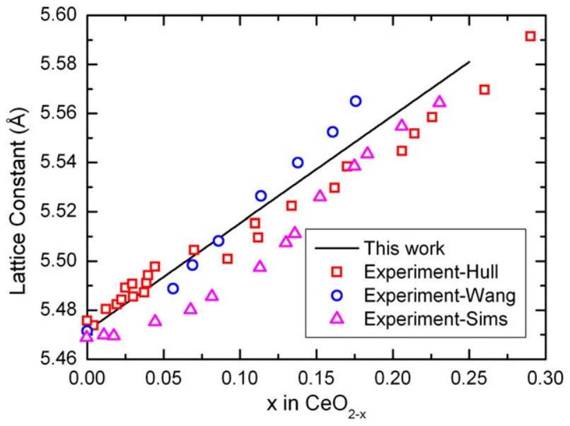
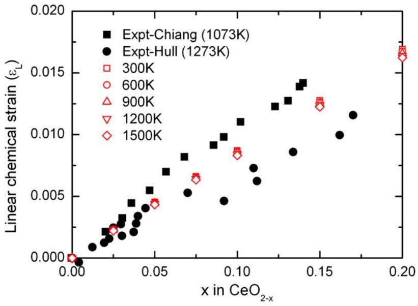
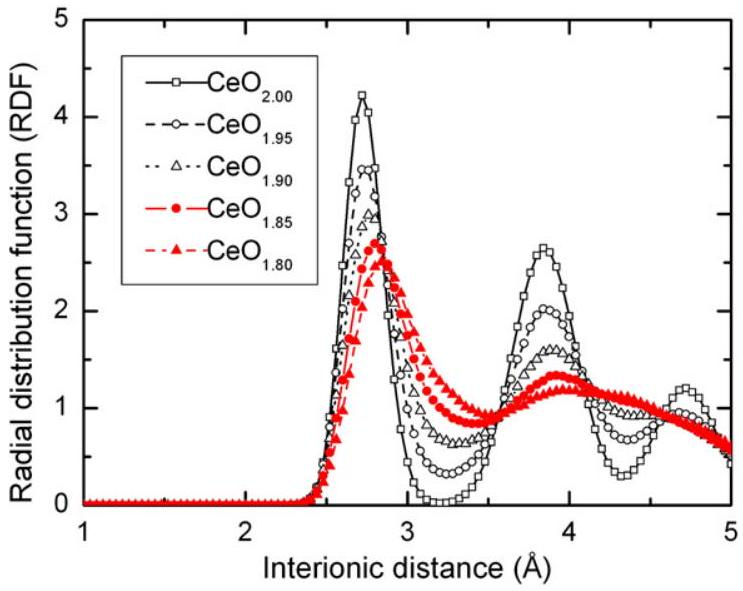
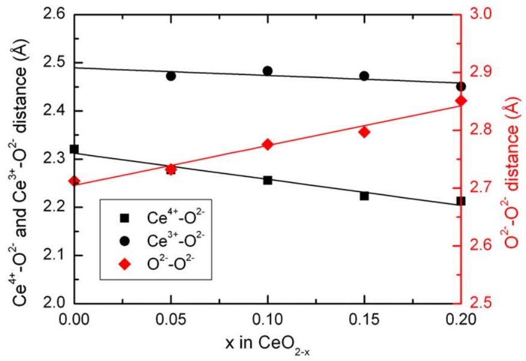
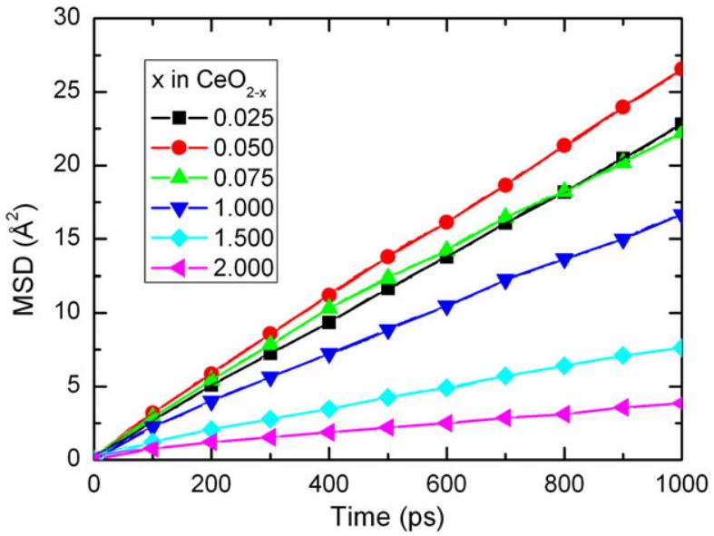
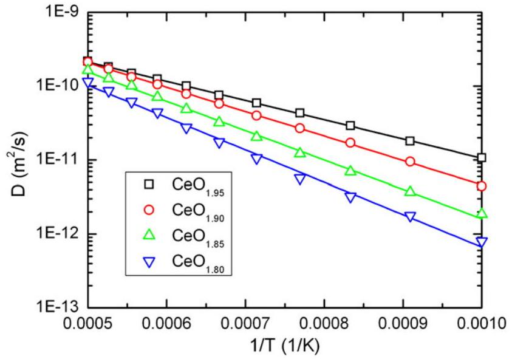
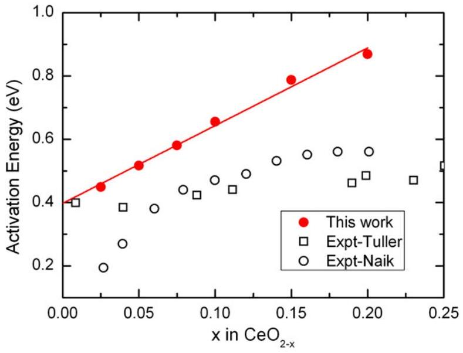
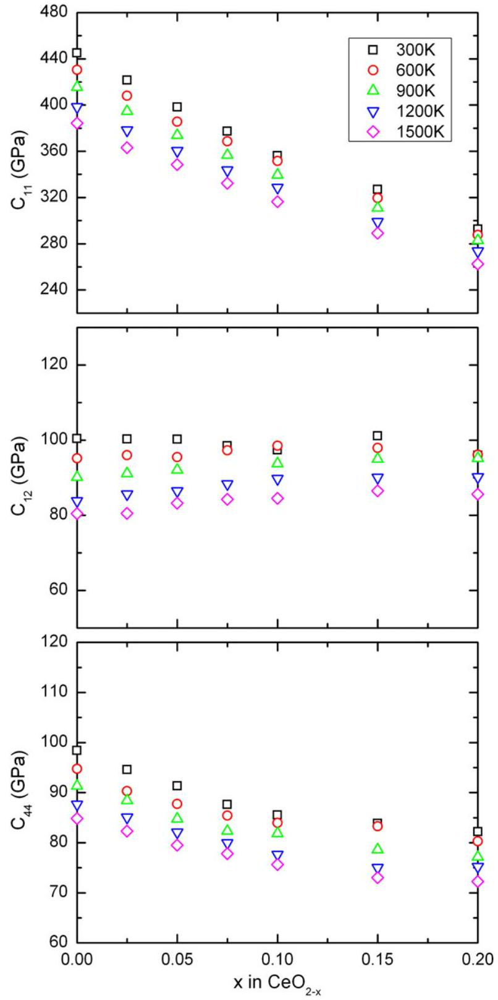
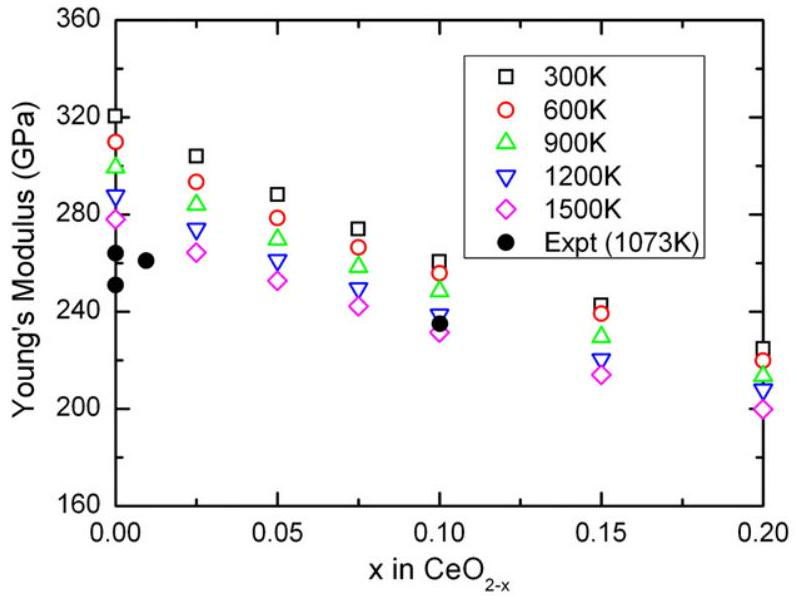

# Molecular dynamics simulation of reduced $\mathrm{CeO}_{2}$ 

Zhiwei Cui ${ }^{\mathrm{a}}$, Yi Sun ${ }^{\mathrm{a}, *}$, Jianmin Qu ${ }^{\mathrm{b}}$ ${ }^{\mathrm{a}}$ Department of Astronautic Science and Mechanics, Harbin Institute of Technology, Harbin, 150001, PR China ${ }^{\mathrm{b}}$ Department of Mechanical Engineering, Northwestern University, Evanston, IL 60208, USA

## ARTICLE INFO

## Article history:

Received 6 December 2011
Received in revised form 1 August 2012
Accepted 2 August 2012
Available online 10 September 2012

## Keywords:

Molecular dynamics simulation
Diffusivity
Ceria
Coefficient of compositional expansion
Elastic constants

#### Abstract

In this paper, the mechanical properties and oxygen self-diffusion in partially reduced $\mathrm{CeO}_{2}$ have been investigated by using molecular dynamics simulations at various levels of non-stoichiometry and temperatures. Under a reducing environment, pure ceria experiences significant chemical volumetric expansion, which is described by coefficient of compositional expansion (CCE). It is found that CCE is about 0.084 and varies within $2 \%$ over the whole range of temperature. Meanwhile, elastic stiffness tensor of the non-stoichiometric structures remains cubic. The Young's modulus decreases with increasing vacancy concentration, while the variation of the Poisson's ratio is found to be negligible. The oxygen diffusivity is computed by mean square displacements which increase initially but descend with increasing non-stoichiometry. In addition, the oxygen migration energy is extrapolated to be 0.4 eV which is consistent with reported experiment data.

© 2012 Elsevier B.V. All rights reserved.

## 1. Introduction

Ceria ( $\mathrm{CeO}_{2}$ ) has received increasing attentions in recent years for its applications in modern exhaust gas catalysts [1] and solid oxide fuel cells (SOFCs) [2]. Ceria can generate $\mathrm{Ce}^{3+}$ instead of $\mathrm{Ce}^{4+}$ upon reduction and reverse upon oxidation, thus it shows good oxygen storage capability in catalysts. On the other hand, rare earth-doped ceria are widely used as the intermediate temperature electrolyte in SOFCs due to their high ionic conductivity. For example, Gd-doped ceria (GDC) shows the maximum ionic conductivity compared with other candidates, since $\mathrm{Gd}^{3+}$ ion has the optimal ionic radius (about $1.04 \AA$ Å [3].

Under a low oxygen partial pressure, ceria experiences a volumetric expansion [4] and also shows a decrease in its elastic stiffness [5,6] due to the reduction, i.e., discharge of the uniformly charged $\mathrm{Ce}^{4+}$ to $\mathrm{Ce}^{3+}$. During the reduction process, some oxygen vacancies are generated to keep electric neutrality, which indicates that the total number of ions decreases. The effect of this chemical reaction on the mechanical property can be quantified by coefficient of compositional expansion (CCE) and elastic constants. These parameters can be used as the input in the continuum thermodynamic model, which accounts for the coupling between electrochemistry and mechanical stress [7].

So far, there have been a large number of studies on reduced ceria [8-11]. Although some experimental results have been obtained, the data on oxygen self-diffusion and elastic constants are still not frequently seen to the authors' knowledge. To study the structural evolution of

[^0]reduced $\mathrm{CeO}_{2}$, molecular dynamics (MD) simulation provides an alternative method other than experiments. MD is proved to be a powerful technique to investigate the microscopic nature of atomic motion. Studies have been reported in [9,12] on various properties of both pure and doped reduced $\mathrm{CeO}_{2}$ with the aid of MD simulations. However, most of them mainly focused on the diffusion process with empirical potentials while few attentions are paid to mechanical properties. Thus in this paper, MD simulation is conducted to investigate the mechanical properties and diffusion in partially reduced ceria over a range of temperature. Both diffusivity of oxygen ions and elastic softening as a function of non-stoichiometry have been discussed.

## 2. Calculation

### 2.1. Potential

The key of MD simulation is the interionic potential. To the authors' best knowledge, however, most of the previous work were based on empirical potential, such as the Born-Mayer-Huggins form [9,13-15]. And all their adjustable parameters were determined from the equilibrium and near-equilibrium properties. Thus the quality of the interionic potential is strongly dependent on the fitting properties. Different potential parameters may give divergent results [16]. In a recent paper, Xu et al. [10] compared six different empirical interatomic potentials for ceria and found that none of the potentials could reproduce all the fundamental properties accurately. Such outcome motivates us to break through the limitation of empirical potential framework.

In the current work, we adopt the $a b$ initio potential for reduced $\mathrm{CeO}_{2}$ [16], which is derived by combining the lattice inversion [17,18] and quantum-chemical calculation [19,20]. Following assumptions are made about the system: (1) all ions are formally charged; (2) the cation-cation interactions are purely coulombic. Note that the first assumption is aimed at eliminating the influence of the different charges on uniform ions caused by charge determination [16]. ChenMobius lattice inversion is employed to characterize the interactions between hetero-species ions. The idea is to first construct an extended phase space using cubic structures of $\mathrm{CeO}_{2}$ and $\mathrm{Ce}_{2} \mathrm{O}_{3}$ and then perform the $a b$ initio total-energy calculations. After that, the short-range interactions between cations and anions are directly evaluated from a series of the total energy differences. Such technique can also be adopted to evaluate the potentials between uniform ions. However, it is not practical for the case with atomic motion of solid solution due to their distinct forms and parameters [16,18]. Hence the quantumchemical method is used to obtain the potential between the same species ions by calculating the energies of two identical ions in gas phase. Refer [16] for more details. The function form of $\mathrm{CeO}_{2}$ and $\mathrm{Ce}_{2} \mathrm{O}_{3}$ are expressed as follows,

$$
\begin{aligned}
\Phi_{+-}(r)= & a_{+-} \exp \left[b_{+-}\left(1-\frac{r}{c_{+-}}\right)\right]+\frac{q_{+} q_{-}}{4 \pi \varepsilon_{0} r} \\
\Phi_{--}(r)= & a_{--}\left\{\exp \left[b_{--}\left(1-\frac{r}{c_{--}}\right)\right]-2 \exp \left[\frac{b_{--}}{2}\left(1-\frac{r}{c_{--}}\right)\right]\right\} \\
& +\frac{q_{-}^{2}}{4 \pi \varepsilon_{0} r} \\
\Phi_{++}(r)= & \frac{q_{+}^{2}}{4 \pi \varepsilon_{0} r}
\end{aligned}
$$

where Eqs. (1)-(3) represent the interactions between hetero- and homo-species ions, respectively. The involved potential parameters, i.e., $a, b, c$, for different cases are tabulated in Table 1.

### 2.2. Calculation model and method

Pure ceria posses the cubic fluorite crystal structure (space group Fm 3 m ), where each $\mathrm{Ce}^{4+}$ cation is surrounded by eight $\mathrm{O}^{2-}$ ions forming the corners of a cube, and each $\mathrm{O}^{2-}$ has only four $\mathrm{Ce}^{4+}$ neighbors. The ceria is anion deficient in a reducing environment with a high concentration of oxygen vacancies which plays an important role in promoting the ionic conductivity.

Since the non-stoichiometric ceria can be considered as the dopant $\mathrm{Ce}_{2} \mathrm{O}_{3}$ into $\mathrm{CeO}_{2}$, one oxygen vacancy is generated to keep the charge neutrality once two $\mathrm{Ce}^{4+}$ ions are replaced by $\mathrm{Ce}^{3+}$ ions. Here, the reduced ceria is generated by first removing several oxygen ions to form vacancies and then replacing double the amount of $\mathrm{Ce}^{4+}$ ions by $\mathrm{Ce}^{3+}$ ions. The oxygen removal and replacement of ceria are performed randomly and independent of each other.

The simulation system includes 12000 ions ( $10 \times 10 \times 10 \mathrm{CeO}_{2}$ supercell) for pure ceria. The total number of ions will decrease for the reduced ones. NPT ensemble is adopted. The equations of motion for the box are handled by metric-tensor pressostat [21] which eliminates the flaws of the original Parrinello-Rahman algorithm. On the other hand, Nose-Poincare thermostat algorithm [22] is used for

Table 1
The parameters of short-ranged potentials of $\mathrm{CeO}_{2}$ and $\mathrm{Ce}_{2} \mathrm{O}_{3}$.
| Species | $a(\mathrm{eV})$ | $b$ | $c(\AA)$ |
| :--- | :--- | :--- | :--- |
| $\mathrm{O}^{2-}-\mathrm{O}^{2-}$ | 0.77109 | 7.85216 | 1.99458 |
| $\mathrm{Ce}^{4+}-\mathrm{O}^{2-}$ | 0.20 | 8.46211 | 3.42512 |
| $\mathrm{Ce}^{3+}-\mathrm{O}^{2-}$ | 0.20 | 8.93524 | 3.25432 |

the temperature control. This method can sample the NVT ensemble and keep symplectic structure of Hamiltonian, which is achieved by performing Poincare transformation to the original Nose Hamiltonian. For the time integrator, generalized leap-frog algorithm [23] is employed to keep the numerical calculation symplectic. Wolf algorithm [24] is used to estimate the Coulomb interaction and combination neighbor list algorithm [25] is adopted to increase the computational efficiency. The cutoff distance is $10.82 \AA$. And the time step is set as 1 fs . Each simulation is equilibrated for 1000 ps . Additional 2000 ps is evolved for data collection.

## 3. Results

### 3.1. Coefficient of compositional expansion of reduced $\mathrm{CeO}_{2}$

The MD simulation system is equilibrated in a NPT ensemble. After relaxation, the box remains cubic. The strain induced as a result of the oxygen non-stoichiometry ( $x$ in $\mathrm{CeO}_{2-x}$ ) is purely volumetric. Thus we can still adopt the lattice constant to measure the volume expansion. The lattice constants are calculated as a function of $x$ in $\mathrm{CeO}_{2-x}$ at the temperature range of $300-2000 \mathrm{~K}$. The results at 1273 K are depicted in Fig. 1. In the $x$ range from 0 to 0.30 , our results are in good agreement with experimental measurements [26-28]. Such chemical expansion might be due to the stronger Coulomb interaction of $\mathrm{Ce}^{4+}-\mathrm{O}^{2-}$ than that of $\mathrm{Ce}^{3+}-\mathrm{O}^{2-}$. Similar situation is also found in Gd-doped $\mathrm{CeO}_{2}$ system [16]. Note that no experimental data is involved in our potential, and this good agreement reveals that our interionic potential could describe the evolution of material behaviors in extended phase space.

In addition, we also collect the thermal expansion coefficient of reduced $\mathrm{CeO}_{2}$ by fitting a straight line to our results. And the values are in the range of $8.1-8.7 \times 10^{-6} \mathrm{~K}^{-1}$, which is slightly smaller than those of experiment data ( $9.4 \times 10^{-6} \mathrm{~K}^{-1}$ ) [11] at room temperature. This is mainly due to the formal-charge assumption. A potential proposed by Inaba et al. [15] has taken the fractional charge ( 0.675 of the formal charge) into consideration as well as the lattice constants of both normal and high temperatures in the fitting procedure, which is believed to reproduce a better thermal expansion coefficient since a potential with a small fractional charge could attenuate the attraction between anions and cations.

When the non-stoichiometry x is small, CCE, denoted by $\eta$, is defined as the linear strain per deviation from stoichiometry, i.e.,

$$
\eta=\left.\frac{\partial \varepsilon_{L}}{\partial x}\right|_{x=0},
$$

Fig. 1. Calculated lattice constants as a function of non-stoichiometry $x$ at 1273 K. These values are compared to experimental results [26-28].

where $\varepsilon_{L}$ is the linear chemical expansion. Since the system remains cubic, the linear strain can be evaluated as

$$
\varepsilon_{L}=\frac{V(x)-V(0)}{3 V(0)} .
$$

Fig. 2 depicts the $\varepsilon_{L}$ versus $x$. The results fit well with experimental data. Moreover, $\varepsilon_{L}$ is proportional to $x$, leading to $\eta=\varepsilon_{L} / x$ by Eq. (4). It is found that the values of CCE for reduced ceria is about 0.084 and varies within $2 \%$ over the whole range of temperature, in accordance with the experimental data (0.064-0.10) [27,29].

### 3.2. Radial distribution functions of reduced $\mathrm{CeO}_{2}$

In order to investigate the microscopic structure, the radial distribution functions (RDF) of oxygen ions are calculated by

$$
g\left(r_{i j}\right)=\frac{n_{i j}(r)}{4 \pi\left(N^{2} / V\right) r^{2} \Delta r},
$$

where, $N$ is the number of oxygen ions. $V$ is the volume of the system. $n_{i j}(r)$ is the number of the pairs of oxygen ions $i$ and $j$ between the distance of ( $r-\Delta r / 2$ ) and ( $r+\Delta r / 2$ ).

We concentrate on the first several peaks of $\mathrm{O}-\mathrm{O}$ as a function of the non-stoichiometry x at 1000 K . The results are shown in Fig. 3. Clearly, the increasing nearest distance of $\mathrm{O}-\mathrm{O}$ and the broadening of the peaks are observed with the increase of doping content. Such broadening indicates that various kinds of oxygen sites become possible. When the nearest distance is greater than $3 \AA$, the RDF of high doping concentration is far from 0 , implying the site of oxygen ion deviates from its original position. Simulation results match well with the experimental data by the neutron powder diffraction [27].

To the contrary, the nearest cation-anion distances decrease with the increasing $\mathrm{Ce}^{3+}$ content. And $\mathrm{Ce}^{4+}-\mathrm{O}^{2-}$ distance is smaller than $\mathrm{Ce}^{3+}-\mathrm{O}^{2-}$ distance in all the compounds, shown in Fig. 4. This might be due to the stronger Coulomb interaction of $\mathrm{Ce}^{4+}-\mathrm{O}$ than that of $\mathrm{Ce}^{3+}-0$.

### 3.3. Diffusivity of reduced $\mathrm{CeO}_{2}$

The diffusivity of oxygen ions in the reduced ceria depends on the composition of ionic solids. To investigate such dependence, MD

Fig. 2. Compositional strain versus non-stoichiometry $x$ of $\mathrm{CeO}_{2-x}$. The experiment data are from [27,29].

Fig. 3. Radial distribution functions of $\mathrm{O}-\mathrm{O}$ as a function of non-stoichiometry $x$.

simulations are performed to calculate the mean square displacement (MSD). MSD has been extensively used to describe the movement of atoms in solids, liquids and gases. Obviously, the MSD also contains information on the diffusion of ions. It has been shown that the MSD increases linearly with time when diffusion occurs, and the slop of the MSD versus time curve gives the diffusion constant $D$,

$$
D=\frac{1}{6} \lim _{\Delta t \rightarrow \infty} \frac{\operatorname{MSD}(t+\Delta t)-\operatorname{MSD}(t)}{\Delta t}=\frac{1}{6} \lim _{\Delta t \rightarrow \infty} \frac{\left.\langle | r_{i}(t+\Delta t)-\left.r_{i}(t)\right|^{2}\right\rangle}{\Delta t},
$$

where $\mathbf{r}_{i}(t)$ is the position vector of the oxygen ion $i$ at the time $t$, and the symbol <> denotes the average over all the oxygen ions in the simulation cell. Here we calculate the MSD curve as a function of doping content at 1273 K , as depicted in Fig. 5. The MSD curve initially increases, followed by a descending segment with increasing vacancies concentration. The maximum of MSD is acquired in the compound $\mathrm{CeO}_{1.95}$, which is slightly different from the experimental measurement $\mathrm{CeO}_{1.9}$ [30].

By definition, diffusion coefficient $D$ can be evaluated straightforwardly by taking the slope of the MSD curve, and $D$ is proportional to the ionic conductivity, namely, a large $D$ means a large conductivity. It

Fig. 4. Nearest distances of $\mathrm{Ce}^{4+}-\mathrm{O}^{2-}, \mathrm{Ce}^{3+}-\mathrm{O}^{2-}, \mathrm{O}^{2-}-\mathrm{O}^{2-}$ as a function of nonstoichiometry $x$.

Fig. 5. Mean square displacement and diffusion coefficient of $\mathrm{O}^{2-}$ as a function of nonstoichiometry $x$.

is clear to see that there exists a maximum ionic conductivity from Fig. 5. We argue that it is the trade-off effect between the increasing vacancy sites and decreasing vacancy mobility with increasing $\mathrm{Ce}_{2} \mathrm{O}_{3}$ concentration.

The temperature dependence of diffusion constant is of great interest. To accomplish this, we compute the MSD at the temperature range of between 1000 and 2000 K with a step of 100 K . An example is depicted in Fig. 6, where the MSD of oxygen ions in $\mathrm{CeO}_{1.95}$ is plotted as a function of $t$ at several elevated temperatures. Simulation results indicate that the slope of MSD increases with a higher temperature. Once the diffusivity is known at several higher temperatures, any temperature value can be extrapolated through the following Arrhenius equation,

$$
D(T)=D_{0} \exp \left(\frac{-E_{a}}{R T}\right),
$$

where $T$ is the absolute temperature, $R$ is the universal gas constant. $D_{0}$ and $E_{a}$ are temperature independent prefactor and activation energy. In fact, the high temperature data show a good linear relationship between $\log (D)$ and $(1 / T)$, as shown by the open dots in Fig. 7.

The activation energy ( $E_{a}$ ) can be calculated from Eq. (8) and the results are presented in Fig. 8. Clearly, our calculation and experiment

Fig. 7. Arrhenius plot of the oxygen self-diffusion coefficients in the temperature range of 1000-2000 K.

[30,31] share the same trend while our results are larger than experimental ones. And the differences keep growing especially for the larger dopant levels. Such phenomenon may be mainly caused by the pair-wise interaction and formal charge assumption. The accuracy should be improved if these flaws could be addressed in future. In addition, we can extrapolate the oxygen migration energy at $\mathrm{x}=0$. Apparently, a value of 0.4 eV is obtained, which is very close to experiment data [30,32].

### 3.4. Elastic constants of reduced $\mathrm{CeO}_{2}$

Non-stoichiometric $\mathrm{CeO}_{2}$ has a cubic structure, it hence has three independent elastic constants $C_{11}, C_{12}$ and $C_{44}$. With the aid of the stress-strain fluctuation formula [33], these constants can be calculated directly. Results for reduced $\mathrm{CeO}_{2}$ are shown in Fig. 9. Note that $C_{11}$ decreases rapidly with increasing x . This is due to the weaker Coulomb interaction with larger deviation from stoichiometry. The x dependence of $C_{12}$ and $C_{44}$ is relatively small. The main reason is that $C_{11}$ represents elasticity in length while $C_{12}$ and $C_{44}$ are related to the elasticity in shape. Therefore, $C_{12}$ and $C_{44}$ are less sensitive to x compared with $C_{11}$ since the non-stoichiometric $\mathrm{CeO}_{2}$ basically has a cubic structure.

Fig. 8. Activation energy (red points) in $\mathrm{CeO}_{2-x}$ as a function of non-stoichiometry $x$. The experiment results are from [30,32].

Fig. 6. Mean square displacement at $1000-2000 \mathrm{~K}$ in steps of 100 K .

Fig. 9. Elastic constants in $\mathrm{CeO}_{2-x}$ as a function of non-stoichiometry $x$.

Besides the properties of single crystal, the elastic constants of isotropic polycrystalline system should be calculated for comparison to experimental data. The polycrystalline properties are obtained by using a homogenization method [34]. The Raman coefficients can be computed by

$$
\lambda=\left(C_{11}+4 C_{12}-2 C_{44}\right) / 5 \text { and } \mu=\left(C_{11}-C_{12}+3 C_{44}\right) / 5 .
$$

Then the elastic constants of polycrystalline can be represented more conveniently by Young's modulus and Poisson's ratio. Calculation results and experimental data [5] have been presented in Fig. 10. Young's modulus decreases with increasing deviation of stoichiometry. However, Young's modulus and its variation with stoichiometry do not show strong temperature dependence. Furthermore, it is found that Poisson's ratio is about 0.26 and varies within $6 \%$ over the whole range of temperature and non-stoichiometry considered here.

Fig. 10. Young's modulus in $\mathrm{CeO}_{2-x}$ as a function of non-stoichiometry $x$. The experiment data are from [5,6].

To use the concentration dependent modulus in a continuum thermodynamic model, the following expressions for the Young's modulus $E(x)$ may be used,

$$
E(x)=E(0)\left(1+\eta_{E} x\right),
$$

where $E(0)$ is the Young's modulus of pure $\mathrm{CeO}_{2}$ at each temperature and $\eta_{E}$ represents the variation of the Young's modulus with respect to non-stoichiometry x . By fitting the linear equations to our MD data shown in Fig. 10, the $E(0)$ and $\eta_{E}$ are tabulated in Table 2.

## 4. Concluding remarks

In this paper, the mechanical properties and self-diffusion of oxygen ions of partially reduced ceria have been investigated by MD simulation over a wide temperature range. The non-stoichiometry dependence of coefficient of compositional expansion, radial distribution function, mean-squire displacements and elastic constants has been discussed in details.

Our numerical results indicate that the chemical strain can be considered as a linear function of non-stoichiometry approximately and the corresponding CCE is in the range of 0.082-0.085.

The oxygen self-diffusion process is simulated by mean square displacement. The diffusivity of oxygen ions first increases with increasing vacancies concentration, then starts to decrease as vacancies concentration increases further. The highest diffusivity seems to occur in $\mathrm{CeO}_{1.95}$, which is slightly different from the experimental result $\mathrm{CeO}_{1.9}$. Moreover, the oxygen migration energy is extrapolated to be 0.4 eV approximately, which is consistent with experiment data.

As for the elastic stiffness, the elastic constant $C_{11}$ is found to decrease dramatically while $C_{12}$ and $C_{44}$ are less sensitive to the deviation of stoichiometry compared with $C_{11}$. The polycrystalline elastic constants are determined by using a homogenization method,

Table 2
$E(0)$ and $\eta_{E}$ of reduced $\mathrm{CeO}_{2}$ at various temperature.
| Temperature(K) | $E(0)(\mathrm{GPa})$ | $\eta_{E}$ |
| :--- | :--- | :--- |
| 300 | 320 | -1.62 |
| 600 | 310 | -1.56 |
| 900 | 299 | -1.54 |
| 1200 | 288 | -1.52 |
| 1500 | 278 | -1.51 |

featuring an assembly of single crystals with random orientations. It is found that only the variation of Young's modulus needs to be considered and the variation of Poisson's ratio can be negligible safely.

## Acknowledgments

This work was supported by National Natural Science Foundation of China (10972066) and the Foundation of Excellent Youth of Heilongjiang Province.

## References

[1] A. Trovarelli, M. Boaro, E. Rocchini, C. de Leitenburg, G. Dolcetti, J. Alloys Compd. 323 (2001) 584.
[2] A.J. Jacobson, Chem. Mater. 22 (3) (2010) 660.
[3] D.J. Kim, J. Am. Ceram. Soc. 72 (8) (1989) 1415.
[4] A. Atkinson, Solid State Ionics 95 (3-4) (1997) 249.
[5] K.L. Duncan, Y.L. Wang, S.R. Bishop, F. Ebrahimi, E.D. Wachsman, J. Am. Ceram. Soc. 89 (10) (2006) 3162.
[6] Y.L. Wang, K. Duncan, E.D. Wachsman, F. Ebrahimi, Solid State Ionics 178 (1-2) (2007) 53.
[7] N. Swaminathan, J. Qu, Y. Sun, Philos. Mag. 87 (11) (2007) 1705.
[8] M. Mogensen, N.M. Sammes, G.A. Tompsett, Solid State Ionics 129 (1-4) (2000) 63.
[9] A. Gotte, D. Spangberg, K. Hermansson, M. Baudin, Solid State Ionics 178 (25-26) (2007) 1421.
[10] H.X. Xu, R.K. Behera, Y.L. Wang, F. Ebrahimi, S.B. Sinnott, E.D. Wachsman, S.R. Phillpot, Solid State Ionics 181 (11-12) (2010) 551.
[11] E. Wachtel, I. Lubomirsky, Scr. Mater 65 (2) (2011) 112.
[12] X. Wei, W. Pan, L.F. Cheng, B. Li, Solid State Ionics 180 (1) (2009) 13.
[13] V. Butler, C.R.A. Catlow, B.E.F. Fender, J.H. Harding, Solid State Ionics 8 (2) (1983) 109.
[14] S. Vyas, R.W. Grimes, D.H. Gay, A.L. Rohl, J. Chem. Soc., Faraday Trans. 94 (3) (1998) 427.
[15] H. Inaba, R. Sagawa, H. Hayashi, K. Kawamura, Solid State Ionics 122 (1-4) (1999) 95.
[16] Z.W. Cui, Y. Sun, Y.J. Chen, J.M. Qu, Solid State Ionics 187 (1) (2011) 8.
[17] S. Zhang, N.X. Chen, Phys. Rev. B 66 (6) (2002) 64106.
[18] S. Zhang, N.X. Chen, J. Chem. Phys. 118 (9) (2003) 3974.
[19] H. Ohta, S. Hamaguchi, J. Chem. Phys. 115 (14) (2001) 6679.
[20] H. Ohta, A. Iwakawa, K. Eriguchi, K. Ono, J. Appl. Phys. 104 (7) (2008) 73302.
[21] I. Souza, J.L. Martins, Phys. Rev. B 55 (14) (1997) 8733.
[22] S.D. Bond, B.J. Leimkuhler, B.B. Laird, J. Comput. Phys. 151 (1) (1999) 114.
[23] G. Sun, J. Comput. Math. 11 (3) (1993) 250.
$[24]$ D. Wolf, P. Keblinski, S.R. Phillpot, J. Eggebrecht, J. Chem. Phys. 110 (17) (1999) 8254.
[25] Z.W. Cui, Y. Sun, J.M. Qu, Chin. Sci. Bull. 54 (9) (2009) 1463.
[26] S.R. Wang, M. Katsuki, T. Hashimoto, M. Dokiya, J. Electrochem. Soc. 150 (7) (2003) A952.
[27] S. Hull, S.T. Norberg, I. Ahmed, S.G. Eriksson, D. Marrocchelli, P.A. Madden, J. Solid State Chem. 182 (10) (2009) 2815.
[28] J.R. Sims, R.N. Blumenthal, High Temp. Sci. 8 (2) (1976) 99.
[29] H.W. Chiang, R.N. Blumenthal, R.A. Fournelle, Solid State Ionics 66 (1-2) (1993) 85.
[30] H.L. Tuller, A.S. Nowick, J. Phys. Chem. Solids 38 (8) (1977) 859.
[31] I.K. Naik, T.Y. Tien, J. Phys. Chem. Solids 39 (3) (1978) 311.
[32] P.P. Dholabhai, J.B. Adams, P. Crozier, R. Sharma, J. Chem. Phys. 132 (9) (2010) 13255.
[33] Z.W. Cui, Y. Sun, J. Li, J.M. Qu, Phys. Rev. B 75 (21) (2007) 214101.
[34] J.P. Watt, J. Appl. Phys. 51 (3) (1980) 1520.

[^0]:    * Corresponding author.

    E-mail address: Sunyi@hit.edu.cn (Y. Sun).

