## The Journal of Chemical Physics

## RESEARCH ARTICLE | DECEMBER 262007

## Tuning LDA $+U$ for electron localization and structure at oxygen vacancies in ceria

C. W. M. Castleton; J. Kullgren; K. Hermansson

Check for updates
J. Chem. Phys. 127, 244704 (2007)
https://doi.org/10.1063/1.2800015

View export Online Citation

## Articles You May Be Interested In

$\mathrm{SO}_{x}$ on ceria from adsorbed $\mathrm{SO}_{2}$
J. Chem. Phys. (May 2011)

Oxygen vacancy formation energy in Pd-doped ceria: A DFT + U study
J. Chem. Phys. (August 2007)

Effects of Zr doping on stoichiometric and reduced ceria: A first-principles study
J. Chem. Phys. (June 2006)

# Tuning LDA $\boldsymbol{+} \boldsymbol{U}$ for electron localization and structure at oxygen vacancies in ceria 

C. W. M. Castleton ${ }^{\text {a) }}$ Department of Physics and Measurement Technology (IFM), Linköping University, SE-58183 Linköping, Sweden and Department of Materials Chemistry, Uppsala University, Box 538, SE-75121, Sweden J. Kullgren and K. Hermansson Department of Materials Chemistry, Uppsala University, Box 538, SE-75121, Sweden

(Received 26 March 2007; accepted 25 September 2007; published online 26 December 2007)

#### Abstract

We examine the real space structure and the electronic structure (particularly Ce4f electron localization) of oxygen vacancies in $\mathrm{CeO}_{2}$ (ceria) as a function of $U$ in density functional theory studies with the rotationally invariant forms of the $\mathrm{LDA}+U$ and GGA $+U$ functionals. The four nearest neighbor Ce ions always relax outwards, with those not carrying localized $\mathrm{Ce} 4 f$ charge moving furthest. Several quantification schemes show that the charge starts to become localized at $U \approx 3 \mathrm{eV}$ and that the degree of localization reaches a maximum at $\sim 6 \mathrm{eV}$ for $\mathrm{LDA}+U$ or at $\sim 5.5 \mathrm{eV}$ for GGA $+U$. For higher $U$ it decreases rapidly as charge is transferred onto second neighbor O ions and beyond. The localization is never into atomic corelike states; at maximum localization about $80-90 \%$ of the Ce $4 f$ charge is located on the two nearest neighboring Ce ions. However, if we look at the total atomic charge we find that the two ions only make a net gain of $(0.2-0.4) e$ each, so localization is actually very incomplete, with localization of Ce4 $f$ electrons coming at the expense of moving other electrons off the Ce ions. We have also revisited some properties of defect-free ceria and find that with $\mathrm{LDA}+U$ the crystal structure is actually best described with $U=3-4 \mathrm{eV}$, while the experimental band structure is obtained with $U=7-8 \mathrm{eV}$. (For GGA $+U$ the lattice parameters worsen for $U>0 \mathrm{eV}$, but the band structure is similar to LDA $+U$.) The best overall choice is $U \approx 6 \mathrm{eV}$ with $\mathrm{LDA}+U$ and $\approx 5.5 \mathrm{eV}$ for GGA $+U$, since the localization is most important, but a consistent choice for both $\mathrm{CeO}_{2}$ and $\mathrm{Ce}_{2} \mathrm{O}_{3}$, with and without vacancies, is hard to find. © 2007 American Institute of Physics. [DOI: 10.1063/1.2800015]

## I. INTRODUCTION

The intrinsic $n$-type flourite structured semiconductor $\mathrm{CeO}_{2}$ (ceria) has numerous applications in car exhaust catalysis (as an oxygen buffer and catalyst), ${ }^{1}$ in oxygen gas sensors, ${ }^{2}$ and in fuel cells. ${ }^{3}$ These all depend on the unusual properties of dopants and native point defects in ceria, particularly oxygen vacancies ( $V_{\mathrm{O}}$ ). Studying the energetic and structural properties of these using density functional theory ${ }^{4}$ (DFT) is therefore very important. DFT using the local density approximation (LDA) or the generalized gradient approximation (GGA) fails qualitatively for all defects in which the $4 f$ levels of the Ce ions, which are empty in defect-free material, become partially filled. As a result, there is currently great interest in the use of the LDA $+U$ and GGA $+U$ functionals ${ }^{5}$ to correct this in DFT studies of ceria. ${ }^{6-14}$ These functionals are semiempirical; the $U$ parameter needs to be derived or fitted to other calculations or experimental data.

Four recent papers ${ }^{11-14}$ have evaluated the choice of functional and $U$ for the rotationally invariant form of $\mathrm{LDA}+U$ derived by Dudarev et al. ${ }^{15}$ They studied the properties of defect-free bulk $\mathrm{CeO}_{2}$ and $\mathrm{Ce}_{2} \mathrm{O}_{3}$ (which has one $\mathrm{Ce} 4 f$ electron per Ce ion even without defects) as well as the

[^0]density of states (DOS) and vacancy formation energies in $\mathrm{CeO}_{2}$. The general conclusion is that for $\mathrm{CeO}_{2}, U \approx 6 \mathrm{eV}$ and $\approx 5 \mathrm{eV}$ work well for $\mathrm{LDA}+U$ and GGA $+U$, respectively. $\mathrm{Ce}_{2} \mathrm{O}_{3}$ is better described using smaller values. (See more detailed discussion below.) However, it is not only the DOS and thermodynamics that are important. The structure of the vacancies and the actual degree and shape of the localization are of great importance, particularly in understanding the catalytic properties of the material. Since the real space structure and localization have not been examined, we present here a study of the structure of neutral oxygen vacancies ( $V_{\mathrm{O}}^{+0}$ ) as a function of $U$. We look at the distribution of Ce4 $f$ charge and the extent to which it is truly localized. We will also discuss various approaches to quantify the degree of localization.

In addition, there are some inconsistencies and contradictions in the actual results presented previously for defectfree $\mathrm{CeO}_{2}$, particularly regarding the band gaps, and the values of $U$ which best reproduce both them and the lattice parameter. Hence, after reviewing the theoretical and experimental literature (Sec. I) and giving some computational details (Sec. II), we will first revisit defect-free ceria (Sec. III), before focusing our main attention on the real space properties of $V_{\mathrm{O}}$ in ceria (Sec. IV). In Sec. V we will conclude.

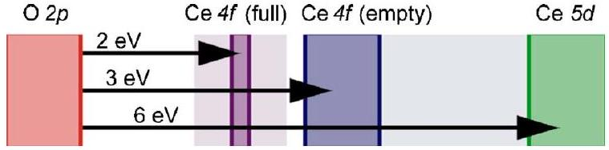
FIG. 1. (Color online) Schematic band diagram for ceria with defects. [Without defects or core excitation Ce4 $f$ (full) is absent.] Gaps are approximate and taken from experiment, with shaded regions indicating rough levels of uncertainly, see Sec. I C for details.

## A. Applying LDA+ $\boldsymbol{U}$ to ceria

Figure 1 shows the experimental band structure of ceria. ${ }^{16-22}$ The valence and conduction bands are derived primarily from $\mathrm{O} 2 p$ and $\mathrm{Ce} 5 d$ states, respectively. Between them lies a rather flat, $\mathrm{Ce} 4 f$ related band. In defect-free material this is empty and the nominal valence of all Ce ions is Ce (IV). As long as this is so, $a b$ initio DFT-GGA works well, ${ }^{6,23,24}$ and DFT-LDA works better. ${ }^{6,23,24}$ However, if an electron enters the $\mathrm{Ce} 4 f$ band, it becomes localized. Translational symmetry is broken by a local lattice distortion, forming a polaron centered on the added electron. Fits to the resulting temperature activated "hopping" conductivity ${ }^{25}$ show that it is well described by the "small polaron" model of Holstein and co-workers, ${ }^{26}$ meaning that "the polarons' linear dimensions are of the order of the lattice spacing." The valence of the cerium ion at the center then nominally changes to Ce (III), with one (nominally) fully occupied Ce $4 f$ state.

Besides the polarons, the most important defects are $V_{\mathrm{O}}$, which are only stable in the +2 charge state $V_{\mathrm{O}}^{+2} \cdot{ }^{16,23}$ In undoped ceria with no applied voltages or fields, two polarons bind to each vacancy, forming what behaves in most senses as a distorted neutral vacancy, $V_{\mathrm{O}}^{+0}$. LDA cannot describe this, but $\mathrm{LDA}+U$ can. ${ }^{6-10}$

In the LDA $+U$ method, ${ }^{5}$ an LDA calculation is performed, but the exchange-correlation energy corresponding to the Ce4 $f$ electrons is projected out and replaced by an energy derived from a local "Hubbard model." ${ }^{27,28}$ In this highly simplified model, all the properties of electrons in a crystalline lattice are reduced to two terms: A kinetic term $t$, describing electron transfer between lattice sites or orbitals, and an on-site Coulomb repulsion term $U$, which adds a constant energy if two electrons occupy the same orbital. Despite its simplicity, it has a very complex phase diagram, and is widely used to describe strongly correlated electron systems (Ref. 29 and many others). For simple cases it can be solved exactly, ${ }^{28}$ with both exchange and correlation treated correctly. Applied to a single site it is easily solved and incorporated into DFT-LDA to produce the LDA $+U$ functional. Initial LDA $+U$ results for ceria were promising, ${ }^{6-11}$ but since they are critically dependent on the choice of functional, of $U$ and of projection method, detailed assessments of their accuracy, reliablity, and transferability are required.

An early assessment of GGA $+U$ for defect-free $\mathrm{CeO}_{2}$ (Ref. 11) was recently extended separately by three groups ${ }^{12-14}$ to both defect-free $\mathrm{CeO}_{2}$ and defect-free $\mathrm{Ce}_{2} \mathrm{O}_{3}$, using $\mathrm{LDA}+U$ and $\mathrm{GGA}+U$. For $\mathrm{LDA}+U$ all groups report fitting the experimental lattice parameter $a_{0}$ with $U \approx 7 \mathrm{eV}$. However, the calculations are at zero temperature and the

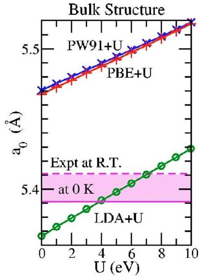
FIG. 2. (Color online) Lattice parameter of defect free ceria $a_{0}$ vs $U$. Our own data for $\mathrm{LDA}+U(\bigcirc$, green $), \mathrm{PW} 91+U(\times$, blue $)$, and $\mathrm{PBE}+U(+$, red) agree with previously published data (Refs. 11-14). The experimental values are shown as horizontal (pink) lines. Both the experimental room temperature value (dashed line, labeled RT) and the zero temperature extrapolated value (solid line) are shown.

experimental value quoted is $5.411 \AA$. This is the room temperature value. ${ }^{30-33}$ The thermal expansion coefficient is around $1.12-1.23 \times 10^{-5} \mathrm{~K}^{-1}$ measured over $298-1273 \mathrm{~K}$, ${ }^{31,32,34}$ giving about $5.391 \AA$ at 0 K . This can also be seen by extrapolating the $300-1300 \mathrm{~K}$ data of Rossignol et al. ${ }^{32}$ or from simulations using classical interatomic potentials. ${ }^{33}$ Hence the best fit is actually around $U=4 \mathrm{eV}$ (see Fig. 2). Using GGA $+U, a_{0}$ actually gets worse with increasing $U>0 \mathrm{eV}$. Meanwhile, a wide uncertainly in the experimental bulk modulus ${ }^{30,31,33,35}$ allows a fit at any value of $U$ with LDA, but none with GGA. There are clearly problems with the structures and forces present in GGA $+U$ calculations for ceria, though their size or seriousness for defect calculations is hard to assess.

The $\mathrm{O} 2 p \rightarrow \mathrm{Ce} 4 f$ and $\mathrm{O} 2 p \rightarrow \mathrm{Ce} 5 d$ band gaps were reported as a function of $U$ by Jiang et al., ${ }^{11}$ but the results show significant "noise" and it is uncertain exactly which functional was used (see Ref. 12). The gaps have since been reported by Loschen et al. ${ }^{12}$ They found the $\mathrm{O} 2 p \rightarrow \mathrm{Ce} 4 f$ gap changing linearly from 1.3 to 2.3 eV over the range $U =0-9 \mathrm{eV}$ with $\mathrm{LDA}+U$, while the $\mathrm{O} 2 p \rightarrow \operatorname{Ce} 5 d$ gap fell from 5.3 to 4.5 eV . At $U=6 \mathrm{eV}$ the gaps were 1.9 and 4.8 eV , respectively. Thus, they find no $U<10 \mathrm{eV}$ at which the experimental gaps are well described. However, the calculations of Andersson et al. contradict this. They find these gaps to be 1.9 and 5.5 eV at $U=0 \mathrm{eV}$ (Ref. 13) or 2.4 and 5.1 eV at $U=6 \mathrm{eV},{ }^{13,36}$ indicating that a $U$ value consistent with experiment should exist. Da Silva et al. ${ }^{14}$ plot gaps at the $\Gamma$ point as a function of $U$, but this is hard to compare with the other results since the gaps are actually indirect. However, their DOS plots indicate $\mathrm{O} 2 p \rightarrow$ Ce4 $f$ gaps of about 2.0 and 2.4 eV at $U=0$ and 6 eV , respectively. To resolve this disagreement and to report consistent gaps for $U \neq\{0,6\} \mathrm{eV}$ we will show our own calculated fundamental gaps as a function of $U$ in Sec. III, after a closer examination of the experimental data.

For the case of vacancies in ceria, three studies exist. Nolan et al. ${ }^{8}$ do not report the variation of properties with $U$, but use $U=5 \mathrm{eV}$ for PW91 $+U$, since they find that "signifi-
cant delocalization still persists" for $U<5 \mathrm{eV}$ (without further quantification). Second, Fabris et al. ${ }^{9}$ derived the ab initio values $U=5.3 \mathrm{eV}$ for LDA and $U=4.5 \mathrm{eV}$ for GGA when using the more advanced maximally localized Wannier functional projection ${ }^{37}$ for LDA $+U$. Never-the-less, this projection is very different from that currently used by most other authors and there is no reason to expect the same numerical values of $U$ to be appropriate. Third, Andersson et al. ${ }^{13}$ have presented energy data for a single $V_{\mathrm{O}}$ in a 96 atom supercell. Their LDA $+U$ DOS shows a metallic solution at $U=0 \mathrm{eV}$, but for $U=6 \mathrm{eV}$ the filled Ce4 $f$ states are split from the empty ones, lying 1.4 eV above the valence band edge. They find the ferro- and antiferromagnetic alignments of the two localized electrons to be almost degenerate $(\delta E<1 \mathrm{meV})$. They assume ferromagnetic ordering and then plot the vacancy formation energy in the range of $U =0-7 \mathrm{eV}$. The best fit to experiment is around 4 eV , but they note that the solution is then still metallic. They conclude that the system is well described by $U=6 \mathrm{eV}$ and above for LDA, or 5 eV and above for GGA, and that the transition from metallic to insulating occurs between $U=5$ and 6 eV for LDA and very close to $U=5 \mathrm{eV}$ for GGA.

Thus, as regards specific $U$ recommendations, Andersson et al. ${ }^{13}$ concluded that $U \approx 6 \mathrm{eV}$ for LDA $+U$ and $\approx 5 \mathrm{eV}$ for $\mathrm{GGA}+U$ provide a consistent description of pure $\mathrm{CeO}_{2}$ and $\mathrm{Ce}_{2} \mathrm{O}_{3}$ plus $V_{\mathrm{O}}$ in $\mathrm{CeO}_{2}$. Da Silva et al. ${ }^{14}$ on the other hand suggest that a consistent $U$ choice is hard to make, with the best compromise being around $3-4 \mathrm{eV}$ for $\mathrm{LDA}+U$ and 2 eV for $\mathrm{PBE}+U$. These smaller $U$ values provide a more reasonable description of $\mathrm{Ce}_{2} \mathrm{O}_{3}$. Loschen et al. ${ }^{12}$ also suggest $U=2-3 \mathrm{eV}$ for PW91 but larger values of $5-6 \mathrm{eV}$ for LDA.

## B. The experimental degree of Ce4f localization

Experimentally, the degree of localization is unclear. Since the conductivity data fit the small polaron model, the extent of the Ce $4 f$ charge is similar to the lattice spacing, but it could still be partially spread over several neighboring ions near the polaron's center rather than in tightly bound atomic corelike states deep within individual Ce ions. A clearer answer could, in principle, come from core level x-ray spectroscopies, but their interpretation has been somewhat controversial. ${ }^{16-20,38-40}$ While it is largely agreed ${ }^{18-20,38-40}$ that there is some delocalized $f$ character in the valence band, indicating mixing of the original $\mathrm{O} 2 p$ and $\mathrm{Ce} 4 f$ atomic states, some earlier authors went further, suggesting mixed Ce valence in the ground state. ${ }^{17,38}$ Later work showed instead that when the Ce $4 f$ states become filled (by excitation of core electrons or creation of vacancies), two distinct types of Ce ions can be identified, ${ }^{16,18-20,39,40}$ with distinct spectra, nominally Ce (IV) and Ce (III), and with no long range bandlike character or mixed valence. As to how atomiclike the occupied $\mathrm{Ce} 4 f$ states are, most results point to them being localized, but in slightly extended orbitals. ${ }^{18,39}$ Indeed, there are indications ${ }^{16,19}$ of Ce (III) → Ce (IV) electron transfer processes that would suggest direct overlap between Ce4 $f$ orbitals on neighboring Ce ions. Qualitatively, then, the electrons in the Ce $4 f$ band do not lie entirely within the core
regions of individual Ce ions, but extracting a quantitative measure of the degree of atomiclike localization has been hampered by limited experimental resolution, sample issues, and core hole effects.

## C. The experimental band structure of ceria with and without defects

The various bands shown in Fig. 1 have been studied using valence x-ray photoemission spectroscopy (XPS), ${ }^{16-20}$ bremsstrahlung isochromat spectroscopy (BIS), ${ }^{17,18}$ O1s x-ray absorption spectroscopy (XAS), ${ }^{19}$ electron energy loss spectroscopy (EELS), ${ }^{19}$ high resolution EELS (HREELS), ${ }^{16}$ optical reflectance (OR), ${ }^{21}$ and photoluminesence (PL). ${ }^{22}$ The energy differences in Fig. 1 are not precise, since most of the data have intrinsically low resolution due to lifetime broadening and instrument limitations. Typical resolutions are $\sim 0.3 \mathrm{eV}$ (Ref. 19) but up to 0.6 eV has been noted. ${ }^{18}$ In addition, there are uncertainties $[ \pm 0.1 \mathrm{eV}$ (Ref. 18)] in defining or matching energy scales and, at least in some cases, charging and band bending problems have been noted. ${ }^{16,17,19}$

The x-ray data give the $\mathrm{O} 2 p \rightarrow \mathrm{Ce} 5 d$ gap at around $5.4-8.4 \mathrm{eV}$, ${ }^{19}$ depending on whether one measures edge to edge, where resolution is an issue, or peak maximum to peak maximum where bandwidth is an issue. Most authors ${ }^{16,18,19}$ suggest 6 eV , which is also what OR gives. ${ }^{21}$ Similarly, the $\mathrm{O} 2 p \rightarrow \mathrm{Ce} 4 f$ (empty) gap lies between 2.6 edge to edge ${ }^{18}$ and 5.8 eV peak to peak, and is usually taken as $3 \mathrm{eV} .^{16-21}$ The PL (Ref. 22) has higher resolution and shows states at 3.33 and 3.39 eV above the $\mathrm{O} 2 p$ valence band edge. These are probably related to the empty Ce4 $f$ levels, but there are uncertainties in the specific interpretation. In BIS, ${ }^{18}$ the empty Ce $4 f$ states themselves seem rather broad, stretching right up to the Ce5 $d$ levels. The two bands are narrower in the O1s XAS spectrum ${ }^{19}$ lying about 2.5 eV apart.

Exactly how far down the Ce $4 f$ states move when they become filled is less clear. According to XPS (Refs. 16 and 18-20) they form a rather wide band, stretching from the $\mathrm{O} 2 p$ band edge up to about 2.5 eV . Values around $1.2-1.5 \mathrm{eV}$ are often quoted, measured from the valence band edge to the peak maximum of the filled $\mathrm{Ce} 4 f$ band. Taking the peak is reasonable: They are known to be localized so width is mostly from resolution and lifetime broadening. However, one should add about $0.2-0.4 \mathrm{eV}$ for resolution and broadening at the $\mathrm{O} 2 p$ band edge, giving an $\mathrm{O} 2 p \rightarrow \mathrm{Ce} 4 f$ (full) gap around $1.2-1.9 \mathrm{eV}$. An alternative value comes from HREELS (Ref. 16) which finds the filled Ce $4 f$ levels 3.4 eV below the Ce $5 d$ conduction band, thus $\sim 2.5 \mathrm{eV}$ above the $\mathrm{O} 2 p$ band. A third value comes from the PL, ${ }^{22}$ where three different filled Ce $4 f$ states are seen at 2.30, 2.60 , and 2.84 eV above the valence band edge, presumably related to three different local structures. Taking the XPS, HREELS, and PL together, we conclude that the O2p $\rightarrow$ Ce $4 f$ (full) gap lies between about 1.5 and 2.5 eV , though beneath the uncertainties it should be a narrow, flat band lying somewhere in this interval.

## II. COMPUTATIONAL DETAILS

We have used both non- and spin polarized plane wave ab initio DFT (Ref. 4) together with the projector augmented wave (PAW) method ${ }^{41}$ and the VASP code. ${ }^{42}$ We previously ${ }^{23}$ found that reasonable results, in terms of the geometric and electronic structure, could be obtained with VASP's supplied "soft" O potential combined with the "standard" one for Ce . These have the valence electron configurations $2 s^{2} 2 p^{4}$ and $4 f^{1} 5 s^{2} 5 p^{6} 5 d^{1} 6 s^{2}$, respectively. (The supplied soft Ce potential in which the $5 s$ are treated as core failed to even qualitatively reproduce the observed DOS. ${ }^{23}$ ) We will investigate three different DFT functionals: LDA and two formulations of GGA: PW91 (Ref. 43) and PBE. ${ }^{44}$

All calculations for defect-free ceria used a plane wave cutoff of 500 eV , but for the vacancy calculations a lower cutoff of 300 eV was used. This lower value still provides reasonable convergence ${ }^{23}$ of several quantities: $a_{0}$ to $\pm 0.002 \AA$, bulk modulus $B$ to $\pm 4 \mathrm{GPa}$, and vacancy formation energies to $\pm 0.01 \mathrm{eV}$, as compared to results obtained using a plane wave cutoff of 1000 eV . For the defect-free bulk calculations we have used the three atom primitive unit cell, with a $4 \times 4 \times 4$ Monkhorst-Pack ${ }^{45} k$-point grid. The differences in calculated total energies between using grids of $4 \times 4 \times 4$ and $6 \times 6 \times 6$ were only $\sim 0.0001 \mathrm{eV}$. Band gaps were calculated by examining the band structure to find the maxima and minima of the bands in $k$ space. This was done with a tolerance of $\pm 0.001 \mathrm{eV}$, using charge densities converged using a $4 \times 4 \times 4$ Monkhost-Pack grid. We use Gaussian smearing, with width of 0.01 eV ; since ceria is a semiconductor this is both stable and more accurate.

The vacancy calculations were performed in a 96 atom simple cubic supercell, with one oxygen atom removed at the origin. This corresponds to the composition $\mathrm{CeO}_{1.96}$ 875, or an ordered defect concentration of about $8 \times 10^{20} \mathrm{~cm}^{-3}$. We again used a $4 \times 4 \times 4$ Monkhorst-Pack $k$-point grid, although we only included those points lying in the irreducible Brillouin zone of the undistorted vacancy. This restriction does not prevent asymmetric relaxations and is equivalent to assuming that the distortion in the band structure due to the presence of the vacancy is either small or symmetric. ${ }^{46}$ The total energy differs by about 0.005 eV between the $4 \times 4 \times 4$ and $6 \times 6 \times 6$ grids. For DOS we use a $4 \times 4 \times 4$ grid and add an additional Gaussian smearing of 0.05 eV to the DOS itself.

We will report defect formation energies, which give a measure of the energy cost of creating a particular defect, and the way in which this varies with conditions. For $V_{\mathrm{O}}^{+0}$ this is normally defined as

$$
E_{d}^{C}=E_{T}^{C}\left(\mathrm{~V}_{\mathrm{O}}^{+0}\right)-E_{T}^{C}(\text { no defect })-\mu_{\mathrm{O}},
$$

where $E_{T}^{C}\left(\mathrm{~V}_{\mathrm{O}}\right)$ and $E_{T}^{C}$ (no defect) are the total energy of the supercell C with and without the vacancy, calculated using the same values of plane wave cutoff, $k$-point grid, etc, to make use of the cancellation of errors. All of the energies presented are after full structural relaxation of all atoms not located on the border of the supercells. Atoms on the cell borders are kept fixed in order to truncate elastic defectdefect image interactions via the periodic boundary

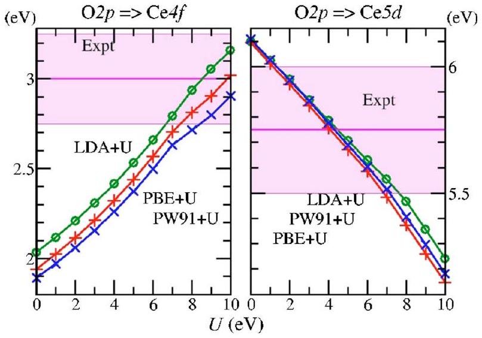
FIG. 3. (Color online) The gaps between the $\mathrm{O} 2 p$ valence band and the empty Ce4f levels (left panel) and Ce5d conduction band (right panel) for defect free ceria as a function of $U$, calculated for LDA $+U(\bigcirc$, green), $\mathrm{PW} 91+U(\times$, blue $)$, and $\mathrm{PBE}+U(+$, red $)$. The experimental values are shown as solid horizontal (pink) lines, with a rough indication of the range of values consistent with experiment being given by the shaded (pink) areas, see text.

conditions. ${ }^{46}$ Such interactions can otherwise lead to incorrect structures and spurious charge density waves, etc. No local symmetries were enforced during the relaxations, and all energies were converged to $\mathrm{O}(0.0001 \mathrm{eV})$ or better. The defect is formed by removing an O atom of chemical potential $\mu_{\mathrm{O}}$. The system is in equilibrium with a (grand canonical) particle bath characterized by $\mu_{\mathrm{O}}$. For convenience we assume oxygen rich conditions, meaning that the bath contains only oxygen, so that $\mu_{\mathrm{O}}$ is half of the isolated dimer energy. This gives $\mu_{\mathrm{O}}=-4.453 \mathrm{eV}$ with LDA and -4.235 eV with PBE , independent of the value of $U$.

## III. RESULTS FOR DEFECT-FREE BULK CERIA

The calculated lattice parameter $a_{0}$ is plotted against $U$ in Fig. 2. It is in close agreement with the data of Refs. 12-14, and was discussed earlier. The effect of $U$ upon the electronic structure of defect-free ceria is shown in Fig. 3. The experimental issues described in Sec. I C lead to a range of plausible values for the band gaps, as indicated in the figure. For $U=0 \mathrm{eV}$ the $\mathrm{O} 2 p \rightarrow \mathrm{Ce} 4 f$ gap is underestimated and the $\mathrm{O} 2 p \rightarrow \mathrm{Ce} 5 d$ gap is slightly overestimated. As $U$ is increased, both improve, with LDA always slightly better than GGA, but all three very close together. A near perfect fit is found around $U=7-8 \mathrm{eV}$ for all three functionals, slightly larger than the $6-7 \mathrm{eV}$ found in the surface calculations of Jiang et al. ${ }^{11}$ Thus our results agree with and complement those of Da Silva et al. ${ }^{14}$ and Andersson et al. ${ }^{13}$ but disagree with those of Loschen et al. ${ }^{12}$ The difference appears to be due to the method of calculating the band gaps; the gaps extracted from smeared DOS plots are, for this material, significant underestimates compared to those calculated by finding the maxima/minima of the bands in $k$ space.

## IV. RESULTS FOR OXYGEN VACANCIES IN BULK CERIA

## A. Magnetization, relaxed structures, and DOS

When a neutral oxygen vacancy $V_{\mathrm{O}}^{+0}$ is placed in the supercell, two additional electrons appear. These enter the

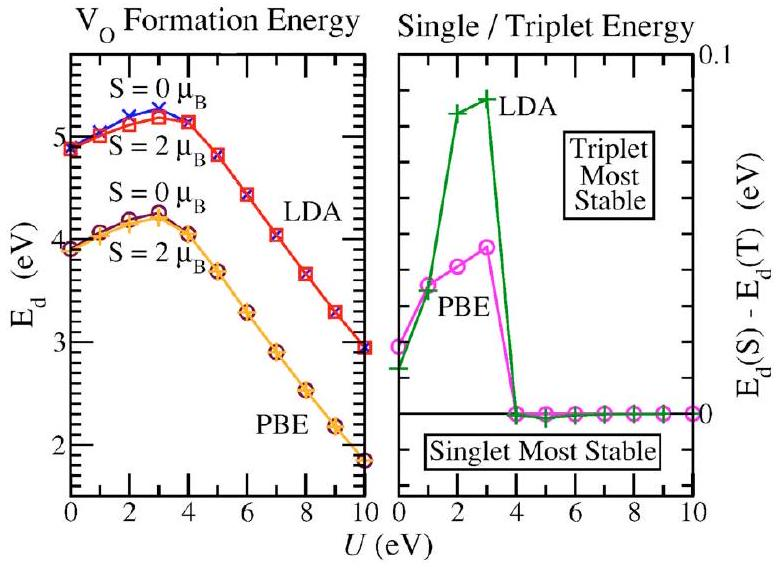
FIG. 4. (Color online) (Left panel): The formation energy of $V_{\mathrm{O}}^{+0}$ as a function of $U$. LDA, $S=0 \mu_{B}: \times$ (blue). LDA, $S=2 \mu_{B}: \square$ (red). PBE, $S=0 \mu_{B}: \bigcirc$ (purple). LDA, $S=2 \mu_{B}:+$ (orange). (Right panel) The energy difference between 0 and $2 \mu_{B}$. LDA: + (green); PBE: $\bigcirc$ (pink).

Kohn-Sham (KS) level corresponding to the lowest state in the Ce4f band as shown in Fig. 1. Using Wigner-Seitz projection onto atomiclike states we find that these electrons have predominantly " $f$ " character: $96 \%$ for $U=0 \mathrm{eV}$ and $94 \%$ for $U=6 \mathrm{eV}$ (LDA, spin singlet solutions, see below). However, the intrinsic errors in projecting crystal states, for which atomic symmetries are not conserved, onto atomic states in which they are conserved means that we also pick up charge which appears to have $f$-like symmetry, but actually belongs to energies far below the Fermi level. Although we only find small $f$ projections for the other filled states, they usually sum up to rather more than two electrons. We wish to study the evolution of the whole of the charge corresponding to these two additional Ce $4 f$ electrons, and only that charge. As a result we will use "band" projection, studying the evolution of the whole charge density of the highest occupied KS orbital as a function of $U$ and DFT functional. ${ }^{47}$ When we refer to "the Ce $4 f$ charge density" in what follows, we mean the highest occupied KS level, rather than all charge with approximately $f$-like atomic character.

When the calculations were performed without spin polarization, we were able to find localization of the charge in the highest occupied KS level (corresponding to the $\mathrm{Ce} 4 f$ electrons) on the four Ce around the vacancy, but the four remained equivalent. To obtain full localization onto just two Ce we needed to perform spin polarized calculations, which gave either a singlet ( $0 \mu_{B}$ ) or a triplet ( $2 \mu_{B}$ ) ground state, depending upon functional, $U$ and start point. We then performed a detailed series of structural optimizations with the spin restricted to either $0 \mu_{B}$ or $2 \mu_{B}$. To speed convergence initial spin density was centered on two neighboring Ce ions. Figure 4 shows the resulting LDA $+U$ formation energies (which are not linear in $U$ ), as well as the singlet-triplet energy split. The formation energies first rise with $U$ and then fall as found by Andersson et al. ${ }^{13}$ (The overall energy scale differs due to the difference in definition of $\mu_{\mathrm{O}}$.) As they do, we find near degeneracy for $U \geqslant 4 \mathrm{eV}$, though we note that the ground state is actually a singlet. However, we here find a non-negligible triplet-singlet split for $U =0-3 \mathrm{eV}$. For this $U$ range we find a triplet ground state.

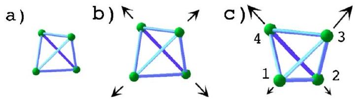
FIG. 5. (Color online) Schematic $V_{\mathrm{O}}$ structure showing the positions of the four Ce nearest neighbors: (a) unrelaxed, (b) outward symmetric relaxation, and (c) relaxed and distorted, with two Ce moving outwards much more that the other two, relative to the unrelaxed structure.

The reason for the change in spin state will be discussed below. The structural convergence was carefully checked, with alternate start points, including starting $0 \mu_{B}$ relaxations from the $2 \mu_{B}$ relaxed structures and vice versa. The relaxed vacancy structures are described using the schematic in Fig. 5. The unrelaxed $V_{\mathrm{O}}$ is surrounded by a tetrahedron of four Ce ions [Fig. 5(a)]. If the additional $\mathrm{Ce} 4 f$ electrons are evenly distributed over the four (or even over all Ce in the cell) then the tetrahedron remains symmetric, though we always find an outward relaxation [Fig. 5(b)]. If the electrons become partially or completely localized on two neighbors [labeled "Ce 1" and "Ce 2" in Fig. 5(c)] then these will move relative to the other two ("Ce 3" and "Ce 4"). The symmetric outward contribution always dominates, so all four move outwards, but 1 and 2 move by a shorter distance. To speed structural convergence we start most relaxations from symmetry-broken structures, with two Ce moved in and two out. For cases with no localization the structures are always found to relax back to that in Fig. 5(b).

The relaxed results for LDA and PBE are shown as a function of $U$ in Figs. 6-8. (Results for PBE and PW91 are very similar.) Figure 6 shows the $V_{\mathrm{O}}-\mathrm{Ce}$ neighbor relaxation distances for $S=0 \mu_{B}$ and $2 \mu_{B}$, and Fig. 7 shows the DOS for $S=0 \mu_{B}$ using LDA and for $S=2 \mu_{B}$ using PBE. (The DOS for $S=0 \mu_{B}$ with PBE and $S=2 \mu_{B}$ with LDA are similar, and they agree with the $U=0$ and 6 eV results of Refs. 13 and 14.) In Fig. 8 we show qualitatively the degree of $\mathrm{Ce} 4 f$ electron localization by plotting isocharge surfaces for the highest

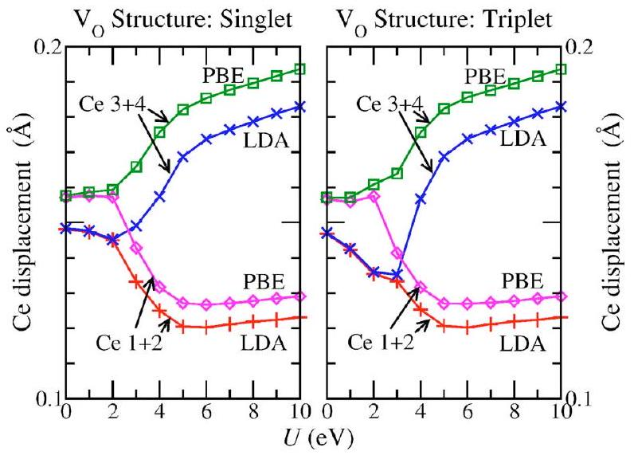
FIG. 6. (Color online) Outward relaxation of the nearest neighbor Ce ions relative to the unrelaxed distances. (The unrelaxed distances are $\sqrt{3} / 4 a_{0}$, with $a_{0}$ taken from Fig. 2.) Results for LDA: Neighbors 1 and 2: + (red): Neighbors 3 and $4 \times$ (blue). Results for PBE: Neighbors 1 and 2: $\diamond$ (pink): Neighbors 3 and $4 \square$ (green). The atomic labels 1-4 are taken from Fig. 5.

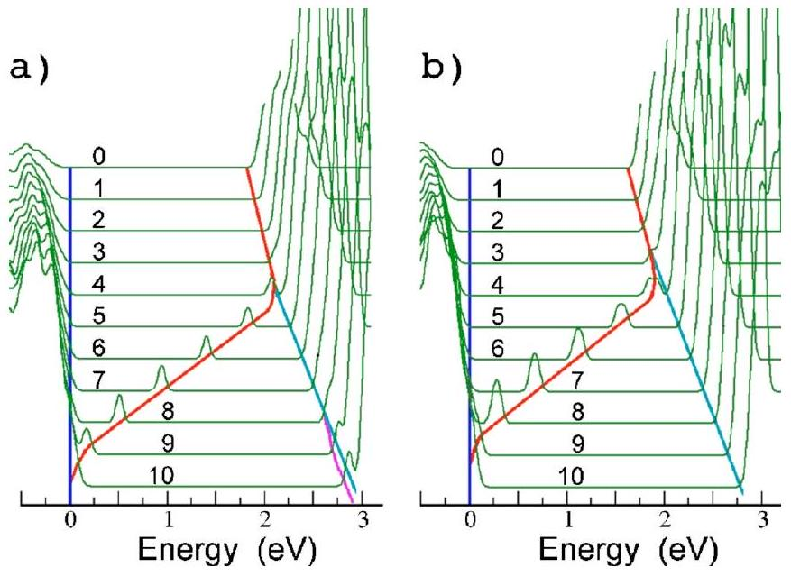
FIG. 7. (Color online) The DOS for ceria with vacancies from just below the $\mathrm{O} 2 p$ valence band edge (at 0 eV ) to just above the $\mathrm{Ce} 4 f$ band edge as a function of $U$. The additional lines are guides to the eye marking the valence band edge (dark blue online), the edge of the (empty) Ce4 $f$ band (pale blue), and the filled $\mathrm{Ce} 4 f$ states which become localized for $U$ above $\sim 3 \mathrm{eV}$ (red). An additional empty localized state appears for large $U$ values with LDA $+U$ (pink online). (a) LDA, $S=0 \mu_{B}$, (b) PBE, $S=2 \mu_{B}$. (LDA, $S=2 \mu_{B}$ and PBE, $S=0 \mu_{B}$ are similar.)

occupied KS level. ${ }^{47}$ The surfaces are chosen to contain $95 \% ( \pm 0.01 \%)$ of this charge. More quantitative measures of the localization will be described below.

We find that, for $U=0 \mathrm{eV}$, the four Ce neighbors all relax outwards by equal amounts, as described above. This outward relaxation then decreases slightly with increasing $U$ for $\mathrm{LDA}+U$, while with $\mathrm{PBE}+U$ it remains roughly constant. (Note, however, that the increase of the lattice parameter between $U=0 \mathrm{eV}$ and $U=3 \mathrm{eV}$ corresponds to an increase of $\sim 0.005 \AA$ in the unrelaxed $V_{\mathrm{O}}-\mathrm{Ce}$ neighbor distances, which partially compensates the reduction seen with $\mathrm{LDA}+U$.) At the same time, the lower edge of the $\mathrm{Ce} 4 f$ band rises. The Ce $4 f$ charge is distributed over many ions in the cell. At some point between $U=2$ and 5 eV (depending upon the functional and the magnetization), the structure changes. The four $V_{\mathrm{O}}-\mathrm{Ce}$ neighbor distances split into two long and two short ones and the single filled Ce4f state in the DOS splits off from the rest of the band and becomes localized. (The weight of this state relative to the main bands depends on the vacancy concentration, which we do not vary.) Once split off, the energy of the localized state falls almost linearly with increasing $U$, reaching the valence band edge around $U=9.5 \mathrm{eV}$ for LDA and 8.5 eV for PBE. The highest occupied KS level becomes a delocalized state at the valence band edge (Fig. 8). The Ce4f related state continues as a resonance inside the valence band, since the vacancy distortion is unchanged (Fig. 6), at least up to $U=15 \mathrm{eV}$ for LDA and $S=0 \mu_{B}$ (not shown). We also note that for LDA around $U=8 \mathrm{eV}$, a second localized state splits off from the main $\mathrm{Ce} 4 f$ band. It is located on the other Ce neighbors ( 3 and 4) and remains empty.

We can now return to explain the magnetization. The ground state is a singlet when the Ce $4 f$ electrons are localized and a triplet when they are not. This can be explained easily on the basis of known Hubbard model results. ${ }^{28}$ When

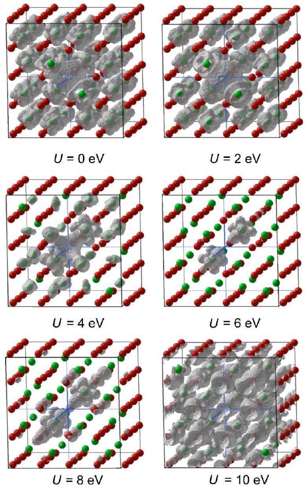
FIG. 8. (Color online) Isocharge surfaces for the Ce $4 f$ KS levels at various values of $U$, for LDA, spin $S=0 \mu_{B}$. Ce atoms: Light gray (green). O atoms: Dark gray (red). The isocharge surfaces are all chosen to contain 95\% of the Ce4f charge. The blue crosshairs mark the center of the vacancy.

$U$ is small and the Ce4 $f$ electrons are delocalized, they come close enough to one another to pay a Coulomb energy penalty. (Note that this remains true even for $U=0 \mathrm{eV}$ in LDA $+U$, since some Coulomb repulsion and correlation energy are included even at pure LDA level.) In the triplet state there are no nodes in the spin part of the wave function, so there has to be a node in the real space charge part, which serves to keep the electrons further apart. In the singlet state the node lies in the spin wave function, so the electrons come closer together in real space. In other words, exchange, even the partial exchange in LDA, keeps the electrons further apart in the triplet ground state, reducing the Coulomb energy penalty relative to that in the singlet state.

Once the electrons are localized we have a two site Hubbard model (the Ce neighbors 1 and 2 ) with two electrons. The hopping matrix elements $t$ are small since the Ce are actually only second nearest neighbors in the original lattice, placing the system in the $U \gg t$ regime. Here, the electrons mostly stay apart, but can still gain some kinetic energy $(\propto t)$ via perturbation processes in which they temporarily occupy the same site, paying the Coulomb penalty ( $\propto U$ ) while doing so. An exact perturbation theory result in the limit $U / t \rightarrow \infty$ gives a net antiferromagnetic interaction $\propto t^{2} / U$, see Ref. 28 , and hence a singlet ground state, weakly

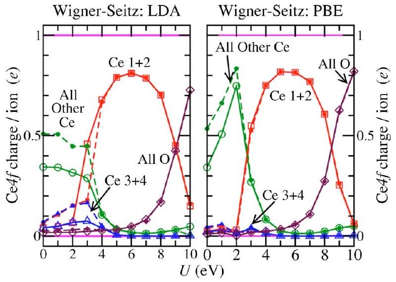
FIG. 9. (Color online) Wigner-Seitz projections of filled Ce4f states for LDA (left) and PBE (right). For each atom type (color), the solid lines and large open symbols are for the singlet ground states, and the dashed lines and small, filled symbols are for the triplet ground states. The atomic labels 1-4 are from Fig. 5. □ (red): Projections onto neighbors 1 and 2. △ (blue): Projections onto neighbors 3 and 4. ◯ (green): Sum of projections onto all other Ce ions in the cell. ◇ (purple): Projections onto all O ions. Nominal experimental expectations: The two "occupied" neighbors should have $1 e$, and the two "unoccupied" neighbors should have $0 e$ (solid, pink lines).

split from a triplet excited state, thus explaining, at least qualitatively, the magnetic behavior in Fig. 4. (Deriving the appropriate effective $U$ and $t$ values from our DFT results is beyond the scope of the current paper.)

## B. Quantifying the degree of Ce4f localization

We will now discuss some alternative methods of quantifying the degree of Ce $4 f$ localization. Figure 9 shows the Wigner-Seitz projections of the partial charge density for the highest occupied KS level, corresponding to the additional Ce $4 f$ electrons. ${ }^{47}$ Since Wigner-Seitz projection has the weakness of missing charge which protrudes outside the Wigner-Seitz radii into interstitial space or into a vacancy (as here) we also use Bader's "atoms in molecules" analysis, ${ }^{48}$ in which atomic basins are chosen in a manner which leaves no unassigned charge. Unfortunately, over most of the cell, the partial charge density of the highest occupied KS level is too low to generate sensible Bader basins, so most of the cell collapses into two large basins covering about $70-80 \%$ of the cell. Instead, we have taken the basins from the full charge density, and then in Fig. 10, we plot the $\mathrm{Ce} 4 f$ projections over those basins. The weakness is that potential differences between the basins for the total and the Ce $4 f$ charge are ignored, but at least the whole cell is assigned. The results using both Bader and Wigner-Seitz charges turn out to be rather similar, however.

From our DOS plots (Fig. 7) and more clearly from our real space figures (Figs. 6, 9, and 10), we see that the localization transition occurs below 3 eV [not around $5-6 \mathrm{eV}$ (LDA) or very close to 5 eV (GGA) as reported previously ${ }^{13}$ ]. However, once localized, the degree of localization of the $\mathrm{Ce} 4 f$ electrons does not remain constant. (The isocharge surfaces in Fig. 8 already suggest this.) Measured by the projections of the filled Ce $4 f$ KS levels, localization reaches a maximum of about $80 \%$ or $90 \%$ at $U=6 \mathrm{eV}$ for Wigner-Seitz and Bader, respectively. That is to say, $80 \%$ of

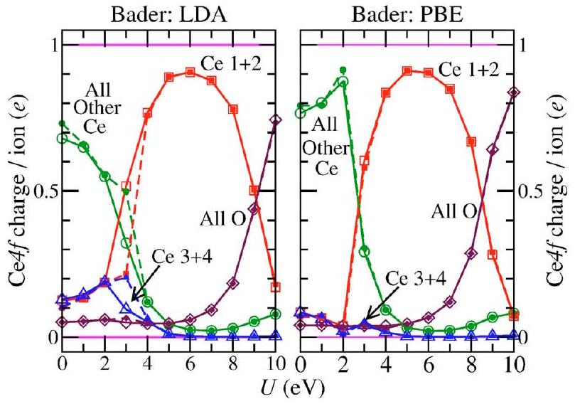
FIG. 10. (Color online) Partial Bader projections of filled Ce4 $f$ states using LDA. See text for partial projection method and see caption of Fig. 9 for figure details.

the charge density in the highest occupied KS level lies within the Wigner-Seitz radii of the Ce ions 1 and 2, 90\% within their Bader basins. Above this maximum, the $\mathrm{Ce} 4 f$ charge localization actually diminishes with increasing $U$, becoming worse even by $U \approx 7 \mathrm{eV}$ and disappearing around $U=9-10 \mathrm{eV}$. (Andersson et al. ${ }^{13}$ did not observe this, as they stopped at $U=7 \mathrm{eV}$.)

The decrease in degree of localization is not due to weaknesses in the projection methods, such as the choice of charge basins or radii, as demonstrated by Fig. 11. This shows the fraction of the cell required in order to capture $90 \%, 95 \%$, and $99 \%$ of the $\mathrm{Ce} 4 f$ electrons, for $S=0 \mu_{B}$ with LDA. This constitutes a second method of quantifying the degree of localization, one complementary to the $\mathrm{Ce} 4 f$ Wigner-Seitz or Bader projections. If there was a truly atomiclike localization then more or less $100 \%$ of the electrons would be contained within the Wigner-Seitz radii of the two Ce ions, namely, just $0.6 \%$ of the cell. Indeed, if the localization was into states similar to the $4 f$ orbitals of a lone Ce atom then it would be contained within a radius some-

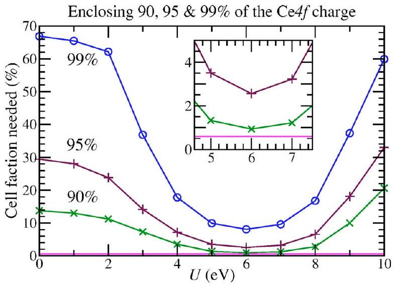
FIG. 11. (Color online) For LDA, $S=0 \mu_{B}$. Percentage of the cell required to capture various specified percentages of the two Ce $4 f$ electrons, i.e., the volume fraction of the cell located within the isocharge surface that encloses $90 \%(\times$, green $), 95 \%(+$, purple $)$, or $99 \%(\bigcirc$, blue $)$ of the Ce $4 f$ electrons. The horizontal solid (pink) line indicates the volume fraction contained within the Wigner-Seitz radii of the two Ce ions on which the Ce $4 f$ electrons are supposed to be localized. (PBE and $S=2 \mu_{B}$ are similar.)

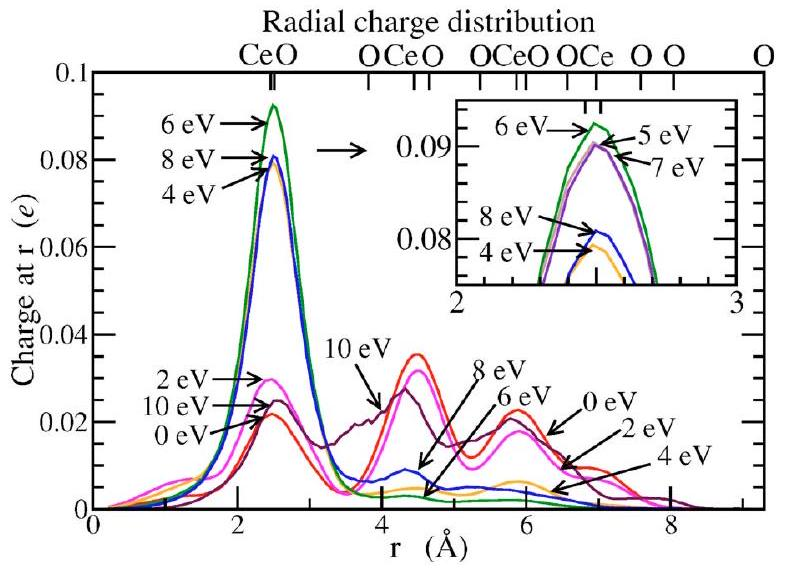
FIG. 12. (Color online) Charge distribution around the vacancy: Total charge per spherical shell, as a function of shell radius $r$ for LDA with spin $S=0 \mu_{B}$ and $U=0,2,4,6,8$, and 10 eV . Inset shows $U=5,6$, and 7 eV . (The PBE and $S=2 \mu_{B}$ results are similar.) The alternative (upper) $x$ axis shows the positions and identities of the nearest neighbor shells around the vacancy, as found for the relaxed structure at $U=0 \mathrm{eV}$.

what less than the Wigner-Seitz radius. This figure demonstrates very clearly that this is never achieved, in qualitative agreement with the x-ray experiments. ${ }^{18,39}$

Whether the degree of localization obtained using $\mathrm{LDA}+U / \mathrm{GGA}+U$ is quantitatively correct we cannot say for sure. Higher level calculations ${ }^{49}$ using unrestricted second order Møller-Plesset many-body perturbation theory (UMP2) do find a similar level. However, they were for vacancies on the (110) surface in somewhat smaller embedded clusters ( $\sim 30$ atoms). While the agreement is reassuring, the UMP2 results are not a totally reliable reference point since there could be genuine differences between surface and bulk (which do not show up here) or spurious problems due to, for example, supercell or cluster size limitations. Either higher order theory calculations for bulk defects or higher resolution experiments would be needed to completely settle this.

The reason for the decrease in localization at higher $U$ values can be seen in Fig. 12, which shows a third way of viewing the degree of localization. Here, we divide the supercell up into spherical shells of equal thickness centered on the vacancy, and plot the Ce $4 f$ charge per shell as a function of shell radius. ${ }^{50}$ For values of $U$ below $\sim 4 \mathrm{eV}$ there is $\mathrm{Ce} 4 f$ charge on all the cerium ions in the cell. By $U=6 \mathrm{eV}$ almost everything has disappeared from the outer cerium ions, with charge only on the four nearest neighbors of the vacancy. After this, supposedly Ce $4 f$ related charge starts to appear on the oxygen ions (easiest to see for those around $3.8 \AA$ ), and the amount of this grows with increasing $U$.

This is related to the location of the filled Ce $4 f$ level in the DOS in Fig. 7. As the level passes the middle of the gap and comes closer to the $\mathrm{O} 2 p$ based valence band it starts to mix with it more and more strongly, moving charge from Ce ions 1 and 2 to their O neighbors. This can be seen in both the isocharge surfaces (Fig. 8) and in the radial charge distribution (Fig. 12).

## C. Quantifying the degree of total charge localization and the net ionic charge of Ce

Using LDA $+U$ with an appropriate $U$ value, the Ce $4 f$ electrons in the highest occupied KS level become fairly well

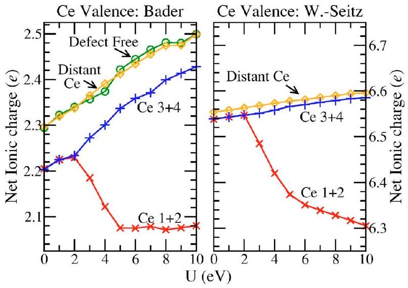
FIG. 13. (Color online) Net Ce ionic charge (Ce valence) as a function of $U$, calculated from the effective nuclear charge of the PAW potential (+12) minus the total (valence) electron density ascribed to that ion, evaluated using (left) Wigner-Seitz projections and (right) Bader analysis, for LDA, $S=0 \mu_{B}$. See Fig. 5 for the labels Ce 1-4. × (red): Net charge on Ce neighbors 1 and 2. + (blue): Charge on Ce 3 and 4. ◇ (orange): Average charge on the four Ce ions lying furthest from the vacancy. ◯ (green): Net ionic charge on the Ce ions in the defect-free bulk calculation.

localized onto two of the four nearest neighbors of the vacancy ( Ce 1 and Ce 2), leaving the others ( Ce 3 and Ce 4 ) unoccupied. The change in their $\mathrm{Ce} 4 f$ charges is almost unitary: Around (0.8-0.9)e in Figs. 9 and 10. This looks rather good, but is unfortunately somewhat misleading. We will now show that their total charges only change by about $(0.2-0.4) e$, as charge belonging to other KS levels is pushed off Ce 1 and Ce 2, into other parts of the cell.

In Fig. 13 we show the net ionic charges for various different Ce ions, obtained by adding the total valence and core charges, the former obtained using Bader and WignerSeitz projections of the total charge density, the latter from the PAW potential definitions. With no vacancy present, we find net ionic charges of roughly +2.5 using Bader analysis, or +6.6 using Wigner-Seitz projection, rather than the nominal +4 . This is reasonable. For the Bader charges it is simply because the classical model of an ionic material with nominal charges is oversimplified (even for the most ionic compounds), while for the Wigner-Seitz charges this effect is overcompensated by charge loss into the interstitial regions. We also see in Fig. 13 that with the vacancy present, the net charge on its neighbors differs from that of the ions furthest from the vacancy, even for $U=0 \mathrm{eV}$. This is partly due to the breaking of translational symmetry, but in the case of Bader analysis it is enhanced because the basins of the four neighbors now enclose the vacancy itself. (When Wigner-Seitz projections are used the difference is very much smaller.) Ions far from the vacancy have very similar charges to those in the defect-free 96 atom cell.

All of the above results are reasonable and expected. The unexpected result is that the change in the total ionic charges of Ce 1 and Ce 2 upon localization is only $0.4 e(0.2 e)$ using Bader (Wigner-Seitz) analysis, despite each receiving 0.9 (0.8) Ce4f electrons! Moreover, Ce 3 and Ce 4 also gain $0.07 e(0.01 e)$, despite receiving only $0.004 e(0.001 e)$ of the Ce $4 f$ charge. (Differences are given relative to a distant Ce , at $U=6 \mathrm{eV}$.)

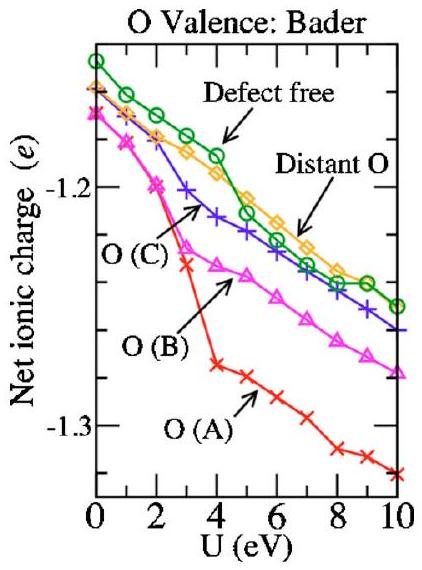
FIG. 14. (Color online) Net O ionic charges as a function of $U$ from the PAW potential core charge ( +6 ) minus the Bader charges, for LDA, $S =0 \mu_{B} . \times$ (red): Group $\mathrm{O}(\mathrm{A})$, the single O ion neighboring both Ce 1 and Ce 2. $\triangle$ (pink): Group $\mathrm{O}(\mathrm{B})$, the four O ions neighboring Ce 1 or Ce 2 and also neighboring either Ce 3 or $\mathrm{Ce} 4 .+$ (blue): Group $\mathrm{O}(\mathrm{C})$, the eight O ions neighboring either Ce 1 or Ce 2 but not Ce 3 or Ce 4 . Also shown: ◇ (orange): Average over all other O ions in the cell. ◯ (green): Net ionic charge on the O ions in the defect-free bulk calculation.

Very clearly, the localization of electronic charge is in reality far from complete, because charge belonging to KS levels other than the highest occupied is pushed off the Ce onto the neighboring oxygen. This happens even below the $U$ value at which the highest occupied KS level itself starts to spread (Fig. 8). The Ce4 $f$ electrons to which the $U$ term is applied do indeed become reasonably well localized, but at the cost of damaging the description of the rest of the electrons. Figure 14 indicates that the additional charge is taken up by neighboring oxygen atoms, and this much additional charge on the already negatively charged oxygen ions seems a little unlikely to be physically correct. Furthermore, Figs. 13 and 14 also show that even for the unoccupied Ce ions and O ions further from the vacancy, the total charge is roughly linear in $U$. This is even true when there is no vacancy and no Ce $4 f$ occupancy at all. This latter problem is likely to be related to the specific form of $\mathrm{LDA}+U$ projection used, but the problem of non-Ce $4 f$ charge being pushed off Ce 1 and Ce 2 onto Ce 3 and Ce 4 and the neighboring O may need further investigation, even for more advanced forms of LDA $+U$.

Overall, LDA $+U$ is certainly able to localize occupied Ce4 $f$ states, though possibly not to the correct extent. However, it appears to do so at the cost of worsening the description of other parts of the charge distribution.

## V. CONCLUSIONS

We have presented results for the $U$ dependence of the structure of, and Ce $4 f$ electron localization at, oxygen vacancies in bulk ceria using DFT-LDA $+U$ and DFT-GGA $+U$. We have also revisited discrepancies in previous studies of the $U$ dependency of the properties of defect-free bulk ceria.

For defect-free ceria, we have given band gaps as a function of $U$ which now agree with the $U=6 \mathrm{eV}$ values of Refs. 13 and 14, in contrast to Ref. 12, hopefully resolving that issue. These new plots as a function of $U$ now show that agreement with experiment can be obtained (for $U$
$\approx 7-8 \mathrm{eV}$ ), at least when the experimental uncertainties are properly taken into account. We have also noted that with $\mathrm{LDA}+U$ the lattice parameter and bulk modulus ( $a_{0}$ and $B$ ) fit experiment best for $U \approx 4-5 \mathrm{eV}$, rather than $6-7 \mathrm{eV}$ as previously reported, ${ }^{11-14}$ due to thermal expansion. As previously reported, ${ }^{6,12-14,24}$ GGA $+U$ always performs worse than $\mathrm{LDA}+U$, and gets worse with increasing $U>0 \mathrm{eV}$.

With vacancies present, both $\mathrm{LDA}+U$ and GGA $+U$ describe the localization of $\mathrm{Ce} 4 f$ electrons qualitatively, and perhaps quantitatively. For both functionals, we find that values of $U$ in the range of $5-7 \mathrm{eV}$ make the two additional electrons associated with the oxygen vacancy localized to about $80-90 \%$ on two of the neighboring Ce ions. The range of $U$ values giving full localization is thus rather restricted, although partial localization starts at $U \approx 3 \mathrm{eV}$ and continues to about 10 eV . Structurally, the Ce nearest neighbors of $V_{\mathrm{O}}$ always relax outwards. This relaxation is symmetric for the smaller $U$ values at which $\mathrm{Ce} 4 f$ localization is not obtained. For larger $U$ values, the two Ce neighbors which carry the majority of the Ce $4 f$ charge relax outwards less than the other two, and this pattern remains to at least $U=15 \mathrm{eV}$, despite the loss of Ce localization at large $U$. Comparing $\mathrm{LDA}+U$ and $\mathrm{PBE}+U$ at $U=6$, the nearest neighbor $V_{\mathrm{O}}$-Ce distances differ by only $\sim 5 \%$, but the formation energies by $1.1 \mathrm{eV}(35 \%)$ compared to LDA $+U$; enough to be significant in some situations. Since the bulk structure is much worse with $\mathrm{PBE}+U$ than with $\mathrm{LDA}+U$, it seems likely that the $\mathrm{LDA}+U$ vacancy structure and formation energy are the more reliable ones.

Viewing the present and previous ${ }^{11-14} \mathrm{CeO}_{2}$ and $\mathrm{Ce}_{2} \mathrm{O}_{3}$ results together, the optimal choice of $U$ varies between 2 and 8 eV , depending on which property of which material is under consideration. Consistency is clearly not possible; the smaller $U$ values ${ }^{12,14}$ needed for a reasonable description of $\mathrm{Ce}_{2} \mathrm{O}_{3}$ do not give $\mathrm{Ce} 4 f$ localization at ceria vacancies for PBE and give only partial localization for LDA.

Considering only $\mathrm{CeO}_{2}$ (with and without vacancies), the qualitative errors in the localization clearly take precedence over the quantitative errors in the crystal and electronic structures. We therefore consider the best overall choice to be $\sim 6 \mathrm{eV}$ for LDA $+U$ and $\sim 5.5 \mathrm{eV}$ for GGA $+U$, in agreement with most common practice ${ }^{7-9}$ and with some previous assessments ${ }^{11,13}$ but not with others. ${ }^{12,14}$ At these values defect-free ceria is still fairly well described and the real space $\mathrm{Ce} 4 f$ localization is maximal while the associated DOS peak is $\sim 1 \mathrm{eV}$ below the empty Ce $4 f$ states. To be specific, with LDA $+U, U=6 \mathrm{eV}$ gives the gaps 1.34 eV for $\mathrm{O} 2 p \rightarrow \mathrm{Ce} 4 f$ (full), 2.66 eV for $\mathrm{O} 2 p \rightarrow \mathrm{Ce} 4 f$ (empty), and 5.63 eV for $\mathrm{O} 2 p \rightarrow$ Ce5 $d$, and hence 1.32 eV for Ce4 $f$ (full) → Ce4 $f$ (empty). Note that the O2 $p \rightarrow$ Ce4 $f$ (empty) gap is still slightly underestimated, even accounting for experimental broadening, etc (Fig. 1). In principle, one should therefore apply an additional scissors operation to empirically correct this. Opening $\mathrm{O} 2 p \rightarrow \mathrm{Ce} 4 f$ (empty) up to 3.00 eV changes $\mathrm{O} 2 p \rightarrow$ Ce $5 d$ to 5.97 eV , which is still in agreement with experiment. In a scissors operation the gap normally opens between the highest filled and lowest empty states, so that $\mathrm{Ce} 4 f$ (full) would stay put, making $\mathrm{Ce} 4 f$ (full) → Ce4 $f$ (empty) a little too large at 1.66 eV . However,
this procedure is really correct only for delocalized bulk band states. Localized defect related states should move with the bulk band they are derived from or most strongly overlap with, ${ }^{23,46}$ whether they are full or empty. In this case, the scissors operation moves Ce $4 f$ (full) up in energy together with Ce $4 f$ (empty), thus keeping Ce $4 f$ (full) $\rightarrow \operatorname{Ce} 4 f$ (empty) at 1.32 eV and stretching $\mathrm{O} 2 p \rightarrow \mathrm{Ce} 4 f$ (full) to 1.68 eV . This would still be in good agreement with the experimental band structure.

We have used several different methods to quantify the degree of localization, each with strengths and weaknesses. The most visual way to examine the additional $\mathrm{Ce} 4 f$ electrons is using isocharge surfaces (Fig. 8), but this is not very quantitative. The volume of the cell needed to contain a certain fraction of the Ce $4 f$ charge shows clearly the extent to which the localization is not atomiclike (Fig. 11), while the radial charge distribution (Fig. 12) is less quantitative but gives better information about where the charge has gone. The simplest and most easily interpreted measure is WignerSeitz (Fig. 9) or Bader (Fig. 10) projections of the highest occupied KS orbital, corresponding to the Ce $4 f$ charge. The localization obtained for these electrons is not into atomic corelike Ce4f orbitals located inside the outer Ce5d and Ce6 $s$ electrons, but for $U \approx 6 \mathrm{eV}$ about $80-90 \%$ lies within the Wigner-Seitz or Bader basins of individual Ce ions. This is probably sufficient to qualitatively account for the observed $\mathrm{Ce} 4 f$ electron physics and chemistry of ceria. Quantitatively, either further experimental or higher level theoretical work on bulk defects is needed in order to determine if this actually is the correct degree of localization.

However, we have shown that the total level of charge localization is much smaller, so to properly understand the effect and reliability of the LDA $+U$ method it is important to also consider the total Wigner-Seitz and Bader charges of the Ce ions (Figs. 13 and 14). We would have expected close to a unitary change in the Ce net ionic charge ( $\sim$ valency) upon Ce $4 f$ electron localization, and $\mathrm{LDA}+U$ and GGA $+U$ are not able to describe this. We find changes of only $(0.2-0.4) e$, even when 0.8-0.9 Ce4 $f$ electrons are localized on each of the two Ce ions. It is very plausible that more advanced projections, such as the maximally localized Wannier functions technique ${ }^{37}$ would do better, but currently most authors applying LDA $+U$ to ceria and related materials use exactly the same version of the technique used here, often using exactly the same code. The apparently incorrect treatment of the rest of the electrons suggests that the description of other properties of ceria may in fact become worse through the application of LDA $+U$, so despite the successes, DFT results obtained with it should be interpreted with some caution. Continuing to use other functionals (such as pure LDA, but certainly not GGA or GGA $+U$ ) alongside $\mathrm{LDA}+U$ in order to examine those properties not dependent upon localization, is certainly to be recommended.

In summary, in DFT-LDA $+U$ calculations for oxygen vacancies in ceria we find that Ce $4 f$ charge localization at neighboring Ce ions starts at $U \approx 3 \mathrm{eV}$ and reaches a maximum at $U \approx 6 \mathrm{eV}$ for $\mathrm{LDA}+U$ or $\approx 5.5 \mathrm{eV}$ for $\mathrm{GGA}+U$. Above this it decreases as charge is transferred onto second neighbor O ions and beyond. The localization is never into
atomic corelike states. At the maximum about $80-90 \%$ of the Ce $4 f$ charge is located on the two nearest neighboring Ce ions. However, if we look at the total charge we find that these two ions only make a net charge gain of $(0.2-0.4) e$, so localization is really very incomplete.

## ACKNOWLEDGMENTS

We would like to thank the Swedish National Infrastructure for Computing (SNIC) for computing resources and the European FP5 IHP program (Research Training Network Contract No. HPRC-CT-2002-00191) for financial support. The authors would also like to thank F. Aryasetiawan, B. Herschend, F. Illas, and D.A. Andersson for helpful discussions and communications.
${ }^{1}$ J. Kaspar, P. Fornasiero, and M. Graziani, Catal. Today 50, 285 (1999); A. Trovarelli, Catalysis by Ceria and Related Materials (Imperial College Press, London, 2002).
${ }^{2}$ N. Izu, W. Shin, and N. Murayama, Sens. Actuators B 93, 449 (2003); J. W. Fergus, J. Mater. Sci. 38, 4259 (2003).
${ }^{3}$ V. V. Kharton, F. M. B. Marques, and A. Atkinson, Solid State Ionics 174, 135 (2004).
${ }^{4}$ W. Kohn and L. Sham, Phys. Rev. 140, A1133 (1965).
${ }^{5}$ V. I. Anisimov, J. Zaanen, and O. K. Andersen, Phys. Rev. B 44, 943 (1991); A. I. Liechtenstein, V. I. Anisimov, and J. Zaanen, Phys. Rev. B 52, R5467 (1995); V. I. Anisimov, F. Aryasetiawan, and A. I. Liechtenstein, J. Phys.: Condens. Matter 9, 767 (1997).
${ }^{6}$ S. Fabris, S. de Gironcoli, S. Baroni, G. Vicario, and G. Balducci, Phys. Rev. B 71, 041102(R) (2005); P. J. Hay, R. L. Martin, J. Uddin, and G. E. Scuseria, J. Chem. Phys. 125, 034712 (2006).
${ }^{7}$ M. Nolan, S. C. Parker, and G. W. Watson, Surf. Sci. 595, 223 (2005); J. Phys. Chem. 110, 2256 (2006); Phys. Chem. Chem. Phys. 8, 216 (2006); Z. Yang, T. K. Woo, and K. Hermansson, J. Chem. Phys. 124, 224704 (2006).
${ }^{8}$ M. Nolan, S. Grigoleit, D. C. Sayle, S. C. Parker, and G. W. Watson, Surf. Sci. 576, 217 (2005).
${ }^{9}$ S. Fabris, G. Vicario, G. Balducci, S. de Gironcoli, and S. Baroni, J. Phys. Chem. B 109, 22860 (2005).
${ }^{10}$ G. Kresse, P. Blaha, J. L. F. Da Silva, and M. V. Ganduglia-Pirovano, Phys. Rev. B 72, 237101 (2005); S. Fabris, S. de Gironcoli, S. Baroni, G. Vicario, and G. Balducci, Phys. Rev. B 72, 237101 (2005); F. Esch, S. Fabris, L. Zhou, T. Montini, C. Africh, P. Fornasiero, G. Comelli, and R. Rosei, Science 309, 752 (2005).
${ }^{11}$ Y. Jiang, J. B. Adams, and M. van Schlifgaarde, J. Chem. Phys. 123, 064701 (2005).
${ }^{12}$ C. Loschen, J. Carrasco, K. M. Neyman, and F. Illas, Phys. Rev. B 75, 035115 (2007).
${ }^{13}$ D. A. Andersson, S. I. Simak, B. Johansson, I. A. Abrikosov, and N. V. Skorodumova, Phys. Rev. B 75, 035109 (2007).
${ }^{14}$ J. L. F. Da Silva, M. V. Ganduglia-Pirovano, J. Sauer, V. Bayer, and G. Kresse, Phys. Rev. B 75, 045121 (2007).
${ }^{15}$ S. L. Dudarev, G. A. Botton, S. Y. Savrasov, C. J. Humphreys, and A. P. Sutton, Phys. Rev. B 57, 1505 (1998).
${ }^{16}$ A. Pfau and K. D. Schierbaum, Surf. Sci. 321, 71 (1995).
${ }^{17}$ J. W. Allen, J. Magn. Magn. Mater. 47, 168 (1985).
${ }^{18}$ E. Wuilloud, B. Delley, W.-D. Schneider, and Y. Baer, Phys. Rev. Lett. 53, 202 (1984).
${ }^{19}$ D. R. Mullins, S. H. Overbury, and D. R. Huntley, Surf. Sci. 409, 307 (1998).
${ }^{20}$ D. R. Mullins, P. V. Radulovic, and S. H. Overbury, Surf. Sci. 429, 186 (1999); M. A. Henderson, C. L. Perkins, M. H. Engelhard, S. Thevuthasan, and C. H. F. Peden, Surf. Sci. 526, 1 (2003).
${ }^{21}$ F. Marabelli and P. Wachter, Phys. Rev. B 36, 1238 (1987).
${ }^{22}$ C. Chai, S. Yang, Z. Liu, M. Liao, and N. Chen, Chin. Sci. Bull. 48, 1198 (2003).
${ }^{23}$ C. W. M. Castleton and K. Hermansson (unpublished).
${ }^{24}$ N. V. Skorodumova, R. Ahuja, S. I. Simak, I. A. Abrikasov, B. Johansson, and B. I. Lundqvist, Phys. Rev. B 64, 115108 (2001).
${ }^{25}$ H. L. Tuller and A. S. Nowick, J. Phys. Chem. Solids 38, 859 (1977); I. K. Naik and T. Y. Tien, J. Phys. Chem. Solids 39, 311 (1978); B. Calès
and J. F. Baumard, J. Electrochem. Soc. 131, 2407 (1984); E. K. Chang and R. N. Blumenthal, J. Solid State Chem. 72, 330 (1988).
${ }^{26}$ T. Holstein, Ann. Phys. 8, 325 (1959); 8, 343 (1959); L. Friedman and T. Holstein, Ann. Phys. 21, 494 (1963); D. Emin and T. Holstein, Ann. Phys. 53, 439 (1969).
${ }^{27}$ P. W. Anderson, Phys. Rev. 115, 2 (1959); J. Hubbard, Proc. R. Soc. London, Ser. A 276, 238 (1963).
${ }^{28}$ H. Tasaki, J. Phys.: Condens. Matter 10, 4353 (1998).
${ }^{29}$ P. W. Anderson, Science 235, 1196 (1987); M. W. Long, C. W. M. Castleton, and C. A. Hayward, J. Phys.: Condens. Matter 6, 481 (1994); C. W. M. Castleton and M. W. Long, J. Phys.: Condens. Matter 9, 7563 (1997); T. Hotta, Phys. Rev. B 67, 104428 (2003); J. Wu et al., Phys. Rev. B 69, 115321 (2004).
${ }^{30}$ L. Gerward, J. Staun Olsen, L. Petit, G. Vaitheeswaran, V. Kanchana, and A. Svane, J. Alloys Compd. 400, 56 (2005).
${ }^{31}$ L. Gerward and J. S. Olsen, Powder Diffr. 8, 127 (1993).
${ }^{32}$ S. Rossignol, F. Gérard, D. Mesnard, C. Kappenstein, and D. Duprez, J. Mater. Chem. 13, 3017 (2003).
${ }^{33}$ V. V. Hung, J. Lee, and K. Masuda-Jindo, J. Phys. Chem. Solids 67, 682 (2006).
${ }^{34}$ M. Mogensen, T. Lindegaard, U. Rud Hansen, and G. Mogensen, J. Electrochem. Soc. 141, 2122 (1994); V. Van Hung and J. Lee (unpublished), quoted in Ref. 33.
${ }^{35}$ A. Nakajima, A. Yoshihara, and M. Ishigama, Phys. Rev. B 50, 13297 (1994).
${ }^{36}$ D. A. Andersson (private communication).
${ }^{37}$ N. Marzari and D. Vanderbilt, Phys. Rev. B 56, 12847 (1997); I. Souza, N. Marzari, and D. Vanderbilt, Phys. Rev. B 65, 035109 (2002); M. Cococcioni and S. de Gironcoli, Phys. Rev. B 71, 035105 (2005); F. Aryasetiawan, K. Karlsson, O. Jepsen, and U. Schonberger, Phys. Rev. B 74, 125106 (2006).
${ }^{38}$ A. Fujimori, Phys. Rev. B 28, 2281 (1983); A. Kontani, and H. Ogasawara, J. Electron Spectrosc. Relat. Phenom. 60, 257 (1992).
${ }^{39}$ R. C. Karnatak, J. Alloys Compd. 192, 64 (1993); S. M. Butorin, D. C. Mancini, J.-H. Guo, N. Wassdahl, and J. Nordgren, J. Alloys Compd. 225, 230 (1995).
${ }^{40}$ J. El Fallah, S. Boujana, H. Dexpert, A. Kiennemann, J. Majerus, O. Touret, F. Villain, and F. Le Normand, J. Phys. Chem. 98, 5522 (1994); L. A. J. Garvie and P. Buseck, J. Phys. Chem. Solids 60, 1943 (1999).
${ }^{41}$ P. E. Blöchl, Phys. Rev. B 50, 17953 (1994); G. Kresse and D. Joubert, Phys. Rev. B 59, 1758 (1999).
${ }^{42}$ G. Kresse and J. Furthmüller, Comput. Mater. Sci. 6, 15 (1996).
${ }^{43}$ J. P. Perdew, J. A. Chevary, S. H. Vosko, K. A. Jackson, M. R. Pederson, D. J. Singh, and C. Fiolhais, Phys. Rev. B 46, 6671 (1992).
${ }^{44}$ J. P. Perdew, K. Burke, and M. Ernzerhof, Phys. Rev. Lett. 77, 3865 (1996).
${ }^{45}$ H. Monkhorst and P. Pack, Phys. Rev. B 13, 5188 (1976).
${ }^{46}$ C. W. M. Castleton and S. Mirbt, Phys. Rev. B 70, 195202 (2004); C. W. M. Castleton, A. Höglund, and S. Mirbt, Phys. Rev. B 73, 035215 (2006).
${ }^{47}$ We sum the "up" and "down" spin components of the highest lying state itself when $S=0 \mu_{B}$, but only the up components of the highest two levels when $S=2 \mu_{B}$.
${ }^{48}$ F. W. Bader, Atoms in Molecules. A Quantum Theory (Oxford University Press, Oxford, 1990).
${ }^{49}$ B. Herschend, M. Baudin, and K. Hermansson, Surf. Sci. 599, 173 (2005).
${ }^{50} 201$ shells of equal thickness around $0.027 \AA$ have been used (Variation with U is small). A 10 shell running average is plotted to smooth out "noise" features originating in the discreteness of the charge density grid in the calculation. Qualitatively, the only change if we use different shell thickness or different running average is the amount of noise.

[^0]:    ${ }^{\text {a) }}$ Electronic mail: christopher.castleton@mkem.uu.se

