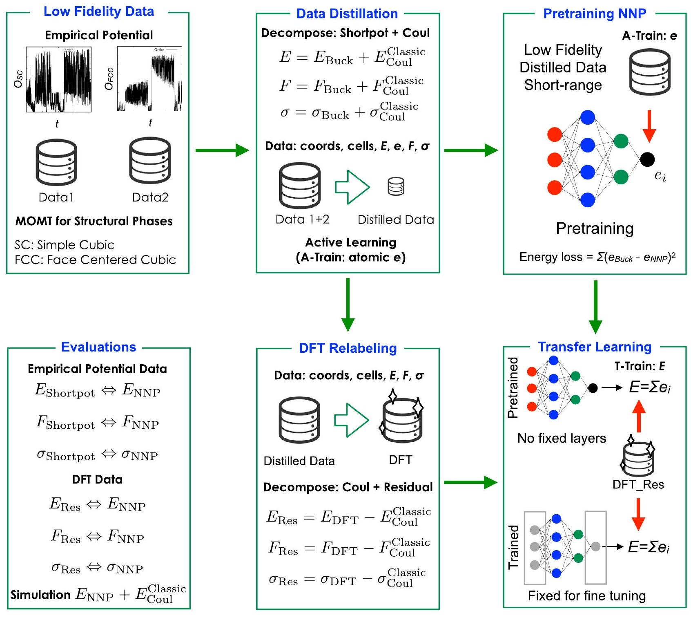
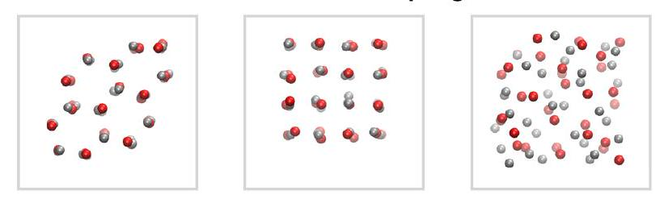
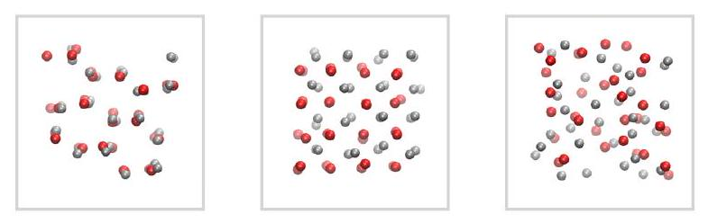
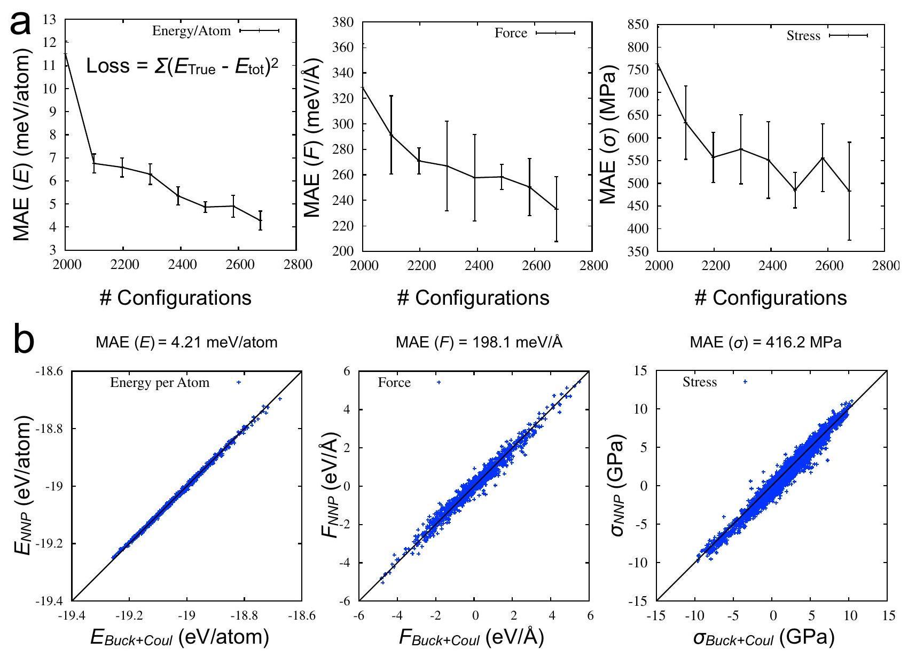
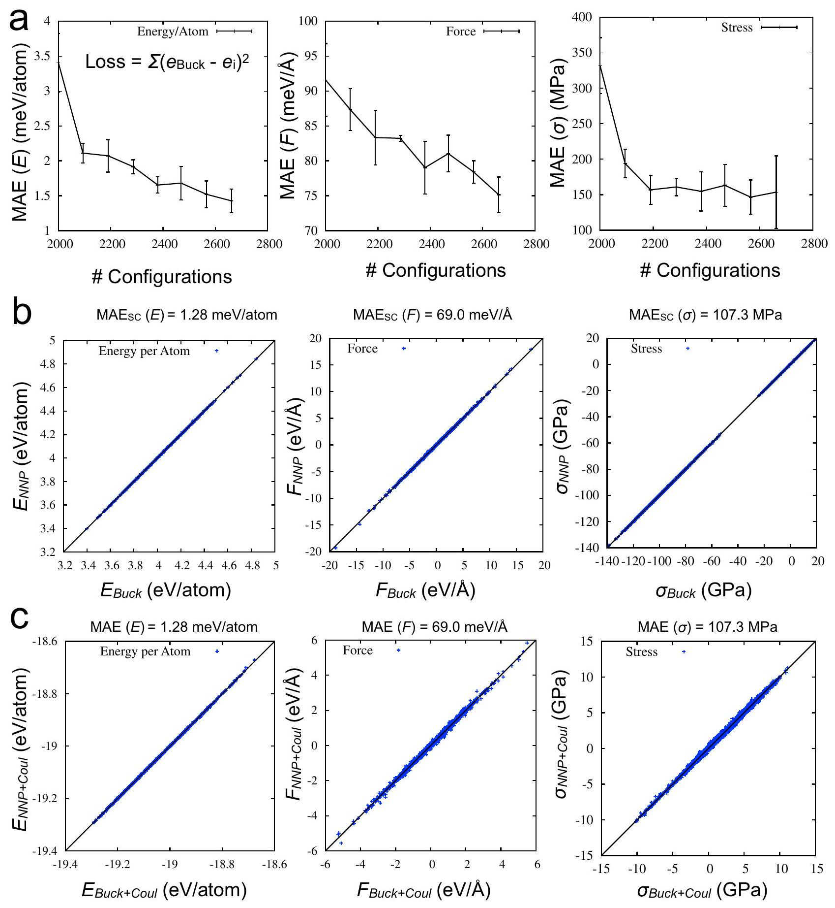
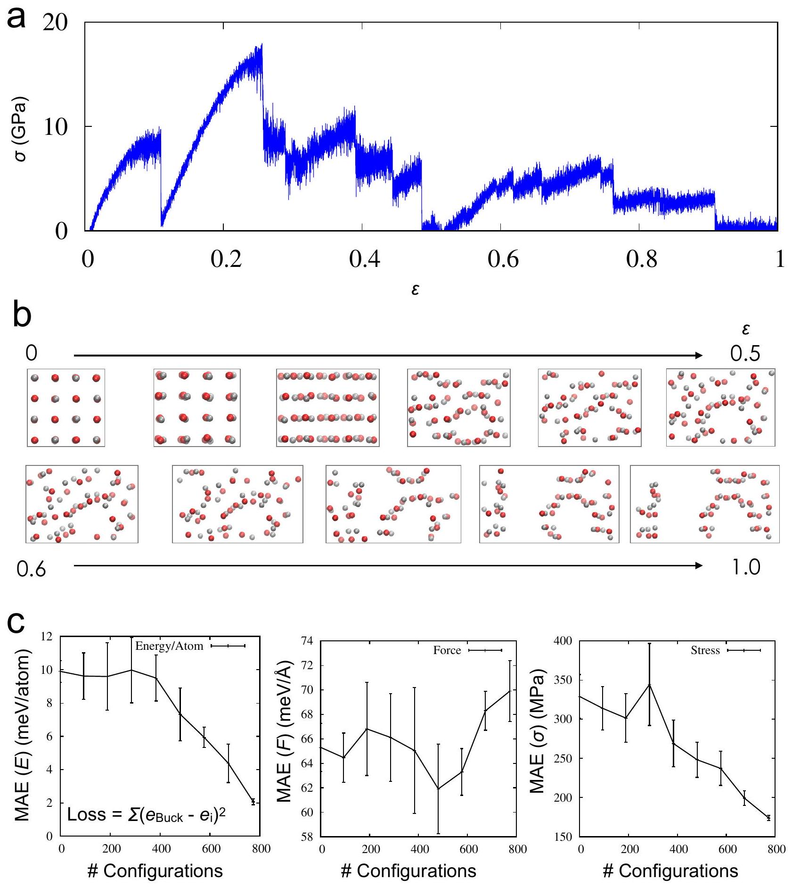
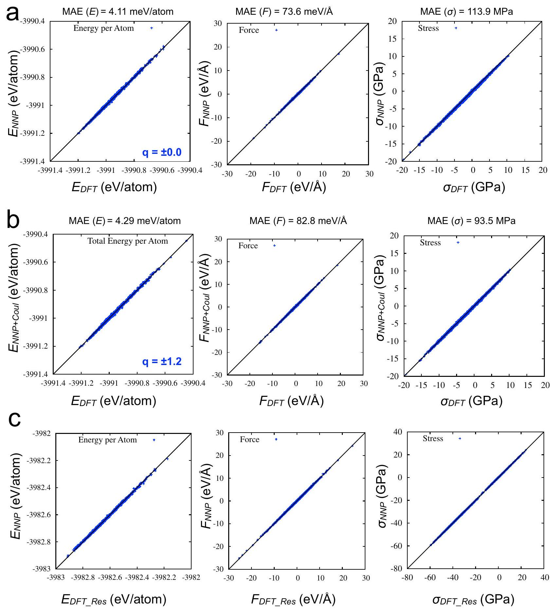
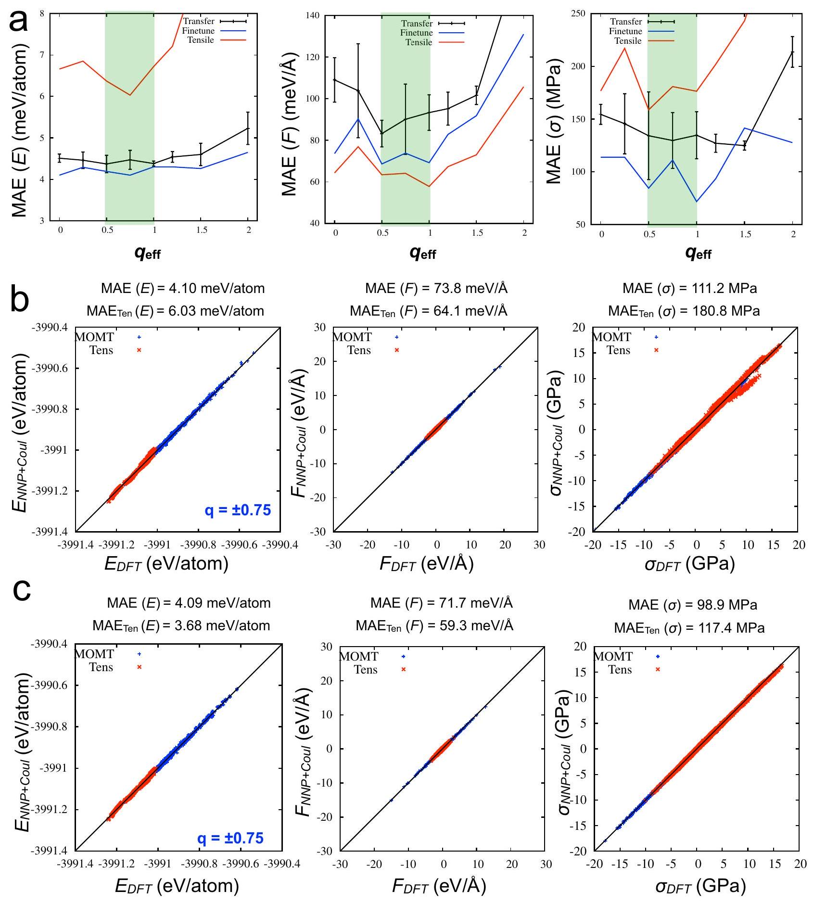

# Neural network potentials with effective charge separation for non-equilibrium dynamics of ionic solids: a ZnO case study 

Gang Seob Jung ${ }^{(1)}$ ⊗ \& Lei Cheng ${ }^{\mathbf{2}}$

#### Abstract

Developing neural network potentials (NNPs) accurate under non-equilibrium dynamics is challenging, as such systems require extensive sampling beyond equilibrium phases. Here we construct high-fidelity NNPs for zinc oxide (ZnO), a polymorphic ionic solid, using density functional theory (DFT) reference data. To efficiently capture transitional configurations, we combine enhancedsampling molecular dynamics with empirical potentials, data distillation, and pretraining on shortrange atomic energies (A-Train), followed by transfer learning with DFT-relabeled datasets. This hierarchical approach improves transferability across polymorphs and stress states. We further introduce effective charge separation, treating long-range Coulombic terms analytically while shortrange residual interactions are learned by the NNP. The optimal effective charges fall in the range $0.5-1.0 q_{e}$, consistent with dielectric-screened values derived from formal charges but distinct from Bader estimates. Motivated by this observation, we propose a simple data-driven protocol in which effective charges are optimized by comparing DFT reference energies with explicit Coulomb calculations, without additional NNP training. This strategy improves accuracy and transferability in DFT-level predictions of energies, forces, and stress. Together, these results provide a practical charge-selection framework for robust NNP development in ionic solids, enabling reliable simulation of polymorphic phase transformations and non-equilibrium dynamics.

Phase transitions between crystalline states often proceed through complex, multistep pathways rather than direct and abrupt transformations. These processes typically involve intermediate or transitional configurations that are difficult to isolate and characterize yet play a central role in determining phase stability and transformation kinetics. Such states may exhibit partial order, competing motifs, or local structural distortions that do not fully match either the initial or final crystal phase. Although transitory and challenging to capture experimentally or computationally, these transient structures critically shape crystallization mechanisms and the processing routes that govern material synthesis under non-equilibrium conditions. A deeper understanding of these transitional states is therefore essential for unraveling the microscopic origins of phase transformations ${ }^{1-3}$.

Crystallization provides a clear example of the complexity of phase transitions. While classical nucleation theory envisions a single abrupt step from liquid to crystalline order, recent experiments reveal that nucleation often proceeds through intermediate states such as disordered clusters or partially ordered precursors ${ }^{4,5}$. These observations show that crystal formation can involve reversible order-disorder fluctuations and strong
sensitivity to local dynamics, rather than a simple one-step pathway. As such, crystallization underscores the need for theoretical and computational models that can capture the diverse transitional configurations governing phase transformations across materials and conditions.

Atomistic modeling has become indispensable for investigating phase transitions, as it can directly probe short length and time scales that are often inaccessible to experiments. By resolving local atomic rearrangements, transient disorder, and the emergence of structural motifs, such simulations yield valuable insights into the early stages of phase transformation. Molecular dynamics and related methods, for instance, have been applied to liquid-solid transitions, polymorphic transformations, and the role of intermediate amorphous states in crystallization ${ }^{6,7}$. Despite these strengths, atomistic models face intrinsic limitations: simulations often become trapped in local minima on the potential energy surface, making it difficult to capture rare events or transitions between metastable states. Sampling the relevant configurational space is especially challenging when entropic contributions dominate the free-energy landscape during transitional processes ${ }^{8-11}$.

[^0]A further limitation arises from the reliability of interatomic potentials. Conventional force fields often fail to describe complex bonding environments or phase transitions with sufficient accuracy, while ab initio molecular dynamics, though more reliable, is constrained by short time and length scales. This tradeoff makes extended sampling essential but prevents comprehensive exploration of phase space at first-principles accuracy. To address this gap, machine-learning interatomic potentials (MLIPs), such as neural network potentials (NNPs), have emerged as powerful alternatives. Trained on high-fidelity quantum-mechanical data, MLIPs deliver near ab initio accuracy at a fraction of the cost, enabling large-scale simulations ${ }^{12-17}$.

The effectiveness of MLIPs ultimately depends on the quality and diversity of their training datasets. Because these models are typically initialized with configurations generated from density functional theory (DFT) or related ab initio methods, their accessible configurational space is inherently limited by the scope of the original sampling. Active learning (AL) strategies have been introduced to address this limitation by iteratively refining the potential: MD trajectories guided by the MLIP identify poorly represented regions of phase space, which are then augmented with additional DFT calculations. Although this cycle improves robustness, it often requires many iterations and substantial computational overhead. Integrating MLIPs with enhanced sampling adds further complexity, as such methods deliberately drive the system into unusual, high-energy, or out-ofdistribution states, exposing gaps that the initial training data did not capture ${ }^{18,19}$.

To address these challenges, recent studies have combined enhancedsampling approaches, such as Multi-Order Multi-Thermal (MOMT) ensemble molecular dynamics, with empirical potentials and data distillation in metallic systems such as nickel ${ }^{20,21}$. In parallel, pretraining neural network potentials on atomic energies from empirical models, followed by transfer learning with DFT-relabeled data, has been shown to improve both robustness and transferability ${ }^{22}$. These demonstrations, however, were limited to a unary metallic system (fcc Ni ), where long-range charge interactions are comparatively minor due to strong electronic screening.

In this study, we (i) extend the hierarchical A-Train/T-Train from a unary metallic system (fcc Ni) to a multicomponent, multiphase ionic solid, ZnO . Building on the extended MOMT sampling with a new order parameter, we further (ii) provide direct evidence for the limits of purely local NNPs when strict accuracy is required and (iii) propose a data-driven procedure to select effective long-range charges that is decoupled from NNP training and transferable to other ionic and molecular systems.

Unlike simple ionic crystals such as $\mathrm{NaCl}, \mathrm{ZnO}$ exhibits partial covalency in its bonding, leading to more complex phase behavior ${ }^{23}$. As a result, ZnO can adopt several distinct polymorphs: the wurtzite $(\mathrm{W})$ phase is stable under ambient conditions; the rock-salt (RS) phase becomes favorable at high pressure; and the zinc-blende (ZB) phase remains metastable. These polymorphs possess markedly different electronic and optical properties, making them attractive for targeted applications. For example, the metastable ZB phase enables band-structure engineering for optoelectronic devices, while the RS phase stabilized at high pressure has motivated interest in extreme-environment concepts and pressure-tunable functionality ${ }^{24,25}$.

Crystalline, disordered, and amorphous phases often exhibit comparable potential energies, making it difficult to distinguish structural transitions based solely on energetic criteria. Instead, order parametersquantities that describe local or global structural motifs-provide a more robust means of identifying phase transitions and metastable configurations. Such descriptors have been widely employed to distinguish crystalline from liquid or amorphous phases ${ }^{26-29}$. Leveraging these order parameters within enhanced-sampling frameworks allows one to efficiently explore a broader range of structural configurations and transitional pathways ${ }^{10,30-32}$.

To secure a wide range of configurations, we employed reciprocal-vector-based order parameters to characterize and sample distinct ZnO polymorphs. The FCC-type order parameter, previously used in our earlier work, effectively captures the periodicity of close-packed lattices such as the wurtzite (W) and zinc-blende (ZB) structures. To further enhance
sensitivity toward less densely packed configurations, we extended this framework by introducing a simple-cubic (SC)-type order parameter, which complements the FCC descriptor by emphasizing orthogonal lattice periodicities relevant to the rock-salt (RS) phase.

While the two order parameters together successfully captured the wurtzite (W) motif, the RS and ZB structures were sampled exclusively, reflecting the intrinsic selectivity of each descriptor. We further observed that, even without explicit charges, the resulting NNP provided sufficient accuracy for subsequent simulations; nevertheless, incorporating effective charges in a classical manner improved overall performance. Defining appropriate point charges for Zn and O , however, remains nontrivial.

Several families of "long-range-aware" MLIPs have recently been proposed. QEq-based HDNNPs, from CENT (Charge Equilibration via Neural Network Technique) ${ }^{33}$ to $3 \mathrm{G} / 4 \mathrm{G}$ schemes ${ }^{34,35}$, augment local atomic-energy networks with an environment-dependent charge-equilibration step, in which neural networks predict electronegativities and charges are obtained by solving a global QEq problem with a Coulomb kernel at every MD step. Latent Ewald-type models ${ }^{36}$ instead introduce peratom latent scalars that couple only to the reciprocal-space part of an Ewald summation, while the real-space Coulomb contribution is absorbed into a local MLIP. A third line of work generalizes particle-mesh Ewald into trainable neural operators (Neural P3M ${ }^{37}$ ), using latent atom-mesh fields without explicit atomic charges.

Different from previous studies, we adopt a strategy that retains a fixed, classical Ewald/PPPM Coulomb term with per-atom effective charges and uses a finite-cutoff NNP only for the short-range residual. Rather than learning charges through an additional charge-equilibration model or latent variables, we treat the effective charges as simple global parameters whose role is to absorb the long-range Coulomb contribution that a finite-cutoff NNP cannot represent, providing a pragmatic yet physically transparent treatment of long-range electrostatics in strongly ionic, multiphase systems.

Our systematic tests showed that directly using "physics-based" charges, such as Bader partitions or formal valences, consistently degraded the accuracy and transferability of the resulting NNPs. Instead, the best performance was obtained by employing a single, system-emergent effective charge that is shared across phases and configurations and can be interpreted as a dielectric-screened version of the nominal ionic valence. In practice, this observation motivates a simple and inexpensive protocol: one can first perform a quick scan over candidate effective charges to identify the value that best cancels the long-range energy error and then train a single residual NNP at this fixed choice. This view emphasizes effective charges as pragmatic screened parameters that balance short- and long-range interactions and provide a compact, data-driven pathway for building robust NNPs capable of simultaneously capturing multiple polymorphs and transitional states.

Figure 1 presents an overview of the workflow developed in this study to construct multiphase NNPs for non-equilibrium dynamics by combining low-fidelity empirical sampling with high-fidelity DFT labeling. To capture diverse polymorphic structures, we employ multi-order multi-thermal (MOMT) molecular dynamics simulations with empirical potentials and order parameters, generating a broad range of atomic configurations that include both short- and long-range interactions. A data-distillation step is then applied to extract key configurations, retaining only short-range energy, force, and stress components relevant to local interactions. This distilled dataset serves as input for initial NNP pretraining via atomic energy-based training (A-Train). The same configurations are subsequently relabeled with DFT to obtain accurate total energies, forces, and stresses. By analytically subtracting long-range electrostatics, we isolate the DFTderived short-range contributions, which are then used to fine-tune the pretrained model through transfer learning. In this stage, the model is optimized with a conventional total-energy-based loss (T-Train). Overall, this framework combines the efficiency of empirical enhanced sampling with the accuracy of DFT, while remaining fully compatible with classical treatments of long-range interactions.

## Osc MOMT Sampling

## Ofcc MOMT Sampling

W + RS + Amorphous Motif
Fig. 1 | Workflow for data generation and NNP development with effective charges for multiphase systems. Workflow for constructing multiphase neural network potentials (NNPs) for ZnO. MOMT sampling with empirical potentials and distinct order parameters (SC and FCC) generates diverse configurations. Key configurations are distilled by retaining short-range terms for A-Train pretraining and subsequently relabeled with DFT to obtain high-fidelity energies, forces, and stresses. Subtracting Coulombic interactions defines the short-range residuals ( $E_{\text {RES }}$,

## W + ZB + Amorphous Motif

$F_{\text {RES }}$, and $\sigma_{\text {RES }}$ ), which are used to fine-tune the pretrained model via transfer learning. Final evaluations assess total energies, forces, and stresses. Representative snapshots (bottom inset) highlight the diversity of sampled configurations, including wurtzite (W), rock-salt (RS), zinc-blende (ZB), and amorphous states. Detailed order-parameter, energy, and configuration trajectories are shown in Figs. S1 and S2.

## Results

## Multiphase sampling and data distillation for ZnO

We collected 20,000 configurations from MOMT sampling using two different order parameters: one based on simple cubic (SC) reciprocal lattice vectors and the other on face-centered cubic (FCC) vectors. The sampled
structures included RS, W, ZB, and amorphous configurations. Interestingly, the SC-based order parameter preferentially sampled RS but not ZB, whereas the FCC-based order parameter captured ZB but not RS.

This contrasting behavior arises because the order parameters do not distinguish between Zn and O atoms. When atomic species are ignored, the

Fig. 2 | Limitations of direct learning of long-range interactions in NNP training. a AL-based data distillation results, starting with an initial dataset of 2000 configurations selected from a pool of 20,000 generated via MOMT sampling using the SCbased order parameter. Plots show the mean absolute error (MAE) of the total 20,000 configurations for energy per atom (left), force (middle), and stress (right) as the number of training configurations increases. The model was trained using a loss
function based solely on total energy (T-Train). b Parity plots comparing NNP predictions with reference values obtained from the total potential (Buck + Coul) for energy per atom (left), force (middle), and stress (right). Energy predictions exhibit excellent agreement (MAE $<5 \mathrm{meV} /$ atom ), while force and stress predictions show larger deviations, reflecting the challenges of learning derivative properties with short-range NNPs.

RS phase exhibits the translational symmetry of a simple cubic Bravais lattice, whereas ZB corresponds to an FCC Bravais lattice. The SC-based order parameter emphasizes reciprocal lattice vectors along (100), (010), and (001), matching the repeating pattern of RS, while the FCC-based order parameter emphasizes (111)-type stacking characteristic of ZB. As a result, each order parameter preferentially detects structures consistent with its reference lattice and is less likely to sample configurations of the other type.

Figures S1 and S2 show the evolution of energy and order parameters during 2 ns of MOMT sampling with SC- and FCC-based order parameters, yielding RS, W, ZB, and amorphous states, consistent with the representative snapshots in Fig. 1. We therefore used the SC-based sampled dataset (RS reference) to extract key configurations for NNP, as this represents the dominant motif in many classical ionic systems.

## Active learning data distillation with empirical potentials

During MD sampling, many similar configurations are repeatedly generated, making it essential to construct a dataset that retains only diverse and informative structures-the central goal of data distillation. We adopted a strategy previously developed for metallic systems with EAM-like manybody potentials ${ }^{21}$. The procedure begins by selecting an initial pool of 2000 configurations from the full set of 20,000 , and then iteratively adds new configurations containing atoms with high uncertainty quantification (UQ)
scores identified through active learning (AL). In our prior work ${ }^{20}$, we demonstrated that training NNPs on data generated from empirical potentials can effectively identify such key configurations, which can then be directly relabeled with DFT to provide high-accuracy training data.

Figure 2 presents the results of the data distillation process with empirical potentials. Mean absolute errors (MAEs) for energy, force, and stress were evaluated across the full dataset of 20,000 configurations. As shown in Fig. 2a, model accuracy systematically improves with the number of training configurations, with MAEs decreasing at each active learning iteration. The model achieves excellent accuracy for total energy ( $<5 \mathrm{meV}$ / atom), whereas the performance for force and stress (Fig. 2b) is comparatively lower.

In our previous work ${ }^{22}$, we found that accurate total energy predictions can mask substantial errors in atomic energies, which then propagate as larger errors in forces and stresses. This discrepancy suggests that the model may struggle to learn reliable energy gradients when the atomic energy distribution is not well-resolved. For ZnO, which involves both short-range (Buckingham) and long-range (Coulombic) interactions, we hypothesize that this challenge stems from the mixed nature of these contributions. Because NNPs are intrinsically short-range, they may have difficulty simultaneously capturing both components, leading to reduced accuracy in the derivative properties.

Fig. 3 | Improved NNP training and data selection enabled by separation of longrange interactions. a AL-based data distillation using short-range interactions only. The NNP is trained with an atomic energy-based loss function (A-Train) using the short-range Buckingham (Buck) potential. Learning curves show the MAEs for atomic energy (left), force (middle), and stress (right) as the number of configurations increases. b Parity plots comparing NNP predictions with reference values from the Buck potential for energy per atom (left), force (middle), and stress (right).

Notably, stress predictions show large dispersion. c Parity plots comparing the same NNP predictions with full reference values, including long-range Coulombic interactions (Buck+Coul) computed analytically. While the model was trained only on short-range interactions, it shows strong agreement in energy prediction (MAE $=1.28 \mathrm{meV} /$ atom ) and significantly improved accuracy for force and stress. These results suggest that simultaneously capturing both short and long-range terms within a single NNP framework remains challenging.

## Short-range pretraining and transfer learning performance

To test this hypothesis, we relabeled the configurations using only the shortrange Buckingham potential by setting all explicit charges to zero. Importantly, no new configurations were added, only the energies and forces were recalculated. Figure 3 presents the results of this data distillation. A significant improvement was observed in the accuracy of energy, force, and
stress predictions, supporting the conclusion that the NNP struggles to learn when short- and long-range interactions are included simultaneously. As with other empirical potentials, long-range interactions are therefore best treated separately using classical methods.

We further selected data from FCC-based MOMT sampling to obtain zinc-blende (ZB) configurations. Because a diverse set of structures had
already been collected from SC-based sampling, we used those as the initial pool and incrementally added FCC-based configurations in batches of 2000 from the total 20,000. Figure S3 presents the results of the second data distillation for FCC-based configurations. We applied the same A-Train approach to the newly relabeled 20,000 configurations using only the shortrange Buckingham potential. Since we already had approximately 2600 configurations from the first data distillation, we used this set as a starting point rather than selecting a fresh 2000 from the FCC-based sampled configurations.

As shown in Figure S3a, the initial MAEs were already low: $2 \mathrm{meV} /$ atom for energy, $80 \mathrm{meV} / \AA$ for force, and 160 MPa for stress. With the application of the data distillation process through AL, these errors were further reduced, approaching the levels obtained with SC-based sampling. A slight reduction in all MAEs for the SC-based set $(20,000)$ was also observed, reinforcing the effectiveness of our data distillation strategy. Notably, only 3400 configurations, just $8.5 \%$ of the total 40,000 , were ultimately selected.

We note that our sampling and screening approach can be readily extended to other structural order parameters, such as BCC-based sampling, and to simulations under extreme conditions, including high-pressure environments. Moreover, the method is fully compatible with alternative enhanced sampling strategies, such as the Multi-Baric Multi-Thermal (MBMT) ensemble molecular dynamics ${ }^{9}$. We anticipate that this workflow will be particularly valuable for developing robust neural network potentials (NNPs) for complex systems such as molten salts and high-entropy alloys.

Although these distilled datasets are of good quality, their suitability for DFT-level calculations is not guaranteed. It also remains uncertain whether A-Train, trained solely on short-range interactions, can serve as an effective pretraining model for DFT-level data via transfer learning. The effectiveness of the proposed approach-particularly in non-equilibrium and multiphase systems-is meaningful only if the selected configurations remain valid when evaluated at the DFT level. To assess this, we relabeled the selected 3400 structures using DFT to ensure their physical validity and suitability for high-fidelity model training.

We employed a two-step transfer-learning scheme to obtain the DFTlevel NNP. First, a model was pretrained with A-Train using only atomic energies from short-range interactions (i.e., excluding long-range Coulombic terms). This pretrained model was then used as initialization to train five models with random 80/20 training/validation splits, from which the one with the lowest validation force error was selected for fine-tuning with the 1st and 4th layers kept fixed. The resulting transfer-learned model exhibited improved generalization to unseen tensile data (Fig. 4) -in energy, force, and stress-relative to a model trained directly on DFT data without pretraining (Table 1). Therefore, conventional direct training on DFT data without pre-training is not further considered in the following discussion.

As shown in Fig. 5a, the DFT-relabeled NNP exhibited strong overall performance in predicting energies, forces, and stresses. Consistent with our earlier success on metallic systems, these results further validate the effectiveness of combining empirical-potential sampling with configuration screening, even for ionic solids. The model also generalized well to unseen tensile data (Table 1), demonstrating robustness beyond the training set. Moreover, although only $\sim 3400$ configurations were relabeled, prior work suggests that the NNP is expected to reliably cover the remaining $\sim 36,000$ un-relabeled configurations.

## Model accuracy with Bader and QEq charges

This naturally raises the question of why an NNP trained on DFT total energies-which embed both short- and long-range contributions-performs substantially better than an empirical Buckingham + Coulomb potential on the same system. In an ionic solid like ZnO , simultaneously capturing both contributions with a purely local descriptor should be nontrivial. To investigate this, we examined the charge distribution in ZnO using Bader analysis. In this approach, the total electron density is partitioned into atomic basins bounded by zero-flux surfaces (where the
electron-density gradient is perpendicular to the surface), yielding physically meaningful, basis-set-independent atomic charges ${ }^{38}$.

Figure S4 shows the distribution and statistics of computed Bader charges for Zn and O atoms. As expected, the charges deviate from the fixed $\pm 2.0 q_{e}$ values assumed in the empirical potential, instead forming narrow distributions centered around $\pm 1.2 q_{e}$ with a standard deviation of $\sim 0.03 q_{e}$. We attribute the NNP's strong performance on the DFT data to effective electrostatic attenuation arising from local charge perturbations. These perturbations reduce the impact of long-range interactions, enabling a model trained only on short-range components to generalize well.

Actually, this trend has also been well observed in previous studies. For example, a neural network potential developed for molten NaCl was able to reproduce structural and transport properties with near-DFT accuracy, despite using only local descriptors without explicit long-range electrostatics ${ }^{39}$. More recently, the SuperSalt potential-a machinelearning interatomic potential for 11-cation chloride melts-demonstrated excellent transferability across a wide chemical space ${ }^{40}$. These results further confirm that MLIPs can effectively capture complex ionic behavior through local representations that implicitly account for electrostatic screening.

However, this does not imply that all long-range effects are completely removed. It is also worth noting that neither study explicitly reported stress RMSE values, even though stress-related quantities are central for evaluating non-equilibrium responses, such as nucleation in locally varying stress fields or under mechanical loadings. Several recent studies have also reported that including the virial/stress term during the training is critical for the performance and transferable MLIP developments ${ }^{41-43}$. Incorporating explicit charge estimates-such as those obtained from Bader analysis- could in principle, enable a hybrid model in which long-range electrostatics are treated explicitly through classical calculations. Such an approach may help to handle more complex systems, particularly under non-equilibrium dynamics.

## Impact of effective charge separation on model accuracy

To explore this possibility, we decomposed the DFT targets into an analytically computed long-range contribution and a residual short-range term. We then tested physics-based charge assignments using Bader charges and QEq-derived charges; however, the results were not satisfactory (Table 2). Recent studies have attempted to embed explicit charges directly into interatomic models ${ }^{35}$. Nevertheless, charge labels are inherently non-unique across partitioning schemes and strongly environment-dependent, meaning that the learned representation can conflate long- and short-range physics and thereby degrade generalization ${ }^{36,44}$. In addition, most prior work in this area has focused on molecular systems or clusters with relatively static configurations and limited structural diversity.

Instead of relying on physics-based charge labels, we have tested explicit fixed charges as a more practical route for implementing the hybrid approach. Figure 5b presents the results for the hybrid NNP, which employs fixed point charges of $\pm 1.2 q_{e}$-corresponding to the mean Bader charge values observed for Zn and O in our DFT calculations-while the corresponding performance for the residual terms is shown in Fig. 5c. The hybrid model performs considerably better than directly utilizing Bader charges. Interestingly, it achieves improved accuracy in stress prediction, although with a slightly higher error in the force term. The marginal differences in total energy should be interpreted with caution, as apparent improvements can arise from cancellation of atomic energy errors. Therefore, it is not straightforward to conclude which approach is definitely superior.

As described earlier, the Bader charge distribution is centered around $\pm 1.2 q_{e}$, but the effective long-range charge is generally smaller than this mean value due to multipole screening. Motivated by this, we proposed and tested a more practical approach for condensed ionic solids. Specifically, we sweep an effective charge ( $q_{\text {eff }}$ ) and select the value that maximizes validation performance of the residual NNP across energy, forces, and stress. This operational criterion provides the most faithful separation between long-

Fig. 4 | Tensile-loading sampling as an unseen scenario. Configurational sampling under tensile loading of the RS phase ( 64 atoms). a Stress-strain curve of the simulation. $\mathbf{b}$ Representative atomic snapshots from the tensile trajectory, illustrating deformation states that cannot be accessed without strain. Red and gray spheres denote O and Zn atoms, respectively. c Active-learning-based data
distillation using an atomic energy-based loss function (A-Train) with the shortrange Buckingham (Buck) potential. Learning curves are shown for mean absolute errors (MAEs) of energy, force, and stress as the number of selected configurations increases, based on an initial dataset of $\sim 3400$ configurations from MOMT sampling.
range electrostatics and short-range interactions, and the selected $q_{\text {eff }}$ aligns qualitatively with the expectation of reduced charges from multipole-driven far-field cancellation. To avoid misleading conclusions, we evaluated the performance in three ways: (1) ensemble model performance, (2) finetuned model performance on the full training data, and (3) finetuned model performance on the unseen challenging dataset (Tensile data in Fig. 4)

Figure 6a shows the results of the performance across different stages and datasets. We found that a fixed $q_{\text {eff }}$ in the range of 0.5 to $1.0 q_{e}$ yields consistently better performance than other fixed charges, including the conventional approach without long-range interaction. We therefore interpret $q_{\text {eff }}$ not as a uniquely defined "physical charge," but as a pragmatic, emergent parameter that best captures long-range effects for this hybrid

Table 1 | Performance comparison between direct training on DFT data without pretraining and transfer learning with pretraining
|  | DATA | $\boldsymbol{E}$ (meV/atom) | F (meV/Å) | $\sigma$ (MPa) |
| :--- | :--- | :--- | :--- | :--- |
| Direct Training | MOMT (Training) | 4.05 | 83.2 | 113.9 |
| Transfer Learning |  | 4.11 | 69.9 | 113.9 |
| Direct Training | Tens (Unseen) | 6.84 | 73.6 | 211.7 |
| Transfer Learning |  | 6.66 | 64.3 | 176.7 |

For fair comparison, we utilized the same number of epochs for the initial training ( 400 ) and finetuning $(1000)$. We note that even pre-training from empirical potentials, Tens data was not included.
Bold values indicate the lower error for each property (energy, force, and stress) between the two models.
scheme. Nevertheless, the origin of these values can be rationalized from underlying physical considerations.

## Discussion

We emphasize that the choice of reference charge strongly affects the interpretation of effective screening. If the formal ionic charge ( $\pm 2 q_{e}$ for $\mathrm{Zn}^{2+} / \mathrm{O}^{2-}$ ) is taken as the unscreened reference, applying dielectric screening with the electronic permittivity of $\mathrm{ZnO}\left(\varepsilon_{\infty}: 5.2 \sim 5.5\right)^{45}$ yields effective charges of $q_{\text {eff }}: 0.85 \sim 0.87 q_{e}$. Using instead the static permittivity ( $\varepsilon_{0}$ : $7.0 \sim 7.8)^{46}$ gives $q_{\text {eff }} .0 .7 \sim 0.75 q_{e}$. Both estimates fall squarely within the empirically optimal range of $0.5-1.0 q_{e}$ observed in our sweep. Taken together, this comparison suggests that the optimal effective charges obtained from our hybrid modeling can be naturally interpreted as dielectric-screened values of the formal ionic charges, rather than as uniquely defined physical quantities.

We further examine how the residual energy error depends on the choice of fixed effective charges. Any mismatch in the long-range Coulomb contribution appears as a systematic offset in the short-range target, so even a simple one-dimensional scan over the effective charge can reveal a significant reduction in error. Figure S5 shows that the long-range energy can be lowered by about $1.48 \mathrm{meV} /$ atom simply by introducing fixed point charges instead of treating ZnO as neutral, and this estimate is obtained entirely without NNP training. We note that even though this error is numerically small, it is difficult to remove with a finite-cutoff short-range NNP alone, and it can accumulate as the system size increases.

In practice, this quick sweep over $q_{\text {eff }}$ provides a cheap and robust way to select an optimal fixed charge prior to NNP training: one can first determine the value that minimizes the long-range energy error and then train a single residual NNP at this fixed charge. This data-driven procedure not only offers a practical recipe for ionic systems but also provides a natural starting point for developing more sophisticated explicit-charge models in the future, in which environment- or composition-dependent charges are built.

Having established a practical way to select an effective charge for the long-range Coulomb term, we now assess the overall accuracy achieved by the resulting NNP. Although our goal in this work is not to construct a fully general-purpose NNP, it is important to quantify the level of accuracy that the present model attains. We therefore compared the lattice parameters and formation energies obtained from the trained NNP with effective charges against DFT results from geometry optimizations of three crystalline structures: RS, W, and ZB. Tables 3 and 4 show good agreement. In particular, the small formation-energy difference between W and ZB , along with the relative stability of RS, is well reproduced, consistent with previously reported values ${ }^{47}$. Experimental studies place the pressure-driven $\mathrm{W} \rightarrow \mathrm{RS}$ transition of bulk ZnO at about $9-10 \mathrm{GPa}$ under hydrostatic compression, while first-principles calculations predict a transition pressure of roughly $12 \mathrm{GPa}^{45,48}$. In addition, tensile experiments on ZnO nanowires and whiskers report brittle fracture strengths in the multi-GPa range,
typically $3-9 \mathrm{GPa}$ depending on size and defect content ${ }^{49}$. Against this background, our stress MAEs, which remain below $\sim 200 \mathrm{MPa}$ even for unseen tensile configurations, correspond to only a few percent of the stresses associated with the $\mathrm{W} \rightarrow \mathrm{RS}$ transition ( $\sim 10 \mathrm{GPa}$ ) and of the reported fracture strengths of defect-controlled ZnO nanowires and whiskers $(3-9 \mathrm{GPa})$. Thus, the present level of stress accuracy is sufficient to resolve mechanical response and the onset of pressure-driven phase transformations in ZnO .

In summary, we systematically investigated the development of neural network potentials (NNPs) for a multiphase ionic system, ZnO , under nonequilibrium dynamics. Such systems are particularly challenging because multiple crystalline phases coexist and transitional configurations are difficult to sample, while long-range ionic interactions play a critical role in robustness and transferability.

First, we explored sampling strategies using multi-order multi-thermal (MOMT) molecular dynamics with empirical potentials. We introduced a new simple-cubic (SC)-based order parameter that efficiently captures the rock-salt structure and its transitional configurations, which were not sampled by the conventional FCC-based order parameter. This approach can be generalized to other lattice-based order parameters, such as those for BCC systems.

To address the difficulty of constructing high-fidelity datasets, we combined empirical-potential simulations with active-learning-based data selection. Pretraining on short-range empirical interactions (A-Train) followed by transfer learning with DFT-relabeled data proved highly effective, yielding models that generalize well even to unseen tensile configurations. This demonstrates that empirical potentials can serve as efficient surrogates for sampling and data distillation, substantially reducing the cost of building robust NNP datasets.

Next, we examined the role of long-range terms in training. We clearly demonstrated that NNPs cannot simultaneously learn both long- and shortrange interactions within a single framework. This limitation arises naturally from the finite cutoff radius used in local descriptors, which cannot represent the long-range variations in electrostatics. Our findings further reveal a fundamental limitation in applying physically derived charges (e.g., Bader or QEq charges) directly to the long-range electrostatic component in NNP models. While such charges have been employed successfully in molecular-level studies, their transferability to multiphase systems and phase-transition environments can be severely restricted. In these systems, the strong variability of local atomic environments causes the direct use of physics-based charges to entangle short- and long-range contributions, leading to significant degradation in NNP accuracy.

In contrast, we find that the optimal performance is achieved when employing fixed 'effective charges' that act as dielectric-screened analogues of the formal valence charges. The optimal range ( $0.5-1.0 q_{e}$ ) emerges consistently across phases and datasets, aligning well with estimates obtained from dielectric screening of the formal $\pm 2.0 q_{e}$ charges. This strategy stabilizes the separation between long- and short-range effects, improves accuracy in stress predictions, and offers a pragmatic route to extend NNPs toward more complex ionic systems under non-equilibrium dynamics. Defining long-range charges in a first-principles manner across diverse phases thus remains inherently challenging, but deriving effective charges based on NNP performance provides a unique and practical pathway forward.

## Methods

## Data generation and sampling

Molecular dynamics (MD) simulations were conducted using the LAMMPS package ${ }^{50}$. To efficiently sample polymorphic crystal structures-including rock-salt (RS), zinc-blende (ZB), and transitional configurations from amorphous states-we employed the Multi-Order Multi-Thermal (MOMT) ensemble MD method. This enhanced-sampling approach has been successfully applied to liquid and crystalline phases in systems such as silicon and Lennard-Jones solids ${ }^{10,30,32}$. It is particularly effective for promoting random-walk sampling in both energy and order-parameter space.

Fig. 5 | Performance of transfer-learned NNPs with different charge choices. Parity plots comparing model predictions and DFT reference values for energy per atom (left), atomic forces (middle), and stress (right). a Performance of the first NNP model, pretrained and fine-tuned directly on total DFT quantities without explicit Coulomb
interactions. b Predictions from a separate NNP model trained on DFT residuals (i.e., DFT - Coulombic terms), with Coulomb interactions analytically added back during evaluation to account for effective atomic charges ( $\mathrm{q}= \pm 1.2 q_{e}$ ). c Evaluation of the same residual-trained NNP model directly against DFT residual targets.

A detailed description of the methodology can be found in our previous work ${ }^{32}$.

Since our goal is to explore polymorphic phases of ZnO using empirical potential-based sampling, the choice of empirical potentials is critical. We employed previously developed models for ionic oxides ${ }^{51}$, which reproduce key structural and thermodynamic properties of ZnO in good agreement with DFT and experimental data ${ }^{52}$. The potential is a Buckingham-type model incorporating short-range interactions and originally parameterized

Table 2 | Five model performance after the first transfer learning: buck-based NNP (DFT_res) with different charge schemes (Bader vs QEq)
|  | $\boldsymbol{E}(\mathbf{m e V} /$ atom $)$ | $\boldsymbol{F}(\mathbf{m e V} / \mathbf{A})$ | $\boldsymbol{\sigma}(\mathbf{M P a})$ |
| :--- | :--- | :--- | :--- |
| Bader Charge | $52.9( \pm 0.6)$ | $425.8( \pm 6.8)$ | $520.2( \pm 30.5)$ |
| QEq | $66.3( \pm 1.1)$ | $402.9( \pm 9.3)$ | $761.5( \pm 76.5)$ |

Qeq parameters are obtained from the previous study ${ }^{71}$.

Fig. 6 | Identification of an optimal effective charge range via training-based charge sweep. a Mean absolute errors (MAEs) of energy, force, and stress as a function of effective charge $\left(q_{e f f}\right)$. Results are shown for transfer learning (black), fine-tuning (blue), and evaluation on unseen tensile configurations (red). The shaded region $\left(0.5-1.0 q_{e}\right)$ highlights the range where accuracy is consistently improved across all metrics. b Parity plots comparing NNP predictions (with analytic Coulomb terms at $q= \pm 0.75 q_{e}$ ) against DFT reference values for energy, forces, and
stress. The model was trained only on MOMT-sampled configurations. Blue points correspond to MOMT data used in training; red crosses denote tensile configurations evaluated as unseen data. c Same as b, but for a model trained on the combined MOMT and tensile datasets. Inclusion of tensile configurations in training further improves model performance, confirming dataset extensibility and robustness across both equilibrium and non-equilibrium regimes.
with a polarizable core-shell scheme. In our simulations, however, we used only the Buckingham (Buck) parameters together with Coulombic (Coul) interactions ${ }^{53,54}$ computed by the particle-particle-particle-mesh (PPPM) method during both sampling and evaluation. For the A-Train (described later), we intentionally excluded long-range interactions. Accordingly, we
denote the energy, forces, and stress as $E_{\text {Buck }}$ and $E_{\text {Buck }+ \text { Coul }} ; F_{\text {Buck }}$ and $F_{\text {Buck }} { }_{+ \text {Coul }} ; \sigma_{\text {Buck }}$ and $\sigma_{\text {Buck }+ \text { Coul }}$.

We found that the previously used order parameter based on FCC reciprocal vectors was unable to distinguish the RS structure during sampling. To overcome this limitation, we devised a new order
parameter tailored to efficiently identify the RS phase, constructed from simple cubic (SC) reciprocal vectors using the atomic coordinates $r_{\mathrm{i}}$ :

$$
O_{S C}=\frac{1}{N_{s c} N_{A}} \sum_{g \in s c}\left|\sum_{i} e^{\left(i g \cdot r_{i}\right)}\right|^{2},
$$

where $g$, denotes SC reciprocal vectors (defined by the simulation cell volume), $N_{\mathrm{sc}}$ is the number of shortest reciprocal vectors, and $N_{\mathrm{A}}$ is the number of atoms in the system. This order parameter effectively quantifies the fraction of atoms adopting the RS structural motif.

During the MD simulations within the MOMT ensemble, we employed the Wang-Landau (WL) algorithm ${ }^{55}$, as previously developed for molecular dynamics ${ }^{32}$. The partial enthalpy $(\Delta H)$ was updated every $\Delta t_{\mathrm{WL}}=100 \mathrm{MD}$ steps (one WL step). To interpolate $\Delta H$ as a function of enthalpy $(H)$ and order parameter $(O)$, we constructed a two-dimensional mesh: 60 grid points for $H$ ranging from -1280 eV to -1180 eV , and 80 grid points for the $O$ ranging from -5 to 70 . The MD timestep was set to $\Delta t=1 \mathrm{fs}$. During the MOMT sampling, we used a reference temperature of 2000 K and a pressure of 1 bar. Because MOMT is an extension of multicanonical sampling, this single high reference temperature allows the trajectory to visit configurations corresponding to a broad range of effective temperatures.

Table 3 | Comparison of lattice parameters (in Å) obtained from geometry optimizations of RS, W, and ZB phases
| $\boldsymbol{a}(\mathbf{A})$ | $\mathbf{R S}$ | $\mathbf{W}$ | $\mathbf{Z B}$ |
| :--- | :--- | :--- | :--- |
| DFT (D3) | 4.279 | 3.249 | 4.572 |
| NNP + Coul $\left(0.75 q_{e}\right)$ | 4.286 | 3.252 | 4.562 |
| Absolute Error | 0.007 | 0.003 | 0.010 |

Results from DFT(with D3 dispersion) are compared with those from the NNP+Coul model (effective charge $=0.75 q_{e}$ ).

Table 4 | Comparison of relative formation energies (in meV/ atom) for RS, W, and ZB phases, with wurtzite (W) taken as the reference
| $\boldsymbol{\Delta} \boldsymbol{E}_{\mathbf{f}} \mathbf{( m e V / a t o m )}$ | $\mathbf{R S}$ | $\mathbf{W}$ | $\mathbf{Z B}$ |
| :--- | :--- | :--- | :--- |
| DFT (D3) | 138.93 | 0.0 | 7.04 |
| NNP + Coul $\left(0.75 q_{e}\right)$ | 122.00 | 0.0 | 10.8 |
| Absolute Error | 16.93 | - | 3.76 |

Values are obtained from geometry-optimized structures. DFT (with D3 dispersion) results are compared with those from the NNP+Coul model (effective charge $=0.75 q_{e}$ ).

We also performed MOMT ensemble sampling using an FCC-based order parameter, defined as:

$$
O_{F C C}=\frac{1}{N_{f c c} N_{A}} \sum_{g \in f c c}\left|\sum_{i} e^{\left(i g \cdot r_{i}\right)}\right|^{2}
$$

where $g$, denotes FCC reciprocal vectors, $N_{\text {fcc }}$ is the number of shortest FCC reciprocal vectors, and $N_{\mathrm{A}}$ is the number of atoms in the system. The parameter settings were the same as those used for the SC-based order parameter except for the order parameter range, which was set from -5 to 35.

It should be noted that the MOMT sampling parameters used here were not fine-tuned to achieve optimal random-walk behavior, which is typically required in multicanonical and extended ensemble methods for accurate thermodynamic property estimation. Instead, the primary objective of our simulations was to explore a broad range of transitional configurations. For precise thermodynamic averaging via reweighting techniques, additional parameter tuning and longer simulation times would be necessary. In the FCC-based sampling, the maximum value of the order parameter ( O ) reached 32 in a 64-atom system, corresponding to the formation of a zinc-blende (ZB) structure-similar to the behavior previously reported for the silicon diamond structure ${ }^{10}$.

Additional MD simulations were performed to generate challenging configurations for evaluation under uniaxial tensile loading of a rock-salt (RS) cubic cell. All runs employed the same atom count and interatomic potential as in the MOMT sampling. The system was first equilibrated at 300 K in the NVT ensemble. Plane-strain conditions were imposed by fixing the transverse cell dimensions, while the box was elongated along the x-direction at a constant velocity of $0.002 \AA^{\circ} \mathrm{ps}^{-1}$ for 2 ns using a 1 fs timestep. Trajectories were saved every 100 steps, yielding 20,000 configurations for downstream analysis. Consistent with prior studies ${ }^{56,57}$, this procedure generated a large and diverse dataset that captures deformation pathways and the onset of failure.

From each order-parameter sampling (SC and FCC), 20,000 configurations were generated using empirical potentials. Key configurations were identified through data distillation with an active learning (AL) approach, following established procedures ${ }^{18,58}$. In the first round, we focused on SCbased sampling, which represents the dominant motif in many classical ionic systems. An initial subset of 2000 configurations was selected, and after every additional 2000 configurations, uncertainties were evaluated and $\sim 100$ configurations were chosen per AL iteration. After completing the SC-based round, a second round was carried out for FCC-based sampling, using the distilled configurations from the first round as the starting point.

To enable uncertainty quantification (UQ), we trained an ensemble of five models with identical NNP architectures but different training/validation splits. Because these models were trained using empirical potentials, we considered two training schemes (described in detail later): A-Train, which directly uses atomic energies, and T-Train, the conventional approach that infers atomic energies from total energies ${ }^{22}$. The same AL-based procedure was applied to configurations from tensile loading, yielding $\sim 770$ selected structures from a total of 20,000 . A summary of the dataset size,

Table 5 | The summary of the data utilized in the study. We utilized previously generated data (Ref Data) and newly generated data (Tens Data)
|  | MOMT Sampling |  | Tensile Loading (RS) |
| :--- | :--- | :--- | :--- |
| Order Parameter | SC-based | FCC-based | - |
| \# atoms | 64 | 64 | 64 |
| Total \# | 20,000 (Buck + Coul) | 20,000 (Buck + Coul) | 20,000 (Buck + Coul) |
| Selected \# | ~ 2752 | ~570 | ~770 |
| Relabeled \# | 2662 | 557 | 770 |
| How to select | Initial 2000 + Data Distillation (High UQ of e) | From 2752 + Data Distillation (High UQ of e) | From 2752 + Data Distillation (High UQ of e) |

Data distillation process is applied to select the key data based on the high UQ of atomic energy from ensemble models. e: atomic energy.

Table 6 | The neural network structures for Zn and O in this study used the Gaussian error linear unit (GELU) activation function ${ }^{68}$ to introduce non-linearity between the AEV-1st, 1st2nd, and 2nd-3rd layers
| NN Model | 1st | 2nd | 3rd | Output (Energy) |
| :--- | :--- | :--- | :--- | :--- |
| Zn and O | 224 | 192 | 160 | 1 |

The radius cutoff for the radial part was set to $6.9 \AA$.

Table 7 | The training coefficients for the components
|  | $\boldsymbol{a}$ | $\beta$ | $\boldsymbol{\gamma}$ |
| :--- | :--- | :--- | :--- |
| Buck + Coul | 1.0 | 0.1 | 0.025 |
| Buck | 8.0 | 0.1 | 0.025 |
| $\mathrm{DFT}_{\text {res }}$ Transfer | 0.5 | 0.5 | 0.002 |
| DFT $_{\text {res }}$ Fine-tuning | 0.6 | 0.4 | 0.005 |

Table 8 | The training/transfer learning setting parameters
|  | Initial learning rate | Loss | \#Epoch | Freezing layer |
| :--- | :--- | :--- | :--- | :--- |
| Buck + Coul | $10^{-4}$ | T-Train | 400 | NA |
| Buck | $10^{-4}$ | A-Train | 400 | NA |
| DFT $_{\text {res }}$ Transfer | $5 \times 10^{-5}$ | T-Train | 400 | NA |
| DFT $_{\text {res }}$ Fine-tuning | $5 \times 10^{-5}$ | T-Train | 1000 | 1st and 4th |

configuration type, associated order parameter, and selection process is provided in Table 5.

It should be noted that our data distillation framework quantifies uncertainty in atomic energies, which can, in principle, depend on atom type. In the binary $\mathrm{Zn}-\mathrm{O}$ system considered here, such a distinction was unnecessary.

The configurations selected through data distillation were relabeled using density functional theory (DFT) calculations performed with Quantum Espresso (QE) ${ }^{59,60}$. We employed pseudopotentials from the standard library ${ }^{61}$, based on the projector augmented-wave (PAW) method ${ }^{62}$ and the Perdew-Burke-Ernzerhof (PBE) exchange correlation functional ${ }^{63}$.

We used plane-wave cutoffs of 80 Ry for the wavefunctions and 500 Ry for the charge density, both exceeding the minimum values recommended by the pseudopotentials ( 73 Ry and 394 Ry for Zn, and 47 Ry and 323 Ry for O ). Brillouin zone sampling for the 64 -atom system employed a $2 \times 2 \times 2$ Monkhorst-Pack grid. The self-consistent field (SCF) calculations were converged to a threshold of $1 \times 10^{-8} \mathrm{Ry}$. Electronic occupations were treated using Gaussian smearing of 0.011 Ry . To account for van der Waals interactions, we applied the Grimme-D3 dispersion correction ${ }^{64}$. The Atomic Simulation Environment (ASE) library ${ }^{65}$ was used to extract the energies, forces, and stresses from QE outputs, with the smearing contribution removed from the total energies following the procedure described in a previous study ${ }^{20}$ to ensure consistency and accuracy.

We primarily used 64-atom supercells as a cost-coverage compromise: they are large enough to represent local environments within the NNP cutoff, yet small enough to make DFT relabeling feasible. We also kept the system size (number of atoms) fixed to avoid potential biases that could arise from mixing different numbers of atoms during training. We acknowledge that finite-size effects remain for practical applications, such as thermodynamic properties and mechanical responses, and our present study is therefore focused on establishing a robust short-range NNP workflow that can later be combined with active-learning MD simulations for those largerscale applications.

We evaluated the sensitivity of long-range Coulomb errors to the magnitude of fixed effective charges using Torch-PME ${ }^{66}$. For each configuration, Coulomb energies, forces, and stress*V were computed with a P3M-style reciprocal-space solver. The Coulomb potential employed a Gaussian smearing parameter of $0.4 \AA$, a real-space neighbor cutoff of $4.5 \AA$, a mesh spacing of $0.20 \AA$, and 4 interpolation nodes. We confirmed that these calculations are well matched to the values obtained from LAMMPS with $0.75 q_{e}$ for energies, forces, and stress components, within the expected numerical agreement. We then performed a uniform charge-magnitude sweep from $q=0.00$ to $2.00 q_{e}$ in steps of $0.01 q_{e}$, assigning species-wise charges according to $\mathrm{Zn}=+\mathrm{q}$ and $\mathrm{O}=-\mathrm{q}$. Energy errors were evaluated using a global mean shift over the full dataset to remove any constant reference offset prior to computing MAE.

## Neural network potential training

The NNP employed in this study follows the ANI-type architecture and was implemented using the TorchANI library ${ }^{67}$. Details of the neural network architecture of Zn and O are provided in Table 6. To improve the accuracy of force and stress predictions derived from the energy gradient ${ }^{57}$, we replaced the original ANI's CELU activation function with the Gaussian Error Linear Unit (GELU) activation function ${ }^{68}$. Atomic Environment Vectors (AEVs), also known as symmetry functions ${ }^{17}$, were used to encode the local atomic environment as input features to the neural network.

Two distinct loss functions were employed based on total energy training (T-Train) and atomic energy training (A-Train):

$$
\text { Loss_E }=\frac{\alpha}{N_{\text {data }}} \sum \frac{\left(E_{N N P}-E_{\text {ref }}\right)^{2}}{\sqrt{N_{\text {atom }}}}+\frac{\beta}{N_{\text {data }}} \sum \frac{\left(\vec{F}_{N N P}-\vec{F}_{\text {ref }}\right)^{2}}{N_{\text {atom }}}+\frac{\gamma}{N_{\text {data }}} \sum\left(V \overrightarrow{\sigma_{N N P}}-V \overrightarrow{\sigma_{\text {ref }}}\right)^{2}
$$

$$
\text { Loss_e }=\frac{\alpha}{N_{\text {data }}} \sum\left(e_{N N P}-e_{\text {ref }}\right)^{2}+\frac{\beta}{N_{\text {data }}} \sum \frac{\left(\vec{F}_{N N P}-\vec{F}_{\text {ref }}\right)^{2}}{N_{\text {atom }}}+\frac{\gamma}{N_{\text {data }}} \sum\left(V \overrightarrow{\sigma_{N N P}}-V \overrightarrow{\sigma_{\text {ref }}}\right)^{2}
$$

, where $E, e, F, V$, and $\sigma$ are total energy, atomic energy, forces, volume, and stress, respectively. The coefficients $\alpha, \beta$, and $\gamma$ control the contributions of total or atomic energy, forces, and stress to the loss function. Different sets of coefficients were utilized, as summarized in Table 7.

For both training and transfer learning, 80\% of the data was allocated for model training and $20 \%$ for validation, using a mini-batch size of 64 . The data was shuffled during loading to ensure randomness. Each model was trained for up to 400 epochs, and the best parameters were selected based on the root mean square error (RMSE) of energy on the validation set. To ensure robustness, five models were trained using different splits of the training and validation datasets (while keeping the total data constant), and performance was reported in terms of using the best-performing model as well as the average and standard deviation across the ensembles.

The Adam optimizer, incorporating weight decay for the weights ${ }^{69,70}$, was used in combination with stochastic gradient descent (SGD) ${ }^{46}$ for the biases. The decay rates for the two hidden layers were set to $1 \times 10^{-5}$ and $1 \times 10^{-6}$, respectively. The network weights were initialized using Kaiming initialization ${ }^{47}$ with a normal distribution, while bias terms were initialized to zero for standard training.

For transfer learning, the weights and biases of the best-performing ATrain model from the empirical potential data were used to initialize the network parameters. This strategy leverages atomic energy pretraining to improve the performance of the final model.

A learning rate scheduler (PyTorch's ReduceLROnPlateau) was applied to both the Adam and SGD optimizers, with a reduction factor of 0.5 , a patience of 100 epochs, and a threshold of 0 . The initial learning rates were set to $1 \times 10^{-3}$ for weights and $1 \times 10^{-4}$ for biases. During transfer learning for the fine-tuning, the parameters of the input and output layers were kept fixed. The complete set of hyperparameters is summarized in Table 8.

## Data availability

LAMMPS input files for running molecular dynamics simulations with the trained NNP using the hybrid/overlay pair style are available at: (https:// github.com/gsjung0419/Hybrid_NNP). Atomic energy training (A-Train) and transfer learning examples are available at: (https://github.com/ gsjung0419/TorchANITutorials). The additional data that support the findings of this study are available from the corresponding author upon reasonable request.

Received: 4 November 2025; Accepted: 26 December 2025;
Published online: 19 January 2026

## References

1. Escobar, A., Donado, F., Moctezuma, R. E. \& Weeks, E. R. Direct observation of crystal nucleation and growth in a quasi-twodimensional nonvibrating granular system. Phys. Rev. E 104, 044904. https://doi.org/10.1103/PhysRevE.104.044904 (2021).
2. Sleutel, M., Lutsko, J., Van Driessche, A. E. S., Durán-Olivencia, M. A. \& Maes, D. Observing classical nucleation theory at work by monitoring phase transitions with molecular precision. Nat. Commun. 5, 5598 (2014).
3. Li, M. et al. Revealing thermally-activated nucleation pathways of diffusionless solid-to-solid transition. Nat. Commun. 12, 4042 (2021).
4. Nielsen, M. H., Aloni, S. \& De Yoreo, J. J. In situ TEM imaging of CaCO 3 nucleation reveals coexistence of direct and indirect pathways. Science 345, 1158-1162 (2014).
5. De Yoreo, J. J. et al. Crystallization by particle attachment in synthetic, biogenic, and geologic environments. Science 349, aaa6760. https:// doi.org/10.1126/science.aaa6760 (2015).
6. Matsumoto, M., Saito, S. \& Ohmine, I. Molecular dynamics simulation of the ice nucleation and growth process leading to water freezing. Nature 416, 409-413, https://doi.org/10.1038/416409a (2002).
7. Wang, J. et al. Molecular dynamics and density functional studies of a body-centered-tetragonal polymorph of ZnO. Phys. Rev. BCondens. Matter Mater. Phys. 76, 172103 (2007).
8. Laio, A. \& Parrinello, M. Escaping free-energy minima. Proc. Natl. Acad. Sci. 99, 12562, https://doi.org/10.1073/pnas. 202427399 (2002).
9. Okumura, H. \& Okamoto, Y. Multibaric-multithermal ensemble molecular dynamics simulations. J. Comput. Chem. 27, 379-395, https://doi.org/10.1002/jcc. 20351 (2006).
10. Yoshimoto, Y. Extended multicanonical method combined with thermodynamically optimized potential: Application to the liquidcrystal transition of silicon. J. Chem. Phys. 125, 184103. https://doi. org/10.1063/1.2363987 (2006).
11. Sugita, Y. \& Okamoto, Y. Replica-exchange molecular dynamics method for protein folding. Chem. Phys. Lett. 314, 141-151, https:// doi.org/10.1016/S0009-2614(99)01123-9 (1999).
12. Behler, J. \& Csányi, G. Machine learning potentials for extended systems: a perspective. Eur. Phys. J. B 94, 142. https://doi.org/10. 1140/epjb/s10051-021-00156-1 (2021).
13. Kocer, E., Ko, T. W. \& Behler, J. Neural network potentials: a concise overview of methods. Annu. Rev. Phys. Chem. 73, 163-186, https:// doi.org/10.1146/annurev-physchem-082720-034254 (2022).
14. Pinheiro, M., Ge, F., Ferré, N., Dral, P. O. \& Barbatti, M. Choosing the right molecular machine learning potential. Chem. Sci. 12, 14396-14413, https://doi.org/10.1039/D1SC03564A (2021).
15. Unke, O. T. et al. Machine Learning Force Fields. Chem. Rev. 121, 10142-10186, https://doi.org/10.1021/acs.chemrev.0c01111 (2021).
16. Lorenz, S., Groß, A. \& Scheffler, M. Representing high-dimensional potential-energy surfaces for reactions at surfaces by neural networks. Chem. Phys. Lett. 395, 210-215 (2004).
17. Behler, J. \& Parrinello, M. Generalized neural-network representation of high-dimensional potential-energy surfaces. Phys. Rev. Lett. 98, 146401. https://doi.org/10.1103/PhysRevLett.98.146401 (2007).
18. Jung, G. S., Choi, J. Y. \& Lee, S. M. Active learning of neural network potentials for rare events. Digit. Discov. https://doi.org/10.1039/ D3DD00216K (2024).
19. Mehdi, S., Smith, Z., Herron, L., Zou, Z. \& Tiwary, P. Enhanced sampling with machine learning. Annu. Rev. Phys. Chem. 75, 347-370, https://doi. org/10.1146/annurev-physchem-083122-125941 (2024).
20. Jung, G. S. Enhancing high-fidelity neural network potentials through low-fidelity sampling. APL Mach. Learn. 2, 046102. https://doi.org/10. 1063/5.0222779 (2024).
21. Jung, G. S., Lee, S. \& Choi, J. Y. Data Distillation for Neural Network Potentials toward Foundational Dataset. OpenReview.net https:// openreview.net/forum?id=mE6ldawlOn (2024).
22. Jung, G. S. Atomic energy accuracy of neural network potentials: harnessing pretraining and transfer learning. J. Chem. Inf. Model. 65, 4797-4807, https://doi.org/10.1021/acs.jcim.5c00079 (2025).
23. Özgür, Ü. et al. A comprehensive review of ZnO materials and devices. J. Appl. Phys. 98, https://doi.org/10.1063/1.1992666 (2005).
24. Ashrafi, A. \& Jagadish, C. Review of zincblende ZnO: Stability of metastable ZnO phases. J. Appl. Phys. 102, https://doi.org/10.1063/ 1.2787957 (2007).
25. Rasoulkhani, R. et al. Energy landscape of ZnO clusters and lowdensity polymorphs. Phys. Rev. B 96, 064108 (2017).
26. Santiso, E. E. \& Trout, B. L. A general set of order parameters for molecular crystals. J. Chem. Phys. 134, https://doi.org/10.1063/1. 3548889 (2011).
27. Tong, H. \& Tanaka, H. Structural order as a genuine control parameter of dynamics in simple glass formers. Nat. Commun. 10, 5596 (2019).
28. Steinhardt, P. J., Nelson, D. R. \& Ronchetti, M. Bond-orientational order in liquids and glasses. Phys. Rev. B 28, 784-805, https://doi.org/ 10.1103/PhysRevB.28.784 (1983).
29. Murata, K. -i \& Tanaka, H. Microscopic identification of the order parameter governing liquid-liquid transition in a molecular liquid. Proc. Natl. Acad. Sci. 112, 5956-5961 (2015).
30. Yoshimoto, Y. Melting of MgO studied using a multicanonical ensemble method combined with a first-principles calculation. J. Phys. Soc. Jpn. 79, 034602 (2010).
31. Invernizzi, M., Piaggi, P. M. \& Parrinello, M. Unified approach to enhanced sampling. Phys. Rev. X 10, 041034. https://doi.org/10. 1103/PhysRevX.10.041034 (2020).
32. Jung, G. S., Yoshimoto, Y., Oh, K. J. \& Tsuneyuki, S. Extended ensemble molecular dynamics for thermodynamics of phases. arXiv preprint arXiv:2308.08098 (2023).
33. Ghasemi, S. A., Hofstetter, A., Saha, S. \& Goedecker, S. Interatomic potentials for ionic systems with density functional accuracy based on charge densities obtained by a neural network. Phys. Rev. B 92, 045131 (2015).
34. Kocer, E. et al. Iterative charge equilibration for fourth-generation high-dimensional neural network potentials. J. Chem. Phys. 162, 124106 (2025).
35. Ko, T. W., Finkler, J. A., Goedecker, S. \& Behler, J. A fourth-generation high-dimensional neural network potential with accurate electrostatics including non-local charge transfer. Nat. Commun. 12, 398. https://doi.org/10.1038/s41467-020-20427-2 (2021).
36. Cheng, B. Latent Ewald summation for machine learning of longrange interactions. npj Comput. Mater. 11, 80. https://doi.org/10. 1038/s41524-025-01577-7 (2025).
37. Wang, Y. et al. Neural P \$ ${ }^{3} \$ \mathrm{M}$ : a long-range interaction modeling enhancer for geometric GNNs. Adv. Neural Inf. Process. Syst. 37, 120336-120365 (2024).
38. Tang, W., Sanville, E. \& Henkelman, G. A grid-based Bader analysis algorithm without lattice bias. J. Phys.: Condens. Matter 21, 084204 (2009).
39. Li, Q.-J. et al. Development of robust neural-network interatomic potential for molten salt. Cell Rep. Phys. Sci. 2, 2021 (2021).
40. Shen, C. et al. SuperSalt: equivariant neural network force fields for multicomponent molten salts system. Nat. Commun. 16, 7280. https://doi.org/10.1038/s41467-025-62450-1 (2025).
41. Chen, X. et al. TensorAlloy: An automatic atomistic neural network program for alloys. Comput. Phys. Commun. 250, 107057 (2020).
42. Chen, C. \& Ong, S. P. A universal graph deep learning interatomic potential for the periodic table. Nat. Comput. Sci. 2, 718-728 (2022).
43. Deng, B. et al. CHGNet as a pretrained universal neural network potential for charge-informed atomistic modelling. Nat. Mach. Intell. 5, 1031-1041 (2023).
44. Gubler, M., Finkler, J. A., Schäfer, M. R., Behler, J. \& Goedecker, S. Accelerating fourth-generation machine learning potentials using quasi-linear scaling particle mesh charge equilibration. J. Chem. Theory Comput. 20, 7264-7271, https://doi.org/10.1021/acs.jctc. 4c00334 (2024).
45. Schleife, A., Fuchs, F., Furthmüller, J. \& Bechstedt, F. First-principles study of ground-and excited-state properties of MgO, ZnO, and CdO polymorphs. Phys. Rev. B-Condens. Matter Mater. Phys. 73, 245212 (2006).
46. Calzolari, A. \& Nardelli, M. B. Dielectric properties and Raman spectra of ZnO from a first principles finite-differences/finite-fields approach. Sci. Rep. 3, 2999. https://doi.org/10.1038/srep02999 (2013).
47. Morkoç, H. \& Özgür, Ü.Zinc oxide: fundamentals, materials and device technology. (John Wiley \& Sons, 2008).
48. Segura, A., Sans, J. A., Manjón, F. J., Munoz, A. \& Herrera-Cabrera, M. J. Optical properties and electronic structure of rock-salt ZnO under pressure. Appl. Phys. Lett. 83, 278-280 (2003).
49. Agrawal, R., Peng, B. \& Espinosa, H. D. Experimental-computational investigation of ZnO nanowires strength and fracture. Nano Lett. 9, 4177-4183 (2009).
50. Plimpton, S. Fast parallel algorithms for short-range molecular dynamics. J. Comput. Phys. 117, 1-19, https://doi.org/10.1006/jcph. 1995.1039 (1995).
51. Lewis, G. V. \& Catlow, C. R. A. Potential models for ionic oxides. J. Phys. C: Solid State Phys. 18, 1149 (1985).
52. Crain, J. et al. Reversible pressure-induced structural transitions between metastable phases of silicon. Phys. Rev. B 50, 13043-13046, https://doi.org/10.1103/PhysRevB.50.13043 (1994).
53. Beniash, E. et al. The hidden structure of human enamel. Nat. Commun. 10, 4383. https://doi.org/10.1038/s41467-019-12185-7 (2019).
54. Jung, G. S. \& Buehler, M. J. Multiscale modeling of muscular-skeletal systems. Annu. Rev. Biomed. Eng. 19, 435-457, https://doi.org/10. 1146/annurev-bioeng-071516-044555 (2017).
55. Wang, F. \& Landau, D. P. Efficient, multiple-range random walk algorithm to calculate the density of states. Phys. Rev. Lett. 86, 2050-2053, https://doi.org/10.1103/PhysRevLett.86.2050 (2001).
56. Jung, G. S., Irle, S. \& Sumpter, B. G. Dynamic aspects of graphene deformation and fracture from approximate density functional theory. Carbon 190, 183-193, https://doi.org/10.1016/j.carbon.2022.01.002 (2022).
57. Jung, G. S., Myung, H. \& Irle, S. Artificial neural network potentials for mechanics and fracture dynamics of two-dimensional crystals*. Mach. Learn.: Sci. Technol. 4, 035001, https://doi.org/10.1088/26322153/accd45 (2023).
58. Jung, G. S., Choi, J. Y. \& Lee, S. M. AL-ASMR: Active Learning of Atomistic Surrogate Models for Rare Events. (Oak Ridge National Laboratory (ORNL), Oak Ridge, TN (United States), 2023).
59. Giannozzi, P. et al. QUANTUM ESPRESSO: a modular and opensource software project for quantum simulations of materials. J. Phys.: Condens. Matter 21, 395502, https://doi.org/10.1088/09538984/21/39/395502 (2009).
60. Giannozzi, P. et al. Advanced capabilities for materials modelling with Quantum ESPRESSO. J. Phys.: Condens. Matter 29, 465901, https:// doi.org/10.1088/1361-648x/aa8f79 (2017).
61. Dal Corso, A. Pseudopotentials periodic table: From H to Pu. Comput. Mater. Sci. 95, 337-350, https://doi.org/10.1016/j.commatsci.2014. 07.043 (2014).
62. Blöchl, P. E. Projector augmented-wave method. Phys. Rev. B 50, 17953-17979, https://doi.org/10.1103/PhysRevB. 50.17953 (1994).
63. Perdew, J. P., Burke, K. \& Ernzerhof, M. Generalized gradient approximation made simple. Phys. Rev. Lett. 77, 3865-3868, https:// doi.org/10.1103/PhysRevLett.77.3865 (1996).
64. Grimme, S., Antony, J., Ehrlich, S. \& Krieg, H. A consistent and accurate ab initio parametrization of density functional dispersion correction (DFT-D) for the 94 elements H-Pu. J. Chem. Phys. 132, 154104. https://doi.org/10.1063/1.3382344 (2010).
65. Hjorth Larsen, A. et al. The atomic simulation environment-a Python library for working with atoms. J. Phys.: Condens. Matter 29, 273002, https://doi.org/10.1088/1361-648X/aa680e (2017).
66. Loche, P. et al. Fast and flexible long-range models for atomistic machine learning. J. Chem. Phys. 162, 142501 (2025).
67. Gao, X., Ramezanghorbani, F., Isayev, O., Smith, J. S. \& Roitberg, A. E. TorchANI: a free and open source PyTorch-based deep learning implementation of the ANI neural network potentials. J. Chem. Inf. Model. 60, 3408-3415, https://doi.org/10.1021/acs.jcim.0c00451 (2020).
68. Hendrycks, D. \& Gimpel, K. Gaussian Error Linear Units (GELUs). arXiv [cs.LG] (2020).
69. Kingma, D. P. \& Ba, J. Adam: A Method for Stochastic Optimization. arXiv [cs.LG] (2017).
70. Loshchilov, I. \& Hutter, F. Decoupled Weight Decay Regularization. arXiv [cs.LG] (2019).
71. Raymand, D., Van Duin, A. C. T., Baudin, M. \& Hermansson, K. A reactive force field (ReaxFF) for zinc oxide. Surf. Sci. 602, 1020-1031 (2008).

## Acknowledgements

This research used resources from the Compute and Data Environment for Science(CADES) at the Oak Ridge National Laboratory and National Energy Research Scientific Computing Center (NERSC), a DOE Office of Science User Facility for access to additional supercomputing resources. This work is also supported as a part of a user project at the Center for Nanophase Materials Sciences (CNMS), a US Department of Energy, Office of Science User Facility at Oak Ridge National Laboratory. This work was supported by the Laboratory Directed Research and Development Program (LDRD) of Oak Ridge National Laboratory (NEAT), managed by UT-Battelle, LLC, for the US Department of Energy under contract DEAC05-00OR22725.

## Author contributions

G.S.J. conceived the idea, developed codes, performed simulations, training, and evaluations, and wrote and edited the draft. L.C. contributed to the discussion and conceptual development and provided revisions to improve the manuscript.

## Competing interests

The authors declare no competing interests.

## Additional information

Supplementary information The online version contains supplementary material available at https://doi.org/10.1038/s41524-025-01946-2.

Correspondence and requests for materials should be addressed to Gang Seob Jung.

Reprints and permissions information is available at http://www.nature.com/reprints

Publisher's note Springer Nature remains neutral with regard to jurisdictional claims in published maps and institutional affiliations.

Open Access This article is licensed under a Creative Commons Attribution 4.0 International License, which permits use, sharing, adaptation, distribution and reproduction in any medium or format, as long as you give appropriate credit to the original author(s) and the source, provide a link to the Creative Commons licence, and indicate if changes were made. The images or other third party material in this article are included in the article's Creative Commons licence, unless indicated otherwise in a credit line to the material. If material is not included in the article's Creative Commons licence and your intended use is not permitted by statutory regulation or exceeds the permitted use, you will need to obtain permission directly from the copyright holder. To view a copy of this licence, visit http://creativecommons.org/licenses/by/4.0/.
© UT-Battelle, LLC 2026

[^0]:    ¹Computational Sciences and Engineering Division, Oak Ridge National Laboratory, Oak Ridge, TN, USA. ²Chemical Sciences Division, Oak Ridge National Laboratory, Oak Ridge, TN, USA. □ e-mail: jungg@ornl.gov

