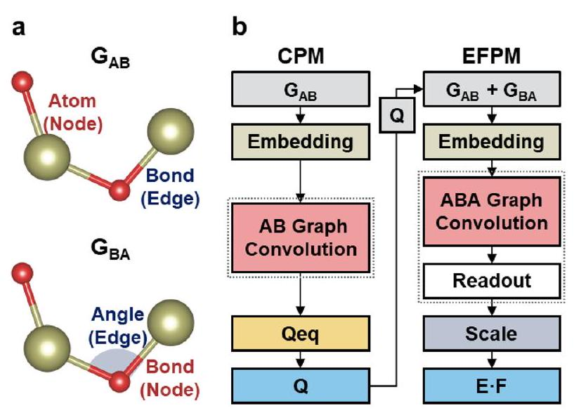
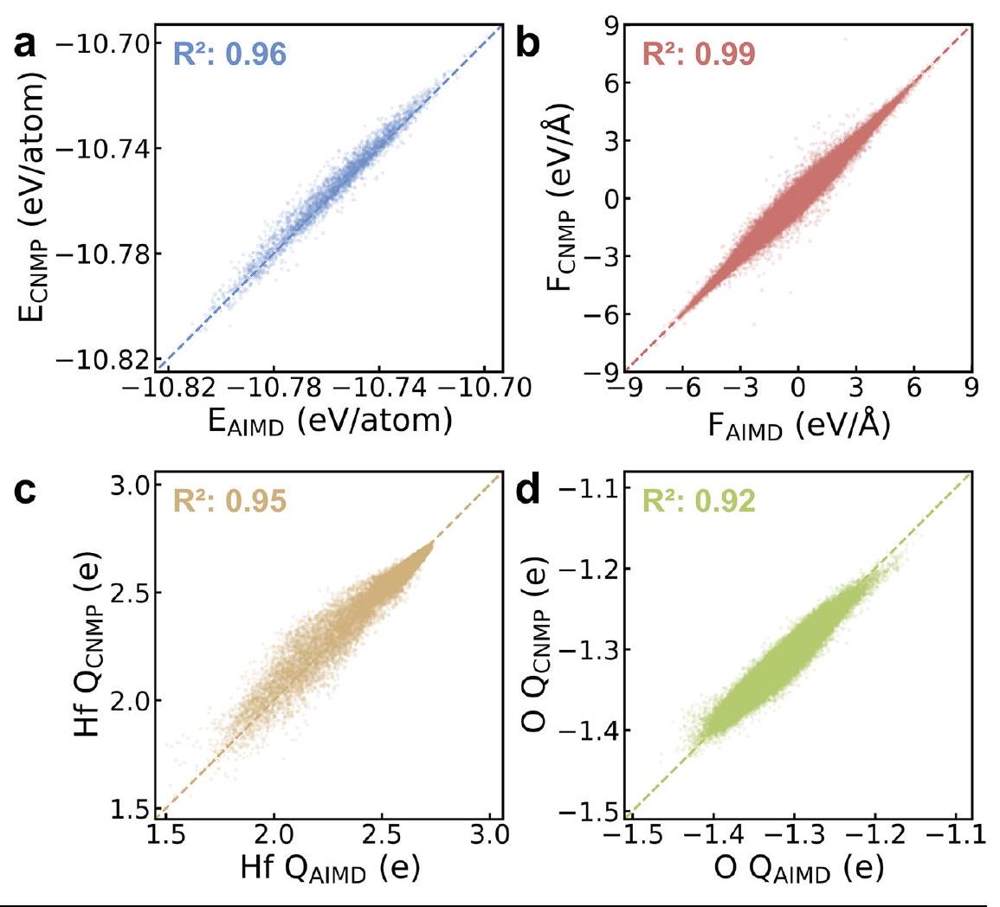
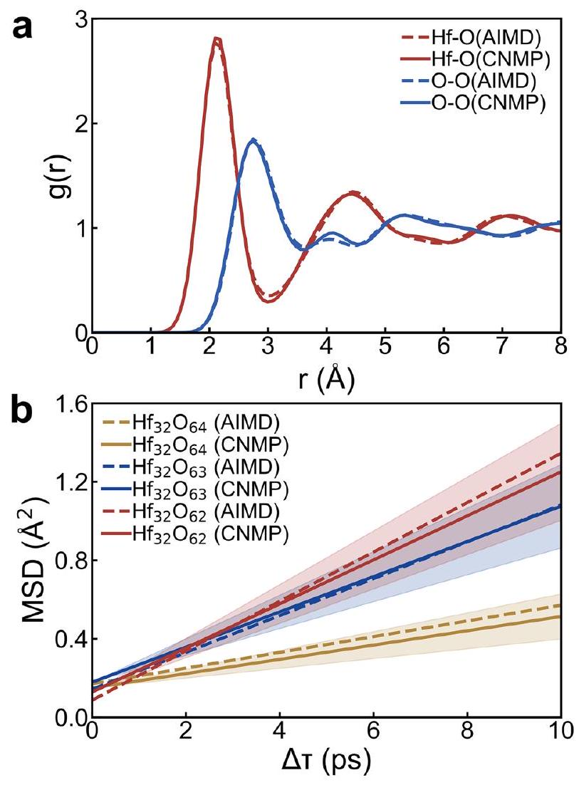
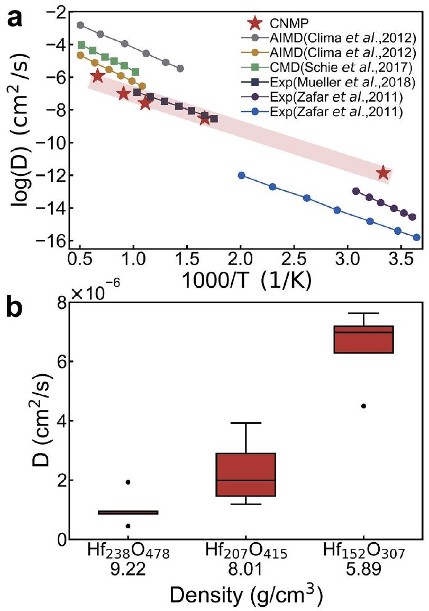
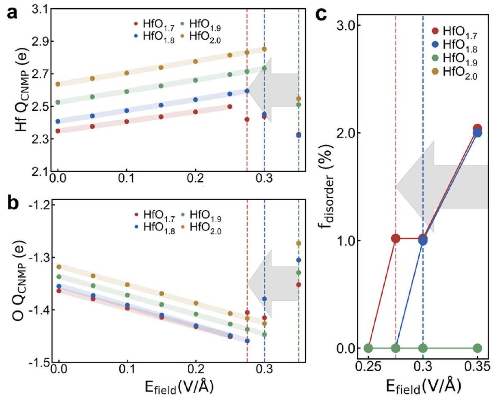

# Charge integrated graph neural networkbased machine learning potential for amorphous and non-stoichiometric hafnium oxide 

Check for updates

Hyo Gyeong Shin ${ }^{1,5}$, Seong Hun Kim ${ }^{1,5}$, Eun Ho Kim ${ }^{1}$, Jun Hyeong Gu ${ }^{1}$, Jaeseon Kim ${ }^{1}$, Seon-Gyu Kim ${ }^{1}$, Shin Hyun Kim ${ }^{1}$, Hyo Kim ${ }^{1}$, Sunghyun Kim ${ }^{2}$, Duk-Hyun Choe ${ }^{2}$ \& Donghwa Lee ${ }^{1,3,4} \boxtimes$

#### Abstract

Amorphous and non-stoichiometric hafnium oxide ( $\mathrm{a}-\mathrm{HfO}_{\mathrm{x}}$ ) systems are essential for advanced electronic applications due to their superior electrical properties. Simulating their atomic behaviors under electric fields $\left(E_{\text {field }}\right)$ is critical but challenging. Ab-initio molecular dynamics (AIMD) offer high accuracy but is computationally expensive, while classical MD lacks precision. To address this, we develop a charge equilibration integrated graph neural network (CIGNN) model that predicts atomic charge, energy, and force under $E_{\text {field }}$ conditions. Using the CIGNN model and AIMD datasets, we develop a CIGNN-based machine learning potential (CNMP) optimized for a-HfOx systems. The CNMP achieves quantum mechanical accuracy and effectively captures the atomic behaviors and dynamic properties of these systems across varying temperatures, densities, and $E_{\text {field }}$ conditions. We expect the CNMP to serve as a valuable tool for studying field-induced phenomena in complex systems and to provide a foundation for advancing innovations in electronic applications.

$\mathrm{HfO}_{2}$ has emerged as a promising material due to its high dielectric constant, ferroelectricity, thermal stability, and CMOS compatibility ${ }^{1-3}$. These properties make $\mathrm{HfO}_{2}$ an excellent candidate for various applications, including high-k dielectrics, resistive random-access memory (RRAM), and neuromorphic computing ${ }^{4-7}$. In these applications, the amorphous and nonstoichiometric hafnium oxide ( $\mathrm{a}-\mathrm{HfO}_{\mathrm{x}}$ ) play a pivotal role in optimizing device performance ${ }^{8-11}$. For instance, a- $\mathrm{HfO}_{\mathrm{x}}$ allows for higher energy storage density and enhanced breakdown strength, which are key for advanced dielectric capacitors that require both efficiency and durability ${ }^{9}$. In the case of RRAM, oxygen vacancies within a- $\mathrm{HfO}_{\mathrm{x}}$ enable resistive switching driven by external electric fields ( $E_{\text {field }}$ ), facilitating reliable data storage and retrieval ${ }^{10}$. Furthermore, in neuromorphic systems, the density and distribution of oxygen vacancies in a- $\mathrm{HfO}_{\mathrm{x}}$ allow fine-tuning of resistive states under controlled $E_{\text {field }}$, enhancing the efficiency of artificial synapses ${ }^{12}$. Thus, gaining a comprehensive understanding of the structural dynamics and behaviors of a- $\mathrm{HfO}_{\mathrm{x}}$ under $E_{\text {field }}$ is critical for advancing the performance of these emerging technologies.

To explore the structural features and behaviors of $\mathrm{a}-\mathrm{HfO}_{\mathrm{x}}$, density functional theory (DFT)-based ab initio molecular dynamics (AIMD) simulations can be utilized to provide atomic-level insights with quantum mechanical accuracy ${ }^{13-15}$. However, this system exhibits complex atomic structures, necessitating large-scale simulations to fully capture their behaviors. The significant computational costs associated with AIMD, especially for systems with a large number of atoms and long simulation times, make it computationally prohibitive for such large-scale studies ${ }^{16}$. These constraints limit our ability to deeply understand how atomic interactions govern the behaviors of a- $\mathrm{HfO}_{\mathrm{x}}$ under various conditions.

One solution to overcome these limitations is to use classical molecular dynamics (CMD) simulations, which rely on empirically parameterized force fields. CMD can handle larger systems and longer simulation times than AIMD, making it cost-effective for studying the behaviors of $\mathrm{a}-\mathrm{HfO}_{\mathrm{x}}{ }^{17}$. For instance, Urquiza et al. used the reactive force field to simulate resistive switching process in a- $\mathrm{HfO}_{\mathrm{x}}$-based RRAM cells under applied voltage, characterizing the migration of oxygen vacancies that facilitate resistive

[^0]changes during the set and reset operations ${ }^{17,18}$. However, the empirical nature of the force fields used in CMD limits their accuracy compared to AIMD, particularly in capturing complex atomic interactions in a- $\mathrm{HfO}_{\mathrm{x}}$ systems ${ }^{19,20}$.

Machine learning potential (MLP) offers a promising solution by bridging the gap between AIMD's accuracy and CMD's efficiency ${ }^{21-25}$. MLP not only provides quantum-level accuracy but also enables the simulation of larger systems under complex conditions ${ }^{26}$. Recent studies have applied MLPs to explore the behaviors of $\mathrm{a}-\mathrm{HfO}_{\mathrm{x}}{ }^{27,28}$. For example, Sivaraman et al. utilized the active learned gaussian approximation potential (GAP) to simulate the atomic behaviors across a wide temperature range in $\mathrm{a}-\mathrm{HfO}_{\mathrm{x}}$ and liquid $\mathrm{HfO}_{2}{ }^{21,27}$. Zhang et al. used the neuroevolution potential (NEP) to investigate thermal conductivity changes in $\mathrm{a}-\mathrm{HfO}_{\mathrm{x}}$ at high temperatures ${ }^{22,28}$. However, while these studies provided valuable insights into fundamental properties, they did not account for the effects of $E_{\text {field }}$, which are crucial for understanding a- $\mathrm{HfO}_{\mathrm{x}}$ behaviors in advanced electronic applications. Therefore, despite the growing interest in MLPs, a significant challenge remains in adapting MLPs for practical applications such as RRAM and neuromorphic systems.

To address this, we first develop the charge equilibration (QEq) integrated graph neural network (CIGNN) model, which can account for the effects of $E_{\text {field }}$. Using the datasets obtained from AIMD simulations without $E_{\text {field }}$, we train the CIGNN model and develop CIGNN-based MLP (CNMP) for a- $\mathrm{HfO}_{\mathrm{x}}$ systems. The CNMP achieves quantum mechanical accuracy in predicting atomic charge, energy, and force for these systems. It also accurately predicts structural behaviors and dynamic properties consistent with experimental results, such as oxygen ion diffusivity across various density and temperatures, as well as dielectric breakdown fields in the presence of $E_{\text {field }}$. This indicates that the CNMP effectively bridges the gap between simulations and applications in a- $\mathrm{HfO}_{\mathrm{x}}$ systems. Building on this capability, we believe that the CNMP can serve as a valuable tool, significantly aiding future research on complex phenomena in advanced electronic applications involving amorphous and non-stoichiometric systems.

## Results

## CIGNN model architecture and performance

CIGNN model represents the local atomic structures of materials in two ways using nodes and edges of graph representations (Fig. 1a) ${ }^{29}$. First, we construct an atom-bond graph ( $\mathrm{G}_{\mathrm{AB}}$ ), where the 16 closest atoms to a central atom are defined as neighboring atoms. In this graph, atoms act as nodes,

Fig. 1 | Overview of the CIGNN model architecture. a Graph representations used in the CIGNN model, $\mathrm{G}_{\mathrm{AB}}$ and $\mathrm{G}_{\mathrm{BA}}$. Red represents nodes, and blue represents edges in each graph. b CIGNN model components: CPM and EFPM. Gray, green, red, and sky blue boxes represent the inputs, embedding layers, graph convolution layers, and outputs, respectively, in both CPM and EFPM. The yellow box represents the QEq layer in CPM. The light blue box represents the element scale layer in EFPM.

and bonds between the central atom and its neighboring atoms act as edges. This graph captures the local bonding environment of each atom, focusing on atomic distances. Second, we define nearest neighboring atoms that are closer than the average distance calculated over all neighboring atoms and their respective center atoms within the structure. To ensure at least 10 nearest neighbors, we iteratively increase the average distance by 0.1 Å until the criterion is met. Using these nearest neighbors, we construct a bondangle graph ( $\mathrm{G}_{\mathrm{BA}}$ ), where bonds are represented as nodes and angles between bonds are represented as edges ${ }^{30}$. This graph captures the angular relationships between bonds, providing additional geometric information. Through these two ways, we build a CIGNN model capable of simulating amorphous system by considering neighboring atoms and reconsidering nearest neighbors. The CIGNN model consists of two organically connected models: the atomic charge prediction model (CPM) and the energy and force prediction model (EFPM). The CPM predicts atomic charges based on $\mathrm{G}_{\mathrm{AB}}$ by incorporating the QEq method. The EFPM learns and predicts energy and force based on $\mathrm{G}_{\mathrm{AB}}, \mathrm{G}_{\mathrm{BA}}$, and predicted atomic charges from the CPM (Fig. 1b).

The CPM is composed of an embedding layer, a graph convolution layer, and a QEq layer. In the embedding layer, atom and bond features are embedded to capture latent representations that signify the hidden physical and chemical states of the atoms and bonds (Supplementary Fig. S1). In the graph convolution layer, with Nth iterations, both atom and bond features are iteratively updated (Supplementary Fig. S2). The iterative process allows the CPM to indirectly consider long-range interactions by continuously refining the features over multiple steps. In the QEq layer, the elementspecific QEq method is used (Supplementary Fig. S4). The QEq layer predicts atomic charges ( $Q$ ), using Bader charges as the target, by solving a linear system equation according to the QEq method:

$$
A_{\text {matrix }} Q=-\chi
$$

where $A_{\text {matrix }}$ represents the hardness matrix, constructed using updated atom and bond features ${ }^{31} \cdot \chi$ represents the chemical potential, which is adjusted based on the element-specific electronegativity in the periodic table. When the $\mathrm{E}_{\text {field }}$ is considered, $\chi$ changes to $\chi_{\text {eff }}{ }^{32}$.

$$
\chi_{\text {eff }}=\chi-R_{v} \cdot E_{\text {field }}
$$

where $\chi_{\text {eff }}$ is the modified chemical potential vector that accounts for the influence of the $E_{\text {field }} \cdot R_{v}$ represents the $v^{\text {th }}$ spatial component of the position vector $R$ of each atom in the direction of the applied $E_{\text {field }}$. By substituting $\chi_{\text {eff }}$ into Eq. (1), the $Q$ under the $E_{\text {field }}\left(Q_{\text {field }}\right)$ can be predicted.

$$
A_{m a t r i x} Q_{f i e l d}=-\chi_{e f f}
$$

The EFPM consists of an embedding layer, a graph convolution layer with a readout layer, and an element scale layer. In the embedding layer, similar to the CPM, atom, bond, and angle features are embedded to capture latent representations of these entities. In the graph convolution layer with $\mathrm{N}^{\text {th }}$ iterations, atom, bond, and angle features are iteratively updated (Supplementary Fig. S2). The atomic charges predicted by the CPM are incorporated into the updated atom and bond features at each iteration step. Through these update processes, a new representation of atom, bond, and angle features is presented, enhancing the EFPM's ability to simulate atomic interactions effectively. During each feature update process, two distinct normalization methods are used (Supplementary Fig. S3): the newly developed crystal normalization (C-Norm) for preserving crystal-specific features and preventing data leakage between different crystals after aggregation of features, and the layer normalization (L-Norm) for scaling features before the feature update process ${ }^{33}$. These normalization techniques help stabilize and optimize the learning process. The effectiveness of using C-Norm with L-Norm in the feature update layer is verified by replacing C-Norm with other normalization methods and comparing their performance (Supplementary Table S1).

Fig. 2 | Comparison between CNMP predictions and AIMD values. Plots for (a) energy, (b) force, (c) Hf atomic charge, and (d) O atomic charge. The $x$-axis represents AIMD values, and the $y$-axis represents CNMP predictions. $\mathbf{R}^{\mathbf{2}}$ values are indicated at the top of each panel.

Using the updated atom features, we derive the atomic energies in the readout layer. Then, to optimize our energy predictions, the element scale layer adjusts the atomic energies by scaling and shifting them using speciesspecific parameters derived from the energy and force characteristics of each atomic species. This ensures that species-dependent variations are properly accounted for in the energy predictions. Finally, the atomic energies are aggregated to compute the system's total energy, and forces are directly derived as the gradient of this total energy with respect to each atom's positions. When the $E_{\text {field }}$ is applied, there is an additional force contribution $(\Delta F)$ arising from the interaction between the $E_{\text {field }}$ and the $Q_{\text {field }}$.

$$
\Delta F=Q_{\text {field }} \cdot E_{\text {field }}
$$

By adding $\Delta F$, the forces under the $E_{\text {field }}\left(F_{\text {field }}\right)$ can be predicted.

$$
F_{\text {field }}=F+\Delta F
$$

where $F$ is the force without the $E_{\text {field }}$.
With this CPM and EFPM, the CIGNN model demonstrates competitive performance in predicting energy and forces compared to other MLP models (Supplementary Table S2). Importantly, the CIGNN model offers the added advantage of predicting atomic charges and outperforms other MLP models capable of charge prediction. This underscores the unique capability of the CIGNN model to accurately predict atomic charge, energy and force. Moreover, its charge prediction capability based on the QEq method, enables the CIGNN model to predict atomic charge, energy, and force under $E_{\text {field }}$ without requiring a dedicated $E_{\text {field }}$ dependent training process. This demonstrates the model's versatility and advanced predictive power.

## Development of CNMP

To develop the CNMP, an MLP specifically designed for $\mathrm{a}-\mathrm{HfO}_{\mathrm{x}}$ systems, we construct a dataset through AIMD calculations and Bader charge analysis. This dataset includes structure, charge, energy, and force information for $\mathrm{a}-\mathrm{HfO}_{\mathrm{x}}$ systems. A detailed description of the dataset is provided in the

Methods section. Using this dataset, we train the CIGNN model and develop the CNMP. The CNMP achieves a validation MAE of 7.7 me for charge, $1.9 \mathrm{meV} /$ atom for energy, and $78 \mathrm{meV} / \AA$ for force predictions. To verify that these low MAE values are not caused by overfitting, we conduct predictive analyses on 3000 new a- $\mathrm{HfO}_{\mathrm{x}}$ samples not included in the application dataset. As shown in Fig. 2, the CNMP achieves an MAE of 2.8 meV /atom for energy predictions with an $\mathrm{R}^{2}$ value of 0.96 when compared to AIMD results. For force predictions, it achieves an MAE of $83 \mathrm{meV} / \AA$ and an $\mathrm{R}^{2}$ value of 0.99 . For atomic charge estimations, it demonstrates an MAE of 17 me for Hf and 7 me for O , with $\mathrm{R}^{2}$ values of 0.95 for Hf and 0.92 for O . These results indicate that CNMP achieves quantum mechanical accuracy on the new samples, confirming its generalization ability across diverse configurations on a- $\mathrm{HfO}_{\mathrm{x}}$ systems. Additionally, we assess the CNMP's capability in predicting local atomic structures and diffusion dynamics compared to AIMD simulations. Both simulations are conducted under identical conditions: 10 ps at 1100 K within the NVT ensemble, considering a- $\mathrm{HfO}_{\mathrm{x}}$ structures with zero, single, and double oxygen vacancies. Each structure has stoichiometries of $\mathrm{Hf}_{32} \mathrm{O}_{64}$, $\mathrm{Hf}_{32} \mathrm{O}_{63}$, and $\mathrm{Hf}_{32} \mathrm{O}_{62}$, respectively. We then calculate the total radial distribution function (RDF) and oxygen ion mean square displacements (MSD). For RDF calculations of both O-O and Hf-O pairs, the CNMP results closely match those of AIMD, with an $R^{2}$ value greater than 0.99 . Figure 3 a shows the RDF of $\mathrm{Hf}_{32} \mathrm{O}_{64}$ (For the $\mathrm{RDF}^{\circ}$ of $\mathrm{Hf}_{32} \mathrm{O}_{63}$ and $\mathrm{Hf}_{32} \mathrm{O}_{62}$, refer to Supplementary Fig. S6). The first-peak position for Hf-O pairs is $2.1 \AA$, with RDF value of 2.77 for AIMD and 2.81 for CNMP. For O-O pairs, the first-peak position is $2.75 \AA$, with RDF values of 1.85 and 1.83 for AIMD and CNMP, respectively. These results confirm that CNMP accurately captures the local atomic structures in $\mathrm{a}-\mathrm{HfO}_{\mathrm{x}}$. In the MSD calculations, both CNMP and AIMD show the same tendency: as the oxygen vacancy increases from $\mathrm{Hf}_{32} \mathrm{O}_{64}$ to $\mathrm{Hf}_{32} \mathrm{O}_{62}$, the structures exhibit higher oxygen ion diffusivity (Fig. 3b). For AIMD, the diffusivity increases from $6.68 \times 10^{-8} \mathrm{~cm}^{2} / \mathrm{s}$, to $1.57 \times 10^{-7} \mathrm{~cm}^{2} / \mathrm{s}$, and $2.10 \times 10^{-7} \mathrm{~cm}^{2} / \mathrm{s}$ for $\mathrm{Hf}_{32} \mathrm{O}_{64}$, $\mathrm{Hf}_{32} \mathrm{O}_{63}$, and $\mathrm{Hf}_{32} \mathrm{O}_{62}$, respectively. Similarly, in the case of CNMP, the diffusivity increases from $6.06 \times 10^{-8} \mathrm{~cm}^{2} / \mathrm{s}$, to $1.49 \times 10^{-7} \mathrm{~cm}^{2} / \mathrm{s}$, and $1.86 \times 10^{-7} \mathrm{~cm}^{2} / \mathrm{s}$ for $\mathrm{Hf}_{32} \mathrm{O}_{64}, \mathrm{Hf}_{32} \mathrm{O}_{63}$, and $\mathrm{Hf}_{32} \mathrm{O}_{62}$,

Fig. 3 | RDF and MSD comparison between CNMP and AIMD. a RDF of $\mathrm{Hf}_{32} \mathrm{O}_{64}$ structures. The red line represents the Hf-O pair and the blue line represents the O-O pair. Solid lines indicate CNMP results, and dashed lines indicate AIMD results. b Linear slope of MSD for $\mathrm{Hf}_{32} \mathrm{O}_{64}, \mathrm{Hf}_{32} \mathrm{O}_{63}$, and $\mathrm{Hf}_{32} \mathrm{O}_{62}$. Yellow, blue, and red lines represent the MSD results for each structure, respectively. Solid lines indicate CNMP results, and dashed lines indicate AIMD results. Shaded areas show the standard deviation of diffusivity in CNMP.

respectively. These results demonstrate that CNMP successfully replicates the diffusion behavior of oxygen ions, validating its capability in capturing atomic dynamics in a- $\mathrm{HfO}_{\mathrm{x}}$ systems.

Additionally, to verify that the CNMP can capture the atomic structures and diffusion dynamics for other defect configurations not considered in the training set, we calculate the RDF and MSD for $\mathrm{a}-\mathrm{HfO}_{\mathrm{x}}$ structures with zero $\left(\mathrm{Hf}_{32} \mathrm{O}_{64}\right)$ and single $\left(\mathrm{Hf}_{31} \mathrm{O}_{64}\right)$ hafnium vacancies. These simulations are conducted for 10 ps at 300 K within the NVT ensemble. For the RDF calculations of both O-O and Hf-O pairs, the CNMP results closely match those of AIMD, with an $R^{2}$ value greater than 0.99 . In the MSD calculations, both CNMP and AIMD show the same tendency: as the number of hafnium vacancies increases from zero to one, the structures exhibit higher oxygen ion diffusivity (For the detailed RDF and MSD results, refer to Supplementary Fig. S7).

## Evaluating the performance of CNMP

To extend the utility of CNMP, we verify whether it can accurately represent the diffusivity of oxygen ions under various conditions. We first perform CNMP-MD simulations at different temperatures on a- $\mathrm{HfO}_{\mathrm{x}}\left(\mathrm{Hf}_{32} \mathrm{O}_{63}\right)$ structures and compare the results with previous studies. Simulations are conducted at $300 \mathrm{~K}, 600 \mathrm{~K}, 900 \mathrm{~K}, 1100 \mathrm{~K}$, and 1500 K , each lasting 80 ps . The oxygen ion diffusivity gradually increases from $1.37 \times 10^{-12} \mathrm{~cm}^{2} / \mathrm{s}$ to $1.16 \times 10^{-6} \mathrm{~cm}^{2} / \mathrm{s}$ as the temperature rises from 300 K to 1500 K , resulting in an Arrhenius slope of -2.1 K (Fig. 4a). A recent experimental study has reported that the diffusivity of $\mathrm{m}-\mathrm{HfO}_{\mathrm{x}}$, which exhibits similar short-range order to that of a- $\mathrm{HfO}_{\mathrm{x}}$, increases from $2.89 \times 10^{-9} \mathrm{~cm}^{2} / \mathrm{s}$ to $1.22 \times 10^{-7} \mathrm{cm}^{2} / \mathrm{s}$ as the temperature increases from 570 K to 966 K , with a Arrhenius

Fig. 4 | Oxygen ion diffusivity trends under various temperatures and densities. a Temperature dependence of oxygen ion diffusivity for $\mathrm{m}-\mathrm{HfO}_{2}$ and a- $\mathrm{HfO}_{\mathrm{x}}$ systems. The red stars represent the CNMP results for a- $\mathrm{HfO}_{\mathrm{x}}$. Squares and circles in the legend represent data points from previous studies on $\mathrm{m}-\mathrm{HfO}_{2}$ and a- $\mathrm{HfO}_{\mathrm{x}}$, respectively. The thick, semi-transparent red line shows the best fit to the CNMP results, illustrating the temperature dependency. b Oxygen ion diffusivity for a- $\mathrm{HfO}_{\mathrm{x}}$ systems with varying densities. Each density is denoted on the x -axis along with its corresponding stoichiometry. The median is represented by the inner line of each box plot, with 25th and 75th percentiles as the lower and upper edges, respectively. Outliers are denoted by dots.

slope of $-2.26 \mathrm{~K}^{9,34-38}$. Additional experimental and computational studies have demonstrated similar trends in increasing oxygen ion diffusivity with increasing temperature, as shown in Fig. 4a. Therefore, these results demonstrate the consistency of CNMP with previous studies and confirm its validity and reliability ${ }^{34,39-41}$. It is important to note that the purpose of this comparison is to demonstrate that CNMP predictions exhibit a physically consistent Arrhenius trend, rather than to serve as a direct quantitative benchmark against previous studies performed under different simulation or experimental conditions. Next, we conduct CNMP-MD simulations on $\mathrm{a}-\mathrm{HfO}_{\mathrm{x}}$ structures with varying densities and compare the results to experimental trends. Lee et al. reported that as the density of a- $\mathrm{HfO}_{\mathrm{x}}$ films decreases in the order of $9.22 \mathrm{~g} / \mathrm{cm}^{3}, 8.01 \mathrm{~g} / \mathrm{cm}^{3}$, and $5.89 \mathrm{~g} / \mathrm{cm}^{3}$, oxygen ion diffusivity increases, enhancing device performance ${ }^{42}$. We used $\mathrm{Hf}_{238} \mathrm{O}_{478}$, $\mathrm{Hf}_{207} \mathrm{O}_{415}$, and $\mathrm{Hf}_{152} \mathrm{O}_{307}$ structures with these respective densities. Five MD simulations were performed using the NVT ensemble, yielding median diffusivity values of $0.94 \times 10^{-6} \mathrm{~cm}^{2} / \mathrm{s}, 1.99 \times 10^{-6} \mathrm{~cm} / \mathrm{s}$, and $6.98 \times 10^{-6} \mathrm{~cm}^{2} / \mathrm{s}$ for the structures with densities of $9.22 \mathrm{~g} / \mathrm{cm}^{3}, 8.01 \mathrm{~g} / \mathrm{cm}^{3}$, and $5.89 \mathrm{~g} / \mathrm{cm}^{3}$, respectively (Fig. 4b). These trends align with experimental observation, confirming that CNMP accurately predicts the atomic behaviors and dynamics of a- $\mathrm{HfO}_{\mathrm{x}}$ systems under various conditions.

Exploring the capability of our CNMP to describe practical scenarios, we focus on its application in RRAM. In RRAM applications, both

Fig. 5 | Average atomic charge and $\mathbf{f}_{\text {disorder }}$ as a function of the $E_{\text {field }}$ for different $\mathrm{m}-\mathrm{HfO}_{\mathrm{x}}$ systems. Average (a), Hf charge and (b), O charge plotted against the $E_{\text {field }}$. The solid lines are linear fits to the data within the linear response regime. The vertical dashed lines, color-coded according to the legend, represent the $E_{\text {lim }}$ for each system. The lines for $\mathrm{HfO}_{1.9}$ and $\mathrm{HfO}_{2.0}$ overlap. (c), $\mathrm{f}_{\text {disorder }}$ plotted against the $E_{\text {field }}$. The vertical dashed lines represent the $E_{b d}$ for each system. The data points for $\mathrm{HfO}_{1.9}$ and $\mathrm{HfO}_{2.0}$ overlap.

theoretical and experimental studies suggest that the (soft) dielectric breakdown voltage, which corresponds to the forming voltage, decreases as the oxygen vacancy concentration ( $n_{\text {vacancy }}$ ) increases. This trend has been observed in $\mathrm{m}-\mathrm{HfO}_{\mathrm{x}}$ systems, which exhibit similar short-range order to $\mathrm{a}-\mathrm{HfO}_{\mathrm{x}}$ systems ${ }^{9,35-38}$. For example, Schmidt et al. reported that the $\mathrm{m}-\mathrm{HfO}_{2}$ sample exhibited the breakdown voltage of 7.0 V , while the $\mathrm{HfO}_{1.7}$ sample showed a reduced breakdown voltage of $1.9 \mathrm{~V}^{38}$.

To evaluate whether CNMP can capture the dielectric breakdown trend, we perform CNMP-MD simulations under varying $E_{\text {field }}$ conditions. Since the CNMP-MD simulation assumes a linear response to a homogeneous $E_{\text {field }}$, it is important to first quantify the valid range of this assumption. Therefore, we analyze the average atomic charge as a function of the $E_{\text {field }}$ to determine this linear window. We define the linear response limit, $E_{\text {lim }}$, as the $E_{\text {field }}$ at which the average atomic charges begin to deviate from their initial linear trend. The CNMP-MD simulations are conducted on $\mathrm{m}-\mathrm{HfO}_{\mathrm{x}}$ systems with a thickness of $15.8 \AA$. The systems have stoichiometries of $\mathrm{HfO}_{2}\left(\mathrm{Hf}_{36} \mathrm{O}_{72}\right), \mathrm{HfO}_{1.9}\left(\mathrm{Hf}_{36} \mathrm{O}_{68}\right), \mathrm{HfO}_{1.8}\left(\mathrm{Hf}_{36} \mathrm{O}_{64}\right)$, and $\mathrm{HfO}_{1.7}\left(\mathrm{Hf}_{36} \mathrm{O}_{62}\right)$, and $n_{\text {vacancy }}$ values of $0.0,5.6,11.1$, and $13.9 \mathrm{~cm}^{-3}$, respectively. Figure 5 shows the average atomic charge for Hf and O as a function of $E_{\text {field }}$. It reveals that as $\mathrm{n}_{\text {vacancy }}$ increases, $E_{\text {lim }}$ decreases. For the less defective systems ( $\mathrm{HfO}_{2.0}$ and $\mathrm{HfO}_{1.9}$ ), the systems deviate from linearity at $0.35 \mathrm{~V} / \AA$. For the highly defective systems, $\mathrm{HfO}_{1.8}$ and $\mathrm{HfO}_{1.7}$, the $E_{\text {lim }}$ decreases to $0.3 \mathrm{~V} / \AA$ and $0.275 \mathrm{~V} / \AA$, respectively. Additionally, in the linear response regime of each $\mathrm{m}-\mathrm{HfO}_{\mathrm{x}}$ system, the average Hf charge increases linearly, and the average O charge decreases linearly with $E_{\text {field }}$. Then, at the same $E_{\text {field }}$, systems with lower $n_{\text {vacancy }}$ exhibit a larger charge response. This is physically consistent, as a higher concentration of polarizable O atoms allows for greater field-induced charge transfer.

With this linear range established, we then evaluated the dielectric breakdown trend. We define the fraction of disordered atoms ( $f_{\text {disorder }}$ ) as the percentage of atoms with normalized bond orientational order (BOO) parameters below 0.5 (detailed description is provided in the "Methods" section) ${ }^{43}$. This concept can capture the behavior of disruption of atomic structure, so we have used the point where $f_{\text {disorder }}$ increases from 0 as the starting point of dielectric breakdown. Thus, the dielectric breakdown field $\left(E_{b d}\right)$ is defined as the point where $\mathrm{f}_{\text {disorder }}$ becomes greater than zero. As shown in Fig. 5c, for the highly defective systems the $E_{b d}$ coincides with the $E_{\text {lim }}$, at $0.3 \mathrm{~V} / \AA{ }^{\circ}$ for $\mathrm{HfO}_{1.8}$ and for $0.275 \mathrm{~V} / \AA$ for $\mathrm{HfO}_{1.7}$. It means that for
these systems, the onset of electronic non-linearity is tightly coupled with structural collapse. In contrast, for the more structurally stable systems $\left(\mathrm{HfO}_{2.0}\right.$ and $\left.\mathrm{HfO}_{1.9}\right)$, the system remains stable even after $E_{\text {field }}$ reaches $E_{\text {lim }}$ (Supplementary Fig. S10). This may be physically reasonable, since the structural stability of less defective systems may require additional forces to make the system physically unstable and lead to the dielectric breakdown. Thus, while both $E_{\text {lim }}$ and $E_{b d}$ decrease as $n_{\text {vacancy }}$ increases, the relationship between $E_{\text {lim }}$ and $E_{b d}$ is dependent on the defect concentration. In addition to this, the $E_{b d}$ determined in this study fall within a similar range as the experimentally observed breakdown voltages, from 7.0 V for $\mathrm{HfO}_{2}$ to 1.9 V for $\mathrm{HfO}_{1.7}{ }^{40}$. These results are consistent with experimental observations and confirm that CNMP can effectively describe device-level phenomena under $E_{\text {field }}$ conditions.

## Discussion

In this study, we develop a CIGNN model that integrates the QEq method within a GNN framework, utilizing both $\mathrm{G}_{\mathrm{AB}}$ and $\mathrm{G}_{\mathrm{BA}}$. The integration of the QEq method enables the CIGNN model to account for the effects of $E_{\text {field }}$. Using the CIGNN model, we develop a CNMP optimized for a- $\mathrm{HfO}_{\mathrm{x}}$ systems. Compared to AIMD results, the CNMP accurately predicts atomic charge, energy, and force. It also successfully captures local atomic structures and replicates the diffusion behavior of oxygen ions. With comparison to previous studies, the CNMP coherently describes trends in oxygen ion diffusivity. In the context of RRAM applications under $E_{\text {field }}$ conditions, the CNMP reproduces the experimentally observed trend that the $E_{b d}$ decreases as oxygen vacancy concentration increases. Furthermore, the CNMP-MD simulation shows the relationship between $E_{\text {lim }}$ and $E_{b d}$ depends on the structural stability associated with the $n_{\text {vacancy }}$.

Accurately describing the behavior of complex systems is a critical step toward bridging atomic-level simulations with advanced electronic applications. This task becomes even more challenging under $E_{\text {field }}$ conditions due to the increased complexity of simulating atomic-scale phenomena. The CNMP offers several distinct advantages over existing MLP approaches that incorporate $E_{\text {field }}$, such as FieldSchNet, SCFNN, FIREANN, PNNP, and CACE-LR ${ }^{44-51}$. First, CNMP significantly reduces the computational cost of generating training datasets. While FieldSchNet, SCFNN, and FIREANN require training datasets generated under applied $E_{\text {field }}$, CNMP completely avoids this requirement by training exclusively on datasets obtained from

AIMD simulations without $E_{\text {field }}$. Subsequent CNMP-MD simulations are then conducted under $E_{\text {field }}$ conditions, as described in Eqs. (2)-(5). This strategy eliminates the need for costly data generation under $E_{\text {field }}$ conditions, providing a more efficient path toward $E_{\text {field }}$-capable MLP development. Although PNNP, is also trained on datasets obtained without $E_{\text {field }}$, it depends on the atomic polar tensor (APT) to characterize the system's response to $E_{\text {field }}$. Computing APTs can be extremely demanding, particularly for systems with complex atomic structures such as $\mathrm{a}-\mathrm{HfO}_{\mathrm{x}}$. Similarly, the CACE-LR, which introduces the Latent Ewald Summation (LES) framework, has been shown to effectively describe not only long-range interactions but also the response to $E_{\text {field }}$. However, a key aspect of the LES formulation for incorporating an $E_{\text {field }}$ is its reliance on the high-frequency permittivity as an external parameter. In contrast, our QEq method uses Bader charge, which has been demonstrated to sufficiently capture $E_{\text {field }}$ induced charge redistribution, while drastically reducing the computational overhead associated with dataset preparation and eliminating the need for an external parameter ${ }^{52,53}$. Second, CIGNN model of the CNMP offers a physically coherent integration of the CPM and EFPM, which provides a distinct advantage over existing approaches. In the case of PNNP, the energy and force prediction model and the APT prediction model are trained separately and only coupled during PNNP-MD simulations. In contrast, CIGNN model integrates CPM and EFPM during the training phase, enabling CNMP to operate within a physically unified framework under $E_{\text {field }}$ conditions. Specifically, the $Q_{\text {field }}$, influenced by the applied $E_{\text {field }}$ as described in Eq. (3), are directly fed into the EFPM. This allows the model to consistently incorporate the indirect response, i.e., the internal electronic redistribution induced by the $E_{\text {field }}$. Additionally, the $\Delta F$ in Eq. (4) is explicitly incorporated to account for the direct response. Therefore, CNMP enables simulation of both direct and indirect responses under $E_{\text {field }}$ conditions within a unified physical framework.

Nonetheless, the current implementation of CNMP exhibits several limitations that must be addressed to broaden its applicability. Specifically, the framework assumes a linear response regime and is currently restricted to simulations under spatially homogeneous $E_{\text {field }}$. These limitations hinder its ability to capture higher-order nonlinear effects that emerge under strong $E_{\text {field }}$ conditions, as well as to simulate $E_{\text {field }}$ gradient driven phenomena. A promising solution to both challenges involves extending the QEq method, currently based on Bader charge, to incorporate Born effective charge tensors. This extension could enable the CNMP to capture higher-order electronic responses and nonlinear effects. Furthermore, as discussed in the PNNP, $E_{\text {field }}$ gradients interact with quadrupole moments, which can be computed from Born effective charge tensors. Including quadrupolar terms would thus allow CNMP to capture $E_{\text {field }}$ gradients driven effects. However, the practical implementation of this approach is nontrivial. The computation of Born effective charges and construction of a corresponding training dataset remains computationally expensive. While we are actively exploring efficient data-generation strategies to mitigate this cost, a robust and scalable solution has yet to be fully realized. Additionally, CNMP does not explicitly account for local field enhancement, where the $E_{\text {field }}$ can be significantly intensified in the vicinity of defects. Overcoming these challenges remains a key direction for future development.

Despite these limitations, our study demonstrates that the CNMP can effectively describe the behavior of complex $\mathrm{a}-\mathrm{HfO}_{\mathrm{x}}$ systems under $E_{\text {field }}$ conditions. Given its capabilities, CNMP has the potential to become a foundational tool in materials science, enhancing our understanding of field-induced phenomena and driving innovation in electronic applications. By closely aligning simulation predictions with experimental results, the CNMP paves the way for optimizing material properties and designing next-generation electronic devices.

## Methods

## Datasets

The datasets used in this study were generated through DFT and AIMD simulations without $E_{\text {field }}$. Initially, to generate a- $\mathrm{HfO}_{\mathrm{x}}$ structures $\mathrm{m}-\mathrm{HfO}_{\mathrm{x}}$ structures were used as the initial configurations. For $\mathrm{m}-\mathrm{HfO}_{\mathrm{x}}$ with double
oxygen vacancies, initial structures with both clustered vacancies and vacancies separated the furthest apart were considered. For $\mathrm{m}-\mathrm{HfO}_{\mathrm{x}}$ with triple oxygen vacancies, initial structures with all vacancies close together, vacancies clustered in pairs with the third vacancy separated, and all three vacancies furthest apart were considered to include a variety of interactions between multiple vacancies. Each of these $\mathrm{m}-\mathrm{HfO}_{\mathrm{x}}$ structures was optimized using DFT calculations. Using these optimized $\mathrm{m}-\mathrm{HfO}_{\mathrm{x}}$ structures, $\mathrm{a}-\mathrm{HfO}_{\mathrm{x}}$ structures were formed by the melt-quenching method under the NVT ensemble of AIMD simulations. This process involved melting $\mathrm{m}-\mathrm{HfO}_{\mathrm{x}}$ structures at 5000 K for 5 ps , followed by gradual quenching from 5000 K to 300 K over more than 5 ps .

To construct the dataset, additional AIMD simulations were performed on the a- $\mathrm{HfO}_{\mathrm{x}}$ structures. A total of 555,674 snapshots were collected from these AIMD trajectories. From these snapshots, 55,567 data points, including structure, energy, and force information, were extracted at uniform 10 fs intervals, corresponding to a uniform-in-time selection strategy. Atomic charge data were obtained by performing Bader charge analysis on the extracted data points. It is important to note that all data points were considered only for the neutral systems.

As a result, datasets containing structure, energy, force, and atomic charge data were constructed.

## Hyperparameters of CIGNN model

Both CMP and EFPM of the CIGNN model were implemented using PyTorch ${ }^{54}$ and trained on a single NVIDIA A100 GPU. The models were optimized using the Adam optimizer with an initial learning rate of 0.001 , momentum of 0.9 , and no weight decay ${ }^{55}$. The learning rate was adjusted using the ReduceLROnPlateau scheduler, triggered based on the validation loss, with a patience of 10 epochs, a threshold of 0.00001 in relative mode, a cooldown period of 10 epochs, a minimum learning rate of $1.0 \times 10^{-7}$, and an epsilon of 1e-8. The root mean squared error (RMSE) loss was used, and the best model was selected based on the lowest validation mean absolute error (MAE). Detailed parameters used in this study are available at https:// github.com/CNMD-POSTECH/CIGNN.

CPM parameters. Embedding dimensions were set at 64 for both atoms and bonds. Radial features were generated using 5 Bessel basis functions with a polynomial envelope $(p=5)^{56}$. The convolution layer iterated 3 times. Training spanned 300 epochs with a batch size of 8 , incorporating an exponential moving average (EMA) for evaluation. The charge loss function is defined as:

$$
L_{Q, R M S E}=\sqrt{\frac{1}{B \cdot N} \sum_{i=1}^{B \cdot N}\left(Q_{\text {pred }, i}-Q_{\text {target }, i}\right)^{2}}
$$

where $L_{Q, R M S E}$ represents charge loss. $B$ is the batch size, $N$ is the number of atoms in a batch, $i$ represents an atom. The total loss is calculated as:

$$
L_{\text {total }}=\lambda_{Q} \cdot L_{Q, \text { RMSE }}
$$

With $\lambda_{Q}$ representing the charge weight loss set to 100 .
EFPM parameters. Embedding dimensions were set at 64 for atoms, 64 for bonds, and 96 for angles. Radial features were generated using 5 Bessel basis functions with a polynomial envelope ( $p=5$ ), and angular features were created using 7 spherical harmonics ${ }^{56}$. The convolution layer, followed by readout layers, iterated 3 times. Training spanned 1000 epochs with a batch size of 8 , incorporating an exponential moving average (EMA) for evaluation. The energy and force loss functions are defined as:

$$
L_{E, R M S E}=\sqrt{\frac{1}{B} \sum_{b}^{B}\left(E_{\text {pred }, b}-E_{\text {target }, b}\right)^{2}}
$$

$$
L_{F, R M S E}=\sqrt{\frac{1}{B \cdot N \cdot 3} \sum_{i=1}^{B \cdot N} \sum_{v=1}^{3}\left(F_{\text {pred }, i, v}-F_{\text {target }, i, v}\right)^{2}}
$$

Here, $L_{E, R M S E}$ represents energy loss, and $L_{F, R M S E}$ represents force loss. In these equations, $B$ is the batch size, $N$ is the number of atoms in a batch, $v$ represents the direction of force component, $i$ represents an atom. The total loss is calculated as:

$$
L_{\text {total }}=\lambda_{E} \cdot L_{E, R M S E}+\lambda_{F} \cdot L_{F, R M S E}
$$

with $\lambda_{E}$ and $\lambda_{F}$ representing the energy weight losses set to 40 and 100, respectively, to balance the contribution of energy and force terms in the loss function.

## CNMP-MD simulations

CNMP-MD simulations were conducted using the large-scale atomic/ molecular massively parallel simulator (LAMMPS) with the compiled CNMP ${ }^{57}$. Simulations of a- $\mathrm{HfO}_{\mathrm{x}}$ were performed in the NVT ensemble using a Nosé-Hoover thermostat ${ }^{58,59}$. For CNMP-MD simulations with $E_{\text {field }}$, the $\mathrm{m}-\mathrm{HfO}_{\mathrm{x}}$ structures were minimized under the $E_{\text {field }}$ condition along the z -axis. The criteria for minimization were set to $1.0 \times 10^{-8}$ for energy (eV/atom) and $1.0 \times 10^{-9}$ for force (eV/Å), with a maximum of 5000 iterations, using the fire minimization algorithm ${ }^{60}$.

## Local amorphous environments

The $f_{\text {disorder }}$ was quantified using bond orientational order (BOO) parameters, specifically $Q_{4}$ and $Q_{6}$. These parameters describe the local atomic environments based on spherical harmonics $Y_{l m}$, which were computed for each atom ${ }^{61-63}$. The calculated $Q_{4}$ and $Q_{6}$ values were normalized (normalized BOO) against the reference values for an ideal face-centered cubic (fcc) structure, using the following equation:

$$
\frac{\sqrt{Q_{4}^{2}+Q_{6}^{2}}}{\sqrt{Q_{4, f c c}^{2}+Q_{6, f c c}^{2}}}
$$

Atoms with normalized BOO values greater than or equal to 0.5 were classified as part of the crystalline phase, while those with value below 0.5 were classified as part of the amorphous phase. This method provided a clear distinction between crystalline and amorphous regions, enabling the tracking of the evolution of local amorphous environments. To quantify the $f_{\text {disorder }}$, we identified atoms with BOO values below 0.5 and calculated their percentage within the system ${ }^{43}$.

## Density functional theory (DFT)

First-principles density functional theory (DFT) calculations with Bader charge analysis were performed to construct datasets for $\mathrm{a}-\mathrm{HfO}_{\mathrm{x}}$ systems ${ }^{52}$. Vienna Ab-initio Simulation Package (VASP) code was used to implement DFT calculations ${ }^{64,65}$. The Perdew-Burke-Ernzerhof (PBE) generalized gradient approximation (GGA) with the projector augmented wave (PAW) method for the exchange and correlation potentials was used ${ }^{66-68}$. The Monkhorst-Pack k-point sampling of a $1 \times 1 \times 1$ grid with a 500 eV energy cutoff was applied ${ }^{69}$. The convergence criteria for force and energy for the fully relaxed structures were established at $0.01 \mathrm{eV} / \AA$ and $10^{-6} \mathrm{eV}$, respectively.

## Data availability

CIGNN: [https://github.com/CNMD-POSTECH/CIGNN).

## Code availability

CIGNN: https://github.com/CNMD-POSTECH/CIGNN.

Received: 7 August 2025; Accepted: 4 November 2025;
Published online: 13 December 2025

## References

1. Wang, Y. et al. A stable rhombohedral phase in ferroelectric $\mathrm{Hf}(\mathrm{Zr})_{1+x} \mathrm{O}_{2}$ capacitor with ultralow coercive field. Science 381, 558-563 (2023).
2. Noheda, B., Nukala, P. \& Acuautla, M. Lessons from hafnium dioxidebased ferroelectrics. Nat. Mater. 22, 562-569 (2023).
3. $\mathrm{Xu}, \mathrm{Y}$. et al. Scalable integration of hybrid high- $\kappa$ dielectric materials on two-dimensional semiconductors. Nat. Mater. 22, 1078-1084 (2023).
4. Wan, W. et al. A compute-in-memory chip based on resistive randomaccess memory. Nature 608, 504-512 (2022).
5. Huo, Q. et al. A computing-in-memory macro based on threedimensional resistive random-access memory. Nat. Electron. 5, 469-477 (2022).
6. Rao, M. et al. Thousands of conductance levels in memristors integrated on CMOS. Nature 615, 823-829 (2023).
7. Kim, D. et al. Emerging memory electronics for non-volatile radiofrequency switching technologies. Nat. Rev. Electr. Eng. 1, 10-23 (2024).
8. Hellenbrand, M. et al. Thin film design of amorphous hafnium oxide nanocomposites enabling strong interfacial resistive switching uniformity. Sci. Adv. 9, eadg1946 (2023).
9. Yu, Y. et al. Structure-evolution-designed amorphous oxides for dielectric energy storage. Nat. Commun. 14, 3031 (2023).
10. Zhang, Y. et al. Evolution of the conductive filament system in $\mathrm{HfO}_{2}-$ based memristors observed by direct atomic-scale imaging. Nat. Commun. 12, 7232 (2021).
11. Liu, Z. et al. Epitaxial formation of ultrathin $\mathrm{HfO}_{2}$ on multilayer graphene by sequential oxidation. ACS Nano. https://doi.org/10. 1021/acsnano.3c10617 (2025).
12. Hellenbrand, M. \& MacManus-Driscoll, J. Multi-level resistive switching in hafnium-oxide-based devices for neuromorphic computing. Nano Converg. 10, 44 (2023).
13. Salinga, M. et al. Monatomic phase change memory. Nat. Mater. 17, 681-685 (2018).
14. He, Y. et al. Amorphizing noble metal chalcogenide catalysts at the single-layer limit towards hydrogen production. Nat. Catal. 5, 212-221 (2022).
15. Wu, G. et al. Elemental partitioning-mediated crystalline-toamorphous phase transformation under quasi-static deformation. Nat. Commun. 15, 1223 (2024).
16. Merchant, A. et al. Scaling deep learning for materials discovery. Nature 624, 80-85 (2023).
17. Urquiza, M. L., Islam, M. M., Van Duin, A. C. T., Cartoixà, X. \& Strachan, A. Atomistic insights on the full operation cycle of a $\mathrm{HfO}_{2}$-based resistive random access memory cell from molecular dynamics. ACS Nano 15, 12945-12954 (2021).
18. Senftle, T. P. et al. The ReaxFF reactive force-field: development, applications and future directions. npj Comput. Mater. 2, 1-14 (2016).
19. Friederich, P., Häse, F., Proppe, J. \& Aspuru-Guzik, A. machinelearned potentials for next-generation matter simulations. Nat. Mater. 20, 750-761 (2021).
20. Momeni, K. et al. Multiscale computational understanding and growth of 2D materials: a review. npj Comput. Mater. 6, 1-18 (2020).
21. Bartók, A. P., Payne, M. C., Kondor, R. \& Csányi, G. Gaussian approximation potentials: the accuracy of quantum mechanics, without the electrons. Phys. Rev. Lett. 104, 136403 (2010).
22. Fan, Z. et al. Neuroevolution machine learning potentials: combining high accuracy and low cost in atomistic simulations and application to heat transport. Phys. Rev. B 104, 104309 (2021).
23. Deng, B. et al. CHGNet as a pretrained universal neural network potential for charge-informed atomistic modelling. Nat. Mach. Intell. 5, 1031-1041 (2023).
24. Batzner, S. et al. E(3)-equivariant graph neural networks for dataefficient and accurate interatomic potentials. Nat. Commun. 13, 2453 (2022).
25. Schütt, K. T., Hessmann, S. S., Gebauer, N. W., Lederer, J. \& Gastegger, M. SchNetPack 2.0: A neural network toolbox for atomistic machine learning. J. Chem. Phys. 158, 144801 (2023).
26. Jinnouchi, R. \& Minami, S. Machine learning force fields in electrochemistry: from fundamentals to applications. ACS Nano 19, 1-25 (2025).
27. Sivaraman, G. et al. Machine-learned interatomic potentials by active learning: amorphous and liquid hafnium dioxide. npj Comput. Mater. 6, 104 (2020).
28. Zhang, H., Gu, X., Fan, Z. \& Bao, H. Vibrational anharmonicity results in decreased thermal conductivity of amorphous $\mathrm{HfO}_{2}$ at high temperature. Phys. Rev. B 108, 045422 (2023).
29. Xie, T. \& Grossman, J. C. Crystal graph convolutional neural networks for an accurate and interpretable prediction of material properties. Phys. Rev. Lett. 120, 145301 (2018).
30. Choudhary, K. \& DeCost, B. Atomistic line graph neural network for improved materials property predictions. npj Comput. Mater. 7, 1-8 (2021).
31. Rappe, A. K. \& Goddard, W. A. Charge equilibration for molecular dynamics simulations. J. Phys. Chem. 95, 3358-3363 (1991).
32. Assowe, O. et al. Reactive molecular dynamics of the initial oxidation stages of $\mathrm{Ni}(111)$ in pure water: effect of an applied electric field. $J$. Phys. Chem. A 116, 11796-11805 (2012).
33. Ba, J. L., Kiros, J. R. \& Hinton, G. E. Layer normalization. In NIPS 2016 Deep Learning Symposium (eds Fitzgibbon, A. et al.) (2016).
34. Zafar, S., Jagannathan, H., Edge, L. F. \& Gupta, D. Measurement of oxygen diffusion in nanometer scale $\mathrm{HfO}_{2}$ gate dielectric films. Appl. Phys. Lett. 98, 152903 (2011).
35. Lee, J. et al. Role of oxygen vacancies in ferroelectric or resistive switching hafnium oxide. Nano Converg. 10, 55 (2023).
36. McKenna, K. P. Optimal stoichiometry for nucleation and growth of conductive filaments in $\mathrm{HfO}_{\mathrm{x}}$. Modell. Simul. Mater. Sci. Eng. 22, 025001 (2014).
37. Tan, T. et al. Resistive switching of the $\mathrm{HfO}_{\mathrm{x}} / \mathrm{HfO}_{2}$ bilayer heterostructure and its transmission characteristics as a synapse. RSC Adv. 8, 41884-41891 (2018).
38. Schmidt, N. et al. Impact of non-stoichiometric phases and grain boundaries on the nanoscale forming and switching of $\mathrm{HfO}_{\mathrm{x}}$ Thin Films. Adv. Electron. Mater. 10, 2300693 (2024).
39. Mueller, M. P. \& De Souza, R. A. SIMS study of oxygen diffusion in monoclinic $\mathrm{HfO}_{2}$. Appl. Phys. Lett. 112, 051908 (2018).
40. Schie, M. et al. Ion migration in crystalline and amorphous $\mathrm{HfO}_{\mathrm{X}}$. J. Chem. Phys. 146, 094508 (2017).
41. Clima, S. et al. First-principles simulation of oxygen diffusion in $\mathrm{HfO}_{\mathrm{x}}$ : Role in the resistive switching mechanism. Appl. Phys. Lett. 100, 133102 (2012).
42. Lee, C., Choi, W., Kwak, M., Kim, S. \& Hwang, H. Impact of electrolyte density on synaptic characteristics of oxygen-based ionic synaptic transistor. Appl. Phys. Lett. 119, 103503 (2021).
43. Yang, Y. et al. Determining the three-dimensional atomic structure of an amorphous solid. Nature 592, 60-64 (2021).
44. Gastegger, M., Schütt, K. T. \& Müller, K.-R. Machine learning of solvent effects on molecular spectra and reactions. Chem. Sci. 12, 11473-11483 (2021).
45. Joll, K. et al. Machine learning the electric field response of condensed phase systems using perturbed neural network potentials. Nat. Commun. 15, 8192 (2024).
46. Gao, A. \& Remsing, R. C. Self-consistent determination of long-range electrostatics in neural network potentials. Nat. Commun. 13, 1572 (2022).
47. Zhang, Y. \& Jiang, B. Universal machine learning for the response of atomistic systems to external fields. Nat. Commun. 14, 6424 (2023).
48. Cheng, B. Latent Ewald summation for machine learning of longrange interactions. npj Comput. Mater. 11, 80 (2025).
49. Zhong, P., Kim, D., King, D. S. \& Cheng, B. Machine learning interatomic potential can infer electrical response. Preprint at https:// arxiv.org/abs/2504.05169 (2025).
50. Kim, D. et al. A universal augmentation framework for long-range electrostatics in machine learning interatomic potentials. Preprint at https://arxiv.org/abs/2507.14302 (2025).
51. Falletta, S. et al. Unified differentiable learning of electric response. Nat. Commun. 16, 4031 (2025).
52. Henkelman, G., Arnaldsson, A. \& Jónsson, H. A fast and robust algorithm for Bader decomposition of charge density. Comput. Mater. Sci. 36, 354-360 (2006).
53. Afrid, S. M. T.-S. Effect of external electric field on stability and electrical properties of monolayer WSTe alloy. in Proc. 4th International Conference on Electrical, Computer \& Telecommunication Engineering (ICECTE), 115-118 (IEEE, 2022).
54. Paszke, A. et al. PyTorch: an imperative style, high-performance deep learning library. in Proc. Advances in Neural Information Processing Systems, Vol. 32 (Curran Associates, Inc., 2019).
55. Kingma, D. P. \& Ba, J. Adam: a method for stochastic optimization. In Proc. International Conference on Learning Representations (ICLR) (Computer Science Machine Learning, 2015).
56. Gasteiger, J., Groß, J. \& Günnemann, S. Directional message passing for molecular graphs. in Proc. International Conference on Learning Representations (Computer Science Machine Learning, 2020).
57. Kühne, T. D., Krack, M., Mohamed, F. R. \& Parrinello, M. Efficient and accurate Car-Parrinello-like approach to Born-Oppenheimer molecular dynamics. Phys. Rev. Lett. 98, 066401 (2007).
58. Nosé, S. A unified formulation of the constant temperature molecular dynamics methods. J. Chem. Phys. 81, 511-519 (1984).
59. Hoover, W. G. Canonical dynamics: equilibrium phase-space distributions. Phys. Rev. A 31, 1695-1697 (1985).
60. Bitzek, E., Koskinen, P., Gähler, F., Moseler, M. \& Gumbsch, P. Structural relaxation made simple. Phys. Rev. Lett. 97, 170201 (2006).
61. Steinhardt, P. J., Nelson, D. R. \& Ronchetti, M. Bond-orientational order in liquids and glasses. Phys. Rev. B 28, 784-805 (1983).
62. Mickel, W., Kapfer, S. C., Schröder-Turk, G. E. \& Mecke, K. Shortcomings of the bond orientational order parameters for the analysis of disordered particulate matter. J. Chem. Phys. 138, 044501 (2013).
63. Lechner, W. \& Dellago, C. Accurate determination of crystal structures based on averaged local bond order parameters. J. Chem. Phys. 129, 114707 (2008).
64. Kresse, G. \& Furthmüller, J. Efficient iterative schemes for ab initio total-energy calculations using a plane-wave basis set. Phys. Rev. B 54, 11169-11186 (1996).
65. Fuchs, M. \& Scheffler, M. Ab initio pseudopotentials for electronic structure calculations of poly-atomic systems using densityfunctional theory. Comput. Phys. Commun. 119, 67-98 (1999).
66. Blöchl, P. E. Projector augmented-wave method. Phys. Rev. B 50, 17953-17979 (1994).
67. Perdew, J. P., Burke, K. \& Wang, Y. Generalized gradient approximation for the exchange-correlation hole of a many-electron system. Phys. Rev. B 54, 16533-16539 (1996).
68. Perdew, J. P., Burke, K. \& Ernzerhof, M. Generalized Gradient approximation made simple. Phys. Rev. Lett. 77, 3865-3868 (1996).
69. Monkhorst, H. J. \& Pack, J. D. Special points for Brillouin-zone integrations. Phys. Rev. B 13, 5188-5192 (1976).

## Acknowledgements

This research was supported by the National Research Foudation of Korea (NRF) funded by the Ministry of Science, ICT \& Future Planning No. NRF2020R1A6C101A202 and NRF-2024M3A7C2045166 and NRF-

2021M3I3A1084940 and RS-2023-00257666 and RS-2024-00446683 and RS-2024-00450836.

## Author contributions

Conceptualization: H.G.S, S.H.K., and D.H.L. Methodology: H.G.S. and S.H.K. Data curation: S.H.K. Formal analysis: H.G.S, S.H.K, E.H.K, J.H.G, J.S.K, S.G.K, and S.H.K. Writing—original draft: H.G.S, S.H.K., and D.H.L. Writing—review \& editing: H.G.S, S.K, D.H.C., and D.H.L.

## Competing interests

The authors declare no competing interests.

## Additional information

Supplementary information The online version contains supplementary material available at https://doi.org/10.1038/s41524-025-01864-3.

Correspondence and requests for materials should be addressed to Donghwa Lee.

Reprints and permissions information is available at http://www.nature.com/reprints

Publisher's note Springer Nature remains neutral with regard to jurisdictional claims in published maps and institutional affiliations.

Open Access This article is licensed under a Creative Commons Attribution-NonCommercial-NoDerivatives 4.0 International License, which permits any non-commercial use, sharing, distribution and reproduction in any medium or format, as long as you give appropriate credit to the original author(s) and the source, provide a link to the Creative Commons licence, and indicate if you modified the licensed material. You do not have permission under this licence to share adapted material derived from this article or parts of it. The images or other third party material in this article are included in the article's Creative Commons licence, unless indicated otherwise in a credit line to the material. If material is not included in the article's Creative Commons licence and your intended use is not permitted by statutory regulation or exceeds the permitted use, you will need to obtain permission directly from the copyright holder. To view a copy of this licence, visit http://creativecommons.org/licenses/by-nc-nd/4.0/.
© The Author(s) 2025

[^0]:    ¹Department of Materials Science and Engineering (MSE), Pohang University of Science and Technology (POSTECH), Pohang, Republic of Korea. ${ }^{2}$ Samsung Advanced Institute of Technology, Samsung Electronics Co. Ltd., Suwon, Republic of Korea. ${ }^{3}$ Division of Advanced Materials Science (AMS), Pohang University of Science and Technology (POSTECH), Pohang, Republic of Korea. ${ }^{4}$ Institute for Convergence Research and Education in Advanced Technology (I_CREATE), Yonsei University, Incheon, Republic of Korea. ${ }^{5}$ These authors contributed equally: Hyo Gyeong Shin, Seong Hun Kim. □ e-mail: donghwa96@postech.ac.kr

