# Machine-learning interatomic potential for radiation damage and defects in tungsten 

J. Byggmästar®, ${ }^{1, *}$ A. Hamedani, ${ }^{1,2}$ K. Nordlund, ${ }^{1}$ and F. Djurabekova ${ }^{1,3}$ ${ }^{1}$ Department of Physics, P.O. Box 43, FI-00014 University of Helsinki, Finland ${ }^{2}$ Engineering Department, Shahid Beheshti University, G.C, P.O. Box 1983969411, Tehran, Iran ${ }^{3}$ Helsinki Institute of Physics, FI-00014 University of Helsinki, Finland

(Received 20 August 2019; published 17 October 2019; corrected 11 March 2020)

#### Abstract

We introduce a machine-learning interatomic potential for tungsten using the Gaussian approximation potential framework. We specifically focus on properties relevant for simulations of radiation-induced collision cascades and the damage they produce, including a realistic repulsive potential for the short-range many-body cascade dynamics and a good description of the liquid phase. Furthermore, the potential accurately reproduces surface properties and the energetics of vacancy and self-interstitial clusters, which have been longstanding deficiencies of existing potentials. The potential enables molecular dynamics simulations of radiation damage in tungsten with unprecedented accuracy.

DOI: 10.1103/PhysRevB.100.144105

## I. INTRODUCTION

Tungsten is considered to be the only viable material for the highest heat load parts of an energy-producing fusion reactor. High-energy neutrons emitted from the fusion plasma initiate collision cascades in the wall material, leading to permanent damage. Understanding the radiation-induced microstructural changes and evolution is therefore a topic of active research [1-3]. Achieving a comprehensive understanding of the radiation damage requires a combined effort of experimental measurements and theoretical modeling. Atomistic simulations using classical molecular dynamics (MD) have been a fruitful tool for understanding the atom-level damage production that is beyond reach of experimental time and length scales, such as the formation and morphology of radiation-induced defects [4,5]. The accuracy of MD relies, however, completely on the accuracy of the interatomic potential, which is typically a relatively simple analytical function fitted to reproduce a selected set of material properties.

Simulating collision cascades and the damage they produce is a particularly challenging task for the interatomic potential. The material experiences a number of atom-level changes during the evolution of a cascade, including many-body atom collisions, localized melting, rapid recrystallization with extreme temperature and pressure gradients, and defect clustering. Describing all these aspects pushes the interatomic potential to (and often beyond) its limits, and different potentials can give widely different results [6-9]. For radiation damage in tungsten and other metals, the embedded atom method potentials [10], and to a lesser extent Tersoff-like bond-order potentials [11], have been particularly successful [12-18]. Nevertheless, several key properties of tungsten have remained challenging to capture. For example, many potentials fail to reproduce the relative stability of dislocation loops [5,16,19], which leads to
*jesper.byggmastar@helsinki.fi
large differences especially in the damage produced by overlapping cascades [5,20]. Most existing potentials suitable for radiation damage in tungsten also fail to reproduce the binding of small vacancy clusters, such as the peculiar repulsion of the divacancy [21,22]. Furthermore, the majority of tungsten potentials consistently underestimate the surface energy by up to $30-40 \%$, and struggle to reproduce the order of stability of different surfaces [15,23]. All of these deficiencies can be attributed to the limited flexibility of the fixed functional form of the potentials, whereby some properties often can be impossible to reproduce without sacrificing more important properties.

In the past decade, various forms of machine-learning interatomic potentials have become increasingly popular [24-30]. The main advantage of using machine learning to construct potentials is that a fixed analytical form is not assumed, which results in flexible potentials that can describe virtually any material and their properties. Additionally, machine-learning potentials can be systematically improved towards the accuracy of the training data by increasing the degrees of freedom of the model. The main practical limitation of machine-learning potentials is the computational speed, which is typically several orders of magnitude lower than analytical potentials [31]. However, more efficient implementations and optimizations will likely reduce the computational cost of machine-learning potentials significantly, as recently demonstrated in Ref. [32]. In this work, we employ the Gaussian approximation potential (GAP) framework [25,33,34] to develop a potential for tungsten, with particular focus on radiation damage. The rest of the article is structured as follows. In Sec. II we introduce the mathematical structure of the potential. Computational details are summarized in Sec. III. In Sec. IV we describe in detail the training strategy along with the contents of the training database. We subject the trained potential to extensive benchmarking for validation in Sec. V, followed by an outlook and concluding remarks in Sec. VI.

## II. POTENTIAL DETAILS

The total energy of an atom $i$ in the GAP formalism is evaluated using Gaussian process regression [25,35] and can be written as a sum over basis (kernel) functions

$$
E_{i}=\delta^{2} \sum_{s}^{M} \alpha_{s} K\left(\mathbf{q}_{i}, \mathbf{q}_{s}\right),
$$

where $s$ loops over a set of $M$ representative atoms from the training database. $\delta$ sets the scale and range of energies to be trained. $K$ is the kernel function, which acts as a measure of similarity between the atomic environment of the known atom $s$ and the desired atom $i$. The local atomic environments are quantified by the descriptor $\mathbf{q}$. The keys to achieving good accuracy lie in the choices of kernel functions and descriptors, as well as in a clever construction of the training database. The energies (along with forces and possibly virial stresses) from the training database are learned by optimizing the coefficients $\alpha_{s}$ given by the solution of a regularized leastsquares problem [36]. Regularization is applied by supplying weights in proportion to the expected errors of the training data, $\sigma_{v}$ (which should include both the uncertainties of the training data and errors due to assuming a finite range of the GAP). For a more detailed description of the mathematical framework of GAP, we refer to Refs. [34,36].

When training the GAP, we use a combination of two descriptors with associated kernels. A simple two-body descriptor (i.e., the interatomic distance) with the Gaussian-like squared exponential kernel is used to capture the majority of the interatomic bond energies. As is typical for GAP models, the many-body interactions are described by the smooth overlap of atomic positions (SOAP) kernel [33]. We tried including a three-body descriptor but found that the accuracy was only marginally increased and therefore rely on SOAP for capturing all many-body effects. The mathematical background of SOAP has been extensively described in Ref. [33] and will not be repeated in detail here. Shortly, SOAP compares two atomic environments by integrating the overlap of their smeared atomic densities, as obtained by placing Gaussian functions centered on each atom position within the cutoff radius. In addition to the GAP, we use an external pair potential to take care of the extreme repulsion at short interatomic distances, as discussed in detail below. The total energy of a system of $N$ atoms then reads

$$
\begin{aligned}
E_{\mathrm{tot}}= & \sum_{i<j}^{N} V_{\mathrm{pair}}\left(r_{i j}\right)+\sum_{i}^{N} E_{\mathrm{GAP}} \\
= & \sum_{i<j}^{N} V_{\mathrm{pair}}\left(r_{i j}\right)+\delta_{2 \mathrm{~b}}^{2} \sum_{i}^{N} \sum_{s}^{M_{2 \mathrm{~b}}} \alpha_{s, 2 \mathrm{~b}} K_{2 \mathrm{~b}}\left(\mathbf{q}_{i, 2 \mathrm{~b}}, \mathbf{q}_{s, 2 \mathrm{~b}}\right) \\
& +\delta_{\mathrm{mb}}^{2} \sum_{i}^{N} \sum_{s}^{M_{\mathrm{mb}}} \alpha_{s, \mathrm{mb}} K_{\mathrm{mb}}\left(\mathbf{q}_{i, \mathrm{mb}}, \mathbf{q}_{s, \mathrm{mb}}\right)
\end{aligned}
$$

where the 2 b and mb subscripts are used to separate the twobody and many-body (SOAP) terms. The hyperparameters associated with the two descriptor terms used when training the GAP are listed in Table I, along with short descriptions for each parameter. The interaction range of both descriptor terms is limited by a $5 \AA$ cutoff radius. We tested several cutoff

TABLE I. Input parameters used when training the GAP. $R_{\text {cut }}$, cutoff radius; $R_{\Delta \text { cut }}$, width of cutoff region; $\delta$, energy scale; $N_{\text {sparse }}$, number of sparse points (representative environments picked from the training structures); $n_{\text {max }}$ and $l_{\text {max }}$, limits of spherical harmonics used in SOAP; $\sigma_{\text {atom }}$, width of atomic Gaussians in SOAP; $\zeta$, exponent of SOAP kernel. For more details, see Ref. [34].
|  | SOAP | Two-body |
| :--- | :--- | :--- |
| $R_{\text {cut }}$ | $5 \AA$ | $5 \AA$ |
| $R_{\Delta \text { cut }}$ | 1 Å | 1 Å |
| $\delta$ | 2 eV | 10 eV |
| $N_{\text {sparse }}$ | 4000 | 20 |
| Sparse method | CUR | Uniform |
| $n_{\text {max }}$ | 8 | - |
| $l_{\text {max }}$ | 8 | - |
| $\sigma_{\text {atom }}$ | $0.5 \AA$ | - |
| $\zeta$ | 4 | - |

values in the $3-7 \AA$ range, and found $5 \AA$ to be a reasonable choice. The values for $N_{\text {sparse }}, n_{\text {max }}, l_{\text {max }}$ and $\delta$ were chosen following systematic convergence tests. Nevertheless, we note that the accuracy of the GAP is not particularly sensitive to the exact hyperparameter values listed in Table I.

The internuclear repulsion at extremely short distances is accounted for by the external pair potential in the form of a screened Coulomb potential

$$
V_{\mathrm{pair}}\left(r_{i j}\right)=\frac{1}{4 \pi \varepsilon_{0}} \frac{Z_{i} Z_{j} e^{2}}{r_{i j}} \phi\left(r_{i j} / a\right) f_{\mathrm{cut}}\left(r_{i j}\right)
$$

where

$$
a=\frac{0.46848}{Z_{i}^{0.23}+Z_{j}^{0.23}}
$$

The function is identical to the universal Ziegler-BiersackLittmarck (ZBL) potential [37], but the screening function $\phi(x)$ is refitted specifically for W-W repulsion using the all-electron DFT-DMol data from Ref. [38]. The DFT-DMol calculations were optimized for the high-energy repulsive part and recently found to show excellent agreement with experiments [39]. We refit the screening function for two reasons. First, we found that the ZBL potential for W-W is noticeably different than both the all-electron DFT-DMol data and our VASP data. Second, it is useful to have some freedom for tuning the pair potential, to ensure a smooth connection with the near-equilibrium energies and forces to be learned by the GAP. We accomplish this by making sure that the screened Coulomb potential smoothly joins and closely matches the repulsive energy and forces corresponding to the closest interatomic distances present in the training structures (see Fig. 1). Only the differences in energies and forces between the external pair potential and the training data need to be reproduced by the GAP. Hence, the GAP is taught to predict energies and forces close to zero for short interatomic distances, so that the screened Coulomb potential fully dictates the short-range dynamics, as desired. The fitted screening function is

$$
\begin{aligned}
\phi(x)= & 0.32825 \exp (-2.54931 x)+0.09219 \exp (-0.29182 x) \\
& +0.58110 \exp (-0.59231 x)
\end{aligned}
$$

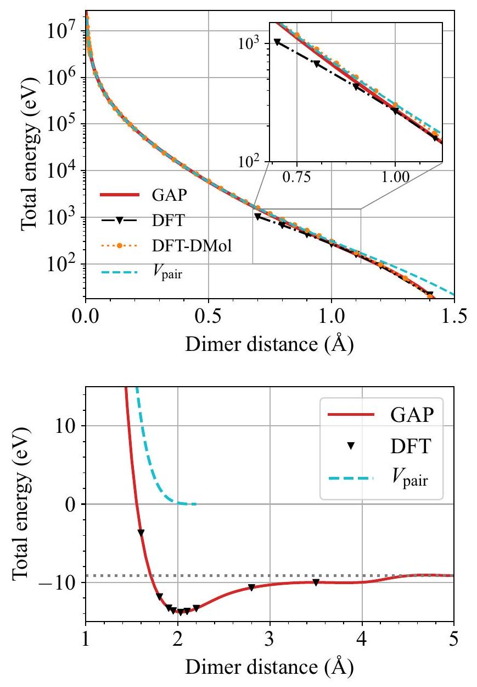
FIG. 1. Top: short-range repulsion of a W-W dimer given by our DFT, the all-electron DFT-DMol data [38], the screened Coulomb potential $V_{\text {pair }}$, and the trained GAP. The inset highlights the divergence of DFT compared to DFT-DMol at around $1 \AA$, which is used when sampling structures for the training database. Bottom: The near-equilibrium part of the dimer curve.

The screened Coulomb potential is forced to zero by the cutoff function

$$
f_{\text {cut }}(r)= \begin{cases}1, & r \leqslant r_{1} \\ 1-\chi^{3}\left(6 \chi^{2}-15 \chi+10\right), & r_{1}<r<r_{2} \\ 0, & r \geqslant r_{2}\end{cases}
$$

where $\chi=\left(r-r_{1}\right) /\left(r_{2}-r_{1}\right)$. The cutoff range is chosen as $r_{1}=1 \AA$ and $r_{2}=2.2 \AA$, leaving the near-equilibrium bond energies to be fully machine-learned. The cutoff function is the same as in Ref. [40] and is continuous at the end-points up to the second derivative. In practice, $V_{\text {pair }}$ is tabulated and provided as input when training the GAP.

## III. COMPUTATIONAL DETAILS

The DFT training structures were calculated using VASP [41-44] and the PBE GGA exchange-correlation functional [45]. The $145 s^{2} 5 p^{6} 5 d^{4} 6 s^{2}$ electrons were treated as valence electrons with the core electrons accounted for by the projector-augmented wave (PAW) method [46,47] (the W_sv PAW potential in VASP 5.4.4). The plane-wave cutoff energy
was 500 eV and the Brillouin zone was integrated using Monkhorst-Pack grids [48] with a consistent spacing between $k$-points for all cell sizes (using KSPACING $=0.15 \AA^{-1}$ in VASP, resulting in, e.g., a $5 \times 5 \times 5$ grid for a 54-atom conventional bcc cell). A smearing of 0.1 eV by the first-order Methfessel-Paxton method [49] was applied to help the convergence. The same settings were used for both the training and validation data.

The GAP was trained using QUIP [50]. All molecular dynamics simulations were performed using lammps [51] compiled with QUIP for GAP support [50]. Phonon dispersion, nudged elastic band (NEB), and molecular statics calculations were performed within the atomic simulation environment (ASE) framework [52]. For calculations within the quasiharmonic approximation, we used the PHONOPY code [53].

## IV. TRAINING

Fitting an interatomic potential suitable for all aspects of radiation damage is a challenging task. The potential must be able to reproduce a wealth of properties and atomic geometries that might be encountered during the evolution of a collision cascade and the subsequent recrystallization of the molten cascade core. Among the most important properties are the energy landscape and relative stability of various defects, from single vacancies and self-interstitial atoms (SIAs) to defect clusters. The potential must also reproduce realistic short-range dynamics defined by the repulsive part of the potential. Additionally, melting and recrystallization as well as the structure of the liquid phase at various densities should be well described, to reproduce a realistic atomic mixing during the heat spike of a collision cascade. Furthermore, if surface irradiation is of interest, the energetics of perfect and damaged surfaces must be considered. No single existing potential is able to capture all of these aspects, and it is our goal to construct a training database of structures that captures all of the above-mentioned properties. Previously, Szlachta et al. trained a GAP for tungsten [54] that excellently reproduces the properties of screw dislocations and vacancies. It was not, however, trained to self-interstitial atoms or the liquid phase and did not include a realistic repulsive potential, and is therefore not applicable to radiation damage simulations.

Table II lists the types of structures included in the training database. The isolated atom is included to reproduce the correct cohesion. The elastic response of body-centered cubic (bcc) tungsten was trained using randomly distorted unit cells. Part of these structures were taken from the training data of the previous W GAP [54]. As we are interested in physics far from equilibrium, we included unit cells with large elastic distortions (with volumes up to about $\pm 30 \%$ of the equilibrium volume). Similar elastically and randomly distorted unit cells were prepared for the face-centered cubic (fcc), hexagonal close packed (hcp), A15, C15, diamond cubic, and simple cubic crystal structures. These serve to expose the GAP to additional high-symmetry atomic environments.

Finite-temperature lattice vibrations were accounted for by including snapshots from MD simulations at 1000 K with three different volumes. The MD simulations were performed using an early version of our GAP, trained only to a small initial part of the training database. The structures containing

TABLE II. Structures included in the training database. $N_{\mathrm{s}}$ is the number of each structure type, $N_{\text {atoms }}$ is the number of atoms in each structure, $N_{\text {atoms }}^{\text {tot }}$ is the total number of atoms of a given structure type, and $N_{\text {rep. }}$ the number of representative atoms picked for the SOAP descriptor.
| Structure type | $N_{\mathrm{s}}$ | $N_{\text {atoms }}$ | $N_{\text {atoms }}^{\text {tot }}$ | $N_{\text {rep. }}$ |
| :--- | :--- | :--- | :--- | :--- |
| Isolated atom | 1 | 1 | 1 | 1 |
| Dimer | 13 | 2 | 26 | 13 |
| Distorted bcc unit cells | 2496 | 1-2 | 2996 | 69 |
| Distorted other crystals: |  |  |  |  |
| fcc | 100 | 1 | 100 | 35 |
| hcp | 100 | 2 | 200 | 24 |
| A15 | 100 | 8 | 800 | 141 |
| C15 | 100 | 6 | 600 | 142 |
| dia | 100 | 2 | 200 | 66 |
| sc | 100 | 1 | 100 | 59 |
| High- $T$ bcc | 20 | 54 | 1080 | 23 |
| Vacancies: |  |  |  |  |
| single vacancy | 200 | 53 | 10600 | 201 |
| divacancies | 10 | 118 | 1180 | 25 |
| trivacancies | 15 | 117 | 1755 | 46 |
| Self-interstitials (SIAs): |  |  |  |  |
| single SIAs | 32 | 121 | 3872 | 113 |
| di-SIAs | 15 | 122, 252 | 2350 | 93 |
| bcc surfaces |  |  |  |  |
| (100) | 45 | 12 | 540 | 27 |
| (110) | 45 | 12 | 540 | 9 |
| (111) | 43 | 12 | 516 | 50 |
| (112) | 45 | 12 | 540 | 34 |
| Liquids | 46 | 128 | 5760 | 1937 |
| Disordered surfaces | 24 | 128, 144 | 3264 | 461 |
| Short-range | 100 | 53-55 | 5390 | 431 |
| All | 3749 |  | 42410 | 4000 |

a single vacancy were taken from [54] (although only half of them were used in training while the other half were left for validation). We also added various divacancy and trivacancy structures to provide better transferability to clusters of multiple vacancies. Furthermore, we prepared SIAs in the common high-symmetry configurations in bcc: $\langle 111\rangle,\langle 110\rangle$, and $\langle 100\rangle$ dumbbells, and atoms in the octahedral and tetrahedral sites.

We checked how well a GAP trained only to single SIAs is able to predict the formation energies of clusters of multiple SIAs. While parallel dumbbell clusters were sufficiently well reproduced, it was not able to predict the relative stability of nonparallel SIA clusters. For example, the formation energies of the triangular <110> di-SIA and SIA clusters in the C15 Laves phase (both of which are ground-state SIA configurations in Fe but not in W [55]), were underestimated and therefore too stable. To correct this, we added structures containing two SIAs to the training database, including parallel and nonparallel dumbbells, and in the form of the smallest possible C15 cluster [55,56]. After adding di-SIAs to the training database, we found that the GAP is able to predict the energies of larger clusters in excellent agreement with DFT, as will be discussed later. All of the above-mentioned vacancy and SIA structures were sampled from MD simulations at $500-1000 \mathrm{~K}$ using an early version of the GAP. We note that several of the

SIA structures did not remain stable during the MD preparation simulations (for example, the $\langle 110\rangle$ and $\langle 100\rangle$ SIAs rotate towards the $\langle 111\rangle$ configuration). We included several of these unstable, rotating SIA configurations in the training database to capture various migration and rotation paths.

Liquid structures were added iteratively until the predicted errors of newly prepared structures were below around $10 \mathrm{meV} /$ atom. The first few liquid structures were prepared in MD simulations using the existing W GAP [54]. An initial GAP version trained to these structures was then used to run MD and sample additional liquid structures. We considered a range of different densities around the experimental density of liquid tungsten $17.6 \mathrm{~g} / \mathrm{cm}^{3}$ [57], including clearly unphysical low-density liquids to ensure that the GAP does not stabilize any spurious low-density structures. We also included halfmolten structures to capture the melting process.

Low-index bcc surface structures were taken from Ref. [54] ((111) surfaces from Ref. [58]). Additionally, to make our GAP applicable to surface irradiation and improve the transferability to arbitrary surface structures, we also included damaged and half-molten (110) and (100) surfaces. These structures were prepared by high-temperature MD simulations using an early version of the GAP that was trained to most of the remaining database, including all liquid structures and the clean surfaces.

To ensure a physically reasonable and smooth dissociation of atoms as well as to guide the repulsive potential fit, we include energies and forces from the dimer dissociation curve. Figure 1 shows the dimer curve as given by our DFT calculations, compared with all-electron DFT data obtained by the DMol code [38]. Our DFT results, which treats the core-electrons as frozen with the PAW formalism, are in good agreement with the all-electron DFT-DMol data down to about $1 \AA$, below which there is a clear divergence from DFT-DMol. Hence, we only include dimer distances larger than $1.1 \AA$ in the training database, for which the DFT data closely overlaps with DFT-DMol and the fitted $V_{\text {pair }}$. This ensures a smooth connection between the trained GAP and $V_{\text {pair }}$, as the GAP is trained to predict negligible energies and forces for interatomic distances below $1.1 \AA$. The behavior of the GAP at short interatomic distances is further investigated in the Appendix.

For capturing the short-range many-body dynamics in bcc tungsten encountered in collision cascades, we prepared various bcc crystals with a randomly added interstitial atom (called "short-range" in Table II). The shortest allowed distance between the added atoms and its neighbors was $1.1 \AA$, corresponding to the lower limit of the range where DFT with frozen core-electrons is accurate, as discussed above. A rich variety of short-range environments was captured by adding the randomly placed atom to both perfect crystalline structures, and systems containing one or two vacancies. In part of the vacancy structures, the atom was inserted in a random position around the vacancy. Hence, in addition to sampling the nonequilibrium geometries similar to the early stages of an energetic recoil event, these structures also capture arbitrary vacancy migration paths.

The entire training database contains around 40,000 local atomic environments, which is considerably fewer than many
previous single-element GAPs [36,54,58]. Indeed, we aimed to keep the training database relatively small in anticipation of re-using the same structures for other nonmagnetic bcc metals and as a basis for alloy potentials. For this reason, we decided to omit structures related to screw dislocations and gamma surfaces, which made up a large fraction of the training database for the previous tungsten GAP [54] and the iron GAP [58].

When training the GAP, different weights are assigned to different structure types through the regularization parameters $\sigma_{\nu}$. For liquids, short-range, and the dimer structures we used $\sigma_{v}^{\text {energy }}=10 \mathrm{meV} /$ atom, $\sigma_{v}^{\text {force }}=0.4 \mathrm{eV} / \AA$. For disordered surfaces $\sigma_{\nu}^{\text {energy }}=10 \mathrm{meV} /$ atom, $\sigma_{\nu}^{\text {force }}=0.2 \mathrm{eV} / \AA$, and for all other structures $\sigma_{v}^{\text {energy }}=1 \mathrm{meV} /$ atom, $\sigma_{v}^{\text {force }}= 0.04 \mathrm{eV} / \AA$. Virial stresses were only trained for the distorted crystal unit cells, using $\sigma_{v}^{\text {virial }}=0.04 \mathrm{eV}$. The resulting root-mean-square errors (RMSE) of the training data are consistent with the assumed uncertainties, being well below 1 $\mathrm{meV} /$ atom and $0.1 \mathrm{eV} / \AA$ for most crystalline structures, and a few meV /atom and around $0.3-0.4 \mathrm{eV} / \AA$ for the liquid and short-range structures.

## V. VALIDATION

In the following sections we present results from benchmarking of the GAP, including properties that by design are well-represented by the training database, as well as properties that were not specifically targeted in the construction of the training data. We attempt to highlight both the strengths and shortcomings of the GAP, to demonstrate the applications for which the GAP is well-suited, but also applications where an extension of the training database would be necessary. The results are compared with experimental data when possible, with DFT data from the literature when indicated as such, and with our own DFT results otherwise.

## A. Bulk properties

Basic properties of bcc tungsten are compiled in Table III. All listed properties are well-represented by the training database, and therefore in close agreement with DFT. We note that the vacancy formation energy is surprisingly sensitive to the size of the box in DFT, even though elastic interactions across the periodic boundaries are negligible [63] and the $k$-point density is the same. With a box of 53 atoms we obtain a formation energy of 3.36 eV , while a box of 120 atoms gives 3.22 eV . Almost identical values have been reported previously [62,63] ( 3.35 for a 53 -atom box and 3.22 for a 127 -atom box). Since our training database contains structures of different sizes, the GAP reproduces a value in-between these two values (regardless of box size).

Figure 2 shows energy-volume curves of various crystal structures. All of these crystals were included in the training database (although only as randomly distorted cells) and the GAP therefore accurately reproduce the DFT data. The only visible discrepancies are for strongly expanded fcc and hcp lattices ( $>20 \AA^{3} /$ atom ).

To further explore the transferability of the GAP to crystal symmetries not included in the training database, we considered four different volume-conserving deformation paths of

TABLE III. Basic properties of bcc tungsten: energy per atom $E_{\text {bcc }}$, cohesive energy $E_{\text {coh }}$, lattice constant $a$, bulk modulus $B$ and elastic constants $C_{i j}$, (110) surface energy $E_{\text {surf }}$, vacancy formation energy $E_{\mathrm{f}}^{\text {vac }}$, vacancy relaxation volume $\Omega_{\text {rel. }}^{\text {vac }}$, vacancy migration energy $E_{\text {mig. }}^{\text {vac }}$, lowest SIA formation energy $E_{\mathrm{f}}^{\text {SIA }}$, SIA migration energy (main path) $E_{\text {mig. }}^{\text {SIA }}$, and melting temperature $T_{\text {melt }}$.
|  | Exp. | DFT | GAP |
| :--- | :--- | :--- | :--- |
| $E_{\text {bcc }}$ (eV/atom) |  | -12.956 | -12.956 |
| $E_{\text {coh }}(\mathrm{eV} /$ atom $)$ | -8.81 ${ }^{\text {a }}$ | -8.39 | -8.39 |
| $a(\AA)$ | $3.165{ }^{\text {a }}$ | 3.1854 | 3.1852 |
| $B(\mathrm{GPa})$ | $310{ }^{\mathrm{a}}$ | 304 | 309 |
| $C_{11}(\mathrm{GPa})$ | $522{ }^{\text {a }}$ | 522 | 526 |
| $C_{12}(\mathrm{GPa})$ | $204{ }^{\text {a }}$ | 195 | 200 |
| $C_{44}(\mathrm{GPa})$ | $161{ }^{\text {a }}$ | 148 | 149 |
| $E_{\text {surf }}\left(\mathrm{meV} / \AA^{2}\right)$ | $187{ }^{\text {b }}, 203{ }^{\text {b }}$ | 204 | 204 |
| $E_{\mathrm{f}}^{\text {vac }}(\mathrm{eV})$ | $3.67 \pm 0.2^{\text {c }}$ | $3.36{ }^{\text {d }}$, $3.22{ }^{\text {e }}$ | 3.32 |
| $\Omega_{\text {rel. }}^{\text {vac }}$ |  | $-0.36^{\mathrm{d}},-0.33^{\mathrm{e}}$ | -0.31 |
| $E_{\text {mig. }}^{\text {vac }}(\mathrm{eV})$ | $1.7-1.9^{\mathrm{c}, \mathrm{f}}$ | $1.73^{\mathrm{g}}$ | 1.71 |
| $E_{\mathrm{f}}^{\text {SIA }}(\mathrm{eV})$ |  | $10.25{ }^{\text {h }}$ | 10.34 |
| $E_{\text {mig. }}^{\text {SIA }}(\mathrm{eV})$ | <0.1 ${ }^{\text {f }}$ | $0.040{ }^{\mathrm{i}}$ | 0.038 |
| $T_{\text {melt }}(\mathrm{K})$ | $3687{ }^{\text {a }}$ | $3450 \pm 100^{\mathrm{j}}$ | $3540 \pm 10$ |

${ }^{\mathrm{a}}$ Ref. [57],
${ }^{\mathrm{b}}$ Ref. [59],
${ }^{\mathrm{c}}$ Ref. [60],
${ }^{\mathrm{d}} 53$ atoms,
${ }^{\mathrm{e}} 120$ atoms,
${ }^{\mathrm{f}}$ Ref. [61],
${ }^{\mathrm{g}}$ Ref. [62],
${ }^{\mathrm{h}}$ Ref. [63],
${ }^{\mathrm{i}}$ Ref. [64],
${ }^{\mathrm{j}}$ Ref. [65].
the bcc crystal. The tetragonal path (also called the Bain path) is perhaps the most well-known path, in which a bcc crystal is stretched along the [100] direction and simultaneously compressed in [010] and [001], leading to the fcc symmetry and eventually the body-centred tetragonal (bct) crystal. For

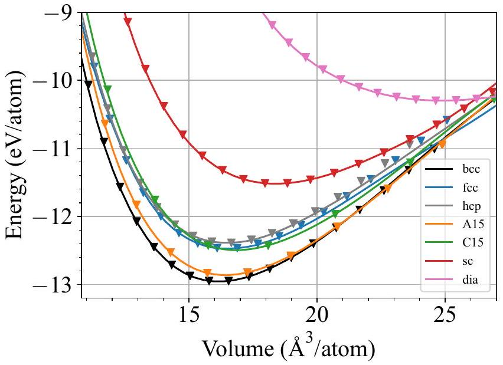
FIG. 2. Energy-volume curves of the various crystal structures included in the training database. The data points are DFT data and the solid lines are the GAP predictions.

the trigonal path, the bcc crystal is stretched along the [111] direction and compressed in $[1 \overline{1} 0]$ and $[11 \overline{2}]$, reaching the simple-cubic symmetry and eventually fcc again. The orthorhombic deformation path involves stretching in the [001] direction while compressing in [110]. Finally, twinning and antitwinning involves shearing a primitive bcc lattice in $[\overline{1} \overline{1} 1]$ (positive strains for twinning and negative strains for antitwinning) and can be used to measure the theoretical shear strength of single crystals [66]. The energy difference for each of these deformation paths are shown in Fig. 3, where the GAP results are compared with our DFT data. The values of $c / a$ and $p$ correspond to the magnitude of the strains. For more details about the various deformation paths, we refer to Refs. [67-69]. For the most part, GAP is indistinguishable from DFT, with the only notable exceptions being underestimating the antitwinning energy and the high-strain tail of the trigonal path. Note that all deformation paths correspond to strains far beyond the maximum strains of the training structures.

Figure 4 shows the phonon dispersion of bcc tungsten compared with experimental data and previous DFT studies [54,70,71]. The dispersion relation is overall well-reproduced by the GAP, although subtle discrepancies exist, in particular between the H and P points and at the N point. It remains unclear what causes these differences between GAP and DFT, which were also observed in the previous tungsten GAP [54] (the phonon dispersions in both GAPs are virtually identical).

The linear thermal expansion and the associated expansion coefficient ( $\alpha_{L}$ ) of bcc tungsten as predicted by the GAP is shown in Fig. 5, and compared with experimental measurements from Ref. [72] and our DFT results. The expansion is calculated with the reference temperature set to room temperature ( 300 K ), as in the experimental data. GAP data is obtained by two different methods; MD simulations in the NPT ensemble, and calculations within the quasiharmonic approximation (QHA) using the PHONOPY code [53]. The latter includes zero-point energies and is accurate at low temperatures, but eventually fails when anharmonic effects beyond the QHA become nonnegligible. However, MD fails at low temperatures but is reliable at temperatures when zeropoint energies are negligible. Figure 5 shows that the experimentally measured low-temperature trend is well-captured by both GAP and DFT when combined with the QHA. Figure 5 also suggests that the QHA is valid up to around 1000 K , while MD with the GAP is consistent with the experimental trend at temperatures above 300 K . The thermal expansion coefficients at room temperature are listed in Table IV, along with heat capacities and the Grüneisen parameter. The experimental heat capacity is well-reproduced by both GAP and DFT. DFT overestimates the experimental room-temperature thermal expansion coefficient and Grüneisen parameter by about $10 \%$, and GAP by about $15 \%$.

Figure 6 shows the elastic constants of bcc W at finite temperatures as predicted by the GAP. The results are compared to the experimental least-squares fits from Ref. [74], measured for single crystals up to around 2000 K . The uncertainties of the experimental curves are shown as shaded areas. The GAP elastic constants are extracted from the average stress tensor of constant-temperature MD simulations of distorted bcc systems containing 1024 atoms. The error bars are given by the standard deviation of the values obtained for equivalent

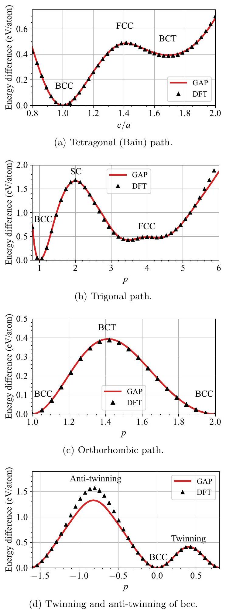
FIG. 3. Volume-conserving deformation paths of bulk W computed with GAP and DFT.

elastic constants (e.g., $C_{11}, C_{22}$, and $C_{33}$ ). The experimental trends are qualitatively well reproduced by the GAP, although quantitative differences are apparent. Both $C_{11}$ and $C_{44}$ decrease at increasing temperatures, while $C_{12}$ remains almost constant at low temperatures and increases slightly at higher temperatures. The weak temperature dependence of $C_{12}$ is

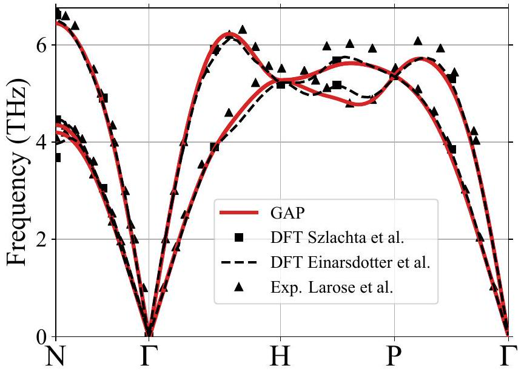
FIG. 4. Phonon dispersion of bcc W as given by the GAP and compared with DFT [54,70] and experimental data [71].

reproduced by the GAP, although the uncertainties in both experiments and MD are larger than for the other elastic constants. The softening of the bulk modulus in DFT can be estimated from finite-temperature free energy-volume curves calculated in the quasiharmonic approximation. Results for both DFT and the GAP coupled with the QHA are shown for the bulk modulus in Fig. 6. Note that as previously mentioned, the QHA is only reliable up to around 1000 K . The good agreement between GAP and DFT for the bulk modulus indicate that the quantitative discrepancies between experiments and GAP are mainly inherited from DFT, as both GAP and DFT predict a slightly stronger temperature dependence of the bulk modulus than experiments.

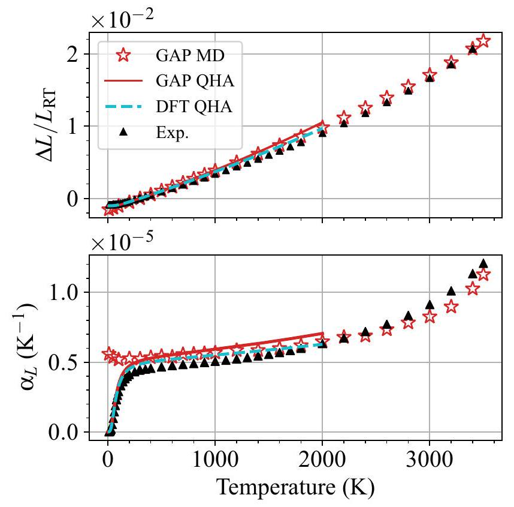
FIG. 5. Linear thermal expansion (top) and the expansion coefficient (bottom) of bcc W predicted by the GAP and compared with experimental results [72]. GAP data is obtained from both MD simulations and by using the quasiharmonic approximation (QHA).

TABLE IV. Heat capacities ( $C_{P}, C_{V}$ ), linear thermal expansion coefficient $\left(\alpha_{L}\right)$, and Grüneisen parameter $(\gamma)$ at 300 K , calculated within the quasiharmonic approximation with GAP and DFT, and compared with experimental data.
|  | Exp. | DFT | GAP |
| :--- | :---: | ---: | ---: |
| $C_{P}\left(\mathrm{~J} \mathrm{~mol}^{-1} \mathrm{~K}^{-1}\right)$ | $24.35^{\mathrm{a}}$ | 23.95 | 23.98 |
| $C_{V}\left(\mathrm{~J} \mathrm{~mol}^{-1} \mathrm{~K}^{-1}\right)$ | $24.20^{\mathrm{a}}$ | 23.77 | 23.77 |
| $\alpha_{L}\left(10^{-6} \mathrm{~K}^{-1}\right)$ | $4.43^{\mathrm{b}}$ | 4.87 | 5.10 |
| $\gamma$ | $1.6^{\mathrm{a}}$ | 1.80 | 1.87 |

${ }^{\mathrm{a}}$ Ref. [73],
${ }^{\mathrm{b}}$ Ref. [72].
For validating that we sampled enough liquid structures, we performed a form of $k$-fold cross validation (with $k=5$ ). That is, we split the 45 liquid structures into five subsamples, with each part containing liquids with different densities. Five

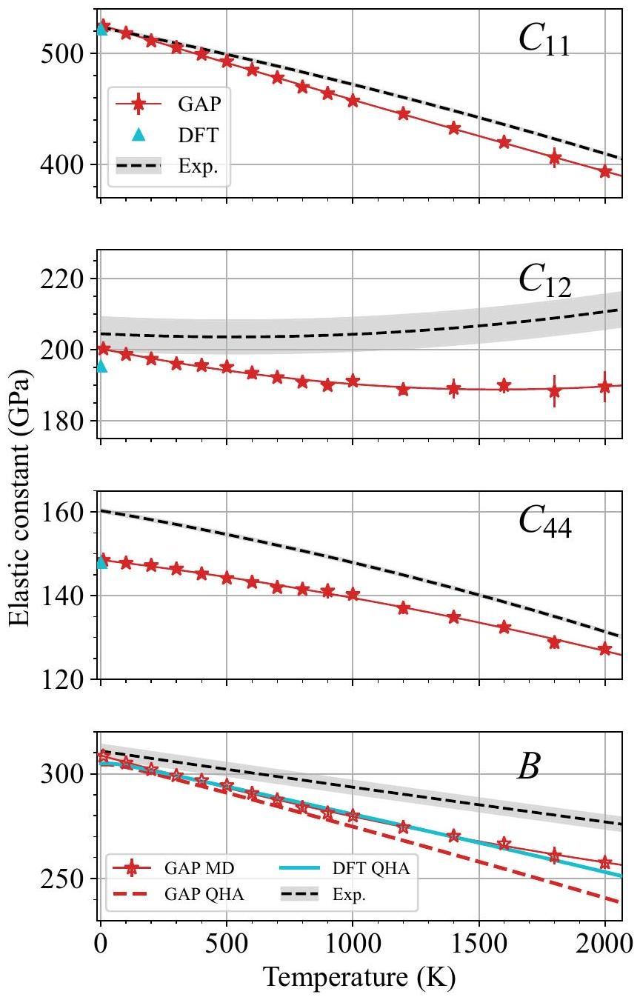
FIG. 6. Elastic constants and bulk modulus of bcc W as functions of temperature. Experimental data are from Ref. [74]. GAP data for the bulk modulus is obtained from both MD simulations and by using the quasiharmonic approximation (QHA). DFT data are shown at 0 K for the elastic constants and as obtained by the QHA for the bulk modulus. The solid lines connecting the GAP points are polynomial fits to guide the eye.

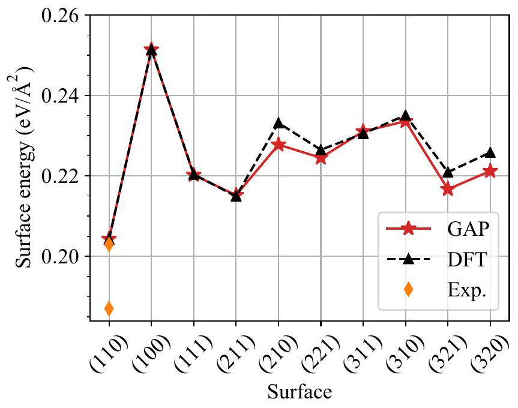
FIG. 7. Surface energies predicted by the GAP and compared with DFT. Only the first four surfaces were included in the training database. The experimental values are from Ref. [59].

different GAP models were then trained using four of the subsamples together with the rest of the training database, while for each model leaving out a different liquid subsample for validation. The mean root-mean-square errors for the energy and forces of the validation subsamples for the five GAP models are $7.76 \mathrm{meV} /$ atom and $0.434 \mathrm{eV} / \AA$. These values are close to the assumed uncertainties, $\sigma_{\nu}$, used when training the GAP ( $10 \mathrm{meV} /$ atom and $0.4 \mathrm{eV} / \AA$ ). This provides confidence that the GAP reproduces the energies and forces of any liquid structure with sufficient accuracy.

We simulated the melting temperature predicted by the GAP using the solid-liquid interface method. At 3540 K , the solid and liquid phases remains roughly in equilibrium, while at 3550 K the entire system melts and at lower temperature it recrystallizes. The estimated melting temperature of 3540 K is slightly lower, but very close to the experimental value of 3687 K [57]. Wang et al. [65] used vaSP with comparable settings to our training data (PBE functional and hard PAW potential), and estimated a melting point of $3450 \pm 100 \mathrm{~K}$ using two different methods. This is in line with the GAP prediction of 3540 K , which confirms that the GAP reproduces melting with DFT accuracy. Hence, the slight underestimation compared to experiments can be attributed to the accuracy of DFT with the PBE functional.

## B. Surface properties

We calculated surface energies of 10 surfaces with DFT to test how transferable the GAP is to surfaces not included in the training database. A comparison between GAP and DFT is shown in Fig. 7, where only the first four low-index surfaces were included in the training database. The GAP successfully predicts surface energies in close agreement with DFT, with the largest discrepancies within $5 \mathrm{meV} / \AA^{2}$ of the DFT values. The order of stability is also for the most part reproduced by the GAP, although, e.g., the (321) surface is incorrectly lower in energy than the (111) surface. The ability to reproduce accurate surface energies is a clear improvement over

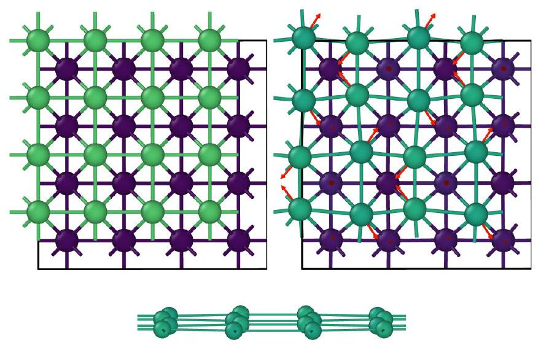
FIG. 8. Reconstruction of the (100) surface. Top left: initial unrelaxed surface, top right: reconstructed surface. Only the top two surface layers are shown and atoms are coloured according to height, so that atoms in the top layer are green and atoms in the second layer purple. Red arrows show the direction of the displacement vectors with respect to the unrelaxed surface. The bottom figure shows a side-view of the zigzag surface layer.

traditional analytical potentials, which consistently underestimate surface energies and fail to reproduce the correct order of stability [23].

We also confirmed that the GAP reproduces the DFTobserved displacements along the surface normal during relaxation of the most common surfaces. Relaxation of the most stable (110) surface involves a small shift ( $-0.07 \AA$ ) of the topmost layer down toward the bulk. For the (111) surface in both the GAP and DFT, the topmost atomic layer is relaxed by $-0.27 \AA$, the second layer by $-0.08 \AA$ and the third layer by $0.14 \AA$ compared to the initial bulk lattice spacing. The (112) surface undergoes a subtle spontaneous reconstruction. In both DFT and the GAP, the topmost layer is laterally displaced by $0.1 \AA$ in the [111] direction during relaxation ( $0.06 \AA$ with respect to the second surface layer and $0.11 \AA$ with respect to the third). This is in excellent agreement with the experimentally observed lateral [111] shift of $0.1 \AA$ [75].

For the (100) surface, there is an experimentally and theoretically observed reconstruction, in which the atoms in the surface layer are shifted laterally by a small distance, resulting in zigzag rows of atoms [76,77]. This reconstruction does not occur spontaneously in either DFT or the GAP when optimizing the atom positions, and is not explicitly included in the training database. Nevertheless, since our GAP is trained to various disordered or half-molten surface structures (the purpose of which is to at least qualitatively capture arbitrary surface properties), it is a good test to investigate whether it is able to reproduce the (100) reconstruction. Indeed, upon heating and quenching a (100) surface in MD simulations with the GAP, the (100) surface reconstructs in the way described above. Figure 8 shows snapshots of the initial and reconstructed surfaces. The lateral displacement of the surface atoms in the reconstructed layer is about $0.2 \AA$ in the $\langle 11\rangle$ direction in the surface plane, which is slightly below the DFT-obtained $0.28 \AA$ [78] but coincidentally in better agreement with the experimental value $0.24 \AA$ [77]. The surface

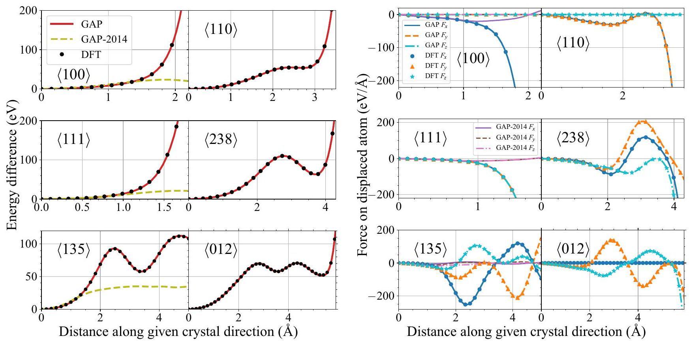
FIG. 9. Total energy difference (left) and force components (right) for stepwise movement of one atom along various crystal directions in bcc W. None of the structures along these specific paths were included in the training database. Results using a previous GAP [54], not trained to any repulsive data, are shown for a few crystal directions for comparison.

energy of the relaxed reconstructed surface is about $3 \mathrm{meV} / \AA^{2}$ lower than for the perfect ( 100 ) surface.

To further test the GAP for surface properties, we carried out NEB calculations for the main migration paths of adatoms on the (110) and (100) surfaces (adatom-hopping between adjacent ground state adsorption sites, and the exchange migration as discussed in, e.g., Ref. [79]). The tests revealed that while the GAP reproduces the correct stable adsorption sites, the migration paths are systematically underestimated by about $20-30 \%$ compared to the DFT values from Ref. [79]. For example, the main migration mechanism of adatoms on the (110) (hopping between adjacent longbridge sites) has a barrier of 0.87 eV according to DFT [79], while GAP predicts a barrier of 0.6 eV . For the exchange mechanism, the comparison is 3.09 eV by DFT and 2.5 eV by GAP. Hence, the GAP does reproduce the correct adatom behavior in terms of stable sites and migration mechanisms, but would require an extension of the training database to achieve quantitative agreement with DFT (by, e.g., adding various stable and unstable adatom structures to the training data). Nevertheless, we conclude that including the disordered surface structures in the training database achieved our goal of qualitatively capturing the correct behavior of damaged surfaces.

## C. Repulsive potential

The short-range many-body behavior relevant for cascade simulations was tested by statically moving an atom along various crystal directions in the bcc lattice. The difference in total energy and the force components of the moving atom were calculated in both GAP and DFT. Only the interatomic range for which DFT is still accurate, as discussed previously,
was sampled (down to about $1.1 \AA$ or $100-200 \mathrm{eV}$ energy differences). Figure 9 shows the obtained curves for six different crystal directions. Several more directions were sampled with similar results, and therefore not shown here. The agreement between GAP and DFT is excellent. Considering that none of the points shown in Fig. 9 were included in the training database, we are confident that the GAP reproduces any short-range forces and energies encountered in cascade simulations with DFT accuracy. Figure 9 also includes results using the previous tungsten GAP [54], demonstrating the poor extrapolation of GAP when repulsive interactions are not considered during training.

To test the short-range part of the GAP in dynamic simulations, we simulated the threshold displacement energy (TDE) surface according to the methods described in Ref. [81]. The simulations were performed at 0 K . We also simulated a few directions in a sample equilibrated at 40 K for comparison, but found that the minimum values for a given direction remained the same as for 0 K . Hence, we report the results obtained at 0 K , for which we can exploit the full symmetry of the lattice when sampling directions. The crystal directions were sampled uniformly over the symmetry-reduced sphere at $5^{\circ}$ intervals. We used a noncubic simulation box of 4368 atoms. The increment in kinetic energy was 4 eV . After obtaining the full angular map of TDEs, we sampled additional directions close to the low-index directions with a lower increment of 1 eV to obtain more exact TDE values for comparison with experiments.

Figure 10 shows the angular map of the threshold displacement energies obtained at 0 K with the GAP. The global average of the uniformly sampled directions is $106.2 \pm 5.6 \mathrm{eV}$. As expected based on experimental results [80], the minimum TDE values are found around the $\langle 100\rangle$ and $\langle 111\rangle$

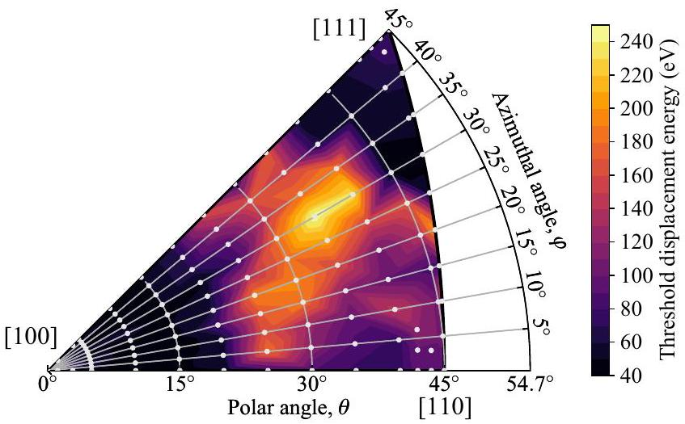
FIG. 10. Threshold displacement energies obtained with the GAP at 0 K . The colours are linearly interpolated between the (light gray) data points. The average value of the uniformly sampled points is $106.2 \pm 5.6 \mathrm{eV}$ and the minimum values 45.5 eV for the $\langle 100\rangle$ direction, 51.5 eV for $\langle 111\rangle$ and 78 eV for $\langle 110\rangle$, compared with the experimental values $42 \pm 1 \mathrm{eV}$ for $\langle 100\rangle$ and $44 \pm 1 \mathrm{eV}$ for $\langle 111\rangle$ [80].

directions. Experimental values are $42 \pm 1 \mathrm{eV}$ for $\langle 100\rangle$ and $44 \pm 1 \mathrm{eV}$ for $\langle 111\rangle$, obtained at a temperature $\leqslant 7 \mathrm{~K}$ [80]. In simulations, it is not obvious how to report the values for a given crystal direction due to the possibility of small angular deviations leading to large differences in the TDEs, either due the randomness of thermal and zero-point displacements or simply due to the anisotropy of the TDE surface [8,81]. In experiments, the electron beam is spreading in the sample, so the measurement always actually probes some angular interval around the principal direction. Without knowledge of the precise details of the experimental setup, it is very difficult to know what the magnitude of this spread is. In simulations, one has to choose a tolerance around the exact desired crystal direction (at 0 K with the GAP, the TDE at, e.g., exactly $\langle 100\rangle$ is significantly higher than a few degrees away from $\langle 100\rangle$ ). Using a $10^{\circ}$ tolerance, the minimum TDE values obtained with the GAP are $45.5 \pm 0.5 \mathrm{eV}$ for the $\langle 100\rangle$ direction and $51.5 \pm 0.5 \mathrm{eV}$ for $\langle 111\rangle$, slightly higher than the experimental values. However, allowing for a $15^{\circ}$ tolerance, the minimum around the $\langle 111\rangle$ direction becomes $47.5 \pm 0.5 \mathrm{eV}$, but remains the same for the $\langle 100\rangle$ direction. For the $\langle 110\rangle$ direction, GAP predicts a TDE of $78 \pm 2 \mathrm{eV}$. The $\langle 110\rangle$ direction was not accessible from the experimental measurements, but good fits to the measured data were obtained by assuming values in the $70-80 \mathrm{eV}$ range [80].

## D. Self-interstitial atoms and clusters

Defects in the form of vacancies and self-interstitial atoms and their clusters have been extensively studied by density functional theory calculations in the literature. In particular, the recent papers by Ma and Dudarev [62-64] provides a comprehensive database of the energetics of single vacancies and SIAs in bcc metals, while Alexander et al. [82] in detail studied the energetics of SIA clusters. Most conveniently, they also used VASP with very similar input as we used when constructing the training database (the only noteworthy difference being a 12 -electron PAW potential compared to 14 valence

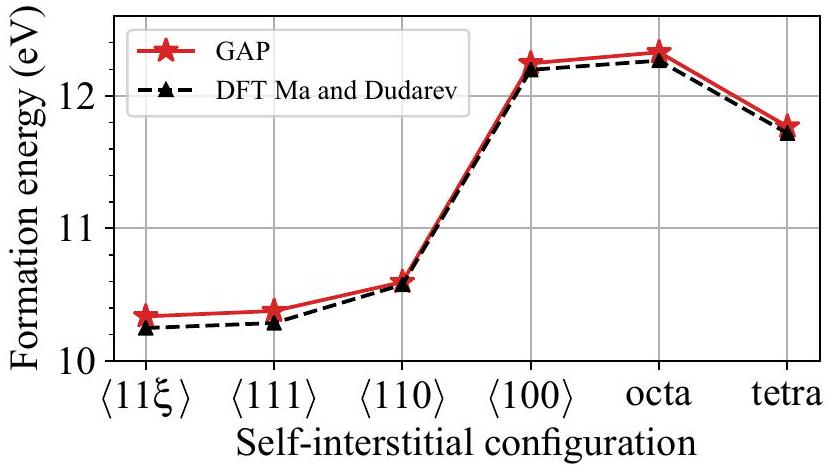
FIG. 11. Formation energies of self-interstitial atoms in bcc W. The formation energy of the ground-state $\langle 11 \xi\rangle$ is 10.34 eV in the GAP compared to 10.25 eV in DFT [63].

electrons in our DFT). Hence, we can rely on their results to be consistent with our training data and therefore use them to benchmark our GAP against defect properties.

Single SIAs have historically been thought to stabilize as straight $\langle 111\rangle$ dumbbells or crowdions, and migrate onedimensionally through sequences of subtle $\langle 111\rangle$ dumbbell-to-crowdion motion. However, it has been speculated [21] and recently thoroughly demonstrated [64], using DFT, that the most stable single SIA configuration in tungsten in fact is a tilted $\langle 11 \xi\rangle$ configuration, where $\xi$ is close to 0.5 . The difference in energy between the $\langle 11 \xi\rangle$ and the straight $\langle 111\rangle$ configuration is only 0.04 eV [64]. We did not explicitly include the $\langle 11 \xi\rangle$ configuration in the training structures. Nevertheless, as we did sample various rotating dumbbells when constructing the training database, the GAP successfully reproduces the $\langle 11 \xi\rangle$ configuration as the most stable single SIA. The difference in energy to the straight $\langle 111\rangle$ dumbbell is 0.04 eV , consistent with DFT. Figure 11 shows the formation energies of the common high-symmetry SIAs in bcc tungsten. The formation energies were calculated after minimizing the positions and stress of a noncubic box of 421 atoms, for which the elastic interactions across the periodic borders are minimal. The GAP formation energies are systematically around 0.1 eV higher than the DFT values from [63], except for the $\langle 110\rangle$ dumbbell. Consequently, the difference in energy between the $\langle 111\rangle$ and $\langle 110\rangle$ configurations is only 0.21 eV , compared to 0.29 eV by DFT. This is also visible in Fig. 12, and might have consequences in high-temperature simulations, as the frequency $\langle 111\rangle$-to- $\langle 110\rangle$ rotations will be overestimated. Despite efforts, we were not successful in eliminating this anomaly, which might be a consequence of the relatively small systems ( 121 atoms) included in the training database.

Figure 12 shows the main migration barriers of single SIAs calculated with the NEB method. The minimum along the $\langle 110\rangle$-to- $\langle 111\rangle$ rotation corresponds to the $\langle 11 \xi\rangle$ configuration, with $\xi$ just above 0.5 in both GAP and DFT. Figure 12(b) shows the expected zigzag migration path of a [11ξ] SIA toward an adjacent [1 $\xi 1$ ] position [64]. The GAP reproduces this migration barrier in excellent agreement with DFT. In addition to the static NEB calculations, we used the GAP to observe the migration of single SIAs in molecular dynamics simulations at low temperatures. We confirmed that it adopts

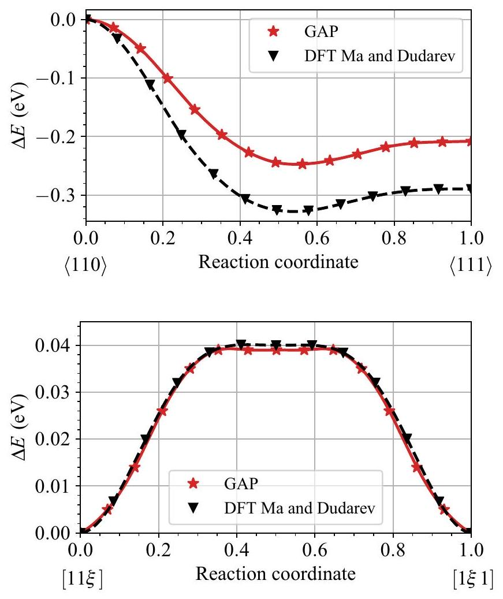
FIG. 12. Top: Energy difference for a $\langle 110\rangle$ dumbbell SIA rotating to the $\langle 111\rangle$ direction, passing through the global minimum $\langle 11 \xi\rangle$. Bottom: migration path between adjacent $\langle 11 \xi\rangle$ configurations along the $\langle 111\rangle$ direction. DFT data are from Ref. [64].

the $\langle 11 \xi\rangle$ symmetry and migrates in a one-dimensional zigzaglike manner along the path shown in Fig. 12(b), consistent with the DFT-based predictions discussed in Ref. [64].

Most existing interatomic potentials for radiation damage are fitted so that single SIAs are described well. However, it should also be transferable to larger clusters that readily form in, e.g., collision cascade simulations. We found that fitting only single SIAs does not guarantee transferability to larger clusters, and that di-SIAs (both parallel and nonparallel dumbbell configurations) must be included in the training database. For tungsten, the majority of existing potentials struggle to reproduce the correct trend of the relative stability of clusters of multiple SIAs. For example, several widely used EAM potentials predict dislocation loops with the Burgers vector $\langle 100\rangle$ to be lower in energy than the $1 / 2\langle 111\rangle$ loops [5], which is in clear contradiction to DFT [82] and experimental observations [83,84]. We therefore put particular focus on ensuring that our GAP reproduces the expected trend obtained by DFT .

Figure 13 shows formation energies of parallel $\langle 111\rangle$ and <100> SIA clusters (i.e., dislocation loops) compared between the GAP and DFT data from Ref. [82]. $1 / 2\langle 111\rangle$ clusters are created by inserting parallel dumbbells with a (110) habit plane and $\langle 100\rangle$ with a (100) plane, as in Ref. [82]. We also include the C15 clusters, which for small sizes have energies between the two dislocation loops. Overall, the GAP data closely overlaps with the DFT data across the entire DFT size range.

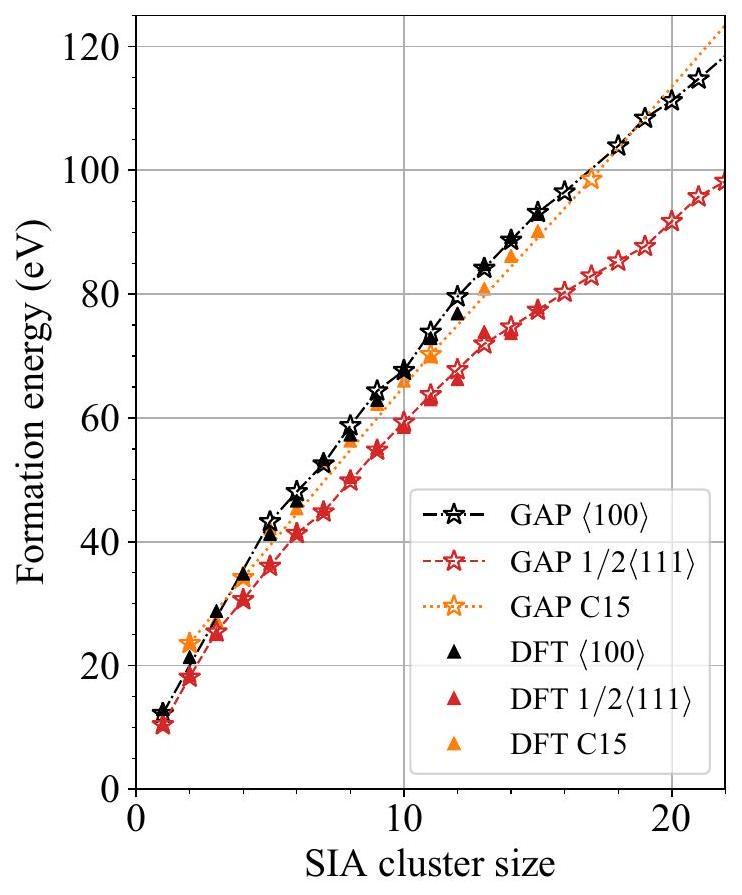
FIG. 13. Formation energies of self-interstitial clusters in W compared between GAP and DFT data from Ref. [82]. Note that only sizes 1 and 2 were fit, so all the other data points serve as tests of the potential.

## E. Vacancies and vacancy clusters

The vacancy formation energy and the vacancy migration barrier given by the GAP are consistent with DFT, as seen in Table III. This is expected as both of these properties are well-represented by the training structures. The binding of divacancies is a peculiar feature of tungsten and some other bcc transition metals. DFT predicts that the binding energy of the second-nearest neighbor ( 2 NN ) divacancy is strongly repulsive, while other NN separations provide either weakly binding or weakly repulsive configurations, as shown in Fig. 14. Reproducing this behavior has presented a challenge

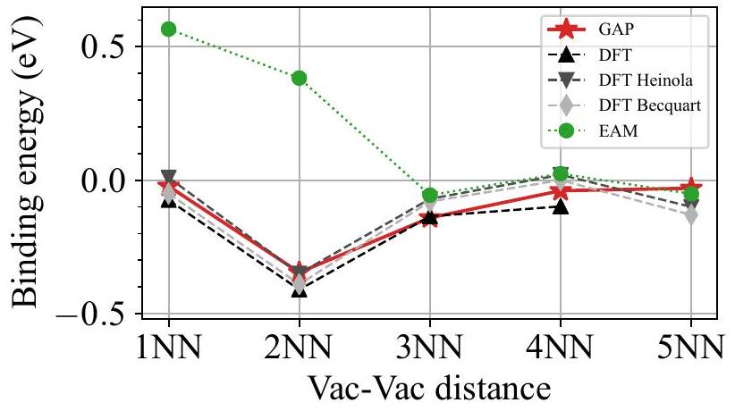
FIG. 14. Binding energies of a divacancy in bcc W at different nearest-neighbor separations compared with DFT from Refs. [22,85] and our own. Only the 1 NN and 2 NN configurations were included in the training database. The EAM results are obtained using the potential from Ref. [13] but is representative of the trend reproduced by most other EAM potentials as well.

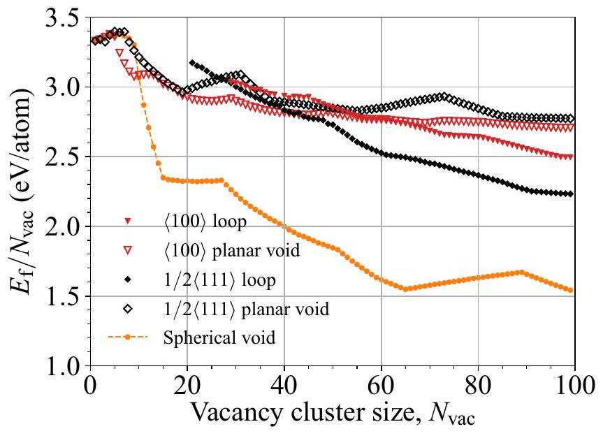
FIG. 15. Formation energies of vacancy clusters in W obtained with the GAP.

for the vast majority of traditional interatomic potentials, but can be captured by the GAP as seen in Fig. 14. Note that only the 1 NN and 2 NN divacancy configurations were included in the training database. Overall, the GAP reproduces the divacancy binding trend in good agreement with DFT, with only the 5 NN configuration being slightly more stable than DFT predictions.

Larger clusters of vacancies form three-dimensional voids or planar dislocation loops. These include spherical voids, $1 / 2\langle 111\rangle$ and $\langle 100\rangle$ dislocation loops. Calculations with existing potentials have shown that small vacancy dislocation loops are unstable and "open up" in the direction normal to the loop plane during relaxation [19,86], forming what we refer to as planar voids. The critical sizes at which dislocation loops become more stable than their corresponding planar voids are, however, vastly different in different interatomic potentials. Some potentials predict the crossovers to occur already at a few tens of vacancies ( $1-2 \mathrm{~nm}$ diameters), while other predict crossovers at sizes well above 100 vacancies [19]. Since the size of the simulation cell needs to be relatively large for clusters of this size, obtaining reliable DFT results to resolve this discrepancy is difficult, although efforts are currently ongoing [87]. We used the GAP to investigate the relative stability of the different types of vacancy clusters. As the GAP is trained to di- and trivacancies and accurately reproduces surface energies, we expect it to be reasonably transferable to larger vacancy clusters.

We created $\langle 100\rangle$ and $1 / 2\langle 111\rangle$ vacancy clusters by removing atoms in two or three consecutive $\langle 100\rangle$ or $\langle 111\rangle$ planes, respectively. To create dislocation loops, the surrounding atomic layers were compressed to create an initial strain field. For a cluster of size $N$ vacancies, the $N$ nearest atoms were removed in the corresponding planes for planar clusters, and in 3D for voids, resulting in clusters as close to circular and spherical shapes as possible. The simulation cells contained around 5500 atoms for clusters below 40 vacancies, and 16000 atoms for clusters in the $40-100$ size range. Figure 15 shows the formation energies per vacancy for the different clusters, calculated after a minimization of the atomic positions and pressure.

The GAP predicts spherical voids to be the most stable vacancy cluster. The sharp local minima and maxima of the voids in Fig. 15 correspond to symmetric configurations. The $1 / 2\langle 111\rangle$ loop is the most stable planar configuration for sizes above around 40 vacancies, consistent with experimental observations of (both interstitial and vacancy) dislocations loops [84]. For dislocation loops, only energies of stable sizes are shown in Fig. 15. Loops smaller than 20 vacancies for $1 / 2\langle 111\rangle$ and smaller than 30 vacancies for $\langle 100\rangle$ spontaneously open up into planar voids during relaxation. The almost constant or slightly increasing formation energy per vacancy at small clusters seen in Fig. 15 is indicative of the weak or sometimes repulsive binding energies of small vacancy clusters in tungsten. The crossovers in stability between dislocation loops and planar voids occurs at 25 vacancies for $1 / 2\langle 111\rangle$ (but they remain very close in energy up to 40 vacancies) and at $55-60$ vacancies for $\langle 100\rangle$ clusters. This is roughly consistent with recent DFT results, which predicted a crossover at around 45 vacancies for $1 / 2\langle 111\rangle$ clusters [87].

## VI. CONCLUSIONS AND OUTLOOK

We have shown that a machine-learning potential (GAP) with a moderately sized training database can capture a variety of properties of tungsten with essentially DFT accuracy. Even though the potential is fairly general, we particularly focused on reproducing properties relevant for radiation damage. The flexibility of the machine-learning framework allows the potential to describe properties that have been persistent challenges for analytical potentials, such as the relative stability of defect clusters and various surface properties. Hence, the potential will be useful for extracting more accurate data from classical molecular dynamics simulations of radiation damage in fusion-relevant tungsten, and settle previously unclear discrepancies in results with different existing potentials [5,20]. We should, however, emphasize that the computational cost of the GAP with the current implementation is about $2-3$ orders of magnitude higher than traditional analytical potentials. The high computational cost makes it challenging to obtain extensive statistics of radiation damage, but recent work on optimization of the SOAP kernel has shown promising speedups without loss of accuracy [32].

The GAP also provides a good basis for further extension or development of potentials tailored to specific applications that are not reflected by our training structures. Additionally, the potential can be useful as a basis for extension to multicomponent potentials, such as tungsten-based alloys or potentials for plasma-wall interactions in fusion reactor conditions. In the latter case, the accurate description of various surface reconstructions and surface energies provides an attractive basis for more accurate modeling of fusion-relevant $\mathrm{W}-\mathrm{H}$ and $\mathrm{W}-\mathrm{He}$ surface interactions (by adding analytical or machine-learned potentials for the light elements). Additionally, the training structures and fitting strategy can be easily repeated to develop similar potentials for other bcc metals. Efforts in these directions are ongoing and will be published elsewhere.

The potential files and the training database are available as Supplemental Material [88] and from Ref. [89].

## ACKNOWLEDGMENTS

This work has been carried out within the framework of the EUROfusion Consortium and has received funding from the Euratom research and training programme 2014-2018 and 2019-2020 under Grant Agreement No. 633053. The views and opinions expressed herein do not necessarily reflect those of the European Commission. Grants of computer capacity from CSC-IT Center for Science, Finland, as well as from the Finnish Grid and Cloud Infrastructure (persistent identifier urn:nbn:fi:research-infras-2016072533) are gratefully acknowledged. J.B. acknowledges helpful discussions with G. Csányi.

## APPENDIX: GAP PREDICTIONS AT EXTREMELY SHORT INTERATOMIC DISTANCES

The short-range part of the potential is dominated by the external screened Coulomb potential, as discussed in the main text. Nevertheless, it is crucial to make sure that the machine-learning extrapolations of the energies and forces at short interatomic distances do not interfere with the pair potential (i.e., remain smooth and negligible in magnitude). Figure 16 shows the energies and forces predicted by the GAP with and without the added pair potential for the dimer curve. Following the strategy described in the main text, the energies and forces given by GAP without the pair potential are negligible in comparison to the contributions from the pair potential, as desired. However, we found that the GAP becomes unstable at some distance close to zero, due to numerical limitations of the spherical harmonics expansion used in the SOAP descriptor. This is visible as kinks in the energy curve, leading to diverging forces as illustrated in the zoomed-in insets in Fig. 16. For previous GAPs for W, Fe, and Si [36,54,58], this instability occurs at distances in the $0.15-0.4 \AA$ range, which might very well be reached in, e.g., collision cascade simulations. Although none of the previous GAPs included a realistic repulsive part and are not suitable for cascade simulations, they can be made so by adding a repulsive pair potential.

A simple approach to eliminate the instability is to employ a smooth switching scheme between the GAP and a repulsive pair potential, similar to what is typically done with EAM and Tersoff-like potentials [90] (although it becomes slightly less straight-forward due to the pure many-body nature of the SOAP descriptor). We tested such a scheme, in which the contributions of the GAP term is smoothly forced to zero, while the full screened Coulomb potential, $V_{\text {pair }}$, remains present. The total energy of atom $i$ is then evaluated as

$$
\begin{aligned}
E_{i} & =S(i)\left[\sum_{j} V_{\mathrm{pair}}+E_{\mathrm{GAP}}(i)\right]+[1-S(i)] \sum_{j} V_{\mathrm{pair}} \\
& =S(i) E_{\mathrm{GAP}}(i)+\sum_{j} V_{\mathrm{pair}}
\end{aligned}
$$

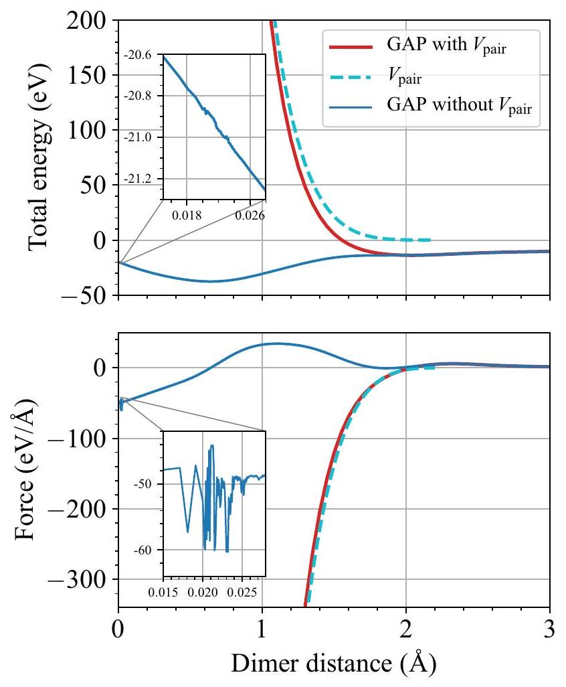
FIG. 16. The energies and forces given by the GAP at short interatomic distances with and without the external pair potential. The zoomed-in insets show the numerical instability of GAP at extremely short interatomic distances.

where $j$ loops over all atoms within the cutoff range of atom $i$ and $S(i)$ is a switching function that depends on the environment of atom $i$ and goes smoothly to zero when the environment contains very short distances. In our test, we simply let $S(i)=S\left(r_{\text {min }}\right)$, where $r_{\text {min }}$ is the shortest interatomic distance from atom $i$. For the switching function we chose the cutoff function in Eq. (6) (but inverted to approach zero as $r$ decreases). An almost identical approach was recently proposed for making deep learning neural network potentials applicable to irradiation simulations [91].

We found that our GAP becomes numerically unstable only below around $0.03 \AA$, as seen in Fig. 16. These distances will never be reached even in high-energy cascade simulations, since the pair potential contributes with energies in the MeV range. Hence the numerical instability is of no practical concern, and there is no need to employ the above switching scheme for our GAP. Nevertheless, we emphasize that when developing a GAP for radiation damage, it is crucial to ensure that the numerical limit of the SOAP implementation is beyond reach for any practical MD simulation, or eliminated by a switching scheme.
[1] M. Rieth, S. L. Dudarev, S. M. Gonzalez de Vicente, J. Aktaa, T. Ahlgren, S. Antusch, D. E. J. Armstrong, M. Balden, N. Baluc, M. F. Barthe, W. W. Basuki, M. Battabyal, C. S.

Becquart, D. Blagoeva, H. Boldyryeva, J. Brinkmann, M. Celino, L. Ciupinski, J. B. Correia, A. De Backer, C. Domain, E. Gaganidze, C. García-Rosales, J. Gibson, M. R. Gilbert,
S. Giusepponi, B. Gludovatz, H. Greuner, K. Heinola, T. Höschen, A. Hoffmann, N. Holstein, F. Koch, W. Krauss, H. Li, S. Lindig, J. Linke, C. Linsmeier, P. López-Ruiz, H. Maier, J. Matejicek, T. P. Mishra, M. Muhammed, A. Muñoz, M. Muzyk, K. Nordlund, D. Nguyen-Manh, J. Opschoor, N. Ordás, T. Palacios, G. Pintsuk, R. Pippan, J. Reiser, J. Riesch, S. G. Roberts, L. Romaner, M. Rosiński, M. Sanchez, W. Schulmeyer, H. Traxler, A. Ureña, J. G. van der Laan, L. Veleva, S. Wahlberg, M. Walter, T. Weber, T. Weitkamp, S. Wurster, M. A. Yar, J. H. You, and A. Zivelonghi, J. Nucl. Mater. 432, 482 (2013).
[2] S. Zinkle and L. Snead, Annu. Rev. Mater. Res. 44, 241 (2014).
[3] K. Nordlund, S. J. Zinkle, A. E. Sand, F. Granberg, R. S. Averback, R. E. Stoller, T. Suzudo, L. Malerba, F. Banhart, W. J. Weber, F. Willaime, S. L. Dudarev, and D. Simeone, J. Nucl. Mater. 512, 450 (2018).
[4] A. E. Sand, S. L. Dudarev, and K. Nordlund, Europhys. Lett. 103, 46003 (2013).
[5] J. Byggmästar, F. Granberg, A. E. Sand, A. Pirttikoski, R. Alexander, M.-C. Marinica, and K. Nordlund, J. Phys.: Condens. Matter 31, 245402 (2019).
[6] K. Nordlund, M. Ghaly, R. S. Averback, M. Caturla, T. Diaz de la Rubia, and J. Tarus, Phys. Rev. B 57, 7556 (1998).
[7] A. E. Sand, J. Dequeker, C. S. Becquart, C. Domain, and K. Nordlund, J. Nucl. Mater. 470, 119 (2016).
[8] J. Byggmästar, F. Granberg, and K. Nordlund, J. Nucl. Mater. 508, 530 (2018).
[9] R. E. Stoller, A. Tamm, L. K. Béland, G. D. Samolyuk, G. M. Stocks, A. Caro, L. V. Slipchenko, Y. N. Osetsky, A. Aabloo, M. Klintenberg, and Y. Wang, J. Chem. Theory Comput. 12, 2871 (2016).
[10] M. S. Daw and M. I. Baskes, Phys. Rev. B 29, 6443 (1984).
[11] J. Tersoff, Phys. Rev. B 37, 6991 (1988).
[12] G. J. Ackland and R. Thetford, Philos. Mag. A 56, 15 (1987).
[13] P. M. Derlet, D. Nguyen-Manh, and S. L. Dudarev, Phys. Rev. B 76, 054107 (2007).
[14] M.-C. Marinica, L. Ventelon, M. R. Gilbert, L. Proville, S. L. Dudarev, J. Marian, G. Bencteux, and F. Willaime, J. Phys.: Condens. Matter 25, 395502 (2013).
[15] D. R. Mason, D. Nguyen-Manh, and C. S. Becquart, J. Phys.: Condens. Matter 29, 505501 (2017).
[16] Y. Chen, Y.-H. Li, N. Gao, H.-B. Zhou, W. Hu, G.-H. Lu, F. Gao, and H. Deng, J. Nucl. Mater. 502, 141 (2018).
[17] N. Juslin, P. Erhart, P. Träskelin, J. Nord, K. O. E. Henriksson, K. Nordlund, E. Salonen, and K. Albe, J. Appl. Phys. 98, 123520 (2005).
[18] T. Ahlgren, K. Heinola, N. Juslin, and A. Kuronen, J. Appl. Phys. 107, 033516 (2010).
[19] J. Fikar, R. Schäublin, D. R. Mason, and D. Nguyen-Manh, Nucl. Mater. Energy 16, 60 (2018).
[20] A. Fellman, A. E. Sand, J. Byggmästar, and K. Nordlund, J. Phys.: Condens. Matter 31, 405402 (2019).
[21] L. Ventelon, F. Willaime, C.-C. Fu, M. Heran, and I. Ginoux, J. Nucl. Mater. 425, 16 (2012).
[22] K. Heinola, F. Djurabekova, and T. Ahlgren, Nucl. Fusion 58, 026004 (2018).
[23] G. Bonny, D. Terentyev, A. Bakaev, P. Grigorev, and D. Van Neck, Model. Simul. Mater. Sci. Eng. 22, 053001 (2014).
[24] J. Behler and M. Parrinello, Phys. Rev. Lett. 98, 146401 (2007).
[25] A. P. Bartók, M. C. Payne, R. Kondor, and G. Csányi, Phys. Rev. Lett. 104, 136403 (2010).
[26] A. P. Thompson, L. P. Swiler, C. R. Trott, S. M. Foiles, and G. J. Tucker, J. Comput. Phys. 285, 316 (2015).
[27] A. V. Shapeev, Multiscale Model. Simul. 14, 1153 (2016).
[28] A. Glielmo, C. Zeni, and A. De Vita, Phys. Rev. B 97, 184307 (2018).
[29] L. Zhang, J. Han, H. Wang, R. Car, and W. E, Phys. Rev. Lett. 120, 143001 (2018).
[30] J. Behler, J. Chem. Phys. 145, 170901 (2016).
[31] Y. Zuo, C. Chen, X. Li, Z. Deng, Y. Chen, J. Behler, G. Csányi, A. V. Shapeev, A. P. Thompson, M. A. Wood, and S. P. Ong, arXiv:1906.08888.
[32] M. A. Caro, Phys. Rev. B 100, 024112 (2019).
[33] A. P. Bartók, R. Kondor, and G. Csányi, Phys. Rev. B 87, 184115 (2013).
[34] A. P. Bartók and G. Csányi, Int. J. Quantum Chem. 115, 1051 (2015).
[35] C. E. Rasmussen and C. K. I. Williams, Gaussian Processes for Machine Learning (The MIT Press, Cambridge, MA, 2006).
[36] A. P. Bartók, J. Kermode, N. Bernstein, and G. Csányi, Phys. Rev. X 8, 041048 (2018).
[37] J. F. Ziegler, J. P. Biersack, and U. Littmarck, Treatise on HeavyIon Science (Pergamon, New York, 1985), pp. 93-129.
[38] K. Nordlund, N. Runeberg, and D. Sundholm, Nucl. Instrum. Methods Phys. Res. Sec. B: Beam Interact. Mater. Atoms 132, 45 (1997).
[39] A. N. Zinoviev and K. Nordlund, Nucl. Instrum. Methods Phys. Res. Sec. B: Beam Interact. Mater. Atoms 406, 511 (2017).
[40] R. Perriot, X. Gu, Y. Lin, V. V. Zhakhovsky, and I. I. Oleynik, Phys. Rev. B 88, 064101 (2013).
[41] G. Kresse and J. Hafner, Phys. Rev. B 47, 558 (1993).
[42] G. Kresse and J. Hafner, Phys. Rev. B 49, 14251 (1994).
[43] G. Kresse and J. Furthmüller, Comput. Mater. Sci. 6, 15 (1996).
[44] G. Kresse and J. Furthmüller, Phys. Rev. B 54, 11169 (1996).
[45] J. P. Perdew, K. Burke, and M. Ernzerhof, Phys. Rev. Lett. 77, 3865 (1996).
[46] P. E. Blöchl, Phys. Rev. B 50, 17953 (1994).
[47] G. Kresse and D. Joubert, Phys. Rev. B 59, 1758 (1999).
[48] H. J. Monkhorst and J. D. Pack, Phys. Rev. B 13, 5188 (1976).
[49] M. Methfessel and A. T. Paxton, Phys. Rev. B 40, 3616 (1989).
[50] QUIP-QUantum mechanics and Interatomic Potentials, retrieved from https://github.com/libAtoms/QUIP, www. libatoms.org.
[51] S. Plimpton, J. Comput. Phys. 117, 1 (1995), retrieved from http://lammps.sandia.gov.
[52] A. H. Larsen, J. J. Mortensen, J. Blomqvist, I. E. Castelli, R. Christensen, Marcin Dułak, J. Friis, M. N. Groves, B. Hammer, C. Hargus, E. D. Hermes, P. C. Jennings, P. B. Jensen, J. Kermode, J. R. Kitchin, E. L. Kolsbjerg, J. Kubal, Kristen Kaasbjerg, S. Lysgaard, J. B. Maronsson, T. Maxson, T. Olsen, L. Pastewka, Andrew Peterson, C. Rostgaard, J. Schiøtz, O. Schütt, M. Strange, K. S. Thygesen, Tejs Vegge, L. Vilhelmsen, M. Walter, Z. Zeng, and K. W. Jacobsen, J. Phys.: Condens. Matter 29, 273002 (2017).
[53] A. Togo and I. Tanaka, Scr. Mater. 108, 1 (2015).
[54] W. J. Szlachta, A. P. Bartók, and G. Csányi, Phys. Rev. B 90, 104108 (2014).
[55] M.-C. Marinica, F. Willaime, and J.-P. Crocombette, Phys. Rev. Lett. 108, 025501 (2012).
[56] L. Dézerald, M. C. Marinica, L. Ventelon, D. Rodney, and F. Willaime, J. Nucl. Mater. 449, 219 (2014).
[57] J. Rumble, ed., CRC Handbook of Chemistry and Physics, 100th ed. (CRC Press, Boca Raton, FL, 2019).
[58] D. Dragoni, T. D. Daff, G. Csányi, and N. Marzari, Phys. Rev. Mater. 2, 013808 (2018).
[59] W. R. Tyson and W. A. Miller, Surf. Sci. 62, 267 (1977).
[60] K.-D. Rasch, R. W. Siegel, and H. Schultz, Philos. Mag. A 41, 91 (1980).
[61] J. Heikinheimo, K. Mizohata, J. Räisänen, T. Ahlgren, P. Jalkanen, A. Lahtinen, N. Catarino, E. Alves, and F. Tuomisto, APL Mater. 7, 021103 (2019).
[62] P.-W. Ma and S. L. Dudarev, Phys. Rev. Mater. 3, 063601 (2019).
[63] P.-W. Ma and S. L. Dudarev, Phys. Rev. Mater. 3, 013605 (2019).
[64] P.-W. Ma and S. L. Dudarev, Phys. Rev. Mater. 3, 043606 (2019).
[65] L. G. Wang, A. van de Walle, and D. Alfè, Phys. Rev. B 84, 092102 (2011).
[66] A. T. Paxton, P. Gumbsch, and M. Methfessel, Philos. Mag. Lett. 63, 267 (1991).
[67] V. Paidar, L. G. Wang, M. Sob, and V. Vitek, Model. Simul. Mater. Sci. Eng. 7, 369 (1999).
[68] M. Mrovec, R. Gröger, A. G. Bailey, D. Nguyen-Manh, C. Elsässer, and V. Vitek, Phys. Rev. B 75, 104119 (2007).
[69] R. Ravelo, T. C. Germann, O. Guerrero, Q. An, and B. L. Holian, Phys. Rev. B 88, 134101 (2013).
[70] K. Einarsdotter, B. Sadigh, G. Grimvall, and V. Ozoliņš, Phys. Rev. Lett. 79, 2073 (1997).
[71] A. Larose and B. N. Brockhouse, Can. J. Phys. 54, 1819 (1976).
[72] G. K. White and M. L. Minges, Int. J. Thermophys. 18, 1269 (1997).
[73] G. K. White and S. J. Collocott, J. Phys. Chem. Ref. Data 13, 1251 (1984).
[74] R. Lowrie and A. M. Gonas, J. Appl. Phys. 38, 4505 (1967).
[75] O. Grizzi, M. Shi, H. Bu, J. W. Rabalais, and P. Hochmann, Phys. Rev. B 40, 10127 (1989).
[76] M. K. Debe and D. A. King, Phys. Rev. Lett. 39, 708 (1977).
[77] M. S. Altman, P. J. Estrup, and I. K. Robinson, Phys. Rev. B 38, 5211 (1988).
[78] K. Heinola and T. Ahlgren, Phys. Rev. B 81, 073409 (2010).
[79] Z. Chen and N. Ghoniem, Phys. Rev. B 88, 035415 (2013).
[80] F. Maury, M. Biget, P. Vajda, A. Lucasson, and P. Lucasson, Radiat. Eff. 38, 53 (1978).
[81] K. Nordlund, J. Wallenius, and L. Malerba, Nucl. Instrum. Methods Phys. Res. Sec. B: Beam Interact. Mater. Atoms 246, 322 (2006).
[82] R. Alexander, M.-C. Marinica, L. Proville, F. Willaime, K. Arakawa, M. R. Gilbert, and S. L. Dudarev, Phys. Rev. B 94, 024103 (2016).
[83] X. Yi, M. L. Jenkins, M. Briceno, S. G. Roberts, Z. Zhou, and M. A. Kirk, Philos. Mag. 93, 1715 (2013).
[84] X. Yi, M. L. Jenkins, M. A. Kirk, Z. Zhou, and S. G. Roberts, Acta Mater. 112, 105 (2016).
[85] C. S. Becquart and C. Domain, Nucl. Instrum. Methods Phys. Res. Sec. B: Beam Interact. Mater. Atoms 255, 23 (2007).
[86] M. R. Gilbert, S. L. Dudarev, P. M. Derlet, and D. G. Pettifor, J. Phys.: Condens. Matter 20, 345214 (2008).
[87] P.-W. Ma and S. L. Dudarev (private communication).
[88] See Supplemental Material at http://link.aps.org/supplemental/ 10.1103/PhysRevB.100.144105 for potential files and training data.
[89] https://gitlab.com/acclab/gap-data.
[90] C. Björkas and K. Nordlund, Nucl. Instrum. Methods Phys. Res. Sec. B: Beam Interact. Mater. Atoms 259, 853 (2007).
[91] H. Wang, X. Guo, L. Zhang, H. Wang, and J. Xue, Appl. Phys. Lett. 114, 244101 (2019).

Correction: The average value of the threshold displacement energy was incorrectly given in the caption to Fig. 10 and in text in Sec. V C and has been fixed.

