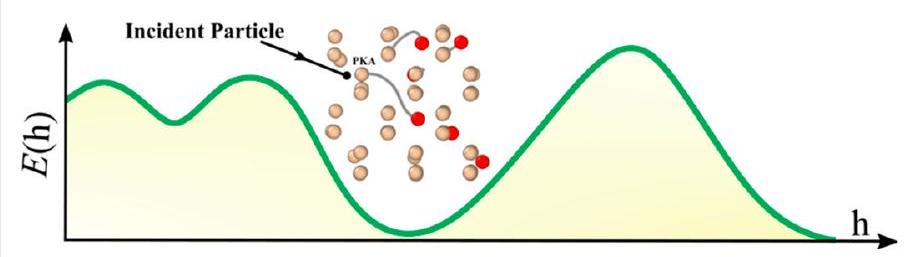
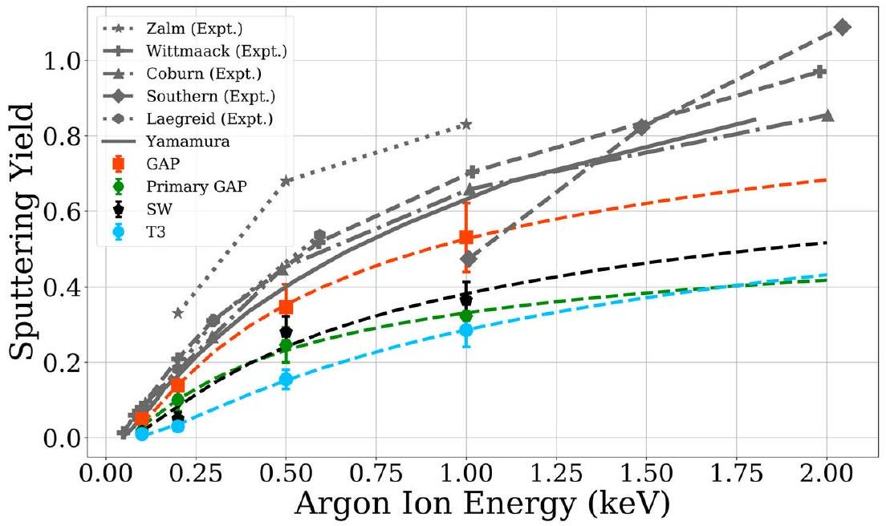
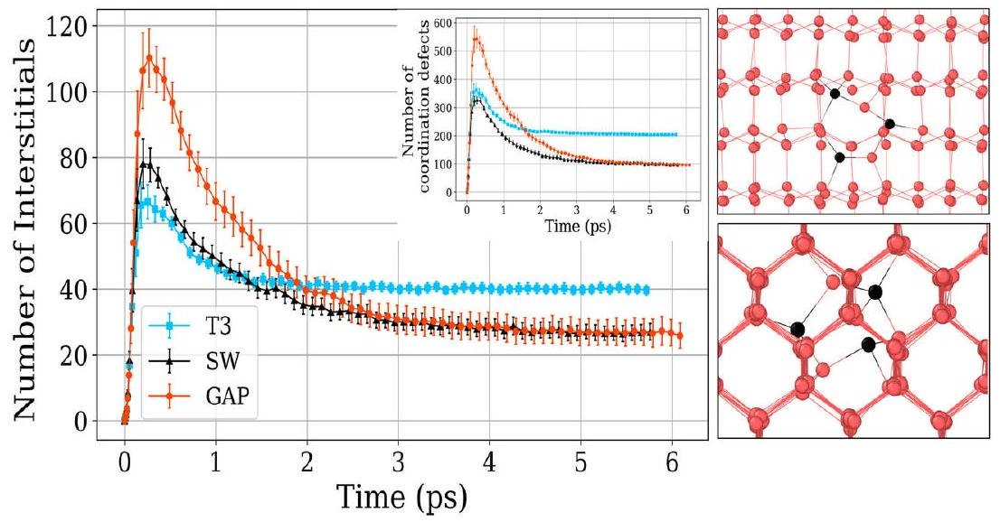
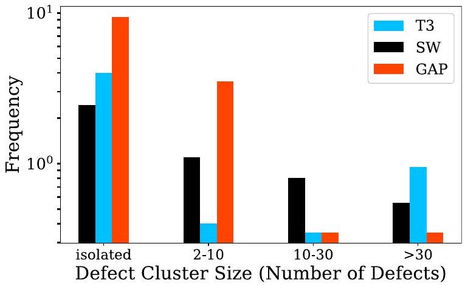
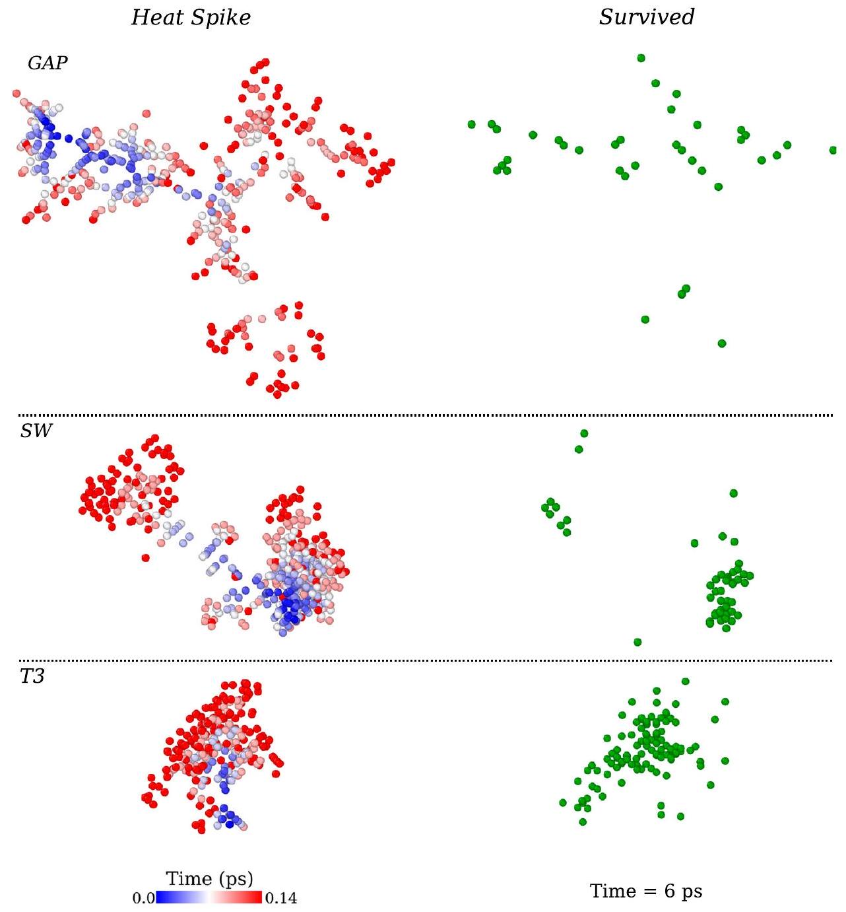
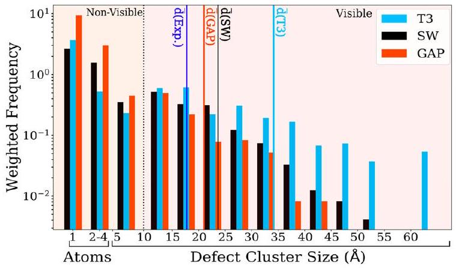

# Insights into the primary radiation damage of silicon by a machine learning interatomic potential 

A. Hamedani, J. Byggmästar, F. Djurabekova, G. Alahyarizadeh, R. Ghaderi, A. Minuchehr \& K. Nordlund

To cite this article: A. Hamedani, J. Byggmästar, F. Djurabekova, G. Alahyarizadeh, R. Ghaderi, A. Minuchehr \& K. Nordlund (2020) Insights into the primary radiation damage of silicon by a machine learning interatomic potential, Materials Research Letters, 8:10, 364-372, DOI: 10.1080/21663831.2020.1771451

To link to this article: https://doi.org/10.1080/21663831.2020.1771451
© 2020 The Author(s). Published by Informa UK Limited, trading as Taylor \& Francis Group.

View supplementary material

Published online: 01 Jun 2020.
Submit your article to this journal

Article views: 4239
View related articles

View Crossmark data
Citing articles: 13 View citing articles

# Insights into the primary radiation damage of silicon by a machine learning interatomic potential 

A. Hamedani (D) ${ }^{\text {a }}$,b , J. Byggmästar (B) ${ }^{\text {a }}$, F. Djurabekova (D) ${ }^{\text {a, }}$, G. Alahyarizadeh (T) ${ }^{\text {b }}$, R. Ghaderi ${ }^{\text {b }}$, A. Minuchehr (D) ${ }^{\text {b }}$ and K. Nordlund ${ }^{\text {(1) }}$ ${ }^{\text {a }}$ Department of Physics, University of Helsinki, Helsinki, Finland; ${ }^{\text {b }}$ Engineering Department, Shahid Beheshti University, Tehran, Iran; ${ }^{\mathrm{c}}$ Helsinki Institute of Physics, Helsinki, Finland

#### Abstract

We develop a silicon Gaussian approximation machine learning potential suitable for radiation effects, and use it for the first $a b$ initio simulation of primary damage and evolution of collision cascades. The model reliability is confirmed by good reproduction of experimentally measured threshold displacement energies and sputtering yields. We find that clustering and recrystallization of radiation-induced defects, propagation pattern of cascades, and coordination defects in the heat spike phase show striking differences to the widely used analytical potentials. The results reveal that small defect clusters are predominant and show new defect structures such as a vacancy surrounded by three interstitials.

## IMPACT STATEMENT

Quantum-mechanical level of accuracy in simulation of primary damage was achieved by a silicon machine learning potential. The results show quantitative and qualitative differences from the damage predicted by any previous models.

## ARTICLE HISTORY

Received 6 January 2020

## KEYWORDS

Atomistic simulations; machine learning interatomic potential; primary radiation damage; silicon

The interaction of the energetic particles with matter and quantification of the displacement damage produced following atomic collision cascades are of crucial importance in advanced technologies such as semiconductor processing and nuclear power generation. Primary damage, defined as the defects that are produced immediately after particle impact, is the initial stage that needs to be understood to be able to model permanent damage in materials $[1,2]$. The extremely fast and far from thermodynamic equilibrium nature of the processes occurring at this stage makes experimental study of it unachievable. Although density functional theory (DFT) could in principal provide a first-principle image of the evolution and interaction of defects in collision cascades, the time and length scale limits of this method restrict
its applicability to very small impact energies and relevant basic properties [3-6]. Classical molecular dynamics (MD) simulations have been the dominant approach in radiation damage analysis in past decades, with a key role in enlightening the fundamental physics of primary damage processes. Nevertheless, the reliability of the results from MD simulations has always been in the shadow of the accuracy of the selected interatomic potential and simplifications introduced by its functional form. Machine learning (ML) potentials, as a novel framework in the development of interatomic potentials, offer an alternative approach for the representation of the potential energy surface by learning its topology from large configuration data sets obtained from DFT calculations. This is done by means of mathematical descriptors which

[^0]encode the information of the local atomic environments, to be retrieved and interpolated for newly encountered configurations during MD implementations [7,8]. This brings MD simulations of systems containing thousands of atoms with DFT accuracy into reality [9-27]. Recently, an ML interatomic potential was developed for Si based on the Gaussian approximation potential (GAP) framework [28]. This potential describes properties of liquid and amorphous phases as well as point defects, which are very important in simulation of radiation damage, with DFT accuracy [28]. This level of accuracy far exceeds that of any classical semi-empirical potentials, and in principle opens up a new avenue for MD simulations of radiation damage with quantum mechanics precision level. However, this potential as published does not have any realistic descriptions of short-range ( $\leqslant 1.6 \AA$ ) interactions, making it unsuitable for radiation effects simulations.

In this Letter, we augment the GAP with a realistic repulsive potential to enable large-scale DFT-accurate simulations of dynamic evolution of particle-induced collision cascades. We show that the modified GAP accurately reproduces experimental sputtering yields and threshold displacement energies (TDE). Good reproduction of TDEs is very important for many advanced applications, such as a detection possibility of the dark matter weakly interacting massive particles [29]. In nanoelectronics, where the interaction of the low-energy implanted dopants with the defect clusters becomes an obstacle (as a source of diffusion and activation anomalies) to reach desired component design, a precise model of the evolution and form of the surviving defects would lead to a better understanding of the dopant-defect interactions and more realistic treatment of this phenomenon [30-33].

Short-range interactions in our cascade simulations are described by the all-electron DFT repulsive potential, DMol [34], which is smoothly joined to the original GAP potential, while making sure that it has no effect on the original structures in the training data set. The DFT-DMol calculations were exclusively optimized for the high-energy repulsive part and their excellent agreement with experiments was recently confirmed [35]. The total energy of a system containing $N$ atoms is

$$
\begin{aligned}
E_{\mathrm{tot}} & =\sum_{i<j}^{N} V_{\mathrm{pair}}\left(r_{i j}\right)+\sum_{i}^{N} E_{\mathrm{GAP}}\left(\mathbf{h}_{i}\right) \\
& =\sum_{i<j}^{N} V_{\mathrm{pair}}\left(r_{i j}\right)+\sum_{i}^{N} \sum_{s}^{M} \alpha_{s} K\left(\mathbf{h}_{i}, \mathbf{h}_{s}\right)
\end{aligned}
$$

where $V_{\text {pair }}$ is the repulsive pair potential given by a cubic spline fitted to the DMol data. The second term which

Table 1. Threshold displacement energies in eV calculated at 30 K based on the method introduced in Ref. [38]. The kinetic energy resolution was 1.0 eV . DFT calculations in Ref. [5] have been conducted with both GGA and LDA exchange-correlation functionals. Results from the GGA functional are presented.
| Direction | GAP | T3 | SW | DFT $^{\text {a }}$ | Experiment |
| :--- | :---: | :---: | :---: | :---: | :---: |
| $\langle 100\rangle$ | $20.5 \pm 0.5$ | $10.0 \pm 0.5$ | $23.5 \pm 0.5$ | $19.5 \pm 1.5$ | $21.0 \pm 2.0^{\text {b }}$ |
| $\langle 111\rangle$ | $14.5 \pm 0.5$ | $14.0 \pm 0.5$ | $20.5 \pm 0.5$ | $14.5 \pm 1.5$ |  |
| $\langle\overline{1} \overline{1} \overline{1}\rangle$ | $12.5 \pm 0.5$ | $11.5 \pm 0.5$ | $17.5 \pm 0.5$ | $12.5 \pm 1.5$ | $12.9 \pm 0.6^{\text {c }}$ |

${ }^{\text {a }}$ Ref. [5]
${ }^{\mathrm{b}}$ Ref. [39]
${ }^{\mathrm{c}}$ Ref. [40]
takes care of the many-body interactions is a sum over kernel functions that measure the resemblance between the unknown atomic environment $i$ and $M$ representative, trained environments $s$, encoded by the descriptor h. The $\boldsymbol{\alpha}$ is the vector of learning coefficients obtained by solving a regularized least squares problem [28,36,37]. In accordance with this, we calculated TDE values with the GAP in low-index directions according to the method described in Ref. [38] at 30 K . This initial thermalization sets atoms into the random motion, creating more realistic collision probability between the lattice atoms and the atom in motion. Table 1 provides a comparison of TDE values by GAP and the classical Stillinger-Weber (SW) [41] and Tersoff III (T3) [42] potentials alongside those calculated by DFT [5] and obtained in experiments. The GAP-predicted TDE values in both the $\langle 100\rangle$ and $\langle 111\rangle$ directions are in perfect agreement with DFT and experiments. While SW noticeably overestimates the TDE in all directions, T 3 shows a considerable discrepancy only in the $\langle 100\rangle$ direction. The global minimum calculated by GAP is in excellent agreement with DFT and experiments, whereas the predictions of SW and T3 clearly disagree with experiments. This validates our augmentation of the repulsive potential and the way that GAP deals with short-range interactions and defect generation in collision cascades.

We further tested the GAP with single Ar ion implantation simulations. In sputtering simulations, not just a good description of the crystalline, liquid and amorphous phases are important, but also a realistic modeling of the surface binding energy. We simulated $0.1,0.2,0.5$ and 1.0 keV Ar implantation in Si (see supplemental material for simulation details). Figure 1 shows the acquired sputtering yields with GAP in comparison with SW, T3 and experimental yields [43-48]. It also contains the results obtained by Primary-GAP, which is the original potential without our augmented repulsive potential. The clear disagreement of Primary GAP with experiments emphasizes the importance of repulsive response of the potential and its implementation. Although the predictions of all

Figure 1. Sputtering yields from simulated single implantation of $0.1,0.2,0.5$ and 1.0 keV Ar ions in silicon compared to the experimental measurements. Primary-GAP is the machine learning potential before augmentation of the repulsive part. Each point represents an average of 130 simulations. Yamamura data [43] is a fit to 12 different implantation experiments. To guide the eye, the same function used in Ref. [43] has been fitted to the simulated yields.

Figure 2. Left: Time-dependent number of interstitial and coordination defects in silicon, generated during collision cascades initiated by a 2 keV PKA. Number of interstitial defects were obtained by Wigner-Seitz analysis. Number of coordination defects represents the total number of dangling and floating bonds within $r_{\mathrm{c}}=2.75 \AA$. Right: The new defect structure observed in the simulations, from two different views. It contains one vacancy surrounded by three interstitials (black).

potentials are lower than experimental values, they reproduce the energy dependence of the sputtering yield correctly. However, GAP gives the closest agreement with the experiment.

We studied the defect production and clustering of radiation-induced defects by carrying out cascade simulations for $0.1,0.2,0.4,1.0$ and 2.0 keV primary knock-on atom (PKA) energies at 300 K (see supplemental material for simulation details). The number of final defects is one of the most important measures in quantifying the extent of irradiation effects in matter. Regarding Si, a question was opened up in Ref. [49] about the actual number of energy-dependent surviving defects upon irradiation. It was shown that the difference in final number of defects between SW and T3, the two
most common interatomic potentials in damage analysis of Si, is a factor of 2 . As discussed in Ref. [49], this stems from the different functional form of these potentials, which leads to different recrystallization and crystal recovery of the complex configurations generated in the heat spike phase. Figure 2 presents the number of interstitial and coordination defects generated in 2 keV PKA simulations up to 6 ps , after which the system has cooled down to 300 K . The results using GAP reveals that the number of surviving defects is almost the same as in SW, while T3 produces approximately two times more defects. This resolves the abovementioned long-standing debate and supports the prediction of SW regarding the number of radiation-induced defects.

Although the final number of defects is almost the same in GAP and SW, the number of coordination defects and recrystallization of the molten region in the heat spike phase in GAP are clearly different. For instance, in 2.0 keV PKA simulations, GAP shows around 1.5 times more coordination defects than SW and T3 in the heat spike. Moreover, recrystallization is more efficient in GAP as it shows recovery from higher number of coordination defects to the same level of coordination defects in SW during almost the same time span (from maximum heat spike to the equilibrium state). This is related to the different nature of classical and ML potentials. Instead of a fixed, simple functional form, GAP which has been extensively trained to the DFT-calculated liquid and amorphous configurations, treats the molten region in the heat spike and subsequent amorphous regions based on the constructed potential energy surface and a realistic description of these phases can be expected. To endorse this, we refer to Ref. [28] where the structure of liquid and amorphous Si was extensively examined by GAP and compared with analytical potentials. The results showed that GAP has the best agreement with DFT and experiments in characterizing both phases.

Clustering of radiation-induced defects and their size distribution are crucial factors in specifying microstructural evolution of material under irradiation. The size and separation of clusters determine their life time and the strength of their elastic interactions. Hence, the size distribution of initially generated clusters is a critical item for cluster dynamics or rate theory models [50]. Figure 3 presents cluster analysis of defects generated in 2 keV PKA simulations, averaged over the 20 simulations. A defect cluster is defined as a set of neighboring Wigner-Seitz defects; neighbors being defects located within a range up to the $r_{\mathrm{c}}=10.8 \AA$ [49]. Although isolated defects and small clusters are the dominant forms of surviving defects in all potentials, GAP predicts on average 3 times more isolated defects, and the fraction

Figure 3. Size distribution of defect clusters produced in cascades initiated by a 2 keV PKA.

of small-sized clusters containing 2-10 defects is a factor of 3 and 5 higher compared to the SW and T3 potentials, respectively. On the contrary, the fraction of large clusters containing a major portion of total defects is noticeably lower in GAP. This trend is also true for lower PKA energies, where T3 favors large clustering of defects, followed by SW which with a steady decline produces intermediate sizes as well. The different cluster distributions will substantially affect the long-term evolution of the damage. Unlike defect clusters, isolated defects are highly mobile and can easily recombine, leaving no damage behind [51-54].

The different clustering behavior can be attributed to another different feature of GAP in cascade simulations; the pattern in which cascades evolve. In the classical potentials, cascades are more compact with collisions confined within pockets, producing dense and localized clustering of the damage. On the contrary, cascades in the GAP spread across a broader spatial range, leaving more isolated defects and covering a larger volume. In other words, more atoms are involved in the distribution of the injected energy by the PKA in the GAP, while the dissipation of energy is concentrated locally in the classical potentials to make larger clusters of displaced atoms. This is shown in Figure 4, where the time evolution of representative 2 keV PKA cascades up to the heat spike phase are illustrated for each of the three potentials. The initial cascade splits into two sub-cascades in the GAP and SW. The different form of cascade propagation between GAP, SW and T3 is clearly visible. Figure 4 also shows the different clustering of the remaining defects in the equilibrium state of the system at 300 K after quenching of cascades and recovery of the displaced atoms as discussed above.

Small defect clusters can play a key role in capturing impurities and self-interstitials in silicon [55]. GAP shows a cluster of four defects in which a vacancy is surrounded by three interstitials, shown in Figure 2. We found this defect structure three times in our simulations with GAP and just once in SW simulations. Among the three occurrences in GAP, one was found in the 0.4 keV PKA simulations and the other two in the 2 keV simulations. For SW we found this cluster in 1 keV PKA simulations. We conjecture that the creation of this defect structure is energy dependent, such that the probability increases with the increase of PKA energy. In one case, the interstitials are symmetrically located around the vacancy. To examine the stability of this defect, we cooled down all cases to 0 K . In one case in the GAP, the central vacancy recombined with one of the surrounding interstitials, but in the other three cases the defect remained as a whole. The stability of the defect can be understood based on coordination analysis of the atoms around

Figure 4. Snapshots of 2 keV PKA collision cascades at the heat spike phase and resultant defects in silicon. Heat spike snapshots (left panel) present the atoms with kinetic energy above 1 eV . Atoms have been color-coded based on the time of generation after firing the PKA. Surviving defects (right panel) are acquired from Wigner-Seitz analysis of the cell after it cools down to the ambient temperature of 300 K .

the vacancy. In cases where the defect remains stable, the atoms surrounding the vacant position, including the interstitial atoms, all have fourfold coordination (which is the equilibrium coordination number in Si ). However, in the case where the interstitial recombined with the vacancy, two of the interstitials had a coordination number of 3 . We also checked the stability of the cluster with DFT. We tested 64 - and 216 -atom boxes with the PBE GGA [56] exchange correlation functional. The cluster remains stable upon relaxing down to the residual forces of $0.01 \mathrm{eV} / \AA$ on atoms.

In order to quantitatively examine the clustering behavior, we compare the sizes of the clusters generated in our simulations with those measured by Howe et al. [57,58] in implantation experiments. They used transmission electron microscopy (TEM) to analyse features of collision cascades in silicon by directly observing
and characterizing damaged regions created during implantation of various ions ( $\mathrm{P}, \mathrm{As}, \mathrm{Sb}, \mathrm{Bi}$ ) in a wide range of implantation energies. The experiments were conducted at $40-50 \mathrm{~K}$, under low fluences to avoid cascade overlapping. We performed binary collision approximation calculations using srim [59] for all of these implanted ions, calculating the distance between initial point of sub-cascades derived by recoils with energies higher than 500 eV . For heavy ions like 80 keV Bi , with an average cascade-created damage size of $50 \AA$, the average distance between sub-cascades is $15 \AA$, which is directly signaling overlap of sub-cascades created by Si recoils in the substrate. On the contrary, in the case of P ions, where damaged regions by cascades have an average diameter of $18 \AA$, the sub-cascades are initiated $58 \AA$ apart from each other. This is in line with the conclusion from experiments that P ion implantation is very inefficient
in creating sub-cascades as they have lowest observable damaged regions among the studied ions. Hence, we compare our results with P implantation, where no cascade overlap takes place. Our simulations are representative of the cascades initiated by $0.1,0.2,0.4,1.0$ and 2.0 keV Si recoils (our studied PKA energies) in P implantation.

In Figure 5, we present statistics of the average diameter of defect clusters derived from $0.2,0.4,1.0$ and 2.0 keV PKA simulations.Clusters with average diameter above $10 \AA$ are called visible [60]. Considering the recoil-energy distribution of 60 keV P in Si (obtained from SRIM calculations) as conducted in the experiments, we calculated the weighted-average diameter of the visible clusters, $\bar{d}$, generated from the above-mentioned PKA events for each potential. 0.1 keV PKAs do not create clusters in the visible region. The weight corresponding to a certain PKA energy, $E_{\mathrm{PKA}}$, was calculated based on the ratio of the number of the produced recoils with $E_{\mathrm{PKA}}$. The weighted-average diameter for each potential then is $\bar{d}= 1 / N \sum_{E_{\mathrm{PKA}}} \int_{E_{l}}^{E_{u}} n(E) d\left(E_{\mathrm{PKA}}\right) \mathrm{d} E[61] . E_{l}$ and $E_{u}$ are lower and upper limits of the interval that given $E_{\mathrm{PKA}}$ resides in, respectively. $n(E)$ is the normalization factor, the number of recoils per ion per energy, $d\left(E_{\text {PKA }}\right)$ is the average diameter of the clusters in the given $E_{\mathrm{PKA}}$, and $N$ is the total number of recoils produced by all $E_{\text {PKA }}$ s. Figure 5 includes these values alongside the measured average from Ref. [57] which amounts to $18 \pm 1.4 \AA$ for 60 keV P implantation. Since defects in TEM are imaged through their strain fields [62,63], the experimentally measured cluster sizes are larger than in direct visualization of MD results. We analyzed the effective atomic strain of the defected cells in our simulations, being approximately

Figure 5. Statistics of the average diameter of defect clusters produced in collision cascades derived by $0.2,0.4,1.0$ and 2.0 keV PKAs. Weighted-average diameters of the visible clusters, $\bar{d}$, for each potential is compared with the reported values in the implantation experiments [57]. The diameter of the clusters from simulations was calculated by averaging maximum and minimum linear dimensions of the clusters in the $\langle 111\rangle$ plane, as it was the target plane in the experiments.

equal to the second nearest neighbor distance in silicon lattice $(3.84 \AA)$. Hence we add $3.84 \AA$ to our calculated averages from the simulations to allow a fair comparison. We address the presented statistics from two view points. First, by considering the overall weighted average of each potential. GAP with $20.9 \pm 0.8 \AA$ gives the closest value to the experimental value of $18.0 \pm 1.4 \AA$, followed by SW with $23.29 \pm 0.8 \AA$ and T3 with $34.0 \pm 1.3 \AA$, where the uncertainties in our calculations are the weighted standard errors. Second, by taking into account the size distribution of visible clusters generated by the different potentials. Although all of the potentials create clusters larger than the experimental average, the size of the largest cluster in GAP, produced in the highest PKA energy ( 2 keV ), is smaller than in SW and T3. The dominance of small defect clusters agrees with diffuse X-ray scattering experiments which indicated that small defect clusters dominate damage by 4.5 keV He and 20 keV Ga ions in Si at 100 K [51]. The importance of the high ratio of small clusters is also highlighted by them being able to explain the electrical type inversion in Si-based detectors [64].

In conclusion, we have reported the first largescale simulation of irradiation-induced damage and ion implantation with DFT accuracy. We use a machine learning interatomic potential for silicon, GAP, trained over a massive data set of DFT calculations to achieve this goal. Reproducing experimental threshold displacement energies and sputtering yields of Ar implantation, assure us of GAP's performance and reliability in cascade simulations. Clustering of the defects is different in the GAP compared to the classical potentials. Different clustering can be ascribed to the different propagation pattern of the cascades in GAP, as it shows spread-out form of the cascade evolution compared to the compact propagation in the classical potentials. We also encountered a new defect structure, a vacancy surrounded by three interstitials. Moreover, GAP reveals a large fraction of coordination defects in the heat spike phase and more efficient recrystallization of the defects in the postcascade phase. Overall, the key difference between the classical potentials and GAP is that the number of isolated and small defect clusters in GAP are considerably higher than that of large clusters.

## Acknowledgments

Grants of computer capacity from CSC - IT Center for Science, Finland, as well as the Finnish Grid and Cloud Infrastructure (persistent identifier urn:nbn:fi:research-infras-2016072533) are gratefully acknowledged. A.H. gratefully acknowledges excellent discussions with F. Granberg and G. C. Sosso. F.D. gratefully acknowledges the financial support of the Academy of Finland (Grant No. 313867).

## Disclosure statement

No potential conflict of interest was reported by the author(s).

## Funding

Grants of computer capacity from CSC - IT Center for Science, Finland, as well as the Finnish Grid and Cloud Infrastructure (persistent identifier urn:nbn:fi:research-infras-2016072533) are gratefully acknowledged. F.D. gratefully acknowledges the financial support of the Academy of Finland (Grant No. 313867).

## ORCID

A. Hamedani (D) http://orcid.org/0000-0001-6456-6482
J. Byggmästar © http://orcid.org/0000-0002-4898-6150
F. Djurabekova (D) http://orcid.org/0000-0002-5828-200X
G. Alahyarizadeh (D) http://orcid.org/0000-0002-9403-4206
A. Minuchehr (D) http://orcid.org/0000-0002-9330-5692
K. Nordlund (D) http://orcid.org/0000-0001-6244-1942

## References

[1] Nordlund K, Zinkle SJ, Sand AE, et al. Primary radiation damage: a review of current understanding and models. J Nucl Mater. 2018;512:450-479. Available from: http://www.sciencedirect.com/science/article/pii/S00223 1151831016X
[2] Nordlund K, Zinkle SJ, Sand AE, et al. Improving atomic displacement and replacement calculations with physically realistic damage models. Nat Commun. 2018;9(1): 1084. Available from: https://doi.org/10.1038/s41467-018-03415-5
[3] Dudarev S. Density functional theory models for radiation damage. Annu Rev Mater Res. 2013;43(1):35-61. Available from: https://doi.org/10.1146/annurev-matsci-071312-121626
[4] Olsson P, Becquart CS, Domain C. Ab initio threshold displacement energies in iron. Mater Res Lett. 2016;4(4): 219-225. Available from: https://doi.org/10.1080/21663 831.2016.1181680
[5] Holmström E, Kuronen A, Nordlund K. Threshold defect production in silicon determined by density functional theory molecular dynamics simulations. Phys Rev B. 2008 Jul;78:045202. Available from: https://link.aps.org/doi/10. 1103/PhysRevB.78.045202
[6] Gao F, Xiao H, Zu X, et al. Defect-enhanced charge transfer by ion-solid interactions in SiC using large-scale ab initio molecular dynamics simulations. Phys Rev Lett. 2009 Jul;103:027405. Available from: https://link.aps.org/ doi/10.1103/PhysRevLett.103.027405
[7] Bartók AP, Payne MC, Kondor R, et al. Gaussian approximation potentials: the accuracy of quantum mechanics, without the electrons. Phys Rev Lett. 2010 Apr;104:136403. Available from: https://link.aps.org/doi/ 10.1103/PhysRevLett.104.136403
[8] Behler J, Parrinello M. Generalized neural-network representation of high-dimensional potential-energy surfaces. Phys Rev Lett. 2007 Apr;98:146401. Available from: https://link.aps.org/doi/10.1103/PhysRevLett.98.146401
[9] Caro MA, Deringer VL, Koskinen J, et al. Growth mechanism and origin of high $s p^{3}$ content in tetrahedral amorphous carbon. Phys Rev Lett. 2018 Apr;120:166101. Available from: https://link.aps.org/doi/10.1103/PhysRevLett. 120.166101
[10] Deringer VL, Bernstein N, Bartók AP, et al. Realistic atomistic structure of amorphous silicon from machine-learning-driven molecular dynamics. J Phys Chem Lett. 2018 Jun;9(11):2879-2885. Available from: https://doi.org/10.1021/acs.jpclett.8b00902
[11] Behler J, Martoňák R, Donadio D, et al. Metadynamics simulations of the high-pressure phases of silicon employing a high-dimensional neural network potential. Phys Rev Lett. 2008 May;100:185501. Available from: https://link.aps.org/doi/10.1103/PhysRevLett.100. 185501
[12] Bonati L, Parrinello M. Silicon liquid structure and crystal nucleation from ab initio deep metadynamics. Phys Rev Lett. 2018 Dec;121:265701. Available from: https://link.aps.org/doi/10.1103/PhysRevLett.121.265701
[13] Konstantinou K, Mocanu FC, Lee TH, et al. Revealing the intrinsic nature of the mid-gap defects in amorphous $\mathrm{Ge}_{2} \mathrm{Sb}_{2} \mathrm{Te}_{5}$. Nat Commun. 2019;10(1):3065. Available from: https://doi.org/10.1038/s41467-019-10980-w
[14] Khaliullin RZ, Eshet H, Kühne TD, et al. Graphitediamond phase coexistence study employing a neuralnetwork mapping of the ab initio potential energy surface. Phys Rev B. 2010 Mar;81:100103. Available from: https://link.aps.org/doi/10.1103/PhysRevB.81.100103
[15] Sosso GC, Miceli G, Caravati S, et al. Neural network interatomic potential for the phase change material gete. Phys Rev B. 2012 May;85:174103. Available from: https://link.aps.org/doi/10.1103/PhysRevB.85.174103
[16] Sosso GC,Miceli G, Caravati S, et al. Fast crystallization of the phase change compound GeTe by largescale molecular dynamics simulations. J Phys Chem Lett. 2013;4(24):4241-4246. Available from: https://doi.org/10. 1021/jz402268v
[17] Elias JS, Artrith N, Bugnet M, et al. Elucidating the nature of the active phase in copper/ceria catalysts for co oxidation. ACS Catal. 2016;6(3):1675-1679. Available from: https://doi.org/10.1021/acscatal.5b02666
[18] Artrith N, Kolpak AM. Understanding the composition and activity of electrocatalytic nanoalloys in aqueous solvents: a combination of DFT and accurate neural network potentials. Nano Lett. 2014;14(5):2670-2676. Available from: https://doi.org/10.1021/nl5005674
[19] Khaliullin RZ, Eshet H, Kühne TD, et al. Nucleation mechanism for the direct graphite-to-diamond phase transition. Nat Mater. 2011 Jul;10:693 EP. Available from: https://doi.org/10.1038/nmat3078
[20] Deringer VL, Caro MA, Jana R, et al. Computational surface chemistry of tetrahedral amorphous carbon by combining machine learning and density functional theory. Chem Mater. 2018;30(21):7438-7445. Available from: https://doi.org/10.1021/acs.chemmater.8b02410
[21] Caro MA, Aarva A, Deringer VL, et al. Reactivity of amorphous carbon surfaces: rationalizing the role of structural motifs in functionalization using machine learning. Chem Mater. 2018;30(21):7446-7455. Available from: https://doi.org/10.1021/acs.chemmater.8b03353
[22] Deringer VL, Merlet C, Hu Y, et al. Towards an atomistic understanding of disordered carbon electrode materials.

Chem Commun. 2018;54:5988-5991. Available from: http://dx.doi.org/10.1039/C8CC01388H
[23] Fujikake S, Deringer VL, Lee TH, et al. Gaussian approximation potential modeling of lithium intercalation in carbon nanostructures. J Chem Phys. 2018;148(24): 241714. Available from: https://doi.org/10.1063/1.50 16317
[24] Artrith N, Urban A, Ceder G. Constructing firstprinciples phase diagrams of amorphous $\mathrm{Li}_{\mathrm{x}} \mathrm{Si}$ using machine-learning-assisted sampling with an evolutionary algorithm. J Chem Phys. 2018;148(24):241711. Available from: https://doi.org/10.1063/1.5017661
[25] Artrith N, Morawietz T, Behler J. High-dimensional neural-network potentials for multicomponent systems: applications to zinc oxide. Phys Rev B. 2011 Apr;83: 153101. Available from: https://link.aps.org/doi/10.1103/ PhysRevB.83.153101
[26] Eivari HA, Ghasemi SA, Tahmasbi H, et al. Twodimensional hexagonal sheet of $\mathrm{TiO}_{2}$. Chem Mater. 2017; 29(20):8594-8603. Available from: https://doi.org/ 10.1021/acs.schemmater.7b02031
[27] Byggmästar J, Hamedani A, Nordlund K. Machinelearning interatomic potential for radiation damage and defects in tungsten. Phys Rev B. 2019;100(14):144105, https://link.aps.org/doi/10.1103/PhysRevB.100.144105.
[28] Bartók AP, Kermode J, Bernstein N, et al. Machine learning a general-purpose interatomic potential for silicon. Phys Rev X. 2018 Dec;8:041048. Available from: https://link.aps.org/doi/10.1103/PhysRevX.8.041048
[29] Kadribasic F, Mirabolfathi N, Nordlund K, et al. Directional sensitivity in light-mass dark matter searches with single-electron-resolution ionization detectors. Phys Rev Lett. 2018 Mar;120:111301. Available from: https://link. aps.org/doi/10.1103/PhysRevLett.120.111301
[30] Bazizi E, Pakfar A, Fazzini P, et al. Transfer of physicallybased models from process to device simulations: application to advanced SOI MOSFETs. Thin Solid Films. 2010;518(9):2427-2430. Proceedings of the EMRS 2009 Spring Meeting Symposium I: Silicon and germanium issues for future CMOS devices; Available from: http:// www.sciencedirect.com/science/article/pii/S0040609009 016113
[31] Martin-Bragado I, Tian S, Johnson M, et al. Modeling charged defects, dopant diffusion and activation mechanisms for TCAD simulations using kinetic monte carlo. Nucl Instrum Methods Phys Res, Sect B. 2006;253(1):63-67. Si-based Materials for Advanced Microelectronic Devices: Synthesis, Defects and Diffusion; Available from: http://www.sciencedirect.com/ science/article/pii/S0168583X06009670
[32] Koelling S, Richard O, Bender H, et al. Direct imaging of 3D atomic-scale dopant-defect clustering processes in ion-implanted silicon. Nano Lett. 2013;13(6):2458-2462. Available from: https://doi.org/10.1021/nl400447d
[33] López P, Aboy M, Muñoz I. Ion degradation in Si devices in harsh radiation environments: modeling of damagedopant interactions. 2018 Spanish Conference on Electron Devices (CDE); Nov, 2018; Salamanca, Spain; p. 1-4.
[34] Nordlund K, Runeberg N, Sundholm D. Repulsive interatomic potentials calculated using hartree-fock and density-functional theory methods. Nucl Instrum Methods Phys Res, Sect B. 1997;132(1):45-54. Available
from: http://www.sciencedirect.com/science/article/pii/ S0168583X97004473
[35] Zinoviev A, Nordlund K. Comparison of repulsive interatomic potentials calculated with an all-electron dft approach with experimental data. Nucl Instrum Methods Phys Res, Sect B. 2017;406:511-517. The 27th International Conference on Atomic Collisions in Solids; Available from: http://www.sciencedirect.com/science/ article/pii/S0168583X17302793
[36] Bartók AP, Kondor R, Csányi G. On representing chemical environments. Phys Rev B. 2013 May;87:184115. Available from: https://link.aps.org/doi/10.1103/ PhysRevB.87.184115
[37] Bartók AP, Csányi G. Gaussian approximation potentials: A brief tutorial introduction. Int J Quantum Chem. 2015;115(16):1051-1057. Available from: https:// onlinelibrary.wiley.com/doi/abs/10.1002/qua. 24927
[38] Nordlund K, Wallenius J, Malerba L. Molecular dynamics simulations of threshold displacement energies in Fe. Nucl Instrum Methods Phys Res, Sect B. 2006;246(2): 322-332. Available from: http://www.sciencedirect.com/ science/article/pii/S0168583X06000243
[39] Corbett JW, Watkins GD. Production of divacancies and vacancies by electron irradiation of silicon. Phys Rev. 1965 Apr;138:A555-A560. Available from:https://link.aps.org/ doi/10.1103/PhysRev.138.A555
[40] Loferski JJ, Rappaport P. Radiation damage in Ge and Si detected by carrier lifetime changes: damage thresholds. Phys Rev. 1958 Jul;111:432-439. Available from: https://link.aps.org/doi/10.1103/PhysRev.111.432
[41] Stillinger FH, Weber TA. Computer simulation of local order in condensed phases of silicon. Phys Rev B. 1985 Apr;31:5262-5271. Available from: https://link.aps.org/ doi/10.1103/PhysRevB.31.5262
[42] Tersoff J. New empirical approach for the structure and energy of covalent systems. Phys Rev B. 1988 Apr;37: 6991-7000. Available from: https://link.aps.org/doi/10. 1103/PhysRevB.37.6991
[43] Yamamura Y, Tawara H. Energy dependence of ioninduced sputtering yields from monatomic solids at normal incidence. Atomic Data and Nuclear Data Tables. 1996;62(2):149-253. Available from: http://www.science direct.com/science/article/pii/S0092640X96900054
[44] Zalm PC. Energy dependence of the sputtering yield of silicon bombarded with neon, argon, krypton, and xenon ions. J Appl Phys. 1983;54(5):2660-2666. Available from: https://doi.org/10.1063/1.332340
[45] Wittmaack K. Analytical description of the sputtering yields of silicon bombarded with normally incident ions. Phys Rev B. 2003 Dec;68:235211. Available from: https://link.aps.org/doi/10.1103/PhysRevB.68.235211
[46] Coburn JW, Winters HF, Chuang TJ. Ion-surface interactions in plasma etching. J Appl Phys. 1977;48(8):35323540. Available from: https://doi.org/10.1063/1.324150
[47] Southern AL, Willis WR, Robinson MT. Sputtering experiments with 1 - to $5-\mathrm{kev} \mathrm{Ar}^{+}$ions. J Appl Phys. 1963;34(1):153-163. Available from: https://doi.org/10. 1063/1.1729057
[48] Laegreid N, Wehner GK. Sputtering yields of metals for $\mathrm{Ar}^{+}$and $\mathrm{Ne}^{+}$ions with energies from 50 to 600 ev . J Appl Phys. 1961;32(3):365-369. Available from: https://doi.org/10.1063/1.1736012
[49] Nordlund K, Ghaly M, Averback RS, et al. Defect production in collision cascades in elemental semiconductors and fcc metals. Phys Rev B. 1998 Apr;57:7556-7570. Available from: https://link.aps.org/doi/10.1103/Phys RevB.57.7556
[50] Sand AE, Mason DR, Backer AD, et al. Cascade fragmentation: deviation from power law in primary radiation damage. Mater Res Lett. 2017;5(5):357-363. Available from: https://doi.org/10.1080/21663831.2017.1294117
[51] Partyka P, Zhong Y, Nordlund K, et al. Grazing incidence diffuse x-ray scattering investigation of the properties of irradiation-induced point defects in silicon. Phys Rev B. 2001 Nov;64:235207. Available from: https://link.aps.org/ doi/10.1103/PhysRevB.64.235207
[52] Kyuno K, Cahill DG, Averback RS, et al. Surface defects and bulk defect migration produced by ion bombardment of si(001). Phys Rev Lett. 1999 Dec;83:4788-4791. Available from: https://link.aps.org/doi/10.1103/PhysRevLett. 83.4788
[53] Kauppinen H, Corbel C, Skog K, et al. Divacancy and resistivity profiles in n -type si implanted with $1.15-\mathrm{mev}$ protons. Phys Rev B. 1997 Apr;55:9598-9608. Available from: https://link.aps.org/doi/10.1103/PhysRevB.55.9598
[54] Watkins GD. Native defects and their interactions with impurities in silicon. In: Diaz de la Rubia T, Coffa S, Stolk PA, et al., editors. Defects and diffusion in silicon processing. Pittsburgh: Materials Research Society; 1997. p. 139. (MRS symposium proceedings; Vol. 469).
[55] Coutinho J, Markevich VP, Peaker AR, et al. Electronic and dynamical properties of the silicon trivacancy. Phys Rev B. 2012 Nov;86:174101. Available from: https://link.aps.org/doi/10.1103/PhysRevB.86.174101
[56] Perdew JP, Burke K, Ernzerhof M. Generalized gradient approximation made simple. Phys Rev Lett. 1996 Oct;77:3865-3868. Available from: https://link.aps.org/ doi/10.1103/PhysRevLett.77.3865
[57] Howe L, Rainville M, Haugen H, et al. Collision cascades in silicon. Nucl Instrum Methods. 1980;170(1):419-425. Available from: http://www.sciencedirect.com/science/ article/pii/0029554X80910514
[58] Howe L, Rainville M. Features of collision cascades in silicon as determined by transmission electron microscopy. Nucl Instrum Methods. 1981;182-183:143-151. Available from: http://www.sciencedirect.com/science/article/pii/ 0029554X81906820
[59] Ziegler JF. SRIM-2013 software package [www.srim.org].
[60] Thompson DA. High density cascade effects. Radiat Eff. 1981;56(3-4):105-150. Available from: https://doi.org/10. 1080/00337578108229885
[61] Nordlund K, Peltola J, Nord J, et al. Defect clustering during ion irradiation of GaAs: insight from molecular dynamics simulations. J Appl Phys. 2001;90(4):1710-1717. Available from: https://doi.org/10.1063/1.1384856
[62] Jenkins M. Characterisation of radiation-damage microstructures by TEM. J Nucl Mater. 1994;216:124-156. Available from: http://www.sciencedirect.com/science/ article/pii/0022311594900108
[63] Averback RS, Diaz de la Rubia T. Displacement damage in irradiated metals and semiconductors. Solid State Phys. 1997 Dec;51(C):281-402.
[64] Holmström E, Nordlund K, Hakala M. Amorphous defect clusters of pure si and type inversion in si detectors. Phys Rev B. 2010 Sep;82:104111. Available from: https://link.aps.org/doi/10.1103/PhysRevB.82.104111

[^0]:    CONTACT A. Hamedani - a_hamedani@sbu.ac.ir, ali.hamedani.fme@gmail.com - Department of Physics, University of Helsinki, P. O. Box 43, FIN-00014 Helsinki, Finland; Engineering Department, Shahid Beheshti University, G.C, P.O. Box 1983969411, Tehran, Iran

    Supplemental data for this article can be accessed here. https://doi.org/10.1080/21663831.2020.1771451

