# Large-scale machine-learning molecular dynamics simulation of primary radiation damage in tungsten 

Jiahui Liu ©, ${ }^{1}$ Jesper Byggmästar®, ${ }^{2, *}$ Zheyong Fan® ${ }^{3, \dagger}$ Ping Qian, ${ }^{1}$ and Yanjing Su ${ }^{1, \ddagger}$ ${ }^{1}$ Beijing Advanced Innovation Center for Materials Genome Engineering, Institute for Advanced Materials and Technology, University of Science and Technology Beijing, Beijing 100083, People's Republic of China ${ }^{2}$ Department of Physics, P.O. Box 43, University of Helsinki, Helsinki FI-00014, Finland ${ }^{3}$ College of Physical Science and Technology, Bohai University, Jinzhou 121013, People's Republic of China

(Received 3 May 2023; revised 7 July 2023; accepted 11 August 2023; published 24 August 2023)

#### Abstract

Simulating collision cascades and radiation damage poses a long-standing challenge for existing interatomic potentials, both in terms of accuracy and efficiency. Machine-learning-based interatomic potentials have shown sufficiently high accuracy for radiation damage simulations, but most existing ones are still not efficient enough to model high-energy collision cascades with sufficiently large space and timescales. To this end, we here extend the highly efficient neuroevolution potential (NEP) framework by combining it with the Ziegler-BiersackLittmark (ZBL) screened nuclear repulsion potential, obtaining a NEP-ZBL framework. We train a NEP-ZBL model for tungsten and demonstrate its accuracy in terms of the elastic properties, melting point, and various energetics of defects that are relevant for radiation damage. We then perform large-scale molecular dynamics simulations with the NEP-ZBL model with up to 8.1 million atoms and 240 ps (using a single $40-\mathrm{GB}$ A100 GPU) to study the difference of primary radiation damage in both bulk and thin-foil tungsten. While our findings for bulk tungsten are consistent with existing results simulated by embedded atom method models, the radiation damage differs significantly in foils and shows that larger and more vacancy clusters as well as smaller and fewer interstitial clusters are produced due to the presence of a free surface.

DOI: 10.1103/PhysRevB.108.054312

## I. INTRODUCTION

Fusion reactor materials must be capable of withstanding extremely severe operational conditions [1]. Tungsten (W) is a promising candidate of plasma-facing materials due to its multiple excellent properties such as high melting point, high thermal conductivity, and high threshold for sputtering [2]. High-energy particles emitted from the fusion plasma initiate collision cascades in the reactor wall material, leading to the formation of lattice defects. Upon later evolution, the created defects cause permanent degradation of the materials such as hardening, swelling, embrittlement, and fracture [3]. To ensure a controllable production of fusion energy, it is important to achieve a comprehensive understanding of the structural evolution of the reactor materials under the influence of irradiation [4].

The generation, distribution, and evolution of defects in the early stage of collision cascades are important information for understanding the mechanisms of irradiation resistance [5]. Yi et al. observed the presence of dislocation loops with both Burgers vectors $b=1 / 2\langle 111\rangle$ and $b=\langle 100\rangle$ in thin tungsten foils through in situ self-ion irradiations ( $150 \mathrm{keV} \mathrm{W}^{+}$) and proposed that the loop nucleation mechanism is likely cascade collapse [6]. To further investigate the influence of various

[^0]factors, including irradiation temperature, dose, grain orientation, and material composition, on the radiation damage defect configurations and geometries, the authors conducted a comprehensive in situ self-ion irradiation study on tungsten and tungsten-based alloys [7,8]. The results showed that dislocation loops with $b=\langle 100\rangle$ and $b=1 / 2\langle 111\rangle$ coexisted in all materials under all irradiation conditions studied, with the majority being of interstitial type. The lowest-dose [0.01 displacements per atom (dpa)] investigations focused on the "near-surface" cascade effects, revealing that defect clusters formed at individual cascade sites in the form of dislocation loops, most likely of vacancy nature, and of sizes up to $\sim 1300$ point defects. However, this process is beyond the time- and length scale of current experiments, making it difficult to experimentally analyze the defect generation and evolution mechanisms at the atomic level.

Fortunately, the process of primary radiation damage is well within the reach of classical molecular dynamics (MD) simulations $[4,5,9-12]$. The reliability of MD simulations, on the other hand, depends crucially on the accuracy of the interatomic potential. For W, a variety of empirical potentials have been developed, but few can accurately describe the various defect structures and material properties related to the collision cascade process, involving self-interstitial clusters [13], clustering of vacancies, surface properties [14], and local melting followed by rapid recrystallization. In recent years, machine-learned potentials (MLPs) have been shown to be able to accurately describe a variety of physical properties that are relevant for radiation damage in typical materials,
including silicon [15], W [16-18], aluminum [19], iron [20,21], and high-entropy alloys [22].

A downside of the existing MLPs is that they are typically a few orders of magnitude slower than empirical potentials such as the embedded-atom method (EAM). Therefore, the MLPs developed so far have not been extensively applied to study primary radiation damage in realistically large systems. For example, the deep potential (DP) model developed for W [18], the momentum tensor potential (MTP) model for Fe [20], and the DP model for Al [19] have not been used to perform large-scale MD simulations. The Gaussian approximation potential (GAP) model for W has only been used to anneal structures [17] generated by an EAM potential. The tabulated GAP (tabGAP) model developed for high-entropy alloys and iron [21-23] is a notable exception, which is only an order of magnitude slower than EAM and has been used to perform MD simulations with up to 3.5 million atoms [24].

Recently, some of the present authors proposed a MLP framework called the neuroevolution potential (NEP) [25,26] that has a computational speed comparable to the EAM potential, reaching about $2 \times 10^{7}$ atom step/s in MD simulations using a single A100 GPU. In this work, we extend the NEP framework by augmenting it with the Ziegler-BiersackLittmark (ZBL) potential [27] that accounts for the strong repulsion at extremely short interatomic distances. The resulting combined framework, which we call NEP-ZBL, retains the high efficiency of the original NEP framework and at the same time enables the applicability to large-scale radiation damage simulations.

As an application, we then develop a NEP-ZBL model for W using the reference data that has been used for constructing a GAP model [16]. We evaluate the performance of the NEP-ZBL model in terms of elastic constants, melting point, phonon dispersion, and defect energetics that are relevant for radiation damage, with a close comparison with the GAP model [16] as well as some EAM potentials. After demonstrating the high accuracy of the NEP-ZBL model we then apply it to study primary radiation damage in W using large-scale MD simulations with up to 8.1 million atoms and 1 million MD steps. We focus on the differences between irradiation in bulk and thin-foil forms, comparing the generation, distribution and nature of the defects.

## II. METHODOLOGIES

## A. The NEP-ZBL framework

In the NEP approach [25], the energy of a system consisting of $N$ atoms can be expressed as the sum of the site energies $U_{i}^{\text {NEP }}$ contributed by each atom $i$. The site energy is a function of the atomic-environment descriptor $q_{v}^{i}$. This function is modeled as a feed-forward fully connected neural network, following Behler and Parrinello [28]. The atomicenvironment descriptor $q_{v}^{i}$ consists of a number of radial and angular components, using the Chebyshev and Legendre polynomials up to a certain degree. The name NEP comes from the training method, which is based on the separable natural evolution strategy (SNES) [29]. For more details on the NEP approach, the reader is referred to Ref. [25].

Accurate characterization of short-range repulsive forces is crucial for simulating early stage primary radiation damage formation processes. The ZBL screened nuclear repulsion potential [27] has been extensively validated to accurately describe the short-range interactions. In this study, we combine a NEP model with a repulsive two-body ZBL-like potential to form a NEP-ZBL model. The total site energy $U_{i}$ on atom $i$ is then

$$
U_{i}=U_{i}^{\mathrm{NEP}}\left(\left\{q_{\nu}^{i}\right\}\right)+\frac{1}{2} \sum_{j \neq i} U_{\mathrm{ZBL}}\left(r_{i j}\right)
$$

Here, we do not use the universal ZBL potential, but instead the ZBL-like potential from Ref. [16] that was specifically optimized for W-W repulsion and used in the GAP model. It has the functional form of the ZBL potential:

$$
U_{\mathrm{ZBL}}\left(r_{i j}\right)=\frac{1}{4 \pi \epsilon_{0}} \frac{Z_{i} Z_{j} e^{2}}{r_{i j}} \phi\left(r_{i j} / a\right) f_{\mathrm{c}}\left(r_{i j}\right)
$$

where the screening function is optimized for $\mathrm{W}-\mathrm{W}$ as [16]

$$
\begin{aligned}
\phi(x)= & 0.32825 e^{-2.54931 x}+0.09219 e^{-0.29182 x} \\
& +0.58110 e^{-0.59231 x}
\end{aligned}
$$

and

$$
a=\frac{0.46848}{Z_{i}^{0.23}+Z_{j}^{0.23}}
$$

Here, $\epsilon_{0}$ is the vacuum dielectric constant, $Z_{i} e$ is the nuclear charge of atom $i$, and $r_{i j}$ is the distance between atoms $i$ and $j$. For the cutoff function, $f_{\mathrm{c}}\left(r_{i j}\right)$, we take it as the Tersoff one [30] with an inner cutoff of $1.0 \AA$ and an outer cutoff of $2.0 \AA$. The outer cutoff is significantly shorter than the nearestneighbor distance in the W lattice, even for self-interstitial configurations. This means that all near-equilibrium properties are left to the NEP term while the ZBL term ensures a realistic repulsion when atoms are pushed very close to each other. Note that it is also crucial to ensure that the NEP term is well behaved and negligible at very short distances, so that the ZBL term dominates. This can be achieved by including training structures that contain relatively short interatomic distances, which also ensures a smooth and accurate transition from near-equilibrium distances to the ZBL-relevant distances. For more discussion on this, see Ref. [16] and Sec. III A.

## B. Molecular dynamics simulations of high-energy collision cascades

We apply the NEP-ZBL model for W to conduct largescale MD simulations to investigate high-energy collision cascades in body-centered cubic (bcc) W. We explore both bulk and thin-foil W systems. All MD simulations are performed using the GPUMD package [31].

To prepare the system for initiating a cascade, we equilibrate it under the isothermal-isobaric ensemble for 30 ps , with a target temperature of 300 K and a target pressure of 0 GPa . For foil systems, the free surfaces in the $z$ direction are modeled using open boundaries, while for bulk materials, all three directions are treated as periodic. High-energy particles

TABLE I. Simulation parameters for bulk and foil systems: the PKA energy $E_{\mathrm{PKA}}$ in units of keV , the number of MD integration steps, $N_{t}$, the number of bcc unit cells $N_{x} \times N_{y} \times N_{z}$ in the simulation box, and the number of atoms, $N$.
|  | $E_{\text {PKA }}$ | $N_{t}$ | $N_{x} \times N_{y} \times N_{z}$ | $N$ |
| :--- | :--- | :--- | :--- | :--- |
| Bulk | 1 | 50000 | $30 \times 30 \times 30$ | 54000 |
|  | 5 | 50000 | $30 \times 30 \times 30$ | 54000 |
|  | 10 | 80000 | $50 \times 50 \times 50$ | 250000 |
|  | 20 | 100000 | $80 \times 80 \times 80$ | 1024000 |
|  | 30 | 100000 | $100 \times 100 \times 100$ | 2000000 |
|  | 40 | 100000 | $100 \times 100 \times 100$ | 2000000 |
|  | 50 | 100000 | $100 \times 100 \times 100$ | 2000000 |
|  | 100 | 200000 | $120 \times 120 \times 120$ | 3456000 |
|  | 200 | 200000 | $150 \times 150 \times 150$ | 6750000 |
| Foil | 100 | 200000 | $120 \times 120 \times 150$ | 4320000 |
|  | 200 | 300000 | $150 \times 150 \times 180$ | 8100000 |

are created at the center of the simulation box for bulk simulations and near the top surface for thin-foil simulations. Each simulation is run ten times with different selections of the primary knock-on atom (PKA). The PKA energies, numbers of simulation steps, box lengths, and numbers of atoms are presented in Table I. To avoid the channeling effect (requiring prohibitively large simulation cells), the initial momenta of high-energy particles are chosen to be in the high-index direction $\langle 135\rangle$. It is essential to acknowledge the potential influence of the incident angle on the formation of defects, e.g., for channeling or near-channeling directions. Consequently, undertaking additional research and conducting comprehensive investigations in the future hold significant value. Atoms within a thickness of $3 a_{0}$ of the boundaries of the simulation boxes (except for the surfaces along the $z$ direction of the thin-foil systems) are maintained at 300 K using the NoseHoover chain thermostat [32]. The integration time step is dynamically determined so that the fastest atom can move at most $0.01 \AA$ (smaller than $0.5 \%$ of the lattice constant) within one step, with an upper limit of 1 fs also set. Electronic stopping is not considered, as it has not yet been implemented in the GPUMD code.

We used the ovito package [33] for defect analyses and visualization. The interstitials and vacancies were identified by using the Wigner-Seitz cell methods [34] and the defects were grouped into clusters: two vacancies are considered to be in the same cluster if the distance between them is within the second-nearest-neighbor distance, while the third-nearest-neighbor distance is assumed for self-interstitials. The dislocation analyses were performed using the dislocation extraction algorithm [35].

## III. RESULTS AND DISCUSSION

## A. Training a NEP-ZBL model for W

To train a NEP-ZBL model for W, we utilized the training data set for W from Ref. [36], which comprises a diverse range of configurations such as dimers, bulk bcc structures with different cell sizes and defects (vacancies, self-interstitials), bcc structures with surfaces, liquid structures, as well as bcc

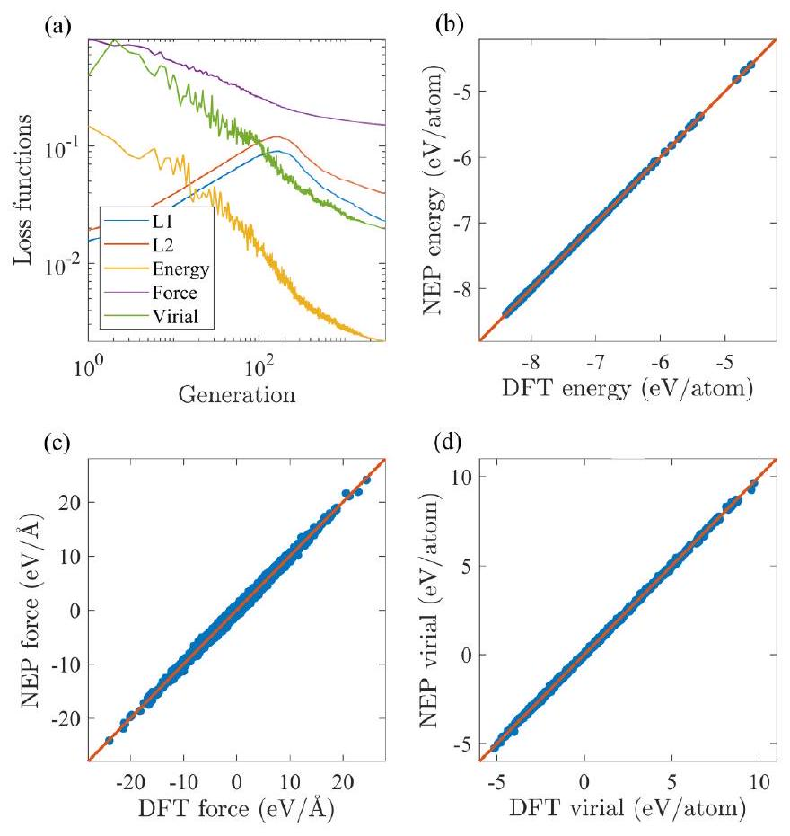
FIG. 1. (a) Evolution of the various terms in the loss function during the training process, including the $\mathcal{L}_{1}$ regularization (L1), $\mathcal{L}_{2}$ regularization (L2), energy RMSE (Energy), force RMSE (Force), and virial RMSE (Virial). (b) Energy, (c) force, and (d) virial as calculated from the NEP-ZBL model compared with the training data, excluding the dimers.

crystals with high-energy short-range interstitials. The last as well as the repulsive dimers are important to fit the repulsive NEP-to-ZBL transition. It should be noted that the data set includes 3526 structures, but not all the structures in Ref. [36] were used, as we removed distorted crystals (fcc, hcp, sc, diamond), which was later realized to be unnecessary. Each structure in the data set has a target energy, and some have a target virial tensor, with every atom having three target force components. For detailed information on the quantummechanical density functional theory (DFT) calculations for the reference data, please refer to Ref. [36].

The NEP-ZBL potential was trained using the GPUMD package [31]. The various hyperparameters in the NEP model defined in Ref. [25] are chosen as follows. The cutoff radii for the radial and angular descriptor components are $r_{\mathrm{c}}^{\mathrm{R}}=6 \AA$ and $r_{\mathrm{c}}^{\mathrm{A}}=4 \AA$, respectively. Note that we do not need a larger cutoff radius for the radial descriptor components as is required in the case of describing dispersion forces between molecules [37]. The Chebyshev polynomial expansion orders for the radial and angular descriptor components are $n_{\text {max }}^{\mathrm{R}}=$ 15 and $n_{\text {max }}^{\mathrm{A}}=10$, respectively. The Legendre polynomial expansion order for the angular descriptor components is $l_{\text {max }}=$ 4. The number of neurons in the hidden layer of the neural network is 100 . The weighting factors in the loss function as defined in Ref. [25] are $\lambda_{1}=\lambda_{2}=0.05, \lambda_{\mathrm{e}}=\lambda_{\mathrm{f}}=1$, and $\lambda_{\mathrm{v}}=$ 0.1 . The population size and the number of generations in the SNES algorithm [29] are $N_{\text {pop }}=50$ and $N_{\text {gen }}=3 \times 10^{5}$.

Figure 1(a) shows the evolution of the various loss terms with respect to the generation. Figures 1(b)-1(d) compare

TABLE II. Energy RMSE $\Delta E$, force RMSE $\Delta F$, and virial RMSE $\Delta W$ of the training data set from the NEP-ZBL model. The corresponding values for the GAP-ZBL model [16] are given in parentheses. Energy and virial RMSEs are in units of $\mathrm{meV} /$ atom , and force RMSE is in units of $\mathrm{meV} / \AA$. Here, "Liquid" includes both the liquid structures and the structures with short interatomic distances. "All" represents the combination of crystal and liquid structures.
|  | $\Delta E$ | $\Delta F$ | $\Delta W$ |
| :--- | :---: | :---: | :---: |
| Crystal | $1.89(1.95)$ | $69.7(60.0)$ | $19.6(14.7)$ |
| Liquid | $5.25(4.04)$ | $250(340)$ | none |
| All | $2.16(2.09)$ | $152(198)$ | $19.6(14.7)$ |

the predicted energy, force, and virial values by NEP-ZBL and those from quantum-mechanical DFT calculations for the training set. The root-mean-square errors (RMSEs) of energy, force, and virial for the NEP-ZBL model are listed in Table II. The accuracy is comparable to that obtained by the GAP-ZBL model [16].

It is crucial to verify that the NEP-ZBL matches the interatomic repulsion provided by the DFT training data and smoothly connects to and follows the refitted ZBL potential at short interatomic distances, with no strong or ill-behaved predictions by the NEP part. Figure 2 shows the short-range repulsion of a W-W dimer calculated respectively by the trained NEP-ZBL model, the NEP part of the NEP-ZBL model, the ZBL part of the NEP-ZBL model, and DFT. The results show that the NEP part of energy and force at short interatomic distances is of negligible magnitude compared to ZBL and has little effect on the strong repulsion.

## B. Validating the NEP-ZBL model

To evaluate the reliability of the NEP-ZBL model in modeling irradiation effects, we calculated a set of relevant material properties. Static calculations were carried out using ASE [38]. In Table III, the NEP-ZBL results are compared with those from experiments, DFT calculations, and some empirical potentials. The NEP-ZBL model shows a satisfactory agreement in the predictions of lattice parameters, cohesive energies, and elastic constants. As shown in Fig. 3, the formation energies of ten free surfaces calculated by the NEP-ZBL model are significantly better than traditional analytical potentials, which often significantly underestimate surface energies and predict the wrong order of stability of different surface orientations [14]. Note that only the first four low-index surfaces in Fig. 3 are included in the training database; thus, the accuracy is evidence of good generalizability outside of the training data. The generalization of surface formation energy can also be achieved by GAP [16] and DP models [18].

The point defect formation energies were evaluated in $4 \times 5 \times 6$ supercells for comparing with DFT. The formation energies of self-interstitial atoms (SIAs) calculated by the NEPZBL model are overestimated compared to the DFT reference due to the slightly underestimated cohesive energy, but it correctly predicts the relative stability between the interstitial structures. The vacancy formation energy and the vacancy migration barrier are also consistent with DFT. The binding

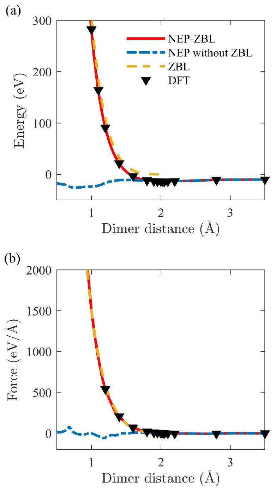
FIG. 2. (a) Energy and (b) force of short-range repulsion of a WW dimer calculated by the NEP-ZBL model, the NEP part of NEPZBL, the ZBL part of NEP-ZBL, and DFT.

of divacancies is a peculiar feature of tungsten and some other bcc transition metals [16]. It is reported that the binding energy of the second-nearest-neighbor ( 2 NN ) divacancy is strongly repulsive $\left(E_{\mathrm{b}}(2 \mathrm{NN})=-0.286 \mathrm{eV}\right.$ [50]). In contrast, the interaction between the first-nearest-neighbor (1NN) vacancies is weakly binding $\left(E_{\mathrm{b}}(1 \mathrm{NN})=0.048 \mathrm{eV}\right.$ [50]) or weakly repulsive $\left(E_{\mathrm{b}}(1 \mathrm{NN})=-0.1 \mathrm{eV}[51]\right)$ depending on DFT code and settings. In the NEP-ZBL model, $E_{\mathrm{b}}(1 \mathrm{NN})$ is 0.17 eV and $E_{\mathrm{b}}(2 \mathrm{NN})$ is -0.20 eV . Overall, the NEP-ZBL model predicts qualitatively the correct binding energies in good agreement with DFT.

The impact of point defects on the material's mechanical properties is relatively weak compared to the clusters formed due to migration and grouping of vacancies and selfinterstitials [18]. Hence, we investigate the formation energy and relative stability of SIA $1 / 2\langle 111\rangle$ and $\langle 100\rangle$ clusters (dislocation loops) with a box of 250000 atoms. Figure 4 shows the formation energies of $1 / 2\langle 111\rangle$ and $\langle 100\rangle$ prismatic loops predicted by NEP-ZBL, other EAM models [13,49], and the DFT extrapolation model [52]. The NEP-ZBL data

TABLE III. Basic properties of bcc tungsten: cohesive energy per atom, $E_{\text {coh }}(\mathrm{eV} /$ atom $)$, lattice constant $a$ ( $\AA$ ), bulk modulus $B$ (GPa) and elastic constants $C_{i j}(\mathrm{GPa})$, (110) surface energy $E_{\text {surf }}\left(\mathrm{meV} / \AA^{2}\right)$, formation energies $E_{\mathrm{f}}(\mathrm{eV})$ of differently oriented self-interstitial dumbbells and monovacancy, migration energy of monovacancy, $E_{\mathrm{m}}^{\mathrm{vac}}(\mathrm{eV})$, and melting temperature $T_{\text {melt }}(\mathrm{K})$.
|  | Expt. | DFT | NEP-ZBL | GAP [16] | CHEN [13] | AT [13] | JW [13] | MV2-B [39] | MV4-S [39] |
| :--- | :--- | :--- | :--- | :--- | :--- | :--- | :--- | :--- | :--- |
| $E_{\text {coh }}$ | -8.9 ${ }^{\mathrm{a}}$ | $-8.39{ }^{\text {b }}$ | -8.38 | -8.39 | -8.9 | -8.9 | -8.9 | -8.9 | -8.9 |
| a | $3.165{ }^{\text {a }}$ | $3.185{ }^{\text {b }}$ | 3.185 | 3.185 | 3.165 | 3.165 | 3.165 | 3.140 | 3.143 |
| B | $310{ }^{\text {a }}$ | $304{ }^{\text {b }}$ | 307 | 309 | 310 | 310 | 310 | 320 | 309 |
| $C_{11}$ | $522{ }^{\text {a }}$ | $522{ }^{\text {b }}$ | 518 | 526 | 522 | 522 | 522 | 544 | 523 |
| $C_{12}$ | $204{ }^{\text {a }}$ | $195{ }^{\text {b }}$ | 201 | 200 | 204 | 204 | 204 | 208 | 202 |
| $C_{44}$ | $161{ }^{\text {a }}$ | $148{ }^{\text {b }}$ | 144 | 149 | 161 | 161 | 161 | 160 | 161 |
| $E_{\text {surf }}$ | $187,{ }^{\text {c }} 203{ }^{\text {c }}$ | $204{ }^{\text {b }}$ | 205 | 204 | 159 | 161 | 161 | $144{ }^{\text {d }}$ | $157{ }^{\text {e }}$ |
| $E_{\mathrm{f}}^{\langle 111\rangle \mathrm{db}}$ |  | $9.55,{ }^{\mathrm{f}} 10.29^{\mathrm{g}}$ | 10.87 | 10.38 | 9.46 | 8.92 | 9.50 | 10.52 | 10.53 |
| $E_{\mathrm{f}}^{\langle 10\rangle \mathrm{db}}$ |  | $9.84,{ }^{\mathrm{f}} 10.58^{\mathrm{g}}$ | 11.09 | 10.59 | 9.80 | 9.64 | 10.16 | 10.82 | 10.82 |
| $E_{\mathrm{f}}^{\langle 100\rangle \mathrm{db}}$ |  | $11.49,{ }^{\text {f }} 12.20^{\text {g }}$ | 12.15 | 12.11 | 11.01 | 9.82 | 10.30 | 12.86 | 12.72 |
| $E_{\mathrm{f}}^{\text {vac }}$ | $3.67 \pm 0.2^{\mathrm{h}}$ | $3.22{ }^{\text {b }}$ | 3.28 | 3.32 | 3.54 | 3.63 | 3.63 | 3.49 | 3.81 |
| $E_{\mathrm{m}}^{\mathrm{vac}}$ | $1.78 \pm 0.1^{\mathrm{h}}$ | $1.73^{\mathrm{i}}$ | 1.74 | 1.71 | 1.91 | 1.44 | 1.44 | $1.85^{\mathrm{d}}$ | $1.84{ }^{\mathrm{j}}$ |
| $T_{\text {melt }}$ | $3687{ }^{\text {a }}$ | $3450 \pm 100^{\mathrm{k}}$ | $3540 \pm 10$ | $3540 \pm 10$ | $4580 \pm 10$ | $5200 \pm 50^{\mathrm{a}}$ |  |  |  |

${ }^{\mathrm{a}}$ Reference [40]; ${ }^{\mathrm{b}}$ Reference [16]; ${ }^{\mathrm{c}}$ Reference [41]; ${ }^{\mathrm{d}}$ Reference [13]; ${ }^{\mathrm{e}}$ Reference [14]; ${ }^{\mathrm{f}}$ Reference [42]; ${ }^{\mathrm{g}}$ Reference [43]; ${ }^{\mathrm{h}}$ Reference [44]; ${ }^{\mathrm{i}}$ Reference [45]; ${ }^{\mathrm{j}}$ Reference [46]; ${ }^{\mathrm{k}}$ Reference [47]; ${ }^{\mathrm{l}}$ Reference [48].
closely follow the DFT extrapolation model, unlike the EAM potentials.

We also simulated threshold displacement energies ( $E_{\mathrm{d}}$ ) with the NEP-ZBL model at 30 K . The simulation box was a $12 \times 12 \times 16$ supercell containing 4608 atoms. The simulations were cooled down by one lattice atomic layer at boundaries. The time step was variable and limited the displacement of the fastest atom to $0.005 \AA$. The minimum $E_{\mathrm{d}}$ value is 49 eV for the $\langle 100\rangle$ direction. We calculated $E_{\mathrm{d}}$ for six other directions $(\langle 110\rangle,\langle 122\rangle,\langle 133\rangle,\langle 135\rangle,\langle 235\rangle$, and $\langle 111\rangle$ ) and determined the average $E_{\mathrm{d}}$ of our potential to be 117 eV . Note that a reliable global average over crystal directions typically requires on the order of a hundred or thousand directions, but this value serves as a first approximation.

The melting point was calculated by the solid-liquid coexistence method [53]. The biphase system containing 13500

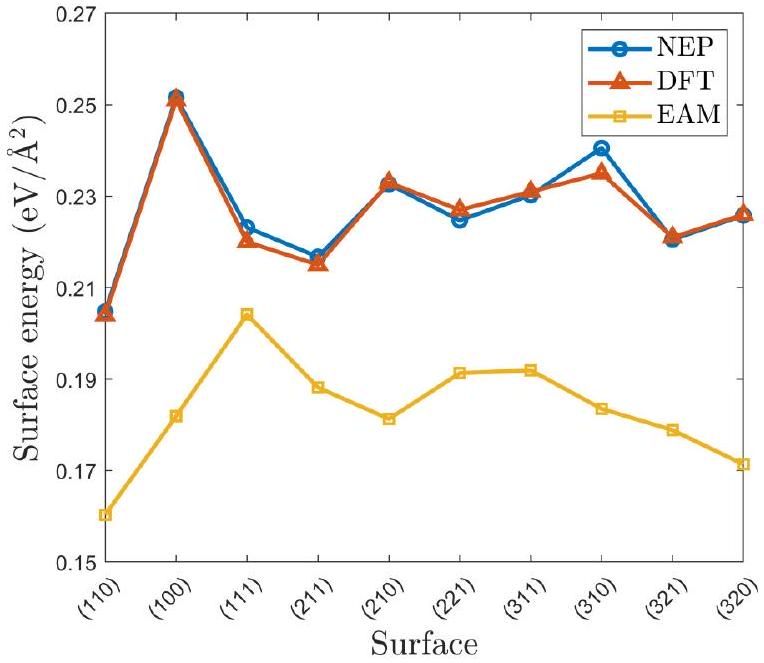
FIG. 3. Surface energies predicted by the NEP-ZBL model as compared with DFT and EAM [49]. The DFT values are from Ref. [16].

atoms with half of the atoms in the liquid phase and the other half in the solid bcc phase was simulated at temperatures ranging from 3500 to 3600 K , and the pressures were kept at 0 GPa . The system remained as biphase using a NEP-ZBL potential at 3540 K , above which the liquid phase grows, and below this temperature the system crystallizes. Figure 5 presents the phonon dispersion of bcc tungsten calculated by the NEP-ZBL model compared with experimental data [55], the results calculated by GAP [16], and previous DFT studies [54]. The results show that the dispersion relation is well reproduced by the NEP-ZBL model. All the above results demonstrate that the NEP-ZBL potential is not negatively affected by the ZBL potential and can provide accurate predictions about the material properties near the equilibrium state.

The energy landscape of generalized stacking fault (GSF) is defined by the energy change that occurs when one section of the crystal is displaced in relation to the other along a

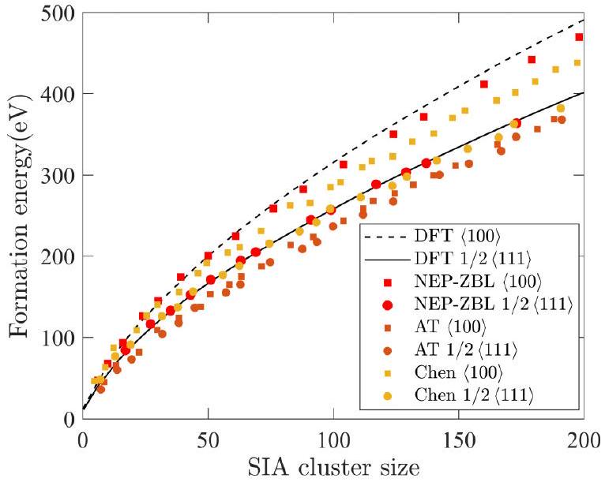
FIG. 4. Formation energies of $1 / 2\langle 111\rangle,\langle 100\rangle$ clusters in W predicted by NEP-ZBL, DFT, Ackland and Thetford (AT) [49], and Chen et al. [13] data.

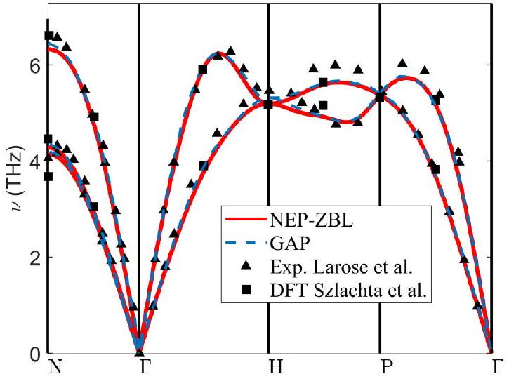
FIG. 5. Phonon dispersion of bcc W as given by the NEP-ZBL model and compared with DFT [54] and experimental data [55].

specific plane ( $\gamma$ plane). The GSF energy along a given direction is referred to as the $\gamma$ line. We evaluate the two common $\gamma$ lines that are relevant for screw dislocation motion using the NEP-ZBL model: displacement along the $\langle 111\rangle$ direction for both the $(1 \overline{1} 0) \gamma$ plane and $(1 \overline{1} 2) \gamma$ plane. We compare our findings with the results [18] of $\gamma$ lines computed via DFT and EAM models, as depicted in Fig. 6. The predictions of the $\gamma$

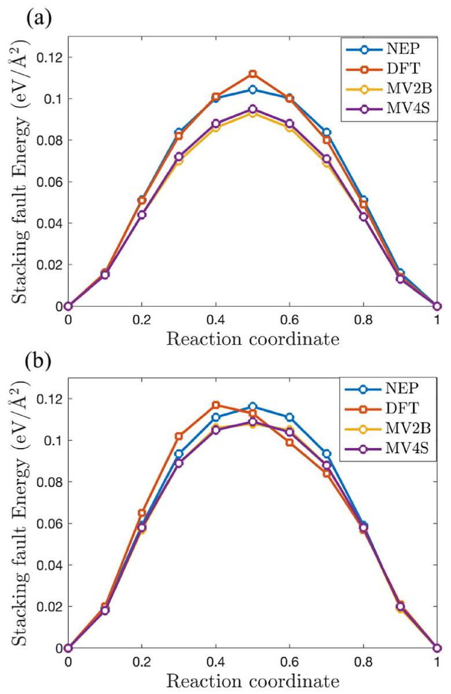
FIG. 6. Prediction of GSF energy by DFT [18], NEP-ZBL, MV2B [39], and MV4-S [39], along the $\langle 111\rangle$ direction on (a) (1 $\overline{1} 0$ ) and (b) ( $1 \overline{1} 2$ ) planes.

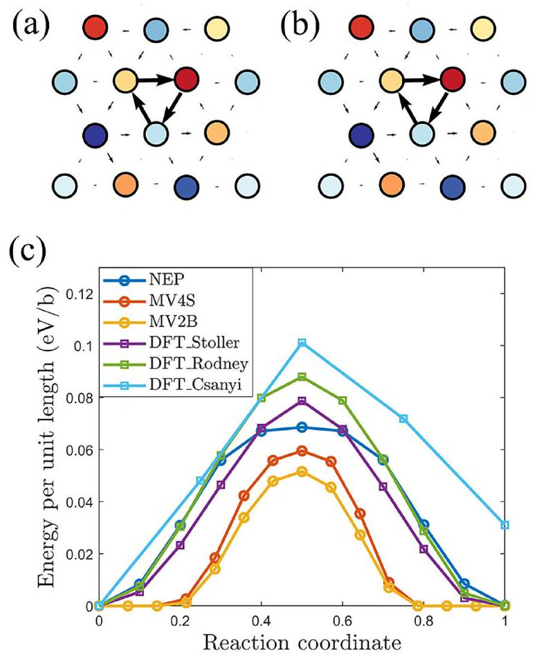
FIG. 7. Relaxed core structure of a $1 / 2\langle 111\rangle$ screw dislocation in the (a) NEP-ZBL and (b) DFT simulations, visualized using differential displacement plots [57]. The colors represent the different (111) layers spanning one Burgers vector length. Arrows between nearest neighbors indicate the out-of-plane $\langle 111\rangle$ displacements with respect to the perfect bulk. (c) Peierls barrier of bcc W as given by the NEP-ZBL, MV2-B [39], and MV4-S [39] models, and compared with DFT calculated Peierls barriers by Rodney et al. [56], Csanyi et al. [54], and Stoller [58].

lines by the NEP-ZBL model exhibit a good agreement with DFT. The EAM predictions for $\gamma$ lines are marginally lower than DFT values at both the ( $1 \overline{1} 0$ ) and ( $1 \overline{1} 2$ ) $\gamma$ planes.

Reproducing the fundamental properties of screw dislocations has often been challenging for traditional interatomic potentials. To evaluate the relaxed core of the screw dislocation and Peierls barrier for screw dislocation migration, we employed 135 -atom boxes with quadrupolar periodic arrangements of screw dislocation dipoles to generate two screw dislocations with opposite Burgers vectors, following the method established in Ref. [56]. Figure 7 presents the relaxed core of the screw dislocation in NEP-ZBL [Fig. 7(a)] and DFT [Fig. 7(b)], while Fig. 7(c) shows the Peierls barrier obtained from the NEP-ZBL model, EAM [39] models (MV2B and MV4-S model), and DFT [18] calculations. Barriers are determined with simultaneous migration of both dislocations using the Nudged Elastic Band (NEB) method [59]. The NEP-ZBL model successfully replicates the symmetric nondegenerate core structure of the $1 / 2\langle 111\rangle$ screw dislocation, as predicted by DFT. Moreover, the NEP-ZBL model yields similar barriers with consistent shapes in comparison to the DFT results, demonstrating a notable improvement over the EAM models.

Apart from accuracy, computational efficiency is also vital for simulating primary radiation damage. Table IV compares NEP-ZBL against an EAM-ZBL model [13] and a DP-ZBL

TABLE IV. The computational speed (in units of atom step/s) and the maximum system size ( $N_{\text {max }}$ ) for NEP-ZBL, EAM-ZBL [13], and DP-ZBL [18] as measured using one 40-GB A100 GPU.
| Potential | Speed | $N_{\text {max }}$ |
| :--- | :---: | :---: |
| EAM-ZBL | $3.6 \times 10^{7}$ | $9.8 \times 10^{6}$ |
| NEP-ZBL | $1.3 \times 10^{7}$ | $8.1 \times 10^{6}$ |
| DP-ZBL | $1.3 \times 10^{5}$ | $4.4 \times 10^{4}$ |

model [18] in terms of the computational speed and the upper limit of the system size in MD simulations, using one $40-\mathrm{GB}$ A100 GPU. The NEP-ZBL model is only a couple of times slower than the empirical EAM-ZBL model and is about two orders of magnitude as efficient as the DP-ZBL model. The superior computational efficiency for NEP against MTP and GAP has been discussed previously [26].

## C. Radiation-induced defects in bulk tungsten

First, we quantified the number of residual point defects in the cascades with PKA energies ranging from 1 to 200 keV at 300 K . The Norgett-Robinson-Torrens displacements per atom (NRT-dpa) model [60] is the current international standard for quantifying this energetic particle damage. However, it has been observed that in metals, the number of defects produced in energetic cascades is only one-third of the NRTdpa prediction [61]. The athermal-recombination-corrected displacements per atom (arc-dpa) function, proposed by Nordlund et al., improves upon the NRT-dpa by providing a more physically realistic description of primary defect creation in materials [62]. Figure 8 presents the residual point defects calculated by the NEP-ZBL model, the NRT model, and the arc-dpa model [62]. The value of $E_{\mathrm{d}}$ used in the model is

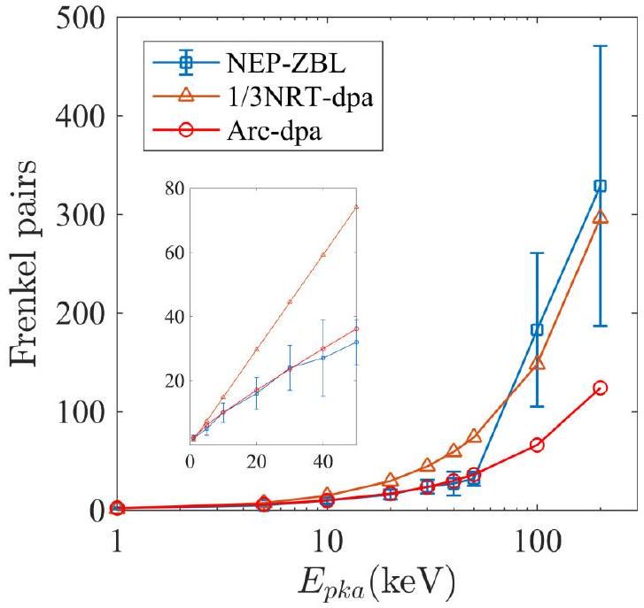
FIG. 8. The residual point defects, the corresponding $1 / 3$ NRT model results, and the corresponding arc-DPA model results. Each point is the average of ten independent cascade simulations, and the errors are given in the standard deviation. The inset in the figure shows a duplicate view of the low-value data for better visibility and comparison.

90 eV , as commonly used in experimental studies. Setyawan et al. [63] reported two regimes of energy dependence for defect production in metals. The number of surviving Frenkel pairs (FPs) obtained by the NEP-ZBL model is consistent with the arc-dpa model at lower energy regions. In the higher-energy region, the number of surviving FPs ( $N_{F}$ ) follows a function ( $N_{F}=a\left(E_{\mathrm{MD}} / E_{\mathrm{d}}\right)^{b}$ ) of the reduced energy, $E \equiv E_{\mathrm{MD}} / E_{\mathrm{d}}$, with the threshold displacement energy set to 117 eV . The prefactor is 0.03 and the fitted exponent is 1.25 , similar to the results reported by Setyawan et al. [63] with a prefactor of 0.02 and a fitted exponent of 1.30 .

Figure 9 presents snapshots of three typical defects resulting from a displacement cascade with a PKA energy of 200 keV . We classify the cascades by the peak damage state into three categories-unfragmented, unconnected, and connected-following the criterion suggested in Ref. [64]. The observed probability of subcascade splitting is $70 \%$ for the 200 keV PKA energy and decreases to $20 \%$ for a PKA energy of 100 keV . This is consistent with the subcascade splitting threshold for self-ions in tungsten, which is estimated to be around 160 keV based on the analysis of binary collision approximation (BCA) cascades [65]. Figure 9(a) depicts an unfragmented case where the cascade appears in a locally compact region, producing a massive and unbroken molten region, and Fig. 9(d) shows the defect distribution of this case after 150 ps . Large interstitial clusters are accompanied by the formation of large vacancy clusters, both exhibiting a two-dimensional platelet shape (loops). Figures 9(b) and 9(e) and Figs. 9(c) and 9(f) respectively illustrate the continuous morphology of the fragmentations and the defect distribution of them after 150 ps through the connected and the unconnected subcascades. It can be seen that the distribution of defects correlates with the morphology at the peak damage state. Compared to unfragmented cascades, the distribution of defects in fragmented cascades is more dispersed and the clusters are smaller in size.

We analyzed each large defect cluster to determine the nature of the dislocation loops. Figure 10 shows the typical defect clusters produced by a 200 keV cascade. Most of the dislocation loops observed have the Burgers vector $\boldsymbol{b}=1 / 2\langle 111\rangle$. It is worth mentioning that we observed an interstitial $\langle 100\rangle$ loop in Fig. 9(f). Although this $\langle 100\rangle$ interstitial loop is the only one observed in ten cascades, it is stable within a timescale of 1 ns . The dynamic process of this cascade is showcased in Supplemental Movie 1 [66].

The detailed size distributions of the interstitial and vacancy clusters obtained with 100 keV and 200 keV PKA energies are shown in Fig. 12. The largest clusters of both interstitial and vacancy type were produced by the 200 keV unfragmented cascade. Large vacancy clusters are accompanied by the formation of large interstitial clusters, with sizes of more than 80 vacancies mainly exhibiting a twodimensional platelet shape (loops), while sizes of less than 80 vacancies exhibit three-dimensional shapes (cavity). The interstitial clusters exhibit a two-dimensional platelet shape (loops). Note that a larger number density and smaller average size distribution of defect clusters were found by the 200 keV cascade. With 100 keV PKA energy, 59\% vacancy clusters are smaller than 50 defects in size, $71 \%$ SIA clusters are smaller than 100 defects, and the ratios are 79\% and 95\% at 200 keV

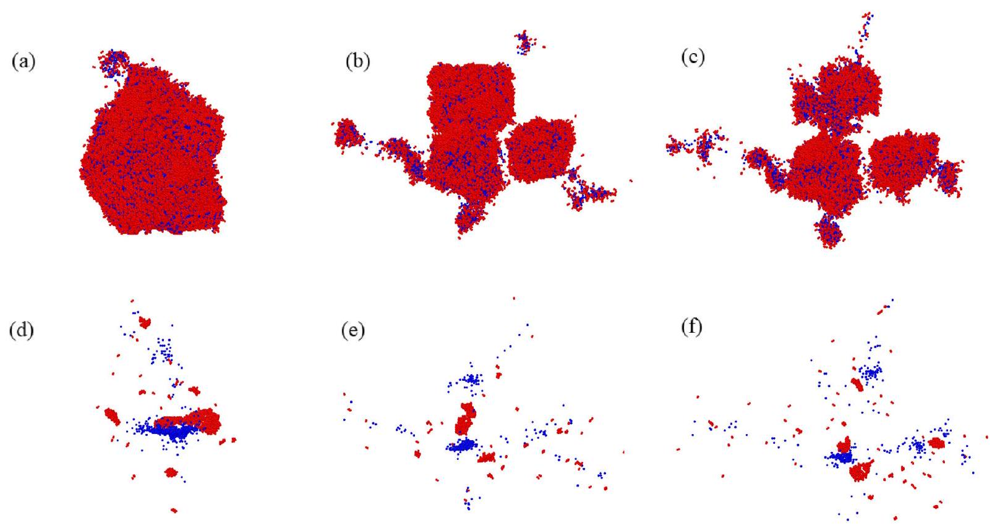
FIG. 9. Snapshots of three representative cascades at the peak damage states in tungsten: (a) unfragmented type, (b) connected type, and (c) unconnected type. Below them are corresponding snapshots of the surviving defects in the final state of damage: (d) unfragmented type, (e) connected type, and (f) unconnected type. The red particles are interstitial atoms and the blue particles are vacancies.

energy. The more frequent subcascade splitting at 200 keV is the cause of this difference.

## D. Radiation-induced defects in thin-foil tungsten

Figure 11 shows the damage microstructure of the tungsten thin film 220 ps after launching the 200 keV PKA as
well as the peak damage state. Blue spheres mark the location of vacancies while red particles are interstitial atoms. Surface-layer atoms, including adatoms and sputtered atoms, are also represented in the figure with yellow spheres. In this fragmented cascade, the liquid core of the subcascade heat spike extends to the surface, causing near-surface material to be ejected in the form of sputtered atoms and atom clusters.

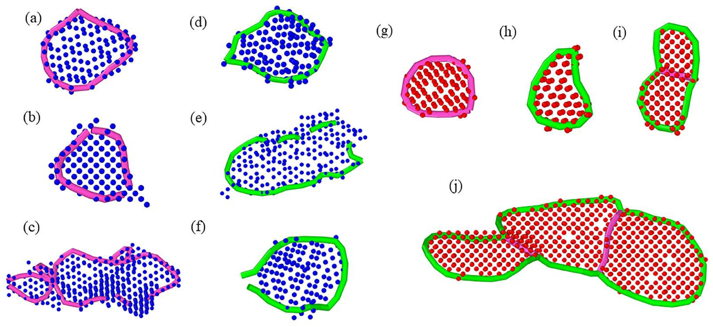
FIG. 10. (a) A 127 -vacancy cluster in the form of a complete $\langle 100\rangle$ dislocation loop; (b) a 90 -vacancy cluster with $\langle 100\rangle$ segments; (c) the largest vacancy cluster observed, containing 457 vacancies and $\langle 100\rangle$ segments; (d) a 104 -vacancy cluster in the form of a complete $1 / 2\langle 111\rangle$ dislocation loop; (e) a 203-vacancy cluster with $1 / 2\langle 111\rangle$ segments, the largest vacancy cluster with this Burgers vector; (f) a 119 -vacancy cluster with $1 / 2\langle 111\rangle$ segments; (g) a complete $\langle 100\rangle$ dislocation loop consisting of 55 interstitials; (h) a complete $1 / 2\langle 111\rangle$ dislocation loop consisting of 40 interstitials; (i) a mixed interstitial loop with a Burgers vectors of $1 / 2\langle 111\rangle$ and $\langle 100\rangle$ consisting of 65 interstitials; and (j) the largest interstitial loop observed in W, consisting of 434 interstitials. The red particles are interstitial atoms and the blue particles are vacancies. The green lines represent $1 / 2\langle 111\rangle$ segments, whereas the pink lines represent $\langle 100\rangle$ segments.

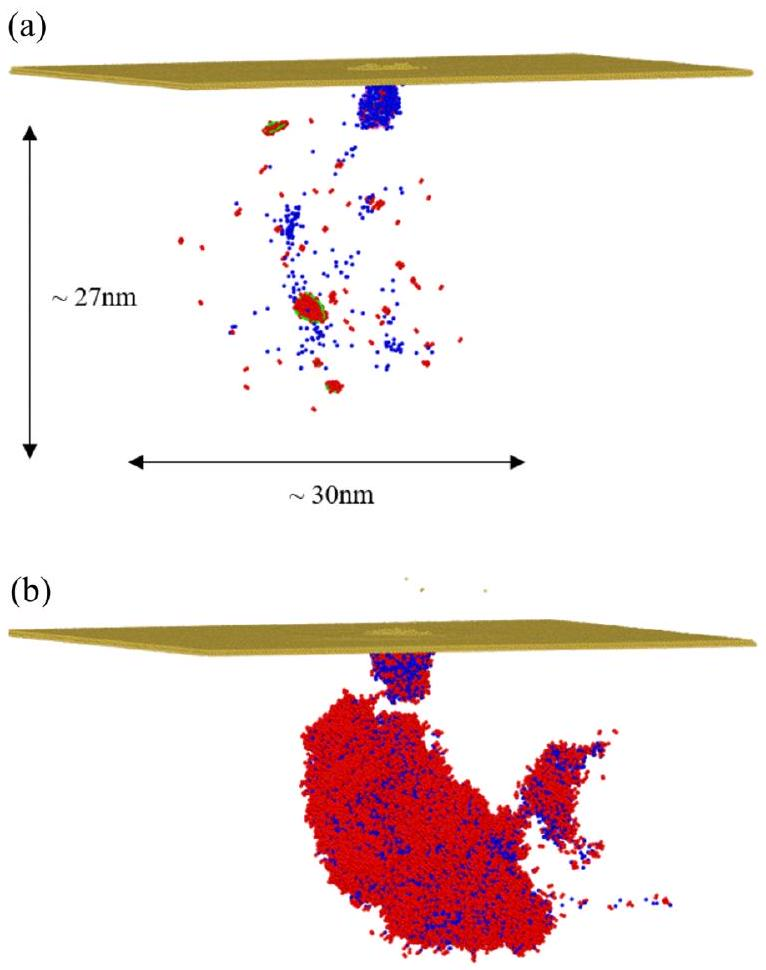
FIG. 11. (a) Snapshots of surviving defects in the final state of damage and (b) snapshots of the peak damage state for cascades on a thin-foil surface. The red particles are interstitial atoms and the blue particles are vacancies. The green lines represent $1 / 2\langle 111\rangle$ segments, whereas the pink lines represent $\langle 100\rangle$ segments.

In addition, there is a viscous flow of atoms to the surface resulting in a depleted zone in the core of the cascade and subsequent formation of large vacancy clusters. Figure 11(a) shows that the damage consists of isolated interstitials and vacancies, three smaller clusters and a relatively large cluster of 22, 17, 8, and 76 interstitials, and a significantly larger cluster of 275 vacancies. The total number of vacancies in this case is 478, while the total number of self-interstitials is 212. There are 260 adatoms at the free surface and 6 sputtered atoms corresponding to the mismatch between the vacancy and interstitial counts. These observations are consistent with previous simulations of thin-foil tungsten [67].

As can be observed in Fig. 11, most of the damage distribution is scattered, while the displacement cascade reached a maximum depth of 27 nm and width of 30 nm . Figure 11(a) shows a <100> incomplete dislocation loop with 127
vacancies, which remains stable within a timescale of 1 ns . The dynamic process of this cascade is showcased in Supplemental Movie 2 [66]. The presence of $\langle 100\rangle$ dislocation loops following displacement cascades in W was already shown by Yi et al. [6]. Figure 11(b) exhibits a snapshot of the cascade at the peak. We find that all cascades with the formation of $\langle 100\rangle$ vacancy dislocation loops are fragmented and the subcascade near the surface is unconnected to the main cascade core further below. The $\langle 100\rangle$ dislocation loops are formed by cascade collapse from the subcascade. We also obtained one damage configuration which consists of a dislocation network connected to the surface similar to that obtained by Ghaly and Averback in Au [68]. This is also consistent with previous simulations of Fe and W thin foils [67,69].

In order to quantify the surface effect on radiation-induced defects, we performed a statistical analysis of the data including the mean values of the number of point defects as well as their percentage in clusters, listed in Table V. Due to the surface effect, the number of self-interstitials is always lower than the number of vacancies in foil simulations. As shown in Table V the damage exhibits an increase of $391 \%$ and $264 \%$ for the number of vacancies compared to bulk simulations and a decrease of $66.7 \%$ and $39.2 \%$ for interstitials for 100 keV and 200 keV PKAs, where the missing self-interstitials correspond to adatoms and sputtered atoms [69]. The maximum number of atoms sputtered out is 73 with 100 keV PKA energy. Table V shows that the percentage of vacancies in clusters is very similar for bulk and foil material, but the percentage of interstitials in clusters decreases $37 \%$ and $19 \%$ for 100 and 200 keV , respectively. Due to the mechanisms explained above, the main effect of the free surface is that more vacancies are formed but fewer interstitials. Interstitials also remain more isolated instead of efficiently clustering like in bulk cascades. The surface effect decreases with increasing energy since the core of the cascade is farther away from the surface with increasing energy.

Figure 12 shows the size distributions of clusters of vacancies and interstitials in thin foils. It is clear that larger and more vacancy clusters as well as smaller and less interstitial clusters are produced, compared to bulk tungsten. In addition, the scatter in the size of clusters is extensive. There is one vacancy cluster with 1103 vacancies formed by a 200 keV cascade. The surface also affects the dislocation density. Compared to bulk, the dislocation density of $\langle 100\rangle$ Burgers vectors increases from $9.88 \times 10^{9}$ to $1.08 \times 10^{11} \mathrm{~cm}^{-2}$ as well as from $4.47 \times 10^{10}$ to $9.86 \times 10^{10} \mathrm{~cm}^{-2}$ for 100 and 200 keV PKAs, respectively. Correspondingly the $1 / 2\langle 111\rangle$ dislocation density decreases from $2.87 \times 10^{11}$ to $2.01 \times 10^{11} \mathrm{~cm}^{-2}$

TABLE V. Statistical results of average numbers of vacancies and interstitials ( $N_{\text {vac }}$ and $N_{\text {int }}$ ) and the largest vacancy and interstitial clusters ( $S_{\text {vac }}$ and $S_{\text {int }}$ ) following the displacement cascade, and the percentages of vacanciesand interstitials in clusters. These data are based on ten cascade events, with standard deviations in parentheses.
| Energy (keV) |  | $N_{\text {vac }}$ | $N_{\text {int }}$ | $S_{\text {vac }}$ | $S_{\text {int }}$ | \% in clusters |
| :--- | :--- | :--- | :--- | :--- | :--- | :--- |
| 100 | Bulk | 183(78) | 183(78) | 97 | 237 | 55 and 86 |
|  | Foil | 898(278) | 61(72) | 905 | 53 | 45 and 49 |
| 200 | Bulk | 329(142) | 329(142) | 457 | 429 | 50 and 85 |
|  | Foil | 1200(695) | 200(205) | 1103 | 295 | 52 and 66 |

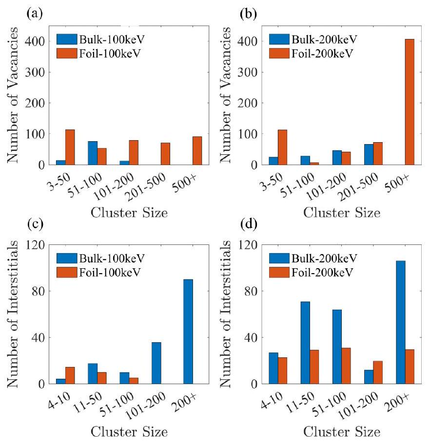
FIG. 12. Size distribution of defect clusters for cascades simulated in tungsten.

as well as from $2.82 \times 10^{11}$ to $1.69 \times 10^{11} \mathrm{~cm}^{-2}$. Overall, the simulations show that the frequency and size of vacancy dislocation loops and the $\langle 100\rangle$ dislocation density is greater when damage is produced in thin foils.

In our computational modeling study, we have observed results consistent with the experimental findings reported by Yi et al. [7]. The emergence of $1 / 2\langle 111\rangle$ and $\langle 100\rangle$ vacancy loops in low-dose heavy-ion irradiated tungsten is validated as an intrinsic cascade phenomenon. This suggests that these loops primarily originate from cascade nucleation rather than resulting from long-term evolution of the defect structure. Moreover, our simulations emphasize the impact of foil surfaces, as seen in thin-foil irradiation specimens or back-thinned irradiated specimens, on the evolution of damage. The notable trends elucidated by Yi et al. [8] were consistently replicated in our computational investigation: the total vacancy count was observed to be an order of magnitude greater than the number of SIAs, indicating a substantial effect of proximate free surfaces on defect formation. In contrast to EAM models wherein the effect of surface on defect statistics is more pronounced in Fe than in W [70] and the formation of SIA clusters is only slightly affected by the surface, the NEPZBL potential shows a noticeable impact of the free surface in tungsten. This difference suggests that EAM models may not fully capture free surface effects, which is in line with the fact that surfaces in EAM models are often significantly too stable (i.e., surface energies are severely underestimated; Fig. 3).

## IV. SUMMARY AND CONCLUSIONS

We have introduced a hybrid scheme of the Ziegler-Biersack-Littmark (ZBL) screened nuclear repulsion potential and the neuroevolution machine learning potential. This model achieves accuracy comparable to other MLPs, while exhibiting high computational efficiency in terms of computation time and memory usage. This allowed us to investigate energetic radiation-induced collision cascades in large-scale molecular dynamics simulations. Primary radiation damage of tungsten was investigated by irradiation with ions of energies ranging from 1 to 200 keV in both thin foil and bulk form. We observed that low-dose high-energy irradiation directly generates $\langle 100\rangle$ interstitial dislocation loops in tungsten, which remained stable within 1 ns . The simulations also generated complete dislocation loops of vacancy type, including $\langle 100\rangle$ dislocation loops and $1 / 2\langle 111\rangle$ dislocation loops. The presence of a surface led to the formation of more numerous and larger vacancy clusters as well as smaller and less interstitial clusters. Some of the vacancy clusters coalesced into incomplete $\langle 100\rangle$ dislocation loops. This significantly enhances the linear density of $\langle 100\rangle$ dislocations in the irradiated material. Our results show that one should carefully account for the effect of free surfaces in tungsten.

We showed that the NEP-ZBL potential provides accurate predictions of material properties which have been persistent challenges for empirical potentials, such as the relative stability of defect clusters and surface properties. Furthermore, molecular dynamics simulations revealed that our findings for bulk tungsten agree with existing results from EAM models. However, we see pronounced differences in the simulations for foils compared to EAM models. These differences suggest that while EAM models can depict radiation damage in bulk structures, they may not fully reproduce the effects of free surfaces. With an efficient GPU implementation, the NEP-ZBL framework hence offers good opportunities for large-scale simulations of radiation damage also in other materials, particularly in systems lacking suitable empirical potentials such as high-entropy alloys and ceramics.

The training and validation results for the NEP-ZBL model of tungsten are freely available from the Github repository [71]. Other data presented in this paper are available from the corresponding authors upon reasonable request.

## ACKNOWLEDGMENTS

The authors acknowledge funding from the National Key Research and Development Program of China under Grant No. 2021YFB3802104 (P.Q.), the CNNC Science Fund for Talented Young Scholars, Grant No. FY222506000902 (Y.S. and J.L.), the National Natural Science Foundation of China (NSFC) under Grant No. 11974059 (Z.F.), the Academy of Finland Flagship programme: Finnish Center for Artificial Intelligence (FCAI) (J.B.), and USTB MatCom of Beijing Advanced Innovation Center for Materials Genome Engineering.
[1] J. Knaster, A. Moeslang, and T. Muroga, Materials research for fusion, Nat. Phys. 12, 424 (2016).
[2] M. R. Gilbert, S. L. Dudarev, S. Zheng, L. W. Packer, and J.-Ch. Sublet, An integrated model for materials in a fusion
power plant: Transmutation, gas production, and helium embrittlement under neutron irradiation, Nucl. Fusion 52, 083019 (2012).
[3] S. J. Zinkle and G. S. Was, Materials challenges in nuclear energy, Acta Mater. 61, 735 (2013).
[4] K. Nordlund, Historical review of computer simulation of radiation effects in materials, J. Nucl. Mater. 520, 273 (2019).
[5] Y. Lin, T. Yang, L. Lang, C. Shan, H. Deng, W. Hu, and F. Gao, Enhanced radiation tolerance of the Ni-Co-Cr-Fe high-entropy alloy as revealed from primary damage, Acta Mater. 196, 133 (2020).
[6] X. Yi, M. L. Jenkins, M. Briceno, S. G. Roberts, Z. Zhou, and M. A. Kirk, In situ study of self-ion irradiation damage in W and W-5Re at $500^{\circ} \mathrm{C}$, Philos. Mag. 93, 1715 (2013).
[7] X. Yi, M. L. Jenkins, K. Hattar, P. D. Edmondson, and S. G. Roberts, Characterisation of radiation damage in W and W based alloys from 2 MeV self-ion near-bulk implantations, Acta Mater. 92, 163 (2015).
[8] X. Yi, M. L. Jenkins, M. A. Kirk, Z. Zhou, and S. G. Roberts, In-situ TEM studies of $150 \mathrm{keV} \mathrm{W}^{+}$ion irradiated W and Walloys: Damage production and microstructural evolution, Acta Mater. 112, 105 (2016).
[9] E. Zarkadoula, S. L. Daraszewicz, D. M. Duffy, M. A. Seaton, I. T. Todorov, K. Nordlund, M. T. Dove, and K. Trachenko, The nature of high-energy radiation damage in iron, J. Phys.: Condens. Matter 25, 125402 (2013).
[10] J. Fu, Y. Chen, J. Fang, N. Gao, W. Hu, C. Jiang, H.-B. Zhou, G.-H. Lu, F. Gao, and H. Deng, Molecular dynamics simulations of high-energy radiation damage in W and W-Re alloys, J. Nucl. Mater. 524, 9 (2019).
[11] J. Byggmästar, F. Granberg, A. E. Sand, A. Pirttikoski, R. Alexander, M.-C. Marinica, and K. Nordlund, Collision cascades overlapping with self-interstitial defect clusters in Fe and W, J. Phys.: Condens. Matter 31, 245402 (2019).
[12] Q. Peng, F. Meng, Y. Yang, C. Lu, H. Deng, L. Wang, S. De, and F. Gao, Shockwave generates $\langle 100\rangle$ dislocation loops in bcc iron, Nat. Commun. 9, 4880 (2018).
[13] Y. Chen, Y.-H. Li, N. Gao, H.-B. Zhou, W. Hu, G.-H. Lu, F. Gao, and H. Deng, New interatomic potentials of W, Re and W-Re alloy for radiation defects, J. Nucl. Mater. 502, 141 (2018).
[14] G. Bonny, D. Terentyev, A. Bakaev, P. Grigorev, and D. Van Neck, Many-body central force potentials for tungsten, Modell. Simul. Mater. Sci. Eng. 22, 053001 (2014).
[15] A. Hamedani, J. Byggmästar, F. Djurabekova, G. Alahyarizadeh, R. Ghaderi, A. Minuchehr, and K. Nordlund, Primary radiation damage in silicon from the viewpoint of a machine learning interatomic potential, Phys. Rev. Mater. 5, 114603 (2021).
[16] J. Byggmästar, A. Hamedani, K. Nordlund, and F. Djurabekova, Machine-learning interatomic potential for radiation damage and defects in tungsten, Phys. Rev. B 100, 144105 (2019).
[17] F. Granberg, J. Byggmästar, and K. Nordlund, Molecular dynamics simulations of high-dose damage production and defect evolution in tungsten, J. Nucl. Mater. 556, 153158 (2021).
[18] X. Wang, Y. Wang, L. Zhang, F. Dai, and H. Wang, A tungsten deep neural-network potential for simulating mechanical property degradation under fusion service environment, Nucl. Fusion 62, 126013 (2022).
[19] H. Wang, X. Guo, L. Zhang, H. Wang, and J. Xue, Deep learning inter-atomic potential model for accurate irradiation damage simulations, Appl. Phys. Lett. 114, 244101 (2019).
[20] Y. Wang, J. Liu, J. Li, J. Mei, Z. Li, W. Lai, and F. Xue, Machine-learning interatomic potential for radiation damage effects in bcc-iron, Comput. Mater. Sci. 202, 110960 (2022).
[21] J. Byggmästar, G. Nikoulis, A. Fellman, F. Granberg, F. Djurabekova, and K. Nordlund, Multiscale machine-learning interatomic potentials for ferromagnetic and liquid iron, J. Phys.: Condens. Matter 34, 305402 (2022).
[22] J. Byggmästar, K. Nordlund, and F. Djurabekova, Modeling refractory high-entropy alloys with efficient machine-learned interatomic potentials: Defects and segregation, Phys. Rev. B 104, 104101 (2021).
[23] J. Byggmästar, K. Nordlund, and F. Djurabekova, Simple machine-learned interatomic potentials for complex alloys, Phys. Rev. Mater. 6, 083801 (2022).
[24] F. J. Domínguez-Gutiérrez, P. Grigorev, A. Naghdi, J. Byggmästar, G. Y. Wei, T. D. Swinburne, S. Papanikolaou, and M. J. Alava, Nanoindentation of tungsten: From interatomic potentials to dislocation plasticity mechanisms, Phys. Rev. Mater. 7, 0436003 (2023).
[25] Z. Fan, Z. Zeng, C. Zhang, Y. Wang, K. Song, H. Dong, Y. Chen, and T. Ala-Nissila, Neuroevolution machine learning potentials: Combining high accuracy and low cost in atomistic simulations and application to heat transport, Phys. Rev. B 104, 104309 (2021).
[26] Z. Fan, Y. Wang, P. Ying, K. Song, J. Wang, Y. Wang, Z. Zeng, K. Xu, E. Lindgren, J. M. Rahm, A. J. Gabourie, J. Liu, H. Dong, J. Wu, Y. Chen, Z. Zhong, J. Sun, P. Erhart, Y. Su, and T. Ala-Nissila, GPUMD: A package for constructing accurate machine-learned potentials and performing highly efficient atomistic simulations, J. Chem. Phys. 157, 114801 (2022).
[27] J. F. Ziegler and J. P. Biersack, The stopping and range of ions in matter, in Treatise on Heavy-Ion Science: Volume 6: Astrophysics, Chemistry, and Condensed Matter, edited by D. Allan Bromley (Springer, Boston, 1985), pp. 93-129.
[28] J. Behler and M. Parrinello, Generalized Neural-Network Representation of High-Dimensional Potential-Energy Surfaces, Phys. Rev. Lett. 98, 146401 (2007).
[29] T. Schaul, T. Glasmachers, and J. Schmidhuber, High dimensions and heavy tails for natural evolution strategies, in Proceedings of the 13th Annual Conference on Genetic and Evolutionary Computation, GECCO '11 (Association for Computing Machinery, New York, 2011), pp. 845-852.
[30] J. Tersoff, Modeling solid-state chemistry: Interatomic potentials for multicomponent systems, Phys. Rev. B 39, 5566 (1989).
[31] Z. Fan, W. Chen, V. Vierimaa, and A. Harju, Efficient molecular dynamics simulations with many-body potentials on graphics processing units, Comput. Phys. Commun. 218, 10 (2017).
[32] G. J. Martyna, M. L. Klein, and M. Tuckerman, Nosé-Hoover chains: The canonical ensemble via continuous dynamics, J. Chem. Phys. 97, 2635 (1992).
[33] A. Stukowski, Visualization and analysis of atomistic simulation data with OVITO-the open visualization tool, Modell. Simul. Mater. Sci. Eng. 18, 015012 (2010).
[34] K. Nordlund and R. S. Averback, Point defect movement and annealing in collision cascades, Phys. Rev. B 56, 2421 (1997).
[35] A. Stukowski, V. V. Bulatov, and A. Arsenlis, Automated identification and indexing of dislocations in crystal interfaces, Modell. Simul. Mater. Sci. Eng. 20, 085007 (2012).
[36] J. Byggmästar, K. Nordlund, and F. Djurabekova, Gaussian approximation potentials for body-centered-cubic transition metals, Phys. Rev. Mater. 4, 093802 (2020).
[37] H. Dong, C. Cao, P. Ying, Z. Fan, P. Qian, and Y. Su, Anisotropic and high thermal conductivity in monolayer quasi-hexagonal fullerene: A comparative study against bulk phase fullerene, Int. J. Heat Mass Transf. 206, 123943 (2023).
[38] A. H. Larsen, J. J. Mortensen, J. Blomqvist, I. E. Castelli, R. Christensen, M. Dułak, J. Friis, M. N. Groves, B. Hammer, C. Hargus, E. D. Hermes, P. C. Jennings, P. B. Jensen, J. Kermode, J. R. Kitchin, E. L. Kolsbjerg, J. Kubal, K. Kaasbjerg, S. Lysgaard, J. B. Maronsson et al., The atomic simulation environment-a python library for working with atoms, J. Phys.: Condens. Matter 29, 273002 (2017).
[39] M.-C. Marinica, L. Ventelon, M. R. Gilbert, L. Proville, S. L. Dudarev, J. Marian, G. Bencteux, and F. Willaime, Interatomic potentials for modelling radiation defects and dislocations in tungsten, J. Phys.: Condens. Matter 25, 395502 (2013).
[40] J. Rumble, CRC Handbook of Chemistry and Physics, 100th ed. (CRC Press, Boca Raton, FL, 2019).
[41] W. R. Tyson and W. A. Miller, Surface free energies of solid metals: Estimation from liquid surface tension measurements, Surf. Sci. 62, 267 (1977).
[42] D. Nguyen-Manh, A. P. Horsfield, and S. L. Dudarev, Selfinterstitial atom defects in bcc transition metals: Group-specific trends, Phys. Rev. B 73, 020101(R) (2006).
[43] P.-W. Ma and S. L. Dudarev, Universality of point defect structure in body-centered cubic metals, Phys. Rev. Mater. 3, 013605 (2019).
[44] K.-D. Rasch, R. W. Siegel, and H. Schultz, Quenching and recovery investigations of vacancies in tungsten, Philos. Mag. A 41, 91 (1980).
[45] P.-W. Ma and S. L. Dudarev, Effect of stress on vacancy formation and migration in body-centered-cubic metals, Phys. Rev. Mater. 3, 063601 (2019).
[46] L.-X. Liu, X.-C. Li, Y. Chen, W.-Y. Hu, G.-N. Luo, F. Gao, and H . Deng, Evaluation of tungsten interatomic potentials for radiation damage simulations, Tungsten 2, 1 (2020).
[47] L. G. Wang, A. van de Walle, and D. Alfè, Melting temperature of tungsten from two $a b$ initio approaches, Phys. Rev. B 84, 092102 (2011).
[48] J. Fikar and R. Schäublin, Molecular dynamics simulation of radiation damage in bcc tungsten, J. Nucl. Mater. 386-388, 97 (2009).
[49] G. J. Ackland and R. Thetford, An improved N-body semiempirical model for body-centred cubic transition metals, Philos. Mag. A 56, 15 (1987).
[50] D. R. Mason, D. Nguyen-Manh, and C. S. Becquart, An empirical potential for simulating vacancy clusters in tungsten, J. Phys.: Condens. Matter 29, 505501 (2017).
[51] C. S. Becquart and C. Domain, Ab initio calculations about intrinsic point defects and He in W, Nucl. Instrum. Methods Phys. Res. Sect. B 255, 23 (2007).
[52] R. Alexander, M.-C. Marinica, L. Proville, F. Willaime, K. Arakawa, M. R. Gilbert, and S. L. Dudarev, Ab initio scaling laws for the formation energy of nanosized interstitial defect clusters in iron, tungsten, and vanadium, Phys. Rev. B 94, 024103 (2016).
[53] S.-N. Luo, A. Strachan, and D. C. Swift, Nonequilibrium melting and crystallization of a model Lennard-Jones system, J. Chem. Phys. 120, 11640 (2004).
[54] W. J. Szlachta, A. P. Bartók, and G. Csányi, Accuracy and transferability of Gaussian approximation potential models for tungsten, Phys. Rev. B 90, 104108 (2014).
[55] A. Larose and B. N. Brockhouse, Lattice vibrations in tungsten at $22^{\circ} \mathrm{C}$ studied by neutron scattering, Can. J. Phys. 54, 1819 (1976).
[56] L. Ventelon, F. Willaime, E. Clouet, and D. Rodney, Ab initio investigation of the Peierls potential of screw dislocations in bcc Fe and W, Acta Mater. 61, 3973 (2013).
[57] V. Vítek, R. C. Perrin, and D. K. Bowen, The core structure of $\frac{1}{2}(111)$ screw dislocations in b.c.c. crystals, Philos. Mag. 21, 1049 (1970).
[58] G. D. Samolyuk, Y. N. Osetsky, and R. E. Stoller, The influence of transition metal solutes on the dislocation core structure and values of the Peierls stress and barrier in tungsten, J. Phys.: Condens. Matter 25, 025403 (2013).
[59] G. Henkelman, B. P. Uberuaga, and H. Jónsson, A climbing image nudged elastic band method for finding saddle points and minimum energy paths, J. Chem. Phys. 113, 9901 (2000).
[60] M. J. Norgett, M. T. Robinson, and I. M. Torrens, A proposed method of calculating displacement dose rates, Nucl. Eng. Des. 33, 50 (1975).
[61] K. Nordlund, S. J. Zinkle, A. E. Sand, F. Granberg, R. S. Averback, R. E. Stoller, T. Suzudo, L. Malerba, F. Banhart, W. J. Weber, F. Willaime, S. L. Dudarev, and D. Simeone, Primary radiation damage: A review of current understanding and models, J. Nucl. Mater. 512, 450 (2018).
[62] K. Nordlund, S. J. Zinkle, A. E. Sand, F. Granberg, R. S. Averback, R. Stoller, T. Suzudo, L. Malerba, F. Banhart, W. J. Weber, F. Willaime, S. L. Dudarev, and D. Simeone, Improving atomic displacement and replacement calculations with physically realistic damage models, Nat. Commun. 9, 1084 (2018).
[63] W. Setyawan, G. Nandipati, K. J. Roche, H. L. Heinisch, B. D. Wirth, and R. J. Kurtz, Displacement cascades and defects annealing in tungsten, Part I: Defect database from molecular dynamics simulations, J. Nucl. Mater. 462, 329 (2015).
[64] E. Antoshchenkova, L. Luneville, D. Simeone, R. E. Stoller, and M. Hayoun, Fragmentation of displacement cascades into subcascades: A molecular dynamics study, J. Nucl. Mater. 458, 168 (2015).
[65] A. De Backer, A. E. Sand, K. Nordlund, L. Luneville, D. Simeone, and S. L. Dudarev, Subcascade formation and defect cluster size scaling in high-energy collision events in metals, Europhys. Lett. 115, 26001 (2016).
[66] See Supplemental Material at http://link.aps.org/supplemental/ 10.1103/PhysRevB.108.054312 for the dynamic process.
[67] A. E. Sand, J. Byggmästar, A. Zitting, and K. Nordlund, Defect structures and statistics in overlapping cascade damage in fusion-relevant bcc metals, J. Nucl. Mater. 511, 64 (2018).
[68] M. Ghaly and R. S. Averback, Effect of Viscous Flow on Ion Damage near Solid Surfaces, Phys. Rev. Lett. 72, 364 (1994).
[69] M. J. Aliaga, R. Schäublin, J. F. Löffler, and M. J. Caturla, Surface-induced vacancy loops and damage dispersion in irradiated Fe thin films, Acta Mater. 101, 22 (2015).
[70] A. E. Sand, M. J. Aliaga, M. J. Caturla, and K. Nordlund, Surface effects and statistical laws of defects in primary radiation damage: Tungsten vs. iron, Europhys. Lett. 115, 36001 (2016).
[71] https://github.com/Jonsnow-willow/GPUMD-Wizard

[^0]:    *jesper.byggmastar@helsinki.fi
    ${ }^{\dagger}$ brucenju@gmail.com
    ${ }^{\ddagger}$ yjsu@ustb.edu.cn

