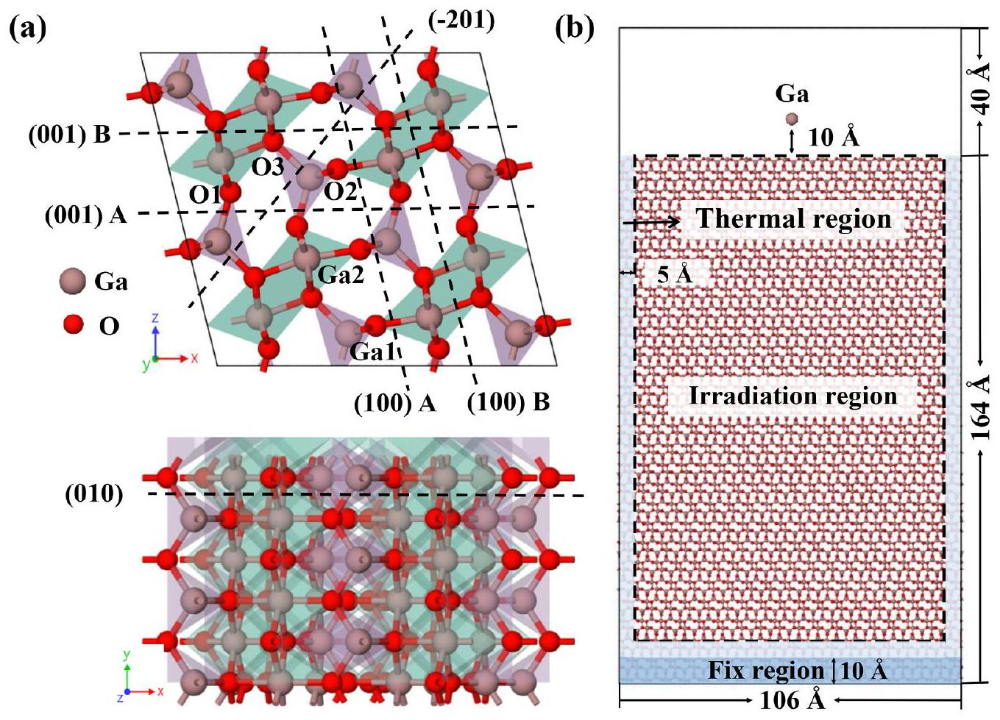
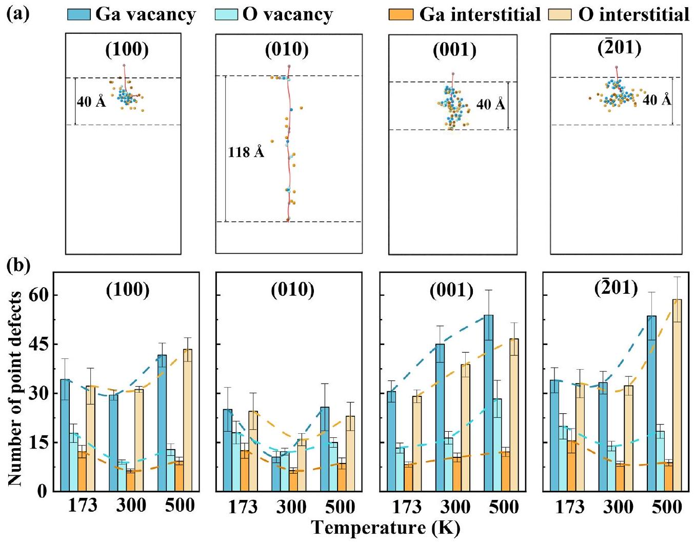
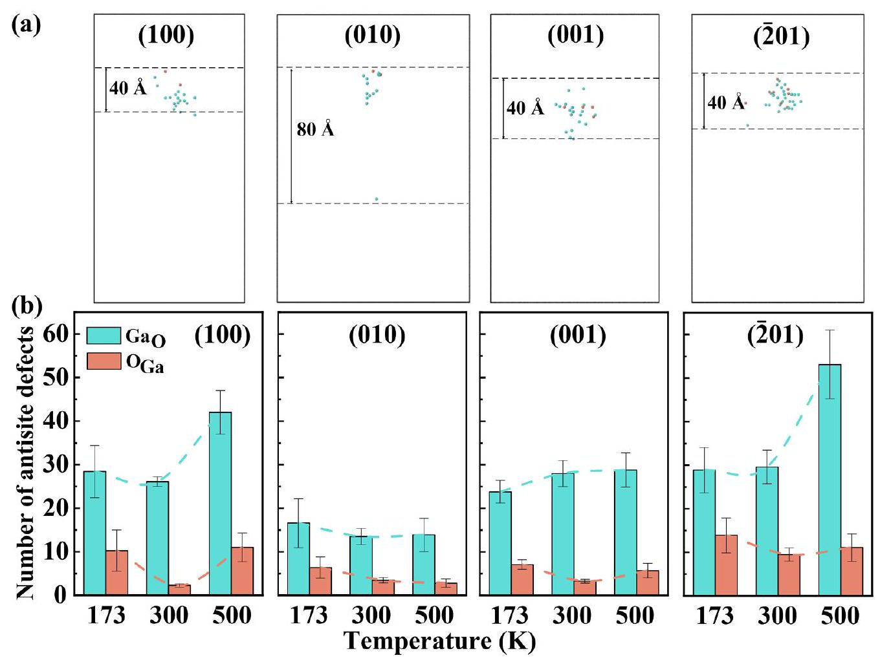
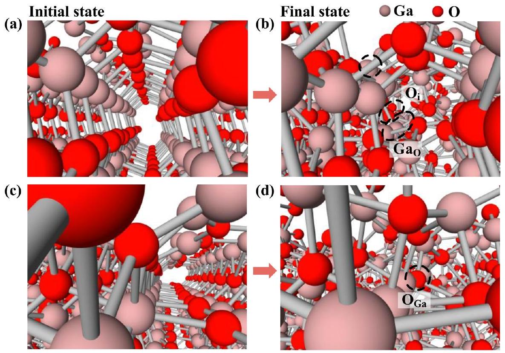
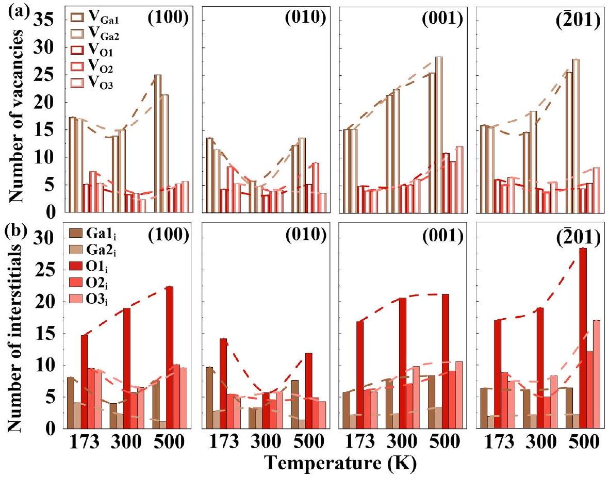
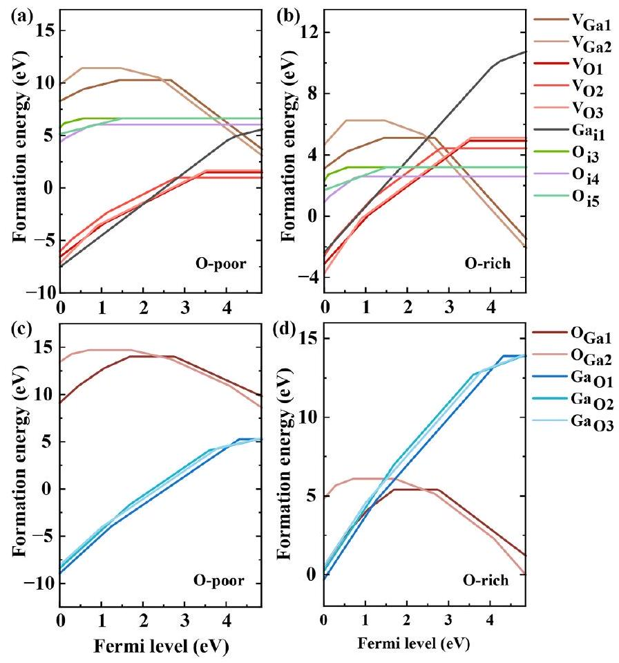

# Orientation-dependent surface radiation damage in $\beta$ - $\mathrm{Ga}_{2} \mathrm{O}_{3}$ explored by atomistic simulations 

Taiqiao Liu ${ }^{\mathrm{a}}$, Zeyuan Li ${ }^{\mathrm{b}}$, Junlei Zhao ${ }^{\mathrm{c},{ }^{*}(\mathrm{D}) \text {, Xiaoyu Fei }{ }^{\mathrm{a}} \text {, Jiaren Feng }{ }^{\mathrm{a}} \text {, Yijing Zuo }{ }^{\mathrm{a}} \text {, }}$ Mengyuan Hua ${ }^{\mathrm{c}}$, Yuzheng Guo ${ }^{\mathrm{b}}$ (D), Sheng Liu ${ }^{\mathrm{a}, \mathrm{b}}$, Zhaofu Zhang ${ }^{\mathrm{a}, \mathrm{d}, \mathrm{e},{ }^{*}}$ ${ }^{\mathrm{a}}$ School of Integrated Circuits, Wuhan University, Wuhan, 430072, China ${ }^{\mathrm{b}}$ School of Power and Mechanical Engineering, Wuhan University, Wuhan 430072, China ${ }^{\mathrm{c}}$ Department of Electronic and Electrical Engineering, Southern University of Science and Technology, Shenzhen 518055, China ${ }^{\mathrm{d}}$ Suzhou Institute of Wuhan University, Suzhou, Jiangsu 215123, China ${ }^{\mathrm{e}}$ Hubei Key Laboratory of Electronic Manufacturing and Packaging Integration, Wuhan University, Wuhan 430072, China

## A R T I C L E I N F O

## Keywords:

$\beta$ - $\mathrm{Ga}_{2} \mathrm{O}_{3}$
Surface radiation damage
Collision cascade
Molecular dynamics
Atomistic modelling

#### Abstract

Ultrawide bandgap semiconductor $\beta$ - $\mathrm{Ga}_{2} \mathrm{O}_{3}$ holds significant potential for applications in high-radiation environments. One of the primary challenges in its practical application is understanding the mechanisms of surface radiation damage under extreme conditions. In this study, we investigate the orientation-dependent mechanisms of primary radiation damage on four experimentally relevant $\beta-\mathrm{Ga}_{2} \mathrm{O}_{3}$ surface orientations, (100), (010), (001), and ( $\overline{2} 01$ ). We employ atomistic computational modeling approaches integrating machine-learning-driven molecular dynamics simulations with density functional theory calculations. Initial cascade simulations reveal that Ga vacancies and O interstitials are the predominant defects across all four surfaces, accompanied by abundant $\mathrm{Ga}_{\mathrm{O}}$ and sparse $\mathrm{O}_{\mathrm{Ga}}$ antisite defects. Notably, the (010) surface exhibits the lowest defect density, owing to its pronounced channeling effect, which results in a spatially dispersed damage distribution. This leads to a distinctive defect evolution behavior for the (010) surface, compared with the three non-channeling surfaces. These atomic-level insights are crucial for assessing the irradiation tolerance and predicting the performance changes of $\beta$ - $\mathrm{Ga}_{2} \mathrm{O}_{3}$-based devices in irradiated environments.

## 1. Introduction

The $\beta$-phase of gallium oxide ( $\beta-\mathrm{Ga}_{2} \mathrm{O}_{3}$ ) has an ultrawide bandgap of $\sim 4.9 \mathrm{eV}$, a high breakdown electric field ( $8 \mathrm{MV} / \mathrm{cm}$ ), and strong radiation hardness [1-3]. Its robust radiation resistance enables $\beta-\mathrm{Ga}_{2} \mathrm{O}_{3}$ to retain structure and electrical properties in harsh radiation environments, offering key applications in aerospace and nuclear sectors [4-6]. High-energy particle (e.g., neutrons, electrons, protons, or heavy ions) impact on $\beta$ - $\mathrm{Ga}_{2} \mathrm{O}_{3}$, causing primary radiation damage through point defects [4,5].

Prior theoretical studies indicate that Ga interstitials ( $\mathrm{Ga}_{\mathrm{i}}$ ) act as shallow donors but require high formation energy [7,8]. Ga vacancy $\left(\mathrm{V}_{\mathrm{Ga}}\right)$ is the main compensation acceptor, whereas O vacancy ( $\mathrm{V}_{\mathrm{O}}$ ) functions as a deep-level donor with an ionization energy exceeding 1 eV [9], possibly contributing to deep-level luminescence [10]. These defects create trap states or recombination centers within the bandgap, leading to significant device performance degradation [4,11]. For
instance, Cojocaru et al [11] examined irradiation defect effects on $\beta$ - $\mathrm{Ga}_{2} \mathrm{O}_{3}$ performance, finding that $\mathrm{V}_{\mathrm{Ga}}$ defects reduced conductivity post-radiation. Ingebrigtsen et al [12] irradiated $\beta$ - $\mathrm{Ga}_{2} \mathrm{O}_{3}$ thin films and single crystals with 0.6 and 1.9 MeV protons, linking carrier concentration reduction to Ga interstitials and antisite defects pinning the Fermi level 0.5 eV below the conduction band edge. Lee et al [13] used 1.5 MeV electron irradiation on $\beta$ - $\mathrm{Ga}_{2} \mathrm{O}_{3}$ rectifiers, observing that radiation damage shortens carrier lifetime by increasing charge capture traps, thus promoting recombination of electrons and holes. However, surfaces and interfaces often serve as sinks for radiation-generated mobile defects [14,15]. Studies on materials like tungsten [16,17], diamond [18], and GaN [19] show that different crystal surfaces have varying sensitivities to radiation damage. These understanding support selecting appropriate surface orientations to enhance radiation resistance. Moreover, the structural and physicochemical properties of surface defects greatly affect electrical properties, causing performance degradation and reliability issues [20]. Thus, a deep understanding of

[^0]primary radiation damage on various $\beta$ - $\mathrm{Ga}_{2} \mathrm{O}_{3}$ surfaces aids in designing radiation-resistant devices.

The most common surfaces of $\beta-\mathrm{Ga}_{2} \mathrm{O}_{3}$ for epitaxial growth and device applications are known to be (100), (010), (001), and ( $\overline{2} 01$ ). Large crystals grow readily on the (100) surface, but the cleave plane increases crack susceptibility under mechanical pressure because of low surface energy, resulting in poor quality [21-23]. The (010) substrate is widely used for epitaxy because of its commercial availability, high quality, and symmetric growth surface, which minimizes twin formation relative to other surfaces [24-26]. The (001) surface supports large-scale growth and exhibits high defect formation energy [27]. $\mathrm{Ga}_{2} \mathrm{O}_{3}$ grows effectively on the ( $\overline{2} 01$ ) plane commonly used for homoepitaxial growth [28,29]. Polyakov et al [30] demonstrated that the crystallographic orientation of $\beta$ - $\mathrm{Ga}_{2} \mathrm{O}_{3}$ greatly affects its properties under proton irradiation. Theoretical studies have explored threshold displacement energies (TDEs) in $\beta$ - $\mathrm{Ga}_{2} \mathrm{O}_{3}$ [31,32]. Despite numerous experimental studies investigating the impact of radiation on $\beta-\mathrm{Ga}_{2} \mathrm{O}_{3}$ devices, the cascade collision radiation damage mechanism on these four surfaces remains unreported.

We use atomistic simulations, including machine-learning-driven molecular dynamics (ML-MD) and density functional theory (DFT), to study radiation damage mechanisms on these surfaces at varying temperatures. We clarify the formation of vacancies and interstitials at gallium (Ga) and oxygen (O) sites, including specific sites (Ga1, Ga2, O1, O 2 , and O 3 ) in radiation-induced damage. DFT-based defect calculations further validate the ML-MD findings and analyze the electronic structure of intrinsic defects. This study informs the design and fabrication of $\beta$ - $\mathrm{Ga}_{2} \mathrm{O}_{3}$, to enhance its stability and reliability in harsh conditions.

## 2. Methodology

### 2.1. ML-MD simulation

We used a large-scale atomic/molecular massively parallel simulator (LAMMPS) [33] with a $\mathrm{Ga}_{2} \mathrm{O}_{3}$ machine-learning interatomic potential
[34] for ML-MD simulations. Furthermore, short-range repulsive interactions are fitted to high-accuracy $a b$ initio data, with reliability confirmed in prior studies [6,32,34-39]. Fig. 1(a) shows the atomic structure of $\beta$ - $\mathrm{Ga}_{2} \mathrm{O}_{3}$ and its surface orientations. Ga occupies two site types: a tetrahedral site (Ga1) and an octahedral site (Ga2). O has three types of sites: O1 is threefold coordinated with one Ga1 and two Ga2 sites; O2 is threefold coordinated with two Ga1 sites and one Ga2 site; and O3 is fourfold coordinated with one Ga1 site and three Ga2 sites. B-type terminations of (100) and (001) are more stable than A-type terminations [27]. Their atomic structures are shown in the supplementary material Appendix A, Figure S1. All the (100) and (001) surfaces in this study refer to $(100)$ B and $(001)$ B, respectively. Periodic boundary conditions were applied in the $x$ and $y$ directions, with a free surface in the z direction. Initial surface models for (100), (010), (001) and ( $\overline{2} 01$ ) contain 174,960 ( $\sim 106 \times 110 \times 204 \AA^{3}$ ), 174,800 ( $\sim 121 \times \left.112 \times 237 \AA^{3}\right), 151,470\left(\sim 112 \times 102 \times 193 \AA^{3}\right)$, and 190,080 $(\sim 120 \times 111 \times 202 \AA^{3}$ ) atoms, respectively. A vacuum layer of $40 \AA$ thickness is adopted. The primary knock-on atom (PKA) is a Ga atom positioned $10 \AA$ from the $\mathrm{Ga}_{2} \mathrm{O}_{3}$ surface.

The adopted (100) surface model is shown in Fig. 1(b). The other three surfaces appear in the supplementary material Figure S2. The bottom layer is fixed with a $10 \AA \mathrm{Ga}_{2} \mathrm{O}_{3}$ layer. The cell preparation and radiation process follow these steps. Step 1: Thermalization of the bulk cell occurs at 0 bar and set temperatures using an NPT ensemble for 50 ps. Step 2: Open-surface relaxations run for 20 ps under an NVT ensemble using a Nosé-Hoover thermostat [40] at the designated region of the simulation cell in Fig. 1(b). Step 3: Collision cascade simulations run for 60 ps with a PKA energy of 1.5 keV at $173 \mathrm{~K}, 300 \mathrm{~K}$, and 500 K , respectively. The simulations use an NVE ensemble for the radiation region, paired with an $N V T$ ensemble at the boundary and a fixed region at the bottom, as shown in Fig. 1(b). To prevent channeling effects, the PKA atom has an incidence angle deviation of $7^{\circ}$ [41]. An adaptive MD timestep ensures that the maximum atomic movement per MD step stays below $0.1 \AA$. The electronic stopping power of $\mathrm{Ga}_{2} \mathrm{O}_{3}$ was calculated using SRIM [42] and applied as a friction term to atoms with kinetic energy greater than 10 eV [43]. For statistical analysis, ten independent

Fig. 1. (a) The atomic structure of $\beta-\mathrm{Ga}_{2} \mathrm{O}_{3}$ and surface orientations. (b) The side view of surface (100) B.

ML-MD simulations were conducted at various temperatures and surface orientations, yielding $10 \times 3 \times 4=120$ simulations. To verify defect evolution over longer periods, two cases per surface orientation underwent annealing up to 5 ns at 1000 K . In total, eight post-cascade annealing simulations with $5-\mathrm{ns}$ duration were conducted for the four analyzed orientations. Based on cascade collision results, the Ga and O defect configurations were analyzed using the Wigner-Seitz (WS) method implemented in the Open Visualization Tool (OVITO) package [44].

### 2.2. First-principles defect calculations

To study the electronic properties of $\beta-\mathrm{Ga}_{2} \mathrm{O}_{3}$, density functional theory (DFT) calculations investigate defect and carrier concentrations in $\beta$ - $\mathrm{Ga}_{2} \mathrm{O}_{3}$. The DFT calculations use the Vienna Ab initio Simulation Package (VASP) software [45]. Projector-augmented wave pseudopotentials [46] are used, with a plane-wave energy cutoff of 520 eV . The Ga $3 d^{10} 4 s^{2} 4 p^{1}$ and $\mathrm{O} 2 s^{2} 2 p^{4}$ electrons serve as valence electrons. The Perdew-Burke-Ernzerhof generalized gradient approximations (PBE-GGA) [47] handles structure relaxation. An intrinsic bandgap of 4.86 eV for $\beta$ - $\mathrm{Ga}_{2} \mathrm{O}_{3}$ results using the Heyd-Scuseria-Ernzerhof (HSE06) hybrid functional [48] with a Hartree-Fock fraction of 0.34 [49]. During structural relaxation, the cell fully relaxes until the atomic force falls below $0.01 \mathrm{eV} \AA^{-1}$. This produces conventional-cell lattice constants of $a =12.27 \AA, b=3.05 \AA, c=5.82 \AA$, and $\angle \beta=103.7^{\circ}$, consistent with [9]. Defect calculations use the defect and dopant ab initio simulation package (DASP) [50]. For point defect calculations, a 160 -atom supercell is employed, with only a single $\Gamma$ point used for Brillouin zone sampling. The defect formation energy, $E_{\mathrm{f}}$ [defect, $q$ ], follows [51]:
$E_{\mathrm{f}}[$ defect,$q]=E_{\text {tot }}[$ defect,$q]-E_{\text {tot }}[\mathrm{bulk}]+\sum_{i} n_{i} \mu_{i}+q\left(E_{\text {Fermi }}+E_{v}+\Delta V\right)$,
where $E_{\text {tot }}[$ defect $]$ and $E_{\text {tot }}[$ bulk $]$ represent the supercell total energies with a defect in charge state $q$ and the perfect supercell of $\mathrm{Ga}_{2} \mathrm{O}_{3}$, respectively. $\mu_{i}$ denotes the chemical potential of Ga atoms or O atoms, based on conditions. $E_{\text {Fermi }}$ denotes the Fermi level to the valence band maximum (VBM $E_{v}$ ). The chemical potential $\mu_{\mathrm{O}}$ ranges from $\mathrm{O}_{2}$ ( $\mu_{\mathrm{O}}= \frac{1}{2} E_{\text {tot }}\left[\mathrm{O}_{2}(\mathrm{~g})\right]$ ), for O-rich/Ga-poor conditions, to O-poor/Ga-rich limit limited by the formation enthalpy of $\beta-\mathrm{Ga}_{2} \mathrm{O}_{3}\left(\mu_{\mathrm{O}}=\frac{1}{2} E_{\text {tot }}\left[\mathrm{O}_{2}(\mathrm{~g})\right]+\right. \left.\frac{1}{3} \Delta H\left[\mathrm{Ga}_{2} \mathrm{O}_{3}\right]\right) . \mu_{\mathrm{Ga}}$ equals the energy per atom in elemental Ga in the O -poor/Ga-rich limit plus up to $\frac{1}{2} \Delta H\left[\mathrm{Ga}_{2} \mathrm{O}_{3}\right]-3 \mu_{\mathrm{O}}$. The $\Delta V$ term provides the finite-size correction for charged defects per the FNV scheme [52, 53]. Equilibrium defect density and density of hole and electron carriers are analyzed to investigate defects affecting electronic properties, see the supplementary material Appendix C.

## 3. Results and discussion

### 3.1. ML-MD simulations of defect generation and distribution

Fig. 2(a) shows the point defect (vacancy and interstitial) distribution of $\beta$ - $\mathrm{Ga}_{2} \mathrm{O}_{3}$ after collision cascade on four surfaces at 300 K . The supplementary material, Appendix B, Figure S3 covers other temperatures. All irradiation uses 1.5 keV . The supplementary material Figure S4 shows a top view of radiation damage on $\beta-\mathrm{Ga}_{2} \mathrm{O}_{3}$. Atomic arrangements of the four surfaces, in side and top views, are shown in the supplementary material Figure S5. Animations of the four surfaces at 300 K are in supplementary Videos 1-4. Significant axial channeling occurs on the (010) plane. Its channels form rows of atoms, creating pathways with lower atomic density. Collision probability is reduced in this direction, increasing penetration depth. The defect distribution on the (010) surface in Fig. 2 shows that despite a $7^{\circ}$ deviation angle to minimize channeling, the incident atom penetrates deeply below the surface, with

Fig. 2. (a) Orientation-dependent defect distribution of $\beta$ - $\mathrm{Ga}_{2} \mathrm{O}_{3}$ after collision cascade with 1.5 keV irradiation at 300 K is shown. Results for 173 K and 500 K appear in the supplementary material, Appendix B, Figure S7. Red lines represent ion motion trajectories. (b) Statistical count point defects across surfaces at 173 K , 300 K , and 500 K , respectively. Error bars indicate standard error.

defects distributed along the ion track (red line in Fig. 2(a)). Defects in the other three surfaces remain shallow, concentrated within 40 Å from the surface. The channeling effect on the (010) surface persists at higher temperatures, as shown in the supplementary material, Appendix B, Figure S6. The surface exhibits slight melting at 1200 K , yet channeling persists, and melting at 1500 K intensifies, reducing the in-channeling effect. At a higher temperature of 2000 K , surface melting suppresses the channeling effect. Statistical analysis at these higher temperatures was omitted because of the thermal vibrations. Supplementary Videos 5 and 6 depict the channeling effect on the ( 010 ) surface.

Average vacancies and interstitials for Ga and O appear in Fig. 2(b). Orientation-dependence of defect quantities across surfaces appears in the supplementary material Figure S7. The distinct anisotropy of $\beta$ - $\mathrm{Ga}_{2} \mathrm{O}_{3}$ causes varied properties among the four surface orientations during epitaxial growth. The results show that four crystal surfaces respond differently to irradiation. The (100) surface has the fewest defects at 300 K , but the highest at 500 K , with 173 K in between. At 173 K and 500 K , defects on the (010) surface remain stable, whereas at 300 K , it has the fewest defects. The (010) surface shows the fewest Ga vacancies and O interstitials at all three temperatures among all surfaces. Ga interstitials are lowest at 300 K and 500 K , whereas O vacancies remain moderate. However, as shown in Fig. 2(a), the (010) surface forms large-depth defects owing to its unique projected atomic arrangement and strong channeling effect. For the utilization of this orientation in device fabrication, the impact of the distribution and concentration of point defects are carefully evaluated.

As temperature increases, defects increase on the (001) surface. For ( $\overline{2} 01$ ) surface, little difference exists at 173 K and 300 K , but at 500 K , Ga vacancies and O interstitials increase. Thus, the radiation resistance of the (100), (001), and ( $\overline{2} 01$ ) planes at higher temperature is weaker than at lower ( 173 K ) and higher ( 300 K ) temperatures. Moreover, (001) and ( $\overline{2} 01$ ) surfaces show more defects when compared with the (100) surface at 500 K . At low temperatures, irradiation-induced defects persist owing
to reduced atomic dynamics. High temperatures enable point defects to migrate easily and recombine in dynamic annealing, restraining defects can be restrained by high temperatures [54]. However, these results indicate that this theory is inapplicable for $\beta-\mathrm{Ga}_{2} \mathrm{O}_{3}$. This stems from several synergistic factors. As temperature rises, threshold displacement energy (TDE) reduces from lower elastic stiffness, increased lattice vibrations, and shorter recombination distances [55,56], causing a statistical increase in defect counts from a single irradiation event. In a limited timescale of MD simulation, temperature-induced lattice self-healing statistically reduces the defect counts. However, this cannot fully offset other contributing factors. Additionally, the emergence of stable, harder-to-repair defects, like antisite defects in Fig. 3, causes defect accumulation. Thus, the overall synergistic effect varies by specific crystal surface.

As shown in Fig. 2(b) and the irradiation studies of $\beta-\mathrm{Ga}_{2} \mathrm{O}_{3}$ bulk [6, 37], notably, O vacancies and Ga interstitials are significantly fewer than Ga vacancies and O interstitials. The O interstitial has a higher number of defects because the number of O atoms is more than that of Ga atoms in $\beta-\mathrm{Ga}_{2} \mathrm{O}_{3}$. Thus, the probability of defects being created by the collision cascade is higher. Threshold displacement energies (TDEs) in $\beta$ - $\mathrm{Ga}_{2} \mathrm{O}_{3}$ show Ga atoms with greater TDEs than O atoms [31,32]. This also ties to antisite defect formation. Fig. 3(a) and (c) show the initial state of surface structure that forms the antisite $\mathrm{Ga}_{\mathrm{O}}$ (Fig. 3(b)) and $\mathrm{O}_{\mathrm{Ga}}$ (Fig. 3(d)), respectively. After collision cascade, Ga interstitials recombine with O sites, and O atoms form interstitials (Fig. 3(b)). Ga atoms preferentially occupy O vacancies over Ga vacancies. This recombination prevents O atoms from returning to their original vacancies, promoting antisite defects in $\mathrm{Ga}_{\mathrm{O}}$. Similarly, some O interstitials recombine with Ga vacancies to form $\mathrm{O}_{\mathrm{Ga}}$ as shown in Fig. 3(b). The spatial distribution at 300 K and statistics of antisite defects of $\mathrm{Ga}_{\mathrm{O}}$ and $\mathrm{O}_{\mathrm{Ga}}$ under different conditions are demonstrated in Fig. 4. The supplementary material Figure S8 illustrates the distribution of antisite defects at temperatures of 173 K and 500 K . The distribution of antisite defects is

Fig. 3. (a) Orientation-dependent $\mathrm{Ga}_{\mathrm{O}}$ (cyan) and $\mathrm{O}_{\mathrm{Ga}}$ (orange) antisite defect distribution of $\beta$ - $\mathrm{Ga}_{2} \mathrm{O}_{3}$ after collision cascade at 300 K is shown. Results for 173 K and 500 K appear in the supplementary material, Appendix B, Figure S8. (b) Statistical count of antisite defects across surfaces at $173 \mathrm{~K}, 300 \mathrm{~K}$, and 500 K , respectively. Error bars show standard deviations.

Fig. 4. Snapshots of the antisite defect $\mathrm{Ga}_{\mathrm{O}}$ and $\mathrm{O}_{\mathrm{Ga}}$ formation from ( $\mathrm{a}, \mathrm{c}$ ) the initial states to ( $\mathrm{b}, \mathrm{d}$ ) the final states during cascade simulations.

near the vacancies and interstitials generated by irradiation. The distribution depth of antisite defects is comparable to that of interstitials and vacancies within $40 \AA$, as illustrated in Fig. 3(a). Notably, for the (010) surface, the distribution depth is significantly shallower. At the higher temperature of 500 K , a more significant difference in the amounts of Ga interstitials and O vacancies, and the same between Ga vacancies and O interstitials, is observed in Fig. 2(b). This indicates a higher probability of antisite defects $\mathrm{Ga}_{\mathrm{O}}$ being formed. The number of interstitials and vacancies on the (001) surface at 300 K and 500 K shows minimal difference, similar to the behavior of antisite defects. Across all conditions, $\mathrm{Ga}_{\mathrm{O}}$ defects far exceed $\mathrm{O}_{\mathrm{Ga}}$ defects, satisfying the relation $\mathrm{V}_{\mathrm{O}}$
$=\mathrm{O}_{\mathrm{i}}+\mathrm{O}_{\mathrm{Ga}}-\mathrm{Ga}_{\mathrm{O}}$. Section 3.3 discusses this with DFT calculations.

### 3.2. Precise defect types in Ga and $O$ sites

To study defect evolution in $\beta-\mathrm{Ga}_{2} \mathrm{O}_{3}$, understanding the precise distribution of Ga1, Ga2, O1, O2, and O3 sites is necessary. Selfdeveloped Python code differentiate defect distribution of across atomic occupancies shown in Fig. 5. Screening criteria include: (i) Ga1 and Ga 2 are identified by Ga 1 being four-coordinated and Ga 2 is a sixcoordinated; (ii) O 1 as threefold coordinated with 1 Ga 1 and $2 \mathrm{Ga} 2, \mathrm{O} 2$ as threefold coordinated with 2 Ga 1 and 1 Ga 2 , and O 3 as threefold

Fig. 5. The temperature-dependent defect evolution of (a) vacancy defects and (b) interstitial defects on different surface orientations in $\beta$ - $\mathrm{Ga}_{2} \mathrm{O}_{3}$ with 1.5 keV irradiation energy.

coordinated with 1 Ga 1 and 3 Ga 2 to determine $\mathrm{O} 1, \mathrm{O} 2$, and O 3 .
As noted, interaction between the Ga interstitials and O vacancies causes a high prevalence of $\mathrm{Ga}_{\mathrm{O}}$ defects, whereas the $\mathrm{O}_{\mathrm{Ga}}$ defects remain rare. Upon $\mathrm{Ga}_{\mathrm{O}}$ defect formation, atoms cannot return to their O vacancy, becoming displaced. Ga and O vacancies and TDEs should be employed to decide the displacing ability of Ga and O atoms. Disparity in vacancy numbers at Ga1 and Ga2 sites varies little across conditions in Fig. 5. Average TDEs for Ga1 and Ga2 are 22.9 eV and 20.0 eV , respectively [32]. Lower TDE means the atom is more easily displaced. In Fig. 5(a), Ga2 vacancies on the (100), (001), and (201) surfaces at 300 K outnumber Ga1 vacancies, consistent with Ref [32]. Ga2 vacancies are fewer than Ga1 vacancies at 173 K and 500 K on the (100) surface. On the (001) and ( $\overline{2} 01$ ) surfaces, Ga 1 and Ga 2 vacancies at 173 K are similar. At 500 K , the results mirror 300 K . The ( 010 ) surface uniquely shows Ga1 vacancies outnumbering Ga2 vacancies at 173 K and 300 K . On the (010) plane, TDE for Ga1 and Ga2 range from higher TDE above 30 eV to lower below 20 eV [32]. TDEs of Ga2 on the (100) and (010) planes exceed Ga1. This effect is pronounced on the (100) surface at both temperatures. Conversely, the (010) plane favors Ga1 displacement via collision cascade.

For O atoms, O vacancies at lattice sites vary significantly across conditions. Moreover, distinctions among O interstitials are notable. Highest O2 vacancies occur on the (100) and (010) surfaces owing to their lowest TDEs, whereas (001) and ( $\overline{2} 01$ ) surfaces show fewer as O2's higher TDE exceeds that of O1 and O3 in Ref [32]. Fewer interstitial atoms occupy Ga2 sites compared to Ga1. This indicates that antisite defects $\mathrm{Ga}_{\mathrm{O}}$, Ga 2 atoms mainly replace O 1 . Despite Ref [32] reporting TDE of O1 above 60 eV , the O1 site primarily contains interstitials in $\mathrm{Ga}_{2} \mathrm{O}_{3}$ after irradiation. Ga1 and O1 form the primary interstitial defects across four surface orientations. The impact of temperature on specific defect occupation varies by surface orientation.

### 3.3. Defect stabilization and carrier concentration variation

O interstitials exhibit the highest mobility [57,58], whereas Ga interstitials and Ga vacancies are stable [57]. O vacancies are highly stable and immobile [57,59]. To study the long-term stability of irradiation-induced defects across four surface orientations, extended post-cascade annealing simulations ( 5 ns at 1000 K ) were conducted for two cases per surface. Dynamic lattice recovery is shown in the supplementary material Appendix E, supplementary Videos 7-14. Lattice recovery snapshots (the supplementary material Appendix C, Figure S9), spatial defect distributions (Figures S10 and S11), and statistical averages of two cases per surface (Figure S12) show that annealing reduces irradiation-induced defects. On the (100), (001), and ( $\overline{2} 01$ ) orientations, defects clustered configurations in as-irradiated and annealed states (Figure S10(a-c)). Conversely, the (010) surface has spatially isolated defects due to channeling effects, allowing clearer defect evolution. In Case 2 of Figure S10(d), the O interstitials drop significantly, retaining one after post-cascade annealing. These results confirm high mobility and recoverability of O interstitials during annealing, consistent with Refs [57,59]. Ga interstitials and Ga vacancies fully recover, leaving O vacancies. Figure S11 shows defect distribution on the (010) surface annealed at 1000 K for $1-5 \mathrm{~ns}$. The identical defect distributions at 4 ns and 5 ns suggest equilibrium, confirming O vacancies as the dominant defect in $\beta$ - $\mathrm{Ga}_{2} \mathrm{O}_{3}$. Additionally, dominant defect type proportions on the (100), (010), and ( $\overline{2} 01$ ) orientations persist across as-irradiated and annealed states.

MD simulations show dynamic primary radiation damage, whereas DFT calculations confirm thermodynamic stability of point defects. To better understand radiation damage in $\beta-\mathrm{Ga}_{2} \mathrm{O}_{3}$, the formation energy ( $E_{f}$ ) of point defects and antisite defects was computed via DFT, shown in Fig. 6. Models of Ga and O interstitials appear in the supplementary material, Appendix D, Figures S14 and S15. Configurations of interstitials induced by irradiation align with DFT calculation (the

Fig. 6. The formation energy of different defects in $\beta$ - $\mathrm{Ga}_{2} \mathrm{O}_{3}$ at O -poor and O rich limits. Only partial formation energy data are displayed here for Ga and O interstitials, and the complete data are in the supplementary material, Appendix D, Figure S17.

supplementary material, Appendix D, Figure S16). Transition levels for Ga and O defects and antisite defects can be seen in the supplementary material Appendix D, Figures S18 and S19, respectively. The results are consistent with previous works, suggesting the reliability and accuracy of our calculations [9,57,59]. The $E_{\mathrm{f}}$ for O vacancy is ranked as follows: $\mathrm{O} 3>\mathrm{O} 1>\mathrm{O} 2$. In Fig. 6(a), evidently, the O2 site exhibits a higher tendency to form vacancies under most scenarios. Given that the disparity in the formation energy ( $E_{f}$ ) between O 1 and O 3 is merely 0.5 eV , the variance in the quantities of the defects is not apparent. In O-rich limits, O interstitials possess the minimal $E_{\mathrm{f}}$, and Ga interstitials exhibit the maximal. This matches with Fig. 2, showing O interstitials as most prevalent and Ga interstitials as least common. In O-poor limits, O vacancies exhibit the lowest $E_{\mathrm{f}}$, making them easily formed. Notably, the overall $E_{\mathrm{f}}$ of Ga vacancy is more extensive than that of O vacancy, particularly under O-poor conditions. This suggests the existence of more O vacancy defects than Ga vacancies. However, the defect distribution post-irradiation in Fig. 2(b) contradicts this finding. This is related to the formation of antisite defects. In Fig. 6(c), $\mathrm{Ga}_{\mathrm{O}}$ shows the lowest $E_{\mathrm{f}}$, whereas $\mathrm{O}_{\mathrm{Ga}}$ has the highest, peaking at 14 eV in O-poor conditions. Hence, the $\mathrm{O}_{\mathrm{Ga}}$ defect can be ignored in such conditions. O vacancy has a substantially lower defect formation energy than $\mathrm{Ga}_{\mathrm{O}}$, whereas Ga and O have similar interstitial $E_{\mathrm{f}}$ with $\mathrm{Ga}_{\mathrm{O}}$. The results indicate a justifiable occurrence of $\mathrm{Ga}_{\mathrm{O}}$ defects. In an O-rich environment, the defect formation energy of $\mathrm{Ga}_{\mathrm{O}}$ is much greater than that of $\mathrm{O}_{\mathrm{Ga}}$, as shown in Fig. 6(d). $\mathrm{Ga}_{\mathrm{O}}$ defects are formed easily in O -poor conditions. Results from $E_{\mathrm{f}}$ are consistent with the ML-MD findings, suggesting a greater likelihood of $\mathrm{Ga}_{\mathrm{O}}$ defect formation compared to $\mathrm{O}_{\mathrm{Ga}}$ defects.

Defect type at Ga and O sites with post-cascade annealing simulations was observed (the supplementary material Appendix C, Figure S13). Dominant site-specific defect types across all four crystallographic surfaces persist post-annealing. These results show that statistical defect trends from primary irradiation provide a framework for subsequent long-term defect evolution. Integrating MD post-cascade
annealing simulations and DFT calculations shows agreement between the predicted defect dynamics and experimental observations. Irradiation studies attribute E3 level ( $0.95-1.05 \mathrm{eV}$ ) and E4 level ( 1.20 eV ) to $\mathrm{V}_{\mathrm{O}}$ defects [60-62]. This study finds that O 3 vacancies dominate on the (001) surface in the as-irradiated and annealed state (Fig. 2 and the supplementary material Figure S13). Fig. 6 and the supplementary material Figure S18 show the $+1 / 0$ transition level of O3 vacancy at 1.3 eV below the conduction band minimum (CBM, matching the $E_{\mathrm{C}}-1.2 \mathrm{eV}$ defect level (001) $\beta$ - $\mathrm{Ga}_{2} \mathrm{O}_{3}$ films irradiated with 10 MeV protons [61]). Antisite defects $\mathrm{Ga}_{\mathrm{O}}$ remain prevalent post-irradiation and extended annealing, showing thermodynamic stability in $\beta-\mathrm{Ga}_{2} \mathrm{O}_{3}$. Ingebrigtsen et al [63] and Zhang et al [64] reported a 0.75 eV defect level for antisite defect $\mathrm{Ga}_{\mathrm{O}}$, which is consistent with the supplementary material Figure S13.

Further study of the electrical characteristics of defects is warranted. Transition energy levels of defects are closer to the CBM, which makes the excitation of electron carriers simpler. As demonstrated in Figs. 6(a) and (b), O vacancy, Ga interstitial, and antisite $\mathrm{Ga}_{\mathrm{O}}$ present the donor properties, consistent with the results of Refs [9,65]. Additionally, for understanding the potential impact of irradiation-induced point defects discussed above on the electrical properties of $\beta-\mathrm{Ga}_{2} \mathrm{O}_{3}$, we also calculated defect concentration, Fermi level, and carrier concentration as chemical potential functions, assuming a growth temperature of 1000 K and operational temperatures of $173 \mathrm{~K}, 300 \mathrm{~K}$, and 500 K , respectively, as presented in the supplementary material Appendix D , Figures S20-S22. Furthermore, at each temperature, the O vacancy dominates. The concentration of $\mathrm{V}_{\mathrm{O} 2}$ is the greatest, and $\mathrm{V}_{\mathrm{O} 3}$ is the lowest, which can match the result of defect formation energy. Under different chemical conditions, the concentration of oxygen vacancies decreases from the O-poor limit to O-rich limit, resulting in a reduction of $n$-type carrier concentration. This holds for all three temperatures ( $173 \mathrm{~K}, 300 \mathrm{~K}$, and 500 K ). At $173 \mathrm{~K}, \mathrm{~V}_{\mathrm{O}}, \mathrm{Ga}_{\mathrm{i}}$, and $\mathrm{Ga}_{\mathrm{O}}$ antisite defects dominate as shallow or deep donor centers under O-poor conditions. In contrast, interstitial oxygen predominates as the dominant deep acceptor, with a higher concentration than $\mathrm{V}_{\mathrm{O}}$ under O-rich conditions. The compensation effect between $\mathrm{V}_{\mathrm{O}}$ and $\mathrm{O}_{\mathrm{i}}$ significantly suppresses carrier concentration. At 300 K , more $\mathrm{Ga}_{\mathrm{i}}$ donors and fewer $\mathrm{O}_{\mathrm{i}}$ acceptors defects at 300 K yield higher carrier concentration than that at 173 K . At 500 K , the enhanced variety and abundance of donor levels further result in a higher carrier concentration compared to that observed at 173 K and 300 K . Overall, nanosecond-scale MD post-cascade annealing simulations and DFT calculations further validate the stability and evolution of these irradiation-induced defects, consistent with prior computational and experimental studies.

## 4. Conclusions

In this study, we investigate radiation damage and defect evolution in post-cascade annealing for $\beta$ - $\mathrm{Ga}_{2} \mathrm{O}_{3}$ (100), (010), (001), and ( $\overline{2} 01$ ) surfaces by using ML-MD simulation. Combined with DFT calculations, we examined the stability of irradiation-induced defects and their impact on carrier concentration. The results reveal that the (010) surface exhibits a pronounced channeling effect, allowing defects to penetrate deeply into the material, though with a low defect count, and the highest oxygen vacancy concentration in an equilibrium state. In contrast, defects on the (100), (001), and ( $\overline{2} 01$ ) surfaces remain localized near the surface but are more resistant to recovery than those on the (010) surface. Annealing simulations at 1000 K for 5 ns further demonstrate no change in the dominant defect types on these three surfaces. Additionally, antisite defects $\mathrm{Ga}_{\mathrm{O}}$ form a major portion of irradiation-induced defects in $\beta$ - $\mathrm{Ga}_{2} \mathrm{O}_{3}$ and cannot be overlooked. Our results highlight the strong surface orientation dependence of $\beta$ - $\mathrm{Ga}_{2} \mathrm{O}_{3}$ 's irradiation tolerance and defect kinetics, providing atomic-level insights for designing radiation-resistant $\beta$ - $\mathrm{Ga}_{2} \mathrm{O}_{3}$-based devices through surface orientation engineering.

## SUPPLEMENTARY MATERIAL

Supplementary Material is available for this paper at Pankaj.

## CRediT authorship contribution statement

Taiqiao Liu: Writing - original draft, Conceptualization, Methodology, Data curation. Zeyuan Li: Methodology. Junlei Zhao: Software, Writing - review \& editing, Methodology, Supervision. Xiaoyu Fei: Visualization. Jiaren Feng: Investigation. Yijing Zuo: Data curation. Mengyuan Hua: Writing - review \& editing. Yuzheng Guo: Software. Sheng Liu: Resources. Zhaofu Zhang: Supervision, Resources, Conceptualization, Writing - review \& editing, Project administration, Funding acquisition.

## Declaration of competing interest

The authors declare that they have no known competing financial interests or personal relationships that could have appeared to influence the work reported in this paper.

## Acknowledgement

The project was supported by the Major Program (JD) of Hubei Province (Grant No. 2023BAA009), the National Natural Science Foundation of China (Grant Nos. 52302046, T252790007, 62304097, and L2424216), the Knowledge Innovation Program of Wuhan-Shuguang (Grant No. 2023010201020262), Basic Research Program of Jiangsu (Grant No. BK20230268), Guangdong Basic and Applied Basic Research Foundation (Grant No. 2024A1515011764), Shenzhen Fundamental Research Program (Grant Nos. JCYJ20240813094508011, JCYJ20230807093609019 and JCYJ20220530114615035). We gratefully acknowledge HZWTECH for providing computation facilities and thank Jie Li from HZWTECH for the help and discussions regarding this study. We thank Miss Zhixuan Zhou for data analysis. We also thank the Supercomputing Center of Wuhan University for their support of the calculation.

## Supplementary materials

Supplementary material associated with this article can be found, in the online version, at doi:10.1016/j.actamat.2025.121484.

## References

[1] M.A. Mastro, A. Kuramata, J. Calkins, J. Kim, F. Ren, S.J. Pearton, Perspective-opportunities and future directions for $\mathrm{Ga}_{2} \mathrm{O}_{3}$, ECS J. Solid State Sci. Technol. 6 (2017) P356.
[2] C. Xie, X. Lu, Y. Liang, H. Chen, L. Wang, C. Wu, D. Wu, W. Yang, L. Luo, Patterned growth of $\beta$ - $\mathrm{Ga}_{2} \mathrm{O}_{3}$ thin films for solar-blind deep-ultraviolet photodetectors array and optical imaging application, J. Mater. Sci. Technol. 72 (2021) 189.
[3] X. Zhou, G. Chen, L. Xu, Z. Shao, C. Yang, Y. Tian, Z. Zhao, A compact route for efficient production of high-purity $\beta-\mathrm{Ga}_{2} \mathrm{O}_{3}$ powder, Rare Met. 43 (2024) 4573.
[4] J. Kim, S.J. Pearton, C. Fares, J. Yang, F. Ren, S. Kim, A.Y. Polyakov, Radiation damage effects in $\mathrm{Ga}_{2} \mathrm{O}_{3}$ materials and devices, J. Mater. Chem. C 7 (2019) 10.
[5] A. Petkov, D. Cherns, W. Chen, J. Liu, J. Blevins, V. Gambin, M. Li, D. Liu, M. Kuball, Structural stability of $\beta-\mathrm{Ga}_{2} \mathrm{O}_{3}$ under ion irradiation, Appl. Phys. Lett. 121 (2022) 171903.
[6] A. Azarov, J.G. Fernandez, J. Zhao, F. Djurabekova, H. He, R. He, Ø. Prytz, L. Vines, U. Bektas, P. Chekhonin, N. Klingner, G. Hlawacek, A. Kuznetsov, Universal radiation tolerant semiconductor, Nat. Commun. 14 (2023) 4855.
[7] P. Deák, Q.Duy Ho, F. Seemann, B. Aradi, M. Lorke, T. Frauenheim, Choosing the correct hybrid for defect calculations: a case study on intrinsic carrier trapping in $\beta$ - $\mathrm{Ga}_{2} \mathrm{O}_{3}$, Phys. Rev. B 95 (2017) 075208.
[8] Y. Huang, X. Xu, J. Yang, X. Yu, Y. Wei, T. Ying, Z. Liu, Y. Jing, W. Li, X. Li, Library of intrinsic defects in $\beta-\mathrm{Ga}_{2} \mathrm{O}_{3}$ : first-principles studies, Mater. Today Commun. 35 (2023) 105898.
[9] J.B. Varley, J.R. Weber, A. Janotti, C.G. Van de Walle, Oxygen vacancies and donor impurities in $\beta-\mathrm{Ga}_{2} \mathrm{O}_{3}$, Appl. Phys. Lett. 97 (2010) 142106.
[10] L. Dong, R. Jia, B. Xin, B. Peng, Y. Zhang, Effects of oxygen vacancies on the structural and optical properties of $\beta-\mathrm{Ga}_{2} \mathrm{O}_{3}$, Sci. Rep. 7 (2017) 40160.
[11] L.N. Cojocaru, Defect-annealing in neutron-damaged $\beta$ - $\mathrm{Ga}_{2} \mathrm{O}_{3}$, Radiat. Eff. 21 (1974) 157.
[12] M.E. Ingebrigtsen, A.Y. Kuznetsov, B.G. Svensson, G. Alfieri, A. Mihaila, U. Badstubner, A. Perron, L. Vines, J.B. Varley, Impact of proton irradiation on conductivity and deep level defects in $\beta-\mathrm{Ga}_{2} \mathrm{O}_{3}$, APL Mater. 7 (2018) 022510.
[13] J. Lee, E. Flitsiyan, L. Chernyak, J. Yang, F. Ren, S.J. Pearton, B. Meyler, Y. J. Salzmn, Effect of 1.5 MeV electron irradiation on $\beta$ - $\mathrm{Ga}_{2} \mathrm{O}_{3}$ carrier lifetime and diffusion length, Appl. Phys. Lett. 112 (2018) 082104.
[14] X. Zhang, E.G. Fu, A. Misra, M.J. Demkowicz, Interface-enabled defect reduction in He ion irradiated metallic multilayers, JOM 62 (2010) 75.
[15] K. Yang, P. Tang, Q. Zhang, H. Ma, E. Liu, M. Li, X. Zhang, J. Li, Y. Liu, T. Fan, R. Namakian, Enhanced defect annihilation capability of the graphene/copper interface: an in situ study, Scr. Mater. 203 (2021) 114001.
[16] G. Wei, F. Ren, W. Qin, W. Hu, H. Deng, C. Jiang, Evolution of helium bubbles below different tungsten surfaces under neutron irradiation and non-irradiation conditions, Comput. Mater. Sci. 148 (2018) 242.
[17] G. Wei, F. Ren, J. Fang, W. Hu, F. Gao, W. Qin, T. Cheng, Y. Wang, C. Jiang, H. Deng, Understanding the release of helium atoms from nanochannel tungsten: a molecular dynamics simulation, Nucl. Fusion 59 (2019) 076020.
[18] T. Liu, T. Shao, F. Lyu, X. Lai, A.H. Shen, Molecular dynamics simulations to assess the radiation resistance of different crystal orientations of diamond under neutron irradiation, Modell. Simul. Mater. Sci. Eng. 30 (2022) 035005.
[19] S. Charnvanichborikarn, M. Myers, L. Shao, S. Kucheyev, Interface-mediated suppression of radiation damage in GaN, Scr. Mater. 67 (2012) 205.
[20] Y. Huang, X. Xu, J. Yang, X. Yu, Y. Wei, T. Ying, Z. Liu, Y. Jing, W. Li, X. Li, Defect identification in $\beta$ - $\mathrm{Ga}_{2} \mathrm{O}_{3}$ schottky barrier diodes with electron radiation and annealing regulating, IEEE Trans. Nucl. Sci 71 (2024) 1178.
[21] J.D. Blevins, K. Stevens, A. Lindsey, G. Foundos, L. Sande, Development of large diameter semi-insulating gallium oxide ( $\mathrm{Ga}_{2} \mathrm{O}_{3}$ ) substrates, IEEE Trans. Semicond. Manuf. 32 (2019) 466.
[22] V.M. Bermudez, The structure of low-index surfaces of $\beta-\mathrm{Ga}_{2} \mathrm{O}_{3}$, Chem. Phys. 323 (2006) 193.
[23] S. Mu, M. Wang, H. Peelaers, C.G. Van de Walle, First-principles surface energies for monoclinic $\mathrm{Ga}_{2} \mathrm{O}_{3}$ and $\mathrm{Al}_{2} \mathrm{O}_{3}$ and consequences for cracking of $\left(\mathrm{Al}_{\mathrm{x}} \mathrm{Ga}_{1-\mathrm{x}}\right)_{2} \mathrm{O}_{3}$, APL Mater. 8 (2020) 091105.
[24] K. Sasaki, A. Kuramata, T. Masui, E.G. Víllora, K. Shimamura, S. Yamakoshi, Device-quality $\beta$ - $\mathrm{Ga}_{2} \mathrm{O}_{3}$ epitaxial films fabricated by ozone molecular beam epitaxy, Appl. Phys. Express 5 (2012) 035502.
[25] M.A. Mastro, J. Eddy, R. Charles, M.J. Tadjer, J.K. Hite, J. Kim, S.J. Pearton, Assessment of the (010) $\beta-\mathrm{Ga}_{2} \mathrm{O}_{3}$ surface and substrate specification, J. Vac. Sci. Technol. A 39 (2020) 013408.
[26] M.J. Tadjer, F. Alema, A. Osinsky, M.A. Mastro, N. Nepal, J.M. Woodward, R. L. Myers-Ward, E.R. Glaser, J.A. Freitas, A.G. Jacobs, J.C. Gallagher, A.L. Mock, D. J. Pennachio, J. Hajzus, M. Ebrish, T.J. Anderson, K.D. Hobart, J.K. Hite, R.E. C Jr., Characterization of $\beta$ - $\mathrm{Ga}_{2} \mathrm{O}_{3}$ homoepitaxial films and mosfets grown by mocvd at high growth rates, J. Phys. D 54 (2020) 034005.
[27] M. Wang, S. Mu, J.S. Speck, C.G. Van de Walle, First-principles study of twin boundaries and stacking faults in $\beta-\mathrm{Ga}_{2} \mathrm{O}_{3}$, Adv. Mater. Interfaces (2023) 2300318.
[28] T.S. Ngo, D.D. Le, J. Lee, S.K. Hong, J.S. Ha, W.S. Lee, Y.B. Moon, Investigation of defect structure in homoepitaxial (201) $\beta$ - $\mathrm{Ga}_{2} \mathrm{O}_{3}$ layers prepared by plasma-assisted molecular beam epitaxy, J. Alloys Compd. 834 (2020) 155027.
[29] Z. Li, T. Jiao, J. Yu, D. Hu, Y. Lv, W. Li, X. Dong, B. Zhang, Y. Zhang, Z. Feng, G. Li, G. Du, Single crystalline $\beta$ - $\mathrm{Ga}_{2} \mathrm{O}_{3}$ homoepitaxial films grown by MOCVD, Vacuum 178 (2020) 109440.
[30] A.Y. Polyakov, N.B. Smirnov, I.V. Shchemerov, A.A. Vasilev, A.I. Kochkova, A. V. Chernykh, P.B. Lagov, Y.S. Pavlov, V.S. Stolbunov, T.V. Kulevoy, I.V. Borzykh, I. H. Lee, F. Ren, S.J. Pearton, Crystal orientation dependence of deep level spectra in proton irradiated bulk $\beta-\mathrm{Ga}_{2} \mathrm{O}_{3}$, J. Appl. Phys. 130 (2021) 035701.
[31] B.R. Tuttle, N.J. Karom, A. O'Hara, R.D. Schrimpf, S.T. Pantelides, Atomicdisplacement threshold energies and defect generation in irradiated $\beta-\mathrm{Ga}_{2} \mathrm{O}_{3}$ : a first-principles investigation, J. Appl. Phys. 133 (2023) 015703.
[32] H. He, J. Zhao, J. Byggmastar, R. He, K. Nordlund, C. He, F. Djurabekova, Threshold displacement energy map of Frenkel pair generation in $\beta-\mathrm{Ga}_{2} \mathrm{O}_{3}$ from machine-learning-driven molecular dynamics simulations, Acta Mater. 276 (2024) 120087.
[33] A.P. Thompson, H.M. Aktulga, R. Berger, D.S. Bolintineanu, W.M. Brown, P. S. Crozier, P.J. in't Veld, A. Kohlmeyer, S.G. Moore, T.D. Nguyen, R. Shan, M. J. Stevens, J. Tranchida, C. Trott, S.J. Plimpton, LAMMPS - a flexible simulation tool for particle-based materials modeling at the atomic, meso, and continuum scales, Comput. Phys. Commun. 271 (2022) 108171.
[34] J. Zhao, J. Byggmastar, H. He, K. Nordlund, F. Djurabekova, M. Hua, Complex $\mathrm{Ga}_{2} \mathrm{O}_{3}$ polymorphs explored by accurate and general-purpose machine-learning interatomic potentials, npj Comput. Mater. 9 (2023) 159.
[35] R. He, J. Zhao, J. Byggmästar, H. He, F. Djurabekova, Ultrahigh stability of oxygen sublattice in $\beta-\mathrm{Ga}_{2} \mathrm{O}_{3}$, Phys. Rev. Mater. 8 (2024) 084601.
[36] A. Azarov, C. Radu, A. Galeckas, I.F. Mercioniu, A. Cernescu, V. Venkatachalapathy, E. Monakhov, F. Djurabekova, C. Ghica, J. Zhao, et al., Selfassembling of multilayered polymorphs with ion beams, Nano Lett 25 (2025) 1637-1643.
[37] J. Zhao, J. García Fernández, A. Azarov, R. He, Ø. Prytz, K. Nordlund, M. Hua, F. Djurabekova, A. Kuznetsov, Crystallization instead of amorphization in collision cascades in gallium oxide, Phys. Rev. Lett. 134 (2025) 126101.
[38] A. Azarov, J.G. Fernández, J. Zhao, R. He, J.H. Park, D.W. Jeon, Ø. Prytz, F. Djurabekova, A. Kuznetsov, Phase glides and self-organization of atomically abrupt interfaces out of stochastic disorder in $\alpha-\mathrm{Ga}_{2} \mathrm{O}_{3}$, Nat. Commun. 16 (2025) 3245.
[39] J. Zhang, J. Zhao, J. Chen, M. Hua, Orientation-dependent atomic-scale mechanism and defect evolution in $\beta-\mathrm{Ga}_{2} \mathrm{O}_{3}$ thin film epitaxial growth, Appl. Phys. Lett. 124 (2024) 022102.
[40] W.G. Hoover, Canonical dynamics: equilibrium phase-space distributions, Phys. Rev. A 31 (1985) 1695.
[41] K. Nordlund, F. Djurabekova, G. Hobler, Large fraction of crystal directions leads to ion channeling, Phys. Rev. B 94 (2016) 214109.
[42] J.F. Ziegler, M.D. Ziegler, J.P. Biersack, SRIM-the stopping and range of ions in matter, Nucl. Instrum. Methods Phys. Res. B 268 (2010) 1818.
[43] K. Nordlund, M. Ghaly, R.S. Averback, M. Caturla, T. Diaz de la Rubia, J. Tarus, Defect production in collision cascades in elemental semiconductors and fcc metals, Phys. Rev. B 57 (1998) 7556.
[44] A. Stukowski, Visualization and analysis of atomistic simulation data with OVITO-the open visualization tool, Modell. Simul. Mater. Sci. Eng. 18 (2010) 015012.
[45] G. Kresse, J. Furthmüller, P efficient iterative schemes for ab initio total-energy calculations using a plane-wave basis set, Phys. Rev. B 54 (1996) 11169.
[46] P.E. Blöchl, Projector augmented-wave method, Phys. Rev. B 50 (1994) 17953.
[47] J.P. Perdew, K. Burke, M. Ernzerhof, Generalized gradient approximation made simple, Phys. Rev. Lett. 77 (1996) 3865.
[48] J. Heyd, G.E. Scuseria, M. Ernzerhof, Hybrid functionals based on a screened coulomb potential, J. Chem. Phys. 124 (2006) 219906.
[49] edited by J.B. Varley, in: M. Higashiwaki, S. Fujita (Eds.), First-principles Calculations 2: Doping and Defects in $\mathrm{Ga}_{2} \mathrm{O}_{3}$, in Gallium Oxide: Materials Properties, Crystal Growth, and Devices, Springer International Publishing, 2020, pp. 329-348. edited by.
[50] M. Huang, Z. Zheng, Z. Dai, X. Guo, S. Wang, L. Jiang, J. Wei, S. Chen, Dasp: defect and dopant ab-initio simulation package, J. Semicond 43 (2022) 042101.
[51] C.G. Van de Walle, J. Neugebauer, First-principles calculations for defects and impurities: applications to III-nitrides, J. Appl. Phys. 95 (2004) 3851.
[52] C. Freysoldt, J. Neugebauer, C.G. Van de Walle, Fully ab initio finite-size corrections for charged-defect supercell calculations, Phys. Rev. Lett. 102 (2009) 016402.
[53] C. Freysoldt, J. Neugebauer, C.G. Van de Walle, Electrostatic interactions between charged defects in supercells, Phys. Status Solidi B 248 (2011) 1067.
[54] M. Li, L. Zhang, S. Lyu, Z. Li, Effects of ion irradiation and oxidation on point defects in IG-110 nuclear grade graphite, Acta Phys. Sin. 68 (2019) 128102.
[55] G. Pells, D. Phillips, Radiation damage of $\alpha-\mathrm{Al}_{2} \mathrm{O}_{3}$ in the hvem: I. temperature dependence of the displacement threshold, J. Nucl. Mater. 80 (1979) 207.
[56] K. Nordlund, S.J. Zinkle, A.E. Sand, F. Granberg, R.S. Averback, R.E. Stoller, T. Suzudo, L. Malerba, F. Banhart, W.J. Weber, et al., Primary radiation damage: a review of current understanding and models, J. Nucl. Mater. 512 (2018) 450.
[57] Y.K. Frodason, J.B. Varley, K.M.H. Johansen, L. Vines, C.G. Van de Walle, Migration of Ga vacancies and interstitials in $\beta-\mathrm{Ga}_{2} \mathrm{O}_{3}$, Phys. Rev. B 107 (2023) 024109.
[58] M.A. Blanco, M.B. Sahariah, H. Jiang, A. Costales, R. Pandey, Energetics and migration of point defects in $\mathrm{Ga}_{2} \mathrm{O}_{3}$, Phys. Rev. B 72 (2005) 184103.
[59] A. Kyrtsos, M. Matsubara, E. Bellotti, Migration mechanisms and diffusion barriers of vacancies in $\mathrm{Ga}_{2} \mathrm{O}_{3}$, Phys. Rev. B 95 (2017) 245202.
[60] Z. Wang, X. Chen, F.F. Ren, S. Gu, J. Ye, Deep-level defects in gallium oxide, J. Phys. D 54 (2020) 043002.
[61] A.Y. Polyakov, N.B. Smirnov, I.V. Shchemerov, E.B. Yakimov, J. Yang, F. Ren, G. Yang, J. Kim, A. Kuramata, S.J. Pearton, Point defect induced degradation of electrical properties of $\mathrm{Ga}_{2} \mathrm{O}_{3}$ by 10 MeV proton damage, Appl. Phys. Lett. 112 (2018) 032107.
[62] P. Seyidov, J.B. Varley, Y.K. Frodason, D. Klimm, L. Vines, Z. Galazka, T.S. Chou, A. Popp, K. Irmscher, A. Fiedler, Thermal stability of schottky contacts and rearrangement of defects in $\beta-\mathrm{Ga}_{2} \mathrm{O}_{3}$ crystals, Adv. Electron. Mater. 11 (2025) 2300428.
[63] M.E. Ingebrigtsen, A.Y. Kuznetsov, B.G. Svensson, G. Alfieri, A. Mihaila, U. Badstubner, A. Perron, L. Vines, J.B. Varley, Impact of proton irradiation on conductivity and deep level defects in $\beta-\mathrm{Ga}_{2} \mathrm{O}_{3}$, APL Mater. 7 (2018) 022510.
[64] Z. Zhang, T. Wang, L. Xiao, C. Liu, J. Zhou, Y. Zhang, C. Qi, G. Ma, M. Huo, Effect of electron irradiation and defect analysis of $\beta-\mathrm{Ga}_{2} \mathrm{O}_{3}$ Schottky barrier diodes, IEEE Trans. Electron. Dev. 71 (2024) 1676.
[65] Y. Huang, X. Xu, J. Yang, X. Yu, Y. Wei, T. Ying, Z. Liu, Y. Jing, W. Li, X. Li, Library of intrinsic defects in $\beta-\mathrm{Ga}_{2} \mathrm{O}_{3}$ : first-principles studies, Mater. Today Commun. 35 (2023) 105898.

[^0]:    * Corresponding authors.

    E-mail addresses: zhaojl@sustech.edu.cn (J. Zhao), zhaofuzhang@whu.edu.cn (Z. Zhang).
    https://doi.org/10.1016/j.actamat.2025.121484
    Received 9 August 2024; Received in revised form 2 May 2025; Accepted 24 August 2025
    Available online 27 August 2025
    1359-6454/© 2025 Acta Materialia Inc. Published by Elsevier Inc. All rights are reserved, including those for text and data mining, AI training, and similar technologies.

