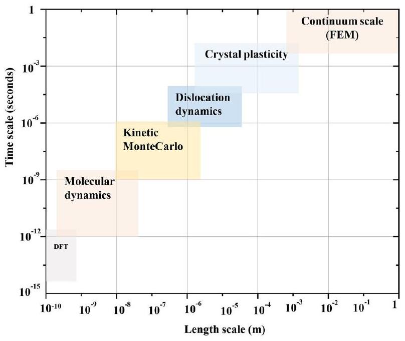
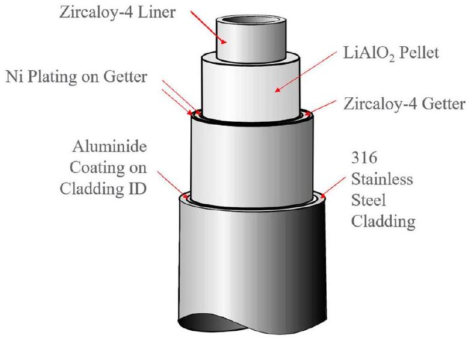
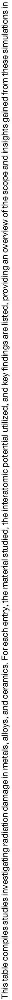
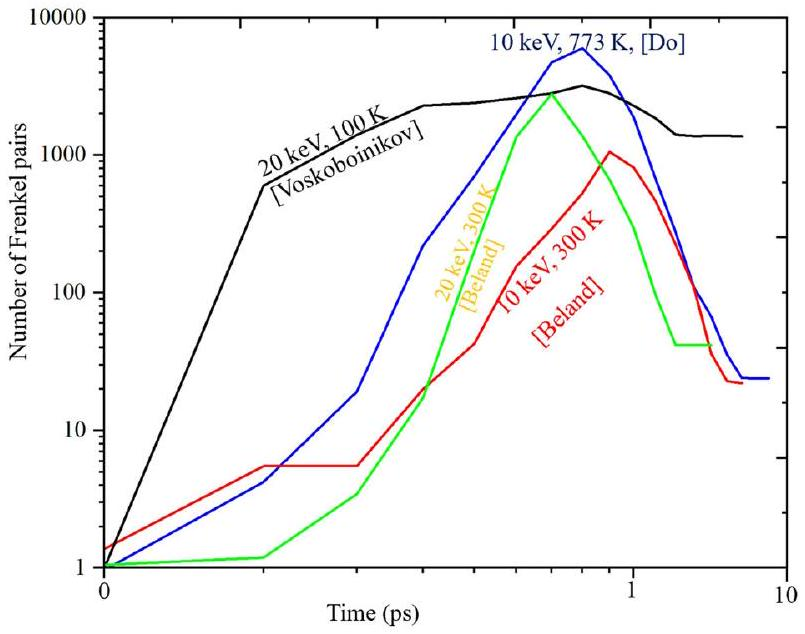
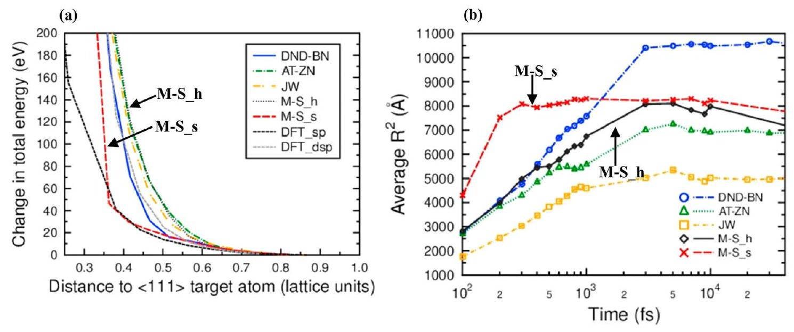
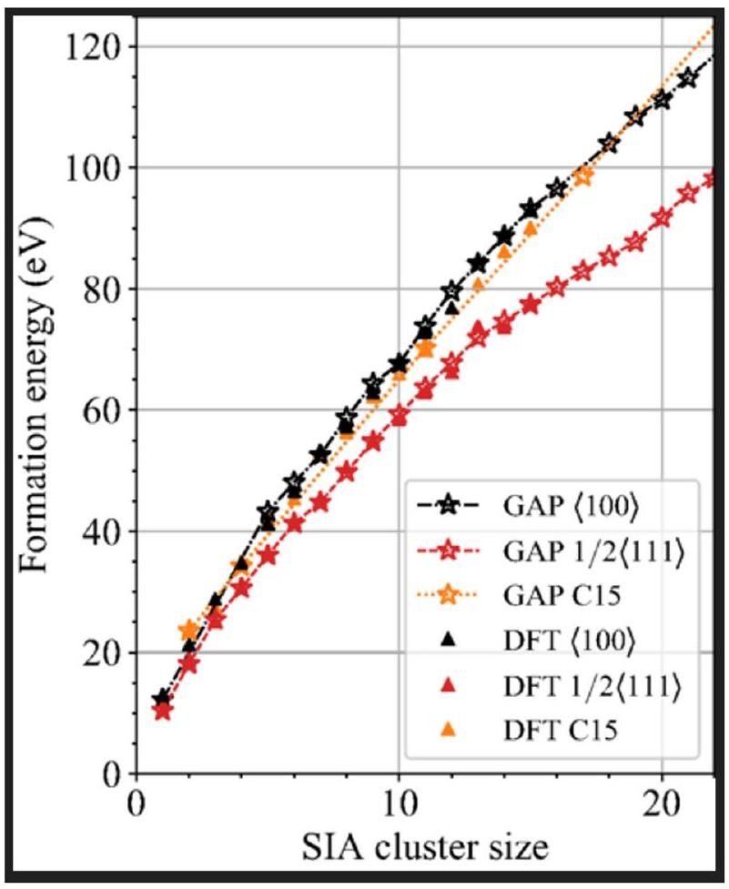
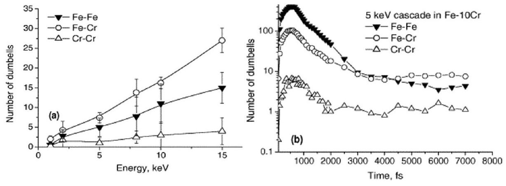

# A review of displacement cascade simulations using molecular dynamics emphasizing interatomic potentials for TPBAR components 

Ankit Roy ⟶, Giridhar Nandipati, Andrew M. Casella, David J. Senor, Ram Devanathan \& Ayoub Soulami ⊗

This review explores molecular dynamics simulations for studying radiation damage in Tritium Producing Burnable Absorber Rod (TPBAR) materials, emphasizing the role of interatomic potentials in displacement cascades. Recent machine learning potentials (MLPs), trained on quantum data, enhance prediction accuracy over traditional models like EAM. We highlight temperature, PKA energy, and composition effects on damage evolution in TPBAR components, recommending suitable potentials and discussing advancements for materials in extreme radiation environments.

Radiation damage in materials involves an atomic collision process initiated by high energy particles resulting in permanent defect production in the bulk or surface of the material ${ }^{1}$. This process might include electronic excitations, electron-phonon coupling, photons, and heating of the material ${ }^{1}$. Depending on the nature of material, crystalline materials can have bulk defects ranging from Frenkel pairs and point defect clusters ${ }^{2}$ to amorphized regions ${ }^{3}$, dislocation loops ${ }^{4,5}$ and surface defects like adatoms ${ }^{6}$, craters ${ }^{7}$, holes, bumps and ripples ${ }^{8}$. Materials in amorphous state on the other hand can have defects like low density regions ${ }^{9}$ and under coordinated regions ${ }^{10}$.

Computer simulations have been widely used to estimate and compare radiation damage in many different materials for decades ${ }^{1}$. The production of primary damage from a single atomic collision of an energetic particle, along with the associated microstructural evolution in a material due to continuous bombardment by energetic particles, spans a wide range of length and timescales. Since material phenomena can vary across the full range of scales, which span from femtoseconds $\left(10^{-15} \mathrm{~s}\right)$ for atomic collisions to years for long-term microstructural evolution, and from the atomic scale (Å) to macroscopic dimensions extending to millimeters or more, it is impossible to have one single computational method that can model material phenomena across all these scales. Accordingly, a diverse suite of computational tools is utilized to model radiation-induced phenomena based on their respective length and time scales in Fig. $1^{1,11}$. Although mentioned in context to radiation damage, these methods are widely used for investigating other material properties and process effects apart from radiation.

Damage can propagate in materials under three regimes based on the time scale, the primary stage, the dynamic recombination stage and the steady state ${ }^{5,12}$. The primary damage stage ( $0.1-1 \mathrm{ps}$ ) or the ballistic stage is
characterized by rapid atomic collision and temperature spike caused by non-equilibrium dynamics ${ }^{13,14}$. The dynamic recombination stage ( $1-10 \mathrm{ps}$ ) is characterized by the formation and annihilation of point defects and their clusters. The steady state is reached by the surviving defects that are not annihilated in the recombination stage ${ }^{14}$. The surviving defects continue to evolve over a larger timescale of years resulting in degradation of material properties.

The different simulation techniques in Fig. 1 can be linked to the physics of different stages of radiation damage. Radiation damage in the bulk material is a result of energy transfer from a passing high energy particle such as an ion or a neutron. The penetrating particle interacts and transfers its high energy to an atom in its path. If the transferred energy is higher than the threshold displacement energy (TDE), then the energized atom itself becomes the primary knock-on atom (PKA) that travels ballistically and collides with other atoms in the lattice producing secondary knock-on atoms. The sequence of repeated collisions between atoms results in a collision cascade that results in primary damage in the material. The initial stage of cascade collisions occurs on a $\sim 10$ femtoseconds, which is at least an order of magnitude faster than the timescale of lattice vibrations ( 300 fs ) which makes it a non-thermodynamic process resulting in a thermal spike ${ }^{14}$. The initial stage of the radiation damage can be simulated by molecular dynamics (MD) or binary collision approximations (BCA) as they well encompass the required timescale. For the generated defects, DFT simulations can be useful in calculating their migration properties (typically by using the nudged elastic band method (NEB)) $)^{1}$. Subsequently, Kinetic Monte Carlo (KMC) calculations can be used to calculate the diffusion rates. KMC and discrete dislocation dynamics (DDD) can be used further to simulate dislocation mobility at the mesoscale ${ }^{14}$.

Fig. 1 | Schematic representation of simulation methods by time and length scales for studying radiation effects. This diagram illustrates the relationship between different simulation techniques and their respective coverage across time and length scales, from electronic structure calculations at the smallest scales to continuum methods at the largest.

Fig. 2 | Schematic of TPBAR components and the materials that make them ${ }^{17}$.

Tritium, a critical hydrogen isotope, is produced through the neutron irradiation of Tritium Producing Burnable Absorber Rods (TPBARs), which are specifically engineered for both the production and capture of tritium ${ }^{15,16}$. A schematic of a TPBAR is depicted in Fig. $2^{17}$. Each TPBAR contains pellets made of lithium aluminate, enriched with ${ }^{6} \mathrm{Li}$, which generates tritium when exposed to neutron radiation. The tritium produced is subsequently absorbed by a surrounding Zircaloy-4 getter tube that surrounds the $\mathrm{LiAlO}_{2}$ pellet ${ }^{18}$.

All these components are housed within a stainless steel cladding, to inhibit the diffusion of tritium outward into the reactor coolant. The inner surface of the cladding is coated with Ni . This review aims to examine the MD methods for displacement cascades reported in the literature, pinpointing critical elements of simulation techniques, and describing the current state of the art. The focus is specifically on materials used in TPBARs and providing an in-depth analysis of cascade simulations relevant to these materials ${ }^{15}$. Table 1 presents a list of materials relevant to TPBAR components investigated in numerous studies, as compiled from the literature.

## Dependence of peak and surviving defects on interatomic potentials

When considering peak damage versus the surviving damage, the nature of the material and PKA energy play a prime role. Most works in the literature are based on single crystal evaluations and use Frenkel pairs to quantify damage. Frenkel pairs are a fundamental type of point defect that consists of a vacancy, where an atom is missing from its lattice site, and a corresponding interstitial, where the displaced atom occupies a non-lattice position ${ }^{1}$. Beland et al. ${ }^{19}$ showed that in Ni the peak in the number of defects at 40 keV PKA is around 5000 while that in NiCo and NiFe is higher up to 10,000. But the number of surviving defects is lower in alloys than in pure Ni , in the order of a $300-500$ after 15 ps . The lower number of stable defects in the alloys than in the pure Ni was attributed to the harder interactions between the $\mathrm{Fe}-\mathrm{Fe}, \mathrm{Co}-\mathrm{Co}, \mathrm{Ni}-\mathrm{Fe}$ and $\mathrm{Ni}-\mathrm{Co}$ pairs than the $\mathrm{Ni}-\mathrm{Ni}$ interactions. The peak damage in an equiatomic quinary alloy FeNiCrCoCu was found to be around 6000 FPs at 40 keV PKA with fewer than 100 surviving FPs ${ }^{20}$. HCP $\mathrm{Zr}^{21}$ showed a peak damage of 6000 FPs at 80 keV and a surviving damage of $\sim 100 \mathrm{FPs}$ after 35 ps . CoCrFeMnNi HEA showed a peak damage of $\sim 25000$ defects at 10 keV at 773 K as compared to 6000 for Ni at the same PKA energy and temperature ${ }^{22}$ but this work used a MEAM potential as compared to the EAM potential used by Beland et al. ${ }^{19}$. The plots of the numbers of Frenkel pairs versus time are compared in Fig. 3, from 3 different works investigating pure Ni using different potentials. Comparing the black and the green lines, representing 20 keV PKA cascades at 100 K and 300 K respectively, higher temperature should ideally cause a higher peak damage due to thermal activation. However the black line ${ }^{23}$ at 100 K shows a higher peak damage than the green line ${ }^{19}$ at 300 K . The number of surviving defects on the other hand should be lower at higher temperatures ${ }^{24,25}$ but the investigation in ref. 22 (blue line) representing 10 keV at 773 K contradicts that in ref. 19 (red line) representing 10 keV at 300 K with a slightly higher number of surviving defects at higher temperature.

This emphasizes the criticality of the potentials chosen for cascade simulations, where there can be an order of magnitude mismatch in the defects produced in the same material if the potential is switched from one to another. A NiCoCrFe alloy shows a peak damage of $\sim 5000 \mathrm{FPs}$ and a surviving damage of $<100 \mathrm{FPs}$ which closely matches that in Ni at $20 \mathrm{keV}^{26}$. However, there is a $1 \%$ higher recombination in HEA than in pure metals ${ }^{26}$. The effect of temperature on cascade damage in Ni is elaborated in ref. 23 where high temperatures of up to 1200 K in Ni produced lower surviving damage of around 30 FPs while at lower temperatures the FPs were as high as 70 .

The effect of using electronic stopping or the two-temperature model in MD can swing results by a factor of $5-6$ in some metals and alloys ${ }^{27}$. For example in NiFe alloy at 50 keV PKA, shows $\sim 100,000$ peak FPs with an average of 20,000 surviving defects in classical MD, but the number peak FPs falls by almost a factor of 6 if electronic stopping is employed in the simulations ${ }^{27}$. On the other hand, in NiFeCr there is no significant effect of electronic stopping ${ }^{27}$. Electronic effects in damage cascade simulations should be included when studying materials with a high atomic number (Z) or when simulating high-energy collision cascades ${ }^{28}$. In such cases, a significant portion of the kinetic energy of the primary knock-on atoms (PKAs) is transferred to the electronic subsystem, which affects the dynamics of the cascade and the resulting defect structures. The inclusion of electronic stopping, typically modeled as a friction term in the equations of motion, modifies the atomic trajectories by dissipating energy into the electronic subsystem. This dissipation depends on both the atomic mass and Z -value of the material ${ }^{28}$. For example in a SiC system, C atoms with a lower mass than Si atoms, will have a higher velocity for a given kinetic energy and will thus have more electronic stopping that Si atoms with a higher atomic mass ${ }^{29}$.

While considering materials like Si, the peak defects produced by a 5 keV PKA is 600 Frenkel pairs, out of which fewer than 100 survive eventually ${ }^{30}$. However, for a 10 keV PKA the peak was higher at 6000 defects with about 1050 surviving defects as shown in ref. 31. This discrepancy of an

Table 1 | Summary of cascade simulations using molecular dynamics across different materials relevant to the TPBAR and some other nuclear materials of interest

| Reference | Material | PKA characteristics | Simulation box size | Time of simulation | Potential used | Key analysis |
| :--- | :--- | :--- | :--- | :--- | :--- | :--- |
| Zircaloy-4 liner and getter related |  |  |  |  |  |  |
| Di et al. ${ }^{156}$ | $\alpha-\mathrm{Zr}$ under -1 to +1\% tensile strain | 10 KeV PKA | 250,800 atoms/ $18 \mathrm{~nm} \times 18 \mathrm{~nm} \times 18 \mathrm{~nm}$ | 40 ps | Mendelev's EAM ${ }^{157}$ with Ziegler-BiersackLittmark (ZBL) | Defect cluster analysis, Strain effects |
| Zhou et al. ${ }^{21}$ | HCP - Zr | 1 to 80 keV | $69.8 \mathrm{~nm} \times 70.5 \mathrm{~nm} \times$ 68.5 nm (1.43 million atoms) | 35 ps | Mendelev's EAM ${ }^{157}$ with ZBL | Defect evolution and cluster analysis |
| Wooding et al. ${ }^{163}$ | $\alpha-\mathrm{Zr}$ | Up to 20 keV | $72 a_{0} \times 41 \sqrt{3} a_{0} \times 35 c_{0}$ 532, 360 atoms | 20 ps | many-body functions of the Finnis-Sinclair type by Ackland et al. ${ }^{164}$ | Defect evolution and cluster analysis, power-law dependence of Frenkel pairs |
| Wang et al. ${ }^{165}$ | Hcp - Zr | Up to 30 keV | $256 \times 255 \times 408(\AA)$ | 25 ps | Mendelev's EAM ${ }^{157}$ with ZBL | Dislocation analysis, nanocrack healing due to cascades |
| Khiara et al. ${ }^{166}$ | $\alpha-\mathrm{Zr}$ | 20 keV | $112 a_{0} \times 48 \sqrt{3} a_{0} \times 64 c_{0}$, 1,376,400 atoms | 100 ps | Mendelev's EAM ${ }^{157}$ with ZBL | Dislocation unpinning due to cascades, cascades radius calculations |
| Kim et al. ${ }^{167}$ | $\alpha-\mathrm{Zr}$ | 20 keV | 348,192 atoms | 20 ps | Mendelev's EAM ${ }^{157}$ with ZBL | Effect of hydrostatic strain states on defect evolution and clusters |
| Jin et al. ${ }^{168}$ | $\alpha-\mathrm{Zr}$ | 6 keV | $84.5 \times 195.2 \times 92.6(\AA)$ | 30 ps | Mendelev's EAM ${ }^{157}$ with ZBL | Effect of [0001] symmetric tilt grain boundaries on annihilation of defects |
| Tian-Yu et al. ${ }^{169}$ | $\alpha-\mathrm{Zr}$ | 1 keV | $50 \times 40 \times 20$ cells, 160,000 atoms | - | Mendelev's EAM ${ }^{157}$ with ZBL | Analysis of sputtered atoms, surface vacancies and adatoms due to near-surface cascades |
| Wang et al. ${ }^{170}$ | HCP Zr and ZrCu interface | 40 keV | $20 \times 20 \times 30 \mathrm{~nm}$ | 200 ps | EAM by Mendelev ${ }^{171}$ | Effect of $\mathrm{Zr}_{2} \mathrm{Cu}$ precipitate in Zr matrix, defect distribution around precipitate boundary |
| Tikhonchev et al. ${ }^{172}$ | BCC Nb-5-25\%Zr in HCP Zr matrix | 20 keV | $200 \times 200 \times 200(\AA), 323,000$ | 20 ps | Semiempirical n -body potential by Lin et al. ${ }^{173}$ | Distribution of defects in Zr matrix versus in the Nb -Zr precipitate, role of interphase boundary |
| Wang et al. ${ }^{174}$ | HCP Zr | 10 keV | $339.5 \times 326.9 \times 398.7(\AA)$, $1,905,120$ atoms | 60 ps | EAM by Mendelev ${ }^{171}$ with ZBL | Role of $\{1011\}$ and 1012$\}$ twin boundaries in interstitial absorption and localized deformation |
| March-Rico et al. ${ }^{175}$ | α-Zr | Up to 15 keV | $35.4 \times 35.7 \times 27.8 \mathrm{~nm}$, $1,515,874$ atoms | 100 ps | BIMD 19 EAM by Wimmer et al. ${ }^{176}$ | Interaction of cascades with $\delta$-hydrides |
| Tian et al. ${ }^{177}$ | HCP Zr | 50 keV | $144 a_{0} \times 84 b_{0} \times 88 c_{0}$ | 27 ps | EAM by Mendelev ${ }^{171}$ with ZBL | mechanism of basal vacancy cluster formation due to local strain during irradiation |
| Ni related |  |  |  |  |  |  |
| Voskoboinikov et al. ${ }^{23}$ | Pure Ni | $5-20 \mathrm{keV}$ | 2 million atoms | 20 ps | EAM potential ${ }^{178}$ with ZBL | Defect analysis, variable timestep analysis and temperature effects |
| Fullarton et al. ${ }^{179}$ | Pure Ni | $1-10 \mathrm{keV}$ | $40 \mathrm{a} \times 40 \mathrm{a} \times 40 \mathrm{a}, \mathrm{a}=3.52 \AA$ | 30 ps | EAM potential by Mishin ${ }^{180}$ re-parameterized by Stoller ${ }^{181}$ | Defect formation and clustering near-surface and in bulk |
| Voskoboinikov et al. ${ }^{182}$ | Pure Ni | 20 keV | 2,002,536 atoms | 100 ps | EAM potential by Mishin et al. ${ }^{178}$ | Comparison of defect evolution due to surface cascades versus bulk |
| Zarkadoula et al. ${ }^{27}$ | Pure Ni | 150 keV | $600 \times 600 \times 600(\AA)$, 20 million atoms | 70 ps | embedded-atom (EAM) potential by Bonny et al. ${ }^{141}$ for $\mathrm{Ni}-\mathrm{Fe}-\mathrm{Cr}$ alloys | effects of the e-ph coupling strength and the electronic thermal conductivity on Ni cascades |
| Chen et al. ${ }^{183}$ | Pure Ni | Up to 30 keV | $445.6 \times 299 \times 293.5(\AA)$, $3,573,000$ atoms | 25 ps | EAM by Mishin et al. ${ }^{178}$ with ZBL | Effect of cascades on closure of nano-cracks |
| Huang et al. ${ }^{184}$ | Ni-graphene nanocomposite | Up to 10 keV | $124.6 \times 129.5 \times 174.5(\AA)$, 285,000 atoms | 23 ps | EAM potential by Bonny et al. ${ }^{141}$ for $\mathrm{Ni}-\mathrm{Ni}$, AIREBO by Stuart for C-C ${ }^{185}$ and Lennard-Jones for C-Ni ${ }^{186}$ | High sink efficiency of Ni-graphene interface for irradiation defects annealing |
| Do et al. ${ }^{22}$ | CoCrFeMnNi HEA, Pure Ni, Pure Fe | 10 keV | $50 \mathrm{a} \times 50 \mathrm{a} \times 50 \mathrm{a}$, 500,000 atoms | 5000 ps | modified embedded atom method (MEAM) potential ${ }^{187}$ | Defect evolution and distribution, dislocation extraction analysis |
| Beland et al. ${ }^{19}$ | Ni, NiFe and NiCo alloys | Upto 40 keV | 2 million | 35 ps | EAM potential by Bonny ${ }^{141}$ and Mishin ${ }^{180}$ with ZBL | Defect analysis and potential comparison |
| Crocombette et al. ${ }^{188}$ | $\mathrm{Ni}_{3} \mathrm{Al}$ and $\mathrm{UO}_{2}$ | 580 keV | - | 100 ps | Buckingham for $\mathrm{UO}_{2}{ }^{134}$, EAM for $\mathrm{Ni}_{3} \mathrm{Al}^{189}$ with ZBL | Cell molecular dynamics for cascades |
| Deluigi et al. ${ }^{20}$ | FeNiCrCoCu HEA, pure Ni and pure W. | 40 keV | 1 million atoms | 100 ps | EAM potentials ${ }^{190}$ with ZBL | Defect analysis and effect of PKA type |

Table 1 (continued) | Summary of cascade simulations using molecular dynamics across different materials relevant to the TPBAR and some other nuclear materials of interest

| Reference | Material | PKA characteristics | Simulation box size | Time of simulation | Potential used | Key analysis |
| :--- | :--- | :--- | :--- | :--- | :--- | :--- |
| Lithium aluminate pellet related |  |  |  |  |  |  |
| Roy et al. ${ }^{13}$ | $\mathrm{LiAlO}_{2}$ and $\mathrm{LiAl}_{5} \mathrm{O}_{8}$ | $5-15 \mathrm{keV}$ | $21 \mathrm{a} \times 21 \mathrm{a} \times 21 \mathrm{a}$, 225,000 atoms | 20 ps | Buckingham core-shell ${ }^{150,152}$ model with ZBL | Defect analysis, cation exchange analysis, core-shell model analysis |
| Cladding 316 Stainless steel related |  |  |  |  |  |  |
| Collette et al. ${ }^{142}$ | $\mathrm{Fe}-10 \mathrm{Ni}-20 \mathrm{Cr}$ (SS 316 L ) | $5-15 \mathrm{keV}$ | $100 \mathrm{a} \times 80 \mathrm{a} \times 160 \mathrm{a}$, $a=3.59 \AA, 7,680,000$ atoms | 100 ps | Finnis-Sinclair embedded atom model (EAM) developed by Bonny et al. ${ }^{141}$ | Effect of dislocations on defect evolution during cascades, defect cluster analysis |
| Tikhonchev et al. ${ }^{191}$ | Fe-9 at.\%Cr binary alloy | 20 keV | $19 \mathrm{~nm} \times 19 \mathrm{~nm} \times 19 \mathrm{~nm}$ | 25 ps | concentration dependent N-body potential ${ }^{192}$ | Defect analysis, characteristic of Cr rich clusters |
| Kedharnath et al. ${ }^{193}$ | $\alpha$-Fe | 3 keV | $30 \mathrm{~nm} \times 30 \mathrm{~nm} \times 14 \mathrm{~nm}(2$ million atoms) | 150 ps | EAM potential by Mendelev et al. ${ }^{194}$ | Grain boundary interaction with cascades, effect of radiation on tensile properties |
| Peng et al. ${ }^{195}$ | Bcc iron | Up to 200 keV | $480 \mathrm{a} \times 480 \mathrm{a} \times 480 \mathrm{a}$, 137.8 nm side length cube, 221 million atoms | 40 ps | EAM potential by Bonny et al. ${ }^{196}$ with ZBL | Punch out mechanism and formation of both interstitial and vacancy dislocation loops |
| Lin et al. ${ }^{197}$ | F321 austenitic steel represented by Fe-Ni-Cr | Up to 100 keV | $25 \mathrm{~nm} \times 25 \mathrm{~nm} \times 25 \mathrm{~nm}$ | 150 ps | EAM potential by ref. 20 with ZBL | Defect evolution with dislocation loops analysis |
| Juslin and Nordlund ${ }^{198}$ | He in Ferritic/ martensitic steel represented by $\mathrm{Fe}_{90} \mathrm{Cr}_{10}$ | 5 keV | $42 \mathrm{a} \times 42 \mathrm{a} \times 42 \mathrm{a}$, 148,176 atoms | 25 ps | Fe-Cr by Olsson et al. ${ }^{199}$, Fe-He by Juslin ${ }^{200}$, CrHe by Terentyev ${ }^{201}$ | Impact of He atoms in reducing the recombination in FeCr |
| Henriksson et al. ${ }^{202}$ | $\mathrm{Fe}_{3} \mathrm{C}$ and $\mathrm{Cr}_{23} \mathrm{C}_{6}$ in Ferritic steel (Fe-Cr-C) | 1 keV | 158,000 atoms | 50 ps | Many body potential for $\mathrm{Fe}-\mathrm{Cr}-\mathrm{C}$ system by Henriksson et al. ${ }^{203}$ | Increase in damage when recoil is initiated inside $\mathrm{Fe}_{3} \mathrm{C}$ or $\mathrm{Cr}_{23} \mathrm{C}_{6}$ particles in ferrite |
| Gang et al. ${ }^{204}$ | Ferritic/ martensitic steel Fe90\%-Cr10\% | 15 keV | 500,000 atoms | 20 ps | Fe-Cr by Olsson et al. ${ }^{199}$ | Defect evolution and clustering, $\mathrm{Fe}-\mathrm{Cr}$ dumbbell formation |
| Other materials of interest in the field of nuclear materials |  |  |  |  |  |  |
| Jay et al. ${ }^{31}$ | Si in diamond-like crystals | Upto 100 KeV PKA | 1 million atoms | 1000 ps | Stillinger Weber ${ }^{205}$ | Two temperature model for electronic stopping, Defect clustering |
| Borodin et al. ${ }^{30}$ | Si | Upto 5 keV | $20 \mathrm{~nm} \times 20 \mathrm{~nm} \times 20 \mathrm{~nm}$ | 5500 ps | Tersoff ${ }^{206}$ with ZBL | Defect analysis |
| Delaye et al. ${ }^{207}$ | $\mathrm{SiO}_{2}-\mathrm{B}_{2} \mathrm{O}_{3}-\mathrm{Na}_{2} \mathrm{O}$ glass | 0.6 KeV | 8000 atoms | - | Born-Mayer-Huggins potentials ${ }^{205,208}$ with ZBL | Evolution of bond angle, densification |
| Samolyuk et al. ${ }^{32}$ | Cubic phase of $\mathrm{SiC}(3 \mathrm{C}-\mathrm{SiC})$ | Up to 50 keV | $150 \mathrm{a} \times 150 \mathrm{a} \times 150 \mathrm{a}, 22$ million atoms | 20 ps | Tersoff potential ${ }^{206}$ and Gao-Weber ${ }^{209}$ potential with ZBL | comparison of radiation damage using the two potentials |
| Balboa et al. ${ }^{210}$ | $\left(\mathrm{U}_{1-\mathrm{y}} \mathrm{Pu}_{\mathrm{y}}\right) \mathrm{O}_{2}$ | $5-75 \mathrm{keV}$ PKA | $38 \mathrm{~nm} \times 38 \mathrm{~nm} \times 38 \mathrm{~nm}$ | 50 ps | Potashnikov pair potentials ${ }^{211}$ and Cooper many body potential ${ }^{212}$ | Cooper and Potashnikov potentials were compared for defect clustering and dislocation density |
| Martin et al. ${ }^{213}$ | $\mathrm{UO}_{2}$ | 10 keV | 187,500 atoms | 30 ps | Empirical potential (Buckingham) by Morelon et al. ${ }^{134}$ | Temperature dependence of radiation damage, cascade overlap study |
| Martin et al. ${ }^{214}$ | $\mathrm{UO}_{2}$ | $1-80 \mathrm{keV}$ | $68 \mathrm{a} \times 68 \mathrm{a} \times 68 \mathrm{a}, 3.8 \times 10^{6}$ atoms | 20 ps | Empirical potential (Buckingham) by Morelon et al. ${ }^{134}$ | Defect and recombination analysis, damage volume analysis |
| Buchan et al. ${ }^{37}$ | Diamond | 2.5 keV | $10 \mathrm{~nm} \times 10 \mathrm{~nm} \times 10 \mathrm{~nm}$ | 1 ps | Environment dependent interaction potential ${ }^{215}$ with ZBL | Defect analysis |
| McKenna et al. ${ }^{216}$ | Graphite | 2 keV | $24 \mathrm{a} \times 39 \mathrm{a} \times 15 \mathrm{a}$, 112,320 atoms | 5 ps | Environment dependent interatomic potential developed by Marks et al. ${ }^{215}$ combined with ZBL | Defect analysis considering PKA energy scaled by threshold energy |
| Christie et al. ${ }^{38}$ | Graphite | $0.1-2 \mathrm{keV}$ |  | 5 ps |  | Cascade structure study, atoms kinetics, PKA length |

Table 1 (continued) | Summary of cascade simulations using molecular dynamics across different materials relevant to the TPBAR and some other nuclear materials of interest

| Reference | Material | PKA characteristics | Simulation box size | Time of simulation | Potential used | Key analysis |
| :--- | :--- | :--- | :--- | :--- | :--- | :--- |
|  |  |  | $15.77 \times 15.77 \times 15.77 \mathrm{~nm}^{3}$, 440,448 atoms |  | Environment dependent interatomic potential developed by Marks et al. ${ }^{215}$ combined with ZBL |  |
| Fu et al. ${ }^{217}$ | W and W-Re | $1-300 \mathrm{keV}$ | $63 \mathrm{~nm} \times 63 \mathrm{~nm} \times 63 \mathrm{~nm}$ | 100 ps | Finnis-Sinclair type potential ${ }^{218}$ with ZBL | Defect analysis, cluster size analysis, dislocation loop analysis |
| Zhang et al. ${ }^{219}$ | BCC W | $10-50 \mathrm{keV}$ | $31.652 \mathrm{~nm} \times 31.652 \mathrm{~nm} \times$ 31.652 nm , 2 million atoms | 90 ps | Finnis-Sinclair ${ }^{49}$ type with Derlet-Nguyen-Manh-Dudarev (DNMD) ${ }^{52}$ W Potential with ZBL | Defect analysis and role of grain boundaries |
| Setyawan et al. ${ }^{220}$ | W | $0.1-100 \mathrm{keV}$ | $38 \mathrm{~nm} \times 38 \mathrm{~nm} \times 38 \mathrm{~nm}$ (120 times $\mathrm{a}_{0}$ ) | 50 ps | W potential ${ }^{54}$ modified from Ackland et al. N-body semi-empirical potential ${ }^{50}$ | Defect clusters, self-interstitial atom loops |
| Liu et al. ${ }^{112}$ | W | $1-200 \mathrm{keV}$ | $150 \mathrm{a} \times 150 \mathrm{a} \times 150 \mathrm{a}$, $a=3.185 \AA$, 8.1 million atoms | 150 ps | neuroevolution potential (NEP) combined with ZBL using the Gaussian approximation potential (GAP) data from ${ }^{113}$ | Potential development, defect analysis and cluster analysis |
| Ullah et al. ${ }^{221}$ | $\mathrm{Ni}_{0.8} \mathrm{Fe}_{0.2}$ and $\mathrm{Ni}_{0.8} \mathrm{Cr}_{0.2}$ | 5 keV | $11.5 \mathrm{~nm} \times 11.5 \mathrm{~nm} \times 11.5 \mathrm{~nm}, 132,000$ atoms | 30 ps | EAM potential by Bonny et al. ${ }^{141}$ | Defect analysis as a function of dose (dpa), cluster analysis |
| Zhou et al. ${ }^{222}$ | Monocrystalline S | Up to 5 keV | $19.1 \mathrm{~nm} \times 19.1 \mathrm{~nm} \times 16.3 \mathrm{~nm}, 448,000$ atoms | 50 ps | Tersoff potential ${ }^{206}$ with ZBL | Temperature and strain effects on defect production |
| Boev et al. ${ }^{12}$ | V-Ti alloys | $5-20 \mathrm{keV}$ | $12 \mathrm{~nm} \times 12 \mathrm{~nm} \times 12 \mathrm{~nm}$, 432,000 atoms | 12 ps | EAM potential by Lipnitskii et al. ${ }^{223}$ combined with ZBL | Defect and cluster analysis |
| Voskoboinikov et al. ${ }^{224}$ | Al | $5-20 \mathrm{keV}$ | 4 million atoms | $\sim 15 \mathrm{ps}$ | EAM potential by Zope et al. ${ }^{225}$ with ZBL | Defect and cluster analysis, near surface cascades |
| Roy et al. ${ }^{5}$ | Ti alloys | $10-40 \mathrm{keV}$ | $20 \mathrm{~nm} \times 20 \mathrm{~nm} \times 20 \mathrm{~nm}$ | 20 ps | EAM potentials by Zhou et al. ${ }^{226}$ with ZBL | Defect and cluster analysis |
| Sahoo et al. ${ }^{34}$ | $\beta-\mathrm{Li}_{2} \mathrm{TiO}_{3}$ | 2 keV | $8 \mathrm{a} \times 8 \mathrm{a} \times 8 \mathrm{a}$ | 100 ps | long-range Coulombic potential, and medium range Buckingham potential with ZBL | Defect and cluster analysis, amorphization analysis |
| Parashar et al. ${ }^{227}$ | Single crystal Nb | $0.25-2 \mathrm{keV}$ | 128,000 atoms | 6 ps | Force matched EAM potential by Fellinger et al. ${ }^{228}$ | Radiation effect on tensile strength, temperature effect on radiation damage |
| Zarkadoula et al. ${ }^{27}$ | $\mathrm{Ni}_{x} \mathrm{Fe}_{y} \mathrm{Cr}_{(100-x-y)}$ alloys | $30-50 \mathrm{keV}$ | 2.5-3.6 million atoms | 100 ps | embedded-atom (EAM) potential by Bonny et al. ${ }^{141}$ for $\mathrm{Ni}-\mathrm{Fe}-\mathrm{Cr}$ alloys | Effect of inclusion of electronic effects and 2 temperature model in cascade simulations |
| Nordlund et al. ${ }^{229}$ | Cu and W | Up to 100 keV | - | 50 ps | $\mathrm{W}^{50,54}, \mathrm{Cu}^{230}$ | Addressing limitations of Norgett-Robinson-Torrens displacements per atom (NRT-dpa) model, two new complementary displacement production estimators (athermal recombination corrected dpa, arc-dpa) and atomic mixing (replacements per atom, rpa) functions |
| Granberg et al. ${ }^{231}$ | Ni-Fe and Ni -Co-Cr | simulations up to the dose $\sim 0.57 \mathrm{dpa}$ by running 1500 consecutive 5 keV recoils | 110,000 atoms | 30 ps | Zhou et al. ${ }^{226}$, EAM potentials for Ni-Co and Lin et al. ${ }^{232}$ EAM for Cr | point defect damage level saturation with a dose at about 0.3 dpa , defect and cluster analusis in NiFe and NiCoCr |
| Lin et al. ${ }^{26}$ | NiCoCrFe HEA | $10-50 \mathrm{keV}$ | $100 \mathrm{a} \times 100 \mathrm{a} \times 100 \mathrm{a}$, $a=3.52 \AA$, 4 million atoms | 140 ps | Lee and Baskes ${ }^{187}$ MEAM potential modified by Choi et al. ${ }^{233}$ | Defect evolution and cluster analysis, Cascade temperature analysis, dislocation analysis |

 understanding radiation effects.

Fig. 3 | The variation in profiles of the Frenkel pairs plotted as a function of time for pure Ni as studied by Voskoboinikov et al. (black line) ${ }^{23}$, Beland et al. [red and green] ${ }^{19}$ and Do et al. [blue] ${ }^{22}$. This comparative analysis highlights the discrepancies arising from the use of different interatomic potentials in cascade simulations. For the profile reproduced from Voskoboinikov's paper, the time is not upto scale.

order of magnitude is again likely to originate from the different potentials employed in the two works, where the former uses a Stillinger-Weber potential while the latter uses a Tersoff potential. Samolyuk et al. ${ }^{32}$ drew an excellent comparison of Tersoff and Gao-Weber (GW) potentials in cascade simulations of SiC. Specifically, they found that the ratio of peak number of defects to the surving defects is considerably higher for GW potential as compared to Tersoff potential. This was because the barrier for carbon interstitial-vacancy recombination is predicted to be higher by the Tersoff potential than by the GW potential ${ }^{32}$.

In ceramics like $\mathrm{LiAlO}_{2}$, the numbers of peak and surviving defects at 15 keV were found to be in the range of 200 and 120 respectively ${ }^{13}$. While in the secondary phase of $\mathrm{LiAlO}_{2}$, formulated as $\mathrm{LiAl}_{5} \mathrm{O}_{8}$ the numbers of peak and surviving defects at 15 keV were found to be $\sim 60$ and $\sim 45$ respectively. These ceramics are a critical component in tritium-producing burnable absorber rods (TPBARs) where they are exposed to neutron irradiation to produce tritium ${ }^{33}$. A challenge faced in simulating such a system are the core-shell model used for oxygen which poses the risk of core-shell separation at high PKA energies. Another work ${ }^{34}$ used a core-shell model for oxygen in $\mathrm{Li}_{2} \mathrm{TiO}_{3}$ and obtained a peak defect count of upto 1500 and surviving defects up to 160 for a 2 keV PKA.

Diamond is an important component in radiation detectors for particle accelerators ${ }^{35,36}$ and has a high tolerance to radiation damage as shown in ref. 37 . Only 22 FPs are produced at the peak damage at 2 keV and around 10 surviving FPs ${ }^{37}$. Diamond showed a smaller PKA range and cascade length compared to graphite ${ }^{38}$ indicating a higher tolerance to radiation damage than graphite.

## Criteria for selecting the optimal interatomic potential for cascade simulations

Interatomic potentials determine the energy change during atom collisions and subsequent atomic displacements. They affect the diffusion and migration of defects created during the cascade. These behaviors are essential for comprehending the long-term stability and evolution of materials under radiation. Different potentials can result in varying spatial distributions of damage. A notable work by Terentyev et al. ${ }^{39}$ compares four different interatomic potentials for Fe - the long-range EAM potential denoted by $\mathrm{AMS}^{40}$, a different version of the EAM denoted by WOL ${ }^{41}$, another long-range EAM denoted by CWP ${ }^{42}$, and the short-range FinnisSinclair type potential denoted by $\mathrm{ABC}^{43}$-focusing on the number of defects produced, cascade density, and the behavior during and after the
cascade. The main observations can be summarized as follows: in terms of peak defects and cascade density, WOL produces significantly fewer defects at peak time with a lower cascade density due to a larger average cascade volume. AMS generates the highest number of defects at peak time (2-5 times more than WOL) and has the highest cascade density. ABC and CWP fall in between, with ABC closer to AMS and CWP closer to WOL. Subcascades are observed mainly above 20 keV cascade energy, aligning with Stoller's findings ${ }^{44}$. The CWP potential shows a stronger tendency toward subcascade formation compared to the other potentials. However, WOL produces cascades that are too diffuse to form subcascades. Despite differences in peak defect numbers, all potentials exhibit a similar efficiency (around $0.3 \pm 0.1$ ) in terms of surviving Frenkel pairs (FPs), which is consistent with previous studies and experimental data. An exception is WOL, which has slightly higher efficiency despite having the fewest defects at peak. The stiffness-to-range ( $\mathrm{S} / \mathrm{R}$ ) ratio at $\sim 30 \mathrm{eV}$ correlates with defect production. Higher S/R ratios, as seen with WOL, result in more dilute cascades and potentially higher numbers of surviving defects due to reduced recombination. In contrast, softer and longer-ranged potentials, like AMS, favor dense cascades and more efficient defect recombination. A striking conclusion in this work was that there was no correlation between the frenkel pairs produced and the TDEs.

Another work by Gao et al. ${ }^{45}$ investigated the influence of different interatomic potentials on displacement cascade simulations in $\alpha-\mathrm{Fe}$. One of the key findings is that the TDEs did not correlate with the number of Frenkel pairs produced in the cascades. The work compared the performance of three magnetic potentials (MP) from refs. 46,47 and a Mendelevtype potential ${ }^{40}$, with the magnetic potentials being hardened to make them suitable for cascade simulations. The results showed that the peak time, maximum number of defects, cascade volume, and cascade density with the magnetic potentials were smaller than those observed with the Mendelevtype potential. Interestingly, there was no significant difference, within statistical uncertainty, in the defect production efficiency between the Mendelev-type potential and the second magnetic potential at the same cascade energy. However, the defect production efficiency was remarkably smaller with the first and third magnetic potentials. The study also revealed that the self-interstitial atom (SIA) clustered fractions were smaller when using the magnetic potentials compared to the Mendelev-type potential, particularly at higher energies. This behavior was attributed to the larger interstitial formation energies produced by the magnetic potentials, leading to fewer defect clusters at higher cascade energies. The defect clustered fractions, which are critical input data for radiation damage accumulation models, could significantly impact predictions of microstructural evolution under irradiation. As the cascade energy increased, so did the peak time, maximum number of defects, cascade volume, and cascade density, but these quantities were generally smaller with magnetic potentials compared to the Mendelev-type potential. The study also observed that larger interstitial formation energies from the magnetic potentials resulted in fewer defects at the peak time and smaller cascade volumes and peak times. While cascade density increased with energy, it appeared to be independent of the stiffness-to-range (S/R) ratio. Interestingly, there was no direct correlation between the TDEs and the number of defects surviving the cascades. The hardening procedure of the magnetic potentials and the Mendelev-type potential may have contributed to differences in the number of Frenkel pairs produced during displacement cascades. The study concluded that the SIA clustered fractions were smaller for the magnetic potentials due to the higher interstitial formation energies, while the vacancy clustered fractions were largely similar across potentials, except at higher energies where the Mendelev-type potential produced larger fractions. Overall, these differences in defect clustered fractions may influence microstructural predictions in radiation damage accumulation models.

Sand et al. ${ }^{48}$ conducted an evaluation of five interatomic potentials for tungsten, including the Finnis-Sinclair potential ${ }^{49}$ modified by Ackland and Thetford ${ }^{50}$, and by Zhong ${ }^{51}$ (ATZN); the potential by Derlet et al. ${ }^{52}$, modified by Björkas et al. ${ }^{53}$ (DNDBN); the potential by Justin et al. (JW) ${ }^{54}$; and a new potential developed by Marincia et al. ${ }^{55}$, stiffened by Sand et al. ${ }^{48}$ through soft

Fig. 4 | Comparison of potential energy and displacement dynamics using various interatomic potentials. a Short-range potential energy per atom for a tungsten dimer, calculated using various interatomic potentials and compared with DFT

results. The M-S_s potential exhibits a clear deviation from the others. b Time progression of the total squared displacement (Å2) in representative collision cascades triggered by 10 keV PKA. Reprinted from ${ }^{48}$ with permission from Elsevier.
(MS_soft) and hard (MS_hard) interpolation. The study found that all five potentials produced similar predictions for vacancy formation energy, with values close to the experimental result of 3.7 eV . However, significant variation was observed in the calculated TDEs across different crystallographic directions. For the $<100>$ direction, the TDEs ranged from 31 to 63 eV , with the experimental value being 40 eV . In the $<110>$ direction, TDE predictions ranged from 51 to 103 eV , while the experimental value was 70 eV . Similarly, for the <111> direction, the predicted TDEs spanned from 41 to 89 eV , compared to the experimental value of 44 eV . Despite these variations, the potentials that were otherwise similar in their characteristics exhibited good correlation in their predictions of defect numbers for cascades initiated by primary knock-on atoms (PKAs) with energies below 50 keV , based on their TDEs. Interestingly, the study also found that there was no correlation between the final number of defects produced in the cascades and the defect formation energies predicted by each potential. This suggests that, while TDEs play an important role in predicting defect numbers at intermediate energies, the relationship between defect formation energies and the final damage state in higher-energy cascades may be more complex.

Therefore, when selecting an interatomic potential for cascade simulations, the TDE is a critical parameter to consider. TDE defines the minimum energy required to displace an atom from its lattice site and initiate a defect. A potential with accurate TDEs across different crystallographic directions is crucial because it directly influences the initiation of displacement cascades. If the potential underestimates TDEs, it may predict an unrealistic number of defects at low energies, while overestimating TDEs could lead to underprediction of damage.

When multiple machine-learning potentials are available for a system, such as GAP and tabGAP for tungsten ${ }^{56}$, it's essential to balance computational efficiency and accuracy. One effective metric for gauging accuracy, especially in the context of radiation damage simulations, is the TDE. TDE directly relates to the primary damage stage and offers a reliable criterion to assess the potential's suitability for cascade simulations. Therefore, choosing a potential should involve evaluating both its computational cost and performance in critical quantities like TDE, ensuring an optimal balance between speed and accuracy.

## Impact of short-range repulsive potential splining

In radiation damage simulations, modifying interatomic potentials to accurately describe repulsive interactions at short distances is essential for capturing both the ballistic and thermal phases of a displacement cascade. A common approach involves using the universal ZBL potential to represent repulsive interactions at interatomic distances below $1 \AA$. The transition between the ZBL potential and the equilibrium potential is typically
achieved via a smooth interpolation function in the intermediate repulsive range, which can be tuned to reproduce accurate TDE. This combination allows for modeling highly repulsive interactions during collision events, while also maintaining accurate near-equilibrium behavior. Sand et al. ${ }^{48}$ employed a fifth-degree polynomial to spline the ZBL potential and created two interpolations for a tungsten potential by Marinica ${ }^{55}$ as shown in Fig. 4 (a). The M-S_h (stiffness $S=-140.5 \mathrm{eV} / \AA, R=1.5 \AA, S / R=93.7 \mathrm{eV} / \AA^{2}$ ) produced relatively lower atomic displacements by the end of the ballistic phase ( $\sim 300 \mathrm{fs}$ ), with additional atomic mixing continuing during the thermal phase, driven by the heat spike. Conversely, the M-S_s potential ( $S=-552.0 \mathrm{eV} / \AA, R=1.1 \AA, S / R=501.8 \mathrm{eV} / \AA^{2}$ ) resulted in longer ballistic recoils and less energy transfer to surrounding atoms, leading to a more diffuse cascade without significant heat spike diffusion as shown in Fig. 4 (b). The M-S_s potential caused more surviving defects due to reduced incascade recombination, demonstrating how potential stiffness directly influences cascade evolution and defect survival.

Byggmästar et al. ${ }^{57}$ conducted a comparative analysis of two interatomic potentials for iron, focusing on the impact of the ZBL spline modifications on cascade simulations. They evaluated the Marinica ${ }^{58,59}$ potential (M07) and its modified version (M07-B) using quasi-static drag (QSD) simulations, where an atom is stepwise moved through the crystal lattice, testing many-body interactions and comparing the results to ab initio data ${ }^{60}$. Through this process, they fine-tuned the potential to achieve both satisfactory TDEs and a good agreement with DFT energy curves. The M07 potential ( $S=101 \mathrm{eV} / \AA, R=1.40 \AA, S / R=72.3 \mathrm{eV} / \AA^{2}$ ) was adjusted to produce the stiffer M07-B potential ( $S=143.6 \mathrm{eV} / \AA, R=1.30 \AA$, $S / R=110.5 \mathrm{eV} / \AA^{2}$ ). This modification in the stiffness of the repulsive part of the potential significantly affected the cascade characteristics. The M07-B potential generated a higher number of Frenkel pairs at the same PKA energy compared to M07, with peak damage occurring earlier and the relaxation time extending longer. M07-B also produced larger vacancy clusters than M07, which was attributed to differences in the dynamics of the early cascade stages, controlled by the repulsive part of the potential. The stiffer spline in M07-B led to more energetic recoils and less recombination during the ballistic phase, resulting in higher defect numbers and more extensive vacancy clustering. This study highlighted how tuning the ZBL spline can influence defect production and cascade evolution, directly linking the number of Frenkel pairs to the average TDE of the system.

The works of Sand et al. ${ }^{48}$ and Byggmästar et al. ${ }^{57}$ highlight the critical role of splining in modifying interatomic potentials that directly influences cascade dynamics. In both tungsten and iron, adjustments to the stiffness and range of the repulsive spline impact the ballistic phase of displacement cascades. For stiffer potentials, such as the M07-B in iron and the hardsplined potential in tungsten, cascades result in more pronounced vacancy
clustering and higher Frenkel pair production due to stronger recoils and less energy dissipation. Softer splines, like M07 and the softer tungsten potential, produce more diffuse cascades, leading to lower defect clustering and greater recombination of defects during the thermal spike. These studies demonstrate that the spline's stiffness controls the recoil dynamics and the balance between energy dissipation and defect production.

## Advent of machine learning potentials and differences from classical potentials

In recent years, there has been a surge in the application of machine-learning (ML) techniques to develop interatomic potentials. These methods encompass various architectures and descriptors designed to effectively capture the atomic environments effectively ${ }^{61,62}$. Established frameworks cover neural networks ${ }^{63,64}$, Gaussian process regression and kernel methods ${ }^{65-67}$ and linear regression ${ }^{68,69}$, each offering unique advantages. Despite being relatively new, the field has rapidly matured, enabling the routine training of high-quality machine-learning potentials for various materials and molecules ${ }^{70-74}$. This evolution underscores the growing reliability and adaptability of machine-learning methodologies in simulating atomic interactions, heralding significant strides in materials science and computational chemistry.

The most common interatomic potential used for simulating displacement cascade simulations in metals and alloys is the EAM potential ${ }^{75}$ which is formulated as

$$
E=F_{a} \sum_{j \neq i} \rho_{i}\left(R_{i} \cdot j\right)+\frac{1}{2} \sum_{j \neq i} \varnothing_{\alpha, \beta}\left(R_{i} \cdot j\right)
$$

where E is the total energy of the atomistic system, $\mathrm{R}_{\mathrm{i}, \mathrm{j}}$ represents the distance between jth and ith atoms, $\rho$ is the electron density, F represents the embedding energy of the ith atom, $\varnothing$ is the short range pairwise potential energy, and $\alpha$ and $\beta$ being the elements of atoms $i$ and $j$. The core concept of the EAM potential lies in the notion of embedding energy. Each atom in the metal lattice experiences an effective potential, or embedding energy, due to its interaction with the surrounding electron density. This embedding energy is a function of the local electron density at the atom's position. In addition to the embedding energy, there is also a pairwise potential that accounts for the interaction between pairs of atoms. This potential captures the repulsive and attractive forces between neighboring atoms and typically follows a functional form determined empirically or theoretically.

Machine learning potentials (MLPs) can be broadly categorized into six distinct types based on the underlying machine learning model employed in their construction ${ }^{76}$. The first category includes artificial neural networks (ANN) and deep neural networks (DNN), as originally proposed by Behler ${ }^{63}$. These networks have led to the development of advanced potentials like the deep tensor neural network (DTNN) ${ }^{77}$, hierarchical interacting particle neural network (HIP-NN) ${ }^{78}$, continuous filter convolutional layers (SchNet) ${ }^{79}$, and DeepPotential ${ }^{80}$, all of which use neural networks to model complex atomic interactions with high accuracy. The second category is graph neural networks (GNN) ${ }^{81,82}$, which utilize graph structures where atoms are represented as nodes and bonds as edges, capturing atomic interactions in a graph convolutional framework. Notable GNN-based potentials include GNNFF ${ }^{83}$, MDGNN ${ }^{84}$, TeaNet ${ }^{85}$, GEMNet ${ }^{86}$, HermNet ${ }^{87}$, MACE ${ }^{88}$, Allegro ${ }^{89}$, and CHGNet ${ }^{90}$. A third category, equivalent graph neural networks (EGNN) ${ }^{91}$, extends the GNN framework by incorporating symmetries such as rotation, translation, and reflection invariance. This approach allows EGNN models, such as NequIP ${ }^{92}$ and UNET ${ }^{93}$ to effectively scale to higher dimensions while preserving the physical symmetries of the system. The fourth category includes polynomial potentials like the Moment Tensor Potential (MTP) ${ }^{69}$ and atomic cluster expansion (aPIP) ${ }^{94}$, which rely on polynomial fitting to represent interatomic forces. These models offer a balance between accuracy and simplicity, making them efficient for large-scale simulations. The Gaussian Approximation Potential
(GAP) ${ }^{65}$ represents the fifth category, which bridges the gap between traditional empirical potentials and first-principles methods by incorporating Gaussian process regression. Examples like FCHL19 ${ }^{95}$ and GAP are highly flexible and offer a detailed representation of atomic interactions, often incorporating quantum mechanical effects. Finally, the sixth category comprises models based on equivariant transformer architectures, such as TorchMD-NET ${ }^{96}$. These models balance accuracy and computational efficiency, making them particularly useful for molecular dynamics simulations where fast yet reliable predictions are essential.

Datasets form the cornerstone of machine learning, offering the training information that algorithms use to learn and generate outputs. Large datasets are crucial for developing robust models capable of generalizing well across various scenarios, minimizing biases, and enhancing prediction accuracy. In materials science, gathering a wide range of datasets is essential to understanding material properties, behaviors, and interactions, which helps predict performance and discover novel materials with specific characteristics. To support MLPs, a significant method involves leveraging open-source materials databases. Initiatives like materials genomics have led to the establishment of large-scale databases worldwide, including the ICSD ${ }^{97}$, Materials Project ${ }^{98}$, Aflow ${ }^{99}$, Materials Cloud ${ }^{100}$, NOMAD ${ }^{101}$, ALKEMIE MatterDB ${ }^{102}$ and MatNavi ${ }^{103}$. These databases provide extensive DFT-calculated data, aiding in the training of ML models without the need for time-consuming calculations.

A typical MLP however is quite different from traditional pairwise potentials. MLPs employ a regression model to predict the potential energy of a system of atoms based on their atomic configurations. The specific equation for an MLP can vary depending on the chosen machine learning algorithm, the representation of atomic configurations, and the complexity of the model. However, a general form of an MLP equation can be expressed as follows:

$$
E(R)=f(R, \theta)
$$

Here, $E(R)$, represents the potential energy of the system, which is a function of the atomic positions represented by the vector $R$. The function $f$ is the regression model, which takes the atomic configurations $R$ as input and outputs the corresponding potential energy. The parameter(s) $\theta$ represents the weights and biases of the regression model, which are learned from training data. The choice of $f$ and the specific form of the regression model can vary depending on the nature of the material and descriptors. The atomic configurations R may be represented using various descriptors, such as atomic positions, atomic distances, radial distribution functions, or other structural features. In summary, a typical MLP equation involves a regression model $f$ that maps atomic configurations to potential energy, with parameters $\theta$ learned from training data. The specific form of and the representation of atomic configurations can vary depending on the chosen machine learning algorithm and the characteristics of the system being studied.

## Machine learning potentials for displacement cascade simulations

Machine learning potentials are intricate mathematical models designed to capture potential energy surfaces (PES) by using quantum mechanical data ${ }^{104}$. The development of such a potential involves three crucial steps: The first is curating a database of representative structures and associating them with reference values such as energies, forces, and stresses obtained through accurate methods such as DFT and beyond ${ }^{105}$. The second step involves building descriptors analogous to feature vectors in traditional machine learning. These descriptors need to exhibit invariance to atomic transformations (translations, rotations and permutations) ${ }^{106}$. The final step involves training a flexible, highly parameterized function to map descriptors to reference data. Various fitting approaches are employed, including artificial neural networks (such as Behler-Parrinello-type networks ${ }^{63,64,107}$, DeepMD ${ }^{108}$, SchNet ${ }^{109}$ ), kernel-based methods (e.g., Gaussian Approximation Potentials ${ }^{65}$ ), and linear models (e.g., Spectral Neighbor Analysis

Fig. 5 | Formation energies of self-interstitial clusters obtained from GAP and compared with DFT. The DFT data is from ${ }^{162}$. Figure ref. ${ }^{113}$, reprinted with permission from American Physical Society.

Potential (SNAP) ${ }^{68}$, Atomic Cluster Expansion (ACE) ${ }^{110}$ ). The selection of the fitting methodology, along with associated hyperparameters, significantly influences the potential's accuracy, generalizability, and computational efficiency. Machine learning interatomic potentials provide a significant advantage over conventional empirical potentials in MD simulations across various material systems. Traditionally, interatomic potentials have been derived from empirical methods, such as the EAM, empirical N-body potentials, and Tersoff potentials, which offer computational efficiency but often lack the accuracy and transferability needed for complex systems. These methods rely on predefined functional forms and parameters fitted to limited datasets, which can restrict their predictive capabilities, especially in diverse environments. ML methods, which can learn directly from large datasets and capture intricate relationships in atomic interactions, offer a compelling alternative to both empirical and firstprinciples methods. ML-based potentials improve accuracy by leveraging extensive training data and offer greater transferability across a wide range of materials and conditions. This paradigm shift holds promise for advancing the precision and scalability of materials simulations ${ }^{76,111}$.

With regards to developing ML potentials for cascade simulations, major contributions to the community have been made by the University of Helsinki, Finland ${ }^{112-114}$. Numerous potentials have been created for metals such as $\mathrm{Mo}, \mathrm{Ta}, \mathrm{V}, \mathrm{Nb}$, and $\mathrm{W},{ }^{50,52,115,116}$ effectively replicating a range of properties with satisfactory precision while remaining computationally efficient, they have exhibited limitations in accurately reproducing certain quantities. These limitations include surface energies, dislocation energies, as well as vacancy and self-interstitial cluster energies ${ }^{117}$. As a response to these challenges, Gaussian approximation potentials (GAP) were specifically crafted for metals such as $\mathrm{V}, \mathrm{Nb}, \mathrm{Mo}, \mathrm{Ta}$, and $\mathrm{W}^{117}$. These potentials have demonstrated notable accuracy for targeted properties, encompassing fundamental elastic and thermal characteristics, defect and surface energetics, and liquid-phase properties. They also exhibit robust transferability to properties beyond those directly addressed by the structures in the training database. For instance, they accurately predict the formation
energies of self-interstitial clusters and the melting behavior under extreme pressures, both of which are critical in simulations pertaining to radiation damage ${ }^{117}$. Recent reports have highlighted refractory high entropy alloys to be good candidates for nuclear applications. However the challenges arise due to random distribution of large number of constituent elements (>5) that result in corrugated distribution of energy potentials leading to a complex energy landscape. This distorted lattice structure ${ }^{118}$ may help in raising the defect formation and migration energy ${ }^{119,120}$ or TDE and improve the radiation damage tolerance of $\mathrm{HEAs}{ }^{121,122}$. Fan et al. ${ }^{123}$ developed unified general MLP for 16 elemental metals and their alloys, demonstrating an efficient method to represent the vast chemical space without generating training data for every possible combination. This work highlights the application of MLPs in exploring the mechanical behavior of complex materials, such as plasticity and primary radiation damage in MoTaVW refractory high-entropy alloys. Their approach, utilizing distinct neural networks for each atomic species and multiple loss functions for parameter optimization, is both scalable and adaptable, suggesting a pathway for future models capable of covering the entire periodic table.

Recently, the suitability of the GAP potential for tungsten ( W ) was specifically investigated in the context of cascade simulations ${ }^{113}$. In particular, the authors showed that the machine-learning potential (GAP) trained on a moderately sized dataset demonstrates the capability to accurately represent various properties of tungsten akin to the accuracy of DFT precision. Although the potential has a general nature, the researchers particularly focus on replicating properties pertinent to radiation damage. The adaptable nature of the machine-learning framework enables the potential to effectively describe properties that have historically posed challenges for analytical potentials, including the stability of defect clusters and diverse surface characteristics. Consequently, this ML potential proves valuable for extracting more precise data from classical molecular dynamics simulations, particularly in the context of radiation damage in tungsten relevant to fusion applications. By doing so, it facilitates the resolution of previously ambiguous disparities observed in the results obtained using different existing potentials ${ }^{124}$. The authors also tested the potential on a range of tungsten properties such as surface energies, bulk properties like twinning energies and energy-volume curves, as well as phonon dispersion and self-interstitial atoms and cluster energies as a function of size as shown in Fig. $5^{113}$. Encouragingly, they found good agreement with values obtained from DFT simulations for these properties. However, it's essential to note that the computational cost associated with this GAP implementation is considerably higher compared to traditional analytical potentials, by $\sim 2-3$ orders of magnitude. This increased computational demand poses a challenge in acquiring extensive statistics on the primary damage. Nonetheless, recent advancements in optimizing the smooth overlap of atomic positions (SOAP) kernel ${ }^{125}$ have shown promising enhancements in computational efficiency without compromising accuracy.

This GAP potential was further advanced in a follow-up work to produce a faster performance version called the tabulated GAP (tabGAP) ${ }^{126}$. The tabGAP achieves a computational speed that is two orders of magnitude faster than the original GAP, while maintaining a similar performance in terms of the number of surviving defects and sizes of defect clusters. TabGAP operates by pre-computing GAP energy predictions and mapping them onto low-dimensional grids for rapid access during simulations. This tabulation allows for the use of conventional spline interpolation methods, significantly accelerating computation.

Koskenniemi et al. ${ }^{56}$ used tabGAP to simulate primary radiation damage in 50-50 W-Mo alloys and pure W using MD. The results indicate that W-Mo alloys exhibit a defect survival rate comparable to that of pure W and show more effective defect recombination during the initial cascade phase. In certain scenarios, W-Mo alloys also show complete defect recombination post-cascade cooling, which is not observed in pure W.

Despite the increased speed, tabGAP is still two orders of magnitude slower than traditional EAM potentials. An optimized version of tabGAP, with improved code and adjusted cut-off radii, achieves speeds three orders of magnitude faster than GAP and only one order slower than EAM

Fig. 6 | Distribution of Fe-Fe, Fe-Cr, and Cr-Cr dumbbells in $\mathrm{Fe}-10 \% \mathrm{Cr}$ during cascade simulations. Number of $\mathrm{Fe}-\mathrm{Fe}, \mathrm{Fe}-\mathrm{Cr}$ and $\mathrm{Cr}-\mathrm{Cr}$ dumbbells in $\mathrm{Fe}-10 \% \mathrm{Cr}$ during cascade simulations, as a function of (a) PKA energy and (b) time. Reprinted from ref. 139 with permission from Elsevier.

potentials. The defect clustering performance of tabGAP closely mirrors that of GAP, within standard error margins, although minor differences in specific cluster sizes were noted ${ }^{56}$. This balance of computational efficiency and accuracy in simulating radiation effects makes tabGAP a valuable tool in the field of MD simulations.

## Fission products inclusion in cascade simulations

It's important to emphasize that irradiation processes in TPBARs generate tritium and helium as byproducts, both of which contribute significantly to radiation damage in the pellets and surrounding materials. Similar to fission gas behavior in traditional fuels like $\mathrm{UO}_{2}$, these gas byproducts in TPBARs can result in bubble formation, pressure build-up, and subsequent material degradation due to internal stresses. Fission gas evolution simulations using molecular dynamics are computationally challenging in the sense that the interatomic potentials defining the fission gas and fuel/component interactions are very limited in the literature. While gas interaction in lithium aluminate has not been extensively studied, prior work has examined gas bubbles in fuels and materials. One such combination is the He and Xe in $\mathrm{UO}_{2}$ that has been investigated in the several papers ${ }^{127-130}$. MD simulations were used in a $\mathrm{a}^{127}$ study on helium and xenon gas bubble behavior in $\mathrm{UO}_{2}$. The work utilized the Basak potential ${ }^{131}$ for U-U and U-O interactions, the Geng potential ${ }^{132}$ for $\mathrm{Xe}-\mathrm{UO}_{2}$ interactions and the Grimes potential ${ }^{133}$ for the $\mathrm{He}-\mathrm{UO}_{2}$ interactions. Although this work ${ }^{127}$ did not simulate displacement cascades in $\mathrm{UO}_{2}$ fuel, it highlights the pressure release mechanisms of He and Xe bubbles. In the case of helium bubbles, pressure relief occurs through the creation of defects on the oxygen sublattice. This facilitates helium atoms to diffuse into the adjacent bulk $\mathrm{UO}_{2}$ from the bubbles, forming a diffuse interface. Conversely, xenon bubbles release pressure by displacing uranium atoms, leading to U aggregation around the xenon bubble as a pressure release mechanism. An earlier work by the same group ${ }^{128}$ used the same set of interatomic potentials to model Xe diffusion in $\mathrm{UO}_{2}$. Under nonequilibrium conditions, xenon atoms occupy octahedral interstitial sites instead of the stable uranium substitutional site. Utilizing basin-constrained molecular dynamics the work identified a transient migration mechanism involving xenon and two oxygen atoms ${ }^{128}$.

Cascade simulations on $\mathrm{UO}_{2}$ in the presence of the fission gas Xe were a one kind of study performed by ref. 130. However, this work used a different potential than the work described in the previous paragraph. Here, U-O interactions were described by the Morelon potential ${ }^{134}$ similar in format to the Buckingham potentials, and the $\mathrm{Xe}-\mathrm{Xe}$ interactions were defined by the resolution of the Geng potential ${ }^{132}$. The work investigated the Xe bubble resolution into the $\mathrm{UO}_{2}$ matrix. The resolution process involved temporary trapping of fission gas by intragranular bubbles in nuclear fuel, which was subsequently brought back into atomic solution through interactions with fission fragments or fast neutrons. The simulations revealed that low-energy PKAs were ineffective in the resolution process. High-energy interactions destroyed smaller bubbles entirely and maintained a quasi-constant number of gas atoms in resolution when interacting with larger bubbles.

Another work investigating He resolution from bubbles in iron was performed using MD by ref. 135. A mix of interatomic potentials was
employed, Fe-He was defined by the Oak Ridge potential ${ }^{136,137}$, the iron matrix was described by the Ackland potential ${ }^{43}$ and He -He interactions were defined by the Aziz potential ${ }^{138}$. The work used MD simulations to explore variables such as the irradiation temperature ( 100 and 600 K ), cascade energy ( 5 and 20 keV ), bubble radius ( 0.5 and 1.0 nm ), and the ratio of helium to vacancies within the bubble ( $0.25,0.5$, and 1.0 ). Consistent patterns emerged, indicating that larger bubbles and those with higher helium-to-vacancy ratios experienced more significant helium displacement through ballistic resolutioning. The efficacy of resolutioning decreased at higher temperatures $(600 \mathrm{~K})$ compared to lower temperatures $(100 \mathrm{~K})$ and with higher energy cascades ( 20 keV ) compared to lower energy ones ( 5 keV ). Overall, the findings suggest a fair extent of helium removal via ballistic resolutioning, with potential implications for fusion irradiation scenarios characterized by elevated helium levels resulting from transmutation processes.

## Recommendations for new interatomic potentials for TPBAR components

An important intent of this review paper is to provide recommendations for the appropriate potentials available to model each material of the TPBAR components using displacement cascades in MD. Each material will be discussed further, and the past relevant works will be highlighted to show how they inform current best practices in interatomic potential selection. This analysis is critical for enhancing the accuracy and reliability of simulations intended to optimize TPBAR performance and safety.

## SS 316 for cladding

In the early 2000s, a few works attempted to study steels by using just FeCr based compositions due to lack of interatomic potentials that could define interactions between all elements of steel, namely $\mathrm{Fe}, \mathrm{Cr}, \mathrm{Ni}, \mathrm{Mo}$, $\mathrm{C}, \mathrm{Mn}, \mathrm{P}, \mathrm{S}, \mathrm{Si}, \mathrm{N}$. Although Fe and Cr have the highest $\mathrm{wt} . \%$ in the composition, the presence of the other elements in steel significantly tunes its properties. Displacement cascades were simulated in $\mathrm{Fe}-10 \% \mathrm{Cr}$ alloys up to $15 \mathrm{keV}^{139}$ and then later up to $50 \mathrm{keV}^{140}$. In the later study ${ }^{139}$ it was found that the addition of $10 \%$ chromium does not significantly alter the initial collisional phase of the cascade, compared to pure Fe. However, it does influence the post-collisional stage, specifically affecting the redistribution of dumbbell species. A notable observation was that most interstitial atoms are chromium, present in a much higher proportion than its overall concentration in the alloy. This disproportionate presence of chromium appears to inhibit the recombination process, consequently leading to a slight increase in defect production in the alloy when compared to pure Fe as shown in Fig. 6. No marked differences were observed in the proportion of defects that cluster between the two materials. Nevertheless, clusters in the $\mathrm{Fe}-10 \% \mathrm{Cr}$ alloy predominantly contain chromium atoms, which seem to stabilize these clusters. This stabilization significantly reduces the mobility of interstitial loops in the alloy compared to those in pure Fe.

The latter study ${ }^{140}$ investigated 50 keV PKA cascades in $\mathrm{Fe}-10 \% \mathrm{Cr}$ and found that the concentration of chromium (Cr) in interstitial defects
increases predominantly in the post-collisional and post-relaxation stages. This buildup occurs as single interstitial atoms move until they encounter and become immobilized by Cr atoms. Simultaneously, clusters are likely to nucleate and grow, and coalesce in areas with elevated local concentrations of Cr , where their movement is significantly hindered. This sequence of events highlights the effect of Cr on defect dynamics and defect cluster stabilization within the alloy under irradiation conditions.

In 2013, Bonny, Castin, and Terentyev ${ }^{141}$ developed a potential Fe-NiCr that allowed the inclusion of Ni in the existing $\mathrm{Fe}-\mathrm{Cr}$ composition to represent the SS-316L composition. Using this potential Collette et al. ${ }^{142}$ performed MD simulations to examine the influence of pre-existing dislocations on radiation-induced defect formation. In their simulations, edge dislocations were introduced into the crystal structure by forming planar defects along typical FCC slip systems, replicating the dislocation tangles seen in experimental TEM studies of AM SS-316 L samples. PKAs with energies of 5,10 , and 15 keV were introduced at the center of these tangles, resulting in cascade volumes that consistently intersected with the dislocation cores. Findings from the simulations suggested that areas dense with dislocations tend to lower the likelihood of surviving point defects clustering together. This reduction is attributed to the defects being absorbed by the dislocation cores, which then break down into partial dislocations.

In the context of TPBARs, the primary concern in simulations typically revolves around radiation damage. However, the permeation of tritium through the cladding is of significant importance. Consequently, understanding tritium transport via diffusion in SS316 stainless steel under irradiation conditions is crucial. For accurate simulation of this behavior, an interatomic potential encompassing hydrogen, iron, chromium, nickel, molybdenum, carbon, manganese, phosphorus, sulfur, silicon, and nitrogen ( $\mathrm{H}-\mathrm{Fe}-\mathrm{Cr}-\mathrm{Ni}-\mathrm{Mo}-\mathrm{C}-\mathrm{Mn}-\mathrm{P}-\mathrm{S}-\mathrm{Si}-\mathrm{N}$ ) would ideally be required. But given the complexity of SS316's composition and the extremely low concentrations of the elements such as carbon, manganese, phosphorus, sulfur, silicon, and nitrogen, it becomes both impractical and computationally prohibitive to develop a comprehensive potential that includes all these elements. To illustrate, simulating the $0.08 \mathrm{wt} \%$ carbon content alone in SS316 would require a simulation cell comprising thousands of atoms, a computationally unfeasible task starting from DFT calculations. However, one carbon atom per 200 atoms in DFT representing a $\mathrm{Fe}-\mathrm{Cr}-\mathrm{Ni}-\mathrm{Mo}-\mathrm{Mn}-\mathrm{C}-\mathrm{H}$ system, may be a good starting point to incorporate the effect of carbon inclusion in SS316.

Recent advances have led to the development of a simpler Fe-Cr-H potential ${ }^{143}$ that, while not covering all the complexity of SS316L, can approximate simulations for materials with compositions somewhat similar to SS316L. To better match the specific characteristics of SS316L, it is recommended to extend this potential by incorporating nickel, molybdenum and manganese to create a $\mathrm{Fe}-\mathrm{Cr}-\mathrm{Ni}-\mathrm{Mo}-\mathrm{Mn}-\mathrm{C}-\mathrm{H}$ model. This more comprehensive potential would enhance the accuracy of simulations, particularly in studying the effects of irradiation on the tritium transport within the cladding material.

## $\mathbf{L i A l O}_{\mathbf{2}}$ pellets

The $\mathrm{LiAlO}_{2}$ pellets serve as a crucial element within the TPBARs ${ }^{15,144}$, where a specified quantity of ${ }^{6} \mathrm{Li}$-enriched material per unit length is incorporated for critical national security to produce tritium at a desired rate. Enrichment of $\gamma-\mathrm{LiAlO}_{2}$ with ${ }^{6} \mathrm{Li}$ plays a vital role, as this isotope captures neutrons in a light water reactor (LWR) setting, initiating the reaction ${ }_{3}^{6} \mathrm{Li}+n \rightarrow{ }_{1}^{3} \mathrm{H}+{ }_{2}^{4} \mathrm{He}+4.8 \mathrm{MeV}$. This reaction not only produces tritium but also results in a significant reduction of Li atoms due to irradiation, leading to the formation of a Li -depleted secondary phase, namely $\mathrm{LiAl}_{5} \mathrm{O}_{8}{ }^{145,146}$, through the stoichiometric transformation: $5 \mathrm{LiAlO}_{2} \rightarrow \mathrm{LiAl}_{5} \mathrm{O}_{8}+4 \mathrm{Li}$ (displaced) +2 O (displaced). This transformation and subsequent phase formation have been corroborated by recent studies ${ }^{147}$. The newly formed $\mathrm{LiAl}_{5} \mathrm{O}_{8}$ phase engages in additional tritium generation that diffuses through the lattice.

With regards to the molecular dynamics simulations for the $\mathrm{Li}-\mathrm{Al}-\mathrm{O}$ system, several interatomic potentials have been developed, including those by Jacob et al. ${ }^{148}$, Tsuchihira-Oda-Tanaka (TOT) (2009) ${ }^{149}$, and Kuganathan et al. ${ }^{150}$. However, Jacob's potential was deemed unsuitable for our study due to its inability to produce a stable structure in simulations ${ }^{151}$. Although the TOT potential is well established for the $\mathrm{LiAlO}_{2}$ system, it is not applicable to both $\mathrm{LiAlO}_{2}$ and $\mathrm{LiAl}_{5} \mathrm{O}_{8}$ systems for consistent property comparisons. The fixed ionic charges in the TOT potential ( +0.7 for $\mathrm{Li},-1.1$ for O , and +1.5 for Al ) do not ensure charge neutrality in the $\mathrm{LiAl}_{5} \mathrm{O}_{8}$ system, rendering it non-transferable between these two systems. Roy et al. ${ }^{152}$ utilized the potential proposed by Kuganathan et al. ${ }^{150}$, which incorporates both short-range interactions (electron-electron repulsion and van der Waals attractions) and long-range Coulombic forces. The ionic charges are allocated as +1 for $\mathrm{Li},+3$ for Al , and -2 for O (combining core and shell), ensuring charge neutrality across both the $\mathrm{LiAlO}_{2}$ and $\mathrm{LiAl}_{5} \mathrm{O}_{8}$ systems. This potential employs the Buckingham model for short-range interactions, characterized by a Pauli repulsion term and a van der Waals attraction term. During cascade simulations where atomic separations may decrease below $0.5 \AA$, the Buckingham potential is smoothly transitioned to the Ziegler-Biersack-Littmark (ZBL) potential to maintain an effective short-range interaction framework ${ }^{13}$. While most MD works only simulate radiation damage in the $\mathrm{LiAlO}_{2}$ system ${ }^{151,153}$, inclusion of radiation products such as tritium and He have still remained undone. This is due to the lack of reliable interatomic potentials that encompass ${ }_{1}^{3} \mathrm{H}$ and He . To address this issue, the authors have identified a reactive force field (ReaxFF) developed by Narayanan et al. ${ }^{154}$ that encompasses the H-Li-Al-O system. MD simulations by the authors' group are currently being carried out to simulate tritium behavior in $\mathrm{LiAlO}_{2}$ using this potential and a good transferability has been noticed. However, for a more accurate analysis, a new ML potential is recommended to be developed for tritium behavior in $\mathrm{LiAlO}_{2}$ and $\mathrm{LiAl}_{5} \mathrm{O}_{8}$ during irradiation. The primary requirement is that the potential can handle the high kinetic energy and velocity experienced during irradiation.

## Zircaloy-4 getter

The alloy Zr 4 consists of $\mathrm{Zr}(98 \mathrm{wt} . \%), \mathrm{Sn}(1.5 \%) \mathrm{Fe}+\mathrm{Cr}(0.37 \%)$. However, most modeling efforts using DFT methods have not considered Fe and $\mathrm{Cr}^{155}$ and have modeled only Sn defective Zr to check the tritium diffusivity in the system. With regards to MD simulations, only HCP Zr has been simulated to assess radiation damage in its pure form without the inclusion of any other metal or even tritium ${ }^{21,156}$. While Di et al. ${ }^{156}$ focused on the effect of elastic strain on the formation of defects and clusters with a 10 keV PKA to mimic the reactor environment. They used the Mendelev potential ${ }^{157}$ which only describes Zr-Zr interactions. Another work by Zhou et al. ${ }^{21}$ investigated up to 80 keV PKAs in hcp-Zr and found that high energy PKAs can create experimental scale vacancy clusters ( 3 nm size). They used the same Mendelev ${ }^{157}$ potential combined with ZBL and also introduced the effect of electronic stopping. Although these works reveal useful insights about Zr, they do not consider the effect of Sn and the behavior of tritium during irradiation. There are certain potentials listed on NIST database that include the $\mathrm{H}-\mathrm{Zr}$ interactions such as the 2014 potential by Lee et al. ${ }^{158}$. However, the potential has not been tested under irradiation environment, and its accuracy cannot be commented upon without sufficient investigation. Nevertheless, this potential can serve as a good starting point to assess the tritium behavior in Zr in the absence of irradiation and at low dose irradiation to start with. Some new machine learning interatomic potentials are under development understand the tritium formation and diffusivity in pure and defective Zircaloy- 4 getters ${ }^{159}$.

## Nickel plating

A Ni plating is deposited around the inner and the outer surface of the Zircaloy-4 getter tube in TPBARs. While several works have investigated radiation damage in pure Ni and its alloys, as listed in Table 1, none of the works have investigated the tritium behavior in Ni with or without irradiation. Tehranchi et al. ${ }^{160}$ developed a potential in 2017 to study hydrogen
embrittlement in Ni . The same potential may be adopted to study behavior of tritium in Ni with and without irradiation as a starting point. The potential also takes care of grain boundaries which is a major advantage in the case of TPBARs. An alternative potential is also available by Angelo et al. ${ }^{161}$. Originally developed in 1995, this potential was used to study screw, edge, and Lomer dislocations in Ni and how hydrogen is trapped in the Ni lattice defects. As usual, it's accuracy for high kinetic energy simulations such as the PKA simulation is yet to be verified. Since the accuracy of the transferability is not tested, ML potential development could prove to be worthwhile for this system.

In summary, this review has examined the landscape of molecular MD simulations to study radiation damage in various materials, including metals, alloys, ceramics, and semiconductors. The intrinsic complexity of radiation damage processes necessitates a detailed understanding of the PKA interactions and the resulting defect cascades. Our analysis has highlighted the significant influence of interatomic potentials on simulation outcomes, emphasizing the criticality of potential selection in accurately predicting defect formation and evolution. Traditional empirical potentials such as the EAM have been widely used due to their availability and computational efficiency. The advent of MLPs has introduced a new paradigm, offering enhanced accuracy by leveraging extensive quantum-mechanical data. These MLPs, including GAP and tabulated GAP (tabGAP), demonstrate superior performance in replicating a wide range of material properties and defect behaviors, albeit with increased computational demands. Our detailed comparison of different materials and potential models underscores the nuanced effects that temperature, PKA energy, and material composition have on radiation damage. For instance, HEAs such as CoCrFeMnNi exhibit higher peak damage, but also enhanced defect recombination compared to pure metals, suggesting a potential route for designing radiation-resistant materials. The inclusion of fission products, such as helium and xenon, in $\mathrm{UO}_{2}$, further complicates the simulation landscape, requiring specialized potentials to accurately model their interactions and resolution mechanisms. This review also extends to practical applications, providing specific recommendations for interatomic potentials suited for simulating components of TPBARs. For instance, the potential selection for SS 316 L cladding and other materials used in TPBARs is crucial for ensuring the precision of simulations aimed at optimizing tritium production and capture. Recommendations on the basis of potentials for TPBAR components have been provided based on the availability of suitable potentials in the literature. While significant progress has been made in the field of radiation damage simulations, ongoing advancements in machine learning potentials hold promise for even greater accuracy and efficiency. Future work should focus on refining these potentials, expanding their applicability to a broader range of materials and conditions, and integrating multi-scale modeling approaches to bridge the gap between atomic-level simulations and macroscopic material behavior. This holistic approach will be essential for developing next-generation materials capable of withstanding extreme radiation environments, thereby enhancing the safety and performance of nuclear and other high-radiation technologies.

## Data availability

No datasets were generated or analysed during the current study.

Received: 7 August 2024; Accepted: 10 November 2024;
Published online: 02 January 2025

## References

1. Nordlund, K. Historical review of computer simulation of radiation effects in materials. J. Nucl. Mater. 520, 273-295 (2019).
2. Stoller, R. E. Primary radiation damage formation. Compr. Nucl. Mater. 1, 293-332 (2012).
3. Wang, L. et al. Irradiation-induced nanostructures. Mater. Sci. Eng. A 286, 72-80 (2000).
4. Eyre, B. Transmission electron microscope studies of point defect clusters in fcc and bcc metals. J. Phys. F. Met. Phys. 3, 422 (1973).
5. Roy, A., Senor, D. J., Edwards, D. J., Casella, A. M., Devanathan, R. Insights into radiation resistance of titanium alloys from displacement cascade simulations. J. Nuclear Mater. 586, 154695 (2023).
6. Hashimoto, A., Suenaga, K., Gloter, A., Urita, K. \& lijima, S. Direct evidence for atomic defects in graphene layers. Nature 430, 870-873 (2004).
7. Birtcher, R. \& Donnelly, S. Plastic flow produced by single ion impacts on metals. Nucl. Instrum. Methods Phys. Res. Sect. B Beam Interact. Mater. 148, 194-199 (1999).
8. Erlebacher, J., Aziz, M. J., Chason, E., Sinclair, M. B. \& Floro, J. A. Spontaneous pattern formation on ion bombarded Si (001). Phys. Rev. Lett. 82, 2330 (1999).
9. Roorda, S., Hakvoort, R., Van Veen, A., Stolk, P. \& Saris, F. Structural and electrical defects in amorphous silicon probed by positrons and electrons. J. Appl. Phys. 72, 5145-5152 (1992).
10. Laaziri, K. et al. High-energy x-ray diffraction study of pure amorphous silicon. Phys. Rev. B 60, 13520 (1999).
11. Goel, S. et al. Horizons of modern molecular dynamics simulation in digitalized solid freeform fabrication with advanced materials. Mater. Today Chem. 18, 100356 (2020).
12. Boev, A. O., Zolnikov, K. P., Nelasov, I. V., Lipnitskii, A. G. Effect of titanium on the primary radiation damage and swelling of vanadiumtitanium alloys. Lett. Mater. 8, 263-267 (2018).
13. Roy, A., Casella, A. M., Senor, D. J., Jiang, W. \& Devanathan, R. Molecular dynamics simulations of displacement cascades in LiAIO2 and LiAl5O8 ceramics. Sci. Rep. 14, 1897 (2024).
14. Nordlund, K. et al. Primary radiation damage: a review of current understanding and models. J. Nucl. Mater. 512, 450-479 (2018).
15. Senor, D. J. Recommendations for Tritium Science and Technology Research and Development in Support of the Tritium Readiness Campaign, TTP-7-084. https://www.pnnl.gov/main/publications/ external/technical_reports/PNNL-22873.pdf (2013).
16. Burns, K. A., Love, E. F. Thornhill, Description of the TritiumProducing Burnable Absorber Rod for the Commercial Light Water Reactor TTQP-1-015 Rev 19. https://www.pnnl.gov/main/ publications/external/technical_reports/PNNL-22086.pdf (2012).
17. Devaraj, A., Matthews, B., Arey, B., Kautz, E., Sevigny, G. \& Senor, D. Comprehensive analysis of hydrogen, deuterium, tritium and isotopic ratios of other light elements in neutron irradiated TPBAR components. Microsc. Microanal. 25, 280-281 (2019).
18. Roy, A. et al. Cluster dynamics simulations of tritium and helium diffusion in lithium ceramics. J. Nucl. Mater. 592, 154970 (2024).
19. Béland, L. K. et al. Features of primary damage by high energy displacement cascades in concentrated Ni-based alloys. J. Appl. Phys. 119, 085901 (2016).
20. Deluigi, O. R., Pasianot, R. C., Valencia, F., Caro, A., Farkas, D. \& Bringa, E. M. Simulations of primary damage in a high entropy alloy: probing enhanced radiation resistance. Acta Mater. 213, 116951 (2021).
21. Zhou, W. et al. Molecular dynamics simulations of high-energy displacement cascades in hcp-Zr. J. Nucl. Mater. 508, 540-545 (2018).
22. Do, H.-S. \& Lee, B.-J. Origin of radiation resistance in multi-principal element alloys. Sci. Rep. 8, 16015 (2018).
23. Voskoboinikov, R. Simulation of primary radiation damage in nickel. Phys. Met. Metallogr. 121, 14-20 (2020).
24. Gao, F. \& Bacon, D. Temperature effects on defect production and disordering by displacement cascades in Ni3Al. Philos. Mag. A 80, 1453-1468 (2000).
25. Bacon, D. J. \& De La Rubia, T. D. Molecular dynamics computer simulations of displacement cascades in metals. J. Nucl. Mater. 216, 275-290 (1994).
26. Lin, Y. et al. Enhanced radiation tolerance of the Ni-Co-Cr-Fe highentropy alloy as revealed from primary damage. Acta Mater.196, 133-143 (2020).
27. Zarkadoula, E., Samolyuk, G. \& Weber, W. J. Two-temperature model in molecular dynamics simulations of cascades in Ni-based alloys. J. Alloy. Compd. 700, 106-112 (2017).
28. Was, G. S. The Damage Cascade, Fundamentals of Radiation Materials Science: Metals and Alloys 1st edn, Vol. 827 (2017).
29. Zarkadoula, E., Samolyuk, G., Zhang, Y. \& Weber, W. J. Electronic stopping in molecular dynamics simulations of cascades in 3C-SiC. J. Nucl. Mater. 540, 152371 (2020).
30. Borodin, V. Molecular dynamics simulation of annealing of postballistic cascade remnants in silicon. Nucl. Instrum. Methods Phys. Res. Sect. B Beam Interact. Mater. 282, 33-37 (2012).
31. Jay, A. et al. Simulation of single particle displacement damage in silicon-part II: generation and long-time relaxation of damage structure. IEEE Trans. Nucl. Sci. 64, 141-148 (2016).
32. Samolyuk, G. D., Osetsky, Y. \& Stoller, R. E. Molecular dynamics modeling of atomic displacement cascades in 3C-SiC: comparison of interatomic potentials. J. Nucl. Mater. 465, 83-88 (2015).
33. Paudel, H. P., Lee, Y.-L., Holber, J., Sorescu, D. C., Duan, Y. Fundamental Studies of Tritium Solubility and Diffusivity in LiAIO2 and Lithium Zirconates Pellets Used in TPBAR. https://www.osti. gov/biblio/1463897 (2017).
34. Sahoo, D. R., Chaudhuri, P. \& Swaminathan, N. A molecular dynamics study of displacement cascades and radiation induced amorphization in Li2TiO3. Comput. Mater. Sci. 200, 110783 (2021).
35. Franklin, M. et al. Development of diamond radiation detectors for SSC and LHC. Nucl. Instrum. Methods Phys. Res. Sect. A: Accelerators Spectrometers, Detect. Associated Equip. 315, 39-42 (1992).
36. Tapper, R. Diamond detectors in particle physics. Rep. Prog. Phys. 63, 1273 (2000).
37. Buchan, J., Robinson, M., Christie, H., Roach, D., Ross, D., Marks, N. A. Molecular dynamics simulation of radiation damage cascades in diamond. J. Appl. Phys. 117, 245901 (2015).
38. Christie, H., Robinson, M., Roach, D., Ross, D., Suarez-Martinez, I. \& Marks, N. A. Simulating radiation damage cascades in graphite. Carbon 81, 105-114 (2015).
39. Terentyev, D. et al. Effect of the interatomic potential on the features of displacement cascades in α-Fe: a molecular dynamics study. J. Nucl. Mater. 351, 65-77 (2006).
40. Ackland, G., Mendelev, M., Srolovitz, D., Han, S. \& Barashev, A. Development of an interatomic potential for phosphorus impurities in α-iron. J. Phys. Condens. Matter 16, S2629 (2004).
41. Wallenius, J., Olsson, P. \& Lagerstedt, C. Relation between thermal expansion and interstitial formation energy in pure Fe and Cr. Nucl. Instrum. Methods Phys. Res. Sect. B Beam Interact. Mater. 228, 122-125 (2005).
42. Chakarova, R., Pontikis, V., Wallenius, J. Development of FeCr Many-Body Potential and Cohesion Model, Delivery Report WP6, SPIRE Project, EC Contract (F1KW-CT) 2000-00058. https://www. researchgate.net/ (2006).
43. Ackland, G., Bacon, D., Calder, A. \& Harry, T. Computer simulation of point defect properties in dilute $\mathrm{Fe}-\mathrm{Cu}$ alloy using a many-body interatomic potential. Philos. Mag. A 75, 713-732 (1997).
44. Stoller, R. E. The role of cascade energy and temperature in primary defect formation in iron. J. Nucl. Mater. 276, 22-32 (2000).
45. Gao, C., Tian, D., Li, M. \& Qian, D. Comparative study of displacement cascades simulated with 'magnetic'potentials and Mendelev-type potential in α-Fe. J. Nucl. Mater. 487, 167-173 (2017).
46. Chiesa, S., Derlet, P. \& Dudarev, S. Free energy of a< 110$\rangle$ dumbbell interstitial defect in bcc Fe: Harmonic and anharmonic contributions. Phys. Rev. B Condens. Matter Mater. Phys. 79, 214109 (2009).
47. Chiesa, S., Derlet, P., Dudarev, S. \& Swygenhoven, H. Van Optimization of the magnetic potential for α-Fe. J. Phys. Condens. Matter 23, 206001 (2011).
48. Sand, A. E., Dequeker, J., Becquart, C., Domain, C. \& Nordlund, K. Non-equilibrium properties of interatomic potentials in cascade simulations in tungsten. J. Nucl. Mater. 470, 119-127 (2016).
49. Finnis, M. \& Sinclair, J. A simple empirical N-body potential for transition metals. Philos. Mag. A 50, 45-55 (1984).
50. Ackland, G. \& Thetford, R. An improved N-body semi-empirical model for body-centred cubic transition metals. Philos. Mag. A 56, 15-30 (1987).
51. Zhong, Y., Nordlund, K., Ghaly, M. \& Averback, R. Defect production in tungsten: a comparison between field-ion microscopy and molecular-dynamics simulations. Phys. Rev. B 58, 2361 (1998).
52. Derlet, P. M., Nguyen-Manh, D. \& Dudarev, S. Multiscale modeling of crowdion and vacancy defects in body-centered-cubic transition metals. Phys. Rev. B Condens. Matter Mater. Phys. 76, 054107 (2007).
53. Björkas, C., Nordlund, K. \& Dudarev, S. Modelling radiation effects using the ab-initio based tungsten and vanadium potentials. Nucl. Instrum. Methods Phys. Res. Sect. B Beam Interact. Mater. 267, 3204-3208 (2009).
54. Juslin, N. \& Wirth, B. D. Interatomic potentials for simulation of He bubble formation in W. J. Nucl. Mater. 432, 61-66 (2013).
55. Marinica, M.-C. et al. Interatomic potentials for modelling radiation defects and dislocations in tungsten. J. Phys. Condens. Matter 25, 395502 (2013).
56. Koskenniemi, M., Byggmästar, J., Nordlund, K. \& Djurabekova, F. Efficient atomistic simulations of radiation damage in W and W-Mo using machine-learning potentials,. J. Nucl. Mater. 577, 154325 (2023).
57. Byggmästar, J., Granberg, F. \& Nordlund, K. Effects of the shortrange repulsive potential on cascade damage in iron. J. Nucl. Mater. 508, 530-539 (2018).
58. Malerba, L. et al. Comparison of empirical interatomic potentials for iron applied to radiation damage studies. J. Nucl. Mater. 406, 19-38 (2010).
59. Marinica, M.-C., Willaime, F. \& Crocombette, J.-P. Irradiationinduced formation of nanocrystallites with c 15 laves phase structure in bcc iron. Phys. Rev. Lett. 108, 025501 (2012).
60. Olsson, P., Becquart, C. \& Domain, C. Ab initio threshold displacement energies in iron. Mater. Res. Lett. 4, 219-225 (2016).
61. Behler, J. Perspective: Machine learning potentials for atomistic simulations. J. Chem. Phys. 145, 170901 (2016).
62. Bartók, A. P., Kondor, R. \& Csányi, G. On representing chemical environments. Phys. Rev. B 87, 184115 (2013).
63. Behler, J. \& Parrinello, M. Generalized neural-network representation of high-dimensional potential-energy surfaces. Phys. Rev. Lett. 98, 146401 (2007).
64. Smith, J. S., Isayev, O. \& Roitberg, A. E. ANI-1: an extensible neural network potential with DFT accuracy at force field computational cost. Chem. Sci. 8, 3192-3203 (2017).
65. Bartók, A. P., Payne, M. C., Kondor, R. \& Csányi, G. Gaussian approximation potentials: The accuracy of quantum mechanics, without the electrons. Phys. Rev. Lett. 104, 136403 (2010).
66. Glielmo, A., Zeni, C. \& De Vita, A. Efficient nonparametric n-body force fields from machine learning. Phys. Rev. B 97, 184307 (2018).
67. Vandermause, J. et al. On-the-fly active learning of interpretable Bayesian force fields for atomistic rare events.npj Comput. Mater. 6, 20 (2020).
68. Thompson, A. P., Swiler, L. P., Trott, C. R., Foiles, S. M. \& Tucker, G. J. Spectral neighbor analysis method for automated generation of quantum-accurate interatomic potentials. J. Comput. Phys. 285, 316-330 (2015).
69. Shapeev, A. V. Moment tensor potentials: a class of systematically improvable interatomic potentials. Multiscale Modeling Simul. 14, 1153-1173 (2016).
70. Deringer, V. L., Caro, M. A. \& Csányi, G. Machine learning interatomic potentials as emerging tools for materials science. Adv. Mater. 31, 1902765 (2019).
71. Mueller, T., Hernandez, A., Wang, C. Machine learning for interatomic potential models. J. Chem. Phys. 152, 050902 (2020).
72. Chen, C., Deng, Z., Tran, R., Tang, H., Chu, I.-H. \& Ong, S. P. Accurate force field for molybdenum by machine learning large materials data. Phys. Rev. Mater. 1, 043603 (2017).
73. Wood, M. A., Cusentino, M. A., Wirth, B. D. \& Thompson, A. P. Datadriven material models for atomistic simulation. Phys. Rev. B 99, 184305 (2019).
74. Zuo, Y. et al. Performance and cost assessment of machine learning interatomic potentials, the. J. Phys. Chem. A 124, 731-745 (2020).
75. Daw, M. S. \& Baskes, M. I. Embedded-atom method: derivation and application to impurities, surfaces, and other defects in metals. Phys. Rev. B 29, 6443 (1984).
76. Wang, G., Wang, C., Zhang, X., Li, Z., Zhou, J., Sun, Z. Machine learning interatomic potential: Bridge the gap between small-scale models and realistic device-scale simulations. Iscience 27, 109673 (2024).
77. Schütt, K. T., Arbabzadah, F., Chmiela, S., Müller, K. R. \& Tkatchenko, A. Quantum-chemical insights from deep tensor neural networks. Nat. Commun. 8, 13890 (2017).
78. Nebgen, B. et al. Transferable dynamic molecular charge assignment using deep neural networks. J. Chem. Theory Comput. 14, 4687-4698 (2018).
79. Schütt, K., Kindermans, P.-J., Sauceda Felix, H. E., Chmiela, A., Tkatchenko, S., Müller, K.-R. Schnet: A continuous-filter convolutional neural network for modeling quantum interactions. Adv. Neural Inform. Proc. Syst. https://doi.org/10.48550/arXiv.1706.08566 (2017).
80. Wang, H., Zhang, L., Han, J. \& Weinan, E. DeePMD-kit: A deep learning package for many-body potential energy representation and molecular dynamics. Comput. Phys. Commun. 228, 178-184 (2018).
81. Xie, T. \& Grossman, J. C. Crystal graph convolutional neural networks for an accurate and interpretable prediction of material properties. Phys. Rev. Lett. 120, 145301 (2018).
82. Chen, C., Zuo, Y., Ye, W., Li, X. \& Ong, S. P. Learning properties of ordered and disordered materials from multi-fidelity data. Nat. Comput. Sci. 1, 46-53 (2021).
83. Park, C. W., Kornbluth, M., Vandermause, J., Wolverton, C., Kozinsky, B. \& Mailoa, J. P. Accurate and scalable graph neural network force field and molecular dynamics with direct force architecture. npj Comput. Mater. 7, 73 (2021).
84. Wang, Z. et al. Symmetry-adapted graph neural networks for constructing molecular dynamics force fields. Sci. China Phys., Mech. Astron. 64, 117211 (2021).
85. Takamoto, S., Izumi, S. \& Li, J. TeaNet: Universal neural network interatomic potential inspired by iterative electronic relaxations. Comput. Mater. Sci. 207, 111280 (2022).
86. Gasteiger, J., Becker, F. \& Günnemann, S. Gemnet: Universal directional graph neural networks for molecules. Adv. Neural Inf. Process. Syst. 34, 6790-6802 (2021).
87. Wang, Z. et al. Heterogeneous relational message passing networks for molecular dynamics simulations.npj Comput. Mater. 8, 53 (2022).
88. Batatia, I., Kovacs, D. P., Simm, G., Ortner, C. \& Csányi, G. MACE: Higher order equivariant message passing neural networks for fast and accurate force fields. Adv. Neural Inf. Process. Syst. 35, 11423-11436 (2022).
89. Musaelian, A. et al. Learning local equivariant representations for large-scale atomistic dynamics. Nat. Commun. 14, 579 (2023).
90. Deng, B. et al. CHGNet: Pretrained universal neural network potential for charge-informed atomistic modeling. Nat Mach Intell. 5, 1031-1041 (2023).
91. Satorras, V. G., Hoogeboom, E., Welling, M. E (n) equivariant graph neural networks, International conference on machine learning. Proc. 38th International Conference on Machine Learning. 9323-9332 (2021).
92. Batzner, S. et al. E (3)-equivariant graph neural networks for dataefficient and accurate interatomic potentials. Nat. Commun. 13, 2453 (2022).
93. Qiao, Z., Christensen, A. S., Welborn, M., Manby, F. R., Anandkumar, A. \& Miller, T. F. III, Informing geometric deep learning with electronic interactions to accelerate quantum chemistry. Proc. Natl Acad. Sci. USA 119, e2205221119 (2022).
94. Allen, A. E., Dusson, G., Ortner, C. \& Csányi, G. Atomic permutationally invariant polynomials for fitting molecular force fields. Mach. Learn. Sci. Technol. 2, 025017 (2021).
95. Christensen, A. S., Bratholm, L. A., Faber, F. A., Anatole, O. von Lilienfeld, FCHL revisited: faster and more accurate quantum machine learning. J. Chem. Phys. 152, 044107 (2020).
96. Thölke, P., De Fabritiis, G. Torchmd-net: equivariant transformers for neural network based molecular potentials. arXiv https://doi.org/10. 48550/arXiv.2202.025 (2022).
97. Belsky, A., Hellenbrandt, M., Karen, V. L. \& Luksch, P. New developments in the inorganic crystal structure database (ICSD): accessibility in support of materials research and design. Acta Crystallogr. Sect. B Struct. Sci. 58, 364-369 (2002).
98. Jain, A. et al. Commentary: The materials project: a materials genome approach to accelerating materials innovation. APL Mater. 1, 011002 (2013).
99. Curtarolo, S. et al. AFLOW: An automatic framework for highthroughput materials discovery. Comput. Mater. Sci. 58, 218-226 (2012).
100. Pizzi, G., Cepellotti, A., Sabatini, R., Marzari, N. \& Kozinsky, B. AiiDA: automated interactive infrastructure and database for computational science. Comput. Mater. Sci. 111, 218-230 (2016).
101. Draxl, C. \& Scheffler, M. The NOMAD laboratory: from data sharing to artificial intelligence. J. Phys.: Mater. 2, 036001 (2019).
102. Wang, G. et al. ALKEMIE: An intelligent computational platform for accelerating materials discovery and design. Comput. Mater. Sci. 186, 110064 (2021).
103. M. Tanifuji, A. Matsuda, H. Yoshikawa, Materials data platform-a fair system for data-driven materials science. 8th International Congress on Advanced Applied Informatics (IIAI-AAI). 1021-1022 (IEEE, 2019).
104. Morrow, J. D., Gardner, J. L., Deringer, V. L. How to validate machinelearned interatomic potentials. J. Chem. Phys. 158, 121501 (2023).
105. Podryabinkin, E. V. \& Shapeev, A. V. Active learning of linearly parametrized interatomic potentials. Computat. Mater. Sci. 140, 171-180 (2017).
106. Pozdnyakov, S. N., Willatt, M. J., Bartók, A. P., Ortner, C., Csányi, G. \& Ceriotti, M. Incompleteness of atomic structure representations. Phys. Rev. Lett. 125, 166001 (2020).
107. Artrith, N. \& Urban, A. An implementation of artificial neural-network potentials for atomistic materials simulations: performance for TiO 2 . Comput. Mater. Sci. 114, 135-150 (2016).
108. Zhang, L., Han, J., Wang, H., Car, R. \& Weinan, E. Deep potential molecular dynamics: a scalable model with the accuracy of quantum mechanics. Phys. Rev. Lett. 120, 143001 (2018).
109. Schütt, K. T., Sauceda, H. E., Kindermans, P. J., Tkatchenko, A., Müller, K. R. Schnet-a deep learning architecture for molecules and materials. J. Chem. Phys. 148, 241722 (2018).
110. Drautz, R. Atomic cluster expansion for accurate and transferable interatomic potentials. Phys. Rev. B 99, 014104 (2019).
111. Voulodimos, A., Doulamis, N., Doulamis, A. \& Protopapadakis, E. Deep learning for computer vision: a brief review. Comput. Intell. Neurosci. 2018, 7068349 (2018).
112. Liu, J., Byggmästar, J., Fan, Z., Qian, P. \& Su, Y. Large-scale machine-learning molecular dynamics simulation of primary radiation damage in tungsten. Phys. Rev. B 108, 054312 (2023).
113. Byggmästar, J., Hamedani, A., Nordlund, K. \& Djurabekova, F. Machine-learning interatomic potential for radiation damage and defects in tungsten. Phys. Rev. B 100, 144105 (2019).
114. Granberg, F., Byggmästar, J. \& Nordlund, K. Molecular dynamics simulations of high-dose damage production and defect evolution in tungsten. J. Nucl. Mater. 556, 153158 (2021).
115. Chen, Y. et al. Development of the interatomic potentials for W-Ta system. Comput. Mater. Sci. 163, 91-99 (2019).
116. Chen, Y., Liao, X., Gao, N., Hu, W., Gao, F. \& Deng, H. Interatomic potentials of W-V and W-Mo binary systems for point defects studies,. J. Nucl. Mater. 531, 152020 (2020).
117. Byggmästar, J., Nordlund, K. \& Djurabekova, F. Gaussian approximation potentials for body-centered-cubic transition metals. Phys. Rev. Mater. 4, 093802 (2020).
118. Roy, A., Sreeramagiri, P., Babuska, T., Krick, B., Ray, P. K. \& Balasubramanian, G. Lattice distortion as an estimator of solid solution strengthening in high-entropy alloys. Mater. Charact. 172, 110877 (2021).
119. Roy, A., Singh, P., Balasubramanian, G., Johnson, D. D. Vacancy formation energies and migration barriers in multi-principal element alloys. Acta Mater. 226, 117611 (2022).
120. Roy, A., Munshi, J. \& Balasubramanian, G. Low energy atomic traps sluggardize the diffusion in compositionally complex refractory alloys. Intermetallics 131, 107106 (2021).
121. Moschetti, M. et al. On the room-temperature mechanical properties of an ion-irradiated TiZrNbHfTa refractory high entropy alloy. Jom 72, 130-138 (2020).
122. Moschetti, M., Burr, P. A., Obbard, E., Kruzic, J. J., Hosemann, P. \& Gludovatz, B. Design considerations for high entropy alloys in advanced nuclear applications. J. Nucl. Mater. 567, 153814 (2022).
123. Fan, Z. et al. General-purpose machine-learned potential for 16 elemental metals and their alloys. Comput. Phys. https://doi.org/10. 48550/arXiv.2311.04732 (2023).
124. Fellman, A., Sand, A., Byggmästar, J. \& Nordlund, K. Radiation damage in tungsten from cascade overlap with voids and vacancy clusters. J. Phys.: Condens. Matter 31, 405402 (2019).
125. Caro, M. A. Optimizing many-body atomic descriptors for enhanced computational performance of machine learning based interatomic potentials. Phys. Rev. B 100, 024112 (2019).
126. Byggmästar, J., Nordlund, K. \& Djurabekova, F. Modeling refractory high-entropy alloys with efficient machine-learned interatomic potentials: defects and segregation. Phys. Rev. B 104, 104101 (2021).
127. Liu, X.-Y. \& Andersson, D. Molecular dynamics study of fission gas bubble nucleation in UO2. J. Nucl. Mater. 462, 8-14 (2015).
128. Liu,X.-Y., Uberuaga, B. P., Andersson, D., Stanek, C. R., Sickafus, K. Mechanism for transient migration of xenon in UO2.Appl. Phys. Lett. 98, 151902 (2011).
129. Andersson, D. et al. Atomistic modeling of intrinsic and radiationenhanced fission gas ( Xe ) diffusion in $\mathrm{UO} 2 \pm \mathrm{x}$ : Implications for nuclear fuel performance modeling. J. Nucl. Mater. 451, 225-242 (2014).
130. Govers, K., Bishop, C., Parfitt, D., Lemehov, S., Verwerft, M. \& Grimes, R. Molecular dynamics study of Xe bubble re-solution in UO2. J. Nucl. Mater. 420, 282-290 (2012).
131. Basak, C., Sengupta, A. \& Kamath, H. Classical molecular dynamics simulation of UO2 to predict thermophysical properties. J. Alloy. Compd. 360, 210-216 (2003).
132. Geng, H., Chen, Y., Kaneta, Y. \& Kinoshita, M. Molecular dynamics study on planar clustering of xenon in UO2. J. Alloy. Compd. 457, 465-471 (2008).
133. Grimes, R. W., Miller, R. H. \& Catlow, C. The behaviour of helium in UO 2: Solution and migration energies. J. Nucl. Mater. 172, 123-125 (1990).
134. Morelon, N.-D., Ghaleb, D., Delaye, J.-M. \& Van Brutzel, L. A new empirical potential for simulating the formation of defects and their mobility in uranium dioxide. Philos. Mag. 83, 1533-1555 (2003).
135. Stoller, R. E. Molecular dynamics simulation of cascade-induced ballistic helium resolutioning from bubbles in iron. J. Nucl. Mater. 442, S674-S679 (2013).
136. Seletskaia, T., Osetskiy, Y. N., Stoller, R. E. \& Stocks, G. M. Development of a Fe-He interatomic potential based on electronic structure calculations. J. Nucl. Mater. 367, 355-360 (2007).
137. Stewart, D., Osetskiy, Y. \& Stoller, R. Atomistic studies of formation and diffusion of helium clusters and bubbles in BCC iron. J. Nucl. Mater. 417, 1110-1114 (2011).
138. Aziz, R. A., Janzen, A. R. \& Moldover, M. R. Ab initio calculations for helium: a standard for transport property measurements. Phys. Rev. Lett. 74, 1586 (1995).
139. Malerba, L., Terentyev, D., Olsson, P., Chakarova, R. \& Wallenius, J. Molecular dynamics simulation of displacement cascades in $\mathrm{Fe}-\mathrm{Cr}$ alloys. J. Nucl. Mater. 329, 1156-1160 (2004).
140. Terentyev, D. et al. Displacement cascades in Fe-Cr: a molecular dynamics study,. J. Nucl. Mater. 349, 119-132 (2006).
141. Bonny, G., Castin, N. \& Terentyev, D. Interatomic potential for studying ageing under irradiation in stainless steels: the FeNiCr model alloy. Model. Simul. Mater. Sci. Eng. 21, 085004 (2013).
142. Collette, R. \& King, J. Molecular dynamics simulations of radiation cascade evolution near cellular dislocation structures in additively manufactured stainless steels. J. Nucl. Mater. 549, 152872 (2021).
143. Starikov, S., Smirnova, D., Pradhan, T., Gordeev, I., Drautz, R. \& Mrovec, M. Angular-dependent interatomic potential for large-scale atomistic simulation of the Fe-Cr-H ternary system. Phys. Rev. Mater. 6, 043604 (2022).
144. Senor, D. J. Science and Technology in Support of the Tritium Modernization Program. https://www.energy.gov/sites/prod/files/ 2019/06/f63/Science-and-Technology-Supporting-the-Tritium-Sustainment-Program.pdf (2021).
145. Jia, T., Senor, D. J. \& Duan, Y. First-principles study of the surface properties of LiAl5O8: Stability and tritiated water formation. J. Nucl. Mater. 555, 153111 (2021).
146. Devaraj, A. et al. Neutron irradiation induced changes in isotopic abundance of 6Li and 3D nanoscale distribution of tritium in LiAIO2 pellets analyzed by atom probe tomography. Mater. Charact. 176, 111095 (2021).
147. Jiang, W. et al. Microstructural and compositional evolutions in $\gamma$ LiAIO2 pellets during ion irradiation at an elevated temperature. J. Nucl. Mater. 591, 154925 (2024).
148. Jacobs, J.-P., San Miguel, M. A., Alvarez, L. J. \& Giral, P. B. Lithium diffusion in $\gamma$-LiAIO2, a molecular dynamics simulation. J. Nucl. Mater. 232, 131-137 (1996).
149. Tsuchihira, H., Oda, T. \& Tanaka, S. Derivation of potential model for LiAIO2 by simple and effective optimization of model parameters. J. Nucl. Mater. 395, 112-119 (2009).
150. Kuganathan, N., Dark, J., Sgourou, E., Panayiotatos, Y. \& Chroneos, A. Atomistic simulations of the defect chemistry and self-diffusion of Li-ion in LiAIO2. Energies 12, 2895 (2019).
151. Setyawan, W., Senor, D. J. \& Devanathan, R. Role of interfaces in damage process of irradiated lithium aluminate nanocrystals. J. Am. Ceram. Soc. 102, 1982-1993 (2019).
152. Roy, A., Senor, D. J., Casella,A. M., Devanathan, R. Molecular dynamics simulations of radiation response of LiAIO2 and LiAI5O8. J. Nuclear Mater. 576, 154280 (2023).
153. Setyawan, W., Senor, D. J. \& Devanathan, R. Insights on amorphization of lithium aluminate from atomistic simulation. J. Phys. Chem. C. 121, 7635-7642 (2017).
154. Narayanan, B., Van Duin, A. C., Kappes, B. B., Reimanis, I. E. \& Ciobanu, C. V. A reactive force field for lithium-aluminum silicates with applications to eucryptite phases. Model. Simul. Mater. Sci. Eng. 20, 015002 (2011).
155. Paudel, H. P., Jia, T., Saidi, W. A., Senor, D. J., Casella, A. M. \& Duan, Y. Study of tritium diffusivity in pure and Sn-defective Zr: a firstprinciples density functional theory approach. J. Phys. Chem. C. 127, 12435-12443 (2023).
156. Di, S., Yao, Z., Daymond, M. R. \& Gao, F. Molecular dynamics simulations of irradiation cascades in alpha-zirconium under macroscopic strain. Nucl. Instrum. Methods Phys. Res. Sect. B Beam Interact. Mater. 303, 95-99 (2013).
157. Mendelev, M. I. \& Ackland, G. J. Development of an interatomic potential for the simulation of phase transformations in zirconium. Philos. Mag. Lett. 87, 349-359 (2007).
158. Lee, B.-M. \& Lee, B.-J. A comparative study on hydrogen diffusion in amorphous and crystalline metals using a molecular dynamics simulation. Metall. Mater. Trans. A 45, 2906-2915 (2014).
159. Paudel,H. P., Saidi, W., Duan, Y. Developing Machine-Learning Potentials to Study Properties of the Tritium Formation and Diffusivity in Pure and Defective Zircaloy-4 Getters. https://www. osti.gov/servlets/purl/1959358 (2022).
160. Tehranchi, A. \& Curtin, W. Atomistic study of hydrogen embrittlement of grain boundaries in nickel: I. Fracture. J. Mech. Phys. Solids 101, 150-165 (2017).
161. Angelo, J. E., Moody, N. R. \& Baskes, M. I. Trapping of hydrogen to lattice defects in nickel. Model. Simul. Mater. Sci. Eng. 3, 289 (1995).
162. Alexander, R. et al. Ab initio scaling laws for the formation energy of nanosized interstitial defect clusters in iron, tungsten, and vanadium. Phys. Rev. B 94, 024103 (2016).
163. Wooding, S., Howe, L., Gao, F., Calder, A. \& Bacon, D. A molecular dynamics study of high-energy displacement cascades in $\alpha$ zirconium. J. Nucl. Mater. 254, 191-204 (1998).
164. Ackland, G., Wooding, S. \& Bacon, D. Defect, surface and displacement-threshold properties of α-zirconium simulated with a many-body potential. Philos. Mag. A 71, 553-565 (1995).
165. Wang, H. et al. Interaction between collision cascades and nanocrack in hcp zirconium by molecular dynamics simulations. Comput. Mater. Sci. 214, 111688 (2022).
166. Khiara, N. et al. A novel displacement cascade driven irradiation creep mechanism in $\alpha$-zirconium: a molecular dynamics study. $J$. Nucl. Mater. 541, 152336 (2020).
167. Kim, Y.-S. Molecular dynamics simulations of the coupled effects of strain and temperature on displacement cascades in α-zirconium. Nucl. Eng. Technol. 50, 907-914 (2018).
168. Jin, Y. \& Lai, W. Influence of thermal barrier effect of grain boundaries on bulk cascades in alpha-zirconium revealed by molecular dynamics simulation. J. Nucl. Mater. 470, 97-101 (2016).
169. Wu, T.-Y., Peng, M.-M., Luo, X.-F. \& Lai, W.-S. Influence of temperature and stress on near-surface cascades in alphazirconium revealed by molecular dynamics simulation. Chin. Phys. Lett. 30, 096106 (2013).
170. Wang, X., Tang, J., Tian, X., Jiang, W., Wang, Q. \& Fan, H. Molecular dynamics simulations of displacement cascade near precipitate in zirconium alloys. Nucl. Instrum. Methods Phys. Res. Sect. B Beam Interact. Mater. 525, 67-74 (2022).
171. Mendelev, M., Kramer, M., Ott, R., Sordelet, D., Yagodin, D. \& Popel, P. Development of suitable interatomic potentials for simulation of liquid and amorphous Cu-Zr alloys. Philos. Mag. 89, 967-987 (2009).
172. Tikhonchev, M. \& Kapustin, P. MD simulation of interactions of atomic displacement cascades with $\beta$-Nb precipitates in a zirconium matrix. J. Nucl. Mater. 555, 153127 (2021).
173. Lin, D.-Y., Wang, S., Peng, D., Li, M. \& Hui, X. An n-body potential for a $\mathrm{Zr}-\mathrm{Nb}$ system based on the embedded-atom method. J. Phys.: Condens. Matter 25, 105404 (2013).
174. Wang, H. et al. Interaction of displacement cascades with $\left\{101^{-} 2\right\}$ and $\left\{101^{-} 1\right\}$ twin boundaries in zirconium: A molecular dynamic study. J. Mater. Res. Technol. 27, 3362-3373 (2023).
175. March-Rico, J. F., Smith, R. W., Ensor, B. M. Displacement cascade bombardment of delta-hydrides in alpha-zirconium. J. Nuclear Mater. 603, 155446 (2024).
176. Wimmer, E., Christensen, M., Wolf, W., Howland, W., Kammenzind, B. \& Smith, R. Hydrogen in zirconium: Atomistic simulations of
diffusion and interaction with defects using a new embedded atom method potential. J. Nucl. Mater. 532, 152055 (2020).
177. Tian, J., Feng, Q., Zheng, J., Liu, X. \& Zhou, W. Radiation damage buildup and basal vacancy cluster formation in hcp zirconium: a molecular dynamics study. J. Nucl. Mater. 551, 152920 (2021).
178. Mishin, Y. Atomistic modeling of the $\gamma$ and $\gamma^{\prime}$-phases of the Ni-Al system. Acta Mater. 52, 1451-1467 (2004).
179. Fullarton, M., Nandipati, G., Senor, D. J., Casella, A. M. \& Devanathan, R. Molecular dynamics study of primary damage in the near-surface region in nickel. J. Nucl. Mater. 583, 154514 (2023).
180. Pun, G. P. \& Mishin, Y. Embedded-atom potential for hcp and fcc cobalt. Phys. Rev. B 86, 134116 (2012).
181. Stoller, R. et al. Impact of short-range forces on defect production from high-energy collisions. J. Chem. theory Comput. 12, 2871-2879 (2016).
182. Voskoboinikov, R. Molecular dynamics simulations of surface collision cascades in nickel. Phys. Met. Metallogr. 121, 7-13 (2020).
183. Chen, P., Chesetti, A. \& Demkowicz, M. J. Healing of nanocracks by collision cascades in nickel. J. Nucl. Mater. 555, 153124 (2021).
184. Huang, H., Cai, B., Li, H., Yuan, X. \& Jin, Y. Atomistic simulation of energetic displacement cascades near an Ni -graphene interface,. J. Supercrit. Fluids 170, 105162 (2021).
185. Stuart, S. J., Tutein, A. B. \& Harrison, J. A. A reactive potential for hydrocarbons with intermolecular interactions. J. Chem. Phys. 112, 6472-6486 (2000).
186. Huang, S.-P., Mainardi, D. S. \& Balbuena, P. B. Structure and dynamics of graphite-supported bimetallic nanoclusters. Surf. Sci. 545, 163-179 (2003).
187. Lee, B.-J. \& Baskes, M. I. Second nearest-neighbor modified embedded-atom-method potential. Phys. Rev. B 62, 8564 (2000).
188. Crocombette, J.-P., Van Brutzel, L., Simeone, D. \& Luneville, L. Molecular dynamics simulations of high energy cascade in ordered alloys: defect production and subcascade division. J. Nucl. Mater. 474, 134-142 (2016).
189. Purja Pun, G. \& Mishin, Y. Development of an interatomic potential for the Ni-Al system. Philos. Mag. 89, 3245-3267 (2009).
190. Farkas, D. \& Caro, A. Model interatomic potentials and lattice strain in a high-entropy alloy. J. Mater. Res. 33, 3218-3225 (2018).
191. Tikhonchev, M., Svetukhin, V. \& Gaganidze, E. MD simulation of atomic displacement cascades near chromium-rich clusters in FeCr alloy. J. Nucl. Mater. 442, S618-S623 (2013).
192. Caro, A., Crowson, D. \& Caro, M. Classical many-body potential for concentrated alloys and the inversion of order in iron-chromium alloys. Phys. Rev. Lett. 95, 075702 (2005).
193. Kedharnath, A., Kapoor, R. \& Sarkar, A. Atomistic simulation of interaction of collision cascade with different types of grain boundaries in a-Fe. J. Nucl. Mater. 523, 444-457 (2019).
194. Mendelev, M., Han, S., Srolovitz, D., Ackland, G., Sun, D. \& Asta, M. Development of new interatomic potentials appropriate for crystalline and liquid iron. Philos. Mag. 83, 3977-3994 (2003).
195. Peng, Q. et al. Shockwave generates< 100 > dislocation loops in bcc iron. Nat. Commun. 9, 4880 (2018).
196. Bonny, G. et al. On the thermal stability of late blooming phases in reactor pressure vessel steels: an atomistic study. J. Nucl. Mater. 442, 282-291 (2013).
197. Lin, P.-D., Nie, J.-F., Cui, W.-D. \& He, L. Molecular dynamics study on displacement cascade in F321 austenitic stainless steel. Appl. Phys. A 130, 1-12 (2024).
198. Juslin, N. \& Nordlund, K. Molecular dynamics simulations of collision cascades in FeCrHe. Nucl. Instrum. Methods Phys. Res. Sect. B Beam Interact. Mater. 267, 3420-3423 (2009).
199. Olsson, P., Wallenius, J., Domain, C., Nordlund, K. \& Malerba, L. Two-band modeling of α-prime phase formation in Fe-Cr. Phys. Rev. B Condens. Matter Mater. Phys. 72, 214119 (2005).
200. Juslin, N. \& Nordlund, K. Pair potential for Fe-He. J. Nucl. Mater. 382, 143-146 (2008).
201. Terentyev, D., Juslin, N., Nordlund, K., Sandberg, N. Fast three dimensional migration of He clusters in bcc Fe and $\mathrm{Fe}-\mathrm{Cr}$ alloys. J. Appl. Phys. 105, 103509 (2009).
202. Henriksson, K. Cascades in model steels: The effect of cementite (Fe3C) and Cr23C6 particles on short-term crystal damage. Nucl. Instrum. Methods Phys. Res. Sect. B Beam Interact. Mater. 352, 36-38 (2015).
203. Henriksson, K., Björkas, C. \& Nordlund, K. Atomistic simulations of stainless steels: a many-body potential for the Fe-Cr-C system. J. Phys.:Condens. Matter 25, 445401 (2013).
204. Yu, G., Ma, Y., Cai, J. \& Lu, D.-G. Molecular dynamics simulations of displacement cascades in Fe-10\% Cr systems. Chin. Phys. B 21, 036101 (2012).
205. Stillinger, F. H. \& Weber, T. A. Computer simulation of local order in condensed phases of silicon. Phys. Rev. B 31, 5262 (1985).
206. Tersoff, J. Modeling solid-state chemistry: Interatomic potentials for multicomponent systems. Phys. Rev. B 39, 5566 (1989).
207. Delaye, J.-M., Peuget, S., Bureau, G. \& Calas, G. Molecular dynamics simulation of radiation damage in glasses. J. Non Cryst. Solids 357, 2763-2768 (2011).
208. Van Beest, B., Kramer, G. J. \& Van Santen, R. Force fields for silicas and aluminophosphates based on ab initio calculations. Phys. Rev. Lett. 64, 1955 (1990).
209. Gao, F. \& Weber, W. J. Empirical potential approach for defect properties in 3C-SiC. Nucl. Instrum. Methods Phys. Res. Sect. B Beam Interact. Mater. 191, 504-508 (2002).
210. Balboa, H., Van Brutzel, L., Chartier, A. \& Le Bouar, Y. Assessment of empirical potential for MOX nuclear fuels and thermomechanical properties. J. Nucl. Mater. 495, 67-77 (2017).
211. Potashnikov, S., Boyarchenkov, A., Nekrasov, K. \& Kupryazhkin, A. Y. High-precision molecular dynamics simulation of UO2-PuO2: Pair potentials comparison in UO2,. J. Nucl. Mater. 419, 217-225 (2011).
212. Cooper, M., Rushton, M. \& Grimes, R. A many-body potential approach to modelling the thermomechanical properties of actinide oxides. J. Phys. Condens. Matter 26, 105401 (2014).
213. Martin, G., Sabathier, C., Wiktor, J. \& Maillard, S. Molecular dynamics study of the bulk temperature effect on primary radiation damage in uranium dioxide. Nucl. Instrum. Methods Phys. Res. Sect. B Beam Interact. Mater. 352, 135-139 (2015).
214. Martin, G., Garcia, P., Van Brutzel, L., Dorado, B. \& Maillard, S. Effect of the cascade energy on defect production in uranium dioxide. Nucl. Instrum. Methods Phys. Res. Sect. B Beam Interact. Mater. 269, 1727-1730 (2011).
215. Marks, N. A. Generalizing the environment-dependent interaction potential for carbon. Phys. Rev. B 63, 035401 (2000).
216. McKenna, A., Trevethan, T., Latham, C., Young, P. \& Heggie, M. Threshold displacement energy and damage function in graphite from molecular dynamics. Carbon 99, 71-78 (2016).
217. Fu, J. et al. Molecular dynamics simulations of high-energy radiation damage in W and W-Re alloys. J. Nucl. Mater. 524, 9-20 (2019).
218. Chen, Y. et al. New interatomic potentials of W, Re and W-Re alloy for radiation defects. J. Nucl. Mater. 502, 141-153 (2018).
219. Zhang, C., Zhou, W., Li, Y., Zeng, Z. \& Ju, X. Primary radiation damage near grain boundary in bcc tungsten by molecular dynamics simulations. J. Nucl. Mater. 458, 138-145 (2015).
220. Setyawan, W., Nandipati, G., Roche, K. J., Heinisch, H. L., Wirth, B. D. \& Kurtz, R. J. Displacement cascades and defects annealing in tungsten, part I: defect database from molecular dynamics simulations. J. Nucl. Mater. 462, 329-337 (2015).
221. Ullah, M. W., Aidhy, D. S., Zhang, Y. \& Weber, W. J. Damage accumulation in ion-irradiated Ni-based concentrated solid-solution alloys. Acta Mater. 109, 17-22 (2016).
222. Y. Zhou, B. Chen, H. He, B. Li, X. Wang, Displacement cascades in monocrystalline silicon: effects of temperature, strain, and PKA energy. Nuclear Technol. 206, 32-39 (2019).
223. Lipnitskii, A. \& Saveliev, V. Development of n-body expansion interatomic potentials and its application for V. Comput. Mater. Sci. 121, 67-78 (2016).
224. Voskoboinikov, R. Radiation defects in aluminum. Simulation of primary damage in surface collision cascades. Phys. Met. Metallogr. 120, 9-15 (2019).
225. Zope, R. R. \& Mishin, Y. Interatomic potentials for atomistic simulations of the Ti-Al system. Phys. Rev. B 68, 024102 (2003).
226. Zhou, X., Johnson, R. \& Wadley, H. Misfit-energy-increasing dislocations in vapor-deposited CoFe/NiFe multilayers.Phys.Rev.B 69, 144113 (2004).
227. Parashar, A. \& Singh, D. Molecular dynamics based study of an irradiated single crystal of niobium. Comput. Mater. Sci. 131, 48-54 (2017).
228. Fellinger, M. R., Park, H. \& Wilkins, J. W. Force-matched embeddedatom method potential for niobium. Phys. Rev. B 81, 144119 (2010).
229. Nordlund, K. et al. Improving atomic displacement and replacement calculations with physically realistic damage models. Nat. Commun. 9, 1084 (2018).
230. Kelchner, C. L., Halstead, D. M., Perkins, L. S., Wallace, N. M. \& DePristo, A. E. Construction and evaluation of embedding functions. Surf. Sci. 310, 425-435 (1994).
231. Granberg, F. et al. Mechanism of radiation damage reduction in equiatomic multicomponent single phase alloys. Phys. Rev. Lett. 116, 135504 (2016).
232. Lin, Z., Johnson, R. A. \& Zhigilei, L. V. Computational study of the generation of crystal defects in a bcc metal target irradiated by short laser pulses. Phys. Rev. B 77, 214108 (2008).
233. Choi, W.-M., Jo, Y. H., Sohn, S. S., Lee, S. \& Lee, B.-J. Understanding the physical metallurgy of the CoCrFeMnNi highentropy alloy: an atomistic simulation study. Npj Comput. Mater. 4, 1 (2018).

## Acknowledgements

This work was funded by the National Nuclear Security Administration (NNSA) of the US Department of Energy (DOE) through the Tritium Technology Program at Pacific Northwest National Laboratory. This research was carried out using institutional computing resources at Pacific Northwest National Laboratory. PNNL is a multiprogram national laboratory operated by Battelle Memorial Institute for the US DOE under DE-AC0676RLO 1830.

## Author contributions

A.R.: conceptualization, investigation, visualization, writing-original draft, writing— review and editing. G.N.: writing—review and editing. A.M.C.: writing—review and editing. D.J.S.: writing—review and editing. R.D.: writing -review and editing. A.S.: writing-review and editing, conceptualization, resources, funding acquisition.

## Competing interests

The authors declare no competing interests.

## Additional information

Correspondence and requests for materials should be addressed to Ankit Roy or Ayoub Soulami.

Reprints and permissions information is available at http://www.nature.com/reprints

Publisher's note Springer Nature remains neutral with regard to jurisdictional claims in published maps and institutional affiliations.

Open Access This article is licensed under a Creative Commons Attribution 4.0 International License, which permits use, sharing, adaptation, distribution and reproduction in any medium or format, as long as you give appropriate credit to the original author(s) and the source, provide a link to the Creative Commons licence, and indicate if changes were made. The images or other third party material in this article are included in the article's Creative Commons licence, unless indicated otherwise in a credit line to the material. If material is not included in the article's Creative Commons licence and your intended use is not permitted by statutory regulation or exceeds the permitted use, you will need to obtain permission directly from the copyright holder. To view a copy of this licence, visit http://creativecommons.org/licenses/by/4.0/.
© Battelle Memorial Institute 2025

