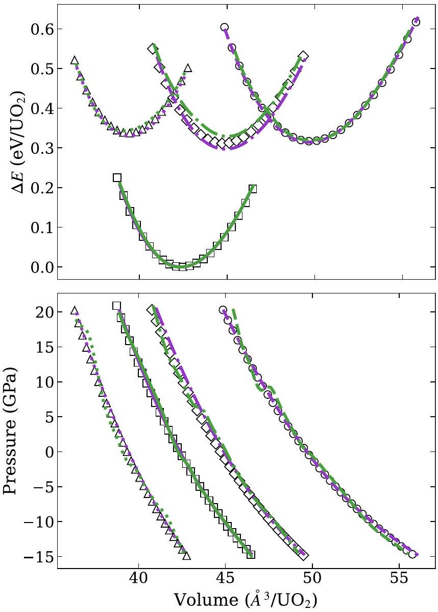
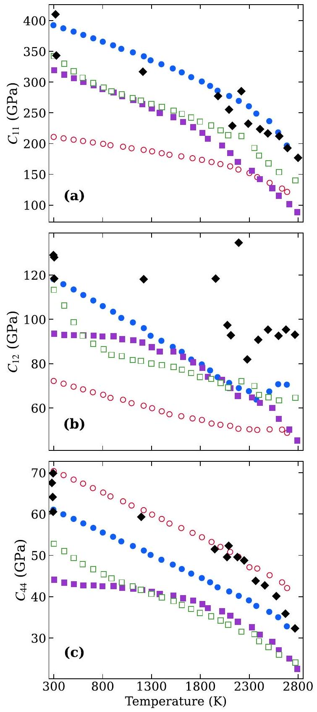
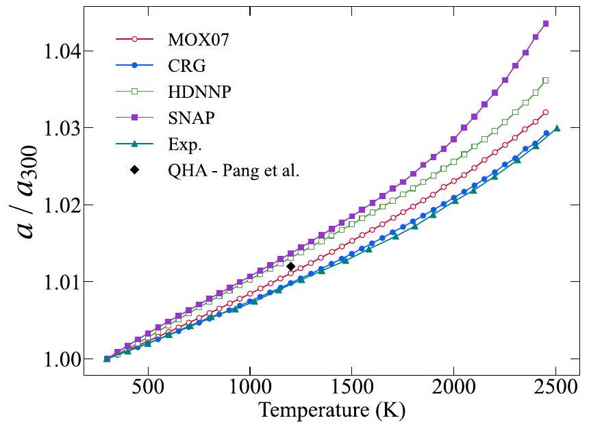
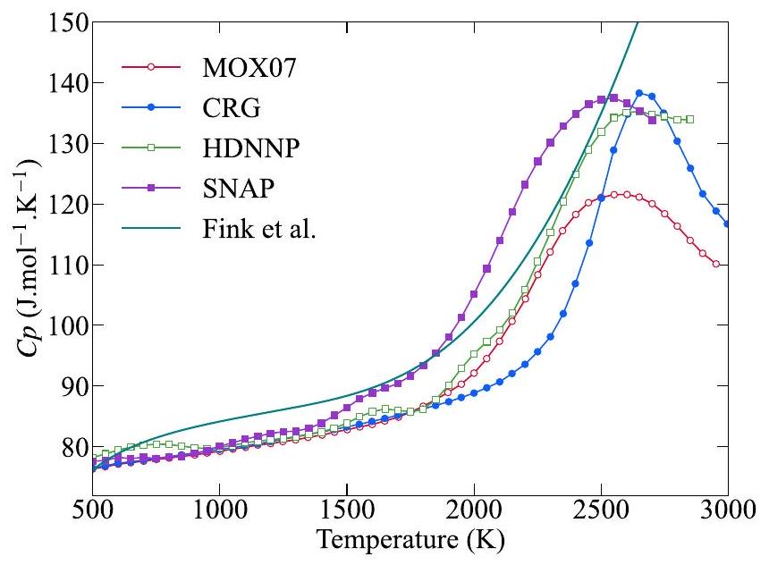
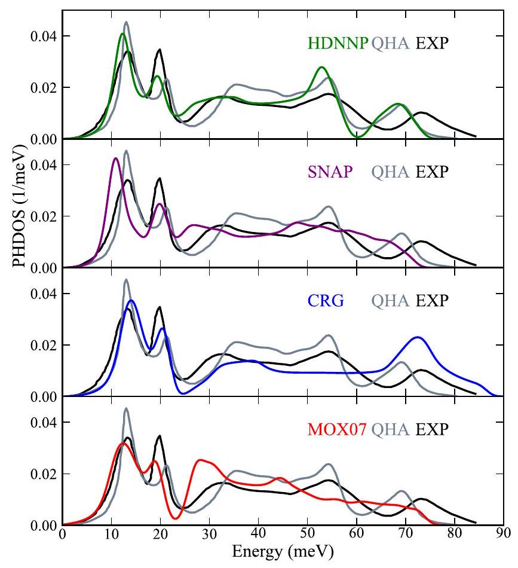
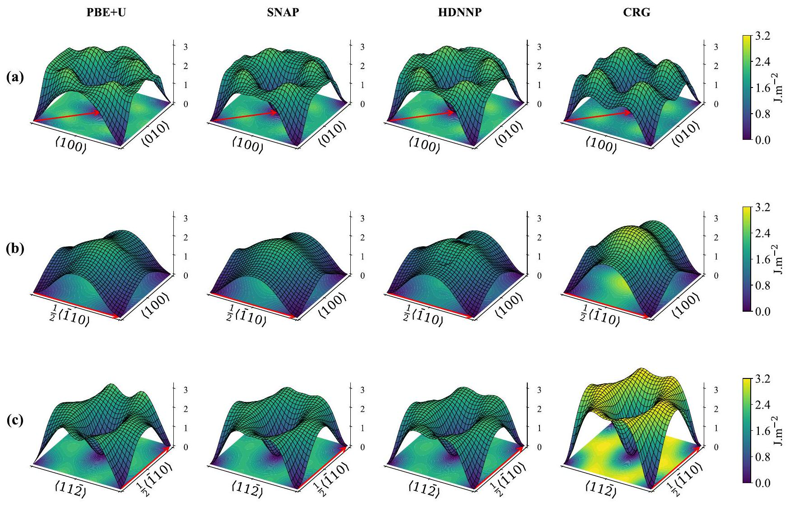
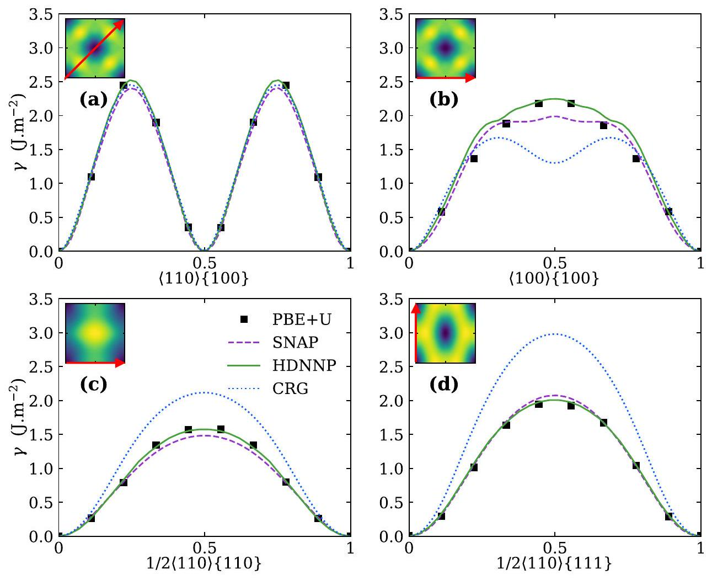

# Atomistic simulations of nuclear fuel $\mathrm{UO}_{2}$ with machine learning interatomic potentials 

Eliott T. Dubois ©, ${ }^{1,2}$ Julien Tranchida®, ${ }^{1}$ Johann Bouchet, ${ }^{1}$ and Jean-Bernard Maillet ${ }^{2,3}$ ${ }^{1}$ CEA, DES, IRESNE, DEC, SESC, LM2C, Cadarache F-13108 Saint-Paul-Lez-Durance, France ${ }^{2}$ CEA, DAM, DIF, F-91297 Arpajon, France ${ }^{3}$ Université Paris-Saclay, CEA, Laboratoire Matière en Conditions Extrêmes, 91680 Bruyères-le-Châtel, France

#### Abstract

We present the development of machine-learning interatomic potentials for uranium dioxide $\mathrm{UO}_{2}$. Density functional theory calculations with a Hubbard $U$ correction were leveraged to construct a training set of atomic configurations. This training set was designed to capture elastic and plastic deformations, as well as point and extended defects, and it was enriched through an active learning procedure. New configurations were added to the training database using a multiobjective criterion based on predicted uncertainties on energy and forces (obtained using a committee of models) and relative distances between new configurations in descriptor space. Two machine-learning potentials were developed based on physically sound pairwise potentials, which include the Coulombic interaction: a neural network potential and a SNAP potential. These potentials were optimized to minimize the root mean square error on the training database. Subsequently, the SNAP potential was used to compute the stacking fault energy surface in multiple directions, and the stabilized configurations were employed for subsequent DFT minimizations. The final DFT stacking fault energy surfaces of $\mathrm{UO}_{2}$ are presented, and the associated configurations are included in the training database for a new optimization. Finally, the results obtained from both machine-learned potentials were compared to standard semiempirical ones, demonstrating their excellent predictive capabilities for solid properties. These properties include defect formation energies, $\gamma$ surface, elastic properties, and phonon dispersion curves up to the Breidig transition temperature.

DOI: 10.1103/PhysRevMaterials.8.025402

## I. INTRODUCTION

Pellets of uranium dioxide ( $\mathrm{UO}_{2}$ ) are the reference fuel of most nuclear power plants in the world. In reactor conditions, these pellets are facing severe conditions of heat gradient, stress and irradiation. This dramatically impacts their microstructure, and leads to an evolution of their thermophysical properties, such as the thermal conductivity [1], or the elastoplastic response of the fuel [2,3]. To gain insights into these phenomena and their interconnections, comprehensive characterizations and experimental measurements are crucial. Although performing those experiments is hindered by the associated cost and complexity [4,5], the acquisition of such information holds crucial significance in constructing accurate models and obtaining reliable data for fuel performance codes [6-8]. Ultimately, this enables an accurate description of the in-reactor evolution of nuclear fuels. In this context, atomistic scale studies based on first-principles methods or empirical potentials have been extensively employed to supplement experimental data on $\mathrm{UO}_{2}$.

First-principles methods such as density functional theory (DFT) have proven to be a reliable tool for predicting energies, atomic forces, and stress tensors of small atomic configurations [9,10]. However, for $\mathrm{UO}_{2}$, the application of a Hubbard $U$ correction term is necessary to account for the strong correlations among uranium $5 f$ electrons [11-14], introducing additional complexity compared to standard DFT [14,15] to converge towards the ground state due to metastable states in the electronic structure. Within this $\mathrm{DFT}+U$ framework, accurate computations of formation energies of interstitial
atoms or vacancies, such as the neutral bounded Schottky defects (BSDs), have been extensively performed [14,16,17]. These formation energies can be incorporated into thermodynamic models, to calculate diffusion rates of defects [18,19]. Although more challenging, small clusters of those defects can also be considered at the DFT level [16]. Recent studies have highlighted the importance of considering larger simulation cells (for example $3 \times 3 \times 3$ supercells, with 324 atoms) for accurately predicting BSD formation energies [20,21], emphasizing the need for calculations at a larger scale than typical DFT simulations.

While recent advances have allowed DFT-based descriptions of thermophysical properties in nuclear fuels [22], these methods are still limited to small atomic configurations, and modeling temperature-dependent large-scale effects remains challenging within the $\mathrm{DFT}+U$ framework.

At larger scales, semiempirical interatomic potentials (SEIPs) have been developed and applied to $\mathrm{UO}_{2}$. Those SEIPs define a potential energy landscape from which energies of atomic configurations and forces between atoms can be computed. Traditionally, SEIPs for $\mathrm{UO}_{2}$ have combined pair potentials, such as the Coulombic interaction and the Buckingham model [23], fitted to experimental properties [24-27]. Once constructed, those potentials were used in large-scale classical molecular dynamics (MD) or Monte Carlo simulations [28] to investigate extended defective structures, such as displacement cascades, dislocations or grain boundaries [29-31].

More recently, Cooper, Rushton, and Grimmes introduced a many-body embedded atom method (EAM) contribution
to pairwise terms [32,33]. Their SEIP, referred to as CRG, improved upon previously observed deviations from experimental elastic and plastic properties [34,35], and accurately predicted elastic constants and thermophysical properties in excellent agreement with experimental measurements. Notably, the CRG potential has been employed in various studies, including the derivation of a heat-capacity law tested in fuel-performance codes [36], extensive investigations of the temperature dependence of $\mathrm{UO}_{2}$ thermal conductivity by Liu et al. [37], and the computation of grain boundary structures with excellent agreement to experimental observations [38].

However, none of the SEIPs mentioned above were specifically designed to reproduce the formation and migration energies of small atomic structures, such as defects, as predicted by $\mathrm{DFT}+U[20,21]$. Furthermore, these SEIPs exhibit significant discrepancies among themselves regarding defect formation energies, which can have crucial consequences when performing MD simulations of damage accumulation, as recently discussed by van Brutzel et al. [39]. Differences in the calculated $\gamma$ surfaces, crucial for the prediction of dislocation and grain-boundary structures, have also been observed in UO2 SEIPs [40]. The observed differences can lead to large discrepancies in terms of predicted extended defect configurations, such as dislocations. Overall, the inconsistencies among available models (DFT $+U$ and different SEIPs) hamper the predictability of damage accumulation and plastic behavior simulations, despite their fundamental importance in nuclear fuels.

In recent years, machine-learning tools have successfully been employed to learn potential energy surfaces from reference ab-initio calculation datasets. These machine-learning interatomic potentials (MLIPs) have proven effective in accurately describing various classes of materials [41]. Two recent studies have explored the potential of MLIPs in nuclear fuel materials. Yang et al. trained a neural-network potential on $\mathrm{UO}_{2}$ configurations for specifically temperature dependant calculations of thermal conductivity [42]. Kobayashi et al. applied neural-network potentials to train three MLIPs for thorium dioxide $\mathrm{ThO}_{2}$ [43]. Both studies obtained excellent thermophysical properties, but did not investigate point or extended defect configurations. They also highlighted the challenges of extending their study to defect structures in $\mathrm{UO}_{2}$, particularly due to the additional complexity introduced by DFT $+U$ calculations. To the best of our knowledge, the computation of stacking fault energy surfaces of $\mathrm{UO}_{2}$ using DFT is still beyond current capabilities. Our work aims to address these limitations.

In this study, we have developed two MLIPs for $\mathrm{UO}_{2}$, leveraging the Behler-Parinnello high-dimensional neural network [44] and spectral neighbor analysis approaches [45]. By combining state-of-the-art DFT calculations on actinide oxides with active-learning methods, we ensured an efficient sampling of the potential energy surface, enabling the generation of a diverse dataset for training the potentials. We employed a SNAP potential to relax configurations on the stacking fault energy surface for several slip planes, followed by full $\mathrm{DFT}+U$ minimizations. From the $\gamma$ surfaces, we extracted minimum energy paths, significantly improving the description of material behavior at the atomistic level.

First, we provide a brief description of the computational methods used and the theoretical background of MLIP and active learning procedures. Then, we thoroughly assess the performance of the trained potentials against reference DFT calculations. Finally, we utilize these potentials to predict thermomechanical properties of $\mathrm{UO}_{2}$, including defect formation energies, and compare the results with standard predictions from semiempirical potentials CRG and MOX07.

## II. METHODS

## A. General structure of the potentials

The total potential energy of our system $E_{p}$ is constructed by summing three distinct contributions:

$$
E_{p}=E_{r}+E_{c}+E_{m l}
$$

where $E_{r}$ is a short-range and pair-wise repulsive interaction, $E_{c}$ a Coulombic contribution, and $E_{m l}$ is the machine learned contribution. Both $E_{r}$ and $E_{c}$ can be referred to as reference potentials.

The short-range $E_{r}$ contribution aims at representing a screened nuclear repulsion. In addition, it is also known to efficiently stabilize the potentials at very short-range, and to avoid inconsistent behavior [46]. In this work, this short-range repulsion is accounted for through the Ziegler-Biersack-Littmark (ZBL) pair potential [47]:

$$
E_{r}=\sum_{i, j} \frac{1}{4 \pi \epsilon_{0}} \frac{Z_{i} Z_{j} e^{2}}{r_{i j}} \phi\left(r_{i j} / a\right)+S\left(r_{i j}\right)
$$

with $Z_{i}$ and $Z_{j}$ the atomic numbers of atoms $i$ and $j, e$ the elementary charge, $r_{i j}$ the distance between atoms $i$ and $j, \epsilon_{0}$ the vacuum permittivity, and $a, \phi(x)$, and $S\left(r_{i j}\right)$ are defined following the work of Ziegler et al. [47]. Those parameters where adjusted to approximately match highly compressed $\mathrm{DFT}+U$ calculations of the $\mathrm{UO}_{2}$ primitive cell (see Ref. [48]).

The second contribution $E_{c}$ accounts for the electrostatic interactions:

$$
E_{c}=\sum_{i, j} \frac{q_{i} q_{j}}{4 \pi \epsilon_{0} r_{i j}}
$$

with $q_{i}$ and $q_{j}$ the charges of two atoms $i$ and $j$. In this study, we considered the constant partial charge values as optimized by Yakub et al. [27] for actinide oxides. This electrostatic interaction term is computed by leveraging the Ewald or PPPM summation methods (both methods were tested and proved to give equivalent results), accounting for long-range contributions. Note that the constant charge approximation only affects long range interactions as the short-range part will be corrected by the ML contribution. The corresponding assumption is that local variations of charges (due, for example, to a defect) have a limited contribution to long range interactions; then, only the mean field due to constant atomic charges is computed.

The combination of a MLIP with the long-range Coulombic interactions has already demonstrated successful applications to $\mathrm{Li}_{3} \mathrm{~N}$ by Deng et al. [49] and GaN by Bartok et al. [50]. It is important to note that the use of constant atomic charges limits the potential's applicability to nonreactive
simulations, where the chemical nature of the atomic environment remains weakly perturbed. To address the significant evolution of atomic charges during simulations, specific strategies integrated into machine learning frameworks have been developed (for more details, see the recent review on neural network potentials by Behler et al. [51]).

The last contribution to $E_{p}$ is $E_{m l}$, which represents one of the two MLIPs trained in this study. The objective of those MLIPs is to map, through a function $\Phi$, the remaining contribution to the potential energy (after accounting for the two reference potentials) of the $i$ th atom $E_{i}^{\mathrm{ML}}$ of species $\alpha$ to its local atomic environment in a descriptor space $G_{i}$, given a set of parameters $\Theta_{\alpha}$,

$$
E_{i}^{\mathrm{ML}}=\Phi\left(\Theta_{\alpha}, G_{i}\right),
$$

where $\Phi$ is an energy function that depends on the descriptors rather than on Cartesian coordinates and $G_{i} \equiv \left\{g_{i 1}, g_{i 2}, \ldots, g_{i K}\right\}$ is the $K$-component descriptor vector for atom $i$. Each component $g_{i K}$ is a smooth function of the $i$ th atom's Cartesian local environment $c_{i} \equiv\left\{r_{i 1}, r_{i 2}, \ldots, r_{i n}\right\}$ corresponding to the set of positions of its $n$ neighbors within a cutoff sphere of radius $r_{\text {cut }}$. These functions are chosen to ensure energy invariance under translation, rotation and permutation of atoms.

In this study, we employed two specific potentials: the spectral neighbor analysis potential (SNAP) and the Behler-Parrinello high dimensional neural-Network potential (HDNNP) [44] using as descriptors SO-4 bispectrum [45] and atom centered symmetry functions, respectively. Appendixes A and B review the formalism associated with these potentials. We also note that those two types of ML potentials offer a good trade-off between accuracy and computational performance, as described in a recent analysis by Zuo et al. [41].

## B. Active learning procedure for dataset generation

In the field of ML, one of the major challenges is to build accurate and versatile models that can effectively handle a wide range of configurations. Achieving this requires constructing a comprehensive training dataset that encompasses various configurations representative of the entire accessible space. While it is impossible to exhaustively sample the entire phase space, classical statistical mechanics suggests that the thermally accessible and physically relevant regions can be found within a significantly smaller subset of possible configurations. Since the capabilities of machine learning potentials are solely determined by the information contained in the training database, considerable efforts have been dedicated to its construction, with a particular focus on sampling this relevant configuration space.

In recent years, active learning strategies have gained popularity in the field of material sciences for efficiently building training sets at a reduced CPU cost [52-62]. The main idea is to label new configurations (i.e., to compute first-principles energy, forces, and stresses) based on their capability to improve a model. In each generation, a set of candidate instances (i.e., new atomic configurations) is generated at low cost using classical molecular dynamics. From this set, only a subset is eventually selected for labeling. Those strategies become
particularly relevant when the associated first-principles calculations are cumbersome and computationally heavy, such as in $\mathrm{UO}_{2}$.

One popular selection strategy is called Query by committee [52,63,64]. This approach involves training a committee of multiple learners (in this case, MLIP) rather than relying on a single learner. The uncertainty, or committee disagreement, associated with a prediction is quantified as the variance among the predictions made by the committee. Both energy and forces can be used to calculate the disagreement, with the former serving as a global indicator for a structure denoted as $\mathrm{x} \equiv\left\{\mathrm{x}_{i}\right\}_{i=1}^{n}$, while the latter accounts for per-atom information.

The energy disagreement is given by

$$
\sigma_{E}(\mathrm{x})=\left[\frac{1}{N_{c}} \sum_{c=1}^{N_{c}}\left(E_{c}-\langle E\rangle_{N_{c}}\right)^{2}\right]^{\frac{1}{2}}
$$

and the disagreement associated with the forces is given by

$$
\sigma_{F_{i, \zeta}}(\mathrm{x})=\left[\frac{1}{N_{c}} \sum_{c=1}^{N_{c}}\left(F_{i, \zeta, c}-\left\langle F_{i, \zeta}\right\rangle_{N_{c}}\right)^{2}\right]^{\frac{1}{2}}
$$

where $N_{c}$ is the size of the committee, $i$ represents an atom of the configuration x , and $\zeta$ the $x, y$, or $z$ direction. From the energy and force disagreements, an uncertainty criterion can be defined as

$$
u(\mathrm{x})=\frac{\sigma_{E}(\mathrm{x})}{\sigma\left(\sigma_{E}\right)}+\frac{\left\langle\sigma_{F}(\mathrm{x})\right\rangle_{i, \zeta}}{\sigma\left(\left\langle\sigma_{F}\right\rangle_{i, \zeta}\right)}
$$

where $\left\langle\sigma_{F}(\mathrm{x})\right\rangle_{i, \zeta}$ is the average force disagreement over all atoms and directions. Both terms are divided by their standard deviation over the pool of unlabeled instance. In a sampling scenario, the $q$ selected structures are those with the largest $u(\mathrm{x})$. However, for $q>1$ (batch active learning), uncertainty sampling alone can lead to redundant queries, as two instances are likely to share prediction results if they are close to each other in the input space.

To reduce redundancy by selecting close or correlated configurations, a diversity criterion [65] $d(\mathrm{x})$ is defined as

$$
\begin{gathered}
d(\mathrm{x})=\sum_{\alpha} \min _{i} D_{\mathrm{MAH}}\left(G_{i}^{\alpha}, \mathcal{Q}^{\alpha}\right) \\
D_{\mathrm{MAH}}\left(G_{i}^{\alpha}, \mathcal{Q}^{\alpha}\right)=\sqrt{\left(G_{i}^{\alpha}-\mu_{\mathcal{Q}}^{\alpha}\right)^{T} S_{\mathcal{Q}}^{+}\left(G_{i}^{\alpha}-\mu_{\mathcal{Q}}^{\alpha}\right)},
\end{gathered}
$$

where $D_{\text {MAH }}$ is the Mahalanobis distance between the atomic environment of atom $i$ and all atomic environments in the current queried ensemble $\mathcal{Q}$ for the atomic species $\alpha$. Note that the usual inverse of the $\mathcal{Q}$ ensemble covariance matrix has been replaced by the pseudo-inverse ( $S_{\mathcal{Q}}^{+}$) for numerical stability. Diversity is achieved when $d(\mathrm{x})$ is maximum.

The final selected instances should maximize a weighted sum of the uncertainty criterion and the diversity criterion:

$$
s(\mathrm{x})=(1-\gamma) u(\mathrm{x})+\gamma d(\mathrm{x})
$$

where $\gamma \in[0 ; 1]$ is a user-defined parameter. In the following, we use $\gamma=0.5$ to balance the diversity and uncertainty criteria. The structure selection is performed sequentially : $S_{\mathcal{Q}}^{+}$, and thus $d(\mathrm{x})$ must be updated each time a new configuration is selected and added to $\mathcal{Q}$.

TABLE I. Errors for SNAP and BP-HDNNP potential.
|  |  | Energy RMSE (meV/atom) | Energy MAE (meV/atom) | Forces RMSE ( $\mathrm{meV} / \AA$ ) | Forces MAE ( $\mathrm{meV} / \AA$ ) | Stress RMSE ( $\mathrm{meV} / \AA^{3}$ ) | Stress MAE ( $\mathrm{meV} / \AA^{3}$ ) |
| :--- | :--- | :--- | :--- | :--- | :--- | :--- | :--- |
| SNAP | $f m \overline{3} m$ | 1.60 | 1.27 | 3.10 | 0.73 | 5.69 | 3.01 |
|  | Polymorph | 0.64 | 0.49 | 156.74 | 115.22 | 3.93 | 1.89 |
|  | Hot bulk 1 (300 to 2000 K ) | 3.39 | 2.25 | 221.11 | 159.65 | 5.67 | 3.65 |
|  | Hot bulk 2 (2200 to 2500 K ) | 5.70 | 4.47 | 385.19 | 295.84 | 6.00 | 4.19 |
|  | Hot bulk 3 (2800 to 3200 K ) | 8.45 | 7.04 | 493.72 | 377.91 | 7.45 | 5.27 |
|  | Defects | 6.16 | 4.57 | 300.68 | 211.02 | 6.66 | 4.15 |
|  | $\gamma$ surfaces | 6.42 | 4.97 | 163.15 | 82.47 | 6.67 | 3.41 |
|  | Total | 5.26 | 3.52 | 308.81 | 206.00 | 6.07 | 3.62 |
| HDNNP | $f m \overline{3} m$ | 2.71 | 2.33 | 11.72 | 2.30 | 10.53 | 4.01 |
|  | Polymorph | 3.47 | 2.81 | 63.17 | 46.95 | 14.37 | 5.13 |
|  | Hot bulk 1 (300 to 2000 K ) | 2.53 | 2.10 | 99.49 | 72.13 | 3.91 | 2.14 |
|  | Hot bulk 2 (2200 to 2500 K ) | 3.59 | 3.68 | 175.46 | 130.76 | 2.24 | 1.52 |
|  | Hot bulk 3 (2800 to 3200 K ) | 4.51 | 2.14 | 246.58 | 177.47 | 2.80 | 1.96 |
|  | Defects | 2.53 | 3.68 | 115.77 | 85.07 | 3.67 | 2.15 |
|  | $\gamma$ surfaces | 4.33 | 3.31 | 64.75 | 35.49 | 5.82 | 3.02 |
|  | Total | 3.38 | 2.67 | 139.63 | 90.48 | 7.32 | 2.82 |

## III. RESULTS

An initial database is constructed based on physical intuition, containing representative configurations of the cold curves of several crystalline structures including $f m \overline{3} m$, $p 4_{2} m n m, p n m a$, and $p b c n$ as well as small deformations around the stable structure $f m \overline{3} m$.

Based on this database, a first SNAP potential is optimized and NVT trajectories of a 96-atom supercell using the LAMMPS code are performed at several temperatures in the hot solid phase to create an ensemble of candidate configurations for subsequent learning [66]. The active learning procedure described in Sec. II is then employed to select the most appropriate configurations, which are subsequently computed using single-point DFT calculations using the ABINIT package [67-69]. The database is finally expanded with configurations targeting specific properties (such as the $\gamma$ surface, or specific defects), as discussed in the following. Appendix C provides a review of our DFT setup and the content of our training set.

## A. Performance against reference data

In order to evaluate the performance of the two potentials, we conducted an assessment against reference data. For this purpose, a subset of the database, approximately $10 \%$, was extracted solely for testing purposes. These configurations were not included in the learning process. Subsequently, the trained potentials were evaluated exclusively on this testing database. The results in terms of root mean square error (RMSE) and mean absolute error (MAE) are presented in Table I.

The energy RMSE of the SNAP and HDNNP potentials on the whole database are 5.26 and $3.38 \mathrm{meV} /$ atom, respectively. These results are highly satisfactory, especially considering the diverse range of configurations in the database, encompassing different polymorphs, deformations, defects, and temperatures. Very good agreement was also observed for the stress predictions, as indicated in detail in Table I. The force RMSEs of the two potentials can be considered as less
satisfactory. The SNAP and HDNNP potentials yielded total values of 308 and $139 \mathrm{meV} / \AA$, respectively. It should be noted that typically, RMSEs below $100 \mathrm{meV} / \AA$ are commonly expected [46]. Nevertheless, an examination of Table I reveals that the average values are significantly influenced by the scores on the hot bulk 2 and 3, which correspond to ionic temperatures above 2000 K , as well as the defective structures. This deviation from the standard values may be attributed to the corresponding DFT $+U$ calculations, particularly the complexity involved in operating the occupation matrix control procedure (as discussed in Appendix C) far from equilibrium configurations.

In summary, the overall agreement on the testing set is highly satisfactory. Correlation plots depicting this agreement are provided in Ref. [48].

As part of our testing procedure, we computed the energy-volume and pressure-volume curves for different $\mathrm{UO}_{2}$ polymorphs. These curves were generated through static calculations of scaled relaxed structures. Figure 1 displays the obtained results. We achieved excellent agreement between the DFT results and our two MLIP predictions for the four considered polymorphs included in the training set. The maximum RMSE was lower than $3.5 \mathrm{meV} /$ at, with the highly deformed configurations contributing most to the RMSE. It should be noted that HDNNP were not explicitly trained on pressure, which explains the observed inflection points in the $P-V$ curves for the polymorphic phases.

When considering the effect of irradiation on $\mathrm{UO}_{2}$, it is important to account for the creation of defects in the crystalline material. These defects significantly alter the thermomechanical properties of the material. The most common types of defects in $\mathrm{UO}_{2}$ are the neutral bounded Schottky defects (BSD, with three different configurations depending of the location of the oxygen vacancies around the uranium vacancy) and the oxygen Frenkel pairs ( $\mathrm{FP}_{\mathrm{O}}$ ). For each type of defect, we conducted DFT $+U$ calculations to relax the structure around the defect and compute its formation energy. Similar relaxation simulations were performed at 0 K for each

FIG. 1. Equation of state at 0 K of four different $\mathrm{UO}_{2}$ polymorphs: $f m \overline{3} m$ (continuous lines), $p 4_{2} m n m$ (small dashed lines), pnma (dotted lines), and pbcn (larger dashed lines). DFT results are represented with symbols, whereas the SNAP and HDNNP results are displayed as purple and green lines respectively.

potential. The results are presented in Table II. We found that the MLIPs display good agreement with the DFT $+U$ results from the litterature, with an average error of less than 10 meV /atom.

## B. Thermomechanical properties

We then moved on to evaluate the thermomechanical properties of our potentials. The elastic tensor $\mathbf{C}$ at 0 K was obtained using the conventional Hooke's law, $\sigma=\mathbf{C} \epsilon$, where the stress tensor $\sigma$ and the strain tensor $\epsilon$ were constructed by applying positives and negatives deformations to the unit cell

TABLE II. Defects formation energies (eV).
| atoms/cell | $\mathrm{BSD}_{1}$ | $\mathrm{BSD}_{2}$ | $\mathrm{BSD}_{3}$ | $\mathrm{FP}_{\mathrm{O}}$ |
| :--- | :--- | :--- | :--- | :--- |
| CRG | 6.42 | 5.08 | 5.18 | 5.66 |
| MOX07 | 5.60 | 4.88 | 4.82 | 3.58 |
| GGA+U [70] | 3.32 | 2.54 | 2.82 | 4.96 |
| SNAP | 4.09 | 3.08 | 3.23 | 4.66 |
| HDNNP | 4.03 | 3.55 | 3.75 | 4.08 |

in all directions ( $\mathrm{xx}, \mathrm{yy}, \mathrm{zz}, \mathrm{yz}, \mathrm{xz}, \mathrm{xy}$ ). For the temperaturedependent elastic tensor, the same methodology was applied. However, for each deformation, the simulation box was first heated and equilibrated at a given temperature for 30 ps in the NVT ensemble. Then, the stress tensor was averaged over a 30 ps simulation in the NVE ensemble. All calculations were performed on $6 \times 6 \times 6$ supercells (except at 0 K , where unit cell calculations are sufficient) with a timestep of 1 fs and a temperature damping parameter of 0.1 ps . The Bulk modulus $(B)$, Shear modulus ( $G$ ), Young's modulus ( $E$ ), and the Zener ratio $\alpha_{r}$ were computed using standard relations derived from the elastic tensor, and the results are displayed in Table III.

The results obtained using the CRG potential showed excellent agreement with the experimental values, which the potential was fitted to. Our SNAP and HDNNP potentials exhibited very good agreement with the DFT reference values for all elastic properties, albeit underestimating the experimental values by approximately $10 \%$.

The temperature dependence of the three elastic constants is shown in Fig. 2. The evolution of $C_{11}$ for the two MLIPs exhibited the same trend as that computed with the CRG potential, with a shift towards lower values (consistent with the $0 \mathrm{~K} \mathrm{DFT}+U$ prediction). A continuous decrease is observed up to approximately 1800 K , followed by a stronger nonlinear decrease attributed to the onset of the Bredig transition (see below). Similar observations are made for $C_{44}$ except that the SNAP potential predicts an almost constant value until 1600 K . Significant differences are observed for $C_{12}$, with HDNNP predicting a rapid softening between 300 and 800 K , while SNAP leads to a constant value and CRG shows a linear decrease. This low temperature behavior might be associated with the MLIPs' extrapolation due to the absence of relevant configurations in the training database, which mainly consist of isotropic NPT simulation within the considered range of temperature. However, for $C_{12}$, the available experimental data is very noisy, so that it is hard to extract a general trend from it, and it is therefore difficult to draw a conclusion in terms of agreement of the different tested potentials.

## C. Thermodynamic properties and phonon density of states

The potentials were then tested on their ability to reproduce well-known trends of two thermodynamic properties and on the phonon density of states.

TABLE III. Elastic constant, bulk modulus, shear modulus, Young modulus and Zener ratio from experiments, CRG and MOX07 semiempirical potentials, and DFT, SNAP, and HDNNP MLIP potentials.
|  | $\mathrm{C}_{11}$ (GPa) | $\mathrm{C}_{12}$ (GPa) | $\mathrm{C}_{44}$ (GPa) | B (GPa) | E (GPa) | G (GPa) | $\alpha_{r}$ |
| :--- | :--- | :--- | :--- | :--- | :--- | :--- | :--- |
| Exp [71] | 396 | 121 | 64 | 213 | 87 | 230 | 0.46 |
| CRG | 406 | 124 | 66 | 218 | 90 | 237 | 0.47 |
| MOX07 | 216 | 76 | 73 | 122 | 72 | 180 | 0.47 |
| GGA+ $U$ | 364 | 112 | 58 | 196 | 79 | 210 | 0.46 |
| SNAP | 360 | 114 | 59 | 196 | 80 | 211 | 0.48 |
| HDNNP | 373 | 121 | 64 | 205 | 84 | 222 | 0.50 |

FIG. 2. Evolution of the elastic constants ( $C_{11}, C_{12}$, and $C_{44}$ ) with temperature, for four reference potentials (CRG in filled blue circles, MOX07 in open red circles, SNAP in filled purple squares, and HDNNP in open green squares). The black diamonds display the existing experimental data, extracted from Fink [72].

The evolution of the enthalpy was computed in the isobaric isothermal (NPT) ensemble. A supercell of $6 \times 6 \times 6(2592$ atoms) was equilibrated at $P=1.0$ bar and the target temperature for 80 ps , with quantities of interest averaged over the last 30 ps . This procedure was repeated for temperatures ranging from 300 to 3000 K , with a step of 25 K . All calculations were performed using a 1 fs time step, with damping parameters set to 0.1 ps and 1 ps for the thermostat and barostat respectively. The lattice parameter $a$ was directly obtained from the simulation, and the specific heat capacity $C_{p}$ was com-

FIG. 3. Evolution of the ratio $a / a_{300}$ with temperature. The blue triangles represent experimental measurements extracted from Fink [72]. The black diamond was extracted from the $a b$ initio work of Pang et al. [73].

puted by differentiating the volume and enthalpy curves with respect to temperature. The results are presented in Figs. 3 and 4.

For the evolution of the lattice parameter, as expected, the CRG potential provides the best agreement compared to experimental data (blue dots and green triangles on Fig. 3, respectively). The trends exhibited by our MLIPs present a slight overestimation of the thermal expansion coefficient. However, those trends seem consistent with the existing DFT $+U$ data (black dot on Fig. 3) [74].

Notably, our MLIPs successfully reproduce the Bredig transition around $T=2500 \mathrm{~K}$ [75]. The existence of this transition, also referred to as "premelting" transition, is supported by experimental evidence [76]. It is associated with the emergence of a superionic state and a sudden increase of the oxygen mobility (while the uranium sublattice remains very stable). As depicted in Fig. 4, this second-order transition

FIG. 4. Evolution of the heat capacity $C_{p}$ with temperature. The blue line display the experimental recommendation from Fink [72].

FIG. 5. Comparison of the phonon density of states of $\mathrm{UO}_{2}$ at 300 K obtained with our MLIPs, CRG, and MOX07 with the experimental data [79] and the result of the QHA [73].

is characterized by a peak in the specific heat capacity. The onset of the transition appears earlier with the SNAP potential while the HDNNP shows better agreement with CRG results. Potashnikov et al. discussed the need to simulate $3 \times 3 \times 3$ supercells to observe this transition [24]. However, our MLIPs, trained on $2 \times 2 \times 2 \mathrm{DFT}+U$ supercells, are able to reproduce the expected behavior. This is a significant finding since $3 \times 3 \times 3$ cells require approximately 38 times more computational power to solve ( $\mathrm{N}_{e}^{3}$ scaling of DFT $+U$, where $\mathrm{N}_{e}$ the number of simulated valence electrons) compared to $2 \times 2 \times 2$ cells.

The phonon densities of states (PHDOS) at 300 K were computed using the temperature dependent effective potential (TDEP) method [77] and $5 \times 5 \times 5$ supercells. Results are presented in Fig. 5 for our MLIPs, the CRG and the MOX07 potentials, with a comparison to experimental data of J. W. L. Pang et al. [73,74] and their results using the quasi harmonic approximation (QHA) with GGA $+U$. The CRG and MOX07 potentials reproduce correctly the acoustic region $(0-25 \mathrm{meV})$ but the optical modes are strongly overestimated with CRG, as discussed in the work of M. Jin et al. [78], while MOX07 underestimates them. GGA $+U$ [73] is also in good agreement for the acoustic region but to a lesser extent for the optical region, particularly the dispersion of the highest branch, between 70 and 80 meV , which is strongly underestimated. Our HDNNP shows excellent agreement with the QHA results, with a better comparison to experimental data for lower optical energies ( 25 to 55 meV ). This can be attributed to the inclusion of anharmonic effects in the TDEP method, which are not accounted for in the QHA. The SNAP exhibits a stronger softening of energies compared to
the QHA but shows a better agreement with the DFT results and experimental data compared to the CRG and MOX07 potentials. This is particularly important since quantities relevant to nuclear fuels such as thermal conductivity are related to the PHDOS, as shown by the overestimation of the phonon lifetime and consequently of the thermal conductivity by the CRG potential [78].

One final comment of this section concerns low temperature properties and magnetism. At approximately 30 K , the magnetic configuration of $\mathrm{UO}_{2}$ goes through a Néel transition. Its magnetic order goes from antiferromagnetic to paramagnetic. Some structural properties can be influenced by this rapid loss of magnetic order through magnon-phonon interactions. This is for example the case of the thermal conductivity [80]. As discussed in Appendix C, our DFT $+U$ calculations are set to represent antiferromagnetic spin configurations only. Besides, in their current formalism, our ML-IAPs are blind to magnetism and magnetoelastic effects. Therefore they are unable to simulate any of the magnetically driven phenomena observed at those temperatures. In our conclusions, we discuss how future investigations could improve our models to account for magnetic effects.

## D. Generalized stacking fault energy surfaces

Generalized stacking fault (GSF) energy surfaces, also known as $\gamma$ surfaces, are a crucial ingredient for the simulation of dislocation mobility. To this date, numerous empirical potentials have been used to simulate plasticity and dislocation motion in $\mathrm{UO}_{2}$, but the $\gamma$ surface predictions of those potentials were never tested versus reference first-principles data [31,40,81]. Indeed, the $\gamma$ surfaces have never been computed within the complex $\mathrm{DFT}+U$ setup necessary for accurate first-principles $\mathrm{UO}_{2}$ description. Therefore it remains a lacking step of former studies. In this section, we display how our MLIPs were leveraged to enable a first-principles computation of those $\gamma$ surfaces.

The $\gamma$ surfaces were computed in the $\{100\},\{110\}$, and \{111\} slip planes, which correspond to the main dislocations observed in $\mathrm{UO}_{2}$ [82,83]. By using suitable oriented supercells with slip planes orthogonal to the $z$ direction, the excess energy was obtained by translating the upper half of the supercell along a $50 \times 50$ (respectively $10 \times 10$ for DFT calculations) grid of displacement vectors in the $x$ and $y$ directions. To prevent the system from returning to its original state, relaxation of atomic positions was only allowed in the $z$ direction (orthogonal to the slip plane). Due to periodic boundary conditions, this set up resulted in the existence of two stacking faults localized at $\frac{z_{\text {max }}}{2}$ and $z_{\text {max }}$, where $z_{\text {max }}$ is the size of the supercell in the $z$ direction. The supercells were constructed in such a way that the two planes associated with the stacking faults are equivalent. The periodic image of the stacking fault at the box's boundary was taken into account by correcting the excess energy by a factor of 0.5 . The resulting stacking fault energy is given by

$$
\Phi(\Delta)=\frac{1}{2} \frac{E(\Delta)-E(0)}{A},
$$

where $E(\Delta)$ is the energy of the configuration shifted by the vector $\Delta=(\delta x, \delta y)$ and $A$ is the area of the glide plane.

FIG. 6. Generalised stacking fault energy surfaces ( $\gamma$ surfaces) for the (a) $\{100\}$, (b) $\{110\}$, and (c) $\{111\}$ slip planes in $\mathrm{UO}_{2}$. For each plane, the Burgers vector is represented by a red arrow.

This methodology was applied to compute first-principle $\gamma$ surfaces. However, a direct application of the procedure led to convergence issues in our DFT $+U$ calculations. To overcome this difficulty, we implemented a self-consistent scheme leveraging our SNAP potential (the HDNNP potential would have been yielding equivalent results). The supercells were first relaxed using an initial SNAP potential (initially not trained on $\gamma$ surfaces). The resulting configurations were then computed using single-point $\mathrm{DFT}+U$ calculations. These new labeled DFT $+U$ results were added to the database, and an updated SNAP potential was trained. This procedure was repeated until the configurations relaxed using the SNAP potential were minimized within the $\mathrm{DFT}+U$ framework, with forces lower than $10^{-3} \mathrm{eV} / \AA$. The DFT results for the $\gamma$ surface along the 100 slip plane are displayed in Fig. 6(a) and compared with the results obtained with our MLIPs and with the CRG potential. Results obtained by two other empirical potentials are displayed in Ref. [48].

Along the $\{100\}$ slip plane, the glide directions $\mathbf{a}$ ([100]), $\mathbf{a}-\mathbf{b}$ ([110]), and $\mathbf{b}$ ([010]) restore the lattice upon unit slip. The $\gamma$ surface suggests that the $\mathbf{a}$ and $\mathbf{b}$ directions have a lower energetic barrier for glide compared to the $\mathbf{a - b}$ direction. This behavior is quantitatively retrieved by our SNAP and HDNNP potentials as well as by the CRG potential. Results obtained with the MORELON and MOX07 potentials are displayed in SM. The MORELON potential predicts a lower energy barrier
in the a-b direction whereas the MOX07 potential fails to reproduce the energy barrier in the $\mathbf{a - b}$ direction. Minimum energy paths (MEP) along the $\mathbf{a}$ and $\mathbf{a}-\mathbf{b}$ directions were extracted from the $\gamma$ surface and are shown in Fig. 7. Both The SNAP and HDNNP exhibit excellent agreement with the DFT results in the [100] and [110] directions. Surprisingly, the CRG potential exhibits a marked minimum along [100], stabilizing a partial dislocation with a stacking fault. This difference may have significant implications in terms of plastic behavior.

Figure 6(b) displays the $\gamma$ surfaces corresponding to the $\{110\}$ slip plane. For this plane, the glide directions [001], [110], and [111] restore the lattice upon unit slip. The first principle $\gamma$ surface reveals that the glide would preferentially occur along the [001] and [ $\overline{1} 10]$ rather than along the [ $\overline{1} 11]$ direction. Results obtained with our SNAP and HDNNP potential are in very good agreement with the DFT results and reproduce accurately the MEPs along these three directions. The results along the [110] are displayed in Fig. 7(c). The CRG potential reproduces the shape of the MEP but overestimates the energy barrier by $30 \%$. Similarly, the overall shape of the $\gamma$ surfaces obtained with the CRG potentials is consistent with the DFT reference, but the height of the energy barriers is overvalued by a factor of two. We anticipate that those results can have significant consequences in predicting the plastic behavior and dislocation mobility.

FIG. 7. (a) $\langle 110\rangle\{100\}$, (b) $\langle 100\rangle\{100\}$, (c) $\frac{1}{2}\langle 110\rangle\{110\}$, and (d) $\frac{1}{2}\langle 110\rangle\{111\} \gamma$ lines in $\mathrm{UO}_{2}$.

The $\gamma$ surfaces corresponding to the $\{111\}$ slip plane are shown in Fig. 6(c). For this plane, the glide directions [11̄2], [ $\overline{1} 10$ ], and $[01 \overline{1}]$ restore the lattice upon unit slip. Glide is expected to occur along any of the degenerate [ $\overline{1} 10$ ] and $[01 \overline{1}]$ directions, with the dislocation eventually splitting into partials. All potentials except CRG reproduce the shape and energetic of the $\gamma$ surface. The CRG potential exhibits higher energy barriers along the MEP [see Fig. 7(d)].

The overall agreement between first-principles calculations and SNAP or HDNNP is very satisfactory for the $\gamma$ surfaces of the three slip planes considered here. On the contrary, the three semiempirical potentials exhibits some discrepancies compared to the DFT data, particularly regarding the energy barriers along the MEP. Since these energy barriers control the ease of glide, the elastic-plastic threshold, and the material's behavior under deformation, these discrepancies can have significant implications in terms of plastic behavior predictions, which is crucial for irradiated fuel materials. A detailed investigation of these properties will be the subject of future investigations.

## IV. CONCLUSION

Two interatomic potentials were developed and tested for $\mathrm{UO}_{2}$, the reference nuclear fuel material. These potentials combine short-range repulsion, long-range Coulombic interactions, and MLIP contributions at intermediate distances using the SNAP and HDNNP methodologies, respectively. To
construct a comprehensive training database capable of describing various material properties, an active learning scheme was deployed. This scheme enabled representative sampling of atomic environments, which was achieved by performing reference DFT calculations with the Hubbard $U$ correction and an occupation matrix control procedure. These calculations accurately accounted for the correlations between $f$ electrons. Despite the complexity of the reference $\mathrm{DFT}+U$ calculations, both potentials exhibit good agreement with a large and selective set of $a b$ initio and experimental metrics.

Notably, both potentials accurately describe the energyvolume curves for the main $f m \overline{3} m$ and 3 polymorphic phases of $\mathrm{UO}_{2}$. This promising result enables the study of phase transitions under extreme conditions. The potentials also demonstrate excellent agreement with the reference $\mathrm{DFT}+U$ calculations and existing experimental values for point defect energies and elastic constants (at 0 K ). As discussed in the introduction, an accurate description of the defect formation energies is key for atomistic predictions of the material behavior under irradiation. Our potential, combined with short-range repulsion, qualifies for primary knock-on and damage accumulation simulations, in a framework that allows direct comparison to $\mathrm{DFT}+U$ predictions.

The temperature dependence of the potentials was investigated, specifically regarding the evolution of elastic constants, thermal expansion, and heat capacity. Comparison with existing experimental data shows reasonable agree-
ment. Additionally, our potentials successfully reproduce the superionic transition (Bredig transition) around 2500 K , despite the relatively small 96 -atom configurations used in our training set. This transition, associated with increased mobility of the oxygen sublattice, has been theoretically and experimentally discussed and is still the object of intense investigations [75,76].

While our potentials remain stable up to the melting point and exhibit reasonable trends for the discussed properties, we observed larger force errors associated with highertemperature configurations in the training set ("hot bulk" 2 and 3). We hypothesize that these errors stem from our $\mathrm{DFT}+U$ calculations and the occupation matrix control procedure. Recent studies have proposed improved and more consistent $\mathrm{DFT}+U$ descriptions that incorporate spin-orbit coupling [84]. Although this is leading to a large increase in terms of computation cost (at least by a factor of 4, for already expensive $a b$ initio calculations), exploring the effect of these improvements on the consistency of our training data is a direction for future investigation.

Finally, we implemented a self-consistent scheme to compute stacking fault energy surfaces for three slip planes and their corresponding minimum energy path. This iterative scheme leveraged our SNAP potential to relax stacking fault configurations, enabling their subsequent evaluation using $\mathrm{DFT}+U$. The inclusion of these stacking fault configurations progressively enriched our training set. Notably, this represents the first DFT $+U$ computation of stacking fault energy surfaces. Our observation is that their computation was made possible only because pre-relaxed configurations could be provided to the DFT $+U$ setup. Besides, this scheme could not be applied with an empirical IAP, as its predictions (lattice constant, or even equilibrium configurations) would not be consistent with the DFT $+U$ predictions, so that the self-consistent scheme could not converge. The stacking fault energy surfaces computed using our approach could significantly contribute to understanding the plastic behavior of $\mathrm{UO}_{2}$, including the evaluation of dislocation nucleation stresses. Those results are fundamental to the field of nuclear fuels. Indeed, they enable to probe the validity and accuracy of MLIAPs and empirical interatomic potentials to simulate dislocation mobility and stability in $\mathrm{UO}_{2}$, which is crucial in the context of irradiated nuclear fuels.

Overall, we conclude that the description of the elastic as well as the plastic behavior of $\mathrm{UO}_{2}$ has been significantly improved by our MLIPs. Moving forward, our research will focus on two major enhancements of our potentials.

Firstly, we aim to simulate more complex and realistic fuel materials by expanding our training sets to include additional species such as plutonium and xenon. This expansion would enable the simulation of fission gas evolution in MOx fuels, which is a crucial topic for pressurized water reactors (PWRs) and fast neutron reactors. Secondly, we intend to investigate the impact of augmented physical descriptions, such as magnetic spins and charge fluctuations, within the classical model. Recent studies have combined magneto-elastic Hamiltonians with MLIPs to simulate magneto-elastic phenomena [85-87]. Such models could be used to investigate the piezomagnetic properties of $\mathrm{UO}_{2}$ [88-90], or the influence of the Néel transition on its low temperature thermal conductivity [80].

Other studies discussed how MLIPs can be superposed to variable charge models [91-93]. The incorporation of these models could facilitate novel atomistic investigations of phenomena crucial to nuclear fuel applications, such as accurate atomistic computations of oxygen diffusivity as a function of stoichiometry.

The data that support the findings of this study are available from the corresponding author upon reasonable request. Besides, the coefficients for the SNAP potential are provided in Ref. [48].

## ACKNOWLEDGMENTS

The authors would like to thank Bernard Amadon, Fabien Bruneval, François Bottin, Michel Freyss, and Mathieu Gascoin for their insightful technical comments about the DFT + $U$ framework, and its possible improvements in the context of future studies. They are also grateful to Emeric Bourasseau and Paul Lafourcade for their insight and support of this work, and to Aidan Thompson for discussions and suggestions related to machine-learning interatomic potentials. This research contributes to the RTA/RCOMB project. It received its funding from the CEA FOCUS/EJN program and was granted access to the HPC/AI resources of CINES/IDRIS/TGCC under the allocation 2022-A0130906922 made by GENCI.

## APPENDIX A: SPECTRAL NEIGHBOR ANALYSIS POTENTIAL

In this section, we review the SNAP framework as described in previous studies [45,94]. Following the work of Bartok et al., the method is based on the expansion of the density of neighbors on the basis of 4D hyperspherical harmonics [95]. The corresponding bispectrum components, which are real-valued and rotationally invariant, can be constructed as the scalar triple product of the expansion coefficients of the neighbor density in this basis [96]. The SNAP contribution to the potential energy of an atom $i$ can then be expressed as a linear combination of these bispectrum components:

$$
E_{i}^{\mathrm{SNAP}}=\beta_{0}+\sum_{k=1}^{K} \beta_{k}\left(B_{k}^{i}-B_{k 0}^{i}\right)=\beta_{0}+\boldsymbol{\beta} \cdot \boldsymbol{B}^{i},
$$

where $B_{k}^{i}$ represents the $k$ th bispectrum component of atom $i$ and $\beta_{k}$ its associated linear coefficient. $\boldsymbol{B}^{i}$ is the vector of bispectrum component of atom $i$. In our study, we fixed $K=$ 55 for each atomic species, resulting in a total of 110 linear coefficients $\beta_{k}$. The terms $\beta_{k} B_{k 0}^{i}$ shift the contribution of each bispectrum component, ensuring that the SNAP energy of an isolated atom is equal to $\beta_{0}$.

From Eq. (A1), we can derive the SNAP contribution to the forces acting on atom $j$ :

$$
\boldsymbol{F}_{j}^{\mathrm{SNAP}}=-\nabla_{j} \sum_{i=1}^{N} E_{i}^{\mathrm{SNAP}}=-\boldsymbol{\beta} \cdot \sum_{i=1}^{N} \frac{\partial \boldsymbol{B}^{i}}{\partial \boldsymbol{r}_{j}},
$$

where $\boldsymbol{r}_{j}$ represents the position of atom $j$. Similarly, the contributions to the stress tensor can be obtained as follows:

$$
\boldsymbol{W}^{\mathrm{SNAP}}=-\sum_{j=1}^{N} \boldsymbol{r}_{j} \otimes \boldsymbol{F}_{j}=-\boldsymbol{\beta} \cdot \sum_{j=1}^{N} \boldsymbol{r}_{j} \otimes \sum_{i=1}^{N} \frac{\partial \boldsymbol{B}^{i}}{\partial \boldsymbol{r}_{j}},
$$

where ⊗ denotes the Cartesian outer product operator. It is important to note that the SNAP contribution to the energy, forces, and stress tensor components [as expressed in Eqs. (A1), (A2), and (A3)] are all obtained as linear combinations of the $110 \beta_{k}$ coefficients. The training procedure for the SNAP contribution to the potential involves finding optimal values for these coefficients, which reproduce the DFT quantities (total energy, forces, and stress) after substracting the contributions of the reference potentials. We refer to the vector representing these reference contributions as $\boldsymbol{y}$. Each configuration $c$ in the training database can be represented in the descriptor space by a matrix $\boldsymbol{A}_{\boldsymbol{c}}$, where the rows correspond to different reference data (total energy, forces, stress) and the columns correspond to the contributions of the sum of $k$ th coefficients of the bispectrum vectors over all $N$ atoms in the configuration. By stacking all matrices $\boldsymbol{A}_{\boldsymbol{c}}$ we obtain the matrix $\boldsymbol{A}$. The optimization of the $\boldsymbol{\beta}$ coefficient then relies in solving the set of linear equations:

$$
\boldsymbol{A} \boldsymbol{\beta}=\boldsymbol{y} .
$$

Furthermore, the training database is divided into several groups associated with different parts of the configuration space. For example, configurations related to the cold equation of state are separated from configurations sampling the liquid state. Each training group is assigned a unique weight for its associated energies, atomic forces and stress tensor components. The weight vector $\boldsymbol{w}$ is optimized together with the $\boldsymbol{\beta}$ coefficients using an evolutionary algorithm controlled by Dakota [97]. The final coefficients of the potential are obtained as the solution to the following optimization problem:

$$
\hat{\beta}=\underset{\beta}{\operatorname{argmin}}\left\|\frac{\mathrm{w}}{\sigma N} \circ(\boldsymbol{A} \cdot \boldsymbol{\beta}-y)\right\|^{2},
$$

where $\sigma$ is the standard deviation of the quantity of interest.
The remaining hyperparameters include the cutoff radius $R_{\text {cut }}$, which determines the size of the local atomic environments around each atom and the effective radius associated with each atomic type. These coefficients allows the weighting of the SNAP energy contribution from each atom based on its chemical type. The optimization of these hyperparameters is incorporated into the global optimization procedure. The optimal cutoff radius is finally equal to $5.18 \AA$.

## APPENDIX B: BEHLER-PARRINELLO HIGH-DIMENSIONAL NEURAL NETWORK POTENTIAL

In a recent benchmark, the effectiveness of physicsbased interatomic potentials, such as the embedded atom model (EAM) [32] and the modified embedded atom model (MEAM) [98], was compared to state-of-the-art machine learning (ML) methods [41] using a shared training set. The results revealed that the machine learning potentials (MTPs) with the highest accuracy and computational efficiency occupy the optimal point on the Pareto front. Although neural network potentials (NNPs) require more computational resources compared to MTPs or SNAP, they still offer a satisfactory balance between computational cost and accuracy, making them suitable for materials exploration purposes, especially for complex systems [99]. The SNAP potential,
although less accurate than the others potentials, appears more robust when used for extrapolation on unseen structures.

In the case of HDNNP, $\Phi\left(\Theta_{\alpha}, G_{i}\right)$ represents a multilayered perceptron, i.e., a fully connected deep neural network. Descriptors functions are chosen to be type-2, type-4, and type-5 atom centered symmetry functions [44,100].

$$
\begin{gathered}
G_{i}^{2}=\sum_{i \neq j} e^{-\eta\left(r_{i j}-r s\right)^{2}} f_{c}\left(r_{i j}\right), \\
G_{i}^{4}=2^{1-\zeta} \sum_{\substack{j, k \neq i \\
j<k}}\left(1+\lambda \cos \theta_{i j k}\right)^{\zeta} e^{-\eta\left(r_{i j}^{2}+r_{i k}^{2}+r_{j k}^{2}\right)} \\
\times f_{c}\left(r_{i j}\right) f_{c}\left(r_{i k}\right) f_{c}\left(r_{j k}\right), \\
G_{i}^{5}=2^{1-\zeta} \sum_{\substack{j, k \neq i \\
j<k}}\left(1+\lambda \cos \theta_{i j k}\right)^{\zeta} e^{-\eta\left(r_{i j}^{2}+r_{i k}^{2}\right)} f_{c}\left(r_{i j}\right) f_{c}\left(r_{i k}\right),
\end{gathered}
$$

where $f_{c}(r)$ is a cutoff function defined as

$$
f_{c}(r)= \begin{cases}\frac{1}{2}\left(\cos \pi \frac{r}{r_{c}}+1\right) & \text { for } r \leqslant r_{c} \\ 0 & \text { for } r_{c}<r\end{cases}
$$

To select the most relevant set of symmetry functions for our case study, given a database of $m$ atomic environments, we first generate a large pool of $n$ functions by following the systematic procedure proposed by Imbalzano et al. [101]. The feature matrix $A \in \mathbb{R}^{m \times n}$ is contructed over the full dataset and immediatly pruned by discarding the $l$ functions with a range inferior to a given threshold $\epsilon=10^{-4}$. The resulting $A \in \mathbb{R}^{m \times(n-l)}$ is then sparsified using a CUR matrix approximation [102]: $A=C U R$, where $C \in \mathbb{R}^{m \times k}$ is a subset of the columns of $A, R \in \mathbb{R}^{k \times n}$ is a subset of the rows of $A$ and $U \in \mathbb{R}^{k \times k}$ is a lower-rank approximation of $A$. The $C$ and $R$ matrices can be seen as the most expressed columns or rows of $A$. Therefore $C$ contains the $k$ most relevant symmetry functions for the given case. The final set of chosen descriptors is given in Ref. [48].

Neural networks are trained on energy and forces by minimizing the following loss function:

$$
\begin{aligned}
\mathcal{L}(\theta)= & \sum_{c=1}^{N}\left|E_{c}-\hat{f}\left(\theta,\{r\}_{c}\right)\right|^{2} \\
& +\lambda^{2} \sum_{c=1}^{N} \sum_{i=1}^{N_{c}}\left\|F_{i}^{c}+\frac{\partial \hat{f}}{\partial r_{i}}\left(\theta,\{r\}_{c}\right)\right\|_{2}^{2}
\end{aligned}
$$

where the force weight $\lambda$ is a user defined parameter chosen such that the normalized error over the testing set is minimum. The parameter optimization is performed using a multi-stream extended Kalman filter (EFK) [103-105]. The corresponding parameters are listed in Table IV.

All HDNNP were trained using the N 2 P 2 software [106,107] with a $60 \times 45 \times 45 \times 1$ neural-network architec-

TABLE IV. Extended Kalman filter parameters.
| $\epsilon$ | $q_{0}$ | $q_{\tau}$ | $q_{\min }$ | $\eta$ | $\eta_{\tau}$ | $\eta_{\max }$ |
| :--- | :---: | :---: | :---: | :---: | :---: | :---: |
| 0.01 | 0.01 | 2.302 | $1 \times 10^{-6}$ | 0.3 | 2.304 | 1.0 |

TABLE V. Training set.
|  | $N$ configs. | Atoms/cell | $N$ data | $k$ mesh |
| :--- | :--- | :--- | :--- | :--- |
| $f m \overline{3} m$ | 130 | 12 | 5590 | $4 \times 4 \times 4$ |
| Polymorph | 300 | 12 | 12900 | $4 \times 4 \times 4$ |
| Hot bulk 1 (300 to 2000 K ) | 409 | 96 | 120655 | $2 \times 2 \times 2$ |
| Hot bulk 2 ( 2200 to 2500 K ) | 145 | 96 | 42775 | $2 \times 2 \times 2$ |
| Hot bulk 3 (2800 to 3200 K ) | 223 | 96 | 65785 | $2 \times 2 \times 2$ |
| Defects | 375 | 96,144 | 124692 | $2 \times 2 \times 2$ |
| $\gamma$ surfaces | 262 | 96,144 | 73978 | $2 \times 2 \times 2$ |
| Total | 1844 |  | 446375 |  |

ture and forces weighting factor $\lambda=2.0$. These hyperparameters were chosen to minimize the normalized error on the testing set.

Given a training dataset and a set of hyper-parameters, the parameter vector $\theta$ lies in a high-dimensional space. As the final set of parameters is a result of a local minimization in this high dimensional space, they depend on their initial values. A recent study has shown that the performances of networks obtained from distinct random initial parameters follow a $\Gamma$ law [108]. In the following, we systematically consider several neural networks at each optimization step and retain only the best one for subsequent evaluation and/or computing unless specified.

## APPENDIX C: DENSITY FUNCTIONAL THEORY CALCULATIONS

All DFT calculations were performed using the ABINIT package [67-69] in the framework of the projector augmented wave (PAW) method [109,110]. The parametrization of Perdew, Burke, and Ernzerhof (PBE) of the generelized
gradient approximation (GGA) was used to describe the exchange-correlation energy and potential [111], with a cutoff energy of 680 eV .

In order to take into account the strong correlations between the $f$ electrons, a Hubbard-like term is added by means of the DFT $+U$ Liechtenstein scheme [12]. The ( $U$, $J)$ parameters for the uranium cations are similar to previous $\mathrm{DFT}+U$ calculations, i.e., $U=4.5 \mathrm{eV}$ and $J=0.54 \mathrm{eV}$, and were estimated by Kotani and Yamazaki on the basis of an analysis of x-ray photoemission spectra [112,113]. An occupation matrix control scheme was applied to the $f$ orbitals in order to search for the ground state of our DFT $+U$ calculations [15,70].

The magnetic configuration of the uranium atoms is set to reproduce a longitudinal 1 k antiferromagnetic (AFM) order which, without including the spin-orbit coupling (SOC), is more stable than the experimentally observed transverse 3k AFM order [112]. In agreement with previous studies [42,114], the SOC was neglected. Its addition would increase the computational complexity of our $\mathrm{DFT}+U$ calculations, although it has been shown to have a negligible impact on the ground state and defect formation energies [16,115]. Besides, the energy differences generated by the addition of the SOC is very close or below the expected accuracy of our MLIAPS (few meVs per $\mathrm{UO}_{2}$ ) [84] and would therefore lead to almost no improvement of their accuracy. A recent study by Zhou et al. confirmed those predictions, and showed that the magnetic configuration has an overall small influence on the phonon spectrum in $\mathrm{UO}_{2}$ [116].

All calculations were performed on $k$-point mesh generated by the Monkhorst-Pack method [117]. Table V summarizes the different group of configurations in the training dataset, and the corresponding $k$-point meshes for all the corresponding $\mathrm{DFT}+U$ calculations.

In addition to active-learning strategy, uncorrelated atomic configurations were generated by performing several set of calculation using the recently developed machine learning assisted canonical sampling (MLACS) [22].
[1] P. G. Lucuta, I. J. Hastings et al., A pragmatic approach to modelling thermal conductivity of irradiated $\mathrm{UO}_{2}$ fuel: Review and recommendations, J. Nucl. Mater. 232, 166 (1996).
[2] F. Cappia, D. Pizzocri, M. Marchetti, A. Schubert, P. Van Uffelen, L. Luzzi, D. Papaioannou, R. Macian-Juan, and V. V. Rondinella, Microhardness and Young's modulus of high burn-up $\mathrm{UO}_{2}$ fuel, J. Nucl. Mater. 479, 447 (2016).
[3] R. Henry, I. Zacharie-Aubrun, T. Blay, N. Tarisien, S. Chalal, X. Iltis, J.-M. Gatt, C. Langlois, and S. Meille, Irradiation effects on the fracture properties of $\mathrm{UO}_{2}$ fuels studied by micro-mechanical testing, J. Nucl. Mater. 536, 152179 (2020).
[4] J. Noirot, L. Desgranges, and J. Lamontagne, Detailed characterisations of high burn-up structures in oxide fuels, J. Nucl. Mater. 372, 318 (2008).
[5] E. Geiger, C. L. Gall, A. Gallais-During, Y. Pontillon, J. Lamontagne, E. Hanus, and G. Ducros, Fission products and nuclear fuel behaviour under severe accident conditions part

2: Fuel behaviour in the verdon-1 sample, J. Nucl. Mater. 495, 49 (2017).
[6] V. Marelle, P. Goldbronn, S. Bernaud, É. Castelier, J. Julien, K. Nkonga, L. Noirot, and I. Ramière, New developments in ALCYONE 2.0 fuel performance code, in Proceedings Conference Top Fuel (2016), https://www.osti.gov/biblio/ 22764059.
[7] R. L. Williamson, J. D. Hales, S. R. Novascone, G. Pastore, K. A. Gamble, B. W. Spencer, W. Jiang, S. A. Pitts, Albert Casagranda, D. Schwen et al., Bison: A flexible code for advanced simulation of the performance of multiple nuclear fuel forms, Nuclear Technology 207, 954 (2021).
[8] R. Devanathan, L. Van Brutzel, A. Chartier, C. Guéneau, A. E. Mattsson, V. Tikare, T. Bartel, T. Besmann, M. Stan, and P. Van Uffelen, Modeling and simulation of nuclear fuel materials, Energy Environ. Sci. 3, 1406 (2010).
[9] P. Hohenberg and W. Kohn, Inhomogeneous electron gas, Phys. Rev. 136, B864 (1964).
[10] W. Kohn and Lu J. Sham, Self-consistent equations including exchange and correlation effects, Phys. Rev. 140, A1133 (1965).
[11] V. I. Anisimov, J. Zaanen, and O. K. Andersen, Band theory and Mott insulators: Hubbard $U$ instead of Stoner $I$, Phys. Rev. B 44, 943 (1991).
[12] A. I. Liechtenstein, V. I. Anisimov, and J. Zaanen, Densityfunctional theory and strong interactions: Orbital ordering in mott-hubbard insulators, Phys. Rev. B 52, R5467 (1995).
[13] S. L. Dudarev, G. A. Botton, S. Y. Savrasov, C. J. Humphreys, and A. P. Sutton, Electron-energy-loss spectra and the structural stability of nickel oxide: An LSDA+U study, Phys. Rev. B 57, 1505 (1998).
[14] B. Dorado, D. A. Andersson, C. R. Stanek, M. Bertolus, B. P. Uberuaga, G. Martin, M. Freyss, and P. Garcia, First-principles calculations of uranium diffusion in uranium dioxide, Phys. Rev. B 86, 035110 (2012).
[15] G. Jomard, B. Amadon, F. Bottin, and M. Torrent, Structural, thermodynamic, and electronic properties of plutonium oxides from first principles, Phys. Rev. B 78, 075125 (2008).
[16] E. Vathonne, J. Wiktor, M. Freyss, G. Jomard, and M. Bertolus, DFT + U investigation of charged point defects and clusters in $\mathrm{UO}_{2}$, J. Phys.: Condens. Matter 26, 325501 (2014).
[17] B. Dorado, M. Freyss, B. Amadon, M. Bertolus, G. Jomard, and P. Garcia, Advances in first-principles modelling of point defects in $\mathrm{UO}_{2}$ : f electron correlations and the issue of local energy minima, J. Phys.: Condens. Matter 25, 333201 (2013).
[18] D. A. Andersson, P. Garcia, X.-Y. Liu, G. Pastore, M. Tonks, P. Millett, B. Dorado, D. R. Gaston, D. Andrs, R. L. Williamson et al., Atomistic modeling of intrinsic and radiation-enhanced fission gas ( Xe ) diffusion in $\mathrm{UO}_{2 \pm x}$ : Implications for nuclear fuel performance modeling, J. Nucl. Mater. 451, 225 (2014).
[19] S. Maillard, D. Andersson, M. Freyss, and F. Bruneval, Assessment of atomistic data for predicting the phase diagram and defect thermodynamics. The example of nonstoichiometric uranium dioxide, J. Nucl. Mater. 569, 153864 (2022).
[20] P. A. Burr and M. W. D. Cooper, Importance of elastic finitesize effects: Neutral defects in ionic compounds, Phys. Rev. B 96, 094107 (2017).
[21] D. Bathellier, L. Messina, M. Freyss, M. Bertolus, Thomas Schuler, M. Nastar, P. Olsson, and E. Bourasseau, Effect of cationic chemical disorder on defect formation energies in uranium-plutonium mixed oxides, J. Appl. Phys. 132, 175103 (2022).
[22] A. Castellano, F. Bottin, J. Bouchet, A. Levitt, and G. Stoltz, A b initio canonical sampling based on variational inference, Phys. Rev. B 106, L161110 (2022).
[23] R. A. Buckingham, The classical equation of state of gaseous helium, neon and argon, Proc. R. Soc. London. Series A: Math. Phys. Sci. 168, 264 (1938).
[24] S. I. Potashnikov, A. S. Boyarchenkov, K. A. Nekrasov, and A. Y. Kupryazhkin, High-precision molecular dynamics simulation of $\mathrm{UO}_{2}-\mathrm{PuO}_{2}$ : Pair potentials comparison in $\mathrm{UO}_{2}, \mathrm{~J}$. Nucl. Mater. 419, 217 (2011).
[25] N.-D. Morelon, D. Ghaleb, J.-M. Delaye, and L. V. Brutzel, A new empirical potential for simulating the formation of defects
and their mobility in uranium dioxide, Philos. Mag. 83, 1533 (2003).
[26] C. B. Basak, A. K. Sengupta, and H. S. Kamath, Classical molecular dynamics simulation of $\mathrm{UO}_{2}$ to predict thermophysical properties, J. Alloys Compd. 360, 210 (2003).
[27] E. Yakub, C. Ronchi, and D. Staicu, Molecular dynamics simulation of premelting and melting phase transitions in stoichiometric uranium dioxide, J. Chem. Phys. 127, 094508 (2007).
[28] S. T. Murphy, A. Chartier, L. Van Brutzel, and J.-P. Crocombette, Free energy of xe incorporation at point defects and in nanovoids and bubbles in $\mathrm{UO}_{2}$, Phys. Rev. B 85, 144102 (2012).
[29] L. Van Brutzel and M. Rarivomanantsoa, Molecular dynamics simulation study of primary damage in $\mathrm{UO}_{2}$ produced by cascade overlaps, J. Nucl. Mater. 358, 209 (2006).
[30] L. Van Brutzel and E. Vincent-Aublant, Grain boundary influence on displacement cascades in $\mathrm{UO}_{2}$ : A molecular dynamics study, J. Nucl. Mater. 377, 522 (2008).
[31] P. Fossati, L. Van Brutzel, and B. Devincre, Molecular dynamics simulation of dislocations in uranium dioxide, J. Nucl. Mater. 443, 359 (2013).
[32] M. S. Daw and M. I. Baskes, Embedded-atom method: Derivation and application to impurities, surfaces, and other defects in metals, Phys. Rev. B 29, 6443 (1984).
[33] M. W. D. Cooper, M. J. D. Rushton, and R. W. Grimes, A many-body potential approach to modelling the thermomechanical properties of actinide oxides, J. Phys.: Condens. Matter 26, 105401 (2014).
[34] K. Govers, S. Lemehov, M. Hou, and M. Verwerft, Comparison of interatomic potentials for $\mathrm{UO}_{2}$. part i: Static calculations, J. Nucl. Mater. 366, 161 (2007).
[35] Y. Zhang, P. C. Millett, M. R. Tonks, Xian-M. Bai, and S. B. Biner, Molecular dynamics simulations of intergranular fracture in $\mathrm{UO}_{2}$ with nine empirical interatomic potentials, J. Nucl. Mater. 452, 296 (2014).
[36] D. Bathellier, M. Lainet, M. Freyss, P. Olsson, and E. Bourasseau, A new heat capacity law for $\mathrm{UO}_{2}, \mathrm{PuO}_{2}$ and (U, $\mathrm{Pu}) \mathrm{O}_{2}$ derived from molecular dynamics simulations and useable in fuel performance codes, J. Nucl. Mater. 549, 152877 (2021).
[37] H. Liu, I. I. Naumov, R. Hoffmann, N. W. Ashcroft, and R. J. Hemley, Potential high- $T_{c}$ superconducting lanthanum and yttrium hydrides at high pressure, Proc. Natl. Acad. Sci. 114, 6990 (2017).
[38] E. Bourasseau, C. Onofri, A. Ksibi, X. Iltis, R. C. Belin, and G. Lapertot, Atomic structure of grain boundaries in $\mathrm{UO}_{2}$ bicrystals: A coupled high resolution transmission electron microscopy/atomistic simulation approach, Scr. Mater. 206, 114191 (2022).
[39] L. Van Brutzel, P. Fossati, and A. Chartier, Molecular dynamics simulations of microstructural evolution of irradiated (U, $\mathrm{Pu}) \mathrm{O}_{2}$ studied via simulated XRD patterns, J. Nucl. Mater. 567, 153834 (2022).
[40] R. Skelton and A. M. Walker, Peierls-nabarro modeling of dislocations in $\mathrm{UO}_{2}$, J. Nucl. Mater. 495, 202 (2017).
[41] Y. Zuo, C. Chen, X. Li, Z. Deng, Y. Chen, J. Behler, G. Csányi, V. Shapeev, A. P. Thompson, A. Wood, and S. P. Ong, Performance and cost assessment of machine learning interatomic potentials, J. Phys. Chem. A 124, 731 (2020).
[42] X. Yang, J. Tiwari, and T. Feng, Reduced anharmonic phonon scattering cross-section slows the decrease of thermal conductivity with temperature, Mater. Today Phys. 24, 100689 (2022).
[43] K. Kobayashi, M. Okumura, H. Nakamura, M. Itakura, M. Machida, and M. W. D. Cooper, Machine learning molecular dynamics simulations toward exploration of high-temperature properties of nuclear fuel materials: Case study of thorium dioxide, Sci. Rep. 12, 9808 (2022).
[44] J. Behler, Atom-centered symmetry functions for constructing high-dimensional neural network potentials, J. Chem. Phys. 134, 074106 (2011).
[45] A. P. Thompson, L. P. Swiler, C. R. Trott, S. M. Foiles, and G. J. Tucker, Spectral neighbor analysis method for automated generation of quantum-accurate interatomic potentials, J. Comput. Phys. 285, 316 (2015).
[46] A. Bochkarev, Y. Lysogorskiy, S. Menon, M. Qamar, M. Mrovec, and R. Drautz, Efficient parametrization of the atomic cluster expansion, Phys. Rev. Mater. 6, 013804 (2022).
[47] J. F. Ziegler, J. P. Biersack, and U. Littmark, The Stopping and Range of Ions in Matter (Pergamon, 1985).
[48] See Supplemental Material at http://link.aps.org/supplemental/ 10.1103/PhysRevMaterials.8.025402 for additional structural data, correlation results and data related to the reference potentials.
[49] Z. Deng, C. Chen, Xiang-G. Li, and Shyue P. Ong, An electrostatic spectral neighbor analysis potential for lithium nitride, npj Comput. Mater. 5, 75 (2019).
[50] A. P. Bartók, M. C. Payne, R. Kondor, and G. Csányi, Gaussian approximation potentials: The accuracy of quantum mechanics, without the electrons, Phys. Rev. Lett. 104, 136403 (2010).
[51] J. Behler, Four generations of high-dimensional neural network potentials, Chem. Rev. 121, 10037 (2021).
[52] N. Artrith and J. Behler, High-dimensional neural network potentials for metal surfaces: A prototype study for copper, Phys. Rev. B 85, 045439 (2012).
[53] G. Sivaraman, A. N. Krishnamoorthy, M. Baur, C. Holm, M. Stan, G. Csányi, C. Benmore, and A. Vázquez-Mayagoitia, Machine-learned interatomic potentials by active learning: amorphous and liquid hafnium dioxide, npj Comput. Mater. 6, 104 (2020).
[54] S. Dasgupta and D. Hsu, Hierarchical sampling for active learning, in Proceedings of the 25 th International Conference on Machine Learning, Helsinki, Finland (Association for Computing Machinery, New York, NY, 2008), pp. 208-215.
[55] R. Jinnouchi, K. Miwa, F. Karsai, G. Kresse, and R. Asahi, On-the-fly active learning of interatomic potentials for largescale atomistic simulations, J. Phys. Chem. Lett. 11, 6946 (2020).
[56] Z. Li, J. R. Kermode, and A. De Vita, Molecular dynamics with on-the-fly machine learning of quantum-mechanical forces, Phys. Rev. Lett. 114, 096405 (2015).
[57] E. V. Podryabinkin and A. V. Shapeev, Active learning of linearly parametrized interatomic potentials, Comput. Mater. Sci. 140, 171 (2017).
[58] T. L. Jacobsen, M. S. Jørgensen, and B. Hammer, On-the-fly machine learning of atomic potential in density functional theory structure optimization, Phys. Rev. Lett. 120, 026102 (2018).
[59] J. S. Smith, B. Nebgen, N. Lubbers, O. Isayev, and A. E. Roitberg, Less is more: Sampling chemical space with active learning, J. Chem. Phys. 148, 241733 (2018).
[60] N. Bernstein and G. Csányi, and V. L. Deringer, Exploration and self-guided learning of potential-energy surfaces, npj Comput. Mater. 5, 99 (2019).
[61] L. Zhang, D.-Y. Lin, H. Wang, and R. Car, Active learning of uniformly accurate interatomic potentials for materials simulation, Phys. Rev. Mate. 3, 023804 (2019).
[62] J. Vandermause, S. Torrisi, S. B. Batzner, Y. Xie, L. Sun, A. M. Kolpak, and B. Kozinsky, On-the-fly active learning of interpretable bayesian force fields for atomistic rare events, npj Comput. Mater. 6, 20 (2020).
[63] Y. Freund, H. S. Seung, E. Shamir, and N. Tishby, Selective sampling using the query by committee algorithm, Machine Learning 28, 133 (1997).
[64] C. Schran, K. Brezina, and O. Marsalek, Committee neural network potentials control generalization errors and enable active learning, J. Chem. Phys. 153, 104105 (2020).
[65] S. Kee, Enrique Del Castillo, and G. Runger, Query-by-committee improvement with diversity and density in batch active learning, Information Sciences 454-455, 401 (2018).
[66] A. P. Thompson, H. M. Aktulga, Richard Berger, D. S. Bolintineanu, W. M. Brown, P. S. Crozier, P. J. in't Veld, A. Kohlmeyer, S. G. Moore, Trung D. Nguyen et al., Lammps-a flexible simulation tool for particle-based materials modeling at the atomic, meso, and continuum scales, Comput. Phys. Commun. 271, 108171 (2022).
[67] The ABINIT code is a common project of the Catholic University of Louvain (Belgium), Corning Incorporated, CEA (France) and other collaborators (http://www.abinit.org).
[68] X. Gonze, B. Amadon, G. Antonius, F. Arnardi, L. Baguet, J.-M. Beuken, J. Bieder, F. Bottin, J. Bouchet, E. Bousquet, N. Brouwer, F. Bruneval, G. Brunin, T. Cavignac, J.-B. Charraud, W. Chen, M. Côté, S. Cottenier, J. Denier, G. Geneste et. at., The abinit project: Impact, environment and recent developments, Comput. Phys. Commun. 248, 107042 (2020).
[69] A. H. Romero, D. C. Allan, B. Amadon, G. Antonius, T. Applencourt, L. Baguet, J. Bieder, F. Bottin, J. Bouchet, E. Bousquet, F. Bruneval, G. Brunin, D. Caliste, M. Côté, J. Denier, C. Dreyer, P. Ghosez, M. Giantomassi, Y. Gillet, O. Gingras et al., ABINIT: Overview and focus on selected capabilities, J. Chem. Phys. 152, 124102 (2020).
[70] B. Dorado, G. Jomard, M. Freyss, and M. Bertolus, Stability of oxygen point defects in uo 2 by first-principles dft +u calculations: Occupation matrix control and jahn-teller distortion, Phys. Rev. B 82, 035114 (2010).
[71] J. B. Wachtman, M. L. Wheat, H. J. Anderson, and J. L. Bates, Elastic constants of single crystal $\mathrm{UO}_{2}$ at $25{ }^{\circ} \mathrm{C}$, J. Nucl. Mater. 16, 39 (1965).
[72] J. K. Fink, Thermophysical properties of uranium dioxide, J. Nucl. Mater. 279, 1 (2000).
[73] J. W. L. Pang, W. J. L. Buyers, A. Chernatynskiy, M. D. Lumsden, B. C. Larson, and S. R. Phillpot, Phonon lifetime investigation of anharmonicity and thermal conductivity of $\mathrm{UO}_{2}$ by neutron scattering and theory, Phys. Rev. Lett. 110, 157401 (2013).
[74] J. W. L. Pang, A. Chernatynskiy, B. C. Larson, W. J. L. Buyers, D. L. Abernathy, K. J. McClellan, and S. R. Phillpot, Phonon
density of states and anharmonicity of $\mathrm{UO}_{2}$, Phys. Rev. B 89, 115132 (2014).
[75] P. C. M. Fossati, A. Chartier, and A. Boulle, Structural aspects of the superionic transition in $\mathrm{AX}_{2}$ compounds with the fluorite structure, Front. Chem. 9, 723507 (2021).
[76] J. P. Hiernaut, G. J. Hyland, and C. Ronchi, Premelting transition in uranium dioxide, Int. J. Thermophys. 14, 259 (1993).
[77] F. Bottin, J. Bieder, and J. Bouchet, A-TDEP: Temperature dependent effective potential for Abinit - lattice dynamic properties including anharmonicity, Comput. Phys. Commun. 254, 107301 (2020).
[78] M. Jin, M. Khafizov, C. Jiang, S. Zhou, Chris A. Marianetti, M. S. Bryan, M. E. Manley, and D. H. Hurley, Assessment of empirical interatomic potential to predict thermal conductivity in $\mathrm{ThO}_{2}$ and $\mathrm{UO}_{2}$, J. Phys.: Condens. Matter 33, 275402 (2021).
[79] G. C. Dolling, R. A. Cowley, and A. D. B. Woods, The crystal dynamics of uranium dioxide, Can. J. Phys. 43, 1397 (1965).
[80] K. Gofryk, S. Du, C. R. Stanek, J. C. Lashley, X.-Y. Liu, R. K. Schulze, J. L. Smith, D. J. Safarik, D. D. Byler, K. J. McClellan et al., Anisotrop ic thermal conductivity in uranium dioxide, Nat. Commun. 5, 4551 (2014).
[81] A. Soulié, J.-P. Crocombette, A. Kraych, F. Garrido, G. Sattonnay, and E. Clouet, Atomistically-informed thermal glide model for edge dislocations in uranium dioxide, Acta Mater. 150, 248 (2018).
[82] K. H. G. Ashbee and C. S. Yust, A mechanism for the ease of slip in $\mathrm{UO}_{2+x}$, J. Nucl. Mater. 110, 246 (1982).
[83] R. J. Keller, T. E. Mitchell, and A. H. Heuer, Plastic deformation in nonstoichiometric $\mathrm{UO}_{2+x}$ single crystalsII. deformation at high temperatures, Acta Metall. 36, 1073 (1988).
[84] S. L. Dudarev, P. Liu, D. A. Andersson, C. R. Stanek, T. Ozaki, and C. Franchini, Parametrization of LSDA + U for noncollinear magnetic configurations: Multipolar magnetism in $\mathrm{UO}_{2}$, Phys. Rev. Mater. 3, 083802 (2019).
[85] S. Nikolov, M. A. Wood, A. Cangi, Jean-B. Maillet, Mihai-C. Marinica, A. P. Thompson, M. P. Desjarlais, and J. Tranchida, Data-driven magneto-elastic predictions with scalable classical spin-lattice dynamics, npj Comput. Mater. 7, 153 (2021).
[86] S. Nikolov, P. Nieves, A. P. Thompson, M. A. Wood, and J. Tranchida, Temperature dependence of magnetic anisotropy and magnetoelasticity from classical spin-lattice calculations, Phys. Rev. B 107, 094426 (2023).
[87] R. Drautz, Atomic cluster expansion of scalar, vectorial, and tensorial properties including magnetism and charge transfer, Phys. Rev. B 102, 024104 (2020).
[88] R. Caciuffo, P. Santini, S. Carretta, G. Amoretti, A. Hiess, N. Magnani, L.-P. Regnault, and G. H. Lander, Multipolar, magnetic, and vibrational lattice dynamics in the low-temperature phase of uranium dioxide, Phys. Rev. B 84, 104409 (2011).
[89] M. Jaime, A. Saul, M. Salamon, V. S. Zapf, N. Harrison, T. Durakiewicz, J. C. Lashley, D. A. Andersson, C. R. Stanek, J. L. Smith etal., Piezomagnetism and magnetoelastic memory in uranium dioxide, Nat. Commun. 8, 99 (2017).
[90] D. J. Antonio, J. T. Weiss, K. S. Shanks, J. P. C. Ruff, M. Jaime, A. Saul, T. Swinburne, M. Salamon, K. Shrestha, Barbara Lavina et al, Piezomagnetic switching and complex phase equilibria in uranium dioxide, Commun. Mater. 2, 17 (2021).
[91] G. Sattonnay and R. Tétot, Bulk, surface and point defect properties in $\mathrm{UO}_{2}$ from a tight-binding variable-charge model, J. Phys.: Condens. Matter 25, 125403 (2013).
[92] J. Goff, Y. Zhang, C. Negre, A. Rohskopf, and A. M. N. Niklasson, Shadow molecular dynamics and atomic cluster expansions for flexible charge models, J. Chem. Theory Comput. 19, 4255 (2023).
[93] I. S. Novikov and A. V. Shapeev, Improving accuracy of interatomic potentials: more physics or more data? a case study of silica, Materials Today Communications 18, 74 (2019).
[94] M. A. Wood and A. P. Thompson, Extending the accuracy of the SNAP interatomic potential form, J. Chem. Phys. 148, 241721 (2018).
[95] A. P. Bartók, R. Kondor, and G. Csányi, On representing chemical environments, Phys. Rev. B 87, 184115 (2013).
[96] A. P. Bartók, Gaussian approximation potential: An Interatomic Potential Derived from First Principles Quantum Mechanics, Ph.D. thesis, University of Cambridge, 2009.
[97] B. M. Adams et al., Dakota, a multilevel parallel objectoriented framework for design optimization, parameter estimation, uncertainty quantification, and sensitivity analysis: Version 5.4 user's manual, Sandia National Laboratory, Tech. Rep. SAND2010-2183, 2009.
[98] M. I. Baskes, Modified embedded-atom potentials for cubic materials and impurities, Phys. Rev. B 46, 2727 (1992).
[99] B. W. Hamilton, P. Yoo, M. N. Sakano, M. M. Islam, and A. Strachan, High pressure and temperature neural network reactive force field for energetic materials, J. Chem. Phys. 158, 144117 (2023).
[100] J. Behler and M. Parrinello, Generalized neural-network representation of high-dimensional potential-energy surfaces, Phys. Rev. Lett. 98, 146401 (2007).
[101] G. Imbalzano, A. Anelli, D. Giofré, S. Klees, J. Behler, and M. Ceriotti, Automatic selection of atomic fingerprints and reference configurations for machine-learning potentials, J. Chem. Phys. 148, 241730 (2018).
[102] M. W. Mahoney and P. Drineas, Cur matrix decompositions for improved data analysis, Proc. Natl. Acad. Sci. USA 106, 697 (2009).
[103] R. E. Kalman, New approach to linear filtering and prediction problems, J. Basic Eng. 82, 35 (1960).
[104] R. E. Kalman and R. S. Bucy, New results in linear filtering and prediction theory, J. Basic Eng. 83, 95 (1961).
[105] G. L. Smith, S. F. Schmidt, and L. A. McGee, Application of statistical filter theory to the optimal estimation of position and velocity on board a circumlunar vehicle, National Aeronautics and Space Administration, Technical Report R-135, 1962.
[106] A. Singraber, J. Behler, and C. Dellago, Library-based lammps implementation of high-dimensional neural network potentials, J. Chem. Theory Comput. 15, 1827 (2019).
[107] A. Singraber, T. Morawietz, J. Behler, and C. Dellago, Parallel multistream training of high-dimensional neural network potentials, J. Chem. Theory Comput. 15, 3075 (2019).
[108] Z. D. McClure, R. Appleton, N. Bouia, J.-B. Maillet, D. Guzman, P. Adams, and A. Strachan, A neural network potential for gesbte: database acquisition with iterative convergence (unpublished).
[109] P. E. Blöchl, Projector augmented wave method, Phys. Rev. B 50, 17953 (1994).
[110] M. Torrent, F. Jollet, F. Bottin, G. Zerah, and X. Gonze, Implementation of the projector augmented-wave method in the abinit code: Application to the study of iron under pressure, Comput. Mater. Sci. 42, 337 (2008).
[111] J. P. Perdew, K. Burke, and M. Ernzerhof, Generalized gradient approximation made simple, Phys. Rev. Lett. 77, 3865 (1996).
[112] B. Dorado and P. Garcia, First-principles DFT+U modeling of actinide-based alloys: Application to paramagnetic phases of $\mathrm{UO}_{2}$ and (U, Pu) mixed oxides, Phys. Rev. B 87, 195139 (2013).
[113] A. Kotani and T. Yamazaki, Systematic analysis of core photoemission spectra for actinide di-oxides and rare-earth sesqui-oxides, Prog. Theor. Phys. Suppl. 108, 117 (1992).
[114] I. C. Njifon, M. Bertolus, R. Hayn, and M. Freyss, Electronic Structure Investigation of the Bulk Properties of UraniumPlutonium Mixed Oxides (U, Pu)O2, Inorg. Chem. 57, 10974 (2018).
[115] J. Wang, R. C. Ewing, and U. Becker, Electronic structure and stability of hyperstoichiometric $\mathrm{UO}_{2+\mathrm{x}}$ under pressure, Phys. Rev. B 88, 024109 (2013).
[116] S. Zhou, H. Ma, E. Xiao, K. Gofryk, C. Jiang, M. E. Manley, D. H. Hurley, and C. A. Marianetti, Capturing the ground state of uranium dioxide from first principles: Crystal distortion, magnetic structure, and phonons, Phys. Rev. B 106, 125134 (2022).
[117] H. J. Monkhorst and J. D. Pack, Special points for Brillouinzone integrations, Phys. Rev. B 13, 5188 (1976).

