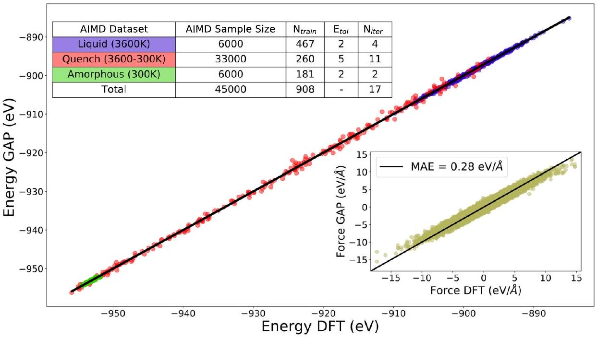
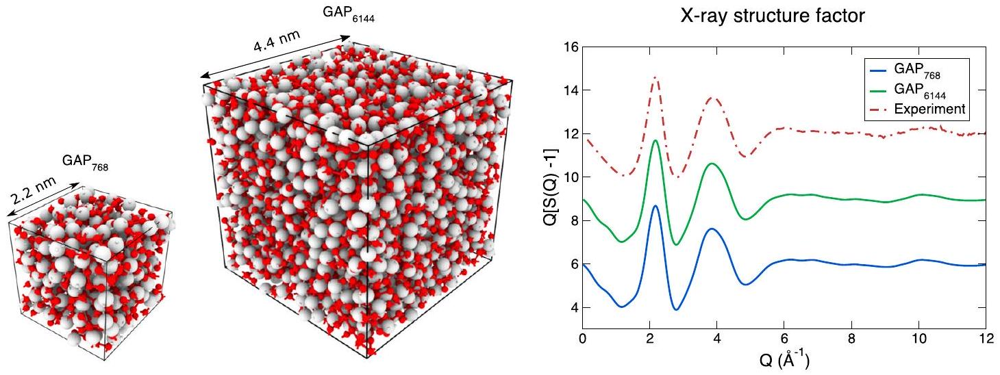
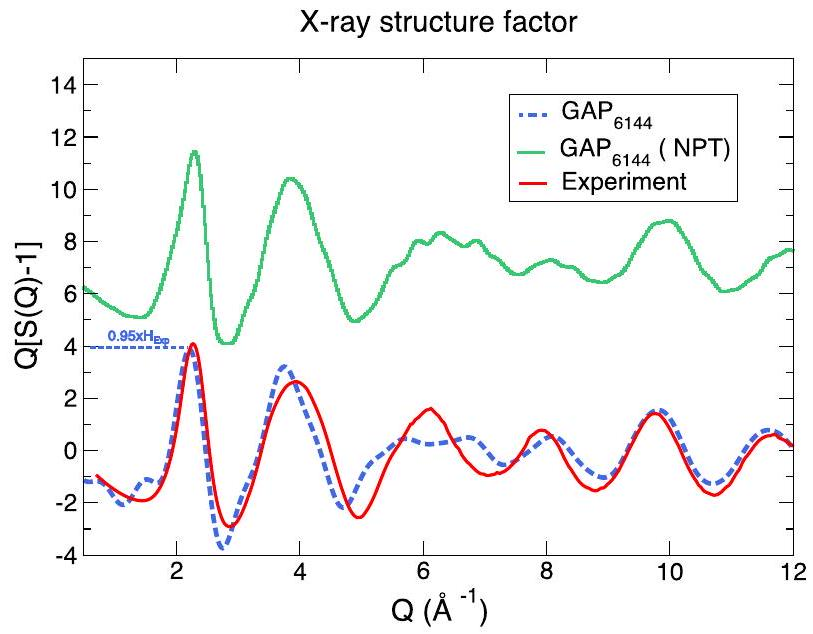
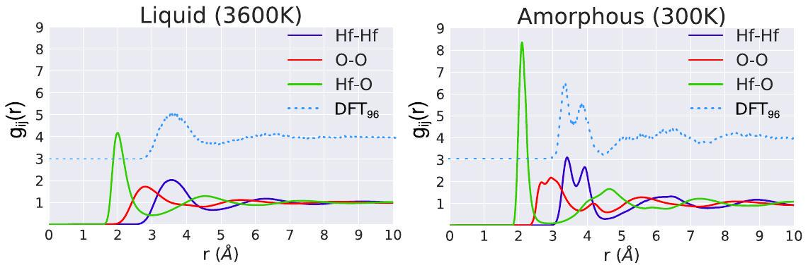
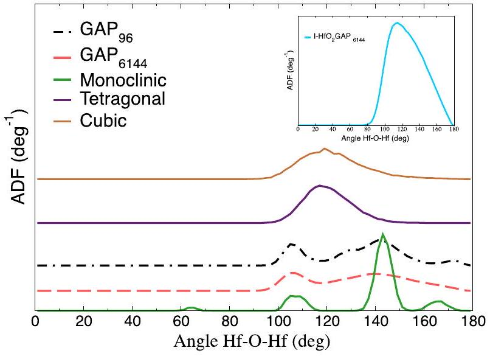
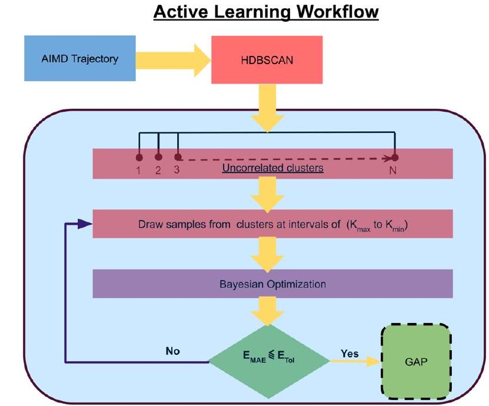

# Machine-learned interatomic potentials by active learning: amorphous and liquid hafnium dioxide 

Ganesh Sivaraman ${ }^{1}$, Anand Narayanan Krishnamoorthy ${ }^{2,3}$, Matthias Baur (B) ${ }^{2}$, Christian Holm ${ }^{2}$, Marius Stan ${ }^{4}$, Gábor Csányi ${ }^{5}$, Chris Benmore ${ }^{6}$ and Álvaro Vázquez-Mayagoitia ${ }^{7 \boxtimes}$


#### Abstract

We propose an active learning scheme for automatically sampling a minimum number of uncorrelated configurations for fitting the Gaussian Approximation Potential (GAP). Our active learning scheme consists of an unsupervised machine learning (ML) scheme coupled with a Bayesian optimization technique that evaluates the GAP model. We apply this scheme to a Hafnium dioxide ( $\mathrm{HfO}_{2}$ ) dataset generated from a "melt-quench" ab initio molecular dynamics (AIMD) protocol. Our results show that the active learning scheme, with no prior knowledge of the dataset, is able to extract a configuration that reaches the required energy fit tolerance. Further, molecular dynamics (MD) simulations performed using this active learned GAP model on 6144 atom systems of amorphous and liquid state elucidate the structural properties of $\mathrm{HfO}_{2}$ with near ab initio precision and quench rates (i.e., $1.0 \mathrm{~K} / \mathrm{ps}$ ) not accessible via AIMD. The melt and amorphous X-ray structural factors generated from our simulation are in good agreement with experiment. In addition, the calculated diffusion constants are in good agreement with previous ab initio studies.


npj Computational Materials (2020)6:104; https://doi.org/10.1038/s41524-020-00367-7

## INTRODUCTION

Ab initio molecular dynamics (AIMD) simulations based on Density Functional Theory (DFT) ${ }^{1,2}$ can provide atomistic structural descriptions of materials with quantum mechanical accuracy ${ }^{3}$. But such calculations are severely limited by the finite system size ( $10-100$ 's of atoms) and short timescales ( $\sim 10$ 's of ps). Classical molecular dynamics (MD) simulations based on interatomic potentials derived from empirical and physical approximations, on the other hand, can provide access to larger system sizes (millions of atoms) with longer timescales ( $\sim 100-1000$ 's of ns ) by sacrificing the quantum mechanical accuracy. Inverse modeling techniques such as Reverse Monte Carlo (RMC) ${ }^{4}$, along with advanced experimental techniques such as synchrotron based high-energy X-ray diffraction, have certainly aided in improved understanding of the atomic structure of materials. But such techniques can only provide a statistical description of the local atomic environment ${ }^{5}$. More recently, an improved version of RMC has been used to develop classical interatomic potentials where molecules are modeled using bonds, angles and dihedral potential terms with added nonbonded interaction parameters, thus making it more suitable to model larger molecules which are intractable using the traditional approach. In particular, recent research also showed the application of RMC in the development of a quantum mechanical-accurate model for amorphous silicon ${ }^{6,7}$.

In the age of "big data"-driven materials informatics ${ }^{8}$, there emerged a new generation of machine learning (ML) interatomic potentials ${ }^{9-16}$. Unlike classical interatomic potentials, these potentials employ ML techniques such as neural networks and kernel based methods to map the direct functional relationship between atomic configuration and energy from reference quantum mechanical calculated datasets. Much like the atomic
configurations in Cartesian coordinates, the ML interatomic potentials must satisfy translation, rotation, and permutation invariances. This is typically enforced by transforming the atomic coordinates into descriptors that capture the local atomic environment and satisfy the invariances. The ML interatomic potentials are regression models of the descriptors. Subsequently, many recent applications of ML interatomic potentials have achieved simulation lengths and timescales accessible to classical interatomic potentials, with near quantum mechanical accuracy ${ }^{17,18}$. Despite the progress, training the ML interatomic potentials remains a challenging task. The challenge is finding the right hyperparameters for the chosen method of fitting and sampling the correct training data that would lead to meaningful interpolation for the property of interest ${ }^{19}$. If there are large samples of datasets, then educatedly handpicking the training configurations becomes a cumbersome task.

Active learning (AL) is an ML strategy where a learning algorithm iteratively queries a very large pool of unlabeled data to extract a minimum number of training data that would lead to a supervised ML model with superior accuracy compared to a training model with educated handpicking ${ }^{20}$. Within the context of this article, our goal is to devise an active learner that can automatically select a minimum number of training configurations that would result in a near DFT accuracy ML interatomic potential. In addition, reducing the number of training samples lowers the computational resources required to train and evaluate the ML interatomic potential. Inspired by the original work of Dasgupta et al. ${ }^{21}$, we propose an active learner which aims to exploit the cluster structure embedded in a given unlabeled dataset so as to arrive at a minimum number of training configurations. The term "unlabeled dataset" implies that the proposed AL query strategy based on clustering ${ }^{22}$ would only rely on input atomic

[^0]
Fig. 1 The GAP-predicted vs DFT energy validation plot for the active learned a-HfO2 $\mathbf{p o t e n t i a l}$. The validation was performed on a test dataset independent from the training data. The scatter color indicates the AIMD dataset source from which the test data point was chosen. (Inset table) Summary of the AIMD datasets, and active learning settings. $N_{\text {train }}$ is the number of active learned training configurations. $E_{\text {tol }}$ is the user-specified energy tolerance value in $\mathrm{meV} /$ atom. $N_{\text {iter }}$ is the number of data iterations required to converge the active learning workflow. (Inset plot) Force validation plot.

configurations. We apply our AL scheme to fit the Gaussian Approximation Potential (GAP) framework ${ }^{23}$. The full details of the AL scheme are discussed in the "Methods" section. We also refer the reader to the recent success in the applications of $\mathrm{AL}^{24-26}$.

To showcase the overall capability of the AL scheme to fit the GAP model, we have chosen the specific application example of a binary amorphous oxide, namely Hafnium dioxide $\left(\mathrm{HfO}_{2}\right)$ or hafnia. Hafnia is a relevant material in semiconductor process technology such as high-k gate dielectrics ${ }^{27,28}$, as a potential replacement for silicon dioxide ( $\mathrm{SiO}_{2}$ ). In particular, high-k gate dielectrics applications require thin films of amorphous $\mathrm{HfO}_{2} \left(\mathrm{a}-\mathrm{HfO}_{2}\right)^{29,30}$. The density of the $\mathrm{a}-\mathrm{HfO}_{2}$ is shown to significantly influence the atomistic structure and oxygen diffusion ${ }^{31,32}$. Furthermore, hafnia is used as a high-temperature refractory material ${ }^{33}$ and also has applications in nuclear technologies ${ }^{34}$. We have chosen this specific application example given that the hightemperature refractory nature of this material requires exploration across a wide regime of thermodynamic configuration space. Our aim is to construct AL-driven fitting of GAP model for a- $\mathrm{HfO}_{2}$ and liquid hafnia (I-HfO2). For this purpose, we generated a reference $\mathrm{HfO}_{2}$ dataset from an NVT "melt-quench" AIMD simulations, details of which are discussed in the "Methods" section. We demonstrate that the AL scheme reaches the high accuracy in energy and force fit for the GAP model trained with very few configurations sampled from this reference datasets. The active learned GAP model is used to perform melt-quench MD simulations for two different system sizes. The effect of quench rate is investigated via the order parameters extracted from the MD simulation of a medium size system ( 768 atom). To showcase the scalability and stability of the active learned GAP model, additionally we have performed a melt-quench MD on a large system size ( 6144 atoms) to generate $\mathrm{a}-\mathrm{HfO}_{2}$. Overall, we demonstrate that the active learned GAP model accurately reproduces the AIMD computed results. Further, the results are validated against X-ray diffraction measurements. We stress the fact that all the AL-driven GAP models are trained only on the ab initio data, and experimental entities are used for benchmarks purposes to improve the training dataset. Finally, we demonstrate that the active learned GAP potential can be used to perform NPT quench on a 6144 atom system to estimate the density of the a- $\mathrm{HfO}_{2}$.

## RESULTS

Active learning
We begin by discussing the results of applying the AL workflow to $\mathrm{HfO}_{2}$ datasets generated from NVT "melt-quench" AIMD simulations. The AIMD datasets are summarized in the inset of the Fig. 1. The details of the AL workflow and the AIMD simulations are described in the "Methods" section. The optimal learning configuration for building up the potentials are chosen with the AL workflow in order to achieve standard error convergence pertaining to the range of properties measured ${ }^{7}$. The validation plot for the active learned a- $\mathrm{HfO}_{2}$ potential is shown in Fig. 1. We start by discussing the inset table of Fig. 1, where the details of the active learned training configurations have been summarized. The energy tolerance value, $E_{\text {to }}$, was set to 5 meV /atom for quenching dataset, $2 \mathrm{meV} /$ atom for the liquid and amorphous, respectively. In the case of amorphous and liquid phases, the AL workflow ended up with optimal training configurations with very few data iterations. It can be observed that the nonequilibrium nature of the quenching procedure over a large temperature range leads to significant challenges in picking the right training configuration. Consequently, it took the AL workflow 11 data iterations to reach the requested accuracy. But $N_{\text {train }}=260$ is a meager 0.8\% of the entire AIMD quench dataset. This would be a significant human effort if done by handpicking configurations from the ab initio dataset. The human choice of training dataset is based on previous experience and literature reviews, combined with trial-and-error principle to achieve the desired error convergence. However, for the system relevant to this study, the AL workflow gives an automated path to achieve the desired accuracy without human intervention. Interested readers are advised to refer to the Supplementary Discussion on manual configuration selection and its benchmark with respect to the AL scheme presented here.

The individual active learned configurations was combined to train the final a- $\mathrm{HfO}_{2}$ potential. The details of the hyperparameters are available in the Supplementary Table 1. We turn our attention now to the quality of this active learned a- $\mathrm{HfO}_{2}$ potential, by validating on a test dataset independent from the data used for training. It can be seen that the active learned potential gives close-to-linear fit in predicted GAP energies vs DFT energies. The overall mean absolute error (MAE) for GAP-predicted energy is


Fig. 2 The simulation setup for GAP MD. A 768 atom cell was generated by $2 \times 2 \times 2$ replication of a random snapshot extracted from the AIMD liquid dataset. Another set of 6144 atom simulation cell was generated by $4 \times 4 \times 4$ replication of a Packmol generated 96 atom configurations. Hf (silver), oxygen (red). (Right panel) Comparison of X-ray structure factors for $\mathrm{I}-\mathrm{HfO}_{2}$ with simulated structure factors obtained from GAP-MD.


Fig. 3 Comparison of X-ray structure factors for $\mathbf{a -} \mathbf{H f O}_{\mathbf{2}}$. The red line shows experiment structure factors. Simulated structure factor obtained from NVT GAP-MD shown in Blue dots. The shifted green curve shows the simulated structure factors obtained from NPT GAP-MD.

$2.6 \mathrm{meV} /$ atom . In the inset, we also show force convergence with an overall MAE of $0.28 \mathrm{eV} / \AA$. This supports the argument that GAP-based atomistic models predict the local properties of the systems with good accuracy of MAE $<5 \mathrm{meV}$ /atom for liquid and amorphous states ${ }^{35,36}$.

Active learned GAP MD. With the active learned GAP potentials, MD simulations are performed using the LAMMPS package ${ }^{37}$. The simulation setup is shown in Fig. 2. We considered medium (768 atom) and large (6144) system size for the melt-quench simulation to generate the amorphous structure. The details of the meltquench scheme are discussed in the "Methods" section.

We begin by a discussion of the results of the NVT melt-quench. As noted in the "Methods" section, we have fixed the density of I$\mathrm{HfO}_{2}$ and a- $\mathrm{HfO}_{2}$ to values of 8.16 and $7.69 \mathrm{~g} \mathrm{~cm}^{-3}$, respectively, as reported in an experiment study ${ }^{31}$. The X-ray structure factor of molten hafnia at $3173.15 \mathrm{~K}\left(2900^{\circ} \mathrm{C}\right)$ is measured to a $Q$-value of $22.5 \AA^{-1}$. The simulated atom-atom partial X-ray structure factors are obtained via inverse Fourier transforms of pair distribution functions (PDFs), weighted by the appropriate (Q-space) X-ray form and concentration factors, summed and compared directly with the experimental data. Figures 2 and 3 represent the
structure factor of $\mathrm{I}-\mathrm{HfO}_{2}$ and a- $\mathrm{HfO}_{2}$, respectively. We can see a very good agreement of our GAP model structure factor with that of the experimental X-ray diffraction experiments for $\mathrm{I}-\mathrm{HfO}_{2}$. Furthermore, our GAP model shows good agreement with the long-range and short-range ordering for the a- $\mathrm{HfO}_{2}$, whereas the middle-range ordering from $5<Q\left(\AA^{-1}\right)<8$ shows deviations from the experimental structure factor. Our GAP model is capable of capturing the salient structural features upon changing from an equilibrium liquid structure to a nonequilibrium amorphous state. To highlight the detailed structural rearrangements between the liquid and amorphous structures, we plot $Q[S(Q)-1]$ to emphasize the strong oscillations in amorphous signal in the range $Q \sim 5-15 \AA^{-1}$, which are heavily damped in the liquid signal. As expected, the oscillations decay for $Q>5 \AA^{-1}$ in the liquid structure factor due to the increased local disorder at higher temperatures.

The objective of using our GAP model is to attain ab initio accuracy with scaling which cannot be accessed with DFT. As described in the "Methods" section, the ab initio reference data have a 96 atom system and our GAP-MD simulation consists of a system with 6144 atoms in total with box size of $4.4 \times 4.4 \times 4.4 \mathrm{~nm}^{3}$. From Fig. 2, it can be seen that with an increase in scale, the accuracy of structure factor of 6144 atoms $\mathrm{I}-\mathrm{HfO}_{2}$ is comparable to that of the experiments. This supports the argument that our GAP-based atomistic model can retain DFT accuracy at large scales with increased simulation times with linear scaling ${ }^{7}$.

To characterize the atomic structure in finer detail, we show the partial PDFs from GAP MD simulations for both I- $\mathrm{HfO}_{2}$ and a- $\mathrm{HfO}_{2}$ in Fig. 4. The calculated partial PDFs illustrate the growth of intermediate range ordering in a- $\mathrm{HfO}_{2}$ compared to liquid in real space (see Fig. 4). The first peak at $\sim 2 \AA$ corresponds to the average bond length between hafnium and oxygen. For $\mathrm{I}-\mathrm{HfO}_{2}$, there are single broad peaks associated with the $\mathrm{Hf}-\mathrm{O}$ and $\mathrm{Hf}-\mathrm{Hf}$ correlations, but for a- $\mathrm{HfO}_{2}$, the $\mathrm{Hf}-\mathrm{O}$ peak becomes narrower and increases in intensity. Moreover, the broad $\mathrm{Hf}-\mathrm{Hf}$ peak in the liquid splits into two peaks in the amorphous form, corresponding to well-defined edge-sharing polyhedra at $3.4 \AA$ and corner-sharing polyhedra $3.9 \AA$. The ratio of the edge/corner-sharing ratio is known to be density dependent ${ }^{32}$ and leads to the formation of a disordered network at distances $r>8 \AA$ in the amorphous phase, which have also been observed in previous ab initio studies and experiments ${ }^{31}$. The light blue dotted lines in Fig. 4 represent the partial PDFs obtained from AIMD simulations, and our GAP-MD model for 6144 atoms accurately reproduces the $\mathrm{Hf}-\mathrm{Hf}$ peak split corresponding to the edge-sharing and corner-sharing polyhedra seen in the baseline DFT. This shows that the active learned GAP


Fig. 4 The partial radial distribution functions for $\mathbf{I}-\mathbf{H f O}_{\mathbf{2}}$, and $\mathbf{a}-\mathbf{H f O}_{\mathbf{2}}$. The GAP MD simulation performed with a 6144 atom cell. The dotted line shows the baseline Hf-Hf PDFs derived from DFT 96 atom cell. The dotted line has been shifted along $y$-axes for clarity.

Table 1. Local structure properties extracted from experiment ${ }^{31}$, a classical force field (Broglia et al. ${ }^{32}$ ) and GAP MD (this work).
| Method | Hf-O (CN) | Hf-O Peak (Å) | Hf-Hf Peak (Å) | Density $\left(\mathrm{g} \mathrm{cm}^{-3}\right)$ |
| :--- | :--- | :--- | :--- | :--- |
| Exp a- $\mathrm{HfO}_{2}$ | $6.8 \pm 0.6$ | 2.13 | 3.38(1), 3.89(1) | 7.69 |
| GAP a- $\mathrm{HfO}_{2}$ | 6.6 | 2.12 | 3.41, 3.92 | 7.69 |
| Broglia $\mathrm{a}-\mathrm{HfO}_{2}$ | 6.2 | 2.15 | 3.37, 3.92 | 7.69 |
| Exp I- $\mathrm{HfO}_{2}$ | $7.0 \pm 0.6$ | 2.05 | 3.67 | 8.16 |
| GAP I-HfO2 | 6.13 | 2.00 | 3.59 | 8.16 |


The experimental liquid Hf-O CN was determined by the Gaussian fitting of two peaks corresponding to $\mathrm{CN}=5.0$ (at $2.05 \AA$ ) +2.0 (at $2.51 \AA$ ). The GAP-MD CN's were determined by integration to the first minimum of the Hf-O PDF.

MD model can reproduce structural properties of hafnia with DFT accuracy.

Previous studies ${ }^{31,32}$ have shown that the structure of a- $\mathrm{HfO}_{2}$ is strongly density dependent. Here, we have performed the GAP MD for the a- $\mathrm{HfO}_{2}$ with a fixed density of $7.69 \mathrm{~g} \mathrm{~cm}^{-3}$. Further, with the analysis of the partial PDFs from Fig. 4, we showed that the active learned GAP model accurately matches with AIMD results. From Fig. 3, we can see deviations for the middle range ordering of $\mathrm{a}-\mathrm{HfO}_{2}$ for this density from our trained ab initio dataset. Now from Figs. 4 and 3, it can be seen that Hf-Hf interactions dominate the middle range ordering $\left(5<Q\left(\AA^{-1}\right)<8\right)$ of a- $\mathrm{HfO}_{2}$. To elucidate the density dependence, we run NPT simulations with our GAP model. The details of NPT simulations are explained in "Methods" section. These simulations are performed to let the volume change in the system and the resulting density of a- $\mathrm{HfO}_{2}$ is found to be $9.25 \mathrm{~g} \mathrm{~cm}^{-3}$. The simulated structure factor at this density is shown in Fig. 3 (shifted green curve). Here, we can clearly see an improved middle range ordering $\left(5<Q\left(\AA^{-1}\right)<8\right)$ compared to the low-density a- $\mathrm{HfO}_{2}$. Thus the natural increase in density due to NPT simulations from our GAP model is already able to improve the polyhedral connectivity observed in a- $\mathrm{HfO}_{2}$. Further we stress the fact that the accuracy of structure factor can also be increased by benchmarking the training configurations in relevance to the experiments which could be performed by RMC modeling ${ }^{7}$.

Table 1 gives the coordination numbers and bond lengths of a$\mathrm{HfO}_{2}$ and I- $\mathrm{HfO}_{2}$ in comparison to the experiments. GAP MD gives a very close agreement with the $\mathrm{Hf}-\mathrm{O}$ coordination number and bond lengths with experiments. From Table 1, it can also be seen that hafnium gives a sevenfold coordination with oxygen, which is similar to the monoclinic phase asymmetric arrangements of $\mathrm{Hf}-\mathrm{O}$ bond distances at $2.03-2.25 \AA$, as reported in previous study ${ }^{38}$. To articulate the argument from the above, we calculated the bond angle distribution of $\mathrm{Hf}-\mathrm{O}-\mathrm{Hf}$ of $\mathrm{a}-\mathrm{HfO}_{2}$, the results of which are


Fig. 5 Angle distribution functions (ADF) obtained from AIMD of pure phases of $\mathbf{H f O}_{\mathbf{2}}$. GAP-predicted ADF for a-HfO2. The distributions have been shifted in vertical axes for clarity. The inset plots show the ADF from the GAP model for $\mathrm{I}-\mathrm{HfO}_{2}$.

discussed below.
The bond angle distributions derived from the GAP-MD are shown in Fig. 5. For a- $\mathrm{HfO}_{2}$, it can be seen that there are two peaks at $\mathrm{Hf}-\mathrm{O}-\mathrm{Hf}$ angles of $107^{\circ}$ and $142^{\circ}$. Previous studies have attributed these peaks to the existence of edge and cornersharing polyhedra, respectively ${ }^{32}$. In the GAP models, the two $\mathrm{Hf}-\mathrm{O}-\mathrm{Hf}$ peaks suggests a structural morphology in $\mathrm{a}-\mathrm{HfO}_{2}$ resembling that of the monoclinic phase, rather than a single broad peak around $120^{\circ}$ observed in the tetragonal and cubic phases. However, a major difference between the amorphous $\mathrm{Hf}-\mathrm{O}-\mathrm{Hf}$ bond angle distribution and that of the crystalline monoclinc form is the width and intensity of the $142^{\circ}$ peak. The broad nature of this peak in $\mathrm{a}-\mathrm{HfO}_{2}$ is indicative of a wide distribution of packing arrangements of corner-shared $\mathrm{HfO}_{n}$ polyhedra compared to $\mathrm{m}-\mathrm{HfO}_{2}$. The similarity of the $107^{\circ} \mathrm{Hf}-\mathrm{O}-\mathrm{Hf}$ bond angle peak between a- $\mathrm{HfO}_{2}$ and $\mathrm{m}-\mathrm{HfO}_{2}$ can be understood due to the strict geometric requirements of edgeshared units. Previous ab initio studies have predicted two different types of amorphous structure formation using the melt-quench scheme to investigate the amorphous-to-crystalline phase transition. They related these structures to tetragonal type and monoclinic type with respect to their long-range ordering and volume energy curve ${ }^{31,32,38}$. The $\mathrm{I}-\mathrm{HfO}_{2}$, on the other hand, has a single asymmetric $\mathrm{Hf}-\mathrm{O}-\mathrm{Hf}$ bond angle distribution peak located at $\sim 115^{\circ}$, similar to that of the cubic and tetragonal phases of hafnia, which have bond angle distribution peaks in the interval of $\sim 117^{\circ}-120^{\circ}$.

In summary, we have validated the active learned GAP models using structural properties. Furthermore, we also note that the diffusive behavior of amorphous and $\mathrm{I}-\mathrm{HfO}_{2}$ has been studied previously for their dielectric properties in RRAM ${ }^{31,32}$. To calculate
diffusion constants, the $\mathrm{I}-\mathrm{HfO}_{2}$ trajectory was sampled for more than 1 ns at 3100 K . The obtained hafnium and oxygen self diffusion constants were Hf: $3.3796( \pm 0.1) \times 10^{-5} \mathrm{~cm}^{2} / \mathrm{s}$ and O: $6.2971( \pm 0.1) \times 10^{-5} \mathrm{~cm}^{2} / \mathrm{s}$, respectively. To account for correlated diffusion, we also calculated the distinct diffusion constants ${ }^{39-43}$ and the calculated distinct diffusion constants of Hf: $3.6( \pm 0.009) \times 10^{-5} \mathrm{~cm}^{2} / \mathrm{s}, \mathrm{O}: 6.425( \pm 0.002) \times 10^{-5} \mathrm{~cm}^{2} / \mathrm{s}$. The impact of correlation is obtained from the ratio of $\frac{D_{A}}{D_{\sigma}}$ and is found to be $>0.9$. This is in good agreement with the previous ab inito study performed by Hong et al. ${ }^{44}$ reported at $3100 \mathrm{~K} \mathrm{Hf}: 2.4( \pm 0.1) \times 10^{-5} \mathrm{~cm}^{2} / \mathrm{s}, \mathrm{O}: 5.2 ( \pm 0.2) \times 10^{-5} \mathrm{~cm}^{2} / \mathrm{s}$. As reported in the Table I of Hong et al., the computational cost associated with that ab initio calculation to achieve 56 ps of trajectory for a system size of 270 atom is 21,500 CPU hours. Our GAP model with 6144 atom unit cell on the other hand achieved 110 ps with a computational cost of 1080 CPU hours, while keeping almost ab inito accuracy.

## DISCUSSION

We have shown that the AL workflow can automatically sample a minimum number of training and test configuration for the GAP model that result in near DFT accuracy for the fitted energy and forces. Further, we show that this AL technique can improve the quality of interatomic potentials used for MD simulations up to an accuracy of ab inito training data. We understand that there will be scenarios where human logic and interventions are required to guide the training process. However, for the system relevant to this study, the AL workflow gives an automated path to achieve the desired accuracy without human intervention. We showed here the proof of concept that the AL could be a possible replacement to educated handpicking configuration method. The AL schemes further benefit the automation and selection speed of training and test configurations from the ab initio dataset, which are required to construct the machine learned atomistic potentials, as shown in Supplementary Fig. 2. Here, we used GAP-based atomistic models to model a- $\mathrm{HfO}_{2}$ so as to showcase the AL workflow. Our machine learned atomistic model showed very good agreement with experimental liquid and amorphous Xray structure factors. Our model is able to predict the diffusion constants at same accuracy as previous study ${ }^{44}$, but at a reduced computational effort, due to the linear scaling of GAP models. We also exemplify the fact that the accuracy of the atomistic potential purely depends on the quality of quantum mechanical calculations used for training. This method can further be used to enhance the speed of modeling amorphous and liquid systems of interest. Our AL scheme uses an automated query strategy that relies on unsupervised clustering. In addition, Bayesian optimization (BO) is used on the fly to find the optimal hyperparameters of the ML interatomic potential. Due to the generality of the query strategy and BO framework, we stress that this approach can be easily extended to other ML based interatomic potentials.

## METHODS

## AIMD dataset

The input for amorphous structures was generated using Packmol ${ }^{45}$ by packing 96 random particles $(32 \mathrm{Hf}, 64 \mathrm{O})$ in a cubic box of density 8.16 g $\mathrm{cm}^{-346}$. The density of this cubic box is taken to be experimental density reported by Gallington et al. ${ }^{31}$. The initial configuration is heated to 3600 K ( 500 K higher than melting point) and sampled for 12 ps . The final snapshot from the liquid configuration at 3600 K is quenched to 300 K at a rate of $100 \mathrm{~K} / \mathrm{ps}$. The final configuration of quench is rescaled to experimental density of $7.69 \mathrm{~g} \mathrm{~cm}^{-3}$ and 12 ps of amorphous configurations are generated. From the liquid and amorphous trajectories, the final 6 ps of snapshots are retained in the dataset. All of the 33 ps of quenching trajectories were retained in the dataset. These same density values are used through this study.
The atomic configurations, energy, force, and virial stress are calculated in NVT ensemble with a Nosé-Hoover thermostat ${ }^{47,48}$ as implemented in

Fig. 6. Active learning workflow. The AIMD trajectory is converted in to distance matrix and passed to the Hierarchical Density-Based Spatial Clustering of Applications with Noise (HDBSCAN) clustering algorithm. Training and test data samples are sequentially drawn from the clusters to fit the GAP model till the required accuracy is achieved. For every data sampling iteration, Bayesian Optimization perform on-the-fly hyperparamter tuning of the GAP model.
the Vienna Ab initio Simulation Package (VASP v5.4.4) ${ }^{49,50}$. A plane wave cutoff of 520 eV ( $30 \%$ larger than the largest cutoff value), $2 \times 2 \times 2$ K-grid Monkhorst-Pack scheme, and 1 fs time step were used. The Perdew-Burke-Ernzerhof exchange-correlation functional ${ }^{51}$ and projector augmented wave method ${ }^{52}$ are employed. Further details are available in the Supplementary Discussion.

## Active learning

Our aim is to employ AL to automatically sample uncorrelated learning configurations from the reference datasets, by exploiting the underlying cluster structure embedded in the dataset ${ }^{21}$ and partition them into " $N$ " uncorrelated clusters ${ }^{53}$. The learning configurations are sequentially sampled from the uncorrelated cluster and trained using the GAP model till the desired accuracy has been achieved. The AL workflow has been show in Fig. 6.

For the clustering, we use HDBSCAN ${ }^{54-56}$, a density-based hierarchical clustering method. This algorithm has been successfully applied to partition and analyze MD trajectories ${ }^{57}$. The individual AIMD trajectory serves as the input to the AL workflow. For the distance metric, we compute the pairwise root mean square deviations (RMSD) of atomic positions ${ }^{58}$. The pairwise RMSD matrix computed from the trajectory is input to HDBSCAN. HDBSCAN partitions the input trajectories into uncorrelated clusters. Once the information on the clusters is extracted, a series of trials is run to sample data from the uncorrelated clusters. In each trial, samples are drawn from each cluster at intervals separated by $K_{\text {iter }}$, where $K_{\text {iter }}$ goes from $K_{\text {max }}$ to $K_{\text {min }} . K_{\text {min }}$ and $K_{\text {max }}$ are the sample sizes of the smallest and the largest clusters, respectively. For the sake of consistency, an equal number of unique training ( $N_{\text {train }}$ ) and test configurations are sampled from each cluster per trial. The sampled training configurations are used for training the GAP model and the test configurations, which are samples drawn independent of the training configurations used for validating the trained models. In the initial trial (i.e., first iteration), exactly one unique training and test configuration are drawn from each cluster (i.e., sampling width is same as maximum sample size, $\left.\mathrm{K}_{\max }\right)$. This would mean that at the end of the first iteration, the number of training and test configuration samples would be equal to the total number of clusters. In the subsequent trials more configurations are drawn from the cluster as the sampling width decreases. Now we turn our attention to GAP model training and validation. For the AL workflow, we only fit and evaluate the GAP model with respect to reference dataset energy computed from DFT, as our goal is to arrive at the optimal training configurations. We use MAE in the GAP-predicted energy on the test dataset as the error metric. The GAP model, in turn, has a number of

hyperparameters that need to be tuned to arrive at the best model for a sampled dataset. BO is a powerful technique for the automated hyperparameter tuning of costly ML models ${ }^{59}$. Excellent review on this subject is available elsewhere ${ }^{60}$. The BO consists of a surrogate model for the objective function and an acquisition function to sample the next hyperparameters. Initially the BO runs a number of explorations over hyperparameter space to build the surrogate model over the error metric. Then a series of exploitation's are performed based on the knowledge gained from the initial exploration so as to move towards improving the surrogate model and getting better samples of hyperparameters that might lead to the minimization of the error metric. If the best GAP model generated from the BO does not achieve the required accuracy as gauged by an arbitrary user-specified threshold tolerance value $\left(E_{\mathrm{tol}}\right)$, then the next trial is invoked to add more training and test data from the clusters. The workflow stops the data iterations (number of data iteration, $N_{\text {iter }}$ ) as soon as the MAE in energy prediction for the best GAP model is on or below the user-specified threshold energy tolerance value $\left(E_{t o l}\right)$. The optimal configuration active learned from each of the individual AIMD datasets is sequentially combined to train the $\mathrm{a}-\mathrm{HfO}_{2}$ potential. The cluster parameters such as $N, K_{\text {min }}$, and $K_{\text {max }}$ are outcomes of the unsupervised learning; consequently, the sampling regime is expected to generalize easily to new datasets and requires no hand tuning. Since we perform BO of the ML interatomic potential as a part of the AL , the optimal hyperparameters are readily accessible along with the optimal training configurations. The details specific to the Python implementation of the workflow has been discussed in the usage notes section. The technical details of clustering algorithm and BO are available in the Supplementary Discussion.

## GAP-MD

The individual active learned datasets are combined to train the final a$\mathrm{HfO}_{2}$ GAP potential. In order to prevent unphysical clustering of oxygen atoms at high-temperature simulations, a nonparametric two-body term was added to the Smooth Overlap of Atomic Position (SOAP) descriptor ${ }^{61,62}$. The details of the training hyperparameters are provided in the Supplementary Table 1. The a- $\mathrm{HfO}_{2}$ GAP potential is used to perform meltquench MD simulations using the LAMMPS MD package ${ }^{37}$. Two different system sizes are considered for the simulations. The melt-quench MD (up to $1 \mathrm{~K} / \mathrm{ps}$ ) is performed in an NVT ensemble with a Nosé-Hoover thermostat ${ }^{47,48}$ to sample the configurations with a time step of 1 fs . The liquid and amorphous configurations are sampled for $100-200 \mathrm{ps}$. For scaling, we have performed MD simulations of liquid configurations up to 1.2 ns , and diffusion coefficients are estimated from this trajectory. For the GAP-based NVT quench, we use the same procedure as used in the AIMD dataset generation step by fixing the liquid and amorphous simulation setup density to values previously reported in experiment ${ }^{31}$. Different system sizes are also investigated, details of which are discussed in the results section. To estimate the density of a- $\mathrm{HfO}_{2}$, starting from melt, we performed a quench in NPT ensemble with a Nosé-Hoover thermostat ${ }^{47,48}$ and a barostat ${ }^{63-65}$ to allow for the volume to change. To avoid unnatural pressure fluctuations, the I-HfO2 at 3600 K is equilibrated till 2500 K using an NVT ensemble. We performed a zero pressure NPT quench from 2500 to 500 K . A quench to temperature below 500 K is not observed to result in significant structural changes ${ }^{7}$. The GAP model is used to perform conjugate-gradient minimization to relax cell and atomic position of the NPT quenched configuration at 500 K into local minima.

## Experiment

High-energy X-ray diffraction experiments on liquid and a- $\mathrm{HfO}_{2}$ were performed on beamline 6-ID-D at the Advanced Photon Source. The details have previously been reported elsewhere ${ }^{31}$, so only the salient information is provided here. The liquid state diffraction measurements were performed by laser heating in an aerodynamic levitator using 100.27 keV X-rays, in combination with a large a-Si area detector. The experiments on a- $\mathrm{HfO}_{2}$ were performed in a similar manner but using an incident energy of 131.74 keV to attain data out to higher $Q$-values and improve the realspace resolution. The data were analyzed using standard correction procedures, including corrections for background, Compton scattering, fluorescence and oblique incidence to yield the Faber-Ziman total X-ray structure factors. A sine Fourier transform was used to obtain the corresponding X-ray PDFs.

## Usage notes

The AL workflow is implemented through the "BayesOpt_SOAP.py" workflow. This workflow internally calls the "activesample" Python class, which performs the data processing, clustering and sampling, at once. This class takes an extended XYZ file format as input, and it uses the MDTraj library ${ }^{66}$ by calling the md.rmsd() to construct the distance matrix. MDTraj's md.rmsd() module computes the pairwise RMSD of atomic positions after rotating and centering trajectory configurations. There are two hyperparameters, namely the "minimum number of clusters" and "number of samples," which controls the performance of the clustering. These two hyperparameters need to be carefully tuned in such a way as to minimize the noise points ${ }^{67}$. In addition, setting the minimum number of clusters might prevent a scenario in which all data points collapse into a single cluster. If there are no user supplied inputs for these hyperparameters then a default value of 10 is set to both, which was found to be a reasonable choice after carefully evaluation across multiple trajectories. Since we are enforcing the minimum number of clusters, the $K_{\text {min }}$ will have same value as this hyperparameter. If there are scenarios in which more complex molecule dynamics trajectories are encountered, then a custom distance matrix can be supplied by the user. In the above code, this could be done using the class attribute "data.distance." Finally, we have used the BO as implemented in the GPyOpt Python library ${ }^{68}$ to optimize the hyperparameters of the SOAP descriptor ${ }^{61}$ and the GAP model ${ }^{23}$. These hyperparameters are radial cutoff, number of radial basis functions ("n_max"), spherical harmonics basis band limit ("I_max"), number of sparse points to use in the sparsification of the Gaussian process ("n_sparse"), and the standard deviation of the Gaussian process (delta). The active learned final training and test configurations are written to "opt_train.extxyz" and "opt_test.extxyz" files respectively. The detailed summary of the workflow including information of each data sampling iterations as well as the optimized hyperparameters are written to a JavaScript Object Notation (JSON) formatted output ("activelearned_quipconfigs.json"). More detailed discussions on workflow parameters and example usage are available in the GitHub repository. The hyperparameters and results of an example usage are discussed in "Active Learning Workflow Example Results" subsection in the Supplementary Discussion.

```
data = activesample(filename='trajectory.extxyz',
    nsample=8,
    nminclust=20)
Ncluster, Nnoise, cluster = data.gen_cluster()
```

A code example for the usage of the "activesample" class.

## DATA AVAILABILITY

The "XML" formatted force field file and active learning benchmark dataset are available at https://github.com/argonne-lcf/active-learning-md.

## CODE AVAILABILITY

An implementation of the active learning workflow described in the paper is available at https://github.com/argonne-lcf/active-learning-md.

Received: 4 November 2019; Accepted: 22 June 2020;
Published online: 23 July 2020

## REFERENCES

1. Hohenberg, P. \& Kohn, W. Inhomogeneous electron gas. Phys. Rev. 136, B864 (1964).
2. Kohn, W. \& Sham, L. J. Self-consistent equations including exchange and correlation effects. Phys. Rev. 140, A1133 (1965).
3. Burke, K. Perspective on density functional theory. J. Chem. Phys. 136, 150901 (2012).
4. McGreevy, R. L. \& Pusztai, L. Reverse Monte Carlo simulation: a new technique for the determination of disordered structures. Mol. Simul. 1, 359-367 (1988).
5. McGreevy, R. L. Reverse Monte Carlo modelling. J. Phys. 13, R877 (2001).
6. Orsolya, G. \& Pusztai, L. RMC_POT: a computer code for reverse Monte Carlo modeling the structure of disordered systems containing molecules of arbitrary complexity. J. Comput. Chem. 33, 2285-2291 (2012).
7. Deringer, V. L. et al. Realistic atomistic structure of amorphous silicon from machine-learning-driven molecular dynamics. J. Phys. Chem. Lett. 9, 2879-2885 (2018).
8. Jain, A., Hautier, G., Ong, S. P. \& Persson, K. New opportunities for materials informatics: resources and data mining techniques for uncovering hidden relationships. J. Mater. Res. 31, 977-994 (2016).
9. Behler, J. Perspective: machine learning potentials for atomistic simulations. J. Chem. Phys. 145, 170901 (2016).
10. Behler, J. \& Parrinello, M. Generalized neural-network representation of highdimensional potential-energy surfaces. Phys. Rev. Lett. 98, 146401 (2007).
11. Thompson, A. P. et al. Spectral neighbor analysis method for automated generation of quantum-accurate interatomic potentials. J. Comput. Phys. 285, 316-330 (2015).
12. Shapeev, A. V. Moment tensor potentials: a class of systematically improvable interatomic potentials. Multiscale Model. Simul. 14, 1153-1173 (2016).
13. Smith, J. S., Isayev, O. \& Roitberg, A. E. ANI-1: an extensible neural network potential with DFT accuracy at force field computational cost. Chem. Sci. 8, 3192-3203 (2017).
14. Huan, T. D. et al. A universal strategy for the creation of machine learning-based atomistic force fields. npj Comput. Mater. 3, 37 (2017).
15. Li, Z., Kermode, J. R. \& De, V. Molecular dynamics with on-the-fly machine learning of quantum-mechanical forces. Phys. Rev. Lett. 114, 096405 (2015).
16. Schütt, K. T. et al. SchNet-A deep learning architecture for molecules and materials. J. Chem. Phys. 148, 241722 (2018).
17. Chmiela, S. et al. sGDML: constructing accurate and data efficient molecular force fields using machine learning. Comput. Phys. Commun. 240, 38-45 (2019).
18. Zuo, Y. et al. Performance and cost assessment of machine learning interatomic potentials. J. Phys. Chem. A 124, 731-745 (2020).
19. Behler, J. Representing potential energy surfaces by high-dimensional neural network potentials. J. Phys. 26, 183001 (2014).
20. Settles, B. Active Learning Literature Survey (University of Wisconsin-Madison Department of Computer Sciences, 2009).
21. Dasgupta, S. \& Hsu, D. Hierarchical sampling for active learning. In Proc of the 25th international conference on Machine learning 208-215 (ACM, 2008).
22. Hennig, C. What are the true clusters?. Pattern Recognit. Lett. 64, 53-62 (2015).
23. Bartók, A. P., Payne, M. C., Kondor, R. \& Csányi, G. Gaussian approximation potentials: the accuracy of quantum mechanics, without the electrons. Phys. Rev. Lett. 104, 136403 (2010).
24. Gubaev, K., Podryabinkin, E. V., Hart, G. L. \& Shapeev, A. V. Accelerating highthroughput searches for new alloys with active learning of interatomic potentials. Comput. Mater. Sci. 156, 148-156 (2019).
25. Bernstein, N., Csányi, G. \& Deringer, V. L. De novo exploration and self-guided learning of potential-energy surfaces. npj Comput. Mater. 5, 1-9 (2019).
26. Zhang, L. et al. Active learning of uniformly accurate interatomic potentials for materials simulation. Phys. Rev. Mater. 3, 023804 (2019).
27. Schlom, D. G., Guha, S. \& Datta, S. Gate oxides beyond $\mathrm{SiO}_{2}$. MRS Bull. 33, 1017-1025 (2008).
28. Matthews, J. N. A. Semiconductor industry switches to hafnium-based transistors. Phys. Today 61, 25 (2008).
29. Li, F. M. et al. High-k (k=30) amorphous hafnium oxide films from high rate room temperature deposition. Appl. Phys. Lett. 98, 252903 (2011).
30. Miranda, A. Understanding the Structure of Amorphous Thin Film Hafnia-Final Paper (No. SLAC-TN-15-066). (SLAC National Accelerator Lab., Menlo Park, CA, 2015).
31. Gallington, L. et al. The structure of liquid and amorphous hafnia. Materials 10, 1290 (2017).
32. Broglia, G., Ori, G., Larcher, L. \& Montorsi, M. Molecular dynamics simulation of amorphous $\mathrm{HfO}_{2}$ for resistive RAM applications. Model. Simul. Mater. Sci. Eng. 22, 065006 (2014).
33. Upadhya, K., Yang, J. M. \& Hoffman, W. P. Advanced materials for ultrahigh temperature structural applications above $2000^{\circ} \mathrm{C}$. Am. Ceram. Soc. Bull. 76, 51-56 (1997).
34. Wang, J., Li, H. P. \& Stevens, R. Hafnia and hafnia-toughened ceramics. J. Mater. Sci. 27, 5397-5430 (1992).
35. Deringer, V. L., Pickard, C. J. \& Csányi, G. Data-driven learning of total and local energies in elemental boron. Phys. Rev. Lett. 120, 156001 (2018).
36. Bartók, A. P., Kermode, J., Bernstein, N. \& Csányi, G. Machine learning a generalpurpose interatomic potential for silicon. Phys. Rev. X 8, 041048 (2018).
37. Plimpton, S. Fast parallel algorithms for short-range molecular dynamics. J. computational Phys. 117, 1-19 (1995).
38. Luo, X. \& Demkov, A. A. Structure, thermodynamics, and crystallization of amorphous hafnia. J. Appl. Phys. 118, 124105 (2015).
39. Morawietz, T., Singraber, A., Dellago, C. \& Behler, J. How van der Waals interactions determine the unique properties of water. Proc. Natl Acad. Sci. 113, 8368-8373 (2016).
40. Helfand, E. Transport coefficients from dissipation in a canonical ensemble. Phys. Rev. 119.1, 1 (1960).
41. Richards, W. D. et al. Design and synthesis of the superionic conductor $\mathrm{Na}_{10} \mathrm{SnP}_{2} \mathrm{~S}_{12}$. Nat. Commun. 7, 11009 (2016).
42. Uebing, C. \& Gomer, R. Determination of surface diffusion coefficients by Monte Carlo methods: comparison of fluctuation and Kubo-Green methods. J. Chem. Phys. 100, 7759-7766 (1994).
43. Shao, Y. et al. Temperature effects on the ionic conductivity in concentrated alkaline electrolyte solutions. Phys. Chem. Chem. Phys. 22, 10426-10430 (2020).
44. Hong, Q. J. et al. Combined computational and experimental investigation of high temperature thermodynamics and structure of cubic $\mathrm{ZrO}_{2}$ and $\mathrm{HfO}_{2}$. Sci. Rep. 8, 14962 (2018).
45. Martínez, L., Andrade, R., Birgin, E. G. \& Martínez, J. M. PACKMOL: a package for building initial configurations for molecular dynamics simulations. J. Comput. Chem. 30, 2157-2164 (2009).
46. Aykol, M., Dwaraknath, S. S., Sun, W. \& Persson, K. A. Thermodynamic limit for synthesis of metastable inorganic materials. Sci. Adv. 4, eaaq0148 (2018).
47. Nosé, S. A unified formulation of the constant temperature molecular dynamics methods. J. Chem. Phys. 81, 511 (1984).
48. Hoover, W. G. Canonical dynamics: equilibrium phase-space distributions. Phys. Rev. A 31, 1695 (1985).
49. Kresse, G. \& Furthmüller, J. Efficiency of ab-initio total energy calculations for metals and semiconductors using a plane-wave basis set. Comput. Mater. Sci. 6, 15-50 (1996).
50. Kresse, G. \& Furthmüller, J. Software VASP, Vienna. Phys. Rev. B 54, 169 (1999).
51. Perdew, J. P., Burke, K. \& Ernzerhof, M. Generalized gradient approximation made simple. Phys. Rev. Lett. 77, 3865 (1996).
52. Kresse, G. \& Joubert, D. From ultrasoft pseudopotentials to the projector augmented-wave method. Phys. Rev. B 59, 1758 (1999).
53. Dasgupta, S. Two faces of active learning. Theor. Comput. Sci. 412, 1767-1781 (2011).
54. Campello, R. J. Moulavi, D. \& Sander, J. Density-based clustering based on hierarchical density estimates. In Pacific-Asia Conference on Knowledge Discovery and Data Mining, 160-172 (Springer, Berlin, Heidelberg, 2013).
55. McInnes, L., Healy, J. \& Astels, S. hdbscan: hierarchical density-based clustering. J. Open Source Softw. 2, 205 (2017).
56. McInnes, L. \& Healy, J. Accelerated hierarchical density based clustering. In 2017 IEEE International Conference on Data Mining Workshops (ICDMW), 33-42 (IEEE, New Orleans, LA, USA, 2017).
57. Melvin, R. L. et al. Uncovering large-scale conformational change in molecular dynamics without prior knowledge. J. Chem. theory Comput. 12, 6130-6146 (2016).
58. van Gunsteren, W. F. \& Mark, A. E. Validation of molecular dynamics simulation. J. Chem. Phys. 108, 6109 (1998).
59. Snoek, J. Larochelle, H. \& Adams, R. P. Practical bayesian optimization of machine learning algorithms. In Advances in Neural Information Processing Systems, 2951-2959 (Curran Associates, Inc., New York, USA, 2012).
60. Shahriari, B. et al. Taking the human out of the loop: a review of Bayesian optimization. Proc. IEEE 104, 148-175 (2015).
61. Bartók, A. P., Kondor, R. \& Csányi, G. On representing chemical environments. Phys. Rev. B 87, 184115 (2013).
62. Deringer, V. L. \& Csanyi, G. Machine learning based interatomic potential for amorphous carbon. Phys. Rev. B 95, 094203 (2017).
63. Parrinello, M. \& Rahman, A. Polymorphic transitions in single crystals: a new molecular dynamics method. J. Appl. Phys. 52, 7182-7190 (1981).
64. Martyna, G. J., Tobias, D. J. \& Klein, M. L. Constant pressure molecular dynamics algorithms. J. Chem. Phys. 101, 4177-4189 (1994).
65. Shinoda, W., Shiga, M. \& Mikami, M. Rapid estimation of elastic constants by molecular dynamics simulation under constant stress. Phys. Rev. B 69, 134103 (1981).
66. McGibbon, R. T. et al. MDTraj: a modern open library for the analysis of molecular dynamics trajectories. Biophys. J. 109, 1528-1532 (2015).
67. McInnes, L. Healy, J. \& Astels, S. Most of Data is Classified as Noise; Why? https:// hdbscan.readthedocs.io/en/latest/faq.html (2020).
68. González, J. GPyOpt: a Bayesian Optimization Framework in Python. https:// sheffieldml.github.io/GPyOpt/ (2016).

## ACKNOWLEDGEMENTS

This material is based upon work supported by Laboratory Directed Research and Development funding from Argonne National Laboratory, provided by the Director, Office of Science, of the U.S. Department of Energy (DOE) under Contract No. DE-AC02-06CH11357. This research used resources of the Argonne Leadership Computing Facility, which is a DOE Office of Science User Facility supported under Contract DE-AC02-06CH11357. Argonne National Laboratory's work was supported by the U.S. DOE, Office of Science, under contract DE-AC02-06CH11357. We gratefully acknowledge the computing resources provided on Bebop; a high-performance computing cluster operated by the Laboratory Computing Resource Center at

Argonne National Laboratory. This research used resources of the Advanced Photon Source, a U.S. DOE Office of Science User Facility operated for the DOE Office of Science by Argonne National Laboratory under Contract No. DE-AC02-06CH11357. Use of the Center for Nanoscale Materials, an Office of Science user facility, was supported by the U.S. DOE, Office of Science, Office of Basic Energy Sciences, under Contract No. DE-AC02-06CH11357. C.H. and A.N.K gratefully acknowledges useful discussions with Dr. Jens Smiatek, Dr. Frank Uhlig, and financial support from the German Funding Agency (Deutsche Forschungsgemeinschaft-DFG) under Germany's Excellence Strategy-EXC 2075-390740016.

## AUTHOR CONTRIBUTIONS

C.B., M.S., and A.V.M. jointly conceived the problem statement. C.B. performed the experimental measurements. G.S. conceptualized and implemented the active learning workflow. G.S. computed the DFT datasets, executed the active learning driven GAP fitting, and performed the GAP-MD simulations with input from C.B., A.V.M., and G.C. Authors A.N.K. and M.B. performed the handpicking of configurations and GAP benchmarks with inputs from C.H. Authors G.S. and A.N.K. performed the data analysis with inputs from C.B., G.C., and A.V.M. Authors G.S., A.N.K., C.B., and A.V.M. wrote the paper with input from all authors. All authors revised the paper and approved its final version.

## COMPETING INTERESTS

G.C. is listed as an inventor on a patent filed by Cambridge Enterprise Ltd. related to SOAP and GAP (US patent 8843509, filed on 5 June 2009 and published on 23 September 2014). The other authors declare no conflict of interest.

## ADDITIONAL INFORMATION

Supplementary information is available for this paper at https://doi.org/10.1038/ s41524-020-00367-7.

Correspondence and requests for materials should be addressed to Á.V.-M.
Reprints and permission information is available at http://www.nature.com/ reprints

Publisher's note Springer Nature remains neutral with regard to jurisdictional claims in published maps and institutional affiliations. Apen Accribution 4.0 International License, which permits use, sharing, adaptation, distribution and reproduction in any medium or format, as long as you give appropriate credit to the original author(s) and the source, provide a link to the Creative Commons license, and indicate if changes were made. The images or other third party material in this article are included in the article's Creative Commons license, unless indicated otherwise in a credit line to the material. If material is not included in the article's Creative Commons license and your intended use is not permitted by statutory regulation or exceeds the permitted use, you will need to obtain permission directly from the copyright holder. To view a copy of this license, visit http://creativecommons. org/licenses/by/4.0/.

This is a U.S. government work and not under copyright protection in the U.S.; foreign copyright protection may apply 2020


[^0]:    ${ }^{1}$ Leadership Computing Facility, Argonne National Laboratory, Argonne, IL 60439, USA. ${ }^{2}$ Institute for Computational Physics, Universität Stuttgart, Allmandring 3, Stuttgart 70569, Germany. ${ }^{3}$ Helmholtz-Institute Münster: Ionics in Energy Storage (IEK-12), Forschungszentrum Jülich GmbH, Corrensstrasse 46, Münster 48149, Germany. ${ }^{4}$ Applied Materials Division, Argonne National Laboratory, Argonne, IL 60439, USA. ${ }^{5}$ Department of Engineering, University of Cambridge, Trumpington Street, Cambridge CB2 1PZ, UK. ${ }^{6}$ X-ray Science Division, Argonne National Laboratory, Argonne, IL 60439, USA. ${ }^{7}$ Computational Science Division, Argonne National Laboratory, Argonne, IL 60439, USA.
    ${ }^{\boxtimes}$ email: vama@alcf.anl.gov

