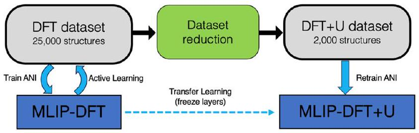
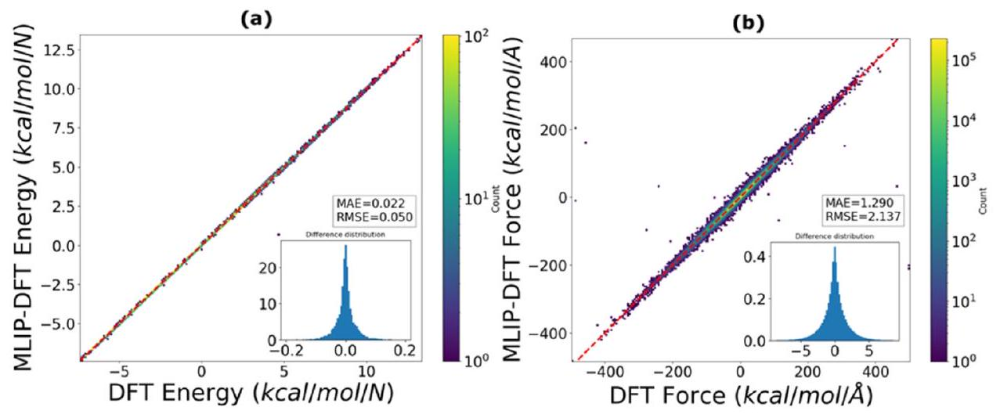
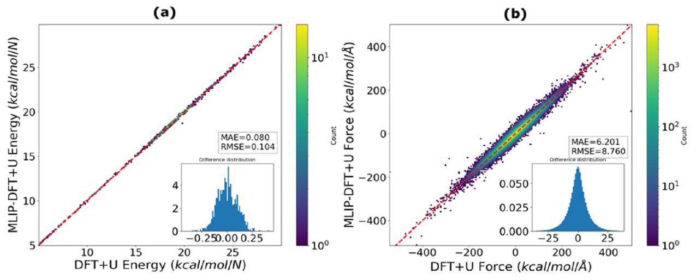
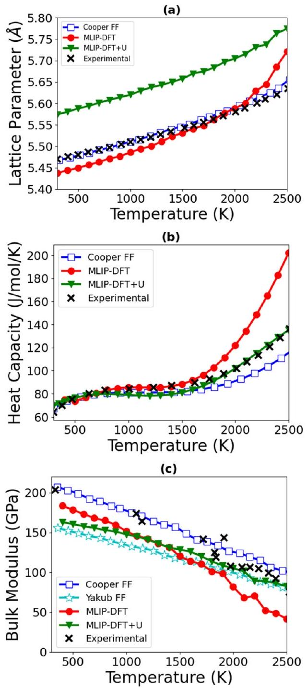
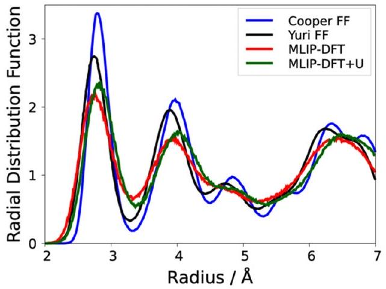
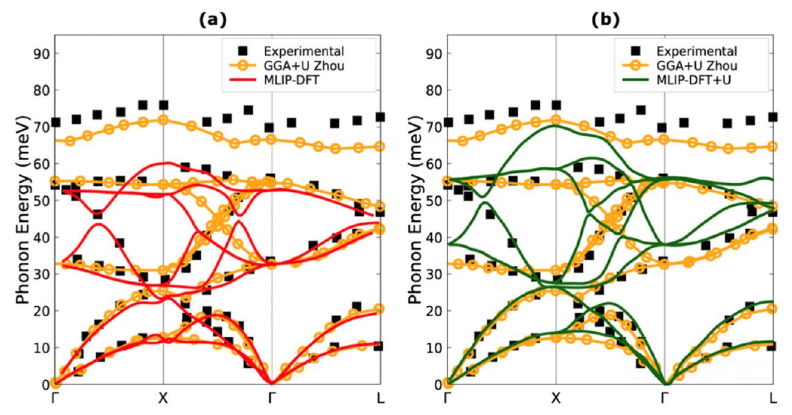

# Building a DFT +U machine learning interatomic potential for uranium dioxide 

Elizabeth Stippell ${ }^{\mathrm{a}, \mathrm{b}}$, Lorena Alzate-Vargas ${ }^{\mathrm{a}}$, Kashi N. Subedi ${ }^{\mathrm{a}}$, Roxanne M. Tutchton ${ }^{\mathrm{a}}$, Michael W.D. Cooper ${ }^{\mathrm{c}}$, Sergei Tretiak ${ }^{\mathrm{a}, \mathrm{d}}$, Tammie Gibson ${ }^{\mathrm{a}}$, Richard A. Messerly ${ }^{\mathrm{a},{ }^{*}}$ ${ }^{\mathrm{a}}$ Theoretical Division, Los Alamos National Laboratory, Los Alamos, NM 87545, USA ${ }^{\mathrm{b}}$ University of Southern California, Los Angeles, CA 90007, USA ${ }^{\mathrm{c}}$ MST-8, Los Alamos National Laboratory, Los Alamos, NM 87545, USA ${ }^{\mathrm{d}}$ Center for Nonlinear Studies, Los Alamos National Laboratory, Los Alamos, NM 87545, USA

## ARTICLE INFO

## Keywords:

Machine learning
Molecular dynamics
Actinides
Atomistic Simulations

#### Abstract

Despite uranium dioxide ( $\mathrm{UO}_{2}$ ) being a widely used nuclear fuel, fuel performance models rely extensively on empirical correlations of material behavior, leveraging the historical operating experience of $\mathrm{UO}_{2}$. Mechanistic models that consider an atomistic understanding of the processes governing fuel performance (such as fission gas release and creep) will enable a better description of fuel behavior under non-prototypical conditions such as in new reactor concepts or for modified $\mathrm{UO}_{2}$ fuel compositions. To this end, molecular dynamics simulation is a powerful tool for rapidly predicting physical properties of proposed fuel candidates. However, the reliability of these simulations depends largely on the accuracy of the atomic forces. Traditionally, these forces are computed using either a classical force field (FF) or density functional theory (DFT). While DFT is relatively accurate, the computational cost is burdensome, especially for $f$-electron elements, such as actinides. By contrast, classical FFs are computationally efficient but are less accurate. For these reasons, we report a new accurate machine learning interatomic potential (MLIP) for $\mathrm{UO}_{2}$ that provides high-fidelity reproduction of DFT forces at a similar low cost to classical FFs. We employ an active learning approach that autonomously augments the DFT training data set to iteratively refine the MLIP. To further improve the quality of our predictions, we utilize transfer learning to retrain our MLIP to higher-accuracy DFT+U data. We validate our MLIPs by comparing predicted physical properties (e.g., thermal expansion and elastic properties) with those from existing classical FFs and DFT/DFT+U calculations, as well as with experimental data when available.

## 1. Introduction

Uranium dioxide ( $\mathrm{UO}_{2}$ ) is an extremely important and commonly used nuclear fuel. As experiments with $\mathrm{UO}_{2}$ can be quite challenging due to its hazardous and radioactive nature, computational models present a desirable avenue for better understanding the properties of uranium dioxide. One powerful modeling tool for the prediction of various physical properties, such as structural properties (e.g., lattice parameters [1-5]), thermodynamic properties (e.g., specific heat capacity [1,2, 4]), and transport properties (e.g., self-diffusion coefficients [3,6]) is molecular dynamics (MD). The reliability of MD simulations depends almost entirely on an accurate representation of a multidimensional potential energy surface of the system and ultimately on the forces acting on each atom. Typically, these forces are computed using either
first principles quantum mechanical (QM) methods, such as density functional theory (DFT), or empirical physics-based techniques, such as classical force fields (FFs). While the forces obtained with DFT are quite accurate, the computational cost significantly limits the system size and length scales achievable by DFT-MD simulations. This is especially true for $f$-electron elements such as uranium. By contrast, classical FFs (i.e., potentials) are much less expensive computationally, but with a considerably lower accuracy compared to DFT given their empirical nature. Even more noticeable when atoms deviate significantly from their equilibrium positions. For example, while the capability of a force field to accurately replicate thermal expansion is crucial, it does not necessarily ascertain the ability of the FF to describe defect stabilities or diffusion, which are essential parameters for understanding the irradiation response of the fuel. Furthermore, the transferability of classical

[^0]FFs is questionable considering the high probability of overfitting to a sparse experimental data set.

Recently, the emergence of machine learning interatomic potentials (MLIPs) has led to a paradigm shift in the historical trade-off between computational cost and accuracy. MLIPs can achieve near DFT-level accuracy with a computational cost more comparable to classical FFs [7]. While MLIPs have proven extremely powerful for organic systems [8] and even some metals [9], their application for actinide systems, such as $\mathrm{UO}_{2}$, is much less prevalent in the literature. Recent work demonstrates that MLIPs are indeed capable of modeling similar systems, such as pure uranium [10,11] and $\mathrm{ThO}_{2}$ [12]. The primary challenge in developing MLIPs for actinide elements is the generation of a high-fidelity training dataset that adequately covers structural diversity in a cost-effective fashion. To this end, active learning (AL) is a fully-automated iterative approach to efficiently generate a robust training dataset [8]. The recent studies of Chen et al. [11] for pure uranium and Kobayashi et al. [12] for $\mathrm{ThO}_{2}$ demonstrate how an AL approach, coupled with MD sampling and DFT calculations, can be applied to generate a training dataset for actinide systems.

One of the key challenges for modeling $\mathrm{UO}_{2}$ arises when using standard DFT, as these calculations yield a metallic system instead of an insulator in the ground state. Therefore, DFT contradicts experimental data and results in a non-physical representation of the atomic interactions and incorrect behavior of the system [13]. To account for the strongly correlated behavior of the $f$ electrons in $\mathrm{UO}_{2}$, it is common to modify the standard DFT calculation by adding the Hubbard parameter correction to the exchange correlation functional (i.e., local density approximation or generalized gradient approximation, or LDA/GGA+U [14]), which is often colloquially referred to as DFT+U. Although $\mathrm{DFT}+\mathrm{U}$ predicts the correct antiferromagnetic description of the system and electronic conductivity (insulator) for $\mathrm{UO}_{2}, \mathrm{DFT}+\mathrm{U}$ calculations often converge to metastable states [13]. For this reason, various computational schemes have been proposed to ensure a global energetic minimum is obtained, such as U ramping or occupation matrix control [15-17]. As these techniques are more expensive, a trade-off exists between the size and accuracy of a dataset that can be generated with $\mathrm{DFT}+\mathrm{U}$.

A standard approach in machine learning to overcome this trade-off is to pre-train to the larger but lower-accuracy (e.g., DFT) dataset and then partially retrain to the smaller but higher-accuracy (e.g., $\mathrm{DFT}+\mathrm{U}$ ) dataset. This can be accomplished using a two-step process referred to as transfer learning (TL) [18]. In TL, the MLIP first "learns" the general patterns to relate the atomic positions to energies and forces from the larger dataset. Then, the MLIP refines its energy and force predictions using the higher-accuracy data, without "forgetting" the patterns learned from the lower-accuracy data. To ensure that the MLIP retains the information learned from the larger dataset, certain layers of the MLIP are frozen during retraining. Transfer learning is necessary because DFT and DFT+U energies have an energy off-set and, therefore, the two methods cannot be combined into a single dataset.

A general schematic for how we train a machine learning interatomic potential using both active learning and transfer learning is displayed in Fig. 1; further description can be found in the Methods section.

Several studies demonstrate that transfer learning is a powerful tool

Fig. 1. A general schematic for the active learning and transfer learning process using the ANI neural network.

when training to a relatively small but high-accuracy dataset of organic systems [18]. One fundamental assumption in transfer learning is that the patterns learned in the first layers of the neural network are essentially the same between the two datasets. When applying transfer learning in the context of $\mathrm{UO}_{2}$, however, this raises one key question; is it possible to retrain an MLIP that was initially trained to a DFT (i.e., ferromagnetic, and metallic) dataset with a $\mathrm{DFT}+\mathrm{U}$ (i.e., anti-ferromagnetic, and insulator) dataset? By answering this question, we will achieve the key objective of this study, namely, to develop a $\mathrm{DFT}+\mathrm{U}$ quality, antiferromagnetic MLIP for uranium dioxide that is able to predict various physical properties over a temperature range of $300-2500 \mathrm{~K}$ at atmospheric pressure, consistent with the typical operation conditions of nuclear reactors. Various properties of importance are the temperature dependence of the lattice parameter, specific heat capacity, and bulk modulus, below the melting point, as well as zero-temperature elastic constants and defect energies. We have verified the accuracy of our MLIPs by comparing the anticipated physical properties with corresponding results from established classical FFs, DFT/DFT+U literature values, and experimental data, when available.

## 2. Methods

### 2.1. Active learning

We employ an active learning (AL) workflow that automatically trains an MLIP by iteratively augmenting the training dataset to continuously improve the MLIP. The AL approach relies on three fundamental pillars, namely, sampling, labeling, and training. The first pillar of AL (sampling) refers to the process wherein atomic configurations (i.e., cartesian coordinates) are generated and added to the training dataset. The second pillar (labeling) consists of assigning each atomic configuration with the corresponding system energy and forces acting on each atom. The third pillar (training) involves the fitting of an MLIP to the labeled training dataset of energies and forces. These three pillars are repeated in an iterative fashion until the potential has converged (see Figure 9 in Smith et al. [9]).

The sampling in this work is achieved by performing MD simulations wherein the atomic forces are computed using the current iteration of the MLIP. These MLIP-driven MD simulations (MLIP-MD) during AL are performed using the Atomic Simulation Environment (ASE) [19]. To ensure that our MLIP-MD simulations are sampling a relevant region of configurational space, the initial atomic configuration for each MLIP-MD simulation is selected from a database of (approx. 6500) predetermined atomic configurations.

There are three distinct classes of initial configurations for the MLIPMD simulations. All three classes of configurations are generated by performing MD simulations with the classical FF developed by Cooper et. al. [2] using the LAMMPS software package [20]. For the first class of configurations, MD simulations are performed at several temperatures $(300 \mathrm{~K}, 700 \mathrm{~K}, 1000 \mathrm{~K}, 1500 \mathrm{~K}, 2000 \mathrm{~K}$ and 2500 K$)$ in a 96-atom cubic supercell system at zero pressure, generating a total of 1750 configurations. For the 2100 configurations belonging to the second class, we perform MD simulations at the same previous temperatures but changing the box volume by compressing or expanding between $1-3 \%$ relative to the nominal zero-pressure box volume. The third class, consisting of approximately 2500 configurations, contain point defect structures. To generate these configurations, we modify the first class of structures by randomly removing and/or moving uranium and/or oxygen atoms to an octahedral interstitial position. The temperatures and densities sampled in the dataset represent the typical operational range of nuclear reactors.

Once an initial configuration is selected at random from the database of predetermined configurations, an MLIP-MD simulation is performed with a Nosé-Hoover thermostat. The temperature and box size vary throughout these MLIP-MD sampling simulations, in order to probe diverse structures (see Table S1 in supplementary information for details). The MLIP-MD simulations for sampling configurations are
performed for a maximum of 1 nanosecond, with a timestep of 1 femtosecond. These simulations are terminated early if a configuration meets a selection criterion based on the MLIP uncertainty in energy or the forces (computed with the current AL generation of the MLIP). The uncertainty threshold varies somewhat from generation to generation (as a balance between exploration and exploitation), but a typical threshold value is $4 \mathrm{kcal} / \mathrm{mol}$ for the energy uncertainty and $1 \mathrm{kcal} / \mathrm{mol} / \AA$ for the force uncertainty. The MLIP uncertainties are computed using the query-by-committee method [18], where the standard deviation is computed between 8 independently-trained MLIPs. As evaluation of the uncertainty is relatively slow, the uncertainties are computed only every 10 timesteps (i.e., every 10 fs ). The final dataset after active learning consists of approximately 25 k configurations.

Labeling each configuration with the system energy and atomic forces is accomplished by performing QM calculations with the Vienna ab Initio Program (VASP) software [21,22]. The original dataset is computed using standard DFT in the 96-atom supercells, using the Generalized Gradient Approximation exchange correlation as described by Perdue, Burke and Ernzerhof [23] (GGA-PBE) and the projector augmented wave (PAW) formalism [24]. A relatively coarse $2 \times 2 \times 2$ k-point mesh was selected to reduce computational costs. The energy cut-off for the plane-wave basis set is 520 eV , with periodic boundary conditions used in all directions similar to the work by Chen et al. [17] (see supplemental Figs. S1 and S2). A ferromagnetic state is chosen as the initial guess for the magnetic moment (all atoms assigned initial value of +1 ) of the standard DFT calculations. The final magnetic moments for the uranium and oxygen atoms are around $\pm 2$ and zero, respectively.

As it is common for VASP calculations to become trapped in one of the metastable states for a system as challenging as $\mathrm{UO}_{2}$, we developed an automated approach to clean the dataset of all metastable calculations. Specifically, we excluded from the dataset all outliers (approximately 400 configurations) where the DFT energy was more than five standard deviations greater than the MLIP energy. As shown in the supplementary information (see Fig. S3), all of these outliers are found with a nearly constant offset (in the positive direction) from the parity line, suggesting a systematic error in these calculations. By contrast, the errors in the forces are no larger than the rest of the dataset, demonstrating that our MLIP is capable of fitting the data to a certain extent. As each of these calculations has a higher energy than the parity line, we attribute this systematic error to be due to convergence to a local minimum with a higher energy.

The MLIP was trained using a neural network based on the ANAKINME (ANI) architecture [9], similar to the MLIP architecture used by Kobayashi et al. [12]. Most hyperparameters were adopted from previous work without modification. For example, the number of nodes in each layer of the neural network and the definition of the symmetry functions are identical to the work of Smith et al. for the Aluminum ANI model [9]. Joint training is performed with weights of 1 and 0.1 for the energy and force errors, respectively. During the MLIP training, 87.5\% of the data were used for training, $6.25 \%$ for validation, and $6.25 \%$ for testing. An ensemble of eight MLIPs are trained independently, with different random splits of training, validation, and test datasets. Learning rate annealing is used during training, starting at a learning rate of 0.001 and converging at a learning rate of 0.00001 . The ADAM update algorithm [25] is used with a constant batch size of 64 configurations. An L2 normalization with a weight of 0.000001 is also included in the loss function to regularize the parameters for each layer of the neural networks. In addition, an early-stopping approach with a patience of 100 epochs is utilized to avoid overfitting. Training typically completes between 1000-2000 epochs. Further details of the training procedure, as well as the ANI model, are provided as supplementary information (Tables S2 and S3).

### 2.2. Transfer learning

As discussed previously, when addressing $\mathrm{UO}_{2}$ and similar nuclear fuels, the Hubbard parameter is important for obtaining the correct antiferromagnetic magnetism ground state as seen in experimental results as well its electronic insulator behavior. Due to the high computational cost involved in running DFT + U calculations, it is infeasible to generate a dataset of similar size to the DFT dataset.

Instead, we generate a reduced dataset of approximately 2000 configurations for the DFT +U calculations. We follow the same data reduction procedure indicated by Smith et al. [18] and we adhere to the recommendations in their work to specify similar tolerance values that determine the configurations to be included. A schematic figure of how the dataset is generated based on the tolerance can be found in supplemental Fig. S4. This data reduction is achieved in an iterative way starting from the DFT active learning configurations. In brief, a temporary MLIP is trained to a small portion of the DFT dataset. Then, the most challenging configurations (i.e., those with the largest deviations in energy and forces) are identified. A small fraction of these configurations is then included in the new DFT+U growing dataset. This procedure is repeatedly iteratively until only a small percentage of large-deviation configurations is identified.

In our case, the final reduced dataset contains approximately $8 \%$ of the configurations from the original DFT dataset. Once DFT + U calculations are performed for the reduced dataset, the DFT-based MLIP parameters are copied and selected layers of the neural network are frozen. These frozen layers will retain the original parameters as the DFTtrained MLIP. The remaining unfrozen layers are then retrained based on the reduced DFT + U dataset. Several different combinations of freezing layers were tested (see supplemental Fig. S5). Ultimately, the choice of freezing the first layer and final layer, denominated as $\operatorname{TL}(0,3)$, was chosen, as this combination yielded the lowest deviations on the $\mathrm{DFT}+\mathrm{U}$ test set, as well as the most accurate physical property predictions.

The DFT +U calculations were performed in VASP using the same input parameters and pseudopotentials as the DFT calculations. The only modifications were the inclusion of the Hubbard parameter and an initial guess of an antiferromagnetic magnetic moment (all oxygen atoms assigned a value of 0 with the value assigned to uranium atoms alternating between +2 and -2 ). The Hubbard $U$ parameter followed a ramping scheme from 0.51 to 4.50 eV in steps of 1 eV (with a final step of 0.99 eV ) and the exchange parameter $J$ was fixed to 0.51 eV . Therefore, the effective ( $U-J$ ) parameter is increased from 0 eV to the final value of 3.99 eV , consistent with the most common value used in the literature for $\mathrm{UO}_{2}$. Note that the same U-ramping scheme is utilized for all $\sim 2000$ configurations in the DFT + U dataset. In contrast to the DFT dataset, the DFT + U dataset did not require removing any outliers, demonstrating the robustness of the U-ramping scheme.

### 2.3. Molecular dynamics simulations

The reliability of our MLIPs is evaluated by predicting thermophysical properties that are not included in the training dataset using molecular dynamics simulations. We compute the lattice constant, elastic properties, and phonon dispersion curves at zero temperature, and temperature-dependent properties such as the lattice parameter (i.e., thermal expansion), bulk modulus, and heat capacity. To further test the performance our of MLIPs, we also calculated some relevant stoichiometric defect energies such as Schottky and Frenkel pairs.

All simulations were performed using LAMMPS [20], in a $4 \times 4 \times 4$ supercell ( 768 atoms) of a $\mathrm{UO}_{2}$ fluorite conventional unit cell. The MLIP energies and forces are computed as an average over the eight MLIP ensemble members.

To calculate the temperature-dependent lattice parameter and specific heat capacity, the $\mathrm{UO}_{2}$ system was heated from 300 K to 2500 K at 100 K intervals under the NPT ensemble at constant zero pressure with
the Nosé-Hoover thermostat and barostat relaxation times being 0.1 ps and 0.5 ps , respectively. A timestep of 0.2 fs was used. At each temperature increment, the temperature was held constant for 16 ps and the average lattice and enthalpy (H) were taken over the last 4 ps . The partial derivative of enthalpy with respect to temperature was used to calculate the specific heat $c_{p}$ as shown in Eq. 1:
$c_{p}=\frac{1}{n}\left(\frac{\partial H}{\partial T}\right)_{p}$
where $n$ is the number of moles, and the derivative $\left(\frac{\partial H}{\partial T}\right)$ of enthalpy with respect to temperature is obtained by fitting a high-order polynomial to enthalpy, as demonstrated in Cooper et al. [2].

The temperature dependent bulk modulus ( $K$ ) was calculated from 300 K to 2500 K every 100 K . At each temperature, an MD run at zero pressure was performed to obtain the average nominal volume ( $V_{0}$ ) using the NPT ensemble with same relaxation times and timestep as with the heat capacity. After obtaining $V_{0}$, the system was expanded and compressed by $1 \%$ and $2 \%$ relative to the nominal volume, where a constant volume NVT MD was performed to obtain the average pressure $(P)$. The system in all the MD runs was held for 20 ps , and average volume and pressure were obtained from the last 5 ps of run. The bulk modulus is calculated using Eq. 2:
$K=-\left.V \frac{d P}{d V}\right|_{V=V_{0}}$
where the derivative of pressure $(P)$ with respect to volume $(V)$ is obtained using a linear fit of the data from compressive, tensile and zero pressure MD runs.

We also evaluated the radial distribution function (RDF) in a 768atom structure ( $4 \times 4 \times 4$ supercell) by running a MD simulation for 6 ps using a 0.2 fs timestep in the NPT ensemble at a temperature of 2000 K and zero pressure. We obtained the RDFs by sampling every 1000 timesteps and averaging the data over the final 3 ps of the MD run.

The defect energies evaluated in this work have been discussed thoroughly by both Cooper et al. [2] and Govers et al. [26]. Schottky defects involve creating two oxygen vacancies in the proximity to a uranium vacancy. $\mathrm{SD}_{\text {isolated }}$ indicates the two oxygen atoms, and one uranium were removed at random from the system whereas $\mathrm{SD}_{1}, \mathrm{SD}_{2}$, and $\mathrm{SD}_{3}$ refer to the first, second, and third nearest neighbor removed with respect to the first removed oxygen atom.

There were two main types of Frenkel pair defects, referring to the removal of a uranium atom or an oxygen atom, denoted as U-FP and OFP respectively. For the cation Frenkel pair defect (U-FP), the uranium interstitial and vacancy could not be located at the first nearest neighbor due to recombination once the system is relaxed and so the second nearest neighbor placement was used, thus separating the vacancy and interstitial by an oxygen anion. The oxygen Frenkel pair defects were done similarly, however with a cation (uranium atom) separating the interstitial and vacancy. Furthermore there were two different Frenkel pair defects calculated for the oxygen Frenkel pair configuration, where the cation was located at ( $0,0,0$ ), the interstitial at ( $1 / 2,1 / 2,1 / 2$ ), and the vacancy at either $(1 / 4,1 / 4,-1 / 4)$ or $(1 / 4,1 / 4,1 / 4)$ for O-FP 1 and O-FP 2 respectively [26]. A visual description of atoms removed or added for both defects can be found in supplementary information (see Fig S6).

The phonon spectra at 0 K for both MLIPs are obtained in ASE with a $10 \times 10 \times 10$ supercell using the finite difference method.

## 3. Results

### 3.1. Model training

Two different models are assessed: an MLIP trained solely to DFT data (MLIP-DFT) and an MLIP trained to DFT+U data (MLIP-DFT+U). As mentioned in the Methods section, the results presented here reflect
the MLIP-DFT+U from transfer learning with layers 0 and 3 frozen. A complete report of the properties with other frozen layer combinations and a DFT + U MLIP without frozen layers can be found in the supplementary information (Tables S4 and S5 and Figs. S7 and S8).

Figs. 2 and 3 show the energy and force correlation plots of the test sets for the MLIP-DFT and MLIP-DFT+U, respectively. The test datasets are a random held-out subset of the complete DFT or DFT+U dataset. To obtain an unbiased assessment of model performance, the eight MLIP ensemble members are evaluated only on their respective test dataset. The root-mean squared error (RMSE) and mean absolute error (MAE) are then computed by averaging over the test errors for each ensemble member.

In the case of the MLIP-DFT (Fig. 2), the RMSE values are $0.05 \mathrm{kcal} / \mathrm{mol} / \mathrm{N}$ for the energy and $2.1 \mathrm{kcal} / \mathrm{mol} / \AA$ for the forces. For the MLIPDFT + U (Fig. 3), the RMSE values are $0.1 \mathrm{kcal} / \mathrm{mol} / \mathrm{N}$ for energy and $8.8 \mathrm{kcal} / \mathrm{mol} / \AA$ for the forces, about a factor of 4 times greater than that of the MLIP-DFT. One possible explanation for the increased RMSEs observed for the MLIP-DFT+U is that the data reduction approach (see supplemental Fig. S4) targets the most challenging chemical structures, while removing all redundant and easy-to-learn structures. Additional evidence for this claim is that a similar RMSE is obtained when training solely to the DFT+U dataset but without applying transfer learning (see supplemental Fig. S9). Although the increase in RMSE may seem concerning, the stability and accuracy of the MD simulation results presented in Fig. 4 suggest that the MLIP trained to DFT+U data is no less robust or reliable than the MLIP trained solely to DFT data.

### 3.2. Model validation

To validate the DFT-based and DFT+U-based MLIPs, various physical properties are computed and compared to DFT/DFT+U calculations as well as existing values from classical FFs and experimental data as described in the literature. Both temperature-dependent and temperature-independent properties are reported. Table 1 provides the lattice parameter, elastic constants, and bulk modulus at 0 K .

The results in Table 1 suggest that the MLIP-DFT can accurately reproduce the elastic constants, although the $C_{44}$ value is somewhat overestimated $(+30.62 \%)$. Both the MLIP-DFT predicted lattice parameter and bulk modulus are in very good agreement (around 0.5\% deviation) with the experimental data and the classical FF developed by Cooper et al. [2]. The MLIP-DFT+U yields a lattice parameter slightly higher ( $+0.68 \%$ ) than experiments (taken at ambient temperature) but consistent with the DFT+U reference calculation. The elastic constants obtained with the MLIP-DFT+U are also in reasonable agreement with $\mathrm{DFT}+\mathrm{U}$ calculations and experimental values. The bulk modulus at 0 K for the MLIP-DFT+U is significantly lower ( $-8.58 \%$ ) than experiment, but consistent with the reference $\mathrm{DFT}+\mathrm{U}$ calculation.

Fig. 4 depicts the temperature-dependent properties of the $\mathrm{UO}_{2}$ system, including the (a) lattice parameter, (b) heat capacity, and (c) bulk modulus. The values computed by the MLIP-DFT and MLIP-DFT+U are compared to two classical FFs and experimental data. As shown in Fig. 4(a), the MLIP-DFT underpredicts the lattice parameter in the lowtemperature regime when compared with the experimental data (and therefore to the Cooper FF, which was fit to this property). As the temperature increases, the MLIP-DFT lattice parameter starts to diverge from the experimental data, ending in an overprediction at higher temperatures. By contrast, the MLIP-DFT+U lattice parameters as shown in Fig. 4(a), follow a similar trend to the experimental data, albeit with a significant offset. The nearly constant overprediction of the MLIP$\mathrm{DFT}+\mathrm{U}$ lattice parameter by $\sim 2 \%$ compared to experimental values is common for DFT +U calculations with the PBE functional [17]. In contrast to the MLIP-DFT, the MLIP-DFT+U lattice parameter increases with a more gradual slope with respect to temperature even above 2000 K.

The results for the heat capacity, displayed in Fig. 4(b), show a very good agreement between the MLIP-DFT and the experimental data in the

Fig. 2. The correlation plots for (a) energy and (b) force for the test sets for the MLIP-DFT.

Fig. 3. The correlation plots for (a) energy and (b) force for the test sets for the MLIP-DFT+U.

low temperature regime up to 1600 K . At higher temperatures, however, the MLIP-DFT significantly overpredicts the heat capacity. This overprediction is remedied by the MLIP-DFT+U which shows excellent agreement with the experimental heat capacity over the entire temperature range. In fact, the MLIP-DFT+U follows the experimental data even more closely than to the Cooper classical FF , which is a significant conclusion as this FF was explicitly fit to experimental data over the entire temperature regime (although not directly to heat capacity data).

The bulk modulus for the MLIP-DFT in Fig. 4(c) follows a similar trend to the classical FF developed by Yakub et al. [33] at low temperatures. Both the MLIP-DFT and Yakub FF underpredict with respect to the experimental data over the entire temperature range. However, while the results for the Yakub FF at high temperatures are in closer agreement to the experimental values, the MLIP-DFT bulk modulus values deviate even more significantly. Although the MLIP-DFT+U still underestimates the bulk modulus with respect to the experimental data, the discrepancy is reduced at temperatures above 1000 K compared to the results from the DFT-based MLIP.

The deviations with respect to the experimental data for the MLIPDFT computed physical properties at higher temperature are likely due to the mischaracterization of $\mathrm{UO}_{2}$ as ferromagnetic in the DFT calculations for the training dataset. By in large, the performance at higher temperatures is greatly improved by the MLIP-DFT+U, suggesting that capturing the correct antiferromagnetic magnetism and electronic insulator behavior from the DFT+U calculations is essential for a reliable MLIP for $\mathrm{UO}_{2}$ over a wide temperature regime.

Table 2 presents the MLIP-DFT and MLIP-DFT+U predicted defect energies in comparison with reference DFT/DFT+U calculations, the Cooper FF, and experimental data. We observe good agreement for both the MLIP-DFT and MLIP-DFT+U with experimental data and emergence of the same trend observed in the classical FF with respect to the
different interactions between defects of the Frenkel pairs and Schottky trios. While the classical FF tends to overpredict the defect energies with respect to the experimental data, overall, the predicted MLIP-DFT and MLIP-DFT+U values are in much closer agreement. The MLIP-DFT and MLIP-DFT+U values trend closer to the lower limit when compared directly to the DFT/DFT+U literature values. We also observe that the MLIP-DFT+U defect energies are similar or slightly higher than the MLIP-DFT values, consistent with the results presented by Dorado et al. [39] The MLIP-DFT+U defect energies still generally agree with the $\mathrm{DFT}+\mathrm{U}$ literature values and experimental data.

Fig. 5 compares the radial distribution function (RDF) for the oxygen atoms (O-O pair correlations) at 2000 K using both MLIPs with the classical rigid ion potential by Yuri [42] and the FF from Cooper et al. [2] Although the intensity of the peaks are offset from the reference data, both the MLIP-DFT and MLIP-DFT+U can reproduce the distances for the first and second nearest neighbors. The agreement to the classical FFs is excellent, demonstrating an accurate description of the atomic structure even at these relatively high temperatures.

Fig. 6 compares the phonon dispersion curves from a reduced wave vector using both MLIPs, literature DFT/DFT+U calculations, and experimental data. Both MLIPs agree well with the experimental data in the acoustic modes (low-energy data), with the MLIP-DFT+U showing slightly better agreement. Similar to classical FFs, the agreement with optical modes (higher-energy data) is poorer. However, both MLIPs do not significantly overpredict the optical modes, as is common for classical FFs [43]. Some of the deviations with experiment may be due to the temperature discrepancy between simulation ( 0 K ) and experiment ( 300 K ). Phonon dispersion curves along the Brillouin zone are shown in supplemental Fig. S10.

Fig. 4. (a) Lattice parameter vs. temperature for the classical force field [2] (squares), the MLIP-DFT (circles), the MLIP-DFT+U (triangles), and experimental results [30,31], (b) heat capacity vs. temperature for the classical force field [2], the MLIP-DFT, the MLIP-DFT+U, and the experimental results [30], (c) bulk modulus vs. temperature for the classical force field [2], the Yakub force field [32,33], the MLIP-DFT, the MLIP-DFT+U, and experimental results [34].

## 4. Conclusions

In this work, we show how to train MLIPs for uranium dioxide and demonstrate the utility of these MLIPs as an effective tool for researching $\mathrm{UO}_{2}$ properties that is both cost effective and efficient. We start with deriving an MLIP trained solely to DFT data generated using an active learning approach. Our analyses shows that the MLIP performance is limited by an accuracy of the reference quantum-mechanical method. The MLIP-DFT yields reasonable predictions of physical properties over the temperature range studied and lays a strong foundation for a more advanced potential. By training to DFT + U data via transfer learning, we are then able to push our MLIP model beyond the limitations created by solely DFT data. More specifically, by utilizing transfer learning we formulate MLIP-DFT+U model that more adequately describes the insulator and antiferromagnetic properties of uranium dioxide. The MLIP trained to DFT+U data shows noticeable improvements compared to the DFT-trained MLIP. The MLIP-DFT+U predicts a better trend for the lattice parameter (although overestimated), as well as the specific

Table 1
Zero-temperature physical properties: lattice constant (a), elastic constants ( $\mathrm{C}_{\mathrm{ii}}$ ), and bulk modulus (B) for the MLIP-DFT and MLIP-DFT+U compared with the classical force field (FF) of Cooper et al. [2], density functional theory [17], density functional theory including the Hubbard parameter [17,27], and experimental [28,29] data. Error percentage with respect to experiment included in parentheses.
| Property | MLIP-DFT | MLIPDFT+U | FF | DFT | DFT+U | Exp. |
| :--- | :--- | :--- | :--- | :--- | :--- | :--- |
| $a$ (Å) | 5.45 (-0.42\%) | 5.51 (+0.68\%) | 5.45 | 5.42 | 5.54 | 5.473* |
| $C_{11}$ (GPa) | 389.47 (+0.04\%) | 344.75 (-11.44\%) | 406.3 | 371.7 | 393.8 | 389.3 |
| $C_{12}$ (GPa) | 121.21 (+2.04\%) | 118.20 (-0.42\%) | 124.7 | 117.5 | 114.7 | 118.7 |
| $C_{44}$ (GPa) | 77.98 (+30.62\%) | 37.19 (-37.71\%) | 63.89 | 66.3 | 63.9 | 59.7 |
| $B(\mathrm{GPa})$ | 207.80 (-0.53\%) | 190.98 (-8.58\%) | 218.6 | 202.9 | 197 | 208.9 |

* Value at ambient temperature

Table 2
Defect energies in eV for MLIP-DFT, MLIP-DFT+U, classical force field by Cooper et al. [2], DFT literature values [35-38], DFT+U literature values [39, 40], and experimental values [41] for Schottky (SD) and Frenkel pair (FP) defects.
| Defect energy (eV) | MLIPDFT | MLIPDFT+U | FF | DFT (Lit.) | DFT+U (Lit.) | Exp. |
| :--- | :--- | :--- | :--- | :--- | :--- | :--- |
| $\mathrm{SD}_{\text {isolated }}$ | 5.26 | 6.31 | 10.64 | 5.610.6 | 4.2-11.8 | 6.07.0 |
|  |  |  |  |  |  |  |
| $\mathrm{SD}_{1}$ | 4.09 | 4.30 | 6.18 |  |  |  |
| $\mathrm{SD}_{2}$ | 3.95 | 3.96 | 5.27 |  |  |  |
| $\mathrm{SD}_{3}$ | 3.92 | 3.86 | 5.05 |  |  |  |
| U-FP ${ }_{\text {isolated }}$ | 9.40 | 10.15 | 15.47 | 10.617.2 | 9.1-16.5 | 9.5 |
| $\mathrm{U}-\mathrm{FP}_{1}$ | 6.83 | 7.30 | 11.09 |  |  |  |
| O- $\mathrm{FP}_{\text {isolated }}$ | 5.86 | 5.25 | 5.73 | 2.65.77 | 2.4-7.0 | 3.04.0 |
|  |  |  |  |  |  |  |
| $\mathrm{O}-\mathrm{FP}_{1}$ | 3.94 | 4.36 | 5.37 |  |  |  |
| $\mathrm{O}-\mathrm{FP}_{2}$ | 3.95 | 4.26 | 4.94 |  |  |  |

Fig. 5. RDF of oxygen atoms at 2000 K for an ideal crystal using MLIP-DFT and MLIP-DFT+U compared to literature values [42]. Results from Cooper force field were generated in this study.

heat capacity in which it showed close agreement to experimental values. The bulk modulus for the MLIP-DFT+U also more closely follows the Yakub bulk modulus as compared to the MLIP-DFT. For the elastic constants, the MLIP-DFT+U underestimates the values as compared to experimental data. The defect energies calculated are within the range of literature DFT and DFT +U values and experimental data, showing an improvement as compared to the MLIP-DFT.

In summary, our study has delineated a framework for deriving

Fig. 6. Phonon dispersion curves for $\mathrm{UO}_{2}$ for (a) DFT based MLIP and (b) DFT+U based MLIP, compared with inelastic neutron scattering data from Pang et al. [44] at 300 K (black squares) and GGA $+U$ calculations from Zhou et. al [45].

MLIPs for nuclear fuels through molecular dynamics simulations and quantum-mechanical calculations, with a strong emphasis on leveraging active learning and transfer learning methodologies. Active learning allows automated generation of the training dataset, while transfer learning allows systematic accuracy improvement accounting for higher-fidelity data. The obtained MLIPs demonstrate performance for $\mathrm{UO}_{2}$ physical properties that inherit the underlying accuracy of the reference quantum-mechanical description. This suggests further direct incorporation of experimental data into training within a uniform machine learning protocol. This is the next practical step for improving the accuracy of our MLIP that will be a subject of future studies.

Future work will also focus on applying the same active learning methodology to develop MLIPs for novel nuclear fuel candidates (e.g., UN and UC) that need to be qualified prior to their potential application in new nuclear reactor technologies. The development of MLIPs for novel nuclear fuel candidates will greatly reduce both the time and financial cost for nuclear fuel qualification in comparison with historical irradiation campaigns that require many lengthy and expensive integral tests. As such, the ultimate impact of this study is to encourage novel fuel types to be designed and/or brought to market.

## Declaration of Competing Interest

The authors declare that they have no known competing financial interests or personal relationships that could have appeared to influence the work reported in this paper.

## Acknowledgements

The authors are appreciative for the helpful scientific discussions with Benjamin Nebgen and Justin Smith. E.S. gratefully acknowledges the resources of the Los Alamos National Laboratory (LANL) Applied Machine Learning summer student program. The work at LANL was supported by the LANL Directed Research and Development Funds (LDRD) project 20220053DR. This research is performed in part at the Center for Integrated Nanotechnologies (CINT), a U.S. Department of Energy, Office of Science User Facility at LANL. This research used resources provided by the LANL Institutional Computing (IC) Program. LANL is operated by Triad National Security, LLC, for the National Nuclear Security Administration of the U.S. Department of Energy under contract no. 89233218 NCA000001.

## Appendix A. Supporting information

Supplementary data associated with this article can be found in the online version at doi:10.1016/j.aichem.2023.100042.

## References

[1] Kocevski, V. Development and Application of a Uranium Mononitride (UN) Potential: Thermomechanical Properties and Xe Diffusion.
[2] M.W.D. Cooper, M.J.D. Rushton, R.W. Grimes, A many-body potential approach to modelling the thermomechanical properties of actinide oxides, J. Phys. Condens. Matter 26 (10) (2014) 105401, https://doi.org/10.1088/0953-8984/26/10/ 105401.
[3] G. Martin, S. Maillard, L.V. Brutzel, P. Garcia, B. Dorado, C. Valot, A molecular dynamics study of radiation induced diffusion in uranium dioxide, J. Nucl. Mater. 385 (2) (2009) 351-357, https://doi.org/10.1016/j.jnucmat.2008.12.010.
[4] K. Kurosaki, K. Yano, K. Yamada, M. Uno, S. Yamanaka, A molecular dynamics study of the heat capacity of uranium mononitride, J. Alloy. Compd. 297 (1) (2000) 1-4, https://doi.org/10.1016/S0925-8388(99)00561-7.
[5] P.H. Chen, X.L. Wang, X.C. Lai, G. Li, B.Y. Ao, Y. Long, Ab initio interionic potentials for UN by multiple lattice inversion, J. Nucl. Mater. 404 (1) (2010) 6-8, https://doi.org/10.1016/j.jnucmat.2010.06.017.
[6] T. Arima, K. Yoshida, K. Idemitsu, Y. Inagaki, I. Sato, Molecular dynamics analysis of diffusion of uranium and oxygen ions in uranium dioxide, IOP Conf. Ser. Mater. Sci. Eng. 9 (1) (2010) 012003, https://doi.org/10.1088/1757-899X/9/1/012003.
[7] M. Kulichenko, J.S. Smith, B. Nebgen, Y.W. Li, N. Fedik, A.I. Boldyrev, N. Lubbers, K. Barros, S. Tretiak, The rise of neural networks for materials and chemical dynamics, J. Phys. Chem. Lett. 12 (26) (2021) 6227-6243, https://doi.org/ 10.1021/acs.jpclett.1c01357.
[8] J.S. Smith, O. Isayev, A.E. Roitberg, ANI-1: an extensible neural network potential with DFT accuracy at force field computational cost, Chem. Sci. 8 (4) (2017) 3192-3203, https://doi.org/10.1039/C6SC05720A.
[9] J.S. Smith, B. Nebgen, N. Mathew, J. Chen, N. Lubbers, L. Burakovsky, S. Tretiak, H.A. Nam, T. Germann, S. Fensin, K. Barros, Automated discovery of a Robust interatomic potential for aluminum, Nat. Commun. 12 (1) (2021) 1257, https:// doi.org/10.1038/s41467-021-21376-0.
[10] M. Hao, P. Guan, An artificial neural network potential for uranium metal at low pressures, Chin. Phys. B (2023), https://doi.org/10.1088/1674-1056/acd8a4.
[11] H. Chen, D. Yuan, H. Geng, W. Hu, B. Huang, Development of a machine-learning interatomic potential for uranium under the moment tensor potential framework, Comput. Mater. Sci. 229 (2023) 112376, https://doi.org/10.1016/j. commatsci.2023.112376.
[12] K. Kobayashi, M. Okumura, H. Nakamura, M. Itakura, M. Machida, M.W.D. Cooper, Machine learning molecular dynamics simulations toward exploration of hightemperature properties of nuclear fuel materials: case study of thorium dioxide, Sci. Rep. 12 (1) (2022) 9808, https://doi.org/10.1038/s41598-022-13869-9.
[13] B. Dorado, B. Amadon, M. Freyss, M. Bertolus, DFT + U calculations of the ground state and metastable states of uranium dioxide, Phys. Rev. B 79 (23) (2009) 235125, https://doi.org/10.1103/PhysRevB.79.235125.
[14] S.L. Dudarev, G.A. Botton, S.Y. Savrasov, C.J. Humphreys, A.P. Sutton, Electron-energy-loss spectra and the structural stability of nickel oxide: an LSDA+U study, Phys. Rev. B 57 (3) (1998) 1505-1509, https://doi.org/10.1103/ PhysRevB.57.1505.
[15] J.P. Allen, G.W. Watson, Occupation matrix control of D- and f-electron localisations using DFT + U, Phys. Chem. Chem. Phys. 16 (39) (2014) 21016-21031, https://doi.org/10.1039/C4CP01083C.
[16] A. Claisse, M. Klipfel, N. Lindbom, M. Freyss, P. Olsson, GGA+U study of uranium mononitride: a comparison of the U-ramping and occupation matrix schemes and incorporation energies of fission products, J. Nucl. Mater. 478 (2016) 119-124, https://doi.org/10.1016/j.jnucmat.2016.06.007.
[17] J.-L. Chen, N. Kaltsoyannis, DFT $+U$ study of uranium dioxide and plutonium dioxide with occupation matrix control, J. Phys. Chem. C. 126 (27) (2022) 11426-11435, https://doi.org/10.1021/acs.jpcc.2c03804.
[18] J.S. Smith, B.T. Nebgen, R. Zubatyuk, N. Lubbers, C. Devereux, K. Barros, S. Tretiak, O. Isayev, A. Roitberg, Outsmarting quantum chemistry through transfer learning,, July 6, ChemRxiv (2018), https://doi.org/10.26434/chemrxiv.6744440. v1.
[19] A. Hjorth Larsen, J. Jørgen Mortensen, J. Blomqvist, I.E. Castelli, R. Christensen, M. Dułak, J. Friis, M.N. Groves, B. Hammer, C. Hargus, E.D. Hermes, P.C. Jennings, P. Bjerre Jensen, J. Kermode, J.R. Kitchin, E. Leonhard Kolsbjerg, J. Kubal, K. Kaasbjerg, S. Lysgaard, J. Bergmann Maronsson, T. Maxson, T. Olsen, L. Pastewka, A. Peterson, C. Rostgaard, J. Schiøtz, O. Schütt, M. Strange, K. S. Thygesen, T. Vegge, L. Vilhelmsen, M. Walter, Z. Zeng, K.W. Jacobsen, The Atomic Simulation Environment-a Python Library for Working with Atoms, J. Phys. Condens. Matter 29 (27) (2017) 273002, https://doi.org/10.1088/1361648X/aa680e.
[20] S. Plimpton, Fast parallel algorithms for short-range molecular dynamics, J. Comput. Phys. 117 (1) (1995) 1-19, https://doi.org/10.1006/jcph.1995.1039.
[21] G. Kresse, J. Furthmüller, Efficient iterative schemes for ab initio total-energy calculations using a plane-wave basis set, Phys. Rev. B 54 (16) (1996) 11169-11186, https://doi.org/10.1103/PhysRevB.54.11169.
[22] G. Kresse, J. Hafner, Ab initio molecular dynamics for liquid metals, Phys. Rev. B 47 (1) (1993) 558-561, https://doi.org/10.1103/PhysRevB.47.558.
[23] J.P. Perdew, K. Burke, M. Ernzerhof, Generalized gradient approximation made simple, Phys. Rev. Lett. 77 (18) (1996) 3865-3868, https://doi.org/10.1103/ PhysRevLett.77.3865.
[24] G. Kresse, D. Joubert, From ultrasoft pseudopotentials to the projector augmentedwave method, Phys. Rev. B 59 (3) (1999) 1758-1775, https://doi.org/10.1103/ PhysRevB.59.1758.
[25] Kingma, D.P.; Ba, J. Adam: A Method for Stochastic Optimization. arXiv January 29, 2017. 〈https://doi.org/10.48550/arXiv.1412.6980).
[26] K. Govers, S. Lemehov, M. Hou, M. Verwerft, Comparison of interatomic potentials for $\mathrm{UO}_{2}$. Part I: static calculations, J. Nucl. Mater. 366 (1) (2007) 161-177, https:// doi.org/10.1016/j.jnucmat.2006.12.070.
[27] A.J. Devey, First principles calculation of the elastic constants and phonon modes of $\mathrm{UO}_{2}$ using GGA $+U$ with orbital occupancy control, J. Nucl. Mater. 412 (3) (2011) 301-307, https://doi.org/10.1016/j.jnucmat.2011.03.012.
[28] I.J. Fritz, Elastic properties of $\mathrm{UO}_{2}$ at high pressure, J. Appl. Phys. 47 (10) (2008) 4353-4358, https://doi.org/10.1063/1.322438.
[29] M. Idiri, T. Le Bihan, S. Heathman, J. Rebizant, Behavior of actinide dioxides under pressure: $\mathrm{UO}_{2}$ and $\mathrm{ThO}_{2}$, Phys. Rev. B 70 (1) (2004) 014113, https://doi.org/ 10.1103/PhysRevB.70.014113.
[30] International Atomic Energy Agency. Thermophysical Properties Database of Materials for Light Water Reactors and Heavy Water Reactors; Text; International

Atomic Energy Agency, 2006; pp 1-404. (https://www.iaea.org/publications/ 7489/thermophysical-properties-database-of-materials-for-light-water-reactors-an d-heavy-water-reactors> (accessed 2023-08-18).
[31] J.K. Fink, Thermophysical properties of uranium dioxide, J. Nucl. Mater. 279 (1) (2000) 1-18, https://doi.org/10.1016/S0022-3115(99)00273-1.
[32] E. Yakub, C. Ronchi, D. Staicu, Computer simulation of defects formation and equilibrium in non-stoichiometric uranium dioxide, J. Nucl. Mater. 389 (1) (2009) 119-126, https://doi.org/10.1016/j.jnucmat.2009.01.029.
[33] E. Yakub, C. Ronchi, D. Staicu, Molecular dynamics simulation of premelting and melting phase transitions in stoichiometric uranium dioxide, J. Chem. Phys. 127 (9) (2007) 094508, https://doi.org/10.1063/1.2764484.
[34] M.T. Hutchings, High-temperature studies of UO2 and ThO2 using neutron scattering techniques, J. Chem. Soc. Faraday Trans. 2 Mol. Chem. Phys. 83 (7) (1987) 1083-1103, https://doi.org/10.1039/F29878301083.
[35] J. Yu, R. Devanathan, W.J. Weber, First-Principles Study of Defects and Phase Transition in $\mathrm{UO}_{2}$, J. Phys. Condens. Matter Inst. Phys. J. 21 (43) (2009) 435401, https://doi.org/10.1088/0953-8984/21/43/435401.
[36] J.P. Crocombette, F. Jollet, L.T. Nga, T. Petit, Plane-wave pseudopotential study of point defects in uranium dioxide, Phys. Rev. B 64 (10) (2001) 104107, https://doi. org/10.1103/PhysRevB.64.104107.
[37] M. Freyss, T. Petit, J.-P. Crocombette, Point defects in uranium dioxide: ab initio pseudopotential approach in the generalized gradient approximation, J. Nucl. Mater. 347 (1) (2005) 44-51, https://doi.org/10.1016/j.jnucmat.2005.07.003.
[38] H.Y. Geng, Y. Chen, Y. Kaneta, M. Iwasawa, T. Ohnuma, M. Kinoshita, Point defects and clustering in uranium dioxide by LSDA+U Calculations, Phys. Rev. B 77 (10) (2008) 104120, https://doi.org/10.1103/PhysRevB.77.104120.
[39] B. Dorado, J. Durinck, P. Garcia, M. Freyss, M. Bertolus, An atomistic approach to self-diffusion in uranium dioxide, J. Nucl. Mater. 400 (2) (2010) 103-106, https:// doi.org/10.1016/j.jnucmat.2010.02.017.
[40] E. Vathonne, J. Wiktor, M. Freyss, G. Jomard, M. Bertolus, DFT $+U$ investigation of charged point defects and clusters in $\mathrm{UO}_{2}$, J. Phys. Condens. Matter 26 (32) (2014) 325501, https://doi.org/10.1088/0953-8984/26/32/325501.
[41] H. Matzke, Atomic transport properties in $\mathrm{UO}_{2}$ and mixed oxides (U, $\mathrm{Pu} \mathrm{O}_{2}$, J. Chem. Soc. Faraday Trans. 2 Mol. Chem. Phys. 83 (7) (1987) 1121-1142, https://doi.org/10.1039/F29878301121.
[42] N. Yuri, K. Andrey, Calculation of phase transitions of uranium dioxide using structure factor in molecular dynamics, Int. J. Mater. Sci. Appl. 2 (6) (2013) 228, https://doi.org/10.11648/j.ijmsa.20130206.19.
[43] E. Torres, I. CheikNjifon, T.P. Kaloni, J. Pencer, A comparative analysis of the phonon properties in $\mathrm{UO}_{2}$ using the boltzmann transport equation coupled with DFT + U and empirical potentials, Comput. Mater. Sci. 177 (2020) 109594, https://doi.org/10.1016/j.commatsci.2020.109594.
[44] J.W.L. Pang, W.J.L. Buyers, A. Chernatynskiy, M.D. Lumsden, B.C. Larson, S. R. Phillpot, Phonon lifetime investigation of anharmonicity and thermal conductivity of $\mathrm{UO}_{2}$ by neutron scattering and theory, Phys. Rev. Lett. 110 (15) (2013) 157401, https://doi.org/10.1103/PhysRevLett.110.157401.
[45] S. Zhou, H. Ma, E. Xiao, K. Gofryk, C. Jiang, M.E. Manley, D.H. Hurley, C. A. Marianetti, Capturing the ground state of uranium dioxide from first principles: crystal distortion, magnetic structure, and phonons, Phys. Rev. B 106 (12) (2022) 125134, https://doi.org/10.1103/PhysRevB.106.125134.

[^0]:    * Corresponding author.

    E-mail address: richard.messerly@lanl.gov (R.A. Messerly).

