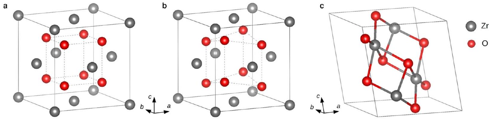
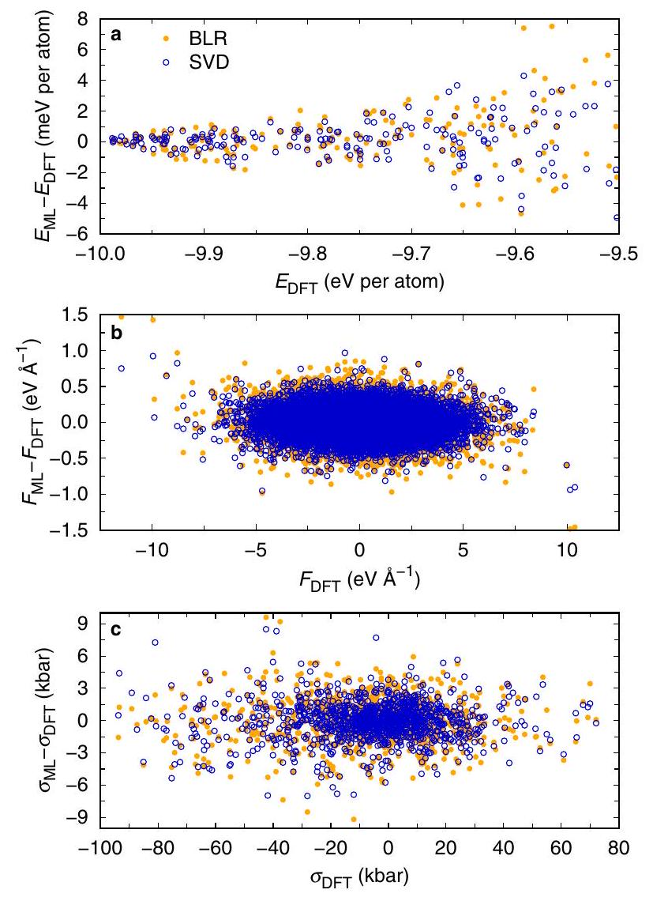
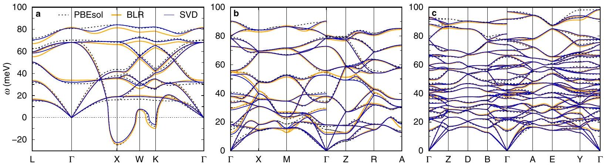
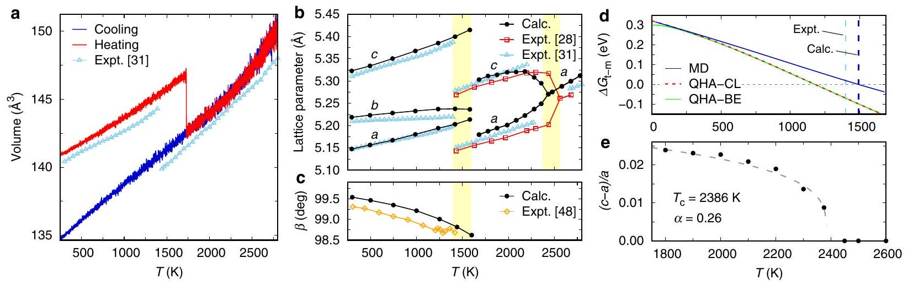
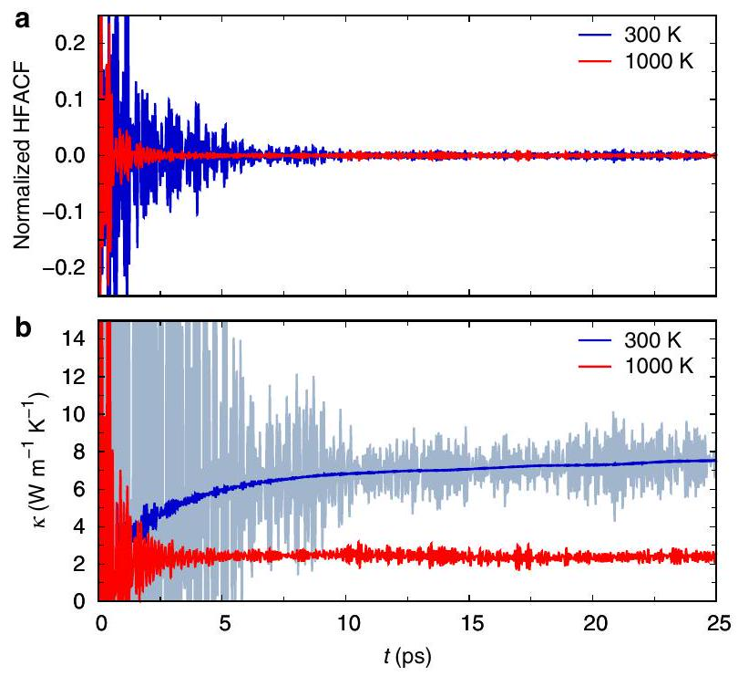
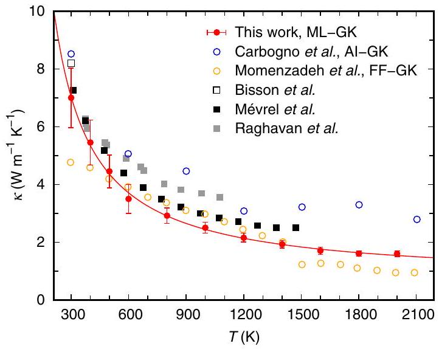

# Thermal transport and phase transitions of zirconia by on-the-fly machine-learned interatomic potentials 

Carla Verdi ${ }^{1 \text { ® }}$, Ferenc Karsai ${ }^{2}$, Peitao Liu (D $^{2}$, Ryosuke Jinnouchi ${ }^{3}$ and Georg Kresse ${ }^{1,2}$

#### Abstract

Machine-learned interatomic potentials enable realistic finite temperature calculations of complex materials properties with firstprinciples accuracy. It is not yet clear, however, how accurately they describe anharmonic properties, which are crucial for predicting the lattice thermal conductivity and phase transitions in solids and, thus, shape their technological applications. Here we employ a recently developed on-the-fly learning technique based on molecular dynamics and Bayesian inference in order to generate an interatomic potential capable to describe the thermodynamic properties of zirconia, an important transition metal oxide. This machine-learned potential accurately captures the temperature-induced phase transitions below the melting point. We further showcase the predictive power of the potential by calculating the heat transport on the basis of Green-Kubo theory, which allows to account for anharmonic effects to all orders. This study indicates that machine-learned potentials trained on the fly offer a routine solution for accurate and efficient simulations of the thermodynamic properties of a vast class of anharmonic materials.

npj Computational Materials (2021)7:156; https://doi.org/10.1038/s41524-021-00630-5

## INTRODUCTION

The atomistic modelling of thermodynamic properties of materials at finite temperature and realistic conditions is of fundamental importance for a multitude of technological applications, from photovoltaics to optoelectronic devices, as well as for advancing our understanding of the physical properties of matter. This represents a huge challenge for modern atomistic simulations. Molecular dynamics (MD) and Monte Carlo techniques offer powerful tools that, when used in conjunction with ab initio (AI) theories, allow us to achieve the desired accuracy and predictive power ${ }^{1}$. First-principles based methods, however, suffer from serious limitations. For instance, the description of many thermodynamic properties, even in simple crystals, requires accessing time and size scales that are far beyond the capabilities of state-of-the-art methods.

Two of the most challenging, yet central, properties are temperature-induced structural phase transitions in solids and the transport of heat, which in semiconductors and insulators mainly stems from the lattice vibrations. Both can be extracted directly from MD simulations ${ }^{2}$. In the case of heat transport, this can be obtained from equilibrium MD calculations on the basis of the Green-Kubo (GK) theory ${ }^{3}$. This method, based on the fluctuation-dissipation theorem, is exact at sufficiently high temperatures where nuclear quantum effects are negligible and is thus superior to lattice dynamics approaches based on the Boltzmann transport equation (BTE) in crystalline systems ${ }^{4}$. Al calculations of thermal transport based on GK theory, however, have only recently become possible, after a fundamental issue related to the ill-definition of the microscopic heat flux was resolved ${ }^{5}$. Recently, two new theories of thermal transport have also been developed. These are capable of treating crystalline and amorphous systems on the same footing and reduce to the BTE in the limit of periodic solids ${ }^{6,7}$. Yet, the GK approach carries the advantage that it accounts exactly for anharmonicity to all orders, while intrinsically lending itself to a unified description of ordered and disordered solids, as well as liquids.

Nevertheless, the long simulation times and large supercell sizes required in order to achieve converged results are still prohibitive for Al calculations. While some approaches have been devised to overcome this problem ${ }^{8,9}$, they are not sufficient to straightforwardly enable calculations of heat transport from first-principles in any type of solid.

MD simulations based on (semi)empirical interatomic potentials are not affected by these limitations, as the computing time for each MD step is generally more than five orders of magnitude lower than with first-principles methods. Interatomic potentials, however, are lengthy and cumbersome to develop, have very limited flexibility and transferability, and generally do not offer sufficient accuracy ${ }^{10}$ even in the case of simple systems ${ }^{11}$. Machine-learned force fields (MLFFs) have recently emerged as an ideal solution to drastically augment the length and time scales accessible to MD simulations while still retaining first-principles accuracy ${ }^{12,13}$. Machine-learning models based on mapping the local environment around each atom in the system onto a set of descriptors allow to train force fields that reproduce first-principles energies, forces, and stresses with very small errors. A key issue is the construction of the training sets. To avoid expensive and somewhat manual procedures for building a training database, socalled active learning schemes are becoming increasingly popular ${ }^{14-17}$. In particular, a number of algorithms have been put forward in order to generate potentials on the fly, relying on query strategies to allow the machine to judge whether new structures need to be added to the training dataset. An active learning strategy where structures are generated on the fly during MD simulations, combined with Bayesian inference to estimate the uncertainty of the machine-learning model, has been shown to be especially flexible and efficient, and it can be seamlessly integrated into existing first-principles codes ${ }^{16,18}$.

The success of machine-learned potentials used in combination with MD simulations has been demonstrated in a variety of applications, from the study of phase transitions in halide perovskites ${ }^{19}$ and lithium manganese oxide spinels ${ }^{20}$ to thermal

[^0]
Fig. 1 Crystal structures of zirconia. Ball-and-stick model of the three structural phases of $\mathrm{ZrO}_{2}$ : $\mathbf{a}$ cubic, $\mathbf{b}$ tetragonal, and $\mathbf{c}$ monoclinic. The 12-atom conventional cells are represented, and the $\mathrm{Zr}-\mathrm{O}$ bonds are shown only in the monoclinic structure.

conductivities in solid and amorphous silicon ${ }^{21}$ and the $\mathrm{CoSb}_{3}$ skutterudite ${ }^{22}$. For any MLFF, however, it is extremely challenging to simultaneously describe vibrational properties, dynamical changes of lattice parameters during phase transitions, and anharmonic effects relevant for transition temperatures as well as thermal conductivity. In fact, none of refs. ${ }^{19-22}$ show the ability of MLFFs to describe all these different thermodynamic properties simultaneously. Harmonic vibrational properties are already a stringent test of the quality of ML potentials, especially when considering materials with soft phonon modes and different polymorphs ${ }^{23}$. However, the description of phonon dispersion relations requires the acquisition of only a two-body term, the harmonic force constants. Anharmonicity, on the other hand, requires the development of a surrogate model for tiny, subtle energy differences on the highly corrugated harmonic energy surface. The MLFF must capture at least third-order anharmonic force constants, the coupling between phonons and lattice distortions, and, especially at high temperature, even higherorder anharmonic force constants. For example, calculating just the third-order terms easily requires more than a thousand firstprinciples calculations. Whether machine-learned potentials can describe all these effects with satisfactory accuracy has been insufficiently investigated.

In this work we address this gap by focusing on one paradigmatic example of anharmonic systems, zirconia ( $\mathrm{ZrO}_{2}$ ), and we present a procedure to accurately study its thermodynamic properties using MLFFs trained on the fly. This allows for a semi-automated creation of a reference database. $\mathrm{ZrO}_{2}$ is a transition metal oxide of tremendous importance in a wide variety of applications, including thermal barrier coatings, solid oxide fuel cells, and biomedical implants ${ }^{24,25}$. Pure $\mathrm{ZrO}_{2}$ exhibits low thermal conductivity due to strong anharmonic phonon scattering ${ }^{26}$, thus representing an ideal testbed for the investigation of thermal transport via GK theory and a challenging system for building accurate MLFFs.

At ambient pressure, $\mathrm{ZrO}_{2}$ is known to have three structural phases ${ }^{27,28}$ shown in Fig. 1. At high temperature the cubic fluorite structure (space group $F m \overline{3} m$ ) is thermodynamically stable and it transforms to a tetragonal phase (space group $\left.P 4_{2} / n m c\right)$ at about 2570 K , with the oxygen sublattice shifting up or down along the $c$ direction (Fig. 1b) accompanied by a slight tetragonal distortion. Around 1400 K the structure undergoes a tetragonal to monoclinic (space group $P 2_{1} / c$ ) phase transition. This transition is of martensitic type, involving a complex cooperative motion of both the Zr and O sublattices accompanied by a lattice shear in the $a c$ plane and a volume increase. The phase diagram of zirconia is extremely important for its technological applications, as for instance the volume change associated to the tetragonal to monoclinic transition can lead to mechanical degradation. Moreover, the tetragonal and cubic structures can be stabilized at lower temperatures by introducing dopants such as yttria, ceria, and other oxides. Stabilized zirconia is one of the most important
ceramic materials due to its combination of high strength and toughness at room temperature ${ }^{29,30}$. The very high temperature of the cubic to tetragonal transition makes it challenging for experiments to understand its nature and dynamics ${ }^{31}$, while computational studies report conflicting results ${ }^{32-34}$. On the opposite, the first-order tetragonal to monoclinic transition has been extensively characterized, but theoretical calculations are limited to approximate treatments such as the quasi-harmonic approximation ${ }^{35,36}$.

Here we use a recently developed on-the-fly training scheme ${ }^{16}$ for building a machine-learned interatomic potential that describes all three polymorphs of zirconia with near firstprinciples accuracy. In contrast, no empirical interatomic potential is capable of seamlessly describing all phases, nor to reach such accuracy ${ }^{33}$. We validate the MLFF against the results from firstprinciples density-functional theory (DFT) calculations and use it to determine the phase transitions and heat transport in $\mathrm{ZrO}_{2}$ at ambient pressure, accounting for anharmonic effects to all orders. The agreement with experiments demonstrates that machinelearned interatomic potentials constructed on the fly offer an excellent, highly automated solution for accurate and realistic predictions of anharmonic properties in complex materials.

## RESULTS

## Machine-learned potential

In order to machine learn an interatomic potential for zirconia we used the kernel-based machine-learning model introduced in refs. ${ }^{16,37}$. Details of the model are presented in the "Methods" section, including the on-the-fly force field generation scheme that we adopted. This scheme is fully integrated in the VASP code ${ }^{38-40}$.

As we aim to compute the thermodynamic properties of a strongly anharmonic material up to very high temperatures, the configurational phase space should be sampled as broadly and as efficiently as possible. Our on-the-fly training strategy, described in the "Methods", is well suited for this, allowing us to seamlessly sample an ample configuration space including large thermal fluctuations up to 2800 K during MD simulations. In fact, training on the fly enables us to skip most AI steps and perform AI calculations only when required, that is, when the estimated Bayesian error of the MLFF is large. As a result, only 592 structures consisting of 96-atom supercells were automatically selected for performing AI calculations from a trajectory over 300 ps long, and were included in the final training dataset. Nevertheless, the resulting MLFFs are very accurate.

The root-mean-square errors (RMSE) in the energies, forces, and stress tensors predicted by our MLFFs for the training dataset are reported in Table 1. In particular, we used two distinct approaches to obtain the regression coefficients typical of kernel-based methods, namely Bayesian linear regression (BLR) and singular value decomposition (SVD, see "Methods"). While BLR is formally

| Table 1. RMSE in the energies, forces, and stress tensors predicted by the MLFF for the training and test dataset and RMSE in the predicted phonon energies for each phase. |  |  |  |
| :--- | :--- | :--- | :--- |
| Training and validation errors |  |  |  |
|  | Energy (meV per atom) | Force ( $\mathrm{eV} \AA^{-1}$ ) | Stress (kbar) |
| BLR | 1.70 (1.78) | 0.13 (0.13) | 1.87 (1.89) |
| SVD | 1.45 (1.42) | 0.11 (0.11) | 1.67 (1.76) |
| Phonon errors (meV) |  |  |  |
|  | Cubic | Tetragonal | Monoclinic |
| BLR | 2.73 | 0.96 | 0.68 |
| SVD | 1.59 | 0.80 | 0.55 |
| All results are shown for the MLFFs trained both using BLR and SVD. The values in parenthesis correspond to the test dataset. |  |  |  |

similar to the standard ridge regression methods, SVD does not introduce any regularization parameters. Here we compare the accuracy of two different MLFFs obtained using BLR and SVD and find that SVD yields consistently lower errors than BLR. Overall, we observe that our MLFFs achieve lower errors than the neuralnetwork potential developed in ref. ${ }^{41}$, which has an RMSE in the energy of 7.9 meV per atom, and whose training required a more manual setup of many more DFT calculations. Although the training dataset of ref. ${ }^{41}$ included additional structures containing oxygen vacancies, here we considered temperatures up to 2800 K , which induce strong fluctuations that are considerably challenging to reproduce.

To validate the MLFFs, energies, forces, and stress tensors were calculated for a test set consisting of 200 structures and compared to the DFT ones, as shown in Fig. 2. The structures were selected randomly from an MD simulation where monoclinic $\mathrm{ZrO}_{2}$ was heated between 300 K and 2800 K . The largest errors correspond to the high-energy structures, that is the cubic phase at elevated temperatures. In this regime, the MLFF is less accurate due to the increased thermal vibrations. The RMSE for this test set, reported in Table 1, are very close to the ones obtained for the training set. This shows that the MLFFs were not overfitted, even in the SVD case where no regularization was used.

## Structural and vibrational properties

The calculated zero-temperature lattice parameters for the conventional 12-atom unit cells are summarized in Table 2 and compared to the experimental data ${ }^{28,42,43}$ (the cubic and tetragonal experimental lattice parameters are extrapolated to zero temperature). The energy differences between the three phases are also shown in the table. Al calculations based on the PBEsol exchange-correlation functional ${ }^{44}$ describe very accurately the relaxed structures compared to experiment, almost on par with benchmark many-electron calculations ${ }^{45}$. The MLFF results are in excellent agreement with the AI ones, the differences being less than $0.2 \%$ for the lattice parameters and less than 1 meV per atom for the energies. Note that here BLR and SVD perform equally well.

The MLFFs were then used to calculate the interatomic force constants and dynamical matrices according to the finite displacement method in a supercell containing 96 atoms. To account for the long-range dipole-dipole interactions, the nonanalytic contribution to the dynamical matrix was treated using the standard method of ref. ${ }^{46}$. As illustrated in Fig. 3, the MLFFs reproduce accurately the AI phonon dispersion relations for each phase, despite the MLFFs being trained using a semiautomated on-the-fly procedure, without systematically distorting the ideal structures around the ground state to reproduce phonon

Fig. 2 Errors of the machine-learned force fields. Difference between the $\mathbf{a}$ energies, $\mathbf{b}$ atomic forces, and $\mathbf{c}$ stress components predicted by the MLFFs (in orange using BLR, in blue using SVD for the regression) and the DFT ones for the structures in the test dataset.

Table 2. Structural parameters for all three phases of $\mathrm{ZrO}_{2}$ and energy differences between phases.
|  | PBEsol | BLR | SVD | Expt. |
| :--- | :--- | :--- | :--- | :--- |
| Cubic |  |  |  |  |
| a (Å) | 5.069 | 5.069 | 5.069 | 5.090 |
| $E_{\mathrm{c}}-E_{\mathrm{t}}(\mathrm{eV})$ | 0.230 | 0.223 | 0.222 |  |
| Tetragonal |  |  |  |  |
| a (Å) | 5.074 | 5.073 | 5.075 | 5.050 |
| $c(\AA)$ | 5.173 | 5.178 | 5.184 | 5.182 |
| $d_{z}(c)$ | 0.047 | 0.047 | 0.048 | 0.049 |
| $E_{\mathrm{t}}-E_{\mathrm{m}}(\mathrm{eV})$ | 0.317 | 0.325 | 0.322 |  |
| Monoclinic |  |  |  |  |
| a (Å) | 5.133 | 5.130 | 5.136 | 5.151 |
| $b$ (Å) | 5.215 | 5.218 | 5.213 | 5.212 |
| $c(\AA)$ | 5.300 | 5.296 | 5.306 | 5.317 |
| $\beta$ (deg) | 99.56 | 99.67 | 99.63 | 99.23 |

In the tetragonal phase, $d_{z}$ is the displacement of the oxygen atoms along the $c$ direction with respect to the cubic structure (in units of $c$ ), while in the monoclinic phase $\beta$ is the angle between the lattice vectors $a$ and $c$. The results from the MLFF (both using BLR and SVD) are compared to the PBEsol calculations and the experimental data taken from refs. ${ }^{28,42,43}$. The energy differences between phases are given per 12-atom cell.

Fig. 3 Prediction of phonon frequencies. Phonon dispersions of $\mathbf{a}$ cubic, $\mathbf{b}$ tetragonal, and $\mathbf{c}$ monoclinic $\mathrm{ZrO}_{2}$ along high-symmetry lines in the Brillouin zone. The results obtained using the MLFFs trained with BLR (orange lines) and SVD (blue lines) for the regression are compared with the AI ones calculated using PBEsol (dashed black lines).

properties. Some discrepancies in the dispersion of the highestenergy optical phonon modes can be attributed to finite-size effects. Note that the MLFF trained using BLR is slightly less accurate than using SVD, as seen in particular for the highest optical phonon branches in the cubic phase. The RMSE of the phonon energies reported in Table 1 confirms this trend. It is not surprising that the largest errors appear in the cubic phase: since it is unstable at low temperature, the training database contains hardly any configuration corresponding to this unstable, ideal structure. It is thus harder for the MLFF to reproduce the 0 K properties of the ideal undistorted cubic phase. Remarkably, both MLFFs accurately reproduce the imaginary soft phonon modes in cubic $\mathrm{ZrO}_{2}$, which is essential in order to quantitatively capture phase transitions. In fact, such modes are generally associated with lattice instabilities, leading to structural phase transformations in the material. In $\mathrm{ZrO}_{2}$, the soft phonon at the X point in the cubic phase, which involves a tetragonal distortion of the oxygen sublattice, is linked to the cubic to tetragonal phase transition ${ }^{47}$.

## Temperature-induced phase transitions

We now move to studying the transitions between the three different structural phases of $\mathrm{ZrO}_{2}$ at ambient pressure using MD simulations with our MLFFs. The results shown are from the MLFF obtained using the SVD. The phase transitions can be directly observed by progressively heating a relatively large supercell containing 324 atoms. Specifically, we used a heating rate of 0.5 K $\mathrm{ps}^{-1}$ and a time step of 1.5 fs in the isothermal-isobaric (NPT) ensemble. The evolution with temperature of the unit-cell volume resulting from this simulation is illustrated in red in Fig. 4a. As in the experimental data, reported as well, the first-order transition between the monoclinic and tetragonal phase corresponds to a sharp change in the cell volume around 1750 K , while there is no volume discontinuity in the tetragonal to cubic transformation around 2400 K , but only a small change in the slope of the thermal expansion. An analogous cooling simulation showed that the transformation between the cubic and tetragonal phase is reversible and presents no thermal hysteresis, whereas the tetragonal to monoclinic transition was not observed upon cooling. In Fig. 4b-c the lattice parameters and monoclinic angle $\beta$ are reported, respectively. These results were extracted from NPT simulations carried out at fixed temperature for 300 ps , taking the equilibrium structure at each temperature as the starting configuration for the next (higher) temperature point. Near the phase transitions, the total time was increased to 750 ps due to the large fluctuations in the case of the tetragonal to cubic transformation, and to the time required to observe the first-order monoclinic to tetragonal transition. The comparison with available experimental data ${ }^{28,31,48}$ shows excellent agreement, including the anisotropy of the lattice thermal expansion in the monoclinic
phase, however, further investigation on the phase transitions is warranted.

To accurately determine the transition temperature we used thermodynamic integration, as explained in this paragraph. As seen in Fig. 4a-c, the martensitic transformation between the monoclinic and tetragonal phases proceeds abruptly, and because of hysteresis it is not possible to extract a reliable transition temperature from direct MD simulations. For example, when heating the system at the rate of $0.5 \mathrm{~K} \mathrm{ps}^{-1}$ the transition appears around 1750 K , but when performing MD simulations at fixed temperatures we could observe the transition already at 1700 K after 700 ps . Moreover, this transition was not reversible when cooling the system. To estimate the theoretical transition temperature, we therefore calculated the fully anharmonic free energies of the monoclinic and tetragonal phase as a function of temperature. From the thermodynamic relations in the NPT ensemble, the Gibbs free energy $G$ of a system at constant pressure can be written as:

$$
G(T)=-T \int_{T_{0}}^{T} \frac{H\left(T^{\prime}\right)}{T^{\prime 2}} d T^{\prime}+\frac{G_{0}}{T_{0}} T,
$$

where $H=U+P V$ is the enthalpy ( $U$ is the internal energy of the system), and $G_{0}$ is the Gibbs free energy at $T=T_{0}$. Since the integrand in the first term on the r.h.s. diverges like $1 / T^{\prime}$ for classical statistics, direct integration from $T_{0}=0$ is not possible. Instead, we here calculated $G_{0}$ at a low temperature $T_{0}=25 \mathrm{~K}$ using the quasi-harmonic approximation (QHA). Within the QHA, the Helmholtz free energy $F$ of the crystal is computed as a function of temperature $T$ and volume $V$ via the standard harmonic approximation, while the Gibbs free energy is found by minimizing $F(V, T)+P V$ for a given temperature and pressure ${ }^{49}$. Thus, the anharmonic effects are taken into account only via the volume dependence of the vibrational frequencies. To be compatible with the classical MD simulations, we computed the harmonic free energies using classical Maxwell-Boltzmann statistics. We evaluated the integral in Eq. (1) over a path of constant (ambient) pressure for both monoclinic and tetragonal $\mathrm{ZrO}_{2}$ by performing additional MD simulations at temperatures ranging from 25 K to 1700 K , sampling each trajectory for 300 ps . The integration paths are continuous, since the tetragonal phase is trapped in a local minimum and does not transform into the monoclinic one during our MD simulations (compare Fig. 4a), while the monoclinic phase remains stable for sufficient time up to 200 K above the transition temperature.

The free energy difference $\Delta G_{t-m}$ between the tetragonal and monoclinic phase as a function of temperature is illustrated in Fig. 4d. The results obtained from Eq. (1) are shown in blue and compared to the ones calculated using the QHA either in the classical approximation (red line) or using quantum statistics (green line). In the QHA, both statistics yield identical transition

Fig. 4 Phase transitions of $\mathbf{Z r O}_{\mathbf{2}}$ from MD simulations and thermodynamic integration. a Evolution with temperature of the unit-cell volume during a heating and cooling simulation of a 324 atom supercell. $\mathbf{b}, \mathbf{c}$ Temperature dependence of $\mathbf{b}$ the lattice parameters and $\mathbf{c}$ the monoclinic angle $\beta$ from NPT simulations. Experimental data from refs. ${ }^{28,31,48}$ are also reported. In a the moving average over blocks of 2000 time steps is shown. The yellow areas in $\mathbf{b}, \mathbf{c}$ highlight the difference between the experimental transition temperatures and the ones from direct MD simulations. The phase transitions are studied in more detail in $\mathbf{d}$, showing the difference between the free energy per unit cell of the tetragonal and monoclinic phase $\Delta G_{\mathrm{t}-\mathrm{m}}$ as a function of temperature, and $\mathbf{e}$ displaying the tetragonal distortion ( $c-a$ )/a and its fit to the function $\left(T_{\mathrm{c}}-T\right)^{a}$. In $\mathbf{d}$ the data from our fully anharmonic MD calculations are reported, as well as from the QHA using classical (CL) and quantum (BE) statistics. The dashed vertical lines indicate the experimental and calculated temperature of the martensitic transformation.

Fig. 5 Calculating the thermal conductivity using GK theory. a Heat-flux autocorrelation function (HFACF) normalized by its zerotime value and $\mathbf{b}$ thermal conductivity as a function of correlation time at $T=300 \mathrm{~K}$ and 1000 K . In $\mathbf{b}$ the moving average of $\kappa$ over blocks of 1000 time steps is shown on top of the raw data at $T=300 \mathrm{~K}$.

temperatures $T_{\mathrm{c}}$, with the differences between both statistics being entirely negligible above 250 K . This suggests that the neglect of quantum statistics is justified for free energy calculations of $\mathrm{ZrO}_{2}$. According to our fully anharmonic free energy calculations, the transition temperature is 1493 K , in good agreement with the experimental value of 1400 K . Above this temperature, the tetragonal phase is thermodynamically stable due to the vibrational entropy. Instead, the QHA underestimates the transition temperature by more than 200 K ( $T_{\mathrm{c}}=1178 \mathrm{~K}$ ), highlighting the need to describe anharmonicity beyond the QHA. We note that the fully anharmonic calculations performed with the MLFF trained using BLR yield $T_{\mathrm{c}}=1530 \mathrm{~K}$, in line with the slightly larger predicted energy difference between the tetragonal and monoclinic phase at 0 K (see Table 2). The accuracy of our

MLFFs in describing anharmonic effects was further confirmed by comparing the QHA results obtained with the MLFF and from first principles, yielding a difference of 20 K in the transition temperature.

The tetragonal to cubic phase transition can be more easily described using direct MD calculations; however, the nature of this transition is not clear experimentally as cubic zirconia is observed only at temperatures roughly above 2570 K , making it difficult to study. From our MD data we observe a continuous transformation with no thermal hysteresis, moreover the system undergoes frequent fluctuations between the two phases near the transition temperature. Our results, therefore, suggest that the transition is largely second order, at variance with a similar calculation based on a semiempirical interatomic potential ${ }^{33}$. We note that due to the strongly anharmonic energy surfaces, the lattice parameters change rather quickly (but continuously) near the cubic to tetragonal transition temperature. As shown in ref. ${ }^{32}$ on the basis of Landau theory, this phase transition is highly sensitive to the coupling between the elastic strains and the distortion of the oxygen sublattice. Hence, an interatomic potential must be able to describe the system quantitatively with high accuracy. This is not the case even for the 'best' model interatomic potential for $\mathrm{ZrO}_{2}{ }^{33}$, whereas MLFFs can attain first-principles accuracy. Fitting the tetragonal distortion $(c-a) / a$, as shown in Fig. 4e, yields a transition temperature $T_{\mathrm{c}}$ of 2386 K , only $7 \%$ lower than the experimental one, and a critical exponent of 0.26 close to the value of 0.25 predicted by Landau theory for a tricritical phase transition. Using BLR we obtain a very similar value of 2384 K , not surprisingly as the soft phonon modes in the cubic phase at 0 K are very accurately described by the BLR on par with SVD. In contrast, previous theoretical studies based on a classical force field ${ }^{33}$ and on a tight-binding model parametrized on firstprinciples LDA calculations ${ }^{32}$ underestimated the experimental transition temperature by almost 30\%.

## Lattice thermal conductivity

Finally, we used our MLFFs to compute the thermal conductivity $\kappa$ of $\mathrm{ZrO}_{2}$ using GK theory (see "Methods"). As pointed out in the Introduction, this theory accounts for anharmonic scattering to all orders, and it provides an exact description of heat transport as long as quantum statistical effects are negligible. Zirconia is an interesting test case for the calculation of the thermal conductivity combining MLFFs and GK theory as it is a strongly anharmonic
system. To calculate the heat flux [Eq. (11)], $\mathrm{ZrO}_{2}$ supercells were first equilibrated in the NVT ensemble at the desired temperature and equilibrium volume, taking into account the monoclinic to tetragonal transformation around 1500 K , and the independent configurations were randomly selected. For these configurations, the heat flux was then sampled during MD simulations in the microcanonical ensemble using a time step of 1.5 fs . The ensemble average in Eq. (9) was performed over 10 independent trajectories, each up to 600 ps long. After testing the convergence of $\kappa$ with respect to the system size, supercells containing 324 atoms were selected for all calculations.

As an illustration, the averaged heat-flux autocorrelation function (normalized by its zero-time value) is shown in Fig. 5a as a function of correlation time for two different values of the temperature. Note that it does not decay monotonically but features large oscillations that are related to optical phonons. The corresponding cumulative time integrals that yield the thermal conductivities are plotted in Fig. 5b. To better highlight the convergence of $\kappa$ at 300 K with respect to the upper integration time, the moving average is shown on top of the raw data. Using a standard procedure ${ }^{50,51}$, the resulting value of $\kappa$ at each temperature was obtained by averaging the integral over 1000 time steps in the region where it becomes constant, before the statistical noise in the tail of the heat-flux autocorrelation function dominates the integral (after 16 ps at 300 K ).

The calculated values of $\kappa$ are shown in Fig. 6 as isotropic averages. In this case, BLR and SVD yield nearly the same results, therefore only one set of data is shown. Our results are in reasonable agreement with the experimental data for pure zirconia ${ }^{26,52}$, available only for the monoclinic phase, underestimating them by no more than $20 \%$. As discussed in ref. ${ }^{26}$, it is unclear why the thermal conductivity measured in ref. ${ }^{53}$ decreases less rapidly with temperature, but these data are also reported in Fig. 6 for completeness. Note that our calculated $\kappa$ does not show any discernible discontinuity across the phase transition temperature. Moreover, we found no significant anisotropy, in agreement with experimental observations ${ }^{52}$. Previous calculations based on GK theory and using an empirical force field ${ }^{54}$ are unable to produce the correct temperature dependence and underestimate the room-temperature thermal conductivity by $40 \%$. In contrast, the first-principles GK calculations from ref. ${ }^{8}$ overestimate both our results and the experiment, and show a less smooth temperature dependence which could

Fig. 6 Thermal conductivity of $\mathbf{Z r O}_{\mathbf{2}}$ as a function of temperature. The present results obtained using a MLFF and GK theory (ML-GK, red filled circles; the error bars are standard errors) are compared with previous theoretical results from GK theory combined with AI calculations (AI-GK, empty blue circles) ${ }^{8}$ and an empirical force field (FF-GK, empty orange circles) ${ }^{54}$. Experimental data from refs. ${ }^{26,52,53}$ are shown as square symbols. The red line is a fit to the present data.

indicate limited convergence or limited statistical sampling. We note that in standard MD simulations the dynamics of the nuclei is purely classical, which may yield higher phonon scattering rates and thus lower thermal conductivities ${ }^{11,55}$, although this effect should be negligible at sufficiently high temperatures.

## DISCUSSION

In this work we machine-learned an interatomic potential for zirconia using an on-the-fly training scheme. We demonstrated that the MLFF allows to accurately describe the harmonic lattice dynamics and the anharmonic higher order contributions, with the anharmonic phonon-phonon interactions driving the temperature-dependent behavior, up to very high temperatures near the melting point. In particular, the solid-solid phase transformations that are especially hard to study using AI methods were correctly captured, and the transition temperatures were predicted with high accuracy. Conversely, conventional force fields are not sufficiently flexible to achieve a quantitative description of the harmonic (quadratic) and higherorder energy terms. Likewise, modelling thermal conductivity is a stringent test of an accurate description of the anharmonic, highorder interatomic force constants terms. The same MLFF is indeed capable of predicting the lattice thermal conductivity using GK theory, the gold standard for computing thermal transport in strongly anharmonic crystalline and amorphous solids. This work demonstrates that machine-learned potentials have unlocked the ability to routinely perform GK calculations with near first-principles accuracy, as these calculations are generally prohibitive for Al methods and are beyond the accuracy of classical force fields.

It is noteworthy that although MLFFs cannot extrapolate well beyond the phase space of the training data, as is well known, we showed that a MLFF that is highly accurate up to almost 3000 K can be trained on a dataset consisting of as little as a few hundred structures using the present on-the-fly method. This method provides a general strategy for constructing an optimal training database via a semi-automated process. In the future, this can also be exploited for high-throughput predictions of vibrational and thermodynamic properties. Interestingly, we demonstrated that the routinely used regularization is not necessary in general in order to prevent overfitting when training a MLFF, and an unregularized regression based on SVD systematically improves the accuracy of the MLFF. As showcased in this work, on-the-fly machine-learned interatomic potentials are an enabling tool for accurate and efficient simulations of complex thermodynamic properties of a wide variety of technologically relevant materials.

## METHODS

## On-the-fly machine-learned force fields

To build a machine-learned interatomic potential, first of all, a set of reference configurations with their quantum-mechanical energies, atomic forces and, ideally, stress tensors is required. Active learning schemes provide an extremely efficient solution for constructing such a database, whereby automated query strategies allow the machine to judge whether new structures should be added to the training dataset or not ${ }^{56}$. Extensive details of the algorithm as well as of the machine-learning model can be found in refs. ${ }^{16,37}$, while here only the most relevant features are outlined. The core of our training strategy is that the MLFF is constructed on the fly during MD simulations, and at every MD step it is used to judge whether a first-principles calculation should be executed and a new structure should be added to the dataset. The decision relies on an estimation of the errors in the predicted atomic forces for each structure on the basis of Bayesian inference, as it will be explained later. When no new first-principles calculations are carried out, the atomic positions and velocities are updated using the MLFF predictions.

Machine-learning models for building interatomic potentials rely on a local mapping of structural features onto a set of descriptors. A robust and
versatile choice that allows for an accurate description of the many-body interactions is to map the local environment around each atom $i$ in a system of $N_{\mathrm{a}}$ atoms onto two- and three-body atomic distribution functions ${ }^{57}$. In this work we relied on so-called separable descriptors introduced in ref. ${ }^{37}$, with the two- and three-body distribution functions ( $\rho_{i}^{(2)}$ and $\rho_{i}^{(3)}$, respectively) defined as:

$$
\begin{aligned}
\rho_{i}^{(2)}(r)=\frac{1}{4 \pi} \int d \hat{\mathbf{r}} \rho_{i}(\hat{\mathbf{r}}) & \\
\rho_{i}^{(3)}(r, s, \theta)= & \iint d \hat{\mathbf{r}} d \hat{\mathbf{s}} \delta(\hat{\mathbf{r}} \cdot \hat{\mathbf{s}}-\cos \theta) \\
& \times\left[\rho_{i}(r \hat{\mathbf{r}}) \rho_{i}^{*}(s \hat{\mathbf{s}})-\sum_{j \neq i}^{N_{\mathrm{a}}} \tilde{\rho}_{i j}(r \hat{\mathbf{r}}) \tilde{\rho}_{i j}^{*}(s \hat{\mathbf{s}})\right]
\end{aligned}
$$

In these expressions, $\rho_{i}(\mathbf{r})(\mathbf{r}=r \hat{\mathbf{r}})$ is the three-dimensional distribution function around the atom $i, \rho_{i}(\mathbf{r})=\sum_{j \neq i}^{N_{a}} \tilde{\rho}_{i j}(\mathbf{r})$, and $\tilde{\rho}_{i j}(\mathbf{r})$ is the likelihood to find atom $j$ at position $\mathbf{r}$ from atom $i$ within a certain cutoff radius. Essentially, $\rho_{i}^{(2)}(r)$ yields the probability to find an atom $j(j \neq i)$ at a distance $r$ from atom $i$, and $\rho_{i}^{(3)}(r, s, \theta)$ the probability to find two atoms $j, k$ at a distance $r, s$, respectively, from atom $i(j \neq i, k \neq j, i)$ and spanning the angle $\theta$ between them. In practice, these distribution functions are expressed as a combination of radial and angular basis functions, with the coefficients forming a set of descriptors that we simply denote as $\mathbf{x}_{i}^{(2)}$ and $\mathbf{x}_{i}^{(3)}$. Following ${ }^{37}$, we define $\mathbf{x}_{i}=\left(\mathbf{x}_{i}^{(2)}, \mathbf{x}_{i}^{(3)}\right)$.

The quantum-mechanical energies, atomic forces and stress tensors can then be expressed as a nonlinear function of the descriptors. In the present method, the potential energy $U$ of a system of $N_{\mathrm{a}}$ atoms is partitioned into a sum of local energies $U_{i}$ associated to each atom. Following the Gaussian approximation potential (GAP) approach ${ }^{58}$, each term $U_{i}$ is written as a linear combination of kernel functions $K\left(\mathbf{x}_{i}, \mathbf{x}_{b}\right)$ weighted by coefficients $w_{b}$ :

$$
U=\sum_{i=1}^{N_{\mathrm{a}}} U_{i}=\sum_{i=1}^{N_{\mathrm{a}}} \sum_{b=1}^{N_{b}} w_{b} K\left(\mathbf{x}_{i}, \mathbf{x}_{b}\right) .
$$

In practice, the kernel function measures the similarity between a local configuration around atom $i, \mathbf{x}_{i}$, and a local reference configuration around atom $b, \mathbf{x}_{b}$. The $N_{b}$ atoms are chosen from the set of reference structures generated for the MLFF training. Here $K$ is the dot-product kernel, determined by $K\left(\mathbf{x}_{i}, \mathbf{x}_{b}\right)=\left(\hat{\mathbf{x}}_{i} \cdot \hat{\mathbf{x}}_{b}\right)^{\zeta}$, with $\hat{\mathbf{x}}$ the normalized descriptors. The normalization and exponentiation by $\zeta$ introduce non-linear terms that mix the two- and three-body descriptors and generate many-body terms necessary for capturing higher order atomic interactions.

By the same token, the forces on each atom and the stress tensor components can also be written in terms of the kernel functions. Then, the coefficients $\mathbf{w}=\left\{w_{b}\right\}$ are optimized to best reproduce the first-principles energies per atom, forces, and stress components in the training dataset, in other words by solving the problem:

$$
\mathbf{y}=\boldsymbol{\Phi} \mathbf{w} \quad \rightarrow \quad\|\mathbf{y}-\boldsymbol{\Phi} \mathbf{w}\|=\min
$$

in a least-squares sense, where $\mathbf{y}$ is a vector collecting all the first-principles data, and $\boldsymbol{\Phi}$ is the so-called design matrix containing the $K\left(\mathbf{x}_{i}, \mathbf{x}_{b}\right)$ components and the derivatives with respect to atomic coordinates and lattice vectors. When fitting simultaneously energies, forces, and stress tensors, as done here, it is expedient to rescale these quantities by their respective standard deviations ${ }^{16}$. To increase the accuracy of the MLFF, it is also possible to tune the relative importance of energies, forces, and stresses during the fitting.

The solution of the linear regression problem in Eq. (5) is a crucial step. The standard methods used for training MLFFs are based on ridge regression, where a regularization parameter $\sigma_{\mathrm{v}}^{2} / \sigma_{\mathrm{w}}^{2}$ is introduced ${ }^{59}$. In the probabilistic framework of Bayesian linear regression (BLR) adopted here, the coefficients are formally determined in the same way:

$$
\mathbf{w}=\left(\boldsymbol{\Phi}^{\top} \boldsymbol{\Phi}+\sigma_{\mathrm{v}}^{2} / \sigma_{\mathrm{w}}^{2} \mathbf{I}\right)^{-1} \boldsymbol{\Phi}^{\top} \mathbf{y},
$$

however, here the regularization parameters $\sigma_{\mathrm{v}}$ and $\sigma_{\mathrm{w}}$ have a probabilistic meaning: $\sigma_{\mathrm{v}}^{2}$ models the uncertainty caused by noise in the training data, while $\sigma_{\mathrm{w}}^{2}$ is the variance of the prior distribution of the regression coefficients. These values are optimized using the evidence approximation ${ }^{16,59}$ and are generally invoked to prevent overfitting. Moreover, the probabilistic framework of BLR is advantageous for the on-the-fly training. In fact, under the assumption that the prior distribution of the target data (that is, the AI energies, forces, and stress tensors) follows a multivariate Gaussian distribution, from Bayesian inference it derives that the posterior
distribution of the predicted data is a Gaussian distribution too. The BLR framework then allows us to define a 'prediction variance' that measures the uncertainty of the predictions. For any given configuration, this is estimated as the variance of the posterior distribution:

$$
\boldsymbol{\sigma}^{2}=\sigma_{\mathrm{v}}^{2} \mathbf{I}+\sigma_{\mathrm{w}}^{2} \boldsymbol{\varphi}\left(\boldsymbol{\Phi}^{T} \boldsymbol{\Phi}+\sigma_{\mathrm{v}}^{2} / \sigma_{\mathrm{w}}^{2} \mathbf{I}\right)^{-1} \boldsymbol{\varphi}^{T},
$$

where $\boldsymbol{\varphi}$ is a matrix containing the kernel components and their partial derivatives with respect to atomic coordinates and lattice vectors for the given configuration. This is the uncertainty estimate that guides the selection of the training dataset during on-the-fly active learning.

Alternatively, in this work the regression coefficients were also determined as:

$$
\mathbf{w}=\boldsymbol{\Phi}^{+} \mathbf{y},
$$

where $\boldsymbol{\Phi}^{+}$denotes the Moore-Penrose pseudoinverse of the design matrix $\Phi$, which can be found by performing the singular-value decomposition (SVD) of $\boldsymbol{\Phi}$. Even though SVD carries a larger computational cost, a clear advantage of this method is that the condition number of the problem is smaller, since the design matrix is not squared. As in ref. ${ }^{60}$, we found that while the squared problem in Eq. (6) is generally ill-conditioned and requires regularization, Eq. (8) can be solved numerically without regularizing the singular values of the matrix $\boldsymbol{\Phi}$. As our tests show, this does not lead to overfitting, demonstrating that regularization is not necessary in general. As this is a deterministic method, SVD is performed only at the end of the on-the-fly training process, and the different MLFFs obtained by using BLR and SVD can then be compared.

## Thermal conductivity via Green-Kubo theory

On the basis of GK theory, the thermal conductivity $\kappa$ is related to the equilibrium average of the heat-flux autocorrelation function ${ }^{3}$ :

$$
\kappa_{a \beta}=\lim _{t \rightarrow \infty} \frac{1}{k_{\mathrm{B}} T^{2} V} \int_{0}^{t}\left\langle j_{\alpha}\left(t^{\prime}\right) j_{\beta}(0)\right\rangle \mathrm{d} t^{\prime},
$$

where $k_{\mathrm{B}}$ is the Boltzmann constant, $T$ the temperature, $V$ the volume of the system and $j_{\alpha}(t)$ the $\alpha$-th Cartesian component of the macroscopic heat flux. The symbol $\langle\cdot\rangle$ denotes an ensemble average over many time origins and over independent MD trajectories.

The heat flux for a system of $N_{\mathrm{a}}$ atoms is given by ${ }^{61}$ :

$$
\mathbf{j}(t)=\sum_{i=1}^{N_{\mathrm{a}}} \frac{d}{d t}\left(\mathbf{r}_{i} E_{i}\right),
$$

where $E_{i}=m_{i} \mathbf{v}_{i}^{2} / 2+U_{i}$ is the total (kinetic and potential) energy associated to atom $i$ with mass $m_{i}$, while $\mathbf{r}_{i}$ and $\mathbf{v}_{i}$ are its position and velocity, respectively. For classical many-body potentials, this definition does not pose any problem, since the total energy of the system is naturally partitioned into on-site contributions $E_{i}$. This holds for machinelearned potentials too, as the potential energy $U$ is expressed in terms of the potential energies associated to each atom $U_{i}$ [cfr. Eq. (4)]. Eq. (10) is readily rewritten in a form applicable to periodic systems ${ }^{62}$ :

$$
\mathbf{j}(t)=\sum_{i=1}^{N_{\mathrm{a}}} \mathbf{v}_{i} E_{i}+\sum_{i=1}^{N_{\mathrm{a}}} \sum_{j \neq i}^{N(i)}\left(\mathbf{r}_{i}-\mathbf{r}_{j}\right)\left(\frac{\partial U_{i}}{\partial \mathbf{r}_{j}} \cdot \mathbf{v}_{j}\right),
$$

where the summation over $j$ is carried out over all $N(i)$ atoms within the cutoff radius representing the local environment of atom $i$. The first term in Eq. (11) is the convective heat flux, which gives no contribution to the thermal conductivity in solids, while the second one is the so-called virial or conductive heat flux.

Combining Eqs. (9) and (11) it is thus possible to evaluate the thermal conductivity from the atomic energies provided by MLFFs in a similar manner as when using classical force fields. The advantage here is that the Al description of the energy landscape is retained.

## First-principles calculations and MLFF training

All calculations were performed using VASP. First-principles DFT calculations were carried out using the PBEsol ${ }^{44}$ exchange-correlation functional. The plane-wave cutoff was set to 600 eV . Phonon calculations were performed using the Phonopy package ${ }^{49}$. The primitive cells of zirconia contain one, two, and four $\mathrm{ZrO}_{2}$ formula units for the cubic, tetragonal and monoclinic structures, respectively. A unit cell of 12 atoms can therefore be used to describe all three phases, and a $4 \times 4 \times 4$ Monkhorst-Pack $k$-mesh ensures energy convergence within less than 0.2 meV per atom. The structures were optimized until the forces were smaller than $10^{-4} \mathrm{eV} \AA^{-1}$.

Our MLFF for solid $\mathrm{ZrO}_{2}$ was trained on the fly during MD simulations in the NPT ensemble at ambient pressure, with the temperature and pressure controlled by a Langevin thermostat ${ }^{63}$ combined with the ParrinelloRaman method ${ }^{64,65}$. The training was performed on a supercell containing 96 atoms using a time step of 2.5 fs . First, the system was gradually heated from 1600 K to 2800 K for 180 ps , then it was heated again starting from 500 K to 1600 K for another 180 ps . The initial structures for these MD simulations were obtained by equilibrating the tetragonal and monoclinic structures at 1600 K and 500 K , respectively, for 50 ps using the on-the-fly scheme and discarding the MLFFs thus generated. Finally, to sample the low-temperature, unstable cubic, and tetragonal structures as well, we performed 10 additional MD steps at 100 K starting from the DFT-relaxed structures. In total, only 592 first-principles calculations were executed, out of almost $145,000 \mathrm{MD}$ steps. These constitute the reference structures dataset, from which $N_{b}=831$ and 1090 local reference configurations were selected for Zr and O , respectively.

The main hyperparameters used for constructing the descriptors and kernel functions ${ }^{16,37}$ are as follows. The cutoff radius used to represent the local environment of each atom was set to $6 \AA$, while the width of the Gaussian functions used to broaden the atomic distributions was $0.4 \AA$. These parameters were the same for the two- and three-body descriptors. To expand the atomic distributions, up to 15 spherical Bessel functions (for the angular quantum number $I=0$ ) and Legendre polynomials of order $I$ up to $I_{\text {max }}=4$ were employed, resulting in 2048 descriptors for the Zr and O atoms. The hyperparameter for the dot-product kernel was set to the standard value $\zeta=4$. The automatic sparsification of the three-body descriptors based on the CUR algorithm was applied ${ }^{37}$, allowing us to halve the number of descriptors needed without affecting the accuracy of the MLFF. As described previously, the MLFF can be further tuned by reweighing the energies, forces, and stresses differently when setting up the linear regression problem. Here we found that weighing the energy equations 10 times more strongly reduces the errors in the energy by about 0.5 meV per atom on average, while increasing the errors in the predicted forces and stresses only marginally. Finally, both BLR and SVD were adopted to determine the regression coefficients.

## DATA AVAILABILITY

The data that support the findings of this study are available from the corresponding author upon reasonable request.

## CODE AVAILABILITY

The VASP code is distributed by the VASP Software GmbH. The machine learning modules will be included in the release of vasp.6.3. Prerelease versions are available from G.K. upon reasonable request.

Received: 22 February 2021; Accepted: 11 September 2021;
Published online: 30 September 2021

## REFERENCES

1. Marx, D. \& Hutter, J. Ab Initio Molecular Dynamics: Basic Theory and Advanced Methods (Cambridge University Press, 2009).
2. Tuckerman, M. E.Statistical Mechanics: Theory and Molecular Simulation (Oxford University Press, 2010).
3. Baroni, S., Bertossa, R., Ercole, L., Grasselli, F. \& Marcolongo, A. Heat Transport in Insulators from Ab Initio Green-Kubo Theory, 1-36 (Springer International Publishing, Cham, 2018).
4. Lindsay, L., Hua, C., Ruan, X. L. \& Lee, S. Survey of ab initio phonon thermal transport. Mater. Today Phys. 7, 106-120 (2018).
5. Marcolongo, A., Umari, P. \& Baroni, S. Microscopic theory and quantum simulation of atomic heat transport. Nat. Phys. 12, 80-84 (2016).
6. Simoncelli, M., Marzari, N. \& Mauri, F. Unified theory of thermal transport in crystals and glasses. Nat. Phys. 15, 809-813 (2019).
7. Isaeva, L., Barbalinardo, G., Donadio, D. \& Baroni, S. Modeling heat transport in crystals and glasses from a unified lattice-dynamical approach. Nat. Commun. 10, 3853 (2019).
8. Carbogno, C., Ramprasad, R. \& Scheffler, M. Ab initio Green-Kubo approach for the thermal conductivity of solids. Phys. Rev. Lett. 118, 175901 (2017).
9. Ercole, L., Marcolongo, A. \& Baroni, S. Accurate thermal conductivities from optimally short molecular dynamics simulations. Sci. Rep. 7, 15835 (2017).
10. Lahnsteiner, J., Kresse, G., Heinen, J. \& Bokdam, M. Finite-temperature structure of the $\mathrm{MAPbI}_{3}$ perovskite: Comparing density functional approximations and force fields to experiment. Phys. Rev. Mater. 2, 073604 (2018).
11. He, Y., Savić, I., Donadio, D. \& Galli, G. Lattice thermal conductivity of semiconducting bulk materials: atomistic simulations. Phys. Chem. Chem. Phys. 14, 16209-16222 (2012).
12. Behler, J. Perspective: machine learning potentials for atomistic simulations. J. Chem. Phys. 145, 170901 (2016).
13. Bartók, A. P. et al. Machine learning unifies the modeling of materials and molecules. Sci. Adv. 3, e1701816 (2017).
14. Jinnouchi, R., Karsai, F. \& Kresse, G. On-the-fly machine learning force field generation: application to melting points. Phys. Rev. B 100, 014105 (2019).
15. Li, Z., Kermode, J. R. \& De Vita, A. Molecular dynamics with on-the-fly machine learning of quantum-mechanical forces. Phys. Rev. Lett. 114, 096405 (2015).
16. Podryabinkin, E. V. \& Shapeev, A. V. Active learning of linearly parametrized interatomic potentials. Comput. Mater. Sci. 140, 171-180 (2017).
17. Sivaraman, G. et al. Machine-learned interatomic potentials by active learning: amorphous and liquid hafnium dioxide. npj Comput. Mater. 6, 104 (2020).
18. Vandermause, J. et al. On-the-fly active learning of interpretable Bayesian force fields for atomistic rare events. npj Comput. Mater. 6, 20 (2020).
19. Jinnouchi, R., Lahnsteiner, J., Karsai, F., Kresse, G. \& Bokdam, M. Phase transitions of hybrid perovskites simulated by machine-learning force fields trained on the fly with bayesian inference. Phys. Rev. Lett. 122, 225701 (2019).
20. Eckhoff, M. et al. Closing the gap between theory and experiment for lithium manganese oxide spinels using a high-dimensional neural network potential. Phys. Rev. B 102, 174102 (2020).
21. Qian, X., Peng, S., Li, X., Wei, Y. \& Yang, R. Thermal conductivity modeling using machine learning potentials: application to crystalline and amorphous silicon. Mater. Today Phys. 10, 100140 (2019).
22. Korotaev, P., Novoselov, I., Aleksey, Y. \& Shapeev, A. Accessing thermal conductivity of complex compounds by machine learning interatomic potentials. Phys. Rev. B 100, 144308 (2019).
23. George, J., Hautier, G., Bartók, A. P., Csányi, G. \& Deringer, V. L. Combining phonon accuracy with high transferability in Gaussian approximation potential models. J. Chem. Phys. 153, 044104 (2020).
24. Clarke, D. R. \& Levi, C. G. Materials design for the next generation thermal barrier coatings. Annu. Rev. Mater. Res. 33, 383-417 (2003).
25. Denry, I. \& Kelly, J. R. State of the art of zirconia for dental applications. Dent. Mater. 24, 299-307 (2008).
26. Mévrel, R. et al. Thermal diffusivity and conductivity of $\mathrm{Zr}_{1-x} \mathrm{Y}_{x} \mathrm{O}_{2-x / 2}(x=0,0.084$ and 0.179) single crystals. J. Eur. Ceram. Soc. 24, 3081-3089 (2004).
27. Subbarao, E. C., Maiti, H. S. \& Srivastava, K. K. Martensitic transformation in zirconia. Phys. Stat. Sol. (a) 21, 9-40 (1974).
28. Aldebert, P. \& Traverse, J.-P. Structure and ionic mobility of zirconia at high temperature. J. Am. Ceram. Soc. 68, 34-40 (1985).
29. Garvie, R. C., Hannink, R. H. \& Pascoe, R. T. Ceramic steel? Nature 258, 703-704 (1975).
30. Chevalier, J. et al. Forty years after the promise of 'ceramic steel?': Zirconia-based composites with a metal-like mechanical behavior. J. Am. Ceram. Soc. 103, 1482-1513 (2020).
31. Kisi, E. H. \& Howard, C. J. Crystal structures of zirconia phases and their interrelation. Key Eng. Mater. 153-154, 1-36 (1998).
32. Carbogno, C., Levi, C. G., Van de Walle, C. G. \& Scheffler, M. Ferroelastic switching of doped zirconia: Modeling and understanding from first principles. Phys. Rev. B 90, 144109 (2014).
33. Fabris, S., Paxton, A. T. \& Finnis, M. W. Free energy and molecular dynamics calculations for the cubic-tetragonal phase transition in zirconia. Phys. Rev. B 63, 094101 (2001).
34. Schelling, P. K., Phillpot, S. R. \& Wolf, D. Mechanism of the cubic-to-tetragonal phase transition in zirconia and yttria-stabilized zirconia by molecular-dynamics simulation. J. Am. Ceram. Soc. 84, 1609-1619 (2001).
35. Sternik, M. \& Parlinski, K. Lattice vibrations in cubic, tetragonal, and monoclinic phases of $\mathrm{ZrO}_{2}$. J. Chem. Phys. 122, 064707 (2005).
36. Kuwabara, A., Tohei, T., Yamamoto, T. \& Tanaka, I. Ab initio lattice dynamics and phase transformations of $\mathrm{ZrO}_{2}$. Phys. Rev. B 78, 064301 (2005).
37. Jinnouchi, R., Karsai, F., Verdi, C., Asahi, R. \& Kresse, G. Descriptors representing two- and three-body atomic distributions and their effects on the accuracy of machine-learned inter-atomic potentials. J. Chem. Phys. 152, 234102 (2020).
38. Kresse, G. \& Hafner, J. Ab initio molecular dynamics for liquid metals. Phys. Rev. B 47, 558 (1993).
39. Kresse, G. \& Furthmüller, J. Efficiency of ab-initio total energy calculations for metals and semiconductors using a plane-wave basis set. Comput. Mater. Sci. 6, 15-50 (1996).
40. Kresse, G. \& Furthmüller, J. Efficient iterative schemes for ab initio total-energy calculations using a plane-wave basis set. Phys. Rev. B 54, 11169 (1996).
41. Wang, C., Tharval, A. \& Kitchin, J. R. A density functional theory parameterised neural network model of zirconia. Mol. Simul. 44, 623-630 (2018).
42. Howard, C. J., Hill, R. J. \& Reichert, B. E. Structures of the $\mathrm{ZrO}_{2}$ polymorphs at room temperature by high-resolution neutron powder diffraction. Acta Crystallogr. B 44, 116-120 (1988).
43. Stefanovich, E. V., Shluger, A. L. \& Catlow, C. R. A. Theoretical study of the stabilization of cubic-phase $\mathrm{ZrO}_{2}$ by impurities. Phys. Rev. B 49, 11560 (1994).
44. Perdew, J. P. et al. Restoring the density-gradient expansion for exchange in solids and surfaces. Phys. Rev. Lett. 100, 136406 (2008).
45. Mayr-Schmölzer, W., Planer, J., Redinger, J., Grüneis, A. \& Mittendorfer, F. Manyelectron calculations of the phase stability of $\mathrm{ZrO}_{2}$ polymorphs. Phys. Rev. Res. 2, 043361 (2020).
46. Gonze, X. \& Lee, C. Dynamical matrices, Born effective charges, dielectric permittivity tensors, and interatomic force constants from density-functional perturbation theory. Phys. Rev. B 55, 10355 (1997).
47. Parlinski, K., Li, Z. Q. \& Kawazoe, Y. First-principles determination of the soft mode in cubic $\mathrm{ZrO}_{2}$. Phys. Rev. Lett. 78, 4063 (1997).
48. Patil, R. N. \& Subbarao, E. C. Axial thermal expansion of $\mathrm{ZrO}_{2}$ and $\mathrm{HfO}_{2}$ in the range room temperature to $1400^{\circ} \mathrm{C}$. J. Appl. Cryst. 2, 281-288 (1969).
49. Togo, A. \& Tanaka, I. First principles phonon calculations in materials science. Scr. Mater. 108, 1-5 (2015).
50. Howell, P. C. Comparison of molecular dynamics methods and interatomic potentials for calculating the thermal conductivity of silicon. J. Chem. Phys. 137, 224111 (2012).
51. McGaughey, A. J. H. \& Kaviany, M. Thermal conductivity decomposition and analysis using molecular dynamics simulations: part II. Complex silica structures. Int. J. Heat. Mass Transf. 47, 1799-1816 (2004).
52. Bisson, J.-F., Fournier, D., Poulain, M., Lavigne, O. \& Mévrel, R. Thermal conductivity of yttria-zirconia single crystals, determined with spatially resolved infrared thermography. J. Am. Ceram. Soc. 83, 1993-1998 (2000).
53. Raghavan, S., Wang, H., Dinwiddie, R. B., Porter, W. D. \& Mayo, M. J. The effect of grain size, porosity and yttria content on the thermal conductivity of nanocrystalline zirconia. Scr. Mater. 39, 1119-1125 (1998).
54. Momenzadeh, L., Belova, I. V. \& Murch, G. E. Prediction of the lattice thermal conductivity of zircon and the cubic and monoclinic phases of zirconia by molecular dynamics simulation. Comput. Mater. Sci. 176, 109522 (2020).
55. Puligheddu, M., Xia, Y., Chan, M. \& Galli, G. Computational prediction of lattice thermal conductivity: A comparison of molecular dynamics and Boltzmann transport approaches. Phys. Rev. Mater. 3, 085401 (2019).
56. Jinnouchi, R., Miwa, K., Karsai, F., Kresse, G. \& Asahi, R. On-the-fly active learning of interatomic potentials for large-scale atomistic simulations. J. Phys. Chem. Lett. 11, 6946-6955 (2020).
57. Bartók, A. P., Kondor, R. \& Csányi, G. On representing chemical environments. Phys. Rev. B 87, 184115 (2013).
58. Bartók, A. P., Payne, M. C., Kondor, R. \& Csányi, G. Gaussian approximation potentials: The accuracy of quantum mechanics, without the electrons. Phys. Rev. Lett. 104, 136403 (2010).
59. Bishop, C. M. Pattern Recognition and Machine Learning (Information Science and Statistics) (Springer-Verlag, 2006).
60. Liu, P., Verdi, C., Karsai, F. \& Kresse, G. $\alpha-\beta$ phase transition of zirconium predicted by on-the-fly machine-learned force field. Phys. Rev. Mater. 5, 053804 (2021).
61. Hardy, R. J. Energy-flux operator for a lattice. Phys. Rev. 132, 168-177 (1963).
62. Fan, Z. et al. Force and heat current formulas for many-body potentials in molecular dynamics simulations with applications to thermal conductivity calculations. Phys. Rev. B 92, 094301 (2015).
63. Allen, M. P. \& Tildesley, D. J. Computer simulation of liquids, 2 edn (Oxford University Press, 2017).
64. Parrinello, M. \& Rahman, A. Crystal structure and pair potentials: a moleculardynamics study. Phys. Rev. Lett. 45, 1196-1199 (1980).
65. Parrinello, M. \& Rahman, A. Polymorphic transitions in single crystals: a new molecular dynamics method. J. Appl. Phys. 52, 7182-7190 (1981).

## ACKNOWLEDGEMENTS

The computational results presented here have been mainly achieved using the Vienna Scientific Cluster (VSC). This work was supported by the Austrian Science Fund FWF (SFB TACO). P.L. gratefully acknowledges the support of the Advanced Materials Simulation Engineering Tool (AMSET) project, sponsored by the US Naval Nuclear Laboratory (NNL) and directed by Materials Design, Inc.

## AUTHOR CONTRIBUTIONS

C.V. performed the calculations and analyzed the results. C.V., P.L., and G.K. designed the methods, training procedure, and analyses. F.K. and R.J. contributed with code development. G.K. supervised the work. All authors participated in discussions and in the preparation of the manuscript.

## COMPETING INTERESTS

The authors declare no competing interests.

## ADDITIONAL INFORMATION

Correspondence and requests for materials should be addressed to Carla Verdi.

Reprints and permission information is available at http://www.nature.com/ reprints

Publisher's note Springer Nature remains neutral with regard to jurisdictional claims in published maps and institutional affiliations.

Open Access This article is licensed under a Creative Commons Attribution 4.0 International License, which permits use, sharing, adaptation, distribution and reproduction in any medium or format, as long as you give appropriate credit to the original author(s) and the source, provide a link to the Creative Commons license, and indicate if changes were made. The images or other third party material in this article are included in the article's Creative Commons license, unless indicated otherwise in a credit line to the material. If material is not included in the article's Creative Commons license and your intended use is not permitted by statutory regulation or exceeds the permitted use, you will need to obtain permission directly from the copyright holder. To view a copy of this license, visit http://creativecommons. org/licenses/by/4.0/.
© The Author(s) 2021

[^0]:    ${ }^{1}$ University of Vienna, Faculty of Physics, Computational Materials Physics, Kolingasse 14-16, 1090 Vienna, Austria. ${ }^{2}$ VASP Software GmbH, Sensengasse 8, 1090 Vienna, Austria.
    ${ }^{3}$ Toyota Central R\&D Labs., Inc., Aichi 480-1192, Japan. ${ }^{\boxtimes}$ email: carla.verdi@univie.ac.at

