Open Access Article. Published on 21 July 2025. Downloaded on 3/19/2026 9:39:20 AM.
□ This article is licensed under a Creative Commons Attribution 3.0 Unported Licence.

Cite this: Phys. Chem. Chem. Phys., 2025, 27, 19784

Received 19th May 2025,
Accepted 16th July 2025
DOI: 10.1039/d5cp01882j
rsc.li/pccp

# Modelling silica using MACE-MP machine learnt interatomic potentials 

Jamal Abdul Nasir, (ID) ${ }^{\text {a }}$ Jingcheng Guan, ${ }^{\text {a }}$ Woongkyu Jee, ${ }^{\text {a }}$ Scott M. Woodley, (ID) ${ }^{\text {a }}$ Alexey A. Sokol, (i) ${ }^{\text {a }}$ C. Richard A. Catlow ${ }^{\text {® }}$ *abc and Alin-Marin Elena* ${ }^{\text {d }}$

#### Abstract

Silica polymorphs and zeolites are fundamental to a wide range of mineralogical and industrial applications owing to their diverse structural characteristics and thermodynamic and mechanical stability under varying conditions. Computational modelling has played a crucial role in understanding the relationship between the structure and functionality of silicas and silicates, including zeolites. In this study, we apply the MACE machine learnt interatomic potentials (MACE MP) to model the framework energies of siliceous zeolites and examine the phase transitions of silica and silicalite polymorphs under high-pressure conditions. MACE MP offers versatility by handling silicas with different coordination numbers, unlike earlier and successful IPs such as Sanders potentials (M. Sanders et al., J. Chem. Soc., Chem. Commun., 1984, 19, 1271-1273), which are restricted to four-coordinated Si environments and demand extensive re-parameterisation for higher coordination systems. The results reproduce the known metastability of siliceous zeolites relative to $\alpha$-quartz, with energy differences between microporous and dense phases calculated by MACE-MP-0 medium and density functional theory (DFT) methods closely aligning with experimental calorimetric data. The high-pressure simulations reveal distinct compression behaviour in the quartz, coesite, and stishovite polymorphs of silica, with coesite and stishovite showing increased stability at elevated pressures in line with experimental data. The calculated phase transition pressures from quartz to coesite ( $\sim 3.5 \mathrm{GPa}$ ) and coesite to stishovite ( $\sim 9 \mathrm{GPa}$ ) are close to experimental findings, demonstrating the reliability of MACE-mpO in modelling the structural and energetic properties of silica polymorphs. Furthermore, we examine the behaviour of fluoride ions in zeolite cages using MACE-MP, capturing known structural motifs such as pentacoordinated $\left[\mathrm{SiO}_{4} \mathrm{~F}\right]^{-}$units and central cage-bound $\mathrm{F}^{-}$species, in agreement with prior DFT and experimental observations. Thus, we assess and demonstrate the suitability of off-the-shelf machinelearned foundation models, based on MACE-MP framework, for modelling silica materials of high importance from earth sciences to electronics and catalysis.

## Introduction

Dense silicas and silicates are intensively studied materials owing to their geological and industrial importance. Their microporous counterparts, zeolites, including both aluminosilicate and silica materials, have numerous industrial applications, including catalysis, gas adsorption, and ion exchange, due to their highly diverse tunable chemical and structural properties. ${ }^{\mathbf{1}}$ Classical interatomic potential (IP) based

[^0]techniques and density functional theory (DFT) have been widely and successfully applied to modelling both dense and microporous silicas and silicates. ${ }^{2-6}$ Machine learning (ML) techniques, ${ }^{7,8}$ offer new opportunities, but their viability in modelling these materials accurately has not been explored in detail. However, recent developments in foundational potentials and advanced parameterisation techniques of ML potentials have begun to address these challenges, improving their accuracy and reliability in modelling these materials. ${ }^{9-14}$ Although there are successful specific machine learning potentials (MP) for dense silica ${ }^{15-19}$ and zeolites, ${ }^{11,20-24}$ in this work we assess the suitability of the off-the-shelf MACE-MP method to model both classes of material. ${ }^{25}$

Structure enumeration techniques have identified more than two million possible zeolite frameworks, ${ }^{26-28}$ but only 240 zeolite frameworks have been synthesised and listed in the international zeolite association (IZA) database. ${ }^{29}$ This
Open Access Article. Published on 21 July 2025. Downloaded on 3/19/2026 9:39:20 AM.

This article is licensed under a Creative Commons Attribution 3.0 Unported Licence.
discrepancy is often referred to as the "zeolite conundrum". ${ }^{28}$ As a result, ongoing research is focused on advanced synthesis methods, ${ }^{6-9}$ It is well known that microporous materials are metastable compared to their dense polymorphs, ${ }^{30,31}$ and some useful correlations between the energies of siliceous zeolites relative to $\alpha$-quartz and their framework densities have already been established. ${ }^{32,33}$ In addition, computational methods play a crucial role in the discovery of new zeolite materials by enabling the exploration and classification of both known and hypothetical structures. ${ }^{27,34,35}$ Hence, we have selected the reproduction of cohesive energies of dense and several known microporous silicas as the first test of the MACE ML potentials.

Further, in tests of the viability of new energy landscape methods applied to materials, an appealing problem to consider is pressure-driven phase transitions. Considering dense silicas, the high-pressure transition from quartz to coesite and then from coesite to stishovite has long been of significant interest in geophysics and geochemistry, and consequently, the physical properties and stability relations of these three polymorphs have been extensively studied. ${ }^{36-38}$ Several experimental investigations have aimed to determine the precise transition boundaries between quartz and coesite, as well as between coesite and stishovite, since accurate measurements of these transitions can serve as important pressure standards at high temperatures. ${ }^{39,40}$ Moreover, the elastic properties of quartz, coesite, and stishovite have also been examined using various experimental techniques.

Among microporous materials, notably, ZSM-5 zeolites including their purely siliceous form, silicalite, show polymorphism, crystallizing in an orthorhombic (Pnma), ${ }^{41}$ monoclinic (P21/ $n 11),{ }^{42}$ and orthorhombic $(P 212121)^{43}$ lattice undergoing low-tohigh symmetry transitions with temperature or pressure, and here we will concentrate on the two phases of silicalite-1. Traditional IP methods have also been applied to study these phase transformations, ${ }^{44}$ which can be used as a useful guide.

Previously, Erhard et al. ${ }^{45}$ for instance, provided a detailed study of phase transitions in $\alpha$-quartz under dynamic compression using an MLIP and captured key pressure-induced transformations, including amorphization and crystallisation into high-pressure polymorphs such as d-NiAs-type and rosiaitestructured silica. By benchmarking energy-volume curves, phase stabilities, and XRD patterns against DFT calculations, they demonstrated that an accurate MLIP can closely reproduce DFT-level energetics and structures up to pressures of 200 GPa . Importantly, their study highlighted that proper DFT validation (using modern exchange-correlation functionals like SCAN ${ }^{46}$ ) is crucial for reliable MLIP development, particularly for transitions involving significant coordination changes (tetrahedral to octahedral). Tsuchiya and Nakagawa, ${ }^{47}$ Teter et al., ${ }^{48}$ and Dubrovinsky et al. ${ }^{49}$ further emphasised that elastic constants, energy barriers, and strain effects must also be carefully benchmarked against DFT to capture the true mechanical response under pressure.

A key advantage of the MACE MP is that it is not restricted to a particular coordination environment, whereas, as noted,
earlier MP are often parameterised only for four-coordinated Si environments and require re-parameterisation for five- or sixcoordinated systems. ${ }^{50-52}$

On the phase transition from coesite to stishovite, the silicon changes its coordination number from four to six. A much less well-characterised but important phenomenon in the field of microporous silicates is an increase in the coordination number from four to five in some of the high silica framework materials synthesised following the fluoride route. ${ }^{53,54}$ An interesting test for the performance of the new potentials is presented by the Si oxifluoride chemistry as the fluoride ion in open channels or pores of zeolites readily attaches to one of the framework silicon ions but remains stable in central regions of smaller cages, e.g., double fourmembered rings (D4R), retaining their original coordination. ${ }^{55}$ Reproduction of this behaviour for the systems where it has earlier been observed experimentally and/or studied with firstprinciples calculations thus forms the last challenge we will consider. ${ }^{56}$ Fluoride ions contribute significantly to the stabilisation of open structures by forming bonds with silicon atoms, resulting in five-coordinate Si centres, as analysed and supported by ${ }^{29} \mathrm{Si}$ and ${ }^{19} \mathrm{~F}$ NMR data. ${ }^{56,57}$

While classical interatomic potentials often incorporate long-range interactions via explicit Lennard-Jones and Coulombic terms, machine learning potentials such as MACE-MP-0 are typically short-ranged by design. As such, their ability to capture long-range physics, such as dispersion forces, depends directly on whether such effects are present in the training data. When trained on PBE + D3 data, ${ }^{112}$ which includes empirical dispersion corrections, MACE-MP-0 shows significantly improved performance in predicting cohesive energies compared to training on dispersion-free functionals such as $\mathrm{R}^{2}$ SCAN, ${ }^{113}$ which shows the importance of including dispersion interactions in the training set when aiming to reproduce properties sensitive to long-range forces.

In this study, we thus investigate the performance of MACE a graph neural Message Passing machine learnt interatomic potential which includes atomic cluster expansion in modelling the framework stability of several siliceous materials in their dense and microporous forms followed by a study of the phase transitions of the ground state dense silica polymorph-quartz first to coesite and then coesite to stishovite under pressure, as well as another pressure-driven phase transition of a microporous silica polymorph-silicalite-1 from monoclinic to orthorhombic. To test further the range of applicability of the ML potential, we apply it to the case of fluoride-modified zeolites. MACE-MP results closely match those predicted by DFT techniques and reported from the experiment, achieving very good chemical accuracy.

## Methodology

## Machine-learned interatomic potential model: MACE

We have used the MACE architecture, ML-IP framework designed for atomistic simulations. ${ }^{58-60}$ The MACE architecture
Open Access Article. Published on 21 July 2025. Downloaded on 3/19/2026 9:39:20 AM.
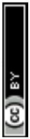
This article is licensed under a Creative Commons Attribution 3.0 Unported Licence.
is grounded in equivariant message-passing graph tensor networks that retain key geometrical and physical symmetries of atomic structures, making it highly suitable for simulating diverse materials and chemical processes. ${ }^{59}$ This model was chosen for its accuracy in capturing the potential energy surfaces (PES) of materials while ensuring computational efficiency comparable to classical force fields. MACE builds on the atomic cluster expansion (ACE) approach, ${ }^{61}$ employing higher body-order equivariant features. In this implementation, we used a model with four-body equivariant features and two layers of message passing to capture complex atomic interactions. The radial cutoff was set at $6 \AA$, giving a perception field of $12 \AA$, with the function of interatomic distances expanded into 10 Bessel functions, ${ }^{62}$ which was followed by a smooth polynomial cutoff function to construct radial features that were fed into a fully connected feed-forward neural network.

We employed the publicly available MACE-MP-0, medium, as described by Batatia et al. ${ }^{58}$ MACE-MP-0 was trained on the model MPtrj dataset, ${ }^{63}$ which consists of approximately 1.5 million DFT-relaxed configurations derived from $\sim 150000$ unique crystal structures in the Materials Project database. The DFT calculations were carried out using the Perdew-BurkeErnzerhof (PBE) ${ }^{64}$ exchange-correlation functional within the GGA framework.

The MPtrj dataset is dominated by small-unit-cell inorganic crystals, with a significant representation of oxides, including numerous structures containing Si-O bonding motifs. Notably, the MACE-MP-0 paper ${ }^{58}$ presents applications involving SiO ${ }_{2} /$ water interfaces and zeolites, which strongly suggests that silica polymorphs are well-represented in the training data.

To contextualise the performance of MACE-MP-0 on zeolitic systems, we note that the training dataset (MPtrj) includes approximately 145 structures containing the key elements Si , $\mathrm{O}, \mathrm{Al}$, and H relevant to zeolites, representing $\sim 0.01 \%$ of the total 1.5 M configurations.

To ensure accuracy and efficiency, we selected the mediumsized model from the MACE framework for all simulations, which balances computational cost and fitting precision. However, for comparison, we have also used three extra models, all in medium flavour: MACE-MP-mpa, MACE-MP-omat, and

MACE-r ${ }^{2}$ scan (see Tables 2 and 3). In addition, we added an empirical D3 correction. ${ }^{112}$ Geometry optimisation was done employing algorithms implemented in an atomistic simulation environment, specifically L-BFGS and FrechetCellFilter, when cell parameters were optimised. ${ }^{65}$

As MACE-MP-0 is a machine-learned interatomic potential trained entirely on DFT data from the MPtrj dataset, its accuracy is inherently limited by the capability of the underlying DFT calculations, specifically those using the PBE exchange-correlation functional. While the model can reproduce DFT-level energies and forces with high fidelity and significantly reduced computational cost, it cannot exceed the accuracy of the reference DFT data itself. Consequently, the most appropriate comparison for evaluating the performance of MACE-MP-0 is against PBE-based DFT calculations rather than direct experimental measurements. Agreement with the experiment is therefore only expected to the extent that PBEDFT accurately reproduces experimental observables. We have, however, noticed an improvement in comparison to experiment of our calculated energies and structural parameters on addition of the D3 dispersion terms to the ML force field, which has then been pursued throughout.

In addition, classical interatomic potential (IP) calculations were performed using GULP, ${ }^{66}$ while DFT calculations employed both VASP ${ }^{67}$ (from Edward et al. ${ }^{68}$ ) and FHI-aims, ${ }^{69}$ depending on the system studied. ML-IP simulations using the MACE model were carried out through the janus-core. ${ }^{70}$

Gulp. Geometry optimisation and lattice dynamics calculations were performed using the general utility lattice program (GULP). ${ }^{66}$ The dense and framework silica structures were studied with the space group symmetry set to P1, and the initial fractional coordinates, cell parameters, and species types were provided explicitly (see GitHub repository). The atomic interactions were modelled using a core-shell model ${ }^{114}$ to account for the polarizability of the oxygen ions (see Table 1).

FHI-aims. All-electron DFT calculations were performed using the FHI-aims code ${ }^{69}$ with the PBE exchange-correlation functional. Long-range dispersion interactions were treated using the Tkatchenko-Scheffler method based on the Hirshfeld

Table 1 Interatomic potential parameters used in GULP calculations
| Interaction | Parameter | Value | Unit | Notes |
| :--- | :--- | :--- | :--- | :--- |
| Charges | Si (core) | +4.000 | e | Formal charge |
|  | O (core) | +0.86902 | e |  |
|  | O (shell) | -2.86902 | e |  |
| Buckingham potentials | $\mathrm{Si}-\mathrm{O}$ |  | eV | Cutoff $=10.0 \AA$ |
|  |  | $A=1283.907$ $\rho=0.32052$ $C=10.6615$ | Å | Cutoff $=12.0 \AA$ |
|  |  | $C=10.66158$ | eV Å ${ }^{6}$ |  |
|  | O-O | $A=22764.000$ | eV |  |
|  |  | $\rho=0.14900$ | Å |  |
|  |  | $C=27.879$ | $\mathrm{eV} \AA^{6}$ |  |
|  | O | 74.92 | $\mathrm{eV} \AA^{-2}$ |  |
| Three-body angle potential | $\nless \mathrm{O}-\mathrm{Si}-\mathrm{O}$ | $109.47^{\circ}$ | ${ }^{\circ}$ | Si-O distance range: $0.0-1.8 \AA$ |
|  |  | 2.09724 | eV rad ${ }^{-2}$ | $\mathrm{O}-\mathrm{O} \text { distance range: } 0.0-3.2 \AA$ |
| Optimization convergence tolerances | Coordinate | $1 \times 10^{-8}$ | - | xtol |
|  | Gradient | $1 \times 10^{-7}$ | - | gtol |
|  | Energy | $1 \times 10^{-12}$ |  | ftol |

Open Access Article. Published on 21 July 2025. Downloaded on 3/19/2026 9:39:20 AM.

(cc) BY
This article is licensed under a Creative Commons Attribution 3.0 Unported Licence.
charge density partitioning scheme for the van der Waals correction in a non-self-consistent scheme.

Scalar relativistic effects were included via the atomic ZORA approximation. Self-consistent field (SCF) calculations employed Gaussian smearing (width 0.01 eV ), Pulay mixing (mixing parameter 0.2), and a maximum of 500 SCF iterations. Convergence thresholds were set to $1 \times 10^{-5} \mathrm{eV}$ for energy, $1 \times 10^{-6} \mathrm{eV} \mathrm{Bohr}^{-3}$ for charge density, and $1 \times 10^{-3} \mathrm{eV}$ for eigenvalue shifts. Full structural relaxations, including cell shape and volume, were performed using the BFGS algorithm with a force convergence threshold of $5 \times 10^{-4} \mathrm{eV} \AA^{-1}$. An intermediate-tier basis set was used for both Si and O species.

All important files used in this study are provided at (https:// github.com/Jamal-tech-git/Inputs-data-) to ensure reproducibility.

## Results and discussion

## Modelling framework energies

We made a comparison of our calculated cohesive energies, using the MACE MP method with respect to $\alpha$-quartz (the ground state silica polymorph under ambient conditions), with the data obtained here and from the literature using classical IP, ${ }^{68}$ DFT, ${ }^{68}$ and experimental calorimetric data from Navrotsky and co-workers ${ }^{31,71}$ (see Table 2 and Fig. 1). MACE_MP_0 medium model produces remarkably close results when compared to DFT (PBE + D3), especially across a wide variety of zeolite frameworks. The results show that IP lattice energy methods generally predict higher values than experiment, while DFT and MACE ML-IP results are much closer, within $\sim 1 \mathrm{~kJ} \mathrm{~mol}^{-1}$ of each other.

In most cases, the MACE MP, e.g. mp0 results, are nearly indistinguishable from DFT, demonstrating the accuracy and reliability of the machine learning approach in predicting
cohesive energies. For example, the MACE-mp0 energy for AFI ( $10.5 \mathrm{~kJ} \mathrm{~mol}^{-1}$ ) closely aligns with the DFT result ( $10.0 \mathrm{~kJ} \mathrm{~mol}^{-1}$ ). Similarly, for MFI/ZSM-5, MACE-mp0 predicts an energy of $8.5 \mathrm{~kJ} \mathrm{~mol}^{-1}$, nearly identical to the DFT value of $8.3 \mathrm{~kJ} \mathrm{~mol}^{-1}$. When examining more complex frameworks, such as MEI/ZSM-18 and STT/SSZ-23, MACE-mp0 maintains strong alignment with DFT predictions and the calorimetric data. The MACE-mp0 and DFT energies for STT/SSZ-23 are nearly identical, both at $11.4 \mathrm{~kJ} \mathrm{~mol}^{-1}$, which demonstrates that the MACEmp0 model is particularly reliable for such structures. For MEI/ ZSM-18, the MACE-mp0 value of $13.3 \mathrm{~kJ} \mathrm{~mol}^{-1}$ is close to the DFT result of $13.0 \mathrm{~kJ} \mathrm{~mol}^{-1}$, showing a minor deviation but still well within an acceptable range. In general, if better accuracy is needed, one can fine-tune MACE_MP, which we will explore in future work.

Comparing the crystal energetics, the MACE-mp0 calculation consistently outperforms those obtained from the shell model and the IP calculations. For example, for the CHA framework, the IP result ( $16.1 \mathrm{~kJ} \mathrm{~mol}^{-1}$ ) overestimates the energy compared to both MACE-mp0 ( $12.9 \mathrm{~kJ} \mathrm{~mol}^{-1}$ ) and DFT ( $12.2 \mathrm{~kJ} \mathrm{~mol}^{-1}$ ), with MACE-mp0 providing a closer match to DFT and experimental values. The same behavior is observed for other frameworks such as MWW/ITQ-1 and BEA, where MACE-mp0 predictions are more aligned with DFT and experimental data than IP results. The strong correlation between MACE-mp0 and DFT demonstrates the efficiency of the MACEmp0 method in achieving near-DFT accuracy across different zeolite structures. The few minor discrepancies observed between MACE-mp0 and DFT in complex structures can probably be refined with further fine-tuning of the ML model. The overestimation of the cohesive energies of the microporous silicas with respect to the quartz by the IP methods probably arises from the inability of fixed charge potentials to model the effects of small variations in the charge distribution on

Table 2 Calculated and experimental normalised zeolite cohesive energies ( $\mathrm{kJ} \mathrm{mol}^{-1}$ ) per T -site with respect to $\alpha$-quartz
| Structure | IP | DFT | MACE-mp0 | MACE_mpa | MACE_omat | Experiment |
| :--- | :--- | :--- | :--- | :--- | :--- | :--- |
| AFI | 11.9 | 10 | 10.5 | 11.58 | 11.8 | 7.2 |
| AST | 18.1 | 12.7 | 13.8 | 14.5 | 14.8 | 10.9 |
| BEA | 14.4 | 11 | 11.3 | 12.6 | 12.9 | 9.3 |
| CFI/CIT-5 | 12.7 | 12 | 12 | 13.2 | 13.6 | 8.8 |
| CHA | 16.1 | 12.2 | 12.9 | 13.7 | 13.7 | 11.4 |
| IFR/ITQ-4 | 15 | 10.3 | 10.2 | 11.7 | 11.6 | 10 |
| MEL/ZSM-11 | 10.8 | 9.2 | 9.4 | 10.4 | 10.7 | 8.2 |
| MFI/ZSM-5 | 9.7 | 8.3 | 8.5 | 9.7 | 9.8 | 6.8 |
| MWW/ITQ-1 | 14.4 | 11.2 | 11.2 | 12.3 | 12.3 | 10.4 |
| STT/SSZ-23 | 14.7 | 11.4 | 11.4 | 12.6 | 12.5 | 9.2 |
| EMT | 20.1 | 13 | 13.3 | 14.3 | 14.4 | 10.5 |
| FER | 11.8 | 9.6 | 10 | 11.2 | 11.5 | 6.6 |
| MEI/ZSM-18 | 18.9 | 13 | 13.3 | 14.5 | 14.4 | 13.9 |
| Cristobalite ${ }^{a}$ | 3.4 | 5.1 | 2.5 | 3.2 | 2.8 | 2.64 |
| Tridymite ${ }^{a}$ | 4.4 | 6.8 | 3.6 | 4.4 | 4.1 | 5.3 |
| Coesite ${ }^{a}$ | 2.02 | 1.85 | 2.2 | 2.9 | 2.5 | 5.1 |
| Stishovite ${ }^{a}$ | 133.8 | 39.5 | 37.9 | 29.9 | 21.2 | 49.4 |
| $\mathrm{W}-\mathrm{SiO}_{2}{ }^{a}$ | 244.9 | 116.6 | 128.7 | 129.4 | 134.8 | - |
| $\mathrm{O}-\mathrm{SiO}_{2}{ }^{a}$ | 5.2 | 7.3 | 6.6 | 5.3 | 8.4 | 一 |
| Moganite ${ }^{a}$ | 1.1 | 0.3 | 0.3 | 0.7 | 0.5 | - |
| Keatite ${ }^{a}$ | 6.5 | 4.5 | 4.04 | 4.5 | 4.6 |  |

[^1]Open Access Article. Published on 21 July 2025. Downloaded on 3/19/2026 9:39:20 AM.

| (cc) BY | This article is licensed under a Creative Commons Attribution 3.0 Unported Licence. |
| :--- | :--- |

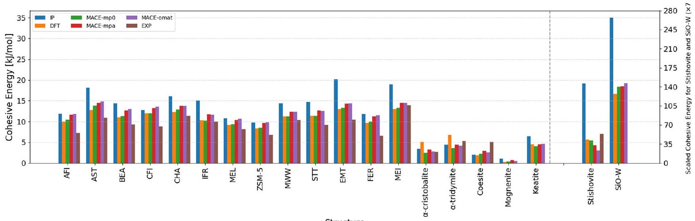
Structure

Fig. 1 Comparison of calculated lattice energies for selected zeolite and silica polymorphs using IP, ${ }^{68}$ shell model (with Sanders potentials), ${ }^{72}$ DFT, ${ }^{68}$ MACE ML-IPs, and experimental values. ${ }^{31,71,73}$ Lattice energies ( $\mathrm{kJ} \mathrm{mol}^{-1}$ ) are shown for a range of zeolitic frameworks and $\mathrm{SiO}_{2}$ polymorphs, computed using empirical interatomic potentials (IP, blue), density functional theory (DFT, orange), and three machine-learned interatomic potential models (MACE_mp0, green; MACE_mpa, red; MACE_omat, purple). Experimental lattice energies (EXP, brown) are included where available. Structures are arranged along the $x$-axis and include zeolites such as AFI, BEA, and ZSM-5, as well as silica polymorphs including $\alpha$-cristobalite, $\alpha$-tridymite, coesite, stishovite, and moganite.

Table 3 Calculated and experimental cohesive energies (in $\mathrm{kJ} \mathrm{mol}^{-1}$ ) for selected zeolites. Values are reported for two MACE-MP models, MACE-r2scan and MACE-mp0, both with (w) and without (w/o) dispersion effect. DFT-calculated values and experimental measurements are also shown for comparison
| Zeolite | MACE-r2scan (w/disp) | MACE-r2scan (w/o disp) | MACE-mp0 (w/disp) | MACE-mp0 (w/o disp) | DFT | EXP |
| :--- | :--- | :--- | :--- | :--- | :--- | :--- |
| AFI | 14.23 | 1.49 | 10.5 | -0.71 | 10.0 | 7.2 |
| AST | 17.22 | 2.12 | 13.8 | 0.35 | 12.7 | 10.9 |
| BEA | 15.28 | 2.28 | 11.3 | 0.05 | 11.0 | 9.3 |
| CHA | 16.29 | 1.08 | 12.9 | -0.58 | 12.2 | 11.4 |
| Cristobalite | 7.42 | -0.09 | 2.5 | -3.28 | 5.1 | 2.64 |

changing from a dense to a microporous structure, as discussed by Stacey et al., ${ }^{27}$ although we should note that the IP techniques correctly reproduce trends and also model crystal structures accurately.

To assess the role of dispersion interactions in machine learning interatomic potentials, we tested another MACE model trained on $\mathrm{r}^{2}$ SCAN $^{113}$ reference data and compared its performance against the previously established MACE-mp0 model. Both models were evaluated with and without the inclusion of dispersion corrections, implemented in analogy to the D3 ${ }^{112}$ approach commonly employed in DFT. Across a representative set of zeolite structures, as shown in Table 3, the inclusion of dispersion consistently improved agreement with both DFT and experimental lattice energies. Notably, the MACE-mp0 model with dispersion showed the closest correspondence to experimental values, highlighting the significance of longrange interactions in stabilising extended framework materials. In contrast, the $\mathrm{r}^{2}$ SCAN-based model tended to overestimate lattice energies when dispersion was included and highly underestimated the relative energies without dispersion, suggesting that higher-level reference data do not necessarily lead to better performance without appropriate treatment of nonlocal effects.

While machine-learned interatomic potentials can closely reproduce the reference DFT data they are trained on, their
absolute accuracy is ultimately bounded by the accuracy of the underlying DFT method, which is evident in the cohesive energy values reported in Tables 2 and 3, where even the best-performing models show systematic small deviations from experimental data. Such discrepancies are small documented in the literature and often arise from a combination of factors, including the limitations of the DFT exchange-correlation functional, neglect of temperature effects in the simulations, and experimental uncertainties in calorimetric measurements. ${ }^{74,75}$

## Modelling phase transition energies

Next, we compute the change in energy $\Delta E$ of formation between quartz and cristobalite, which is a key thermodynamic property, essential for understanding the phase transformation of silica, as shown in Table 4. The MACE-mp0 computed value

Table 4 Enthalpy of formation changes between quartz and cristobalite
| Temperature   $(\mathrm{K})$ | Enthalpy change   $\left(\mathrm{kJ} \mathrm{mol}^{-1}\right)$ | Ref. |
| :--- | :--- | :--- |
| 298 | 2.64 | 76 |
| 970 | 1.88 | 73 |
| - | 2.50 | This work |
|  |  | $($ MACE-mp0 $)$ |

Open Access Article. Published on 21 July 2025. Downloaded on 3/19/2026 9:39:20 AM.
BY
□ This article is licensed under a Creative Commons Attribution 3.0 Unported Licence.
of $\Delta E, 2.5 \mathrm{~kJ} \mathrm{~mol}^{-1}$, falls within the experimental range of 1.88 to $2.64 \mathrm{~kJ} \mathrm{~mol}^{-1}$; Kracek $^{76}$ measured a value of $0.63 \mathrm{kcal} \mathrm{mol}^{-1}$ ( $2.64 \mathrm{~kJ} \mathrm{~mol}^{-1}$ ) at room temperature, while $\mathrm{Holm}^{73}$ reported $0.45 \mathrm{kcal} \mathrm{mol}^{-1}\left(1.88 \mathrm{~kJ} \mathrm{~mol}^{-1}\right)$ at $970 \mathrm{~K}^{-}$Although, we have found strong agreement between MACE-mp0 results and empirical findings; we believe, the MACE-mp0 prediction for $\alpha$-cristobalite to lie closer to the experimental value than the DFT result, is coincidental and does not imply that the MACE-MP-0 MLIP exceeds the accuracy of its DFT training reference.

## High-pressure phase transitions and structural response

A major challenge to any modelling techniques when applied to silica and silicates is to predict the response of the materials to pressure, which we explore in this section.

Lattice parameters and angle as a function of pressure in $\mathbf{S i O}_{\mathbf{2}}$ polymorphs. Silica can exist in a variety of crystalline forms, including $\alpha$ - and $\beta$-quartz, $\alpha$ - and $\beta$-tridymite, $\alpha$ - and $\beta$-cristobalite, coesite, keatite, and stishovite. ${ }^{77-80}$ Except for stishovite, these polymorphs consist of corner sharing $\mathrm{SiO}_{4}$ tetrahedra with minimal bond length and angle distortion. ${ }^{81}$ Under high pressures, silica polymorphs undergo structural transitions. ${ }^{82,83}$ Stishovite, with a rutile structure, has silicon octahedrally coordinated by six oxygen atoms. ${ }^{84}$ Denser phases with high density, low compressibility, and high elastic modulus are suggested at even higher pressures.

The behaviour of $\alpha$-quartz, under high-pressure conditions, has been the focus of numerous experimental investigations. ${ }^{85,86}$ To examine the role of high pressure on the structural changes of three main room-temperature groundstate phases of $\mathrm{SiO}_{2}$, we conducted MACE-mp0 simulation and observed that as pressure increases, all three phases of $\mathrm{SiO}_{2}$-quartz, coesite, and stishovite-show a decrease in their lattice parameters, ${ }^{87}$ though the extent and nature of the compression vary based on their crystal structures (Fig. 2).

Quartz exhibits significant compression along all axes as can be seen in Fig. 2a. This behaviour is consistent with the trigonal symmetry of quartz, where the atomic arrangement along the $c$ axis is more compressible. ${ }^{88}$ Despite the reduction in lattice dimensions, the crystallographic angles remain constant, with $\alpha$ and $\beta$ at $90^{\circ}$ and $\gamma$ at $120^{\circ}$. In coesite, a high-pressure polymorph of quartz, ${ }^{89}$ the compression proceeds relatively uniformly along all three lattice directions, with a slightly greater reduction along the $a$-axis (Fig. 2b). We have rescaled the lattice parameters of the supercell to reflect the unit cell dimensions, allowing direct comparison with experimental data. ${ }^{89,90}$ At ambient pressure, the calculated lattice parameter values of coesite are in close agreement with experiment $(a \approx 7.13 \AA, b \approx 12.37 \AA$, and $c \approx 7.17 \AA$ ). The monoclinic $\beta$ angle, which is not constrained by symmetry, decreases modestly with pressure (up to 20 GPa ), from just above $120^{\circ}$ to just below $118^{\circ}$, matching the trend observed in experiment. ${ }^{89,90}$ Coesite undergoes a phase transition beyond $\sim 20 \mathrm{GPa}$, forming coesite-II, followed by further transitions at higher pressures to coesite-III, and eventually to coesite-IV and coesite-V, which exhibit complex structures with tetra-, penta-, and hexa-coordinated silicon atoms. ${ }^{91}$ Stishovite, the densest and highest-pressure polymorph of $\mathrm{SiO}_{2}$, behaves differently. The compression in stishovite is somewhat anisotropic, with the lattice parameters $a, b$ and $c$-axis remaining relatively stable, ${ }^{92}$ which indicates that stishovite's tetragonal structure resists compression along all axes, likely due to the tight atomic packing. Like quartz and coesite, the angles in stishovite ( $\alpha, \beta$, and $\gamma$ ) remain constant at $90^{\circ}$, preserving the tetragonal symmetry under pressure (Fig. 2c).

Moreover, to compare the compressional behaviour of quartz and stishovite, we analysed the evolution of their c/a ratios as a function of pressure. As shown in Fig. 3, the $c / a$ ratio of quartz increases steadily with pressure, reflecting anisotropic

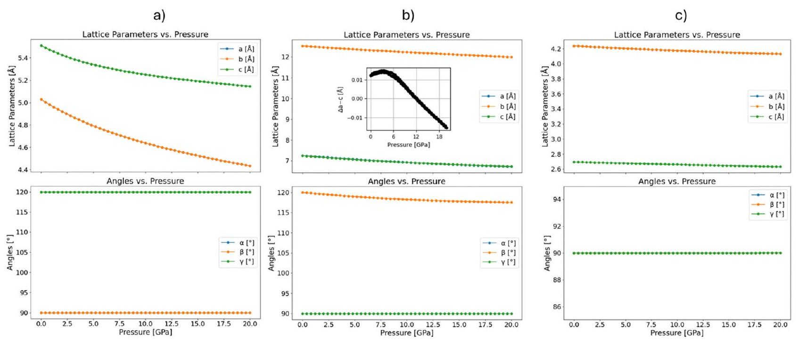
Fig. 2 Change of the unit cell lattice parameters and angles as a function of pressure (up to 20 GPa ) for three different polymorphs of $\mathrm{SiO}_{2}$ : (a) quartz, (b) coesite, the inset in the upper plot illustrates the $a-c$ lattice parameter difference in coesite emphasising the relative compression behaviour along the respective crystallographic axes, and (c) stishovite.

Open Access Article. Published on 21 July 2025. Downloaded on 3/19/2026 9:39:20 AM.

This article is licensed under a Creative Commons Attribution 3.0 Unported Licence.

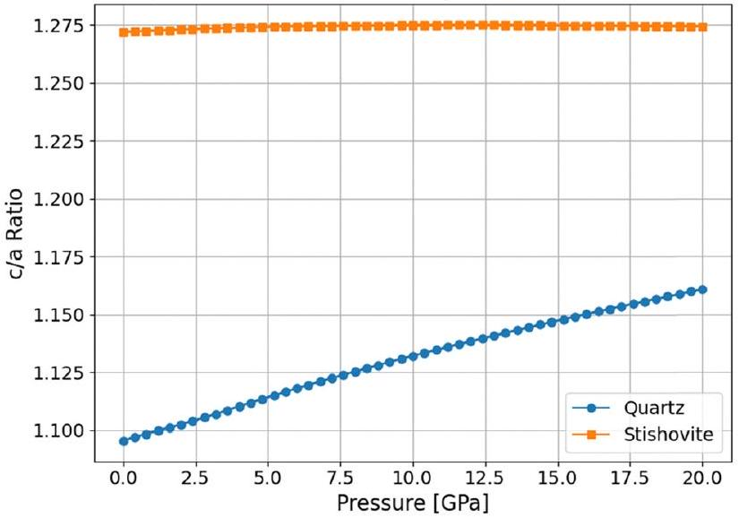
Fig. 3 Evolution of the c/a ratio with pressure for quartz and stishovite.

compression of the crystal lattice, where the $c$-axis becomes relatively less compressible than the $a$-axis. In contrast, stishovite exhibits a nearly constant c/a ratio ( $\sim 1.274$ ) across the entire pressure range studied, indicating a nearly perfect isotropic compression response, highlighting a fundamental difference in the structural rigidity and deformation mechanisms between the two polymorphs of $\mathrm{SiO}_{2}$.

Lattice parameters and angle as a function of pressure in silicalite polymorphs. The pressure dependence of lattice parameters and angles for the orthorhombic and monoclinic
phases of silicalite is examined next. In the orthorhombic phase (Fig. 4a), the lattice parameters $a, b$, and $c$ exhibit a smooth and gradual decrease with increasing pressure, characteristic of uniform compression. This consistent reduction in lattice dimensions reflects the structural stability of the orthorhombic phase across the entire pressure range, with no evident anomalies. The cell angles remain constant at $90^{\circ}$, indicating the preservation of orthorhombic symmetry throughout the compression process.

In the monoclinic phase of silicalite-1, the $\beta$ angle increases smoothly from $90.65^{\circ}$ at ambient pressure to $91.15^{\circ}$ at 1.3 GPa , indicating increasing monoclinic distortion (Fig. 4b). At approximately 1.4 GPa , a sharp transition occurs, with $\beta$ dropping to $90.0^{\circ}$, accompanied by discontinuities in the lattice parameters, which suggests a pressure-induced transition to a more symmetric, or less distorted structure. Upon decompression, the lattice parameters retrace their original values smoothly; however, the $\beta$ angle remains constant at $90.0^{\circ}$, without returning to its original higher value.

This aligns well with the experimental data reported by Mario et al., ${ }^{93}$ who found that the monoclinic angle $\alpha$ remained unchanged under pressure, indicating no clear tendency toward a transition to the orthorhombic form. We infer that while the orthorhombic phase remains structurally stable under compression, the monoclinic phase undergoes a significant structural transformation near 1.5 GPa . The pressureinduced change in the $\beta$ angle in the monoclinic phase

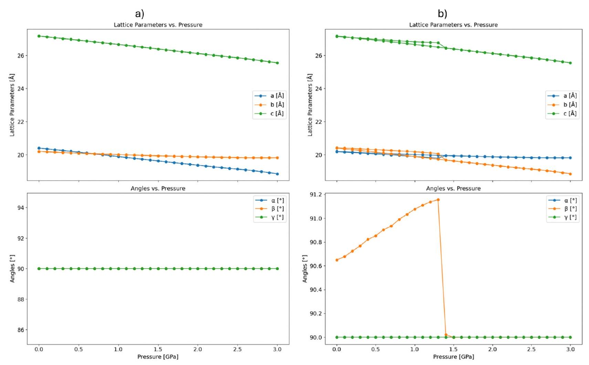
Fig. 4 Change of the unit cell lattice parameters and angles as a function of pressure (up to 3 GPa ) for two different polymorphs of silicalite: (a) orthorhombic, and (b) monoclinic.

Open Access Article. Published on 21 July 2025. Downloaded on 3/19/2026 9:39:20 AM.

This article is licensed under a Creative Commons Attribution 3.0 Unported Licence.

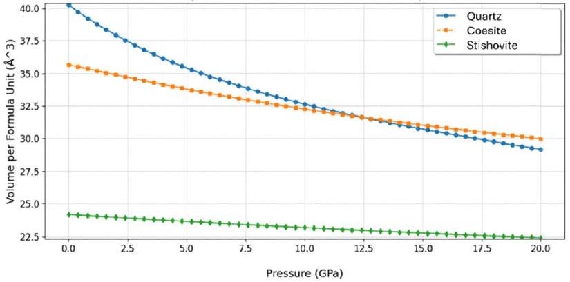
Fig. 5 Change of unit cell volume $\left(\AA^{3}\right)$ (per formula unit) as a function of pressure (GPa) for quartz, coesite, and stishovite.

suggests a reversible phase transition, possibly involving a shift toward a more stable symmetric structure at higher pressures.

Volume as a function of pressure in $\mathbf{S i O}_{\mathbf{2}}$ polymorphs. Next, we study the variation in volume as a function of pressure for all three dense ground-state $\mathrm{SiO}_{2}$ polymorphs: quartz, coesite, and stishovite. Fig. 5 illustrates the calculated variation in volume per formula unit with increasing pressure for the three polymorphs. Each of these polymorphs displays distinct behaviour under compression, reflective of their differing crystal structures and stability ranges.

Starting with quartz, which exhibits the most significant reduction in volume with increasing pressure. At ambient conditions, quartz has the largest volume among the three polymorphs, ${ }^{94,95}$ which decreases progressively as pressure increases. As observed, the rate of compression is initially rapid, indicating that quartz's hexagonal crystal structure is relatively flexible and can accommodate significant reductions in atomic spacing under pressure. However, at pressures above 10 GPa , the rate of volume decrease begins to slow, suggesting that the quartz structure becomes increasingly resistant to further compression as it approaches its structural limits. Coesite shows a less pronounced reduction in volume with pressure compared to quartz. ${ }^{90}$ The decrease in volume with pressure is more gradual, which is expected given coesite's formation at relatively higher pressures, where its atomic arrangement is already more compact. Similar to quartz, coesite exhibits a slight reduction in the rate of compression at higher pressures (above 10 GPa ). Finally, stishovite, the densest of the three polymorphs, ${ }^{96}$ demonstrates the least compressibility under pressure, since its initial volume is significantly lower than both quartz and coesite and also has minimal volume reduction as pressure increases. The near-flat slope of the volume-pressure curve for stishovite indicates that even at 20 GPa , its structure is quite stable and resistant to further compression, which is in good agreement with in situ synchrotron X-ray diffraction experimental data. ${ }^{97}$

Volume as a function of pressure in silicalite polymorphs. We have further investigated the volume behaviour of monoclinic and orthorhombic silicalite polymorphs under varying pressure, as illustrated in Fig. 6. Initially, both polymorphs show a linear decrease in volume with increasing pressure up to about 1.0 GPa , with the monoclinic phase displaying a slightly

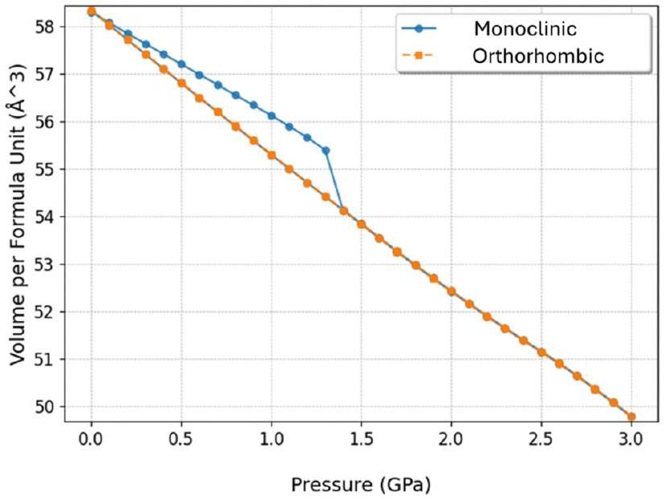
Fig. 6 Change of unit cell volume $\left(\AA^{3}\right)$ (per formula unit) as a function of pressure (GPa) for monoclinic and orthorhombic polymorphs of silicalite.

larger volume than the orthorhombic phase. Around 1.35 GPa , the monoclinic phase undergoes a sharp volume reduction, signalling a phase transition. After this point, the volumepressure behaviour of both phases converges, suggesting similar structural responses to pressure beyond the transition. This phase transition aligns with previously reported pressure ranges for the monoclinic to orthorhombic transformation in silicalite, typically occurring between 1.0 and $1.5 \mathrm{GPa} .^{98,99}$ The orthorhombic phase, meanwhile, shows a consistent and smooth decrease in volume, indicating its stability throughout the pressure range.

Enthalpy as a function of pressure in dense $\mathbf{S i O}_{\mathbf{2}}$ polymorphs. We have calculated the enthalpy (H) as a function of pressure for the silica polymorphs quartz, coesite, and stishovite using MACE-mp0 as shown in Fig. 7 and Table 5. Our results show distinct linear relationships between enthalpy and pressure for each phase, which we have correlated with experimental data. ${ }^{73}$ The transition from quartz to coesite in our calculations occurs at approximately $\sim 3 \mathrm{GPa}$, consistent with the experimentally observed transition pressure of $\sim 2.5 \mathrm{GPa} .^{73}$ Schafrinna et al. ${ }^{100}$ identified an atomistic, diffusionless martensitic pathway for the quartz-to-coesite transition using DFT calculations. The energy barrier ( $\sim 150 \mathrm{meV}$ per atom) remains pressure-independent up to 5 GPa , and coesite formation occurs under non-hydrostatic stress conditions at $\sim 2 \mathrm{GPa}$, below the equilibrium transition pressure. The coesite to stishovite transition, which we calculate occurs at approximately $\sim 9 \mathrm{GPa}$, in good agreement with experimental findings $(8-8.5 \mathrm{GPa}) .{ }^{73}$ It was reported that stishovite is stable at pressures between $\sim 9 \mathrm{GPa}$ and $50 \mathrm{GPa},{ }^{39,101}$ which also aligns well with our findings.

Enthalpy as a function of pressure in silicalite polymorphs. As already discussed above where we focussed on the structural data, purely siliceous silicalite shows polymorphism, crystallising in an orthorhombic (Pnma), ${ }^{41}$ monoclinic (P21/n11), ${ }^{42}$ and orthorhombic $(P 212121)^{43}$ lattice. A monoclinic-toorthorhombic phase transition (MOPT) with temperature has
Open Access Article. Published on 21 July 2025. Downloaded on 3/19/2026 9:39:20 AM.

This article is licensed under a Creative Commons Attribution 3.0 Unported Licence.

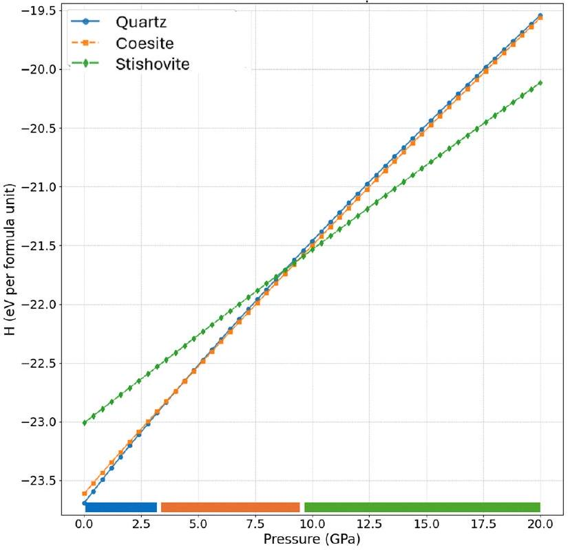
Fig. 7 Enthalpy behaviour of main $\mathrm{SiO}_{2}$ phases under increasing pressure up to 20 GPa . (a) shows the variation of enthalpy per formula unit as a function of pressure (GPa) for the three polymorphs of silica: quartz, coesite, and stishovite, and illustrates as a horizontal line the stability regions of each phase over the pressure range.

Table 5 Phase transition pressures for the three main room-temperature ground-state polymorphs of silica
| Property | Quartz to coesite | Coesite to stishovite |
| :--- | :--- | :--- |
| Exp. pressure (GPa) | $2-2.5^{73}$ | $8-8.5,{ }^{73} \sim 9^{39}$ |
| Calc. pressure (GPa) | $\sim 3.5$ | $\sim 9$ |

first been observed, where the monoclinic phase is stable below the transition temperature, and the orthorhombic phase is stable above the transition temperature. ${ }^{102}$ On the other hand, the pressure-induced MOPT was also reported to take place between 1 and 1.5 GPa at a constant room temperature, ${ }^{98,99}$ while there is still uncertainty in the experimental literature whether it is reversible ${ }^{99,103}$ or not ${ }^{98}$ upon decompression. To this end, we also predict a phase transition around 1.4 GPa , in very good agreement with already reported data ${ }^{98,99}$-see Fig. 8.

## Fluoride chemistry in zeolites

The role of fluoride ions ( $\mathrm{F}^{-}$) in zeolite synthesis is wellestablished. Fluoride ions are frequently used as mineralising agents in hydrothermal synthesis, where they aid the formation of highly crystalline, defect-free silica frameworks. ${ }^{104}$ They play an important role in zeolite synthesis and have been observed forming pentacoordinated silicon units, denoted as $\left[\mathrm{SiO}_{4 / 2} \mathrm{~F}\right]^{-}$ and also shown as $\mathrm{SiO}_{4} \mathrm{~F}^{-}$. These units exhibit a trigonal bipyramidal geometry with $\mathrm{Si}-\mathrm{F}$ bond distances of approximately $1.7 \AA$, contributing to the overall stability of the framework during synthesis processes. ${ }^{57,105}$

In zeolite frameworks, fluoride ions are typically located within specific cages of IFR (ITQ-4), STF (SSZ-35), and STT (SSZ23), as well as in double four-ring (D4R) units and larger cages

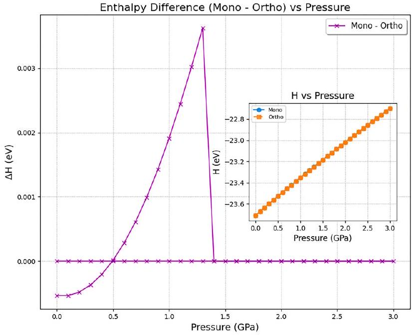
Fig. 8 The enthalpy difference $(\Delta H)$ between the monoclinic and orthorhombic structures of silicalite as a function of pressure (GPa). The inset plot displays the enthalpy (H) per formula unit for both the monoclinic and orthorhombic structures across the same pressure range.

in structures like ITH. ${ }^{106}$ The distribution of fluoride ions is influenced by a two-step process. In the first step, long-range electrostatic interactions between fluoride ions and structuredirecting agents ( $\mathrm{SDA}^{+}$) determine the cages that will be occupied. In the second step, fluoride ions form covalent bonds with silicon atoms within these cages to create energetically stable $\left[\mathrm{SiO}_{4 / 2} \mathrm{~F}\right]^{-}$units. ${ }^{107-109}$ Both experimental and computational approaches have provided insights into the behaviour of fluoride in zeolites. Solid-state NMR and X-ray diffraction techniques have identified the location and bonding environment of fluoride ions. Computational studies, including defect energy calculations, have shown that the positions of fluoride ions within zeolite cages are strongly influenced by both their interaction with structure directing agents (SDAs) used in synthesis and their ability to form stable bonds with silicon, which are consistent across several zeolite structures. ${ }^{57,105}$

Fluoride can adopt various configurations in zeolites, as outlined by Attfield et al., ${ }^{104}$ who identified three primary environments for $\mathrm{F}^{-}$ions: (i) as part of an ion pair near an SDA, (ii) centrally located in small cages, and (iii) coordinating with Si to form pentacoordinated $\mathrm{SiO}_{4} \mathrm{~F}^{-}$units. The inclusion of fluoride may help stabilize the D4R structure, as observed in earlier studies by Flanigen and Patton, who first noted the importance of $\mathrm{F}^{-}$in promoting zeolite formation. ${ }^{110}$

In the absence of direct experimental measurements for the heat of adsorption or formation of $\mathrm{F}^{-}$species in silica frameworks, we benchmark our MACE-ML results against DFT calculations, which have been shown to accurately reproduce experimental structural parameters of fluoride-containing zeolites. We examined the similar behaviour of $\mathrm{F}^{-}$within different zeolite frameworks using the MACE-mp0 model as shown in Fig. 9. To model the system, $\mathrm{NH}_{4}{ }^{+}$ions are included explicitly to balance the charge of the $\mathrm{F}^{-}$species. The $\mathrm{NH}_{4}{ }^{+}$ions are typically located in adjacent cages or channels, stabilizing $\mathrm{F}^{-}$through electrostatic interactions. Our
Open Access Article. Published on 21 July 2025. Downloaded on 3/19/2026 9:39:20 AM.
□ This article is licensed under a Creative Commons Attribution 3.0 Unported Licence.

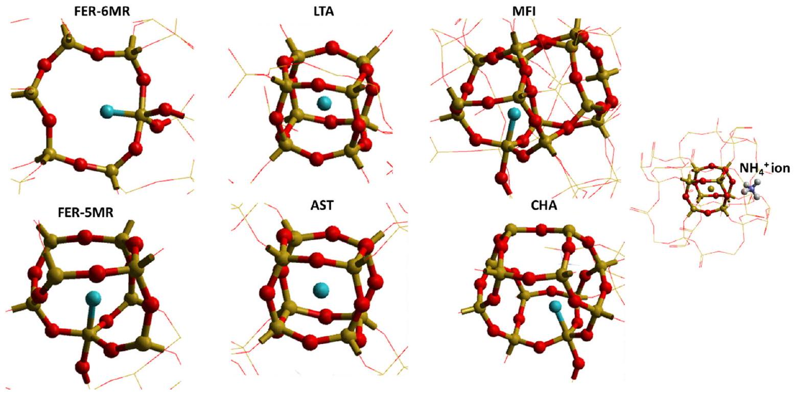
Fig. 9 A schematic representation of different fluoride ( $\mathrm{F}^{-}$) ion environments in siliceous zeolites. $\mathrm{F}^{-}$ions can be located at the centre of small cages such as double four-rings (d4Rs) without direct coordination to Si atoms (examples: LTA and AST), or can coordinate to a Si atom to form a pentacoordinated $\mathrm{SiO}_{4} \mathrm{~F}^{-}$unit (examples: FER, MFI, and CHA). The $\mathrm{SiO}_{2}$ framework is depicted using a wireframe motif. An additional panel (right) shows a detailed visualisation of an $\mathrm{F}^{-}$ion positioned within the d4R cage of AST zeolite alongside a neighbouring $\mathrm{NH}_{4}{ }^{+}$ion, illustrating the modelled counterion configuration.

results show that $\mathrm{F}^{-}$, when located inside a D4R, consistently positions itself at the center of the double ring (case ii) and does not coordinate directly with any silicon atoms, which is consistent with our earlier DFT reported data, ${ }^{104}$ where fluoride ions are described as residing in small D4R cages, far from Si atoms. Also, the formation of pentacoordinated Si species, in which $\mathrm{F}^{-}$coordinates directly with Si , has been already reported ${ }^{111}$ showing that $\mathrm{F}^{-}$ forms part of a trigonal bipyramidal $\mathrm{SiO}_{4} \mathrm{~F}^{-}$unit (case iii) in zeolites like MFI, FER and CHA, which agrees with our findings.

## Summary and conclusions

We have examined the structural and thermodynamic properties of silica polymorphs and siliceous zeolites using the MACE-mp0 model. The MACE model, which offers nearDFT accuracy with greater computational efficiency, was used to predict framework energies and phase transitions in silica polymorphs. MACE mp0 excels in modelling both zeolitic and dense silicas, overcoming the coordination limitations of earlier IPs. The MACE-mp0 results with dispersion showed excellent agreement with both DFT + D3 calculations and experimental data, particularly in predicting framework energies for various zeolite structures. In comparison to earlier IP models, MACE-mp0 delivered more accurate results, closely matching DFT predictions for complex frameworks including MFI/ZSM-5, MEI/ZSM-18, and STT/SSZ-23. The model also accurately predicted pressure driven phase transitions for silica polymorphs, including quartz to coesite ( $\sim 3 \mathrm{GPa}$ ) and coesite to stishovite ( $\sim 9 \mathrm{GPa}$ ), aligning well with experimental observations. In silicalite polymorphs, the monoclinic-toorthorhombic transition around 1.35 GPa was observed, which
also corresponds well with experimental data. Structural changes under pressure were also analysed for both silica and silicalite polymorphs, which showed distinct compression patterns. Furthermore, we explored fluoride ions' role in zeolite synthesis, highlighting their stabilising effects in double four-membered rings and pentacoordinated $\mathrm{SiO}_{4} \mathrm{~F}^{-}$units, consistent with known behaviour in zeolites. MACE-mp0 model demonstrates accuracy and efficiency in predicting the energetics and structural response of zeolites and silica polymorphs, and its close alignment with experimental data and DFT predictions makes it a valuable tool in zeolite research, evaluating new frameworks and understanding phase transitions.

## Author contributions

The manuscript was drafted by Jamal Abdul Nasir: writing original draft, software, methodology, investigation, formal analysis, conceptualisation. Jingcheng Guan: review \& editing, software, methodology. Woongkyu Jee: review \& editing, software, methodology. Scott M. Woodley: review \& editing. Alexey A. Sokol: review \& editing, methodology, investigation. C. Richard A. Catlow: writing review \& editing, supervision. Alin-Marin Elena: writing - review \& editing, software, methodology, investigation, formal analysis, supervision.

## Conflicts of interest

There are no conflicts to declare.
Open Access Article. Published on 21 July 2025. Downloaded on 3/19/2026 9:39:20 AM.
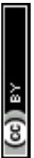
This article is licensed under a Creative Commons Attribution 3.0 Unported Licence.

## Data availability

All data is available at https://github.com/Jamal-tech-git/Inputs-data-.

## Acknowledgements

The research utilised the STFC Scientific Computing Department's SCARF cluster and the Thomas Young Tier 2 HPC platform. AME acknowledge EPSRC grant EP/V028537/1. We also acknowledge EP/X035859/1, EP/W026775/1 and EP/ T022213/1. This work made use of computational support by CoSeC, the Computational Science Centre for Research Communities, which was made available through our membership of the MCC HEC.

## Notes and references

1 Y. Li, L. Li and J. Yu, Chem, 2017, 3, 928-949.
2 Z. Du and N. H. de Leeuw, Surf. Sci., 2004, 554, 193-210.
3 M. Sierka and J. Sauer, Faraday Discuss., 1997, 106, 41-62.
4 A. A. Sokol, C. R. A. Catlow, J. M. Garcés and A. Kuperman, J. Phys. Chem. B, 2002, 106, 6163-6177.

5 R. Grau-Crespo, A. G. Peralta, A. R. Ruiz-Salvador, A. Gómez and R. López-Cordero, Phys. Chem. Chem. Phys., 2000, 2, 5716-5722.
6 R. Grau-Crespo, E. Acuay and A. R. Ruiz-Salvador, Chem. Commun., 2002, 2544-2545.
7 S. Ma, C. Shang and Z.-P. Liu, J. Chem. Phys., 2019, 151.
8 S. Ma and Z.-P. Liu, ACS Catal., 2020, 10, 13213-13226.
9 D. Morgan and R. Jacobs, Annu. Rev. Mater. Res., 2020, 50, 71-103.
10 V. L. Deringer, M. A. Caro and G. Csányi, Adv. Mater., 2019, 31, 1902765.
11 S. Ma and Z.-P. Liu, Chem. Sci., 2022, 13, 5055-5068.
12 G. Krenzer, J. Klarbring, K. Tolborg, H. Rossignol, A. R. McCluskey, B. J. Morgan and A. Walsh, Chem. Mater., 2023, 35, 6133-6140.
13 Y. Lim, H. Park, A. Walsh and J. Kim, Matter, 2024, 8(7), 102203.
14 L. M. Antunes, Vikram, J. J. Plata, A. V. Powell, K. T. Butler and R. Grau-Crespo, Machine Learning in Materials Informatics: Methods and Applications, ACS Publications, 2022, pp. 1-32.
15 L. C. Erhard, J. Rohrer, K. Albe and V. L. Deringer, npj Comput. Mater., 2022, 8, 90.
16 L. C. Erhard, J. Rohrer, K. Albe and V. L. Deringer, Nat. Commun., 2024, 15, 1927.
17 C. Zhang, L. Tang, Y. Sun, K.-M. Ho, R. M. Wentzcovitch and C.-Z. Wang, Phys. Rev. Mater., 2022, 6, 063802.
18 A. Koneru, H. Chan, S. Manna, S. Banik, V. Molinero and S. K. Sankaranarayanan, J. Chem. Theory Comput., 2024, 20, 8665-8674.
19 K. Zongo, H. Sun, C. Ouellet-Plamondon and L. K. Béland, npj Comput. Mater., 2024, 10, 218.

20 L. Brugnoli, M. Ducamp and F.-X. Coudert, J. Phys. Chem. C, 2024, 128(47), 20512-20522.
21 T. G. Sours and A. R. Kulkarni, J. Phys. Chem. C, 2023, 127, 1455-1463.
22 A. Erlebach, M. Šípka, I. Saha, P. Nachtigall, C. J. Heard and L. Grajciar, Nat. Commun., 2024, 15, 4215.
23 J. D. Evans and F.-X. Coudert, Chem. Mater., 2017, 29, 7833-7839.
24 M. Moliner, Y. Román-Leshkov and A. Corma, Acc. Chem. Res., 2019, 52, 2971-2980.
25 A. Erlebach, P. Nachtigall and L. Grajciar, npj Comput. Mater., 2022, 8, 174.
26 D. Akporiaye and G. Price, Zeolites, 1989, 9, 23-32.
27 M. W. Deem, R. Pophale, P. A. Cheeseman and D. J. Earl, J. Phys. Chem. C, 2009, 113, 21353-21360.

28 V. A. Blatov, G. D. Ilyushin and D. M. Proserpio, Chem. Mater., 2013, 25, 412-424.
29 C. Baerlocher and L. McCusker, https://www.iza-structure. org/databases, 2019.
30 C. S. Cundy and P. A. Cox, Chem. Rev., 2003, 103, 663-702.
31 A. Navrotsky, O. Trofymluk and A. A. Levchenko, Chem. Rev., 2009, 109, 3885-3902.
32 D. Majda, F. A. A. Paz, O. D. Friedrichs, M. D. Foster, A. Simperler, R. G. Bell and J. Klinowski, J. Phys. Chem. C, 2008, 112, 1040-1047.
33 R. Pophale, P. A. Cheeseman and M. W. Deem, Phys. Chem. Chem. Phys., 2011, 13, 12407-12412.
34 O. D. Friedrichs, A. W. Dress, D. H. Huson, J. Klinowski and A. L. Mackay, Nature, 1999, 400, 644-647.
35 M. A. Zwijnenburg, F. Corá and R. G. Bell, J. Phys. Chem. B, 2007, 111, 6156-6160.
36 R. Hemley, High-Pressure Research in Mineral Physics, A Volume in Honor of Syun-iti Akimoto, 1987, vol. 39, pp. 347-359.
37 M. Akaogi and A. Navrotsky, Phys. Earth Planet. Inter., 1984, 36, 124-134.
38 Y. Lin, Q. Hu, Y. Meng, M. Walter and H.-K. Mao, Proc. Natl. Acad. Sci. U. S. A., 2020, 117, 184-189.
39 J. Zhang, B. Li, W. Utsumi and R. C. Liebermann, Phys. Chem. Miner., 1996, 23, 1-10.
40 W. Yong, E. Dachs, A. Benisek and R. A. Secco, Phys. Chem. Miner., 2012, 39, 153-162.
41 D. Olson, G. Kokotailo, S. Lawton and W. Meier, J. Phys. Chem., 1981, 85, 2238-2243.
42 H. Van Koningsveld, J. Jansen and H. Van Bekkum, Zeolites, 1990, 10, 235-242.
43 H. Van Koningsveld, F. Tuinstra, H. Van Bekkum and J. Jansen, Acta Crystallogr., Sect. B:Struct. Sci., 1989, 45, 423-431.
44 G. Robert, C. Richard and A. Catlow, J. Chem. Soc., Chem. Commun., 1990, 782-783.
45 L. C. Erhard, C. Otzen, J. Rohrer, C. Prescher and K. Albe, arXiv, 2024, preprint, arXiv:2406.17676, DOI: 10.48550/ arXiv.2406.17676.
46 J. Sun, A. Ruzsinszky and J. P. Perdew, Phys. Rev. Lett., 2015, 115, 036402.
Open Access Article. Published on 21 July 2025. Downloaded on 3/19/2026 9:39:20 AM.
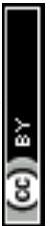
This article is licensed under a Creative Commons Attribution 3.0 Unported Licence.

47 T. Tsuchiya and S. Nakagawa, J. Phys.: Condens. Matter, 2022, 34, 304003.
48 D. M. Teter, R. J. Hemley, G. Kresse and J. Hafner, Phys. Rev. Lett., 1998, 80, 2145.
49 L. Dubrovinsky, S. Saxena, P. Lazor, R. Ahuja, O. Eriksson, J. Wills and B. Johansson, Nature, 1997, 388, 362-365.

50 T. Goumans, A. Wander, W. A. Brown and C. R. A. Catlow, Phys. Chem. Chem. Phys., 2007, 9, 2146-2152.
51 B. J. Cowen and M. S. El-Genk, Comput. Mater. Sci., 2015, 107, 88-101.
52 M. Mabilia, R. Pearlstein and A. Hopfinger, J. Am. Chem. Soc., 1987, 109, 7960-7968.
53 P. Caullet, J.-L. Paillaud, A. Simon-Masseron, M. Soulard and J. Patarin, C. R. Chim, 2005, 8, 245-266.
54 E. A. Eilertsen, B. Arstad, S. Svelle and K. P. Lillerud, Microporous Mesoporous Mater., 2012, 153, 94-99.
55 Z. R. Gao, C. Márquez-Álvarez, S. R. Balestra, H. Yu, L. A. Villaescusa and M. A. Camblor, Inorg. Chem., 2024, 63(21), 9953-9966.
56 S. I. Zones, R. J. Darton, R. Morris and S.-J. Hwang, J. Phys. Chem. B, 2005, 109, 652-661.
57 H. Koller, A. Wölker, L. Villaescusa, M. Diaz-Cabanas, S. Valencia and M. Camblor, J. Am. Chem. Soc., 1999, 121, 3368-3376.
58 I. Batatia, P. Benner, Y. Chiang, A. M. Elena, D. P. Kovács, J. Riebesell, X. R. Advincula, M. Asta, W. J. Baldwin and N. Bernstein, arXiv, 2023, preprint, arXiv:2401.00096, DOI: 10.48550/arXiv.2401.00096.

59 I. Batatia, D. P. Kovacs, G. Simm, C. Ortner and G. Csányi, Adv. Neural Informat. Proc. Syst., 2022, 35, 1142311436.

60 D. P. Kovács, I. Batatia, E. S. Arany and G. Csányi, J. Chem. Phys., 2023, 159, 044118.
61 B. Cheng, npj Comput. Mater., 2024, 10, 157.
62 J. Gasteiger, J. Groß and S. Günnemann, arXiv, 2020, preprint, arXiv:2003.03123, DOI: 10.48550/arXiv.2003.03123.
63 B. Deng, P. Zhong, K. Jun, J. Riebesell, K. Han, C. J. Bartel and G. Ceder, Nat. Mach. Intell., 2023, 5, 1031-1041.
64 J. P. Perdew, K. Burke and M. Ernzerhof, Phys. Rev. Lett., 1996, 77, 3865.
65 A. Jain, S. P. Ong, G. Hautier, W. Chen, W. D. Richards, S. Dacek, S. Cholia, D. Gunter, D. Skinner and G. Ceder, APL Mater., 2013, 1.
66 J. D. Gale and A. L. Rohl, Mol. Simul., 2003, 29, 291-341.
67 J. Hafner, J. Comput. Chem., 2008, 29, 2044-2078.
68 E. Stacey, M. G. Quesne and C. R. A. Catlow, Microporous Mesoporous Mater., 2023, 358, 112382.
69 V. Blum, R. Gehrke, F. Hanke, P. Havu, V. Havu, X. Ren, K. Reuter and M. Scheffler, Comput. Phys. Commun., 2009, 180, 2175-2196.
70 E. Kasoar, P. Austen, H. Devereux, K. Harris, D. Mason, J. Wilkins, F. Zanca and A. Elena, Zenodo, janus-core (vo.8.0), 2025, DOI: 10.5281/zenodo. 15474934.
71 P. M. Piccione, C. Laberty, S. Yang, M. A. Camblor, A. Navrotsky and M. E. Davis, J. Phys. Chem. B, 2000, 104, 10001-10011.

72 M. Sanders, M. Leslie and C. Catlow, J. Chem. Soc., Chem. Commun., 1984, 1271-1273.
73 J. Holm, O. Kleppa and E. F. Westrum Jr, Geochim. Cosmochim. Acta, 1967, 31, 2289-2307.
74 P. Borlido, J. Schmidt, A. W. Huran, F. Tran, M. A. Marques and S. Botti, npj Comput. Mater., 2020, 6, 1-17.
75 K. Lejaeghere, V. Van Speybroeck, G. Van Oost and S. Cottenier, Crit. Rev. Solid State Mater. Sci., 2014, 39, 1-24.
76 F. Kracek, K. Neuvonen, G. Burley and R. Gordon, Geophysical Laboratory Annual Reports, Carnegie Inst. Washington, 1952, pp. 69-74.
77 L. P. Davila, S. H. Risbud and J. F. Shackelford, Ceram. Glass Mater., 2008, 71-86.
78 R. Salh, Crystalline Silicon-Properties and Uses, 2011, 135, 172.

79 Y.-n Xu and W. Ching, Phys. Rev. B: Condens. Matter Mater. Phys., 1991, 44, 11048.
80 M. Schaible, Crit. Rev. Solid State Mater. Sci., 1999, 24, 265-323.
81 N. R. Keskar and J. R. Chelikowsky, Phys. Rev. B: Condens. Matter Mater. Phys., 1992, 46, 1.
82 S. Tsuneyuki, M. Tsukada, H. Aoki and Y. Matsui, Phys. Rev. Lett., 1988, 61, 869.
83 Y. Tsuchida and T. Yagi, Nature, 1990, 347, 267-269.
84 S. Stishov, Geokhimiya, 1961, 10, 837-839.
85 N. Binggeli and J. R. Chelikowsky, Nature, 1991, 353, 344-346.
86 Y. Sugimura and Y. Suzuki, Mar. Chem., 1988, 24, 105-131.
87 Z. Khattari, S. Al-Omari and F. Afaneh, Silicon, 2024, 1-10.
88 K. J. Kingma, R. J. Hemley, H.-K. Mao and D. R. Veblen, Phys. Rev. Lett., 1993, 70, 3927.
89 R. Angel, C. Shaw and G. Gibbs, Phys. Chem. Miner., 2003, 30, 167-176.
90 L. Levien and C. T. Prewitt, Am. Mineral., 1981, 66, 324-333.
91 E. Bykova, M. Bykov, A. Černok, J. Tidholm, S. I. Simak, O. Hellman, M. Belov, I. A. Abrikosov, H.-P. Liermann and M. Hanfland, Nat. Commun., 2018, 9, 4789.

92 B. Olinger, J. Geophys. Res., 1976, 81, 5341-5343.
93 M. Santoro, W. Dong, K. Glazyrin and J. Haines, J. Phys. Chem. C, 2021, 125, 24249-24253.
94 T. Demuth, Y. Jeanvoine, J. Hafner and J. Angyan, J. Phys.: Condens. Matter, 1999, 11, 3833.
95 S. Stevens, R. Hand and J. Sharp, J. Mater. Sci., 1997, 32, 2929-2935.
96 N. L. Ross, J. Shu and R. M. Hazen, Am. Mineral., 1990, 75, 739-747.
97 Y. Nishihara, K. Nakayama, E. Takahashi, T. Iguchi and K.-Ì. Funakoshi, Phys. Chem. Miner., 2005, 31, 660-670.

98 S. Quartieri, R. Arletti, G. Vezzalini, F. Di Renzo and V. Dmitriev, J. Solid State Chem., 2012, 191, 201-212.

99 J. Haines, O. Cambon, C. Levelut, M. Santoro, F. Gorelli and G. Garbarino, J. Am. Chem. Soc., 2010, 132, 8860-8861.
100 T. Schaffrinna, V. Milman and B. Winkler, Sci. Rep., 2024, 14, 3760.

101 K. J. Kingma, R. E. Cohen, R. J. Hemley and H.-K. Mao, Nature, 1995, 374, 243-245.
102 J. Klinowski, T. A. Carpenter and L. F. Gladden, Zeolites, 1987, 7, 73-78.
103 A. Sartbaeva, J. Haines, O. Cambon, M. Santoro, F. Gorelli, C. Levelut, G. Garbarino and S. A. Wells, Phys. Rev. B: Condens. Matter Mater. Phys., 2012, 85, 064109.
104 M. P. Attfield, C. R. A. Catlow and A. A. Sokol, Chem. Mater., 2001, 13, 4708-4713.
105 C. A. Fyfe, D. H. Brouwer, A. R. Lewis, L. A. Villaescusa and R. E. Morris, J. Am. Chem. Soc., 2002, 124, 7770-7778.

106 A. Pulido, A. Corma and G. Sastre, J. Phys. Chem. B, 2006, 110, 23951-23961.
107 A. Corma, M. Puche, F. Rey, G. Sankar and S. J. Teat, Angew. Chem., 2003, 115, 1188-1191.

108 A. Cantín, A. Corma, M. J. Diaz-Cabanas, J. L. Jordá and M. Moliner, J. Am. Chem. Soc., 2006, 128, 4216-4217.
109 L. A. Villaescusa, P. S. Wheatley, I. Bull, P. Lightfoot and R. E. Morris, J. Am. Chem. Soc., 2001, 123, 8797-8805.

110 E. M. Flanigen and R. L. Patton, Silica Polymorph and Process for Preparing Same, US Pat., 4073865, 1978.
111 G. van de Goor, C. C. Freyhardt and P. Behrens, Z. Anorg. Allg. Chem., 1995, 621, 311-322.
112 S. Grimme, J. Antony, S. Ehrlich and H. Krieg, J. Chem. Phys., 2010, 132(15), 154104.
113 J. W. Furness, A. D. Kaplan, J. Ning, J. P. Perdew and J. Sun, J. Phys. Chem. Lett., 2020, 11(19), 8208-8215.

114 B. G. Dick Jr and A. W. Overhauser, Phys. Rev., 1958, 112(1), 90.
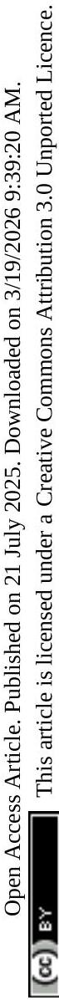

[^0]:    ${ }^{a}$ Department of Chemistry, University College London, 20 Gordon Street, London WC1H OAJ, UK. E-mail: c.r.a.catlow@ucl.ac.uk
    ${ }^{b}$ UK Catalysis Hub, Research Complex at Harwell, Rutherford Appleton Laboratory, R92 Harwell, Oxfordshire OX11 OFA, UK
    ${ }^{c}$ Cardiff Catalysis Institute, School of Chemistry, Cardiff University, Cardiff CF10 3AT, UK
    ${ }^{d}$ STFC Scientific Computing Department, Daresbury Laboratory, Keckwick Lane, Daresbury, Warrington, WA4 4AD, UK. E-mail: alin-marin.elena@stfc.ac.uk

[^1]:    ${ }^{a}$ The IP and DFT data for materials labeled with $a$ are reported from our calculations whereas the rest are from ref. 68.

