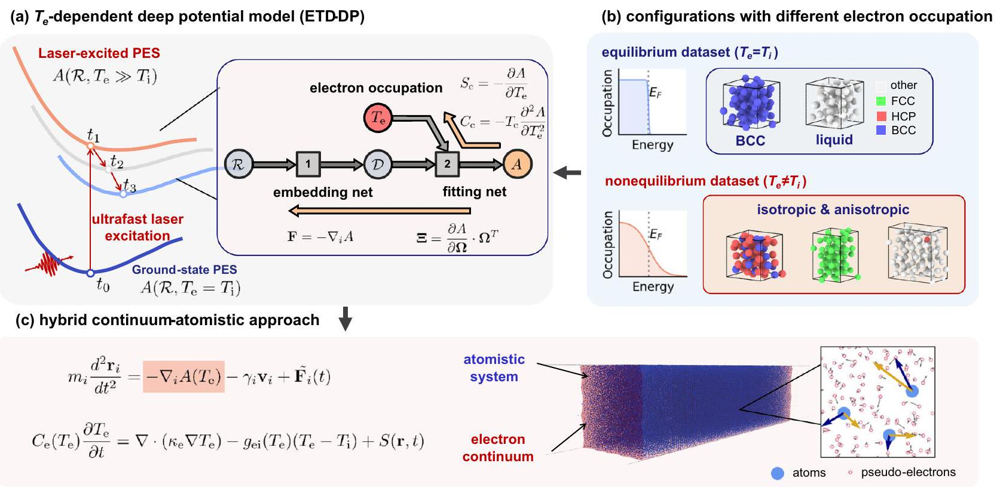
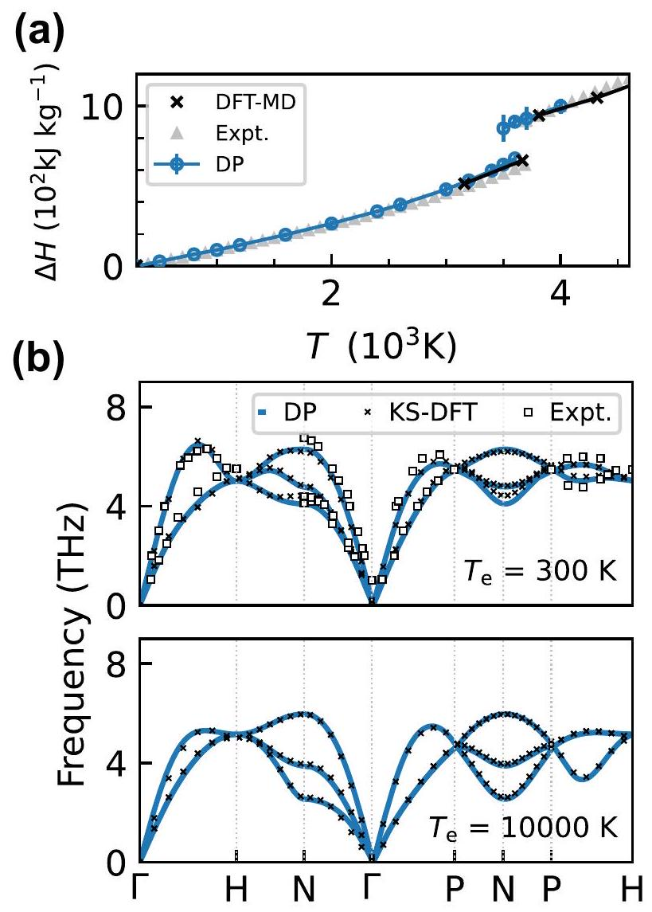
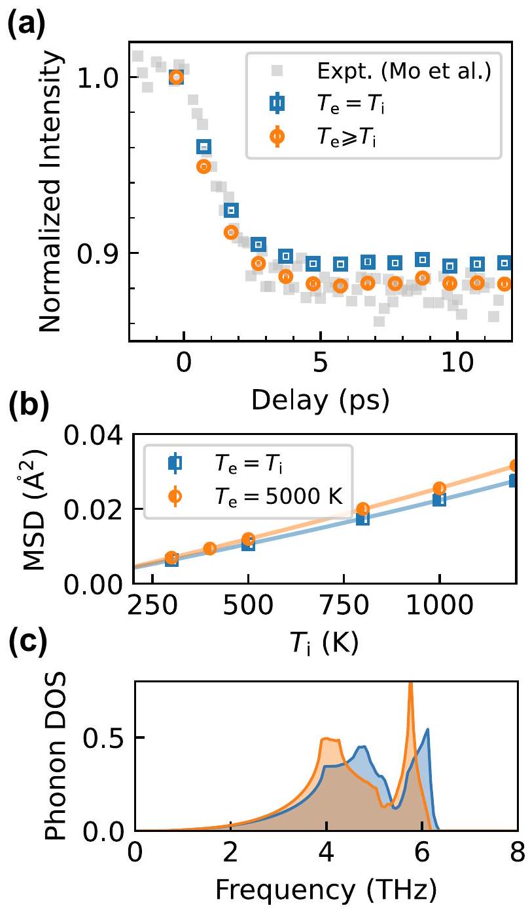
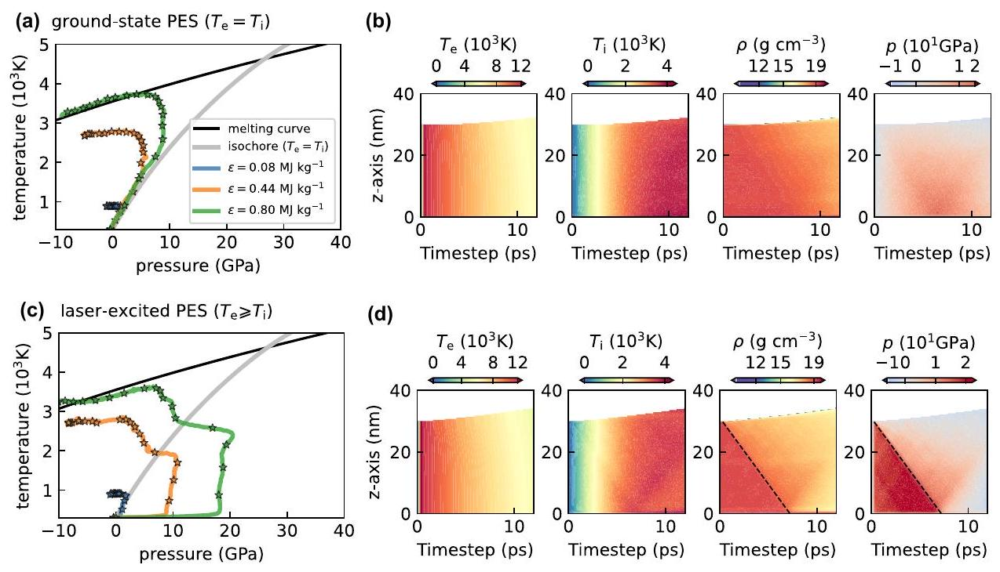

# Full-scale ab initio simulations of laser-driven atomistic dynamics 

Qiyu Zeng ${ }^{1,2}$, Bo Chen ${ }^{1,2}$, Shen Zhang ${ }^{1,2}$, Dongdong Kang ${ }^{1,2}$, Han Wang ${ }^{3}$, Xiaoxiang Yu ${ }^{1,2 \boxtimes}$ and Jiayu Dai (B) ${ }^{1,2 \boxtimes}$

#### Abstract

The coupling of excited states and ionic dynamics is the basic and challenging point for the materials response at extreme conditions. In the laboratory, the intense laser produces transient nature and complexity with highly nonequilibrium states, making it extremely difficult and interesting for both experimental measurements and theoretical methods. With the inclusion of laserexcited states, we extend an ab initio method into the direct simulations of whole laser-driven microscopic dynamics from solid to liquid. We construct the framework of combining the electron-temperature-dependent deep neural-network potential energy surface with a hybrid atomistic-continuum approach, controlling non-adiabatic energy exchange and atomistic dynamics, which enables consistent interpretation of experimental data. By large-scale ab initio simulations, we demonstrate that the nonthermal effects introduced by hot electrons play a dominant role in modulating the lattice dynamics, thermodynamic pathway, and structural transformation. We highlight that the present work provides a path to realistic computational studies of laser-driven processes, thus bridging the gap between experiments and simulations.

npj Computational Materials (2023)9:213; https://doi.org/10.1038/s41524-023-01168-4

## INTRODUCTION

Intense laser-matter interaction plays an important role in many applications including inertial confinement fusion ${ }^{1}$, laser micromachining ${ }^{2}$, and material synthesis ${ }^{3}$. Ultrafast laser excitation can drive matter into extremely nonequilibrium states, in which the hot electron and cold lattice coexist. The subsequent atomistic dynamics is therefore a long-standing challenge because it is governed by the interplay between excited-electron-modulated potential energy surface (PES) ${ }^{4}$, electron-ion coupling ${ }^{5}$, and geometric characteristics of irradiated samples ${ }^{6}$.

Tremendous efforts based on time-resolved probing techniques and simulations have provided valuable insights into the nonthermal behaviors ${ }^{7-11}$, kinetics of laser-driven melting ${ }^{12-15}$, and electron-phonon coupling ${ }^{16-18}$. The related processes from cold solid to hot liquid and plasma are the typical multiscale dynamics due to the cascade of interrelated processes triggered by the laser excitation, both in timescale and size scale. Therefore, it is of great difficulty and importance to construct a wellcoordinated picture between experimental and theoretical efforts. For example, the dynamics of laser-excited Au is still under debate ${ }^{4,7,19}$, regarding the phonon behaviors driven by laser excitation. In these cases, different priori assumptions on material response were usually made ${ }^{20,21}$.

The above obscure stems from the technical limitations that the present methods cannot capture both the nonthermal nature and intrinsic scale of the laser-induced process at the same time. For ab initio methods such as time-dependent density functional theory (DFT), the sizes are limited to $10^{1} \sim 10^{3}$ atoms and $10^{2} \sim 10^{4} \mathrm{fs}$, unable to access a realistic representation of structural transformations of irradiated samples. While for classical molecular dynamics simulations coupled with two-temperature model (TTM$\mathrm{MD})^{22,23}$, the implementation of empirical potential like embedded-atom-method (EAM) is limited in prior knowledge and model complexity, thus can hardly capture the high
dimensional dependence of PES on both atomic local environments and electron occupations for a wide range of temperature and density ${ }^{19,24}$, leading to the inadequate description of nonthermal nature of laser-driven processes. Therefore, bringing the advantage of ab initio and large-scale molecular dynamics including nonthermal effect becomes the route one must take.

In this paper, we developed an ab initio atomistic-continuum model by combining two-temperature-model (TTM) with an extended deep potential molecular dynamics (DPMD), as illustrated in Fig. 1. When the ultrafast laser interacts with solids, the electrons quickly thermalized at timescales of femtoseconds, producing highly nonequilibrium states (electron temperature $T_{\mathrm{e}} \gg$ ion temperature $T_{\mathrm{i}}$ ). The hot $T_{\mathrm{e}}$ will result in the redistributed charge density first and then modify the PES of ions. To capture this physics, we introduced the laser-excited PES by constructing electron-temperature-dependent deep neural network potential and coupled the PES into an additional electron continuum subsystem via the TTM-MD framework. In this way, we can directly simulate the whole electron-ion coupled dynamics during the laser-driven processes with large-scale simulations within ab initio accuracy. We take tungsten as an example and systematically validate the accuracy of our model in describing lattice dynamics, thermophysical properties, and laser heating process in both equilibrium and laser-excited states, by comparing with the related experimental results recently ${ }^{13}$.

## RESULTS

## Construction of laser-excited PES

Recent efforts have demonstrated the success of the machine learning model toward large-scale simulations of ab initio quality at extreme conditions ${ }^{25-32}$, but most of the studies focus on the equilibrium-state and ground-state applications. Here the electron-temperature-dependent deep potential (ETD-DP) model

[^0]
Fig. 1 Schematic diagram of workflow for efficient and accurate simulation of laser-driven atomistic dynamics. a ETD-DP model. $T_{\mathrm{e}}$ is the electron temperature, regarding the electron occupation distribution. The free energy $A$, force $\mathbf{F}$, virial $\Xi$, electronic entropy $S_{\text {e }}$, and electronic heat capacity $C_{\mathrm{e}}$ can be inferred through the backpropagation algorithm. b Iterative concurrent learning scheme is used to efficiently sample atomic configurations for a wide range of equilibrium and nonequilibrium conditions. c Hybrid atomistic-continuum approach. The evolution of the electron subsystem allows atomistic system transits between different PES, and the Langevin thermostat is introduced to mimic nonadiabatic energy exchange between electron and lattice.

is implemented in the framework of deep potential method ${ }^{25,33,34}$ to model the laser-driven dynamics.

To avoid constructing hand-crafted features or kernels for different types of bulk systems, a general end-to-end symmetrypreserving scheme is adopted ${ }^{35}$. As illustrated in Fig. 1a, the ETDDP model consists of an embedding network and a fitting network. The embedding network is designed to transform the coordinate matrices $\mathcal{R}$ to symmetry preserving features, encoded in the descriptor $\mathcal{D}$. The fitting network is a standard fully connected feedforward neural network, mapping the descriptor to the atomic contribution of total energies.

The newly introduced parameter, electron temperature $T_{\mathrm{e}}$, is used to characterize the laser modulation on PES, in which electron occupation distribution is far away from electron-ion equilibrium states. This ETD-DP is defined as

$$
A=A\left(\mathcal{R}, T_{\mathrm{e}}\right)=\sum_{i} \mathcal{N}_{a_{i}}\left(\mathcal{D}_{a_{i}}\left(\mathbf{r}_{i},\left\{\mathbf{r}_{\mathbf{j}}\right\}_{j \in n(i)}\right), T_{\mathrm{e}}\right)
$$

where $A\left(\mathcal{R}, T_{\mathrm{e}}\right)$ is the potential energy depends on the local atomic environment ( $\mathcal{R}$ ) and $T_{\mathrm{e}}, \mathcal{N}_{a_{i}}$ denotes the neural network of specified chemical species of $a_{i}$ of atom $i$, and the descriptors $\mathcal{D}_{a_{i}}$ describes the symmetry preserved local environment of atom $i$ with its neighbor list $n(i)=\left\{j \mid r_{j i}<r_{\text {cut }}\right\}$.

To generate an ETD-DP model, the new degree of freedom, $T_{\mathrm{e}}$, will dramatically expand the sampling space in the data labeling process, introducing expensive computational costs. Therefore, an iterative concurrent learning scheme ${ }^{36}$ is highly required to efficiently sample atomic configurations under both equilibrium ( $T_{\mathrm{e}}=T_{\mathrm{i}}$ ) and nonequilibrium conditions ( $T_{\mathrm{e}} \neq T_{\mathrm{i}}$ ). As shown in Fig. 1b, to explore the density-temperature space with different electron occupations ( $\rho, T_{\mathrm{i}}, T_{\mathrm{e}}$ ), a variety of crystal structures are used as the initial configurations to run multiple DPMD simulations. An ensemble of ETD-DP is trained with the same dataset but with different parameter initializations. The model deviation, denoted as the maximum standard deviation of the predicted atomic forces by the ensemble of ETD-DP, is used to evaluate whether the explored atomic configurations should be sent to
generate referenced ab initio energies, forces, and virial tensors (see Supplementary Fig. 1).

## Two-temperature model coupled DPMD (TTM-DPMD)

To model the whole ultrafast laser-driven processes from cold solid to plasma, we should couple the quantum electron subsystem and strongly coupled ionic subsystem. Here, we implemented our laser-excited PES into the TTM-MD framework ${ }^{22,23,37}$, going beyond traditional ground-state EAM and neural-network-driven PES descriptions. As shown in Fig. 1c, the heat conduction equation of the electron continuum characterizes the temporal evolution of electron occupations, thus governing the transition of the ionic system between different $T_{\mathrm{e}}$-dependent PES. Langevin dynamics is incorporated to mimic the dynamic electron-ion collisions ${ }^{23,37-39}$. The TTM-DPMD is defined as follows,

$$
C_{e}\left(T_{\mathrm{e}}\right) \frac{\partial T_{\mathrm{e}}}{\partial t}=\nabla \cdot\left(\kappa_{e} \nabla T_{\mathrm{e}}\right)-g_{e i}\left(T_{\mathrm{e}}\right)\left(T_{\mathrm{e}}-T_{\mathrm{i}}\right)+S(\mathbf{r}, t)
$$

$$
m_{i} \frac{d^{2} \mathbf{r}_{i}}{d t^{2}}=-\nabla_{i} A\left(T_{\mathrm{e}}\right)-\gamma_{i} \mathbf{v}_{i}+\tilde{\mathbf{F}}_{i}(t)
$$

where $C_{\mathrm{e}}$ is the electronic heat capacity, $K_{\mathrm{e}}$ the electronic thermal conductivity, $g_{\text {ei }}$ the electron-phonon coupling constant, $S(\mathbf{r}, t)$ the laser source. The ions evolve on the $T_{\mathrm{e}}$-dependent PES $A\left(\mathcal{R}, T_{\mathrm{e}}\right)$, and suffer fluctuation-dissipation forces $-\gamma_{i} \mathbf{v}_{i}+\tilde{\mathbf{F}}_{i}(t)$ from electron sea. Here $\gamma_{i}$ is the friction parameter that characterizes the electron-ion equilibration rate, relating to the electron-phonon coupling constant through $\gamma=g_{\mathrm{ei}} m_{i} / 2 n_{i} k_{\mathrm{B}}$, where $n_{i}$ is the ion number density, $k_{\mathrm{B}}$ the Boltzmann constant, $m_{i}$ the atomic mass. The $\tilde{\mathbf{F}}_{\mathbf{i}}(t)$ term is a stochastic force term with a Gaussian distribution, whose mean and variance are given by $\left\langle\mathbf{F}_{\mathrm{i}(t)}\right\rangle=0$ and $\left\langle\tilde{\mathbf{F}}_{\mathbf{i}}(t) \cdot \tilde{\mathbf{F}}_{\mathbf{i}}\left(t^{\prime}\right)\right\rangle=2 \gamma_{i} k_{\mathrm{B}} T_{\mathrm{e}} \delta\left(t-t^{\prime}\right)$.

In TTM-DPMD, by practically choosing the electron temperature or ionic temperature in the meshgrid as the additional parameter in the ETD-DP model, the ions can evolve under laser-excited PES ( $T_{\mathrm{e}} \gg T_{\mathrm{i}}$ ) or ground-state PES ( $T_{\mathrm{e}}=T_{\mathrm{i}}$ ), so that we can separate the
nonthermal effects defined by the electronic excitation from thermally driven atomic dynamics and phase transformation.

## Validating neural network model for laser-excited tungsten

To validate the effectiveness of the extended DP model, we chose tungsten as our target system. Tungsten is a typical transition metal, with half-filled $d$ bands that are sensitive to $T_{\mathrm{e}}$. Upon laser excitation, tungsten is expected to go through a complicated dynamic process including possible nonthermal solid-solid phase transition ${ }^{8,20,21,24}$, attracting much attention but remains ambiguous. Here we generate a $T_{\mathrm{e}}$-dependent deep-neural-network tungsten model by learning from DFT data calculated with the generalized gradient approximation (GGA) of the exchangecorrelation functional ${ }^{40}$ using VASP package ${ }^{41}$. The atomic configurations used in the training set are collected from a wide range of ( $\rho, T_{\mathrm{i}}, T_{\mathrm{e}}$ ) conditions, covering the phase space of the body-centered-cubic (BCC), close-packed structure, uniaxially distorted crystalline, and the liquid structures. More details about DP training can be found in Supplementary Information.

Here we pay special attention to the thermodynamic properties of equilibrium tungsten that are closely related to the laser heating process. The melting temperature predicted by groundstate DPMD ( 3550 K ; see Supplementary Information) is in consistence with the previous DFT-MD $\left(3450 \pm 100 \mathrm{~K}^{42}\right)$ and Gaussian approximation potentials simulations ( $3540 \mathrm{~K}^{43}$ ), which confirms that the present PES can reproduce melting with DFT accuracy. Furthermore, the dependence of DPMD-predicted enthalpy on temperature along isobaric heating conditions is shown in Fig. 2a, and the experimental data agree very well with our DPMD predictions, especially in the liquid regime ${ }^{44}$. The estimated enthalpy of fusion at the melting point ( $\Delta H_{\mathrm{m}}=237 \pm 20 \mathrm{~kJ} \mathrm{~kg}^{-1}$ ) is also close to the DFT-MD values $\left(250 \mathrm{~kJ} \mathrm{~kg}^{-1}\right)^{45}$ and other experimental values (see Supplementary Table 1 and Supplementary Fig. 3 in Supplementary Information).

Based on calculated thermophysical properties, we can determine the complete melting threshold $\epsilon_{\mathrm{m}}$, which is the laser energy that is sufficient to drive the complete melt of the samples. We found $\epsilon_{\mathrm{m}}=0.92 \pm 0.04 \mathrm{MJ} \mathrm{kg}^{-1}$, corresponding absorbed pump fluence is $53.0 \pm 2.2 \mathrm{~mJ} \mathrm{~cm}^{-2}$ for 30-nm-thick tungsten film (more details in Supplementary Information). Such values are in agreement with the estimated values from experimental results ${ }^{13,44,46-49}$, in which energy density is approximately $0.94 \mathrm{MJ} \mathrm{kg}^{-1}$ (pump fluence of $53.8 \mathrm{~mJ} \mathrm{~cm}^{-2}$ ). The density decrease at elevated temperature as shown in Supplementary Fig. 4, is also consistent with the experimental measurements ${ }^{48-50}$.

The lattice dynamics that requires high-order derivatives of PES were further investigated. As shown in Fig. 2b, the phonon dispersion curves of BCC tungsten under both equilibrium and nonequilibrium states are well-reproduced compared with the DFT results. In particular, compared with the phonon dispersion at $T_{\mathrm{e}}=300 \mathrm{~K}$, the directional phonon softening is observed along the $\mathrm{H}-\mathrm{N}$ and $\mathrm{N}-\Gamma$ path in the first Brillouin zone at elevated electron temperature ( $T_{\mathrm{e}}=10000 \mathrm{~K}$ ), which can be attributed to the delocalization half-filled $d$ bands ${ }^{8,24}$. The depopulation of such a strong directional component in electronic bonding weakens the directional forces and may drive the crystalline structures toward close-packed forms. These results indicate that the neural network PES can provide faithful prediction-related properties in consistency with experiments or ab initio method.

## Direct ab initio simulations of laser-driven dynamics

It is stressed that our explicit electron-temperature-dependence PES can well capture the nonthermal nature of laser-excited metals. When implemented in the TTM-DPMD framework, it allows us to establish a comprehensive understanding of laser-induced nonequilibrium states within ab initio accuracy. Recent timeresolved ultrafast electron and X-ray diffraction experiments

Fig. 2 Validating the accuracy of ETD-DP model. a Temperature dependence of enthalpy under isobaric heating ( $p=1$ bar) with the reference temperature of 300 K . The blue line, the black cross, and gray triangle denotes the DPMD results, previous DFT-MD prediction ${ }^{45}$, and isobaric expansion experimental data ${ }^{44}$ respectively. b Phonon dispersion of laser-excited tungsten ( $\rho_{0}=19.15 \mathrm{~g} \mathrm{~cm}^{-3}$ ). The black cross and white squares represent the individual KS-DFT calculation and experimental measurements ${ }^{63}$.

collect direct quantitative structural information of laser-driven processes ${ }^{13}$, providing a benchmark for the validation of the present newly developed methods. Here, we apply TTM-DPMD to directly simulate the dynamic response of tungsten nanofilm under different absorbed laser energy densities.

In TTM-DPMD simulations, full-scale ab initio description in onedimension of polycrystalline (PC) 30 -nm-thick tungsten nanofilm is considered, according to relevant UED experiment ${ }^{13}$. For PC systems, large size including 752,650 atoms is used to describe crystal grains with random shapes, orientations, and different types of boundaries. The size of each grain ranges from $\sim 5 \mathrm{~nm}$ to $\sim 7 \mathrm{~nm}$ and each grain contains more than $10^{4}$ atoms (totally reaching millions of atoms), which cannot be achieved by the traditional time-dependent DFT simulations. Moreover, an extra 30 nm vacuum space perpendicular to the laser incident direction is set to allow free surface response to the internal stress relaxation, and extra spring forces are introduced for atoms in the bottom regime relating to their initial lattice site, to present bonding to the substrate (see Supplementary Information).

Considering the ballistic transportation of excited electron in tungsten (the mean free path $\sim 33 \mathrm{~nm}$ ), we assumed the uniform deposition of laser energy with a relatively low energy density of $0.08 \mathrm{MJ} \mathrm{kg}^{-1}$ (corresponding to absorbed laser fluence of $4.8 \mathrm{~mJ} \mathrm{~cm}{ }^{-2}$ ). In this case, a moderate two-temperature state is created at the initial stage, where maximum electron temperature can reach 4400 K . Through electron-ion energy exchange, the

Fig. 3 Capturing nonthermal effect with TTM-DPMD approach. Comparison of a temporal evolution of (211) diffraction peak intensity in structure factor under absorbed laser energy density of $0.08 \mathrm{MJ} \mathrm{kg}^{-1}$, compared with experimental data ${ }^{13}$. b Temperature dependence of mean square displacement with isobaric constraints and c phonon density of states (PDOS), obtained under equilibrium condition (blue) and nonequilibrium condition (orange).

system quickly reaches thermal equilibrium ( $T_{\mathrm{e}}=T_{\mathrm{i}} \sim 920 \mathrm{~K}$ ) at $t=5 \mathrm{ps}$.

The structure factor is calculated to extract the decay dynamics of the Laue diffraction peak (LDP) ${ }^{51}$, which is an important quantity to diagnose the structural dynamics in experiments ${ }^{13}$. As shown in Fig. 3a, based on TTM-DPMD simulations with the inclusion of laser-driven excited states, the temporal evolution of the normalized intensity of (211) LDP agrees well with UED measurements. Conversely, the results from simulations by ground-state PES deviate from experimentally measured values significantly. It is interesting to say that the thermal process ( $T_{\mathrm{e}}=T_{\mathrm{i}}$ ) exhibits remarkably slower decay dynamics than the process with excited states ( $T_{\mathrm{e}} \geq T_{\mathrm{i}}$ ) upon such laser fluence. By further investigating the lattice vibration of bulk tungsten, we note that even under moderate nonequilibrium state ( $T_{\mathrm{e}}=5000 \mathrm{~K}$ ), a relative increase of over $10 \%$ in mean square displacement (MSD) can be observed under isobaric heating condition, as shown in Fig. 3b. The enhancement of lattice vibration can be attributed to the hot-electron-induced phonon
softening (Fig. 3c). Such nonequilibrium and nonthermal effects therefore modify the dynamics of diffraction signals according to Debye-Waller formula, in which the decay of LDP is relating to the temporal evolution of lattice temperature and temperature dependence of MSD. The quantitative consistency between our simulations and experiments validates our model further, and then provides a chance to further elucidate laser excitation effects.

By increasing laser energy density up to $0.80 \mathrm{MJ} \mathrm{kg}^{-1}$, the irradiated tungsten nanofilm starts with more severe nonequilibrium states ( $T_{\mathrm{e}}=11200 \mathrm{~K}, T_{\mathrm{i}}=300 \mathrm{~K}$ ). As presented in Fig. 4a, b, the evolution of tungsten nanofilm predicted by ground-state PES ( $T_{\mathrm{e}}=T_{\mathrm{i}}$ ) is a purely thermal process governed by electron-ion coupling. With increased lattice temperature, the system first evolves along the equilibrium isochore in the first 4 ps, where the ionic kinetic pressure accumulates to $\sim 10 \mathrm{GPa}$. Then the thermal pressure is gradually released due to the existence of a free surface. Although the thermal expansion process leads to temperature and density decrease, the gradient in the thermodynamic profile is slight and the whole system can be considered homogeneous.

When laser-induced changes in the PES are included ( $T_{\mathrm{e}} \geq T_{\mathrm{i}}$ ), the thermodynamic pathway and thermodynamic profile are totally different. As shown in Fig. 4c, d and Supplementary Fig. 7, the ultrafast excitation of electrons results in the buildup of extra pressure on a sub-picosecond timescale. Such hot-electroncontributed pressure increases monotonically with increased laser energy density, from $\sim 1 \mathrm{GPa}$ with $T_{\mathrm{e}, 0}=4400 \mathrm{~K}\left(\epsilon=0.08 \mathrm{MJ} \mathrm{kg}^{-1}\right)$ to $\sim 17 \mathrm{GPa}$ with $T_{\mathrm{e}, 0}=11200 \mathrm{~K}\left(\epsilon=0.80 \mathrm{MJ} \mathrm{kg}^{-1}\right)$. The tungsten nanofilm then quickly responds to this nonthermal internal stress, triggering anisotropic volume relaxation dynamics. As a result, a significant inhomogeneity is demonstrated in the thermodynamic profiles. In Fig. 4d, the propagation and reflection of stress waves can be identified with a velocity of $\sim 4.3 \mathrm{~km} \mathrm{~s}^{-1}$, accompanied by a density decrease of $\sim 1 \mathrm{~g} \mathrm{~cm}^{-3}$. With the existence of a free surface, the buildup and uniaxial relaxation of nonthermal stress can strongly influence the thermodynamic pathway, especially under high laser fluence, which cannot simply be assumed to be isochoric or isotropically isobaric (details see Supplementary Figs. 8 and 9). We highlight that such real-time material response captured by TTM-DPMD simulation provides microscopic insights into previous controversial issues on the nonthermal behavior of laser-excited matter ${ }^{19,20}$.

## DISCUSSION

In this work, we developed the deep learning model to perform large-scale ab initio simulations on the laser-induced atomistic dynamics, with quantum accuracy on the nonthermal effects. To validate the accuracy, special attention is paid to recent experiments. We successfully reproduce the experimental data with our model. It is therefore verified that the laser-excited states have profound effects on the thermodynamic evolution and structural transformation dynamics. More importantly, the combination of deep learning techniques with a hybrid continuumatomistic approach bridges the theoretical method and experimental observations, providing a path to establish an accurate and complete understanding of the atomistic dynamics under ultrafast laser interactions.

## METHODS

## DP training

The ETD-DP models for tungsten are generated with DeePMD-kit packages ${ }^{52,53}$ by considering $T_{\mathrm{e}}$ as atomic parameter. Deep Potential Generator (DP-GEN) ${ }^{36}$, has been adopted to sample the most compact and adequate dataset that guarantees the uniform accuracy of ETD-DP in the explored configuration space.

Fig. 4 Hot electron modifies the thermodynamic pathway. Comparison of $\mathbf{a}$, $\mathbf{c}$ thermodynamic pathway and $\mathbf{b}$, $\mathbf{d}$ temporal evolution of the thermodynamic profile of nanofilm, predicted by ground-state PES and laser-excited PES, respectively. In ( $\mathbf{a}$, c), the red arrows indicate the evolution path of the selected regime ( $z=14.0 \mathrm{~nm}$ ) in the tungsten nanofilm, and the thermodynamic state is highlighted by colored stars every 1 ps . In (d), the black dashed lines are used to highlight the propagation of stress waves, whose slope represents a constant propagation speed of $\sim 4.3 \mathrm{~km} \mathrm{~s}^{-1}$.

We consider BCC structure (54 atoms) and liquid structure ( 54 atoms) as the initial configurations and run DPMD under NVT and NPT ensemble (both isotropic and uniaxial constraints are considered), where temperatures range from 100 K to 6000 K , pressure ranges from -15 to 60 GPa , and corresponding electronic temperature ranges from 100 K to $25,000 \mathrm{~K}$. The training sets consist of 6366 configurations under equilibrium condition ( $T_{\mathrm{e}}=T_{\mathrm{i}}$ ) and 6820 configurations sampled under a twotemperature state $\left(T_{\mathrm{e}}>T_{\mathrm{i}}\right)$.

For DP training, the embedding network is composed of three layers ( 25,50 , and 100 nodes) while the fitting network has three hidden layers with 240 nodes in each layer. The total number of training steps is set to $1,000,000$. The radius cutoff $r_{\text {cut }}$ is chosen to be $6.0 \AA$. The weight parameters in loss function for energies $p_{\mathrm{E}}$, forces $p_{\mathrm{f}}$, and virials $p_{\mathrm{v}}$ are set to $(0.02,1000,0.02)$ at the beginning of training and gradually change to $(1.0,1.0,1.0)$. The accuracy of generated DP model is tested in the whole sampling configuration. The prediction errors are shown in Supplementary Fig. 2. For the equilibrium dataset ( $T_{\mathrm{e}}=T_{\mathrm{i}}$ ), the root mean square error (RMSE) of energy $\sigma_{\mathrm{E}}$ is 5.191 meV per atom, the RMSE of forces $\sigma_{\mathrm{f}}$ is $0.363 \mathrm{eV} \AA^{-1}$, and the RMSE of pressure $\sigma_{\mathrm{p}}$ is 0.157 GPa . For the nonequilibrium dataset ( $T_{\mathrm{e}} \neq T_{\mathrm{i}}$ ), the RMSE of energies, forces, and pressures is 2.390 meV per atom, $0.093 \mathrm{eV} \AA^{-1}$, and 0.089 GPa respectively.

The self-consistency calculations are all performed with the VASP package ${ }^{54}$. The Perdew-Burke-Erzerhof (PBE) exchangecorrelation functional is used ${ }^{55}$, and the pseudopotential takes the projector augmented-wave (PAW) formalism ${ }^{56,57}$. The sampling of the Brillouin zone is chosen as $0.2 \AA^{-1}$ under ambient conditions ( $T_{\mathrm{e}} \leq 300 \mathrm{~K}$ ), and $0.5 \AA^{-1}$ for high temperature.

## TTM-DPMD simulation setting

We perform TTM-DPMD simulations with LAMMPS package ${ }^{58}$ through modified EXTRA-FIX packages ${ }^{23}$. The electronic heat capacity is calculated by individual DFT calculations $C_{\mathrm{e}}=T_{\mathrm{e}} \frac{\partial S_{\mathrm{e}}}{\partial T_{\mathrm{e}}}$, which is consistent with previous calculations ${ }^{59}$. The electron-phonon coupling factor is set to constant ( $G_{0}=2.0 \times 10^{17} \mathrm{Wm}^{-2} \mathrm{~K}^{-1}$ ) according to relevant ultrafast electron diffraction experiments ${ }^{13}$. The electron thermal conductivity is described by the Drude model relationship,
$\kappa_{\mathrm{e}}\left(T_{\mathrm{e}}, T_{\mathrm{i}}\right)=\frac{1}{3} v_{\mathrm{F}}^{2} C_{\mathrm{e}}\left(T_{\mathrm{e}}\right) T_{\mathrm{e}}\left(T_{\mathrm{e}}, T_{\mathrm{i}}\right)$, where $v_{\mathrm{F}}$ is Fermi velocity and $\tau_{\mathrm{e}}\left(T_{\mathrm{e}}, T_{\mathrm{i}}\right)$ is the total electron scattering time defined by the electronelectron and electron-phonon scattering rates, $1 / \tau_{\mathrm{e}}=1 / \tau_{\mathrm{e}-\mathrm{e}}+ 1 / \tau_{\mathrm{e}-\mathrm{ph}}=A T_{\mathrm{e}}^{2}+B T_{\mathrm{i}}$. The coefficients $A=2.11 \times 10^{-4} \mathrm{~K}^{-2} \mathrm{ps}^{-1}$, $B=8.4 \times 10^{-2} \mathrm{~K}^{-1} \mathrm{ps}^{-1}, v_{\mathrm{F}}=9710 \AA \mathrm{ps}^{-1}$ are adopted ${ }^{60}$. The duration of laser pulse is set to 130 fs . Since the mean free path of laser-excited electrons is $\sim 33 \mathrm{~nm}$ in tungsten ${ }^{61}$, the electrons are heated uniformly due to the ballistic transport. Therefore, optical penetration of laser energy can be neglected for simplicity.

For the atomic system, the simulation size of polycrystalline sample is set to $30 \times 20 \times 20 \mathrm{~nm}$, containing 752,650 atoms, with an extra $30-\mathrm{nm}$ vacuum space along the x direction to minic the free boundary condition. Extra spring forces are introduced for atoms in the bottom $5 \AA$ relating to their initial lattice site to present bonding to the substrate.

## Phonon spectra calculation

To validate the accuracy of the ETP-DP model, we investigate the lattice dynamics that need high-order derivatives of PES. We use the finite displacement method to calculate the phonon dispersion with ALAMODE package ${ }^{62}$ as a postprocessing code. The forces are calculated in $5 \times 5 \times 5$ supercell with cell lattice parameter $a_{0}=3.17104 \AA$. The atomic displacement is set to $0.01 \AA$, and the interatomic force constants are extracted from KS-DFT and DPMD calculation respectively. The dynamical matrices are derived from these force displacement data to obtain phonon dispersion spectra.

## Ultrafast electron diffraction pattern

To extract the decay of Laue diffraction peak (LDP) intensities as in the UED experiments, we performed the ultrafast electron diffraction simulations with DIFFRACTION package ${ }^{51}$ to obtain the structure factor $S\left(Q_{\mathrm{x}}, Q_{\mathrm{y}}\right)$ defined as follows,

$$
\begin{aligned}
& S=\frac{F^{*} F}{N} \\
& F(\mathbf{Q})=\sum_{i} f_{i}(\mathbf{Q} ; \lambda) e^{i 2 \pi \mathbf{Q} \cdot \mathbf{r}_{i}}
\end{aligned}
$$

where $\mathbf{Q}=\left(Q_{\mathrm{x}}, Q_{\mathrm{y}}, Q_{\mathrm{z}}\right)$ the wave vector, $f_{i}$ the atomic scattering factor, $\lambda$ the wavelength of incident electron, $\mathbf{r}_{i}$ the coordinates of atom $i$. Here, simulated 3.2 MeV electron radiation ( $\lambda \sim 0.34 \mathrm{pm}$ ) is used to create selected area electron diffraction (SAED) patterns according to relevant experiments ${ }^{13}$, and the SAED patterns aligned on the [100] axis ( $Q_{\mathrm{z}}=0$ ) are constructed by selecting reciprocal lattice points intersecting a $0.01 \AA^{-1}$ thick Ewald sphere slice. A detailed discussion can be found in Supplementary Figs. 5 and 6 in Supplementary Information.

## DATA AVAILABILITY

Numerical data supporting the plots and relevant results within this paper are available at https://github.com/mingzhong15/laser-tungsten. In particular, the folder contains the data training set and the input files for training the electron-temperature-dependent deep potential tungsten model, and also the input files for the laser heating simulations.

## CODE AVAILABILITY

The training of the ETD-DP model and inference of the ETD-DP model with extra electron temperature or lattice temperature grid are updated in DeePMD-kit, which is open-sourced at https://github.com/deepmodeling/deepmd-kit.

Received: 10 August 2023; Accepted: 8 November 2023;
Published online: 25 November 2023

## REFERENCES

1. Abu-Shawareb, H. et al. Lawson criterion for ignition exceeded in an inertial fusion experiment. Phys. Rev. Lett. 129, 075001 (2022).
2. Rafael R. Gattass, E. M. Femtosecond laser micromachining in transparent materials. Nat. Photonics 2, 219-225 (2008).
3. Guan, M. et al. Theoretical insights into ultrafast dynamics in quantum materials. Ultrafast Sci. 2022, 1-16 (2022).
4. Recoules, V., Clerouin, J., Zerah, G., Anglade, P. M. \& Mazevet, S. Effect of intense laser irradiation on the lattice stability of semiconductors and metals. Phys. Rev. Lett. 96, 055503 (2006).
5. Liu, W., Luo, J., Li, S. \& Wang, L. The seeds and homogeneous nucleation of photoinduced nonthermal melting in semiconductors due to self-amplified local dynamic instability. Sci. Adv. 8, eabn4430 (2022).
6. Ivanov, D. S. \& Zhigilei, L. V. Effect of pressure relaxation on the mechanisms of short-pulse laser melting. Phys. Rev. Lett. 91, 105701 (2003).
7. Ernstorfer, R. et al. The formation of warm dense matter: experimental evidence for electronic bond hardening in gold. Science 323, 1033-1037 (2009).
8. Giret, Y., Daraszewicz, S. L., Duffy, D. M., Shluger, A. L. \& Tanimura, K. Nonthermal solid-to-solid phase transitions in tungsten. Phys. Rev. B 90, 094103 (2014).
9. Zhang, H. et al. Ultrafast destructuring of laser-irradiated tungsten: thermal or nonthermal process. Phys. Rev. B 94, 224103 (2016).
10. Chen, Z. et al. Ultrafast multi-cycle terahertz measurements of the electrical conductivity in strongly excited solids. Nat. Commun. 12, 1638 (2021).
11. Ono, S. \& Kobayashi, D. Lattice stability of ordered Au-Cu alloys in the warm dense matter regime. Phys. Rev. B 103, 094114 (2021).
12. Mo, M. et al. Heterogeneous to homogeneous melting transition visualized with ultrafast electron diffraction. Science 360, 1451-1455 (2018).
13. Mo, M. et al. Visualization of ultrafast melting initiated from radiation-driven defects in solids. Sci. Adv. 5, eaaw0392 (2019).
14. Wu, J. et al. Ultrafast atomic view of laser-induced melting and breathing motion of metallic liquid clusters with MeV ultrafast electron diffraction. Proc. Natl Acad. Sci. USA 119, e2111949119 (2022).
15. Arefev, M. I., Shugaev, M. V. \& Zhigilei, L. V. Kinetics of laser-induced melting of thin gold film: how slow can it get? Sci. Adv. 8, eabo2621 (2022).
16. Cho, B. I. et al. Measurement of electron-ion relaxation in warm dense copper. Sci. Rep. 6, 18843 (2016).
17. Smirnov, N. A. Copper, gold, and platinum under femtosecond irradiation: results of first-principles calculations. Phys. Rev. B 101, 094103 (2020).
18. Molina, J. M. \& White, T. G. A molecular dynamics study of laser-excited gold. Matter Radiat. Extrem. 7, 036901 (2022).
19. Daraszewicz, S. L. et al. Structural dynamics of laser-irradiated gold nanofilms. Phys. Rev. B 88, 184101 (2013).
20. Medvedev, N. \& Milov, I. Nonthermal phase transitions in metals. Sci. Rep. 10, 12775 (2020).
21. Ben-Mahfoud, L., Silaeva, E. P., Stoian, R. \& Colombier, J. P. Structural instability of transition metals upon ultrafast laser irradiation. Phys. Rev. B 104, 104104 (2021).
22. Ivanov, D. S. \& Zhigilei, L. V. Combined atomistic-continuum modeling of shortpulse laser melting and disintegration of metal films. Phys. Rev. B 68, 064114 (2003).
23. Zeng, Q. \& Dai, J. Structural transition dynamics of the formation of warm dense gold: from an atomic scale view. Sci. China-Phys. Mech. Astron. 63, 1-9 (2020).
24. Murphy, S. T. et al. Dynamical simulations of an electronically induced solid-solid phase transformation in tungsten. Phys. Rev. B 92, 134110 (2015).
25. Zeng, Q. et al. Ab initio validation on the connection between atomistic and hydrodynamic description to unravel the ion dynamics of warm dense matter. Phys. Rev. Res. 3, 033116 (2021).
26. Chen, B. et al. Atomistic mechanism of phase transition in shock compressed gold revealed by deep potential. Preprint at https://arxiv.org/abs/2006.13136 (2021).
27. Yang, F. et al. Lattice thermal conductivity of $\mathrm{MgSiO}_{3}$ perovskite and postperovskite under lower mantle conditions calculated by deep potential molecular dynamics. Chin. Phys. Lett. 39, 116301 (2022).
28. Chen, B. et al. Three-step formation of diamonds in shock-compressed hydrocarbons: decomposition, species separation, and nucleation. Preprint at https:// arxiv.org/abs/2208.01830v1 (2022).
29. Schörner, M., Witte, B. B. L., Baczewski, A. D., Cangi, A. \& Redmer, R. Ab initio study of shock-compressed copper. Phys. Rev. B 106, 054304 (2022).
30. Cheng, B., Hamel, S. \& Bethkenhagen, M. Thermodynamics of diamond formation from hydrocarbon mixtures in planets. Nat. Commun. 14, 1104 (2023).
31. Hinz, J. P., Karasiev, V. V., Hu, S. X. \& Mihaylov, D. I. Development of a machine-learning-based ionic-force correction model for quantum molecular dynamic simulations of warm dense matter. Phys. Rev. Mater. 7, 083801 (2023).
32. Plettenberg, P., Bauerhenne, B. \& Garcia, M. E. Neural network interatomic potential for laser-excited materials. Commun. Mater. 4, 63 (2023).
33. Zhang, L., Han, J., Wang, H., Car, R. \& Weinan, E. Deep potential molecular dynamics: a scalable model with the accuracy of quantum mechanics. Phys. Rev. Lett. 120, 143001 (2018).
34. Zhang, Y. et al. Warm dense matter simulation via electron temperature dependent deep potential molecular dynamics. Phys. Plasmas 27, 122704 (2020).
35. Zhang, L. et al. End-to-end symmetry preserving inter-atomic potential energy model for finite and extended systems. In Proc. 32nd International Conference on Neural Information Processing Systems, 4441-4451 (2018).
36. Zhang, L., Lin, D.-Y., Wang, H., Car, R. \& Weinan, E. Active learning of uniformly accurate interatomic potentials for materials simulation. Phys. Rev. Mater. 3, 023804 (2019).
37. Duffy, D. M. \& Rutherford, A. M. Including the effects of electronic stopping and electron-ion interactions in radiation damage simulations. J. Phys. Condens. Matter 19, 016207 (2007).
38. Dai, J., Hou, Y. \& Yuan, J. Unified first principles description from warm dense matter to ideal ionized gas plasma: electron-ion collisions induced friction. Phys. Rev. Lett. 104, 245001 (2010).
39. Dai, J., Kang, D., Zhao, Z., Wu, Y. \& Yuan, J. Dynamic ionic clusters with flowing electron bubbles from warm to hot dense iron along the Hugoniot curve. Phys. Rev. Lett. 109, 175701 (2012).
40. Perdew, J. P., Burke, K. \& Ernzerhof, M. Generalized gradient approximation made simple. Phys. Rev. Lett. 77, 3865-3868 (1996).
41. Kresse, G. \& Hafner, J. Ab initio molecular dynamics for liquid metals. Phys. Rev. B 47, 558-561 (1993).
42. Wang, L. G., van de Walle, A. \& Alfè, D. Melting temperature of tungsten from two ab initio approaches. Phys. Rev. B 84, 092102 (2011).
43. Byggmästar, J., Nordlund, K. \& Djurabekova, F. Gaussian approximation potentials for body-centered-cubic transition metals. Phys. Rev. Mater. 4, 093802 (2020).
44. Arblaster, J. W. Thermodynamic properties of tungsten. J. Phase Equilib. Diffus. 39, 891-907 (2018).
45. Minakov, D. V., Paramonov, M. A. \& Levashov, P. R. Consistent interpretation of experimental data for expanded liquid tungsten near the liquid-gas coexistence curve. Phys. Rev. B 97, 024205 (2018).
46. White, G. K. \& Collocott, S. J. Heat capacity of reference materials: Cu and W. J. Phys. Chem. Ref. Data 13, 1251-1257 (1984).
47. Berthault, A., Aries, L. \& Matricon, J. High-pressure, high-temperature thermophysical measurements on tantalum and tungsten. Int. J. Thermophys. 7, 167 (1986).
48. Hixson, R. S. \& Winkler, M. A. Thermophysical properties of solid and liquid tungsten. Int. J. Thermophys. 11, 709 (1990).
49. Kaschnitz, E., Pottlacher, G. \& Windholz, L. High-pressure, high-temperature thermophysical measurements on tungsten. High. Press. Res. 4, 558-560 (1990).
50. Hüpf, T., Cagran, C., Lohöfer, G. \& Pottlacher, G. Electrical resistivity of high melting metals up into the liquid phase (V, Nb, Ta, Mo, W). J. Phys. Conf. Ser. 98, 062002 (2008).
51. Coleman, S. P., Spearot, D. E. \& Capolungo, L. Virtual diffraction analysis of Ni [010] symmetric tilt grain boundaries. Model. Simul. Mater. Sci. Eng. 21, 055020 (2013).
52. Wang, H., Zhang, L., Han, J. \& Weinan, E. DeePMD-kit: a deep learning package for many-body potential energy representation and molecular dynamics. Comput. Phys. Commun. 228, 178-184 (2018).
53. Zeng, J. et al. DeePMD-kit v2: a software package for deep potential models. J. Chem. Phys. 159, 054801 (2023).
54. Giannozzi, P. et al. Advanced capabilities for materials modelling with quantum espresso. J. Phys. Condens. Matter 29, 465901 (2017).
55. Perdew, J. P., Burke, K. \& Ernzerhof, M. Generalized gradient approximation made simple. Phys. Rev. Lett. 77, 3865 (1996).
56. Blöchl, P. E. Projector augmented-wave method. Phys. Rev. B 50, 17953 (1994).
57. Holzwarth, N., Tackett, A. \& Matthews, G. A projector augmented wave (PAW) code for electronic structure calculations, Part I: atompaw for generating atomcentered functions. Comput. Phys. Commun. 135, 329-347 (2001).
58. Plimpton, S. Fast parallel algorithms for short-range molecular dynamics. J. Comput. Phys. 117, 1-19 (1995).
59. Lin, Z., Zhigilei, L. V. \& Celli, V. Electron-phonon coupling and electron heat capacity of metals under conditions of strong electron-phonon nonequilibrium. Phys. Rev. B 77, 075133 (2008).
60. Grossi, J., Kohanoff, J., Todorov, T. N., Artacho, E. \& Bringa, E. M. Electronic heat transport versus atomic heating in irradiated short metallic nanowires. Phys. Rev. B 100, 155434 (2019).
61. Steinhögl, W. et al. Tungsten interconnects in the nano-scale regime. Microelectron. Eng. 82, 266-272 (2005).
62. Tadano, T., Gohda, Y. \& Tsuneyuki, S. Anharmonic force constants extracted from first-principles molecular dynamics: applications to heat transfer simulations. J. Phys. Condens. Matter 26, 225402 (2014).
63. Larose, A. \& Brockhouse, B. N. Lattice vibrations in tungsten at $22{ }^{\circ} \mathrm{C}$ studied by neutron scattering. Can. J. Phys. 54, 1819-1823 (1976).

## ACKNOWLEDGEMENTS

This work was supported by the National Natural Science Foundation of China under Grant Nos. 11874424, 11904401, 12104507, 12304307, and the Science and Technology Innovation Program of Hunan Province under Grant No. 2021RC4026.

## AUTHOR CONTRIBUTIONS

Q.Z. and J.D. proposed the original idea and designed the research. Q.Z. carried out the simulations, Q.Z., X.Y., and J.D. analyzed and interpreted the results. Q.Z., X.Y. and J.D. wrote the manuscript with the help of other authors. H.W. contributed to the development of the TTM-DPMD method. B.C., S.Z., and D.K. provided additional support for the interpretation of the results. All the authors reviewed the manuscript.

## COMPETING INTERESTS

The authors declare no competing interests.

## ADDITIONAL INFORMATION

Supplementary information The online version contains supplementary material available at https://doi.org/10.1038/s41524-023-01168-4.

Correspondence and requests for materials should be addressed to Xiaoxiang Yu or Jiayu Dai.

Reprints and permission information is available at http://www.nature.com/ reprints

Publisher's note Springer Nature remains neutral with regard to jurisdictional claims in published maps and institutional affiliations.

Open Access This article is licensed under a Creative Commons Attribution 4.0 International License, which permits use, sharing, adaptation, distribution and reproduction in any medium or format, as long as you give appropriate credit to the original author(s) and the source, provide a link to the Creative Commons license, and indicate if changes were made. The images or other third party material in this article are included in the article's Creative Commons license, unless indicated otherwise in a credit line to the material. If material is not included in the article's Creative Commons license and your intended use is not permitted by statutory regulation or exceeds the permitted use, you will need to obtain permission directly from the copyright holder. To view a copy of this license, visit http:// creativecommons.org/licenses/by/4.0/.
© The Author(s) 2023

[^0]:    ¹College of Science, National University of Defense Technology, 410073 Changsha, Hunan, China. ${ }^{2}$ Hunan Key Laboratory of Extreme Matter and Applications, National University of Defense Technology, 410073 Changsha, China. ${ }^{3}$ Laboratory of Computational Physics, Institute of Applied Physics and Computational Mathematics, 100088 Beijing, China.
    ${ }^{\boxtimes}$ email: xxyu@nudt.edu.cn; jydai@nudt.edu.cn

