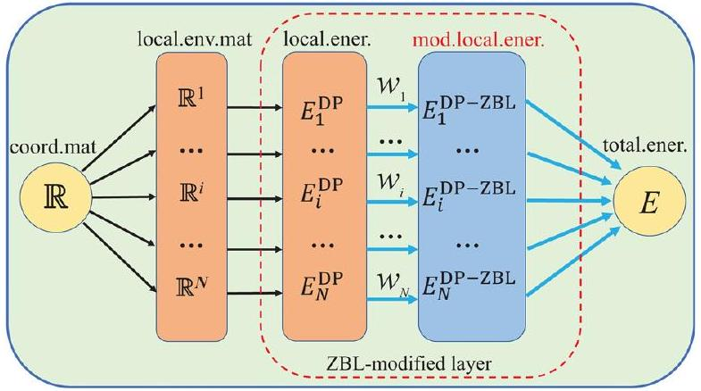
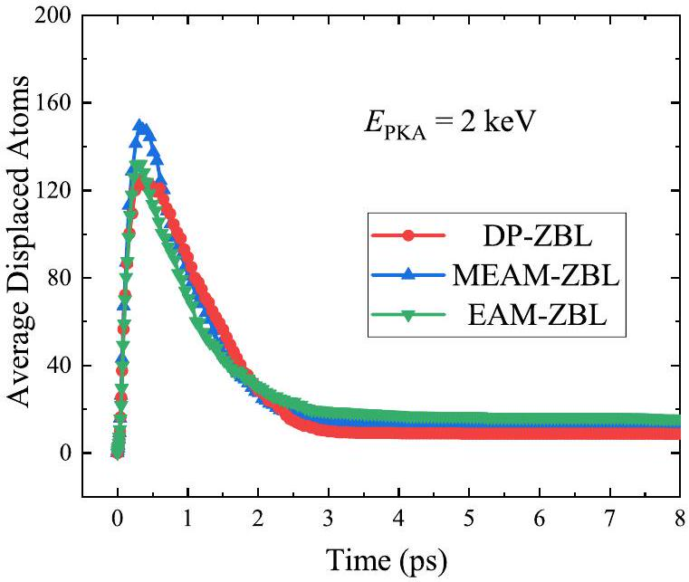
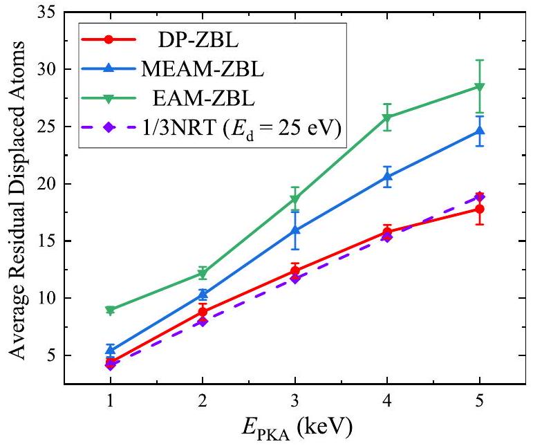

## Deep learning inter-atomic potential model for accurate irradiation damage simulations

Hao Wang (D); Xun Guo (D); Linfeng Zhang (D); Han Wang (D); Jianming Xue
Check for updates
Appl. Phys. Lett. 114, 244101 (2019)
https://doi.org/10.1063/1.5098061

## Articles You May Be Interested In

An effective $\mathrm{Xe}^{+}-\mathrm{Xe}$ interaction potential for electric propulsion systems
J. Appl. Phys. (March 2020)

Verification of models for the simulation of boron implantation into crystalline silicon
J. Vac. Sci. Technol. B (January 1996)

Proton radiation effects in indium oxide using cascade molecular dynamics simulations
APL Energy (August 2025)

# Deep learning inter-atomic potential model for accurate irradiation damage simulations 

Cite as: Appl. Phys. Lett. 114, 244101 (2019); doi: 10.1063/1.5098061
Submitted: 31 March 2019 • Accepted: 29 May 2019 •
Published Online: 17 June 2019

Hao Wang, ${ }^{1, a)}$ (ID Xun Guo, ${ }^{1, a)}$ (ID) Linfeng Zhang, ${ }^{2}$ (ID Han Wang, ${ }^{3, b)}$ (ID) and Jianming Xue ${ }^{1, c)}$

AFFILIATIONS ${ }^{1}$ State Key Laboratory of Nuclear Physics and Technology, School of Physics, CAPT, HEDPS, and IFSA Collaborative Innovation Center of MoE College of Engineering, Peking University, Beijing 100871, People's Republic of China ${ }^{2}$ Program in Applied and Computational Mathematics, Princeton University, Princeton, New Jersey 08544, USA ${ }^{3}$ Laboratory of Computational Physics, Institute of Applied Physics and Computational Mathematics, Beijing 100871, People's Republic of China ${ }^{\text {a) }}$ Contributions: H. Wang and X. Guo contributed equally to this work. ${ }^{\text {b) }}$ Electronic mail: wang_han@iapcm.ac.cn ${ }^{c)}$ Electronic mail: jmxue@pku.edu.cn

#### Abstract

We propose a hybrid scheme that smoothly interpolates the Ziegler-Biersack-Littmark (ZBL) screened nuclear repulsion potential with a deep learning potential energy model. The resulting deep potential-ZBL model can not only provide overall good performance on the predictions of near-equilibrium material properties but also capture the right physics when atoms are extremely close to each other, an event that frequently happens in computational simulations of irradiation damage events. We applied this scheme to the simulation of the irradiation damage processes in the face-centered-cubic aluminum system and found better descriptions in terms of the defect formation energy, evolution of collision cascades, displacement threshold energy, and residual point defects than the widely adopted ZBL modified embedded atom method potentials and their variants. Our work provides a reliable and feasible scheme to accurately simulate the irradiation damage processes and opens up extra opportunities to solve the predicament of lacking accurate potentials for enormous recently discovered materials in the irradiation effect field.

Published under license by AIP Publishing. https://doi.org/10.1063/1.5098061

With the rapid growth of computing science and computer performance, computational simulations, including molecular dynamics (MD) ${ }^{1-3}$ and density functional theory (DFT) method, ${ }^{4,5}$ are becoming increasingly important to evaluate the properties of materials. However, the accuracy of empirically constructed atomic potential models for MD simulations is often in question, while the quantum mechanics approaches, such as DFT, are limited by the time and size scale of the simulated systems. Therefore, a solution that combines the advantages of both methods is needed.

Recently, machine learning (ML) methods have been used to solve this dilemma. ${ }^{6-12}$ Several studies have demonstrated that the ML-based potential energy surface can reach the accuracy of DFT, with the cost comparable to classical empirical potentials. ${ }^{11-16}$ Nevertheless, challenges have remained for ML-based methods to describe very short-distance interactions, e.g., those in the irradiation damage processes, in which the distance between atoms can be very short, and the interactions can hardly be treated as quasistatic, wherein conventional DFT approaches may fail, and so only the

Ziegler-Biersack-Littmark (ZBL) screened nuclear repulsion potential ${ }^{17}$ has been validated for a good description of the corresponding interactions. In other words, in this case, energies and forces from DFT calculations may no longer be accurate training data for MLbased potentials. Moreover, the magnitude of energies and forces is much larger than that in systems near equilibrium, which may pose additional difficulties for the training of ML-based potentials. Therefore, it is necessary to develop a different scheme that is applicable for irradiation damage simulations while still the predictions of material properties for both the near-equilibrium state and shortdistance interaction remain accurate.

To solve this problem, we interpolate the ZBL potential into a deep learning model so that short-distance collisions between atoms can be accurately described. In our previous studies, we have developed the Deep Potential (DP) scheme, an end-to-end symmetry preserving machine learning-based interatomic potential energy model, which can efficiently represent the properties of a wide variety of systems with the accuracy of $a b$ initio quantum mechanics models. ${ }^{6,8}$

Compared with classical ML methods, this ZBL-modified deep learning scheme (DP-ZBL) does not have to presuppose the expression of atomic force or energy, which makes it possible to minimize the impact of manual intervention.

Here, in this letter, we use face-centered-cubic (fcc) aluminum as the reference material, for which many irradiation experiments and collision simulations results have been reported, ${ }^{18-24}$ to validate the feasibility and reliability of this method.

In the DP-ZBL model, we assume that the system under consideration is composed of $N$ atoms with coordinates denoted by $\left\{\boldsymbol{R}_{i}, \ldots, \boldsymbol{R}_{N}\right\}$. Similar to the original DP model, ${ }^{6,25}$ the DP-ZBL potential assumes that the system energy is decomposed into atomic contributions, i.e.,

$$
E^{\mathrm{ZBL}-\mathrm{DP}}=\sum_{i} E_{i}^{\mathrm{ZBL}-\mathrm{DP}},
$$

with $i$ being the indexes of the atoms. The atomic contribution of atom $i$ is fully determined by the coordinates of atom $i$ and its near neighbors

$$
E_{i}^{\mathrm{ZBL}-\mathrm{DP}}=E_{s(i)}^{\mathrm{ZBL}-\mathrm{DP}}\left(\boldsymbol{R}_{i},\left\{\boldsymbol{R}_{j} \mid j \in \mathcal{N}_{R_{c}}(i)\right\}\right),
$$

where $s(i)$ denotes the chemical species of atom $i$, and $\mathcal{N}_{R_{c}}(i)$ denotes the set of near neighbors within cutoff radius $R_{c}$, i.e., $\mathcal{N}_{R_{c}}(i)=\left\{j \mid R_{i j}\right. \left.=\left|\boldsymbol{R}_{i j}\right| \leq R_{c}\right\}$. The atom contribution of DP-ZBL is the interpolation of the ZBL screened nuclear repulsion potential $E_{i}^{\mathrm{ZBL}}$ and the standard deep potential $E_{i}^{\text {DP }}$,

$$
E_{i}^{\mathrm{ZBL}-\mathrm{DP}}=w_{i} E_{i}^{\mathrm{ZBL}}+\left(1-w_{i}\right) E_{i}^{\mathrm{DP}},
$$

where $w_{i}$ is the scale of ZBL potential that smoothly changes from 1 to 0 as the distance between atom $i$ and its "nearest" neighbor goes from 0 to a threshold value. To be more specific, the scale $w_{i}$ is defined as

$$
w_{i}= \begin{cases}1 & \sigma_{i}<R_{a} \\ -6 u_{i}^{5}+15 u_{i}^{4}-10 u_{i}^{3}+1 & R_{a} \leq \sigma_{i}<R_{b} \\ 0 & \sigma_{i} \geq R_{b}\end{cases}
$$

with $u_{i}$ being the short-hand notation defined by

$$
u_{i}=\frac{\sigma_{i}-R_{a}}{R_{b}-R_{a}}
$$

and $\left[R_{a}, R_{b}\right)$ denoting the range in which the ZBL potential and the deep potential are interpolated. It is noted that the switch function $-6 u_{i}^{5}+15 u_{i}^{4}-10 u_{i}^{3}+1$ is continuous at 0 and 1 up to the second order derivative. The symbol $\sigma_{i}$ denotes the smooth-minimal distance of atom $i$ 's near neighbors, which is defined by

$$
\sigma_{i}=\frac{\sum_{j \in \mathcal{N}_{R_{c}}(i)} R_{i j} e^{-R_{i j} / \alpha}}{\sum_{j \in \mathcal{N}_{R_{c}}(i)} e^{-R_{i j} / \alpha}},
$$

with $\alpha$ being a tunable scale of the distances between atoms. In the current work, we fix the scale to $\alpha=0.1 \AA$.

As shown in the schematic diagram of Fig. 1, a ZBL-modified layer is added to better describe the strong repulsion at short interatomic distances in the DP-ZBL model, through the smooth switch function $w_{i}$ in Eq. (4). Then, the DP-ZBL model neural network was trained with the same dataset generated by the deep potential generator (DP-GEN) in Ref. 26, a scheme employing the idea of active

FIG. 1. Schematic plot of the DP-ZBL model. In the mapping from the coordinate matrix $\mathbb{R}$ to the potential energy $E, \mathbb{R}$ is first transformed to local environment matrices $\left\{\mathbb{R}^{i}\right\}_{i=1}^{N}$. Then, each $\mathbb{R}^{i}$ is mapped, through a subnetwork to a local "atomic" energy $E_{i}^{\mathrm{DP}}$ as well as the original DP model. Then, a ZBL-modified layer is added to better reproduce the strong repulsion at short interatomic distances, through the smooth interpolation of the ZBL screened nuclear repulsion potential $E_{i}^{\mathrm{ZBL}}$ and the standard deep potential $E_{i}^{\mathrm{DP}}$. Finally, $E_{\text {total }}=\sum_{i} E_{i}^{\mathrm{DP}-\mathrm{ZBL}}$.

learning ${ }^{42}$ and reinforced dynamics. ${ }^{43}$ With the help of the active learning algorithm, over $6 \times 10^{7}$ bulk and surface configurations were explored by canonical ensemble (NVT ensemble) molecular dynamics simulation up to 2000 K , and about $0.01 \%$ of them were finally labeled and selected into the training database, which ensures that the DP-ZBL model can be trained with enough possible configurations with high accuracy, as demonstrated in our previous work. ${ }^{26}$ Apart from the interpolation with the ZBL potential, the cutoff radius adopted by the current work is $6 \AA$, and the total training steps are 6400000 (see the supplementary material for more details) These differences in training will not lead to a significant difference in the accuracy. We have also tested several switching ranges ( $R_{a}, R_{b}$ ) to generate the DP-ZBL potentials. The best one $(1.2 \AA, 2.0 \AA)$ was selected for collision cascade simulations that are presented below.

In order to evaluate the behavior of the DP-ZBL potential on irradiation effects, two classical potentials have also been employed for comparison, including the ZBL joined embedded atom method (EAM) potential (EAM-ZBL) ${ }^{44}$ and the state-of-the-art modified EAM (MEAM) potential ${ }^{45}$ with self-implemented ZBL (MEAM-ZBL), which were widely used in the previous irradiation simulations and gave satisfactory results. ${ }^{46-48}$ In this work, we used the DeePMD-kit ${ }^{49}$ for training the DP-ZBL potential, LAMMPS ${ }^{50}$ for molecular dynamic simulations, VASP ${ }^{51-53}$ for $a b$ initio calculations, and OVITO ${ }^{54}$ for the defect identification.

First, we calculated some material properties using these three potentials and the DFT (see Methods in the supplementary material), as summarized in Table I. It is no wonder that the MEAM-ZBL potential provides nearly the same vacancy formation energies ( $E_{\mathrm{vf}}$ ) as the results of experiments because these basic solid state properties have been used to tune the parameters of the MEAM potentials. Besides that, the DP-ZBL potential gives reliable results in all these considered properties. These results demonstrate that the DP-ZBL potential can still provide accurate predictions about the material properties near the equilibrium state with the accuracy comparable to the DFT calculations, which also implies that the smoothly joined ZBL potential which dominates the interatomic interactions below $1.2 \AA$ would not influence the accuracy of the original DP model.

TABLE I. Equilibrium properties of AI: atomization energy $E_{\text {am }}$, equilibrium lattice constant $a_{0}$, vacancy formation energy $E_{\text {vf }}$, interstitial formation energy $E_{\text {if }}$ for octahedral interstitial (oh) and tetrahedral interstitial (th), independent elastic constants $C_{11}, C_{12}$, and $C_{44}$, Bulk modulus $B_{V}$ (Voigt), shear modulus $G_{V}$ (Voigt), stacking fault energy $\gamma_{\mathrm{sf}}$, twin stacking fault energy $\gamma_{\text {tsf }}$, melting point $T_{\mathrm{m}}$, enthalpy of fusion $\Delta H_{f}$, and diffusion coefficient $D$ at $T=1000 \mathrm{~K}$.
| $\mathrm{Al}^{\mathrm{a}}$ | Exp. | DFT | DP-ZBL | $\mathrm{DP}^{26}$ | MEAM-ZBL | EAM-ZBL ${ }^{\text {b }}$ |
| :--- | :--- | :--- | :--- | :--- | :--- | :--- |
| $E_{\text {am }}$ (eV/atom) | $-3.49^{27}$ | -3.75 | -3.74 | -3.65 | -3.36 | -3.39 |
| $a_{0}{ }^{\mathrm{c}}(\AA)$ | $4.04^{28}$ | 4.04 | 4.04 | 4.04 | 4.05 | 4.01 |
| $E_{\mathrm{vf}}(\mathrm{eV})$ | $0.66^{29,30}$ | $0.67^{31}$ | 0.73 | 0.79 | 0.67 | 1.14 |
| $E_{\text {if }}(o h)(\mathrm{eV})$ | ⋯ | $2.91^{31}$ | 2.57 | 2.45 | 3.12 | ⋯ |
| $E_{\text {if }}(t h)(\mathrm{eV})$ | ... | $3.23^{31}$ | 3.23 | 3.12 | 3.83 | ⋯ |
| $C_{11}(\mathrm{GPa})$ | $114.3^{32}$ | 111.2 | 112.8 | 120.9 | 113.5 | 106.9 |
| $C_{12}(\mathrm{GPa})$ | $61.9^{32}$ | 61.4 | 57.6 | 59.6 | 61.6 | 81.5 |
| $C_{44}(\mathrm{GPa})$ | $31.6^{32}$ | 36.8 | 41.2 | 40.4 | 45.4 | 44.2 |
| $B_{\mathrm{V}}(\mathrm{GPa})$ | $79.4^{32}$ | 78.0 | 76.0 | 80.1 | 78.9 | 90.0 |
| $G_{\mathrm{V}}(\mathrm{GPa})$ | $29.4^{32}$ | 32.1 | 35.8 | 36.5 | 37.6 | 31.6 |
| $\gamma_{\mathrm{sf}}\left(\mathrm{J} / \mathrm{m}^{2}\right)$ | $0.11-0.21^{33-36}$ | $0.142^{37}$ | 0.070 | 0.132 | 0.184 | ⋯ |
| $\gamma_{\text {tsf }}\left(\mathrm{J} / \mathrm{m}^{2}\right)$ | ... | $0.135^{37}$ | 0.075 | 0.130 | 0.184 | ⋯ |
| $T_{\mathrm{m}}(\mathrm{K})$ | $935^{38}$ | $950( \pm 50)^{39}$ | $885( \pm 5)$ | $918( \pm 5)$ | $950( \pm 5)$ | $1050( \pm 5)$ |
| $\Delta H_{\mathrm{f}}(\mathrm{KJ} / \mathrm{mol})$ | $10.7( \pm 0.2)^{40}$ | ⋯ | 9.3 | 10.2 | 11.5 | 8.8 |
| $D\left(10^{-9} \mathrm{~m}^{2} / \mathrm{s}\right)$ | 7.2-7.9 ${ }^{\mathrm{d}}$ | ⋯ | 6.8 | 7.1 | 4.9 | 6.8 |

${ }^{\mathrm{a}}$ The above results, unless specified with a reference, are computed by the authors.
${ }^{\mathrm{b}}$ The interstitial and stacking fault configurations were unstable upon relaxation with the EAM-ZBL potential, and so their formation energies are not reported.
${ }^{\mathrm{c}}$ Experimental values obtained at $T=298 \mathrm{~K}$; DFT, DP, and MEAM results obtained at $T=0 \mathrm{~K}$.
${ }^{\mathrm{d}} D=7.2 \times 10^{-9} \mathrm{~m}^{2} / \mathrm{s}$ at 980 K and $7.9 \times 10^{-9} \mathrm{~m}^{2} / \mathrm{s}$ at $1020 \mathrm{~K} .^{41}$

Then, we did collision cascade simulations by using these three potentials. Collision cascades are the feature phenomena in irradiation effects. ${ }^{55-57}$ When the energetic particles, including protons, neutrons, electrons, and ions inject the target material, it will transfer energy to the target atoms. If the transferred energy is higher than the displacement threshold energy ( $E_{\mathrm{d}}$ ) of target atoms, they will leave from the original lattice sites. If these primary knock-on atoms (PKAs) still have enough energy, they can knock out other target atoms subsequently and so on. Thus, a large number of atoms are displaced from their original lattice sites, which is known as the collision cascade. However, as the cascade begins to thermally equilibrate with its surrounding environment, most of the displaced atoms return to the perfect lattice site, ${ }^{58,59}$ as illustrated in Fig. 2.

It can be concluded in Fig. 2 that all the three potentials exhibit a similar trend of displaced atoms during the evolution. The number of displaced atoms increased sharply within 1 ps and reached a peak at $0.3-0.4 \mathrm{ps}$. Then, it decreased monotonically because of the recombination process, and only a few defects remained. The evolution of displaced atoms generated by PKA at other energies is also illustrated in the supplementary material. It can be concluded from Fig. S4 that the peak value of displaced atoms increased with the increasing PKA energy, but the peak of the MEAM-ZBL model is significantly higher than that of other models when the PKA energy is larger than 2 keV . Though this transient process can hardly be examined by experiment or other models, which means that we cannot give a reliable estimation which one is more accurate, we can still conclude that the collision cascade evolutions provided by DP-ZBL potential do not significantly deviate from the results obtained other existing methods.

In fact, the number of residual point defects is even more important than the peak value during evolution, for a broad range of
fundamental science and applied engineering applications. To quantify the numbers of point defects caused by a single PKA, Norgett et al. have proposed the Norgett-Robinson-Torrens (NRT) model, based on the binary collision approximation method, to evaluate the bombardment damage. ${ }^{60,61}$ However, it has been recognized for several decades that the NRT model overestimates nearly 3 times the number of stable defects in pure metals after energetic cascades. ${ }^{62-64}$ Therefore, we

FIG. 2. The number of average displaced atoms $N_{d}$ during the evolution of the collision cascade caused by a 2 keV PKA. Each point is the average of 10 independent 2 keV cascade simulations.

FIG. 3. The residual point defects after 50 ps relaxation and the corresponding $1 / 3$ NRT model results. Each point is the average of 10 independent cascade simulations, and the errors are given in the standard error of the mean.

calculated the residual point defects by the NRT model and used one third of it as a benchmark to evaluate our cascade simulation results, and a brief introduction of the NRT model is also introduced in the supplementary material.

As shown in Fig. 3, the residual displaced atoms calculated by the three potentials all exhibit similar near-linear trends with the value of initial PKA energy, which is consistent with the NRT model according to Eq. (S2). Note that the slope of the fitting line is inversely proportional to the displacement energy $E_{\mathrm{d}}$, which is usually defined as the minimum amount of energy transferred to a lattice atom to make it displace from original stable site. ${ }^{65}$ Other widely used models, such as the Kinchin-Pease (KP) model ${ }^{66}$ and the athermal recombination corrected displacements per atom (arc-DPA) model, ${ }^{67}$ typically take $E_{\mathrm{d}}$ as a key parameter to quantify the amount of displacement damage generated by energetic particles inject in materials. So we also made a comparison of average $E_{\mathrm{d}}$ value in all the possible directions calculated by these three models, as shown in Table II and Fig. S3.

According to our calculations, $E_{\mathrm{d}}$ provided by the DP-ZBL and MEAM-ZBL potentials was quite close to the recommended value $\left(25 \mathrm{eV}\right.$ for fcc Al), ${ }^{65,68}$ while the result of EAM-ZBL potential has a relatively large deviation. Furthermore, the DP-ZBL potential can also give the best prediction of residual displaced atoms in the three examined potentials, if we took the $1 / 3$ NRT results as a reference. Therefore, the simulation results of DP-ZBL potential are consistent with most of the existing theoretical models in the field of low-energy ion irradiation damage.

Meanwhile, the displacement energy of three potentials is on the order of $E_{\mathrm{d}}$ (DP-ZBL) $>E_{\mathrm{d}}$ (MEAM-ZBL) $>E_{\mathrm{d}}$ (EAM-ZBL), and so

TABLE II. The average displacement threshold energy ( $E_{\mathrm{d}}$ ) of fcc AI.
| fcc Al | Recommended $^{68}$ | DP-ZBL | MEAM-ZBL | EAM-ZBL |
| :--- | :---: | :---: | :---: | :---: |
| $E_{\mathrm{d}}(\mathrm{eV})$ | 25.0 | 26.54 | 22.67 | 16.73 |

the corresponding residual point defect values should be $N_{\mathrm{d}}$ (EAMZBL) $>N_{\mathrm{d}}$ (MEAM-ZBL) $>N_{\mathrm{d}}$ (DP-ZBL), which is completely in accordance with the results in Fig. 3. Besides, it is worth noting that the DP-ZBL model usually produces smaller $N_{\mathrm{d}}$ than the classical EAM-ZBL and MEAM-ZBL potentials, which may be caused by the fact that the DFT datasets used to train the DP-ZBL model have considered the energy difference of configurations far from the equilibrium state, while the traditional EAM-ZBL and MEAM-ZBL potentials are simply constructed by fitting the material properties near the equilibrium state. From this point of view, the DP-ZBL model should provide a better description for the irradiation damage events than traditional analytical potentials.

In conclusion, we have proposed the DP-ZBL scheme by smoothly interpolating the accurate repulsive pair potential (ZBL) into the DP model. The DP-ZBL potential generated in this way can not only give accurate results regarding the material properties near equilibrium states but also be sufficient to describe the atomic collision cascades during the irradiation damage processes. This method can minimize the impact of subjective factors on potentials during their establishments and provide higher agreement with experimental or DFT results compared with other widely used classical potentials. Moreover, this method can also be used in the irradiation effect studies of advanced complex structures, such as high entropy alloys (HEAs), layered transition metal ternary nitrides and carbides ( $\mathrm{M}_{\mathrm{n}+1} \mathrm{AX}_{\mathrm{n}}$ phases), and low-dimensional materials, for which it is difficult to establish reliable atomic potentials by using the classical empirical or ML method. We hope that with the development and improvement of the DP-ZBL potential database and corresponding computational algorithm, the predicament of accurate potentials lacking in the irradiation effect field could be better solved.

See the supplementary material for a specific description about our model and simulation details. More results were also introduced and discussed in this part due to the length limit of this journal.

This work was financially supported by NSFC (Grant Nos. 11705010 and 11871110), the China Postdoctoral Science Foundation (Grant No. 2019M650351), and the National Key Research and Development Program of China (Grants Nos. 2016YFB0201200 and 2016YFB0201203). We are grateful for computing resources provided by Weiming No. 1 and Life Science No. 1 High Performance Computing Platform at Peking University, the Terascale Infrastructure for Groundbreaking Research in Science and Engineering (TIGRESS) High Performance Computing Center and Visualization Laboratory at Princeton University, and TianHe-1(A) at the National Supercomputer Center in Tianjin.

## REFERENCES

${ }^{1}$ W. L. Jorgensen, D. S. Maxwell, and J. Tirado-Rives, J. Am. Chem. Soc. 118, 11225 (1996).
${ }^{2}$ S. Dumpala, S. R. Broderick, U. Khalilov, E. C. Neyts, A. C. T. van Duin, J. Provine, R. T. Howe, and K. Rajan, Appl. Phys. Lett. 106, 011602 (2015).
${ }^{3}$ S. Hooda, S. A. Khan, B. Satpati, D. Kanjilal, and D. Kabiraj, Appl. Phys. Lett. 108, 201603 (2016).
${ }^{4}$ R. Car and M. Parrinello, Phys. Rev. Lett. 55, 2471 (1985).
${ }^{5}$ W. Kohn and L. J. Sham, Phys. Rev. 140, A1133 (1965).
${ }^{6}$ L. Zhang, J. Han, H. Wang, R. Car, and E. Weinan, Phys. Rev. Lett. 120, 143001 (2018).
${ }^{7}$ K. Yao, J. E. Herr, S. N. Brown, and J. Parkhill, J. Phys. Chem. Lett. 8, 2689 (2017).
${ }^{8}$ J. Han, L. Zhang, R. Car, and E. Weinan, Commun. Comput. Phys. 23, 629 (2018).
${ }^{9}$ S. Chmiela, A. Tkatchenko, H. E. Sauceda, I. Poltavsky, K. T. Schütt, and K.-R. Müller, Sci. Adv. 3, e1603015 (2017).
${ }^{10}$ J. Behler and M. Parrinello, Phys. Rev. Lett. 98, 146401 (2007).
${ }^{11}$ A. P. Bartók, M. C. Payne, R. Kondor, and G. Csányi, Phys. Rev. Lett. 104, 136403 (2010).
${ }^{12}$ K. T. Schütt, F. Arbabzadah, S. Chmiela, K. R. Müller, and A. Tkatchenko, Nat. Commun. 8, 13890 (2017).
${ }^{13}$ A. P. Bartók, R. Kondor, and G. Csányi, Phys. Rev. B 87, 184115 (2013).
${ }^{14}$ L. Zhang, H. Wang, and E. Weinan, J. Chem. Phys. 149, 154107 (2018).
${ }^{15}$ A. P. Thompson, L. P. Swiler, C. R. Trott, S. M. Foiles, and G. J. Tucker, J. Comput. Phys. 285, 316 (2015).
${ }^{16}$ M. A. Wood and A. P. Thompson, J. Chem. Phys. 148, 241721 (2018).
${ }^{17}$ J. F. Ziegler and J. P. Biersack, "The stopping and range of ions in matter," in Treatise on Heavy-Ion Science (Springer, 1985), pp. 93-129.
${ }^{18}$ B. Jelinek, S. Groh, M. F. Horstemeyer, J. Houze, S. G. Kim, G. J. Wagner, A. Moitra, and M. I. Baskes, Phys. Rev. B 85, 245102 (2012).
${ }^{19}$ S. S. Gupta, M. A. van Huis, M. Dijkstra, and M. H. F. Sluiter, Phys. Rev. B 93, 085432 (2016).
${ }^{20}$ R. Qiu, H. Lu, B. Ao, L. Huang, T. Tang, and P. Chen, Philos. Mag. 97, 2164 (2017).
${ }^{21}$ N. T. H. Trung, H. S. M. Phuong, M. D. Starostenkov, V. V. Romanenko, and V. A. Popov, IOP Conf. Ser.: Mater. Sci. Eng. 447, 012004 (2018).
${ }^{\mathbf{2 2}}$ M. I. Mendelev, M. J. Kramer, C. A. Becker, and M. Asta, Philos. Mag. 88, 1723 (2008).
${ }^{23}$ V. Botu and R. Ramprasad, Phys. Rev. B 92, 094306 (2015).
${ }^{24}$ V. Botu, R. Batra, J. Chapman, and R. Ramprasad, J. Phys. Chem. C 121, 511 (2017).
${ }^{25}$ L. Zhang, J. Han, H. Wang, W. Saidi, R. Car, and W. E, in Advances in Neural Information Processing Systems (NIPS, 2018), pp. 4441-4451.
${ }^{26}$ L. Zhang, D.-Y. Lin, H. Wang, R. Car, and E. Weinan, Phys. Rev. Mater. 3, 023804 (2019).
${ }^{27}$ V. A. Medvedev, J. D. Cox, and D. D. Wagman, CODATA Key Values for Thermodynamics (Hemisphere Publishing Corporation, 1990), Vol. 94, p. 93.
${ }^{28}$ A. Cooper, Acta Crystallogr. 15, 578 (1962).
${ }^{29}$ W. Triftshäuser, Phys. Rev. B 12, 4634 (1975).
${ }^{30}$ M. J. Fluss, L. C. Smedskjaer, M. K. Chason, D. G. Legnini, and R. W. Siegel, Phys. Rev. B 17, 3444 (1978).
${ }^{31}$ R. Q. Hood, P. R. C. Kent, and F. A. Reboredo, Phys. Rev. B 85, 134109 (2012).
${ }^{32}$ G. N. Kamm and G. A. Alers, J. Appl. Phys. 35, 327 (1964).
${ }^{33}$ V. C. Kannan and G. Thomas, J. Appl. Phys. 37, 2363 (1966).
${ }^{34}$ P. S. Dobson, P. J. Goodhew, and R. E. Smallman, Philos. Mag. 16, 9 (1967).
${ }^{35}$ J.-P. Tartour and J. Washburn, Philos. Mag. A 18, 1257 (1968).
${ }^{\mathbf{3 6}}$ M. J. Mills and P. Stadelmann, Philos. Mag. A 60, 355 (1989).
${ }^{37}$ D. Zhao, O. M. Løvvik, K. Marthinsen, and Y. Li, J. Mater. Sci. 51, 6552 (2016).
${ }^{38}$ M. Ross, L. H. Yang, and R. Boehler, Phys. Rev. B 70, 184112 (2004).
${ }^{39}$ J. Bouchet, F. Bottin, G. Jomard, and G. Zérah, Phys. Rev. B 80, 094102 (2009).
${ }^{40}$ R. A. McDonald, J. Chem. Eng. Data 12, 115 (1967).
${ }^{41}$ A. Meyer, EPJ Web Conf. 83, 01002 (2015).
${ }^{42}$ B. Settles, Active Learning (Synthesis Lectures on Artificial Intelligence and Machine Learning) (Morgan \& Claypool Publishers, 2012), Vol. 6, pp. 1-114.
${ }^{43}$ L. Zhang, H. Wang, and E. Weinan, J. Chem. Phys. 148, 124113 (2018).
${ }^{44}$ K. W. Jacobsen, J. K. Norskov, and M. J. Puska, Phys. Rev. B 35, 7423 (1987).
${ }^{45}$ M. I. Pascuet and J. R. Fernández, J. Nucl. Mater. 467, 229 (2015).
${ }^{46}$ V. N. Popok, S. Vučković, J. Samela, T. T. Järvi, K. Nordlund, and E. E. Campbell, Phys. Rev. B 80, 205419 (2009).
${ }^{47}$ H. M. Urbassek, Nucl. Instrum. Methods Phys. Res., Sect. B 122, 427 (1997).
${ }^{48}$ S. Lu, D. Li, and D. W. Brenner, Handbook of Damage Mechanics: Nano to Macro Scale for Materials and Structures (Springer, New York, 2015), p. 453.
${ }^{49}$ H. Wang, L. Zhang, J. Han, and E. Weinan, Comput. Phys. Commun. 228, 178 (2018).
${ }^{50}$ S. Plimpton, J. Comput. Phys. 117, 1 (1995).
${ }^{51}$ G. Kresse and J. Hafner, Phys. Rev. B 47, 558 (1993).
${ }^{52}$ G. Kresse and J. Hafner, Phys. Rev. B 49, 14251 (1994).
${ }^{53}$ G. Kresse and D. Joubert, Phys. Rev. B 59, 1758 (1999).
${ }^{54}$ A. Stukowski, Modell. Simul. Mater. Sci. Eng. 18, 015012 (2009).
${ }^{55}$ J. Wallace, L. B. B. Aji, L. Shao, and S. O. Kucheyev, Phys. Rev. Lett. 120, 216101 (2018).
${ }^{56}$ H. Wang, J.-T. Tian, W. Zhou, X.-F. Chen, B. Bai, and J.-M. Xue, RSC Adv. 8, 14017 (2018).
${ }^{57}$ W. Zhou, J. Tian, Q. Feng, J. Zheng, X. Liu, J. Xue, D. Qian, and S. Peng, J. Nucl. Mater. 508, 540 (2018).
${ }^{58}$ A. Meldrum, S. J. Zinkle, L. A. Boatner, and R. C. Ewing, Nature 395, 56 (1998).
${ }^{59}$ K. Nordlund, J. Keinonen, M. Ghaly, and R. S. Averback, Nature 398, 49 (1999).
${ }^{60}$ M. T. Robinson and I. M. Torrens, Phys. Rev. B 9, 5008 (1974).
${ }^{61}$ M. J. Norgett, M. T. Robinson, and I. M. Torrens, Nucl. Eng. Des. 33, 50 (1975).
${ }^{62}$ R. S. Averback, R. Benedek, and K. L. Merkle, Phys. Rev. B 18, 4156 (1978).
${ }^{63}$ S. J. Zinkle and B. N. Singh, J. Nucl. Mater. 199, 173 (1993).
${ }^{64}$ R. Konings, Comprehensive Nuclear Materials (Elsevier, Amsterdam, 2011), Vol. 1.
${ }^{65}$ G. S. Was, Fundamentals of Radiation Materials Science: Metals and Alloys (Springer, 2016).
${ }^{66}$ G. H. Kinchin and R. S. Pease, Rep. Prog. Phys. 18, 1 (1955).
${ }^{67}$ K. Nordlund, S. J. Zinkle, A. E. Sand, F. Granberg, R. S. Averback, R. Stoller, T. Suzudo, L. Malerba, F. Banhart, W. J. Weber, F. Willaime, S. L. Dudarev, and D. Simeone, Nat. Commun. 9, 1084 (2018).
${ }^{68}$ M. J. Norgett, M. T. Robinson, and I. M. Torrens, Annual Book of ASTM Standards (ASTM, 1975).

