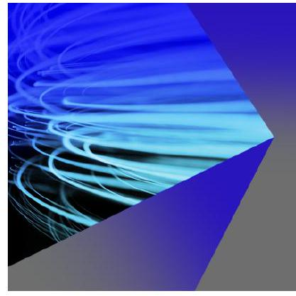
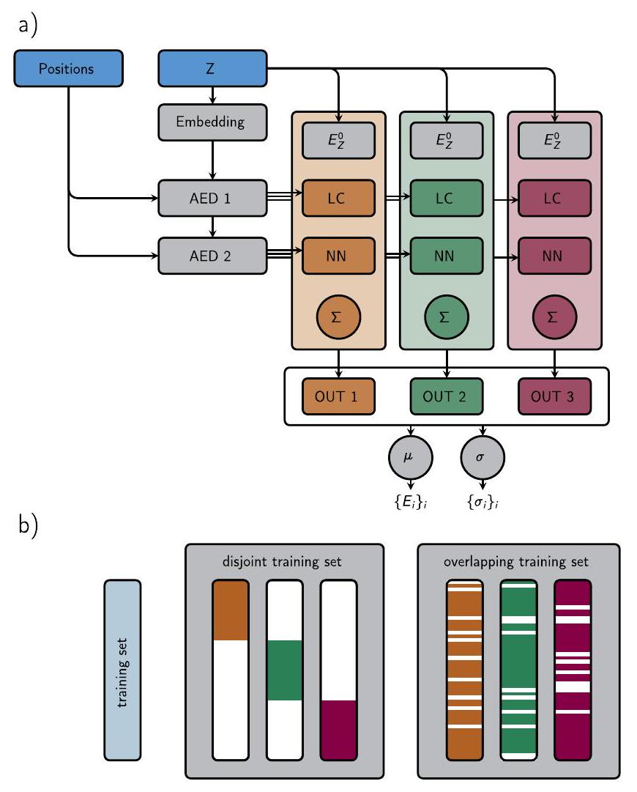
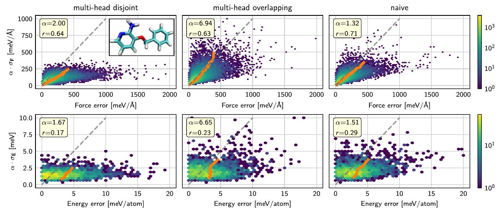
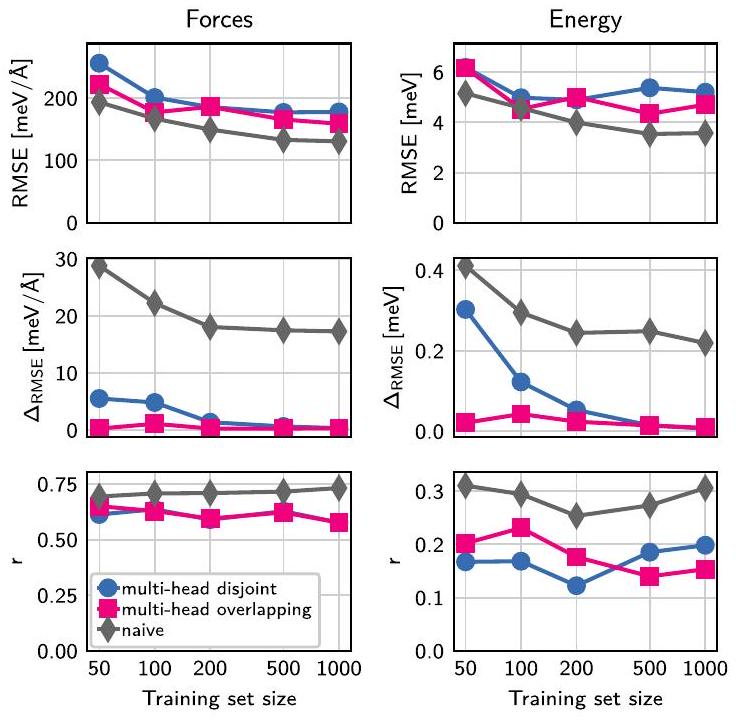
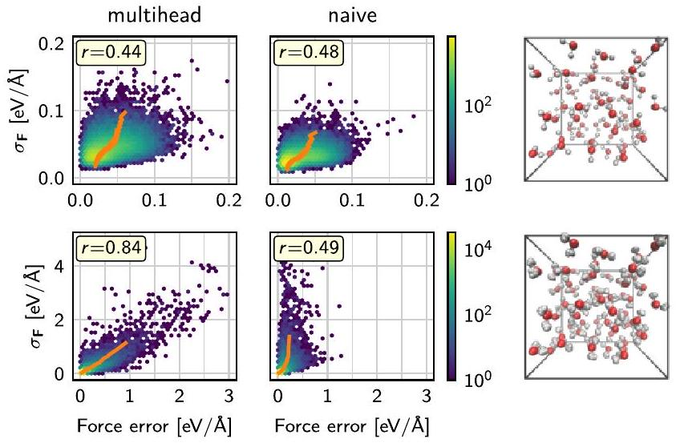
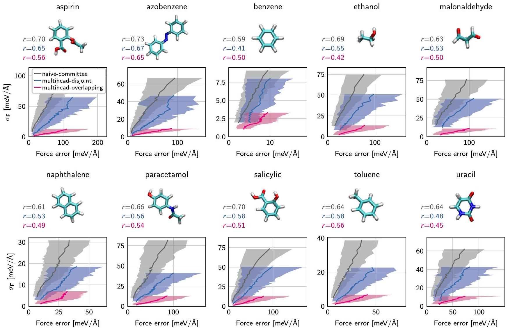
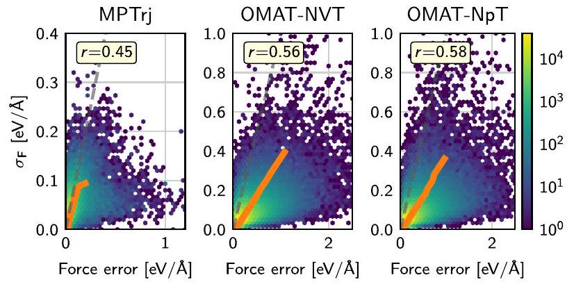
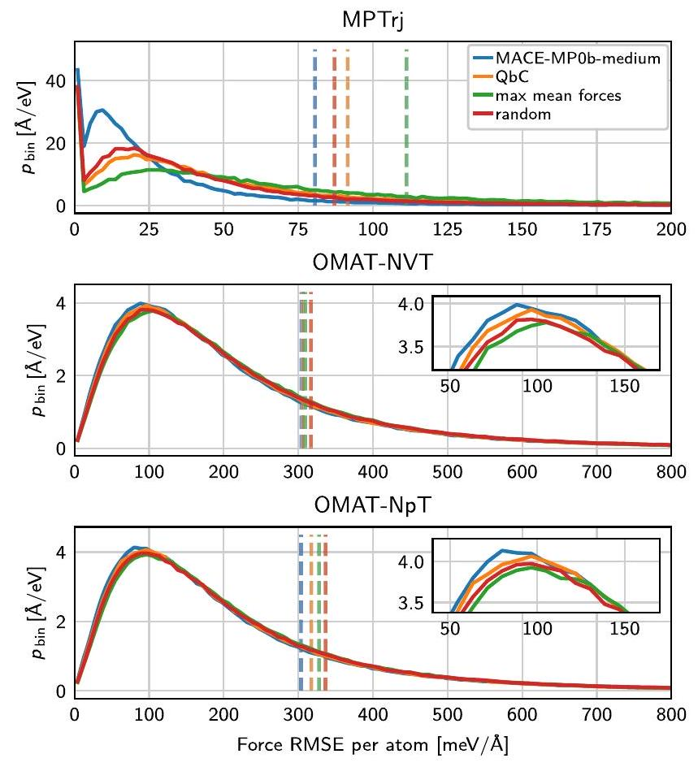

Multi-head committees enable direct uncertainty prediction for atomistic foundation models
Special Collection: 2025 JCP Emerging Investigators Special Collection
Hubert Beck (D); Pavol Simko (D); Lars L. Schaaf (D) ; Ondrej Marsalek (B) ; Christoph Schran (D)
Check for updates
J. Chem. Phys. 163, 234103 (2025)
https://doi.org/10.1063/5.0302097

View Online

Export Citation

## Articles You May Be Interested In

$\Delta$-model correction of foundation model based on the model's own understanding
J. Chem. Phys. (May 2025)

A foundation model for atomistic materials chemistry
J. Chem. Phys. (November 2025)

Evaluation of the MACE force field architecture: From medicinal chemistry to materials science
J. Chem. Phys. (July 2023)

## AIP Advances

## Why Publish With Us?

21DAYS average time to 1 st decision

# Multi-head committees enable direct uncertainty prediction for atomistic foundation models 

Cite as: J. Chem. Phys. 163, 234103 (2025); doi: 10.1063/5.0302097 Submitted: 12 September 2025 • Accepted: 25 November 2025 • Published Online: 15 December 2025

Hubert Beck, ${ }^{1}$ (D) Pavol Simko, ${ }^{1}$ (D) Lars L. Schaaf, ${ }^{2,3}$ (D) Ondrej Marsalek, ${ }^{1, a)}$ (D) and Christoph Schran ${ }^{2}$ AFFILIATIONS ${ }^{1}$ Charles University, Faculty of Mathematics and Physics, Ke Karlovu 3, 12116 Prague 2, Czech Republic ${ }^{2}$ Cavendish Laboratory, Department of Physics, University of Cambridge, Cambridge CB3 OHE, United Kingdom ${ }^{3}$ Lennard-Jones Centre, University of Cambridge, Trinity Ln., Cambridge CB2 1TN, United Kingdom

Note: This paper is a part of the 2025 JCP Emerging Investigators Special Collection.
${ }^{\text {a) }}$ Authors to whom correspondence should be addressed: ondrej.marsalek@matfyz.cuni.cz and cs2121@cam.ac.uk

#### Abstract

Machine learning potentials have become a standard tool for atomistic materials modeling. While models continue to become more generalizable, an open challenge relates to efficient uncertainty predictions for active learning and robust error analysis. In this work, we utilize MACE and its multi-head mechanism to implement a committee neural network potential for message-passing architectures, where the committee comprises multiple output modules attached to the same atomic environment descriptors. As with traditional committees of independent networks, the standard deviation of the predictions functions as an estimate of the model's uncertainty. We show for a range of datasets in custom-build models that the uncertainty of the force predictions correlates well with the true errors. We subsequently apply this concept to foundation models, in particular MACE-MP-0, where we train only the newly attached output heads while keeping the remaining part of the model fixed. We use this approach in an active learning workflow to condense the training set of the foundation model to just $5 \%$ of its original size. The foundation model multi-head committee trained on the condensed training set enables reliable uncertainty estimation without any substantial decrease in prediction accuracy.

© 2025 Author(s). All article content, except where otherwise noted, is licensed under a Creative Commons Attribution (CC BY) license (https://creativecommons.org/licenses/by/4.0/). https://doi.org/10.1063/5.0302097

## I. INTRODUCTION

Over the past decade, the field of machine learning potentials (MLPs) has made multiple significant advances. ${ }^{1,2}$ Architectures with fixed atomic environment descriptors (AEDs), such as Gaussian approximation potentials (GAPs) ${ }^{3}$ and Behler-Parrinello high-dimensional neural network potentials, ${ }^{4}$ established MLPs as a powerful alternative to traditional means of obtaining the potential energy surface (PES) for molecular dynamics (MD) simulations, such as empirical force fields and $a b$ initio methods. ${ }^{5-8}$ The next step in the evolution was graph neural network potentials, where the fixed AEDs were replaced by a message-passing graph neural network, which made the representation of the local atomic environment a learnable feature of the model. While SchNet ${ }^{9}$ was the first notable network of this kind, the introduction of many-body terms, ${ }^{10}$ higher-order tensor features, and equivariant kernels ${ }^{11-13}$
in packages, such as NequIP, ${ }^{14}$ Allegro, ${ }^{15}$ MACE, ${ }^{16}$ TeaNet, ${ }^{17}$ or AlphaNet, ${ }^{18}$ brought them to the forefront of recent attention. These MLPs have raised the standard, both in terms of prediction accuracy and training data efficiency. ${ }^{19}$ Furthermore, they are capable of handling extensive and diverse training data, covering a wide range of different elements and systems. ${ }^{20-22}$

These versatile characteristics of modern MLP architectures have led to the recent development of foundation models. ${ }^{20}$ These are trained on very large datasets that span chemical compound space across the periodic table and are capable of running stable MD out of the box for a broad spectrum of systems, even those that might not be covered directly by the training set. ${ }^{22}$ This is in contrast to the more common MLPs custom-made for a class of related systems, which are trained specifically on structures in the same domain as those encountered at inference time. In a combined approach, foundation models can be fine-tuned on specific
molecules or materials of interest to increase their accuracy. ${ }^{23,24}$ New foundation models, such as M3GNet, ${ }^{20}$ CHGNet, ${ }^{21}$ MACE-MP-0,22 GNoME, ${ }^{25}$ MatterSim, ${ }^{26}$ grACE-2L, ${ }^{27}$ SevenNet-MF-ompa, ${ }^{28}$ and eSEN-30M, ${ }^{29}$ are getting released by both academic and for-profit entities on an almost weekly basis, which further demonstrates the impact of this development.

While proving to be a major leap in the field for the exploration of new material chemistry and physics, foundation models are in most applications only qualitatively correct and can still show unphysical behavior. ${ }^{30}$ In this context, it would be advantageous to have easy ways of quantifying a foundation model's uncertainty, which could be used to assess and monitor the accuracy of its predictions and identify failures more directly. ${ }^{31,32}$ A range of methods and workflows to address this issue is known in the context of MLPs, ${ }^{33}$ but they have not yet seen widespread adoption in foundation models, given the extensive cost of training. Established methods for uncertainty prediction in MLPs include a last-layer approximation of prediction rigidities, ${ }^{34}$ the prediction of confidence intervals using quantile regression, ${ }^{35}$ Gaussian mixture models trained on atomic environment descriptors, ${ }^{36}$ a model-free estimator based on information entropy, ${ }^{37}$ committee neural network ${ }^{38,39}$ potentials, and shallow ensembles. ${ }^{40}$ Once available, uncertainties can be used for active learning, a data-driven workflow to find the most relevant training structures out of a large set of candidates. ${ }^{38,39,41,42}$ Such uncertainty estimates can then be used to monitor the reliability of a model's prediction or, in the context of active learning, to condense and optimize training sets and to reduce the number of necessary reference electronic structure calculations. Having an uncertainty method that can be easily extended to foundation models would be particularly valuable. Considering the enormous effort required to train a foundation model, a solution to the uncertainty quantification problem should take advantage of the capacity of the foundation model while leaving its predictive power untouched. Furthermore, it should not add a substantial computational cost to the model and allow for a calculation of the uncertainty on the fly.

A suitable framework for implementing an uncertainty measure guided by these considerations is MACE, ${ }^{16}$ a leading implementation of multi-ACE, ${ }^{43}$ due to its well-established foundation models and fine-tuning workflow. MACE, which combines the atomic cluster expansion ${ }^{10}$ with message-passing graph neural network potentials, was initially designed for MLPs trained from scratch for specific systems. Eventually, it became one of the first packages to embrace the concept of foundation models in atomistic simulations. ${ }^{22}$ Today, numerous variations and generations of MACE foundation models based on different datasets are available. Recently, MACE has been extended with a multi-head architecture ${ }^{44}$ that allows for multiple output modules to be attached to a shared block of message-passing layers, which form learnable AEDs. This enables, for example, efficient training of a single model to multiple different reference methods, as the AEDs are trained on all training structures, and the output heads only on the structures corresponding to a certain electronic structure method. The most common usage of the mechanism is the fine-tuning of foundation models.

Here, we adapt the MACE multi-head framework to enable uncertainty quantification by building committee models with a shared description of the local atomic environment and individual output heads forming the committee members. The variance is introduced to the committee by means of different weight
initializations and training set subsampling for each committee member. This strategy is analogous to established committee MLPs ${ }^{38,45,46}$ and differs from other proposals to train the committee using a loss function that includes the variance of the predictions. ${ }^{39,40,47}$ Reference 39 showed that both strategies can reliably identify structures of high error. First, we demonstrate that the force-disagreement of a multi-head committee (MHC) serves as a good quantification of the model uncertainty using established datasets spanning from gas-phase molecules to condensed-phase liquids in custom-made MLPs. Using these simple, focused datasets, we investigate different strategies of distributing the training data between the output heads, examine the impact the committee has on the prediction accuracy, and compare the MHC with a naïve committee of independent MACE models. We then adapt the MHC approach to equip foundation models with a direct uncertainty prediction. Namely, we use the uncertainty measure in a query by committee ( QbC ) active learning workflow to condense the large MPtrj training dataset of the MACE-MP-0b foundation model. We train new output heads on the condensed dataset to form an MHC, which yields both a prediction and an uncertainty estimate. We show that this uncertainty estimate correlates well with the actual error. When comparing this MHC with the original foundation model, we observe only a marginal degradation of prediction accuracy. Testing other strategies to condense the training data shows similar, but slightly inferior, results. This strategy of condensing the training data without significantly compromising the foundation model's predictive power in neither precision nor generality indicates a future pathway to upgrade the reference method of the models to higher rungs on Jacob's ladder, such as hybrid DFT or even beyond.

## II. METHODS

In order to enable simple uncertainty prediction within the MACE framework, we have implemented an MHC architecture. The general idea of such a committee has previously been outlined by Kellner and Ceriotti ${ }^{40}$ and was explored for MACE foundation models with an emphasis on energies by Bilbrey et al. ${ }^{35}$ Leveraging the existing multi-head functionality within MACE, initially conceptualized in the context of fine-tuning, ${ }^{22}$ we train multiple output heads to different subsets of the total training set. We lay out two options for distributing the training data: One evenly distributes the full training set between the output heads ("disjoint"), while the other picks the subsets randomly and independently of each other from the full training set ("overlapping"). Having multiple readouts enables us to use the standard deviation between head predictions for uncertainty quantification, similar to committee neural network potentials, while requiring little additional architectural overhead. In addition, this design choice makes it very easy to extend a packaged foundation model without requiring retraining.

## A. Multi-head committee

As shown in Fig. 1, we construct neural network committees for uncertainty quantification by attaching multiple readout heads to message passing node features and use their disagreement as an uncertainty metric. Multiple-readout heads have been used to train on multiple datasets and simplify fine-tuning. ${ }^{44}$

FIG. 1. (a) Schematic description of MHC architecture, for an example model with two MACE layers and three committee members. (b) Two different options of splitting the training data across the heads: "disjoint" and "overlapping."

The geometric message passing layers of MACE construct atomic environment descriptors $\mathbf{h}_{i}^{(l)}$ for each atom $i$ and layer $l$. We attach separate layer dependent readout heads $\mathcal{R}$,

$$
E_{i, n}^{(l)}=\mathcal{R}_{l, n}\left(\mathbf{h}_{i}^{(l)}\right),
$$

where $n$ indexes the different committees. As in the MACE architecture, the first layers have linear readouts, while the readout of the last layer is a multilayer perceptron.

The total energy for committee member $n$ is obtained by summing over all atoms, incorporating both the contributions from the readouts and the isolated atom energies,

$$
E_{n}=\sum_{i} E_{i, n}=\sum_{i}\left(E_{Z(i)}^{(0)}+\sum_{l} E_{i, n}^{(l)}\right),
$$

where $E_{Z(i)}^{(0)}$ denotes the isolated atom energy of species $Z(i)$. The forces $\mathbf{F}_{i, n}$ are calculated as the negative gradient of this total potential energy with respect to the Cartesian positions.

The committee prediction is then obtained by taking the average over all committee members $N$,

$$
E=\frac{1}{A} \sum_{a} E_{a} \quad \mathbf{F}_{i}=\frac{1}{N} \sum_{n}^{N} \mathbf{F}_{i, n},
$$

and the uncertainty estimation is the standard deviation of the energies or forces. To obtain an uncertainty estimate for each atom in the system, we take the average standard deviation over the three force components $\alpha$ such that

$$
\sigma_{F, i}=\frac{1}{3} \sum_{\alpha}\left(\frac{1}{N} \sum_{n}^{N}\left(F_{i, n}^{(\alpha)}-F_{i}^{(\alpha)}\right)\right)^{\frac{1}{2}},
$$

which can be used as the error estimate.

## B. Distribution of training data

During training, each structure gets assigned to a specific head and is subsequently used to optimize the AED and the assigned head. If we want to use a structure for multiple heads, it will appear multiple times in the training set with different assigned heads. To increase the heterogeneity between the heads, we train each of them on a different randomly chosen subset of the complete training set. We consider two possible strategies: either randomly sampling a fraction of the total set of structures for every head or evenly distributing the whole dataset across the heads without any overlap between the subsets. Both strategies are illustrated in Fig. 1(b) and bring different benefits. The first strategy, in which a fraction of the total set of structures is randomly sampled for each head, is called "overlapping" due to the overlaps between resulting training sets. Its potential downside is that in the final concatenated training set, on which the common parts of the model are trained, structures appear multiple times without an even distribution among them. Therefore, the AEDs will be trained more often on some structures than others. The second strategy, in which the whole dataset is evenly distributed among the heads, is called "disjoint" as the training subsets do not overlap. As will be shown in Sec. III, there can be situations where the datasets used to train the output heads of the model are too sparse, and the prediction accuracy consequently decreases significantly if the original dataset is already extremely small. The main benefit of the disjoint strategy is that it increases the diversity between the output heads more strongly, mitigating known problems of a common bias between the committee members. ${ }^{48}$

## C. Uncertainty scaling

Multiplying the committee disagreement with a uniform scaling factor calculated from an independent validation set can correct for an underestimation of the true uncertainty due to biases inherent to the models, ${ }^{31}$

$$
\alpha^{2}=\frac{1}{N_{\mathrm{val}}} \sum_{i \in \mathrm{val}} \frac{\left(\Delta y_{i}\right)^{2}}{\sigma_{i}^{2}},
$$

where $\Delta y_{i}$ and $\sigma_{i}$ are the error and committee disagreement of the i-th element of the validation set, respectively. We note the scaling factor wherever it was applied.

## D. Pearson correlation coefficient

The Pearson correlation coefficient, ${ }^{49}$

$$
r(\epsilon, \sigma)=\frac{\sum_{A}(\epsilon(A)-\bar{\epsilon})(\sigma(A)-\bar{\sigma})}{\sqrt{\sum_{A}(\epsilon(A)-\bar{\epsilon})^{2}} \sqrt{\sum_{A}(\sigma(A)-\bar{\sigma})^{2}}},
$$

is a measure of correlation between two datasets, in our instance, the error $\epsilon$ and the uncertainty $\sigma$. In the case of energy predictions, this uses the energy error and uncertainty per structure, and in the case of force predictions, it uses the root mean square error and mean uncertainty of all three force components of one atom. $\bar{x}$ denotes the mean over the whole dataset. The value of the correlation coefficient can range from -1 to 1 , corresponding to perfect anti-correlation and perfect correlation, respectively, and 0 meaning no correlation at all.

## E. Implementation

We implemented MHCs in MACE 0.3.7 and used this version of the code for the whole project. The output heads are configured to calculate the potential energy predictions of all heads simultaneously. Thus, the mean and standard deviation of the committee energy can be obtained with essentially no additional computational costs. In contrast, due to the intrinsic limitations of automatic differentiation, a single backward pass cannot yield the forces for all the heads and thus their standard deviation. One can still calculate the average forces across the committee heads at the same costs as a normal model, but the standard deviation requires multiple reverse passes through the computational graph, adding some computational overhead.

## F. Training settings

The custom-built models consisted of two message-passing layers, with 32 channels and a maximum tensor order of $l=1$. The multi-layer perceptron in the output blocks of the final layer had 16 nodes in the hidden layer of each output block and used the default SiLU gate. The radial cutoff was set to $6.0 \AA$, resulting in an effective field of view of $12.0 \AA$. The isolated atom energies were always set to the ones specified in the respective datasets. The compositional differences between the committee types lead to different sizes of the full training dataset used for each model. To keep the total number of optimization steps consistent between the different types of models, we adapted the training parameters in our setups. This also means that each member of the naïve committee received as many optimization steps as the MHC. When investigating different training set sizes, we again ensured that the number of optimization steps remains constant for all training sets. A weighted mean squared error with a force-to-energy weight ratio of 100 to 1 was used for model optimization. For the final $25 \%$ of the training, the stochastic weight averaging approach ${ }^{50}$ with default settings was used to further optimize the energy predictions. The 3BPA models were trained for 5000 optimization steps, the water models for 2200 steps, and the rMD17 models for 16000 steps. To condense the MPtrj dataset for the foundation model MHC, we used an iterative QbC workflow. ${ }^{38}$ For the initial disagreements, we trained a committee of output heads on 100 randomly chosen structures for 10000 optimization steps. In each iteration, we sorted the structures based on the maximum disagreement of their force components and appended the 100 highest-ranking structures to the training set. Afterward, new output heads were trained on the extended dataset, while keeping the initial number of optimization steps constant. After completing the QbC process, the output blocks of the foundation model MHC were trained with the same basic parameters as the custom-made MHCs for a total of 800000 steps.

## III. RESULTS

In this section, we demonstrate the power of the MHC methodology by applying it to a series of systems and models. We start with a gas-phase molecule, move to the condensed phase with liquid water, explore chemical space with a model for multiple organic molecules, and finally enhance a foundation model with uncertainty prediction. This approach of increasingly complexity demonstrates the broad applicability of our method to both custom-made and foundation models, while providing further insights into its attributes. For the upcoming results, it should be noted that in every calculation, the model's hyperparameters can influence the results in many unintended, subtle ways, for example, the shape of the correlation distribution. We have kept the hyperparameters as consistent as possible between models to minimize these factors.

## A. 3BPA

As a first step, we show that the MHC can be used to estimate the uncertainty of MLP predictions. To this end, we test and compare the two different options for subsampling the MHC training set. We then compare these against the baseline of a naïve committee, comprising individual full MACE models each trained from scratch on randomly chosen subsets of the training data. The aim for the MHC disagreement is to be as close to the naïve committee disagreement as possible, despite sharing most of the network's trainable weights and therefore having less room for divergence between the committee members. For these first tests, we use the 3BPA (3-(benzyloxy)pyridin-2-amine) dataset, ${ }^{51}$ which contains structures of the drug-like 3BPA molecule from MD trajectories at different temperatures. In the 3BPA molecule, shown in the top left panel of Fig. 2, the most important degrees of freedom are the torsions along the bonds connecting the two six-membered rings. The training data are based exclusively on 300 K structures, whereas the test data originate from sampling at 1200 K and therefore reach a broader region of configuration space than the training set. Figure 2 shows the correlation between the actual error in force or energy per atom and the corresponding standard deviation of the committee predictions. The distribution of the values is shown as a two-dimensional histogram using hexagonal bins on a logarithmic scale. In order to map to the true generalization error, these standard deviations were scaled in postprocessing using a scaling factor calculated from the validation set, ${ }^{31}$ as detailed in Sec. II. The individual scaling factors $\alpha$ are given in the upper left corner of every panel of Fig. 2. To better illustrate the overall trend, we also bin the distribution along the uncertainty axis to contain an equal number of data points in each bin and calculate the mean error for each bin, shown as orange lines. A reference gray line indicates perfect correlation between errors and uncertainty. In an attempt to quantify the correlation, we calculated the Pearson correlation coefficient ${ }^{49} r$, which can be found in each panel below the scaling factor. We see a significant spread of the distribution surrounding the ideal line, while the binned averages follow the optimal correlation closely. For all models investigated, there are data points with high uncertainty but small error, which is not an issue, as a model can produce an accurate prediction "by accident," despite high uncertainty. Importantly, there are no instances where the model's error is high while the uncertainty is low, which would be a clear indication of an unreliable uncertainty estimator. For all of our committee models, there is a clearly empty zone in the bottom

FIG. 2. Correlation between the RMSEs of the models and the scaled committee disagreements for forces per atom and energy of the whole molecule. The scaling parameter $\alpha$ and the Pearson correlation coefficient are given in the top left corner of each subplot. The orange line indicates the binned average RMSE for all atoms and structures for forces and energies, respectively, binned along the committee disagreement. All bins contain the same number of data points and are, therefore, not of equal size. The gray line shows perfect correlation between uncertainty measure and actual error. The 3-(benzyloxy)pyridin-2-amine (3BPA) molecule used in this analysis is shown in the inset of the first plot.

right corner, especially for forces, which means that an increased error will always be indicated by an increased uncertainty.

Furthermore, the MHCs perform almost equally well as the naïve committee, indicating that even for a shared description of the atomic environment, the flexibility of the output heads is sufficient to obtain a meaningful committee disagreement. This is also confirmed by coherence of the disagreements of different committee types (details can be found in the supplementary material, Sec. S1). Unfortunately, for all three committees, the uncertainty correlation is worse for energy than for forces. A correlation is not visually apparent from the distribution of values, and only the binned mean uncertainty reveals a general trend of increasing uncertainty with increasing error. The clear zone of high error at low disagreement is less pronounced than for the forces, as the committee is overconfident for structures with a high error. However, this problem exists for all three committee types, and the MHC does not perform worse than the naïve committee. The scaling factor for the naïve committee is lowest for both properties, followed by the MHC with a disjoint training set. The scaling parameter for the model, where the subsets of the heads overlap, is significantly higher. This result is repeatedly observed across every system we investigated. However, after scaling, all three models exhibit similar behavior, rendering this observation less consequential. Furthermore, we investigated how the committees behave if we use the full training dataset for every committee member and rely solely on the different initializations of weights to create variance between the predictions. For MHCs, we find a continuation of the trend that more uniform training (sub)sets result in an overall lower committee disagreement, while keeping the general correlation intact. However, for the naïve committee, we observe no considerable difference between using subsets or the full
dataset for the different members. More details can be found in the supplementary material, Sec. S2.

Finally, we use the 3BPA system to analyze the prediction accuracy of the different model types. The evolution of the force and energy RMSEs under an increasing number of structures in the training set shown in Fig. 3 illustrates that the naïve committee consistently outperforms the MHCs in prediction accuracy. However, this is expected, as the naïve committee has almost eight times as many trainable parameters as the MHCs due to the full independence of every committee member. Comparing the two different versions of MHCs shows a slight advantage in terms of accuracy for the one with overlapping training sets. The training set for each head comprises $80 \%$ of the training data for the overlapping committee and just $12.5 \%$ of the training data for the disjoint committee. We conclude that the smaller size of the dataset available to each head in the disjoint committee leads to this small discrepancy. In the bottom row of Fig. 3, we show

$$
\Delta_{\mathrm{RMSE}}=\left(\frac{1}{N} \sum_{n}^{N} \overline{\epsilon_{\mathrm{RMSE}, n}}\right)-\overline{\epsilon_{\mathrm{RMSE}}},
$$

which is the difference between the average RMSE across the $N$ committee members $\overline{\epsilon_{\text {RMSE, } n}}$ and the RMSE of the whole committee $\overline{\epsilon_{\text {RMSE }}}$. For the naïve committee, the committee mean consistently outperforms the individual members due to the increased number of trainable parameters. For the overlapping committee, the differences are small and independent of the number of training structures. The lower prediction error typically associated with committee MLPs remains absent, as the MHC is conceptually similar to adding a dropout layer to the output blocks. While classic dropout layers set

FIG. 3. Errors and Pearson correlation coefficients of different committee architectures on the 3BPA at 1200 K test set as a function of the size of the training set. In the left column, the force RMSE, and in the right column, the energy RMSE is shown. The top row displays the error of the whole committee, the middle row displays the difference between the committee error and the average error of the individual committee members, and the bottom row the Pearson correlation coefficient. Please note that the scaling of the $x$-axis is logarithmic.

the output of random nodes to zero during training, the MHC does so for all nodes connected to certain output heads. For every structure in the training set, the same nodes are consistently removed in every epoch of the training process. Therefore, it would be unreasonable to expect a significant performance boost from combining multiple such predictions. Contrary to this expectation, the disjoint model shows a noticeable improvement when introducing the committee. This improvement stems from the number of training examples each output head has seen during training. Especially for small training datasets, the subsets for each head are extremely sparse, negatively affecting the prediction accuracy. With a large overall training set size, this sparsity decreases, leading to a smaller difference in prediction accuracy between the committee mean and individual committee members. While using larger training datasets gives lower prediction errors, it could also negatively impact the reliability of committees as uncertainty estimators. The variance between committee members comes partly from the different subsets of training data that we use to train each committee member. When approaching the large data limit, the distribution of these subsets should converge, reducing the variance in the committee. However, the bottom row of Fig. 3 shows how that the Pearson correlation coefficient is independent of the training set size. Even for 1000 training structures, which should be considered a large training dataset for a single medium-sized molecule, no dip in correlation can be observed.

## B. Liquid water

Moving from the gas phase to the condensed phase, we next test MHCs on bulk liquid water. Here, we choose to focus on the disjoint

FIG. 4. Correlation of committee force disagreement and RMSE for each atom in a 64-molecule box of liquid water. The top row shows results for structures with classical nuclei-the same distribution as the training data. The bottom row shows results for structures with quantum nuclei-a distribution different from the training data. In each panel, the Pearson correlation coefficient $r$ is given in the top right corner.

sub-sampling of the training set, because the uncertainty measure resembles that of the naïve committee more closely-especially with respect to the scaling factor $\alpha$. We fit both naïve and disjoint committees to a previously published training set of 111 structures of liquid water, each containing 64 molecules. ${ }^{38}$ We tested the force uncertainty prediction of the models using 500 structures taken from classical MD at 300 K (in-distribution performance), and using 500 structures taken from path integral MD at 300 K (out-of-distribution performance), as shown in the top and bottom row of Fig. 4, respectively. The forces for the classical MD data are predicted very well and, therefore, the uncertainties are low. Both committees feature much larger force errors for the path-integral structures. In this case, the MHC results in a stronger correlation between committee disagreement and forces, but also more instances of a high force error for certain atoms than the naïve committee. It is important to note that the plot style in Fig. 4 places a strong emphasis on the outliers of the distribution, while the bulk of the distributions are in the area of low errors and low uncertainty. Nevertheless, it is evident that in the prediction of uncertainties, the MHC is on par with the naïve committee.

## C. rMD17

While each of the previous test cases focused on a single molecular system, in this section, we expand our investigation to cover a more diverse set of molecules within one model to probe uncertainty predictions across chemical compound space. To test this, we employ the rMD17 ${ }^{52}$ dataset comprising MD structures sampled at 500 K of ten different organic molecules (consisting of $\mathrm{H}, \mathrm{C}, \mathrm{N}$, and O atoms), which are shown in Fig. 5. We randomly selected 50 structures from each of the ten molecules to form our training set and 1000 structures of each molecule for separate per-species test sets. The unscaled mean and standard deviation of the uncertainties are shown in Fig. 5 against the force errors for the multi-head and naïve committees for all ten molecules

FIG. 5. Correlation between the unscaled committee disagreement and the force RMSE for individual atoms in the systems. The curves are plotted individually for all ten different molecules in the rMD17 dataset and the structure of the respective molecule is shown above the plots. The curves show the average force RMSE binned along the committee disagreement, as the orange curves in Figs. 2 and 4. To indicate the spread of the distributions, the standard deviations of the force errors within each bin are shown by the shaded areas around the lines. The range of the $x$-axis is consistently twice that of the $y$-axis, to allow for a better comparison between subplots. The Pearson correlation coefficient $r$ is given above the correlation plots in the color of the respective model.

individually, to show how the model can handle predictions of different complexities. For an easier comparison, we plot the binned averages of all three approaches in one subplot. The shaded area indicates the standard deviation of the data in each bin to illustrate the spread of the data. The magnitudes of the uncertainty are dependent on the molecule under investigation, but the general trends are very consistent, as are the comparisons between the committee types. Analogously to our previous findings, the scales of the three curves differ substantially, while the correlations remain fairly similar for all three committee types. As expected, the naïve committee shows both the highest level of uncertainty and the highest Pearson correlation coefficient due to the large differences between its members, and the overlapping MHC shows the lowest, as its members are the least diverse. We also conducted a correlation analysis using the relative log-likelihood method, ${ }^{40}$ coming to the same conclusions (details in the supplementary material, Sec. S4). Unfortunately, the correlation between energy uncertainty and energy errors is substantially weaker. The Pearson correlation coefficient calculated over the full test set is only 0.37 for both the naïve committee and the disjoint MHC and 0.29 for the overlapping MHC. We discuss the energy
uncertainty in further detail in the supplementary material, Sec. S3. We also use the rMD17 dataset to examine committee disagreement for unknown atomic systems, as this will be relevant in the context of foundation models. Therefore, we remove one molecule from the training data and train the committees on the remaining nine molecules. When we examine the committee disagreement on a test set of the molecule that was taken out of the training data, we find that the uncertainty still correlates well with the errors but can be distinctively low for certain atoms. We attribute this to the local environment of these atoms, which is similar to the local environment of atoms present in the training data. We discuss these results in more detail in the supplementary material, Sec. S5. Importantly, we find that our previous conclusions are also valid for heterogeneous datasets and that committee disagreement works well with large, diverse training sets and out-of-domain test structures.

## D. MACE MP-0 foundation model

After showing that the MHC provides a reliable measure of prediction uncertainty, we adapt it to a foundation model. We start
from the MACE-MP-0b foundation model ${ }^{22}$ trained on the MPtrj dataset, ${ }^{21}$ which contains 146 k crystalline structures calculated using density functional theory at the PBE $+\mathrm{U}^{53}$ level. We then equip this foundation model with an MHC by adding eight new output heads with a random initialization of weights to the existing pre-trained head. As with custom-build models, the committee prediction is the mean of all new output heads, excluding the original head. When training the MHC output heads, we leave the weights of the AED block and the original head fixed. To obtain a more compact training set for the MHC, we use an iterative QbC workflow based on its committee force disagreement, ${ }^{38}$ as described in Sec. II. This reduces the original dataset to 8000 structures-just $5 \%$ of its original size. This condensed training dataset is divided across the eight committee heads using the "disjoint" distribution, resulting in 1000 training structures for each head. By using a much smaller training set and taking advantage of the pre-trained model, the computational cost of training is greatly reduced. Overall, we are adding roughly 15000 parameters to the model, accounting for less than $0.2 \%$ of the total model size. It took 37 h on an NVIDIA Hopper H100 graphics processing unit (GPU) to execute the 800000 optimization steps of the whole MHC, a small fraction of the 2600 GPU hours of the original model (trained on NVIDIA A100 GPUs across multiple nodes). ${ }^{22}$ Especially for the smaller foundation models, this training effort can also be performed on consumer-grade GPUs.

For evaluation, we used 10000 out-of-distribution structures taken from the NVT and NpT OMAT datasets, ${ }^{54}$ which are calculated with the same reference method as the MPtrj dataset, and 10000 structures from the MPtrj dataset not selected during QbC. For the OMAT datasets, a very small number of predictions had an extremely high error for all models, including the original MACE-MP-0 model. Due to the nature of the Pearson correlation coefficient and the root mean square errors, these few predictions dominate the final results. Therefore, we decided to exclude all force components for which the error of the original MACE-MP-0 model is higher than $5 \mathrm{eV} / \AA$ and all energy predictions with an energy error higher than 1 eV . This amounts to a total of 18 energy values and 764 force components, or $0.019 \%$ of the combined OMAT test sets. Figure 6 shows the correlation between the actual force errors per atom and the uncertainty prediction for the three datasets in question. Compared to previous cases, the results are more spread out, as both the training and test data are much more diverse. In the case of OMAT, this means that many of the systems in the test set are not present in the training data at all. The MPtrj dataset, on the other hand, functions as an indicator for the in-data regime, as it is not independent of the training data of the model. The AEDs of the model were trained on the full MPtrj dataset, including the structures of this test set. Especially for out-of-distribution structures, the committee disagreement shows a decent correlation with the error of the committee prediction and therefore functions as a useful uncertainty measure even for foundation models. However, unlike with custom-made models, we observe occasional instances where a low uncertainty coincides with a high error. This is most likely due to structures in the test set, which have similar characteristics to some structures in the training set, resulting in uniform predictions by the committee. This also explains why the Pearson correlation coefficient is moderately lower than for custommade models. In the MPtrj dataset, where the structures of the test set were used to train the original foundation model, but not

FIG. 6. Correlation between the committee disagreement and the force error for the modified MACE MP-Ob model, where the output heads were trained on a reduced sample of the MPtrj dataset containing 8000 structures. The first subplot is on test data from the MPtrj dataset, which is not included in the reduced dataset. For the two subsequent plots, 10000 structures from the NVT and NpT dataset of the OMAT database were used. As in the previous figures, the orange lines indicate the average force RMSE, binned along the direction of the uncertainty measure. The Pearson correlation coefficient $r$ is given in the top left corner of each panel.

the committee output heads, this effect is particularly pronounced. However, overall, these instances are isolated enough not to deteriorate the reliability of the MHC uncertainty prediction for foundation models.

An important question that remains is whether the new committee model predictions are still accurate compared to the original, despite being trained on a small fraction of the original dataset. To test whether QbC is advantageous compared to other, computationally cheaper options, we created two alternative training sets. During the QbC run to select the reduced training dataset, it is noticeable that structures with high force components are selected at a much higher rate than structures close to the equilibrium. Therefore, we created a training set of the 8000 structures with the highest force per atom. In addition, we also randomly selected 8000 structures from the initial dataset to form a third training set. Both datasets were used to train MHC models in the same way as the QbC dataset. Figure 7 shows the distribution of the force errors for the original MACE-MP-0 model and the new MHC models. As expected, the original MACE-MP-0 model has the highest prediction accuracy of all models, but the advantage over the re-trained models is small. Among the models trained on less data, the model with the QbC selected data performs the best, but the differences compared to other models are modest. For the MPtrj dataset, the original MACE-MP-0 model has a much stronger advantage over the retrained models than for the OMAT data. This is because the OMAT data are entirely unseen by all models, whereas the MPtrj test set was part of the MACE-MP-0 training dataset and, therefore, this strong performance should be expected. This also explains why the randomly selected subset outperforms the QbC selected set, as we sampled it from the structures not picked during QbC. Therefore, some structures of the randomly selected training set are included in this test set. As we show in the supplementary material, Sec. S6, condensing the training set even further will eventually lead to a measurable decrease in prediction accuracy.

As an alternative to the MHC, one could make use of the existing fine-tuning mechanism and form a naïve committee of independently fine-tuned foundation models. We test this approach

FIG. 7. Distribution of force errors for different versions of the MACE MPOb foundation model. The datasets are the same as in Fig. 6. The blue curves correspond to the original model. For the remaining models, the original output head was replaced by a multi-head output module and retrained on 8000 structures sampled from the MPtrj database. For the orange line, the reduced training set was sampled using QbC ; for the green line, the structures with the highest mean force components were selected; and the red line corresponds to a random sampling. The vertical dashed lines indicate the RMSE of the complete dataset for each model. For increased clarity, insets showing the peaks of the error distributions at a higher resolution were added for the two OMAT datasets.

in a setup that is consistent with the MHC in the number of available training structures and the required computational resources. As detailed in the supplementary material (Sec. S7), we find that the correlation between uncertainty and error remains adequate, but the prediction error of the committee of fine-tuned models roughly quadruples compared to the original foundation model. This further underscores both the prowess and the resource efficiency of the MHC approach for foundation models.

Overall, we conclude that our approach of adding an MHC to a foundation model preserves its predictive power. This is, on the one hand, achieved by leaving the original foundation model-including its output head-intact. On the other hand, we have shown that the added output heads, trained on a condensed training dataset, also largely retain the foundation model's performance, as most of the predictive capacity lies within its AEDs, which were extensively trained on the full MPtrj dataset. This could open up a pathway to changing the reference method of the foundation model without the need to recalculate a whole training dataset and training a new foundation model from scratch. Furthermore, optimizing the weights of the AEDs further on a condensed training set would degrade the model's performance.

## IV. CONCLUSIONS

In this work, we have developed a method to build committee MLPs using the MACE graph neural network potential. The AEDs are shared between committee members, and the committee is formed by attaching multiple output blocks to the descriptor layers. This allows us to build a committee that is more efficient during training and prediction. The main benefit of this committee over regular MACE models is that the standard deviation of the committee's predictions can function as an estimation for the uncertainty of the model. When testing this uncertainty estimation with committee MLPs trained on established datasets, such as 3BPA, water, and rMD17, we found that for forces, there is a strong correlation between the committee disagreement and the actual prediction error. In particular, the MHC rarely featured instances where the error was high despite low uncertainty. Unfortunately, the correlation is considerably weaker for energy predictions. Crucially, we saw no drop in performance when comparing the uncertainty estimation of the MHC with that of naïve committees with completely independent committee members. The output modules on their own provided enough flexibility and diversity for a reliable uncertainty estimate. Furthermore, we compared two different strategies to distribute the full training set across the output heads: one where the training set was split evenly between the heads and the other that allowed for overlap between the subsets and used independent randomly sampled training sets for each head. Both methods displayed a similar level of correlation, but the disjoint model showed preferable scaling of the uncertainty.

The second part of this work used the MHC in active learning to condense a reduced training set out of the original MPtrj dataset, a widely used training set for foundation models. We selected 8000 out of 146k structures from the MPtrj dataset and used them to train the output heads of an adapted medium-sized MACE-MP-0b foundation model. The AEDs of the model were left untouched to preserve its expressive capabilities. We showed that the MHC based on foundation models displays a decent correlation between committee disagreement and actual force error, even though instances where the uncertainty is underestimated are slightly more common. When comparing the predictions of the original MACE-MP-0b model with the new model, we saw only a small drop in performance, although the output heads were trained on only $5.5 \%$ of the full training dataset. We also examined the criteria for selecting the reduced training sets and found that the QbC-selected model performs the best, even though the advantage is moderate. Given the compact nature of the condensed datasets, this opens up the possibility to obtain foundation models trained on expensive high-level electronic structure methods by recalculating the previously condensed training set and optimizing only the output blocks. The number of single point calculations to recalculate the condensed training set would be reduced by more than one order of magnitude compared to the full training set. Comparing the costs of training new output heads on an existing foundation model to training a new foundation model reduces the cost from weeks on a large cluster of GPUs to days on a single GPU. Overall, the uncertainty estimation of the MHC architecture introduced here further increases the robustness of foundation models. The uncertainties in the force components can be used to calculate the uncertainties of physical observables ${ }^{31,40}$ obtained using a force sampling approach. ${ }^{55}$

## SUPPLEMENTARY MATERIAL

The supplementary material contains parity plots to examine coherence between the disagreement of different committee types and correlation plots for committees that use the same training set for every committee member. There are also additional correlation plots for energy disagreement and the relative log-likelihood as an alternative to the Pearson correlation coefficient to quantify the correlation between errors and uncertainty. Furthermore, we discuss the multi-head committee disagreement in the context of out-of-domain testing in greater detail than the main text and compare against two alternatives of the multi-head foundation models discussed in Sec. III.

## ACKNOWLEDGMENTS

The authors thank Ilyes Batatia and Gábor Csányi for valuable discussions. H.B. and P.S. acknowledge support from the Charles University Grant Agency, Project No. 248923, and the International Max Planck Research School for Quantum Dynamics and Control. L.L.S. acknowledges support from the UKRI Critical Mass grant, Project Reference No. EP/V062654/1, the Isaac Newton Trust, Award No. G122390, and Wolfson College, Cambridge. O.M. acknowledges support from the Czech Science Foundation, Project No. 21-27987S. C.S. acknowledges financial support from the Royal Society, Grant No. RGS/R2/242614.

## AUTHOR DECLARATIONS

## Conflict of Interest

The authors have no conflicts to disclose.

## Author Contributions

H.B., O.M., and C.S. conceived of the idea. H.B. developed and implemented the method, carried out most of the calculations, and wrote the initial draft of the manuscript. P.S. supported the training of the foundation models. All authors contributed to the interpretation of the results and writing of the manuscript.

Hubert Beck: Conceptualization (equal); Data curation (lead); Formal analysis (lead); Investigation (lead); Methodology (lead); Software (lead); Validation (lead); Visualization (lead); Writing original draft (lead); Writing - review \& editing (equal). Pavol Simko: Data curation (supporting); Formal analysis (supporting); Writing - review \& editing (equal). Lars L. Schaaf: Data curation (supporting); Formal analysis (supporting); Writing - review \& editing (equal). Ondrej Marsalek: Conceptualization (equal); Formal analysis (equal); Funding acquisition (equal); Methodology (equal); Supervision (equal); Writing - review \& editing (equal). Christoph Schran: Conceptualization (equal); Formal analysis (equal); Funding acquisition (equal); Methodology (equal); Supervision (equal); Writing - review \& editing (equal).

## DATA AVAILABILITY

The data that support the findings of this study are openly available in Zenodo at https://doi.org/10.5281/zenodo. 17829634.

The MACE implementation used for all simulations can be found in this pull request: https://github.com/ACEsuit/mace/pull /800.

## REFERENCES

${ }^{1}$ J. Behler, "Four generations of high-dimensional neural network potentials," Chem. Rev. 121, 10037-10072 (2021).
${ }^{2}$ R. Martin-Barrios, E. Navas-Conyedo, X. Zhang, Y. Chen, and J. GulínGonzález, "An overview about neural networks potentials in molecular dynamics simulation," Int. J. Quantum Chem. 124, e27389 (2024).
${ }^{3}$ A. P. Bartók, M. C. Payne, R. Kondor, and G. Csányi, "Gaussian approximation potentials: The accuracy of quantum mechanics, without the electrons," Phys. Rev. Lett. 104, 136403 (2010).
${ }^{4}$ J. Behler and M. Parrinello, "Generalized neural-network representation of highdimensional potential-energy surfaces," Phys. Rev. Lett. 98, 146401 (2007).
${ }^{5}$ J. Behler, "Perspective: Machine learning potentials for atomistic simulations," J. Chem. Phys. 145, 170901 (2016).
${ }^{6}$ M. Gastegger, J. Behler, and P. Marquetand, "Machine learning molecular dynamics for the simulation of infrared spectra," Chem. Sci. 8, 6924-6935 (2017).
${ }^{7}$ O. T. Unke, S. Chmiela, H. E. Sauceda, M. Gastegger, I. Poltavsky, K. T. Schütt, A. Tkatchenko, and K.-R. Müller, "Machine learning force fields," Chem. Rev. 121, 10142-10186 (2021).
${ }^{8}$ B. Mortazavi, X. Zhuang, T. Rabczuk, and A. V. Shapeev, "Atomistic modeling of the mechanical properties: The rise of machine learning interatomic potentials," Mater. Horiz. 10, 1956-1968 (2023).
${ }^{9}$ K. T. Schütt, P.-J. Kindermans, H. E. Sauceda Felix, S. Chmiela, A. Tkatchenko, and K.-R. Müller, "SchNet: A continuous-filter convolutional neural network for modeling quantum interactions," in Advances in Neural Information Processing Systems (Curran Associates, Inc., 2017), Vol. 30, pp. 991-1001.
${ }^{10}$ R. Drautz, "Atomic cluster expansion for accurate and transferable interatomic potentials," Phys. Rev. B 99, 014104 (2019).
${ }^{11}$ R. Kondor and S. Trivedi, "On the generalization of equivariance and convolution in neural networks to the action of compact groups," in International Conference on Machine Learning (PMLR, 2018), Vol. 80, pp. 2747-2755.
${ }^{12}$ N. Thomas, T. Smidt, S. Kearnes, L. Yang, L. Li, K. Kohlhoff, and P. Riley, "Tensor field networks: Rotation- and translation-equivariant neural networks for 3D point clouds," arXiv:1802.08219 (2018).
${ }^{13}$ M. Geiger and T. Smidt, "e3nn: Euclidean neural networks," arXiv:2207.09453 (2022).
${ }^{14}$ S. Batzner, A. Musaelian, L. Sun, M. Geiger, J. P. Mailoa, M. Kornbluth, N. Molinari, T. E. Smidt, and B. Kozinsky, "E(3)-equivariant graph neural networks for data-efficient and accurate interatomic potentials," Nat. Commun. 13, 2453 (2022).
${ }^{15}$ A. Musaelian, S. Batzner, A. Johansson, L. Sun, C. J. Owen, M. Kornbluth, and B. Kozinsky, "Learning local equivariant representations for large-scale atomistic dynamics," Nat. Commun. 14, 579 (2023).
${ }^{16}$ I. Batatia, D. P. Kovacs, G. Simm, C. Ortner, and G. Csanyi, "MACE: Higher order equivariant message passing neural networks for fast and accurate force fields," in Advances in Neural Information Processing Systems (Curran Associates, Inc., 2022), Vol. 35, pp. 11423-11436.
${ }^{17}$ S. Takamoto, S. Izumi, and J. Li, "TeaNet: Universal neural network interatomic potential inspired by iterative electronic relaxations," Comput. Mater. Sci. 207, 111280 (2022).
${ }^{18}$ B. Yin, J. Wang, W. Du, P. Wang, P. Ying, H. Jia, Z. Zhang, Y. Du, C. P. Gomes, C. Duan, G. Henkelman, and H. Xiao, "AlphaNet: Scaling up local-frame-based atomistic interatomic potential," arXiv:2501.07155 (2025).
${ }^{19}$ N. Leimeroth, L. C. Erhard, K. Albe, and J. Rohrer, "Machine-learning interatomic potentials from a users perspective: A comparison of accuracy, speed and data efficiency," arXiv:2505.02503 (2025).
${ }^{20}$ C. Chen and S. P. Ong, "A universal graph deep learning interatomic potential for the periodic table," Nat. Comput. Sci. 2, 718-728 (2022).
${ }^{21}$ B. Deng, P. Zhong, K. J. Jun, J. Riebesell, K. Han, C. J. Bartel, and G. Ceder, "CHGNet as a pretrained universal neural network potential for charge-informed atomistic modelling," Nat. Mach. Intell. 5, 1031-1041 (2023).
${ }^{22}$ I. Batatia, P. Benner, Y. Chiang, A. M. Elena, D. P. Kovács, J. Riebesell, X. R. Advincula, M. Asta, M. Avaylon, W. J. Baldwin, F. Berger, N. Bernstein, A. Bhowmik, F. Bigi, S. M. Blau, V. Cărare, M. Ceriotti, S. Chong, J. P. Darby, S. De, F. D. Pia, V. L. Deringer, R. Elijošius, Z. El-Machachi, E. Fako, F. Falcioni, A. C. Ferrari, J. L. A. Gardner, M. J. Gawkowski, A. Genreith-Schriever, J. George, R. E. A. Goodall, J. Grandel, C. P. Grey, P. Grigorev, S. Han, W. Handley, H. H. Heenen, K. Hermansson, C. Hin Ho, S. Hofmann, C. Holm, J. Jaafar, K. S. Jakob, H. Jung, V. Kapil, A. D. Kaplan, N. Karimitari, J. R. Kermode, P. Kourtis, N. Kroupa, J. Kullgren, M. C. Kuner, D. Kuryla, G. Liepuoniute, C. Lin, J. T. Margraf, I.-B. Magdău, A. Michaelides, J. Harry Moore, A. A. Naik, S. P. Niblett, S. Walton Norwood, N. O'Neill, C. Ortner, K. A. Persson, K. Reuter, A. S. Rosen, L. A. M. Rosset, L. L. Schaaf, C. Schran, B. X. Shi, E. Sivonxay, T. K. Stenczel, C. Sutton, V. Svahn, T. D. Swinburne, J. Tilly, C. van der Oord, S. Vargas, E. Varga-Umbrich, T. Vegge, M. Vondrák, Y. Wang, W. C. Witt, T. Wolf, F. Zills, and G. Csányi, "A foundation model for atomistic materials chemistry," J. Chem. Phys. 163, 184110 (2025).
${ }^{23}$ A. E. A. Allen, N. Lubbers, S. Matin, J. Smith, R. Messerly, S. Tretiak, and K. Barros, "Learning together: Towards foundation models for machine learning interatomic potentials with meta-learning," npj Comput. Mater. 10, 154 (2024).
${ }^{24}$ H. Kaur, F. Della Pia, I. Batatia, X. R. Advincula, B. X. Shi, J. Lan, G. Csányi, A. Michaelides, and V. Kapil, "Data-efficient fine-tuning of foundational models for first-principles quality sublimation enthalpies," Faraday Discuss. 256, 120-138 (2025).
${ }^{\mathbf{2 5}}$ A. Merchant, S. Batzner, S. S. Schoenholz, M. Aykol, G. Cheon, and E. D. Cubuk, "Scaling deep learning for materials discovery," Nature 624, 80-85 (2023).
${ }^{26}$ H. Yang, C. Hu, Y. Zhou, X. Liu, Y. Shi, J. Li, G. Li, Z. Chen, S. Chen, C. Zeni, M. Horton, R. Pinsler, A. Fowler, D. Zügner, T. Xie, J. Smith, L. Sun, Q. Wang, L. Kong, C. Liu, H. Hao, and Z. Lu, "MatterSim: A deep learning atomistic model across elements, temperatures and pressures," arXiv:2405.04967 (2024).
${ }^{27}$ A. Bochkarev, Y. Lysogorskiy, and R. Drautz, "Graph atomic cluster expansion for semilocal interactions beyond equivariant message passing," Phys. Rev. X 14, 021036 (2024).
${ }^{28}$ J. Kim, J. Kim, J. Kim, J. Lee, Y. Park, Y. Kang, and S. Han, "Data-efficient multifidelity training for high-fidelity machine learning interatomic potentials," J. Am. Chem. Soc. 147, 1042-1054 (2024).
${ }^{29}$ X. Fu, B. M. Wood, L. Barroso-Luque, D. S. Levine, M. Gao, M. Dzamba, and C. L. Zitnick, "Learning smooth and expressive interatomic potentials for physical property prediction," arXiv:2502.12147 (2025).
${ }^{30}$ B. Focassio, L. P. M. Freitas, and G. R. Schleder, "Performance assessment of universal machine learning interatomic potentials: Challenges and directions for materials' surfaces," ACS Appl. Mater. Interfaces 17, 13111-13121 (2025).
${ }^{31}$ G. Imbalzano, Y. Zhuang, V. Kapil, K. Rossi, E. A. Engel, F. Grasselli, and M. Ceriotti, "Uncertainty estimation for molecular dynamics and sampling," J. Chem. Phys. 154, 074102 (2021).
${ }^{32}$ J. Dai, S. Adhikari, and M. Wen, "Uncertainty quantification and propagation in atomistic machine learning," Rev. Chem. Eng. 41, 333-357 (2025).
${ }^{33}$ J. Gawlikowski, C. R. N. Tassi, M. Ali, J. Lee, M. Humt, J. Feng, A. Kruspe, R. Triebel, P. Jung, R. Roscher, M. Shahzad, W. Yang, R. Bamler, and X. X. Zhu, "A survey of uncertainty in deep neural networks," Artif. Intell. Rev. 56, 1513-1589 (2023).
${ }^{34}$ F. Bigi, S. Chong, M. Ceriotti, and F. Grasselli, "A prediction rigidity formalism for low-cost uncertainties in trained neural networks," Mach. Learn.: Sci. Technol. 5, 045018 (2024).
${ }^{35}$ J. A. Bilbrey, J. S. Firoz, M. S. Lee, and S. Choudhury, "Uncertainty quantification for neural network potential foundation models," npj Comput. Mater. 11, 109 (2025).
${ }^{36}$ A. Zhu, S. Batzner, A. Musaelian, and B. Kozinsky, "Fast uncertainty estimates in deep learning interatomic potentials," J. Chem. Phys. 158, 164111 (2023).
${ }^{37}$ D. Schwalbe-Koda, S. Hamel, B. Sadigh, F. Zhou, and V. Lordi, "Model-free estimation of completeness, uncertainties, and outliers in atomistic machine learning using information theory," Nat. Commun. 16, 4014 (2025).
${ }^{38}$ C. Schran, K. Brezina, and O. Marsalek, "Committee neural network potentials control generalization errors and enable active learning," J. Chem. Phys. 153, 104105 (2020).
${ }^{39}$ J. Carrete, H. Montes-Campos, R. Wanzenböck, E. Heid, and G. K. H. Madsen, "Deep ensembles vs committees for uncertainty estimation in neural-network force fields: Comparison and application to active learning," J. Chem. Phys. 158, 204801 (2023).
${ }^{40}$ M. Kellner and M. Ceriotti, "Uncertainty quantification by direct propagation of shallow ensembles," Mach. Learn.: Sci. Technol. 5, 035006 (2024).
${ }^{41}$ L. L. Schaaf, E. Fako, S. De, A. Schäfer, and G. Csányi, "Accurate energy barriers for catalytic reaction pathways: An automatic training protocol for machine learning force fields," npj Comput. Mater. 9, 180 (2023).
${ }^{42}$ D. Holzmüller, V. Zaverkin, J. Kästner, and I. Steinwart, "A framework and benchmark for deep batch active learning for regression," J. Mach. Learn. Res. 24, 1-81 (2023), available online at https://www.jmlr.org/papers/v24/22-0937.html.
${ }^{43}$ I. Batatia, S. Batzner, D. P. Kovács, A. Musaelian, G. N. C. Simm, R. Drautz, C. Ortner, B. Kozinsky, and G. Csányi, "The design space of E(3)equivariant atom-centred interatomic potentials," Nat. Mach. Intell. 7, 56-67 (2025).
${ }^{44}$ I. Batatia, C. Lin, J. Hart, E. Kasoar, A. M. Elena, S. W. Norwood, T. Wolf, and G. Csányi, "Cross learning between electronic structure theories for unifying molecular, surface, and inorganic crystal foundation force fields," arXiv:2510.25380 (2025).
${ }^{45}$ A. A. Peterson, R. Christensen, and A. Khorshidi, "Addressing uncertainty in atomistic machine learning," Phys. Chem. Chem. Phys. 19, 10978-10985 (2017).
${ }^{46}$ F. Musil, M. J. Willatt, M. A. Langovoy, and M. Ceriotti, "Fast and accurate uncertainty estimation in chemical machine learning," J. Chem. Theory Comput. 15, 906-915 (2019).
${ }^{47}$ T. Vinchurkar, K. Abdelmaqsoud, and J. R. Kitchin, "Uncertainty quantification in graph neural networks with shallow ensembles," Mach. Learn.: Sci. Technol. 6, 045007 (2025).
${ }^{48}$ L. Kahle and F. Zipoli, "Quality of uncertainty estimates from neural network potential ensembles," Phys. Rev. E 105, 015311 (2022).
${ }^{49}$ K. Pearson, "VII. Note on regression and inheritance in the case of two parents," Proc. R. Soc. London 58, 240-242 (1895).
${ }^{50}$ P. Izmailov, D. Podoprikhin, T. Garipov, D. Vetrov, and A. G. Wilson, "Averaging weights leads to wider optima and better generalization," arXiv:1803.05407 (2018).
${ }^{51}$ D. P. Kovács, C. van der Oord, J. Kucera, A. E. A. Allen, D. J. Cole, C. Ortner, and G. Csányi, "Linear atomic cluster expansion force fields for organic molecules: Beyond RMSE," J. Chem. Theory Comput. 17, 7696-7711 (2021).
${ }^{52}$ A. S. Christensen and O. A. von Lilienfeld, "On the role of gradients for machine learning of molecular energies and forces," Mach. Learn.: Sci. Technol. 1, 045018 (2020).
${ }^{53}$ J. P. Perdew, K. Burke, and M. Ernzerhof, "Generalized gradient approximation made simple," Phys. Rev. Lett. 77, 3865-3868 (1996).
${ }^{54}$ L. Barroso-Luque, S. Muhammed, X. Fu, D. M. W. Brandon, M. Gao, A. Rizvi, C. L. Zitnick, and Z. W. Ulissi, "Open materials 2024 (OMat24) inorganic materials dataset and models," arXiv:2410.12771 (2024).
${ }^{55}$ B. Rotenberg, "Use the force! reduced variance estimators for densities, radial distribution functions, and local mobilities in molecular simulations," J. Chem. Phys. 153, 150902 (2020).

