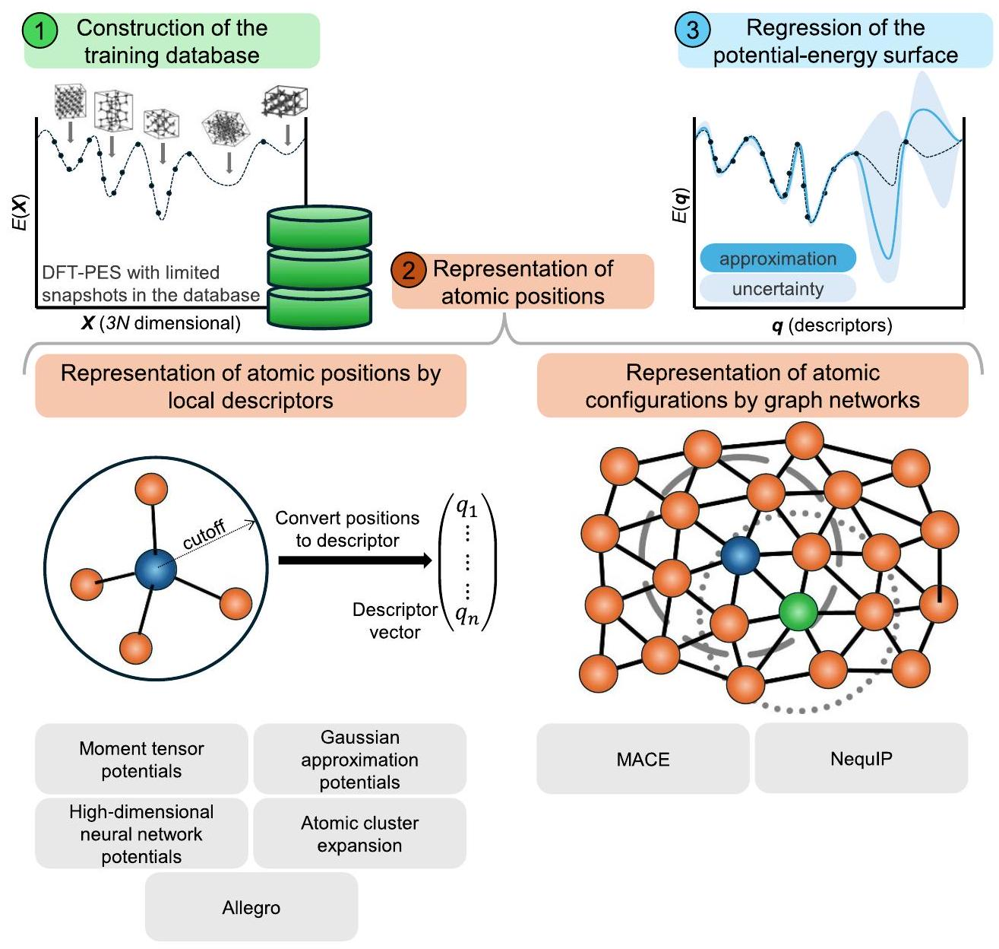
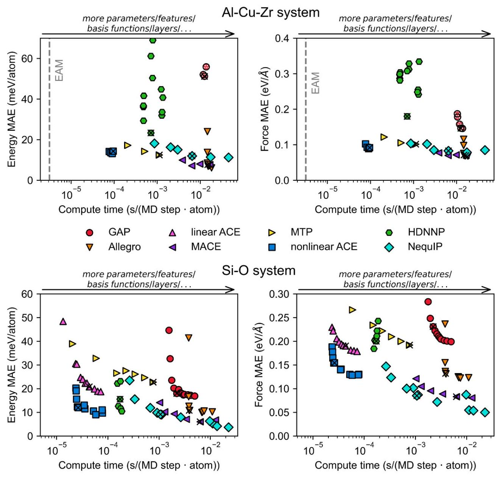
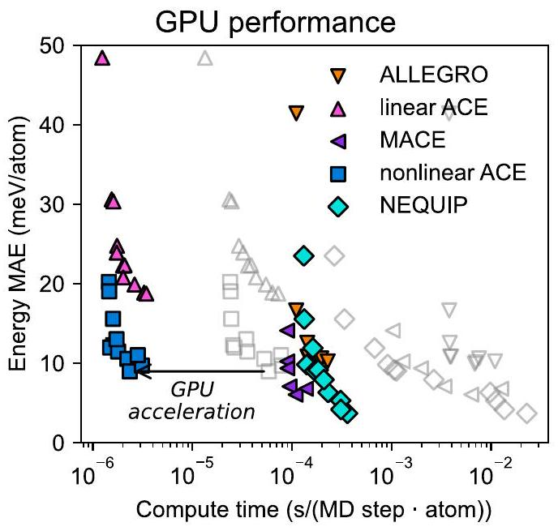
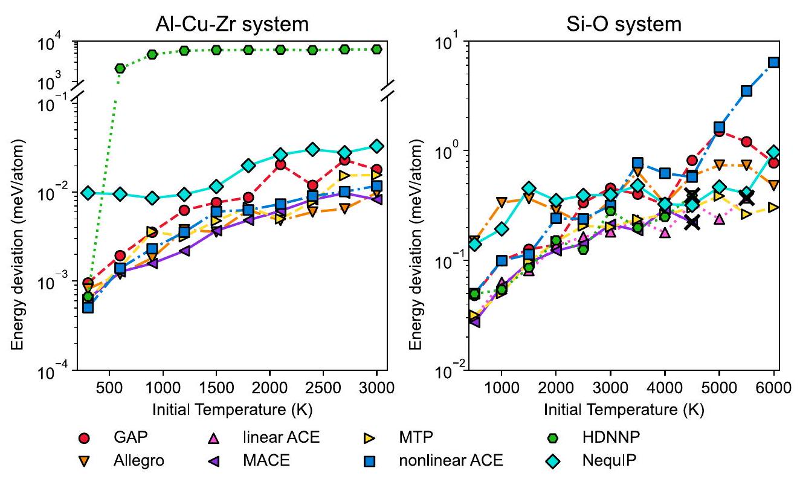
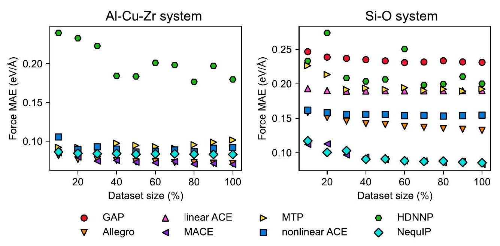
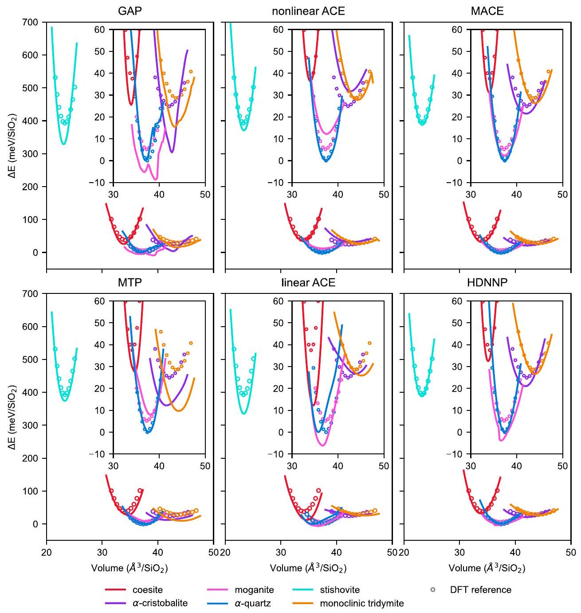
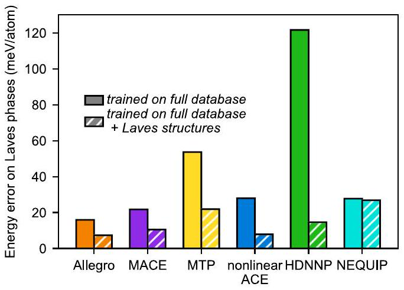
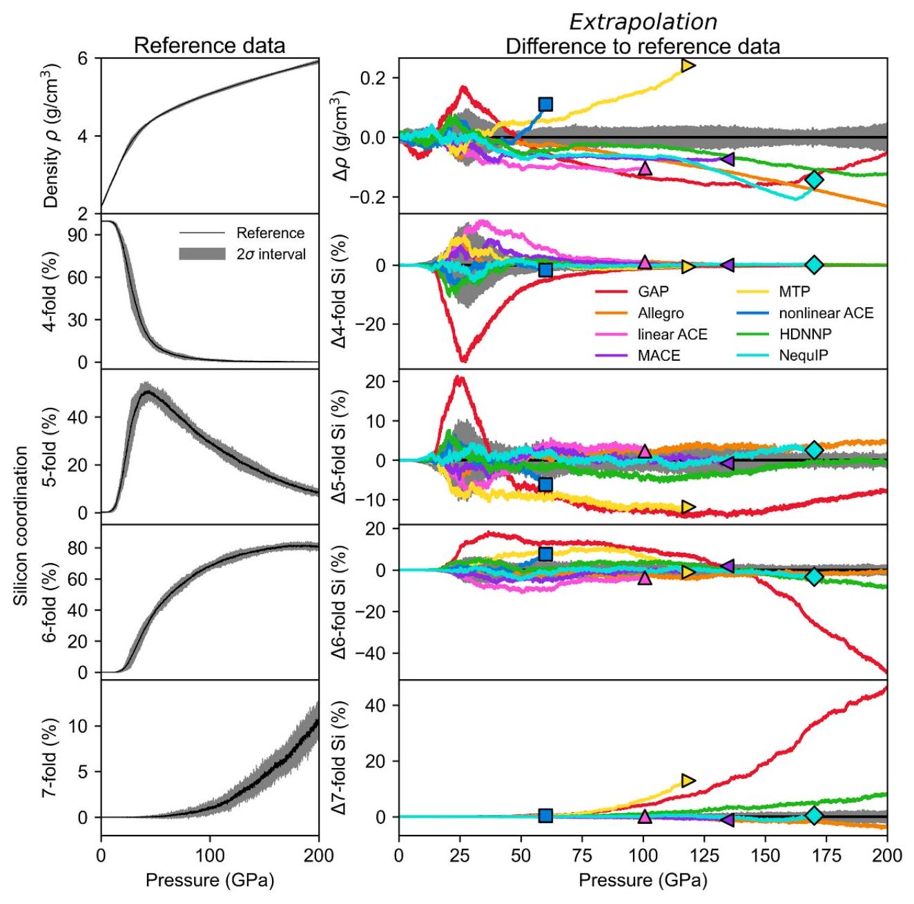
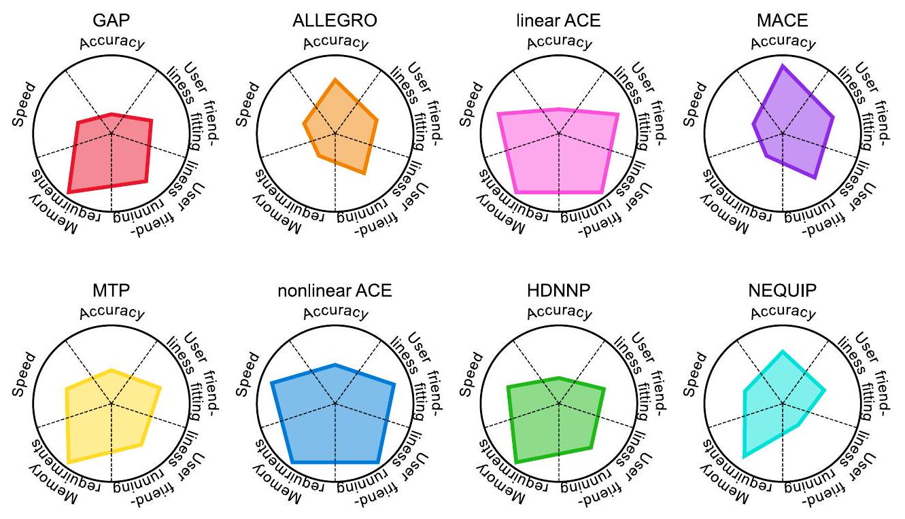

PAPER•OPEN ACCESS

## Machine-learning interatomic potentials from a users perspective: a comparison of accuracy, speed and data efficiency

To cite this article: Niklas Leimeroth et al 2025 Modelling Simul. Mater. Sci. Eng. 33065012

View the article online for updates and enhancements.

## You may also like

- Machine-learned potentials for solvation modeling
Roopshree Banchode, Surajit Das, Shampa Raghunathan et al.
- Training machine learning interatomic potentials for accurate phonon properties Antoine Loew, Hai-Chen Wang, Tiago F T Cerqueira et al.
- Data efficiency and extrapolation trends in neural network interatomic potentials Joshua A Vita and Daniel Schwalbe-Koda

# Machine-learning interatomic potentials from a users perspective: a comparison of accuracy, speed and data efficiency 

Niklas Leimeroth ${ }^{1}$ (D), Linus C Erhard ${ }^{1, *}$ (D), Karsten Albe (D) and Jochen Rohrer* (D) Institute of Materials Science, Technical University of Darmstadt, Otto-Berndt-Strasse 3, D-64287 Darmstadt, Germany E-mail: erhard@mm.tu-darmstadt.de and rohrer@mm.tu-darmstadt.de

Received 9 May 2025; revised 24 July 2025
Accepted for publication 29 July 2025
Published 14 August 2025

#### Abstract

Machine learning interatomic potentials (MLIPs) have massively changed the field of atomistic modeling. They enable the accuracy of density functional theory in large-scale simulations while being nearly as fast as classical interatomic potentials (IPs). Over the last few years, a wide range of different types of MLIPs have been developed, but it is often difficult to judge which approach is the best for a given problem setting. For the case of structurally and chemically complex solids, namely $\mathrm{Al}-\mathrm{Cu}-\mathrm{Zr}$ and $\mathrm{Si}-\mathrm{O}$, we benchmark a range of MLIP approaches, in particular, the Gaussian approximation potential, highdimensional neural network potentials, moment tensor potentials, the atomic cluster expansion (ACE) in its linear and nonlinear version, neural equivariant interatomic potentials (NequIP), Allegro, and MACE. We find that nonlinear ACE and the equivariant, message-passing graph neural networks NequIP and MACE form the Pareto front in the accuracy vs. computational cost trade-off. In case of the $\mathrm{Al}-\mathrm{Cu}-\mathrm{Zr}$ system we find that MACE and Allegro offer the highest accuracy, while NequIP outperforms them for $\mathrm{Si}-\mathrm{O}$. Furthermore, GPUs can massively accelerate the MLIPs, bringing them on par with and even ahead of non-accelerated classical IPs with regards to accessible timescales. Finally, we explore the extrapolation behavior of the corresponding potentials, probe the

[^0]smoothness of the potential energy surfaces, and estimate the user friendliness of the corresponding fitting codes and molecular dynamics interfaces.

Supplementary material for this article is available online
Keywords: machine-learning interatomic potentials, atomistic modeling, benchmark

## 1. Introduction

In recent years, the field of atomistic modeling has been revolutionized by the advent of machine learning interatomic potentials (MLIPs). More than ten years ago, mainly two methods were used to approximate the potential energy surface (PES), namely density-functional theory (DFT) and classical interatomic potentials (IPs) [1,2]. However, in recent years, new approaches based on machine learning have entered the field [3,4]. DFT calculations in general provide an accurate description of the energy landscape, given that an appropriate exchangecorrelation functional is at hand, but are computationally costly and limited to a small number of atoms. Classical IPs, on the contrary, often lack accuracy and transferability but are computationally much cheaper. MLIPs have overcome these issues by providing the accuracy of DFT data at computational costs close to classical IPs. The concept of MLIPs is represented graphically in figure 1.

Technologically, the field of MLIPs has seen significant progress over the last few decades. The first attempts to describe small atomic systems using neural networks as a global descriptor date back around 30 years [6,7]. Behler and Parinello [8] released these limitations using a local description of atomic environments to calculate the atomic energies. They applied atomic neural networks trained on atom-centered symmetry functions (ACSFs) as descriptors and termed them high-dimensional neural network potential (HDNNP) [9, 10]. A few years later, Bartók et al proposed the Gaussian approximation potentials (GAPs) [11], where the PES is determined by the similarity of the atomic environments to the learned data using Gaussian process regression, while the smooth overlap of atomic positions (SOAPs) descriptor is typically used to describe atomic environments [12]. In the subsequently developed spectral neighbor analysis potential (SNAP) [13], moment tensor potential (MTP) [14] and atomic cluster expansion (ACE) [15] linear and slightly nonlinear machine learning techniques are used, which obtain their accuracy from complex descriptors of the atomic environment. All of these and most other MLIPs employ descriptors that are invariant against rotations, translations, and permutations of atoms of the same species. In neural equivariant inter-atomic potentials (NequIP) [16], Allegro [17] and MACE [18] rotationally equivariant descriptors are used in combination with suitable equivariant operations in their network architecture to ensure the rotational invariance of energies.

The representation of atomic structures by graphs with nodes representing atomic positions and edges representing bonds [19] is an extension to descriptor-based approaches. Here, each atom has a feature vector which is constructed again from descriptors, but can be updated over several iterations, possibly including so-called messages from neighboring nodes. In this way, they are able to include semi-local interactions with an effectively increased cutoff radius. However, only by including equivariant features in such graph neural networks improved accuracy could be achieved compared to other MLIPs. NequIP [16] and MACE [18, 20] both, use multiple message passing layers. Consequently, their effective cutoff is a multiple of the actual value, leading to poor scalability and difficult parallelization. The MACE framework

Figure 1. The main ingredients of a machine learning interatomic potential (MLIP). (1) A database is needed connecting the point cloud of atomic configurations and learnable properties of interest (i.e. energies and forces). (2) A representation of these atomic configurations is needed, which is translationally and rotationally invariant or equivariant. Here, two different types are established. The descriptor based approach takes a descriptor vector as fingerprint of each local environment in a given cutoff radius. Graph networks messages, in contrast, are transmitted between neighboring atoms, providing information about their environment to those neighbors. Using multiple message passing iterations allows these approaches to have a higher effective cutoff and therefore, to include additional semi-local information. This is depicted by the graph network on the right in (2), where the blue atom can receive information about atoms that would otherwise only be seen by the green atom. (3) The corresponding representation techniques are combined with a variation of different machine-learning techniques to relate these representations with local and global properties of the given point cloud. As a feature, various machine-learning techniques allow to assess a uncertainty for estimating the reliability of a potential in certain parts of configurational space. Figure inspired by [5] and adapted to show graph neural networks.

includes higher-order features within messages, in an attempt to reduce the necessary number of message-passing layers, i.e. the effective cutoff, necessary to achieve a certain accuracy and partly solve the scalability problem. Another interesting MLIP included in our tests is the recently introduced Allegro approach [17], which also uses learnable equivariant basis functions, but without message passing. Therefore, it is strictly local, allowing for better scalability and parallelization.

From a users perspective the plethora of available MLIPs, even in addition to the ones discussed here [21-31] naturally leads to the question which of them is most suitable in terms of computationally efficiency and accuracy for a given problem setting. An in-depth description of different descriptor and regression techniques can be found in a recent review by Thiemann et al [32]. The accuracy and computational cost of HDNNP, GAP, SNAP and MTP have been evaluated by Zuo et al [33] for different elemental systems. In a recent study, the performance of PaiNN [34], REANN [35], MACE, and ACE has been evaluated for the case of hydrogen dynamics on metal surfaces [36]. While significant effort continues to be directed towards more accurate and faster specialized MLIPs, some recent approaches focus on the development of universal MLIPs [30, 37, 38], which seem suitable for quick screening processes, but currently lack the necessary accuracy for detailed atomistic investigation [39-41]. Here we provide a comparative benchmark study of specialized MLIPs for structurally and chemically complex solids, which is so far missing.

In this study, we fill this gap by assessing various invariant MLIPs and the new equivariant and message-passing neural networks for complex multi-element systems from a user perspective. We test HDNNP [8], GAP [11], MTP [14], ACE [15], NequIP [16], Allegro [17] and MACE [18, 20] potentials with regard to computational and data efficiency, accuracy, and extrapolation behavior. The choice of these specific frameworks is motivated by the fact that there is an readily available implementation for the popular molecular dynamics (MD) code LAMMPS [42]. We do not test the accuracy for molecular systems, as this has been done in previous studies [16, 18, 36, 43, 44].

As materials, we employ $\mathrm{Si}-\mathrm{O}$ and $\mathrm{Al}-\mathrm{Cu}-\mathrm{Zr}$ systems, which are representatives of ioniccovalent and metallic-covalent bonding materials with complex crystalline and amorphous structures. By this, we aim to provide comprehensive guidelines that help users choose between different potential types for their problem setting.

## 2. Methods

### 2.1. Fitting

Each type of MLIP requires a specialized code for the fitting process. For each potential different parameters were tested to find suitable ones offering a combination of high accuracy and speed. To simplify parameter tests, we set the same cutoff radius of $5 \AA$ for all short-range potentials for $\mathrm{Si}-\mathrm{O}$ and of $7.6 \AA$ for all short-range potentials for the $\mathrm{Al}-\mathrm{Cu}-\mathrm{Zr}$ system. In case of the message passing networks, we used the same cutoff, so the effective cutoffs are $n$ times the short range cutoff, where $n$ is the number of layers. Especially further optimization of the cutoff in message passing networks might give additional speed benefits, however, we decided to keep this value fixed due to limited resources and for easier comparability. Depending on the number of hyper-parameters that could and needed to be modified to obtain a good potential, the number of fits varies between the MLIPs. For example, MTPs and ACE offer the possibility to extend the basis used as descriptor by simply increasing the level or number of basis functions respectively, while HDNNPs require to test multiple combinations of ACSFs. This is also reflected in the discussion part, where we try to estimate the user-friendliness of the
fitting-process. For all potentials we will supply the fitting files and the corresponding potential files in the zenodo repository [45]. The codes and varied parameters are the following:

- HDNNPs were fitted using n2p2 [46, 47]. Different neural network architectures, i.e. number of layers and nodes per layer and descriptor functions as recommended in [48, 49] were tested.
- The QUIP [11, 50] code was employed to train GAPs. We used a combination of a two-body descriptor with the SOAPs descriptor [12]. For the two-body descriptors we optimized the $\Theta$ values, which give the widths of the corresponding Gaussian's for each element combination. We used the following values: $\mathrm{Al}-\mathrm{Al}: 1.0, \mathrm{Cu}-\mathrm{Al}: 1.3, \mathrm{Cu}-\mathrm{Cu}: 2.5, \mathrm{Cu}-\mathrm{Zr}: 1.3, \mathrm{Zr}-\mathrm{Al}: 1.5$, $\mathrm{Zr}-\mathrm{Zr}: 1.6, \mathrm{O}-\mathrm{O}: 1.6, \mathrm{Si}-\mathrm{O}: 2.5, \mathrm{Si}-\mathrm{Si}: 1.0$. Optimal values have been found by two-body fits only to reduce computational requirements. Moreover, we tested various $l_{\text {max }}$ and $n_{\text {max }}$ values for the SOAP descriptor. Here, we found $l_{\text {max }}=2(\mathrm{Si}-\mathrm{O})$ and $4(\mathrm{Al}-\mathrm{Cu}-\mathrm{Zr})$ and $n_{\text {max }} =8(\mathrm{Si}-\mathrm{O})$ and $6(\mathrm{Al}-\mathrm{Cu}-\mathrm{Zr})$ to be suitable. Finally, we varied the width of the smooth atomic positions represented by Gaussian's and set the corresponding $\sigma$ value to $0.7(\mathrm{Si}-\mathrm{O})$ and $0.6(\mathrm{Al}-\mathrm{Cu}-\mathrm{Zr})$. Finally, we checked systematically the values for the energy $\sigma(\mathrm{Si}-\mathrm{O}$ : $0.01, \mathrm{Al}-\mathrm{Cu}-\mathrm{Zr} 0.01)$ and force $\sigma(\mathrm{Si}-\mathrm{O}: 0.1, \mathrm{Al}-\mathrm{Cu}-\mathrm{Zr}: 0.01)$, which can be also interpreted as a weight factor for energies and forces. The models shown in figure 2 are only deviating by the number of sparse points used for the fit. We used between 50 and 14000 sparse points for $\mathrm{Si}-\mathrm{O}$ and only 50 to 2000 sparse points for $\mathrm{Al}-\mathrm{Cu}-\mathrm{Zr}$. Moreover, for fitting the GAPs for $\mathrm{Al}-\mathrm{Cu}-\mathrm{Zr}$ we used a significantly reduced database containing only $10 \%$ of the total structures. The reason for this are on the one hand memory issues we faced although we used a node with 4 TB main memory, and on the other hand also runtime limitations.
- MTPs were fitted with the MLIP program [51,52] (version 2 and 3, where 3 extends the functionality of 2 , but does not change results). Levels 14,18 and 22 , were used for $\mathrm{Al}-\mathrm{Cu}-$ Zr , while levels of $6,8,10,12,14,16,18,20,22$ and 26 have been used for the $\mathrm{Si}-\mathrm{O}$ system.
- PACEMAKER [53,54] was used to fit ACE potentials with different amounts of basis functions and embeddings. For $\mathrm{Al}-\mathrm{Cu}-\mathrm{Zr} 200$, 400, 600 and 800 basis functions per species were combined with a nonlinear $\chi+\sqrt{\chi}$ embedding. No linear versions were fitted. In the case of $\mathrm{Si}-\mathrm{O}$ the linear ACE potentials have been fitted using $50,100,200,250,300,400,500$, $600,700,800,900,1100,1300$ and 1500 basis functions per species. Additionally, we fitted a number on nonlinear ACE potentials with 200, 400, 800, 1100 basis functions per species and 2 to 9 embeddings. We used at most the embeddings of the following functional form:

$$
E_{i}=\chi+\sqrt{\chi}+\chi^{2}+\chi^{0.75}+\chi^{0.25}+\chi^{0.875}+\chi^{0.625}+\chi^{0.375}+\chi^{0.125}
$$

In cases with less embeddings, we removed embeddings from this line from right to left.

- NequIP [16], Allegro [17] and MACE [18] were fitted with the same name codes.
- For Allegro we tested various settings for the learning rate ( $\mathrm{Si}-\mathrm{O}: 0.0001, \mathrm{Al}-\mathrm{Cu}-\mathrm{Zr}$ : 0.001 ), the polynomial cutoff (6) and the parity (o3_full), which we kept fixed in the following. Afterwards we systematically varied the parameters env_embed_multiplicity $(1,4,8,16,32,64)$, num_layers $(1,2)$ and l_max $(1,2)$ interdependently of each other. Since we used initially a version of the code, which did not support stresses, we refitted later on only the best performing potential, to obtain a potential that can be used to calculate stresses. We note that stresses were never used explicitly in the fitting processes; the inability to calculate stresses was a technical issue of the fitting codes. Not all fits finished due to GPU memory issues.
- For NequIPs we first determined appropriated numbers for the learning rate ( 0.001 ), the number of invariant layers $(\mathrm{Si}-\mathrm{O}: 3, \mathrm{Al}-\mathrm{Cu}-\mathrm{Zr}: 2)$ the polynomial cutoff $(\mathrm{Si}-\mathrm{O}: 8$, $\mathrm{Al}-\mathrm{Cu}-\mathrm{Zr}: 6$ ). We then varied the parameters num_layers ( $2,3,4,5$ ), l_max ( 1,2 ) and num_features ( 8163264128 ) to receive the fits shown in figure 2. As for Allegro we needed to refit the final potential with a stress enabled version, which was also later used for the MD simulations. Not all fits finished due to GPU memory issues.
- The MACE model size was varied between 0 (i.e. no messages) and 256 message channels. The number of message passing layers was kept at 1 , as more quickly resulted in memory problems during fitting and obtained potentials were already very accurate. Furthermore, keeping the amount of message passing layers small, and instead relying on higher order features to increase accuracy, prevents scaling and parallelization issues encountered in NequIP, as stated by the MACE developers [18].

### 2.2. Training data

The generation of employed DFT parameters and procedures to generate training data were described in detail in previous publications, and is only shortly summarized here. $\mathrm{Si}-\mathrm{O}$ training data is the same as in [55], which is partially based on two earlier databases [56,57]. In the case of $\mathrm{Al}-\mathrm{Cu}-\mathrm{Zr}$ the $\mathrm{Cu}-\mathrm{Zr}$ training data from [58] has been extended and validated in the same fashion described there. Both datasets are available on zenodo [45]. The datasets contain crystalline and amorphous structures, high-temperature data up to the molten regime, large deformations and defective structures. They were extended and validated using active learning techniques and applied for various purposes, verifying their representativeness for thermodynamical and mechanical processes. In the case of $\mathrm{Si}-\mathrm{O}$, we also ensure that the ultra high-pressure range used to test extrapolation capabilities later on is part of the full training data. Indeed, several studies using machine-learning potentials based on this database have provided evidence for the high accuracy of this database for high-pressure applications [59, 60]. In general, the training data for the $\mathrm{Si}-\mathrm{O}$ system covers temperatures up to 6000 K and pressures up to 200 GPa . For details of the employed processes, we refer the readers to the original publications the datasets were used in.

### 2.3. Testing data

The test data for the $\mathrm{Si}-\mathrm{O}$ test was created based on the initial database from the original study [55]. To obtain the test set, we randomly selected $10 \%$ of the structures from the database and performed MD simulations on these structures. The final snapshot of the MD simulation was then used as test set with DFT computed forces and energies. Using this approach, we have been able to generate a test set which is sufficiently close to the training data while still getting reasonably different structures. We only used structures with less than 250 atoms to reduce computational costs and picked them equally distributed throughout the database by picking specifically $10 \%$ of the structures from each subpart of the database. We performed NVT simulations of the structures and adjusted the temperatures according to the type of structure, e.g. high temperatures for liquid structure models and lower temperatures for crystalline structures. In the case of $\mathrm{Al}-\mathrm{Cu}-\mathrm{Zr}$ the testing data has been generated as previously described [58], similar to the training data. The generated test datasets are provided in the zenodo repository [45].

## 3. Results

### 3.1. Accuracy and computational cost

From a user perspective, the main quality of an IP is its accuracy, and the primary limiting factor is the computational costs. Together, these factors determine for which problems an IP can be applied. To evaluate the properties of the tested MLIPs, we show the energy and force prediction accuracy for testing data sets and the time needed to calculate an MD step per atom in figure 2. We use the MAE instead of the root mean square error (RMSE) as error measure because it is less susceptible to singular structures with very high errors. More details and examples can be found in the supplemental material. The measurements were taken on a single core of an Intel Xeon Platinum 8368 CPU. The potentials marked by crosses show a good speed-accuracy trade-off and are used for the analysis later in this work.

For the $\mathrm{Al}-\mathrm{Cu}-\mathrm{Zr}$ system (first row in figure 2), we see that the smallest mean absolute error (MAE) at short computing times is obtained by nonlinear ACE, probably offering the best trade-off in accuracy vs. speed for most simulations. MACE is more accurate than nonlinear ACE but at the expense of substantially longer computing times. Allegro reaches similar accuracies compared to MACE, but is slightly slower. Quite further off in accuracy are MTPs and NequIPs. The GAPs and HDNNPs cannot compete with the other MLIPs in terms of accuracy. In the case of GAPs, they are fitted only to the $10 \%$ fraction of training data, that was also used later on to test the data efficiency. Employing more training data was not possible due to memory problems, even though we used up to 4 TB of RAM. Similarly, the accuracy of the HDNNPs seems limited by the amount of training data used, despite using the entire data set, as shown in the section on data efficiency.

For Si-O, nonlinear ACE again is at the Pareto front. However, in this case the most accurate MLIP is NequIP, while MACE achieves slightly worse accuracies and Allegro is significantly further off. In the case of $\mathrm{Si}-\mathrm{O}$, the message-passing of MACE and NequIP is obviously improving the accuracy, as the equivariant Allegro does worse than these approaches and shows only similar accuracy as nonlinear ACE. However, at the same time it comes at a much higher computational cost than nonlinear ACE. This is most likely caused by long-range ionic interactions in the $\mathrm{Si}-\mathrm{O}$ system, which do not play a role in $\mathrm{Al}-\mathrm{Cu}-\mathrm{Zr}$. A further hint towards the importance of non-local interactions for the $\mathrm{Si}-\mathrm{O}$ system is the more pronounced improvement in achievable accuracies when going from the strictly local ACE to the semi-local MACE and NequIPs.

For $\mathrm{Si}-\mathrm{O}$ GAP (which does not perform well for $\mathrm{Al}-\mathrm{Cu}-\mathrm{Zr}$ due to the reduced training data set) performs similar to linear ACE and MTPs. Furthermore HDNNPs also achieve good accuracies especially for energy predictions, for the $\mathrm{Si}-\mathrm{O}$ system. However, we note that the HDNNP parameters leading to high accuracy in forces correspond to those with low energy accuracy and vice versa. Thus, even though they seem to perform well in the metrics on first glance, there is an additional trade-off here not being directly visible. Another interesting factor is the systematic improvability of the accuracy of MLIPs at the expanse of higher computational cost. In our case, all tested MLIPs but the HDNNPs offer a suitable parameter for this. Examples are the level of MTPs, the amount of basis functions in ACE or the message passing channels in MACE.

Finally, we assessed the speed of GPU accelerated variants of the MLIPs when available. In the case of ACE, MACE and Allegro they are implemented in LAMMPS via the KOKKOS package [42, 62]. For NequIP the GPU acceleration is achieved by running the underlying pytorch library on the GPU. The results are shown in figure 3. ACE, MACE and Allegro run around two orders of magnitude faster on the employed NVIDIA A100 GPUs compared to

Figure 2. Accuracy vs. computational cost of the assessed MLIPs: shown are the mean absolute error (MAE) of energy and forces vs. runtime per atom and time step. The top row shows the $\mathrm{Al}-\mathrm{Cu}-\mathrm{Zr}$ system, the lower row the $\mathrm{Si}-\mathrm{O}$ system. In the case of $\mathrm{Al}-\mathrm{Cu}-$ Zr the GAPs are trained with only $10 \%$ of the training data, because of their large RAM requirement during the process, indicated by the white pattern in plot marks. For the $\mathrm{Al}-\mathrm{Cu}-\mathrm{Zr}$ system the speed of the widely used $\mathrm{Cu}-\mathrm{Zr}$ embedded atom method (EAM) potential by Mendelev is additionally indicated by the gray line [61]. Speed measurements have been performed on the Horeka supercomputer on a single core of a Intel Xeon Platinum 8368 processor. Amorphous systems with sizes of 1372 and 768 atoms were used for $\mathrm{Al}-\mathrm{Cu}-\mathrm{Zr}$ and $\mathrm{Si}-\mathrm{O}$, respectively. Due to the larger size of the $\mathrm{Al}-\mathrm{Cu}-\mathrm{Zr}$ training dataset and the higher chemical complexity and therefore higher computational costs of fitting less fits are available and no linear version of ACE was trained. The potentials we used in our later tests are marked by a cross.

their CPU versions, so their relative order does not change. The NequIPs which were slowest on CPUs, i.e. those with many message-passing iterations show a similar speedup, but the faster ones profit less, causing the spread between them to reduce. A similar effect, but to a lesser extent is also observed for MACE and Allegro. This presumably stems from the lack of a KOKKOS implementation for NequIP, leading to an increased amount of time consuming

Figure 3. GPU performance for the assessed MLIPs for silica. Speed measurements have been performed on the Horeka supercomputer on 1 Nvidia A100 GPU. The gray shapes correspond to the computational costs on a single CPU core (see figure 2).

data transfers between CPU and GPU. We note that NequIP does not offer MPI parallelization and consequently cannot use more than a single GPU. Our data shows that GPU accelerated message-passing and equivariant MLIPs can compete with MTPs and HDNNPs on CPUs.

In the following sections, we compare the MLIPs in several simulation scenarios. For these tests, we chose specific models from figure 2, which are marked by a black cross. In case of the Si-O models, we fitted further potentials, which are far from the Pareto front and only shown in supplementary figure 3.

### 3.2. Smoothness of the PES

In order to test whether the PESs predicted by MLIPs are reasonably smooth for MD, we performed NVE simulations and monitored energy conservation. We used different initial temperatures and ran the simulations for 100 ps with a timestep of 1 fs . For $\mathrm{Al}-\mathrm{Cu}-\mathrm{Zr}$, a glassy structure with 1372 atoms was used; in the case of $\mathrm{Si}-\mathrm{O}$, we studied an amorphous silica structure with 768 atoms. We initialized the MD with 10 ps of NVT simulation to start with an equilibrated system at the desired temperature. The maximum deviation of total energy to the initial value is shown in figure 4. For $\mathrm{Al}-\mathrm{Cu}-\mathrm{Zr}$ all MLIPs but the HDNNP only show a small drift. In the HDNNP simulations a sudden massive increase of temperature can be observed, indicating the occurrence of extremely high forces on some atoms during the simulation, i.e. very steep gradients in the PES, which is clearly an artifact of the MLIP. With higher temperatures, the shift becomes larger because of the higher velocities within the MD simulation.

In the case of the $\mathrm{Si}-\mathrm{O}$ system, the HDNNP shows significantly lower losses. While we could not identify a clear reason for the differences in performance compared to the $\mathrm{Al}-\mathrm{Cu}-$ Zr fits, we want to note that more parameter sets were tested in the case of $\mathrm{Si}-\mathrm{O}$. Tests to the same extent were not feasible for $\mathrm{Al}-\mathrm{Cu}-\mathrm{Zr}$ due to the larger amount of structures. In contrast, Allegro and NequIP exhibit higher losses already at low temperatures. The reason for this is the noisy PES observed for the stress-enabled versions of the potentials, which also

Figure 4. Energy deviation as function of system temperature calculated for various MLIPs in NVE simulations over 100 ps . A low energy loss is indicating a smooth PES. Note the different y-scales in both graphs. We used a time step of 1 fs for all simulations. Indeed, for simulations at higher temperatures a lower time step might be necessary to still conserve the energy. In case of silica, three MLIPs failed at certain temperatures (MACE, linear ACE, HDNNP), which indicates a noisy PES at higher energy levels. The highest working temperatures for these potentials are indicated by a cross.

causes problems for the energy volume curves, see the discussion about the energy-volume curves below and an example for the noisy PES in supplementary figure 2. We only used stress-enabled versions of NequIP and Allegro in case of the $\mathrm{Si}-\mathrm{O}$ system, so this problem is not observed for $\mathrm{Al}-\mathrm{Cu}-\mathrm{Zr}$. At higher temperatures MACE, the HDNNP and linear ACE fail, indicating that the PES is becoming rough at higher potential energies. Moreover, the energy losses of the other models become higher due to the faster motion of the atoms. In particular, the nonlinear ACE shows strong energy deviations at higher temperatures also indicating a rougher PES. Of course, this energy loss at high temperatures could be partially overcome by using a smaller time step at higher temperatures, especially in the case of the well behaving potentials.

### 3.3. Learning curves

In a next step, we tested how efficiently MLIPs use training data. For this, we divided our database into ten subsets with increasing amounts of structures and each subset containing all structures from the previous set plus another $10 \%$ from the complete data. Figure 5 shows the testing errors for MLIPs fitted to the subsets. In the case of $\mathrm{Al}-\mathrm{Cu}-\mathrm{Zr}$, the error decreases slightly with increasing amounts of training data for Allegro and MACE, while it remains nearly constant for NequIP. For the other MLIPs statistical noise appears to be more impactful than the amount of data itself. While a slight decrease in error can be seen for HDNNPs, a small increase is observed for MTPs.

The $\mathrm{Si}-\mathrm{O}$ data show similar trends. Allegro, MACE, and NequIP can benefit from an increasing amount of training data. MTPs are converging towards their maximum accuracy at

Figure 5. Learning curve of tested MLIPs. For $\mathrm{Al}-\mathrm{Cu}-\mathrm{Zr}$ no GAP is shown, as fitting was possible only with $10 \%$ of the training data due to memory issues, as described previously. The errors shown are referring to the test set.

around $30 \%$ of the size of the training set, while the accuracy of linear ACE is barely improving with additional data. Non-linear ACE and GAP seem to benefit slightly from more data, though not as strongly as the MTPs. Finally, the HDNNPs improve with more data, although the results are noisy, indicating the existence of many different local minima during the fitting process.

An interesting aspect here are the high accuracy of most MLIPs, even for small subsets of the data. We assume that this is related to the large configurational space covered by the complete datasets, as this leads to a reasonable coverage of pair distances, which are the largest contributors to atomic energies, even when just sampling 10\% of the data. This is shown in supplemental figure 4.

### 3.4. Energy-volume curves

Energy-volume curves are essential properties a MLIP needs to reproduce. They contain data on the energetic hierarchy and relative stability of competing phases, as well as elastic properties. Therefore, a precise description of these curves is essential for an accurate potential. To allow an unbiased comparison of the different MLIPs, we did not apply weights on specific structures during fitting of the potentials. Clearly, the quality of most of the MLIPs can be improved by increasing the weights on energy volume curves for structures of interest. This is, however, not possible for all codes (see also Discussion later).

Figure 6 shows the energy-volume curves of six silica polymorphs: coesite, moganite, stishovite, $\alpha$-cristobalite, $\alpha$-quartz and monoclinic tridymite. We show the results for all MLIPs for the $\mathrm{Si}-\mathrm{O}$ system despite for NequIP and Allegro. Minimization of the structures with these potentials was not successful. We assume the noisy PES (see supplementary figure 2), which only appears in the stress enabled version of these potentials, causes this problem. We note that this is presumably a bug in the code that can be fixed in future versions. We show this as an example that researchers should be carefully evaluating their results, especially when employing new codes.

Figure 6. Energy-volume curves of several silica polymorphs. The open circles indicate the DFT reference values, while the lines give the results by the MLIPs. We do not show data for NequIPs and Allegro since the stress-enabled version had a very noisy potential-energy surface leading to difficulties in the optimization of the cell parameters. The reference DFT data is taken from [57]. Energy-volume curves of $\mathrm{Al}-\mathrm{Cu}-\mathrm{Zr}$ can be found in the supplemental figure 6.

The GAP, linear ACE and HDNNP do not predict $\alpha$-quartz to be the most stable structure, but instead predict moganite to be lower in energy. Due to the small energy differences between both structures this is indeed a challenging task. Additionally, we see in case of the GAP and the HDNNP that the energy-volume curves are not smooth, but instead have rapidly changing slopes or several minima. This is also the case for monoclinic tridymite and the nonlinear ACE at large volumes. Otherwise, nonlinear ACE, but also linear ACE, MTP and MACE give smooth energy-volume curves. MACE matches the DFT curves best, which is related to its general high accuracy. MTP and nonlinear ACE are both reproducing the minimum

Figure 7. Test of extrapolation capabilities of the MLIPs. For $\mathrm{Al}-\mathrm{Cu}-\mathrm{Zr}$ the energy MAE of Laves phases not included in the training data is calculated. The dashed bars shows the error for a potential including the Laves phases in the training data to establish a baseline of achievable accuracy. Allegro shows the lowest error during extrapolation, closely followed by MACE, ACE and NequIP. The HDNNP has a very large error when extrapolating, demonstrating its need for large amounts of data again.

energy volumes very well, however, have some issues in the energetics of the tridymite and cristobalite phases. Linear ACE additionally has problems in an accurate reproduction of the minimum energy volumes and the energetics of the high-pressure phases.

Although this test may seem trivial, as many of the problems here could be fixed by appropriate weighting of the crystalline structures, this would likely lead to a worse reproduction of other parts of configurational space. In this sense especially, the strong changes in slope are important to consider, since their appearance in well covered areas of configurational space may hint toward even worse behavior in less covered areas of configurational space.

### 3.5. Transferability

In a last step, we tested the transferability (extrapolation behavior) of the MLIPs to regions of configurational space not explicitly covered by the training data and conducted different tests for the material systems. In the case of $\mathrm{Al}-\mathrm{Cu}-\mathrm{Zr}$, the ability to predict formation energies of unknown intermetallic phases was assessed. For this purpose the energy compared to DFT of a set of Laves phases not part of the training data was calculated. The results are shown in figure 7, together with the error of a reference fit including the Laves phases. All MLIPs except the HDNPP show good extrapolation behavior for the given scenario of an unknown phase.

In a second test we performed compression simulations of amorphous silica up to a pressure of 200 GPa at a temperature of 1000 K . These simulations we performed with two different sets of potentials, one for each type: potentials trained to high-pressure data from figure 2 and potentials trained with the same settings, however, to a database, which did not include highpressure data. By averaging the results of the different potentials trained to high-pressure data, we received a reference (see details in supplementary figure 5), which is shown in figure 8 with the deviations of the potentials trained without high-pressure data. When just looking at the density the results agree very well with the reference simulation and most deviations are minor. In case of nonlinear ACE, linear ACE, MTP, MACE and NequIP the potentials fail at a certain point indicated in LAMMPS by lost atoms or memory issues. Only the HDNNP, Allegro and GAP stay stable over the whole simulation time. We note that such a failure does not need to be

Figure 8. Test of extrapolation capabilities within compression simulations of silica up to a pressure of 200 GPa at 1000 K . On the left we show the average results of the reference simulations with a $2 \sigma$ interval (gray). On the right we show the differences between these references results and the extrapolating machine-learning potentials. Several of the extrapolating potentials break at a certain point, which is indicated by a symbol at the end of the trajectory. This is often caused by 'lost atoms' within the MD simulation or due to memory issues, which are both indicating the occurrence of unphysically large forces. Only Gaussian approximation potential (GAP), high-dimensional neural network potential (HDNNP) and Allegro run stable up to a pressure of 200 GPa . However, thereby deviations from the reference simulations increase with increasing pressure. The coordination numbers have been determined using a cutoff of $2 \AA$ using OVITO [63].

a bad thing since it clearly indicates that there is insufficient information provided to the potential during training and therefore it is not working reliably anymore. For the user this might be more helpful than an apparently stable simulation providing erroneous results. When we have a deeper look at structural changes in the simulation, specifically the coordination number of silicon shown in figure 8, we see differences in the results. First, we note that GAP transforms faster than the reference to higher coordination numbers. In contrast, MTP underestimates the
number of five-fold coordinated silicon atoms, however, overestimates the number of six-fold and seven-fold coordinated silicon atoms. Linear ACE, nonlinear ACE, MACE and NequIP are closely following the reference until they fail. Finally, Allegro and the HDNNP seem to extrapolate extremely well up to a pressure of 200 GPa . This is surprising since both methods use a large number of parameters compared to the other approaches.

## 4. Discussion

In this work, we evaluated different types of machine-learning IPs with respect to computational speed, memory usage, accuracy, transferability and user friendliness. An overview of the results is shown in figure 9. We found that NequIP, Allegro and MACE showed the highest accuracies on the given test set, closely followed by the nonlinear ACE. Other approaches like MTP, linear ACE, HDNNP and GAP show slightly lower accuracies. We see that in terms of speed, nonlinear ACE, linear ACE, MTPs and HDNNPs are much faster than the other approaches like GAP, Allegro, MACE and NequIP. Regarding the memory requirements during MD simulation (on CPU only), we tested different system sizes and found that Allegro, NequIP and MACE have very high memory requirements, while the other approaches need much less main memory. This limits them to comparatively small-scale simulations or alternatively requires massive resources and is also challenging for novel universal IPs based on computationally expensive approaches, such as MACE. To address this, for example, recent work has suggested training fast and efficient models on synthetic data generated by universal potentials [64].

Besides these hard factors, there are also a range of soft factors, which are essential for a user of these codes: The user friendliness for fitting a potential and later on using it in a MD code. This starts with how easily the code can be installed, e.g. is there something like a PyPI package available or do I need to compile the code by myself? Additionally, in the case of fitting the potential the number of hyper-parameters, which need to be tuned to get some first reliable potential is essential to make the code easily accessible for the user. Some potentials like MTPs require nearly no hyper-parameter tuning, while others like HDNNPs need excessive adjustment of the parameters for the basis functions. Moreover, uncertainty estimation is an important aspect that is essential not only for active learning, but also for estimating uncertainty during production. MTP and ACE have a built-in approach to uncertainty indication based on the D-optimality criterion [65, 66]. This makes it much more user-friendly and less complex compared to other MLIPs, such as MACE or HDNNPs, where the standard way to estimate uncertainties would be to use a committee approach with several IP models fitted to the same data [67]. According to these soft criteria, we created our grading; the details are available in supplementary table 2 . Moreover, we provide detailed reasoning for each of the points in supplementary table $3-9$. We found that especially the pacemaker code [53,54] has a lot of useful features for a user, while still making it easy to fit a potential. In contrast, for example the MLIP code for MTPs allows one to fit reliable potentials without much effort, however, later on fine-tuning options are limited and also the LAMMPS implementation is more difficult to obtain compared to ACE, HDNNPs and GAPs.

Figure 9. Graphical comparison of the MLIPs. In addition to the hard factors accuracy, speed and memory requirements we included the subjective criterion of user-friendliness with regards to the fitting procedure and the usage of the MLIPs in MD simulations. For the determination of the corresponding grades we picked the models we also used for our MD simulations. The corresponding grading schemes can be found in the supplementary tables 1 and 2 . We also clearly show up several points, which have been important for us and which make up the category of user-friendliness.

## Data availability statement

The data that support the findings of this study is openly available on zenodo under the following URL/DOI: https://doi.org/10.5281/zenodo. 14136006 [45].

## Acknowledgments

The authors gratefully acknowledge the computing time made available to them on the high-performance computers HoreKa and Lichtenberg at the NHR Centers NHR@KIT and NHR@TUDa. These Centers are jointly supported by the Federal Ministry of Education and Research and the state governments participating in the NHR. NL acknowledges funding from the German Federal Ministry of Education and Research (BMBF) under project HeNa (FKZ 03XP0390A) and the German research foundation (Deutsche Forschungsgemeinschaft, DFG) under Grant No. 440847672. L C E acknowledges funding by the German research foundation (Deutsche Forschungsgemeinschaft, DFG) under Grant No. 521536863.

## Author Contributions-CRediT

Conceptualization: N L and L C E, Methodology: N L and L C E, Software: N L, Writing-Original Draft: N L and L C E, Writing-Review and Editing: J R and K A, Visualization: L C E, Funding acquisition: J R and K A.

## Conflict of interests

The authors declare no competing interests.

## ORCID iDs

Niklas Leimeroth © 0009-0005-3906-4751
Linus C Erhard (D) 0000-0003-0219-5801
Karsten Albe (D) 0000-0003-4669-8056
Jochen Rohrer (D) 0000-0002-4492-3371

## References

[1] Tadmor E B and Miller R E 2011 Modeling Materials: Continuum, Atomistic and Multiscale Techniques (Cambridge University Press)
[2] Frenkel D and Smit B 2023 Understanding Molecular Simulation: From Algorithms to Applications (Elsevier Science \& Technology)
[3] Unke O T et al 2021 Machine learning force fields Chem. Rev. 121 10142-86
[4] Müser M H, Sukhomlinov S V and Pastewka L 2023 Interatomic potentials: achievements and challenges Adv. Phys. X 82093129
[5] Deringer V L, Caro M A and Csányi G 2019 Machine learning interatomic potentials as emerging tools for materials science Adv. Mater. 311902765
[6] Sumpter B G and Noid D W 1992 Potential energy surfaces for macromolecules. A neural network technique Chem. Phys. Lett. 192 455-62
[7] Blank T B, Brown S D, Calhoun A W and Doren D J 1995 Neural network models of potential energy surfaces J. Chem. Phys. 103 4129-37
[8] Behler J and Parrinello M 2007 Generalized neural-network representation of high-dimensional potential-energy surfaces Phys. Rev. Lett. 98146401
[9] Behler J 2011 Atom-centered symmetry functions for constructing high-dimensional neural network potentials J. Chem. Phys. 134074106
[10] Behler J 2021 Four generations of high-dimensional neural network potentials Chem. Rev. 161 10037-72
[11] Bartók A P, Payne M C, Kondor R and Csányi G 2010 Gaussian approximation potentials: the accuracy of quantum mechanics, without the electrons Phys. Rev. Lett. 104136403
[12] Bartók A P, Kondor R and Csányi G 2013 On representing chemical environments Phys. Rev. B 87184115
[13] Thompson A P, Swiler L P, Trott C R, Foiles S M and Tucker G J 2015 Spectral neighbor analysis method for automated generation of quantum-accurate interatomic potentials J. Comput. Phys. 285 316-30
[14] Shapeev A V 2016 Moment tensor potentials: a class of systematically improvable interatomic potentials Multiscale Model. Simul. 14 1153-73
[15] Drautz R 2019 Atomic cluster expansion for accurate and transferable interatomic potentials Phys. Rev. B 99014104
[16] Batzner S et al 2022 E (3)-equivariant graph neural networks for data-efficient and accurate interatomic potentials Nat. Commun. 132453
[17] Musaelian A et al 2023 Learning local equivariant representations for large-scale atomistic dynamics Nat. Commun. 14579
[18] Batatia I, Kovacs D P, Simm G N C, Ortner C and Csanyi G 2022 MACE: higher order equivariant message passing neural networks for fast and accurate force fields Advances in Neural Information Processing Systems
[19] Schütt K et al 2017 SchNet: a continuous-filter convolutional neural network for modeling quantum interactions Advances in Neural Information Processing Systems vol 30 (Curran Associates, Inc.)
[20] Batatia I, Batzner S, Kovács D P, Musaelian A, Simm G N C, Drautz R, Ortner C, Kozinsky B and Csányi G 2025 The design space of E(3)-equivariant atom-centered interatomic potentials Nat. Mach. Intell. 7 56-67
[21] López-Zorrilla J et al 2023 Ænet-PyTorch: a GPU-supported implementation for machine learning atomic potentials training J. Chem. Phys. 158164105
[22] Wang H, Zhang L, Han J and Weinan E 2018 DeePMD-kit: a deep learning package for many-body potential energy representation and molecular dynamics Comput. Phys. Commun. 228 178-84
[23] Zeng J et al 2023 DeePMD-kit v2: a software package for deep potential models J. Chem. Phys. 159054801
[24] Lot R, Pellegrini F, Shaidu Y and Küçükbenli E 2020 PANNA: properties from artificial neural network architectures Comput. Phys. Commun. 256107402
[25] Pellegrini F, Lot R, Shaidu Y and Küçükbenli E 2023 PANNA 2.0: efficient neural network interatomic potentials and new architectures J. Chem. Phys. 159084117
[26] Fan Z et al 2022 GPUMD: a package for constructing accurate machine-learned potentials and performing highly efficient atomistic simulations J. Chem. Phys. 157114801
[27] Xie S R, Rupp M and Hennig R G 2023 Ultra-fast interpretable machine-learning potentials npj Comput. Mater. 91-9
[28] Unke O T and Meuwly M 2019 PhysNet: a neural network for predicting energies, forces, dipole moments and partial charges J. Chem. Theory Comput. 15 3678-93
[29] Unke O T et al 2021 SpookyNet: learning force fields with electronic degrees of freedom and nonlocal effects Nat. Commun. 127273
[30] Deng B et al 2023 CHGNet as a pretrained universal neural network potential for charge-informed atomistic modelling Nat. Mach. Intell.e 5 1031-41
[31] Haghighatlari M et al 2022 NewtonNet: a Newtonian message passing network for deep learning of interatomic potentials and forces Digit. Discovery 1333-43
[32] Thiemann F L, O'Neill N, Kapil V, Michaelides A and Schran C 2024 Introduction to machine learning potentials for atomistic simulations J. Phys.: Condens. Matter 37073002
[33] Zuo Y et al 2020 Performance and cost assessment of machine learning interatomic potentials $J$. Phys. Chem. A 124 731-45
[34] Schütt K, Unke O and Gastegger M 2021 Equivariant message passing for the prediction of tensorial properties and molecular spectra Proc. 38th Int. Conf. on Machine Learning (PMLR) pp 9377-88
[35] Zhang Y, Xia J and Jiang B 2021 Physically motivated recursively embedded atom neural networks: incorporating local completeness and nonlocality Phys. Rev. Lett. 127156002
[36] Stark W et al 2024 Benchmarking of machine learning interatomic potentials for reactive hydrogen dynamics at metal surfaces Mach. Learn.: Sci. Technol. 5030501
[37] Batatia I et al 2024 A foundation model for atomistic materials chemistry (arXiv:2401.00096)
[38] Riebesell J et al 2025 A framework to evaluate machine learning crystal stability predictions Nat. Mach. Intell. 7 836-47
[39] Echeverri Restrepo S, Mohandas N K, Sluiter M H F and Paxton A T 2025 Applicability of universal machine learning interatomic potentials to the simulation of steels Modelling Simul. Mater. Sci. Eng. 33035003
[40] Shuang F et al 2025 Modeling extensive defects in metals through classical potential-guided sampling and automated configuration reconstruction npj Comput. Mater. 11118
[41] Deng B et al 2025 Systematic softening in universal machine learning interatomic potentials npj Comput. Mater. 11 1-9
[42] Thompson A P et al 2022 LAMMPS - a flexible simulation tool for particle-based materials modeling at the atomic, meso and continuum scales Comput. Phys. Commun. 271108171
[43] Poltavsky I et al 2025 Crash testing machine learning force fields for molecules, materials, and interfaces: model analysis in the TEA challenge 2023 Chem. Sci. 16 3720-37
[44] Poltavsky I et al 2025 Crash testing machine learning force fields for molecules, materials, and interfaces: molecular dynamics in the TEA challenge 2023 Chem. Sci. 16 3738-54
[45] Leimeroth N, Erhard L, Albe K and Rohrer J 2024 Datasets and trained potentials used for: machine-learning interatomic potentials from a users perspective: a comparison of accuracy, speed and data efficiency (available at: https://doi.org/10.5281/zenodo.14136006/)
[46] Singraber A, Behler J and Dellago C 2019 Library-based LAMMPS implementation of highdimensional neural network potentials J. Chem. Theory Comput. 15 1827-40
[47] Singraber A, Morawietz T, Behler J and Dellago C 2019 Parallel multistream training of highdimensional neural network potentials J. Chem. Theory Comput. 15 3075-92
[48] Imbalzano G et al 2018 Automatic selection of atomic fingerprints and reference configurations for machine-learning potentials J. Chem. Phys. 148241730
[49] Gastegger M, Schwiedrzik L, Bittermann M, Berzsenyi F and Marquetand P 2018 wACSFweighted atom-centered symmetry functions as descriptors in machine learning potentials $J$. Chem. Phys. 148241709
[50] Csanyi G et al 2007 Expressive programming for computational physics in Fortran 95+ Newsl. Comput. Phys. Group 1-24
[51] Novikov I S, Gubaev K, Podryabinkin E V and Shapeev A V 2021 The MLIP package: moment tensor potentials with MPI and active learning Mach. Learn.: Sci. Technol. 2025002
[52] Podryabinkin E, Garifullin K, Shapeev A and Novikov I 2023 MLIP-3: active learning on atomic environments with moment tensor potentials J. Chem. Phys. 159084112
[53] Lysogorskiy Y et al 2021 Performant implementation of the atomic cluster expansion (PACE) and application to copper and silicon npj Comput. Mater. 797
[54] Bochkarev A et al 2022 Efficient parametrization of the atomic cluster expansion Phys. Rev. Mater. 6013804
[55] Erhard L C, Rohrer J, Albe K and Deringer V L 2024 Modelling atomic and nanoscale structure in the silicon-oxygen system through active machine learning Nat. Commun. 151927
[56] Bartók A P, Kermode J, Bernstein N and Csányi G 2018 Machine learning a general-purpose interatomic potential for Silicon Phys. Rev. X 8041048
[57] Erhard L C, Rohrer J, Albe K and Deringer V L 2022 A machine-learned interatomic potential for silica and its relation to empirical models npj Comput. Mater. 890
[58] Leimeroth N, Rohrer J and Albe K 2024 General purpose potential for glassy and crystalline phases of $\mathrm{Cu}-\mathrm{Zr}$ alloys based on the ACE formalism Phys. Rev. Mater. 8043602
[59] Erhard L C, Otzen C, Rohrer J, Prescher C and Albe K 2025 Understanding phase transitions of $\alpha$ quartz under dynamic compression conditions by machine-learning driven atomistic simulations npj Comput. Mater. 1158
[60] Erhard L C, Utt D, Klomp A J and Albe K 2024 Crystal structure identification with 3D convolutional neural networks with application to high-pressure phase transitions in SiO 2 Modelling Simul. Mater. Sci. Eng. 32065029
[61] Mendelev M I, Sun Y, Zhang F, Wang C Z and Ho K M 2019 Development of a semi-empirical potential suitable for molecular dynamics simulation of vitrification in $\mathrm{Cu}-\mathrm{Zr}$ alloys J. Chem. Phys. 151214502
[62] Trott C R et al 2022 Kokkos 3: Programming Model Extensions for the Exascale Era IEEE Trans. Parallel Distrib. Syst. 33 805-17
[63] Stukowski A 2009 Visualization and analysis of atomistic simulation data with OVITO-the Open Visualization Tool Modelling Simul. Mater. Sci. Eng. 18015012
[64] Gardner J L et al 2025 Distillation of atomistic foundation models across architectures and chemical domains (arXiv:2506.10956)
[65] Lysogorskiy Y, Bochkarev A, Mrovec M and Drautz R 2023 Active learning strategies for atomic cluster expansion models Phys. Rev. Mater. 7043801
[66] Podryabinkin E V and Shapeev A V 2017 Active learning of linearly parametrized interatomic potentials Comput. Mater. Sci. 140 171-80
[67] Artrith N and Behler J 2012 High-dimensional neural network potentials for metal surfaces: a prototype study for copper Phys. Rev. B 85045439

[^0]:    ${ }^{1}$ These author contributed equally.

    * Authors to whom any correspondence should be addressed.

