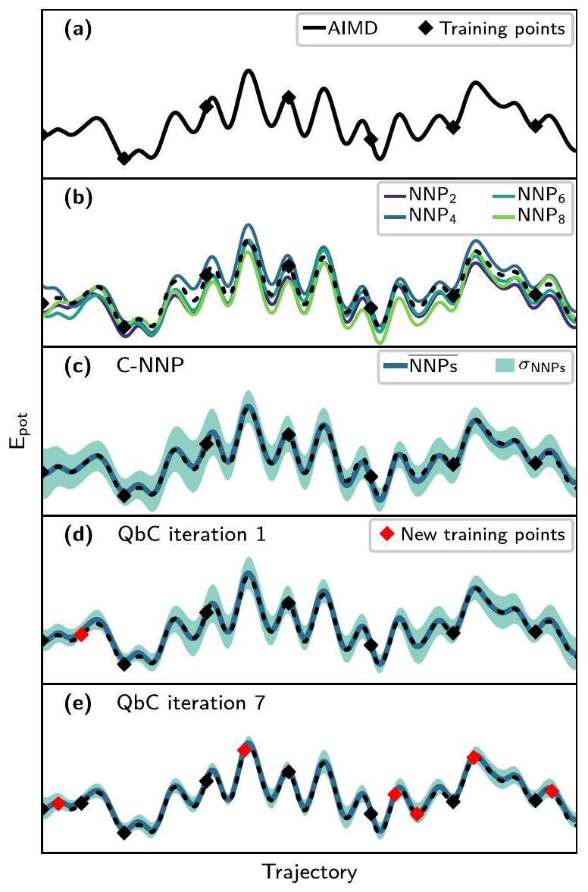
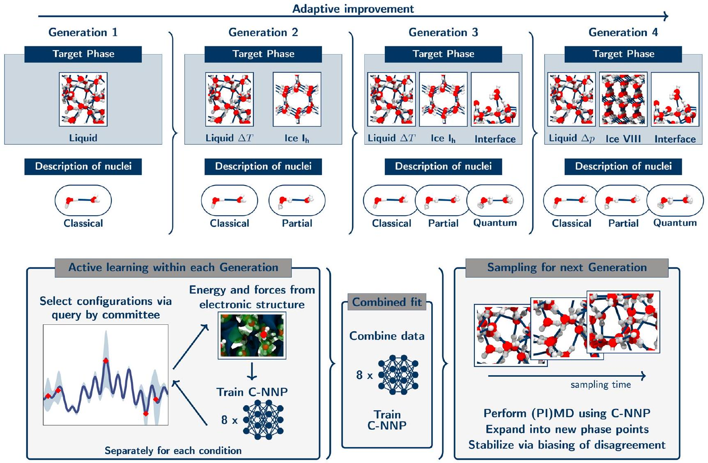
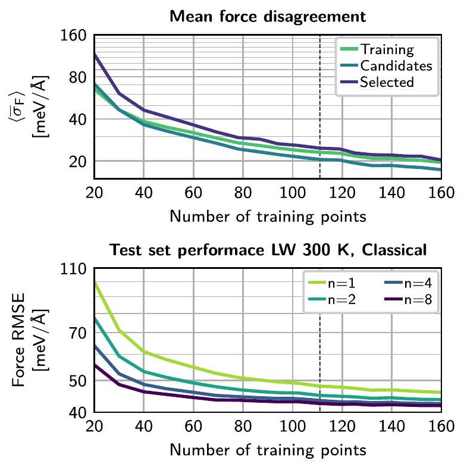
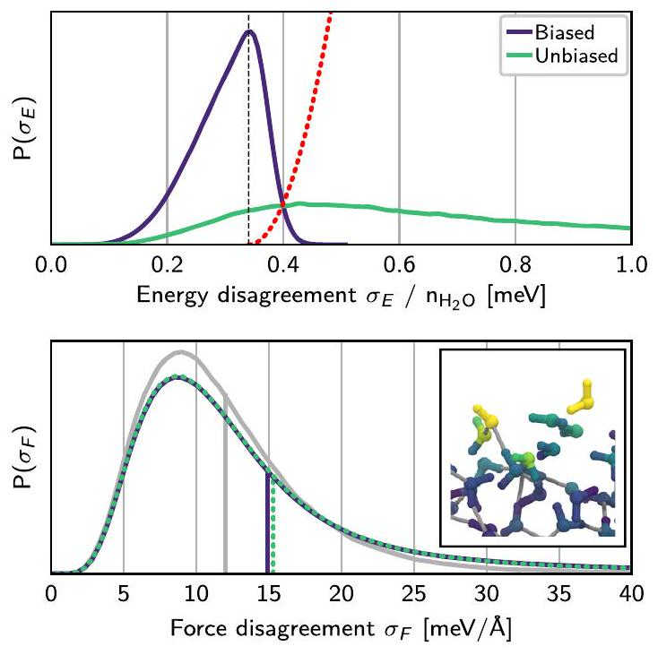
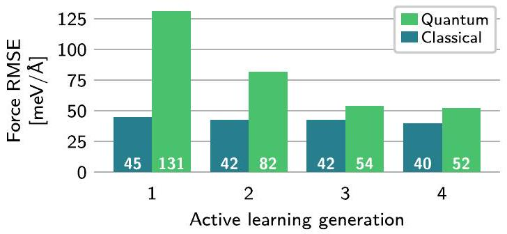
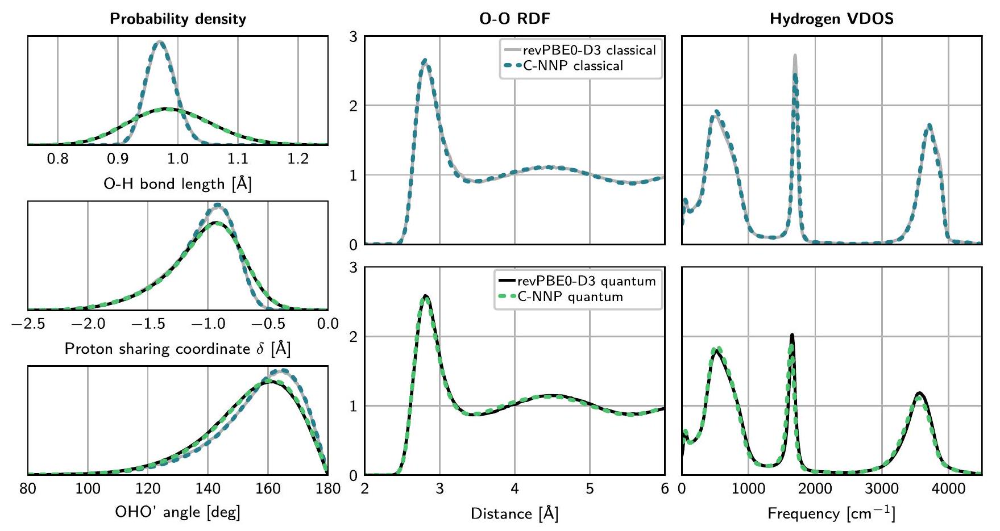
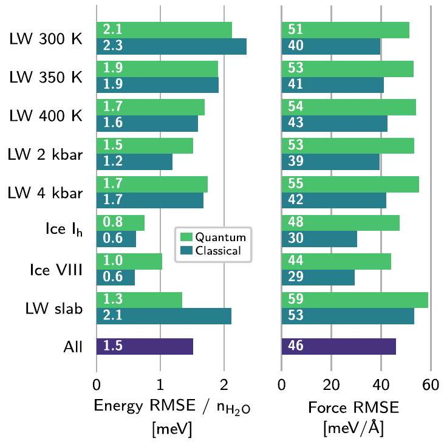

## The Journal of Chemical Physics

## RESEARCH ARTICLE | SEPTEMBER 082020

## Committee neural network potentials control generalization errors and enable active learning

Special Collection: Machine Learning Meets Chemical Physics
Christoph Schran © ; Krystof Brezina (D) ; Ondrej Marsalek
Check for updates
J. Chem. Phys. 153, 104105 (2020)
https://doi.org/10.1063/5.0016004

View Online

## Articles You May Be Interested In

Improving the convergence of closed and open path integral molecular dynamics via higher order Trotter factorization schemes
J. Chem. Phys. (August 2011)

Inferring effective forces for Langevin dynamics using Gaussian processes
J. Chem. Phys. (March 2020)

Transferability of machine learning potentials: Protonated water neural network potential applied to the protonated water hexamer
J. Chem. Phys. (February 2021)

# Committee neural network potentials control generalization errors and enable active learning 

Cite as: J. Chem. Phys. 153, 104105 (2020); doi: 10.1063/5.0016004 Submitted: 31 May 2020 • Accepted: 13 August 2020 • Published Online: 8 September 2020 Export Citation CrossMark Christoph Schran, ${ }^{\text {a) }}$ (Drystof Brezina, (D) and Ondrej Marsalek ${ }^{\text {b) }}$ (D) AFFILIATIONS Charles University, Faculty of Mathematics and Physics, Ke Karlovu 3, 12116 Prague 2, Czech Republic Note: This paper is part of the JCP Special Topic on Machine Learning Meets Chemical Physics. ${ }^{\text {a) }}$ Electronic mail: christoph.schran@rub.de ${ }^{\text {b) }}$ Author to whom correspondence should be addressed: ondrej.marsalek@mff.cuni.cz

#### Abstract

It is well known in the field of machine learning that committee models improve accuracy, provide generalization error estimates, and enable active learning strategies. In this work, we adapt these concepts to interatomic potentials based on artificial neural networks. Instead of a single model, multiple models that share the same atomic environment descriptors yield an average that outperforms its individual members as well as a measure of the generalization error in the form of the committee disagreement. We not only use this disagreement to identify the most relevant configurations to build up the model's training set in an active learning procedure but also monitor and bias it during simulations to control the generalization error. This facilitates the adaptive development of committee neural network potentials and their training sets while keeping the number of $a b$ initio calculations to a minimum. To illustrate the benefits of this methodology, we apply it to the development of a committee model for water in the condensed phase. Starting from a single reference $a b$ initio simulation, we use active learning to expand into new state points and to describe the quantum nature of the nuclei. The final model, trained on 814 reference calculations, yields excellent results under a range of conditions, from liquid water at ambient and elevated temperatures and pressures to different phases of ice, and the air-water interface-all including nuclear quantum effects. This approach to committee models will enable the systematic development of robust machine learning models for a broad range of systems.

Published under license by AIP Publishing. https://doi.org/10.1063/5.0016004

## I. INTRODUCTION

Machine learning has emerged in recent years as a powerful tool for the description of complex chemical systems. ${ }^{1-5}$ A major contribution has been the development of machine learning potentials (MLPs)-models that represent potential energy surfaces created by explicit $a b$ inito calculations-which enables the study of chemical systems for long timescales and on large length scales, even with chemical reactivity included. The first method based on artificial neural networks that is, in principle, scalable to arbitrary system sizes was the high-dimensional neural network potential (NNP) methodology ${ }^{6,7}$ combined with atom-centered symmetry functions to describe atomic environments. ${ }^{8}$ Over the years, many other distinct methods have been proposed for this difficult task based on a
range of descriptors and either on artificial neural networks ${ }^{9-16}$ or on kernels. ${ }^{17-22}$ Since their introduction, NNPs have been successfully applied to solvents, ${ }^{23-25}$ solids, ${ }^{12,26,27}$ solid-liquid interfaces, ${ }^{28}$ and reactive processes in solution ${ }^{29}$ or at interfaces, ${ }^{30,31}$ and have therefore repeatedly demonstrated their reliability for the understanding of complex molecular systems and materials. However, a crucial component of any MLP is a robust and representative training set whose construction can easily become the most challenging part of the development of such a model, especially for condensed phase systems.

At the same time, it is well known in the machine learning community that the predictive power of a machine learning approach can be substantially improved by combining multiple individual models. ${ }^{32-36}$ Instead of a single model, multiple models are trained
independently to form a committee that offers several benefits. Averaging over the predictions of an ensemble of committee members usually provides an improved accuracy of the prediction compared to the individual members. ${ }^{33,37-39}$ In addition, the disagreement of the committee, as measured by the standard deviation of the predictions of the members, provides access to an estimate of the generalization error. ${ }^{34,40,41}$ Moreover, the committee model can substantially reduce overfitting issues. ${ }^{42}$ Finally, by adding previously unlabeled data with maximal committee disagreement to the training set, the model can be systematically improved-an active learning strategy known as query by committee (QbC). ${ }^{34,43}$

Despite the rise of machine learning in molecular simulations and materials science, committee models are not considered standard tools and have mainly been used in pioneering work. This includes the well-established practice to use the difference between two NNP models for the manual improvement of the training set, ${ }^{23,44,45}$ as first described in Ref. 46, but without combining the predictions of the two models. More recently, the use of two machine learning models has been proposed for the simulation of the infrared spectra of gas-phase molecules either in an ensemble averaging approach ${ }^{47}$ or for the error estimation in post-processing. ${ }^{48}$ Additionally, the disagreement of NNPs has been shown to be crucial for the automated fitting of NNPs at coupled cluster accuracy for protonated water clusters. ${ }^{49}$ Ensemble methods were also recently proposed for uncertainty estimation in chemical machine learning. ${ }^{50}$ Besides these examples, QbC strategies have been leveraged for the development of moment tensor potentials ${ }^{51}$ and more recently for deep potential models. ${ }^{52} \mathrm{QbC}$ has also been successfully utilized for active learning in chemical space, ${ }^{53}$ which additionally demonstrated the improvements in accuracy obtained by using the committee average for predictions. In the realm of Gaussian approximation potentials, ${ }^{17}$ data-driven learning strategies ${ }^{54}$ have recently been shown to be crucial for the automated development of machine learning potentials. Finally, complementary strategies such as farthest point sampling ${ }^{55}$ have been tested for the construction of uniform datasets. ${ }^{56}$

In this work, we exploit the established benefits of committee models known in the field of machine learning to create robust MLPs with controlled generalization errors in an automated fashion. Conceptually, our approach is based on a combination of multiple models of the well-established NNP formalism. ${ }^{6,7}$ The resulting committee intentionally shares the same atom-centered symmetry functions ${ }^{8}$ as descriptors for the atomic environments, thus leading to a small, often negligible, computational overhead in production runs. We show that, compared to the individual NNPs, this approach results in improved accuracy for predictions and at the same time gives direct access to the committee disagreement, an estimate of the generalization error. This disagreement-being straightforward to compute during a simulation-can thus be monitored and even biased to stabilize the simulation. It also enables active learning via QbC techniques, which expands the training set, systematically improving the model. These benefits allow us to build an adaptive workflow for the development of committee NNP models and the systematic generation of their training sets. We finally illustrate the capabilities of the resulting methodology on the description of water in the condensed phase at various state points and make the resulting training set and model parameters available to the community. This methodology integrates the aspects of committee models
with new features such as our adaptive active learning workflow and the biasing of the committee disagreement into a unified framework and will yield robust MLPs for a broad range of systems.

## II. COMMITTEE NEURAL NETWORK POTENTIALS

Before we introduce the principal ideas underlying committee NNPs (C-NNPs), we first briefly summarize the original BehlerParrinello NNP methodology. To represent an interatomic potential by NNPs, the atomistic structure is first transformed using atomcentered symmetry functions ${ }^{8}$ into translationally and rotationally invariant descriptors of atomic environments. These serve as the input for atomic neural networks that output the auxiliary components of the total potential energy, which is then obtained as a sum of contributions from all atoms in the system. The resulting permutationally invariant structure-energy relation can be analytically differentiated to obtain forces, for example, to drive molecular dynamics, and is scalable to essentially arbitrary system sizes. ${ }^{6}$ The whole model is trained by optimizing the parameters (weights and biases) of the atomic neural networks, one per element, to reproduce the reference energies and optionally forces of a training set. In contrast, the network architecture and the particular choice of symmetry functions are hyperparameters that need be be specified by the user. For further details on the original NNP methodology, we refer the reader to Ref. 7.

In order to extend this methodology to a committee model, we propose to use multiple NNPs that have been optimized independently using the same training set. However, every individual NNP is trained to a slightly different subset of the full training set, while a small fraction is intentionally left out in each case. This strategy, also known as random subsampling in the machine learning community, introduces variation between the committee members as shown, for example, in Ref. 34 for artificial neural networks. Together with the intrinsic stochastic nature of the neural network optimization due to the initialization of the weights and the optimizer itself, these different contributing factors provide a sufficiently diverse committee of NNPs. Given the predictions of potential energies and atomic forces by the committee of NNPs, $\left\{E_{i}(q)\right\}_{i=1}^{n}$ and $\left\{-\nabla_{\alpha} E_{i}(q)\right\}_{i=1}^{n}$, as a function of the positions of all the atoms $q \equiv\left\{\mathbf{q}_{\alpha}\right\}_{\alpha=1}^{N}$, the C-NNP prediction for any given structure is obtained as an average,

$$
\begin{gathered}
E(q)=\frac{1}{n} \sum_{i=1}^{n} E_{i}(q), \\
\mathbf{F}_{\alpha}(q)=\frac{1}{n} \sum_{i=1}^{n} \mathbf{F}_{i \alpha}(q)=-\frac{1}{n} \sum_{i=1}^{n} \nabla_{\alpha} E_{i}(q),
\end{gathered}
$$

where $i$-indexed quantities represent the predictions of the $n$ individual committee members, the non-indexed ones represent the averaged C-NNP prediction, and $\alpha$ is the atomic index. As we have a set of predictions for each structure, we can define the committee disagreement as the standard deviation of the individual NNPs,

$$
\begin{gathered}
\sigma_{E}(q)=\left[\frac{1}{n} \sum_{i=1}^{n}\left(\Delta E_{i}\right)^{2}\right]^{\frac{1}{2}} \\
\sigma_{\mathrm{F}_{\alpha}}(q)=\left[\frac{1}{n} \sum_{i=1}^{n}\left(\nabla_{\alpha} \Delta E_{i}\right)^{2}\right]^{\frac{1}{2}}
\end{gathered}
$$

where we introduce the notation $\Delta E_{i} \equiv E-E_{i}$. These disagreements can be easily computed and monitored on-the-fly during a production run and provide an estimate of the uncertainty of the C-NNP prediction for a given configuration. The energy disagreement gives global information, while the force disagreement is locally resolved for each atom and can therefore highlight the weaknesses of the prediction for a local environment within a given configuration. Thus, access to the disagreement enables direct validation of the predictions of a C-NNP model, in particular, since it is known that the committee disagreement provides a measure of the generalization error. ${ }^{34,40,41}$

At this point, it is clear that due to the correlation of disagreement and generalization error, it is beneficial to have small disagreement during a production run. This will be the case for a well-trained robust committee model, but before we obtain one, we can take steps to ensure that the disagreement is controlled. To achieve that, we define a biasing potential $E^{\text {(b) }}$ that acts on the energy disagreement, for example, using a shifted harmonic form

$$
E^{(\mathrm{b})}\left[\sigma_{E}(q)\right]=\theta\left(\sigma_{E}-\sigma_{0}\right) \frac{1}{2} k^{(\mathrm{b})}\left(\sigma_{E}-\sigma_{0}\right)^{2}
$$

where $\theta$ is the Heaviside step function that activates the bias only upon reaching a threshold disagreement $\sigma_{0}$. In principle, other functional forms of the biasing potential are possible, which will be explored in future work. The above choice makes it particularly easy to compute the associated biasing forces as

$$
-\nabla_{\alpha} E^{(\mathrm{b})}=\theta\left(\sigma_{E}-\sigma_{0}\right) k^{(\mathrm{b})} \frac{\sigma_{E}-\sigma_{0}}{\sigma_{E}} \cdot \frac{1}{n} \sum_{i=1}^{n}-\Delta E_{i} \nabla_{\alpha} \Delta E_{i},
$$

which can be used to keep the disagreement within reasonable upper limits in a molecular dynamics run. Biasing of the committee disagreement, therefore, provides a unique way to stabilize a simulation that employs a committee model. By shifting the onset of the biasing potential to larger committee disagreements, the influence on the simulation can be fine tuned and minimized so that the biasing potential only acts as a safeguard against rare excursions of very high disagreement. Biasing the energy disagreement in this way allows the system to move freely in parts of configuration space that are well-described by the C-NNP while effectively erecting a barrier at the boundary of this region, which prevents the simulation from entering configurations with high generalization errors. As an alternative that is more local but potentially also more invasive, separate biases can be introduced on individual atomic force disagreements, as we detail in the Appendix. We also note in passing that approaches to sample intermediate disagreement, in the spirit of various enhanced sampling techniques, could provide a new direction to efficiently generate relevant structures to be included in training sets of MLPs as part of an active learning procedure.

In the present case, we intentionally decided to share the same set of symmetry functions for the representation of atomic environments between the C-NNP members. This has the advantage that the evaluation of the symmetry functions and their derivatives is only performed once for the whole committee, which is typically the computationally most demanding step. Then, only the atomic
neural networks are evaluated separately for each committee member, incurring only a small overhead compared to using a single NNP.

To highlight the benefits of the committee NNP approach, we illustrate some of its main features in Fig. 1. A crucial step in the development of any machine learning potential is the preparation of the training set, which we address in detail in Sec. III. The training set needs to be representative of the planned simulations and dense enough to generate reliable interpolation between the training points. Most preparations of training sets, therefore, start from simulations with the chosen reference method, typically in the spirit of ab initio molecular dynamics (AIMD). ${ }^{57}$ A first training set can then be generated by choosing uncorrelated configurations from such a

FIG. 1. Illustration of the committee model compared to the individual NNP members of the committee and of the QbC procedure for 64 water molecules in the liquid phase. (a) $A b$ initio reference trajectory and first selection of training points equally spaced along the trajectory. (b) Predicted energy along the original trajectory from eight independent NNP fits to the same training points. (c) Predicted energy along the original trajectory of the committee model composed of the eight NNPs. (d) Active improvement of the model via query by committee. The additional new training point is highlighted in red. (e) Performance of the committee model after seven query by committee iterations. The committee disagreement has been reduced, and the prediction has improved.
trajectory, as shown in Fig. 1(a). Training multiple NNPs with different initial conditions or to different subsets of the full training set leads to varying performance between them, as highlighted in panel (b). In previous work, the user would then select the best performing NNP as the model of choice. However, if the different models are combined to a committee NNP, the prediction is substantially improved, as shown in panel (c). At the same time, the committee disagreement allows the identification of configurations for which the uncertainty of the model is high, enabling active learning strategies based on QbC techniques to iteratively improve the model. As shown in panels (d) and (e), adding selected configurations to the training set substantially reduces the committee's disagreement while improving its prediction compared to the reference data. To select new configurations for the training set, it is possible to use either the global total energy disagreement or the local information contained in the atomic force disagreement, after a suitable reduction over all atoms in the given frame. Overall, these features allow for a data-driven approach to developing C-NNP models, as presented in detail in Sec. III.

The methodology to make use of the benefits of committee models has been implemented in the CP2K simulation package ${ }^{58}$ for Behler-Parrinello NNPs and will be made available in the next release. This includes the on-the-fly evaluation of the energy and force disagreement and the associated biasing of the energy disagreement. In practice, a committee NNP model can be obtained by performing individual fits with any NNP training code, for example, with the open-source $\mathrm{n} 2 \mathrm{p} 2 \operatorname{code}^{27}$ or the RuNNer code. ${ }^{59}$ One can therefore see that the proposed concepts are straightforward to adapt for a broad range of existing MLPs while introducing benefits and additional features.

## III. ACTIVE LEARNING PROCEDURE FOR COMMITTEE NEURAL NETWORK POTENTIALS

Let us now address a crucial step in the development of any MLP, the preparation of the training set. A machine learning model can only be as good as its underlying data, which needs to be representative of the situations encountered when using the final model. As discussed in the Introduction, the selection of configurations for the training of machine learning potentials has recently seen great progress toward data-driven and automated approaches. ${ }^{21,45,47,49,51-54,60,61}$ In a similar spirit, here, we present an adaptive active learning workflow for the construction of robust C-NNPs for classical and path integral molecular simulations. The approach developed here builds on the automated fitting of NNPs at the coupled cluster level of theory for gas-phase clusters. ${ }^{49,62}$

We make use of two basic properties of the committee model to automate the development of C-NNPs. First, as shown in Sec. II, the committee disagreement can be used as an estimate of the generalization error of the model. By adding configurations to the training points that feature the highest committee disagreement, the most important points for an improvement of the model can be iteratively selected. This is the main principle behind active learning via QbC. ${ }^{43}$ Second, the C-NNP is many orders of magnitude cheaper than the reference electronic structure method, and new configurations can therefore be generated rapidly using the C-NNP. These large sets of configurations can then be efficiently screened using

QbC , and expensive reference calculations are only performed for these selected points.

We organize the active learning workflow into different generations, each of them comprising multiple QbC cycles and other operations, as outlined in Fig. 2 for the condensed phase of water. Each generation includes new state points and yields a C-NNP that will be used to generate new candidate structures for the next generation. The on-the-fly monitoring and biasing of the committee disagreement provide invaluable tools to guarantee the stability of these simulations and the validity of the new configurations. Only at the beginning of the first generation, the process is seeded from an AIMD simulation in order to provide an initial set of structures. If the new conditions are not structurally drastically different from those in the previous generation and we use disagreement biasing to keep molecular dynamics stable, we can start with a single state point and gradually expand into new regions without the need to run additional expensive AIMD simulations. If the final model should be applied together with a quantum description of the nuclei, this can also be adaptively included over the generations by gradually increasing the quantum character of the nuclei in imaginary time path integral simulations. ${ }^{63,64}$

Within a generation, QbC is used to adaptively extend the training set by selecting the most representative configurations separately for each state point, improving its description, as schematically shown in the bottom left panel of Fig. 2. With this procedure, multiple state points can easily be treated in parallel. At the very beginning of each QbC cycle, a small number of random configurations are chosen to train the first committee, while in subsequent iterations, new configurations are selected based on the highest committee disagreement. We chose to use the force disagreement (rather than the total energy disagreement) for this selection, since it is sensitive to the local environments within a configuration and insensitive to the global offset of the whole potential energy surface. Convergence of these individual QbC cycles can be detected by monitoring this disagreement. If the structures were generated by AIMD simulations, as is the case at the beginning of the first generation, the associated reference forces and energies are already known and the improved C-NNP model can be trained directly to the growing training set. In subsequent generations, candidate structures are generated by the molecular dynamics of the previous generation's C-NNP, and explicit electronic structure reference calculations are only needed for the small number of actively selected points. Once all QbC cycles for the selected conditions in a given generation are converged, the individual training sets are combined and a final tight optimization of that generation's resulting C-NNP is performed.

The adaptive improvement of the model and its training set is completed after several generations, when all desired conditions have been included and the final C-NNP exhibits the required accuracy in subsequent production simulations. In these simulations, the committee disagreement on energy and forces can be monitored on the fly and compared to the disagreement known from the active learning process. If this disagreement stays within the range encountered for these known conditions included in the training process, it is expected that the final model reaches the desired accuracy also in the production simulations. Thus, utilizing the properties of committee models, the data-driven workflow outlined above helps automate the development of robust machine learning

FIG. 2. Illustration of the adaptive improvement of the committee NNP over multiple generations. The top panel summarizes the expansion into new target phases and the iterative improvement of the description of the nuclei in each generation. Within each generation, the most important points for an improvement of the model are actively selected using QbC based on the highest committee disagreement, separately for each selected state point (bottom left). Afterward, the reference energy and forces, if previously unknown for these structures, are obtained from explicit electronic structure calculations. These points are added to the training set, and the committee members are trained to the expanded training set. QbC iterations are repeated until the committee disagreement converges (see the text for details). At the end of each generation, all training points are gathered in order to perform a final extended fit of the committee model (bottom middle). The resulting C-NNPs can consecutively be applied for exhaustive (PI)MD sampling at various new state points (bottom right). These simulations provide the structures for the next generation in the adaptive improvement.

potentials and subsequent production simulations with controlled accuracy.

## IV. APPLICATION OF COMMITTEE NEURAL NETWORK POTENTIALS TO WATER

## A. Development of the committee model

In order to showcase the benefits of the committee NNP methodology, we develop a C-NNP model for water at various state points, including also the quantum nature of the nuclei, following the data-driven workflow described above. All specific settings used here are listed in Sec. VI, while the training input files, training set, and parameters of the final model are publicly available at http://doi.org/10.5281/zenodo.4004590. In the first active learning generation, we seed the procedure with 300 ps of classical AIMD simulation of liquid water (LW) at 300 K obtained at the hybrid
density functional theory (DFT) level ${ }^{65}$ and perform a single QbC cycle targeting this state point. This QbC cycle uses a committee of 8 NNPs and is initialized with 20 structures randomly selected from the ensemble. Ten new configurations with the highest disagreement are added in each subsequent iteration. After the training of the individual members, the energies and forces of 5000 random structures from the original trajectory are predicted in order to compute the committee disagreement. We intentionally use only a subset of the large pool of candidate structures in order to make the QbC iterations computationally more efficient. For the same reason, the QbC NNPs are optimized relatively loosely (15 epochs) within each QbC iteration. In order to select the most relevant configurations for an improvement of the model, we chose to use the mean force disagreement of each configuration to rank the candidate structures. If a newly selected configuration has already been included in a previous QbC iteration, it is not added again to the training set. Such occasions indicate that the QbC process is reaching the limits of
the provided set of configurations, since structures are selected more than once. Given that the DFT energies and forces are already known in the first generation, the selected points are directly added to the training set.

Monitoring of the committee disagreement during a QbC cycle allows the user to easily gauge the convergence of the process. The evolution of the atomic force disagreement during the first QbC process is shown in the top panel of Fig. 3 separately for the structures in the training set, the newly selected structures, and the 5000 candidates, from which the next ten structures for the training set are chosen. At the beginning of the QbC process, the newly selected points feature substantially larger disagreement compared to the large set of candidate structures and the training set. As more and more points with the highest disagreement are added to the training set, the disagreement of all three sets of structures decreases monotonically. However, the disagreement of the selected points decreases faster and approaches that of the training set and the candidate structures, indicating that the newly selected points are not adding further value for an improvement of the model anymore. The disagreement for the training set and the set of candidates is similar, only slightly higher for the training structures for most of the process, which shows that the training set picks up the outliers of the ensemble, but without substantially deteriorating the quality of the model. The force disagreement for all considered sets of structures

FIG. 3. Convergence of the QbC process in the first generation with respect to the number of structures in the training set. The top panel shows, in the logarithmic scale, the mean force committee disagreement averaged over the given set of structures $\left\langle\bar{\sigma}_{F}\right\rangle$ for the training set (Training), the large set of potential new candidates (Candidates), and the actual newly selected configurations (Selected). The bottom panel shows, in the logarithmic scale, the force root mean square error (RMSE) of the C-NNP model for different committee sizes from one to eight members. It was evaluated on 500 independently generated configurations for the target state point of liquid water at 300 K with classical nuclei (see Sec. VI for details). The final number of training points (111) used from the QbC cycle is marked with a vertical dashed line.

eventually decreases more slowly, indicating that the active learning process is well converged after roughly 100 structures have been added to the training set.

Let us next focus on the actual performance of the C-NNP model for water at the chosen starting condition. As mentioned previously, the committee disagreement is an estimate of the generalization error, and so we should expect the accuracy of the model to improve over the QbC process as the disagreement decreases. In order to validate this expectation for the C-NNP approach, the evolution of the force root mean square error (RMSE) along the QbC cycle for an independently generated test set at the chosen condition is shown in the bottom panel of Fig. 3. In addition to the RMSE of the full committee with eight members, we also include the performance of all possible committees with four, two, and one members (i.e., individual NNPs) for comparison. As anticipated from the evolution of the committee disagreement, the force RMSE of the full eight-member C-NNP starts at roughly $60 \mathrm{meV} / \AA$ at the beginning of the QbC process and converges monotonically to a value of about $40 \mathrm{meV} / \AA$ after roughly 100 points have been added to the training set. At the same time, the performance of the smaller committees, and most notably the individual NNPs, is substantially worse, especially at the beginning, where the individual NNPs show an RMSE that is twice as large as that of the full C-NNP. Although the large initial differences decrease as the QbC process progresses, the difference remains clear even when convergence has been reached with roughly 100 training points, where the committee still outperforms the individual members and reduces the RMSE from an average of $48 \mathrm{meV} \AA$ for the individual NNPs to $42 \mathrm{meV} / \AA$ for the full eight-member C-NNP. Given the slower convergence with an increasing number of structures, it is clear that it would take a much larger training set for the individual NNPs to reach the performance of the C-NNP. Thus, this analysis highlights the added accuracy of the committee approach, known from other machine learning applications. ${ }^{33,37-39}$

Overall, this detailed analysis of the first QbC cycle shows that only a relatively small number of points are needed to reach convergence for the starting point of our active learning procedure. The 111 structures identified after the first 10 QbC iterations are therefore used as the final training set of the first generation C-NNP model. After stringent re-optimization of the individual NNPs-see Sec. VI for details-the C-NNP model is ready to be used for the generation of new structures at state points neighboring to the original ensemble of liquid water at 300 K . For these simulations, the on-thefly computation of the committee disagreement is crucial in order to judge if the new configurations are physically meaningful. In addition, the biasing of the committee energy disagreement derived above can be used to prevent the system from entering regions of configuration space where the model is not well determined by the training set.

To illustrate the benefits of this feature, we used the C-NNP model of generation 1 for the simulation of the air-water interface at 300 K . In Fig. 4, we show the resulting probability distributions of the total potential energy and atomic force disagreement. The distributions from unbiased simulations feature a very long tail for the energy disagreement, which is to be expected from a model that has not been trained on gas-phase clusters or interfaces. The interface is confirmed as the culprit by inspecting the spatial distribution of the disagreement, as shown in the inset in the bottom panel of Fig. 4,

FIG. 4. Comparison of the distribution of the committee disagreement with and without biasing. The plots show the normalized probability densities of the energy (top panel) and force (bottom panel) committee disagreement for a water slab with 216 water molecules at 300 K . Two simulations were performed for the generation 1 C-NNP model-with and without applying a biasing potential acting on the energy disagreement. The offset of the biasing potential is chosen such that the bias only acts on configurations with an energy disagreement per water molecule larger than 0.33 meV per molecule. The resulting functional form is included in the top panel as a red dotted line. The force disagreement distribution obtained for the training set of the generation 1 C -NNP model is shown in gray in the bottom panel, and the averages of the respective distributions are marked as horizontal lines. The inset in the bottom panel shows a snapshot of the air-water interface with atoms color-coded by their respective force disagreement, where yellow indicates high and purple indicates low disagreement.

where individual atoms are colored by their value of the atomic force disagreement. Indeed, the highest values are found for atoms at the interface whose environments deviate from those in the bulk liquid. Compared to the force disagreement of the same model for its training set (gray distribution in the bottom panel of Fig. 4), the distribution from the slab simulation remains close but exhibits a heavier tail due to the interfacial atoms. The application of a bias to the energy disagreement suppresses the tail of its distribution and yields a more compact distribution. In contrast, it has only a very subtle effect on the distribution of force disagreement, which highlights the relatively mild influence of the biasing potential on the local behavior of the system. Therefore, the energy disagreement biasing can be understood as a global safeguard that prevents the system from moving into regions of configuration space with large disagreement while keeping local perturbations low. In light of this analysis, we chose to use a weak biasing potential for all simulations used to generate configurations under new conditions, as detailed in Sec. VI, to ensure the stability of the simulations without substantial distortion of the structures.

In order to select the target state points for the next generation in the adaptive improvement of the C-NNP model, we performed test simulations under a variety of conditions with the generation

1 model. After a careful analysis of the observed disagreement for these simulations, we chose hexagonal ice at 250 K and liquid water at increased temperatures up to 400 K as the targets for the second generation of the active learning process. Moreover, the quantum character of the nuclei is targeted by separate path integral molecular dynamics (PIMD) simulations for the same state points. To introduce quantum delocalization gradually, we use underconverged path integral discretization to stay structurally closer to the classical ensemble of generation 1. We employ a separate QbC process to select new structures for each condition to ensure that they are optimally covered by the training set independently of the others. This has the additional advantage of increased computational efficiency, as these QbC cycles can easily be run in parallel. In contrast to the first generation, the QbC iterations are seeded by choosing 20 random structures from the training set of the previous generation. The DFT reference energy and forces are unknown for the newly selected configurations and, thus, are computed during the QbC cycle. Good convergence of these QbC processes is reached after only 3-5 iterations, and generation 2, therefore, adds a total of roughly 250 new configurations to the combined training set from the eight independent QbC cycles.

In the final two generations of the active learning workflow, additional conditions were targeted. This includes high pressure liquid water, a water slab to represent the air-water interface, ${ }^{66}$ and finally the high pressure ice phase VIII, as well as the quantum nature of the nuclei, as summarized in the top panel of Fig. 2. All details on these target conditions and the relevant simulations can be found in Sec. VI. During generation 3 and 4, 240 and 205 additional reference configurations at the various state points were added to the training set, respectively. The final result after four generations of our active learning procedure is a training set of 814 structures and the corresponding tightly optimized C-NNP, which are able to describe a broad range of conditions with classical or quantum nuclei. The whole process was originally initialized from a single classical AIMD simulation at 300 K , with no $a b$ initio path integral molecular dynamics (AIPIMD) required at any point. This process could be continued to expand into additional thermodynamic regions in case they are of interest for specific scientific questions. However, we consider the diversity of the training set sufficient to showcase the ability of our approach to generate robust and accurate C-NNP models and their training sets in a data-driven and automated fashion.

## B. Validation of the committee model

After presenting the details of the active learning procedure for the development of a C-NNP model for water at various state points including quantum nuclei, we analyze the improvement of the model over the different active learning generations and validate, in particular, the quality of the final generation 4 model. For this purpose, we explicitly benchmark static and dynamical thermal properties against AIMD and AIPIMD simulations available for a single state point (liquid water at 300 K ) with and without nuclear quantum effects, while we compare RMSE values for all the state points considered. The RMSE analysis is performed for an independently created test set, which spans the same thermodynamic state points as targeted during the development of the model, but has been generated by separate simulations with the final generation 4 model,

FIG. 5. Force root mean square error (RMSE) of the C-NNP models over the four generations of our active learning workflow. For each generation, we show the force RMSE relative to the revPBE0-D3 reference evaluated over an independently generated test set. The RMSE is averaged over all the state points in each case, separately for classical and quantum structures.

as detailed in Sec. VI. This test set comprises a total of 8000 configurations, split equally between classical and quantum configurations, for which DFT reference energies and forces have been calculated. It, therefore, features one order of magnitude more configurations than the final training set of generation 4 and enables a comprehensive performance analysis of the improvement of the model for the various conditions.

To summarize the progress over the different generations, we report in Fig. 5 the force RMSE for the independently generated
test set averaged over the various state points but separate for quantum and classical structures. Classical structures show only a minor improvement across the generations, as they are described already very well by the generation 1 model. On the other hand, quantum structures, which were not included at all in the training set of generation 1, improve substantially with each generation. The final C-NNP model of generation 4 reproduces the forces in the independent test set with a RMSE of $40 \mathrm{meV} / \AA$ and $52 \mathrm{meV} / \AA$ for classical and quantum structures, respectively. This is overall slightly smaller compared to previous work employing NNPs for water with a classical description of the nuclei ${ }^{23,24}$ and substantially smaller compared to a model including quantum nuclei ${ }^{25}$ while covering diverse regions of the phase diagram and including the quantum nature of the nuclei with a training set of just $\sim 800$ configurations. We believe that the surprising robustness of the model with such a small training set is mainly due to a combination of two factors. The active learning process selects structures that are the most important for the improvement of the model while at the same time avoiding extreme structures that would distort the fit in regions relevant for simulations. Furthermore, the fact that the C-NNP is an average of multiple models lends it stability that is not available to the individual members.

To validate the performance of the final generation 4 C NNP model for the calculation of equilibrium properties at a finite temperature, we compare against reference AIMD and AIPIMD trajectories of liquid water at $300 \mathrm{~K} .^{65}$ We used the final C-NNP

FIG. 6. Comparison of several local and global static properties as well as the vibrational density of states obtained by explicit revPBE0-D3 ab initio simulations and the final C-NNP generation 4 model. The three panels on the left show the normalized probability density for the O-H bond lengths (top), the proton-sharing coordinate $\delta$ (middle), and the hydrogen bond angle (bottom) for both a classical and quantum description of the nuclei. The two panels in the middle display the comparison of the $\mathrm{O}-\mathrm{O}$ radial distribution functions, while the two panels on the right compare the hydrogen atom vibrational density of states for a classical (top) and a quantum (bottom) description of the nuclei.

model to obtain two sets of NVT production trajectories, one with classical nuclei and one with quantum nuclei. A comparison of both static and dynamical properties of the system is shown in Fig. 6. Of the static properties, we focus first on the local structure of individual molecules ( $\mathrm{O}-\mathrm{H}$ bond lengths) and their hydrogen bonds (proton-sharing coordinate $\delta$ and hydrogen bond angle). The C NNP model exhibits excellent agreement with the reference AIMD data for these properties in both the classical and quantum cases. This includes the tail of the quantum distribution of $\delta$ that corresponds to strong proton sharing, as shown in Fig. S4. We then characterize the intermolecular structure using radial distribution functions (RDFs), which are, again, captured accurately in both cases. There is a negligible shift of the second peak of the O-O RDF to shorter distances in the quantum case (Fig. 6), while the $\mathrm{O}-\mathrm{H}$ and H-H RDFs in Figs. S1 and S2 show essentially perfect agreement. Likewise, the vibrational dynamics of the system, encoded in the vibrational density of states, is reproduced reliably by the C-NNP model, as seen for hydrogen atoms in the right column of Fig. 6 and in Fig. S3 on a logarithmic scale. In the classical spectrum, the bending peak at $\sim 1700 \mathrm{~cm}^{-1}$ is ever so slightly broadened, resulting in a small decrease in the peak height, while the rest of the spectrum is essentially a perfect match, including low-intensity features only visible on the logarithmic scale. In the thermostatted ring polymer molecular dynamics (TRPMD) spectrum, the C-NNP model exhibits a very small red shift in the bending and stretching regions but shows a very good match of the spectrum as a whole. Note that a contributing factor to the already very small remaining differences in the quantum case is the incomplete convergence of ring polymer contraction in the reference AIPIMD simulations, as suggested by the comparisons of contraction to 1 and 4 replicas in the supplementary material of Ref. 65. Overall, we can see that our C-NNP model matches the reference $a b$ initio method accurately in the description of the structure and vibrational dynamics of liquid water. This is particularly remarkable in the quantum case, as no explicit AIPIMD simulations were required in the parameterization of the model.

In the next step, we again widen the analysis of the performance of the developed C-NNP model for water. As just demonstrated, it is certainly possible to explicitly validate various properties with respect to AIMD or even AIPIMD simulations under selected conditions. However, this type of analysis quickly gets out of scope for all targeted state points that we considered in the present case. In addition, the whole purpose of the development of MLPs is usually to replace expensive $a b$ initio sampling. We therefore come back to a detailed analysis of the RMSEs for energies and forces for the different conditions accessible in our independent test set. As shown in Fig. 7, the final model scores overall quite well for all considered conditions, usually with slightly larger RMSE values for quantum structures. The water slab performs the worst in this analysis, indicating the more complex nature of these configurations due to the presence of an interface, but still features RMSE values similar to or lower than those reported for previous work on water. ${ }^{23-25}$ At the same time, the two phases of ice are reproduced best, as expected from the simpler nature of these systems based on the arrangement of the molecules on a lattice. Although nuclear quantum effects lead to substantially larger and broader potential energy distributions, the performance of the final model is convincingly good across the board. Comparing the score of liquid water for classical and quantum nuclei at 300 K to the other conditions makes us confident that also the associated

FIG. 7. Root mean square error (RMSE) comparison for the final generation 4 C NNP model. The bar chart shows RMSEs of energies and forces for the C-NNP model with respect to the revPBE0-D3 reference for an independently generated test set. The independent test set consists of 8000 uncorrelated configurations covering the thermodynamic conditions targeted during the development of the C-NNP model and is decomposed into the individual conditions of liquid water (LW) at different temperatures and pressures, hexagonal ice $\mathrm{I}_{\mathrm{h}}$ and ice VIII, as well as the air-water interface (LW slab), separately for a classical and quantum description of the nuclei (see Sec. VI for details on the creation of the independent test set).

properties are reproduced with similarly convincing agreement to explicit $a b$ initio sampling.

Having seen the performance of the final model, it is worthwhile to step back and see how it emerges from the active learning process. To do that, we repeat the same validation procedure as above for the model from generation 1, i.e., a C-NNP trained on 111 structures selected from classical AIMD trajectories of liquid water at 300 K using QbC . The results of comparison to explicit AIMD and AIPIMD for equilibrium properties shown in Figs. S6 and S10 clearly demonstrate that even this model does very well in simulations. For classical nuclei, it is, in fact, as good as the more extensively trained final model. Remarkably, it performs well even in the quantum case, despite the fact that no path integral structures at all were used in its training. The only noticeable deviations are the red shift in the infrared region of the vibrational spectrum and the increased proton sharing, both only slightly larger than for the final model. We have already seen in Fig. 3 how the RMSE against revPBE0-D3 energies and forces evaluated on the independent test set for liquid water at 300 K converges during the QbC process that generates the training set for this model. When we look at the RMSEs also for other conditions in Fig. S5, it is clear that the generation 1 model performs worse than the final one, especially for quantum structures, which are entirely absent from the training set. However, forces for classical structures are at the level of the generation 4 C -NNP, with the exception of ice VIII and the air-water interface. These states are not only absent from the small training set of the generation 1 model but also
structurally substantially different from liquid water, and so it should be expected that they are represented less accurately. This combination of performance characteristics offers an opportunity to gauge the meaning, or possibly the limitations, of RMSEs when it comes to molecular dynamics. While the force RMSEs are roughly three times as high for quantum structures as they are for the classical ones for the generation 1 model, these forces are sufficient to generate path integral trajectories that match the reference almost as well as in the classical case. In terms of computational cost, the ten iterations of a single QbC process selecting structures from a pre-existing AIMD trajectory took 6.7 h on a single AMD EPYC computational node with 32 cores. Given that this C-NNP is rather easy and computationally cheap to create, this seems to offer an efficient way to extend existing $a b$ initio simulations using an MLP from which we do not expect broad generality.

## V. CONCLUSIONS

In summary, we have shown how committee models can be exploited in the context of machine learning potentials, which we demonstrated specifically using Behler-Parrinello neural network potentials, obtaining a compact training set and a robust C-NNP model with a range of advantages. While the committee prediction outperforms its individual member NNPs, the committee disagreement provides a way to monitor and control the accuracy of the model relative to its parent $a b$ initio method and its training set. Using a bias of the committee disagreement that we introduced, CNNP simulations can be stabilized by effectively erecting a barrier at the boundary of regions of configuration space described well by the training set, thus preventing such simulations from entering regions of high uncertainty and high generalization errors. The computational overhead of our approach is low compared to using a single NNP, as we intentionally share descriptors of atomic environments between the committee members, which means only the atomic neural networks need to be evaluated multiple times.

Making use of the committee disagreement and repeated query by committee processes, we designed an active learning procedure capable of generating training sets in a largely automated and datadriven fashion while also keeping the number of required reference $a b$ initio calculations to a minimum. To demonstrate the benefits of this methodology, we developed a C-NNP machine learning potential-made freely available-for water under a variety of conditions with both a classical and a quantum description of the nuclei. Even though its training set comprises only $\sim 800$ configurations, the final model shows excellent agreement with the DFT reference method in comparison of energies and forces as well as in comparison of the properties calculated in classical and quantum molecular dynamics simulations.

The promising results presented in this work make us confident that the methodology introduced here can be used to systematically develop robust and general C-NNP models applicable across broad regions of the phase diagram and under a variety of conditions for systems of increasing complexity. Given the remarkable performance of the first generation C-NNP model trained on a small number of samples from a single AIMD simulation, we see great potential in the development of simpler C-NNP models for the direct extension of $a b$ initio simulations for a given state point.

Thanks to the much smaller size of the resulting training set compared to previous work, it will be possible to use more advanced reference $a b$ initio methods in the condensed phase. Finally, we expect that the described concepts can be applied directly to other MLPs based on artificial neural networks and can also be transferred to kernel-based MLPs after the introduction of stochastic elements into their training process. We hope that, thanks to the low additional complexity and required effort, the committee-based models can become a routine component of the development of machine learning potentials.

## VI. COMPUTATIONAL DETAILS

We implemented the active learning workflow in Python, interleaving data manipulation and execution of various simulation packages to perform specific tasks, such as the optimization of individual NNPs, the evaluation of DFT reference energies and forces for the selected configurations, and the sampling of new configurations. With this code, the workflow for the development of a C-NNP model for water described in Sec. IV A was carried out over four generations.

All NNP optimizations were performed with the open-source n2p2 code, ${ }^{27}$ and unless stated otherwise, all of the optimization parameters have been chosen according to the detailed benchmarking of this code for water. ${ }^{27}$ We decided to use an established set of symmetry functions, which has been shown to be able to reproduce the properties of water over a large range of conditions. ${ }^{23}$ The values of each symmetry function were centered around the respective average value of the training set and normalized to values between zero and one. These atomic environment vectors serve as the input for the atomic NNs consisting of two hidden layers of 20 neurons each with hyperbolic tangent activation functions for these two hidden layers and a linear activation function for the output neuron. The eight-member C-NNP models were constructed by random subsampling of the full set of reference data for each committee member, where $10 \%$ of the points were randomly left out in each case. After a different random initialization for each committee member, the weights and biases of the NNs were optimized using the parallel multistream version ${ }^{27}$ of the adaptive global extended Kalman filter, ${ }^{67,68}$ as implemented in n2p2. C-NNPs used for QbC were optimized for 15 epochs with 8 streams, while the final C-NNPs for each generation, to be used for simulations, were optimized for 100 epochs with 32 streams.

The DFT reference calculations were all performed with the CP2K simulation package ${ }^{58,69}$ and its Quickstep module ${ }^{70}$ using the exact same electronic structure setup for the revPBE0-D3 functional ${ }^{71-74}$ employed in Ref. 65. As shown therein, this choice of functional provides reliable properties of water, especially with quantum nuclei, and is therefore the ideal choice for the development of our C-NNP model.

The simulations using the C-NNP models used to generate candidate structures for the next active learning generation were all performed with a modified version of the CP2K simulation package. ${ }^{58,69}$ All classical simulations were propagated for 0.5 ns with a time step of 0.5 fs and a global canonical sampling through velocity rescaling (CSVR) thermostat ${ }^{75}$ with a 30 fs time constant to sample the NVT ensemble. From these simulations, every 20th configuration
was saved to ensure uncorrelated statistics, resulting in 50000 configurations for all classical ensembles. All PIMD simulations were propagated for 0.25 ns with a time step of 0.25 fs and a path integral Langevin equation thermostat ${ }^{76}$ to sample the quantum canonical ensemble. Partially converged path integral simulations were realized with four replicas to discretize the path integral, which corresponds approximately to the midpoint between classical simulations and converged path integral simulations, as shown, for example, in Ref. 77 for the prototypical hydrogen bond in the Zundel cation. Full PIMD simulations were performed with 16 replicas for all simulations except at 250 K , where 32 replicas were used. In all quantum cases, every 40th configuration from four path integral replica trajectories was used to generate the set of candidate structures for the QbC cycles, resulting in a total of 100000 configurations for every quantum ensemble. After careful testing of the influence of the energy committee disagreement biasing derived above, mild biasing with a harmonic constant $k^{(b)}=0.95 / \mathrm{eV}$ per atom and a shift of $\sigma_{0}=0.1 \mathrm{meV}$ per atom was used for all simulations during the active learning process. The C-NNP model of generation 1 was used for the simulation of liquid water along an isochor in a cubic box of size $12.42 \AA$ with 64 water molecules at three temperatures of 300 K , 350 K , and 400 K . The proton disordered phase ice $\mathrm{I}_{\mathrm{h}}$ was simulated at 250 K in supercells under periodic boundary conditions including 96 water molecules, where the lattice size and initial conditions were chosen according to Ref. 78. These four state points were targeted with both a classical and partially converged quantum description of the nuclei for the generation 2 C-NNP model. The resulting CNNP model of generation 2 was used to perform converged PIMD simulations along the same isochor of liquid water as well as for ice $\mathrm{I}_{\mathrm{h}}$. Besides these four simulations, a water slab was simulated with 216 molecules in a $15 \times 50 \times 15 \AA^{3}$ periodic box starting from an initial condition from Ref. 79 with both classical and partially converged quantum nuclei. Finally, the generation 3 C-NNP model was employed to simulate liquid water along an isotherm for two pressures of 2 kbar and 4 kbar , resulting in cubic boxes with sizes of $12.13 \AA$ and $11.93 \AA$ for 64 water molecules. In addition, ice VIII was simulated at 250 K with 64 molecules in a $9.70 \times 9.70 \times 14.11 \AA^{3}$ periodic box. These six simulations were performed for both classical and converged quantum nuclei. Finally, the water slab was simulated as in the previous generation, but now with converged quantum nuclei.

In order to generate an independent test set to validate the performance of the C-NNP models at the individual generations and the various state points, we used the final C-NNP model of generation 4 to perform independent simulations at all previously targeted conditions and state points. All classical and quantum simulations were propagated for 50 ps and 25 ps , respectively, with otherwise identical settings as for the above-mentioned simulations. The path integral has been fully converged for all these simulations by using 128 replicas for all simulations at and above 300 K and 256 replicas for the ice phases at 250 K . The biasing of the energy committee disagreement has been switched off for these production runs. From these eight classical and eight quantum ensembles in total, 500 uncorrelated structures were extracted in each case, and the reference revPBE0-D3 energies and forces were evaluated. This set of 8000 reference calculations, spanning very different conditions for both classical and quantum nuclei, was consequently used to validate the performance of the C-NNP models.

Finally, the performance of the generation 1 and 4 C-NNP models for static and dynamical properties was benchmarked against the previously published AIMD and AIPIMD results for liquid water. ${ }^{65}$ For this purpose, 64 water molecules in a cubic box of size $12.42 \AA$ were simulated at 300 K in the NVT ensemble to match exactly the setup of the reference $a b$ initio simulations. We performed classical simulations with both C-NNP models using a time step of 0.5 fs and a global CSVR thermostat ${ }^{75}$ with a time constant of 1 ps . Results including nuclear quantum effects were obtained from TRPMD simulations ${ }^{76,80}$ with 32 path integral replicas using a 0.25 fs time step. We accumulated a total simulation length of 2 ns in each case for both models. Again, no biasing of the committee disagreement was used for these production simulations.

## SUPPLEMENTARY MATERIAL

See the supplementary material for additional benchmarking results for the final generation 4 C-NNP model and detailed analysis of the performance of the C-NNP model obtained in generation 1.

## ACKNOWLEDGMENTS

This work was supported by the Primus16/SCI/27/247019 grant from Charles University. This work was partially supported by the OP RDE project (No. CZ.02.2.69/0.0/0.0/18_070/0010462), International mobility of researchers at Charles University (MSCAIF II). This work was supported by Project No. SVV 260586 of Charles University. K.B. acknowledges funding from the IMPRS for Many Particle Systems in Structured Environments. Part of this work was supported by the Alexander von Humboldt-Stiftung through a research grant awarded to C.S.

## APPENDIX: BIASING OF FORCE DISAGREEMENT

An alternative approach to biasing due to the committee disagreement that provides sensitivity to local structural changes can be based on the force disagreement introduced in Eq. (2). Rather than bias the total energy disagreement, one can bias the disagreement of each atomic force vector separately. The atom $\alpha$ that enters a region with a force disagreement larger than $\sigma_{0}$ brings a contribution to its biasing energy into the system given again by a shifted harmonic form as

$$
E_{\alpha}^{(\mathrm{b})}=\theta\left(\sigma_{\mathrm{F}_{\alpha}}-\sigma_{0}\right) \frac{1}{2} k^{(\mathrm{b})}\left(\sigma_{\mathrm{F}_{\alpha}}-\sigma_{0}\right)^{2}
$$

This affects all the other atoms in the system, say, $\beta$, and the corresponding biasing force exerted on them is

$$
\begin{aligned}
\mathbf{F}_{\beta \alpha}^{(\mathrm{b})} & =-\nabla_{\beta} E_{\alpha}^{(\mathrm{b})} \\
& =-\theta\left(\sigma_{\mathbf{F}_{\alpha}}-\sigma_{0}\right) k^{(\mathrm{b})}\left(\sigma_{\mathbf{F}_{\alpha}}-\sigma_{0}\right) \nabla_{\beta} \sigma_{\mathbf{F}_{\alpha}}
\end{aligned}
$$

At this point, we have to express $\nabla_{\beta} \sigma_{\mathbf{F}_{\alpha}}$ in order to obtain a useful expression for the biasing force. Differentiating through the definition given in Eq. (2), we get

$$
\begin{aligned}
\nabla_{\beta} \sigma_{\mathrm{F}_{\alpha}} & =\nabla_{\beta}\left[\frac{1}{n} \sum_{i=1}^{n}\left(\nabla_{\alpha} \Delta E_{i}\right)^{2}\right]^{\frac{1}{2}} \\
& =\frac{1}{n} \frac{1}{2 \sigma_{\mathrm{F}_{\alpha}}} \sum_{i=1}^{n} \nabla_{\beta}\left[\left(\nabla_{\alpha} \Delta E_{i}\right) \cdot\left(\nabla_{\alpha} \Delta E_{i}\right)\right] \\
& =\frac{1}{n} \frac{1}{\sigma_{\mathrm{F}_{\alpha}}} \sum_{i=1}^{n}\left(\nabla_{\alpha} \Delta E_{i}\right) \cdot\left(\nabla_{\beta} \nabla_{\alpha} \Delta E_{i}\right)
\end{aligned}
$$

as the desired result. A second derivative matrix operator $\nabla_{\beta} \nabla_{\alpha}$ appears, which generally requires an evaluation of analytical or numerical second derivatives for all $3 N$ degrees of freedom, and thus, its applicability for practical calculations in this raw form is limited. However, we note that in this case, the second derivative is projected on the direction of the force $\mathbf{F}_{i \alpha}$. This suggests that finite difference methods that limit the number of numerical derivative evaluations to only the one in the desired direction to evaluate the directional derivative could result in a practical computation scheme. ${ }^{81,82}$ Still, in addition to having to deal with the second derivatives, this biasing has to be evaluated separately for each atom $\alpha$ and would therefore incur a substantial computational cost. For this reason, we have not implemented it and used only the biasing of the total energy disagreement given by Eq. (3), which worked sufficiently well in practical simulations.

## DATA AVAILABILITY

The data that support the findings of this study are openly available in paper-c-nnp at http://doi.org/10.5281/zenodo.4004590.

## REFERENCES

${ }^{1}$ J. Behler, "Perspective: Machine learning potentials for atomistic simulations," J. Chem. Phys. 145, 170901 (2016).
${ }^{2}$ A. P. Bartók, S. De, C. Poelking, N. Bernstein, J. R. Kermode, G. Csányi, and M. Ceriotti, "Machine learning unifies the modeling of materials and molecules," Sci. Adv. 3, e1701816 (2017).
${ }^{3}$ K. T. Butler, D. W. Davies, H. Cartwright, O. Isayev, and A. Walsh, "Machine learning for molecular and materials science," Nature 559, 547-555 (2018).
${ }^{4}$ V. L. Deringer, M. A. Caro, and G. Csányi, "Machine learning interatomic potentials as emerging tools for materials science," Adv. Mater. 31, 1902765 (2019).
${ }^{5}$ T. Mueller, A. Hernandez, and C. Wang, "Machine learning for interatomic potential models," J. Chem. Phys. 152, 050902 (2020).
${ }^{6}$ J. Behler and M. Parrinello, "Generalized neural-network representation of highdimensional potential-energy surfaces," Phys. Rev. Lett. 98, 146401 (2007).
${ }^{7}$ J. Behler, "First principles neural network potentials for reactive simulations of large molecular and condensed systems," Angew. Chem., Int. Ed. 56, 12828-12840 (2017).
${ }^{8}$ J. Behler, "Atom-centered symmetry functions for constructing high-dimensional neural network potentials," J. Chem. Phys. 134, 074106 (2011).
${ }^{9}$ S. A. Ghasemi, A. Hofstetter, S. Saha, and S. Goedecker, "Interatomic potentials for ionic systems with density functional accuracy based on charge densities obtained by a neural network," Phys. Rev. B 92, 045131 (2015); arXiv:1501.07344. ${ }^{10}$ A. Khorshidi and A. A. Peterson, "Amp: A modular approach to machine learning in atomistic simulations," Comput. Phys. Commun. 207, 310-324 (2016). ${ }^{11}$ K. T. Schütt, F. Arbabzadah, S. Chmiela, K. R. Müller, and A. Tkatchenko, "Quantum-chemical insights from deep tensor neural networks," Nat. Commun. 8, 13890 (2017).
${ }^{12}$ N. Artrith, A. Urban, and G. Ceder, "Efficient and accurate machine-learning interpolation of atomic energies in compositions with many species," Phys. Rev. B 96, 014112 (2017); arXiv:1706.06293.
${ }^{13}$ J. S. Smith, O. Isayev, and A. E. Roitberg, "ANI-1: An extensible neural network potential with DFT accuracy at force field computational cost," Chem. Sci. 8, 3192-3203 (2017); arXiv:1610.08935.
${ }^{14}$ L. Zhang, J. Han, H. Wang, R. Car, and E. Weinan, "Deep potential molecular dynamics: A scalable model with the accuracy of quantum mechanics," Phys. Rev. Lett. 120, 143001 (2018); arXiv:1707.09571.
${ }^{15}$ O. T. Unke and M. Meuwly, "PhysNet: A neural network for predicting energies, forces, dipole moments, and partial charges," J. Chem. Theory Comput. 15, 36783693 (2019).
${ }^{16}$ Y. Shao, M. Hellström, P. D. Mitev, L. Knijff, and C. Zhang, "PiNN: A python library for building atomic neural networks of molecules and materials," J. Chem. Inf. Model. 60, 1184-1193(2020); arXiv:1910.03376.
${ }^{17}$ A. P. Bartók, M. C. Payne, R. Kondor, and G. Csányi, "Gaussian approximation potentials: The accuracy of quantum mechanics, without the electrons," Phys. Rev. Lett. 104, 136403 (2010).
${ }^{18}$ M. Rupp, A. Tkatchenko, K. R. Müller, and O. A. von Lilienfeld, "Fast and accurate modeling of molecular atomization energies with machine learning," Phys. Rev. Lett. 108, 058301 (2012).
${ }^{19}$ A. P. Thompson, L. P. Swiler, C. R. Trott, S. M. Foiles, and G. J. Tucker, "Spectral neighbor analysis method for automated generation of quantum-accurate interatomic potentials," J. Comput. Phys. 285, 316-330 (2015).
${ }^{20}$ A. V. Shapeev, "Moment tensor potentials: A class of systematically improvable interatomic potentials," Multiscale Model. Simul. 14, 1153-1173 (2015).
${ }^{21}$ Z. Li, J. R. Kermode, and A. De Vita, "Molecular dynamics with on-the-fly machine learning of quantum-mechanical forces," Phys. Rev. Lett. 114, 096405 (2015).
${ }^{22}$ S. Chmiela, A. Tkatchenko, H. E. Sauceda, I. Poltavsky, K. T. Schütt, and K.-R. Müller, "Machine learning of accurate energy-conserving molecular force fields," Sci. Adv. 3, e1603015 (2017).
${ }^{23}$ T. Morawietz, A. Singraber, C. Dellago, and J. Behler, "How van der Waals interactions determine the unique properties of water," Proc. Natl. Acad. Sci. U. S. A. 113, 8368-8373 (2016).
${ }^{24}$ T. Morawietz, O. Marsalek, S. R. Pattenaude, L. M. Streacker, D. Ben-Amotz, and T. E. Markland, "The interplay of structure and dynamics in the Raman spectrum of liquid water over the full frequency and temperature range," J. Phys. Chem. Lett. 9, 851-857 (2018).
${ }^{25}$ B. Cheng, E. A. Engel, J. Behler, C. Dellago, and M. Ceriotti, "Ab initio thermodynamics of liquid and solid water," Proc. Natl. Acad. Sci. U. S. A. 116, 1110-1115 (2019); arXiv:1811.08630.
${ }^{26}$ N. Artrith and A. Urban, "An implementation of artificial neural-network potentials for atomistic materials simulations: Performance for $\mathrm{TiO}_{2}$," Comput. Mater. Sci. 114, 135-150 (2016).
${ }^{27}$ A. Singraber, T. Morawietz, J. Behler, and C. Dellago, "Parallel multistream training of high-dimensional neural network potentials," J. Chem. Theory Comput. 15, 3075-3092 (2019).
${ }^{28}$ S. K. Natarajan and J. Behler, "Neural network molecular dynamics simulations of solid-liquid interfaces: Water at low-index copper surfaces," Phys. Chem. Chem. Phys. 18, 28704-28725 (2016).
${ }^{29}$ M. Hellström and J. Behler, "Structure of aqueous NaOH solutions: Insights from neural-network-based molecular dynamics simulations," Phys. Chem. Chem. Phys. 19, 82-96 (2017).
${ }^{30}$ V. Quaranta, M. Hellström, and J. Behler, "Proton-transfer mechanisms at the water- ZnO interface: The role of presolvation," J. Phys. Chem. Lett. 8, 1476-1483 (2017).
${ }^{31}$ M. Hellström, V. Quaranta, and J. Behler, "One-dimensional vs. twodimensional proton transport processes at solid-liquid zinc-oxide-water interfaces," Chem. Sci. 10, 1232-1243 (2019).
${ }^{32}$ R. T. Clemen, "Combining forecasts: A review and annotated bibliography," Int. J. Forecasting 5, 559-583 (1989).
${ }^{33}$ L. K. Hansen and P. Salamon, "Neural network ensembles," IEEE Trans. Pattern Anal. Mach. Intell. 12, 993-1001 (1990).
${ }^{34}$ A. Krogh and J. Vedelsby, "Neural network ensembles, cross validation, and active learning," Adv. Neural Inf. Process. Syst. 7, 231-238 (1995).
${ }^{35}$ Y. Zhao, J. Gao, and X. Yang, "A survey of neural network ensembles," in Proceedings of the 2005 International Conference on Neural Networks and Brain (ICNNB'05) (2005), Vol. 1, pp. 438-442.
${ }^{36}$ L. Rokach, "Ensemble-based classifiers," Artif. Intell. Rev. 33, 1-39 (2010).
${ }^{37}$ S. Hashem and B. Schmeiser, "Improving model accuracy using optimal linear combinations of trained neural networks," IEEE Trans. Neural Networks 6, 792794 (1995).
${ }^{38}$ L. Breiman, "Bagging predictors," Mach. Learn. 24, 123-140 (1996).
${ }^{39}$ S. Hashem, "Optimal linear combinations of neural networks," Neural Networks 10, 599-614 (1997).
${ }^{40}$ D. H. Wolpert, "Stacked generalization," Neural Networks 5, 241-259 (1992).
${ }^{41}$ N. Ueda and R. Nakano, "Generalization error of ensemble estimators," in IEEE International Conference on Neural Networks (IEEE, 1996), Vol. 1, pp. 90-95.
${ }^{42}$ P. Sollich and A. Krogh, "Learning with ensembles: How overfitting can be useful," in Proceedings of the 1995 Conference (MIT Press, 1996), pp. 4-10.
${ }^{43}$ H. S. Seung, M. Opper, and H. Sompolinsky, "Query by committee," in Proceedings of the Fifth Annual Workshop on Computational Learning Theory (COLT'92) (ACM Press, New York, NY, USA, 1992), pp. 287-294.
${ }^{44}$ N. Artrith and J. Behler, "High-dimensional neural network potentials for metal surfaces: A prototype study for copper," Phys. Rev. B 85, 045439 (2012).
${ }^{45}$ L. Chen, I. Sukuba, M. Probst, and A. Kaiser, "Iterative training set refinement enables reactive molecular dynamics via machine learned forces," RSC Adv. 10, 4293-4299 (2020).
${ }^{46}$ J. Behler, "Neural network potential-energy surfaces in chemistry: A tool for large-scale simulations," Phys. Chem. Chem. Phys. 13, 17930-17955 (2011).
${ }^{47}$ M. Gastegger, J. Behler, and P. Marquetand, "Machine learning molecular dynamics for the simulation of infrared spectra," Chem. Sci. 8, 6924-6935 (2017); M. Gastegger and P. Marquetand, "Molecular Dynamics with Neural Network Potentials," in Machine Learning Meets Quantum Physics: Lecture Notes in Physics (Springer, 2020), vol. 968.
${ }^{48}$ N. Raimbault, A. Grisafi, M. Ceriotti, and M. Rossi, "Using Gaussian process regression to simulate the vibrational Raman spectra of molecular crystals," New J. Phys. 21, 105001 (2019); arXiv:1906.07485.
${ }^{49}$ C. Schran, J. Behler, and D. Marx, "Automated fitting of neural network potentials at coupled cluster accuracy: Protonated water clusters as testing ground," J. Chem. Theory Comput. 16, 88-99 (2020); arXiv:1908.08734.
${ }^{50}$ F. Musil, M. J. Willatt, M. A. Langovoy, and M. Ceriotti, "Fast and accurate uncertainty estimation in chemical machine learning," J. Chem. Theory Comput. 15, 906-915 (2019); arXiv:1809.07653.
${ }^{51}$ E. V. Podryabinkin and A. V. Shapeev, "Active learning of linearly parametrized interatomic potentials," Comput. Mater. Sci. 140, 171-180 (2017).
${ }^{52}$ L. Zhang, D.-Y. Lin, H. Wang, R. Car, and W. E, "Active learning of uniformly accurate interatomic potentials for materials simulation," Phys. Rev. Mater. 3, 023804 (2019); arXiv:1810.11890.
${ }^{53}$ J. S. Smith, B. Nebgen, N. Lubbers, O. Isayev, and A. E. Roitberg, "Less is more: Sampling chemical space with active learning," J. Chem. Phys. 148, 241733 (2018); arXiv:1801.09319.
${ }^{54}$ V. L. Deringer, C. J. Pickard, and G. Csányi, "Data-driven learning of total and local energies in elemental boron," Phys. Rev. Lett. 120, 156001 (2018).
${ }^{55}$ M. Ceriotti, G. A. Tribello, and M. Parrinello, "Demonstrating the transferability and the descriptive power of sketch-map," J. Chem. Theory Comput. 9, 1521-1532 (2013).
${ }^{56}$ F. Musil, S. De, J. Yang, J. E. Campbell, G. M. Day, and M. Ceriotti, "Machine learning for the structure-energy-property landscapes of molecular crystals," Chem. Sci. 9, 1289-1300 (2018).
${ }^{57}$ D. Marx and J. Hutter, Ab Initio Molecular Dynamics: Basic Theory and Advanced Methods (Cambridge University Press, Cambridge, 2009).
${ }^{58}$ See https://www.cp2k.org for CP2K, released under GPL license, 2020.
${ }^{59}$ J. Behler et al., RuNNer: A Neural Network Code for High-Dimensional Potential-Energy Surfaces, Universität Göttingen 2020 (GPL3 license), 2020.
${ }^{60}$ Y. Zhai, A. Caruso, S. Gao, and F. Paesani, "Active learning of many-body configuration space: Application to the $\mathrm{Cs}^{+}$-water MB-nrg potential energy function as a case study," J. Chem. Phys. 152, 144103 (2020).
${ }^{61}$ Q. Lin, Y. Zhang, B. Zhao, and B. Jiang, "Automatically growing global reactive neural network potential energy surfaces: A trajectory-free active learning strategy," J. Chem. Phys. 152, 154104 (2020); arXiv:2002.05912.
${ }^{62}$ C. Schran, F. Uhl, J. Behler, and D. Marx, "High-dimensional neural network potentials for solvation: The case of protonated water clusters in helium," J. Chem. Phys. 148, 102310 (2018).
${ }^{63}$ T. E. Markland and M. Ceriotti, "Nuclear quantum effects enter the mainstream," Nat. Rev. Chem. 2, 0109 (2018); arXiv:1803.01037.
${ }^{64}$ M. Ceriotti, W. Fang, P. G. Kusalik, R. H. McKenzie, A. Michaelides, M. A. Morales, and T. E. Markland, "Nuclear quantum effects in water and aqueous systems: Experiment, theory, and current challenges," Chem. Rev. 116, 7529-7550 (2016).
${ }^{65}$ O. Marsalek and T. E. Markland, "Quantum dynamics and spectroscopy of ab initio liquid water: The interplay of nuclear and electronic quantum effects," J. Phys. Chem. Lett. 8, 1545-1551 (2017).
${ }^{66}$ M. D. Baer, C. J. Mundy, M. J. McGrath, I.-F. W. Kuo, J. I. Siepmann, and D. J. Tobias, "Re-examining the properties of the aqueous vapor-liquid interface using dispersion corrected density functional theory," J. Chem. Phys. 135, 124712 (2011).
${ }^{67}$ S. Shah, F. Palmieri, and M. Datum, "Optimal filtering algorithms for fast learning in feedforward neural networks," Neural Networks 5, 779-787 (1992).
${ }^{68}$ T. B. Blank and S. D. Brown, "Adaptive, global, extended Kalman filters for training feedforward neural networks," J. Chemom. 8, 391-407 (1994).
${ }^{69}$ J. Hutter, M. Iannuzzi, F. Schiffmann, and J. Vandevondele, "CP2K: Atomistic simulations of condensed matter systems," Wiley Interdiscip. Rev.: Comput. Mol. Sci. 4, 15-25 (2014).
${ }^{70}$ J. Vandevondele, M. Krack, F. Mohamed, M. Parrinello, T. Chassaing, and J. Hutter, "QUICKSTEP: Fast and accurate density functional calculations using a mixed Gaussian and plane waves approach," Comput. Phys. Commun. 167, 103-128 (2005).
${ }^{71}$ J. P. Perdew, K. Burke, and M. Ernzerhof, "Generalized gradient approximation made simple," Phys. Rev. Lett. 77, 3865-3868 (1996).
${ }^{72}$ Y. Zhang and W. Yang, "Comment on "Generalized gradient approximation made simple"," Phys. Rev. Lett. 80, 890 (1998).
${ }^{73}$ C. Adamo and V. Barone, "Toward reliable density functional methods without adjustable parameters: The PBE0 model," J. Chem. Phys. 110, 6158-6170 (1999).
${ }^{74}$ S. Grimme, J. Antony, S. Ehrlich, and H. Krieg, "A consistent and accurate $a b$ initio parametrization of density functional dispersion correction (DFT-D) for the 94 elements H-Pu," J. Chem. Phys. 132, 154104 (2010).
${ }^{75}$ G. Bussi, D. Donadio, and M. Parrinello, "Canonical sampling through velocity rescaling," J. Chem. Phys. 126, 014101 (2007); arXiv:0803.4060.
${ }^{76}$ M. Ceriotti, M. Parrinello, T. E. Markland, and D. E. Manolopoulos, "Efficient stochastic thermostatting of path integral molecular dynamics," J. Chem. Phys. 133, 124104 (2010); arXiv:1009.1045.
${ }^{77}$ C. Schran, F. Brieuc, and D. Marx, "Converged colored noise path integral molecular dynamics study of the Zundel cation down to ultralow temperatures at coupled cluster accuracy," J. Chem. Theory Comput. 14, 5068-5078 (2018).
${ }^{78}$ C. Schran and D. Marx, "Quantum nature of the hydrogen bond from ambient conditions down to ultra-low temperatures," Phys. Chem. Chem. Phys. 21, 24967-24975 (2019).
${ }^{79}$ R. Vácha, O. Marsalek, A. P. Willard, D. J. Bonthuis, R. R. Netz, and P. Jungwirth, "Charge transfer between water molecules as the possible origin of the observed charging at the surface of pure water," J. Phys. Chem. Lett. 3, 107-111 (2011).
${ }^{80}$ M. Rossi, M. Ceriotti, and D. E. Manolopoulos, "How to remove the spurious resonances from ring polymer molecular dynamics," J. Chem. Phys. 140, 234116 (2014); arXiv:1406.1074v1.
${ }^{81}$ V. Kapil, J. Behler, and M. Ceriotti, "High order path integrals made easy," J. Chem. Phys. 145, 234103 (2016).
${ }^{\mathbf{8 2}}$ M. Buchowiecki and J. Vaníček, "Monte Carlo evaluation of the equilibrium isotope effects using the Takahashi-Imada factorization of the Feynman path integral," Chem. Phys. Lett. 588, 11-16 (2013).

