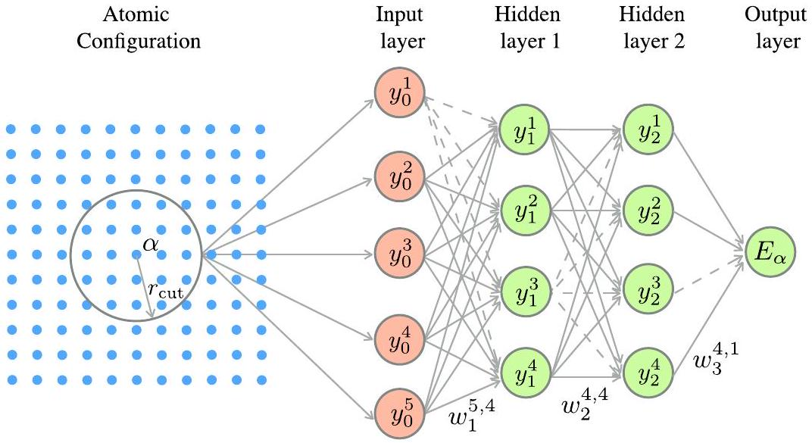
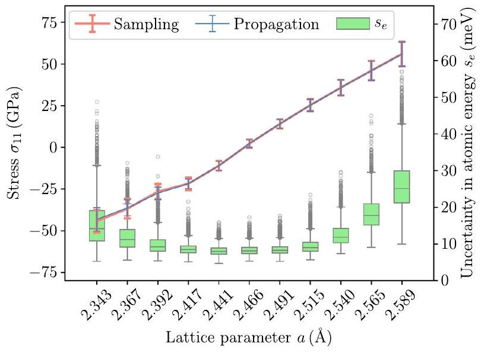
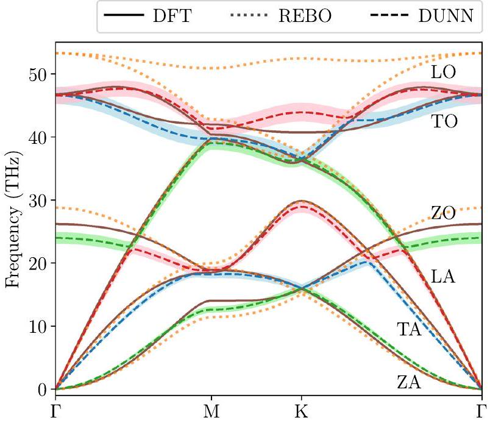
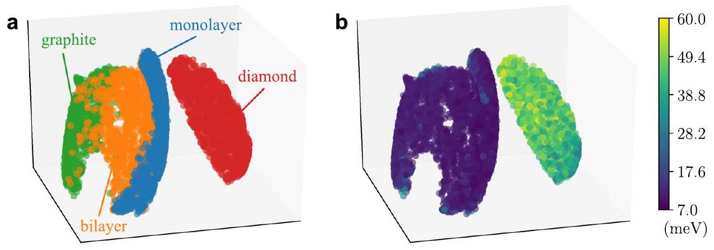
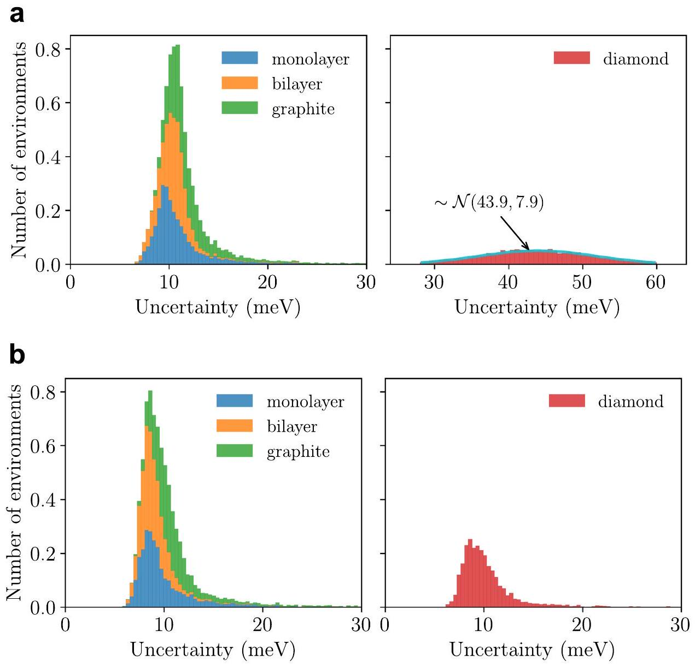
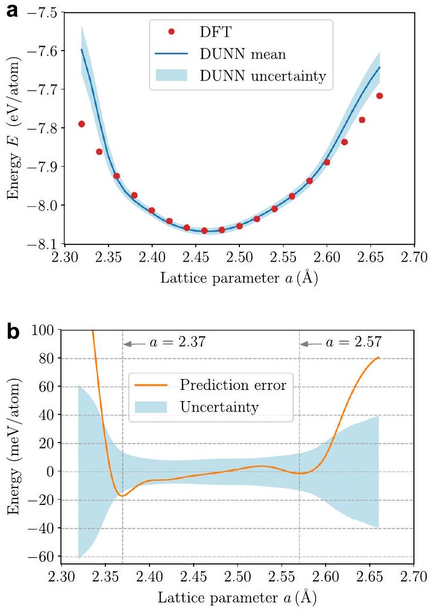
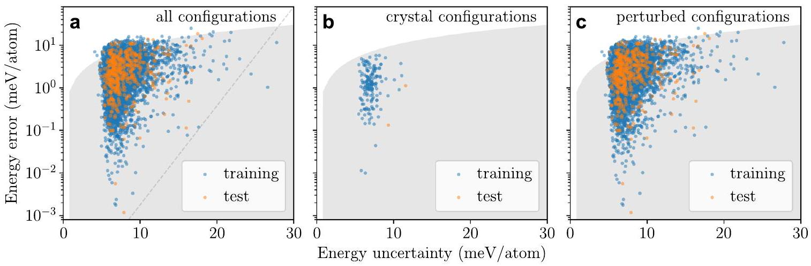

# Uncertainty quantification in molecular simulations with dropout neural network potentials 

Mingjian Wen ${ }^{1}$ and Ellad B. Tadmor® ${ }^{1 \boxtimes}$

#### Abstract

Machine learning interatomic potentials (IPs) can provide accuracy close to that of first-principles methods, such as density functional theory (DFT), at a fraction of the computational cost. This greatly extends the scope of accurate molecular simulations, providing opportunities for quantitative design of materials and devices on scales hitherto unreachable by DFT methods. However, machine learning IPs have a basic limitation in that they lack a physical model for the phenomena being predicted and therefore have unknown accuracy when extrapolating outside their training set. In this paper, we propose a class of Dropout Uncertainty Neural Network (DUNN) potentials that provide rigorous uncertainty estimates that can be understood from both Bayesian and frequentist statistics perspectives. As an example, we develop a DUNN potential for carbon and show how it can be used to predict uncertainty for static and dynamical properties, including stress and phonon dispersion in graphene. We demonstrate two approaches to propagate uncertainty in the potential energy and atomic forces to predicted properties. In addition, we show that DUNN uncertainty estimates can be used to detect configurations outside the training set, and in some cases, can serve as a predictor for the accuracy of a calculation.

npj Computational Materials (2020)6:124; https://doi.org/10.1038/s41524-020-00390-8

## INTRODUCTION

Molecular simulation methods are powerful computational tools for exploring material behavior on nano- and microscopic scales, which can be difficult to investigate experimentally ${ }^{1,2}$. Such methods are employed widely to study a range of diverse behaviors, such as phase transformations in crystals ${ }^{3}$, chemical reaction processes in combustion ${ }^{4}$, and protein folding ${ }^{5}$, to name a few. At the core of any molecular simulation lies a description of the interactions between atoms that produce the forces governing atomic motion. In classical molecular simulations, these interactions are modeled using an interatomic potential (IP). An IP is a functional form motivated by physics or a machine learning procedure, which takes as input the positions and species of the atoms, and outputs the energy and forces on the atoms. The IP includes parameters that are calibrated to best reproduce a training set of first-principles and/or experimental properties. IPs are computationally far less intensive than first-principles methods, such as density functional theory (DFT), and thus can be used for molecular simulations that are beyond the scope of quantum calculations ${ }^{6}$.

A challenge with using IPs is that since they are only approximate models to the true bonding physics of the molecular system, their predictions are associated with uncertainties that can be difficult to quantify ${ }^{7}$. Uncertainties can be divided into three categories: (1) numerical uncertainty, (2) structural uncertainty, and (3) parametric uncertainty ${ }^{1,2,7}$. Numerical uncertainty is related to the particular computational setup being employed in a molecular simulation and includes details of the solution algorithm, the size of the integration time step, the size of the simulation box, the duration of the simulation when sampling a statistical property, and so forth. These aspects of uncertainty are well understood and can be addressed using existing techniques. More challenging are structural and parametric uncertainties that are related to the fidelity of the IP itself. Structural uncertainty originates from approximations inherent in the functional form of
the IP, and parametric uncertainty is related to the precision with which the IP parameters are known.

Uncertainty is particularly important for a new class of machine learning IPs ${ }^{8-15}$ that has been gaining popularity in recent years. In these models, general-purpose functions often containing large numbers of parameters are trained against a large amount of DFT data. Such models typically have very low transferability (i.e., an ability to accurately describe configurations not included in their training set) due to the lack of a physical model, but can have accuracy close to that of DFT at a fraction of the computational cost when evaluated for configurations within range of their training set. Thus, machine learning IPs are good for interpolating within a training set, but not for extrapolating beyond it. This is their Achilles heel. To prevent the possibility of unbounded errors, it is vital to develop effective and efficient approaches for assessing structural and parametric uncertainty. In addition, machine learning IPs are typically fit to a large dataset, which requires substantial computational resources to obtain. Active learning with IP uncertainty as the query strategy can help to select the training set more wisely on the fly.

A variety of methods have been proposed for assessing uncertainty in machine learning IPs. Several approaches are based on the idea of using an ensemble of IPs. A quantity of interest (QOI) is computed separately using each member of the ensemble and the spread in these predictions provides an estimate of uncertainty. The methods differ in how they construct the ensemble: (1) a single IP form is fit to partial datasets drawn at random from the full training set (i.e., training set subsampling ${ }^{16-18}$; (2) different IP forms are constructed and fit to the same training set ${ }^{19,20}$; and (3) the same IP form is fit to the same training set, but using different initial values of IP parameters ${ }^{21,22}$. Another class of uncertainty estimation methods relies on a measure of the distance between an evaluated configuration and the training set. Different approaches are used to define the distance metric, such as (1) the D-optimality criterion ${ }^{23}$, (2) atom fingerprints distance in feature space ${ }^{24}$, and (3) configuration distance in latent space ${ }^{25}$.

[^0]The methods described above constitute important steps towards uncertainty quantification for machine learning IPs, but they have certain limitations that impact their utility. Overall these approaches provide ad hoc uncertainty estimates lacking a theoretical foundation. It is therefore difficult to interpret their results or determine their domain of applicability. In addition, the ensemble and distance-based approaches have specific limitations. Ensemble methods require a large number of IPs to obtain good statistics. This makes them expensive to train, especially during iterative retraining in active learning ${ }^{25}$. Another serious issue with ensemble methods is that the predicted uncertainty can approach zero for configurations that are very far from the training set ${ }^{26}$. For methods reliant on measures of distance, a problem is that the predicted uncertainty is dependent on the particular metric selected and may not translate well to configurations of different size.

In this paper, we propose a rigorous approach for assessing uncertainty in a class of machine learning IPs called neural network (NN) potentials ${ }^{8,27}$. We combine this approach together with a dropout regularization technique ${ }^{28,29}$ developed to prevent overfitting in NN models. The key to our approach is a recent work by Gal and Ghahraman ${ }^{30,31}$ showing that dropout NNs can provide a meaningful Bayesian estimate of uncertainty. By adopting this interpretation, we develop a Dropout Uncertainty Neural Network (DUNN) potential for which an estimate of the structural and parametric uncertainty associated with a prediction can be obtained. In addition to rigor, the proposed approach has the advantage that training a DUNN potential is significantly faster than training an ensemble of IPs. We also propose a rapid method for propagating uncertainty through a simulation that is significantly faster than the ensemble sampling approach. We begin with a derivation of the DUNN formalism and then demonstrate how it can be used to assess uncertainty for a model trained to represent condensed matter carbon.

## RESULTS

## DUNN Potentials

In an NN potential, the energy of a configuration of $N$ atoms is decomposed into the contributions of individual atoms,

$$
E=\sum_{a=1}^{N} E_{a},
$$

where $E_{\alpha}$, the energy of atom $\alpha$, is a function of its local atomic environment through an NN as shown in Fig. 1. In a fully connected NN, each node is connected to all the nodes in the previous layer and the next layer (except for the input and output layers). The value of node $j$ in layer $i$ is

$$
y_{i}^{j}=h\left(\sum_{k} y_{i-1}^{k} w_{i}^{k, j}+b_{i}^{j}\right),
$$

where $w_{i}^{k . j}$ is the weight that connects node $k$ in layer $i-1$ and node $j$ in layer $i, b_{i}^{j}$ is the bias applied to node $j$ of layer $i$, and $h()$ is a nonlinear activation function (e.g., a sigmoid or a hyperbolic tangent function). Equation (2) can be written more compactly in matrix form as $\mathbf{y}_{i}=h\left(\mathbf{y}_{i-1} \mathbf{W}_{i}+\mathbf{b}_{i}\right)$, where $\mathbf{y}_{i}$ is a row matrix of the nodal values of layer $i, \mathbf{W}_{i}$ is a weight matrix, and $\mathbf{b}_{i}$ is a row matrix of the biases. Consequently, the energy $E_{\alpha}$ represented in Fig. 1 can be expressed as the following composition:

$$
E_{a}=h\left[h\left[\mathbf{y}_{0} \mathbf{W}_{1}+\mathbf{b}_{1}\right] \mathbf{W}_{2}+\mathbf{b}_{2}\right] \mathbf{W}_{3}+\mathbf{b}_{3} .
$$

IPs must be invariant with respect to rigid-body translation and rotation, inversion of space, and permutation of chemically equivalent atoms ${ }^{6}$. To achieve this, the local atomic environment $\mathbf{r}_{\text {local }}$ of an atom, consisting of the relative positions of its neighboring atoms up to a prescribed cutoff radius $r_{\text {cut }}$, is transformed to the input layer $\mathbf{y}_{0}$ through a set of $N_{\text {desc }}$ descriptors $g^{j}$ that identically satisfy the symmetry requirements:

$$
y_{0}^{j}=g^{j}\left(\mathbf{r}_{\text {local }}\right), \quad j=1, \ldots, N_{\text {desc }} .
$$

Various types of descriptors have been put forward for molecular systems ${ }^{10,11}$ and crystalline materials ${ }^{13,27,32}$. For the carbon system considered in this paper, we use the symmetry functions proposed by Behler ${ }^{27}$ (see Supplementary Note 1 for details). An important point is that for most machine learning IPs, calculating the descriptors is the most expensive part of the computation.

An NN potential is typically trained against a large dense dataset of relevant configurations computed using DFT. This can include various ideal and defected bulk structures, lower dimensional structures, molecules, and so on. For each configuration, the DFT dataset can include the total energy, forces on the atoms, and other properties such as elastic constants and stresses amenable to first-principles calculations. The NN training set (X, Y) is built from the DFT dataset. Each configuration in the DFT dataset corresponds to a data point ( $\mathbf{x}, \mathbf{y}$ ) in the training set, where $\mathbf{x}$ are the set of individual atom descriptors for all atoms in the

Fig. 1 Schematic representation of a neural network for computing the energy of an atom. The neural network (NN) consists of an input layer, two hidden layers, and an output layer. The atomic environment (i.e., configuration of atoms surrounding atom $a$ within a cutoff distance $\left.r_{\text {cut }}\right)$ is transformed into the input layer, $y_{0}^{j}(j=1,2, \ldots)$, through a set of descriptors. Each arrow connecting two nodes in adjacent layers represents a weight $w$. The energy $E_{\alpha}$ of atom $\alpha$ is obtained as the output of the NN. A fully connected NN becomes a dropout NN when some connections are eliminated (e.g., by removing the dashed arrows in the figure).

configuration that will serve as the input to the NN , and $\mathbf{y}$ are the corresponding properties computed for the configuration (energy, forces, etc.). Note that the size of the training set $(\mathbf{X}, \mathbf{Y})$ is equal to the number of configurations in the DFT dataset, but for each data point in the training set, the size of the input $\mathbf{x}$ and output $\mathbf{y}$ (if it contains forces) is proportional to the number of atoms in the corresponding configuration. For each configuration, the total energy is computed as the sum of the outputs of the NN (atomic energy $E_{\alpha}$ ) by supplying individual atom descriptors to the NN. Other properties that follow can be computed as functions of the total energy and its derivatives (e.g., the force on an atom is the negative gradient of the total energy with respect to its position).

A dropout $\mathrm{NN}^{28,29}$ is obtained from a fully connected NN by randomly eliminating all outgoing connections from some of the nodes in each layer (e.g., the dashed arrows in Fig. 1). The fraction of nodes dropped on average in each layer is called the dropout ratio. Mathematically, Eq. (3) can be reformulated for a dropout NN as

$$
E_{\alpha}=h\left[h\left[\mathbf{y}_{0}\left(\mathbf{D}_{1} \mathbf{W}_{1}\right)+\mathbf{b}_{1}\right]\left(\mathbf{D}_{2} \mathbf{W}_{2}\right)+\mathbf{b}_{2}\right]\left(\mathbf{D}_{3} \mathbf{W}_{3}\right)+\mathbf{b}_{3},
$$

where a dropout matrix $\mathbf{D}_{i}$ is a square diagonal binary matrix of integers 0 or 1 . The diagonal elements of $\mathbf{D}_{i}$ follow a Bernoulli distribution with a probability of being zero equal to the dropout ratio. Redefining the weights as $\mathbf{W}_{i}:=\mathbf{D}_{i} \mathbf{W}_{i}$, the dropout NN can be viewed as a Bayesian model since the parameters are now stochastic. Following the Bayesian approach, we define $p(\omega)$ to be the prior distribution over the set of parameters $\omega=\left\{\mathbf{W}_{1}, \mathbf{W}_{2}, \mathbf{W}_{3}, \mathbf{b}_{1}, \mathbf{b}_{2}, \mathbf{b}_{3}\right\}$, and then seek a posterior distribution over the parameter space by invoking Bayes' theorem ${ }^{33}$ :

$$
p(\omega \mid \mathbf{X}, \mathbf{Y}) \propto p(\mathbf{Y} \mid \mathbf{X}, \omega) p(\omega) .
$$

Here $p(\mathbf{Y} \mid \mathbf{X}, \omega)$ is the likelihood for the training set $(\mathbf{X}, \mathbf{Y})$.
Given the posterior, we can obtain the predictive distribution for a QOI z as

$$
p\left(\mathbf{z} \mid \mathbf{x}^{*}, \mathbf{X}, \mathbf{Y}\right)=\int p\left(\mathbf{z} \mid \mathbf{x}^{*}, \omega\right) p(\omega \mid \mathbf{X}, \mathbf{Y}) \mathrm{d} \omega,
$$

in which $\mathbf{x}^{*}$ are the descriptors for a configuration associated with the QOI $\mathbf{z}$, and then compute the predictive mean and variance for z. The difficulty, however, is that the posterior for an NN with multiple hidden layers cannot be evaluated analytically ${ }^{31}$. To tackle this, we can take advantage of variational inference ${ }^{34}$ that uses another distribution, $q(\omega)$, to approximate the posterior and replaces $p(\omega \mid \mathbf{X}, \mathbf{Y})$ by $q(\omega)$ in Eq. (7) to make predictions. Using this variational inference approach, Gal and Ghahramani ${ }^{30,31}$ have recently shown that training an NN with the dropout technique approximates a Bayesian NN. Consequently, a dropout NN can be used to extract uncertainty information.

In practice, for a QOI z, multiple stochastic forward passes are performed through the dropout NN potential (each with a different realization of the dropout matrices) to obtain multiple samples of the QOI $\mathbf{z}_{1}, \mathbf{z}_{2}, \ldots$. The average and standard deviation (SD) of these samples are the predictive mean and uncertainty. (A more efficient approach involving uncertainty propagation is described below.) We refer to a dropout NN potential employing uncertainty estimation as a DUNN potential.

The averaging procedure described above can also be interpreted using frequentist statistics. As pointed out by Srivastava et al. ${ }^{29}$, applying dropout to a fully connected NN amounts to sampling a "thinned" NN from it. The thinned NN consists of all the nodes that survive the dropout. An NN with a total number of $n$ nodes can be considered an ensemble of $2^{n}$ possible thinned NNs, and therefore training an NN with dropout can be seen as training this ensemble. Consequently, using a DUNN potential to make predictions is equivalent to drawing samples from an ensemble of IPs.

We demonstrate the utility of the uncertainty estimation procedure described above for a DUNN potential for carbon
systems. A number of high-quality machine learning IPs for carbon have been reported in the literature ${ }^{3,35-37}$. We note that the purpose of this paper is not to develop a better IP (e.g., in terms of accuracy), but to explore the idea of using NN dropout to estimate the uncertainty of a machine learning IP's predictions. The DUNN potential is fit to a training set of energies and forces for monolayer graphene, bilayer graphene, and graphite obtained from DFT calculations. (See Supplementary Note 2 for details on the training of the DUNN potential.) We show how the uncertainty estimation built into the DUNN model can be applied to physical properties, and how it can be used to determine the limits of transferability. We also explore the intriguing possibility of using DUNN uncertainty as an estimate for the accuracy of a prediction.

## Prediction uncertainty

The key innovation in the DUNN potential is the ability to associate an uncertainty with any QOI computed with it. We propose two approaches to computing this uncertainty: a direct sampling method and a more efficient indirect uncertainty propagation method.

The sampling method corresponds to the stochastic forward pass approach described in the formal derivation of the DUNN potential above. The QOI is computed multiple times in a series of independent molecular dynamics (MD) simulations, each with different but fixed dropout matrices in the DUNN potential. The average and SD of the QOIs obtained from these runs are the DUNN predictive mean and uncertainty. The number of simulations that need to be performed for good statistics depends on the system size and the QOI. The sampling method is straightforward, but computationally expensive due the repeated simulations.

In the propagation method, a single MD simulation is performed, and at each time step, the average and SD in the energy and forces are evaluated by performing multiple calculations with different dropout matrices. The atom positions are updated by integrating the equations of motion using the average forces, and the uncertainty is propagated through the simulation to obtain the overall uncertainty in the QOI. The propagation approach is significantly faster than the sampling method because at each time step the descriptors only need to be computed once, and as noted above, calculation of the descriptors is normally the bottleneck for machine learning IPs. Uncertainty propagation is formally exact for QOIs that depend linearly on the energy and/or forces, but can also be used for nonlinear QOIs through linearization. (In this paper, we limit the discussion to linear QOIs. See Supplementary Note 2 for an example where uncertainty is propagated for the magnitude of the forces, which is nonlinear.)

As an example of QOI uncertainty estimation, we compute the stress in monolayer graphene under uniform straining at room temperature using an MD simulation. (See the "Methods" section for details on the simulation and how the stress and the uncertainty are obtained for the sampling and propagation methods.) The results are presented in Fig. 2. The plot shows the normal stress parallel to the graphene plane ( $\sigma_{11}$ ) and its uncertainty over a range of in-plane lattice parameters, corresponding to different strains, computed using both the sampling and propagation methods (red and blue curves) with the number of samples set to $P=100$. Both approaches give nearly identical results, but the propagation method is $\sim 40$ times faster than direct sampling for $P=100$. (See Supplementary Note 3 for a convergence study and Supplementary Note 4 for an analysis of the relative computational cost of the sampling and propagation methods.) The mean stress and uncertainty magnitudes are at a minimum at the equilibrium lattice parameter of $a=2.466 \AA$. The mean stress scales linearly with lattice constant with a slope corresponding to a Young's modulus of 1084 GPa , which is in excellent agreement with DFT calculations ( $1084 \mathrm{GPa}^{37}$ ) and

Fig. 2 Stress and uncertainty in atomic energy in monolayer graphene. Results are given for graphene at various lattice parameters $a$. The line and error bars (referring to the left vertical axis) are the predictive mean and uncertainty of the stress component $\sigma_{11}$. The box and whisker plot of the uncertainty in atomic energy $s_{e}$ refer to the right vertical axis. The bar inside the box denotes the median, the ends of the whiskers represent the lowest datum, and highest datum within 1.5 interquartile range of the lower quartile and upper quartile, respectively, and the circles represent outliers.

experimental observations ( $1018 \mathrm{GPa}^{38}$ ). (Note that the slight turn at $2.417 \AA$ is due to buckling of the graphene.) The uncertainty in the stress (error bar) also increases as the graphene is strained away from its equilibrium state. This is because as the strain is increased, the DUNN potential is being applied to configurations that are increasingly distant from its training set and is therefore less reliable. (For monolayer graphene, the DUNN training set includes ab initio MD trajectories using an initial lattice parameter of $a=2.466 \AA$ and slightly stretched and compressed configurations with a lattice parameter of $a \in[2.393,2.539] \AA$.) This observation is in agreement with the uncertainty in atomic energy (presented as box and whisker plots in Fig. 2), which is an indirect measure of the distance between these configurations and the training set. We further explore the relationship between distance in configuration space and uncertainty in the section on "Transferability limits".

As a second example, we consider the phonon dispersion relations for monolayer graphene. This set of curves provides a comprehensive view of the elastic vibrational properties of a material, which play a key role in many dynamical properties, including thermal transport and stress wave propagation. It is therefore important for IPs to predict phonon dispersion correctly and reliably. In Fig. 3, we present the phonon dispersion relations along high-symmetry points in the first Brillouin zone for the DUNN potential (dashed lines) compared with DFT results (solid lines) and the reactive empirical bond-order (REBO) potential (dotted lines) ${ }^{39}$. The REBO potential provides the best prediction for graphene phonon dispersion among a number of empirical potentials, including Tersoff ${ }^{40}$, AIREBO ${ }^{41}$, LCBOP ${ }^{42}$, and ReaxFF ${ }^{43}$ (see ref. ${ }^{37}$ for a comparison). We see that the DUNN potential is in very good agreement with DFT, correctly capturing the characteristics of the flexural acoustic (ZA) branch (e.g., the quadratic nature near the $\Gamma$ point) associated with out-of-plane vibrations, which provides the dominant contribution to lattice thermal conductivity in graphene ${ }^{44,45}$. REBO performs comparably to the DUNN potential for the low-frequency acoustic branches; however, its predictions for the high-frequency TO and LO branches deviate significantly from DFT results. (We note that there are other machine learning IPs for carbon that perform equally well or better for phonon dispersion of graphene ${ }^{36,37}$ ).

Fig. 3 Phonon dispersion in monolayer graphene. Phonon curves along high-symmetry points $\Gamma, \mathrm{M}, \mathrm{K}$, and $\Gamma$ in the first Brillouin zone are shown. The dashed lines and the bands around them represent the predictive mean and uncertainty obtained from the DUNN potential. As a comparison, phonon curves obtained from DFT (solid lines) and the reactive empirical bond-order (REBO) potential (dotted lines) are also shown. The branches are colored according to the vibrational modes: green for flexural (Z), blue for transverse (T), and red for longitudinal (L). "A" and "O" stand for acoustic and optical, respectively.

In addition to mean values, Fig. 3 shows the uncertainty in the DUNN predictions indicated by the color bands surrounding the dashed lines. The uncertainty values were computed using the sampling method. The uncertainty in the phonon frequencies is small for the acoustic branches and larger for optical branches as the absolute phonon frequency increases. These uncertainty measures, which the DUNN formalism makes possible, can in turn be propagated to other properties that depend on the phonon dispersion.

## Transferability limits

Earlier we defined transferability as the ability of an IP to predict properties to which it was not fit, that is, to extrapolate beyond its training set. Machine learning IPs are inherently limited in this regard, and therefore methods for assessing whether or not an evaluation is in the "safe" zone of the IP are important.

One approach, as described in the "Introduction", is to compute a measure of the "distance" between a configuration associated with a QOI and a training set and to use an ad hoc criterion to determine when this distance is too large. However, this is challenging to do because the training set of a machine learning IP consists of a cloud of configurations in a high-dimensional space (set by the number of descriptors). There can be gaps and holes in this cloud and it can have a highly complex shape. In practice, computing a meaningful distance can be quite difficult and highly problem dependent. It may also be that a configuration is close enough to the training set for some QOIs but not others, making a single distance measure inappropriate.

Instead, we argue that distance in configuration space is a surrogate for the actual question, which is whether or not the machine learning IP provides a reliable (low uncertainty) estimate for the QOI. For a DUNN potential, this uncertainty can be computed directly and can therefore be used instead of a distance. To show that these two notions are related, we compute the uncertainty in the energy of individual atoms for atomic environments drawn from a set of configurations from ab initio

Fig. 4 Representations of local atomic environments in carbon systems. The representations are obtained by embedding the local atomic environments of atoms using the uniform manifold approximation and projection (UMAP) method. Each dot in the plot is the UMAPembedded descriptor representation of the environment of a single atom. The dots are colored according to a their parent structure (as indicated in the figure), and $\mathbf{b}$ the uncertainty in atomic energy (with the color coding indicated by the legend). Note that although monolayer and bilayer graphene and graphite configurations were included in the training set of the DUNN potential, the specific environments plotted in the figure are drawn from configurations that were not in the training set.

MD trajectories. As noted above, the DUNN potential is trained against monolayer and bilayer graphene and graphite, but the atomic environments we consider here are also drawn from a set of diamond configurations not included in the training set. Our intention is to test whether the uncertainty increases for environments that are "far" from the training set. Specifically, since no diamond-related configurations are included in the training set, we expect the uncertainty for environments drawn from perturbed diamond structures to be larger than other environments that are closer to the training set. To visualize this, we apply the uniform manifold approximation and projection ${ }^{46}$ dimensionality reduction technique to embed the atomic environment descriptors into a three-dimensional space. The sampled environments, color coded by their parent structure, are shown in Fig. 4a. We see that the four carbon allotropes form continuous clusters that are separated from each other.

The corresponding uncertainty in the atomic energy (energy of an individual atom) is plotted in Fig. 4b. As anticipated, the uncertainty in the energy for atoms in diamond configurations is much higher than for those drawn from monolayer, bilayer, and graphite configurations. We note that all four carbon allotropes have a similar cohesive energy of $\sim 8 \mathrm{eV} /$ atom; therefore, it is reasonable to compare absolute energy uncertainties instead of relative uncertainties. For a more quantitative comparison, Fig. 5a presents a histogram of the uncertainty in atomic energy for all sampled environments. The uncertainty for environments near the training set (monolayer and bilayer graphene and graphite) is centered at $\sim 10 \mathrm{meV}$, whereas for diamond environments it is more than four times larger at 43.9 meV . To verify that this difference is indeed due to distance from the training set, we refit the DUNN potential, this time including perturbed diamond configurations in the training set. The histogram obtained using the new potential is plotted in Fig. 5b. The uncertainty in the monolayer, bilayer, and graphite configurations hardly changes, whereas the uncertainty for the diamond environments decrease significantly to the same level as the other carbon allotropes. This provides strong confirmation that on average the uncertainty estimate is able to detect whether configurations are in or out of the training set. Also worth mentioning is the shape of the histogram. The diamond histogram for the original potential (Fig. 5a) is very close to a normal distribution, whereas for the new potential with diamond in its training set, the histogram becomes skewed with a heavier tail on the larger uncertainty side (similar to the other allotropes) (Fig. 5b).

These results support the notion that the DUNN estimate for the uncertainty in atomic energy correlates with distance from the training set. This means that by comparing the energy uncertainties of atomic environments associated with a QOI with the
average uncertainty associated with the training set environments, it is possible to determine whether or not a DUNN potential is suitable for that QOI. This can also be used as a criterion for when certain configurations needs to be added to the training set in order to obtain a reliable estimate for a desired QOI.

To place the above results in the context of existing methods, it is of interest to compare them with an ensemble model approach. As discussed in the introduction, ensemble models (e.g., committee models constructed using training set subsampling) have been widely used to quantify uncertainty in machine learning IPs. We revisit the above transferability limits analysis for a committee model to contrast its performance with that of the DUNN potential. (See Supplementary Note 5 for technical details on the committee model). The histogram of the uncertainty obtained using the committee model (Supplementary Fig. 3) is qualitatively similar to Fig. 5. Both approaches are able to determine transferability limits since the histogram of the uncertainty for the training set (monolayer, bilayer, and graphite) does not overlap with the histogram for configurations associated with the QOI (diamond). However there are important distinctions. The distributions obtained from the committee model are far broader, and perhaps due to the limited sample size, the committee model predicts an uncertainty for diamond configurations that is about an order of magnitude larger than the DUNN potential when the training set does not contain diamond configurations (cf. Fig. 5a with Supplementary Fig. 3a). A quantitative comparison of the uncertainty obtained using the two models is provided in the next section ("Precision versus accuracy"). A final difference is the computational cost. In order to obtain good statistics, a minimum of 20 NNs had to be included in the committee model. This means that training the committee model is 20 times more expensive than training a DUNN potential in this case. This is acceptable for one-pass type training, but it can become prohibitive for more sophisticated iterative learning approaches such as active learning.

## Precision versus accuracy

Estimates for prediction uncertainty are important for determining when an IP can be trusted. However, low uncertainty does not necessarily mean that a prediction is close to reality. It may seem that it is not possible to know the error in a prediction without access to more accurate calculations or experimental results; however, under certain conditions, uncertainty can provide an estimate. These questions are tied to notions of precision and accuracy.

Given a set of predictions obtained by varying an IP's parameters, accuracy refers to the difference between the mean

Fig. 5 Histogram of the uncertainty in atomic energy. In a, the training set consists of monolayer and bilayer graphene and graphite, but not diamond, while in $\mathbf{b}$, the training set includes all four allotropes. The cyan curve in the right plot of a represents a normal distribution fitted to the histogram. For each carbon allotrope, 4000 local atomic environments are randomly selected. The vertical axis is normalized so that the area for each carbon allotrope integrates to one, and the histograms on the left are stacked.

prediction and the exact value (e.g., DFT result), and precision refers to the spread in the predictions (i.e., the uncertainty). Recent work by Sethna and co-workers ${ }^{47,48}$ has shown empirically that in certain cases accuracy and precision are correlated. This is important because it means that a measure of uncertainty (such as that provided by the DUNN potential) can also be used to estimate the accuracy of a prediction even when the exact values are unavailable.

To study the relationship between accuracy and precision in the predictions of a DUNN potential, we begin by considering the energy of monolayer graphene as a function of the in-plane lattice parameter $a$. At each value of $a$, the sampling method is used to obtain the predictive mean and uncertainty from a set of energy calculations. The DUNN results along with DFT data are plotted in Fig. 6a. The energy of the graphene increases with distance from the equilibrium value of $a=2.466 \AA$. A more explicit comparison of accuracy and precision is given in Fig. 6b, where we plot the prediction error (difference between the DUNN mean value and DFT result) and the uncertainty band. For lattice parameters in the range $a=(2.37,2.57) \AA$ that fall within or very close to the training set, the prediction error is bounded by the uncertainty, which is $\sim 10 \mathrm{meV} /$ atom in agreement with the box plot in Fig. 2 and on the same level observed in Fig. 5. As configurations get further from the training set, both the prediction error and uncertainty grow rapidly. For configurations that are not "too far" from the training set $(a \in(2.34,2.37) \AA$ and $a \in(2.57,2.63) \AA$ ), the uncertainty
continues to provide a bound on the error. However, beyond these values the uncertainty underestimates the prediction error.

The above results suggest that energy uncertainty provides a bound on prediction error for configurations whose uncertainty falls within the training set distribution. To test this heuristic, we examine the energy accuracy and uncertainty for all configurations in the training and test sets. (We also studied accuracy versus uncertainty for forces, see Supplementary Note 6 for details.) The energy prediction error is defined as the absolute value of the energy residual (i.e., the difference between the energy predicted by the DUNN potential and the DFT reference energy). The uncertainty is computed using the sampling method. The prediction error versus uncertainty relation is presented in Fig. 7. Focusing on Fig. 7a that shows all configurations, we see that there is a general trend for the error to increase with uncertainty, and although there is a great deal of scatter, the uncertainty bounds the error for most configurations (points in the shaded region have smaller error than uncertainty). To understand the exceptions, consider that our dataset contains two types of configurations: (1) perfect crystals and (2) perturbed configurations drawn from MD trajectories where the atoms are off-lattice. These two configuration types are plotted separately in Fig. 7b, c. For perfect crystal configurations (Fig. 7b), the error is bounded by the uncertainty for all configurations in agreement with the biaxial straining results presented in Fig. 6. Thus, cases where the uncertainty fails to bound the error are associated with perturbed configuration as shown in Fig. 7c.

Fig. 6 Energy of monolayer graphene at different in-plane lattice parameters. a Predictive mean and uncertainty of the energy by DUNN, where the uncertainty band has a width of twice the standard deviation in the energy. Also plotted are DFT results. b Prediction error (difference between the DUNN mean and DFT result) and uncertainty (standard deviation in energy). The prediction error curve is interpolated using a cubic spline. Note that the prediction error curve is chopped at a value of $100 \mathrm{meV} /$ atom for better visualization. The left end of the prediction error (at $a= 2.32 \AA$ ) has a value of $191 \mathrm{meV} /$ atom.

that is, the energies of entire configurations and not individual atom energies. For crystal configurations, all atoms have identical environments, and therefore in this case the DFT total energy translates directly to DUNN potential predictions improving the fit. Whereas for perturbed configurations, the training is indirect by fitting sums of energies to a pool of reference energies. As a result, the predictions of the model for perturbed configurations are expected to be less robust. Nevertheless, the results presented here suggest that using uncertainty as an indicator for accuracy has merit.

To provide a more quantitative assessment of the uncertainty and accuracy, we compute the average negative log likelihood (NLL) for a test set of configurations according to,

$$
\mathrm{NLL}=\frac{1}{\mathrm{~N}} \sum_{\mathrm{i}=1}^{\mathrm{N}}\left[\frac{1}{2} \log \mathrm{~s}_{\mathrm{i}}^{2}+\frac{\left(\mathrm{t}_{\mathrm{i}}-\mathrm{y}_{\mathrm{i}}\right)^{2}}{2 \mathrm{~s}_{\mathrm{i}}^{2}}\right],
$$

where $t_{i}, y_{i}$, and $s_{i}$ are the target energy, the mean prediction made by a model, and the uncertainty of the prediction for configuration $i$, respectively, and $N$ is the size of the test set. The NLL is obtained by assuming that the target follows a Gaussian distribution with the model prediction as its mean and the square of the uncertainty as its variance (see Supplementary Note 7 for a brief derivation). The NLL incorporates uncertainty and accuracy into a single metric, favoring high accuracy (small $\left(t_{i}-y_{i}\right)^{2}$ ) and penalizing both under- and overconfident estimation of uncertainty (too large or too small $\left.s_{i}\right)^{49,50}$. The smaller the NLL, the better the model.

In addition to the methods for estimating uncertainty specific to the DUNN and committee models, we considered two additional uncertainty estimators that assign a single uncertainty value to all configurations: (1) the SD of the target $s_{i}=\sqrt{\frac{1}{N} \sum_{i}^{N}\left(t_{i}-\bar{t}\right)^{2}}$, in which $\bar{t}$ is mean of the target values, and (2) the root-mean-square error (RMSE) $s_{i}=\sqrt{\frac{1}{N} \sum_{i}^{N}\left(t_{i}-y_{i}\right)^{2}}$. The SD ignores model predictions and is solely based on information in the data, thus providing the roughest estimation of uncertainty. Thus, the NLL computed using SD uncertainty is expected to be maximal and serves as a baseline for other uncertainty estimators. The difference between the NLL obtained using a given estimator and the SD baseline can be regarded as the gain of information ${ }^{49}$. Mean-square error is used as the loss function for optimizing

Fig. 7 Prediction error versus uncertainty in configuration energy. a All configurations in the training and test sets. The configurations are divided into two subsets: $\mathbf{b}$ perfect crystal structures and $\mathbf{c}$ perturbed configurations drawn from MD trajectories. The uncertainty is larger than the error for points in the shaded region.

A possible explanation for the difference between crystal and perturbed configurations is related to the training process. The DUNN potential is a model for the energy of an individual atom based on its atomic environment, whereas the dataset used to train the DUNN model contains DFT total energies,
model parameters in this work. It can be shown that in this case the NLL obtained using the RMSE uncertainty is the optimal value (smallest) of all uncertainty estimators (see Supplementary Note 7).

We compute the average NLL for the DUNN model, the committee model, and a fully connected NN model for

Table 1. Average NLL obtained using three different uncertainty estimators: SD of the target, RMSE, and model-specific methods.
|  | SD | RMSE | Model specific |
| :--- | :--- | :--- | :--- |
| DUNN | -2.59 | -4.98 | -4.73 |
| Committee model | -2.59 | -5.52 | -4.65 |
| Fully connected NN | -2.58 | -5.42 |  |
| NLL negative log likelihood, SD standard deviation, RMSE root-meansquare error. |  |  |  |

comparison. The results are presented in Table 1. As expected from the above discussion, the SD NLLs are the largest and the RMSE NLLs are the smallest for each model. Considering the NLL for the model-specific uncertainty, we see that the two models are comparable with DUNN having a slightly lower NLL of -4.73 compared with -4.65 for the committee model. However, it is worth noting that the DUNN model-specific NLL accounts for 95\% $=(-4.73) /(-4.98)$ of its optimal RMSE NLL, whereas the committee model only accounts for $84 \%=(-4.65) /(-5.52)$, although the optimal RMSE NLLs for the two models are a bit different.

## DISCUSSION

Machine learning IPs are the next frontier in molecular simulations offering the prospect of accuracy close to first-principles methods with a computational cost that is four to five orders of magnitude lower ${ }^{37}$. This will greatly increase the scope of static and dynamical properties and phenomena amenable to predictive molecular simulation, providing opportunities for quantitative design of materials and nanoscale devices. However, a key limitation of this class of IPs is the absence of a physical model, which greatly limits their ability to extrapolate outside their training set. To address this shortcoming, in this paper, we propose a DUNN potential that can provide a rigorous Bayesian estimate for the uncertainty for any predicted property. Uncertainty can either be computed using a sampling method, where a simulation is repeated multiple times using the ensemble of dropout realizations inherent in a DUNN potential, or far more efficiently by propagating uncertainty within a single simulation. The uncertainty provides an indication when a DUNN prediction can be trusted, and when the training set needs to be extended.

Using a DUNN potential for carbon as an example, we explore the uncertainty for various static and dynamical properties, and demonstrate how uncertainty can be used to detect configurations lying outside the training set where the model cannot be trusted. For graphene under uniform stretching, we show that the uncertainty in the stress grows with the stretch as the configurations move away from the training set. The uncertainty computed using both the sampling and propagation method is nearly identical, but the propagation method is $\sim 40$ times faster. For a dynamical property, the uncertainty in different branches of phonon dispersion is studied. It is found that the uncertainty for optical branches is larger than for acoustic branches. Information like this can be used to estimate uncertainty in properties that depend on the phonon spectrum, such as thermal conductivity. We also explore an interesting empirical observation regarding the relationship between prediction uncertainty and accuracy. In agreement with previous work, we find that uncertainty can also be a predictor of accuracy, but for machine learning IPs, this relationship only holds in close proximity to the training set. A heuristic criterion is proposed for the conditions under which uncertainty is a predictor of accuracy. Determining the exact limits of this important property is an area of future research.

## METHODS

## Dataset

The dataset consists of energies and forces for monolayer graphene, bilayer graphene, graphite, and diamond in various states, including strained static structures and configurations drawn from ab initio MD trajectories. The dataset is generated from DFT calculations using the Vienna Ab initio Simulation Package ${ }^{51}$. The exchange-correlation energy of the electrons is treated within the generalized gradient approximated functional of Perdew, Burke, and Ernzerhof (PBE) ${ }^{52}$. To capture van der Waals effects (a crucial aspect of interlayer interactions in bilayer graphene and graphite), the semiempirical many-body dispersion (MBD) method ${ }^{53}$ is applied. MBD accurately reproduces many results from more advanced calculations and experiments ${ }^{54}$. For monolayer graphene, a vacuum of $30 \AA$ in the direction perpendicular to the plane is chosen to minimize the interaction between periodic images (similar for bilayer graphene). An energy cutoff of 500 eV is employed for the plane wave basis, and reciprocal space is sampled using a $\Gamma$-centered Monkhorst Pack ${ }^{55}$ grid. The number of grid points is set to $16 \times 16 \times 1$ for the smallest supercell in the dataset (monolayer graphene with two atoms) and to $4 \times 4 \times 4$ for the largest supercell (diamond with 64 atoms). For other structures, the number of grid points is selected to ensure that the energy is converged.

## Stress

To calculate the stress, MD simulations are performed in the canonical ensemble (NVT conditions) with a Langevin thermostat to maintain a temperature of 300 K . We use a periodic rectangular supercell of monolayer graphene consisting of 96 atoms with in-plane lattice parameter ranging from 2.343 to $2.589 \AA$. The zigzag and armchair directions of the graphene are aligned with the Cartesian $x$ and $y$ directions. The equations of motion are integrated using a velocity-Verlet algorithm with a time step of $\Delta t=1 \mathrm{fs}$. For both the sampling and propagation methods, the first 10,000 equilibration steps are discarded. After this, the system is sampled at one out of every ten steps for a total of 1000 samples to compute the stress.

The full virial stress includes potential and kinetic contributions. We focus on the potential part, which is directly affected by IP uncertainties. The potential part of the virial stress $\boldsymbol{\sigma}$ is computed as a time average ${ }^{6,56}$ :

$$
\boldsymbol{\sigma}=\frac{1}{N_{\tau}} \sum_{\tau=1}^{N_{\tau}}\left[\frac{1}{V} \sum_{a=1}^{N} \mathbf{r}_{\tau}^{a} \otimes \mathbf{f}_{\tau}^{a}\right],
$$

where $N_{\tau}$ is the number of MD steps, $\mathbf{r}_{\tau}^{\alpha}$ and $\mathbf{f}_{\tau}^{\alpha}$ are the position of and force on atom $\alpha$ at time step $\tau, N$ is the number of atoms, $V$ is the volume of the system defined as the area of the graphene monolayer multiplied by the van der Waals thickness ( $3.4 \AA$ in the present case), and $\otimes$ denotes a tensor product $\left([\mathbf{a} \otimes \mathbf{b}]_{i j}=a_{i} b_{j}\right)$. The average and SD in the stress components for the sampling method using $P$ independent trajectories is

$$
\overline{\boldsymbol{\sigma}}=\frac{1}{P} \sum_{p=1}^{P} \boldsymbol{\sigma}_{p}, \quad s_{\sigma_{i j}}=\sqrt{\frac{1}{P-1} \sum_{p=1}^{P}\left(\sigma_{i j, p}-\bar{\sigma}_{i j}\right)^{2}},
$$

where $\boldsymbol{\sigma}_{p}$ is the stress tensor computed from Eq. (9) in simulation $p$.
For the propagation method, we rewrite Eq. (9) in matrix form:

$$
\mathbf{S}=\frac{1}{N_{T} V} \mathbf{R F},
$$

where $\mathbf{S}$ is a column matrix of the six independent components of the virial stress tensor $\boldsymbol{\sigma}, \mathbf{R}$ is a $6 \times 3 N N_{T}$ matrix of the positions of the atoms, and $\mathbf{F}$ is a column matrix of forces of length $3 N N_{T^{*}}$. (See Supplementary Note 8 for details on the construction of $\mathbf{R}$ and $\mathbf{F}$ ). With this reformulation, we can regard $\mathbf{R}$ as a matrix without uncertainty. (We assume that the number of dropout evaluations is sufficiently large so that the SD of the force mean, which is inversely proportional to the square root of the number of evaluations, is close to zero thus introducing no uncertainty to the positions of the atoms that are updated using to the mean forces.) Therefore, the covariance of $\mathbf{S}$ can be estimated as ${ }^{57}$ :

$$
\mathbf{K}_{S}=\frac{1}{N_{\tau}^{2} V^{2}} \mathbf{R} \mathbf{K}_{F} \mathbf{R}^{\top},
$$

where $\mathbf{K}_{S}$ and $\mathbf{K}_{F}$ denote the covariance matrices of $\mathbf{S}$ and $\mathbf{F}$. The square roots of the six diagonal elements of $\mathbf{K}_{s}$ give the uncertainty in the stress components. To compute $\mathbf{K}_{s}$, at each MD time step the DUNN potential is evaluated $P$ times (each with different dropout matrices) to obtain multiple samples of the forces $\mathbf{F}_{1}, \mathbf{F}_{2}, \ldots, \mathbf{F}_{p}$. Similar to Eq. (10), the sample mean and
the covariance of the forces follow as:

$$
\mathbf{F}=\frac{1}{P} \sum_{p=1}^{P} \mathbf{F}_{p}, \quad \mathbf{K}_{F}=\frac{1}{P-1} \sum_{p=1}^{P}\left(\mathbf{F}_{p}-\mathbf{F}\right)\left(\mathbf{F}_{p}-\mathbf{F}\right)^{\top} .
$$

The mean forces $\mathbf{F}$ and the force covariance $\mathbf{K}_{F}$ are then used in Eqs. (11) and (12) to compute the predictive mean and uncertainty in the stress, respectively.

## Phonon dispersion

The phonon dispersion relations of monolayer graphene are calculated using the finite difference method implemented in the phonopy package ${ }^{58}$.

## DATA AVAILABILITY

The dataset used for training the DUNN is publicly available on figshare ${ }^{59}$ with the identifier https://doi.org/10.6084/m9.figshare.12649811.

## CODE AVAILABILITY

The DUNN potentials are trained using the open-source KIM-based LearningIntegrated Fitting Framework (KLIFF) available at https://github.com/mjwen/kliff. The DUNN potentials for carbon developed in this paper are archived as "Portable Models" (PMs) in the OpenKIM repository ${ }^{60-64}$ at https://openkim.org. KIM PMs can be used with any KIM-compliant molecular simulation code, such as ASE ${ }^{65}$, DL_Poly ${ }^{66}$, GULP ${ }^{67}$, and LAMMPS ${ }^{68}$. An explanation of how to use the KIM implementation of the DUNN potential (with examples for LAMMPS) are given in Supplementary Note 9.

Received: 19 January 2020; Accepted: 24 July 2020;
Published online: 14 August 2020

## REFERENCES

1. Cailliez, F. \& Pernot, P. Statistical approaches to forcefield calibration and prediction uncertainty in molecular simulation. J. Chem. Phys. 134, 054124 (2011).
2. Angelikopoulos, P., Papadimitriou, C. \& Koumoutsakos, P. Bayesian uncertainty quantification and propagation in molecular dynamics simulations: a high performance computing framework. J. Chem. Phys. 137, 144103 (2012).
3. Khaliullin, R. Z., Eshet, H., Kühne, T. D., Behler, J. \& Parrinello, M. Nucleation mechanism for the direct graphite-to-diamond phase transition. Nat. Mater. 10, 693-697 (2011).
4. Chenoweth, K., van Duin, A. C. T. \& Goddard, W. A. ReaxFF reactive force field for molecular dynamics simulations of hydrocarbon oxidation. J. Phys. Chem. A 112, 1040-1053 (2008).
5. Piana, S., Lindorff-Larsen, K. \& Shaw, D. E. Protein folding kinetics and thermodynamics from atomistic simulation. Proc. Natl Acad. Sci. USA 109, 17845-17850 (2012).
6. Tadmor, E. B. \& Miller, R. E. Modeling Materials: Continuum, Atomistic and Multiscale Techniques (Cambridge Univ. Press, 2011).
7. Messerly, R. A., Knotts, T. A. \& Wilding, W. V. Uncertainty quantification and propagation of errors of the Lennard-Jones 12-6 parameters for $n$-alkanes. J. Chem. Phys. 146, 194110 (2017).
8. Behler, J. \& Parrinello, M. Generalized neural-network representation of highdimensional potential-energy surfaces. Phys. Rev. Lett. 98, 146401 (2007).
9. Bartiók, A. P., Payne, M. C., Kondor, R. \& Csányi, G. Gaussian approximation potentials: the accuracy of quantum mechanics, without the electrons. Phys. Rev. Lett. 104, 136403 (2010).
10. Rupp, M., Tkatchenko, A., Müller, K.-R. \& VonLilienfeld, O. A. Fast and accurate modeling of molecular atomization energies with machine learning. Phys. Rev. Lett. 108, 058301 (2012).
11. Hansen, K. et al. Machine learning predictions of molecular properties: accurate many-body potentials and nonlocality in chemical space. J. Phys. Chem. Lett. 6, 2326-2331 (2015).
12. Thompson, A., Swiler, L., Trott, C., Foiles, S. \& Tucker, G. Spectral neighbor analysis method for automated generation of quantum-accurate interatomic potentials. J. Comput. Phys. 285, 316-330 (2015).
13. Shapeev, A. V. Moment tensor potentials: a class of systematically improvable interatomic potentials. Multiscale Model. Simul. 14, 1153-1173 (2016).
14. Deng, Z., Chen, C., Li, X.-G. \& Ong, S. P. An electrostatic spectral neighbor analysis potential for lithium nitride. npj Comput. Mater. 5, 75 (2019).
15. Bernstein, N., Csányi, G. \& Deringer, V. L. De novo exploration and self-guided learning of potential-energy surfaces. npj Comput. Mater. 5, 99 (2019).
16. Peterson, A. A., Christensen, R. \& Khorshidi, A. Addressing uncertainty in atomistic machine learning. Phys. Chem. Chem. Phys. 19, 10978-10985 (2017).
17. Smith, J. S., Nebgen, B., Lubbers, N., Isayev, O. \& Roitberg, A. E. Less is more: sampling chemical space with active learning. J. Chem. Phys. 148, 241733 (2018).
18. Musil, F., Willatt, M. J., Langovoy, M. A. \& Ceriotti, M. Fast and accurate uncertainty estimation in chemical machine learning. J. Chem. Theory Comput. 15, 906-915 (2019).
19. Behler, J. Representing potential energy surfaces by high-dimensional neural network potentials. J. Phys. Condens. Matter 26, 183001 (2014).
20. Xiao, W., Li, Y., \& Wang, P. Uncertainty quantification of machine learning potentials for atomistic simulation. In AIAA Non-Deterministic Approaches Conference, 2018 (American Institute of Aeronautics and Astronautics Inc., 2018).
21. Novikov, I. S. \& Shapeev, A. V. Improving accuracy of interatomic potentials: more physics or more data? a case study of silica. Mater. Today Commun. 18, 74-80 (2019).
22. Zhang, L., Lin, D.-Y., Wang, H., Car, R. \& Weinan, E. Active learning of uniformly accurate interatomic potentials for materials simulation. Phys. Rev. Mater. 3, 023804 (2019).
23. Podryabinkin, E. V., Tikhonov, E. V., Shapeev, A. V. \& Oganov, A. R. Accelerating crystal structure prediction by machine-learning interatomic potentials with active learning. Phys. Rev. B 99, 064114 (2019).
24. Botu, V., Batra, R., Chapman, J. \& Ramprasad, R. Machine learning force fields: construction, validation, and outlook. J. Phys. Chem. C 121, 511-522 (2016).
25. Janet, J. P., Duan, C., Yang, T., Nandy, A. \& Kulik, H. J. A quantitative uncertainty metric controls error in neural network-driven chemical discovery. Chem. Sci. 10, 7913-7922 (2019).
26. Liu, R. \& Wallqvist, A. Molecular similarity-based domain applicability metric efficiently identifies out-of-domain compounds. J. Chem. Inf. Model. 59, 181-189 (2018).
27. Behler, J. Atom-centered symmetry functions for constructing high-dimensional neural network potentials. J. Chem. Phys. 134, 074106 (2011).
28. Hinton, G. E., Srivastava, N., Krizhevsky, A., Sutskever, I. \& Salakhutdinov, R. R. Improving neural networks by preventing co-adaptation of feature detectors. Preprint at https://arxiv.org/abs/1207.0580 (2012).
29. Srivastava, N., Hinton, G., Krizhevsky, A., Sutskever, I. \& Salakhutdinov, R. Dropout: a simple way to prevent neural networks from overfitting. J. Mach. Learn. Res. 15, 1929-1958 (2014).
30. Gal, Y. \& Ghahramani, Z. Dropout as a Bayesian approximation: representing model uncertainty in deep learning. In Proc. 33rd International Conference on Machine Learning (ICML-16) (Balcan, M. F., Weinberger, K. Q. eds) (2016).
31. Gal, Y. Uncertainty in Deep Learning. Ph.D. thesis, Univ. Cambridge (2016).
32. Bartók, A. P., Kondor, R. \& Csányi, G. On representing chemical environments. Phys. Rev. B 87, 184115 (2013).
33. Bayes, T., Price, R. \& Canton, J. An essay towards solving a problem in the doctrine of chances. Philos. Trans. 53, 370-418 (1763).
34. Gelman, A. et al. Bayesian Data Analysis (Chapman \& Hall/CRC Texts in Statistical Science, CRC Press, 2013).
35. Deringer, V. L. \& Csányi, G. Machine learning based interatomic potential for amorphous carbon. Phys. Rev. B 95, 094203 (2017).
36. Rowe, P., Csányi, G., Alfè, D. \& Michaelides, A. Development of a machine learning potential for graphene. Phys. Rev. B 97, 054303 (2018).
37. Wen, M. \& Tadmor, E. B. Hybrid neural network potential for multilayer graphene. Phys. Rev. B 100, 195419 (2019).
38. Lee, C., Wei, X., Kysar, J. W. \& Hone, J. Measurement of the elastic properties and intrinsic strength of monolayer graphene. Science 321, 385-388(2008).
39. Brenner, D. W. et al. A second-generation reactive empirical bond order (REBO) potential energy expression for hydrocarbons. J. Phys. Condens. Matter 14, 783-802 (2002).
40. Tersoff, J. Empirical interatomic potential for carbon, with applications to amorphous carbon. Phys. Rev. Lett. 61, 2879-2882 (1988).
41. Stuart, S. J., Tutein, A. B. \& Harrison, J. A. A reactive potential for hydrocarbons with intermolecular interactions. J. Chem. Phys. 112, 6472-6486 (2000).
42. Los, J. H. \& Fasolino, A. Intrinsic long-range bond-order potential for carbon: performance in monte carlo simulations of graphitization. Phys. Rev. B 68, 024107 (2003).
43. Srinivasan, S. G., van Duin, A. C. T. \& Ganesh, P. Development of a ReaxFF potential for carbon condensed phases and its application to the thermal fragmentation of a large fullerene. J. Phys. Chem. A 119, 571-580 (2015).
44. Lindsay, L., Broido, D. A. \& Mingo, N. Flexural phonons and thermal transport in graphene. Phys. Rev. B 82, 115427 (2010).
45. Zhang, H., Lee, G. \& Cho, K. Thermal transport in graphene and effects of vacancy defects. Phys. Rev. B 84, 115460 (2011).
46. McInnes, L., Healy, J., Saul, N. \& Grossberger, L. Umap: Uniform manifold approximation and projection. J. Open Source Softw. 3, 861 (2018).
47. Frederiksen, S. L., Jacobsen, K. W., Brown, K. S. \& Sethna, J. P. Bayesian ensemble approach to error estimation of interatomic potentials. Phys. Rev. Lett. 93, 165501 (2004).
48. Mortensen, J. J. et al. Bayesian error estimation in density-functional theory. Phys. Rev. Lett. 95, 216401 (2005).
49. Quinonero-Candela, J., Rasmussen, C. E., Sinz, F., Bousquet, O. \& Schölkopf, B. Evaluating predictive uncertainty challenge. In Machine Learning Challenges Workshop, (Quinonero-Candela, J., Dagan, I., Bernardo, M., \& d’Alché-Buc, F. eds) 1-27 (Springer, 2005).
50. Lakshminarayanan, B., Pritzel, A. \& Blundell, C. Simple and scalable predictive uncertainty estimation using deep ensembles. In Advances in Neural Information Processing Systems (Guyon, I., von Luxburg, U., Bengio, S., Wallach, H., Fergus, R., Vishwanathan, S. V. N., \& Garnett, R. eds) 6402-6413 (2017).
51. Kresse, G. \& Furthmüller, J. Efficient iterative schemes for ab initio total-energy calculations using a plane-wave basis set. Phys. Rev. B 54, 11169-11186 (1996).
52. Perdew, J. P., Burke, K. \& Ernzerhof, M. Generalized gradient approximation made simple. Phys. Rev. Lett. 77, 3865-3868 (1996).
53. Tkatchenko, A., DiStasio, R. A., Car, R. \& Scheffler, M. Accurate and efficient method for many-body van der waals interactions. Phys. Rev. Lett. 108, 236402 (2012).
54. Wen, M., Carr, S., Fang, S., Kaxiras, E. \& Tadmor, E. B. Dihedral-angle-corrected registry-dependent interlayer potential for multilayer graphene structures. Phys. Rev. B 98, 235404 (2018).
55. Monkhorst, H. J. \& Pack, J. D. Special points for Brillouin-zone integrations. Phys. Rev. B 13, 5188-5192 (1976).
56. Thompson, A. P., Plimpton, S. J. \& Mattson, W. General formulation of pressure and stress tensor for arbitrary many-body interaction potentials under periodic boundary conditions. J. Chem. Phys. 131, 154107 (2009).
57. Arras, K. O. An Introduction to Error Propagation: Derivation, Meaning and Examples of Equation $C_{Y}=F_{X} C_{X} F_{x}^{T}$. Technical Report EPFL-ASL-TR-98-01 R3 (Swiss Federal Institute of Technology Lausanne (EPFL), 1998).
58. Togo, A. \& Tanaka, I. First principles phonon calculations in materials science. Scr. Mater. 108, 1-5 (2015).
59. Wen, M. \& Tadmor, E. A dataset of DFT energies and forces for carbon allotropes of monolayer graphene, bilayer graphene, graphite, and diamond. Figshare. https://doi.org/10.6084/m9.figshare.12649811 (2020).
60. Wen, M. A dropout uncertainty neural network (DUNN) model driver v000. OpenKIM. https://doi.org/10.25950/9573ca43 (2019).
61. Wen, M. Dropout uncertainty neural network (DUNN) potential for condensedmatter carbon systems with a dropout ratio of 0.1 developed by Wen and Tadmor (2019) v000. OpenKIM. https://doi.org/10.25950/44b7f4ed (2019).
62. Wen, M. Dropout uncertainty neural network (DUNN) potential for condensedmatter carbon systems with a dropout ratio of 0.2 developed by Wen and Tadmor (2019) v000. OpenKIM. https://doi.org/10.25950/5cdb2c9f (2019).
63. Wen, M. Dropout uncertainty neural network (DUNN) potential for condensedmatter carbon systems with a dropout ratio of 0.3 developed by Wen and Tadmor (2019) v000. OpenKIM. https://doi.org/10.25950/656f7a62 (2019).
64. Tadmor, E. B., Elliott, R. S., Sethna, J. P., Miller, R. E. \& Becker, C. A. The potential of atomistic simulations and the knowledgebase of interatomic models. JOM 63, 17-17 (2011).
65. Larsen, A. H. et al. The atomic simulation environment-a Python library for working with atoms. J. Phys. Condens. Matter 29, 273002 (2017).
66. Todorov, I. T., Smith, W., Trachenko, K. \& Dove, M. T. DL_POLY_3: new dimensions in molecular dynamics simulations via massive parallelism. J. Mater. Chem. 16, 1911-1918 (2006).
67. Gale, J. D. GULP: a computer program for the symmetry-adapted simulation of solids. J. Chem. Soc. Faraday Trans. 93, 629-637 (1997).
68. Plimpton, S. Fast parallel algorithms for short-range molecular dynamics. J. Comput. Phys. 117, 1-19 (1995).

## ACKNOWLEDGEMENTS

This research was partly supported by the Army Research Office (W911NF-14-1-0247) under the MURI program, and the National Science Foudation (NSF) under Grant Nos. DMR-1834251 and DMR-1931304. The authors acknowledge the Minnesota Supercomputing Institute (MSI) at the University of Minnesota for providing resources that contributed to the results reported in this paper. M.W. thanks the University of Minnesota Doctoral Dissertation Fellowship for supporting his research.

## AUTHOR CONTRIBUTIONS

M.W. and E.B.T. designed research; M.W. performed research; M.W. and E.B.T. analyzed data and wrote the paper.

## COMPETING INTERESTS

The authors declare no competing interests.

## ADDITIONAL INFORMATION

Supplementary information is available for this paper at https://doi.org/10.1038/ s41524-020-00390-8.

Correspondence and requests for materials should be addressed to E.B.T.
Reprints and permission information is available at http://www.nature.com/ reprints

Publisher's note Springer Nature remains neutral with regard to jurisdictional claims in published maps and institutional affiliations.

Open Access This article is licensed under a Creative Commons Attribution 4.0 International License, which permits use, sharing, adaptation, distribution and reproduction in any medium or format, as long as you give appropriate credit to the original author(s) and the source, provide a link to the Creative Commons license, and indicate if changes were made. The images or other third party material in this article are included in the article's Creative Commons license, unless indicated otherwise in a credit line to the material. If material is not included in the article's Creative Commons license and your intended use is not permitted by statutory regulation or exceeds the permitted use, you will need to obtain permission directly from the copyright holder. To view a copy of this license, visit http://creativecommons. org/licenses/by/4.0/.

[^1]
[^0]:    ¹Department of Aerospace Engineering and Mechanics, University of Minnesota, Minneapolis, MN 55455, USA. ${ }^{\boxtimes}$ email: tadmor@umn.edu

[^1]:    © The Author(s) 2020

