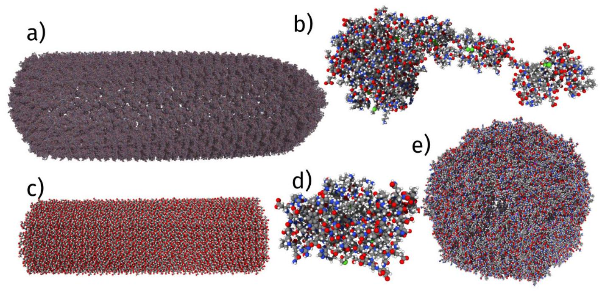
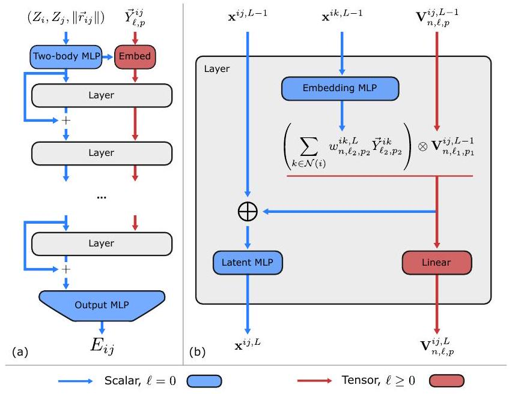
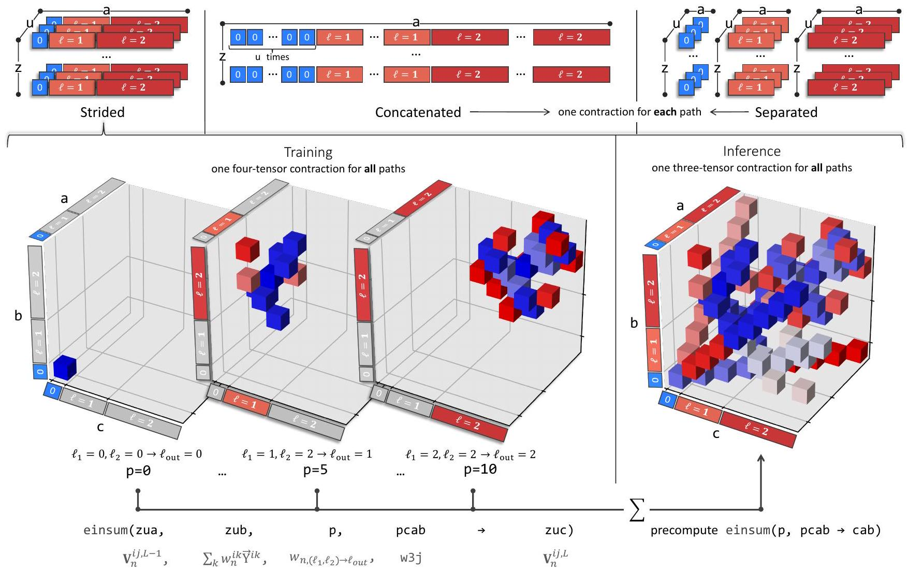
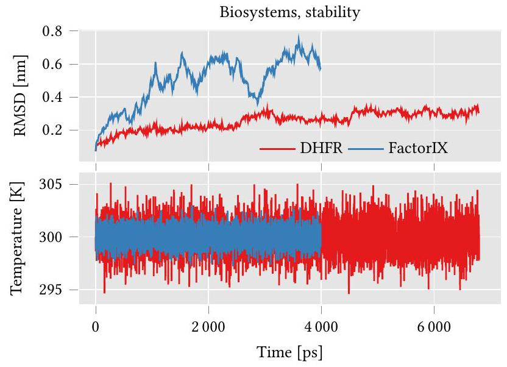
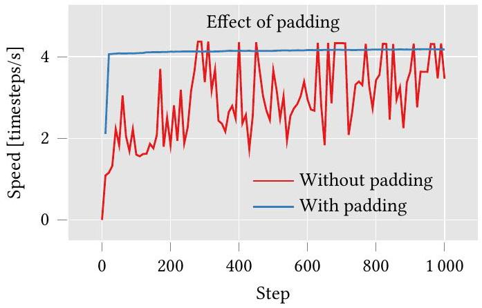
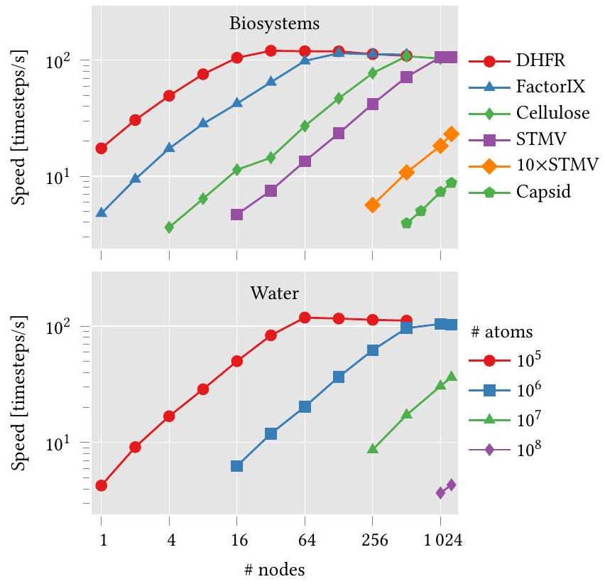
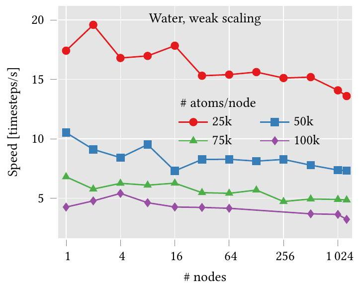

# Scaling the Leading Accuracy of Deep Equivariant Models to Biomolecular Simulations of Realistic Size 

ALBERT MUSAELIAN, Harvard University, Cambridge, MA, United States
Conference Sponsors:
ANDERS JOHANSSON, Harvard University, Cambridge, MA, United States
SIGHPC
SIMON BATZNER, Harvard University, Cambridge, MA, United States

Open Access Support provided by:
Harvard University

# Scaling the leading accuracy of deep equivariant models to biomolecular simulations of realistic size 

Albert Musaelian* albym@g.harvard.edu Harvard John A. Paulson School of Engineering and Applied Sciences Cambridge, MA, USA Simon Batzner* batzner@g.harvard.edu Harvard John A. Paulson School of Engineering and Applied Sciences Cambridge, MA, USA

Anders Johansson* andersjohansson@g.harvard.edu Harvard John A. Paulson School of Engineering and Applied Sciences Cambridge, MA, USA Boris Kozinsky ${ }^{\dagger}$ bkoz@seas.harvard.edu Harvard John A. Paulson School of Engineering and Applied Sciences Cambridge, MA, USA Robert Bosch Research and Technology Center Watertown, MA, USA

#### Abstract

This work brings the leading accuracy, sample efficiency, and robustness of deep equivariant neural networks to the extreme computational scale. This is achieved through a combination of innovative model architecture, massive parallelization, and models and implementations optimized for efficient GPU utilization. The resulting Allegro architecture bridges the accuracy-speed tradeoff of atomistic simulations and enables description of dynamics in structures of unprecedented complexity at quantum fidelity. To illustrate the scalability of Allegro, we perform nanoseconds-long stable simulations of protein dynamics and scale up to a 44 -million atom structure of a complete, all-atom, explicitly solvated HIV capsid on the Perlmutter supercomputer. We demonstrate excellent strong scaling up to 100 million atoms and $70 \%$ weak scaling to 5120 A100 GPUs.

## ACM Reference Format:

Albert Musaelian, Anders Johansson, Simon Batzner, and Boris Kozinsky. 2023. Scaling the leading accuracy of deep equivariant models to biomolecular simulations of realistic size. In The International Conference for High Performance Computing, Networking, Storage and Analysis (SC '23), November 12-17, 2023, Denver, CO, USA. ACM, New York, NY, USA, 12 pages. https://doi.org/10.1145/3581784.3627041

[^0]Permission to make digital or hard copies of part or all of this work for personal or classroom use is granted without fee provided that copies are not made or distributed for profit or commercial advantage and that copies bear this notice and the full citation on the first page. Copyrights for third-party components of this work must be honored. For all other uses, contact the owner/author(s).
SC '23, November 12-17, 2023, Denver, CO, USA
© 2023 Copyright held by the owner/author(s).
ACM ISBN 979-8-4007-0109-2/23/11.
https://doi.org/10.1145/3581784.3627041

## 1 Justification

First scalable, transferable machine-learning potential with state-of-the-art equivariant deep-learning accuracy. Performance of 100 timesteps/s for range of biomolecular systems. $70 \%$ weak scaling to 1280 nodes and 5120 A100 GPUs, excellent strong scaling up to 100 million atoms. First application of state-of-the-art machine learning interatomic potentials to large-scale biomolecular simulations.

## 2 Performance Attributes

| Performance Attribute | Our Submission |
| :--- | :--- |
| Category of achievement | Scalability, time-to-solution |
| Performance | 100 timesteps/s |
| Maximum problem size | 126.4 million atoms |
| Type of method used | Explicit (molecular dynamics, Allegro equivariant deep learning potentials) |
| Results reported on basis of | Whole application including I/O |
| Precision reported | Mixed precision (with GPU tensor cores) |
| System scale | Full-scale system 1280 nodes (5120 GPUs) |
| Measurement mechanism | Wall time, timesteps/s |

## 3 Problem Overview: First-Principles Dynamics of Matter

The ability to predict the time evolution of matter on the atomic scale is the foundation of modern computational biology, chemistry, and materials engineering. Even as quantum mechanics governs the microscopic atom-electron interactions in vibrations, migration and bond dissociation, phenomena governing observable physical and chemical processes often occur at much larger length- and longer time-scales than those of atomic motion. Bridging these scales
requires both innovation in fast and highly accurate computational approaches capturing the quantum interactions and in extremely parallelizable architectures able to access exascale computers.

Presently, realistic physical and chemical systems are far more structurally complex than what computational methods are capable of investigating, and their observable evolution is beyond the timescales of atomistic simulations. This gap between key fundamental questions and phenomena that can be effectively modeled has persisted for decades. From one side of the gap, models of small size, representing ostensibly important parts of the systems, can be constructed and investigated with high-fidelity computationally expensive models, such as electronic structure methods of density functional theory (DFT) and wave-function quantum chemistry. In the domain of materials science, these models can capture individual interfaces in metallic composites, defects in semiconductors, and flat surfaces of catalysts. However, evolution of such structures over relevant time scales is out of reach with electronic structure methods. Importantly, such reduction of complexity is not possible in the domain of biological sciences, where entire structures of viruses consist of millions of atoms, in addition to similarly large number of explicit water molecules needed to capture the physiological environment. From the other side of the gap, uncontrolled approximations have to be made to reach large sizes and sufficient computational speeds. These approximations have relied on very simple analytical models for interatomic interactions and have many documented failures in describing dynamics of both complex inorganic and biological materials [1].

Molecular dynamics (MD) simulations are a pillar of computational science, enabling insights into the dynamics of molecules and materials at the atomic scale. MD provides a level of resolution, understanding, and control that experiments often cannot provide, thereby serving as an extremely powerful tool to advance our understanding and design of novel molecules and materials. Molecular dynamics simulates the time evolution of atoms according to Newton's equations of motion. By integrating the forces at each time step, a sequence of many-atom configurations is produced, from which physical observables can then be obtained. The bottleneck of MD is the short integration time step required, which is usually on the order of femtoseconds. Since many chemical and biological processes occur on the timescale of microseconds or even milliseconds, billions to trillions of integration steps are needed. This highlights the requirement common to all MD simulation for access to atomic forces in a way that is simultaneously both accurate and computationally efficient.

For decades, two different avenues have been pursued: on one hand, classical force-fields (FFs) are able to simulate large-scale systems with high computational efficiency, enabling simulations of billions of atoms and reaching even microsecond simulation time-scales on special-purpose hardware [2]. The simple functional form of classical FFs, however, greatly limits their predictive power and results in them not being able to capture quantum-mechanical effects or complex chemical transformations. On the other hand, quantum-mechanical simulations provide a highly accurate description of the electronic structure of molecules and materials. Interatomic forces computed with these first-principles methods can then be used to integrate the atoms in molecular dynamics,
called ab-initio molecular dynamics (AIMD), with DFT being the most common method of choice. The cubic scaling of plane-wave DFT with the number of electrons, however, is the key bottleneck limiting AIMD simulations as it severly limits both length- and timescales of AIMD simulations, only allowing thousands of atoms and hundreds of picoseconds in routine simulations.

## 4 Current State of the Art

### 4.1 Accuracy

Over the past two decades, machine learning interatomic potentials (MLIPs) have been pursued with immense interest as a third approach, promising to bypass this long-standing dilemma [3-9]. The aim of MLIPs is to learn energies and forces from high-accuracy reference data while scaling linearly with the number of atoms. Initial efforts combined hand-crafted descriptors [3,4] with a Gaussian Process or a shallow neural network. These first MLIPs were quickly further improved [5, 6, 10] and have been adapted to biomolecular simulations and trained on large data sets to provide generalpurpose potentials [11, 12]. Despite this initial progress, however, the first generation of MLIPs has been severely limited in predictive accuracy, often unable to generalize to structures different from those in the training data, resulting in simulations that are not transferable and often not robust [8, 9, 13, 14]. In an effort to overcome these limitations on accuracy, deep learning interatomic potentials based on the message passing neural network (MPNN) paradigm have more recently been proposed and shown to be a more accurate alternative to the first generation of MLIPs, albeit at a significant computational overhead [7].

Common to all interatomic potentials is a focus on symmetry: in particular, the energy must obey invariance with respect to translations, rotations, and reflections, which together comprise $\mathrm{E}(3)$, the Euclidean group in 3D. Both classical force-fields and modern MLIPs achieve this by only ever acting on geometric invariants of the underlying structures. More recently, in an attempt to better represent the symmetry of the data, invariant interatomic potentials have been generalized to equivariant ones [8, 9, 15-17]. In equivariant MLIPs, the hidden network features consist of not only scalar features, but also vectors and higher-order tensors, resulting in a more faithful representation of the atomistic geometry. The initial NequIP work on equivariant interatomic potentials demonstrated not only a step change in state-of-the-art accuracy, but also the ability to outperform the invariant DeepMD accuracy while training on a thousand times smaller data set [8]. Following these efforts, equivariant MLIPs have been shown to greatly improve stability of simulations [14] and display much better extrapolative power than existing approaches [8, 9, 16, 17].

Equivariant potentials, however, struggle with scale and speed since all existing methods combine the equivariance with the MPNN architecture of previous generation methods. This is due to the graph propagation mechanism in MPNNs: at each layer of message passing, information is passed from a central node to its neighbors. While interactions between a central atom $i$ and its neighbors $j$ are local to a finite-range interaction sphere (typically between $4-6 \AA$ ), each iteration of the MPNN increases the overall receptive field. As an illustrative example, [9] chose a system of bulk water: while

Figure 1: Biomolecular systems used for benchmarking: a) HIV capsid, $\mathbf{4 4 M}$ atoms b) factor IX, 91k atoms c) cellulose, 409k atoms d) DHFR, 23k atoms e) STMV, 1 M atoms. The solvating water has been omitted for visualization.

for a local cutoff of $6 \AA$, each atom has on average 96 neighbors, for a typical six-layer MPNN, the receptive field grows to $36 \AA$ and now includes 20,834 atoms. This propagation mechanism makes message-passing potentials near-impossible to scale across multiple devices and multiple nodes. Thus the total number of interacting neighbors for an atom grows cubically with the number of layers in the neural network.
In order to scale a message passing network, one would have to either maintain enormous neighbor lists, or transfer messages and gradients between devices at each layer. Both of these approaches are destined to be slow, with the latter also requiring extensive software development to allow the neural network's message passing to work together with the MD software's spatial decomposition message passing. Thus the exceptional accuracy of equivariant methods remains inaccessible for applications that require large length scales and long timescale simulations, with biological systems being a major example that is virtually entirely excluded from these state-of-the-art approaches.

### 4.2 Scalability and speed

In parallel to the improvements in accuracy, great strides have been made in the computational cost of MLIPs, with several methods sacrificing some accuracy in order to perform extreme-scale simulations. Most notably, the DeePMD method won the 2020 Gordon Bell supercomputing award for their 100 million-atom simulations, using the entire Summit machine [5, 26]. The following year, SNAP extended the scale to 20 billion atoms, accompanied by a 20 -fold increase in speed [27]. Finally, FLARE set the current record for GPU-accelerated MLIP uncertainty-aware reactive MD benchmarks with 0.5 trillion atoms on Summit and a $70 \%$ speed increase over SNAP [28].

### 4.3 Quantum-accurate biomolecular simulations

Owing to the large length- and time-scales required for MD simulations in many biological applications, empirical potentials such as the AMBER force-field [23] remain dominant and widely used. Due to the limitations of classical FFs, however, there is strong interest in increasing the accuracy of biomolecular simulations. Deep learning interatomic potentials have been applied to biomolecular systems in hopes of achieving higher accuracy [29], but only 25k atom scale has been reached due to the lack of scalability of MPNNs [30]. In parallel, hybrid approaches have been explored that only treat the solute-solute interactions with the MLIP, while solvent-solvent and solvent-solute interactions were modelled with a classical polarizable force-field [31]. Hence, these approaches lose the high accuracy advantages available in princieple with the advanced MLIPs.
Efforts to scale to larger biomolecular systems at high accuracy have been led so far not by machine learning but instead by quantum approaches. In particular, extreme-scale linear-scaling ab-initio DFT quantum calculations have been conducted on millions of atoms (summarized in [32]), and semi-empirical tight-binding calculations have been scaled up to tens of millions of atoms (see table 3). We note that, although difficult to compare directly, given the combination of DFT reference data using a high-performance hybrid functional and the high accuracy of the Allegro model, it is likely that the MLIP is already more accurate than the existing large-scale semi-empirical quantum calculations. Further, the accuracy of the MLIP can in principle be improved systematically with higher-quality reference calculations while maintaining its speed and scaling.

Table 1: Comparison of different interatomic potentials, best method in bold, second best underlined. Left: results on the internal energy $U_{0}$ in the QM9 benchmark, measured by the mean absolute error (MAE) in [meV]. Allegro outperforms all existing message-passing and transformer-based architectures while being the only method able to scale. Right: MAE in forces on rMD17, units of [ $\mathrm{meV} / \AA$ ], averaged over all molecules with models trained on a per-molecule basis. Existing local methods perform significantly worse than state-of-the-art equivariant potentials. All existing equivariant potentials however do not scale, with the exception of Allegro. For details on the methods, see [9, 13].
| Model | $U_{0}$ | Strictly Local |
| :--- | :---: | :---: |
| Cormorant [18] | 22 | $X$ |
| SchNet [7] | 14 | $X$ |
| EGNN [19] | 11 | $X$ |
| DimeNet++ [20] | 6.3 | $X$ |
| SphereNet [21] | 6.3 | $X$ |
| ET [22] | 6.2 | $X$ |
| PaiNN [15] | 5.9 | $X$ |
| Allegro, 1 layer | $5.7(0.3)$ | $\checkmark$ |
| Allegro, 3 layers | $\mathbf{4 . 7}(0.2)$ | $\checkmark$ |

Table 1: Comparison of different interatomic potentials, best method in bold, second best underlined. Left: results on the internal energy $U_{0}$ in the QM9 benchmark, measured by the mean absolute error (MAE) in [meV]. Allegro outperforms all existing message-passing and transformer-based architectures while being the only method able to scale. Right: MAE in forces on rMD17, units of [ $\mathrm{meV} / \AA$ ], averaged over all molecules with models trained on a per-molecule basis. Existing local methods perform significantly worse than state-of-the-art equivariant potentials. All existing equivariant potentials however do not scale, with the exception of Allegro. For details on the methods, see [9, 13].
| Model | MAE, F | Equivariant | Strictly Local |
| :--- | :--- | :--- | :--- |
| Classical force-field [23] | 227.2 | No | V + Coulomb |
| ANI-random [11, 12] | 50.71 | No | ✓ |
| ANI-pretrained [11, 12] | 25.89 | No | ✓ |
| GAP [4] | 22.54 | No | ✓ |
| ACE [10] | 8.79 | No | ✓ |
| sGDML [24] | 14.48 | No | X |
| OrbNet-Equi [25] | 4.31 | Yes | × |
| NequIP [8] | 3.52 | Yes | x |
| MACE [17] | $\underline{2.92}$ | Yes | x |
| Allegro | 2.81 | Yes | ✓ |

Table 2: Sample efficiency of the equivariant Allegro potential: RMSE of forces on liquid water and three ices in units of $\left[\mathrm{meV} / \AA{ }^{\circ}\right]$.
|  | Allegro | DeepMD |
| :--- | :---: | :---: |
| $N_{\text {train }}$ | 133 | 133,500 |
| Liquid Water | $\mathbf{2 9 . 1}$ | 40.4 |
| Ice Ih (b) | $\mathbf{3 0 . 7}$ | 43.3 |
| Ice Ih (c) | $\mathbf{2 1 . 0}$ | 26.8 |
| Ice Ih (d) | $\mathbf{1 8 . 0}$ | 25.4 |
| Strictly Local | $\checkmark$ | $\checkmark$ |

Table 3: Comparison with previous effort towards large-scale quantum accuracy demonstrating $>1000 \times$ improvement in time-to-solution. Speed from strong scaling of approximately 1 M atom water simulations, see figure 6 for this work and figure 10 of [32].
|  | \# atoms | Timesteps/s on \# nodes |  |  |  |
| ---: | :---: | :---: | :---: | :---: | :---: |
|  |  | 16 | 32 | 64 | 1024 |
| Tight binding [32] | $1,022,208$ | 0.010 | 0.012 | 0.020 | - |
| This work | $1,119,744$ | 6.28 | 11.9 | 20.3 | 104.2 |

## 5 Innovations Realized

### 5.1 Allegro: scalable equivariant deep learning

Allegro [9] is the first scalable equivariant MLIP to overcome the previous dilemma of choosing between highly accurate, robust, transferable [14] equivariant models and scalable, but less accurate, first-generation models. Allegro attains this by first decomposing the total predicted energy of the system into atomic energies $E_{\text {system }}=\sum_{i}^{N} \sigma_{Z_{i}} E_{i}+\mu_{Z_{i}}$ where $\sigma_{Z_{i}}$ and $\mu_{Z_{i}}$ denote a perspecies scale and shift parameter, respectively. This atomic energy is then further decomposed into a sum of per-ordered-pair energies $E_{i}=\sum_{j \in \mathcal{N}(i)} E_{i j}$. Allegro's equivariant features $\mathrm{V}_{n, \ell, p}^{i j, L}$ are thus
also indexed by an ordered pair of neighboring atoms ( $i, j$ ) at each layer $L$. These features formally inhabit a direct sum of irreducible representations ("irreps") of the $O(3)$ rotation and mirror symmetry group, which are indexed by a rotation order $\ell=0,1,2 \ldots$ and parity $p= \pm 1$. Intuitively, they are comprised of scalars ( $\ell=0$ ), vectors $(\ell=1)$, and higher-order geometric tensors ( $\ell \geq 2$ ). The $n$ index is an additional feature channel index.
The first key innovation of Allegro is its tensor product layer, which updates the features with information about neighboring atoms' geometry using the "tensor product of representations," a fundamental equivariant operation denoted here with $\otimes$. Specifically, the per-ordered-pair tensor features $\mathbf{V}^{i j, L-1}$ are updated by taking their tensor product with a learned weighted sum over the spherical harmonic embeddings $\vec{Y}^{i k}$ of the positions of the neighbors $k$ of the central atom $i$ :

$$
\begin{aligned}
\mathrm{V}_{n,\left(\ell_{1}, p_{1}, \ell_{2}, p_{2}\right) \rightarrow\left(\ell_{\text {out }}, p_{\text {out }}\right)}^{i j, L} & =\sum_{k \in \mathcal{N}(i)} w_{n, \ell_{2}, p_{2}}^{i k, L}\left(\mathrm{~V}_{n, \ell_{1}, p_{1}}^{i j, L-1} \otimes \vec{Y}_{\ell_{2}, p_{2}}^{i k}\right) \\
& =\mathrm{V}_{n, \ell_{1}, p_{1}}^{i j, L-1} \otimes\left(\sum_{k \in \mathcal{N}(i)} w_{n, \ell_{2}, p_{2}}^{i k, L} \vec{Y}_{\ell_{2}, p_{2}}^{i k}\right)
\end{aligned}
$$

We exploit here the bilinearity of the expensive tensor product operation to avoid computing it for each neighbor $k$, instead summing first over neighbors $k \in \mathcal{N}(i)$ and performing a single tensor product. Because all atom pair indices share the same central atom $i$, information remains strictly local to its neighborhood and the growth of the receptive field is entirely avoided. This innovation allows Allegro to learn increasingly complex representations of the atomic structure layer after layer while keeping all interactions strictly local, thus making it massively parallelizable.
The second central innovation of Allegro is motivated by the difference in cost between scalar operations and the much more expensive $O(3)$-equivariant operations that are symmetrically permitted on tensors. Allegro is therefore designed to put significant network capacity into the scalar operations, particularly dense neural networks, which are comparatively cheap and highly optimized

Figure 2: The Allegro network architecture: (a) data flow in the network, starting with an initial two-body embedding, then the core tensor product layer(s), resulting finally in the prediction of per-pair energies $E_{i j}$. (b) Scalar (blue) and tensor (red) tracks iteratively share information in each tensor product layer to let the high capacity, computationally cheap scalar track influence the equivariant features.

on modern GPU hardware, while keeping as few expensive equivariant operations as possible (only the tensor product) and limiting the number of tensor feature channels. This is achieved by having separate scalar and tensor tracks throughout the network, which at each layer communicate information allowing the high capacity of the scalar track to "control" the equivariant features.

Across deep learning, it has repeatedly been observed that larger networks perform better [16]. In high-performance applications of deep learning such as interatomic potentials, however, this increase in computation is unsustainable as it would hurt computational efficiency. The ability of Allegro to partially decouple these two effects allows it to greatly increase network capacity while keeping the computational overhead moderate. As shown in table 1, Allegro outperforms state-of-the-art potentials on energies and forces of small molecules as measured by the QM9 and revMD17 benchmarks, including state-of-the-art equivariant message-passing-based approaches. Remarkably, Allegro also performs significantly better than the DeepMD potential on water despite being trained on more than 1,000 times fewer reference data (see table 2). This demonstrates that Allegro is able to retain the remarkable improvements demonstrated by equivariant message-passing potentials, while being massively parallelizable, greatly increasing accessible lengthscales as well as improving time-to-solution.

### 5.2 Optimization strategies in Allegro

5.2.1 Strided memory layout Tensor features of different rotation orders $\ell$ have different dimensions $2 \ell+1$. A key implementation detail in equivariant neural networks is how best to store groups of such tensors in memory. Previous equivariant neural networks
have either stored tensors of different ( $\ell, p$ ) in separate arrays, or concatenate the tensors along the $2 \ell+1$ dimension in (arbitrary) order of $\ell$ [33]. For both approaches code size, and thus overhead (particularly on GPUs), scales poorly with $\ell_{\text {max }}$ as per- $(\ell, p)$ processing/extraction code is necessary.

Our Allegro implementation instead introduces a "strided layout" scheme (see figure 3): all tensor features of various ( $\ell, p$ ) are stored together in a single array whose innermost two dimensions are $\left[n_{\text {tensor }},\left(\sum_{\ell, p} 2 \ell+1\right) \leq 2\left(\ell_{\text {max }}+1\right)^{2}\right]$. While consuming the same and optimal amount of memory, this layout allows efficient calculations that mix tensors of different ( $\ell, p$ ) as explained in the next section. Importantly, the use of the strided layout with a homogeneous $n_{\text {tensor }}$ across irreps is in part made practical by the two-track architecture, which allows the inclusion of arbitrary amounts of scalar $(\ell=0)$ capacity in the model without needing to increase $n_{\text {tensor }}$ for all irreps $\ell>0$.
5.2.2 Optimized tensor product The key equivariant operation in Allegro is the tensor product in equation 2 which mixes features from different atom pairs and tensor features of different irreps $\left(\ell_{1}, p_{1}\right)$ and $\left(\ell_{2}, p_{2}\right)$. The tensor product is the most expensive operation in Allegro's tensor track, and the only nonlinearity.

In Allegro we compute all symmetrically valid combinations of input and output irreps, which satisfy $\left|\ell_{1}-\ell_{2}\right| \leq \ell_{\text {out }} \leq\left|\ell_{1}+\ell_{2}\right|$ and $p_{\text {out }}=p_{1} p_{2}$. Each such combination is called a "path" and can be expressed in Einstein summation notation as the three tensor contraction $\mathbf{x} \otimes \mathbf{y}_{m_{\text {out }}}=\mathrm{w} 3 \mathrm{j}_{m_{\text {out }}, m_{1}, m_{2}} \mathbf{x}_{m_{1}} \mathbf{y}_{m_{2}}$ between the input tensors and the constant Wigner 3j symbol denoted w3j [9]. The number of paths scales unfavorably with $\ell_{\text {max }}$, which imposes significant overhead and code size on previous efforts that compute them separately. This scaling is improved, but not avoided, by our omitting all tensor product paths that are not symmetrically allowed to eventually contribute to the final scalar outputs. Due to our strided layout, however, Allegro is able to efficiently pose the entire tensor product as a single tensor contraction whose innermost contraction dimensions are still at largest $2 \times\left(\ell_{\text {max }}+1\right)^{2}$, eliminating this per-path overhead.

In this work we further improve the performance of the tensor product by eliminating the full linear mixture over tensor product paths and feature channels from equation (16) in Allegro [9]. We replace it with a simpler learned weighted sum over each set of paths sharing the same ( $\ell_{\text {out }}, p_{\text {out }}$ ), which we found to have neglible effect on accuracy across a variety of molecular and materials systems. This weighting, unlike the previous full mixture over channels, can be efficiently pre-computed, eliminating the scaling of the tensor product's inference cost with the number of paths (see figure 3). The entire tensor product is then a single three tensor contraction that can be decomposed into GPU-efficient dense pairwise matrix algebra. This decomposition is chosen optimally and automatically for any set of hyperparameters using opt_einsum [34] through the package opt_einsum_fx we developed to integrate it with PyTorch's TorchScript compiler.

In the final layer of an Allegro model the only allowable paths are those leading to scalars, for which w3j is only nonzero for $m_{1}=m_{2}$. We further reduce the cost of the tensor product in this case by explicitly removing the redundant dimension from the contraction.

Figure 3: Top: comparison of our strided layout with previous memory layouts for equivariant features. Bottom: optimized tensor product of strided layouts with precomputed path fusion at inference. Gray cubes show the constant w3j tensor with nonzero Wigner 3j coefficients shown with small blue/red cubes. The $a, b, c$ indices range over the innermost irrep dimension, and $p$ indexes paths. The $u$ index goes over the $n_{\text {tensor }}$ tensor feature channels and the $z$ index ranges over neighbor pairs. The operation is also shown in standard Einstein summation notation with the correspondence to equation 2 shown.

5.2.3 Mixed-precision calculations MLIPs face a difficult trade off with regard to numerical precision: they need to be as fast as possible, which suggests the use of limited or mixed precision, but they are also sensitive regression models for scientific computing where double width (float64) is the norm. In Allegro, we balance these competing goals with a custom mixed precision setup. For the purposes of training, Allegro models are carefully normalized such that all their weights and internal activation have component-wise magnitudes on the order of 1.0. Consequently, the internal calculations and parameters are well represented using single-precision float32 arithmetic. For matrix multiplications, which underlie both the latent multi-layer perceptrons (MLPs) and the tensor product, and thus the vast majority of the computational cost, we use NVIDIA's TensorFloat32 (TF32), a 19-bit compute format that allows the use of dedicated Tensor Core matrix multiplication processors. Finally, we strategically use float 64 only in the final stages of the model to resolve numerical problems resulting from the large magnitudes of typical atomic energies (see, for example, [16]) at negligible cost. In particular, we conduct the
shifting, scaling, and summation of the atomic energies (see section 5.1) in double precision.
5.2.4 Species-dependent cutoffs In chemically diverse systems such as biomolecules, there is significant variation in the distribution of distances between atoms and their neighbors depending on chemical species, and this has been used to reduce the number of neighbor pairs while preserving relevant interactions [28].
We leverage Allegro's per-ordered-pair architecture to impose such per-species cutoffs at a more granular level: we use independent cutoffs for each ordered species pair. This allows us to restrict, for example, $\mathrm{H}-\mathrm{C}$ ordered pairs to a stricter cutoff than $\mathrm{C}-\mathrm{H}$ ordered pairs. In such a case the C -centered ordered pairs can still be many-body with regard to H atoms out to the larger cutoff, but the H-C pairs are restricted to a smaller set, reducing computational cost. On the SPICE data set, we found the use of such reduced per-ordered-pair cutoffs for hydrogen to impose a negligible accuracy cost of less than $2 \mathrm{meV} / \AA$ in validation force RMSE. Using these selected per-species-pair cutoffs (see section 6.4) reduces the number of ordered atom pairs by approximately $3 \times$ in a liquid water system
compared to using the maximum per-species-pair cutoff across all species. Because Allegro is linear-scaling in the total number of neighbor pairs [9] this correspondingly reduces the computational cost of the model.

### 5.3 Optimized LAMMPS-Kokkos implementation

LAMMPS is among the most popular molecular dynamics codes, thanks to its ease of use and performance [35]. In particular, LAMMPS has a state-of-the-art spatial decomposition algorithm for MD simulations on distributed memory hardware, and its scalability is well-proven on the world's largest supercomputers. We have chosen to implement an Allegro plugin to LAMMPS by carefully implementing the Allegro model to be compatible with C++ export through PyTorch's TorchScript JIT compiler, allowing us to call the TorchScript-compiled model from our plugin through the libtorch C++ API. Since Allegro is a strictly local model, it fits perfectly into the spatial decomposition concept of LAMMPS, thus LAMMPS will handle all inter-rank communication. Initially, the AllegroLAMMPS interface let LAMMPS compute neighbor lists etc. on the CPU, and then copied the relevant data to the GPU before calling the PyTorch model. This was based on the assumption that Allegro would be far too slow, even on the GPU, for any CPU work or CPU-GPU memory transfers to appreciably affect the overall performance. With the optimizations of Allegro described in this paper, that assumption was no longer valid. LAMMPS has the ability to use the Kokkos performance portability library to accelerate its core functionality with GPUs. In the newest version of the AllegroLAMMPS interface, it directly uses the positions and neighbor lists already on the GPU and preprocesses them for the Allegro model without ever copying any data to the CPU. This vastly accelerates any work that would previously have been done on the CPU and eliminates any data transfer between the CPU and the GPU(except when writing output to disk). Finally, it allows LAMMPS to employ CUDA-aware GPU-GPU MPI operations when available. In our initial benchmarks, we discovered that the performance fluctuated for a significant amount of time at the beginning of each simulation. Using NVIDIA Nsight Systems we determined the cause to be large deallocations and allocations of memory by the internal PyTorch memory handler whenever the shapes of the input tensors of the Allegro model changed. These shapes are determined by the number of atoms per GPU and their total number of neighbors, which fluctuate during an MD simulation. As a circumvention, we pad the Kokkos data structures from which the input tensors are created by $5 \%$ whenever they need to be allocated. The extra memory is filled with edges between two "fake" atoms far apart. This largely eliminates internal PyTorch reallocations, as shown in figure 5.

## 6 How Performance Was Measured

### 6.1 Scientific applications used to measure performance

We measure MD performance on a varity of biomolecular systems. First, from the explicit all-atom water solvent AMBER20 benchmark [36] we take the proteins Dihydrofolate Reductase (DHFR,

23 k atoms) and human clotting factor IX ( 91 k atoms), a cellulose sugar polymer (409k atoms), and the complete satellite tobacco mosaic virus (STMV, 1 M atoms). At larger scale, we measure performance on a complete all-atom HIV capsid solvated in and containing water from [37], which is a 44 M atom assembly of protein subunits. MD simulations are performed with an Allegro model trained on approximately 1 million DFT reference calculations from the recent SPICE data set [38], which aims to train MLIPs for biomolecular systems. The SPICE data set uses the $\omega$ B97M-D3(BJ) functional, which is among the most accurate hybrid functionals for main-group chemistry benchmarks, and the def2-TZVPPD basis set, which was chosen to maximize basis set accuracy within computational budget constraints (for additional details, see [38]).

MLIPs come with an inherent trade-off between accuracy and efficiency even within a model class, where larger models are often more accurate, but simultaneously more computationally expensive. The Allegro model used here is a comparatively large and powerful model with 7.85 million weights (see section 6.4). Faster, albeit less accurate, models could certainly be trained. On a 55,353 frame holdout test set of the SPICE data, we obtain a mean absolute error in the force components of $25.7 \mathrm{meV} / \AA$ and an RMSE of $48.1 \mathrm{meV} / \AA$, demonstrating the high accuracy of the Allegro potential. We stress, however, that the goal of the present work is not to build the most powerful general-purpose potential for biomolecular simulations, but rather to demonstrate that Allegro provides a framework for large-scale biomolecular simulation due to its ability to retain the high accuracy of equivariant deep learning while being able to scale to large and long simulations. We expect that larger and more diverse quantum training data generated with higher levels of accuracy will continue to improve Allegro potentials. We further note that due to the strict locality, explicit long-range electrostatic interactions are straightforward to add to the Allegro potential, if they are required, following for example [39].

### 6.2 Systems and environment for measurement of performance

All LAMMPS performance benchmarks were performed on the Perlmutter machine at NERSC. Perlmutter consists of 1536 nodes on the regular queue, each equipped with 4 NVIDIA A100, each with 40 GB of memory, and an AMD EPYC 7763 (Milan) CPU. The performance was measured using LAMMPS's profiling output, measuring timesteps per second and nanoseconds per day. Libraries used were the NequIP code available at https://github.com/mirgroup/nequip with version 0.6.0 ${ }^{1}$, e3nn with version 0.5.1 [33], PyTorch with version 1.11.0, and Python with version 3.9.16. The LAMMPS experiments were run with the LAMMPS code available at https://github.com/lammps/lammps ${ }^{2}$ with the pair_allegro code available at https://github.com/mir-group/pair_allegro ${ }^{3}$. The compilers and system libraries used on Perlmutter were CUDA 11.7, cuDNN 8.7.0, GCC 11.2.0 and Cray MPICH 8.1.25. Due to issues with CUDA-aware MPI with the Cray MPICH library, LAMMPS was told to not use CUDA-aware MPI through the gpu/aware off flag of the KOKKOS package, which may hurt scalability for the largest

[^1]numbers of nodes. All jobs were launched with 4 MPI tasks per node (one per GPU) and sbatch -gpu-bind=none, with LAMMPS being responsible for assigning the GPUs.

### 6.3 Measurement metrics

The speed of the molecular dynamics simulations was measured in timesteps per second, which can be converted to nanoseconds per day of simulation time given a choice of timestep. In the beginning of a simulation, the PyTorch JIT compiler is still active while the system is also reaching an equilibrium number of neighbors per atom and atoms per GPU, thus the performance will be somewhat unstable. We thus first ran a fixed number of timesteps, typically 200 , before measuring the performance. The peak performance was then measured during short, subsequent simulations.

### 6.4 Training details

All training was performed using a single A100 GPU. We train in units of eV and Angstrom and use the FP64, FP32, TF32 configuration described above. We trained on 996,352 structures and use 55,353 as a validation set, as well as a remaining 55,353 as a separate test set. Before this split, we filter out all structures in SPICE v1.1.3 that contain any force component with an absolute value larger than $0.25 \mathrm{Ha} / \mathrm{Bohr}$, which results in a total of 1,107,058 structures. Atom types in the model correspond one-to-one with chemical species. The Allegro models used two layers of 64 tensor features with a $\ell_{\text {max }}=2$, full $O(3)$ symmetry. The data set was re-shuffled after each epoch. We used a two-body latent MLP and later latent MLP with hidden dimensions [128, 256, 512, 1024] and [1024, 1024, 1024] respectively, both with SiLU nonlinearities. The embedding MLP was a linear projection. For the final edge energy MLP, we used a single hidden layer of dimension 128 and no nonlinearity. All four MLPs were initialized according to a uniform distribution of unit variance. Models were trained with a default radial cutoff of $4.0 \AA$, which we found sufficient to give strong performance. We make use of the per-pair cutoffs outlined above, which were chosen based on radial distribution functions of the HIV capsid starting structure: H-H: $3.0 \AA, \mathrm{H}-\mathrm{C}: 1.25 \AA, \mathrm{H}-\mathrm{O}: 1.25 \AA, \mathrm{O}-\mathrm{H}: 3.0 \AA$, where all others use $4.0 \AA$. We stress that pair indices in Allegro are ordered, and therefore an H-C cutoff of $1.25 \AA$ does not imply the same of $\mathrm{C}-\mathrm{H}$, which in our model uses the full $4.0 \AA$ cutoff. The interatomic distances were embedded in a trainable per-ordered-species-pair radial basis of 8 Bessel functions and a polynomial cutoff envelope function as specified in [9]. The potential was trained using a force-only MSE loss function. The potential was trained with the Adam optimizer in PyTorch using default settings [40]. Models were trained with a batch size of 16 and a learning rate of 0.001 . For the checkpoint used for the test set evaluations, we reduced the learning rate after 119 epochs to 0.0005 and then trained for an additional 23 epochs. The production MD was performed with an earlier checkpoint, with only minor differences in accuracy. We also used an exponential moving average on the network weights with a decay weight of 0.99 , used for evaluation on the validation set and for the final model. We stopped training after approximately 7 days. We note that strong results can be obtained with less training time. We normalize the force targets by the maximum absolute
force component computed over the training set. We also add a repulsive Ziegler-Biersack-Littmark (ZBL) term to the potential as a means to improve the stability of the potential.

## 7 Performance Results

### 7.1 Stability and single-node performance

Before running large-scale benchmarks of biomolecular systems, the stability of the Allegro model must be verified. To this end, we performed long simulations of the solvated DHFR and factor IX proteins and measured as a function of time the root mean squared distance (RMSD) of the backbone atoms of the protein with respect to the initial structure. The results are shown in figure 4, with the RMSD of both proteins being stable for the four or more nanoseconds of simulation conducted.

We then validate our mixed precision approach: table 4 shows that the use of mixed precision has no effect on the accuracy of the model, that our limited use of float64 has no impact on speed, and that the careful use of TensorFloat32 more than doubles the model speed, confirming our choice of a F64,F32,TF32 architecture. In particular, we note that the use of the tensor cores available on the NVIDIA A100 GPUs improved the performance by a factor of 2.7. Without TensorFloat32, the tensor cores, and thus a significant fraction of the GPU capacity, would be unused.

Finally, we verify the effect of padding the input tensors to the PyTorch model in figure 5. The 5\% overallocation of memory clearly helps PyTorch's internal memory handler avoid unnecessary allocations and ensures smooth, stable performance. This both improves performance for shorter simulations and vastly simplifies the benchmarking task. The performance was measured on 1 node with 4 GPUs, simulating 100k atoms of water starting from an equilibrated structure.

Figure 4: Top: RMSD of protein backbone atoms with regard to the initial structure. Bottom: stable temperature around thermostat setting of 300 K .

Table 4: Test set RMSE comparison in [ $\mathrm{meV} / \AA$ ] of various mixed precision schemes. Models were trained from scratch on the water dataset from [5]. Speed is measured in MD started from 3072 atoms $=16 \times 192$ atom of liquid water test frame running on one 80 GB A100.

| Precision Final, Weights, Compute | F32,F32,TF32 | F32,F32,F32 | F64,F32,TF32 | F64,F32,F32 | F64,F64,F64 |
| :--- | :--- | :--- | :--- | :--- | :--- |
| Liquid Water | 29.0 | 28.8 | 29.1 | 28.6 | 28.7 |
| Ice Ih (b) | 30.5 | 30.3 | 30.7 | 30.1 | 30.5 |
| Ice Ih (c) | 20.9 | 20.7 | 21.0 | 20.7 | 20.8 |
| Ice Ih (d) | 17.9 | 17.7 | 18.0 | 17.7 | 17.7 |
| speed vs. F64,F32,TF32 | $0.98 \times$ | 0.37X | $1 \times$ | 0.37× | 0.26X |

Figure 5: The effect of padding all input tensor to the Py Torch model, which avoids unnecessary internal reallocations by the PyTorch memory handler. This stabilizes the performance much faster.

### 7.2 Scalability

We measured the scalability and performance on a variety of systems and sizes relevant for biological simulations. First and foremost, we simulate the systems described in section 6.1, ranging in size from 20 k to 44 M atoms. For each system, we examined strong scaling from the minimum number of nodes required up to 1280 nodes ( 5120 GPUs). Similarly, we performed benchmarks with the same potential on water systems, which are both highly relevant for biological applications and better suited to "custom" system sizes for weak scaling experiments. We performed both strong scaling tests ranging from 100 k to 100 M atoms and weak scaling experiments ranging from 25k to 100k atoms per node for the water system, replicated isotropically from a 192-atom unit cell.

The strong scaling results are shown in figure 6, with the number of nodes increasing for each system until the performance saturated. Allegro achieved performance in excess of 100 timesteps/s for all systems up to 1 M atoms, both water and biological. This performance was consistently achieved when the number of atoms per GPU dropped below 500, which limits the saturation of the GPU. When using fewer GPUs, each GPU was fully saturated and the scaling was near-linear. This demonstrates the efficiency of Allegro in taking advantage of the massive parallelism offered by GPU resources. With deep equivariant models requiring more work per atom than classical force fields, the model evaluation on the GPU is by far the dominant bottleneck, and its efficiency is paramount
to the overall speed of the simulation. The dense linear algebra operations comprising the tensor product and scalar track MLPs for every ordered neighbor pair in an Allegro model expose many levels of parallelism and ensure high efficiency even when running on leadership computing facilities with few atoms per GPU. In contrast, classical force fields commonly only parallelize over atoms and thus require hundreds of thousands of atoms per GPU to reach peak performance and maintain linear scaling. For the biggest systems, the peak performance was 36.3 and 4.32 timesteps/s for 10 M and 100 M atoms of water, respectively, and $106,23.0$ and 8.73 timesteps/s for the STMV, $10 \times$ STMV and atom capsid with $1 \mathrm{M}, 10 \mathrm{M}$ and 44 M atoms, respectively. The STMV and $10 \times$ STMV numbers can be directly compared with the performance numbers of 268 and 24 timesteps/s with classical force fields in the widely used Desmond MD code [41]. It should be noted that Desmond only supports single-GPU execution, but this demonstrates how the scalability of Allegro enables it to reach practical performance comparable to that of current, much less accurate methods through the use of current supercomputing hardware. Finally, we can favorably compare the speeds we achieve simulating the 44 M atom HIV capsid-3.9-8.7 timesteps/s on 512-1280 nodes-to a previous effort to simulate a 62 M atom HIV capsid at quantum accuracy in [32], which achieved 0.0005 timesteps/s on 384 nodes.

Figure 7 shows the weak scaling results for water, where the number of atoms per node was kept approximately constant while the number of nodes increased. We scaled the water MD simulations from 1 to 1280 nodes, with 25k, 50k, 75k, and 100k atoms per node. Excellent weak scaling in excess of $70 \%$ is achieved, in particular for the larger system sizes. For the smaller system sizes, the performance degrades for the largest sizes due to the communication overhead. With 100k atoms per node, we encountered MPI errors in the jobs ran on 128 and 256 nodes, and these data points were omitted.

## 8 Implications

Understanding the time evolution of complex systems containing tens to hundreds of millions of atoms is important for a wide range of heterogeneous and disordered materials systems and is particularly necessary in the field of biology, where even simple building blocks can reach these sizes. At the same time, very high accuracy is required for faithful simulations of kinetics of chemical and biological processes. Equivariant models are now widely accepted to be unique in their leading ability to accurately capture

Figure 6: Strong scaling performance for biomolecular systems and water from 1 to $\mathbf{1 2 8 0}$ nodes. DHFR, factor IX, cellulose, STMV, $10 \times$ STMV, and capsid contain $24 \mathrm{k}, 91 \mathrm{k}, 409 \mathrm{k}, 1 \mathrm{M}$, 10 M , and 44 M atoms, respectively. We achieve near-linear scaling until the performance reaches 100 timesteps/s, when the GPU saturation decreases and the communication overhead becomes noticeable.

Figure 7: Weak scaling of water from 1 to 1280 nodes, with different system sizes per node. With only 25 k atoms per node, the performance eventually drops with communication becoming an overhead, while the larger sizes show excellent scaling. For the largest size, two of the calculations failed with MPI errors and have been omitted.

quantum many-body interactions, surpassing all earlier empirical and machine learning potentials. This work effectively connects the highest accuracy currently achievable for interatomic interaction models with the extreme scalability afforded by leadership GPU computing. As such, it establishes the new state of the art for molecular dynamics and opens doors to simulating previously inaccessible systems.

For the first time, we achieve large-scale molecular dynamics simulations of complex biological systems, entirely with machine learning interatomic potentials at quantum accuracy, which represents a new stage in biomolecular simulations. The specific biological systems were chosen to demonstrate the achievable accuracy at scale and complexity. However, the Allegro architecture can be used to simulate dynamics of any atomistic structure, e.g. polycrystalline and multi-phase composites, diffusion in glasses, polymerization and catalytic reactions, etc. The wide impact of the approach is also evident in the rapid pace of adoption of equivariant interatomic potentials models in the research community.

The combined use of the PyTorch and Kokkos performance portability libraries allows deployment of our state-of-the-art equivariant model architecture on a wide range of hardware computing architectures, including CPUs, and NVIDIA, AMD and Intel GPUs which are powering leadership-class resources. In the near future it will be possible to deploy Allegro on newer computing resources at even larger scale than what was shown in this work. By implementing our models in LAMMPS, we unlock access to its wide ecosystem of MD and enhanced-sampling simulation methods and analysis tools. The framework and integrations presented here (https://github.com/mir-group/allegro) are designed for ease of use in the workflows of the wider atomistic modeling scientific community.

Our work demonstrates the advantages of high-capacity equivariant Allegro models in accurately learning forces across the entire SPICE dataset of over 1 million structures of drug-like molecules and peptides. This data scale implies the promise of learning the entire sets of inorganic materials and organic molecules far more accurately than previously attempted, which would open the prospects of fast exascale simulations of unprecedentedly wide ranges of materials systems. Recently we demonstrated that it is possible to efficiently quantify uncertainty of deep equivariant model predictions of forces and energies [42] and use it to perform active learning for automatic construction of training sets. Natural adaptation of Gaussian mixture models in Allegro will open the possibility of large-scale uncertainty-aware simulations using a single model, as opposed to ensembles.

Finally, the major implication of the demonstrated accuracy of equivariant models is the urgent need to improve the accuracy and efficiency of the quantum electron structure calculations that are used as reference to train MLIPs, as this now becomes the major accuracy bottleneck in computational chemistry, biology and materials science.

## 9 Acknowledgement

We thank Peter Eastman, Stan Moore, Rahulkumar Gayatri, Kyle Bystrom, Blake Duschatko, David Clark, Lixin Sun, Mordechai Kornbluth, and Cameron Owen for useful discussions. We further thank Cameron Owen as the Principal Investigator of the computational resources grant that enabled this work. We thank Gregory Voth for sharing structure files for the HIV capsid.
B.K. acknowledges support from Bosch Research. S.B. was supported by DOE Office of Basic Energy Sciences Award No. DESC0022199 and Department of Navy award N00014-20-1-2418 issued by the Office of Naval Research. A.J. was supported by the NSF through the Harvard University Materials Research Science and Engineering Center Grant No. DMR-2011754. A.M. is supported by DOE, Scientific Computing Research, Computational Science Graduate Fellowship under Award Number DE-SC0021110. This research used resources of the National Energy Research Scientific Computing Center (NERSC), a DOE Office of Science User Facility supported by the Office of Science of the U.S. Department of Energy under Contract No. DE-AC02-05CH11231 using NERSC award BESERCAP0024206. Computing resources were also provided by the Harvard University FAS Division of Science Research Computing Group.

## References

[1] P. Robustelli, S. Piana, and D. E. Shaw, "Developing a molecular dynamics force field for both folded and disordered protein states," Proceedings of the National Academy of Sciences, vol. 115, no. 21, pp. E4758-E4766, 2018.
[2] D. E. Shaw, J. Grossman, J. A. Bank, B. Batson, J. A. Butts, J. C. Chao, M. M. Deneroff, R. O. Dror, A. Even, C. H. Fenton et al., "Anton 2: raising the bar for performance and programmability in a special-purpose molecular dynamics supercomputer," IEEE, pp. 41-53, 2014.
[3] J. Behler and M. Parrinello, "Generalized neural-network representation of highdimensional potential-energy surfaces," Physical review letters, vol. 98, no. 14, p. 146401, 2007.
[4] A. P. Bartók, M. C. Payne, R. Kondor, and G. Csányi, "Gaussian approximation potentials: The accuracy of quantum mechanics, without the electrons," Physical review letters, vol. 104, no. 13, p. 136403, 2010.
[5] L. Zhang, J. Han, H. Wang, R. Car, and E. Weinan, "Deep potential molecular dynamics: a scalable model with the accuracy of quantum mechanics," Physical review letters, vol. 120, no. 14, p. 143001, 2018.
[6] A. P. Thompson, L. P. Swiler, C. R. Trott, S. M. Foiles, and G. J. Tucker, "Spectral neighbor analysis method for automated generation of quantum-accurate interatomic potentials," Journal of Computational Physics, vol. 285, pp. 316-330, 2015.
[7] K. T. Schütt, H. E. Sauceda, P.-J. Kindermans, A. Tkatchenko, and K.-R. Müller, "Schnet-a deep learning architecture for molecules and materials," The Journal of Chemical Physics, vol. 148, no. 24, p. 241722, 2018.
[8] S. Batzner, A. Musaelian, L. Sun, M. Geiger, J. P. Mailoa, M. Kornbluth, N. Molinari, T. E. Smidt, and B. Kozinsky, "E(3)-equivariant graph neural networks for dataefficient and accurate interatomic potentials," Nature communications, vol. 13, no. 1, pp. 1-11, 2022.
[9] A. Musaelian, S. Batzner, A. Johansson, L. Sun, C. J. Owen, M. Kornbluth, and B. Kozinsky, "Learning local equivariant representations for large-scale atomistic dynamics," Nature Communications, vol. 14, no. 1, p. 579, 2023.
[10] R. Drautz, "Atomic cluster expansion for accurate and transferable interatomic potentials," Physical Review B, vol. 99, no. 1, p. 014104, 2019.
[11] J. S. Smith, O. Isayev, and A. E. Roitberg, "Ani-1: an extensible neural network potential with dft accuracy at force field computational cost," Chemical science, vol. 8, no. 4, pp. 3192-3203, 2017.
[12] C. Devereux, J. S. Smith, K. K. Huddleston, K. Barros, R. Zubatyuk, O. Isayev, and A. E. Roitberg, "Extending the applicability of the ani deep learning molecular potential to sulfur and halogens," Journal of Chemical Theory and Computation, vol. 16, no. 7, pp. 4192-4202, 2020.
$[13]$ D. P. Kovács, C. v. d. Oord, J. Kucera, A. E. Allen, D. J. Cole, C. Ortner, and G. Csányi, "Linear atomic cluster expansion force fields for organic molecules: beyond rmse," Journal of chemical theory and computation, vol. 17, no. 12, pp. 7696-7711, 2021.
[14] X. Fu, Z. Wu, W. Wang, T. Xie, S. Keten, R. Gomez-Bombarelli, and T. Jaakkola, "Forces are not enough: Benchmark and critical evaluation for machine learning force fields with molecular simulations," arXiv preprint arXiv:2210.07237, 2022.
[15] K. Schütt, O. Unke, and M. Gastegger, "Equivariant message passing for the prediction of tensorial properties and molecular spectra," PMLR, pp. 9377-9388, 2021.
[16] I. Batatia, S. Batzner, D. P. Kovács, A. Musaelian, G. N. Simm, R. Drautz, C. Ortner, B. Kozinsky, and G. Csányi, "The design space of e(3)-equivariant atom-centered interatomic potentials," arXiv preprint arXiv:2205.06643, 2022.
[17] I. Batatia, D. P. Kovács, G. N. Simm, C. Ortner, and G. Csányi, "Mace: Higher order equivariant message passing neural networks for fast and accurate force fields," arXiv preprint arXiv:2206.07697, 2022.
[18] B. Anderson, T. S. Hy, and R. Kondor, "Cormorant: Covariant molecular neural networks," Advances in neural information processing systems, vol. 32, 2019.
[19] V. G. Satorras, E. Hoogeboom, and M. Welling, "E (n) equivariant graph neural networks," in International Conference on Machine Learning. PMLR, 2021, pp. 9323-9332.
[20] J. Gasteiger, S. Giri, J. T. Margraf, and S. Günnemann, "Fast and uncertaintyaware directional message passing for non-equilibrium molecules," arXiv preprint arXiv:2011.14115, 2020.
[21] Y. Liu, L. Wang, M. Liu, X. Zhang, B. Oztekin, and S. Ji, "Spherical message passing for 3d graph networks," arXiv preprint arXiv:2102.05013, 2021.
[22] P. Thölke and G. De Fabritiis, "Torchmd-net: equivariant transformers for neural network based molecular potentials," arXiv preprint arXiv:2202.02541, 2022.
[23] J. Wang, R. M. Wolf, J. W. Caldwell, P. A. Kollman, and D. A. Case, "Development and testing of a general amber force field," Journal of computational chemistry, vol. 25, no. 9, pp. 1157-1174, 2004.
[24] S. Chmiela, H. E. Sauceda, K.-R. Müller, and A. Tkatchenko, "Towards exact molecular dynamics simulations with machine-learned force fields," Nature Communications, vol. 9, no. 1, p. 3887, 2018.
[25] Z. Qiao, A. S. Christensen, F. R. Manby, M. Welborn, A. Anandkumar, and T. F. Miller III, "Unite: Unitary n-body tensor equivariant network with applications to quantum chemistry," arXiv preprint arXiv:2105.14655, 2021.
[26] W. Jia, H. Wang, M. Chen, D. Lu, L. Lin, R. Car, E. Weinan, and L. Zhang, "Pushing the limit of molecular dynamics with ab initio accuracy to 100 million atoms with machine learning," IEEE, pp. 1-14, 2020.
[27] K. Nguyen-Cong, J. T. Willman, S. G. Moore, A. B. Belonoshko, R. Gayatri, E. Weinberg, M. A. Wood, A. P. Thompson, and I. I. Oleynik, "Billion atom molecular dynamics simulations of carbon at extreme conditions and experimental time and length scales," pp. 1-12, 2021.
[28] A. Johansson, Y. Xie, C. J. Owen, J. Soo, L. Sun, J. Vandermause, B. Kozinsky et al., "Micron-scale heterogeneous catalysis with bayesian force fields from first principles and active learning," arXiv preprint arXiv:2204.12573, 2022.
[29] O. T. Unke, M. Stöhr, S. Ganscha, T. Unterthiner, H. Maennel, S. Kashubin, D. Ahlin, M. Gastegger, L. M. Sandonas, A. Tkatchenko et al., "Accurate machine learned quantum-mechanical force fields for biomolecular simulations," arXiv preprint arXiv:2205.08306, 2022.
[30] O. Unke, S. Chmiela, and M. e. a. Gastegger, "Spookynet: Learning force fields with electronic degrees of freedom and nonlocal effects," Nat. Commun., vol. 12, p. 7273, 2021.
[31] T. Jaffrelot-Inizan, T. Plé, O. Adjoua, P. Ren, H. Gokcan, O. Isayev, L. Lagardère, and J.-P. Piquemal, "Scalable hybrid deep neural networks/polarizable potentials biomolecular simulations including long-range effects," Chemical Science, 2023.
[32] R. Schade, T. Kenter, H. Elgabarty, M. Lass, O. Schütt, A. Lazzaro, H. Pabst, S. Mohr, J. Hutter, T. D. Kühne et al., "Towards electronic structure-based ab-initio molecular dynamics simulations with hundreds of millions of atoms," Parallel Computing, vol. 111, p. 102920, 2022.
[33] M. Geiger and T. Smidt, "e3nn: Euclidean neural networks," arXiv preprint arXiv:2207.09453, 2022.
[34] G. Daniel, J. Gray et al., "Opt\_einsum-a python package for optimizing contraction order for einsum-like expressions," Journal of Open Source Software, vol. 3, no. 26, p. 753, 2018.
[35] A. P. Thompson, H. M. Aktulga, R. Berger, D. S. Bolintineanu, W. M. Brown, P. S. Crozier, P. J. in't Veld, A. Kohlmeyer, S. G. Moore, T. D. Nguyen et al., "Lammps-a flexible simulation tool for particle-based materials modeling at the atomic, meso, and continuum scales," Computer Physics Communications, vol. 271, p. 108171, 2022.
[36] The AMBER Project. (2020) AMBER20 benchmarks. [Online]. Available: https://ambermd.org/GPUPerformance.php
[37] A. Yu, E. M. Lee, J. A. Briggs, B. K. Ganser-Pornillos, O. Pornillos, and G. A. Voth, "Strain and rupture of hiv-1 capsids during uncoating," Proceedings of the National Academy of Sciences, vol. 119, no. 10, p. e2117781119, 2022.
[38] P. Eastman, P. K. Behara, D. L. Dotson, R. Galvelis, J. E. Herr, J. T. Horton, Y. Mao, J. D. Chodera, B. P. Pritchard, Y. Wang et al., "Spice, a dataset of drug-like molecules and peptides for training machine learning potentials," Scientific Data, vol. 10, no. 1, p. 11, 2023.
[39] T. W. Ko, J. A. Finkler, S. Goedecker, and J. Behler, "A fourth-generation highdimensional neural network potential with accurate electrostatics including
non-local charge transfer," Nature communications, vol. 12, no. 1, p. 398, 2021.
[40] A. Paszke, S. Gross, F. Massa, A. Lerer, J. Bradbury, G. Chanan, T. Killeen, Z. Lin, N. Gimelshein, L. Antiga et al., "Pytorch: An imperative style, high-performance deep learning library," Advances in neural information processing systems, vol. 32, 2019.
[41] M. Bergdorf, A. Robinson-Mosher, X. Guo, K.-H. Law, and D. E. Shaw, "Desmond/gpu performance as of april 2021," DE Shaw Research, Tech. Rep. DESRES/TR-2021-01, 2021.
[42] A. Zhu, S. Batzner, A. Musaelian, and B. Kozinsky, "Fast uncertainty estimates in deep learning interatomic potentials," The fournal of Chemical Physics, vol. 158, no. 16, 2023.

[^0]:    *Equal contribution. Order is random.
    ${ }^{\dagger}$ Corresponding author: bkoz@seas.harvard.edu

[^1]:    ${ }^{1}$ git commit 671c369feba4e0140e50b9e34730c62e4023958a
    ${ }^{2}$ git commit fce1f8e0af22106abece97c8099815e97c8980c6
    ${ }^{3}$ git commit e917edb940e1bfc429a2f3c18e1e1e243432118f

