# Performance Comparisons of NequIP and DPMD Machine Learning Interatomic Potentials for Tobermorites 

Keming Zhu Department of Civil Engineering, Tsinghua University, Beijing, 100084, China

## ARTICLE INFO

Dataset link: https://github.com/ZKMGitHub/ NequIP-for-tobermorites

## Keywords:

Machine Learning Interatomic Potential
Graph convolutional neural network
Tobermorite
Molecular dynamics

#### Abstract

Machine Learning Interatomic Potentials (MLIPs) present a significant advancement in fitting molecular potential energy surfaces and predicting molecular crystal structures and mechanical properties by closely approximating first-principles (FP) calculations results while substantially reducing computational time. In this work, utilizing datasets derived from FP calculations, neural equivariant interatomic potentials (NequIP) and Deep Potential Molecular Dynamics (DPMD) was implemented to develop MLIPs for tobermorite 9, 11, $14 \AA$. The accuracy and efficiency of NequIP and DPMD were assessed by predicting energies and forces as well as performing molecular dynamics (MD) simulations. The findings indicate that NequIP closely fits the results of FP calculations, with both accuracy and efficiency improved by $1 \sim 2$ orders of magnitude compared to the DPMD. This demonstrates that MLIPs developed through NequIP for tobermorites have the capacity to enhance the capability of large-scale molecular dynamics simulations.

## 1. Introduction

The macroscopic properties of cement materials are largely determined by the microscopic characteristics of their main hydration product, calcium silicate hydrate (C-S-H). Atomic-scale simulations can facilitate the understanding of its structural features and underlying mechanisms [1-9]. Additionally, within MD, tobermorite and jennite, which share similar chemical compositions and crystallographic configurations to C-S-H, can serve as structural analogues for computational modeling [10-12].

Currently, the methods employed for molecular simulations of C-S-H are primarily FP and classical MD calculations. MD relies on the principles of Newtonian mechanics and calculus to delineate the motions of molecules. The establishment of potential energy functions in classical MD is typically confined to a fixed analytic function form inspired by physical principles. This is exemplified in the development of classical force fields like ClayFF, CSH-FF, CementFF, and EricaFF, where particular functional forms and empirical parameters are amalgamated to estimate the system's interatomic potential energies [1317]. In summary, the drawback of applying these classical force fields for predicting the structural data and mechanical properties of C-SH is that they are not as precise as FP calculations. FP calculations dispense with the requirement for force field parameters, grounded in the core principles of atomic nucleus and electron interactions and their basic motion laws. These calculations proceed through various approximations to directly solve the Schrödinger equation, thereby obtaining nearly all the ground-state properties of materials [18]. Density

Functional Theory (DFT) stands as a widely adopted first-principles calculation methodology, extensively applied in the computation of molecular structures, interlayer reactions, and mechanical properties of C-S-H [19-22]. Generally, while the absence of empirical parameters ensures the high accuracy of FP calculations, it also substantially increases both computational and time costs [23].

MLIPs have resolved the dilemma of achieving both high computational precision and efficiency in molecular simulations. This breakthrough permits simulations of large molecular systems over prolonged durations with an accuracy approaching that of FP calculations, but at a speed $2 \sim 4$ orders of magnitude faster [24-33]. Despite the exponential growth in neural network research yielding numerous MLIPs, their deployment for C-S-H and its analogues is notably sparse. Kobayashi et al. [34] utilized the MLIP developed by Behler-Parrinello [24] for the MD simulations of tobermorite. Zhou et al. [35] crafted tobermorite (9, 11, $14 \AA$ ) dataset from DFT calculations to train and test neural networks, achieving outcomes that mirror the accuracy of FP calculations. To further this work, Li et al. [36] crafted a tailored MLIP for C-S-H with diverse $\mathrm{Ca} / \mathrm{Si}$ ratios.

Despite prior integrations of MLIPs into C-S-H research, these applications remain limited to the utilization of relatively straightforward neural network architectures, such as fully connected neural networks (FCNNs), not keeping pace with neural network advancements. The initial MLIPs (generalized NN, GAP, DPMD) [24-26] employed descriptor-based approaches embedding interatomic distances

[^0]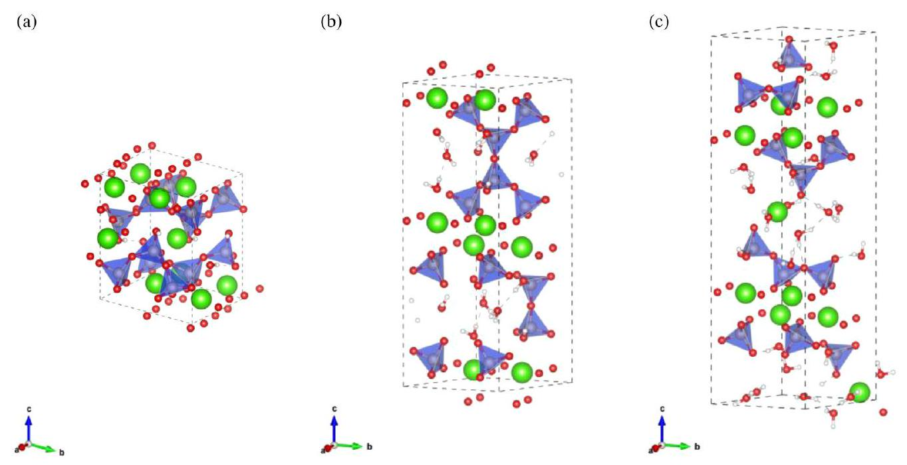
Fig. 1. The atomic structure of (a) tobermorite $9 \AA$, (b) tobermorite $11 \AA$, (c) tobermorite $14 \AA$ displayed in polyhedral style. The green, brown, red and white balls represent calcium, silicon, oxygen, and hydrogen atoms.

into shallow FCNNs to ensure the roto-translational invariance of energy and forces. Subsequently, The development of Graph Neural Network interatomic potentials (GNN-IPs) [27-32] allowed for the automatic learning of molecular graph representations through embeddings of atomic types and geometric configurations, negating the need for manual descriptors. SchNet [27] introduced continuous filter convolutional layers to address the discretization of atomic positions. DimeNet [28] pioneered a directional message passing scheme for more precise weight distribution in neural networks. SphereNet [29] innovatively applied a spherical message passing mechanism in spherical coordinates. Unlike the rotational invariant representations of the aforementioned GNN-IPs, PaiNN [30] was the first to employ rotationequivariant representations, associating each atom with its corresponding feature vector. Building upon prior research, NequIP [32] implemented rotation-equivariant representations through a directional message passing scheme, extending each atom's feature vector into higherorder tensors through irreducible representations, achieving state-of-the-art accuracy. Notably, the study by Ying et al. [37] on the sliding dynamics of bilayer defected graphene provides a detailed comparison of NequIP, DPMD, GAP, and several classical force fields. They found that NequIP shows superior accuracy and data efficiency, overcoming the limitations of traditional methods in studying defected graphene interfaces' frictional properties. This highlights the potential of applying NequIP to Tobermorites in the current study.

While the development of neural network architectures in the realm of MLIP has reached a commendable degree of maturity, the advancement of MLIPs designed for application to C-S-H remains notably insufficient. The forefront of innovation in this domain has seen the application of DPMD (Deep Potential Molecular Dynamics) for generating relevant potential models [35]. However, the latest and more accurate MLIPs emerging after DPMD have not been integrated into C-S-H research. In this work, we employed NequIP to develop a highly accurate and data-efficient MLIP for tobermorite, a structural analogue of C-S-H. Using DFT calculations as a benchmark, we compared the merits and drawbacks of the NequIP and DPMD neural networks from 4 aspects. We then utilized the potentials generated by these 2 methods for MD simulations, examining 4 key attributes of mechanical and structural properties. This comparison between the two MLIPs, alongside FP calculations and classical force fields, served to evaluate the potential models developed in this study. It is noteworthy that all the MLIPs mentioned above have been validated solely on specific datasets, such as QM9 [38,39], MD17 [40], revMD17 [41], and CCSD [42]. However, the structural nature of C-S-H and its analogues diverges significantly from
the small organic molecules present in these datasets. Accordingly, this study contributes validation results for NequIP on an innovative dataset composed of inorganic molecules (tobermorite 9, 11, $14 \AA$ ), thereby expanding NequIP's validation horizon and demonstrating its adaptability to a broader spectrum of molecular simulations.

## 2. Methodology

### 2.1. Tobermorite dataset

The tobermorite model, proposed by Merlino [43-45], features a microstructure similar to that of C-S-H and possesses the same chemical composition. As shown in Fig. 1, tobermorite presents a layered phase, with its unit layer structure composed of single chains of siliconoxygen tetrahedra parallel to the b-direction and an intervening layer of calcium. The number of water molecules distributed between layers varies with the degree of hydration. Tobermorite is categorized into 3 types, with basal spacings of 9 Å [43], 11 Å [44], and $14 \AA$ [45], respectively.

In this study, models of tobermorite was established. In Zhou's research [35], FP calculations were performed using Vienna Ab Initio Simulation Package (VASP) [46], with energy and force convergence criteria set to be lower than $10^{-5} \mathrm{eV}$ and $0.03 \mathrm{eV} / \AA$ for all moleculars, which is sufficiently stringent. Additionally, Zhou et al. [35] obtained lattice constants and elastic constants that closely approximate experimental results based on these calculations. Therefore, we utilized the energies and forces obtained from their DFT calculations as the reference to construct the dataset for MLIPs. Specifically, there were 7000 configurations for the unit cells of tobermorite 9,11 , and $14 \AA$, 1500 configurations for tobermorite 9 Å with $2 \times 1 \times 1,1 \times 2 \times 1$, $1 \times 1 \times 2$ supercells, and 1000 for tobermorite 11 and $14 \AA$ with $2 \times 1 \times 1,1 \times 2 \times 1$ supercells. The distribution of configurations for training, validation, and testing sets for both DPMD and NequIP is detailed in Table 1.

### 2.2. MLIP scheme

The DPMD scheme [26] relies on a shallow FCNN based on manual descriptors. To ensure the translational and rotational invariance of energy, as well as the translational invariance and rotational equivariance of forces, DPMD embeds only the relative distances between atoms within a cutoff radius in the neural network, denoted as in Fig. 2. Since $\boldsymbol{R}_{i j}$ is a vector, for ease of input into the neural network, it is

Table 1
The number of configurations for training, validation, and testing sets. It remains consistent for both MLIPs (DPMD and NequIP) in this study.
| Configurations |  | Training set | Validation set | Test set |
| :--- | :--- | :--- | :--- | :--- |
| Unit cell | $9 \AA$ | 950 | 50 | 6000 |
|  | 11 Å |  |  |  |
|  | 14 Å |  |  |  |
| Supercell | 9 Å | 475 |  | 1000 |
|  | $11 \AA$ |  | 25 | 500 |
|  | $14 \AA$ |  |  | 500 |

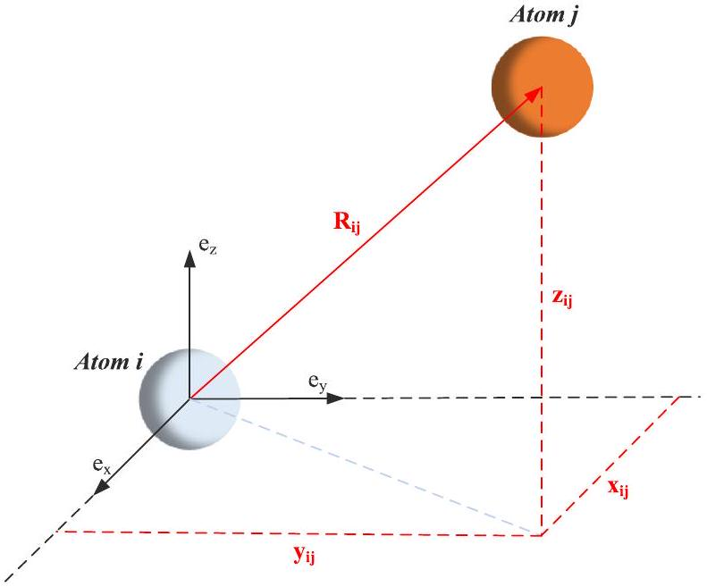
Fig. 2. An illustration depicting the embedding of atoms $i$ and $j$. ( $e_{x}, e_{y}, e_{z}$ ) is a local coordinate system for atom $i$.

represented in vector form, as shown in Eq. (1) [26]. $\boldsymbol{D}_{i j}$ is a manual descriptor, where the first term embeds the interatomic distance, and the subsequent three terms embed the relative positions of atoms, thereby indicating direction.

$$
\boldsymbol{D}_{i j}=\left\{\frac{1}{R_{i j}}, \frac{x_{i j}}{R_{i j}^{2}}, \frac{y_{i j}}{R_{i j}^{2}}, \frac{z_{i j}}{R_{i j}^{2}}\right\}
$$

where $\boldsymbol{D}_{i j}$ is a descriptor for characterizing the geometric position between atoms $i$ and $j . \boldsymbol{R}_{i j}$ represents the vector pointing from atom $i$ to atom $j$, with $R_{i j}$ denoting its magnitude. ( $x_{i j}, y_{i j}, z_{i j}$ ) denotes the Cartesian component of $\boldsymbol{R}_{\boldsymbol{i} \boldsymbol{j}}$ in the local coordinate system of atom $i$.

As shown in Fig. 3(a), $\boldsymbol{D}_{i j}$ serves as the input to the DPMD neural network. It takes descriptors of all atoms within the cutoff radius of atom $i$ and feeds them into the FCNN to output the potential energy $E_{i}$ of atom $i$. The total potential energy $E$ and the force $\boldsymbol{F}_{\boldsymbol{i}}$ on a specific atom $i$ are represented by Eqs. (2) and (3).

$$
E=\sum_{i} E_{i}
$$

$$
\boldsymbol{F}_{i}=-\nabla_{i} E
$$

NequIP, as applied in this paper, leverages the principles of graph neural networks (GNN) coupled with directional message passing to autonomously derive equivariant graph representations of 3D molecules. Nodes in the graph represent individual atoms, while edges are typically defined by connections from other atoms within a cutoff radius to the central atom. Each atom/node $i$ is associated with a feature $\boldsymbol{h}_{\boldsymbol{i}}$, composed of tensors which is iteratively calculated through a series of convolutions over the distances to neighboring atoms $R_{i j}$ and their features $\boldsymbol{h}_{\boldsymbol{j}}$, as depicted in Fig. 3(b). Moreover, as illustrated in Fig. 3(c), an update equation and message aggregation scheme applied to the previously mentioned feature iterations are defined as follows [28]:

$$
m_{j i}^{(l+1)}=f_{\text {update }}\left(m_{j i}^{(l)}, \sum_{k} f_{i n t}\left(m_{k j}^{(l)}, e_{R B F}^{(j i)}, a_{S B F}^{(k j, j i)}\right)\right)
$$

where $e_{R B F}^{(j i)}$ and $a_{S B F}^{(k j, j i)}$ represent radial and spherical Bessel functions for the representation of interatomic distances and angles. $f_{\text {int }}$ and $f_{\text {update }}$ are the interaction and update functions to be learned. $m$ denotes the message passed between two atoms, and $l$ indicates the layer of iteration.

This demonstrates that the introduction of directional angle transmission enables GNN to more readily distinguish complex structures, thus enhancing its capability in learning molecular graph representations.

### 2.3. Validation of the neural networks

Once reference data and atomic representations are established, the final step is to fit the model. The validation of the neural network architecture utilized by NequIP in this study is categorized into 3 dimensions.

### 2.3.1. Accuracy

Accuracy reflects the predictive capability of the model and is one of the indispensable metrics for assessing neural networks [47]. In MLIPs, the Root Mean Square Error (RMSE) is commonly employed to evaluate accuracy, with the expressions for RMSE of energy and forces as follows:

$$
\begin{aligned}
& E_{R M S E}=\sqrt{\frac{1}{n} \sum_{i=1}^{n}\left(\hat{E}_{i}-E_{i}\right)^{2}} \\
& F_{R M S E}=\sqrt{\frac{1}{n \cdot 3 N} \sum_{i=1}^{n} \sum_{j=1}^{N} \sum_{\alpha=1}^{3}\left(\frac{\partial \hat{E}_{i}}{\partial r_{i, j \alpha}}-F_{i, j \alpha}\right)^{2}}
\end{aligned}
$$

where $n$ is the number of configurations in the datasets. $N$ represents the total number of atoms in the molecule, $E$ and $F$ denotes the energy and force calculated by DFT, i.e., the reference data. $\hat{E}$ and $\hat{F}$ refers to the energy and force predicted by NequIP or DPMD.

To ensure the results are highly referential and comparable, the criterion for the completion of neural network training is defined by:

$$
\text { Relative error }=\frac{R_{\left(N_{e}+N\right)}-R_{N_{e}}}{R_{N_{e}} \cdot N} \leq 0.1 \%
$$

To mitigate individual errors, $N$ is set to 20 in this study. The smallest epoch that meets the above criterion is considered the point of convergence. As illustrated in Fig. A.1, the relative error of different training sets shows a decreasing trend, indicating convergence after a certain number of epochs. The stopping steps of training for each set are summarized in Table 2. Hence, the accuracy of NequIP can be assessed by comparing the RMSE values of the two types of MLIPs at the same training epochs.

### 2.3.2. Convergence efficiency and data efficiency

Machine learning models often require extensive datasets and numerous iterations for training, where the time cost and computational resource utilization significantly influence the practical applicability of neural networks [48-51]. Insufficient convergence efficiency necessitates a larger number of training steps to achieve the desired precision,

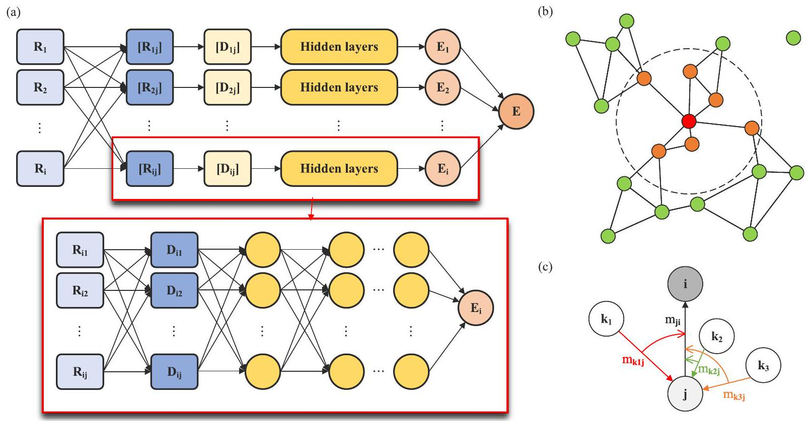
Fig. 3. The scheme of (a) FCNN in DPMD [26], (b) graph neural network, (c) directional message passing [28]. In Figure (b), circles represent atoms/nodes, solid lines denote edges, dashed lines indicate the cutoff radius, and the central atom is highlighted in red. In Figure (c), $i, j$, and $k$ respectively denote the central atom, a neighboring atom, and next-nearest neighboring atoms.

Table 3
The RMSEs of DPMD and NequIP on training, validation, and testing datasets. Best results are marked in bold.
| Configurations |  | Energy (meV/atom) |  |  |  |  |  | Force (meV/Å) |  |  |  |  |  |
| :--- | :--- | :--- | :--- | :--- | :--- | :--- | :--- | :--- | :--- | :--- | :--- | :--- | :--- |
|  |  | Training |  | Validation |  | Test |  | Training |  | Validation |  | Test |  |
|  |  | DPMD | NequIP | DPMD | NequIP | DPMD | NequIP | DPMD | NequIP | DPMD | NequIP | DPMD | NequIP |
| 9 Å | Unit cell | 4.10 | 0.0493 | 9.03 | 0.0881 | 3.23 | 0.141 | 93.7 | 3.76 | 105 | 12.6 | 143 | 13.9 |
|  | Supercell | 0.538 | 0.0263 | 1.14 | 0.0408 | 0.531 | 0.0500 | 96.9 | 4.37 | 90.8 | 12.1 | 100 | 13.3 |
| 11 Å | Unit cell | 1.11 | 0.0711 | 0.942 | 0.135 | 2.34 | 0.172 | 115 | 4.01 | 108 | 19.1 | 163 | 19.4 |
|  | Supercell | 1.07 | 0.0268 | 0.877 | 0.113 | 1.22 | 0.102 | 122 | 4.83 | 111 | 22.0 | 127 | 22.4 |
| $14 \AA$ | Unit cell | 1.45 | 0.110 | 0.959 | 0.262 | 1.96 | 0.394 | 133 | 4.69 | 122 | 32.8 | 140 | 33.6 |
|  | Supercell | 0.73 | 0.0175 | 0.673 | 0.198 | 1.12 | 0.186 | 85.7 | 6.58 | 76.4 | 36.2 | 118 | 35.4 |

thereby escalating the time cost. Besides, low data efficiency necessitates the enlargement of the training dataset, leading to increased memory requirements of GPUs.

We plotted the trends of training and validation RMSE for energy and forces as epochs progress, evaluating their convergence efficiency by determining the epochs needed by each MLIP variant to reach specific RMSE values.

Further to the extensive dataset illustrated in Fig. 1, we added datasets of medium and small magnitudes. For unit cells, medium datasets were trained using 450 configurations and validated with 50, while small datasets were subjected to training with 100 configurations and validation with 50 . For supercells, medium datasets involved 225 training configurations and 25 for validation, with small datasets incorporating 75 configurations for training and 25 for validation. The accuracy of both MLIP models against reference datasets of varying sizes served as a benchmark for evaluating their data efficiency.

### 2.3.3. Generalization ability

Generalization enables neural networks to adapt to variations in input distributions. This capability facilitates transfer learning, where knowledge acquired from one task or dataset can be applied to another related task or dataset. Networks with strong generalization abilities can effectively transfer their learned representations. Owing to the structural similarity between tobermorite and C-S-H, we constructed

Table 4
Numbers of configurations for training MLIPs for tobermorite and C-S-H.
| Configurations |  |  | Numbers |
| :--- | :--- | :--- | :--- |
| Tobermorite | 9 Å | Unit cell | 300 |
|  |  | Supercell | 150 |
|  | 11 Å | Unit cell | 300 |
|  |  | Supercell | 150 |
|  | $14 \AA$ | Unit cell | 300 |
|  |  | Supercell | 150 |
| C-S-H | $\mathrm{Ca} / \mathrm{Si}=1.1$ |  | 20 |
|  | $\mathrm{Ca} / \mathrm{Si}=1.3$ |  | 200 |
|  | $\mathrm{Ca} / \mathrm{Si}=1.5$ |  | 20 |
|  | $\mathrm{Ca} / \mathrm{Si}=1.7$ |  | 20 |
|  | $\mathrm{Ca} / \mathrm{Si}=1.9$ |  | 200 |

two types of MLIPs based on tobermorite and C-S-H molecules, with their training configurations composed as shown in the Table 4. Subsequently, we tested these MLIPs on new C-S-H datasets with varying $\mathrm{Ca} / \mathrm{Si}$ ratios. By observing their predictions for energy and forces, we evaluated the generalization ability of the NequIP developed MLIP for tobermorite on the C-S-H datasets.

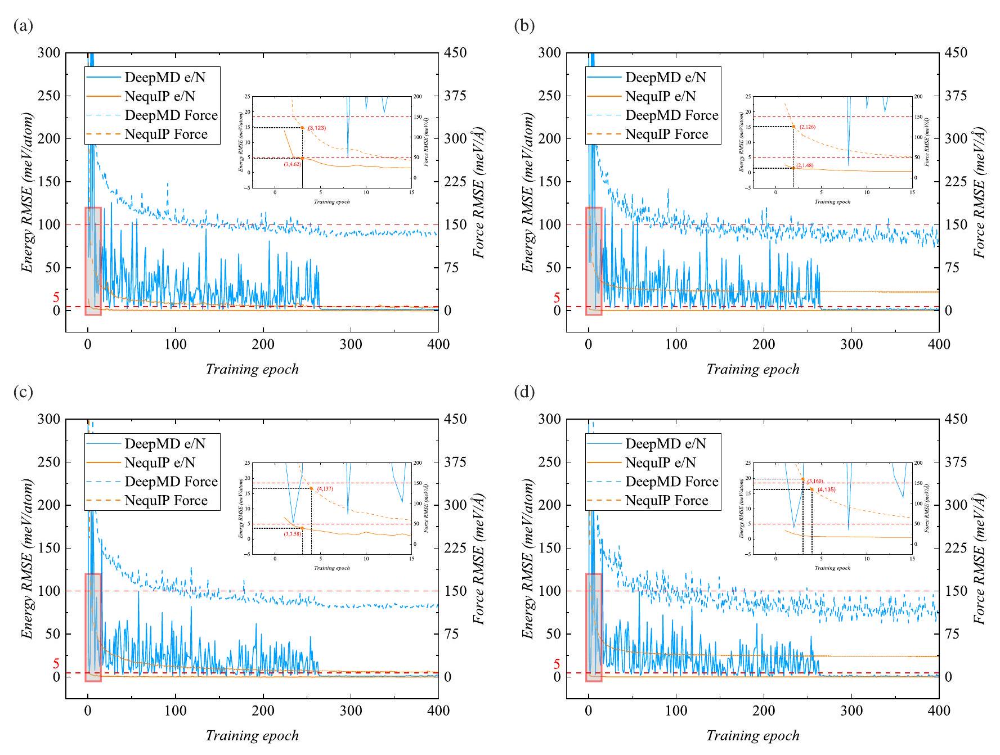
Fig. 4. Plot of tobermorite $14 \AA$ (a) unit cell training RMSEs, (b) unit cell validation RMSEs, (c) supercell training RMSEs, (d) supercell validation RMSEs with training epochs. The orange and blue lines represent the RMSEs of NequIP and DPMD, respectively. Solid and dashed lines denote the RMSEs for energy and force. The red dashed line serves as a reference line for convergence accuracy. The gray box is enlarged for better visualization of the convergence rates of both methods.

### 2.4. Verification of physical properties

### 2.4.1. Lattice constants and radial distribution function (RDF)

This validation aims to ascertain that the potentials developed using NequIP are capable of accurately describing the crystal structure of tobermorite and offer a precision advantage over DPMD (with DFT calculations as the benchmark). MD simulations were performed at 300K within the NPT ensemble using Lammps [52], adopting a uniform timestep of 1 fs . The RDF was calculated based on 100 frames after system equilibration. The computations for DFT [35], DPMD, NequIP, and ClayFF will be presented to highlight NequIP's advantages over classical force fields and previous MLIPs.

### 2.4.2. Elastic constants and modulus

For the calculation of the elastic tensor, different force fields utilized the stress-strain [19] method based on the generalized Hooke's law, with strains of $\pm 2 \%$. Subsequently, Young's modulus, shear modulus, and Poisson's ratio were determined based on the Voigt-ReussHill (VRH) approximation [53-57], the formulas are as shown in Appendix B.

## 3. Results

### 3.1. Accuracy validation

Initially, the DPMD and NequIP neural networks were trained in accordance with the epochs outlined in Table 2, Fig. A.1. The prediction
results obtained are then calculated for the RMSEs of energy and force according to Eqs. (5) and (6). As shown in Table 3, Figs. D.1-D.6, the RMSE for energy calculated by NequIP is $1 \sim 2$ orders of magnitude smaller than that calculated by DPMD on training, validation, and test sets, and the RMSE for force is significantly lower than DPMD's results as well. The findings from Zhou et al. [35] have demonstrated that DPMD's computational accuracy is substantially higher than that of their previous studies [24]. Therefore, it is evident from the results of this section that the NequIP employed in this study significantly enhances the accuracy of predicting energy and force in the tobermorite phases.

### 3.2. Efficiency validation

The verification of convergence speed is depicted in Fig. 4. Taking unit cell and supercell of tobermorite $14 \AA$ as examples, and using $E_{\text {RMSE }}=5 \mathrm{meV} /$ atom,$F_{\text {RMSE }}=100 \mathrm{meV} / \AA$ as benchmarks, NequIP requires only several epochs to meet these criteria, whereas DPMD needs about 100~300 epochs, whether for training RMSE or validation RMSE. A similar pattern is observed for tobermorite 9 and $11 \AA$, with details available in Figs. C. 1 and C.2. This observation underscores the superior convergence speed of NequIP over DPMD, attributable to the graph convolutional neural network (GCN) architecture of NequIP.

In deep learning, data efficiency is significantly tied to the consumption of computational resources. Fig. 5 illustrates the data efficiency of

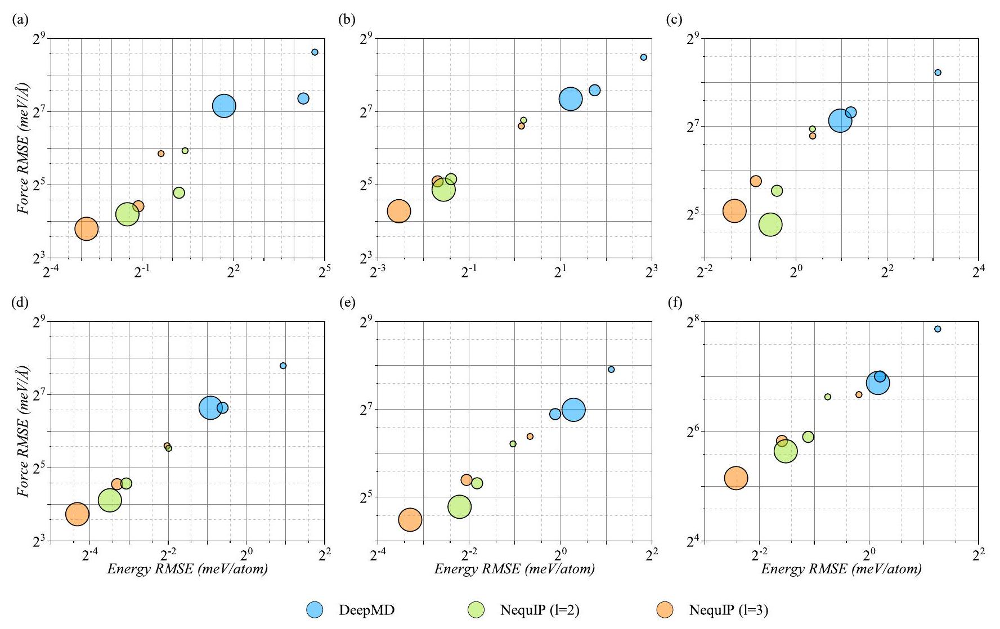
Fig. 5. The RMSEs error of tobermorite (a) $9 \AA$, (b) $11 \AA$, (c) $14 \AA$ unit cell and (e) $9 \AA$, (f) $11 \AA$, (g) $14 \AA$ supercell on test datasets of various sizes. This figure employs a logarithmic scale; thus, the differences in prediction results between three methods are actually larger than they appear visually.

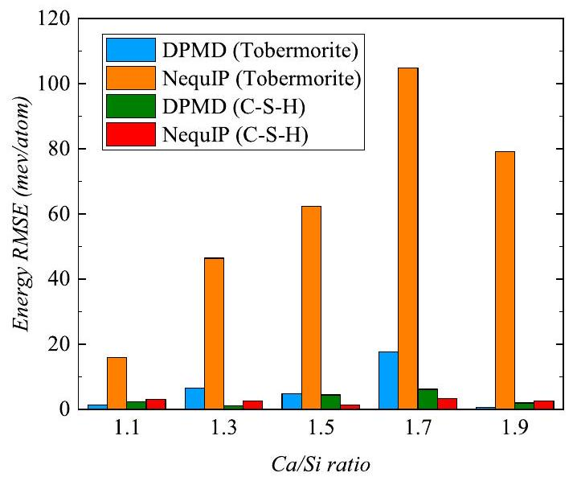
Fig. 6. Energy RMSEs for MLIP developed by tobermorite datasets (tobermorite MLIP) and MLIP developed by C-S-H datasets (C-S-H MLIP). In the legend, parentheses indicate the type of molecule used in the training dataset. Blue and green represent neural networks trained using DPMD, while red and orange denote those trained using NequIP.

NequIP. As described in Section 2.3.2, we categorized the datasets into three sizes: large, medium, and small, to train the two types of MLIPs. Across six tobermorite datasets, the orange bubbles, representing small datasets, show better performance in terms of RMSE for energy and force compared to the blue bubbles, which represent large datasets. This suggests that NequIP can readily replicate the training outcomes of DPMD using considerably smaller datasets.

To further elucidate the data efficiency of NequIP, this section introduces NequIP $(l=2)$, a simplified version. It describes the features of each node in the GNN using tensors of order 2 instead of 3 . Even

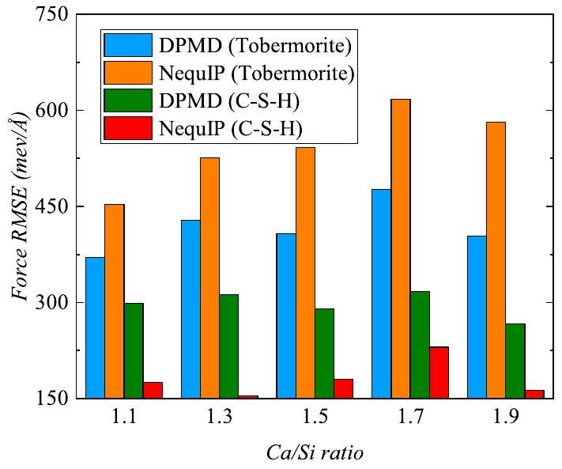
Fig. 7. Force RMSEs for tobermorite MLIP and C-S-H MLIP. In the legend, parentheses indicate the type of molecule used in the training dataset. Blue and green represent neural networks trained using DPMD, while red and orange denote those trained using NequIP.

so, the predictions of NequIP $(l=2)$ on smaller datasets still outshine those of DPMD, affirming superior data efficiency of NequIp compared to DPMD.

### 3.3. Generalization validation

Previous work [35] has demonstrated the robust generalization capabilities of DPMD. However, as seen from Figs. 6 7, the generalization performance of NequIP is inferior. When the potential developed using tobermorite datasets is applied for energy predictions of C-S-H

Table 5
The lattice constants of tobermorite $9 \AA, 11 \AA$ and $14 \AA$ obtained by DFT, ClayFF, DPMD and NequIP. Best results are marked in bold.
| Configurations |  | DFT [35] Value | ClayFF |  | DPMD |  | NequIP |  |
| :--- | :--- | :--- | :--- | :--- | :--- | :--- | :--- | :--- |
|  |  | Value | Error (\%) | Value | Error (\%) | Value | Error (\%) |
| $9 \AA$ | a (Å) |  | 11.26 | 11.10 | 2.31 | 11.14 | 1.07 | 11.23 | 0.27 |
|  | b (Å) | 7.40 | 7.24 | 2.16 | 7.42 | 0.27 | 7.32 | 1.08 |
|  | c (Å) | 9.74 | 9.29 | 4.62 | 9.60 | 1.44 | 9.72 | 0.21 |
|  | $\alpha\left({ }^{\circ}\right)$ | 101.03 | 99.23 | 1.78 | 100.35 | 0.67 | 101.58 | 0.54 |
|  | $\beta\left({ }^{\circ}\right)$ | 91.50 | 88.10 | 3.72 | 99.16 | 8.37 | 90.92 | 0.63 |
|  | $\gamma\left({ }^{\circ}\right)$ | 89.80 | 90.70 | 1.00 | 90.51 | 0.79 | 91.34 | 1.71 |
|  | Mean relative error (\%) |  |  | 2.60 |  | 2.10 |  | 0.74 |  |
| 11 Å | a (Å) | 6.85 | 6.63 | 3.21 | 6.87 | 0.29 | 6.85 | 0.00 |
|  | b (Å) | 7.48 | 7.29 | 2.54 | 7.50 | 0.27 | 7.49 | 0.13 |
|  | c (Å) | 22.62 | 27.85 | 23.12 | 22.68 | 0.27 | 22.57 | 0.22 |
|  | $\alpha\left({ }^{\circ}\right)$ | 91.06 | 90.99 | 0.08 | 90.99 | 0.08 | 90.99 | 0.08 |
|  | $\beta\left({ }^{\circ}\right)$ | 89.28 | 89.25 | 0.03 | 89.23 | 0.06 | 89.25 | 0.03 |
|  | $\gamma\left({ }^{\circ}\right)$ | 123.67 | 123.39 | 0.23 | 123.92 | 0.20 | 123.79 | 0.10 |
|  | Mean relative error (\%) |  | 4.87 |  | 0.19 |  | 0.09 |  |
|  | a (Å) | 6.80 | 6.64 | 2.35 | 6.70 | 1.47 | 6.81 | 0.15 |
|  | b (Å) | 7.43 | 7.22 | 2.83 | 7.43 | 0.00 | 7.43 | 0.00 |
|  | c (Å) | 28.26 | 28.66 | 1.42 | 28.91 | 2.30 | 28.41 | 0.53 |
|  | $\alpha\left({ }^{\circ}\right)$ | 89.26 | 88.36 | 1.01 | 88.28 | 1.10 | 88.34 | 1.03 |
|  | $\beta\left({ }^{\circ}\right)$ | 88.80 | 88.91 | 0.12 | 88.91 | 0.12 | 88.91 | 0.12 |
|  | $\gamma\left({ }^{\circ}\right)$ | 123.47 | 125.78 | 1.87 | 123.96 | 0.40 | 125.29 | 1.47 |
|  | Mean relative error (\%) |  | 1.60 |  | 0.90 |  | 0.55 |  |

Table 6
The elastic constants of tobermorite phases.
| Elastic constants (GPa) | Tobermorite 9 Å |  |  |  | Tobermorite 11 Å |  |  |  | Tobermorite 14 Å |  |  |  |
| :--- | :--- | :--- | :--- | :--- | :--- | :--- | :--- | :--- | :--- | :--- | :--- | :--- |
|  | DFT [35] | ClayFF | DPMD | NequIP | DFT [35] | ClayFF | DPMD | NequIP | DFT [35] | ClayFF | DPMD | NequIP |
| $C_{11}$ | 169.76 | 182.36 | 151.68 | 154.68 | 116.58 | 144.94 | 97.60 | 117.52 | 91.64 | 112.08 | 86.92 | 92.74 |
| $C_{12}$ | 62.48 | 49.61 | 51.43 | 50.57 | 50.07 | 46.27 | 41.92 | 46.14 | 52.48 | 48.01 | 39.58 | 46.33 |
| $C_{13}$ | 42.23 | 49.47 | 35.78 | 35.35 | 35.22 | 23.32 | 35.51 | 31.75 | 27.88 | 38.24 | 18.82 | 26.98 |
| $C_{14}$ | -0.53 | 0.11 | -3.25 | 2.20 | -1.08 | 2.81 | 8.96 | 1.20 | 0.91 | 1.17 | -2.80 | -2.26 |
| $C_{15}$ | -16.48 | -15.42 | 1.18 | -7.01 | -3.10 | 5.10 | -0.37 | 0.51 | 1.86 | -4.04 | 0.29 | 1.58 |
| $C_{16}$ | 0.14 | 9.57 | 2.36 | 3.85 | -3.67 | -19.05 | -3.91 | -3.06 | 0.54 | -8.71 | -3.59 | -1.08 |
| $C_{22}$ | 176.43 | 194.69 | 149.09 | 167.00 | 129.04 | 159.24 | 107.40 | 112.83 | 96.90 | 129.96 | 98.50 | 99.69 |
| $C_{23}$ | 39.79 | 40.34 | 33.00 | 44.38 | 40.53 | 55.91 | 31.35 | 37.22 | 32.60 | 40.23 | 22.78 | 21.58 |
| $C_{24}$ | -1.25 | -11.17 | 0.29 | 1.85 | -2.54 | 6.05 | 8.92 | 4.01 | 1.16 | 3.47 | -2.02 | -1.69 |
| $C_{25}$ | -12.27 | -9.60 | -5.39 | -12.60 | 2.61 | 3.23 | -2.41 | 5.65 | -4.37 | -1.52 | 3.84 | 0.90 |
| $C_{26}$ | 0.47 | 5.64 | -1.12 | -1.28 | -9.67 | -29.77 | -10.01 | -13.47 | -13.57 | -19.15 | -9.82 | -8.67 |
| $C_{33}$ | 104.28 | 166.02 | 113.44 | 101.40 | 133.20 | 141.24 | 103.12 | 126.81 | 79.71 | 103.47 | 57.78 | 58.13 |
| $C_{34}$ | -1.53 | 3.26 | 0.69 | 3.07 | -1.99 | 6.25 | 5.97 | -3.97 | 4.42 | 7.75 | 1.43 | 1.13 |
| $C_{35}$ | -5.43 | 16.33 | 9.88 | 0.25 | 1.03 | -0.67 | -4.94 | 1.34 | 1.31 | -1.78 | 6.03 | 4.21 |
| $C_{36}$ | -0.04 | 2.36 | 1.02 | 3.36 | -13.23 | -7.42 | 2.43 | -12.80 | -5.14 | -8.57 | -6.79 | -5.56 |
| $C_{44}$ | 40.64 | 46.87 | 42.48 | 43.76 | 25.99 | 50.31 | 28.14 | 30.90 | 29.91 | 39.13 | 20.80 | 24.65 |
| $C_{45}$ | -1.15 | -1.39 | -0.55 | 0.57 | -11.38 | -5.21 | -6.15 | -9.50 | -14.25 | -12.86 | -8.20 | -7.93 |
| $C_{46}$ | -6.88 | -4.80 | -1.28 | -4.78 | 2.62 | 4.24 | -2.19 | 0.29 | -2.18 | 0.96 | 0.78 | 0.41 |
| $C_{55}$ | 15.68 | 43.39 | 32.83 | 26.65 | 17.63 | 43.05 | 18.66 | 19.21 | 15.65 | 33.63 | 11.29 | 16.08 |
| $C_{56}$ | -0.13 | 5.91 | 3.01 | 4.31 | -0.54 | 1.04 | 0.16 | -0.66 | 0.61 | 0.62 | 1.44 | -2.24 |
| $C_{66}$ | 49.14 | 63.12 | 47.75 | 51.76 | 46.58 | 52.68 | 33.43 | 42.87 | 38.88 | 50.01 | 30.62 | 36.55 |

molecules, the RMSEs is significantly high. Conversely, when the MLIPs trained with the same molecular configurations is used for predictions, the RMSE markedly decreases. Moreover, the lower the $\mathrm{Ca} / \mathrm{Si}$ ratio, the more accurate the predictions from the tobermorite-derived potential, due to the lower $\mathrm{Ca} / \mathrm{Si}$ ratio of tobermorite molecules themselves. Specific RMSEs values can be found in the Appendix E.

### 3.4. Lattice constants and RDF

Table 5 presents the lattice constants of tobermorite 9, 11, $14 \AA$ under various force fields and their relative errors compared to DFT calculations. It is observed that, as MLIPs, both NequIP and DPMD exhibit high accuracy. In contrast, the empirical force field ClayFF, developed for clay minerals, shows significant deviations in describing lattice constants. This discrepancy can be attributed to its relatively simplistic physical model for the potential energy of the framework atoms, leading to suboptimal representation of structural information. Notably, NequIP exhibits the minimal mean relative error, reaching as low as $0.09 \%$.

Furthermore, the RDF of Si-O and Ca-O atom pairs in tobermorite 9, 11, $14 \AA$ were calculated, as shown in Fig. 8. RDF offers a statistical analysis of the distribution of atoms or molecules' relative positions and distances across various phases, expressing the probability density of encountering other atoms or molecules at a distance $r$ from a chosen atom or molecule. The formula for RDF, $g(r)$, is presented as [58]:

$$
g(r)=\frac{1}{N} \cdot \frac{1}{\rho} \cdot \frac{\mathrm{~d} N}{\mathrm{~d} r}
$$

where $N$ is the number of atoms within a distance $r, V$ is the volume, $\rho$ is the average density, and $\frac{d N}{d r}$ is the incremental rate of atom numbers.

In quantifying the closeness of different force fields to DFT calculations, the Kullback-Leibler (KL) divergence was introduced. KL divergence, a metric for the similarity between two probability distributions, is broadly utilized in clustering analysis and parameter estimation. Considering the RDF essentially as a probability density function, evaluating it through KL divergence is pertinent. The formula for KL divergence is as follows [59]:

$$
D_{K L}(P \| Q)=\int_{-\infty}^{+\infty} p(x) \cdot \ln \frac{p(x)}{q(x)} \mathrm{d} x
$$

Table 7
Comparison of the Euclidean and Riemannian metrics for elastic tensors. Best results are marked in bold.
| Metrics | Tobermorite 9 Å |  |  | Tobermorite 11 Å |  |  | Tobermorite 14 Å |  |  |
| :--- | :--- | :--- | :--- | :--- | :--- | :--- | :--- | :--- | :--- |
|  | ClayFF | DPMD | NequIP | ClayFF | DPMD | NequIP | ClayFF | DPMD | NequIP |
| Stiffness tensor $d E$ | 0.28 | 0.19 | 0.12 | 0.30 | 0.24 | 0.10 | 0.30 | 0.22 | 0.17 |
| Compliance tensor $d E$ | 0.58 | 0.52 | 0.42 | 0.72 | 0.40 | 0.29 | 0.72 | 0.33 | 0.44 |
| $d R$ | 1.33 | 1.03 | 0.74 | 1.65 | 0.96 | 0.54 | 1.60 | 1.02 | 0.88 |

Table 8
The KL divergence for RDF of tobermorite 9, 11, $14 \AA$ obtained by ClayFF, DPMD, and NequIP. Best results are marked in bold.
| Configurations | Atom pairs | ClayFF | DPMD | NequIP |
| :--- | :--- | :--- | :--- | :--- |
| 9 Å | Si-O | 0.245 | 0.097 | 0.004 |
|  | Ca-O | 0.142 | 0.056 | 0.012 |
| 11 Å | Si-O | 0.357 | 0.021 | 0.012 |
|  | Ca-O | 0.147 | 0.030 | 0.008 |
| 14 Å | Si-O | 0.318 | 0.039 | 0.053 |
|  | Ca-O | 0.446 | 0.029 | 0.036 |

where $D_{K L}$ represents the KL divergence, where $p(x)$ and $q(x)$ are two probability density functions. In this study, $p(x)$ represents the RDF function obtained from DFT calculations, while $q(x)$ represents the RDF functions obtained from ClayFF, DPMD and NequIP.

From Fig. 8 and Table 8, it is evident that NequIP surpasses DPMD and the empirical ClayFF in accurately predicting local atomic bonding and coordination. The accurate prediction of lattice constants and RDF is crucial for providing structural information about the system. NequIP holds promise for efficiently understanding the interactions between atoms or molecules and the organization of the system.

### 3.4.1. Elastic constants and modulus

Benchmarking against DFT computed values, we calculated the elastic constants using potential functions trained with DPMD and NequIP, with the results from ClayFF calculations serving as a comparison, as shown in Table 6. Among all the elastic constants, $C_{11}, C_{22}$, and $C_{33}$ are key parameters determining structural properties. In tobermorite 9 and $14 \AA$, silicon chains are arranged along the b and c directions, making $C_{33}$ significantly lower than $C_{11}$ and $C_{22}$, indicating pronounced anisotropy and revealing the interlayered structure of tobermorite $9 \AA$
and 14 Å. However, in the tobermorite 11 Å model, adjacent layers of silicate tetrahedra are connected via Si-O-Si covalent bonds forming a silicate network, which to some extent strengthens the interlayer interaction, hence tobermorite 11 Å exhibits the greatest stiffness in the c direction.

The calculation of elastic constants is highly sensitive to the accuracy of predicted energies and forces. Similarly, to quantitatively compare these elastic tensors, which are crucial parameters for calculating crystal modulus through the stiffness matrix and the compliance matrix, we introduced the Euclidean metric, as shown in Eq. (10). However, the Euclidean metric lacks symmetry and invariance under inversion. Therefore, we also calculated the Riemannian metric, as presented in Eq. (11) [60], which is independent of the coordinate system, maintains material symmetry, and possesses invariance under inversion, making it a robust metric.

$$
\begin{aligned}
d_{E}\left(C_{F F}, C_{D F T}\right) & =\left\|C_{F F}-C_{D F T}\right\|_{E} \\
& =\operatorname{tr}\left[\left(C_{F F}-C_{D F T}\right)^{T}\left(C_{F F}-C_{D F T}\right)\right]^{0.5} \\
d_{R}\left(C_{F F}, C_{D F T}\right) & =\left(\sum_{i=1}^{n} \ln ^{2} \lambda_{i}\right)^{0.5}=d_{R}\left(C_{D F T}, C_{F F}\right)
\end{aligned}
$$

where $C_{D F T}$ is the stiffness (compliance) matrices obtained from DFT, $C_{F F}$ is the stiffness (compliance) matrices obtained from classical force field (ClayFF) and machine learning force field (DPMD, NequIP). $\lambda_{i}$ are the eigenvalues of the $C_{F F}^{-1} C_{D F T}$ matrix.

Table 7 shows the Euclidean and Riemannian metrics of the elastic tensors from Table 6. It is evident that the elastic constants calculated with potentials trained via NequIP are highly consistent with DFT results, significantly outperforming DPMD and ClayFF.

Subsequently, the polycrystalline modulus were calculated using the VRH approximation, as listed in Tables 9, 10, 11. Owing to the high fidelity in estimating elastic constants, NequIP's computational

Table 9
VRH approximation of bulk modulus, shear modulus, Young's modulus and poison's ratio of tobermorite $9 \AA$ obtained by ClayFF, DPMD and NequIP. Best results are marked in bold.
| Modulus | DFT [35] Value | ClayFF |  | DPMD |  | NequIP |  |
| :--- | :--- | :--- | :--- | :--- | :--- | :--- | :--- |
|  |  | Value | Error (\%) | Value | Error (\%) | Value | Error (\%) |
| $K_{V}(\mathrm{GPa})$ | 82.16 | 91.33 | 11.16 | 72.74 | 11.47 | 75.97 | 7.53 |
| $K_{R}(\mathrm{GPa})$ | 69.62 | 90.20 | 29.56 | 70.14 | 0.75 | 70.25 | 0.90 |
| $K_{V R H}(\mathrm{GPa})$ | 75.89 | 90.76 | 19.59 | 71.44 | 5.86 | 73.11 | 3.66 |
| $G_{V}(\mathrm{GPa})$ | 41.49 | 57.59 | 38.80 | 44.21 | 6.56 | 43.95 | 5.93 |
| $G_{R}(\mathrm{GPa})$ | 31.15 | 51.63 | 65.75 | 41.99 | 34.80 | 39.42 | 26.55 |
| $G_{V R H}(\mathrm{GPa})$ | 36.32 | 54.61 | 50.36 | 43.10 | 18.67 | 41.68 | 14.76 |
| $E_{V R H}(\mathrm{GPa})$ | 93.97 | 136.45 | 45.21 | 107.65 | 14.56 | 105.08 | 11.82 |
| $\mu$ | 0.294 | 0.249 | 15.31 | 0.249 | 15.31 | 0.260 | 11.56 |

Table 10
VRH approximation of bulk modulus, shear modulus, Young's modulus and poison's ratio of tobermorite $11 \AA$ obtained by ClayFF, DPMD and NequIP. Best results are marked in bold.
| Modulus | DFT [35] Value | ClayFF |  | DPMD |  | NequIP |  |
| :--- | :--- | :--- | :--- | :--- | :--- | :--- | :--- |
|  |  | Value | Error (\%) | Value | Error (\%) | Value | Error (\%) |
| $K_{V}(\mathrm{GPa})$ | 70.05 | 81.83 | 16.82 | 58.41 | 16.62 | 65.26 | 6.84 |
| $K_{R}(\mathrm{GPa})$ | 68.08 | 73.78 | 8.37 | 55.79 | 18.05 | 62.57 | 8.09 |
| $K_{V R H}(\mathrm{GPa})$ | 69.07 | 77.80 | 12.64 | 57.10 | 17.33 | 63.92 | 7.46 |
| $G_{V}(\mathrm{GPa})$ | 34.91 | 49.20 | 40.93 | 29.34 | 15.96 | 34.73 | 0.52 |
| $G_{R}(\mathrm{GPa})$ | 24.26 | 46.34 | 91.01 | 26.04 | 7.34 | 27.84 | 14.76 |
| $G_{V R H}(\mathrm{GPa})$ | 29.58 | 47.77 | 61.49 | 27.69 | 6.39 | 31.29 | 5.78 |
| $E_{V R H}(\mathrm{GPa})$ | 77.66 | 118.96 | 53.18 | 71.51 | 7.92 | 80.69 | 3.90 |
| $\mu$ | 0.313 | 0.245 | 21.73 | 0.291 | 7.03 | 0.290 | 7.35 |

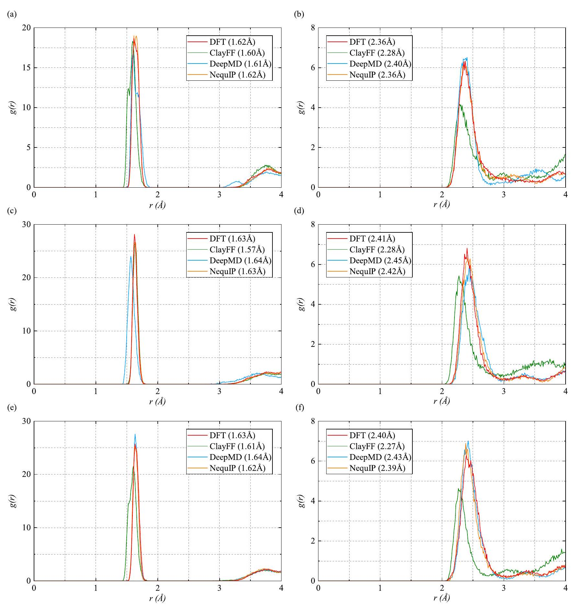
Fig. 8. RDF of (a) Si-O of tobermorite $9 \AA$, (b) Ca-O of tobermorite $9 \AA$, (c) Si-O of tobermorite $11 \AA$, (d) Ca-O of tobermorite $11 \AA$, (e) Si-O of tobermorite $14 \AA$, (f) Ca-O of tobermorite 14 Å obtained by DFT [35], CalyFF, DPMD and NequIP. Note that the numbers in brackets in the legend represent the horizontal axis values corresponding to the peak positions of the RDF, i.e., the most probable bond lengths for the respective atomic pairs.

results demonstrate a remarkable congruence with those derived from DFT analyses, surpassing those of DPMD, while the results of ClayFF appear somewhat unreasonable. Moreover, Tables 9, 10, 11 illustrates that with decreasing hydration level and increasing interlayer distance, there is a decline in overall mechanical performance.

## 4. Conclusions

In the domain of MLIP research focusing on the tobermorite and C-S-H phases, DPMD has been recognized for its unparalleled precision in fitting DFT results [35,36]. This work, leveraging NequIP's GCN
trained on the tobermorite datasets, developed a potential suited for C-S-H analogues, specifically tobermorite $9,11,14 \AA$. This MLIP exhibits several distinctive characteristics: (1) It can predict energies and forces on training, validation, datasets with errors below $0.5 \mathrm{meV} /$ atom and $50 \mathrm{meV} / \AA$, respectively. (2) It is capable of converging to smaller error values within 100 epochs, i.e. $E_{R M S E}<5 \mathrm{meV}$ /atom, $F_{R M S E}< 100 \mathrm{meV} / \AA$. (3) Its performance exhibits a low dependency on the size of the training datasets, ensuring precise predictions with limited data and underscoring its efficiency in data utilization. (4) The MLIP accurately captures the structural and mechanical properties of tobermorite, including the accurate reproduction of lattice constants, precise capture

Table 11
VRH approximation of bulk modulus, shear modulus, Young's modulus and poison's ratio of tobermorite $14 \AA$ obtained by ClayFF, DPMD and NequIP. Best results are marked in bold.
| Modulus | DFT [35] Value | ClayFF |  | DPMD |  | NequIP |  |
| :--- | :--- | :--- | :--- | :--- | :--- | :--- | :--- |
|  |  | Value | Error (\%) | Value | Error (\%) | Value | Error (\%) |
| $K_{V}(\mathrm{GPa})$ | 54.91 | 66.50 | 21.11 | 45.06 | 17.94 | 48.92 | 10.91 |
| $K_{R}(\mathrm{GPa})$ | 52.00 | 62.36 | 19.92 | 36.99 | 28.87 | 42.60 | 18.08 |
| $K_{V R H}(\mathrm{GPa})$ | 53.45 | 64.43 | 20.54 | 41.02 | 23.26 | 45.76 | 14.39 |
| $G_{V}(\mathrm{GPa})$ | 27.24 | 39.16 | 43.76 | 23.34 | 14.32 | 25.83 | 5.18 |
| $G_{R}(\mathrm{GPa})$ | 16.49 | 35.35 | 114.37 | 14.90 | 9.64 | 20.98 | 27.23 |
| $G_{V R H}(\mathrm{GPa})$ | 21.86 | 37.25 | 70.40 | 19.12 | 12.53 | 23.40 | 7.04 |
| $E_{V R H}(\mathrm{GPa})$ | 57.72 | 93.70 | 62.34 | 49.65 | 13.98 | 59.99 | 3.93 |
| $\mu$ | 0.320 | 0.258 | 19.38 | 0.298 | 6.88 | 0.282 | 11.88 |

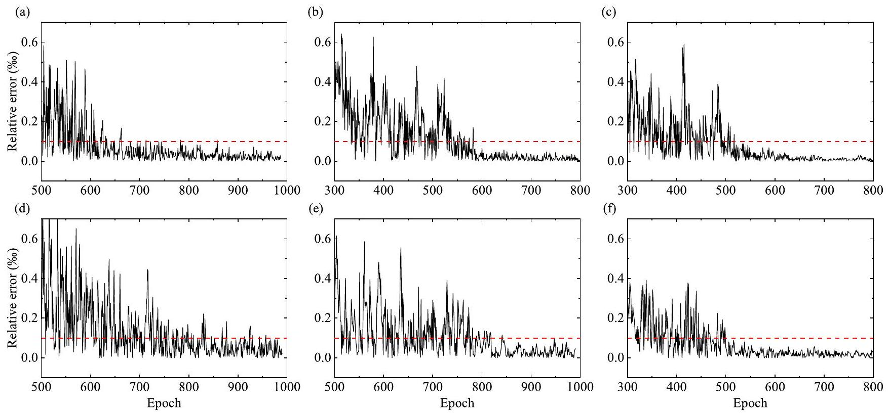
Fig. A.1. The relative RMSE error of tobermorite (a) $9 \AA$, (b) $11 \AA$, (c) $14 \AA$ unit cell and (e) $9 \AA$, (f) $11 \AA$, (g) $14 \AA$ supercell. The red dashed line represents a threshold of relative error $=0.1 \%$.

of bond lengths between atom pairs, and calculation of elastic constants and moduli with minimal error.

However, the generalization performance of the MLIP developed based on NequIP is lower, which is attributed to its directional message passing scheme and the use of high-order tensor descriptions for atomic features. While these aspects enhance the accuracy in learning atomic configurations, they also limit the transferability of the neural network. This results in the developed MLIP performing well only in predictions involving molecules with the same crystal structure as those in the training sets. Therefore, future research should focus on enhancing the sampling of tobermorite and C-S-H configurations to prevent unexpected configurations that deviate significantly from the dataset in MD simulations. This would pave the way for a universal NequIP applicable to cementitious materials. Additionally, the validation of various MLIPs across more dimensions requires refinement to understand which types of MLIP are suitable for analyzing specific material properties and to offer guidance for developing high accuracy, efficient MLIPs dedicated to cement-based materials.

In conclusion, the introduction of NequIP, a new member to the MLIPs for C-S-H, undeniably holds significance for further understanding molecular local structures, analyzing intermolecular interactions,
and investigating the system's phase transitions, providing a new avenue for accurate, large-scale MD simulations of cementitious materials.

## CRediT authorship contribution statement

Keming Zhu: Conceptualization, Data curation, Formal analysis, Investigation, Methodology, Project administration, Resources, Software, Validation, Visualization, Writing - original draft, Writing - review \& editing.

## Declaration of competing interest

The authors declare that they have no known competing financial interests or personal relationships that could have appeared to influence the work reported in this paper.

## Data availability

The interatomic potential developed in the paper, tobermorite datasets, the neural network training code, and the original results are all available at: https://github.com/ZKMGitHub/NequIP-for-tobermori tes.

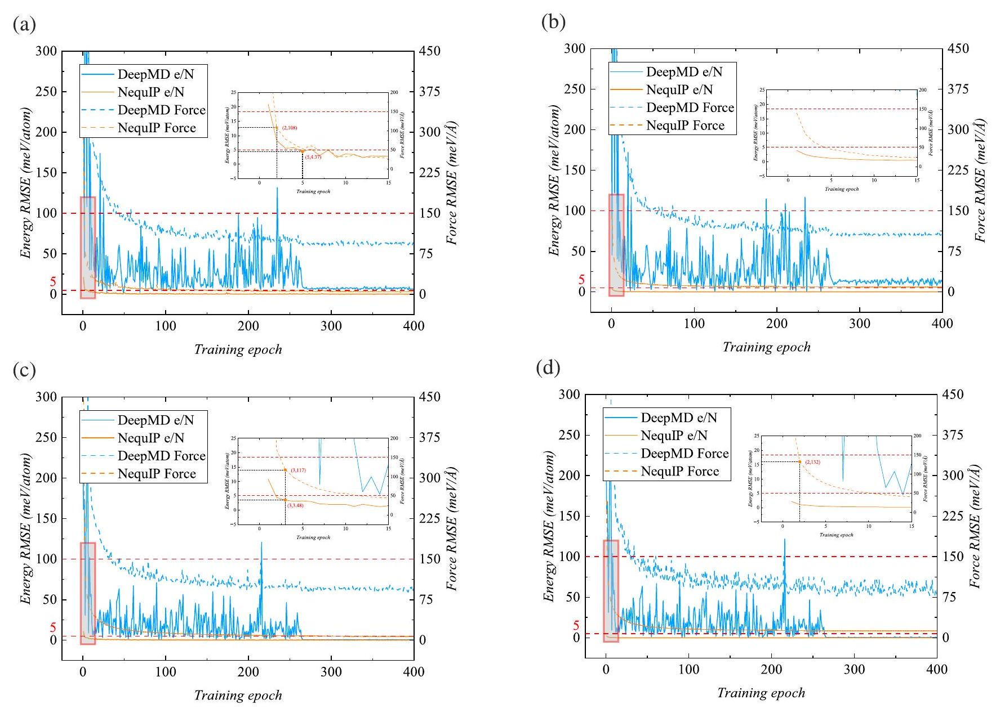
Fig. C.1. Plot of tobermorite 9 Å (a) unit cell training RMSEs, (b) unit cell validation RMSEs, (c) supercell training RMSEs, (d) supercell validation RMSEs with training epochs.

Appendix A. Training epochs for different configurations

See Fig. A. 1

Appendix B. VRH approximation formulas

$$
K_{V}=\frac{1}{9}\left[C_{11}+C_{22}+C_{33}+2\left(C_{12}+C_{13}+C_{23}\right)\right]
$$

$$
K_{R}=\left[S_{11}+S_{22}+S_{33}+2\left(S_{12}+S_{13}+S_{23}\right)\right]^{-1}
$$

$$
G_{V}=\frac{1}{15}\left[C_{11}+C_{22}+C_{33}-\left(C_{12}+C_{13}+C_{23}\right)+3\left(C_{44}+C_{55}+C_{66}\right)\right]
$$

$$
G_{R}=\frac{15}{4}\left[S_{11}+S_{22}+S_{33}-\left(S_{12}+S_{13}+S_{23}\right)+\frac{3}{4}\left(S_{44}+S_{55}+S_{66}\right)\right]^{-1}
$$

$$
K_{V R H}=\frac{K_{V}+K_{R}}{2}
$$

$$
G_{V R H}=\frac{G_{V}+G_{R}}{2}
$$

$$
E_{V R H}=\left(\frac{1}{3 G_{V R H}}+\frac{1}{9 K_{V R H}}\right)^{-1}
$$

$$
\mu=\frac{1}{2}\left(1-\frac{3 G_{V R H}}{3 K_{V R H}+G_{V R H}}\right)
$$

Herein, $C$ is identified as the stiffness matrix and $S$ as the compliance matrix, with each being the inverse of the other.

## Appendix C. Plot of RMSEs with training epochs

See Figs. C. 1 and C. 2

Appendix D. Comparison of prediction results on the test sets between DPMD and NequIP

See Figs. D.1-D. 6

## Appendix E. RMSEs for training sets comprising distinct molecular configurations

See Tables E. 1 and E. 2.

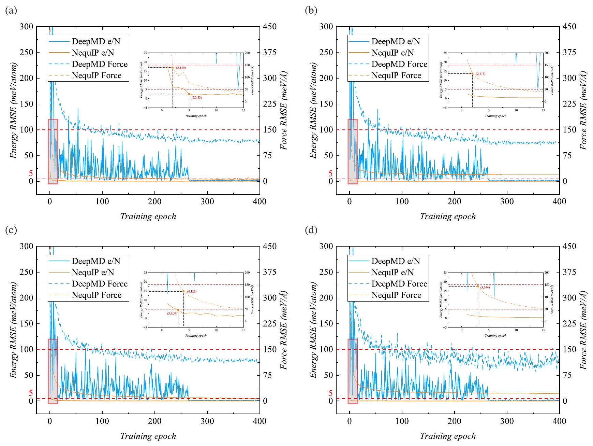
Fig. C.2. Plot of tobermorite $11 \AA$ (a) unit cell training RMSEs, (b) unit cell validation RMSEs, (c) supercell training RMSEs, (d) supercell validation RMSEs with training epochs.

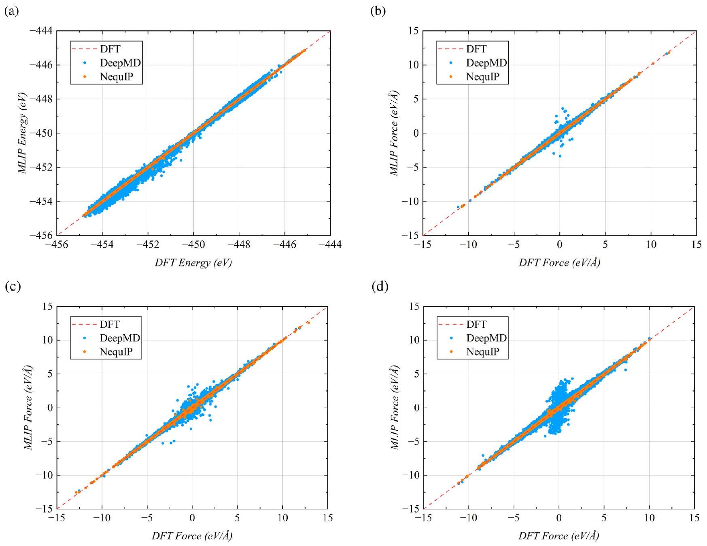
Fig. D.1. The predicted results for (a) the total system energy and the forces along (b) x , (c) y , (d) $z$-direction of each atom in tobermorite $9 \AA$ unit cell. The red dashed line represents the results from DFT calculations, while the orange and blue dots represent the points predicted by NequIP and DPMD, respectively. Closer proximity to the red dashed line indicates more accurate predictions.

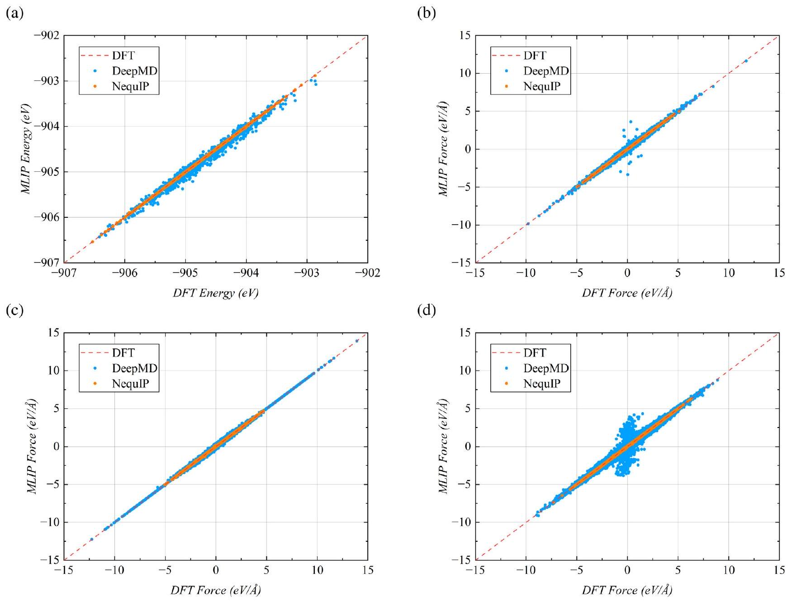
Fig. D.2. The predicted results for (a) the total system energy and the forces along (b) x , (c) y , (d) $z$-direction of each atom in tobermorite $9 \AA$ supercell. The red dashed line represents the results from DFT calculations, while the orange and blue dots represent the points predicted by NequIP and DPMD, respectively. Closer proximity to the red dashed line indicates more accurate predictions.

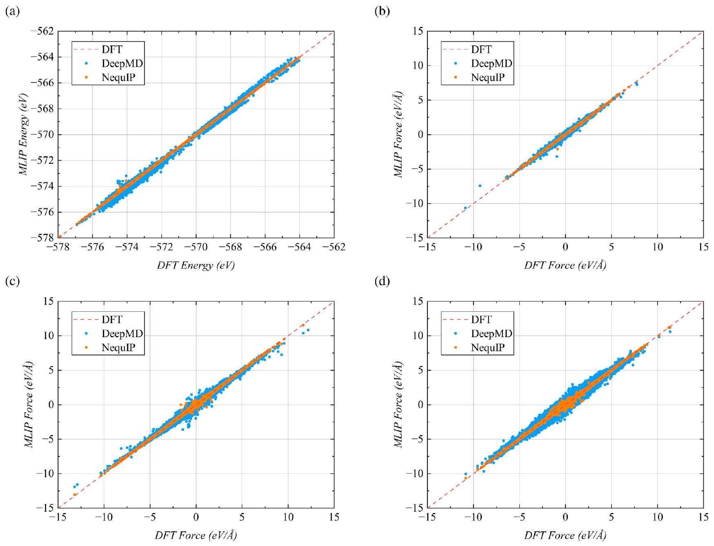
Fig. D.3. The predicted results for (a) the total system energy and the forces along (b) $x$, (c) $y$, (d) $z$-direction of each atom in tobermorite $11 \AA$ unit cell. The red dashed line represents the results from DFT calculations, while the orange and blue dots represent the points predicted by NequIP and DPMD, respectively. Closer proximity to the red dashed line indicates more accurate predictions.

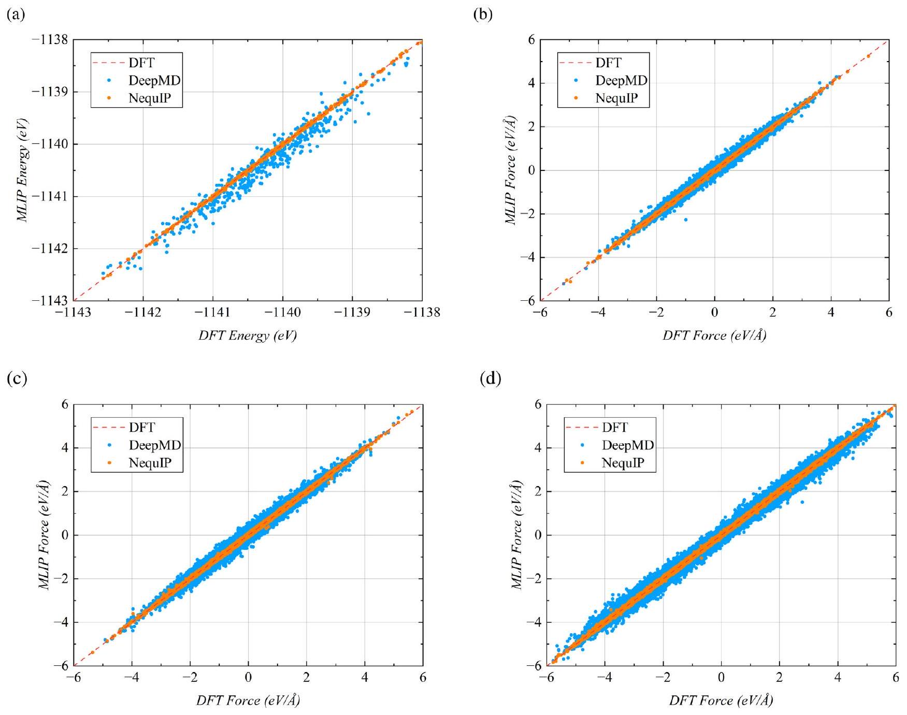
Fig. D.4. The predicted results for (a) the total system energy and the forces along (b) $\mathbf{x}$, (c) $\mathbf{y}$, (d) $z$-direction of each atom in tobermorite $11 \AA$ supercell. The red dashed line represents the results from DFT calculations, while the orange and blue dots represent the points predicted by NequIP and DPMD, respectively. Closer proximity to the red dashed line indicates more accurate predictions.

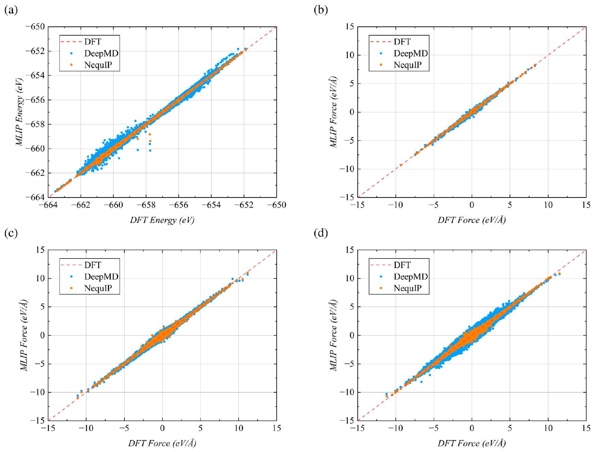
Fig. D.5. The predicted results for (a) the total system energy and the forces along (b) $x$, (c) $y$, (d) $z$-direction of each atom in tobermorite $14 \AA$ unit cell. The red dashed line represents the results from DFT calculations, while the orange and blue dots represent the points predicted by NequIP and DPMD, respectively. Closer proximity to the red dashed line indicates more accurate predictions.

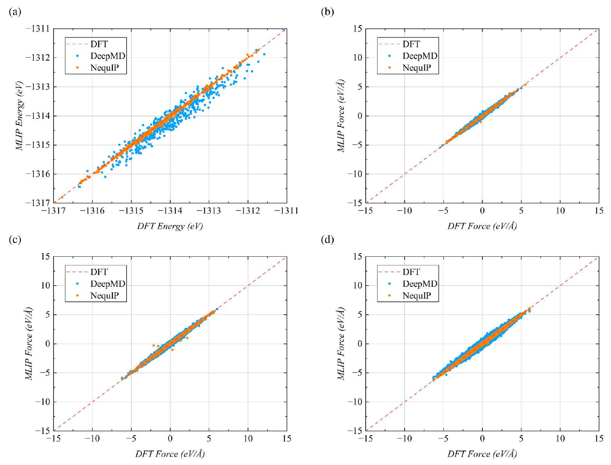
Fig. D.6. The predicted results for (a) the total system energy and the forces along (b) $x$, (c) $y$, (d) $z$-direction of each atom in tobermorite $14 \AA$ supercell. The red dashed line represents the results from DFT calculations, while the orange and blue dots represent the points predicted by NequIP and DPMD, respectively. Closer proximity to the red dashed line indicates more accurate predictions.

Table E. 1
Training and validation RMSEs for tobermorite MLIP and C-S-H MLIP.
| RMSEs | Tobermorites MLIP |  |  |  | C-S-H MLIP |  |  |  |
| :--- | :--- | :--- | :--- | :--- | :--- | :--- | :--- | :--- |
|  | Training |  | Validation |  | Training |  | Validation |  |
|  | DPMD | NequIP | DPMD | NequIP | DPMD | NequIP | DPMD | NequIP |
| Energy (mev/atom) | 1.29 | 0.153 | 0.862 | 0.127 | 0.925 | 0.730 | 0.958 | 0.680 |
| Force (mev/Å) | 145 | 8.62 | 150 | 21.3 | 280 | 146 | 296 | 150 |

Table E. 2
Test RMSEs for tobermorite MLIP and C-S-H MLIP.
| $\mathrm{Ca} / \mathrm{Si}$ ratio | Tobermorites MLIP |  |  |  | C-S-H MLIP |  |  |  |
| :--- | :--- | :--- | :--- | :--- | :--- | :--- | :--- | :--- |
|  | Energy (mev/atom) |  | Force (mev/Å) |  | Energy (mev/atom) |  | Force (mev/Å) |  |
|  | DPMD | NequIP | DPMD | NequIP | DPMD | NequIP | DPMD | NequIP |
| 1.1 | 1.32 | 15.9 | 370 | 453 | 2.28 | 3.09 | 299 | 175 |
| 1.3 | 6.47 | 46.4 | 428 | 526 | 1.17 | 2.70 | 312 | 154 |
| 1.5 | 4.73 | 62.4 | 407 | 543 | 4.40 | 1.35 | 290 | 180 |
| 1.7 | 17.5 | 105 | 477 | 617 | 6.11 | 3.29 | 317 | 230 |
| 1.9 | 0.624 | 79.2 | 404 | 581 | 1.95 | 2.72 | 267 | 163 |

## References

[1] H.F. Taylor, et al., Cement Chemistry, vol. 2, Thomas Telford London, 1997.
[2] E. Masoero, E. Del Gado, R.J.-M. Pellenq, F.-J. Ulm, S. Yip, Nanostructure and nanomechanics of cement: Polydisperse colloidal packing, Phys. Rev. Lett. 109 (2012) 155503, http://dx.doi.org/10.1103/PhysRevLett.109.155503.
[3] H.M. Jennings, Refinements to colloid model of C-S-H in cement: CM-II, Cem. Concr. Res. 38 (3) (2008) 275-289, http://dx.doi.org/10.1016/j.cemconres.2007. 10.006.
[4] B.H. Cho, W. Chung, B.H. Nam, Molecular dynamics simulation of calcium-silicate-hydrate for nano-engineered cement composites-a review, Nanomaterials 10 (11) (2020) 2158, http://dx.doi.org/10.3390/nano10112158.
[5] R.J.-M. Pellenq, A. Kushima, R. Shahsavari, K.J. Van Vliet, M.J. Buehler, S. Yip, F.-J. Ulm, A realistic molecular model of cement hydrates, Proc. Natl. Acad. Sci. 106 (38) (2009) 16102-16107, http://dx.doi.org/10.1073/pnas.0902180106.
[6] M. Abdolhosseini Qomi, K. Krakowiak, M. Bauchy, K. Stewart, R. Shahsavari, D. Jagannathan, D.B. Brommer, A. Baronnet, M.J. Buehler, S. Yip, et al., Combinatorial molecular optimization of cement hydrates, Nat. Commun. 5 (1) (2014) 4960, http://dx.doi.org/10.1038/ncomms5960.
[7] G. Kovačević, B. Persson, L. Nicoleau, A. Nonat, V. Veryazov, Atomistic modeling of crystal structure of Ca1. 67SiHx, Cem. Concr. Res. 67 (2015) 197-203, http://dx.doi.org/10.1016/j.cemconres.2014.09.003.
[8] A. Kumar, B.J. Walder, A. Kunhi Mohamed, A. Hofstetter, B. Srinivasan, A.J. Rossini, K. Scrivener, L. Emsley, P. Bowen, The atomic-level structure of cementitious calcium silicate hydrate, J. Phys. Chem. C 121 (32) (2017) 17188-17196, http://dx.doi.org/10.1021/acs.jpcc.7b02439.
[9] A.K. Mohamed, S.C. Parker, P. Bowen, S. Galmarini, An atomistic building block description of CSH-towards a realistic CSH model, Cem. Concr. Res. 107 (2018) 221-235, http://dx.doi.org/10.1016/j.cemconres.2018.01.007.
[10] L. Skinner, S. Chae, C. Benmore, H. Wenk, P. Monteiro, Nanostructure of calcium silicate hydrates in cements, Phys. Rev. Lett. 104 (19) (2010) 195502, http://dx.doi.org/10.1103/PhysRevLett.104.195502.
[11] A. Vidmer, G. Sclauzero, A. Pasquarello, Infrared spectra of jennite and tobermorite from first-principles, Cem. Concr. Res. 60 (2014) 11-23, http://dx.doi. org/10.1016/j.cemconres.2014.03.004.
[12] D. Viehland, L.J. Yuan, Z. Xu, X.-D. Cong, R.J. Kirkpatrick, Structural studies of jennite and 1.4 nm tobermorite: disordered layering along the [100] of jennite, J. Am. Ceram. Soc. 80 (12) (1997) 3021-3028, http://dx.doi.org/10.1111/j.11512916.1997.tb03228.x.
[13] R.T. Cygan, J.-J. Liang, A.G. Kalinichev, Molecular models of hydroxide, oxyhydroxide, and clay phases and the development of a general force field, J. Phys. Chem. B 108 (4) (2004) 1255-1266, http://dx.doi.org/10.1021/jp0363287.
[14] R. Shahsavari, R.J.-M. Pellenq, F.-J. Ulm, Empirical force fields for complex hydrated calcio-silicate layered materials, Phys. Chem. Chem. Phys. 13 (3) (2011) 1002-1011, http://dx.doi.org/10.1039/C0CP00516A.
[15] H. Manzano, R.J. Pellenq, F.-J. Ulm, M.J. Buehler, A.C. Van Duin, Hydration of calcium oxide surface predicted by reactive force field molecular dynamics, Langmuir 28 (9) (2012) 4187-4197, http://dx.doi.org/10.1021/la204338m.
[16] R.K. Mishra, A.K. Mohamed, D. Geissbühler, H. Manzano, T. Jamil, R. Shahsavari, A.G. Kalinichev, S. Galmarini, L. Tao, H. Heinz, et al., cemff: A force field database for cementitious materials including validations, applications and opportunities, Cem. Concr. Res. 102 (2017) 68-89, http://dx.doi.org/10.1016/j. cemconres.2017.09.003.
[17] M. Valavi, Z. Casar, A.K. Mohamed, P. Bowen, S. Galmarini, Molecular dynamic simulations of cementitious systems using a newly developed force field suite ERICA FF, Cem. Concr. Res. 154 (2022) 106712, http://dx.doi.org/10.1016/j. cemconres.2022.106712.
[18] G.R. Schleder, A.C. Padilha, C.M. Acosta, M. Costa, A. Fazzio, From DFT to machine learning: recent approaches to materials science-a review, J. Phys.: Mater. 2 (3) (2019) 032001, http://dx.doi.org/10.1088/2515-7639/ab084b.
[19] R. Shahsavari, M.J. Buehler, R.J.-M. Pellenq, F.-J. Ulm, First-principles study of elastic constants and interlayer interactions of complex hydrated oxides: Case study of tobermorite and jennite, J. Am. Ceram. Soc. 92 (10) (2009) 2323-2330, http://dx.doi.org/10.1111/j.1551-2916.2009.03199.x.
[20] S.V. Churakov, C. Labbez, L. Pegado, M. Sulpizi, Intrinsic acidity of surface sites in calcium silicate hydrates and its implication to their electrokinetic properties, J. Phys. Chem. C 118 (22) (2014) 11752-11762, http://dx.doi.org/10.1021/ jp502514a.
[21] C. Dharmawardhana, A. Misra, W.-Y. Ching, Quantum mechanical metric for internal cohesion in cement crystals, Sci. Rep. 4 (1) (2014) 7332, http://dx.doi. org/10.1038/srep07332.
[22] I.-H. Svenum, I.G. Ringdalen, F.L. Bleken, J. Friis, D. Höche, O. Swang, Structure, hydration, and chloride ingress in CSH: Insight from DFT calculations, Cem. Concr. Res. 129 (2020) 105965, http://dx.doi.org/10.1016/j.cemconres.2019. 105965.
[23] T. Morawietz, A. Singraber, C. Dellago, J. Behler, How van der Waals interactions determine the unique properties of water, Proc. Natl. Acad. Sci. 113 (30) (2016) 8368-8373, http://dx.doi.org/10.1073/pnas.1602375113.
[24] J. Behler, M. Parrinello, Generalized neural-network representation of highdimensional potential-energy surfaces, Phys. Rev. Lett. 98 (14) (2007) 146401, http://dx.doi.org/10.1103/PhysRevLett.98.146401.
[25] A.P. Bartók, M.C. Payne, R. Kondor, G. Csányi, Gaussian approximation potentials: The accuracy of quantum mechanics, without the electrons, Phys. Rev. Lett. 104 (13) (2010) 136403, http://dx.doi.org/10.1103/PhysRevLett.104.136403.
[26] L. Zhang, J. Han, H. Wang, R. Car, E. Weinan, Deep potential molecular dynamics: a scalable model with the accuracy of quantum mechanics, Phys. Rev. Lett. 120 (14) (2018) 143001, http://dx.doi.org/10.1103/PhysRevLett.120. 143001.
[27] K.T. Schütt, H.E. Sauceda, P.-J. Kindermans, A. Tkatchenko, K.-R. Müller, Schneta deep learning architecture for molecules and materials, J. Chem. Phys. 148 (24) (2018) http://dx.doi.org/10.1063/1.5019779.
[28] J. Gasteiger, J. Groß, S. Günnemann, Directional message passing for molecular graphs, 2020, http://dx.doi.org/10.48550/arXiv.2003.03123, arXiv preprint arXiv:2003.03123.
[29] Y. Liu, L. Wang, M. Liu, Y. Lin, X. Zhang, B. Oztekin, S. Ji, Spherical message passing for 3d molecular graphs, in: International Conference on Learning Representations, ICLR, 2022, URL: https://openreview.net/forum?id= givsRXsOt9r.
[30] K. Schütt, O. Unke, M. Gastegger, Equivariant message passing for the prediction of tensorial properties and molecular spectra, in: International Conference on Machine Learning, PMLR, 2021, pp. 9377-9388, URL: https://proceedings.mlr. press/v139/schutt21a.html.
[31] J. Gasteiger, F. Becker, S. Günnemann, GemNet: Universal directional graph neural networks for molecules, in: M. Ranzato, A. Beygelzimer, Y. Dauphin, P. Liang, J.W. Vaughan (Eds.), Advances in Neural Information Processing Systems, Vol. 34, Curran Associates, Inc., 2021, pp. 6790-6802, URL: https://proceedings.neurips.cc/paper_files/paper/2021/ file/35cf8659cfcb13224cbd47863a34fc58-Paper.pdf.
[32] S. Batzner, A. Musaelian, L. Sun, M. Geiger, J.P. Mailoa, M. Kornbluth, N. Molinari, T.E. Smidt, B. Kozinsky, E (3)-equivariant graph neural networks for data-efficient and accurate interatomic potentials, Nat. Commun. 13 (1) (2022) 2453, http://dx.doi.org/10.1038/s41467-022-29939-5.
[33] Y.-L. Liao, T. Smidt, Equiformer: Equivariant graph attention transformer for 3d atomistic graphs, 2022, http://dx.doi.org/10.48550/arXiv.2206.11990, arXiv preprint arXiv:2206.11990.
[34] K. Kobayashi, H. Nakamura, A. Yamaguchi, M. Itakura, M. Machida, M. Okumura, Machine learning potentials for tobermorite minerals, Comput. Mater. Sci. 188 (2021) 110173, http://dx.doi.org/10.1016/j.commatsci.2020.110173.
[35] Y. Zhou, H. Zheng, W. Li, T. Ma, C. Miao, A deep learning potential applied in tobermorite phases and extended to calcium silicate hydrates, Cem. Concr. Res. 152 (2022) 106685, http://dx.doi.org/10.1016/j.cemconres.2021.106685.
[36] W. Li, Y. Zhou, L. Ding, P. Lv, Y. Su, R. Wang, C. Miao, A deep learningbased potential developed for calcium silicate hydrates with both high accuracy and efficiency, J. Sustain. Cem.-Based Mater. (2023) 1-12, http://dx.doi.org/10. 1080/21650373.2023.2219251.
[37] P. Ying, A. Natan, O. Hod, M. Urbakh, Effect of interlayer bonding on superlubric sliding of graphene contacts: A machine-learning potential study, ACS Nano 18 (14) (2024) 10133-10141, http://dx.doi.org/10.1021/acsnano.3c13099.
[38] L. Ruddigkeit, R. Van Deursen, L.C. Blum, J.-L. Reymond, Enumeration of 166 billion organic small molecules in the chemical universe database GDB-17, J. Chem. Inf. Model. 52 (11) (2012) 2864-2875, http://dx.doi.org/10.1021/ ci300415d.
[39] R. Ramakrishnan, P.O. Dral, M. Rupp, O.A. Von Lilienfeld, Quantum chemistry structures and properties of 134 kilo molecules, Sci. Data 1 (1) (2014) 1-7, http://dx.doi.org/10.1038/sdata.2014.22.
[40] S. Chmiela, A. Tkatchenko, H.E. Sauceda, I. Poltavsky, K.T. Schütt, K.-R. Müller, Machine learning of accurate energy-conserving molecular force fields, Sci. Adv. 3 (5) (2017) e1603015, http://dx.doi.org/10.1126/sciadv. 1603015.
[41] K.T. Schütt, F. Arbabzadah, S. Chmiela, K.R. Müller, A. Tkatchenko, Quantumchemical insights from deep tensor neural networks, Nat. Commun. 8 (1) (2017) 13890, http://dx.doi.org/10.1038/ncomms13890.
[42] S. Chmiela, H.E. Sauceda, K.-R. Müller, A. Tkatchenko, Towards exact molecular dynamics simulations with machine-learned force fields, Nat. Commun. 9 (1) (2018) 3887, http://dx.doi.org/10.1038/s41467-018-06169-2.
[43] S. Merlino, E. Bonaccorsi, T. Armbruster, The real structures of clinotobermorite and tobermorite 9 A: OD character, polytypes, and structural relationships, Eur. J. Mineral. 12 (2) (2000) 411-429, http://dx.doi.org/10.1127/0935-1221/2000/ 0001-0411.
[44] S. Merlino, E. Bonaccorsi, T. Armbruster, The real structure of tobermorite 11A: normal and anomalous forms, OD character and polytypic modifications, Eur. J. Mineral. 13 (3) (2001) 577-590, http://dx.doi.org/10.1127/0935-1221/2001/ 0013-0577.
[45] E. Bonaccorsi, S. Merlino, A.R. Kampf, The crystal structure of tobermorite $14 \AA$ (plombierite), a C-S-H phase, J. Am. Ceram. Soc. 88 (3) (2005) 505-512, http://dx.doi.org/10.1111/j.1551-2916.2005.00116.x.
[46] V. Wang, N. Xu, J.-C. Liu, G. Tang, W.-T. Geng, VASPKIT: A user-friendly interface facilitating high-throughput computing and analysis using VASP code, Comput. Phys. Comm. 267 (2021) 108033, http://dx.doi.org/10.1016/j.cpc. 2021.108033.
[47] O.I. Abiodun, A. Jantan, A.E. Omolara, K.V. Dada, N.A. Mohamed, H. Arshad, State-of-the-art in artificial neural network applications: A survey, Heliyon 4 (11) (2018) http://dx.doi.org/10.1016/j.heliyon.2018.e00938.
[48] G. Foody, M. Arora, An evaluation of some factors affecting the accuracy of classification by an artificial neural network, Int. J. Remote Sens. 18 (4) (1997) 799-810, http://dx.doi.org/10.1080/014311697218764.
[49] M. Adya, F. Collopy, How effective are neural networks at forecasting and prediction? A review and evaluation, J. Forecast. 17 (5-6) (1998) 481495, http://dx.doi.org/10.1002/(SICI)1099-131X(1998090)17:5/6<481::AID-FOR709>3.0.CO;2-Q.
[50] N. Karayiannis, A.N. Venetsanopoulos, Artificial Neural Networks: Learning Algorithms, Performance Evaluation, and Applications, vol. 209, Springer Science \& Business Media, 2013.
[51] X. Fu, Z. Wu, W. Wang, T. Xie, S. Keten, R. Gomez-Bombarelli, T. Jaakkola, Forces are not enough: Benchmark and critical evaluation for machine learning force fields with molecular simulations, 2022, http://dx.doi.org/10.48550/arXiv. 2210.07237, arXiv preprint arXiv:2210.07237.
[52] A.P. Thompson, H.M. Aktulga, R. Berger, D.S. Bolintineanu, W.M. Brown, P.S. Crozier, P.J. in't Veld, A. Kohlmeyer, S.G. Moore, T.D. Nguyen, et al., LAMMPSa flexible simulation tool for particle-based materials modeling at the atomic, meso, and continuum scales, Comput. Phys. Comm. 271 (2022) 108171, http: //dx.doi.org/10.1016/j.cpc.2021.108171.
[53] W. Voigt, Lehrbuch der Kristallphysik: (Mit Ausschluss der Kristalloptik), vol. 34, BG Teubner, 1910.
[54] A. Reuß, Berechnung der fließgrenze von mischkristallen auf grund der plastizitätsbedingung für einkristalle, ZAMM-J. Appl. Math. Mech./Z. Angew. Math. Mech. 9 (1) (1929) 49-58, http://dx.doi.org/10.1002/zamm. 19290090104.
[55] R. Hill, The elastic behaviour of a crystalline aggregate, Proc. Phys. Soc. Sect. A 65 (5) (1952) 349, http://dx.doi.org/10.1088/0370-1298/65/5/307.
[56] J.F. Nye, Physical Properties of Crystals: Their Representation by Tensors and Matrices, Oxford University Press, 1985.
[57] H. Manzano, J. Dolado, A. Ayuela, Elastic properties of the main species present in portland cement pastes, Acta Mater. 57 (5) (2009) 1666-1674, http://dx.doi. org/10.1016/j.actamat.2008.12.007.
[58] D.C. Rapaport, The Art of Molecular Dynamics Simulation, Cambridge University Press, 2004.
[59] S. Kullback, R.A. Leibler, On information and sufficiency, Ann. Math. Statist. 22 (1) (1951) 79-86, URL: https://www.jstor.org/stable/2236703.
[60] K. Nomizu, H. Ozeki, The existence of complete Riemannian metrics, Proc. Amer. Math. Soc. 12 (6) (1961) 889-891, http://dx.doi.org/10.2307/2034383.

[^0]:    E-mail address: zkm22@mails.tsinghua.edu.cn.

