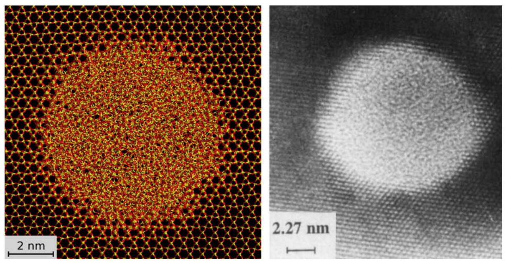
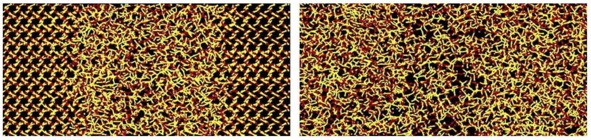
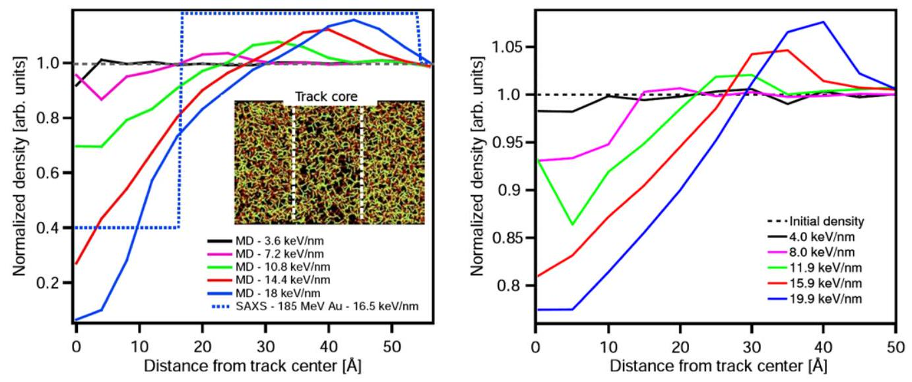
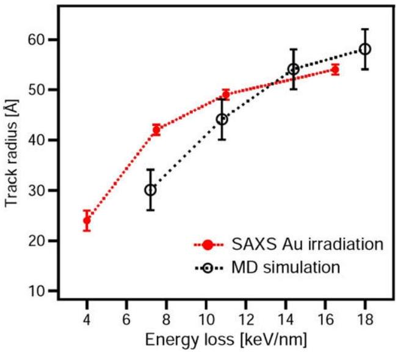

# Molecular dynamics simulations of the structure of latent tracks in quartz and amorphous $\mathrm{SiO}_{2}$ 

Olli H. Pakarinen ${ }^{\mathrm{a}, *}$, Flyura Djurabekova ${ }^{\mathrm{a}}$, Kai Nordlund ${ }^{\mathrm{a}}$, Patrick Kluth ${ }^{\mathrm{b}}$, Mark C. Ridgway ${ }^{\mathrm{b}}$ ${ }^{\mathrm{a}}$ Helsinki Institute of Physics and Department of Physics, P.O. Box 43, FI-00014, University of Helsinki, Finland ${ }^{\mathrm{b}}$ Department of Electronic Materials Engineering, Research School of Physical Sciences and Engineering, Australian National University, Canberra, ACT 0200, Australia

## ARTICLE INFO

## Article history:

Available online 30 January 2009

## PACS:

61.05.cf
61.43.Fs
61.80.Jh
61.43.Bn
61.82.Ms

## Keywords:

Swift heavy ion tracks
Silica
Quartz
Ion irradiation

#### Abstract

Swift heavy ion irradiation (SHII) can leave a latent ion track around the ion path. Tracks in amorphous silicon dioxide (a- $\mathrm{SiO}_{2}$ ) and quartz are interesting due to applications in nanofabrication, for example. In recent experiments, a previously unresolved fine structure in latent ion tracks in a- $\mathrm{SiO}_{2}$ was found comprising a lower density core and a higher density shell. We model the formation of latent ion tracks in crystalline quartz and amorphous $\mathrm{SiO}_{2}$ using classical molecular dynamics (MD) to simulate the irradiation at the atomistic level, and compare the results to small angle X-ray scattering (SAXS) experiments on amorphous, $2 \mu \mathrm{~m}$ thick $\mathrm{SiO}_{2}$ layers. Electronic energy deposition of ${ }^{197} \mathrm{Au}$ ions corresponding to experiments is used in the simulations, to allow direct comparison between simulations and existing experiments. We explain the formation of the experimentally observed cylindrical core-shell structure with the dynamic simulations, and compare the obtained track dimensions and threshold energies with the experiment.

© 2009 Elsevier B.V. All rights reserved.

## 1. Introduction

When swift heavy ions penetrate a solid material, inelastic interactions with the target electrons cause them to lose energy, whereas the nuclear stopping is negligible [1]. The electronic excitations lead to a rapid local heating of the sample lattice close to the ion path, and at electronic stopping values above a material dependent threshold, this can produce a narrow damaged region known as an ion track. It is known that the damage in ion tracks varies from small changes like point defect formation in some materials to amorphisation of crystalline materials like quartz [2,3]. Properties like track diameter have been measured previously with a number of techniques, but only recently SAXS measurements have revealed a core-shell fine structure in amorphous $\mathrm{SiO}_{2}[4,5]$.

Computational work has been done for several decades to model the complex track formation process and to help to understand experimental values of track properties. The inelastic thermal spike model [2,6] has proven successful for modeling track diameters for amorphisable materials [7]. However, to see the effects of mass and momentum transfer in addition to heat transfer, atomistic models like molecular dynamics have more recently

[^0]been used [8]. This method also opens a direct view to properties like the density changes inside the heavy ion track reported in this paper.

## 2. Methods

### 2.1. Computational methods

The formation of latent ion tracks in amorphous $\mathrm{SiO}_{2}$ and crystalline $\alpha$-quartz is modelled computationally at the atomistic level, using the classical molecular dynamics (MD) code parcas [9]. The atomic interactions are calculated using the Watanabe-Samela $\mathrm{Si}-\mathrm{O}$ mixed system many-body potential [10,11]. We implement the electronic energy loss of the swift heavy ions, causing the tracks, by an instantaneous deposition of kinetic energy in a random direction for all the atoms in the simulation cell, decreasing radially with distance from the center of the vertical track. The radial energy deposition profile is calculated with a numerical model [12] for a Au beam with $1.1 \mathrm{MeV} / \mathrm{u}$ energy at the initial stage of the energy deposition (at about 50 fs ). This kinetic energy distribution is linearly scaled by integers from 1 to 5 to model the effect of different energy depositions. Although this linear scaling of the energy deposition profile is not strictly correct as it neglects the velocity effect [13], it still represents the deposition as a function
of distance from the ion path sufficiently for our purposes. The energy deposition per unit pathlength was calculated as the total track energy deposited to the simulation cell divided by the cell thickness. We emphasize that kinetic energy is deposited to all of the atoms in the computation cell, even though only at the nearest few nanometers from the swift heavy ion path the effect is large enough to cause an amorphous track.

The cell sizes used in the calculations were $11.5 \times 11.5 \times 5.8 \mathrm{nm}^{3}$ for amorphous $\mathrm{SiO}_{2}$ and $10.6 \times 10.5 \times 5.5 \mathrm{~nm}^{3}$ for quartz, with periodic boundary conditions. The amorphous $\mathrm{SiO}_{2}$ was generated with a WWW-type Monte Carlo method that ensures an ideal bonding environment [14]. The method has been shown to generate radial and angular distribution functions in good agreement with experiments [15]. The last 0.5 nm at the borders of the computation cell in the $x$ - and $y$-directions were cooled by Berendsen temperature control [16], to approximate heat conduction further into the material. The initial temperature in the calculation was 0 K . A maximum time step of 0.4 fs was used in the calculations, but in the initial stages the time step could be much shorter due to the use of a variable time step scheme [17] with constants of $k_{t}=0.1$ and $E_{t}=30 \mathrm{eV}$. Track evolution was followed in simulations for 50 ps , after which the cell temperature had dropped to below 500 K , and no further changes in density distribution could be seen.

### 2.2. Testing and analysis methods

To be sure that the simulation cell size, simulation time or other similar parameters were not affecting the results, track formation was tested also with other values of the parameters. Some example simulations were done also at 300 K , and they showed that the results are very similar at both temperatures. A smaller 0.08 fs time step was tested to show that the default value is small enough. To be sure that the cell size used does not limit track formation at the cooled boundaries, tests with a cell size $1.5 \times 1.5 \times 2$ times larger were performed, as well as a test with a longer 150 ps simulation time. All results were identical within our measurement accuracy to earlier results with normal cell sizes and simulation times.

### 2.3. Experimental methods

The ion tracks were produced in thermally grown amorphous $\mathrm{SiO}_{2}, 2 \mu \mathrm{~m}$ thick, on $\mathrm{Si}(100)$ substrates. The tracks were generated by irradiation with Au ions at energies between 27.4 and 185 MeV
at the ANU Heavy Ion Accelerator Facility. Fluences ranged between $3 \times 10^{10}$ and $3 \times 10^{11}$ ions $/ \mathrm{cm}^{2}$. Irradiation was performed at room temperature with the incident ion direction normal to the sample surface. Thin $\mathrm{SiO}_{2}$ layers were utilized to achieve a reasonably uniform energy loss over the extent of the layer and hence uniform ion tracks. The average energy loss was estimated by SRIM2006 calculations [1] and is virtually entirely due to electronic interactions. The track structure was studied using synchrotron small angle X-ray scattering (SAXS) in transmission geometry. The measurements were performed at the ChemMatCARS beamline 15ID-D of the Advanced Photon Source, Argonne National Laboratories, USA, using an X-ray wavelength of $1.1 \AA(10.27 \mathrm{keV})$ and camera lengths of 555 and 1894 mm . Measurements were performed with the sample surface aligned normal to the X-ray beam, i.e. parallel to the ion tracks. The resulting isotropic images were radially integrated around the beam center. Scattering from an unirradiated $\mathrm{SiO}_{2}$ standard was subtracted from all spectra. More details of the experimental procedure can be found from [4,5].

## 3. Results

MD simulations reveal the expected qualitative picture of track formation in silica and quartz: a "heat spike"-like region around the path of the ion, where molten or vaporised material quickly freezes. Fig. 1 shows an atomistic image of our track simulation in crystalline quartz, compared to experiment. The damage in the tracks in the two materials is characterized by amorphisation of the crystalline quartz inside a rather well-defined region, and a strong change of density in amorphous silica, as shown in Fig. 2.

Fig. 3 left panel shows the computational density profiles of ion tracks in amorphous silica as a function of distance from the track center. In all cases except with $3.6 \mathrm{keV} / \mathrm{nm}$ energy deposition a low-density core and a high-density shell fine structure is seen. For the largest electronic losses ( 14.4 and $18 \mathrm{keV} / \mathrm{nm}$ ) the density in the core of the track drops dramatically. The dashed line shows as comparison the density contrast seen in the best fit of the experimental SAXS spectra at a comparable energy loss of $16.5 \mathrm{keV} / \mathrm{nm}$. The inset shows the area of the underdense core for the simulation with $10.8 \mathrm{keV} / \mathrm{nm}$ energy loss.

In crystalline quartz a similar, but weaker, density contrast is seen between the core and shell of the track, as shown in the right panel of Fig. 3. As seen in the left panel of Fig. 1, the track area is amorphised in the simulation, and a track radius of approximately 4.5 nm is measured with a $15.9 \mathrm{keV} / \mathrm{nm}$ energy deposition, com-

Fig. 1. (Left) Top view of a computational image of an ion track in crystalline quartz with $15.9 \mathrm{keV} / \mathrm{nm}$ energy loss. (Right) Experimental TEM image with $14 \mathrm{keV} / \mathrm{nm}$ energy loss [2].

Fig. 2. Atomistic images of simulated ion tracks in crystalline quartz (left) with $11.9 \mathrm{keV} / \mathrm{nm}$ energy loss and in amorphous silica (right) with $10.8 \mathrm{keV} / \mathrm{nm}$ energy loss in side view. In quartz the heavy ion amorphises the track, whereas in amorphous silica the clearest change is the strongly decreased density in the track core.

Fig. 3. Density as a function of distance from the track center in amorphous silica (left) and in crystalline quartz (right). The values at the very center of the track (distance $=0$ ) are not statistically accurate due to the very low number of atoms in the center.

pared to $5.5 \pm 1.0 \mathrm{~nm}$ in the experiment with $14 \mathrm{keV} / \mathrm{nm}$ [2] (right panel of Fig. 1.) A more detailed comparison between simulation and earlier experimental results will be published elsewhere [18].

For amorphous silica, Fig. 4 shows the dependence of observed track radius as a function of deposited kinetic energy in the simulation. The track radius is increased with deposited energy (energy loss) because the region of 'molten' atoms increases with additional deposited energy. The track radii are extracted from the density profiles. We find a good agreement between experiment and theory.

The results were found to somewhat depend on the choice of the energy deposition model. Moreover, we note that even the definition of the energy deposition to lattice atoms ( $3.6-18.0 \mathrm{keV} / \mathrm{nm}$

Fig. 4. Comparison of experimental and computational track radii in amorphous silica.

calculated with the direct method described above) is somewhat unclear. On one hand, the spreading of energy on the electrons causes only a fraction of the electronic stopping energy to be deposited to the finite-size computational lattice via electron-pho-non-coupling. On the other hand, out of the energy deposition in an MD simulation, almost exactly half is very quickly converted into potential energy due to the equipartition of energy, necessitating using a factor of 2 larger initial kinetic energy deposition to achieve the atom temperature given in the Toulemonde model [12]. Considering these and other uncertainties involved in how to treat the electron-phonon-coupling [19,20], we chose to report the direct energy deposition in our simulations. However, our tests of different energy deposition models showed that the central qualitative features remain the same, and in particular an underdense core is always formed above the track formation threshold. Details and a comparison of the energy deposition models will be published elsewhere [18].

## 4. Conclusions

A previously unresolved fine structure in tracks caused by swift heavy ions in amorphous $\mathrm{SiO}_{2}$ is observed by synchrotron SAXS measurements and molecular dynamics simulations. The tracks consist of a lower density core and a higher density shell, compared to unirradiated amorphous $\mathrm{SiO}_{2}$. In crystalline quartz the same core-shell fine structure is apparent computationally in the amorphised ion track, although the density contrast is weaker. The results are consistent with a radial pressure wave originating from a thermal spike at the track center, that freezes soon after the ion passage. Future experiments using the novel experimental measurement protocol will show if this fine structure can also be found in other materials. A density deficit in the track core is consistent with the previously observed increase in rates of ion track
etching. The technique may also be suitable for studying track formation near threshold energies, as it is not limited to measuring continuous tracks. The computational model used will be further developed to include time dependence of the energy deposition, but already it can be concluded that the main qualitative features like the low-density core are not dependent on the model used.

## Acknowledgements

This work was performed within the Finnish Centre of Excellence in Computational Molecular Science (CMS), financed by The Academy of Finland and the University of Helsinki, and also financed by Academy projects OPNA and CONADEP. Grants of computer time from the Center for Scientific Computing in Espoo, Finland, are gratefully acknowledged. We also thank the Australian Synchrotron Research Program, funded by the Commonwealth of Australia, and the Australian Research Council for support.

## References

[1] J.F. Ziegler, J.P. Biersack, U. Littmark, The Stopping and Range of Ions in Matter, Pergamon, New York, 1985.
[2] A. Meftah, F. Brisard, J.M. Costantini, E. Dooryhee, M. Hageali, M. Hervieu, J.P. Stoquert, F. Studer, M. Toulemonde, Phys. Rev. B 49 (1994) 12457.
[3] S. Klaumunzer, Nucl. Instr. Meth. Phys. Res. B 225 (2004) 136.
[4] P. Kluth et al., Phys. Rev. Lett. 101 (2008) 175503.
[5] P. Kluth, C.S. Schnohr, D.J. Sprouster, A.P. Byrne, D.J. Cookson, M.C. Ridgway, Nucl. Instr. Meth. Phys. Res. B 266 (2008) 2994.
[6] M. Toulemonde, J.M. Costantini, C. Dufour, A. Meftah, E. Paumier, F. Studer, Nucl. Instr. Meth. Phys. Res. B 116 (1996) 37.
[7] M. Toulemonde, C. Dufour, A. Meftah, E. Paunier, Nucl. Instr. Meth. Phys. Res. B 166-167 (2000) 903.
[8] D. Schwen, E.M. Bringa, Nucl. Instr. Meth. Phys. Res. B 256 (2007) 187.
[9] K. Nordlund, 2006, parcas computer code. The main principles of the molecular dynamics algorithms are presented in [21,22]. The adaptive time step and electronic stopping algorithms are the same as in [17].
[10] T. Watanabe, D. Yamasaki, K. Tatsumura, I. Ohdomari, Appl. Surf. Sci. 234 (2004) 207.
[11] J. Samela, K. Nordlund, V.N. Popok, E.E.B. Campbell, Phys. Rev. B 77 (2008) 075309.
[12] M. Toulemonde, W. Assmann, C. Trautmann, F. Grüner, H.D. Mieskes, H. Kucal, Z.G. Wang, Nucl. Instr. Meth. Phys. Res. B 212 (2003) 346.
[13] A. Meftah, F. Brisard, J.M. Costantini, M. Hage-Ali, J.P. Stoquert, F. Studer, M. Toulemonde, Phys. Rev. B 48 (1993) 920.
[14] S. von Alfthan, A. Kuronen, K. Kaski, Phys. Rev. B 68 (2003) 073203.
[15] F. Djurabekova, K. Nordlund, Phys. Rev. B 77 (2008) 115325. Also selected to Virtual J. Nanoscale Sci. Technol. 17 (13) (2008).
[16] H.J.C. Berendsen, J.P.M. Postma, W.F. van Gunsteren, A. DiNola, J.R. Haak, J. Chem. Phys. 81 (1984) 3684.
[17] K. Nordlund, Comput. Mater. Sci. 3 (1995) 448.
[18] O.H. Pakarinen, F. Djurabekova, K. Nordlund, in preparation.
[19] G. Szenes, Nucl. Instr. Meth. Phys. Res. B 122 (1997) 530.
[20] E.M. Bringa, R.E. Johnson, Phys. Rev. Lett. 88 (2002) 165501.
[21] K. Nordlund, M. Ghaly, R.S. Averback, M. Caturla, T. Diaz de la Rubia, J. Tarus, Phys. Rev. B 57 (1998) 7556.
[22] M. Ghaly, K. Nordlund, R.S. Averback, Phil. Mag. A 79 (1999) 795.

[^0]:    * Corresponding author.

    E-mail address: olli.pakarinen@helsinki.fi (O.H. Pakarinen).

