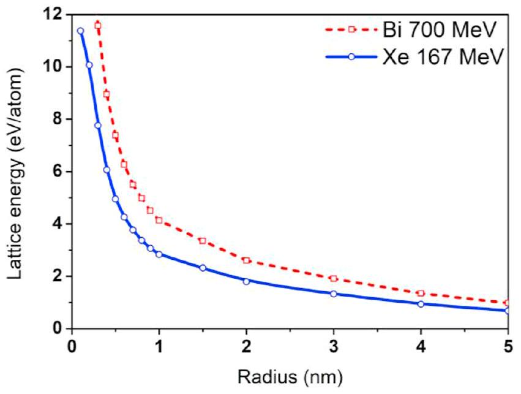
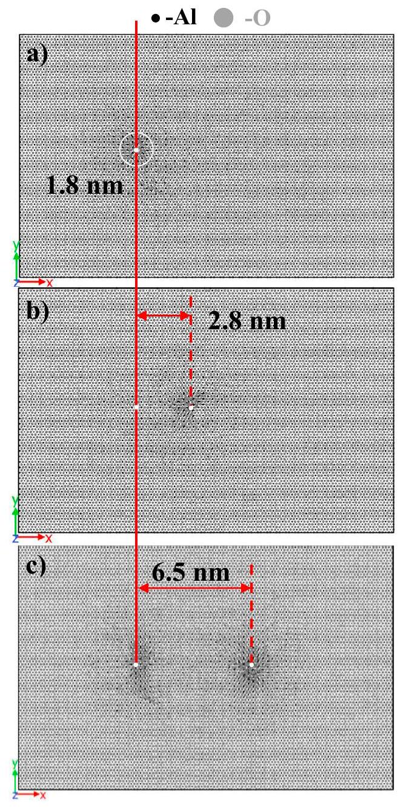
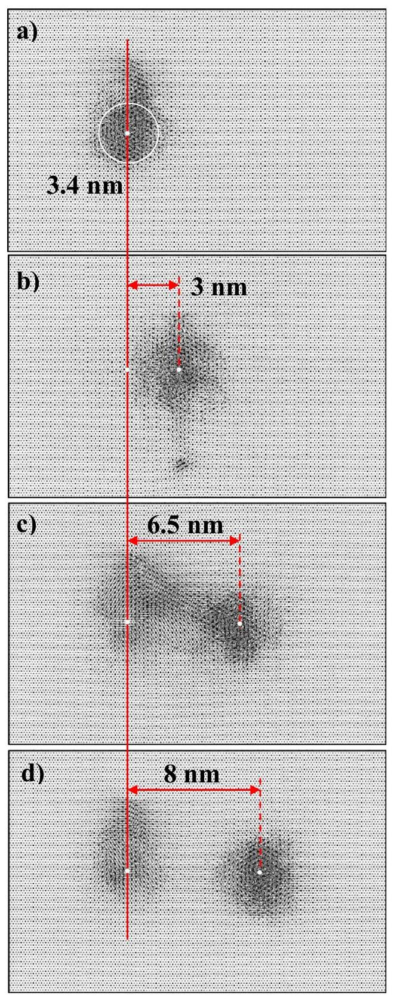
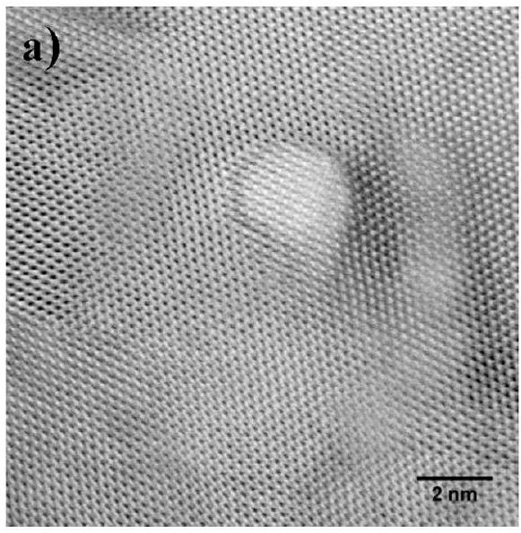
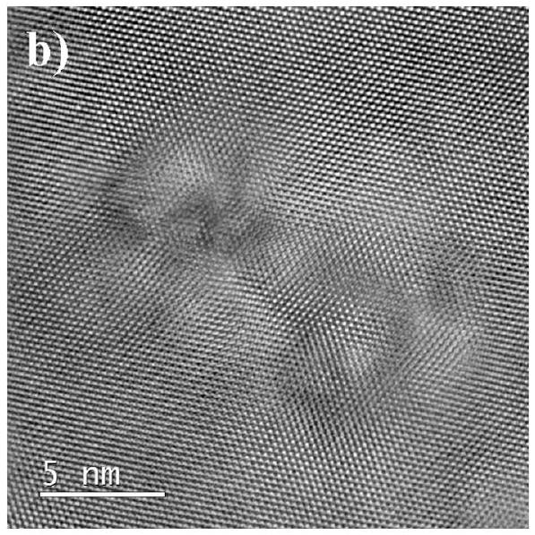
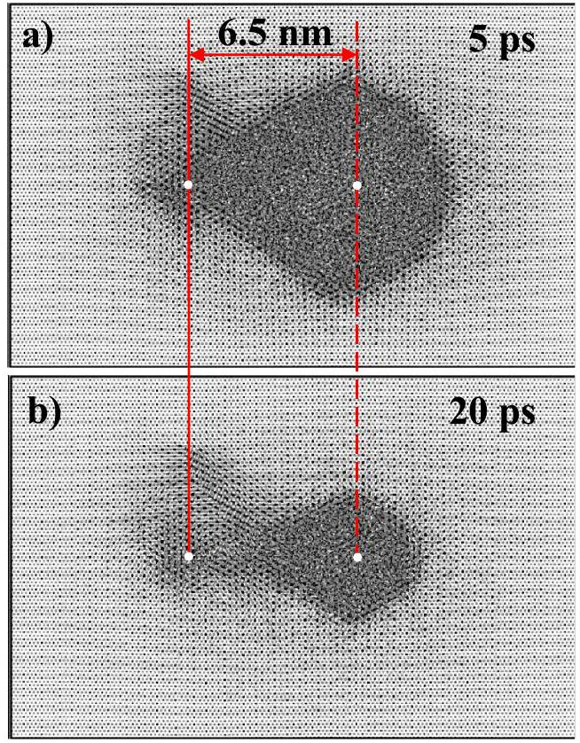

# Overlap of swift heavy ion tracks in $\mathrm{Al}_{2} \mathrm{O}_{3}$ 

R.A. Rymzhanov ${ }^{\mathrm{a}, *}$, N. Medvedev ${ }^{\mathrm{b}, \mathrm{c}}$, A.E. Volkov ${ }^{\mathrm{a}, \mathrm{d}, \mathrm{e}, \mathrm{f}}$, J.H. O'Connell ${ }^{\text {g }}$, V.A. Skuratov ${ }^{\mathrm{a}, \mathrm{f}, \mathrm{h}}$ ${ }^{\mathrm{a}}$ Joint Institute for Nuclear Research, Joliot-Curie 6, 141980 Dubna, Moscow Region, Russia ${ }^{\mathrm{b}}$ Department of Radiation and Chemical Physics, Institute of Physics, Czech Academy of Sciences, Na Slovance 2, 18221 Prague 8, Czech Republic ${ }^{\mathrm{c}}$ Laser Plasma Department, Institute of Plasma Physics, Czech Academy of Sciences, Za Slovankou 3, 18200 Prague 8, Czech Republic ${ }^{\mathrm{d}}$ National Research Center 'Kurchatov Institute', Kurchatov Sq. 1, 123182 Moscow, Russia ${ }^{\mathrm{e}}$ Lebedev Physical Institute of the Russian Academy of Sciences, Leninskij pr., 53, 119991 Moscow, Russia ${ }^{\mathrm{f}}$ National Research Nuclear University MEPhI, Kashirskoe sh. 31, 115409 Moscow, Russia ${ }^{\mathrm{g}}$ Nelson Mandela Metropolitan University, University Way, Summerstrand, 6001 Port Elizabeth, South Africa ${ }^{\mathbf{h}}$ Dubna State University, Dubna, Russia

## A R T I C L E I N F O

## Keywords:

Swift heavy ion track
Monte Carlo simulations
Molecular dynamics
Aluminum oxide
Transmission electron microscopy

#### Abstract

A structure in overlapping swift heavy ion track regions in $\mathrm{Al}_{2} \mathrm{O}_{3}$ is studied using numerical and experimental techniques. A swift heavy ion impact is modeled with Monte-Carlo code TREKIS, describing excitation of the electronic and atomic systems, and with classical molecular dynamics tracing subsequent lattice relaxation. This combined approach is applied to simulate (predict) structure and phase transformations in tracks of heavy ions. The results of simulations are validated by high resolution transmission electron microscopy of irradiated crystals.

The data obtained for 167 MeV Xe and 700 MeV Bi ion impacts in $\mathrm{Al}_{2} \mathrm{O}_{3}$ demonstrate that relaxation of the excess lattice energy results in formation of a cylinder-like discontinuous disordered region of about 1.8 nm and 3.4 nm in diameter, respectively. The simulation of the overlap of Xe ion tracks revealed the recovery of the preexisting tracks, whereas higher electronic energy losses around the Bi ion trajectory lead to both damage recovery and formation of a damaged region depending on the distance between tracks, which are in a good agreement with experimental observations.

## 1. Introduction

Electronic stopping of a swift heavy ion (SHI) in a solid and subsequent relaxation of the excess energy of the excited electronic and atomic systems result in formation of a nanometric structure-modified region around the ion trajectory (an SHI track). Such transformations of the structure of a material can significantly change physical, chemical and mechanical properties of the solid, as well as its radiation resistance to other kinds of irradiations [1,2].

Depending on the fluence, swift heavy ion irradiation can act on targets in two regimes: producing individual (isolated) and overlapping tracks. Isolated tracks are formed at low fluences up to $10^{11}-10^{12} \mathrm{~cm}^{-2}$ and are interesting for studies of mechanisms of track formation as well as for technologies of nanostructuring.

The overlapping regime starts at fluences above $\sim 10^{12} \mathrm{~cm}^{-2}$. Studies in this regime are of significant importance for simulation of fission fragment impact in nuclear fuel [3], where fluence of the fast fraction of the fission fragments can reach up to $10^{16} \mathrm{~cm}^{-2}$ [2]. The processes occurring in overlapping tracks determine the microstructure
of the material exposed to very high doses of fission products. This subject so far was not studied thoroughly despite the considerable practical value for simulations of fission fragment impacts. Recent works report that density of SHI tracks in some materials can saturate at high irradiation doses [3-5].

In the present work, the second of the above mentioned fluence regimes is studied applying a developed hybrid model describing the material kinetics in SHI tracks [6,7]. $\mathrm{Al}_{2} \mathrm{O}_{3}$ is chosen as perspective material for inert matrices for the new generation of the nuclear fuel [8]. We focus on the overlapping regime considering 167 MeV Xe or 700 MeV Bi ions realizing different levels of the electronic stopping power in alumina ( $S_{e}=25 \mathrm{keV} / \mathrm{nm}$ and $42 \mathrm{keV} / \mathrm{nm}$, correspondingly [9]).

## 2. Experiment

Single crystalline $\alpha-\mathrm{Al}_{2} \mathrm{O}_{3}$ specimens were irradiated at 300 K with 167 MeV Xe or 700 MeV Bi ions at fluences ranged from $10^{10}$ to $10^{13} \mathrm{~cm}^{-2}$ at IC-100 and U-400 cyclotrons at FLNR JINR (Dubna,

[^0]Russia). The flux values during irradiation were $\sim 10^{8}-10^{9} \mathrm{~cm}^{-2} \mathrm{~s}^{-1}$, which means that the characteristic times between two subsequent ion impacts at 10 nm distance are hundreds of seconds. This allows us to consider each subsequent ion impact as an independent event.

TEM studies were performed in the Centre for HRTEM in Nelson Mandela Metropolitan University (Port Elizabeth, South Africa). TEM lamellae were prepared using a FEI Helios Nanolab 650 FIB. Milling and initial thinning was performed with 30 keV Ga ions and final polishing was performed using 1 keV Ga ions. Lamellae were imaged using a double Cs corrected JEOL ARM-200F TEM operating at 200 kV .

In the present work the new experimental result are shown only for Bi 700 MeV ions, while experimental TEM data for Xe ion track morphology were already published in our previous works [4,10].

## 3. Model

We apply a hybrid scheme to study the coupled kinetics of excitation and relaxation of the electronic and the atomic subsystems of a material irradiated with high-energy heavy ions. First, the Monte Carlo (MC) code TREKIS [9,11] is used to describe an excited state of the ensemble of electrons as well as energies transferred to lattice atoms via electron-lattice coupling in an ion track. Then, the calculated radial distribution of the energy transferred to the lattice is used as input data for classical molecular dynamics code (MD) LAMMPS [12,13] simulating subsequent lattice relaxation and structure transformations near the ion trajectory. Below we give a brief description of both approaches.

TREKIS models: (a) penetration of a swift heavy projectile resulting in ionization of a target and appearance of primary electrons ( $\delta$-electrons) and holes; (b) scattering of $\delta$-electrons on lattice atoms and target electrons as well as the kinetics of all secondary generations of electrons arising during relaxation of the electron subsystem; (c) Auger decays of core holes, also resulting in production of secondary electrons; (d) radiative decays of core holes, following photon transport and photoabsorption exciting new electrons and holes; (e) valence holes spreading and their interaction with target atoms. The MC model is based on the asymptotic trajectory event-by-event simulation of an individual particle propagation [14-16]. All details of the numerics used and corresponding cross sections for different processes can be found in Refs. [9,11].

The whole MC procedure is iterated $\sim 10^{3}$ times to gather reliable statistics. As a result, we obtain the temporal dependencies of the radial distributions of the density and energy of electrons as well as holes in the valence band and different atomic shells, and the energy transferred into the atomic subsystem of a target.

Taking into account the initial energy deposited into the lattice, we calculate the velocities of atoms in cylindrical layers assuming Gaussian-like dispersion of the kinetic energy and a uniform distribution of momenta of atoms within each layer. This distribution of the velocities is then used as initial conditions to simulate the lattice relaxation applying the classical MD code LAMMPS [12]. Interactions between atoms in $\mathrm{Al}_{2} \mathrm{O}_{3}$ are calculated using the Buckingham type potential developed by Matsui [17]. The results of simulations are visualized with the help of OVITO [18].

In these MD simulations we used the corundum structure of $\mathrm{Al}_{2} \mathrm{O}_{3}$ ( $\alpha-\mathrm{Al}_{2} \mathrm{O}_{3}$, space group R-3c with unit cell parameters (4.762, 4.762, 12.99, 90, 90, 120)). Using this structure, the orthorhombic supercells were constructed. The X axis corresponds to $a$ [100], Y to [120] and Z to $c$ [001] directions of the hexagonal unit cell. All trajectories of projectiles were parallel to the Z axis of the cell, the same as used in experiments [4].

The supercell sizes used in the MD simulations were $14.7 \times 14.8 \times 9 \mathrm{~nm}^{3} \quad$ (234360 atoms) , $\quad 18.8 \times 12.2 \times 5.2 \mathrm{~nm}^{3}$ (144000 atoms) and $21.8 \times 14 \times 7.7$ (281520 atoms) with periodic boundary conditions in all directions. Different supercell sizes were used to ensure that there was no significant influence of the boundaries on the simulation results. The supercell borders ( 0.5 nm in thickness) of
the computational cell in the X - and Y -directions are cooled by the Berendsen thermostat [19] to 300 K with a characteristic time of 0.1 ps .

Track evolution is traced up to 60 ps , after which the cell temperature dropped below 400 K , so no structural changes are expected after this time. This assumption is justified by very small defect diffusion coefficients in alumina for lattice temperatures below 1000 K $[20,21]$. Such negligible diffusion coefficients ensure that in the time span between the finishing of MD simulation and the experimental time of arrival of the next ion (hundreds of seconds, as mentioned above) the formed track and defects produced remain in the same configuration.

## 4. Results and discussion

### 4.1. Heating of the target lattice modeled with TREKIS

There are two sources of initial lattice excitation in a track:
(1) Elastic scatterings, when the total kinetic energy of interacting electrons, holes and atoms is conserved, resulting finally in energy transfer from excited electrons and holes to atoms. This transfer is described in the code in the framework of the complex dielectric function formalism [9].
(2) Release of potential energy via electron-hole recombination, such as three-body recombination, which returns the energy back into the electronic subsystem allowing for further electron-phonon coupling and heating of the lattice atoms. In our previous work, Ref. [22], we illustrated the importance of the excess energy stored in valence holes for heating of the atomic system, which enabled to describe successfully the radial sizes and transformed structure of tracks of Xe 167 MeV ions in alumina. In this paper, we use again the approximation of an instant deposition of the excess potential energy of valence holes into a lattice at 100 fs after an ion impact. This instant increase of the kinetic energies of lattice atoms in the simulation cell assumes assigning random directions to additional momenta provided to atoms in such a transfer. This assumption enables us to describe the kinetics of track recovery during overlap of regions of lattice excitations generated due to passages of ions at high fluences.

The time instant of 100 fs after the ion impact is chosen as the time when the spatial propagation of excitations in the electron subsystem is already over. At the same time, elastic interaction of generated electrons and holes with the lattice are almost finished [22].

The TREKIS calculated profile of the energy transferred from free electrons and valence-band holes to the lattice via both channels is shown in Fig. 1.

### 4.2. Tracks overlap

The surface of nuclear materials contacting with a fuel is exposed to fast fission fragments up to very high fluences ( $\sim 10^{16} \mathrm{~cm}^{-2}$ ) resulting in multiple overlaps of created track regions. Earlier studies of the dependence of the number of tracks on the fluence of Xe 167 MeV ions revealed the saturation of the track density at $\Phi \approx 1.1 \times 10^{12} \mathrm{~cm}^{-2}$ [4]. The track density in this work was determined by a direct counting of individual tracks in TEM micrographs of the alumina samples exposed to different fluences.

Simulations of subsequent passages of Xe 167 MeV ions are demonstrated in Fig. 2. The white dots indicate the positions of the ion impacts, which is perpendicular to the shown surface (parallel to Z axis). As the criteria of a track size measure, we calculated the profile of point defects near the ion trajectory. The disordered region was compared to the ideal structure. If an atom has a displacement from an ideal lattice position larger than a half of the minimal interatomic distance ( $1.852 \AA$ ), this atom is considered to be an interstitial. Corresponding "empty" nod at the ideal position is labeled as a vacancy.

Fig. 1. Radial density of the lattice energy in tracks of Bi 700 MeV and Xe 167 MeV ions in $\mathrm{Al}_{2} \mathrm{O}_{3}$ after 100 fs.

Fig. 2. Results of simulation of two subsequent impacts of Xe 167 MeV ions in $\mathrm{Al}_{2} \mathrm{O}_{3}$ : (a) a single track, (b) the supercell after a passage of the second ion at $\sim 2.8 \mathrm{~nm}$ from the first track; (c) the supercell after a passage of the second ion at 6.5 nm distance. The trajectories of ions (indicated by white dots) are parallel to each other and to the Z axis of the simulation box. Supercell size is $18.8 \times 12.2 \times 5.25 \mathrm{~nm}^{3}$.

Fig. 3. Results of a simulation of two subsequent impacts of Bi 700 MeV ion in $\mathrm{Al}_{2} \mathrm{O}_{3}$ : (a) single track; the supercell after a passage of the second ion at (b) $\sim 3 \mathrm{~nm}$, (c) $\sim 6.5 \mathrm{~nm}$, (d) $\sim 8 \mathrm{~nm}$ from the first track. The trajectories of both ions (indicated by white dots) are parallel to each other and to Z axis of the simulation box. Supercell size is $21.8 \times 14 \times 7.7 \mathrm{~nm}^{3}$.

Fig. 2a shows that the relaxation of the excess energy of the lattice after the projectile passage results in structure transformations with an average track diameter of 1.8 nm . For comparison, the Xe track diameter measured in the experiment is $\sim 1.7 \mathrm{~nm}$ [4].

We modeled three subsequent passages of two Xe ions at different distances (1.5, 2.8 and 6.5 nm ) one from another and found that excitation of the lattice by the second xenon ion leads to a recovery of the damage produced in the first ion track when the distance between trajectories is smaller than 2.8 nm (Fig. 2b). Fig. 2c shows that such healing process is not observed when the distances between the Xe ion trajectories are greater than $D_{\text {rec }}^{X e} \sim 6.5 \mathrm{~nm}$ (Fig. 2c). That corresponds to the saturation fluence value of $=\left[\pi\left(\frac{D_{\text {rec }}^{X e c}}{2}\right)^{2}\right]^{-1}=2.7 \times 10^{12} \mathrm{~cm}^{-2}$ for

Fig. 4. (a) Bright Field Scanning TEM image of Bi 710 MeV ion track in alumina; (b) TEM image of $\mathrm{Al}_{2} \mathrm{O}_{3}$ irradiated with 710 MeV Bi ions to fluence $5 \times 10^{11} \mathrm{~cm}^{-2}$. Image plane is perpendicular to the ion trajectories in both cases.

Fig. 5. Snapshots of an alumina supercell at (a) 5 ps and (b) 20 ps after passage of a Bi 700 MeV ion in a crystal with a pre-existing track of another Bi 700 MeV ion. White dots indicate the ions trajectories.

damage recovery in alumina irradiated with Xe 167 MeV ions. This value corresponds to the experimental one $\left(1.1 \times 10^{12} \mathrm{~cm}^{-2}\right)$ by the order of magnitude. Thus, we consider the effect of the damage recovery in overlapping Xe tracks as a plausible explanation of the experimentally observed saturation.

It should be noted that in these MD simulations we operate only with velocities of the lattice atoms and do not consider any other effect. Thereby the thermal-like annealing can be considered as one of possible reasons of the effect of recovery of damage by swift heavy ions in aluminum oxide revealed with the help of MD simulations. Nonthermal effects caused by transient changes of the interatomic potentials due to extreme excitation of the electronic subsystem will be studied elsewhere.

The result of simulations of the overlapping tracks of bismuth 700 MeV ions is shown in Fig. 3. Fig. 3a represents the simulation box after a passage of a single Bi ion. The track has a diameter of $\sim 3.4 \mathrm{~nm}$ which again agrees well with the experimental value of $\sim 3.5 \mathrm{~nm}$, obtained from Bright Field Scanning TEM (BF STEM) images of Bi 710 MeV ion tracks (see Fig. 4a). It is interesting to note that the ion tracks can have not only cylindrical shape, but also some irregular
shape. This behavior is observed both in experimental images: see TEM image of Bi 710 MeV ion track (Fig. 4a), as well as in the simulation (Fig. 3a). This fact calls into question indirect methods of track diameter measurements by e.g. RBS-c [23] etc., which assume that an SHI track always has cylindrical geometry.

An impact of the second Bi ion at a short distance ( $\sim 3 \mathrm{~nm}$, Fig. 3b) recovers the existing defected structure almost completely, similar to the Xe tracks overlap. A passage of the second Bi ion at a larger distance of $\sim 6.5 \mathrm{~nm}$ leads to only partial recovery of the track of a previous ion (Fig. 3c). Damage of the material within the first track region is less pronounced after a passage of the second ion, but is still present. There is also a curious effect of formation of a damaged region connecting the two tracks (Fig. 3c). The figure demonstrates that these defects are aligned along atomic planes of alumina. A presence of damaged structure between close tracks is also observed experimentally in the TEM micrograph, confirming the model predictions, as shown in Fig. 4b. With increase of the distance between tracks up to $\sim 8 \mathrm{~nm}$, defects between the tracks disappear. Only isolated tracks are observed without overlapping (Fig. 3d).

Fig. 5 demonstrates the dynamics of formation of a cylindrical disordered region around the trajectory of the second Bi ion in an alumina crystal. Initially, the size of this region is larger than finally detected in the experiment, which is illustrated by Fig. 5a (at 5 ps after the ion passage). Transiently, on the picoseconds timescale, this excited disordered track overlaps with the frozen damaged track of the previous ion. Fig. 5b demonstrates that subsequent recrystallization starts from the periphery of this highly excited and damaged region. The existence of the pre-damaged material (from the first ion track) precludes the periphery of the second track from perfect recrystallisation. Instead, a new damaged region in-between the ion trajectories forms during solidification, accumulating the damage in the alumina crystal irradiated with Bi 700 MeV ions with increase of the fluence.

For comparison, experimental results show that only in extremely rear events a damaged region forms between two Xe tracks. More dedicated studies of mechanisms responsible for the observed difference in damage kinetics in alumina irradiated with swift Bi or Xe ions will be the subject of future research.

## 5. Conclusions

Qualitatively different effects after Xe 167 MeV ( $S_{e}=25 \mathrm{keV} / \mathrm{nm}$ ) vs Bi 700 MeV ( $S_{e}=42 \mathrm{keV} / \mathrm{nm}$ ) ion irradiations were revealed in alumina. The Xe ion induced recovery of the first track if the second track was produced within a radius of 6.5 nm . This thermal-like annealing seems to be the mechanism of the saturation of the number of tracks observed in the experiments. For the higher stopping power (Bi ion), both simulations and experiment demonstrated an effect of formation of a damaged region connecting isolated Bi ion tracks. This
confirms the predictive power of the developed model. Only at higher fluences of Bi ions (shorter distances between ions trajectories) partial recovery of tracks starts.

## Acknowledgements

Dr. S. Klaumünzer is acknowledged for fruitful discussions. This work has been carried out using computing resources of the federal collective usage center Complex for Simulation and Data Processing for Mega-science Facilities at NRC "Kurchatov Institute", http://ckp.nrcki. ru , as well as computing resources of the heterogeneous cluster "Hybrilit" at JINR (http://hybrilit.jinr.ru/). Partial financial support from the Czech Ministry of Education (Grants LG15013 and LM2015083) is acknowledged by N. Medvedev. A.E. Volkov acknowledges financial support from Grants 15-58-15002 and 15-02-02875 of Russian Foundation for Basic Research, from the Ministry of Education and Science of the Russian Federation (Project No. 16 APPA (GSI)), as well as from the Competitiveness Program of NRNU MEPhI.

## References

[1] F.F. Komarov, Physics-Uspekhi 60 (2017) 435-471.
[2] Y.V. Martynenko, Y.N. Yavlinskii, Sov. At. Energy 62 (1987) 93-97.
[3] K. Yasuda, M. Etoh, K. Sawada, T. Yamamoto, K. Yasunaga, S. Matsumura, et al., Nucl. Instr. Meth. Phys. Res. B. 314 (2013) 185-190.
[4] J.H. O'Connell, R.A. Rymzhanov, V.A. Skuratov, A.E. Volkov, N.S. Kirilkin, Nucl. Instr. Meth. Phys. Res. B 374 (2016) 97-101.
[5] A. Kabir, A. Meftah, J.P. Stoquert, M. Toulemonde, I. Monnet, M. Izerrouken, Nucl. Instr. Meth. Phys. Res. B 268 (2010) 3195-3198.
[6] P.N. Terekhin, R.A. Rymzhanov, S.A. Gorbunov, N.A. Medvedev, A.E. Volkov, Nucl. Instr. Meth. Phys. Res. B 254 (2015) 200-204.
[7] N.A. Medvedev, K. Schwartz, C. Trautmann, A.E. Volkov, Phys. Status Solidi B 250 (2013) 850-857.
[8] International Atomic Energy Agency report, Viability of Inert Matrix Fuel in Reducing Plutonium Amounts in Reactors, International Atomic Energy Agency, Vienna, 2006.
[9] N.A. Medvedev, R.A. Rymzhanov, A.E. Volkov, J. Phys. D Appl. Phys. 48 (2015) 355303.
[10] V.A. Skuratov, J. O'Connell, N.S. Kirilkin, J. Neethling, Nucl. Instr. Meth. Phys. Res. B 326 (2014) 223-227.
[11] R.A. Rymzhanov, N.A. Medvedev, A.E. Volkov, Nucl. Instr. Meth. Phys. Res. B 388 (2016) 41-52.
[12] S. Plimpton, J. Comput. Phys. 117 (1995) 1-19.
[13] S. Plimpton, 2016. < http://lammps.sandia.gov > .
[14] W. Eckstein, Computer Simulation of Ion-Solid Interactions, Springer Berlin Heidelberg, Berlin, Heidelberg, 1991.
[15] C. Jacoboni, L. Reggiani, Rev. Mod. Phys. 55 (1983) 645-705.
[16] B. Gervais, S. Bouffard, Nucl. Instr. Meth. Phys. Res. B 88 (1994) 355-364.
[17] M. Matsui, Geophys. Res. Lett. 23 (1996) 395-398.
[18] A. Stukowski, Model. Simul. Mater. Sci. Eng. 18 (2010) 15012.
[19] H.J.C. Berendsen, J.P.M. Postma, W.F. van Gunsteren, A. DiNola, J.R. Haak, J. Chem. Phys. 81 (1984) 3684.
[20] A.H. Heuer, K.P.D. Lagerlof, Philos. Mag. Lett. 79 (1999) 619-627.
[21] A.H. Heuer, T. Nakagawa, M.Z. Azar, D.B. Hovis, J.L. Smialek, B. Gleeson, et al., Acta Mater. 61 (2013) 6670-6683.
[22] R.A. Rymzhanov, N.A. Medvedev, A.E. Volkov, Nucl. Instr. Meth. Phys. Res. B 365 (2015) 462-467.
[23] B. Canut, A. Benyagoub, G. Marest, A. Meftah, N. Moncoffre, S.M.M. Ramos, et al., Phys. Rev. B 51 (1995) 12194-12201.

[^0]:    * Corresponding author.

    E-mail address: rymzhanov@jinr.ru (R.A. Rymzhanov).

