# Insights into different stages of formation of swift heavy ion tracks 

R.A. Rymzhanov ${ }^{\mathrm{a}, \mathrm{b}, *}$, N. Medvedev ${ }^{\mathrm{c}, \mathrm{d}}$, J.H. O'Connell ${ }^{\mathrm{e}}$, V.A. Skuratov ${ }^{\mathrm{a}, \mathrm{f}, \mathrm{g}}$, A. Janse van Vuuren ${ }^{\mathrm{e}}$, S.A. Gorbunov ${ }^{\mathrm{h}}$, A.E. Volkov ${ }^{\mathrm{a}, \mathrm{h}, \mathrm{i}}$ ${ }^{\mathrm{a}}$ Joint Institute for Nuclear Research, Joliot-Curie 6, 141980 Dubna, Moscow Region, Russia ${ }^{\mathrm{b}}$ The Institute of Nuclear Physics, Ibragimov St 1, 050032 Almaty, Kazakhstan ${ }^{\mathrm{c}}$ Institute of Physics, Czech Academy of Sciences, Na Slovance 2, 18221 Prague 8, Czech Republic ${ }^{\mathrm{d}}$ Institute of Plasma Physics, Czech Academy of Sciences, Za Slovankou 3, 18200 Prague 8, Czech Republic ${ }^{\mathrm{e}}$ Nelson Mandela University, University Way, Summerstrand, 6001, Port Elizabeth, South Africa ${ }^{\mathrm{f}}$ National Research Nuclear University MEPhI, Kashirskoye sh., 31, 115409 Moscow, Russia ${ }^{\mathrm{g}}$ Dubna State University, Universitetskaya 19, 141980 Dubna, Moscow Region, Russia ${ }^{\mathrm{h}}$ P.N. Lebedev Physical Institute of the Russian Academy of Sciences, Leninskij pr, 53, 119991 Moscow, Russia ${ }^{\mathrm{i}}$ National Research Center 'Kurchatov Institute, Kurchatov Sq 1, 123182 Moscow, Russia

## ARTICLE INFO

## Keywords:

Swift heavy ion
Electronic excitation
Molecular dynamics
Transmission electron microscopy
Recrystallization

#### Abstract

This review summarizes our results on effects of different stages of the formation kinetics of swift heavy ion (SHI) tracks on final structural changes. The developed multiscale approach describes in detail the formation of individual tracks and inter-track interaction in various amorphizable $\left(\mathrm{Y}_{3} \mathrm{Al}_{5} \mathrm{O}_{12}, \mathrm{Mg}_{2} \mathrm{SiO}_{4}\right)$ and non-amorphizable $\left(\mathrm{Al}_{2} \mathrm{O}_{3}, \mathrm{MgO}\right)$ dielectrics. A comparison between the modeling and high-resolution transmission electron microscopy analysis of SHI irradiated samples allows to validate the developed model and to investigate links between the basic properties of the materials and features of the kinetics of structural transformations of the targets. We outline an influence and importance of each successive stage of excitation and relaxation on final observable structure modifications within tracks, starting from the SHI induced electronic excitation, electrons and holes transport, energy exchange with the target lattice, transient excitation and relaxation of the atomic system, and ultimate damage formation.

## 1. Introduction

A swift heavy ion (SHI) is typically defined as an ion heavier than carbon with energy $E>1 \mathrm{MeV} / \mathrm{u}[1,2]$. Such fast ions may appear in nature as fragments of fission processes, in cosmic rays, and also artificially produced at accelerator facilities. Electronic energy losses by such ions constitute over $95 \%$ of the energy deposition [1,2], whereas energy transfer to target atoms is almost negligible along the entire SHI path except near the end of the range. Depending on the target, the ion energy and mass, the electronic stopping power may reach $5-50 \mathrm{keV} /$ nm along the ion trajectory.

Traversing through matter, an SHI initially excites electrons within a few angstroms around its trajectory penetrating to depths of up to hundreds of microns. In its trail the ion may leave regions with structure and phase transformations which constitute a latent ion track: structurally modified material within a diameter of $\sim 1-10 \mathrm{~nm}$ and a length up to hundreds of microns.

Effects of SHI impacts have found a broad range of applications such
as production of track-etched membranes [3], creation of nanodots [4], design of biological materials [5], hadron therapy [6], etc. Irradiation with heavy particles presents certain risks for satellites, spacecraft, and humans in space [7]. Analysis of tracks accumulated in meteorites, in particular, consisting of olivine ( $\mathrm{Mg}_{2} \mathrm{SiO}_{4}$ ), potentially allows to identify a presence of superheavy elements in galactic cosmic rays [8].

Design of experiments, as well as development and implementation of technologies based on SHI irradiation, is hampered by a lack of fundamental understanding of the processes of SHI interaction with solids. Development of a reliable quantitative model of the track formation kinetics would considerably facilitate accumulation of such knowledge.

An SHI impact on a target induces a sequence of processes starting from the energy deposition into the electronic system, to the final relaxation of the excited matter. A swift heavy ion passes by an atom of the target within some attosecond $\left(\sim 10^{-18} \mathrm{~s}\right)$, exciting a number of electrons. At such times, the atoms and electrons of a material can be considered frozen in space. The energy transferred to electrons of a

[^0]target around the SHI trajectory relaxes via various channels. Delta electrons fly outwards from the SHI trajectory, creating cascades of secondary electrons and transferring energy to the lattice (typically on the sub-picosecond timescales, $10^{-15} \mathrm{~s}$ to $10^{-12} \mathrm{~s}$ ) [9]. Simultaneously, deep shell holes, created by an SHI impact, decay via Auger or radiative mechanisms (also during $\sim 10^{-15} \mathrm{~s}$ ) [10]. Atoms react to the transferred energy from the excited electrons and valence holes (during $10^{-13} \mathrm{~s}$ to $10^{-12} \mathrm{~s}$ ) [11], with possible ensuing atomic disorder [12]. Partial or full recovery of the transiently damaged area around an SHI trajectory typically takes $\sim 100 \mathrm{ps}$ [12]. All of these points indicate not only extreme initial excitation of a target but also ultrashort spatial and temporal scales of the track formation kinetics.

Over the past decades, a number of models describing SHI irradiation effects have been developed [13]. They may be categorized into analytical or semiempirical models, and numerical ones. Among the most popular semiempirical models are the two-temperature model (TTM [14], within the SHI community also known as the inelastic thermal spike model [15]), and the Coulomb explosion [16].

The TTM considers only the exchange of the kinetic energy between electrons and atoms of the target, modeled within the thermodynamic equilibrium approximation. The model relies on the coupled thermodiffusion equations for the electronic and the phononic systems. Fitting parameters are introduced empirically to reproduce the experimental results on track diameters [17]. The need to use fitting parameters arises due to inapplicability of the thermodynamic concepts, phononic and diffusion approximations, for description of the nanometric track formation problem at the femtosecond time scale, as will be discussed in this review.

The Coulomb explosion model is based on the assumption that the created charge non-neutrality drives the atomic repulsion thereby creating damaged regions along an SHI path. It assumes that the charge non-neutrality lasts sufficiently long, and the created holes are bound to their parenting ions. These approximations, valid for small molecules and nanoclusters [18,19], are not justified for solids [11]. The Coulomb explosion model is rarely used nowadays for description of SHI interaction with bulk solids.

Numerical models used to describe a fast ion interaction with matter present an important alternative. Powerful and precise ab-initio approaches (such as e.g. time-dependent density functional theory) are time consuming and at present limited mostly to small systems or low particle energies [20,21].

Electronic cascades can be described very efficiently with classical Monte Carlo (MC) simulations [22,23]. Such methods allow simulating the initial stages of electron kinetics induced by an SHI impact [9,24-26]. However, they do not describe the reaction of the atomic lattice to such an energy deposition.

Atomic dynamics can be modeled by means of classical Molecular Dynamics (MD) simulations [27-29]. Tracing each atom's trajectory, MD methods provide complete information on the transient state of the atomic system, however, they do not have an access to the state of the electronic system and thus rely on an external input, which is often introduced ad hoc [27,30,31].

In the recent years, it is becoming a new standard practice to build combined (also known as hybrid or multiscale) approaches [32-34]. Such methods combine two or more approaches describing different stages and effects of SHI track formation (e.g. excitation of electronic and atomic subsystems, nonthermal effects etc.) into one model, which then allows to treat various aspects of the problem at hand with their own efficient methods [35].

Due to a large difference between the characteristic times of the electronic and atomic systems of a solid, one of the most common combined approaches became the combination of the TTM for description of electronic evolution with MD describing the atomic dynamics [36-38]. Such methods, however, suffer from the inherent limitations of the models being combined. For example, nonequilibrium electron kinetics, ballistic transport, and processes involving valence
holes cannot be properly described within the TTM [11] - thus neither can they be within a joint TTM-MD.

To alleviate the above mentioned limitations, we recently developed a combined approach that describes all the successive stages of an SHI track formation [12,39-41]. The ion penetration and ensuing nonequilibrium kinetics of electrons, holes, and photons are traced within the MC code TREKIS [9,42], whereas the atomic dynamics is modeled by means of an MD [39]. The model allowed us to describe effects of different electron energy spectra generated by ions of different energies, and for the first time to describe the track formation along the entire SHI trajectory.

An extensive validation of the model against the dedicated experiments was performed in our collaboration, proving a good applicability of the approach [12,39-41]. The model does not use fitting parameters, thereby allowing us to gain qualitatively new insights into the track production process which will be described in this review.

## 2. Experiment

In a series of dedicated experiments, single crystalline $\alpha-\mathrm{Al}_{2} \mathrm{O}_{3}, \mathrm{MgO}$ and $\mathrm{Y}_{3} \mathrm{Al}_{5} \mathrm{O}_{12}$ (YAG) specimens were irradiated with 167 MeV Xe and 710 MeV Bi ions at 300 K . The irradiations were performed at fluences ranging from $10^{10}$ to $10^{13} \mathrm{~cm}^{-2}$ at the cyclotron complex of FLNR JINR (Dubna, Russia) in order to investigate both the individual track regime and track overlapping regime. Average Xe ion flux was $\sim 10^{9} \mathrm{~cm}^{-2} \mathrm{~s}^{-1}$, and Bi ion flux was $\sim 3 \cdot 10^{8} \mathrm{~cm}^{-2} \mathrm{~s}^{-1}$. During irradiation, the samples were mounted on water-cooled copper holders maintained at room temperature. Ion beam homogeneity better than $5 \%$ at the surface of an irradiated specimen has been reached using beam scanning in horizontal and vertical directions. High resolution transmission electron microscopy (HRTEM) studies were carried out at the Centre for HRTEM at Nelson Mandela University (Port Elizabeth, South Africa). Plane view transmission electron microscopy (TEM) lamellae were extracted within $1 \mu \mathrm{~m}$ from the irradiated surface using an FEI Helios Nanolab 650 focused ion beam (FIB). 30 keV Ga was used for milling and prethinning of samples, while 5 keV Ga was used for final thinning and 1 keV Ga ions were used for polishing. Samples were imaged using a JEOL ARM-200F TEM operating at 200 kV , achieving higher resolution than in the previous TEM analysis [39]. Electron exit wave reconstruction was performed through focal series HRTEM micrographs using the focal and tilt series reconstruction (FTSR) plugin for Digital Micrograph ${ }^{\text {TM }}$ by HREM Research Inc. [43]. Local strain maps were computed from the phase component of restored complex electron exit waves using the geometric phase analysis (GPA) plugin for Digital Micrograph from HREM Research Inc.

## 3. Model

To study the entire sequence of processes occurring during an SHI track formation, we applied a hybrid simulation technique describing the coupled kinetics of the excited electronic and the atomic systems of a material irradiated with high-energy heavy ions. First, the asymptotic trajectory MC code TREKIS [9,42] is used to determine the initial parameters characterizing an excited state of electrons and holes as well as energy transferred to lattice atoms. The calculated radial distribution of the energy transferred into the lattice is then used as input data for the classical molecular dynamics code LAMMPS [44] simulating subsequent lattice relaxation and structure transformations. Below we give a brief description of the both approaches and their combination.

### 3.1. Monte-Carlo model of electronic system excitation

The Monte-Carlo code TREKIS (Time-Resolved Electron Kinetics in SHI Irradiated Solids [9,42]) is an event-by-event (or analog) individual particle simulation model [45-47]. The used scattering cross sections, which are the most essential component of an MC scheme, are based on
the formalism of the dynamic structure factor proposed by L. van Hove [48]. Within the first Born approximation, this approach links the loss function (the inverse imaginary part of the complex dielectric function, CDF) with the cross section of scattering of an incident particle on a spatially and dynamically coupled system of scattering centers. The CDF formalism allows to take into account collective responses of the electronic system and the lattice of a solid to perturbations caused by an SHI and fast electrons generated in an ion track. This method requires only the optical properties of the target material as an input [49], and allows construction of charged particle scattering cross sections. Obtained cross sections are material specific, and do not rely on atomic approximation and the Bragg additivity rule for compounds. In Ref.[9] we reconstructed the CDF from optical data provided by photo-absorption experiments and calculations (refractive index $n$ and extinction coefficient $k$, or the photon attenuation length) for a number of solid materials. The procedure of reconstruction of the CDF is described in detail in Refs. [9,42,49].

Based on these cross sections, TREKIS models the following processes: (a) penetration of a swift heavy projectile resulting in ionization of a target and appearance of primary electrons ( $\delta$-electrons) and holes; (b) scattering of $\delta$-electrons on lattice atoms and target electrons as well as the kinetics of all secondary generations of electrons; (c) Auger decays of core holes, also resulting in production of secondary electrons; (d) radiative decays of core holes, following photon transport and photoabsorption exciting new electrons and holes; (e) valence holes transport and their interaction with target atoms. All details of the numerics used and corresponding cross sections for different processes can be found in Refs. [9,42].

The entire MC procedure is iterated $\sim 10^{3}$ times to gather reliable statistics. As a result, we obtain the temporal dependencies of the radial distributions of the density and energy of electrons as well as holes in the valence band and different atomic shells, and the energy transferred into the atomic system of a target.

### 3.2. Energy transfer to the lattice in SHI tracks

Energy transfer from the excited electronic system to the atomic one is a complex process, involving thermal and nonthermal effects [11]. Thermal effects are the result of the electron-ion energy exchange, while nonthermal ones are an outcome of the potential energy surface modification by significant electron excitation in the close vicinity of the ion trajectory [11].

Both types of the effects are difficult to model comprehensively at femtosecond and nanometric scales of excitation around an SHI path. This motivated us to develop a simplified model that proved to be sufficiently simple and accurate [12,39-41]:
(1) Within 100 fs after the ion passage, the exchange of the kinetic energy, responsible for the thermal effects occurs due to elastic (the total kinetic energy of interacting electrons, holes and atoms is conserved) scattering of generated electrons and holes on atoms. This transfer is traced directly within the MC code in the framework of the CDF formalism [48].
(2) To account for possible transformations of induced potential energy, we assume instant transfer of a large part of the excess electronic energy accumulated in the potential energy of valence holes at 100 fs .

We used the approximation of an instant deposition of the excess energy into a lattice at 100 fs after an ion impact. This sudden increase of the kinetic energies of lattice atoms in the simulation cell assumes assigning random directions to additional momenta provided to atoms in such a transfer. Such approximation enables us, e.g., to describe successfully the radial sizes and structure of SHI tracks in alumina [50] and other materials.

### 3.3. Molecular dynamics simulations of lattice relaxation

Taking into account the initial energy deposited into the lattice, we calculate the velocities of atoms in cylindrical layers assuming Gaussian-like dispersion of the kinetic energy and uniform distribution of momenta of atoms within each layer. This distribution of the velocities is then used to simulate the lattice response applying the classical MD code LAMMPS [44].

For the materials considered here, we used the interatomic forces in YAG in the form of the three-body interaction potential developed in Ref.[51], whereas the interaction between atoms in $\mathrm{Al}_{2} \mathrm{O}_{3}, ~ \mathrm{MgO}$ and $\mathrm{Mg}_{2} \mathrm{SiO}_{4}$ is described with pair Buckingham-type potentials with parameterization taken from Ref. [52]. The supercells used in the MD simulations have the periodic boundary conditions in all directions. Supercell sizes in directions normal to ion trajectory are $15-25 \mathrm{~nm}$, while the size along an ion path is usually $10-20 \mathrm{~nm}$ (500000-1500000 atoms). For simulations with a track overlap, the cell size was increased up to 35 nm in one direction to accommodate both tracks. An SHI penetration is assumed to be along Z-axis, and the supercell borders in the X - and Y -directions are cooled by the Berendsen thermostat [53] to 300 K with a characteristic time of 0.1 ps . Track evolution is traced up to $\sim 150 \mathrm{ps}$, after which the cell temperature dropped below 350 K , so no structural changes are expected after this time. Visualization of the states of MD cells is performed using OVITO open-source software [54]. TEM images were simulated from MD supercells with the help of muSTEM code [55] in order to compare it with experimental TEM results wherever available.

## 4. Results and discussion

### 4.1. Transient electronic exitations

A penetrating SHI initially deposits its energy into the electronic system within a few angstroms around its trajectory. An example of such an energy deposition, resulting electronic excitation, and their evolution is shown in Fig. 1 for the case of 167 MeV Xe impact in $\mathrm{Al}_{2} \mathrm{O}_{3}$. Both graphs demonstrate propagation of several different modes of excitation from the track center.

The very front of the excitation is produced by the photons that create secondary electrons upon absorption. These photons are produced on sub-fs timescales by radiative decay of core holes created by the SHI [42].

Behind them, two fronts of the electronic ballistic transport occur. The average velocities of motion of the first and second fronts are $\sim 400 \AA / \mathrm{fs}$ and $\sim 20 \AA / \mathrm{fs}$ respectively. The first front is formed by the propagation of the fastest delta-electrons generated in SHI collisions. The second front is a result of a generation of a large amount of plasmons formed due to excitation of the valence band by an SHI. In our MC model, we assume that each produced plasmon decays instantly into a single electron-hole pair, resulting in creation of many electrons with nearly the same energies. The following coherent motion of these electrons outwards from the track center forms the second front in spatial propagation of the excess electron energy. It smoothens out by about 10 to 100 fs similarly to that demonstrated in [47,56]. Including a finite life-time of plasmons could smoothen the second front slightly faster, by a plasmon life-time (typically, sub-femtosecond to a femtosecond).

At times of $\sim 1 \mathrm{fs}$ after the ion passage, the distribution of electrons forms a plateau in the closest proximity of the SHI trajectory. Accumulating a large part of the energy of electrons, this plateau is smoothly decreasing with time. Those slow electrons exhibit a diffusive transport mode. Note that only this fraction of electrons can, in principle, be described within a thermodynamic approach, but not the ballistic fractions described above.

Fig. 2 a shows the calculated electron spectra in a track of 700 MeV Bi ion in $\mathrm{Al}_{2} \mathrm{O}_{3}$. In the low-energy region one can observe a peak in the

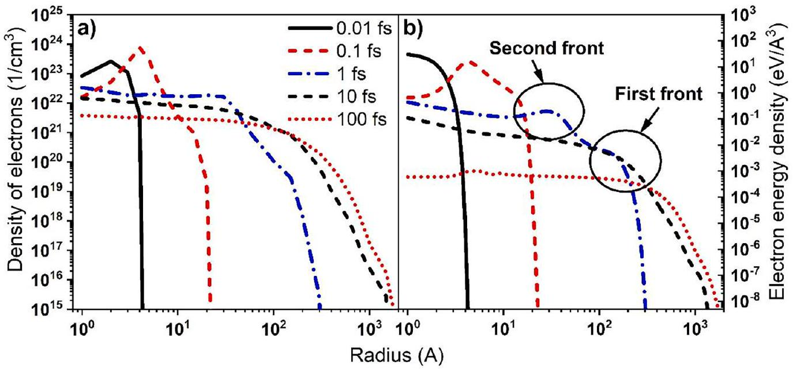
Fig. 1. The MC calculated radial distributions of (a) the density of electrons and (b) their energy density around the trajectory of 167 MeV Xe in $\mathrm{Al}_{2} \mathrm{O}_{3}$ at different times after the ion passage [9]. The first and second fronts of the electron transport are marked at the 1 fs curve.

spectrum at energies of $\sim 20-30 \mathrm{eV}$, which is formed due to the decay of the valence band plasmons and the generation of a large number of electrons of approximately the same energy. This peak is responsible for the formation of the above-mentioned second front. The long high-energy tail of the distribution forms the first front of electrons. The lowenergy part is the electrons near the center exhibiting diffusive behavior. The secondary electron cascades decrease the number of high energy electrons, simultaneously producing new electrons predominantly with low energies, thereby shifting the distribution over time into the low-energy region. The cascading is nearly over within $\sim 100 \mathrm{fs}$, which is indicated by the electronic energies being below the threshold of the secondary ionization, the material band gap.

Fig. 2b shows the distribution of the electrons generated in the track over the zenith angle (see inset scheme in Fig. 2b). Since the mass of the SHI is many times greater than the mass of the electron, the majority of the primary electrons (at $0.01-1 \mathrm{fs}$ ) moves perpendicularly to the ion trajectory. The distribution considerably changes after 1 fs turning to the uniform one after 10 fs . This confirms predominantly diffusive propagation of exited electrons at times larger than ten femtoseconds after the ion passage. Only after this time, spreading of electrons and their excess energy approaches diffusive behavior (except for its very front), which is assumed e.g. in the framework of the thermal spike
model [17]. This transition from the ballistic to the diffusive mode coincides with the slowing of the fast electrons and increase of the number of the slow secondary electrons.

In Refs.[39,50], the importance of valence holes transport for the processes of track formation was shown. Fig. 3 compares the densities of generated electrons and valence holes after a passage of 167 MeV Xe ion in $\mathrm{Al}_{2} \mathrm{O}_{3}$ for both cases: mobile vs. immobile holes. Here "immobile holes" denotes a simulation of the excitation kinetics in which valence holes generated by ionization are artificially frozen in their initial positions, thereby excluding their scattering and energy transfer to atoms. In contrast, "mobile holes" denotes the simulation in which valence holes can move and spatially redistribute within the one band approximation (details can be found in Ref. [50]). Redistribution of valence band holes almost does not affect propagation of generated fast electrons in an SHI track, since we neglect interactions between them. Ionizations by hole impacts in $\mathrm{Al}_{2} \mathrm{O}_{3}$ are not possible because its band gap is larger than the width of the valence band in this material. Fig. 3 demonstrates that the change of the hole density occurs at radii of several tens of angstroms, which is comparable with the typical size of a damaged region ( $\sim 50 \AA$ ) [57].

Peculiarities of spatial redistribution of holes as well as their interaction with the lattice considerably affect the energy transfer to

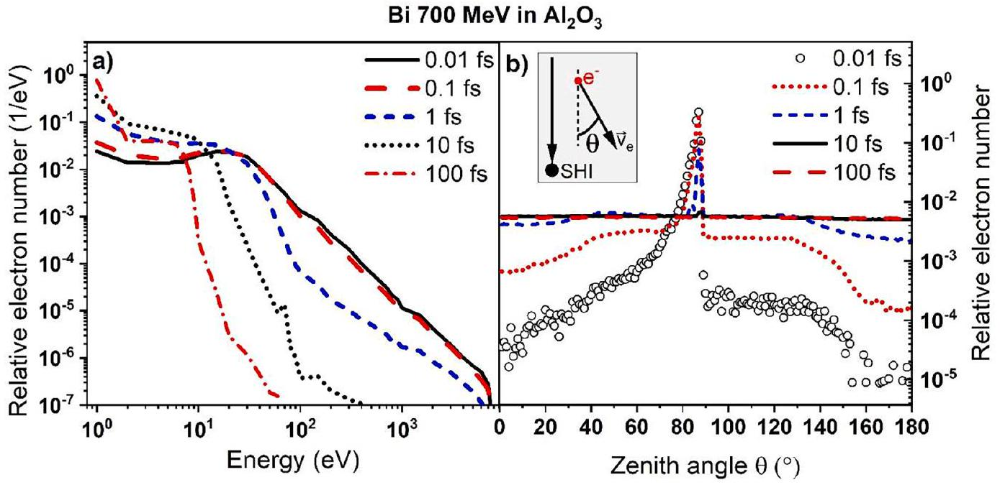
Fig. 2. (a) The spectrum of knocked-out electrons and (b) their distribution over the zenith angle at various times after the passage of a 700 MeV Bi ion in $\mathrm{Al}_{2} \mathrm{O}_{3}$. Inset in (b) shows scheme of counting of zenith angle.

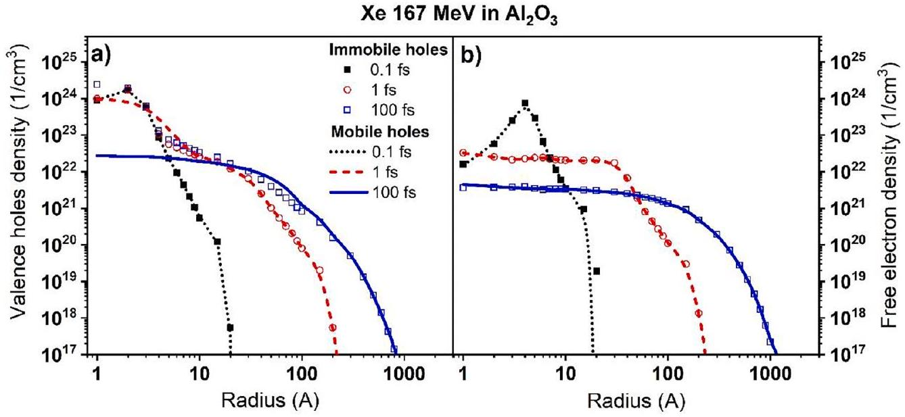
Fig. 3. Radial densities of (a) valence holes and (b) ionized electrons at different times after a passage of 167 MeV Xe in $\mathrm{Al}_{2} \mathrm{O}_{3}$ [50].

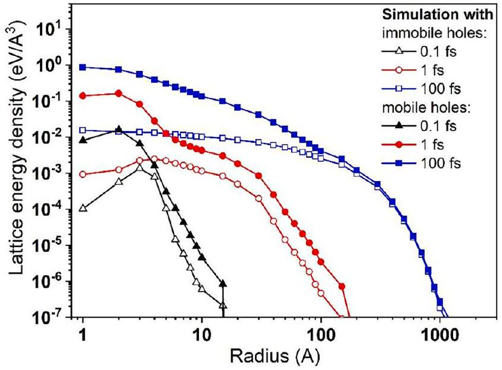
Fig. 4. Radial density of the lattice energy in track of 167 MeV Xe ion in $\mathrm{Al}_{2} \mathrm{O}_{3}$.

target atoms. As was shown in [50], the energy deposited into the atomic system by valence holes can constitute up to $50 \%$ of the total energy transferred to the lattice integrated over all considered volume. Fig. 4 illustrates the increase of lattice energy due to elastic scattering of electrons and mobile holes on optical phonons. It is important that, in contrast to electrons, the valence holes transfer their energy to the lattice mainly within the narrow region (radius $<10 \mathrm{~nm}$, Fig. 4) around the SHI trajectory. That causes a significant increase of the lattice temperature in this region, while the atomic temperature at the periphery is almost unaffected. As the figure shows, taking into account the energy transfer from the valence holes to atoms leads to almost two orders of magnitude increase of the transferred energy in the track center. Thus, the contribution of the valence holes coupling to the lattice is crucial for the track formation.

As discussed in the Model section, two contributions form the energy transferred to the lattice at 100 fs after the ion impact shown in Fig. 5: (1) the energy deposited via elastic scattering of free electrons and valence-band holes on target atoms; (2) the potential energy of holes instantly transferred into the lattice at 100 fc. Fig. 5 also demonstrates that the relative contribution of holes potential energy is mainly affects the region from $\sim 1$ to $\sim 10 \mathrm{~nm}$, whereas its contribution to the total lattice energy in the track center ( $<1 \mathrm{~nm}$ ) is much lower, indicating a dominance of elastic scattering of electrons and holes in the transferred energy.

The response of the lattice to the transferred energy is traced by means of molecular dynamics [39].The time instant of 100 fs was

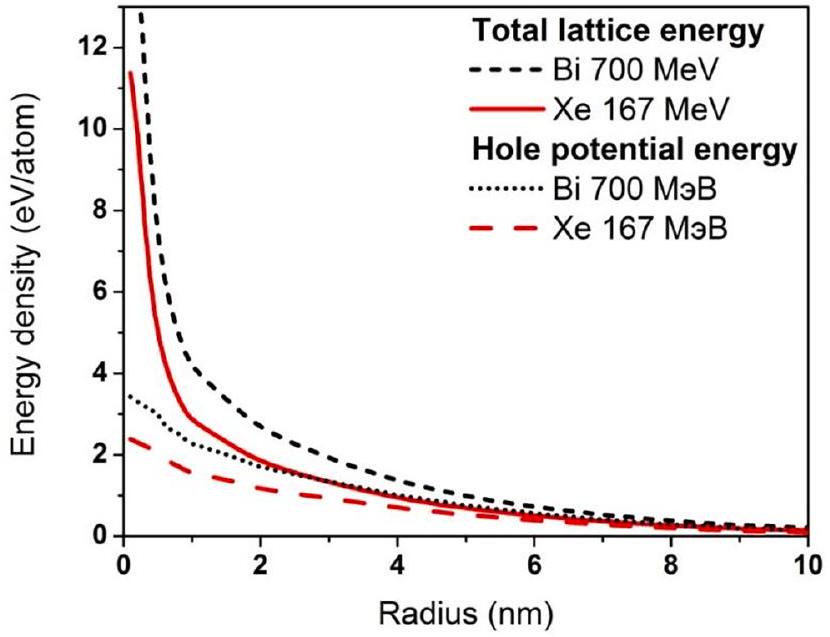
Fig. 5. Radial density of the lattice energy in tracks of 700 MeV Bi and 167 MeV Xe ions in $\mathrm{Al}_{2} \mathrm{O}_{3}$ at 100 fs including potential energies of valence holes.

chosen as the starting point for MD because at these times all secondary ionization cascades are finished and energy transfer to the target atoms is almost completed in the vicinity of ion trajectory.

### 4.2. Track structure and formation kinetics

The atomic lattice response to such an energy deposition described above is an extremely fast disorder within the radius of $5-10 \mathrm{~nm}$ by $\sim 1 \mathrm{ps}$. Fig. 6 illustrates the relaxation kinetics of the damaged lattice of $\mathrm{Al}_{2} \mathrm{O}_{3}$ supercell in the vicinity of the ion trajectory at times of $1,10,15,20 \mathrm{ps}$ after a passage of 167 MeV Xe . The strongly disordered region of $\sim 5 \mathrm{~nm}$ in diameter can be clearly seen at the beginning of lattice relaxation. This area is surrounded by $\sim 2 \mathrm{~nm}$ cylindrical layer with a distorted crystalline structure. At later times ( $10-20 \mathrm{ps}$ ), the damaged area shrinks due to epitaxial recrystallization of cylindrical layers, resulting in formation of a stable damaged ion track of only 1.8 nm diameter at 100 ps (Fig. 7a).

Material recrystallization under SHI irradiation invalidates the methods of track radius estimation based only on the size of the region where a calculated lattice temperature reaches the melting point. In order to estimate an SHI track size, knowledge of the relaxation kinetics of the excited medium is necessary. The same conclusion was made for laser spots e.g. in [58]. In Ref. [39] we have determined the threshold value of the electronic stopping in alumina ( $\mathrm{d} E / \mathrm{dx}_{\text {th }} \sim 6.1 \mathrm{keV} / \mathrm{nm}$ ) necessary to form a structure-damaged track core, whereas

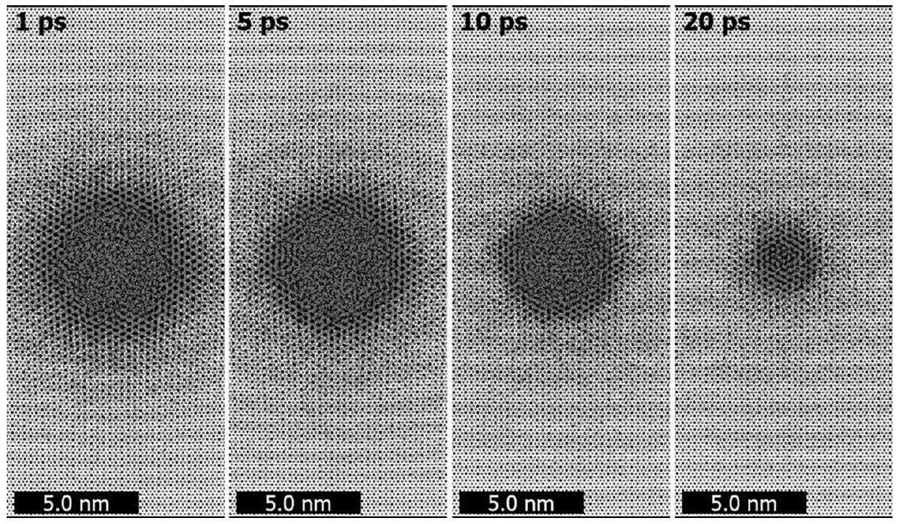
Fig. 6. Snapshots of MD supercell $\mathrm{Al}_{2} \mathrm{O}_{3}$ at different times after the passage of 167 MeV Xe ion.

experimental TEM determination of track formation threshold produces the value of $9.8 \div 10.5 \mathrm{keV} / \mathrm{nm}$ [59]. The discrepancy can be attributed to the superior resolution of the MD method resolving even
isolated point defects which are not visible by TEM.
It can be noted that the study of changes of the material density performed in [39] reveals periodic oscillations in the proximity of the

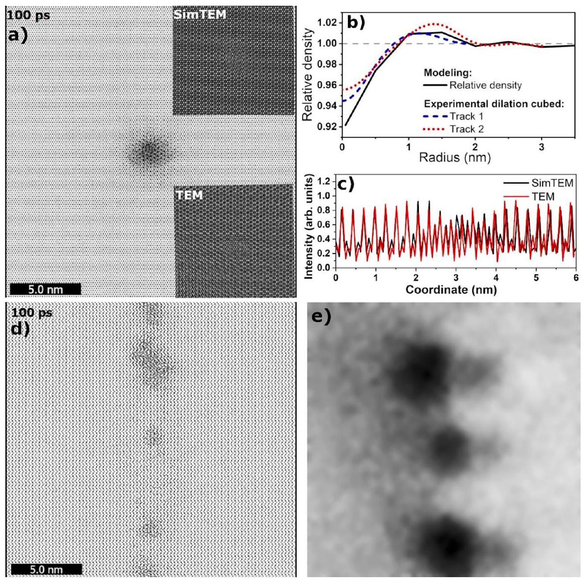
Fig. 7. (a) The MD box image at 100 ps after an impact of 167 MeV Xe on $\mathrm{Al}_{2} \mathrm{O}_{3}$ : projection along track axis with insets of simulated and experimental HRTEMimages in the same scale as MD image; (b) normalized density variation calculated from MD simulation combined with two experimental plots of mean basal plane lattice dilation as a function of radial distance from the track center [61]; (c) a line profile plot through 1 atom column width of the TEM and SimTEM images in (a); (d) the cross sectional view of MD box, and (e) a magnified cross sectional BF TEM image at the same scale as (d).

SHI trajectory. It was demonstrated that the part of excess lattice energy is removed from the track by propagation of elastic waves with the oscillation period of 1.9 ps corresponding to the frequency of $\sim 0.5$ THz. This frequency belongs to the acoustic branch of the vibrational modes in $\mathrm{Al}_{2} \mathrm{O}_{3}$, according to [60].

Relaxation of the excess energy of the lattice of $\mathrm{Al}_{2} \mathrm{O}_{3}$ results in considerable structure transformations with an average track diameter of $\sim 1.8 \mathrm{~nm}$, as seen in Fig. 7a. An experimental analysis of the track structure in this case is very difficult due to the small size and discontinuous nature of the damaged track region. However, this figure demonstrates clearly that a 167 MeV Xe ion track in $\mathrm{Al}_{2} \mathrm{O}_{3}$ is crystalline. It consists of a set of discontinuous damaged but crystalline regions with lower material densities as seen in Fig. 7d, which is a cross sectional view of the MD simulation box, and Fig. 7e, which is a magnified cross-sectional BF TEM view of a track observed experimentally. It should be mentioned that BF TEM is extremely sensitive to even minute angle variation of planes orientations and thus to changes of local strain, but has poor spatial resolution (no atomic columns are seen). So, the strain field around track region may be distinguished out to a larger distance from the defect, which can result in larger contrast spots in BF TEM image. The Xe track diameter measured in the experiment is $\sim 1.7 \mathrm{~nm}$ (inset in Fig. 7a) which is very close to that in the simulations, validating our model. Fig. 7c also shows a line profile through one atom column width of the experimental and simulated TEM (SimTEM) image of 167 MeV Xe in $\mathrm{Al}_{2} \mathrm{O}_{3}$. Both plots show a region of loss of contrast in the center, corresponding to the ion track. The TEM and SimTEM lines demonstrate a good agreement between both the size of the disturbance and the relative reduction in contrast.

The average density change is clearly visible in the plot of normalized density as a function of radial distance from the track center shown in black in Fig. 7b. The curve was computed by calculating the average density in cylindrical layers of a given radius centered on the track. The final profile was interpolated and smoothed.

The blue dashed and red dotted lines (experimental) show plots of mean basal plane lattice dilation as a function of radial distance from the estimated track center for two experimentally observed Xe tracks. The plots were obtained using TEM technique based on a reconstruction of the complex electron wave at the exit surface of the specimen. The phase of this complex image approximates the projected potential of the distorted lattice along the electron beam direction which coincided with the ion direction. Geometric phase analysis was performed on this image in order to obtain the mean lattice dilation within the image plane, which represents the average projected basal plane dilation. Finally, the plots were obtained by rotationally averaging the dilation around the maximum point in the track core which was assumed to be the center of the ion track [61]. The resultant plot has a value of 1 in the unstrained region far from the track center and decreases in regions where the lattice is under tensile strain corresponding to a reduction in density. It can be found that the general shape and size of the density fluctuation of simulation and experiment are in a good agreement. The lower density nature of the core and higher density shell is reflected in both simulated and experimental images.

### 4.3. Recrystallization in SHI tracks

In the previous section, the importance of recrystallization processes for track formation in non-amorphizable dielectric (alumina) was demonstrated. In order to study this process dependence on material properties in detail, we have chosen three oxide materials ( $\mathrm{Al}_{2} \mathrm{O}_{3}, \mathrm{MgO}$ and $\mathrm{Y}_{3} \mathrm{Al}_{5} \mathrm{O}_{12}$ ) with different lattice structures and comparable energy deposition to the lattice for the same SHI parameters [12].

The calculated energy loss of a 167 MeV Xe ion in $\mathrm{MgO}, \mathrm{Al}_{2} \mathrm{O}_{3}$ and YAG are $21,24.9$ and $25 \mathrm{keV} / \mathrm{nm}$ respectively. Fig. 8 shows the radial and temporal dependencies of the energy of electrons and their density after 167 MeV Xe impact. One can see that the kinetics of the electron system differ only slightly among $\mathrm{MgO}, \mathrm{Al}_{2} \mathrm{O}_{3}$ and YAG, apart from
electron energies at small radii ( $<1 \mathrm{~nm}$ ).
After the electron kinetics, the radial distributions of the energy transferred into the lattices of $\mathrm{MgO}, \mathrm{Al}_{2} \mathrm{O}_{3}$ and YAG are presented in Fig. 9. All these three targets demonstrate similar behavior of electronic excitation and relaxation: formation of two fronts of excess energy propagation and comparable energy deposition to the lattice (a slightly higher energy density in YAG within $\sim 1 \mathrm{~nm}$ around the ion path introduces only a negligible difference, since the volume of this region is very small). Nearly identical kinetics of excitation allows us to use these three systems to isolate an effect of lattice relaxation on the track formation in oxides. The study of lattice relaxation processes can help to understand the influence of a structure and a force field of atoms, as will be discussed below.

Despite close energy deposition and similar initial damage at $\sim 1 \mathrm{ps}$ after the impacts [12,39], Fig. 10 shows that the SHI irradiation of these targets leads to formation of quite different damaged structures.

MgO has only a few point defects in the proximity of the ion trajectory with no clear SHI track (a similar situation occurs for 700 MeV Bi irradiation). The absence of significant SHI damage in MgO was also detected in experiments [62], and due to the absence of discernible tracks no TEM imaged track is shown for this material in Fig. 10. In order to directly compare the results of modeling with experimental TEM data, we simulated TEM images from the calculated MD atomic snapshots with help of MuSTEM code [55] (these insets are labeled as SimTEM). The simulated HRTEM image confirms that the low damage density is not visible in TEM.

The simulation predicted that 167 MeV Xe in $\mathrm{Al}_{2} \mathrm{O}_{3}$ forms a discontinuous crystalline track of $\sim 2 \pm 0.3 \mathrm{~nm}$ in diameter, which was confirmed by high resolution TEM images and was discussed in detail in Ref. [39]. The 100 ps image with experimental and simulated HRTEM insets is the same as in Fig. 7a. Typical FIB lamellae have a thickness around $30-40 \mathrm{~nm}$ and thus such small localized areas of distorted crystal are always imaged within a relatively thick region of unaffected material with a near perfect crystal structure. HRSTEM resolution is maximized in the near surface region of the foil. This limits atomic resolution to the top few nm of the specimen and therefore this technique is not optimal for imaging discontinuous tracks where the near surface region of the foil might be relatively undisturbed. However, HRSTEM is well suited to imaging continuous, cylindrical amorphous tracks such as those in YAG.

A calculated track in YAG has a cylindrical shape with the size of $\sim 5.1 \pm 0.2 \mathrm{~nm}$ and a completely amorphous structure, in a reasonable agreement with the experiment, Fig. 10. The experiment confirms that the tracks in YAG are amorphous with a comparable diameter of $\sim 6.5 \pm 0.6 \mathrm{~nm}$ based on 97 measured tracks. The inset shows an annular bright field HRSTEM micrograph of a typical track in YAG. In this imaging mode, the central region with a relatively flat contrast represents an amorphous track core. The amorphous-crystalline boundary can be seen just at the edge of the central circle where atomic columns become visible. SimTEM insets in Fig. 10 show similar damage structures as experimental TEM data: distorted crystalline tracks in $\mathrm{Al}_{2} \mathrm{O}_{3}$ and amorphous tracks in YAG. Measurement of the YAG track diameter from the simulated ABF image yielded a diameter of 3.5 nm which is smaller than the calculated value of 5.1 nm . The difference is once again due to the inability of the TEM to detect extremely small distortions in low concentration through the projected foil. The size discrepancy between the MD predicted track diameter and experimental diameter is most probably related to the fact that the employed potential predicts a melting temperature of 3300 K for YAG while the experimentally determined temperature is around 2213 K [12].

Fig. 10 also shows the structure relaxation kinetics in a track by means of MD. Simulation of XRD patterns from MD supercells performed in Ref.[12] demonstrated that the perturbed lattice is completely amorphous at $\sim 1 \mathrm{ps}$ after ion passage and its size is similar in all three samples: a disordered area of almost the same diameter $(\sim 5-6 \mathrm{~nm})$, i.e. transient material melting occurs around the ion

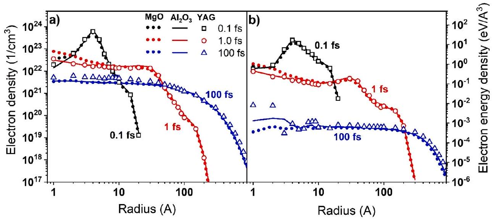
Fig. 8. (a) Radial electron density and (b) energy density in MgO (filled circles), $\mathrm{Al}_{2} \mathrm{O}_{3}$ (solid lines) and YAG (open symbols) at different times after 167 MeV Xe ion passage.

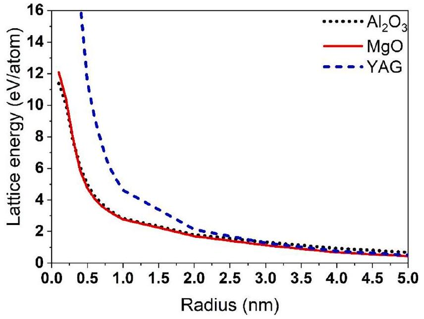
Fig. 9. Radial distribution of the excess lattice energy density around the trajectories of 167 MeV Xe in $\mathrm{MgO}, \mathrm{Al}_{2} \mathrm{O}_{3}$ and YAG.

trajectory. As was shown in [12], the initial electronic kinetics, energy transfer to the lattice, and lattice melting in the nearest vicinity of the projectile trajectory, are nearly identical in these three targets. However, structure transformations during further cooling of the melted cylinders strongly differ in $\mathrm{MgO}, \mathrm{Al}_{2} \mathrm{O}_{3}$ and YAG. In the case of MgO , the amorphous region recrystallizes epitaxially to an almost virgin state very fast (by the time of $\sim 20 \mathrm{ps}$ ). The recovery of an initial structure in alumina is slower and finally results in formation of a small discontinuous track. The size of a disordered region in YAG reduces only slightly during cooling, forming finally an amorphous track.

In order to understand the nature of the recrystallization effect in SHI tracks we checked whether there is any ordering effect of bonds between atoms at the initial stage of track formation, which can enhance or suppress recrystallization. The analysis of pair distribution functions of studied materials in Ref.[12] did not reveal any considerable difference between $\mathrm{MgO}, \mathrm{Al}_{2} \mathrm{O}_{3}$ and YAG at the initial moments of relaxation of excited tracks (at $\sim 1 \mathrm{ps}$ after an ion impact). Thus, we concluded that all materials transiently lose their structure, and recrystallization starts from a similar state with an initial short order present in these oxides.

One can also note that the recrystallization efficiency correlates with "simplicity" (or "complexity") of the target lattice structure [12]. Indeed, complete and fast track recrystallization is observed in MgO having a "simple" lattice structure with the smallest number of the peaks in the pair correlation function. A similar picture was observed in

MD modeling of LiF and NaCl exhibiting no continuous tracks [63]. However, large amorphous tracks are detected in YAG with the most "complex" lattice structure (the largest number of peaks). Ref. [41] showed that SHI irradiation of olivine ( $\mathrm{Mg}_{2} \mathrm{SiO}_{4}$, studied in more detail in the next section) with a "complex" structure produces amorphous tracks which conforms to the presented trend. The lattice of $\mathrm{Al}_{2} \mathrm{O}_{3}$ fills an intermediate "complexity" here, showing partial track formation. The observed correlation allows us to conclude that the "complexity" of the structure can be used for a crude estimate of the expected recrystallization efficiency in SHI tracks. However, the complexity of a lattice structure cannot be treated as the sole factor governing damage formation in SHI tracks, but should be complemented with more general considerations, involving dynamical properties of materials [12].

In order to study the dynamics of the recrystallization in more detail, we have considered the relaxation of sublattices, which revealed that oxygen atoms settle in their sites at epitaxially restoring interface of the crystalline matrix faster than Mg (or Al ) atoms in MgO (or $\mathrm{Al}_{2} \mathrm{O}_{3}$ ) [12]. Metallic atoms then adjust to a layer of oxygen that has already been built. Fig. 11 shows temporal evolution of the sublattices of the studied targets at different times after the ion passage. A diameter of the damaged region in the oxygen sublattice is smaller than in $\mathrm{Mg}(\mathrm{Al})$ sublattices in the case of $\mathrm{MgO}\left(\mathrm{Al}_{2} \mathrm{O}_{3}\right)$ during the relaxation stage.

The atomic mobility is important for recrystallization. We simulated the diffusion coefficients of atoms in studied oxides [12] to check their importance in the track formation kinetics. Since we are interested in the behavior of atoms near the interface between the transiently damaged (melted) region and the surrounding crystalline matrix, and the migration velocities of atoms were studied at the melting temperature as well as at temperatures $\pm 100 \mathrm{~K}$ from the melting point. The melting temperatures were calculated for each particular interatomic potential used for the studied materials. The diffusion coefficients were determined as the slopes of mean-squared displacements versus time.

Atoms in MgO demonstrate the highest diffusion coefficients ( $\sim 12 \mathrm{nm}^{2} \mathrm{~ns}^{-1}$ ) in the molten regime, while the diffusion coefficient of oxygen in $\mathrm{Al}_{2} \mathrm{O}_{3}\left(\sim 2.5 \mathrm{~nm}^{2} \mathrm{~ns}^{-1}\right)$ does not differ from that in YAG. It should be mentioned that other theoretical works report diffusion coefficients of $19 \mathrm{~nm}^{2} / \mathrm{ns}$ for MgO [64] and $\sim 1.5 \mathrm{~nm}^{2} / \mathrm{ns}$ for $\mathrm{Al}_{2} \mathrm{O}_{3}$ [65]. Below the melting points, all three targets show almost zero diffusivity. Interestingly, $\mathrm{Gd}_{2} \mathrm{Zr}_{2} \mathrm{O}_{7}$ has a higher migration velocity at submelting temperatures than $\mathrm{Gd}_{2} \mathrm{Ti}_{2} \mathrm{O}_{7}$ and this difference strongly increases with decrease of temperature, which is consistent with the results presented in [66], where strong recrystallization rate of $\mathrm{Gd}_{2} \mathrm{Zr}_{2} \mathrm{O}_{7}$ was shown, whereas $\mathrm{Gd}_{2} \mathrm{Ti}_{2} \mathrm{O}_{7}$ does not demonstrate damage recovery within an ion track.

Considering all the factors listed above, we concluded that the possibility of oxygen atoms to reach their equilibrium crystalline sites

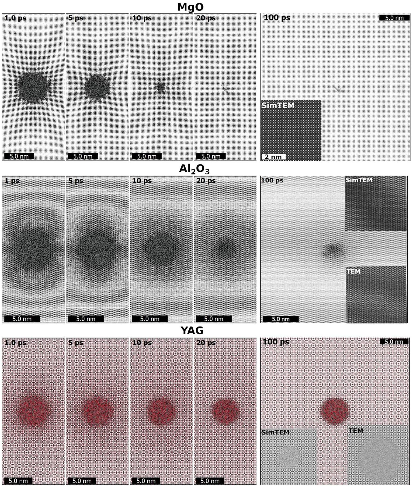
Fig. 10. Modeled snapshots of 167 MeV Xe tracks in three materials at different times after ion passage with the experimental (TEM) and simulated from MD (SimTEM) images as insets.

govern recrystallization of SHI tracks in the presented materials [12]. Fast diffusion of oxygen facilitates occupation of the crystalline sites by these atoms during solidification of the melted tracks in MgO . In contrast, slower diffusion of oxygen atoms to their equilibrium positions during cooling of the nanometric molten region decreases a probability
of track recrystallization in $\mathrm{Al}_{2} \mathrm{O}_{3}$ and YAG. We also saw that having the same diffusion coefficients as in YAG, oxygen atoms occupy their equilibrium positions faster on a "simpler" structure of $\mathrm{Al}_{2} \mathrm{O}_{3}$. This results in the formation of discontinuous crystalline tracks in alumina in contrast to appearance of amorphous tracks in YAG.

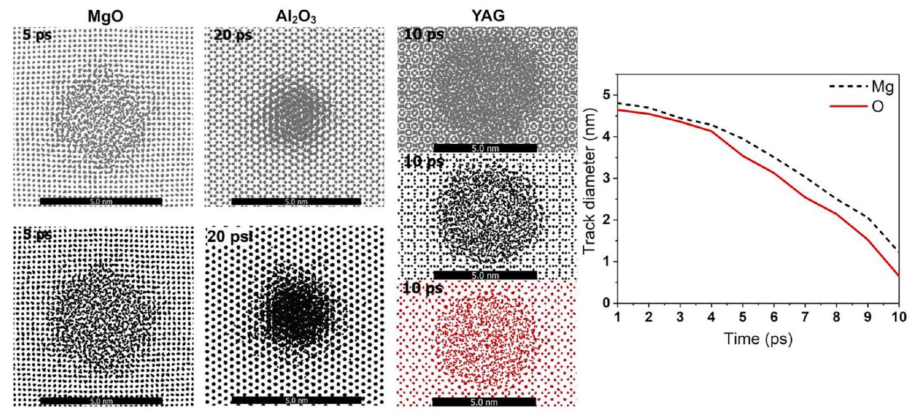
Fig. 11. (a) snapshots of MD cells of MgO, $\mathrm{Al}_{2} \mathrm{O}_{3}$ and YAG sublattices after passage of 167 MeV Xe ion. Time instances show the initial stage of track size reduction (recrystallization). Grey dots are oxygen, black dots are $\mathrm{Mg}(\mathrm{MgO})$ and $\mathrm{Al}\left(\mathrm{Al}_{2} \mathrm{O}_{3}, \mathrm{YAG}\right)$, red points are Y atoms. (b) evolution of damaged track diameters in oxygen and magnesium sublattices of MgO [12].

### 4.4. Damage along SHI trajectory

Macroscopic approaches used in the community have problems with accurate prediction of variations of the SHI tracks size with the ion penetration depth [67,68]. This occurs due to their inapplicability at the femtosecond temporal and nanometric spatial scales of material excitation around trajectories of swift heavy ions [11]. As a result, these models use fitting parameters a-posteriori reproducing results of experiments on SHI induced structure changes at fixed ion velocities (e.g. by using TEM images or indirect measurements of accumulated damage).

Our developed approach [39,40] enabled us to avoid unnecessary assumptions and fitting in simulations of structure transformations in tracks. This allowed us to describe lattice excitation and structure modifications at different points along the penetration depths covering almost the entire ion range. In the recent work [41], the model was applied to study a coupled effect of the swift heavy ion velocity and energy loss on formation of a nanometric damaged region around the entire trajectories of nonrelativistic $\mathrm{Xe}(30-1650 \mathrm{MeV})$ and U $(45-15000 \mathrm{MeV})$ ions in olivine ( $\mathrm{Mg}_{2} \mathrm{SiO}_{4}$, in forsterite state). We also calculated track sizes and ion stopping for hypothetical nuclei ${ }_{120}^{304} \mathrm{Ubn}$ to cover a wider range of atomic numbers and demonstrate predictive capabilities of our model. Consideration of such superheavy elements is important for their search in galactic cosmic rays with the help of etching of solid natural detectors from meteorites, which dictated our choice of the material for this study [69]. From the fundamental point of view, the choice of the material here is irrelevant, since the conclusions drawn can qualitatively be transferred to other amorphizable materials as well.

Fig. 12 presents the energy losses of $\mathrm{Xe}, \mathrm{U}$ and Ubn ions in forsterite calculated with TREKIS code. The modeled ions energy samples are shown as dots in this figure. The results of the SRIM [70] code for Xe and U demonstrated for comparison show an overall good agreement with the presented data which confirms applicability of the model to $\mathrm{Mg}_{2} \mathrm{SiO}_{4}$. Unfortunately, SRIM code does not provide the energy losses for Ubn ions.

The developed approach allows detailed studying of the so-called velocity effect - a difference in the tracks parameters for swift heavy ions with the same electronic energy loss but different velocities: on the left and on the right shoulders of the Bragg curve. Fig. 13 shows that

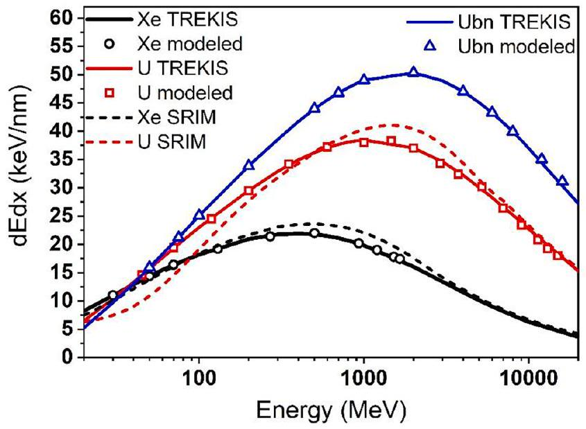
Fig. 12. The calculated ion energy losses of $\mathrm{Xe}, \mathrm{U}$ and Ubn ions in forsterite in comparison with the tabulated SRIM data [70]. Open symbols indicate considered energies of Xe, U [41] and hypothetical ${ }_{120}^{304} U b n$ ions used in subsequent simulations.

this effect results from different spectra of primary electrons generated by fast vs. slow ions. In this figure, spectra of electrons produced by 130 MeV and 1200 MeV Xe ions in $\mathrm{Mg}_{2} \mathrm{SiO}_{4}$ are shown; both have the same stopping power of $19 \mathrm{keV} / \mathrm{nm}$. Faster electrons produced by a high-energy ion (Fig. 13a) bring a part of introduced energy out of the track core, which changes the kinetics of further electronic cascading (Fig. 13b), resulting, finally, in lower heating of a track region (Fig. 13c). This ultimately results into a smaller observable track.

Fig. 14 demonstrates the dependence of the track sizes of "fast" (with the energies above the Bragg peak of the electronic stopping) and "slow" (with the energies below the Bragg peak) Xe, U, and hypothetical Ubn ions in $\mathrm{Mg}_{2} \mathrm{SiO}_{4}$ on the electronic energy losses of the ions. The dependence has a loop-like form with two distinct thresholds of track formation - for slow and fast ions. Slow ions data points are fitted with 3rd order polynomials, extrapolation of which to zero radius gives the threshold value of $d E / d x_{\text {th }} \sim 6.3 \mathrm{keV} / \mathrm{nm}$. Ref. [71] on the basis of TEM data reported that the track formation threshold in $\mathrm{Mg}_{2} \mathrm{SiO}_{4}$ is higher than $6.67 \mathrm{keV} / \mathrm{nm}$ with the estimated value of $\sim 7.5 \mathrm{keV} / \mathrm{nm}$,

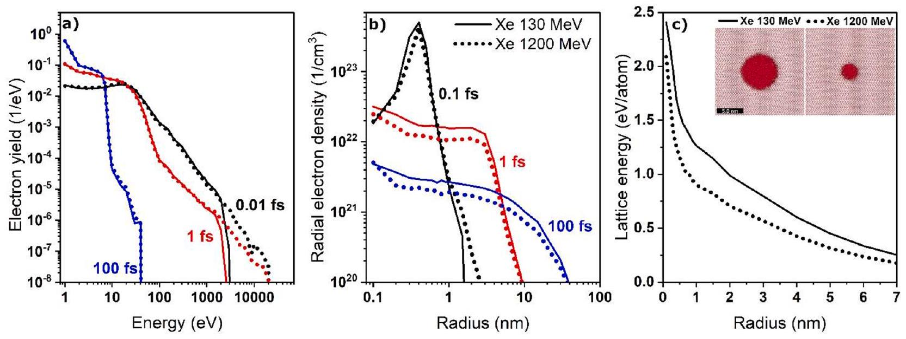
Fig. 13. (a) spectra of generated electrons and (b) radial electron density at different times after the ion impact; (c) calculated lattice energy at 100 fs with insets of final MD track. All data compared for 130 MeV and 1200 MeV Xe ions in $\mathrm{Mg}_{2} \mathrm{SiO}_{4}$.

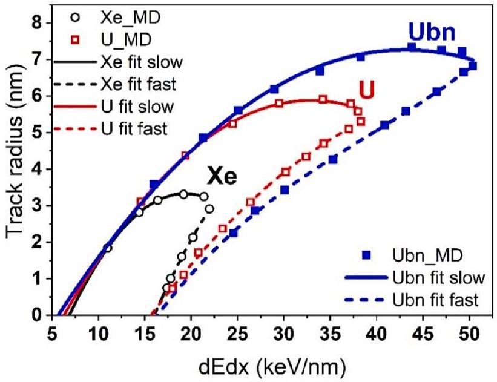
Fig. 14. Dependence of the track radius on the energy loss of $\mathrm{Xe}, \mathrm{U}$ ions (reproduced from [41]) and of hypothetical Ubn ion in forsterite.

which is in a good agreement with our calculated value. The polynomial fitting curves for fast ions cross the $R_{t r}=0$ level at the value of $d E / d x_{\text {th }} \sim 15.8 \mathrm{keV} / \mathrm{nm}$.

It is interesting that the track formation thresholds for all ion types are almost the same. The slight discrepancy for slow ions, in our opinion, is due to inaccuracy of extrapolation of the simulation results. Lower energy loss values for U and Ubn ions could not be studied within the present approach due to limitations of the TREKIS code, which does not account for the nuclear stopping.

Note that a similar loop-like form of the track radius vs. $S_{e}(d E / d x)$ was observed experimentally in yttrium-iron garnet for different ions in Refs. [72,73]. This indicates universality of such dependence for various materials and kinds of ions.

Fig. 15 shows the dependence of the track size on the U ion range and energy. Calculated points are accompanied with the electronic energy loss curves. The peak energy loss value (Bragg peak) does not coincide with the maximal structural damage region: the maximal ion energy loss does not produce maximal damage in a material. The maximal damage along the track range lies systematically deeper along the ion trajectory than the Bragg peak position [41].

The discrepancy between the maximal structure damage position and the energy loss maximum can be considered in terms of the velocity effect and the efficiency of energy transfer to the lattice. The track size dependence on the ion energy (or velocity) is ultimately defined by a
spectrum of excited electrons. The electron kinetics producing the atomic heating mainly manifests itself as interplay of two factors:

1) For slow ions, a track size increases with increase of ion energy loss, which is a consequence of a larger amount of the total energy deposited to the electronic subsystem (and a larger number of electrons generated by an SHI).
2) Track size depends strongly on the efficiency of energy transfer to the lattice, which, in turn, depends on the ion velocity, which determines the spectrum of generated electrons. This spectrum defines the following kinetics of the electronic subsystem and energy transfer to the lattice, finally producing a specific profile of the lattice energy for each ion speed.

In Ref. [41] it was demonstrated that the maximum of efficiency is at the lower ion energies than the Bragg-peak. A maximum of the product of these two factors is situated at intermediate energies between these two maxima, and is proportional to the track size. Thus, the track size maxima appear systematically at lower energies of ions (correspondingly, deeper along an SHI path) than the Bragg-peak.

### 4.5. Overlap of SHI tracks

The recrystallization of SHI tracks is very fast ( $\sim 20-50 \mathrm{ps}$ ), which makes it impossible to observe it directly using modern experimental techniques. On the other hand, an initially molten zone produced by an ion should strongly affect the existing defects, for example, tracks created by earlier passed ions. So, one of the possible ways of an indirect study of processes of damage recovery within a track is an investigation of influence of hot tracks on existing ones. This, in turn, can be done experimentally studying structures of overlapping ion tracks at high fluences $\left(\sim 10^{12} \mathrm{~cm}^{-2}\right)$. To study these processes, the structures produced by close impacts of ions are compared for amorphizable (YAG) and non-amorphizable ( $\mathrm{Al}_{2} \mathrm{O}_{3}$ ) solids.

### 4.5.1. $\mathrm{Al}_{2} \mathrm{O}_{3}$

The result of TEM study and simulations of the overlapping tracks of 700 MeV Bi ions made in Ref. [40] is shown in Fig. 16. Fig. 16e represents the simulation box after a passage of a single Bi ion. The formed track has a diameter of $\sim 3.4 \mathrm{~nm}$, which agrees well with the experimental value of $\sim 3.5 \mathrm{~nm}$, obtained from HRTEM images of 710 MeV Bi 710 MeV ion tracks (see Fig. 16a).

An impact of the second Bi ion at a short distance ( $\sim 3 \mathrm{~nm}$, Fig. 16f) anneals the existing defected structure almost completely. A passage of the second Bi ion at a larger distance of $\sim 6.5 \mathrm{~nm}$ leads to only partial

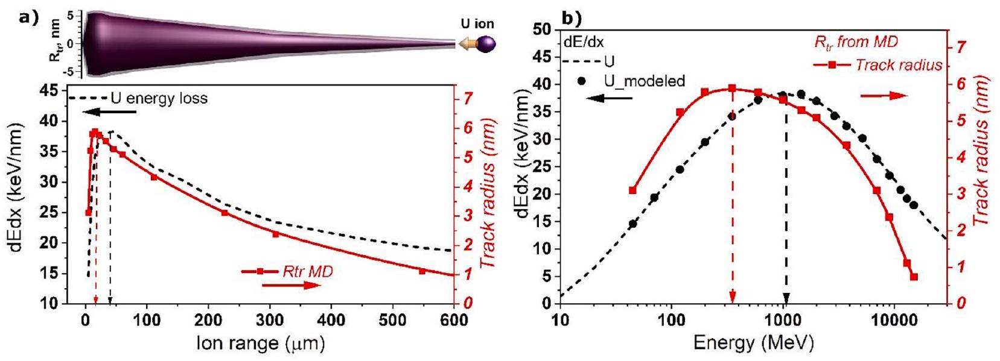
Fig. 15. (a) Track sizes and electronic energy losses of U ion vs. ion range and (b) energy. Vertical arrows indicate the positions of maxima in the respective curves. . Reproduced from [41]

recovery of the track of a previous ion (Fig. 16g). Damage of the material within the first track region is less pronounced after a passage of the second ion, but is still present. There is also a curious effect of formation of a damaged region connecting the two tracks (Fig. 16g). A presence of damaged structure between close tracks is also observed experimentally in the TEM micrograph, confirming the model predictions, as shown in Fig. 16c. With increase of the distance between track centers up to $\sim 8 \mathrm{~nm}$, defects between the tracks disappear. Only isolated tracks are observed without overlapping (Fig. 16h).

The defective connection formed between overlapping tracks (Fig. 16g) looks to be aligned along crystallographic planes of $\mathrm{Al}_{2} \mathrm{O}_{3}$. To study the structure of this defects, the Dislocation Extraction Algorithm (DXA) [74] embedded into OVITO software [54] was applied to oxygen sublattice of MD cells. The DXA recognized perfect oxygen sublattice of $\mathrm{Al}_{2} \mathrm{O}_{3}$ as hexagonal close packed (HCP, red atoms), whereas the unidentified structure is marked grey. Fig. 16i-1 show the formation of dislocation lines and loops of different types surrounding single tracks, consisting of strongly damaged defect clusters. In case of ion trajectories at 6.5 nm (Fig. 16k) these dislocations connect tracks between each other. At 8 nm , the track regions are separated, however even at such large distances the influence of the second track is still present, partially recovering the damage in the first track, which appears in Fig. 161 as increase of fraction of HCP phase inside the first ion track. The distance between the track edges after cooling, at which tracks form a connection between them, is found to be $\sim 3.2-4.5 \mathrm{~nm}$ in MD calculation. The experimental value is $\sim 3.9-5 \mathrm{~nm}$ from Fig. 16c and d.

Fig. 17 demonstrates the comparison of time-resolved dynamics of track formation by a passage of the second 700 MeV Bi ion at a distance of 8 and 6.5 nm from the first ion track. In the case of 6.5 nm distance (Fig. 17c), on the picoseconds timescale, the hot disordered track overlaps with the pre-existing damaged track of the previous ion. Fig. 17d demonstrates that subsequent recrystallization starts from the periphery of this highly excited and damaged region. The existence of the pre-damaged material (from the first ion track) precludes the periphery of the second track from perfect recrystallization. Instead, a new damaged region in-between the ion trajectories forms during solidification, accumulating the damage in the $\mathrm{Al}_{2} \mathrm{O}_{3}$ crystal irradiated with 700 MeV Bi ions with increase of the fluence.

In contrast, disordered area formed by an impact of Bi ion at 8 nm distance (Fig. 17a) does not overlap with the pre-existing track, and its recrystallization is almost not affected by a presence of lattice damage induced by the first ion (Fig. 17b). This results in formation of two isolated tracks.

### 4.5.2. Yag

In contrast to $\mathrm{Al}_{2} \mathrm{O}_{3}$, the influence radius of the second track in YAG
is rather small. Fig. 18a and b show the results of simulation of sequential 700 MeV Bi ion impacts in YAG at distances of 9 and 10 nm between the ion trajectories. It is clearly seen that the connection between tracks forms at distances smaller than $1-2 \mathrm{~nm}(1.1-2.2 \mathrm{~nm}$ from TEM data, see Fig. 18c,d). It should be mentioned that the formation of the connection between tracks in YAG according to MD seems mainly due to expansion of a material after its melting rather than the recrystallization during cooling. For a close impact of Bi ions in YAG (Fig. 18c) we have only an experimental image for 1 GeV Bi ion irradiation. However, due to close energy loss, the track size and structure are similar to 700 MeV Bi impact (see ref. [75]), Fig. 18c can be considered as a good representative of 700 MeV Bi irradiation of YAG.

The radius of track interaction in YAG is small, which may be considered as an experimental evidence of absence or very low recrystallization efficiency of YAG in tracks of high-energy heavy ions. In contrast, this influence distance in alumina is much larger which is an evidence of the efficient recrystallization in an SHI track. Therefore, studying of track structures in overlapping regime allows estimating the size of the transiently molten zone.

## 5. Conclusion

We reviewed here results of our studies of stages of the kinetics of swift heavy ion tracks formation in insulators. The developed hybrid approach combining Monte Carlo and Molecular Dynamics describes in detail each successive stage, starting from the SHI induced electronic excitation, transport of electrons, valence holes and photons, energy exchange with the target lattice, transient excitation and relaxation of the atomic system, and ultimate damage formation. The used efficient way of coupling the MC and MD schemes proved to be sufficiently simple yet produce accurate results, validated by high-resolution transmission electron microscopy analysis of SHI irradiated samples. The model is free of any fitting parameters and thus has a full predictive power.

The developed model enabled us to identify the valence holes as the main contributor into the heating of the atomic lattice in insulators. Transfer of the kinetic energy of valence holes delivers the major part of energy in the track center (within around 1 nm ), while the potential energy of the electron-hole pairs produces longer tails of the energy distribution (from $\sim 1$ to about 5 nm ).

The ballistic transport of electrons is the main driving force beyond the velocity effect. The electronic spectrum defines how the energy is distributed in space and time prior to and during the heating of atomic system. In particular, the electronic transport and the energy redistribution result into a systematic mismatch between the deposited dose along the SHI path and the produced damage: the maximal track radius does not coincide with the Bragg peak.

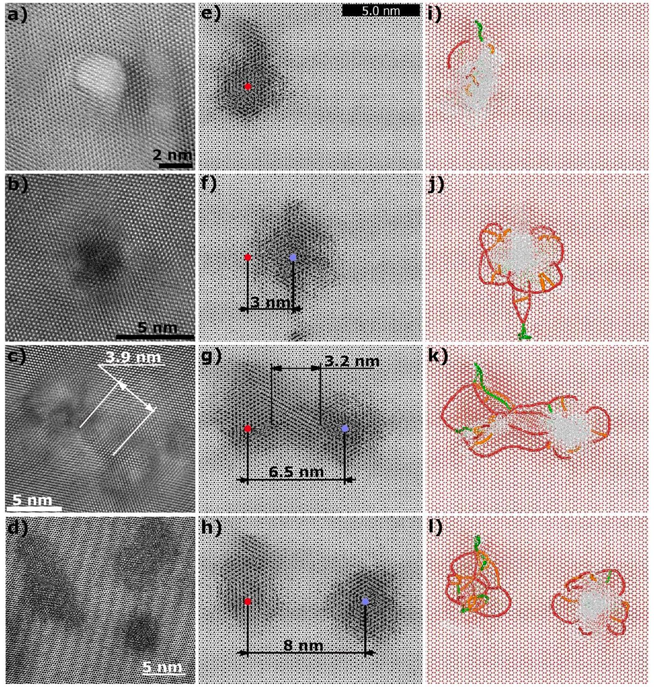
Fig. 16. Bi 700 MeV ion tracks in $\mathrm{Al}_{2} \mathrm{O}_{3}$. (a)-(b) HRTEM images of single ion track; HRTEM images of tracks in samples irradiated to fluence of (c) $5 \times 10^{11} \mathrm{~cm}^{-2}$; (d) $6.5 \times 10^{12} \mathrm{~cm}^{-2}$. Image plane is perpendicular to the ion trajectories in all cases. (e)-(h) Results of a MD simulation of two subsequent impacts of Bi ions: (e) single track; the second ion at (f) $\sim 3 \mathrm{~nm},(\mathrm{~g}) \sim 6.5 \mathrm{~nm},(\mathrm{~h}) \sim 8 \mathrm{~nm}$ from the first track. Red dot in (e)-(h) images indicates trajectory of first ion, while blue dot shows path of the second projectile. (i)-(l) images shows dislocation structures calculated for O sublattice from corresponding MD cells using DXA algorithm. Red dots in (i)-(l) are HCP structure, grey atoms are unidentified structure; lines of different colors correspond to different types of dislocations. All MD images are shown along ion trajectories.

The ultrafast atomic heating by holes and electrons results into formation of the transient large disordered area (up to $\sim 5-10 \mathrm{~nm}$ ) in studied materials, which then may recrystallize and shrink to a final observable smaller track. For the same initially disordered area, in nonamorphizable materials the recrystallization recovers the crystalline structure to a nearly perfect state. In amorphizable materials the transient damaged region coincides with the final one with almost no recovery. In studied targets, we identified a correlation between the simplicity of the crystal structure and the efficiency of the material recovery in SHI tracks.

The transient large disorder plays the major role in track annealing at high ion fluences in $\mathrm{Al}_{2} \mathrm{O}_{3}$. Overlap of two successive tracks may
anneal the first one, if the second track is sufficiently close - such that its transient heated area covers the prior track and significantly heats it up. With increase of the distance between the ion impact points, partial overlap of tracks may lead to a connecting damaged structure between the two. An interaction between the tracks seizes when the second track is too far for the transient heating to affect the prior track.

## Declaration of Competing Interest

The authors declare that they have no known competing financial interests or personal relationships that could have appeared to influence the work reported in this paper.

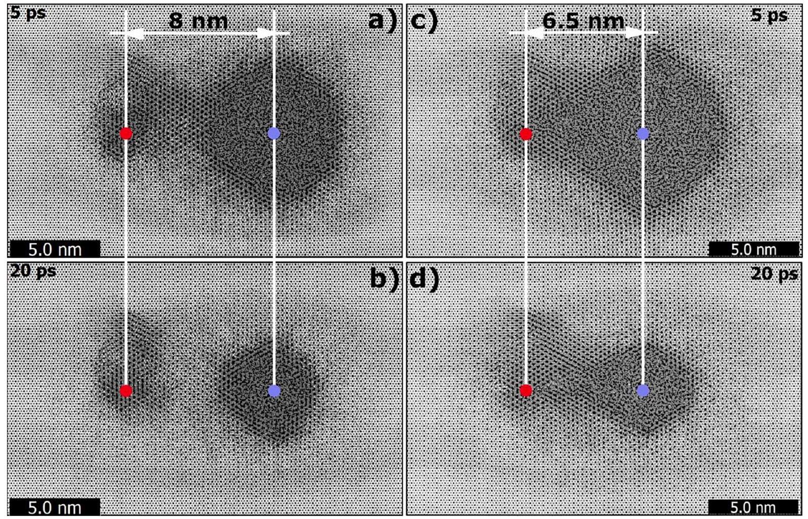
Fig. 17. Snapshots of an $\mathrm{Al}_{2} \mathrm{O}_{3}$ supercell at (a) 5 ps and (b) 20 ps after passage of a 700 MeV Bi ion in the crystal at 8 nm from a pre-existing 700 MeV Bi track; at (c) 5 ps and (d) 20 ps after passage of a Bi ion at 6.5 nm from a pre-existing track. Red and blue dots indicate trajectories of first and second ions correspondingly [40].

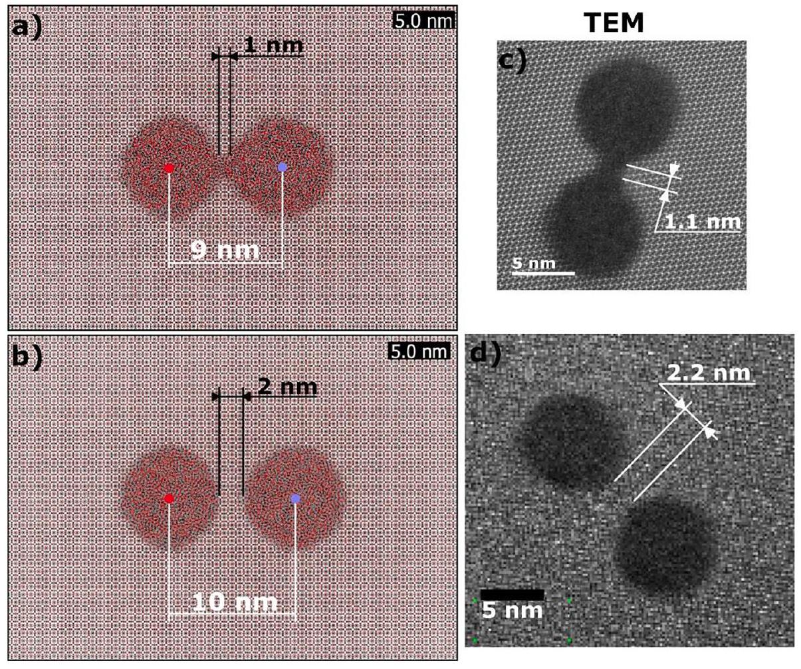
Fig. 18. Results of a simulation of two subsequent impacts of 700 MeV Bi ion in YAG: (a) the second ion at (a) 9 nm and (b) 10 nm from the first track. TEM images of (c) 1 GeV Bi ion and (d) 700 MeV Bi ion in YAG at different distances. Red and blue dots indicate trajectories of the first and second ion correspondingly.

## Acknowledgements

Partial financial support from the Czech Ministry of Education, Youth and Sports, Czechia [grants numbers LTT17015, LM2015083] is acknowledged by N. Medvedev. The work was supported by the Ministry of Science and High Education of the Russian Federation, Russia in the frameworks of Project No. 16 APPA (GSI). The work of A.E. Volkov was supported by NRC Kurchatov Institute, Russia under Grant n.1603. R.A. Rymzhanov acknowledge partial financial support from AYSS JINR, Russia grant No. 20-502-06.

This work has been carried out using computing resources of the federal collective usage center Complex for Simulation and Data Processing for Mega-science Facilities at NRC "Kurchatov Institute", http://ckp.nrcki.ru/, as well as computing resources of the HybriLIT heterogeneous computing platform (LIT, JINR). (http://hlit.jinr.ru). We also thank the GSI Helmholtzzentrum for providing the computational resources for this work.

## References

[1] F.F. Komarov, Defect and track formation in solids irradiated by superhigh-energy ions, Phys. Usp. 46 (2003) 1253-1282, https://doi.org/10.1070/ PU2003v046n12ABEH001286.
[2] F. Aumayr, S. Facsko, A.S. El-Said, C. Trautmann, M. Schleberger, Single ion induced surface nanostructures: A comparison between slow highly charged and swift heavy ions., J. Physics. Condens. Matter. 23 (2011) 393001. doi:10.1088/09538984/23/39/393001.
$[3]$ D. Fink, L.T. Chadderton, A. Kiv, A. Saad, M. Tabacnics, M. de A. Rizutto, A. de O.D. Silva, W.R. Fahrner, K. Hoppe, Swift heavy ion irradiation as a tool for creating novel nanoelectronic structures, Radiat. Eff. Defects Solids. 162 (2007) 543-551. doi:10.1080/10420150701470746.
[4] E. Akcöltekin, T. Peters, R. Meyer, A. Duvenbeck, M. Klusmann, I. Monnet, H. Lebius, M. Schleberger, Creation of multiple nanodots by single ions, Nat. Nanotechnol. 2 (2007) 290-294, https://doi.org/10.1038/nnano.2007.109.
[5] T. Vilaithong, L.D. Yu, P. Apavatjrut, B. Phanchaisri, S. Sangyuenyongpipat, S. Anuntalabhochai, I.G. Brown, Heavy ion induced DNA transfer in biological cells, Radiat. Phys. Chem. 71 (2004) 927-935, https://doi.org/10.1016/J. RADPHYSCHEM. 2004.04.136.
[6] J.D. (James D. Cox, K.K. (K. K. Ang, Radiation oncology : rationale, technique, results., Mosby, 2010. https://www.sciencedirect.com/science/book/ 9780323049719 (accessed April 5, 2018).
[7] F.A. Cucinotta, K. To, E. Cacao, Predictions of space radiation fatality risk for exploration missions, Life Sci. Sp. Res. 13 (2017) 1-11, https://doi.org/10.1016/j. 1ssr.2017.01.005.
[8] A. V. Bagulya, L.L. Kashkarov, N.S. Konovalova, N.M. Okat'eva, N.G. Polukhina, N.I. Starkov, Search for superheavy elements in galactic cosmic rays, JETP Lett. 97 (2013) 708-719. doi:10.1134/S0021364013120047.
[9] N.A. Medvedev, R.A. Rymzhanov, A.E. Volkov, Time-resolved electron kinetics in swift heavy ion irradiated solids, J. Phys. D. Appl. Phys. 48355303 (24 (2015) pp), https://doi.org/10.1088/0022-3727/48/35/355303.
[10] O. Keski-Rahkonen, M.O. Krause, Total and partial atomic-level widths, At. Data Nucl. Data Tables. 14 (1974) 139-146, https://doi.org/10.1016/S0092-640X(74) 80020-3.
[11] N. Medvedev, A.E. Volkov, B. Ziaja, Electronic and atomic kinetics in solids irradiated with free-electron lasers or swift-heavy ions, Nucl. Instruments Methods Phys. Res. Sect. B Beam Interact. with Mater. Atoms. 365 (2015) 437-446, https:// doi.org/10.1016/j.nimb.2015.08.063.
[12] R.A. Rymzhanov, N.A. Medvedev, J.H. O'Connell, A. Janse van Vuuren, V.A. Skuratov, A.E. Volkov, Recrystallization as the governing mechanism of ion track formation, Sci. Rep. 9 (2019) 3837, https://doi.org/10.1038/s41598-019-40239-9.
[13] F.F. Komarov, Nano- and microstructuring of solids by swift heavy ions, Phys. Usp. 60 (2017) 435-471, https://doi.org/10.3367/UFNe.2016.10.038012.
[14] M.I. Kaganov, I.M. Lifshitz, L.V. Tanatarov, Relaxation between electrons and crystalline lattice, Sov. Phys. JETP. 4 (1957) 173.
[15] C. Dufour, M. Toulemonde, Models for the Description of Track Formation BT - Ion Beam Modification of Solids: Ion-Solid Interaction and Radiation Damage, Springer International Publishing, Cham, 2016, pp. 63-104, , https://doi.org/10.1007/978-3-319-33561-2_2.
[16] R.L. Fleischer, P.B. Price, R.M. Walker, E.L. Hubbard, Criterion for Registration in Dielectric Track Detectors, Phys. Rev. 156 (1967) 353-355, https://doi.org/10. 1103/PhysRev.156.353.
[17] M. Toulemonde, C. Dufour, E. Paumier, Transient thermal process after a highenergy heavy-ion irradiation of amorphous metals and semiconductors, Phys. Rev. B. 46 (1992) 14362-14369, https://doi.org/10.1103/PhysRevB.46.14362.
[18] M.R. Islam, U. Saalmann, J.M. Rost, Kinetic energy of ions after Coulomb explosion of clusters induced by an intense laser pulse, Phys. Rev. A. 73 (2006) 041201. http://link.aps.org/doi/10.1103/PhysRevA.73.041201 (accessed April 9, 2015).
[19] B. Ziaja, H. Wabnitz, F. Wang, E. Weckert, T. Möller, Energetics, Ionization, and Expansion Dynamics of Atomic Clusters Irradiated with Short Intense Vacuum-

Ultraviolet Pulses, Phys. Rev. Lett. 102 (2009) 205002, , https://doi.org/10.1103/ PhysRevLett.102.205002.
[20] A.A. Correa, J. Kohanoff, E. Artacho, D. Sánchez-Portal, A. Caro, Nonadiabatic Forces in Ion-Solid Interactions: The Initial Stages of Radiation Damage, Phys. Rev. Lett. 108 (2012) 213201, , https://doi.org/10.1103/PhysRevLett.108.213201.
[21] K. Balzer, N. Schlünzen, M. Bonitz, Stopping dynamics of ions passing through correlated honeycomb clusters, Phys. Rev. B. 94 (2016) 245118, , https://doi.org/ 10.1103/PhysRevB.94.245118.
[22] Geant4 Collaboration, Geant4 A simulation toolkit: Physics Reference Manual, 2017. http://geant4-userdoc.web.cern.ch/geant4-userdoc/UsersGuides/ PhysicsReferenceManual/fo/PhysicsReferenceManual.pdf (accessed August 9, 2018).
[23] A. Ferrari, P.R. Sala, A. Fassò, J. Ranft, Fluka: a multi-particle transport code, Geneva, 2005. http://www.fluka.org/content/manuals/FM.pdf (accessed August 9, 2018).
[24] M.P.R. Waligórski, R.N. Hamm, R. Katz, O. Ridge, The radial distribution of dose around the path of a heavy ion in liquid water, Int. J. Radiat. Appl. Instrumentation. Part D. Nucl. Tracks Radiat. Meas. 11 (1986) 309-319. doi:10.1016/1359-0189(86) 90057-9.
[25] G. Cellere, A. Paccagnella, M. Murat, J. Barak, A. Akkerman, R. Harboe-Sorensen, A. Virtanen, A. Visconti, M. Bonanomi, Impact of time and space evolution of ion tracks in nonvolatile memory cells approaching nanoscale, J. Appl. Phys. 108 (2010) 124907, , https://doi.org/10.1063/1.3514167.
[26] M. Dapor, I. Abril, P. de Vera, R. Garcia-Molina, Energy deposition around swift proton tracks in polymethylmethacrylate: How much and how far, Phys. Rev. B. 96 (2017) 064113, , https://doi.org/10.1103/PhysRevB.96.064113.
[27] E.M. Bringa, R.E. Johnson, R.M. Papaléo, Crater formation by single ions in the electronic stopping regime: Comparison of molecular dynamics simulations with experiments on organic films, Phys. Rev. B. 65 (2002) 94113, https://doi.org/10. 1103/PhysRevB.65.094113.
[28] M.C. Ridgway, T. Bierschenk, R. Giulian, B. Afra, M.D. Rodriguez, L.L. Araujo, A.P. Byrne, N. Kirby, O.H. Pakarinen, F. Djurabekova, K. Nordlund, M. Schleberger, O. Osmani, N. Medvedev, B. Rethfeld, P. Kluth, Tracks and Voids in Amorphous Ge Induced by Swift Heavy-Ion Irradiation, Phys. Rev. Lett. 110 (2013) 245502, , https://doi.org/10.1103/PhysRevLett.110.245502.
[29] K. Nordlund, Historical review of computer simulation of radiation effects in materials, J. Nucl. Mater. 520 (2019) 273-295, https://doi.org/10.1016/J.JNUCMAT. 2019.04.028.
[30] P. Kluth, C. Schnohr, O. Pakarinen, F. Djurabekova, D. Sprouster, R. Giulian, M.C. Ridgway, A. Byrne, C. Trautmann, D. Cookson, K. Nordlund, M. Toulemonde, Fine Structure in Swift Heavy Ion Tracks in Amorphous SiO(2), Phys. Rev. Lett. 101 (2008) 175503, , https://doi.org/10.1103/PHYSREVLETT.101.175503.
[31] O.H. Pakarinen, F. Djurabekova, K. Nordlund, P. Kluth, M.C. Ridgway, Molecular dynamics simulations of the structure of latent tracks in quartz and amorphous $\mathrm{SiO}_{2}$, Nucl. Instruments Methods Phys. Res. Sect. B Beam Interact. with Mater. Atoms. 267 (2009) 1456-1459, https://doi.org/10.1016/J.NIMB.2009.01.071.
[32] A. V. Solov'yov, Nanoscale Insights into Ion-Beam Cancer Therapy, 1st ed., Springer International Publishing, 2017. doi:10.1007/978-3-319-43030-0.
[33] A. V. Solov'yov, E. Surdutovich, E. Scifoni, I. Mishustin, W. Greiner, Physics of ion beam cancer therapy: A multiscale approach, Phys. Rev. E. 79 (2009) 011909. doi:10.1103/PhysRevE.79.011909.
[34] K. Nordlund, C. Björkas, T. Ahlgren, A. Lasa, A.E. Sand, Multiscale modelling of plasma-wall interactions in fusion reactor conditions, J. Phys. D. Appl. Phys. 47 (2014) 224018, , https://doi.org/10.1088/0022-3727/47/22/224018.
[35] N. Medvedev, V. Tkachenko, V. Lipp, Z. Li, B. Ziaja, Various damage mechanisms in carbon and silicon materials under femtosecond X-ray irradiation, open. 1 (2018) 3. doi:10.1051/FOPEN/2018003.
[36] D. Ivanov, L. Zhigilei, Combined atomistic-continuum modeling of short-pulse laser melting and disintegration of metal films, Phys. Rev. B. 68 (2003) 064114, , https:// doi.org/10.1103/PhysRevB.68.064114.
[37] R. Darkins, D. Duffy, Modelling radiation effects in solids with two-temperature molecular dynamics, Comput. Mater. Sci. 147 (2018) 145-153.
[38] M. Backman, M. Toulemonde, O.H. Pakarinen, N. Juslin, F. Djurabekova, K. Nordlund, A. Debelle, W.J. Weber, Molecular dynamics simulations of swift heavy ion induced defect recovery in SiC, Comput. Mater. Sci. 67 (2013) 261-265, https://doi.org/10.1016/j.commatsci.2012.09.010.
[39] R. Rymzhanov, N.A. Medvedev, A.E. Volkov, Damage threshold and structure of swift heavy ion tracks in $\mathrm{Al}_{2} \mathrm{O}_{3}$, J. Phys. D. Appl. Phys. 50 (2017) 475301, , https:// doi.org/10.1088/1361-6463/aa8ff5.
[40] R.A. Rymzhanov, N. Medvedev, A.E. Volkov, J.H. O'Connell, V.A. Skuratov, Overlap of swift heavy ion tracks in $\mathrm{Al}_{2} \mathrm{O}_{3}$, Nucl. Instruments Methods Phys. Res. Sect. B Beam Interact. with Mater. Atoms. 435 (2018) 121-125, https://doi.org/10. 1016/j.nimb.2017.11.014.
[41] R.A. Rymzhanov, S.A. Gorbunov, N. Medvedev, A.E. Volkov, Damage along swift heavy ion trajectory, Nucl. Instruments Methods Phys. Res. Sect. B Beam Interact. with Mater. Atoms. 440 (2019) 25-35, https://doi.org/10.1016/j.nimb.2018.11. 034.
[42] R.A. Rymzhanov, N.A. Medvedev, A.E. Volkov, Effects of model approximations for electron, hole, and photon transport in swift heavy ion tracks, Nucl. Instruments Methods Phys. Res. Sect. B Beam Interact. with Mater. Atoms. 388 (2016) 41-52, https://doi.org/10.1016/j.nimb.2016.11.002.
[43] R.R. Meyer, A.I. Kirkland, W.O. Saxton, A new method for the determination of the wave aberration function for high resolution TEM, Ultramicroscopy 92 (2002) 89-109, https://doi.org/10.1016/S0304-3991(02)00071-2.
[44] S. Plimpton, Fast Parallel Algorithms for Short-Range Molecular Dynamics, J. Comput. Phys. 117 (1995) 1-19, https://doi.org/10.1006/jcph.1995.1039.
[45] W. Eckstein, Computer Simulation of Ion-Solid Interactions, Springer, Berlin Heidelberg, Berlin, Heidelberg (1991), https://doi.org/10.1007/978-3-642-73513-4.
[46] C. Jacoboni, L. Reggiani, The Monte Carlo method for the solution of charge transport in semiconductors with applications to covalent materials, Rev. Mod. Phys. 55 (1983) 645-705, https://doi.org/10.1103/RevModPhys.55.645.
[47] B. Gervais, S. Bouffard, Simulation of the primary stage of the interaction of swift heavy ions with condensed matter, Nucl. Instruments Methods Phys. Res. Sect. B Beam Interact. with Mater. Atoms. 88 (1994) 355-364, https://doi.org/10.1016/ 0168-583X(94)95384-8.
[48] L. Van Hove, Correlations in Space and Time and Born Approximation Scattering in Systems of Interacting Particles, Phys. Rev. 95 (1954) 249-262, https://doi.org/10. 1103/PhysRev.95.249.
[49] R.H. Ritchie, A. Howie, Electron excitation and the optical potential in electron microscopy, Philos. Mag. 36 (1977) 463-481, https://doi.org/10.1080/ 14786437708244948.
[50] R.A. Rymzhanov, N.A. Medvedev, A.E. Volkov, Effect of valence holes kinetics on material excitation in tracks of swift heavy ions, Nucl. Instruments Methods Phys. Res. Sect. B Beam Interact. with Mater. Atoms. 365 (2015) 462-467, https://doi. org/10.1016/j.nimb.2015.08.043.
[51] M.S. AlDosari, Thermal properties of yttrium aluminum garnet from molecular dynamics simulations, Vanderbilt University, 2012.
[52] M. Matsui, Molecular dynamics simulation of structures, bulk moduli, and volume thermal expansivities of silicate liquids in the system CaO-MgO- $\mathrm{Al}_{2} \mathrm{O}_{3}-\mathrm{SiO}_{2}$, Geophys. Res. Lett. 23 (1996) 395-398, https://doi.org/10.1029/96GL00260.
[53] H.J.C. Berendsen, J.P.M. Postma, W.F. van Gunsteren, A. DiNola, J.R. Haak, Molecular dynamics with coupling to an external bath, J. Chem. Phys. 81 (1984) 3684, https://doi.org/10.1063/1.448118.
[54] A. Stukowski, Visualization and analysis of atomistic simulation data with OVITO-the Open Visualization Tool, Model. Simul. Mater. Sci. Eng. 18 (2010) 015012, , https://doi.org/10.1088/0965-0393/18/1/015012.
[55] L.J. Allen, A.J. D'Alfonso, S.D. Findlay, Modelling the inelastic scattering of fast electrons, Ultramicroscopy 151 (2015) 11-22, https://doi.org/10.1016/j.ultramic. 2014.10.011.
[56] O. Osmani, N. Medvedev, M. Schleberger, B. Rethfeld, Energy dissipation in dielectrics after swift heavy-ion impact: A hybrid model, Phys. Rev. B. 84 (2011) 214105, , https://doi.org/10.1103/PhysRevB.84.214105.
[57] N.A. Medvedev, A.E. Volkov, K. Schwartz, C. Trautmann, Effect of spatial redistribution of valence holes on the formation of a defect halo of swift heavy-ion tracks in LiF, Phys. Rev. B. 87 (2013) 104103, , https://doi.org/10.1103/PhysRevB.87. 104103.
[58] L. V. Zhigilei, Z. Lin, D.S. Ivanov, Molecular Dynamics Study of Short-Pulse Laser Melting, Recrystallization, Spallation, and Ablation of Metal Targets, in: Heat Transf. Vol. 2, ASME, 2006: pp. 725-733. doi:10.1115/IMECE2006-16305.
[59] V.A. Skuratov, J. O'Connell, N.S. Kirilkin, J. Neethling, On the threshold of damage formation in aluminum oxide via electronic excitations, Nucl. Instruments Methods Phys. Res. Sect. B Beam Interact. with Mater. Atoms. 326 (2014) 223-227. http:// www.sciencedirect.com/science/article/pii/S0168583X14000111 (accessed April 1, 2015).
[60] Y. Wang, J.J. Wang, W.Y. Wang, Z.G. Mei, S.L. Shang, L.Q. Chen, Z.K. Liu, A mixedspace approach to first-principles calculations of phonon frequencies for polar materials, J. Phys. Condens. Matter. 22 (2010) 202201, , https://doi.org/10.1088/ 0953-8984/22/20/202201.
[61] J.H. O'Connell, R.A. Rymzhanov, V.A. Skuratov, A.E. Volkov, N.S. Kirilkin, Latent tracks and associated strain in $\mathrm{Al}_{2} \mathrm{O}_{3}$ irradiated with swift heavy ions, Nucl.

Instruments Methods Phys. Res. Sect. B Beam Interact. with Mater. Atoms. 374 (2016) 97-101, https://doi.org/10.1016/j.nimb.2015.09.067.
[62] C. Grygiel, H. Lebius, S. Bouffard, A. Quentin, J.M. Ramillon, T. Madi, S. Guillous, T. Been, P. Guinement, D. Lelièvre, I. Monnet, Online in situ x-ray diffraction setup for structural modification studies during swift heavy ion irradiation, Rev. Sci. Instrum. 83 (2012) 013902, , https://doi.org/10.1063/1.3680106.
[63] S.A. Gorbunov, P.N. Terekhin, N.A. Medvedev, A.E. Volkov, Combined model of the material excitation and relaxation in swift heavy ion tracks, Nucl. Instruments Methods Phys. Res. Sect. B Beam Interact. with Mater. Atoms. 315 (2013) 173-178, https://doi.org/10.1016/j.nimb.2013.04.082.
[64] A.L. Leu, S.M. Ma, H. Eyring, Properties of molten magnesium oxide., Proc. Natl. Acad. Sci. U. S. A. 72 (1975) 1026-30. doi:10.1073/pnas.72.3.1026.
[65] V. Van Hoang, Molecular dynamics study on structure and properties of liquid and amorphous $\mathrm{Al}_{2} \mathrm{O}_{3}$, Phys. Rev. B. 70 (2004) 134204, , https://doi.org/10.1103/ PhysRevB.70.134204.
[66] J. Zhang, M. Lang, R.C. Ewing, R. Devanathan, W.J. Weber, M. Toulemonde, Nanoscale phase transitions under extreme conditions within an ion track, J. Mater. Res. 25 (2010) 1344-1351, https://doi.org/10.1557/JMR.2010.0180.
[67] M. Toulemonde, W. Assmann, C. Dufour, A. Meftah, C. Trautmann, Nanometric transformation of the matter by short and intense electronic excitation: Experimental data versus inelastic thermal spike model, Nucl. Instruments Methods Phys. Res. Sect. B Beam Interact. with Mater. Atoms. 277 (2012) 28-39, https://doi. org/10.1016/J.NIMB.2011.12.045.
[68] M. Toulemonde, C. Dufour, A. Meftah, E. Paumier, Transient thermal processes in heavy ion irradiation of crystalline inorganic insulators, Nucl. Instruments Methods Phys. Res. Sect. B Beam Interact. with Mater. Atoms. 166-167 (2000) 903-912. doi:10.1016/S0168-583X(99)00799-5.
[69] V. Alexeev, A. Bagulya, M. Chernyavsky, A. Gippius, L. Goncharova, S. Gorbunov, M. Gorshenkov, G. Kalinina, N. Konovalova, J. Liu, P. Zhai, N. Okatyeva, T. Pavlova, N. Polukhina, N. Starkov, T.N. Soe, C. Trautmann, E. Savchenko, T. Shchedrina, A. Vasiliev, A. Volkov, Charge spectrum of heavy and superheavy components of galactic cosmic rays: results of the olimpiya experiment, Astrophys. J. 829 (2016) 120, https://doi.org/10.3847/0004-637X/829/2/120.
[70] J.P. Ziegler, U. Biersack, J.F. Littmark, The Stopping and Range of Ions in Solids, Pergamon Press, New York, 1985 http://www.srim.org.
[71] G. Szenes, V.K. Kovács, B. Pécz, V. Skuratov, THE EFFECT OF HEAVY COSMIC-RAY IONS ON SILICATE GRAINS IN THE INTERSTELLAR DUST, Astrophys. J. 708 (2010) 288-292, https://doi.org/10.1088/0004-637X/708/1/288.
[72] J. Jensen, A. Dunlop, S. Della-Negra, M. Toulemonde, A comparison between tracks created by high energy mono-atomic and cluster ions in $\mathrm{Y}_{3} \mathrm{Fe}_{5} \mathrm{O}_{12}$, Nucl. Instruments Methods Phys. Res. Sect. B Beam Interact. with Mater. Atoms. 146 (1998) 412-419, https://doi.org/10.1016/S0168-583X(98)00442-X.
[73] A. Meftah, F. Brisard, J.M. Costantini, M. Hage-Ali, J.P. Stoquert, F. Studer, M. Toulemonde, Swift heavy ions in magnetic insulators: A damage-cross-section velocity effect, Phys. Rev. B. 48 (1993) 920-925, https://doi.org/10.1103/ PhysRevB.48.920.
[74] A. Stukowski, V.V. Bulatov, A. Arsenlis, Automated identification and indexing of dislocations in crystal interfaces, Model. Simul. Mater. Sci. Eng. 20 (2012) 085007, , https://doi.org/10.1088/0965-0393/20/8/085007.
[75] A. Janse van Vuuren, M.M. Saifulin, V.A. Skuratov, J.H. O'Connell, G. Aralbayeva, A. Dauletbekova, M. Zdorovets, The influence of stopping power and temperature on latent track formation in YAP and YAG, Nucl. Instruments Methods Phys. Res. Sect. B Beam Interact. with Mater. Atoms. (2018), https://doi.org/10.1016/j.nimb. 2018.11.032.

[^0]:    *Corresponding author at: Joint Institute for Nuclear Research, Joliot-Curie 6, 141980 Dubna, Moscow Region, Russia.
    E-mail address: rymzhanov@jinr.ru (R.A. Rymzhanov).

